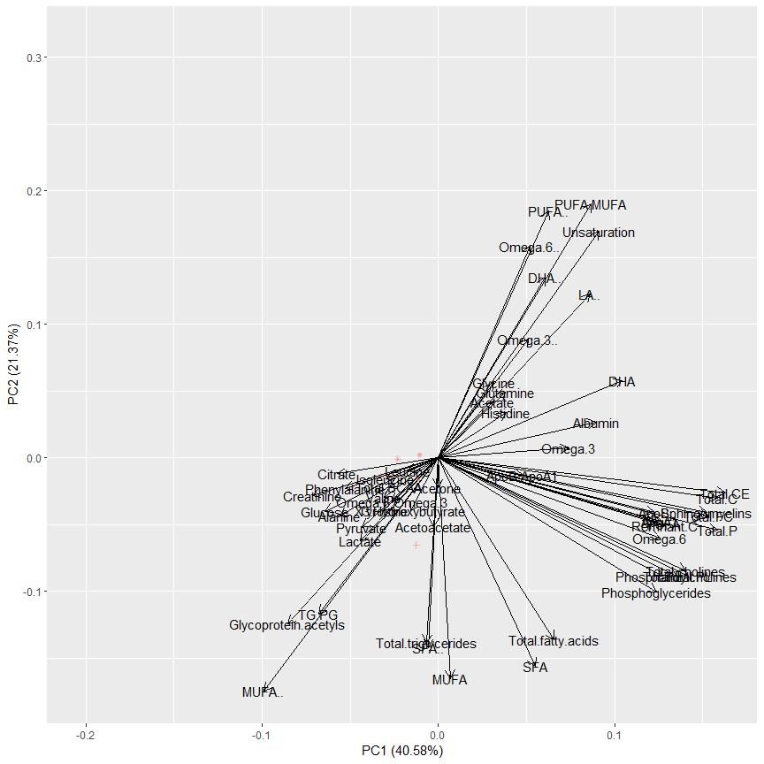
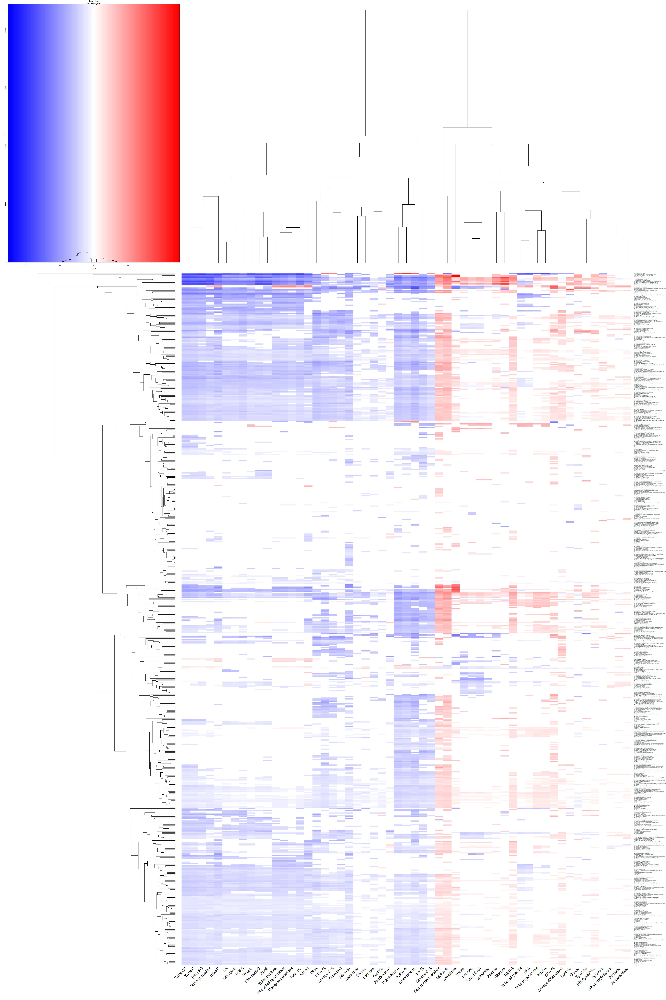

# Introduction

* This is a tutorial to creating interactive visualizations of associations between metabolites and diseases.

* The data used in this tutorial have been published in the following publication:

Julkunen, H., Cichońska, A., Tiainen, M. *et al*. **Atlas of plasma NMR biomarkers for health and disease in 118,461 individuals from the UK Biobank**. *Nat Commun* 14, 604 (2023). https://doi.org/10.1038/s41467-023-36231-7

* The data have been downloaded from https://biomarker-atlas.nightingale.cloud/ under the tab *Summary statistics* (accessed 2023-02-20).

* View this document at https://tommi-s.com/Metabolite-Disease-Atlas/ to show all output correctly.

# Preparations

## Load Data


```r
data <- 
  readr::read_csv(
    file = "C:/Users/tsuv0001/Documents/data-nonsensitive-local-copies/ukb_nightingale_biomarker_disease_association_atlas.csv" # Path to the data file downloaded from https://biomarker-atlas.nightingale.cloud/ .
  )
```

```
## Rows: 1400595 Columns: 16
## ── Column specification ────────────────────────────────────────────────────────
## Delimiter: ","
## chr (11): age_group, biomarker_id, biomarker_name, group_name, endpoint_type...
## dbl  (5): estimate, se, pvalue, n, n_events
## 
## ℹ Use `spec()` to retrieve the full column specification for this data.
## ℹ Specify the column types or set `show_col_types = FALSE` to quiet this message.
```

## List Measured Biomarkers


```r
names.biomarkers <- sort( names( table( data$"biomarker_name" ) ) )

names.biomarkers
```

```
##   [1] "3-Hydroxybutyrate"    "Acetate"              "Acetoacetate"        
##   [4] "Acetone"              "Alanine"              "Albumin"             
##   [7] "ApoA1"                "ApoB"                 "ApoB/ApoA1"          
##  [10] "Citrate"              "Clinical LDL-C"       "Creatinine"          
##  [13] "DHA"                  "DHA %"                "Glucose"             
##  [16] "Glutamine"            "Glycine"              "Glycoprotein acetyls"
##  [19] "HDL-C"                "HDL-CE"               "HDL-FC"              
##  [22] "HDL-L"                "HDL-P"                "HDL-PL"              
##  [25] "HDL-TG"               "HDL particle size"    "Histidine"           
##  [28] "IDL-C"                "IDL-C %"              "IDL-CE"              
##  [31] "IDL-CE %"             "IDL-FC"               "IDL-FC %"            
##  [34] "IDL-L"                "IDL-P"                "IDL-PL"              
##  [37] "IDL-PL %"             "IDL-TG"               "IDL-TG %"            
##  [40] "Isoleucine"           "L-HDL-C"              "L-HDL-C %"           
##  [43] "L-HDL-CE"             "L-HDL-CE %"           "L-HDL-FC"            
##  [46] "L-HDL-FC %"           "L-HDL-L"              "L-HDL-P"             
##  [49] "L-HDL-PL"             "L-HDL-PL %"           "L-HDL-TG"            
##  [52] "L-HDL-TG %"           "L-LDL-C"              "L-LDL-C %"           
##  [55] "L-LDL-CE"             "L-LDL-CE %"           "L-LDL-FC"            
##  [58] "L-LDL-FC %"           "L-LDL-L"              "L-LDL-P"             
##  [61] "L-LDL-PL"             "L-LDL-PL %"           "L-LDL-TG"            
##  [64] "L-LDL-TG %"           "L-VLDL-C"             "L-VLDL-C %"          
##  [67] "L-VLDL-CE"            "L-VLDL-CE %"          "L-VLDL-FC"           
##  [70] "L-VLDL-FC %"          "L-VLDL-L"             "L-VLDL-P"            
##  [73] "L-VLDL-PL"            "L-VLDL-PL %"          "L-VLDL-TG"           
##  [76] "L-VLDL-TG %"          "LA"                   "LA %"                
##  [79] "Lactate"              "LDL-C"                "LDL-CE"              
##  [82] "LDL-FC"               "LDL-L"                "LDL-P"               
##  [85] "LDL-PL"               "LDL-TG"               "LDL particle size"   
##  [88] "Leucine"              "M-HDL-C"              "M-HDL-C %"           
##  [91] "M-HDL-CE"             "M-HDL-CE %"           "M-HDL-FC"            
##  [94] "M-HDL-FC %"           "M-HDL-L"              "M-HDL-P"             
##  [97] "M-HDL-PL"             "M-HDL-PL %"           "M-HDL-TG"            
## [100] "M-HDL-TG %"           "M-LDL-C"              "M-LDL-C %"           
## [103] "M-LDL-CE"             "M-LDL-CE %"           "M-LDL-FC"            
## [106] "M-LDL-FC %"           "M-LDL-L"              "M-LDL-P"             
## [109] "M-LDL-PL"             "M-LDL-PL %"           "M-LDL-TG"            
## [112] "M-LDL-TG %"           "M-VLDL-C"             "M-VLDL-C %"          
## [115] "M-VLDL-CE"            "M-VLDL-CE %"          "M-VLDL-FC"           
## [118] "M-VLDL-FC %"          "M-VLDL-L"             "M-VLDL-P"            
## [121] "M-VLDL-PL"            "M-VLDL-PL %"          "M-VLDL-TG"           
## [124] "M-VLDL-TG %"          "MUFA"                 "MUFA %"              
## [127] "non-HDL-C"            "Omega-3"              "Omega-3 %"           
## [130] "Omega-6"              "Omega-6 %"            "Omega-6/Omega-3"     
## [133] "Phenylalanine"        "Phosphatidylcholines" "Phosphoglycerides"   
## [136] "PUFA"                 "PUFA %"               "PUFA/MUFA"           
## [139] "Pyruvate"             "Remnant-C"            "S-HDL-C"             
## [142] "S-HDL-C %"            "S-HDL-CE"             "S-HDL-CE %"          
## [145] "S-HDL-FC"             "S-HDL-FC %"           "S-HDL-L"             
## [148] "S-HDL-P"              "S-HDL-PL"             "S-HDL-PL %"          
## [151] "S-HDL-TG"             "S-HDL-TG %"           "S-LDL-C"             
## [154] "S-LDL-C %"            "S-LDL-CE"             "S-LDL-CE %"          
## [157] "S-LDL-FC"             "S-LDL-FC %"           "S-LDL-L"             
## [160] "S-LDL-P"              "S-LDL-PL"             "S-LDL-PL %"          
## [163] "S-LDL-TG"             "S-LDL-TG %"           "S-VLDL-C"            
## [166] "S-VLDL-C %"           "S-VLDL-CE"            "S-VLDL-CE %"         
## [169] "S-VLDL-FC"            "S-VLDL-FC %"          "S-VLDL-L"            
## [172] "S-VLDL-P"             "S-VLDL-PL"            "S-VLDL-PL %"         
## [175] "S-VLDL-TG"            "S-VLDL-TG %"          "SFA"                 
## [178] "SFA %"                "Sphingomyelins"       "TG/PG"               
## [181] "Total-C"              "Total-CE"             "Total-FC"            
## [184] "Total-L"              "Total-P"              "Total-PL"            
## [187] "Total BCAA"           "Total cholines"       "Total fatty acids"   
## [190] "Total triglycerides"  "Tyrosine"             "Unsaturation"        
## [193] "Valine"               "VLDL-C"               "VLDL-CE"             
## [196] "VLDL-FC"              "VLDL-L"               "VLDL-P"              
## [199] "VLDL-PL"              "VLDL-TG"              "VLDL particle size"  
## [202] "XL-HDL-C"             "XL-HDL-C %"           "XL-HDL-CE"           
## [205] "XL-HDL-CE %"          "XL-HDL-FC"            "XL-HDL-FC %"         
## [208] "XL-HDL-L"             "XL-HDL-P"             "XL-HDL-PL"           
## [211] "XL-HDL-PL %"          "XL-HDL-TG"            "XL-HDL-TG %"         
## [214] "XL-VLDL-C"            "XL-VLDL-C %"          "XL-VLDL-CE"          
## [217] "XL-VLDL-CE %"         "XL-VLDL-FC"           "XL-VLDL-FC %"        
## [220] "XL-VLDL-L"            "XL-VLDL-P"            "XL-VLDL-PL"          
## [223] "XL-VLDL-PL %"         "XL-VLDL-TG"           "XL-VLDL-TG %"        
## [226] "XS-VLDL-C"            "XS-VLDL-C %"          "XS-VLDL-CE"          
## [229] "XS-VLDL-CE %"         "XS-VLDL-FC"           "XS-VLDL-FC %"        
## [232] "XS-VLDL-L"            "XS-VLDL-P"            "XS-VLDL-PL"          
## [235] "XS-VLDL-PL %"         "XS-VLDL-TG"           "XS-VLDL-TG %"        
## [238] "XXL-VLDL-C"           "XXL-VLDL-C %"         "XXL-VLDL-CE"         
## [241] "XXL-VLDL-CE %"        "XXL-VLDL-FC"          "XXL-VLDL-FC %"       
## [244] "XXL-VLDL-L"           "XXL-VLDL-P"           "XXL-VLDL-PL"         
## [247] "XXL-VLDL-PL %"        "XXL-VLDL-TG"          "XXL-VLDL-TG %"
```

## Omit Lipoprotein Particle Descriptors


```r
names.biomarkers.printed <- names.biomarkers

names.biomarkers.printed <-
  names.biomarkers.printed[ 
    !grepl(
      x = names.biomarkers.printed,
      pattern = "DL"
    )
  ]

names.biomarkers.printed
```

```
##  [1] "3-Hydroxybutyrate"    "Acetate"              "Acetoacetate"        
##  [4] "Acetone"              "Alanine"              "Albumin"             
##  [7] "ApoA1"                "ApoB"                 "ApoB/ApoA1"          
## [10] "Citrate"              "Creatinine"           "DHA"                 
## [13] "DHA %"                "Glucose"              "Glutamine"           
## [16] "Glycine"              "Glycoprotein acetyls" "Histidine"           
## [19] "Isoleucine"           "LA"                   "LA %"                
## [22] "Lactate"              "Leucine"              "MUFA"                
## [25] "MUFA %"               "Omega-3"              "Omega-3 %"           
## [28] "Omega-6"              "Omega-6 %"            "Omega-6/Omega-3"     
## [31] "Phenylalanine"        "Phosphatidylcholines" "Phosphoglycerides"   
## [34] "PUFA"                 "PUFA %"               "PUFA/MUFA"           
## [37] "Pyruvate"             "Remnant-C"            "SFA"                 
## [40] "SFA %"                "Sphingomyelins"       "TG/PG"               
## [43] "Total-C"              "Total-CE"             "Total-FC"            
## [46] "Total-L"              "Total-P"              "Total-PL"            
## [49] "Total BCAA"           "Total cholines"       "Total fatty acids"   
## [52] "Total triglycerides"  "Tyrosine"             "Unsaturation"        
## [55] "Valine"
```

## Select Population and Endpoint


```r
table( data$"age_group" )
```

```
## 
##  1st tertile (39-53, statin use 6%) 2nd tertile (54-61, statin use 17%) 
##                              352522                              346890 
## 3rd tertile (62-71, statin use 30%)                     Full population 
##                              343869                              357314
```

```r
table( data$"endpoint_type" )
```

```
## 
##  incident mortality prevalent 
##    708025     72697    619873
```


```r
data.plot <- data

data.plot <- data.plot[ data.plot$"age_group" == "Full population", ]

data.plot <- data.plot[ data.plot$"endpoint_type" == "incident", ]

data.plot <- 
  data.plot[ data.plot$"biomarker_name" %in% names.biomarkers.printed, ]
```

# Principal Component Analysis (PCA)

## Preparations

### Create a Wide Data Matrix

* Biomarkers as columns
* Conditions as rows
* Additional columns on condition name and disease group for use in the plot


```r
data.plot.pca <-
  tidyr::pivot_wider(
    data = data.plot,
    id_cols = icd10_desc,
    names_from = biomarker_name,
    # values_from = estimate.significant
    values_from = estimate
  )

tmp <- data.plot.pca$"icd10_desc"

# Extract disease group from disease code (condition).
# Extract most increased and most decreased metabolites for each condition.

data.plot.pca <- 
  data.frame( 
    Condition_Name = unlist( data.plot.pca[ , 1 ] ),
    Disease_Group =
      stringr::str_sub(
        string = unlist( data.plot.pca[ , 1 ] ),
        start = 1,
        end = 1
      ),
    Top_Increase =
      colnames( data.plot.pca )[
        apply(
          X = data.plot.pca[ , -1 ],
          MAR = 1,
          FUN = which.max
        ) + 1
      ],
    Top_Decrease =
      colnames( data.plot.pca )[
        apply(
          X = data.plot.pca[ , -1 ],
          MAR = 1,
          FUN = which.min
        ) + 1
      ],
    Condition = NA,
    data.plot.pca[ , -1 ]
    )

# Create a text for tooltip.

data.plot.pca$"Condition" <-
  paste0(
    data.plot.pca$"Condition_Name",
    "\n\nMost Increased: ",
    data.plot.pca$"Top_Increase",
    "\nMost Decreased: ",
    data.plot.pca$"Top_Decrease"
  )

# Set disease codes as rownames.

rownames( data.plot.pca ) <- tmp
```

### Omit Rows with No Values

* Disease codes that have missing data on any of the biomarkers.


```r
has.any.missing <-
  apply(
    X = is.na( data.plot.pca[ , -( 1:5 ) ] ),
    MAR = 1,
    FUN = any
  )

table( has.any.missing )
```

```
## has.any.missing
## FALSE  TRUE 
##   701    13
```

```r
data.plot.pca <- data.plot.pca[ !has.any.missing, ]
```

### Compute PCA

* Omitting the metadata columns.


```r
result.pca <- prcomp( data.plot.pca[ , -( 1:5 ) ] )
```

### Show Non-Interactive PCA

* Conditions as points (scores)
* Metabolites as loadings
* Color by disease group
* Further information about the condition in tooltip (via shape; later on used by *plotly::ggplotly*)


```r
library( "ggfortify" )
```

```
## Loading required package: ggplot2
```

```r
plot.pca <- 
  autoplot(
    result.pca,
    data = data.plot.pca,
    alpha = 0.5,
    loadings.colour = "black",
    loadings.label = TRUE,
    loadings.label.colour = "black",
    shape = "Condition",
    colour = "Disease_Group"
  ) +
  ggplot2::theme( legend.position = "none" )
```


```r
print( plot.pca )
```

```
## Warning: The shape palette can deal with a maximum of 6 discrete values because
## more than 6 becomes difficult to discriminate; you have 701. Consider
## specifying shapes manually if you must have them.
```

```
## Warning: Removed 695 rows containing missing values (geom_point).
```

<!-- -->

### Create the Interactive PCA Figure


```r
plot.pca.interactive <-
  plotly::ggplotly( 
    p = plot.pca,
    tooltip = "shape"
  )
```

```
## Warning: The shape palette can deal with a maximum of 6 discrete values because
## more than 6 becomes difficult to discriminate; you have 701. Consider
## specifying shapes manually if you must have them.
```

## Show the Interactive PCA Figure


```r
plot.pca.interactive
```

```{=html}
<div id="htmlwidget-0f8ad92b34b9ae7938e2" style="width:864px;height:864px;" class="plotly html-widget"></div>
<script type="application/json" data-for="htmlwidget-0f8ad92b34b9ae7938e2">{"x":{"data":[{"x":[-0.0107845400071847],"y":[0.00206946675037317],"text":"Condition: A04 Other bacterial intestinal infections<br /><br />Most Increased: Glycoprotein acetyls<br />Most Decreased: Total-CE","type":"scatter","mode":"markers","marker":{"autocolorscale":false,"color":"rgba(248,118,109,1)","opacity":0.5,"size":5.66929133858268,"symbol":"circle","line":{"width":1.88976377952756,"color":"rgba(248,118,109,1)"}},"hoveron":"points","name":"(A,A04 Other bacterial intestinal infections<br /><br />Most Increased: Glycoprotein acetyls<br />Most Decreased: Total-CE)","legendgroup":"(A,A04 Other bacterial intestinal infections<br /><br />Most Increased: Glycoprotein acetyls<br />Most Decreased: Total-CE)","showlegend":true,"xaxis":"x","yaxis":"y","hoverinfo":"text","frame":null},{"x":[-0.0325511549818906],"y":[-0.0138281781290298],"text":"Condition: A08 Viral and other specified intestinal infections<br /><br />Most Increased: MUFA %<br />Most Decreased: Unsaturation","type":"scatter","mode":"markers","marker":{"autocolorscale":false,"color":"rgba(248,118,109,1)","opacity":0.5,"size":5.66929133858268,"symbol":"triangle-up","line":{"width":1.88976377952756,"color":"rgba(248,118,109,1)"}},"hoveron":"points","name":"(A,A08 Viral and other specified intestinal infections<br /><br />Most Increased: MUFA %<br />Most Decreased: Unsaturation)","legendgroup":"(A,A08 Viral and other specified intestinal infections<br /><br />Most Increased: MUFA %<br />Most Decreased: Unsaturation)","showlegend":true,"xaxis":"x","yaxis":"y","hoverinfo":"text","frame":null},{"x":[-0.0115049721443562],"y":[-0.0157147830669885],"text":"Condition: A09 Infectious gastroenteritis and colitis, unspecified<br /><br />Most Increased: MUFA %<br />Most Decreased: Unsaturation","type":"scatter","mode":"markers","marker":{"autocolorscale":false,"color":"rgba(248,118,109,1)","opacity":0.5,"size":5.66929133858268,"symbol":"square","line":{"width":1.88976377952756,"color":"rgba(248,118,109,1)"}},"hoveron":"points","name":"(A,A09 Infectious gastroenteritis and colitis, unspecified<br /><br />Most Increased: MUFA %<br />Most Decreased: Unsaturation)","legendgroup":"(A,A09 Infectious gastroenteritis and colitis, unspecified<br /><br />Most Increased: MUFA %<br />Most Decreased: Unsaturation)","showlegend":true,"xaxis":"x","yaxis":"y","hoverinfo":"text","frame":null},{"x":[-0.0124526294771831],"y":[-0.0652804927965213],"text":"Condition: A40 Streptococcal sepsis<br /><br />Most Increased: MUFA %<br />Most Decreased: Unsaturation","type":"scatter","mode":"markers","marker":{"autocolorscale":false,"color":"rgba(248,118,109,1)","opacity":0.5,"size":5.66929133858268,"symbol":"cross-thin-open","line":{"width":1.88976377952756,"color":"rgba(248,118,109,1)"}},"hoveron":"points","name":"(A,A40 Streptococcal sepsis<br /><br />Most Increased: MUFA %<br />Most Decreased: Unsaturation)","legendgroup":"(A,A40 Streptococcal sepsis<br /><br />Most Increased: MUFA %<br />Most Decreased: Unsaturation)","showlegend":true,"xaxis":"x","yaxis":"y","hoverinfo":"text","frame":null},{"x":[-0.0279044286872143],"y":[-0.0143957901587501],"text":"Condition: A41 Other sepsis<br /><br />Most Increased: Glycoprotein acetyls<br />Most Decreased: Unsaturation","type":"scatter","mode":"markers","marker":{"autocolorscale":false,"color":"rgba(248,118,109,1)","opacity":0.5,"size":5.66929133858268,"symbol":"square-x-open","line":{"width":1.88976377952756,"color":"rgba(248,118,109,1)"}},"hoveron":"points","name":"(A,A41 Other sepsis<br /><br />Most Increased: Glycoprotein acetyls<br />Most Decreased: Unsaturation)","legendgroup":"(A,A41 Other sepsis<br /><br />Most Increased: Glycoprotein acetyls<br />Most Decreased: Unsaturation)","showlegend":true,"xaxis":"x","yaxis":"y","hoverinfo":"text","frame":null},{"x":[-0.0230783658629662],"y":[-0.000817781169859539],"text":"Condition: A49 Bacterial infection of unspecified site<br /><br />Most Increased: Glycoprotein acetyls<br />Most Decreased: DHA","type":"scatter","mode":"markers","marker":{"autocolorscale":false,"color":"rgba(248,118,109,1)","opacity":0.5,"size":5.66929133858268,"symbol":"asterisk-open","line":{"width":1.88976377952756,"color":"rgba(248,118,109,1)"}},"hoveron":"points","name":"(A,A49 Bacterial infection of unspecified site<br /><br />Most Increased: Glycoprotein acetyls<br />Most Decreased: DHA)","legendgroup":"(A,A49 Bacterial infection of unspecified site<br /><br />Most Increased: Glycoprotein acetyls<br />Most Decreased: DHA)","showlegend":true,"xaxis":"x","yaxis":"y","hoverinfo":"text","frame":null},{"x":[0.0427866036449183],"y":[-0.00293795418919706],"text":"Condition: B00 Herpesviral [herpes simplex] infections<br /><br />Most Increased: SFA %<br />Most Decreased: Albumin","type":"scatter","mode":"markers","marker":{"autocolorscale":false,"color":"rgba(232,133,38,1)","opacity":0.5,"size":5.66929133858268,"symbol":null,"line":{"width":1.88976377952756,"color":"rgba(232,133,38,1)"}},"hoveron":"points","name":"(B,B00 Herpesviral [herpes simplex] infections<br /><br />Most Increased: SFA %<br />Most Decreased: Albumin)","legendgroup":"(B,B00 Herpesviral [herpes simplex] infections<br /><br />Most Increased: SFA %<br />Most Decreased: Albumin)","showlegend":true,"xaxis":"x","yaxis":"y","hoverinfo":"text","frame":null},{"x":[0.00835594562748684],"y":[0.0269374827802701],"text":"Condition: B02 Zoster [herpes zoster]<br /><br />Most Increased: Omega-6/Omega-3<br />Most Decreased: Omega-3","type":"scatter","mode":"markers","marker":{"autocolorscale":false,"color":"rgba(232,133,38,1)","opacity":0.5,"size":5.66929133858268,"symbol":null,"line":{"width":1.88976377952756,"color":"rgba(232,133,38,1)"}},"hoveron":"points","name":"(B,B02 Zoster [herpes zoster]<br /><br />Most Increased: Omega-6/Omega-3<br />Most Decreased: Omega-3)","legendgroup":"(B,B02 Zoster [herpes zoster]<br /><br />Most Increased: Omega-6/Omega-3<br />Most Decreased: Omega-3)","showlegend":true,"xaxis":"x","yaxis":"y","hoverinfo":"text","frame":null},{"x":[0.0291583055239173],"y":[0.0156815507180537],"text":"Condition: B07 Viral warts<br /><br />Most Increased: Creatinine<br />Most Decreased: Tyrosine","type":"scatter","mode":"markers","marker":{"autocolorscale":false,"color":"rgba(232,133,38,1)","opacity":0.5,"size":5.66929133858268,"symbol":null,"line":{"width":1.88976377952756,"color":"rgba(232,133,38,1)"}},"hoveron":"points","name":"(B,B07 Viral warts<br /><br />Most Increased: Creatinine<br />Most Decreased: Tyrosine)","legendgroup":"(B,B07 Viral warts<br /><br />Most Increased: Creatinine<br />Most Decreased: Tyrosine)","showlegend":true,"xaxis":"x","yaxis":"y","hoverinfo":"text","frame":null},{"x":[-0.00910023178083692],"y":[0.0911474247709736],"text":"Condition: B18 Chronic viral hepatitis<br /><br />Most Increased: Omega-6/Omega-3<br />Most Decreased: Creatinine","type":"scatter","mode":"markers","marker":{"autocolorscale":false,"color":"rgba(232,133,38,1)","opacity":0.5,"size":5.66929133858268,"symbol":null,"line":{"width":1.88976377952756,"color":"rgba(232,133,38,1)"}},"hoveron":"points","name":"(B,B18 Chronic viral hepatitis<br /><br />Most Increased: Omega-6/Omega-3<br />Most Decreased: Creatinine)","legendgroup":"(B,B18 Chronic viral hepatitis<br /><br />Most Increased: Omega-6/Omega-3<br />Most Decreased: Creatinine)","showlegend":true,"xaxis":"x","yaxis":"y","hoverinfo":"text","frame":null},{"x":[0.00696986155647648],"y":[0.0258691098282447],"text":"Condition: B34 Viral infection of unspecified site<br /><br />Most Increased: Glycoprotein acetyls<br />Most Decreased: DHA","type":"scatter","mode":"markers","marker":{"autocolorscale":false,"color":"rgba(232,133,38,1)","opacity":0.5,"size":5.66929133858268,"symbol":null,"line":{"width":1.88976377952756,"color":"rgba(232,133,38,1)"}},"hoveron":"points","name":"(B,B34 Viral infection of unspecified site<br /><br />Most Increased: Glycoprotein acetyls<br />Most Decreased: DHA)","legendgroup":"(B,B34 Viral infection of unspecified site<br /><br />Most Increased: Glycoprotein acetyls<br />Most Decreased: DHA)","showlegend":true,"xaxis":"x","yaxis":"y","hoverinfo":"text","frame":null},{"x":[-0.0113024056199129],"y":[-0.0227764743326113],"text":"Condition: B35 Dermatophytosis<br /><br />Most Increased: Glycoprotein acetyls<br />Most Decreased: DHA","type":"scatter","mode":"markers","marker":{"autocolorscale":false,"color":"rgba(232,133,38,1)","opacity":0.5,"size":5.66929133858268,"symbol":null,"line":{"width":1.88976377952756,"color":"rgba(232,133,38,1)"}},"hoveron":"points","name":"(B,B35 Dermatophytosis<br /><br />Most Increased: Glycoprotein acetyls<br />Most Decreased: DHA)","legendgroup":"(B,B35 Dermatophytosis<br /><br />Most Increased: Glycoprotein acetyls<br />Most Decreased: DHA)","showlegend":true,"xaxis":"x","yaxis":"y","hoverinfo":"text","frame":null},{"x":[-0.0157396376814959],"y":[-0.00430053035893467],"text":"Condition: B37 Candidiasis<br /><br />Most Increased: Glycoprotein acetyls<br />Most Decreased: DHA","type":"scatter","mode":"markers","marker":{"autocolorscale":false,"color":"rgba(232,133,38,1)","opacity":0.5,"size":5.66929133858268,"symbol":null,"line":{"width":1.88976377952756,"color":"rgba(232,133,38,1)"}},"hoveron":"points","name":"(B,B37 Candidiasis<br /><br />Most Increased: Glycoprotein acetyls<br />Most Decreased: DHA)","legendgroup":"(B,B37 Candidiasis<br /><br />Most Increased: Glycoprotein acetyls<br />Most Decreased: DHA)","showlegend":true,"xaxis":"x","yaxis":"y","hoverinfo":"text","frame":null},{"x":[0.0178772156049642],"y":[0.0369456040595781],"text":"Condition: B44 Aspergillosis<br /><br />Most Increased: ApoA1<br />Most Decreased: Alanine","type":"scatter","mode":"markers","marker":{"autocolorscale":false,"color":"rgba(232,133,38,1)","opacity":0.5,"size":5.66929133858268,"symbol":null,"line":{"width":1.88976377952756,"color":"rgba(232,133,38,1)"}},"hoveron":"points","name":"(B,B44 Aspergillosis<br /><br />Most Increased: ApoA1<br />Most Decreased: Alanine)","legendgroup":"(B,B44 Aspergillosis<br /><br />Most Increased: ApoA1<br />Most Decreased: Alanine)","showlegend":true,"xaxis":"x","yaxis":"y","hoverinfo":"text","frame":null},{"x":[0.0206312616520565],"y":[-0.0288896179259672],"text":"Condition: B49 Unspecified mycosis<br /><br />Most Increased: ApoB/ApoA1<br />Most Decreased: ApoA1","type":"scatter","mode":"markers","marker":{"autocolorscale":false,"color":"rgba(232,133,38,1)","opacity":0.5,"size":5.66929133858268,"symbol":null,"line":{"width":1.88976377952756,"color":"rgba(232,133,38,1)"}},"hoveron":"points","name":"(B,B49 Unspecified mycosis<br /><br />Most Increased: ApoB/ApoA1<br />Most Decreased: ApoA1)","legendgroup":"(B,B49 Unspecified mycosis<br /><br />Most Increased: ApoB/ApoA1<br />Most Decreased: ApoA1)","showlegend":true,"xaxis":"x","yaxis":"y","hoverinfo":"text","frame":null},{"x":[-0.0306391668551223],"y":[-0.0201972166545554],"text":"Condition: B95 Strep as the cause of diseases classified elsewhere<br /><br />Most Increased: Glycoprotein acetyls<br />Most Decreased: Unsaturation","type":"scatter","mode":"markers","marker":{"autocolorscale":false,"color":"rgba(232,133,38,1)","opacity":0.5,"size":5.66929133858268,"symbol":null,"line":{"width":1.88976377952756,"color":"rgba(232,133,38,1)"}},"hoveron":"points","name":"(B,B95 Strep as the cause of diseases classified elsewhere<br /><br />Most Increased: Glycoprotein acetyls<br />Most Decreased: Unsaturation)","legendgroup":"(B,B95 Strep as the cause of diseases classified elsewhere<br /><br />Most Increased: Glycoprotein acetyls<br />Most Decreased: Unsaturation)","showlegend":true,"xaxis":"x","yaxis":"y","hoverinfo":"text","frame":null},{"x":[-0.0259652680787707],"y":[-0.00793511681514998],"text":"Condition: B96 Oth bacterial agents as the cause of diseases classd elswhr<br /><br />Most Increased: Glycoprotein acetyls<br />Most Decreased: Total-CE","type":"scatter","mode":"markers","marker":{"autocolorscale":false,"color":"rgba(232,133,38,1)","opacity":0.5,"size":5.66929133858268,"symbol":null,"line":{"width":1.88976377952756,"color":"rgba(232,133,38,1)"}},"hoveron":"points","name":"(B,B96 Oth bacterial agents as the cause of diseases classd elswhr<br /><br />Most Increased: Glycoprotein acetyls<br />Most Decreased: Total-CE)","legendgroup":"(B,B96 Oth bacterial agents as the cause of diseases classd elswhr<br /><br />Most Increased: Glycoprotein acetyls<br />Most Decreased: Total-CE)","showlegend":true,"xaxis":"x","yaxis":"y","hoverinfo":"text","frame":null},{"x":[-0.0109061473475628],"y":[0.00718367706501853],"text":"Condition: B97 Viral agents as the cause of diseases classified elsewhere<br /><br />Most Increased: Glycoprotein acetyls<br />Most Decreased: DHA","type":"scatter","mode":"markers","marker":{"autocolorscale":false,"color":"rgba(232,133,38,1)","opacity":0.5,"size":5.66929133858268,"symbol":null,"line":{"width":1.88976377952756,"color":"rgba(232,133,38,1)"}},"hoveron":"points","name":"(B,B97 Viral agents as the cause of diseases classified elsewhere<br /><br />Most Increased: Glycoprotein acetyls<br />Most Decreased: DHA)","legendgroup":"(B,B97 Viral agents as the cause of diseases classified elsewhere<br /><br />Most Increased: Glycoprotein acetyls<br />Most Decreased: DHA)","showlegend":true,"xaxis":"x","yaxis":"y","hoverinfo":"text","frame":null},{"x":[0.0166036072835718],"y":[0.00267165543373623],"text":"Condition: B98 Other specified infectious agents as the cause of diseases classified to other chapters<br /><br />Most Increased: MUFA %<br />Most Decreased: DHA","type":"scatter","mode":"markers","marker":{"autocolorscale":false,"color":"rgba(232,133,38,1)","opacity":0.5,"size":5.66929133858268,"symbol":null,"line":{"width":1.88976377952756,"color":"rgba(232,133,38,1)"}},"hoveron":"points","name":"(B,B98 Other specified infectious agents as the cause of diseases classified to other chapters<br /><br />Most Increased: MUFA %<br />Most Decreased: DHA)","legendgroup":"(B,B98 Other specified infectious agents as the cause of diseases classified to other chapters<br /><br />Most Increased: MUFA %<br />Most Decreased: DHA)","showlegend":true,"xaxis":"x","yaxis":"y","hoverinfo":"text","frame":null},{"x":[0.0106431277382602],"y":[-0.0466136397327558],"text":"Condition: B99 Other and unspecified infectious diseases<br /><br />Most Increased: MUFA %<br />Most Decreased: LA %","type":"scatter","mode":"markers","marker":{"autocolorscale":false,"color":"rgba(232,133,38,1)","opacity":0.5,"size":5.66929133858268,"symbol":null,"line":{"width":1.88976377952756,"color":"rgba(232,133,38,1)"}},"hoveron":"points","name":"(B,B99 Other and unspecified infectious diseases<br /><br />Most Increased: MUFA %<br />Most Decreased: LA %)","legendgroup":"(B,B99 Other and unspecified infectious diseases<br /><br />Most Increased: MUFA %<br />Most Decreased: LA %)","showlegend":true,"xaxis":"x","yaxis":"y","hoverinfo":"text","frame":null},{"x":[0.0880984633307392],"y":[0.018370292735238],"text":"Condition: C02 Malignant neoplasm of other and unspecified parts of tongue<br /><br />Most Increased: ApoA1<br />Most Decreased: TG/PG","type":"scatter","mode":"markers","marker":{"autocolorscale":false,"color":"rgba(211,146,0,1)","opacity":0.5,"size":5.66929133858268,"symbol":null,"line":{"width":1.88976377952756,"color":"rgba(211,146,0,1)"}},"hoveron":"points","name":"(C,C02 Malignant neoplasm of other and unspecified parts of tongue<br /><br />Most Increased: ApoA1<br />Most Decreased: TG/PG)","legendgroup":"(C,C02 Malignant neoplasm of other and unspecified parts of tongue<br /><br />Most Increased: ApoA1<br />Most Decreased: TG/PG)","showlegend":true,"xaxis":"x","yaxis":"y","hoverinfo":"text","frame":null},{"x":[0.0224749696798159],"y":[0.00623387328929214],"text":"Condition: C09 Malignant neoplasm of tonsil<br /><br />Most Increased: Glutamine<br />Most Decreased: Citrate","type":"scatter","mode":"markers","marker":{"autocolorscale":false,"color":"rgba(211,146,0,1)","opacity":0.5,"size":5.66929133858268,"symbol":null,"line":{"width":1.88976377952756,"color":"rgba(211,146,0,1)"}},"hoveron":"points","name":"(C,C09 Malignant neoplasm of tonsil<br /><br />Most Increased: Glutamine<br />Most Decreased: Citrate)","legendgroup":"(C,C09 Malignant neoplasm of tonsil<br /><br />Most Increased: Glutamine<br />Most Decreased: Citrate)","showlegend":true,"xaxis":"x","yaxis":"y","hoverinfo":"text","frame":null},{"x":[0.0170063132421012],"y":[-0.0405249775744066],"text":"Condition: C15 Malignant neoplasm of esophagus<br /><br />Most Increased: SFA %<br />Most Decreased: Unsaturation","type":"scatter","mode":"markers","marker":{"autocolorscale":false,"color":"rgba(211,146,0,1)","opacity":0.5,"size":5.66929133858268,"symbol":null,"line":{"width":1.88976377952756,"color":"rgba(211,146,0,1)"}},"hoveron":"points","name":"(C,C15 Malignant neoplasm of esophagus<br /><br />Most Increased: SFA %<br />Most Decreased: Unsaturation)","legendgroup":"(C,C15 Malignant neoplasm of esophagus<br /><br />Most Increased: SFA %<br />Most Decreased: Unsaturation)","showlegend":true,"xaxis":"x","yaxis":"y","hoverinfo":"text","frame":null},{"x":[-0.0104978367577139],"y":[-0.0318390197815695],"text":"Condition: C16 Malignant neoplasm of stomach<br /><br />Most Increased: MUFA %<br />Most Decreased: Unsaturation","type":"scatter","mode":"markers","marker":{"autocolorscale":false,"color":"rgba(211,146,0,1)","opacity":0.5,"size":5.66929133858268,"symbol":null,"line":{"width":1.88976377952756,"color":"rgba(211,146,0,1)"}},"hoveron":"points","name":"(C,C16 Malignant neoplasm of stomach<br /><br />Most Increased: MUFA %<br />Most Decreased: Unsaturation)","legendgroup":"(C,C16 Malignant neoplasm of stomach<br /><br />Most Increased: MUFA %<br />Most Decreased: Unsaturation)","showlegend":true,"xaxis":"x","yaxis":"y","hoverinfo":"text","frame":null},{"x":[-0.0159318040538598],"y":[-0.0267572901040118],"text":"Condition: C17 Malignant neoplasm of small intestine<br /><br />Most Increased: Glucose<br />Most Decreased: LA %","type":"scatter","mode":"markers","marker":{"autocolorscale":false,"color":"rgba(211,146,0,1)","opacity":0.5,"size":5.66929133858268,"symbol":null,"line":{"width":1.88976377952756,"color":"rgba(211,146,0,1)"}},"hoveron":"points","name":"(C,C17 Malignant neoplasm of small intestine<br /><br />Most Increased: Glucose<br />Most Decreased: LA %)","legendgroup":"(C,C17 Malignant neoplasm of small intestine<br /><br />Most Increased: Glucose<br />Most Decreased: LA %)","showlegend":true,"xaxis":"x","yaxis":"y","hoverinfo":"text","frame":null},{"x":[0.0196589855639652],"y":[0.000591951174332455],"text":"Condition: C18 Malignant neoplasm of colon<br /><br />Most Increased: MUFA %<br />Most Decreased: LA %","type":"scatter","mode":"markers","marker":{"autocolorscale":false,"color":"rgba(211,146,0,1)","opacity":0.5,"size":5.66929133858268,"symbol":null,"line":{"width":1.88976377952756,"color":"rgba(211,146,0,1)"}},"hoveron":"points","name":"(C,C18 Malignant neoplasm of colon<br /><br />Most Increased: MUFA %<br />Most Decreased: LA %)","legendgroup":"(C,C18 Malignant neoplasm of colon<br /><br />Most Increased: MUFA %<br />Most Decreased: LA %)","showlegend":true,"xaxis":"x","yaxis":"y","hoverinfo":"text","frame":null},{"x":[0.0222952652625311],"y":[-0.0197916443048867],"text":"Condition: C19 Malignant neoplasm of rectosigmoid junction<br /><br />Most Increased: MUFA %<br />Most Decreased: PUFA/MUFA","type":"scatter","mode":"markers","marker":{"autocolorscale":false,"color":"rgba(211,146,0,1)","opacity":0.5,"size":5.66929133858268,"symbol":null,"line":{"width":1.88976377952756,"color":"rgba(211,146,0,1)"}},"hoveron":"points","name":"(C,C19 Malignant neoplasm of rectosigmoid junction<br /><br />Most Increased: MUFA %<br />Most Decreased: PUFA/MUFA)","legendgroup":"(C,C19 Malignant neoplasm of rectosigmoid junction<br /><br />Most Increased: MUFA %<br />Most Decreased: PUFA/MUFA)","showlegend":true,"xaxis":"x","yaxis":"y","hoverinfo":"text","frame":null},{"x":[0.0429118072609399],"y":[0.00500058195683909],"text":"Condition: C20 Malignant neoplasm of rectum<br /><br />Most Increased: Glycoprotein acetyls<br />Most Decreased: Histidine","type":"scatter","mode":"markers","marker":{"autocolorscale":false,"color":"rgba(211,146,0,1)","opacity":0.5,"size":5.66929133858268,"symbol":null,"line":{"width":1.88976377952756,"color":"rgba(211,146,0,1)"}},"hoveron":"points","name":"(C,C20 Malignant neoplasm of rectum<br /><br />Most Increased: Glycoprotein acetyls<br />Most Decreased: Histidine)","legendgroup":"(C,C20 Malignant neoplasm of rectum<br /><br />Most Increased: Glycoprotein acetyls<br />Most Decreased: Histidine)","showlegend":true,"xaxis":"x","yaxis":"y","hoverinfo":"text","frame":null},{"x":[0.0263850894084828],"y":[0.00499923049125841],"text":"Condition: C21 Malignant neoplasm of anus and anal canal<br /><br />Most Increased: Histidine<br />Most Decreased: Creatinine","type":"scatter","mode":"markers","marker":{"autocolorscale":false,"color":"rgba(211,146,0,1)","opacity":0.5,"size":5.66929133858268,"symbol":null,"line":{"width":1.88976377952756,"color":"rgba(211,146,0,1)"}},"hoveron":"points","name":"(C,C21 Malignant neoplasm of anus and anal canal<br /><br />Most Increased: Histidine<br />Most Decreased: Creatinine)","legendgroup":"(C,C21 Malignant neoplasm of anus and anal canal<br /><br />Most Increased: Histidine<br />Most Decreased: Creatinine)","showlegend":true,"xaxis":"x","yaxis":"y","hoverinfo":"text","frame":null},{"x":[-0.0329806773779587],"y":[-0.0252139809725921],"text":"Condition: C22 Malignant neoplasm of liver and intrahepatic bile ducts<br /><br />Most Increased: Tyrosine<br />Most Decreased: Albumin","type":"scatter","mode":"markers","marker":{"autocolorscale":false,"color":"rgba(211,146,0,1)","opacity":0.5,"size":5.66929133858268,"symbol":null,"line":{"width":1.88976377952756,"color":"rgba(211,146,0,1)"}},"hoveron":"points","name":"(C,C22 Malignant neoplasm of liver and intrahepatic bile ducts<br /><br />Most Increased: Tyrosine<br />Most Decreased: Albumin)","legendgroup":"(C,C22 Malignant neoplasm of liver and intrahepatic bile ducts<br /><br />Most Increased: Tyrosine<br />Most Decreased: Albumin)","showlegend":true,"xaxis":"x","yaxis":"y","hoverinfo":"text","frame":null},{"x":[0.0268090281439231],"y":[-0.0202847657637764],"text":"Condition: C24 Malignant neoplasm of other and unsp parts of biliary tract<br /><br />Most Increased: SFA %<br />Most Decreased: Histidine","type":"scatter","mode":"markers","marker":{"autocolorscale":false,"color":"rgba(211,146,0,1)","opacity":0.5,"size":5.66929133858268,"symbol":null,"line":{"width":1.88976377952756,"color":"rgba(211,146,0,1)"}},"hoveron":"points","name":"(C,C24 Malignant neoplasm of other and unsp parts of biliary tract<br /><br />Most Increased: SFA %<br />Most Decreased: Histidine)","legendgroup":"(C,C24 Malignant neoplasm of other and unsp parts of biliary tract<br /><br />Most Increased: SFA %<br />Most Decreased: Histidine)","showlegend":true,"xaxis":"x","yaxis":"y","hoverinfo":"text","frame":null},{"x":[-0.00225461115674868],"y":[-0.0269186736023147],"text":"Condition: C25 Malignant neoplasm of pancreas<br /><br />Most Increased: MUFA %<br />Most Decreased: Unsaturation","type":"scatter","mode":"markers","marker":{"autocolorscale":false,"color":"rgba(211,146,0,1)","opacity":0.5,"size":5.66929133858268,"symbol":null,"line":{"width":1.88976377952756,"color":"rgba(211,146,0,1)"}},"hoveron":"points","name":"(C,C25 Malignant neoplasm of pancreas<br /><br />Most Increased: MUFA %<br />Most Decreased: Unsaturation)","legendgroup":"(C,C25 Malignant neoplasm of pancreas<br /><br />Most Increased: MUFA %<br />Most Decreased: Unsaturation)","showlegend":true,"xaxis":"x","yaxis":"y","hoverinfo":"text","frame":null},{"x":[0.0332872411917421],"y":[-0.00062375449105898],"text":"Condition: C26 Malignant neoplasm of other and ill-defined digestive organs<br /><br />Most Increased: 3-Hydroxybutyrate<br />Most Decreased: Albumin","type":"scatter","mode":"markers","marker":{"autocolorscale":false,"color":"rgba(211,146,0,1)","opacity":0.5,"size":5.66929133858268,"symbol":null,"line":{"width":1.88976377952756,"color":"rgba(211,146,0,1)"}},"hoveron":"points","name":"(C,C26 Malignant neoplasm of other and ill-defined digestive organs<br /><br />Most Increased: 3-Hydroxybutyrate<br />Most Decreased: Albumin)","legendgroup":"(C,C26 Malignant neoplasm of other and ill-defined digestive organs<br /><br />Most Increased: 3-Hydroxybutyrate<br />Most Decreased: Albumin)","showlegend":true,"xaxis":"x","yaxis":"y","hoverinfo":"text","frame":null},{"x":[0.011748134481452],"y":[-0.053910590156748],"text":"Condition: C32 Malignant neoplasm of larynx<br /><br />Most Increased: SFA %<br />Most Decreased: Creatinine","type":"scatter","mode":"markers","marker":{"autocolorscale":false,"color":"rgba(211,146,0,1)","opacity":0.5,"size":5.66929133858268,"symbol":null,"line":{"width":1.88976377952756,"color":"rgba(211,146,0,1)"}},"hoveron":"points","name":"(C,C32 Malignant neoplasm of larynx<br /><br />Most Increased: SFA %<br />Most Decreased: Creatinine)","legendgroup":"(C,C32 Malignant neoplasm of larynx<br /><br />Most Increased: SFA %<br />Most Decreased: Creatinine)","showlegend":true,"xaxis":"x","yaxis":"y","hoverinfo":"text","frame":null},{"x":[-0.0259988139446512],"y":[-0.0219306889028921],"text":"Condition: C34 Malignant neoplasm of bronchus and lung<br /><br />Most Increased: Glycoprotein acetyls<br />Most Decreased: Unsaturation","type":"scatter","mode":"markers","marker":{"autocolorscale":false,"color":"rgba(211,146,0,1)","opacity":0.5,"size":5.66929133858268,"symbol":null,"line":{"width":1.88976377952756,"color":"rgba(211,146,0,1)"}},"hoveron":"points","name":"(C,C34 Malignant neoplasm of bronchus and lung<br /><br />Most Increased: Glycoprotein acetyls<br />Most Decreased: Unsaturation)","legendgroup":"(C,C34 Malignant neoplasm of bronchus and lung<br /><br />Most Increased: Glycoprotein acetyls<br />Most Decreased: Unsaturation)","showlegend":true,"xaxis":"x","yaxis":"y","hoverinfo":"text","frame":null},{"x":[0.0494153738890237],"y":[0.0361333689696731],"text":"Condition: C43 Malignant melanoma of skin<br /><br />Most Increased: DHA %<br />Most Decreased: Glycoprotein acetyls","type":"scatter","mode":"markers","marker":{"autocolorscale":false,"color":"rgba(211,146,0,1)","opacity":0.5,"size":5.66929133858268,"symbol":null,"line":{"width":1.88976377952756,"color":"rgba(211,146,0,1)"}},"hoveron":"points","name":"(C,C43 Malignant melanoma of skin<br /><br />Most Increased: DHA %<br />Most Decreased: Glycoprotein acetyls)","legendgroup":"(C,C43 Malignant melanoma of skin<br /><br />Most Increased: DHA %<br />Most Decreased: Glycoprotein acetyls)","showlegend":true,"xaxis":"x","yaxis":"y","hoverinfo":"text","frame":null},{"x":[0.0489473703162366],"y":[0.0329667396050866],"text":"Condition: C44 Other and unspecified malignant neoplasm of skin<br /><br />Most Increased: DHA %<br />Most Decreased: Glycoprotein acetyls","type":"scatter","mode":"markers","marker":{"autocolorscale":false,"color":"rgba(211,146,0,1)","opacity":0.5,"size":5.66929133858268,"symbol":null,"line":{"width":1.88976377952756,"color":"rgba(211,146,0,1)"}},"hoveron":"points","name":"(C,C44 Other and unspecified malignant neoplasm of skin<br /><br />Most Increased: DHA %<br />Most Decreased: Glycoprotein acetyls)","legendgroup":"(C,C44 Other and unspecified malignant neoplasm of skin<br /><br />Most Increased: DHA %<br />Most Decreased: Glycoprotein acetyls)","showlegend":true,"xaxis":"x","yaxis":"y","hoverinfo":"text","frame":null},{"x":[0.0750356393803481],"y":[-0.0253765777777449],"text":"Condition: C45 Mesothelioma<br /><br />Most Increased: LA<br />Most Decreased: Tyrosine","type":"scatter","mode":"markers","marker":{"autocolorscale":false,"color":"rgba(211,146,0,1)","opacity":0.5,"size":5.66929133858268,"symbol":null,"line":{"width":1.88976377952756,"color":"rgba(211,146,0,1)"}},"hoveron":"points","name":"(C,C45 Mesothelioma<br /><br />Most Increased: LA<br />Most Decreased: Tyrosine)","legendgroup":"(C,C45 Mesothelioma<br /><br />Most Increased: LA<br />Most Decreased: Tyrosine)","showlegend":true,"xaxis":"x","yaxis":"y","hoverinfo":"text","frame":null},{"x":[0.0258782888817071],"y":[-0.0270388047085583],"text":"Condition: C48 Malignant neoplasm of retroperitoneum and peritoneum<br /><br />Most Increased: Creatinine<br />Most Decreased: LA %","type":"scatter","mode":"markers","marker":{"autocolorscale":false,"color":"rgba(211,146,0,1)","opacity":0.5,"size":5.66929133858268,"symbol":null,"line":{"width":1.88976377952756,"color":"rgba(211,146,0,1)"}},"hoveron":"points","name":"(C,C48 Malignant neoplasm of retroperitoneum and peritoneum<br /><br />Most Increased: Creatinine<br />Most Decreased: LA %)","legendgroup":"(C,C48 Malignant neoplasm of retroperitoneum and peritoneum<br /><br />Most Increased: Creatinine<br />Most Decreased: LA %)","showlegend":true,"xaxis":"x","yaxis":"y","hoverinfo":"text","frame":null},{"x":[0.0220445589195723],"y":[-0.0044303254322101],"text":"Condition: C49 Malignant neoplasm of other connective and soft tissue<br /><br />Most Increased: Valine<br />Most Decreased: Glucose","type":"scatter","mode":"markers","marker":{"autocolorscale":false,"color":"rgba(211,146,0,1)","opacity":0.5,"size":5.66929133858268,"symbol":null,"line":{"width":1.88976377952756,"color":"rgba(211,146,0,1)"}},"hoveron":"points","name":"(C,C49 Malignant neoplasm of other connective and soft tissue<br /><br />Most Increased: Valine<br />Most Decreased: Glucose)","legendgroup":"(C,C49 Malignant neoplasm of other connective and soft tissue<br /><br />Most Increased: Valine<br />Most Decreased: Glucose)","showlegend":true,"xaxis":"x","yaxis":"y","hoverinfo":"text","frame":null},{"x":[0.0378358943697772],"y":[0.000872947178079672],"text":"Condition: C50 Malignant neoplasm of breast<br /><br />Most Increased: SFA %<br />Most Decreased: Unsaturation","type":"scatter","mode":"markers","marker":{"autocolorscale":false,"color":"rgba(211,146,0,1)","opacity":0.5,"size":5.66929133858268,"symbol":null,"line":{"width":1.88976377952756,"color":"rgba(211,146,0,1)"}},"hoveron":"points","name":"(C,C50 Malignant neoplasm of breast<br /><br />Most Increased: SFA %<br />Most Decreased: Unsaturation)","legendgroup":"(C,C50 Malignant neoplasm of breast<br /><br />Most Increased: SFA %<br />Most Decreased: Unsaturation)","showlegend":true,"xaxis":"x","yaxis":"y","hoverinfo":"text","frame":null},{"x":[-0.0302306842922534],"y":[-0.021680828807027],"text":"Condition: C54 Malignant neoplasm of corpus uteri<br /><br />Most Increased: MUFA %<br />Most Decreased: DHA","type":"scatter","mode":"markers","marker":{"autocolorscale":false,"color":"rgba(211,146,0,1)","opacity":0.5,"size":5.66929133858268,"symbol":null,"line":{"width":1.88976377952756,"color":"rgba(211,146,0,1)"}},"hoveron":"points","name":"(C,C54 Malignant neoplasm of corpus uteri<br /><br />Most Increased: MUFA %<br />Most Decreased: DHA)","legendgroup":"(C,C54 Malignant neoplasm of corpus uteri<br /><br />Most Increased: MUFA %<br />Most Decreased: DHA)","showlegend":true,"xaxis":"x","yaxis":"y","hoverinfo":"text","frame":null},{"x":[0.0317566075897237],"y":[0.0479874320008149],"text":"Condition: C56 Malignant neoplasm of ovary<br /><br />Most Increased: PUFA %<br />Most Decreased: Glutamine","type":"scatter","mode":"markers","marker":{"autocolorscale":false,"color":"rgba(211,146,0,1)","opacity":0.5,"size":5.66929133858268,"symbol":null,"line":{"width":1.88976377952756,"color":"rgba(211,146,0,1)"}},"hoveron":"points","name":"(C,C56 Malignant neoplasm of ovary<br /><br />Most Increased: PUFA %<br />Most Decreased: Glutamine)","legendgroup":"(C,C56 Malignant neoplasm of ovary<br /><br />Most Increased: PUFA %<br />Most Decreased: Glutamine)","showlegend":true,"xaxis":"x","yaxis":"y","hoverinfo":"text","frame":null},{"x":[0.0537568864227767],"y":[0.0277104197902963],"text":"Condition: C61 Malignant neoplasm of prostate<br /><br />Most Increased: Unsaturation<br />Most Decreased: MUFA %","type":"scatter","mode":"markers","marker":{"autocolorscale":false,"color":"rgba(211,146,0,1)","opacity":0.5,"size":5.66929133858268,"symbol":null,"line":{"width":1.88976377952756,"color":"rgba(211,146,0,1)"}},"hoveron":"points","name":"(C,C61 Malignant neoplasm of prostate<br /><br />Most Increased: Unsaturation<br />Most Decreased: MUFA %)","legendgroup":"(C,C61 Malignant neoplasm of prostate<br /><br />Most Increased: Unsaturation<br />Most Decreased: MUFA %)","showlegend":true,"xaxis":"x","yaxis":"y","hoverinfo":"text","frame":null},{"x":[-0.0137158862683716],"y":[0.024421858500379],"text":"Condition: C64 Malignant neoplasm of kidney, except renal pelvis<br /><br />Most Increased: Glycoprotein acetyls<br />Most Decreased: Total-P","type":"scatter","mode":"markers","marker":{"autocolorscale":false,"color":"rgba(211,146,0,1)","opacity":0.5,"size":5.66929133858268,"symbol":null,"line":{"width":1.88976377952756,"color":"rgba(211,146,0,1)"}},"hoveron":"points","name":"(C,C64 Malignant neoplasm of kidney, except renal pelvis<br /><br />Most Increased: Glycoprotein acetyls<br />Most Decreased: Total-P)","legendgroup":"(C,C64 Malignant neoplasm of kidney, except renal pelvis<br /><br />Most Increased: Glycoprotein acetyls<br />Most Decreased: Total-P)","showlegend":true,"xaxis":"x","yaxis":"y","hoverinfo":"text","frame":null},{"x":[0.0209572470889656],"y":[-0.0752968044754678],"text":"Condition: C66 Malignant neoplasm of ureter<br /><br />Most Increased: SFA %<br />Most Decreased: Unsaturation","type":"scatter","mode":"markers","marker":{"autocolorscale":false,"color":"rgba(211,146,0,1)","opacity":0.5,"size":5.66929133858268,"symbol":null,"line":{"width":1.88976377952756,"color":"rgba(211,146,0,1)"}},"hoveron":"points","name":"(C,C66 Malignant neoplasm of ureter<br /><br />Most Increased: SFA %<br />Most Decreased: Unsaturation)","legendgroup":"(C,C66 Malignant neoplasm of ureter<br /><br />Most Increased: SFA %<br />Most Decreased: Unsaturation)","showlegend":true,"xaxis":"x","yaxis":"y","hoverinfo":"text","frame":null},{"x":[0.0210537653651391],"y":[0.00987594978499883],"text":"Condition: C67 Malignant neoplasm of bladder<br /><br />Most Increased: Glycoprotein acetyls<br />Most Decreased: LA %","type":"scatter","mode":"markers","marker":{"autocolorscale":false,"color":"rgba(211,146,0,1)","opacity":0.5,"size":5.66929133858268,"symbol":null,"line":{"width":1.88976377952756,"color":"rgba(211,146,0,1)"}},"hoveron":"points","name":"(C,C67 Malignant neoplasm of bladder<br /><br />Most Increased: Glycoprotein acetyls<br />Most Decreased: LA %)","legendgroup":"(C,C67 Malignant neoplasm of bladder<br /><br />Most Increased: Glycoprotein acetyls<br />Most Decreased: LA %)","showlegend":true,"xaxis":"x","yaxis":"y","hoverinfo":"text","frame":null},{"x":[0.0490675626268452],"y":[0.0494243350420877],"text":"Condition: C71 Malignant neoplasm of brain<br /><br />Most Increased: DHA %<br />Most Decreased: Creatinine","type":"scatter","mode":"markers","marker":{"autocolorscale":false,"color":"rgba(211,146,0,1)","opacity":0.5,"size":5.66929133858268,"symbol":null,"line":{"width":1.88976377952756,"color":"rgba(211,146,0,1)"}},"hoveron":"points","name":"(C,C71 Malignant neoplasm of brain<br /><br />Most Increased: DHA %<br />Most Decreased: Creatinine)","legendgroup":"(C,C71 Malignant neoplasm of brain<br /><br />Most Increased: DHA %<br />Most Decreased: Creatinine)","showlegend":true,"xaxis":"x","yaxis":"y","hoverinfo":"text","frame":null},{"x":[0.0109557287136849],"y":[-0.00815593247680521],"text":"Condition: C73 Malignant neoplasm of thyroid gland<br /><br />Most Increased: Total BCAA<br />Most Decreased: Total-P","type":"scatter","mode":"markers","marker":{"autocolorscale":false,"color":"rgba(211,146,0,1)","opacity":0.5,"size":5.66929133858268,"symbol":null,"line":{"width":1.88976377952756,"color":"rgba(211,146,0,1)"}},"hoveron":"points","name":"(C,C73 Malignant neoplasm of thyroid gland<br /><br />Most Increased: Total BCAA<br />Most Decreased: Total-P)","legendgroup":"(C,C73 Malignant neoplasm of thyroid gland<br /><br />Most Increased: Total BCAA<br />Most Decreased: Total-P)","showlegend":true,"xaxis":"x","yaxis":"y","hoverinfo":"text","frame":null},{"x":[0.0207606292772556],"y":[-0.0166923355239895],"text":"Condition: C77 Secondary and unspecified malignant neoplasm of lymph nodes<br /><br />Most Increased: MUFA %<br />Most Decreased: Unsaturation","type":"scatter","mode":"markers","marker":{"autocolorscale":false,"color":"rgba(211,146,0,1)","opacity":0.5,"size":5.66929133858268,"symbol":null,"line":{"width":1.88976377952756,"color":"rgba(211,146,0,1)"}},"hoveron":"points","name":"(C,C77 Secondary and unspecified malignant neoplasm of lymph nodes<br /><br />Most Increased: MUFA %<br />Most Decreased: Unsaturation)","legendgroup":"(C,C77 Secondary and unspecified malignant neoplasm of lymph nodes<br /><br />Most Increased: MUFA %<br />Most Decreased: Unsaturation)","showlegend":true,"xaxis":"x","yaxis":"y","hoverinfo":"text","frame":null},{"x":[0.00788686359372183],"y":[-0.0163313585734653],"text":"Condition: C78 Secondary malignant neoplasm of resp and digestive organs<br /><br />Most Increased: Glycoprotein acetyls<br />Most Decreased: PUFA/MUFA","type":"scatter","mode":"markers","marker":{"autocolorscale":false,"color":"rgba(211,146,0,1)","opacity":0.5,"size":5.66929133858268,"symbol":null,"line":{"width":1.88976377952756,"color":"rgba(211,146,0,1)"}},"hoveron":"points","name":"(C,C78 Secondary malignant neoplasm of resp and digestive organs<br /><br />Most Increased: Glycoprotein acetyls<br />Most Decreased: PUFA/MUFA)","legendgroup":"(C,C78 Secondary malignant neoplasm of resp and digestive organs<br /><br />Most Increased: Glycoprotein acetyls<br />Most Decreased: PUFA/MUFA)","showlegend":true,"xaxis":"x","yaxis":"y","hoverinfo":"text","frame":null},{"x":[0.0144181056078132],"y":[-0.0122231869350671],"text":"Condition: C79 Secondary malignant neoplasm of other and unspecified sites<br /><br />Most Increased: Glycoprotein acetyls<br />Most Decreased: Unsaturation","type":"scatter","mode":"markers","marker":{"autocolorscale":false,"color":"rgba(211,146,0,1)","opacity":0.5,"size":5.66929133858268,"symbol":null,"line":{"width":1.88976377952756,"color":"rgba(211,146,0,1)"}},"hoveron":"points","name":"(C,C79 Secondary malignant neoplasm of other and unspecified sites<br /><br />Most Increased: Glycoprotein acetyls<br />Most Decreased: Unsaturation)","legendgroup":"(C,C79 Secondary malignant neoplasm of other and unspecified sites<br /><br />Most Increased: Glycoprotein acetyls<br />Most Decreased: Unsaturation)","showlegend":true,"xaxis":"x","yaxis":"y","hoverinfo":"text","frame":null},{"x":[0.00283355959376344],"y":[-0.00439814326472144],"text":"Condition: C80 Malignant neoplasm without specification of site<br /><br />Most Increased: Glycoprotein acetyls<br />Most Decreased: LA %","type":"scatter","mode":"markers","marker":{"autocolorscale":false,"color":"rgba(211,146,0,1)","opacity":0.5,"size":5.66929133858268,"symbol":null,"line":{"width":1.88976377952756,"color":"rgba(211,146,0,1)"}},"hoveron":"points","name":"(C,C80 Malignant neoplasm without specification of site<br /><br />Most Increased: Glycoprotein acetyls<br />Most Decreased: LA %)","legendgroup":"(C,C80 Malignant neoplasm without specification of site<br /><br />Most Increased: Glycoprotein acetyls<br />Most Decreased: LA %)","showlegend":true,"xaxis":"x","yaxis":"y","hoverinfo":"text","frame":null},{"x":[-0.0451131719769983],"y":[0.107093555341438],"text":"Condition: C81 Hodgkin lymphoma<br /><br />Most Increased: 3-Hydroxybutyrate<br />Most Decreased: Total-P","type":"scatter","mode":"markers","marker":{"autocolorscale":false,"color":"rgba(211,146,0,1)","opacity":0.5,"size":5.66929133858268,"symbol":null,"line":{"width":1.88976377952756,"color":"rgba(211,146,0,1)"}},"hoveron":"points","name":"(C,C81 Hodgkin lymphoma<br /><br />Most Increased: 3-Hydroxybutyrate<br />Most Decreased: Total-P)","legendgroup":"(C,C81 Hodgkin lymphoma<br /><br />Most Increased: 3-Hydroxybutyrate<br />Most Decreased: Total-P)","showlegend":true,"xaxis":"x","yaxis":"y","hoverinfo":"text","frame":null},{"x":[0.0224921058562588],"y":[0.0429814721356861],"text":"Condition: C82 Follicular lymphoma<br /><br />Most Increased: Glucose<br />Most Decreased: 3-Hydroxybutyrate","type":"scatter","mode":"markers","marker":{"autocolorscale":false,"color":"rgba(211,146,0,1)","opacity":0.5,"size":5.66929133858268,"symbol":null,"line":{"width":1.88976377952756,"color":"rgba(211,146,0,1)"}},"hoveron":"points","name":"(C,C82 Follicular lymphoma<br /><br />Most Increased: Glucose<br />Most Decreased: 3-Hydroxybutyrate)","legendgroup":"(C,C82 Follicular lymphoma<br /><br />Most Increased: Glucose<br />Most Decreased: 3-Hydroxybutyrate)","showlegend":true,"xaxis":"x","yaxis":"y","hoverinfo":"text","frame":null},{"x":[-0.010783150469965],"y":[0.0785572308202762],"text":"Condition: C83 Non-follicular lymphoma<br /><br />Most Increased: Acetate<br />Most Decreased: Total-P","type":"scatter","mode":"markers","marker":{"autocolorscale":false,"color":"rgba(211,146,0,1)","opacity":0.5,"size":5.66929133858268,"symbol":null,"line":{"width":1.88976377952756,"color":"rgba(211,146,0,1)"}},"hoveron":"points","name":"(C,C83 Non-follicular lymphoma<br /><br />Most Increased: Acetate<br />Most Decreased: Total-P)","legendgroup":"(C,C83 Non-follicular lymphoma<br /><br />Most Increased: Acetate<br />Most Decreased: Total-P)","showlegend":true,"xaxis":"x","yaxis":"y","hoverinfo":"text","frame":null},{"x":[-0.0178153542672934],"y":[0.0590990391423627],"text":"Condition: C85 Oth and unspecified types of non-Hodgkin lymphoma<br /><br />Most Increased: Glycoprotein acetyls<br />Most Decreased: Total-P","type":"scatter","mode":"markers","marker":{"autocolorscale":false,"color":"rgba(211,146,0,1)","opacity":0.5,"size":5.66929133858268,"symbol":null,"line":{"width":1.88976377952756,"color":"rgba(211,146,0,1)"}},"hoveron":"points","name":"(C,C85 Oth and unspecified types of non-Hodgkin lymphoma<br /><br />Most Increased: Glycoprotein acetyls<br />Most Decreased: Total-P)","legendgroup":"(C,C85 Oth and unspecified types of non-Hodgkin lymphoma<br /><br />Most Increased: Glycoprotein acetyls<br />Most Decreased: Total-P)","showlegend":true,"xaxis":"x","yaxis":"y","hoverinfo":"text","frame":null},{"x":[-0.062430861102151],"y":[0.182775277951845],"text":"Condition: C88 Malig immunoproliferative dis and certain oth B-cell lymph<br /><br />Most Increased: PUFA %<br />Most Decreased: Total-P","type":"scatter","mode":"markers","marker":{"autocolorscale":false,"color":"rgba(211,146,0,1)","opacity":0.5,"size":5.66929133858268,"symbol":null,"line":{"width":1.88976377952756,"color":"rgba(211,146,0,1)"}},"hoveron":"points","name":"(C,C88 Malig immunoproliferative dis and certain oth B-cell lymph<br /><br />Most Increased: PUFA %<br />Most Decreased: Total-P)","legendgroup":"(C,C88 Malig immunoproliferative dis and certain oth B-cell lymph<br /><br />Most Increased: PUFA %<br />Most Decreased: Total-P)","showlegend":true,"xaxis":"x","yaxis":"y","hoverinfo":"text","frame":null},{"x":[0.014968666316319],"y":[0.0412086401927571],"text":"Condition: C90 Multiple myeloma and malignant plasma cell neoplasms<br /><br />Most Increased: Glycoprotein acetyls<br />Most Decreased: Albumin","type":"scatter","mode":"markers","marker":{"autocolorscale":false,"color":"rgba(211,146,0,1)","opacity":0.5,"size":5.66929133858268,"symbol":null,"line":{"width":1.88976377952756,"color":"rgba(211,146,0,1)"}},"hoveron":"points","name":"(C,C90 Multiple myeloma and malignant plasma cell neoplasms<br /><br />Most Increased: Glycoprotein acetyls<br />Most Decreased: Albumin)","legendgroup":"(C,C90 Multiple myeloma and malignant plasma cell neoplasms<br /><br />Most Increased: Glycoprotein acetyls<br />Most Decreased: Albumin)","showlegend":true,"xaxis":"x","yaxis":"y","hoverinfo":"text","frame":null},{"x":[0.0167621424577256],"y":[0.0283753120903321],"text":"Condition: C91 Lymphoid leukemia<br /><br />Most Increased: Creatinine<br />Most Decreased: Total-P","type":"scatter","mode":"markers","marker":{"autocolorscale":false,"color":"rgba(211,146,0,1)","opacity":0.5,"size":5.66929133858268,"symbol":null,"line":{"width":1.88976377952756,"color":"rgba(211,146,0,1)"}},"hoveron":"points","name":"(C,C91 Lymphoid leukemia<br /><br />Most Increased: Creatinine<br />Most Decreased: Total-P)","legendgroup":"(C,C91 Lymphoid leukemia<br /><br />Most Increased: Creatinine<br />Most Decreased: Total-P)","showlegend":true,"xaxis":"x","yaxis":"y","hoverinfo":"text","frame":null},{"x":[-0.0440153701332667],"y":[0.0451161667345477],"text":"Condition: C92 Myeloid leukemia<br /><br />Most Increased: Phenylalanine<br />Most Decreased: Total-P","type":"scatter","mode":"markers","marker":{"autocolorscale":false,"color":"rgba(211,146,0,1)","opacity":0.5,"size":5.66929133858268,"symbol":null,"line":{"width":1.88976377952756,"color":"rgba(211,146,0,1)"}},"hoveron":"points","name":"(C,C92 Myeloid leukemia<br /><br />Most Increased: Phenylalanine<br />Most Decreased: Total-P)","legendgroup":"(C,C92 Myeloid leukemia<br /><br />Most Increased: Phenylalanine<br />Most Decreased: Total-P)","showlegend":true,"xaxis":"x","yaxis":"y","hoverinfo":"text","frame":null},{"x":[0.0693537028955303],"y":[0.00210807431006896],"text":"Condition: C97 Malignant neoplasms of independent (primary) multiple sites<br /><br />Most Increased: ApoB<br />Most Decreased: Tyrosine","type":"scatter","mode":"markers","marker":{"autocolorscale":false,"color":"rgba(211,146,0,1)","opacity":0.5,"size":5.66929133858268,"symbol":null,"line":{"width":1.88976377952756,"color":"rgba(211,146,0,1)"}},"hoveron":"points","name":"(C,C97 Malignant neoplasms of independent (primary) multiple sites<br /><br />Most Increased: ApoB<br />Most Decreased: Tyrosine)","legendgroup":"(C,C97 Malignant neoplasms of independent (primary) multiple sites<br /><br />Most Increased: ApoB<br />Most Decreased: Tyrosine)","showlegend":true,"xaxis":"x","yaxis":"y","hoverinfo":"text","frame":null},{"x":[0.0627277045707129],"y":[0.0098357077554004],"text":"Condition: D03 Melanoma in situ<br /><br />Most Increased: Albumin<br />Most Decreased: Omega-6/Omega-3","type":"scatter","mode":"markers","marker":{"autocolorscale":false,"color":"rgba(183,159,0,1)","opacity":0.5,"size":5.66929133858268,"symbol":null,"line":{"width":1.88976377952756,"color":"rgba(183,159,0,1)"}},"hoveron":"points","name":"(D,D03 Melanoma in situ<br /><br />Most Increased: Albumin<br />Most Decreased: Omega-6/Omega-3)","legendgroup":"(D,D03 Melanoma in situ<br /><br />Most Increased: Albumin<br />Most Decreased: Omega-6/Omega-3)","showlegend":true,"xaxis":"x","yaxis":"y","hoverinfo":"text","frame":null},{"x":[0.0279490595133286],"y":[0.0610334577790586],"text":"Condition: D04 Carcinoma in situ of skin<br /><br />Most Increased: Acetate<br />Most Decreased: Total fatty acids","type":"scatter","mode":"markers","marker":{"autocolorscale":false,"color":"rgba(183,159,0,1)","opacity":0.5,"size":5.66929133858268,"symbol":null,"line":{"width":1.88976377952756,"color":"rgba(183,159,0,1)"}},"hoveron":"points","name":"(D,D04 Carcinoma in situ of skin<br /><br />Most Increased: Acetate<br />Most Decreased: Total fatty acids)","legendgroup":"(D,D04 Carcinoma in situ of skin<br /><br />Most Increased: Acetate<br />Most Decreased: Total fatty acids)","showlegend":true,"xaxis":"x","yaxis":"y","hoverinfo":"text","frame":null},{"x":[0.035869963759492],"y":[0.0237979371118568],"text":"Condition: D05 Carcinoma in situ of breast<br /><br />Most Increased: Glucose<br />Most Decreased: Glutamine","type":"scatter","mode":"markers","marker":{"autocolorscale":false,"color":"rgba(183,159,0,1)","opacity":0.5,"size":5.66929133858268,"symbol":null,"line":{"width":1.88976377952756,"color":"rgba(183,159,0,1)"}},"hoveron":"points","name":"(D,D05 Carcinoma in situ of breast<br /><br />Most Increased: Glucose<br />Most Decreased: Glutamine)","legendgroup":"(D,D05 Carcinoma in situ of breast<br /><br />Most Increased: Glucose<br />Most Decreased: Glutamine)","showlegend":true,"xaxis":"x","yaxis":"y","hoverinfo":"text","frame":null},{"x":[0.0330326175681166],"y":[0.0225478227966069],"text":"Condition: D07 Carcinoma in situ of other and unspecified genital organs<br /><br />Most Increased: Histidine<br />Most Decreased: Glutamine","type":"scatter","mode":"markers","marker":{"autocolorscale":false,"color":"rgba(183,159,0,1)","opacity":0.5,"size":5.66929133858268,"symbol":null,"line":{"width":1.88976377952756,"color":"rgba(183,159,0,1)"}},"hoveron":"points","name":"(D,D07 Carcinoma in situ of other and unspecified genital organs<br /><br />Most Increased: Histidine<br />Most Decreased: Glutamine)","legendgroup":"(D,D07 Carcinoma in situ of other and unspecified genital organs<br /><br />Most Increased: Histidine<br />Most Decreased: Glutamine)","showlegend":true,"xaxis":"x","yaxis":"y","hoverinfo":"text","frame":null},{"x":[0.0432476745604611],"y":[0.0369199163201414],"text":"Condition: D09 Carcinoma in situ of other and unspecified sites<br /><br />Most Increased: Omega-3 %<br />Most Decreased: Omega-6/Omega-3","type":"scatter","mode":"markers","marker":{"autocolorscale":false,"color":"rgba(183,159,0,1)","opacity":0.5,"size":5.66929133858268,"symbol":null,"line":{"width":1.88976377952756,"color":"rgba(183,159,0,1)"}},"hoveron":"points","name":"(D,D09 Carcinoma in situ of other and unspecified sites<br /><br />Most Increased: Omega-3 %<br />Most Decreased: Omega-6/Omega-3)","legendgroup":"(D,D09 Carcinoma in situ of other and unspecified sites<br /><br />Most Increased: Omega-3 %<br />Most Decreased: Omega-6/Omega-3)","showlegend":true,"xaxis":"x","yaxis":"y","hoverinfo":"text","frame":null},{"x":[-0.000143374378664967],"y":[-0.0232953089516677],"text":"Condition: D10 Benign neoplasm of mouth and pharynx<br /><br />Most Increased: MUFA %<br />Most Decreased: Unsaturation","type":"scatter","mode":"markers","marker":{"autocolorscale":false,"color":"rgba(183,159,0,1)","opacity":0.5,"size":5.66929133858268,"symbol":null,"line":{"width":1.88976377952756,"color":"rgba(183,159,0,1)"}},"hoveron":"points","name":"(D,D10 Benign neoplasm of mouth and pharynx<br /><br />Most Increased: MUFA %<br />Most Decreased: Unsaturation)","legendgroup":"(D,D10 Benign neoplasm of mouth and pharynx<br /><br />Most Increased: MUFA %<br />Most Decreased: Unsaturation)","showlegend":true,"xaxis":"x","yaxis":"y","hoverinfo":"text","frame":null},{"x":[-0.00632731040920908],"y":[-0.00505073609116065],"text":"Condition: D11 Benign neoplasm of major salivary glands<br /><br />Most Increased: MUFA %<br />Most Decreased: LA %","type":"scatter","mode":"markers","marker":{"autocolorscale":false,"color":"rgba(183,159,0,1)","opacity":0.5,"size":5.66929133858268,"symbol":null,"line":{"width":1.88976377952756,"color":"rgba(183,159,0,1)"}},"hoveron":"points","name":"(D,D11 Benign neoplasm of major salivary glands<br /><br />Most Increased: MUFA %<br />Most Decreased: LA %)","legendgroup":"(D,D11 Benign neoplasm of major salivary glands<br /><br />Most Increased: MUFA %<br />Most Decreased: LA %)","showlegend":true,"xaxis":"x","yaxis":"y","hoverinfo":"text","frame":null},{"x":[0.0306939344593293],"y":[-0.0200109629202587],"text":"Condition: D12 Benign neoplasm of colon, rectum, anus and anal canal<br /><br />Most Increased: MUFA %<br />Most Decreased: PUFA/MUFA","type":"scatter","mode":"markers","marker":{"autocolorscale":false,"color":"rgba(183,159,0,1)","opacity":0.5,"size":5.66929133858268,"symbol":null,"line":{"width":1.88976377952756,"color":"rgba(183,159,0,1)"}},"hoveron":"points","name":"(D,D12 Benign neoplasm of colon, rectum, anus and anal canal<br /><br />Most Increased: MUFA %<br />Most Decreased: PUFA/MUFA)","legendgroup":"(D,D12 Benign neoplasm of colon, rectum, anus and anal canal<br /><br />Most Increased: MUFA %<br />Most Decreased: PUFA/MUFA)","showlegend":true,"xaxis":"x","yaxis":"y","hoverinfo":"text","frame":null},{"x":[-0.0167973841851995],"y":[-0.0143010037942646],"text":"Condition: D13 Benign neoplasm of and ill-defined parts of digestive system<br /><br />Most Increased: MUFA %<br />Most Decreased: Total-P","type":"scatter","mode":"markers","marker":{"autocolorscale":false,"color":"rgba(183,159,0,1)","opacity":0.5,"size":5.66929133858268,"symbol":null,"line":{"width":1.88976377952756,"color":"rgba(183,159,0,1)"}},"hoveron":"points","name":"(D,D13 Benign neoplasm of and ill-defined parts of digestive system<br /><br />Most Increased: MUFA %<br />Most Decreased: Total-P)","legendgroup":"(D,D13 Benign neoplasm of and ill-defined parts of digestive system<br /><br />Most Increased: MUFA %<br />Most Decreased: Total-P)","showlegend":true,"xaxis":"x","yaxis":"y","hoverinfo":"text","frame":null},{"x":[-0.0144474470494153],"y":[0.0353389551494904],"text":"Condition: D14 Benign neoplasm of middle ear and respiratory system<br /><br />Most Increased: Citrate<br />Most Decreased: Acetoacetate","type":"scatter","mode":"markers","marker":{"autocolorscale":false,"color":"rgba(183,159,0,1)","opacity":0.5,"size":5.66929133858268,"symbol":null,"line":{"width":1.88976377952756,"color":"rgba(183,159,0,1)"}},"hoveron":"points","name":"(D,D14 Benign neoplasm of middle ear and respiratory system<br /><br />Most Increased: Citrate<br />Most Decreased: Acetoacetate)","legendgroup":"(D,D14 Benign neoplasm of middle ear and respiratory system<br /><br />Most Increased: Citrate<br />Most Decreased: Acetoacetate)","showlegend":true,"xaxis":"x","yaxis":"y","hoverinfo":"text","frame":null},{"x":[-0.000871105131857714],"y":[0.0742003793794469],"text":"Condition: D16 Benign neoplasm of bone and articular cartilage<br /><br />Most Increased: Acetoacetate<br />Most Decreased: Lactate","type":"scatter","mode":"markers","marker":{"autocolorscale":false,"color":"rgba(183,159,0,1)","opacity":0.5,"size":5.66929133858268,"symbol":null,"line":{"width":1.88976377952756,"color":"rgba(183,159,0,1)"}},"hoveron":"points","name":"(D,D16 Benign neoplasm of bone and articular cartilage<br /><br />Most Increased: Acetoacetate<br />Most Decreased: Lactate)","legendgroup":"(D,D16 Benign neoplasm of bone and articular cartilage<br /><br />Most Increased: Acetoacetate<br />Most Decreased: Lactate)","showlegend":true,"xaxis":"x","yaxis":"y","hoverinfo":"text","frame":null},{"x":[0.0441806563362322],"y":[0.0178537473994965],"text":"Condition: D17 Benign lipomatous neoplasm<br /><br />Most Increased: SFA %<br />Most Decreased: Citrate","type":"scatter","mode":"markers","marker":{"autocolorscale":false,"color":"rgba(183,159,0,1)","opacity":0.5,"size":5.66929133858268,"symbol":null,"line":{"width":1.88976377952756,"color":"rgba(183,159,0,1)"}},"hoveron":"points","name":"(D,D17 Benign lipomatous neoplasm<br /><br />Most Increased: SFA %<br />Most Decreased: Citrate)","legendgroup":"(D,D17 Benign lipomatous neoplasm<br /><br />Most Increased: SFA %<br />Most Decreased: Citrate)","showlegend":true,"xaxis":"x","yaxis":"y","hoverinfo":"text","frame":null},{"x":[0.0641126460999286],"y":[0.0312013047994877],"text":"Condition: D18 Hemangioma and lymphangioma, any site<br /><br />Most Increased: Unsaturation<br />Most Decreased: Isoleucine","type":"scatter","mode":"markers","marker":{"autocolorscale":false,"color":"rgba(183,159,0,1)","opacity":0.5,"size":5.66929133858268,"symbol":null,"line":{"width":1.88976377952756,"color":"rgba(183,159,0,1)"}},"hoveron":"points","name":"(D,D18 Hemangioma and lymphangioma, any site<br /><br />Most Increased: Unsaturation<br />Most Decreased: Isoleucine)","legendgroup":"(D,D18 Hemangioma and lymphangioma, any site<br /><br />Most Increased: Unsaturation<br />Most Decreased: Isoleucine)","showlegend":true,"xaxis":"x","yaxis":"y","hoverinfo":"text","frame":null},{"x":[0.0552379320117682],"y":[0.0265494917433481],"text":"Condition: D21 Other benign neoplasms of connective and other soft tissue<br /><br />Most Increased: DHA %<br />Most Decreased: Acetate","type":"scatter","mode":"markers","marker":{"autocolorscale":false,"color":"rgba(183,159,0,1)","opacity":0.5,"size":5.66929133858268,"symbol":null,"line":{"width":1.88976377952756,"color":"rgba(183,159,0,1)"}},"hoveron":"points","name":"(D,D21 Other benign neoplasms of connective and other soft tissue<br /><br />Most Increased: DHA %<br />Most Decreased: Acetate)","legendgroup":"(D,D21 Other benign neoplasms of connective and other soft tissue<br /><br />Most Increased: DHA %<br />Most Decreased: Acetate)","showlegend":true,"xaxis":"x","yaxis":"y","hoverinfo":"text","frame":null},{"x":[0.0404325777033498],"y":[0.0298674018494792],"text":"Condition: D22 Melanocytic nevi<br /><br />Most Increased: Omega-3 %<br />Most Decreased: Citrate","type":"scatter","mode":"markers","marker":{"autocolorscale":false,"color":"rgba(183,159,0,1)","opacity":0.5,"size":5.66929133858268,"symbol":null,"line":{"width":1.88976377952756,"color":"rgba(183,159,0,1)"}},"hoveron":"points","name":"(D,D22 Melanocytic nevi<br /><br />Most Increased: Omega-3 %<br />Most Decreased: Citrate)","legendgroup":"(D,D22 Melanocytic nevi<br /><br />Most Increased: Omega-3 %<br />Most Decreased: Citrate)","showlegend":true,"xaxis":"x","yaxis":"y","hoverinfo":"text","frame":null},{"x":[0.0277842311544612],"y":[0.0107771251718032],"text":"Condition: D23 Other benign neoplasms of skin<br /><br />Most Increased: TG/PG<br />Most Decreased: Total-P","type":"scatter","mode":"markers","marker":{"autocolorscale":false,"color":"rgba(183,159,0,1)","opacity":0.5,"size":5.66929133858268,"symbol":null,"line":{"width":1.88976377952756,"color":"rgba(183,159,0,1)"}},"hoveron":"points","name":"(D,D23 Other benign neoplasms of skin<br /><br />Most Increased: TG/PG<br />Most Decreased: Total-P)","legendgroup":"(D,D23 Other benign neoplasms of skin<br /><br />Most Increased: TG/PG<br />Most Decreased: Total-P)","showlegend":true,"xaxis":"x","yaxis":"y","hoverinfo":"text","frame":null},{"x":[0.00836229056542297],"y":[0.0489119771750916],"text":"Condition: D24 Benign neoplasm of breast<br /><br />Most Increased: Omega-3 %<br />Most Decreased: Total-CE","type":"scatter","mode":"markers","marker":{"autocolorscale":false,"color":"rgba(183,159,0,1)","opacity":0.5,"size":5.66929133858268,"symbol":null,"line":{"width":1.88976377952756,"color":"rgba(183,159,0,1)"}},"hoveron":"points","name":"(D,D24 Benign neoplasm of breast<br /><br />Most Increased: Omega-3 %<br />Most Decreased: Total-CE)","legendgroup":"(D,D24 Benign neoplasm of breast<br /><br />Most Increased: Omega-3 %<br />Most Decreased: Total-CE)","showlegend":true,"xaxis":"x","yaxis":"y","hoverinfo":"text","frame":null},{"x":[0.0128924264786743],"y":[0.0241240502003196],"text":"Condition: D25 Leiomyoma of uterus<br /><br />Most Increased: Glycoprotein acetyls<br />Most Decreased: ApoA1","type":"scatter","mode":"markers","marker":{"autocolorscale":false,"color":"rgba(183,159,0,1)","opacity":0.5,"size":5.66929133858268,"symbol":null,"line":{"width":1.88976377952756,"color":"rgba(183,159,0,1)"}},"hoveron":"points","name":"(D,D25 Leiomyoma of uterus<br /><br />Most Increased: Glycoprotein acetyls<br />Most Decreased: ApoA1)","legendgroup":"(D,D25 Leiomyoma of uterus<br /><br />Most Increased: Glycoprotein acetyls<br />Most Decreased: ApoA1)","showlegend":true,"xaxis":"x","yaxis":"y","hoverinfo":"text","frame":null},{"x":[0.0533732341566973],"y":[-0.0152211288009172],"text":"Condition: D27 Benign neoplasm of ovary<br /><br />Most Increased: Pyruvate<br />Most Decreased: Albumin","type":"scatter","mode":"markers","marker":{"autocolorscale":false,"color":"rgba(183,159,0,1)","opacity":0.5,"size":5.66929133858268,"symbol":null,"line":{"width":1.88976377952756,"color":"rgba(183,159,0,1)"}},"hoveron":"points","name":"(D,D27 Benign neoplasm of ovary<br /><br />Most Increased: Pyruvate<br />Most Decreased: Albumin)","legendgroup":"(D,D27 Benign neoplasm of ovary<br /><br />Most Increased: Pyruvate<br />Most Decreased: Albumin)","showlegend":true,"xaxis":"x","yaxis":"y","hoverinfo":"text","frame":null},{"x":[-0.0078438514173296],"y":[0.000507144245857807],"text":"Condition: D30 Benign neoplasm of urinary organs<br /><br />Most Increased: SFA %<br />Most Decreased: LA %","type":"scatter","mode":"markers","marker":{"autocolorscale":false,"color":"rgba(183,159,0,1)","opacity":0.5,"size":5.66929133858268,"symbol":null,"line":{"width":1.88976377952756,"color":"rgba(183,159,0,1)"}},"hoveron":"points","name":"(D,D30 Benign neoplasm of urinary organs<br /><br />Most Increased: SFA %<br />Most Decreased: LA %)","legendgroup":"(D,D30 Benign neoplasm of urinary organs<br /><br />Most Increased: SFA %<br />Most Decreased: LA %)","showlegend":true,"xaxis":"x","yaxis":"y","hoverinfo":"text","frame":null},{"x":[0.0132974280735359],"y":[0.0171588034037205],"text":"Condition: D31 Benign neoplasm of eye and adnexa<br /><br />Most Increased: Alanine<br />Most Decreased: Acetate","type":"scatter","mode":"markers","marker":{"autocolorscale":false,"color":"rgba(183,159,0,1)","opacity":0.5,"size":5.66929133858268,"symbol":null,"line":{"width":1.88976377952756,"color":"rgba(183,159,0,1)"}},"hoveron":"points","name":"(D,D31 Benign neoplasm of eye and adnexa<br /><br />Most Increased: Alanine<br />Most Decreased: Acetate)","legendgroup":"(D,D31 Benign neoplasm of eye and adnexa<br /><br />Most Increased: Alanine<br />Most Decreased: Acetate)","showlegend":true,"xaxis":"x","yaxis":"y","hoverinfo":"text","frame":null},{"x":[-0.00582697059477384],"y":[0.0364514049095075],"text":"Condition: D32 Benign neoplasm of meninges<br /><br />Most Increased: Glycoprotein acetyls<br />Most Decreased: Total-CE","type":"scatter","mode":"markers","marker":{"autocolorscale":false,"color":"rgba(183,159,0,1)","opacity":0.5,"size":5.66929133858268,"symbol":null,"line":{"width":1.88976377952756,"color":"rgba(183,159,0,1)"}},"hoveron":"points","name":"(D,D32 Benign neoplasm of meninges<br /><br />Most Increased: Glycoprotein acetyls<br />Most Decreased: Total-CE)","legendgroup":"(D,D32 Benign neoplasm of meninges<br /><br />Most Increased: Glycoprotein acetyls<br />Most Decreased: Total-CE)","showlegend":true,"xaxis":"x","yaxis":"y","hoverinfo":"text","frame":null},{"x":[0.0124812411524283],"y":[0.0511777441456482],"text":"Condition: D33 Benign neoplasm of brain and oth prt central nervous system<br /><br />Most Increased: Omega-6/Omega-3<br />Most Decreased: Phenylalanine","type":"scatter","mode":"markers","marker":{"autocolorscale":false,"color":"rgba(183,159,0,1)","opacity":0.5,"size":5.66929133858268,"symbol":null,"line":{"width":1.88976377952756,"color":"rgba(183,159,0,1)"}},"hoveron":"points","name":"(D,D33 Benign neoplasm of brain and oth prt central nervous system<br /><br />Most Increased: Omega-6/Omega-3<br />Most Decreased: Phenylalanine)","legendgroup":"(D,D33 Benign neoplasm of brain and oth prt central nervous system<br /><br />Most Increased: Omega-6/Omega-3<br />Most Decreased: Phenylalanine)","showlegend":true,"xaxis":"x","yaxis":"y","hoverinfo":"text","frame":null},{"x":[-0.0620809307320213],"y":[0.0793199705714337],"text":"Condition: D34 Benign neoplasm of thyroid gland<br /><br />Most Increased: Glutamine<br />Most Decreased: Total-CE","type":"scatter","mode":"markers","marker":{"autocolorscale":false,"color":"rgba(183,159,0,1)","opacity":0.5,"size":5.66929133858268,"symbol":null,"line":{"width":1.88976377952756,"color":"rgba(183,159,0,1)"}},"hoveron":"points","name":"(D,D34 Benign neoplasm of thyroid gland<br /><br />Most Increased: Glutamine<br />Most Decreased: Total-CE)","legendgroup":"(D,D34 Benign neoplasm of thyroid gland<br /><br />Most Increased: Glutamine<br />Most Decreased: Total-CE)","showlegend":true,"xaxis":"x","yaxis":"y","hoverinfo":"text","frame":null},{"x":[-0.01899261116166],"y":[0.014043001154412],"text":"Condition: D35 Benign neoplasm of other and unspecified endocrine glands<br /><br />Most Increased: TG/PG<br />Most Decreased: ApoA1","type":"scatter","mode":"markers","marker":{"autocolorscale":false,"color":"rgba(183,159,0,1)","opacity":0.5,"size":5.66929133858268,"symbol":null,"line":{"width":1.88976377952756,"color":"rgba(183,159,0,1)"}},"hoveron":"points","name":"(D,D35 Benign neoplasm of other and unspecified endocrine glands<br /><br />Most Increased: TG/PG<br />Most Decreased: ApoA1)","legendgroup":"(D,D35 Benign neoplasm of other and unspecified endocrine glands<br /><br />Most Increased: TG/PG<br />Most Decreased: ApoA1)","showlegend":true,"xaxis":"x","yaxis":"y","hoverinfo":"text","frame":null},{"x":[0.0414501740422192],"y":[0.107468210907487],"text":"Condition: D36 Benign neoplasm of other and unspecified sites<br /><br />Most Increased: PUFA %<br />Most Decreased: MUFA","type":"scatter","mode":"markers","marker":{"autocolorscale":false,"color":"rgba(183,159,0,1)","opacity":0.5,"size":5.66929133858268,"symbol":null,"line":{"width":1.88976377952756,"color":"rgba(183,159,0,1)"}},"hoveron":"points","name":"(D,D36 Benign neoplasm of other and unspecified sites<br /><br />Most Increased: PUFA %<br />Most Decreased: MUFA)","legendgroup":"(D,D36 Benign neoplasm of other and unspecified sites<br /><br />Most Increased: PUFA %<br />Most Decreased: MUFA)","showlegend":true,"xaxis":"x","yaxis":"y","hoverinfo":"text","frame":null},{"x":[0.00664457466488973],"y":[0.00530162433267725],"text":"Condition: D37 Neoplasm of uncrt behavior of oral cavity and dgstv organs<br /><br />Most Increased: Citrate<br />Most Decreased: ApoB","type":"scatter","mode":"markers","marker":{"autocolorscale":false,"color":"rgba(183,159,0,1)","opacity":0.5,"size":5.66929133858268,"symbol":null,"line":{"width":1.88976377952756,"color":"rgba(183,159,0,1)"}},"hoveron":"points","name":"(D,D37 Neoplasm of uncrt behavior of oral cavity and dgstv organs<br /><br />Most Increased: Citrate<br />Most Decreased: ApoB)","legendgroup":"(D,D37 Neoplasm of uncrt behavior of oral cavity and dgstv organs<br /><br />Most Increased: Citrate<br />Most Decreased: ApoB)","showlegend":true,"xaxis":"x","yaxis":"y","hoverinfo":"text","frame":null},{"x":[0.00738548139598947],"y":[-0.00978458708753629],"text":"Condition: D38 Neoplm of uncrt behav of mid ear & resp and intrathorac org<br /><br />Most Increased: ApoB/ApoA1<br />Most Decreased: Total-P","type":"scatter","mode":"markers","marker":{"autocolorscale":false,"color":"rgba(183,159,0,1)","opacity":0.5,"size":5.66929133858268,"symbol":null,"line":{"width":1.88976377952756,"color":"rgba(183,159,0,1)"}},"hoveron":"points","name":"(D,D38 Neoplm of uncrt behav of mid ear & resp and intrathorac org<br /><br />Most Increased: ApoB/ApoA1<br />Most Decreased: Total-P)","legendgroup":"(D,D38 Neoplm of uncrt behav of mid ear & resp and intrathorac org<br /><br />Most Increased: ApoB/ApoA1<br />Most Decreased: Total-P)","showlegend":true,"xaxis":"x","yaxis":"y","hoverinfo":"text","frame":null},{"x":[-0.0132494030227938],"y":[0.0107571461338787],"text":"Condition: D41 Neoplasm of uncertain behavior of urinary organs<br /><br />Most Increased: Glycoprotein acetyls<br />Most Decreased: Total-CE","type":"scatter","mode":"markers","marker":{"autocolorscale":false,"color":"rgba(183,159,0,1)","opacity":0.5,"size":5.66929133858268,"symbol":null,"line":{"width":1.88976377952756,"color":"rgba(183,159,0,1)"}},"hoveron":"points","name":"(D,D41 Neoplasm of uncertain behavior of urinary organs<br /><br />Most Increased: Glycoprotein acetyls<br />Most Decreased: Total-CE)","legendgroup":"(D,D41 Neoplasm of uncertain behavior of urinary organs<br /><br />Most Increased: Glycoprotein acetyls<br />Most Decreased: Total-CE)","showlegend":true,"xaxis":"x","yaxis":"y","hoverinfo":"text","frame":null},{"x":[0.0394086887946432],"y":[0.032823111397816],"text":"Condition: D43 Neoplasm of uncertain behavior of brain and cnsl<br /><br />Most Increased: Albumin<br />Most Decreased: Creatinine","type":"scatter","mode":"markers","marker":{"autocolorscale":false,"color":"rgba(183,159,0,1)","opacity":0.5,"size":5.66929133858268,"symbol":null,"line":{"width":1.88976377952756,"color":"rgba(183,159,0,1)"}},"hoveron":"points","name":"(D,D43 Neoplasm of uncertain behavior of brain and cnsl<br /><br />Most Increased: Albumin<br />Most Decreased: Creatinine)","legendgroup":"(D,D43 Neoplasm of uncertain behavior of brain and cnsl<br /><br />Most Increased: Albumin<br />Most Decreased: Creatinine)","showlegend":true,"xaxis":"x","yaxis":"y","hoverinfo":"text","frame":null},{"x":[-0.0968685164959777],"y":[0.0161213751360036],"text":"Condition: D45 Polycythemia vera<br /><br />Most Increased: Lactate<br />Most Decreased: Total-P","type":"scatter","mode":"markers","marker":{"autocolorscale":false,"color":"rgba(183,159,0,1)","opacity":0.5,"size":5.66929133858268,"symbol":null,"line":{"width":1.88976377952756,"color":"rgba(183,159,0,1)"}},"hoveron":"points","name":"(D,D45 Polycythemia vera<br /><br />Most Increased: Lactate<br />Most Decreased: Total-P)","legendgroup":"(D,D45 Polycythemia vera<br /><br />Most Increased: Lactate<br />Most Decreased: Total-P)","showlegend":true,"xaxis":"x","yaxis":"y","hoverinfo":"text","frame":null},{"x":[-0.0245327357706631],"y":[0.0738357824782076],"text":"Condition: D46 Myelodysplastic syndromes<br /><br />Most Increased: Glucose<br />Most Decreased: PUFA","type":"scatter","mode":"markers","marker":{"autocolorscale":false,"color":"rgba(183,159,0,1)","opacity":0.5,"size":5.66929133858268,"symbol":null,"line":{"width":1.88976377952756,"color":"rgba(183,159,0,1)"}},"hoveron":"points","name":"(D,D46 Myelodysplastic syndromes<br /><br />Most Increased: Glucose<br />Most Decreased: PUFA)","legendgroup":"(D,D46 Myelodysplastic syndromes<br /><br />Most Increased: Glucose<br />Most Decreased: PUFA)","showlegend":true,"xaxis":"x","yaxis":"y","hoverinfo":"text","frame":null},{"x":[-0.040716213679392],"y":[0.0331671737445954],"text":"Condition: D47 Oth neoplm of uncrt behav of lymphoid, hematpoetc & rel tiss<br /><br />Most Increased: MUFA %<br />Most Decreased: Total-P","type":"scatter","mode":"markers","marker":{"autocolorscale":false,"color":"rgba(183,159,0,1)","opacity":0.5,"size":5.66929133858268,"symbol":null,"line":{"width":1.88976377952756,"color":"rgba(183,159,0,1)"}},"hoveron":"points","name":"(D,D47 Oth neoplm of uncrt behav of lymphoid, hematpoetc & rel tiss<br /><br />Most Increased: MUFA %<br />Most Decreased: Total-P)","legendgroup":"(D,D47 Oth neoplm of uncrt behav of lymphoid, hematpoetc & rel tiss<br /><br />Most Increased: MUFA %<br />Most Decreased: Total-P)","showlegend":true,"xaxis":"x","yaxis":"y","hoverinfo":"text","frame":null},{"x":[0.00851286689277831],"y":[0.00596154019019938],"text":"Condition: D48 Neoplasm of uncertain behavior of other and unsp sites<br /><br />Most Increased: TG/PG<br />Most Decreased: Unsaturation","type":"scatter","mode":"markers","marker":{"autocolorscale":false,"color":"rgba(183,159,0,1)","opacity":0.5,"size":5.66929133858268,"symbol":null,"line":{"width":1.88976377952756,"color":"rgba(183,159,0,1)"}},"hoveron":"points","name":"(D,D48 Neoplasm of uncertain behavior of other and unsp sites<br /><br />Most Increased: TG/PG<br />Most Decreased: Unsaturation)","legendgroup":"(D,D48 Neoplasm of uncertain behavior of other and unsp sites<br /><br />Most Increased: TG/PG<br />Most Decreased: Unsaturation)","showlegend":true,"xaxis":"x","yaxis":"y","hoverinfo":"text","frame":null},{"x":[-0.0413353241227462],"y":[0.0144611099867253],"text":"Condition: D50 Iron deficiency anemia<br /><br />Most Increased: Glycoprotein acetyls<br />Most Decreased: Total-CE","type":"scatter","mode":"markers","marker":{"autocolorscale":false,"color":"rgba(183,159,0,1)","opacity":0.5,"size":5.66929133858268,"symbol":null,"line":{"width":1.88976377952756,"color":"rgba(183,159,0,1)"}},"hoveron":"points","name":"(D,D50 Iron deficiency anemia<br /><br />Most Increased: Glycoprotein acetyls<br />Most Decreased: Total-CE)","legendgroup":"(D,D50 Iron deficiency anemia<br /><br />Most Increased: Glycoprotein acetyls<br />Most Decreased: Total-CE)","showlegend":true,"xaxis":"x","yaxis":"y","hoverinfo":"text","frame":null},{"x":[-0.0447428489711481],"y":[-0.0312679894303035],"text":"Condition: D51 Vitamin B12 deficiency anemia<br /><br />Most Increased: MUFA %<br />Most Decreased: DHA","type":"scatter","mode":"markers","marker":{"autocolorscale":false,"color":"rgba(183,159,0,1)","opacity":0.5,"size":5.66929133858268,"symbol":null,"line":{"width":1.88976377952756,"color":"rgba(183,159,0,1)"}},"hoveron":"points","name":"(D,D51 Vitamin B12 deficiency anemia<br /><br />Most Increased: MUFA %<br />Most Decreased: DHA)","legendgroup":"(D,D51 Vitamin B12 deficiency anemia<br /><br />Most Increased: MUFA %<br />Most Decreased: DHA)","showlegend":true,"xaxis":"x","yaxis":"y","hoverinfo":"text","frame":null},{"x":[-0.0258767044670998],"y":[-0.0714229278783626],"text":"Condition: D52 Folate deficiency anemia<br /><br />Most Increased: SFA %<br />Most Decreased: Unsaturation","type":"scatter","mode":"markers","marker":{"autocolorscale":false,"color":"rgba(183,159,0,1)","opacity":0.5,"size":5.66929133858268,"symbol":null,"line":{"width":1.88976377952756,"color":"rgba(183,159,0,1)"}},"hoveron":"points","name":"(D,D52 Folate deficiency anemia<br /><br />Most Increased: SFA %<br />Most Decreased: Unsaturation)","legendgroup":"(D,D52 Folate deficiency anemia<br /><br />Most Increased: SFA %<br />Most Decreased: Unsaturation)","showlegend":true,"xaxis":"x","yaxis":"y","hoverinfo":"text","frame":null},{"x":[0.0096677431659778],"y":[0.139526118622701],"text":"Condition: D56 Thalassemia<br /><br />Most Increased: Unsaturation<br />Most Decreased: SFA %","type":"scatter","mode":"markers","marker":{"autocolorscale":false,"color":"rgba(183,159,0,1)","opacity":0.5,"size":5.66929133858268,"symbol":null,"line":{"width":1.88976377952756,"color":"rgba(183,159,0,1)"}},"hoveron":"points","name":"(D,D56 Thalassemia<br /><br />Most Increased: Unsaturation<br />Most Decreased: SFA %)","legendgroup":"(D,D56 Thalassemia<br /><br />Most Increased: Unsaturation<br />Most Decreased: SFA %)","showlegend":true,"xaxis":"x","yaxis":"y","hoverinfo":"text","frame":null},{"x":[-0.0749803277144973],"y":[0.313588628570405],"text":"Condition: D57 Sickle-cell disorders<br /><br />Most Increased: PUFA %<br />Most Decreased: MUFA","type":"scatter","mode":"markers","marker":{"autocolorscale":false,"color":"rgba(183,159,0,1)","opacity":0.5,"size":5.66929133858268,"symbol":null,"line":{"width":1.88976377952756,"color":"rgba(183,159,0,1)"}},"hoveron":"points","name":"(D,D57 Sickle-cell disorders<br /><br />Most Increased: PUFA %<br />Most Decreased: MUFA)","legendgroup":"(D,D57 Sickle-cell disorders<br /><br />Most Increased: PUFA %<br />Most Decreased: MUFA)","showlegend":true,"xaxis":"x","yaxis":"y","hoverinfo":"text","frame":null},{"x":[-0.0615570721937208],"y":[0.0553606356269623],"text":"Condition: D59 Acquired hemolytic anemia<br /><br />Most Increased: Creatinine<br />Most Decreased: Phosphatidylcholines","type":"scatter","mode":"markers","marker":{"autocolorscale":false,"color":"rgba(183,159,0,1)","opacity":0.5,"size":5.66929133858268,"symbol":null,"line":{"width":1.88976377952756,"color":"rgba(183,159,0,1)"}},"hoveron":"points","name":"(D,D59 Acquired hemolytic anemia<br /><br />Most Increased: Creatinine<br />Most Decreased: Phosphatidylcholines)","legendgroup":"(D,D59 Acquired hemolytic anemia<br /><br />Most Increased: Creatinine<br />Most Decreased: Phosphatidylcholines)","showlegend":true,"xaxis":"x","yaxis":"y","hoverinfo":"text","frame":null},{"x":[-0.0161517714333229],"y":[0.0018172858334862],"text":"Condition: D61 Oth aplastic anemias and other bone marrow failure syndromes<br /><br />Most Increased: Phenylalanine<br />Most Decreased: Unsaturation","type":"scatter","mode":"markers","marker":{"autocolorscale":false,"color":"rgba(183,159,0,1)","opacity":0.5,"size":5.66929133858268,"symbol":null,"line":{"width":1.88976377952756,"color":"rgba(183,159,0,1)"}},"hoveron":"points","name":"(D,D61 Oth aplastic anemias and other bone marrow failure syndromes<br /><br />Most Increased: Phenylalanine<br />Most Decreased: Unsaturation)","legendgroup":"(D,D61 Oth aplastic anemias and other bone marrow failure syndromes<br /><br />Most Increased: Phenylalanine<br />Most Decreased: Unsaturation)","showlegend":true,"xaxis":"x","yaxis":"y","hoverinfo":"text","frame":null},{"x":[0.0383106807601003],"y":[-0.0857959526767481],"text":"Condition: D62 Acute posthemorrhagic anemia<br /><br />Most Increased: MUFA %<br />Most Decreased: PUFA/MUFA","type":"scatter","mode":"markers","marker":{"autocolorscale":false,"color":"rgba(183,159,0,1)","opacity":0.5,"size":5.66929133858268,"symbol":null,"line":{"width":1.88976377952756,"color":"rgba(183,159,0,1)"}},"hoveron":"points","name":"(D,D62 Acute posthemorrhagic anemia<br /><br />Most Increased: MUFA %<br />Most Decreased: PUFA/MUFA)","legendgroup":"(D,D62 Acute posthemorrhagic anemia<br /><br />Most Increased: MUFA %<br />Most Decreased: PUFA/MUFA)","showlegend":true,"xaxis":"x","yaxis":"y","hoverinfo":"text","frame":null},{"x":[-0.0777760614381324],"y":[-0.00310875625579775],"text":"Condition: D63 Anemia in chronic diseases classified elsewhere<br /><br />Most Increased: Creatinine<br />Most Decreased: Total-P","type":"scatter","mode":"markers","marker":{"autocolorscale":false,"color":"rgba(183,159,0,1)","opacity":0.5,"size":5.66929133858268,"symbol":null,"line":{"width":1.88976377952756,"color":"rgba(183,159,0,1)"}},"hoveron":"points","name":"(D,D63 Anemia in chronic diseases classified elsewhere<br /><br />Most Increased: Creatinine<br />Most Decreased: Total-P)","legendgroup":"(D,D63 Anemia in chronic diseases classified elsewhere<br /><br />Most Increased: Creatinine<br />Most Decreased: Total-P)","showlegend":true,"xaxis":"x","yaxis":"y","hoverinfo":"text","frame":null},{"x":[-0.0343316638342871],"y":[0.0139250380620438],"text":"Condition: D64 Other anemias<br /><br />Most Increased: Glycoprotein acetyls<br />Most Decreased: Total-CE","type":"scatter","mode":"markers","marker":{"autocolorscale":false,"color":"rgba(183,159,0,1)","opacity":0.5,"size":5.66929133858268,"symbol":null,"line":{"width":1.88976377952756,"color":"rgba(183,159,0,1)"}},"hoveron":"points","name":"(D,D64 Other anemias<br /><br />Most Increased: Glycoprotein acetyls<br />Most Decreased: Total-CE)","legendgroup":"(D,D64 Other anemias<br /><br />Most Increased: Glycoprotein acetyls<br />Most Decreased: Total-CE)","showlegend":true,"xaxis":"x","yaxis":"y","hoverinfo":"text","frame":null},{"x":[-0.028675611538298],"y":[0.00641692307015274],"text":"Condition: D68 Other coagulation defects<br /><br />Most Increased: MUFA %<br />Most Decreased: Total-P","type":"scatter","mode":"markers","marker":{"autocolorscale":false,"color":"rgba(183,159,0,1)","opacity":0.5,"size":5.66929133858268,"symbol":null,"line":{"width":1.88976377952756,"color":"rgba(183,159,0,1)"}},"hoveron":"points","name":"(D,D68 Other coagulation defects<br /><br />Most Increased: MUFA %<br />Most Decreased: Total-P)","legendgroup":"(D,D68 Other coagulation defects<br /><br />Most Increased: MUFA %<br />Most Decreased: Total-P)","showlegend":true,"xaxis":"x","yaxis":"y","hoverinfo":"text","frame":null},{"x":[-0.0201556865937162],"y":[0.00194973005431723],"text":"Condition: D69 Purpura and other hemorrhagic conditions<br /><br />Most Increased: MUFA %<br />Most Decreased: Total-P","type":"scatter","mode":"markers","marker":{"autocolorscale":false,"color":"rgba(183,159,0,1)","opacity":0.5,"size":5.66929133858268,"symbol":null,"line":{"width":1.88976377952756,"color":"rgba(183,159,0,1)"}},"hoveron":"points","name":"(D,D69 Purpura and other hemorrhagic conditions<br /><br />Most Increased: MUFA %<br />Most Decreased: Total-P)","legendgroup":"(D,D69 Purpura and other hemorrhagic conditions<br /><br />Most Increased: MUFA %<br />Most Decreased: Total-P)","showlegend":true,"xaxis":"x","yaxis":"y","hoverinfo":"text","frame":null},{"x":[-0.00118240262899404],"y":[0.0387815186250149],"text":"Condition: D70 Neutropenia<br /><br />Most Increased: Phenylalanine<br />Most Decreased: PUFA","type":"scatter","mode":"markers","marker":{"autocolorscale":false,"color":"rgba(183,159,0,1)","opacity":0.5,"size":5.66929133858268,"symbol":null,"line":{"width":1.88976377952756,"color":"rgba(183,159,0,1)"}},"hoveron":"points","name":"(D,D70 Neutropenia<br /><br />Most Increased: Phenylalanine<br />Most Decreased: PUFA)","legendgroup":"(D,D70 Neutropenia<br /><br />Most Increased: Phenylalanine<br />Most Decreased: PUFA)","showlegend":true,"xaxis":"x","yaxis":"y","hoverinfo":"text","frame":null},{"x":[0.00359518930378196],"y":[0.0474501209417738],"text":"Condition: D72 Other disorders of white blood cells<br /><br />Most Increased: Omega-6/Omega-3<br />Most Decreased: Omega-3","type":"scatter","mode":"markers","marker":{"autocolorscale":false,"color":"rgba(183,159,0,1)","opacity":0.5,"size":5.66929133858268,"symbol":null,"line":{"width":1.88976377952756,"color":"rgba(183,159,0,1)"}},"hoveron":"points","name":"(D,D72 Other disorders of white blood cells<br /><br />Most Increased: Omega-6/Omega-3<br />Most Decreased: Omega-3)","legendgroup":"(D,D72 Other disorders of white blood cells<br /><br />Most Increased: Omega-6/Omega-3<br />Most Decreased: Omega-3)","showlegend":true,"xaxis":"x","yaxis":"y","hoverinfo":"text","frame":null},{"x":[-0.00950162647220347],"y":[0.026649945297144],"text":"Condition: D73 Diseases of spleen<br /><br />Most Increased: Lactate<br />Most Decreased: Albumin","type":"scatter","mode":"markers","marker":{"autocolorscale":false,"color":"rgba(183,159,0,1)","opacity":0.5,"size":5.66929133858268,"symbol":null,"line":{"width":1.88976377952756,"color":"rgba(183,159,0,1)"}},"hoveron":"points","name":"(D,D73 Diseases of spleen<br /><br />Most Increased: Lactate<br />Most Decreased: Albumin)","legendgroup":"(D,D73 Diseases of spleen<br /><br />Most Increased: Lactate<br />Most Decreased: Albumin)","showlegend":true,"xaxis":"x","yaxis":"y","hoverinfo":"text","frame":null},{"x":[-0.0405019575669898],"y":[-0.0212855817465749],"text":"Condition: D75 Other and unsp diseases of blood and blood-forming organs<br /><br />Most Increased: MUFA %<br />Most Decreased: Unsaturation","type":"scatter","mode":"markers","marker":{"autocolorscale":false,"color":"rgba(183,159,0,1)","opacity":0.5,"size":5.66929133858268,"symbol":null,"line":{"width":1.88976377952756,"color":"rgba(183,159,0,1)"}},"hoveron":"points","name":"(D,D75 Other and unsp diseases of blood and blood-forming organs<br /><br />Most Increased: MUFA %<br />Most Decreased: Unsaturation)","legendgroup":"(D,D75 Other and unsp diseases of blood and blood-forming organs<br /><br />Most Increased: MUFA %<br />Most Decreased: Unsaturation)","showlegend":true,"xaxis":"x","yaxis":"y","hoverinfo":"text","frame":null},{"x":[-0.0250134078764825],"y":[-0.00811461602887776],"text":"Condition: D80 Immunodeficiency with predominantly antibody defects<br /><br />Most Increased: TG/PG<br />Most Decreased: Unsaturation","type":"scatter","mode":"markers","marker":{"autocolorscale":false,"color":"rgba(183,159,0,1)","opacity":0.5,"size":5.66929133858268,"symbol":null,"line":{"width":1.88976377952756,"color":"rgba(183,159,0,1)"}},"hoveron":"points","name":"(D,D80 Immunodeficiency with predominantly antibody defects<br /><br />Most Increased: TG/PG<br />Most Decreased: Unsaturation)","legendgroup":"(D,D80 Immunodeficiency with predominantly antibody defects<br /><br />Most Increased: TG/PG<br />Most Decreased: Unsaturation)","showlegend":true,"xaxis":"x","yaxis":"y","hoverinfo":"text","frame":null},{"x":[-0.0291153493413119],"y":[-0.0197757536628939],"text":"Condition: D86 Sarcoidosis<br /><br />Most Increased: MUFA %<br />Most Decreased: Total-P","type":"scatter","mode":"markers","marker":{"autocolorscale":false,"color":"rgba(183,159,0,1)","opacity":0.5,"size":5.66929133858268,"symbol":null,"line":{"width":1.88976377952756,"color":"rgba(183,159,0,1)"}},"hoveron":"points","name":"(D,D86 Sarcoidosis<br /><br />Most Increased: MUFA %<br />Most Decreased: Total-P)","legendgroup":"(D,D86 Sarcoidosis<br /><br />Most Increased: MUFA %<br />Most Decreased: Total-P)","showlegend":true,"xaxis":"x","yaxis":"y","hoverinfo":"text","frame":null},{"x":[-0.00832342546551055],"y":[0.0259745298770846],"text":"Condition: D89 Oth disorders involving the immune mechanism, NEC<br /><br />Most Increased: Glycoprotein acetyls<br />Most Decreased: Total-P","type":"scatter","mode":"markers","marker":{"autocolorscale":false,"color":"rgba(183,159,0,1)","opacity":0.5,"size":5.66929133858268,"symbol":null,"line":{"width":1.88976377952756,"color":"rgba(183,159,0,1)"}},"hoveron":"points","name":"(D,D89 Oth disorders involving the immune mechanism, NEC<br /><br />Most Increased: Glycoprotein acetyls<br />Most Decreased: Total-P)","legendgroup":"(D,D89 Oth disorders involving the immune mechanism, NEC<br /><br />Most Increased: Glycoprotein acetyls<br />Most Decreased: Total-P)","showlegend":true,"xaxis":"x","yaxis":"y","hoverinfo":"text","frame":null},{"x":[0.000709715045263078],"y":[-0.00809273749634005],"text":"Condition: E03 Other hypothyroidism<br /><br />Most Increased: MUFA %<br />Most Decreased: PUFA/MUFA","type":"scatter","mode":"markers","marker":{"autocolorscale":false,"color":"rgba(147,170,0,1)","opacity":0.5,"size":5.66929133858268,"symbol":null,"line":{"width":1.88976377952756,"color":"rgba(147,170,0,1)"}},"hoveron":"points","name":"(E,E03 Other hypothyroidism<br /><br />Most Increased: MUFA %<br />Most Decreased: PUFA/MUFA)","legendgroup":"(E,E03 Other hypothyroidism<br /><br />Most Increased: MUFA %<br />Most Decreased: PUFA/MUFA)","showlegend":true,"xaxis":"x","yaxis":"y","hoverinfo":"text","frame":null},{"x":[-0.0232161755863118],"y":[0.0414533258004837],"text":"Condition: E04 Other nontoxic goiter<br /><br />Most Increased: Omega-6/Omega-3<br />Most Decreased: Phosphatidylcholines","type":"scatter","mode":"markers","marker":{"autocolorscale":false,"color":"rgba(147,170,0,1)","opacity":0.5,"size":5.66929133858268,"symbol":null,"line":{"width":1.88976377952756,"color":"rgba(147,170,0,1)"}},"hoveron":"points","name":"(E,E04 Other nontoxic goiter<br /><br />Most Increased: Omega-6/Omega-3<br />Most Decreased: Phosphatidylcholines)","legendgroup":"(E,E04 Other nontoxic goiter<br /><br />Most Increased: Omega-6/Omega-3<br />Most Decreased: Phosphatidylcholines)","showlegend":true,"xaxis":"x","yaxis":"y","hoverinfo":"text","frame":null},{"x":[-0.0127234829082193],"y":[0.0177639669366147],"text":"Condition: E05 Thyrotoxicosis [hyperthyroidism]<br /><br />Most Increased: Tyrosine<br />Most Decreased: Total-CE","type":"scatter","mode":"markers","marker":{"autocolorscale":false,"color":"rgba(147,170,0,1)","opacity":0.5,"size":5.66929133858268,"symbol":null,"line":{"width":1.88976377952756,"color":"rgba(147,170,0,1)"}},"hoveron":"points","name":"(E,E05 Thyrotoxicosis [hyperthyroidism]<br /><br />Most Increased: Tyrosine<br />Most Decreased: Total-CE)","legendgroup":"(E,E05 Thyrotoxicosis [hyperthyroidism]<br /><br />Most Increased: Tyrosine<br />Most Decreased: Total-CE)","showlegend":true,"xaxis":"x","yaxis":"y","hoverinfo":"text","frame":null},{"x":[-0.00498905106349746],"y":[0.0404827403267983],"text":"Condition: E06 Thyroiditis<br /><br />Most Increased: Glucose<br />Most Decreased: PUFA","type":"scatter","mode":"markers","marker":{"autocolorscale":false,"color":"rgba(147,170,0,1)","opacity":0.5,"size":5.66929133858268,"symbol":null,"line":{"width":1.88976377952756,"color":"rgba(147,170,0,1)"}},"hoveron":"points","name":"(E,E06 Thyroiditis<br /><br />Most Increased: Glucose<br />Most Decreased: PUFA)","legendgroup":"(E,E06 Thyroiditis<br /><br />Most Increased: Glucose<br />Most Decreased: PUFA)","showlegend":true,"xaxis":"x","yaxis":"y","hoverinfo":"text","frame":null},{"x":[0.000139975192986676],"y":[0.0763104830832519],"text":"Condition: E07 Other disorders of thyroid<br /><br />Most Increased: Creatinine<br />Most Decreased: Total-P","type":"scatter","mode":"markers","marker":{"autocolorscale":false,"color":"rgba(147,170,0,1)","opacity":0.5,"size":5.66929133858268,"symbol":null,"line":{"width":1.88976377952756,"color":"rgba(147,170,0,1)"}},"hoveron":"points","name":"(E,E07 Other disorders of thyroid<br /><br />Most Increased: Creatinine<br />Most Decreased: Total-P)","legendgroup":"(E,E07 Other disorders of thyroid<br /><br />Most Increased: Creatinine<br />Most Decreased: Total-P)","showlegend":true,"xaxis":"x","yaxis":"y","hoverinfo":"text","frame":null},{"x":[-0.165251771504614],"y":[0.00476760106716978],"text":"Condition: E10 Type 1 diabetes mellitus<br /><br />Most Increased: Glucose<br />Most Decreased: Total-FC","type":"scatter","mode":"markers","marker":{"autocolorscale":false,"color":"rgba(147,170,0,1)","opacity":0.5,"size":5.66929133858268,"symbol":null,"line":{"width":1.88976377952756,"color":"rgba(147,170,0,1)"}},"hoveron":"points","name":"(E,E10 Type 1 diabetes mellitus<br /><br />Most Increased: Glucose<br />Most Decreased: Total-FC)","legendgroup":"(E,E10 Type 1 diabetes mellitus<br /><br />Most Increased: Glucose<br />Most Decreased: Total-FC)","showlegend":true,"xaxis":"x","yaxis":"y","hoverinfo":"text","frame":null},{"x":[-0.118886847632321],"y":[-0.082847238948609],"text":"Condition: E11 Type 2 diabetes mellitus<br /><br />Most Increased: Glucose<br />Most Decreased: PUFA/MUFA","type":"scatter","mode":"markers","marker":{"autocolorscale":false,"color":"rgba(147,170,0,1)","opacity":0.5,"size":5.66929133858268,"symbol":null,"line":{"width":1.88976377952756,"color":"rgba(147,170,0,1)"}},"hoveron":"points","name":"(E,E11 Type 2 diabetes mellitus<br /><br />Most Increased: Glucose<br />Most Decreased: PUFA/MUFA)","legendgroup":"(E,E11 Type 2 diabetes mellitus<br /><br />Most Increased: Glucose<br />Most Decreased: PUFA/MUFA)","showlegend":true,"xaxis":"x","yaxis":"y","hoverinfo":"text","frame":null},{"x":[-0.0381151784093007],"y":[-0.0758837174598555],"text":"Condition: E13 Other specified diabetes mellitus<br /><br />Most Increased: Glycoprotein acetyls<br />Most Decreased: Unsaturation","type":"scatter","mode":"markers","marker":{"autocolorscale":false,"color":"rgba(147,170,0,1)","opacity":0.5,"size":5.66929133858268,"symbol":null,"line":{"width":1.88976377952756,"color":"rgba(147,170,0,1)"}},"hoveron":"points","name":"(E,E13 Other specified diabetes mellitus<br /><br />Most Increased: Glycoprotein acetyls<br />Most Decreased: Unsaturation)","legendgroup":"(E,E13 Other specified diabetes mellitus<br /><br />Most Increased: Glycoprotein acetyls<br />Most Decreased: Unsaturation)","showlegend":true,"xaxis":"x","yaxis":"y","hoverinfo":"text","frame":null},{"x":[-0.155971179406298],"y":[-0.0436826704803271],"text":"Condition: E14 Unspecified diabetes mellitus<br /><br />Most Increased: MUFA %<br />Most Decreased: Sphingomyelins","type":"scatter","mode":"markers","marker":{"autocolorscale":false,"color":"rgba(147,170,0,1)","opacity":0.5,"size":5.66929133858268,"symbol":null,"line":{"width":1.88976377952756,"color":"rgba(147,170,0,1)"}},"hoveron":"points","name":"(E,E14 Unspecified diabetes mellitus<br /><br />Most Increased: MUFA %<br />Most Decreased: Sphingomyelins)","legendgroup":"(E,E14 Unspecified diabetes mellitus<br /><br />Most Increased: MUFA %<br />Most Decreased: Sphingomyelins)","showlegend":true,"xaxis":"x","yaxis":"y","hoverinfo":"text","frame":null},{"x":[-0.160092003756177],"y":[0.00246480600285636],"text":"Condition: E16 Other disorders of pancreatic internal secretion<br /><br />Most Increased: MUFA %<br />Most Decreased: Total-CE","type":"scatter","mode":"markers","marker":{"autocolorscale":false,"color":"rgba(147,170,0,1)","opacity":0.5,"size":5.66929133858268,"symbol":null,"line":{"width":1.88976377952756,"color":"rgba(147,170,0,1)"}},"hoveron":"points","name":"(E,E16 Other disorders of pancreatic internal secretion<br /><br />Most Increased: MUFA %<br />Most Decreased: Total-CE)","legendgroup":"(E,E16 Other disorders of pancreatic internal secretion<br /><br />Most Increased: MUFA %<br />Most Decreased: Total-CE)","showlegend":true,"xaxis":"x","yaxis":"y","hoverinfo":"text","frame":null},{"x":[-0.0451512259218244],"y":[0.0246370476518413],"text":"Condition: E21 Hyperparathyroidism and other disorders of parathyroid gland<br /><br />Most Increased: Citrate<br />Most Decreased: Total-P","type":"scatter","mode":"markers","marker":{"autocolorscale":false,"color":"rgba(147,170,0,1)","opacity":0.5,"size":5.66929133858268,"symbol":null,"line":{"width":1.88976377952756,"color":"rgba(147,170,0,1)"}},"hoveron":"points","name":"(E,E21 Hyperparathyroidism and other disorders of parathyroid gland<br /><br />Most Increased: Citrate<br />Most Decreased: Total-P)","legendgroup":"(E,E21 Hyperparathyroidism and other disorders of parathyroid gland<br /><br />Most Increased: Citrate<br />Most Decreased: Total-P)","showlegend":true,"xaxis":"x","yaxis":"y","hoverinfo":"text","frame":null},{"x":[0.0190393920120116],"y":[0.0140196679969083],"text":"Condition: E22 Hyperfunction of pituitary gland<br /><br />Most Increased: Glycoprotein acetyls<br />Most Decreased: Creatinine","type":"scatter","mode":"markers","marker":{"autocolorscale":false,"color":"rgba(147,170,0,1)","opacity":0.5,"size":5.66929133858268,"symbol":null,"line":{"width":1.88976377952756,"color":"rgba(147,170,0,1)"}},"hoveron":"points","name":"(E,E22 Hyperfunction of pituitary gland<br /><br />Most Increased: Glycoprotein acetyls<br />Most Decreased: Creatinine)","legendgroup":"(E,E22 Hyperfunction of pituitary gland<br /><br />Most Increased: Glycoprotein acetyls<br />Most Decreased: Creatinine)","showlegend":true,"xaxis":"x","yaxis":"y","hoverinfo":"text","frame":null},{"x":[-0.0231010458386464],"y":[0.00415527061595906],"text":"Condition: E23 Hypofunction and other disorders of the pituitary gland<br /><br />Most Increased: MUFA %<br />Most Decreased: Total-P","type":"scatter","mode":"markers","marker":{"autocolorscale":false,"color":"rgba(147,170,0,1)","opacity":0.5,"size":5.66929133858268,"symbol":null,"line":{"width":1.88976377952756,"color":"rgba(147,170,0,1)"}},"hoveron":"points","name":"(E,E23 Hypofunction and other disorders of the pituitary gland<br /><br />Most Increased: MUFA %<br />Most Decreased: Total-P)","legendgroup":"(E,E23 Hypofunction and other disorders of the pituitary gland<br /><br />Most Increased: MUFA %<br />Most Decreased: Total-P)","showlegend":true,"xaxis":"x","yaxis":"y","hoverinfo":"text","frame":null},{"x":[-0.0048732188949265],"y":[-0.034872820251284],"text":"Condition: E27 Other disorders of adrenal gland<br /><br />Most Increased: MUFA %<br />Most Decreased: PUFA/MUFA","type":"scatter","mode":"markers","marker":{"autocolorscale":false,"color":"rgba(147,170,0,1)","opacity":0.5,"size":5.66929133858268,"symbol":null,"line":{"width":1.88976377952756,"color":"rgba(147,170,0,1)"}},"hoveron":"points","name":"(E,E27 Other disorders of adrenal gland<br /><br />Most Increased: MUFA %<br />Most Decreased: PUFA/MUFA)","legendgroup":"(E,E27 Other disorders of adrenal gland<br /><br />Most Increased: MUFA %<br />Most Decreased: PUFA/MUFA)","showlegend":true,"xaxis":"x","yaxis":"y","hoverinfo":"text","frame":null},{"x":[-0.0430980695825804],"y":[-0.0451115311451827],"text":"Condition: E28 Ovarian dysfunction<br /><br />Most Increased: Glucose<br />Most Decreased: Unsaturation","type":"scatter","mode":"markers","marker":{"autocolorscale":false,"color":"rgba(147,170,0,1)","opacity":0.5,"size":5.66929133858268,"symbol":null,"line":{"width":1.88976377952756,"color":"rgba(147,170,0,1)"}},"hoveron":"points","name":"(E,E28 Ovarian dysfunction<br /><br />Most Increased: Glucose<br />Most Decreased: Unsaturation)","legendgroup":"(E,E28 Ovarian dysfunction<br /><br />Most Increased: Glucose<br />Most Decreased: Unsaturation)","showlegend":true,"xaxis":"x","yaxis":"y","hoverinfo":"text","frame":null},{"x":[-0.0614744967068829],"y":[-0.00138070269053203],"text":"Condition: E29 Testicular dysfunction<br /><br />Most Increased: MUFA %<br />Most Decreased: DHA","type":"scatter","mode":"markers","marker":{"autocolorscale":false,"color":"rgba(147,170,0,1)","opacity":0.5,"size":5.66929133858268,"symbol":null,"line":{"width":1.88976377952756,"color":"rgba(147,170,0,1)"}},"hoveron":"points","name":"(E,E29 Testicular dysfunction<br /><br />Most Increased: MUFA %<br />Most Decreased: DHA)","legendgroup":"(E,E29 Testicular dysfunction<br /><br />Most Increased: MUFA %<br />Most Decreased: DHA)","showlegend":true,"xaxis":"x","yaxis":"y","hoverinfo":"text","frame":null},{"x":[-0.0252584603171563],"y":[0.00628709184579616],"text":"Condition: E46 Unspecified protein-calorie malnutrition<br /><br />Most Increased: Omega-6/Omega-3<br />Most Decreased: Omega-3","type":"scatter","mode":"markers","marker":{"autocolorscale":false,"color":"rgba(147,170,0,1)","opacity":0.5,"size":5.66929133858268,"symbol":null,"line":{"width":1.88976377952756,"color":"rgba(147,170,0,1)"}},"hoveron":"points","name":"(E,E46 Unspecified protein-calorie malnutrition<br /><br />Most Increased: Omega-6/Omega-3<br />Most Decreased: Omega-3)","legendgroup":"(E,E46 Unspecified protein-calorie malnutrition<br /><br />Most Increased: Omega-6/Omega-3<br />Most Decreased: Omega-3)","showlegend":true,"xaxis":"x","yaxis":"y","hoverinfo":"text","frame":null},{"x":[-0.0529882740784192],"y":[-0.0259563172047072],"text":"Condition: E53 Deficiency of other B group vitamins<br /><br />Most Increased: MUFA %<br />Most Decreased: Unsaturation","type":"scatter","mode":"markers","marker":{"autocolorscale":false,"color":"rgba(147,170,0,1)","opacity":0.5,"size":5.66929133858268,"symbol":null,"line":{"width":1.88976377952756,"color":"rgba(147,170,0,1)"}},"hoveron":"points","name":"(E,E53 Deficiency of other B group vitamins<br /><br />Most Increased: MUFA %<br />Most Decreased: Unsaturation)","legendgroup":"(E,E53 Deficiency of other B group vitamins<br /><br />Most Increased: MUFA %<br />Most Decreased: Unsaturation)","showlegend":true,"xaxis":"x","yaxis":"y","hoverinfo":"text","frame":null},{"x":[-0.0161170548020036],"y":[0.00327335368153271],"text":"Condition: E55 Vitamin D deficiency<br /><br />Most Increased: MUFA %<br />Most Decreased: DHA","type":"scatter","mode":"markers","marker":{"autocolorscale":false,"color":"rgba(147,170,0,1)","opacity":0.5,"size":5.66929133858268,"symbol":null,"line":{"width":1.88976377952756,"color":"rgba(147,170,0,1)"}},"hoveron":"points","name":"(E,E55 Vitamin D deficiency<br /><br />Most Increased: MUFA %<br />Most Decreased: DHA)","legendgroup":"(E,E55 Vitamin D deficiency<br /><br />Most Increased: MUFA %<br />Most Decreased: DHA)","showlegend":true,"xaxis":"x","yaxis":"y","hoverinfo":"text","frame":null},{"x":[-0.0384559252775612],"y":[0.0118384868011486],"text":"Condition: E61 Deficiency of other nutrient elements<br /><br />Most Increased: Glycoprotein acetyls<br />Most Decreased: Total-CE","type":"scatter","mode":"markers","marker":{"autocolorscale":false,"color":"rgba(147,170,0,1)","opacity":0.5,"size":5.66929133858268,"symbol":null,"line":{"width":1.88976377952756,"color":"rgba(147,170,0,1)"}},"hoveron":"points","name":"(E,E61 Deficiency of other nutrient elements<br /><br />Most Increased: Glycoprotein acetyls<br />Most Decreased: Total-CE)","legendgroup":"(E,E61 Deficiency of other nutrient elements<br /><br />Most Increased: Glycoprotein acetyls<br />Most Decreased: Total-CE)","showlegend":true,"xaxis":"x","yaxis":"y","hoverinfo":"text","frame":null},{"x":[-0.0514557312777675],"y":[-0.0797519910379045],"text":"Condition: E66 Overweight and obesity<br /><br />Most Increased: MUFA %<br />Most Decreased: PUFA/MUFA","type":"scatter","mode":"markers","marker":{"autocolorscale":false,"color":"rgba(147,170,0,1)","opacity":0.5,"size":5.66929133858268,"symbol":null,"line":{"width":1.88976377952756,"color":"rgba(147,170,0,1)"}},"hoveron":"points","name":"(E,E66 Overweight and obesity<br /><br />Most Increased: MUFA %<br />Most Decreased: PUFA/MUFA)","legendgroup":"(E,E66 Overweight and obesity<br /><br />Most Increased: MUFA %<br />Most Decreased: PUFA/MUFA)","showlegend":true,"xaxis":"x","yaxis":"y","hoverinfo":"text","frame":null},{"x":[0.0112161649505557],"y":[0.125459776307245],"text":"Condition: E73 Lactose intolerance<br /><br />Most Increased: PUFA %<br />Most Decreased: SFA %","type":"scatter","mode":"markers","marker":{"autocolorscale":false,"color":"rgba(147,170,0,1)","opacity":0.5,"size":5.66929133858268,"symbol":null,"line":{"width":1.88976377952756,"color":"rgba(147,170,0,1)"}},"hoveron":"points","name":"(E,E73 Lactose intolerance<br /><br />Most Increased: PUFA %<br />Most Decreased: SFA %)","legendgroup":"(E,E73 Lactose intolerance<br /><br />Most Increased: PUFA %<br />Most Decreased: SFA %)","showlegend":true,"xaxis":"x","yaxis":"y","hoverinfo":"text","frame":null},{"x":[0.00696308310052707],"y":[-0.0450481725752242],"text":"Condition: E78 Disorders of lipoprotein metabolism and other lipidemias<br /><br />Most Increased: MUFA %<br />Most Decreased: LA %","type":"scatter","mode":"markers","marker":{"autocolorscale":false,"color":"rgba(147,170,0,1)","opacity":0.5,"size":5.66929133858268,"symbol":null,"line":{"width":1.88976377952756,"color":"rgba(147,170,0,1)"}},"hoveron":"points","name":"(E,E78 Disorders of lipoprotein metabolism and other lipidemias<br /><br />Most Increased: MUFA %<br />Most Decreased: LA %)","legendgroup":"(E,E78 Disorders of lipoprotein metabolism and other lipidemias<br /><br />Most Increased: MUFA %<br />Most Decreased: LA %)","showlegend":true,"xaxis":"x","yaxis":"y","hoverinfo":"text","frame":null},{"x":[0.0134072073301251],"y":[0.0835862152098402],"text":"Condition: E80 Disorders of porphyrin and bilirubin metabolism<br /><br />Most Increased: Glycine<br />Most Decreased: Glycoprotein acetyls","type":"scatter","mode":"markers","marker":{"autocolorscale":false,"color":"rgba(147,170,0,1)","opacity":0.5,"size":5.66929133858268,"symbol":null,"line":{"width":1.88976377952756,"color":"rgba(147,170,0,1)"}},"hoveron":"points","name":"(E,E80 Disorders of porphyrin and bilirubin metabolism<br /><br />Most Increased: Glycine<br />Most Decreased: Glycoprotein acetyls)","legendgroup":"(E,E80 Disorders of porphyrin and bilirubin metabolism<br /><br />Most Increased: Glycine<br />Most Decreased: Glycoprotein acetyls)","showlegend":true,"xaxis":"x","yaxis":"y","hoverinfo":"text","frame":null},{"x":[-0.0228729538911319],"y":[-0.0225694219271498],"text":"Condition: E83 Disorders of mineral metabolism<br /><br />Most Increased: MUFA %<br />Most Decreased: Unsaturation","type":"scatter","mode":"markers","marker":{"autocolorscale":false,"color":"rgba(147,170,0,1)","opacity":0.5,"size":5.66929133858268,"symbol":null,"line":{"width":1.88976377952756,"color":"rgba(147,170,0,1)"}},"hoveron":"points","name":"(E,E83 Disorders of mineral metabolism<br /><br />Most Increased: MUFA %<br />Most Decreased: Unsaturation)","legendgroup":"(E,E83 Disorders of mineral metabolism<br /><br />Most Increased: MUFA %<br />Most Decreased: Unsaturation)","showlegend":true,"xaxis":"x","yaxis":"y","hoverinfo":"text","frame":null},{"x":[0.0540790700470829],"y":[0.0975710431405575],"text":"Condition: E85 Amyloidosis<br /><br />Most Increased: PUFA %<br />Most Decreased: MUFA %","type":"scatter","mode":"markers","marker":{"autocolorscale":false,"color":"rgba(147,170,0,1)","opacity":0.5,"size":5.66929133858268,"symbol":null,"line":{"width":1.88976377952756,"color":"rgba(147,170,0,1)"}},"hoveron":"points","name":"(E,E85 Amyloidosis<br /><br />Most Increased: PUFA %<br />Most Decreased: MUFA %)","legendgroup":"(E,E85 Amyloidosis<br /><br />Most Increased: PUFA %<br />Most Decreased: MUFA %)","showlegend":true,"xaxis":"x","yaxis":"y","hoverinfo":"text","frame":null},{"x":[-0.0271682923128425],"y":[-0.0210629213843425],"text":"Condition: E86 Volume depletion<br /><br />Most Increased: MUFA %<br />Most Decreased: Unsaturation","type":"scatter","mode":"markers","marker":{"autocolorscale":false,"color":"rgba(147,170,0,1)","opacity":0.5,"size":5.66929133858268,"symbol":null,"line":{"width":1.88976377952756,"color":"rgba(147,170,0,1)"}},"hoveron":"points","name":"(E,E86 Volume depletion<br /><br />Most Increased: MUFA %<br />Most Decreased: Unsaturation)","legendgroup":"(E,E86 Volume depletion<br /><br />Most Increased: MUFA %<br />Most Decreased: Unsaturation)","showlegend":true,"xaxis":"x","yaxis":"y","hoverinfo":"text","frame":null},{"x":[-0.0278253647952145],"y":[-0.00865686006971537],"text":"Condition: E87 Other disorders of fluid, electrolyte and acid-base balance<br /><br />Most Increased: Glycoprotein acetyls<br />Most Decreased: Total-CE","type":"scatter","mode":"markers","marker":{"autocolorscale":false,"color":"rgba(147,170,0,1)","opacity":0.5,"size":5.66929133858268,"symbol":null,"line":{"width":1.88976377952756,"color":"rgba(147,170,0,1)"}},"hoveron":"points","name":"(E,E87 Other disorders of fluid, electrolyte and acid-base balance<br /><br />Most Increased: Glycoprotein acetyls<br />Most Decreased: Total-CE)","legendgroup":"(E,E87 Other disorders of fluid, electrolyte and acid-base balance<br /><br />Most Increased: Glycoprotein acetyls<br />Most Decreased: Total-CE)","showlegend":true,"xaxis":"x","yaxis":"y","hoverinfo":"text","frame":null},{"x":[0.00545293362549571],"y":[-0.0120048515828464],"text":"Condition: E88 Other and unspecified metabolic disorders<br /><br />Most Increased: Glycoprotein acetyls<br />Most Decreased: Albumin","type":"scatter","mode":"markers","marker":{"autocolorscale":false,"color":"rgba(147,170,0,1)","opacity":0.5,"size":5.66929133858268,"symbol":null,"line":{"width":1.88976377952756,"color":"rgba(147,170,0,1)"}},"hoveron":"points","name":"(E,E88 Other and unspecified metabolic disorders<br /><br />Most Increased: Glycoprotein acetyls<br />Most Decreased: Albumin)","legendgroup":"(E,E88 Other and unspecified metabolic disorders<br /><br />Most Increased: Glycoprotein acetyls<br />Most Decreased: Albumin)","showlegend":true,"xaxis":"x","yaxis":"y","hoverinfo":"text","frame":null},{"x":[-0.0103643527393412],"y":[0.00457745456339173],"text":"Condition: E89 Postproc endocrine and metabolic comp and disorders, NEC<br /><br />Most Increased: Glycoprotein acetyls<br />Most Decreased: Total-P","type":"scatter","mode":"markers","marker":{"autocolorscale":false,"color":"rgba(147,170,0,1)","opacity":0.5,"size":5.66929133858268,"symbol":null,"line":{"width":1.88976377952756,"color":"rgba(147,170,0,1)"}},"hoveron":"points","name":"(E,E89 Postproc endocrine and metabolic comp and disorders, NEC<br /><br />Most Increased: Glycoprotein acetyls<br />Most Decreased: Total-P)","legendgroup":"(E,E89 Postproc endocrine and metabolic comp and disorders, NEC<br /><br />Most Increased: Glycoprotein acetyls<br />Most Decreased: Total-P)","showlegend":true,"xaxis":"x","yaxis":"y","hoverinfo":"text","frame":null},{"x":[0.0184340066694302],"y":[0.0233153248118678],"text":"Condition: F00 Dementia in Alzheimer's disease<br /><br />Most Increased: 3-Hydroxybutyrate<br />Most Decreased: Valine","type":"scatter","mode":"markers","marker":{"autocolorscale":false,"color":"rgba(94,179,0,1)","opacity":0.5,"size":5.66929133858268,"symbol":null,"line":{"width":1.88976377952756,"color":"rgba(94,179,0,1)"}},"hoveron":"points","name":"(F,F00 Dementia in Alzheimer's disease<br /><br />Most Increased: 3-Hydroxybutyrate<br />Most Decreased: Valine)","legendgroup":"(F,F00 Dementia in Alzheimer's disease<br /><br />Most Increased: 3-Hydroxybutyrate<br />Most Decreased: Valine)","showlegend":true,"xaxis":"x","yaxis":"y","hoverinfo":"text","frame":null},{"x":[-0.0416994724254963],"y":[0.0081709525447182],"text":"Condition: F01 Vascular dementia<br /><br />Most Increased: Glycoprotein acetyls<br />Most Decreased: LA %","type":"scatter","mode":"markers","marker":{"autocolorscale":false,"color":"rgba(94,179,0,1)","opacity":0.5,"size":5.66929133858268,"symbol":null,"line":{"width":1.88976377952756,"color":"rgba(94,179,0,1)"}},"hoveron":"points","name":"(F,F01 Vascular dementia<br /><br />Most Increased: Glycoprotein acetyls<br />Most Decreased: LA %)","legendgroup":"(F,F01 Vascular dementia<br /><br />Most Increased: Glycoprotein acetyls<br />Most Decreased: LA %)","showlegend":true,"xaxis":"x","yaxis":"y","hoverinfo":"text","frame":null},{"x":[0.0029860600384956],"y":[0.0850478962629155],"text":"Condition: F02 Dementia in other diseases classified elsewhere<br /><br />Most Increased: Glutamine<br />Most Decreased: Omega-3","type":"scatter","mode":"markers","marker":{"autocolorscale":false,"color":"rgba(94,179,0,1)","opacity":0.5,"size":5.66929133858268,"symbol":null,"line":{"width":1.88976377952756,"color":"rgba(94,179,0,1)"}},"hoveron":"points","name":"(F,F02 Dementia in other diseases classified elsewhere<br /><br />Most Increased: Glutamine<br />Most Decreased: Omega-3)","legendgroup":"(F,F02 Dementia in other diseases classified elsewhere<br /><br />Most Increased: Glutamine<br />Most Decreased: Omega-3)","showlegend":true,"xaxis":"x","yaxis":"y","hoverinfo":"text","frame":null},{"x":[-0.00487168316047017],"y":[0.0195622925755015],"text":"Condition: F03 Unspecified dementia<br /><br />Most Increased: MUFA %<br />Most Decreased: LA","type":"scatter","mode":"markers","marker":{"autocolorscale":false,"color":"rgba(94,179,0,1)","opacity":0.5,"size":5.66929133858268,"symbol":null,"line":{"width":1.88976377952756,"color":"rgba(94,179,0,1)"}},"hoveron":"points","name":"(F,F03 Unspecified dementia<br /><br />Most Increased: MUFA %<br />Most Decreased: LA)","legendgroup":"(F,F03 Unspecified dementia<br /><br />Most Increased: MUFA %<br />Most Decreased: LA)","showlegend":true,"xaxis":"x","yaxis":"y","hoverinfo":"text","frame":null},{"x":[-0.0167219533967695],"y":[-0.0220699017419615],"text":"Condition: F05 Delirium due to known physiological condition<br /><br />Most Increased: MUFA %<br />Most Decreased: Unsaturation","type":"scatter","mode":"markers","marker":{"autocolorscale":false,"color":"rgba(94,179,0,1)","opacity":0.5,"size":5.66929133858268,"symbol":null,"line":{"width":1.88976377952756,"color":"rgba(94,179,0,1)"}},"hoveron":"points","name":"(F,F05 Delirium due to known physiological condition<br /><br />Most Increased: MUFA %<br />Most Decreased: Unsaturation)","legendgroup":"(F,F05 Delirium due to known physiological condition<br /><br />Most Increased: MUFA %<br />Most Decreased: Unsaturation)","showlegend":true,"xaxis":"x","yaxis":"y","hoverinfo":"text","frame":null},{"x":[-0.01760020515902],"y":[0.0134908098894004],"text":"Condition: F06 Other mental disorders due to known physiological condition<br /><br />Most Increased: Glycoprotein acetyls<br />Most Decreased: DHA","type":"scatter","mode":"markers","marker":{"autocolorscale":false,"color":"rgba(94,179,0,1)","opacity":0.5,"size":5.66929133858268,"symbol":null,"line":{"width":1.88976377952756,"color":"rgba(94,179,0,1)"}},"hoveron":"points","name":"(F,F06 Other mental disorders due to known physiological condition<br /><br />Most Increased: Glycoprotein acetyls<br />Most Decreased: DHA)","legendgroup":"(F,F06 Other mental disorders due to known physiological condition<br /><br />Most Increased: Glycoprotein acetyls<br />Most Decreased: DHA)","showlegend":true,"xaxis":"x","yaxis":"y","hoverinfo":"text","frame":null},{"x":[0.0661259073477943],"y":[-0.122713041264771],"text":"Condition: F10 Alcohol related disorders<br /><br />Most Increased: SFA %<br />Most Decreased: LA %","type":"scatter","mode":"markers","marker":{"autocolorscale":false,"color":"rgba(94,179,0,1)","opacity":0.5,"size":5.66929133858268,"symbol":null,"line":{"width":1.88976377952756,"color":"rgba(94,179,0,1)"}},"hoveron":"points","name":"(F,F10 Alcohol related disorders<br /><br />Most Increased: SFA %<br />Most Decreased: LA %)","legendgroup":"(F,F10 Alcohol related disorders<br /><br />Most Increased: SFA %<br />Most Decreased: LA %)","showlegend":true,"xaxis":"x","yaxis":"y","hoverinfo":"text","frame":null},{"x":[0.0173500756680186],"y":[-0.0642404402791334],"text":"Condition: F12 Cannabis related disorders<br /><br />Most Increased: MUFA %<br />Most Decreased: Tyrosine","type":"scatter","mode":"markers","marker":{"autocolorscale":false,"color":"rgba(94,179,0,1)","opacity":0.5,"size":5.66929133858268,"symbol":null,"line":{"width":1.88976377952756,"color":"rgba(94,179,0,1)"}},"hoveron":"points","name":"(F,F12 Cannabis related disorders<br /><br />Most Increased: MUFA %<br />Most Decreased: Tyrosine)","legendgroup":"(F,F12 Cannabis related disorders<br /><br />Most Increased: MUFA %<br />Most Decreased: Tyrosine)","showlegend":true,"xaxis":"x","yaxis":"y","hoverinfo":"text","frame":null},{"x":[-0.00290965980081362],"y":[-0.0848747260617187],"text":"Condition: F17 Nicotine dependence<br /><br />Most Increased: MUFA %<br />Most Decreased: Unsaturation","type":"scatter","mode":"markers","marker":{"autocolorscale":false,"color":"rgba(94,179,0,1)","opacity":0.5,"size":5.66929133858268,"symbol":null,"line":{"width":1.88976377952756,"color":"rgba(94,179,0,1)"}},"hoveron":"points","name":"(F,F17 Nicotine dependence<br /><br />Most Increased: MUFA %<br />Most Decreased: Unsaturation)","legendgroup":"(F,F17 Nicotine dependence<br /><br />Most Increased: MUFA %<br />Most Decreased: Unsaturation)","showlegend":true,"xaxis":"x","yaxis":"y","hoverinfo":"text","frame":null},{"x":[-0.0712469363481103],"y":[-0.037616981432141],"text":"Condition: F20 Schizophrenia<br /><br />Most Increased: Glycoprotein acetyls<br />Most Decreased: DHA","type":"scatter","mode":"markers","marker":{"autocolorscale":false,"color":"rgba(94,179,0,1)","opacity":0.5,"size":5.66929133858268,"symbol":null,"line":{"width":1.88976377952756,"color":"rgba(94,179,0,1)"}},"hoveron":"points","name":"(F,F20 Schizophrenia<br /><br />Most Increased: Glycoprotein acetyls<br />Most Decreased: DHA)","legendgroup":"(F,F20 Schizophrenia<br /><br />Most Increased: Glycoprotein acetyls<br />Most Decreased: DHA)","showlegend":true,"xaxis":"x","yaxis":"y","hoverinfo":"text","frame":null},{"x":[-0.0182101991358886],"y":[0.0397569849277584],"text":"Condition: F22 Delusional disorders<br /><br />Most Increased: Pyruvate<br />Most Decreased: Omega-6","type":"scatter","mode":"markers","marker":{"autocolorscale":false,"color":"rgba(94,179,0,1)","opacity":0.5,"size":5.66929133858268,"symbol":null,"line":{"width":1.88976377952756,"color":"rgba(94,179,0,1)"}},"hoveron":"points","name":"(F,F22 Delusional disorders<br /><br />Most Increased: Pyruvate<br />Most Decreased: Omega-6)","legendgroup":"(F,F22 Delusional disorders<br /><br />Most Increased: Pyruvate<br />Most Decreased: Omega-6)","showlegend":true,"xaxis":"x","yaxis":"y","hoverinfo":"text","frame":null},{"x":[-0.0153095071127397],"y":[-0.0710359283622419],"text":"Condition: F29 Unsp psychosis not due to a substance or known physiol cond<br /><br />Most Increased: MUFA %<br />Most Decreased: PUFA/MUFA","type":"scatter","mode":"markers","marker":{"autocolorscale":false,"color":"rgba(94,179,0,1)","opacity":0.5,"size":5.66929133858268,"symbol":null,"line":{"width":1.88976377952756,"color":"rgba(94,179,0,1)"}},"hoveron":"points","name":"(F,F29 Unsp psychosis not due to a substance or known physiol cond<br /><br />Most Increased: MUFA %<br />Most Decreased: PUFA/MUFA)","legendgroup":"(F,F29 Unsp psychosis not due to a substance or known physiol cond<br /><br />Most Increased: MUFA %<br />Most Decreased: PUFA/MUFA)","showlegend":true,"xaxis":"x","yaxis":"y","hoverinfo":"text","frame":null},{"x":[0.0128913031937144],"y":[-0.0622168112459525],"text":"Condition: F31 Bipolar disorder<br /><br />Most Increased: MUFA %<br />Most Decreased: PUFA/MUFA","type":"scatter","mode":"markers","marker":{"autocolorscale":false,"color":"rgba(94,179,0,1)","opacity":0.5,"size":5.66929133858268,"symbol":null,"line":{"width":1.88976377952756,"color":"rgba(94,179,0,1)"}},"hoveron":"points","name":"(F,F31 Bipolar disorder<br /><br />Most Increased: MUFA %<br />Most Decreased: PUFA/MUFA)","legendgroup":"(F,F31 Bipolar disorder<br /><br />Most Increased: MUFA %<br />Most Decreased: PUFA/MUFA)","showlegend":true,"xaxis":"x","yaxis":"y","hoverinfo":"text","frame":null},{"x":[0.00450657306045182],"y":[-0.0332019568004337],"text":"Condition: F32 Major depressive disorder, single episode<br /><br />Most Increased: MUFA %<br />Most Decreased: PUFA/MUFA","type":"scatter","mode":"markers","marker":{"autocolorscale":false,"color":"rgba(94,179,0,1)","opacity":0.5,"size":5.66929133858268,"symbol":null,"line":{"width":1.88976377952756,"color":"rgba(94,179,0,1)"}},"hoveron":"points","name":"(F,F32 Major depressive disorder, single episode<br /><br />Most Increased: MUFA %<br />Most Decreased: PUFA/MUFA)","legendgroup":"(F,F32 Major depressive disorder, single episode<br /><br />Most Increased: MUFA %<br />Most Decreased: PUFA/MUFA)","showlegend":true,"xaxis":"x","yaxis":"y","hoverinfo":"text","frame":null},{"x":[0.0265054672363951],"y":[-0.0795217776070762],"text":"Condition: F33 Major depressive disorder, recurrent<br /><br />Most Increased: MUFA %<br />Most Decreased: PUFA/MUFA","type":"scatter","mode":"markers","marker":{"autocolorscale":false,"color":"rgba(94,179,0,1)","opacity":0.5,"size":5.66929133858268,"symbol":null,"line":{"width":1.88976377952756,"color":"rgba(94,179,0,1)"}},"hoveron":"points","name":"(F,F33 Major depressive disorder, recurrent<br /><br />Most Increased: MUFA %<br />Most Decreased: PUFA/MUFA)","legendgroup":"(F,F33 Major depressive disorder, recurrent<br /><br />Most Increased: MUFA %<br />Most Decreased: PUFA/MUFA)","showlegend":true,"xaxis":"x","yaxis":"y","hoverinfo":"text","frame":null},{"x":[0.00254000146871959],"y":[-0.0266692015111141],"text":"Condition: F40 Phobic anxiety disorders<br /><br />Most Increased: MUFA %<br />Most Decreased: Unsaturation","type":"scatter","mode":"markers","marker":{"autocolorscale":false,"color":"rgba(94,179,0,1)","opacity":0.5,"size":5.66929133858268,"symbol":null,"line":{"width":1.88976377952756,"color":"rgba(94,179,0,1)"}},"hoveron":"points","name":"(F,F40 Phobic anxiety disorders<br /><br />Most Increased: MUFA %<br />Most Decreased: Unsaturation)","legendgroup":"(F,F40 Phobic anxiety disorders<br /><br />Most Increased: MUFA %<br />Most Decreased: Unsaturation)","showlegend":true,"xaxis":"x","yaxis":"y","hoverinfo":"text","frame":null},{"x":[0.0129046424456761],"y":[-0.0179937457025921],"text":"Condition: F41 Other anxiety disorders<br /><br />Most Increased: MUFA %<br />Most Decreased: Unsaturation","type":"scatter","mode":"markers","marker":{"autocolorscale":false,"color":"rgba(94,179,0,1)","opacity":0.5,"size":5.66929133858268,"symbol":null,"line":{"width":1.88976377952756,"color":"rgba(94,179,0,1)"}},"hoveron":"points","name":"(F,F41 Other anxiety disorders<br /><br />Most Increased: MUFA %<br />Most Decreased: Unsaturation)","legendgroup":"(F,F41 Other anxiety disorders<br /><br />Most Increased: MUFA %<br />Most Decreased: Unsaturation)","showlegend":true,"xaxis":"x","yaxis":"y","hoverinfo":"text","frame":null},{"x":[-0.00486801416137319],"y":[0.0251804491920338],"text":"Condition: F42 Obsessive-compulsive disorder<br /><br />Most Increased: Phenylalanine<br />Most Decreased: PUFA","type":"scatter","mode":"markers","marker":{"autocolorscale":false,"color":"rgba(94,179,0,1)","opacity":0.5,"size":5.66929133858268,"symbol":null,"line":{"width":1.88976377952756,"color":"rgba(94,179,0,1)"}},"hoveron":"points","name":"(F,F42 Obsessive-compulsive disorder<br /><br />Most Increased: Phenylalanine<br />Most Decreased: PUFA)","legendgroup":"(F,F42 Obsessive-compulsive disorder<br /><br />Most Increased: Phenylalanine<br />Most Decreased: PUFA)","showlegend":true,"xaxis":"x","yaxis":"y","hoverinfo":"text","frame":null},{"x":[0.0275244828235787],"y":[-0.0704817685080363],"text":"Condition: F43 Reaction to severe stress, and adjustment disorders<br /><br />Most Increased: MUFA %<br />Most Decreased: DHA %","type":"scatter","mode":"markers","marker":{"autocolorscale":false,"color":"rgba(94,179,0,1)","opacity":0.5,"size":5.66929133858268,"symbol":null,"line":{"width":1.88976377952756,"color":"rgba(94,179,0,1)"}},"hoveron":"points","name":"(F,F43 Reaction to severe stress, and adjustment disorders<br /><br />Most Increased: MUFA %<br />Most Decreased: DHA %)","legendgroup":"(F,F43 Reaction to severe stress, and adjustment disorders<br /><br />Most Increased: MUFA %<br />Most Decreased: DHA %)","showlegend":true,"xaxis":"x","yaxis":"y","hoverinfo":"text","frame":null},{"x":[0.0353942670555201],"y":[-0.0430696494151624],"text":"Condition: F45 Somatoform disorders<br /><br />Most Increased: 3-Hydroxybutyrate<br />Most Decreased: Unsaturation","type":"scatter","mode":"markers","marker":{"autocolorscale":false,"color":"rgba(94,179,0,1)","opacity":0.5,"size":5.66929133858268,"symbol":null,"line":{"width":1.88976377952756,"color":"rgba(94,179,0,1)"}},"hoveron":"points","name":"(F,F45 Somatoform disorders<br /><br />Most Increased: 3-Hydroxybutyrate<br />Most Decreased: Unsaturation)","legendgroup":"(F,F45 Somatoform disorders<br /><br />Most Increased: 3-Hydroxybutyrate<br />Most Decreased: Unsaturation)","showlegend":true,"xaxis":"x","yaxis":"y","hoverinfo":"text","frame":null},{"x":[-0.0279544565515705],"y":[0.01709446792324],"text":"Condition: F52 Sexual dysfnct not due to a substance or known physiol cond<br /><br />Most Increased: MUFA %<br />Most Decreased: Total-P","type":"scatter","mode":"markers","marker":{"autocolorscale":false,"color":"rgba(94,179,0,1)","opacity":0.5,"size":5.66929133858268,"symbol":null,"line":{"width":1.88976377952756,"color":"rgba(94,179,0,1)"}},"hoveron":"points","name":"(F,F52 Sexual dysfnct not due to a substance or known physiol cond<br /><br />Most Increased: MUFA %<br />Most Decreased: Total-P)","legendgroup":"(F,F52 Sexual dysfnct not due to a substance or known physiol cond<br /><br />Most Increased: MUFA %<br />Most Decreased: Total-P)","showlegend":true,"xaxis":"x","yaxis":"y","hoverinfo":"text","frame":null},{"x":[-0.0308510430105471],"y":[-0.0988929459778629],"text":"Condition: F60 Specific personality disorders<br /><br />Most Increased: MUFA %<br />Most Decreased: PUFA/MUFA","type":"scatter","mode":"markers","marker":{"autocolorscale":false,"color":"rgba(94,179,0,1)","opacity":0.5,"size":5.66929133858268,"symbol":null,"line":{"width":1.88976377952756,"color":"rgba(94,179,0,1)"}},"hoveron":"points","name":"(F,F60 Specific personality disorders<br /><br />Most Increased: MUFA %<br />Most Decreased: PUFA/MUFA)","legendgroup":"(F,F60 Specific personality disorders<br /><br />Most Increased: MUFA %<br />Most Decreased: PUFA/MUFA)","showlegend":true,"xaxis":"x","yaxis":"y","hoverinfo":"text","frame":null},{"x":[-0.0840330798377882],"y":[-0.00202856622268804],"text":"Condition: F81 Specific developmental disorders of scholastic skills<br /><br />Most Increased: Glycoprotein acetyls<br />Most Decreased: DHA","type":"scatter","mode":"markers","marker":{"autocolorscale":false,"color":"rgba(94,179,0,1)","opacity":0.5,"size":5.66929133858268,"symbol":null,"line":{"width":1.88976377952756,"color":"rgba(94,179,0,1)"}},"hoveron":"points","name":"(F,F81 Specific developmental disorders of scholastic skills<br /><br />Most Increased: Glycoprotein acetyls<br />Most Decreased: DHA)","legendgroup":"(F,F81 Specific developmental disorders of scholastic skills<br /><br />Most Increased: Glycoprotein acetyls<br />Most Decreased: DHA)","showlegend":true,"xaxis":"x","yaxis":"y","hoverinfo":"text","frame":null},{"x":[-0.0141872422220008],"y":[-0.00384584443998495],"text":"Condition: F99 Mental disorder, not otherwise specified<br /><br />Most Increased: Glycoprotein acetyls<br />Most Decreased: LA %","type":"scatter","mode":"markers","marker":{"autocolorscale":false,"color":"rgba(94,179,0,1)","opacity":0.5,"size":5.66929133858268,"symbol":null,"line":{"width":1.88976377952756,"color":"rgba(94,179,0,1)"}},"hoveron":"points","name":"(F,F99 Mental disorder, not otherwise specified<br /><br />Most Increased: Glycoprotein acetyls<br />Most Decreased: LA %)","legendgroup":"(F,F99 Mental disorder, not otherwise specified<br /><br />Most Increased: Glycoprotein acetyls<br />Most Decreased: LA %)","showlegend":true,"xaxis":"x","yaxis":"y","hoverinfo":"text","frame":null},{"x":[0.048592593770146],"y":[-0.00518667493861004],"text":"Condition: G04 Encephalitis, myelitis and encephalomyelitis<br /><br />Most Increased: Omega-6/Omega-3<br />Most Decreased: Omega-3 %","type":"scatter","mode":"markers","marker":{"autocolorscale":false,"color":"rgba(0,186,56,1)","opacity":0.5,"size":5.66929133858268,"symbol":null,"line":{"width":1.88976377952756,"color":"rgba(0,186,56,1)"}},"hoveron":"points","name":"(G,G04 Encephalitis, myelitis and encephalomyelitis<br /><br />Most Increased: Omega-6/Omega-3<br />Most Decreased: Omega-3 %)","legendgroup":"(G,G04 Encephalitis, myelitis and encephalomyelitis<br /><br />Most Increased: Omega-6/Omega-3<br />Most Decreased: Omega-3 %)","showlegend":true,"xaxis":"x","yaxis":"y","hoverinfo":"text","frame":null},{"x":[0.0297887728945519],"y":[-0.00410060824983126],"text":"Condition: G06 Intracranial and intraspinal abscess and granuloma<br /><br />Most Increased: Glycoprotein acetyls<br />Most Decreased: Glycine","type":"scatter","mode":"markers","marker":{"autocolorscale":false,"color":"rgba(0,186,56,1)","opacity":0.5,"size":5.66929133858268,"symbol":null,"line":{"width":1.88976377952756,"color":"rgba(0,186,56,1)"}},"hoveron":"points","name":"(G,G06 Intracranial and intraspinal abscess and granuloma<br /><br />Most Increased: Glycoprotein acetyls<br />Most Decreased: Glycine)","legendgroup":"(G,G06 Intracranial and intraspinal abscess and granuloma<br /><br />Most Increased: Glycoprotein acetyls<br />Most Decreased: Glycine)","showlegend":true,"xaxis":"x","yaxis":"y","hoverinfo":"text","frame":null},{"x":[0.0672600647200629],"y":[0.00930099170209587],"text":"Condition: G12 Spinal muscular atrophy and related syndromes<br /><br />Most Increased: Albumin<br />Most Decreased: Valine","type":"scatter","mode":"markers","marker":{"autocolorscale":false,"color":"rgba(0,186,56,1)","opacity":0.5,"size":5.66929133858268,"symbol":null,"line":{"width":1.88976377952756,"color":"rgba(0,186,56,1)"}},"hoveron":"points","name":"(G,G12 Spinal muscular atrophy and related syndromes<br /><br />Most Increased: Albumin<br />Most Decreased: Valine)","legendgroup":"(G,G12 Spinal muscular atrophy and related syndromes<br /><br />Most Increased: Albumin<br />Most Decreased: Valine)","showlegend":true,"xaxis":"x","yaxis":"y","hoverinfo":"text","frame":null},{"x":[0.00693904294929105],"y":[0.0701600953006018],"text":"Condition: G20 Parkinson's disease<br /><br />Most Increased: Acetate<br />Most Decreased: PUFA","type":"scatter","mode":"markers","marker":{"autocolorscale":false,"color":"rgba(0,186,56,1)","opacity":0.5,"size":5.66929133858268,"symbol":null,"line":{"width":1.88976377952756,"color":"rgba(0,186,56,1)"}},"hoveron":"points","name":"(G,G20 Parkinson's disease<br /><br />Most Increased: Acetate<br />Most Decreased: PUFA)","legendgroup":"(G,G20 Parkinson's disease<br /><br />Most Increased: Acetate<br />Most Decreased: PUFA)","showlegend":true,"xaxis":"x","yaxis":"y","hoverinfo":"text","frame":null},{"x":[-0.0307926625626179],"y":[0.0327214324169826],"text":"Condition: G24 Dystonia<br /><br />Most Increased: Glucose<br />Most Decreased: Total-CE","type":"scatter","mode":"markers","marker":{"autocolorscale":false,"color":"rgba(0,186,56,1)","opacity":0.5,"size":5.66929133858268,"symbol":null,"line":{"width":1.88976377952756,"color":"rgba(0,186,56,1)"}},"hoveron":"points","name":"(G,G24 Dystonia<br /><br />Most Increased: Glucose<br />Most Decreased: Total-CE)","legendgroup":"(G,G24 Dystonia<br /><br />Most Increased: Glucose<br />Most Decreased: Total-CE)","showlegend":true,"xaxis":"x","yaxis":"y","hoverinfo":"text","frame":null},{"x":[0.0129998989571468],"y":[-0.0266196059210995],"text":"Condition: G25 Other extrapyramidal and movement disorders<br /><br />Most Increased: MUFA %<br />Most Decreased: PUFA/MUFA","type":"scatter","mode":"markers","marker":{"autocolorscale":false,"color":"rgba(0,186,56,1)","opacity":0.5,"size":5.66929133858268,"symbol":null,"line":{"width":1.88976377952756,"color":"rgba(0,186,56,1)"}},"hoveron":"points","name":"(G,G25 Other extrapyramidal and movement disorders<br /><br />Most Increased: MUFA %<br />Most Decreased: PUFA/MUFA)","legendgroup":"(G,G25 Other extrapyramidal and movement disorders<br /><br />Most Increased: MUFA %<br />Most Decreased: PUFA/MUFA)","showlegend":true,"xaxis":"x","yaxis":"y","hoverinfo":"text","frame":null},{"x":[0.0218695957448859],"y":[0.0366011609074649],"text":"Condition: G30 Alzheimer's disease<br /><br />Most Increased: 3-Hydroxybutyrate<br />Most Decreased: Valine","type":"scatter","mode":"markers","marker":{"autocolorscale":false,"color":"rgba(0,186,56,1)","opacity":0.5,"size":5.66929133858268,"symbol":null,"line":{"width":1.88976377952756,"color":"rgba(0,186,56,1)"}},"hoveron":"points","name":"(G,G30 Alzheimer's disease<br /><br />Most Increased: 3-Hydroxybutyrate<br />Most Decreased: Valine)","legendgroup":"(G,G30 Alzheimer's disease<br /><br />Most Increased: 3-Hydroxybutyrate<br />Most Decreased: Valine)","showlegend":true,"xaxis":"x","yaxis":"y","hoverinfo":"text","frame":null},{"x":[0.00482604058031446],"y":[0.00340200669774839],"text":"Condition: G31 Oth degenerative diseases of nervous system, NEC<br /><br />Most Increased: Omega-6/Omega-3<br />Most Decreased: Unsaturation","type":"scatter","mode":"markers","marker":{"autocolorscale":false,"color":"rgba(0,186,56,1)","opacity":0.5,"size":5.66929133858268,"symbol":null,"line":{"width":1.88976377952756,"color":"rgba(0,186,56,1)"}},"hoveron":"points","name":"(G,G31 Oth degenerative diseases of nervous system, NEC<br /><br />Most Increased: Omega-6/Omega-3<br />Most Decreased: Unsaturation)","legendgroup":"(G,G31 Oth degenerative diseases of nervous system, NEC<br /><br />Most Increased: Omega-6/Omega-3<br />Most Decreased: Unsaturation)","showlegend":true,"xaxis":"x","yaxis":"y","hoverinfo":"text","frame":null},{"x":[0.0151567997288578],"y":[0.062500863803605],"text":"Condition: G35 Multiple sclerosis<br /><br />Most Increased: Omega-6/Omega-3<br />Most Decreased: Tyrosine","type":"scatter","mode":"markers","marker":{"autocolorscale":false,"color":"rgba(0,186,56,1)","opacity":0.5,"size":5.66929133858268,"symbol":null,"line":{"width":1.88976377952756,"color":"rgba(0,186,56,1)"}},"hoveron":"points","name":"(G,G35 Multiple sclerosis<br /><br />Most Increased: Omega-6/Omega-3<br />Most Decreased: Tyrosine)","legendgroup":"(G,G35 Multiple sclerosis<br /><br />Most Increased: Omega-6/Omega-3<br />Most Decreased: Tyrosine)","showlegend":true,"xaxis":"x","yaxis":"y","hoverinfo":"text","frame":null},{"x":[0.0353710784771362],"y":[-0.00259407182527388],"text":"Condition: G40 Epilepsy and recurrent seizures<br /><br />Most Increased: Acetone<br />Most Decreased: Citrate","type":"scatter","mode":"markers","marker":{"autocolorscale":false,"color":"rgba(0,186,56,1)","opacity":0.5,"size":5.66929133858268,"symbol":null,"line":{"width":1.88976377952756,"color":"rgba(0,186,56,1)"}},"hoveron":"points","name":"(G,G40 Epilepsy and recurrent seizures<br /><br />Most Increased: Acetone<br />Most Decreased: Citrate)","legendgroup":"(G,G40 Epilepsy and recurrent seizures<br /><br />Most Increased: Acetone<br />Most Decreased: Citrate)","showlegend":true,"xaxis":"x","yaxis":"y","hoverinfo":"text","frame":null},{"x":[0.0307964699734588],"y":[0.0169474686661625],"text":"Condition: G43 Migraine<br /><br />Most Increased: ApoB/ApoA1<br />Most Decreased: ApoA1","type":"scatter","mode":"markers","marker":{"autocolorscale":false,"color":"rgba(0,186,56,1)","opacity":0.5,"size":5.66929133858268,"symbol":null,"line":{"width":1.88976377952756,"color":"rgba(0,186,56,1)"}},"hoveron":"points","name":"(G,G43 Migraine<br /><br />Most Increased: ApoB/ApoA1<br />Most Decreased: ApoA1)","legendgroup":"(G,G43 Migraine<br /><br />Most Increased: ApoB/ApoA1<br />Most Decreased: ApoA1)","showlegend":true,"xaxis":"x","yaxis":"y","hoverinfo":"text","frame":null},{"x":[0.00123731429124116],"y":[0.0114911782133753],"text":"Condition: G44 Other headache syndromes<br /><br />Most Increased: TG/PG<br />Most Decreased: Sphingomyelins","type":"scatter","mode":"markers","marker":{"autocolorscale":false,"color":"rgba(0,186,56,1)","opacity":0.5,"size":5.66929133858268,"symbol":null,"line":{"width":1.88976377952756,"color":"rgba(0,186,56,1)"}},"hoveron":"points","name":"(G,G44 Other headache syndromes<br /><br />Most Increased: TG/PG<br />Most Decreased: Sphingomyelins)","legendgroup":"(G,G44 Other headache syndromes<br /><br />Most Increased: TG/PG<br />Most Decreased: Sphingomyelins)","showlegend":true,"xaxis":"x","yaxis":"y","hoverinfo":"text","frame":null},{"x":[-0.00155894397013275],"y":[0.0149913958571718],"text":"Condition: G45 Transient cerebral ischemic attacks and related syndromes<br /><br />Most Increased: TG/PG<br />Most Decreased: ApoA1","type":"scatter","mode":"markers","marker":{"autocolorscale":false,"color":"rgba(0,186,56,1)","opacity":0.5,"size":5.66929133858268,"symbol":null,"line":{"width":1.88976377952756,"color":"rgba(0,186,56,1)"}},"hoveron":"points","name":"(G,G45 Transient cerebral ischemic attacks and related syndromes<br /><br />Most Increased: TG/PG<br />Most Decreased: ApoA1)","legendgroup":"(G,G45 Transient cerebral ischemic attacks and related syndromes<br /><br />Most Increased: TG/PG<br />Most Decreased: ApoA1)","showlegend":true,"xaxis":"x","yaxis":"y","hoverinfo":"text","frame":null},{"x":[-0.0495704581587948],"y":[-0.0506365182439197],"text":"Condition: G47 Sleep disorders<br /><br />Most Increased: MUFA %<br />Most Decreased: PUFA/MUFA","type":"scatter","mode":"markers","marker":{"autocolorscale":false,"color":"rgba(0,186,56,1)","opacity":0.5,"size":5.66929133858268,"symbol":null,"line":{"width":1.88976377952756,"color":"rgba(0,186,56,1)"}},"hoveron":"points","name":"(G,G47 Sleep disorders<br /><br />Most Increased: MUFA %<br />Most Decreased: PUFA/MUFA)","legendgroup":"(G,G47 Sleep disorders<br /><br />Most Increased: MUFA %<br />Most Decreased: PUFA/MUFA)","showlegend":true,"xaxis":"x","yaxis":"y","hoverinfo":"text","frame":null},{"x":[0.00480442634002726],"y":[0.0134085450493438],"text":"Condition: G50 Disorders of trigeminal nerve<br /><br />Most Increased: Glycoprotein acetyls<br />Most Decreased: Citrate","type":"scatter","mode":"markers","marker":{"autocolorscale":false,"color":"rgba(0,186,56,1)","opacity":0.5,"size":5.66929133858268,"symbol":null,"line":{"width":1.88976377952756,"color":"rgba(0,186,56,1)"}},"hoveron":"points","name":"(G,G50 Disorders of trigeminal nerve<br /><br />Most Increased: Glycoprotein acetyls<br />Most Decreased: Citrate)","legendgroup":"(G,G50 Disorders of trigeminal nerve<br /><br />Most Increased: Glycoprotein acetyls<br />Most Decreased: Citrate)","showlegend":true,"xaxis":"x","yaxis":"y","hoverinfo":"text","frame":null},{"x":[0.00191263382929233],"y":[-0.0295677340917841],"text":"Condition: G51 Facial nerve disorders<br /><br />Most Increased: MUFA %<br />Most Decreased: Unsaturation","type":"scatter","mode":"markers","marker":{"autocolorscale":false,"color":"rgba(0,186,56,1)","opacity":0.5,"size":5.66929133858268,"symbol":null,"line":{"width":1.88976377952756,"color":"rgba(0,186,56,1)"}},"hoveron":"points","name":"(G,G51 Facial nerve disorders<br /><br />Most Increased: MUFA %<br />Most Decreased: Unsaturation)","legendgroup":"(G,G51 Facial nerve disorders<br /><br />Most Increased: MUFA %<br />Most Decreased: Unsaturation)","showlegend":true,"xaxis":"x","yaxis":"y","hoverinfo":"text","frame":null},{"x":[0.0263156389642312],"y":[-0.0266129461946872],"text":"Condition: G53 Cranial nerve disorders in diseases classified elsewhere<br /><br />Most Increased: Tyrosine<br />Most Decreased: Unsaturation","type":"scatter","mode":"markers","marker":{"autocolorscale":false,"color":"rgba(0,186,56,1)","opacity":0.5,"size":5.66929133858268,"symbol":null,"line":{"width":1.88976377952756,"color":"rgba(0,186,56,1)"}},"hoveron":"points","name":"(G,G53 Cranial nerve disorders in diseases classified elsewhere<br /><br />Most Increased: Tyrosine<br />Most Decreased: Unsaturation)","legendgroup":"(G,G53 Cranial nerve disorders in diseases classified elsewhere<br /><br />Most Increased: Tyrosine<br />Most Decreased: Unsaturation)","showlegend":true,"xaxis":"x","yaxis":"y","hoverinfo":"text","frame":null},{"x":[-0.0203013762457437],"y":[-0.0253392939430019],"text":"Condition: G54 Nerve root and plexus disorders<br /><br />Most Increased: MUFA %<br />Most Decreased: PUFA/MUFA","type":"scatter","mode":"markers","marker":{"autocolorscale":false,"color":"rgba(0,186,56,1)","opacity":0.5,"size":5.66929133858268,"symbol":null,"line":{"width":1.88976377952756,"color":"rgba(0,186,56,1)"}},"hoveron":"points","name":"(G,G54 Nerve root and plexus disorders<br /><br />Most Increased: MUFA %<br />Most Decreased: PUFA/MUFA)","legendgroup":"(G,G54 Nerve root and plexus disorders<br /><br />Most Increased: MUFA %<br />Most Decreased: PUFA/MUFA)","showlegend":true,"xaxis":"x","yaxis":"y","hoverinfo":"text","frame":null},{"x":[0.0230435405405975],"y":[-0.0169414290098742],"text":"Condition: G55 Nerve root and plexus compressions in diseases classd elswhr<br /><br />Most Increased: TG/PG<br />Most Decreased: LA %","type":"scatter","mode":"markers","marker":{"autocolorscale":false,"color":"rgba(0,186,56,1)","opacity":0.5,"size":5.66929133858268,"symbol":null,"line":{"width":1.88976377952756,"color":"rgba(0,186,56,1)"}},"hoveron":"points","name":"(G,G55 Nerve root and plexus compressions in diseases classd elswhr<br /><br />Most Increased: TG/PG<br />Most Decreased: LA %)","legendgroup":"(G,G55 Nerve root and plexus compressions in diseases classd elswhr<br /><br />Most Increased: TG/PG<br />Most Decreased: LA %)","showlegend":true,"xaxis":"x","yaxis":"y","hoverinfo":"text","frame":null},{"x":[0.0268605580136737],"y":[-0.0248290053858346],"text":"Condition: G56 Mononeuropathies of upper limb<br /><br />Most Increased: MUFA %<br />Most Decreased: LA %","type":"scatter","mode":"markers","marker":{"autocolorscale":false,"color":"rgba(0,186,56,1)","opacity":0.5,"size":5.66929133858268,"symbol":null,"line":{"width":1.88976377952756,"color":"rgba(0,186,56,1)"}},"hoveron":"points","name":"(G,G56 Mononeuropathies of upper limb<br /><br />Most Increased: MUFA %<br />Most Decreased: LA %)","legendgroup":"(G,G56 Mononeuropathies of upper limb<br /><br />Most Increased: MUFA %<br />Most Decreased: LA %)","showlegend":true,"xaxis":"x","yaxis":"y","hoverinfo":"text","frame":null},{"x":[0.0466591351640749],"y":[-0.0116114833775453],"text":"Condition: G57 Mononeuropathies of lower limb<br /><br />Most Increased: Creatinine<br />Most Decreased: Omega-6 %","type":"scatter","mode":"markers","marker":{"autocolorscale":false,"color":"rgba(0,186,56,1)","opacity":0.5,"size":5.66929133858268,"symbol":null,"line":{"width":1.88976377952756,"color":"rgba(0,186,56,1)"}},"hoveron":"points","name":"(G,G57 Mononeuropathies of lower limb<br /><br />Most Increased: Creatinine<br />Most Decreased: Omega-6 %)","legendgroup":"(G,G57 Mononeuropathies of lower limb<br /><br />Most Increased: Creatinine<br />Most Decreased: Omega-6 %)","showlegend":true,"xaxis":"x","yaxis":"y","hoverinfo":"text","frame":null},{"x":[0.0311620226609718],"y":[-0.0876363157211531],"text":"Condition: G58 Other mononeuropathies<br /><br />Most Increased: Glycoprotein acetyls<br />Most Decreased: LA %","type":"scatter","mode":"markers","marker":{"autocolorscale":false,"color":"rgba(0,186,56,1)","opacity":0.5,"size":5.66929133858268,"symbol":null,"line":{"width":1.88976377952756,"color":"rgba(0,186,56,1)"}},"hoveron":"points","name":"(G,G58 Other mononeuropathies<br /><br />Most Increased: Glycoprotein acetyls<br />Most Decreased: LA %)","legendgroup":"(G,G58 Other mononeuropathies<br /><br />Most Increased: Glycoprotein acetyls<br />Most Decreased: LA %)","showlegend":true,"xaxis":"x","yaxis":"y","hoverinfo":"text","frame":null},{"x":[-0.00626316193061401],"y":[0.030663067258949],"text":"Condition: G61 Inflammatory polyneuropathy<br /><br />Most Increased: Tyrosine<br />Most Decreased: Pyruvate","type":"scatter","mode":"markers","marker":{"autocolorscale":false,"color":"rgba(0,186,56,1)","opacity":0.5,"size":5.66929133858268,"symbol":null,"line":{"width":1.88976377952756,"color":"rgba(0,186,56,1)"}},"hoveron":"points","name":"(G,G61 Inflammatory polyneuropathy<br /><br />Most Increased: Tyrosine<br />Most Decreased: Pyruvate)","legendgroup":"(G,G61 Inflammatory polyneuropathy<br /><br />Most Increased: Tyrosine<br />Most Decreased: Pyruvate)","showlegend":true,"xaxis":"x","yaxis":"y","hoverinfo":"text","frame":null},{"x":[-0.0121824632976489],"y":[-0.0490635401020352],"text":"Condition: G62 Other and unspecified polyneuropathies<br /><br />Most Increased: MUFA %<br />Most Decreased: PUFA/MUFA","type":"scatter","mode":"markers","marker":{"autocolorscale":false,"color":"rgba(0,186,56,1)","opacity":0.5,"size":5.66929133858268,"symbol":null,"line":{"width":1.88976377952756,"color":"rgba(0,186,56,1)"}},"hoveron":"points","name":"(G,G62 Other and unspecified polyneuropathies<br /><br />Most Increased: MUFA %<br />Most Decreased: PUFA/MUFA)","legendgroup":"(G,G62 Other and unspecified polyneuropathies<br /><br />Most Increased: MUFA %<br />Most Decreased: PUFA/MUFA)","showlegend":true,"xaxis":"x","yaxis":"y","hoverinfo":"text","frame":null},{"x":[-0.19633926171458],"y":[-0.070641726504409],"text":"Condition: G63 Polyneuropathy in diseases classified elsewhere<br /><br />Most Increased: Glucose<br />Most Decreased: Total-CE","type":"scatter","mode":"markers","marker":{"autocolorscale":false,"color":"rgba(0,186,56,1)","opacity":0.5,"size":5.66929133858268,"symbol":null,"line":{"width":1.88976377952756,"color":"rgba(0,186,56,1)"}},"hoveron":"points","name":"(G,G63 Polyneuropathy in diseases classified elsewhere<br /><br />Most Increased: Glucose<br />Most Decreased: Total-CE)","legendgroup":"(G,G63 Polyneuropathy in diseases classified elsewhere<br /><br />Most Increased: Glucose<br />Most Decreased: Total-CE)","showlegend":true,"xaxis":"x","yaxis":"y","hoverinfo":"text","frame":null},{"x":[-0.00696039770312533],"y":[0.0754987450114413],"text":"Condition: G70 Myasthenia gravis and other myoneural disorders<br /><br />Most Increased: Omega-6/Omega-3<br />Most Decreased: Alanine","type":"scatter","mode":"markers","marker":{"autocolorscale":false,"color":"rgba(0,186,56,1)","opacity":0.5,"size":5.66929133858268,"symbol":null,"line":{"width":1.88976377952756,"color":"rgba(0,186,56,1)"}},"hoveron":"points","name":"(G,G70 Myasthenia gravis and other myoneural disorders<br /><br />Most Increased: Omega-6/Omega-3<br />Most Decreased: Alanine)","legendgroup":"(G,G70 Myasthenia gravis and other myoneural disorders<br /><br />Most Increased: Omega-6/Omega-3<br />Most Decreased: Alanine)","showlegend":true,"xaxis":"x","yaxis":"y","hoverinfo":"text","frame":null},{"x":[-0.0391299867046258],"y":[0.0113192169237124],"text":"Condition: G72 Other and unspecified myopathies<br /><br />Most Increased: Omega-6/Omega-3<br />Most Decreased: Omega-3","type":"scatter","mode":"markers","marker":{"autocolorscale":false,"color":"rgba(0,186,56,1)","opacity":0.5,"size":5.66929133858268,"symbol":null,"line":{"width":1.88976377952756,"color":"rgba(0,186,56,1)"}},"hoveron":"points","name":"(G,G72 Other and unspecified myopathies<br /><br />Most Increased: Omega-6/Omega-3<br />Most Decreased: Omega-3)","legendgroup":"(G,G72 Other and unspecified myopathies<br /><br />Most Increased: Omega-6/Omega-3<br />Most Decreased: Omega-3)","showlegend":true,"xaxis":"x","yaxis":"y","hoverinfo":"text","frame":null},{"x":[-0.0261371073636536],"y":[0.0114566036916528],"text":"Condition: G81 Hemiplegia and hemiparesis<br /><br />Most Increased: MUFA %<br />Most Decreased: Total-CE","type":"scatter","mode":"markers","marker":{"autocolorscale":false,"color":"rgba(0,186,56,1)","opacity":0.5,"size":5.66929133858268,"symbol":null,"line":{"width":1.88976377952756,"color":"rgba(0,186,56,1)"}},"hoveron":"points","name":"(G,G81 Hemiplegia and hemiparesis<br /><br />Most Increased: MUFA %<br />Most Decreased: Total-CE)","legendgroup":"(G,G81 Hemiplegia and hemiparesis<br /><br />Most Increased: MUFA %<br />Most Decreased: Total-CE)","showlegend":true,"xaxis":"x","yaxis":"y","hoverinfo":"text","frame":null},{"x":[-0.0217747061626438],"y":[-0.00990114099933292],"text":"Condition: G82 Paraplegia (paraparesis) and quadriplegia (quadriparesis)<br /><br />Most Increased: MUFA %<br />Most Decreased: Unsaturation","type":"scatter","mode":"markers","marker":{"autocolorscale":false,"color":"rgba(0,186,56,1)","opacity":0.5,"size":5.66929133858268,"symbol":null,"line":{"width":1.88976377952756,"color":"rgba(0,186,56,1)"}},"hoveron":"points","name":"(G,G82 Paraplegia (paraparesis) and quadriplegia (quadriparesis)<br /><br />Most Increased: MUFA %<br />Most Decreased: Unsaturation)","legendgroup":"(G,G82 Paraplegia (paraparesis) and quadriplegia (quadriparesis)<br /><br />Most Increased: MUFA %<br />Most Decreased: Unsaturation)","showlegend":true,"xaxis":"x","yaxis":"y","hoverinfo":"text","frame":null},{"x":[0.0130393703348891],"y":[-0.0163946239599038],"text":"Condition: G83 Other paralytic syndromes<br /><br />Most Increased: SFA %<br />Most Decreased: LA %","type":"scatter","mode":"markers","marker":{"autocolorscale":false,"color":"rgba(0,186,56,1)","opacity":0.5,"size":5.66929133858268,"symbol":null,"line":{"width":1.88976377952756,"color":"rgba(0,186,56,1)"}},"hoveron":"points","name":"(G,G83 Other paralytic syndromes<br /><br />Most Increased: SFA %<br />Most Decreased: LA %)","legendgroup":"(G,G83 Other paralytic syndromes<br /><br />Most Increased: SFA %<br />Most Decreased: LA %)","showlegend":true,"xaxis":"x","yaxis":"y","hoverinfo":"text","frame":null},{"x":[-0.0318992731992724],"y":[0.0081704880936544],"text":"Condition: G90 Disorders of autonomic nervous system<br /><br />Most Increased: Citrate<br />Most Decreased: Unsaturation","type":"scatter","mode":"markers","marker":{"autocolorscale":false,"color":"rgba(0,186,56,1)","opacity":0.5,"size":5.66929133858268,"symbol":null,"line":{"width":1.88976377952756,"color":"rgba(0,186,56,1)"}},"hoveron":"points","name":"(G,G90 Disorders of autonomic nervous system<br /><br />Most Increased: Citrate<br />Most Decreased: Unsaturation)","legendgroup":"(G,G90 Disorders of autonomic nervous system<br /><br />Most Increased: Citrate<br />Most Decreased: Unsaturation)","showlegend":true,"xaxis":"x","yaxis":"y","hoverinfo":"text","frame":null},{"x":[0.0338403662034715],"y":[0.00373776747410535],"text":"Condition: G91 Hydrocephalus<br /><br />Most Increased: Glycoprotein acetyls<br />Most Decreased: Leucine","type":"scatter","mode":"markers","marker":{"autocolorscale":false,"color":"rgba(0,186,56,1)","opacity":0.5,"size":5.66929133858268,"symbol":null,"line":{"width":1.88976377952756,"color":"rgba(0,186,56,1)"}},"hoveron":"points","name":"(G,G91 Hydrocephalus<br /><br />Most Increased: Glycoprotein acetyls<br />Most Decreased: Leucine)","legendgroup":"(G,G91 Hydrocephalus<br /><br />Most Increased: Glycoprotein acetyls<br />Most Decreased: Leucine)","showlegend":true,"xaxis":"x","yaxis":"y","hoverinfo":"text","frame":null},{"x":[0.00382695986226487],"y":[0.0105588180451865],"text":"Condition: G93 Other disorders of brain<br /><br />Most Increased: MUFA %<br />Most Decreased: Total-CE","type":"scatter","mode":"markers","marker":{"autocolorscale":false,"color":"rgba(0,186,56,1)","opacity":0.5,"size":5.66929133858268,"symbol":null,"line":{"width":1.88976377952756,"color":"rgba(0,186,56,1)"}},"hoveron":"points","name":"(G,G93 Other disorders of brain<br /><br />Most Increased: MUFA %<br />Most Decreased: Total-CE)","legendgroup":"(G,G93 Other disorders of brain<br /><br />Most Increased: MUFA %<br />Most Decreased: Total-CE)","showlegend":true,"xaxis":"x","yaxis":"y","hoverinfo":"text","frame":null},{"x":[-0.0117233182886848],"y":[0.0326153936833621],"text":"Condition: G95 Other and unspecified diseases of spinal cord<br /><br />Most Increased: SFA %<br />Most Decreased: LA","type":"scatter","mode":"markers","marker":{"autocolorscale":false,"color":"rgba(0,186,56,1)","opacity":0.5,"size":5.66929133858268,"symbol":null,"line":{"width":1.88976377952756,"color":"rgba(0,186,56,1)"}},"hoveron":"points","name":"(G,G95 Other and unspecified diseases of spinal cord<br /><br />Most Increased: SFA %<br />Most Decreased: LA)","legendgroup":"(G,G95 Other and unspecified diseases of spinal cord<br /><br />Most Increased: SFA %<br />Most Decreased: LA)","showlegend":true,"xaxis":"x","yaxis":"y","hoverinfo":"text","frame":null},{"x":[0.0292665154872831],"y":[-0.0588554245743231],"text":"Condition: G96 Other disorders of central nervous system<br /><br />Most Increased: MUFA %<br />Most Decreased: DHA %","type":"scatter","mode":"markers","marker":{"autocolorscale":false,"color":"rgba(0,186,56,1)","opacity":0.5,"size":5.66929133858268,"symbol":null,"line":{"width":1.88976377952756,"color":"rgba(0,186,56,1)"}},"hoveron":"points","name":"(G,G96 Other disorders of central nervous system<br /><br />Most Increased: MUFA %<br />Most Decreased: DHA %)","legendgroup":"(G,G96 Other disorders of central nervous system<br /><br />Most Increased: MUFA %<br />Most Decreased: DHA %)","showlegend":true,"xaxis":"x","yaxis":"y","hoverinfo":"text","frame":null},{"x":[0.00930049270575333],"y":[-0.0339351494935613],"text":"Condition: G99 Oth disorders of nervous system in diseases classd elswhr<br /><br />Most Increased: MUFA %<br />Most Decreased: PUFA/MUFA","type":"scatter","mode":"markers","marker":{"autocolorscale":false,"color":"rgba(0,186,56,1)","opacity":0.5,"size":5.66929133858268,"symbol":null,"line":{"width":1.88976377952756,"color":"rgba(0,186,56,1)"}},"hoveron":"points","name":"(G,G99 Oth disorders of nervous system in diseases classd elswhr<br /><br />Most Increased: MUFA %<br />Most Decreased: PUFA/MUFA)","legendgroup":"(G,G99 Oth disorders of nervous system in diseases classd elswhr<br /><br />Most Increased: MUFA %<br />Most Decreased: PUFA/MUFA)","showlegend":true,"xaxis":"x","yaxis":"y","hoverinfo":"text","frame":null},{"x":[0.0161827952426337],"y":[0.0434136121262171],"text":"Condition: H00 Hordeolum and chalazion<br /><br />Most Increased: Glucose<br />Most Decreased: Total-P","type":"scatter","mode":"markers","marker":{"autocolorscale":false,"color":"rgba(0,191,116,1)","opacity":0.5,"size":5.66929133858268,"symbol":null,"line":{"width":1.88976377952756,"color":"rgba(0,191,116,1)"}},"hoveron":"points","name":"(H,H00 Hordeolum and chalazion<br /><br />Most Increased: Glucose<br />Most Decreased: Total-P)","legendgroup":"(H,H00 Hordeolum and chalazion<br /><br />Most Increased: Glucose<br />Most Decreased: Total-P)","showlegend":true,"xaxis":"x","yaxis":"y","hoverinfo":"text","frame":null},{"x":[0.0140702801799867],"y":[0.0305059761310201],"text":"Condition: H01 Other inflammation of eyelid<br /><br />Most Increased: Phenylalanine<br />Most Decreased: Total-CE","type":"scatter","mode":"markers","marker":{"autocolorscale":false,"color":"rgba(0,191,116,1)","opacity":0.5,"size":5.66929133858268,"symbol":null,"line":{"width":1.88976377952756,"color":"rgba(0,191,116,1)"}},"hoveron":"points","name":"(H,H01 Other inflammation of eyelid<br /><br />Most Increased: Phenylalanine<br />Most Decreased: Total-CE)","legendgroup":"(H,H01 Other inflammation of eyelid<br /><br />Most Increased: Phenylalanine<br />Most Decreased: Total-CE)","showlegend":true,"xaxis":"x","yaxis":"y","hoverinfo":"text","frame":null},{"x":[0.0133794231941276],"y":[0.0208529841093991],"text":"Condition: H02 Other disorders of eyelid<br /><br />Most Increased: MUFA %<br />Most Decreased: Total-CE","type":"scatter","mode":"markers","marker":{"autocolorscale":false,"color":"rgba(0,191,116,1)","opacity":0.5,"size":5.66929133858268,"symbol":null,"line":{"width":1.88976377952756,"color":"rgba(0,191,116,1)"}},"hoveron":"points","name":"(H,H02 Other disorders of eyelid<br /><br />Most Increased: MUFA %<br />Most Decreased: Total-CE)","legendgroup":"(H,H02 Other disorders of eyelid<br /><br />Most Increased: MUFA %<br />Most Decreased: Total-CE)","showlegend":true,"xaxis":"x","yaxis":"y","hoverinfo":"text","frame":null},{"x":[0.0188422455618255],"y":[0.0273734315102916],"text":"Condition: H04 Disorders of lacrimal system<br /><br />Most Increased: Tyrosine<br />Most Decreased: Total-C","type":"scatter","mode":"markers","marker":{"autocolorscale":false,"color":"rgba(0,191,116,1)","opacity":0.5,"size":5.66929133858268,"symbol":null,"line":{"width":1.88976377952756,"color":"rgba(0,191,116,1)"}},"hoveron":"points","name":"(H,H04 Disorders of lacrimal system<br /><br />Most Increased: Tyrosine<br />Most Decreased: Total-C)","legendgroup":"(H,H04 Disorders of lacrimal system<br /><br />Most Increased: Tyrosine<br />Most Decreased: Total-C)","showlegend":true,"xaxis":"x","yaxis":"y","hoverinfo":"text","frame":null},{"x":[-0.0345369197535649],"y":[-0.0180833406429605],"text":"Condition: H05 Disorders of orbit<br /><br />Most Increased: Lactate<br />Most Decreased: LA %","type":"scatter","mode":"markers","marker":{"autocolorscale":false,"color":"rgba(0,191,116,1)","opacity":0.5,"size":5.66929133858268,"symbol":null,"line":{"width":1.88976377952756,"color":"rgba(0,191,116,1)"}},"hoveron":"points","name":"(H,H05 Disorders of orbit<br /><br />Most Increased: Lactate<br />Most Decreased: LA %)","legendgroup":"(H,H05 Disorders of orbit<br /><br />Most Increased: Lactate<br />Most Decreased: LA %)","showlegend":true,"xaxis":"x","yaxis":"y","hoverinfo":"text","frame":null},{"x":[0.000222110241259326],"y":[0.0224940646612038],"text":"Condition: H10 Conjunctivitis<br /><br />Most Increased: Pyruvate<br />Most Decreased: Glutamine","type":"scatter","mode":"markers","marker":{"autocolorscale":false,"color":"rgba(0,191,116,1)","opacity":0.5,"size":5.66929133858268,"symbol":null,"line":{"width":1.88976377952756,"color":"rgba(0,191,116,1)"}},"hoveron":"points","name":"(H,H10 Conjunctivitis<br /><br />Most Increased: Pyruvate<br />Most Decreased: Glutamine)","legendgroup":"(H,H10 Conjunctivitis<br /><br />Most Increased: Pyruvate<br />Most Decreased: Glutamine)","showlegend":true,"xaxis":"x","yaxis":"y","hoverinfo":"text","frame":null},{"x":[0.0310954465084269],"y":[0.0203750751747386],"text":"Condition: H11 Other disorders of conjunctiva<br /><br />Most Increased: Omega-6/Omega-3<br />Most Decreased: DHA","type":"scatter","mode":"markers","marker":{"autocolorscale":false,"color":"rgba(0,191,116,1)","opacity":0.5,"size":5.66929133858268,"symbol":null,"line":{"width":1.88976377952756,"color":"rgba(0,191,116,1)"}},"hoveron":"points","name":"(H,H11 Other disorders of conjunctiva<br /><br />Most Increased: Omega-6/Omega-3<br />Most Decreased: DHA)","legendgroup":"(H,H11 Other disorders of conjunctiva<br /><br />Most Increased: Omega-6/Omega-3<br />Most Decreased: DHA)","showlegend":true,"xaxis":"x","yaxis":"y","hoverinfo":"text","frame":null},{"x":[0.00588686631286884],"y":[0.0168426635358943],"text":"Condition: H16 Keratitis<br /><br />Most Increased: Leucine<br />Most Decreased: Albumin","type":"scatter","mode":"markers","marker":{"autocolorscale":false,"color":"rgba(0,191,116,1)","opacity":0.5,"size":5.66929133858268,"symbol":null,"line":{"width":1.88976377952756,"color":"rgba(0,191,116,1)"}},"hoveron":"points","name":"(H,H16 Keratitis<br /><br />Most Increased: Leucine<br />Most Decreased: Albumin)","legendgroup":"(H,H16 Keratitis<br /><br />Most Increased: Leucine<br />Most Decreased: Albumin)","showlegend":true,"xaxis":"x","yaxis":"y","hoverinfo":"text","frame":null},{"x":[0.0326459213037675],"y":[-0.0106869268955647],"text":"Condition: H17 Corneal scars and opacities<br /><br />Most Increased: Glycoprotein acetyls<br />Most Decreased: Glutamine","type":"scatter","mode":"markers","marker":{"autocolorscale":false,"color":"rgba(0,191,116,1)","opacity":0.5,"size":5.66929133858268,"symbol":null,"line":{"width":1.88976377952756,"color":"rgba(0,191,116,1)"}},"hoveron":"points","name":"(H,H17 Corneal scars and opacities<br /><br />Most Increased: Glycoprotein acetyls<br />Most Decreased: Glutamine)","legendgroup":"(H,H17 Corneal scars and opacities<br /><br />Most Increased: Glycoprotein acetyls<br />Most Decreased: Glutamine)","showlegend":true,"xaxis":"x","yaxis":"y","hoverinfo":"text","frame":null},{"x":[0.026569350660099],"y":[0.0357608865072598],"text":"Condition: H18 Other disorders of cornea<br /><br />Most Increased: Omega-6/Omega-3<br />Most Decreased: Omega-3","type":"scatter","mode":"markers","marker":{"autocolorscale":false,"color":"rgba(0,191,116,1)","opacity":0.5,"size":5.66929133858268,"symbol":null,"line":{"width":1.88976377952756,"color":"rgba(0,191,116,1)"}},"hoveron":"points","name":"(H,H18 Other disorders of cornea<br /><br />Most Increased: Omega-6/Omega-3<br />Most Decreased: Omega-3)","legendgroup":"(H,H18 Other disorders of cornea<br /><br />Most Increased: Omega-6/Omega-3<br />Most Decreased: Omega-3)","showlegend":true,"xaxis":"x","yaxis":"y","hoverinfo":"text","frame":null},{"x":[-0.0262443668303623],"y":[0.0891373399876114],"text":"Condition: H20 Iridocyclitis<br /><br />Most Increased: Creatinine<br />Most Decreased: Total-L","type":"scatter","mode":"markers","marker":{"autocolorscale":false,"color":"rgba(0,191,116,1)","opacity":0.5,"size":5.66929133858268,"symbol":null,"line":{"width":1.88976377952756,"color":"rgba(0,191,116,1)"}},"hoveron":"points","name":"(H,H20 Iridocyclitis<br /><br />Most Increased: Creatinine<br />Most Decreased: Total-L)","legendgroup":"(H,H20 Iridocyclitis<br /><br />Most Increased: Creatinine<br />Most Decreased: Total-L)","showlegend":true,"xaxis":"x","yaxis":"y","hoverinfo":"text","frame":null},{"x":[0.0140116402945867],"y":[-0.00742018543101891],"text":"Condition: H21 Other disorders of iris and ciliary body<br /><br />Most Increased: Glucose<br />Most Decreased: PUFA/MUFA","type":"scatter","mode":"markers","marker":{"autocolorscale":false,"color":"rgba(0,191,116,1)","opacity":0.5,"size":5.66929133858268,"symbol":null,"line":{"width":1.88976377952756,"color":"rgba(0,191,116,1)"}},"hoveron":"points","name":"(H,H21 Other disorders of iris and ciliary body<br /><br />Most Increased: Glucose<br />Most Decreased: PUFA/MUFA)","legendgroup":"(H,H21 Other disorders of iris and ciliary body<br /><br />Most Increased: Glucose<br />Most Decreased: PUFA/MUFA)","showlegend":true,"xaxis":"x","yaxis":"y","hoverinfo":"text","frame":null},{"x":[0.0124910342906641],"y":[0.018423609797475],"text":"Condition: H25 Age-related cataract<br /><br />Most Increased: MUFA %<br />Most Decreased: Total-CE","type":"scatter","mode":"markers","marker":{"autocolorscale":false,"color":"rgba(0,191,116,1)","opacity":0.5,"size":5.66929133858268,"symbol":null,"line":{"width":1.88976377952756,"color":"rgba(0,191,116,1)"}},"hoveron":"points","name":"(H,H25 Age-related cataract<br /><br />Most Increased: MUFA %<br />Most Decreased: Total-CE)","legendgroup":"(H,H25 Age-related cataract<br /><br />Most Increased: MUFA %<br />Most Decreased: Total-CE)","showlegend":true,"xaxis":"x","yaxis":"y","hoverinfo":"text","frame":null},{"x":[0.0103331104258514],"y":[0.0194557749958563],"text":"Condition: H26 Other cataract<br /><br />Most Increased: Glycoprotein acetyls<br />Most Decreased: Total-CE","type":"scatter","mode":"markers","marker":{"autocolorscale":false,"color":"rgba(0,191,116,1)","opacity":0.5,"size":5.66929133858268,"symbol":null,"line":{"width":1.88976377952756,"color":"rgba(0,191,116,1)"}},"hoveron":"points","name":"(H,H26 Other cataract<br /><br />Most Increased: Glycoprotein acetyls<br />Most Decreased: Total-CE)","legendgroup":"(H,H26 Other cataract<br /><br />Most Increased: Glycoprotein acetyls<br />Most Decreased: Total-CE)","showlegend":true,"xaxis":"x","yaxis":"y","hoverinfo":"text","frame":null},{"x":[0.0142663580315949],"y":[0.0295150747022252],"text":"Condition: H27 Other disorders of lens<br /><br />Most Increased: Acetone<br />Most Decreased: ApoB/ApoA1","type":"scatter","mode":"markers","marker":{"autocolorscale":false,"color":"rgba(0,191,116,1)","opacity":0.5,"size":5.66929133858268,"symbol":null,"line":{"width":1.88976377952756,"color":"rgba(0,191,116,1)"}},"hoveron":"points","name":"(H,H27 Other disorders of lens<br /><br />Most Increased: Acetone<br />Most Decreased: ApoB/ApoA1)","legendgroup":"(H,H27 Other disorders of lens<br /><br />Most Increased: Acetone<br />Most Decreased: ApoB/ApoA1)","showlegend":true,"xaxis":"x","yaxis":"y","hoverinfo":"text","frame":null},{"x":[-0.0389546523682014],"y":[-0.0165503813996227],"text":"Condition: H31 Other disorders of choroid<br /><br />Most Increased: TG/PG<br />Most Decreased: Sphingomyelins","type":"scatter","mode":"markers","marker":{"autocolorscale":false,"color":"rgba(0,191,116,1)","opacity":0.5,"size":5.66929133858268,"symbol":null,"line":{"width":1.88976377952756,"color":"rgba(0,191,116,1)"}},"hoveron":"points","name":"(H,H31 Other disorders of choroid<br /><br />Most Increased: TG/PG<br />Most Decreased: Sphingomyelins)","legendgroup":"(H,H31 Other disorders of choroid<br /><br />Most Increased: TG/PG<br />Most Decreased: Sphingomyelins)","showlegend":true,"xaxis":"x","yaxis":"y","hoverinfo":"text","frame":null},{"x":[0.0412632304362553],"y":[0.0245676253818876],"text":"Condition: H33 Retinal detachments and breaks<br /><br />Most Increased: Acetate<br />Most Decreased: Glycoprotein acetyls","type":"scatter","mode":"markers","marker":{"autocolorscale":false,"color":"rgba(0,191,116,1)","opacity":0.5,"size":5.66929133858268,"symbol":null,"line":{"width":1.88976377952756,"color":"rgba(0,191,116,1)"}},"hoveron":"points","name":"(H,H33 Retinal detachments and breaks<br /><br />Most Increased: Acetate<br />Most Decreased: Glycoprotein acetyls)","legendgroup":"(H,H33 Retinal detachments and breaks<br /><br />Most Increased: Acetate<br />Most Decreased: Glycoprotein acetyls)","showlegend":true,"xaxis":"x","yaxis":"y","hoverinfo":"text","frame":null},{"x":[0.0170640907942778],"y":[-0.0161745278705143],"text":"Condition: H34 Retinal vascular occlusions<br /><br />Most Increased: Glycoprotein acetyls<br />Most Decreased: LA %","type":"scatter","mode":"markers","marker":{"autocolorscale":false,"color":"rgba(0,191,116,1)","opacity":0.5,"size":5.66929133858268,"symbol":null,"line":{"width":1.88976377952756,"color":"rgba(0,191,116,1)"}},"hoveron":"points","name":"(H,H34 Retinal vascular occlusions<br /><br />Most Increased: Glycoprotein acetyls<br />Most Decreased: LA %)","legendgroup":"(H,H34 Retinal vascular occlusions<br /><br />Most Increased: Glycoprotein acetyls<br />Most Decreased: LA %)","showlegend":true,"xaxis":"x","yaxis":"y","hoverinfo":"text","frame":null},{"x":[0.0140571749582262],"y":[0.0164764350287538],"text":"Condition: H35 Other retinal disorders<br /><br />Most Increased: MUFA %<br />Most Decreased: Total-CE","type":"scatter","mode":"markers","marker":{"autocolorscale":false,"color":"rgba(0,191,116,1)","opacity":0.5,"size":5.66929133858268,"symbol":null,"line":{"width":1.88976377952756,"color":"rgba(0,191,116,1)"}},"hoveron":"points","name":"(H,H35 Other retinal disorders<br /><br />Most Increased: MUFA %<br />Most Decreased: Total-CE)","legendgroup":"(H,H35 Other retinal disorders<br /><br />Most Increased: MUFA %<br />Most Decreased: Total-CE)","showlegend":true,"xaxis":"x","yaxis":"y","hoverinfo":"text","frame":null},{"x":[-0.180475158531677],"y":[-0.0165083634977864],"text":"Condition: H36 Retinal disorders in diseases classified elsewhere<br /><br />Most Increased: Glucose<br />Most Decreased: Total-FC","type":"scatter","mode":"markers","marker":{"autocolorscale":false,"color":"rgba(0,191,116,1)","opacity":0.5,"size":5.66929133858268,"symbol":null,"line":{"width":1.88976377952756,"color":"rgba(0,191,116,1)"}},"hoveron":"points","name":"(H,H36 Retinal disorders in diseases classified elsewhere<br /><br />Most Increased: Glucose<br />Most Decreased: Total-FC)","legendgroup":"(H,H36 Retinal disorders in diseases classified elsewhere<br /><br />Most Increased: Glucose<br />Most Decreased: Total-FC)","showlegend":true,"xaxis":"x","yaxis":"y","hoverinfo":"text","frame":null},{"x":[0.0291688024288886],"y":[0.0260157103208089],"text":"Condition: H40 Glaucoma<br /><br />Most Increased: Glucose<br />Most Decreased: Total-C","type":"scatter","mode":"markers","marker":{"autocolorscale":false,"color":"rgba(0,191,116,1)","opacity":0.5,"size":5.66929133858268,"symbol":null,"line":{"width":1.88976377952756,"color":"rgba(0,191,116,1)"}},"hoveron":"points","name":"(H,H40 Glaucoma<br /><br />Most Increased: Glucose<br />Most Decreased: Total-C)","legendgroup":"(H,H40 Glaucoma<br /><br />Most Increased: Glucose<br />Most Decreased: Total-C)","showlegend":true,"xaxis":"x","yaxis":"y","hoverinfo":"text","frame":null},{"x":[0.0103675532631149],"y":[0.0369200914767526],"text":"Condition: H43 Disorders of vitreous body<br /><br />Most Increased: Lactate<br />Most Decreased: Total-FC","type":"scatter","mode":"markers","marker":{"autocolorscale":false,"color":"rgba(0,191,116,1)","opacity":0.5,"size":5.66929133858268,"symbol":null,"line":{"width":1.88976377952756,"color":"rgba(0,191,116,1)"}},"hoveron":"points","name":"(H,H43 Disorders of vitreous body<br /><br />Most Increased: Lactate<br />Most Decreased: Total-FC)","legendgroup":"(H,H43 Disorders of vitreous body<br /><br />Most Increased: Lactate<br />Most Decreased: Total-FC)","showlegend":true,"xaxis":"x","yaxis":"y","hoverinfo":"text","frame":null},{"x":[0.016682186759378],"y":[0.0596368624375033],"text":"Condition: H44 Disorders of globe<br /><br />Most Increased: Omega-6 %<br />Most Decreased: Albumin","type":"scatter","mode":"markers","marker":{"autocolorscale":false,"color":"rgba(0,191,116,1)","opacity":0.5,"size":5.66929133858268,"symbol":null,"line":{"width":1.88976377952756,"color":"rgba(0,191,116,1)"}},"hoveron":"points","name":"(H,H44 Disorders of globe<br /><br />Most Increased: Omega-6 %<br />Most Decreased: Albumin)","legendgroup":"(H,H44 Disorders of globe<br /><br />Most Increased: Omega-6 %<br />Most Decreased: Albumin)","showlegend":true,"xaxis":"x","yaxis":"y","hoverinfo":"text","frame":null},{"x":[-0.00116252513359047],"y":[-0.000705820835535437],"text":"Condition: H47 Other disorders of optic [2nd] nerve and visual pathways<br /><br />Most Increased: Creatinine<br />Most Decreased: Total-CE","type":"scatter","mode":"markers","marker":{"autocolorscale":false,"color":"rgba(0,191,116,1)","opacity":0.5,"size":5.66929133858268,"symbol":null,"line":{"width":1.88976377952756,"color":"rgba(0,191,116,1)"}},"hoveron":"points","name":"(H,H47 Other disorders of optic [2nd] nerve and visual pathways<br /><br />Most Increased: Creatinine<br />Most Decreased: Total-CE)","legendgroup":"(H,H47 Other disorders of optic [2nd] nerve and visual pathways<br /><br />Most Increased: Creatinine<br />Most Decreased: Total-CE)","showlegend":true,"xaxis":"x","yaxis":"y","hoverinfo":"text","frame":null},{"x":[0.0239508111773978],"y":[-0.0488939732153032],"text":"Condition: H49 Paralytic strabismus<br /><br />Most Increased: SFA %<br />Most Decreased: DHA %","type":"scatter","mode":"markers","marker":{"autocolorscale":false,"color":"rgba(0,191,116,1)","opacity":0.5,"size":5.66929133858268,"symbol":null,"line":{"width":1.88976377952756,"color":"rgba(0,191,116,1)"}},"hoveron":"points","name":"(H,H49 Paralytic strabismus<br /><br />Most Increased: SFA %<br />Most Decreased: DHA %)","legendgroup":"(H,H49 Paralytic strabismus<br /><br />Most Increased: SFA %<br />Most Decreased: DHA %)","showlegend":true,"xaxis":"x","yaxis":"y","hoverinfo":"text","frame":null},{"x":[0.0172664642098345],"y":[0.0108891356318936],"text":"Condition: H50 Other strabismus<br /><br />Most Increased: Omega-6/Omega-3<br />Most Decreased: DHA %","type":"scatter","mode":"markers","marker":{"autocolorscale":false,"color":"rgba(0,191,116,1)","opacity":0.5,"size":5.66929133858268,"symbol":null,"line":{"width":1.88976377952756,"color":"rgba(0,191,116,1)"}},"hoveron":"points","name":"(H,H50 Other strabismus<br /><br />Most Increased: Omega-6/Omega-3<br />Most Decreased: DHA %)","legendgroup":"(H,H50 Other strabismus<br /><br />Most Increased: Omega-6/Omega-3<br />Most Decreased: DHA %)","showlegend":true,"xaxis":"x","yaxis":"y","hoverinfo":"text","frame":null},{"x":[0.0261423757168078],"y":[0.026517896162963],"text":"Condition: H52 Disorders of refraction and accommodation<br /><br />Most Increased: Omega-6/Omega-3<br />Most Decreased: Omega-3","type":"scatter","mode":"markers","marker":{"autocolorscale":false,"color":"rgba(0,191,116,1)","opacity":0.5,"size":5.66929133858268,"symbol":null,"line":{"width":1.88976377952756,"color":"rgba(0,191,116,1)"}},"hoveron":"points","name":"(H,H52 Disorders of refraction and accommodation<br /><br />Most Increased: Omega-6/Omega-3<br />Most Decreased: Omega-3)","legendgroup":"(H,H52 Disorders of refraction and accommodation<br /><br />Most Increased: Omega-6/Omega-3<br />Most Decreased: Omega-3)","showlegend":true,"xaxis":"x","yaxis":"y","hoverinfo":"text","frame":null},{"x":[0.00968042954311404],"y":[-0.0124271174873959],"text":"Condition: H53 Visual disturbances<br /><br />Most Increased: MUFA %<br />Most Decreased: PUFA/MUFA","type":"scatter","mode":"markers","marker":{"autocolorscale":false,"color":"rgba(0,191,116,1)","opacity":0.5,"size":5.66929133858268,"symbol":null,"line":{"width":1.88976377952756,"color":"rgba(0,191,116,1)"}},"hoveron":"points","name":"(H,H53 Visual disturbances<br /><br />Most Increased: MUFA %<br />Most Decreased: PUFA/MUFA)","legendgroup":"(H,H53 Visual disturbances<br /><br />Most Increased: MUFA %<br />Most Decreased: PUFA/MUFA)","showlegend":true,"xaxis":"x","yaxis":"y","hoverinfo":"text","frame":null},{"x":[-0.00716033254380832],"y":[-0.0121056288574322],"text":"Condition: H54 Blindness and low vision<br /><br />Most Increased: MUFA %<br />Most Decreased: DHA","type":"scatter","mode":"markers","marker":{"autocolorscale":false,"color":"rgba(0,191,116,1)","opacity":0.5,"size":5.66929133858268,"symbol":null,"line":{"width":1.88976377952756,"color":"rgba(0,191,116,1)"}},"hoveron":"points","name":"(H,H54 Blindness and low vision<br /><br />Most Increased: MUFA %<br />Most Decreased: DHA)","legendgroup":"(H,H54 Blindness and low vision<br /><br />Most Increased: MUFA %<br />Most Decreased: DHA)","showlegend":true,"xaxis":"x","yaxis":"y","hoverinfo":"text","frame":null},{"x":[0.0168157358112643],"y":[0.00356839951848361],"text":"Condition: H55 Nystagmus and other irregular eye movements<br /><br />Most Increased: Pyruvate<br />Most Decreased: Valine","type":"scatter","mode":"markers","marker":{"autocolorscale":false,"color":"rgba(0,191,116,1)","opacity":0.5,"size":5.66929133858268,"symbol":null,"line":{"width":1.88976377952756,"color":"rgba(0,191,116,1)"}},"hoveron":"points","name":"(H,H55 Nystagmus and other irregular eye movements<br /><br />Most Increased: Pyruvate<br />Most Decreased: Valine)","legendgroup":"(H,H55 Nystagmus and other irregular eye movements<br /><br />Most Increased: Pyruvate<br />Most Decreased: Valine)","showlegend":true,"xaxis":"x","yaxis":"y","hoverinfo":"text","frame":null},{"x":[-0.0148145135293331],"y":[0.0150435945001296],"text":"Condition: H57 Other disorders of eye and adnexa<br /><br />Most Increased: MUFA %<br />Most Decreased: DHA","type":"scatter","mode":"markers","marker":{"autocolorscale":false,"color":"rgba(0,191,116,1)","opacity":0.5,"size":5.66929133858268,"symbol":null,"line":{"width":1.88976377952756,"color":"rgba(0,191,116,1)"}},"hoveron":"points","name":"(H,H57 Other disorders of eye and adnexa<br /><br />Most Increased: MUFA %<br />Most Decreased: DHA)","legendgroup":"(H,H57 Other disorders of eye and adnexa<br /><br />Most Increased: MUFA %<br />Most Decreased: DHA)","showlegend":true,"xaxis":"x","yaxis":"y","hoverinfo":"text","frame":null},{"x":[0.00544413054850019],"y":[0.0649654632171625],"text":"Condition: H59 Intraop and postproc comp and disord of eye and adnexa, NEC<br /><br />Most Increased: Omega-6 %<br />Most Decreased: ApoB","type":"scatter","mode":"markers","marker":{"autocolorscale":false,"color":"rgba(0,191,116,1)","opacity":0.5,"size":5.66929133858268,"symbol":null,"line":{"width":1.88976377952756,"color":"rgba(0,191,116,1)"}},"hoveron":"points","name":"(H,H59 Intraop and postproc comp and disord of eye and adnexa, NEC<br /><br />Most Increased: Omega-6 %<br />Most Decreased: ApoB)","legendgroup":"(H,H59 Intraop and postproc comp and disord of eye and adnexa, NEC<br /><br />Most Increased: Omega-6 %<br />Most Decreased: ApoB)","showlegend":true,"xaxis":"x","yaxis":"y","hoverinfo":"text","frame":null},{"x":[-0.0251858932001419],"y":[0.0235800076174084],"text":"Condition: H60 Otitis externa<br /><br />Most Increased: Glycoprotein acetyls<br />Most Decreased: Total-P","type":"scatter","mode":"markers","marker":{"autocolorscale":false,"color":"rgba(0,191,116,1)","opacity":0.5,"size":5.66929133858268,"symbol":null,"line":{"width":1.88976377952756,"color":"rgba(0,191,116,1)"}},"hoveron":"points","name":"(H,H60 Otitis externa<br /><br />Most Increased: Glycoprotein acetyls<br />Most Decreased: Total-P)","legendgroup":"(H,H60 Otitis externa<br /><br />Most Increased: Glycoprotein acetyls<br />Most Decreased: Total-P)","showlegend":true,"xaxis":"x","yaxis":"y","hoverinfo":"text","frame":null},{"x":[0.0432814295565261],"y":[0.0235096310929643],"text":"Condition: H61 Other disorders of external ear<br /><br />Most Increased: ApoB/ApoA1<br />Most Decreased: Isoleucine","type":"scatter","mode":"markers","marker":{"autocolorscale":false,"color":"rgba(0,191,116,1)","opacity":0.5,"size":5.66929133858268,"symbol":null,"line":{"width":1.88976377952756,"color":"rgba(0,191,116,1)"}},"hoveron":"points","name":"(H,H61 Other disorders of external ear<br /><br />Most Increased: ApoB/ApoA1<br />Most Decreased: Isoleucine)","legendgroup":"(H,H61 Other disorders of external ear<br /><br />Most Increased: ApoB/ApoA1<br />Most Decreased: Isoleucine)","showlegend":true,"xaxis":"x","yaxis":"y","hoverinfo":"text","frame":null},{"x":[0.0178852010307803],"y":[0.00888376378510216],"text":"Condition: H65 Nonsuppurative otitis media<br /><br />Most Increased: Glycoprotein acetyls<br />Most Decreased: Omega-3 %","type":"scatter","mode":"markers","marker":{"autocolorscale":false,"color":"rgba(0,191,116,1)","opacity":0.5,"size":5.66929133858268,"symbol":null,"line":{"width":1.88976377952756,"color":"rgba(0,191,116,1)"}},"hoveron":"points","name":"(H,H65 Nonsuppurative otitis media<br /><br />Most Increased: Glycoprotein acetyls<br />Most Decreased: Omega-3 %)","legendgroup":"(H,H65 Nonsuppurative otitis media<br /><br />Most Increased: Glycoprotein acetyls<br />Most Decreased: Omega-3 %)","showlegend":true,"xaxis":"x","yaxis":"y","hoverinfo":"text","frame":null},{"x":[0.00513892515003514],"y":[-0.0128155702623776],"text":"Condition: H66 Suppurative and unspecified otitis media<br /><br />Most Increased: MUFA %<br />Most Decreased: PUFA/MUFA","type":"scatter","mode":"markers","marker":{"autocolorscale":false,"color":"rgba(0,191,116,1)","opacity":0.5,"size":5.66929133858268,"symbol":null,"line":{"width":1.88976377952756,"color":"rgba(0,191,116,1)"}},"hoveron":"points","name":"(H,H66 Suppurative and unspecified otitis media<br /><br />Most Increased: MUFA %<br />Most Decreased: PUFA/MUFA)","legendgroup":"(H,H66 Suppurative and unspecified otitis media<br /><br />Most Increased: MUFA %<br />Most Decreased: PUFA/MUFA)","showlegend":true,"xaxis":"x","yaxis":"y","hoverinfo":"text","frame":null},{"x":[0.0848218068402678],"y":[-0.0924393254388179],"text":"Condition: H71 Cholesteatoma of middle ear<br /><br />Most Increased: MUFA<br />Most Decreased: PUFA/MUFA","type":"scatter","mode":"markers","marker":{"autocolorscale":false,"color":"rgba(0,191,116,1)","opacity":0.5,"size":5.66929133858268,"symbol":null,"line":{"width":1.88976377952756,"color":"rgba(0,191,116,1)"}},"hoveron":"points","name":"(H,H71 Cholesteatoma of middle ear<br /><br />Most Increased: MUFA<br />Most Decreased: PUFA/MUFA)","legendgroup":"(H,H71 Cholesteatoma of middle ear<br /><br />Most Increased: MUFA<br />Most Decreased: PUFA/MUFA)","showlegend":true,"xaxis":"x","yaxis":"y","hoverinfo":"text","frame":null},{"x":[0.0275565841092773],"y":[-0.0153961458141137],"text":"Condition: H72 Perforation of tympanic membrane<br /><br />Most Increased: MUFA %<br />Most Decreased: ApoA1","type":"scatter","mode":"markers","marker":{"autocolorscale":false,"color":"rgba(0,191,116,1)","opacity":0.5,"size":5.66929133858268,"symbol":null,"line":{"width":1.88976377952756,"color":"rgba(0,191,116,1)"}},"hoveron":"points","name":"(H,H72 Perforation of tympanic membrane<br /><br />Most Increased: MUFA %<br />Most Decreased: ApoA1)","legendgroup":"(H,H72 Perforation of tympanic membrane<br /><br />Most Increased: MUFA %<br />Most Decreased: ApoA1)","showlegend":true,"xaxis":"x","yaxis":"y","hoverinfo":"text","frame":null},{"x":[-0.0177518419953421],"y":[0.0355772801239695],"text":"Condition: H73 Other disorders of tympanic membrane<br /><br />Most Increased: Pyruvate<br />Most Decreased: Sphingomyelins","type":"scatter","mode":"markers","marker":{"autocolorscale":false,"color":"rgba(0,191,116,1)","opacity":0.5,"size":5.66929133858268,"symbol":null,"line":{"width":1.88976377952756,"color":"rgba(0,191,116,1)"}},"hoveron":"points","name":"(H,H73 Other disorders of tympanic membrane<br /><br />Most Increased: Pyruvate<br />Most Decreased: Sphingomyelins)","legendgroup":"(H,H73 Other disorders of tympanic membrane<br /><br />Most Increased: Pyruvate<br />Most Decreased: Sphingomyelins)","showlegend":true,"xaxis":"x","yaxis":"y","hoverinfo":"text","frame":null},{"x":[-0.0137787284547586],"y":[0.03397922477664],"text":"Condition: H74 Other disorders of middle ear mastoid<br /><br />Most Increased: Pyruvate<br />Most Decreased: DHA","type":"scatter","mode":"markers","marker":{"autocolorscale":false,"color":"rgba(0,191,116,1)","opacity":0.5,"size":5.66929133858268,"symbol":null,"line":{"width":1.88976377952756,"color":"rgba(0,191,116,1)"}},"hoveron":"points","name":"(H,H74 Other disorders of middle ear mastoid<br /><br />Most Increased: Pyruvate<br />Most Decreased: DHA)","legendgroup":"(H,H74 Other disorders of middle ear mastoid<br /><br />Most Increased: Pyruvate<br />Most Decreased: DHA)","showlegend":true,"xaxis":"x","yaxis":"y","hoverinfo":"text","frame":null},{"x":[0.00687570239243765],"y":[-0.00176493520986779],"text":"Condition: H81 Disorders of vestibular function<br /><br />Most Increased: MUFA %<br />Most Decreased: ApoA1","type":"scatter","mode":"markers","marker":{"autocolorscale":false,"color":"rgba(0,191,116,1)","opacity":0.5,"size":5.66929133858268,"symbol":null,"line":{"width":1.88976377952756,"color":"rgba(0,191,116,1)"}},"hoveron":"points","name":"(H,H81 Disorders of vestibular function<br /><br />Most Increased: MUFA %<br />Most Decreased: ApoA1)","legendgroup":"(H,H81 Disorders of vestibular function<br /><br />Most Increased: MUFA %<br />Most Decreased: ApoA1)","showlegend":true,"xaxis":"x","yaxis":"y","hoverinfo":"text","frame":null},{"x":[-0.00735204251035928],"y":[0.0133652537013986],"text":"Condition: H83 Other diseases of inner ear<br /><br />Most Increased: TG/PG<br />Most Decreased: ApoA1","type":"scatter","mode":"markers","marker":{"autocolorscale":false,"color":"rgba(0,191,116,1)","opacity":0.5,"size":5.66929133858268,"symbol":null,"line":{"width":1.88976377952756,"color":"rgba(0,191,116,1)"}},"hoveron":"points","name":"(H,H83 Other diseases of inner ear<br /><br />Most Increased: TG/PG<br />Most Decreased: ApoA1)","legendgroup":"(H,H83 Other diseases of inner ear<br /><br />Most Increased: TG/PG<br />Most Decreased: ApoA1)","showlegend":true,"xaxis":"x","yaxis":"y","hoverinfo":"text","frame":null},{"x":[0.00871216285083662],"y":[0.0147880219816877],"text":"Condition: H90 Conductive and sensorineural hearing loss<br /><br />Most Increased: Glycoprotein acetyls<br />Most Decreased: DHA","type":"scatter","mode":"markers","marker":{"autocolorscale":false,"color":"rgba(0,191,116,1)","opacity":0.5,"size":5.66929133858268,"symbol":null,"line":{"width":1.88976377952756,"color":"rgba(0,191,116,1)"}},"hoveron":"points","name":"(H,H90 Conductive and sensorineural hearing loss<br /><br />Most Increased: Glycoprotein acetyls<br />Most Decreased: DHA)","legendgroup":"(H,H90 Conductive and sensorineural hearing loss<br /><br />Most Increased: Glycoprotein acetyls<br />Most Decreased: DHA)","showlegend":true,"xaxis":"x","yaxis":"y","hoverinfo":"text","frame":null},{"x":[0.00817822428799357],"y":[0.0167187328964932],"text":"Condition: H91 Other and unspecified hearing loss<br /><br />Most Increased: MUFA %<br />Most Decreased: DHA","type":"scatter","mode":"markers","marker":{"autocolorscale":false,"color":"rgba(0,191,116,1)","opacity":0.5,"size":5.66929133858268,"symbol":null,"line":{"width":1.88976377952756,"color":"rgba(0,191,116,1)"}},"hoveron":"points","name":"(H,H91 Other and unspecified hearing loss<br /><br />Most Increased: MUFA %<br />Most Decreased: DHA)","legendgroup":"(H,H91 Other and unspecified hearing loss<br /><br />Most Increased: MUFA %<br />Most Decreased: DHA)","showlegend":true,"xaxis":"x","yaxis":"y","hoverinfo":"text","frame":null},{"x":[0.000691464204911491],"y":[0.020281996008058],"text":"Condition: H92 Otalgia and effusion of ear<br /><br />Most Increased: TG/PG<br />Most Decreased: Sphingomyelins","type":"scatter","mode":"markers","marker":{"autocolorscale":false,"color":"rgba(0,191,116,1)","opacity":0.5,"size":5.66929133858268,"symbol":null,"line":{"width":1.88976377952756,"color":"rgba(0,191,116,1)"}},"hoveron":"points","name":"(H,H92 Otalgia and effusion of ear<br /><br />Most Increased: TG/PG<br />Most Decreased: Sphingomyelins)","legendgroup":"(H,H92 Otalgia and effusion of ear<br /><br />Most Increased: TG/PG<br />Most Decreased: Sphingomyelins)","showlegend":true,"xaxis":"x","yaxis":"y","hoverinfo":"text","frame":null},{"x":[0.0196717327455637],"y":[0.00779341490124334],"text":"Condition: H93 Other disorders of ear, not elsewhere classified<br /><br />Most Increased: TG/PG<br />Most Decreased: ApoA1","type":"scatter","mode":"markers","marker":{"autocolorscale":false,"color":"rgba(0,191,116,1)","opacity":0.5,"size":5.66929133858268,"symbol":null,"line":{"width":1.88976377952756,"color":"rgba(0,191,116,1)"}},"hoveron":"points","name":"(H,H93 Other disorders of ear, not elsewhere classified<br /><br />Most Increased: TG/PG<br />Most Decreased: ApoA1)","legendgroup":"(H,H93 Other disorders of ear, not elsewhere classified<br /><br />Most Increased: TG/PG<br />Most Decreased: ApoA1)","showlegend":true,"xaxis":"x","yaxis":"y","hoverinfo":"text","frame":null},{"x":[-0.0635655356018364],"y":[0.0244149672367176],"text":"Condition: I05 Rheumatic mitral valve diseases<br /><br />Most Increased: Creatinine<br />Most Decreased: Total-CE","type":"scatter","mode":"markers","marker":{"autocolorscale":false,"color":"rgba(0,193,159,1)","opacity":0.5,"size":5.66929133858268,"symbol":null,"line":{"width":1.88976377952756,"color":"rgba(0,193,159,1)"}},"hoveron":"points","name":"(I,I05 Rheumatic mitral valve diseases<br /><br />Most Increased: Creatinine<br />Most Decreased: Total-CE)","legendgroup":"(I,I05 Rheumatic mitral valve diseases<br /><br />Most Increased: Creatinine<br />Most Decreased: Total-CE)","showlegend":true,"xaxis":"x","yaxis":"y","hoverinfo":"text","frame":null},{"x":[-0.0149949092642301],"y":[0.00404359874841488],"text":"Condition: I07 Rheumatic tricuspid valve diseases<br /><br />Most Increased: Glycoprotein acetyls<br />Most Decreased: Albumin","type":"scatter","mode":"markers","marker":{"autocolorscale":false,"color":"rgba(0,193,159,1)","opacity":0.5,"size":5.66929133858268,"symbol":null,"line":{"width":1.88976377952756,"color":"rgba(0,193,159,1)"}},"hoveron":"points","name":"(I,I07 Rheumatic tricuspid valve diseases<br /><br />Most Increased: Glycoprotein acetyls<br />Most Decreased: Albumin)","legendgroup":"(I,I07 Rheumatic tricuspid valve diseases<br /><br />Most Increased: Glycoprotein acetyls<br />Most Decreased: Albumin)","showlegend":true,"xaxis":"x","yaxis":"y","hoverinfo":"text","frame":null},{"x":[-0.0153563746600654],"y":[0.0259619762598951],"text":"Condition: I08 Multiple valve diseases<br /><br />Most Increased: Creatinine<br />Most Decreased: Total-CE","type":"scatter","mode":"markers","marker":{"autocolorscale":false,"color":"rgba(0,193,159,1)","opacity":0.5,"size":5.66929133858268,"symbol":null,"line":{"width":1.88976377952756,"color":"rgba(0,193,159,1)"}},"hoveron":"points","name":"(I,I08 Multiple valve diseases<br /><br />Most Increased: Creatinine<br />Most Decreased: Total-CE)","legendgroup":"(I,I08 Multiple valve diseases<br /><br />Most Increased: Creatinine<br />Most Decreased: Total-CE)","showlegend":true,"xaxis":"x","yaxis":"y","hoverinfo":"text","frame":null},{"x":[-0.0193725375098025],"y":[-0.0237412266079701],"text":"Condition: I10 Essential (primary) hypertension<br /><br />Most Increased: MUFA %<br />Most Decreased: LA %","type":"scatter","mode":"markers","marker":{"autocolorscale":false,"color":"rgba(0,193,159,1)","opacity":0.5,"size":5.66929133858268,"symbol":null,"line":{"width":1.88976377952756,"color":"rgba(0,193,159,1)"}},"hoveron":"points","name":"(I,I10 Essential (primary) hypertension<br /><br />Most Increased: MUFA %<br />Most Decreased: LA %)","legendgroup":"(I,I10 Essential (primary) hypertension<br /><br />Most Increased: MUFA %<br />Most Decreased: LA %)","showlegend":true,"xaxis":"x","yaxis":"y","hoverinfo":"text","frame":null},{"x":[-0.0726859123474371],"y":[-0.039098681245384],"text":"Condition: I11 Hypertensive heart disease<br /><br />Most Increased: MUFA %<br />Most Decreased: LA %","type":"scatter","mode":"markers","marker":{"autocolorscale":false,"color":"rgba(0,193,159,1)","opacity":0.5,"size":5.66929133858268,"symbol":null,"line":{"width":1.88976377952756,"color":"rgba(0,193,159,1)"}},"hoveron":"points","name":"(I,I11 Hypertensive heart disease<br /><br />Most Increased: MUFA %<br />Most Decreased: LA %)","legendgroup":"(I,I11 Hypertensive heart disease<br /><br />Most Increased: MUFA %<br />Most Decreased: LA %)","showlegend":true,"xaxis":"x","yaxis":"y","hoverinfo":"text","frame":null},{"x":[-0.145301463791583],"y":[-0.0147435531752425],"text":"Condition: I12 Hypertensive chronic kidney disease<br /><br />Most Increased: Creatinine<br />Most Decreased: Total-CE","type":"scatter","mode":"markers","marker":{"autocolorscale":false,"color":"rgba(0,193,159,1)","opacity":0.5,"size":5.66929133858268,"symbol":null,"line":{"width":1.88976377952756,"color":"rgba(0,193,159,1)"}},"hoveron":"points","name":"(I,I12 Hypertensive chronic kidney disease<br /><br />Most Increased: Creatinine<br />Most Decreased: Total-CE)","legendgroup":"(I,I12 Hypertensive chronic kidney disease<br /><br />Most Increased: Creatinine<br />Most Decreased: Total-CE)","showlegend":true,"xaxis":"x","yaxis":"y","hoverinfo":"text","frame":null},{"x":[-0.0313945932247862],"y":[-0.00425521473414712],"text":"Condition: I20 Angina pectoris<br /><br />Most Increased: MUFA %<br />Most Decreased: ApoA1","type":"scatter","mode":"markers","marker":{"autocolorscale":false,"color":"rgba(0,193,159,1)","opacity":0.5,"size":5.66929133858268,"symbol":null,"line":{"width":1.88976377952756,"color":"rgba(0,193,159,1)"}},"hoveron":"points","name":"(I,I20 Angina pectoris<br /><br />Most Increased: MUFA %<br />Most Decreased: ApoA1)","legendgroup":"(I,I20 Angina pectoris<br /><br />Most Increased: MUFA %<br />Most Decreased: ApoA1)","showlegend":true,"xaxis":"x","yaxis":"y","hoverinfo":"text","frame":null},{"x":[0.0143161271389857],"y":[-0.0422250142311927],"text":"Condition: I21 Acute myocardial infarction<br /><br />Most Increased: Glycoprotein acetyls<br />Most Decreased: ApoA1","type":"scatter","mode":"markers","marker":{"autocolorscale":false,"color":"rgba(0,193,159,1)","opacity":0.5,"size":5.66929133858268,"symbol":null,"line":{"width":1.88976377952756,"color":"rgba(0,193,159,1)"}},"hoveron":"points","name":"(I,I21 Acute myocardial infarction<br /><br />Most Increased: Glycoprotein acetyls<br />Most Decreased: ApoA1)","legendgroup":"(I,I21 Acute myocardial infarction<br /><br />Most Increased: Glycoprotein acetyls<br />Most Decreased: ApoA1)","showlegend":true,"xaxis":"x","yaxis":"y","hoverinfo":"text","frame":null},{"x":[-0.203518820792386],"y":[0.113036664789684],"text":"Condition: I22 Subsequent STEMI & NSTEMI mocard infrc<br /><br />Most Increased: Alanine<br />Most Decreased: Total-FC","type":"scatter","mode":"markers","marker":{"autocolorscale":false,"color":"rgba(0,193,159,1)","opacity":0.5,"size":5.66929133858268,"symbol":null,"line":{"width":1.88976377952756,"color":"rgba(0,193,159,1)"}},"hoveron":"points","name":"(I,I22 Subsequent STEMI & NSTEMI mocard infrc<br /><br />Most Increased: Alanine<br />Most Decreased: Total-FC)","legendgroup":"(I,I22 Subsequent STEMI & NSTEMI mocard infrc<br /><br />Most Increased: Alanine<br />Most Decreased: Total-FC)","showlegend":true,"xaxis":"x","yaxis":"y","hoverinfo":"text","frame":null},{"x":[-0.00930848091892298],"y":[-0.0172422637601181],"text":"Condition: I24 Other acute ischemic heart diseases<br /><br />Most Increased: Glycoprotein acetyls<br />Most Decreased: ApoA1","type":"scatter","mode":"markers","marker":{"autocolorscale":false,"color":"rgba(0,193,159,1)","opacity":0.5,"size":5.66929133858268,"symbol":null,"line":{"width":1.88976377952756,"color":"rgba(0,193,159,1)"}},"hoveron":"points","name":"(I,I24 Other acute ischemic heart diseases<br /><br />Most Increased: Glycoprotein acetyls<br />Most Decreased: ApoA1)","legendgroup":"(I,I24 Other acute ischemic heart diseases<br /><br />Most Increased: Glycoprotein acetyls<br />Most Decreased: ApoA1)","showlegend":true,"xaxis":"x","yaxis":"y","hoverinfo":"text","frame":null},{"x":[-0.0150201703897813],"y":[-0.0182374298377741],"text":"Condition: I25 Chronic ischemic heart disease<br /><br />Most Increased: MUFA %<br />Most Decreased: PUFA/MUFA","type":"scatter","mode":"markers","marker":{"autocolorscale":false,"color":"rgba(0,193,159,1)","opacity":0.5,"size":5.66929133858268,"symbol":null,"line":{"width":1.88976377952756,"color":"rgba(0,193,159,1)"}},"hoveron":"points","name":"(I,I25 Chronic ischemic heart disease<br /><br />Most Increased: MUFA %<br />Most Decreased: PUFA/MUFA)","legendgroup":"(I,I25 Chronic ischemic heart disease<br /><br />Most Increased: MUFA %<br />Most Decreased: PUFA/MUFA)","showlegend":true,"xaxis":"x","yaxis":"y","hoverinfo":"text","frame":null},{"x":[0.00612861948336297],"y":[-0.015846207319548],"text":"Condition: I26 Pulmonary embolism<br /><br />Most Increased: Glycoprotein acetyls<br />Most Decreased: Albumin","type":"scatter","mode":"markers","marker":{"autocolorscale":false,"color":"rgba(0,193,159,1)","opacity":0.5,"size":5.66929133858268,"symbol":null,"line":{"width":1.88976377952756,"color":"rgba(0,193,159,1)"}},"hoveron":"points","name":"(I,I26 Pulmonary embolism<br /><br />Most Increased: Glycoprotein acetyls<br />Most Decreased: Albumin)","legendgroup":"(I,I26 Pulmonary embolism<br /><br />Most Increased: Glycoprotein acetyls<br />Most Decreased: Albumin)","showlegend":true,"xaxis":"x","yaxis":"y","hoverinfo":"text","frame":null},{"x":[-0.0630959685663782],"y":[0.00416758330652443],"text":"Condition: I27 Other pulmonary heart diseases<br /><br />Most Increased: Omega-6/Omega-3<br />Most Decreased: DHA","type":"scatter","mode":"markers","marker":{"autocolorscale":false,"color":"rgba(0,193,159,1)","opacity":0.5,"size":5.66929133858268,"symbol":null,"line":{"width":1.88976377952756,"color":"rgba(0,193,159,1)"}},"hoveron":"points","name":"(I,I27 Other pulmonary heart diseases<br /><br />Most Increased: Omega-6/Omega-3<br />Most Decreased: DHA)","legendgroup":"(I,I27 Other pulmonary heart diseases<br /><br />Most Increased: Omega-6/Omega-3<br />Most Decreased: DHA)","showlegend":true,"xaxis":"x","yaxis":"y","hoverinfo":"text","frame":null},{"x":[-0.00495020671489238],"y":[0.016044267344149],"text":"Condition: I31 Other diseases of pericardium<br /><br />Most Increased: Glycoprotein acetyls<br />Most Decreased: Total-CE","type":"scatter","mode":"markers","marker":{"autocolorscale":false,"color":"rgba(0,193,159,1)","opacity":0.5,"size":5.66929133858268,"symbol":null,"line":{"width":1.88976377952756,"color":"rgba(0,193,159,1)"}},"hoveron":"points","name":"(I,I31 Other diseases of pericardium<br /><br />Most Increased: Glycoprotein acetyls<br />Most Decreased: Total-CE)","legendgroup":"(I,I31 Other diseases of pericardium<br /><br />Most Increased: Glycoprotein acetyls<br />Most Decreased: Total-CE)","showlegend":true,"xaxis":"x","yaxis":"y","hoverinfo":"text","frame":null},{"x":[-0.0297242555430379],"y":[0.003342940733356],"text":"Condition: I33 Acute and subacute endocarditis<br /><br />Most Increased: SFA %<br />Most Decreased: Unsaturation","type":"scatter","mode":"markers","marker":{"autocolorscale":false,"color":"rgba(0,193,159,1)","opacity":0.5,"size":5.66929133858268,"symbol":null,"line":{"width":1.88976377952756,"color":"rgba(0,193,159,1)"}},"hoveron":"points","name":"(I,I33 Acute and subacute endocarditis<br /><br />Most Increased: SFA %<br />Most Decreased: Unsaturation)","legendgroup":"(I,I33 Acute and subacute endocarditis<br /><br />Most Increased: SFA %<br />Most Decreased: Unsaturation)","showlegend":true,"xaxis":"x","yaxis":"y","hoverinfo":"text","frame":null},{"x":[-0.00458314658398528],"y":[0.0439671359231927],"text":"Condition: I34 Nonrheumatic mitral valve disorders<br /><br />Most Increased: Creatinine<br />Most Decreased: Total-P","type":"scatter","mode":"markers","marker":{"autocolorscale":false,"color":"rgba(0,193,159,1)","opacity":0.5,"size":5.66929133858268,"symbol":null,"line":{"width":1.88976377952756,"color":"rgba(0,193,159,1)"}},"hoveron":"points","name":"(I,I34 Nonrheumatic mitral valve disorders<br /><br />Most Increased: Creatinine<br />Most Decreased: Total-P)","legendgroup":"(I,I34 Nonrheumatic mitral valve disorders<br /><br />Most Increased: Creatinine<br />Most Decreased: Total-P)","showlegend":true,"xaxis":"x","yaxis":"y","hoverinfo":"text","frame":null},{"x":[-0.0148612174519461],"y":[-0.00563646978875177],"text":"Condition: I35 Nonrheumatic aortic valve disorders<br /><br />Most Increased: Glycoprotein acetyls<br />Most Decreased: LA %","type":"scatter","mode":"markers","marker":{"autocolorscale":false,"color":"rgba(0,193,159,1)","opacity":0.5,"size":5.66929133858268,"symbol":null,"line":{"width":1.88976377952756,"color":"rgba(0,193,159,1)"}},"hoveron":"points","name":"(I,I35 Nonrheumatic aortic valve disorders<br /><br />Most Increased: Glycoprotein acetyls<br />Most Decreased: LA %)","legendgroup":"(I,I35 Nonrheumatic aortic valve disorders<br /><br />Most Increased: Glycoprotein acetyls<br />Most Decreased: LA %)","showlegend":true,"xaxis":"x","yaxis":"y","hoverinfo":"text","frame":null},{"x":[0.0126250873377895],"y":[0.0566363476137479],"text":"Condition: I36 Nonrheumatic tricuspid valve disorders<br /><br />Most Increased: Acetone<br />Most Decreased: ApoB","type":"scatter","mode":"markers","marker":{"autocolorscale":false,"color":"rgba(0,193,159,1)","opacity":0.5,"size":5.66929133858268,"symbol":null,"line":{"width":1.88976377952756,"color":"rgba(0,193,159,1)"}},"hoveron":"points","name":"(I,I36 Nonrheumatic tricuspid valve disorders<br /><br />Most Increased: Acetone<br />Most Decreased: ApoB)","legendgroup":"(I,I36 Nonrheumatic tricuspid valve disorders<br /><br />Most Increased: Acetone<br />Most Decreased: ApoB)","showlegend":true,"xaxis":"x","yaxis":"y","hoverinfo":"text","frame":null},{"x":[0.0227865751565504],"y":[-0.0427463963265722],"text":"Condition: I37 Nonrheumatic pulmonary valve disorders<br /><br />Most Increased: Glycoprotein acetyls<br />Most Decreased: PUFA/MUFA","type":"scatter","mode":"markers","marker":{"autocolorscale":false,"color":"rgba(0,193,159,1)","opacity":0.5,"size":5.66929133858268,"symbol":null,"line":{"width":1.88976377952756,"color":"rgba(0,193,159,1)"}},"hoveron":"points","name":"(I,I37 Nonrheumatic pulmonary valve disorders<br /><br />Most Increased: Glycoprotein acetyls<br />Most Decreased: PUFA/MUFA)","legendgroup":"(I,I37 Nonrheumatic pulmonary valve disorders<br /><br />Most Increased: Glycoprotein acetyls<br />Most Decreased: PUFA/MUFA)","showlegend":true,"xaxis":"x","yaxis":"y","hoverinfo":"text","frame":null},{"x":[-0.0566707275959222],"y":[0.0337918011667498],"text":"Condition: I38 Endocarditis, valve unspecified<br /><br />Most Increased: Phenylalanine<br />Most Decreased: Total-FC","type":"scatter","mode":"markers","marker":{"autocolorscale":false,"color":"rgba(0,193,159,1)","opacity":0.5,"size":5.66929133858268,"symbol":null,"line":{"width":1.88976377952756,"color":"rgba(0,193,159,1)"}},"hoveron":"points","name":"(I,I38 Endocarditis, valve unspecified<br /><br />Most Increased: Phenylalanine<br />Most Decreased: Total-FC)","legendgroup":"(I,I38 Endocarditis, valve unspecified<br /><br />Most Increased: Phenylalanine<br />Most Decreased: Total-FC)","showlegend":true,"xaxis":"x","yaxis":"y","hoverinfo":"text","frame":null},{"x":[0.00525395220968732],"y":[0.00661978280557957],"text":"Condition: I42 Cardiomyopathy<br /><br />Most Increased: Tyrosine<br />Most Decreased: Total-P","type":"scatter","mode":"markers","marker":{"autocolorscale":false,"color":"rgba(0,193,159,1)","opacity":0.5,"size":5.66929133858268,"symbol":null,"line":{"width":1.88976377952756,"color":"rgba(0,193,159,1)"}},"hoveron":"points","name":"(I,I42 Cardiomyopathy<br /><br />Most Increased: Tyrosine<br />Most Decreased: Total-P)","legendgroup":"(I,I42 Cardiomyopathy<br /><br />Most Increased: Tyrosine<br />Most Decreased: Total-P)","showlegend":true,"xaxis":"x","yaxis":"y","hoverinfo":"text","frame":null},{"x":[-0.0223581411354535],"y":[0.0201000680964429],"text":"Condition: I44 Atrioventricular and left bundle-branch block<br /><br />Most Increased: MUFA %<br />Most Decreased: Total-CE","type":"scatter","mode":"markers","marker":{"autocolorscale":false,"color":"rgba(0,193,159,1)","opacity":0.5,"size":5.66929133858268,"symbol":null,"line":{"width":1.88976377952756,"color":"rgba(0,193,159,1)"}},"hoveron":"points","name":"(I,I44 Atrioventricular and left bundle-branch block<br /><br />Most Increased: MUFA %<br />Most Decreased: Total-CE)","legendgroup":"(I,I44 Atrioventricular and left bundle-branch block<br /><br />Most Increased: MUFA %<br />Most Decreased: Total-CE)","showlegend":true,"xaxis":"x","yaxis":"y","hoverinfo":"text","frame":null},{"x":[-0.00400941921996514],"y":[0.0202713193685878],"text":"Condition: I45 Other conduction disorders<br /><br />Most Increased: Glycoprotein acetyls<br />Most Decreased: Total-CE","type":"scatter","mode":"markers","marker":{"autocolorscale":false,"color":"rgba(0,193,159,1)","opacity":0.5,"size":5.66929133858268,"symbol":null,"line":{"width":1.88976377952756,"color":"rgba(0,193,159,1)"}},"hoveron":"points","name":"(I,I45 Other conduction disorders<br /><br />Most Increased: Glycoprotein acetyls<br />Most Decreased: Total-CE)","legendgroup":"(I,I45 Other conduction disorders<br /><br />Most Increased: Glycoprotein acetyls<br />Most Decreased: Total-CE)","showlegend":true,"xaxis":"x","yaxis":"y","hoverinfo":"text","frame":null},{"x":[-0.022227094512796],"y":[-0.00333811813941597],"text":"Condition: I46 Cardiac arrest<br /><br />Most Increased: Glycoprotein acetyls<br />Most Decreased: Albumin","type":"scatter","mode":"markers","marker":{"autocolorscale":false,"color":"rgba(0,193,159,1)","opacity":0.5,"size":5.66929133858268,"symbol":null,"line":{"width":1.88976377952756,"color":"rgba(0,193,159,1)"}},"hoveron":"points","name":"(I,I46 Cardiac arrest<br /><br />Most Increased: Glycoprotein acetyls<br />Most Decreased: Albumin)","legendgroup":"(I,I46 Cardiac arrest<br /><br />Most Increased: Glycoprotein acetyls<br />Most Decreased: Albumin)","showlegend":true,"xaxis":"x","yaxis":"y","hoverinfo":"text","frame":null},{"x":[0.00993315623114832],"y":[0.0250895656435739],"text":"Condition: I47 Paroxysmal tachycardia<br /><br />Most Increased: Creatinine<br />Most Decreased: Total-CE","type":"scatter","mode":"markers","marker":{"autocolorscale":false,"color":"rgba(0,193,159,1)","opacity":0.5,"size":5.66929133858268,"symbol":null,"line":{"width":1.88976377952756,"color":"rgba(0,193,159,1)"}},"hoveron":"points","name":"(I,I47 Paroxysmal tachycardia<br /><br />Most Increased: Creatinine<br />Most Decreased: Total-CE)","legendgroup":"(I,I47 Paroxysmal tachycardia<br /><br />Most Increased: Creatinine<br />Most Decreased: Total-CE)","showlegend":true,"xaxis":"x","yaxis":"y","hoverinfo":"text","frame":null},{"x":[-0.00927529712940709],"y":[0.0257749684661227],"text":"Condition: I48 Atrial fibrillation and flutter<br /><br />Most Increased: MUFA %<br />Most Decreased: LA","type":"scatter","mode":"markers","marker":{"autocolorscale":false,"color":"rgba(0,193,159,1)","opacity":0.5,"size":5.66929133858268,"symbol":null,"line":{"width":1.88976377952756,"color":"rgba(0,193,159,1)"}},"hoveron":"points","name":"(I,I48 Atrial fibrillation and flutter<br /><br />Most Increased: MUFA %<br />Most Decreased: LA)","legendgroup":"(I,I48 Atrial fibrillation and flutter<br /><br />Most Increased: MUFA %<br />Most Decreased: LA)","showlegend":true,"xaxis":"x","yaxis":"y","hoverinfo":"text","frame":null},{"x":[0.00883189525577341],"y":[0.0322632064928848],"text":"Condition: I49 Other cardiac arrhythmias<br /><br />Most Increased: Creatinine<br />Most Decreased: PUFA","type":"scatter","mode":"markers","marker":{"autocolorscale":false,"color":"rgba(0,193,159,1)","opacity":0.5,"size":5.66929133858268,"symbol":null,"line":{"width":1.88976377952756,"color":"rgba(0,193,159,1)"}},"hoveron":"points","name":"(I,I49 Other cardiac arrhythmias<br /><br />Most Increased: Creatinine<br />Most Decreased: PUFA)","legendgroup":"(I,I49 Other cardiac arrhythmias<br /><br />Most Increased: Creatinine<br />Most Decreased: PUFA)","showlegend":true,"xaxis":"x","yaxis":"y","hoverinfo":"text","frame":null},{"x":[-0.0492613675962162],"y":[-0.00201014346443194],"text":"Condition: I50 Heart failure<br /><br />Most Increased: Glycoprotein acetyls<br />Most Decreased: Total-CE","type":"scatter","mode":"markers","marker":{"autocolorscale":false,"color":"rgba(0,193,159,1)","opacity":0.5,"size":5.66929133858268,"symbol":null,"line":{"width":1.88976377952756,"color":"rgba(0,193,159,1)"}},"hoveron":"points","name":"(I,I50 Heart failure<br /><br />Most Increased: Glycoprotein acetyls<br />Most Decreased: Total-CE)","legendgroup":"(I,I50 Heart failure<br /><br />Most Increased: Glycoprotein acetyls<br />Most Decreased: Total-CE)","showlegend":true,"xaxis":"x","yaxis":"y","hoverinfo":"text","frame":null},{"x":[-0.0367767604992423],"y":[0.00470311333918481],"text":"Condition: I51 Complications and ill-defined descriptions of heart disease<br /><br />Most Increased: MUFA %<br />Most Decreased: Total-CE","type":"scatter","mode":"markers","marker":{"autocolorscale":false,"color":"rgba(0,193,159,1)","opacity":0.5,"size":5.66929133858268,"symbol":null,"line":{"width":1.88976377952756,"color":"rgba(0,193,159,1)"}},"hoveron":"points","name":"(I,I51 Complications and ill-defined descriptions of heart disease<br /><br />Most Increased: MUFA %<br />Most Decreased: Total-CE)","legendgroup":"(I,I51 Complications and ill-defined descriptions of heart disease<br /><br />Most Increased: MUFA %<br />Most Decreased: Total-CE)","showlegend":true,"xaxis":"x","yaxis":"y","hoverinfo":"text","frame":null},{"x":[0.0269560353458631],"y":[0.036337639040654],"text":"Condition: I60 Nontraumatic subarachnoid hemorrhage<br /><br />Most Increased: Omega-6/Omega-3<br />Most Decreased: Leucine","type":"scatter","mode":"markers","marker":{"autocolorscale":false,"color":"rgba(0,193,159,1)","opacity":0.5,"size":5.66929133858268,"symbol":null,"line":{"width":1.88976377952756,"color":"rgba(0,193,159,1)"}},"hoveron":"points","name":"(I,I60 Nontraumatic subarachnoid hemorrhage<br /><br />Most Increased: Omega-6/Omega-3<br />Most Decreased: Leucine)","legendgroup":"(I,I60 Nontraumatic subarachnoid hemorrhage<br /><br />Most Increased: Omega-6/Omega-3<br />Most Decreased: Leucine)","showlegend":true,"xaxis":"x","yaxis":"y","hoverinfo":"text","frame":null},{"x":[0.00908504953223773],"y":[0.018379666724484],"text":"Condition: I61 Nontraumatic intracerebral hemorrhage<br /><br />Most Increased: Creatinine<br />Most Decreased: DHA","type":"scatter","mode":"markers","marker":{"autocolorscale":false,"color":"rgba(0,193,159,1)","opacity":0.5,"size":5.66929133858268,"symbol":null,"line":{"width":1.88976377952756,"color":"rgba(0,193,159,1)"}},"hoveron":"points","name":"(I,I61 Nontraumatic intracerebral hemorrhage<br /><br />Most Increased: Creatinine<br />Most Decreased: DHA)","legendgroup":"(I,I61 Nontraumatic intracerebral hemorrhage<br /><br />Most Increased: Creatinine<br />Most Decreased: DHA)","showlegend":true,"xaxis":"x","yaxis":"y","hoverinfo":"text","frame":null},{"x":[-0.0110288976882564],"y":[0.0148745353100821],"text":"Condition: I62 Other and unspecified nontraumatic intracranial hemorrhage<br /><br />Most Increased: MUFA %<br />Most Decreased: LA %","type":"scatter","mode":"markers","marker":{"autocolorscale":false,"color":"rgba(0,193,159,1)","opacity":0.5,"size":5.66929133858268,"symbol":null,"line":{"width":1.88976377952756,"color":"rgba(0,193,159,1)"}},"hoveron":"points","name":"(I,I62 Other and unspecified nontraumatic intracranial hemorrhage<br /><br />Most Increased: MUFA %<br />Most Decreased: LA %)","legendgroup":"(I,I62 Other and unspecified nontraumatic intracranial hemorrhage<br /><br />Most Increased: MUFA %<br />Most Decreased: LA %)","showlegend":true,"xaxis":"x","yaxis":"y","hoverinfo":"text","frame":null},{"x":[0.001446618015986],"y":[-0.00460719659415805],"text":"Condition: I63 Cerebral infarction<br /><br />Most Increased: MUFA %<br />Most Decreased: PUFA/MUFA","type":"scatter","mode":"markers","marker":{"autocolorscale":false,"color":"rgba(0,193,159,1)","opacity":0.5,"size":5.66929133858268,"symbol":null,"line":{"width":1.88976377952756,"color":"rgba(0,193,159,1)"}},"hoveron":"points","name":"(I,I63 Cerebral infarction<br /><br />Most Increased: MUFA %<br />Most Decreased: PUFA/MUFA)","legendgroup":"(I,I63 Cerebral infarction<br /><br />Most Increased: MUFA %<br />Most Decreased: PUFA/MUFA)","showlegend":true,"xaxis":"x","yaxis":"y","hoverinfo":"text","frame":null},{"x":[-0.0384989238919808],"y":[0.0135580691942886],"text":"Condition: I64 Stroke, not specified as haemorrhage or infarction<br /><br />Most Increased: Glycoprotein acetyls<br />Most Decreased: Total-CE","type":"scatter","mode":"markers","marker":{"autocolorscale":false,"color":"rgba(0,193,159,1)","opacity":0.5,"size":5.66929133858268,"symbol":null,"line":{"width":1.88976377952756,"color":"rgba(0,193,159,1)"}},"hoveron":"points","name":"(I,I64 Stroke, not specified as haemorrhage or infarction<br /><br />Most Increased: Glycoprotein acetyls<br />Most Decreased: Total-CE)","legendgroup":"(I,I64 Stroke, not specified as haemorrhage or infarction<br /><br />Most Increased: Glycoprotein acetyls<br />Most Decreased: Total-CE)","showlegend":true,"xaxis":"x","yaxis":"y","hoverinfo":"text","frame":null},{"x":[-0.0048135931486519],"y":[-0.0408021338317865],"text":"Condition: I65 Occls and stenosis of precerb art, not rslt in cereb infrc<br /><br />Most Increased: MUFA %<br />Most Decreased: PUFA/MUFA","type":"scatter","mode":"markers","marker":{"autocolorscale":false,"color":"rgba(0,193,159,1)","opacity":0.5,"size":5.66929133858268,"symbol":null,"line":{"width":1.88976377952756,"color":"rgba(0,193,159,1)"}},"hoveron":"points","name":"(I,I65 Occls and stenosis of precerb art, not rslt in cereb infrc<br /><br />Most Increased: MUFA %<br />Most Decreased: PUFA/MUFA)","legendgroup":"(I,I65 Occls and stenosis of precerb art, not rslt in cereb infrc<br /><br />Most Increased: MUFA %<br />Most Decreased: PUFA/MUFA)","showlegend":true,"xaxis":"x","yaxis":"y","hoverinfo":"text","frame":null},{"x":[-0.0204146144598672],"y":[0.0130909053716006],"text":"Condition: I67 Other cerebrovascular diseases<br /><br />Most Increased: MUFA %<br />Most Decreased: Total-CE","type":"scatter","mode":"markers","marker":{"autocolorscale":false,"color":"rgba(0,193,159,1)","opacity":0.5,"size":5.66929133858268,"symbol":null,"line":{"width":1.88976377952756,"color":"rgba(0,193,159,1)"}},"hoveron":"points","name":"(I,I67 Other cerebrovascular diseases<br /><br />Most Increased: MUFA %<br />Most Decreased: Total-CE)","legendgroup":"(I,I67 Other cerebrovascular diseases<br /><br />Most Increased: MUFA %<br />Most Decreased: Total-CE)","showlegend":true,"xaxis":"x","yaxis":"y","hoverinfo":"text","frame":null},{"x":[-0.0406474529062461],"y":[0.0114529460588459],"text":"Condition: I69 Sequelae of cerebrovascular disease<br /><br />Most Increased: MUFA %<br />Most Decreased: LA","type":"scatter","mode":"markers","marker":{"autocolorscale":false,"color":"rgba(0,193,159,1)","opacity":0.5,"size":5.66929133858268,"symbol":null,"line":{"width":1.88976377952756,"color":"rgba(0,193,159,1)"}},"hoveron":"points","name":"(I,I69 Sequelae of cerebrovascular disease<br /><br />Most Increased: MUFA %<br />Most Decreased: LA)","legendgroup":"(I,I69 Sequelae of cerebrovascular disease<br /><br />Most Increased: MUFA %<br />Most Decreased: LA)","showlegend":true,"xaxis":"x","yaxis":"y","hoverinfo":"text","frame":null},{"x":[-0.0575642272306628],"y":[-0.0332405282503029],"text":"Condition: I70 Atherosclerosis<br /><br />Most Increased: Glycoprotein acetyls<br />Most Decreased: PUFA/MUFA","type":"scatter","mode":"markers","marker":{"autocolorscale":false,"color":"rgba(0,193,159,1)","opacity":0.5,"size":5.66929133858268,"symbol":null,"line":{"width":1.88976377952756,"color":"rgba(0,193,159,1)"}},"hoveron":"points","name":"(I,I70 Atherosclerosis<br /><br />Most Increased: Glycoprotein acetyls<br />Most Decreased: PUFA/MUFA)","legendgroup":"(I,I70 Atherosclerosis<br /><br />Most Increased: Glycoprotein acetyls<br />Most Decreased: PUFA/MUFA)","showlegend":true,"xaxis":"x","yaxis":"y","hoverinfo":"text","frame":null},{"x":[-0.0184795428522149],"y":[0.00536727319169295],"text":"Condition: I71 Aortic aneurysm and dissection<br /><br />Most Increased: Glycoprotein acetyls<br />Most Decreased: Total-P","type":"scatter","mode":"markers","marker":{"autocolorscale":false,"color":"rgba(0,193,159,1)","opacity":0.5,"size":5.66929133858268,"symbol":null,"line":{"width":1.88976377952756,"color":"rgba(0,193,159,1)"}},"hoveron":"points","name":"(I,I71 Aortic aneurysm and dissection<br /><br />Most Increased: Glycoprotein acetyls<br />Most Decreased: Total-P)","legendgroup":"(I,I71 Aortic aneurysm and dissection<br /><br />Most Increased: Glycoprotein acetyls<br />Most Decreased: Total-P)","showlegend":true,"xaxis":"x","yaxis":"y","hoverinfo":"text","frame":null},{"x":[-0.0418267204251409],"y":[0.0217483861398515],"text":"Condition: I72 Other aneurysm<br /><br />Most Increased: MUFA %<br />Most Decreased: Total-P","type":"scatter","mode":"markers","marker":{"autocolorscale":false,"color":"rgba(0,193,159,1)","opacity":0.5,"size":5.66929133858268,"symbol":null,"line":{"width":1.88976377952756,"color":"rgba(0,193,159,1)"}},"hoveron":"points","name":"(I,I72 Other aneurysm<br /><br />Most Increased: MUFA %<br />Most Decreased: Total-P)","legendgroup":"(I,I72 Other aneurysm<br /><br />Most Increased: MUFA %<br />Most Decreased: Total-P)","showlegend":true,"xaxis":"x","yaxis":"y","hoverinfo":"text","frame":null},{"x":[-0.039372590453221],"y":[0.00926436386032676],"text":"Condition: I73 Other peripheral vascular diseases<br /><br />Most Increased: Glycoprotein acetyls<br />Most Decreased: Total-CE","type":"scatter","mode":"markers","marker":{"autocolorscale":false,"color":"rgba(0,193,159,1)","opacity":0.5,"size":5.66929133858268,"symbol":null,"line":{"width":1.88976377952756,"color":"rgba(0,193,159,1)"}},"hoveron":"points","name":"(I,I73 Other peripheral vascular diseases<br /><br />Most Increased: Glycoprotein acetyls<br />Most Decreased: Total-CE)","legendgroup":"(I,I73 Other peripheral vascular diseases<br /><br />Most Increased: Glycoprotein acetyls<br />Most Decreased: Total-CE)","showlegend":true,"xaxis":"x","yaxis":"y","hoverinfo":"text","frame":null},{"x":[-0.0661746972828229],"y":[-0.0194503579409169],"text":"Condition: I74 Arterial embolism and thrombosis<br /><br />Most Increased: Glycoprotein acetyls<br />Most Decreased: Unsaturation","type":"scatter","mode":"markers","marker":{"autocolorscale":false,"color":"rgba(0,193,159,1)","opacity":0.5,"size":5.66929133858268,"symbol":null,"line":{"width":1.88976377952756,"color":"rgba(0,193,159,1)"}},"hoveron":"points","name":"(I,I74 Arterial embolism and thrombosis<br /><br />Most Increased: Glycoprotein acetyls<br />Most Decreased: Unsaturation)","legendgroup":"(I,I74 Arterial embolism and thrombosis<br /><br />Most Increased: Glycoprotein acetyls<br />Most Decreased: Unsaturation)","showlegend":true,"xaxis":"x","yaxis":"y","hoverinfo":"text","frame":null},{"x":[-0.0574838409315061],"y":[-0.0282834013544982],"text":"Condition: I77 Other disorders of arteries and arterioles<br /><br />Most Increased: MUFA %<br />Most Decreased: Unsaturation","type":"scatter","mode":"markers","marker":{"autocolorscale":false,"color":"rgba(0,193,159,1)","opacity":0.5,"size":5.66929133858268,"symbol":null,"line":{"width":1.88976377952756,"color":"rgba(0,193,159,1)"}},"hoveron":"points","name":"(I,I77 Other disorders of arteries and arterioles<br /><br />Most Increased: MUFA %<br />Most Decreased: Unsaturation)","legendgroup":"(I,I77 Other disorders of arteries and arterioles<br /><br />Most Increased: MUFA %<br />Most Decreased: Unsaturation)","showlegend":true,"xaxis":"x","yaxis":"y","hoverinfo":"text","frame":null},{"x":[0.0105529095425911],"y":[-0.00473275932222817],"text":"Condition: I78 Diseases of capillaries<br /><br />Most Increased: Glycoprotein acetyls<br />Most Decreased: ApoB/ApoA1","type":"scatter","mode":"markers","marker":{"autocolorscale":false,"color":"rgba(0,193,159,1)","opacity":0.5,"size":5.66929133858268,"symbol":null,"line":{"width":1.88976377952756,"color":"rgba(0,193,159,1)"}},"hoveron":"points","name":"(I,I78 Diseases of capillaries<br /><br />Most Increased: Glycoprotein acetyls<br />Most Decreased: ApoB/ApoA1)","legendgroup":"(I,I78 Diseases of capillaries<br /><br />Most Increased: Glycoprotein acetyls<br />Most Decreased: ApoB/ApoA1)","showlegend":true,"xaxis":"x","yaxis":"y","hoverinfo":"text","frame":null},{"x":[-0.00478071422414817],"y":[0.00256628249122149],"text":"Condition: I80 Phlebitis and thrombophlebitis<br /><br />Most Increased: SFA %<br />Most Decreased: Albumin","type":"scatter","mode":"markers","marker":{"autocolorscale":false,"color":"rgba(0,193,159,1)","opacity":0.5,"size":5.66929133858268,"symbol":null,"line":{"width":1.88976377952756,"color":"rgba(0,193,159,1)"}},"hoveron":"points","name":"(I,I80 Phlebitis and thrombophlebitis<br /><br />Most Increased: SFA %<br />Most Decreased: Albumin)","legendgroup":"(I,I80 Phlebitis and thrombophlebitis<br /><br />Most Increased: SFA %<br />Most Decreased: Albumin)","showlegend":true,"xaxis":"x","yaxis":"y","hoverinfo":"text","frame":null},{"x":[-0.0243605731460523],"y":[-0.020163663004559],"text":"Condition: I81 Portal vein thrombosis<br /><br />Most Increased: Tyrosine<br />Most Decreased: Unsaturation","type":"scatter","mode":"markers","marker":{"autocolorscale":false,"color":"rgba(0,193,159,1)","opacity":0.5,"size":5.66929133858268,"symbol":null,"line":{"width":1.88976377952756,"color":"rgba(0,193,159,1)"}},"hoveron":"points","name":"(I,I81 Portal vein thrombosis<br /><br />Most Increased: Tyrosine<br />Most Decreased: Unsaturation)","legendgroup":"(I,I81 Portal vein thrombosis<br /><br />Most Increased: Tyrosine<br />Most Decreased: Unsaturation)","showlegend":true,"xaxis":"x","yaxis":"y","hoverinfo":"text","frame":null},{"x":[-0.0103350961438831],"y":[0.00172087633430514],"text":"Condition: I82 Other venous embolism and thrombosis<br /><br />Most Increased: Glycoprotein acetyls<br />Most Decreased: Unsaturation","type":"scatter","mode":"markers","marker":{"autocolorscale":false,"color":"rgba(0,193,159,1)","opacity":0.5,"size":5.66929133858268,"symbol":null,"line":{"width":1.88976377952756,"color":"rgba(0,193,159,1)"}},"hoveron":"points","name":"(I,I82 Other venous embolism and thrombosis<br /><br />Most Increased: Glycoprotein acetyls<br />Most Decreased: Unsaturation)","legendgroup":"(I,I82 Other venous embolism and thrombosis<br /><br />Most Increased: Glycoprotein acetyls<br />Most Decreased: Unsaturation)","showlegend":true,"xaxis":"x","yaxis":"y","hoverinfo":"text","frame":null},{"x":[0.0172408497272441],"y":[0.0290370732760104],"text":"Condition: I83 Varicose veins of lower extremities<br /><br />Most Increased: Omega-6/Omega-3<br />Most Decreased: Omega-3","type":"scatter","mode":"markers","marker":{"autocolorscale":false,"color":"rgba(0,193,159,1)","opacity":0.5,"size":5.66929133858268,"symbol":null,"line":{"width":1.88976377952756,"color":"rgba(0,193,159,1)"}},"hoveron":"points","name":"(I,I83 Varicose veins of lower extremities<br /><br />Most Increased: Omega-6/Omega-3<br />Most Decreased: Omega-3)","legendgroup":"(I,I83 Varicose veins of lower extremities<br /><br />Most Increased: Omega-6/Omega-3<br />Most Decreased: Omega-3)","showlegend":true,"xaxis":"x","yaxis":"y","hoverinfo":"text","frame":null},{"x":[0.0264260129266763],"y":[0.00668129900460536],"text":"Condition: I84 Haemorrhoids<br /><br />Most Increased: MUFA %<br />Most Decreased: LA %","type":"scatter","mode":"markers","marker":{"autocolorscale":false,"color":"rgba(0,193,159,1)","opacity":0.5,"size":5.66929133858268,"symbol":null,"line":{"width":1.88976377952756,"color":"rgba(0,193,159,1)"}},"hoveron":"points","name":"(I,I84 Haemorrhoids<br /><br />Most Increased: MUFA %<br />Most Decreased: LA %)","legendgroup":"(I,I84 Haemorrhoids<br /><br />Most Increased: MUFA %<br />Most Decreased: LA %)","showlegend":true,"xaxis":"x","yaxis":"y","hoverinfo":"text","frame":null},{"x":[-0.0412878287706315],"y":[-0.0551712511836677],"text":"Condition: I85 Esophageal varices<br /><br />Most Increased: Tyrosine<br />Most Decreased: Unsaturation","type":"scatter","mode":"markers","marker":{"autocolorscale":false,"color":"rgba(0,193,159,1)","opacity":0.5,"size":5.66929133858268,"symbol":null,"line":{"width":1.88976377952756,"color":"rgba(0,193,159,1)"}},"hoveron":"points","name":"(I,I85 Esophageal varices<br /><br />Most Increased: Tyrosine<br />Most Decreased: Unsaturation)","legendgroup":"(I,I85 Esophageal varices<br /><br />Most Increased: Tyrosine<br />Most Decreased: Unsaturation)","showlegend":true,"xaxis":"x","yaxis":"y","hoverinfo":"text","frame":null},{"x":[-0.0481353810481237],"y":[0.0191996515509735],"text":"Condition: I86 Varicose veins of other sites<br /><br />Most Increased: Tyrosine<br />Most Decreased: Total-P","type":"scatter","mode":"markers","marker":{"autocolorscale":false,"color":"rgba(0,193,159,1)","opacity":0.5,"size":5.66929133858268,"symbol":null,"line":{"width":1.88976377952756,"color":"rgba(0,193,159,1)"}},"hoveron":"points","name":"(I,I86 Varicose veins of other sites<br /><br />Most Increased: Tyrosine<br />Most Decreased: Total-P)","legendgroup":"(I,I86 Varicose veins of other sites<br /><br />Most Increased: Tyrosine<br />Most Decreased: Total-P)","showlegend":true,"xaxis":"x","yaxis":"y","hoverinfo":"text","frame":null},{"x":[-0.0395980406194745],"y":[-0.0311542105776844],"text":"Condition: I87 Other disorders of veins<br /><br />Most Increased: MUFA %<br />Most Decreased: PUFA/MUFA","type":"scatter","mode":"markers","marker":{"autocolorscale":false,"color":"rgba(0,193,159,1)","opacity":0.5,"size":5.66929133858268,"symbol":null,"line":{"width":1.88976377952756,"color":"rgba(0,193,159,1)"}},"hoveron":"points","name":"(I,I87 Other disorders of veins<br /><br />Most Increased: MUFA %<br />Most Decreased: PUFA/MUFA)","legendgroup":"(I,I87 Other disorders of veins<br /><br />Most Increased: MUFA %<br />Most Decreased: PUFA/MUFA)","showlegend":true,"xaxis":"x","yaxis":"y","hoverinfo":"text","frame":null},{"x":[-0.0177611281188665],"y":[-0.0467853577347662],"text":"Condition: I89 Oth noninfective disorders of lymphatic vessels and nodes<br /><br />Most Increased: MUFA %<br />Most Decreased: PUFA/MUFA","type":"scatter","mode":"markers","marker":{"autocolorscale":false,"color":"rgba(0,193,159,1)","opacity":0.5,"size":5.66929133858268,"symbol":null,"line":{"width":1.88976377952756,"color":"rgba(0,193,159,1)"}},"hoveron":"points","name":"(I,I89 Oth noninfective disorders of lymphatic vessels and nodes<br /><br />Most Increased: MUFA %<br />Most Decreased: PUFA/MUFA)","legendgroup":"(I,I89 Oth noninfective disorders of lymphatic vessels and nodes<br /><br />Most Increased: MUFA %<br />Most Decreased: PUFA/MUFA)","showlegend":true,"xaxis":"x","yaxis":"y","hoverinfo":"text","frame":null},{"x":[-0.0185508423279671],"y":[0.0216969399497595],"text":"Condition: I95 Hypotension<br /><br />Most Increased: MUFA %<br />Most Decreased: Total-CE","type":"scatter","mode":"markers","marker":{"autocolorscale":false,"color":"rgba(0,193,159,1)","opacity":0.5,"size":5.66929133858268,"symbol":null,"line":{"width":1.88976377952756,"color":"rgba(0,193,159,1)"}},"hoveron":"points","name":"(I,I95 Hypotension<br /><br />Most Increased: MUFA %<br />Most Decreased: Total-CE)","legendgroup":"(I,I95 Hypotension<br /><br />Most Increased: MUFA %<br />Most Decreased: Total-CE)","showlegend":true,"xaxis":"x","yaxis":"y","hoverinfo":"text","frame":null},{"x":[-0.0726284731980428],"y":[-0.0887876126836058],"text":"Condition: I98 Other disorders of circulatory system in diseases classified elsewhere<br /><br />Most Increased: SFA %<br />Most Decreased: Unsaturation","type":"scatter","mode":"markers","marker":{"autocolorscale":false,"color":"rgba(0,193,159,1)","opacity":0.5,"size":5.66929133858268,"symbol":null,"line":{"width":1.88976377952756,"color":"rgba(0,193,159,1)"}},"hoveron":"points","name":"(I,I98 Other disorders of circulatory system in diseases classified elsewhere<br /><br />Most Increased: SFA %<br />Most Decreased: Unsaturation)","legendgroup":"(I,I98 Other disorders of circulatory system in diseases classified elsewhere<br /><br />Most Increased: SFA %<br />Most Decreased: Unsaturation)","showlegend":true,"xaxis":"x","yaxis":"y","hoverinfo":"text","frame":null},{"x":[-0.0369389941260931],"y":[-0.060612975724968],"text":"Condition: I99 Other and unspecified disorders of circulatory system<br /><br />Most Increased: Glycoprotein acetyls<br />Most Decreased: PUFA/MUFA","type":"scatter","mode":"markers","marker":{"autocolorscale":false,"color":"rgba(0,193,159,1)","opacity":0.5,"size":5.66929133858268,"symbol":null,"line":{"width":1.88976377952756,"color":"rgba(0,193,159,1)"}},"hoveron":"points","name":"(I,I99 Other and unspecified disorders of circulatory system<br /><br />Most Increased: Glycoprotein acetyls<br />Most Decreased: PUFA/MUFA)","legendgroup":"(I,I99 Other and unspecified disorders of circulatory system<br /><br />Most Increased: Glycoprotein acetyls<br />Most Decreased: PUFA/MUFA)","showlegend":true,"xaxis":"x","yaxis":"y","hoverinfo":"text","frame":null},{"x":[0.0194098672617542],"y":[0.0248952973968401],"text":"Condition: J00 Acute nasopharyngitis [common cold]<br /><br />Most Increased: SFA %<br />Most Decreased: Total-P","type":"scatter","mode":"markers","marker":{"autocolorscale":false,"color":"rgba(0,191,196,1)","opacity":0.5,"size":5.66929133858268,"symbol":null,"line":{"width":1.88976377952756,"color":"rgba(0,191,196,1)"}},"hoveron":"points","name":"(J,J00 Acute nasopharyngitis [common cold]<br /><br />Most Increased: SFA %<br />Most Decreased: Total-P)","legendgroup":"(J,J00 Acute nasopharyngitis [common cold]<br /><br />Most Increased: SFA %<br />Most Decreased: Total-P)","showlegend":true,"xaxis":"x","yaxis":"y","hoverinfo":"text","frame":null},{"x":[0.032974567888046],"y":[0.00849138828065897],"text":"Condition: J02 Acute pharyngitis<br /><br />Most Increased: ApoB/ApoA1<br />Most Decreased: Glucose","type":"scatter","mode":"markers","marker":{"autocolorscale":false,"color":"rgba(0,191,196,1)","opacity":0.5,"size":5.66929133858268,"symbol":null,"line":{"width":1.88976377952756,"color":"rgba(0,191,196,1)"}},"hoveron":"points","name":"(J,J02 Acute pharyngitis<br /><br />Most Increased: ApoB/ApoA1<br />Most Decreased: Glucose)","legendgroup":"(J,J02 Acute pharyngitis<br /><br />Most Increased: ApoB/ApoA1<br />Most Decreased: Glucose)","showlegend":true,"xaxis":"x","yaxis":"y","hoverinfo":"text","frame":null},{"x":[-0.0407646205940151],"y":[0.0124699394450152],"text":"Condition: J03 Acute tonsillitis<br /><br />Most Increased: TG/PG<br />Most Decreased: Sphingomyelins","type":"scatter","mode":"markers","marker":{"autocolorscale":false,"color":"rgba(0,191,196,1)","opacity":0.5,"size":5.66929133858268,"symbol":null,"line":{"width":1.88976377952756,"color":"rgba(0,191,196,1)"}},"hoveron":"points","name":"(J,J03 Acute tonsillitis<br /><br />Most Increased: TG/PG<br />Most Decreased: Sphingomyelins)","legendgroup":"(J,J03 Acute tonsillitis<br /><br />Most Increased: TG/PG<br />Most Decreased: Sphingomyelins)","showlegend":true,"xaxis":"x","yaxis":"y","hoverinfo":"text","frame":null},{"x":[-0.0175027993441329],"y":[0.00225083328850122],"text":"Condition: J06 Acute upper resp infections of multiple and unsp sites<br /><br />Most Increased: MUFA %<br />Most Decreased: Total-CE","type":"scatter","mode":"markers","marker":{"autocolorscale":false,"color":"rgba(0,191,196,1)","opacity":0.5,"size":5.66929133858268,"symbol":null,"line":{"width":1.88976377952756,"color":"rgba(0,191,196,1)"}},"hoveron":"points","name":"(J,J06 Acute upper resp infections of multiple and unsp sites<br /><br />Most Increased: MUFA %<br />Most Decreased: Total-CE)","legendgroup":"(J,J06 Acute upper resp infections of multiple and unsp sites<br /><br />Most Increased: MUFA %<br />Most Decreased: Total-CE)","showlegend":true,"xaxis":"x","yaxis":"y","hoverinfo":"text","frame":null},{"x":[-0.0249615479978614],"y":[-0.0158443038392299],"text":"Condition: J10 Influenza due to other identified influenza virus<br /><br />Most Increased: Glycoprotein acetyls<br />Most Decreased: PUFA/MUFA","type":"scatter","mode":"markers","marker":{"autocolorscale":false,"color":"rgba(0,191,196,1)","opacity":0.5,"size":5.66929133858268,"symbol":null,"line":{"width":1.88976377952756,"color":"rgba(0,191,196,1)"}},"hoveron":"points","name":"(J,J10 Influenza due to other identified influenza virus<br /><br />Most Increased: Glycoprotein acetyls<br />Most Decreased: PUFA/MUFA)","legendgroup":"(J,J10 Influenza due to other identified influenza virus<br /><br />Most Increased: Glycoprotein acetyls<br />Most Decreased: PUFA/MUFA)","showlegend":true,"xaxis":"x","yaxis":"y","hoverinfo":"text","frame":null},{"x":[0.0476304505396144],"y":[-0.0199027747716577],"text":"Condition: J11 Influenza due to unidentified influenza virus<br /><br />Most Increased: Omega-6/Omega-3<br />Most Decreased: Omega-3 %","type":"scatter","mode":"markers","marker":{"autocolorscale":false,"color":"rgba(0,191,196,1)","opacity":0.5,"size":5.66929133858268,"symbol":null,"line":{"width":1.88976377952756,"color":"rgba(0,191,196,1)"}},"hoveron":"points","name":"(J,J11 Influenza due to unidentified influenza virus<br /><br />Most Increased: Omega-6/Omega-3<br />Most Decreased: Omega-3 %)","legendgroup":"(J,J11 Influenza due to unidentified influenza virus<br /><br />Most Increased: Omega-6/Omega-3<br />Most Decreased: Omega-3 %)","showlegend":true,"xaxis":"x","yaxis":"y","hoverinfo":"text","frame":null},{"x":[-0.027270280794813],"y":[-0.0118846820910139],"text":"Condition: J12 Viral pneumonia, not elsewhere classified<br /><br />Most Increased: MUFA %<br />Most Decreased: DHA","type":"scatter","mode":"markers","marker":{"autocolorscale":false,"color":"rgba(0,191,196,1)","opacity":0.5,"size":5.66929133858268,"symbol":null,"line":{"width":1.88976377952756,"color":"rgba(0,191,196,1)"}},"hoveron":"points","name":"(J,J12 Viral pneumonia, not elsewhere classified<br /><br />Most Increased: MUFA %<br />Most Decreased: DHA)","legendgroup":"(J,J12 Viral pneumonia, not elsewhere classified<br /><br />Most Increased: MUFA %<br />Most Decreased: DHA)","showlegend":true,"xaxis":"x","yaxis":"y","hoverinfo":"text","frame":null},{"x":[-0.0477823694388912],"y":[0.0785946950384818],"text":"Condition: J13 Pneumonia due to Streptococcus pneumoniae<br /><br />Most Increased: Omega-6/Omega-3<br />Most Decreased: Omega-3","type":"scatter","mode":"markers","marker":{"autocolorscale":false,"color":"rgba(0,191,196,1)","opacity":0.5,"size":5.66929133858268,"symbol":null,"line":{"width":1.88976377952756,"color":"rgba(0,191,196,1)"}},"hoveron":"points","name":"(J,J13 Pneumonia due to Streptococcus pneumoniae<br /><br />Most Increased: Omega-6/Omega-3<br />Most Decreased: Omega-3)","legendgroup":"(J,J13 Pneumonia due to Streptococcus pneumoniae<br /><br />Most Increased: Omega-6/Omega-3<br />Most Decreased: Omega-3)","showlegend":true,"xaxis":"x","yaxis":"y","hoverinfo":"text","frame":null},{"x":[-0.0381626293305633],"y":[0.00456680324313826],"text":"Condition: J15 Bacterial pneumonia, not elsewhere classified<br /><br />Most Increased: Glycoprotein acetyls<br />Most Decreased: Omega-3","type":"scatter","mode":"markers","marker":{"autocolorscale":false,"color":"rgba(0,191,196,1)","opacity":0.5,"size":5.66929133858268,"symbol":null,"line":{"width":1.88976377952756,"color":"rgba(0,191,196,1)"}},"hoveron":"points","name":"(J,J15 Bacterial pneumonia, not elsewhere classified<br /><br />Most Increased: Glycoprotein acetyls<br />Most Decreased: Omega-3)","legendgroup":"(J,J15 Bacterial pneumonia, not elsewhere classified<br /><br />Most Increased: Glycoprotein acetyls<br />Most Decreased: Omega-3)","showlegend":true,"xaxis":"x","yaxis":"y","hoverinfo":"text","frame":null},{"x":[0.00742579412327706],"y":[-0.070527802038159],"text":"Condition: J17 Pneumonia in diseases classified elsewhere<br /><br />Most Increased: Glycoprotein acetyls<br />Most Decreased: PUFA/MUFA","type":"scatter","mode":"markers","marker":{"autocolorscale":false,"color":"rgba(0,191,196,1)","opacity":0.5,"size":5.66929133858268,"symbol":null,"line":{"width":1.88976377952756,"color":"rgba(0,191,196,1)"}},"hoveron":"points","name":"(J,J17 Pneumonia in diseases classified elsewhere<br /><br />Most Increased: Glycoprotein acetyls<br />Most Decreased: PUFA/MUFA)","legendgroup":"(J,J17 Pneumonia in diseases classified elsewhere<br /><br />Most Increased: Glycoprotein acetyls<br />Most Decreased: PUFA/MUFA)","showlegend":true,"xaxis":"x","yaxis":"y","hoverinfo":"text","frame":null},{"x":[-0.0237341824199569],"y":[-0.0142992876226093],"text":"Condition: J18 Pneumonia, unspecified organism<br /><br />Most Increased: Glycoprotein acetyls<br />Most Decreased: Unsaturation","type":"scatter","mode":"markers","marker":{"autocolorscale":false,"color":"rgba(0,191,196,1)","opacity":0.5,"size":5.66929133858268,"symbol":null,"line":{"width":1.88976377952756,"color":"rgba(0,191,196,1)"}},"hoveron":"points","name":"(J,J18 Pneumonia, unspecified organism<br /><br />Most Increased: Glycoprotein acetyls<br />Most Decreased: Unsaturation)","legendgroup":"(J,J18 Pneumonia, unspecified organism<br /><br />Most Increased: Glycoprotein acetyls<br />Most Decreased: Unsaturation)","showlegend":true,"xaxis":"x","yaxis":"y","hoverinfo":"text","frame":null},{"x":[-0.00625904289113513],"y":[-0.0100785712059301],"text":"Condition: J20 Acute bronchitis<br /><br />Most Increased: Lactate<br />Most Decreased: Acetate","type":"scatter","mode":"markers","marker":{"autocolorscale":false,"color":"rgba(0,191,196,1)","opacity":0.5,"size":5.66929133858268,"symbol":null,"line":{"width":1.88976377952756,"color":"rgba(0,191,196,1)"}},"hoveron":"points","name":"(J,J20 Acute bronchitis<br /><br />Most Increased: Lactate<br />Most Decreased: Acetate)","legendgroup":"(J,J20 Acute bronchitis<br /><br />Most Increased: Lactate<br />Most Decreased: Acetate)","showlegend":true,"xaxis":"x","yaxis":"y","hoverinfo":"text","frame":null},{"x":[-0.0236587612317533],"y":[-0.0200249548167799],"text":"Condition: J22 Unspecified acute lower respiratory infection<br /><br />Most Increased: Glycoprotein acetyls<br />Most Decreased: Unsaturation","type":"scatter","mode":"markers","marker":{"autocolorscale":false,"color":"rgba(0,191,196,1)","opacity":0.5,"size":5.66929133858268,"symbol":null,"line":{"width":1.88976377952756,"color":"rgba(0,191,196,1)"}},"hoveron":"points","name":"(J,J22 Unspecified acute lower respiratory infection<br /><br />Most Increased: Glycoprotein acetyls<br />Most Decreased: Unsaturation)","legendgroup":"(J,J22 Unspecified acute lower respiratory infection<br /><br />Most Increased: Glycoprotein acetyls<br />Most Decreased: Unsaturation)","showlegend":true,"xaxis":"x","yaxis":"y","hoverinfo":"text","frame":null},{"x":[0.0488386618712344],"y":[0.0242535086766753],"text":"Condition: J30 Vasomotor and allergic rhinitis<br /><br />Most Increased: Histidine<br />Most Decreased: Citrate","type":"scatter","mode":"markers","marker":{"autocolorscale":false,"color":"rgba(0,191,196,1)","opacity":0.5,"size":5.66929133858268,"symbol":null,"line":{"width":1.88976377952756,"color":"rgba(0,191,196,1)"}},"hoveron":"points","name":"(J,J30 Vasomotor and allergic rhinitis<br /><br />Most Increased: Histidine<br />Most Decreased: Citrate)","legendgroup":"(J,J30 Vasomotor and allergic rhinitis<br /><br />Most Increased: Histidine<br />Most Decreased: Citrate)","showlegend":true,"xaxis":"x","yaxis":"y","hoverinfo":"text","frame":null},{"x":[0.0367508241860401],"y":[0.0105550331778891],"text":"Condition: J31 Chronic rhinitis, nasopharyngitis and pharyngitis<br /><br />Most Increased: Glycoprotein acetyls<br />Most Decreased: Citrate","type":"scatter","mode":"markers","marker":{"autocolorscale":false,"color":"rgba(0,191,196,1)","opacity":0.5,"size":5.66929133858268,"symbol":null,"line":{"width":1.88976377952756,"color":"rgba(0,191,196,1)"}},"hoveron":"points","name":"(J,J31 Chronic rhinitis, nasopharyngitis and pharyngitis<br /><br />Most Increased: Glycoprotein acetyls<br />Most Decreased: Citrate)","legendgroup":"(J,J31 Chronic rhinitis, nasopharyngitis and pharyngitis<br /><br />Most Increased: Glycoprotein acetyls<br />Most Decreased: Citrate)","showlegend":true,"xaxis":"x","yaxis":"y","hoverinfo":"text","frame":null},{"x":[0.0107621580160031],"y":[0.0197577386722762],"text":"Condition: J32 Chronic sinusitis<br /><br />Most Increased: Glycoprotein acetyls<br />Most Decreased: Total-CE","type":"scatter","mode":"markers","marker":{"autocolorscale":false,"color":"rgba(0,191,196,1)","opacity":0.5,"size":5.66929133858268,"symbol":null,"line":{"width":1.88976377952756,"color":"rgba(0,191,196,1)"}},"hoveron":"points","name":"(J,J32 Chronic sinusitis<br /><br />Most Increased: Glycoprotein acetyls<br />Most Decreased: Total-CE)","legendgroup":"(J,J32 Chronic sinusitis<br /><br />Most Increased: Glycoprotein acetyls<br />Most Decreased: Total-CE)","showlegend":true,"xaxis":"x","yaxis":"y","hoverinfo":"text","frame":null},{"x":[0.0242070010600685],"y":[-0.00159941787651985],"text":"Condition: J33 Nasal polyp<br /><br />Most Increased: SFA %<br />Most Decreased: Albumin","type":"scatter","mode":"markers","marker":{"autocolorscale":false,"color":"rgba(0,191,196,1)","opacity":0.5,"size":5.66929133858268,"symbol":null,"line":{"width":1.88976377952756,"color":"rgba(0,191,196,1)"}},"hoveron":"points","name":"(J,J33 Nasal polyp<br /><br />Most Increased: SFA %<br />Most Decreased: Albumin)","legendgroup":"(J,J33 Nasal polyp<br /><br />Most Increased: SFA %<br />Most Decreased: Albumin)","showlegend":true,"xaxis":"x","yaxis":"y","hoverinfo":"text","frame":null},{"x":[0.0235127313605704],"y":[0.0139001408868335],"text":"Condition: J34 Other and unspecified disorders of nose and nasal sinuses<br /><br />Most Increased: Isoleucine<br />Most Decreased: Albumin","type":"scatter","mode":"markers","marker":{"autocolorscale":false,"color":"rgba(0,191,196,1)","opacity":0.5,"size":5.66929133858268,"symbol":null,"line":{"width":1.88976377952756,"color":"rgba(0,191,196,1)"}},"hoveron":"points","name":"(J,J34 Other and unspecified disorders of nose and nasal sinuses<br /><br />Most Increased: Isoleucine<br />Most Decreased: Albumin)","legendgroup":"(J,J34 Other and unspecified disorders of nose and nasal sinuses<br /><br />Most Increased: Isoleucine<br />Most Decreased: Albumin)","showlegend":true,"xaxis":"x","yaxis":"y","hoverinfo":"text","frame":null},{"x":[-0.00114187547009793],"y":[0.0183299149303366],"text":"Condition: J35 Chronic diseases of tonsils and adenoids<br /><br />Most Increased: Lactate<br />Most Decreased: Sphingomyelins","type":"scatter","mode":"markers","marker":{"autocolorscale":false,"color":"rgba(0,191,196,1)","opacity":0.5,"size":5.66929133858268,"symbol":null,"line":{"width":1.88976377952756,"color":"rgba(0,191,196,1)"}},"hoveron":"points","name":"(J,J35 Chronic diseases of tonsils and adenoids<br /><br />Most Increased: Lactate<br />Most Decreased: Sphingomyelins)","legendgroup":"(J,J35 Chronic diseases of tonsils and adenoids<br /><br />Most Increased: Lactate<br />Most Decreased: Sphingomyelins)","showlegend":true,"xaxis":"x","yaxis":"y","hoverinfo":"text","frame":null},{"x":[-0.0193390087791222],"y":[0.0831348051433084],"text":"Condition: J36 Peritonsillar abscess<br /><br />Most Increased: Omega-3 %<br />Most Decreased: LA","type":"scatter","mode":"markers","marker":{"autocolorscale":false,"color":"rgba(0,191,196,1)","opacity":0.5,"size":5.66929133858268,"symbol":null,"line":{"width":1.88976377952756,"color":"rgba(0,191,196,1)"}},"hoveron":"points","name":"(J,J36 Peritonsillar abscess<br /><br />Most Increased: Omega-3 %<br />Most Decreased: LA)","legendgroup":"(J,J36 Peritonsillar abscess<br /><br />Most Increased: Omega-3 %<br />Most Decreased: LA)","showlegend":true,"xaxis":"x","yaxis":"y","hoverinfo":"text","frame":null},{"x":[0.00286395157803388],"y":[-0.00671183299937932],"text":"Condition: J38 Diseases of vocal cords and larynx, not elsewhere classified<br /><br />Most Increased: MUFA %<br />Most Decreased: Unsaturation","type":"scatter","mode":"markers","marker":{"autocolorscale":false,"color":"rgba(0,191,196,1)","opacity":0.5,"size":5.66929133858268,"symbol":null,"line":{"width":1.88976377952756,"color":"rgba(0,191,196,1)"}},"hoveron":"points","name":"(J,J38 Diseases of vocal cords and larynx, not elsewhere classified<br /><br />Most Increased: MUFA %<br />Most Decreased: Unsaturation)","legendgroup":"(J,J38 Diseases of vocal cords and larynx, not elsewhere classified<br /><br />Most Increased: MUFA %<br />Most Decreased: Unsaturation)","showlegend":true,"xaxis":"x","yaxis":"y","hoverinfo":"text","frame":null},{"x":[0.00128362282687477],"y":[0.024174859591126],"text":"Condition: J39 Other diseases of upper respiratory tract<br /><br />Most Increased: Glycoprotein acetyls<br />Most Decreased: Albumin","type":"scatter","mode":"markers","marker":{"autocolorscale":false,"color":"rgba(0,191,196,1)","opacity":0.5,"size":5.66929133858268,"symbol":null,"line":{"width":1.88976377952756,"color":"rgba(0,191,196,1)"}},"hoveron":"points","name":"(J,J39 Other diseases of upper respiratory tract<br /><br />Most Increased: Glycoprotein acetyls<br />Most Decreased: Albumin)","legendgroup":"(J,J39 Other diseases of upper respiratory tract<br /><br />Most Increased: Glycoprotein acetyls<br />Most Decreased: Albumin)","showlegend":true,"xaxis":"x","yaxis":"y","hoverinfo":"text","frame":null},{"x":[-0.0374116567353389],"y":[-0.0230778500121294],"text":"Condition: J40 Bronchitis, not specified as acute or chronic<br /><br />Most Increased: MUFA %<br />Most Decreased: PUFA/MUFA","type":"scatter","mode":"markers","marker":{"autocolorscale":false,"color":"rgba(0,191,196,1)","opacity":0.5,"size":5.66929133858268,"symbol":null,"line":{"width":1.88976377952756,"color":"rgba(0,191,196,1)"}},"hoveron":"points","name":"(J,J40 Bronchitis, not specified as acute or chronic<br /><br />Most Increased: MUFA %<br />Most Decreased: PUFA/MUFA)","legendgroup":"(J,J40 Bronchitis, not specified as acute or chronic<br /><br />Most Increased: MUFA %<br />Most Decreased: PUFA/MUFA)","showlegend":true,"xaxis":"x","yaxis":"y","hoverinfo":"text","frame":null},{"x":[-0.0489838435342091],"y":[-0.0145698641953619],"text":"Condition: J42 Unspecified chronic bronchitis<br /><br />Most Increased: MUFA %<br />Most Decreased: Albumin","type":"scatter","mode":"markers","marker":{"autocolorscale":false,"color":"rgba(0,191,196,1)","opacity":0.5,"size":5.66929133858268,"symbol":null,"line":{"width":1.88976377952756,"color":"rgba(0,191,196,1)"}},"hoveron":"points","name":"(J,J42 Unspecified chronic bronchitis<br /><br />Most Increased: MUFA %<br />Most Decreased: Albumin)","legendgroup":"(J,J42 Unspecified chronic bronchitis<br /><br />Most Increased: MUFA %<br />Most Decreased: Albumin)","showlegend":true,"xaxis":"x","yaxis":"y","hoverinfo":"text","frame":null},{"x":[-0.0359718298424601],"y":[-0.0179080306900087],"text":"Condition: J43 Emphysema<br /><br />Most Increased: Omega-6/Omega-3<br />Most Decreased: DHA","type":"scatter","mode":"markers","marker":{"autocolorscale":false,"color":"rgba(0,191,196,1)","opacity":0.5,"size":5.66929133858268,"symbol":null,"line":{"width":1.88976377952756,"color":"rgba(0,191,196,1)"}},"hoveron":"points","name":"(J,J43 Emphysema<br /><br />Most Increased: Omega-6/Omega-3<br />Most Decreased: DHA)","legendgroup":"(J,J43 Emphysema<br /><br />Most Increased: Omega-6/Omega-3<br />Most Decreased: DHA)","showlegend":true,"xaxis":"x","yaxis":"y","hoverinfo":"text","frame":null},{"x":[-0.0308924851849483],"y":[-0.0467025769007051],"text":"Condition: J44 Other chronic obstructive pulmonary disease<br /><br />Most Increased: MUFA %<br />Most Decreased: DHA","type":"scatter","mode":"markers","marker":{"autocolorscale":false,"color":"rgba(0,191,196,1)","opacity":0.5,"size":5.66929133858268,"symbol":null,"line":{"width":1.88976377952756,"color":"rgba(0,191,196,1)"}},"hoveron":"points","name":"(J,J44 Other chronic obstructive pulmonary disease<br /><br />Most Increased: MUFA %<br />Most Decreased: DHA)","legendgroup":"(J,J44 Other chronic obstructive pulmonary disease<br /><br />Most Increased: MUFA %<br />Most Decreased: DHA)","showlegend":true,"xaxis":"x","yaxis":"y","hoverinfo":"text","frame":null},{"x":[0.023899845660036],"y":[-0.00992042302479347],"text":"Condition: J45 Asthma<br /><br />Most Increased: Glycoprotein acetyls<br />Most Decreased: PUFA/MUFA","type":"scatter","mode":"markers","marker":{"autocolorscale":false,"color":"rgba(0,191,196,1)","opacity":0.5,"size":5.66929133858268,"symbol":null,"line":{"width":1.88976377952756,"color":"rgba(0,191,196,1)"}},"hoveron":"points","name":"(J,J45 Asthma<br /><br />Most Increased: Glycoprotein acetyls<br />Most Decreased: PUFA/MUFA)","legendgroup":"(J,J45 Asthma<br /><br />Most Increased: Glycoprotein acetyls<br />Most Decreased: PUFA/MUFA)","showlegend":true,"xaxis":"x","yaxis":"y","hoverinfo":"text","frame":null},{"x":[-0.00445208910418785],"y":[0.0400993786546664],"text":"Condition: J47 Bronchiectasis<br /><br />Most Increased: Glycoprotein acetyls<br />Most Decreased: Albumin","type":"scatter","mode":"markers","marker":{"autocolorscale":false,"color":"rgba(0,191,196,1)","opacity":0.5,"size":5.66929133858268,"symbol":null,"line":{"width":1.88976377952756,"color":"rgba(0,191,196,1)"}},"hoveron":"points","name":"(J,J47 Bronchiectasis<br /><br />Most Increased: Glycoprotein acetyls<br />Most Decreased: Albumin)","legendgroup":"(J,J47 Bronchiectasis<br /><br />Most Increased: Glycoprotein acetyls<br />Most Decreased: Albumin)","showlegend":true,"xaxis":"x","yaxis":"y","hoverinfo":"text","frame":null},{"x":[-0.0226054564197533],"y":[-0.0167138862899287],"text":"Condition: J61 Pneumoconiosis due to asbestos and other mineral fibers<br /><br />Most Increased: Glycoprotein acetyls<br />Most Decreased: Omega-3","type":"scatter","mode":"markers","marker":{"autocolorscale":false,"color":"rgba(0,191,196,1)","opacity":0.5,"size":5.66929133858268,"symbol":null,"line":{"width":1.88976377952756,"color":"rgba(0,191,196,1)"}},"hoveron":"points","name":"(J,J61 Pneumoconiosis due to asbestos and other mineral fibers<br /><br />Most Increased: Glycoprotein acetyls<br />Most Decreased: Omega-3)","legendgroup":"(J,J61 Pneumoconiosis due to asbestos and other mineral fibers<br /><br />Most Increased: Glycoprotein acetyls<br />Most Decreased: Omega-3)","showlegend":true,"xaxis":"x","yaxis":"y","hoverinfo":"text","frame":null},{"x":[-0.0161952514776684],"y":[0.012832575146573],"text":"Condition: J69 Pneumonitis due to solids and liquids<br /><br />Most Increased: Omega-6/Omega-3<br />Most Decreased: DHA","type":"scatter","mode":"markers","marker":{"autocolorscale":false,"color":"rgba(0,191,196,1)","opacity":0.5,"size":5.66929133858268,"symbol":null,"line":{"width":1.88976377952756,"color":"rgba(0,191,196,1)"}},"hoveron":"points","name":"(J,J69 Pneumonitis due to solids and liquids<br /><br />Most Increased: Omega-6/Omega-3<br />Most Decreased: DHA)","legendgroup":"(J,J69 Pneumonitis due to solids and liquids<br /><br />Most Increased: Omega-6/Omega-3<br />Most Decreased: DHA)","showlegend":true,"xaxis":"x","yaxis":"y","hoverinfo":"text","frame":null},{"x":[-0.0333659095895106],"y":[-0.0289525955066201],"text":"Condition: J80 Acute respiratory distress syndrome<br /><br />Most Increased: Glycoprotein acetyls<br />Most Decreased: Albumin","type":"scatter","mode":"markers","marker":{"autocolorscale":false,"color":"rgba(0,191,196,1)","opacity":0.5,"size":5.66929133858268,"symbol":null,"line":{"width":1.88976377952756,"color":"rgba(0,191,196,1)"}},"hoveron":"points","name":"(J,J80 Acute respiratory distress syndrome<br /><br />Most Increased: Glycoprotein acetyls<br />Most Decreased: Albumin)","legendgroup":"(J,J80 Acute respiratory distress syndrome<br /><br />Most Increased: Glycoprotein acetyls<br />Most Decreased: Albumin)","showlegend":true,"xaxis":"x","yaxis":"y","hoverinfo":"text","frame":null},{"x":[-0.0596325895574839],"y":[0.00800351727400796],"text":"Condition: J81 Pulmonary edema<br /><br />Most Increased: MUFA %<br />Most Decreased: Total-CE","type":"scatter","mode":"markers","marker":{"autocolorscale":false,"color":"rgba(0,191,196,1)","opacity":0.5,"size":5.66929133858268,"symbol":null,"line":{"width":1.88976377952756,"color":"rgba(0,191,196,1)"}},"hoveron":"points","name":"(J,J81 Pulmonary edema<br /><br />Most Increased: MUFA %<br />Most Decreased: Total-CE)","legendgroup":"(J,J81 Pulmonary edema<br /><br />Most Increased: MUFA %<br />Most Decreased: Total-CE)","showlegend":true,"xaxis":"x","yaxis":"y","hoverinfo":"text","frame":null},{"x":[-0.0419144089003178],"y":[-0.0124530089975421],"text":"Condition: J84 Other interstitial pulmonary diseases<br /><br />Most Increased: MUFA %<br />Most Decreased: Albumin","type":"scatter","mode":"markers","marker":{"autocolorscale":false,"color":"rgba(0,191,196,1)","opacity":0.5,"size":5.66929133858268,"symbol":null,"line":{"width":1.88976377952756,"color":"rgba(0,191,196,1)"}},"hoveron":"points","name":"(J,J84 Other interstitial pulmonary diseases<br /><br />Most Increased: MUFA %<br />Most Decreased: Albumin)","legendgroup":"(J,J84 Other interstitial pulmonary diseases<br /><br />Most Increased: MUFA %<br />Most Decreased: Albumin)","showlegend":true,"xaxis":"x","yaxis":"y","hoverinfo":"text","frame":null},{"x":[-0.0213600368860171],"y":[0.035680004328693],"text":"Condition: J86 Pyothorax<br /><br />Most Increased: Glycoprotein acetyls<br />Most Decreased: DHA","type":"scatter","mode":"markers","marker":{"autocolorscale":false,"color":"rgba(0,191,196,1)","opacity":0.5,"size":5.66929133858268,"symbol":null,"line":{"width":1.88976377952756,"color":"rgba(0,191,196,1)"}},"hoveron":"points","name":"(J,J86 Pyothorax<br /><br />Most Increased: Glycoprotein acetyls<br />Most Decreased: DHA)","legendgroup":"(J,J86 Pyothorax<br /><br />Most Increased: Glycoprotein acetyls<br />Most Decreased: DHA)","showlegend":true,"xaxis":"x","yaxis":"y","hoverinfo":"text","frame":null},{"x":[-0.00339530676392765],"y":[-0.000869784337420019],"text":"Condition: J90 Pleural effusion, not elsewhere classified<br /><br />Most Increased: Glycoprotein acetyls<br />Most Decreased: Unsaturation","type":"scatter","mode":"markers","marker":{"autocolorscale":false,"color":"rgba(0,191,196,1)","opacity":0.5,"size":5.66929133858268,"symbol":null,"line":{"width":1.88976377952756,"color":"rgba(0,191,196,1)"}},"hoveron":"points","name":"(J,J90 Pleural effusion, not elsewhere classified<br /><br />Most Increased: Glycoprotein acetyls<br />Most Decreased: Unsaturation)","legendgroup":"(J,J90 Pleural effusion, not elsewhere classified<br /><br />Most Increased: Glycoprotein acetyls<br />Most Decreased: Unsaturation)","showlegend":true,"xaxis":"x","yaxis":"y","hoverinfo":"text","frame":null},{"x":[-0.0616495622844944],"y":[0.0315800034544969],"text":"Condition: J91 Pleural effusion in conditions classified elsewhere<br /><br />Most Increased: MUFA %<br />Most Decreased: Total-CE","type":"scatter","mode":"markers","marker":{"autocolorscale":false,"color":"rgba(0,191,196,1)","opacity":0.5,"size":5.66929133858268,"symbol":null,"line":{"width":1.88976377952756,"color":"rgba(0,191,196,1)"}},"hoveron":"points","name":"(J,J91 Pleural effusion in conditions classified elsewhere<br /><br />Most Increased: MUFA %<br />Most Decreased: Total-CE)","legendgroup":"(J,J91 Pleural effusion in conditions classified elsewhere<br /><br />Most Increased: MUFA %<br />Most Decreased: Total-CE)","showlegend":true,"xaxis":"x","yaxis":"y","hoverinfo":"text","frame":null},{"x":[0.0159626296547839],"y":[-0.0121557669165219],"text":"Condition: J92 Pleural plaque<br /><br />Most Increased: Glycoprotein acetyls<br />Most Decreased: Omega-3 %","type":"scatter","mode":"markers","marker":{"autocolorscale":false,"color":"rgba(0,191,196,1)","opacity":0.5,"size":5.66929133858268,"symbol":null,"line":{"width":1.88976377952756,"color":"rgba(0,191,196,1)"}},"hoveron":"points","name":"(J,J92 Pleural plaque<br /><br />Most Increased: Glycoprotein acetyls<br />Most Decreased: Omega-3 %)","legendgroup":"(J,J92 Pleural plaque<br /><br />Most Increased: Glycoprotein acetyls<br />Most Decreased: Omega-3 %)","showlegend":true,"xaxis":"x","yaxis":"y","hoverinfo":"text","frame":null},{"x":[0.0121512528863724],"y":[0.0318305124863744],"text":"Condition: J93 Pneumothorax and air leak<br /><br />Most Increased: Glycoprotein acetyls<br />Most Decreased: Albumin","type":"scatter","mode":"markers","marker":{"autocolorscale":false,"color":"rgba(0,191,196,1)","opacity":0.5,"size":5.66929133858268,"symbol":null,"line":{"width":1.88976377952756,"color":"rgba(0,191,196,1)"}},"hoveron":"points","name":"(J,J93 Pneumothorax and air leak<br /><br />Most Increased: Glycoprotein acetyls<br />Most Decreased: Albumin)","legendgroup":"(J,J93 Pneumothorax and air leak<br /><br />Most Increased: Glycoprotein acetyls<br />Most Decreased: Albumin)","showlegend":true,"xaxis":"x","yaxis":"y","hoverinfo":"text","frame":null},{"x":[0.0282272624766637],"y":[-0.00221615409566207],"text":"Condition: J94 Other pleural conditions<br /><br />Most Increased: Omega-6/Omega-3<br />Most Decreased: Omega-3 %","type":"scatter","mode":"markers","marker":{"autocolorscale":false,"color":"rgba(0,191,196,1)","opacity":0.5,"size":5.66929133858268,"symbol":null,"line":{"width":1.88976377952756,"color":"rgba(0,191,196,1)"}},"hoveron":"points","name":"(J,J94 Other pleural conditions<br /><br />Most Increased: Omega-6/Omega-3<br />Most Decreased: Omega-3 %)","legendgroup":"(J,J94 Other pleural conditions<br /><br />Most Increased: Omega-6/Omega-3<br />Most Decreased: Omega-3 %)","showlegend":true,"xaxis":"x","yaxis":"y","hoverinfo":"text","frame":null},{"x":[-0.0105497813422259],"y":[-0.0243104525625322],"text":"Condition: J95 Intraop and postproc comp and disorders of resp sys, NEC<br /><br />Most Increased: Glycoprotein acetyls<br />Most Decreased: Unsaturation","type":"scatter","mode":"markers","marker":{"autocolorscale":false,"color":"rgba(0,191,196,1)","opacity":0.5,"size":5.66929133858268,"symbol":null,"line":{"width":1.88976377952756,"color":"rgba(0,191,196,1)"}},"hoveron":"points","name":"(J,J95 Intraop and postproc comp and disorders of resp sys, NEC<br /><br />Most Increased: Glycoprotein acetyls<br />Most Decreased: Unsaturation)","legendgroup":"(J,J95 Intraop and postproc comp and disorders of resp sys, NEC<br /><br />Most Increased: Glycoprotein acetyls<br />Most Decreased: Unsaturation)","showlegend":true,"xaxis":"x","yaxis":"y","hoverinfo":"text","frame":null},{"x":[-0.0389276425924565],"y":[-0.0394860962321327],"text":"Condition: J96 Respiratory failure, not elsewhere classified<br /><br />Most Increased: Glycoprotein acetyls<br />Most Decreased: Unsaturation","type":"scatter","mode":"markers","marker":{"autocolorscale":false,"color":"rgba(0,191,196,1)","opacity":0.5,"size":5.66929133858268,"symbol":null,"line":{"width":1.88976377952756,"color":"rgba(0,191,196,1)"}},"hoveron":"points","name":"(J,J96 Respiratory failure, not elsewhere classified<br /><br />Most Increased: Glycoprotein acetyls<br />Most Decreased: Unsaturation)","legendgroup":"(J,J96 Respiratory failure, not elsewhere classified<br /><br />Most Increased: Glycoprotein acetyls<br />Most Decreased: Unsaturation)","showlegend":true,"xaxis":"x","yaxis":"y","hoverinfo":"text","frame":null},{"x":[-0.00419560748480039],"y":[-0.0116968066422561],"text":"Condition: J98 Other respiratory disorders<br /><br />Most Increased: Glycoprotein acetyls<br />Most Decreased: Unsaturation","type":"scatter","mode":"markers","marker":{"autocolorscale":false,"color":"rgba(0,191,196,1)","opacity":0.5,"size":5.66929133858268,"symbol":null,"line":{"width":1.88976377952756,"color":"rgba(0,191,196,1)"}},"hoveron":"points","name":"(J,J98 Other respiratory disorders<br /><br />Most Increased: Glycoprotein acetyls<br />Most Decreased: Unsaturation)","legendgroup":"(J,J98 Other respiratory disorders<br /><br />Most Increased: Glycoprotein acetyls<br />Most Decreased: Unsaturation)","showlegend":true,"xaxis":"x","yaxis":"y","hoverinfo":"text","frame":null},{"x":[0.00282934234566457],"y":[0.00823197177927119],"text":"Condition: J99 Respiratory disorders in diseases classified elsewhere<br /><br />Most Increased: Glycoprotein acetyls<br />Most Decreased: Albumin","type":"scatter","mode":"markers","marker":{"autocolorscale":false,"color":"rgba(0,191,196,1)","opacity":0.5,"size":5.66929133858268,"symbol":null,"line":{"width":1.88976377952756,"color":"rgba(0,191,196,1)"}},"hoveron":"points","name":"(J,J99 Respiratory disorders in diseases classified elsewhere<br /><br />Most Increased: Glycoprotein acetyls<br />Most Decreased: Albumin)","legendgroup":"(J,J99 Respiratory disorders in diseases classified elsewhere<br /><br />Most Increased: Glycoprotein acetyls<br />Most Decreased: Albumin)","showlegend":true,"xaxis":"x","yaxis":"y","hoverinfo":"text","frame":null},{"x":[0.0372119019529289],"y":[0.0227337541960361],"text":"Condition: K01 Embedded and impacted teeth<br /><br />Most Increased: Glycine<br />Most Decreased: Phenylalanine","type":"scatter","mode":"markers","marker":{"autocolorscale":false,"color":"rgba(0,185,227,1)","opacity":0.5,"size":5.66929133858268,"symbol":null,"line":{"width":1.88976377952756,"color":"rgba(0,185,227,1)"}},"hoveron":"points","name":"(K,K01 Embedded and impacted teeth<br /><br />Most Increased: Glycine<br />Most Decreased: Phenylalanine)","legendgroup":"(K,K01 Embedded and impacted teeth<br /><br />Most Increased: Glycine<br />Most Decreased: Phenylalanine)","showlegend":true,"xaxis":"x","yaxis":"y","hoverinfo":"text","frame":null},{"x":[-0.000613059372821048],"y":[-0.00128653090145243],"text":"Condition: K02 Dental caries<br /><br />Most Increased: Omega-6/Omega-3<br />Most Decreased: DHA","type":"scatter","mode":"markers","marker":{"autocolorscale":false,"color":"rgba(0,185,227,1)","opacity":0.5,"size":5.66929133858268,"symbol":null,"line":{"width":1.88976377952756,"color":"rgba(0,185,227,1)"}},"hoveron":"points","name":"(K,K02 Dental caries<br /><br />Most Increased: Omega-6/Omega-3<br />Most Decreased: DHA)","legendgroup":"(K,K02 Dental caries<br /><br />Most Increased: Omega-6/Omega-3<br />Most Decreased: DHA)","showlegend":true,"xaxis":"x","yaxis":"y","hoverinfo":"text","frame":null},{"x":[0.0217813601243134],"y":[0.00420896582395726],"text":"Condition: K04 Diseases of pulp and periapical tissues<br /><br />Most Increased: MUFA %<br />Most Decreased: ApoA1","type":"scatter","mode":"markers","marker":{"autocolorscale":false,"color":"rgba(0,185,227,1)","opacity":0.5,"size":5.66929133858268,"symbol":null,"line":{"width":1.88976377952756,"color":"rgba(0,185,227,1)"}},"hoveron":"points","name":"(K,K04 Diseases of pulp and periapical tissues<br /><br />Most Increased: MUFA %<br />Most Decreased: ApoA1)","legendgroup":"(K,K04 Diseases of pulp and periapical tissues<br /><br />Most Increased: MUFA %<br />Most Decreased: ApoA1)","showlegend":true,"xaxis":"x","yaxis":"y","hoverinfo":"text","frame":null},{"x":[0.00169678530551708],"y":[-0.0206887911905436],"text":"Condition: K05 Gingivitis and periodontal diseases<br /><br />Most Increased: Glucose<br />Most Decreased: DHA","type":"scatter","mode":"markers","marker":{"autocolorscale":false,"color":"rgba(0,185,227,1)","opacity":0.5,"size":5.66929133858268,"symbol":null,"line":{"width":1.88976377952756,"color":"rgba(0,185,227,1)"}},"hoveron":"points","name":"(K,K05 Gingivitis and periodontal diseases<br /><br />Most Increased: Glucose<br />Most Decreased: DHA)","legendgroup":"(K,K05 Gingivitis and periodontal diseases<br /><br />Most Increased: Glucose<br />Most Decreased: DHA)","showlegend":true,"xaxis":"x","yaxis":"y","hoverinfo":"text","frame":null},{"x":[-0.000210225292111837],"y":[0.0768791560663115],"text":"Condition: K06 Other disorders of gingiva and edentulous alveolar ridge<br /><br />Most Increased: Glucose<br />Most Decreased: LA","type":"scatter","mode":"markers","marker":{"autocolorscale":false,"color":"rgba(0,185,227,1)","opacity":0.5,"size":5.66929133858268,"symbol":null,"line":{"width":1.88976377952756,"color":"rgba(0,185,227,1)"}},"hoveron":"points","name":"(K,K06 Other disorders of gingiva and edentulous alveolar ridge<br /><br />Most Increased: Glucose<br />Most Decreased: LA)","legendgroup":"(K,K06 Other disorders of gingiva and edentulous alveolar ridge<br /><br />Most Increased: Glucose<br />Most Decreased: LA)","showlegend":true,"xaxis":"x","yaxis":"y","hoverinfo":"text","frame":null},{"x":[0.0522733396522911],"y":[-0.006771400679491],"text":"Condition: K07 Dentofacial anomalies [including malocclusion]<br /><br />Most Increased: Glycoprotein acetyls<br />Most Decreased: Acetone","type":"scatter","mode":"markers","marker":{"autocolorscale":false,"color":"rgba(0,185,227,1)","opacity":0.5,"size":5.66929133858268,"symbol":null,"line":{"width":1.88976377952756,"color":"rgba(0,185,227,1)"}},"hoveron":"points","name":"(K,K07 Dentofacial anomalies [including malocclusion]<br /><br />Most Increased: Glycoprotein acetyls<br />Most Decreased: Acetone)","legendgroup":"(K,K07 Dentofacial anomalies [including malocclusion]<br /><br />Most Increased: Glycoprotein acetyls<br />Most Decreased: Acetone)","showlegend":true,"xaxis":"x","yaxis":"y","hoverinfo":"text","frame":null},{"x":[-0.0142907264233489],"y":[0.0123576759584068],"text":"Condition: K08 Other disorders of teeth and supporting structures<br /><br />Most Increased: MUFA %<br />Most Decreased: Total-P","type":"scatter","mode":"markers","marker":{"autocolorscale":false,"color":"rgba(0,185,227,1)","opacity":0.5,"size":5.66929133858268,"symbol":null,"line":{"width":1.88976377952756,"color":"rgba(0,185,227,1)"}},"hoveron":"points","name":"(K,K08 Other disorders of teeth and supporting structures<br /><br />Most Increased: MUFA %<br />Most Decreased: Total-P)","legendgroup":"(K,K08 Other disorders of teeth and supporting structures<br /><br />Most Increased: MUFA %<br />Most Decreased: Total-P)","showlegend":true,"xaxis":"x","yaxis":"y","hoverinfo":"text","frame":null},{"x":[0.0322304073414868],"y":[-0.0358902764236024],"text":"Condition: K09 Cysts of oral region, not elsewhere classified<br /><br />Most Increased: MUFA %<br />Most Decreased: Unsaturation","type":"scatter","mode":"markers","marker":{"autocolorscale":false,"color":"rgba(0,185,227,1)","opacity":0.5,"size":5.66929133858268,"symbol":null,"line":{"width":1.88976377952756,"color":"rgba(0,185,227,1)"}},"hoveron":"points","name":"(K,K09 Cysts of oral region, not elsewhere classified<br /><br />Most Increased: MUFA %<br />Most Decreased: Unsaturation)","legendgroup":"(K,K09 Cysts of oral region, not elsewhere classified<br /><br />Most Increased: MUFA %<br />Most Decreased: Unsaturation)","showlegend":true,"xaxis":"x","yaxis":"y","hoverinfo":"text","frame":null},{"x":[0.0258377237077542],"y":[0.00564005381270986],"text":"Condition: K10 Other diseases of jaws<br /><br />Most Increased: Creatinine<br />Most Decreased: Citrate","type":"scatter","mode":"markers","marker":{"autocolorscale":false,"color":"rgba(0,185,227,1)","opacity":0.5,"size":5.66929133858268,"symbol":null,"line":{"width":1.88976377952756,"color":"rgba(0,185,227,1)"}},"hoveron":"points","name":"(K,K10 Other diseases of jaws<br /><br />Most Increased: Creatinine<br />Most Decreased: Citrate)","legendgroup":"(K,K10 Other diseases of jaws<br /><br />Most Increased: Creatinine<br />Most Decreased: Citrate)","showlegend":true,"xaxis":"x","yaxis":"y","hoverinfo":"text","frame":null},{"x":[-0.00166019259110556],"y":[0.00806469192616686],"text":"Condition: K11 Diseases of salivary glands<br /><br />Most Increased: Creatinine<br />Most Decreased: Total-CE","type":"scatter","mode":"markers","marker":{"autocolorscale":false,"color":"rgba(0,185,227,1)","opacity":0.5,"size":5.66929133858268,"symbol":null,"line":{"width":1.88976377952756,"color":"rgba(0,185,227,1)"}},"hoveron":"points","name":"(K,K11 Diseases of salivary glands<br /><br />Most Increased: Creatinine<br />Most Decreased: Total-CE)","legendgroup":"(K,K11 Diseases of salivary glands<br /><br />Most Increased: Creatinine<br />Most Decreased: Total-CE)","showlegend":true,"xaxis":"x","yaxis":"y","hoverinfo":"text","frame":null},{"x":[0.000460175964575503],"y":[0.00270772595896126],"text":"Condition: K12 Stomatitis and related lesions<br /><br />Most Increased: MUFA %<br />Most Decreased: Unsaturation","type":"scatter","mode":"markers","marker":{"autocolorscale":false,"color":"rgba(0,185,227,1)","opacity":0.5,"size":5.66929133858268,"symbol":null,"line":{"width":1.88976377952756,"color":"rgba(0,185,227,1)"}},"hoveron":"points","name":"(K,K12 Stomatitis and related lesions<br /><br />Most Increased: MUFA %<br />Most Decreased: Unsaturation)","legendgroup":"(K,K12 Stomatitis and related lesions<br /><br />Most Increased: MUFA %<br />Most Decreased: Unsaturation)","showlegend":true,"xaxis":"x","yaxis":"y","hoverinfo":"text","frame":null},{"x":[0.0336248898355161],"y":[0.0149350662498051],"text":"Condition: K13 Other diseases of lip and oral mucosa<br /><br />Most Increased: MUFA %<br />Most Decreased: Glycine","type":"scatter","mode":"markers","marker":{"autocolorscale":false,"color":"rgba(0,185,227,1)","opacity":0.5,"size":5.66929133858268,"symbol":null,"line":{"width":1.88976377952756,"color":"rgba(0,185,227,1)"}},"hoveron":"points","name":"(K,K13 Other diseases of lip and oral mucosa<br /><br />Most Increased: MUFA %<br />Most Decreased: Glycine)","legendgroup":"(K,K13 Other diseases of lip and oral mucosa<br /><br />Most Increased: MUFA %<br />Most Decreased: Glycine)","showlegend":true,"xaxis":"x","yaxis":"y","hoverinfo":"text","frame":null},{"x":[0.0109333863941427],"y":[0.00242482742552722],"text":"Condition: K14 Diseases of tongue<br /><br />Most Increased: TG/PG<br />Most Decreased: Unsaturation","type":"scatter","mode":"markers","marker":{"autocolorscale":false,"color":"rgba(0,185,227,1)","opacity":0.5,"size":5.66929133858268,"symbol":null,"line":{"width":1.88976377952756,"color":"rgba(0,185,227,1)"}},"hoveron":"points","name":"(K,K14 Diseases of tongue<br /><br />Most Increased: TG/PG<br />Most Decreased: Unsaturation)","legendgroup":"(K,K14 Diseases of tongue<br /><br />Most Increased: TG/PG<br />Most Decreased: Unsaturation)","showlegend":true,"xaxis":"x","yaxis":"y","hoverinfo":"text","frame":null},{"x":[0.0224083166508064],"y":[-0.00784243385839245],"text":"Condition: K20 Esophagitis<br /><br />Most Increased: Glycoprotein acetyls<br />Most Decreased: PUFA/MUFA","type":"scatter","mode":"markers","marker":{"autocolorscale":false,"color":"rgba(0,185,227,1)","opacity":0.5,"size":5.66929133858268,"symbol":null,"line":{"width":1.88976377952756,"color":"rgba(0,185,227,1)"}},"hoveron":"points","name":"(K,K20 Esophagitis<br /><br />Most Increased: Glycoprotein acetyls<br />Most Decreased: PUFA/MUFA)","legendgroup":"(K,K20 Esophagitis<br /><br />Most Increased: Glycoprotein acetyls<br />Most Decreased: PUFA/MUFA)","showlegend":true,"xaxis":"x","yaxis":"y","hoverinfo":"text","frame":null},{"x":[0.0160221443568638],"y":[-0.0125701427606786],"text":"Condition: K21 Gastro-esophageal reflux disease<br /><br />Most Increased: Glycoprotein acetyls<br />Most Decreased: PUFA/MUFA","type":"scatter","mode":"markers","marker":{"autocolorscale":false,"color":"rgba(0,185,227,1)","opacity":0.5,"size":5.66929133858268,"symbol":null,"line":{"width":1.88976377952756,"color":"rgba(0,185,227,1)"}},"hoveron":"points","name":"(K,K21 Gastro-esophageal reflux disease<br /><br />Most Increased: Glycoprotein acetyls<br />Most Decreased: PUFA/MUFA)","legendgroup":"(K,K21 Gastro-esophageal reflux disease<br /><br />Most Increased: Glycoprotein acetyls<br />Most Decreased: PUFA/MUFA)","showlegend":true,"xaxis":"x","yaxis":"y","hoverinfo":"text","frame":null},{"x":[0.0244489640307441],"y":[-0.016617399136945],"text":"Condition: K22 Other diseases of esophagus<br /><br />Most Increased: Glycoprotein acetyls<br />Most Decreased: Unsaturation","type":"scatter","mode":"markers","marker":{"autocolorscale":false,"color":"rgba(0,185,227,1)","opacity":0.5,"size":5.66929133858268,"symbol":null,"line":{"width":1.88976377952756,"color":"rgba(0,185,227,1)"}},"hoveron":"points","name":"(K,K22 Other diseases of esophagus<br /><br />Most Increased: Glycoprotein acetyls<br />Most Decreased: Unsaturation)","legendgroup":"(K,K22 Other diseases of esophagus<br /><br />Most Increased: Glycoprotein acetyls<br />Most Decreased: Unsaturation)","showlegend":true,"xaxis":"x","yaxis":"y","hoverinfo":"text","frame":null},{"x":[-0.00541469224549914],"y":[0.00317141607254209],"text":"Condition: K25 Gastric ulcer<br /><br />Most Increased: MUFA %<br />Most Decreased: Total-CE","type":"scatter","mode":"markers","marker":{"autocolorscale":false,"color":"rgba(0,185,227,1)","opacity":0.5,"size":5.66929133858268,"symbol":null,"line":{"width":1.88976377952756,"color":"rgba(0,185,227,1)"}},"hoveron":"points","name":"(K,K25 Gastric ulcer<br /><br />Most Increased: MUFA %<br />Most Decreased: Total-CE)","legendgroup":"(K,K25 Gastric ulcer<br /><br />Most Increased: MUFA %<br />Most Decreased: Total-CE)","showlegend":true,"xaxis":"x","yaxis":"y","hoverinfo":"text","frame":null},{"x":[0.0131470125660432],"y":[-0.0315459273857857],"text":"Condition: K26 Duodenal ulcer<br /><br />Most Increased: Glycoprotein acetyls<br />Most Decreased: PUFA/MUFA","type":"scatter","mode":"markers","marker":{"autocolorscale":false,"color":"rgba(0,185,227,1)","opacity":0.5,"size":5.66929133858268,"symbol":null,"line":{"width":1.88976377952756,"color":"rgba(0,185,227,1)"}},"hoveron":"points","name":"(K,K26 Duodenal ulcer<br /><br />Most Increased: Glycoprotein acetyls<br />Most Decreased: PUFA/MUFA)","legendgroup":"(K,K26 Duodenal ulcer<br /><br />Most Increased: Glycoprotein acetyls<br />Most Decreased: PUFA/MUFA)","showlegend":true,"xaxis":"x","yaxis":"y","hoverinfo":"text","frame":null},{"x":[-0.0302601555345048],"y":[-0.00567471232034931],"text":"Condition: K27 Peptic ulcer, site unspecified<br /><br />Most Increased: Glycoprotein acetyls<br />Most Decreased: DHA","type":"scatter","mode":"markers","marker":{"autocolorscale":false,"color":"rgba(0,185,227,1)","opacity":0.5,"size":5.66929133858268,"symbol":null,"line":{"width":1.88976377952756,"color":"rgba(0,185,227,1)"}},"hoveron":"points","name":"(K,K27 Peptic ulcer, site unspecified<br /><br />Most Increased: Glycoprotein acetyls<br />Most Decreased: DHA)","legendgroup":"(K,K27 Peptic ulcer, site unspecified<br /><br />Most Increased: Glycoprotein acetyls<br />Most Decreased: DHA)","showlegend":true,"xaxis":"x","yaxis":"y","hoverinfo":"text","frame":null},{"x":[0.00879726421454583],"y":[-0.00199157581797548],"text":"Condition: K29 Gastritis and duodenitis<br /><br />Most Increased: MUFA %<br />Most Decreased: PUFA/MUFA","type":"scatter","mode":"markers","marker":{"autocolorscale":false,"color":"rgba(0,185,227,1)","opacity":0.5,"size":5.66929133858268,"symbol":null,"line":{"width":1.88976377952756,"color":"rgba(0,185,227,1)"}},"hoveron":"points","name":"(K,K29 Gastritis and duodenitis<br /><br />Most Increased: MUFA %<br />Most Decreased: PUFA/MUFA)","legendgroup":"(K,K29 Gastritis and duodenitis<br /><br />Most Increased: MUFA %<br />Most Decreased: PUFA/MUFA)","showlegend":true,"xaxis":"x","yaxis":"y","hoverinfo":"text","frame":null},{"x":[0.0267911005167956],"y":[0.028789682717532],"text":"Condition: K30 Functional dyspepsia<br /><br />Most Increased: Creatinine<br />Most Decreased: ApoA1","type":"scatter","mode":"markers","marker":{"autocolorscale":false,"color":"rgba(0,185,227,1)","opacity":0.5,"size":5.66929133858268,"symbol":null,"line":{"width":1.88976377952756,"color":"rgba(0,185,227,1)"}},"hoveron":"points","name":"(K,K30 Functional dyspepsia<br /><br />Most Increased: Creatinine<br />Most Decreased: ApoA1)","legendgroup":"(K,K30 Functional dyspepsia<br /><br />Most Increased: Creatinine<br />Most Decreased: ApoA1)","showlegend":true,"xaxis":"x","yaxis":"y","hoverinfo":"text","frame":null},{"x":[-0.00221668821732246],"y":[0.00615554635023022],"text":"Condition: K31 Other diseases of stomach and duodenum<br /><br />Most Increased: MUFA %<br />Most Decreased: Total-P","type":"scatter","mode":"markers","marker":{"autocolorscale":false,"color":"rgba(0,185,227,1)","opacity":0.5,"size":5.66929133858268,"symbol":null,"line":{"width":1.88976377952756,"color":"rgba(0,185,227,1)"}},"hoveron":"points","name":"(K,K31 Other diseases of stomach and duodenum<br /><br />Most Increased: MUFA %<br />Most Decreased: Total-P)","legendgroup":"(K,K31 Other diseases of stomach and duodenum<br /><br />Most Increased: MUFA %<br />Most Decreased: Total-P)","showlegend":true,"xaxis":"x","yaxis":"y","hoverinfo":"text","frame":null},{"x":[0.0329704330157426],"y":[0.0113367495290448],"text":"Condition: K35 Acute appendicitis<br /><br />Most Increased: Phenylalanine<br />Most Decreased: ApoA1","type":"scatter","mode":"markers","marker":{"autocolorscale":false,"color":"rgba(0,185,227,1)","opacity":0.5,"size":5.66929133858268,"symbol":null,"line":{"width":1.88976377952756,"color":"rgba(0,185,227,1)"}},"hoveron":"points","name":"(K,K35 Acute appendicitis<br /><br />Most Increased: Phenylalanine<br />Most Decreased: ApoA1)","legendgroup":"(K,K35 Acute appendicitis<br /><br />Most Increased: Phenylalanine<br />Most Decreased: ApoA1)","showlegend":true,"xaxis":"x","yaxis":"y","hoverinfo":"text","frame":null},{"x":[0.048694033483368],"y":[-0.0443374776944028],"text":"Condition: K37 Unspecified appendicitis<br /><br />Most Increased: MUFA %<br />Most Decreased: PUFA/MUFA","type":"scatter","mode":"markers","marker":{"autocolorscale":false,"color":"rgba(0,185,227,1)","opacity":0.5,"size":5.66929133858268,"symbol":null,"line":{"width":1.88976377952756,"color":"rgba(0,185,227,1)"}},"hoveron":"points","name":"(K,K37 Unspecified appendicitis<br /><br />Most Increased: MUFA %<br />Most Decreased: PUFA/MUFA)","legendgroup":"(K,K37 Unspecified appendicitis<br /><br />Most Increased: MUFA %<br />Most Decreased: PUFA/MUFA)","showlegend":true,"xaxis":"x","yaxis":"y","hoverinfo":"text","frame":null},{"x":[0.0114079816870594],"y":[0.00797292765208983],"text":"Condition: K38 Other diseases of appendix<br /><br />Most Increased: Glycoprotein acetyls<br />Most Decreased: Valine","type":"scatter","mode":"markers","marker":{"autocolorscale":false,"color":"rgba(0,185,227,1)","opacity":0.5,"size":5.66929133858268,"symbol":null,"line":{"width":1.88976377952756,"color":"rgba(0,185,227,1)"}},"hoveron":"points","name":"(K,K38 Other diseases of appendix<br /><br />Most Increased: Glycoprotein acetyls<br />Most Decreased: Valine)","legendgroup":"(K,K38 Other diseases of appendix<br /><br />Most Increased: Glycoprotein acetyls<br />Most Decreased: Valine)","showlegend":true,"xaxis":"x","yaxis":"y","hoverinfo":"text","frame":null},{"x":[0.0613858908059762],"y":[0.0612304832879313],"text":"Condition: K40 Inguinal hernia<br /><br />Most Increased: Glycine<br />Most Decreased: Valine","type":"scatter","mode":"markers","marker":{"autocolorscale":false,"color":"rgba(0,185,227,1)","opacity":0.5,"size":5.66929133858268,"symbol":null,"line":{"width":1.88976377952756,"color":"rgba(0,185,227,1)"}},"hoveron":"points","name":"(K,K40 Inguinal hernia<br /><br />Most Increased: Glycine<br />Most Decreased: Valine)","legendgroup":"(K,K40 Inguinal hernia<br /><br />Most Increased: Glycine<br />Most Decreased: Valine)","showlegend":true,"xaxis":"x","yaxis":"y","hoverinfo":"text","frame":null},{"x":[0.0645574743884135],"y":[0.0787111914126607],"text":"Condition: K41 Femoral hernia<br /><br />Most Increased: Omega-6 %<br />Most Decreased: Creatinine","type":"scatter","mode":"markers","marker":{"autocolorscale":false,"color":"rgba(0,185,227,1)","opacity":0.5,"size":5.66929133858268,"symbol":null,"line":{"width":1.88976377952756,"color":"rgba(0,185,227,1)"}},"hoveron":"points","name":"(K,K41 Femoral hernia<br /><br />Most Increased: Omega-6 %<br />Most Decreased: Creatinine)","legendgroup":"(K,K41 Femoral hernia<br /><br />Most Increased: Omega-6 %<br />Most Decreased: Creatinine)","showlegend":true,"xaxis":"x","yaxis":"y","hoverinfo":"text","frame":null},{"x":[-0.000526476103117893],"y":[-0.0414906949802048],"text":"Condition: K42 Umbilical hernia<br /><br />Most Increased: Glycoprotein acetyls<br />Most Decreased: PUFA/MUFA","type":"scatter","mode":"markers","marker":{"autocolorscale":false,"color":"rgba(0,185,227,1)","opacity":0.5,"size":5.66929133858268,"symbol":null,"line":{"width":1.88976377952756,"color":"rgba(0,185,227,1)"}},"hoveron":"points","name":"(K,K42 Umbilical hernia<br /><br />Most Increased: Glycoprotein acetyls<br />Most Decreased: PUFA/MUFA)","legendgroup":"(K,K42 Umbilical hernia<br /><br />Most Increased: Glycoprotein acetyls<br />Most Decreased: PUFA/MUFA)","showlegend":true,"xaxis":"x","yaxis":"y","hoverinfo":"text","frame":null},{"x":[-0.00527465226443204],"y":[-0.037764249329046],"text":"Condition: K43 Ventral hernia<br /><br />Most Increased: MUFA %<br />Most Decreased: PUFA/MUFA","type":"scatter","mode":"markers","marker":{"autocolorscale":false,"color":"rgba(0,185,227,1)","opacity":0.5,"size":5.66929133858268,"symbol":null,"line":{"width":1.88976377952756,"color":"rgba(0,185,227,1)"}},"hoveron":"points","name":"(K,K43 Ventral hernia<br /><br />Most Increased: MUFA %<br />Most Decreased: PUFA/MUFA)","legendgroup":"(K,K43 Ventral hernia<br /><br />Most Increased: MUFA %<br />Most Decreased: PUFA/MUFA)","showlegend":true,"xaxis":"x","yaxis":"y","hoverinfo":"text","frame":null},{"x":[0.0170371343327565],"y":[-0.00787370946372269],"text":"Condition: K44 Diaphragmatic hernia<br /><br />Most Increased: Glycoprotein acetyls<br />Most Decreased: PUFA/MUFA","type":"scatter","mode":"markers","marker":{"autocolorscale":false,"color":"rgba(0,185,227,1)","opacity":0.5,"size":5.66929133858268,"symbol":null,"line":{"width":1.88976377952756,"color":"rgba(0,185,227,1)"}},"hoveron":"points","name":"(K,K44 Diaphragmatic hernia<br /><br />Most Increased: Glycoprotein acetyls<br />Most Decreased: PUFA/MUFA)","legendgroup":"(K,K44 Diaphragmatic hernia<br /><br />Most Increased: Glycoprotein acetyls<br />Most Decreased: PUFA/MUFA)","showlegend":true,"xaxis":"x","yaxis":"y","hoverinfo":"text","frame":null},{"x":[-0.0133835519666754],"y":[-0.0335942452057017],"text":"Condition: K46 Unspecified abdominal hernia<br /><br />Most Increased: MUFA %<br />Most Decreased: Albumin","type":"scatter","mode":"markers","marker":{"autocolorscale":false,"color":"rgba(0,185,227,1)","opacity":0.5,"size":5.66929133858268,"symbol":null,"line":{"width":1.88976377952756,"color":"rgba(0,185,227,1)"}},"hoveron":"points","name":"(K,K46 Unspecified abdominal hernia<br /><br />Most Increased: MUFA %<br />Most Decreased: Albumin)","legendgroup":"(K,K46 Unspecified abdominal hernia<br /><br />Most Increased: MUFA %<br />Most Decreased: Albumin)","showlegend":true,"xaxis":"x","yaxis":"y","hoverinfo":"text","frame":null},{"x":[-0.0563975279279043],"y":[0.00636828214779687],"text":"Condition: K50 Crohn's disease [regional enteritis]<br /><br />Most Increased: Glycoprotein acetyls<br />Most Decreased: Total-CE","type":"scatter","mode":"markers","marker":{"autocolorscale":false,"color":"rgba(0,185,227,1)","opacity":0.5,"size":5.66929133858268,"symbol":null,"line":{"width":1.88976377952756,"color":"rgba(0,185,227,1)"}},"hoveron":"points","name":"(K,K50 Crohn's disease [regional enteritis]<br /><br />Most Increased: Glycoprotein acetyls<br />Most Decreased: Total-CE)","legendgroup":"(K,K50 Crohn's disease [regional enteritis]<br /><br />Most Increased: Glycoprotein acetyls<br />Most Decreased: Total-CE)","showlegend":true,"xaxis":"x","yaxis":"y","hoverinfo":"text","frame":null},{"x":[0.00841551363256947],"y":[-0.00168475035282849],"text":"Condition: K51 Ulcerative colitis<br /><br />Most Increased: Glycoprotein acetyls<br />Most Decreased: Albumin","type":"scatter","mode":"markers","marker":{"autocolorscale":false,"color":"rgba(0,185,227,1)","opacity":0.5,"size":5.66929133858268,"symbol":null,"line":{"width":1.88976377952756,"color":"rgba(0,185,227,1)"}},"hoveron":"points","name":"(K,K51 Ulcerative colitis<br /><br />Most Increased: Glycoprotein acetyls<br />Most Decreased: Albumin)","legendgroup":"(K,K51 Ulcerative colitis<br /><br />Most Increased: Glycoprotein acetyls<br />Most Decreased: Albumin)","showlegend":true,"xaxis":"x","yaxis":"y","hoverinfo":"text","frame":null},{"x":[0.00328937508874256],"y":[-0.0139529074351176],"text":"Condition: K52 Other and unsp noninfective gastroenteritis and colitis<br /><br />Most Increased: MUFA %<br />Most Decreased: PUFA/MUFA","type":"scatter","mode":"markers","marker":{"autocolorscale":false,"color":"rgba(0,185,227,1)","opacity":0.5,"size":5.66929133858268,"symbol":null,"line":{"width":1.88976377952756,"color":"rgba(0,185,227,1)"}},"hoveron":"points","name":"(K,K52 Other and unsp noninfective gastroenteritis and colitis<br /><br />Most Increased: MUFA %<br />Most Decreased: PUFA/MUFA)","legendgroup":"(K,K52 Other and unsp noninfective gastroenteritis and colitis<br /><br />Most Increased: MUFA %<br />Most Decreased: PUFA/MUFA)","showlegend":true,"xaxis":"x","yaxis":"y","hoverinfo":"text","frame":null},{"x":[-0.0309175052259669],"y":[-0.023211953084351],"text":"Condition: K55 Vascular disorders of intestine<br /><br />Most Increased: MUFA %<br />Most Decreased: Unsaturation","type":"scatter","mode":"markers","marker":{"autocolorscale":false,"color":"rgba(0,185,227,1)","opacity":0.5,"size":5.66929133858268,"symbol":null,"line":{"width":1.88976377952756,"color":"rgba(0,185,227,1)"}},"hoveron":"points","name":"(K,K55 Vascular disorders of intestine<br /><br />Most Increased: MUFA %<br />Most Decreased: Unsaturation)","legendgroup":"(K,K55 Vascular disorders of intestine<br /><br />Most Increased: MUFA %<br />Most Decreased: Unsaturation)","showlegend":true,"xaxis":"x","yaxis":"y","hoverinfo":"text","frame":null},{"x":[0.00423108885893783],"y":[0.00979538511008696],"text":"Condition: K56 Paralytic ileus and intestinal obstruction without hernia<br /><br />Most Increased: MUFA %<br />Most Decreased: Unsaturation","type":"scatter","mode":"markers","marker":{"autocolorscale":false,"color":"rgba(0,185,227,1)","opacity":0.5,"size":5.66929133858268,"symbol":null,"line":{"width":1.88976377952756,"color":"rgba(0,185,227,1)"}},"hoveron":"points","name":"(K,K56 Paralytic ileus and intestinal obstruction without hernia<br /><br />Most Increased: MUFA %<br />Most Decreased: Unsaturation)","legendgroup":"(K,K56 Paralytic ileus and intestinal obstruction without hernia<br /><br />Most Increased: MUFA %<br />Most Decreased: Unsaturation)","showlegend":true,"xaxis":"x","yaxis":"y","hoverinfo":"text","frame":null},{"x":[0.0187463461934248],"y":[-0.0203461871226443],"text":"Condition: K57 Diverticular disease of intestine<br /><br />Most Increased: MUFA %<br />Most Decreased: PUFA/MUFA","type":"scatter","mode":"markers","marker":{"autocolorscale":false,"color":"rgba(0,185,227,1)","opacity":0.5,"size":5.66929133858268,"symbol":null,"line":{"width":1.88976377952756,"color":"rgba(0,185,227,1)"}},"hoveron":"points","name":"(K,K57 Diverticular disease of intestine<br /><br />Most Increased: MUFA %<br />Most Decreased: PUFA/MUFA)","legendgroup":"(K,K57 Diverticular disease of intestine<br /><br />Most Increased: MUFA %<br />Most Decreased: PUFA/MUFA)","showlegend":true,"xaxis":"x","yaxis":"y","hoverinfo":"text","frame":null},{"x":[0.0300873572783983],"y":[-0.0160992991716807],"text":"Condition: K58 Irritable bowel syndrome<br /><br />Most Increased: MUFA %<br />Most Decreased: PUFA/MUFA","type":"scatter","mode":"markers","marker":{"autocolorscale":false,"color":"rgba(0,185,227,1)","opacity":0.5,"size":5.66929133858268,"symbol":null,"line":{"width":1.88976377952756,"color":"rgba(0,185,227,1)"}},"hoveron":"points","name":"(K,K58 Irritable bowel syndrome<br /><br />Most Increased: MUFA %<br />Most Decreased: PUFA/MUFA)","legendgroup":"(K,K58 Irritable bowel syndrome<br /><br />Most Increased: MUFA %<br />Most Decreased: PUFA/MUFA)","showlegend":true,"xaxis":"x","yaxis":"y","hoverinfo":"text","frame":null},{"x":[-6.27476695095408e-05],"y":[0.021066582897283],"text":"Condition: K59 Other functional intestinal disorders<br /><br />Most Increased: MUFA %<br />Most Decreased: Total-CE","type":"scatter","mode":"markers","marker":{"autocolorscale":false,"color":"rgba(0,185,227,1)","opacity":0.5,"size":5.66929133858268,"symbol":null,"line":{"width":1.88976377952756,"color":"rgba(0,185,227,1)"}},"hoveron":"points","name":"(K,K59 Other functional intestinal disorders<br /><br />Most Increased: MUFA %<br />Most Decreased: Total-CE)","legendgroup":"(K,K59 Other functional intestinal disorders<br /><br />Most Increased: MUFA %<br />Most Decreased: Total-CE)","showlegend":true,"xaxis":"x","yaxis":"y","hoverinfo":"text","frame":null},{"x":[0.0185021372260908],"y":[-0.00527057950343337],"text":"Condition: K60 Fissure and fistula of anal and rectal regions<br /><br />Most Increased: Glycoprotein acetyls<br />Most Decreased: Glycine","type":"scatter","mode":"markers","marker":{"autocolorscale":false,"color":"rgba(0,185,227,1)","opacity":0.5,"size":5.66929133858268,"symbol":null,"line":{"width":1.88976377952756,"color":"rgba(0,185,227,1)"}},"hoveron":"points","name":"(K,K60 Fissure and fistula of anal and rectal regions<br /><br />Most Increased: Glycoprotein acetyls<br />Most Decreased: Glycine)","legendgroup":"(K,K60 Fissure and fistula of anal and rectal regions<br /><br />Most Increased: Glycoprotein acetyls<br />Most Decreased: Glycine)","showlegend":true,"xaxis":"x","yaxis":"y","hoverinfo":"text","frame":null},{"x":[-0.0104175837362609],"y":[-0.0555915213682803],"text":"Condition: K61 Abscess of anal and rectal regions<br /><br />Most Increased: MUFA %<br />Most Decreased: PUFA/MUFA","type":"scatter","mode":"markers","marker":{"autocolorscale":false,"color":"rgba(0,185,227,1)","opacity":0.5,"size":5.66929133858268,"symbol":null,"line":{"width":1.88976377952756,"color":"rgba(0,185,227,1)"}},"hoveron":"points","name":"(K,K61 Abscess of anal and rectal regions<br /><br />Most Increased: MUFA %<br />Most Decreased: PUFA/MUFA)","legendgroup":"(K,K61 Abscess of anal and rectal regions<br /><br />Most Increased: MUFA %<br />Most Decreased: PUFA/MUFA)","showlegend":true,"xaxis":"x","yaxis":"y","hoverinfo":"text","frame":null},{"x":[0.0267820637260673],"y":[-0.0126864464228832],"text":"Condition: K62 Other diseases of anus and rectum<br /><br />Most Increased: MUFA %<br />Most Decreased: PUFA/MUFA","type":"scatter","mode":"markers","marker":{"autocolorscale":false,"color":"rgba(0,185,227,1)","opacity":0.5,"size":5.66929133858268,"symbol":null,"line":{"width":1.88976377952756,"color":"rgba(0,185,227,1)"}},"hoveron":"points","name":"(K,K62 Other diseases of anus and rectum<br /><br />Most Increased: MUFA %<br />Most Decreased: PUFA/MUFA)","legendgroup":"(K,K62 Other diseases of anus and rectum<br /><br />Most Increased: MUFA %<br />Most Decreased: PUFA/MUFA)","showlegend":true,"xaxis":"x","yaxis":"y","hoverinfo":"text","frame":null},{"x":[0.0160228804210104],"y":[-0.0169079525993251],"text":"Condition: K63 Other diseases of intestine<br /><br />Most Increased: MUFA %<br />Most Decreased: PUFA/MUFA","type":"scatter","mode":"markers","marker":{"autocolorscale":false,"color":"rgba(0,185,227,1)","opacity":0.5,"size":5.66929133858268,"symbol":null,"line":{"width":1.88976377952756,"color":"rgba(0,185,227,1)"}},"hoveron":"points","name":"(K,K63 Other diseases of intestine<br /><br />Most Increased: MUFA %<br />Most Decreased: PUFA/MUFA)","legendgroup":"(K,K63 Other diseases of intestine<br /><br />Most Increased: MUFA %<br />Most Decreased: PUFA/MUFA)","showlegend":true,"xaxis":"x","yaxis":"y","hoverinfo":"text","frame":null},{"x":[0.0316228358908978],"y":[0.0232679263017124],"text":"Condition: K64 Hemorrhoids and perianal venous thrombosis<br /><br />Most Increased: TG/PG<br />Most Decreased: Citrate","type":"scatter","mode":"markers","marker":{"autocolorscale":false,"color":"rgba(0,185,227,1)","opacity":0.5,"size":5.66929133858268,"symbol":null,"line":{"width":1.88976377952756,"color":"rgba(0,185,227,1)"}},"hoveron":"points","name":"(K,K64 Hemorrhoids and perianal venous thrombosis<br /><br />Most Increased: TG/PG<br />Most Decreased: Citrate)","legendgroup":"(K,K64 Hemorrhoids and perianal venous thrombosis<br /><br />Most Increased: TG/PG<br />Most Decreased: Citrate)","showlegend":true,"xaxis":"x","yaxis":"y","hoverinfo":"text","frame":null},{"x":[-0.0346107836887063],"y":[-0.0311242221005145],"text":"Condition: K65 Peritonitis<br /><br />Most Increased: MUFA %<br />Most Decreased: Unsaturation","type":"scatter","mode":"markers","marker":{"autocolorscale":false,"color":"rgba(0,185,227,1)","opacity":0.5,"size":5.66929133858268,"symbol":null,"line":{"width":1.88976377952756,"color":"rgba(0,185,227,1)"}},"hoveron":"points","name":"(K,K65 Peritonitis<br /><br />Most Increased: MUFA %<br />Most Decreased: Unsaturation)","legendgroup":"(K,K65 Peritonitis<br /><br />Most Increased: MUFA %<br />Most Decreased: Unsaturation)","showlegend":true,"xaxis":"x","yaxis":"y","hoverinfo":"text","frame":null},{"x":[0.0114154454879621],"y":[-0.0164057136110665],"text":"Condition: K66 Other disorders of peritoneum<br /><br />Most Increased: MUFA %<br />Most Decreased: PUFA/MUFA","type":"scatter","mode":"markers","marker":{"autocolorscale":false,"color":"rgba(0,185,227,1)","opacity":0.5,"size":5.66929133858268,"symbol":null,"line":{"width":1.88976377952756,"color":"rgba(0,185,227,1)"}},"hoveron":"points","name":"(K,K66 Other disorders of peritoneum<br /><br />Most Increased: MUFA %<br />Most Decreased: PUFA/MUFA)","legendgroup":"(K,K66 Other disorders of peritoneum<br /><br />Most Increased: MUFA %<br />Most Decreased: PUFA/MUFA)","showlegend":true,"xaxis":"x","yaxis":"y","hoverinfo":"text","frame":null},{"x":[0.0400609214809977],"y":[-0.170124384393947],"text":"Condition: K70 Alcoholic liver disease<br /><br />Most Increased: SFA %<br />Most Decreased: Unsaturation","type":"scatter","mode":"markers","marker":{"autocolorscale":false,"color":"rgba(0,185,227,1)","opacity":0.5,"size":5.66929133858268,"symbol":null,"line":{"width":1.88976377952756,"color":"rgba(0,185,227,1)"}},"hoveron":"points","name":"(K,K70 Alcoholic liver disease<br /><br />Most Increased: SFA %<br />Most Decreased: Unsaturation)","legendgroup":"(K,K70 Alcoholic liver disease<br /><br />Most Increased: SFA %<br />Most Decreased: Unsaturation)","showlegend":true,"xaxis":"x","yaxis":"y","hoverinfo":"text","frame":null},{"x":[-0.0308760610234713],"y":[-0.0396195881614396],"text":"Condition: K72 Hepatic failure, not elsewhere classified<br /><br />Most Increased: Tyrosine<br />Most Decreased: Unsaturation","type":"scatter","mode":"markers","marker":{"autocolorscale":false,"color":"rgba(0,185,227,1)","opacity":0.5,"size":5.66929133858268,"symbol":null,"line":{"width":1.88976377952756,"color":"rgba(0,185,227,1)"}},"hoveron":"points","name":"(K,K72 Hepatic failure, not elsewhere classified<br /><br />Most Increased: Tyrosine<br />Most Decreased: Unsaturation)","legendgroup":"(K,K72 Hepatic failure, not elsewhere classified<br /><br />Most Increased: Tyrosine<br />Most Decreased: Unsaturation)","showlegend":true,"xaxis":"x","yaxis":"y","hoverinfo":"text","frame":null},{"x":[-0.0743989944268292],"y":[-0.0625391743772263],"text":"Condition: K74 Fibrosis and cirrhosis of liver<br /><br />Most Increased: MUFA %<br />Most Decreased: Unsaturation","type":"scatter","mode":"markers","marker":{"autocolorscale":false,"color":"rgba(0,185,227,1)","opacity":0.5,"size":5.66929133858268,"symbol":null,"line":{"width":1.88976377952756,"color":"rgba(0,185,227,1)"}},"hoveron":"points","name":"(K,K74 Fibrosis and cirrhosis of liver<br /><br />Most Increased: MUFA %<br />Most Decreased: Unsaturation)","legendgroup":"(K,K74 Fibrosis and cirrhosis of liver<br /><br />Most Increased: MUFA %<br />Most Decreased: Unsaturation)","showlegend":true,"xaxis":"x","yaxis":"y","hoverinfo":"text","frame":null},{"x":[-0.0606434844035197],"y":[-0.0639492016190632],"text":"Condition: K75 Other inflammatory liver diseases<br /><br />Most Increased: MUFA %<br />Most Decreased: Unsaturation","type":"scatter","mode":"markers","marker":{"autocolorscale":false,"color":"rgba(0,185,227,1)","opacity":0.5,"size":5.66929133858268,"symbol":null,"line":{"width":1.88976377952756,"color":"rgba(0,185,227,1)"}},"hoveron":"points","name":"(K,K75 Other inflammatory liver diseases<br /><br />Most Increased: MUFA %<br />Most Decreased: Unsaturation)","legendgroup":"(K,K75 Other inflammatory liver diseases<br /><br />Most Increased: MUFA %<br />Most Decreased: Unsaturation)","showlegend":true,"xaxis":"x","yaxis":"y","hoverinfo":"text","frame":null},{"x":[-0.0325829418612345],"y":[-0.0621420042424213],"text":"Condition: K76 Other diseases of liver<br /><br />Most Increased: MUFA %<br />Most Decreased: PUFA/MUFA","type":"scatter","mode":"markers","marker":{"autocolorscale":false,"color":"rgba(0,185,227,1)","opacity":0.5,"size":5.66929133858268,"symbol":null,"line":{"width":1.88976377952756,"color":"rgba(0,185,227,1)"}},"hoveron":"points","name":"(K,K76 Other diseases of liver<br /><br />Most Increased: MUFA %<br />Most Decreased: PUFA/MUFA)","legendgroup":"(K,K76 Other diseases of liver<br /><br />Most Increased: MUFA %<br />Most Decreased: PUFA/MUFA)","showlegend":true,"xaxis":"x","yaxis":"y","hoverinfo":"text","frame":null},{"x":[-0.0200733467330527],"y":[-0.0373557945810894],"text":"Condition: K80 Cholelithiasis<br /><br />Most Increased: MUFA %<br />Most Decreased: PUFA/MUFA","type":"scatter","mode":"markers","marker":{"autocolorscale":false,"color":"rgba(0,185,227,1)","opacity":0.5,"size":5.66929133858268,"symbol":null,"line":{"width":1.88976377952756,"color":"rgba(0,185,227,1)"}},"hoveron":"points","name":"(K,K80 Cholelithiasis<br /><br />Most Increased: MUFA %<br />Most Decreased: PUFA/MUFA)","legendgroup":"(K,K80 Cholelithiasis<br /><br />Most Increased: MUFA %<br />Most Decreased: PUFA/MUFA)","showlegend":true,"xaxis":"x","yaxis":"y","hoverinfo":"text","frame":null},{"x":[-0.0145438365842825],"y":[-0.0470475929759106],"text":"Condition: K81 Cholecystitis<br /><br />Most Increased: MUFA %<br />Most Decreased: PUFA/MUFA","type":"scatter","mode":"markers","marker":{"autocolorscale":false,"color":"rgba(0,185,227,1)","opacity":0.5,"size":5.66929133858268,"symbol":null,"line":{"width":1.88976377952756,"color":"rgba(0,185,227,1)"}},"hoveron":"points","name":"(K,K81 Cholecystitis<br /><br />Most Increased: MUFA %<br />Most Decreased: PUFA/MUFA)","legendgroup":"(K,K81 Cholecystitis<br /><br />Most Increased: MUFA %<br />Most Decreased: PUFA/MUFA)","showlegend":true,"xaxis":"x","yaxis":"y","hoverinfo":"text","frame":null},{"x":[-0.00374584255093986],"y":[-0.0278366785142267],"text":"Condition: K82 Other diseases of gallbladder<br /><br />Most Increased: MUFA %<br />Most Decreased: DHA %","type":"scatter","mode":"markers","marker":{"autocolorscale":false,"color":"rgba(0,185,227,1)","opacity":0.5,"size":5.66929133858268,"symbol":null,"line":{"width":1.88976377952756,"color":"rgba(0,185,227,1)"}},"hoveron":"points","name":"(K,K82 Other diseases of gallbladder<br /><br />Most Increased: MUFA %<br />Most Decreased: DHA %)","legendgroup":"(K,K82 Other diseases of gallbladder<br /><br />Most Increased: MUFA %<br />Most Decreased: DHA %)","showlegend":true,"xaxis":"x","yaxis":"y","hoverinfo":"text","frame":null},{"x":[-0.0250113138093184],"y":[-0.0220743086333936],"text":"Condition: K83 Other diseases of biliary tract<br /><br />Most Increased: MUFA %<br />Most Decreased: PUFA/MUFA","type":"scatter","mode":"markers","marker":{"autocolorscale":false,"color":"rgba(0,185,227,1)","opacity":0.5,"size":5.66929133858268,"symbol":null,"line":{"width":1.88976377952756,"color":"rgba(0,185,227,1)"}},"hoveron":"points","name":"(K,K83 Other diseases of biliary tract<br /><br />Most Increased: MUFA %<br />Most Decreased: PUFA/MUFA)","legendgroup":"(K,K83 Other diseases of biliary tract<br /><br />Most Increased: MUFA %<br />Most Decreased: PUFA/MUFA)","showlegend":true,"xaxis":"x","yaxis":"y","hoverinfo":"text","frame":null},{"x":[-0.0222446931200269],"y":[-0.0386092329611953],"text":"Condition: K85 Acute pancreatitis<br /><br />Most Increased: MUFA %<br />Most Decreased: PUFA/MUFA","type":"scatter","mode":"markers","marker":{"autocolorscale":false,"color":"rgba(0,185,227,1)","opacity":0.5,"size":5.66929133858268,"symbol":null,"line":{"width":1.88976377952756,"color":"rgba(0,185,227,1)"}},"hoveron":"points","name":"(K,K85 Acute pancreatitis<br /><br />Most Increased: MUFA %<br />Most Decreased: PUFA/MUFA)","legendgroup":"(K,K85 Acute pancreatitis<br /><br />Most Increased: MUFA %<br />Most Decreased: PUFA/MUFA)","showlegend":true,"xaxis":"x","yaxis":"y","hoverinfo":"text","frame":null},{"x":[-0.0226167109672333],"y":[-0.031596758397595],"text":"Condition: K86 Other diseases of pancreas<br /><br />Most Increased: MUFA %<br />Most Decreased: Unsaturation","type":"scatter","mode":"markers","marker":{"autocolorscale":false,"color":"rgba(0,185,227,1)","opacity":0.5,"size":5.66929133858268,"symbol":null,"line":{"width":1.88976377952756,"color":"rgba(0,185,227,1)"}},"hoveron":"points","name":"(K,K86 Other diseases of pancreas<br /><br />Most Increased: MUFA %<br />Most Decreased: Unsaturation)","legendgroup":"(K,K86 Other diseases of pancreas<br /><br />Most Increased: MUFA %<br />Most Decreased: Unsaturation)","showlegend":true,"xaxis":"x","yaxis":"y","hoverinfo":"text","frame":null},{"x":[-0.060185605881357],"y":[0.103825664620589],"text":"Condition: K90 Intestinal malabsorption<br /><br />Most Increased: Omega-6/Omega-3<br />Most Decreased: Total-P","type":"scatter","mode":"markers","marker":{"autocolorscale":false,"color":"rgba(0,185,227,1)","opacity":0.5,"size":5.66929133858268,"symbol":null,"line":{"width":1.88976377952756,"color":"rgba(0,185,227,1)"}},"hoveron":"points","name":"(K,K90 Intestinal malabsorption<br /><br />Most Increased: Omega-6/Omega-3<br />Most Decreased: Total-P)","legendgroup":"(K,K90 Intestinal malabsorption<br /><br />Most Increased: Omega-6/Omega-3<br />Most Decreased: Total-P)","showlegend":true,"xaxis":"x","yaxis":"y","hoverinfo":"text","frame":null},{"x":[0.00571039484202157],"y":[-0.0234129452758223],"text":"Condition: K91 Intraop and postproc comp and disorders of dgstv sys, NEC<br /><br />Most Increased: Glycoprotein acetyls<br />Most Decreased: Unsaturation","type":"scatter","mode":"markers","marker":{"autocolorscale":false,"color":"rgba(0,185,227,1)","opacity":0.5,"size":5.66929133858268,"symbol":null,"line":{"width":1.88976377952756,"color":"rgba(0,185,227,1)"}},"hoveron":"points","name":"(K,K91 Intraop and postproc comp and disorders of dgstv sys, NEC<br /><br />Most Increased: Glycoprotein acetyls<br />Most Decreased: Unsaturation)","legendgroup":"(K,K91 Intraop and postproc comp and disorders of dgstv sys, NEC<br /><br />Most Increased: Glycoprotein acetyls<br />Most Decreased: Unsaturation)","showlegend":true,"xaxis":"x","yaxis":"y","hoverinfo":"text","frame":null},{"x":[0.0083988097533195],"y":[0.011402258823022],"text":"Condition: K92 Other diseases of digestive system<br /><br />Most Increased: Glycoprotein acetyls<br />Most Decreased: Total-CE","type":"scatter","mode":"markers","marker":{"autocolorscale":false,"color":"rgba(0,185,227,1)","opacity":0.5,"size":5.66929133858268,"symbol":null,"line":{"width":1.88976377952756,"color":"rgba(0,185,227,1)"}},"hoveron":"points","name":"(K,K92 Other diseases of digestive system<br /><br />Most Increased: Glycoprotein acetyls<br />Most Decreased: Total-CE)","legendgroup":"(K,K92 Other diseases of digestive system<br /><br />Most Increased: Glycoprotein acetyls<br />Most Decreased: Total-CE)","showlegend":true,"xaxis":"x","yaxis":"y","hoverinfo":"text","frame":null},{"x":[-0.0250516843054019],"y":[-0.0159321714319497],"text":"Condition: L02 Cutaneous abscess, furuncle and carbuncle<br /><br />Most Increased: MUFA %<br />Most Decreased: PUFA/MUFA","type":"scatter","mode":"markers","marker":{"autocolorscale":false,"color":"rgba(0,173,250,1)","opacity":0.5,"size":5.66929133858268,"symbol":null,"line":{"width":1.88976377952756,"color":"rgba(0,173,250,1)"}},"hoveron":"points","name":"(L,L02 Cutaneous abscess, furuncle and carbuncle<br /><br />Most Increased: MUFA %<br />Most Decreased: PUFA/MUFA)","legendgroup":"(L,L02 Cutaneous abscess, furuncle and carbuncle<br /><br />Most Increased: MUFA %<br />Most Decreased: PUFA/MUFA)","showlegend":true,"xaxis":"x","yaxis":"y","hoverinfo":"text","frame":null},{"x":[-0.0302065004341336],"y":[-0.0273173848354941],"text":"Condition: L03 Cellulitis and acute lymphangitis<br /><br />Most Increased: MUFA %<br />Most Decreased: Unsaturation","type":"scatter","mode":"markers","marker":{"autocolorscale":false,"color":"rgba(0,173,250,1)","opacity":0.5,"size":5.66929133858268,"symbol":null,"line":{"width":1.88976377952756,"color":"rgba(0,173,250,1)"}},"hoveron":"points","name":"(L,L03 Cellulitis and acute lymphangitis<br /><br />Most Increased: MUFA %<br />Most Decreased: Unsaturation)","legendgroup":"(L,L03 Cellulitis and acute lymphangitis<br /><br />Most Increased: MUFA %<br />Most Decreased: Unsaturation)","showlegend":true,"xaxis":"x","yaxis":"y","hoverinfo":"text","frame":null},{"x":[-0.00316689196886765],"y":[-0.0445405759052783],"text":"Condition: L05 Pilonidal cyst and sinus<br /><br />Most Increased: Glycoprotein acetyls<br />Most Decreased: LA %","type":"scatter","mode":"markers","marker":{"autocolorscale":false,"color":"rgba(0,173,250,1)","opacity":0.5,"size":5.66929133858268,"symbol":null,"line":{"width":1.88976377952756,"color":"rgba(0,173,250,1)"}},"hoveron":"points","name":"(L,L05 Pilonidal cyst and sinus<br /><br />Most Increased: Glycoprotein acetyls<br />Most Decreased: LA %)","legendgroup":"(L,L05 Pilonidal cyst and sinus<br /><br />Most Increased: Glycoprotein acetyls<br />Most Decreased: LA %)","showlegend":true,"xaxis":"x","yaxis":"y","hoverinfo":"text","frame":null},{"x":[-0.0436351226520186],"y":[-0.0442431987993118],"text":"Condition: L08 Other local infections of skin and subcutaneous tissue<br /><br />Most Increased: MUFA %<br />Most Decreased: Unsaturation","type":"scatter","mode":"markers","marker":{"autocolorscale":false,"color":"rgba(0,173,250,1)","opacity":0.5,"size":5.66929133858268,"symbol":null,"line":{"width":1.88976377952756,"color":"rgba(0,173,250,1)"}},"hoveron":"points","name":"(L,L08 Other local infections of skin and subcutaneous tissue<br /><br />Most Increased: MUFA %<br />Most Decreased: Unsaturation)","legendgroup":"(L,L08 Other local infections of skin and subcutaneous tissue<br /><br />Most Increased: MUFA %<br />Most Decreased: Unsaturation)","showlegend":true,"xaxis":"x","yaxis":"y","hoverinfo":"text","frame":null},{"x":[-0.0404623310626851],"y":[-0.0182824088818703],"text":"Condition: L24 Irritant contact dermatitis<br /><br />Most Increased: SFA %<br />Most Decreased: Albumin","type":"scatter","mode":"markers","marker":{"autocolorscale":false,"color":"rgba(0,173,250,1)","opacity":0.5,"size":5.66929133858268,"symbol":null,"line":{"width":1.88976377952756,"color":"rgba(0,173,250,1)"}},"hoveron":"points","name":"(L,L24 Irritant contact dermatitis<br /><br />Most Increased: SFA %<br />Most Decreased: Albumin)","legendgroup":"(L,L24 Irritant contact dermatitis<br /><br />Most Increased: SFA %<br />Most Decreased: Albumin)","showlegend":true,"xaxis":"x","yaxis":"y","hoverinfo":"text","frame":null},{"x":[-0.0128653550631024],"y":[-0.0290816702308731],"text":"Condition: L27 Dermatitis due to substances taken internally<br /><br />Most Increased: MUFA %<br />Most Decreased: DHA","type":"scatter","mode":"markers","marker":{"autocolorscale":false,"color":"rgba(0,173,250,1)","opacity":0.5,"size":5.66929133858268,"symbol":null,"line":{"width":1.88976377952756,"color":"rgba(0,173,250,1)"}},"hoveron":"points","name":"(L,L27 Dermatitis due to substances taken internally<br /><br />Most Increased: MUFA %<br />Most Decreased: DHA)","legendgroup":"(L,L27 Dermatitis due to substances taken internally<br /><br />Most Increased: MUFA %<br />Most Decreased: DHA)","showlegend":true,"xaxis":"x","yaxis":"y","hoverinfo":"text","frame":null},{"x":[-0.0151633652237267],"y":[-0.046564534164184],"text":"Condition: L28 Lichen simplex chronicus and prurigo<br /><br />Most Increased: MUFA %<br />Most Decreased: LA %","type":"scatter","mode":"markers","marker":{"autocolorscale":false,"color":"rgba(0,173,250,1)","opacity":0.5,"size":5.66929133858268,"symbol":null,"line":{"width":1.88976377952756,"color":"rgba(0,173,250,1)"}},"hoveron":"points","name":"(L,L28 Lichen simplex chronicus and prurigo<br /><br />Most Increased: MUFA %<br />Most Decreased: LA %)","legendgroup":"(L,L28 Lichen simplex chronicus and prurigo<br /><br />Most Increased: MUFA %<br />Most Decreased: LA %)","showlegend":true,"xaxis":"x","yaxis":"y","hoverinfo":"text","frame":null},{"x":[-0.00461900515209682],"y":[-0.0132693549234832],"text":"Condition: L29 Pruritus<br /><br />Most Increased: MUFA %<br />Most Decreased: Unsaturation","type":"scatter","mode":"markers","marker":{"autocolorscale":false,"color":"rgba(0,173,250,1)","opacity":0.5,"size":5.66929133858268,"symbol":null,"line":{"width":1.88976377952756,"color":"rgba(0,173,250,1)"}},"hoveron":"points","name":"(L,L29 Pruritus<br /><br />Most Increased: MUFA %<br />Most Decreased: Unsaturation)","legendgroup":"(L,L29 Pruritus<br /><br />Most Increased: MUFA %<br />Most Decreased: Unsaturation)","showlegend":true,"xaxis":"x","yaxis":"y","hoverinfo":"text","frame":null},{"x":[0.0259047525223158],"y":[0.0103675976500162],"text":"Condition: L30 Other and unspecified dermatitis<br /><br />Most Increased: Omega-6/Omega-3<br />Most Decreased: Omega-3 %","type":"scatter","mode":"markers","marker":{"autocolorscale":false,"color":"rgba(0,173,250,1)","opacity":0.5,"size":5.66929133858268,"symbol":null,"line":{"width":1.88976377952756,"color":"rgba(0,173,250,1)"}},"hoveron":"points","name":"(L,L30 Other and unspecified dermatitis<br /><br />Most Increased: Omega-6/Omega-3<br />Most Decreased: Omega-3 %)","legendgroup":"(L,L30 Other and unspecified dermatitis<br /><br />Most Increased: Omega-6/Omega-3<br />Most Decreased: Omega-3 %)","showlegend":true,"xaxis":"x","yaxis":"y","hoverinfo":"text","frame":null},{"x":[-0.000315177848429422],"y":[-0.0100050675351168],"text":"Condition: L40 Psoriasis<br /><br />Most Increased: Glycoprotein acetyls<br />Most Decreased: Unsaturation","type":"scatter","mode":"markers","marker":{"autocolorscale":false,"color":"rgba(0,173,250,1)","opacity":0.5,"size":5.66929133858268,"symbol":null,"line":{"width":1.88976377952756,"color":"rgba(0,173,250,1)"}},"hoveron":"points","name":"(L,L40 Psoriasis<br /><br />Most Increased: Glycoprotein acetyls<br />Most Decreased: Unsaturation)","legendgroup":"(L,L40 Psoriasis<br /><br />Most Increased: Glycoprotein acetyls<br />Most Decreased: Unsaturation)","showlegend":true,"xaxis":"x","yaxis":"y","hoverinfo":"text","frame":null},{"x":[0.00131764515010887],"y":[0.0454135315359914],"text":"Condition: L43 Lichen planus<br /><br />Most Increased: Tyrosine<br />Most Decreased: Total-PL","type":"scatter","mode":"markers","marker":{"autocolorscale":false,"color":"rgba(0,173,250,1)","opacity":0.5,"size":5.66929133858268,"symbol":null,"line":{"width":1.88976377952756,"color":"rgba(0,173,250,1)"}},"hoveron":"points","name":"(L,L43 Lichen planus<br /><br />Most Increased: Tyrosine<br />Most Decreased: Total-PL)","legendgroup":"(L,L43 Lichen planus<br /><br />Most Increased: Tyrosine<br />Most Decreased: Total-PL)","showlegend":true,"xaxis":"x","yaxis":"y","hoverinfo":"text","frame":null},{"x":[-0.0220444209071649],"y":[0.00469907191734561],"text":"Condition: L50 Urticaria<br /><br />Most Increased: Creatinine<br />Most Decreased: Albumin","type":"scatter","mode":"markers","marker":{"autocolorscale":false,"color":"rgba(0,173,250,1)","opacity":0.5,"size":5.66929133858268,"symbol":null,"line":{"width":1.88976377952756,"color":"rgba(0,173,250,1)"}},"hoveron":"points","name":"(L,L50 Urticaria<br /><br />Most Increased: Creatinine<br />Most Decreased: Albumin)","legendgroup":"(L,L50 Urticaria<br /><br />Most Increased: Creatinine<br />Most Decreased: Albumin)","showlegend":true,"xaxis":"x","yaxis":"y","hoverinfo":"text","frame":null},{"x":[-0.0144943498350864],"y":[-0.000347202691348196],"text":"Condition: L53 Other erythematous conditions<br /><br />Most Increased: Glycoprotein acetyls<br />Most Decreased: Total-CE","type":"scatter","mode":"markers","marker":{"autocolorscale":false,"color":"rgba(0,173,250,1)","opacity":0.5,"size":5.66929133858268,"symbol":null,"line":{"width":1.88976377952756,"color":"rgba(0,173,250,1)"}},"hoveron":"points","name":"(L,L53 Other erythematous conditions<br /><br />Most Increased: Glycoprotein acetyls<br />Most Decreased: Total-CE)","legendgroup":"(L,L53 Other erythematous conditions<br /><br />Most Increased: Glycoprotein acetyls<br />Most Decreased: Total-CE)","showlegend":true,"xaxis":"x","yaxis":"y","hoverinfo":"text","frame":null},{"x":[0.0562646351344485],"y":[0.0374049544853198],"text":"Condition: L57 Skin changes due to chronic expsr to nonionizing radiation<br /><br />Most Increased: PUFA/MUFA<br />Most Decreased: MUFA %","type":"scatter","mode":"markers","marker":{"autocolorscale":false,"color":"rgba(0,173,250,1)","opacity":0.5,"size":5.66929133858268,"symbol":null,"line":{"width":1.88976377952756,"color":"rgba(0,173,250,1)"}},"hoveron":"points","name":"(L,L57 Skin changes due to chronic expsr to nonionizing radiation<br /><br />Most Increased: PUFA/MUFA<br />Most Decreased: MUFA %)","legendgroup":"(L,L57 Skin changes due to chronic expsr to nonionizing radiation<br /><br />Most Increased: PUFA/MUFA<br />Most Decreased: MUFA %)","showlegend":true,"xaxis":"x","yaxis":"y","hoverinfo":"text","frame":null},{"x":[0.00141793377755629],"y":[-0.032002614611478],"text":"Condition: L60 Nail disorders<br /><br />Most Increased: Glycoprotein acetyls<br />Most Decreased: PUFA/MUFA","type":"scatter","mode":"markers","marker":{"autocolorscale":false,"color":"rgba(0,173,250,1)","opacity":0.5,"size":5.66929133858268,"symbol":null,"line":{"width":1.88976377952756,"color":"rgba(0,173,250,1)"}},"hoveron":"points","name":"(L,L60 Nail disorders<br /><br />Most Increased: Glycoprotein acetyls<br />Most Decreased: PUFA/MUFA)","legendgroup":"(L,L60 Nail disorders<br /><br />Most Increased: Glycoprotein acetyls<br />Most Decreased: PUFA/MUFA)","showlegend":true,"xaxis":"x","yaxis":"y","hoverinfo":"text","frame":null},{"x":[-0.0189308265441823],"y":[0.0630044014469009],"text":"Condition: L71 Rosacea<br /><br />Most Increased: Omega-6/Omega-3<br />Most Decreased: Sphingomyelins","type":"scatter","mode":"markers","marker":{"autocolorscale":false,"color":"rgba(0,173,250,1)","opacity":0.5,"size":5.66929133858268,"symbol":null,"line":{"width":1.88976377952756,"color":"rgba(0,173,250,1)"}},"hoveron":"points","name":"(L,L71 Rosacea<br /><br />Most Increased: Omega-6/Omega-3<br />Most Decreased: Sphingomyelins)","legendgroup":"(L,L71 Rosacea<br /><br />Most Increased: Omega-6/Omega-3<br />Most Decreased: Sphingomyelins)","showlegend":true,"xaxis":"x","yaxis":"y","hoverinfo":"text","frame":null},{"x":[0.023440824218831],"y":[0.0137732567726025],"text":"Condition: L72 Follicular cysts of skin and subcutaneous tissue<br /><br />Most Increased: TG/PG<br />Most Decreased: LA %","type":"scatter","mode":"markers","marker":{"autocolorscale":false,"color":"rgba(0,173,250,1)","opacity":0.5,"size":5.66929133858268,"symbol":null,"line":{"width":1.88976377952756,"color":"rgba(0,173,250,1)"}},"hoveron":"points","name":"(L,L72 Follicular cysts of skin and subcutaneous tissue<br /><br />Most Increased: TG/PG<br />Most Decreased: LA %)","legendgroup":"(L,L72 Follicular cysts of skin and subcutaneous tissue<br /><br />Most Increased: TG/PG<br />Most Decreased: LA %)","showlegend":true,"xaxis":"x","yaxis":"y","hoverinfo":"text","frame":null},{"x":[-0.0210547041057006],"y":[0.00426957249464203],"text":"Condition: L73 Other follicular disorders<br /><br />Most Increased: Omega-6/Omega-3<br />Most Decreased: DHA","type":"scatter","mode":"markers","marker":{"autocolorscale":false,"color":"rgba(0,173,250,1)","opacity":0.5,"size":5.66929133858268,"symbol":null,"line":{"width":1.88976377952756,"color":"rgba(0,173,250,1)"}},"hoveron":"points","name":"(L,L73 Other follicular disorders<br /><br />Most Increased: Omega-6/Omega-3<br />Most Decreased: DHA)","legendgroup":"(L,L73 Other follicular disorders<br /><br />Most Increased: Omega-6/Omega-3<br />Most Decreased: DHA)","showlegend":true,"xaxis":"x","yaxis":"y","hoverinfo":"text","frame":null},{"x":[0.0675634236468274],"y":[0.0560291076774864],"text":"Condition: L81 Other disorders of pigmentation<br /><br />Most Increased: Unsaturation<br />Most Decreased: TG/PG","type":"scatter","mode":"markers","marker":{"autocolorscale":false,"color":"rgba(0,173,250,1)","opacity":0.5,"size":5.66929133858268,"symbol":null,"line":{"width":1.88976377952756,"color":"rgba(0,173,250,1)"}},"hoveron":"points","name":"(L,L81 Other disorders of pigmentation<br /><br />Most Increased: Unsaturation<br />Most Decreased: TG/PG)","legendgroup":"(L,L81 Other disorders of pigmentation<br /><br />Most Increased: Unsaturation<br />Most Decreased: TG/PG)","showlegend":true,"xaxis":"x","yaxis":"y","hoverinfo":"text","frame":null},{"x":[0.040879008283674],"y":[0.0377389751919586],"text":"Condition: L82 Seborrheic keratosis<br /><br />Most Increased: Phenylalanine<br />Most Decreased: Glucose","type":"scatter","mode":"markers","marker":{"autocolorscale":false,"color":"rgba(0,173,250,1)","opacity":0.5,"size":5.66929133858268,"symbol":null,"line":{"width":1.88976377952756,"color":"rgba(0,173,250,1)"}},"hoveron":"points","name":"(L,L82 Seborrheic keratosis<br /><br />Most Increased: Phenylalanine<br />Most Decreased: Glucose)","legendgroup":"(L,L82 Seborrheic keratosis<br /><br />Most Increased: Phenylalanine<br />Most Decreased: Glucose)","showlegend":true,"xaxis":"x","yaxis":"y","hoverinfo":"text","frame":null},{"x":[0.0281270287238944],"y":[-0.0480449833966862],"text":"Condition: L84 Corns and callosities<br /><br />Most Increased: MUFA %<br />Most Decreased: Unsaturation","type":"scatter","mode":"markers","marker":{"autocolorscale":false,"color":"rgba(0,173,250,1)","opacity":0.5,"size":5.66929133858268,"symbol":null,"line":{"width":1.88976377952756,"color":"rgba(0,173,250,1)"}},"hoveron":"points","name":"(L,L84 Corns and callosities<br /><br />Most Increased: MUFA %<br />Most Decreased: Unsaturation)","legendgroup":"(L,L84 Corns and callosities<br /><br />Most Increased: MUFA %<br />Most Decreased: Unsaturation)","showlegend":true,"xaxis":"x","yaxis":"y","hoverinfo":"text","frame":null},{"x":[0.0660286399271466],"y":[-0.00610309322636663],"text":"Condition: L85 Other epidermal thickening<br /><br />Most Increased: Creatinine<br />Most Decreased: Lactate","type":"scatter","mode":"markers","marker":{"autocolorscale":false,"color":"rgba(0,173,250,1)","opacity":0.5,"size":5.66929133858268,"symbol":null,"line":{"width":1.88976377952756,"color":"rgba(0,173,250,1)"}},"hoveron":"points","name":"(L,L85 Other epidermal thickening<br /><br />Most Increased: Creatinine<br />Most Decreased: Lactate)","legendgroup":"(L,L85 Other epidermal thickening<br /><br />Most Increased: Creatinine<br />Most Decreased: Lactate)","showlegend":true,"xaxis":"x","yaxis":"y","hoverinfo":"text","frame":null},{"x":[-0.0654345700918164],"y":[0.00331428665717448],"text":"Condition: L89 Pressure ulcer<br /><br />Most Increased: MUFA %<br />Most Decreased: Total-CE","type":"scatter","mode":"markers","marker":{"autocolorscale":false,"color":"rgba(0,173,250,1)","opacity":0.5,"size":5.66929133858268,"symbol":null,"line":{"width":1.88976377952756,"color":"rgba(0,173,250,1)"}},"hoveron":"points","name":"(L,L89 Pressure ulcer<br /><br />Most Increased: MUFA %<br />Most Decreased: Total-CE)","legendgroup":"(L,L89 Pressure ulcer<br /><br />Most Increased: MUFA %<br />Most Decreased: Total-CE)","showlegend":true,"xaxis":"x","yaxis":"y","hoverinfo":"text","frame":null},{"x":[0.0546593722767583],"y":[-0.004575391804272],"text":"Condition: L90 Atrophic disorders of skin<br /><br />Most Increased: Phosphatidylcholines<br />Most Decreased: Glycine","type":"scatter","mode":"markers","marker":{"autocolorscale":false,"color":"rgba(0,173,250,1)","opacity":0.5,"size":5.66929133858268,"symbol":null,"line":{"width":1.88976377952756,"color":"rgba(0,173,250,1)"}},"hoveron":"points","name":"(L,L90 Atrophic disorders of skin<br /><br />Most Increased: Phosphatidylcholines<br />Most Decreased: Glycine)","legendgroup":"(L,L90 Atrophic disorders of skin<br /><br />Most Increased: Phosphatidylcholines<br />Most Decreased: Glycine)","showlegend":true,"xaxis":"x","yaxis":"y","hoverinfo":"text","frame":null},{"x":[-0.0167326968623917],"y":[0.0225260901616044],"text":"Condition: L91 Hypertrophic disorders of skin<br /><br />Most Increased: TG/PG<br />Most Decreased: ApoA1","type":"scatter","mode":"markers","marker":{"autocolorscale":false,"color":"rgba(0,173,250,1)","opacity":0.5,"size":5.66929133858268,"symbol":null,"line":{"width":1.88976377952756,"color":"rgba(0,173,250,1)"}},"hoveron":"points","name":"(L,L91 Hypertrophic disorders of skin<br /><br />Most Increased: TG/PG<br />Most Decreased: ApoA1)","legendgroup":"(L,L91 Hypertrophic disorders of skin<br /><br />Most Increased: TG/PG<br />Most Decreased: ApoA1)","showlegend":true,"xaxis":"x","yaxis":"y","hoverinfo":"text","frame":null},{"x":[-0.00925793395051677],"y":[0.0268910228201788],"text":"Condition: L92 Granulomatous disorders of skin and subcutaneous tissue<br /><br />Most Increased: Glycoprotein acetyls<br />Most Decreased: Total-P","type":"scatter","mode":"markers","marker":{"autocolorscale":false,"color":"rgba(0,173,250,1)","opacity":0.5,"size":5.66929133858268,"symbol":null,"line":{"width":1.88976377952756,"color":"rgba(0,173,250,1)"}},"hoveron":"points","name":"(L,L92 Granulomatous disorders of skin and subcutaneous tissue<br /><br />Most Increased: Glycoprotein acetyls<br />Most Decreased: Total-P)","legendgroup":"(L,L92 Granulomatous disorders of skin and subcutaneous tissue<br /><br />Most Increased: Glycoprotein acetyls<br />Most Decreased: Total-P)","showlegend":true,"xaxis":"x","yaxis":"y","hoverinfo":"text","frame":null},{"x":[-0.112681973336166],"y":[-0.0515591987016534],"text":"Condition: L97 Non-pressure chronic ulcer of lower limb, NEC<br /><br />Most Increased: MUFA %<br />Most Decreased: Total-CE","type":"scatter","mode":"markers","marker":{"autocolorscale":false,"color":"rgba(0,173,250,1)","opacity":0.5,"size":5.66929133858268,"symbol":null,"line":{"width":1.88976377952756,"color":"rgba(0,173,250,1)"}},"hoveron":"points","name":"(L,L97 Non-pressure chronic ulcer of lower limb, NEC<br /><br />Most Increased: MUFA %<br />Most Decreased: Total-CE)","legendgroup":"(L,L97 Non-pressure chronic ulcer of lower limb, NEC<br /><br />Most Increased: MUFA %<br />Most Decreased: Total-CE)","showlegend":true,"xaxis":"x","yaxis":"y","hoverinfo":"text","frame":null},{"x":[0.0417214329931271],"y":[0.0216486850531594],"text":"Condition: L98 Oth disorders of skin, subcu, not elsewhere classified<br /><br />Most Increased: Creatinine<br />Most Decreased: LA","type":"scatter","mode":"markers","marker":{"autocolorscale":false,"color":"rgba(0,173,250,1)","opacity":0.5,"size":5.66929133858268,"symbol":null,"line":{"width":1.88976377952756,"color":"rgba(0,173,250,1)"}},"hoveron":"points","name":"(L,L98 Oth disorders of skin, subcu, not elsewhere classified<br /><br />Most Increased: Creatinine<br />Most Decreased: LA)","legendgroup":"(L,L98 Oth disorders of skin, subcu, not elsewhere classified<br /><br />Most Increased: Creatinine<br />Most Decreased: LA)","showlegend":true,"xaxis":"x","yaxis":"y","hoverinfo":"text","frame":null},{"x":[0.00422137858908319],"y":[-0.0277183052427559],"text":"Condition: M00 Pyogenic arthritis<br /><br />Most Increased: Glycoprotein acetyls<br />Most Decreased: Albumin","type":"scatter","mode":"markers","marker":{"autocolorscale":false,"color":"rgba(97,156,255,1)","opacity":0.5,"size":5.66929133858268,"symbol":null,"line":{"width":1.88976377952756,"color":"rgba(97,156,255,1)"}},"hoveron":"points","name":"(M,M00 Pyogenic arthritis<br /><br />Most Increased: Glycoprotein acetyls<br />Most Decreased: Albumin)","legendgroup":"(M,M00 Pyogenic arthritis<br /><br />Most Increased: Glycoprotein acetyls<br />Most Decreased: Albumin)","showlegend":true,"xaxis":"x","yaxis":"y","hoverinfo":"text","frame":null},{"x":[-0.0242577828869503],"y":[-0.0136833287067178],"text":"Condition: M05 Rheumatoid arthritis with rheumatoid factor<br /><br />Most Increased: Glycoprotein acetyls<br />Most Decreased: Albumin","type":"scatter","mode":"markers","marker":{"autocolorscale":false,"color":"rgba(97,156,255,1)","opacity":0.5,"size":5.66929133858268,"symbol":null,"line":{"width":1.88976377952756,"color":"rgba(97,156,255,1)"}},"hoveron":"points","name":"(M,M05 Rheumatoid arthritis with rheumatoid factor<br /><br />Most Increased: Glycoprotein acetyls<br />Most Decreased: Albumin)","legendgroup":"(M,M05 Rheumatoid arthritis with rheumatoid factor<br /><br />Most Increased: Glycoprotein acetyls<br />Most Decreased: Albumin)","showlegend":true,"xaxis":"x","yaxis":"y","hoverinfo":"text","frame":null},{"x":[-0.0178586616645783],"y":[-0.0176337960720729],"text":"Condition: M06 Other rheumatoid arthritis<br /><br />Most Increased: Glycoprotein acetyls<br />Most Decreased: Albumin","type":"scatter","mode":"markers","marker":{"autocolorscale":false,"color":"rgba(97,156,255,1)","opacity":0.5,"size":5.66929133858268,"symbol":null,"line":{"width":1.88976377952756,"color":"rgba(97,156,255,1)"}},"hoveron":"points","name":"(M,M06 Other rheumatoid arthritis<br /><br />Most Increased: Glycoprotein acetyls<br />Most Decreased: Albumin)","legendgroup":"(M,M06 Other rheumatoid arthritis<br /><br />Most Increased: Glycoprotein acetyls<br />Most Decreased: Albumin)","showlegend":true,"xaxis":"x","yaxis":"y","hoverinfo":"text","frame":null},{"x":[-0.00570769482724215],"y":[-0.0302725240080772],"text":"Condition: M07 Enteropathic arthropathies<br /><br />Most Increased: Glycoprotein acetyls<br />Most Decreased: Unsaturation","type":"scatter","mode":"markers","marker":{"autocolorscale":false,"color":"rgba(97,156,255,1)","opacity":0.5,"size":5.66929133858268,"symbol":null,"line":{"width":1.88976377952756,"color":"rgba(97,156,255,1)"}},"hoveron":"points","name":"(M,M07 Enteropathic arthropathies<br /><br />Most Increased: Glycoprotein acetyls<br />Most Decreased: Unsaturation)","legendgroup":"(M,M07 Enteropathic arthropathies<br /><br />Most Increased: Glycoprotein acetyls<br />Most Decreased: Unsaturation)","showlegend":true,"xaxis":"x","yaxis":"y","hoverinfo":"text","frame":null},{"x":[-0.019365625714534],"y":[-0.105867963610944],"text":"Condition: M10 Gout<br /><br />Most Increased: MUFA %<br />Most Decreased: PUFA/MUFA","type":"scatter","mode":"markers","marker":{"autocolorscale":false,"color":"rgba(97,156,255,1)","opacity":0.5,"size":5.66929133858268,"symbol":null,"line":{"width":1.88976377952756,"color":"rgba(97,156,255,1)"}},"hoveron":"points","name":"(M,M10 Gout<br /><br />Most Increased: MUFA %<br />Most Decreased: PUFA/MUFA)","legendgroup":"(M,M10 Gout<br /><br />Most Increased: MUFA %<br />Most Decreased: PUFA/MUFA)","showlegend":true,"xaxis":"x","yaxis":"y","hoverinfo":"text","frame":null},{"x":[-0.00263647868351069],"y":[-0.0171562049072729],"text":"Condition: M11 Other crystal arthropathies<br /><br />Most Increased: MUFA %<br />Most Decreased: Unsaturation","type":"scatter","mode":"markers","marker":{"autocolorscale":false,"color":"rgba(97,156,255,1)","opacity":0.5,"size":5.66929133858268,"symbol":null,"line":{"width":1.88976377952756,"color":"rgba(97,156,255,1)"}},"hoveron":"points","name":"(M,M11 Other crystal arthropathies<br /><br />Most Increased: MUFA %<br />Most Decreased: Unsaturation)","legendgroup":"(M,M11 Other crystal arthropathies<br /><br />Most Increased: MUFA %<br />Most Decreased: Unsaturation)","showlegend":true,"xaxis":"x","yaxis":"y","hoverinfo":"text","frame":null},{"x":[-0.0102110310712335],"y":[0.0217273087222511],"text":"Condition: M12 Other and unspecified arthropathy<br /><br />Most Increased: Glycoprotein acetyls<br />Most Decreased: Acetone","type":"scatter","mode":"markers","marker":{"autocolorscale":false,"color":"rgba(97,156,255,1)","opacity":0.5,"size":5.66929133858268,"symbol":null,"line":{"width":1.88976377952756,"color":"rgba(97,156,255,1)"}},"hoveron":"points","name":"(M,M12 Other and unspecified arthropathy<br /><br />Most Increased: Glycoprotein acetyls<br />Most Decreased: Acetone)","legendgroup":"(M,M12 Other and unspecified arthropathy<br /><br />Most Increased: Glycoprotein acetyls<br />Most Decreased: Acetone)","showlegend":true,"xaxis":"x","yaxis":"y","hoverinfo":"text","frame":null},{"x":[0.00478283943136061],"y":[-0.018940869486265],"text":"Condition: M13 Other arthritis<br /><br />Most Increased: MUFA %<br />Most Decreased: PUFA/MUFA","type":"scatter","mode":"markers","marker":{"autocolorscale":false,"color":"rgba(97,156,255,1)","opacity":0.5,"size":5.66929133858268,"symbol":null,"line":{"width":1.88976377952756,"color":"rgba(97,156,255,1)"}},"hoveron":"points","name":"(M,M13 Other arthritis<br /><br />Most Increased: MUFA %<br />Most Decreased: PUFA/MUFA)","legendgroup":"(M,M13 Other arthritis<br /><br />Most Increased: MUFA %<br />Most Decreased: PUFA/MUFA)","showlegend":true,"xaxis":"x","yaxis":"y","hoverinfo":"text","frame":null},{"x":[0.0175411034865654],"y":[-0.0366730971419352],"text":"Condition: M15 Polyosteoarthritis<br /><br />Most Increased: MUFA %<br />Most Decreased: PUFA/MUFA","type":"scatter","mode":"markers","marker":{"autocolorscale":false,"color":"rgba(97,156,255,1)","opacity":0.5,"size":5.66929133858268,"symbol":null,"line":{"width":1.88976377952756,"color":"rgba(97,156,255,1)"}},"hoveron":"points","name":"(M,M15 Polyosteoarthritis<br /><br />Most Increased: MUFA %<br />Most Decreased: PUFA/MUFA)","legendgroup":"(M,M15 Polyosteoarthritis<br /><br />Most Increased: MUFA %<br />Most Decreased: PUFA/MUFA)","showlegend":true,"xaxis":"x","yaxis":"y","hoverinfo":"text","frame":null},{"x":[0.047433645217109],"y":[-0.0118699919762868],"text":"Condition: M16 Osteoarthritis of hip<br /><br />Most Increased: SFA %<br />Most Decreased: PUFA %","type":"scatter","mode":"markers","marker":{"autocolorscale":false,"color":"rgba(97,156,255,1)","opacity":0.5,"size":5.66929133858268,"symbol":null,"line":{"width":1.88976377952756,"color":"rgba(97,156,255,1)"}},"hoveron":"points","name":"(M,M16 Osteoarthritis of hip<br /><br />Most Increased: SFA %<br />Most Decreased: PUFA %)","legendgroup":"(M,M16 Osteoarthritis of hip<br /><br />Most Increased: SFA %<br />Most Decreased: PUFA %)","showlegend":true,"xaxis":"x","yaxis":"y","hoverinfo":"text","frame":null},{"x":[0.0202292180772874],"y":[-0.0307812565618058],"text":"Condition: M17 Osteoarthritis of knee<br /><br />Most Increased: MUFA %<br />Most Decreased: PUFA/MUFA","type":"scatter","mode":"markers","marker":{"autocolorscale":false,"color":"rgba(97,156,255,1)","opacity":0.5,"size":5.66929133858268,"symbol":null,"line":{"width":1.88976377952756,"color":"rgba(97,156,255,1)"}},"hoveron":"points","name":"(M,M17 Osteoarthritis of knee<br /><br />Most Increased: MUFA %<br />Most Decreased: PUFA/MUFA)","legendgroup":"(M,M17 Osteoarthritis of knee<br /><br />Most Increased: MUFA %<br />Most Decreased: PUFA/MUFA)","showlegend":true,"xaxis":"x","yaxis":"y","hoverinfo":"text","frame":null},{"x":[0.0349397727446163],"y":[-0.0174381386074818],"text":"Condition: M18 Osteoarthritis of first carpometacarpal joint<br /><br />Most Increased: SFA %<br />Most Decreased: LA %","type":"scatter","mode":"markers","marker":{"autocolorscale":false,"color":"rgba(97,156,255,1)","opacity":0.5,"size":5.66929133858268,"symbol":null,"line":{"width":1.88976377952756,"color":"rgba(97,156,255,1)"}},"hoveron":"points","name":"(M,M18 Osteoarthritis of first carpometacarpal joint<br /><br />Most Increased: SFA %<br />Most Decreased: LA %)","legendgroup":"(M,M18 Osteoarthritis of first carpometacarpal joint<br /><br />Most Increased: SFA %<br />Most Decreased: LA %)","showlegend":true,"xaxis":"x","yaxis":"y","hoverinfo":"text","frame":null},{"x":[0.00812390614784099],"y":[-0.012987636661051],"text":"Condition: M19 Other and unspecified osteoarthritis<br /><br />Most Increased: MUFA %<br />Most Decreased: PUFA/MUFA","type":"scatter","mode":"markers","marker":{"autocolorscale":false,"color":"rgba(97,156,255,1)","opacity":0.5,"size":5.66929133858268,"symbol":null,"line":{"width":1.88976377952756,"color":"rgba(97,156,255,1)"}},"hoveron":"points","name":"(M,M19 Other and unspecified osteoarthritis<br /><br />Most Increased: MUFA %<br />Most Decreased: PUFA/MUFA)","legendgroup":"(M,M19 Other and unspecified osteoarthritis<br /><br />Most Increased: MUFA %<br />Most Decreased: PUFA/MUFA)","showlegend":true,"xaxis":"x","yaxis":"y","hoverinfo":"text","frame":null},{"x":[0.0527225672448475],"y":[0.0146522226877446],"text":"Condition: M20 Acquired deformities of fingers and toes<br /><br />Most Increased: ApoA1<br />Most Decreased: Citrate","type":"scatter","mode":"markers","marker":{"autocolorscale":false,"color":"rgba(97,156,255,1)","opacity":0.5,"size":5.66929133858268,"symbol":null,"line":{"width":1.88976377952756,"color":"rgba(97,156,255,1)"}},"hoveron":"points","name":"(M,M20 Acquired deformities of fingers and toes<br /><br />Most Increased: ApoA1<br />Most Decreased: Citrate)","legendgroup":"(M,M20 Acquired deformities of fingers and toes<br /><br />Most Increased: ApoA1<br />Most Decreased: Citrate)","showlegend":true,"xaxis":"x","yaxis":"y","hoverinfo":"text","frame":null},{"x":[0.0298120979682317],"y":[-0.00121869856265204],"text":"Condition: M21 Other acquired deformities of limbs<br /><br />Most Increased: MUFA %<br />Most Decreased: Citrate","type":"scatter","mode":"markers","marker":{"autocolorscale":false,"color":"rgba(97,156,255,1)","opacity":0.5,"size":5.66929133858268,"symbol":null,"line":{"width":1.88976377952756,"color":"rgba(97,156,255,1)"}},"hoveron":"points","name":"(M,M21 Other acquired deformities of limbs<br /><br />Most Increased: MUFA %<br />Most Decreased: Citrate)","legendgroup":"(M,M21 Other acquired deformities of limbs<br /><br />Most Increased: MUFA %<br />Most Decreased: Citrate)","showlegend":true,"xaxis":"x","yaxis":"y","hoverinfo":"text","frame":null},{"x":[0.0276577505526642],"y":[-0.037024874754377],"text":"Condition: M22 Disorder of patella<br /><br />Most Increased: MUFA %<br />Most Decreased: Unsaturation","type":"scatter","mode":"markers","marker":{"autocolorscale":false,"color":"rgba(97,156,255,1)","opacity":0.5,"size":5.66929133858268,"symbol":null,"line":{"width":1.88976377952756,"color":"rgba(97,156,255,1)"}},"hoveron":"points","name":"(M,M22 Disorder of patella<br /><br />Most Increased: MUFA %<br />Most Decreased: Unsaturation)","legendgroup":"(M,M22 Disorder of patella<br /><br />Most Increased: MUFA %<br />Most Decreased: Unsaturation)","showlegend":true,"xaxis":"x","yaxis":"y","hoverinfo":"text","frame":null},{"x":[0.0443390227694137],"y":[-0.0163431272581886],"text":"Condition: M23 Internal derangement of knee<br /><br />Most Increased: SFA %<br />Most Decreased: PUFA %","type":"scatter","mode":"markers","marker":{"autocolorscale":false,"color":"rgba(97,156,255,1)","opacity":0.5,"size":5.66929133858268,"symbol":null,"line":{"width":1.88976377952756,"color":"rgba(97,156,255,1)"}},"hoveron":"points","name":"(M,M23 Internal derangement of knee<br /><br />Most Increased: SFA %<br />Most Decreased: PUFA %)","legendgroup":"(M,M23 Internal derangement of knee<br /><br />Most Increased: SFA %<br />Most Decreased: PUFA %)","showlegend":true,"xaxis":"x","yaxis":"y","hoverinfo":"text","frame":null},{"x":[0.0345298311950124],"y":[0.000904724364226108],"text":"Condition: M24 Other specific joint derangements<br /><br />Most Increased: Leucine<br />Most Decreased: Albumin","type":"scatter","mode":"markers","marker":{"autocolorscale":false,"color":"rgba(97,156,255,1)","opacity":0.5,"size":5.66929133858268,"symbol":null,"line":{"width":1.88976377952756,"color":"rgba(97,156,255,1)"}},"hoveron":"points","name":"(M,M24 Other specific joint derangements<br /><br />Most Increased: Leucine<br />Most Decreased: Albumin)","legendgroup":"(M,M24 Other specific joint derangements<br /><br />Most Increased: Leucine<br />Most Decreased: Albumin)","showlegend":true,"xaxis":"x","yaxis":"y","hoverinfo":"text","frame":null},{"x":[0.0141516549251475],"y":[-0.0101190581509264],"text":"Condition: M25 Other joint disorder, not elsewhere classified<br /><br />Most Increased: MUFA %<br />Most Decreased: Unsaturation","type":"scatter","mode":"markers","marker":{"autocolorscale":false,"color":"rgba(97,156,255,1)","opacity":0.5,"size":5.66929133858268,"symbol":null,"line":{"width":1.88976377952756,"color":"rgba(97,156,255,1)"}},"hoveron":"points","name":"(M,M25 Other joint disorder, not elsewhere classified<br /><br />Most Increased: MUFA %<br />Most Decreased: Unsaturation)","legendgroup":"(M,M25 Other joint disorder, not elsewhere classified<br /><br />Most Increased: MUFA %<br />Most Decreased: Unsaturation)","showlegend":true,"xaxis":"x","yaxis":"y","hoverinfo":"text","frame":null},{"x":[0.032471920725011],"y":[-0.00456613648104697],"text":"Condition: M31 Other necrotizing vasculopathies<br /><br />Most Increased: Glycoprotein acetyls<br />Most Decreased: Albumin","type":"scatter","mode":"markers","marker":{"autocolorscale":false,"color":"rgba(97,156,255,1)","opacity":0.5,"size":5.66929133858268,"symbol":null,"line":{"width":1.88976377952756,"color":"rgba(97,156,255,1)"}},"hoveron":"points","name":"(M,M31 Other necrotizing vasculopathies<br /><br />Most Increased: Glycoprotein acetyls<br />Most Decreased: Albumin)","legendgroup":"(M,M31 Other necrotizing vasculopathies<br /><br />Most Increased: Glycoprotein acetyls<br />Most Decreased: Albumin)","showlegend":true,"xaxis":"x","yaxis":"y","hoverinfo":"text","frame":null},{"x":[-0.0302332364383778],"y":[0.0251270182542698],"text":"Condition: M32 Systemic lupus erythematosus (SLE)<br /><br />Most Increased: Glycoprotein acetyls<br />Most Decreased: Total-P","type":"scatter","mode":"markers","marker":{"autocolorscale":false,"color":"rgba(97,156,255,1)","opacity":0.5,"size":5.66929133858268,"symbol":null,"line":{"width":1.88976377952756,"color":"rgba(97,156,255,1)"}},"hoveron":"points","name":"(M,M32 Systemic lupus erythematosus (SLE)<br /><br />Most Increased: Glycoprotein acetyls<br />Most Decreased: Total-P)","legendgroup":"(M,M32 Systemic lupus erythematosus (SLE)<br /><br />Most Increased: Glycoprotein acetyls<br />Most Decreased: Total-P)","showlegend":true,"xaxis":"x","yaxis":"y","hoverinfo":"text","frame":null},{"x":[0.00774203459069009],"y":[0.00870414204658407],"text":"Condition: M35 Other systemic involvement of connective tissue<br /><br />Most Increased: Glycoprotein acetyls<br />Most Decreased: Albumin","type":"scatter","mode":"markers","marker":{"autocolorscale":false,"color":"rgba(97,156,255,1)","opacity":0.5,"size":5.66929133858268,"symbol":null,"line":{"width":1.88976377952756,"color":"rgba(97,156,255,1)"}},"hoveron":"points","name":"(M,M35 Other systemic involvement of connective tissue<br /><br />Most Increased: Glycoprotein acetyls<br />Most Decreased: Albumin)","legendgroup":"(M,M35 Other systemic involvement of connective tissue<br /><br />Most Increased: Glycoprotein acetyls<br />Most Decreased: Albumin)","showlegend":true,"xaxis":"x","yaxis":"y","hoverinfo":"text","frame":null},{"x":[0.00608360507948002],"y":[0.0133585519926286],"text":"Condition: M40 Kyphosis and lordosis<br /><br />Most Increased: Omega-6/Omega-3<br />Most Decreased: Valine","type":"scatter","mode":"markers","marker":{"autocolorscale":false,"color":"rgba(97,156,255,1)","opacity":0.5,"size":5.66929133858268,"symbol":null,"line":{"width":1.88976377952756,"color":"rgba(97,156,255,1)"}},"hoveron":"points","name":"(M,M40 Kyphosis and lordosis<br /><br />Most Increased: Omega-6/Omega-3<br />Most Decreased: Valine)","legendgroup":"(M,M40 Kyphosis and lordosis<br /><br />Most Increased: Omega-6/Omega-3<br />Most Decreased: Valine)","showlegend":true,"xaxis":"x","yaxis":"y","hoverinfo":"text","frame":null},{"x":[0.0277596922831074],"y":[0.0321654451811268],"text":"Condition: M41 Scoliosis<br /><br />Most Increased: Acetoacetate<br />Most Decreased: ApoB/ApoA1","type":"scatter","mode":"markers","marker":{"autocolorscale":false,"color":"rgba(97,156,255,1)","opacity":0.5,"size":5.66929133858268,"symbol":null,"line":{"width":1.88976377952756,"color":"rgba(97,156,255,1)"}},"hoveron":"points","name":"(M,M41 Scoliosis<br /><br />Most Increased: Acetoacetate<br />Most Decreased: ApoB/ApoA1)","legendgroup":"(M,M41 Scoliosis<br /><br />Most Increased: Acetoacetate<br />Most Decreased: ApoB/ApoA1)","showlegend":true,"xaxis":"x","yaxis":"y","hoverinfo":"text","frame":null},{"x":[0.0174008852774587],"y":[-0.00671731014495024],"text":"Condition: M43 Other deforming dorsopathies<br /><br />Most Increased: SFA %<br />Most Decreased: LA %","type":"scatter","mode":"markers","marker":{"autocolorscale":false,"color":"rgba(97,156,255,1)","opacity":0.5,"size":5.66929133858268,"symbol":null,"line":{"width":1.88976377952756,"color":"rgba(97,156,255,1)"}},"hoveron":"points","name":"(M,M43 Other deforming dorsopathies<br /><br />Most Increased: SFA %<br />Most Decreased: LA %)","legendgroup":"(M,M43 Other deforming dorsopathies<br /><br />Most Increased: SFA %<br />Most Decreased: LA %)","showlegend":true,"xaxis":"x","yaxis":"y","hoverinfo":"text","frame":null},{"x":[-0.0042940568224851],"y":[0.0218903056367111],"text":"Condition: M45 Ankylosing spondylitis<br /><br />Most Increased: Glycoprotein acetyls<br />Most Decreased: Creatinine","type":"scatter","mode":"markers","marker":{"autocolorscale":false,"color":"rgba(97,156,255,1)","opacity":0.5,"size":5.66929133858268,"symbol":null,"line":{"width":1.88976377952756,"color":"rgba(97,156,255,1)"}},"hoveron":"points","name":"(M,M45 Ankylosing spondylitis<br /><br />Most Increased: Glycoprotein acetyls<br />Most Decreased: Creatinine)","legendgroup":"(M,M45 Ankylosing spondylitis<br /><br />Most Increased: Glycoprotein acetyls<br />Most Decreased: Creatinine)","showlegend":true,"xaxis":"x","yaxis":"y","hoverinfo":"text","frame":null},{"x":[-0.00256566592214331],"y":[-0.0201313463184573],"text":"Condition: M46 Other inflammatory spondylopathies<br /><br />Most Increased: MUFA %<br />Most Decreased: LA %","type":"scatter","mode":"markers","marker":{"autocolorscale":false,"color":"rgba(97,156,255,1)","opacity":0.5,"size":5.66929133858268,"symbol":null,"line":{"width":1.88976377952756,"color":"rgba(97,156,255,1)"}},"hoveron":"points","name":"(M,M46 Other inflammatory spondylopathies<br /><br />Most Increased: MUFA %<br />Most Decreased: LA %)","legendgroup":"(M,M46 Other inflammatory spondylopathies<br /><br />Most Increased: MUFA %<br />Most Decreased: LA %)","showlegend":true,"xaxis":"x","yaxis":"y","hoverinfo":"text","frame":null},{"x":[0.0113609820856429],"y":[-0.0271896719751501],"text":"Condition: M47 Spondylosis<br /><br />Most Increased: MUFA %<br />Most Decreased: PUFA/MUFA","type":"scatter","mode":"markers","marker":{"autocolorscale":false,"color":"rgba(97,156,255,1)","opacity":0.5,"size":5.66929133858268,"symbol":null,"line":{"width":1.88976377952756,"color":"rgba(97,156,255,1)"}},"hoveron":"points","name":"(M,M47 Spondylosis<br /><br />Most Increased: MUFA %<br />Most Decreased: PUFA/MUFA)","legendgroup":"(M,M47 Spondylosis<br /><br />Most Increased: MUFA %<br />Most Decreased: PUFA/MUFA)","showlegend":true,"xaxis":"x","yaxis":"y","hoverinfo":"text","frame":null},{"x":[0.00649102072202332],"y":[-0.0163654717927726],"text":"Condition: M48 Other spondylopathies<br /><br />Most Increased: MUFA %<br />Most Decreased: LA %","type":"scatter","mode":"markers","marker":{"autocolorscale":false,"color":"rgba(97,156,255,1)","opacity":0.5,"size":5.66929133858268,"symbol":null,"line":{"width":1.88976377952756,"color":"rgba(97,156,255,1)"}},"hoveron":"points","name":"(M,M48 Other spondylopathies<br /><br />Most Increased: MUFA %<br />Most Decreased: LA %)","legendgroup":"(M,M48 Other spondylopathies<br /><br />Most Increased: MUFA %<br />Most Decreased: LA %)","showlegend":true,"xaxis":"x","yaxis":"y","hoverinfo":"text","frame":null},{"x":[0.0336301756992256],"y":[-0.0450872878028234],"text":"Condition: M49 Spondylopathies in diseases classified elsewhere<br /><br />Most Increased: MUFA %<br />Most Decreased: Albumin","type":"scatter","mode":"markers","marker":{"autocolorscale":false,"color":"rgba(97,156,255,1)","opacity":0.5,"size":5.66929133858268,"symbol":null,"line":{"width":1.88976377952756,"color":"rgba(97,156,255,1)"}},"hoveron":"points","name":"(M,M49 Spondylopathies in diseases classified elsewhere<br /><br />Most Increased: MUFA %<br />Most Decreased: Albumin)","legendgroup":"(M,M49 Spondylopathies in diseases classified elsewhere<br /><br />Most Increased: MUFA %<br />Most Decreased: Albumin)","showlegend":true,"xaxis":"x","yaxis":"y","hoverinfo":"text","frame":null},{"x":[0.0251079338778839],"y":[-0.0249406653800303],"text":"Condition: M50 Cervical disc disorders<br /><br />Most Increased: MUFA %<br />Most Decreased: LA %","type":"scatter","mode":"markers","marker":{"autocolorscale":false,"color":"rgba(97,156,255,1)","opacity":0.5,"size":5.66929133858268,"symbol":null,"line":{"width":1.88976377952756,"color":"rgba(97,156,255,1)"}},"hoveron":"points","name":"(M,M50 Cervical disc disorders<br /><br />Most Increased: MUFA %<br />Most Decreased: LA %)","legendgroup":"(M,M50 Cervical disc disorders<br /><br />Most Increased: MUFA %<br />Most Decreased: LA %)","showlegend":true,"xaxis":"x","yaxis":"y","hoverinfo":"text","frame":null},{"x":[0.0258180544095123],"y":[-0.0241285393858644],"text":"Condition: M51 Thoracic, thoracolum, and lumbosacral intvrt disc disorders<br /><br />Most Increased: Glycoprotein acetyls<br />Most Decreased: LA %","type":"scatter","mode":"markers","marker":{"autocolorscale":false,"color":"rgba(97,156,255,1)","opacity":0.5,"size":5.66929133858268,"symbol":null,"line":{"width":1.88976377952756,"color":"rgba(97,156,255,1)"}},"hoveron":"points","name":"(M,M51 Thoracic, thoracolum, and lumbosacral intvrt disc disorders<br /><br />Most Increased: Glycoprotein acetyls<br />Most Decreased: LA %)","legendgroup":"(M,M51 Thoracic, thoracolum, and lumbosacral intvrt disc disorders<br /><br />Most Increased: Glycoprotein acetyls<br />Most Decreased: LA %)","showlegend":true,"xaxis":"x","yaxis":"y","hoverinfo":"text","frame":null},{"x":[0.0592581014912272],"y":[-0.0148552343771924],"text":"Condition: M53 Other and unspecified dorsopathies, not elsewhere classified<br /><br />Most Increased: Glycoprotein acetyls<br />Most Decreased: Histidine","type":"scatter","mode":"markers","marker":{"autocolorscale":false,"color":"rgba(97,156,255,1)","opacity":0.5,"size":5.66929133858268,"symbol":null,"line":{"width":1.88976377952756,"color":"rgba(97,156,255,1)"}},"hoveron":"points","name":"(M,M53 Other and unspecified dorsopathies, not elsewhere classified<br /><br />Most Increased: Glycoprotein acetyls<br />Most Decreased: Histidine)","legendgroup":"(M,M53 Other and unspecified dorsopathies, not elsewhere classified<br /><br />Most Increased: Glycoprotein acetyls<br />Most Decreased: Histidine)","showlegend":true,"xaxis":"x","yaxis":"y","hoverinfo":"text","frame":null},{"x":[0.00839770518184613],"y":[-0.0195225822900189],"text":"Condition: M54 Dorsalgia<br /><br />Most Increased: MUFA %<br />Most Decreased: PUFA/MUFA","type":"scatter","mode":"markers","marker":{"autocolorscale":false,"color":"rgba(97,156,255,1)","opacity":0.5,"size":5.66929133858268,"symbol":null,"line":{"width":1.88976377952756,"color":"rgba(97,156,255,1)"}},"hoveron":"points","name":"(M,M54 Dorsalgia<br /><br />Most Increased: MUFA %<br />Most Decreased: PUFA/MUFA)","legendgroup":"(M,M54 Dorsalgia<br /><br />Most Increased: MUFA %<br />Most Decreased: PUFA/MUFA)","showlegend":true,"xaxis":"x","yaxis":"y","hoverinfo":"text","frame":null},{"x":[0.00934081766529533],"y":[-0.043252267110258],"text":"Condition: M60 Myositis<br /><br />Most Increased: MUFA %<br />Most Decreased: DHA %","type":"scatter","mode":"markers","marker":{"autocolorscale":false,"color":"rgba(97,156,255,1)","opacity":0.5,"size":5.66929133858268,"symbol":null,"line":{"width":1.88976377952756,"color":"rgba(97,156,255,1)"}},"hoveron":"points","name":"(M,M60 Myositis<br /><br />Most Increased: MUFA %<br />Most Decreased: DHA %)","legendgroup":"(M,M60 Myositis<br /><br />Most Increased: MUFA %<br />Most Decreased: DHA %)","showlegend":true,"xaxis":"x","yaxis":"y","hoverinfo":"text","frame":null},{"x":[0.0128350763304245],"y":[-0.0209555609085603],"text":"Condition: M62 Other disorders of muscle<br /><br />Most Increased: Glycoprotein acetyls<br />Most Decreased: DHA %","type":"scatter","mode":"markers","marker":{"autocolorscale":false,"color":"rgba(97,156,255,1)","opacity":0.5,"size":5.66929133858268,"symbol":null,"line":{"width":1.88976377952756,"color":"rgba(97,156,255,1)"}},"hoveron":"points","name":"(M,M62 Other disorders of muscle<br /><br />Most Increased: Glycoprotein acetyls<br />Most Decreased: DHA %)","legendgroup":"(M,M62 Other disorders of muscle<br /><br />Most Increased: Glycoprotein acetyls<br />Most Decreased: DHA %)","showlegend":true,"xaxis":"x","yaxis":"y","hoverinfo":"text","frame":null},{"x":[0.0228837990855729],"y":[-0.00340524389853152],"text":"Condition: M65 Synovitis and tenosynovitis<br /><br />Most Increased: MUFA %<br />Most Decreased: LA %","type":"scatter","mode":"markers","marker":{"autocolorscale":false,"color":"rgba(97,156,255,1)","opacity":0.5,"size":5.66929133858268,"symbol":null,"line":{"width":1.88976377952756,"color":"rgba(97,156,255,1)"}},"hoveron":"points","name":"(M,M65 Synovitis and tenosynovitis<br /><br />Most Increased: MUFA %<br />Most Decreased: LA %)","legendgroup":"(M,M65 Synovitis and tenosynovitis<br /><br />Most Increased: MUFA %<br />Most Decreased: LA %)","showlegend":true,"xaxis":"x","yaxis":"y","hoverinfo":"text","frame":null},{"x":[0.0290068831011944],"y":[0.0211551952691534],"text":"Condition: M66 Spontaneous rupture of synovium and tendon<br /><br />Most Increased: Lactate<br />Most Decreased: Albumin","type":"scatter","mode":"markers","marker":{"autocolorscale":false,"color":"rgba(97,156,255,1)","opacity":0.5,"size":5.66929133858268,"symbol":null,"line":{"width":1.88976377952756,"color":"rgba(97,156,255,1)"}},"hoveron":"points","name":"(M,M66 Spontaneous rupture of synovium and tendon<br /><br />Most Increased: Lactate<br />Most Decreased: Albumin)","legendgroup":"(M,M66 Spontaneous rupture of synovium and tendon<br /><br />Most Increased: Lactate<br />Most Decreased: Albumin)","showlegend":true,"xaxis":"x","yaxis":"y","hoverinfo":"text","frame":null},{"x":[0.054082086884273],"y":[-0.00408603308328856],"text":"Condition: M67 Other disorders of synovium and tendon<br /><br />Most Increased: SFA %<br />Most Decreased: LA %","type":"scatter","mode":"markers","marker":{"autocolorscale":false,"color":"rgba(97,156,255,1)","opacity":0.5,"size":5.66929133858268,"symbol":null,"line":{"width":1.88976377952756,"color":"rgba(97,156,255,1)"}},"hoveron":"points","name":"(M,M67 Other disorders of synovium and tendon<br /><br />Most Increased: SFA %<br />Most Decreased: LA %)","legendgroup":"(M,M67 Other disorders of synovium and tendon<br /><br />Most Increased: SFA %<br />Most Decreased: LA %)","showlegend":true,"xaxis":"x","yaxis":"y","hoverinfo":"text","frame":null},{"x":[0.0178828419757476],"y":[-0.0180689218737005],"text":"Condition: M70 Soft tissue disorders related to use, overuse and pressure<br /><br />Most Increased: MUFA %<br />Most Decreased: LA %","type":"scatter","mode":"markers","marker":{"autocolorscale":false,"color":"rgba(97,156,255,1)","opacity":0.5,"size":5.66929133858268,"symbol":null,"line":{"width":1.88976377952756,"color":"rgba(97,156,255,1)"}},"hoveron":"points","name":"(M,M70 Soft tissue disorders related to use, overuse and pressure<br /><br />Most Increased: MUFA %<br />Most Decreased: LA %)","legendgroup":"(M,M70 Soft tissue disorders related to use, overuse and pressure<br /><br />Most Increased: MUFA %<br />Most Decreased: LA %)","showlegend":true,"xaxis":"x","yaxis":"y","hoverinfo":"text","frame":null},{"x":[0.028606749404823],"y":[-0.0114010812870079],"text":"Condition: M71 Other bursopathies<br /><br />Most Increased: SFA %<br />Most Decreased: LA %","type":"scatter","mode":"markers","marker":{"autocolorscale":false,"color":"rgba(97,156,255,1)","opacity":0.5,"size":5.66929133858268,"symbol":null,"line":{"width":1.88976377952756,"color":"rgba(97,156,255,1)"}},"hoveron":"points","name":"(M,M71 Other bursopathies<br /><br />Most Increased: SFA %<br />Most Decreased: LA %)","legendgroup":"(M,M71 Other bursopathies<br /><br />Most Increased: SFA %<br />Most Decreased: LA %)","showlegend":true,"xaxis":"x","yaxis":"y","hoverinfo":"text","frame":null},{"x":[0.075366764113531],"y":[-0.00140810063383392],"text":"Condition: M72 Fibroblastic disorders<br /><br />Most Increased: ApoA1<br />Most Decreased: Glycine","type":"scatter","mode":"markers","marker":{"autocolorscale":false,"color":"rgba(97,156,255,1)","opacity":0.5,"size":5.66929133858268,"symbol":null,"line":{"width":1.88976377952756,"color":"rgba(97,156,255,1)"}},"hoveron":"points","name":"(M,M72 Fibroblastic disorders<br /><br />Most Increased: ApoA1<br />Most Decreased: Glycine)","legendgroup":"(M,M72 Fibroblastic disorders<br /><br />Most Increased: ApoA1<br />Most Decreased: Glycine)","showlegend":true,"xaxis":"x","yaxis":"y","hoverinfo":"text","frame":null},{"x":[0.0195111648934612],"y":[-0.0028313771318064],"text":"Condition: M75 Shoulder lesions<br /><br />Most Increased: MUFA %<br />Most Decreased: LA %","type":"scatter","mode":"markers","marker":{"autocolorscale":false,"color":"rgba(97,156,255,1)","opacity":0.5,"size":5.66929133858268,"symbol":null,"line":{"width":1.88976377952756,"color":"rgba(97,156,255,1)"}},"hoveron":"points","name":"(M,M75 Shoulder lesions<br /><br />Most Increased: MUFA %<br />Most Decreased: LA %)","legendgroup":"(M,M75 Shoulder lesions<br /><br />Most Increased: MUFA %<br />Most Decreased: LA %)","showlegend":true,"xaxis":"x","yaxis":"y","hoverinfo":"text","frame":null},{"x":[-0.00541836577075476],"y":[-0.0152809164404143],"text":"Condition: M76 Enthesopathies, lower limb, excluding foot<br /><br />Most Increased: SFA %<br />Most Decreased: LA %","type":"scatter","mode":"markers","marker":{"autocolorscale":false,"color":"rgba(97,156,255,1)","opacity":0.5,"size":5.66929133858268,"symbol":null,"line":{"width":1.88976377952756,"color":"rgba(97,156,255,1)"}},"hoveron":"points","name":"(M,M76 Enthesopathies, lower limb, excluding foot<br /><br />Most Increased: SFA %<br />Most Decreased: LA %)","legendgroup":"(M,M76 Enthesopathies, lower limb, excluding foot<br /><br />Most Increased: SFA %<br />Most Decreased: LA %)","showlegend":true,"xaxis":"x","yaxis":"y","hoverinfo":"text","frame":null},{"x":[0.0308535838800939],"y":[0.0196595853303935],"text":"Condition: M77 Other enthesopathies<br /><br />Most Increased: Creatinine<br />Most Decreased: Citrate","type":"scatter","mode":"markers","marker":{"autocolorscale":false,"color":"rgba(97,156,255,1)","opacity":0.5,"size":5.66929133858268,"symbol":null,"line":{"width":1.88976377952756,"color":"rgba(97,156,255,1)"}},"hoveron":"points","name":"(M,M77 Other enthesopathies<br /><br />Most Increased: Creatinine<br />Most Decreased: Citrate)","legendgroup":"(M,M77 Other enthesopathies<br /><br />Most Increased: Creatinine<br />Most Decreased: Citrate)","showlegend":true,"xaxis":"x","yaxis":"y","hoverinfo":"text","frame":null},{"x":[-0.00739704465407947],"y":[-0.0126237236726784],"text":"Condition: M79 Oth and unsp soft tissue disorders, not elsewhere classified<br /><br />Most Increased: MUFA %<br />Most Decreased: PUFA/MUFA","type":"scatter","mode":"markers","marker":{"autocolorscale":false,"color":"rgba(97,156,255,1)","opacity":0.5,"size":5.66929133858268,"symbol":null,"line":{"width":1.88976377952756,"color":"rgba(97,156,255,1)"}},"hoveron":"points","name":"(M,M79 Oth and unsp soft tissue disorders, not elsewhere classified<br /><br />Most Increased: MUFA %<br />Most Decreased: PUFA/MUFA)","legendgroup":"(M,M79 Oth and unsp soft tissue disorders, not elsewhere classified<br /><br />Most Increased: MUFA %<br />Most Decreased: PUFA/MUFA)","showlegend":true,"xaxis":"x","yaxis":"y","hoverinfo":"text","frame":null},{"x":[0.0474492777839106],"y":[-0.0178503231994908],"text":"Condition: M80 Osteoporosis with current pathological fracture<br /><br />Most Increased: ApoA1<br />Most Decreased: Valine","type":"scatter","mode":"markers","marker":{"autocolorscale":false,"color":"rgba(97,156,255,1)","opacity":0.5,"size":5.66929133858268,"symbol":null,"line":{"width":1.88976377952756,"color":"rgba(97,156,255,1)"}},"hoveron":"points","name":"(M,M80 Osteoporosis with current pathological fracture<br /><br />Most Increased: ApoA1<br />Most Decreased: Valine)","legendgroup":"(M,M80 Osteoporosis with current pathological fracture<br /><br />Most Increased: ApoA1<br />Most Decreased: Valine)","showlegend":true,"xaxis":"x","yaxis":"y","hoverinfo":"text","frame":null},{"x":[0.0415125201973559],"y":[0.0442502085902223],"text":"Condition: M81 Osteoporosis without current pathological fracture<br /><br />Most Increased: Glycine<br />Most Decreased: Valine","type":"scatter","mode":"markers","marker":{"autocolorscale":false,"color":"rgba(97,156,255,1)","opacity":0.5,"size":5.66929133858268,"symbol":null,"line":{"width":1.88976377952756,"color":"rgba(97,156,255,1)"}},"hoveron":"points","name":"(M,M81 Osteoporosis without current pathological fracture<br /><br />Most Increased: Glycine<br />Most Decreased: Valine)","legendgroup":"(M,M81 Osteoporosis without current pathological fracture<br /><br />Most Increased: Glycine<br />Most Decreased: Valine)","showlegend":true,"xaxis":"x","yaxis":"y","hoverinfo":"text","frame":null},{"x":[0.0332728097295969],"y":[0.00678429958776052],"text":"Condition: M84 Disorder of continuity of bone<br /><br />Most Increased: MUFA %<br />Most Decreased: Leucine","type":"scatter","mode":"markers","marker":{"autocolorscale":false,"color":"rgba(97,156,255,1)","opacity":0.5,"size":5.66929133858268,"symbol":null,"line":{"width":1.88976377952756,"color":"rgba(97,156,255,1)"}},"hoveron":"points","name":"(M,M84 Disorder of continuity of bone<br /><br />Most Increased: MUFA %<br />Most Decreased: Leucine)","legendgroup":"(M,M84 Disorder of continuity of bone<br /><br />Most Increased: MUFA %<br />Most Decreased: Leucine)","showlegend":true,"xaxis":"x","yaxis":"y","hoverinfo":"text","frame":null},{"x":[0.0434600982116275],"y":[0.0255244494079216],"text":"Condition: M85 Other disorders of bone density and structure<br /><br />Most Increased: ApoA1<br />Most Decreased: Valine","type":"scatter","mode":"markers","marker":{"autocolorscale":false,"color":"rgba(97,156,255,1)","opacity":0.5,"size":5.66929133858268,"symbol":null,"line":{"width":1.88976377952756,"color":"rgba(97,156,255,1)"}},"hoveron":"points","name":"(M,M85 Other disorders of bone density and structure<br /><br />Most Increased: ApoA1<br />Most Decreased: Valine)","legendgroup":"(M,M85 Other disorders of bone density and structure<br /><br />Most Increased: ApoA1<br />Most Decreased: Valine)","showlegend":true,"xaxis":"x","yaxis":"y","hoverinfo":"text","frame":null},{"x":[-0.0924731168680082],"y":[-0.0465156856783224],"text":"Condition: M86 Osteomyelitis<br /><br />Most Increased: MUFA %<br />Most Decreased: Total-CE","type":"scatter","mode":"markers","marker":{"autocolorscale":false,"color":"rgba(97,156,255,1)","opacity":0.5,"size":5.66929133858268,"symbol":null,"line":{"width":1.88976377952756,"color":"rgba(97,156,255,1)"}},"hoveron":"points","name":"(M,M86 Osteomyelitis<br /><br />Most Increased: MUFA %<br />Most Decreased: Total-CE)","legendgroup":"(M,M86 Osteomyelitis<br /><br />Most Increased: MUFA %<br />Most Decreased: Total-CE)","showlegend":true,"xaxis":"x","yaxis":"y","hoverinfo":"text","frame":null},{"x":[0.00174987145364551],"y":[0.0153455739535809],"text":"Condition: M87 Osteonecrosis<br /><br />Most Increased: Glycoprotein acetyls<br />Most Decreased: Total-CE","type":"scatter","mode":"markers","marker":{"autocolorscale":false,"color":"rgba(97,156,255,1)","opacity":0.5,"size":5.66929133858268,"symbol":null,"line":{"width":1.88976377952756,"color":"rgba(97,156,255,1)"}},"hoveron":"points","name":"(M,M87 Osteonecrosis<br /><br />Most Increased: Glycoprotein acetyls<br />Most Decreased: Total-CE)","legendgroup":"(M,M87 Osteonecrosis<br /><br />Most Increased: Glycoprotein acetyls<br />Most Decreased: Total-CE)","showlegend":true,"xaxis":"x","yaxis":"y","hoverinfo":"text","frame":null},{"x":[0.0300027096499316],"y":[-0.00290475558297757],"text":"Condition: M89 Other disorders of bone<br /><br />Most Increased: Glycoprotein acetyls<br />Most Decreased: Glycine","type":"scatter","mode":"markers","marker":{"autocolorscale":false,"color":"rgba(97,156,255,1)","opacity":0.5,"size":5.66929133858268,"symbol":null,"line":{"width":1.88976377952756,"color":"rgba(97,156,255,1)"}},"hoveron":"points","name":"(M,M89 Other disorders of bone<br /><br />Most Increased: Glycoprotein acetyls<br />Most Decreased: Glycine)","legendgroup":"(M,M89 Other disorders of bone<br /><br />Most Increased: Glycoprotein acetyls<br />Most Decreased: Glycine)","showlegend":true,"xaxis":"x","yaxis":"y","hoverinfo":"text","frame":null},{"x":[0.0354998553354925],"y":[0.00648702271649627],"text":"Condition: M90 Osteopathies in diseases classified elsewhere<br /><br />Most Increased: Glycoprotein acetyls<br />Most Decreased: Glutamine","type":"scatter","mode":"markers","marker":{"autocolorscale":false,"color":"rgba(97,156,255,1)","opacity":0.5,"size":5.66929133858268,"symbol":null,"line":{"width":1.88976377952756,"color":"rgba(97,156,255,1)"}},"hoveron":"points","name":"(M,M90 Osteopathies in diseases classified elsewhere<br /><br />Most Increased: Glycoprotein acetyls<br />Most Decreased: Glutamine)","legendgroup":"(M,M90 Osteopathies in diseases classified elsewhere<br /><br />Most Increased: Glycoprotein acetyls<br />Most Decreased: Glutamine)","showlegend":true,"xaxis":"x","yaxis":"y","hoverinfo":"text","frame":null},{"x":[0.0896064312746609],"y":[-0.0994711429467442],"text":"Condition: M93 Other osteochondropathies<br /><br />Most Increased: Total fatty acids<br />Most Decreased: Lactate","type":"scatter","mode":"markers","marker":{"autocolorscale":false,"color":"rgba(97,156,255,1)","opacity":0.5,"size":5.66929133858268,"symbol":null,"line":{"width":1.88976377952756,"color":"rgba(97,156,255,1)"}},"hoveron":"points","name":"(M,M93 Other osteochondropathies<br /><br />Most Increased: Total fatty acids<br />Most Decreased: Lactate)","legendgroup":"(M,M93 Other osteochondropathies<br /><br />Most Increased: Total fatty acids<br />Most Decreased: Lactate)","showlegend":true,"xaxis":"x","yaxis":"y","hoverinfo":"text","frame":null},{"x":[0.00338296088075626],"y":[-0.00891215898346096],"text":"Condition: M94 Other disorders of cartilage<br /><br />Most Increased: MUFA %<br />Most Decreased: DHA %","type":"scatter","mode":"markers","marker":{"autocolorscale":false,"color":"rgba(97,156,255,1)","opacity":0.5,"size":5.66929133858268,"symbol":null,"line":{"width":1.88976377952756,"color":"rgba(97,156,255,1)"}},"hoveron":"points","name":"(M,M94 Other disorders of cartilage<br /><br />Most Increased: MUFA %<br />Most Decreased: DHA %)","legendgroup":"(M,M94 Other disorders of cartilage<br /><br />Most Increased: MUFA %<br />Most Decreased: DHA %)","showlegend":true,"xaxis":"x","yaxis":"y","hoverinfo":"text","frame":null},{"x":[0.00779855638081344],"y":[-0.0303954471406317],"text":"Condition: M96 Intraop and postproc comp and disorders of ms sys, NEC<br /><br />Most Increased: SFA %<br />Most Decreased: Unsaturation","type":"scatter","mode":"markers","marker":{"autocolorscale":false,"color":"rgba(97,156,255,1)","opacity":0.5,"size":5.66929133858268,"symbol":null,"line":{"width":1.88976377952756,"color":"rgba(97,156,255,1)"}},"hoveron":"points","name":"(M,M96 Intraop and postproc comp and disorders of ms sys, NEC<br /><br />Most Increased: SFA %<br />Most Decreased: Unsaturation)","legendgroup":"(M,M96 Intraop and postproc comp and disorders of ms sys, NEC<br /><br />Most Increased: SFA %<br />Most Decreased: Unsaturation)","showlegend":true,"xaxis":"x","yaxis":"y","hoverinfo":"text","frame":null},{"x":[0.0399950113055598],"y":[-0.033429755292648],"text":"Condition: M99 Biomechanical lesions, not elsewhere classified<br /><br />Most Increased: Acetoacetate<br />Most Decreased: DHA %","type":"scatter","mode":"markers","marker":{"autocolorscale":false,"color":"rgba(97,156,255,1)","opacity":0.5,"size":5.66929133858268,"symbol":null,"line":{"width":1.88976377952756,"color":"rgba(97,156,255,1)"}},"hoveron":"points","name":"(M,M99 Biomechanical lesions, not elsewhere classified<br /><br />Most Increased: Acetoacetate<br />Most Decreased: DHA %)","legendgroup":"(M,M99 Biomechanical lesions, not elsewhere classified<br /><br />Most Increased: Acetoacetate<br />Most Decreased: DHA %)","showlegend":true,"xaxis":"x","yaxis":"y","hoverinfo":"text","frame":null},{"x":[-0.0303668447491544],"y":[0.0512851470327691],"text":"Condition: N02 Recurrent and persistent hematuria<br /><br />Most Increased: Phenylalanine<br />Most Decreased: Albumin","type":"scatter","mode":"markers","marker":{"autocolorscale":false,"color":"rgba(174,135,255,1)","opacity":0.5,"size":5.66929133858268,"symbol":null,"line":{"width":1.88976377952756,"color":"rgba(174,135,255,1)"}},"hoveron":"points","name":"(N,N02 Recurrent and persistent hematuria<br /><br />Most Increased: Phenylalanine<br />Most Decreased: Albumin)","legendgroup":"(N,N02 Recurrent and persistent hematuria<br /><br />Most Increased: Phenylalanine<br />Most Decreased: Albumin)","showlegend":true,"xaxis":"x","yaxis":"y","hoverinfo":"text","frame":null},{"x":[-0.163340509126684],"y":[-0.0123429652204806],"text":"Condition: N03 Chronic nephritic syndrome<br /><br />Most Increased: Creatinine<br />Most Decreased: Total-CE","type":"scatter","mode":"markers","marker":{"autocolorscale":false,"color":"rgba(174,135,255,1)","opacity":0.5,"size":5.66929133858268,"symbol":null,"line":{"width":1.88976377952756,"color":"rgba(174,135,255,1)"}},"hoveron":"points","name":"(N,N03 Chronic nephritic syndrome<br /><br />Most Increased: Creatinine<br />Most Decreased: Total-CE)","legendgroup":"(N,N03 Chronic nephritic syndrome<br /><br />Most Increased: Creatinine<br />Most Decreased: Total-CE)","showlegend":true,"xaxis":"x","yaxis":"y","hoverinfo":"text","frame":null},{"x":[-0.0502960279644103],"y":[0.0377174194654418],"text":"Condition: N04 Nephrotic syndrome<br /><br />Most Increased: Pyruvate<br />Most Decreased: Total-FC","type":"scatter","mode":"markers","marker":{"autocolorscale":false,"color":"rgba(174,135,255,1)","opacity":0.5,"size":5.66929133858268,"symbol":null,"line":{"width":1.88976377952756,"color":"rgba(174,135,255,1)"}},"hoveron":"points","name":"(N,N04 Nephrotic syndrome<br /><br />Most Increased: Pyruvate<br />Most Decreased: Total-FC)","legendgroup":"(N,N04 Nephrotic syndrome<br /><br />Most Increased: Pyruvate<br />Most Decreased: Total-FC)","showlegend":true,"xaxis":"x","yaxis":"y","hoverinfo":"text","frame":null},{"x":[-0.0478643743718545],"y":[-0.00124094239598257],"text":"Condition: N05 Unspecified nephritic syndrome<br /><br />Most Increased: Creatinine<br />Most Decreased: Albumin","type":"scatter","mode":"markers","marker":{"autocolorscale":false,"color":"rgba(174,135,255,1)","opacity":0.5,"size":5.66929133858268,"symbol":null,"line":{"width":1.88976377952756,"color":"rgba(174,135,255,1)"}},"hoveron":"points","name":"(N,N05 Unspecified nephritic syndrome<br /><br />Most Increased: Creatinine<br />Most Decreased: Albumin)","legendgroup":"(N,N05 Unspecified nephritic syndrome<br /><br />Most Increased: Creatinine<br />Most Decreased: Albumin)","showlegend":true,"xaxis":"x","yaxis":"y","hoverinfo":"text","frame":null},{"x":[-0.19634580934912],"y":[0.0238746197870632],"text":"Condition: N08 Glomerular disorders in diseases classified elsewhere<br /><br />Most Increased: Glucose<br />Most Decreased: Total-FC","type":"scatter","mode":"markers","marker":{"autocolorscale":false,"color":"rgba(174,135,255,1)","opacity":0.5,"size":5.66929133858268,"symbol":null,"line":{"width":1.88976377952756,"color":"rgba(174,135,255,1)"}},"hoveron":"points","name":"(N,N08 Glomerular disorders in diseases classified elsewhere<br /><br />Most Increased: Glucose<br />Most Decreased: Total-FC)","legendgroup":"(N,N08 Glomerular disorders in diseases classified elsewhere<br /><br />Most Increased: Glucose<br />Most Decreased: Total-FC)","showlegend":true,"xaxis":"x","yaxis":"y","hoverinfo":"text","frame":null},{"x":[-0.00371236668792656],"y":[0.0229168621295522],"text":"Condition: N10 Acute pyelonephritis<br /><br />Most Increased: Pyruvate<br />Most Decreased: Histidine","type":"scatter","mode":"markers","marker":{"autocolorscale":false,"color":"rgba(174,135,255,1)","opacity":0.5,"size":5.66929133858268,"symbol":null,"line":{"width":1.88976377952756,"color":"rgba(174,135,255,1)"}},"hoveron":"points","name":"(N,N10 Acute pyelonephritis<br /><br />Most Increased: Pyruvate<br />Most Decreased: Histidine)","legendgroup":"(N,N10 Acute pyelonephritis<br /><br />Most Increased: Pyruvate<br />Most Decreased: Histidine)","showlegend":true,"xaxis":"x","yaxis":"y","hoverinfo":"text","frame":null},{"x":[0.00874529707101762],"y":[-0.0284608923231073],"text":"Condition: N12 Tubulo-interstitial nephritis, not spcf as acute or chronic<br /><br />Most Increased: Creatinine<br />Most Decreased: DHA %","type":"scatter","mode":"markers","marker":{"autocolorscale":false,"color":"rgba(174,135,255,1)","opacity":0.5,"size":5.66929133858268,"symbol":null,"line":{"width":1.88976377952756,"color":"rgba(174,135,255,1)"}},"hoveron":"points","name":"(N,N12 Tubulo-interstitial nephritis, not spcf as acute or chronic<br /><br />Most Increased: Creatinine<br />Most Decreased: DHA %)","legendgroup":"(N,N12 Tubulo-interstitial nephritis, not spcf as acute or chronic<br /><br />Most Increased: Creatinine<br />Most Decreased: DHA %)","showlegend":true,"xaxis":"x","yaxis":"y","hoverinfo":"text","frame":null},{"x":[0.00309457955993199],"y":[-0.00930874656606633],"text":"Condition: N13 Obstructive and reflux uropathy<br /><br />Most Increased: MUFA %<br />Most Decreased: Unsaturation","type":"scatter","mode":"markers","marker":{"autocolorscale":false,"color":"rgba(174,135,255,1)","opacity":0.5,"size":5.66929133858268,"symbol":null,"line":{"width":1.88976377952756,"color":"rgba(174,135,255,1)"}},"hoveron":"points","name":"(N,N13 Obstructive and reflux uropathy<br /><br />Most Increased: MUFA %<br />Most Decreased: Unsaturation)","legendgroup":"(N,N13 Obstructive and reflux uropathy<br /><br />Most Increased: MUFA %<br />Most Decreased: Unsaturation)","showlegend":true,"xaxis":"x","yaxis":"y","hoverinfo":"text","frame":null},{"x":[-0.0485341403989853],"y":[-0.0329005872378281],"text":"Condition: N17 Acute kidney failure<br /><br />Most Increased: MUFA %<br />Most Decreased: PUFA/MUFA","type":"scatter","mode":"markers","marker":{"autocolorscale":false,"color":"rgba(174,135,255,1)","opacity":0.5,"size":5.66929133858268,"symbol":null,"line":{"width":1.88976377952756,"color":"rgba(174,135,255,1)"}},"hoveron":"points","name":"(N,N17 Acute kidney failure<br /><br />Most Increased: MUFA %<br />Most Decreased: PUFA/MUFA)","legendgroup":"(N,N17 Acute kidney failure<br /><br />Most Increased: MUFA %<br />Most Decreased: PUFA/MUFA)","showlegend":true,"xaxis":"x","yaxis":"y","hoverinfo":"text","frame":null},{"x":[-0.0775473850465803],"y":[-0.0134402026354381],"text":"Condition: N18 Chronic kidney disease (CKD)<br /><br />Most Increased: Creatinine<br />Most Decreased: Total-CE","type":"scatter","mode":"markers","marker":{"autocolorscale":false,"color":"rgba(174,135,255,1)","opacity":0.5,"size":5.66929133858268,"symbol":null,"line":{"width":1.88976377952756,"color":"rgba(174,135,255,1)"}},"hoveron":"points","name":"(N,N18 Chronic kidney disease (CKD)<br /><br />Most Increased: Creatinine<br />Most Decreased: Total-CE)","legendgroup":"(N,N18 Chronic kidney disease (CKD)<br /><br />Most Increased: Creatinine<br />Most Decreased: Total-CE)","showlegend":true,"xaxis":"x","yaxis":"y","hoverinfo":"text","frame":null},{"x":[-0.0772778572508127],"y":[0.00155763466013057],"text":"Condition: N19 Unspecified kidney failure<br /><br />Most Increased: Creatinine<br />Most Decreased: Total-CE","type":"scatter","mode":"markers","marker":{"autocolorscale":false,"color":"rgba(174,135,255,1)","opacity":0.5,"size":5.66929133858268,"symbol":null,"line":{"width":1.88976377952756,"color":"rgba(174,135,255,1)"}},"hoveron":"points","name":"(N,N19 Unspecified kidney failure<br /><br />Most Increased: Creatinine<br />Most Decreased: Total-CE)","legendgroup":"(N,N19 Unspecified kidney failure<br /><br />Most Increased: Creatinine<br />Most Decreased: Total-CE)","showlegend":true,"xaxis":"x","yaxis":"y","hoverinfo":"text","frame":null},{"x":[-0.00648618911151805],"y":[-0.0178160825293847],"text":"Condition: N20 Calculus of kidney and ureter<br /><br />Most Increased: MUFA %<br />Most Decreased: ApoA1","type":"scatter","mode":"markers","marker":{"autocolorscale":false,"color":"rgba(174,135,255,1)","opacity":0.5,"size":5.66929133858268,"symbol":null,"line":{"width":1.88976377952756,"color":"rgba(174,135,255,1)"}},"hoveron":"points","name":"(N,N20 Calculus of kidney and ureter<br /><br />Most Increased: MUFA %<br />Most Decreased: ApoA1)","legendgroup":"(N,N20 Calculus of kidney and ureter<br /><br />Most Increased: MUFA %<br />Most Decreased: ApoA1)","showlegend":true,"xaxis":"x","yaxis":"y","hoverinfo":"text","frame":null},{"x":[-0.00971533229967679],"y":[-0.00494581907336255],"text":"Condition: N21 Calculus of lower urinary tract<br /><br />Most Increased: TG/PG<br />Most Decreased: DHA","type":"scatter","mode":"markers","marker":{"autocolorscale":false,"color":"rgba(174,135,255,1)","opacity":0.5,"size":5.66929133858268,"symbol":null,"line":{"width":1.88976377952756,"color":"rgba(174,135,255,1)"}},"hoveron":"points","name":"(N,N21 Calculus of lower urinary tract<br /><br />Most Increased: TG/PG<br />Most Decreased: DHA)","legendgroup":"(N,N21 Calculus of lower urinary tract<br /><br />Most Increased: TG/PG<br />Most Decreased: DHA)","showlegend":true,"xaxis":"x","yaxis":"y","hoverinfo":"text","frame":null},{"x":[0.00136440924228197],"y":[0.00440026607781684],"text":"Condition: N23 Unspecified renal colic<br /><br />Most Increased: TG/PG<br />Most Decreased: Total-P","type":"scatter","mode":"markers","marker":{"autocolorscale":false,"color":"rgba(174,135,255,1)","opacity":0.5,"size":5.66929133858268,"symbol":null,"line":{"width":1.88976377952756,"color":"rgba(174,135,255,1)"}},"hoveron":"points","name":"(N,N23 Unspecified renal colic<br /><br />Most Increased: TG/PG<br />Most Decreased: Total-P)","legendgroup":"(N,N23 Unspecified renal colic<br /><br />Most Increased: TG/PG<br />Most Decreased: Total-P)","showlegend":true,"xaxis":"x","yaxis":"y","hoverinfo":"text","frame":null},{"x":[-0.0823317845882258],"y":[-0.0250954562168981],"text":"Condition: N26 Unspecified contracted kidney<br /><br />Most Increased: Creatinine<br />Most Decreased: ApoA1","type":"scatter","mode":"markers","marker":{"autocolorscale":false,"color":"rgba(174,135,255,1)","opacity":0.5,"size":5.66929133858268,"symbol":null,"line":{"width":1.88976377952756,"color":"rgba(174,135,255,1)"}},"hoveron":"points","name":"(N,N26 Unspecified contracted kidney<br /><br />Most Increased: Creatinine<br />Most Decreased: ApoA1)","legendgroup":"(N,N26 Unspecified contracted kidney<br /><br />Most Increased: Creatinine<br />Most Decreased: ApoA1)","showlegend":true,"xaxis":"x","yaxis":"y","hoverinfo":"text","frame":null},{"x":[-0.0278826691473058],"y":[0.0274733360115943],"text":"Condition: N28 Oth disorders of kidney and ureter, not elsewhere classified<br /><br />Most Increased: Creatinine<br />Most Decreased: Total-CE","type":"scatter","mode":"markers","marker":{"autocolorscale":false,"color":"rgba(174,135,255,1)","opacity":0.5,"size":5.66929133858268,"symbol":null,"line":{"width":1.88976377952756,"color":"rgba(174,135,255,1)"}},"hoveron":"points","name":"(N,N28 Oth disorders of kidney and ureter, not elsewhere classified<br /><br />Most Increased: Creatinine<br />Most Decreased: Total-CE)","legendgroup":"(N,N28 Oth disorders of kidney and ureter, not elsewhere classified<br /><br />Most Increased: Creatinine<br />Most Decreased: Total-CE)","showlegend":true,"xaxis":"x","yaxis":"y","hoverinfo":"text","frame":null},{"x":[-0.00145066416940718],"y":[0.0371583831826049],"text":"Condition: N30 Cystitis<br /><br />Most Increased: Omega-6/Omega-3<br />Most Decreased: Phosphatidylcholines","type":"scatter","mode":"markers","marker":{"autocolorscale":false,"color":"rgba(174,135,255,1)","opacity":0.5,"size":5.66929133858268,"symbol":null,"line":{"width":1.88976377952756,"color":"rgba(174,135,255,1)"}},"hoveron":"points","name":"(N,N30 Cystitis<br /><br />Most Increased: Omega-6/Omega-3<br />Most Decreased: Phosphatidylcholines)","legendgroup":"(N,N30 Cystitis<br /><br />Most Increased: Omega-6/Omega-3<br />Most Decreased: Phosphatidylcholines)","showlegend":true,"xaxis":"x","yaxis":"y","hoverinfo":"text","frame":null},{"x":[-0.0367268993795246],"y":[0.0442044656696246],"text":"Condition: N31 Neuromuscular dysfunction of bladder, NEC<br /><br />Most Increased: Glucose<br />Most Decreased: Total-P","type":"scatter","mode":"markers","marker":{"autocolorscale":false,"color":"rgba(174,135,255,1)","opacity":0.5,"size":5.66929133858268,"symbol":null,"line":{"width":1.88976377952756,"color":"rgba(174,135,255,1)"}},"hoveron":"points","name":"(N,N31 Neuromuscular dysfunction of bladder, NEC<br /><br />Most Increased: Glucose<br />Most Decreased: Total-P)","legendgroup":"(N,N31 Neuromuscular dysfunction of bladder, NEC<br /><br />Most Increased: Glucose<br />Most Decreased: Total-P)","showlegend":true,"xaxis":"x","yaxis":"y","hoverinfo":"text","frame":null},{"x":[0.0121681101479807],"y":[0.0246202252282854],"text":"Condition: N32 Other disorders of bladder<br /><br />Most Increased: TG/PG<br />Most Decreased: Total-P","type":"scatter","mode":"markers","marker":{"autocolorscale":false,"color":"rgba(174,135,255,1)","opacity":0.5,"size":5.66929133858268,"symbol":null,"line":{"width":1.88976377952756,"color":"rgba(174,135,255,1)"}},"hoveron":"points","name":"(N,N32 Other disorders of bladder<br /><br />Most Increased: TG/PG<br />Most Decreased: Total-P)","legendgroup":"(N,N32 Other disorders of bladder<br /><br />Most Increased: TG/PG<br />Most Decreased: Total-P)","showlegend":true,"xaxis":"x","yaxis":"y","hoverinfo":"text","frame":null},{"x":[-0.00349201153806946],"y":[0.0182071564290389],"text":"Condition: N35 Urethral stricture<br /><br />Most Increased: MUFA %<br />Most Decreased: Total-CE","type":"scatter","mode":"markers","marker":{"autocolorscale":false,"color":"rgba(174,135,255,1)","opacity":0.5,"size":5.66929133858268,"symbol":null,"line":{"width":1.88976377952756,"color":"rgba(174,135,255,1)"}},"hoveron":"points","name":"(N,N35 Urethral stricture<br /><br />Most Increased: MUFA %<br />Most Decreased: Total-CE)","legendgroup":"(N,N35 Urethral stricture<br /><br />Most Increased: MUFA %<br />Most Decreased: Total-CE)","showlegend":true,"xaxis":"x","yaxis":"y","hoverinfo":"text","frame":null},{"x":[0.0576403587968061],"y":[0.0208025689493469],"text":"Condition: N36 Other disorders of urethra<br /><br />Most Increased: Lactate<br />Most Decreased: Omega-6/Omega-3","type":"scatter","mode":"markers","marker":{"autocolorscale":false,"color":"rgba(174,135,255,1)","opacity":0.5,"size":5.66929133858268,"symbol":null,"line":{"width":1.88976377952756,"color":"rgba(174,135,255,1)"}},"hoveron":"points","name":"(N,N36 Other disorders of urethra<br /><br />Most Increased: Lactate<br />Most Decreased: Omega-6/Omega-3)","legendgroup":"(N,N36 Other disorders of urethra<br /><br />Most Increased: Lactate<br />Most Decreased: Omega-6/Omega-3)","showlegend":true,"xaxis":"x","yaxis":"y","hoverinfo":"text","frame":null},{"x":[-0.0190282554336754],"y":[-0.00213664313548316],"text":"Condition: N39 Other disorders of urinary system<br /><br />Most Increased: MUFA %<br />Most Decreased: Total-CE","type":"scatter","mode":"markers","marker":{"autocolorscale":false,"color":"rgba(174,135,255,1)","opacity":0.5,"size":5.66929133858268,"symbol":null,"line":{"width":1.88976377952756,"color":"rgba(174,135,255,1)"}},"hoveron":"points","name":"(N,N39 Other disorders of urinary system<br /><br />Most Increased: MUFA %<br />Most Decreased: Total-CE)","legendgroup":"(N,N39 Other disorders of urinary system<br /><br />Most Increased: MUFA %<br />Most Decreased: Total-CE)","showlegend":true,"xaxis":"x","yaxis":"y","hoverinfo":"text","frame":null},{"x":[0.026089906850626],"y":[0.0302654227568201],"text":"Condition: N40 Benign prostatic hyperplasia<br /><br />Most Increased: TG/PG<br />Most Decreased: ApoA1","type":"scatter","mode":"markers","marker":{"autocolorscale":false,"color":"rgba(174,135,255,1)","opacity":0.5,"size":5.66929133858268,"symbol":null,"line":{"width":1.88976377952756,"color":"rgba(174,135,255,1)"}},"hoveron":"points","name":"(N,N40 Benign prostatic hyperplasia<br /><br />Most Increased: TG/PG<br />Most Decreased: ApoA1)","legendgroup":"(N,N40 Benign prostatic hyperplasia<br /><br />Most Increased: TG/PG<br />Most Decreased: ApoA1)","showlegend":true,"xaxis":"x","yaxis":"y","hoverinfo":"text","frame":null},{"x":[0.0390207595233363],"y":[0.0413667218967103],"text":"Condition: N41 Inflammatory diseases of prostate<br /><br />Most Increased: ApoB/ApoA1<br />Most Decreased: ApoA1","type":"scatter","mode":"markers","marker":{"autocolorscale":false,"color":"rgba(174,135,255,1)","opacity":0.5,"size":5.66929133858268,"symbol":null,"line":{"width":1.88976377952756,"color":"rgba(174,135,255,1)"}},"hoveron":"points","name":"(N,N41 Inflammatory diseases of prostate<br /><br />Most Increased: ApoB/ApoA1<br />Most Decreased: ApoA1)","legendgroup":"(N,N41 Inflammatory diseases of prostate<br /><br />Most Increased: ApoB/ApoA1<br />Most Decreased: ApoA1)","showlegend":true,"xaxis":"x","yaxis":"y","hoverinfo":"text","frame":null},{"x":[0.0340829572902577],"y":[0.0565281246867755],"text":"Condition: N42 Other and unspecified disorders of prostate<br /><br />Most Increased: PUFA/MUFA<br />Most Decreased: MUFA","type":"scatter","mode":"markers","marker":{"autocolorscale":false,"color":"rgba(174,135,255,1)","opacity":0.5,"size":5.66929133858268,"symbol":null,"line":{"width":1.88976377952756,"color":"rgba(174,135,255,1)"}},"hoveron":"points","name":"(N,N42 Other and unspecified disorders of prostate<br /><br />Most Increased: PUFA/MUFA<br />Most Decreased: MUFA)","legendgroup":"(N,N42 Other and unspecified disorders of prostate<br /><br />Most Increased: PUFA/MUFA<br />Most Decreased: MUFA)","showlegend":true,"xaxis":"x","yaxis":"y","hoverinfo":"text","frame":null},{"x":[0.0426522059698161],"y":[-0.00596549488746558],"text":"Condition: N43 Hydrocele and spermatocele<br /><br />Most Increased: Acetate<br />Most Decreased: LA %","type":"scatter","mode":"markers","marker":{"autocolorscale":false,"color":"rgba(174,135,255,1)","opacity":0.5,"size":5.66929133858268,"symbol":null,"line":{"width":1.88976377952756,"color":"rgba(174,135,255,1)"}},"hoveron":"points","name":"(N,N43 Hydrocele and spermatocele<br /><br />Most Increased: Acetate<br />Most Decreased: LA %)","legendgroup":"(N,N43 Hydrocele and spermatocele<br /><br />Most Increased: Acetate<br />Most Decreased: LA %)","showlegend":true,"xaxis":"x","yaxis":"y","hoverinfo":"text","frame":null},{"x":[0.0161899962907429],"y":[-0.00723689450857875],"text":"Condition: N45 Orchitis and epididymitis<br /><br />Most Increased: MUFA %<br />Most Decreased: DHA %","type":"scatter","mode":"markers","marker":{"autocolorscale":false,"color":"rgba(174,135,255,1)","opacity":0.5,"size":5.66929133858268,"symbol":null,"line":{"width":1.88976377952756,"color":"rgba(174,135,255,1)"}},"hoveron":"points","name":"(N,N45 Orchitis and epididymitis<br /><br />Most Increased: MUFA %<br />Most Decreased: DHA %)","legendgroup":"(N,N45 Orchitis and epididymitis<br /><br />Most Increased: MUFA %<br />Most Decreased: DHA %)","showlegend":true,"xaxis":"x","yaxis":"y","hoverinfo":"text","frame":null},{"x":[-0.0277922484807089],"y":[-0.0267180891071817],"text":"Condition: N47 Disorders of prepuce<br /><br />Most Increased: MUFA %<br />Most Decreased: Unsaturation","type":"scatter","mode":"markers","marker":{"autocolorscale":false,"color":"rgba(174,135,255,1)","opacity":0.5,"size":5.66929133858268,"symbol":null,"line":{"width":1.88976377952756,"color":"rgba(174,135,255,1)"}},"hoveron":"points","name":"(N,N47 Disorders of prepuce<br /><br />Most Increased: MUFA %<br />Most Decreased: Unsaturation)","legendgroup":"(N,N47 Disorders of prepuce<br /><br />Most Increased: MUFA %<br />Most Decreased: Unsaturation)","showlegend":true,"xaxis":"x","yaxis":"y","hoverinfo":"text","frame":null},{"x":[0.026144126958923],"y":[-0.0198140353350348],"text":"Condition: N48 Other disorders of penis<br /><br />Most Increased: MUFA %<br />Most Decreased: PUFA/MUFA","type":"scatter","mode":"markers","marker":{"autocolorscale":false,"color":"rgba(174,135,255,1)","opacity":0.5,"size":5.66929133858268,"symbol":null,"line":{"width":1.88976377952756,"color":"rgba(174,135,255,1)"}},"hoveron":"points","name":"(N,N48 Other disorders of penis<br /><br />Most Increased: MUFA %<br />Most Decreased: PUFA/MUFA)","legendgroup":"(N,N48 Other disorders of penis<br /><br />Most Increased: MUFA %<br />Most Decreased: PUFA/MUFA)","showlegend":true,"xaxis":"x","yaxis":"y","hoverinfo":"text","frame":null},{"x":[0.0224714874850818],"y":[0.0354004074658253],"text":"Condition: N50 Other and unspecified disorders of male genital organs<br /><br />Most Increased: Acetoacetate<br />Most Decreased: ApoB","type":"scatter","mode":"markers","marker":{"autocolorscale":false,"color":"rgba(174,135,255,1)","opacity":0.5,"size":5.66929133858268,"symbol":null,"line":{"width":1.88976377952756,"color":"rgba(174,135,255,1)"}},"hoveron":"points","name":"(N,N50 Other and unspecified disorders of male genital organs<br /><br />Most Increased: Acetoacetate<br />Most Decreased: ApoB)","legendgroup":"(N,N50 Other and unspecified disorders of male genital organs<br /><br />Most Increased: Acetoacetate<br />Most Decreased: ApoB)","showlegend":true,"xaxis":"x","yaxis":"y","hoverinfo":"text","frame":null},{"x":[-0.00139038391708494],"y":[0.011622150411456],"text":"Condition: N60 Benign mammary dysplasia<br /><br />Most Increased: Glycoprotein acetyls<br />Most Decreased: ApoA1","type":"scatter","mode":"markers","marker":{"autocolorscale":false,"color":"rgba(174,135,255,1)","opacity":0.5,"size":5.66929133858268,"symbol":null,"line":{"width":1.88976377952756,"color":"rgba(174,135,255,1)"}},"hoveron":"points","name":"(N,N60 Benign mammary dysplasia<br /><br />Most Increased: Glycoprotein acetyls<br />Most Decreased: ApoA1)","legendgroup":"(N,N60 Benign mammary dysplasia<br /><br />Most Increased: Glycoprotein acetyls<br />Most Decreased: ApoA1)","showlegend":true,"xaxis":"x","yaxis":"y","hoverinfo":"text","frame":null},{"x":[0.0528316038475604],"y":[-0.105713427229033],"text":"Condition: N61 Inflammatory disorders of breast<br /><br />Most Increased: Valine<br />Most Decreased: Omega-6 %","type":"scatter","mode":"markers","marker":{"autocolorscale":false,"color":"rgba(174,135,255,1)","opacity":0.5,"size":5.66929133858268,"symbol":null,"line":{"width":1.88976377952756,"color":"rgba(174,135,255,1)"}},"hoveron":"points","name":"(N,N61 Inflammatory disorders of breast<br /><br />Most Increased: Valine<br />Most Decreased: Omega-6 %)","legendgroup":"(N,N61 Inflammatory disorders of breast<br /><br />Most Increased: Valine<br />Most Decreased: Omega-6 %)","showlegend":true,"xaxis":"x","yaxis":"y","hoverinfo":"text","frame":null},{"x":[0.036721995991012],"y":[-0.0271826753646768],"text":"Condition: N63 Unspecified lump in breast<br /><br />Most Increased: Lactate<br />Most Decreased: PUFA/MUFA","type":"scatter","mode":"markers","marker":{"autocolorscale":false,"color":"rgba(174,135,255,1)","opacity":0.5,"size":5.66929133858268,"symbol":null,"line":{"width":1.88976377952756,"color":"rgba(174,135,255,1)"}},"hoveron":"points","name":"(N,N63 Unspecified lump in breast<br /><br />Most Increased: Lactate<br />Most Decreased: PUFA/MUFA)","legendgroup":"(N,N63 Unspecified lump in breast<br /><br />Most Increased: Lactate<br />Most Decreased: PUFA/MUFA)","showlegend":true,"xaxis":"x","yaxis":"y","hoverinfo":"text","frame":null},{"x":[0.0293271967525825],"y":[-0.0201642652218051],"text":"Condition: N64 Other disorders of breast<br /><br />Most Increased: MUFA %<br />Most Decreased: PUFA/MUFA","type":"scatter","mode":"markers","marker":{"autocolorscale":false,"color":"rgba(174,135,255,1)","opacity":0.5,"size":5.66929133858268,"symbol":null,"line":{"width":1.88976377952756,"color":"rgba(174,135,255,1)"}},"hoveron":"points","name":"(N,N64 Other disorders of breast<br /><br />Most Increased: MUFA %<br />Most Decreased: PUFA/MUFA)","legendgroup":"(N,N64 Other disorders of breast<br /><br />Most Increased: MUFA %<br />Most Decreased: PUFA/MUFA)","showlegend":true,"xaxis":"x","yaxis":"y","hoverinfo":"text","frame":null},{"x":[0.0358375875819002],"y":[0.00178777213225161],"text":"Condition: N70 Salpingitis and oophoritis<br /><br />Most Increased: Histidine<br />Most Decreased: Omega-6/Omega-3","type":"scatter","mode":"markers","marker":{"autocolorscale":false,"color":"rgba(174,135,255,1)","opacity":0.5,"size":5.66929133858268,"symbol":null,"line":{"width":1.88976377952756,"color":"rgba(174,135,255,1)"}},"hoveron":"points","name":"(N,N70 Salpingitis and oophoritis<br /><br />Most Increased: Histidine<br />Most Decreased: Omega-6/Omega-3)","legendgroup":"(N,N70 Salpingitis and oophoritis<br /><br />Most Increased: Histidine<br />Most Decreased: Omega-6/Omega-3)","showlegend":true,"xaxis":"x","yaxis":"y","hoverinfo":"text","frame":null},{"x":[0.0255250518905899],"y":[0.00150557941700127],"text":"Condition: N72 Inflammatory disease of cervix uteri<br /><br />Most Increased: Histidine<br />Most Decreased: Acetone","type":"scatter","mode":"markers","marker":{"autocolorscale":false,"color":"rgba(174,135,255,1)","opacity":0.5,"size":5.66929133858268,"symbol":null,"line":{"width":1.88976377952756,"color":"rgba(174,135,255,1)"}},"hoveron":"points","name":"(N,N72 Inflammatory disease of cervix uteri<br /><br />Most Increased: Histidine<br />Most Decreased: Acetone)","legendgroup":"(N,N72 Inflammatory disease of cervix uteri<br /><br />Most Increased: Histidine<br />Most Decreased: Acetone)","showlegend":true,"xaxis":"x","yaxis":"y","hoverinfo":"text","frame":null},{"x":[0.0357157588488786],"y":[0.00292226216830726],"text":"Condition: N73 Other female pelvic inflammatory diseases<br /><br />Most Increased: Glycoprotein acetyls<br />Most Decreased: Albumin","type":"scatter","mode":"markers","marker":{"autocolorscale":false,"color":"rgba(174,135,255,1)","opacity":0.5,"size":5.66929133858268,"symbol":null,"line":{"width":1.88976377952756,"color":"rgba(174,135,255,1)"}},"hoveron":"points","name":"(N,N73 Other female pelvic inflammatory diseases<br /><br />Most Increased: Glycoprotein acetyls<br />Most Decreased: Albumin)","legendgroup":"(N,N73 Other female pelvic inflammatory diseases<br /><br />Most Increased: Glycoprotein acetyls<br />Most Decreased: Albumin)","showlegend":true,"xaxis":"x","yaxis":"y","hoverinfo":"text","frame":null},{"x":[-0.0100406844019144],"y":[0.095484791633252],"text":"Condition: N75 Diseases of Bartholin's gland<br /><br />Most Increased: PUFA %<br />Most Decreased: Creatinine","type":"scatter","mode":"markers","marker":{"autocolorscale":false,"color":"rgba(174,135,255,1)","opacity":0.5,"size":5.66929133858268,"symbol":null,"line":{"width":1.88976377952756,"color":"rgba(174,135,255,1)"}},"hoveron":"points","name":"(N,N75 Diseases of Bartholin's gland<br /><br />Most Increased: PUFA %<br />Most Decreased: Creatinine)","legendgroup":"(N,N75 Diseases of Bartholin's gland<br /><br />Most Increased: PUFA %<br />Most Decreased: Creatinine)","showlegend":true,"xaxis":"x","yaxis":"y","hoverinfo":"text","frame":null},{"x":[-0.0177858481023577],"y":[-0.0299187581364457],"text":"Condition: N76 Other inflammation of vagina and vulva<br /><br />Most Increased: Omega-6/Omega-3<br />Most Decreased: DHA","type":"scatter","mode":"markers","marker":{"autocolorscale":false,"color":"rgba(174,135,255,1)","opacity":0.5,"size":5.66929133858268,"symbol":null,"line":{"width":1.88976377952756,"color":"rgba(174,135,255,1)"}},"hoveron":"points","name":"(N,N76 Other inflammation of vagina and vulva<br /><br />Most Increased: Omega-6/Omega-3<br />Most Decreased: DHA)","legendgroup":"(N,N76 Other inflammation of vagina and vulva<br /><br />Most Increased: Omega-6/Omega-3<br />Most Decreased: DHA)","showlegend":true,"xaxis":"x","yaxis":"y","hoverinfo":"text","frame":null},{"x":[-0.0782881680311784],"y":[-0.0517382165229874],"text":"Condition: N77 Vulvovaginal ulceration and inflam in diseases classd elswhr<br /><br />Most Increased: Glycoprotein acetyls<br />Most Decreased: Unsaturation","type":"scatter","mode":"markers","marker":{"autocolorscale":false,"color":"rgba(174,135,255,1)","opacity":0.5,"size":5.66929133858268,"symbol":null,"line":{"width":1.88976377952756,"color":"rgba(174,135,255,1)"}},"hoveron":"points","name":"(N,N77 Vulvovaginal ulceration and inflam in diseases classd elswhr<br /><br />Most Increased: Glycoprotein acetyls<br />Most Decreased: Unsaturation)","legendgroup":"(N,N77 Vulvovaginal ulceration and inflam in diseases classd elswhr<br /><br />Most Increased: Glycoprotein acetyls<br />Most Decreased: Unsaturation)","showlegend":true,"xaxis":"x","yaxis":"y","hoverinfo":"text","frame":null},{"x":[0.0292568041922095],"y":[0.0033479897652695],"text":"Condition: N80 Endometriosis<br /><br />Most Increased: Glycoprotein acetyls<br />Most Decreased: Glycine","type":"scatter","mode":"markers","marker":{"autocolorscale":false,"color":"rgba(174,135,255,1)","opacity":0.5,"size":5.66929133858268,"symbol":null,"line":{"width":1.88976377952756,"color":"rgba(174,135,255,1)"}},"hoveron":"points","name":"(N,N80 Endometriosis<br /><br />Most Increased: Glycoprotein acetyls<br />Most Decreased: Glycine)","legendgroup":"(N,N80 Endometriosis<br /><br />Most Increased: Glycoprotein acetyls<br />Most Decreased: Glycine)","showlegend":true,"xaxis":"x","yaxis":"y","hoverinfo":"text","frame":null},{"x":[0.0257382650436175],"y":[-0.00368174855679715],"text":"Condition: N81 Female genital prolapse<br /><br />Most Increased: TG/PG<br />Most Decreased: ApoA1","type":"scatter","mode":"markers","marker":{"autocolorscale":false,"color":"rgba(174,135,255,1)","opacity":0.5,"size":5.66929133858268,"symbol":null,"line":{"width":1.88976377952756,"color":"rgba(174,135,255,1)"}},"hoveron":"points","name":"(N,N81 Female genital prolapse<br /><br />Most Increased: TG/PG<br />Most Decreased: ApoA1)","legendgroup":"(N,N81 Female genital prolapse<br /><br />Most Increased: TG/PG<br />Most Decreased: ApoA1)","showlegend":true,"xaxis":"x","yaxis":"y","hoverinfo":"text","frame":null},{"x":[0.0277563166766329],"y":[0.00720528730662738],"text":"Condition: N83 Noninflammatory disord of ovary, fallop and broad ligament<br /><br />Most Increased: MUFA %<br />Most Decreased: Acetate","type":"scatter","mode":"markers","marker":{"autocolorscale":false,"color":"rgba(174,135,255,1)","opacity":0.5,"size":5.66929133858268,"symbol":null,"line":{"width":1.88976377952756,"color":"rgba(174,135,255,1)"}},"hoveron":"points","name":"(N,N83 Noninflammatory disord of ovary, fallop and broad ligament<br /><br />Most Increased: MUFA %<br />Most Decreased: Acetate)","legendgroup":"(N,N83 Noninflammatory disord of ovary, fallop and broad ligament<br /><br />Most Increased: MUFA %<br />Most Decreased: Acetate)","showlegend":true,"xaxis":"x","yaxis":"y","hoverinfo":"text","frame":null},{"x":[0.0110729102051899],"y":[-0.0135546262107269],"text":"Condition: N84 Polyp of female genital tract<br /><br />Most Increased: TG/PG<br />Most Decreased: PUFA/MUFA","type":"scatter","mode":"markers","marker":{"autocolorscale":false,"color":"rgba(174,135,255,1)","opacity":0.5,"size":5.66929133858268,"symbol":null,"line":{"width":1.88976377952756,"color":"rgba(174,135,255,1)"}},"hoveron":"points","name":"(N,N84 Polyp of female genital tract<br /><br />Most Increased: TG/PG<br />Most Decreased: PUFA/MUFA)","legendgroup":"(N,N84 Polyp of female genital tract<br /><br />Most Increased: TG/PG<br />Most Decreased: PUFA/MUFA)","showlegend":true,"xaxis":"x","yaxis":"y","hoverinfo":"text","frame":null},{"x":[0.00120689140329125],"y":[0.00646411732637235],"text":"Condition: N85 Other noninflammatory disorders of uterus, except cervix<br /><br />Most Increased: MUFA %<br />Most Decreased: Total-P","type":"scatter","mode":"markers","marker":{"autocolorscale":false,"color":"rgba(174,135,255,1)","opacity":0.5,"size":5.66929133858268,"symbol":null,"line":{"width":1.88976377952756,"color":"rgba(174,135,255,1)"}},"hoveron":"points","name":"(N,N85 Other noninflammatory disorders of uterus, except cervix<br /><br />Most Increased: MUFA %<br />Most Decreased: Total-P)","legendgroup":"(N,N85 Other noninflammatory disorders of uterus, except cervix<br /><br />Most Increased: MUFA %<br />Most Decreased: Total-P)","showlegend":true,"xaxis":"x","yaxis":"y","hoverinfo":"text","frame":null},{"x":[0.0323433749003655],"y":[-0.0213738558742713],"text":"Condition: N87 Dysplasia of cervix uteri<br /><br />Most Increased: Total triglycerides<br />Most Decreased: PUFA/MUFA","type":"scatter","mode":"markers","marker":{"autocolorscale":false,"color":"rgba(174,135,255,1)","opacity":0.5,"size":5.66929133858268,"symbol":null,"line":{"width":1.88976377952756,"color":"rgba(174,135,255,1)"}},"hoveron":"points","name":"(N,N87 Dysplasia of cervix uteri<br /><br />Most Increased: Total triglycerides<br />Most Decreased: PUFA/MUFA)","legendgroup":"(N,N87 Dysplasia of cervix uteri<br /><br />Most Increased: Total triglycerides<br />Most Decreased: PUFA/MUFA)","showlegend":true,"xaxis":"x","yaxis":"y","hoverinfo":"text","frame":null},{"x":[0.0217804689308362],"y":[0.033453862667251],"text":"Condition: N88 Other noninflammatory disorders of cervix uteri<br /><br />Most Increased: Glucose<br />Most Decreased: Glycine","type":"scatter","mode":"markers","marker":{"autocolorscale":false,"color":"rgba(174,135,255,1)","opacity":0.5,"size":5.66929133858268,"symbol":null,"line":{"width":1.88976377952756,"color":"rgba(174,135,255,1)"}},"hoveron":"points","name":"(N,N88 Other noninflammatory disorders of cervix uteri<br /><br />Most Increased: Glucose<br />Most Decreased: Glycine)","legendgroup":"(N,N88 Other noninflammatory disorders of cervix uteri<br /><br />Most Increased: Glucose<br />Most Decreased: Glycine)","showlegend":true,"xaxis":"x","yaxis":"y","hoverinfo":"text","frame":null},{"x":[0.0286811747826852],"y":[0.0049970509360664],"text":"Condition: N89 Other noninflammatory disorders of vagina<br /><br />Most Increased: Phenylalanine<br />Most Decreased: Total-P","type":"scatter","mode":"markers","marker":{"autocolorscale":false,"color":"rgba(174,135,255,1)","opacity":0.5,"size":5.66929133858268,"symbol":null,"line":{"width":1.88976377952756,"color":"rgba(174,135,255,1)"}},"hoveron":"points","name":"(N,N89 Other noninflammatory disorders of vagina<br /><br />Most Increased: Phenylalanine<br />Most Decreased: Total-P)","legendgroup":"(N,N89 Other noninflammatory disorders of vagina<br /><br />Most Increased: Phenylalanine<br />Most Decreased: Total-P)","showlegend":true,"xaxis":"x","yaxis":"y","hoverinfo":"text","frame":null},{"x":[0.0333889233482876],"y":[-0.0145089747172681],"text":"Condition: N90 Other noninflammatory disorders of vulva and perineum<br /><br />Most Increased: TG/PG<br />Most Decreased: DHA %","type":"scatter","mode":"markers","marker":{"autocolorscale":false,"color":"rgba(174,135,255,1)","opacity":0.5,"size":5.66929133858268,"symbol":null,"line":{"width":1.88976377952756,"color":"rgba(174,135,255,1)"}},"hoveron":"points","name":"(N,N90 Other noninflammatory disorders of vulva and perineum<br /><br />Most Increased: TG/PG<br />Most Decreased: DHA %)","legendgroup":"(N,N90 Other noninflammatory disorders of vulva and perineum<br /><br />Most Increased: TG/PG<br />Most Decreased: DHA %)","showlegend":true,"xaxis":"x","yaxis":"y","hoverinfo":"text","frame":null},{"x":[0.0307586614000135],"y":[0.00899825146499555],"text":"Condition: N92 Excessive, frequent and irregular menstruation<br /><br />Most Increased: Glycoprotein acetyls<br />Most Decreased: ApoA1","type":"scatter","mode":"markers","marker":{"autocolorscale":false,"color":"rgba(174,135,255,1)","opacity":0.5,"size":5.66929133858268,"symbol":null,"line":{"width":1.88976377952756,"color":"rgba(174,135,255,1)"}},"hoveron":"points","name":"(N,N92 Excessive, frequent and irregular menstruation<br /><br />Most Increased: Glycoprotein acetyls<br />Most Decreased: ApoA1)","legendgroup":"(N,N92 Excessive, frequent and irregular menstruation<br /><br />Most Increased: Glycoprotein acetyls<br />Most Decreased: ApoA1)","showlegend":true,"xaxis":"x","yaxis":"y","hoverinfo":"text","frame":null},{"x":[0.0195250969597602],"y":[0.0138153295331626],"text":"Condition: N93 Other abnormal uterine and vaginal bleeding<br /><br />Most Increased: MUFA %<br />Most Decreased: Total-P","type":"scatter","mode":"markers","marker":{"autocolorscale":false,"color":"rgba(174,135,255,1)","opacity":0.5,"size":5.66929133858268,"symbol":null,"line":{"width":1.88976377952756,"color":"rgba(174,135,255,1)"}},"hoveron":"points","name":"(N,N93 Other abnormal uterine and vaginal bleeding<br /><br />Most Increased: MUFA %<br />Most Decreased: Total-P)","legendgroup":"(N,N93 Other abnormal uterine and vaginal bleeding<br /><br />Most Increased: MUFA %<br />Most Decreased: Total-P)","showlegend":true,"xaxis":"x","yaxis":"y","hoverinfo":"text","frame":null},{"x":[0.0142827123509868],"y":[0.0104466804335336],"text":"Condition: N94 Pain and oth cond assoc w fem gntl org and menstrual cycle<br /><br />Most Increased: MUFA %<br />Most Decreased: DHA","type":"scatter","mode":"markers","marker":{"autocolorscale":false,"color":"rgba(174,135,255,1)","opacity":0.5,"size":5.66929133858268,"symbol":null,"line":{"width":1.88976377952756,"color":"rgba(174,135,255,1)"}},"hoveron":"points","name":"(N,N94 Pain and oth cond assoc w fem gntl org and menstrual cycle<br /><br />Most Increased: MUFA %<br />Most Decreased: DHA)","legendgroup":"(N,N94 Pain and oth cond assoc w fem gntl org and menstrual cycle<br /><br />Most Increased: MUFA %<br />Most Decreased: DHA)","showlegend":true,"xaxis":"x","yaxis":"y","hoverinfo":"text","frame":null},{"x":[0.0126023209371432],"y":[0.0104610026023413],"text":"Condition: N95 Menopausal and other perimenopausal disorders<br /><br />Most Increased: MUFA %<br />Most Decreased: Albumin","type":"scatter","mode":"markers","marker":{"autocolorscale":false,"color":"rgba(174,135,255,1)","opacity":0.5,"size":5.66929133858268,"symbol":null,"line":{"width":1.88976377952756,"color":"rgba(174,135,255,1)"}},"hoveron":"points","name":"(N,N95 Menopausal and other perimenopausal disorders<br /><br />Most Increased: MUFA %<br />Most Decreased: Albumin)","legendgroup":"(N,N95 Menopausal and other perimenopausal disorders<br /><br />Most Increased: MUFA %<br />Most Decreased: Albumin)","showlegend":true,"xaxis":"x","yaxis":"y","hoverinfo":"text","frame":null},{"x":[-0.00417173988694147],"y":[0.00963160499522591],"text":"Condition: N99 Intraop and postproc comp and disorders of GU sys, NEC<br /><br />Most Increased: Glycoprotein acetyls<br />Most Decreased: Total-CE","type":"scatter","mode":"markers","marker":{"autocolorscale":false,"color":"rgba(174,135,255,1)","opacity":0.5,"size":5.66929133858268,"symbol":null,"line":{"width":1.88976377952756,"color":"rgba(174,135,255,1)"}},"hoveron":"points","name":"(N,N99 Intraop and postproc comp and disorders of GU sys, NEC<br /><br />Most Increased: Glycoprotein acetyls<br />Most Decreased: Total-CE)","legendgroup":"(N,N99 Intraop and postproc comp and disorders of GU sys, NEC<br /><br />Most Increased: Glycoprotein acetyls<br />Most Decreased: Total-CE)","showlegend":true,"xaxis":"x","yaxis":"y","hoverinfo":"text","frame":null},{"x":[-0.0192897938510951],"y":[0.110244833055156],"text":"Condition: Q21 Congenital malformations of cardiac septa<br /><br />Most Increased: Omega-6 %<br />Most Decreased: SFA","type":"scatter","mode":"markers","marker":{"autocolorscale":false,"color":"rgba(219,114,251,1)","opacity":0.5,"size":5.66929133858268,"symbol":null,"line":{"width":1.88976377952756,"color":"rgba(219,114,251,1)"}},"hoveron":"points","name":"(Q,Q21 Congenital malformations of cardiac septa<br /><br />Most Increased: Omega-6 %<br />Most Decreased: SFA)","legendgroup":"(Q,Q21 Congenital malformations of cardiac septa<br /><br />Most Increased: Omega-6 %<br />Most Decreased: SFA)","showlegend":true,"xaxis":"x","yaxis":"y","hoverinfo":"text","frame":null},{"x":[0.038074699983729],"y":[0.00289316938794327],"text":"Condition: Q23 Congenital malformations of aortic and mitral valves<br /><br />Most Increased: TG/PG<br />Most Decreased: Histidine","type":"scatter","mode":"markers","marker":{"autocolorscale":false,"color":"rgba(219,114,251,1)","opacity":0.5,"size":5.66929133858268,"symbol":null,"line":{"width":1.88976377952756,"color":"rgba(219,114,251,1)"}},"hoveron":"points","name":"(Q,Q23 Congenital malformations of aortic and mitral valves<br /><br />Most Increased: TG/PG<br />Most Decreased: Histidine)","legendgroup":"(Q,Q23 Congenital malformations of aortic and mitral valves<br /><br />Most Increased: TG/PG<br />Most Decreased: Histidine)","showlegend":true,"xaxis":"x","yaxis":"y","hoverinfo":"text","frame":null},{"x":[-0.0533711930945265],"y":[0.0638748135490645],"text":"Condition: Q24 Other congenital malformations of heart<br /><br />Most Increased: Lactate<br />Most Decreased: PUFA","type":"scatter","mode":"markers","marker":{"autocolorscale":false,"color":"rgba(219,114,251,1)","opacity":0.5,"size":5.66929133858268,"symbol":null,"line":{"width":1.88976377952756,"color":"rgba(219,114,251,1)"}},"hoveron":"points","name":"(Q,Q24 Other congenital malformations of heart<br /><br />Most Increased: Lactate<br />Most Decreased: PUFA)","legendgroup":"(Q,Q24 Other congenital malformations of heart<br /><br />Most Increased: Lactate<br />Most Decreased: PUFA)","showlegend":true,"xaxis":"x","yaxis":"y","hoverinfo":"text","frame":null},{"x":[-0.0177392535186369],"y":[0.00986249569624198],"text":"Condition: Q38 Other congenital malformations of tongue, mouth and pharynx<br /><br />Most Increased: Tyrosine<br />Most Decreased: Albumin","type":"scatter","mode":"markers","marker":{"autocolorscale":false,"color":"rgba(219,114,251,1)","opacity":0.5,"size":5.66929133858268,"symbol":null,"line":{"width":1.88976377952756,"color":"rgba(219,114,251,1)"}},"hoveron":"points","name":"(Q,Q38 Other congenital malformations of tongue, mouth and pharynx<br /><br />Most Increased: Tyrosine<br />Most Decreased: Albumin)","legendgroup":"(Q,Q38 Other congenital malformations of tongue, mouth and pharynx<br /><br />Most Increased: Tyrosine<br />Most Decreased: Albumin)","showlegend":true,"xaxis":"x","yaxis":"y","hoverinfo":"text","frame":null},{"x":[0.0254385441711072],"y":[0.0172009126839525],"text":"Condition: Q43 Other congenital malformations of intestine<br /><br />Most Increased: Glycoprotein acetyls<br />Most Decreased: Glycine","type":"scatter","mode":"markers","marker":{"autocolorscale":false,"color":"rgba(219,114,251,1)","opacity":0.5,"size":5.66929133858268,"symbol":null,"line":{"width":1.88976377952756,"color":"rgba(219,114,251,1)"}},"hoveron":"points","name":"(Q,Q43 Other congenital malformations of intestine<br /><br />Most Increased: Glycoprotein acetyls<br />Most Decreased: Glycine)","legendgroup":"(Q,Q43 Other congenital malformations of intestine<br /><br />Most Increased: Glycoprotein acetyls<br />Most Decreased: Glycine)","showlegend":true,"xaxis":"x","yaxis":"y","hoverinfo":"text","frame":null},{"x":[-0.051088166879274],"y":[0.0526314579502485],"text":"Condition: Q61 Cystic kidney disease<br /><br />Most Increased: Creatinine<br />Most Decreased: Total-P","type":"scatter","mode":"markers","marker":{"autocolorscale":false,"color":"rgba(219,114,251,1)","opacity":0.5,"size":5.66929133858268,"symbol":null,"line":{"width":1.88976377952756,"color":"rgba(219,114,251,1)"}},"hoveron":"points","name":"(Q,Q61 Cystic kidney disease<br /><br />Most Increased: Creatinine<br />Most Decreased: Total-P)","legendgroup":"(Q,Q61 Cystic kidney disease<br /><br />Most Increased: Creatinine<br />Most Decreased: Total-P)","showlegend":true,"xaxis":"x","yaxis":"y","hoverinfo":"text","frame":null},{"x":[-0.00603777065288249],"y":[0.0515450792650815],"text":"Condition: Q63 Other congenital malformations of kidney<br /><br />Most Increased: Total BCAA<br />Most Decreased: Phosphatidylcholines","type":"scatter","mode":"markers","marker":{"autocolorscale":false,"color":"rgba(219,114,251,1)","opacity":0.5,"size":5.66929133858268,"symbol":null,"line":{"width":1.88976377952756,"color":"rgba(219,114,251,1)"}},"hoveron":"points","name":"(Q,Q63 Other congenital malformations of kidney<br /><br />Most Increased: Total BCAA<br />Most Decreased: Phosphatidylcholines)","legendgroup":"(Q,Q63 Other congenital malformations of kidney<br /><br />Most Increased: Total BCAA<br />Most Decreased: Phosphatidylcholines)","showlegend":true,"xaxis":"x","yaxis":"y","hoverinfo":"text","frame":null},{"x":[0.0113766422583431],"y":[-0.026304322853001],"text":"Condition: Q66 Congenital deformities of feet<br /><br />Most Increased: MUFA %<br />Most Decreased: LA %","type":"scatter","mode":"markers","marker":{"autocolorscale":false,"color":"rgba(219,114,251,1)","opacity":0.5,"size":5.66929133858268,"symbol":null,"line":{"width":1.88976377952756,"color":"rgba(219,114,251,1)"}},"hoveron":"points","name":"(Q,Q66 Congenital deformities of feet<br /><br />Most Increased: MUFA %<br />Most Decreased: LA %)","legendgroup":"(Q,Q66 Congenital deformities of feet<br /><br />Most Increased: MUFA %<br />Most Decreased: LA %)","showlegend":true,"xaxis":"x","yaxis":"y","hoverinfo":"text","frame":null},{"x":[0.00207289656640088],"y":[0.000193086268768195],"text":"Condition: Q76 Congenital malformations of spine and bony thorax<br /><br />Most Increased: Glycoprotein acetyls<br />Most Decreased: Glucose","type":"scatter","mode":"markers","marker":{"autocolorscale":false,"color":"rgba(219,114,251,1)","opacity":0.5,"size":5.66929133858268,"symbol":null,"line":{"width":1.88976377952756,"color":"rgba(219,114,251,1)"}},"hoveron":"points","name":"(Q,Q76 Congenital malformations of spine and bony thorax<br /><br />Most Increased: Glycoprotein acetyls<br />Most Decreased: Glucose)","legendgroup":"(Q,Q76 Congenital malformations of spine and bony thorax<br /><br />Most Increased: Glycoprotein acetyls<br />Most Decreased: Glucose)","showlegend":true,"xaxis":"x","yaxis":"y","hoverinfo":"text","frame":null},{"x":[0.000554595809441503],"y":[0.0217310978060247],"text":"Condition: R00 Abnormalities of heart beat<br /><br />Most Increased: MUFA %<br />Most Decreased: Total-CE","type":"scatter","mode":"markers","marker":{"autocolorscale":false,"color":"rgba(245,100,227,1)","opacity":0.5,"size":5.66929133858268,"symbol":null,"line":{"width":1.88976377952756,"color":"rgba(245,100,227,1)"}},"hoveron":"points","name":"(R,R00 Abnormalities of heart beat<br /><br />Most Increased: MUFA %<br />Most Decreased: Total-CE)","legendgroup":"(R,R00 Abnormalities of heart beat<br /><br />Most Increased: MUFA %<br />Most Decreased: Total-CE)","showlegend":true,"xaxis":"x","yaxis":"y","hoverinfo":"text","frame":null},{"x":[0.0330172405752659],"y":[-0.0182171527442559],"text":"Condition: R01 Cardiac murmurs and other cardiac sounds<br /><br />Most Increased: Glycoprotein acetyls<br />Most Decreased: PUFA %","type":"scatter","mode":"markers","marker":{"autocolorscale":false,"color":"rgba(245,100,227,1)","opacity":0.5,"size":5.66929133858268,"symbol":null,"line":{"width":1.88976377952756,"color":"rgba(245,100,227,1)"}},"hoveron":"points","name":"(R,R01 Cardiac murmurs and other cardiac sounds<br /><br />Most Increased: Glycoprotein acetyls<br />Most Decreased: PUFA %)","legendgroup":"(R,R01 Cardiac murmurs and other cardiac sounds<br /><br />Most Increased: Glycoprotein acetyls<br />Most Decreased: PUFA %)","showlegend":true,"xaxis":"x","yaxis":"y","hoverinfo":"text","frame":null},{"x":[-0.0607422903184939],"y":[-0.0325257118046109],"text":"Condition: R02 Gangrene, not elsewhere classified<br /><br />Most Increased: Glycoprotein acetyls<br />Most Decreased: DHA","type":"scatter","mode":"markers","marker":{"autocolorscale":false,"color":"rgba(245,100,227,1)","opacity":0.5,"size":5.66929133858268,"symbol":null,"line":{"width":1.88976377952756,"color":"rgba(245,100,227,1)"}},"hoveron":"points","name":"(R,R02 Gangrene, not elsewhere classified<br /><br />Most Increased: Glycoprotein acetyls<br />Most Decreased: DHA)","legendgroup":"(R,R02 Gangrene, not elsewhere classified<br /><br />Most Increased: Glycoprotein acetyls<br />Most Decreased: DHA)","showlegend":true,"xaxis":"x","yaxis":"y","hoverinfo":"text","frame":null},{"x":[0.00220875221892277],"y":[0.000512134387313268],"text":"Condition: R03 Abnormal blood-pressure reading, without diagnosis<br /><br />Most Increased: MUFA %<br />Most Decreased: DHA","type":"scatter","mode":"markers","marker":{"autocolorscale":false,"color":"rgba(245,100,227,1)","opacity":0.5,"size":5.66929133858268,"symbol":null,"line":{"width":1.88976377952756,"color":"rgba(245,100,227,1)"}},"hoveron":"points","name":"(R,R03 Abnormal blood-pressure reading, without diagnosis<br /><br />Most Increased: MUFA %<br />Most Decreased: DHA)","legendgroup":"(R,R03 Abnormal blood-pressure reading, without diagnosis<br /><br />Most Increased: MUFA %<br />Most Decreased: DHA)","showlegend":true,"xaxis":"x","yaxis":"y","hoverinfo":"text","frame":null},{"x":[-0.019128035268509],"y":[0.0119716161904968],"text":"Condition: R04 Hemorrhage from respiratory passages<br /><br />Most Increased: Glycoprotein acetyls<br />Most Decreased: Total-CE","type":"scatter","mode":"markers","marker":{"autocolorscale":false,"color":"rgba(245,100,227,1)","opacity":0.5,"size":5.66929133858268,"symbol":null,"line":{"width":1.88976377952756,"color":"rgba(245,100,227,1)"}},"hoveron":"points","name":"(R,R04 Hemorrhage from respiratory passages<br /><br />Most Increased: Glycoprotein acetyls<br />Most Decreased: Total-CE)","legendgroup":"(R,R04 Hemorrhage from respiratory passages<br /><br />Most Increased: Glycoprotein acetyls<br />Most Decreased: Total-CE)","showlegend":true,"xaxis":"x","yaxis":"y","hoverinfo":"text","frame":null},{"x":[-0.00658773306643069],"y":[-0.00464553902349861],"text":"Condition: R05 Cough<br /><br />Most Increased: MUFA %<br />Most Decreased: Albumin","type":"scatter","mode":"markers","marker":{"autocolorscale":false,"color":"rgba(245,100,227,1)","opacity":0.5,"size":5.66929133858268,"symbol":null,"line":{"width":1.88976377952756,"color":"rgba(245,100,227,1)"}},"hoveron":"points","name":"(R,R05 Cough<br /><br />Most Increased: MUFA %<br />Most Decreased: Albumin)","legendgroup":"(R,R05 Cough<br /><br />Most Increased: MUFA %<br />Most Decreased: Albumin)","showlegend":true,"xaxis":"x","yaxis":"y","hoverinfo":"text","frame":null},{"x":[-0.0198176487011628],"y":[-0.018536194939812],"text":"Condition: R06 Abnormalities of breathing<br /><br />Most Increased: MUFA %<br />Most Decreased: PUFA/MUFA","type":"scatter","mode":"markers","marker":{"autocolorscale":false,"color":"rgba(245,100,227,1)","opacity":0.5,"size":5.66929133858268,"symbol":null,"line":{"width":1.88976377952756,"color":"rgba(245,100,227,1)"}},"hoveron":"points","name":"(R,R06 Abnormalities of breathing<br /><br />Most Increased: MUFA %<br />Most Decreased: PUFA/MUFA)","legendgroup":"(R,R06 Abnormalities of breathing<br /><br />Most Increased: MUFA %<br />Most Decreased: PUFA/MUFA)","showlegend":true,"xaxis":"x","yaxis":"y","hoverinfo":"text","frame":null},{"x":[0.0111227742438185],"y":[-0.00735752332451864],"text":"Condition: R07 Pain in throat and chest<br /><br />Most Increased: MUFA %<br />Most Decreased: PUFA/MUFA","type":"scatter","mode":"markers","marker":{"autocolorscale":false,"color":"rgba(245,100,227,1)","opacity":0.5,"size":5.66929133858268,"symbol":null,"line":{"width":1.88976377952756,"color":"rgba(245,100,227,1)"}},"hoveron":"points","name":"(R,R07 Pain in throat and chest<br /><br />Most Increased: MUFA %<br />Most Decreased: PUFA/MUFA)","legendgroup":"(R,R07 Pain in throat and chest<br /><br />Most Increased: MUFA %<br />Most Decreased: PUFA/MUFA)","showlegend":true,"xaxis":"x","yaxis":"y","hoverinfo":"text","frame":null},{"x":[-0.0307918418828554],"y":[-0.0105244090877984],"text":"Condition: R09 Oth symptoms and signs involving the circ and resp sys<br /><br />Most Increased: Glycoprotein acetyls<br />Most Decreased: Albumin","type":"scatter","mode":"markers","marker":{"autocolorscale":false,"color":"rgba(245,100,227,1)","opacity":0.5,"size":5.66929133858268,"symbol":null,"line":{"width":1.88976377952756,"color":"rgba(245,100,227,1)"}},"hoveron":"points","name":"(R,R09 Oth symptoms and signs involving the circ and resp sys<br /><br />Most Increased: Glycoprotein acetyls<br />Most Decreased: Albumin)","legendgroup":"(R,R09 Oth symptoms and signs involving the circ and resp sys<br /><br />Most Increased: Glycoprotein acetyls<br />Most Decreased: Albumin)","showlegend":true,"xaxis":"x","yaxis":"y","hoverinfo":"text","frame":null},{"x":[0.0122358934437623],"y":[0.0120280184510333],"text":"Condition: R10 Abdominal and pelvic pain<br /><br />Most Increased: MUFA %<br />Most Decreased: ApoA1","type":"scatter","mode":"markers","marker":{"autocolorscale":false,"color":"rgba(245,100,227,1)","opacity":0.5,"size":5.66929133858268,"symbol":null,"line":{"width":1.88976377952756,"color":"rgba(245,100,227,1)"}},"hoveron":"points","name":"(R,R10 Abdominal and pelvic pain<br /><br />Most Increased: MUFA %<br />Most Decreased: ApoA1)","legendgroup":"(R,R10 Abdominal and pelvic pain<br /><br />Most Increased: MUFA %<br />Most Decreased: ApoA1)","showlegend":true,"xaxis":"x","yaxis":"y","hoverinfo":"text","frame":null},{"x":[-0.00207897428529172],"y":[-0.00137489482343541],"text":"Condition: R11 Nausea and vomiting<br /><br />Most Increased: MUFA %<br />Most Decreased: Unsaturation","type":"scatter","mode":"markers","marker":{"autocolorscale":false,"color":"rgba(245,100,227,1)","opacity":0.5,"size":5.66929133858268,"symbol":null,"line":{"width":1.88976377952756,"color":"rgba(245,100,227,1)"}},"hoveron":"points","name":"(R,R11 Nausea and vomiting<br /><br />Most Increased: MUFA %<br />Most Decreased: Unsaturation)","legendgroup":"(R,R11 Nausea and vomiting<br /><br />Most Increased: MUFA %<br />Most Decreased: Unsaturation)","showlegend":true,"xaxis":"x","yaxis":"y","hoverinfo":"text","frame":null},{"x":[0.0195561514820251],"y":[0.0224327123832115],"text":"Condition: R12 Heartburn<br /><br />Most Increased: TG/PG<br />Most Decreased: ApoA1","type":"scatter","mode":"markers","marker":{"autocolorscale":false,"color":"rgba(245,100,227,1)","opacity":0.5,"size":5.66929133858268,"symbol":null,"line":{"width":1.88976377952756,"color":"rgba(245,100,227,1)"}},"hoveron":"points","name":"(R,R12 Heartburn<br /><br />Most Increased: TG/PG<br />Most Decreased: ApoA1)","legendgroup":"(R,R12 Heartburn<br /><br />Most Increased: TG/PG<br />Most Decreased: ApoA1)","showlegend":true,"xaxis":"x","yaxis":"y","hoverinfo":"text","frame":null},{"x":[0.00276531798408088],"y":[0.0210997276653837],"text":"Condition: R13 Aphagia and dysphagia<br /><br />Most Increased: MUFA %<br />Most Decreased: Total-CE","type":"scatter","mode":"markers","marker":{"autocolorscale":false,"color":"rgba(245,100,227,1)","opacity":0.5,"size":5.66929133858268,"symbol":null,"line":{"width":1.88976377952756,"color":"rgba(245,100,227,1)"}},"hoveron":"points","name":"(R,R13 Aphagia and dysphagia<br /><br />Most Increased: MUFA %<br />Most Decreased: Total-CE)","legendgroup":"(R,R13 Aphagia and dysphagia<br /><br />Most Increased: MUFA %<br />Most Decreased: Total-CE)","showlegend":true,"xaxis":"x","yaxis":"y","hoverinfo":"text","frame":null},{"x":[0.027752908522806],"y":[0.00962414453728488],"text":"Condition: R14 Flatulence and related conditions<br /><br />Most Increased: Creatinine<br />Most Decreased: PUFA %","type":"scatter","mode":"markers","marker":{"autocolorscale":false,"color":"rgba(245,100,227,1)","opacity":0.5,"size":5.66929133858268,"symbol":null,"line":{"width":1.88976377952756,"color":"rgba(245,100,227,1)"}},"hoveron":"points","name":"(R,R14 Flatulence and related conditions<br /><br />Most Increased: Creatinine<br />Most Decreased: PUFA %)","legendgroup":"(R,R14 Flatulence and related conditions<br /><br />Most Increased: Creatinine<br />Most Decreased: PUFA %)","showlegend":true,"xaxis":"x","yaxis":"y","hoverinfo":"text","frame":null},{"x":[-0.0122340563120886],"y":[0.00810962828375045],"text":"Condition: R15 Fecal incontinence<br /><br />Most Increased: MUFA %<br />Most Decreased: Total-CE","type":"scatter","mode":"markers","marker":{"autocolorscale":false,"color":"rgba(245,100,227,1)","opacity":0.5,"size":5.66929133858268,"symbol":null,"line":{"width":1.88976377952756,"color":"rgba(245,100,227,1)"}},"hoveron":"points","name":"(R,R15 Fecal incontinence<br /><br />Most Increased: MUFA %<br />Most Decreased: Total-CE)","legendgroup":"(R,R15 Fecal incontinence<br /><br />Most Increased: MUFA %<br />Most Decreased: Total-CE)","showlegend":true,"xaxis":"x","yaxis":"y","hoverinfo":"text","frame":null},{"x":[-0.0565696261526271],"y":[-0.0341112483223917],"text":"Condition: R16 Hepatomegaly and splenomegaly, not elsewhere classified<br /><br />Most Increased: MUFA %<br />Most Decreased: Unsaturation","type":"scatter","mode":"markers","marker":{"autocolorscale":false,"color":"rgba(245,100,227,1)","opacity":0.5,"size":5.66929133858268,"symbol":null,"line":{"width":1.88976377952756,"color":"rgba(245,100,227,1)"}},"hoveron":"points","name":"(R,R16 Hepatomegaly and splenomegaly, not elsewhere classified<br /><br />Most Increased: MUFA %<br />Most Decreased: Unsaturation)","legendgroup":"(R,R16 Hepatomegaly and splenomegaly, not elsewhere classified<br /><br />Most Increased: MUFA %<br />Most Decreased: Unsaturation)","showlegend":true,"xaxis":"x","yaxis":"y","hoverinfo":"text","frame":null},{"x":[-0.00853502647248796],"y":[-0.0174795310724241],"text":"Condition: R17 Unspecified jaundice<br /><br />Most Increased: MUFA %<br />Most Decreased: Unsaturation","type":"scatter","mode":"markers","marker":{"autocolorscale":false,"color":"rgba(245,100,227,1)","opacity":0.5,"size":5.66929133858268,"symbol":null,"line":{"width":1.88976377952756,"color":"rgba(245,100,227,1)"}},"hoveron":"points","name":"(R,R17 Unspecified jaundice<br /><br />Most Increased: MUFA %<br />Most Decreased: Unsaturation)","legendgroup":"(R,R17 Unspecified jaundice<br /><br />Most Increased: MUFA %<br />Most Decreased: Unsaturation)","showlegend":true,"xaxis":"x","yaxis":"y","hoverinfo":"text","frame":null},{"x":[-0.0242844968183297],"y":[0.00169445919823242],"text":"Condition: R18 Ascites<br /><br />Most Increased: SFA %<br />Most Decreased: Unsaturation","type":"scatter","mode":"markers","marker":{"autocolorscale":false,"color":"rgba(245,100,227,1)","opacity":0.5,"size":5.66929133858268,"symbol":null,"line":{"width":1.88976377952756,"color":"rgba(245,100,227,1)"}},"hoveron":"points","name":"(R,R18 Ascites<br /><br />Most Increased: SFA %<br />Most Decreased: Unsaturation)","legendgroup":"(R,R18 Ascites<br /><br />Most Increased: SFA %<br />Most Decreased: Unsaturation)","showlegend":true,"xaxis":"x","yaxis":"y","hoverinfo":"text","frame":null},{"x":[0.0164269254190368],"y":[0.0224986658356457],"text":"Condition: R19 Oth symptoms and signs involving the dgstv sys and abdomen<br /><br />Most Increased: MUFA %<br />Most Decreased: Total-CE","type":"scatter","mode":"markers","marker":{"autocolorscale":false,"color":"rgba(245,100,227,1)","opacity":0.5,"size":5.66929133858268,"symbol":null,"line":{"width":1.88976377952756,"color":"rgba(245,100,227,1)"}},"hoveron":"points","name":"(R,R19 Oth symptoms and signs involving the dgstv sys and abdomen<br /><br />Most Increased: MUFA %<br />Most Decreased: Total-CE)","legendgroup":"(R,R19 Oth symptoms and signs involving the dgstv sys and abdomen<br /><br />Most Increased: MUFA %<br />Most Decreased: Total-CE)","showlegend":true,"xaxis":"x","yaxis":"y","hoverinfo":"text","frame":null},{"x":[0.0139363518450964],"y":[0.00410615825917867],"text":"Condition: R20 Disturbances of skin sensation<br /><br />Most Increased: MUFA %<br />Most Decreased: ApoA1","type":"scatter","mode":"markers","marker":{"autocolorscale":false,"color":"rgba(245,100,227,1)","opacity":0.5,"size":5.66929133858268,"symbol":null,"line":{"width":1.88976377952756,"color":"rgba(245,100,227,1)"}},"hoveron":"points","name":"(R,R20 Disturbances of skin sensation<br /><br />Most Increased: MUFA %<br />Most Decreased: ApoA1)","legendgroup":"(R,R20 Disturbances of skin sensation<br /><br />Most Increased: MUFA %<br />Most Decreased: ApoA1)","showlegend":true,"xaxis":"x","yaxis":"y","hoverinfo":"text","frame":null},{"x":[0.00221683430319838],"y":[-0.0295217512867267],"text":"Condition: R21 Rash and other nonspecific skin eruption<br /><br />Most Increased: MUFA %<br />Most Decreased: Unsaturation","type":"scatter","mode":"markers","marker":{"autocolorscale":false,"color":"rgba(245,100,227,1)","opacity":0.5,"size":5.66929133858268,"symbol":null,"line":{"width":1.88976377952756,"color":"rgba(245,100,227,1)"}},"hoveron":"points","name":"(R,R21 Rash and other nonspecific skin eruption<br /><br />Most Increased: MUFA %<br />Most Decreased: Unsaturation)","legendgroup":"(R,R21 Rash and other nonspecific skin eruption<br /><br />Most Increased: MUFA %<br />Most Decreased: Unsaturation)","showlegend":true,"xaxis":"x","yaxis":"y","hoverinfo":"text","frame":null},{"x":[-0.0186756801850643],"y":[0.0230617102878015],"text":"Condition: R22 Localized swelling, mass and lump of skin, subcu<br /><br />Most Increased: MUFA %<br />Most Decreased: Total-P","type":"scatter","mode":"markers","marker":{"autocolorscale":false,"color":"rgba(245,100,227,1)","opacity":0.5,"size":5.66929133858268,"symbol":null,"line":{"width":1.88976377952756,"color":"rgba(245,100,227,1)"}},"hoveron":"points","name":"(R,R22 Localized swelling, mass and lump of skin, subcu<br /><br />Most Increased: MUFA %<br />Most Decreased: Total-P)","legendgroup":"(R,R22 Localized swelling, mass and lump of skin, subcu<br /><br />Most Increased: MUFA %<br />Most Decreased: Total-P)","showlegend":true,"xaxis":"x","yaxis":"y","hoverinfo":"text","frame":null},{"x":[-0.011237645523774],"y":[0.0329229002043285],"text":"Condition: R23 Other skin changes<br /><br />Most Increased: MUFA %<br />Most Decreased: Total-CE","type":"scatter","mode":"markers","marker":{"autocolorscale":false,"color":"rgba(245,100,227,1)","opacity":0.5,"size":5.66929133858268,"symbol":null,"line":{"width":1.88976377952756,"color":"rgba(245,100,227,1)"}},"hoveron":"points","name":"(R,R23 Other skin changes<br /><br />Most Increased: MUFA %<br />Most Decreased: Total-CE)","legendgroup":"(R,R23 Other skin changes<br /><br />Most Increased: MUFA %<br />Most Decreased: Total-CE)","showlegend":true,"xaxis":"x","yaxis":"y","hoverinfo":"text","frame":null},{"x":[-0.00246978095842711],"y":[0.00228671549190188],"text":"Condition: R25 Abnormal involuntary movements<br /><br />Most Increased: MUFA %<br />Most Decreased: Unsaturation","type":"scatter","mode":"markers","marker":{"autocolorscale":false,"color":"rgba(245,100,227,1)","opacity":0.5,"size":5.66929133858268,"symbol":null,"line":{"width":1.88976377952756,"color":"rgba(245,100,227,1)"}},"hoveron":"points","name":"(R,R25 Abnormal involuntary movements<br /><br />Most Increased: MUFA %<br />Most Decreased: Unsaturation)","legendgroup":"(R,R25 Abnormal involuntary movements<br /><br />Most Increased: MUFA %<br />Most Decreased: Unsaturation)","showlegend":true,"xaxis":"x","yaxis":"y","hoverinfo":"text","frame":null},{"x":[-0.0350485655979881],"y":[-0.0111495142836461],"text":"Condition: R26 Abnormalities of gait and mobility<br /><br />Most Increased: MUFA %<br />Most Decreased: Unsaturation","type":"scatter","mode":"markers","marker":{"autocolorscale":false,"color":"rgba(245,100,227,1)","opacity":0.5,"size":5.66929133858268,"symbol":null,"line":{"width":1.88976377952756,"color":"rgba(245,100,227,1)"}},"hoveron":"points","name":"(R,R26 Abnormalities of gait and mobility<br /><br />Most Increased: MUFA %<br />Most Decreased: Unsaturation)","legendgroup":"(R,R26 Abnormalities of gait and mobility<br /><br />Most Increased: MUFA %<br />Most Decreased: Unsaturation)","showlegend":true,"xaxis":"x","yaxis":"y","hoverinfo":"text","frame":null},{"x":[0.0184328088224516],"y":[-0.02102439553095],"text":"Condition: R27 Other lack of coordination<br /><br />Most Increased: MUFA %<br />Most Decreased: Unsaturation","type":"scatter","mode":"markers","marker":{"autocolorscale":false,"color":"rgba(245,100,227,1)","opacity":0.5,"size":5.66929133858268,"symbol":null,"line":{"width":1.88976377952756,"color":"rgba(245,100,227,1)"}},"hoveron":"points","name":"(R,R27 Other lack of coordination<br /><br />Most Increased: MUFA %<br />Most Decreased: Unsaturation)","legendgroup":"(R,R27 Other lack of coordination<br /><br />Most Increased: MUFA %<br />Most Decreased: Unsaturation)","showlegend":true,"xaxis":"x","yaxis":"y","hoverinfo":"text","frame":null},{"x":[-0.0199515246593753],"y":[-0.0153669874988405],"text":"Condition: R29 Oth symptoms and signs involving the nervous and ms systems<br /><br />Most Increased: MUFA %<br />Most Decreased: Unsaturation","type":"scatter","mode":"markers","marker":{"autocolorscale":false,"color":"rgba(245,100,227,1)","opacity":0.5,"size":5.66929133858268,"symbol":null,"line":{"width":1.88976377952756,"color":"rgba(245,100,227,1)"}},"hoveron":"points","name":"(R,R29 Oth symptoms and signs involving the nervous and ms systems<br /><br />Most Increased: MUFA %<br />Most Decreased: Unsaturation)","legendgroup":"(R,R29 Oth symptoms and signs involving the nervous and ms systems<br /><br />Most Increased: MUFA %<br />Most Decreased: Unsaturation)","showlegend":true,"xaxis":"x","yaxis":"y","hoverinfo":"text","frame":null},{"x":[-0.00969818385689276],"y":[0.00911798060748384],"text":"Condition: R30 Pain associated with micturition<br /><br />Most Increased: Alanine<br />Most Decreased: Total-CE","type":"scatter","mode":"markers","marker":{"autocolorscale":false,"color":"rgba(245,100,227,1)","opacity":0.5,"size":5.66929133858268,"symbol":null,"line":{"width":1.88976377952756,"color":"rgba(245,100,227,1)"}},"hoveron":"points","name":"(R,R30 Pain associated with micturition<br /><br />Most Increased: Alanine<br />Most Decreased: Total-CE)","legendgroup":"(R,R30 Pain associated with micturition<br /><br />Most Increased: Alanine<br />Most Decreased: Total-CE)","showlegend":true,"xaxis":"x","yaxis":"y","hoverinfo":"text","frame":null},{"x":[0.00309601030708492],"y":[0.0222388269168833],"text":"Condition: R31 Hematuria<br /><br />Most Increased: MUFA %<br />Most Decreased: Total-P","type":"scatter","mode":"markers","marker":{"autocolorscale":false,"color":"rgba(245,100,227,1)","opacity":0.5,"size":5.66929133858268,"symbol":null,"line":{"width":1.88976377952756,"color":"rgba(245,100,227,1)"}},"hoveron":"points","name":"(R,R31 Hematuria<br /><br />Most Increased: MUFA %<br />Most Decreased: Total-P)","legendgroup":"(R,R31 Hematuria<br /><br />Most Increased: MUFA %<br />Most Decreased: Total-P)","showlegend":true,"xaxis":"x","yaxis":"y","hoverinfo":"text","frame":null},{"x":[-0.0199759531562826],"y":[-0.0108463299201139],"text":"Condition: R32 Unspecified urinary incontinence<br /><br />Most Increased: MUFA %<br />Most Decreased: Unsaturation","type":"scatter","mode":"markers","marker":{"autocolorscale":false,"color":"rgba(245,100,227,1)","opacity":0.5,"size":5.66929133858268,"symbol":null,"line":{"width":1.88976377952756,"color":"rgba(245,100,227,1)"}},"hoveron":"points","name":"(R,R32 Unspecified urinary incontinence<br /><br />Most Increased: MUFA %<br />Most Decreased: Unsaturation)","legendgroup":"(R,R32 Unspecified urinary incontinence<br /><br />Most Increased: MUFA %<br />Most Decreased: Unsaturation)","showlegend":true,"xaxis":"x","yaxis":"y","hoverinfo":"text","frame":null},{"x":[0.0183537416215648],"y":[0.0119853272782341],"text":"Condition: R33 Retention of urine<br /><br />Most Increased: Glycoprotein acetyls<br />Most Decreased: Total-P","type":"scatter","mode":"markers","marker":{"autocolorscale":false,"color":"rgba(245,100,227,1)","opacity":0.5,"size":5.66929133858268,"symbol":null,"line":{"width":1.88976377952756,"color":"rgba(245,100,227,1)"}},"hoveron":"points","name":"(R,R33 Retention of urine<br /><br />Most Increased: Glycoprotein acetyls<br />Most Decreased: Total-P)","legendgroup":"(R,R33 Retention of urine<br /><br />Most Increased: Glycoprotein acetyls<br />Most Decreased: Total-P)","showlegend":true,"xaxis":"x","yaxis":"y","hoverinfo":"text","frame":null},{"x":[-0.00688516623273846],"y":[0.0185519890428856],"text":"Condition: R35 Polyuria<br /><br />Most Increased: MUFA %<br />Most Decreased: Total-CE","type":"scatter","mode":"markers","marker":{"autocolorscale":false,"color":"rgba(245,100,227,1)","opacity":0.5,"size":5.66929133858268,"symbol":null,"line":{"width":1.88976377952756,"color":"rgba(245,100,227,1)"}},"hoveron":"points","name":"(R,R35 Polyuria<br /><br />Most Increased: MUFA %<br />Most Decreased: Total-CE)","legendgroup":"(R,R35 Polyuria<br /><br />Most Increased: MUFA %<br />Most Decreased: Total-CE)","showlegend":true,"xaxis":"x","yaxis":"y","hoverinfo":"text","frame":null},{"x":[-0.00183654099534821],"y":[0.0339708647432932],"text":"Condition: R39 Oth and unsp symptoms and signs involving the GU sys<br /><br />Most Increased: TG/PG<br />Most Decreased: Total-P","type":"scatter","mode":"markers","marker":{"autocolorscale":false,"color":"rgba(245,100,227,1)","opacity":0.5,"size":5.66929133858268,"symbol":null,"line":{"width":1.88976377952756,"color":"rgba(245,100,227,1)"}},"hoveron":"points","name":"(R,R39 Oth and unsp symptoms and signs involving the GU sys<br /><br />Most Increased: TG/PG<br />Most Decreased: Total-P)","legendgroup":"(R,R39 Oth and unsp symptoms and signs involving the GU sys<br /><br />Most Increased: TG/PG<br />Most Decreased: Total-P)","showlegend":true,"xaxis":"x","yaxis":"y","hoverinfo":"text","frame":null},{"x":[-0.0181968997616167],"y":[-0.0139109486155765],"text":"Condition: R40 Somnolence, stupor and coma<br /><br />Most Increased: Glycoprotein acetyls<br />Most Decreased: PUFA/MUFA","type":"scatter","mode":"markers","marker":{"autocolorscale":false,"color":"rgba(245,100,227,1)","opacity":0.5,"size":5.66929133858268,"symbol":null,"line":{"width":1.88976377952756,"color":"rgba(245,100,227,1)"}},"hoveron":"points","name":"(R,R40 Somnolence, stupor and coma<br /><br />Most Increased: Glycoprotein acetyls<br />Most Decreased: PUFA/MUFA)","legendgroup":"(R,R40 Somnolence, stupor and coma<br /><br />Most Increased: Glycoprotein acetyls<br />Most Decreased: PUFA/MUFA)","showlegend":true,"xaxis":"x","yaxis":"y","hoverinfo":"text","frame":null},{"x":[0.00739644236440795],"y":[-0.0209752864659092],"text":"Condition: R41 Oth symptoms and signs w cognitive functions and awareness<br /><br />Most Increased: MUFA %<br />Most Decreased: Unsaturation","type":"scatter","mode":"markers","marker":{"autocolorscale":false,"color":"rgba(245,100,227,1)","opacity":0.5,"size":5.66929133858268,"symbol":null,"line":{"width":1.88976377952756,"color":"rgba(245,100,227,1)"}},"hoveron":"points","name":"(R,R41 Oth symptoms and signs w cognitive functions and awareness<br /><br />Most Increased: MUFA %<br />Most Decreased: Unsaturation)","legendgroup":"(R,R41 Oth symptoms and signs w cognitive functions and awareness<br /><br />Most Increased: MUFA %<br />Most Decreased: Unsaturation)","showlegend":true,"xaxis":"x","yaxis":"y","hoverinfo":"text","frame":null},{"x":[0.00329955571541733],"y":[-0.00147025671893379],"text":"Condition: R42 Dizziness and giddiness<br /><br />Most Increased: MUFA %<br />Most Decreased: Unsaturation","type":"scatter","mode":"markers","marker":{"autocolorscale":false,"color":"rgba(245,100,227,1)","opacity":0.5,"size":5.66929133858268,"symbol":null,"line":{"width":1.88976377952756,"color":"rgba(245,100,227,1)"}},"hoveron":"points","name":"(R,R42 Dizziness and giddiness<br /><br />Most Increased: MUFA %<br />Most Decreased: Unsaturation)","legendgroup":"(R,R42 Dizziness and giddiness<br /><br />Most Increased: MUFA %<br />Most Decreased: Unsaturation)","showlegend":true,"xaxis":"x","yaxis":"y","hoverinfo":"text","frame":null},{"x":[0.0128558778960588],"y":[-0.0365395555822256],"text":"Condition: R44 Oth symptoms and signs w general sensations and perceptions<br /><br />Most Increased: SFA %<br />Most Decreased: Unsaturation","type":"scatter","mode":"markers","marker":{"autocolorscale":false,"color":"rgba(245,100,227,1)","opacity":0.5,"size":5.66929133858268,"symbol":null,"line":{"width":1.88976377952756,"color":"rgba(245,100,227,1)"}},"hoveron":"points","name":"(R,R44 Oth symptoms and signs w general sensations and perceptions<br /><br />Most Increased: SFA %<br />Most Decreased: Unsaturation)","legendgroup":"(R,R44 Oth symptoms and signs w general sensations and perceptions<br /><br />Most Increased: SFA %<br />Most Decreased: Unsaturation)","showlegend":true,"xaxis":"x","yaxis":"y","hoverinfo":"text","frame":null},{"x":[-0.00504001530405588],"y":[-0.0123458636719743],"text":"Condition: R45 Symptoms and signs involving emotional state<br /><br />Most Increased: MUFA %<br />Most Decreased: Unsaturation","type":"scatter","mode":"markers","marker":{"autocolorscale":false,"color":"rgba(245,100,227,1)","opacity":0.5,"size":5.66929133858268,"symbol":null,"line":{"width":1.88976377952756,"color":"rgba(245,100,227,1)"}},"hoveron":"points","name":"(R,R45 Symptoms and signs involving emotional state<br /><br />Most Increased: MUFA %<br />Most Decreased: Unsaturation)","legendgroup":"(R,R45 Symptoms and signs involving emotional state<br /><br />Most Increased: MUFA %<br />Most Decreased: Unsaturation)","showlegend":true,"xaxis":"x","yaxis":"y","hoverinfo":"text","frame":null},{"x":[-0.0322093492853058],"y":[-0.0287097742277932],"text":"Condition: R46 Symptoms and signs involving appearance and behavior<br /><br />Most Increased: SFA %<br />Most Decreased: Unsaturation","type":"scatter","mode":"markers","marker":{"autocolorscale":false,"color":"rgba(245,100,227,1)","opacity":0.5,"size":5.66929133858268,"symbol":null,"line":{"width":1.88976377952756,"color":"rgba(245,100,227,1)"}},"hoveron":"points","name":"(R,R46 Symptoms and signs involving appearance and behavior<br /><br />Most Increased: SFA %<br />Most Decreased: Unsaturation)","legendgroup":"(R,R46 Symptoms and signs involving appearance and behavior<br /><br />Most Increased: SFA %<br />Most Decreased: Unsaturation)","showlegend":true,"xaxis":"x","yaxis":"y","hoverinfo":"text","frame":null},{"x":[-0.00614572077845114],"y":[0.0044039731372288],"text":"Condition: R47 Speech disturbances, not elsewhere classified<br /><br />Most Increased: MUFA %<br />Most Decreased: Unsaturation","type":"scatter","mode":"markers","marker":{"autocolorscale":false,"color":"rgba(245,100,227,1)","opacity":0.5,"size":5.66929133858268,"symbol":null,"line":{"width":1.88976377952756,"color":"rgba(245,100,227,1)"}},"hoveron":"points","name":"(R,R47 Speech disturbances, not elsewhere classified<br /><br />Most Increased: MUFA %<br />Most Decreased: Unsaturation)","legendgroup":"(R,R47 Speech disturbances, not elsewhere classified<br /><br />Most Increased: MUFA %<br />Most Decreased: Unsaturation)","showlegend":true,"xaxis":"x","yaxis":"y","hoverinfo":"text","frame":null},{"x":[0.00921959371817365],"y":[-0.0256294982757374],"text":"Condition: R49 Voice and resonance disorders<br /><br />Most Increased: Glycoprotein acetyls<br />Most Decreased: Unsaturation","type":"scatter","mode":"markers","marker":{"autocolorscale":false,"color":"rgba(245,100,227,1)","opacity":0.5,"size":5.66929133858268,"symbol":null,"line":{"width":1.88976377952756,"color":"rgba(245,100,227,1)"}},"hoveron":"points","name":"(R,R49 Voice and resonance disorders<br /><br />Most Increased: Glycoprotein acetyls<br />Most Decreased: Unsaturation)","legendgroup":"(R,R49 Voice and resonance disorders<br /><br />Most Increased: Glycoprotein acetyls<br />Most Decreased: Unsaturation)","showlegend":true,"xaxis":"x","yaxis":"y","hoverinfo":"text","frame":null},{"x":[-0.000894111938914825],"y":[-0.0133659896338419],"text":"Condition: R50 Fever of other and unknown origin<br /><br />Most Increased: MUFA %<br />Most Decreased: PUFA/MUFA","type":"scatter","mode":"markers","marker":{"autocolorscale":false,"color":"rgba(245,100,227,1)","opacity":0.5,"size":5.66929133858268,"symbol":null,"line":{"width":1.88976377952756,"color":"rgba(245,100,227,1)"}},"hoveron":"points","name":"(R,R50 Fever of other and unknown origin<br /><br />Most Increased: MUFA %<br />Most Decreased: PUFA/MUFA)","legendgroup":"(R,R50 Fever of other and unknown origin<br /><br />Most Increased: MUFA %<br />Most Decreased: PUFA/MUFA)","showlegend":true,"xaxis":"x","yaxis":"y","hoverinfo":"text","frame":null},{"x":[0.00464383670822048],"y":[-0.0119317990897593],"text":"Condition: R51 Headache<br /><br />Most Increased: MUFA %<br />Most Decreased: PUFA/MUFA","type":"scatter","mode":"markers","marker":{"autocolorscale":false,"color":"rgba(245,100,227,1)","opacity":0.5,"size":5.66929133858268,"symbol":null,"line":{"width":1.88976377952756,"color":"rgba(245,100,227,1)"}},"hoveron":"points","name":"(R,R51 Headache<br /><br />Most Increased: MUFA %<br />Most Decreased: PUFA/MUFA)","legendgroup":"(R,R51 Headache<br /><br />Most Increased: MUFA %<br />Most Decreased: PUFA/MUFA)","showlegend":true,"xaxis":"x","yaxis":"y","hoverinfo":"text","frame":null},{"x":[0.0124608964362103],"y":[-0.0328246860527947],"text":"Condition: R52 Pain, unspecified<br /><br />Most Increased: Glycoprotein acetyls<br />Most Decreased: PUFA/MUFA","type":"scatter","mode":"markers","marker":{"autocolorscale":false,"color":"rgba(245,100,227,1)","opacity":0.5,"size":5.66929133858268,"symbol":null,"line":{"width":1.88976377952756,"color":"rgba(245,100,227,1)"}},"hoveron":"points","name":"(R,R52 Pain, unspecified<br /><br />Most Increased: Glycoprotein acetyls<br />Most Decreased: PUFA/MUFA)","legendgroup":"(R,R52 Pain, unspecified<br /><br />Most Increased: Glycoprotein acetyls<br />Most Decreased: PUFA/MUFA)","showlegend":true,"xaxis":"x","yaxis":"y","hoverinfo":"text","frame":null},{"x":[-0.0087237743327387],"y":[-0.003322888447569],"text":"Condition: R53 Malaise and fatigue<br /><br />Most Increased: Glycoprotein acetyls<br />Most Decreased: Unsaturation","type":"scatter","mode":"markers","marker":{"autocolorscale":false,"color":"rgba(245,100,227,1)","opacity":0.5,"size":5.66929133858268,"symbol":null,"line":{"width":1.88976377952756,"color":"rgba(245,100,227,1)"}},"hoveron":"points","name":"(R,R53 Malaise and fatigue<br /><br />Most Increased: Glycoprotein acetyls<br />Most Decreased: Unsaturation)","legendgroup":"(R,R53 Malaise and fatigue<br /><br />Most Increased: Glycoprotein acetyls<br />Most Decreased: Unsaturation)","showlegend":true,"xaxis":"x","yaxis":"y","hoverinfo":"text","frame":null},{"x":[-0.0388683589967262],"y":[0.0307376650060775],"text":"Condition: R54 Age-related physical debility<br /><br />Most Increased: MUFA %<br />Most Decreased: PUFA","type":"scatter","mode":"markers","marker":{"autocolorscale":false,"color":"rgba(245,100,227,1)","opacity":0.5,"size":5.66929133858268,"symbol":null,"line":{"width":1.88976377952756,"color":"rgba(245,100,227,1)"}},"hoveron":"points","name":"(R,R54 Age-related physical debility<br /><br />Most Increased: MUFA %<br />Most Decreased: PUFA)","legendgroup":"(R,R54 Age-related physical debility<br /><br />Most Increased: MUFA %<br />Most Decreased: PUFA)","showlegend":true,"xaxis":"x","yaxis":"y","hoverinfo":"text","frame":null},{"x":[0.00933892637919881],"y":[0.0134325131051478],"text":"Condition: R55 Syncope and collapse<br /><br />Most Increased: MUFA %<br />Most Decreased: Total-CE","type":"scatter","mode":"markers","marker":{"autocolorscale":false,"color":"rgba(245,100,227,1)","opacity":0.5,"size":5.66929133858268,"symbol":null,"line":{"width":1.88976377952756,"color":"rgba(245,100,227,1)"}},"hoveron":"points","name":"(R,R55 Syncope and collapse<br /><br />Most Increased: MUFA %<br />Most Decreased: Total-CE)","legendgroup":"(R,R55 Syncope and collapse<br /><br />Most Increased: MUFA %<br />Most Decreased: Total-CE)","showlegend":true,"xaxis":"x","yaxis":"y","hoverinfo":"text","frame":null},{"x":[0.0151433013712886],"y":[9.60956158323916e-05],"text":"Condition: R56 Convulsions, not elsewhere classified<br /><br />Most Increased: Acetoacetate<br />Most Decreased: Unsaturation","type":"scatter","mode":"markers","marker":{"autocolorscale":false,"color":"rgba(245,100,227,1)","opacity":0.5,"size":5.66929133858268,"symbol":null,"line":{"width":1.88976377952756,"color":"rgba(245,100,227,1)"}},"hoveron":"points","name":"(R,R56 Convulsions, not elsewhere classified<br /><br />Most Increased: Acetoacetate<br />Most Decreased: Unsaturation)","legendgroup":"(R,R56 Convulsions, not elsewhere classified<br /><br />Most Increased: Acetoacetate<br />Most Decreased: Unsaturation)","showlegend":true,"xaxis":"x","yaxis":"y","hoverinfo":"text","frame":null},{"x":[-0.0191732679721697],"y":[-0.0560625540346022],"text":"Condition: R57 Shock, not elsewhere classified<br /><br />Most Increased: Glycoprotein acetyls<br />Most Decreased: Unsaturation","type":"scatter","mode":"markers","marker":{"autocolorscale":false,"color":"rgba(245,100,227,1)","opacity":0.5,"size":5.66929133858268,"symbol":null,"line":{"width":1.88976377952756,"color":"rgba(245,100,227,1)"}},"hoveron":"points","name":"(R,R57 Shock, not elsewhere classified<br /><br />Most Increased: Glycoprotein acetyls<br />Most Decreased: Unsaturation)","legendgroup":"(R,R57 Shock, not elsewhere classified<br /><br />Most Increased: Glycoprotein acetyls<br />Most Decreased: Unsaturation)","showlegend":true,"xaxis":"x","yaxis":"y","hoverinfo":"text","frame":null},{"x":[0.0131129747215089],"y":[-0.0360671204880796],"text":"Condition: R58 Hemorrhage, not elsewhere classified<br /><br />Most Increased: Omega-6/Omega-3<br />Most Decreased: Omega-3 %","type":"scatter","mode":"markers","marker":{"autocolorscale":false,"color":"rgba(245,100,227,1)","opacity":0.5,"size":5.66929133858268,"symbol":null,"line":{"width":1.88976377952756,"color":"rgba(245,100,227,1)"}},"hoveron":"points","name":"(R,R58 Hemorrhage, not elsewhere classified<br /><br />Most Increased: Omega-6/Omega-3<br />Most Decreased: Omega-3 %)","legendgroup":"(R,R58 Hemorrhage, not elsewhere classified<br /><br />Most Increased: Omega-6/Omega-3<br />Most Decreased: Omega-3 %)","showlegend":true,"xaxis":"x","yaxis":"y","hoverinfo":"text","frame":null},{"x":[-0.0218603646412186],"y":[0.00111315121076142],"text":"Condition: R59 Enlarged lymph nodes<br /><br />Most Increased: Glycoprotein acetyls<br />Most Decreased: Total-P","type":"scatter","mode":"markers","marker":{"autocolorscale":false,"color":"rgba(245,100,227,1)","opacity":0.5,"size":5.66929133858268,"symbol":null,"line":{"width":1.88976377952756,"color":"rgba(245,100,227,1)"}},"hoveron":"points","name":"(R,R59 Enlarged lymph nodes<br /><br />Most Increased: Glycoprotein acetyls<br />Most Decreased: Total-P)","legendgroup":"(R,R59 Enlarged lymph nodes<br /><br />Most Increased: Glycoprotein acetyls<br />Most Decreased: Total-P)","showlegend":true,"xaxis":"x","yaxis":"y","hoverinfo":"text","frame":null},{"x":[-0.0430078681300191],"y":[-0.00927382104420486],"text":"Condition: R60 Edema, not elsewhere classified<br /><br />Most Increased: MUFA %<br />Most Decreased: DHA","type":"scatter","mode":"markers","marker":{"autocolorscale":false,"color":"rgba(245,100,227,1)","opacity":0.5,"size":5.66929133858268,"symbol":null,"line":{"width":1.88976377952756,"color":"rgba(245,100,227,1)"}},"hoveron":"points","name":"(R,R60 Edema, not elsewhere classified<br /><br />Most Increased: MUFA %<br />Most Decreased: DHA)","legendgroup":"(R,R60 Edema, not elsewhere classified<br /><br />Most Increased: MUFA %<br />Most Decreased: DHA)","showlegend":true,"xaxis":"x","yaxis":"y","hoverinfo":"text","frame":null},{"x":[0.0155674527800427],"y":[-0.00961761605982279],"text":"Condition: R61 Generalized hyperhidrosis<br /><br />Most Increased: Glycoprotein acetyls<br />Most Decreased: Albumin","type":"scatter","mode":"markers","marker":{"autocolorscale":false,"color":"rgba(245,100,227,1)","opacity":0.5,"size":5.66929133858268,"symbol":null,"line":{"width":1.88976377952756,"color":"rgba(245,100,227,1)"}},"hoveron":"points","name":"(R,R61 Generalized hyperhidrosis<br /><br />Most Increased: Glycoprotein acetyls<br />Most Decreased: Albumin)","legendgroup":"(R,R61 Generalized hyperhidrosis<br /><br />Most Increased: Glycoprotein acetyls<br />Most Decreased: Albumin)","showlegend":true,"xaxis":"x","yaxis":"y","hoverinfo":"text","frame":null},{"x":[0.00284398787387413],"y":[0.0181786683225454],"text":"Condition: R63 Symptoms and signs concerning food and fluid intake<br /><br />Most Increased: Omega-6/Omega-3<br />Most Decreased: DHA","type":"scatter","mode":"markers","marker":{"autocolorscale":false,"color":"rgba(245,100,227,1)","opacity":0.5,"size":5.66929133858268,"symbol":null,"line":{"width":1.88976377952756,"color":"rgba(245,100,227,1)"}},"hoveron":"points","name":"(R,R63 Symptoms and signs concerning food and fluid intake<br /><br />Most Increased: Omega-6/Omega-3<br />Most Decreased: DHA)","legendgroup":"(R,R63 Symptoms and signs concerning food and fluid intake<br /><br />Most Increased: Omega-6/Omega-3<br />Most Decreased: DHA)","showlegend":true,"xaxis":"x","yaxis":"y","hoverinfo":"text","frame":null},{"x":[-0.0467042677618698],"y":[0.0131097820578757],"text":"Condition: R65 Symp and signs specifically assoc w sys inflam and infct<br /><br />Most Increased: Omega-6/Omega-3<br />Most Decreased: Omega-3","type":"scatter","mode":"markers","marker":{"autocolorscale":false,"color":"rgba(245,100,227,1)","opacity":0.5,"size":5.66929133858268,"symbol":null,"line":{"width":1.88976377952756,"color":"rgba(245,100,227,1)"}},"hoveron":"points","name":"(R,R65 Symp and signs specifically assoc w sys inflam and infct<br /><br />Most Increased: Omega-6/Omega-3<br />Most Decreased: Omega-3)","legendgroup":"(R,R65 Symp and signs specifically assoc w sys inflam and infct<br /><br />Most Increased: Omega-6/Omega-3<br />Most Decreased: Omega-3)","showlegend":true,"xaxis":"x","yaxis":"y","hoverinfo":"text","frame":null},{"x":[-0.0258663816201845],"y":[-0.025992962443352],"text":"Condition: R68 Other general symptoms and signs<br /><br />Most Increased: MUFA %<br />Most Decreased: Unsaturation","type":"scatter","mode":"markers","marker":{"autocolorscale":false,"color":"rgba(245,100,227,1)","opacity":0.5,"size":5.66929133858268,"symbol":null,"line":{"width":1.88976377952756,"color":"rgba(245,100,227,1)"}},"hoveron":"points","name":"(R,R68 Other general symptoms and signs<br /><br />Most Increased: MUFA %<br />Most Decreased: Unsaturation)","legendgroup":"(R,R68 Other general symptoms and signs<br /><br />Most Increased: MUFA %<br />Most Decreased: Unsaturation)","showlegend":true,"xaxis":"x","yaxis":"y","hoverinfo":"text","frame":null},{"x":[-0.00214881237354914],"y":[0.0115898646018619],"text":"Condition: R69 Illness, unspecified<br /><br />Most Increased: MUFA %<br />Most Decreased: Total-CE","type":"scatter","mode":"markers","marker":{"autocolorscale":false,"color":"rgba(245,100,227,1)","opacity":0.5,"size":5.66929133858268,"symbol":null,"line":{"width":1.88976377952756,"color":"rgba(245,100,227,1)"}},"hoveron":"points","name":"(R,R69 Illness, unspecified<br /><br />Most Increased: MUFA %<br />Most Decreased: Total-CE)","legendgroup":"(R,R69 Illness, unspecified<br /><br />Most Increased: MUFA %<br />Most Decreased: Total-CE)","showlegend":true,"xaxis":"x","yaxis":"y","hoverinfo":"text","frame":null},{"x":[0.0232584699217113],"y":[0.0125548913555531],"text":"Condition: R72 Abnormality of white blood cells, not elsewhere classified<br /><br />Most Increased: Phenylalanine<br />Most Decreased: Glycine","type":"scatter","mode":"markers","marker":{"autocolorscale":false,"color":"rgba(245,100,227,1)","opacity":0.5,"size":5.66929133858268,"symbol":null,"line":{"width":1.88976377952756,"color":"rgba(245,100,227,1)"}},"hoveron":"points","name":"(R,R72 Abnormality of white blood cells, not elsewhere classified<br /><br />Most Increased: Phenylalanine<br />Most Decreased: Glycine)","legendgroup":"(R,R72 Abnormality of white blood cells, not elsewhere classified<br /><br />Most Increased: Phenylalanine<br />Most Decreased: Glycine)","showlegend":true,"xaxis":"x","yaxis":"y","hoverinfo":"text","frame":null},{"x":[0.0169440415702971],"y":[-0.0544439076437144],"text":"Condition: R73 Elevated blood glucose level<br /><br />Most Increased: Glycoprotein acetyls<br />Most Decreased: PUFA/MUFA","type":"scatter","mode":"markers","marker":{"autocolorscale":false,"color":"rgba(245,100,227,1)","opacity":0.5,"size":5.66929133858268,"symbol":null,"line":{"width":1.88976377952756,"color":"rgba(245,100,227,1)"}},"hoveron":"points","name":"(R,R73 Elevated blood glucose level<br /><br />Most Increased: Glycoprotein acetyls<br />Most Decreased: PUFA/MUFA)","legendgroup":"(R,R73 Elevated blood glucose level<br /><br />Most Increased: Glycoprotein acetyls<br />Most Decreased: PUFA/MUFA)","showlegend":true,"xaxis":"x","yaxis":"y","hoverinfo":"text","frame":null},{"x":[-0.0210713373069997],"y":[-0.0205169743436649],"text":"Condition: R74 Abnormal serum enzyme levels<br /><br />Most Increased: Glycoprotein acetyls<br />Most Decreased: LA %","type":"scatter","mode":"markers","marker":{"autocolorscale":false,"color":"rgba(245,100,227,1)","opacity":0.5,"size":5.66929133858268,"symbol":null,"line":{"width":1.88976377952756,"color":"rgba(245,100,227,1)"}},"hoveron":"points","name":"(R,R74 Abnormal serum enzyme levels<br /><br />Most Increased: Glycoprotein acetyls<br />Most Decreased: LA %)","legendgroup":"(R,R74 Abnormal serum enzyme levels<br /><br />Most Increased: Glycoprotein acetyls<br />Most Decreased: LA %)","showlegend":true,"xaxis":"x","yaxis":"y","hoverinfo":"text","frame":null},{"x":[0.0257680430821746],"y":[-0.0258364750348606],"text":"Condition: R77 Other abnormalities of plasma proteins<br /><br />Most Increased: Glycoprotein acetyls<br />Most Decreased: Histidine","type":"scatter","mode":"markers","marker":{"autocolorscale":false,"color":"rgba(245,100,227,1)","opacity":0.5,"size":5.66929133858268,"symbol":null,"line":{"width":1.88976377952756,"color":"rgba(245,100,227,1)"}},"hoveron":"points","name":"(R,R77 Other abnormalities of plasma proteins<br /><br />Most Increased: Glycoprotein acetyls<br />Most Decreased: Histidine)","legendgroup":"(R,R77 Other abnormalities of plasma proteins<br /><br />Most Increased: Glycoprotein acetyls<br />Most Decreased: Histidine)","showlegend":true,"xaxis":"x","yaxis":"y","hoverinfo":"text","frame":null},{"x":[0.00473699572121744],"y":[0.00761143597216807],"text":"Condition: R79 Other abnormal findings of blood chemistry<br /><br />Most Increased: MUFA %<br />Most Decreased: Total-CE","type":"scatter","mode":"markers","marker":{"autocolorscale":false,"color":"rgba(245,100,227,1)","opacity":0.5,"size":5.66929133858268,"symbol":null,"line":{"width":1.88976377952756,"color":"rgba(245,100,227,1)"}},"hoveron":"points","name":"(R,R79 Other abnormal findings of blood chemistry<br /><br />Most Increased: MUFA %<br />Most Decreased: Total-CE)","legendgroup":"(R,R79 Other abnormal findings of blood chemistry<br /><br />Most Increased: MUFA %<br />Most Decreased: Total-CE)","showlegend":true,"xaxis":"x","yaxis":"y","hoverinfo":"text","frame":null},{"x":[-0.0581378245573849],"y":[-0.0376319376386003],"text":"Condition: R80 Proteinuria<br /><br />Most Increased: Creatinine<br />Most Decreased: Albumin","type":"scatter","mode":"markers","marker":{"autocolorscale":false,"color":"rgba(245,100,227,1)","opacity":0.5,"size":5.66929133858268,"symbol":null,"line":{"width":1.88976377952756,"color":"rgba(245,100,227,1)"}},"hoveron":"points","name":"(R,R80 Proteinuria<br /><br />Most Increased: Creatinine<br />Most Decreased: Albumin)","legendgroup":"(R,R80 Proteinuria<br /><br />Most Increased: Creatinine<br />Most Decreased: Albumin)","showlegend":true,"xaxis":"x","yaxis":"y","hoverinfo":"text","frame":null},{"x":[0.0106174992246472],"y":[-0.0162691905527643],"text":"Condition: R82 Other and unspecified abnormal findings in urine<br /><br />Most Increased: Creatinine<br />Most Decreased: Unsaturation","type":"scatter","mode":"markers","marker":{"autocolorscale":false,"color":"rgba(245,100,227,1)","opacity":0.5,"size":5.66929133858268,"symbol":null,"line":{"width":1.88976377952756,"color":"rgba(245,100,227,1)"}},"hoveron":"points","name":"(R,R82 Other and unspecified abnormal findings in urine<br /><br />Most Increased: Creatinine<br />Most Decreased: Unsaturation)","legendgroup":"(R,R82 Other and unspecified abnormal findings in urine<br /><br />Most Increased: Creatinine<br />Most Decreased: Unsaturation)","showlegend":true,"xaxis":"x","yaxis":"y","hoverinfo":"text","frame":null},{"x":[0.0195689606287484],"y":[0.0292791013094988],"text":"Condition: R87 Abnormal findings in specimens from female genital organs<br /><br />Most Increased: Creatinine<br />Most Decreased: Acetone","type":"scatter","mode":"markers","marker":{"autocolorscale":false,"color":"rgba(245,100,227,1)","opacity":0.5,"size":5.66929133858268,"symbol":null,"line":{"width":1.88976377952756,"color":"rgba(245,100,227,1)"}},"hoveron":"points","name":"(R,R87 Abnormal findings in specimens from female genital organs<br /><br />Most Increased: Creatinine<br />Most Decreased: Acetone)","legendgroup":"(R,R87 Abnormal findings in specimens from female genital organs<br /><br />Most Increased: Creatinine<br />Most Decreased: Acetone)","showlegend":true,"xaxis":"x","yaxis":"y","hoverinfo":"text","frame":null},{"x":[-0.013643786820447],"y":[0.0373670343962779],"text":"Condition: R90 Abnormal findings on diagnostic imaging of cnsl<br /><br />Most Increased: MUFA %<br />Most Decreased: Total-CE","type":"scatter","mode":"markers","marker":{"autocolorscale":false,"color":"rgba(245,100,227,1)","opacity":0.5,"size":5.66929133858268,"symbol":null,"line":{"width":1.88976377952756,"color":"rgba(245,100,227,1)"}},"hoveron":"points","name":"(R,R90 Abnormal findings on diagnostic imaging of cnsl<br /><br />Most Increased: MUFA %<br />Most Decreased: Total-CE)","legendgroup":"(R,R90 Abnormal findings on diagnostic imaging of cnsl<br /><br />Most Increased: MUFA %<br />Most Decreased: Total-CE)","showlegend":true,"xaxis":"x","yaxis":"y","hoverinfo":"text","frame":null},{"x":[-0.0110469438349967],"y":[-0.00915203442657027],"text":"Condition: R91 Abnormal findings on diagnostic imaging of lung<br /><br />Most Increased: Glycoprotein acetyls<br />Most Decreased: DHA","type":"scatter","mode":"markers","marker":{"autocolorscale":false,"color":"rgba(245,100,227,1)","opacity":0.5,"size":5.66929133858268,"symbol":null,"line":{"width":1.88976377952756,"color":"rgba(245,100,227,1)"}},"hoveron":"points","name":"(R,R91 Abnormal findings on diagnostic imaging of lung<br /><br />Most Increased: Glycoprotein acetyls<br />Most Decreased: DHA)","legendgroup":"(R,R91 Abnormal findings on diagnostic imaging of lung<br /><br />Most Increased: Glycoprotein acetyls<br />Most Decreased: DHA)","showlegend":true,"xaxis":"x","yaxis":"y","hoverinfo":"text","frame":null},{"x":[0.00285973480520268],"y":[0.00604732607100066],"text":"Condition: R93 Abnormal findings on diagnostic imaging of body structures<br /><br />Most Increased: MUFA %<br />Most Decreased: Total-CE","type":"scatter","mode":"markers","marker":{"autocolorscale":false,"color":"rgba(245,100,227,1)","opacity":0.5,"size":5.66929133858268,"symbol":null,"line":{"width":1.88976377952756,"color":"rgba(245,100,227,1)"}},"hoveron":"points","name":"(R,R93 Abnormal findings on diagnostic imaging of body structures<br /><br />Most Increased: MUFA %<br />Most Decreased: Total-CE)","legendgroup":"(R,R93 Abnormal findings on diagnostic imaging of body structures<br /><br />Most Increased: MUFA %<br />Most Decreased: Total-CE)","showlegend":true,"xaxis":"x","yaxis":"y","hoverinfo":"text","frame":null},{"x":[0.0091084501102964],"y":[-0.0278417402903291],"text":"Condition: R94 Abnormal results of function studies<br /><br />Most Increased: MUFA %<br />Most Decreased: PUFA/MUFA","type":"scatter","mode":"markers","marker":{"autocolorscale":false,"color":"rgba(245,100,227,1)","opacity":0.5,"size":5.66929133858268,"symbol":null,"line":{"width":1.88976377952756,"color":"rgba(245,100,227,1)"}},"hoveron":"points","name":"(R,R94 Abnormal results of function studies<br /><br />Most Increased: MUFA %<br />Most Decreased: PUFA/MUFA)","legendgroup":"(R,R94 Abnormal results of function studies<br /><br />Most Increased: MUFA %<br />Most Decreased: PUFA/MUFA)","showlegend":true,"xaxis":"x","yaxis":"y","hoverinfo":"text","frame":null},{"x":[0.0043445133179695],"y":[0.00123934174843888],"text":"Condition: S00 Superficial injury of head<br /><br />Most Increased: SFA %<br />Most Decreased: ApoB/ApoA1","type":"scatter","mode":"markers","marker":{"autocolorscale":false,"color":"rgba(255,97,195,1)","opacity":0.5,"size":5.66929133858268,"symbol":null,"line":{"width":1.88976377952756,"color":"rgba(255,97,195,1)"}},"hoveron":"points","name":"(S,S00 Superficial injury of head<br /><br />Most Increased: SFA %<br />Most Decreased: ApoB/ApoA1)","legendgroup":"(S,S00 Superficial injury of head<br /><br />Most Increased: SFA %<br />Most Decreased: ApoB/ApoA1)","showlegend":true,"xaxis":"x","yaxis":"y","hoverinfo":"text","frame":null},{"x":[0.0321840865813556],"y":[0.0127487121124689],"text":"Condition: S01 Open wound of head<br /><br />Most Increased: ApoA1<br />Most Decreased: ApoB/ApoA1","type":"scatter","mode":"markers","marker":{"autocolorscale":false,"color":"rgba(255,97,195,1)","opacity":0.5,"size":5.66929133858268,"symbol":null,"line":{"width":1.88976377952756,"color":"rgba(255,97,195,1)"}},"hoveron":"points","name":"(S,S01 Open wound of head<br /><br />Most Increased: ApoA1<br />Most Decreased: ApoB/ApoA1)","legendgroup":"(S,S01 Open wound of head<br /><br />Most Increased: ApoA1<br />Most Decreased: ApoB/ApoA1)","showlegend":true,"xaxis":"x","yaxis":"y","hoverinfo":"text","frame":null},{"x":[0.0403598150881701],"y":[0.0260029563542947],"text":"Condition: S02 Fracture of skull and facial bones<br /><br />Most Increased: Omega-6/Omega-3<br />Most Decreased: Valine","type":"scatter","mode":"markers","marker":{"autocolorscale":false,"color":"rgba(255,97,195,1)","opacity":0.5,"size":5.66929133858268,"symbol":null,"line":{"width":1.88976377952756,"color":"rgba(255,97,195,1)"}},"hoveron":"points","name":"(S,S02 Fracture of skull and facial bones<br /><br />Most Increased: Omega-6/Omega-3<br />Most Decreased: Valine)","legendgroup":"(S,S02 Fracture of skull and facial bones<br /><br />Most Increased: Omega-6/Omega-3<br />Most Decreased: Valine)","showlegend":true,"xaxis":"x","yaxis":"y","hoverinfo":"text","frame":null},{"x":[0.00655641099122171],"y":[-0.0114305595438155],"text":"Condition: S05 Injury of eye and orbit<br /><br />Most Increased: SFA %<br />Most Decreased: Unsaturation","type":"scatter","mode":"markers","marker":{"autocolorscale":false,"color":"rgba(255,97,195,1)","opacity":0.5,"size":5.66929133858268,"symbol":null,"line":{"width":1.88976377952756,"color":"rgba(255,97,195,1)"}},"hoveron":"points","name":"(S,S05 Injury of eye and orbit<br /><br />Most Increased: SFA %<br />Most Decreased: Unsaturation)","legendgroup":"(S,S05 Injury of eye and orbit<br /><br />Most Increased: SFA %<br />Most Decreased: Unsaturation)","showlegend":true,"xaxis":"x","yaxis":"y","hoverinfo":"text","frame":null},{"x":[0.028061802663252],"y":[-0.00996790687154697],"text":"Condition: S06 Intracranial injury<br /><br />Most Increased: SFA %<br />Most Decreased: Omega-3 %","type":"scatter","mode":"markers","marker":{"autocolorscale":false,"color":"rgba(255,97,195,1)","opacity":0.5,"size":5.66929133858268,"symbol":null,"line":{"width":1.88976377952756,"color":"rgba(255,97,195,1)"}},"hoveron":"points","name":"(S,S06 Intracranial injury<br /><br />Most Increased: SFA %<br />Most Decreased: Omega-3 %)","legendgroup":"(S,S06 Intracranial injury<br /><br />Most Increased: SFA %<br />Most Decreased: Omega-3 %)","showlegend":true,"xaxis":"x","yaxis":"y","hoverinfo":"text","frame":null},{"x":[0.0210883602320722],"y":[-0.0281274068231034],"text":"Condition: S09 Other and unspecified injuries of head<br /><br />Most Increased: SFA %<br />Most Decreased: Unsaturation","type":"scatter","mode":"markers","marker":{"autocolorscale":false,"color":"rgba(255,97,195,1)","opacity":0.5,"size":5.66929133858268,"symbol":null,"line":{"width":1.88976377952756,"color":"rgba(255,97,195,1)"}},"hoveron":"points","name":"(S,S09 Other and unspecified injuries of head<br /><br />Most Increased: SFA %<br />Most Decreased: Unsaturation)","legendgroup":"(S,S09 Other and unspecified injuries of head<br /><br />Most Increased: SFA %<br />Most Decreased: Unsaturation)","showlegend":true,"xaxis":"x","yaxis":"y","hoverinfo":"text","frame":null},{"x":[0.0551746359597647],"y":[0.0215327965372714],"text":"Condition: S12 Fracture of cervical vertebra and other parts of neck<br /><br />Most Increased: Glucose<br />Most Decreased: Leucine","type":"scatter","mode":"markers","marker":{"autocolorscale":false,"color":"rgba(255,97,195,1)","opacity":0.5,"size":5.66929133858268,"symbol":null,"line":{"width":1.88976377952756,"color":"rgba(255,97,195,1)"}},"hoveron":"points","name":"(S,S12 Fracture of cervical vertebra and other parts of neck<br /><br />Most Increased: Glucose<br />Most Decreased: Leucine)","legendgroup":"(S,S12 Fracture of cervical vertebra and other parts of neck<br /><br />Most Increased: Glucose<br />Most Decreased: Leucine)","showlegend":true,"xaxis":"x","yaxis":"y","hoverinfo":"text","frame":null},{"x":[-0.00300581541010605],"y":[-0.00492730486873355],"text":"Condition: S20 Superficial injury of thorax<br /><br />Most Increased: Omega-6/Omega-3<br />Most Decreased: Omega-3 %","type":"scatter","mode":"markers","marker":{"autocolorscale":false,"color":"rgba(255,97,195,1)","opacity":0.5,"size":5.66929133858268,"symbol":null,"line":{"width":1.88976377952756,"color":"rgba(255,97,195,1)"}},"hoveron":"points","name":"(S,S20 Superficial injury of thorax<br /><br />Most Increased: Omega-6/Omega-3<br />Most Decreased: Omega-3 %)","legendgroup":"(S,S20 Superficial injury of thorax<br /><br />Most Increased: Omega-6/Omega-3<br />Most Decreased: Omega-3 %)","showlegend":true,"xaxis":"x","yaxis":"y","hoverinfo":"text","frame":null},{"x":[0.0574884311041103],"y":[0.00373220400552526],"text":"Condition: S22 Fracture of rib(s), sternum and thoracic spine<br /><br />Most Increased: ApoA1<br />Most Decreased: Valine","type":"scatter","mode":"markers","marker":{"autocolorscale":false,"color":"rgba(255,97,195,1)","opacity":0.5,"size":5.66929133858268,"symbol":null,"line":{"width":1.88976377952756,"color":"rgba(255,97,195,1)"}},"hoveron":"points","name":"(S,S22 Fracture of rib(s), sternum and thoracic spine<br /><br />Most Increased: ApoA1<br />Most Decreased: Valine)","legendgroup":"(S,S22 Fracture of rib(s), sternum and thoracic spine<br /><br />Most Increased: ApoA1<br />Most Decreased: Valine)","showlegend":true,"xaxis":"x","yaxis":"y","hoverinfo":"text","frame":null},{"x":[0.0750665230487213],"y":[-0.000458398700875948],"text":"Condition: S27 Injury of other and unspecified intrathoracic organs<br /><br />Most Increased: ApoA1<br />Most Decreased: Valine","type":"scatter","mode":"markers","marker":{"autocolorscale":false,"color":"rgba(255,97,195,1)","opacity":0.5,"size":5.66929133858268,"symbol":null,"line":{"width":1.88976377952756,"color":"rgba(255,97,195,1)"}},"hoveron":"points","name":"(S,S27 Injury of other and unspecified intrathoracic organs<br /><br />Most Increased: ApoA1<br />Most Decreased: Valine)","legendgroup":"(S,S27 Injury of other and unspecified intrathoracic organs<br /><br />Most Increased: ApoA1<br />Most Decreased: Valine)","showlegend":true,"xaxis":"x","yaxis":"y","hoverinfo":"text","frame":null},{"x":[0.022126936422873],"y":[-0.0845394940720234],"text":"Condition: S29 Other and unspecified injuries of thorax<br /><br />Most Increased: MUFA %<br />Most Decreased: DHA %","type":"scatter","mode":"markers","marker":{"autocolorscale":false,"color":"rgba(255,97,195,1)","opacity":0.5,"size":5.66929133858268,"symbol":null,"line":{"width":1.88976377952756,"color":"rgba(255,97,195,1)"}},"hoveron":"points","name":"(S,S29 Other and unspecified injuries of thorax<br /><br />Most Increased: MUFA %<br />Most Decreased: DHA %)","legendgroup":"(S,S29 Other and unspecified injuries of thorax<br /><br />Most Increased: MUFA %<br />Most Decreased: DHA %)","showlegend":true,"xaxis":"x","yaxis":"y","hoverinfo":"text","frame":null},{"x":[0.0076430981396484],"y":[-0.0110432779004084],"text":"Condition: S30 Superfic inj abdomen, low back, pelvis and external genitals<br /><br />Most Increased: MUFA %<br />Most Decreased: Unsaturation","type":"scatter","mode":"markers","marker":{"autocolorscale":false,"color":"rgba(255,97,195,1)","opacity":0.5,"size":5.66929133858268,"symbol":null,"line":{"width":1.88976377952756,"color":"rgba(255,97,195,1)"}},"hoveron":"points","name":"(S,S30 Superfic inj abdomen, low back, pelvis and external genitals<br /><br />Most Increased: MUFA %<br />Most Decreased: Unsaturation)","legendgroup":"(S,S30 Superfic inj abdomen, low back, pelvis and external genitals<br /><br />Most Increased: MUFA %<br />Most Decreased: Unsaturation)","showlegend":true,"xaxis":"x","yaxis":"y","hoverinfo":"text","frame":null},{"x":[0.0201081552451813],"y":[-0.0437627899351876],"text":"Condition: S31 Opn wnd abdomen, lower back, pelvis and external genitals<br /><br />Most Increased: Glycoprotein acetyls<br />Most Decreased: Unsaturation","type":"scatter","mode":"markers","marker":{"autocolorscale":false,"color":"rgba(255,97,195,1)","opacity":0.5,"size":5.66929133858268,"symbol":null,"line":{"width":1.88976377952756,"color":"rgba(255,97,195,1)"}},"hoveron":"points","name":"(S,S31 Opn wnd abdomen, lower back, pelvis and external genitals<br /><br />Most Increased: Glycoprotein acetyls<br />Most Decreased: Unsaturation)","legendgroup":"(S,S31 Opn wnd abdomen, lower back, pelvis and external genitals<br /><br />Most Increased: Glycoprotein acetyls<br />Most Decreased: Unsaturation)","showlegend":true,"xaxis":"x","yaxis":"y","hoverinfo":"text","frame":null},{"x":[0.0302967799779267],"y":[0.0341905783401196],"text":"Condition: S32 Fracture of lumbar spine and pelvis<br /><br />Most Increased: Acetone<br />Most Decreased: Valine","type":"scatter","mode":"markers","marker":{"autocolorscale":false,"color":"rgba(255,97,195,1)","opacity":0.5,"size":5.66929133858268,"symbol":null,"line":{"width":1.88976377952756,"color":"rgba(255,97,195,1)"}},"hoveron":"points","name":"(S,S32 Fracture of lumbar spine and pelvis<br /><br />Most Increased: Acetone<br />Most Decreased: Valine)","legendgroup":"(S,S32 Fracture of lumbar spine and pelvis<br /><br />Most Increased: Acetone<br />Most Decreased: Valine)","showlegend":true,"xaxis":"x","yaxis":"y","hoverinfo":"text","frame":null},{"x":[0.060577411919657],"y":[0.0182912618482534],"text":"Condition: S36 Injury of intra-abdominal organs<br /><br />Most Increased: Acetoacetate<br />Most Decreased: Tyrosine","type":"scatter","mode":"markers","marker":{"autocolorscale":false,"color":"rgba(255,97,195,1)","opacity":0.5,"size":5.66929133858268,"symbol":null,"line":{"width":1.88976377952756,"color":"rgba(255,97,195,1)"}},"hoveron":"points","name":"(S,S36 Injury of intra-abdominal organs<br /><br />Most Increased: Acetoacetate<br />Most Decreased: Tyrosine)","legendgroup":"(S,S36 Injury of intra-abdominal organs<br /><br />Most Increased: Acetoacetate<br />Most Decreased: Tyrosine)","showlegend":true,"xaxis":"x","yaxis":"y","hoverinfo":"text","frame":null},{"x":[-0.0425785022585412],"y":[0.0277828301828876],"text":"Condition: S37 Injury of urinary and pelvic organs<br /><br />Most Increased: Creatinine<br />Most Decreased: Total-P","type":"scatter","mode":"markers","marker":{"autocolorscale":false,"color":"rgba(255,97,195,1)","opacity":0.5,"size":5.66929133858268,"symbol":null,"line":{"width":1.88976377952756,"color":"rgba(255,97,195,1)"}},"hoveron":"points","name":"(S,S37 Injury of urinary and pelvic organs<br /><br />Most Increased: Creatinine<br />Most Decreased: Total-P)","legendgroup":"(S,S37 Injury of urinary and pelvic organs<br /><br />Most Increased: Creatinine<br />Most Decreased: Total-P)","showlegend":true,"xaxis":"x","yaxis":"y","hoverinfo":"text","frame":null},{"x":[0.0471481592790996],"y":[-0.106239503847695],"text":"Condition: S39 Oth & unsp injuries of abd, low back, pelv & extrn genitals<br /><br />Most Increased: SFA %<br />Most Decreased: Unsaturation","type":"scatter","mode":"markers","marker":{"autocolorscale":false,"color":"rgba(255,97,195,1)","opacity":0.5,"size":5.66929133858268,"symbol":null,"line":{"width":1.88976377952756,"color":"rgba(255,97,195,1)"}},"hoveron":"points","name":"(S,S39 Oth & unsp injuries of abd, low back, pelv & extrn genitals<br /><br />Most Increased: SFA %<br />Most Decreased: Unsaturation)","legendgroup":"(S,S39 Oth & unsp injuries of abd, low back, pelv & extrn genitals<br /><br />Most Increased: SFA %<br />Most Decreased: Unsaturation)","showlegend":true,"xaxis":"x","yaxis":"y","hoverinfo":"text","frame":null},{"x":[0.0199307039008404],"y":[0.000153926882126933],"text":"Condition: S40 Superficial injury of shoulder and upper arm<br /><br />Most Increased: Omega-6/Omega-3<br />Most Decreased: Omega-3","type":"scatter","mode":"markers","marker":{"autocolorscale":false,"color":"rgba(255,97,195,1)","opacity":0.5,"size":5.66929133858268,"symbol":null,"line":{"width":1.88976377952756,"color":"rgba(255,97,195,1)"}},"hoveron":"points","name":"(S,S40 Superficial injury of shoulder and upper arm<br /><br />Most Increased: Omega-6/Omega-3<br />Most Decreased: Omega-3)","legendgroup":"(S,S40 Superficial injury of shoulder and upper arm<br /><br />Most Increased: Omega-6/Omega-3<br />Most Decreased: Omega-3)","showlegend":true,"xaxis":"x","yaxis":"y","hoverinfo":"text","frame":null},{"x":[0.0311101188539704],"y":[0.0110089539386165],"text":"Condition: S42 Fracture of shoulder and upper arm<br /><br />Most Increased: SFA %<br />Most Decreased: ApoB/ApoA1","type":"scatter","mode":"markers","marker":{"autocolorscale":false,"color":"rgba(255,97,195,1)","opacity":0.5,"size":5.66929133858268,"symbol":null,"line":{"width":1.88976377952756,"color":"rgba(255,97,195,1)"}},"hoveron":"points","name":"(S,S42 Fracture of shoulder and upper arm<br /><br />Most Increased: SFA %<br />Most Decreased: ApoB/ApoA1)","legendgroup":"(S,S42 Fracture of shoulder and upper arm<br /><br />Most Increased: SFA %<br />Most Decreased: ApoB/ApoA1)","showlegend":true,"xaxis":"x","yaxis":"y","hoverinfo":"text","frame":null},{"x":[0.0685533856123594],"y":[-0.0203287687038398],"text":"Condition: S43 Disloc and sprain of joints and ligaments of shoulder girdle<br /><br />Most Increased: Omega-6/Omega-3<br />Most Decreased: Omega-3 %","type":"scatter","mode":"markers","marker":{"autocolorscale":false,"color":"rgba(255,97,195,1)","opacity":0.5,"size":5.66929133858268,"symbol":null,"line":{"width":1.88976377952756,"color":"rgba(255,97,195,1)"}},"hoveron":"points","name":"(S,S43 Disloc and sprain of joints and ligaments of shoulder girdle<br /><br />Most Increased: Omega-6/Omega-3<br />Most Decreased: Omega-3 %)","legendgroup":"(S,S43 Disloc and sprain of joints and ligaments of shoulder girdle<br /><br />Most Increased: Omega-6/Omega-3<br />Most Decreased: Omega-3 %)","showlegend":true,"xaxis":"x","yaxis":"y","hoverinfo":"text","frame":null},{"x":[0.0478322561259004],"y":[0.0175698134094499],"text":"Condition: S46 Injury of muscle, fascia and tendon at shldr/up arm<br /><br />Most Increased: Phenylalanine<br />Most Decreased: Glycine","type":"scatter","mode":"markers","marker":{"autocolorscale":false,"color":"rgba(255,97,195,1)","opacity":0.5,"size":5.66929133858268,"symbol":null,"line":{"width":1.88976377952756,"color":"rgba(255,97,195,1)"}},"hoveron":"points","name":"(S,S46 Injury of muscle, fascia and tendon at shldr/up arm<br /><br />Most Increased: Phenylalanine<br />Most Decreased: Glycine)","legendgroup":"(S,S46 Injury of muscle, fascia and tendon at shldr/up arm<br /><br />Most Increased: Phenylalanine<br />Most Decreased: Glycine)","showlegend":true,"xaxis":"x","yaxis":"y","hoverinfo":"text","frame":null},{"x":[0.0367741897097674],"y":[0.000737011872598459],"text":"Condition: S50 Superficial injury of elbow and forearm<br /><br />Most Increased: Glucose<br />Most Decreased: LA %","type":"scatter","mode":"markers","marker":{"autocolorscale":false,"color":"rgba(255,97,195,1)","opacity":0.5,"size":5.66929133858268,"symbol":null,"line":{"width":1.88976377952756,"color":"rgba(255,97,195,1)"}},"hoveron":"points","name":"(S,S50 Superficial injury of elbow and forearm<br /><br />Most Increased: Glucose<br />Most Decreased: LA %)","legendgroup":"(S,S50 Superficial injury of elbow and forearm<br /><br />Most Increased: Glucose<br />Most Decreased: LA %)","showlegend":true,"xaxis":"x","yaxis":"y","hoverinfo":"text","frame":null},{"x":[0.0638079539112505],"y":[-0.0426455818238657],"text":"Condition: S51 Open wound of elbow and forearm<br /><br />Most Increased: SFA %<br />Most Decreased: Leucine","type":"scatter","mode":"markers","marker":{"autocolorscale":false,"color":"rgba(255,97,195,1)","opacity":0.5,"size":5.66929133858268,"symbol":null,"line":{"width":1.88976377952756,"color":"rgba(255,97,195,1)"}},"hoveron":"points","name":"(S,S51 Open wound of elbow and forearm<br /><br />Most Increased: SFA %<br />Most Decreased: Leucine)","legendgroup":"(S,S51 Open wound of elbow and forearm<br /><br />Most Increased: SFA %<br />Most Decreased: Leucine)","showlegend":true,"xaxis":"x","yaxis":"y","hoverinfo":"text","frame":null},{"x":[0.0751643572088653],"y":[0.0386226578041001],"text":"Condition: S52 Fracture of forearm<br /><br />Most Increased: LA %<br />Most Decreased: TG/PG","type":"scatter","mode":"markers","marker":{"autocolorscale":false,"color":"rgba(255,97,195,1)","opacity":0.5,"size":5.66929133858268,"symbol":null,"line":{"width":1.88976377952756,"color":"rgba(255,97,195,1)"}},"hoveron":"points","name":"(S,S52 Fracture of forearm<br /><br />Most Increased: LA %<br />Most Decreased: TG/PG)","legendgroup":"(S,S52 Fracture of forearm<br /><br />Most Increased: LA %<br />Most Decreased: TG/PG)","showlegend":true,"xaxis":"x","yaxis":"y","hoverinfo":"text","frame":null},{"x":[0.00793889480202019],"y":[0.0106914392361762],"text":"Condition: S60 Superficial injury of wrist, hand and fingers<br /><br />Most Increased: Glucose<br />Most Decreased: Glutamine","type":"scatter","mode":"markers","marker":{"autocolorscale":false,"color":"rgba(255,97,195,1)","opacity":0.5,"size":5.66929133858268,"symbol":null,"line":{"width":1.88976377952756,"color":"rgba(255,97,195,1)"}},"hoveron":"points","name":"(S,S60 Superficial injury of wrist, hand and fingers<br /><br />Most Increased: Glucose<br />Most Decreased: Glutamine)","legendgroup":"(S,S60 Superficial injury of wrist, hand and fingers<br /><br />Most Increased: Glucose<br />Most Decreased: Glutamine)","showlegend":true,"xaxis":"x","yaxis":"y","hoverinfo":"text","frame":null},{"x":[0.0310148155425062],"y":[0.0183183320288337],"text":"Condition: S61 Open wound of wrist, hand and fingers<br /><br />Most Increased: SFA %<br />Most Decreased: Alanine","type":"scatter","mode":"markers","marker":{"autocolorscale":false,"color":"rgba(255,97,195,1)","opacity":0.5,"size":5.66929133858268,"symbol":null,"line":{"width":1.88976377952756,"color":"rgba(255,97,195,1)"}},"hoveron":"points","name":"(S,S61 Open wound of wrist, hand and fingers<br /><br />Most Increased: SFA %<br />Most Decreased: Alanine)","legendgroup":"(S,S61 Open wound of wrist, hand and fingers<br /><br />Most Increased: SFA %<br />Most Decreased: Alanine)","showlegend":true,"xaxis":"x","yaxis":"y","hoverinfo":"text","frame":null},{"x":[0.0508692801793387],"y":[0.0288155788507454],"text":"Condition: S62 Fracture at wrist and hand level<br /><br />Most Increased: Omega-6/Omega-3<br />Most Decreased: Valine","type":"scatter","mode":"markers","marker":{"autocolorscale":false,"color":"rgba(255,97,195,1)","opacity":0.5,"size":5.66929133858268,"symbol":null,"line":{"width":1.88976377952756,"color":"rgba(255,97,195,1)"}},"hoveron":"points","name":"(S,S62 Fracture at wrist and hand level<br /><br />Most Increased: Omega-6/Omega-3<br />Most Decreased: Valine)","legendgroup":"(S,S62 Fracture at wrist and hand level<br /><br />Most Increased: Omega-6/Omega-3<br />Most Decreased: Valine)","showlegend":true,"xaxis":"x","yaxis":"y","hoverinfo":"text","frame":null},{"x":[0.0906255485701085],"y":[0.0121935246115088],"text":"Condition: S63 Dislocation and sprain of joints and ligaments at wrs/hnd lv<br /><br />Most Increased: Total-P<br />Most Decreased: TG/PG","type":"scatter","mode":"markers","marker":{"autocolorscale":false,"color":"rgba(255,97,195,1)","opacity":0.5,"size":5.66929133858268,"symbol":null,"line":{"width":1.88976377952756,"color":"rgba(255,97,195,1)"}},"hoveron":"points","name":"(S,S63 Dislocation and sprain of joints and ligaments at wrs/hnd lv<br /><br />Most Increased: Total-P<br />Most Decreased: TG/PG)","legendgroup":"(S,S63 Dislocation and sprain of joints and ligaments at wrs/hnd lv<br /><br />Most Increased: Total-P<br />Most Decreased: TG/PG)","showlegend":true,"xaxis":"x","yaxis":"y","hoverinfo":"text","frame":null},{"x":[0.0351777054378979],"y":[0.0362254840255213],"text":"Condition: S64 Injury of nerves at wrist and hand level<br /><br />Most Increased: Histidine<br />Most Decreased: Albumin","type":"scatter","mode":"markers","marker":{"autocolorscale":false,"color":"rgba(255,97,195,1)","opacity":0.5,"size":5.66929133858268,"symbol":null,"line":{"width":1.88976377952756,"color":"rgba(255,97,195,1)"}},"hoveron":"points","name":"(S,S64 Injury of nerves at wrist and hand level<br /><br />Most Increased: Histidine<br />Most Decreased: Albumin)","legendgroup":"(S,S64 Injury of nerves at wrist and hand level<br /><br />Most Increased: Histidine<br />Most Decreased: Albumin)","showlegend":true,"xaxis":"x","yaxis":"y","hoverinfo":"text","frame":null},{"x":[0.0299627157543853],"y":[-0.000848676663388896],"text":"Condition: S66 Injury of muscle, fascia and tendon at wrist and hand level<br /><br />Most Increased: SFA %<br />Most Decreased: Unsaturation","type":"scatter","mode":"markers","marker":{"autocolorscale":false,"color":"rgba(255,97,195,1)","opacity":0.5,"size":5.66929133858268,"symbol":null,"line":{"width":1.88976377952756,"color":"rgba(255,97,195,1)"}},"hoveron":"points","name":"(S,S66 Injury of muscle, fascia and tendon at wrist and hand level<br /><br />Most Increased: SFA %<br />Most Decreased: Unsaturation)","legendgroup":"(S,S66 Injury of muscle, fascia and tendon at wrist and hand level<br /><br />Most Increased: SFA %<br />Most Decreased: Unsaturation)","showlegend":true,"xaxis":"x","yaxis":"y","hoverinfo":"text","frame":null},{"x":[0.0416263771522691],"y":[0.0511841486228284],"text":"Condition: S68 Traumatic amputation of wrist, hand and fingers<br /><br />Most Increased: Glycine<br />Most Decreased: MUFA %","type":"scatter","mode":"markers","marker":{"autocolorscale":false,"color":"rgba(255,97,195,1)","opacity":0.5,"size":5.66929133858268,"symbol":null,"line":{"width":1.88976377952756,"color":"rgba(255,97,195,1)"}},"hoveron":"points","name":"(S,S68 Traumatic amputation of wrist, hand and fingers<br /><br />Most Increased: Glycine<br />Most Decreased: MUFA %)","legendgroup":"(S,S68 Traumatic amputation of wrist, hand and fingers<br /><br />Most Increased: Glycine<br />Most Decreased: MUFA %)","showlegend":true,"xaxis":"x","yaxis":"y","hoverinfo":"text","frame":null},{"x":[0.0505374122983577],"y":[-0.00945125729453907],"text":"Condition: S69 Other and unspecified injuries of wrist, hand and finger(s)<br /><br />Most Increased: Acetone<br />Most Decreased: Pyruvate","type":"scatter","mode":"markers","marker":{"autocolorscale":false,"color":"rgba(255,97,195,1)","opacity":0.5,"size":5.66929133858268,"symbol":null,"line":{"width":1.88976377952756,"color":"rgba(255,97,195,1)"}},"hoveron":"points","name":"(S,S69 Other and unspecified injuries of wrist, hand and finger(s)<br /><br />Most Increased: Acetone<br />Most Decreased: Pyruvate)","legendgroup":"(S,S69 Other and unspecified injuries of wrist, hand and finger(s)<br /><br />Most Increased: Acetone<br />Most Decreased: Pyruvate)","showlegend":true,"xaxis":"x","yaxis":"y","hoverinfo":"text","frame":null},{"x":[-0.0128170956797065],"y":[0.0137644044089214],"text":"Condition: S70 Superficial injury of hip and thigh<br /><br />Most Increased: Glucose<br />Most Decreased: ApoB/ApoA1","type":"scatter","mode":"markers","marker":{"autocolorscale":false,"color":"rgba(255,97,195,1)","opacity":0.5,"size":5.66929133858268,"symbol":null,"line":{"width":1.88976377952756,"color":"rgba(255,97,195,1)"}},"hoveron":"points","name":"(S,S70 Superficial injury of hip and thigh<br /><br />Most Increased: Glucose<br />Most Decreased: ApoB/ApoA1)","legendgroup":"(S,S70 Superficial injury of hip and thigh<br /><br />Most Increased: Glucose<br />Most Decreased: ApoB/ApoA1)","showlegend":true,"xaxis":"x","yaxis":"y","hoverinfo":"text","frame":null},{"x":[0.0112421885422388],"y":[0.0439230001423406],"text":"Condition: S72 Fracture of femur<br /><br />Most Increased: Omega-6/Omega-3<br />Most Decreased: Valine","type":"scatter","mode":"markers","marker":{"autocolorscale":false,"color":"rgba(255,97,195,1)","opacity":0.5,"size":5.66929133858268,"symbol":null,"line":{"width":1.88976377952756,"color":"rgba(255,97,195,1)"}},"hoveron":"points","name":"(S,S72 Fracture of femur<br /><br />Most Increased: Omega-6/Omega-3<br />Most Decreased: Valine)","legendgroup":"(S,S72 Fracture of femur<br /><br />Most Increased: Omega-6/Omega-3<br />Most Decreased: Valine)","showlegend":true,"xaxis":"x","yaxis":"y","hoverinfo":"text","frame":null},{"x":[0.0482221392766082],"y":[-0.0218092466103688],"text":"Condition: S76 Injury of muscle, fascia and tendon at hip and thigh level<br /><br />Most Increased: Tyrosine<br />Most Decreased: Citrate","type":"scatter","mode":"markers","marker":{"autocolorscale":false,"color":"rgba(255,97,195,1)","opacity":0.5,"size":5.66929133858268,"symbol":null,"line":{"width":1.88976377952756,"color":"rgba(255,97,195,1)"}},"hoveron":"points","name":"(S,S76 Injury of muscle, fascia and tendon at hip and thigh level<br /><br />Most Increased: Tyrosine<br />Most Decreased: Citrate)","legendgroup":"(S,S76 Injury of muscle, fascia and tendon at hip and thigh level<br /><br />Most Increased: Tyrosine<br />Most Decreased: Citrate)","showlegend":true,"xaxis":"x","yaxis":"y","hoverinfo":"text","frame":null},{"x":[-0.00506370410830977],"y":[-0.0297588798377981],"text":"Condition: S79 Other and unspecified injuries of hip and thigh<br /><br />Most Increased: MUFA %<br />Most Decreased: Unsaturation","type":"scatter","mode":"markers","marker":{"autocolorscale":false,"color":"rgba(255,97,195,1)","opacity":0.5,"size":5.66929133858268,"symbol":null,"line":{"width":1.88976377952756,"color":"rgba(255,97,195,1)"}},"hoveron":"points","name":"(S,S79 Other and unspecified injuries of hip and thigh<br /><br />Most Increased: MUFA %<br />Most Decreased: Unsaturation)","legendgroup":"(S,S79 Other and unspecified injuries of hip and thigh<br /><br />Most Increased: MUFA %<br />Most Decreased: Unsaturation)","showlegend":true,"xaxis":"x","yaxis":"y","hoverinfo":"text","frame":null},{"x":[-0.00230171519899182],"y":[0.0222860673679198],"text":"Condition: S80 Superficial injury of knee and lower leg<br /><br />Most Increased: Pyruvate<br />Most Decreased: LA","type":"scatter","mode":"markers","marker":{"autocolorscale":false,"color":"rgba(255,97,195,1)","opacity":0.5,"size":5.66929133858268,"symbol":null,"line":{"width":1.88976377952756,"color":"rgba(255,97,195,1)"}},"hoveron":"points","name":"(S,S80 Superficial injury of knee and lower leg<br /><br />Most Increased: Pyruvate<br />Most Decreased: LA)","legendgroup":"(S,S80 Superficial injury of knee and lower leg<br /><br />Most Increased: Pyruvate<br />Most Decreased: LA)","showlegend":true,"xaxis":"x","yaxis":"y","hoverinfo":"text","frame":null},{"x":[0.0186750036914157],"y":[0.00460351015361861],"text":"Condition: S81 Open wound of knee and lower leg<br /><br />Most Increased: SFA %<br />Most Decreased: Albumin","type":"scatter","mode":"markers","marker":{"autocolorscale":false,"color":"rgba(255,97,195,1)","opacity":0.5,"size":5.66929133858268,"symbol":null,"line":{"width":1.88976377952756,"color":"rgba(255,97,195,1)"}},"hoveron":"points","name":"(S,S81 Open wound of knee and lower leg<br /><br />Most Increased: SFA %<br />Most Decreased: Albumin)","legendgroup":"(S,S81 Open wound of knee and lower leg<br /><br />Most Increased: SFA %<br />Most Decreased: Albumin)","showlegend":true,"xaxis":"x","yaxis":"y","hoverinfo":"text","frame":null},{"x":[0.0432744546090156],"y":[-0.00521944522509506],"text":"Condition: S82 Fracture of lower leg, including ankle<br /><br />Most Increased: Glycoprotein acetyls<br />Most Decreased: PUFA %","type":"scatter","mode":"markers","marker":{"autocolorscale":false,"color":"rgba(255,97,195,1)","opacity":0.5,"size":5.66929133858268,"symbol":null,"line":{"width":1.88976377952756,"color":"rgba(255,97,195,1)"}},"hoveron":"points","name":"(S,S82 Fracture of lower leg, including ankle<br /><br />Most Increased: Glycoprotein acetyls<br />Most Decreased: PUFA %)","legendgroup":"(S,S82 Fracture of lower leg, including ankle<br /><br />Most Increased: Glycoprotein acetyls<br />Most Decreased: PUFA %)","showlegend":true,"xaxis":"x","yaxis":"y","hoverinfo":"text","frame":null},{"x":[0.0530565251891989],"y":[0.0358311157070168],"text":"Condition: S83 Dislocation and sprain of joints and ligaments of knee<br /><br />Most Increased: Acetate<br />Most Decreased: Pyruvate","type":"scatter","mode":"markers","marker":{"autocolorscale":false,"color":"rgba(255,97,195,1)","opacity":0.5,"size":5.66929133858268,"symbol":null,"line":{"width":1.88976377952756,"color":"rgba(255,97,195,1)"}},"hoveron":"points","name":"(S,S83 Dislocation and sprain of joints and ligaments of knee<br /><br />Most Increased: Acetate<br />Most Decreased: Pyruvate)","legendgroup":"(S,S83 Dislocation and sprain of joints and ligaments of knee<br /><br />Most Increased: Acetate<br />Most Decreased: Pyruvate)","showlegend":true,"xaxis":"x","yaxis":"y","hoverinfo":"text","frame":null},{"x":[0.0583684004119426],"y":[0.0352923228969018],"text":"Condition: S86 Injury of muscle, fascia and tendon at lower leg level<br /><br />Most Increased: Creatinine<br />Most Decreased: Glucose","type":"scatter","mode":"markers","marker":{"autocolorscale":false,"color":"rgba(255,97,195,1)","opacity":0.5,"size":5.66929133858268,"symbol":null,"line":{"width":1.88976377952756,"color":"rgba(255,97,195,1)"}},"hoveron":"points","name":"(S,S86 Injury of muscle, fascia and tendon at lower leg level<br /><br />Most Increased: Creatinine<br />Most Decreased: Glucose)","legendgroup":"(S,S86 Injury of muscle, fascia and tendon at lower leg level<br /><br />Most Increased: Creatinine<br />Most Decreased: Glucose)","showlegend":true,"xaxis":"x","yaxis":"y","hoverinfo":"text","frame":null},{"x":[-0.00989978410822302],"y":[-0.0668949362846721],"text":"Condition: S89 Other and unspecified injuries of lower leg<br /><br />Most Increased: MUFA %<br />Most Decreased: PUFA/MUFA","type":"scatter","mode":"markers","marker":{"autocolorscale":false,"color":"rgba(255,97,195,1)","opacity":0.5,"size":5.66929133858268,"symbol":null,"line":{"width":1.88976377952756,"color":"rgba(255,97,195,1)"}},"hoveron":"points","name":"(S,S89 Other and unspecified injuries of lower leg<br /><br />Most Increased: MUFA %<br />Most Decreased: PUFA/MUFA)","legendgroup":"(S,S89 Other and unspecified injuries of lower leg<br /><br />Most Increased: MUFA %<br />Most Decreased: PUFA/MUFA)","showlegend":true,"xaxis":"x","yaxis":"y","hoverinfo":"text","frame":null},{"x":[0.0319207985377169],"y":[-0.0229448110372097],"text":"Condition: S90 Superficial injury of ankle, foot and toes<br /><br />Most Increased: MUFA %<br />Most Decreased: Creatinine","type":"scatter","mode":"markers","marker":{"autocolorscale":false,"color":"rgba(255,97,195,1)","opacity":0.5,"size":5.66929133858268,"symbol":null,"line":{"width":1.88976377952756,"color":"rgba(255,97,195,1)"}},"hoveron":"points","name":"(S,S90 Superficial injury of ankle, foot and toes<br /><br />Most Increased: MUFA %<br />Most Decreased: Creatinine)","legendgroup":"(S,S90 Superficial injury of ankle, foot and toes<br /><br />Most Increased: MUFA %<br />Most Decreased: Creatinine)","showlegend":true,"xaxis":"x","yaxis":"y","hoverinfo":"text","frame":null},{"x":[-0.00298749629423811],"y":[-0.0440100270340859],"text":"Condition: S91 Open wound of ankle, foot and toes<br /><br />Most Increased: MUFA %<br />Most Decreased: Unsaturation","type":"scatter","mode":"markers","marker":{"autocolorscale":false,"color":"rgba(255,97,195,1)","opacity":0.5,"size":5.66929133858268,"symbol":null,"line":{"width":1.88976377952756,"color":"rgba(255,97,195,1)"}},"hoveron":"points","name":"(S,S91 Open wound of ankle, foot and toes<br /><br />Most Increased: MUFA %<br />Most Decreased: Unsaturation)","legendgroup":"(S,S91 Open wound of ankle, foot and toes<br /><br />Most Increased: MUFA %<br />Most Decreased: Unsaturation)","showlegend":true,"xaxis":"x","yaxis":"y","hoverinfo":"text","frame":null},{"x":[0.0328971024882384],"y":[-0.0481161505696098],"text":"Condition: S92 Fracture of foot and toe, except ankle<br /><br />Most Increased: MUFA %<br />Most Decreased: DHA %","type":"scatter","mode":"markers","marker":{"autocolorscale":false,"color":"rgba(255,97,195,1)","opacity":0.5,"size":5.66929133858268,"symbol":null,"line":{"width":1.88976377952756,"color":"rgba(255,97,195,1)"}},"hoveron":"points","name":"(S,S92 Fracture of foot and toe, except ankle<br /><br />Most Increased: MUFA %<br />Most Decreased: DHA %)","legendgroup":"(S,S92 Fracture of foot and toe, except ankle<br /><br />Most Increased: MUFA %<br />Most Decreased: DHA %)","showlegend":true,"xaxis":"x","yaxis":"y","hoverinfo":"text","frame":null},{"x":[-0.0226836782054106],"y":[-0.0135110060795785],"text":"Condition: S93 Disloc & sprain of joints & ligaments at ankl, ft & toe lev<br /><br />Most Increased: MUFA %<br />Most Decreased: PUFA/MUFA","type":"scatter","mode":"markers","marker":{"autocolorscale":false,"color":"rgba(255,97,195,1)","opacity":0.5,"size":5.66929133858268,"symbol":null,"line":{"width":1.88976377952756,"color":"rgba(255,97,195,1)"}},"hoveron":"points","name":"(S,S93 Disloc & sprain of joints & ligaments at ankl, ft & toe lev<br /><br />Most Increased: MUFA %<br />Most Decreased: PUFA/MUFA)","legendgroup":"(S,S93 Disloc & sprain of joints & ligaments at ankl, ft & toe lev<br /><br />Most Increased: MUFA %<br />Most Decreased: PUFA/MUFA)","showlegend":true,"xaxis":"x","yaxis":"y","hoverinfo":"text","frame":null},{"x":[0.0237580763520585],"y":[0.00673221168040444],"text":"Condition: T00 Superficial injuries involving multiple body regions<br /><br />Most Increased: Lactate<br />Most Decreased: Citrate","type":"scatter","mode":"markers","marker":{"autocolorscale":false,"color":"rgba(255,105,156,1)","opacity":0.5,"size":5.66929133858268,"symbol":null,"line":{"width":1.88976377952756,"color":"rgba(255,105,156,1)"}},"hoveron":"points","name":"(T,T00 Superficial injuries involving multiple body regions<br /><br />Most Increased: Lactate<br />Most Decreased: Citrate)","legendgroup":"(T,T00 Superficial injuries involving multiple body regions<br /><br />Most Increased: Lactate<br />Most Decreased: Citrate)","showlegend":true,"xaxis":"x","yaxis":"y","hoverinfo":"text","frame":null},{"x":[-0.00218997465719541],"y":[0.0313691231231116],"text":"Condition: T17 Foreign body in respiratory tract<br /><br />Most Increased: Glycoprotein acetyls<br />Most Decreased: Valine","type":"scatter","mode":"markers","marker":{"autocolorscale":false,"color":"rgba(255,105,156,1)","opacity":0.5,"size":5.66929133858268,"symbol":null,"line":{"width":1.88976377952756,"color":"rgba(255,105,156,1)"}},"hoveron":"points","name":"(T,T17 Foreign body in respiratory tract<br /><br />Most Increased: Glycoprotein acetyls<br />Most Decreased: Valine)","legendgroup":"(T,T17 Foreign body in respiratory tract<br /><br />Most Increased: Glycoprotein acetyls<br />Most Decreased: Valine)","showlegend":true,"xaxis":"x","yaxis":"y","hoverinfo":"text","frame":null},{"x":[0.0417208822726276],"y":[-0.0192633983473366],"text":"Condition: T18 Foreign body in alimentary tract<br /><br />Most Increased: Omega-6/Omega-3<br />Most Decreased: Phenylalanine","type":"scatter","mode":"markers","marker":{"autocolorscale":false,"color":"rgba(255,105,156,1)","opacity":0.5,"size":5.66929133858268,"symbol":null,"line":{"width":1.88976377952756,"color":"rgba(255,105,156,1)"}},"hoveron":"points","name":"(T,T18 Foreign body in alimentary tract<br /><br />Most Increased: Omega-6/Omega-3<br />Most Decreased: Phenylalanine)","legendgroup":"(T,T18 Foreign body in alimentary tract<br /><br />Most Increased: Omega-6/Omega-3<br />Most Decreased: Phenylalanine)","showlegend":true,"xaxis":"x","yaxis":"y","hoverinfo":"text","frame":null},{"x":[0.0183734921916217],"y":[0.0118102198117724],"text":"Condition: T31 Burns classified accord extent body involv<br /><br />Most Increased: MUFA %<br />Most Decreased: Tyrosine","type":"scatter","mode":"markers","marker":{"autocolorscale":false,"color":"rgba(255,105,156,1)","opacity":0.5,"size":5.66929133858268,"symbol":null,"line":{"width":1.88976377952756,"color":"rgba(255,105,156,1)"}},"hoveron":"points","name":"(T,T31 Burns classified accord extent body involv<br /><br />Most Increased: MUFA %<br />Most Decreased: Tyrosine)","legendgroup":"(T,T31 Burns classified accord extent body involv<br /><br />Most Increased: MUFA %<br />Most Decreased: Tyrosine)","showlegend":true,"xaxis":"x","yaxis":"y","hoverinfo":"text","frame":null},{"x":[0.0199375904154539],"y":[-0.0426835964033794],"text":"Condition: T39 Nonopioid analgesics, antipyretics and antirheumatics<br /><br />Most Increased: SFA %<br />Most Decreased: Unsaturation","type":"scatter","mode":"markers","marker":{"autocolorscale":false,"color":"rgba(255,105,156,1)","opacity":0.5,"size":5.66929133858268,"symbol":null,"line":{"width":1.88976377952756,"color":"rgba(255,105,156,1)"}},"hoveron":"points","name":"(T,T39 Nonopioid analgesics, antipyretics and antirheumatics<br /><br />Most Increased: SFA %<br />Most Decreased: Unsaturation)","legendgroup":"(T,T39 Nonopioid analgesics, antipyretics and antirheumatics<br /><br />Most Increased: SFA %<br />Most Decreased: Unsaturation)","showlegend":true,"xaxis":"x","yaxis":"y","hoverinfo":"text","frame":null},{"x":[-0.0203034838413937],"y":[-0.0437594616406496],"text":"Condition: T40 Narcotics and psychodysleptics<br /><br />Most Increased: MUFA %<br />Most Decreased: Unsaturation","type":"scatter","mode":"markers","marker":{"autocolorscale":false,"color":"rgba(255,105,156,1)","opacity":0.5,"size":5.66929133858268,"symbol":null,"line":{"width":1.88976377952756,"color":"rgba(255,105,156,1)"}},"hoveron":"points","name":"(T,T40 Narcotics and psychodysleptics<br /><br />Most Increased: MUFA %<br />Most Decreased: Unsaturation)","legendgroup":"(T,T40 Narcotics and psychodysleptics<br /><br />Most Increased: MUFA %<br />Most Decreased: Unsaturation)","showlegend":true,"xaxis":"x","yaxis":"y","hoverinfo":"text","frame":null},{"x":[0.0260620434937337],"y":[-0.0510625400075582],"text":"Condition: T42 Antiepileptic, sedative- hypnotic and antiparkinsonism drugs<br /><br />Most Increased: MUFA %<br />Most Decreased: LA %","type":"scatter","mode":"markers","marker":{"autocolorscale":false,"color":"rgba(255,105,156,1)","opacity":0.5,"size":5.66929133858268,"symbol":null,"line":{"width":1.88976377952756,"color":"rgba(255,105,156,1)"}},"hoveron":"points","name":"(T,T42 Antiepileptic, sedative- hypnotic and antiparkinsonism drugs<br /><br />Most Increased: MUFA %<br />Most Decreased: LA %)","legendgroup":"(T,T42 Antiepileptic, sedative- hypnotic and antiparkinsonism drugs<br /><br />Most Increased: MUFA %<br />Most Decreased: LA %)","showlegend":true,"xaxis":"x","yaxis":"y","hoverinfo":"text","frame":null},{"x":[0.0137798095854617],"y":[-0.0809267294668609],"text":"Condition: T43 Psychotropic drugs, not elsewhere classified<br /><br />Most Increased: MUFA %<br />Most Decreased: Unsaturation","type":"scatter","mode":"markers","marker":{"autocolorscale":false,"color":"rgba(255,105,156,1)","opacity":0.5,"size":5.66929133858268,"symbol":null,"line":{"width":1.88976377952756,"color":"rgba(255,105,156,1)"}},"hoveron":"points","name":"(T,T43 Psychotropic drugs, not elsewhere classified<br /><br />Most Increased: MUFA %<br />Most Decreased: Unsaturation)","legendgroup":"(T,T43 Psychotropic drugs, not elsewhere classified<br /><br />Most Increased: MUFA %<br />Most Decreased: Unsaturation)","showlegend":true,"xaxis":"x","yaxis":"y","hoverinfo":"text","frame":null},{"x":[0.0222646100635658],"y":[-0.0215078912783674],"text":"Condition: T45 Primarily systemic and hematological agents, NEC<br /><br />Most Increased: Glycoprotein acetyls<br />Most Decreased: Leucine","type":"scatter","mode":"markers","marker":{"autocolorscale":false,"color":"rgba(255,105,156,1)","opacity":0.5,"size":5.66929133858268,"symbol":null,"line":{"width":1.88976377952756,"color":"rgba(255,105,156,1)"}},"hoveron":"points","name":"(T,T45 Primarily systemic and hematological agents, NEC<br /><br />Most Increased: Glycoprotein acetyls<br />Most Decreased: Leucine)","legendgroup":"(T,T45 Primarily systemic and hematological agents, NEC<br /><br />Most Increased: Glycoprotein acetyls<br />Most Decreased: Leucine)","showlegend":true,"xaxis":"x","yaxis":"y","hoverinfo":"text","frame":null},{"x":[0.00424501587199889],"y":[-0.0601748268182801],"text":"Condition: T46 Agents primarily affecting the cardiovascular system<br /><br />Most Increased: Glycoprotein acetyls<br />Most Decreased: Albumin","type":"scatter","mode":"markers","marker":{"autocolorscale":false,"color":"rgba(255,105,156,1)","opacity":0.5,"size":5.66929133858268,"symbol":null,"line":{"width":1.88976377952756,"color":"rgba(255,105,156,1)"}},"hoveron":"points","name":"(T,T46 Agents primarily affecting the cardiovascular system<br /><br />Most Increased: Glycoprotein acetyls<br />Most Decreased: Albumin)","legendgroup":"(T,T46 Agents primarily affecting the cardiovascular system<br /><br />Most Increased: Glycoprotein acetyls<br />Most Decreased: Albumin)","showlegend":true,"xaxis":"x","yaxis":"y","hoverinfo":"text","frame":null},{"x":[0.0238996172096792],"y":[-0.042379771621076],"text":"Condition: T50 Diuretics and oth and unsp drug/meds/biol subst<br /><br />Most Increased: Pyruvate<br />Most Decreased: Histidine","type":"scatter","mode":"markers","marker":{"autocolorscale":false,"color":"rgba(255,105,156,1)","opacity":0.5,"size":5.66929133858268,"symbol":null,"line":{"width":1.88976377952756,"color":"rgba(255,105,156,1)"}},"hoveron":"points","name":"(T,T50 Diuretics and oth and unsp drug/meds/biol subst<br /><br />Most Increased: Pyruvate<br />Most Decreased: Histidine)","legendgroup":"(T,T50 Diuretics and oth and unsp drug/meds/biol subst<br /><br />Most Increased: Pyruvate<br />Most Decreased: Histidine)","showlegend":true,"xaxis":"x","yaxis":"y","hoverinfo":"text","frame":null},{"x":[0.0330840231756046],"y":[-0.0650754884007226],"text":"Condition: T51 Toxic effect of alcohol<br /><br />Most Increased: SFA %<br />Most Decreased: Unsaturation","type":"scatter","mode":"markers","marker":{"autocolorscale":false,"color":"rgba(255,105,156,1)","opacity":0.5,"size":5.66929133858268,"symbol":null,"line":{"width":1.88976377952756,"color":"rgba(255,105,156,1)"}},"hoveron":"points","name":"(T,T51 Toxic effect of alcohol<br /><br />Most Increased: SFA %<br />Most Decreased: Unsaturation)","legendgroup":"(T,T51 Toxic effect of alcohol<br /><br />Most Increased: SFA %<br />Most Decreased: Unsaturation)","showlegend":true,"xaxis":"x","yaxis":"y","hoverinfo":"text","frame":null},{"x":[0.00552592365557651],"y":[-0.0282098528241678],"text":"Condition: T68 Hypothermia<br /><br />Most Increased: Glucose<br />Most Decreased: Creatinine","type":"scatter","mode":"markers","marker":{"autocolorscale":false,"color":"rgba(255,105,156,1)","opacity":0.5,"size":5.66929133858268,"symbol":null,"line":{"width":1.88976377952756,"color":"rgba(255,105,156,1)"}},"hoveron":"points","name":"(T,T68 Hypothermia<br /><br />Most Increased: Glucose<br />Most Decreased: Creatinine)","legendgroup":"(T,T68 Hypothermia<br /><br />Most Increased: Glucose<br />Most Decreased: Creatinine)","showlegend":true,"xaxis":"x","yaxis":"y","hoverinfo":"text","frame":null},{"x":[0.00336070685650827],"y":[-0.084583956845251],"text":"Condition: T78 Adverse effects, not elsewhere classified<br /><br />Most Increased: MUFA %<br />Most Decreased: PUFA/MUFA","type":"scatter","mode":"markers","marker":{"autocolorscale":false,"color":"rgba(255,105,156,1)","opacity":0.5,"size":5.66929133858268,"symbol":null,"line":{"width":1.88976377952756,"color":"rgba(255,105,156,1)"}},"hoveron":"points","name":"(T,T78 Adverse effects, not elsewhere classified<br /><br />Most Increased: MUFA %<br />Most Decreased: PUFA/MUFA)","legendgroup":"(T,T78 Adverse effects, not elsewhere classified<br /><br />Most Increased: MUFA %<br />Most Decreased: PUFA/MUFA)","showlegend":true,"xaxis":"x","yaxis":"y","hoverinfo":"text","frame":null},{"x":[0.0177614320020109],"y":[-0.0233305769539457],"text":"Condition: T79 Certain early complications of trauma, NEC<br /><br />Most Increased: Omega-6/Omega-3<br />Most Decreased: Unsaturation","type":"scatter","mode":"markers","marker":{"autocolorscale":false,"color":"rgba(255,105,156,1)","opacity":0.5,"size":5.66929133858268,"symbol":null,"line":{"width":1.88976377952756,"color":"rgba(255,105,156,1)"}},"hoveron":"points","name":"(T,T79 Certain early complications of trauma, NEC<br /><br />Most Increased: Omega-6/Omega-3<br />Most Decreased: Unsaturation)","legendgroup":"(T,T79 Certain early complications of trauma, NEC<br /><br />Most Increased: Omega-6/Omega-3<br />Most Decreased: Unsaturation)","showlegend":true,"xaxis":"x","yaxis":"y","hoverinfo":"text","frame":null},{"x":[-0.121025363895061],"y":[0.0592373536350178],"text":"Condition: T80 Comp following infusion, transfusion and theraputc injection<br /><br />Most Increased: Phenylalanine<br />Most Decreased: Total-CE","type":"scatter","mode":"markers","marker":{"autocolorscale":false,"color":"rgba(255,105,156,1)","opacity":0.5,"size":5.66929133858268,"symbol":null,"line":{"width":1.88976377952756,"color":"rgba(255,105,156,1)"}},"hoveron":"points","name":"(T,T80 Comp following infusion, transfusion and theraputc injection<br /><br />Most Increased: Phenylalanine<br />Most Decreased: Total-CE)","legendgroup":"(T,T80 Comp following infusion, transfusion and theraputc injection<br /><br />Most Increased: Phenylalanine<br />Most Decreased: Total-CE)","showlegend":true,"xaxis":"x","yaxis":"y","hoverinfo":"text","frame":null},{"x":[0.00279594212081242],"y":[-2.63710989515348e-05],"text":"Condition: T81 Complications of procedures, not elsewhere classified<br /><br />Most Increased: Glycoprotein acetyls<br />Most Decreased: PUFA/MUFA","type":"scatter","mode":"markers","marker":{"autocolorscale":false,"color":"rgba(255,105,156,1)","opacity":0.5,"size":5.66929133858268,"symbol":null,"line":{"width":1.88976377952756,"color":"rgba(255,105,156,1)"}},"hoveron":"points","name":"(T,T81 Complications of procedures, not elsewhere classified<br /><br />Most Increased: Glycoprotein acetyls<br />Most Decreased: PUFA/MUFA)","legendgroup":"(T,T81 Complications of procedures, not elsewhere classified<br /><br />Most Increased: Glycoprotein acetyls<br />Most Decreased: PUFA/MUFA)","showlegend":true,"xaxis":"x","yaxis":"y","hoverinfo":"text","frame":null},{"x":[-0.063292204348094],"y":[0.0233563037070133],"text":"Condition: T82 Complications of cardiac and vascular prosth dev/grft<br /><br />Most Increased: Creatinine<br />Most Decreased: Total-CE","type":"scatter","mode":"markers","marker":{"autocolorscale":false,"color":"rgba(255,105,156,1)","opacity":0.5,"size":5.66929133858268,"symbol":null,"line":{"width":1.88976377952756,"color":"rgba(255,105,156,1)"}},"hoveron":"points","name":"(T,T82 Complications of cardiac and vascular prosth dev/grft<br /><br />Most Increased: Creatinine<br />Most Decreased: Total-CE)","legendgroup":"(T,T82 Complications of cardiac and vascular prosth dev/grft<br /><br />Most Increased: Creatinine<br />Most Decreased: Total-CE)","showlegend":true,"xaxis":"x","yaxis":"y","hoverinfo":"text","frame":null},{"x":[-0.0172591687934715],"y":[0.0214105661443724],"text":"Condition: T83 Complications of genitourinary prosth dev/grft<br /><br />Most Increased: Omega-6/Omega-3<br />Most Decreased: DHA","type":"scatter","mode":"markers","marker":{"autocolorscale":false,"color":"rgba(255,105,156,1)","opacity":0.5,"size":5.66929133858268,"symbol":null,"line":{"width":1.88976377952756,"color":"rgba(255,105,156,1)"}},"hoveron":"points","name":"(T,T83 Complications of genitourinary prosth dev/grft<br /><br />Most Increased: Omega-6/Omega-3<br />Most Decreased: DHA)","legendgroup":"(T,T83 Complications of genitourinary prosth dev/grft<br /><br />Most Increased: Omega-6/Omega-3<br />Most Decreased: DHA)","showlegend":true,"xaxis":"x","yaxis":"y","hoverinfo":"text","frame":null},{"x":[0.015589704338342],"y":[0.00222313614977019],"text":"Condition: T84 Complications of internal orthopedic prosth dev/grft<br /><br />Most Increased: Glycoprotein acetyls<br />Most Decreased: LA %","type":"scatter","mode":"markers","marker":{"autocolorscale":false,"color":"rgba(255,105,156,1)","opacity":0.5,"size":5.66929133858268,"symbol":null,"line":{"width":1.88976377952756,"color":"rgba(255,105,156,1)"}},"hoveron":"points","name":"(T,T84 Complications of internal orthopedic prosth dev/grft<br /><br />Most Increased: Glycoprotein acetyls<br />Most Decreased: LA %)","legendgroup":"(T,T84 Complications of internal orthopedic prosth dev/grft<br /><br />Most Increased: Glycoprotein acetyls<br />Most Decreased: LA %)","showlegend":true,"xaxis":"x","yaxis":"y","hoverinfo":"text","frame":null},{"x":[0.0153982023788336],"y":[-0.0113510363769968],"text":"Condition: T85 Complications of internal prosth dev/grft<br /><br />Most Increased: Glycoprotein acetyls<br />Most Decreased: Unsaturation","type":"scatter","mode":"markers","marker":{"autocolorscale":false,"color":"rgba(255,105,156,1)","opacity":0.5,"size":5.66929133858268,"symbol":null,"line":{"width":1.88976377952756,"color":"rgba(255,105,156,1)"}},"hoveron":"points","name":"(T,T85 Complications of internal prosth dev/grft<br /><br />Most Increased: Glycoprotein acetyls<br />Most Decreased: Unsaturation)","legendgroup":"(T,T85 Complications of internal prosth dev/grft<br /><br />Most Increased: Glycoprotein acetyls<br />Most Decreased: Unsaturation)","showlegend":true,"xaxis":"x","yaxis":"y","hoverinfo":"text","frame":null},{"x":[-0.00550643004009542],"y":[0.038086094376624],"text":"Condition: T86 Complications of transplanted organs and tissue<br /><br />Most Increased: Glycoprotein acetyls<br />Most Decreased: Total-P","type":"scatter","mode":"markers","marker":{"autocolorscale":false,"color":"rgba(255,105,156,1)","opacity":0.5,"size":5.66929133858268,"symbol":null,"line":{"width":1.88976377952756,"color":"rgba(255,105,156,1)"}},"hoveron":"points","name":"(T,T86 Complications of transplanted organs and tissue<br /><br />Most Increased: Glycoprotein acetyls<br />Most Decreased: Total-P)","legendgroup":"(T,T86 Complications of transplanted organs and tissue<br /><br />Most Increased: Glycoprotein acetyls<br />Most Decreased: Total-P)","showlegend":true,"xaxis":"x","yaxis":"y","hoverinfo":"text","frame":null},{"x":[-0.00865167152018507],"y":[-0.0309179237483251],"text":"Condition: T88 Oth complications of surgical and medical care, NEC<br /><br />Most Increased: Glycoprotein acetyls<br />Most Decreased: DHA","type":"scatter","mode":"markers","marker":{"autocolorscale":false,"color":"rgba(255,105,156,1)","opacity":0.5,"size":5.66929133858268,"symbol":null,"line":{"width":1.88976377952756,"color":"rgba(255,105,156,1)"}},"hoveron":"points","name":"(T,T88 Oth complications of surgical and medical care, NEC<br /><br />Most Increased: Glycoprotein acetyls<br />Most Decreased: DHA)","legendgroup":"(T,T88 Oth complications of surgical and medical care, NEC<br /><br />Most Increased: Glycoprotein acetyls<br />Most Decreased: DHA)","showlegend":true,"xaxis":"x","yaxis":"y","hoverinfo":"text","frame":null},{"x":[0.0523680642451792],"y":[0.0146631572292414],"text":"Condition: T90 Sequelae of injuries of head<br /><br />Most Increased: ApoA1<br />Most Decreased: Creatinine","type":"scatter","mode":"markers","marker":{"autocolorscale":false,"color":"rgba(255,105,156,1)","opacity":0.5,"size":5.66929133858268,"symbol":null,"line":{"width":1.88976377952756,"color":"rgba(255,105,156,1)"}},"hoveron":"points","name":"(T,T90 Sequelae of injuries of head<br /><br />Most Increased: ApoA1<br />Most Decreased: Creatinine)","legendgroup":"(T,T90 Sequelae of injuries of head<br /><br />Most Increased: ApoA1<br />Most Decreased: Creatinine)","showlegend":true,"xaxis":"x","yaxis":"y","hoverinfo":"text","frame":null},{"x":[0.0316947831054653],"y":[0.0234852247675351],"text":"Condition: T91 Sequelae of injuries of neck and trunk<br /><br />Most Increased: 3-Hydroxybutyrate<br />Most Decreased: Histidine","type":"scatter","mode":"markers","marker":{"autocolorscale":false,"color":"rgba(255,105,156,1)","opacity":0.5,"size":5.66929133858268,"symbol":null,"line":{"width":1.88976377952756,"color":"rgba(255,105,156,1)"}},"hoveron":"points","name":"(T,T91 Sequelae of injuries of neck and trunk<br /><br />Most Increased: 3-Hydroxybutyrate<br />Most Decreased: Histidine)","legendgroup":"(T,T91 Sequelae of injuries of neck and trunk<br /><br />Most Increased: 3-Hydroxybutyrate<br />Most Decreased: Histidine)","showlegend":true,"xaxis":"x","yaxis":"y","hoverinfo":"text","frame":null},{"x":[0.0725048686577759],"y":[-0.00482404072130701],"text":"Condition: T92 Sequelae of injuries of upper limb<br /><br />Most Increased: Total-P<br />Most Decreased: Tyrosine","type":"scatter","mode":"markers","marker":{"autocolorscale":false,"color":"rgba(255,105,156,1)","opacity":0.5,"size":5.66929133858268,"symbol":null,"line":{"width":1.88976377952756,"color":"rgba(255,105,156,1)"}},"hoveron":"points","name":"(T,T92 Sequelae of injuries of upper limb<br /><br />Most Increased: Total-P<br />Most Decreased: Tyrosine)","legendgroup":"(T,T92 Sequelae of injuries of upper limb<br /><br />Most Increased: Total-P<br />Most Decreased: Tyrosine)","showlegend":true,"xaxis":"x","yaxis":"y","hoverinfo":"text","frame":null},{"x":[0.0372522136342476],"y":[0.00965329975596881],"text":"Condition: T93 Sequelae of injuries of lower limb<br /><br />Most Increased: Acetoacetate<br />Most Decreased: Alanine","type":"scatter","mode":"markers","marker":{"autocolorscale":false,"color":"rgba(255,105,156,1)","opacity":0.5,"size":5.66929133858268,"symbol":null,"line":{"width":1.88976377952756,"color":"rgba(255,105,156,1)"}},"hoveron":"points","name":"(T,T93 Sequelae of injuries of lower limb<br /><br />Most Increased: Acetoacetate<br />Most Decreased: Alanine)","legendgroup":"(T,T93 Sequelae of injuries of lower limb<br /><br />Most Increased: Acetoacetate<br />Most Decreased: Alanine)","showlegend":true,"xaxis":"x","yaxis":"y","hoverinfo":"text","frame":null},{"x":[0,-0.00285486556110001,null,0,0.0307775502044037,null,0,-0.000381684908718732,null,0,-0.0558578764880317,null,0,0.0894834250204592,null,0,0.125846086804078,null,0,0.122613768150786,null,0,0.048066427766111,null,0,-0.0154982988576715,null,0,0.140227644880181,null,0,-0.0571509791339784,null,0,-0.0713248364875517,null,0,0.104279461564466,null,0,0.060569291619079,null,0,0.074141534458843,null,0,0.0511047997648817,null,0,0.125691412629973,null,0,0.0518434839031333,null,0,-0.0262530609052535,null,0,-0.0641775555025701,null,0,0.0380697008978072,null,0,0.0312282277113244,null,0,-0.085316038253148,null,0,0.0383529907484262,null,0,-0.029791223331948,null,0,0.121029329786626,null,0,0.0860656770389115,null,0,-0.0445447221249546,null,0,-0.0172867140093873,null,0,0.00691100126850313,null,0,-0.0988355467067622,null,0,0.135514076811418,null,0,0.123867754788693,null,0,-0.053010498723873,null,0,0.127785168720418,null,0,0.0623590659533758,null,0,0.0866735917467586,null,0,-0.0431540262096756,null,0,0.128896962678913,null,0,0.0549408877924992,null,0,-0.00586971423049705,null,0,0.152261019099419,null,0,-0.0678039723472384,null,0,-0.027526912978622,null,0,0.158507708154167,null,0,0.162815056633909,null,0,0.15322925926466,null,0,0.127565680071791,null,0,0.158365149383295,null,0,0.141827310979547,null,0,-0.00655884672432597,null,0,0.0657549173179483,null,0,-0.0310689322690912,null,0,0.0911833635794909,null,0,-0.0308866186081416],"y":[0,-0.051104522970986,null,0,0.0421924446548698,null,0,-0.0221075178163898,null,0,-0.0435164633834283,null,0,0.0270124723919814,null,0,-0.0473902469733407,null,0,-0.0408630471991661,null,0,-0.0129191390278109,null,0,-0.039796969753971,null,0,-0.084531079584107,null,0,-0.0119757227837525,null,0,-0.0280706049776206,null,0,0.0581301093033957,null,0,0.135041949075037,null,0,0.00735037348204218,null,0,0.0890308466242406,null,0,-0.060126145781228,null,0,0.158623694789617,null,0,-0.0327030708673163,null,0,-0.040190850998115,null,0,0.0494131168731144,null,0,0.056322222001583,null,0,-0.124208292549438,null,0,0.0336932872071759,null,0,-0.0156195487614821,null,0,-0.0451017474448245,null,0,0.122789190879608,null,0,-0.0618670247290323,null,0,-0.00995384686575757,null,0,-0.165101070348832,null,0,-0.174663678952583,null,0,-0.0883585625707971,null,0,-0.100264111048017,null,0,-0.0225934681769353,null,0,-0.0490990478068715,null,0,0.184948600684357,null,0,0.190188934645347,null,0,-0.0519570670805237,null,0,-0.0505563543304755,null,0,-0.156063397542267,null,0,-0.142284016849982,null,0,-0.0408895498591954,null,0,-0.116803419405355,null,0,-0.0217549198684647,null,0,-0.0302835440179811,null,0,-0.0259505779274823,null,0,-0.0437652621062897,null,0,-0.0881920050817122,null,0,-0.0543139986941655,null,0,-0.0886247307630941,null,0,-0.138342624117475,null,0,-0.135832977942854,null,0,-0.0394815695386844,null,0,0.169483860280087,null,0,-0.0297816089403901],"text":"","type":"scatter","mode":"lines","line":{"width":1.88976377952756,"color":"rgba(0,0,0,1)","dash":"solid"},"hoveron":"points","showlegend":false,"xaxis":"x","yaxis":"y","hoverinfo":"text","frame":null},{"x":[-0.00285486556110001,0.0307775502044037,-0.000381684908718732,-0.0558578764880317,0.0894834250204592,0.125846086804078,0.122613768150786,0.048066427766111,-0.0154982988576715,0.140227644880181,-0.0571509791339784,-0.0713248364875517,0.104279461564466,0.060569291619079,0.074141534458843,0.0511047997648817,0.125691412629973,0.0518434839031333,-0.0262530609052535,-0.0641775555025701,0.0380697008978072,0.0312282277113244,-0.085316038253148,0.0383529907484262,-0.029791223331948,0.121029329786626,0.0860656770389115,-0.0445447221249546,-0.0172867140093873,0.00691100126850313,-0.0988355467067622,0.135514076811418,0.123867754788693,-0.053010498723873,0.127785168720418,0.0623590659533758,0.0866735917467586,-0.0431540262096756,0.128896962678913,0.0549408877924992,-0.00586971423049705,0.152261019099419,-0.0678039723472384,-0.027526912978622,0.158507708154167,0.162815056633909,0.15322925926466,0.127565680071791,0.158365149383295,0.141827310979547,-0.00655884672432597,0.0657549173179483,-0.0310689322690912,0.0911833635794909,-0.0308866186081416],"y":[-0.051104522970986,0.0421924446548698,-0.0221075178163898,-0.0435164633834283,0.0270124723919814,-0.0473902469733407,-0.0408630471991661,-0.0129191390278109,-0.039796969753971,-0.084531079584107,-0.0119757227837525,-0.0280706049776206,0.0581301093033957,0.135041949075037,0.00735037348204218,0.0890308466242406,-0.060126145781228,0.158623694789617,-0.0327030708673163,-0.040190850998115,0.0494131168731144,0.056322222001583,-0.124208292549438,0.0336932872071759,-0.0156195487614821,-0.0451017474448245,0.122789190879608,-0.0618670247290323,-0.00995384686575757,-0.165101070348832,-0.174663678952583,-0.0883585625707971,-0.100264111048017,-0.0225934681769353,-0.0490990478068715,0.184948600684357,0.190188934645347,-0.0519570670805237,-0.0505563543304755,-0.156063397542267,-0.142284016849982,-0.0408895498591954,-0.116803419405355,-0.0217549198684647,-0.0302835440179811,-0.0259505779274823,-0.0437652621062897,-0.0881920050817122,-0.0543139986941655,-0.0886247307630941,-0.138342624117475,-0.135832977942854,-0.0394815695386844,0.169483860280087,-0.0297816089403901],"text":["Acetoacetate","Acetate","Acetone","Alanine","Albumin","ApoA1","ApoB","ApoB.ApoA1","X3.Hydroxybutyrate","Total.cholines","Citrate","Creatinine","DHA","DHA..","Omega.3","Omega.3..","Omega.6","Omega.6..","Omega.6.Omega.3","Glucose","Glutamine","Glycine","Glycoprotein.acetyls","Histidine","Isoleucine","LA","LA..","Lactate","Leucine","MUFA","MUFA..","Phosphatidylcholines","Phosphoglycerides","Phenylalanine","PUFA","PUFA..","PUFA.MUFA","Pyruvate","Remnant.C","SFA","SFA..","Sphingomyelins","TG.PG","Total.BCAA","Total.C","Total.CE","Total.FC","Total.L","Total.P","Total.PL","Total.triglycerides","Total.fatty.acids","Tyrosine","Unsaturation","Valine"],"hovertext":["","","","","","","","","","","","","","","","","","","","","","","","","","","","","","","","","","","","","","","","","","","","","","","","","","","","","","",""],"textfont":{"size":14.6645669291339,"color":"rgba(0,0,0,1)"},"type":"scatter","mode":"text","hoveron":"points","showlegend":false,"xaxis":"x","yaxis":"y","hoverinfo":"text","frame":null}],"layout":{"margin":{"t":23.3059360730594,"r":7.30593607305936,"b":37.2602739726027,"l":48.9497716894977},"plot_bgcolor":"rgba(235,235,235,1)","paper_bgcolor":"rgba(255,255,255,1)","font":{"color":"rgba(0,0,0,1)","family":"","size":14.6118721461187},"xaxis":{"domain":[0,1],"automargin":true,"type":"linear","autorange":false,"range":[-0.221835514663701,0.181131750505224],"tickmode":"array","ticktext":["-0.2","-0.1","0.0","0.1"],"tickvals":[-0.2,-0.1,0,0.1],"categoryorder":"array","categoryarray":["-0.2","-0.1","0.0","0.1"],"nticks":null,"ticks":"outside","tickcolor":"rgba(51,51,51,1)","ticklen":3.65296803652968,"tickwidth":0.66417600664176,"showticklabels":true,"tickfont":{"color":"rgba(77,77,77,1)","family":"","size":11.689497716895},"tickangle":-0,"showline":false,"linecolor":null,"linewidth":0,"showgrid":true,"gridcolor":"rgba(255,255,255,1)","gridwidth":0.66417600664176,"zeroline":false,"anchor":"y","title":{"text":"PC1 (40.58%)","font":{"color":"rgba(0,0,0,1)","family":"","size":14.6118721461187}},"hoverformat":".2f"},"yaxis":{"domain":[0,1],"automargin":true,"type":"linear","autorange":false,"range":[-0.199076294328732,0.338001243946554],"tickmode":"array","ticktext":["-0.1","0.0","0.1","0.2","0.3"],"tickvals":[-0.1,0,0.1,0.2,0.3],"categoryorder":"array","categoryarray":["-0.1","0.0","0.1","0.2","0.3"],"nticks":null,"ticks":"outside","tickcolor":"rgba(51,51,51,1)","ticklen":3.65296803652968,"tickwidth":0.66417600664176,"showticklabels":true,"tickfont":{"color":"rgba(77,77,77,1)","family":"","size":11.689497716895},"tickangle":-0,"showline":false,"linecolor":null,"linewidth":0,"showgrid":true,"gridcolor":"rgba(255,255,255,1)","gridwidth":0.66417600664176,"zeroline":false,"anchor":"x","title":{"text":"PC2 (21.37%)","font":{"color":"rgba(0,0,0,1)","family":"","size":14.6118721461187}},"hoverformat":".2f"},"shapes":[{"type":"rect","fillcolor":null,"line":{"color":null,"width":0,"linetype":[]},"yref":"paper","xref":"paper","x0":0,"x1":1,"y0":0,"y1":1}],"showlegend":false,"legend":{"bgcolor":"rgba(255,255,255,1)","bordercolor":"transparent","borderwidth":1.88976377952756,"font":{"color":"rgba(0,0,0,1)","family":"","size":11.689497716895}},"hovermode":"closest","barmode":"relative"},"config":{"doubleClick":"reset","modeBarButtonsToAdd":["hoverclosest","hovercompare"],"showSendToCloud":false},"source":"A","attrs":{"34bc10bd72f3":{"x":{},"y":{},"colour":{},"shape":{},"type":"scatter"},"34bc27e53bdf":{"x":{},"y":{},"xend":{},"yend":{}},"34bc5fbf6ac5":{"x":{},"y":{},"label":{}}},"cur_data":"34bc10bd72f3","visdat":{"34bc10bd72f3":["function (y) ","x"],"34bc27e53bdf":["function (y) ","x"],"34bc5fbf6ac5":["function (y) ","x"]},"highlight":{"on":"plotly_click","persistent":false,"dynamic":false,"selectize":false,"opacityDim":0.2,"selected":{"opacity":1},"debounce":0},"shinyEvents":["plotly_hover","plotly_click","plotly_selected","plotly_relayout","plotly_brushed","plotly_brushing","plotly_clickannotation","plotly_doubleclick","plotly_deselect","plotly_afterplot","plotly_sunburstclick"],"base_url":"https://plot.ly"},"evals":[],"jsHooks":[]}</script>
```

# Heatmap

## Preparations

### Show Non-Significant Values as Zero


```r
data.plot$"Association" <- data.plot$"estimate"

data.plot[ data.plot$"pvalue" > 0.01, "Association" ] <- 0
```

### Create a Wide Data Matrix


```r
data.plot.wide <-
  tidyr::pivot_wider(
    data = data.plot,
    id_cols = icd10_desc,
    names_from = biomarker_name,
    values_from = Association
  )

tmp <- data.plot.wide$"icd10_desc"

data.plot.wide <- as.matrix( data.plot.wide[ , -1 ] )

rownames( data.plot.wide ) <- tmp
```

### Fill in Missing Disease-Metabolite Values as Zero


```r
data.plot.wide[ is.na( data.plot.wide ) ] <- 0
```


### Omit Conditions with No Associations


```r
is.all.zeros <- 
  apply(
    X = data.plot.wide == 0,
    MAR = 1,
    FUN = all
  )

table( is.all.zeros )
```

```
## is.all.zeros
## FALSE  TRUE 
##   607   107
```

```r
conditions.all.zeros <- rownames( data.plot.wide )[ is.all.zeros ]

data.plot.wide <- data.plot.wide[ !is.all.zeros, ]
```

### Create Non-Interactive Heatmap


```r
result.heatmap <-
  gplots::heatmap.2(
    x = data.plot.wide,
    trace = "none",
    tracecol = "black",
    col = gplots::bluered( n = 99 ),
    margins = c( 15, 15 ),
    srtCol = 45,
    cexCol = 2
  )
```

<!-- -->

### Define the Row and Column Order in Long Data

* Use the order from hierarchical clustering of the non-interactive heatmap.
* The should be possible to specify in the call to *plotly::layout*, but for some reason it does not work for the row order.
* Instead, add a running three-digit number as suffix in the condition name to enforce the desired row order based on alphabetical order.


```r
data.plot.heatmap <- data.plot

data.plot.heatmap <- 
  data.plot.heatmap[ 
    !( data.plot.heatmap$"icd10_desc" %in% conditions.all.zeros ),
  ]

data.plot.heatmap$"biomarker_name" <-
  factor(
    x = data.plot.heatmap$"biomarker_name",
    levels = colnames( data.plot.wide )[ result.heatmap$"colInd" ]
  )

data.plot.heatmap$"icd10_desc" <-
  factor(
    x = data.plot.heatmap$"icd10_desc",
    levels = rownames( data.plot.wide )[ result.heatmap$"rowInd" ],
    labels = 
      paste( 
        formatC(
          x = 1:nrow( data.plot.wide ),
          flag = "0",
          width = 3
        ),
        rownames( data.plot.wide )[ result.heatmap$"rowInd" ]
      )
  )
```

### Define Tooltip

* Show the p-value of the association between the condition and metabolite.


```r
data.plot.heatmap$"annotation" <-
  paste0(
    "p: ",
    data.plot.heatmap$"pvalue"
  )
```

### Set Colorscale Midpoint to White and Zero


```r
val.min <- round( min( data.plot.heatmap$"Association" ) * 100 )

val.max <- round( max( data.plot.heatmap$"Association" ) * 100 )

range <- max( abs( val.max ), abs( val.min ) ) * 2

palette <- gplots::bluered( n = range )

palette <- palette[ round( range / 2 + val.min ) : round( range / 2 + val.max ) ]
```

### Show Non-Significant Values as Missing Data


```r
data.plot.heatmap$"Association"[ data.plot.heatmap$"pvalue" > 0.01 ] <- NA
```

### Cut Condition Names Shorter


```r
data.plot.heatmap$"icd10_desc" <-
  stringr::str_sub(
    string = data.plot.heatmap$"icd10_desc",
    start = 1,
    end = 30
  )
```

### Create the Interactive Heatmap


```r
# Create the heatmap.

plot.heatmap.interactive <-
  plotly::plot_ly(
    data = data.plot.heatmap,
    x = ~biomarker_name,
    y = ~icd10_desc,
    z = ~Association,
    text = ~annotation,
    colors = gplots::bluered( n = 99 ),
    type = "heatmap"
  )

# Define the colorscale as symmetric.

plot.heatmap.interactive <-
plotly::colorbar(
  p = plot.heatmap.interactive,
    limits = 
      c( -1, 1 ) * max( x = abs( data.plot.heatmap$"Association" ), na.rm = TRUE )
  )

# Omit axis titles, adjust text size and omit background grid.

plot.heatmap.interactive <-
  plotly::layout(
    p = plot.heatmap.interactive,
    xaxis = 
      list(
        # categoryorder = "array",
        # categoryarray = colnames( data.plot.wide )[ result.heatmap$"colInd"],
        showgrid = FALSE,
        tickfont = list( size = 7 ),
        title = ""
      ),
    yaxis = 
      list(
        # categoryorder = "array",
        # categoryarray = rownames( data.plot.wide )[ result.heatmap$"rowInd" ],
        showgrid = FALSE,
        tickfont = list( size = 7 ),
        title = ""
      )
  )
```

## Show the Interactive Heatmap


```r
plot.heatmap.interactive
```

```{=html}
<div id="htmlwidget-efe97802eff8942878eb" style="width:864px;height:864px;" class="plotly html-widget"></div>
<script type="application/json" data-for="htmlwidget-efe97802eff8942878eb">{"x":{"visdat":{"34bc5b9d334d":["function () ","plotlyVisDat"]},"cur_data":"34bc5b9d334d","attrs":{"34bc5b9d334d":{"x":{},"y":{},"z":{},"text":{},"colors":["#0000FF","#0505FF","#0A0AFF","#1010FF","#1515FF","#1A1AFF","#1F1FFF","#2424FF","#2A2AFF","#2F2FFF","#3434FF","#3939FF","#3E3EFF","#4444FF","#4949FF","#4E4EFF","#5353FF","#5858FF","#5E5EFF","#6363FF","#6868FF","#6D6DFF","#7272FF","#7878FF","#7D7DFF","#8282FF","#8787FF","#8D8DFF","#9292FF","#9797FF","#9C9CFF","#A1A1FF","#A7A7FF","#ACACFF","#B1B1FF","#B6B6FF","#BBBBFF","#C1C1FF","#C6C6FF","#CBCBFF","#D0D0FF","#D5D5FF","#DBDBFF","#E0E0FF","#E5E5FF","#EAEAFF","#EFEFFF","#F5F5FF","#FAFAFF","#FFFFFF","#FFFAFA","#FFF5F5","#FFEFEF","#FFEAEA","#FFE5E5","#FFE0E0","#FFDBDB","#FFD5D5","#FFD0D0","#FFCBCB","#FFC6C6","#FFC1C1","#FFBBBB","#FFB6B6","#FFB1B1","#FFACAC","#FFA7A7","#FFA1A1","#FF9C9C","#FF9797","#FF9292","#FF8D8D","#FF8787","#FF8282","#FF7D7D","#FF7878","#FF7272","#FF6D6D","#FF6868","#FF6363","#FF5E5E","#FF5858","#FF5353","#FF4E4E","#FF4949","#FF4444","#FF3E3E","#FF3939","#FF3434","#FF2F2F","#FF2A2A","#FF2424","#FF1F1F","#FF1A1A","#FF1515","#FF1010","#FF0A0A","#FF0505","#FF0000"],"alpha_stroke":1,"sizes":[10,100],"spans":[1,20],"type":"heatmap"}},"layout":{"margin":{"b":40,"l":60,"t":25,"r":10},"xaxis":{"domain":[0,1],"automargin":true,"title":"","type":"category","categoryorder":"array","categoryarray":["Total-CE","Total-C","Total-FC","Sphingomyelins","Total-P","LA","Omega-6","PUFA","Total-L","Remnant-C","ApoB","Total cholines","Phosphatidylcholines","Phosphoglycerides","Total-PL","ApoA1","DHA","DHA %","Omega-3 %","Omega-3","Albumin","Glutamine","Glycine","Histidine","Acetate","ApoB/ApoA1","PUFA/MUFA","PUFA %","Unsaturation","LA %","Omega-6 %","Glycoprotein acetyls","MUFA %","Creatinine","Valine","Leucine","Total BCAA","Isoleucine","Alanine","Glucose","TG/PG","Total fatty acids","SFA","Total triglycerides","MUFA","SFA %","Omega-6/Omega-3","Lactate","Citrate","Tyrosine","Phenylalanine","Pyruvate","3-Hydroxybutyrate","Acetone","Acetoacetate"],"showgrid":false,"tickfont":{"size":7}},"yaxis":{"domain":[0,1],"automargin":true,"title":"","type":"category","categoryorder":"array","categoryarray":["001 R47 Speech disturbances, n","002 R53 Malaise and fatigue","003 R05 Cough","004 R11 Nausea and vomiting","005 A04 Other bacterial intest","006 K25 Gastric ulcer","007 J90 Pleural effusion, not ","008 R63 Symptoms and signs con","009 K56 Paralytic ileus and in","010 R03 Abnormal blood-pressur","011 G93 Other disorders of bra","012 R25 Abnormal involuntary m","013 R15 Fecal incontinence","014 S00 Superficial injury of ","015 J06 Acute upper resp infec","016 H54 Blindness and low visi","017 I63 Cerebral infarction","018 T81 Complications of proce","019 R79 Other abnormal finding","020 R42 Dizziness and giddines","021 K29 Gastritis and duodenit","022 K31 Other diseases of stom","023 M79 Oth and unsp soft tiss","024 R50 Fever of other and unk","025 E03 Other hypothyroidism","026 R51 Headache","027 N13 Obstructive and reflux","028 N85 Other noninflammatory ","029 I80 Phlebitis and thrombop","030 K02 Dental caries","031 L40 Psoriasis","032 I26 Pulmonary embolism","033 R40 Somnolence, stupor and","034 R13 Aphagia and dysphagia","035 K59 Other functional intes","036 R00 Abnormalities of heart","037 R69 Illness, unspecified","038 R93 Abnormal findings on d","039 R31 Hematuria","040 R35 Polyuria","041 I45 Other conduction disor","042 I31 Other diseases of peri","043 N35 Urethral stricture","044 G45 Transient cerebral isc","045 F03 Unspecified dementia","046 K92 Other diseases of dige","047 H91 Other and unspecified ","048 R10 Abdominal and pelvic p","049 R33 Retention of urine","050 H26 Other cataract","051 H25 Age-related cataract","052 H35 Other retinal disorder","053 R55 Syncope and collapse","054 N32 Other disorders of bla","055 R19 Oth symptoms and signs","056 H02 Other disorders of eye","057 I49 Other cardiac arrhythm","058 I47 Paroxysmal tachycardia","059 M35 Other systemic involve","060 N95 Menopausal and other p","061 D25 Leiomyoma of uterus","062 E05 Thyrotoxicosis [hypert","063 E89 Postproc endocrine and","064 L53 Other erythematous con","065 D41 Neoplasm of uncertain ","066 I95 Hypotension","067 I67 Other cerebrovascular ","068 R04 Hemorrhage from respir","069 N28 Oth disorders of kidne","070 E55 Vitamin D deficiency","071 K08 Other disorders of tee","072 T83 Complications of genit","073 R22 Localized swelling, ma","074 G81 Hemiplegia and hemipar","075 I44 Atrioventricular and l","076 I48 Atrial fibrillation an","077 I08 Multiple valve disease","078 A49 Bacterial infection of","079 R59 Enlarged lymph nodes","080 I46 Cardiac arrest","081 D70 Neutropenia","082 I34 Nonrheumatic mitral va","083 N30 Cystitis","084 R39 Oth and unsp symptoms ","085 E04 Other nontoxic goiter","086 G20 Parkinson's disease","087 C85 Oth and unspecified ty","088 C83 Non-follicular lymphom","089 F02 Dementia in other dise","090 L91 Hypertrophic disorders","091 H83 Other diseases of inne","092 N75 Diseases of Bartholin'","093 G35 Multiple sclerosis","094 H60 Otitis externa","095 C64 Malignant neoplasm of ","096 F52 Sexual dysfnct not due","097 J03 Acute tonsillitis","098 M32 Systemic lupus erythem","099 N20 Calculus of kidney and","100 I24 Other acute ischemic h","101 D13 Benign neoplasm of and","102 R20 Disturbances of skin s","103 H81 Disorders of vestibula","104 N84 Polyp of female genita","105 N81 Female genital prolaps","106 D35 Benign neoplasm of oth","107 B97 Viral agents as the ca","108 N21 Calculus of lower urin","109 D80 Immunodeficiency with ","110 G72 Other and unspecified ","111 G90 Disorders of autonomic","112 R56 Convulsions, not elsew","113 R41 Oth symptoms and signs","114 G31 Oth degenerative disea","115 R45 Symptoms and signs inv","116 J47 Bronchiectasis","117 S72 Fracture of femur","118 S70 Superficial injury of ","119 J86 Pyothorax","120 G95 Other and unspecified ","121 R23 Other skin changes","122 S80 Superficial injury of ","123 I62 Other and unspecified ","124 R30 Pain associated with m","125 L71 Rosacea","126 R90 Abnormal findings on d","127 H57 Other disorders of eye","128 E80 Disorders of porphyrin","129 N02 Recurrent and persiste","130 N04 Nephrotic syndrome","131 L24 Irritant contact derma","132 D61 Oth aplastic anemias a","133 E29 Testicular dysfunction","134 D73 Diseases of spleen","135 I33 Acute and subacute end","136 C22 Malignant neoplasm of ","137 H31 Other disorders of cho","138 B18 Chronic viral hepatiti","139 M54 Dorsalgia","140 F41 Other anxiety disorder","141 K66 Other disorders of per","142 K44 Diaphragmatic hernia","143 K21 Gastro-esophageal refl","144 M19 Other and unspecified ","145 M13 Other arthritis","146 R07 Pain in throat and che","147 K63 Other diseases of inte","148 K57 Diverticular disease o","149 M47 Spondylosis","150 R94 Abnormal results of fu","151 M15 Polyosteoarthritis","152 M17 Osteoarthritis of knee","153 C78 Secondary malignant ne","154 M25 Other joint disorder, ","155 K52 Other and unsp noninfe","156 M48 Other spondylopathies","157 M46 Other inflammatory spo","158 C25 Malignant neoplasm of ","159 J45 Asthma","160 C77 Secondary and unspecif","161 K20 Esophagitis","162 K22 Other diseases of esop","163 C79 Secondary malignant ne","164 H53 Visual disturbances","165 K91 Intraop and postproc c","166 T85 Complications of inter","167 F40 Phobic anxiety disorde","168 K26 Duodenal ulcer","169 R52 Pain, unspecified","170 G99 Oth disorders of nervo","171 K12 Stomatitis and related","172 J38 Diseases of vocal cord","173 K51 Ulcerative colitis","174 J95 Intraop and postproc c","175 G82 Paraplegia (paraparesi","176 E27 Other disorders of adr","177 G96 Other disorders of cen","178 M22 Disorder of patella","179 C66 Malignant neoplasm of ","180 M11 Other crystal arthropa","181 C15 Malignant neoplasm of ","182 S92 Fracture of foot and t","183 S09 Other and unspecified ","184 K05 Gingivitis and periodo","185 M96 Intraop and postproc c","186 H49 Paralytic strabismus","187 L28 Lichen simplex chronic","188 L05 Pilonidal cyst and sin","189 B99 Other and unspecified ","190 R01 Cardiac murmurs and ot","191 S82 Fracture of lower leg,","192 M18 Osteoarthritis of firs","193 N48 Other disorders of pen","194 M70 Soft tissue disorders ","195 S30 Superfic inj abdomen, ","196 S06 Intracranial injury","197 H34 Retinal vascular occlu","198 C19 Malignant neoplasm of ","199 I37 Nonrheumatic pulmonary","200 K60 Fissure and fistula of","201 K58 Irritable bowel syndro","202 K62 Other diseases of anus","203 D12 Benign neoplasm of col","204 G55 Nerve root and plexus ","205 M50 Cervical disc disorder","206 M51 Thoracic, thoracolum, ","207 G56 Mononeuropathies of up","208 M16 Osteoarthritis of hip","209 M23 Internal derangement o","210 M00 Pyogenic arthritis","211 L60 Nail disorders","212 C80 Malignant neoplasm wit","213 T84 Complications of inter","214 M43 Other deforming dorsop","215 G54 Nerve root and plexus ","216 R74 Abnormal serum enzyme ","217 E28 Ovarian dysfunction","218 L29 Pruritus","219 R27 Other lack of coordina","220 M62 Other disorders of mus","221 G25 Other extrapyramidal a","222 G51 Facial nerve disorders","223 R49 Voice and resonance di","224 J92 Pleural plaque","225 T88 Oth complications of s","226 N12 Tubulo-interstitial ne","227 T46 Agents primarily affec","228 S91 Open wound of ankle, f","229 L27 Dermatitis due to subs","230 N76 Other inflammation of ","231 S29 Other and unspecified ","232 S39 Oth & unsp injuries of","233 F43 Reaction to severe str","234 T39 Nonopioid analgesics, ","235 R44 Oth symptoms and signs","236 T42 Antiepileptic, sedativ","237 T51 Toxic effect of alcoho","238 S49 Other and unspecified ","239 I60 Nontraumatic subarachn","240 M84 Disorder of continuity","241 S02 Fracture of skull and ","242 M85 Other disorders of bon","243 S62 Fracture at wrist and ","244 F00 Dementia in Alzheimer'","245 G30 Alzheimer's disease","246 S01 Open wound of head","247 S42 Fracture of shoulder a","248 S32 Fracture of lumbar spi","249 M81 Osteoporosis without c","250 T90 Sequelae of injuries o","251 M40 Kyphosis and lordosis","252 J99 Respiratory disorders ","253 T17 Foreign body in respir","254 T79 Certain early complica","255 G40 Epilepsy and recurrent","256 H55 Nystagmus and other ir","257 M80 Osteoporosis with curr","258 J36 Peritonsillar abscess","259 F22 Delusional disorders","260 K06 Other disorders of gin","261 K40 Inguinal hernia","262 S52 Fracture of forearm","263 D36 Benign neoplasm of oth","264 T68 Hypothermia","265 D43 Neoplasm of uncertain ","266 E22 Hyperfunction of pitui","267 S27 Injury of other and un","268 S22 Fracture of rib(s), st","269 M72 Fibroblastic disorders","270 K41 Femoral hernia","271 B44 Aspergillosis","272 J94 Other pleural conditio","273 D72 Other disorders of whi","274 B02 Zoster [herpes zoster]","275 S20 Superficial injury of ","276 L73 Other follicular disor","277 R58 Hemorrhage, not elsewh","278 S40 Superficial injury of ","279 T18 Foreign body in alimen","280 S43 Disloc and sprain of j","281 T02 Fractures involving mu","282 B35 Dermatophytosis","283 F06 Other mental disorders","284 I07 Rheumatic tricuspid va","285 I83 Varicose veins of lowe","286 K27 Peptic ulcer, site uns","287 J61 Pneumoconiosis due to ","288 R46 Symptoms and signs inv","289 E46 Unspecified protein-ca","290 C32 Malignant neoplasm of ","291 F12 Cannabis related disor","292 F32 Major depressive disor","293 R21 Rash and other nonspec","294 K42 Umbilical hernia","295 K43 Ventral hernia","296 I65 Occls and stenosis of ","297 I89 Oth noninfective disor","298 G62 Other and unspecified ","299 C16 Malignant neoplasm of ","300 M07 Enteropathic arthropat","301 I21 Acute myocardial infar","302 K61 Abscess of anal and re","303 R34 Anuria and oliguria","304 E13 Other specified diabet","305 T40 Narcotics and psychody","306 J80 Acute respiratory dist","307 A40 Streptococcal sepsis","308 T43 Psychotropic drugs, no","309 F29 Unsp psychosis not due","310 K46 Unspecified abdominal ","311 S89 Other and unspecified ","312 J17 Pneumonia in diseases ","313 I99 Other and unspecified ","314 D62 Acute posthemorrhagic ","315 G58 Other mononeuropathies","316 F33 Major depressive disor","317 F31 Bipolar disorder","318 T78 Adverse effects, not e","319 E78 Disorders of lipoprote","320 R73 Elevated blood glucose","321 F17 Nicotine dependence","322 F60 Specific personality d","323 K75 Other inflammatory liv","324 K76 Other diseases of live","325 G47 Sleep disorders","326 E66 Overweight and obesity","327 M10 Gout","328 D63 Anemia in chronic dise","329 N19 Unspecified kidney fai","330 N18 Chronic kidney disease","331 Q61 Cystic kidney disease","332 N26 Unspecified contracted","333 R80 Proteinuria","334 N05 Unspecified nephritic ","335 N40 Benign prostatic hyper","336 K64 Hemorrhoids and perian","337 K30 Functional dyspepsia","338 H90 Conductive and sensori","339 B34 Viral infection of uns","340 N60 Benign mammary dysplas","341 H52 Disorders of refractio","342 H40 Glaucoma","343 I61 Nontraumatic intracere","344 H74 Other disorders of mid","345 H18 Other disorders of cor","346 B98 Other specified infect","347 L30 Other and unspecified ","348 E07 Other disorders of thy","349 M34 Systemic sclerosis [sc","350 C91 Lymphoid leukemia","351 B00 Herpesviral [herpes si","352 C26 Malignant neoplasm of ","353 M66 Spontaneous rupture of","354 H44 Disorders of globe","355 M49 Spondylopathies in dis","356 Q38 Other congenital malfo","357 D38 Neoplm of uncrt behav ","358 D24 Benign neoplasm of bre","359 D27 Benign neoplasm of ova","360 N73 Other female pelvic in","361 J34 Other and unspecified ","362 M24 Other specific joint d","363 J33 Nasal polyp","364 N83 Noninflammatory disord","365 R61 Generalized hyperhidro","366 J93 Pneumothorax and air l","367 C90 Multiple myeloma and m","368 L50 Urticaria","369 M31 Other necrotizing vasc","370 R82 Other and unspecified ","371 H16 Keratitis","372 R12 Heartburn","373 G44 Other headache syndrom","374 N23 Unspecified renal coli","375 G43 Migraine","376 K04 Diseases of pulp and p","377 H93 Other disorders of ear","378 N41 Inflammatory diseases ","379 N92 Excessive, frequent an","380 N90 Other noninflammatory ","381 M94 Other disorders of car","382 H66 Suppurative and unspec","383 N64 Other disorders of bre","384 S93 Disloc & sprain of joi","385 Q76 Congenital malformatio","386 D10 Benign neoplasm of mou","387 S79 Other and unspecified ","388 G70 Myasthenia gravis and ","389 D16 Benign neoplasm of bon","390 T50 Diuretics and oth and ","391 F45 Somatoform disorders","392 M99 Biomechanical lesions,","393 J20 Acute bronchitis","394 N45 Orchitis and epididymi","395 M60 Myositis","396 S12 Fracture of cervical v","397 G91 Hydrocephalus","398 C50 Malignant neoplasm of ","399 S60 Superficial injury of ","400 G50 Disorders of trigemina","401 J31 Chronic rhinitis, naso","402 D22 Melanocytic nevi","403 J30 Vasomotor and allergic","404 M20 Acquired deformities o","405 D04 Carcinoma in situ of s","406 C44 Other and unspecified ","407 L82 Seborrheic keratosis","408 K35 Acute appendicitis","409 L81 Other disorders of pig","410 N43 Hydrocele and spermato","411 C67 Malignant neoplasm of ","412 M89 Other disorders of bon","413 C20 Malignant neoplasm of ","414 N80 Endometriosis","415 M53 Other and unspecified ","416 H65 Nonsuppurative otitis ","417 M90 Osteopathies in diseas","418 R77 Other abnormalities of","419 E85 Amyloidosis","420 C02 Malignant neoplasm of ","421 S63 Dislocation and sprain","422 S61 Open wound of wrist, h","423 C24 Malignant neoplasm of ","424 S51 Open wound of elbow an","425 S76 Injury of muscle, fasc","426 Q63 Other congenital malfo","427 H43 Disorders of vitreous ","428 H04 Disorders of lacrimal ","429 J32 Chronic sinusitis","430 J39 Other diseases of uppe","431 I78 Diseases of capillarie","432 D37 Neoplasm of uncrt beha","433 M41 Scoliosis","434 G97 Intraop and postproc c","435 K14 Diseases of tongue","436 M71 Other bursopathies","437 M67 Other disorders of syn","438 D30 Benign neoplasm of uri","439 M21 Other acquired deformi","440 G83 Other paralytic syndro","441 G41 Status epilepticus","442 S81 Open wound of knee and","443 I82 Other venous embolism ","444 E88 Other and unspecified ","445 S05 Injury of eye and orbi","446 M76 Enthesopathies, lower ","447 I81 Portal vein thrombosis","448 M75 Shoulder lesions","449 M65 Synovitis and tenosyno","450 C18 Malignant neoplasm of ","451 I84 Haemorrhoids","452 L72 Follicular cysts of sk","453 I42 Cardiomyopathy","454 H47 Other disorders of opt","455 G24 Dystonia","456 D32 Benign neoplasm of men","457 L92 Granulomatous disorder","458 K11 Diseases of salivary g","459 N50 Other and unspecified ","460 E23 Hypofunction and other","461 N99 Intraop and postproc c","462 M45 Ankylosing spondylitis","463 H05 Disorders of orbit","464 T86 Complications of trans","465 D89 Oth disorders involvin","466 F99 Mental disorder, not o","467 C17 Malignant neoplasm of ","468 S37 Injury of urinary and ","469 B07 Viral warts","470 D44 Neoplasm of uncertain ","471 C73 Malignant neoplasm of ","472 C48 Malignant neoplasm of ","473 H71 Cholesteatoma of middl","474 M93 Other osteochondropath","475 N61 Inflammatory disorders","476 E73 Lactose intolerance","477 D56 Thalassemia","478 B96 Oth bacterial agents a","479 A41 Other sepsis","480 B95 Strep as the cause of ","481 J18 Pneumonia, unspecified","482 J22 Unspecified acute lowe","483 R26 Abnormalities of gait ","484 E87 Other disorders of flu","485 L03 Cellulitis and acute l","486 R60 Edema, not elsewhere c","487 R09 Oth symptoms and signs","488 E86 Volume depletion","489 E83 Disorders of mineral m","490 K55 Vascular disorders of ","491 A08 Viral and other specif","492 J10 Influenza due to other","493 R68 Other general symptoms","494 R91 Abnormal findings on d","495 J98 Other respiratory diso","496 R32 Unspecified urinary in","497 R29 Oth symptoms and signs","498 F05 Delirium due to known ","499 D69 Purpura and other hemo","500 M06 Other rheumatoid arthr","501 K65 Peritonitis","502 K86 Other diseases of panc","503 J84 Other interstitial pul","504 I87 Other disorders of vei","505 L08 Other local infections","506 N17 Acute kidney failure","507 D75 Other and unsp disease","508 D50 Iron deficiency anemia","509 D64 Other anemias","510 I50 Heart failure","511 I51 Complications and ill-","512 I69 Sequelae of cerebrovas","513 I73 Other peripheral vascu","514 I64 Stroke, not specified ","515 T82 Complications of cardi","516 J81 Pulmonary edema","517 F01 Vascular dementia","518 E21 Hyperparathyroidism an","519 I72 Other aneurysm","520 E61 Deficiency of other nu","521 D47 Oth neoplm of uncrt be","522 K50 Crohn's disease [regio","523 I77 Other disorders of art","524 I70 Atherosclerosis","525 I74 Arterial embolism and ","526 R02 Gangrene, not elsewher","527 R16 Hepatomegaly and splen","528 E53 Deficiency of other B ","529 F20 Schizophrenia","530 J42 Unspecified chronic br","531 R06 Abnormalities of breat","532 A09 Infectious gastroenter","533 N39 Other disorders of uri","534 L02 Cutaneous abscess, fur","535 K83 Other diseases of bili","536 N47 Disorders of prepuce","537 I35 Nonrheumatic aortic va","538 I25 Chronic ischemic heart","539 I10 Essential (primary) hy","540 I20 Angina pectoris","541 D68 Other coagulation defe","542 I71 Aortic aneurysm and di","543 J40 Bronchitis, not specif","544 D86 Sarcoidosis","545 J12 Viral pneumonia, not e","546 K82 Other diseases of gall","547 C54 Malignant neoplasm of ","548 K85 Acute pancreatitis","549 K80 Cholelithiasis","550 K81 Cholecystitis","551 N77 Vulvovaginal ulceratio","552 R57 Shock, not elsewhere c","553 R17 Unspecified jaundice","554 M05 Rheumatoid arthritis w","555 K72 Hepatic failure, not e","556 I85 Esophageal varices","557 K74 Fibrosis and cirrhosis","558 D52 Folate deficiency anem","559 J69 Pneumonitis due to sol","560 B37 Candidiasis","561 R18 Ascites","562 R54 Age-related physical d","563 L89 Pressure ulcer","564 I27 Other pulmonary heart ","565 R65 Symp and signs specifi","566 J15 Bacterial pneumonia, n","567 J96 Respiratory failure, n","568 J44 Other chronic obstruct","569 C34 Malignant neoplasm of ","570 J43 Emphysema","571 D51 Vitamin B12 deficiency","572 F81 Specific developmental","573 I86 Varicose veins of othe","574 J13 Pneumonia due to Strep","575 D34 Benign neoplasm of thy","576 J91 Pleural effusion in co","577 Q24 Other congenital malfo","578 Q21 Congenital malformatio","579 H20 Iridocyclitis","580 D46 Myelodysplastic syndro","581 D59 Acquired hemolytic ane","582 C92 Myeloid leukemia","583 N31 Neuromuscular dysfunct","584 I05 Rheumatic mitral valve","585 I38 Endocarditis, valve un","586 K90 Intestinal malabsorpti","587 C81 Hodgkin lymphoma","588 C88 Malig immunoproliferat","589 T80 Comp following infusio","590 M86 Osteomyelitis","591 I11 Hypertensive heart dis","592 L97 Non-pressure chronic u","593 D45 Polycythemia vera","594 I98 Other disorders of cir","595 K70 Alcoholic liver diseas","596 F10 Alcohol related disord","597 E10 Type 1 diabetes mellit","598 H36 Retinal disorders in d","599 E16 Other disorders of pan","600 N08 Glomerular disorders i","601 E14 Unspecified diabetes m","602 E11 Type 2 diabetes mellit","603 G63 Polyneuropathy in dise","604 N03 Chronic nephritic synd","605 I12 Hypertensive chronic k","606 I22 Subsequent STEMI & NST","607 D57 Sickle-cell disorders"],"showgrid":false,"tickfont":{"size":7}},"scene":{"zaxis":{"title":"Association"}},"hovermode":"closest","showlegend":false,"legend":{"yanchor":"top","y":0.5}},"source":"A","config":{"modeBarButtonsToAdd":["hoverclosest","hovercompare"],"showSendToCloud":false},"data":[{"colorbar":{"title":"Association","ticklen":2,"len":0.5,"lenmode":"fraction","y":1,"yanchor":"top"},"colorscale":[["0","rgba(0,0,255,1)"],["0.0416666666666667","rgba(21,21,255,1)"],["0.0833333333333333","rgba(43,43,255,1)"],["0.125","rgba(64,64,255,1)"],["0.166666666666667","rgba(85,85,255,1)"],["0.208333333333333","rgba(106,106,255,1)"],["0.25","rgba(128,127,255,1)"],["0.291666666666667","rgba(149,149,255,1)"],["0.333333333333333","rgba(170,170,255,1)"],["0.375","rgba(192,191,255,1)"],["0.416666666666667","rgba(212,212,255,1)"],["0.458333333333333","rgba(234,234,255,1)"],["0.5","rgba(255,255,255,1)"],["0.541666666666667","rgba(255,234,234,1)"],["0.583333333333333","rgba(255,212,212,1)"],["0.625","rgba(255,192,191,1)"],["0.666666666666667","rgba(255,170,170,1)"],["0.708333333333333","rgba(255,149,149,1)"],["0.75","rgba(255,128,127,1)"],["0.791666666666667","rgba(255,106,106,1)"],["0.833333333333333","rgba(255,85,85,1)"],["0.875","rgba(255,64,64,1)"],["0.916666666666667","rgba(255,43,43,1)"],["0.958333333333333","rgba(255,21,21,1)"],["1","rgba(255,0,0,1)"]],"showscale":true,"x":["Acetoacetate","Acetate","Acetone","Alanine","Albumin","ApoA1","ApoB","ApoB/ApoA1","3-Hydroxybutyrate","Total cholines","Citrate","Creatinine","DHA","DHA %","Omega-3","Omega-3 %","Omega-6","Omega-6 %","Omega-6/Omega-3","Glucose","Glutamine","Glycine","Glycoprotein acetyls","Histidine","Isoleucine","LA","LA %","Lactate","Leucine","MUFA","MUFA %","Phosphatidylcholines","Phosphoglycerides","Phenylalanine","PUFA","PUFA %","PUFA/MUFA","Pyruvate","Remnant-C","SFA","SFA %","Sphingomyelins","TG/PG","Total BCAA","Total-C","Total-CE","Total-FC","Total-L","Total-P","Total-PL","Total triglycerides","Total fatty acids","Tyrosine","Unsaturation","Valine","Acetoacetate","Acetate","Acetone","Alanine","Albumin","ApoA1","ApoB","ApoB/ApoA1","3-Hydroxybutyrate","Total cholines","Citrate","Creatinine","DHA","DHA %","Omega-3","Omega-3 %","Omega-6","Omega-6 %","Omega-6/Omega-3","Glucose","Glutamine","Glycine","Glycoprotein acetyls","Histidine","Isoleucine","LA","LA %","Lactate","Leucine","MUFA","MUFA %","Phosphatidylcholines","Phosphoglycerides","Phenylalanine","PUFA","PUFA %","PUFA/MUFA","Pyruvate","Remnant-C","SFA","SFA %","Sphingomyelins","TG/PG","Total BCAA","Total-C","Total-CE","Total-FC","Total-L","Total-P","Total-PL","Total triglycerides","Total fatty acids","Tyrosine","Unsaturation","Valine","Acetoacetate","Acetate","Acetone","Alanine","Albumin","ApoA1","ApoB","ApoB/ApoA1","3-Hydroxybutyrate","Total cholines","Citrate","Creatinine","DHA","DHA %","Omega-3","Omega-3 %","Omega-6","Omega-6 %","Omega-6/Omega-3","Glucose","Glutamine","Glycine","Glycoprotein acetyls","Histidine","Isoleucine","LA","LA %","Lactate","Leucine","MUFA","MUFA %","Phosphatidylcholines","Phosphoglycerides","Phenylalanine","PUFA","PUFA %","PUFA/MUFA","Pyruvate","Remnant-C","SFA","SFA %","Sphingomyelins","TG/PG","Total BCAA","Total-C","Total-CE","Total-FC","Total-L","Total-P","Total-PL","Total triglycerides","Total fatty acids","Tyrosine","Unsaturation","Valine","Acetoacetate","Acetate","Acetone","Alanine","Albumin","ApoA1","ApoB","ApoB/ApoA1","3-Hydroxybutyrate","Total cholines","Citrate","Creatinine","DHA","DHA %","Omega-3","Omega-3 %","Omega-6","Omega-6 %","Omega-6/Omega-3","Glucose","Glutamine","Glycine","Glycoprotein acetyls","Histidine","Isoleucine","LA","LA %","Lactate","Leucine","MUFA","MUFA %","Phosphatidylcholines","Phosphoglycerides","Phenylalanine","PUFA","PUFA %","PUFA/MUFA","Pyruvate","Remnant-C","SFA","SFA %","Sphingomyelins","TG/PG","Total BCAA","Total-C","Total-CE","Total-FC","Total-L","Total-P","Total-PL","Total triglycerides","Total fatty acids","Tyrosine","Unsaturation","Valine","Acetoacetate","Acetate","Acetone","Alanine","Albumin","ApoA1","ApoB","ApoB/ApoA1","3-Hydroxybutyrate","Total cholines","Citrate","Creatinine","DHA","DHA %","Omega-3","Omega-3 %","Omega-6","Omega-6 %","Omega-6/Omega-3","Glucose","Glutamine","Glycine","Glycoprotein acetyls","Histidine","Isoleucine","LA","LA %","Lactate","Leucine","MUFA","MUFA %","Phosphatidylcholines","Phosphoglycerides","Phenylalanine","PUFA","PUFA %","PUFA/MUFA","Pyruvate","Remnant-C","SFA","SFA %","Sphingomyelins","TG/PG","Total BCAA","Total-C","Total-CE","Total-FC","Total-L","Total-P","Total-PL","Total triglycerides","Total fatty acids","Tyrosine","Unsaturation","Valine","Acetoacetate","Acetate","Acetone","Alanine","Albumin","ApoA1","ApoB","ApoB/ApoA1","3-Hydroxybutyrate","Total cholines","Citrate","Creatinine","DHA","DHA %","Omega-3","Omega-3 %","Omega-6","Omega-6 %","Omega-6/Omega-3","Glucose","Glutamine","Glycine","Glycoprotein acetyls","Histidine","Isoleucine","LA","LA %","Lactate","Leucine","MUFA","MUFA %","Phosphatidylcholines","Phosphoglycerides","Phenylalanine","PUFA","PUFA %","PUFA/MUFA","Pyruvate","Remnant-C","SFA","SFA %","Sphingomyelins","TG/PG","Total BCAA","Total-C","Total-CE","Total-FC","Total-L","Total-P","Total-PL","Total triglycerides","Total fatty acids","Tyrosine","Unsaturation","Valine","Acetoacetate","Acetate","Acetone","Alanine","Albumin","ApoA1","ApoB","ApoB/ApoA1","3-Hydroxybutyrate","Total cholines","Citrate","Creatinine","DHA","DHA %","Omega-3","Omega-3 %","Omega-6","Omega-6 %","Omega-6/Omega-3","Glucose","Glutamine","Glycine","Glycoprotein acetyls","Histidine","Isoleucine","LA","LA %","Lactate","Leucine","MUFA","MUFA %","Phosphatidylcholines","Phosphoglycerides","Phenylalanine","PUFA","PUFA %","PUFA/MUFA","Pyruvate","Remnant-C","SFA","SFA %","Sphingomyelins","TG/PG","Total BCAA","Total-C","Total-CE","Total-FC","Total-L","Total-P","Total-PL","Total triglycerides","Total fatty acids","Tyrosine","Unsaturation","Valine","Acetoacetate","Acetate","Acetone","Alanine","Albumin","ApoA1","ApoB","ApoB/ApoA1","3-Hydroxybutyrate","Total cholines","Citrate","Creatinine","DHA","DHA %","Omega-3","Omega-3 %","Omega-6","Omega-6 %","Omega-6/Omega-3","Glucose","Glutamine","Glycine","Glycoprotein acetyls","Histidine","Isoleucine","LA","LA %","Lactate","Leucine","MUFA","MUFA %","Phosphatidylcholines","Phosphoglycerides","Phenylalanine","PUFA","PUFA %","PUFA/MUFA","Pyruvate","Remnant-C","SFA","SFA %","Sphingomyelins","TG/PG","Total BCAA","Total-C","Total-CE","Total-FC","Total-L","Total-P","Total-PL","Total triglycerides","Total fatty acids","Tyrosine","Unsaturation","Valine","Acetoacetate","Acetate","Acetone","Alanine","Albumin","ApoA1","ApoB","ApoB/ApoA1","3-Hydroxybutyrate","Total cholines","Citrate","Creatinine","DHA","DHA %","Omega-3","Omega-3 %","Omega-6","Omega-6 %","Omega-6/Omega-3","Glucose","Glutamine","Glycine","Glycoprotein acetyls","Histidine","Isoleucine","LA","LA %","Lactate","Leucine","MUFA","MUFA %","Phosphatidylcholines","Phosphoglycerides","Phenylalanine","PUFA","PUFA %","PUFA/MUFA","Pyruvate","Remnant-C","SFA","SFA %","Sphingomyelins","TG/PG","Total BCAA","Total-C","Total-CE","Total-FC","Total-L","Total-P","Total-PL","Total triglycerides","Total fatty acids","Tyrosine","Unsaturation","Valine","Acetoacetate","Acetate","Acetone","Alanine","Albumin","ApoA1","ApoB","ApoB/ApoA1","3-Hydroxybutyrate","Total cholines","Citrate","Creatinine","DHA","DHA %","Omega-3","Omega-3 %","Omega-6","Omega-6 %","Omega-6/Omega-3","Glucose","Glutamine","Glycine","Glycoprotein acetyls","Histidine","Isoleucine","LA","LA %","Lactate","Leucine","MUFA","MUFA %","Phosphatidylcholines","Phosphoglycerides","Phenylalanine","PUFA","PUFA %","PUFA/MUFA","Pyruvate","Remnant-C","SFA","SFA %","Sphingomyelins","TG/PG","Total BCAA","Total-C","Total-CE","Total-FC","Total-L","Total-P","Total-PL","Total triglycerides","Total fatty acids","Tyrosine","Unsaturation","Valine","Acetoacetate","Acetate","Acetone","Alanine","Albumin","ApoA1","ApoB","ApoB/ApoA1","3-Hydroxybutyrate","Total cholines","Citrate","Creatinine","DHA","DHA %","Omega-3","Omega-3 %","Omega-6","Omega-6 %","Omega-6/Omega-3","Glucose","Glutamine","Glycine","Glycoprotein acetyls","Histidine","Isoleucine","LA","LA %","Lactate","Leucine","MUFA","MUFA %","Phosphatidylcholines","Phosphoglycerides","Phenylalanine","PUFA","PUFA %","PUFA/MUFA","Pyruvate","Remnant-C","SFA","SFA %","Sphingomyelins","TG/PG","Total BCAA","Total-C","Total-CE","Total-FC","Total-L","Total-P","Total-PL","Total triglycerides","Total fatty acids","Tyrosine","Unsaturation","Valine","Acetoacetate","Acetate","Acetone","Alanine","Albumin","ApoA1","ApoB","ApoB/ApoA1","3-Hydroxybutyrate","Total cholines","Citrate","Creatinine","DHA","DHA %","Omega-3","Omega-3 %","Omega-6","Omega-6 %","Omega-6/Omega-3","Glucose","Glutamine","Glycine","Glycoprotein acetyls","Histidine","Isoleucine","LA","LA %","Lactate","Leucine","MUFA","MUFA %","Phosphatidylcholines","Phosphoglycerides","Phenylalanine","PUFA","PUFA %","PUFA/MUFA","Pyruvate","Remnant-C","SFA","SFA %","Sphingomyelins","TG/PG","Total BCAA","Total-C","Total-CE","Total-FC","Total-L","Total-P","Total-PL","Total triglycerides","Total fatty acids","Tyrosine","Unsaturation","Valine","Acetoacetate","Acetate","Acetone","Alanine","Albumin","ApoA1","ApoB","ApoB/ApoA1","3-Hydroxybutyrate","Total cholines","Citrate","Creatinine","DHA","DHA %","Omega-3","Omega-3 %","Omega-6","Omega-6 %","Omega-6/Omega-3","Glucose","Glutamine","Glycine","Glycoprotein acetyls","Histidine","Isoleucine","LA","LA %","Lactate","Leucine","MUFA","MUFA %","Phosphatidylcholines","Phosphoglycerides","Phenylalanine","PUFA","PUFA %","PUFA/MUFA","Pyruvate","Remnant-C","SFA","SFA %","Sphingomyelins","TG/PG","Total BCAA","Total-C","Total-CE","Total-FC","Total-L","Total-P","Total-PL","Total triglycerides","Total fatty acids","Tyrosine","Unsaturation","Valine","Acetoacetate","Acetate","Acetone","Alanine","Albumin","ApoA1","ApoB","ApoB/ApoA1","3-Hydroxybutyrate","Total cholines","Citrate","Creatinine","DHA","DHA %","Omega-3","Omega-3 %","Omega-6","Omega-6 %","Omega-6/Omega-3","Glucose","Glutamine","Glycine","Glycoprotein acetyls","Histidine","Isoleucine","LA","LA %","Lactate","Leucine","MUFA","MUFA %","Phosphatidylcholines","Phosphoglycerides","Phenylalanine","PUFA","PUFA %","PUFA/MUFA","Pyruvate","Remnant-C","SFA","SFA %","Sphingomyelins","TG/PG","Total BCAA","Total-C","Total-CE","Total-FC","Total-L","Total-P","Total-PL","Total triglycerides","Total fatty acids","Tyrosine","Unsaturation","Valine","Acetoacetate","Acetate","Acetone","Alanine","Albumin","ApoA1","ApoB","ApoB/ApoA1","3-Hydroxybutyrate","Total cholines","Citrate","Creatinine","DHA","DHA %","Omega-3","Omega-3 %","Omega-6","Omega-6 %","Omega-6/Omega-3","Glucose","Glutamine","Glycine","Glycoprotein acetyls","Histidine","Isoleucine","LA","LA %","Lactate","Leucine","MUFA","MUFA %","Phosphatidylcholines","Phosphoglycerides","Phenylalanine","PUFA","PUFA %","PUFA/MUFA","Pyruvate","Remnant-C","SFA","SFA %","Sphingomyelins","TG/PG","Total BCAA","Total-C","Total-CE","Total-FC","Total-L","Total-P","Total-PL","Total triglycerides","Total fatty acids","Tyrosine","Unsaturation","Valine","Acetoacetate","Acetate","Acetone","Alanine","Albumin","ApoA1","ApoB","ApoB/ApoA1","3-Hydroxybutyrate","Total cholines","Citrate","Creatinine","DHA","DHA %","Omega-3","Omega-3 %","Omega-6","Omega-6 %","Omega-6/Omega-3","Glucose","Glutamine","Glycine","Glycoprotein acetyls","Histidine","Isoleucine","LA","LA %","Lactate","Leucine","MUFA","MUFA %","Phosphatidylcholines","Phosphoglycerides","Phenylalanine","PUFA","PUFA %","PUFA/MUFA","Pyruvate","Remnant-C","SFA","SFA %","Sphingomyelins","TG/PG","Total BCAA","Total-C","Total-CE","Total-FC","Total-L","Total-P","Total-PL","Total triglycerides","Total fatty acids","Tyrosine","Unsaturation","Valine","Acetoacetate","Acetate","Acetone","Alanine","Albumin","ApoA1","ApoB","ApoB/ApoA1","3-Hydroxybutyrate","Total cholines","Citrate","Creatinine","DHA","DHA %","Omega-3","Omega-3 %","Omega-6","Omega-6 %","Omega-6/Omega-3","Glucose","Glutamine","Glycine","Glycoprotein acetyls","Histidine","Isoleucine","LA","LA %","Lactate","Leucine","MUFA","MUFA %","Phosphatidylcholines","Phosphoglycerides","Phenylalanine","PUFA","PUFA %","PUFA/MUFA","Pyruvate","Remnant-C","SFA","SFA %","Sphingomyelins","TG/PG","Total BCAA","Total-C","Total-CE","Total-FC","Total-L","Total-P","Total-PL","Total triglycerides","Total fatty acids","Tyrosine","Unsaturation","Valine","Acetoacetate","Acetate","Acetone","Alanine","Albumin","ApoA1","ApoB","ApoB/ApoA1","3-Hydroxybutyrate","Total cholines","Citrate","Creatinine","DHA","DHA %","Omega-3","Omega-3 %","Omega-6","Omega-6 %","Omega-6/Omega-3","Glucose","Glutamine","Glycine","Glycoprotein acetyls","Histidine","Isoleucine","LA","LA %","Lactate","Leucine","MUFA","MUFA %","Phosphatidylcholines","Phosphoglycerides","Phenylalanine","PUFA","PUFA %","PUFA/MUFA","Pyruvate","Remnant-C","SFA","SFA %","Sphingomyelins","TG/PG","Total BCAA","Total-C","Total-CE","Total-FC","Total-L","Total-P","Total-PL","Total triglycerides","Total fatty acids","Tyrosine","Unsaturation","Valine","Acetoacetate","Acetate","Acetone","Alanine","Albumin","ApoA1","ApoB","ApoB/ApoA1","3-Hydroxybutyrate","Total cholines","Citrate","Creatinine","DHA","DHA %","Omega-3","Omega-3 %","Omega-6","Omega-6 %","Omega-6/Omega-3","Glucose","Glutamine","Glycine","Glycoprotein acetyls","Histidine","Isoleucine","LA","LA %","Lactate","Leucine","MUFA","MUFA %","Phosphatidylcholines","Phosphoglycerides","Phenylalanine","PUFA","PUFA %","PUFA/MUFA","Pyruvate","Remnant-C","SFA","SFA %","Sphingomyelins","TG/PG","Total BCAA","Total-C","Total-CE","Total-FC","Total-L","Total-P","Total-PL","Total triglycerides","Total fatty acids","Tyrosine","Unsaturation","Valine","Acetoacetate","Acetate","Acetone","Alanine","Albumin","ApoA1","ApoB","ApoB/ApoA1","3-Hydroxybutyrate","Total cholines","Citrate","Creatinine","DHA","DHA %","Omega-3","Omega-3 %","Omega-6","Omega-6 %","Omega-6/Omega-3","Glucose","Glutamine","Glycine","Glycoprotein acetyls","Histidine","Isoleucine","LA","LA %","Lactate","Leucine","MUFA","MUFA %","Phosphatidylcholines","Phosphoglycerides","Phenylalanine","PUFA","PUFA %","PUFA/MUFA","Pyruvate","Remnant-C","SFA","SFA %","Sphingomyelins","TG/PG","Total BCAA","Total-C","Total-CE","Total-FC","Total-L","Total-P","Total-PL","Total triglycerides","Total fatty acids","Tyrosine","Unsaturation","Valine","Acetoacetate","Acetate","Acetone","Alanine","Albumin","ApoA1","ApoB","ApoB/ApoA1","3-Hydroxybutyrate","Total cholines","Citrate","Creatinine","DHA","DHA %","Omega-3","Omega-3 %","Omega-6","Omega-6 %","Omega-6/Omega-3","Glucose","Glutamine","Glycine","Glycoprotein acetyls","Histidine","Isoleucine","LA","LA %","Lactate","Leucine","MUFA","MUFA %","Phosphatidylcholines","Phosphoglycerides","Phenylalanine","PUFA","PUFA %","PUFA/MUFA","Pyruvate","Remnant-C","SFA","SFA %","Sphingomyelins","TG/PG","Total BCAA","Total-C","Total-CE","Total-FC","Total-L","Total-P","Total-PL","Total triglycerides","Total fatty acids","Tyrosine","Unsaturation","Valine","Acetoacetate","Acetate","Acetone","Alanine","Albumin","ApoA1","ApoB","ApoB/ApoA1","3-Hydroxybutyrate","Total cholines","Citrate","Creatinine","DHA","DHA %","Omega-3","Omega-3 %","Omega-6","Omega-6 %","Omega-6/Omega-3","Glucose","Glutamine","Glycine","Glycoprotein acetyls","Histidine","Isoleucine","LA","LA %","Lactate","Leucine","MUFA","MUFA %","Phosphatidylcholines","Phosphoglycerides","Phenylalanine","PUFA","PUFA %","PUFA/MUFA","Pyruvate","Remnant-C","SFA","SFA %","Sphingomyelins","TG/PG","Total BCAA","Total-C","Total-CE","Total-FC","Total-L","Total-P","Total-PL","Total triglycerides","Total fatty acids","Tyrosine","Unsaturation","Valine","Acetoacetate","Acetate","Acetone","Alanine","Albumin","ApoA1","ApoB","ApoB/ApoA1","3-Hydroxybutyrate","Total cholines","Citrate","Creatinine","DHA","DHA %","Omega-3","Omega-3 %","Omega-6","Omega-6 %","Omega-6/Omega-3","Glucose","Glutamine","Glycine","Glycoprotein acetyls","Histidine","Isoleucine","LA","LA %","Lactate","Leucine","MUFA","MUFA %","Phosphatidylcholines","Phosphoglycerides","Phenylalanine","PUFA","PUFA %","PUFA/MUFA","Pyruvate","Remnant-C","SFA","SFA %","Sphingomyelins","TG/PG","Total BCAA","Total-C","Total-CE","Total-FC","Total-L","Total-P","Total-PL","Total triglycerides","Total fatty acids","Tyrosine","Unsaturation","Valine","Acetoacetate","Acetate","Acetone","Alanine","Albumin","ApoA1","ApoB","ApoB/ApoA1","3-Hydroxybutyrate","Total cholines","Citrate","Creatinine","DHA","DHA %","Omega-3","Omega-3 %","Omega-6","Omega-6 %","Omega-6/Omega-3","Glucose","Glutamine","Glycine","Glycoprotein acetyls","Histidine","Isoleucine","LA","LA %","Lactate","Leucine","MUFA","MUFA %","Phosphatidylcholines","Phosphoglycerides","Phenylalanine","PUFA","PUFA %","PUFA/MUFA","Pyruvate","Remnant-C","SFA","SFA %","Sphingomyelins","TG/PG","Total BCAA","Total-C","Total-CE","Total-FC","Total-L","Total-P","Total-PL","Total triglycerides","Total fatty acids","Tyrosine","Unsaturation","Valine","Acetoacetate","Acetate","Acetone","Alanine","Albumin","ApoA1","ApoB","ApoB/ApoA1","3-Hydroxybutyrate","Total cholines","Citrate","Creatinine","DHA","DHA %","Omega-3","Omega-3 %","Omega-6","Omega-6 %","Omega-6/Omega-3","Glucose","Glutamine","Glycine","Glycoprotein acetyls","Histidine","Isoleucine","LA","LA %","Lactate","Leucine","MUFA","MUFA %","Phosphatidylcholines","Phosphoglycerides","Phenylalanine","PUFA","PUFA %","PUFA/MUFA","Pyruvate","Remnant-C","SFA","SFA %","Sphingomyelins","TG/PG","Total BCAA","Total-C","Total-CE","Total-FC","Total-L","Total-P","Total-PL","Total triglycerides","Total fatty acids","Tyrosine","Unsaturation","Valine","Acetoacetate","Acetate","Acetone","Alanine","Albumin","ApoA1","ApoB","ApoB/ApoA1","3-Hydroxybutyrate","Total cholines","Citrate","Creatinine","DHA","DHA %","Omega-3","Omega-3 %","Omega-6","Omega-6 %","Omega-6/Omega-3","Glucose","Glutamine","Glycine","Glycoprotein acetyls","Histidine","Isoleucine","LA","LA %","Lactate","Leucine","MUFA","MUFA %","Phosphatidylcholines","Phosphoglycerides","Phenylalanine","PUFA","PUFA %","PUFA/MUFA","Pyruvate","Remnant-C","SFA","SFA %","Sphingomyelins","TG/PG","Total BCAA","Total-C","Total-CE","Total-FC","Total-L","Total-P","Total-PL","Total triglycerides","Total fatty acids","Tyrosine","Unsaturation","Valine","Acetoacetate","Acetate","Acetone","Alanine","Albumin","ApoA1","ApoB","ApoB/ApoA1","3-Hydroxybutyrate","Total cholines","Citrate","Creatinine","DHA","DHA %","Omega-3","Omega-3 %","Omega-6","Omega-6 %","Omega-6/Omega-3","Glucose","Glutamine","Glycine","Glycoprotein acetyls","Histidine","Isoleucine","LA","LA %","Lactate","Leucine","MUFA","MUFA %","Phosphatidylcholines","Phosphoglycerides","Phenylalanine","PUFA","PUFA %","PUFA/MUFA","Pyruvate","Remnant-C","SFA","SFA %","Sphingomyelins","TG/PG","Total BCAA","Total-C","Total-CE","Total-FC","Total-L","Total-P","Total-PL","Total triglycerides","Total fatty acids","Tyrosine","Unsaturation","Valine","Acetoacetate","Acetate","Acetone","Alanine","Albumin","ApoA1","ApoB","ApoB/ApoA1","3-Hydroxybutyrate","Total cholines","Citrate","Creatinine","DHA","DHA %","Omega-3","Omega-3 %","Omega-6","Omega-6 %","Omega-6/Omega-3","Glucose","Glutamine","Glycine","Glycoprotein acetyls","Histidine","Isoleucine","LA","LA %","Lactate","Leucine","MUFA","MUFA %","Phosphatidylcholines","Phosphoglycerides","Phenylalanine","PUFA","PUFA %","PUFA/MUFA","Pyruvate","Remnant-C","SFA","SFA %","Sphingomyelins","TG/PG","Total BCAA","Total-C","Total-CE","Total-FC","Total-L","Total-P","Total-PL","Total triglycerides","Total fatty acids","Tyrosine","Unsaturation","Valine","Acetoacetate","Acetate","Acetone","Alanine","Albumin","ApoA1","ApoB","ApoB/ApoA1","3-Hydroxybutyrate","Total cholines","Citrate","Creatinine","DHA","DHA %","Omega-3","Omega-3 %","Omega-6","Omega-6 %","Omega-6/Omega-3","Glucose","Glutamine","Glycine","Glycoprotein acetyls","Histidine","Isoleucine","LA","LA %","Lactate","Leucine","MUFA","MUFA %","Phosphatidylcholines","Phosphoglycerides","Phenylalanine","PUFA","PUFA %","PUFA/MUFA","Pyruvate","Remnant-C","SFA","SFA %","Sphingomyelins","TG/PG","Total BCAA","Total-C","Total-CE","Total-FC","Total-L","Total-P","Total-PL","Total triglycerides","Total fatty acids","Tyrosine","Unsaturation","Valine","Acetoacetate","Acetate","Acetone","Alanine","Albumin","ApoA1","ApoB","ApoB/ApoA1","3-Hydroxybutyrate","Total cholines","Citrate","Creatinine","DHA","DHA %","Omega-3","Omega-3 %","Omega-6","Omega-6 %","Omega-6/Omega-3","Glucose","Glutamine","Glycine","Glycoprotein acetyls","Histidine","Isoleucine","LA","LA %","Lactate","Leucine","MUFA","MUFA %","Phosphatidylcholines","Phosphoglycerides","Phenylalanine","PUFA","PUFA %","PUFA/MUFA","Pyruvate","Remnant-C","SFA","SFA %","Sphingomyelins","TG/PG","Total BCAA","Total-C","Total-CE","Total-FC","Total-L","Total-P","Total-PL","Total triglycerides","Total fatty acids","Tyrosine","Unsaturation","Valine","Acetoacetate","Acetate","Acetone","Alanine","Albumin","ApoA1","ApoB","ApoB/ApoA1","3-Hydroxybutyrate","Total cholines","Citrate","Creatinine","DHA","DHA %","Omega-3","Omega-3 %","Omega-6","Omega-6 %","Omega-6/Omega-3","Glucose","Glutamine","Glycine","Glycoprotein acetyls","Histidine","Isoleucine","LA","LA %","Lactate","Leucine","MUFA","MUFA %","Phosphatidylcholines","Phosphoglycerides","Phenylalanine","PUFA","PUFA %","PUFA/MUFA","Pyruvate","Remnant-C","SFA","SFA %","Sphingomyelins","TG/PG","Total BCAA","Total-C","Total-CE","Total-FC","Total-L","Total-P","Total-PL","Total triglycerides","Total fatty acids","Tyrosine","Unsaturation","Valine","Acetoacetate","Acetate","Acetone","Alanine","Albumin","ApoA1","ApoB","ApoB/ApoA1","3-Hydroxybutyrate","Total cholines","Citrate","Creatinine","DHA","DHA %","Omega-3","Omega-3 %","Omega-6","Omega-6 %","Omega-6/Omega-3","Glucose","Glutamine","Glycine","Glycoprotein acetyls","Histidine","Isoleucine","LA","LA %","Lactate","Leucine","MUFA","MUFA %","Phosphatidylcholines","Phosphoglycerides","Phenylalanine","PUFA","PUFA %","PUFA/MUFA","Pyruvate","Remnant-C","SFA","SFA %","Sphingomyelins","TG/PG","Total BCAA","Total-C","Total-CE","Total-FC","Total-L","Total-P","Total-PL","Total triglycerides","Total fatty acids","Tyrosine","Unsaturation","Valine","Acetoacetate","Acetate","Acetone","Alanine","Albumin","ApoA1","ApoB","ApoB/ApoA1","3-Hydroxybutyrate","Total cholines","Citrate","Creatinine","DHA","DHA %","Omega-3","Omega-3 %","Omega-6","Omega-6 %","Omega-6/Omega-3","Glucose","Glutamine","Glycine","Glycoprotein acetyls","Histidine","Isoleucine","LA","LA %","Lactate","Leucine","MUFA","MUFA %","Phosphatidylcholines","Phosphoglycerides","Phenylalanine","PUFA","PUFA %","PUFA/MUFA","Pyruvate","Remnant-C","SFA","SFA %","Sphingomyelins","TG/PG","Total BCAA","Total-C","Total-CE","Total-FC","Total-L","Total-P","Total-PL","Total triglycerides","Total fatty acids","Tyrosine","Unsaturation","Valine","Acetoacetate","Acetate","Acetone","Alanine","Albumin","ApoA1","ApoB","ApoB/ApoA1","3-Hydroxybutyrate","Total cholines","Citrate","Creatinine","DHA","DHA %","Omega-3","Omega-3 %","Omega-6","Omega-6 %","Omega-6/Omega-3","Glucose","Glutamine","Glycine","Glycoprotein acetyls","Histidine","Isoleucine","LA","LA %","Lactate","Leucine","MUFA","MUFA %","Phosphatidylcholines","Phosphoglycerides","Phenylalanine","PUFA","PUFA %","PUFA/MUFA","Pyruvate","Remnant-C","SFA","SFA %","Sphingomyelins","TG/PG","Total BCAA","Total-C","Total-CE","Total-FC","Total-L","Total-P","Total-PL","Total triglycerides","Total fatty acids","Tyrosine","Unsaturation","Valine","Acetoacetate","Acetate","Acetone","Alanine","Albumin","ApoA1","ApoB","ApoB/ApoA1","3-Hydroxybutyrate","Total cholines","Citrate","Creatinine","DHA","DHA %","Omega-3","Omega-3 %","Omega-6","Omega-6 %","Omega-6/Omega-3","Glucose","Glutamine","Glycine","Glycoprotein acetyls","Histidine","Isoleucine","LA","LA %","Lactate","Leucine","MUFA","MUFA %","Phosphatidylcholines","Phosphoglycerides","Phenylalanine","PUFA","PUFA %","PUFA/MUFA","Pyruvate","Remnant-C","SFA","SFA %","Sphingomyelins","TG/PG","Total BCAA","Total-C","Total-CE","Total-FC","Total-L","Total-P","Total-PL","Total triglycerides","Total fatty acids","Tyrosine","Unsaturation","Valine","Acetoacetate","Acetate","Acetone","Alanine","Albumin","ApoA1","ApoB","ApoB/ApoA1","3-Hydroxybutyrate","Total cholines","Citrate","Creatinine","DHA","DHA %","Omega-3","Omega-3 %","Omega-6","Omega-6 %","Omega-6/Omega-3","Glucose","Glutamine","Glycine","Glycoprotein acetyls","Histidine","Isoleucine","LA","LA %","Lactate","Leucine","MUFA","MUFA %","Phosphatidylcholines","Phosphoglycerides","Phenylalanine","PUFA","PUFA %","PUFA/MUFA","Pyruvate","Remnant-C","SFA","SFA %","Sphingomyelins","TG/PG","Total BCAA","Total-C","Total-CE","Total-FC","Total-L","Total-P","Total-PL","Total triglycerides","Total fatty acids","Tyrosine","Unsaturation","Valine","Acetoacetate","Acetate","Acetone","Alanine","Albumin","ApoA1","ApoB","ApoB/ApoA1","3-Hydroxybutyrate","Total cholines","Citrate","Creatinine","DHA","DHA %","Omega-3","Omega-3 %","Omega-6","Omega-6 %","Omega-6/Omega-3","Glucose","Glutamine","Glycine","Glycoprotein acetyls","Histidine","Isoleucine","LA","LA %","Lactate","Leucine","MUFA","MUFA %","Phosphatidylcholines","Phosphoglycerides","Phenylalanine","PUFA","PUFA %","PUFA/MUFA","Pyruvate","Remnant-C","SFA","SFA %","Sphingomyelins","TG/PG","Total BCAA","Total-C","Total-CE","Total-FC","Total-L","Total-P","Total-PL","Total triglycerides","Total fatty acids","Tyrosine","Unsaturation","Valine","Acetoacetate","Acetate","Acetone","Alanine","Albumin","ApoA1","ApoB","ApoB/ApoA1","3-Hydroxybutyrate","Total cholines","Citrate","Creatinine","DHA","DHA %","Omega-3","Omega-3 %","Omega-6","Omega-6 %","Omega-6/Omega-3","Glucose","Glutamine","Glycine","Glycoprotein acetyls","Histidine","Isoleucine","LA","LA %","Lactate","Leucine","MUFA","MUFA %","Phosphatidylcholines","Phosphoglycerides","Phenylalanine","PUFA","PUFA %","PUFA/MUFA","Pyruvate","Remnant-C","SFA","SFA %","Sphingomyelins","TG/PG","Total BCAA","Total-C","Total-CE","Total-FC","Total-L","Total-P","Total-PL","Total triglycerides","Total fatty acids","Tyrosine","Unsaturation","Valine","Acetoacetate","Acetate","Acetone","Alanine","Albumin","ApoA1","ApoB","ApoB/ApoA1","3-Hydroxybutyrate","Total cholines","Citrate","Creatinine","DHA","DHA %","Omega-3","Omega-3 %","Omega-6","Omega-6 %","Omega-6/Omega-3","Glucose","Glutamine","Glycine","Glycoprotein acetyls","Histidine","Isoleucine","LA","LA %","Lactate","Leucine","MUFA","MUFA %","Phosphatidylcholines","Phosphoglycerides","Phenylalanine","PUFA","PUFA %","PUFA/MUFA","Pyruvate","Remnant-C","SFA","SFA %","Sphingomyelins","TG/PG","Total BCAA","Total-C","Total-CE","Total-FC","Total-L","Total-P","Total-PL","Total triglycerides","Total fatty acids","Tyrosine","Unsaturation","Valine","Acetoacetate","Acetate","Acetone","Alanine","Albumin","ApoA1","ApoB","ApoB/ApoA1","3-Hydroxybutyrate","Total cholines","Citrate","Creatinine","DHA","DHA %","Omega-3","Omega-3 %","Omega-6","Omega-6 %","Omega-6/Omega-3","Glucose","Glutamine","Glycine","Glycoprotein acetyls","Histidine","Isoleucine","LA","LA %","Lactate","Leucine","MUFA","MUFA %","Phosphatidylcholines","Phosphoglycerides","Phenylalanine","PUFA","PUFA %","PUFA/MUFA","Pyruvate","Remnant-C","SFA","SFA %","Sphingomyelins","TG/PG","Total BCAA","Total-C","Total-CE","Total-FC","Total-L","Total-P","Total-PL","Total triglycerides","Total fatty acids","Tyrosine","Unsaturation","Valine","Acetoacetate","Acetate","Acetone","Alanine","Albumin","ApoA1","ApoB","ApoB/ApoA1","3-Hydroxybutyrate","Total cholines","Citrate","Creatinine","DHA","DHA %","Omega-3","Omega-3 %","Omega-6","Omega-6 %","Omega-6/Omega-3","Glucose","Glutamine","Glycine","Glycoprotein acetyls","Histidine","Isoleucine","LA","LA %","Lactate","Leucine","MUFA","MUFA %","Phosphatidylcholines","Phosphoglycerides","Phenylalanine","PUFA","PUFA %","PUFA/MUFA","Pyruvate","Remnant-C","SFA","SFA %","Sphingomyelins","TG/PG","Total BCAA","Total-C","Total-CE","Total-FC","Total-L","Total-P","Total-PL","Total triglycerides","Total fatty acids","Tyrosine","Unsaturation","Valine","Acetoacetate","Acetate","Acetone","Alanine","Albumin","ApoA1","ApoB","ApoB/ApoA1","3-Hydroxybutyrate","Total cholines","Citrate","Creatinine","DHA","DHA %","Omega-3","Omega-3 %","Omega-6","Omega-6 %","Omega-6/Omega-3","Glucose","Glutamine","Glycine","Glycoprotein acetyls","Histidine","Isoleucine","LA","LA %","Lactate","Leucine","MUFA","MUFA %","Phosphatidylcholines","Phosphoglycerides","Phenylalanine","PUFA","PUFA %","PUFA/MUFA","Pyruvate","Remnant-C","SFA","SFA %","Sphingomyelins","TG/PG","Total BCAA","Total-C","Total-CE","Total-FC","Total-L","Total-P","Total-PL","Total triglycerides","Total fatty acids","Tyrosine","Unsaturation","Valine","Acetoacetate","Acetate","Acetone","Alanine","Albumin","ApoA1","ApoB","ApoB/ApoA1","3-Hydroxybutyrate","Total cholines","Citrate","Creatinine","DHA","DHA %","Omega-3","Omega-3 %","Omega-6","Omega-6 %","Omega-6/Omega-3","Glucose","Glutamine","Glycine","Glycoprotein acetyls","Histidine","Isoleucine","LA","LA %","Lactate","Leucine","MUFA","MUFA %","Phosphatidylcholines","Phosphoglycerides","Phenylalanine","PUFA","PUFA %","PUFA/MUFA","Pyruvate","Remnant-C","SFA","SFA %","Sphingomyelins","TG/PG","Total BCAA","Total-C","Total-CE","Total-FC","Total-L","Total-P","Total-PL","Total triglycerides","Total fatty acids","Tyrosine","Unsaturation","Valine","Acetoacetate","Acetate","Acetone","Alanine","Albumin","ApoA1","ApoB","ApoB/ApoA1","3-Hydroxybutyrate","Total cholines","Citrate","Creatinine","DHA","DHA %","Omega-3","Omega-3 %","Omega-6","Omega-6 %","Omega-6/Omega-3","Glucose","Glutamine","Glycine","Glycoprotein acetyls","Histidine","Isoleucine","LA","LA %","Lactate","Leucine","MUFA","MUFA %","Phosphatidylcholines","Phosphoglycerides","Phenylalanine","PUFA","PUFA %","PUFA/MUFA","Pyruvate","Remnant-C","SFA","SFA %","Sphingomyelins","TG/PG","Total BCAA","Total-C","Total-CE","Total-FC","Total-L","Total-P","Total-PL","Total triglycerides","Total fatty acids","Tyrosine","Unsaturation","Valine","Acetoacetate","Acetate","Acetone","Alanine","Albumin","ApoA1","ApoB","ApoB/ApoA1","3-Hydroxybutyrate","Total cholines","Citrate","Creatinine","DHA","DHA %","Omega-3","Omega-3 %","Omega-6","Omega-6 %","Omega-6/Omega-3","Glucose","Glutamine","Glycine","Glycoprotein acetyls","Histidine","Isoleucine","LA","LA %","Lactate","Leucine","MUFA","MUFA %","Phosphatidylcholines","Phosphoglycerides","Phenylalanine","PUFA","PUFA %","PUFA/MUFA","Pyruvate","Remnant-C","SFA","SFA %","Sphingomyelins","TG/PG","Total BCAA","Total-C","Total-CE","Total-FC","Total-L","Total-P","Total-PL","Total triglycerides","Total fatty acids","Tyrosine","Unsaturation","Valine","Acetoacetate","Acetate","Acetone","Alanine","Albumin","ApoA1","ApoB","ApoB/ApoA1","3-Hydroxybutyrate","Total cholines","Citrate","Creatinine","DHA","DHA %","Omega-3","Omega-3 %","Omega-6","Omega-6 %","Omega-6/Omega-3","Glucose","Glutamine","Glycine","Glycoprotein acetyls","Histidine","Isoleucine","LA","LA %","Lactate","Leucine","MUFA","MUFA %","Phosphatidylcholines","Phosphoglycerides","Phenylalanine","PUFA","PUFA %","PUFA/MUFA","Pyruvate","Remnant-C","SFA","SFA %","Sphingomyelins","TG/PG","Total BCAA","Total-C","Total-CE","Total-FC","Total-L","Total-P","Total-PL","Total triglycerides","Total fatty acids","Tyrosine","Unsaturation","Valine","Acetoacetate","Acetate","Acetone","Alanine","Albumin","ApoA1","ApoB","ApoB/ApoA1","3-Hydroxybutyrate","Total cholines","Citrate","Creatinine","DHA","DHA %","Omega-3","Omega-3 %","Omega-6","Omega-6 %","Omega-6/Omega-3","Glucose","Glutamine","Glycine","Glycoprotein acetyls","Histidine","Isoleucine","LA","LA %","Lactate","Leucine","MUFA","MUFA %","Phosphatidylcholines","Phosphoglycerides","Phenylalanine","PUFA","PUFA %","PUFA/MUFA","Pyruvate","Remnant-C","SFA","SFA %","Sphingomyelins","TG/PG","Total BCAA","Total-C","Total-CE","Total-FC","Total-L","Total-P","Total-PL","Total triglycerides","Total fatty acids","Tyrosine","Unsaturation","Valine","Acetoacetate","Acetate","Acetone","Alanine","Albumin","ApoA1","ApoB","ApoB/ApoA1","3-Hydroxybutyrate","Total cholines","Citrate","Creatinine","DHA","DHA %","Omega-3","Omega-3 %","Omega-6","Omega-6 %","Omega-6/Omega-3","Glucose","Glutamine","Glycine","Glycoprotein acetyls","Histidine","Isoleucine","LA","LA %","Lactate","Leucine","MUFA","MUFA %","Phosphatidylcholines","Phosphoglycerides","Phenylalanine","PUFA","PUFA %","PUFA/MUFA","Pyruvate","Remnant-C","SFA","SFA %","Sphingomyelins","TG/PG","Total BCAA","Total-C","Total-CE","Total-FC","Total-L","Total-P","Total-PL","Total triglycerides","Total fatty acids","Tyrosine","Unsaturation","Valine","Acetoacetate","Acetate","Acetone","Alanine","Albumin","ApoA1","ApoB","ApoB/ApoA1","3-Hydroxybutyrate","Total cholines","Citrate","Creatinine","DHA","DHA %","Omega-3","Omega-3 %","Omega-6","Omega-6 %","Omega-6/Omega-3","Glucose","Glutamine","Glycine","Glycoprotein acetyls","Histidine","Isoleucine","LA","LA %","Lactate","Leucine","MUFA","MUFA %","Phosphatidylcholines","Phosphoglycerides","Phenylalanine","PUFA","PUFA %","PUFA/MUFA","Pyruvate","Remnant-C","SFA","SFA %","Sphingomyelins","TG/PG","Total BCAA","Total-C","Total-CE","Total-FC","Total-L","Total-P","Total-PL","Total triglycerides","Total fatty acids","Tyrosine","Unsaturation","Valine","Acetoacetate","Acetate","Acetone","Alanine","Albumin","ApoA1","ApoB","ApoB/ApoA1","3-Hydroxybutyrate","Total cholines","Citrate","Creatinine","DHA","DHA %","Omega-3","Omega-3 %","Omega-6","Omega-6 %","Omega-6/Omega-3","Glucose","Glutamine","Glycine","Glycoprotein acetyls","Histidine","Isoleucine","LA","LA %","Lactate","Leucine","MUFA","MUFA %","Phosphatidylcholines","Phosphoglycerides","Phenylalanine","PUFA","PUFA %","PUFA/MUFA","Pyruvate","Remnant-C","SFA","SFA %","Sphingomyelins","TG/PG","Total BCAA","Total-C","Total-CE","Total-FC","Total-L","Total-P","Total-PL","Total triglycerides","Total fatty acids","Tyrosine","Unsaturation","Valine","Acetoacetate","Acetate","Acetone","Alanine","Albumin","ApoA1","ApoB","ApoB/ApoA1","3-Hydroxybutyrate","Total cholines","Citrate","Creatinine","DHA","DHA %","Omega-3","Omega-3 %","Omega-6","Omega-6 %","Omega-6/Omega-3","Glucose","Glutamine","Glycine","Glycoprotein acetyls","Histidine","Isoleucine","LA","LA %","Lactate","Leucine","MUFA","MUFA %","Phosphatidylcholines","Phosphoglycerides","Phenylalanine","PUFA","PUFA %","PUFA/MUFA","Pyruvate","Remnant-C","SFA","SFA %","Sphingomyelins","TG/PG","Total BCAA","Total-C","Total-CE","Total-FC","Total-L","Total-P","Total-PL","Total triglycerides","Total fatty acids","Tyrosine","Unsaturation","Valine","Acetoacetate","Acetate","Acetone","Alanine","Albumin","ApoA1","ApoB","ApoB/ApoA1","3-Hydroxybutyrate","Total cholines","Citrate","Creatinine","DHA","DHA %","Omega-3","Omega-3 %","Omega-6","Omega-6 %","Omega-6/Omega-3","Glucose","Glutamine","Glycine","Glycoprotein acetyls","Histidine","Isoleucine","LA","LA %","Lactate","Leucine","MUFA","MUFA %","Phosphatidylcholines","Phosphoglycerides","Phenylalanine","PUFA","PUFA %","PUFA/MUFA","Pyruvate","Remnant-C","SFA","SFA %","Sphingomyelins","TG/PG","Total BCAA","Total-C","Total-CE","Total-FC","Total-L","Total-P","Total-PL","Total triglycerides","Total fatty acids","Tyrosine","Unsaturation","Valine","Acetoacetate","Acetate","Acetone","Alanine","Albumin","ApoA1","ApoB","ApoB/ApoA1","3-Hydroxybutyrate","Total cholines","Citrate","Creatinine","DHA","DHA %","Omega-3","Omega-3 %","Omega-6","Omega-6 %","Omega-6/Omega-3","Glucose","Glutamine","Glycine","Glycoprotein acetyls","Histidine","Isoleucine","LA","LA %","Lactate","Leucine","MUFA","MUFA %","Phosphatidylcholines","Phosphoglycerides","Phenylalanine","PUFA","PUFA %","PUFA/MUFA","Pyruvate","Remnant-C","SFA","SFA %","Sphingomyelins","TG/PG","Total BCAA","Total-C","Total-CE","Total-FC","Total-L","Total-P","Total-PL","Total triglycerides","Total fatty acids","Tyrosine","Unsaturation","Valine","Acetoacetate","Acetate","Acetone","Alanine","Albumin","ApoA1","ApoB","ApoB/ApoA1","3-Hydroxybutyrate","Total cholines","Citrate","Creatinine","DHA","DHA %","Omega-3","Omega-3 %","Omega-6","Omega-6 %","Omega-6/Omega-3","Glucose","Glutamine","Glycine","Glycoprotein acetyls","Histidine","Isoleucine","LA","LA %","Lactate","Leucine","MUFA","MUFA %","Phosphatidylcholines","Phosphoglycerides","Phenylalanine","PUFA","PUFA %","PUFA/MUFA","Pyruvate","Remnant-C","SFA","SFA %","Sphingomyelins","TG/PG","Total BCAA","Total-C","Total-CE","Total-FC","Total-L","Total-P","Total-PL","Total triglycerides","Total fatty acids","Tyrosine","Unsaturation","Valine","Acetoacetate","Acetate","Acetone","Alanine","Albumin","ApoA1","ApoB","ApoB/ApoA1","3-Hydroxybutyrate","Total cholines","Citrate","Creatinine","DHA","DHA %","Omega-3","Omega-3 %","Omega-6","Omega-6 %","Omega-6/Omega-3","Glucose","Glutamine","Glycine","Glycoprotein acetyls","Histidine","Isoleucine","LA","LA %","Lactate","Leucine","MUFA","MUFA %","Phosphatidylcholines","Phosphoglycerides","Phenylalanine","PUFA","PUFA %","PUFA/MUFA","Pyruvate","Remnant-C","SFA","SFA %","Sphingomyelins","TG/PG","Total BCAA","Total-C","Total-CE","Total-FC","Total-L","Total-P","Total-PL","Total triglycerides","Total fatty acids","Tyrosine","Unsaturation","Valine","Acetoacetate","Acetate","Acetone","Alanine","Albumin","ApoA1","ApoB","ApoB/ApoA1","3-Hydroxybutyrate","Total cholines","Citrate","Creatinine","DHA","DHA %","Omega-3","Omega-3 %","Omega-6","Omega-6 %","Omega-6/Omega-3","Glucose","Glutamine","Glycine","Glycoprotein acetyls","Histidine","Isoleucine","LA","LA %","Lactate","Leucine","MUFA","MUFA %","Phosphatidylcholines","Phosphoglycerides","Phenylalanine","PUFA","PUFA %","PUFA/MUFA","Pyruvate","Remnant-C","SFA","SFA %","Sphingomyelins","TG/PG","Total BCAA","Total-C","Total-CE","Total-FC","Total-L","Total-P","Total-PL","Total triglycerides","Total fatty acids","Tyrosine","Unsaturation","Valine","Acetoacetate","Acetate","Acetone","Alanine","Albumin","ApoA1","ApoB","ApoB/ApoA1","3-Hydroxybutyrate","Total cholines","Citrate","Creatinine","DHA","DHA %","Omega-3","Omega-3 %","Omega-6","Omega-6 %","Omega-6/Omega-3","Glucose","Glutamine","Glycine","Glycoprotein acetyls","Histidine","Isoleucine","LA","LA %","Lactate","Leucine","MUFA","MUFA %","Phosphatidylcholines","Phosphoglycerides","Phenylalanine","PUFA","PUFA %","PUFA/MUFA","Pyruvate","Remnant-C","SFA","SFA %","Sphingomyelins","TG/PG","Total BCAA","Total-C","Total-CE","Total-FC","Total-L","Total-P","Total-PL","Total triglycerides","Total fatty acids","Tyrosine","Unsaturation","Valine","Acetoacetate","Acetate","Acetone","Alanine","Albumin","ApoA1","ApoB","ApoB/ApoA1","3-Hydroxybutyrate","Total cholines","Citrate","Creatinine","DHA","DHA %","Omega-3","Omega-3 %","Omega-6","Omega-6 %","Omega-6/Omega-3","Glucose","Glutamine","Glycine","Glycoprotein acetyls","Histidine","Isoleucine","LA","LA %","Lactate","Leucine","MUFA","MUFA %","Phosphatidylcholines","Phosphoglycerides","Phenylalanine","PUFA","PUFA %","PUFA/MUFA","Pyruvate","Remnant-C","SFA","SFA %","Sphingomyelins","TG/PG","Total BCAA","Total-C","Total-CE","Total-FC","Total-L","Total-P","Total-PL","Total triglycerides","Total fatty acids","Tyrosine","Unsaturation","Valine","Acetoacetate","Acetate","Acetone","Alanine","Albumin","ApoA1","ApoB","ApoB/ApoA1","3-Hydroxybutyrate","Total cholines","Citrate","Creatinine","DHA","DHA %","Omega-3","Omega-3 %","Omega-6","Omega-6 %","Omega-6/Omega-3","Glucose","Glutamine","Glycine","Glycoprotein acetyls","Histidine","Isoleucine","LA","LA %","Lactate","Leucine","MUFA","MUFA %","Phosphatidylcholines","Phosphoglycerides","Phenylalanine","PUFA","PUFA %","PUFA/MUFA","Pyruvate","Remnant-C","SFA","SFA %","Sphingomyelins","TG/PG","Total BCAA","Total-C","Total-CE","Total-FC","Total-L","Total-P","Total-PL","Total triglycerides","Total fatty acids","Tyrosine","Unsaturation","Valine","Acetoacetate","Acetate","Acetone","Alanine","Albumin","ApoA1","ApoB","ApoB/ApoA1","3-Hydroxybutyrate","Total cholines","Citrate","Creatinine","DHA","DHA %","Omega-3","Omega-3 %","Omega-6","Omega-6 %","Omega-6/Omega-3","Glucose","Glutamine","Glycine","Glycoprotein acetyls","Histidine","Isoleucine","LA","LA %","Lactate","Leucine","MUFA","MUFA %","Phosphatidylcholines","Phosphoglycerides","Phenylalanine","PUFA","PUFA %","PUFA/MUFA","Pyruvate","Remnant-C","SFA","SFA %","Sphingomyelins","TG/PG","Total BCAA","Total-C","Total-CE","Total-FC","Total-L","Total-P","Total-PL","Total triglycerides","Total fatty acids","Tyrosine","Unsaturation","Valine","Acetoacetate","Acetate","Acetone","Alanine","Albumin","ApoA1","ApoB","ApoB/ApoA1","3-Hydroxybutyrate","Total cholines","Citrate","Creatinine","DHA","DHA %","Omega-3","Omega-3 %","Omega-6","Omega-6 %","Omega-6/Omega-3","Glucose","Glutamine","Glycine","Glycoprotein acetyls","Histidine","Isoleucine","LA","LA %","Lactate","Leucine","MUFA","MUFA %","Phosphatidylcholines","Phosphoglycerides","Phenylalanine","PUFA","PUFA %","PUFA/MUFA","Pyruvate","Remnant-C","SFA","SFA %","Sphingomyelins","TG/PG","Total BCAA","Total-C","Total-CE","Total-FC","Total-L","Total-P","Total-PL","Total triglycerides","Total fatty acids","Tyrosine","Unsaturation","Valine","Acetoacetate","Acetate","Acetone","Alanine","Albumin","ApoA1","ApoB","ApoB/ApoA1","3-Hydroxybutyrate","Total cholines","Citrate","Creatinine","DHA","DHA %","Omega-3","Omega-3 %","Omega-6","Omega-6 %","Omega-6/Omega-3","Glucose","Glutamine","Glycine","Glycoprotein acetyls","Histidine","Isoleucine","LA","LA %","Lactate","Leucine","MUFA","MUFA %","Phosphatidylcholines","Phosphoglycerides","Phenylalanine","PUFA","PUFA %","PUFA/MUFA","Pyruvate","Remnant-C","SFA","SFA %","Sphingomyelins","TG/PG","Total BCAA","Total-C","Total-CE","Total-FC","Total-L","Total-P","Total-PL","Total triglycerides","Total fatty acids","Tyrosine","Unsaturation","Valine","Acetoacetate","Acetate","Acetone","Alanine","Albumin","ApoA1","ApoB","ApoB/ApoA1","3-Hydroxybutyrate","Total cholines","Citrate","Creatinine","DHA","DHA %","Omega-3","Omega-3 %","Omega-6","Omega-6 %","Omega-6/Omega-3","Glucose","Glutamine","Glycine","Glycoprotein acetyls","Histidine","Isoleucine","LA","LA %","Lactate","Leucine","MUFA","MUFA %","Phosphatidylcholines","Phosphoglycerides","Phenylalanine","PUFA","PUFA %","PUFA/MUFA","Pyruvate","Remnant-C","SFA","SFA %","Sphingomyelins","TG/PG","Total BCAA","Total-C","Total-CE","Total-FC","Total-L","Total-P","Total-PL","Total triglycerides","Total fatty acids","Tyrosine","Unsaturation","Valine","Acetoacetate","Acetate","Acetone","Alanine","Albumin","ApoA1","ApoB","ApoB/ApoA1","3-Hydroxybutyrate","Total cholines","Citrate","Creatinine","DHA","DHA %","Omega-3","Omega-3 %","Omega-6","Omega-6 %","Omega-6/Omega-3","Glucose","Glutamine","Glycine","Glycoprotein acetyls","Histidine","Isoleucine","LA","LA %","Lactate","Leucine","MUFA","MUFA %","Phosphatidylcholines","Phosphoglycerides","Phenylalanine","PUFA","PUFA %","PUFA/MUFA","Pyruvate","Remnant-C","SFA","SFA %","Sphingomyelins","TG/PG","Total BCAA","Total-C","Total-CE","Total-FC","Total-L","Total-P","Total-PL","Total triglycerides","Total fatty acids","Tyrosine","Unsaturation","Valine","Acetoacetate","Acetate","Acetone","Alanine","Albumin","ApoA1","ApoB","ApoB/ApoA1","3-Hydroxybutyrate","Total cholines","Citrate","Creatinine","DHA","DHA %","Omega-3","Omega-3 %","Omega-6","Omega-6 %","Omega-6/Omega-3","Glucose","Glutamine","Glycine","Glycoprotein acetyls","Histidine","Isoleucine","LA","LA %","Lactate","Leucine","MUFA","MUFA %","Phosphatidylcholines","Phosphoglycerides","Phenylalanine","PUFA","PUFA %","PUFA/MUFA","Pyruvate","Remnant-C","SFA","SFA %","Sphingomyelins","TG/PG","Total BCAA","Total-C","Total-CE","Total-FC","Total-L","Total-P","Total-PL","Total triglycerides","Total fatty acids","Tyrosine","Unsaturation","Valine","Alanine","Albumin","ApoA1","ApoB","ApoB/ApoA1","Total cholines","Citrate","Creatinine","DHA","DHA %","Omega-3","Omega-3 %","Omega-6","Omega-6 %","Glutamine","Glycine","Glycoprotein acetyls","Histidine","Isoleucine","LA","LA %","Lactate","Leucine","MUFA","MUFA %","Phosphatidylcholines","Phosphoglycerides","Phenylalanine","PUFA","PUFA %","PUFA/MUFA","Pyruvate","Remnant-C","SFA","SFA %","Sphingomyelins","TG/PG","Total BCAA","Total-C","Total-CE","Total-FC","Total-L","Total-P","Total-PL","Total triglycerides","Total fatty acids","Tyrosine","Unsaturation","Valine","Acetoacetate","Acetate","Acetone","Alanine","Albumin","ApoA1","ApoB","ApoB/ApoA1","3-Hydroxybutyrate","Total cholines","Citrate","Creatinine","DHA","DHA %","Omega-3","Omega-3 %","Omega-6","Omega-6 %","Omega-6/Omega-3","Glucose","Glutamine","Glycine","Glycoprotein acetyls","Histidine","Isoleucine","LA","LA %","Lactate","Leucine","MUFA","MUFA %","Phosphatidylcholines","Phosphoglycerides","Phenylalanine","PUFA","PUFA %","PUFA/MUFA","Pyruvate","Remnant-C","SFA","SFA %","Sphingomyelins","TG/PG","Total BCAA","Total-C","Total-CE","Total-FC","Total-L","Total-P","Total-PL","Total triglycerides","Total fatty acids","Tyrosine","Unsaturation","Valine","Acetoacetate","Acetate","Acetone","Alanine","Albumin","ApoA1","ApoB","ApoB/ApoA1","3-Hydroxybutyrate","Total cholines","Citrate","Creatinine","DHA","DHA %","Omega-3","Omega-3 %","Omega-6","Omega-6 %","Omega-6/Omega-3","Glucose","Glutamine","Glycine","Glycoprotein acetyls","Histidine","Isoleucine","LA","LA %","Lactate","Leucine","MUFA","MUFA %","Phosphatidylcholines","Phosphoglycerides","Phenylalanine","PUFA","PUFA %","PUFA/MUFA","Pyruvate","Remnant-C","SFA","SFA %","Sphingomyelins","TG/PG","Total BCAA","Total-C","Total-CE","Total-FC","Total-L","Total-P","Total-PL","Total triglycerides","Total fatty acids","Tyrosine","Unsaturation","Valine","Acetoacetate","Acetate","Acetone","Alanine","Albumin","ApoA1","ApoB","ApoB/ApoA1","3-Hydroxybutyrate","Total cholines","Citrate","Creatinine","DHA","DHA %","Omega-3","Omega-3 %","Omega-6","Omega-6 %","Omega-6/Omega-3","Glucose","Glutamine","Glycine","Glycoprotein acetyls","Histidine","Isoleucine","LA","LA %","Lactate","Leucine","MUFA","MUFA %","Phosphatidylcholines","Phosphoglycerides","Phenylalanine","PUFA","PUFA %","PUFA/MUFA","Pyruvate","Remnant-C","SFA","SFA %","Sphingomyelins","TG/PG","Total BCAA","Total-C","Total-CE","Total-FC","Total-L","Total-P","Total-PL","Total triglycerides","Total fatty acids","Tyrosine","Unsaturation","Valine","Acetoacetate","Acetate","Acetone","Alanine","Albumin","ApoA1","ApoB","ApoB/ApoA1","3-Hydroxybutyrate","Total cholines","Citrate","Creatinine","DHA","DHA %","Omega-3","Omega-3 %","Omega-6","Omega-6 %","Omega-6/Omega-3","Glucose","Glutamine","Glycine","Glycoprotein acetyls","Histidine","Isoleucine","LA","LA %","Lactate","Leucine","MUFA","MUFA %","Phosphatidylcholines","Phosphoglycerides","Phenylalanine","PUFA","PUFA %","PUFA/MUFA","Pyruvate","Remnant-C","SFA","SFA %","Sphingomyelins","TG/PG","Total BCAA","Total-C","Total-CE","Total-FC","Total-L","Total-P","Total-PL","Total triglycerides","Total fatty acids","Tyrosine","Unsaturation","Valine","Acetoacetate","Acetate","Acetone","Alanine","Albumin","ApoA1","ApoB","ApoB/ApoA1","3-Hydroxybutyrate","Total cholines","Citrate","Creatinine","DHA","DHA %","Omega-3","Omega-3 %","Omega-6","Omega-6 %","Omega-6/Omega-3","Glucose","Glutamine","Glycine","Glycoprotein acetyls","Histidine","Isoleucine","LA","LA %","Lactate","Leucine","MUFA","MUFA %","Phosphatidylcholines","Phosphoglycerides","Phenylalanine","PUFA","PUFA %","PUFA/MUFA","Pyruvate","Remnant-C","SFA","SFA %","Sphingomyelins","TG/PG","Total BCAA","Total-C","Total-CE","Total-FC","Total-L","Total-P","Total-PL","Total triglycerides","Total fatty acids","Tyrosine","Unsaturation","Valine","Acetoacetate","Acetate","Acetone","Alanine","Albumin","ApoA1","ApoB","ApoB/ApoA1","3-Hydroxybutyrate","Total cholines","Citrate","Creatinine","DHA","DHA %","Omega-3","Omega-3 %","Omega-6","Omega-6 %","Omega-6/Omega-3","Glucose","Glutamine","Glycine","Glycoprotein acetyls","Histidine","Isoleucine","LA","LA %","Lactate","Leucine","MUFA","MUFA %","Phosphatidylcholines","Phosphoglycerides","Phenylalanine","PUFA","PUFA %","PUFA/MUFA","Pyruvate","Remnant-C","SFA","SFA %","Sphingomyelins","TG/PG","Total BCAA","Total-C","Total-CE","Total-FC","Total-L","Total-P","Total-PL","Total triglycerides","Total fatty acids","Tyrosine","Unsaturation","Valine","Acetoacetate","Acetate","Acetone","Alanine","Albumin","ApoA1","ApoB","ApoB/ApoA1","3-Hydroxybutyrate","Total cholines","Citrate","Creatinine","DHA","DHA %","Omega-3","Omega-3 %","Omega-6","Omega-6 %","Omega-6/Omega-3","Glucose","Glutamine","Glycine","Glycoprotein acetyls","Histidine","Isoleucine","LA","LA %","Lactate","Leucine","MUFA","MUFA %","Phosphatidylcholines","Phosphoglycerides","Phenylalanine","PUFA","PUFA %","PUFA/MUFA","Pyruvate","Remnant-C","SFA","SFA %","Sphingomyelins","TG/PG","Total BCAA","Total-C","Total-CE","Total-FC","Total-L","Total-P","Total-PL","Total triglycerides","Total fatty acids","Tyrosine","Unsaturation","Valine","Acetoacetate","Acetate","Acetone","Alanine","Albumin","ApoA1","ApoB","ApoB/ApoA1","3-Hydroxybutyrate","Total cholines","Citrate","Creatinine","DHA","DHA %","Omega-3","Omega-3 %","Omega-6","Omega-6 %","Omega-6/Omega-3","Glucose","Glutamine","Glycine","Glycoprotein acetyls","Histidine","Isoleucine","LA","LA %","Lactate","Leucine","MUFA","MUFA %","Phosphatidylcholines","Phosphoglycerides","Phenylalanine","PUFA","PUFA %","PUFA/MUFA","Pyruvate","Remnant-C","SFA","SFA %","Sphingomyelins","TG/PG","Total BCAA","Total-C","Total-CE","Total-FC","Total-L","Total-P","Total-PL","Total triglycerides","Total fatty acids","Tyrosine","Unsaturation","Valine","Acetoacetate","Acetate","Acetone","Alanine","Albumin","ApoA1","ApoB","ApoB/ApoA1","3-Hydroxybutyrate","Total cholines","Citrate","Creatinine","DHA","DHA %","Omega-3","Omega-3 %","Omega-6","Omega-6 %","Omega-6/Omega-3","Glucose","Glutamine","Glycine","Glycoprotein acetyls","Histidine","Isoleucine","LA","LA %","Lactate","Leucine","MUFA","MUFA %","Phosphatidylcholines","Phosphoglycerides","Phenylalanine","PUFA","PUFA %","PUFA/MUFA","Pyruvate","Remnant-C","SFA","SFA %","Sphingomyelins","TG/PG","Total BCAA","Total-C","Total-CE","Total-FC","Total-L","Total-P","Total-PL","Total triglycerides","Total fatty acids","Tyrosine","Unsaturation","Valine","Acetoacetate","Acetate","Acetone","Alanine","Albumin","ApoA1","ApoB","ApoB/ApoA1","3-Hydroxybutyrate","Total cholines","Citrate","Creatinine","DHA","DHA %","Omega-3","Omega-3 %","Omega-6","Omega-6 %","Omega-6/Omega-3","Glucose","Glutamine","Glycine","Glycoprotein acetyls","Histidine","Isoleucine","LA","LA %","Lactate","Leucine","MUFA","MUFA %","Phosphatidylcholines","Phosphoglycerides","Phenylalanine","PUFA","PUFA %","PUFA/MUFA","Pyruvate","Remnant-C","SFA","SFA %","Sphingomyelins","TG/PG","Total BCAA","Total-C","Total-CE","Total-FC","Total-L","Total-P","Total-PL","Total triglycerides","Total fatty acids","Tyrosine","Unsaturation","Valine","Acetoacetate","Acetate","Acetone","Alanine","Albumin","ApoA1","ApoB","ApoB/ApoA1","3-Hydroxybutyrate","Total cholines","Citrate","Creatinine","DHA","DHA %","Omega-3","Omega-3 %","Omega-6","Omega-6 %","Omega-6/Omega-3","Glucose","Glutamine","Glycine","Glycoprotein acetyls","Histidine","Isoleucine","LA","LA %","Lactate","Leucine","MUFA","MUFA %","Phosphatidylcholines","Phosphoglycerides","Phenylalanine","PUFA","PUFA %","PUFA/MUFA","Pyruvate","Remnant-C","SFA","SFA %","Sphingomyelins","TG/PG","Total BCAA","Total-C","Total-CE","Total-FC","Total-L","Total-P","Total-PL","Total triglycerides","Total fatty acids","Tyrosine","Unsaturation","Valine","Acetoacetate","Acetate","Acetone","Alanine","Albumin","ApoA1","ApoB","ApoB/ApoA1","3-Hydroxybutyrate","Total cholines","Citrate","Creatinine","DHA","DHA %","Omega-3","Omega-3 %","Omega-6","Omega-6 %","Omega-6/Omega-3","Glucose","Glutamine","Glycine","Glycoprotein acetyls","Histidine","Isoleucine","LA","LA %","Lactate","Leucine","MUFA","MUFA %","Phosphatidylcholines","Phosphoglycerides","Phenylalanine","PUFA","PUFA %","PUFA/MUFA","Pyruvate","Remnant-C","SFA","SFA %","Sphingomyelins","TG/PG","Total BCAA","Total-C","Total-CE","Total-FC","Total-L","Total-P","Total-PL","Total triglycerides","Total fatty acids","Tyrosine","Unsaturation","Valine","Acetoacetate","Acetate","Acetone","Alanine","Albumin","ApoA1","ApoB","ApoB/ApoA1","3-Hydroxybutyrate","Total cholines","Citrate","Creatinine","DHA","DHA %","Omega-3","Omega-3 %","Omega-6","Omega-6 %","Omega-6/Omega-3","Glucose","Glutamine","Glycine","Glycoprotein acetyls","Histidine","Isoleucine","LA","LA %","Lactate","Leucine","MUFA","MUFA %","Phosphatidylcholines","Phosphoglycerides","Phenylalanine","PUFA","PUFA %","PUFA/MUFA","Pyruvate","Remnant-C","SFA","SFA %","Sphingomyelins","TG/PG","Total BCAA","Total-C","Total-CE","Total-FC","Total-L","Total-P","Total-PL","Total triglycerides","Total fatty acids","Tyrosine","Unsaturation","Valine","Acetoacetate","Acetate","Acetone","Alanine","Albumin","ApoA1","ApoB","ApoB/ApoA1","3-Hydroxybutyrate","Total cholines","Citrate","Creatinine","DHA","DHA %","Omega-3","Omega-3 %","Omega-6","Omega-6 %","Omega-6/Omega-3","Glucose","Glutamine","Glycine","Glycoprotein acetyls","Histidine","Isoleucine","LA","LA %","Lactate","Leucine","MUFA","MUFA %","Phosphatidylcholines","Phosphoglycerides","Phenylalanine","PUFA","PUFA %","PUFA/MUFA","Pyruvate","Remnant-C","SFA","SFA %","Sphingomyelins","TG/PG","Total BCAA","Total-C","Total-CE","Total-FC","Total-L","Total-P","Total-PL","Total triglycerides","Total fatty acids","Tyrosine","Unsaturation","Valine","Acetoacetate","Acetate","Acetone","Alanine","Albumin","ApoA1","ApoB","ApoB/ApoA1","3-Hydroxybutyrate","Total cholines","Citrate","Creatinine","DHA","DHA %","Omega-3","Omega-3 %","Omega-6","Omega-6 %","Omega-6/Omega-3","Glucose","Glutamine","Glycine","Glycoprotein acetyls","Histidine","Isoleucine","LA","LA %","Lactate","Leucine","MUFA","MUFA %","Phosphatidylcholines","Phosphoglycerides","Phenylalanine","PUFA","PUFA %","PUFA/MUFA","Pyruvate","Remnant-C","SFA","SFA %","Sphingomyelins","TG/PG","Total BCAA","Total-C","Total-CE","Total-FC","Total-L","Total-P","Total-PL","Total triglycerides","Total fatty acids","Tyrosine","Unsaturation","Valine","Acetoacetate","Acetate","Acetone","Alanine","Albumin","ApoA1","ApoB","ApoB/ApoA1","3-Hydroxybutyrate","Total cholines","Citrate","Creatinine","DHA","DHA %","Omega-3","Omega-3 %","Omega-6","Omega-6 %","Omega-6/Omega-3","Glucose","Glutamine","Glycine","Glycoprotein acetyls","Histidine","Isoleucine","LA","LA %","Lactate","Leucine","MUFA","MUFA %","Phosphatidylcholines","Phosphoglycerides","Phenylalanine","PUFA","PUFA %","PUFA/MUFA","Pyruvate","Remnant-C","SFA","SFA %","Sphingomyelins","TG/PG","Total BCAA","Total-C","Total-CE","Total-FC","Total-L","Total-P","Total-PL","Total triglycerides","Total fatty acids","Tyrosine","Unsaturation","Valine","Acetoacetate","Acetate","Acetone","Alanine","Albumin","ApoA1","ApoB","ApoB/ApoA1","3-Hydroxybutyrate","Total cholines","Citrate","Creatinine","DHA","DHA %","Omega-3","Omega-3 %","Omega-6","Omega-6 %","Omega-6/Omega-3","Glucose","Glutamine","Glycine","Glycoprotein acetyls","Histidine","Isoleucine","LA","LA %","Lactate","Leucine","MUFA","MUFA %","Phosphatidylcholines","Phosphoglycerides","Phenylalanine","PUFA","PUFA %","PUFA/MUFA","Pyruvate","Remnant-C","SFA","SFA %","Sphingomyelins","TG/PG","Total BCAA","Total-C","Total-CE","Total-FC","Total-L","Total-P","Total-PL","Total triglycerides","Total fatty acids","Tyrosine","Unsaturation","Valine","Acetoacetate","Acetate","Acetone","Alanine","Albumin","ApoA1","ApoB","ApoB/ApoA1","3-Hydroxybutyrate","Total cholines","Citrate","Creatinine","DHA","DHA %","Omega-3","Omega-3 %","Omega-6","Omega-6 %","Omega-6/Omega-3","Glucose","Glutamine","Glycine","Glycoprotein acetyls","Histidine","Isoleucine","LA","LA %","Lactate","Leucine","MUFA","MUFA %","Phosphatidylcholines","Phosphoglycerides","Phenylalanine","PUFA","PUFA %","PUFA/MUFA","Pyruvate","Remnant-C","SFA","SFA %","Sphingomyelins","TG/PG","Total BCAA","Total-C","Total-CE","Total-FC","Total-L","Total-P","Total-PL","Total triglycerides","Total fatty acids","Tyrosine","Unsaturation","Valine","Acetoacetate","Acetate","Acetone","Alanine","Albumin","ApoA1","ApoB","ApoB/ApoA1","3-Hydroxybutyrate","Total cholines","Citrate","Creatinine","DHA","DHA %","Omega-3","Omega-3 %","Omega-6","Omega-6 %","Omega-6/Omega-3","Glucose","Glutamine","Glycine","Glycoprotein acetyls","Histidine","Isoleucine","LA","LA %","Lactate","Leucine","MUFA","MUFA %","Phosphatidylcholines","Phosphoglycerides","Phenylalanine","PUFA","PUFA %","PUFA/MUFA","Pyruvate","Remnant-C","SFA","SFA %","Sphingomyelins","TG/PG","Total BCAA","Total-C","Total-CE","Total-FC","Total-L","Total-P","Total-PL","Total triglycerides","Total fatty acids","Tyrosine","Unsaturation","Valine","Acetoacetate","Acetate","Acetone","Alanine","Albumin","ApoA1","ApoB","ApoB/ApoA1","3-Hydroxybutyrate","Total cholines","Citrate","Creatinine","DHA","DHA %","Omega-3","Omega-3 %","Omega-6","Omega-6 %","Omega-6/Omega-3","Glucose","Glutamine","Glycine","Glycoprotein acetyls","Histidine","Isoleucine","LA","LA %","Lactate","Leucine","MUFA","MUFA %","Phosphatidylcholines","Phosphoglycerides","Phenylalanine","PUFA","PUFA %","PUFA/MUFA","Pyruvate","Remnant-C","SFA","SFA %","Sphingomyelins","TG/PG","Total BCAA","Total-C","Total-CE","Total-FC","Total-L","Total-P","Total-PL","Total triglycerides","Total fatty acids","Tyrosine","Unsaturation","Valine","Acetoacetate","Acetate","Acetone","Alanine","Albumin","ApoA1","ApoB","ApoB/ApoA1","3-Hydroxybutyrate","Total cholines","Citrate","Creatinine","DHA","DHA %","Omega-3","Omega-3 %","Omega-6","Omega-6 %","Omega-6/Omega-3","Glucose","Glutamine","Glycine","Glycoprotein acetyls","Histidine","Isoleucine","LA","LA %","Lactate","Leucine","MUFA","MUFA %","Phosphatidylcholines","Phosphoglycerides","Phenylalanine","PUFA","PUFA %","PUFA/MUFA","Pyruvate","Remnant-C","SFA","SFA %","Sphingomyelins","TG/PG","Total BCAA","Total-C","Total-CE","Total-FC","Total-L","Total-P","Total-PL","Total triglycerides","Total fatty acids","Tyrosine","Unsaturation","Valine","Acetoacetate","Acetate","Acetone","Alanine","Albumin","ApoA1","ApoB","ApoB/ApoA1","3-Hydroxybutyrate","Total cholines","Citrate","Creatinine","DHA","DHA %","Omega-3","Omega-3 %","Omega-6","Omega-6 %","Omega-6/Omega-3","Glucose","Glutamine","Glycine","Glycoprotein acetyls","Histidine","Isoleucine","LA","LA %","Lactate","Leucine","MUFA","MUFA %","Phosphatidylcholines","Phosphoglycerides","Phenylalanine","PUFA","PUFA %","PUFA/MUFA","Pyruvate","Remnant-C","SFA","SFA %","Sphingomyelins","TG/PG","Total BCAA","Total-C","Total-CE","Total-FC","Total-L","Total-P","Total-PL","Total triglycerides","Total fatty acids","Tyrosine","Unsaturation","Valine","Acetoacetate","Acetate","Acetone","Alanine","Albumin","ApoA1","ApoB","ApoB/ApoA1","3-Hydroxybutyrate","Total cholines","Citrate","Creatinine","DHA","DHA %","Omega-3","Omega-3 %","Omega-6","Omega-6 %","Omega-6/Omega-3","Glucose","Glutamine","Glycine","Glycoprotein acetyls","Histidine","Isoleucine","LA","LA %","Lactate","Leucine","MUFA","MUFA %","Phosphatidylcholines","Phosphoglycerides","Phenylalanine","PUFA","PUFA %","PUFA/MUFA","Pyruvate","Remnant-C","SFA","SFA %","Sphingomyelins","TG/PG","Total BCAA","Total-C","Total-CE","Total-FC","Total-L","Total-P","Total-PL","Total triglycerides","Total fatty acids","Tyrosine","Unsaturation","Valine","Acetoacetate","Acetate","Acetone","Alanine","Albumin","ApoA1","ApoB","ApoB/ApoA1","3-Hydroxybutyrate","Total cholines","Citrate","Creatinine","DHA","DHA %","Omega-3","Omega-3 %","Omega-6","Omega-6 %","Omega-6/Omega-3","Glucose","Glutamine","Glycine","Glycoprotein acetyls","Histidine","Isoleucine","LA","LA %","Lactate","Leucine","MUFA","MUFA %","Phosphatidylcholines","Phosphoglycerides","Phenylalanine","PUFA","PUFA %","PUFA/MUFA","Pyruvate","Remnant-C","SFA","SFA %","Sphingomyelins","TG/PG","Total BCAA","Total-C","Total-CE","Total-FC","Total-L","Total-P","Total-PL","Total triglycerides","Total fatty acids","Tyrosine","Unsaturation","Valine","Acetoacetate","Acetate","Acetone","Alanine","Albumin","ApoA1","ApoB","ApoB/ApoA1","3-Hydroxybutyrate","Total cholines","Citrate","Creatinine","DHA","DHA %","Omega-3","Omega-3 %","Omega-6","Omega-6 %","Omega-6/Omega-3","Glucose","Glutamine","Glycine","Glycoprotein acetyls","Histidine","Isoleucine","LA","LA %","Lactate","Leucine","MUFA","MUFA %","Phosphatidylcholines","Phosphoglycerides","Phenylalanine","PUFA","PUFA %","PUFA/MUFA","Pyruvate","Remnant-C","SFA","SFA %","Sphingomyelins","TG/PG","Total BCAA","Total-C","Total-CE","Total-FC","Total-L","Total-P","Total-PL","Total triglycerides","Total fatty acids","Tyrosine","Unsaturation","Valine","Acetoacetate","Acetate","Acetone","Alanine","Albumin","ApoA1","ApoB","ApoB/ApoA1","3-Hydroxybutyrate","Total cholines","Citrate","Creatinine","DHA","DHA %","Omega-3","Omega-3 %","Omega-6","Omega-6 %","Omega-6/Omega-3","Glucose","Glutamine","Glycine","Glycoprotein acetyls","Histidine","Isoleucine","LA","LA %","Lactate","Leucine","MUFA","MUFA %","Phosphatidylcholines","Phosphoglycerides","Phenylalanine","PUFA","PUFA %","PUFA/MUFA","Pyruvate","Remnant-C","SFA","SFA %","Sphingomyelins","TG/PG","Total BCAA","Total-C","Total-CE","Total-FC","Total-L","Total-P","Total-PL","Total triglycerides","Total fatty acids","Tyrosine","Unsaturation","Valine","Acetoacetate","Acetate","Acetone","Alanine","Albumin","ApoA1","ApoB","ApoB/ApoA1","3-Hydroxybutyrate","Total cholines","Citrate","Creatinine","DHA","DHA %","Omega-3","Omega-3 %","Omega-6","Omega-6 %","Omega-6/Omega-3","Glucose","Glutamine","Glycine","Glycoprotein acetyls","Histidine","Isoleucine","LA","LA %","Lactate","Leucine","MUFA","MUFA %","Phosphatidylcholines","Phosphoglycerides","Phenylalanine","PUFA","PUFA %","PUFA/MUFA","Pyruvate","Remnant-C","SFA","SFA %","Sphingomyelins","TG/PG","Total BCAA","Total-C","Total-CE","Total-FC","Total-L","Total-P","Total-PL","Total triglycerides","Total fatty acids","Tyrosine","Unsaturation","Valine","Acetoacetate","Acetate","Acetone","Alanine","Albumin","ApoA1","ApoB","ApoB/ApoA1","3-Hydroxybutyrate","Total cholines","Citrate","Creatinine","DHA","DHA %","Omega-3","Omega-3 %","Omega-6","Omega-6 %","Omega-6/Omega-3","Glucose","Glutamine","Glycine","Glycoprotein acetyls","Histidine","Isoleucine","LA","LA %","Lactate","Leucine","MUFA","MUFA %","Phosphatidylcholines","Phosphoglycerides","Phenylalanine","PUFA","PUFA %","PUFA/MUFA","Pyruvate","Remnant-C","SFA","SFA %","Sphingomyelins","TG/PG","Total BCAA","Total-C","Total-CE","Total-FC","Total-L","Total-P","Total-PL","Total triglycerides","Total fatty acids","Tyrosine","Unsaturation","Valine","Acetoacetate","Acetate","Acetone","Alanine","Albumin","ApoA1","ApoB","ApoB/ApoA1","3-Hydroxybutyrate","Total cholines","Citrate","Creatinine","DHA","DHA %","Omega-3","Omega-3 %","Omega-6","Omega-6 %","Omega-6/Omega-3","Glucose","Glutamine","Glycine","Glycoprotein acetyls","Histidine","Isoleucine","LA","LA %","Lactate","Leucine","MUFA","MUFA %","Phosphatidylcholines","Phosphoglycerides","Phenylalanine","PUFA","PUFA %","PUFA/MUFA","Pyruvate","Remnant-C","SFA","SFA %","Sphingomyelins","TG/PG","Total BCAA","Total-C","Total-CE","Total-FC","Total-L","Total-P","Total-PL","Total triglycerides","Total fatty acids","Tyrosine","Unsaturation","Valine","Acetoacetate","Acetate","Acetone","Alanine","Albumin","ApoA1","ApoB","ApoB/ApoA1","3-Hydroxybutyrate","Total cholines","Citrate","Creatinine","DHA","DHA %","Omega-3","Omega-3 %","Omega-6","Omega-6 %","Omega-6/Omega-3","Glucose","Glutamine","Glycine","Glycoprotein acetyls","Histidine","Isoleucine","LA","LA %","Lactate","Leucine","MUFA","MUFA %","Phosphatidylcholines","Phosphoglycerides","Phenylalanine","PUFA","PUFA %","PUFA/MUFA","Pyruvate","Remnant-C","SFA","SFA %","Sphingomyelins","TG/PG","Total BCAA","Total-C","Total-CE","Total-FC","Total-L","Total-P","Total-PL","Total triglycerides","Total fatty acids","Tyrosine","Unsaturation","Valine","Acetoacetate","Acetate","Acetone","Alanine","Albumin","ApoA1","ApoB","ApoB/ApoA1","3-Hydroxybutyrate","Total cholines","Citrate","Creatinine","DHA","DHA %","Omega-3","Omega-3 %","Omega-6","Omega-6 %","Omega-6/Omega-3","Glucose","Glutamine","Glycine","Glycoprotein acetyls","Histidine","Isoleucine","LA","LA %","Lactate","Leucine","MUFA","MUFA %","Phosphatidylcholines","Phosphoglycerides","Phenylalanine","PUFA","PUFA %","PUFA/MUFA","Pyruvate","Remnant-C","SFA","SFA %","Sphingomyelins","TG/PG","Total BCAA","Total-C","Total-CE","Total-FC","Total-L","Total-P","Total-PL","Total triglycerides","Total fatty acids","Tyrosine","Unsaturation","Valine","Acetoacetate","Acetate","Acetone","Alanine","Albumin","ApoA1","ApoB","ApoB/ApoA1","3-Hydroxybutyrate","Total cholines","Citrate","Creatinine","DHA","DHA %","Omega-3","Omega-3 %","Omega-6","Omega-6 %","Omega-6/Omega-3","Glucose","Glutamine","Glycine","Glycoprotein acetyls","Histidine","Isoleucine","LA","LA %","Lactate","Leucine","MUFA","MUFA %","Phosphatidylcholines","Phosphoglycerides","Phenylalanine","PUFA","PUFA %","PUFA/MUFA","Pyruvate","Remnant-C","SFA","SFA %","Sphingomyelins","TG/PG","Total BCAA","Total-C","Total-CE","Total-FC","Total-L","Total-P","Total-PL","Total triglycerides","Total fatty acids","Tyrosine","Unsaturation","Valine","Acetoacetate","Acetate","Acetone","Alanine","Albumin","ApoA1","ApoB","ApoB/ApoA1","3-Hydroxybutyrate","Total cholines","Citrate","Creatinine","DHA","DHA %","Omega-3","Omega-3 %","Omega-6","Omega-6 %","Omega-6/Omega-3","Glucose","Glutamine","Glycine","Glycoprotein acetyls","Histidine","Isoleucine","LA","LA %","Lactate","Leucine","MUFA","MUFA %","Phosphatidylcholines","Phosphoglycerides","Phenylalanine","PUFA","PUFA %","PUFA/MUFA","Pyruvate","Remnant-C","SFA","SFA %","Sphingomyelins","TG/PG","Total BCAA","Total-C","Total-CE","Total-FC","Total-L","Total-P","Total-PL","Total triglycerides","Total fatty acids","Tyrosine","Unsaturation","Valine","Acetoacetate","Acetate","Acetone","Alanine","Albumin","ApoA1","ApoB","ApoB/ApoA1","3-Hydroxybutyrate","Total cholines","Citrate","Creatinine","DHA","DHA %","Omega-3","Omega-3 %","Omega-6","Omega-6 %","Omega-6/Omega-3","Glucose","Glutamine","Glycine","Glycoprotein acetyls","Histidine","Isoleucine","LA","LA %","Lactate","Leucine","MUFA","MUFA %","Phosphatidylcholines","Phosphoglycerides","Phenylalanine","PUFA","PUFA %","PUFA/MUFA","Pyruvate","Remnant-C","SFA","SFA %","Sphingomyelins","TG/PG","Total BCAA","Total-C","Total-CE","Total-FC","Total-L","Total-P","Total-PL","Total triglycerides","Total fatty acids","Tyrosine","Unsaturation","Valine","Acetoacetate","Acetate","Acetone","Alanine","Albumin","ApoA1","ApoB","ApoB/ApoA1","3-Hydroxybutyrate","Total cholines","Citrate","Creatinine","DHA","DHA %","Omega-3","Omega-3 %","Omega-6","Omega-6 %","Omega-6/Omega-3","Glucose","Glutamine","Glycine","Glycoprotein acetyls","Histidine","Isoleucine","LA","LA %","Lactate","Leucine","MUFA","MUFA %","Phosphatidylcholines","Phosphoglycerides","Phenylalanine","PUFA","PUFA %","PUFA/MUFA","Pyruvate","Remnant-C","SFA","SFA %","Sphingomyelins","TG/PG","Total BCAA","Total-C","Total-CE","Total-FC","Total-L","Total-P","Total-PL","Total triglycerides","Total fatty acids","Tyrosine","Unsaturation","Valine","Acetoacetate","Acetate","Acetone","Alanine","Albumin","ApoA1","ApoB","ApoB/ApoA1","3-Hydroxybutyrate","Total cholines","Citrate","Creatinine","DHA","DHA %","Omega-3","Omega-3 %","Omega-6","Omega-6 %","Omega-6/Omega-3","Glucose","Glutamine","Glycine","Glycoprotein acetyls","Histidine","Isoleucine","LA","LA %","Lactate","Leucine","MUFA","MUFA %","Phosphatidylcholines","Phosphoglycerides","Phenylalanine","PUFA","PUFA %","PUFA/MUFA","Pyruvate","Remnant-C","SFA","SFA %","Sphingomyelins","TG/PG","Total BCAA","Total-C","Total-CE","Total-FC","Total-L","Total-P","Total-PL","Total triglycerides","Total fatty acids","Tyrosine","Unsaturation","Valine","Acetoacetate","Acetate","Acetone","Alanine","Albumin","ApoA1","ApoB","ApoB/ApoA1","3-Hydroxybutyrate","Total cholines","Citrate","Creatinine","DHA","DHA %","Omega-3","Omega-3 %","Omega-6","Omega-6 %","Omega-6/Omega-3","Glucose","Glutamine","Glycine","Glycoprotein acetyls","Histidine","Isoleucine","LA","LA %","Lactate","Leucine","MUFA","MUFA %","Phosphatidylcholines","Phosphoglycerides","Phenylalanine","PUFA","PUFA %","PUFA/MUFA","Pyruvate","Remnant-C","SFA","SFA %","Sphingomyelins","TG/PG","Total BCAA","Total-C","Total-CE","Total-FC","Total-L","Total-P","Total-PL","Total triglycerides","Total fatty acids","Tyrosine","Unsaturation","Valine","Acetoacetate","Acetate","Acetone","Alanine","Albumin","ApoA1","ApoB","ApoB/ApoA1","3-Hydroxybutyrate","Total cholines","Citrate","Creatinine","DHA","DHA %","Omega-3","Omega-3 %","Omega-6","Omega-6 %","Omega-6/Omega-3","Glucose","Glutamine","Glycine","Glycoprotein acetyls","Histidine","Isoleucine","LA","LA %","Lactate","Leucine","MUFA","MUFA %","Phosphatidylcholines","Phosphoglycerides","Phenylalanine","PUFA","PUFA %","PUFA/MUFA","Pyruvate","Remnant-C","SFA","SFA %","Sphingomyelins","TG/PG","Total BCAA","Total-C","Total-CE","Total-FC","Total-L","Total-P","Total-PL","Total triglycerides","Total fatty acids","Tyrosine","Unsaturation","Valine","Acetoacetate","Acetate","Acetone","Alanine","Albumin","ApoA1","ApoB","ApoB/ApoA1","3-Hydroxybutyrate","Total cholines","Citrate","Creatinine","DHA","DHA %","Omega-3","Omega-3 %","Omega-6","Omega-6 %","Omega-6/Omega-3","Glucose","Glutamine","Glycine","Glycoprotein acetyls","Histidine","Isoleucine","LA","LA %","Lactate","Leucine","MUFA","MUFA %","Phosphatidylcholines","Phosphoglycerides","Phenylalanine","PUFA","PUFA %","PUFA/MUFA","Pyruvate","Remnant-C","SFA","SFA %","Sphingomyelins","TG/PG","Total BCAA","Total-C","Total-CE","Total-FC","Total-L","Total-P","Total-PL","Total triglycerides","Total fatty acids","Tyrosine","Unsaturation","Valine","Acetoacetate","Acetate","Acetone","Alanine","Albumin","ApoA1","ApoB","ApoB/ApoA1","3-Hydroxybutyrate","Total cholines","Citrate","Creatinine","DHA","DHA %","Omega-3","Omega-3 %","Omega-6","Omega-6 %","Omega-6/Omega-3","Glucose","Glutamine","Glycine","Glycoprotein acetyls","Histidine","Isoleucine","LA","LA %","Lactate","Leucine","MUFA","MUFA %","Phosphatidylcholines","Phosphoglycerides","Phenylalanine","PUFA","PUFA %","PUFA/MUFA","Pyruvate","Remnant-C","SFA","SFA %","Sphingomyelins","TG/PG","Total BCAA","Total-C","Total-CE","Total-FC","Total-L","Total-P","Total-PL","Total triglycerides","Total fatty acids","Tyrosine","Unsaturation","Valine","Acetoacetate","Acetate","Acetone","Alanine","Albumin","ApoA1","ApoB","ApoB/ApoA1","3-Hydroxybutyrate","Total cholines","Citrate","Creatinine","DHA","DHA %","Omega-3","Omega-3 %","Omega-6","Omega-6 %","Omega-6/Omega-3","Glucose","Glutamine","Glycine","Glycoprotein acetyls","Histidine","Isoleucine","LA","LA %","Lactate","Leucine","MUFA","MUFA %","Phosphatidylcholines","Phosphoglycerides","Phenylalanine","PUFA","PUFA %","PUFA/MUFA","Pyruvate","Remnant-C","SFA","SFA %","Sphingomyelins","TG/PG","Total BCAA","Total-C","Total-CE","Total-FC","Total-L","Total-P","Total-PL","Total triglycerides","Total fatty acids","Tyrosine","Unsaturation","Valine","Acetoacetate","Acetate","Acetone","Alanine","Albumin","ApoA1","ApoB","ApoB/ApoA1","3-Hydroxybutyrate","Total cholines","Citrate","Creatinine","DHA","DHA %","Omega-3","Omega-3 %","Omega-6","Omega-6 %","Omega-6/Omega-3","Glucose","Glutamine","Glycine","Glycoprotein acetyls","Histidine","Isoleucine","LA","LA %","Lactate","Leucine","MUFA","MUFA %","Phosphatidylcholines","Phosphoglycerides","Phenylalanine","PUFA","PUFA %","PUFA/MUFA","Pyruvate","Remnant-C","SFA","SFA %","Sphingomyelins","TG/PG","Total BCAA","Total-C","Total-CE","Total-FC","Total-L","Total-P","Total-PL","Total triglycerides","Total fatty acids","Tyrosine","Unsaturation","Valine","Acetoacetate","Acetate","Acetone","Alanine","Albumin","ApoA1","ApoB","ApoB/ApoA1","3-Hydroxybutyrate","Total cholines","Citrate","Creatinine","DHA","DHA %","Omega-3","Omega-3 %","Omega-6","Omega-6 %","Omega-6/Omega-3","Glucose","Glutamine","Glycine","Glycoprotein acetyls","Histidine","Isoleucine","LA","LA %","Lactate","Leucine","MUFA","MUFA %","Phosphatidylcholines","Phosphoglycerides","Phenylalanine","PUFA","PUFA %","PUFA/MUFA","Pyruvate","Remnant-C","SFA","SFA %","Sphingomyelins","TG/PG","Total BCAA","Total-C","Total-CE","Total-FC","Total-L","Total-P","Total-PL","Total triglycerides","Total fatty acids","Tyrosine","Unsaturation","Valine","Acetoacetate","Acetate","Acetone","Alanine","Albumin","ApoA1","ApoB","ApoB/ApoA1","3-Hydroxybutyrate","Total cholines","Citrate","Creatinine","DHA","DHA %","Omega-3","Omega-3 %","Omega-6","Omega-6 %","Omega-6/Omega-3","Glucose","Glutamine","Glycine","Glycoprotein acetyls","Histidine","Isoleucine","LA","LA %","Lactate","Leucine","MUFA","MUFA %","Phosphatidylcholines","Phosphoglycerides","Phenylalanine","PUFA","PUFA %","PUFA/MUFA","Pyruvate","Remnant-C","SFA","SFA %","Sphingomyelins","TG/PG","Total BCAA","Total-C","Total-CE","Total-FC","Total-L","Total-P","Total-PL","Total triglycerides","Total fatty acids","Tyrosine","Unsaturation","Valine","Acetoacetate","Acetate","Acetone","Alanine","Albumin","ApoA1","ApoB","ApoB/ApoA1","3-Hydroxybutyrate","Total cholines","Citrate","Creatinine","DHA","DHA %","Omega-3","Omega-3 %","Omega-6","Omega-6 %","Omega-6/Omega-3","Glucose","Glutamine","Glycine","Glycoprotein acetyls","Histidine","Isoleucine","LA","LA %","Lactate","Leucine","MUFA","MUFA %","Phosphatidylcholines","Phosphoglycerides","Phenylalanine","PUFA","PUFA %","PUFA/MUFA","Pyruvate","Remnant-C","SFA","SFA %","Sphingomyelins","TG/PG","Total BCAA","Total-C","Total-CE","Total-FC","Total-L","Total-P","Total-PL","Total triglycerides","Total fatty acids","Tyrosine","Unsaturation","Valine","Acetoacetate","Acetate","Acetone","Alanine","Albumin","ApoA1","ApoB","ApoB/ApoA1","3-Hydroxybutyrate","Total cholines","Citrate","Creatinine","DHA","DHA %","Omega-3","Omega-3 %","Omega-6","Omega-6 %","Omega-6/Omega-3","Glucose","Glutamine","Glycine","Glycoprotein acetyls","Histidine","Isoleucine","LA","LA %","Lactate","Leucine","MUFA","MUFA %","Phosphatidylcholines","Phosphoglycerides","Phenylalanine","PUFA","PUFA %","PUFA/MUFA","Pyruvate","Remnant-C","SFA","SFA %","Sphingomyelins","TG/PG","Total BCAA","Total-C","Total-CE","Total-FC","Total-L","Total-P","Total-PL","Total triglycerides","Total fatty acids","Tyrosine","Unsaturation","Valine","Acetoacetate","Acetate","Acetone","Alanine","Albumin","ApoA1","ApoB","ApoB/ApoA1","3-Hydroxybutyrate","Total cholines","Citrate","Creatinine","DHA","DHA %","Omega-3","Omega-3 %","Omega-6","Omega-6 %","Omega-6/Omega-3","Glucose","Glutamine","Glycine","Glycoprotein acetyls","Histidine","Isoleucine","LA","LA %","Lactate","Leucine","MUFA","MUFA %","Phosphatidylcholines","Phosphoglycerides","Phenylalanine","PUFA","PUFA %","PUFA/MUFA","Pyruvate","Remnant-C","SFA","SFA %","Sphingomyelins","TG/PG","Total BCAA","Total-C","Total-CE","Total-FC","Total-L","Total-P","Total-PL","Total triglycerides","Total fatty acids","Tyrosine","Unsaturation","Valine","Acetoacetate","Acetate","Acetone","Alanine","Albumin","ApoA1","ApoB","ApoB/ApoA1","3-Hydroxybutyrate","Total cholines","Citrate","Creatinine","DHA","DHA %","Omega-3","Omega-3 %","Omega-6","Omega-6 %","Omega-6/Omega-3","Glucose","Glutamine","Glycine","Glycoprotein acetyls","Histidine","Isoleucine","LA","LA %","Lactate","Leucine","MUFA","MUFA %","Phosphatidylcholines","Phosphoglycerides","Phenylalanine","PUFA","PUFA %","PUFA/MUFA","Pyruvate","Remnant-C","SFA","SFA %","Sphingomyelins","TG/PG","Total BCAA","Total-C","Total-CE","Total-FC","Total-L","Total-P","Total-PL","Total triglycerides","Total fatty acids","Tyrosine","Unsaturation","Valine","Acetoacetate","Acetate","Acetone","Alanine","Albumin","ApoA1","ApoB","ApoB/ApoA1","3-Hydroxybutyrate","Total cholines","Citrate","Creatinine","DHA","DHA %","Omega-3","Omega-3 %","Omega-6","Omega-6 %","Omega-6/Omega-3","Glucose","Glutamine","Glycine","Glycoprotein acetyls","Histidine","Isoleucine","LA","LA %","Lactate","Leucine","MUFA","MUFA %","Phosphatidylcholines","Phosphoglycerides","Phenylalanine","PUFA","PUFA %","PUFA/MUFA","Pyruvate","Remnant-C","SFA","SFA %","Sphingomyelins","TG/PG","Total BCAA","Total-C","Total-CE","Total-FC","Total-L","Total-P","Total-PL","Total triglycerides","Total fatty acids","Tyrosine","Unsaturation","Valine","Acetoacetate","Acetate","Acetone","Alanine","Albumin","ApoA1","ApoB","ApoB/ApoA1","3-Hydroxybutyrate","Total cholines","Citrate","Creatinine","DHA","DHA %","Omega-3","Omega-3 %","Omega-6","Omega-6 %","Omega-6/Omega-3","Glucose","Glutamine","Glycine","Glycoprotein acetyls","Histidine","Isoleucine","LA","LA %","Lactate","Leucine","MUFA","MUFA %","Phosphatidylcholines","Phosphoglycerides","Phenylalanine","PUFA","PUFA %","PUFA/MUFA","Pyruvate","Remnant-C","SFA","SFA %","Sphingomyelins","TG/PG","Total BCAA","Total-C","Total-CE","Total-FC","Total-L","Total-P","Total-PL","Total triglycerides","Total fatty acids","Tyrosine","Unsaturation","Valine","Acetoacetate","Acetate","Acetone","Alanine","Albumin","ApoA1","ApoB","ApoB/ApoA1","3-Hydroxybutyrate","Total cholines","Citrate","Creatinine","DHA","DHA %","Omega-3","Omega-3 %","Omega-6","Omega-6 %","Omega-6/Omega-3","Glucose","Glutamine","Glycine","Glycoprotein acetyls","Histidine","Isoleucine","LA","LA %","Lactate","Leucine","MUFA","MUFA %","Phosphatidylcholines","Phosphoglycerides","Phenylalanine","PUFA","PUFA %","PUFA/MUFA","Pyruvate","Remnant-C","SFA","SFA %","Sphingomyelins","TG/PG","Total BCAA","Total-C","Total-CE","Total-FC","Total-L","Total-P","Total-PL","Total triglycerides","Total fatty acids","Tyrosine","Unsaturation","Valine","Acetoacetate","Acetate","Acetone","Alanine","Albumin","ApoA1","ApoB","ApoB/ApoA1","3-Hydroxybutyrate","Total cholines","Citrate","Creatinine","DHA","DHA %","Omega-3","Omega-3 %","Omega-6","Omega-6 %","Omega-6/Omega-3","Glucose","Glutamine","Glycine","Glycoprotein acetyls","Histidine","Isoleucine","LA","LA %","Lactate","Leucine","MUFA","MUFA %","Phosphatidylcholines","Phosphoglycerides","Phenylalanine","PUFA","PUFA %","PUFA/MUFA","Pyruvate","Remnant-C","SFA","SFA %","Sphingomyelins","TG/PG","Total BCAA","Total-C","Total-CE","Total-FC","Total-L","Total-P","Total-PL","Total triglycerides","Total fatty acids","Tyrosine","Unsaturation","Valine","Acetoacetate","Acetate","Acetone","Alanine","Albumin","ApoA1","ApoB","ApoB/ApoA1","3-Hydroxybutyrate","Total cholines","Citrate","Creatinine","DHA","DHA %","Omega-3","Omega-3 %","Omega-6","Omega-6 %","Omega-6/Omega-3","Glucose","Glutamine","Glycine","Glycoprotein acetyls","Histidine","Isoleucine","LA","LA %","Lactate","Leucine","MUFA","MUFA %","Phosphatidylcholines","Phosphoglycerides","Phenylalanine","PUFA","PUFA %","PUFA/MUFA","Pyruvate","Remnant-C","SFA","SFA %","Sphingomyelins","TG/PG","Total BCAA","Total-C","Total-CE","Total-FC","Total-L","Total-P","Total-PL","Total triglycerides","Total fatty acids","Tyrosine","Unsaturation","Valine","Acetoacetate","Acetate","Acetone","Alanine","Albumin","ApoA1","ApoB","ApoB/ApoA1","3-Hydroxybutyrate","Total cholines","Citrate","Creatinine","DHA","DHA %","Omega-3","Omega-3 %","Omega-6","Omega-6 %","Omega-6/Omega-3","Glucose","Glutamine","Glycine","Glycoprotein acetyls","Histidine","Isoleucine","LA","LA %","Lactate","Leucine","MUFA","MUFA %","Phosphatidylcholines","Phosphoglycerides","Phenylalanine","PUFA","PUFA %","PUFA/MUFA","Pyruvate","Remnant-C","SFA","SFA %","Sphingomyelins","TG/PG","Total BCAA","Total-C","Total-CE","Total-FC","Total-L","Total-P","Total-PL","Total triglycerides","Total fatty acids","Tyrosine","Unsaturation","Valine","Acetoacetate","Acetate","Acetone","Alanine","Albumin","ApoA1","ApoB","ApoB/ApoA1","3-Hydroxybutyrate","Total cholines","Citrate","Creatinine","DHA","DHA %","Omega-3","Omega-3 %","Omega-6","Omega-6 %","Omega-6/Omega-3","Glucose","Glutamine","Glycine","Glycoprotein acetyls","Histidine","Isoleucine","LA","LA %","Lactate","Leucine","MUFA","MUFA %","Phosphatidylcholines","Phosphoglycerides","Phenylalanine","PUFA","PUFA %","PUFA/MUFA","Pyruvate","Remnant-C","SFA","SFA %","Sphingomyelins","TG/PG","Total BCAA","Total-C","Total-CE","Total-FC","Total-L","Total-P","Total-PL","Total triglycerides","Total fatty acids","Tyrosine","Unsaturation","Valine","Acetoacetate","Acetate","Acetone","Alanine","Albumin","ApoA1","ApoB","ApoB/ApoA1","3-Hydroxybutyrate","Total cholines","Citrate","Creatinine","DHA","DHA %","Omega-3","Omega-3 %","Omega-6","Omega-6 %","Omega-6/Omega-3","Glucose","Glutamine","Glycine","Glycoprotein acetyls","Histidine","Isoleucine","LA","LA %","Lactate","Leucine","MUFA","MUFA %","Phosphatidylcholines","Phosphoglycerides","Phenylalanine","PUFA","PUFA %","PUFA/MUFA","Pyruvate","Remnant-C","SFA","SFA %","Sphingomyelins","TG/PG","Total BCAA","Total-C","Total-CE","Total-FC","Total-L","Total-P","Total-PL","Total triglycerides","Total fatty acids","Tyrosine","Unsaturation","Valine","Acetoacetate","Acetate","Acetone","Alanine","Albumin","ApoA1","ApoB","ApoB/ApoA1","3-Hydroxybutyrate","Total cholines","Citrate","Creatinine","DHA","DHA %","Omega-3","Omega-3 %","Omega-6","Omega-6 %","Omega-6/Omega-3","Glucose","Glutamine","Glycine","Glycoprotein acetyls","Histidine","Isoleucine","LA","LA %","Lactate","Leucine","MUFA","MUFA %","Phosphatidylcholines","Phosphoglycerides","Phenylalanine","PUFA","PUFA %","PUFA/MUFA","Pyruvate","Remnant-C","SFA","SFA %","Sphingomyelins","TG/PG","Total BCAA","Total-C","Total-CE","Total-FC","Total-L","Total-P","Total-PL","Total triglycerides","Total fatty acids","Tyrosine","Unsaturation","Valine","Acetoacetate","Acetate","Acetone","Alanine","Albumin","ApoA1","ApoB","ApoB/ApoA1","3-Hydroxybutyrate","Total cholines","Citrate","Creatinine","DHA","DHA %","Omega-3","Omega-3 %","Omega-6","Omega-6 %","Omega-6/Omega-3","Glucose","Glutamine","Glycine","Glycoprotein acetyls","Histidine","Isoleucine","LA","LA %","Lactate","Leucine","MUFA","MUFA %","Phosphatidylcholines","Phosphoglycerides","Phenylalanine","PUFA","PUFA %","PUFA/MUFA","Pyruvate","Remnant-C","SFA","SFA %","Sphingomyelins","TG/PG","Total BCAA","Total-C","Total-CE","Total-FC","Total-L","Total-P","Total-PL","Total triglycerides","Total fatty acids","Tyrosine","Unsaturation","Valine","Acetoacetate","Acetate","Acetone","Alanine","Albumin","ApoA1","ApoB","ApoB/ApoA1","3-Hydroxybutyrate","Total cholines","Citrate","Creatinine","DHA","DHA %","Omega-3","Omega-3 %","Omega-6","Omega-6 %","Omega-6/Omega-3","Glucose","Glutamine","Glycine","Glycoprotein acetyls","Histidine","Isoleucine","LA","LA %","Lactate","Leucine","MUFA","MUFA %","Phosphatidylcholines","Phosphoglycerides","Phenylalanine","PUFA","PUFA %","PUFA/MUFA","Pyruvate","Remnant-C","SFA","SFA %","Sphingomyelins","TG/PG","Total BCAA","Total-C","Total-CE","Total-FC","Total-L","Total-P","Total-PL","Total triglycerides","Total fatty acids","Tyrosine","Unsaturation","Valine","Acetoacetate","Acetate","Acetone","Alanine","Albumin","ApoA1","ApoB","ApoB/ApoA1","3-Hydroxybutyrate","Total cholines","Citrate","Creatinine","DHA","DHA %","Omega-3","Omega-3 %","Omega-6","Omega-6 %","Omega-6/Omega-3","Glucose","Glutamine","Glycine","Glycoprotein acetyls","Histidine","Isoleucine","LA","LA %","Lactate","Leucine","MUFA","MUFA %","Phosphatidylcholines","Phosphoglycerides","Phenylalanine","PUFA","PUFA %","PUFA/MUFA","Pyruvate","Remnant-C","SFA","SFA %","Sphingomyelins","TG/PG","Total BCAA","Total-C","Total-CE","Total-FC","Total-L","Total-P","Total-PL","Total triglycerides","Total fatty acids","Tyrosine","Unsaturation","Valine","Acetoacetate","Acetate","Acetone","Alanine","Albumin","ApoA1","ApoB","ApoB/ApoA1","3-Hydroxybutyrate","Total cholines","Citrate","Creatinine","DHA","DHA %","Omega-3","Omega-3 %","Omega-6","Omega-6 %","Omega-6/Omega-3","Glucose","Glutamine","Glycine","Glycoprotein acetyls","Histidine","Isoleucine","LA","LA %","Lactate","Leucine","MUFA","MUFA %","Phosphatidylcholines","Phosphoglycerides","Phenylalanine","PUFA","PUFA %","PUFA/MUFA","Pyruvate","Remnant-C","SFA","SFA %","Sphingomyelins","TG/PG","Total BCAA","Total-C","Total-CE","Total-FC","Total-L","Total-P","Total-PL","Total triglycerides","Total fatty acids","Tyrosine","Unsaturation","Valine","Acetoacetate","Acetate","Acetone","Alanine","Albumin","ApoA1","ApoB","ApoB/ApoA1","3-Hydroxybutyrate","Total cholines","Citrate","Creatinine","DHA","DHA %","Omega-3","Omega-3 %","Omega-6","Omega-6 %","Omega-6/Omega-3","Glucose","Glutamine","Glycine","Glycoprotein acetyls","Histidine","Isoleucine","LA","LA %","Lactate","Leucine","MUFA","MUFA %","Phosphatidylcholines","Phosphoglycerides","Phenylalanine","PUFA","PUFA %","PUFA/MUFA","Pyruvate","Remnant-C","SFA","SFA %","Sphingomyelins","TG/PG","Total BCAA","Total-C","Total-CE","Total-FC","Total-L","Total-P","Total-PL","Total triglycerides","Total fatty acids","Tyrosine","Unsaturation","Valine","Acetoacetate","Acetate","Acetone","Alanine","Albumin","ApoA1","ApoB","ApoB/ApoA1","3-Hydroxybutyrate","Total cholines","Citrate","Creatinine","DHA","DHA %","Omega-3","Omega-3 %","Omega-6","Omega-6 %","Omega-6/Omega-3","Glucose","Glutamine","Glycine","Glycoprotein acetyls","Histidine","Isoleucine","LA","LA %","Lactate","Leucine","MUFA","MUFA %","Phosphatidylcholines","Phosphoglycerides","Phenylalanine","PUFA","PUFA %","PUFA/MUFA","Pyruvate","Remnant-C","SFA","SFA %","Sphingomyelins","TG/PG","Total BCAA","Total-C","Total-CE","Total-FC","Total-L","Total-P","Total-PL","Total triglycerides","Total fatty acids","Tyrosine","Unsaturation","Valine","Acetoacetate","Acetate","Acetone","Alanine","Albumin","ApoA1","ApoB","ApoB/ApoA1","3-Hydroxybutyrate","Total cholines","Citrate","Creatinine","DHA","DHA %","Omega-3","Omega-3 %","Omega-6","Omega-6 %","Omega-6/Omega-3","Glucose","Glutamine","Glycine","Glycoprotein acetyls","Histidine","Isoleucine","LA","LA %","Lactate","Leucine","MUFA","MUFA %","Phosphatidylcholines","Phosphoglycerides","Phenylalanine","PUFA","PUFA %","PUFA/MUFA","Pyruvate","Remnant-C","SFA","SFA %","Sphingomyelins","TG/PG","Total BCAA","Total-C","Total-CE","Total-FC","Total-L","Total-P","Total-PL","Total triglycerides","Total fatty acids","Tyrosine","Unsaturation","Valine","Acetoacetate","Acetate","Acetone","Alanine","Albumin","ApoA1","ApoB","ApoB/ApoA1","3-Hydroxybutyrate","Total cholines","Citrate","Creatinine","DHA","DHA %","Omega-3","Omega-3 %","Omega-6","Omega-6 %","Omega-6/Omega-3","Glucose","Glutamine","Glycine","Glycoprotein acetyls","Histidine","Isoleucine","LA","LA %","Lactate","Leucine","MUFA","MUFA %","Phosphatidylcholines","Phosphoglycerides","Phenylalanine","PUFA","PUFA %","PUFA/MUFA","Pyruvate","Remnant-C","SFA","SFA %","Sphingomyelins","TG/PG","Total BCAA","Total-C","Total-CE","Total-FC","Total-L","Total-P","Total-PL","Total triglycerides","Total fatty acids","Tyrosine","Unsaturation","Valine","Acetoacetate","Acetate","Acetone","Alanine","Albumin","ApoA1","ApoB","ApoB/ApoA1","3-Hydroxybutyrate","Total cholines","Citrate","Creatinine","DHA","DHA %","Omega-3","Omega-3 %","Omega-6","Omega-6 %","Omega-6/Omega-3","Glucose","Glutamine","Glycine","Glycoprotein acetyls","Histidine","Isoleucine","LA","LA %","Lactate","Leucine","MUFA","MUFA %","Phosphatidylcholines","Phosphoglycerides","Phenylalanine","PUFA","PUFA %","PUFA/MUFA","Pyruvate","Remnant-C","SFA","SFA %","Sphingomyelins","TG/PG","Total BCAA","Total-C","Total-CE","Total-FC","Total-L","Total-P","Total-PL","Total triglycerides","Total fatty acids","Tyrosine","Unsaturation","Valine","Acetoacetate","Acetate","Acetone","Alanine","Albumin","ApoA1","ApoB","ApoB/ApoA1","3-Hydroxybutyrate","Total cholines","Citrate","Creatinine","DHA","DHA %","Omega-3","Omega-3 %","Omega-6","Omega-6 %","Omega-6/Omega-3","Glucose","Glutamine","Glycine","Glycoprotein acetyls","Histidine","Isoleucine","LA","LA %","Lactate","Leucine","MUFA","MUFA %","Phosphatidylcholines","Phosphoglycerides","Phenylalanine","PUFA","PUFA %","PUFA/MUFA","Pyruvate","Remnant-C","SFA","SFA %","Sphingomyelins","TG/PG","Total BCAA","Total-C","Total-CE","Total-FC","Total-L","Total-P","Total-PL","Total triglycerides","Total fatty acids","Tyrosine","Unsaturation","Valine","Acetoacetate","Acetate","Acetone","Alanine","Albumin","ApoA1","ApoB","ApoB/ApoA1","3-Hydroxybutyrate","Total cholines","Citrate","Creatinine","DHA","DHA %","Omega-3","Omega-3 %","Omega-6","Omega-6 %","Omega-6/Omega-3","Glucose","Glutamine","Glycine","Glycoprotein acetyls","Histidine","Isoleucine","LA","LA %","Lactate","Leucine","MUFA","MUFA %","Phosphatidylcholines","Phosphoglycerides","Phenylalanine","PUFA","PUFA %","PUFA/MUFA","Pyruvate","Remnant-C","SFA","SFA %","Sphingomyelins","TG/PG","Total BCAA","Total-C","Total-CE","Total-FC","Total-L","Total-P","Total-PL","Total triglycerides","Total fatty acids","Tyrosine","Unsaturation","Valine","Acetoacetate","Acetate","Acetone","Alanine","Albumin","ApoA1","ApoB","ApoB/ApoA1","3-Hydroxybutyrate","Total cholines","Citrate","Creatinine","DHA","DHA %","Omega-3","Omega-3 %","Omega-6","Omega-6 %","Omega-6/Omega-3","Glucose","Glutamine","Glycine","Glycoprotein acetyls","Histidine","Isoleucine","LA","LA %","Lactate","Leucine","MUFA","MUFA %","Phosphatidylcholines","Phosphoglycerides","Phenylalanine","PUFA","PUFA %","PUFA/MUFA","Pyruvate","Remnant-C","SFA","SFA %","Sphingomyelins","TG/PG","Total BCAA","Total-C","Total-CE","Total-FC","Total-L","Total-P","Total-PL","Total triglycerides","Total fatty acids","Tyrosine","Unsaturation","Valine","Acetoacetate","Acetate","Acetone","Alanine","Albumin","ApoA1","ApoB","ApoB/ApoA1","3-Hydroxybutyrate","Total cholines","Citrate","Creatinine","DHA","DHA %","Omega-3","Omega-3 %","Omega-6","Omega-6 %","Omega-6/Omega-3","Glucose","Glutamine","Glycine","Glycoprotein acetyls","Histidine","Isoleucine","LA","LA %","Lactate","Leucine","MUFA","MUFA %","Phosphatidylcholines","Phosphoglycerides","Phenylalanine","PUFA","PUFA %","PUFA/MUFA","Pyruvate","Remnant-C","SFA","SFA %","Sphingomyelins","TG/PG","Total BCAA","Total-C","Total-CE","Total-FC","Total-L","Total-P","Total-PL","Total triglycerides","Total fatty acids","Tyrosine","Unsaturation","Valine","Acetoacetate","Acetate","Acetone","Alanine","Albumin","ApoA1","ApoB","ApoB/ApoA1","3-Hydroxybutyrate","Total cholines","Citrate","Creatinine","DHA","DHA %","Omega-3","Omega-3 %","Omega-6","Omega-6 %","Omega-6/Omega-3","Glucose","Glutamine","Glycine","Glycoprotein acetyls","Histidine","Isoleucine","LA","LA %","Lactate","Leucine","MUFA","MUFA %","Phosphatidylcholines","Phosphoglycerides","Phenylalanine","PUFA","PUFA %","PUFA/MUFA","Pyruvate","Remnant-C","SFA","SFA %","Sphingomyelins","TG/PG","Total BCAA","Total-C","Total-CE","Total-FC","Total-L","Total-P","Total-PL","Total triglycerides","Total fatty acids","Tyrosine","Unsaturation","Valine","Acetoacetate","Acetate","Acetone","Alanine","Albumin","ApoA1","ApoB","ApoB/ApoA1","3-Hydroxybutyrate","Total cholines","Citrate","Creatinine","DHA","DHA %","Omega-3","Omega-3 %","Omega-6","Omega-6 %","Omega-6/Omega-3","Glucose","Glutamine","Glycine","Glycoprotein acetyls","Histidine","Isoleucine","LA","LA %","Lactate","Leucine","MUFA","MUFA %","Phosphatidylcholines","Phosphoglycerides","Phenylalanine","PUFA","PUFA %","PUFA/MUFA","Pyruvate","Remnant-C","SFA","SFA %","Sphingomyelins","TG/PG","Total BCAA","Total-C","Total-CE","Total-FC","Total-L","Total-P","Total-PL","Total triglycerides","Total fatty acids","Tyrosine","Unsaturation","Valine","Acetoacetate","Acetate","Acetone","Alanine","Albumin","ApoA1","ApoB","ApoB/ApoA1","3-Hydroxybutyrate","Total cholines","Citrate","Creatinine","DHA","DHA %","Omega-3","Omega-3 %","Omega-6","Omega-6 %","Omega-6/Omega-3","Glucose","Glutamine","Glycine","Glycoprotein acetyls","Histidine","Isoleucine","LA","LA %","Lactate","Leucine","MUFA","MUFA %","Phosphatidylcholines","Phosphoglycerides","Phenylalanine","PUFA","PUFA %","PUFA/MUFA","Pyruvate","Remnant-C","SFA","SFA %","Sphingomyelins","TG/PG","Total BCAA","Total-C","Total-CE","Total-FC","Total-L","Total-P","Total-PL","Total triglycerides","Total fatty acids","Tyrosine","Unsaturation","Valine","Acetoacetate","Acetate","Acetone","Alanine","Albumin","ApoA1","ApoB","ApoB/ApoA1","3-Hydroxybutyrate","Total cholines","Citrate","Creatinine","DHA","DHA %","Omega-3","Omega-3 %","Omega-6","Omega-6 %","Omega-6/Omega-3","Glucose","Glutamine","Glycine","Glycoprotein acetyls","Histidine","Isoleucine","LA","LA %","Lactate","Leucine","MUFA","MUFA %","Phosphatidylcholines","Phosphoglycerides","Phenylalanine","PUFA","PUFA %","PUFA/MUFA","Pyruvate","Remnant-C","SFA","SFA %","Sphingomyelins","TG/PG","Total BCAA","Total-C","Total-CE","Total-FC","Total-L","Total-P","Total-PL","Total triglycerides","Total fatty acids","Tyrosine","Unsaturation","Valine","Acetoacetate","Acetate","Acetone","Alanine","Albumin","ApoA1","ApoB","ApoB/ApoA1","3-Hydroxybutyrate","Total cholines","Citrate","Creatinine","DHA","DHA %","Omega-3","Omega-3 %","Omega-6","Omega-6 %","Omega-6/Omega-3","Glucose","Glutamine","Glycine","Glycoprotein acetyls","Histidine","Isoleucine","LA","LA %","Lactate","Leucine","MUFA","MUFA %","Phosphatidylcholines","Phosphoglycerides","Phenylalanine","PUFA","PUFA %","PUFA/MUFA","Pyruvate","Remnant-C","SFA","SFA %","Sphingomyelins","TG/PG","Total BCAA","Total-C","Total-CE","Total-FC","Total-L","Total-P","Total-PL","Total triglycerides","Total fatty acids","Tyrosine","Unsaturation","Valine","Acetoacetate","Acetate","Acetone","Alanine","Albumin","ApoA1","ApoB","ApoB/ApoA1","3-Hydroxybutyrate","Total cholines","Citrate","Creatinine","DHA","DHA %","Omega-3","Omega-3 %","Omega-6","Omega-6 %","Omega-6/Omega-3","Glucose","Glutamine","Glycine","Glycoprotein acetyls","Histidine","Isoleucine","LA","LA %","Lactate","Leucine","MUFA","MUFA %","Phosphatidylcholines","Phosphoglycerides","Phenylalanine","PUFA","PUFA %","PUFA/MUFA","Pyruvate","Remnant-C","SFA","SFA %","Sphingomyelins","TG/PG","Total BCAA","Total-C","Total-CE","Total-FC","Total-L","Total-P","Total-PL","Total triglycerides","Total fatty acids","Tyrosine","Unsaturation","Valine","Acetoacetate","Acetate","Acetone","Alanine","Albumin","ApoA1","ApoB","ApoB/ApoA1","3-Hydroxybutyrate","Total cholines","Citrate","Creatinine","DHA","DHA %","Omega-3","Omega-3 %","Omega-6","Omega-6 %","Omega-6/Omega-3","Glucose","Glutamine","Glycine","Glycoprotein acetyls","Histidine","Isoleucine","LA","LA %","Lactate","Leucine","MUFA","MUFA %","Phosphatidylcholines","Phosphoglycerides","Phenylalanine","PUFA","PUFA %","PUFA/MUFA","Pyruvate","Remnant-C","SFA","SFA %","Sphingomyelins","TG/PG","Total BCAA","Total-C","Total-CE","Total-FC","Total-L","Total-P","Total-PL","Total triglycerides","Total fatty acids","Tyrosine","Unsaturation","Valine","Acetoacetate","Acetate","Acetone","Alanine","Albumin","ApoA1","ApoB","ApoB/ApoA1","3-Hydroxybutyrate","Total cholines","Citrate","Creatinine","DHA","DHA %","Omega-3","Omega-3 %","Omega-6","Omega-6 %","Omega-6/Omega-3","Glucose","Glutamine","Glycine","Glycoprotein acetyls","Histidine","Isoleucine","LA","LA %","Lactate","Leucine","MUFA","MUFA %","Phosphatidylcholines","Phosphoglycerides","Phenylalanine","PUFA","PUFA %","PUFA/MUFA","Pyruvate","Remnant-C","SFA","SFA %","Sphingomyelins","TG/PG","Total BCAA","Total-C","Total-CE","Total-FC","Total-L","Total-P","Total-PL","Total triglycerides","Total fatty acids","Tyrosine","Unsaturation","Valine","Acetoacetate","Acetate","Acetone","Alanine","Albumin","ApoA1","ApoB","ApoB/ApoA1","3-Hydroxybutyrate","Total cholines","Citrate","Creatinine","DHA","DHA %","Omega-3","Omega-3 %","Omega-6","Omega-6 %","Omega-6/Omega-3","Glucose","Glutamine","Glycine","Glycoprotein acetyls","Histidine","Isoleucine","LA","LA %","Lactate","Leucine","MUFA","MUFA %","Phosphatidylcholines","Phosphoglycerides","Phenylalanine","PUFA","PUFA %","PUFA/MUFA","Pyruvate","Remnant-C","SFA","SFA %","Sphingomyelins","TG/PG","Total BCAA","Total-C","Total-CE","Total-FC","Total-L","Total-P","Total-PL","Total triglycerides","Total fatty acids","Tyrosine","Unsaturation","Valine","Acetoacetate","Acetate","Acetone","Alanine","Albumin","ApoA1","ApoB","ApoB/ApoA1","3-Hydroxybutyrate","Total cholines","Citrate","Creatinine","DHA","DHA %","Omega-3","Omega-3 %","Omega-6","Omega-6 %","Omega-6/Omega-3","Glucose","Glutamine","Glycine","Glycoprotein acetyls","Histidine","Isoleucine","LA","LA %","Lactate","Leucine","MUFA","MUFA %","Phosphatidylcholines","Phosphoglycerides","Phenylalanine","PUFA","PUFA %","PUFA/MUFA","Pyruvate","Remnant-C","SFA","SFA %","Sphingomyelins","TG/PG","Total BCAA","Total-C","Total-CE","Total-FC","Total-L","Total-P","Total-PL","Total triglycerides","Total fatty acids","Tyrosine","Unsaturation","Valine","Acetoacetate","Acetate","Acetone","Alanine","Albumin","ApoA1","ApoB","ApoB/ApoA1","3-Hydroxybutyrate","Total cholines","Citrate","Creatinine","DHA","DHA %","Omega-3","Omega-3 %","Omega-6","Omega-6 %","Omega-6/Omega-3","Glucose","Glutamine","Glycine","Glycoprotein acetyls","Histidine","Isoleucine","LA","LA %","Lactate","Leucine","MUFA","MUFA %","Phosphatidylcholines","Phosphoglycerides","Phenylalanine","PUFA","PUFA %","PUFA/MUFA","Pyruvate","Remnant-C","SFA","SFA %","Sphingomyelins","TG/PG","Total BCAA","Total-C","Total-CE","Total-FC","Total-L","Total-P","Total-PL","Total triglycerides","Total fatty acids","Tyrosine","Unsaturation","Valine","Acetoacetate","Acetone","Alanine","Albumin","ApoA1","ApoB","ApoB/ApoA1","Total cholines","Citrate","DHA","DHA %","Omega-3","Omega-3 %","Omega-6","Omega-6 %","Omega-6/Omega-3","Glucose","Glutamine","Glycine","Glycoprotein acetyls","Histidine","Isoleucine","LA","LA %","Lactate","Leucine","MUFA","MUFA %","Phosphatidylcholines","Phosphoglycerides","Phenylalanine","PUFA","PUFA %","PUFA/MUFA","Pyruvate","Remnant-C","SFA","SFA %","Sphingomyelins","TG/PG","Total BCAA","Total-C","Total-CE","Total-FC","Total-L","Total-P","Total-PL","Total triglycerides","Total fatty acids","Tyrosine","Unsaturation","Valine","Acetoacetate","Acetate","Acetone","Alanine","Albumin","ApoA1","ApoB","ApoB/ApoA1","3-Hydroxybutyrate","Total cholines","Citrate","Creatinine","DHA","DHA %","Omega-3","Omega-3 %","Omega-6","Omega-6 %","Omega-6/Omega-3","Glucose","Glutamine","Glycine","Glycoprotein acetyls","Histidine","Isoleucine","LA","LA %","Lactate","Leucine","MUFA","MUFA %","Phosphatidylcholines","Phosphoglycerides","Phenylalanine","PUFA","PUFA %","PUFA/MUFA","Pyruvate","Remnant-C","SFA","SFA %","Sphingomyelins","TG/PG","Total BCAA","Total-C","Total-CE","Total-FC","Total-L","Total-P","Total-PL","Total triglycerides","Total fatty acids","Tyrosine","Unsaturation","Valine","Acetoacetate","Acetate","Acetone","Alanine","Albumin","ApoA1","ApoB","ApoB/ApoA1","3-Hydroxybutyrate","Total cholines","Citrate","Creatinine","DHA","DHA %","Omega-3","Omega-3 %","Omega-6","Omega-6 %","Omega-6/Omega-3","Glucose","Glutamine","Glycine","Glycoprotein acetyls","Histidine","Isoleucine","LA","LA %","Lactate","Leucine","MUFA","MUFA %","Phosphatidylcholines","Phosphoglycerides","Phenylalanine","PUFA","PUFA %","PUFA/MUFA","Pyruvate","Remnant-C","SFA","SFA %","Sphingomyelins","TG/PG","Total BCAA","Total-C","Total-CE","Total-FC","Total-L","Total-P","Total-PL","Total triglycerides","Total fatty acids","Tyrosine","Unsaturation","Valine","Acetoacetate","Acetate","Acetone","Alanine","Albumin","ApoA1","ApoB","ApoB/ApoA1","3-Hydroxybutyrate","Total cholines","Citrate","Creatinine","DHA","DHA %","Omega-3","Omega-3 %","Omega-6","Omega-6 %","Omega-6/Omega-3","Glucose","Glutamine","Glycine","Glycoprotein acetyls","Histidine","Isoleucine","LA","LA %","Lactate","Leucine","MUFA","MUFA %","Phosphatidylcholines","Phosphoglycerides","Phenylalanine","PUFA","PUFA %","PUFA/MUFA","Pyruvate","Remnant-C","SFA","SFA %","Sphingomyelins","TG/PG","Total BCAA","Total-C","Total-CE","Total-FC","Total-L","Total-P","Total-PL","Total triglycerides","Total fatty acids","Tyrosine","Unsaturation","Valine","Acetoacetate","Acetate","Acetone","Alanine","Albumin","ApoA1","ApoB","ApoB/ApoA1","3-Hydroxybutyrate","Total cholines","Citrate","Creatinine","DHA","DHA %","Omega-3","Omega-3 %","Omega-6","Omega-6 %","Omega-6/Omega-3","Glucose","Glutamine","Glycine","Glycoprotein acetyls","Histidine","Isoleucine","LA","LA %","Lactate","Leucine","MUFA","MUFA %","Phosphatidylcholines","Phosphoglycerides","Phenylalanine","PUFA","PUFA %","PUFA/MUFA","Pyruvate","Remnant-C","SFA","SFA %","Sphingomyelins","TG/PG","Total BCAA","Total-C","Total-CE","Total-FC","Total-L","Total-P","Total-PL","Total triglycerides","Total fatty acids","Tyrosine","Unsaturation","Valine","Acetoacetate","Acetate","Acetone","Alanine","Albumin","ApoA1","ApoB","ApoB/ApoA1","3-Hydroxybutyrate","Total cholines","Citrate","Creatinine","DHA","DHA %","Omega-3","Omega-3 %","Omega-6","Omega-6 %","Omega-6/Omega-3","Glucose","Glutamine","Glycine","Glycoprotein acetyls","Histidine","Isoleucine","LA","LA %","Lactate","Leucine","MUFA","MUFA %","Phosphatidylcholines","Phosphoglycerides","Phenylalanine","PUFA","PUFA %","PUFA/MUFA","Pyruvate","Remnant-C","SFA","SFA %","Sphingomyelins","TG/PG","Total BCAA","Total-C","Total-CE","Total-FC","Total-L","Total-P","Total-PL","Total triglycerides","Total fatty acids","Tyrosine","Unsaturation","Valine","Acetoacetate","Acetate","Acetone","Alanine","Albumin","ApoA1","ApoB","ApoB/ApoA1","3-Hydroxybutyrate","Total cholines","Citrate","Creatinine","DHA","DHA %","Omega-3","Omega-3 %","Omega-6","Omega-6 %","Omega-6/Omega-3","Glucose","Glutamine","Glycine","Glycoprotein acetyls","Histidine","Isoleucine","LA","LA %","Lactate","Leucine","MUFA","MUFA %","Phosphatidylcholines","Phosphoglycerides","Phenylalanine","PUFA","PUFA %","PUFA/MUFA","Pyruvate","Remnant-C","SFA","SFA %","Sphingomyelins","TG/PG","Total BCAA","Total-C","Total-CE","Total-FC","Total-L","Total-P","Total-PL","Total triglycerides","Total fatty acids","Tyrosine","Unsaturation","Valine","Acetoacetate","Acetate","Acetone","Alanine","Albumin","ApoA1","ApoB","ApoB/ApoA1","3-Hydroxybutyrate","Total cholines","Citrate","Creatinine","DHA","DHA %","Omega-3","Omega-3 %","Omega-6","Omega-6 %","Omega-6/Omega-3","Glucose","Glutamine","Glycine","Glycoprotein acetyls","Histidine","Isoleucine","LA","LA %","Lactate","Leucine","MUFA","MUFA %","Phosphatidylcholines","Phosphoglycerides","Phenylalanine","PUFA","PUFA %","PUFA/MUFA","Pyruvate","Remnant-C","SFA","SFA %","Sphingomyelins","TG/PG","Total BCAA","Total-C","Total-CE","Total-FC","Total-L","Total-P","Total-PL","Total triglycerides","Total fatty acids","Tyrosine","Unsaturation","Valine","Acetoacetate","Acetate","Acetone","Alanine","Albumin","ApoA1","ApoB","ApoB/ApoA1","3-Hydroxybutyrate","Total cholines","Citrate","Creatinine","DHA","DHA %","Omega-3","Omega-3 %","Omega-6","Omega-6 %","Omega-6/Omega-3","Glucose","Glutamine","Glycine","Glycoprotein acetyls","Histidine","Isoleucine","LA","LA %","Lactate","Leucine","MUFA","MUFA %","Phosphatidylcholines","Phosphoglycerides","Phenylalanine","PUFA","PUFA %","PUFA/MUFA","Pyruvate","Remnant-C","SFA","SFA %","Sphingomyelins","TG/PG","Total BCAA","Total-C","Total-CE","Total-FC","Total-L","Total-P","Total-PL","Total triglycerides","Total fatty acids","Tyrosine","Unsaturation","Valine","Acetoacetate","Acetate","Acetone","Alanine","Albumin","ApoA1","ApoB","ApoB/ApoA1","3-Hydroxybutyrate","Total cholines","Citrate","Creatinine","DHA","DHA %","Omega-3","Omega-3 %","Omega-6","Omega-6 %","Omega-6/Omega-3","Glucose","Glutamine","Glycine","Glycoprotein acetyls","Histidine","Isoleucine","LA","LA %","Lactate","Leucine","MUFA","MUFA %","Phosphatidylcholines","Phosphoglycerides","Phenylalanine","PUFA","PUFA %","PUFA/MUFA","Pyruvate","Remnant-C","SFA","SFA %","Sphingomyelins","TG/PG","Total BCAA","Total-C","Total-CE","Total-FC","Total-L","Total-P","Total-PL","Total triglycerides","Total fatty acids","Tyrosine","Unsaturation","Valine","Acetoacetate","Acetate","Acetone","Alanine","Albumin","ApoA1","ApoB","ApoB/ApoA1","3-Hydroxybutyrate","Total cholines","Citrate","Creatinine","DHA","DHA %","Omega-3","Omega-3 %","Omega-6","Omega-6 %","Omega-6/Omega-3","Glucose","Glutamine","Glycine","Glycoprotein acetyls","Histidine","Isoleucine","LA","LA %","Lactate","Leucine","MUFA","MUFA %","Phosphatidylcholines","Phosphoglycerides","Phenylalanine","PUFA","PUFA %","PUFA/MUFA","Pyruvate","Remnant-C","SFA","SFA %","Sphingomyelins","TG/PG","Total BCAA","Total-C","Total-CE","Total-FC","Total-L","Total-P","Total-PL","Total triglycerides","Total fatty acids","Tyrosine","Unsaturation","Valine","Acetoacetate","Acetate","Acetone","Alanine","Albumin","ApoA1","ApoB","ApoB/ApoA1","3-Hydroxybutyrate","Total cholines","Citrate","Creatinine","DHA","DHA %","Omega-3","Omega-3 %","Omega-6","Omega-6 %","Omega-6/Omega-3","Glucose","Glutamine","Glycine","Glycoprotein acetyls","Histidine","Isoleucine","LA","LA %","Lactate","Leucine","MUFA","MUFA %","Phosphatidylcholines","Phosphoglycerides","Phenylalanine","PUFA","PUFA %","PUFA/MUFA","Pyruvate","Remnant-C","SFA","SFA %","Sphingomyelins","TG/PG","Total BCAA","Total-C","Total-CE","Total-FC","Total-L","Total-P","Total-PL","Total triglycerides","Total fatty acids","Tyrosine","Unsaturation","Valine","Acetoacetate","Acetate","Acetone","Alanine","Albumin","ApoA1","ApoB","ApoB/ApoA1","3-Hydroxybutyrate","Total cholines","Citrate","Creatinine","DHA","DHA %","Omega-3","Omega-3 %","Omega-6","Omega-6 %","Omega-6/Omega-3","Glucose","Glutamine","Glycine","Glycoprotein acetyls","Histidine","Isoleucine","LA","LA %","Lactate","Leucine","MUFA","MUFA %","Phosphatidylcholines","Phosphoglycerides","Phenylalanine","PUFA","PUFA %","PUFA/MUFA","Pyruvate","Remnant-C","SFA","SFA %","Sphingomyelins","TG/PG","Total BCAA","Total-C","Total-CE","Total-FC","Total-L","Total-P","Total-PL","Total triglycerides","Total fatty acids","Tyrosine","Unsaturation","Valine","Acetoacetate","Acetate","Acetone","Alanine","Albumin","ApoA1","ApoB","ApoB/ApoA1","3-Hydroxybutyrate","Total cholines","Citrate","Creatinine","DHA","DHA %","Omega-3","Omega-3 %","Omega-6","Omega-6 %","Omega-6/Omega-3","Glucose","Glutamine","Glycine","Glycoprotein acetyls","Histidine","Isoleucine","LA","LA %","Lactate","Leucine","MUFA","MUFA %","Phosphatidylcholines","Phosphoglycerides","Phenylalanine","PUFA","PUFA %","PUFA/MUFA","Pyruvate","Remnant-C","SFA","SFA %","Sphingomyelins","TG/PG","Total BCAA","Total-C","Total-CE","Total-FC","Total-L","Total-P","Total-PL","Total triglycerides","Total fatty acids","Tyrosine","Unsaturation","Valine","Acetoacetate","Acetate","Acetone","Alanine","Albumin","ApoA1","ApoB","ApoB/ApoA1","3-Hydroxybutyrate","Total cholines","Citrate","Creatinine","DHA","DHA %","Omega-3","Omega-3 %","Omega-6","Omega-6 %","Omega-6/Omega-3","Glucose","Glutamine","Glycine","Glycoprotein acetyls","Histidine","Isoleucine","LA","LA %","Lactate","Leucine","MUFA","MUFA %","Phosphatidylcholines","Phosphoglycerides","Phenylalanine","PUFA","PUFA %","PUFA/MUFA","Pyruvate","Remnant-C","SFA","SFA %","Sphingomyelins","TG/PG","Total BCAA","Total-C","Total-CE","Total-FC","Total-L","Total-P","Total-PL","Total triglycerides","Total fatty acids","Tyrosine","Unsaturation","Valine","Acetoacetate","Acetate","Acetone","Alanine","Albumin","ApoA1","ApoB","ApoB/ApoA1","3-Hydroxybutyrate","Total cholines","Citrate","Creatinine","DHA","DHA %","Omega-3","Omega-3 %","Omega-6","Omega-6 %","Omega-6/Omega-3","Glucose","Glutamine","Glycine","Glycoprotein acetyls","Histidine","Isoleucine","LA","LA %","Lactate","Leucine","MUFA","MUFA %","Phosphatidylcholines","Phosphoglycerides","Phenylalanine","PUFA","PUFA %","PUFA/MUFA","Pyruvate","Remnant-C","SFA","SFA %","Sphingomyelins","TG/PG","Total BCAA","Total-C","Total-CE","Total-FC","Total-L","Total-P","Total-PL","Total triglycerides","Total fatty acids","Tyrosine","Unsaturation","Valine","Acetoacetate","Acetate","Acetone","Alanine","Albumin","ApoA1","ApoB","ApoB/ApoA1","3-Hydroxybutyrate","Total cholines","Citrate","Creatinine","DHA","DHA %","Omega-3","Omega-3 %","Omega-6","Omega-6 %","Omega-6/Omega-3","Glucose","Glutamine","Glycine","Glycoprotein acetyls","Histidine","Isoleucine","LA","LA %","Lactate","Leucine","MUFA","MUFA %","Phosphatidylcholines","Phosphoglycerides","Phenylalanine","PUFA","PUFA %","PUFA/MUFA","Pyruvate","Remnant-C","SFA","SFA %","Sphingomyelins","TG/PG","Total BCAA","Total-C","Total-CE","Total-FC","Total-L","Total-P","Total-PL","Total triglycerides","Total fatty acids","Tyrosine","Unsaturation","Valine","Acetoacetate","Acetate","Acetone","Alanine","Albumin","ApoA1","ApoB","ApoB/ApoA1","3-Hydroxybutyrate","Total cholines","Citrate","Creatinine","DHA","DHA %","Omega-3","Omega-3 %","Omega-6","Omega-6 %","Omega-6/Omega-3","Glucose","Glutamine","Glycine","Glycoprotein acetyls","Histidine","Isoleucine","LA","LA %","Lactate","Leucine","MUFA","MUFA %","Phosphatidylcholines","Phosphoglycerides","Phenylalanine","PUFA","PUFA %","PUFA/MUFA","Pyruvate","Remnant-C","SFA","SFA %","Sphingomyelins","TG/PG","Total BCAA","Total-C","Total-CE","Total-FC","Total-L","Total-P","Total-PL","Total triglycerides","Total fatty acids","Tyrosine","Unsaturation","Valine","Acetoacetate","Acetate","Acetone","Alanine","Albumin","ApoA1","ApoB","ApoB/ApoA1","3-Hydroxybutyrate","Total cholines","Citrate","Creatinine","DHA","DHA %","Omega-3","Omega-3 %","Omega-6","Omega-6 %","Omega-6/Omega-3","Glucose","Glutamine","Glycine","Glycoprotein acetyls","Histidine","Isoleucine","LA","LA %","Lactate","Leucine","MUFA","MUFA %","Phosphatidylcholines","Phosphoglycerides","Phenylalanine","PUFA","PUFA %","PUFA/MUFA","Pyruvate","Remnant-C","SFA","SFA %","Sphingomyelins","TG/PG","Total BCAA","Total-C","Total-CE","Total-FC","Total-L","Total-P","Total-PL","Total triglycerides","Total fatty acids","Tyrosine","Unsaturation","Valine","Acetoacetate","Acetate","Acetone","Alanine","Albumin","ApoA1","ApoB","ApoB/ApoA1","3-Hydroxybutyrate","Total cholines","Citrate","Creatinine","DHA","DHA %","Omega-3","Omega-3 %","Omega-6","Omega-6 %","Omega-6/Omega-3","Glucose","Glutamine","Glycine","Glycoprotein acetyls","Histidine","Isoleucine","LA","LA %","Lactate","Leucine","MUFA","MUFA %","Phosphatidylcholines","Phosphoglycerides","Phenylalanine","PUFA","PUFA %","PUFA/MUFA","Pyruvate","Remnant-C","SFA","SFA %","Sphingomyelins","TG/PG","Total BCAA","Total-C","Total-CE","Total-FC","Total-L","Total-P","Total-PL","Total triglycerides","Total fatty acids","Tyrosine","Unsaturation","Valine","Acetoacetate","Acetate","Acetone","Alanine","Albumin","ApoA1","ApoB","ApoB/ApoA1","3-Hydroxybutyrate","Total cholines","Citrate","Creatinine","DHA","DHA %","Omega-3","Omega-3 %","Omega-6","Omega-6 %","Omega-6/Omega-3","Glucose","Glutamine","Glycine","Glycoprotein acetyls","Histidine","Isoleucine","LA","LA %","Lactate","Leucine","MUFA","MUFA %","Phosphatidylcholines","Phosphoglycerides","Phenylalanine","PUFA","PUFA %","PUFA/MUFA","Pyruvate","Remnant-C","SFA","SFA %","Sphingomyelins","TG/PG","Total BCAA","Total-C","Total-CE","Total-FC","Total-L","Total-P","Total-PL","Total triglycerides","Total fatty acids","Tyrosine","Unsaturation","Valine","Acetoacetate","Acetate","Acetone","Alanine","Albumin","ApoA1","ApoB","ApoB/ApoA1","3-Hydroxybutyrate","Total cholines","Citrate","Creatinine","DHA","DHA %","Omega-3","Omega-3 %","Omega-6","Omega-6 %","Omega-6/Omega-3","Glucose","Glutamine","Glycine","Glycoprotein acetyls","Histidine","Isoleucine","LA","LA %","Lactate","Leucine","MUFA","MUFA %","Phosphatidylcholines","Phosphoglycerides","Phenylalanine","PUFA","PUFA %","PUFA/MUFA","Pyruvate","Remnant-C","SFA","SFA %","Sphingomyelins","TG/PG","Total BCAA","Total-C","Total-CE","Total-FC","Total-L","Total-P","Total-PL","Total triglycerides","Total fatty acids","Tyrosine","Unsaturation","Valine","Acetoacetate","Acetate","Acetone","Alanine","Albumin","ApoA1","ApoB","ApoB/ApoA1","3-Hydroxybutyrate","Total cholines","Citrate","Creatinine","DHA","DHA %","Omega-3","Omega-3 %","Omega-6","Omega-6 %","Omega-6/Omega-3","Glucose","Glutamine","Glycine","Glycoprotein acetyls","Histidine","Isoleucine","LA","LA %","Lactate","Leucine","MUFA","MUFA %","Phosphatidylcholines","Phosphoglycerides","Phenylalanine","PUFA","PUFA %","PUFA/MUFA","Pyruvate","Remnant-C","SFA","SFA %","Sphingomyelins","TG/PG","Total BCAA","Total-C","Total-CE","Total-FC","Total-L","Total-P","Total-PL","Total triglycerides","Total fatty acids","Tyrosine","Unsaturation","Valine","Acetone","Alanine","Albumin","ApoA1","ApoB","ApoB/ApoA1","Total cholines","Citrate","DHA","DHA %","Omega-3","Omega-3 %","Omega-6","Omega-6 %","Omega-6/Omega-3","Glucose","Glutamine","Glycine","Glycoprotein acetyls","Histidine","Isoleucine","LA","LA %","Lactate","Leucine","MUFA","MUFA %","Phosphatidylcholines","Phosphoglycerides","Phenylalanine","PUFA","PUFA %","PUFA/MUFA","Pyruvate","Remnant-C","SFA","SFA %","Sphingomyelins","TG/PG","Total BCAA","Total-C","Total-CE","Total-FC","Total-L","Total-P","Total-PL","Total triglycerides","Total fatty acids","Tyrosine","Unsaturation","Valine","Acetoacetate","Acetate","Acetone","Alanine","Albumin","ApoA1","ApoB","ApoB/ApoA1","3-Hydroxybutyrate","Total cholines","Citrate","Creatinine","DHA","DHA %","Omega-3","Omega-3 %","Omega-6","Omega-6 %","Omega-6/Omega-3","Glucose","Glutamine","Glycine","Glycoprotein acetyls","Histidine","Isoleucine","LA","LA %","Lactate","Leucine","MUFA","MUFA %","Phosphatidylcholines","Phosphoglycerides","Phenylalanine","PUFA","PUFA %","PUFA/MUFA","Pyruvate","Remnant-C","SFA","SFA %","Sphingomyelins","TG/PG","Total BCAA","Total-C","Total-CE","Total-FC","Total-L","Total-P","Total-PL","Total triglycerides","Total fatty acids","Tyrosine","Unsaturation","Valine","Acetoacetate","Acetate","Acetone","Alanine","Albumin","ApoA1","ApoB","ApoB/ApoA1","3-Hydroxybutyrate","Total cholines","Citrate","Creatinine","DHA","DHA %","Omega-3","Omega-3 %","Omega-6","Omega-6 %","Omega-6/Omega-3","Glucose","Glutamine","Glycine","Glycoprotein acetyls","Histidine","Isoleucine","LA","LA %","Lactate","Leucine","MUFA","MUFA %","Phosphatidylcholines","Phosphoglycerides","Phenylalanine","PUFA","PUFA %","PUFA/MUFA","Pyruvate","Remnant-C","SFA","SFA %","Sphingomyelins","TG/PG","Total BCAA","Total-C","Total-CE","Total-FC","Total-L","Total-P","Total-PL","Total triglycerides","Total fatty acids","Tyrosine","Unsaturation","Valine","Acetoacetate","Acetate","Acetone","Alanine","Albumin","ApoA1","ApoB","ApoB/ApoA1","3-Hydroxybutyrate","Total cholines","Citrate","Creatinine","DHA","DHA %","Omega-3","Omega-3 %","Omega-6","Omega-6 %","Omega-6/Omega-3","Glucose","Glutamine","Glycine","Glycoprotein acetyls","Histidine","Isoleucine","LA","LA %","Lactate","Leucine","MUFA","MUFA %","Phosphatidylcholines","Phosphoglycerides","Phenylalanine","PUFA","PUFA %","PUFA/MUFA","Pyruvate","Remnant-C","SFA","SFA %","Sphingomyelins","TG/PG","Total BCAA","Total-C","Total-CE","Total-FC","Total-L","Total-P","Total-PL","Total triglycerides","Total fatty acids","Tyrosine","Unsaturation","Valine","Acetoacetate","Acetate","Acetone","Alanine","Albumin","ApoA1","ApoB","ApoB/ApoA1","3-Hydroxybutyrate","Total cholines","Citrate","Creatinine","DHA","DHA %","Omega-3","Omega-3 %","Omega-6","Omega-6 %","Omega-6/Omega-3","Glucose","Glutamine","Glycine","Glycoprotein acetyls","Histidine","Isoleucine","LA","LA %","Lactate","Leucine","MUFA","MUFA %","Phosphatidylcholines","Phosphoglycerides","Phenylalanine","PUFA","PUFA %","PUFA/MUFA","Pyruvate","Remnant-C","SFA","SFA %","Sphingomyelins","TG/PG","Total BCAA","Total-C","Total-CE","Total-FC","Total-L","Total-P","Total-PL","Total triglycerides","Total fatty acids","Tyrosine","Unsaturation","Valine","Acetoacetate","Acetate","Acetone","Alanine","Albumin","ApoA1","ApoB","ApoB/ApoA1","3-Hydroxybutyrate","Total cholines","Citrate","Creatinine","DHA","DHA %","Omega-3","Omega-3 %","Omega-6","Omega-6 %","Omega-6/Omega-3","Glucose","Glutamine","Glycine","Glycoprotein acetyls","Histidine","Isoleucine","LA","LA %","Lactate","Leucine","MUFA","MUFA %","Phosphatidylcholines","Phosphoglycerides","Phenylalanine","PUFA","PUFA %","PUFA/MUFA","Pyruvate","Remnant-C","SFA","SFA %","Sphingomyelins","TG/PG","Total BCAA","Total-C","Total-CE","Total-FC","Total-L","Total-P","Total-PL","Total triglycerides","Total fatty acids","Tyrosine","Unsaturation","Valine","Acetoacetate","Acetate","Acetone","Alanine","Albumin","ApoA1","ApoB","ApoB/ApoA1","3-Hydroxybutyrate","Total cholines","Citrate","Creatinine","DHA","DHA %","Omega-3","Omega-3 %","Omega-6","Omega-6 %","Omega-6/Omega-3","Glucose","Glutamine","Glycine","Glycoprotein acetyls","Histidine","Isoleucine","LA","LA %","Lactate","Leucine","MUFA","MUFA %","Phosphatidylcholines","Phosphoglycerides","Phenylalanine","PUFA","PUFA %","PUFA/MUFA","Pyruvate","Remnant-C","SFA","SFA %","Sphingomyelins","TG/PG","Total BCAA","Total-C","Total-CE","Total-FC","Total-L","Total-P","Total-PL","Total triglycerides","Total fatty acids","Tyrosine","Unsaturation","Valine","Acetoacetate","Acetate","Acetone","Alanine","Albumin","ApoA1","ApoB","ApoB/ApoA1","3-Hydroxybutyrate","Total cholines","Citrate","Creatinine","DHA","DHA %","Omega-3","Omega-3 %","Omega-6","Omega-6 %","Omega-6/Omega-3","Glucose","Glutamine","Glycine","Glycoprotein acetyls","Histidine","Isoleucine","LA","LA %","Lactate","Leucine","MUFA","MUFA %","Phosphatidylcholines","Phosphoglycerides","Phenylalanine","PUFA","PUFA %","PUFA/MUFA","Pyruvate","Remnant-C","SFA","SFA %","Sphingomyelins","TG/PG","Total BCAA","Total-C","Total-CE","Total-FC","Total-L","Total-P","Total-PL","Total triglycerides","Total fatty acids","Tyrosine","Unsaturation","Valine","Acetoacetate","Acetate","Acetone","Alanine","Albumin","ApoA1","ApoB","ApoB/ApoA1","3-Hydroxybutyrate","Total cholines","Citrate","Creatinine","DHA","DHA %","Omega-3","Omega-3 %","Omega-6","Omega-6 %","Omega-6/Omega-3","Glucose","Glutamine","Glycine","Glycoprotein acetyls","Histidine","Isoleucine","LA","LA %","Lactate","Leucine","MUFA","MUFA %","Phosphatidylcholines","Phosphoglycerides","Phenylalanine","PUFA","PUFA %","PUFA/MUFA","Pyruvate","Remnant-C","SFA","SFA %","Sphingomyelins","TG/PG","Total BCAA","Total-C","Total-CE","Total-FC","Total-L","Total-P","Total-PL","Total triglycerides","Total fatty acids","Tyrosine","Unsaturation","Valine","Acetoacetate","Acetate","Acetone","Alanine","Albumin","ApoA1","ApoB","ApoB/ApoA1","3-Hydroxybutyrate","Total cholines","Citrate","Creatinine","DHA","DHA %","Omega-3","Omega-3 %","Omega-6","Omega-6 %","Omega-6/Omega-3","Glucose","Glutamine","Glycine","Glycoprotein acetyls","Histidine","Isoleucine","LA","LA %","Lactate","Leucine","MUFA","MUFA %","Phosphatidylcholines","Phosphoglycerides","Phenylalanine","PUFA","PUFA %","PUFA/MUFA","Pyruvate","Remnant-C","SFA","SFA %","Sphingomyelins","TG/PG","Total BCAA","Total-C","Total-CE","Total-FC","Total-L","Total-P","Total-PL","Total triglycerides","Total fatty acids","Tyrosine","Unsaturation","Valine","Acetoacetate","Acetate","Acetone","Alanine","Albumin","ApoA1","ApoB","ApoB/ApoA1","3-Hydroxybutyrate","Total cholines","Citrate","Creatinine","DHA","DHA %","Omega-3","Omega-3 %","Omega-6","Omega-6 %","Omega-6/Omega-3","Glucose","Glutamine","Glycine","Glycoprotein acetyls","Histidine","Isoleucine","LA","LA %","Lactate","Leucine","MUFA","MUFA %","Phosphatidylcholines","Phosphoglycerides","Phenylalanine","PUFA","PUFA %","PUFA/MUFA","Pyruvate","Remnant-C","SFA","SFA %","Sphingomyelins","TG/PG","Total BCAA","Total-C","Total-CE","Total-FC","Total-L","Total-P","Total-PL","Total triglycerides","Total fatty acids","Tyrosine","Unsaturation","Valine","Acetoacetate","Acetate","Acetone","Alanine","Albumin","ApoA1","ApoB","ApoB/ApoA1","3-Hydroxybutyrate","Total cholines","Citrate","Creatinine","DHA","DHA %","Omega-3","Omega-3 %","Omega-6","Omega-6 %","Omega-6/Omega-3","Glucose","Glutamine","Glycine","Glycoprotein acetyls","Histidine","Isoleucine","LA","LA %","Lactate","Leucine","MUFA","MUFA %","Phosphatidylcholines","Phosphoglycerides","Phenylalanine","PUFA","PUFA %","PUFA/MUFA","Pyruvate","Remnant-C","SFA","SFA %","Sphingomyelins","TG/PG","Total BCAA","Total-C","Total-CE","Total-FC","Total-L","Total-P","Total-PL","Total triglycerides","Total fatty acids","Tyrosine","Unsaturation","Valine","Acetoacetate","Acetate","Acetone","Alanine","Albumin","ApoA1","ApoB","ApoB/ApoA1","3-Hydroxybutyrate","Total cholines","Citrate","Creatinine","DHA","DHA %","Omega-3","Omega-3 %","Omega-6","Omega-6 %","Omega-6/Omega-3","Glucose","Glutamine","Glycine","Glycoprotein acetyls","Histidine","Isoleucine","LA","LA %","Lactate","Leucine","MUFA","MUFA %","Phosphatidylcholines","Phosphoglycerides","Phenylalanine","PUFA","PUFA %","PUFA/MUFA","Pyruvate","Remnant-C","SFA","SFA %","Sphingomyelins","TG/PG","Total BCAA","Total-C","Total-CE","Total-FC","Total-L","Total-P","Total-PL","Total triglycerides","Total fatty acids","Tyrosine","Unsaturation","Valine","Acetoacetate","Acetate","Acetone","Alanine","Albumin","ApoA1","ApoB","ApoB/ApoA1","3-Hydroxybutyrate","Total cholines","Citrate","Creatinine","DHA","DHA %","Omega-3","Omega-3 %","Omega-6","Omega-6 %","Omega-6/Omega-3","Glucose","Glutamine","Glycine","Glycoprotein acetyls","Histidine","Isoleucine","LA","LA %","Lactate","Leucine","MUFA","MUFA %","Phosphatidylcholines","Phosphoglycerides","Phenylalanine","PUFA","PUFA %","PUFA/MUFA","Pyruvate","Remnant-C","SFA","SFA %","Sphingomyelins","TG/PG","Total BCAA","Total-C","Total-CE","Total-FC","Total-L","Total-P","Total-PL","Total triglycerides","Total fatty acids","Tyrosine","Unsaturation","Valine","Acetoacetate","Acetate","Acetone","Alanine","Albumin","ApoA1","ApoB","ApoB/ApoA1","3-Hydroxybutyrate","Total cholines","Citrate","Creatinine","DHA","DHA %","Omega-3","Omega-3 %","Omega-6","Omega-6 %","Omega-6/Omega-3","Glucose","Glutamine","Glycine","Glycoprotein acetyls","Histidine","Isoleucine","LA","LA %","Lactate","Leucine","MUFA","MUFA %","Phosphatidylcholines","Phosphoglycerides","Phenylalanine","PUFA","PUFA %","PUFA/MUFA","Pyruvate","Remnant-C","SFA","SFA %","Sphingomyelins","TG/PG","Total BCAA","Total-C","Total-CE","Total-FC","Total-L","Total-P","Total-PL","Total triglycerides","Total fatty acids","Tyrosine","Unsaturation","Valine","Acetoacetate","Acetate","Acetone","Alanine","Albumin","ApoA1","ApoB","ApoB/ApoA1","3-Hydroxybutyrate","Total cholines","Citrate","Creatinine","DHA","DHA %","Omega-3","Omega-3 %","Omega-6","Omega-6 %","Omega-6/Omega-3","Glucose","Glutamine","Glycine","Glycoprotein acetyls","Histidine","Isoleucine","LA","LA %","Lactate","Leucine","MUFA","MUFA %","Phosphatidylcholines","Phosphoglycerides","Phenylalanine","PUFA","PUFA %","PUFA/MUFA","Pyruvate","Remnant-C","SFA","SFA %","Sphingomyelins","TG/PG","Total BCAA","Total-C","Total-CE","Total-FC","Total-L","Total-P","Total-PL","Total triglycerides","Total fatty acids","Tyrosine","Unsaturation","Valine","Acetoacetate","Acetate","Acetone","Alanine","Albumin","ApoA1","ApoB","ApoB/ApoA1","3-Hydroxybutyrate","Total cholines","Citrate","Creatinine","DHA","DHA %","Omega-3","Omega-3 %","Omega-6","Omega-6 %","Omega-6/Omega-3","Glucose","Glutamine","Glycine","Glycoprotein acetyls","Histidine","Isoleucine","LA","LA %","Lactate","Leucine","MUFA","MUFA %","Phosphatidylcholines","Phosphoglycerides","Phenylalanine","PUFA","PUFA %","PUFA/MUFA","Pyruvate","Remnant-C","SFA","SFA %","Sphingomyelins","TG/PG","Total BCAA","Total-C","Total-CE","Total-FC","Total-L","Total-P","Total-PL","Total triglycerides","Total fatty acids","Tyrosine","Unsaturation","Valine","Acetoacetate","Acetate","Acetone","Alanine","Albumin","ApoA1","ApoB","ApoB/ApoA1","3-Hydroxybutyrate","Total cholines","Citrate","Creatinine","DHA","DHA %","Omega-3","Omega-3 %","Omega-6","Omega-6 %","Omega-6/Omega-3","Glucose","Glutamine","Glycine","Glycoprotein acetyls","Histidine","Isoleucine","LA","LA %","Lactate","Leucine","MUFA","MUFA %","Phosphatidylcholines","Phosphoglycerides","Phenylalanine","PUFA","PUFA %","PUFA/MUFA","Pyruvate","Remnant-C","SFA","SFA %","Sphingomyelins","TG/PG","Total BCAA","Total-C","Total-CE","Total-FC","Total-L","Total-P","Total-PL","Total triglycerides","Total fatty acids","Tyrosine","Unsaturation","Valine","Acetoacetate","Acetate","Acetone","Alanine","Albumin","ApoA1","ApoB","ApoB/ApoA1","3-Hydroxybutyrate","Total cholines","Citrate","Creatinine","DHA","DHA %","Omega-3","Omega-3 %","Omega-6","Omega-6 %","Omega-6/Omega-3","Glucose","Glutamine","Glycine","Glycoprotein acetyls","Histidine","Isoleucine","LA","LA %","Lactate","Leucine","MUFA","MUFA %","Phosphatidylcholines","Phosphoglycerides","Phenylalanine","PUFA","PUFA %","PUFA/MUFA","Pyruvate","Remnant-C","SFA","SFA %","Sphingomyelins","TG/PG","Total BCAA","Total-C","Total-CE","Total-FC","Total-L","Total-P","Total-PL","Total triglycerides","Total fatty acids","Tyrosine","Unsaturation","Valine","Acetoacetate","Acetate","Acetone","Alanine","Albumin","ApoA1","ApoB","ApoB/ApoA1","3-Hydroxybutyrate","Total cholines","Citrate","Creatinine","DHA","DHA %","Omega-3","Omega-3 %","Omega-6","Omega-6 %","Omega-6/Omega-3","Glucose","Glutamine","Glycine","Glycoprotein acetyls","Histidine","Isoleucine","LA","LA %","Lactate","Leucine","MUFA","MUFA %","Phosphatidylcholines","Phosphoglycerides","Phenylalanine","PUFA","PUFA %","PUFA/MUFA","Pyruvate","Remnant-C","SFA","SFA %","Sphingomyelins","TG/PG","Total BCAA","Total-C","Total-CE","Total-FC","Total-L","Total-P","Total-PL","Total triglycerides","Total fatty acids","Tyrosine","Unsaturation","Valine","Acetoacetate","Acetate","Acetone","Alanine","Albumin","ApoA1","ApoB","ApoB/ApoA1","3-Hydroxybutyrate","Total cholines","Citrate","Creatinine","DHA","DHA %","Omega-3","Omega-3 %","Omega-6","Omega-6 %","Omega-6/Omega-3","Glucose","Glutamine","Glycine","Glycoprotein acetyls","Histidine","Isoleucine","LA","LA %","Lactate","Leucine","MUFA","MUFA %","Phosphatidylcholines","Phosphoglycerides","Phenylalanine","PUFA","PUFA %","PUFA/MUFA","Pyruvate","Remnant-C","SFA","SFA %","Sphingomyelins","TG/PG","Total BCAA","Total-C","Total-CE","Total-FC","Total-L","Total-P","Total-PL","Total triglycerides","Total fatty acids","Tyrosine","Unsaturation","Valine","Acetoacetate","Acetate","Acetone","Alanine","Albumin","ApoA1","ApoB","ApoB/ApoA1","3-Hydroxybutyrate","Total cholines","Citrate","Creatinine","DHA","DHA %","Omega-3","Omega-3 %","Omega-6","Omega-6 %","Omega-6/Omega-3","Glucose","Glutamine","Glycine","Glycoprotein acetyls","Histidine","Isoleucine","LA","LA %","Lactate","Leucine","MUFA","MUFA %","Phosphatidylcholines","Phosphoglycerides","Phenylalanine","PUFA","PUFA %","PUFA/MUFA","Pyruvate","Remnant-C","SFA","SFA %","Sphingomyelins","TG/PG","Total BCAA","Total-C","Total-CE","Total-FC","Total-L","Total-P","Total-PL","Total triglycerides","Total fatty acids","Tyrosine","Unsaturation","Valine","Acetoacetate","Acetate","Acetone","Alanine","Albumin","ApoA1","ApoB","ApoB/ApoA1","3-Hydroxybutyrate","Total cholines","Citrate","Creatinine","DHA","DHA %","Omega-3","Omega-3 %","Omega-6","Omega-6 %","Omega-6/Omega-3","Glucose","Glutamine","Glycine","Glycoprotein acetyls","Histidine","Isoleucine","LA","LA %","Lactate","Leucine","MUFA","MUFA %","Phosphatidylcholines","Phosphoglycerides","Phenylalanine","PUFA","PUFA %","PUFA/MUFA","Pyruvate","Remnant-C","SFA","SFA %","Sphingomyelins","TG/PG","Total BCAA","Total-C","Total-CE","Total-FC","Total-L","Total-P","Total-PL","Total triglycerides","Total fatty acids","Tyrosine","Unsaturation","Valine","Acetoacetate","Acetate","Acetone","Alanine","Albumin","ApoA1","ApoB","ApoB/ApoA1","3-Hydroxybutyrate","Total cholines","Citrate","Creatinine","DHA","DHA %","Omega-3","Omega-3 %","Omega-6","Omega-6 %","Omega-6/Omega-3","Glucose","Glutamine","Glycine","Glycoprotein acetyls","Histidine","Isoleucine","LA","LA %","Lactate","Leucine","MUFA","MUFA %","Phosphatidylcholines","Phosphoglycerides","Phenylalanine","PUFA","PUFA %","PUFA/MUFA","Pyruvate","Remnant-C","SFA","SFA %","Sphingomyelins","TG/PG","Total BCAA","Total-C","Total-CE","Total-FC","Total-L","Total-P","Total-PL","Total triglycerides","Total fatty acids","Tyrosine","Unsaturation","Valine","Acetoacetate","Acetate","Acetone","Alanine","Albumin","ApoA1","ApoB","ApoB/ApoA1","3-Hydroxybutyrate","Total cholines","Citrate","Creatinine","DHA","DHA %","Omega-3","Omega-3 %","Omega-6","Omega-6 %","Omega-6/Omega-3","Glucose","Glutamine","Glycine","Glycoprotein acetyls","Histidine","Isoleucine","LA","LA %","Lactate","Leucine","MUFA","MUFA %","Phosphatidylcholines","Phosphoglycerides","Phenylalanine","PUFA","PUFA %","PUFA/MUFA","Pyruvate","Remnant-C","SFA","SFA %","Sphingomyelins","TG/PG","Total BCAA","Total-C","Total-CE","Total-FC","Total-L","Total-P","Total-PL","Total triglycerides","Total fatty acids","Tyrosine","Unsaturation","Valine","Acetoacetate","Acetate","Acetone","Alanine","Albumin","ApoA1","ApoB","ApoB/ApoA1","3-Hydroxybutyrate","Total cholines","Citrate","Creatinine","DHA","DHA %","Omega-3","Omega-3 %","Omega-6","Omega-6 %","Omega-6/Omega-3","Glucose","Glutamine","Glycine","Glycoprotein acetyls","Histidine","Isoleucine","LA","LA %","Lactate","Leucine","MUFA","MUFA %","Phosphatidylcholines","Phosphoglycerides","Phenylalanine","PUFA","PUFA %","PUFA/MUFA","Pyruvate","Remnant-C","SFA","SFA %","Sphingomyelins","TG/PG","Total BCAA","Total-C","Total-CE","Total-FC","Total-L","Total-P","Total-PL","Total triglycerides","Total fatty acids","Tyrosine","Unsaturation","Valine","Acetoacetate","Acetate","Acetone","Alanine","Albumin","ApoA1","ApoB","ApoB/ApoA1","3-Hydroxybutyrate","Total cholines","Citrate","Creatinine","DHA","DHA %","Omega-3","Omega-3 %","Omega-6","Omega-6 %","Omega-6/Omega-3","Glucose","Glutamine","Glycine","Glycoprotein acetyls","Histidine","Isoleucine","LA","LA %","Lactate","Leucine","MUFA","MUFA %","Phosphatidylcholines","Phosphoglycerides","Phenylalanine","PUFA","PUFA %","PUFA/MUFA","Pyruvate","Remnant-C","SFA","SFA %","Sphingomyelins","TG/PG","Total BCAA","Total-C","Total-CE","Total-FC","Total-L","Total-P","Total-PL","Total triglycerides","Total fatty acids","Tyrosine","Unsaturation","Valine","Acetoacetate","Acetate","Acetone","Alanine","Albumin","ApoA1","ApoB","ApoB/ApoA1","3-Hydroxybutyrate","Total cholines","Citrate","Creatinine","DHA","DHA %","Omega-3","Omega-3 %","Omega-6","Omega-6 %","Omega-6/Omega-3","Glucose","Glutamine","Glycine","Glycoprotein acetyls","Histidine","Isoleucine","LA","LA %","Lactate","Leucine","MUFA","MUFA %","Phosphatidylcholines","Phosphoglycerides","Phenylalanine","PUFA","PUFA %","PUFA/MUFA","Pyruvate","Remnant-C","SFA","SFA %","Sphingomyelins","TG/PG","Total BCAA","Total-C","Total-CE","Total-FC","Total-L","Total-P","Total-PL","Total triglycerides","Total fatty acids","Tyrosine","Unsaturation","Valine","Acetoacetate","Acetate","Acetone","Alanine","Albumin","ApoA1","ApoB","ApoB/ApoA1","3-Hydroxybutyrate","Total cholines","Citrate","Creatinine","DHA","DHA %","Omega-3","Omega-3 %","Omega-6","Omega-6 %","Omega-6/Omega-3","Glucose","Glutamine","Glycine","Glycoprotein acetyls","Histidine","Isoleucine","LA","LA %","Lactate","Leucine","MUFA","MUFA %","Phosphatidylcholines","Phosphoglycerides","Phenylalanine","PUFA","PUFA %","PUFA/MUFA","Pyruvate","Remnant-C","SFA","SFA %","Sphingomyelins","TG/PG","Total BCAA","Total-C","Total-CE","Total-FC","Total-L","Total-P","Total-PL","Total triglycerides","Total fatty acids","Tyrosine","Unsaturation","Valine","Acetoacetate","Acetate","Acetone","Alanine","Albumin","ApoA1","ApoB","ApoB/ApoA1","3-Hydroxybutyrate","Total cholines","Citrate","Creatinine","DHA","DHA %","Omega-3","Omega-3 %","Omega-6","Omega-6 %","Omega-6/Omega-3","Glucose","Glutamine","Glycine","Glycoprotein acetyls","Histidine","Isoleucine","LA","LA %","Lactate","Leucine","MUFA","MUFA %","Phosphatidylcholines","Phosphoglycerides","Phenylalanine","PUFA","PUFA %","PUFA/MUFA","Pyruvate","Remnant-C","SFA","SFA %","Sphingomyelins","TG/PG","Total BCAA","Total-C","Total-CE","Total-FC","Total-L","Total-P","Total-PL","Total triglycerides","Total fatty acids","Tyrosine","Unsaturation","Valine","Acetoacetate","Acetate","Acetone","Alanine","Albumin","ApoA1","ApoB","ApoB/ApoA1","3-Hydroxybutyrate","Total cholines","Citrate","Creatinine","DHA","DHA %","Omega-3","Omega-3 %","Omega-6","Omega-6 %","Omega-6/Omega-3","Glucose","Glutamine","Glycine","Glycoprotein acetyls","Histidine","Isoleucine","LA","LA %","Lactate","Leucine","MUFA","MUFA %","Phosphatidylcholines","Phosphoglycerides","Phenylalanine","PUFA","PUFA %","PUFA/MUFA","Pyruvate","Remnant-C","SFA","SFA %","Sphingomyelins","TG/PG","Total BCAA","Total-C","Total-CE","Total-FC","Total-L","Total-P","Total-PL","Total triglycerides","Total fatty acids","Tyrosine","Unsaturation","Valine","Acetoacetate","Acetate","Acetone","Alanine","Albumin","ApoA1","ApoB","ApoB/ApoA1","3-Hydroxybutyrate","Total cholines","Citrate","Creatinine","DHA","DHA %","Omega-3","Omega-3 %","Omega-6","Omega-6 %","Omega-6/Omega-3","Glucose","Glutamine","Glycine","Glycoprotein acetyls","Histidine","Isoleucine","LA","LA %","Lactate","Leucine","MUFA","MUFA %","Phosphatidylcholines","Phosphoglycerides","Phenylalanine","PUFA","PUFA %","PUFA/MUFA","Pyruvate","Remnant-C","SFA","SFA %","Sphingomyelins","TG/PG","Total BCAA","Total-C","Total-CE","Total-FC","Total-L","Total-P","Total-PL","Total triglycerides","Total fatty acids","Tyrosine","Unsaturation","Valine","Acetoacetate","Acetate","Acetone","Alanine","Albumin","ApoA1","ApoB","ApoB/ApoA1","3-Hydroxybutyrate","Total cholines","Citrate","Creatinine","DHA","DHA %","Omega-3","Omega-3 %","Omega-6","Omega-6 %","Omega-6/Omega-3","Glucose","Glutamine","Glycine","Glycoprotein acetyls","Histidine","Isoleucine","LA","LA %","Lactate","Leucine","MUFA","MUFA %","Phosphatidylcholines","Phosphoglycerides","Phenylalanine","PUFA","PUFA %","PUFA/MUFA","Pyruvate","Remnant-C","SFA","SFA %","Sphingomyelins","TG/PG","Total BCAA","Total-C","Total-CE","Total-FC","Total-L","Total-P","Total-PL","Total triglycerides","Total fatty acids","Tyrosine","Unsaturation","Valine","Acetoacetate","Acetate","Acetone","Alanine","Albumin","ApoA1","ApoB","ApoB/ApoA1","3-Hydroxybutyrate","Total cholines","Citrate","Creatinine","DHA","DHA %","Omega-3","Omega-3 %","Omega-6","Omega-6 %","Omega-6/Omega-3","Glucose","Glutamine","Glycine","Glycoprotein acetyls","Histidine","Isoleucine","LA","LA %","Lactate","Leucine","MUFA","MUFA %","Phosphatidylcholines","Phosphoglycerides","Phenylalanine","PUFA","PUFA %","PUFA/MUFA","Pyruvate","Remnant-C","SFA","SFA %","Sphingomyelins","TG/PG","Total BCAA","Total-C","Total-CE","Total-FC","Total-L","Total-P","Total-PL","Total triglycerides","Total fatty acids","Tyrosine","Unsaturation","Valine","Acetoacetate","Acetate","Acetone","Alanine","Albumin","ApoA1","ApoB","ApoB/ApoA1","3-Hydroxybutyrate","Total cholines","Citrate","Creatinine","DHA","DHA %","Omega-3","Omega-3 %","Omega-6","Omega-6 %","Omega-6/Omega-3","Glucose","Glutamine","Glycine","Glycoprotein acetyls","Histidine","Isoleucine","LA","LA %","Lactate","Leucine","MUFA","MUFA %","Phosphatidylcholines","Phosphoglycerides","Phenylalanine","PUFA","PUFA %","PUFA/MUFA","Pyruvate","Remnant-C","SFA","SFA %","Sphingomyelins","TG/PG","Total BCAA","Total-C","Total-CE","Total-FC","Total-L","Total-P","Total-PL","Total triglycerides","Total fatty acids","Tyrosine","Unsaturation","Valine","Acetoacetate","Acetate","Acetone","Alanine","Albumin","ApoA1","ApoB","ApoB/ApoA1","3-Hydroxybutyrate","Total cholines","Citrate","Creatinine","DHA","DHA %","Omega-3","Omega-3 %","Omega-6","Omega-6 %","Omega-6/Omega-3","Glucose","Glutamine","Glycine","Glycoprotein acetyls","Histidine","Isoleucine","LA","LA %","Lactate","Leucine","MUFA","MUFA %","Phosphatidylcholines","Phosphoglycerides","Phenylalanine","PUFA","PUFA %","PUFA/MUFA","Pyruvate","Remnant-C","SFA","SFA %","Sphingomyelins","TG/PG","Total BCAA","Total-C","Total-CE","Total-FC","Total-L","Total-P","Total-PL","Total triglycerides","Total fatty acids","Tyrosine","Unsaturation","Valine","Acetoacetate","Acetate","Acetone","Alanine","Albumin","ApoA1","ApoB","ApoB/ApoA1","3-Hydroxybutyrate","Total cholines","Citrate","Creatinine","DHA","DHA %","Omega-3","Omega-3 %","Omega-6","Omega-6 %","Omega-6/Omega-3","Glucose","Glutamine","Glycine","Glycoprotein acetyls","Histidine","Isoleucine","LA","LA %","Lactate","Leucine","MUFA","MUFA %","Phosphatidylcholines","Phosphoglycerides","Phenylalanine","PUFA","PUFA %","PUFA/MUFA","Pyruvate","Remnant-C","SFA","SFA %","Sphingomyelins","TG/PG","Total BCAA","Total-C","Total-CE","Total-FC","Total-L","Total-P","Total-PL","Total triglycerides","Total fatty acids","Tyrosine","Unsaturation","Valine","Acetoacetate","Acetate","Acetone","Alanine","Albumin","ApoA1","ApoB","ApoB/ApoA1","3-Hydroxybutyrate","Total cholines","Citrate","Creatinine","DHA","DHA %","Omega-3","Omega-3 %","Omega-6","Omega-6 %","Omega-6/Omega-3","Glucose","Glutamine","Glycine","Glycoprotein acetyls","Histidine","Isoleucine","LA","LA %","Lactate","Leucine","MUFA","MUFA %","Phosphatidylcholines","Phosphoglycerides","Phenylalanine","PUFA","PUFA %","PUFA/MUFA","Pyruvate","Remnant-C","SFA","SFA %","Sphingomyelins","TG/PG","Total BCAA","Total-C","Total-CE","Total-FC","Total-L","Total-P","Total-PL","Total triglycerides","Total fatty acids","Tyrosine","Unsaturation","Valine","Acetoacetate","Acetate","Acetone","Alanine","Albumin","ApoA1","ApoB","ApoB/ApoA1","3-Hydroxybutyrate","Total cholines","Citrate","Creatinine","DHA","DHA %","Omega-3","Omega-3 %","Omega-6","Omega-6 %","Omega-6/Omega-3","Glucose","Glutamine","Glycine","Glycoprotein acetyls","Histidine","Isoleucine","LA","LA %","Lactate","Leucine","MUFA","MUFA %","Phosphatidylcholines","Phosphoglycerides","Phenylalanine","PUFA","PUFA %","PUFA/MUFA","Pyruvate","Remnant-C","SFA","SFA %","Sphingomyelins","TG/PG","Total BCAA","Total-C","Total-CE","Total-FC","Total-L","Total-P","Total-PL","Total triglycerides","Total fatty acids","Tyrosine","Unsaturation","Valine","Acetoacetate","Acetate","Acetone","Alanine","Albumin","ApoA1","ApoB","ApoB/ApoA1","3-Hydroxybutyrate","Total cholines","Citrate","Creatinine","DHA","DHA %","Omega-3","Omega-3 %","Omega-6","Omega-6 %","Omega-6/Omega-3","Glucose","Glutamine","Glycine","Glycoprotein acetyls","Histidine","Isoleucine","LA","LA %","Lactate","Leucine","MUFA","MUFA %","Phosphatidylcholines","Phosphoglycerides","Phenylalanine","PUFA","PUFA %","PUFA/MUFA","Pyruvate","Remnant-C","SFA","SFA %","Sphingomyelins","TG/PG","Total BCAA","Total-C","Total-CE","Total-FC","Total-L","Total-P","Total-PL","Total triglycerides","Total fatty acids","Tyrosine","Unsaturation","Valine","Acetoacetate","Acetate","Acetone","Alanine","Albumin","ApoA1","ApoB","ApoB/ApoA1","3-Hydroxybutyrate","Total cholines","Citrate","Creatinine","DHA","DHA %","Omega-3","Omega-3 %","Omega-6","Omega-6 %","Omega-6/Omega-3","Glucose","Glutamine","Glycine","Glycoprotein acetyls","Histidine","Isoleucine","LA","LA %","Lactate","Leucine","MUFA","MUFA %","Phosphatidylcholines","Phosphoglycerides","Phenylalanine","PUFA","PUFA %","PUFA/MUFA","Pyruvate","Remnant-C","SFA","SFA %","Sphingomyelins","TG/PG","Total BCAA","Total-C","Total-CE","Total-FC","Total-L","Total-P","Total-PL","Total triglycerides","Total fatty acids","Tyrosine","Unsaturation","Valine","Acetoacetate","Acetate","Acetone","Alanine","Albumin","ApoA1","ApoB","ApoB/ApoA1","3-Hydroxybutyrate","Total cholines","Citrate","Creatinine","DHA","DHA %","Omega-3","Omega-3 %","Omega-6","Omega-6 %","Omega-6/Omega-3","Glucose","Glutamine","Glycine","Glycoprotein acetyls","Histidine","Isoleucine","LA","LA %","Lactate","Leucine","MUFA","MUFA %","Phosphatidylcholines","Phosphoglycerides","Phenylalanine","PUFA","PUFA %","PUFA/MUFA","Pyruvate","Remnant-C","SFA","SFA %","Sphingomyelins","TG/PG","Total BCAA","Total-C","Total-CE","Total-FC","Total-L","Total-P","Total-PL","Total triglycerides","Total fatty acids","Tyrosine","Unsaturation","Valine","Acetoacetate","Acetate","Acetone","Alanine","Albumin","ApoA1","ApoB","ApoB/ApoA1","3-Hydroxybutyrate","Total cholines","Citrate","Creatinine","DHA","DHA %","Omega-3","Omega-3 %","Omega-6","Omega-6 %","Omega-6/Omega-3","Glucose","Glutamine","Glycine","Glycoprotein acetyls","Histidine","Isoleucine","LA","LA %","Lactate","Leucine","MUFA","MUFA %","Phosphatidylcholines","Phosphoglycerides","Phenylalanine","PUFA","PUFA %","PUFA/MUFA","Pyruvate","Remnant-C","SFA","SFA %","Sphingomyelins","TG/PG","Total BCAA","Total-C","Total-CE","Total-FC","Total-L","Total-P","Total-PL","Total triglycerides","Total fatty acids","Tyrosine","Unsaturation","Valine","Acetoacetate","Acetate","Acetone","Alanine","Albumin","ApoA1","ApoB","ApoB/ApoA1","3-Hydroxybutyrate","Total cholines","Citrate","Creatinine","DHA","DHA %","Omega-3","Omega-3 %","Omega-6","Omega-6 %","Omega-6/Omega-3","Glucose","Glutamine","Glycine","Glycoprotein acetyls","Histidine","Isoleucine","LA","LA %","Lactate","Leucine","MUFA","MUFA %","Phosphatidylcholines","Phosphoglycerides","Phenylalanine","PUFA","PUFA %","PUFA/MUFA","Pyruvate","Remnant-C","SFA","SFA %","Sphingomyelins","TG/PG","Total BCAA","Total-C","Total-CE","Total-FC","Total-L","Total-P","Total-PL","Total triglycerides","Total fatty acids","Tyrosine","Unsaturation","Valine","Acetoacetate","Acetate","Acetone","Alanine","Albumin","ApoA1","ApoB","ApoB/ApoA1","3-Hydroxybutyrate","Total cholines","Citrate","Creatinine","DHA","DHA %","Omega-3","Omega-3 %","Omega-6","Omega-6 %","Omega-6/Omega-3","Glucose","Glutamine","Glycine","Glycoprotein acetyls","Histidine","Isoleucine","LA","LA %","Lactate","Leucine","MUFA","MUFA %","Phosphatidylcholines","Phosphoglycerides","Phenylalanine","PUFA","PUFA %","PUFA/MUFA","Pyruvate","Remnant-C","SFA","SFA %","Sphingomyelins","TG/PG","Total BCAA","Total-C","Total-CE","Total-FC","Total-L","Total-P","Total-PL","Total triglycerides","Total fatty acids","Tyrosine","Unsaturation","Valine","Acetoacetate","Acetate","Acetone","Alanine","Albumin","ApoA1","ApoB","ApoB/ApoA1","3-Hydroxybutyrate","Total cholines","Citrate","Creatinine","DHA","DHA %","Omega-3","Omega-3 %","Omega-6","Omega-6 %","Omega-6/Omega-3","Glucose","Glutamine","Glycine","Glycoprotein acetyls","Histidine","Isoleucine","LA","LA %","Lactate","Leucine","MUFA","MUFA %","Phosphatidylcholines","Phosphoglycerides","Phenylalanine","PUFA","PUFA %","PUFA/MUFA","Pyruvate","Remnant-C","SFA","SFA %","Sphingomyelins","TG/PG","Total BCAA","Total-C","Total-CE","Total-FC","Total-L","Total-P","Total-PL","Total triglycerides","Total fatty acids","Tyrosine","Unsaturation","Valine","Acetoacetate","Acetate","Acetone","Alanine","Albumin","ApoA1","ApoB","ApoB/ApoA1","3-Hydroxybutyrate","Total cholines","Citrate","Creatinine","DHA","DHA %","Omega-3","Omega-3 %","Omega-6","Omega-6 %","Omega-6/Omega-3","Glucose","Glutamine","Glycine","Glycoprotein acetyls","Histidine","Isoleucine","LA","LA %","Lactate","Leucine","MUFA","MUFA %","Phosphatidylcholines","Phosphoglycerides","Phenylalanine","PUFA","PUFA %","PUFA/MUFA","Pyruvate","Remnant-C","SFA","SFA %","Sphingomyelins","TG/PG","Total BCAA","Total-C","Total-CE","Total-FC","Total-L","Total-P","Total-PL","Total triglycerides","Total fatty acids","Tyrosine","Unsaturation","Valine","Acetoacetate","Acetate","Acetone","Alanine","Albumin","ApoA1","ApoB","ApoB/ApoA1","3-Hydroxybutyrate","Total cholines","Citrate","Creatinine","DHA","DHA %","Omega-3","Omega-3 %","Omega-6","Omega-6 %","Omega-6/Omega-3","Glucose","Glutamine","Glycine","Glycoprotein acetyls","Histidine","Isoleucine","LA","LA %","Lactate","Leucine","MUFA","MUFA %","Phosphatidylcholines","Phosphoglycerides","Phenylalanine","PUFA","PUFA %","PUFA/MUFA","Pyruvate","Remnant-C","SFA","SFA %","Sphingomyelins","TG/PG","Total BCAA","Total-C","Total-CE","Total-FC","Total-L","Total-P","Total-PL","Total triglycerides","Total fatty acids","Tyrosine","Unsaturation","Valine","Acetoacetate","Acetate","Acetone","Alanine","Albumin","ApoA1","ApoB","ApoB/ApoA1","3-Hydroxybutyrate","Total cholines","Citrate","Creatinine","DHA","DHA %","Omega-3","Omega-3 %","Omega-6","Omega-6 %","Omega-6/Omega-3","Glucose","Glutamine","Glycine","Glycoprotein acetyls","Histidine","Isoleucine","LA","LA %","Lactate","Leucine","MUFA","MUFA %","Phosphatidylcholines","Phosphoglycerides","Phenylalanine","PUFA","PUFA %","PUFA/MUFA","Pyruvate","Remnant-C","SFA","SFA %","Sphingomyelins","TG/PG","Total BCAA","Total-C","Total-CE","Total-FC","Total-L","Total-P","Total-PL","Total triglycerides","Total fatty acids","Tyrosine","Unsaturation","Valine","Acetoacetate","Acetate","Acetone","Alanine","Albumin","ApoA1","ApoB","ApoB/ApoA1","3-Hydroxybutyrate","Total cholines","Citrate","Creatinine","DHA","DHA %","Omega-3","Omega-3 %","Omega-6","Omega-6 %","Omega-6/Omega-3","Glucose","Glutamine","Glycine","Glycoprotein acetyls","Histidine","Isoleucine","LA","LA %","Lactate","Leucine","MUFA","MUFA %","Phosphatidylcholines","Phosphoglycerides","Phenylalanine","PUFA","PUFA %","PUFA/MUFA","Pyruvate","Remnant-C","SFA","SFA %","Sphingomyelins","TG/PG","Total BCAA","Total-C","Total-CE","Total-FC","Total-L","Total-P","Total-PL","Total triglycerides","Total fatty acids","Tyrosine","Unsaturation","Valine","Acetoacetate","Acetate","Acetone","Alanine","Albumin","ApoA1","ApoB","ApoB/ApoA1","3-Hydroxybutyrate","Total cholines","Citrate","Creatinine","DHA","DHA %","Omega-3","Omega-3 %","Omega-6","Omega-6 %","Omega-6/Omega-3","Glucose","Glutamine","Glycine","Glycoprotein acetyls","Histidine","Isoleucine","LA","LA %","Lactate","Leucine","MUFA","MUFA %","Phosphatidylcholines","Phosphoglycerides","Phenylalanine","PUFA","PUFA %","PUFA/MUFA","Pyruvate","Remnant-C","SFA","SFA %","Sphingomyelins","TG/PG","Total BCAA","Total-C","Total-CE","Total-FC","Total-L","Total-P","Total-PL","Total triglycerides","Total fatty acids","Tyrosine","Unsaturation","Valine","Acetoacetate","Acetate","Acetone","Alanine","Albumin","ApoA1","ApoB","ApoB/ApoA1","3-Hydroxybutyrate","Total cholines","Citrate","Creatinine","DHA","DHA %","Omega-3","Omega-3 %","Omega-6","Omega-6 %","Omega-6/Omega-3","Glucose","Glutamine","Glycine","Glycoprotein acetyls","Histidine","Isoleucine","LA","LA %","Lactate","Leucine","MUFA","MUFA %","Phosphatidylcholines","Phosphoglycerides","Phenylalanine","PUFA","PUFA %","PUFA/MUFA","Pyruvate","Remnant-C","SFA","SFA %","Sphingomyelins","TG/PG","Total BCAA","Total-C","Total-CE","Total-FC","Total-L","Total-P","Total-PL","Total triglycerides","Total fatty acids","Tyrosine","Unsaturation","Valine","Acetoacetate","Acetate","Acetone","Alanine","Albumin","ApoA1","ApoB","ApoB/ApoA1","3-Hydroxybutyrate","Total cholines","Citrate","Creatinine","DHA","DHA %","Omega-3","Omega-3 %","Omega-6","Omega-6 %","Omega-6/Omega-3","Glucose","Glutamine","Glycine","Glycoprotein acetyls","Histidine","Isoleucine","LA","LA %","Lactate","Leucine","MUFA","MUFA %","Phosphatidylcholines","Phosphoglycerides","Phenylalanine","PUFA","PUFA %","PUFA/MUFA","Pyruvate","Remnant-C","SFA","SFA %","Sphingomyelins","TG/PG","Total BCAA","Total-C","Total-CE","Total-FC","Total-L","Total-P","Total-PL","Total triglycerides","Total fatty acids","Tyrosine","Unsaturation","Valine","Acetoacetate","Acetate","Acetone","Alanine","Albumin","ApoA1","ApoB","ApoB/ApoA1","3-Hydroxybutyrate","Total cholines","Citrate","Creatinine","DHA","DHA %","Omega-3","Omega-3 %","Omega-6","Omega-6 %","Omega-6/Omega-3","Glucose","Glutamine","Glycine","Glycoprotein acetyls","Histidine","Isoleucine","LA","LA %","Lactate","Leucine","MUFA","MUFA %","Phosphatidylcholines","Phosphoglycerides","Phenylalanine","PUFA","PUFA %","PUFA/MUFA","Pyruvate","Remnant-C","SFA","SFA %","Sphingomyelins","TG/PG","Total BCAA","Total-C","Total-CE","Total-FC","Total-L","Total-P","Total-PL","Total triglycerides","Total fatty acids","Tyrosine","Unsaturation","Valine","Acetoacetate","Acetate","Acetone","Alanine","Albumin","ApoA1","ApoB","ApoB/ApoA1","3-Hydroxybutyrate","Total cholines","Citrate","Creatinine","DHA","DHA %","Omega-3","Omega-3 %","Omega-6","Omega-6 %","Omega-6/Omega-3","Glucose","Glutamine","Glycine","Glycoprotein acetyls","Histidine","Isoleucine","LA","LA %","Lactate","Leucine","MUFA","MUFA %","Phosphatidylcholines","Phosphoglycerides","Phenylalanine","PUFA","PUFA %","PUFA/MUFA","Pyruvate","Remnant-C","SFA","SFA %","Sphingomyelins","TG/PG","Total BCAA","Total-C","Total-CE","Total-FC","Total-L","Total-P","Total-PL","Total triglycerides","Total fatty acids","Tyrosine","Unsaturation","Valine","Acetoacetate","Acetate","Acetone","Alanine","Albumin","ApoA1","ApoB","ApoB/ApoA1","3-Hydroxybutyrate","Total cholines","Citrate","Creatinine","DHA","DHA %","Omega-3","Omega-3 %","Omega-6","Omega-6 %","Omega-6/Omega-3","Glucose","Glutamine","Glycine","Glycoprotein acetyls","Histidine","Isoleucine","LA","LA %","Lactate","Leucine","MUFA","MUFA %","Phosphatidylcholines","Phosphoglycerides","Phenylalanine","PUFA","PUFA %","PUFA/MUFA","Pyruvate","Remnant-C","SFA","SFA %","Sphingomyelins","TG/PG","Total BCAA","Total-C","Total-CE","Total-FC","Total-L","Total-P","Total-PL","Total triglycerides","Total fatty acids","Tyrosine","Unsaturation","Valine","Acetoacetate","Acetate","Acetone","Alanine","Albumin","ApoA1","ApoB","ApoB/ApoA1","3-Hydroxybutyrate","Total cholines","Citrate","Creatinine","DHA","DHA %","Omega-3","Omega-3 %","Omega-6","Omega-6 %","Omega-6/Omega-3","Glucose","Glutamine","Glycine","Glycoprotein acetyls","Histidine","Isoleucine","LA","LA %","Lactate","Leucine","MUFA","MUFA %","Phosphatidylcholines","Phosphoglycerides","Phenylalanine","PUFA","PUFA %","PUFA/MUFA","Pyruvate","Remnant-C","SFA","SFA %","Sphingomyelins","TG/PG","Total BCAA","Total-C","Total-CE","Total-FC","Total-L","Total-P","Total-PL","Total triglycerides","Total fatty acids","Tyrosine","Unsaturation","Valine","Acetoacetate","Acetate","Acetone","Alanine","Albumin","ApoA1","ApoB","ApoB/ApoA1","3-Hydroxybutyrate","Total cholines","Citrate","Creatinine","DHA","DHA %","Omega-3","Omega-3 %","Omega-6","Omega-6 %","Omega-6/Omega-3","Glucose","Glutamine","Glycine","Glycoprotein acetyls","Histidine","Isoleucine","LA","LA %","Lactate","Leucine","MUFA","MUFA %","Phosphatidylcholines","Phosphoglycerides","Phenylalanine","PUFA","PUFA %","PUFA/MUFA","Pyruvate","Remnant-C","SFA","SFA %","Sphingomyelins","TG/PG","Total BCAA","Total-C","Total-CE","Total-FC","Total-L","Total-P","Total-PL","Total triglycerides","Total fatty acids","Tyrosine","Unsaturation","Valine","Acetoacetate","Acetate","Acetone","Alanine","Albumin","ApoA1","ApoB","ApoB/ApoA1","3-Hydroxybutyrate","Total cholines","Citrate","Creatinine","DHA","DHA %","Omega-3","Omega-3 %","Omega-6","Omega-6 %","Omega-6/Omega-3","Glucose","Glutamine","Glycine","Glycoprotein acetyls","Histidine","Isoleucine","LA","LA %","Lactate","Leucine","MUFA","MUFA %","Phosphatidylcholines","Phosphoglycerides","Phenylalanine","PUFA","PUFA %","PUFA/MUFA","Pyruvate","Remnant-C","SFA","SFA %","Sphingomyelins","TG/PG","Total BCAA","Total-C","Total-CE","Total-FC","Total-L","Total-P","Total-PL","Total triglycerides","Total fatty acids","Tyrosine","Unsaturation","Valine","Acetoacetate","Acetate","Acetone","Alanine","Albumin","ApoA1","ApoB","ApoB/ApoA1","3-Hydroxybutyrate","Total cholines","Citrate","Creatinine","DHA","DHA %","Omega-3","Omega-3 %","Omega-6","Omega-6 %","Omega-6/Omega-3","Glucose","Glutamine","Glycine","Glycoprotein acetyls","Histidine","Isoleucine","LA","LA %","Lactate","Leucine","MUFA","MUFA %","Phosphatidylcholines","Phosphoglycerides","Phenylalanine","PUFA","PUFA %","PUFA/MUFA","Pyruvate","Remnant-C","SFA","SFA %","Sphingomyelins","TG/PG","Total BCAA","Total-C","Total-CE","Total-FC","Total-L","Total-P","Total-PL","Total triglycerides","Total fatty acids","Tyrosine","Unsaturation","Valine","Acetoacetate","Acetate","Acetone","Alanine","Albumin","ApoA1","ApoB","ApoB/ApoA1","3-Hydroxybutyrate","Total cholines","Citrate","Creatinine","DHA","DHA %","Omega-3","Omega-3 %","Omega-6","Omega-6 %","Omega-6/Omega-3","Glucose","Glutamine","Glycine","Glycoprotein acetyls","Histidine","Isoleucine","LA","LA %","Lactate","Leucine","MUFA","MUFA %","Phosphatidylcholines","Phosphoglycerides","Phenylalanine","PUFA","PUFA %","PUFA/MUFA","Pyruvate","Remnant-C","SFA","SFA %","Sphingomyelins","TG/PG","Total BCAA","Total-C","Total-CE","Total-FC","Total-L","Total-P","Total-PL","Total triglycerides","Total fatty acids","Tyrosine","Unsaturation","Valine","Acetoacetate","Acetate","Acetone","Alanine","Albumin","ApoA1","ApoB","ApoB/ApoA1","3-Hydroxybutyrate","Total cholines","Citrate","Creatinine","DHA","DHA %","Omega-3","Omega-3 %","Omega-6","Omega-6 %","Omega-6/Omega-3","Glucose","Glutamine","Glycine","Glycoprotein acetyls","Histidine","Isoleucine","LA","LA %","Lactate","Leucine","MUFA","MUFA %","Phosphatidylcholines","Phosphoglycerides","Phenylalanine","PUFA","PUFA %","PUFA/MUFA","Pyruvate","Remnant-C","SFA","SFA %","Sphingomyelins","TG/PG","Total BCAA","Total-C","Total-CE","Total-FC","Total-L","Total-P","Total-PL","Total triglycerides","Total fatty acids","Tyrosine","Unsaturation","Valine","Acetoacetate","Acetate","Acetone","Alanine","Albumin","ApoA1","ApoB","ApoB/ApoA1","3-Hydroxybutyrate","Total cholines","Citrate","Creatinine","DHA","DHA %","Omega-3","Omega-3 %","Omega-6","Omega-6 %","Omega-6/Omega-3","Glucose","Glutamine","Glycine","Glycoprotein acetyls","Histidine","Isoleucine","LA","LA %","Lactate","Leucine","MUFA","MUFA %","Phosphatidylcholines","Phosphoglycerides","Phenylalanine","PUFA","PUFA %","PUFA/MUFA","Pyruvate","Remnant-C","SFA","SFA %","Sphingomyelins","TG/PG","Total BCAA","Total-C","Total-CE","Total-FC","Total-L","Total-P","Total-PL","Total triglycerides","Total fatty acids","Tyrosine","Unsaturation","Valine","Acetoacetate","Acetate","Acetone","Alanine","Albumin","ApoA1","ApoB","ApoB/ApoA1","3-Hydroxybutyrate","Total cholines","Citrate","Creatinine","DHA","DHA %","Omega-3","Omega-3 %","Omega-6","Omega-6 %","Omega-6/Omega-3","Glucose","Glutamine","Glycine","Glycoprotein acetyls","Histidine","Isoleucine","LA","LA %","Lactate","Leucine","MUFA","MUFA %","Phosphatidylcholines","Phosphoglycerides","Phenylalanine","PUFA","PUFA %","PUFA/MUFA","Pyruvate","Remnant-C","SFA","SFA %","Sphingomyelins","TG/PG","Total BCAA","Total-C","Total-CE","Total-FC","Total-L","Total-P","Total-PL","Total triglycerides","Total fatty acids","Tyrosine","Unsaturation","Valine","Acetoacetate","Acetate","Acetone","Alanine","Albumin","ApoA1","ApoB","ApoB/ApoA1","3-Hydroxybutyrate","Total cholines","Citrate","Creatinine","DHA","DHA %","Omega-3","Omega-3 %","Omega-6","Omega-6 %","Omega-6/Omega-3","Glucose","Glutamine","Glycine","Glycoprotein acetyls","Histidine","Isoleucine","LA","LA %","Lactate","Leucine","MUFA","MUFA %","Phosphatidylcholines","Phosphoglycerides","Phenylalanine","PUFA","PUFA %","PUFA/MUFA","Pyruvate","Remnant-C","SFA","SFA %","Sphingomyelins","TG/PG","Total BCAA","Total-C","Total-CE","Total-FC","Total-L","Total-P","Total-PL","Total triglycerides","Total fatty acids","Tyrosine","Unsaturation","Valine","Acetoacetate","Acetate","Acetone","Alanine","Albumin","ApoA1","ApoB","ApoB/ApoA1","3-Hydroxybutyrate","Total cholines","Citrate","Creatinine","DHA","DHA %","Omega-3","Omega-3 %","Omega-6","Omega-6 %","Omega-6/Omega-3","Glucose","Glutamine","Glycine","Glycoprotein acetyls","Histidine","Isoleucine","LA","LA %","Lactate","Leucine","MUFA","MUFA %","Phosphatidylcholines","Phosphoglycerides","Phenylalanine","PUFA","PUFA %","PUFA/MUFA","Pyruvate","Remnant-C","SFA","SFA %","Sphingomyelins","TG/PG","Total BCAA","Total-C","Total-CE","Total-FC","Total-L","Total-P","Total-PL","Total triglycerides","Total fatty acids","Tyrosine","Unsaturation","Valine","Acetoacetate","Acetate","Acetone","Alanine","Albumin","ApoA1","ApoB","ApoB/ApoA1","3-Hydroxybutyrate","Total cholines","Citrate","Creatinine","DHA","DHA %","Omega-3","Omega-3 %","Omega-6","Omega-6 %","Omega-6/Omega-3","Glucose","Glutamine","Glycine","Glycoprotein acetyls","Histidine","Isoleucine","LA","LA %","Lactate","Leucine","MUFA","MUFA %","Phosphatidylcholines","Phosphoglycerides","Phenylalanine","PUFA","PUFA %","PUFA/MUFA","Pyruvate","Remnant-C","SFA","SFA %","Sphingomyelins","TG/PG","Total BCAA","Total-C","Total-CE","Total-FC","Total-L","Total-P","Total-PL","Total triglycerides","Total fatty acids","Tyrosine","Unsaturation","Valine","Acetoacetate","Acetate","Acetone","Alanine","Albumin","ApoA1","ApoB","ApoB/ApoA1","3-Hydroxybutyrate","Total cholines","Citrate","Creatinine","DHA","DHA %","Omega-3","Omega-3 %","Omega-6","Omega-6 %","Omega-6/Omega-3","Glucose","Glutamine","Glycine","Glycoprotein acetyls","Histidine","Isoleucine","LA","LA %","Lactate","Leucine","MUFA","MUFA %","Phosphatidylcholines","Phosphoglycerides","Phenylalanine","PUFA","PUFA %","PUFA/MUFA","Pyruvate","Remnant-C","SFA","SFA %","Sphingomyelins","TG/PG","Total BCAA","Total-C","Total-CE","Total-FC","Total-L","Total-P","Total-PL","Total triglycerides","Total fatty acids","Tyrosine","Unsaturation","Valine","Acetoacetate","Acetate","Acetone","Alanine","Albumin","ApoA1","ApoB","ApoB/ApoA1","3-Hydroxybutyrate","Total cholines","Citrate","Creatinine","DHA","DHA %","Omega-3","Omega-3 %","Omega-6","Omega-6 %","Omega-6/Omega-3","Glucose","Glutamine","Glycine","Glycoprotein acetyls","Histidine","Isoleucine","LA","LA %","Lactate","Leucine","MUFA","MUFA %","Phosphatidylcholines","Phosphoglycerides","Phenylalanine","PUFA","PUFA %","PUFA/MUFA","Pyruvate","Remnant-C","SFA","SFA %","Sphingomyelins","TG/PG","Total BCAA","Total-C","Total-CE","Total-FC","Total-L","Total-P","Total-PL","Total triglycerides","Total fatty acids","Tyrosine","Unsaturation","Valine","Acetoacetate","Acetate","Acetone","Alanine","Albumin","ApoA1","ApoB","ApoB/ApoA1","3-Hydroxybutyrate","Total cholines","Citrate","Creatinine","DHA","DHA %","Omega-3","Omega-3 %","Omega-6","Omega-6 %","Omega-6/Omega-3","Glucose","Glutamine","Glycine","Glycoprotein acetyls","Histidine","Isoleucine","LA","LA %","Lactate","Leucine","MUFA","MUFA %","Phosphatidylcholines","Phosphoglycerides","Phenylalanine","PUFA","PUFA %","PUFA/MUFA","Pyruvate","Remnant-C","SFA","SFA %","Sphingomyelins","TG/PG","Total BCAA","Total-C","Total-CE","Total-FC","Total-L","Total-P","Total-PL","Total triglycerides","Total fatty acids","Tyrosine","Unsaturation","Valine","Acetoacetate","Acetate","Acetone","Alanine","Albumin","ApoA1","ApoB","ApoB/ApoA1","3-Hydroxybutyrate","Total cholines","Citrate","Creatinine","DHA","DHA %","Omega-3","Omega-3 %","Omega-6","Omega-6 %","Omega-6/Omega-3","Glucose","Glutamine","Glycine","Glycoprotein acetyls","Histidine","Isoleucine","LA","LA %","Lactate","Leucine","MUFA","MUFA %","Phosphatidylcholines","Phosphoglycerides","Phenylalanine","PUFA","PUFA %","PUFA/MUFA","Pyruvate","Remnant-C","SFA","SFA %","Sphingomyelins","TG/PG","Total BCAA","Total-C","Total-CE","Total-FC","Total-L","Total-P","Total-PL","Total triglycerides","Total fatty acids","Tyrosine","Unsaturation","Valine","Acetoacetate","Acetate","Acetone","Alanine","Albumin","ApoA1","ApoB","ApoB/ApoA1","3-Hydroxybutyrate","Total cholines","Citrate","Creatinine","DHA","DHA %","Omega-3","Omega-3 %","Omega-6","Omega-6 %","Omega-6/Omega-3","Glucose","Glutamine","Glycine","Glycoprotein acetyls","Histidine","Isoleucine","LA","LA %","Lactate","Leucine","MUFA","MUFA %","Phosphatidylcholines","Phosphoglycerides","Phenylalanine","PUFA","PUFA %","PUFA/MUFA","Pyruvate","Remnant-C","SFA","SFA %","Sphingomyelins","TG/PG","Total BCAA","Total-C","Total-CE","Total-FC","Total-L","Total-P","Total-PL","Total triglycerides","Total fatty acids","Tyrosine","Unsaturation","Valine","Acetoacetate","Acetate","Acetone","Alanine","Albumin","ApoA1","ApoB","ApoB/ApoA1","3-Hydroxybutyrate","Total cholines","Citrate","Creatinine","DHA","DHA %","Omega-3","Omega-3 %","Omega-6","Omega-6 %","Omega-6/Omega-3","Glucose","Glutamine","Glycine","Glycoprotein acetyls","Histidine","Isoleucine","LA","LA %","Lactate","Leucine","MUFA","MUFA %","Phosphatidylcholines","Phosphoglycerides","Phenylalanine","PUFA","PUFA %","PUFA/MUFA","Pyruvate","Remnant-C","SFA","SFA %","Sphingomyelins","TG/PG","Total BCAA","Total-C","Total-CE","Total-FC","Total-L","Total-P","Total-PL","Total triglycerides","Total fatty acids","Tyrosine","Unsaturation","Valine","Acetoacetate","Acetate","Acetone","Alanine","Albumin","ApoA1","ApoB","ApoB/ApoA1","3-Hydroxybutyrate","Total cholines","Citrate","Creatinine","DHA","DHA %","Omega-3","Omega-3 %","Omega-6","Omega-6 %","Omega-6/Omega-3","Glucose","Glutamine","Glycine","Glycoprotein acetyls","Histidine","Isoleucine","LA","LA %","Lactate","Leucine","MUFA","MUFA %","Phosphatidylcholines","Phosphoglycerides","Phenylalanine","PUFA","PUFA %","PUFA/MUFA","Pyruvate","Remnant-C","SFA","SFA %","Sphingomyelins","TG/PG","Total BCAA","Total-C","Total-CE","Total-FC","Total-L","Total-P","Total-PL","Total triglycerides","Total fatty acids","Tyrosine","Unsaturation","Valine","Acetoacetate","Acetate","Acetone","Alanine","Albumin","ApoA1","ApoB","ApoB/ApoA1","3-Hydroxybutyrate","Total cholines","Citrate","Creatinine","DHA","DHA %","Omega-3","Omega-3 %","Omega-6","Omega-6 %","Omega-6/Omega-3","Glucose","Glutamine","Glycine","Glycoprotein acetyls","Histidine","Isoleucine","LA","LA %","Lactate","Leucine","MUFA","MUFA %","Phosphatidylcholines","Phosphoglycerides","Phenylalanine","PUFA","PUFA %","PUFA/MUFA","Pyruvate","Remnant-C","SFA","SFA %","Sphingomyelins","TG/PG","Total BCAA","Total-C","Total-CE","Total-FC","Total-L","Total-P","Total-PL","Total triglycerides","Total fatty acids","Tyrosine","Unsaturation","Valine","Acetoacetate","Acetate","Acetone","Alanine","Albumin","ApoA1","ApoB","ApoB/ApoA1","3-Hydroxybutyrate","Total cholines","Citrate","Creatinine","DHA","DHA %","Omega-3","Omega-3 %","Omega-6","Omega-6 %","Omega-6/Omega-3","Glucose","Glutamine","Glycine","Glycoprotein acetyls","Histidine","Isoleucine","LA","LA %","Lactate","Leucine","MUFA","MUFA %","Phosphatidylcholines","Phosphoglycerides","Phenylalanine","PUFA","PUFA %","PUFA/MUFA","Pyruvate","Remnant-C","SFA","SFA %","Sphingomyelins","TG/PG","Total BCAA","Total-C","Total-CE","Total-FC","Total-L","Total-P","Total-PL","Total triglycerides","Total fatty acids","Tyrosine","Unsaturation","Valine","Acetoacetate","Acetate","Acetone","Alanine","Albumin","ApoA1","ApoB","ApoB/ApoA1","3-Hydroxybutyrate","Total cholines","Citrate","Creatinine","DHA","DHA %","Omega-3","Omega-3 %","Omega-6","Omega-6 %","Omega-6/Omega-3","Glucose","Glutamine","Glycine","Glycoprotein acetyls","Histidine","Isoleucine","LA","LA %","Lactate","Leucine","MUFA","MUFA %","Phosphatidylcholines","Phosphoglycerides","Phenylalanine","PUFA","PUFA %","PUFA/MUFA","Pyruvate","Remnant-C","SFA","SFA %","Sphingomyelins","TG/PG","Total BCAA","Total-C","Total-CE","Total-FC","Total-L","Total-P","Total-PL","Total triglycerides","Total fatty acids","Tyrosine","Unsaturation","Valine","Acetoacetate","Acetate","Acetone","Alanine","Albumin","ApoA1","ApoB","ApoB/ApoA1","3-Hydroxybutyrate","Total cholines","Citrate","Creatinine","DHA","DHA %","Omega-3","Omega-3 %","Omega-6","Omega-6 %","Omega-6/Omega-3","Glucose","Glutamine","Glycine","Glycoprotein acetyls","Histidine","Isoleucine","LA","LA %","Lactate","Leucine","MUFA","MUFA %","Phosphatidylcholines","Phosphoglycerides","Phenylalanine","PUFA","PUFA %","PUFA/MUFA","Pyruvate","Remnant-C","SFA","SFA %","Sphingomyelins","TG/PG","Total BCAA","Total-C","Total-CE","Total-FC","Total-L","Total-P","Total-PL","Total triglycerides","Total fatty acids","Tyrosine","Unsaturation","Valine","Acetoacetate","Acetate","Acetone","Alanine","Albumin","ApoA1","ApoB","ApoB/ApoA1","3-Hydroxybutyrate","Total cholines","Citrate","Creatinine","DHA","DHA %","Omega-3","Omega-3 %","Omega-6","Omega-6 %","Omega-6/Omega-3","Glucose","Glutamine","Glycine","Glycoprotein acetyls","Histidine","Isoleucine","LA","LA %","Lactate","Leucine","MUFA","MUFA %","Phosphatidylcholines","Phosphoglycerides","Phenylalanine","PUFA","PUFA %","PUFA/MUFA","Pyruvate","Remnant-C","SFA","SFA %","Sphingomyelins","TG/PG","Total BCAA","Total-C","Total-CE","Total-FC","Total-L","Total-P","Total-PL","Total triglycerides","Total fatty acids","Tyrosine","Unsaturation","Valine","Acetoacetate","Acetate","Acetone","Alanine","Albumin","ApoA1","ApoB","ApoB/ApoA1","3-Hydroxybutyrate","Total cholines","Citrate","Creatinine","DHA","DHA %","Omega-3","Omega-3 %","Omega-6","Omega-6 %","Omega-6/Omega-3","Glucose","Glutamine","Glycine","Glycoprotein acetyls","Histidine","Isoleucine","LA","LA %","Lactate","Leucine","MUFA","MUFA %","Phosphatidylcholines","Phosphoglycerides","Phenylalanine","PUFA","PUFA %","PUFA/MUFA","Pyruvate","Remnant-C","SFA","SFA %","Sphingomyelins","TG/PG","Total BCAA","Total-C","Total-CE","Total-FC","Total-L","Total-P","Total-PL","Total triglycerides","Total fatty acids","Tyrosine","Unsaturation","Valine","Acetoacetate","Acetate","Acetone","Alanine","Albumin","ApoA1","ApoB","ApoB/ApoA1","3-Hydroxybutyrate","Total cholines","Citrate","Creatinine","DHA","DHA %","Omega-3","Omega-3 %","Omega-6","Omega-6 %","Omega-6/Omega-3","Glucose","Glutamine","Glycine","Glycoprotein acetyls","Histidine","Isoleucine","LA","LA %","Lactate","Leucine","MUFA","MUFA %","Phosphatidylcholines","Phosphoglycerides","Phenylalanine","PUFA","PUFA %","PUFA/MUFA","Pyruvate","Remnant-C","SFA","SFA %","Sphingomyelins","TG/PG","Total BCAA","Total-C","Total-CE","Total-FC","Total-L","Total-P","Total-PL","Total triglycerides","Total fatty acids","Tyrosine","Unsaturation","Valine","Acetoacetate","Acetate","Acetone","Alanine","Albumin","ApoA1","ApoB","ApoB/ApoA1","3-Hydroxybutyrate","Total cholines","Citrate","Creatinine","DHA","DHA %","Omega-3","Omega-3 %","Omega-6","Omega-6 %","Omega-6/Omega-3","Glucose","Glutamine","Glycine","Glycoprotein acetyls","Histidine","Isoleucine","LA","LA %","Lactate","Leucine","MUFA","MUFA %","Phosphatidylcholines","Phosphoglycerides","Phenylalanine","PUFA","PUFA %","PUFA/MUFA","Pyruvate","Remnant-C","SFA","SFA %","Sphingomyelins","TG/PG","Total BCAA","Total-C","Total-CE","Total-FC","Total-L","Total-P","Total-PL","Total triglycerides","Total fatty acids","Tyrosine","Unsaturation","Valine","Acetoacetate","Acetate","Acetone","Alanine","Albumin","ApoA1","ApoB","ApoB/ApoA1","3-Hydroxybutyrate","Total cholines","Citrate","Creatinine","DHA","DHA %","Omega-3","Omega-3 %","Omega-6","Omega-6 %","Omega-6/Omega-3","Glucose","Glutamine","Glycine","Glycoprotein acetyls","Histidine","Isoleucine","LA","LA %","Lactate","Leucine","MUFA","MUFA %","Phosphatidylcholines","Phosphoglycerides","Phenylalanine","PUFA","PUFA %","PUFA/MUFA","Pyruvate","Remnant-C","SFA","SFA %","Sphingomyelins","TG/PG","Total BCAA","Total-C","Total-CE","Total-FC","Total-L","Total-P","Total-PL","Total triglycerides","Total fatty acids","Tyrosine","Unsaturation","Valine","Acetoacetate","Acetate","Acetone","Alanine","Albumin","ApoA1","ApoB","ApoB/ApoA1","3-Hydroxybutyrate","Total cholines","Citrate","Creatinine","DHA","DHA %","Omega-3","Omega-3 %","Omega-6","Omega-6 %","Omega-6/Omega-3","Glucose","Glutamine","Glycine","Glycoprotein acetyls","Histidine","Isoleucine","LA","LA %","Lactate","Leucine","MUFA","MUFA %","Phosphatidylcholines","Phosphoglycerides","Phenylalanine","PUFA","PUFA %","PUFA/MUFA","Pyruvate","Remnant-C","SFA","SFA %","Sphingomyelins","TG/PG","Total BCAA","Total-C","Total-CE","Total-FC","Total-L","Total-P","Total-PL","Total triglycerides","Total fatty acids","Tyrosine","Unsaturation","Valine","Acetoacetate","Acetate","Acetone","Alanine","Albumin","ApoA1","ApoB","ApoB/ApoA1","3-Hydroxybutyrate","Total cholines","Citrate","Creatinine","DHA","DHA %","Omega-3","Omega-3 %","Omega-6","Omega-6 %","Omega-6/Omega-3","Glucose","Glutamine","Glycine","Glycoprotein acetyls","Histidine","Isoleucine","LA","LA %","Lactate","Leucine","MUFA","MUFA %","Phosphatidylcholines","Phosphoglycerides","Phenylalanine","PUFA","PUFA %","PUFA/MUFA","Pyruvate","Remnant-C","SFA","SFA %","Sphingomyelins","TG/PG","Total BCAA","Total-C","Total-CE","Total-FC","Total-L","Total-P","Total-PL","Total triglycerides","Total fatty acids","Tyrosine","Unsaturation","Valine","Acetoacetate","Acetate","Acetone","Alanine","Albumin","ApoA1","ApoB","ApoB/ApoA1","3-Hydroxybutyrate","Total cholines","Citrate","Creatinine","DHA","DHA %","Omega-3","Omega-3 %","Omega-6","Omega-6 %","Omega-6/Omega-3","Glucose","Glutamine","Glycine","Glycoprotein acetyls","Histidine","Isoleucine","LA","LA %","Lactate","Leucine","MUFA","MUFA %","Phosphatidylcholines","Phosphoglycerides","Phenylalanine","PUFA","PUFA %","PUFA/MUFA","Pyruvate","Remnant-C","SFA","SFA %","Sphingomyelins","TG/PG","Total BCAA","Total-C","Total-CE","Total-FC","Total-L","Total-P","Total-PL","Total triglycerides","Total fatty acids","Tyrosine","Unsaturation","Valine","Acetoacetate","Acetate","Acetone","Alanine","Albumin","ApoA1","ApoB","ApoB/ApoA1","3-Hydroxybutyrate","Total cholines","Citrate","Creatinine","DHA","DHA %","Omega-3","Omega-3 %","Omega-6","Omega-6 %","Omega-6/Omega-3","Glucose","Glutamine","Glycine","Glycoprotein acetyls","Histidine","Isoleucine","LA","LA %","Lactate","Leucine","MUFA","MUFA %","Phosphatidylcholines","Phosphoglycerides","Phenylalanine","PUFA","PUFA %","PUFA/MUFA","Pyruvate","Remnant-C","SFA","SFA %","Sphingomyelins","TG/PG","Total BCAA","Total-C","Total-CE","Total-FC","Total-L","Total-P","Total-PL","Total triglycerides","Total fatty acids","Tyrosine","Unsaturation","Valine","Acetoacetate","Acetate","Acetone","Alanine","Albumin","ApoA1","ApoB","ApoB/ApoA1","3-Hydroxybutyrate","Total cholines","Citrate","Creatinine","DHA","DHA %","Omega-3","Omega-3 %","Omega-6","Omega-6 %","Omega-6/Omega-3","Glucose","Glutamine","Glycine","Glycoprotein acetyls","Histidine","Isoleucine","LA","LA %","Lactate","Leucine","MUFA","MUFA %","Phosphatidylcholines","Phosphoglycerides","Phenylalanine","PUFA","PUFA %","PUFA/MUFA","Pyruvate","Remnant-C","SFA","SFA %","Sphingomyelins","TG/PG","Total BCAA","Total-C","Total-CE","Total-FC","Total-L","Total-P","Total-PL","Total triglycerides","Total fatty acids","Tyrosine","Unsaturation","Valine","Acetoacetate","Acetate","Acetone","Alanine","Albumin","ApoA1","ApoB","ApoB/ApoA1","3-Hydroxybutyrate","Total cholines","Citrate","Creatinine","DHA","DHA %","Omega-3","Omega-3 %","Omega-6","Omega-6 %","Omega-6/Omega-3","Glucose","Glutamine","Glycine","Glycoprotein acetyls","Histidine","Isoleucine","LA","LA %","Lactate","Leucine","MUFA","MUFA %","Phosphatidylcholines","Phosphoglycerides","Phenylalanine","PUFA","PUFA %","PUFA/MUFA","Pyruvate","Remnant-C","SFA","SFA %","Sphingomyelins","TG/PG","Total BCAA","Total-C","Total-CE","Total-FC","Total-L","Total-P","Total-PL","Total triglycerides","Total fatty acids","Tyrosine","Unsaturation","Valine","Acetoacetate","Acetate","Acetone","Alanine","Albumin","ApoA1","ApoB","ApoB/ApoA1","3-Hydroxybutyrate","Total cholines","Citrate","Creatinine","DHA","DHA %","Omega-3","Omega-3 %","Omega-6","Omega-6 %","Omega-6/Omega-3","Glucose","Glutamine","Glycine","Glycoprotein acetyls","Histidine","Isoleucine","LA","LA %","Lactate","Leucine","MUFA","MUFA %","Phosphatidylcholines","Phosphoglycerides","Phenylalanine","PUFA","PUFA %","PUFA/MUFA","Pyruvate","Remnant-C","SFA","SFA %","Sphingomyelins","TG/PG","Total BCAA","Total-C","Total-CE","Total-FC","Total-L","Total-P","Total-PL","Total triglycerides","Total fatty acids","Tyrosine","Unsaturation","Valine","Acetoacetate","Acetate","Acetone","Alanine","Albumin","ApoA1","ApoB","ApoB/ApoA1","3-Hydroxybutyrate","Total cholines","Citrate","Creatinine","DHA","DHA %","Omega-3","Omega-3 %","Omega-6","Omega-6 %","Omega-6/Omega-3","Glucose","Glutamine","Glycine","Glycoprotein acetyls","Histidine","Isoleucine","LA","LA %","Lactate","Leucine","MUFA","MUFA %","Phosphatidylcholines","Phosphoglycerides","Phenylalanine","PUFA","PUFA %","PUFA/MUFA","Pyruvate","Remnant-C","SFA","SFA %","Sphingomyelins","TG/PG","Total BCAA","Total-C","Total-CE","Total-FC","Total-L","Total-P","Total-PL","Total triglycerides","Total fatty acids","Tyrosine","Unsaturation","Valine","Acetoacetate","Acetate","Acetone","Alanine","Albumin","ApoA1","ApoB","ApoB/ApoA1","3-Hydroxybutyrate","Total cholines","Citrate","Creatinine","DHA","DHA %","Omega-3","Omega-3 %","Omega-6","Omega-6 %","Omega-6/Omega-3","Glucose","Glutamine","Glycine","Glycoprotein acetyls","Histidine","Isoleucine","LA","LA %","Lactate","Leucine","MUFA","MUFA %","Phosphatidylcholines","Phosphoglycerides","Phenylalanine","PUFA","PUFA %","PUFA/MUFA","Pyruvate","Remnant-C","SFA","SFA %","Sphingomyelins","TG/PG","Total BCAA","Total-C","Total-CE","Total-FC","Total-L","Total-P","Total-PL","Total triglycerides","Total fatty acids","Tyrosine","Unsaturation","Valine","Acetoacetate","Acetate","Acetone","Alanine","Albumin","ApoA1","ApoB","ApoB/ApoA1","3-Hydroxybutyrate","Total cholines","Citrate","Creatinine","DHA","DHA %","Omega-3","Omega-3 %","Omega-6","Omega-6 %","Omega-6/Omega-3","Glucose","Glutamine","Glycine","Glycoprotein acetyls","Histidine","Isoleucine","LA","LA %","Lactate","Leucine","MUFA","MUFA %","Phosphatidylcholines","Phosphoglycerides","Phenylalanine","PUFA","PUFA %","PUFA/MUFA","Pyruvate","Remnant-C","SFA","SFA %","Sphingomyelins","TG/PG","Total BCAA","Total-C","Total-CE","Total-FC","Total-L","Total-P","Total-PL","Total triglycerides","Total fatty acids","Tyrosine","Unsaturation","Valine","Acetoacetate","Acetate","Acetone","Alanine","Albumin","ApoA1","ApoB","ApoB/ApoA1","3-Hydroxybutyrate","Total cholines","Citrate","Creatinine","DHA","DHA %","Omega-3","Omega-3 %","Omega-6","Omega-6 %","Omega-6/Omega-3","Glucose","Glutamine","Glycine","Glycoprotein acetyls","Histidine","Isoleucine","LA","LA %","Lactate","Leucine","MUFA","MUFA %","Phosphatidylcholines","Phosphoglycerides","Phenylalanine","PUFA","PUFA %","PUFA/MUFA","Pyruvate","Remnant-C","SFA","SFA %","Sphingomyelins","TG/PG","Total BCAA","Total-C","Total-CE","Total-FC","Total-L","Total-P","Total-PL","Total triglycerides","Total fatty acids","Tyrosine","Unsaturation","Valine","Acetoacetate","Acetate","Acetone","Alanine","Albumin","ApoA1","ApoB","ApoB/ApoA1","3-Hydroxybutyrate","Total cholines","Citrate","Creatinine","DHA","DHA %","Omega-3","Omega-3 %","Omega-6","Omega-6 %","Omega-6/Omega-3","Glucose","Glutamine","Glycine","Glycoprotein acetyls","Histidine","Isoleucine","LA","LA %","Lactate","Leucine","MUFA","MUFA %","Phosphatidylcholines","Phosphoglycerides","Phenylalanine","PUFA","PUFA %","PUFA/MUFA","Pyruvate","Remnant-C","SFA","SFA %","Sphingomyelins","TG/PG","Total BCAA","Total-C","Total-CE","Total-FC","Total-L","Total-P","Total-PL","Total triglycerides","Total fatty acids","Tyrosine","Unsaturation","Valine","Acetoacetate","Acetate","Acetone","Alanine","Albumin","ApoA1","ApoB","ApoB/ApoA1","3-Hydroxybutyrate","Total cholines","Citrate","Creatinine","DHA","DHA %","Omega-3","Omega-3 %","Omega-6","Omega-6 %","Omega-6/Omega-3","Glucose","Glutamine","Glycine","Glycoprotein acetyls","Histidine","Isoleucine","LA","LA %","Lactate","Leucine","MUFA","MUFA %","Phosphatidylcholines","Phosphoglycerides","Phenylalanine","PUFA","PUFA %","PUFA/MUFA","Pyruvate","Remnant-C","SFA","SFA %","Sphingomyelins","TG/PG","Total BCAA","Total-C","Total-CE","Total-FC","Total-L","Total-P","Total-PL","Total triglycerides","Total fatty acids","Tyrosine","Unsaturation","Valine","Acetoacetate","Acetate","Acetone","Alanine","Albumin","ApoA1","ApoB","ApoB/ApoA1","3-Hydroxybutyrate","Total cholines","Citrate","Creatinine","DHA","DHA %","Omega-3","Omega-3 %","Omega-6","Omega-6 %","Omega-6/Omega-3","Glucose","Glutamine","Glycine","Glycoprotein acetyls","Histidine","Isoleucine","LA","LA %","Lactate","Leucine","MUFA","MUFA %","Phosphatidylcholines","Phosphoglycerides","Phenylalanine","PUFA","PUFA %","PUFA/MUFA","Pyruvate","Remnant-C","SFA","SFA %","Sphingomyelins","TG/PG","Total BCAA","Total-C","Total-CE","Total-FC","Total-L","Total-P","Total-PL","Total triglycerides","Total fatty acids","Tyrosine","Unsaturation","Valine","Acetoacetate","Acetate","Acetone","Alanine","Albumin","ApoA1","ApoB","ApoB/ApoA1","3-Hydroxybutyrate","Total cholines","Citrate","Creatinine","DHA","DHA %","Omega-3","Omega-3 %","Omega-6","Omega-6 %","Omega-6/Omega-3","Glucose","Glutamine","Glycine","Glycoprotein acetyls","Histidine","Isoleucine","LA","LA %","Lactate","Leucine","MUFA","MUFA %","Phosphatidylcholines","Phosphoglycerides","Phenylalanine","PUFA","PUFA %","PUFA/MUFA","Pyruvate","Remnant-C","SFA","SFA %","Sphingomyelins","TG/PG","Total BCAA","Total-C","Total-CE","Total-FC","Total-L","Total-P","Total-PL","Total triglycerides","Total fatty acids","Tyrosine","Unsaturation","Valine","Acetoacetate","Acetate","Acetone","Alanine","Albumin","ApoA1","ApoB","ApoB/ApoA1","3-Hydroxybutyrate","Total cholines","Citrate","Creatinine","DHA","DHA %","Omega-3","Omega-3 %","Omega-6","Omega-6 %","Omega-6/Omega-3","Glucose","Glutamine","Glycine","Glycoprotein acetyls","Histidine","Isoleucine","LA","LA %","Lactate","Leucine","MUFA","MUFA %","Phosphatidylcholines","Phosphoglycerides","Phenylalanine","PUFA","PUFA %","PUFA/MUFA","Pyruvate","Remnant-C","SFA","SFA %","Sphingomyelins","TG/PG","Total BCAA","Total-C","Total-CE","Total-FC","Total-L","Total-P","Total-PL","Total triglycerides","Total fatty acids","Tyrosine","Unsaturation","Valine","Acetoacetate","Acetate","Acetone","Alanine","Albumin","ApoA1","ApoB","ApoB/ApoA1","3-Hydroxybutyrate","Total cholines","Citrate","Creatinine","DHA","DHA %","Omega-3","Omega-3 %","Omega-6","Omega-6 %","Omega-6/Omega-3","Glucose","Glutamine","Glycine","Glycoprotein acetyls","Histidine","Isoleucine","LA","LA %","Lactate","Leucine","MUFA","MUFA %","Phosphatidylcholines","Phosphoglycerides","Phenylalanine","PUFA","PUFA %","PUFA/MUFA","Pyruvate","Remnant-C","SFA","SFA %","Sphingomyelins","TG/PG","Total BCAA","Total-C","Total-CE","Total-FC","Total-L","Total-P","Total-PL","Total triglycerides","Total fatty acids","Tyrosine","Unsaturation","Valine","Acetoacetate","Acetate","Acetone","Alanine","Albumin","ApoA1","ApoB","ApoB/ApoA1","3-Hydroxybutyrate","Total cholines","Citrate","Creatinine","DHA","DHA %","Omega-3","Omega-3 %","Omega-6","Omega-6 %","Omega-6/Omega-3","Glucose","Glutamine","Glycine","Glycoprotein acetyls","Histidine","Isoleucine","LA","LA %","Lactate","Leucine","MUFA","MUFA %","Phosphatidylcholines","Phosphoglycerides","Phenylalanine","PUFA","PUFA %","PUFA/MUFA","Pyruvate","Remnant-C","SFA","SFA %","Sphingomyelins","TG/PG","Total BCAA","Total-C","Total-CE","Total-FC","Total-L","Total-P","Total-PL","Total triglycerides","Total fatty acids","Tyrosine","Unsaturation","Valine","Acetoacetate","Acetate","Acetone","Alanine","Albumin","ApoA1","ApoB","ApoB/ApoA1","3-Hydroxybutyrate","Total cholines","Citrate","Creatinine","DHA","DHA %","Omega-3","Omega-3 %","Omega-6","Omega-6 %","Omega-6/Omega-3","Glucose","Glutamine","Glycine","Glycoprotein acetyls","Histidine","Isoleucine","LA","LA %","Lactate","Leucine","MUFA","MUFA %","Phosphatidylcholines","Phosphoglycerides","Phenylalanine","PUFA","PUFA %","PUFA/MUFA","Pyruvate","Remnant-C","SFA","SFA %","Sphingomyelins","TG/PG","Total BCAA","Total-C","Total-CE","Total-FC","Total-L","Total-P","Total-PL","Total triglycerides","Total fatty acids","Tyrosine","Unsaturation","Valine","Acetoacetate","Acetate","Acetone","Alanine","Albumin","ApoA1","ApoB","ApoB/ApoA1","3-Hydroxybutyrate","Total cholines","Citrate","Creatinine","DHA","DHA %","Omega-3","Omega-3 %","Omega-6","Omega-6 %","Omega-6/Omega-3","Glucose","Glutamine","Glycine","Glycoprotein acetyls","Histidine","Isoleucine","LA","LA %","Lactate","Leucine","MUFA","MUFA %","Phosphatidylcholines","Phosphoglycerides","Phenylalanine","PUFA","PUFA %","PUFA/MUFA","Pyruvate","Remnant-C","SFA","SFA %","Sphingomyelins","TG/PG","Total BCAA","Total-C","Total-CE","Total-FC","Total-L","Total-P","Total-PL","Total triglycerides","Total fatty acids","Tyrosine","Unsaturation","Valine","Acetoacetate","Acetate","Acetone","Alanine","Albumin","ApoA1","ApoB","ApoB/ApoA1","3-Hydroxybutyrate","Total cholines","Citrate","Creatinine","DHA","DHA %","Omega-3","Omega-3 %","Omega-6","Omega-6 %","Omega-6/Omega-3","Glucose","Glutamine","Glycine","Glycoprotein acetyls","Histidine","Isoleucine","LA","LA %","Lactate","Leucine","MUFA","MUFA %","Phosphatidylcholines","Phosphoglycerides","Phenylalanine","PUFA","PUFA %","PUFA/MUFA","Pyruvate","Remnant-C","SFA","SFA %","Sphingomyelins","TG/PG","Total BCAA","Total-C","Total-CE","Total-FC","Total-L","Total-P","Total-PL","Total triglycerides","Total fatty acids","Tyrosine","Unsaturation","Valine","Acetoacetate","Acetate","Acetone","Alanine","Albumin","ApoA1","ApoB","ApoB/ApoA1","3-Hydroxybutyrate","Total cholines","Citrate","Creatinine","DHA","DHA %","Omega-3","Omega-3 %","Omega-6","Omega-6 %","Omega-6/Omega-3","Glucose","Glutamine","Glycine","Glycoprotein acetyls","Histidine","Isoleucine","LA","LA %","Lactate","Leucine","MUFA","MUFA %","Phosphatidylcholines","Phosphoglycerides","Phenylalanine","PUFA","PUFA %","PUFA/MUFA","Pyruvate","Remnant-C","SFA","SFA %","Sphingomyelins","TG/PG","Total BCAA","Total-C","Total-CE","Total-FC","Total-L","Total-P","Total-PL","Total triglycerides","Total fatty acids","Tyrosine","Unsaturation","Valine","Acetoacetate","Acetate","Acetone","Alanine","Albumin","ApoA1","ApoB","ApoB/ApoA1","3-Hydroxybutyrate","Total cholines","Citrate","Creatinine","DHA","DHA %","Omega-3","Omega-3 %","Omega-6","Omega-6 %","Omega-6/Omega-3","Glucose","Glutamine","Glycine","Glycoprotein acetyls","Histidine","Isoleucine","LA","LA %","Lactate","Leucine","MUFA","MUFA %","Phosphatidylcholines","Phosphoglycerides","Phenylalanine","PUFA","PUFA %","PUFA/MUFA","Pyruvate","Remnant-C","SFA","SFA %","Sphingomyelins","TG/PG","Total BCAA","Total-C","Total-CE","Total-FC","Total-L","Total-P","Total-PL","Total triglycerides","Total fatty acids","Tyrosine","Unsaturation","Valine","Acetoacetate","Acetate","Acetone","Alanine","Albumin","ApoA1","ApoB","ApoB/ApoA1","3-Hydroxybutyrate","Total cholines","Citrate","Creatinine","DHA","DHA %","Omega-3","Omega-3 %","Omega-6","Omega-6 %","Omega-6/Omega-3","Glucose","Glutamine","Glycine","Glycoprotein acetyls","Histidine","Isoleucine","LA","LA %","Lactate","Leucine","MUFA","MUFA %","Phosphatidylcholines","Phosphoglycerides","Phenylalanine","PUFA","PUFA %","PUFA/MUFA","Pyruvate","Remnant-C","SFA","SFA %","Sphingomyelins","TG/PG","Total BCAA","Total-C","Total-CE","Total-FC","Total-L","Total-P","Total-PL","Total triglycerides","Total fatty acids","Tyrosine","Unsaturation","Valine","Acetoacetate","Acetate","Acetone","Alanine","Albumin","ApoA1","ApoB","ApoB/ApoA1","3-Hydroxybutyrate","Total cholines","Citrate","Creatinine","DHA","DHA %","Omega-3","Omega-3 %","Omega-6","Omega-6 %","Omega-6/Omega-3","Glucose","Glutamine","Glycine","Glycoprotein acetyls","Histidine","Isoleucine","LA","LA %","Lactate","Leucine","MUFA","MUFA %","Phosphatidylcholines","Phosphoglycerides","Phenylalanine","PUFA","PUFA %","PUFA/MUFA","Pyruvate","Remnant-C","SFA","SFA %","Sphingomyelins","TG/PG","Total BCAA","Total-C","Total-CE","Total-FC","Total-L","Total-P","Total-PL","Total triglycerides","Total fatty acids","Tyrosine","Unsaturation","Valine","Acetoacetate","Acetate","Acetone","Alanine","Albumin","ApoA1","ApoB","ApoB/ApoA1","3-Hydroxybutyrate","Total cholines","Citrate","Creatinine","DHA","DHA %","Omega-3","Omega-3 %","Omega-6","Omega-6 %","Omega-6/Omega-3","Glucose","Glutamine","Glycine","Glycoprotein acetyls","Histidine","Isoleucine","LA","LA %","Lactate","Leucine","MUFA","MUFA %","Phosphatidylcholines","Phosphoglycerides","Phenylalanine","PUFA","PUFA %","PUFA/MUFA","Pyruvate","Remnant-C","SFA","SFA %","Sphingomyelins","TG/PG","Total BCAA","Total-C","Total-CE","Total-FC","Total-L","Total-P","Total-PL","Total triglycerides","Total fatty acids","Tyrosine","Unsaturation","Valine","Acetoacetate","Acetate","Acetone","Alanine","Albumin","ApoA1","ApoB","ApoB/ApoA1","3-Hydroxybutyrate","Total cholines","Citrate","Creatinine","DHA","DHA %","Omega-3","Omega-3 %","Omega-6","Omega-6 %","Omega-6/Omega-3","Glucose","Glutamine","Glycine","Glycoprotein acetyls","Histidine","Isoleucine","LA","LA %","Lactate","Leucine","MUFA","MUFA %","Phosphatidylcholines","Phosphoglycerides","Phenylalanine","PUFA","PUFA %","PUFA/MUFA","Pyruvate","Remnant-C","SFA","SFA %","Sphingomyelins","TG/PG","Total BCAA","Total-C","Total-CE","Total-FC","Total-L","Total-P","Total-PL","Total triglycerides","Total fatty acids","Tyrosine","Unsaturation","Valine","Acetoacetate","Acetate","Acetone","Alanine","Albumin","ApoA1","ApoB","ApoB/ApoA1","3-Hydroxybutyrate","Total cholines","Citrate","Creatinine","DHA","DHA %","Omega-3","Omega-3 %","Omega-6","Omega-6 %","Omega-6/Omega-3","Glucose","Glutamine","Glycine","Glycoprotein acetyls","Histidine","Isoleucine","LA","LA %","Lactate","Leucine","MUFA","MUFA %","Phosphatidylcholines","Phosphoglycerides","Phenylalanine","PUFA","PUFA %","PUFA/MUFA","Pyruvate","Remnant-C","SFA","SFA %","Sphingomyelins","TG/PG","Total BCAA","Total-C","Total-CE","Total-FC","Total-L","Total-P","Total-PL","Total triglycerides","Total fatty acids","Tyrosine","Unsaturation","Valine","Acetoacetate","Acetate","Acetone","Alanine","Albumin","ApoA1","ApoB","ApoB/ApoA1","3-Hydroxybutyrate","Total cholines","Citrate","Creatinine","DHA","DHA %","Omega-3","Omega-3 %","Omega-6","Omega-6 %","Omega-6/Omega-3","Glucose","Glutamine","Glycine","Glycoprotein acetyls","Histidine","Isoleucine","LA","LA %","Lactate","Leucine","MUFA","MUFA %","Phosphatidylcholines","Phosphoglycerides","Phenylalanine","PUFA","PUFA %","PUFA/MUFA","Pyruvate","Remnant-C","SFA","SFA %","Sphingomyelins","TG/PG","Total BCAA","Total-C","Total-CE","Total-FC","Total-L","Total-P","Total-PL","Total triglycerides","Total fatty acids","Tyrosine","Unsaturation","Valine","Acetoacetate","Acetate","Acetone","Alanine","Albumin","ApoA1","ApoB","ApoB/ApoA1","3-Hydroxybutyrate","Total cholines","Citrate","Creatinine","DHA","DHA %","Omega-3","Omega-3 %","Omega-6","Omega-6 %","Omega-6/Omega-3","Glucose","Glutamine","Glycine","Glycoprotein acetyls","Histidine","Isoleucine","LA","LA %","Lactate","Leucine","MUFA","MUFA %","Phosphatidylcholines","Phosphoglycerides","Phenylalanine","PUFA","PUFA %","PUFA/MUFA","Pyruvate","Remnant-C","SFA","SFA %","Sphingomyelins","TG/PG","Total BCAA","Total-C","Total-CE","Total-FC","Total-L","Total-P","Total-PL","Total triglycerides","Total fatty acids","Tyrosine","Unsaturation","Valine","Acetoacetate","Acetate","Acetone","Alanine","Albumin","ApoA1","ApoB","ApoB/ApoA1","3-Hydroxybutyrate","Total cholines","Citrate","Creatinine","DHA","DHA %","Omega-3","Omega-3 %","Omega-6","Omega-6 %","Omega-6/Omega-3","Glucose","Glutamine","Glycine","Glycoprotein acetyls","Histidine","Isoleucine","LA","LA %","Lactate","Leucine","MUFA","MUFA %","Phosphatidylcholines","Phosphoglycerides","Phenylalanine","PUFA","PUFA %","PUFA/MUFA","Pyruvate","Remnant-C","SFA","SFA %","Sphingomyelins","TG/PG","Total BCAA","Total-C","Total-CE","Total-FC","Total-L","Total-P","Total-PL","Total triglycerides","Total fatty acids","Tyrosine","Unsaturation","Valine","Acetoacetate","Acetate","Acetone","Alanine","Albumin","ApoA1","ApoB","ApoB/ApoA1","3-Hydroxybutyrate","Total cholines","Citrate","Creatinine","DHA","DHA %","Omega-3","Omega-3 %","Omega-6","Omega-6 %","Omega-6/Omega-3","Glucose","Glutamine","Glycine","Glycoprotein acetyls","Histidine","Isoleucine","LA","LA %","Lactate","Leucine","MUFA","MUFA %","Phosphatidylcholines","Phosphoglycerides","Phenylalanine","PUFA","PUFA %","PUFA/MUFA","Pyruvate","Remnant-C","SFA","SFA %","Sphingomyelins","TG/PG","Total BCAA","Total-C","Total-CE","Total-FC","Total-L","Total-P","Total-PL","Total triglycerides","Total fatty acids","Tyrosine","Unsaturation","Valine","Acetoacetate","Acetate","Acetone","Alanine","Albumin","ApoA1","ApoB","ApoB/ApoA1","3-Hydroxybutyrate","Total cholines","Citrate","Creatinine","DHA","DHA %","Omega-3","Omega-3 %","Omega-6","Omega-6 %","Omega-6/Omega-3","Glucose","Glutamine","Glycine","Glycoprotein acetyls","Histidine","Isoleucine","LA","LA %","Lactate","Leucine","MUFA","MUFA %","Phosphatidylcholines","Phosphoglycerides","Phenylalanine","PUFA","PUFA %","PUFA/MUFA","Pyruvate","Remnant-C","SFA","SFA %","Sphingomyelins","TG/PG","Total BCAA","Total-C","Total-CE","Total-FC","Total-L","Total-P","Total-PL","Total triglycerides","Total fatty acids","Tyrosine","Unsaturation","Valine","Acetoacetate","Acetate","Acetone","Alanine","Albumin","ApoA1","ApoB","ApoB/ApoA1","3-Hydroxybutyrate","Total cholines","Citrate","Creatinine","DHA","DHA %","Omega-3","Omega-3 %","Omega-6","Omega-6 %","Omega-6/Omega-3","Glucose","Glutamine","Glycine","Glycoprotein acetyls","Histidine","Isoleucine","LA","LA %","Lactate","Leucine","MUFA","MUFA %","Phosphatidylcholines","Phosphoglycerides","Phenylalanine","PUFA","PUFA %","PUFA/MUFA","Pyruvate","Remnant-C","SFA","SFA %","Sphingomyelins","TG/PG","Total BCAA","Total-C","Total-CE","Total-FC","Total-L","Total-P","Total-PL","Total triglycerides","Total fatty acids","Tyrosine","Unsaturation","Valine","Acetoacetate","Acetate","Acetone","Alanine","Albumin","ApoA1","ApoB","ApoB/ApoA1","3-Hydroxybutyrate","Total cholines","Citrate","Creatinine","DHA","DHA %","Omega-3","Omega-3 %","Omega-6","Omega-6 %","Omega-6/Omega-3","Glucose","Glutamine","Glycine","Glycoprotein acetyls","Histidine","Isoleucine","LA","LA %","Lactate","Leucine","MUFA","MUFA %","Phosphatidylcholines","Phosphoglycerides","Phenylalanine","PUFA","PUFA %","PUFA/MUFA","Pyruvate","Remnant-C","SFA","SFA %","Sphingomyelins","TG/PG","Total BCAA","Total-C","Total-CE","Total-FC","Total-L","Total-P","Total-PL","Total triglycerides","Total fatty acids","Tyrosine","Unsaturation","Valine","Acetoacetate","Acetate","Acetone","Alanine","Albumin","ApoA1","ApoB","ApoB/ApoA1","3-Hydroxybutyrate","Total cholines","Citrate","Creatinine","DHA","DHA %","Omega-3","Omega-3 %","Omega-6","Omega-6 %","Omega-6/Omega-3","Glucose","Glutamine","Glycine","Glycoprotein acetyls","Histidine","Isoleucine","LA","LA %","Lactate","Leucine","MUFA","MUFA %","Phosphatidylcholines","Phosphoglycerides","Phenylalanine","PUFA","PUFA %","PUFA/MUFA","Pyruvate","Remnant-C","SFA","SFA %","Sphingomyelins","TG/PG","Total BCAA","Total-C","Total-CE","Total-FC","Total-L","Total-P","Total-PL","Total triglycerides","Total fatty acids","Tyrosine","Unsaturation","Valine","Acetoacetate","Acetate","Acetone","Alanine","Albumin","ApoA1","ApoB","ApoB/ApoA1","3-Hydroxybutyrate","Total cholines","Citrate","Creatinine","DHA","DHA %","Omega-3","Omega-3 %","Omega-6","Omega-6 %","Omega-6/Omega-3","Glucose","Glutamine","Glycine","Glycoprotein acetyls","Histidine","Isoleucine","LA","LA %","Lactate","Leucine","MUFA","MUFA %","Phosphatidylcholines","Phosphoglycerides","Phenylalanine","PUFA","PUFA %","PUFA/MUFA","Pyruvate","Remnant-C","SFA","SFA %","Sphingomyelins","TG/PG","Total BCAA","Total-C","Total-CE","Total-FC","Total-L","Total-P","Total-PL","Total triglycerides","Total fatty acids","Tyrosine","Unsaturation","Valine","Acetoacetate","Acetate","Acetone","Alanine","Albumin","ApoA1","ApoB","ApoB/ApoA1","3-Hydroxybutyrate","Total cholines","Citrate","Creatinine","DHA","DHA %","Omega-3","Omega-3 %","Omega-6","Omega-6 %","Omega-6/Omega-3","Glucose","Glutamine","Glycine","Glycoprotein acetyls","Histidine","Isoleucine","LA","LA %","Lactate","Leucine","MUFA","MUFA %","Phosphatidylcholines","Phosphoglycerides","Phenylalanine","PUFA","PUFA %","PUFA/MUFA","Pyruvate","Remnant-C","SFA","SFA %","Sphingomyelins","TG/PG","Total BCAA","Total-C","Total-CE","Total-FC","Total-L","Total-P","Total-PL","Total triglycerides","Total fatty acids","Tyrosine","Unsaturation","Valine","Acetoacetate","Acetate","Acetone","Alanine","Albumin","ApoA1","ApoB","ApoB/ApoA1","3-Hydroxybutyrate","Total cholines","Citrate","Creatinine","DHA","DHA %","Omega-3","Omega-3 %","Omega-6","Omega-6 %","Omega-6/Omega-3","Glucose","Glutamine","Glycine","Glycoprotein acetyls","Histidine","Isoleucine","LA","LA %","Lactate","Leucine","MUFA","MUFA %","Phosphatidylcholines","Phosphoglycerides","Phenylalanine","PUFA","PUFA %","PUFA/MUFA","Pyruvate","Remnant-C","SFA","SFA %","Sphingomyelins","TG/PG","Total BCAA","Total-C","Total-CE","Total-FC","Total-L","Total-P","Total-PL","Total triglycerides","Total fatty acids","Tyrosine","Unsaturation","Valine","Acetoacetate","Acetate","Acetone","Alanine","Albumin","ApoA1","ApoB","ApoB/ApoA1","3-Hydroxybutyrate","Total cholines","Citrate","Creatinine","DHA","DHA %","Omega-3","Omega-3 %","Omega-6","Omega-6 %","Omega-6/Omega-3","Glucose","Glutamine","Glycine","Glycoprotein acetyls","Histidine","Isoleucine","LA","LA %","Lactate","Leucine","MUFA","MUFA %","Phosphatidylcholines","Phosphoglycerides","Phenylalanine","PUFA","PUFA %","PUFA/MUFA","Pyruvate","Remnant-C","SFA","SFA %","Sphingomyelins","TG/PG","Total BCAA","Total-C","Total-CE","Total-FC","Total-L","Total-P","Total-PL","Total triglycerides","Total fatty acids","Tyrosine","Unsaturation","Valine","Acetoacetate","Acetate","Acetone","Alanine","Albumin","ApoA1","ApoB","ApoB/ApoA1","3-Hydroxybutyrate","Total cholines","Citrate","Creatinine","DHA","DHA %","Omega-3","Omega-3 %","Omega-6","Omega-6 %","Omega-6/Omega-3","Glucose","Glutamine","Glycine","Glycoprotein acetyls","Histidine","Isoleucine","LA","LA %","Lactate","Leucine","MUFA","MUFA %","Phosphatidylcholines","Phosphoglycerides","Phenylalanine","PUFA","PUFA %","PUFA/MUFA","Pyruvate","Remnant-C","SFA","SFA %","Sphingomyelins","TG/PG","Total BCAA","Total-C","Total-CE","Total-FC","Total-L","Total-P","Total-PL","Total triglycerides","Total fatty acids","Tyrosine","Unsaturation","Valine","Acetoacetate","Acetate","Acetone","Alanine","Albumin","ApoA1","ApoB","ApoB/ApoA1","3-Hydroxybutyrate","Total cholines","Citrate","Creatinine","DHA","DHA %","Omega-3","Omega-3 %","Omega-6","Omega-6 %","Omega-6/Omega-3","Glucose","Glutamine","Glycine","Glycoprotein acetyls","Histidine","Isoleucine","LA","LA %","Lactate","Leucine","MUFA","MUFA %","Phosphatidylcholines","Phosphoglycerides","Phenylalanine","PUFA","PUFA %","PUFA/MUFA","Pyruvate","Remnant-C","SFA","SFA %","Sphingomyelins","TG/PG","Total BCAA","Total-C","Total-CE","Total-FC","Total-L","Total-P","Total-PL","Total triglycerides","Total fatty acids","Tyrosine","Unsaturation","Valine","Acetoacetate","Acetate","Acetone","Alanine","Albumin","ApoA1","ApoB","ApoB/ApoA1","3-Hydroxybutyrate","Total cholines","Citrate","Creatinine","DHA","DHA %","Omega-3","Omega-3 %","Omega-6","Omega-6 %","Omega-6/Omega-3","Glucose","Glutamine","Glycine","Glycoprotein acetyls","Histidine","Isoleucine","LA","LA %","Lactate","Leucine","MUFA","MUFA %","Phosphatidylcholines","Phosphoglycerides","Phenylalanine","PUFA","PUFA %","PUFA/MUFA","Pyruvate","Remnant-C","SFA","SFA %","Sphingomyelins","TG/PG","Total BCAA","Total-C","Total-CE","Total-FC","Total-L","Total-P","Total-PL","Total triglycerides","Total fatty acids","Tyrosine","Unsaturation","Valine","Acetoacetate","Acetate","Acetone","Alanine","Albumin","ApoA1","ApoB","ApoB/ApoA1","3-Hydroxybutyrate","Total cholines","Citrate","Creatinine","DHA","DHA %","Omega-3","Omega-3 %","Omega-6","Omega-6 %","Omega-6/Omega-3","Glucose","Glutamine","Glycine","Glycoprotein acetyls","Histidine","Isoleucine","LA","LA %","Lactate","Leucine","MUFA","MUFA %","Phosphatidylcholines","Phosphoglycerides","Phenylalanine","PUFA","PUFA %","PUFA/MUFA","Pyruvate","Remnant-C","SFA","SFA %","Sphingomyelins","TG/PG","Total BCAA","Total-C","Total-CE","Total-FC","Total-L","Total-P","Total-PL","Total triglycerides","Total fatty acids","Tyrosine","Unsaturation","Valine","Acetoacetate","Acetate","Acetone","Alanine","Albumin","ApoA1","ApoB","ApoB/ApoA1","3-Hydroxybutyrate","Total cholines","Citrate","Creatinine","DHA","DHA %","Omega-3","Omega-3 %","Omega-6","Omega-6 %","Omega-6/Omega-3","Glucose","Glutamine","Glycine","Glycoprotein acetyls","Histidine","Isoleucine","LA","LA %","Lactate","Leucine","MUFA","MUFA %","Phosphatidylcholines","Phosphoglycerides","Phenylalanine","PUFA","PUFA %","PUFA/MUFA","Pyruvate","Remnant-C","SFA","SFA %","Sphingomyelins","TG/PG","Total BCAA","Total-C","Total-CE","Total-FC","Total-L","Total-P","Total-PL","Total triglycerides","Total fatty acids","Tyrosine","Unsaturation","Valine","Acetoacetate","Acetate","Acetone","Alanine","Albumin","ApoA1","ApoB","ApoB/ApoA1","3-Hydroxybutyrate","Total cholines","Citrate","Creatinine","DHA","DHA %","Omega-3","Omega-3 %","Omega-6","Omega-6 %","Omega-6/Omega-3","Glucose","Glutamine","Glycine","Glycoprotein acetyls","Histidine","Isoleucine","LA","LA %","Lactate","Leucine","MUFA","MUFA %","Phosphatidylcholines","Phosphoglycerides","Phenylalanine","PUFA","PUFA %","PUFA/MUFA","Pyruvate","Remnant-C","SFA","SFA %","Sphingomyelins","TG/PG","Total BCAA","Total-C","Total-CE","Total-FC","Total-L","Total-P","Total-PL","Total triglycerides","Total fatty acids","Tyrosine","Unsaturation","Valine","Acetoacetate","Acetate","Acetone","Alanine","Albumin","ApoA1","ApoB","ApoB/ApoA1","3-Hydroxybutyrate","Total cholines","Citrate","Creatinine","DHA","DHA %","Omega-3","Omega-3 %","Omega-6","Omega-6 %","Omega-6/Omega-3","Glucose","Glutamine","Glycine","Glycoprotein acetyls","Histidine","Isoleucine","LA","LA %","Lactate","Leucine","MUFA","MUFA %","Phosphatidylcholines","Phosphoglycerides","Phenylalanine","PUFA","PUFA %","PUFA/MUFA","Pyruvate","Remnant-C","SFA","SFA %","Sphingomyelins","TG/PG","Total BCAA","Total-C","Total-CE","Total-FC","Total-L","Total-P","Total-PL","Total triglycerides","Total fatty acids","Tyrosine","Unsaturation","Valine","Acetoacetate","Acetate","Acetone","Alanine","Albumin","ApoA1","ApoB","ApoB/ApoA1","3-Hydroxybutyrate","Total cholines","Citrate","Creatinine","DHA","DHA %","Omega-3","Omega-3 %","Omega-6","Omega-6 %","Omega-6/Omega-3","Glucose","Glutamine","Glycine","Glycoprotein acetyls","Histidine","Isoleucine","LA","LA %","Lactate","Leucine","MUFA","MUFA %","Phosphatidylcholines","Phosphoglycerides","Phenylalanine","PUFA","PUFA %","PUFA/MUFA","Pyruvate","Remnant-C","SFA","SFA %","Sphingomyelins","TG/PG","Total BCAA","Total-C","Total-CE","Total-FC","Total-L","Total-P","Total-PL","Total triglycerides","Total fatty acids","Tyrosine","Unsaturation","Valine","Acetoacetate","Acetate","Acetone","Alanine","Albumin","ApoA1","ApoB","ApoB/ApoA1","3-Hydroxybutyrate","Total cholines","Citrate","Creatinine","DHA","DHA %","Omega-3","Omega-3 %","Omega-6","Omega-6 %","Omega-6/Omega-3","Glucose","Glutamine","Glycine","Glycoprotein acetyls","Histidine","Isoleucine","LA","LA %","Lactate","Leucine","MUFA","MUFA %","Phosphatidylcholines","Phosphoglycerides","Phenylalanine","PUFA","PUFA %","PUFA/MUFA","Pyruvate","Remnant-C","SFA","SFA %","Sphingomyelins","TG/PG","Total BCAA","Total-C","Total-CE","Total-FC","Total-L","Total-P","Total-PL","Total triglycerides","Total fatty acids","Tyrosine","Unsaturation","Valine","Acetoacetate","Acetate","Acetone","Alanine","Albumin","ApoA1","ApoB","ApoB/ApoA1","3-Hydroxybutyrate","Total cholines","Citrate","Creatinine","DHA","DHA %","Omega-3","Omega-3 %","Omega-6","Omega-6 %","Omega-6/Omega-3","Glucose","Glutamine","Glycine","Glycoprotein acetyls","Histidine","Isoleucine","LA","LA %","Lactate","Leucine","MUFA","MUFA %","Phosphatidylcholines","Phosphoglycerides","Phenylalanine","PUFA","PUFA %","PUFA/MUFA","Pyruvate","Remnant-C","SFA","SFA %","Sphingomyelins","TG/PG","Total BCAA","Total-C","Total-CE","Total-FC","Total-L","Total-P","Total-PL","Total triglycerides","Total fatty acids","Tyrosine","Unsaturation","Valine","Acetoacetate","Acetate","Acetone","Alanine","Albumin","ApoA1","ApoB","ApoB/ApoA1","3-Hydroxybutyrate","Total cholines","Citrate","Creatinine","DHA","DHA %","Omega-3","Omega-3 %","Omega-6","Omega-6 %","Omega-6/Omega-3","Glucose","Glutamine","Glycine","Glycoprotein acetyls","Histidine","Isoleucine","LA","LA %","Lactate","Leucine","MUFA","MUFA %","Phosphatidylcholines","Phosphoglycerides","Phenylalanine","PUFA","PUFA %","PUFA/MUFA","Pyruvate","Remnant-C","SFA","SFA %","Sphingomyelins","TG/PG","Total BCAA","Total-C","Total-CE","Total-FC","Total-L","Total-P","Total-PL","Total triglycerides","Total fatty acids","Tyrosine","Unsaturation","Valine","Acetoacetate","Acetate","Acetone","Alanine","Albumin","ApoA1","ApoB","ApoB/ApoA1","3-Hydroxybutyrate","Total cholines","Citrate","Creatinine","DHA","DHA %","Omega-3","Omega-3 %","Omega-6","Omega-6 %","Omega-6/Omega-3","Glucose","Glutamine","Glycine","Glycoprotein acetyls","Histidine","Isoleucine","LA","LA %","Lactate","Leucine","MUFA","MUFA %","Phosphatidylcholines","Phosphoglycerides","Phenylalanine","PUFA","PUFA %","PUFA/MUFA","Pyruvate","Remnant-C","SFA","SFA %","Sphingomyelins","TG/PG","Total BCAA","Total-C","Total-CE","Total-FC","Total-L","Total-P","Total-PL","Total triglycerides","Total fatty acids","Tyrosine","Unsaturation","Valine","Acetoacetate","Acetate","Acetone","Alanine","Albumin","ApoA1","ApoB","ApoB/ApoA1","3-Hydroxybutyrate","Total cholines","Citrate","Creatinine","DHA","DHA %","Omega-3","Omega-3 %","Omega-6","Omega-6 %","Omega-6/Omega-3","Glucose","Glutamine","Glycine","Glycoprotein acetyls","Histidine","Isoleucine","LA","LA %","Lactate","Leucine","MUFA","MUFA %","Phosphatidylcholines","Phosphoglycerides","Phenylalanine","PUFA","PUFA %","PUFA/MUFA","Pyruvate","Remnant-C","SFA","SFA %","Sphingomyelins","TG/PG","Total BCAA","Total-C","Total-CE","Total-FC","Total-L","Total-P","Total-PL","Total triglycerides","Total fatty acids","Tyrosine","Unsaturation","Valine","Acetoacetate","Acetate","Acetone","Alanine","Albumin","ApoA1","ApoB","ApoB/ApoA1","3-Hydroxybutyrate","Total cholines","Citrate","Creatinine","DHA","DHA %","Omega-3","Omega-3 %","Omega-6","Omega-6 %","Omega-6/Omega-3","Glucose","Glutamine","Glycine","Glycoprotein acetyls","Histidine","Isoleucine","LA","LA %","Lactate","Leucine","MUFA","MUFA %","Phosphatidylcholines","Phosphoglycerides","Phenylalanine","PUFA","PUFA %","PUFA/MUFA","Pyruvate","Remnant-C","SFA","SFA %","Sphingomyelins","TG/PG","Total BCAA","Total-C","Total-CE","Total-FC","Total-L","Total-P","Total-PL","Total triglycerides","Total fatty acids","Tyrosine","Unsaturation","Valine","Acetoacetate","Acetate","Acetone","Alanine","Albumin","ApoA1","ApoB","ApoB/ApoA1","3-Hydroxybutyrate","Total cholines","Citrate","Creatinine","DHA","DHA %","Omega-3","Omega-3 %","Omega-6","Omega-6 %","Omega-6/Omega-3","Glucose","Glutamine","Glycine","Glycoprotein acetyls","Histidine","Isoleucine","LA","LA %","Lactate","Leucine","MUFA","MUFA %","Phosphatidylcholines","Phosphoglycerides","Phenylalanine","PUFA","PUFA %","PUFA/MUFA","Pyruvate","Remnant-C","SFA","SFA %","Sphingomyelins","TG/PG","Total BCAA","Total-C","Total-CE","Total-FC","Total-L","Total-P","Total-PL","Total triglycerides","Total fatty acids","Tyrosine","Unsaturation","Valine","Acetoacetate","Acetate","Acetone","Alanine","Albumin","ApoA1","ApoB","ApoB/ApoA1","3-Hydroxybutyrate","Total cholines","Citrate","Creatinine","DHA","DHA %","Omega-3","Omega-3 %","Omega-6","Omega-6 %","Omega-6/Omega-3","Glucose","Glutamine","Glycine","Glycoprotein acetyls","Histidine","Isoleucine","LA","LA %","Lactate","Leucine","MUFA","MUFA %","Phosphatidylcholines","Phosphoglycerides","Phenylalanine","PUFA","PUFA %","PUFA/MUFA","Pyruvate","Remnant-C","SFA","SFA %","Sphingomyelins","TG/PG","Total BCAA","Total-C","Total-CE","Total-FC","Total-L","Total-P","Total-PL","Total triglycerides","Total fatty acids","Tyrosine","Unsaturation","Valine","Acetoacetate","Acetate","Acetone","Alanine","Albumin","ApoA1","ApoB","ApoB/ApoA1","3-Hydroxybutyrate","Total cholines","Citrate","Creatinine","DHA","DHA %","Omega-3","Omega-3 %","Omega-6","Omega-6 %","Omega-6/Omega-3","Glucose","Glutamine","Glycine","Glycoprotein acetyls","Histidine","Isoleucine","LA","LA %","Lactate","Leucine","MUFA","MUFA %","Phosphatidylcholines","Phosphoglycerides","Phenylalanine","PUFA","PUFA %","PUFA/MUFA","Pyruvate","Remnant-C","SFA","SFA %","Sphingomyelins","TG/PG","Total BCAA","Total-C","Total-CE","Total-FC","Total-L","Total-P","Total-PL","Total triglycerides","Total fatty acids","Tyrosine","Unsaturation","Valine","Acetoacetate","Acetate","Acetone","Alanine","Albumin","ApoA1","ApoB","ApoB/ApoA1","3-Hydroxybutyrate","Total cholines","Citrate","Creatinine","DHA","DHA %","Omega-3","Omega-3 %","Omega-6","Omega-6 %","Omega-6/Omega-3","Glucose","Glutamine","Glycine","Glycoprotein acetyls","Histidine","Isoleucine","LA","LA %","Lactate","Leucine","MUFA","MUFA %","Phosphatidylcholines","Phosphoglycerides","Phenylalanine","PUFA","PUFA %","PUFA/MUFA","Pyruvate","Remnant-C","SFA","SFA %","Sphingomyelins","TG/PG","Total BCAA","Total-C","Total-CE","Total-FC","Total-L","Total-P","Total-PL","Total triglycerides","Total fatty acids","Tyrosine","Unsaturation","Valine","Acetoacetate","Acetate","Acetone","Alanine","Albumin","ApoA1","ApoB","ApoB/ApoA1","3-Hydroxybutyrate","Total cholines","Citrate","Creatinine","DHA","DHA %","Omega-3","Omega-3 %","Omega-6","Omega-6 %","Omega-6/Omega-3","Glucose","Glutamine","Glycine","Glycoprotein acetyls","Histidine","Isoleucine","LA","LA %","Lactate","Leucine","MUFA","MUFA %","Phosphatidylcholines","Phosphoglycerides","Phenylalanine","PUFA","PUFA %","PUFA/MUFA","Pyruvate","Remnant-C","SFA","SFA %","Sphingomyelins","TG/PG","Total BCAA","Total-C","Total-CE","Total-FC","Total-L","Total-P","Total-PL","Total triglycerides","Total fatty acids","Tyrosine","Unsaturation","Valine","Acetoacetate","Acetate","Acetone","Alanine","Albumin","ApoA1","ApoB","ApoB/ApoA1","3-Hydroxybutyrate","Total cholines","Citrate","Creatinine","DHA","DHA %","Omega-3","Omega-3 %","Omega-6","Omega-6 %","Omega-6/Omega-3","Glucose","Glutamine","Glycine","Glycoprotein acetyls","Histidine","Isoleucine","LA","LA %","Lactate","Leucine","MUFA","MUFA %","Phosphatidylcholines","Phosphoglycerides","Phenylalanine","PUFA","PUFA %","PUFA/MUFA","Pyruvate","Remnant-C","SFA","SFA %","Sphingomyelins","TG/PG","Total BCAA","Total-C","Total-CE","Total-FC","Total-L","Total-P","Total-PL","Total triglycerides","Total fatty acids","Tyrosine","Unsaturation","Valine","Acetoacetate","Acetate","Acetone","Alanine","Albumin","ApoA1","ApoB","ApoB/ApoA1","3-Hydroxybutyrate","Total cholines","Citrate","Creatinine","DHA","DHA %","Omega-3","Omega-3 %","Omega-6","Omega-6 %","Omega-6/Omega-3","Glucose","Glutamine","Glycine","Glycoprotein acetyls","Histidine","Isoleucine","LA","LA %","Lactate","Leucine","MUFA","MUFA %","Phosphatidylcholines","Phosphoglycerides","Phenylalanine","PUFA","PUFA %","PUFA/MUFA","Pyruvate","Remnant-C","SFA","SFA %","Sphingomyelins","TG/PG","Total BCAA","Total-C","Total-CE","Total-FC","Total-L","Total-P","Total-PL","Total triglycerides","Total fatty acids","Tyrosine","Unsaturation","Valine","Acetoacetate","Acetate","Acetone","Alanine","Albumin","ApoA1","ApoB","ApoB/ApoA1","3-Hydroxybutyrate","Total cholines","Citrate","Creatinine","DHA","DHA %","Omega-3","Omega-3 %","Omega-6","Omega-6 %","Omega-6/Omega-3","Glucose","Glutamine","Glycine","Glycoprotein acetyls","Histidine","Isoleucine","LA","LA %","Lactate","Leucine","MUFA","MUFA %","Phosphatidylcholines","Phosphoglycerides","Phenylalanine","PUFA","PUFA %","PUFA/MUFA","Pyruvate","Remnant-C","SFA","SFA %","Sphingomyelins","TG/PG","Total BCAA","Total-C","Total-CE","Total-FC","Total-L","Total-P","Total-PL","Total triglycerides","Total fatty acids","Tyrosine","Unsaturation","Valine","Acetoacetate","Acetate","Acetone","Alanine","Albumin","ApoA1","ApoB","ApoB/ApoA1","3-Hydroxybutyrate","Total cholines","Citrate","Creatinine","DHA","DHA %","Omega-3","Omega-3 %","Omega-6","Omega-6 %","Omega-6/Omega-3","Glucose","Glutamine","Glycine","Glycoprotein acetyls","Histidine","Isoleucine","LA","LA %","Lactate","Leucine","MUFA","MUFA %","Phosphatidylcholines","Phosphoglycerides","Phenylalanine","PUFA","PUFA %","PUFA/MUFA","Pyruvate","Remnant-C","SFA","SFA %","Sphingomyelins","TG/PG","Total BCAA","Total-C","Total-CE","Total-FC","Total-L","Total-P","Total-PL","Total triglycerides","Total fatty acids","Tyrosine","Unsaturation","Valine","Acetoacetate","Acetate","Acetone","Alanine","Albumin","ApoA1","ApoB","ApoB/ApoA1","3-Hydroxybutyrate","Total cholines","Citrate","Creatinine","DHA","DHA %","Omega-3","Omega-3 %","Omega-6","Omega-6 %","Omega-6/Omega-3","Glucose","Glutamine","Glycine","Glycoprotein acetyls","Histidine","Isoleucine","LA","LA %","Lactate","Leucine","MUFA","MUFA %","Phosphatidylcholines","Phosphoglycerides","Phenylalanine","PUFA","PUFA %","PUFA/MUFA","Pyruvate","Remnant-C","SFA","SFA %","Sphingomyelins","TG/PG","Total BCAA","Total-C","Total-CE","Total-FC","Total-L","Total-P","Total-PL","Total triglycerides","Total fatty acids","Tyrosine","Unsaturation","Valine","Acetoacetate","Acetate","Acetone","Alanine","Albumin","ApoA1","ApoB","ApoB/ApoA1","3-Hydroxybutyrate","Total cholines","Citrate","Creatinine","DHA","DHA %","Omega-3","Omega-3 %","Omega-6","Omega-6 %","Omega-6/Omega-3","Glucose","Glutamine","Glycine","Glycoprotein acetyls","Histidine","Isoleucine","LA","LA %","Lactate","Leucine","MUFA","MUFA %","Phosphatidylcholines","Phosphoglycerides","Phenylalanine","PUFA","PUFA %","PUFA/MUFA","Pyruvate","Remnant-C","SFA","SFA %","Sphingomyelins","TG/PG","Total BCAA","Total-C","Total-CE","Total-FC","Total-L","Total-P","Total-PL","Total triglycerides","Total fatty acids","Tyrosine","Unsaturation","Valine","Acetoacetate","Acetate","Acetone","Alanine","Albumin","ApoA1","ApoB","ApoB/ApoA1","3-Hydroxybutyrate","Total cholines","Citrate","Creatinine","DHA","DHA %","Omega-3","Omega-3 %","Omega-6","Omega-6 %","Omega-6/Omega-3","Glucose","Glutamine","Glycine","Glycoprotein acetyls","Histidine","Isoleucine","LA","LA %","Lactate","Leucine","MUFA","MUFA %","Phosphatidylcholines","Phosphoglycerides","Phenylalanine","PUFA","PUFA %","PUFA/MUFA","Pyruvate","Remnant-C","SFA","SFA %","Sphingomyelins","TG/PG","Total BCAA","Total-C","Total-CE","Total-FC","Total-L","Total-P","Total-PL","Total triglycerides","Total fatty acids","Tyrosine","Unsaturation","Valine","Acetoacetate","Acetate","Acetone","Alanine","Albumin","ApoA1","ApoB","ApoB/ApoA1","3-Hydroxybutyrate","Total cholines","Citrate","Creatinine","DHA","DHA %","Omega-3","Omega-3 %","Omega-6","Omega-6 %","Omega-6/Omega-3","Glucose","Glutamine","Glycine","Glycoprotein acetyls","Histidine","Isoleucine","LA","LA %","Lactate","Leucine","MUFA","MUFA %","Phosphatidylcholines","Phosphoglycerides","Phenylalanine","PUFA","PUFA %","PUFA/MUFA","Pyruvate","Remnant-C","SFA","SFA %","Sphingomyelins","TG/PG","Total BCAA","Total-C","Total-CE","Total-FC","Total-L","Total-P","Total-PL","Total triglycerides","Total fatty acids","Tyrosine","Unsaturation","Valine","Acetoacetate","Acetate","Acetone","Alanine","Albumin","ApoA1","ApoB","ApoB/ApoA1","3-Hydroxybutyrate","Total cholines","Citrate","Creatinine","DHA","DHA %","Omega-3","Omega-3 %","Omega-6","Omega-6 %","Omega-6/Omega-3","Glucose","Glutamine","Glycine","Glycoprotein acetyls","Histidine","Isoleucine","LA","LA %","Lactate","Leucine","MUFA","MUFA %","Phosphatidylcholines","Phosphoglycerides","Phenylalanine","PUFA","PUFA %","PUFA/MUFA","Pyruvate","Remnant-C","SFA","SFA %","Sphingomyelins","TG/PG","Total BCAA","Total-C","Total-CE","Total-FC","Total-L","Total-P","Total-PL","Total triglycerides","Total fatty acids","Tyrosine","Unsaturation","Valine","Acetoacetate","Acetate","Acetone","Alanine","Albumin","ApoA1","ApoB","ApoB/ApoA1","3-Hydroxybutyrate","Total cholines","Citrate","Creatinine","DHA","DHA %","Omega-3","Omega-3 %","Omega-6","Omega-6 %","Omega-6/Omega-3","Glucose","Glutamine","Glycine","Glycoprotein acetyls","Histidine","Isoleucine","LA","LA %","Lactate","Leucine","MUFA","MUFA %","Phosphatidylcholines","Phosphoglycerides","Phenylalanine","PUFA","PUFA %","PUFA/MUFA","Pyruvate","Remnant-C","SFA","SFA %","Sphingomyelins","TG/PG","Total BCAA","Total-C","Total-CE","Total-FC","Total-L","Total-P","Total-PL","Total triglycerides","Total fatty acids","Tyrosine","Unsaturation","Valine","Acetoacetate","Acetate","Acetone","Alanine","Albumin","ApoA1","ApoB","ApoB/ApoA1","3-Hydroxybutyrate","Total cholines","Citrate","Creatinine","DHA","DHA %","Omega-3","Omega-3 %","Omega-6","Omega-6 %","Omega-6/Omega-3","Glucose","Glutamine","Glycine","Glycoprotein acetyls","Histidine","Isoleucine","LA","LA %","Lactate","Leucine","MUFA","MUFA %","Phosphatidylcholines","Phosphoglycerides","Phenylalanine","PUFA","PUFA %","PUFA/MUFA","Pyruvate","Remnant-C","SFA","SFA %","Sphingomyelins","TG/PG","Total BCAA","Total-C","Total-CE","Total-FC","Total-L","Total-P","Total-PL","Total triglycerides","Total fatty acids","Tyrosine","Unsaturation","Valine","Acetoacetate","Acetate","Acetone","Alanine","Albumin","ApoA1","ApoB","ApoB/ApoA1","3-Hydroxybutyrate","Total cholines","Citrate","Creatinine","DHA","DHA %","Omega-3","Omega-3 %","Omega-6","Omega-6 %","Omega-6/Omega-3","Glucose","Glutamine","Glycine","Glycoprotein acetyls","Histidine","Isoleucine","LA","LA %","Lactate","Leucine","MUFA","MUFA %","Phosphatidylcholines","Phosphoglycerides","Phenylalanine","PUFA","PUFA %","PUFA/MUFA","Pyruvate","Remnant-C","SFA","SFA %","Sphingomyelins","TG/PG","Total BCAA","Total-C","Total-CE","Total-FC","Total-L","Total-P","Total-PL","Total triglycerides","Total fatty acids","Tyrosine","Unsaturation","Valine","Acetoacetate","Acetate","Acetone","Alanine","Albumin","ApoA1","ApoB","ApoB/ApoA1","3-Hydroxybutyrate","Total cholines","Citrate","Creatinine","DHA","DHA %","Omega-3","Omega-3 %","Omega-6","Omega-6 %","Omega-6/Omega-3","Glucose","Glutamine","Glycine","Glycoprotein acetyls","Histidine","Isoleucine","LA","LA %","Lactate","Leucine","MUFA","MUFA %","Phosphatidylcholines","Phosphoglycerides","Phenylalanine","PUFA","PUFA %","PUFA/MUFA","Pyruvate","Remnant-C","SFA","SFA %","Sphingomyelins","TG/PG","Total BCAA","Total-C","Total-CE","Total-FC","Total-L","Total-P","Total-PL","Total triglycerides","Total fatty acids","Tyrosine","Unsaturation","Valine","Acetoacetate","Acetate","Acetone","Alanine","Albumin","ApoA1","ApoB","ApoB/ApoA1","3-Hydroxybutyrate","Total cholines","Citrate","Creatinine","DHA","DHA %","Omega-3","Omega-3 %","Omega-6","Omega-6 %","Omega-6/Omega-3","Glucose","Glutamine","Glycine","Glycoprotein acetyls","Histidine","Isoleucine","LA","LA %","Lactate","Leucine","MUFA","MUFA %","Phosphatidylcholines","Phosphoglycerides","Phenylalanine","PUFA","PUFA %","PUFA/MUFA","Pyruvate","Remnant-C","SFA","SFA %","Sphingomyelins","TG/PG","Total BCAA","Total-C","Total-CE","Total-FC","Total-L","Total-P","Total-PL","Total triglycerides","Total fatty acids","Tyrosine","Unsaturation","Valine","Acetoacetate","Acetate","Acetone","Alanine","Albumin","ApoA1","ApoB","ApoB/ApoA1","3-Hydroxybutyrate","Total cholines","Citrate","Creatinine","DHA","DHA %","Omega-3","Omega-3 %","Omega-6","Omega-6 %","Omega-6/Omega-3","Glucose","Glutamine","Glycine","Glycoprotein acetyls","Histidine","Isoleucine","LA","LA %","Lactate","Leucine","MUFA","MUFA %","Phosphatidylcholines","Phosphoglycerides","Phenylalanine","PUFA","PUFA %","PUFA/MUFA","Pyruvate","Remnant-C","SFA","SFA %","Sphingomyelins","TG/PG","Total BCAA","Total-C","Total-CE","Total-FC","Total-L","Total-P","Total-PL","Total triglycerides","Total fatty acids","Tyrosine","Unsaturation","Valine","Acetoacetate","Acetate","Acetone","Alanine","Albumin","ApoA1","ApoB","ApoB/ApoA1","3-Hydroxybutyrate","Total cholines","Citrate","Creatinine","DHA","DHA %","Omega-3","Omega-3 %","Omega-6","Omega-6 %","Omega-6/Omega-3","Glucose","Glutamine","Glycine","Glycoprotein acetyls","Histidine","Isoleucine","LA","LA %","Lactate","Leucine","MUFA","MUFA %","Phosphatidylcholines","Phosphoglycerides","Phenylalanine","PUFA","PUFA %","PUFA/MUFA","Pyruvate","Remnant-C","SFA","SFA %","Sphingomyelins","TG/PG","Total BCAA","Total-C","Total-CE","Total-FC","Total-L","Total-P","Total-PL","Total triglycerides","Total fatty acids","Tyrosine","Unsaturation","Valine","Acetoacetate","Acetate","Acetone","Alanine","Albumin","ApoA1","ApoB","ApoB/ApoA1","3-Hydroxybutyrate","Total cholines","Citrate","Creatinine","DHA","DHA %","Omega-3","Omega-3 %","Omega-6","Omega-6 %","Omega-6/Omega-3","Glucose","Glutamine","Glycine","Glycoprotein acetyls","Histidine","Isoleucine","LA","LA %","Lactate","Leucine","MUFA","MUFA %","Phosphatidylcholines","Phosphoglycerides","Phenylalanine","PUFA","PUFA %","PUFA/MUFA","Pyruvate","Remnant-C","SFA","SFA %","Sphingomyelins","TG/PG","Total BCAA","Total-C","Total-CE","Total-FC","Total-L","Total-P","Total-PL","Total triglycerides","Total fatty acids","Tyrosine","Unsaturation","Valine","Acetoacetate","Acetate","Acetone","Alanine","Albumin","ApoA1","ApoB","ApoB/ApoA1","3-Hydroxybutyrate","Total cholines","Citrate","Creatinine","DHA","DHA %","Omega-3","Omega-3 %","Omega-6","Omega-6 %","Omega-6/Omega-3","Glucose","Glutamine","Glycine","Glycoprotein acetyls","Histidine","Isoleucine","LA","LA %","Lactate","Leucine","MUFA","MUFA %","Phosphatidylcholines","Phosphoglycerides","Phenylalanine","PUFA","PUFA %","PUFA/MUFA","Pyruvate","Remnant-C","SFA","SFA %","Sphingomyelins","TG/PG","Total BCAA","Total-C","Total-CE","Total-FC","Total-L","Total-P","Total-PL","Total triglycerides","Total fatty acids","Tyrosine","Unsaturation","Valine","Acetoacetate","Acetate","Acetone","Alanine","Albumin","ApoA1","ApoB","ApoB/ApoA1","3-Hydroxybutyrate","Total cholines","Citrate","Creatinine","DHA","DHA %","Omega-3","Omega-3 %","Omega-6","Omega-6 %","Omega-6/Omega-3","Glucose","Glutamine","Glycine","Glycoprotein acetyls","Histidine","Isoleucine","LA","LA %","Lactate","Leucine","MUFA","MUFA %","Phosphatidylcholines","Phosphoglycerides","Phenylalanine","PUFA","PUFA %","PUFA/MUFA","Pyruvate","Remnant-C","SFA","SFA %","Sphingomyelins","TG/PG","Total BCAA","Total-C","Total-CE","Total-FC","Total-L","Total-P","Total-PL","Total triglycerides","Total fatty acids","Tyrosine","Unsaturation","Valine","Acetoacetate","Acetate","Acetone","Alanine","Albumin","ApoA1","ApoB","ApoB/ApoA1","3-Hydroxybutyrate","Total cholines","Citrate","Creatinine","DHA","DHA %","Omega-3","Omega-3 %","Omega-6","Omega-6 %","Omega-6/Omega-3","Glucose","Glutamine","Glycine","Glycoprotein acetyls","Histidine","Isoleucine","LA","LA %","Lactate","Leucine","MUFA","MUFA %","Phosphatidylcholines","Phosphoglycerides","Phenylalanine","PUFA","PUFA %","PUFA/MUFA","Pyruvate","Remnant-C","SFA","SFA %","Sphingomyelins","TG/PG","Total BCAA","Total-C","Total-CE","Total-FC","Total-L","Total-P","Total-PL","Total triglycerides","Total fatty acids","Tyrosine","Unsaturation","Valine","Acetoacetate","Acetate","Acetone","Alanine","Albumin","ApoA1","ApoB","ApoB/ApoA1","3-Hydroxybutyrate","Total cholines","Citrate","Creatinine","DHA","DHA %","Omega-3","Omega-3 %","Omega-6","Omega-6 %","Omega-6/Omega-3","Glucose","Glutamine","Glycine","Glycoprotein acetyls","Histidine","Isoleucine","LA","LA %","Lactate","Leucine","MUFA","MUFA %","Phosphatidylcholines","Phosphoglycerides","Phenylalanine","PUFA","PUFA %","PUFA/MUFA","Pyruvate","Remnant-C","SFA","SFA %","Sphingomyelins","TG/PG","Total BCAA","Total-C","Total-CE","Total-FC","Total-L","Total-P","Total-PL","Total triglycerides","Total fatty acids","Tyrosine","Unsaturation","Valine","Acetoacetate","Acetate","Acetone","Alanine","Albumin","ApoA1","ApoB","ApoB/ApoA1","3-Hydroxybutyrate","Total cholines","Citrate","Creatinine","DHA","DHA %","Omega-3","Omega-3 %","Omega-6","Omega-6 %","Omega-6/Omega-3","Glucose","Glutamine","Glycine","Glycoprotein acetyls","Histidine","Isoleucine","LA","LA %","Lactate","Leucine","MUFA","MUFA %","Phosphatidylcholines","Phosphoglycerides","Phenylalanine","PUFA","PUFA %","PUFA/MUFA","Pyruvate","Remnant-C","SFA","SFA %","Sphingomyelins","TG/PG","Total BCAA","Total-C","Total-CE","Total-FC","Total-L","Total-P","Total-PL","Total triglycerides","Total fatty acids","Tyrosine","Unsaturation","Valine","Acetoacetate","Acetate","Acetone","Alanine","Albumin","ApoA1","ApoB","ApoB/ApoA1","3-Hydroxybutyrate","Total cholines","Citrate","Creatinine","DHA","DHA %","Omega-3","Omega-3 %","Omega-6","Omega-6 %","Omega-6/Omega-3","Glucose","Glutamine","Glycine","Glycoprotein acetyls","Histidine","Isoleucine","LA","LA %","Lactate","Leucine","MUFA","MUFA %","Phosphatidylcholines","Phosphoglycerides","Phenylalanine","PUFA","PUFA %","PUFA/MUFA","Pyruvate","Remnant-C","SFA","SFA %","Sphingomyelins","TG/PG","Total BCAA","Total-C","Total-CE","Total-FC","Total-L","Total-P","Total-PL","Total triglycerides","Total fatty acids","Tyrosine","Unsaturation","Valine","Acetoacetate","Acetate","Acetone","Alanine","Albumin","ApoA1","ApoB","ApoB/ApoA1","3-Hydroxybutyrate","Total cholines","Citrate","Creatinine","DHA","DHA %","Omega-3","Omega-3 %","Omega-6","Omega-6 %","Omega-6/Omega-3","Glucose","Glutamine","Glycine","Glycoprotein acetyls","Histidine","Isoleucine","LA","LA %","Lactate","Leucine","MUFA","MUFA %","Phosphatidylcholines","Phosphoglycerides","Phenylalanine","PUFA","PUFA %","PUFA/MUFA","Pyruvate","Remnant-C","SFA","SFA %","Sphingomyelins","TG/PG","Total BCAA","Total-C","Total-CE","Total-FC","Total-L","Total-P","Total-PL","Total triglycerides","Total fatty acids","Tyrosine","Unsaturation","Valine","Acetoacetate","Acetate","Acetone","Alanine","Albumin","ApoA1","ApoB","ApoB/ApoA1","3-Hydroxybutyrate","Total cholines","Citrate","Creatinine","DHA","DHA %","Omega-3","Omega-3 %","Omega-6","Omega-6 %","Omega-6/Omega-3","Glucose","Glutamine","Glycine","Glycoprotein acetyls","Histidine","Isoleucine","LA","LA %","Lactate","Leucine","MUFA","MUFA %","Phosphatidylcholines","Phosphoglycerides","Phenylalanine","PUFA","PUFA %","PUFA/MUFA","Pyruvate","Remnant-C","SFA","SFA %","Sphingomyelins","TG/PG","Total BCAA","Total-C","Total-CE","Total-FC","Total-L","Total-P","Total-PL","Total triglycerides","Total fatty acids","Tyrosine","Unsaturation","Valine","Acetoacetate","Acetate","Acetone","Alanine","Albumin","ApoA1","ApoB","ApoB/ApoA1","3-Hydroxybutyrate","Total cholines","Citrate","Creatinine","DHA","DHA %","Omega-3","Omega-3 %","Omega-6","Omega-6 %","Omega-6/Omega-3","Glucose","Glutamine","Glycine","Glycoprotein acetyls","Histidine","Isoleucine","LA","LA %","Lactate","Leucine","MUFA","MUFA %","Phosphatidylcholines","Phosphoglycerides","Phenylalanine","PUFA","PUFA %","PUFA/MUFA","Pyruvate","Remnant-C","SFA","SFA %","Sphingomyelins","TG/PG","Total BCAA","Total-C","Total-CE","Total-FC","Total-L","Total-P","Total-PL","Total triglycerides","Total fatty acids","Tyrosine","Unsaturation","Valine","Acetoacetate","Acetate","Acetone","Alanine","Albumin","ApoA1","ApoB","ApoB/ApoA1","3-Hydroxybutyrate","Total cholines","Citrate","Creatinine","DHA","DHA %","Omega-3","Omega-3 %","Omega-6","Omega-6 %","Omega-6/Omega-3","Glucose","Glutamine","Glycine","Glycoprotein acetyls","Histidine","Isoleucine","LA","LA %","Lactate","Leucine","MUFA","MUFA %","Phosphatidylcholines","Phosphoglycerides","Phenylalanine","PUFA","PUFA %","PUFA/MUFA","Pyruvate","Remnant-C","SFA","SFA %","Sphingomyelins","TG/PG","Total BCAA","Total-C","Total-CE","Total-FC","Total-L","Total-P","Total-PL","Total triglycerides","Total fatty acids","Tyrosine","Unsaturation","Valine","Acetoacetate","Acetate","Acetone","Alanine","Albumin","ApoA1","ApoB","ApoB/ApoA1","3-Hydroxybutyrate","Total cholines","Citrate","Creatinine","DHA","DHA %","Omega-3","Omega-3 %","Omega-6","Omega-6 %","Omega-6/Omega-3","Glucose","Glutamine","Glycine","Glycoprotein acetyls","Histidine","Isoleucine","LA","LA %","Lactate","Leucine","MUFA","MUFA %","Phosphatidylcholines","Phosphoglycerides","Phenylalanine","PUFA","PUFA %","PUFA/MUFA","Pyruvate","Remnant-C","SFA","SFA %","Sphingomyelins","TG/PG","Total BCAA","Total-C","Total-CE","Total-FC","Total-L","Total-P","Total-PL","Total triglycerides","Total fatty acids","Tyrosine","Unsaturation","Valine","Acetoacetate","Acetate","Acetone","Alanine","Albumin","ApoA1","ApoB","ApoB/ApoA1","3-Hydroxybutyrate","Total cholines","Citrate","Creatinine","DHA","DHA %","Omega-3","Omega-3 %","Omega-6","Omega-6 %","Omega-6/Omega-3","Glucose","Glutamine","Glycine","Glycoprotein acetyls","Histidine","Isoleucine","LA","LA %","Lactate","Leucine","MUFA","MUFA %","Phosphatidylcholines","Phosphoglycerides","Phenylalanine","PUFA","PUFA %","PUFA/MUFA","Pyruvate","Remnant-C","SFA","SFA %","Sphingomyelins","TG/PG","Total BCAA","Total-C","Total-CE","Total-FC","Total-L","Total-P","Total-PL","Total triglycerides","Total fatty acids","Tyrosine","Unsaturation","Valine","Acetoacetate","Acetate","Acetone","Alanine","Albumin","ApoA1","ApoB","ApoB/ApoA1","3-Hydroxybutyrate","Total cholines","Citrate","Creatinine","DHA","DHA %","Omega-3","Omega-3 %","Omega-6","Omega-6 %","Omega-6/Omega-3","Glucose","Glutamine","Glycine","Glycoprotein acetyls","Histidine","Isoleucine","LA","LA %","Lactate","Leucine","MUFA","MUFA %","Phosphatidylcholines","Phosphoglycerides","Phenylalanine","PUFA","PUFA %","PUFA/MUFA","Pyruvate","Remnant-C","SFA","SFA %","Sphingomyelins","TG/PG","Total BCAA","Total-C","Total-CE","Total-FC","Total-L","Total-P","Total-PL","Total triglycerides","Total fatty acids","Tyrosine","Unsaturation","Valine","Acetoacetate","Acetate","Acetone","Alanine","Albumin","ApoA1","ApoB","ApoB/ApoA1","3-Hydroxybutyrate","Total cholines","Citrate","Creatinine","DHA","DHA %","Omega-3","Omega-3 %","Omega-6","Omega-6 %","Omega-6/Omega-3","Glucose","Glutamine","Glycine","Glycoprotein acetyls","Histidine","Isoleucine","LA","LA %","Lactate","Leucine","MUFA","MUFA %","Phosphatidylcholines","Phosphoglycerides","Phenylalanine","PUFA","PUFA %","PUFA/MUFA","Pyruvate","Remnant-C","SFA","SFA %","Sphingomyelins","TG/PG","Total BCAA","Total-C","Total-CE","Total-FC","Total-L","Total-P","Total-PL","Total triglycerides","Total fatty acids","Tyrosine","Unsaturation","Valine","Acetoacetate","Acetate","Acetone","Alanine","Albumin","ApoA1","ApoB","ApoB/ApoA1","3-Hydroxybutyrate","Total cholines","Citrate","Creatinine","DHA","DHA %","Omega-3","Omega-3 %","Omega-6","Omega-6 %","Omega-6/Omega-3","Glucose","Glutamine","Glycine","Glycoprotein acetyls","Histidine","Isoleucine","LA","LA %","Lactate","Leucine","MUFA","MUFA %","Phosphatidylcholines","Phosphoglycerides","Phenylalanine","PUFA","PUFA %","PUFA/MUFA","Pyruvate","Remnant-C","SFA","SFA %","Sphingomyelins","TG/PG","Total BCAA","Total-C","Total-CE","Total-FC","Total-L","Total-P","Total-PL","Total triglycerides","Total fatty acids","Tyrosine","Unsaturation","Valine","Acetoacetate","Acetate","Acetone","Alanine","Albumin","ApoA1","ApoB","ApoB/ApoA1","3-Hydroxybutyrate","Total cholines","Citrate","Creatinine","DHA","DHA %","Omega-3","Omega-3 %","Omega-6","Omega-6 %","Omega-6/Omega-3","Glucose","Glutamine","Glycine","Glycoprotein acetyls","Histidine","Isoleucine","LA","LA %","Lactate","Leucine","MUFA","MUFA %","Phosphatidylcholines","Phosphoglycerides","Phenylalanine","PUFA","PUFA %","PUFA/MUFA","Pyruvate","Remnant-C","SFA","SFA %","Sphingomyelins","TG/PG","Total BCAA","Total-C","Total-CE","Total-FC","Total-L","Total-P","Total-PL","Total triglycerides","Total fatty acids","Tyrosine","Unsaturation","Valine","Acetoacetate","Acetate","Acetone","Alanine","Albumin","ApoA1","ApoB","ApoB/ApoA1","3-Hydroxybutyrate","Total cholines","Citrate","Creatinine","DHA","DHA %","Omega-3","Omega-3 %","Omega-6","Omega-6 %","Omega-6/Omega-3","Glucose","Glutamine","Glycine","Glycoprotein acetyls","Histidine","Isoleucine","LA","LA %","Lactate","Leucine","MUFA","MUFA %","Phosphatidylcholines","Phosphoglycerides","Phenylalanine","PUFA","PUFA %","PUFA/MUFA","Pyruvate","Remnant-C","SFA","SFA %","Sphingomyelins","TG/PG","Total BCAA","Total-C","Total-CE","Total-FC","Total-L","Total-P","Total-PL","Total triglycerides","Total fatty acids","Tyrosine","Unsaturation","Valine","Acetoacetate","Acetate","Acetone","Alanine","Albumin","ApoA1","ApoB","ApoB/ApoA1","3-Hydroxybutyrate","Total cholines","Citrate","Creatinine","DHA","DHA %","Omega-3","Omega-3 %","Omega-6","Omega-6 %","Omega-6/Omega-3","Glucose","Glutamine","Glycine","Glycoprotein acetyls","Histidine","Isoleucine","LA","LA %","Lactate","Leucine","MUFA","MUFA %","Phosphatidylcholines","Phosphoglycerides","Phenylalanine","PUFA","PUFA %","PUFA/MUFA","Pyruvate","Remnant-C","SFA","SFA %","Sphingomyelins","TG/PG","Total BCAA","Total-C","Total-CE","Total-FC","Total-L","Total-P","Total-PL","Total triglycerides","Total fatty acids","Tyrosine","Unsaturation","Valine","Acetoacetate","Acetate","Acetone","Alanine","Albumin","ApoA1","ApoB","ApoB/ApoA1","3-Hydroxybutyrate","Total cholines","Citrate","Creatinine","DHA","DHA %","Omega-3","Omega-3 %","Omega-6","Omega-6 %","Omega-6/Omega-3","Glucose","Glutamine","Glycine","Glycoprotein acetyls","Histidine","Isoleucine","LA","LA %","Lactate","Leucine","MUFA","MUFA %","Phosphatidylcholines","Phosphoglycerides","Phenylalanine","PUFA","PUFA %","PUFA/MUFA","Pyruvate","Remnant-C","SFA","SFA %","Sphingomyelins","TG/PG","Total BCAA","Total-C","Total-CE","Total-FC","Total-L","Total-P","Total-PL","Total triglycerides","Total fatty acids","Tyrosine","Unsaturation","Valine","Acetoacetate","Acetate","Acetone","Alanine","Albumin","ApoA1","ApoB","ApoB/ApoA1","3-Hydroxybutyrate","Total cholines","Citrate","Creatinine","DHA","DHA %","Omega-3","Omega-3 %","Omega-6","Omega-6 %","Omega-6/Omega-3","Glucose","Glutamine","Glycine","Glycoprotein acetyls","Histidine","Isoleucine","LA","LA %","Lactate","Leucine","MUFA","MUFA %","Phosphatidylcholines","Phosphoglycerides","Phenylalanine","PUFA","PUFA %","PUFA/MUFA","Pyruvate","Remnant-C","SFA","SFA %","Sphingomyelins","TG/PG","Total BCAA","Total-C","Total-CE","Total-FC","Total-L","Total-P","Total-PL","Total triglycerides","Total fatty acids","Tyrosine","Unsaturation","Valine","Acetoacetate","Acetate","Acetone","Alanine","Albumin","ApoA1","ApoB","ApoB/ApoA1","3-Hydroxybutyrate","Total cholines","Citrate","Creatinine","DHA","DHA %","Omega-3","Omega-3 %","Omega-6","Omega-6 %","Omega-6/Omega-3","Glucose","Glutamine","Glycine","Glycoprotein acetyls","Histidine","Isoleucine","LA","LA %","Lactate","Leucine","MUFA","MUFA %","Phosphatidylcholines","Phosphoglycerides","Phenylalanine","PUFA","PUFA %","PUFA/MUFA","Pyruvate","Remnant-C","SFA","SFA %","Sphingomyelins","TG/PG","Total BCAA","Total-C","Total-CE","Total-FC","Total-L","Total-P","Total-PL","Total triglycerides","Total fatty acids","Tyrosine","Unsaturation","Valine","Acetoacetate","Acetate","Acetone","Alanine","Albumin","ApoA1","ApoB","ApoB/ApoA1","3-Hydroxybutyrate","Total cholines","Citrate","Creatinine","DHA","DHA %","Omega-3","Omega-3 %","Omega-6","Omega-6 %","Omega-6/Omega-3","Glucose","Glutamine","Glycine","Glycoprotein acetyls","Histidine","Isoleucine","LA","LA %","Lactate","Leucine","MUFA","MUFA %","Phosphatidylcholines","Phosphoglycerides","Phenylalanine","PUFA","PUFA %","PUFA/MUFA","Pyruvate","Remnant-C","SFA","SFA %","Sphingomyelins","TG/PG","Total BCAA","Total-C","Total-CE","Total-FC","Total-L","Total-P","Total-PL","Total triglycerides","Total fatty acids","Tyrosine","Unsaturation","Valine","Acetoacetate","Acetate","Acetone","Alanine","Albumin","ApoA1","ApoB","ApoB/ApoA1","3-Hydroxybutyrate","Total cholines","Citrate","Creatinine","DHA","DHA %","Omega-3","Omega-3 %","Omega-6","Omega-6 %","Omega-6/Omega-3","Glucose","Glutamine","Glycine","Glycoprotein acetyls","Histidine","Isoleucine","LA","LA %","Lactate","Leucine","MUFA","MUFA %","Phosphatidylcholines","Phosphoglycerides","Phenylalanine","PUFA","PUFA %","PUFA/MUFA","Pyruvate","Remnant-C","SFA","SFA %","Sphingomyelins","TG/PG","Total BCAA","Total-C","Total-CE","Total-FC","Total-L","Total-P","Total-PL","Total triglycerides","Total fatty acids","Tyrosine","Unsaturation","Valine","Acetoacetate","Acetate","Acetone","Alanine","Albumin","ApoA1","ApoB","ApoB/ApoA1","3-Hydroxybutyrate","Total cholines","Citrate","Creatinine","DHA","DHA %","Omega-3","Omega-3 %","Omega-6","Omega-6 %","Omega-6/Omega-3","Glucose","Glutamine","Glycine","Glycoprotein acetyls","Histidine","Isoleucine","LA","LA %","Lactate","Leucine","MUFA","MUFA %","Phosphatidylcholines","Phosphoglycerides","Phenylalanine","PUFA","PUFA %","PUFA/MUFA","Pyruvate","Remnant-C","SFA","SFA %","Sphingomyelins","TG/PG","Total BCAA","Total-C","Total-CE","Total-FC","Total-L","Total-P","Total-PL","Total triglycerides","Total fatty acids","Tyrosine","Unsaturation","Valine","Acetoacetate","Acetate","Acetone","Alanine","Albumin","ApoA1","ApoB","ApoB/ApoA1","3-Hydroxybutyrate","Total cholines","Citrate","Creatinine","DHA","DHA %","Omega-3","Omega-3 %","Omega-6","Omega-6 %","Omega-6/Omega-3","Glucose","Glutamine","Glycine","Glycoprotein acetyls","Histidine","Isoleucine","LA","LA %","Lactate","Leucine","MUFA","MUFA %","Phosphatidylcholines","Phosphoglycerides","Phenylalanine","PUFA","PUFA %","PUFA/MUFA","Pyruvate","Remnant-C","SFA","SFA %","Sphingomyelins","TG/PG","Total BCAA","Total-C","Total-CE","Total-FC","Total-L","Total-P","Total-PL","Total triglycerides","Total fatty acids","Tyrosine","Unsaturation","Valine","Acetoacetate","Acetate","Acetone","Alanine","Albumin","ApoA1","ApoB","ApoB/ApoA1","3-Hydroxybutyrate","Total cholines","Citrate","Creatinine","DHA","DHA %","Omega-3","Omega-3 %","Omega-6","Omega-6 %","Omega-6/Omega-3","Glucose","Glutamine","Glycine","Glycoprotein acetyls","Histidine","Isoleucine","LA","LA %","Lactate","Leucine","MUFA","MUFA %","Phosphatidylcholines","Phosphoglycerides","Phenylalanine","PUFA","PUFA %","PUFA/MUFA","Pyruvate","Remnant-C","SFA","SFA %","Sphingomyelins","TG/PG","Total BCAA","Total-C","Total-CE","Total-FC","Total-L","Total-P","Total-PL","Total triglycerides","Total fatty acids","Tyrosine","Unsaturation","Valine","Acetoacetate","Acetate","Acetone","Alanine","Albumin","ApoA1","ApoB","ApoB/ApoA1","3-Hydroxybutyrate","Total cholines","Citrate","Creatinine","DHA","DHA %","Omega-3","Omega-3 %","Omega-6","Omega-6 %","Omega-6/Omega-3","Glucose","Glutamine","Glycine","Glycoprotein acetyls","Histidine","Isoleucine","LA","LA %","Lactate","Leucine","MUFA","MUFA %","Phosphatidylcholines","Phosphoglycerides","Phenylalanine","PUFA","PUFA %","PUFA/MUFA","Pyruvate","Remnant-C","SFA","SFA %","Sphingomyelins","TG/PG","Total BCAA","Total-C","Total-CE","Total-FC","Total-L","Total-P","Total-PL","Total triglycerides","Total fatty acids","Tyrosine","Unsaturation","Valine","Acetoacetate","Acetate","Acetone","Alanine","Albumin","ApoA1","ApoB","ApoB/ApoA1","3-Hydroxybutyrate","Total cholines","Citrate","Creatinine","DHA","DHA %","Omega-3","Omega-3 %","Omega-6","Omega-6 %","Omega-6/Omega-3","Glucose","Glutamine","Glycine","Glycoprotein acetyls","Histidine","Isoleucine","LA","LA %","Lactate","Leucine","MUFA","MUFA %","Phosphatidylcholines","Phosphoglycerides","Phenylalanine","PUFA","PUFA %","PUFA/MUFA","Pyruvate","Remnant-C","SFA","SFA %","Sphingomyelins","TG/PG","Total BCAA","Total-C","Total-CE","Total-FC","Total-L","Total-P","Total-PL","Total triglycerides","Total fatty acids","Tyrosine","Unsaturation","Valine","Acetoacetate","Acetate","Acetone","Alanine","Albumin","ApoA1","ApoB","ApoB/ApoA1","3-Hydroxybutyrate","Total cholines","Citrate","Creatinine","DHA","DHA %","Omega-3","Omega-3 %","Omega-6","Omega-6 %","Omega-6/Omega-3","Glucose","Glutamine","Glycine","Glycoprotein acetyls","Histidine","Isoleucine","LA","LA %","Lactate","Leucine","MUFA","MUFA %","Phosphatidylcholines","Phosphoglycerides","Phenylalanine","PUFA","PUFA %","PUFA/MUFA","Pyruvate","Remnant-C","SFA","SFA %","Sphingomyelins","TG/PG","Total BCAA","Total-C","Total-CE","Total-FC","Total-L","Total-P","Total-PL","Total triglycerides","Total fatty acids","Tyrosine","Unsaturation","Valine","Acetoacetate","Acetate","Acetone","Alanine","Albumin","ApoA1","ApoB","ApoB/ApoA1","3-Hydroxybutyrate","Total cholines","Citrate","Creatinine","DHA","DHA %","Omega-3","Omega-3 %","Omega-6","Omega-6 %","Omega-6/Omega-3","Glucose","Glutamine","Glycine","Glycoprotein acetyls","Histidine","Isoleucine","LA","LA %","Lactate","Leucine","MUFA","MUFA %","Phosphatidylcholines","Phosphoglycerides","Phenylalanine","PUFA","PUFA %","PUFA/MUFA","Pyruvate","Remnant-C","SFA","SFA %","Sphingomyelins","TG/PG","Total BCAA","Total-C","Total-CE","Total-FC","Total-L","Total-P","Total-PL","Total triglycerides","Total fatty acids","Tyrosine","Unsaturation","Valine","Acetoacetate","Acetate","Acetone","Alanine","Albumin","ApoA1","ApoB","ApoB/ApoA1","3-Hydroxybutyrate","Total cholines","Citrate","Creatinine","DHA","DHA %","Omega-3","Omega-3 %","Omega-6","Omega-6 %","Omega-6/Omega-3","Glucose","Glutamine","Glycine","Glycoprotein acetyls","Histidine","Isoleucine","LA","LA %","Lactate","Leucine","MUFA","MUFA %","Phosphatidylcholines","Phosphoglycerides","Phenylalanine","PUFA","PUFA %","PUFA/MUFA","Pyruvate","Remnant-C","SFA","SFA %","Sphingomyelins","TG/PG","Total BCAA","Total-C","Total-CE","Total-FC","Total-L","Total-P","Total-PL","Total triglycerides","Total fatty acids","Tyrosine","Unsaturation","Valine","Acetoacetate","Acetate","Acetone","Alanine","Albumin","ApoA1","ApoB","ApoB/ApoA1","3-Hydroxybutyrate","Total cholines","Citrate","Creatinine","DHA","DHA %","Omega-3","Omega-3 %","Omega-6","Omega-6 %","Omega-6/Omega-3","Glucose","Glutamine","Glycine","Glycoprotein acetyls","Histidine","Isoleucine","LA","LA %","Lactate","Leucine","MUFA","MUFA %","Phosphatidylcholines","Phosphoglycerides","Phenylalanine","PUFA","PUFA %","PUFA/MUFA","Pyruvate","Remnant-C","SFA","SFA %","Sphingomyelins","TG/PG","Total BCAA","Total-C","Total-CE","Total-FC","Total-L","Total-P","Total-PL","Total triglycerides","Total fatty acids","Tyrosine","Unsaturation","Valine","Acetoacetate","Acetate","Acetone","Alanine","Albumin","ApoA1","ApoB","ApoB/ApoA1","3-Hydroxybutyrate","Total cholines","Citrate","Creatinine","DHA","DHA %","Omega-3","Omega-3 %","Omega-6","Omega-6 %","Omega-6/Omega-3","Glucose","Glutamine","Glycine","Glycoprotein acetyls","Histidine","Isoleucine","LA","LA %","Lactate","Leucine","MUFA","MUFA %","Phosphatidylcholines","Phosphoglycerides","Phenylalanine","PUFA","PUFA %","PUFA/MUFA","Pyruvate","Remnant-C","SFA","SFA %","Sphingomyelins","TG/PG","Total BCAA","Total-C","Total-CE","Total-FC","Total-L","Total-P","Total-PL","Total triglycerides","Total fatty acids","Tyrosine","Unsaturation","Valine","Acetoacetate","Acetate","Acetone","Alanine","Albumin","ApoA1","ApoB","ApoB/ApoA1","3-Hydroxybutyrate","Total cholines","Citrate","Creatinine","DHA","DHA %","Omega-3","Omega-3 %","Omega-6","Omega-6 %","Omega-6/Omega-3","Glucose","Glutamine","Glycine","Glycoprotein acetyls","Histidine","Isoleucine","LA","LA %","Lactate","Leucine","MUFA","MUFA %","Phosphatidylcholines","Phosphoglycerides","Phenylalanine","PUFA","PUFA %","PUFA/MUFA","Pyruvate","Remnant-C","SFA","SFA %","Sphingomyelins","TG/PG","Total BCAA","Total-C","Total-CE","Total-FC","Total-L","Total-P","Total-PL","Total triglycerides","Total fatty acids","Tyrosine","Unsaturation","Valine","Acetoacetate","Acetate","Acetone","Alanine","Albumin","ApoA1","ApoB","ApoB/ApoA1","3-Hydroxybutyrate","Total cholines","Citrate","Creatinine","DHA","DHA %","Omega-3","Omega-3 %","Omega-6","Omega-6 %","Omega-6/Omega-3","Glucose","Glutamine","Glycine","Glycoprotein acetyls","Histidine","Isoleucine","LA","LA %","Lactate","Leucine","MUFA","MUFA %","Phosphatidylcholines","Phosphoglycerides","Phenylalanine","PUFA","PUFA %","PUFA/MUFA","Pyruvate","Remnant-C","SFA","SFA %","Sphingomyelins","TG/PG","Total BCAA","Total-C","Total-CE","Total-FC","Total-L","Total-P","Total-PL","Total triglycerides","Total fatty acids","Tyrosine","Unsaturation","Valine","Acetoacetate","Acetate","Acetone","Alanine","Albumin","ApoA1","ApoB","ApoB/ApoA1","3-Hydroxybutyrate","Total cholines","Citrate","Creatinine","DHA","DHA %","Omega-3","Omega-3 %","Omega-6","Omega-6 %","Omega-6/Omega-3","Glucose","Glutamine","Glycine","Glycoprotein acetyls","Histidine","Isoleucine","LA","LA %","Lactate","Leucine","MUFA","MUFA %","Phosphatidylcholines","Phosphoglycerides","Phenylalanine","PUFA","PUFA %","PUFA/MUFA","Pyruvate","Remnant-C","SFA","SFA %","Sphingomyelins","TG/PG","Total BCAA","Total-C","Total-CE","Total-FC","Total-L","Total-P","Total-PL","Total triglycerides","Total fatty acids","Tyrosine","Unsaturation","Valine","Acetoacetate","Acetate","Acetone","Alanine","Albumin","ApoA1","ApoB","ApoB/ApoA1","3-Hydroxybutyrate","Total cholines","Citrate","Creatinine","DHA","DHA %","Omega-3","Omega-3 %","Omega-6","Omega-6 %","Omega-6/Omega-3","Glucose","Glutamine","Glycine","Glycoprotein acetyls","Histidine","Isoleucine","LA","LA %","Lactate","Leucine","MUFA","MUFA %","Phosphatidylcholines","Phosphoglycerides","Phenylalanine","PUFA","PUFA %","PUFA/MUFA","Pyruvate","Remnant-C","SFA","SFA %","Sphingomyelins","TG/PG","Total BCAA","Total-C","Total-CE","Total-FC","Total-L","Total-P","Total-PL","Total triglycerides","Total fatty acids","Tyrosine","Unsaturation","Valine","Acetoacetate","Acetate","Acetone","Alanine","Albumin","ApoA1","ApoB","ApoB/ApoA1","3-Hydroxybutyrate","Total cholines","Citrate","Creatinine","DHA","DHA %","Omega-3","Omega-3 %","Omega-6","Omega-6 %","Omega-6/Omega-3","Glucose","Glutamine","Glycine","Glycoprotein acetyls","Histidine","Isoleucine","LA","LA %","Lactate","Leucine","MUFA","MUFA %","Phosphatidylcholines","Phosphoglycerides","Phenylalanine","PUFA","PUFA %","PUFA/MUFA","Pyruvate","Remnant-C","SFA","SFA %","Sphingomyelins","TG/PG","Total BCAA","Total-C","Total-CE","Total-FC","Total-L","Total-P","Total-PL","Total triglycerides","Total fatty acids","Tyrosine","Unsaturation","Valine","Acetoacetate","Acetate","Acetone","Alanine","Albumin","ApoA1","ApoB","ApoB/ApoA1","3-Hydroxybutyrate","Total cholines","Citrate","Creatinine","DHA","DHA %","Omega-3","Omega-3 %","Omega-6","Omega-6 %","Omega-6/Omega-3","Glucose","Glutamine","Glycine","Glycoprotein acetyls","Histidine","Isoleucine","LA","LA %","Lactate","Leucine","MUFA","MUFA %","Phosphatidylcholines","Phosphoglycerides","Phenylalanine","PUFA","PUFA %","PUFA/MUFA","Pyruvate","Remnant-C","SFA","SFA %","Sphingomyelins","TG/PG","Total BCAA","Total-C","Total-CE","Total-FC","Total-L","Total-P","Total-PL","Total triglycerides","Total fatty acids","Tyrosine","Unsaturation","Valine","Acetoacetate","Acetate","Acetone","Alanine","Albumin","ApoA1","ApoB","ApoB/ApoA1","3-Hydroxybutyrate","Total cholines","Citrate","Creatinine","DHA","DHA %","Omega-3","Omega-3 %","Omega-6","Omega-6 %","Omega-6/Omega-3","Glucose","Glutamine","Glycine","Glycoprotein acetyls","Histidine","Isoleucine","LA","LA %","Lactate","Leucine","MUFA","MUFA %","Phosphatidylcholines","Phosphoglycerides","Phenylalanine","PUFA","PUFA %","PUFA/MUFA","Pyruvate","Remnant-C","SFA","SFA %","Sphingomyelins","TG/PG","Total BCAA","Total-C","Total-CE","Total-FC","Total-L","Total-P","Total-PL","Total triglycerides","Total fatty acids","Tyrosine","Unsaturation","Valine","Acetoacetate","Acetate","Acetone","Alanine","Albumin","ApoA1","ApoB","ApoB/ApoA1","3-Hydroxybutyrate","Total cholines","Citrate","Creatinine","DHA","DHA %","Omega-3","Omega-3 %","Omega-6","Omega-6 %","Omega-6/Omega-3","Glucose","Glutamine","Glycine","Glycoprotein acetyls","Histidine","Isoleucine","LA","LA %","Lactate","Leucine","MUFA","MUFA %","Phosphatidylcholines","Phosphoglycerides","Phenylalanine","PUFA","PUFA %","PUFA/MUFA","Pyruvate","Remnant-C","SFA","SFA %","Sphingomyelins","TG/PG","Total BCAA","Total-C","Total-CE","Total-FC","Total-L","Total-P","Total-PL","Total triglycerides","Total fatty acids","Tyrosine","Unsaturation","Valine","Acetoacetate","Acetate","Acetone","Alanine","Albumin","ApoA1","ApoB","ApoB/ApoA1","3-Hydroxybutyrate","Total cholines","Citrate","Creatinine","DHA","DHA %","Omega-3","Omega-3 %","Omega-6","Omega-6 %","Omega-6/Omega-3","Glucose","Glutamine","Glycine","Glycoprotein acetyls","Histidine","Isoleucine","LA","LA %","Lactate","Leucine","MUFA","MUFA %","Phosphatidylcholines","Phosphoglycerides","Phenylalanine","PUFA","PUFA %","PUFA/MUFA","Pyruvate","Remnant-C","SFA","SFA %","Sphingomyelins","TG/PG","Total BCAA","Total-C","Total-CE","Total-FC","Total-L","Total-P","Total-PL","Total triglycerides","Total fatty acids","Tyrosine","Unsaturation","Valine","Acetoacetate","Acetate","Acetone","Alanine","Albumin","ApoA1","ApoB","ApoB/ApoA1","3-Hydroxybutyrate","Total cholines","Citrate","Creatinine","DHA","DHA %","Omega-3","Omega-3 %","Omega-6","Omega-6 %","Omega-6/Omega-3","Glucose","Glutamine","Glycine","Glycoprotein acetyls","Histidine","Isoleucine","LA","LA %","Lactate","Leucine","MUFA","MUFA %","Phosphatidylcholines","Phosphoglycerides","Phenylalanine","PUFA","PUFA %","PUFA/MUFA","Pyruvate","Remnant-C","SFA","SFA %","Sphingomyelins","TG/PG","Total BCAA","Total-C","Total-CE","Total-FC","Total-L","Total-P","Total-PL","Total triglycerides","Total fatty acids","Tyrosine","Unsaturation","Valine","Acetoacetate","Acetate","Acetone","Alanine","Albumin","ApoA1","ApoB","ApoB/ApoA1","3-Hydroxybutyrate","Total cholines","Citrate","Creatinine","DHA","DHA %","Omega-3","Omega-3 %","Omega-6","Omega-6 %","Omega-6/Omega-3","Glucose","Glutamine","Glycine","Glycoprotein acetyls","Histidine","Isoleucine","LA","LA %","Lactate","Leucine","MUFA","MUFA %","Phosphatidylcholines","Phosphoglycerides","Phenylalanine","PUFA","PUFA %","PUFA/MUFA","Pyruvate","Remnant-C","SFA","SFA %","Sphingomyelins","TG/PG","Total BCAA","Total-C","Total-CE","Total-FC","Total-L","Total-P","Total-PL","Total triglycerides","Total fatty acids","Tyrosine","Unsaturation","Valine","Acetoacetate","Acetate","Acetone","Alanine","Albumin","ApoA1","ApoB","ApoB/ApoA1","3-Hydroxybutyrate","Total cholines","Citrate","Creatinine","DHA","DHA %","Omega-3","Omega-3 %","Omega-6","Omega-6 %","Omega-6/Omega-3","Glucose","Glutamine","Glycine","Glycoprotein acetyls","Histidine","Isoleucine","LA","LA %","Lactate","Leucine","MUFA","MUFA %","Phosphatidylcholines","Phosphoglycerides","Phenylalanine","PUFA","PUFA %","PUFA/MUFA","Pyruvate","Remnant-C","SFA","SFA %","Sphingomyelins","TG/PG","Total BCAA","Total-C","Total-CE","Total-FC","Total-L","Total-P","Total-PL","Total triglycerides","Total fatty acids","Tyrosine","Unsaturation","Valine","Acetoacetate","Acetate","Acetone","Alanine","Albumin","ApoA1","ApoB","ApoB/ApoA1","3-Hydroxybutyrate","Total cholines","Citrate","Creatinine","DHA","DHA %","Omega-3","Omega-3 %","Omega-6","Omega-6 %","Omega-6/Omega-3","Glucose","Glutamine","Glycine","Glycoprotein acetyls","Histidine","Isoleucine","LA","LA %","Lactate","Leucine","MUFA","MUFA %","Phosphatidylcholines","Phosphoglycerides","Phenylalanine","PUFA","PUFA %","PUFA/MUFA","Pyruvate","Remnant-C","SFA","SFA %","Sphingomyelins","TG/PG","Total BCAA","Total-C","Total-CE","Total-FC","Total-L","Total-P","Total-PL","Total triglycerides","Total fatty acids","Tyrosine","Unsaturation","Valine","Acetoacetate","Acetate","Acetone","Alanine","Albumin","ApoA1","ApoB","ApoB/ApoA1","3-Hydroxybutyrate","Total cholines","Citrate","Creatinine","DHA","DHA %","Omega-3","Omega-3 %","Omega-6","Omega-6 %","Omega-6/Omega-3","Glucose","Glutamine","Glycine","Glycoprotein acetyls","Histidine","Isoleucine","LA","LA %","Lactate","Leucine","MUFA","MUFA %","Phosphatidylcholines","Phosphoglycerides","Phenylalanine","PUFA","PUFA %","PUFA/MUFA","Pyruvate","Remnant-C","SFA","SFA %","Sphingomyelins","TG/PG","Total BCAA","Total-C","Total-CE","Total-FC","Total-L","Total-P","Total-PL","Total triglycerides","Total fatty acids","Tyrosine","Unsaturation","Valine","Acetoacetate","Acetate","Acetone","Alanine","Albumin","ApoA1","ApoB","ApoB/ApoA1","3-Hydroxybutyrate","Total cholines","Citrate","Creatinine","DHA","DHA %","Omega-3","Omega-3 %","Omega-6","Omega-6 %","Omega-6/Omega-3","Glucose","Glutamine","Glycine","Glycoprotein acetyls","Histidine","Isoleucine","LA","LA %","Lactate","Leucine","MUFA","MUFA %","Phosphatidylcholines","Phosphoglycerides","Phenylalanine","PUFA","PUFA %","PUFA/MUFA","Pyruvate","Remnant-C","SFA","SFA %","Sphingomyelins","TG/PG","Total BCAA","Total-C","Total-CE","Total-FC","Total-L","Total-P","Total-PL","Total triglycerides","Total fatty acids","Tyrosine","Unsaturation","Valine","Acetoacetate","Acetate","Acetone","Alanine","Albumin","ApoA1","ApoB","ApoB/ApoA1","3-Hydroxybutyrate","Total cholines","Citrate","Creatinine","DHA","DHA %","Omega-3","Omega-3 %","Omega-6","Omega-6 %","Omega-6/Omega-3","Glucose","Glutamine","Glycine","Glycoprotein acetyls","Histidine","Isoleucine","LA","LA %","Lactate","Leucine","MUFA","MUFA %","Phosphatidylcholines","Phosphoglycerides","Phenylalanine","PUFA","PUFA %","PUFA/MUFA","Pyruvate","Remnant-C","SFA","SFA %","Sphingomyelins","TG/PG","Total BCAA","Total-C","Total-CE","Total-FC","Total-L","Total-P","Total-PL","Total triglycerides","Total fatty acids","Tyrosine","Unsaturation","Valine","Acetoacetate","Acetate","Acetone","Alanine","Albumin","ApoA1","ApoB","ApoB/ApoA1","3-Hydroxybutyrate","Total cholines","Citrate","Creatinine","DHA","DHA %","Omega-3","Omega-3 %","Omega-6","Omega-6 %","Omega-6/Omega-3","Glucose","Glutamine","Glycine","Glycoprotein acetyls","Histidine","Isoleucine","LA","LA %","Lactate","Leucine","MUFA","MUFA %","Phosphatidylcholines","Phosphoglycerides","Phenylalanine","PUFA","PUFA %","PUFA/MUFA","Pyruvate","Remnant-C","SFA","SFA %","Sphingomyelins","TG/PG","Total BCAA","Total-C","Total-CE","Total-FC","Total-L","Total-P","Total-PL","Total triglycerides","Total fatty acids","Tyrosine","Unsaturation","Valine","Acetoacetate","Acetate","Acetone","Alanine","Albumin","ApoA1","ApoB","ApoB/ApoA1","3-Hydroxybutyrate","Total cholines","Citrate","Creatinine","DHA","DHA %","Omega-3","Omega-3 %","Omega-6","Omega-6 %","Omega-6/Omega-3","Glucose","Glutamine","Glycine","Glycoprotein acetyls","Histidine","Isoleucine","LA","LA %","Lactate","Leucine","MUFA","MUFA %","Phosphatidylcholines","Phosphoglycerides","Phenylalanine","PUFA","PUFA %","PUFA/MUFA","Pyruvate","Remnant-C","SFA","SFA %","Sphingomyelins","TG/PG","Total BCAA","Total-C","Total-CE","Total-FC","Total-L","Total-P","Total-PL","Total triglycerides","Total fatty acids","Tyrosine","Unsaturation","Valine","Acetoacetate","Acetate","Acetone","Alanine","Albumin","ApoA1","ApoB","ApoB/ApoA1","3-Hydroxybutyrate","Total cholines","Citrate","Creatinine","DHA","DHA %","Omega-3","Omega-3 %","Omega-6","Omega-6 %","Omega-6/Omega-3","Glucose","Glutamine","Glycine","Glycoprotein acetyls","Histidine","Isoleucine","LA","LA %","Lactate","Leucine","MUFA","MUFA %","Phosphatidylcholines","Phosphoglycerides","Phenylalanine","PUFA","PUFA %","PUFA/MUFA","Pyruvate","Remnant-C","SFA","SFA %","Sphingomyelins","TG/PG","Total BCAA","Total-C","Total-CE","Total-FC","Total-L","Total-P","Total-PL","Total triglycerides","Total fatty acids","Tyrosine","Unsaturation","Valine","Acetoacetate","Acetate","Acetone","Alanine","Albumin","ApoA1","ApoB","ApoB/ApoA1","3-Hydroxybutyrate","Total cholines","Citrate","Creatinine","DHA","DHA %","Omega-3","Omega-3 %","Omega-6","Omega-6 %","Omega-6/Omega-3","Glucose","Glutamine","Glycine","Glycoprotein acetyls","Histidine","Isoleucine","LA","LA %","Lactate","Leucine","MUFA","MUFA %","Phosphatidylcholines","Phosphoglycerides","Phenylalanine","PUFA","PUFA %","PUFA/MUFA","Pyruvate","Remnant-C","SFA","SFA %","Sphingomyelins","TG/PG","Total BCAA","Total-C","Total-CE","Total-FC","Total-L","Total-P","Total-PL","Total triglycerides","Total fatty acids","Tyrosine","Unsaturation","Valine","Acetoacetate","Acetate","Acetone","Alanine","Albumin","ApoA1","ApoB","ApoB/ApoA1","3-Hydroxybutyrate","Total cholines","Citrate","Creatinine","DHA","DHA %","Omega-3","Omega-3 %","Omega-6","Omega-6 %","Omega-6/Omega-3","Glucose","Glutamine","Glycine","Glycoprotein acetyls","Histidine","Isoleucine","LA","LA %","Lactate","Leucine","MUFA","MUFA %","Phosphatidylcholines","Phosphoglycerides","Phenylalanine","PUFA","PUFA %","PUFA/MUFA","Pyruvate","Remnant-C","SFA","SFA %","Sphingomyelins","TG/PG","Total BCAA","Total-C","Total-CE","Total-FC","Total-L","Total-P","Total-PL","Total triglycerides","Total fatty acids","Tyrosine","Unsaturation","Valine","Acetoacetate","Acetate","Acetone","Alanine","Albumin","ApoA1","ApoB","ApoB/ApoA1","3-Hydroxybutyrate","Total cholines","Citrate","Creatinine","DHA","DHA %","Omega-3","Omega-3 %","Omega-6","Omega-6 %","Omega-6/Omega-3","Glucose","Glutamine","Glycine","Glycoprotein acetyls","Histidine","Isoleucine","LA","LA %","Lactate","Leucine","MUFA","MUFA %","Phosphatidylcholines","Phosphoglycerides","Phenylalanine","PUFA","PUFA %","PUFA/MUFA","Pyruvate","Remnant-C","SFA","SFA %","Sphingomyelins","TG/PG","Total BCAA","Total-C","Total-CE","Total-FC","Total-L","Total-P","Total-PL","Total triglycerides","Total fatty acids","Tyrosine","Unsaturation","Valine","Acetoacetate","Acetate","Acetone","Alanine","Albumin","ApoA1","ApoB","ApoB/ApoA1","3-Hydroxybutyrate","Total cholines","Citrate","Creatinine","DHA","DHA %","Omega-3","Omega-3 %","Omega-6","Omega-6 %","Omega-6/Omega-3","Glucose","Glutamine","Glycine","Glycoprotein acetyls","Histidine","Isoleucine","LA","LA %","Lactate","Leucine","MUFA","MUFA %","Phosphatidylcholines","Phosphoglycerides","Phenylalanine","PUFA","PUFA %","PUFA/MUFA","Pyruvate","Remnant-C","SFA","SFA %","Sphingomyelins","TG/PG","Total BCAA","Total-C","Total-CE","Total-FC","Total-L","Total-P","Total-PL","Total triglycerides","Total fatty acids","Tyrosine","Unsaturation","Valine","Acetoacetate","Acetate","Acetone","Alanine","Albumin","ApoA1","ApoB","ApoB/ApoA1","3-Hydroxybutyrate","Total cholines","Citrate","Creatinine","DHA","DHA %","Omega-3","Omega-3 %","Omega-6","Omega-6 %","Omega-6/Omega-3","Glucose","Glutamine","Glycine","Glycoprotein acetyls","Histidine","Isoleucine","LA","LA %","Lactate","Leucine","MUFA","MUFA %","Phosphatidylcholines","Phosphoglycerides","Phenylalanine","PUFA","PUFA %","PUFA/MUFA","Pyruvate","Remnant-C","SFA","SFA %","Sphingomyelins","TG/PG","Total BCAA","Total-C","Total-CE","Total-FC","Total-L","Total-P","Total-PL","Total triglycerides","Total fatty acids","Tyrosine","Unsaturation","Valine","Acetoacetate","Acetate","Acetone","Alanine","Albumin","ApoA1","ApoB","ApoB/ApoA1","3-Hydroxybutyrate","Total cholines","Citrate","Creatinine","DHA","DHA %","Omega-3","Omega-3 %","Omega-6","Omega-6 %","Omega-6/Omega-3","Glucose","Glutamine","Glycine","Glycoprotein acetyls","Histidine","Isoleucine","LA","LA %","Lactate","Leucine","MUFA","MUFA %","Phosphatidylcholines","Phosphoglycerides","Phenylalanine","PUFA","PUFA %","PUFA/MUFA","Pyruvate","Remnant-C","SFA","SFA %","Sphingomyelins","TG/PG","Total BCAA","Total-C","Total-CE","Total-FC","Total-L","Total-P","Total-PL","Total triglycerides","Total fatty acids","Tyrosine","Unsaturation","Valine","Acetoacetate","Acetate","Acetone","Alanine","Albumin","ApoA1","ApoB","ApoB/ApoA1","3-Hydroxybutyrate","Total cholines","Citrate","Creatinine","DHA","DHA %","Omega-3","Omega-3 %","Omega-6","Omega-6 %","Omega-6/Omega-3","Glucose","Glutamine","Glycine","Glycoprotein acetyls","Histidine","Isoleucine","LA","LA %","Lactate","Leucine","MUFA","MUFA %","Phosphatidylcholines","Phosphoglycerides","Phenylalanine","PUFA","PUFA %","PUFA/MUFA","Pyruvate","Remnant-C","SFA","SFA %","Sphingomyelins","TG/PG","Total BCAA","Total-C","Total-CE","Total-FC","Total-L","Total-P","Total-PL","Total triglycerides","Total fatty acids","Tyrosine","Unsaturation","Valine","Acetoacetate","Acetate","Acetone","Alanine","Albumin","ApoA1","ApoB","ApoB/ApoA1","3-Hydroxybutyrate","Total cholines","Citrate","Creatinine","DHA","DHA %","Omega-3","Omega-3 %","Omega-6","Omega-6 %","Omega-6/Omega-3","Glucose","Glutamine","Glycine","Glycoprotein acetyls","Histidine","Isoleucine","LA","LA %","Lactate","Leucine","MUFA","MUFA %","Phosphatidylcholines","Phosphoglycerides","Phenylalanine","PUFA","PUFA %","PUFA/MUFA","Pyruvate","Remnant-C","SFA","SFA %","Sphingomyelins","TG/PG","Total BCAA","Total-C","Total-CE","Total-FC","Total-L","Total-P","Total-PL","Total triglycerides","Total fatty acids","Tyrosine","Unsaturation","Valine","Acetoacetate","Acetate","Acetone","Alanine","Albumin","ApoA1","ApoB","ApoB/ApoA1","3-Hydroxybutyrate","Total cholines","Citrate","Creatinine","DHA","DHA %","Omega-3","Omega-3 %","Omega-6","Omega-6 %","Omega-6/Omega-3","Glucose","Glutamine","Glycine","Glycoprotein acetyls","Histidine","Isoleucine","LA","LA %","Lactate","Leucine","MUFA","MUFA %","Phosphatidylcholines","Phosphoglycerides","Phenylalanine","PUFA","PUFA %","PUFA/MUFA","Pyruvate","Remnant-C","SFA","SFA %","Sphingomyelins","TG/PG","Total BCAA","Total-C","Total-CE","Total-FC","Total-L","Total-P","Total-PL","Total triglycerides","Total fatty acids","Tyrosine","Unsaturation","Valine","Acetoacetate","Acetate","Acetone","Alanine","Albumin","ApoA1","ApoB","ApoB/ApoA1","3-Hydroxybutyrate","Total cholines","Citrate","Creatinine","DHA","DHA %","Omega-3","Omega-3 %","Omega-6","Omega-6 %","Omega-6/Omega-3","Glucose","Glutamine","Glycine","Glycoprotein acetyls","Histidine","Isoleucine","LA","LA %","Lactate","Leucine","MUFA","MUFA %","Phosphatidylcholines","Phosphoglycerides","Phenylalanine","PUFA","PUFA %","PUFA/MUFA","Pyruvate","Remnant-C","SFA","SFA %","Sphingomyelins","TG/PG","Total BCAA","Total-C","Total-CE","Total-FC","Total-L","Total-P","Total-PL","Total triglycerides","Total fatty acids","Tyrosine","Unsaturation","Valine","Acetoacetate","Acetate","Acetone","Alanine","Albumin","ApoA1","ApoB","ApoB/ApoA1","3-Hydroxybutyrate","Total cholines","Citrate","Creatinine","DHA","DHA %","Omega-3","Omega-3 %","Omega-6","Omega-6 %","Omega-6/Omega-3","Glucose","Glutamine","Glycine","Glycoprotein acetyls","Histidine","Isoleucine","LA","LA %","Lactate","Leucine","MUFA","MUFA %","Phosphatidylcholines","Phosphoglycerides","Phenylalanine","PUFA","PUFA %","PUFA/MUFA","Pyruvate","Remnant-C","SFA","SFA %","Sphingomyelins","TG/PG","Total BCAA","Total-C","Total-CE","Total-FC","Total-L","Total-P","Total-PL","Total triglycerides","Total fatty acids","Tyrosine","Unsaturation","Valine","Acetoacetate","Acetate","Acetone","Alanine","Albumin","ApoA1","ApoB","ApoB/ApoA1","3-Hydroxybutyrate","Total cholines","Citrate","Creatinine","DHA","DHA %","Omega-3","Omega-3 %","Omega-6","Omega-6 %","Omega-6/Omega-3","Glucose","Glutamine","Glycine","Glycoprotein acetyls","Histidine","Isoleucine","LA","LA %","Lactate","Leucine","MUFA","MUFA %","Phosphatidylcholines","Phosphoglycerides","Phenylalanine","PUFA","PUFA %","PUFA/MUFA","Pyruvate","Remnant-C","SFA","SFA %","Sphingomyelins","TG/PG","Total BCAA","Total-C","Total-CE","Total-FC","Total-L","Total-P","Total-PL","Total triglycerides","Total fatty acids","Tyrosine","Unsaturation","Valine","Acetoacetate","Acetate","Acetone","Alanine","Albumin","ApoA1","ApoB","ApoB/ApoA1","Total cholines","Citrate","Creatinine","DHA","DHA %","Omega-3","Omega-3 %","Omega-6","Omega-6 %","Omega-6/Omega-3","Glucose","Glutamine","Glycine","Glycoprotein acetyls","Histidine","Isoleucine","LA","LA %","Lactate","Leucine","MUFA","MUFA %","Phosphatidylcholines","Phosphoglycerides","Phenylalanine","PUFA","PUFA %","PUFA/MUFA","Pyruvate","Remnant-C","SFA","SFA %","Sphingomyelins","TG/PG","Total BCAA","Total-C","Total-CE","Total-FC","Total-L","Total-P","Total-PL","Total triglycerides","Total fatty acids","Tyrosine","Unsaturation","Valine","Acetoacetate","Acetate","Acetone","Alanine","Albumin","ApoA1","ApoB","ApoB/ApoA1","3-Hydroxybutyrate","Total cholines","Citrate","Creatinine","DHA","DHA %","Omega-3","Omega-3 %","Omega-6","Omega-6 %","Omega-6/Omega-3","Glucose","Glutamine","Glycine","Glycoprotein acetyls","Histidine","Isoleucine","LA","LA %","Lactate","Leucine","MUFA","MUFA %","Phosphatidylcholines","Phosphoglycerides","Phenylalanine","PUFA","PUFA %","PUFA/MUFA","Pyruvate","Remnant-C","SFA","SFA %","Sphingomyelins","TG/PG","Total BCAA","Total-C","Total-CE","Total-FC","Total-L","Total-P","Total-PL","Total triglycerides","Total fatty acids","Tyrosine","Unsaturation","Valine","Acetoacetate","Acetate","Acetone","Alanine","Albumin","ApoA1","ApoB","ApoB/ApoA1","3-Hydroxybutyrate","Total cholines","Citrate","Creatinine","DHA","DHA %","Omega-3","Omega-3 %","Omega-6","Omega-6 %","Omega-6/Omega-3","Glucose","Glutamine","Glycine","Glycoprotein acetyls","Histidine","Isoleucine","LA","LA %","Lactate","Leucine","MUFA","MUFA %","Phosphatidylcholines","Phosphoglycerides","Phenylalanine","PUFA","PUFA %","PUFA/MUFA","Pyruvate","Remnant-C","SFA","SFA %","Sphingomyelins","TG/PG","Total BCAA","Total-C","Total-CE","Total-FC","Total-L","Total-P","Total-PL","Total triglycerides","Total fatty acids","Tyrosine","Unsaturation","Valine","Acetoacetate","Acetate","Acetone","Alanine","Albumin","ApoA1","ApoB","ApoB/ApoA1","3-Hydroxybutyrate","Total cholines","Citrate","Creatinine","DHA","DHA %","Omega-3","Omega-3 %","Omega-6","Omega-6 %","Omega-6/Omega-3","Glucose","Glutamine","Glycine","Glycoprotein acetyls","Histidine","Isoleucine","LA","LA %","Lactate","Leucine","MUFA","MUFA %","Phosphatidylcholines","Phosphoglycerides","Phenylalanine","PUFA","PUFA %","PUFA/MUFA","Pyruvate","Remnant-C","SFA","SFA %","Sphingomyelins","TG/PG","Total BCAA","Total-C","Total-CE","Total-FC","Total-L","Total-P","Total-PL","Total triglycerides","Total fatty acids","Tyrosine","Unsaturation","Valine","Acetoacetate","Acetate","Acetone","Alanine","Albumin","ApoA1","ApoB","ApoB/ApoA1","3-Hydroxybutyrate","Total cholines","Citrate","Creatinine","DHA","DHA %","Omega-3","Omega-3 %","Omega-6","Omega-6 %","Omega-6/Omega-3","Glucose","Glutamine","Glycine","Glycoprotein acetyls","Histidine","Isoleucine","LA","LA %","Lactate","Leucine","MUFA","MUFA %","Phosphatidylcholines","Phosphoglycerides","Phenylalanine","PUFA","PUFA %","PUFA/MUFA","Pyruvate","Remnant-C","SFA","SFA %","Sphingomyelins","TG/PG","Total BCAA","Total-C","Total-CE","Total-FC","Total-L","Total-P","Total-PL","Total triglycerides","Total fatty acids","Tyrosine","Unsaturation","Valine","Acetoacetate","Acetate","Acetone","Alanine","Albumin","ApoA1","ApoB","ApoB/ApoA1","3-Hydroxybutyrate","Total cholines","Citrate","Creatinine","DHA","DHA %","Omega-3","Omega-3 %","Omega-6","Omega-6 %","Omega-6/Omega-3","Glucose","Glutamine","Glycine","Glycoprotein acetyls","Histidine","Isoleucine","LA","LA %","Lactate","Leucine","MUFA","MUFA %","Phosphatidylcholines","Phosphoglycerides","Phenylalanine","PUFA","PUFA %","PUFA/MUFA","Pyruvate","Remnant-C","SFA","SFA %","Sphingomyelins","TG/PG","Total BCAA","Total-C","Total-CE","Total-FC","Total-L","Total-P","Total-PL","Total triglycerides","Total fatty acids","Tyrosine","Unsaturation","Valine","Acetoacetate","Acetate","Acetone","Alanine","Albumin","ApoA1","ApoB","ApoB/ApoA1","3-Hydroxybutyrate","Total cholines","Citrate","Creatinine","DHA","DHA %","Omega-3","Omega-3 %","Omega-6","Omega-6 %","Omega-6/Omega-3","Glucose","Glutamine","Glycine","Glycoprotein acetyls","Histidine","Isoleucine","LA","LA %","Lactate","Leucine","MUFA","MUFA %","Phosphatidylcholines","Phosphoglycerides","Phenylalanine","PUFA","PUFA %","PUFA/MUFA","Pyruvate","Remnant-C","SFA","SFA %","Sphingomyelins","TG/PG","Total BCAA","Total-C","Total-CE","Total-FC","Total-L","Total-P","Total-PL","Total triglycerides","Total fatty acids","Tyrosine","Unsaturation","Valine","Acetoacetate","Acetate","Acetone","Alanine","Albumin","ApoA1","ApoB","ApoB/ApoA1","3-Hydroxybutyrate","Total cholines","Citrate","Creatinine","DHA","DHA %","Omega-3","Omega-3 %","Omega-6","Omega-6 %","Omega-6/Omega-3","Glucose","Glutamine","Glycine","Glycoprotein acetyls","Histidine","Isoleucine","LA","LA %","Lactate","Leucine","MUFA","MUFA %","Phosphatidylcholines","Phosphoglycerides","Phenylalanine","PUFA","PUFA %","PUFA/MUFA","Pyruvate","Remnant-C","SFA","SFA %","Sphingomyelins","TG/PG","Total BCAA","Total-C","Total-CE","Total-FC","Total-L","Total-P","Total-PL","Total triglycerides","Total fatty acids","Tyrosine","Unsaturation","Valine","Acetoacetate","Acetate","Acetone","Alanine","Albumin","ApoA1","ApoB","ApoB/ApoA1","3-Hydroxybutyrate","Total cholines","Citrate","Creatinine","DHA","DHA %","Omega-3","Omega-3 %","Omega-6","Omega-6 %","Omega-6/Omega-3","Glucose","Glutamine","Glycine","Glycoprotein acetyls","Histidine","Isoleucine","LA","LA %","Lactate","Leucine","MUFA","MUFA %","Phosphatidylcholines","Phosphoglycerides","Phenylalanine","PUFA","PUFA %","PUFA/MUFA","Pyruvate","Remnant-C","SFA","SFA %","Sphingomyelins","TG/PG","Total BCAA","Total-C","Total-CE","Total-FC","Total-L","Total-P","Total-PL","Total triglycerides","Total fatty acids","Tyrosine","Unsaturation","Valine","Acetoacetate","Acetate","Acetone","Alanine","Albumin","ApoA1","ApoB","ApoB/ApoA1","3-Hydroxybutyrate","Total cholines","Citrate","Creatinine","DHA","DHA %","Omega-3","Omega-3 %","Omega-6","Omega-6 %","Omega-6/Omega-3","Glucose","Glutamine","Glycine","Glycoprotein acetyls","Histidine","Isoleucine","LA","LA %","Lactate","Leucine","MUFA","MUFA %","Phosphatidylcholines","Phosphoglycerides","Phenylalanine","PUFA","PUFA %","PUFA/MUFA","Pyruvate","Remnant-C","SFA","SFA %","Sphingomyelins","TG/PG","Total BCAA","Total-C","Total-CE","Total-FC","Total-L","Total-P","Total-PL","Total triglycerides","Total fatty acids","Tyrosine","Unsaturation","Valine","Acetoacetate","Acetate","Acetone","Alanine","Albumin","ApoA1","ApoB","ApoB/ApoA1","3-Hydroxybutyrate","Total cholines","Citrate","Creatinine","DHA","DHA %","Omega-3","Omega-3 %","Omega-6","Omega-6 %","Omega-6/Omega-3","Glucose","Glutamine","Glycine","Glycoprotein acetyls","Histidine","Isoleucine","LA","LA %","Lactate","Leucine","MUFA","MUFA %","Phosphatidylcholines","Phosphoglycerides","Phenylalanine","PUFA","PUFA %","PUFA/MUFA","Pyruvate","Remnant-C","SFA","SFA %","Sphingomyelins","TG/PG","Total BCAA","Total-C","Total-CE","Total-FC","Total-L","Total-P","Total-PL","Total triglycerides","Total fatty acids","Tyrosine","Unsaturation","Valine","Acetoacetate","Acetate","Acetone","Alanine","Albumin","ApoA1","ApoB","ApoB/ApoA1","3-Hydroxybutyrate","Total cholines","Citrate","Creatinine","DHA","DHA %","Omega-3","Omega-3 %","Omega-6","Omega-6 %","Omega-6/Omega-3","Glucose","Glutamine","Glycine","Glycoprotein acetyls","Histidine","Isoleucine","LA","LA %","Lactate","Leucine","MUFA","MUFA %","Phosphatidylcholines","Phosphoglycerides","Phenylalanine","PUFA","PUFA %","PUFA/MUFA","Pyruvate","Remnant-C","SFA","SFA %","Sphingomyelins","TG/PG","Total BCAA","Total-C","Total-CE","Total-FC","Total-L","Total-P","Total-PL","Total triglycerides","Total fatty acids","Tyrosine","Unsaturation","Valine","Acetoacetate","Acetate","Acetone","Alanine","Albumin","ApoA1","ApoB","ApoB/ApoA1","3-Hydroxybutyrate","Total cholines","Citrate","Creatinine","DHA","DHA %","Omega-3","Omega-3 %","Omega-6","Omega-6 %","Omega-6/Omega-3","Glucose","Glutamine","Glycine","Glycoprotein acetyls","Histidine","Isoleucine","LA","LA %","Lactate","Leucine","MUFA","MUFA %","Phosphatidylcholines","Phosphoglycerides","Phenylalanine","PUFA","PUFA %","PUFA/MUFA","Pyruvate","Remnant-C","SFA","SFA %","Sphingomyelins","TG/PG","Total BCAA","Total-C","Total-CE","Total-FC","Total-L","Total-P","Total-PL","Total triglycerides","Total fatty acids","Tyrosine","Unsaturation","Valine","Acetoacetate","Acetate","Acetone","Alanine","Albumin","ApoA1","ApoB","ApoB/ApoA1","3-Hydroxybutyrate","Total cholines","Citrate","Creatinine","DHA","DHA %","Omega-3","Omega-3 %","Omega-6","Omega-6 %","Omega-6/Omega-3","Glucose","Glutamine","Glycine","Glycoprotein acetyls","Histidine","Isoleucine","LA","LA %","Lactate","Leucine","MUFA","MUFA %","Phosphatidylcholines","Phosphoglycerides","Phenylalanine","PUFA","PUFA %","PUFA/MUFA","Pyruvate","Remnant-C","SFA","SFA %","Sphingomyelins","TG/PG","Total BCAA","Total-C","Total-CE","Total-FC","Total-L","Total-P","Total-PL","Total triglycerides","Total fatty acids","Tyrosine","Unsaturation","Valine","Acetoacetate","Acetate","Acetone","Alanine","Albumin","ApoA1","ApoB","ApoB/ApoA1","3-Hydroxybutyrate","Total cholines","Citrate","Creatinine","DHA","DHA %","Omega-3","Omega-3 %","Omega-6","Omega-6 %","Omega-6/Omega-3","Glucose","Glutamine","Glycine","Glycoprotein acetyls","Histidine","Isoleucine","LA","LA %","Lactate","Leucine","MUFA","MUFA %","Phosphatidylcholines","Phosphoglycerides","Phenylalanine","PUFA","PUFA %","PUFA/MUFA","Pyruvate","Remnant-C","SFA","SFA %","Sphingomyelins","TG/PG","Total BCAA","Total-C","Total-CE","Total-FC","Total-L","Total-P","Total-PL","Total triglycerides","Total fatty acids","Tyrosine","Unsaturation","Valine","Acetoacetate","Acetate","Acetone","Alanine","Albumin","ApoA1","ApoB","ApoB/ApoA1","3-Hydroxybutyrate","Total cholines","Citrate","Creatinine","DHA","DHA %","Omega-3","Omega-3 %","Omega-6","Omega-6 %","Omega-6/Omega-3","Glucose","Glutamine","Glycine","Glycoprotein acetyls","Histidine","Isoleucine","LA","LA %","Lactate","Leucine","MUFA","MUFA %","Phosphatidylcholines","Phosphoglycerides","Phenylalanine","PUFA","PUFA %","PUFA/MUFA","Pyruvate","Remnant-C","SFA","SFA %","Sphingomyelins","TG/PG","Total BCAA","Total-C","Total-CE","Total-FC","Total-L","Total-P","Total-PL","Total triglycerides","Total fatty acids","Tyrosine","Unsaturation","Valine","Acetoacetate","Acetate","Acetone","Alanine","Albumin","ApoA1","ApoB","ApoB/ApoA1","3-Hydroxybutyrate","Total cholines","Citrate","Creatinine","DHA","DHA %","Omega-3","Omega-3 %","Omega-6","Omega-6 %","Omega-6/Omega-3","Glucose","Glutamine","Glycine","Glycoprotein acetyls","Histidine","Isoleucine","LA","LA %","Lactate","Leucine","MUFA","MUFA %","Phosphatidylcholines","Phosphoglycerides","Phenylalanine","PUFA","PUFA %","PUFA/MUFA","Pyruvate","Remnant-C","SFA","SFA %","Sphingomyelins","TG/PG","Total BCAA","Total-C","Total-CE","Total-FC","Total-L","Total-P","Total-PL","Total triglycerides","Total fatty acids","Tyrosine","Unsaturation","Valine","Acetoacetate","Acetate","Acetone","Alanine","Albumin","ApoA1","ApoB","ApoB/ApoA1","3-Hydroxybutyrate","Total cholines","Citrate","Creatinine","DHA","DHA %","Omega-3","Omega-3 %","Omega-6","Omega-6 %","Omega-6/Omega-3","Glucose","Glutamine","Glycine","Glycoprotein acetyls","Histidine","Isoleucine","LA","LA %","Lactate","Leucine","MUFA","MUFA %","Phosphatidylcholines","Phosphoglycerides","Phenylalanine","PUFA","PUFA %","PUFA/MUFA","Pyruvate","Remnant-C","SFA","SFA %","Sphingomyelins","TG/PG","Total BCAA","Total-C","Total-CE","Total-FC","Total-L","Total-P","Total-PL","Total triglycerides","Total fatty acids","Tyrosine","Unsaturation","Valine","Acetoacetate","Acetate","Acetone","Alanine","Albumin","ApoA1","ApoB","ApoB/ApoA1","3-Hydroxybutyrate","Total cholines","Citrate","Creatinine","DHA","DHA %","Omega-3","Omega-3 %","Omega-6","Omega-6 %","Omega-6/Omega-3","Glucose","Glutamine","Glycine","Glycoprotein acetyls","Histidine","Isoleucine","LA","LA %","Lactate","Leucine","MUFA","MUFA %","Phosphatidylcholines","Phosphoglycerides","Phenylalanine","PUFA","PUFA %","PUFA/MUFA","Pyruvate","Remnant-C","SFA","SFA %","Sphingomyelins","TG/PG","Total BCAA","Total-C","Total-CE","Total-FC","Total-L","Total-P","Total-PL","Total triglycerides","Total fatty acids","Tyrosine","Unsaturation","Valine","Acetoacetate","Acetate","Acetone","Alanine","Albumin","ApoA1","ApoB","ApoB/ApoA1","3-Hydroxybutyrate","Total cholines","Citrate","Creatinine","DHA","DHA %","Omega-3","Omega-3 %","Omega-6","Omega-6 %","Omega-6/Omega-3","Glucose","Glutamine","Glycine","Glycoprotein acetyls","Histidine","Isoleucine","LA","LA %","Lactate","Leucine","MUFA","MUFA %","Phosphatidylcholines","Phosphoglycerides","Phenylalanine","PUFA","PUFA %","PUFA/MUFA","Pyruvate","Remnant-C","SFA","SFA %","Sphingomyelins","TG/PG","Total BCAA","Total-C","Total-CE","Total-FC","Total-L","Total-P","Total-PL","Total triglycerides","Total fatty acids","Tyrosine","Unsaturation","Valine","Acetoacetate","Acetate","Acetone","Alanine","Albumin","ApoA1","ApoB","ApoB/ApoA1","3-Hydroxybutyrate","Total cholines","Citrate","Creatinine","DHA","DHA %","Omega-3","Omega-3 %","Omega-6","Omega-6 %","Omega-6/Omega-3","Glucose","Glutamine","Glycine","Glycoprotein acetyls","Histidine","Isoleucine","LA","LA %","Lactate","Leucine","MUFA","MUFA %","Phosphatidylcholines","Phosphoglycerides","Phenylalanine","PUFA","PUFA %","PUFA/MUFA","Pyruvate","Remnant-C","SFA","SFA %","Sphingomyelins","TG/PG","Total BCAA","Total-C","Total-CE","Total-FC","Total-L","Total-P","Total-PL","Total triglycerides","Total fatty acids","Tyrosine","Unsaturation","Valine","Acetoacetate","Acetate","Acetone","Alanine","Albumin","ApoA1","ApoB","ApoB/ApoA1","3-Hydroxybutyrate","Total cholines","Citrate","Creatinine","DHA","DHA %","Omega-3","Omega-3 %","Omega-6","Omega-6 %","Omega-6/Omega-3","Glucose","Glutamine","Glycine","Glycoprotein acetyls","Histidine","Isoleucine","LA","LA %","Lactate","Leucine","MUFA","MUFA %","Phosphatidylcholines","Phosphoglycerides","Phenylalanine","PUFA","PUFA %","PUFA/MUFA","Pyruvate","Remnant-C","SFA","SFA %","Sphingomyelins","TG/PG","Total BCAA","Total-C","Total-CE","Total-FC","Total-L","Total-P","Total-PL","Total triglycerides","Total fatty acids","Tyrosine","Unsaturation","Valine","Acetoacetate","Acetate","Acetone","Alanine","Albumin","ApoA1","ApoB","ApoB/ApoA1","3-Hydroxybutyrate","Total cholines","Citrate","Creatinine","DHA","DHA %","Omega-3","Omega-3 %","Omega-6","Omega-6 %","Omega-6/Omega-3","Glucose","Glutamine","Glycine","Glycoprotein acetyls","Histidine","Isoleucine","LA","LA %","Lactate","Leucine","MUFA","MUFA %","Phosphatidylcholines","Phosphoglycerides","Phenylalanine","PUFA","PUFA %","PUFA/MUFA","Pyruvate","Remnant-C","SFA","SFA %","Sphingomyelins","TG/PG","Total BCAA","Total-C","Total-CE","Total-FC","Total-L","Total-P","Total-PL","Total triglycerides","Total fatty acids","Tyrosine","Unsaturation","Valine","Acetoacetate","Acetate","Acetone","Alanine","Albumin","ApoA1","ApoB","ApoB/ApoA1","3-Hydroxybutyrate","Total cholines","Citrate","Creatinine","DHA","DHA %","Omega-3","Omega-3 %","Omega-6","Omega-6 %","Omega-6/Omega-3","Glucose","Glutamine","Glycine","Glycoprotein acetyls","Histidine","Isoleucine","LA","LA %","Lactate","Leucine","MUFA","MUFA %","Phosphatidylcholines","Phosphoglycerides","Phenylalanine","PUFA","PUFA %","PUFA/MUFA","Pyruvate","Remnant-C","SFA","SFA %","Sphingomyelins","TG/PG","Total BCAA","Total-C","Total-CE","Total-FC","Total-L","Total-P","Total-PL","Total triglycerides","Total fatty acids","Tyrosine","Unsaturation","Valine","Acetoacetate","Acetate","Acetone","Alanine","Albumin","ApoA1","ApoB","ApoB/ApoA1","3-Hydroxybutyrate","Total cholines","Citrate","Creatinine","DHA","DHA %","Omega-3","Omega-3 %","Omega-6","Omega-6 %","Omega-6/Omega-3","Glucose","Glutamine","Glycine","Glycoprotein acetyls","Histidine","Isoleucine","LA","LA %","Lactate","Leucine","MUFA","MUFA %","Phosphatidylcholines","Phosphoglycerides","Phenylalanine","PUFA","PUFA %","PUFA/MUFA","Pyruvate","Remnant-C","SFA","SFA %","Sphingomyelins","TG/PG","Total BCAA","Total-C","Total-CE","Total-FC","Total-L","Total-P","Total-PL","Total triglycerides","Total fatty acids","Tyrosine","Unsaturation","Valine","Acetoacetate","Acetate","Acetone","Alanine","Albumin","ApoA1","ApoB","ApoB/ApoA1","3-Hydroxybutyrate","Total cholines","Citrate","Creatinine","DHA","DHA %","Omega-3","Omega-3 %","Omega-6","Omega-6 %","Omega-6/Omega-3","Glucose","Glutamine","Glycine","Glycoprotein acetyls","Histidine","Isoleucine","LA","LA %","Lactate","Leucine","MUFA","MUFA %","Phosphatidylcholines","Phosphoglycerides","Phenylalanine","PUFA","PUFA %","PUFA/MUFA","Pyruvate","Remnant-C","SFA","SFA %","Sphingomyelins","TG/PG","Total BCAA","Total-C","Total-CE","Total-FC","Total-L","Total-P","Total-PL","Total triglycerides","Total fatty acids","Tyrosine","Unsaturation","Valine","Acetoacetate","Acetate","Acetone","Alanine","Albumin","ApoA1","ApoB","ApoB/ApoA1","3-Hydroxybutyrate","Total cholines","Citrate","Creatinine","DHA","DHA %","Omega-3","Omega-3 %","Omega-6","Omega-6 %","Omega-6/Omega-3","Glucose","Glutamine","Glycine","Glycoprotein acetyls","Histidine","Isoleucine","LA","LA %","Lactate","Leucine","MUFA","MUFA %","Phosphatidylcholines","Phosphoglycerides","Phenylalanine","PUFA","PUFA %","PUFA/MUFA","Pyruvate","Remnant-C","SFA","SFA %","Sphingomyelins","TG/PG","Total BCAA","Total-C","Total-CE","Total-FC","Total-L","Total-P","Total-PL","Total triglycerides","Total fatty acids","Tyrosine","Unsaturation","Valine","Acetoacetate","Acetate","Acetone","Alanine","Albumin","ApoA1","ApoB","ApoB/ApoA1","3-Hydroxybutyrate","Total cholines","Citrate","Creatinine","DHA","DHA %","Omega-3","Omega-3 %","Omega-6","Omega-6 %","Omega-6/Omega-3","Glucose","Glutamine","Glycine","Glycoprotein acetyls","Histidine","Isoleucine","LA","LA %","Lactate","Leucine","MUFA","MUFA %","Phosphatidylcholines","Phosphoglycerides","Phenylalanine","PUFA","PUFA %","PUFA/MUFA","Pyruvate","Remnant-C","SFA","SFA %","Sphingomyelins","TG/PG","Total BCAA","Total-C","Total-CE","Total-FC","Total-L","Total-P","Total-PL","Total triglycerides","Total fatty acids","Tyrosine","Unsaturation","Valine","Acetoacetate","Acetate","Acetone","Alanine","Albumin","ApoA1","ApoB","ApoB/ApoA1","3-Hydroxybutyrate","Total cholines","Citrate","Creatinine","DHA","DHA %","Omega-3","Omega-3 %","Omega-6","Omega-6 %","Omega-6/Omega-3","Glucose","Glutamine","Glycine","Glycoprotein acetyls","Histidine","Isoleucine","LA","LA %","Lactate","Leucine","MUFA","MUFA %","Phosphatidylcholines","Phosphoglycerides","Phenylalanine","PUFA","PUFA %","PUFA/MUFA","Pyruvate","Remnant-C","SFA","SFA %","Sphingomyelins","TG/PG","Total BCAA","Total-C","Total-CE","Total-FC","Total-L","Total-P","Total-PL","Total triglycerides","Total fatty acids","Tyrosine","Unsaturation","Valine","Acetoacetate","Acetate","Acetone","Alanine","Albumin","ApoA1","ApoB","ApoB/ApoA1","3-Hydroxybutyrate","Total cholines","Citrate","Creatinine","DHA","DHA %","Omega-3","Omega-3 %","Omega-6","Omega-6 %","Omega-6/Omega-3","Glucose","Glutamine","Glycine","Glycoprotein acetyls","Histidine","Isoleucine","LA","LA %","Lactate","Leucine","MUFA","MUFA %","Phosphatidylcholines","Phosphoglycerides","Phenylalanine","PUFA","PUFA %","PUFA/MUFA","Pyruvate","Remnant-C","SFA","SFA %","Sphingomyelins","TG/PG","Total BCAA","Total-C","Total-CE","Total-FC","Total-L","Total-P","Total-PL","Total triglycerides","Total fatty acids","Tyrosine","Unsaturation","Valine","Acetoacetate","Acetate","Acetone","Alanine","Albumin","ApoA1","ApoB","ApoB/ApoA1","3-Hydroxybutyrate","Total cholines","Citrate","Creatinine","DHA","DHA %","Omega-3","Omega-3 %","Omega-6","Omega-6 %","Omega-6/Omega-3","Glucose","Glutamine","Glycine","Glycoprotein acetyls","Histidine","Isoleucine","LA","LA %","Lactate","Leucine","MUFA","MUFA %","Phosphatidylcholines","Phosphoglycerides","Phenylalanine","PUFA","PUFA %","PUFA/MUFA","Pyruvate","Remnant-C","SFA","SFA %","Sphingomyelins","TG/PG","Total BCAA","Total-C","Total-CE","Total-FC","Total-L","Total-P","Total-PL","Total triglycerides","Total fatty acids","Tyrosine","Unsaturation","Valine","Acetoacetate","Acetate","Acetone","Alanine","Albumin","ApoA1","ApoB","ApoB/ApoA1","3-Hydroxybutyrate","Total cholines","Citrate","Creatinine","DHA","DHA %","Omega-3","Omega-3 %","Omega-6","Omega-6 %","Omega-6/Omega-3","Glucose","Glutamine","Glycine","Glycoprotein acetyls","Histidine","Isoleucine","LA","LA %","Lactate","Leucine","MUFA","MUFA %","Phosphatidylcholines","Phosphoglycerides","Phenylalanine","PUFA","PUFA %","PUFA/MUFA","Pyruvate","Remnant-C","SFA","SFA %","Sphingomyelins","TG/PG","Total BCAA","Total-C","Total-CE","Total-FC","Total-L","Total-P","Total-PL","Total triglycerides","Total fatty acids","Tyrosine","Unsaturation","Valine","Acetoacetate","Acetate","Acetone","Alanine","Albumin","ApoA1","ApoB","ApoB/ApoA1","3-Hydroxybutyrate","Total cholines","Citrate","Creatinine","DHA","DHA %","Omega-3","Omega-3 %","Omega-6","Omega-6 %","Omega-6/Omega-3","Glucose","Glutamine","Glycine","Glycoprotein acetyls","Histidine","Isoleucine","LA","LA %","Lactate","Leucine","MUFA","MUFA %","Phosphatidylcholines","Phosphoglycerides","Phenylalanine","PUFA","PUFA %","PUFA/MUFA","Pyruvate","Remnant-C","SFA","SFA %","Sphingomyelins","TG/PG","Total BCAA","Total-C","Total-CE","Total-FC","Total-L","Total-P","Total-PL","Total triglycerides","Total fatty acids","Tyrosine","Unsaturation","Valine","Acetoacetate","Acetate","Acetone","Alanine","Albumin","ApoA1","ApoB","ApoB/ApoA1","3-Hydroxybutyrate","Total cholines","Citrate","Creatinine","DHA","DHA %","Omega-3","Omega-3 %","Omega-6","Omega-6 %","Omega-6/Omega-3","Glucose","Glutamine","Glycine","Glycoprotein acetyls","Histidine","Isoleucine","LA","LA %","Lactate","Leucine","MUFA","MUFA %","Phosphatidylcholines","Phosphoglycerides","Phenylalanine","PUFA","PUFA %","PUFA/MUFA","Pyruvate","Remnant-C","SFA","SFA %","Sphingomyelins","TG/PG","Total BCAA","Total-C","Total-CE","Total-FC","Total-L","Total-P","Total-PL","Total triglycerides","Total fatty acids","Tyrosine","Unsaturation","Valine","Acetoacetate","Acetate","Acetone","Alanine","Albumin","ApoA1","ApoB","ApoB/ApoA1","3-Hydroxybutyrate","Total cholines","Citrate","Creatinine","DHA","DHA %","Omega-3","Omega-3 %","Omega-6","Omega-6 %","Omega-6/Omega-3","Glucose","Glutamine","Glycine","Glycoprotein acetyls","Histidine","Isoleucine","LA","LA %","Lactate","Leucine","MUFA","MUFA %","Phosphatidylcholines","Phosphoglycerides","Phenylalanine","PUFA","PUFA %","PUFA/MUFA","Pyruvate","Remnant-C","SFA","SFA %","Sphingomyelins","TG/PG","Total BCAA","Total-C","Total-CE","Total-FC","Total-L","Total-P","Total-PL","Total triglycerides","Total fatty acids","Tyrosine","Unsaturation","Valine","Acetoacetate","Acetate","Acetone","Alanine","Albumin","ApoA1","ApoB","ApoB/ApoA1","3-Hydroxybutyrate","Total cholines","Citrate","Creatinine","DHA","DHA %","Omega-3","Omega-3 %","Omega-6","Omega-6 %","Omega-6/Omega-3","Glucose","Glutamine","Glycine","Glycoprotein acetyls","Histidine","Isoleucine","LA","LA %","Lactate","Leucine","MUFA","MUFA %","Phosphatidylcholines","Phosphoglycerides","Phenylalanine","PUFA","PUFA %","PUFA/MUFA","Pyruvate","Remnant-C","SFA","SFA %","Sphingomyelins","TG/PG","Total BCAA","Total-C","Total-CE","Total-FC","Total-L","Total-P","Total-PL","Total triglycerides","Total fatty acids","Tyrosine","Unsaturation","Valine","Acetoacetate","Acetate","Acetone","Alanine","Albumin","ApoA1","ApoB","ApoB/ApoA1","3-Hydroxybutyrate","Total cholines","Citrate","Creatinine","DHA","DHA %","Omega-3","Omega-3 %","Omega-6","Omega-6 %","Omega-6/Omega-3","Glucose","Glutamine","Glycine","Glycoprotein acetyls","Histidine","Isoleucine","LA","LA %","Lactate","Leucine","MUFA","MUFA %","Phosphatidylcholines","Phosphoglycerides","Phenylalanine","PUFA","PUFA %","PUFA/MUFA","Pyruvate","Remnant-C","SFA","SFA %","Sphingomyelins","TG/PG","Total BCAA","Total-C","Total-CE","Total-FC","Total-L","Total-P","Total-PL","Total triglycerides","Total fatty acids","Tyrosine","Unsaturation","Valine","Acetoacetate","Acetate","Acetone","Alanine","Albumin","ApoA1","ApoB","ApoB/ApoA1","3-Hydroxybutyrate","Total cholines","Citrate","Creatinine","DHA","DHA %","Omega-3","Omega-3 %","Omega-6","Omega-6 %","Omega-6/Omega-3","Glucose","Glutamine","Glycine","Glycoprotein acetyls","Histidine","Isoleucine","LA","LA %","Lactate","Leucine","MUFA","MUFA %","Phosphatidylcholines","Phosphoglycerides","Phenylalanine","PUFA","PUFA %","PUFA/MUFA","Pyruvate","Remnant-C","SFA","SFA %","Sphingomyelins","TG/PG","Total BCAA","Total-C","Total-CE","Total-FC","Total-L","Total-P","Total-PL","Total triglycerides","Total fatty acids","Tyrosine","Unsaturation","Valine","Acetoacetate","Acetate","Acetone","Alanine","Albumin","ApoA1","ApoB","ApoB/ApoA1","3-Hydroxybutyrate","Total cholines","Citrate","Creatinine","DHA","DHA %","Omega-3","Omega-3 %","Omega-6","Omega-6 %","Omega-6/Omega-3","Glucose","Glutamine","Glycine","Glycoprotein acetyls","Histidine","Isoleucine","LA","LA %","Lactate","Leucine","MUFA","MUFA %","Phosphatidylcholines","Phosphoglycerides","Phenylalanine","PUFA","PUFA %","PUFA/MUFA","Pyruvate","Remnant-C","SFA","SFA %","Sphingomyelins","TG/PG","Total BCAA","Total-C","Total-CE","Total-FC","Total-L","Total-P","Total-PL","Total triglycerides","Total fatty acids","Tyrosine","Unsaturation","Valine","Acetoacetate","Acetate","Acetone","Alanine","Albumin","ApoA1","ApoB","ApoB/ApoA1","3-Hydroxybutyrate","Total cholines","Citrate","Creatinine","DHA","DHA %","Omega-3","Omega-3 %","Omega-6","Omega-6 %","Omega-6/Omega-3","Glucose","Glutamine","Glycine","Glycoprotein acetyls","Histidine","Isoleucine","LA","LA %","Lactate","Leucine","MUFA","MUFA %","Phosphatidylcholines","Phosphoglycerides","Phenylalanine","PUFA","PUFA %","PUFA/MUFA","Pyruvate","Remnant-C","SFA","SFA %","Sphingomyelins","TG/PG","Total BCAA","Total-C","Total-CE","Total-FC","Total-L","Total-P","Total-PL","Total triglycerides","Total fatty acids","Tyrosine","Unsaturation","Valine","Acetoacetate","Acetate","Acetone","Alanine","Albumin","ApoA1","ApoB","ApoB/ApoA1","3-Hydroxybutyrate","Total cholines","Citrate","Creatinine","DHA","DHA %","Omega-3","Omega-3 %","Omega-6","Omega-6 %","Omega-6/Omega-3","Glucose","Glutamine","Glycine","Glycoprotein acetyls","Histidine","Isoleucine","LA","LA %","Lactate","Leucine","MUFA","MUFA %","Phosphatidylcholines","Phosphoglycerides","Phenylalanine","PUFA","PUFA %","PUFA/MUFA","Pyruvate","Remnant-C","SFA","SFA %","Sphingomyelins","TG/PG","Total BCAA","Total-C","Total-CE","Total-FC","Total-L","Total-P","Total-PL","Total triglycerides","Total fatty acids","Tyrosine","Unsaturation","Valine","Acetoacetate","Acetate","Acetone","Alanine","Albumin","ApoA1","ApoB","ApoB/ApoA1","3-Hydroxybutyrate","Total cholines","Citrate","Creatinine","DHA","DHA %","Omega-3","Omega-3 %","Omega-6","Omega-6 %","Omega-6/Omega-3","Glucose","Glutamine","Glycine","Glycoprotein acetyls","Histidine","Isoleucine","LA","LA %","Lactate","Leucine","MUFA","MUFA %","Phosphatidylcholines","Phosphoglycerides","Phenylalanine","PUFA","PUFA %","PUFA/MUFA","Pyruvate","Remnant-C","SFA","SFA %","Sphingomyelins","TG/PG","Total BCAA","Total-C","Total-CE","Total-FC","Total-L","Total-P","Total-PL","Total triglycerides","Total fatty acids","Tyrosine","Unsaturation","Valine","Acetoacetate","Acetate","Acetone","Alanine","Albumin","ApoA1","ApoB","ApoB/ApoA1","3-Hydroxybutyrate","Total cholines","Citrate","Creatinine","DHA","DHA %","Omega-3","Omega-3 %","Omega-6","Omega-6 %","Omega-6/Omega-3","Glucose","Glutamine","Glycine","Glycoprotein acetyls","Histidine","Isoleucine","LA","LA %","Lactate","Leucine","MUFA","MUFA %","Phosphatidylcholines","Phosphoglycerides","Phenylalanine","PUFA","PUFA %","PUFA/MUFA","Pyruvate","Remnant-C","SFA","SFA %","Sphingomyelins","TG/PG","Total BCAA","Total-C","Total-CE","Total-FC","Total-L","Total-P","Total-PL","Total triglycerides","Total fatty acids","Tyrosine","Unsaturation","Valine","Acetoacetate","Acetate","Acetone","Alanine","Albumin","ApoA1","ApoB","ApoB/ApoA1","3-Hydroxybutyrate","Total cholines","Citrate","Creatinine","DHA","DHA %","Omega-3","Omega-3 %","Omega-6","Omega-6 %","Omega-6/Omega-3","Glucose","Glutamine","Glycine","Glycoprotein acetyls","Histidine","Isoleucine","LA","LA %","Lactate","Leucine","MUFA","MUFA %","Phosphatidylcholines","Phosphoglycerides","Phenylalanine","PUFA","PUFA %","PUFA/MUFA","Pyruvate","Remnant-C","SFA","SFA %","Sphingomyelins","TG/PG","Total BCAA","Total-C","Total-CE","Total-FC","Total-L","Total-P","Total-PL","Total triglycerides","Total fatty acids","Tyrosine","Unsaturation","Valine","Acetoacetate","Acetate","Acetone","Alanine","Albumin","ApoA1","ApoB","ApoB/ApoA1","3-Hydroxybutyrate","Total cholines","Citrate","Creatinine","DHA","DHA %","Omega-3","Omega-3 %","Omega-6","Omega-6 %","Omega-6/Omega-3","Glucose","Glutamine","Glycine","Glycoprotein acetyls","Histidine","Isoleucine","LA","LA %","Lactate","Leucine","MUFA","MUFA %","Phosphatidylcholines","Phosphoglycerides","Phenylalanine","PUFA","PUFA %","PUFA/MUFA","Pyruvate","Remnant-C","SFA","SFA %","Sphingomyelins","TG/PG","Total BCAA","Total-C","Total-CE","Total-FC","Total-L","Total-P","Total-PL","Total triglycerides","Total fatty acids","Tyrosine","Unsaturation","Valine","Acetoacetate","Acetate","Acetone","Alanine","Albumin","ApoA1","ApoB","ApoB/ApoA1","3-Hydroxybutyrate","Total cholines","Citrate","Creatinine","DHA","DHA %","Omega-3","Omega-3 %","Omega-6","Omega-6 %","Omega-6/Omega-3","Glucose","Glutamine","Glycine","Glycoprotein acetyls","Histidine","Isoleucine","LA","LA %","Lactate","Leucine","MUFA","MUFA %","Phosphatidylcholines","Phosphoglycerides","Phenylalanine","PUFA","PUFA %","PUFA/MUFA","Pyruvate","Remnant-C","SFA","SFA %","Sphingomyelins","TG/PG","Total BCAA","Total-C","Total-CE","Total-FC","Total-L","Total-P","Total-PL","Total triglycerides","Total fatty acids","Tyrosine","Unsaturation","Valine","Acetoacetate","Acetate","Acetone","Alanine","Albumin","ApoA1","ApoB","ApoB/ApoA1","3-Hydroxybutyrate","Total cholines","Citrate","Creatinine","DHA","DHA %","Omega-3","Omega-3 %","Omega-6","Omega-6 %","Omega-6/Omega-3","Glucose","Glutamine","Glycine","Glycoprotein acetyls","Histidine","Isoleucine","LA","LA %","Lactate","Leucine","MUFA","MUFA %","Phosphatidylcholines","Phosphoglycerides","Phenylalanine","PUFA","PUFA %","PUFA/MUFA","Pyruvate","Remnant-C","SFA","SFA %","Sphingomyelins","TG/PG","Total BCAA","Total-C","Total-CE","Total-FC","Total-L","Total-P","Total-PL","Total triglycerides","Total fatty acids","Tyrosine","Unsaturation","Valine","Acetoacetate","Acetate","Acetone","Alanine","Albumin","ApoA1","ApoB","ApoB/ApoA1","3-Hydroxybutyrate","Total cholines","Citrate","Creatinine","DHA","DHA %","Omega-3","Omega-3 %","Omega-6","Omega-6 %","Omega-6/Omega-3","Glucose","Glutamine","Glycine","Glycoprotein acetyls","Histidine","Isoleucine","LA","LA %","Lactate","Leucine","MUFA","MUFA %","Phosphatidylcholines","Phosphoglycerides","Phenylalanine","PUFA","PUFA %","PUFA/MUFA","Pyruvate","Remnant-C","SFA","SFA %","Sphingomyelins","TG/PG","Total BCAA","Total-C","Total-CE","Total-FC","Total-L","Total-P","Total-PL","Total triglycerides","Total fatty acids","Tyrosine","Unsaturation","Valine","Acetoacetate","Acetate","Acetone","Alanine","Albumin","ApoA1","ApoB","ApoB/ApoA1","3-Hydroxybutyrate","Total cholines","Citrate","Creatinine","DHA","DHA %","Omega-3","Omega-3 %","Omega-6","Omega-6 %","Omega-6/Omega-3","Glucose","Glutamine","Glycine","Glycoprotein acetyls","Histidine","Isoleucine","LA","LA %","Lactate","Leucine","MUFA","MUFA %","Phosphatidylcholines","Phosphoglycerides","Phenylalanine","PUFA","PUFA %","PUFA/MUFA","Pyruvate","Remnant-C","SFA","SFA %","Sphingomyelins","TG/PG","Total BCAA","Total-C","Total-CE","Total-FC","Total-L","Total-P","Total-PL","Total triglycerides","Total fatty acids","Tyrosine","Unsaturation","Valine","Acetoacetate","Acetate","Acetone","Alanine","Albumin","ApoA1","ApoB","ApoB/ApoA1","3-Hydroxybutyrate","Total cholines","Citrate","Creatinine","DHA","DHA %","Omega-3","Omega-3 %","Omega-6","Omega-6 %","Omega-6/Omega-3","Glucose","Glutamine","Glycine","Glycoprotein acetyls","Histidine","Isoleucine","LA","LA %","Lactate","Leucine","MUFA","MUFA %","Phosphatidylcholines","Phosphoglycerides","Phenylalanine","PUFA","PUFA %","PUFA/MUFA","Pyruvate","Remnant-C","SFA","SFA %","Sphingomyelins","TG/PG","Total BCAA","Total-C","Total-CE","Total-FC","Total-L","Total-P","Total-PL","Total triglycerides","Total fatty acids","Tyrosine","Unsaturation","Valine","Acetoacetate","Acetate","Acetone","Alanine","Albumin","ApoA1","ApoB","ApoB/ApoA1","3-Hydroxybutyrate","Total cholines","Citrate","Creatinine","DHA","DHA %","Omega-3","Omega-3 %","Omega-6","Omega-6 %","Omega-6/Omega-3","Glucose","Glutamine","Glycine","Glycoprotein acetyls","Histidine","Isoleucine","LA","LA %","Lactate","Leucine","MUFA","MUFA %","Phosphatidylcholines","Phosphoglycerides","Phenylalanine","PUFA","PUFA %","PUFA/MUFA","Pyruvate","Remnant-C","SFA","SFA %","Sphingomyelins","TG/PG","Total BCAA","Total-C","Total-CE","Total-FC","Total-L","Total-P","Total-PL","Total triglycerides","Total fatty acids","Tyrosine","Unsaturation","Valine","Acetoacetate","Acetate","Acetone","Alanine","Albumin","ApoA1","ApoB","ApoB/ApoA1","3-Hydroxybutyrate","Total cholines","Citrate","Creatinine","DHA","DHA %","Omega-3","Omega-3 %","Omega-6","Omega-6 %","Omega-6/Omega-3","Glucose","Glutamine","Glycine","Glycoprotein acetyls","Histidine","Isoleucine","LA","LA %","Lactate","Leucine","MUFA","MUFA %","Phosphatidylcholines","Phosphoglycerides","Phenylalanine","PUFA","PUFA %","PUFA/MUFA","Pyruvate","Remnant-C","SFA","SFA %","Sphingomyelins","TG/PG","Total BCAA","Total-C","Total-CE","Total-FC","Total-L","Total-P","Total-PL","Total triglycerides","Total fatty acids","Tyrosine","Unsaturation","Valine","Acetoacetate","Acetate","Acetone","Alanine","Albumin","ApoA1","ApoB","ApoB/ApoA1","3-Hydroxybutyrate","Total cholines","Citrate","Creatinine","DHA","DHA %","Omega-3","Omega-3 %","Omega-6","Omega-6 %","Omega-6/Omega-3","Glucose","Glutamine","Glycine","Glycoprotein acetyls","Histidine","Isoleucine","LA","LA %","Lactate","Leucine","MUFA","MUFA %","Phosphatidylcholines","Phosphoglycerides","Phenylalanine","PUFA","PUFA %","PUFA/MUFA","Pyruvate","Remnant-C","SFA","SFA %","Sphingomyelins","TG/PG","Total BCAA","Total-C","Total-CE","Total-FC","Total-L","Total-P","Total-PL","Total triglycerides","Total fatty acids","Tyrosine","Unsaturation","Valine","Acetoacetate","Acetate","Acetone","Alanine","Albumin","ApoA1","ApoB","ApoB/ApoA1","3-Hydroxybutyrate","Total cholines","Citrate","Creatinine","DHA","DHA %","Omega-3","Omega-3 %","Omega-6","Omega-6 %","Omega-6/Omega-3","Glucose","Glutamine","Glycine","Glycoprotein acetyls","Histidine","Isoleucine","LA","LA %","Lactate","Leucine","MUFA","MUFA %","Phosphatidylcholines","Phosphoglycerides","Phenylalanine","PUFA","PUFA %","PUFA/MUFA","Pyruvate","Remnant-C","SFA","SFA %","Sphingomyelins","TG/PG","Total BCAA","Total-C","Total-CE","Total-FC","Total-L","Total-P","Total-PL","Total triglycerides","Total fatty acids","Tyrosine","Unsaturation","Valine","Acetoacetate","Acetate","Acetone","Alanine","Albumin","ApoA1","ApoB","ApoB/ApoA1","3-Hydroxybutyrate","Total cholines","Citrate","Creatinine","DHA","DHA %","Omega-3","Omega-3 %","Omega-6","Omega-6 %","Omega-6/Omega-3","Glucose","Glutamine","Glycine","Glycoprotein acetyls","Histidine","Isoleucine","LA","LA %","Lactate","Leucine","MUFA","MUFA %","Phosphatidylcholines","Phosphoglycerides","Phenylalanine","PUFA","PUFA %","PUFA/MUFA","Pyruvate","Remnant-C","SFA","SFA %","Sphingomyelins","TG/PG","Total BCAA","Total-C","Total-CE","Total-FC","Total-L","Total-P","Total-PL","Total triglycerides","Total fatty acids","Tyrosine","Unsaturation","Valine","Acetoacetate","Acetate","Acetone","Alanine","Albumin","ApoA1","ApoB","ApoB/ApoA1","3-Hydroxybutyrate","Total cholines","Citrate","Creatinine","DHA","DHA %","Omega-3","Omega-3 %","Omega-6","Omega-6 %","Omega-6/Omega-3","Glucose","Glutamine","Glycine","Glycoprotein acetyls","Histidine","Isoleucine","LA","LA %","Lactate","Leucine","MUFA","MUFA %","Phosphatidylcholines","Phosphoglycerides","Phenylalanine","PUFA","PUFA %","PUFA/MUFA","Pyruvate","Remnant-C","SFA","SFA %","Sphingomyelins","TG/PG","Total BCAA","Total-C","Total-CE","Total-FC","Total-L","Total-P","Total-PL","Total triglycerides","Total fatty acids","Tyrosine","Unsaturation","Valine","Acetoacetate","Acetate","Acetone","Alanine","Albumin","ApoA1","ApoB","ApoB/ApoA1","3-Hydroxybutyrate","Total cholines","Citrate","Creatinine","DHA","DHA %","Omega-3","Omega-3 %","Omega-6","Omega-6 %","Omega-6/Omega-3","Glucose","Glutamine","Glycine","Glycoprotein acetyls","Histidine","Isoleucine","LA","LA %","Lactate","Leucine","MUFA","MUFA %","Phosphatidylcholines","Phosphoglycerides","Phenylalanine","PUFA","PUFA %","PUFA/MUFA","Pyruvate","Remnant-C","SFA","SFA %","Sphingomyelins","TG/PG","Total BCAA","Total-C","Total-CE","Total-FC","Total-L","Total-P","Total-PL","Total triglycerides","Total fatty acids","Tyrosine","Unsaturation","Valine","Acetoacetate","Acetate","Acetone","Alanine","Albumin","ApoA1","ApoB","ApoB/ApoA1","3-Hydroxybutyrate","Total cholines","Citrate","Creatinine","DHA","DHA %","Omega-3","Omega-3 %","Omega-6","Omega-6 %","Omega-6/Omega-3","Glucose","Glutamine","Glycine","Glycoprotein acetyls","Histidine","Isoleucine","LA","LA %","Lactate","Leucine","MUFA","MUFA %","Phosphatidylcholines","Phosphoglycerides","Phenylalanine","PUFA","PUFA %","PUFA/MUFA","Pyruvate","Remnant-C","SFA","SFA %","Sphingomyelins","TG/PG","Total BCAA","Total-C","Total-CE","Total-FC","Total-L","Total-P","Total-PL","Total triglycerides","Total fatty acids","Tyrosine","Unsaturation","Valine","Acetoacetate","Acetate","Acetone","Alanine","Albumin","ApoA1","ApoB","ApoB/ApoA1","3-Hydroxybutyrate","Total cholines","Citrate","Creatinine","DHA","DHA %","Omega-3","Omega-3 %","Omega-6","Omega-6 %","Omega-6/Omega-3","Glucose","Glutamine","Glycine","Glycoprotein acetyls","Histidine","Isoleucine","LA","LA %","Lactate","Leucine","MUFA","MUFA %","Phosphatidylcholines","Phosphoglycerides","Phenylalanine","PUFA","PUFA %","PUFA/MUFA","Pyruvate","Remnant-C","SFA","SFA %","Sphingomyelins","TG/PG","Total BCAA","Total-C","Total-CE","Total-FC","Total-L","Total-P","Total-PL","Total triglycerides","Total fatty acids","Tyrosine","Unsaturation","Valine","Acetoacetate","Acetate","Acetone","Alanine","Albumin","ApoA1","ApoB","ApoB/ApoA1","3-Hydroxybutyrate","Total cholines","Citrate","Creatinine","DHA","DHA %","Omega-3","Omega-3 %","Omega-6","Omega-6 %","Omega-6/Omega-3","Glucose","Glutamine","Glycine","Glycoprotein acetyls","Histidine","Isoleucine","LA","LA %","Lactate","Leucine","MUFA","MUFA %","Phosphatidylcholines","Phosphoglycerides","Phenylalanine","PUFA","PUFA %","PUFA/MUFA","Pyruvate","Remnant-C","SFA","SFA %","Sphingomyelins","TG/PG","Total BCAA","Total-C","Total-CE","Total-FC","Total-L","Total-P","Total-PL","Total triglycerides","Total fatty acids","Tyrosine","Unsaturation","Valine","Acetoacetate","Acetate","Acetone","Alanine","Albumin","ApoA1","ApoB","ApoB/ApoA1","3-Hydroxybutyrate","Total cholines","Citrate","Creatinine","DHA","DHA %","Omega-3","Omega-3 %","Omega-6","Omega-6 %","Omega-6/Omega-3","Glucose","Glutamine","Glycine","Glycoprotein acetyls","Histidine","Isoleucine","LA","LA %","Lactate","Leucine","MUFA","MUFA %","Phosphatidylcholines","Phosphoglycerides","Phenylalanine","PUFA","PUFA %","PUFA/MUFA","Pyruvate","Remnant-C","SFA","SFA %","Sphingomyelins","TG/PG","Total BCAA","Total-C","Total-CE","Total-FC","Total-L","Total-P","Total-PL","Total triglycerides","Total fatty acids","Tyrosine","Unsaturation","Valine","Acetoacetate","Acetate","Acetone","Alanine","Albumin","ApoA1","ApoB","ApoB/ApoA1","3-Hydroxybutyrate","Total cholines","Citrate","Creatinine","DHA","DHA %","Omega-3","Omega-3 %","Omega-6","Omega-6 %","Omega-6/Omega-3","Glucose","Glutamine","Glycine","Glycoprotein acetyls","Histidine","Isoleucine","LA","LA %","Lactate","Leucine","MUFA","MUFA %","Phosphatidylcholines","Phosphoglycerides","Phenylalanine","PUFA","PUFA %","PUFA/MUFA","Pyruvate","Remnant-C","SFA","SFA %","Sphingomyelins","TG/PG","Total BCAA","Total-C","Total-CE","Total-FC","Total-L","Total-P","Total-PL","Total triglycerides","Total fatty acids","Tyrosine","Unsaturation","Valine","Acetoacetate","Acetate","Acetone","Alanine","Albumin","ApoA1","ApoB","ApoB/ApoA1","3-Hydroxybutyrate","Total cholines","Citrate","Creatinine","DHA","DHA %","Omega-3","Omega-3 %","Omega-6","Omega-6 %","Omega-6/Omega-3","Glucose","Glutamine","Glycine","Glycoprotein acetyls","Histidine","Isoleucine","LA","LA %","Lactate","Leucine","MUFA","MUFA %","Phosphatidylcholines","Phosphoglycerides","Phenylalanine","PUFA","PUFA %","PUFA/MUFA","Pyruvate","Remnant-C","SFA","SFA %","Sphingomyelins","TG/PG","Total BCAA","Total-C","Total-CE","Total-FC","Total-L","Total-P","Total-PL","Total triglycerides","Total fatty acids","Tyrosine","Unsaturation","Valine","Acetoacetate","Acetate","Acetone","Alanine","Albumin","ApoA1","ApoB","ApoB/ApoA1","3-Hydroxybutyrate","Total cholines","Citrate","Creatinine","DHA","DHA %","Omega-3","Omega-3 %","Omega-6","Omega-6 %","Omega-6/Omega-3","Glucose","Glutamine","Glycine","Glycoprotein acetyls","Histidine","Isoleucine","LA","LA %","Lactate","Leucine","MUFA","MUFA %","Phosphatidylcholines","Phosphoglycerides","Phenylalanine","PUFA","PUFA %","PUFA/MUFA","Pyruvate","Remnant-C","SFA","SFA %","Sphingomyelins","TG/PG","Total BCAA","Total-C","Total-CE","Total-FC","Total-L","Total-P","Total-PL","Total triglycerides","Total fatty acids","Tyrosine","Unsaturation","Valine","Acetoacetate","Acetate","Acetone","Alanine","Albumin","ApoA1","ApoB","ApoB/ApoA1","3-Hydroxybutyrate","Total cholines","Citrate","Creatinine","DHA","DHA %","Omega-3","Omega-3 %","Omega-6","Omega-6 %","Omega-6/Omega-3","Glucose","Glutamine","Glycine","Glycoprotein acetyls","Histidine","Isoleucine","LA","LA %","Lactate","Leucine","MUFA","MUFA %","Phosphatidylcholines","Phosphoglycerides","Phenylalanine","PUFA","PUFA %","PUFA/MUFA","Pyruvate","Remnant-C","SFA","SFA %","Sphingomyelins","TG/PG","Total BCAA","Total-C","Total-CE","Total-FC","Total-L","Total-P","Total-PL","Total triglycerides","Total fatty acids","Tyrosine","Unsaturation","Valine","Acetoacetate","Acetate","Acetone","Alanine","Albumin","ApoA1","ApoB","ApoB/ApoA1","3-Hydroxybutyrate","Total cholines","Citrate","Creatinine","DHA","DHA %","Omega-3","Omega-3 %","Omega-6","Omega-6 %","Omega-6/Omega-3","Glucose","Glutamine","Glycine","Glycoprotein acetyls","Histidine","Isoleucine","LA","LA %","Lactate","Leucine","MUFA","MUFA %","Phosphatidylcholines","Phosphoglycerides","Phenylalanine","PUFA","PUFA %","PUFA/MUFA","Pyruvate","Remnant-C","SFA","SFA %","Sphingomyelins","TG/PG","Total BCAA","Total-C","Total-CE","Total-FC","Total-L","Total-P","Total-PL","Total triglycerides","Total fatty acids","Tyrosine","Unsaturation","Valine","Acetoacetate","Acetate","Acetone","Alanine","Albumin","ApoA1","ApoB","ApoB/ApoA1","3-Hydroxybutyrate","Total cholines","Citrate","Creatinine","DHA","DHA %","Omega-3","Omega-3 %","Omega-6","Omega-6 %","Omega-6/Omega-3","Glucose","Glutamine","Glycine","Glycoprotein acetyls","Histidine","Isoleucine","LA","LA %","Lactate","Leucine","MUFA","MUFA %","Phosphatidylcholines","Phosphoglycerides","Phenylalanine","PUFA","PUFA %","PUFA/MUFA","Pyruvate","Remnant-C","SFA","SFA %","Sphingomyelins","TG/PG","Total BCAA","Total-C","Total-CE","Total-FC","Total-L","Total-P","Total-PL","Total triglycerides","Total fatty acids","Tyrosine","Unsaturation","Valine","Acetoacetate","Acetate","Acetone","Alanine","Albumin","ApoA1","ApoB","ApoB/ApoA1","3-Hydroxybutyrate","Total cholines","Citrate","Creatinine","DHA","DHA %","Omega-3","Omega-3 %","Omega-6","Omega-6 %","Omega-6/Omega-3","Glucose","Glutamine","Glycine","Glycoprotein acetyls","Histidine","Isoleucine","LA","LA %","Lactate","Leucine","MUFA","MUFA %","Phosphatidylcholines","Phosphoglycerides","Phenylalanine","PUFA","PUFA %","PUFA/MUFA","Pyruvate","Remnant-C","SFA","SFA %","Sphingomyelins","TG/PG","Total BCAA","Total-C","Total-CE","Total-FC","Total-L","Total-P","Total-PL","Total triglycerides","Total fatty acids","Tyrosine","Unsaturation","Valine","Acetoacetate","Acetate","Acetone","Alanine","Albumin","ApoA1","ApoB","ApoB/ApoA1","3-Hydroxybutyrate","Total cholines","Citrate","Creatinine","DHA","DHA %","Omega-3","Omega-3 %","Omega-6","Omega-6 %","Omega-6/Omega-3","Glucose","Glutamine","Glycine","Glycoprotein acetyls","Histidine","Isoleucine","LA","LA %","Lactate","Leucine","MUFA","MUFA %","Phosphatidylcholines","Phosphoglycerides","Phenylalanine","PUFA","PUFA %","PUFA/MUFA","Pyruvate","Remnant-C","SFA","SFA %","Sphingomyelins","TG/PG","Total BCAA","Total-C","Total-CE","Total-FC","Total-L","Total-P","Total-PL","Total triglycerides","Total fatty acids","Tyrosine","Unsaturation","Valine","Acetoacetate","Acetate","Acetone","Alanine","Albumin","ApoA1","ApoB","ApoB/ApoA1","3-Hydroxybutyrate","Total cholines","Citrate","Creatinine","DHA","DHA %","Omega-3","Omega-3 %","Omega-6","Omega-6 %","Omega-6/Omega-3","Glucose","Glutamine","Glycine","Glycoprotein acetyls","Histidine","Isoleucine","LA","LA %","Lactate","Leucine","MUFA","MUFA %","Phosphatidylcholines","Phosphoglycerides","Phenylalanine","PUFA","PUFA %","PUFA/MUFA","Pyruvate","Remnant-C","SFA","SFA %","Sphingomyelins","TG/PG","Total BCAA","Total-C","Total-CE","Total-FC","Total-L","Total-P","Total-PL","Total triglycerides","Total fatty acids","Tyrosine","Unsaturation","Valine","Acetoacetate","Acetate","Acetone","Alanine","Albumin","ApoA1","ApoB","ApoB/ApoA1","3-Hydroxybutyrate","Total cholines","Citrate","Creatinine","DHA","DHA %","Omega-3","Omega-3 %","Omega-6","Omega-6 %","Omega-6/Omega-3","Glucose","Glutamine","Glycine","Glycoprotein acetyls","Histidine","Isoleucine","LA","LA %","Lactate","Leucine","MUFA","MUFA %","Phosphatidylcholines","Phosphoglycerides","Phenylalanine","PUFA","PUFA %","PUFA/MUFA","Pyruvate","Remnant-C","SFA","SFA %","Sphingomyelins","TG/PG","Total BCAA","Total-C","Total-CE","Total-FC","Total-L","Total-P","Total-PL","Total triglycerides","Total fatty acids","Tyrosine","Unsaturation","Valine","Acetoacetate","Acetate","Acetone","Alanine","Albumin","ApoA1","ApoB","ApoB/ApoA1","3-Hydroxybutyrate","Total cholines","Citrate","Creatinine","DHA","DHA %","Omega-3","Omega-3 %","Omega-6","Omega-6 %","Omega-6/Omega-3","Glucose","Glutamine","Glycine","Glycoprotein acetyls","Histidine","Isoleucine","LA","LA %","Lactate","Leucine","MUFA","MUFA %","Phosphatidylcholines","Phosphoglycerides","Phenylalanine","PUFA","PUFA %","PUFA/MUFA","Pyruvate","Remnant-C","SFA","SFA %","Sphingomyelins","TG/PG","Total BCAA","Total-C","Total-CE","Total-FC","Total-L","Total-P","Total-PL","Total triglycerides","Total fatty acids","Tyrosine","Unsaturation","Valine","Acetoacetate","Acetate","Acetone","Alanine","Albumin","ApoA1","ApoB","ApoB/ApoA1","3-Hydroxybutyrate","Total cholines","Citrate","Creatinine","DHA","DHA %","Omega-3","Omega-3 %","Omega-6","Omega-6 %","Omega-6/Omega-3","Glucose","Glutamine","Glycine","Glycoprotein acetyls","Histidine","Isoleucine","LA","LA %","Lactate","Leucine","MUFA","MUFA %","Phosphatidylcholines","Phosphoglycerides","Phenylalanine","PUFA","PUFA %","PUFA/MUFA","Pyruvate","Remnant-C","SFA","SFA %","Sphingomyelins","TG/PG","Total BCAA","Total-C","Total-CE","Total-FC","Total-L","Total-P","Total-PL","Total triglycerides","Total fatty acids","Tyrosine","Unsaturation","Valine","Acetoacetate","Acetate","Acetone","Alanine","Albumin","ApoA1","ApoB","ApoB/ApoA1","3-Hydroxybutyrate","Total cholines","Citrate","Creatinine","DHA","DHA %","Omega-3","Omega-3 %","Omega-6","Omega-6 %","Omega-6/Omega-3","Glucose","Glutamine","Glycine","Glycoprotein acetyls","Histidine","Isoleucine","LA","LA %","Lactate","Leucine","MUFA","MUFA %","Phosphatidylcholines","Phosphoglycerides","Phenylalanine","PUFA","PUFA %","PUFA/MUFA","Pyruvate","Remnant-C","SFA","SFA %","Sphingomyelins","TG/PG","Total BCAA","Total-C","Total-CE","Total-FC","Total-L","Total-P","Total-PL","Total triglycerides","Total fatty acids","Tyrosine","Unsaturation","Valine","Acetoacetate","Acetate","Acetone","Alanine","Albumin","ApoA1","ApoB","ApoB/ApoA1","3-Hydroxybutyrate","Total cholines","Citrate","Creatinine","DHA","DHA %","Omega-3","Omega-3 %","Omega-6","Omega-6 %","Omega-6/Omega-3","Glucose","Glutamine","Glycine","Glycoprotein acetyls","Histidine","Isoleucine","LA","LA %","Lactate","Leucine","MUFA","MUFA %","Phosphatidylcholines","Phosphoglycerides","Phenylalanine","PUFA","PUFA %","PUFA/MUFA","Pyruvate","Remnant-C","SFA","SFA %","Sphingomyelins","TG/PG","Total BCAA","Total-C","Total-CE","Total-FC","Total-L","Total-P","Total-PL","Total triglycerides","Total fatty acids","Tyrosine","Unsaturation","Valine","Acetoacetate","Acetate","Acetone","Alanine","Albumin","ApoA1","ApoB","ApoB/ApoA1","3-Hydroxybutyrate","Total cholines","Citrate","Creatinine","DHA","DHA %","Omega-3","Omega-3 %","Omega-6","Omega-6 %","Omega-6/Omega-3","Glucose","Glutamine","Glycine","Glycoprotein acetyls","Histidine","Isoleucine","LA","LA %","Lactate","Leucine","MUFA","MUFA %","Phosphatidylcholines","Phosphoglycerides","Phenylalanine","PUFA","PUFA %","PUFA/MUFA","Pyruvate","Remnant-C","SFA","SFA %","Sphingomyelins","TG/PG","Total BCAA","Total-C","Total-CE","Total-FC","Total-L","Total-P","Total-PL","Total triglycerides","Total fatty acids","Tyrosine","Unsaturation","Valine","Acetoacetate","Acetate","Acetone","Alanine","Albumin","ApoA1","ApoB","ApoB/ApoA1","3-Hydroxybutyrate","Total cholines","Citrate","Creatinine","DHA","DHA %","Omega-3","Omega-3 %","Omega-6","Omega-6 %","Omega-6/Omega-3","Glucose","Glutamine","Glycine","Glycoprotein acetyls","Histidine","Isoleucine","LA","LA %","Lactate","Leucine","MUFA","MUFA %","Phosphatidylcholines","Phosphoglycerides","Phenylalanine","PUFA","PUFA %","PUFA/MUFA","Pyruvate","Remnant-C","SFA","SFA %","Sphingomyelins","TG/PG","Total BCAA","Total-C","Total-CE","Total-FC","Total-L","Total-P","Total-PL","Total triglycerides","Total fatty acids","Tyrosine","Unsaturation","Valine","Acetoacetate","Acetate","Acetone","Alanine","Albumin","ApoA1","ApoB","ApoB/ApoA1","3-Hydroxybutyrate","Total cholines","Citrate","Creatinine","DHA","DHA %","Omega-3","Omega-3 %","Omega-6","Omega-6 %","Omega-6/Omega-3","Glucose","Glutamine","Glycine","Glycoprotein acetyls","Histidine","Isoleucine","LA","LA %","Lactate","Leucine","MUFA","MUFA %","Phosphatidylcholines","Phosphoglycerides","Phenylalanine","PUFA","PUFA %","PUFA/MUFA","Pyruvate","Remnant-C","SFA","SFA %","Sphingomyelins","TG/PG","Total BCAA","Total-C","Total-CE","Total-FC","Total-L","Total-P","Total-PL","Total triglycerides","Total fatty acids","Tyrosine","Unsaturation","Valine","Acetoacetate","Acetate","Acetone","Alanine","Albumin","ApoA1","ApoB","ApoB/ApoA1","3-Hydroxybutyrate","Total cholines","Citrate","Creatinine","DHA","DHA %","Omega-3","Omega-3 %","Omega-6","Omega-6 %","Omega-6/Omega-3","Glucose","Glutamine","Glycine","Glycoprotein acetyls","Histidine","Isoleucine","LA","LA %","Lactate","Leucine","MUFA","MUFA %","Phosphatidylcholines","Phosphoglycerides","Phenylalanine","PUFA","PUFA %","PUFA/MUFA","Pyruvate","Remnant-C","SFA","SFA %","Sphingomyelins","TG/PG","Total BCAA","Total-C","Total-CE","Total-FC","Total-L","Total-P","Total-PL","Total triglycerides","Total fatty acids","Tyrosine","Unsaturation","Valine","Acetoacetate","Acetate","Acetone","Alanine","Albumin","ApoA1","ApoB","ApoB/ApoA1","3-Hydroxybutyrate","Total cholines","Citrate","Creatinine","DHA","DHA %","Omega-3","Omega-3 %","Omega-6","Omega-6 %","Omega-6/Omega-3","Glucose","Glutamine","Glycine","Glycoprotein acetyls","Histidine","Isoleucine","LA","LA %","Lactate","Leucine","MUFA","MUFA %","Phosphatidylcholines","Phosphoglycerides","Phenylalanine","PUFA","PUFA %","PUFA/MUFA","Pyruvate","Remnant-C","SFA","SFA %","Sphingomyelins","TG/PG","Total BCAA","Total-C","Total-CE","Total-FC","Total-L","Total-P","Total-PL","Total triglycerides","Total fatty acids","Tyrosine","Unsaturation","Valine","Acetoacetate","Acetate","Acetone","Alanine","Albumin","ApoA1","ApoB","ApoB/ApoA1","3-Hydroxybutyrate","Total cholines","Citrate","Creatinine","DHA","DHA %","Omega-3","Omega-3 %","Omega-6","Omega-6 %","Omega-6/Omega-3","Glucose","Glutamine","Glycine","Glycoprotein acetyls","Histidine","Isoleucine","LA","LA %","Lactate","Leucine","MUFA","MUFA %","Phosphatidylcholines","Phosphoglycerides","Phenylalanine","PUFA","PUFA %","PUFA/MUFA","Pyruvate","Remnant-C","SFA","SFA %","Sphingomyelins","TG/PG","Total BCAA","Total-C","Total-CE","Total-FC","Total-L","Total-P","Total-PL","Total triglycerides","Total fatty acids","Tyrosine","Unsaturation","Valine","Acetoacetate","Acetate","Acetone","Alanine","Albumin","ApoA1","ApoB","ApoB/ApoA1","3-Hydroxybutyrate","Total cholines","Citrate","Creatinine","DHA","DHA %","Omega-3","Omega-3 %","Omega-6","Omega-6 %","Omega-6/Omega-3","Glucose","Glutamine","Glycine","Glycoprotein acetyls","Histidine","Isoleucine","LA","LA %","Lactate","Leucine","MUFA","MUFA %","Phosphatidylcholines","Phosphoglycerides","Phenylalanine","PUFA","PUFA %","PUFA/MUFA","Pyruvate","Remnant-C","SFA","SFA %","Sphingomyelins","TG/PG","Total BCAA","Total-C","Total-CE","Total-FC","Total-L","Total-P","Total-PL","Total triglycerides","Total fatty acids","Tyrosine","Unsaturation","Valine","Acetoacetate","Acetate","Acetone","Alanine","Albumin","ApoA1","ApoB","ApoB/ApoA1","3-Hydroxybutyrate","Total cholines","Citrate","Creatinine","DHA","DHA %","Omega-3","Omega-3 %","Omega-6","Omega-6 %","Omega-6/Omega-3","Glucose","Glutamine","Glycine","Glycoprotein acetyls","Histidine","Isoleucine","LA","LA %","Lactate","Leucine","MUFA","MUFA %","Phosphatidylcholines","Phosphoglycerides","Phenylalanine","PUFA","PUFA %","PUFA/MUFA","Pyruvate","Remnant-C","SFA","SFA %","Sphingomyelins","TG/PG","Total BCAA","Total-C","Total-CE","Total-FC","Total-L","Total-P","Total-PL","Total triglycerides","Total fatty acids","Tyrosine","Unsaturation","Valine","Acetoacetate","Acetate","Acetone","Alanine","Albumin","ApoA1","ApoB","ApoB/ApoA1","3-Hydroxybutyrate","Total cholines","Citrate","Creatinine","DHA","DHA %","Omega-3","Omega-3 %","Omega-6","Omega-6 %","Omega-6/Omega-3","Glucose","Glutamine","Glycine","Glycoprotein acetyls","Histidine","Isoleucine","LA","LA %","Lactate","Leucine","MUFA","MUFA %","Phosphatidylcholines","Phosphoglycerides","Phenylalanine","PUFA","PUFA %","PUFA/MUFA","Pyruvate","Remnant-C","SFA","SFA %","Sphingomyelins","TG/PG","Total BCAA","Total-C","Total-CE","Total-FC","Total-L","Total-P","Total-PL","Total triglycerides","Total fatty acids","Tyrosine","Unsaturation","Valine","Acetoacetate","Acetate","Acetone","Alanine","Albumin","ApoA1","ApoB","ApoB/ApoA1","3-Hydroxybutyrate","Total cholines","Citrate","Creatinine","DHA","DHA %","Omega-3","Omega-3 %","Omega-6","Omega-6 %","Omega-6/Omega-3","Glucose","Glutamine","Glycine","Glycoprotein acetyls","Histidine","Isoleucine","LA","LA %","Lactate","Leucine","MUFA","MUFA %","Phosphatidylcholines","Phosphoglycerides","Phenylalanine","PUFA","PUFA %","PUFA/MUFA","Pyruvate","Remnant-C","SFA","SFA %","Sphingomyelins","TG/PG","Total BCAA","Total-C","Total-CE","Total-FC","Total-L","Total-P","Total-PL","Total triglycerides","Total fatty acids","Tyrosine","Unsaturation","Valine","Acetoacetate","Acetate","Acetone","Alanine","Albumin","ApoA1","ApoB","ApoB/ApoA1","3-Hydroxybutyrate","Total cholines","Citrate","Creatinine","DHA","DHA %","Omega-3","Omega-3 %","Omega-6","Omega-6 %","Omega-6/Omega-3","Glucose","Glutamine","Glycine","Glycoprotein acetyls","Histidine","Isoleucine","LA","LA %","Lactate","Leucine","MUFA","MUFA %","Phosphatidylcholines","Phosphoglycerides","Phenylalanine","PUFA","PUFA %","PUFA/MUFA","Pyruvate","Remnant-C","SFA","SFA %","Sphingomyelins","TG/PG","Total BCAA","Total-C","Total-CE","Total-FC","Total-L","Total-P","Total-PL","Total triglycerides","Total fatty acids","Tyrosine","Unsaturation","Valine","Acetoacetate","Acetate","Acetone","Alanine","Albumin","ApoA1","ApoB","ApoB/ApoA1","3-Hydroxybutyrate","Total cholines","Citrate","Creatinine","DHA","DHA %","Omega-3","Omega-3 %","Omega-6","Omega-6 %","Omega-6/Omega-3","Glucose","Glutamine","Glycine","Glycoprotein acetyls","Histidine","Isoleucine","LA","LA %","Lactate","Leucine","MUFA","MUFA %","Phosphatidylcholines","Phosphoglycerides","Phenylalanine","PUFA","PUFA %","PUFA/MUFA","Pyruvate","Remnant-C","SFA","SFA %","Sphingomyelins","TG/PG","Total BCAA","Total-C","Total-CE","Total-FC","Total-L","Total-P","Total-PL","Total triglycerides","Total fatty acids","Tyrosine","Unsaturation","Valine","Acetoacetate","Acetate","Acetone","Alanine","Albumin","ApoA1","ApoB","ApoB/ApoA1","3-Hydroxybutyrate","Total cholines","Citrate","Creatinine","DHA","DHA %","Omega-3","Omega-3 %","Omega-6","Omega-6 %","Omega-6/Omega-3","Glucose","Glutamine","Glycine","Glycoprotein acetyls","Histidine","Isoleucine","LA","LA %","Lactate","Leucine","MUFA","MUFA %","Phosphatidylcholines","Phosphoglycerides","Phenylalanine","PUFA","PUFA %","PUFA/MUFA","Pyruvate","Remnant-C","SFA","SFA %","Sphingomyelins","TG/PG","Total BCAA","Total-C","Total-CE","Total-FC","Total-L","Total-P","Total-PL","Total triglycerides","Total fatty acids","Tyrosine","Unsaturation","Valine","Acetoacetate","Acetate","Acetone","Alanine","Albumin","ApoA1","ApoB","ApoB/ApoA1","3-Hydroxybutyrate","Total cholines","Citrate","Creatinine","DHA","DHA %","Omega-3","Omega-3 %","Omega-6","Omega-6 %","Omega-6/Omega-3","Glucose","Glutamine","Glycine","Glycoprotein acetyls","Histidine","Isoleucine","LA","LA %","Lactate","Leucine","MUFA","MUFA %","Phosphatidylcholines","Phosphoglycerides","Phenylalanine","PUFA","PUFA %","PUFA/MUFA","Pyruvate","Remnant-C","SFA","SFA %","Sphingomyelins","TG/PG","Total BCAA","Total-C","Total-CE","Total-FC","Total-L","Total-P","Total-PL","Total triglycerides","Total fatty acids","Tyrosine","Unsaturation","Valine","Acetoacetate","Acetate","Acetone","Alanine","Albumin","ApoA1","ApoB","ApoB/ApoA1","3-Hydroxybutyrate","Total cholines","Citrate","Creatinine","DHA","DHA %","Omega-3","Omega-3 %","Omega-6","Omega-6 %","Omega-6/Omega-3","Glucose","Glutamine","Glycine","Glycoprotein acetyls","Histidine","Isoleucine","LA","LA %","Lactate","Leucine","MUFA","MUFA %","Phosphatidylcholines","Phosphoglycerides","Phenylalanine","PUFA","PUFA %","PUFA/MUFA","Pyruvate","Remnant-C","SFA","SFA %","Sphingomyelins","TG/PG","Total BCAA","Total-C","Total-CE","Total-FC","Total-L","Total-P","Total-PL","Total triglycerides","Total fatty acids","Tyrosine","Unsaturation","Valine","Acetoacetate","Acetate","Acetone","Alanine","Albumin","ApoA1","ApoB","ApoB/ApoA1","3-Hydroxybutyrate","Total cholines","Citrate","Creatinine","DHA","DHA %","Omega-3","Omega-3 %","Omega-6","Omega-6 %","Omega-6/Omega-3","Glucose","Glutamine","Glycine","Glycoprotein acetyls","Histidine","Isoleucine","LA","LA %","Lactate","Leucine","MUFA","MUFA %","Phosphatidylcholines","Phosphoglycerides","Phenylalanine","PUFA","PUFA %","PUFA/MUFA","Pyruvate","Remnant-C","SFA","SFA %","Sphingomyelins","TG/PG","Total BCAA","Total-C","Total-CE","Total-FC","Total-L","Total-P","Total-PL","Total triglycerides","Total fatty acids","Tyrosine","Unsaturation","Valine","Acetoacetate","Acetate","Acetone","Alanine","Albumin","ApoA1","ApoB","ApoB/ApoA1","3-Hydroxybutyrate","Total cholines","Citrate","Creatinine","DHA","DHA %","Omega-3","Omega-3 %","Omega-6","Omega-6 %","Omega-6/Omega-3","Glucose","Glutamine","Glycine","Glycoprotein acetyls","Histidine","Isoleucine","LA","LA %","Lactate","Leucine","MUFA","MUFA %","Phosphatidylcholines","Phosphoglycerides","Phenylalanine","PUFA","PUFA %","PUFA/MUFA","Pyruvate","Remnant-C","SFA","SFA %","Sphingomyelins","TG/PG","Total BCAA","Total-C","Total-CE","Total-FC","Total-L","Total-P","Total-PL","Total triglycerides","Total fatty acids","Tyrosine","Unsaturation","Valine","Acetoacetate","Acetate","Acetone","Alanine","Albumin","ApoA1","ApoB","ApoB/ApoA1","3-Hydroxybutyrate","Total cholines","Citrate","Creatinine","DHA","DHA %","Omega-3","Omega-3 %","Omega-6","Omega-6 %","Omega-6/Omega-3","Glucose","Glutamine","Glycine","Glycoprotein acetyls","Histidine","Isoleucine","LA","LA %","Lactate","Leucine","MUFA","MUFA %","Phosphatidylcholines","Phosphoglycerides","Phenylalanine","PUFA","PUFA %","PUFA/MUFA","Pyruvate","Remnant-C","SFA","SFA %","Sphingomyelins","TG/PG","Total BCAA","Total-C","Total-CE","Total-FC","Total-L","Total-P","Total-PL","Total triglycerides","Total fatty acids","Tyrosine","Unsaturation","Valine","Acetoacetate","Acetate","Acetone","Alanine","Albumin","ApoA1","ApoB","ApoB/ApoA1","Total cholines","Citrate","DHA","DHA %","Omega-3","Omega-3 %","Omega-6","Omega-6 %","Omega-6/Omega-3","Glutamine","Glycine","Glycoprotein acetyls","Histidine","Isoleucine","LA","LA %","Lactate","Leucine","MUFA","MUFA %","Phosphatidylcholines","Phosphoglycerides","Phenylalanine","PUFA","PUFA %","PUFA/MUFA","Pyruvate","Remnant-C","SFA","SFA %","Sphingomyelins","TG/PG","Total BCAA","Total-C","Total-CE","Total-FC","Total-L","Total-P","Total-PL","Total triglycerides","Total fatty acids","Tyrosine","Unsaturation","Valine","Acetoacetate","Acetate","Acetone","Alanine","Albumin","ApoA1","ApoB","ApoB/ApoA1","3-Hydroxybutyrate","Total cholines","Citrate","Creatinine","DHA","DHA %","Omega-3","Omega-3 %","Omega-6","Omega-6 %","Omega-6/Omega-3","Glucose","Glutamine","Glycine","Glycoprotein acetyls","Histidine","Isoleucine","LA","LA %","Lactate","Leucine","MUFA","MUFA %","Phosphatidylcholines","Phosphoglycerides","Phenylalanine","PUFA","PUFA %","PUFA/MUFA","Pyruvate","Remnant-C","SFA","SFA %","Sphingomyelins","TG/PG","Total BCAA","Total-C","Total-CE","Total-FC","Total-L","Total-P","Total-PL","Total triglycerides","Total fatty acids","Tyrosine","Unsaturation","Valine","Acetoacetate","Acetate","Acetone","Alanine","Albumin","ApoA1","ApoB","ApoB/ApoA1","3-Hydroxybutyrate","Total cholines","Citrate","Creatinine","DHA","DHA %","Omega-3","Omega-3 %","Omega-6","Omega-6 %","Omega-6/Omega-3","Glucose","Glutamine","Glycine","Glycoprotein acetyls","Histidine","Isoleucine","LA","LA %","Lactate","Leucine","MUFA","MUFA %","Phosphatidylcholines","Phosphoglycerides","Phenylalanine","PUFA","PUFA %","PUFA/MUFA","Pyruvate","Remnant-C","SFA","SFA %","Sphingomyelins","TG/PG","Total BCAA","Total-C","Total-CE","Total-FC","Total-L","Total-P","Total-PL","Total triglycerides","Total fatty acids","Tyrosine","Unsaturation","Valine","Acetoacetate","Acetate","Acetone","Alanine","Albumin","ApoA1","ApoB","ApoB/ApoA1","3-Hydroxybutyrate","Total cholines","Citrate","Creatinine","DHA","DHA %","Omega-3","Omega-3 %","Omega-6","Omega-6 %","Omega-6/Omega-3","Glucose","Glutamine","Glycine","Glycoprotein acetyls","Histidine","Isoleucine","LA","LA %","Lactate","Leucine","MUFA","MUFA %","Phosphatidylcholines","Phosphoglycerides","Phenylalanine","PUFA","PUFA %","PUFA/MUFA","Pyruvate","Remnant-C","SFA","SFA %","Sphingomyelins","TG/PG","Total BCAA","Total-C","Total-CE","Total-FC","Total-L","Total-P","Total-PL","Total triglycerides","Total fatty acids","Tyrosine","Unsaturation","Valine","Acetoacetate","Acetate","Acetone","Alanine","Albumin","ApoA1","ApoB","ApoB/ApoA1","3-Hydroxybutyrate","Total cholines","Citrate","Creatinine","DHA","DHA %","Omega-3","Omega-3 %","Omega-6","Omega-6 %","Omega-6/Omega-3","Glucose","Glutamine","Glycine","Glycoprotein acetyls","Histidine","Isoleucine","LA","LA %","Lactate","Leucine","MUFA","MUFA %","Phosphatidylcholines","Phosphoglycerides","Phenylalanine","PUFA","PUFA %","PUFA/MUFA","Pyruvate","Remnant-C","SFA","SFA %","Sphingomyelins","TG/PG","Total BCAA","Total-C","Total-CE","Total-FC","Total-L","Total-P","Total-PL","Total triglycerides","Total fatty acids","Tyrosine","Unsaturation","Valine","Acetoacetate","Acetate","Acetone","Alanine","Albumin","ApoA1","ApoB","ApoB/ApoA1","3-Hydroxybutyrate","Total cholines","Citrate","Creatinine","DHA","DHA %","Omega-3","Omega-3 %","Omega-6","Omega-6 %","Omega-6/Omega-3","Glucose","Glutamine","Glycine","Glycoprotein acetyls","Histidine","Isoleucine","LA","LA %","Lactate","Leucine","MUFA","MUFA %","Phosphatidylcholines","Phosphoglycerides","Phenylalanine","PUFA","PUFA %","PUFA/MUFA","Pyruvate","Remnant-C","SFA","SFA %","Sphingomyelins","TG/PG","Total BCAA","Total-C","Total-CE","Total-FC","Total-L","Total-P","Total-PL","Total triglycerides","Total fatty acids","Tyrosine","Unsaturation","Valine","Acetoacetate","Acetate","Acetone","Alanine","Albumin","ApoA1","ApoB","ApoB/ApoA1","3-Hydroxybutyrate","Total cholines","Citrate","Creatinine","DHA","DHA %","Omega-3","Omega-3 %","Omega-6","Omega-6 %","Omega-6/Omega-3","Glucose","Glutamine","Glycine","Glycoprotein acetyls","Histidine","Isoleucine","LA","LA %","Lactate","Leucine","MUFA","MUFA %","Phosphatidylcholines","Phosphoglycerides","Phenylalanine","PUFA","PUFA %","PUFA/MUFA","Pyruvate","Remnant-C","SFA","SFA %","Sphingomyelins","TG/PG","Total BCAA","Total-C","Total-CE","Total-FC","Total-L","Total-P","Total-PL","Total triglycerides","Total fatty acids","Tyrosine","Unsaturation","Valine","Acetoacetate","Acetate","Acetone","Alanine","Albumin","ApoA1","ApoB","ApoB/ApoA1","3-Hydroxybutyrate","Total cholines","Citrate","Creatinine","DHA","DHA %","Omega-3","Omega-3 %","Omega-6","Omega-6 %","Omega-6/Omega-3","Glucose","Glutamine","Glycine","Glycoprotein acetyls","Histidine","Isoleucine","LA","LA %","Lactate","Leucine","MUFA","MUFA %","Phosphatidylcholines","Phosphoglycerides","Phenylalanine","PUFA","PUFA %","PUFA/MUFA","Pyruvate","Remnant-C","SFA","SFA %","Sphingomyelins","TG/PG","Total BCAA","Total-C","Total-CE","Total-FC","Total-L","Total-P","Total-PL","Total triglycerides","Total fatty acids","Tyrosine","Unsaturation","Valine","Acetoacetate","Acetate","Acetone","Alanine","Albumin","ApoA1","ApoB","ApoB/ApoA1","3-Hydroxybutyrate","Total cholines","Citrate","Creatinine","DHA","DHA %","Omega-3","Omega-3 %","Omega-6","Omega-6 %","Omega-6/Omega-3","Glucose","Glutamine","Glycine","Glycoprotein acetyls","Histidine","Isoleucine","LA","LA %","Lactate","Leucine","MUFA","MUFA %","Phosphatidylcholines","Phosphoglycerides","Phenylalanine","PUFA","PUFA %","PUFA/MUFA","Pyruvate","Remnant-C","SFA","SFA %","Sphingomyelins","TG/PG","Total BCAA","Total-C","Total-CE","Total-FC","Total-L","Total-P","Total-PL","Total triglycerides","Total fatty acids","Tyrosine","Unsaturation","Valine","Acetoacetate","Acetate","Acetone","Alanine","Albumin","ApoA1","ApoB","ApoB/ApoA1","3-Hydroxybutyrate","Total cholines","Citrate","Creatinine","DHA","DHA %","Omega-3","Omega-3 %","Omega-6","Omega-6 %","Omega-6/Omega-3","Glucose","Glutamine","Glycine","Glycoprotein acetyls","Histidine","Isoleucine","LA","LA %","Lactate","Leucine","MUFA","MUFA %","Phosphatidylcholines","Phosphoglycerides","Phenylalanine","PUFA","PUFA %","PUFA/MUFA","Pyruvate","Remnant-C","SFA","SFA %","Sphingomyelins","TG/PG","Total BCAA","Total-C","Total-CE","Total-FC","Total-L","Total-P","Total-PL","Total triglycerides","Total fatty acids","Tyrosine","Unsaturation","Valine","Acetoacetate","Acetate","Acetone","Alanine","Albumin","ApoA1","ApoB","ApoB/ApoA1","3-Hydroxybutyrate","Total cholines","Citrate","Creatinine","DHA","DHA %","Omega-3","Omega-3 %","Omega-6","Omega-6 %","Omega-6/Omega-3","Glucose","Glutamine","Glycine","Glycoprotein acetyls","Histidine","Isoleucine","LA","LA %","Lactate","Leucine","MUFA","MUFA %","Phosphatidylcholines","Phosphoglycerides","Phenylalanine","PUFA","PUFA %","PUFA/MUFA","Pyruvate","Remnant-C","SFA","SFA %","Sphingomyelins","TG/PG","Total BCAA","Total-C","Total-CE","Total-FC","Total-L","Total-P","Total-PL","Total triglycerides","Total fatty acids","Tyrosine","Unsaturation","Valine","Acetoacetate","Acetate","Acetone","Alanine","Albumin","ApoA1","ApoB","ApoB/ApoA1","3-Hydroxybutyrate","Total cholines","Citrate","Creatinine","DHA","DHA %","Omega-3","Omega-3 %","Omega-6","Omega-6 %","Omega-6/Omega-3","Glucose","Glutamine","Glycine","Glycoprotein acetyls","Histidine","Isoleucine","LA","LA %","Lactate","Leucine","MUFA","MUFA %","Phosphatidylcholines","Phosphoglycerides","Phenylalanine","PUFA","PUFA %","PUFA/MUFA","Pyruvate","Remnant-C","SFA","SFA %","Sphingomyelins","TG/PG","Total BCAA","Total-C","Total-CE","Total-FC","Total-L","Total-P","Total-PL","Total triglycerides","Total fatty acids","Tyrosine","Unsaturation","Valine","Acetoacetate","Acetate","Acetone","Alanine","Albumin","ApoA1","ApoB","ApoB/ApoA1","3-Hydroxybutyrate","Total cholines","Citrate","Creatinine","DHA","DHA %","Omega-3","Omega-3 %","Omega-6","Omega-6 %","Omega-6/Omega-3","Glucose","Glutamine","Glycine","Glycoprotein acetyls","Histidine","Isoleucine","LA","LA %","Lactate","Leucine","MUFA","MUFA %","Phosphatidylcholines","Phosphoglycerides","Phenylalanine","PUFA","PUFA %","PUFA/MUFA","Pyruvate","Remnant-C","SFA","SFA %","Sphingomyelins","TG/PG","Total BCAA","Total-C","Total-CE","Total-FC","Total-L","Total-P","Total-PL","Total triglycerides","Total fatty acids","Tyrosine","Unsaturation","Valine","Acetoacetate","Acetate","Acetone","Alanine","Albumin","ApoA1","ApoB","ApoB/ApoA1","3-Hydroxybutyrate","Total cholines","Citrate","Creatinine","DHA","DHA %","Omega-3","Omega-3 %","Omega-6","Omega-6 %","Omega-6/Omega-3","Glucose","Glutamine","Glycine","Glycoprotein acetyls","Histidine","Isoleucine","LA","LA %","Lactate","Leucine","MUFA","MUFA %","Phosphatidylcholines","Phosphoglycerides","Phenylalanine","PUFA","PUFA %","PUFA/MUFA","Pyruvate","Remnant-C","SFA","SFA %","Sphingomyelins","TG/PG","Total BCAA","Total-C","Total-CE","Total-FC","Total-L","Total-P","Total-PL","Total triglycerides","Total fatty acids","Tyrosine","Unsaturation","Valine","Acetoacetate","Acetate","Acetone","Alanine","Albumin","ApoA1","ApoB","ApoB/ApoA1","3-Hydroxybutyrate","Total cholines","Citrate","Creatinine","DHA","DHA %","Omega-3","Omega-3 %","Omega-6","Omega-6 %","Omega-6/Omega-3","Glucose","Glutamine","Glycine","Glycoprotein acetyls","Histidine","Isoleucine","LA","LA %","Lactate","Leucine","MUFA","MUFA %","Phosphatidylcholines","Phosphoglycerides","Phenylalanine","PUFA","PUFA %","PUFA/MUFA","Pyruvate","Remnant-C","SFA","SFA %","Sphingomyelins","TG/PG","Total BCAA","Total-C","Total-CE","Total-FC","Total-L","Total-P","Total-PL","Total triglycerides","Total fatty acids","Tyrosine","Unsaturation","Valine","Acetoacetate","Acetate","Acetone","Alanine","Albumin","ApoA1","ApoB","ApoB/ApoA1","3-Hydroxybutyrate","Total cholines","Citrate","Creatinine","DHA","DHA %","Omega-3","Omega-3 %","Omega-6","Omega-6 %","Omega-6/Omega-3","Glucose","Glutamine","Glycine","Glycoprotein acetyls","Histidine","Isoleucine","LA","LA %","Lactate","Leucine","MUFA","MUFA %","Phosphatidylcholines","Phosphoglycerides","Phenylalanine","PUFA","PUFA %","PUFA/MUFA","Pyruvate","Remnant-C","SFA","SFA %","Sphingomyelins","TG/PG","Total BCAA","Total-C","Total-CE","Total-FC","Total-L","Total-P","Total-PL","Total triglycerides","Total fatty acids","Tyrosine","Unsaturation","Valine","Acetoacetate","Acetate","Acetone","Alanine","Albumin","ApoA1","ApoB","ApoB/ApoA1","3-Hydroxybutyrate","Total cholines","Citrate","Creatinine","DHA","DHA %","Omega-3","Omega-3 %","Omega-6","Omega-6 %","Omega-6/Omega-3","Glucose","Glutamine","Glycine","Glycoprotein acetyls","Histidine","Isoleucine","LA","LA %","Lactate","Leucine","MUFA","MUFA %","Phosphatidylcholines","Phosphoglycerides","Phenylalanine","PUFA","PUFA %","PUFA/MUFA","Pyruvate","Remnant-C","SFA","SFA %","Sphingomyelins","TG/PG","Total BCAA","Total-C","Total-CE","Total-FC","Total-L","Total-P","Total-PL","Total triglycerides","Total fatty acids","Tyrosine","Unsaturation","Valine","Acetoacetate","Acetate","Acetone","Alanine","Albumin","ApoA1","ApoB","ApoB/ApoA1","3-Hydroxybutyrate","Total cholines","Citrate","Creatinine","DHA","DHA %","Omega-3","Omega-3 %","Omega-6","Omega-6 %","Omega-6/Omega-3","Glucose","Glutamine","Glycine","Glycoprotein acetyls","Histidine","Isoleucine","LA","LA %","Lactate","Leucine","MUFA","MUFA %","Phosphatidylcholines","Phosphoglycerides","Phenylalanine","PUFA","PUFA %","PUFA/MUFA","Pyruvate","Remnant-C","SFA","SFA %","Sphingomyelins","TG/PG","Total BCAA","Total-C","Total-CE","Total-FC","Total-L","Total-P","Total-PL","Total triglycerides","Total fatty acids","Tyrosine","Unsaturation","Valine","Acetoacetate","Acetate","Acetone","Alanine","Albumin","ApoA1","ApoB","ApoB/ApoA1","3-Hydroxybutyrate","Total cholines","Citrate","Creatinine","DHA","DHA %","Omega-3","Omega-3 %","Omega-6","Omega-6 %","Omega-6/Omega-3","Glucose","Glutamine","Glycine","Glycoprotein acetyls","Histidine","Isoleucine","LA","LA %","Lactate","Leucine","MUFA","MUFA %","Phosphatidylcholines","Phosphoglycerides","Phenylalanine","PUFA","PUFA %","PUFA/MUFA","Pyruvate","Remnant-C","SFA","SFA %","Sphingomyelins","TG/PG","Total BCAA","Total-C","Total-CE","Total-FC","Total-L","Total-P","Total-PL","Total triglycerides","Total fatty acids","Tyrosine","Unsaturation","Valine","Acetoacetate","Acetate","Acetone","Alanine","Albumin","ApoA1","ApoB","ApoB/ApoA1","3-Hydroxybutyrate","Total cholines","Citrate","Creatinine","DHA","DHA %","Omega-3","Omega-3 %","Omega-6","Omega-6 %","Omega-6/Omega-3","Glucose","Glutamine","Glycine","Glycoprotein acetyls","Histidine","Isoleucine","LA","LA %","Lactate","Leucine","MUFA","MUFA %","Phosphatidylcholines","Phosphoglycerides","Phenylalanine","PUFA","PUFA %","PUFA/MUFA","Pyruvate","Remnant-C","SFA","SFA %","Sphingomyelins","TG/PG","Total BCAA","Total-C","Total-CE","Total-FC","Total-L","Total-P","Total-PL","Total triglycerides","Total fatty acids","Tyrosine","Unsaturation","Valine","Acetoacetate","Acetate","Acetone","Alanine","Albumin","ApoA1","ApoB","ApoB/ApoA1","3-Hydroxybutyrate","Total cholines","Citrate","Creatinine","DHA","DHA %","Omega-3","Omega-3 %","Omega-6","Omega-6 %","Omega-6/Omega-3","Glucose","Glutamine","Glycine","Glycoprotein acetyls","Histidine","Isoleucine","LA","LA %","Lactate","Leucine","MUFA","MUFA %","Phosphatidylcholines","Phosphoglycerides","Phenylalanine","PUFA","PUFA %","PUFA/MUFA","Pyruvate","Remnant-C","SFA","SFA %","Sphingomyelins","TG/PG","Total BCAA","Total-C","Total-CE","Total-FC","Total-L","Total-P","Total-PL","Total triglycerides","Total fatty acids","Tyrosine","Unsaturation","Valine","Acetoacetate","Acetate","Acetone","Alanine","Albumin","ApoA1","ApoB","ApoB/ApoA1","3-Hydroxybutyrate","Total cholines","Citrate","Creatinine","DHA","DHA %","Omega-3","Omega-3 %","Omega-6","Omega-6 %","Omega-6/Omega-3","Glucose","Glutamine","Glycine","Glycoprotein acetyls","Histidine","Isoleucine","LA","LA %","Lactate","Leucine","MUFA","MUFA %","Phosphatidylcholines","Phosphoglycerides","Phenylalanine","PUFA","PUFA %","PUFA/MUFA","Pyruvate","Remnant-C","SFA","SFA %","Sphingomyelins","TG/PG","Total BCAA","Total-C","Total-CE","Total-FC","Total-L","Total-P","Total-PL","Total triglycerides","Total fatty acids","Tyrosine","Unsaturation","Valine","Acetoacetate","Acetate","Acetone","Alanine","Albumin","ApoA1","ApoB","ApoB/ApoA1","3-Hydroxybutyrate","Total cholines","Citrate","Creatinine","DHA","DHA %","Omega-3","Omega-3 %","Omega-6","Omega-6 %","Omega-6/Omega-3","Glucose","Glutamine","Glycine","Glycoprotein acetyls","Histidine","Isoleucine","LA","LA %","Lactate","Leucine","MUFA","MUFA %","Phosphatidylcholines","Phosphoglycerides","Phenylalanine","PUFA","PUFA %","PUFA/MUFA","Pyruvate","Remnant-C","SFA","SFA %","Sphingomyelins","TG/PG","Total BCAA","Total-C","Total-CE","Total-FC","Total-L","Total-P","Total-PL","Total triglycerides","Total fatty acids","Tyrosine","Unsaturation","Valine","Acetoacetate","Acetate","Acetone","Alanine","Albumin","ApoA1","ApoB","ApoB/ApoA1","3-Hydroxybutyrate","Total cholines","Citrate","Creatinine","DHA","DHA %","Omega-3","Omega-3 %","Omega-6","Omega-6 %","Omega-6/Omega-3","Glucose","Glutamine","Glycine","Glycoprotein acetyls","Histidine","Isoleucine","LA","LA %","Lactate","Leucine","MUFA","MUFA %","Phosphatidylcholines","Phosphoglycerides","Phenylalanine","PUFA","PUFA %","PUFA/MUFA","Pyruvate","Remnant-C","SFA","SFA %","Sphingomyelins","TG/PG","Total BCAA","Total-C","Total-CE","Total-FC","Total-L","Total-P","Total-PL","Total triglycerides","Total fatty acids","Tyrosine","Unsaturation","Valine","Acetoacetate","Acetate","Acetone","Alanine","Albumin","ApoA1","ApoB","ApoB/ApoA1","3-Hydroxybutyrate","Total cholines","Citrate","Creatinine","DHA","DHA %","Omega-3","Omega-3 %","Omega-6","Omega-6 %","Omega-6/Omega-3","Glucose","Glutamine","Glycine","Glycoprotein acetyls","Histidine","Isoleucine","LA","LA %","Lactate","Leucine","MUFA","MUFA %","Phosphatidylcholines","Phosphoglycerides","Phenylalanine","PUFA","PUFA %","PUFA/MUFA","Pyruvate","Remnant-C","SFA","SFA %","Sphingomyelins","TG/PG","Total BCAA","Total-C","Total-CE","Total-FC","Total-L","Total-P","Total-PL","Total triglycerides","Total fatty acids","Tyrosine","Unsaturation","Valine","Acetoacetate","Acetate","Acetone","Alanine","Albumin","ApoA1","ApoB","ApoB/ApoA1","3-Hydroxybutyrate","Total cholines","Citrate","Creatinine","DHA","DHA %","Omega-3","Omega-3 %","Omega-6","Omega-6 %","Omega-6/Omega-3","Glucose","Glutamine","Glycine","Glycoprotein acetyls","Histidine","Isoleucine","LA","LA %","Lactate","Leucine","MUFA","MUFA %","Phosphatidylcholines","Phosphoglycerides","Phenylalanine","PUFA","PUFA %","PUFA/MUFA","Pyruvate","Remnant-C","SFA","SFA %","Sphingomyelins","TG/PG","Total BCAA","Total-C","Total-CE","Total-FC","Total-L","Total-P","Total-PL","Total triglycerides","Total fatty acids","Tyrosine","Unsaturation","Valine","Acetoacetate","Acetate","Acetone","Alanine","Albumin","ApoA1","ApoB","ApoB/ApoA1","3-Hydroxybutyrate","Total cholines","Citrate","Creatinine","DHA","DHA %","Omega-3","Omega-3 %","Omega-6","Omega-6 %","Omega-6/Omega-3","Glucose","Glutamine","Glycine","Glycoprotein acetyls","Histidine","Isoleucine","LA","LA %","Lactate","Leucine","MUFA","MUFA %","Phosphatidylcholines","Phosphoglycerides","Phenylalanine","PUFA","PUFA %","PUFA/MUFA","Pyruvate","Remnant-C","SFA","SFA %","Sphingomyelins","TG/PG","Total BCAA","Total-C","Total-CE","Total-FC","Total-L","Total-P","Total-PL","Total triglycerides","Total fatty acids","Tyrosine","Unsaturation","Valine","Acetoacetate","Acetate","Acetone","Alanine","Albumin","ApoA1","ApoB","ApoB/ApoA1","3-Hydroxybutyrate","Total cholines","Citrate","Creatinine","DHA","DHA %","Omega-3","Omega-3 %","Omega-6","Omega-6 %","Omega-6/Omega-3","Glucose","Glutamine","Glycine","Glycoprotein acetyls","Histidine","Isoleucine","LA","LA %","Lactate","Leucine","MUFA","MUFA %","Phosphatidylcholines","Phosphoglycerides","Phenylalanine","PUFA","PUFA %","PUFA/MUFA","Pyruvate","Remnant-C","SFA","SFA %","Sphingomyelins","TG/PG","Total BCAA","Total-C","Total-CE","Total-FC","Total-L","Total-P","Total-PL","Total triglycerides","Total fatty acids","Tyrosine","Unsaturation","Valine","Acetoacetate","Acetate","Acetone","Alanine","Albumin","ApoA1","ApoB","ApoB/ApoA1","3-Hydroxybutyrate","Total cholines","Citrate","Creatinine","DHA","DHA %","Omega-3","Omega-3 %","Omega-6","Omega-6 %","Omega-6/Omega-3","Glucose","Glutamine","Glycine","Glycoprotein acetyls","Histidine","Isoleucine","LA","LA %","Lactate","Leucine","MUFA","MUFA %","Phosphatidylcholines","Phosphoglycerides","Phenylalanine","PUFA","PUFA %","PUFA/MUFA","Pyruvate","Remnant-C","SFA","SFA %","Sphingomyelins","TG/PG","Total BCAA","Total-C","Total-CE","Total-FC","Total-L","Total-P","Total-PL","Total triglycerides","Total fatty acids","Tyrosine","Unsaturation","Valine","Acetoacetate","Acetate","Acetone","Alanine","Albumin","ApoA1","ApoB","ApoB/ApoA1","3-Hydroxybutyrate","Total cholines","Citrate","Creatinine","DHA","DHA %","Omega-3","Omega-3 %","Omega-6","Omega-6 %","Omega-6/Omega-3","Glucose","Glutamine","Glycine","Glycoprotein acetyls","Histidine","Isoleucine","LA","LA %","Lactate","Leucine","MUFA","MUFA %","Phosphatidylcholines","Phosphoglycerides","Phenylalanine","PUFA","PUFA %","PUFA/MUFA","Pyruvate","Remnant-C","SFA","SFA %","Sphingomyelins","TG/PG","Total BCAA","Total-C","Total-CE","Total-FC","Total-L","Total-P","Total-PL","Total triglycerides","Total fatty acids","Tyrosine","Unsaturation","Valine","Acetoacetate","Acetate","Acetone","Alanine","Albumin","ApoA1","ApoB","ApoB/ApoA1","3-Hydroxybutyrate","Total cholines","Citrate","Creatinine","DHA","DHA %","Omega-3","Omega-3 %","Omega-6","Omega-6 %","Omega-6/Omega-3","Glucose","Glutamine","Glycine","Glycoprotein acetyls","Histidine","Isoleucine","LA","LA %","Lactate","Leucine","MUFA","MUFA %","Phosphatidylcholines","Phosphoglycerides","Phenylalanine","PUFA","PUFA %","PUFA/MUFA","Pyruvate","Remnant-C","SFA","SFA %","Sphingomyelins","TG/PG","Total BCAA","Total-C","Total-CE","Total-FC","Total-L","Total-P","Total-PL","Total triglycerides","Total fatty acids","Tyrosine","Unsaturation","Valine","Acetoacetate","Acetate","Acetone","Alanine","Albumin","ApoA1","ApoB","ApoB/ApoA1","3-Hydroxybutyrate","Total cholines","Citrate","Creatinine","DHA","DHA %","Omega-3","Omega-3 %","Omega-6","Omega-6 %","Omega-6/Omega-3","Glucose","Glutamine","Glycine","Glycoprotein acetyls","Histidine","Isoleucine","LA","LA %","Lactate","Leucine","MUFA","MUFA %","Phosphatidylcholines","Phosphoglycerides","Phenylalanine","PUFA","PUFA %","PUFA/MUFA","Pyruvate","Remnant-C","SFA","SFA %","Sphingomyelins","TG/PG","Total BCAA","Total-C","Total-CE","Total-FC","Total-L","Total-P","Total-PL","Total triglycerides","Total fatty acids","Tyrosine","Unsaturation","Valine","Acetoacetate","Acetate","Acetone","Alanine","Albumin","ApoA1","ApoB","ApoB/ApoA1","3-Hydroxybutyrate","Total cholines","Citrate","Creatinine","DHA","DHA %","Omega-3","Omega-3 %","Omega-6","Omega-6 %","Omega-6/Omega-3","Glucose","Glutamine","Glycine","Glycoprotein acetyls","Histidine","Isoleucine","LA","LA %","Lactate","Leucine","MUFA","MUFA %","Phosphatidylcholines","Phosphoglycerides","Phenylalanine","PUFA","PUFA %","PUFA/MUFA","Pyruvate","Remnant-C","SFA","SFA %","Sphingomyelins","TG/PG","Total BCAA","Total-C","Total-CE","Total-FC","Total-L","Total-P","Total-PL","Total triglycerides","Total fatty acids","Tyrosine","Unsaturation","Valine","Acetoacetate","Acetate","Acetone","Alanine","Albumin","ApoA1","ApoB","ApoB/ApoA1","3-Hydroxybutyrate","Total cholines","Citrate","Creatinine","DHA","DHA %","Omega-3","Omega-3 %","Omega-6","Omega-6 %","Omega-6/Omega-3","Glucose","Glutamine","Glycine","Glycoprotein acetyls","Histidine","Isoleucine","LA","LA %","Lactate","Leucine","MUFA","MUFA %","Phosphatidylcholines","Phosphoglycerides","Phenylalanine","PUFA","PUFA %","PUFA/MUFA","Pyruvate","Remnant-C","SFA","SFA %","Sphingomyelins","TG/PG","Total BCAA","Total-C","Total-CE","Total-FC","Total-L","Total-P","Total-PL","Total triglycerides","Total fatty acids","Tyrosine","Unsaturation","Valine","Acetoacetate","Acetate","Acetone","Alanine","Albumin","ApoA1","ApoB","ApoB/ApoA1","3-Hydroxybutyrate","Total cholines","Citrate","Creatinine","DHA","DHA %","Omega-3","Omega-3 %","Omega-6","Omega-6 %","Omega-6/Omega-3","Glucose","Glutamine","Glycine","Glycoprotein acetyls","Histidine","Isoleucine","LA","LA %","Lactate","Leucine","MUFA","MUFA %","Phosphatidylcholines","Phosphoglycerides","Phenylalanine","PUFA","PUFA %","PUFA/MUFA","Pyruvate","Remnant-C","SFA","SFA %","Sphingomyelins","TG/PG","Total BCAA","Total-C","Total-CE","Total-FC","Total-L","Total-P","Total-PL","Total triglycerides","Total fatty acids","Tyrosine","Unsaturation","Valine","Acetoacetate","Acetate","Acetone","Alanine","Albumin","ApoA1","ApoB","ApoB/ApoA1","3-Hydroxybutyrate","Total cholines","Citrate","Creatinine","DHA","DHA %","Omega-3","Omega-3 %","Omega-6","Omega-6 %","Omega-6/Omega-3","Glucose","Glutamine","Glycine","Glycoprotein acetyls","Histidine","Isoleucine","LA","LA %","Lactate","Leucine","MUFA","MUFA %","Phosphatidylcholines","Phosphoglycerides","Phenylalanine","PUFA","PUFA %","PUFA/MUFA","Pyruvate","Remnant-C","SFA","SFA %","Sphingomyelins","TG/PG","Total BCAA","Total-C","Total-CE","Total-FC","Total-L","Total-P","Total-PL","Total triglycerides","Total fatty acids","Tyrosine","Unsaturation","Valine","Acetoacetate","Acetate","Acetone","Alanine","Albumin","ApoA1","ApoB","ApoB/ApoA1","3-Hydroxybutyrate","Total cholines","Citrate","Creatinine","DHA","DHA %","Omega-3","Omega-3 %","Omega-6","Omega-6 %","Omega-6/Omega-3","Glucose","Glutamine","Glycine","Glycoprotein acetyls","Histidine","Isoleucine","LA","LA %","Lactate","Leucine","MUFA","MUFA %","Phosphatidylcholines","Phosphoglycerides","Phenylalanine","PUFA","PUFA %","PUFA/MUFA","Pyruvate","Remnant-C","SFA","SFA %","Sphingomyelins","TG/PG","Total BCAA","Total-C","Total-CE","Total-FC","Total-L","Total-P","Total-PL","Total triglycerides","Total fatty acids","Tyrosine","Unsaturation","Valine","Acetoacetate","Acetate","Acetone","Alanine","Albumin","ApoA1","ApoB","ApoB/ApoA1","3-Hydroxybutyrate","Total cholines","Citrate","Creatinine","DHA","DHA %","Omega-3","Omega-3 %","Omega-6","Omega-6 %","Omega-6/Omega-3","Glucose","Glutamine","Glycine","Glycoprotein acetyls","Histidine","Isoleucine","LA","LA %","Lactate","Leucine","MUFA","MUFA %","Phosphatidylcholines","Phosphoglycerides","Phenylalanine","PUFA","PUFA %","PUFA/MUFA","Pyruvate","Remnant-C","SFA","SFA %","Sphingomyelins","TG/PG","Total BCAA","Total-C","Total-CE","Total-FC","Total-L","Total-P","Total-PL","Total triglycerides","Total fatty acids","Tyrosine","Unsaturation","Valine","Acetoacetate","Acetate","Acetone","Alanine","Albumin","ApoA1","ApoB","ApoB/ApoA1","3-Hydroxybutyrate","Total cholines","Citrate","Creatinine","DHA","DHA %","Omega-3","Omega-3 %","Omega-6","Omega-6 %","Omega-6/Omega-3","Glucose","Glutamine","Glycine","Glycoprotein acetyls","Histidine","Isoleucine","LA","LA %","Lactate","Leucine","MUFA","MUFA %","Phosphatidylcholines","Phosphoglycerides","Phenylalanine","PUFA","PUFA %","PUFA/MUFA","Pyruvate","Remnant-C","SFA","SFA %","Sphingomyelins","TG/PG","Total BCAA","Total-C","Total-CE","Total-FC","Total-L","Total-P","Total-PL","Total triglycerides","Total fatty acids","Tyrosine","Unsaturation","Valine","Acetoacetate","Acetate","Acetone","Alanine","Albumin","ApoA1","ApoB","ApoB/ApoA1","3-Hydroxybutyrate","Total cholines","Citrate","Creatinine","DHA","DHA %","Omega-3","Omega-3 %","Omega-6","Omega-6 %","Omega-6/Omega-3","Glucose","Glutamine","Glycine","Glycoprotein acetyls","Histidine","Isoleucine","LA","LA %","Lactate","Leucine","MUFA","MUFA %","Phosphatidylcholines","Phosphoglycerides","Phenylalanine","PUFA","PUFA %","PUFA/MUFA","Pyruvate","Remnant-C","SFA","SFA %","Sphingomyelins","TG/PG","Total BCAA","Total-C","Total-CE","Total-FC","Total-L","Total-P","Total-PL","Total triglycerides","Total fatty acids","Tyrosine","Unsaturation","Valine","Acetoacetate","Acetate","Acetone","Alanine","Albumin","ApoA1","ApoB","ApoB/ApoA1","3-Hydroxybutyrate","Total cholines","Citrate","Creatinine","DHA","DHA %","Omega-3","Omega-3 %","Omega-6","Omega-6 %","Omega-6/Omega-3","Glucose","Glutamine","Glycine","Glycoprotein acetyls","Histidine","Isoleucine","LA","LA %","Lactate","Leucine","MUFA","MUFA %","Phosphatidylcholines","Phosphoglycerides","Phenylalanine","PUFA","PUFA %","PUFA/MUFA","Pyruvate","Remnant-C","SFA","SFA %","Sphingomyelins","TG/PG","Total BCAA","Total-C","Total-CE","Total-FC","Total-L","Total-P","Total-PL","Total triglycerides","Total fatty acids","Tyrosine","Unsaturation","Valine","Acetoacetate","Acetate","Acetone","Alanine","Albumin","ApoA1","ApoB","ApoB/ApoA1","3-Hydroxybutyrate","Total cholines","Citrate","Creatinine","DHA","DHA %","Omega-3","Omega-3 %","Omega-6","Omega-6 %","Omega-6/Omega-3","Glucose","Glutamine","Glycine","Glycoprotein acetyls","Histidine","Isoleucine","LA","LA %","Lactate","Leucine","MUFA","MUFA %","Phosphatidylcholines","Phosphoglycerides","Phenylalanine","PUFA","PUFA %","PUFA/MUFA","Pyruvate","Remnant-C","SFA","SFA %","Sphingomyelins","TG/PG","Total BCAA","Total-C","Total-CE","Total-FC","Total-L","Total-P","Total-PL","Total triglycerides","Total fatty acids","Tyrosine","Unsaturation","Valine","Acetoacetate","Acetate","Acetone","Alanine","Albumin","ApoA1","ApoB","ApoB/ApoA1","3-Hydroxybutyrate","Total cholines","Citrate","Creatinine","DHA","DHA %","Omega-3","Omega-3 %","Omega-6","Omega-6 %","Omega-6/Omega-3","Glucose","Glutamine","Glycine","Glycoprotein acetyls","Histidine","Isoleucine","LA","LA %","Lactate","Leucine","MUFA","MUFA %","Phosphatidylcholines","Phosphoglycerides","Phenylalanine","PUFA","PUFA %","PUFA/MUFA","Pyruvate","Remnant-C","SFA","SFA %","Sphingomyelins","TG/PG","Total BCAA","Total-C","Total-CE","Total-FC","Total-L","Total-P","Total-PL","Total triglycerides","Total fatty acids","Tyrosine","Unsaturation","Valine","Acetoacetate","Acetate","Acetone","Alanine","Albumin","ApoA1","ApoB","ApoB/ApoA1","3-Hydroxybutyrate","Total cholines","Citrate","Creatinine","DHA","DHA %","Omega-3","Omega-3 %","Omega-6","Omega-6 %","Omega-6/Omega-3","Glucose","Glutamine","Glycine","Glycoprotein acetyls","Histidine","Isoleucine","LA","LA %","Lactate","Leucine","MUFA","MUFA %","Phosphatidylcholines","Phosphoglycerides","Phenylalanine","PUFA","PUFA %","PUFA/MUFA","Pyruvate","Remnant-C","SFA","SFA %","Sphingomyelins","TG/PG","Total BCAA","Total-C","Total-CE","Total-FC","Total-L","Total-P","Total-PL","Total triglycerides","Total fatty acids","Tyrosine","Unsaturation","Valine","Acetoacetate","Acetate","Acetone","Alanine","Albumin","ApoA1","ApoB","ApoB/ApoA1","3-Hydroxybutyrate","Total cholines","Citrate","Creatinine","DHA","DHA %","Omega-3","Omega-3 %","Omega-6","Omega-6 %","Omega-6/Omega-3","Glucose","Glutamine","Glycine","Glycoprotein acetyls","Histidine","Isoleucine","LA","LA %","Lactate","Leucine","MUFA","MUFA %","Phosphatidylcholines","Phosphoglycerides","Phenylalanine","PUFA","PUFA %","PUFA/MUFA","Pyruvate","Remnant-C","SFA","SFA %","Sphingomyelins","TG/PG","Total BCAA","Total-C","Total-CE","Total-FC","Total-L","Total-P","Total-PL","Total triglycerides","Total fatty acids","Tyrosine","Unsaturation","Valine","Acetoacetate","Acetate","Acetone","Alanine","Albumin","ApoA1","ApoB","ApoB/ApoA1","3-Hydroxybutyrate","Total cholines","Citrate","Creatinine","DHA","DHA %","Omega-3","Omega-3 %","Omega-6","Omega-6 %","Omega-6/Omega-3","Glucose","Glutamine","Glycine","Glycoprotein acetyls","Histidine","Isoleucine","LA","LA %","Lactate","Leucine","MUFA","MUFA %","Phosphatidylcholines","Phosphoglycerides","Phenylalanine","PUFA","PUFA %","PUFA/MUFA","Pyruvate","Remnant-C","SFA","SFA %","Sphingomyelins","TG/PG","Total BCAA","Total-C","Total-CE","Total-FC","Total-L","Total-P","Total-PL","Total triglycerides","Total fatty acids","Tyrosine","Unsaturation","Valine","Acetoacetate","Acetate","Acetone","Alanine","Albumin","ApoA1","ApoB","ApoB/ApoA1","3-Hydroxybutyrate","Total cholines","Citrate","Creatinine","DHA","DHA %","Omega-3","Omega-3 %","Omega-6","Omega-6 %","Omega-6/Omega-3","Glucose","Glutamine","Glycine","Glycoprotein acetyls","Histidine","Isoleucine","LA","LA %","Lactate","Leucine","MUFA","MUFA %","Phosphatidylcholines","Phosphoglycerides","Phenylalanine","PUFA","PUFA %","PUFA/MUFA","Pyruvate","Remnant-C","SFA","SFA %","Sphingomyelins","TG/PG","Total BCAA","Total-C","Total-CE","Total-FC","Total-L","Total-P","Total-PL","Total triglycerides","Total fatty acids","Tyrosine","Unsaturation","Valine","Acetoacetate","Acetate","Acetone","Alanine","Albumin","ApoA1","ApoB","ApoB/ApoA1","3-Hydroxybutyrate","Total cholines","Citrate","Creatinine","DHA","DHA %","Omega-3","Omega-3 %","Omega-6","Omega-6 %","Omega-6/Omega-3","Glucose","Glutamine","Glycine","Glycoprotein acetyls","Histidine","Isoleucine","LA","LA %","Lactate","Leucine","MUFA","MUFA %","Phosphatidylcholines","Phosphoglycerides","Phenylalanine","PUFA","PUFA %","PUFA/MUFA","Pyruvate","Remnant-C","SFA","SFA %","Sphingomyelins","TG/PG","Total BCAA","Total-C","Total-CE","Total-FC","Total-L","Total-P","Total-PL","Total triglycerides","Total fatty acids","Tyrosine","Unsaturation","Valine","Acetoacetate","Acetate","Acetone","Alanine","Albumin","ApoA1","ApoB","ApoB/ApoA1","3-Hydroxybutyrate","Total cholines","Citrate","Creatinine","DHA","DHA %","Omega-3","Omega-3 %","Omega-6","Omega-6 %","Omega-6/Omega-3","Glucose","Glutamine","Glycine","Glycoprotein acetyls","Histidine","Isoleucine","LA","LA %","Lactate","Leucine","MUFA","MUFA %","Phosphatidylcholines","Phosphoglycerides","Phenylalanine","PUFA","PUFA %","PUFA/MUFA","Pyruvate","Remnant-C","SFA","SFA %","Sphingomyelins","TG/PG","Total BCAA","Total-C","Total-CE","Total-FC","Total-L","Total-P","Total-PL","Total triglycerides","Total fatty acids","Tyrosine","Unsaturation","Valine","Acetoacetate","Acetate","Acetone","Alanine","Albumin","ApoA1","ApoB","ApoB/ApoA1","3-Hydroxybutyrate","Total cholines","Citrate","Creatinine","DHA","DHA %","Omega-3","Omega-3 %","Omega-6","Omega-6 %","Omega-6/Omega-3","Glucose","Glutamine","Glycine","Glycoprotein acetyls","Histidine","Isoleucine","LA","LA %","Lactate","Leucine","MUFA","MUFA %","Phosphatidylcholines","Phosphoglycerides","Phenylalanine","PUFA","PUFA %","PUFA/MUFA","Pyruvate","Remnant-C","SFA","SFA %","Sphingomyelins","TG/PG","Total BCAA","Total-C","Total-CE","Total-FC","Total-L","Total-P","Total-PL","Total triglycerides","Total fatty acids","Tyrosine","Unsaturation","Valine","Acetoacetate","Acetate","Acetone","Alanine","Albumin","ApoA1","ApoB","ApoB/ApoA1","3-Hydroxybutyrate","Total cholines","Citrate","Creatinine","DHA","DHA %","Omega-3","Omega-3 %","Omega-6","Omega-6 %","Omega-6/Omega-3","Glucose","Glutamine","Glycine","Glycoprotein acetyls","Histidine","Isoleucine","LA","LA %","Lactate","Leucine","MUFA","MUFA %","Phosphatidylcholines","Phosphoglycerides","Phenylalanine","PUFA","PUFA %","PUFA/MUFA","Pyruvate","Remnant-C","SFA","SFA %","Sphingomyelins","TG/PG","Total BCAA","Total-C","Total-CE","Total-FC","Total-L","Total-P","Total-PL","Total triglycerides","Total fatty acids","Tyrosine","Unsaturation","Valine","Acetoacetate","Acetate","Acetone","Alanine","Albumin","ApoA1","ApoB","ApoB/ApoA1","3-Hydroxybutyrate","Total cholines","Citrate","Creatinine","DHA","DHA %","Omega-3","Omega-3 %","Omega-6","Omega-6 %","Omega-6/Omega-3","Glucose","Glutamine","Glycine","Glycoprotein acetyls","Histidine","Isoleucine","LA","LA %","Lactate","Leucine","MUFA","MUFA %","Phosphatidylcholines","Phosphoglycerides","Phenylalanine","PUFA","PUFA %","PUFA/MUFA","Pyruvate","Remnant-C","SFA","SFA %","Sphingomyelins","TG/PG","Total BCAA","Total-C","Total-CE","Total-FC","Total-L","Total-P","Total-PL","Total triglycerides","Total fatty acids","Tyrosine","Unsaturation","Valine","Acetoacetate","Acetate","Acetone","Alanine","Albumin","ApoA1","ApoB","ApoB/ApoA1","3-Hydroxybutyrate","Total cholines","Citrate","Creatinine","DHA","DHA %","Omega-3","Omega-3 %","Omega-6","Omega-6 %","Omega-6/Omega-3","Glucose","Glutamine","Glycine","Glycoprotein acetyls","Histidine","Isoleucine","LA","LA %","Lactate","Leucine","MUFA","MUFA %","Phosphatidylcholines","Phosphoglycerides","Phenylalanine","PUFA","PUFA %","PUFA/MUFA","Pyruvate","Remnant-C","SFA","SFA %","Sphingomyelins","TG/PG","Total BCAA","Total-C","Total-CE","Total-FC","Total-L","Total-P","Total-PL","Total triglycerides","Total fatty acids","Tyrosine","Unsaturation","Valine","Acetoacetate","Acetate","Acetone","Alanine","Albumin","ApoA1","ApoB","ApoB/ApoA1","3-Hydroxybutyrate","Total cholines","Citrate","Creatinine","DHA","DHA %","Omega-3","Omega-3 %","Omega-6","Omega-6 %","Omega-6/Omega-3","Glucose","Glutamine","Glycine","Glycoprotein acetyls","Histidine","Isoleucine","LA","LA %","Lactate","Leucine","MUFA","MUFA %","Phosphatidylcholines","Phosphoglycerides","Phenylalanine","PUFA","PUFA %","PUFA/MUFA","Pyruvate","Remnant-C","SFA","SFA %","Sphingomyelins","TG/PG","Total BCAA","Total-C","Total-CE","Total-FC","Total-L","Total-P","Total-PL","Total triglycerides","Total fatty acids","Tyrosine","Unsaturation","Valine","Acetoacetate","Acetate","Acetone","Alanine","Albumin","ApoA1","ApoB","ApoB/ApoA1","3-Hydroxybutyrate","Total cholines","Citrate","Creatinine","DHA","DHA %","Omega-3","Omega-3 %","Omega-6","Omega-6 %","Omega-6/Omega-3","Glucose","Glutamine","Glycine","Glycoprotein acetyls","Histidine","Isoleucine","LA","LA %","Lactate","Leucine","MUFA","MUFA %","Phosphatidylcholines","Phosphoglycerides","Phenylalanine","PUFA","PUFA %","PUFA/MUFA","Pyruvate","Remnant-C","SFA","SFA %","Sphingomyelins","TG/PG","Total BCAA","Total-C","Total-CE","Total-FC","Total-L","Total-P","Total-PL","Total triglycerides","Total fatty acids","Tyrosine","Unsaturation","Valine","Acetoacetate","Acetate","Acetone","Alanine","Albumin","ApoA1","ApoB","ApoB/ApoA1","Total cholines","Citrate","Creatinine","DHA","DHA %","Omega-3","Omega-3 %","Omega-6","Omega-6 %","Omega-6/Omega-3","Glucose","Glutamine","Glycine","Glycoprotein acetyls","Histidine","Isoleucine","LA","LA %","Lactate","Leucine","MUFA","MUFA %","Phosphatidylcholines","Phosphoglycerides","Phenylalanine","PUFA","PUFA %","PUFA/MUFA","Pyruvate","Remnant-C","SFA","SFA %","Sphingomyelins","TG/PG","Total BCAA","Total-C","Total-CE","Total-FC","Total-L","Total-P","Total-PL","Total triglycerides","Total fatty acids","Tyrosine","Unsaturation","Valine","Acetoacetate","Acetate","Acetone","Alanine","Albumin","ApoA1","ApoB","ApoB/ApoA1","3-Hydroxybutyrate","Total cholines","Citrate","Creatinine","DHA","DHA %","Omega-3","Omega-3 %","Omega-6","Omega-6 %","Omega-6/Omega-3","Glucose","Glutamine","Glycine","Glycoprotein acetyls","Histidine","Isoleucine","LA","LA %","Lactate","Leucine","MUFA","MUFA %","Phosphatidylcholines","Phosphoglycerides","Phenylalanine","PUFA","PUFA %","PUFA/MUFA","Pyruvate","Remnant-C","SFA","SFA %","Sphingomyelins","TG/PG","Total BCAA","Total-C","Total-CE","Total-FC","Total-L","Total-P","Total-PL","Total triglycerides","Total fatty acids","Tyrosine","Unsaturation","Valine","Acetoacetate","Acetate","Acetone","Alanine","Albumin","ApoA1","ApoB","ApoB/ApoA1","3-Hydroxybutyrate","Total cholines","Citrate","Creatinine","DHA","DHA %","Omega-3","Omega-3 %","Omega-6","Omega-6 %","Omega-6/Omega-3","Glucose","Glutamine","Glycine","Glycoprotein acetyls","Histidine","Isoleucine","LA","LA %","Lactate","Leucine","MUFA","MUFA %","Phosphatidylcholines","Phosphoglycerides","Phenylalanine","PUFA","PUFA %","PUFA/MUFA","Pyruvate","Remnant-C","SFA","SFA %","Sphingomyelins","TG/PG","Total BCAA","Total-C","Total-CE","Total-FC","Total-L","Total-P","Total-PL","Total triglycerides","Total fatty acids","Tyrosine","Unsaturation","Valine","Acetoacetate","Acetate","Acetone","Alanine","Albumin","ApoA1","ApoB","ApoB/ApoA1","3-Hydroxybutyrate","Total cholines","Citrate","Creatinine","DHA","DHA %","Omega-3","Omega-3 %","Omega-6","Omega-6 %","Omega-6/Omega-3","Glucose","Glutamine","Glycine","Glycoprotein acetyls","Histidine","Isoleucine","LA","LA %","Lactate","Leucine","MUFA","MUFA %","Phosphatidylcholines","Phosphoglycerides","Phenylalanine","PUFA","PUFA %","PUFA/MUFA","Pyruvate","Remnant-C","SFA","SFA %","Sphingomyelins","TG/PG","Total BCAA","Total-C","Total-CE","Total-FC","Total-L","Total-P","Total-PL","Total triglycerides","Total fatty acids","Tyrosine","Unsaturation","Valine","Acetoacetate","Acetate","Acetone","Alanine","Albumin","ApoA1","ApoB","ApoB/ApoA1","3-Hydroxybutyrate","Total cholines","Citrate","Creatinine","DHA","DHA %","Omega-3","Omega-3 %","Omega-6","Omega-6 %","Omega-6/Omega-3","Glucose","Glutamine","Glycine","Glycoprotein acetyls","Histidine","Isoleucine","LA","LA %","Lactate","Leucine","MUFA","MUFA %","Phosphatidylcholines","Phosphoglycerides","Phenylalanine","PUFA","PUFA %","PUFA/MUFA","Pyruvate","Remnant-C","SFA","SFA %","Sphingomyelins","TG/PG","Total BCAA","Total-C","Total-CE","Total-FC","Total-L","Total-P","Total-PL","Total triglycerides","Total fatty acids","Tyrosine","Unsaturation","Valine","Acetoacetate","Acetate","Acetone","Alanine","Albumin","ApoA1","ApoB","ApoB/ApoA1","3-Hydroxybutyrate","Total cholines","Citrate","Creatinine","DHA","DHA %","Omega-3","Omega-3 %","Omega-6","Omega-6 %","Omega-6/Omega-3","Glucose","Glutamine","Glycine","Glycoprotein acetyls","Histidine","Isoleucine","LA","LA %","Lactate","Leucine","MUFA","MUFA %","Phosphatidylcholines","Phosphoglycerides","Phenylalanine","PUFA","PUFA %","PUFA/MUFA","Pyruvate","Remnant-C","SFA","SFA %","Sphingomyelins","TG/PG","Total BCAA","Total-C","Total-CE","Total-FC","Total-L","Total-P","Total-PL","Total triglycerides","Total fatty acids","Tyrosine","Unsaturation","Valine","Acetoacetate","Acetate","Acetone","Alanine","Albumin","ApoA1","ApoB","ApoB/ApoA1","3-Hydroxybutyrate","Total cholines","Citrate","Creatinine","DHA","DHA %","Omega-3","Omega-3 %","Omega-6","Omega-6 %","Omega-6/Omega-3","Glucose","Glutamine","Glycine","Glycoprotein acetyls","Histidine","Isoleucine","LA","LA %","Lactate","Leucine","MUFA","MUFA %","Phosphatidylcholines","Phosphoglycerides","Phenylalanine","PUFA","PUFA %","PUFA/MUFA","Pyruvate","Remnant-C","SFA","SFA %","Sphingomyelins","TG/PG","Total BCAA","Total-C","Total-CE","Total-FC","Total-L","Total-P","Total-PL","Total triglycerides","Total fatty acids","Tyrosine","Unsaturation","Valine","Acetoacetate","Acetate","Acetone","Alanine","Albumin","ApoA1","ApoB","ApoB/ApoA1","3-Hydroxybutyrate","Total cholines","Citrate","Creatinine","DHA","DHA %","Omega-3","Omega-3 %","Omega-6","Omega-6 %","Omega-6/Omega-3","Glucose","Glutamine","Glycine","Glycoprotein acetyls","Histidine","Isoleucine","LA","LA %","Lactate","Leucine","MUFA","MUFA %","Phosphatidylcholines","Phosphoglycerides","Phenylalanine","PUFA","PUFA %","PUFA/MUFA","Pyruvate","Remnant-C","SFA","SFA %","Sphingomyelins","TG/PG","Total BCAA","Total-C","Total-CE","Total-FC","Total-L","Total-P","Total-PL","Total triglycerides","Total fatty acids","Tyrosine","Unsaturation","Valine","Acetoacetate","Acetate","Acetone","Alanine","Albumin","ApoA1","ApoB","ApoB/ApoA1","3-Hydroxybutyrate","Total cholines","Citrate","Creatinine","DHA","DHA %","Omega-3","Omega-3 %","Omega-6","Omega-6 %","Omega-6/Omega-3","Glucose","Glutamine","Glycine","Glycoprotein acetyls","Histidine","Isoleucine","LA","LA %","Lactate","Leucine","MUFA","MUFA %","Phosphatidylcholines","Phosphoglycerides","Phenylalanine","PUFA","PUFA %","PUFA/MUFA","Pyruvate","Remnant-C","SFA","SFA %","Sphingomyelins","TG/PG","Total BCAA","Total-C","Total-CE","Total-FC","Total-L","Total-P","Total-PL","Total triglycerides","Total fatty acids","Tyrosine","Unsaturation","Valine","Acetoacetate","Acetate","Acetone","Alanine","Albumin","ApoA1","ApoB","ApoB/ApoA1","3-Hydroxybutyrate","Total cholines","Citrate","Creatinine","DHA","DHA %","Omega-3","Omega-3 %","Omega-6","Omega-6 %","Omega-6/Omega-3","Glucose","Glutamine","Glycine","Glycoprotein acetyls","Histidine","Isoleucine","LA","LA %","Lactate","Leucine","MUFA","MUFA %","Phosphatidylcholines","Phosphoglycerides","Phenylalanine","PUFA","PUFA %","PUFA/MUFA","Pyruvate","Remnant-C","SFA","SFA %","Sphingomyelins","TG/PG","Total BCAA","Total-C","Total-CE","Total-FC","Total-L","Total-P","Total-PL","Total triglycerides","Total fatty acids","Tyrosine","Unsaturation","Valine","Acetoacetate","Acetate","Acetone","Alanine","Albumin","ApoA1","ApoB","ApoB/ApoA1","3-Hydroxybutyrate","Total cholines","Citrate","Creatinine","DHA","DHA %","Omega-3","Omega-3 %","Omega-6","Omega-6 %","Omega-6/Omega-3","Glucose","Glutamine","Glycine","Glycoprotein acetyls","Histidine","Isoleucine","LA","LA %","Lactate","Leucine","MUFA","MUFA %","Phosphatidylcholines","Phosphoglycerides","Phenylalanine","PUFA","PUFA %","PUFA/MUFA","Pyruvate","Remnant-C","SFA","SFA %","Sphingomyelins","TG/PG","Total BCAA","Total-C","Total-CE","Total-FC","Total-L","Total-P","Total-PL","Total triglycerides","Total fatty acids","Tyrosine","Unsaturation","Valine","Acetoacetate","Acetate","Acetone","Alanine","Albumin","ApoA1","ApoB","ApoB/ApoA1","3-Hydroxybutyrate","Total cholines","Citrate","Creatinine","DHA","DHA %","Omega-3","Omega-3 %","Omega-6","Omega-6 %","Omega-6/Omega-3","Glucose","Glutamine","Glycine","Glycoprotein acetyls","Histidine","Isoleucine","LA","LA %","Lactate","Leucine","MUFA","MUFA %","Phosphatidylcholines","Phosphoglycerides","Phenylalanine","PUFA","PUFA %","PUFA/MUFA","Pyruvate","Remnant-C","SFA","SFA %","Sphingomyelins","TG/PG","Total BCAA","Total-C","Total-CE","Total-FC","Total-L","Total-P","Total-PL","Total triglycerides","Total fatty acids","Tyrosine","Unsaturation","Valine","Acetoacetate","Acetate","Acetone","Alanine","Albumin","ApoA1","ApoB","ApoB/ApoA1","3-Hydroxybutyrate","Total cholines","Citrate","Creatinine","DHA","DHA %","Omega-3","Omega-3 %","Omega-6","Omega-6 %","Omega-6/Omega-3","Glucose","Glutamine","Glycine","Glycoprotein acetyls","Histidine","Isoleucine","LA","LA %","Lactate","Leucine","MUFA","MUFA %","Phosphatidylcholines","Phosphoglycerides","Phenylalanine","PUFA","PUFA %","PUFA/MUFA","Pyruvate","Remnant-C","SFA","SFA %","Sphingomyelins","TG/PG","Total BCAA","Total-C","Total-CE","Total-FC","Total-L","Total-P","Total-PL","Total triglycerides","Total fatty acids","Tyrosine","Unsaturation","Valine","Acetoacetate","Acetate","Acetone","Alanine","Albumin","ApoA1","ApoB","ApoB/ApoA1","3-Hydroxybutyrate","Total cholines","Citrate","Creatinine","DHA","DHA %","Omega-3","Omega-3 %","Omega-6","Omega-6 %","Omega-6/Omega-3","Glucose","Glutamine","Glycine","Glycoprotein acetyls","Histidine","Isoleucine","LA","LA %","Lactate","Leucine","MUFA","MUFA %","Phosphatidylcholines","Phosphoglycerides","Phenylalanine","PUFA","PUFA %","PUFA/MUFA","Pyruvate","Remnant-C","SFA","SFA %","Sphingomyelins","TG/PG","Total BCAA","Total-C","Total-CE","Total-FC","Total-L","Total-P","Total-PL","Total triglycerides","Total fatty acids","Tyrosine","Unsaturation","Valine","Acetoacetate","Acetate","Acetone","Alanine","Albumin","ApoA1","ApoB","ApoB/ApoA1","3-Hydroxybutyrate","Total cholines","Citrate","Creatinine","DHA","DHA %","Omega-3","Omega-3 %","Omega-6","Omega-6 %","Omega-6/Omega-3","Glucose","Glutamine","Glycine","Glycoprotein acetyls","Histidine","Isoleucine","LA","LA %","Lactate","Leucine","MUFA","MUFA %","Phosphatidylcholines","Phosphoglycerides","Phenylalanine","PUFA","PUFA %","PUFA/MUFA","Pyruvate","Remnant-C","SFA","SFA %","Sphingomyelins","TG/PG","Total BCAA","Total-C","Total-CE","Total-FC","Total-L","Total-P","Total-PL","Total triglycerides","Total fatty acids","Tyrosine","Unsaturation","Valine","Acetoacetate","Acetate","Acetone","Alanine","Albumin","ApoA1","ApoB","ApoB/ApoA1","3-Hydroxybutyrate","Total cholines","Citrate","Creatinine","DHA","DHA %","Omega-3","Omega-3 %","Omega-6","Omega-6 %","Omega-6/Omega-3","Glucose","Glutamine","Glycine","Glycoprotein acetyls","Histidine","Isoleucine","LA","LA %","Lactate","Leucine","MUFA","MUFA %","Phosphatidylcholines","Phosphoglycerides","Phenylalanine","PUFA","PUFA %","PUFA/MUFA","Pyruvate","Remnant-C","SFA","SFA %","Sphingomyelins","TG/PG","Total BCAA","Total-C","Total-CE","Total-FC","Total-L","Total-P","Total-PL","Total triglycerides","Total fatty acids","Tyrosine","Unsaturation","Valine","Acetoacetate","Acetate","Acetone","Alanine","Albumin","ApoA1","ApoB","ApoB/ApoA1","3-Hydroxybutyrate","Total cholines","Citrate","Creatinine","DHA","DHA %","Omega-3","Omega-3 %","Omega-6","Omega-6 %","Omega-6/Omega-3","Glucose","Glutamine","Glycine","Glycoprotein acetyls","Histidine","Isoleucine","LA","LA %","Lactate","Leucine","MUFA","MUFA %","Phosphatidylcholines","Phosphoglycerides","Phenylalanine","PUFA","PUFA %","PUFA/MUFA","Pyruvate","Remnant-C","SFA","SFA %","Sphingomyelins","TG/PG","Total BCAA","Total-C","Total-CE","Total-FC","Total-L","Total-P","Total-PL","Total triglycerides","Total fatty acids","Tyrosine","Unsaturation","Valine","Acetoacetate","Acetate","Acetone","Alanine","Albumin","ApoA1","ApoB","ApoB/ApoA1","3-Hydroxybutyrate","Total cholines","Citrate","Creatinine","DHA","DHA %","Omega-3","Omega-3 %","Omega-6","Omega-6 %","Omega-6/Omega-3","Glucose","Glutamine","Glycine","Glycoprotein acetyls","Histidine","Isoleucine","LA","LA %","Lactate","Leucine","MUFA","MUFA %","Phosphatidylcholines","Phosphoglycerides","Phenylalanine","PUFA","PUFA %","PUFA/MUFA","Pyruvate","Remnant-C","SFA","SFA %","Sphingomyelins","TG/PG","Total BCAA","Total-C","Total-CE","Total-FC","Total-L","Total-P","Total-PL","Total triglycerides","Total fatty acids","Tyrosine","Unsaturation","Valine","Acetoacetate","Acetate","Acetone","Alanine","Albumin","ApoA1","ApoB","ApoB/ApoA1","3-Hydroxybutyrate","Total cholines","Citrate","DHA","DHA %","Omega-3","Omega-3 %","Omega-6","Omega-6 %","Omega-6/Omega-3","Glucose","Glutamine","Glycine","Glycoprotein acetyls","Histidine","Isoleucine","LA","LA %","Lactate","Leucine","MUFA","MUFA %","Phosphatidylcholines","Phosphoglycerides","Phenylalanine","PUFA","PUFA %","PUFA/MUFA","Pyruvate","Remnant-C","SFA","SFA %","Sphingomyelins","TG/PG","Total BCAA","Total-C","Total-CE","Total-FC","Total-L","Total-P","Total-PL","Total triglycerides","Total fatty acids","Tyrosine","Unsaturation","Valine","Acetoacetate","Acetate","Acetone","Alanine","Albumin","ApoA1","ApoB","ApoB/ApoA1","3-Hydroxybutyrate","Total cholines","Citrate","Creatinine","DHA","DHA %","Omega-3","Omega-3 %","Omega-6","Omega-6 %","Omega-6/Omega-3","Glucose","Glutamine","Glycine","Glycoprotein acetyls","Histidine","Isoleucine","LA","LA %","Lactate","Leucine","MUFA","MUFA %","Phosphatidylcholines","Phosphoglycerides","Phenylalanine","PUFA","PUFA %","PUFA/MUFA","Pyruvate","Remnant-C","SFA","SFA %","Sphingomyelins","TG/PG","Total BCAA","Total-C","Total-CE","Total-FC","Total-L","Total-P","Total-PL","Total triglycerides","Total fatty acids","Tyrosine","Unsaturation","Valine","Acetoacetate","Acetate","Acetone","Alanine","Albumin","ApoA1","ApoB","ApoB/ApoA1","3-Hydroxybutyrate","Total cholines","Citrate","Creatinine","DHA","DHA %","Omega-3","Omega-3 %","Omega-6","Omega-6 %","Omega-6/Omega-3","Glucose","Glutamine","Glycine","Glycoprotein acetyls","Histidine","Isoleucine","LA","LA %","Lactate","Leucine","MUFA","MUFA %","Phosphatidylcholines","Phosphoglycerides","Phenylalanine","PUFA","PUFA %","PUFA/MUFA","Pyruvate","Remnant-C","SFA","SFA %","Sphingomyelins","TG/PG","Total BCAA","Total-C","Total-CE","Total-FC","Total-L","Total-P","Total-PL","Total triglycerides","Total fatty acids","Tyrosine","Unsaturation","Valine","Acetoacetate","Acetate","Acetone","Alanine","Albumin","ApoA1","ApoB","ApoB/ApoA1","3-Hydroxybutyrate","Total cholines","Citrate","Creatinine","DHA","DHA %","Omega-3","Omega-3 %","Omega-6","Omega-6 %","Omega-6/Omega-3","Glucose","Glutamine","Glycine","Glycoprotein acetyls","Histidine","Isoleucine","LA","LA %","Lactate","Leucine","MUFA","MUFA %","Phosphatidylcholines","Phosphoglycerides","Phenylalanine","PUFA","PUFA %","PUFA/MUFA","Pyruvate","Remnant-C","SFA","SFA %","Sphingomyelins","TG/PG","Total BCAA","Total-C","Total-CE","Total-FC","Total-L","Total-P","Total-PL","Total triglycerides","Total fatty acids","Tyrosine","Unsaturation","Valine","Acetoacetate","Acetate","Acetone","Alanine","Albumin","ApoA1","ApoB","ApoB/ApoA1","3-Hydroxybutyrate","Total cholines","Citrate","Creatinine","DHA","DHA %","Omega-3","Omega-3 %","Omega-6","Omega-6 %","Omega-6/Omega-3","Glucose","Glutamine","Glycine","Glycoprotein acetyls","Histidine","Isoleucine","LA","LA %","Lactate","Leucine","MUFA","MUFA %","Phosphatidylcholines","Phosphoglycerides","Phenylalanine","PUFA","PUFA %","PUFA/MUFA","Pyruvate","Remnant-C","SFA","SFA %","Sphingomyelins","TG/PG","Total BCAA","Total-C","Total-CE","Total-FC","Total-L","Total-P","Total-PL","Total triglycerides","Total fatty acids","Tyrosine","Unsaturation","Valine","Acetoacetate","Acetate","Acetone","Alanine","Albumin","ApoA1","ApoB","ApoB/ApoA1","3-Hydroxybutyrate","Total cholines","Citrate","Creatinine","DHA","DHA %","Omega-3","Omega-3 %","Omega-6","Omega-6 %","Omega-6/Omega-3","Glucose","Glutamine","Glycine","Glycoprotein acetyls","Histidine","Isoleucine","LA","LA %","Lactate","Leucine","MUFA","MUFA %","Phosphatidylcholines","Phosphoglycerides","Phenylalanine","PUFA","PUFA %","PUFA/MUFA","Pyruvate","Remnant-C","SFA","SFA %","Sphingomyelins","TG/PG","Total BCAA","Total-C","Total-CE","Total-FC","Total-L","Total-P","Total-PL","Total triglycerides","Total fatty acids","Tyrosine","Unsaturation","Valine","Acetoacetate","Acetate","Acetone","Alanine","Albumin","ApoA1","ApoB","ApoB/ApoA1","3-Hydroxybutyrate","Total cholines","Citrate","Creatinine","DHA","DHA %","Omega-3","Omega-3 %","Omega-6","Omega-6 %","Omega-6/Omega-3","Glucose","Glutamine","Glycine","Glycoprotein acetyls","Histidine","Isoleucine","LA","LA %","Lactate","Leucine","MUFA","MUFA %","Phosphatidylcholines","Phosphoglycerides","Phenylalanine","PUFA","PUFA %","PUFA/MUFA","Pyruvate","Remnant-C","SFA","SFA %","Sphingomyelins","TG/PG","Total BCAA","Total-C","Total-CE","Total-FC","Total-L","Total-P","Total-PL","Total triglycerides","Total fatty acids","Tyrosine","Unsaturation","Valine","Acetoacetate","Acetate","Acetone","Alanine","Albumin","ApoA1","ApoB","ApoB/ApoA1","3-Hydroxybutyrate","Total cholines","Citrate","Creatinine","DHA","DHA %","Omega-3","Omega-3 %","Omega-6","Omega-6 %","Omega-6/Omega-3","Glucose","Glutamine","Glycine","Glycoprotein acetyls","Histidine","Isoleucine","LA","LA %","Lactate","Leucine","MUFA","MUFA %","Phosphatidylcholines","Phosphoglycerides","Phenylalanine","PUFA","PUFA %","PUFA/MUFA","Pyruvate","Remnant-C","SFA","SFA %","Sphingomyelins","TG/PG","Total BCAA","Total-C","Total-CE","Total-FC","Total-L","Total-P","Total-PL","Total triglycerides","Total fatty acids","Tyrosine","Unsaturation","Valine","Acetoacetate","Acetate","Acetone","Alanine","Albumin","ApoA1","ApoB","ApoB/ApoA1","3-Hydroxybutyrate","Total cholines","Citrate","Creatinine","DHA","DHA %","Omega-3","Omega-3 %","Omega-6","Omega-6 %","Omega-6/Omega-3","Glucose","Glutamine","Glycine","Glycoprotein acetyls","Histidine","Isoleucine","LA","LA %","Lactate","Leucine","MUFA","MUFA %","Phosphatidylcholines","Phosphoglycerides","Phenylalanine","PUFA","PUFA %","PUFA/MUFA","Pyruvate","Remnant-C","SFA","SFA %","Sphingomyelins","TG/PG","Total BCAA","Total-C","Total-CE","Total-FC","Total-L","Total-P","Total-PL","Total triglycerides","Total fatty acids","Tyrosine","Unsaturation","Valine","Acetoacetate","Acetate","Acetone","Alanine","Albumin","ApoA1","ApoB","ApoB/ApoA1","3-Hydroxybutyrate","Total cholines","Citrate","Creatinine","DHA","DHA %","Omega-3","Omega-3 %","Omega-6","Omega-6 %","Omega-6/Omega-3","Glucose","Glutamine","Glycine","Glycoprotein acetyls","Histidine","Isoleucine","LA","LA %","Lactate","Leucine","MUFA","MUFA %","Phosphatidylcholines","Phosphoglycerides","Phenylalanine","PUFA","PUFA %","PUFA/MUFA","Pyruvate","Remnant-C","SFA","SFA %","Sphingomyelins","TG/PG","Total BCAA","Total-C","Total-CE","Total-FC","Total-L","Total-P","Total-PL","Total triglycerides","Total fatty acids","Tyrosine","Unsaturation","Valine","Acetoacetate","Acetate","Acetone","Alanine","Albumin","ApoA1","ApoB","ApoB/ApoA1","3-Hydroxybutyrate","Total cholines","Citrate","Creatinine","DHA","DHA %","Omega-3","Omega-3 %","Omega-6","Omega-6 %","Omega-6/Omega-3","Glucose","Glutamine","Glycine","Glycoprotein acetyls","Histidine","Isoleucine","LA","LA %","Lactate","Leucine","MUFA","MUFA %","Phosphatidylcholines","Phosphoglycerides","Phenylalanine","PUFA","PUFA %","PUFA/MUFA","Pyruvate","Remnant-C","SFA","SFA %","Sphingomyelins","TG/PG","Total BCAA","Total-C","Total-CE","Total-FC","Total-L","Total-P","Total-PL","Total triglycerides","Total fatty acids","Tyrosine","Unsaturation","Valine","Acetoacetate","Acetate","Acetone","Alanine","Albumin","ApoA1","ApoB","ApoB/ApoA1","3-Hydroxybutyrate","Total cholines","Citrate","Creatinine","DHA","DHA %","Omega-3","Omega-3 %","Omega-6","Omega-6 %","Omega-6/Omega-3","Glucose","Glutamine","Glycine","Glycoprotein acetyls","Histidine","Isoleucine","LA","LA %","Lactate","Leucine","MUFA","MUFA %","Phosphatidylcholines","Phosphoglycerides","Phenylalanine","PUFA","PUFA %","PUFA/MUFA","Pyruvate","Remnant-C","SFA","SFA %","Sphingomyelins","TG/PG","Total BCAA","Total-C","Total-CE","Total-FC","Total-L","Total-P","Total-PL","Total triglycerides","Total fatty acids","Tyrosine","Unsaturation","Valine","Acetoacetate","Acetate","Acetone","Alanine","Albumin","ApoA1","ApoB","ApoB/ApoA1","3-Hydroxybutyrate","Total cholines","Citrate","Creatinine","DHA","DHA %","Omega-3","Omega-3 %","Omega-6","Omega-6 %","Omega-6/Omega-3","Glucose","Glutamine","Glycine","Glycoprotein acetyls","Histidine","Isoleucine","LA","LA %","Lactate","Leucine","MUFA","MUFA %","Phosphatidylcholines","Phosphoglycerides","Phenylalanine","PUFA","PUFA %","PUFA/MUFA","Pyruvate","Remnant-C","SFA","SFA %","Sphingomyelins","TG/PG","Total BCAA","Total-C","Total-CE","Total-FC","Total-L","Total-P","Total-PL","Total triglycerides","Total fatty acids","Tyrosine","Unsaturation","Valine","Acetoacetate","Acetate","Acetone","Alanine","Albumin","ApoA1","ApoB","ApoB/ApoA1","3-Hydroxybutyrate","Total cholines","Citrate","Creatinine","DHA","DHA %","Omega-3","Omega-3 %","Omega-6","Omega-6 %","Omega-6/Omega-3","Glucose","Glutamine","Glycine","Glycoprotein acetyls","Histidine","Isoleucine","LA","LA %","Lactate","Leucine","MUFA","MUFA %","Phosphatidylcholines","Phosphoglycerides","Phenylalanine","PUFA","PUFA %","PUFA/MUFA","Pyruvate","Remnant-C","SFA","SFA %","Sphingomyelins","TG/PG","Total BCAA","Total-C","Total-CE","Total-FC","Total-L","Total-P","Total-PL","Total triglycerides","Total fatty acids","Tyrosine","Unsaturation","Valine","Acetoacetate","Acetate","Acetone","Alanine","Albumin","ApoA1","ApoB","ApoB/ApoA1","3-Hydroxybutyrate","Total cholines","Citrate","Creatinine","DHA","DHA %","Omega-3","Omega-3 %","Omega-6","Omega-6 %","Omega-6/Omega-3","Glucose","Glutamine","Glycine","Glycoprotein acetyls","Histidine","Isoleucine","LA","LA %","Lactate","Leucine","MUFA","MUFA %","Phosphatidylcholines","Phosphoglycerides","Phenylalanine","PUFA","PUFA %","PUFA/MUFA","Pyruvate","Remnant-C","SFA","SFA %","Sphingomyelins","TG/PG","Total BCAA","Total-C","Total-CE","Total-FC","Total-L","Total-P","Total-PL","Total triglycerides","Total fatty acids","Tyrosine","Unsaturation","Valine","Acetoacetate","Acetate","Acetone","Alanine","Albumin","ApoA1","ApoB","ApoB/ApoA1","3-Hydroxybutyrate","Total cholines","Citrate","Creatinine","DHA","DHA %","Omega-3","Omega-3 %","Omega-6","Omega-6 %","Omega-6/Omega-3","Glucose","Glutamine","Glycine","Glycoprotein acetyls","Histidine","Isoleucine","LA","LA %","Lactate","Leucine","MUFA","MUFA %","Phosphatidylcholines","Phosphoglycerides","Phenylalanine","PUFA","PUFA %","PUFA/MUFA","Pyruvate","Remnant-C","SFA","SFA %","Sphingomyelins","TG/PG","Total BCAA","Total-C","Total-CE","Total-FC","Total-L","Total-P","Total-PL","Total triglycerides","Total fatty acids","Tyrosine","Unsaturation","Valine","Acetoacetate","Acetate","Acetone","Alanine","Albumin","ApoA1","ApoB","ApoB/ApoA1","3-Hydroxybutyrate","Total cholines","Citrate","Creatinine","DHA","DHA %","Omega-3","Omega-3 %","Omega-6","Omega-6 %","Omega-6/Omega-3","Glucose","Glutamine","Glycine","Glycoprotein acetyls","Histidine","Isoleucine","LA","LA %","Lactate","Leucine","MUFA","MUFA %","Phosphatidylcholines","Phosphoglycerides","Phenylalanine","PUFA","PUFA %","PUFA/MUFA","Pyruvate","Remnant-C","SFA","SFA %","Sphingomyelins","TG/PG","Total BCAA","Total-C","Total-CE","Total-FC","Total-L","Total-P","Total-PL","Total triglycerides","Total fatty acids","Tyrosine","Unsaturation","Valine","Acetoacetate","Acetate","Acetone","Alanine","Albumin","ApoA1","ApoB","ApoB/ApoA1","3-Hydroxybutyrate","Total cholines","Citrate","Creatinine","DHA","DHA %","Omega-3","Omega-3 %","Omega-6","Omega-6 %","Omega-6/Omega-3","Glucose","Glutamine","Glycine","Glycoprotein acetyls","Histidine","Isoleucine","LA","LA %","Lactate","Leucine","MUFA","MUFA %","Phosphatidylcholines","Phosphoglycerides","Phenylalanine","PUFA","PUFA %","PUFA/MUFA","Pyruvate","Remnant-C","SFA","SFA %","Sphingomyelins","TG/PG","Total BCAA","Total-C","Total-CE","Total-FC","Total-L","Total-P","Total-PL","Total triglycerides","Total fatty acids","Tyrosine","Unsaturation","Valine","Acetoacetate","Acetate","Acetone","Alanine","Albumin","ApoA1","ApoB","ApoB/ApoA1","3-Hydroxybutyrate","Total cholines","Citrate","Creatinine","DHA","DHA %","Omega-3","Omega-3 %","Omega-6","Omega-6 %","Omega-6/Omega-3","Glucose","Glutamine","Glycine","Glycoprotein acetyls","Histidine","Isoleucine","LA","LA %","Lactate","Leucine","MUFA","MUFA %","Phosphatidylcholines","Phosphoglycerides","Phenylalanine","PUFA","PUFA %","PUFA/MUFA","Pyruvate","Remnant-C","SFA","SFA %","Sphingomyelins","TG/PG","Total BCAA","Total-C","Total-CE","Total-FC","Total-L","Total-P","Total-PL","Total triglycerides","Total fatty acids","Tyrosine","Unsaturation","Valine","Acetoacetate","Acetate","Acetone","Alanine","Albumin","ApoA1","ApoB","ApoB/ApoA1","3-Hydroxybutyrate","Total cholines","Citrate","Creatinine","DHA","DHA %","Omega-3","Omega-3 %","Omega-6","Omega-6 %","Omega-6/Omega-3","Glucose","Glutamine","Glycine","Glycoprotein acetyls","Histidine","Isoleucine","LA","LA %","Lactate","Leucine","MUFA","MUFA %","Phosphatidylcholines","Phosphoglycerides","Phenylalanine","PUFA","PUFA %","PUFA/MUFA","Pyruvate","Remnant-C","SFA","SFA %","Sphingomyelins","TG/PG","Total BCAA","Total-C","Total-CE","Total-FC","Total-L","Total-P","Total-PL","Total triglycerides","Total fatty acids","Tyrosine","Unsaturation","Valine","Acetoacetate","Acetate","Acetone","Alanine","Albumin","ApoA1","ApoB","ApoB/ApoA1","3-Hydroxybutyrate","Total cholines","Citrate","Creatinine","DHA","DHA %","Omega-3","Omega-3 %","Omega-6","Omega-6 %","Omega-6/Omega-3","Glucose","Glutamine","Glycine","Glycoprotein acetyls","Histidine","Isoleucine","LA","LA %","Lactate","Leucine","MUFA","MUFA %","Phosphatidylcholines","Phosphoglycerides","Phenylalanine","PUFA","PUFA %","PUFA/MUFA","Pyruvate","Remnant-C","SFA","SFA %","Sphingomyelins","TG/PG","Total BCAA","Total-C","Total-CE","Total-FC","Total-L","Total-P","Total-PL","Total triglycerides","Total fatty acids","Tyrosine","Unsaturation","Valine","Acetoacetate","Acetate","Acetone","Alanine","Albumin","ApoA1","ApoB","ApoB/ApoA1","3-Hydroxybutyrate","Total cholines","Citrate","Creatinine","DHA","DHA %","Omega-3","Omega-3 %","Omega-6","Omega-6 %","Omega-6/Omega-3","Glucose","Glutamine","Glycine","Glycoprotein acetyls","Histidine","Isoleucine","LA","LA %","Lactate","Leucine","MUFA","MUFA %","Phosphatidylcholines","Phosphoglycerides","Phenylalanine","PUFA","PUFA %","PUFA/MUFA","Pyruvate","Remnant-C","SFA","SFA %","Sphingomyelins","TG/PG","Total BCAA","Total-C","Total-CE","Total-FC","Total-L","Total-P","Total-PL","Total triglycerides","Total fatty acids","Tyrosine","Unsaturation","Valine","Acetoacetate","Acetate","Acetone","Alanine","Albumin","ApoA1","ApoB","ApoB/ApoA1","3-Hydroxybutyrate","Total cholines","Citrate","Creatinine","DHA","DHA %","Omega-3","Omega-3 %","Omega-6","Omega-6 %","Omega-6/Omega-3","Glucose","Glutamine","Glycine","Glycoprotein acetyls","Histidine","Isoleucine","LA","LA %","Lactate","Leucine","MUFA","MUFA %","Phosphatidylcholines","Phosphoglycerides","Phenylalanine","PUFA","PUFA %","PUFA/MUFA","Pyruvate","Remnant-C","SFA","SFA %","Sphingomyelins","TG/PG","Total BCAA","Total-C","Total-CE","Total-FC","Total-L","Total-P","Total-PL","Total triglycerides","Total fatty acids","Tyrosine","Unsaturation","Valine","Acetoacetate","Acetate","Acetone","Alanine","Albumin","ApoA1","ApoB","ApoB/ApoA1","3-Hydroxybutyrate","Total cholines","Citrate","Creatinine","DHA","DHA %","Omega-3","Omega-3 %","Omega-6","Omega-6 %","Omega-6/Omega-3","Glucose","Glutamine","Glycine","Glycoprotein acetyls","Histidine","Isoleucine","LA","LA %","Lactate","Leucine","MUFA","MUFA %","Phosphatidylcholines","Phosphoglycerides","Phenylalanine","PUFA","PUFA %","PUFA/MUFA","Pyruvate","Remnant-C","SFA","SFA %","Sphingomyelins","TG/PG","Total BCAA","Total-C","Total-CE","Total-FC","Total-L","Total-P","Total-PL","Total triglycerides","Total fatty acids","Tyrosine","Unsaturation","Valine","Acetoacetate","Acetate","Acetone","Alanine","Albumin","ApoA1","ApoB","ApoB/ApoA1","3-Hydroxybutyrate","Total cholines","Citrate","Creatinine","DHA","DHA %","Omega-3","Omega-3 %","Omega-6","Omega-6 %","Omega-6/Omega-3","Glucose","Glutamine","Glycine","Glycoprotein acetyls","Histidine","Isoleucine","LA","LA %","Lactate","Leucine","MUFA","MUFA %","Phosphatidylcholines","Phosphoglycerides","Phenylalanine","PUFA","PUFA %","PUFA/MUFA","Pyruvate","Remnant-C","SFA","SFA %","Sphingomyelins","TG/PG","Total BCAA","Total-C","Total-CE","Total-FC","Total-L","Total-P","Total-PL","Total triglycerides","Total fatty acids","Tyrosine","Unsaturation","Valine","Acetoacetate","Acetate","Acetone","Alanine","Albumin","ApoA1","ApoB","ApoB/ApoA1","3-Hydroxybutyrate","Total cholines","Citrate","Creatinine","DHA","DHA %","Omega-3","Omega-3 %","Omega-6","Omega-6 %","Omega-6/Omega-3","Glucose","Glutamine","Glycine","Glycoprotein acetyls","Histidine","Isoleucine","LA","LA %","Lactate","Leucine","MUFA","MUFA %","Phosphatidylcholines","Phosphoglycerides","Phenylalanine","PUFA","PUFA %","PUFA/MUFA","Pyruvate","Remnant-C","SFA","SFA %","Sphingomyelins","TG/PG","Total BCAA","Total-C","Total-CE","Total-FC","Total-L","Total-P","Total-PL","Total triglycerides","Total fatty acids","Tyrosine","Unsaturation","Valine","Acetoacetate","Acetate","Acetone","Alanine","Albumin","ApoA1","ApoB","ApoB/ApoA1","3-Hydroxybutyrate","Total cholines","Citrate","Creatinine","DHA","DHA %","Omega-3","Omega-3 %","Omega-6","Omega-6 %","Omega-6/Omega-3","Glucose","Glutamine","Glycine","Glycoprotein acetyls","Histidine","Isoleucine","LA","LA %","Lactate","Leucine","MUFA","MUFA %","Phosphatidylcholines","Phosphoglycerides","Phenylalanine","PUFA","PUFA %","PUFA/MUFA","Pyruvate","Remnant-C","SFA","SFA %","Sphingomyelins","TG/PG","Total BCAA","Total-C","Total-CE","Total-FC","Total-L","Total-P","Total-PL","Total triglycerides","Total fatty acids","Tyrosine","Unsaturation","Valine","Acetoacetate","Acetate","Acetone","Alanine","Albumin","ApoA1","ApoB","ApoB/ApoA1","3-Hydroxybutyrate","Total cholines","Citrate","Creatinine","DHA","DHA %","Omega-3","Omega-3 %","Omega-6","Omega-6 %","Omega-6/Omega-3","Glucose","Glutamine","Glycine","Glycoprotein acetyls","Histidine","Isoleucine","LA","LA %","Lactate","Leucine","MUFA","MUFA %","Phosphatidylcholines","Phosphoglycerides","Phenylalanine","PUFA","PUFA %","PUFA/MUFA","Pyruvate","Remnant-C","SFA","SFA %","Sphingomyelins","TG/PG","Total BCAA","Total-C","Total-CE","Total-FC","Total-L","Total-P","Total-PL","Total triglycerides","Total fatty acids","Tyrosine","Unsaturation","Valine","Acetoacetate","Acetate","Acetone","Alanine","Albumin","ApoA1","ApoB","ApoB/ApoA1","3-Hydroxybutyrate","Total cholines","Citrate","Creatinine","DHA","DHA %","Omega-3","Omega-3 %","Omega-6","Omega-6 %","Omega-6/Omega-3","Glucose","Glutamine","Glycine","Glycoprotein acetyls","Histidine","Isoleucine","LA","LA %","Lactate","Leucine","MUFA","MUFA %","Phosphatidylcholines","Phosphoglycerides","Phenylalanine","PUFA","PUFA %","PUFA/MUFA","Pyruvate","Remnant-C","SFA","SFA %","Sphingomyelins","TG/PG","Total BCAA","Total-C","Total-CE","Total-FC","Total-L","Total-P","Total-PL","Total triglycerides","Total fatty acids","Tyrosine","Unsaturation","Valine","Acetoacetate","Acetate","Acetone","Alanine","Albumin","ApoA1","ApoB","ApoB/ApoA1","3-Hydroxybutyrate","Total cholines","Citrate","Creatinine","DHA","DHA %","Omega-3","Omega-3 %","Omega-6","Omega-6 %","Omega-6/Omega-3","Glucose","Glutamine","Glycine","Glycoprotein acetyls","Histidine","Isoleucine","LA","LA %","Lactate","Leucine","MUFA","MUFA %","Phosphatidylcholines","Phosphoglycerides","Phenylalanine","PUFA","PUFA %","PUFA/MUFA","Pyruvate","Remnant-C","SFA","SFA %","Sphingomyelins","TG/PG","Total BCAA","Total-C","Total-CE","Total-FC","Total-L","Total-P","Total-PL","Total triglycerides","Total fatty acids","Tyrosine","Unsaturation","Valine","Acetoacetate","Acetate","Acetone","Alanine","Albumin","ApoA1","ApoB","ApoB/ApoA1","3-Hydroxybutyrate","Total cholines","Citrate","Creatinine","DHA","DHA %","Omega-3","Omega-3 %","Omega-6","Omega-6 %","Omega-6/Omega-3","Glucose","Glutamine","Glycine","Glycoprotein acetyls","Histidine","Isoleucine","LA","LA %","Lactate","Leucine","MUFA","MUFA %","Phosphatidylcholines","Phosphoglycerides","Phenylalanine","PUFA","PUFA %","PUFA/MUFA","Pyruvate","Remnant-C","SFA","SFA %","Sphingomyelins","TG/PG","Total BCAA","Total-C","Total-CE","Total-FC","Total-L","Total-P","Total-PL","Total triglycerides","Total fatty acids","Tyrosine","Unsaturation","Valine","Acetoacetate","Acetate","Acetone","Alanine","Albumin","ApoA1","ApoB","ApoB/ApoA1","3-Hydroxybutyrate","Total cholines","Citrate","Creatinine","DHA","DHA %","Omega-3","Omega-3 %","Omega-6","Omega-6 %","Omega-6/Omega-3","Glucose","Glutamine","Glycine","Glycoprotein acetyls","Histidine","Isoleucine","LA","LA %","Lactate","Leucine","MUFA","MUFA %","Phosphatidylcholines","Phosphoglycerides","Phenylalanine","PUFA","PUFA %","PUFA/MUFA","Pyruvate","Remnant-C","SFA","SFA %","Sphingomyelins","TG/PG","Total BCAA","Total-C","Total-CE","Total-FC","Total-L","Total-P","Total-PL","Total triglycerides","Total fatty acids","Tyrosine","Unsaturation","Valine","Acetoacetate","Acetate","Acetone","Alanine","Albumin","ApoA1","ApoB","ApoB/ApoA1","3-Hydroxybutyrate","Total cholines","Citrate","Creatinine","DHA","DHA %","Omega-3","Omega-3 %","Omega-6","Omega-6 %","Omega-6/Omega-3","Glucose","Glutamine","Glycine","Glycoprotein acetyls","Histidine","Isoleucine","LA","LA %","Lactate","Leucine","MUFA","MUFA %","Phosphatidylcholines","Phosphoglycerides","Phenylalanine","PUFA","PUFA %","PUFA/MUFA","Pyruvate","Remnant-C","SFA","SFA %","Sphingomyelins","TG/PG","Total BCAA","Total-C","Total-CE","Total-FC","Total-L","Total-P","Total-PL","Total triglycerides","Total fatty acids","Tyrosine","Unsaturation","Valine","Acetoacetate","Acetate","Acetone","Alanine","Albumin","ApoA1","ApoB","ApoB/ApoA1","3-Hydroxybutyrate","Total cholines","Citrate","Creatinine","DHA","DHA %","Omega-3","Omega-3 %","Omega-6","Omega-6 %","Omega-6/Omega-3","Glucose","Glutamine","Glycine","Glycoprotein acetyls","Histidine","Isoleucine","LA","LA %","Lactate","Leucine","MUFA","MUFA %","Phosphatidylcholines","Phosphoglycerides","Phenylalanine","PUFA","PUFA %","PUFA/MUFA","Pyruvate","Remnant-C","SFA","SFA %","Sphingomyelins","TG/PG","Total BCAA","Total-C","Total-CE","Total-FC","Total-L","Total-P","Total-PL","Total triglycerides","Total fatty acids","Tyrosine","Unsaturation","Valine","Acetoacetate","Acetate","Acetone","Alanine","Albumin","ApoA1","ApoB","ApoB/ApoA1","3-Hydroxybutyrate","Total cholines","Citrate","Creatinine","DHA","DHA %","Omega-3","Omega-3 %","Omega-6","Omega-6 %","Omega-6/Omega-3","Glucose","Glutamine","Glycine","Glycoprotein acetyls","Histidine","Isoleucine","LA","LA %","Lactate","Leucine","MUFA","MUFA %","Phosphatidylcholines","Phosphoglycerides","Phenylalanine","PUFA","PUFA %","PUFA/MUFA","Pyruvate","Remnant-C","SFA","SFA %","Sphingomyelins","TG/PG","Total BCAA","Total-C","Total-CE","Total-FC","Total-L","Total-P","Total-PL","Total triglycerides","Total fatty acids","Tyrosine","Unsaturation","Valine","Acetoacetate","Acetate","Acetone","Alanine","Albumin","ApoA1","ApoB","ApoB/ApoA1","3-Hydroxybutyrate","Total cholines","Citrate","Creatinine","DHA","DHA %","Omega-3","Omega-3 %","Omega-6","Omega-6 %","Omega-6/Omega-3","Glucose","Glutamine","Glycine","Glycoprotein acetyls","Histidine","Isoleucine","LA","LA %","Lactate","Leucine","MUFA","MUFA %","Phosphatidylcholines","Phosphoglycerides","Phenylalanine","PUFA","PUFA %","PUFA/MUFA","Pyruvate","Remnant-C","SFA","SFA %","Sphingomyelins","TG/PG","Total BCAA","Total-C","Total-CE","Total-FC","Total-L","Total-P","Total-PL","Total triglycerides","Total fatty acids","Tyrosine","Unsaturation","Valine","Acetoacetate","Acetate","Acetone","Alanine","Albumin","ApoA1","ApoB","ApoB/ApoA1","3-Hydroxybutyrate","Total cholines","Citrate","Creatinine","DHA","DHA %","Omega-3","Omega-3 %","Omega-6","Omega-6 %","Omega-6/Omega-3","Glucose","Glutamine","Glycine","Glycoprotein acetyls","Histidine","Isoleucine","LA","LA %","Lactate","Leucine","MUFA","MUFA %","Phosphatidylcholines","Phosphoglycerides","Phenylalanine","PUFA","PUFA %","PUFA/MUFA","Pyruvate","Remnant-C","SFA","SFA %","Sphingomyelins","TG/PG","Total BCAA","Total-C","Total-CE","Total-FC","Total-L","Total-P","Total-PL","Total triglycerides","Total fatty acids","Tyrosine","Unsaturation","Valine","Acetoacetate","Acetate","Acetone","Alanine","Albumin","ApoA1","ApoB","ApoB/ApoA1","3-Hydroxybutyrate","Total cholines","Citrate","Creatinine","DHA","DHA %","Omega-3","Omega-3 %","Omega-6","Omega-6 %","Omega-6/Omega-3","Glucose","Glutamine","Glycine","Glycoprotein acetyls","Histidine","Isoleucine","LA","LA %","Lactate","Leucine","MUFA","MUFA %","Phosphatidylcholines","Phosphoglycerides","Phenylalanine","PUFA","PUFA %","PUFA/MUFA","Pyruvate","Remnant-C","SFA","SFA %","Sphingomyelins","TG/PG","Total BCAA","Total-C","Total-CE","Total-FC","Total-L","Total-P","Total-PL","Total triglycerides","Total fatty acids","Tyrosine","Unsaturation","Valine","Acetoacetate","Acetate","Acetone","Alanine","Albumin","ApoA1","ApoB","ApoB/ApoA1","3-Hydroxybutyrate","Total cholines","Citrate","Creatinine","DHA","DHA %","Omega-3","Omega-3 %","Omega-6","Omega-6 %","Omega-6/Omega-3","Glucose","Glutamine","Glycine","Glycoprotein acetyls","Histidine","Isoleucine","LA","LA %","Lactate","Leucine","MUFA","MUFA %","Phosphatidylcholines","Phosphoglycerides","Phenylalanine","PUFA","PUFA %","PUFA/MUFA","Pyruvate","Remnant-C","SFA","SFA %","Sphingomyelins","TG/PG","Total BCAA","Total-C","Total-CE","Total-FC","Total-L","Total-P","Total-PL","Total triglycerides","Total fatty acids","Tyrosine","Unsaturation","Valine","Acetoacetate","Acetate","Acetone","Alanine","Albumin","ApoA1","ApoB","ApoB/ApoA1","3-Hydroxybutyrate","Total cholines","Citrate","Creatinine","DHA","DHA %","Omega-3","Omega-3 %","Omega-6","Omega-6 %","Omega-6/Omega-3","Glucose","Glutamine","Glycine","Glycoprotein acetyls","Histidine","Isoleucine","LA","LA %","Lactate","Leucine","MUFA","MUFA %","Phosphatidylcholines","Phosphoglycerides","Phenylalanine","PUFA","PUFA %","PUFA/MUFA","Pyruvate","Remnant-C","SFA","SFA %","Sphingomyelins","TG/PG","Total BCAA","Total-C","Total-CE","Total-FC","Total-L","Total-P","Total-PL","Total triglycerides","Total fatty acids","Tyrosine","Unsaturation","Valine","Acetoacetate","Acetate","Acetone","Alanine","Albumin","ApoA1","ApoB","ApoB/ApoA1","3-Hydroxybutyrate","Total cholines","Citrate","Creatinine","DHA","DHA %","Omega-3","Omega-3 %","Omega-6","Omega-6 %","Omega-6/Omega-3","Glucose","Glutamine","Glycine","Glycoprotein acetyls","Histidine","Isoleucine","LA","LA %","Lactate","Leucine","MUFA","MUFA %","Phosphatidylcholines","Phosphoglycerides","Phenylalanine","PUFA","PUFA %","PUFA/MUFA","Pyruvate","Remnant-C","SFA","SFA %","Sphingomyelins","TG/PG","Total BCAA","Total-C","Total-CE","Total-FC","Total-L","Total-P","Total-PL","Total triglycerides","Total fatty acids","Tyrosine","Unsaturation","Valine","Acetoacetate","Acetate","Acetone","Alanine","Albumin","ApoA1","ApoB","ApoB/ApoA1","3-Hydroxybutyrate","Total cholines","Citrate","Creatinine","DHA","DHA %","Omega-3","Omega-3 %","Omega-6","Omega-6 %","Omega-6/Omega-3","Glucose","Glutamine","Glycine","Glycoprotein acetyls","Histidine","Isoleucine","LA","LA %","Lactate","Leucine","MUFA","MUFA %","Phosphatidylcholines","Phosphoglycerides","Phenylalanine","PUFA","PUFA %","PUFA/MUFA","Pyruvate","Remnant-C","SFA","SFA %","Sphingomyelins","TG/PG","Total BCAA","Total-C","Total-CE","Total-FC","Total-L","Total-P","Total-PL","Total triglycerides","Total fatty acids","Tyrosine","Unsaturation","Valine","Acetoacetate","Acetate","Acetone","Alanine","Albumin","ApoA1","ApoB","ApoB/ApoA1","3-Hydroxybutyrate","Total cholines","Citrate","Creatinine","DHA","DHA %","Omega-3","Omega-3 %","Omega-6","Omega-6 %","Omega-6/Omega-3","Glucose","Glutamine","Glycine","Glycoprotein acetyls","Histidine","Isoleucine","LA","LA %","Lactate","Leucine","MUFA","MUFA %","Phosphatidylcholines","Phosphoglycerides","Phenylalanine","PUFA","PUFA %","PUFA/MUFA","Pyruvate","Remnant-C","SFA","SFA %","Sphingomyelins","TG/PG","Total BCAA","Total-C","Total-CE","Total-FC","Total-L","Total-P","Total-PL","Total triglycerides","Total fatty acids","Tyrosine","Unsaturation","Valine","Acetoacetate","Acetate","Acetone","Alanine","Albumin","ApoA1","ApoB","ApoB/ApoA1","3-Hydroxybutyrate","Total cholines","Citrate","Creatinine","DHA","DHA %","Omega-3","Omega-3 %","Omega-6","Omega-6 %","Omega-6/Omega-3","Glucose","Glutamine","Glycine","Glycoprotein acetyls","Histidine","Isoleucine","LA","LA %","Lactate","Leucine","MUFA","MUFA %","Phosphatidylcholines","Phosphoglycerides","Phenylalanine","PUFA","PUFA %","PUFA/MUFA","Pyruvate","Remnant-C","SFA","SFA %","Sphingomyelins","TG/PG","Total BCAA","Total-C","Total-CE","Total-FC","Total-L","Total-P","Total-PL","Total triglycerides","Total fatty acids","Tyrosine","Unsaturation","Valine","Acetoacetate","Acetate","Acetone","Alanine","Albumin","ApoA1","ApoB","ApoB/ApoA1","3-Hydroxybutyrate","Total cholines","Citrate","Creatinine","DHA","DHA %","Omega-3","Omega-3 %","Omega-6","Omega-6 %","Omega-6/Omega-3","Glucose","Glutamine","Glycine","Glycoprotein acetyls","Histidine","Isoleucine","LA","LA %","Lactate","Leucine","MUFA","MUFA %","Phosphatidylcholines","Phosphoglycerides","Phenylalanine","PUFA","PUFA %","PUFA/MUFA","Pyruvate","Remnant-C","SFA","SFA %","Sphingomyelins","TG/PG","Total BCAA","Total-C","Total-CE","Total-FC","Total-L","Total-P","Total-PL","Total triglycerides","Total fatty acids","Tyrosine","Unsaturation","Valine","Acetoacetate","Acetate","Acetone","Alanine","Albumin","ApoA1","ApoB","ApoB/ApoA1","3-Hydroxybutyrate","Total cholines","Citrate","Creatinine","DHA","DHA %","Omega-3","Omega-3 %","Omega-6","Omega-6 %","Omega-6/Omega-3","Glucose","Glutamine","Glycine","Glycoprotein acetyls","Histidine","Isoleucine","LA","LA %","Lactate","Leucine","MUFA","MUFA %","Phosphatidylcholines","Phosphoglycerides","Phenylalanine","PUFA","PUFA %","PUFA/MUFA","Pyruvate","Remnant-C","SFA","SFA %","Sphingomyelins","TG/PG","Total BCAA","Total-C","Total-CE","Total-FC","Total-L","Total-P","Total-PL","Total triglycerides","Total fatty acids","Tyrosine","Unsaturation","Valine","Acetoacetate","Acetate","Acetone","Alanine","Albumin","ApoA1","ApoB","ApoB/ApoA1","3-Hydroxybutyrate","Total cholines","Citrate","Creatinine","DHA","DHA %","Omega-3","Omega-3 %","Omega-6","Omega-6 %","Omega-6/Omega-3","Glucose","Glutamine","Glycine","Glycoprotein acetyls","Histidine","Isoleucine","LA","LA %","Lactate","Leucine","MUFA","MUFA %","Phosphatidylcholines","Phosphoglycerides","Phenylalanine","PUFA","PUFA %","PUFA/MUFA","Pyruvate","Remnant-C","SFA","SFA %","Sphingomyelins","TG/PG","Total BCAA","Total-C","Total-CE","Total-FC","Total-L","Total-P","Total-PL","Total triglycerides","Total fatty acids","Tyrosine","Unsaturation","Valine","Acetoacetate","Acetate","Acetone","Alanine","Albumin","ApoA1","ApoB","ApoB/ApoA1","3-Hydroxybutyrate","Total cholines","Citrate","Creatinine","DHA","DHA %","Omega-3","Omega-3 %","Omega-6","Omega-6 %","Omega-6/Omega-3","Glucose","Glutamine","Glycine","Glycoprotein acetyls","Histidine","Isoleucine","LA","LA %","Lactate","Leucine","MUFA","MUFA %","Phosphatidylcholines","Phosphoglycerides","Phenylalanine","PUFA","PUFA %","PUFA/MUFA","Pyruvate","Remnant-C","SFA","SFA %","Sphingomyelins","TG/PG","Total BCAA","Total-C","Total-CE","Total-FC","Total-L","Total-P","Total-PL","Total triglycerides","Total fatty acids","Tyrosine","Unsaturation","Valine"],"y":["005 A04 Other bacterial intest","005 A04 Other bacterial intest","005 A04 Other bacterial intest","005 A04 Other bacterial intest","005 A04 Other bacterial intest","005 A04 Other bacterial intest","005 A04 Other bacterial intest","005 A04 Other bacterial intest","005 A04 Other bacterial intest","005 A04 Other bacterial intest","005 A04 Other bacterial intest","005 A04 Other bacterial intest","005 A04 Other bacterial intest","005 A04 Other bacterial intest","005 A04 Other bacterial intest","005 A04 Other bacterial intest","005 A04 Other bacterial intest","005 A04 Other bacterial intest","005 A04 Other bacterial intest","005 A04 Other bacterial intest","005 A04 Other bacterial intest","005 A04 Other bacterial intest","005 A04 Other bacterial intest","005 A04 Other bacterial intest","005 A04 Other bacterial intest","005 A04 Other bacterial intest","005 A04 Other bacterial intest","005 A04 Other bacterial intest","005 A04 Other bacterial intest","005 A04 Other bacterial intest","005 A04 Other bacterial intest","005 A04 Other bacterial intest","005 A04 Other bacterial intest","005 A04 Other bacterial intest","005 A04 Other bacterial intest","005 A04 Other bacterial intest","005 A04 Other bacterial intest","005 A04 Other bacterial intest","005 A04 Other bacterial intest","005 A04 Other bacterial intest","005 A04 Other bacterial intest","005 A04 Other bacterial intest","005 A04 Other bacterial intest","005 A04 Other bacterial intest","005 A04 Other bacterial intest","005 A04 Other bacterial intest","005 A04 Other bacterial intest","005 A04 Other bacterial intest","005 A04 Other bacterial intest","005 A04 Other bacterial intest","005 A04 Other bacterial intest","005 A04 Other bacterial intest","005 A04 Other bacterial intest","005 A04 Other bacterial intest","005 A04 Other bacterial intest","491 A08 Viral and other specif","491 A08 Viral and other specif","491 A08 Viral and other specif","491 A08 Viral and other specif","491 A08 Viral and other specif","491 A08 Viral and other specif","491 A08 Viral and other specif","491 A08 Viral and other specif","491 A08 Viral and other specif","491 A08 Viral and other specif","491 A08 Viral and other specif","491 A08 Viral and other specif","491 A08 Viral and other specif","491 A08 Viral and other specif","491 A08 Viral and other specif","491 A08 Viral and other specif","491 A08 Viral and other specif","491 A08 Viral and other specif","491 A08 Viral and other specif","491 A08 Viral and other specif","491 A08 Viral and other specif","491 A08 Viral and other specif","491 A08 Viral and other specif","491 A08 Viral and other specif","491 A08 Viral and other specif","491 A08 Viral and other specif","491 A08 Viral and other specif","491 A08 Viral and other specif","491 A08 Viral and other specif","491 A08 Viral and other specif","491 A08 Viral and other specif","491 A08 Viral and other specif","491 A08 Viral and other specif","491 A08 Viral and other specif","491 A08 Viral and other specif","491 A08 Viral and other specif","491 A08 Viral and other specif","491 A08 Viral and other specif","491 A08 Viral and other specif","491 A08 Viral and other specif","491 A08 Viral and other specif","491 A08 Viral and other specif","491 A08 Viral and other specif","491 A08 Viral and other specif","491 A08 Viral and other specif","491 A08 Viral and other specif","491 A08 Viral and other specif","491 A08 Viral and other specif","491 A08 Viral and other specif","491 A08 Viral and other specif","491 A08 Viral and other specif","491 A08 Viral and other specif","491 A08 Viral and other specif","491 A08 Viral and other specif","491 A08 Viral and other specif","532 A09 Infectious gastroenter","532 A09 Infectious gastroenter","532 A09 Infectious gastroenter","532 A09 Infectious gastroenter","532 A09 Infectious gastroenter","532 A09 Infectious gastroenter","532 A09 Infectious gastroenter","532 A09 Infectious gastroenter","532 A09 Infectious gastroenter","532 A09 Infectious gastroenter","532 A09 Infectious gastroenter","532 A09 Infectious gastroenter","532 A09 Infectious gastroenter","532 A09 Infectious gastroenter","532 A09 Infectious gastroenter","532 A09 Infectious gastroenter","532 A09 Infectious gastroenter","532 A09 Infectious gastroenter","532 A09 Infectious gastroenter","532 A09 Infectious gastroenter","532 A09 Infectious gastroenter","532 A09 Infectious gastroenter","532 A09 Infectious gastroenter","532 A09 Infectious gastroenter","532 A09 Infectious gastroenter","532 A09 Infectious gastroenter","532 A09 Infectious gastroenter","532 A09 Infectious gastroenter","532 A09 Infectious gastroenter","532 A09 Infectious gastroenter","532 A09 Infectious gastroenter","532 A09 Infectious gastroenter","532 A09 Infectious gastroenter","532 A09 Infectious gastroenter","532 A09 Infectious gastroenter","532 A09 Infectious gastroenter","532 A09 Infectious gastroenter","532 A09 Infectious gastroenter","532 A09 Infectious gastroenter","532 A09 Infectious gastroenter","532 A09 Infectious gastroenter","532 A09 Infectious gastroenter","532 A09 Infectious gastroenter","532 A09 Infectious gastroenter","532 A09 Infectious gastroenter","532 A09 Infectious gastroenter","532 A09 Infectious gastroenter","532 A09 Infectious gastroenter","532 A09 Infectious gastroenter","532 A09 Infectious gastroenter","532 A09 Infectious gastroenter","532 A09 Infectious gastroenter","532 A09 Infectious gastroenter","532 A09 Infectious gastroenter","532 A09 Infectious gastroenter","307 A40 Streptococcal sepsis","307 A40 Streptococcal sepsis","307 A40 Streptococcal sepsis","307 A40 Streptococcal sepsis","307 A40 Streptococcal sepsis","307 A40 Streptococcal sepsis","307 A40 Streptococcal sepsis","307 A40 Streptococcal sepsis","307 A40 Streptococcal sepsis","307 A40 Streptococcal sepsis","307 A40 Streptococcal sepsis","307 A40 Streptococcal sepsis","307 A40 Streptococcal sepsis","307 A40 Streptococcal sepsis","307 A40 Streptococcal sepsis","307 A40 Streptococcal sepsis","307 A40 Streptococcal sepsis","307 A40 Streptococcal sepsis","307 A40 Streptococcal sepsis","307 A40 Streptococcal sepsis","307 A40 Streptococcal sepsis","307 A40 Streptococcal sepsis","307 A40 Streptococcal sepsis","307 A40 Streptococcal sepsis","307 A40 Streptococcal sepsis","307 A40 Streptococcal sepsis","307 A40 Streptococcal sepsis","307 A40 Streptococcal sepsis","307 A40 Streptococcal sepsis","307 A40 Streptococcal sepsis","307 A40 Streptococcal sepsis","307 A40 Streptococcal sepsis","307 A40 Streptococcal sepsis","307 A40 Streptococcal sepsis","307 A40 Streptococcal sepsis","307 A40 Streptococcal sepsis","307 A40 Streptococcal sepsis","307 A40 Streptococcal sepsis","307 A40 Streptococcal sepsis","307 A40 Streptococcal sepsis","307 A40 Streptococcal sepsis","307 A40 Streptococcal sepsis","307 A40 Streptococcal sepsis","307 A40 Streptococcal sepsis","307 A40 Streptococcal sepsis","307 A40 Streptococcal sepsis","307 A40 Streptococcal sepsis","307 A40 Streptococcal sepsis","307 A40 Streptococcal sepsis","307 A40 Streptococcal sepsis","307 A40 Streptococcal sepsis","307 A40 Streptococcal sepsis","307 A40 Streptococcal sepsis","307 A40 Streptococcal sepsis","307 A40 Streptococcal sepsis","479 A41 Other sepsis","479 A41 Other sepsis","479 A41 Other sepsis","479 A41 Other sepsis","479 A41 Other sepsis","479 A41 Other sepsis","479 A41 Other sepsis","479 A41 Other sepsis","479 A41 Other sepsis","479 A41 Other sepsis","479 A41 Other sepsis","479 A41 Other sepsis","479 A41 Other sepsis","479 A41 Other sepsis","479 A41 Other sepsis","479 A41 Other sepsis","479 A41 Other sepsis","479 A41 Other sepsis","479 A41 Other sepsis","479 A41 Other sepsis","479 A41 Other sepsis","479 A41 Other sepsis","479 A41 Other sepsis","479 A41 Other sepsis","479 A41 Other sepsis","479 A41 Other sepsis","479 A41 Other sepsis","479 A41 Other sepsis","479 A41 Other sepsis","479 A41 Other sepsis","479 A41 Other sepsis","479 A41 Other sepsis","479 A41 Other sepsis","479 A41 Other sepsis","479 A41 Other sepsis","479 A41 Other sepsis","479 A41 Other sepsis","479 A41 Other sepsis","479 A41 Other sepsis","479 A41 Other sepsis","479 A41 Other sepsis","479 A41 Other sepsis","479 A41 Other sepsis","479 A41 Other sepsis","479 A41 Other sepsis","479 A41 Other sepsis","479 A41 Other sepsis","479 A41 Other sepsis","479 A41 Other sepsis","479 A41 Other sepsis","479 A41 Other sepsis","479 A41 Other sepsis","479 A41 Other sepsis","479 A41 Other sepsis","479 A41 Other sepsis","078 A49 Bacterial infection of","078 A49 Bacterial infection of","078 A49 Bacterial infection of","078 A49 Bacterial infection of","078 A49 Bacterial infection of","078 A49 Bacterial infection of","078 A49 Bacterial infection of","078 A49 Bacterial infection of","078 A49 Bacterial infection of","078 A49 Bacterial infection of","078 A49 Bacterial infection of","078 A49 Bacterial infection of","078 A49 Bacterial infection of","078 A49 Bacterial infection of","078 A49 Bacterial infection of","078 A49 Bacterial infection of","078 A49 Bacterial infection of","078 A49 Bacterial infection of","078 A49 Bacterial infection of","078 A49 Bacterial infection of","078 A49 Bacterial infection of","078 A49 Bacterial infection of","078 A49 Bacterial infection of","078 A49 Bacterial infection of","078 A49 Bacterial infection of","078 A49 Bacterial infection of","078 A49 Bacterial infection of","078 A49 Bacterial infection of","078 A49 Bacterial infection of","078 A49 Bacterial infection of","078 A49 Bacterial infection of","078 A49 Bacterial infection of","078 A49 Bacterial infection of","078 A49 Bacterial infection of","078 A49 Bacterial infection of","078 A49 Bacterial infection of","078 A49 Bacterial infection of","078 A49 Bacterial infection of","078 A49 Bacterial infection of","078 A49 Bacterial infection of","078 A49 Bacterial infection of","078 A49 Bacterial infection of","078 A49 Bacterial infection of","078 A49 Bacterial infection of","078 A49 Bacterial infection of","078 A49 Bacterial infection of","078 A49 Bacterial infection of","078 A49 Bacterial infection of","078 A49 Bacterial infection of","078 A49 Bacterial infection of","078 A49 Bacterial infection of","078 A49 Bacterial infection of","078 A49 Bacterial infection of","078 A49 Bacterial infection of","078 A49 Bacterial infection of","351 B00 Herpesviral [herpes si","351 B00 Herpesviral [herpes si","351 B00 Herpesviral [herpes si","351 B00 Herpesviral [herpes si","351 B00 Herpesviral [herpes si","351 B00 Herpesviral [herpes si","351 B00 Herpesviral [herpes si","351 B00 Herpesviral [herpes si","351 B00 Herpesviral [herpes si","351 B00 Herpesviral [herpes si","351 B00 Herpesviral [herpes si","351 B00 Herpesviral [herpes si","351 B00 Herpesviral [herpes si","351 B00 Herpesviral [herpes si","351 B00 Herpesviral [herpes si","351 B00 Herpesviral [herpes si","351 B00 Herpesviral [herpes si","351 B00 Herpesviral [herpes si","351 B00 Herpesviral [herpes si","351 B00 Herpesviral [herpes si","351 B00 Herpesviral [herpes si","351 B00 Herpesviral [herpes si","351 B00 Herpesviral [herpes si","351 B00 Herpesviral [herpes si","351 B00 Herpesviral [herpes si","351 B00 Herpesviral [herpes si","351 B00 Herpesviral [herpes si","351 B00 Herpesviral [herpes si","351 B00 Herpesviral [herpes si","351 B00 Herpesviral [herpes si","351 B00 Herpesviral [herpes si","351 B00 Herpesviral [herpes si","351 B00 Herpesviral [herpes si","351 B00 Herpesviral [herpes si","351 B00 Herpesviral [herpes si","351 B00 Herpesviral [herpes si","351 B00 Herpesviral [herpes si","351 B00 Herpesviral [herpes si","351 B00 Herpesviral [herpes si","351 B00 Herpesviral [herpes si","351 B00 Herpesviral [herpes si","351 B00 Herpesviral [herpes si","351 B00 Herpesviral [herpes si","351 B00 Herpesviral [herpes si","351 B00 Herpesviral [herpes si","351 B00 Herpesviral [herpes si","351 B00 Herpesviral [herpes si","351 B00 Herpesviral [herpes si","351 B00 Herpesviral [herpes si","351 B00 Herpesviral [herpes si","351 B00 Herpesviral [herpes si","351 B00 Herpesviral [herpes si","351 B00 Herpesviral [herpes si","351 B00 Herpesviral [herpes si","351 B00 Herpesviral [herpes si","274 B02 Zoster [herpes zoster]","274 B02 Zoster [herpes zoster]","274 B02 Zoster [herpes zoster]","274 B02 Zoster [herpes zoster]","274 B02 Zoster [herpes zoster]","274 B02 Zoster [herpes zoster]","274 B02 Zoster [herpes zoster]","274 B02 Zoster [herpes zoster]","274 B02 Zoster [herpes zoster]","274 B02 Zoster [herpes zoster]","274 B02 Zoster [herpes zoster]","274 B02 Zoster [herpes zoster]","274 B02 Zoster [herpes zoster]","274 B02 Zoster [herpes zoster]","274 B02 Zoster [herpes zoster]","274 B02 Zoster [herpes zoster]","274 B02 Zoster [herpes zoster]","274 B02 Zoster [herpes zoster]","274 B02 Zoster [herpes zoster]","274 B02 Zoster [herpes zoster]","274 B02 Zoster [herpes zoster]","274 B02 Zoster [herpes zoster]","274 B02 Zoster [herpes zoster]","274 B02 Zoster [herpes zoster]","274 B02 Zoster [herpes zoster]","274 B02 Zoster [herpes zoster]","274 B02 Zoster [herpes zoster]","274 B02 Zoster [herpes zoster]","274 B02 Zoster [herpes zoster]","274 B02 Zoster [herpes zoster]","274 B02 Zoster [herpes zoster]","274 B02 Zoster [herpes zoster]","274 B02 Zoster [herpes zoster]","274 B02 Zoster [herpes zoster]","274 B02 Zoster [herpes zoster]","274 B02 Zoster [herpes zoster]","274 B02 Zoster [herpes zoster]","274 B02 Zoster [herpes zoster]","274 B02 Zoster [herpes zoster]","274 B02 Zoster [herpes zoster]","274 B02 Zoster [herpes zoster]","274 B02 Zoster [herpes zoster]","274 B02 Zoster [herpes zoster]","274 B02 Zoster [herpes zoster]","274 B02 Zoster [herpes zoster]","274 B02 Zoster [herpes zoster]","274 B02 Zoster [herpes zoster]","274 B02 Zoster [herpes zoster]","274 B02 Zoster [herpes zoster]","274 B02 Zoster [herpes zoster]","274 B02 Zoster [herpes zoster]","274 B02 Zoster [herpes zoster]","274 B02 Zoster [herpes zoster]","274 B02 Zoster [herpes zoster]","274 B02 Zoster [herpes zoster]","469 B07 Viral warts","469 B07 Viral warts","469 B07 Viral warts","469 B07 Viral warts","469 B07 Viral warts","469 B07 Viral warts","469 B07 Viral warts","469 B07 Viral warts","469 B07 Viral warts","469 B07 Viral warts","469 B07 Viral warts","469 B07 Viral warts","469 B07 Viral warts","469 B07 Viral warts","469 B07 Viral warts","469 B07 Viral warts","469 B07 Viral warts","469 B07 Viral warts","469 B07 Viral warts","469 B07 Viral warts","469 B07 Viral warts","469 B07 Viral warts","469 B07 Viral warts","469 B07 Viral warts","469 B07 Viral warts","469 B07 Viral warts","469 B07 Viral warts","469 B07 Viral warts","469 B07 Viral warts","469 B07 Viral warts","469 B07 Viral warts","469 B07 Viral warts","469 B07 Viral warts","469 B07 Viral warts","469 B07 Viral warts","469 B07 Viral warts","469 B07 Viral warts","469 B07 Viral warts","469 B07 Viral warts","469 B07 Viral warts","469 B07 Viral warts","469 B07 Viral warts","469 B07 Viral warts","469 B07 Viral warts","469 B07 Viral warts","469 B07 Viral warts","469 B07 Viral warts","469 B07 Viral warts","469 B07 Viral warts","469 B07 Viral warts","469 B07 Viral warts","469 B07 Viral warts","469 B07 Viral warts","469 B07 Viral warts","469 B07 Viral warts","138 B18 Chronic viral hepatiti","138 B18 Chronic viral hepatiti","138 B18 Chronic viral hepatiti","138 B18 Chronic viral hepatiti","138 B18 Chronic viral hepatiti","138 B18 Chronic viral hepatiti","138 B18 Chronic viral hepatiti","138 B18 Chronic viral hepatiti","138 B18 Chronic viral hepatiti","138 B18 Chronic viral hepatiti","138 B18 Chronic viral hepatiti","138 B18 Chronic viral hepatiti","138 B18 Chronic viral hepatiti","138 B18 Chronic viral hepatiti","138 B18 Chronic viral hepatiti","138 B18 Chronic viral hepatiti","138 B18 Chronic viral hepatiti","138 B18 Chronic viral hepatiti","138 B18 Chronic viral hepatiti","138 B18 Chronic viral hepatiti","138 B18 Chronic viral hepatiti","138 B18 Chronic viral hepatiti","138 B18 Chronic viral hepatiti","138 B18 Chronic viral hepatiti","138 B18 Chronic viral hepatiti","138 B18 Chronic viral hepatiti","138 B18 Chronic viral hepatiti","138 B18 Chronic viral hepatiti","138 B18 Chronic viral hepatiti","138 B18 Chronic viral hepatiti","138 B18 Chronic viral hepatiti","138 B18 Chronic viral hepatiti","138 B18 Chronic viral hepatiti","138 B18 Chronic viral hepatiti","138 B18 Chronic viral hepatiti","138 B18 Chronic viral hepatiti","138 B18 Chronic viral hepatiti","138 B18 Chronic viral hepatiti","138 B18 Chronic viral hepatiti","138 B18 Chronic viral hepatiti","138 B18 Chronic viral hepatiti","138 B18 Chronic viral hepatiti","138 B18 Chronic viral hepatiti","138 B18 Chronic viral hepatiti","138 B18 Chronic viral hepatiti","138 B18 Chronic viral hepatiti","138 B18 Chronic viral hepatiti","138 B18 Chronic viral hepatiti","138 B18 Chronic viral hepatiti","138 B18 Chronic viral hepatiti","138 B18 Chronic viral hepatiti","138 B18 Chronic viral hepatiti","138 B18 Chronic viral hepatiti","138 B18 Chronic viral hepatiti","138 B18 Chronic viral hepatiti","339 B34 Viral infection of uns","339 B34 Viral infection of uns","339 B34 Viral infection of uns","339 B34 Viral infection of uns","339 B34 Viral infection of uns","339 B34 Viral infection of uns","339 B34 Viral infection of uns","339 B34 Viral infection of uns","339 B34 Viral infection of uns","339 B34 Viral infection of uns","339 B34 Viral infection of uns","339 B34 Viral infection of uns","339 B34 Viral infection of uns","339 B34 Viral infection of uns","339 B34 Viral infection of uns","339 B34 Viral infection of uns","339 B34 Viral infection of uns","339 B34 Viral infection of uns","339 B34 Viral infection of uns","339 B34 Viral infection of uns","339 B34 Viral infection of uns","339 B34 Viral infection of uns","339 B34 Viral infection of uns","339 B34 Viral infection of uns","339 B34 Viral infection of uns","339 B34 Viral infection of uns","339 B34 Viral infection of uns","339 B34 Viral infection of uns","339 B34 Viral infection of uns","339 B34 Viral infection of uns","339 B34 Viral infection of uns","339 B34 Viral infection of uns","339 B34 Viral infection of uns","339 B34 Viral infection of uns","339 B34 Viral infection of uns","339 B34 Viral infection of uns","339 B34 Viral infection of uns","339 B34 Viral infection of uns","339 B34 Viral infection of uns","339 B34 Viral infection of uns","339 B34 Viral infection of uns","339 B34 Viral infection of uns","339 B34 Viral infection of uns","339 B34 Viral infection of uns","339 B34 Viral infection of uns","339 B34 Viral infection of uns","339 B34 Viral infection of uns","339 B34 Viral infection of uns","339 B34 Viral infection of uns","339 B34 Viral infection of uns","339 B34 Viral infection of uns","339 B34 Viral infection of uns","339 B34 Viral infection of uns","339 B34 Viral infection of uns","339 B34 Viral infection of uns","282 B35 Dermatophytosis","282 B35 Dermatophytosis","282 B35 Dermatophytosis","282 B35 Dermatophytosis","282 B35 Dermatophytosis","282 B35 Dermatophytosis","282 B35 Dermatophytosis","282 B35 Dermatophytosis","282 B35 Dermatophytosis","282 B35 Dermatophytosis","282 B35 Dermatophytosis","282 B35 Dermatophytosis","282 B35 Dermatophytosis","282 B35 Dermatophytosis","282 B35 Dermatophytosis","282 B35 Dermatophytosis","282 B35 Dermatophytosis","282 B35 Dermatophytosis","282 B35 Dermatophytosis","282 B35 Dermatophytosis","282 B35 Dermatophytosis","282 B35 Dermatophytosis","282 B35 Dermatophytosis","282 B35 Dermatophytosis","282 B35 Dermatophytosis","282 B35 Dermatophytosis","282 B35 Dermatophytosis","282 B35 Dermatophytosis","282 B35 Dermatophytosis","282 B35 Dermatophytosis","282 B35 Dermatophytosis","282 B35 Dermatophytosis","282 B35 Dermatophytosis","282 B35 Dermatophytosis","282 B35 Dermatophytosis","282 B35 Dermatophytosis","282 B35 Dermatophytosis","282 B35 Dermatophytosis","282 B35 Dermatophytosis","282 B35 Dermatophytosis","282 B35 Dermatophytosis","282 B35 Dermatophytosis","282 B35 Dermatophytosis","282 B35 Dermatophytosis","282 B35 Dermatophytosis","282 B35 Dermatophytosis","282 B35 Dermatophytosis","282 B35 Dermatophytosis","282 B35 Dermatophytosis","282 B35 Dermatophytosis","282 B35 Dermatophytosis","282 B35 Dermatophytosis","282 B35 Dermatophytosis","282 B35 Dermatophytosis","282 B35 Dermatophytosis","560 B37 Candidiasis","560 B37 Candidiasis","560 B37 Candidiasis","560 B37 Candidiasis","560 B37 Candidiasis","560 B37 Candidiasis","560 B37 Candidiasis","560 B37 Candidiasis","560 B37 Candidiasis","560 B37 Candidiasis","560 B37 Candidiasis","560 B37 Candidiasis","560 B37 Candidiasis","560 B37 Candidiasis","560 B37 Candidiasis","560 B37 Candidiasis","560 B37 Candidiasis","560 B37 Candidiasis","560 B37 Candidiasis","560 B37 Candidiasis","560 B37 Candidiasis","560 B37 Candidiasis","560 B37 Candidiasis","560 B37 Candidiasis","560 B37 Candidiasis","560 B37 Candidiasis","560 B37 Candidiasis","560 B37 Candidiasis","560 B37 Candidiasis","560 B37 Candidiasis","560 B37 Candidiasis","560 B37 Candidiasis","560 B37 Candidiasis","560 B37 Candidiasis","560 B37 Candidiasis","560 B37 Candidiasis","560 B37 Candidiasis","560 B37 Candidiasis","560 B37 Candidiasis","560 B37 Candidiasis","560 B37 Candidiasis","560 B37 Candidiasis","560 B37 Candidiasis","560 B37 Candidiasis","560 B37 Candidiasis","560 B37 Candidiasis","560 B37 Candidiasis","560 B37 Candidiasis","560 B37 Candidiasis","560 B37 Candidiasis","560 B37 Candidiasis","560 B37 Candidiasis","560 B37 Candidiasis","560 B37 Candidiasis","560 B37 Candidiasis","271 B44 Aspergillosis","271 B44 Aspergillosis","271 B44 Aspergillosis","271 B44 Aspergillosis","271 B44 Aspergillosis","271 B44 Aspergillosis","271 B44 Aspergillosis","271 B44 Aspergillosis","271 B44 Aspergillosis","271 B44 Aspergillosis","271 B44 Aspergillosis","271 B44 Aspergillosis","271 B44 Aspergillosis","271 B44 Aspergillosis","271 B44 Aspergillosis","271 B44 Aspergillosis","271 B44 Aspergillosis","271 B44 Aspergillosis","271 B44 Aspergillosis","271 B44 Aspergillosis","271 B44 Aspergillosis","271 B44 Aspergillosis","271 B44 Aspergillosis","271 B44 Aspergillosis","271 B44 Aspergillosis","271 B44 Aspergillosis","271 B44 Aspergillosis","271 B44 Aspergillosis","271 B44 Aspergillosis","271 B44 Aspergillosis","271 B44 Aspergillosis","271 B44 Aspergillosis","271 B44 Aspergillosis","271 B44 Aspergillosis","271 B44 Aspergillosis","271 B44 Aspergillosis","271 B44 Aspergillosis","271 B44 Aspergillosis","271 B44 Aspergillosis","271 B44 Aspergillosis","271 B44 Aspergillosis","271 B44 Aspergillosis","271 B44 Aspergillosis","271 B44 Aspergillosis","271 B44 Aspergillosis","271 B44 Aspergillosis","271 B44 Aspergillosis","271 B44 Aspergillosis","271 B44 Aspergillosis","271 B44 Aspergillosis","271 B44 Aspergillosis","271 B44 Aspergillosis","271 B44 Aspergillosis","271 B44 Aspergillosis","271 B44 Aspergillosis","480 B95 Strep as the cause of ","480 B95 Strep as the cause of ","480 B95 Strep as the cause of ","480 B95 Strep as the cause of ","480 B95 Strep as the cause of ","480 B95 Strep as the cause of ","480 B95 Strep as the cause of ","480 B95 Strep as the cause of ","480 B95 Strep as the cause of ","480 B95 Strep as the cause of ","480 B95 Strep as the cause of ","480 B95 Strep as the cause of ","480 B95 Strep as the cause of ","480 B95 Strep as the cause of ","480 B95 Strep as the cause of ","480 B95 Strep as the cause of ","480 B95 Strep as the cause of ","480 B95 Strep as the cause of ","480 B95 Strep as the cause of ","480 B95 Strep as the cause of ","480 B95 Strep as the cause of ","480 B95 Strep as the cause of ","480 B95 Strep as the cause of ","480 B95 Strep as the cause of ","480 B95 Strep as the cause of ","480 B95 Strep as the cause of ","480 B95 Strep as the cause of ","480 B95 Strep as the cause of ","480 B95 Strep as the cause of ","480 B95 Strep as the cause of ","480 B95 Strep as the cause of ","480 B95 Strep as the cause of ","480 B95 Strep as the cause of ","480 B95 Strep as the cause of ","480 B95 Strep as the cause of ","480 B95 Strep as the cause of ","480 B95 Strep as the cause of ","480 B95 Strep as the cause of ","480 B95 Strep as the cause of ","480 B95 Strep as the cause of ","480 B95 Strep as the cause of ","480 B95 Strep as the cause of ","480 B95 Strep as the cause of ","480 B95 Strep as the cause of ","480 B95 Strep as the cause of ","480 B95 Strep as the cause of ","480 B95 Strep as the cause of ","480 B95 Strep as the cause of ","480 B95 Strep as the cause of ","480 B95 Strep as the cause of ","480 B95 Strep as the cause of ","480 B95 Strep as the cause of ","480 B95 Strep as the cause of ","480 B95 Strep as the cause of ","480 B95 Strep as the cause of ","478 B96 Oth bacterial agents a","478 B96 Oth bacterial agents a","478 B96 Oth bacterial agents a","478 B96 Oth bacterial agents a","478 B96 Oth bacterial agents a","478 B96 Oth bacterial agents a","478 B96 Oth bacterial agents a","478 B96 Oth bacterial agents a","478 B96 Oth bacterial agents a","478 B96 Oth bacterial agents a","478 B96 Oth bacterial agents a","478 B96 Oth bacterial agents a","478 B96 Oth bacterial agents a","478 B96 Oth bacterial agents a","478 B96 Oth bacterial agents a","478 B96 Oth bacterial agents a","478 B96 Oth bacterial agents a","478 B96 Oth bacterial agents a","478 B96 Oth bacterial agents a","478 B96 Oth bacterial agents a","478 B96 Oth bacterial agents a","478 B96 Oth bacterial agents a","478 B96 Oth bacterial agents a","478 B96 Oth bacterial agents a","478 B96 Oth bacterial agents a","478 B96 Oth bacterial agents a","478 B96 Oth bacterial agents a","478 B96 Oth bacterial agents a","478 B96 Oth bacterial agents a","478 B96 Oth bacterial agents a","478 B96 Oth bacterial agents a","478 B96 Oth bacterial agents a","478 B96 Oth bacterial agents a","478 B96 Oth bacterial agents a","478 B96 Oth bacterial agents a","478 B96 Oth bacterial agents a","478 B96 Oth bacterial agents a","478 B96 Oth bacterial agents a","478 B96 Oth bacterial agents a","478 B96 Oth bacterial agents a","478 B96 Oth bacterial agents a","478 B96 Oth bacterial agents a","478 B96 Oth bacterial agents a","478 B96 Oth bacterial agents a","478 B96 Oth bacterial agents a","478 B96 Oth bacterial agents a","478 B96 Oth bacterial agents a","478 B96 Oth bacterial agents a","478 B96 Oth bacterial agents a","478 B96 Oth bacterial agents a","478 B96 Oth bacterial agents a","478 B96 Oth bacterial agents a","478 B96 Oth bacterial agents a","478 B96 Oth bacterial agents a","478 B96 Oth bacterial agents a","107 B97 Viral agents as the ca","107 B97 Viral agents as the ca","107 B97 Viral agents as the ca","107 B97 Viral agents as the ca","107 B97 Viral agents as the ca","107 B97 Viral agents as the ca","107 B97 Viral agents as the ca","107 B97 Viral agents as the ca","107 B97 Viral agents as the ca","107 B97 Viral agents as the ca","107 B97 Viral agents as the ca","107 B97 Viral agents as the ca","107 B97 Viral agents as the ca","107 B97 Viral agents as the ca","107 B97 Viral agents as the ca","107 B97 Viral agents as the ca","107 B97 Viral agents as the ca","107 B97 Viral agents as the ca","107 B97 Viral agents as the ca","107 B97 Viral agents as the ca","107 B97 Viral agents as the ca","107 B97 Viral agents as the ca","107 B97 Viral agents as the ca","107 B97 Viral agents as the ca","107 B97 Viral agents as the ca","107 B97 Viral agents as the ca","107 B97 Viral agents as the ca","107 B97 Viral agents as the ca","107 B97 Viral agents as the ca","107 B97 Viral agents as the ca","107 B97 Viral agents as the ca","107 B97 Viral agents as the ca","107 B97 Viral agents as the ca","107 B97 Viral agents as the ca","107 B97 Viral agents as the ca","107 B97 Viral agents as the ca","107 B97 Viral agents as the ca","107 B97 Viral agents as the ca","107 B97 Viral agents as the ca","107 B97 Viral agents as the ca","107 B97 Viral agents as the ca","107 B97 Viral agents as the ca","107 B97 Viral agents as the ca","107 B97 Viral agents as the ca","107 B97 Viral agents as the ca","107 B97 Viral agents as the ca","107 B97 Viral agents as the ca","107 B97 Viral agents as the ca","107 B97 Viral agents as the ca","107 B97 Viral agents as the ca","107 B97 Viral agents as the ca","107 B97 Viral agents as the ca","107 B97 Viral agents as the ca","107 B97 Viral agents as the ca","107 B97 Viral agents as the ca","346 B98 Other specified infect","346 B98 Other specified infect","346 B98 Other specified infect","346 B98 Other specified infect","346 B98 Other specified infect","346 B98 Other specified infect","346 B98 Other specified infect","346 B98 Other specified infect","346 B98 Other specified infect","346 B98 Other specified infect","346 B98 Other specified infect","346 B98 Other specified infect","346 B98 Other specified infect","346 B98 Other specified infect","346 B98 Other specified infect","346 B98 Other specified infect","346 B98 Other specified infect","346 B98 Other specified infect","346 B98 Other specified infect","346 B98 Other specified infect","346 B98 Other specified infect","346 B98 Other specified infect","346 B98 Other specified infect","346 B98 Other specified infect","346 B98 Other specified infect","346 B98 Other specified infect","346 B98 Other specified infect","346 B98 Other specified infect","346 B98 Other specified infect","346 B98 Other specified infect","346 B98 Other specified infect","346 B98 Other specified infect","346 B98 Other specified infect","346 B98 Other specified infect","346 B98 Other specified infect","346 B98 Other specified infect","346 B98 Other specified infect","346 B98 Other specified infect","346 B98 Other specified infect","346 B98 Other specified infect","346 B98 Other specified infect","346 B98 Other specified infect","346 B98 Other specified infect","346 B98 Other specified infect","346 B98 Other specified infect","346 B98 Other specified infect","346 B98 Other specified infect","346 B98 Other specified infect","346 B98 Other specified infect","346 B98 Other specified infect","346 B98 Other specified infect","346 B98 Other specified infect","346 B98 Other specified infect","346 B98 Other specified infect","346 B98 Other specified infect","189 B99 Other and unspecified ","189 B99 Other and unspecified ","189 B99 Other and unspecified ","189 B99 Other and unspecified ","189 B99 Other and unspecified ","189 B99 Other and unspecified ","189 B99 Other and unspecified ","189 B99 Other and unspecified ","189 B99 Other and unspecified ","189 B99 Other and unspecified ","189 B99 Other and unspecified ","189 B99 Other and unspecified ","189 B99 Other and unspecified ","189 B99 Other and unspecified ","189 B99 Other and unspecified ","189 B99 Other and unspecified ","189 B99 Other and unspecified ","189 B99 Other and unspecified ","189 B99 Other and unspecified ","189 B99 Other and unspecified ","189 B99 Other and unspecified ","189 B99 Other and unspecified ","189 B99 Other and unspecified ","189 B99 Other and unspecified ","189 B99 Other and unspecified ","189 B99 Other and unspecified ","189 B99 Other and unspecified ","189 B99 Other and unspecified ","189 B99 Other and unspecified ","189 B99 Other and unspecified ","189 B99 Other and unspecified ","189 B99 Other and unspecified ","189 B99 Other and unspecified ","189 B99 Other and unspecified ","189 B99 Other and unspecified ","189 B99 Other and unspecified ","189 B99 Other and unspecified ","189 B99 Other and unspecified ","189 B99 Other and unspecified ","189 B99 Other and unspecified ","189 B99 Other and unspecified ","189 B99 Other and unspecified ","189 B99 Other and unspecified ","189 B99 Other and unspecified ","189 B99 Other and unspecified ","189 B99 Other and unspecified ","189 B99 Other and unspecified ","189 B99 Other and unspecified ","189 B99 Other and unspecified ","189 B99 Other and unspecified ","189 B99 Other and unspecified ","189 B99 Other and unspecified ","189 B99 Other and unspecified ","189 B99 Other and unspecified ","189 B99 Other and unspecified ","420 C02 Malignant neoplasm of ","420 C02 Malignant neoplasm of ","420 C02 Malignant neoplasm of ","420 C02 Malignant neoplasm of ","420 C02 Malignant neoplasm of ","420 C02 Malignant neoplasm of ","420 C02 Malignant neoplasm of ","420 C02 Malignant neoplasm of ","420 C02 Malignant neoplasm of ","420 C02 Malignant neoplasm of ","420 C02 Malignant neoplasm of ","420 C02 Malignant neoplasm of ","420 C02 Malignant neoplasm of ","420 C02 Malignant neoplasm of ","420 C02 Malignant neoplasm of ","420 C02 Malignant neoplasm of ","420 C02 Malignant neoplasm of ","420 C02 Malignant neoplasm of ","420 C02 Malignant neoplasm of ","420 C02 Malignant neoplasm of ","420 C02 Malignant neoplasm of ","420 C02 Malignant neoplasm of ","420 C02 Malignant neoplasm of ","420 C02 Malignant neoplasm of ","420 C02 Malignant neoplasm of ","420 C02 Malignant neoplasm of ","420 C02 Malignant neoplasm of ","420 C02 Malignant neoplasm of ","420 C02 Malignant neoplasm of ","420 C02 Malignant neoplasm of ","420 C02 Malignant neoplasm of ","420 C02 Malignant neoplasm of ","420 C02 Malignant neoplasm of ","420 C02 Malignant neoplasm of ","420 C02 Malignant neoplasm of ","420 C02 Malignant neoplasm of ","420 C02 Malignant neoplasm of ","420 C02 Malignant neoplasm of ","420 C02 Malignant neoplasm of ","420 C02 Malignant neoplasm of ","420 C02 Malignant neoplasm of ","420 C02 Malignant neoplasm of ","420 C02 Malignant neoplasm of ","420 C02 Malignant neoplasm of ","420 C02 Malignant neoplasm of ","420 C02 Malignant neoplasm of ","420 C02 Malignant neoplasm of ","420 C02 Malignant neoplasm of ","420 C02 Malignant neoplasm of ","420 C02 Malignant neoplasm of ","420 C02 Malignant neoplasm of ","420 C02 Malignant neoplasm of ","420 C02 Malignant neoplasm of ","420 C02 Malignant neoplasm of ","420 C02 Malignant neoplasm of ","181 C15 Malignant neoplasm of ","181 C15 Malignant neoplasm of ","181 C15 Malignant neoplasm of ","181 C15 Malignant neoplasm of ","181 C15 Malignant neoplasm of ","181 C15 Malignant neoplasm of ","181 C15 Malignant neoplasm of ","181 C15 Malignant neoplasm of ","181 C15 Malignant neoplasm of ","181 C15 Malignant neoplasm of ","181 C15 Malignant neoplasm of ","181 C15 Malignant neoplasm of ","181 C15 Malignant neoplasm of ","181 C15 Malignant neoplasm of ","181 C15 Malignant neoplasm of ","181 C15 Malignant neoplasm of ","181 C15 Malignant neoplasm of ","181 C15 Malignant neoplasm of ","181 C15 Malignant neoplasm of ","181 C15 Malignant neoplasm of ","181 C15 Malignant neoplasm of ","181 C15 Malignant neoplasm of ","181 C15 Malignant neoplasm of ","181 C15 Malignant neoplasm of ","181 C15 Malignant neoplasm of ","181 C15 Malignant neoplasm of ","181 C15 Malignant neoplasm of ","181 C15 Malignant neoplasm of ","181 C15 Malignant neoplasm of ","181 C15 Malignant neoplasm of ","181 C15 Malignant neoplasm of ","181 C15 Malignant neoplasm of ","181 C15 Malignant neoplasm of ","181 C15 Malignant neoplasm of ","181 C15 Malignant neoplasm of ","181 C15 Malignant neoplasm of ","181 C15 Malignant neoplasm of ","181 C15 Malignant neoplasm of ","181 C15 Malignant neoplasm of ","181 C15 Malignant neoplasm of ","181 C15 Malignant neoplasm of ","181 C15 Malignant neoplasm of ","181 C15 Malignant neoplasm of ","181 C15 Malignant neoplasm of ","181 C15 Malignant neoplasm of ","181 C15 Malignant neoplasm of ","181 C15 Malignant neoplasm of ","181 C15 Malignant neoplasm of ","181 C15 Malignant neoplasm of ","181 C15 Malignant neoplasm of ","181 C15 Malignant neoplasm of ","181 C15 Malignant neoplasm of ","181 C15 Malignant neoplasm of ","181 C15 Malignant neoplasm of ","181 C15 Malignant neoplasm of ","299 C16 Malignant neoplasm of ","299 C16 Malignant neoplasm of ","299 C16 Malignant neoplasm of ","299 C16 Malignant neoplasm of ","299 C16 Malignant neoplasm of ","299 C16 Malignant neoplasm of ","299 C16 Malignant neoplasm of ","299 C16 Malignant neoplasm of ","299 C16 Malignant neoplasm of ","299 C16 Malignant neoplasm of ","299 C16 Malignant neoplasm of ","299 C16 Malignant neoplasm of ","299 C16 Malignant neoplasm of ","299 C16 Malignant neoplasm of ","299 C16 Malignant neoplasm of ","299 C16 Malignant neoplasm of ","299 C16 Malignant neoplasm of ","299 C16 Malignant neoplasm of ","299 C16 Malignant neoplasm of ","299 C16 Malignant neoplasm of ","299 C16 Malignant neoplasm of ","299 C16 Malignant neoplasm of ","299 C16 Malignant neoplasm of ","299 C16 Malignant neoplasm of ","299 C16 Malignant neoplasm of ","299 C16 Malignant neoplasm of ","299 C16 Malignant neoplasm of ","299 C16 Malignant neoplasm of ","299 C16 Malignant neoplasm of ","299 C16 Malignant neoplasm of ","299 C16 Malignant neoplasm of ","299 C16 Malignant neoplasm of ","299 C16 Malignant neoplasm of ","299 C16 Malignant neoplasm of ","299 C16 Malignant neoplasm of ","299 C16 Malignant neoplasm of ","299 C16 Malignant neoplasm of ","299 C16 Malignant neoplasm of ","299 C16 Malignant neoplasm of ","299 C16 Malignant neoplasm of ","299 C16 Malignant neoplasm of ","299 C16 Malignant neoplasm of ","299 C16 Malignant neoplasm of ","299 C16 Malignant neoplasm of ","299 C16 Malignant neoplasm of ","299 C16 Malignant neoplasm of ","299 C16 Malignant neoplasm of ","299 C16 Malignant neoplasm of ","299 C16 Malignant neoplasm of ","299 C16 Malignant neoplasm of ","299 C16 Malignant neoplasm of ","299 C16 Malignant neoplasm of ","299 C16 Malignant neoplasm of ","299 C16 Malignant neoplasm of ","299 C16 Malignant neoplasm of ","467 C17 Malignant neoplasm of ","467 C17 Malignant neoplasm of ","467 C17 Malignant neoplasm of ","467 C17 Malignant neoplasm of ","467 C17 Malignant neoplasm of ","467 C17 Malignant neoplasm of ","467 C17 Malignant neoplasm of ","467 C17 Malignant neoplasm of ","467 C17 Malignant neoplasm of ","467 C17 Malignant neoplasm of ","467 C17 Malignant neoplasm of ","467 C17 Malignant neoplasm of ","467 C17 Malignant neoplasm of ","467 C17 Malignant neoplasm of ","467 C17 Malignant neoplasm of ","467 C17 Malignant neoplasm of ","467 C17 Malignant neoplasm of ","467 C17 Malignant neoplasm of ","467 C17 Malignant neoplasm of ","467 C17 Malignant neoplasm of ","467 C17 Malignant neoplasm of ","467 C17 Malignant neoplasm of ","467 C17 Malignant neoplasm of ","467 C17 Malignant neoplasm of ","467 C17 Malignant neoplasm of ","467 C17 Malignant neoplasm of ","467 C17 Malignant neoplasm of ","467 C17 Malignant neoplasm of ","467 C17 Malignant neoplasm of ","467 C17 Malignant neoplasm of ","467 C17 Malignant neoplasm of ","467 C17 Malignant neoplasm of ","467 C17 Malignant neoplasm of ","467 C17 Malignant neoplasm of ","467 C17 Malignant neoplasm of ","467 C17 Malignant neoplasm of ","467 C17 Malignant neoplasm of ","467 C17 Malignant neoplasm of ","467 C17 Malignant neoplasm of ","467 C17 Malignant neoplasm of ","467 C17 Malignant neoplasm of ","467 C17 Malignant neoplasm of ","467 C17 Malignant neoplasm of ","467 C17 Malignant neoplasm of ","467 C17 Malignant neoplasm of ","467 C17 Malignant neoplasm of ","467 C17 Malignant neoplasm of ","467 C17 Malignant neoplasm of ","467 C17 Malignant neoplasm of ","467 C17 Malignant neoplasm of ","467 C17 Malignant neoplasm of ","467 C17 Malignant neoplasm of ","467 C17 Malignant neoplasm of ","467 C17 Malignant neoplasm of ","467 C17 Malignant neoplasm of ","450 C18 Malignant neoplasm of ","450 C18 Malignant neoplasm of ","450 C18 Malignant neoplasm of ","450 C18 Malignant neoplasm of ","450 C18 Malignant neoplasm of ","450 C18 Malignant neoplasm of ","450 C18 Malignant neoplasm of ","450 C18 Malignant neoplasm of ","450 C18 Malignant neoplasm of ","450 C18 Malignant neoplasm of ","450 C18 Malignant neoplasm of ","450 C18 Malignant neoplasm of ","450 C18 Malignant neoplasm of ","450 C18 Malignant neoplasm of ","450 C18 Malignant neoplasm of ","450 C18 Malignant neoplasm of ","450 C18 Malignant neoplasm of ","450 C18 Malignant neoplasm of ","450 C18 Malignant neoplasm of ","450 C18 Malignant neoplasm of ","450 C18 Malignant neoplasm of ","450 C18 Malignant neoplasm of ","450 C18 Malignant neoplasm of ","450 C18 Malignant neoplasm of ","450 C18 Malignant neoplasm of ","450 C18 Malignant neoplasm of ","450 C18 Malignant neoplasm of ","450 C18 Malignant neoplasm of ","450 C18 Malignant neoplasm of ","450 C18 Malignant neoplasm of ","450 C18 Malignant neoplasm of ","450 C18 Malignant neoplasm of ","450 C18 Malignant neoplasm of ","450 C18 Malignant neoplasm of ","450 C18 Malignant neoplasm of ","450 C18 Malignant neoplasm of ","450 C18 Malignant neoplasm of ","450 C18 Malignant neoplasm of ","450 C18 Malignant neoplasm of ","450 C18 Malignant neoplasm of ","450 C18 Malignant neoplasm of ","450 C18 Malignant neoplasm of ","450 C18 Malignant neoplasm of ","450 C18 Malignant neoplasm of ","450 C18 Malignant neoplasm of ","450 C18 Malignant neoplasm of ","450 C18 Malignant neoplasm of ","450 C18 Malignant neoplasm of ","450 C18 Malignant neoplasm of ","450 C18 Malignant neoplasm of ","450 C18 Malignant neoplasm of ","450 C18 Malignant neoplasm of ","450 C18 Malignant neoplasm of ","450 C18 Malignant neoplasm of ","450 C18 Malignant neoplasm of ","198 C19 Malignant neoplasm of ","198 C19 Malignant neoplasm of ","198 C19 Malignant neoplasm of ","198 C19 Malignant neoplasm of ","198 C19 Malignant neoplasm of ","198 C19 Malignant neoplasm of ","198 C19 Malignant neoplasm of ","198 C19 Malignant neoplasm of ","198 C19 Malignant neoplasm of ","198 C19 Malignant neoplasm of ","198 C19 Malignant neoplasm of ","198 C19 Malignant neoplasm of ","198 C19 Malignant neoplasm of ","198 C19 Malignant neoplasm of ","198 C19 Malignant neoplasm of ","198 C19 Malignant neoplasm of ","198 C19 Malignant neoplasm of ","198 C19 Malignant neoplasm of ","198 C19 Malignant neoplasm of ","198 C19 Malignant neoplasm of ","198 C19 Malignant neoplasm of ","198 C19 Malignant neoplasm of ","198 C19 Malignant neoplasm of ","198 C19 Malignant neoplasm of ","198 C19 Malignant neoplasm of ","198 C19 Malignant neoplasm of ","198 C19 Malignant neoplasm of ","198 C19 Malignant neoplasm of ","198 C19 Malignant neoplasm of ","198 C19 Malignant neoplasm of ","198 C19 Malignant neoplasm of ","198 C19 Malignant neoplasm of ","198 C19 Malignant neoplasm of ","198 C19 Malignant neoplasm of ","198 C19 Malignant neoplasm of ","198 C19 Malignant neoplasm of ","198 C19 Malignant neoplasm of ","198 C19 Malignant neoplasm of ","198 C19 Malignant neoplasm of ","198 C19 Malignant neoplasm of ","198 C19 Malignant neoplasm of ","198 C19 Malignant neoplasm of ","198 C19 Malignant neoplasm of ","198 C19 Malignant neoplasm of ","198 C19 Malignant neoplasm of ","198 C19 Malignant neoplasm of ","198 C19 Malignant neoplasm of ","198 C19 Malignant neoplasm of ","198 C19 Malignant neoplasm of ","198 C19 Malignant neoplasm of ","198 C19 Malignant neoplasm of ","198 C19 Malignant neoplasm of ","198 C19 Malignant neoplasm of ","198 C19 Malignant neoplasm of ","198 C19 Malignant neoplasm of ","413 C20 Malignant neoplasm of ","413 C20 Malignant neoplasm of ","413 C20 Malignant neoplasm of ","413 C20 Malignant neoplasm of ","413 C20 Malignant neoplasm of ","413 C20 Malignant neoplasm of ","413 C20 Malignant neoplasm of ","413 C20 Malignant neoplasm of ","413 C20 Malignant neoplasm of ","413 C20 Malignant neoplasm of ","413 C20 Malignant neoplasm of ","413 C20 Malignant neoplasm of ","413 C20 Malignant neoplasm of ","413 C20 Malignant neoplasm of ","413 C20 Malignant neoplasm of ","413 C20 Malignant neoplasm of ","413 C20 Malignant neoplasm of ","413 C20 Malignant neoplasm of ","413 C20 Malignant neoplasm of ","413 C20 Malignant neoplasm of ","413 C20 Malignant neoplasm of ","413 C20 Malignant neoplasm of ","413 C20 Malignant neoplasm of ","413 C20 Malignant neoplasm of ","413 C20 Malignant neoplasm of ","413 C20 Malignant neoplasm of ","413 C20 Malignant neoplasm of ","413 C20 Malignant neoplasm of ","413 C20 Malignant neoplasm of ","413 C20 Malignant neoplasm of ","413 C20 Malignant neoplasm of ","413 C20 Malignant neoplasm of ","413 C20 Malignant neoplasm of ","413 C20 Malignant neoplasm of ","413 C20 Malignant neoplasm of ","413 C20 Malignant neoplasm of ","413 C20 Malignant neoplasm of ","413 C20 Malignant neoplasm of ","413 C20 Malignant neoplasm of ","413 C20 Malignant neoplasm of ","413 C20 Malignant neoplasm of ","413 C20 Malignant neoplasm of ","413 C20 Malignant neoplasm of ","413 C20 Malignant neoplasm of ","413 C20 Malignant neoplasm of ","413 C20 Malignant neoplasm of ","413 C20 Malignant neoplasm of ","413 C20 Malignant neoplasm of ","413 C20 Malignant neoplasm of ","413 C20 Malignant neoplasm of ","413 C20 Malignant neoplasm of ","413 C20 Malignant neoplasm of ","413 C20 Malignant neoplasm of ","413 C20 Malignant neoplasm of ","413 C20 Malignant neoplasm of ","136 C22 Malignant neoplasm of ","136 C22 Malignant neoplasm of ","136 C22 Malignant neoplasm of ","136 C22 Malignant neoplasm of ","136 C22 Malignant neoplasm of ","136 C22 Malignant neoplasm of ","136 C22 Malignant neoplasm of ","136 C22 Malignant neoplasm of ","136 C22 Malignant neoplasm of ","136 C22 Malignant neoplasm of ","136 C22 Malignant neoplasm of ","136 C22 Malignant neoplasm of ","136 C22 Malignant neoplasm of ","136 C22 Malignant neoplasm of ","136 C22 Malignant neoplasm of ","136 C22 Malignant neoplasm of ","136 C22 Malignant neoplasm of ","136 C22 Malignant neoplasm of ","136 C22 Malignant neoplasm of ","136 C22 Malignant neoplasm of ","136 C22 Malignant neoplasm of ","136 C22 Malignant neoplasm of ","136 C22 Malignant neoplasm of ","136 C22 Malignant neoplasm of ","136 C22 Malignant neoplasm of ","136 C22 Malignant neoplasm of ","136 C22 Malignant neoplasm of ","136 C22 Malignant neoplasm of ","136 C22 Malignant neoplasm of ","136 C22 Malignant neoplasm of ","136 C22 Malignant neoplasm of ","136 C22 Malignant neoplasm of ","136 C22 Malignant neoplasm of ","136 C22 Malignant neoplasm of ","136 C22 Malignant neoplasm of ","136 C22 Malignant neoplasm of ","136 C22 Malignant neoplasm of ","136 C22 Malignant neoplasm of ","136 C22 Malignant neoplasm of ","136 C22 Malignant neoplasm of ","136 C22 Malignant neoplasm of ","136 C22 Malignant neoplasm of ","136 C22 Malignant neoplasm of ","136 C22 Malignant neoplasm of ","136 C22 Malignant neoplasm of ","136 C22 Malignant neoplasm of ","136 C22 Malignant neoplasm of ","136 C22 Malignant neoplasm of ","136 C22 Malignant neoplasm of ","136 C22 Malignant neoplasm of ","136 C22 Malignant neoplasm of ","136 C22 Malignant neoplasm of ","136 C22 Malignant neoplasm of ","136 C22 Malignant neoplasm of ","136 C22 Malignant neoplasm of ","423 C24 Malignant neoplasm of ","423 C24 Malignant neoplasm of ","423 C24 Malignant neoplasm of ","423 C24 Malignant neoplasm of ","423 C24 Malignant neoplasm of ","423 C24 Malignant neoplasm of ","423 C24 Malignant neoplasm of ","423 C24 Malignant neoplasm of ","423 C24 Malignant neoplasm of ","423 C24 Malignant neoplasm of ","423 C24 Malignant neoplasm of ","423 C24 Malignant neoplasm of ","423 C24 Malignant neoplasm of ","423 C24 Malignant neoplasm of ","423 C24 Malignant neoplasm of ","423 C24 Malignant neoplasm of ","423 C24 Malignant neoplasm of ","423 C24 Malignant neoplasm of ","423 C24 Malignant neoplasm of ","423 C24 Malignant neoplasm of ","423 C24 Malignant neoplasm of ","423 C24 Malignant neoplasm of ","423 C24 Malignant neoplasm of ","423 C24 Malignant neoplasm of ","423 C24 Malignant neoplasm of ","423 C24 Malignant neoplasm of ","423 C24 Malignant neoplasm of ","423 C24 Malignant neoplasm of ","423 C24 Malignant neoplasm of ","423 C24 Malignant neoplasm of ","423 C24 Malignant neoplasm of ","423 C24 Malignant neoplasm of ","423 C24 Malignant neoplasm of ","423 C24 Malignant neoplasm of ","423 C24 Malignant neoplasm of ","423 C24 Malignant neoplasm of ","423 C24 Malignant neoplasm of ","423 C24 Malignant neoplasm of ","423 C24 Malignant neoplasm of ","423 C24 Malignant neoplasm of ","423 C24 Malignant neoplasm of ","423 C24 Malignant neoplasm of ","423 C24 Malignant neoplasm of ","423 C24 Malignant neoplasm of ","423 C24 Malignant neoplasm of ","423 C24 Malignant neoplasm of ","423 C24 Malignant neoplasm of ","423 C24 Malignant neoplasm of ","423 C24 Malignant neoplasm of ","423 C24 Malignant neoplasm of ","423 C24 Malignant neoplasm of ","423 C24 Malignant neoplasm of ","423 C24 Malignant neoplasm of ","423 C24 Malignant neoplasm of ","423 C24 Malignant neoplasm of ","158 C25 Malignant neoplasm of ","158 C25 Malignant neoplasm of ","158 C25 Malignant neoplasm of ","158 C25 Malignant neoplasm of ","158 C25 Malignant neoplasm of ","158 C25 Malignant neoplasm of ","158 C25 Malignant neoplasm of ","158 C25 Malignant neoplasm of ","158 C25 Malignant neoplasm of ","158 C25 Malignant neoplasm of ","158 C25 Malignant neoplasm of ","158 C25 Malignant neoplasm of ","158 C25 Malignant neoplasm of ","158 C25 Malignant neoplasm of ","158 C25 Malignant neoplasm of ","158 C25 Malignant neoplasm of ","158 C25 Malignant neoplasm of ","158 C25 Malignant neoplasm of ","158 C25 Malignant neoplasm of ","158 C25 Malignant neoplasm of ","158 C25 Malignant neoplasm of ","158 C25 Malignant neoplasm of ","158 C25 Malignant neoplasm of ","158 C25 Malignant neoplasm of ","158 C25 Malignant neoplasm of ","158 C25 Malignant neoplasm of ","158 C25 Malignant neoplasm of ","158 C25 Malignant neoplasm of ","158 C25 Malignant neoplasm of ","158 C25 Malignant neoplasm of ","158 C25 Malignant neoplasm of ","158 C25 Malignant neoplasm of ","158 C25 Malignant neoplasm of ","158 C25 Malignant neoplasm of ","158 C25 Malignant neoplasm of ","158 C25 Malignant neoplasm of ","158 C25 Malignant neoplasm of ","158 C25 Malignant neoplasm of ","158 C25 Malignant neoplasm of ","158 C25 Malignant neoplasm of ","158 C25 Malignant neoplasm of ","158 C25 Malignant neoplasm of ","158 C25 Malignant neoplasm of ","158 C25 Malignant neoplasm of ","158 C25 Malignant neoplasm of ","158 C25 Malignant neoplasm of ","158 C25 Malignant neoplasm of ","158 C25 Malignant neoplasm of ","158 C25 Malignant neoplasm of ","158 C25 Malignant neoplasm of ","158 C25 Malignant neoplasm of ","158 C25 Malignant neoplasm of ","158 C25 Malignant neoplasm of ","158 C25 Malignant neoplasm of ","158 C25 Malignant neoplasm of ","352 C26 Malignant neoplasm of ","352 C26 Malignant neoplasm of ","352 C26 Malignant neoplasm of ","352 C26 Malignant neoplasm of ","352 C26 Malignant neoplasm of ","352 C26 Malignant neoplasm of ","352 C26 Malignant neoplasm of ","352 C26 Malignant neoplasm of ","352 C26 Malignant neoplasm of ","352 C26 Malignant neoplasm of ","352 C26 Malignant neoplasm of ","352 C26 Malignant neoplasm of ","352 C26 Malignant neoplasm of ","352 C26 Malignant neoplasm of ","352 C26 Malignant neoplasm of ","352 C26 Malignant neoplasm of ","352 C26 Malignant neoplasm of ","352 C26 Malignant neoplasm of ","352 C26 Malignant neoplasm of ","352 C26 Malignant neoplasm of ","352 C26 Malignant neoplasm of ","352 C26 Malignant neoplasm of ","352 C26 Malignant neoplasm of ","352 C26 Malignant neoplasm of ","352 C26 Malignant neoplasm of ","352 C26 Malignant neoplasm of ","352 C26 Malignant neoplasm of ","352 C26 Malignant neoplasm of ","352 C26 Malignant neoplasm of ","352 C26 Malignant neoplasm of ","352 C26 Malignant neoplasm of ","352 C26 Malignant neoplasm of ","352 C26 Malignant neoplasm of ","352 C26 Malignant neoplasm of ","352 C26 Malignant neoplasm of ","352 C26 Malignant neoplasm of ","352 C26 Malignant neoplasm of ","352 C26 Malignant neoplasm of ","352 C26 Malignant neoplasm of ","352 C26 Malignant neoplasm of ","352 C26 Malignant neoplasm of ","352 C26 Malignant neoplasm of ","352 C26 Malignant neoplasm of ","352 C26 Malignant neoplasm of ","352 C26 Malignant neoplasm of ","352 C26 Malignant neoplasm of ","352 C26 Malignant neoplasm of ","352 C26 Malignant neoplasm of ","352 C26 Malignant neoplasm of ","352 C26 Malignant neoplasm of ","352 C26 Malignant neoplasm of ","352 C26 Malignant neoplasm of ","352 C26 Malignant neoplasm of ","352 C26 Malignant neoplasm of ","352 C26 Malignant neoplasm of ","290 C32 Malignant neoplasm of ","290 C32 Malignant neoplasm of ","290 C32 Malignant neoplasm of ","290 C32 Malignant neoplasm of ","290 C32 Malignant neoplasm of ","290 C32 Malignant neoplasm of ","290 C32 Malignant neoplasm of ","290 C32 Malignant neoplasm of ","290 C32 Malignant neoplasm of ","290 C32 Malignant neoplasm of ","290 C32 Malignant neoplasm of ","290 C32 Malignant neoplasm of ","290 C32 Malignant neoplasm of ","290 C32 Malignant neoplasm of ","290 C32 Malignant neoplasm of ","290 C32 Malignant neoplasm of ","290 C32 Malignant neoplasm of ","290 C32 Malignant neoplasm of ","290 C32 Malignant neoplasm of ","290 C32 Malignant neoplasm of ","290 C32 Malignant neoplasm of ","290 C32 Malignant neoplasm of ","290 C32 Malignant neoplasm of ","290 C32 Malignant neoplasm of ","290 C32 Malignant neoplasm of ","290 C32 Malignant neoplasm of ","290 C32 Malignant neoplasm of ","290 C32 Malignant neoplasm of ","290 C32 Malignant neoplasm of ","290 C32 Malignant neoplasm of ","290 C32 Malignant neoplasm of ","290 C32 Malignant neoplasm of ","290 C32 Malignant neoplasm of ","290 C32 Malignant neoplasm of ","290 C32 Malignant neoplasm of ","290 C32 Malignant neoplasm of ","290 C32 Malignant neoplasm of ","290 C32 Malignant neoplasm of ","290 C32 Malignant neoplasm of ","290 C32 Malignant neoplasm of ","290 C32 Malignant neoplasm of ","290 C32 Malignant neoplasm of ","290 C32 Malignant neoplasm of ","290 C32 Malignant neoplasm of ","290 C32 Malignant neoplasm of ","290 C32 Malignant neoplasm of ","290 C32 Malignant neoplasm of ","290 C32 Malignant neoplasm of ","290 C32 Malignant neoplasm of ","290 C32 Malignant neoplasm of ","290 C32 Malignant neoplasm of ","290 C32 Malignant neoplasm of ","290 C32 Malignant neoplasm of ","290 C32 Malignant neoplasm of ","290 C32 Malignant neoplasm of ","569 C34 Malignant neoplasm of ","569 C34 Malignant neoplasm of ","569 C34 Malignant neoplasm of ","569 C34 Malignant neoplasm of ","569 C34 Malignant neoplasm of ","569 C34 Malignant neoplasm of ","569 C34 Malignant neoplasm of ","569 C34 Malignant neoplasm of ","569 C34 Malignant neoplasm of ","569 C34 Malignant neoplasm of ","569 C34 Malignant neoplasm of ","569 C34 Malignant neoplasm of ","569 C34 Malignant neoplasm of ","569 C34 Malignant neoplasm of ","569 C34 Malignant neoplasm of ","569 C34 Malignant neoplasm of ","569 C34 Malignant neoplasm of ","569 C34 Malignant neoplasm of ","569 C34 Malignant neoplasm of ","569 C34 Malignant neoplasm of ","569 C34 Malignant neoplasm of ","569 C34 Malignant neoplasm of ","569 C34 Malignant neoplasm of ","569 C34 Malignant neoplasm of ","569 C34 Malignant neoplasm of ","569 C34 Malignant neoplasm of ","569 C34 Malignant neoplasm of ","569 C34 Malignant neoplasm of ","569 C34 Malignant neoplasm of ","569 C34 Malignant neoplasm of ","569 C34 Malignant neoplasm of ","569 C34 Malignant neoplasm of ","569 C34 Malignant neoplasm of ","569 C34 Malignant neoplasm of ","569 C34 Malignant neoplasm of ","569 C34 Malignant neoplasm of ","569 C34 Malignant neoplasm of ","569 C34 Malignant neoplasm of ","569 C34 Malignant neoplasm of ","569 C34 Malignant neoplasm of ","569 C34 Malignant neoplasm of ","569 C34 Malignant neoplasm of ","569 C34 Malignant neoplasm of ","569 C34 Malignant neoplasm of ","569 C34 Malignant neoplasm of ","569 C34 Malignant neoplasm of ","569 C34 Malignant neoplasm of ","569 C34 Malignant neoplasm of ","569 C34 Malignant neoplasm of ","569 C34 Malignant neoplasm of ","569 C34 Malignant neoplasm of ","569 C34 Malignant neoplasm of ","569 C34 Malignant neoplasm of ","569 C34 Malignant neoplasm of ","569 C34 Malignant neoplasm of ","406 C44 Other and unspecified ","406 C44 Other and unspecified ","406 C44 Other and unspecified ","406 C44 Other and unspecified ","406 C44 Other and unspecified ","406 C44 Other and unspecified ","406 C44 Other and unspecified ","406 C44 Other and unspecified ","406 C44 Other and unspecified ","406 C44 Other and unspecified ","406 C44 Other and unspecified ","406 C44 Other and unspecified ","406 C44 Other and unspecified ","406 C44 Other and unspecified ","406 C44 Other and unspecified ","406 C44 Other and unspecified ","406 C44 Other and unspecified ","406 C44 Other and unspecified ","406 C44 Other and unspecified ","406 C44 Other and unspecified ","406 C44 Other and unspecified ","406 C44 Other and unspecified ","406 C44 Other and unspecified ","406 C44 Other and unspecified ","406 C44 Other and unspecified ","406 C44 Other and unspecified ","406 C44 Other and unspecified ","406 C44 Other and unspecified ","406 C44 Other and unspecified ","406 C44 Other and unspecified ","406 C44 Other and unspecified ","406 C44 Other and unspecified ","406 C44 Other and unspecified ","406 C44 Other and unspecified ","406 C44 Other and unspecified ","406 C44 Other and unspecified ","406 C44 Other and unspecified ","406 C44 Other and unspecified ","406 C44 Other and unspecified ","406 C44 Other and unspecified ","406 C44 Other and unspecified ","406 C44 Other and unspecified ","406 C44 Other and unspecified ","406 C44 Other and unspecified ","406 C44 Other and unspecified ","406 C44 Other and unspecified ","406 C44 Other and unspecified ","406 C44 Other and unspecified ","406 C44 Other and unspecified ","406 C44 Other and unspecified ","406 C44 Other and unspecified ","406 C44 Other and unspecified ","406 C44 Other and unspecified ","406 C44 Other and unspecified ","406 C44 Other and unspecified ","472 C48 Malignant neoplasm of ","472 C48 Malignant neoplasm of ","472 C48 Malignant neoplasm of ","472 C48 Malignant neoplasm of ","472 C48 Malignant neoplasm of ","472 C48 Malignant neoplasm of ","472 C48 Malignant neoplasm of ","472 C48 Malignant neoplasm of ","472 C48 Malignant neoplasm of ","472 C48 Malignant neoplasm of ","472 C48 Malignant neoplasm of ","472 C48 Malignant neoplasm of ","472 C48 Malignant neoplasm of ","472 C48 Malignant neoplasm of ","472 C48 Malignant neoplasm of ","472 C48 Malignant neoplasm of ","472 C48 Malignant neoplasm of ","472 C48 Malignant neoplasm of ","472 C48 Malignant neoplasm of ","472 C48 Malignant neoplasm of ","472 C48 Malignant neoplasm of ","472 C48 Malignant neoplasm of ","472 C48 Malignant neoplasm of ","472 C48 Malignant neoplasm of ","472 C48 Malignant neoplasm of ","472 C48 Malignant neoplasm of ","472 C48 Malignant neoplasm of ","472 C48 Malignant neoplasm of ","472 C48 Malignant neoplasm of ","472 C48 Malignant neoplasm of ","472 C48 Malignant neoplasm of ","472 C48 Malignant neoplasm of ","472 C48 Malignant neoplasm of ","472 C48 Malignant neoplasm of ","472 C48 Malignant neoplasm of ","472 C48 Malignant neoplasm of ","472 C48 Malignant neoplasm of ","472 C48 Malignant neoplasm of ","472 C48 Malignant neoplasm of ","472 C48 Malignant neoplasm of ","472 C48 Malignant neoplasm of ","472 C48 Malignant neoplasm of ","472 C48 Malignant neoplasm of ","472 C48 Malignant neoplasm of ","472 C48 Malignant neoplasm of ","472 C48 Malignant neoplasm of ","472 C48 Malignant neoplasm of ","472 C48 Malignant neoplasm of ","472 C48 Malignant neoplasm of ","472 C48 Malignant neoplasm of ","472 C48 Malignant neoplasm of ","472 C48 Malignant neoplasm of ","472 C48 Malignant neoplasm of ","472 C48 Malignant neoplasm of ","472 C48 Malignant neoplasm of ","095 C64 Malignant neoplasm of ","095 C64 Malignant neoplasm of ","095 C64 Malignant neoplasm of ","095 C64 Malignant neoplasm of ","095 C64 Malignant neoplasm of ","095 C64 Malignant neoplasm of ","095 C64 Malignant neoplasm of ","095 C64 Malignant neoplasm of ","095 C64 Malignant neoplasm of ","095 C64 Malignant neoplasm of ","095 C64 Malignant neoplasm of ","095 C64 Malignant neoplasm of ","095 C64 Malignant neoplasm of ","095 C64 Malignant neoplasm of ","095 C64 Malignant neoplasm of ","095 C64 Malignant neoplasm of ","095 C64 Malignant neoplasm of ","095 C64 Malignant neoplasm of ","095 C64 Malignant neoplasm of ","095 C64 Malignant neoplasm of ","095 C64 Malignant neoplasm of ","095 C64 Malignant neoplasm of ","095 C64 Malignant neoplasm of ","095 C64 Malignant neoplasm of ","095 C64 Malignant neoplasm of ","095 C64 Malignant neoplasm of ","095 C64 Malignant neoplasm of ","095 C64 Malignant neoplasm of ","095 C64 Malignant neoplasm of ","095 C64 Malignant neoplasm of ","095 C64 Malignant neoplasm of ","095 C64 Malignant neoplasm of ","095 C64 Malignant neoplasm of ","095 C64 Malignant neoplasm of ","095 C64 Malignant neoplasm of ","095 C64 Malignant neoplasm of ","095 C64 Malignant neoplasm of ","095 C64 Malignant neoplasm of ","095 C64 Malignant neoplasm of ","095 C64 Malignant neoplasm of ","095 C64 Malignant neoplasm of ","095 C64 Malignant neoplasm of ","095 C64 Malignant neoplasm of ","095 C64 Malignant neoplasm of ","095 C64 Malignant neoplasm of ","095 C64 Malignant neoplasm of ","095 C64 Malignant neoplasm of ","095 C64 Malignant neoplasm of ","095 C64 Malignant neoplasm of ","095 C64 Malignant neoplasm of ","095 C64 Malignant neoplasm of ","095 C64 Malignant neoplasm of ","095 C64 Malignant neoplasm of ","095 C64 Malignant neoplasm of ","095 C64 Malignant neoplasm of ","179 C66 Malignant neoplasm of ","179 C66 Malignant neoplasm of ","179 C66 Malignant neoplasm of ","179 C66 Malignant neoplasm of ","179 C66 Malignant neoplasm of ","179 C66 Malignant neoplasm of ","179 C66 Malignant neoplasm of ","179 C66 Malignant neoplasm of ","179 C66 Malignant neoplasm of ","179 C66 Malignant neoplasm of ","179 C66 Malignant neoplasm of ","179 C66 Malignant neoplasm of ","179 C66 Malignant neoplasm of ","179 C66 Malignant neoplasm of ","179 C66 Malignant neoplasm of ","179 C66 Malignant neoplasm of ","179 C66 Malignant neoplasm of ","179 C66 Malignant neoplasm of ","179 C66 Malignant neoplasm of ","179 C66 Malignant neoplasm of ","179 C66 Malignant neoplasm of ","179 C66 Malignant neoplasm of ","179 C66 Malignant neoplasm of ","179 C66 Malignant neoplasm of ","179 C66 Malignant neoplasm of ","179 C66 Malignant neoplasm of ","179 C66 Malignant neoplasm of ","179 C66 Malignant neoplasm of ","179 C66 Malignant neoplasm of ","179 C66 Malignant neoplasm of ","179 C66 Malignant neoplasm of ","179 C66 Malignant neoplasm of ","179 C66 Malignant neoplasm of ","179 C66 Malignant neoplasm of ","179 C66 Malignant neoplasm of ","179 C66 Malignant neoplasm of ","179 C66 Malignant neoplasm of ","179 C66 Malignant neoplasm of ","179 C66 Malignant neoplasm of ","179 C66 Malignant neoplasm of ","179 C66 Malignant neoplasm of ","179 C66 Malignant neoplasm of ","179 C66 Malignant neoplasm of ","179 C66 Malignant neoplasm of ","179 C66 Malignant neoplasm of ","179 C66 Malignant neoplasm of ","179 C66 Malignant neoplasm of ","179 C66 Malignant neoplasm of ","179 C66 Malignant neoplasm of ","179 C66 Malignant neoplasm of ","179 C66 Malignant neoplasm of ","179 C66 Malignant neoplasm of ","179 C66 Malignant neoplasm of ","179 C66 Malignant neoplasm of ","179 C66 Malignant neoplasm of ","411 C67 Malignant neoplasm of ","411 C67 Malignant neoplasm of ","411 C67 Malignant neoplasm of ","411 C67 Malignant neoplasm of ","411 C67 Malignant neoplasm of ","411 C67 Malignant neoplasm of ","411 C67 Malignant neoplasm of ","411 C67 Malignant neoplasm of ","411 C67 Malignant neoplasm of ","411 C67 Malignant neoplasm of ","411 C67 Malignant neoplasm of ","411 C67 Malignant neoplasm of ","411 C67 Malignant neoplasm of ","411 C67 Malignant neoplasm of ","411 C67 Malignant neoplasm of ","411 C67 Malignant neoplasm of ","411 C67 Malignant neoplasm of ","411 C67 Malignant neoplasm of ","411 C67 Malignant neoplasm of ","411 C67 Malignant neoplasm of ","411 C67 Malignant neoplasm of ","411 C67 Malignant neoplasm of ","411 C67 Malignant neoplasm of ","411 C67 Malignant neoplasm of ","411 C67 Malignant neoplasm of ","411 C67 Malignant neoplasm of ","411 C67 Malignant neoplasm of ","411 C67 Malignant neoplasm of ","411 C67 Malignant neoplasm of ","411 C67 Malignant neoplasm of ","411 C67 Malignant neoplasm of ","411 C67 Malignant neoplasm of ","411 C67 Malignant neoplasm of ","411 C67 Malignant neoplasm of ","411 C67 Malignant neoplasm of ","411 C67 Malignant neoplasm of ","411 C67 Malignant neoplasm of ","411 C67 Malignant neoplasm of ","411 C67 Malignant neoplasm of ","411 C67 Malignant neoplasm of ","411 C67 Malignant neoplasm of ","411 C67 Malignant neoplasm of ","411 C67 Malignant neoplasm of ","411 C67 Malignant neoplasm of ","411 C67 Malignant neoplasm of ","411 C67 Malignant neoplasm of ","411 C67 Malignant neoplasm of ","411 C67 Malignant neoplasm of ","411 C67 Malignant neoplasm of ","411 C67 Malignant neoplasm of ","411 C67 Malignant neoplasm of ","411 C67 Malignant neoplasm of ","411 C67 Malignant neoplasm of ","411 C67 Malignant neoplasm of ","411 C67 Malignant neoplasm of ","471 C73 Malignant neoplasm of ","471 C73 Malignant neoplasm of ","471 C73 Malignant neoplasm of ","471 C73 Malignant neoplasm of ","471 C73 Malignant neoplasm of ","471 C73 Malignant neoplasm of ","471 C73 Malignant neoplasm of ","471 C73 Malignant neoplasm of ","471 C73 Malignant neoplasm of ","471 C73 Malignant neoplasm of ","471 C73 Malignant neoplasm of ","471 C73 Malignant neoplasm of ","471 C73 Malignant neoplasm of ","471 C73 Malignant neoplasm of ","471 C73 Malignant neoplasm of ","471 C73 Malignant neoplasm of ","471 C73 Malignant neoplasm of ","471 C73 Malignant neoplasm of ","471 C73 Malignant neoplasm of ","471 C73 Malignant neoplasm of ","471 C73 Malignant neoplasm of ","471 C73 Malignant neoplasm of ","471 C73 Malignant neoplasm of ","471 C73 Malignant neoplasm of ","471 C73 Malignant neoplasm of ","471 C73 Malignant neoplasm of ","471 C73 Malignant neoplasm of ","471 C73 Malignant neoplasm of ","471 C73 Malignant neoplasm of ","471 C73 Malignant neoplasm of ","471 C73 Malignant neoplasm of ","471 C73 Malignant neoplasm of ","471 C73 Malignant neoplasm of ","471 C73 Malignant neoplasm of ","471 C73 Malignant neoplasm of ","471 C73 Malignant neoplasm of ","471 C73 Malignant neoplasm of ","471 C73 Malignant neoplasm of ","471 C73 Malignant neoplasm of ","471 C73 Malignant neoplasm of ","471 C73 Malignant neoplasm of ","471 C73 Malignant neoplasm of ","471 C73 Malignant neoplasm of ","471 C73 Malignant neoplasm of ","471 C73 Malignant neoplasm of ","471 C73 Malignant neoplasm of ","471 C73 Malignant neoplasm of ","471 C73 Malignant neoplasm of ","471 C73 Malignant neoplasm of ","471 C73 Malignant neoplasm of ","471 C73 Malignant neoplasm of ","471 C73 Malignant neoplasm of ","471 C73 Malignant neoplasm of ","471 C73 Malignant neoplasm of ","471 C73 Malignant neoplasm of ","160 C77 Secondary and unspecif","160 C77 Secondary and unspecif","160 C77 Secondary and unspecif","160 C77 Secondary and unspecif","160 C77 Secondary and unspecif","160 C77 Secondary and unspecif","160 C77 Secondary and unspecif","160 C77 Secondary and unspecif","160 C77 Secondary and unspecif","160 C77 Secondary and unspecif","160 C77 Secondary and unspecif","160 C77 Secondary and unspecif","160 C77 Secondary and unspecif","160 C77 Secondary and unspecif","160 C77 Secondary and unspecif","160 C77 Secondary and unspecif","160 C77 Secondary and unspecif","160 C77 Secondary and unspecif","160 C77 Secondary and unspecif","160 C77 Secondary and unspecif","160 C77 Secondary and unspecif","160 C77 Secondary and unspecif","160 C77 Secondary and unspecif","160 C77 Secondary and unspecif","160 C77 Secondary and unspecif","160 C77 Secondary and unspecif","160 C77 Secondary and unspecif","160 C77 Secondary and unspecif","160 C77 Secondary and unspecif","160 C77 Secondary and unspecif","160 C77 Secondary and unspecif","160 C77 Secondary and unspecif","160 C77 Secondary and unspecif","160 C77 Secondary and unspecif","160 C77 Secondary and unspecif","160 C77 Secondary and unspecif","160 C77 Secondary and unspecif","160 C77 Secondary and unspecif","160 C77 Secondary and unspecif","160 C77 Secondary and unspecif","160 C77 Secondary and unspecif","160 C77 Secondary and unspecif","160 C77 Secondary and unspecif","160 C77 Secondary and unspecif","160 C77 Secondary and unspecif","160 C77 Secondary and unspecif","160 C77 Secondary and unspecif","160 C77 Secondary and unspecif","160 C77 Secondary and unspecif","160 C77 Secondary and unspecif","160 C77 Secondary and unspecif","160 C77 Secondary and unspecif","160 C77 Secondary and unspecif","160 C77 Secondary and unspecif","160 C77 Secondary and unspecif","153 C78 Secondary malignant ne","153 C78 Secondary malignant ne","153 C78 Secondary malignant ne","153 C78 Secondary malignant ne","153 C78 Secondary malignant ne","153 C78 Secondary malignant ne","153 C78 Secondary malignant ne","153 C78 Secondary malignant ne","153 C78 Secondary malignant ne","153 C78 Secondary malignant ne","153 C78 Secondary malignant ne","153 C78 Secondary malignant ne","153 C78 Secondary malignant ne","153 C78 Secondary malignant ne","153 C78 Secondary malignant ne","153 C78 Secondary malignant ne","153 C78 Secondary malignant ne","153 C78 Secondary malignant ne","153 C78 Secondary malignant ne","153 C78 Secondary malignant ne","153 C78 Secondary malignant ne","153 C78 Secondary malignant ne","153 C78 Secondary malignant ne","153 C78 Secondary malignant ne","153 C78 Secondary malignant ne","153 C78 Secondary malignant ne","153 C78 Secondary malignant ne","153 C78 Secondary malignant ne","153 C78 Secondary malignant ne","153 C78 Secondary malignant ne","153 C78 Secondary malignant ne","153 C78 Secondary malignant ne","153 C78 Secondary malignant ne","153 C78 Secondary malignant ne","153 C78 Secondary malignant ne","153 C78 Secondary malignant ne","153 C78 Secondary malignant ne","153 C78 Secondary malignant ne","153 C78 Secondary malignant ne","153 C78 Secondary malignant ne","153 C78 Secondary malignant ne","153 C78 Secondary malignant ne","153 C78 Secondary malignant ne","153 C78 Secondary malignant ne","153 C78 Secondary malignant ne","153 C78 Secondary malignant ne","153 C78 Secondary malignant ne","153 C78 Secondary malignant ne","153 C78 Secondary malignant ne","153 C78 Secondary malignant ne","153 C78 Secondary malignant ne","153 C78 Secondary malignant ne","153 C78 Secondary malignant ne","153 C78 Secondary malignant ne","153 C78 Secondary malignant ne","163 C79 Secondary malignant ne","163 C79 Secondary malignant ne","163 C79 Secondary malignant ne","163 C79 Secondary malignant ne","163 C79 Secondary malignant ne","163 C79 Secondary malignant ne","163 C79 Secondary malignant ne","163 C79 Secondary malignant ne","163 C79 Secondary malignant ne","163 C79 Secondary malignant ne","163 C79 Secondary malignant ne","163 C79 Secondary malignant ne","163 C79 Secondary malignant ne","163 C79 Secondary malignant ne","163 C79 Secondary malignant ne","163 C79 Secondary malignant ne","163 C79 Secondary malignant ne","163 C79 Secondary malignant ne","163 C79 Secondary malignant ne","163 C79 Secondary malignant ne","163 C79 Secondary malignant ne","163 C79 Secondary malignant ne","163 C79 Secondary malignant ne","163 C79 Secondary malignant ne","163 C79 Secondary malignant ne","163 C79 Secondary malignant ne","163 C79 Secondary malignant ne","163 C79 Secondary malignant ne","163 C79 Secondary malignant ne","163 C79 Secondary malignant ne","163 C79 Secondary malignant ne","163 C79 Secondary malignant ne","163 C79 Secondary malignant ne","163 C79 Secondary malignant ne","163 C79 Secondary malignant ne","163 C79 Secondary malignant ne","163 C79 Secondary malignant ne","163 C79 Secondary malignant ne","163 C79 Secondary malignant ne","163 C79 Secondary malignant ne","163 C79 Secondary malignant ne","163 C79 Secondary malignant ne","163 C79 Secondary malignant ne","163 C79 Secondary malignant ne","163 C79 Secondary malignant ne","163 C79 Secondary malignant ne","163 C79 Secondary malignant ne","163 C79 Secondary malignant ne","163 C79 Secondary malignant ne","163 C79 Secondary malignant ne","163 C79 Secondary malignant ne","163 C79 Secondary malignant ne","163 C79 Secondary malignant ne","163 C79 Secondary malignant ne","163 C79 Secondary malignant ne","212 C80 Malignant neoplasm wit","212 C80 Malignant neoplasm wit","212 C80 Malignant neoplasm wit","212 C80 Malignant neoplasm wit","212 C80 Malignant neoplasm wit","212 C80 Malignant neoplasm wit","212 C80 Malignant neoplasm wit","212 C80 Malignant neoplasm wit","212 C80 Malignant neoplasm wit","212 C80 Malignant neoplasm wit","212 C80 Malignant neoplasm wit","212 C80 Malignant neoplasm wit","212 C80 Malignant neoplasm wit","212 C80 Malignant neoplasm wit","212 C80 Malignant neoplasm wit","212 C80 Malignant neoplasm wit","212 C80 Malignant neoplasm wit","212 C80 Malignant neoplasm wit","212 C80 Malignant neoplasm wit","212 C80 Malignant neoplasm wit","212 C80 Malignant neoplasm wit","212 C80 Malignant neoplasm wit","212 C80 Malignant neoplasm wit","212 C80 Malignant neoplasm wit","212 C80 Malignant neoplasm wit","212 C80 Malignant neoplasm wit","212 C80 Malignant neoplasm wit","212 C80 Malignant neoplasm wit","212 C80 Malignant neoplasm wit","212 C80 Malignant neoplasm wit","212 C80 Malignant neoplasm wit","212 C80 Malignant neoplasm wit","212 C80 Malignant neoplasm wit","212 C80 Malignant neoplasm wit","212 C80 Malignant neoplasm wit","212 C80 Malignant neoplasm wit","212 C80 Malignant neoplasm wit","212 C80 Malignant neoplasm wit","212 C80 Malignant neoplasm wit","212 C80 Malignant neoplasm wit","212 C80 Malignant neoplasm wit","212 C80 Malignant neoplasm wit","212 C80 Malignant neoplasm wit","212 C80 Malignant neoplasm wit","212 C80 Malignant neoplasm wit","212 C80 Malignant neoplasm wit","212 C80 Malignant neoplasm wit","212 C80 Malignant neoplasm wit","212 C80 Malignant neoplasm wit","212 C80 Malignant neoplasm wit","212 C80 Malignant neoplasm wit","212 C80 Malignant neoplasm wit","212 C80 Malignant neoplasm wit","212 C80 Malignant neoplasm wit","212 C80 Malignant neoplasm wit","587 C81 Hodgkin lymphoma","587 C81 Hodgkin lymphoma","587 C81 Hodgkin lymphoma","587 C81 Hodgkin lymphoma","587 C81 Hodgkin lymphoma","587 C81 Hodgkin lymphoma","587 C81 Hodgkin lymphoma","587 C81 Hodgkin lymphoma","587 C81 Hodgkin lymphoma","587 C81 Hodgkin lymphoma","587 C81 Hodgkin lymphoma","587 C81 Hodgkin lymphoma","587 C81 Hodgkin lymphoma","587 C81 Hodgkin lymphoma","587 C81 Hodgkin lymphoma","587 C81 Hodgkin lymphoma","587 C81 Hodgkin lymphoma","587 C81 Hodgkin lymphoma","587 C81 Hodgkin lymphoma","587 C81 Hodgkin lymphoma","587 C81 Hodgkin lymphoma","587 C81 Hodgkin lymphoma","587 C81 Hodgkin lymphoma","587 C81 Hodgkin lymphoma","587 C81 Hodgkin lymphoma","587 C81 Hodgkin lymphoma","587 C81 Hodgkin lymphoma","587 C81 Hodgkin lymphoma","587 C81 Hodgkin lymphoma","587 C81 Hodgkin lymphoma","587 C81 Hodgkin lymphoma","587 C81 Hodgkin lymphoma","587 C81 Hodgkin lymphoma","587 C81 Hodgkin lymphoma","587 C81 Hodgkin lymphoma","587 C81 Hodgkin lymphoma","587 C81 Hodgkin lymphoma","587 C81 Hodgkin lymphoma","587 C81 Hodgkin lymphoma","587 C81 Hodgkin lymphoma","587 C81 Hodgkin lymphoma","587 C81 Hodgkin lymphoma","587 C81 Hodgkin lymphoma","587 C81 Hodgkin lymphoma","587 C81 Hodgkin lymphoma","587 C81 Hodgkin lymphoma","587 C81 Hodgkin lymphoma","587 C81 Hodgkin lymphoma","587 C81 Hodgkin lymphoma","587 C81 Hodgkin lymphoma","587 C81 Hodgkin lymphoma","587 C81 Hodgkin lymphoma","587 C81 Hodgkin lymphoma","587 C81 Hodgkin lymphoma","587 C81 Hodgkin lymphoma","088 C83 Non-follicular lymphom","088 C83 Non-follicular lymphom","088 C83 Non-follicular lymphom","088 C83 Non-follicular lymphom","088 C83 Non-follicular lymphom","088 C83 Non-follicular lymphom","088 C83 Non-follicular lymphom","088 C83 Non-follicular lymphom","088 C83 Non-follicular lymphom","088 C83 Non-follicular lymphom","088 C83 Non-follicular lymphom","088 C83 Non-follicular lymphom","088 C83 Non-follicular lymphom","088 C83 Non-follicular lymphom","088 C83 Non-follicular lymphom","088 C83 Non-follicular lymphom","088 C83 Non-follicular lymphom","088 C83 Non-follicular lymphom","088 C83 Non-follicular lymphom","088 C83 Non-follicular lymphom","088 C83 Non-follicular lymphom","088 C83 Non-follicular lymphom","088 C83 Non-follicular lymphom","088 C83 Non-follicular lymphom","088 C83 Non-follicular lymphom","088 C83 Non-follicular lymphom","088 C83 Non-follicular lymphom","088 C83 Non-follicular lymphom","088 C83 Non-follicular lymphom","088 C83 Non-follicular lymphom","088 C83 Non-follicular lymphom","088 C83 Non-follicular lymphom","088 C83 Non-follicular lymphom","088 C83 Non-follicular lymphom","088 C83 Non-follicular lymphom","088 C83 Non-follicular lymphom","088 C83 Non-follicular lymphom","088 C83 Non-follicular lymphom","088 C83 Non-follicular lymphom","088 C83 Non-follicular lymphom","088 C83 Non-follicular lymphom","088 C83 Non-follicular lymphom","088 C83 Non-follicular lymphom","088 C83 Non-follicular lymphom","088 C83 Non-follicular lymphom","088 C83 Non-follicular lymphom","088 C83 Non-follicular lymphom","088 C83 Non-follicular lymphom","088 C83 Non-follicular lymphom","088 C83 Non-follicular lymphom","088 C83 Non-follicular lymphom","088 C83 Non-follicular lymphom","088 C83 Non-follicular lymphom","088 C83 Non-follicular lymphom","088 C83 Non-follicular lymphom","087 C85 Oth and unspecified ty","087 C85 Oth and unspecified ty","087 C85 Oth and unspecified ty","087 C85 Oth and unspecified ty","087 C85 Oth and unspecified ty","087 C85 Oth and unspecified ty","087 C85 Oth and unspecified ty","087 C85 Oth and unspecified ty","087 C85 Oth and unspecified ty","087 C85 Oth and unspecified ty","087 C85 Oth and unspecified ty","087 C85 Oth and unspecified ty","087 C85 Oth and unspecified ty","087 C85 Oth and unspecified ty","087 C85 Oth and unspecified ty","087 C85 Oth and unspecified ty","087 C85 Oth and unspecified ty","087 C85 Oth and unspecified ty","087 C85 Oth and unspecified ty","087 C85 Oth and unspecified ty","087 C85 Oth and unspecified ty","087 C85 Oth and unspecified ty","087 C85 Oth and unspecified ty","087 C85 Oth and unspecified ty","087 C85 Oth and unspecified ty","087 C85 Oth and unspecified ty","087 C85 Oth and unspecified ty","087 C85 Oth and unspecified ty","087 C85 Oth and unspecified ty","087 C85 Oth and unspecified ty","087 C85 Oth and unspecified ty","087 C85 Oth and unspecified ty","087 C85 Oth and unspecified ty","087 C85 Oth and unspecified ty","087 C85 Oth and unspecified ty","087 C85 Oth and unspecified ty","087 C85 Oth and unspecified ty","087 C85 Oth and unspecified ty","087 C85 Oth and unspecified ty","087 C85 Oth and unspecified ty","087 C85 Oth and unspecified ty","087 C85 Oth and unspecified ty","087 C85 Oth and unspecified ty","087 C85 Oth and unspecified ty","087 C85 Oth and unspecified ty","087 C85 Oth and unspecified ty","087 C85 Oth and unspecified ty","087 C85 Oth and unspecified ty","087 C85 Oth and unspecified ty","087 C85 Oth and unspecified ty","087 C85 Oth and unspecified ty","087 C85 Oth and unspecified ty","087 C85 Oth and unspecified ty","087 C85 Oth and unspecified ty","087 C85 Oth and unspecified ty","588 C88 Malig immunoproliferat","588 C88 Malig immunoproliferat","588 C88 Malig immunoproliferat","588 C88 Malig immunoproliferat","588 C88 Malig immunoproliferat","588 C88 Malig immunoproliferat","588 C88 Malig immunoproliferat","588 C88 Malig immunoproliferat","588 C88 Malig immunoproliferat","588 C88 Malig immunoproliferat","588 C88 Malig immunoproliferat","588 C88 Malig immunoproliferat","588 C88 Malig immunoproliferat","588 C88 Malig immunoproliferat","588 C88 Malig immunoproliferat","588 C88 Malig immunoproliferat","588 C88 Malig immunoproliferat","588 C88 Malig immunoproliferat","588 C88 Malig immunoproliferat","588 C88 Malig immunoproliferat","588 C88 Malig immunoproliferat","588 C88 Malig immunoproliferat","588 C88 Malig immunoproliferat","588 C88 Malig immunoproliferat","588 C88 Malig immunoproliferat","588 C88 Malig immunoproliferat","588 C88 Malig immunoproliferat","588 C88 Malig immunoproliferat","588 C88 Malig immunoproliferat","588 C88 Malig immunoproliferat","588 C88 Malig immunoproliferat","588 C88 Malig immunoproliferat","588 C88 Malig immunoproliferat","588 C88 Malig immunoproliferat","588 C88 Malig immunoproliferat","588 C88 Malig immunoproliferat","588 C88 Malig immunoproliferat","588 C88 Malig immunoproliferat","588 C88 Malig immunoproliferat","588 C88 Malig immunoproliferat","588 C88 Malig immunoproliferat","588 C88 Malig immunoproliferat","588 C88 Malig immunoproliferat","588 C88 Malig immunoproliferat","588 C88 Malig immunoproliferat","588 C88 Malig immunoproliferat","588 C88 Malig immunoproliferat","588 C88 Malig immunoproliferat","588 C88 Malig immunoproliferat","588 C88 Malig immunoproliferat","588 C88 Malig immunoproliferat","588 C88 Malig immunoproliferat","588 C88 Malig immunoproliferat","588 C88 Malig immunoproliferat","588 C88 Malig immunoproliferat","367 C90 Multiple myeloma and m","367 C90 Multiple myeloma and m","367 C90 Multiple myeloma and m","367 C90 Multiple myeloma and m","367 C90 Multiple myeloma and m","367 C90 Multiple myeloma and m","367 C90 Multiple myeloma and m","367 C90 Multiple myeloma and m","367 C90 Multiple myeloma and m","367 C90 Multiple myeloma and m","367 C90 Multiple myeloma and m","367 C90 Multiple myeloma and m","367 C90 Multiple myeloma and m","367 C90 Multiple myeloma and m","367 C90 Multiple myeloma and m","367 C90 Multiple myeloma and m","367 C90 Multiple myeloma and m","367 C90 Multiple myeloma and m","367 C90 Multiple myeloma and m","367 C90 Multiple myeloma and m","367 C90 Multiple myeloma and m","367 C90 Multiple myeloma and m","367 C90 Multiple myeloma and m","367 C90 Multiple myeloma and m","367 C90 Multiple myeloma and m","367 C90 Multiple myeloma and m","367 C90 Multiple myeloma and m","367 C90 Multiple myeloma and m","367 C90 Multiple myeloma and m","367 C90 Multiple myeloma and m","367 C90 Multiple myeloma and m","367 C90 Multiple myeloma and m","367 C90 Multiple myeloma and m","367 C90 Multiple myeloma and m","367 C90 Multiple myeloma and m","367 C90 Multiple myeloma and m","367 C90 Multiple myeloma and m","367 C90 Multiple myeloma and m","367 C90 Multiple myeloma and m","367 C90 Multiple myeloma and m","367 C90 Multiple myeloma and m","367 C90 Multiple myeloma and m","367 C90 Multiple myeloma and m","367 C90 Multiple myeloma and m","367 C90 Multiple myeloma and m","367 C90 Multiple myeloma and m","367 C90 Multiple myeloma and m","367 C90 Multiple myeloma and m","367 C90 Multiple myeloma and m","367 C90 Multiple myeloma and m","367 C90 Multiple myeloma and m","367 C90 Multiple myeloma and m","367 C90 Multiple myeloma and m","367 C90 Multiple myeloma and m","367 C90 Multiple myeloma and m","350 C91 Lymphoid leukemia","350 C91 Lymphoid leukemia","350 C91 Lymphoid leukemia","350 C91 Lymphoid leukemia","350 C91 Lymphoid leukemia","350 C91 Lymphoid leukemia","350 C91 Lymphoid leukemia","350 C91 Lymphoid leukemia","350 C91 Lymphoid leukemia","350 C91 Lymphoid leukemia","350 C91 Lymphoid leukemia","350 C91 Lymphoid leukemia","350 C91 Lymphoid leukemia","350 C91 Lymphoid leukemia","350 C91 Lymphoid leukemia","350 C91 Lymphoid leukemia","350 C91 Lymphoid leukemia","350 C91 Lymphoid leukemia","350 C91 Lymphoid leukemia","350 C91 Lymphoid leukemia","350 C91 Lymphoid leukemia","350 C91 Lymphoid leukemia","350 C91 Lymphoid leukemia","350 C91 Lymphoid leukemia","350 C91 Lymphoid leukemia","350 C91 Lymphoid leukemia","350 C91 Lymphoid leukemia","350 C91 Lymphoid leukemia","350 C91 Lymphoid leukemia","350 C91 Lymphoid leukemia","350 C91 Lymphoid leukemia","350 C91 Lymphoid leukemia","350 C91 Lymphoid leukemia","350 C91 Lymphoid leukemia","350 C91 Lymphoid leukemia","350 C91 Lymphoid leukemia","350 C91 Lymphoid leukemia","350 C91 Lymphoid leukemia","350 C91 Lymphoid leukemia","350 C91 Lymphoid leukemia","350 C91 Lymphoid leukemia","350 C91 Lymphoid leukemia","350 C91 Lymphoid leukemia","350 C91 Lymphoid leukemia","350 C91 Lymphoid leukemia","350 C91 Lymphoid leukemia","350 C91 Lymphoid leukemia","350 C91 Lymphoid leukemia","350 C91 Lymphoid leukemia","350 C91 Lymphoid leukemia","350 C91 Lymphoid leukemia","350 C91 Lymphoid leukemia","350 C91 Lymphoid leukemia","350 C91 Lymphoid leukemia","350 C91 Lymphoid leukemia","582 C92 Myeloid leukemia","582 C92 Myeloid leukemia","582 C92 Myeloid leukemia","582 C92 Myeloid leukemia","582 C92 Myeloid leukemia","582 C92 Myeloid leukemia","582 C92 Myeloid leukemia","582 C92 Myeloid leukemia","582 C92 Myeloid leukemia","582 C92 Myeloid leukemia","582 C92 Myeloid leukemia","582 C92 Myeloid leukemia","582 C92 Myeloid leukemia","582 C92 Myeloid leukemia","582 C92 Myeloid leukemia","582 C92 Myeloid leukemia","582 C92 Myeloid leukemia","582 C92 Myeloid leukemia","582 C92 Myeloid leukemia","582 C92 Myeloid leukemia","582 C92 Myeloid leukemia","582 C92 Myeloid leukemia","582 C92 Myeloid leukemia","582 C92 Myeloid leukemia","582 C92 Myeloid leukemia","582 C92 Myeloid leukemia","582 C92 Myeloid leukemia","582 C92 Myeloid leukemia","582 C92 Myeloid leukemia","582 C92 Myeloid leukemia","582 C92 Myeloid leukemia","582 C92 Myeloid leukemia","582 C92 Myeloid leukemia","582 C92 Myeloid leukemia","582 C92 Myeloid leukemia","582 C92 Myeloid leukemia","582 C92 Myeloid leukemia","582 C92 Myeloid leukemia","582 C92 Myeloid leukemia","582 C92 Myeloid leukemia","582 C92 Myeloid leukemia","582 C92 Myeloid leukemia","582 C92 Myeloid leukemia","582 C92 Myeloid leukemia","582 C92 Myeloid leukemia","582 C92 Myeloid leukemia","582 C92 Myeloid leukemia","582 C92 Myeloid leukemia","582 C92 Myeloid leukemia","582 C92 Myeloid leukemia","582 C92 Myeloid leukemia","582 C92 Myeloid leukemia","582 C92 Myeloid leukemia","582 C92 Myeloid leukemia","582 C92 Myeloid leukemia","405 D04 Carcinoma in situ of s","405 D04 Carcinoma in situ of s","405 D04 Carcinoma in situ of s","405 D04 Carcinoma in situ of s","405 D04 Carcinoma in situ of s","405 D04 Carcinoma in situ of s","405 D04 Carcinoma in situ of s","405 D04 Carcinoma in situ of s","405 D04 Carcinoma in situ of s","405 D04 Carcinoma in situ of s","405 D04 Carcinoma in situ of s","405 D04 Carcinoma in situ of s","405 D04 Carcinoma in situ of s","405 D04 Carcinoma in situ of s","405 D04 Carcinoma in situ of s","405 D04 Carcinoma in situ of s","405 D04 Carcinoma in situ of s","405 D04 Carcinoma in situ of s","405 D04 Carcinoma in situ of s","405 D04 Carcinoma in situ of s","405 D04 Carcinoma in situ of s","405 D04 Carcinoma in situ of s","405 D04 Carcinoma in situ of s","405 D04 Carcinoma in situ of s","405 D04 Carcinoma in situ of s","405 D04 Carcinoma in situ of s","405 D04 Carcinoma in situ of s","405 D04 Carcinoma in situ of s","405 D04 Carcinoma in situ of s","405 D04 Carcinoma in situ of s","405 D04 Carcinoma in situ of s","405 D04 Carcinoma in situ of s","405 D04 Carcinoma in situ of s","405 D04 Carcinoma in situ of s","405 D04 Carcinoma in situ of s","405 D04 Carcinoma in situ of s","405 D04 Carcinoma in situ of s","405 D04 Carcinoma in situ of s","405 D04 Carcinoma in situ of s","405 D04 Carcinoma in situ of s","405 D04 Carcinoma in situ of s","405 D04 Carcinoma in situ of s","405 D04 Carcinoma in situ of s","405 D04 Carcinoma in situ of s","405 D04 Carcinoma in situ of s","405 D04 Carcinoma in situ of s","405 D04 Carcinoma in situ of s","405 D04 Carcinoma in situ of s","405 D04 Carcinoma in situ of s","405 D04 Carcinoma in situ of s","405 D04 Carcinoma in situ of s","405 D04 Carcinoma in situ of s","405 D04 Carcinoma in situ of s","405 D04 Carcinoma in situ of s","405 D04 Carcinoma in situ of s","386 D10 Benign neoplasm of mou","386 D10 Benign neoplasm of mou","386 D10 Benign neoplasm of mou","386 D10 Benign neoplasm of mou","386 D10 Benign neoplasm of mou","386 D10 Benign neoplasm of mou","386 D10 Benign neoplasm of mou","386 D10 Benign neoplasm of mou","386 D10 Benign neoplasm of mou","386 D10 Benign neoplasm of mou","386 D10 Benign neoplasm of mou","386 D10 Benign neoplasm of mou","386 D10 Benign neoplasm of mou","386 D10 Benign neoplasm of mou","386 D10 Benign neoplasm of mou","386 D10 Benign neoplasm of mou","386 D10 Benign neoplasm of mou","386 D10 Benign neoplasm of mou","386 D10 Benign neoplasm of mou","386 D10 Benign neoplasm of mou","386 D10 Benign neoplasm of mou","386 D10 Benign neoplasm of mou","386 D10 Benign neoplasm of mou","386 D10 Benign neoplasm of mou","386 D10 Benign neoplasm of mou","386 D10 Benign neoplasm of mou","386 D10 Benign neoplasm of mou","386 D10 Benign neoplasm of mou","386 D10 Benign neoplasm of mou","386 D10 Benign neoplasm of mou","386 D10 Benign neoplasm of mou","386 D10 Benign neoplasm of mou","386 D10 Benign neoplasm of mou","386 D10 Benign neoplasm of mou","386 D10 Benign neoplasm of mou","386 D10 Benign neoplasm of mou","386 D10 Benign neoplasm of mou","386 D10 Benign neoplasm of mou","386 D10 Benign neoplasm of mou","386 D10 Benign neoplasm of mou","386 D10 Benign neoplasm of mou","386 D10 Benign neoplasm of mou","386 D10 Benign neoplasm of mou","386 D10 Benign neoplasm of mou","386 D10 Benign neoplasm of mou","386 D10 Benign neoplasm of mou","386 D10 Benign neoplasm of mou","386 D10 Benign neoplasm of mou","386 D10 Benign neoplasm of mou","386 D10 Benign neoplasm of mou","386 D10 Benign neoplasm of mou","386 D10 Benign neoplasm of mou","386 D10 Benign neoplasm of mou","386 D10 Benign neoplasm of mou","386 D10 Benign neoplasm of mou","203 D12 Benign neoplasm of col","203 D12 Benign neoplasm of col","203 D12 Benign neoplasm of col","203 D12 Benign neoplasm of col","203 D12 Benign neoplasm of col","203 D12 Benign neoplasm of col","203 D12 Benign neoplasm of col","203 D12 Benign neoplasm of col","203 D12 Benign neoplasm of col","203 D12 Benign neoplasm of col","203 D12 Benign neoplasm of col","203 D12 Benign neoplasm of col","203 D12 Benign neoplasm of col","203 D12 Benign neoplasm of col","203 D12 Benign neoplasm of col","203 D12 Benign neoplasm of col","203 D12 Benign neoplasm of col","203 D12 Benign neoplasm of col","203 D12 Benign neoplasm of col","203 D12 Benign neoplasm of col","203 D12 Benign neoplasm of col","203 D12 Benign neoplasm of col","203 D12 Benign neoplasm of col","203 D12 Benign neoplasm of col","203 D12 Benign neoplasm of col","203 D12 Benign neoplasm of col","203 D12 Benign neoplasm of col","203 D12 Benign neoplasm of col","203 D12 Benign neoplasm of col","203 D12 Benign neoplasm of col","203 D12 Benign neoplasm of col","203 D12 Benign neoplasm of col","203 D12 Benign neoplasm of col","203 D12 Benign neoplasm of col","203 D12 Benign neoplasm of col","203 D12 Benign neoplasm of col","203 D12 Benign neoplasm of col","203 D12 Benign neoplasm of col","203 D12 Benign neoplasm of col","203 D12 Benign neoplasm of col","203 D12 Benign neoplasm of col","203 D12 Benign neoplasm of col","203 D12 Benign neoplasm of col","203 D12 Benign neoplasm of col","203 D12 Benign neoplasm of col","203 D12 Benign neoplasm of col","203 D12 Benign neoplasm of col","203 D12 Benign neoplasm of col","203 D12 Benign neoplasm of col","203 D12 Benign neoplasm of col","203 D12 Benign neoplasm of col","203 D12 Benign neoplasm of col","203 D12 Benign neoplasm of col","203 D12 Benign neoplasm of col","203 D12 Benign neoplasm of col","101 D13 Benign neoplasm of and","101 D13 Benign neoplasm of and","101 D13 Benign neoplasm of and","101 D13 Benign neoplasm of and","101 D13 Benign neoplasm of and","101 D13 Benign neoplasm of and","101 D13 Benign neoplasm of and","101 D13 Benign neoplasm of and","101 D13 Benign neoplasm of and","101 D13 Benign neoplasm of and","101 D13 Benign neoplasm of and","101 D13 Benign neoplasm of and","101 D13 Benign neoplasm of and","101 D13 Benign neoplasm of and","101 D13 Benign neoplasm of and","101 D13 Benign neoplasm of and","101 D13 Benign neoplasm of and","101 D13 Benign neoplasm of and","101 D13 Benign neoplasm of and","101 D13 Benign neoplasm of and","101 D13 Benign neoplasm of and","101 D13 Benign neoplasm of and","101 D13 Benign neoplasm of and","101 D13 Benign neoplasm of and","101 D13 Benign neoplasm of and","101 D13 Benign neoplasm of and","101 D13 Benign neoplasm of and","101 D13 Benign neoplasm of and","101 D13 Benign neoplasm of and","101 D13 Benign neoplasm of and","101 D13 Benign neoplasm of and","101 D13 Benign neoplasm of and","101 D13 Benign neoplasm of and","101 D13 Benign neoplasm of and","101 D13 Benign neoplasm of and","101 D13 Benign neoplasm of and","101 D13 Benign neoplasm of and","101 D13 Benign neoplasm of and","101 D13 Benign neoplasm of and","101 D13 Benign neoplasm of and","101 D13 Benign neoplasm of and","101 D13 Benign neoplasm of and","101 D13 Benign neoplasm of and","101 D13 Benign neoplasm of and","101 D13 Benign neoplasm of and","101 D13 Benign neoplasm of and","101 D13 Benign neoplasm of and","101 D13 Benign neoplasm of and","101 D13 Benign neoplasm of and","101 D13 Benign neoplasm of and","101 D13 Benign neoplasm of and","101 D13 Benign neoplasm of and","101 D13 Benign neoplasm of and","101 D13 Benign neoplasm of and","101 D13 Benign neoplasm of and","389 D16 Benign neoplasm of bon","389 D16 Benign neoplasm of bon","389 D16 Benign neoplasm of bon","389 D16 Benign neoplasm of bon","389 D16 Benign neoplasm of bon","389 D16 Benign neoplasm of bon","389 D16 Benign neoplasm of bon","389 D16 Benign neoplasm of bon","389 D16 Benign neoplasm of bon","389 D16 Benign neoplasm of bon","389 D16 Benign neoplasm of bon","389 D16 Benign neoplasm of bon","389 D16 Benign neoplasm of bon","389 D16 Benign neoplasm of bon","389 D16 Benign neoplasm of bon","389 D16 Benign neoplasm of bon","389 D16 Benign neoplasm of bon","389 D16 Benign neoplasm of bon","389 D16 Benign neoplasm of bon","389 D16 Benign neoplasm of bon","389 D16 Benign neoplasm of bon","389 D16 Benign neoplasm of bon","389 D16 Benign neoplasm of bon","389 D16 Benign neoplasm of bon","389 D16 Benign neoplasm of bon","389 D16 Benign neoplasm of bon","389 D16 Benign neoplasm of bon","389 D16 Benign neoplasm of bon","389 D16 Benign neoplasm of bon","389 D16 Benign neoplasm of bon","389 D16 Benign neoplasm of bon","389 D16 Benign neoplasm of bon","389 D16 Benign neoplasm of bon","389 D16 Benign neoplasm of bon","389 D16 Benign neoplasm of bon","389 D16 Benign neoplasm of bon","389 D16 Benign neoplasm of bon","389 D16 Benign neoplasm of bon","389 D16 Benign neoplasm of bon","389 D16 Benign neoplasm of bon","389 D16 Benign neoplasm of bon","389 D16 Benign neoplasm of bon","389 D16 Benign neoplasm of bon","389 D16 Benign neoplasm of bon","389 D16 Benign neoplasm of bon","389 D16 Benign neoplasm of bon","389 D16 Benign neoplasm of bon","389 D16 Benign neoplasm of bon","389 D16 Benign neoplasm of bon","389 D16 Benign neoplasm of bon","389 D16 Benign neoplasm of bon","389 D16 Benign neoplasm of bon","389 D16 Benign neoplasm of bon","389 D16 Benign neoplasm of bon","389 D16 Benign neoplasm of bon","402 D22 Melanocytic nevi","402 D22 Melanocytic nevi","402 D22 Melanocytic nevi","402 D22 Melanocytic nevi","402 D22 Melanocytic nevi","402 D22 Melanocytic nevi","402 D22 Melanocytic nevi","402 D22 Melanocytic nevi","402 D22 Melanocytic nevi","402 D22 Melanocytic nevi","402 D22 Melanocytic nevi","402 D22 Melanocytic nevi","402 D22 Melanocytic nevi","402 D22 Melanocytic nevi","402 D22 Melanocytic nevi","402 D22 Melanocytic nevi","402 D22 Melanocytic nevi","402 D22 Melanocytic nevi","402 D22 Melanocytic nevi","402 D22 Melanocytic nevi","402 D22 Melanocytic nevi","402 D22 Melanocytic nevi","402 D22 Melanocytic nevi","402 D22 Melanocytic nevi","402 D22 Melanocytic nevi","402 D22 Melanocytic nevi","402 D22 Melanocytic nevi","402 D22 Melanocytic nevi","402 D22 Melanocytic nevi","402 D22 Melanocytic nevi","402 D22 Melanocytic nevi","402 D22 Melanocytic nevi","402 D22 Melanocytic nevi","402 D22 Melanocytic nevi","402 D22 Melanocytic nevi","402 D22 Melanocytic nevi","402 D22 Melanocytic nevi","402 D22 Melanocytic nevi","402 D22 Melanocytic nevi","402 D22 Melanocytic nevi","402 D22 Melanocytic nevi","402 D22 Melanocytic nevi","402 D22 Melanocytic nevi","402 D22 Melanocytic nevi","402 D22 Melanocytic nevi","402 D22 Melanocytic nevi","402 D22 Melanocytic nevi","402 D22 Melanocytic nevi","402 D22 Melanocytic nevi","402 D22 Melanocytic nevi","402 D22 Melanocytic nevi","402 D22 Melanocytic nevi","402 D22 Melanocytic nevi","402 D22 Melanocytic nevi","402 D22 Melanocytic nevi","358 D24 Benign neoplasm of bre","358 D24 Benign neoplasm of bre","358 D24 Benign neoplasm of bre","358 D24 Benign neoplasm of bre","358 D24 Benign neoplasm of bre","358 D24 Benign neoplasm of bre","358 D24 Benign neoplasm of bre","358 D24 Benign neoplasm of bre","358 D24 Benign neoplasm of bre","358 D24 Benign neoplasm of bre","358 D24 Benign neoplasm of bre","358 D24 Benign neoplasm of bre","358 D24 Benign neoplasm of bre","358 D24 Benign neoplasm of bre","358 D24 Benign neoplasm of bre","358 D24 Benign neoplasm of bre","358 D24 Benign neoplasm of bre","358 D24 Benign neoplasm of bre","358 D24 Benign neoplasm of bre","358 D24 Benign neoplasm of bre","358 D24 Benign neoplasm of bre","358 D24 Benign neoplasm of bre","358 D24 Benign neoplasm of bre","358 D24 Benign neoplasm of bre","358 D24 Benign neoplasm of bre","358 D24 Benign neoplasm of bre","358 D24 Benign neoplasm of bre","358 D24 Benign neoplasm of bre","358 D24 Benign neoplasm of bre","358 D24 Benign neoplasm of bre","358 D24 Benign neoplasm of bre","358 D24 Benign neoplasm of bre","358 D24 Benign neoplasm of bre","358 D24 Benign neoplasm of bre","358 D24 Benign neoplasm of bre","358 D24 Benign neoplasm of bre","358 D24 Benign neoplasm of bre","358 D24 Benign neoplasm of bre","358 D24 Benign neoplasm of bre","358 D24 Benign neoplasm of bre","358 D24 Benign neoplasm of bre","358 D24 Benign neoplasm of bre","358 D24 Benign neoplasm of bre","358 D24 Benign neoplasm of bre","358 D24 Benign neoplasm of bre","358 D24 Benign neoplasm of bre","358 D24 Benign neoplasm of bre","358 D24 Benign neoplasm of bre","358 D24 Benign neoplasm of bre","358 D24 Benign neoplasm of bre","358 D24 Benign neoplasm of bre","358 D24 Benign neoplasm of bre","358 D24 Benign neoplasm of bre","358 D24 Benign neoplasm of bre","358 D24 Benign neoplasm of bre","438 D30 Benign neoplasm of uri","438 D30 Benign neoplasm of uri","438 D30 Benign neoplasm of uri","438 D30 Benign neoplasm of uri","438 D30 Benign neoplasm of uri","438 D30 Benign neoplasm of uri","438 D30 Benign neoplasm of uri","438 D30 Benign neoplasm of uri","438 D30 Benign neoplasm of uri","438 D30 Benign neoplasm of uri","438 D30 Benign neoplasm of uri","438 D30 Benign neoplasm of uri","438 D30 Benign neoplasm of uri","438 D30 Benign neoplasm of uri","438 D30 Benign neoplasm of uri","438 D30 Benign neoplasm of uri","438 D30 Benign neoplasm of uri","438 D30 Benign neoplasm of uri","438 D30 Benign neoplasm of uri","438 D30 Benign neoplasm of uri","438 D30 Benign neoplasm of uri","438 D30 Benign neoplasm of uri","438 D30 Benign neoplasm of uri","438 D30 Benign neoplasm of uri","438 D30 Benign neoplasm of uri","438 D30 Benign neoplasm of uri","438 D30 Benign neoplasm of uri","438 D30 Benign neoplasm of uri","438 D30 Benign neoplasm of uri","438 D30 Benign neoplasm of uri","438 D30 Benign neoplasm of uri","438 D30 Benign neoplasm of uri","438 D30 Benign neoplasm of uri","438 D30 Benign neoplasm of uri","438 D30 Benign neoplasm of uri","438 D30 Benign neoplasm of uri","438 D30 Benign neoplasm of uri","438 D30 Benign neoplasm of uri","438 D30 Benign neoplasm of uri","438 D30 Benign neoplasm of uri","438 D30 Benign neoplasm of uri","438 D30 Benign neoplasm of uri","438 D30 Benign neoplasm of uri","438 D30 Benign neoplasm of uri","438 D30 Benign neoplasm of uri","438 D30 Benign neoplasm of uri","438 D30 Benign neoplasm of uri","438 D30 Benign neoplasm of uri","438 D30 Benign neoplasm of uri","438 D30 Benign neoplasm of uri","438 D30 Benign neoplasm of uri","438 D30 Benign neoplasm of uri","438 D30 Benign neoplasm of uri","438 D30 Benign neoplasm of uri","438 D30 Benign neoplasm of uri","456 D32 Benign neoplasm of men","456 D32 Benign neoplasm of men","456 D32 Benign neoplasm of men","456 D32 Benign neoplasm of men","456 D32 Benign neoplasm of men","456 D32 Benign neoplasm of men","456 D32 Benign neoplasm of men","456 D32 Benign neoplasm of men","456 D32 Benign neoplasm of men","456 D32 Benign neoplasm of men","456 D32 Benign neoplasm of men","456 D32 Benign neoplasm of men","456 D32 Benign neoplasm of men","456 D32 Benign neoplasm of men","456 D32 Benign neoplasm of men","456 D32 Benign neoplasm of men","456 D32 Benign neoplasm of men","456 D32 Benign neoplasm of men","456 D32 Benign neoplasm of men","456 D32 Benign neoplasm of men","456 D32 Benign neoplasm of men","456 D32 Benign neoplasm of men","456 D32 Benign neoplasm of men","456 D32 Benign neoplasm of men","456 D32 Benign neoplasm of men","456 D32 Benign neoplasm of men","456 D32 Benign neoplasm of men","456 D32 Benign neoplasm of men","456 D32 Benign neoplasm of men","456 D32 Benign neoplasm of men","456 D32 Benign neoplasm of men","456 D32 Benign neoplasm of men","456 D32 Benign neoplasm of men","456 D32 Benign neoplasm of men","456 D32 Benign neoplasm of men","456 D32 Benign neoplasm of men","456 D32 Benign neoplasm of men","456 D32 Benign neoplasm of men","456 D32 Benign neoplasm of men","456 D32 Benign neoplasm of men","456 D32 Benign neoplasm of men","456 D32 Benign neoplasm of men","456 D32 Benign neoplasm of men","456 D32 Benign neoplasm of men","456 D32 Benign neoplasm of men","456 D32 Benign neoplasm of men","456 D32 Benign neoplasm of men","456 D32 Benign neoplasm of men","456 D32 Benign neoplasm of men","456 D32 Benign neoplasm of men","456 D32 Benign neoplasm of men","456 D32 Benign neoplasm of men","456 D32 Benign neoplasm of men","456 D32 Benign neoplasm of men","456 D32 Benign neoplasm of men","575 D34 Benign neoplasm of thy","575 D34 Benign neoplasm of thy","575 D34 Benign neoplasm of thy","575 D34 Benign neoplasm of thy","575 D34 Benign neoplasm of thy","575 D34 Benign neoplasm of thy","575 D34 Benign neoplasm of thy","575 D34 Benign neoplasm of thy","575 D34 Benign neoplasm of thy","575 D34 Benign neoplasm of thy","575 D34 Benign neoplasm of thy","575 D34 Benign neoplasm of thy","575 D34 Benign neoplasm of thy","575 D34 Benign neoplasm of thy","575 D34 Benign neoplasm of thy","575 D34 Benign neoplasm of thy","575 D34 Benign neoplasm of thy","575 D34 Benign neoplasm of thy","575 D34 Benign neoplasm of thy","575 D34 Benign neoplasm of thy","575 D34 Benign neoplasm of thy","575 D34 Benign neoplasm of thy","575 D34 Benign neoplasm of thy","575 D34 Benign neoplasm of thy","575 D34 Benign neoplasm of thy","575 D34 Benign neoplasm of thy","575 D34 Benign neoplasm of thy","575 D34 Benign neoplasm of thy","575 D34 Benign neoplasm of thy","575 D34 Benign neoplasm of thy","575 D34 Benign neoplasm of thy","575 D34 Benign neoplasm of thy","575 D34 Benign neoplasm of thy","575 D34 Benign neoplasm of thy","575 D34 Benign neoplasm of thy","575 D34 Benign neoplasm of thy","575 D34 Benign neoplasm of thy","575 D34 Benign neoplasm of thy","575 D34 Benign neoplasm of thy","575 D34 Benign neoplasm of thy","575 D34 Benign neoplasm of thy","575 D34 Benign neoplasm of thy","575 D34 Benign neoplasm of thy","575 D34 Benign neoplasm of thy","575 D34 Benign neoplasm of thy","575 D34 Benign neoplasm of thy","575 D34 Benign neoplasm of thy","575 D34 Benign neoplasm of thy","575 D34 Benign neoplasm of thy","575 D34 Benign neoplasm of thy","575 D34 Benign neoplasm of thy","575 D34 Benign neoplasm of thy","575 D34 Benign neoplasm of thy","575 D34 Benign neoplasm of thy","575 D34 Benign neoplasm of thy","106 D35 Benign neoplasm of oth","106 D35 Benign neoplasm of oth","106 D35 Benign neoplasm of oth","106 D35 Benign neoplasm of oth","106 D35 Benign neoplasm of oth","106 D35 Benign neoplasm of oth","106 D35 Benign neoplasm of oth","106 D35 Benign neoplasm of oth","106 D35 Benign neoplasm of oth","106 D35 Benign neoplasm of oth","106 D35 Benign neoplasm of oth","106 D35 Benign neoplasm of oth","106 D35 Benign neoplasm of oth","106 D35 Benign neoplasm of oth","106 D35 Benign neoplasm of oth","106 D35 Benign neoplasm of oth","106 D35 Benign neoplasm of oth","106 D35 Benign neoplasm of oth","106 D35 Benign neoplasm of oth","106 D35 Benign neoplasm of oth","106 D35 Benign neoplasm of oth","106 D35 Benign neoplasm of oth","106 D35 Benign neoplasm of oth","106 D35 Benign neoplasm of oth","106 D35 Benign neoplasm of oth","106 D35 Benign neoplasm of oth","106 D35 Benign neoplasm of oth","106 D35 Benign neoplasm of oth","106 D35 Benign neoplasm of oth","106 D35 Benign neoplasm of oth","106 D35 Benign neoplasm of oth","106 D35 Benign neoplasm of oth","106 D35 Benign neoplasm of oth","106 D35 Benign neoplasm of oth","106 D35 Benign neoplasm of oth","106 D35 Benign neoplasm of oth","106 D35 Benign neoplasm of oth","106 D35 Benign neoplasm of oth","106 D35 Benign neoplasm of oth","106 D35 Benign neoplasm of oth","106 D35 Benign neoplasm of oth","106 D35 Benign neoplasm of oth","106 D35 Benign neoplasm of oth","106 D35 Benign neoplasm of oth","106 D35 Benign neoplasm of oth","106 D35 Benign neoplasm of oth","106 D35 Benign neoplasm of oth","106 D35 Benign neoplasm of oth","106 D35 Benign neoplasm of oth","106 D35 Benign neoplasm of oth","106 D35 Benign neoplasm of oth","106 D35 Benign neoplasm of oth","106 D35 Benign neoplasm of oth","106 D35 Benign neoplasm of oth","106 D35 Benign neoplasm of oth","263 D36 Benign neoplasm of oth","263 D36 Benign neoplasm of oth","263 D36 Benign neoplasm of oth","263 D36 Benign neoplasm of oth","263 D36 Benign neoplasm of oth","263 D36 Benign neoplasm of oth","263 D36 Benign neoplasm of oth","263 D36 Benign neoplasm of oth","263 D36 Benign neoplasm of oth","263 D36 Benign neoplasm of oth","263 D36 Benign neoplasm of oth","263 D36 Benign neoplasm of oth","263 D36 Benign neoplasm of oth","263 D36 Benign neoplasm of oth","263 D36 Benign neoplasm of oth","263 D36 Benign neoplasm of oth","263 D36 Benign neoplasm of oth","263 D36 Benign neoplasm of oth","263 D36 Benign neoplasm of oth","263 D36 Benign neoplasm of oth","263 D36 Benign neoplasm of oth","263 D36 Benign neoplasm of oth","263 D36 Benign neoplasm of oth","263 D36 Benign neoplasm of oth","263 D36 Benign neoplasm of oth","263 D36 Benign neoplasm of oth","263 D36 Benign neoplasm of oth","263 D36 Benign neoplasm of oth","263 D36 Benign neoplasm of oth","263 D36 Benign neoplasm of oth","263 D36 Benign neoplasm of oth","263 D36 Benign neoplasm of oth","263 D36 Benign neoplasm of oth","263 D36 Benign neoplasm of oth","263 D36 Benign neoplasm of oth","263 D36 Benign neoplasm of oth","263 D36 Benign neoplasm of oth","263 D36 Benign neoplasm of oth","263 D36 Benign neoplasm of oth","263 D36 Benign neoplasm of oth","263 D36 Benign neoplasm of oth","263 D36 Benign neoplasm of oth","263 D36 Benign neoplasm of oth","263 D36 Benign neoplasm of oth","263 D36 Benign neoplasm of oth","263 D36 Benign neoplasm of oth","263 D36 Benign neoplasm of oth","263 D36 Benign neoplasm of oth","263 D36 Benign neoplasm of oth","263 D36 Benign neoplasm of oth","263 D36 Benign neoplasm of oth","263 D36 Benign neoplasm of oth","263 D36 Benign neoplasm of oth","263 D36 Benign neoplasm of oth","263 D36 Benign neoplasm of oth","432 D37 Neoplasm of uncrt beha","432 D37 Neoplasm of uncrt beha","432 D37 Neoplasm of uncrt beha","432 D37 Neoplasm of uncrt beha","432 D37 Neoplasm of uncrt beha","432 D37 Neoplasm of uncrt beha","432 D37 Neoplasm of uncrt beha","432 D37 Neoplasm of uncrt beha","432 D37 Neoplasm of uncrt beha","432 D37 Neoplasm of uncrt beha","432 D37 Neoplasm of uncrt beha","432 D37 Neoplasm of uncrt beha","432 D37 Neoplasm of uncrt beha","432 D37 Neoplasm of uncrt beha","432 D37 Neoplasm of uncrt beha","432 D37 Neoplasm of uncrt beha","432 D37 Neoplasm of uncrt beha","432 D37 Neoplasm of uncrt beha","432 D37 Neoplasm of uncrt beha","432 D37 Neoplasm of uncrt beha","432 D37 Neoplasm of uncrt beha","432 D37 Neoplasm of uncrt beha","432 D37 Neoplasm of uncrt beha","432 D37 Neoplasm of uncrt beha","432 D37 Neoplasm of uncrt beha","432 D37 Neoplasm of uncrt beha","432 D37 Neoplasm of uncrt beha","432 D37 Neoplasm of uncrt beha","432 D37 Neoplasm of uncrt beha","432 D37 Neoplasm of uncrt beha","432 D37 Neoplasm of uncrt beha","432 D37 Neoplasm of uncrt beha","432 D37 Neoplasm of uncrt beha","432 D37 Neoplasm of uncrt beha","432 D37 Neoplasm of uncrt beha","432 D37 Neoplasm of uncrt beha","432 D37 Neoplasm of uncrt beha","432 D37 Neoplasm of uncrt beha","432 D37 Neoplasm of uncrt beha","432 D37 Neoplasm of uncrt beha","432 D37 Neoplasm of uncrt beha","432 D37 Neoplasm of uncrt beha","432 D37 Neoplasm of uncrt beha","432 D37 Neoplasm of uncrt beha","432 D37 Neoplasm of uncrt beha","432 D37 Neoplasm of uncrt beha","432 D37 Neoplasm of uncrt beha","432 D37 Neoplasm of uncrt beha","432 D37 Neoplasm of uncrt beha","432 D37 Neoplasm of uncrt beha","432 D37 Neoplasm of uncrt beha","432 D37 Neoplasm of uncrt beha","432 D37 Neoplasm of uncrt beha","432 D37 Neoplasm of uncrt beha","432 D37 Neoplasm of uncrt beha","357 D38 Neoplm of uncrt behav ","357 D38 Neoplm of uncrt behav ","357 D38 Neoplm of uncrt behav ","357 D38 Neoplm of uncrt behav ","357 D38 Neoplm of uncrt behav ","357 D38 Neoplm of uncrt behav ","357 D38 Neoplm of uncrt behav ","357 D38 Neoplm of uncrt behav ","357 D38 Neoplm of uncrt behav ","357 D38 Neoplm of uncrt behav ","357 D38 Neoplm of uncrt behav ","357 D38 Neoplm of uncrt behav ","357 D38 Neoplm of uncrt behav ","357 D38 Neoplm of uncrt behav ","357 D38 Neoplm of uncrt behav ","357 D38 Neoplm of uncrt behav ","357 D38 Neoplm of uncrt behav ","357 D38 Neoplm of uncrt behav ","357 D38 Neoplm of uncrt behav ","357 D38 Neoplm of uncrt behav ","357 D38 Neoplm of uncrt behav ","357 D38 Neoplm of uncrt behav ","357 D38 Neoplm of uncrt behav ","357 D38 Neoplm of uncrt behav ","357 D38 Neoplm of uncrt behav ","357 D38 Neoplm of uncrt behav ","357 D38 Neoplm of uncrt behav ","357 D38 Neoplm of uncrt behav ","357 D38 Neoplm of uncrt behav ","357 D38 Neoplm of uncrt behav ","357 D38 Neoplm of uncrt behav ","357 D38 Neoplm of uncrt behav ","357 D38 Neoplm of uncrt behav ","357 D38 Neoplm of uncrt behav ","357 D38 Neoplm of uncrt behav ","357 D38 Neoplm of uncrt behav ","357 D38 Neoplm of uncrt behav ","357 D38 Neoplm of uncrt behav ","357 D38 Neoplm of uncrt behav ","357 D38 Neoplm of uncrt behav ","357 D38 Neoplm of uncrt behav ","357 D38 Neoplm of uncrt behav ","357 D38 Neoplm of uncrt behav ","357 D38 Neoplm of uncrt behav ","357 D38 Neoplm of uncrt behav ","357 D38 Neoplm of uncrt behav ","357 D38 Neoplm of uncrt behav ","357 D38 Neoplm of uncrt behav ","357 D38 Neoplm of uncrt behav ","357 D38 Neoplm of uncrt behav ","357 D38 Neoplm of uncrt behav ","357 D38 Neoplm of uncrt behav ","357 D38 Neoplm of uncrt behav ","357 D38 Neoplm of uncrt behav ","357 D38 Neoplm of uncrt behav ","065 D41 Neoplasm of uncertain ","065 D41 Neoplasm of uncertain ","065 D41 Neoplasm of uncertain ","065 D41 Neoplasm of uncertain ","065 D41 Neoplasm of uncertain ","065 D41 Neoplasm of uncertain ","065 D41 Neoplasm of uncertain ","065 D41 Neoplasm of uncertain ","065 D41 Neoplasm of uncertain ","065 D41 Neoplasm of uncertain ","065 D41 Neoplasm of uncertain ","065 D41 Neoplasm of uncertain ","065 D41 Neoplasm of uncertain ","065 D41 Neoplasm of uncertain ","065 D41 Neoplasm of uncertain ","065 D41 Neoplasm of uncertain ","065 D41 Neoplasm of uncertain ","065 D41 Neoplasm of uncertain ","065 D41 Neoplasm of uncertain ","065 D41 Neoplasm of uncertain ","065 D41 Neoplasm of uncertain ","065 D41 Neoplasm of uncertain ","065 D41 Neoplasm of uncertain ","065 D41 Neoplasm of uncertain ","065 D41 Neoplasm of uncertain ","065 D41 Neoplasm of uncertain ","065 D41 Neoplasm of uncertain ","065 D41 Neoplasm of uncertain ","065 D41 Neoplasm of uncertain ","065 D41 Neoplasm of uncertain ","065 D41 Neoplasm of uncertain ","065 D41 Neoplasm of uncertain ","065 D41 Neoplasm of uncertain ","065 D41 Neoplasm of uncertain ","065 D41 Neoplasm of uncertain ","065 D41 Neoplasm of uncertain ","065 D41 Neoplasm of uncertain ","065 D41 Neoplasm of uncertain ","065 D41 Neoplasm of uncertain ","065 D41 Neoplasm of uncertain ","065 D41 Neoplasm of uncertain ","065 D41 Neoplasm of uncertain ","065 D41 Neoplasm of uncertain ","065 D41 Neoplasm of uncertain ","065 D41 Neoplasm of uncertain ","065 D41 Neoplasm of uncertain ","065 D41 Neoplasm of uncertain ","065 D41 Neoplasm of uncertain ","065 D41 Neoplasm of uncertain ","065 D41 Neoplasm of uncertain ","065 D41 Neoplasm of uncertain ","065 D41 Neoplasm of uncertain ","065 D41 Neoplasm of uncertain ","065 D41 Neoplasm of uncertain ","065 D41 Neoplasm of uncertain ","265 D43 Neoplasm of uncertain ","265 D43 Neoplasm of uncertain ","265 D43 Neoplasm of uncertain ","265 D43 Neoplasm of uncertain ","265 D43 Neoplasm of uncertain ","265 D43 Neoplasm of uncertain ","265 D43 Neoplasm of uncertain ","265 D43 Neoplasm of uncertain ","265 D43 Neoplasm of uncertain ","265 D43 Neoplasm of uncertain ","265 D43 Neoplasm of uncertain ","265 D43 Neoplasm of uncertain ","265 D43 Neoplasm of uncertain ","265 D43 Neoplasm of uncertain ","265 D43 Neoplasm of uncertain ","265 D43 Neoplasm of uncertain ","265 D43 Neoplasm of uncertain ","265 D43 Neoplasm of uncertain ","265 D43 Neoplasm of uncertain ","265 D43 Neoplasm of uncertain ","265 D43 Neoplasm of uncertain ","265 D43 Neoplasm of uncertain ","265 D43 Neoplasm of uncertain ","265 D43 Neoplasm of uncertain ","265 D43 Neoplasm of uncertain ","265 D43 Neoplasm of uncertain ","265 D43 Neoplasm of uncertain ","265 D43 Neoplasm of uncertain ","265 D43 Neoplasm of uncertain ","265 D43 Neoplasm of uncertain ","265 D43 Neoplasm of uncertain ","265 D43 Neoplasm of uncertain ","265 D43 Neoplasm of uncertain ","265 D43 Neoplasm of uncertain ","265 D43 Neoplasm of uncertain ","265 D43 Neoplasm of uncertain ","265 D43 Neoplasm of uncertain ","265 D43 Neoplasm of uncertain ","265 D43 Neoplasm of uncertain ","265 D43 Neoplasm of uncertain ","265 D43 Neoplasm of uncertain ","265 D43 Neoplasm of uncertain ","265 D43 Neoplasm of uncertain ","265 D43 Neoplasm of uncertain ","265 D43 Neoplasm of uncertain ","265 D43 Neoplasm of uncertain ","265 D43 Neoplasm of uncertain ","265 D43 Neoplasm of uncertain ","265 D43 Neoplasm of uncertain ","265 D43 Neoplasm of uncertain ","265 D43 Neoplasm of uncertain ","265 D43 Neoplasm of uncertain ","265 D43 Neoplasm of uncertain ","265 D43 Neoplasm of uncertain ","265 D43 Neoplasm of uncertain ","470 D44 Neoplasm of uncertain ","470 D44 Neoplasm of uncertain ","470 D44 Neoplasm of uncertain ","470 D44 Neoplasm of uncertain ","470 D44 Neoplasm of uncertain ","470 D44 Neoplasm of uncertain ","470 D44 Neoplasm of uncertain ","470 D44 Neoplasm of uncertain ","470 D44 Neoplasm of uncertain ","470 D44 Neoplasm of uncertain ","470 D44 Neoplasm of uncertain ","470 D44 Neoplasm of uncertain ","470 D44 Neoplasm of uncertain ","470 D44 Neoplasm of uncertain ","470 D44 Neoplasm of uncertain ","470 D44 Neoplasm of uncertain ","470 D44 Neoplasm of uncertain ","470 D44 Neoplasm of uncertain ","470 D44 Neoplasm of uncertain ","470 D44 Neoplasm of uncertain ","470 D44 Neoplasm of uncertain ","470 D44 Neoplasm of uncertain ","470 D44 Neoplasm of uncertain ","470 D44 Neoplasm of uncertain ","470 D44 Neoplasm of uncertain ","470 D44 Neoplasm of uncertain ","470 D44 Neoplasm of uncertain ","470 D44 Neoplasm of uncertain ","470 D44 Neoplasm of uncertain ","470 D44 Neoplasm of uncertain ","470 D44 Neoplasm of uncertain ","470 D44 Neoplasm of uncertain ","470 D44 Neoplasm of uncertain ","470 D44 Neoplasm of uncertain ","470 D44 Neoplasm of uncertain ","470 D44 Neoplasm of uncertain ","470 D44 Neoplasm of uncertain ","470 D44 Neoplasm of uncertain ","470 D44 Neoplasm of uncertain ","470 D44 Neoplasm of uncertain ","470 D44 Neoplasm of uncertain ","470 D44 Neoplasm of uncertain ","470 D44 Neoplasm of uncertain ","470 D44 Neoplasm of uncertain ","470 D44 Neoplasm of uncertain ","470 D44 Neoplasm of uncertain ","470 D44 Neoplasm of uncertain ","470 D44 Neoplasm of uncertain ","470 D44 Neoplasm of uncertain ","593 D45 Polycythemia vera","593 D45 Polycythemia vera","593 D45 Polycythemia vera","593 D45 Polycythemia vera","593 D45 Polycythemia vera","593 D45 Polycythemia vera","593 D45 Polycythemia vera","593 D45 Polycythemia vera","593 D45 Polycythemia vera","593 D45 Polycythemia vera","593 D45 Polycythemia vera","593 D45 Polycythemia vera","593 D45 Polycythemia vera","593 D45 Polycythemia vera","593 D45 Polycythemia vera","593 D45 Polycythemia vera","593 D45 Polycythemia vera","593 D45 Polycythemia vera","593 D45 Polycythemia vera","593 D45 Polycythemia vera","593 D45 Polycythemia vera","593 D45 Polycythemia vera","593 D45 Polycythemia vera","593 D45 Polycythemia vera","593 D45 Polycythemia vera","593 D45 Polycythemia vera","593 D45 Polycythemia vera","593 D45 Polycythemia vera","593 D45 Polycythemia vera","593 D45 Polycythemia vera","593 D45 Polycythemia vera","593 D45 Polycythemia vera","593 D45 Polycythemia vera","593 D45 Polycythemia vera","593 D45 Polycythemia vera","593 D45 Polycythemia vera","593 D45 Polycythemia vera","593 D45 Polycythemia vera","593 D45 Polycythemia vera","593 D45 Polycythemia vera","593 D45 Polycythemia vera","593 D45 Polycythemia vera","593 D45 Polycythemia vera","593 D45 Polycythemia vera","593 D45 Polycythemia vera","593 D45 Polycythemia vera","593 D45 Polycythemia vera","593 D45 Polycythemia vera","593 D45 Polycythemia vera","593 D45 Polycythemia vera","593 D45 Polycythemia vera","593 D45 Polycythemia vera","593 D45 Polycythemia vera","593 D45 Polycythemia vera","593 D45 Polycythemia vera","580 D46 Myelodysplastic syndro","580 D46 Myelodysplastic syndro","580 D46 Myelodysplastic syndro","580 D46 Myelodysplastic syndro","580 D46 Myelodysplastic syndro","580 D46 Myelodysplastic syndro","580 D46 Myelodysplastic syndro","580 D46 Myelodysplastic syndro","580 D46 Myelodysplastic syndro","580 D46 Myelodysplastic syndro","580 D46 Myelodysplastic syndro","580 D46 Myelodysplastic syndro","580 D46 Myelodysplastic syndro","580 D46 Myelodysplastic syndro","580 D46 Myelodysplastic syndro","580 D46 Myelodysplastic syndro","580 D46 Myelodysplastic syndro","580 D46 Myelodysplastic syndro","580 D46 Myelodysplastic syndro","580 D46 Myelodysplastic syndro","580 D46 Myelodysplastic syndro","580 D46 Myelodysplastic syndro","580 D46 Myelodysplastic syndro","580 D46 Myelodysplastic syndro","580 D46 Myelodysplastic syndro","580 D46 Myelodysplastic syndro","580 D46 Myelodysplastic syndro","580 D46 Myelodysplastic syndro","580 D46 Myelodysplastic syndro","580 D46 Myelodysplastic syndro","580 D46 Myelodysplastic syndro","580 D46 Myelodysplastic syndro","580 D46 Myelodysplastic syndro","580 D46 Myelodysplastic syndro","580 D46 Myelodysplastic syndro","580 D46 Myelodysplastic syndro","580 D46 Myelodysplastic syndro","580 D46 Myelodysplastic syndro","580 D46 Myelodysplastic syndro","580 D46 Myelodysplastic syndro","580 D46 Myelodysplastic syndro","580 D46 Myelodysplastic syndro","580 D46 Myelodysplastic syndro","580 D46 Myelodysplastic syndro","580 D46 Myelodysplastic syndro","580 D46 Myelodysplastic syndro","580 D46 Myelodysplastic syndro","580 D46 Myelodysplastic syndro","580 D46 Myelodysplastic syndro","580 D46 Myelodysplastic syndro","580 D46 Myelodysplastic syndro","580 D46 Myelodysplastic syndro","580 D46 Myelodysplastic syndro","580 D46 Myelodysplastic syndro","580 D46 Myelodysplastic syndro","521 D47 Oth neoplm of uncrt be","521 D47 Oth neoplm of uncrt be","521 D47 Oth neoplm of uncrt be","521 D47 Oth neoplm of uncrt be","521 D47 Oth neoplm of uncrt be","521 D47 Oth neoplm of uncrt be","521 D47 Oth neoplm of uncrt be","521 D47 Oth neoplm of uncrt be","521 D47 Oth neoplm of uncrt be","521 D47 Oth neoplm of uncrt be","521 D47 Oth neoplm of uncrt be","521 D47 Oth neoplm of uncrt be","521 D47 Oth neoplm of uncrt be","521 D47 Oth neoplm of uncrt be","521 D47 Oth neoplm of uncrt be","521 D47 Oth neoplm of uncrt be","521 D47 Oth neoplm of uncrt be","521 D47 Oth neoplm of uncrt be","521 D47 Oth neoplm of uncrt be","521 D47 Oth neoplm of uncrt be","521 D47 Oth neoplm of uncrt be","521 D47 Oth neoplm of uncrt be","521 D47 Oth neoplm of uncrt be","521 D47 Oth neoplm of uncrt be","521 D47 Oth neoplm of uncrt be","521 D47 Oth neoplm of uncrt be","521 D47 Oth neoplm of uncrt be","521 D47 Oth neoplm of uncrt be","521 D47 Oth neoplm of uncrt be","521 D47 Oth neoplm of uncrt be","521 D47 Oth neoplm of uncrt be","521 D47 Oth neoplm of uncrt be","521 D47 Oth neoplm of uncrt be","521 D47 Oth neoplm of uncrt be","521 D47 Oth neoplm of uncrt be","521 D47 Oth neoplm of uncrt be","521 D47 Oth neoplm of uncrt be","521 D47 Oth neoplm of uncrt be","521 D47 Oth neoplm of uncrt be","521 D47 Oth neoplm of uncrt be","521 D47 Oth neoplm of uncrt be","521 D47 Oth neoplm of uncrt be","521 D47 Oth neoplm of uncrt be","521 D47 Oth neoplm of uncrt be","521 D47 Oth neoplm of uncrt be","521 D47 Oth neoplm of uncrt be","521 D47 Oth neoplm of uncrt be","521 D47 Oth neoplm of uncrt be","521 D47 Oth neoplm of uncrt be","521 D47 Oth neoplm of uncrt be","521 D47 Oth neoplm of uncrt be","521 D47 Oth neoplm of uncrt be","521 D47 Oth neoplm of uncrt be","521 D47 Oth neoplm of uncrt be","521 D47 Oth neoplm of uncrt be","508 D50 Iron deficiency anemia","508 D50 Iron deficiency anemia","508 D50 Iron deficiency anemia","508 D50 Iron deficiency anemia","508 D50 Iron deficiency anemia","508 D50 Iron deficiency anemia","508 D50 Iron deficiency anemia","508 D50 Iron deficiency anemia","508 D50 Iron deficiency anemia","508 D50 Iron deficiency anemia","508 D50 Iron deficiency anemia","508 D50 Iron deficiency anemia","508 D50 Iron deficiency anemia","508 D50 Iron deficiency anemia","508 D50 Iron deficiency anemia","508 D50 Iron deficiency anemia","508 D50 Iron deficiency anemia","508 D50 Iron deficiency anemia","508 D50 Iron deficiency anemia","508 D50 Iron deficiency anemia","508 D50 Iron deficiency anemia","508 D50 Iron deficiency anemia","508 D50 Iron deficiency anemia","508 D50 Iron deficiency anemia","508 D50 Iron deficiency anemia","508 D50 Iron deficiency anemia","508 D50 Iron deficiency anemia","508 D50 Iron deficiency anemia","508 D50 Iron deficiency anemia","508 D50 Iron deficiency anemia","508 D50 Iron deficiency anemia","508 D50 Iron deficiency anemia","508 D50 Iron deficiency anemia","508 D50 Iron deficiency anemia","508 D50 Iron deficiency anemia","508 D50 Iron deficiency anemia","508 D50 Iron deficiency anemia","508 D50 Iron deficiency anemia","508 D50 Iron deficiency anemia","508 D50 Iron deficiency anemia","508 D50 Iron deficiency anemia","508 D50 Iron deficiency anemia","508 D50 Iron deficiency anemia","508 D50 Iron deficiency anemia","508 D50 Iron deficiency anemia","508 D50 Iron deficiency anemia","508 D50 Iron deficiency anemia","508 D50 Iron deficiency anemia","508 D50 Iron deficiency anemia","508 D50 Iron deficiency anemia","508 D50 Iron deficiency anemia","508 D50 Iron deficiency anemia","508 D50 Iron deficiency anemia","508 D50 Iron deficiency anemia","508 D50 Iron deficiency anemia","571 D51 Vitamin B12 deficiency","571 D51 Vitamin B12 deficiency","571 D51 Vitamin B12 deficiency","571 D51 Vitamin B12 deficiency","571 D51 Vitamin B12 deficiency","571 D51 Vitamin B12 deficiency","571 D51 Vitamin B12 deficiency","571 D51 Vitamin B12 deficiency","571 D51 Vitamin B12 deficiency","571 D51 Vitamin B12 deficiency","571 D51 Vitamin B12 deficiency","571 D51 Vitamin B12 deficiency","571 D51 Vitamin B12 deficiency","571 D51 Vitamin B12 deficiency","571 D51 Vitamin B12 deficiency","571 D51 Vitamin B12 deficiency","571 D51 Vitamin B12 deficiency","571 D51 Vitamin B12 deficiency","571 D51 Vitamin B12 deficiency","571 D51 Vitamin B12 deficiency","571 D51 Vitamin B12 deficiency","571 D51 Vitamin B12 deficiency","571 D51 Vitamin B12 deficiency","571 D51 Vitamin B12 deficiency","571 D51 Vitamin B12 deficiency","571 D51 Vitamin B12 deficiency","571 D51 Vitamin B12 deficiency","571 D51 Vitamin B12 deficiency","571 D51 Vitamin B12 deficiency","571 D51 Vitamin B12 deficiency","571 D51 Vitamin B12 deficiency","571 D51 Vitamin B12 deficiency","571 D51 Vitamin B12 deficiency","571 D51 Vitamin B12 deficiency","571 D51 Vitamin B12 deficiency","571 D51 Vitamin B12 deficiency","571 D51 Vitamin B12 deficiency","571 D51 Vitamin B12 deficiency","571 D51 Vitamin B12 deficiency","571 D51 Vitamin B12 deficiency","571 D51 Vitamin B12 deficiency","571 D51 Vitamin B12 deficiency","571 D51 Vitamin B12 deficiency","571 D51 Vitamin B12 deficiency","571 D51 Vitamin B12 deficiency","571 D51 Vitamin B12 deficiency","571 D51 Vitamin B12 deficiency","571 D51 Vitamin B12 deficiency","571 D51 Vitamin B12 deficiency","571 D51 Vitamin B12 deficiency","571 D51 Vitamin B12 deficiency","571 D51 Vitamin B12 deficiency","571 D51 Vitamin B12 deficiency","571 D51 Vitamin B12 deficiency","571 D51 Vitamin B12 deficiency","558 D52 Folate deficiency anem","558 D52 Folate deficiency anem","558 D52 Folate deficiency anem","558 D52 Folate deficiency anem","558 D52 Folate deficiency anem","558 D52 Folate deficiency anem","558 D52 Folate deficiency anem","558 D52 Folate deficiency anem","558 D52 Folate deficiency anem","558 D52 Folate deficiency anem","558 D52 Folate deficiency anem","558 D52 Folate deficiency anem","558 D52 Folate deficiency anem","558 D52 Folate deficiency anem","558 D52 Folate deficiency anem","558 D52 Folate deficiency anem","558 D52 Folate deficiency anem","558 D52 Folate deficiency anem","558 D52 Folate deficiency anem","558 D52 Folate deficiency anem","558 D52 Folate deficiency anem","558 D52 Folate deficiency anem","558 D52 Folate deficiency anem","558 D52 Folate deficiency anem","558 D52 Folate deficiency anem","558 D52 Folate deficiency anem","558 D52 Folate deficiency anem","558 D52 Folate deficiency anem","558 D52 Folate deficiency anem","558 D52 Folate deficiency anem","558 D52 Folate deficiency anem","558 D52 Folate deficiency anem","558 D52 Folate deficiency anem","558 D52 Folate deficiency anem","558 D52 Folate deficiency anem","558 D52 Folate deficiency anem","558 D52 Folate deficiency anem","558 D52 Folate deficiency anem","558 D52 Folate deficiency anem","558 D52 Folate deficiency anem","558 D52 Folate deficiency anem","558 D52 Folate deficiency anem","558 D52 Folate deficiency anem","558 D52 Folate deficiency anem","558 D52 Folate deficiency anem","558 D52 Folate deficiency anem","558 D52 Folate deficiency anem","558 D52 Folate deficiency anem","558 D52 Folate deficiency anem","558 D52 Folate deficiency anem","558 D52 Folate deficiency anem","558 D52 Folate deficiency anem","558 D52 Folate deficiency anem","558 D52 Folate deficiency anem","558 D52 Folate deficiency anem","477 D56 Thalassemia","477 D56 Thalassemia","477 D56 Thalassemia","477 D56 Thalassemia","477 D56 Thalassemia","477 D56 Thalassemia","477 D56 Thalassemia","477 D56 Thalassemia","477 D56 Thalassemia","477 D56 Thalassemia","477 D56 Thalassemia","477 D56 Thalassemia","477 D56 Thalassemia","477 D56 Thalassemia","477 D56 Thalassemia","477 D56 Thalassemia","477 D56 Thalassemia","477 D56 Thalassemia","477 D56 Thalassemia","477 D56 Thalassemia","477 D56 Thalassemia","477 D56 Thalassemia","477 D56 Thalassemia","477 D56 Thalassemia","477 D56 Thalassemia","477 D56 Thalassemia","477 D56 Thalassemia","477 D56 Thalassemia","477 D56 Thalassemia","477 D56 Thalassemia","477 D56 Thalassemia","477 D56 Thalassemia","477 D56 Thalassemia","477 D56 Thalassemia","477 D56 Thalassemia","477 D56 Thalassemia","477 D56 Thalassemia","477 D56 Thalassemia","477 D56 Thalassemia","477 D56 Thalassemia","477 D56 Thalassemia","477 D56 Thalassemia","477 D56 Thalassemia","477 D56 Thalassemia","477 D56 Thalassemia","477 D56 Thalassemia","477 D56 Thalassemia","477 D56 Thalassemia","477 D56 Thalassemia","477 D56 Thalassemia","477 D56 Thalassemia","477 D56 Thalassemia","477 D56 Thalassemia","477 D56 Thalassemia","477 D56 Thalassemia","607 D57 Sickle-cell disorders","607 D57 Sickle-cell disorders","607 D57 Sickle-cell disorders","607 D57 Sickle-cell disorders","607 D57 Sickle-cell disorders","607 D57 Sickle-cell disorders","607 D57 Sickle-cell disorders","607 D57 Sickle-cell disorders","607 D57 Sickle-cell disorders","607 D57 Sickle-cell disorders","607 D57 Sickle-cell disorders","607 D57 Sickle-cell disorders","607 D57 Sickle-cell disorders","607 D57 Sickle-cell disorders","607 D57 Sickle-cell disorders","607 D57 Sickle-cell disorders","607 D57 Sickle-cell disorders","607 D57 Sickle-cell disorders","607 D57 Sickle-cell disorders","607 D57 Sickle-cell disorders","607 D57 Sickle-cell disorders","607 D57 Sickle-cell disorders","607 D57 Sickle-cell disorders","607 D57 Sickle-cell disorders","607 D57 Sickle-cell disorders","607 D57 Sickle-cell disorders","607 D57 Sickle-cell disorders","607 D57 Sickle-cell disorders","607 D57 Sickle-cell disorders","607 D57 Sickle-cell disorders","607 D57 Sickle-cell disorders","607 D57 Sickle-cell disorders","607 D57 Sickle-cell disorders","607 D57 Sickle-cell disorders","607 D57 Sickle-cell disorders","607 D57 Sickle-cell disorders","607 D57 Sickle-cell disorders","607 D57 Sickle-cell disorders","607 D57 Sickle-cell disorders","607 D57 Sickle-cell disorders","607 D57 Sickle-cell disorders","607 D57 Sickle-cell disorders","607 D57 Sickle-cell disorders","607 D57 Sickle-cell disorders","607 D57 Sickle-cell disorders","607 D57 Sickle-cell disorders","607 D57 Sickle-cell disorders","607 D57 Sickle-cell disorders","607 D57 Sickle-cell disorders","607 D57 Sickle-cell disorders","607 D57 Sickle-cell disorders","607 D57 Sickle-cell disorders","607 D57 Sickle-cell disorders","607 D57 Sickle-cell disorders","607 D57 Sickle-cell disorders","581 D59 Acquired hemolytic ane","581 D59 Acquired hemolytic ane","581 D59 Acquired hemolytic ane","581 D59 Acquired hemolytic ane","581 D59 Acquired hemolytic ane","581 D59 Acquired hemolytic ane","581 D59 Acquired hemolytic ane","581 D59 Acquired hemolytic ane","581 D59 Acquired hemolytic ane","581 D59 Acquired hemolytic ane","581 D59 Acquired hemolytic ane","581 D59 Acquired hemolytic ane","581 D59 Acquired hemolytic ane","581 D59 Acquired hemolytic ane","581 D59 Acquired hemolytic ane","581 D59 Acquired hemolytic ane","581 D59 Acquired hemolytic ane","581 D59 Acquired hemolytic ane","581 D59 Acquired hemolytic ane","581 D59 Acquired hemolytic ane","581 D59 Acquired hemolytic ane","581 D59 Acquired hemolytic ane","581 D59 Acquired hemolytic ane","581 D59 Acquired hemolytic ane","581 D59 Acquired hemolytic ane","581 D59 Acquired hemolytic ane","581 D59 Acquired hemolytic ane","581 D59 Acquired hemolytic ane","581 D59 Acquired hemolytic ane","581 D59 Acquired hemolytic ane","581 D59 Acquired hemolytic ane","581 D59 Acquired hemolytic ane","581 D59 Acquired hemolytic ane","581 D59 Acquired hemolytic ane","581 D59 Acquired hemolytic ane","581 D59 Acquired hemolytic ane","581 D59 Acquired hemolytic ane","581 D59 Acquired hemolytic ane","581 D59 Acquired hemolytic ane","581 D59 Acquired hemolytic ane","581 D59 Acquired hemolytic ane","581 D59 Acquired hemolytic ane","581 D59 Acquired hemolytic ane","581 D59 Acquired hemolytic ane","581 D59 Acquired hemolytic ane","581 D59 Acquired hemolytic ane","581 D59 Acquired hemolytic ane","581 D59 Acquired hemolytic ane","581 D59 Acquired hemolytic ane","581 D59 Acquired hemolytic ane","581 D59 Acquired hemolytic ane","581 D59 Acquired hemolytic ane","581 D59 Acquired hemolytic ane","581 D59 Acquired hemolytic ane","581 D59 Acquired hemolytic ane","132 D61 Oth aplastic anemias a","132 D61 Oth aplastic anemias a","132 D61 Oth aplastic anemias a","132 D61 Oth aplastic anemias a","132 D61 Oth aplastic anemias a","132 D61 Oth aplastic anemias a","132 D61 Oth aplastic anemias a","132 D61 Oth aplastic anemias a","132 D61 Oth aplastic anemias a","132 D61 Oth aplastic anemias a","132 D61 Oth aplastic anemias a","132 D61 Oth aplastic anemias a","132 D61 Oth aplastic anemias a","132 D61 Oth aplastic anemias a","132 D61 Oth aplastic anemias a","132 D61 Oth aplastic anemias a","132 D61 Oth aplastic anemias a","132 D61 Oth aplastic anemias a","132 D61 Oth aplastic anemias a","132 D61 Oth aplastic anemias a","132 D61 Oth aplastic anemias a","132 D61 Oth aplastic anemias a","132 D61 Oth aplastic anemias a","132 D61 Oth aplastic anemias a","132 D61 Oth aplastic anemias a","132 D61 Oth aplastic anemias a","132 D61 Oth aplastic anemias a","132 D61 Oth aplastic anemias a","132 D61 Oth aplastic anemias a","132 D61 Oth aplastic anemias a","132 D61 Oth aplastic anemias a","132 D61 Oth aplastic anemias a","132 D61 Oth aplastic anemias a","132 D61 Oth aplastic anemias a","132 D61 Oth aplastic anemias a","132 D61 Oth aplastic anemias a","132 D61 Oth aplastic anemias a","132 D61 Oth aplastic anemias a","132 D61 Oth aplastic anemias a","132 D61 Oth aplastic anemias a","132 D61 Oth aplastic anemias a","132 D61 Oth aplastic anemias a","132 D61 Oth aplastic anemias a","132 D61 Oth aplastic anemias a","132 D61 Oth aplastic anemias a","132 D61 Oth aplastic anemias a","132 D61 Oth aplastic anemias a","132 D61 Oth aplastic anemias a","132 D61 Oth aplastic anemias a","132 D61 Oth aplastic anemias a","132 D61 Oth aplastic anemias a","132 D61 Oth aplastic anemias a","132 D61 Oth aplastic anemias a","132 D61 Oth aplastic anemias a","132 D61 Oth aplastic anemias a","314 D62 Acute posthemorrhagic ","314 D62 Acute posthemorrhagic ","314 D62 Acute posthemorrhagic ","314 D62 Acute posthemorrhagic ","314 D62 Acute posthemorrhagic ","314 D62 Acute posthemorrhagic ","314 D62 Acute posthemorrhagic ","314 D62 Acute posthemorrhagic ","314 D62 Acute posthemorrhagic ","314 D62 Acute posthemorrhagic ","314 D62 Acute posthemorrhagic ","314 D62 Acute posthemorrhagic ","314 D62 Acute posthemorrhagic ","314 D62 Acute posthemorrhagic ","314 D62 Acute posthemorrhagic ","314 D62 Acute posthemorrhagic ","314 D62 Acute posthemorrhagic ","314 D62 Acute posthemorrhagic ","314 D62 Acute posthemorrhagic ","314 D62 Acute posthemorrhagic ","314 D62 Acute posthemorrhagic ","314 D62 Acute posthemorrhagic ","314 D62 Acute posthemorrhagic ","314 D62 Acute posthemorrhagic ","314 D62 Acute posthemorrhagic ","314 D62 Acute posthemorrhagic ","314 D62 Acute posthemorrhagic ","314 D62 Acute posthemorrhagic ","314 D62 Acute posthemorrhagic ","314 D62 Acute posthemorrhagic ","314 D62 Acute posthemorrhagic ","314 D62 Acute posthemorrhagic ","314 D62 Acute posthemorrhagic ","314 D62 Acute posthemorrhagic ","314 D62 Acute posthemorrhagic ","314 D62 Acute posthemorrhagic ","314 D62 Acute posthemorrhagic ","314 D62 Acute posthemorrhagic ","314 D62 Acute posthemorrhagic ","314 D62 Acute posthemorrhagic ","314 D62 Acute posthemorrhagic ","314 D62 Acute posthemorrhagic ","314 D62 Acute posthemorrhagic ","314 D62 Acute posthemorrhagic ","314 D62 Acute posthemorrhagic ","314 D62 Acute posthemorrhagic ","314 D62 Acute posthemorrhagic ","314 D62 Acute posthemorrhagic ","314 D62 Acute posthemorrhagic ","314 D62 Acute posthemorrhagic ","314 D62 Acute posthemorrhagic ","314 D62 Acute posthemorrhagic ","314 D62 Acute posthemorrhagic ","314 D62 Acute posthemorrhagic ","314 D62 Acute posthemorrhagic ","328 D63 Anemia in chronic dise","328 D63 Anemia in chronic dise","328 D63 Anemia in chronic dise","328 D63 Anemia in chronic dise","328 D63 Anemia in chronic dise","328 D63 Anemia in chronic dise","328 D63 Anemia in chronic dise","328 D63 Anemia in chronic dise","328 D63 Anemia in chronic dise","328 D63 Anemia in chronic dise","328 D63 Anemia in chronic dise","328 D63 Anemia in chronic dise","328 D63 Anemia in chronic dise","328 D63 Anemia in chronic dise","328 D63 Anemia in chronic dise","328 D63 Anemia in chronic dise","328 D63 Anemia in chronic dise","328 D63 Anemia in chronic dise","328 D63 Anemia in chronic dise","328 D63 Anemia in chronic dise","328 D63 Anemia in chronic dise","328 D63 Anemia in chronic dise","328 D63 Anemia in chronic dise","328 D63 Anemia in chronic dise","328 D63 Anemia in chronic dise","328 D63 Anemia in chronic dise","328 D63 Anemia in chronic dise","328 D63 Anemia in chronic dise","328 D63 Anemia in chronic dise","328 D63 Anemia in chronic dise","328 D63 Anemia in chronic dise","328 D63 Anemia in chronic dise","328 D63 Anemia in chronic dise","328 D63 Anemia in chronic dise","328 D63 Anemia in chronic dise","328 D63 Anemia in chronic dise","328 D63 Anemia in chronic dise","328 D63 Anemia in chronic dise","328 D63 Anemia in chronic dise","328 D63 Anemia in chronic dise","328 D63 Anemia in chronic dise","328 D63 Anemia in chronic dise","328 D63 Anemia in chronic dise","328 D63 Anemia in chronic dise","328 D63 Anemia in chronic dise","328 D63 Anemia in chronic dise","328 D63 Anemia in chronic dise","328 D63 Anemia in chronic dise","328 D63 Anemia in chronic dise","328 D63 Anemia in chronic dise","328 D63 Anemia in chronic dise","328 D63 Anemia in chronic dise","328 D63 Anemia in chronic dise","328 D63 Anemia in chronic dise","328 D63 Anemia in chronic dise","509 D64 Other anemias","509 D64 Other anemias","509 D64 Other anemias","509 D64 Other anemias","509 D64 Other anemias","509 D64 Other anemias","509 D64 Other anemias","509 D64 Other anemias","509 D64 Other anemias","509 D64 Other anemias","509 D64 Other anemias","509 D64 Other anemias","509 D64 Other anemias","509 D64 Other anemias","509 D64 Other anemias","509 D64 Other anemias","509 D64 Other anemias","509 D64 Other anemias","509 D64 Other anemias","509 D64 Other anemias","509 D64 Other anemias","509 D64 Other anemias","509 D64 Other anemias","509 D64 Other anemias","509 D64 Other anemias","509 D64 Other anemias","509 D64 Other anemias","509 D64 Other anemias","509 D64 Other anemias","509 D64 Other anemias","509 D64 Other anemias","509 D64 Other anemias","509 D64 Other anemias","509 D64 Other anemias","509 D64 Other anemias","509 D64 Other anemias","509 D64 Other anemias","509 D64 Other anemias","509 D64 Other anemias","509 D64 Other anemias","509 D64 Other anemias","509 D64 Other anemias","509 D64 Other anemias","509 D64 Other anemias","509 D64 Other anemias","509 D64 Other anemias","509 D64 Other anemias","509 D64 Other anemias","509 D64 Other anemias","509 D64 Other anemias","509 D64 Other anemias","509 D64 Other anemias","509 D64 Other anemias","509 D64 Other anemias","509 D64 Other anemias","541 D68 Other coagulation defe","541 D68 Other coagulation defe","541 D68 Other coagulation defe","541 D68 Other coagulation defe","541 D68 Other coagulation defe","541 D68 Other coagulation defe","541 D68 Other coagulation defe","541 D68 Other coagulation defe","541 D68 Other coagulation defe","541 D68 Other coagulation defe","541 D68 Other coagulation defe","541 D68 Other coagulation defe","541 D68 Other coagulation defe","541 D68 Other coagulation defe","541 D68 Other coagulation defe","541 D68 Other coagulation defe","541 D68 Other coagulation defe","541 D68 Other coagulation defe","541 D68 Other coagulation defe","541 D68 Other coagulation defe","541 D68 Other coagulation defe","541 D68 Other coagulation defe","541 D68 Other coagulation defe","541 D68 Other coagulation defe","541 D68 Other coagulation defe","541 D68 Other coagulation defe","541 D68 Other coagulation defe","541 D68 Other coagulation defe","541 D68 Other coagulation defe","541 D68 Other coagulation defe","541 D68 Other coagulation defe","541 D68 Other coagulation defe","541 D68 Other coagulation defe","541 D68 Other coagulation defe","541 D68 Other coagulation defe","541 D68 Other coagulation defe","541 D68 Other coagulation defe","541 D68 Other coagulation defe","541 D68 Other coagulation defe","541 D68 Other coagulation defe","541 D68 Other coagulation defe","541 D68 Other coagulation defe","541 D68 Other coagulation defe","541 D68 Other coagulation defe","541 D68 Other coagulation defe","541 D68 Other coagulation defe","541 D68 Other coagulation defe","541 D68 Other coagulation defe","541 D68 Other coagulation defe","541 D68 Other coagulation defe","541 D68 Other coagulation defe","541 D68 Other coagulation defe","541 D68 Other coagulation defe","541 D68 Other coagulation defe","541 D68 Other coagulation defe","499 D69 Purpura and other hemo","499 D69 Purpura and other hemo","499 D69 Purpura and other hemo","499 D69 Purpura and other hemo","499 D69 Purpura and other hemo","499 D69 Purpura and other hemo","499 D69 Purpura and other hemo","499 D69 Purpura and other hemo","499 D69 Purpura and other hemo","499 D69 Purpura and other hemo","499 D69 Purpura and other hemo","499 D69 Purpura and other hemo","499 D69 Purpura and other hemo","499 D69 Purpura and other hemo","499 D69 Purpura and other hemo","499 D69 Purpura and other hemo","499 D69 Purpura and other hemo","499 D69 Purpura and other hemo","499 D69 Purpura and other hemo","499 D69 Purpura and other hemo","499 D69 Purpura and other hemo","499 D69 Purpura and other hemo","499 D69 Purpura and other hemo","499 D69 Purpura and other hemo","499 D69 Purpura and other hemo","499 D69 Purpura and other hemo","499 D69 Purpura and other hemo","499 D69 Purpura and other hemo","499 D69 Purpura and other hemo","499 D69 Purpura and other hemo","499 D69 Purpura and other hemo","499 D69 Purpura and other hemo","499 D69 Purpura and other hemo","499 D69 Purpura and other hemo","499 D69 Purpura and other hemo","499 D69 Purpura and other hemo","499 D69 Purpura and other hemo","499 D69 Purpura and other hemo","499 D69 Purpura and other hemo","499 D69 Purpura and other hemo","499 D69 Purpura and other hemo","499 D69 Purpura and other hemo","499 D69 Purpura and other hemo","499 D69 Purpura and other hemo","499 D69 Purpura and other hemo","499 D69 Purpura and other hemo","499 D69 Purpura and other hemo","499 D69 Purpura and other hemo","499 D69 Purpura and other hemo","499 D69 Purpura and other hemo","499 D69 Purpura and other hemo","499 D69 Purpura and other hemo","499 D69 Purpura and other hemo","499 D69 Purpura and other hemo","499 D69 Purpura and other hemo","081 D70 Neutropenia","081 D70 Neutropenia","081 D70 Neutropenia","081 D70 Neutropenia","081 D70 Neutropenia","081 D70 Neutropenia","081 D70 Neutropenia","081 D70 Neutropenia","081 D70 Neutropenia","081 D70 Neutropenia","081 D70 Neutropenia","081 D70 Neutropenia","081 D70 Neutropenia","081 D70 Neutropenia","081 D70 Neutropenia","081 D70 Neutropenia","081 D70 Neutropenia","081 D70 Neutropenia","081 D70 Neutropenia","081 D70 Neutropenia","081 D70 Neutropenia","081 D70 Neutropenia","081 D70 Neutropenia","081 D70 Neutropenia","081 D70 Neutropenia","081 D70 Neutropenia","081 D70 Neutropenia","081 D70 Neutropenia","081 D70 Neutropenia","081 D70 Neutropenia","081 D70 Neutropenia","081 D70 Neutropenia","081 D70 Neutropenia","081 D70 Neutropenia","081 D70 Neutropenia","081 D70 Neutropenia","081 D70 Neutropenia","081 D70 Neutropenia","081 D70 Neutropenia","081 D70 Neutropenia","081 D70 Neutropenia","081 D70 Neutropenia","081 D70 Neutropenia","081 D70 Neutropenia","081 D70 Neutropenia","081 D70 Neutropenia","081 D70 Neutropenia","081 D70 Neutropenia","081 D70 Neutropenia","081 D70 Neutropenia","081 D70 Neutropenia","081 D70 Neutropenia","081 D70 Neutropenia","081 D70 Neutropenia","081 D70 Neutropenia","273 D72 Other disorders of whi","273 D72 Other disorders of whi","273 D72 Other disorders of whi","273 D72 Other disorders of whi","273 D72 Other disorders of whi","273 D72 Other disorders of whi","273 D72 Other disorders of whi","273 D72 Other disorders of whi","273 D72 Other disorders of whi","273 D72 Other disorders of whi","273 D72 Other disorders of whi","273 D72 Other disorders of whi","273 D72 Other disorders of whi","273 D72 Other disorders of whi","273 D72 Other disorders of whi","273 D72 Other disorders of whi","273 D72 Other disorders of whi","273 D72 Other disorders of whi","273 D72 Other disorders of whi","273 D72 Other disorders of whi","273 D72 Other disorders of whi","273 D72 Other disorders of whi","273 D72 Other disorders of whi","273 D72 Other disorders of whi","273 D72 Other disorders of whi","273 D72 Other disorders of whi","273 D72 Other disorders of whi","273 D72 Other disorders of whi","273 D72 Other disorders of whi","273 D72 Other disorders of whi","273 D72 Other disorders of whi","273 D72 Other disorders of whi","273 D72 Other disorders of whi","273 D72 Other disorders of whi","273 D72 Other disorders of whi","273 D72 Other disorders of whi","273 D72 Other disorders of whi","273 D72 Other disorders of whi","273 D72 Other disorders of whi","273 D72 Other disorders of whi","273 D72 Other disorders of whi","273 D72 Other disorders of whi","273 D72 Other disorders of whi","273 D72 Other disorders of whi","273 D72 Other disorders of whi","273 D72 Other disorders of whi","273 D72 Other disorders of whi","273 D72 Other disorders of whi","273 D72 Other disorders of whi","273 D72 Other disorders of whi","273 D72 Other disorders of whi","273 D72 Other disorders of whi","273 D72 Other disorders of whi","273 D72 Other disorders of whi","273 D72 Other disorders of whi","134 D73 Diseases of spleen","134 D73 Diseases of spleen","134 D73 Diseases of spleen","134 D73 Diseases of spleen","134 D73 Diseases of spleen","134 D73 Diseases of spleen","134 D73 Diseases of spleen","134 D73 Diseases of spleen","134 D73 Diseases of spleen","134 D73 Diseases of spleen","134 D73 Diseases of spleen","134 D73 Diseases of spleen","134 D73 Diseases of spleen","134 D73 Diseases of spleen","134 D73 Diseases of spleen","134 D73 Diseases of spleen","134 D73 Diseases of spleen","134 D73 Diseases of spleen","134 D73 Diseases of spleen","134 D73 Diseases of spleen","134 D73 Diseases of spleen","134 D73 Diseases of spleen","134 D73 Diseases of spleen","134 D73 Diseases of spleen","134 D73 Diseases of spleen","134 D73 Diseases of spleen","134 D73 Diseases of spleen","134 D73 Diseases of spleen","134 D73 Diseases of spleen","134 D73 Diseases of spleen","134 D73 Diseases of spleen","134 D73 Diseases of spleen","134 D73 Diseases of spleen","134 D73 Diseases of spleen","134 D73 Diseases of spleen","134 D73 Diseases of spleen","134 D73 Diseases of spleen","134 D73 Diseases of spleen","134 D73 Diseases of spleen","134 D73 Diseases of spleen","134 D73 Diseases of spleen","134 D73 Diseases of spleen","134 D73 Diseases of spleen","134 D73 Diseases of spleen","134 D73 Diseases of spleen","134 D73 Diseases of spleen","134 D73 Diseases of spleen","134 D73 Diseases of spleen","134 D73 Diseases of spleen","134 D73 Diseases of spleen","134 D73 Diseases of spleen","134 D73 Diseases of spleen","134 D73 Diseases of spleen","134 D73 Diseases of spleen","134 D73 Diseases of spleen","507 D75 Other and unsp disease","507 D75 Other and unsp disease","507 D75 Other and unsp disease","507 D75 Other and unsp disease","507 D75 Other and unsp disease","507 D75 Other and unsp disease","507 D75 Other and unsp disease","507 D75 Other and unsp disease","507 D75 Other and unsp disease","507 D75 Other and unsp disease","507 D75 Other and unsp disease","507 D75 Other and unsp disease","507 D75 Other and unsp disease","507 D75 Other and unsp disease","507 D75 Other and unsp disease","507 D75 Other and unsp disease","507 D75 Other and unsp disease","507 D75 Other and unsp disease","507 D75 Other and unsp disease","507 D75 Other and unsp disease","507 D75 Other and unsp disease","507 D75 Other and unsp disease","507 D75 Other and unsp disease","507 D75 Other and unsp disease","507 D75 Other and unsp disease","507 D75 Other and unsp disease","507 D75 Other and unsp disease","507 D75 Other and unsp disease","507 D75 Other and unsp disease","507 D75 Other and unsp disease","507 D75 Other and unsp disease","507 D75 Other and unsp disease","507 D75 Other and unsp disease","507 D75 Other and unsp disease","507 D75 Other and unsp disease","507 D75 Other and unsp disease","507 D75 Other and unsp disease","507 D75 Other and unsp disease","507 D75 Other and unsp disease","507 D75 Other and unsp disease","507 D75 Other and unsp disease","507 D75 Other and unsp disease","507 D75 Other and unsp disease","507 D75 Other and unsp disease","507 D75 Other and unsp disease","507 D75 Other and unsp disease","507 D75 Other and unsp disease","507 D75 Other and unsp disease","507 D75 Other and unsp disease","507 D75 Other and unsp disease","507 D75 Other and unsp disease","507 D75 Other and unsp disease","507 D75 Other and unsp disease","507 D75 Other and unsp disease","507 D75 Other and unsp disease","109 D80 Immunodeficiency with ","109 D80 Immunodeficiency with ","109 D80 Immunodeficiency with ","109 D80 Immunodeficiency with ","109 D80 Immunodeficiency with ","109 D80 Immunodeficiency with ","109 D80 Immunodeficiency with ","109 D80 Immunodeficiency with ","109 D80 Immunodeficiency with ","109 D80 Immunodeficiency with ","109 D80 Immunodeficiency with ","109 D80 Immunodeficiency with ","109 D80 Immunodeficiency with ","109 D80 Immunodeficiency with ","109 D80 Immunodeficiency with ","109 D80 Immunodeficiency with ","109 D80 Immunodeficiency with ","109 D80 Immunodeficiency with ","109 D80 Immunodeficiency with ","109 D80 Immunodeficiency with ","109 D80 Immunodeficiency with ","109 D80 Immunodeficiency with ","109 D80 Immunodeficiency with ","109 D80 Immunodeficiency with ","109 D80 Immunodeficiency with ","109 D80 Immunodeficiency with ","109 D80 Immunodeficiency with ","109 D80 Immunodeficiency with ","109 D80 Immunodeficiency with ","109 D80 Immunodeficiency with ","109 D80 Immunodeficiency with ","109 D80 Immunodeficiency with ","109 D80 Immunodeficiency with ","109 D80 Immunodeficiency with ","109 D80 Immunodeficiency with ","109 D80 Immunodeficiency with ","109 D80 Immunodeficiency with ","109 D80 Immunodeficiency with ","109 D80 Immunodeficiency with ","109 D80 Immunodeficiency with ","109 D80 Immunodeficiency with ","109 D80 Immunodeficiency with ","109 D80 Immunodeficiency with ","109 D80 Immunodeficiency with ","109 D80 Immunodeficiency with ","109 D80 Immunodeficiency with ","109 D80 Immunodeficiency with ","109 D80 Immunodeficiency with ","109 D80 Immunodeficiency with ","109 D80 Immunodeficiency with ","109 D80 Immunodeficiency with ","109 D80 Immunodeficiency with ","109 D80 Immunodeficiency with ","109 D80 Immunodeficiency with ","109 D80 Immunodeficiency with ","544 D86 Sarcoidosis","544 D86 Sarcoidosis","544 D86 Sarcoidosis","544 D86 Sarcoidosis","544 D86 Sarcoidosis","544 D86 Sarcoidosis","544 D86 Sarcoidosis","544 D86 Sarcoidosis","544 D86 Sarcoidosis","544 D86 Sarcoidosis","544 D86 Sarcoidosis","544 D86 Sarcoidosis","544 D86 Sarcoidosis","544 D86 Sarcoidosis","544 D86 Sarcoidosis","544 D86 Sarcoidosis","544 D86 Sarcoidosis","544 D86 Sarcoidosis","544 D86 Sarcoidosis","544 D86 Sarcoidosis","544 D86 Sarcoidosis","544 D86 Sarcoidosis","544 D86 Sarcoidosis","544 D86 Sarcoidosis","544 D86 Sarcoidosis","544 D86 Sarcoidosis","544 D86 Sarcoidosis","544 D86 Sarcoidosis","544 D86 Sarcoidosis","544 D86 Sarcoidosis","544 D86 Sarcoidosis","544 D86 Sarcoidosis","544 D86 Sarcoidosis","544 D86 Sarcoidosis","544 D86 Sarcoidosis","544 D86 Sarcoidosis","544 D86 Sarcoidosis","544 D86 Sarcoidosis","544 D86 Sarcoidosis","544 D86 Sarcoidosis","544 D86 Sarcoidosis","544 D86 Sarcoidosis","544 D86 Sarcoidosis","544 D86 Sarcoidosis","544 D86 Sarcoidosis","544 D86 Sarcoidosis","544 D86 Sarcoidosis","544 D86 Sarcoidosis","544 D86 Sarcoidosis","544 D86 Sarcoidosis","544 D86 Sarcoidosis","544 D86 Sarcoidosis","544 D86 Sarcoidosis","544 D86 Sarcoidosis","544 D86 Sarcoidosis","465 D89 Oth disorders involvin","465 D89 Oth disorders involvin","465 D89 Oth disorders involvin","465 D89 Oth disorders involvin","465 D89 Oth disorders involvin","465 D89 Oth disorders involvin","465 D89 Oth disorders involvin","465 D89 Oth disorders involvin","465 D89 Oth disorders involvin","465 D89 Oth disorders involvin","465 D89 Oth disorders involvin","465 D89 Oth disorders involvin","465 D89 Oth disorders involvin","465 D89 Oth disorders involvin","465 D89 Oth disorders involvin","465 D89 Oth disorders involvin","465 D89 Oth disorders involvin","465 D89 Oth disorders involvin","465 D89 Oth disorders involvin","465 D89 Oth disorders involvin","465 D89 Oth disorders involvin","465 D89 Oth disorders involvin","465 D89 Oth disorders involvin","465 D89 Oth disorders involvin","465 D89 Oth disorders involvin","465 D89 Oth disorders involvin","465 D89 Oth disorders involvin","465 D89 Oth disorders involvin","465 D89 Oth disorders involvin","465 D89 Oth disorders involvin","465 D89 Oth disorders involvin","465 D89 Oth disorders involvin","465 D89 Oth disorders involvin","465 D89 Oth disorders involvin","465 D89 Oth disorders involvin","465 D89 Oth disorders involvin","465 D89 Oth disorders involvin","465 D89 Oth disorders involvin","465 D89 Oth disorders involvin","465 D89 Oth disorders involvin","465 D89 Oth disorders involvin","465 D89 Oth disorders involvin","465 D89 Oth disorders involvin","465 D89 Oth disorders involvin","465 D89 Oth disorders involvin","465 D89 Oth disorders involvin","465 D89 Oth disorders involvin","465 D89 Oth disorders involvin","465 D89 Oth disorders involvin","465 D89 Oth disorders involvin","465 D89 Oth disorders involvin","465 D89 Oth disorders involvin","465 D89 Oth disorders involvin","465 D89 Oth disorders involvin","465 D89 Oth disorders involvin","025 E03 Other hypothyroidism","025 E03 Other hypothyroidism","025 E03 Other hypothyroidism","025 E03 Other hypothyroidism","025 E03 Other hypothyroidism","025 E03 Other hypothyroidism","025 E03 Other hypothyroidism","025 E03 Other hypothyroidism","025 E03 Other hypothyroidism","025 E03 Other hypothyroidism","025 E03 Other hypothyroidism","025 E03 Other hypothyroidism","025 E03 Other hypothyroidism","025 E03 Other hypothyroidism","025 E03 Other hypothyroidism","025 E03 Other hypothyroidism","025 E03 Other hypothyroidism","025 E03 Other hypothyroidism","025 E03 Other hypothyroidism","025 E03 Other hypothyroidism","025 E03 Other hypothyroidism","025 E03 Other hypothyroidism","025 E03 Other hypothyroidism","025 E03 Other hypothyroidism","025 E03 Other hypothyroidism","025 E03 Other hypothyroidism","025 E03 Other hypothyroidism","025 E03 Other hypothyroidism","025 E03 Other hypothyroidism","025 E03 Other hypothyroidism","025 E03 Other hypothyroidism","025 E03 Other hypothyroidism","025 E03 Other hypothyroidism","025 E03 Other hypothyroidism","025 E03 Other hypothyroidism","025 E03 Other hypothyroidism","025 E03 Other hypothyroidism","025 E03 Other hypothyroidism","025 E03 Other hypothyroidism","025 E03 Other hypothyroidism","025 E03 Other hypothyroidism","025 E03 Other hypothyroidism","025 E03 Other hypothyroidism","025 E03 Other hypothyroidism","025 E03 Other hypothyroidism","025 E03 Other hypothyroidism","025 E03 Other hypothyroidism","025 E03 Other hypothyroidism","025 E03 Other hypothyroidism","025 E03 Other hypothyroidism","025 E03 Other hypothyroidism","025 E03 Other hypothyroidism","025 E03 Other hypothyroidism","025 E03 Other hypothyroidism","025 E03 Other hypothyroidism","085 E04 Other nontoxic goiter","085 E04 Other nontoxic goiter","085 E04 Other nontoxic goiter","085 E04 Other nontoxic goiter","085 E04 Other nontoxic goiter","085 E04 Other nontoxic goiter","085 E04 Other nontoxic goiter","085 E04 Other nontoxic goiter","085 E04 Other nontoxic goiter","085 E04 Other nontoxic goiter","085 E04 Other nontoxic goiter","085 E04 Other nontoxic goiter","085 E04 Other nontoxic goiter","085 E04 Other nontoxic goiter","085 E04 Other nontoxic goiter","085 E04 Other nontoxic goiter","085 E04 Other nontoxic goiter","085 E04 Other nontoxic goiter","085 E04 Other nontoxic goiter","085 E04 Other nontoxic goiter","085 E04 Other nontoxic goiter","085 E04 Other nontoxic goiter","085 E04 Other nontoxic goiter","085 E04 Other nontoxic goiter","085 E04 Other nontoxic goiter","085 E04 Other nontoxic goiter","085 E04 Other nontoxic goiter","085 E04 Other nontoxic goiter","085 E04 Other nontoxic goiter","085 E04 Other nontoxic goiter","085 E04 Other nontoxic goiter","085 E04 Other nontoxic goiter","085 E04 Other nontoxic goiter","085 E04 Other nontoxic goiter","085 E04 Other nontoxic goiter","085 E04 Other nontoxic goiter","085 E04 Other nontoxic goiter","085 E04 Other nontoxic goiter","085 E04 Other nontoxic goiter","085 E04 Other nontoxic goiter","085 E04 Other nontoxic goiter","085 E04 Other nontoxic goiter","085 E04 Other nontoxic goiter","085 E04 Other nontoxic goiter","085 E04 Other nontoxic goiter","085 E04 Other nontoxic goiter","085 E04 Other nontoxic goiter","085 E04 Other nontoxic goiter","085 E04 Other nontoxic goiter","085 E04 Other nontoxic goiter","085 E04 Other nontoxic goiter","085 E04 Other nontoxic goiter","085 E04 Other nontoxic goiter","085 E04 Other nontoxic goiter","085 E04 Other nontoxic goiter","062 E05 Thyrotoxicosis [hypert","062 E05 Thyrotoxicosis [hypert","062 E05 Thyrotoxicosis [hypert","062 E05 Thyrotoxicosis [hypert","062 E05 Thyrotoxicosis [hypert","062 E05 Thyrotoxicosis [hypert","062 E05 Thyrotoxicosis [hypert","062 E05 Thyrotoxicosis [hypert","062 E05 Thyrotoxicosis [hypert","062 E05 Thyrotoxicosis [hypert","062 E05 Thyrotoxicosis [hypert","062 E05 Thyrotoxicosis [hypert","062 E05 Thyrotoxicosis [hypert","062 E05 Thyrotoxicosis [hypert","062 E05 Thyrotoxicosis [hypert","062 E05 Thyrotoxicosis [hypert","062 E05 Thyrotoxicosis [hypert","062 E05 Thyrotoxicosis [hypert","062 E05 Thyrotoxicosis [hypert","062 E05 Thyrotoxicosis [hypert","062 E05 Thyrotoxicosis [hypert","062 E05 Thyrotoxicosis [hypert","062 E05 Thyrotoxicosis [hypert","062 E05 Thyrotoxicosis [hypert","062 E05 Thyrotoxicosis [hypert","062 E05 Thyrotoxicosis [hypert","062 E05 Thyrotoxicosis [hypert","062 E05 Thyrotoxicosis [hypert","062 E05 Thyrotoxicosis [hypert","062 E05 Thyrotoxicosis [hypert","062 E05 Thyrotoxicosis [hypert","062 E05 Thyrotoxicosis [hypert","062 E05 Thyrotoxicosis [hypert","062 E05 Thyrotoxicosis [hypert","062 E05 Thyrotoxicosis [hypert","062 E05 Thyrotoxicosis [hypert","062 E05 Thyrotoxicosis [hypert","062 E05 Thyrotoxicosis [hypert","062 E05 Thyrotoxicosis [hypert","062 E05 Thyrotoxicosis [hypert","062 E05 Thyrotoxicosis [hypert","062 E05 Thyrotoxicosis [hypert","062 E05 Thyrotoxicosis [hypert","062 E05 Thyrotoxicosis [hypert","062 E05 Thyrotoxicosis [hypert","062 E05 Thyrotoxicosis [hypert","062 E05 Thyrotoxicosis [hypert","062 E05 Thyrotoxicosis [hypert","062 E05 Thyrotoxicosis [hypert","062 E05 Thyrotoxicosis [hypert","062 E05 Thyrotoxicosis [hypert","062 E05 Thyrotoxicosis [hypert","062 E05 Thyrotoxicosis [hypert","062 E05 Thyrotoxicosis [hypert","062 E05 Thyrotoxicosis [hypert","348 E07 Other disorders of thy","348 E07 Other disorders of thy","348 E07 Other disorders of thy","348 E07 Other disorders of thy","348 E07 Other disorders of thy","348 E07 Other disorders of thy","348 E07 Other disorders of thy","348 E07 Other disorders of thy","348 E07 Other disorders of thy","348 E07 Other disorders of thy","348 E07 Other disorders of thy","348 E07 Other disorders of thy","348 E07 Other disorders of thy","348 E07 Other disorders of thy","348 E07 Other disorders of thy","348 E07 Other disorders of thy","348 E07 Other disorders of thy","348 E07 Other disorders of thy","348 E07 Other disorders of thy","348 E07 Other disorders of thy","348 E07 Other disorders of thy","348 E07 Other disorders of thy","348 E07 Other disorders of thy","348 E07 Other disorders of thy","348 E07 Other disorders of thy","348 E07 Other disorders of thy","348 E07 Other disorders of thy","348 E07 Other disorders of thy","348 E07 Other disorders of thy","348 E07 Other disorders of thy","348 E07 Other disorders of thy","348 E07 Other disorders of thy","348 E07 Other disorders of thy","348 E07 Other disorders of thy","348 E07 Other disorders of thy","348 E07 Other disorders of thy","348 E07 Other disorders of thy","348 E07 Other disorders of thy","348 E07 Other disorders of thy","348 E07 Other disorders of thy","348 E07 Other disorders of thy","348 E07 Other disorders of thy","348 E07 Other disorders of thy","348 E07 Other disorders of thy","348 E07 Other disorders of thy","348 E07 Other disorders of thy","348 E07 Other disorders of thy","348 E07 Other disorders of thy","348 E07 Other disorders of thy","348 E07 Other disorders of thy","348 E07 Other disorders of thy","348 E07 Other disorders of thy","348 E07 Other disorders of thy","348 E07 Other disorders of thy","348 E07 Other disorders of thy","597 E10 Type 1 diabetes mellit","597 E10 Type 1 diabetes mellit","597 E10 Type 1 diabetes mellit","597 E10 Type 1 diabetes mellit","597 E10 Type 1 diabetes mellit","597 E10 Type 1 diabetes mellit","597 E10 Type 1 diabetes mellit","597 E10 Type 1 diabetes mellit","597 E10 Type 1 diabetes mellit","597 E10 Type 1 diabetes mellit","597 E10 Type 1 diabetes mellit","597 E10 Type 1 diabetes mellit","597 E10 Type 1 diabetes mellit","597 E10 Type 1 diabetes mellit","597 E10 Type 1 diabetes mellit","597 E10 Type 1 diabetes mellit","597 E10 Type 1 diabetes mellit","597 E10 Type 1 diabetes mellit","597 E10 Type 1 diabetes mellit","597 E10 Type 1 diabetes mellit","597 E10 Type 1 diabetes mellit","597 E10 Type 1 diabetes mellit","597 E10 Type 1 diabetes mellit","597 E10 Type 1 diabetes mellit","597 E10 Type 1 diabetes mellit","597 E10 Type 1 diabetes mellit","597 E10 Type 1 diabetes mellit","597 E10 Type 1 diabetes mellit","597 E10 Type 1 diabetes mellit","597 E10 Type 1 diabetes mellit","597 E10 Type 1 diabetes mellit","597 E10 Type 1 diabetes mellit","597 E10 Type 1 diabetes mellit","597 E10 Type 1 diabetes mellit","597 E10 Type 1 diabetes mellit","597 E10 Type 1 diabetes mellit","597 E10 Type 1 diabetes mellit","597 E10 Type 1 diabetes mellit","597 E10 Type 1 diabetes mellit","597 E10 Type 1 diabetes mellit","597 E10 Type 1 diabetes mellit","597 E10 Type 1 diabetes mellit","597 E10 Type 1 diabetes mellit","597 E10 Type 1 diabetes mellit","597 E10 Type 1 diabetes mellit","597 E10 Type 1 diabetes mellit","597 E10 Type 1 diabetes mellit","597 E10 Type 1 diabetes mellit","597 E10 Type 1 diabetes mellit","597 E10 Type 1 diabetes mellit","597 E10 Type 1 diabetes mellit","597 E10 Type 1 diabetes mellit","597 E10 Type 1 diabetes mellit","597 E10 Type 1 diabetes mellit","597 E10 Type 1 diabetes mellit","602 E11 Type 2 diabetes mellit","602 E11 Type 2 diabetes mellit","602 E11 Type 2 diabetes mellit","602 E11 Type 2 diabetes mellit","602 E11 Type 2 diabetes mellit","602 E11 Type 2 diabetes mellit","602 E11 Type 2 diabetes mellit","602 E11 Type 2 diabetes mellit","602 E11 Type 2 diabetes mellit","602 E11 Type 2 diabetes mellit","602 E11 Type 2 diabetes mellit","602 E11 Type 2 diabetes mellit","602 E11 Type 2 diabetes mellit","602 E11 Type 2 diabetes mellit","602 E11 Type 2 diabetes mellit","602 E11 Type 2 diabetes mellit","602 E11 Type 2 diabetes mellit","602 E11 Type 2 diabetes mellit","602 E11 Type 2 diabetes mellit","602 E11 Type 2 diabetes mellit","602 E11 Type 2 diabetes mellit","602 E11 Type 2 diabetes mellit","602 E11 Type 2 diabetes mellit","602 E11 Type 2 diabetes mellit","602 E11 Type 2 diabetes mellit","602 E11 Type 2 diabetes mellit","602 E11 Type 2 diabetes mellit","602 E11 Type 2 diabetes mellit","602 E11 Type 2 diabetes mellit","602 E11 Type 2 diabetes mellit","602 E11 Type 2 diabetes mellit","602 E11 Type 2 diabetes mellit","602 E11 Type 2 diabetes mellit","602 E11 Type 2 diabetes mellit","602 E11 Type 2 diabetes mellit","602 E11 Type 2 diabetes mellit","602 E11 Type 2 diabetes mellit","602 E11 Type 2 diabetes mellit","602 E11 Type 2 diabetes mellit","602 E11 Type 2 diabetes mellit","602 E11 Type 2 diabetes mellit","602 E11 Type 2 diabetes mellit","602 E11 Type 2 diabetes mellit","602 E11 Type 2 diabetes mellit","602 E11 Type 2 diabetes mellit","602 E11 Type 2 diabetes mellit","602 E11 Type 2 diabetes mellit","602 E11 Type 2 diabetes mellit","602 E11 Type 2 diabetes mellit","602 E11 Type 2 diabetes mellit","602 E11 Type 2 diabetes mellit","602 E11 Type 2 diabetes mellit","602 E11 Type 2 diabetes mellit","602 E11 Type 2 diabetes mellit","602 E11 Type 2 diabetes mellit","304 E13 Other specified diabet","304 E13 Other specified diabet","304 E13 Other specified diabet","304 E13 Other specified diabet","304 E13 Other specified diabet","304 E13 Other specified diabet","304 E13 Other specified diabet","304 E13 Other specified diabet","304 E13 Other specified diabet","304 E13 Other specified diabet","304 E13 Other specified diabet","304 E13 Other specified diabet","304 E13 Other specified diabet","304 E13 Other specified diabet","304 E13 Other specified diabet","304 E13 Other specified diabet","304 E13 Other specified diabet","304 E13 Other specified diabet","304 E13 Other specified diabet","304 E13 Other specified diabet","304 E13 Other specified diabet","304 E13 Other specified diabet","304 E13 Other specified diabet","304 E13 Other specified diabet","304 E13 Other specified diabet","304 E13 Other specified diabet","304 E13 Other specified diabet","304 E13 Other specified diabet","304 E13 Other specified diabet","304 E13 Other specified diabet","304 E13 Other specified diabet","304 E13 Other specified diabet","304 E13 Other specified diabet","304 E13 Other specified diabet","304 E13 Other specified diabet","304 E13 Other specified diabet","304 E13 Other specified diabet","304 E13 Other specified diabet","304 E13 Other specified diabet","304 E13 Other specified diabet","304 E13 Other specified diabet","304 E13 Other specified diabet","304 E13 Other specified diabet","304 E13 Other specified diabet","304 E13 Other specified diabet","304 E13 Other specified diabet","304 E13 Other specified diabet","304 E13 Other specified diabet","304 E13 Other specified diabet","304 E13 Other specified diabet","304 E13 Other specified diabet","304 E13 Other specified diabet","304 E13 Other specified diabet","304 E13 Other specified diabet","304 E13 Other specified diabet","601 E14 Unspecified diabetes m","601 E14 Unspecified diabetes m","601 E14 Unspecified diabetes m","601 E14 Unspecified diabetes m","601 E14 Unspecified diabetes m","601 E14 Unspecified diabetes m","601 E14 Unspecified diabetes m","601 E14 Unspecified diabetes m","601 E14 Unspecified diabetes m","601 E14 Unspecified diabetes m","601 E14 Unspecified diabetes m","601 E14 Unspecified diabetes m","601 E14 Unspecified diabetes m","601 E14 Unspecified diabetes m","601 E14 Unspecified diabetes m","601 E14 Unspecified diabetes m","601 E14 Unspecified diabetes m","601 E14 Unspecified diabetes m","601 E14 Unspecified diabetes m","601 E14 Unspecified diabetes m","601 E14 Unspecified diabetes m","601 E14 Unspecified diabetes m","601 E14 Unspecified diabetes m","601 E14 Unspecified diabetes m","601 E14 Unspecified diabetes m","601 E14 Unspecified diabetes m","601 E14 Unspecified diabetes m","601 E14 Unspecified diabetes m","601 E14 Unspecified diabetes m","601 E14 Unspecified diabetes m","601 E14 Unspecified diabetes m","601 E14 Unspecified diabetes m","601 E14 Unspecified diabetes m","601 E14 Unspecified diabetes m","601 E14 Unspecified diabetes m","601 E14 Unspecified diabetes m","601 E14 Unspecified diabetes m","601 E14 Unspecified diabetes m","601 E14 Unspecified diabetes m","601 E14 Unspecified diabetes m","601 E14 Unspecified diabetes m","601 E14 Unspecified diabetes m","601 E14 Unspecified diabetes m","601 E14 Unspecified diabetes m","601 E14 Unspecified diabetes m","601 E14 Unspecified diabetes m","601 E14 Unspecified diabetes m","601 E14 Unspecified diabetes m","601 E14 Unspecified diabetes m","601 E14 Unspecified diabetes m","601 E14 Unspecified diabetes m","601 E14 Unspecified diabetes m","601 E14 Unspecified diabetes m","601 E14 Unspecified diabetes m","601 E14 Unspecified diabetes m","599 E16 Other disorders of pan","599 E16 Other disorders of pan","599 E16 Other disorders of pan","599 E16 Other disorders of pan","599 E16 Other disorders of pan","599 E16 Other disorders of pan","599 E16 Other disorders of pan","599 E16 Other disorders of pan","599 E16 Other disorders of pan","599 E16 Other disorders of pan","599 E16 Other disorders of pan","599 E16 Other disorders of pan","599 E16 Other disorders of pan","599 E16 Other disorders of pan","599 E16 Other disorders of pan","599 E16 Other disorders of pan","599 E16 Other disorders of pan","599 E16 Other disorders of pan","599 E16 Other disorders of pan","599 E16 Other disorders of pan","599 E16 Other disorders of pan","599 E16 Other disorders of pan","599 E16 Other disorders of pan","599 E16 Other disorders of pan","599 E16 Other disorders of pan","599 E16 Other disorders of pan","599 E16 Other disorders of pan","599 E16 Other disorders of pan","599 E16 Other disorders of pan","599 E16 Other disorders of pan","599 E16 Other disorders of pan","599 E16 Other disorders of pan","599 E16 Other disorders of pan","599 E16 Other disorders of pan","599 E16 Other disorders of pan","599 E16 Other disorders of pan","599 E16 Other disorders of pan","599 E16 Other disorders of pan","599 E16 Other disorders of pan","599 E16 Other disorders of pan","599 E16 Other disorders of pan","599 E16 Other disorders of pan","599 E16 Other disorders of pan","599 E16 Other disorders of pan","599 E16 Other disorders of pan","599 E16 Other disorders of pan","599 E16 Other disorders of pan","599 E16 Other disorders of pan","599 E16 Other disorders of pan","599 E16 Other disorders of pan","599 E16 Other disorders of pan","599 E16 Other disorders of pan","599 E16 Other disorders of pan","599 E16 Other disorders of pan","599 E16 Other disorders of pan","518 E21 Hyperparathyroidism an","518 E21 Hyperparathyroidism an","518 E21 Hyperparathyroidism an","518 E21 Hyperparathyroidism an","518 E21 Hyperparathyroidism an","518 E21 Hyperparathyroidism an","518 E21 Hyperparathyroidism an","518 E21 Hyperparathyroidism an","518 E21 Hyperparathyroidism an","518 E21 Hyperparathyroidism an","518 E21 Hyperparathyroidism an","518 E21 Hyperparathyroidism an","518 E21 Hyperparathyroidism an","518 E21 Hyperparathyroidism an","518 E21 Hyperparathyroidism an","518 E21 Hyperparathyroidism an","518 E21 Hyperparathyroidism an","518 E21 Hyperparathyroidism an","518 E21 Hyperparathyroidism an","518 E21 Hyperparathyroidism an","518 E21 Hyperparathyroidism an","518 E21 Hyperparathyroidism an","518 E21 Hyperparathyroidism an","518 E21 Hyperparathyroidism an","518 E21 Hyperparathyroidism an","518 E21 Hyperparathyroidism an","518 E21 Hyperparathyroidism an","518 E21 Hyperparathyroidism an","518 E21 Hyperparathyroidism an","518 E21 Hyperparathyroidism an","518 E21 Hyperparathyroidism an","518 E21 Hyperparathyroidism an","518 E21 Hyperparathyroidism an","518 E21 Hyperparathyroidism an","518 E21 Hyperparathyroidism an","518 E21 Hyperparathyroidism an","518 E21 Hyperparathyroidism an","518 E21 Hyperparathyroidism an","518 E21 Hyperparathyroidism an","518 E21 Hyperparathyroidism an","518 E21 Hyperparathyroidism an","518 E21 Hyperparathyroidism an","518 E21 Hyperparathyroidism an","518 E21 Hyperparathyroidism an","518 E21 Hyperparathyroidism an","518 E21 Hyperparathyroidism an","518 E21 Hyperparathyroidism an","518 E21 Hyperparathyroidism an","518 E21 Hyperparathyroidism an","518 E21 Hyperparathyroidism an","518 E21 Hyperparathyroidism an","518 E21 Hyperparathyroidism an","518 E21 Hyperparathyroidism an","518 E21 Hyperparathyroidism an","518 E21 Hyperparathyroidism an","266 E22 Hyperfunction of pitui","266 E22 Hyperfunction of pitui","266 E22 Hyperfunction of pitui","266 E22 Hyperfunction of pitui","266 E22 Hyperfunction of pitui","266 E22 Hyperfunction of pitui","266 E22 Hyperfunction of pitui","266 E22 Hyperfunction of pitui","266 E22 Hyperfunction of pitui","266 E22 Hyperfunction of pitui","266 E22 Hyperfunction of pitui","266 E22 Hyperfunction of pitui","266 E22 Hyperfunction of pitui","266 E22 Hyperfunction of pitui","266 E22 Hyperfunction of pitui","266 E22 Hyperfunction of pitui","266 E22 Hyperfunction of pitui","266 E22 Hyperfunction of pitui","266 E22 Hyperfunction of pitui","266 E22 Hyperfunction of pitui","266 E22 Hyperfunction of pitui","266 E22 Hyperfunction of pitui","266 E22 Hyperfunction of pitui","266 E22 Hyperfunction of pitui","266 E22 Hyperfunction of pitui","266 E22 Hyperfunction of pitui","266 E22 Hyperfunction of pitui","266 E22 Hyperfunction of pitui","266 E22 Hyperfunction of pitui","266 E22 Hyperfunction of pitui","266 E22 Hyperfunction of pitui","266 E22 Hyperfunction of pitui","266 E22 Hyperfunction of pitui","266 E22 Hyperfunction of pitui","266 E22 Hyperfunction of pitui","266 E22 Hyperfunction of pitui","266 E22 Hyperfunction of pitui","266 E22 Hyperfunction of pitui","266 E22 Hyperfunction of pitui","266 E22 Hyperfunction of pitui","266 E22 Hyperfunction of pitui","266 E22 Hyperfunction of pitui","266 E22 Hyperfunction of pitui","266 E22 Hyperfunction of pitui","266 E22 Hyperfunction of pitui","266 E22 Hyperfunction of pitui","266 E22 Hyperfunction of pitui","266 E22 Hyperfunction of pitui","266 E22 Hyperfunction of pitui","266 E22 Hyperfunction of pitui","266 E22 Hyperfunction of pitui","266 E22 Hyperfunction of pitui","266 E22 Hyperfunction of pitui","266 E22 Hyperfunction of pitui","266 E22 Hyperfunction of pitui","460 E23 Hypofunction and other","460 E23 Hypofunction and other","460 E23 Hypofunction and other","460 E23 Hypofunction and other","460 E23 Hypofunction and other","460 E23 Hypofunction and other","460 E23 Hypofunction and other","460 E23 Hypofunction and other","460 E23 Hypofunction and other","460 E23 Hypofunction and other","460 E23 Hypofunction and other","460 E23 Hypofunction and other","460 E23 Hypofunction and other","460 E23 Hypofunction and other","460 E23 Hypofunction and other","460 E23 Hypofunction and other","460 E23 Hypofunction and other","460 E23 Hypofunction and other","460 E23 Hypofunction and other","460 E23 Hypofunction and other","460 E23 Hypofunction and other","460 E23 Hypofunction and other","460 E23 Hypofunction and other","460 E23 Hypofunction and other","460 E23 Hypofunction and other","460 E23 Hypofunction and other","460 E23 Hypofunction and other","460 E23 Hypofunction and other","460 E23 Hypofunction and other","460 E23 Hypofunction and other","460 E23 Hypofunction and other","460 E23 Hypofunction and other","460 E23 Hypofunction and other","460 E23 Hypofunction and other","460 E23 Hypofunction and other","460 E23 Hypofunction and other","460 E23 Hypofunction and other","460 E23 Hypofunction and other","460 E23 Hypofunction and other","460 E23 Hypofunction and other","460 E23 Hypofunction and other","460 E23 Hypofunction and other","460 E23 Hypofunction and other","460 E23 Hypofunction and other","460 E23 Hypofunction and other","460 E23 Hypofunction and other","460 E23 Hypofunction and other","460 E23 Hypofunction and other","460 E23 Hypofunction and other","460 E23 Hypofunction and other","460 E23 Hypofunction and other","460 E23 Hypofunction and other","460 E23 Hypofunction and other","460 E23 Hypofunction and other","460 E23 Hypofunction and other","176 E27 Other disorders of adr","176 E27 Other disorders of adr","176 E27 Other disorders of adr","176 E27 Other disorders of adr","176 E27 Other disorders of adr","176 E27 Other disorders of adr","176 E27 Other disorders of adr","176 E27 Other disorders of adr","176 E27 Other disorders of adr","176 E27 Other disorders of adr","176 E27 Other disorders of adr","176 E27 Other disorders of adr","176 E27 Other disorders of adr","176 E27 Other disorders of adr","176 E27 Other disorders of adr","176 E27 Other disorders of adr","176 E27 Other disorders of adr","176 E27 Other disorders of adr","176 E27 Other disorders of adr","176 E27 Other disorders of adr","176 E27 Other disorders of adr","176 E27 Other disorders of adr","176 E27 Other disorders of adr","176 E27 Other disorders of adr","176 E27 Other disorders of adr","176 E27 Other disorders of adr","176 E27 Other disorders of adr","176 E27 Other disorders of adr","176 E27 Other disorders of adr","176 E27 Other disorders of adr","176 E27 Other disorders of adr","176 E27 Other disorders of adr","176 E27 Other disorders of adr","176 E27 Other disorders of adr","176 E27 Other disorders of adr","176 E27 Other disorders of adr","176 E27 Other disorders of adr","176 E27 Other disorders of adr","176 E27 Other disorders of adr","176 E27 Other disorders of adr","176 E27 Other disorders of adr","176 E27 Other disorders of adr","176 E27 Other disorders of adr","176 E27 Other disorders of adr","176 E27 Other disorders of adr","176 E27 Other disorders of adr","176 E27 Other disorders of adr","176 E27 Other disorders of adr","176 E27 Other disorders of adr","176 E27 Other disorders of adr","176 E27 Other disorders of adr","176 E27 Other disorders of adr","176 E27 Other disorders of adr","176 E27 Other disorders of adr","176 E27 Other disorders of adr","217 E28 Ovarian dysfunction","217 E28 Ovarian dysfunction","217 E28 Ovarian dysfunction","217 E28 Ovarian dysfunction","217 E28 Ovarian dysfunction","217 E28 Ovarian dysfunction","217 E28 Ovarian dysfunction","217 E28 Ovarian dysfunction","217 E28 Ovarian dysfunction","217 E28 Ovarian dysfunction","217 E28 Ovarian dysfunction","217 E28 Ovarian dysfunction","217 E28 Ovarian dysfunction","217 E28 Ovarian dysfunction","217 E28 Ovarian dysfunction","217 E28 Ovarian dysfunction","217 E28 Ovarian dysfunction","217 E28 Ovarian dysfunction","217 E28 Ovarian dysfunction","217 E28 Ovarian dysfunction","217 E28 Ovarian dysfunction","217 E28 Ovarian dysfunction","217 E28 Ovarian dysfunction","217 E28 Ovarian dysfunction","217 E28 Ovarian dysfunction","217 E28 Ovarian dysfunction","217 E28 Ovarian dysfunction","217 E28 Ovarian dysfunction","217 E28 Ovarian dysfunction","217 E28 Ovarian dysfunction","217 E28 Ovarian dysfunction","217 E28 Ovarian dysfunction","217 E28 Ovarian dysfunction","217 E28 Ovarian dysfunction","217 E28 Ovarian dysfunction","217 E28 Ovarian dysfunction","217 E28 Ovarian dysfunction","217 E28 Ovarian dysfunction","217 E28 Ovarian dysfunction","217 E28 Ovarian dysfunction","217 E28 Ovarian dysfunction","217 E28 Ovarian dysfunction","217 E28 Ovarian dysfunction","217 E28 Ovarian dysfunction","217 E28 Ovarian dysfunction","217 E28 Ovarian dysfunction","217 E28 Ovarian dysfunction","217 E28 Ovarian dysfunction","217 E28 Ovarian dysfunction","217 E28 Ovarian dysfunction","217 E28 Ovarian dysfunction","217 E28 Ovarian dysfunction","217 E28 Ovarian dysfunction","217 E28 Ovarian dysfunction","217 E28 Ovarian dysfunction","133 E29 Testicular dysfunction","133 E29 Testicular dysfunction","133 E29 Testicular dysfunction","133 E29 Testicular dysfunction","133 E29 Testicular dysfunction","133 E29 Testicular dysfunction","133 E29 Testicular dysfunction","133 E29 Testicular dysfunction","133 E29 Testicular dysfunction","133 E29 Testicular dysfunction","133 E29 Testicular dysfunction","133 E29 Testicular dysfunction","133 E29 Testicular dysfunction","133 E29 Testicular dysfunction","133 E29 Testicular dysfunction","133 E29 Testicular dysfunction","133 E29 Testicular dysfunction","133 E29 Testicular dysfunction","133 E29 Testicular dysfunction","133 E29 Testicular dysfunction","133 E29 Testicular dysfunction","133 E29 Testicular dysfunction","133 E29 Testicular dysfunction","133 E29 Testicular dysfunction","133 E29 Testicular dysfunction","133 E29 Testicular dysfunction","133 E29 Testicular dysfunction","133 E29 Testicular dysfunction","133 E29 Testicular dysfunction","133 E29 Testicular dysfunction","133 E29 Testicular dysfunction","133 E29 Testicular dysfunction","133 E29 Testicular dysfunction","133 E29 Testicular dysfunction","133 E29 Testicular dysfunction","133 E29 Testicular dysfunction","133 E29 Testicular dysfunction","133 E29 Testicular dysfunction","133 E29 Testicular dysfunction","133 E29 Testicular dysfunction","133 E29 Testicular dysfunction","133 E29 Testicular dysfunction","133 E29 Testicular dysfunction","133 E29 Testicular dysfunction","133 E29 Testicular dysfunction","133 E29 Testicular dysfunction","133 E29 Testicular dysfunction","133 E29 Testicular dysfunction","133 E29 Testicular dysfunction","133 E29 Testicular dysfunction","133 E29 Testicular dysfunction","133 E29 Testicular dysfunction","133 E29 Testicular dysfunction","133 E29 Testicular dysfunction","133 E29 Testicular dysfunction","289 E46 Unspecified protein-ca","289 E46 Unspecified protein-ca","289 E46 Unspecified protein-ca","289 E46 Unspecified protein-ca","289 E46 Unspecified protein-ca","289 E46 Unspecified protein-ca","289 E46 Unspecified protein-ca","289 E46 Unspecified protein-ca","289 E46 Unspecified protein-ca","289 E46 Unspecified protein-ca","289 E46 Unspecified protein-ca","289 E46 Unspecified protein-ca","289 E46 Unspecified protein-ca","289 E46 Unspecified protein-ca","289 E46 Unspecified protein-ca","289 E46 Unspecified protein-ca","289 E46 Unspecified protein-ca","289 E46 Unspecified protein-ca","289 E46 Unspecified protein-ca","289 E46 Unspecified protein-ca","289 E46 Unspecified protein-ca","289 E46 Unspecified protein-ca","289 E46 Unspecified protein-ca","289 E46 Unspecified protein-ca","289 E46 Unspecified protein-ca","289 E46 Unspecified protein-ca","289 E46 Unspecified protein-ca","289 E46 Unspecified protein-ca","289 E46 Unspecified protein-ca","289 E46 Unspecified protein-ca","289 E46 Unspecified protein-ca","289 E46 Unspecified protein-ca","289 E46 Unspecified protein-ca","289 E46 Unspecified protein-ca","289 E46 Unspecified protein-ca","289 E46 Unspecified protein-ca","289 E46 Unspecified protein-ca","289 E46 Unspecified protein-ca","289 E46 Unspecified protein-ca","289 E46 Unspecified protein-ca","289 E46 Unspecified protein-ca","289 E46 Unspecified protein-ca","289 E46 Unspecified protein-ca","289 E46 Unspecified protein-ca","289 E46 Unspecified protein-ca","289 E46 Unspecified protein-ca","289 E46 Unspecified protein-ca","289 E46 Unspecified protein-ca","289 E46 Unspecified protein-ca","289 E46 Unspecified protein-ca","289 E46 Unspecified protein-ca","289 E46 Unspecified protein-ca","289 E46 Unspecified protein-ca","289 E46 Unspecified protein-ca","289 E46 Unspecified protein-ca","528 E53 Deficiency of other B ","528 E53 Deficiency of other B ","528 E53 Deficiency of other B ","528 E53 Deficiency of other B ","528 E53 Deficiency of other B ","528 E53 Deficiency of other B ","528 E53 Deficiency of other B ","528 E53 Deficiency of other B ","528 E53 Deficiency of other B ","528 E53 Deficiency of other B ","528 E53 Deficiency of other B ","528 E53 Deficiency of other B ","528 E53 Deficiency of other B ","528 E53 Deficiency of other B ","528 E53 Deficiency of other B ","528 E53 Deficiency of other B ","528 E53 Deficiency of other B ","528 E53 Deficiency of other B ","528 E53 Deficiency of other B ","528 E53 Deficiency of other B ","528 E53 Deficiency of other B ","528 E53 Deficiency of other B ","528 E53 Deficiency of other B ","528 E53 Deficiency of other B ","528 E53 Deficiency of other B ","528 E53 Deficiency of other B ","528 E53 Deficiency of other B ","528 E53 Deficiency of other B ","528 E53 Deficiency of other B ","528 E53 Deficiency of other B ","528 E53 Deficiency of other B ","528 E53 Deficiency of other B ","528 E53 Deficiency of other B ","528 E53 Deficiency of other B ","528 E53 Deficiency of other B ","528 E53 Deficiency of other B ","528 E53 Deficiency of other B ","528 E53 Deficiency of other B ","528 E53 Deficiency of other B ","528 E53 Deficiency of other B ","528 E53 Deficiency of other B ","528 E53 Deficiency of other B ","528 E53 Deficiency of other B ","528 E53 Deficiency of other B ","528 E53 Deficiency of other B ","528 E53 Deficiency of other B ","528 E53 Deficiency of other B ","528 E53 Deficiency of other B ","528 E53 Deficiency of other B ","528 E53 Deficiency of other B ","528 E53 Deficiency of other B ","528 E53 Deficiency of other B ","528 E53 Deficiency of other B ","528 E53 Deficiency of other B ","528 E53 Deficiency of other B ","070 E55 Vitamin D deficiency","070 E55 Vitamin D deficiency","070 E55 Vitamin D deficiency","070 E55 Vitamin D deficiency","070 E55 Vitamin D deficiency","070 E55 Vitamin D deficiency","070 E55 Vitamin D deficiency","070 E55 Vitamin D deficiency","070 E55 Vitamin D deficiency","070 E55 Vitamin D deficiency","070 E55 Vitamin D deficiency","070 E55 Vitamin D deficiency","070 E55 Vitamin D deficiency","070 E55 Vitamin D deficiency","070 E55 Vitamin D deficiency","070 E55 Vitamin D deficiency","070 E55 Vitamin D deficiency","070 E55 Vitamin D deficiency","070 E55 Vitamin D deficiency","070 E55 Vitamin D deficiency","070 E55 Vitamin D deficiency","070 E55 Vitamin D deficiency","070 E55 Vitamin D deficiency","070 E55 Vitamin D deficiency","070 E55 Vitamin D deficiency","070 E55 Vitamin D deficiency","070 E55 Vitamin D deficiency","070 E55 Vitamin D deficiency","070 E55 Vitamin D deficiency","070 E55 Vitamin D deficiency","070 E55 Vitamin D deficiency","070 E55 Vitamin D deficiency","070 E55 Vitamin D deficiency","070 E55 Vitamin D deficiency","070 E55 Vitamin D deficiency","070 E55 Vitamin D deficiency","070 E55 Vitamin D deficiency","070 E55 Vitamin D deficiency","070 E55 Vitamin D deficiency","070 E55 Vitamin D deficiency","070 E55 Vitamin D deficiency","070 E55 Vitamin D deficiency","070 E55 Vitamin D deficiency","070 E55 Vitamin D deficiency","070 E55 Vitamin D deficiency","070 E55 Vitamin D deficiency","070 E55 Vitamin D deficiency","070 E55 Vitamin D deficiency","070 E55 Vitamin D deficiency","070 E55 Vitamin D deficiency","070 E55 Vitamin D deficiency","070 E55 Vitamin D deficiency","070 E55 Vitamin D deficiency","070 E55 Vitamin D deficiency","070 E55 Vitamin D deficiency","520 E61 Deficiency of other nu","520 E61 Deficiency of other nu","520 E61 Deficiency of other nu","520 E61 Deficiency of other nu","520 E61 Deficiency of other nu","520 E61 Deficiency of other nu","520 E61 Deficiency of other nu","520 E61 Deficiency of other nu","520 E61 Deficiency of other nu","520 E61 Deficiency of other nu","520 E61 Deficiency of other nu","520 E61 Deficiency of other nu","520 E61 Deficiency of other nu","520 E61 Deficiency of other nu","520 E61 Deficiency of other nu","520 E61 Deficiency of other nu","520 E61 Deficiency of other nu","520 E61 Deficiency of other nu","520 E61 Deficiency of other nu","520 E61 Deficiency of other nu","520 E61 Deficiency of other nu","520 E61 Deficiency of other nu","520 E61 Deficiency of other nu","520 E61 Deficiency of other nu","520 E61 Deficiency of other nu","520 E61 Deficiency of other nu","520 E61 Deficiency of other nu","520 E61 Deficiency of other nu","520 E61 Deficiency of other nu","520 E61 Deficiency of other nu","520 E61 Deficiency of other nu","520 E61 Deficiency of other nu","520 E61 Deficiency of other nu","520 E61 Deficiency of other nu","520 E61 Deficiency of other nu","520 E61 Deficiency of other nu","520 E61 Deficiency of other nu","520 E61 Deficiency of other nu","520 E61 Deficiency of other nu","520 E61 Deficiency of other nu","520 E61 Deficiency of other nu","520 E61 Deficiency of other nu","520 E61 Deficiency of other nu","520 E61 Deficiency of other nu","520 E61 Deficiency of other nu","520 E61 Deficiency of other nu","520 E61 Deficiency of other nu","520 E61 Deficiency of other nu","520 E61 Deficiency of other nu","520 E61 Deficiency of other nu","520 E61 Deficiency of other nu","520 E61 Deficiency of other nu","520 E61 Deficiency of other nu","520 E61 Deficiency of other nu","520 E61 Deficiency of other nu","326 E66 Overweight and obesity","326 E66 Overweight and obesity","326 E66 Overweight and obesity","326 E66 Overweight and obesity","326 E66 Overweight and obesity","326 E66 Overweight and obesity","326 E66 Overweight and obesity","326 E66 Overweight and obesity","326 E66 Overweight and obesity","326 E66 Overweight and obesity","326 E66 Overweight and obesity","326 E66 Overweight and obesity","326 E66 Overweight and obesity","326 E66 Overweight and obesity","326 E66 Overweight and obesity","326 E66 Overweight and obesity","326 E66 Overweight and obesity","326 E66 Overweight and obesity","326 E66 Overweight and obesity","326 E66 Overweight and obesity","326 E66 Overweight and obesity","326 E66 Overweight and obesity","326 E66 Overweight and obesity","326 E66 Overweight and obesity","326 E66 Overweight and obesity","326 E66 Overweight and obesity","326 E66 Overweight and obesity","326 E66 Overweight and obesity","326 E66 Overweight and obesity","326 E66 Overweight and obesity","326 E66 Overweight and obesity","326 E66 Overweight and obesity","326 E66 Overweight and obesity","326 E66 Overweight and obesity","326 E66 Overweight and obesity","326 E66 Overweight and obesity","326 E66 Overweight and obesity","326 E66 Overweight and obesity","326 E66 Overweight and obesity","326 E66 Overweight and obesity","326 E66 Overweight and obesity","326 E66 Overweight and obesity","326 E66 Overweight and obesity","326 E66 Overweight and obesity","326 E66 Overweight and obesity","326 E66 Overweight and obesity","326 E66 Overweight and obesity","326 E66 Overweight and obesity","326 E66 Overweight and obesity","326 E66 Overweight and obesity","326 E66 Overweight and obesity","326 E66 Overweight and obesity","326 E66 Overweight and obesity","326 E66 Overweight and obesity","326 E66 Overweight and obesity","476 E73 Lactose intolerance","476 E73 Lactose intolerance","476 E73 Lactose intolerance","476 E73 Lactose intolerance","476 E73 Lactose intolerance","476 E73 Lactose intolerance","476 E73 Lactose intolerance","476 E73 Lactose intolerance","476 E73 Lactose intolerance","476 E73 Lactose intolerance","476 E73 Lactose intolerance","476 E73 Lactose intolerance","476 E73 Lactose intolerance","476 E73 Lactose intolerance","476 E73 Lactose intolerance","476 E73 Lactose intolerance","476 E73 Lactose intolerance","476 E73 Lactose intolerance","476 E73 Lactose intolerance","476 E73 Lactose intolerance","476 E73 Lactose intolerance","476 E73 Lactose intolerance","476 E73 Lactose intolerance","476 E73 Lactose intolerance","476 E73 Lactose intolerance","476 E73 Lactose intolerance","476 E73 Lactose intolerance","476 E73 Lactose intolerance","476 E73 Lactose intolerance","476 E73 Lactose intolerance","476 E73 Lactose intolerance","476 E73 Lactose intolerance","476 E73 Lactose intolerance","476 E73 Lactose intolerance","476 E73 Lactose intolerance","476 E73 Lactose intolerance","476 E73 Lactose intolerance","476 E73 Lactose intolerance","476 E73 Lactose intolerance","476 E73 Lactose intolerance","476 E73 Lactose intolerance","476 E73 Lactose intolerance","476 E73 Lactose intolerance","476 E73 Lactose intolerance","476 E73 Lactose intolerance","476 E73 Lactose intolerance","476 E73 Lactose intolerance","476 E73 Lactose intolerance","476 E73 Lactose intolerance","476 E73 Lactose intolerance","476 E73 Lactose intolerance","476 E73 Lactose intolerance","476 E73 Lactose intolerance","476 E73 Lactose intolerance","476 E73 Lactose intolerance","319 E78 Disorders of lipoprote","319 E78 Disorders of lipoprote","319 E78 Disorders of lipoprote","319 E78 Disorders of lipoprote","319 E78 Disorders of lipoprote","319 E78 Disorders of lipoprote","319 E78 Disorders of lipoprote","319 E78 Disorders of lipoprote","319 E78 Disorders of lipoprote","319 E78 Disorders of lipoprote","319 E78 Disorders of lipoprote","319 E78 Disorders of lipoprote","319 E78 Disorders of lipoprote","319 E78 Disorders of lipoprote","319 E78 Disorders of lipoprote","319 E78 Disorders of lipoprote","319 E78 Disorders of lipoprote","319 E78 Disorders of lipoprote","319 E78 Disorders of lipoprote","319 E78 Disorders of lipoprote","319 E78 Disorders of lipoprote","319 E78 Disorders of lipoprote","319 E78 Disorders of lipoprote","319 E78 Disorders of lipoprote","319 E78 Disorders of lipoprote","319 E78 Disorders of lipoprote","319 E78 Disorders of lipoprote","319 E78 Disorders of lipoprote","319 E78 Disorders of lipoprote","319 E78 Disorders of lipoprote","319 E78 Disorders of lipoprote","319 E78 Disorders of lipoprote","319 E78 Disorders of lipoprote","319 E78 Disorders of lipoprote","319 E78 Disorders of lipoprote","319 E78 Disorders of lipoprote","319 E78 Disorders of lipoprote","319 E78 Disorders of lipoprote","319 E78 Disorders of lipoprote","319 E78 Disorders of lipoprote","319 E78 Disorders of lipoprote","319 E78 Disorders of lipoprote","319 E78 Disorders of lipoprote","319 E78 Disorders of lipoprote","319 E78 Disorders of lipoprote","319 E78 Disorders of lipoprote","319 E78 Disorders of lipoprote","319 E78 Disorders of lipoprote","319 E78 Disorders of lipoprote","319 E78 Disorders of lipoprote","319 E78 Disorders of lipoprote","319 E78 Disorders of lipoprote","319 E78 Disorders of lipoprote","319 E78 Disorders of lipoprote","319 E78 Disorders of lipoprote","128 E80 Disorders of porphyrin","128 E80 Disorders of porphyrin","128 E80 Disorders of porphyrin","128 E80 Disorders of porphyrin","128 E80 Disorders of porphyrin","128 E80 Disorders of porphyrin","128 E80 Disorders of porphyrin","128 E80 Disorders of porphyrin","128 E80 Disorders of porphyrin","128 E80 Disorders of porphyrin","128 E80 Disorders of porphyrin","128 E80 Disorders of porphyrin","128 E80 Disorders of porphyrin","128 E80 Disorders of porphyrin","128 E80 Disorders of porphyrin","128 E80 Disorders of porphyrin","128 E80 Disorders of porphyrin","128 E80 Disorders of porphyrin","128 E80 Disorders of porphyrin","128 E80 Disorders of porphyrin","128 E80 Disorders of porphyrin","128 E80 Disorders of porphyrin","128 E80 Disorders of porphyrin","128 E80 Disorders of porphyrin","128 E80 Disorders of porphyrin","128 E80 Disorders of porphyrin","128 E80 Disorders of porphyrin","128 E80 Disorders of porphyrin","128 E80 Disorders of porphyrin","128 E80 Disorders of porphyrin","128 E80 Disorders of porphyrin","128 E80 Disorders of porphyrin","128 E80 Disorders of porphyrin","128 E80 Disorders of porphyrin","128 E80 Disorders of porphyrin","128 E80 Disorders of porphyrin","128 E80 Disorders of porphyrin","128 E80 Disorders of porphyrin","128 E80 Disorders of porphyrin","128 E80 Disorders of porphyrin","128 E80 Disorders of porphyrin","128 E80 Disorders of porphyrin","128 E80 Disorders of porphyrin","128 E80 Disorders of porphyrin","128 E80 Disorders of porphyrin","128 E80 Disorders of porphyrin","128 E80 Disorders of porphyrin","128 E80 Disorders of porphyrin","128 E80 Disorders of porphyrin","128 E80 Disorders of porphyrin","128 E80 Disorders of porphyrin","128 E80 Disorders of porphyrin","128 E80 Disorders of porphyrin","128 E80 Disorders of porphyrin","128 E80 Disorders of porphyrin","489 E83 Disorders of mineral m","489 E83 Disorders of mineral m","489 E83 Disorders of mineral m","489 E83 Disorders of mineral m","489 E83 Disorders of mineral m","489 E83 Disorders of mineral m","489 E83 Disorders of mineral m","489 E83 Disorders of mineral m","489 E83 Disorders of mineral m","489 E83 Disorders of mineral m","489 E83 Disorders of mineral m","489 E83 Disorders of mineral m","489 E83 Disorders of mineral m","489 E83 Disorders of mineral m","489 E83 Disorders of mineral m","489 E83 Disorders of mineral m","489 E83 Disorders of mineral m","489 E83 Disorders of mineral m","489 E83 Disorders of mineral m","489 E83 Disorders of mineral m","489 E83 Disorders of mineral m","489 E83 Disorders of mineral m","489 E83 Disorders of mineral m","489 E83 Disorders of mineral m","489 E83 Disorders of mineral m","489 E83 Disorders of mineral m","489 E83 Disorders of mineral m","489 E83 Disorders of mineral m","489 E83 Disorders of mineral m","489 E83 Disorders of mineral m","489 E83 Disorders of mineral m","489 E83 Disorders of mineral m","489 E83 Disorders of mineral m","489 E83 Disorders of mineral m","489 E83 Disorders of mineral m","489 E83 Disorders of mineral m","489 E83 Disorders of mineral m","489 E83 Disorders of mineral m","489 E83 Disorders of mineral m","489 E83 Disorders of mineral m","489 E83 Disorders of mineral m","489 E83 Disorders of mineral m","489 E83 Disorders of mineral m","489 E83 Disorders of mineral m","489 E83 Disorders of mineral m","489 E83 Disorders of mineral m","489 E83 Disorders of mineral m","489 E83 Disorders of mineral m","489 E83 Disorders of mineral m","489 E83 Disorders of mineral m","489 E83 Disorders of mineral m","489 E83 Disorders of mineral m","489 E83 Disorders of mineral m","489 E83 Disorders of mineral m","489 E83 Disorders of mineral m","419 E85 Amyloidosis","419 E85 Amyloidosis","419 E85 Amyloidosis","419 E85 Amyloidosis","419 E85 Amyloidosis","419 E85 Amyloidosis","419 E85 Amyloidosis","419 E85 Amyloidosis","419 E85 Amyloidosis","419 E85 Amyloidosis","419 E85 Amyloidosis","419 E85 Amyloidosis","419 E85 Amyloidosis","419 E85 Amyloidosis","419 E85 Amyloidosis","419 E85 Amyloidosis","419 E85 Amyloidosis","419 E85 Amyloidosis","419 E85 Amyloidosis","419 E85 Amyloidosis","419 E85 Amyloidosis","419 E85 Amyloidosis","419 E85 Amyloidosis","419 E85 Amyloidosis","419 E85 Amyloidosis","419 E85 Amyloidosis","419 E85 Amyloidosis","419 E85 Amyloidosis","419 E85 Amyloidosis","419 E85 Amyloidosis","419 E85 Amyloidosis","419 E85 Amyloidosis","419 E85 Amyloidosis","419 E85 Amyloidosis","419 E85 Amyloidosis","419 E85 Amyloidosis","419 E85 Amyloidosis","419 E85 Amyloidosis","419 E85 Amyloidosis","419 E85 Amyloidosis","419 E85 Amyloidosis","419 E85 Amyloidosis","419 E85 Amyloidosis","419 E85 Amyloidosis","419 E85 Amyloidosis","419 E85 Amyloidosis","419 E85 Amyloidosis","419 E85 Amyloidosis","419 E85 Amyloidosis","419 E85 Amyloidosis","419 E85 Amyloidosis","419 E85 Amyloidosis","419 E85 Amyloidosis","419 E85 Amyloidosis","419 E85 Amyloidosis","488 E86 Volume depletion","488 E86 Volume depletion","488 E86 Volume depletion","488 E86 Volume depletion","488 E86 Volume depletion","488 E86 Volume depletion","488 E86 Volume depletion","488 E86 Volume depletion","488 E86 Volume depletion","488 E86 Volume depletion","488 E86 Volume depletion","488 E86 Volume depletion","488 E86 Volume depletion","488 E86 Volume depletion","488 E86 Volume depletion","488 E86 Volume depletion","488 E86 Volume depletion","488 E86 Volume depletion","488 E86 Volume depletion","488 E86 Volume depletion","488 E86 Volume depletion","488 E86 Volume depletion","488 E86 Volume depletion","488 E86 Volume depletion","488 E86 Volume depletion","488 E86 Volume depletion","488 E86 Volume depletion","488 E86 Volume depletion","488 E86 Volume depletion","488 E86 Volume depletion","488 E86 Volume depletion","488 E86 Volume depletion","488 E86 Volume depletion","488 E86 Volume depletion","488 E86 Volume depletion","488 E86 Volume depletion","488 E86 Volume depletion","488 E86 Volume depletion","488 E86 Volume depletion","488 E86 Volume depletion","488 E86 Volume depletion","488 E86 Volume depletion","488 E86 Volume depletion","488 E86 Volume depletion","488 E86 Volume depletion","488 E86 Volume depletion","488 E86 Volume depletion","488 E86 Volume depletion","488 E86 Volume depletion","488 E86 Volume depletion","488 E86 Volume depletion","488 E86 Volume depletion","488 E86 Volume depletion","488 E86 Volume depletion","488 E86 Volume depletion","484 E87 Other disorders of flu","484 E87 Other disorders of flu","484 E87 Other disorders of flu","484 E87 Other disorders of flu","484 E87 Other disorders of flu","484 E87 Other disorders of flu","484 E87 Other disorders of flu","484 E87 Other disorders of flu","484 E87 Other disorders of flu","484 E87 Other disorders of flu","484 E87 Other disorders of flu","484 E87 Other disorders of flu","484 E87 Other disorders of flu","484 E87 Other disorders of flu","484 E87 Other disorders of flu","484 E87 Other disorders of flu","484 E87 Other disorders of flu","484 E87 Other disorders of flu","484 E87 Other disorders of flu","484 E87 Other disorders of flu","484 E87 Other disorders of flu","484 E87 Other disorders of flu","484 E87 Other disorders of flu","484 E87 Other disorders of flu","484 E87 Other disorders of flu","484 E87 Other disorders of flu","484 E87 Other disorders of flu","484 E87 Other disorders of flu","484 E87 Other disorders of flu","484 E87 Other disorders of flu","484 E87 Other disorders of flu","484 E87 Other disorders of flu","484 E87 Other disorders of flu","484 E87 Other disorders of flu","484 E87 Other disorders of flu","484 E87 Other disorders of flu","484 E87 Other disorders of flu","484 E87 Other disorders of flu","484 E87 Other disorders of flu","484 E87 Other disorders of flu","484 E87 Other disorders of flu","484 E87 Other disorders of flu","484 E87 Other disorders of flu","484 E87 Other disorders of flu","484 E87 Other disorders of flu","484 E87 Other disorders of flu","484 E87 Other disorders of flu","484 E87 Other disorders of flu","484 E87 Other disorders of flu","484 E87 Other disorders of flu","484 E87 Other disorders of flu","484 E87 Other disorders of flu","484 E87 Other disorders of flu","484 E87 Other disorders of flu","484 E87 Other disorders of flu","444 E88 Other and unspecified ","444 E88 Other and unspecified ","444 E88 Other and unspecified ","444 E88 Other and unspecified ","444 E88 Other and unspecified ","444 E88 Other and unspecified ","444 E88 Other and unspecified ","444 E88 Other and unspecified ","444 E88 Other and unspecified ","444 E88 Other and unspecified ","444 E88 Other and unspecified ","444 E88 Other and unspecified ","444 E88 Other and unspecified ","444 E88 Other and unspecified ","444 E88 Other and unspecified ","444 E88 Other and unspecified ","444 E88 Other and unspecified ","444 E88 Other and unspecified ","444 E88 Other and unspecified ","444 E88 Other and unspecified ","444 E88 Other and unspecified ","444 E88 Other and unspecified ","444 E88 Other and unspecified ","444 E88 Other and unspecified ","444 E88 Other and unspecified ","444 E88 Other and unspecified ","444 E88 Other and unspecified ","444 E88 Other and unspecified ","444 E88 Other and unspecified ","444 E88 Other and unspecified ","444 E88 Other and unspecified ","444 E88 Other and unspecified ","444 E88 Other and unspecified ","444 E88 Other and unspecified ","444 E88 Other and unspecified ","444 E88 Other and unspecified ","444 E88 Other and unspecified ","444 E88 Other and unspecified ","444 E88 Other and unspecified ","444 E88 Other and unspecified ","444 E88 Other and unspecified ","444 E88 Other and unspecified ","444 E88 Other and unspecified ","444 E88 Other and unspecified ","444 E88 Other and unspecified ","444 E88 Other and unspecified ","444 E88 Other and unspecified ","444 E88 Other and unspecified ","444 E88 Other and unspecified ","444 E88 Other and unspecified ","444 E88 Other and unspecified ","444 E88 Other and unspecified ","444 E88 Other and unspecified ","444 E88 Other and unspecified ","444 E88 Other and unspecified ","063 E89 Postproc endocrine and","063 E89 Postproc endocrine and","063 E89 Postproc endocrine and","063 E89 Postproc endocrine and","063 E89 Postproc endocrine and","063 E89 Postproc endocrine and","063 E89 Postproc endocrine and","063 E89 Postproc endocrine and","063 E89 Postproc endocrine and","063 E89 Postproc endocrine and","063 E89 Postproc endocrine and","063 E89 Postproc endocrine and","063 E89 Postproc endocrine and","063 E89 Postproc endocrine and","063 E89 Postproc endocrine and","063 E89 Postproc endocrine and","063 E89 Postproc endocrine and","063 E89 Postproc endocrine and","063 E89 Postproc endocrine and","063 E89 Postproc endocrine and","063 E89 Postproc endocrine and","063 E89 Postproc endocrine and","063 E89 Postproc endocrine and","063 E89 Postproc endocrine and","063 E89 Postproc endocrine and","063 E89 Postproc endocrine and","063 E89 Postproc endocrine and","063 E89 Postproc endocrine and","063 E89 Postproc endocrine and","063 E89 Postproc endocrine and","063 E89 Postproc endocrine and","063 E89 Postproc endocrine and","063 E89 Postproc endocrine and","063 E89 Postproc endocrine and","063 E89 Postproc endocrine and","063 E89 Postproc endocrine and","063 E89 Postproc endocrine and","063 E89 Postproc endocrine and","063 E89 Postproc endocrine and","063 E89 Postproc endocrine and","063 E89 Postproc endocrine and","063 E89 Postproc endocrine and","063 E89 Postproc endocrine and","063 E89 Postproc endocrine and","063 E89 Postproc endocrine and","063 E89 Postproc endocrine and","063 E89 Postproc endocrine and","063 E89 Postproc endocrine and","063 E89 Postproc endocrine and","063 E89 Postproc endocrine and","063 E89 Postproc endocrine and","063 E89 Postproc endocrine and","063 E89 Postproc endocrine and","063 E89 Postproc endocrine and","063 E89 Postproc endocrine and","244 F00 Dementia in Alzheimer'","244 F00 Dementia in Alzheimer'","244 F00 Dementia in Alzheimer'","244 F00 Dementia in Alzheimer'","244 F00 Dementia in Alzheimer'","244 F00 Dementia in Alzheimer'","244 F00 Dementia in Alzheimer'","244 F00 Dementia in Alzheimer'","244 F00 Dementia in Alzheimer'","244 F00 Dementia in Alzheimer'","244 F00 Dementia in Alzheimer'","244 F00 Dementia in Alzheimer'","244 F00 Dementia in Alzheimer'","244 F00 Dementia in Alzheimer'","244 F00 Dementia in Alzheimer'","244 F00 Dementia in Alzheimer'","244 F00 Dementia in Alzheimer'","244 F00 Dementia in Alzheimer'","244 F00 Dementia in Alzheimer'","244 F00 Dementia in Alzheimer'","244 F00 Dementia in Alzheimer'","244 F00 Dementia in Alzheimer'","244 F00 Dementia in Alzheimer'","244 F00 Dementia in Alzheimer'","244 F00 Dementia in Alzheimer'","244 F00 Dementia in Alzheimer'","244 F00 Dementia in Alzheimer'","244 F00 Dementia in Alzheimer'","244 F00 Dementia in Alzheimer'","244 F00 Dementia in Alzheimer'","244 F00 Dementia in Alzheimer'","244 F00 Dementia in Alzheimer'","244 F00 Dementia in Alzheimer'","244 F00 Dementia in Alzheimer'","244 F00 Dementia in Alzheimer'","244 F00 Dementia in Alzheimer'","244 F00 Dementia in Alzheimer'","244 F00 Dementia in Alzheimer'","244 F00 Dementia in Alzheimer'","244 F00 Dementia in Alzheimer'","244 F00 Dementia in Alzheimer'","244 F00 Dementia in Alzheimer'","244 F00 Dementia in Alzheimer'","244 F00 Dementia in Alzheimer'","244 F00 Dementia in Alzheimer'","244 F00 Dementia in Alzheimer'","244 F00 Dementia in Alzheimer'","244 F00 Dementia in Alzheimer'","244 F00 Dementia in Alzheimer'","244 F00 Dementia in Alzheimer'","244 F00 Dementia in Alzheimer'","244 F00 Dementia in Alzheimer'","244 F00 Dementia in Alzheimer'","244 F00 Dementia in Alzheimer'","244 F00 Dementia in Alzheimer'","517 F01 Vascular dementia","517 F01 Vascular dementia","517 F01 Vascular dementia","517 F01 Vascular dementia","517 F01 Vascular dementia","517 F01 Vascular dementia","517 F01 Vascular dementia","517 F01 Vascular dementia","517 F01 Vascular dementia","517 F01 Vascular dementia","517 F01 Vascular dementia","517 F01 Vascular dementia","517 F01 Vascular dementia","517 F01 Vascular dementia","517 F01 Vascular dementia","517 F01 Vascular dementia","517 F01 Vascular dementia","517 F01 Vascular dementia","517 F01 Vascular dementia","517 F01 Vascular dementia","517 F01 Vascular dementia","517 F01 Vascular dementia","517 F01 Vascular dementia","517 F01 Vascular dementia","517 F01 Vascular dementia","517 F01 Vascular dementia","517 F01 Vascular dementia","517 F01 Vascular dementia","517 F01 Vascular dementia","517 F01 Vascular dementia","517 F01 Vascular dementia","517 F01 Vascular dementia","517 F01 Vascular dementia","517 F01 Vascular dementia","517 F01 Vascular dementia","517 F01 Vascular dementia","517 F01 Vascular dementia","517 F01 Vascular dementia","517 F01 Vascular dementia","517 F01 Vascular dementia","517 F01 Vascular dementia","517 F01 Vascular dementia","517 F01 Vascular dementia","517 F01 Vascular dementia","517 F01 Vascular dementia","517 F01 Vascular dementia","517 F01 Vascular dementia","517 F01 Vascular dementia","517 F01 Vascular dementia","517 F01 Vascular dementia","517 F01 Vascular dementia","517 F01 Vascular dementia","517 F01 Vascular dementia","517 F01 Vascular dementia","517 F01 Vascular dementia","089 F02 Dementia in other dise","089 F02 Dementia in other dise","089 F02 Dementia in other dise","089 F02 Dementia in other dise","089 F02 Dementia in other dise","089 F02 Dementia in other dise","089 F02 Dementia in other dise","089 F02 Dementia in other dise","089 F02 Dementia in other dise","089 F02 Dementia in other dise","089 F02 Dementia in other dise","089 F02 Dementia in other dise","089 F02 Dementia in other dise","089 F02 Dementia in other dise","089 F02 Dementia in other dise","089 F02 Dementia in other dise","089 F02 Dementia in other dise","089 F02 Dementia in other dise","089 F02 Dementia in other dise","089 F02 Dementia in other dise","089 F02 Dementia in other dise","089 F02 Dementia in other dise","089 F02 Dementia in other dise","089 F02 Dementia in other dise","089 F02 Dementia in other dise","089 F02 Dementia in other dise","089 F02 Dementia in other dise","089 F02 Dementia in other dise","089 F02 Dementia in other dise","089 F02 Dementia in other dise","089 F02 Dementia in other dise","089 F02 Dementia in other dise","089 F02 Dementia in other dise","089 F02 Dementia in other dise","089 F02 Dementia in other dise","089 F02 Dementia in other dise","089 F02 Dementia in other dise","089 F02 Dementia in other dise","089 F02 Dementia in other dise","089 F02 Dementia in other dise","089 F02 Dementia in other dise","089 F02 Dementia in other dise","089 F02 Dementia in other dise","089 F02 Dementia in other dise","089 F02 Dementia in other dise","089 F02 Dementia in other dise","089 F02 Dementia in other dise","089 F02 Dementia in other dise","089 F02 Dementia in other dise","089 F02 Dementia in other dise","089 F02 Dementia in other dise","089 F02 Dementia in other dise","089 F02 Dementia in other dise","089 F02 Dementia in other dise","089 F02 Dementia in other dise","045 F03 Unspecified dementia","045 F03 Unspecified dementia","045 F03 Unspecified dementia","045 F03 Unspecified dementia","045 F03 Unspecified dementia","045 F03 Unspecified dementia","045 F03 Unspecified dementia","045 F03 Unspecified dementia","045 F03 Unspecified dementia","045 F03 Unspecified dementia","045 F03 Unspecified dementia","045 F03 Unspecified dementia","045 F03 Unspecified dementia","045 F03 Unspecified dementia","045 F03 Unspecified dementia","045 F03 Unspecified dementia","045 F03 Unspecified dementia","045 F03 Unspecified dementia","045 F03 Unspecified dementia","045 F03 Unspecified dementia","045 F03 Unspecified dementia","045 F03 Unspecified dementia","045 F03 Unspecified dementia","045 F03 Unspecified dementia","045 F03 Unspecified dementia","045 F03 Unspecified dementia","045 F03 Unspecified dementia","045 F03 Unspecified dementia","045 F03 Unspecified dementia","045 F03 Unspecified dementia","045 F03 Unspecified dementia","045 F03 Unspecified dementia","045 F03 Unspecified dementia","045 F03 Unspecified dementia","045 F03 Unspecified dementia","045 F03 Unspecified dementia","045 F03 Unspecified dementia","045 F03 Unspecified dementia","045 F03 Unspecified dementia","045 F03 Unspecified dementia","045 F03 Unspecified dementia","045 F03 Unspecified dementia","045 F03 Unspecified dementia","045 F03 Unspecified dementia","045 F03 Unspecified dementia","045 F03 Unspecified dementia","045 F03 Unspecified dementia","045 F03 Unspecified dementia","045 F03 Unspecified dementia","045 F03 Unspecified dementia","045 F03 Unspecified dementia","045 F03 Unspecified dementia","045 F03 Unspecified dementia","045 F03 Unspecified dementia","045 F03 Unspecified dementia","498 F05 Delirium due to known ","498 F05 Delirium due to known ","498 F05 Delirium due to known ","498 F05 Delirium due to known ","498 F05 Delirium due to known ","498 F05 Delirium due to known ","498 F05 Delirium due to known ","498 F05 Delirium due to known ","498 F05 Delirium due to known ","498 F05 Delirium due to known ","498 F05 Delirium due to known ","498 F05 Delirium due to known ","498 F05 Delirium due to known ","498 F05 Delirium due to known ","498 F05 Delirium due to known ","498 F05 Delirium due to known ","498 F05 Delirium due to known ","498 F05 Delirium due to known ","498 F05 Delirium due to known ","498 F05 Delirium due to known ","498 F05 Delirium due to known ","498 F05 Delirium due to known ","498 F05 Delirium due to known ","498 F05 Delirium due to known ","498 F05 Delirium due to known ","498 F05 Delirium due to known ","498 F05 Delirium due to known ","498 F05 Delirium due to known ","498 F05 Delirium due to known ","498 F05 Delirium due to known ","498 F05 Delirium due to known ","498 F05 Delirium due to known ","498 F05 Delirium due to known ","498 F05 Delirium due to known ","498 F05 Delirium due to known ","498 F05 Delirium due to known ","498 F05 Delirium due to known ","498 F05 Delirium due to known ","498 F05 Delirium due to known ","498 F05 Delirium due to known ","498 F05 Delirium due to known ","498 F05 Delirium due to known ","498 F05 Delirium due to known ","498 F05 Delirium due to known ","498 F05 Delirium due to known ","498 F05 Delirium due to known ","498 F05 Delirium due to known ","498 F05 Delirium due to known ","498 F05 Delirium due to known ","498 F05 Delirium due to known ","498 F05 Delirium due to known ","498 F05 Delirium due to known ","498 F05 Delirium due to known ","498 F05 Delirium due to known ","498 F05 Delirium due to known ","283 F06 Other mental disorders","283 F06 Other mental disorders","283 F06 Other mental disorders","283 F06 Other mental disorders","283 F06 Other mental disorders","283 F06 Other mental disorders","283 F06 Other mental disorders","283 F06 Other mental disorders","283 F06 Other mental disorders","283 F06 Other mental disorders","283 F06 Other mental disorders","283 F06 Other mental disorders","283 F06 Other mental disorders","283 F06 Other mental disorders","283 F06 Other mental disorders","283 F06 Other mental disorders","283 F06 Other mental disorders","283 F06 Other mental disorders","283 F06 Other mental disorders","283 F06 Other mental disorders","283 F06 Other mental disorders","283 F06 Other mental disorders","283 F06 Other mental disorders","283 F06 Other mental disorders","283 F06 Other mental disorders","283 F06 Other mental disorders","283 F06 Other mental disorders","283 F06 Other mental disorders","283 F06 Other mental disorders","283 F06 Other mental disorders","283 F06 Other mental disorders","283 F06 Other mental disorders","283 F06 Other mental disorders","283 F06 Other mental disorders","283 F06 Other mental disorders","283 F06 Other mental disorders","283 F06 Other mental disorders","283 F06 Other mental disorders","283 F06 Other mental disorders","283 F06 Other mental disorders","283 F06 Other mental disorders","283 F06 Other mental disorders","283 F06 Other mental disorders","283 F06 Other mental disorders","283 F06 Other mental disorders","283 F06 Other mental disorders","283 F06 Other mental disorders","283 F06 Other mental disorders","283 F06 Other mental disorders","283 F06 Other mental disorders","283 F06 Other mental disorders","283 F06 Other mental disorders","283 F06 Other mental disorders","283 F06 Other mental disorders","283 F06 Other mental disorders","596 F10 Alcohol related disord","596 F10 Alcohol related disord","596 F10 Alcohol related disord","596 F10 Alcohol related disord","596 F10 Alcohol related disord","596 F10 Alcohol related disord","596 F10 Alcohol related disord","596 F10 Alcohol related disord","596 F10 Alcohol related disord","596 F10 Alcohol related disord","596 F10 Alcohol related disord","596 F10 Alcohol related disord","596 F10 Alcohol related disord","596 F10 Alcohol related disord","596 F10 Alcohol related disord","596 F10 Alcohol related disord","596 F10 Alcohol related disord","596 F10 Alcohol related disord","596 F10 Alcohol related disord","596 F10 Alcohol related disord","596 F10 Alcohol related disord","596 F10 Alcohol related disord","596 F10 Alcohol related disord","596 F10 Alcohol related disord","596 F10 Alcohol related disord","596 F10 Alcohol related disord","596 F10 Alcohol related disord","596 F10 Alcohol related disord","596 F10 Alcohol related disord","596 F10 Alcohol related disord","596 F10 Alcohol related disord","596 F10 Alcohol related disord","596 F10 Alcohol related disord","596 F10 Alcohol related disord","596 F10 Alcohol related disord","596 F10 Alcohol related disord","596 F10 Alcohol related disord","596 F10 Alcohol related disord","596 F10 Alcohol related disord","596 F10 Alcohol related disord","596 F10 Alcohol related disord","596 F10 Alcohol related disord","596 F10 Alcohol related disord","596 F10 Alcohol related disord","596 F10 Alcohol related disord","596 F10 Alcohol related disord","596 F10 Alcohol related disord","596 F10 Alcohol related disord","596 F10 Alcohol related disord","596 F10 Alcohol related disord","596 F10 Alcohol related disord","596 F10 Alcohol related disord","596 F10 Alcohol related disord","596 F10 Alcohol related disord","596 F10 Alcohol related disord","291 F12 Cannabis related disor","291 F12 Cannabis related disor","291 F12 Cannabis related disor","291 F12 Cannabis related disor","291 F12 Cannabis related disor","291 F12 Cannabis related disor","291 F12 Cannabis related disor","291 F12 Cannabis related disor","291 F12 Cannabis related disor","291 F12 Cannabis related disor","291 F12 Cannabis related disor","291 F12 Cannabis related disor","291 F12 Cannabis related disor","291 F12 Cannabis related disor","291 F12 Cannabis related disor","291 F12 Cannabis related disor","291 F12 Cannabis related disor","291 F12 Cannabis related disor","291 F12 Cannabis related disor","291 F12 Cannabis related disor","291 F12 Cannabis related disor","291 F12 Cannabis related disor","291 F12 Cannabis related disor","291 F12 Cannabis related disor","291 F12 Cannabis related disor","291 F12 Cannabis related disor","291 F12 Cannabis related disor","291 F12 Cannabis related disor","291 F12 Cannabis related disor","291 F12 Cannabis related disor","291 F12 Cannabis related disor","291 F12 Cannabis related disor","291 F12 Cannabis related disor","291 F12 Cannabis related disor","291 F12 Cannabis related disor","291 F12 Cannabis related disor","291 F12 Cannabis related disor","291 F12 Cannabis related disor","291 F12 Cannabis related disor","291 F12 Cannabis related disor","291 F12 Cannabis related disor","291 F12 Cannabis related disor","291 F12 Cannabis related disor","291 F12 Cannabis related disor","291 F12 Cannabis related disor","291 F12 Cannabis related disor","291 F12 Cannabis related disor","291 F12 Cannabis related disor","291 F12 Cannabis related disor","291 F12 Cannabis related disor","291 F12 Cannabis related disor","291 F12 Cannabis related disor","291 F12 Cannabis related disor","291 F12 Cannabis related disor","291 F12 Cannabis related disor","321 F17 Nicotine dependence","321 F17 Nicotine dependence","321 F17 Nicotine dependence","321 F17 Nicotine dependence","321 F17 Nicotine dependence","321 F17 Nicotine dependence","321 F17 Nicotine dependence","321 F17 Nicotine dependence","321 F17 Nicotine dependence","321 F17 Nicotine dependence","321 F17 Nicotine dependence","321 F17 Nicotine dependence","321 F17 Nicotine dependence","321 F17 Nicotine dependence","321 F17 Nicotine dependence","321 F17 Nicotine dependence","321 F17 Nicotine dependence","321 F17 Nicotine dependence","321 F17 Nicotine dependence","321 F17 Nicotine dependence","321 F17 Nicotine dependence","321 F17 Nicotine dependence","321 F17 Nicotine dependence","321 F17 Nicotine dependence","321 F17 Nicotine dependence","321 F17 Nicotine dependence","321 F17 Nicotine dependence","321 F17 Nicotine dependence","321 F17 Nicotine dependence","321 F17 Nicotine dependence","321 F17 Nicotine dependence","321 F17 Nicotine dependence","321 F17 Nicotine dependence","321 F17 Nicotine dependence","321 F17 Nicotine dependence","321 F17 Nicotine dependence","321 F17 Nicotine dependence","321 F17 Nicotine dependence","321 F17 Nicotine dependence","321 F17 Nicotine dependence","321 F17 Nicotine dependence","321 F17 Nicotine dependence","321 F17 Nicotine dependence","321 F17 Nicotine dependence","321 F17 Nicotine dependence","321 F17 Nicotine dependence","321 F17 Nicotine dependence","321 F17 Nicotine dependence","321 F17 Nicotine dependence","321 F17 Nicotine dependence","321 F17 Nicotine dependence","321 F17 Nicotine dependence","321 F17 Nicotine dependence","321 F17 Nicotine dependence","321 F17 Nicotine dependence","529 F20 Schizophrenia","529 F20 Schizophrenia","529 F20 Schizophrenia","529 F20 Schizophrenia","529 F20 Schizophrenia","529 F20 Schizophrenia","529 F20 Schizophrenia","529 F20 Schizophrenia","529 F20 Schizophrenia","529 F20 Schizophrenia","529 F20 Schizophrenia","529 F20 Schizophrenia","529 F20 Schizophrenia","529 F20 Schizophrenia","529 F20 Schizophrenia","529 F20 Schizophrenia","529 F20 Schizophrenia","529 F20 Schizophrenia","529 F20 Schizophrenia","529 F20 Schizophrenia","529 F20 Schizophrenia","529 F20 Schizophrenia","529 F20 Schizophrenia","529 F20 Schizophrenia","529 F20 Schizophrenia","529 F20 Schizophrenia","529 F20 Schizophrenia","529 F20 Schizophrenia","529 F20 Schizophrenia","529 F20 Schizophrenia","529 F20 Schizophrenia","529 F20 Schizophrenia","529 F20 Schizophrenia","529 F20 Schizophrenia","529 F20 Schizophrenia","529 F20 Schizophrenia","529 F20 Schizophrenia","529 F20 Schizophrenia","529 F20 Schizophrenia","529 F20 Schizophrenia","529 F20 Schizophrenia","529 F20 Schizophrenia","529 F20 Schizophrenia","529 F20 Schizophrenia","529 F20 Schizophrenia","529 F20 Schizophrenia","529 F20 Schizophrenia","529 F20 Schizophrenia","529 F20 Schizophrenia","529 F20 Schizophrenia","529 F20 Schizophrenia","529 F20 Schizophrenia","529 F20 Schizophrenia","529 F20 Schizophrenia","529 F20 Schizophrenia","259 F22 Delusional disorders","259 F22 Delusional disorders","259 F22 Delusional disorders","259 F22 Delusional disorders","259 F22 Delusional disorders","259 F22 Delusional disorders","259 F22 Delusional disorders","259 F22 Delusional disorders","259 F22 Delusional disorders","259 F22 Delusional disorders","259 F22 Delusional disorders","259 F22 Delusional disorders","259 F22 Delusional disorders","259 F22 Delusional disorders","259 F22 Delusional disorders","259 F22 Delusional disorders","259 F22 Delusional disorders","259 F22 Delusional disorders","259 F22 Delusional disorders","259 F22 Delusional disorders","259 F22 Delusional disorders","259 F22 Delusional disorders","259 F22 Delusional disorders","259 F22 Delusional disorders","259 F22 Delusional disorders","259 F22 Delusional disorders","259 F22 Delusional disorders","259 F22 Delusional disorders","259 F22 Delusional disorders","259 F22 Delusional disorders","259 F22 Delusional disorders","259 F22 Delusional disorders","259 F22 Delusional disorders","259 F22 Delusional disorders","259 F22 Delusional disorders","259 F22 Delusional disorders","259 F22 Delusional disorders","259 F22 Delusional disorders","259 F22 Delusional disorders","259 F22 Delusional disorders","259 F22 Delusional disorders","259 F22 Delusional disorders","259 F22 Delusional disorders","259 F22 Delusional disorders","259 F22 Delusional disorders","259 F22 Delusional disorders","259 F22 Delusional disorders","259 F22 Delusional disorders","259 F22 Delusional disorders","259 F22 Delusional disorders","259 F22 Delusional disorders","259 F22 Delusional disorders","259 F22 Delusional disorders","259 F22 Delusional disorders","259 F22 Delusional disorders","309 F29 Unsp psychosis not due","309 F29 Unsp psychosis not due","309 F29 Unsp psychosis not due","309 F29 Unsp psychosis not due","309 F29 Unsp psychosis not due","309 F29 Unsp psychosis not due","309 F29 Unsp psychosis not due","309 F29 Unsp psychosis not due","309 F29 Unsp psychosis not due","309 F29 Unsp psychosis not due","309 F29 Unsp psychosis not due","309 F29 Unsp psychosis not due","309 F29 Unsp psychosis not due","309 F29 Unsp psychosis not due","309 F29 Unsp psychosis not due","309 F29 Unsp psychosis not due","309 F29 Unsp psychosis not due","309 F29 Unsp psychosis not due","309 F29 Unsp psychosis not due","309 F29 Unsp psychosis not due","309 F29 Unsp psychosis not due","309 F29 Unsp psychosis not due","309 F29 Unsp psychosis not due","309 F29 Unsp psychosis not due","309 F29 Unsp psychosis not due","309 F29 Unsp psychosis not due","309 F29 Unsp psychosis not due","309 F29 Unsp psychosis not due","309 F29 Unsp psychosis not due","309 F29 Unsp psychosis not due","309 F29 Unsp psychosis not due","309 F29 Unsp psychosis not due","309 F29 Unsp psychosis not due","309 F29 Unsp psychosis not due","309 F29 Unsp psychosis not due","309 F29 Unsp psychosis not due","309 F29 Unsp psychosis not due","309 F29 Unsp psychosis not due","309 F29 Unsp psychosis not due","309 F29 Unsp psychosis not due","309 F29 Unsp psychosis not due","309 F29 Unsp psychosis not due","309 F29 Unsp psychosis not due","309 F29 Unsp psychosis not due","309 F29 Unsp psychosis not due","309 F29 Unsp psychosis not due","309 F29 Unsp psychosis not due","309 F29 Unsp psychosis not due","309 F29 Unsp psychosis not due","309 F29 Unsp psychosis not due","309 F29 Unsp psychosis not due","309 F29 Unsp psychosis not due","309 F29 Unsp psychosis not due","309 F29 Unsp psychosis not due","309 F29 Unsp psychosis not due","317 F31 Bipolar disorder","317 F31 Bipolar disorder","317 F31 Bipolar disorder","317 F31 Bipolar disorder","317 F31 Bipolar disorder","317 F31 Bipolar disorder","317 F31 Bipolar disorder","317 F31 Bipolar disorder","317 F31 Bipolar disorder","317 F31 Bipolar disorder","317 F31 Bipolar disorder","317 F31 Bipolar disorder","317 F31 Bipolar disorder","317 F31 Bipolar disorder","317 F31 Bipolar disorder","317 F31 Bipolar disorder","317 F31 Bipolar disorder","317 F31 Bipolar disorder","317 F31 Bipolar disorder","317 F31 Bipolar disorder","317 F31 Bipolar disorder","317 F31 Bipolar disorder","317 F31 Bipolar disorder","317 F31 Bipolar disorder","317 F31 Bipolar disorder","317 F31 Bipolar disorder","317 F31 Bipolar disorder","317 F31 Bipolar disorder","317 F31 Bipolar disorder","317 F31 Bipolar disorder","317 F31 Bipolar disorder","317 F31 Bipolar disorder","317 F31 Bipolar disorder","317 F31 Bipolar disorder","317 F31 Bipolar disorder","317 F31 Bipolar disorder","317 F31 Bipolar disorder","317 F31 Bipolar disorder","317 F31 Bipolar disorder","317 F31 Bipolar disorder","317 F31 Bipolar disorder","317 F31 Bipolar disorder","317 F31 Bipolar disorder","317 F31 Bipolar disorder","317 F31 Bipolar disorder","317 F31 Bipolar disorder","317 F31 Bipolar disorder","317 F31 Bipolar disorder","317 F31 Bipolar disorder","317 F31 Bipolar disorder","317 F31 Bipolar disorder","317 F31 Bipolar disorder","317 F31 Bipolar disorder","317 F31 Bipolar disorder","317 F31 Bipolar disorder","292 F32 Major depressive disor","292 F32 Major depressive disor","292 F32 Major depressive disor","292 F32 Major depressive disor","292 F32 Major depressive disor","292 F32 Major depressive disor","292 F32 Major depressive disor","292 F32 Major depressive disor","292 F32 Major depressive disor","292 F32 Major depressive disor","292 F32 Major depressive disor","292 F32 Major depressive disor","292 F32 Major depressive disor","292 F32 Major depressive disor","292 F32 Major depressive disor","292 F32 Major depressive disor","292 F32 Major depressive disor","292 F32 Major depressive disor","292 F32 Major depressive disor","292 F32 Major depressive disor","292 F32 Major depressive disor","292 F32 Major depressive disor","292 F32 Major depressive disor","292 F32 Major depressive disor","292 F32 Major depressive disor","292 F32 Major depressive disor","292 F32 Major depressive disor","292 F32 Major depressive disor","292 F32 Major depressive disor","292 F32 Major depressive disor","292 F32 Major depressive disor","292 F32 Major depressive disor","292 F32 Major depressive disor","292 F32 Major depressive disor","292 F32 Major depressive disor","292 F32 Major depressive disor","292 F32 Major depressive disor","292 F32 Major depressive disor","292 F32 Major depressive disor","292 F32 Major depressive disor","292 F32 Major depressive disor","292 F32 Major depressive disor","292 F32 Major depressive disor","292 F32 Major depressive disor","292 F32 Major depressive disor","292 F32 Major depressive disor","292 F32 Major depressive disor","292 F32 Major depressive disor","292 F32 Major depressive disor","292 F32 Major depressive disor","292 F32 Major depressive disor","292 F32 Major depressive disor","292 F32 Major depressive disor","292 F32 Major depressive disor","292 F32 Major depressive disor","316 F33 Major depressive disor","316 F33 Major depressive disor","316 F33 Major depressive disor","316 F33 Major depressive disor","316 F33 Major depressive disor","316 F33 Major depressive disor","316 F33 Major depressive disor","316 F33 Major depressive disor","316 F33 Major depressive disor","316 F33 Major depressive disor","316 F33 Major depressive disor","316 F33 Major depressive disor","316 F33 Major depressive disor","316 F33 Major depressive disor","316 F33 Major depressive disor","316 F33 Major depressive disor","316 F33 Major depressive disor","316 F33 Major depressive disor","316 F33 Major depressive disor","316 F33 Major depressive disor","316 F33 Major depressive disor","316 F33 Major depressive disor","316 F33 Major depressive disor","316 F33 Major depressive disor","316 F33 Major depressive disor","316 F33 Major depressive disor","316 F33 Major depressive disor","316 F33 Major depressive disor","316 F33 Major depressive disor","316 F33 Major depressive disor","316 F33 Major depressive disor","316 F33 Major depressive disor","316 F33 Major depressive disor","316 F33 Major depressive disor","316 F33 Major depressive disor","316 F33 Major depressive disor","316 F33 Major depressive disor","316 F33 Major depressive disor","316 F33 Major depressive disor","316 F33 Major depressive disor","316 F33 Major depressive disor","316 F33 Major depressive disor","316 F33 Major depressive disor","316 F33 Major depressive disor","316 F33 Major depressive disor","316 F33 Major depressive disor","316 F33 Major depressive disor","316 F33 Major depressive disor","316 F33 Major depressive disor","316 F33 Major depressive disor","316 F33 Major depressive disor","316 F33 Major depressive disor","316 F33 Major depressive disor","316 F33 Major depressive disor","316 F33 Major depressive disor","167 F40 Phobic anxiety disorde","167 F40 Phobic anxiety disorde","167 F40 Phobic anxiety disorde","167 F40 Phobic anxiety disorde","167 F40 Phobic anxiety disorde","167 F40 Phobic anxiety disorde","167 F40 Phobic anxiety disorde","167 F40 Phobic anxiety disorde","167 F40 Phobic anxiety disorde","167 F40 Phobic anxiety disorde","167 F40 Phobic anxiety disorde","167 F40 Phobic anxiety disorde","167 F40 Phobic anxiety disorde","167 F40 Phobic anxiety disorde","167 F40 Phobic anxiety disorde","167 F40 Phobic anxiety disorde","167 F40 Phobic anxiety disorde","167 F40 Phobic anxiety disorde","167 F40 Phobic anxiety disorde","167 F40 Phobic anxiety disorde","167 F40 Phobic anxiety disorde","167 F40 Phobic anxiety disorde","167 F40 Phobic anxiety disorde","167 F40 Phobic anxiety disorde","167 F40 Phobic anxiety disorde","167 F40 Phobic anxiety disorde","167 F40 Phobic anxiety disorde","167 F40 Phobic anxiety disorde","167 F40 Phobic anxiety disorde","167 F40 Phobic anxiety disorde","167 F40 Phobic anxiety disorde","167 F40 Phobic anxiety disorde","167 F40 Phobic anxiety disorde","167 F40 Phobic anxiety disorde","167 F40 Phobic anxiety disorde","167 F40 Phobic anxiety disorde","167 F40 Phobic anxiety disorde","167 F40 Phobic anxiety disorde","167 F40 Phobic anxiety disorde","167 F40 Phobic anxiety disorde","167 F40 Phobic anxiety disorde","167 F40 Phobic anxiety disorde","167 F40 Phobic anxiety disorde","167 F40 Phobic anxiety disorde","167 F40 Phobic anxiety disorde","167 F40 Phobic anxiety disorde","167 F40 Phobic anxiety disorde","167 F40 Phobic anxiety disorde","167 F40 Phobic anxiety disorde","167 F40 Phobic anxiety disorde","167 F40 Phobic anxiety disorde","167 F40 Phobic anxiety disorde","167 F40 Phobic anxiety disorde","167 F40 Phobic anxiety disorde","167 F40 Phobic anxiety disorde","140 F41 Other anxiety disorder","140 F41 Other anxiety disorder","140 F41 Other anxiety disorder","140 F41 Other anxiety disorder","140 F41 Other anxiety disorder","140 F41 Other anxiety disorder","140 F41 Other anxiety disorder","140 F41 Other anxiety disorder","140 F41 Other anxiety disorder","140 F41 Other anxiety disorder","140 F41 Other anxiety disorder","140 F41 Other anxiety disorder","140 F41 Other anxiety disorder","140 F41 Other anxiety disorder","140 F41 Other anxiety disorder","140 F41 Other anxiety disorder","140 F41 Other anxiety disorder","140 F41 Other anxiety disorder","140 F41 Other anxiety disorder","140 F41 Other anxiety disorder","140 F41 Other anxiety disorder","140 F41 Other anxiety disorder","140 F41 Other anxiety disorder","140 F41 Other anxiety disorder","140 F41 Other anxiety disorder","140 F41 Other anxiety disorder","140 F41 Other anxiety disorder","140 F41 Other anxiety disorder","140 F41 Other anxiety disorder","140 F41 Other anxiety disorder","140 F41 Other anxiety disorder","140 F41 Other anxiety disorder","140 F41 Other anxiety disorder","140 F41 Other anxiety disorder","140 F41 Other anxiety disorder","140 F41 Other anxiety disorder","140 F41 Other anxiety disorder","140 F41 Other anxiety disorder","140 F41 Other anxiety disorder","140 F41 Other anxiety disorder","140 F41 Other anxiety disorder","140 F41 Other anxiety disorder","140 F41 Other anxiety disorder","140 F41 Other anxiety disorder","140 F41 Other anxiety disorder","140 F41 Other anxiety disorder","140 F41 Other anxiety disorder","140 F41 Other anxiety disorder","140 F41 Other anxiety disorder","140 F41 Other anxiety disorder","140 F41 Other anxiety disorder","140 F41 Other anxiety disorder","140 F41 Other anxiety disorder","140 F41 Other anxiety disorder","140 F41 Other anxiety disorder","233 F43 Reaction to severe str","233 F43 Reaction to severe str","233 F43 Reaction to severe str","233 F43 Reaction to severe str","233 F43 Reaction to severe str","233 F43 Reaction to severe str","233 F43 Reaction to severe str","233 F43 Reaction to severe str","233 F43 Reaction to severe str","233 F43 Reaction to severe str","233 F43 Reaction to severe str","233 F43 Reaction to severe str","233 F43 Reaction to severe str","233 F43 Reaction to severe str","233 F43 Reaction to severe str","233 F43 Reaction to severe str","233 F43 Reaction to severe str","233 F43 Reaction to severe str","233 F43 Reaction to severe str","233 F43 Reaction to severe str","233 F43 Reaction to severe str","233 F43 Reaction to severe str","233 F43 Reaction to severe str","233 F43 Reaction to severe str","233 F43 Reaction to severe str","233 F43 Reaction to severe str","233 F43 Reaction to severe str","233 F43 Reaction to severe str","233 F43 Reaction to severe str","233 F43 Reaction to severe str","233 F43 Reaction to severe str","233 F43 Reaction to severe str","233 F43 Reaction to severe str","233 F43 Reaction to severe str","233 F43 Reaction to severe str","233 F43 Reaction to severe str","233 F43 Reaction to severe str","233 F43 Reaction to severe str","233 F43 Reaction to severe str","233 F43 Reaction to severe str","233 F43 Reaction to severe str","233 F43 Reaction to severe str","233 F43 Reaction to severe str","233 F43 Reaction to severe str","233 F43 Reaction to severe str","233 F43 Reaction to severe str","233 F43 Reaction to severe str","233 F43 Reaction to severe str","233 F43 Reaction to severe str","233 F43 Reaction to severe str","233 F43 Reaction to severe str","233 F43 Reaction to severe str","233 F43 Reaction to severe str","233 F43 Reaction to severe str","233 F43 Reaction to severe str","391 F45 Somatoform disorders","391 F45 Somatoform disorders","391 F45 Somatoform disorders","391 F45 Somatoform disorders","391 F45 Somatoform disorders","391 F45 Somatoform disorders","391 F45 Somatoform disorders","391 F45 Somatoform disorders","391 F45 Somatoform disorders","391 F45 Somatoform disorders","391 F45 Somatoform disorders","391 F45 Somatoform disorders","391 F45 Somatoform disorders","391 F45 Somatoform disorders","391 F45 Somatoform disorders","391 F45 Somatoform disorders","391 F45 Somatoform disorders","391 F45 Somatoform disorders","391 F45 Somatoform disorders","391 F45 Somatoform disorders","391 F45 Somatoform disorders","391 F45 Somatoform disorders","391 F45 Somatoform disorders","391 F45 Somatoform disorders","391 F45 Somatoform disorders","391 F45 Somatoform disorders","391 F45 Somatoform disorders","391 F45 Somatoform disorders","391 F45 Somatoform disorders","391 F45 Somatoform disorders","391 F45 Somatoform disorders","391 F45 Somatoform disorders","391 F45 Somatoform disorders","391 F45 Somatoform disorders","391 F45 Somatoform disorders","391 F45 Somatoform disorders","391 F45 Somatoform disorders","391 F45 Somatoform disorders","391 F45 Somatoform disorders","391 F45 Somatoform disorders","391 F45 Somatoform disorders","391 F45 Somatoform disorders","391 F45 Somatoform disorders","391 F45 Somatoform disorders","391 F45 Somatoform disorders","391 F45 Somatoform disorders","391 F45 Somatoform disorders","391 F45 Somatoform disorders","391 F45 Somatoform disorders","391 F45 Somatoform disorders","391 F45 Somatoform disorders","391 F45 Somatoform disorders","391 F45 Somatoform disorders","391 F45 Somatoform disorders","391 F45 Somatoform disorders","096 F52 Sexual dysfnct not due","096 F52 Sexual dysfnct not due","096 F52 Sexual dysfnct not due","096 F52 Sexual dysfnct not due","096 F52 Sexual dysfnct not due","096 F52 Sexual dysfnct not due","096 F52 Sexual dysfnct not due","096 F52 Sexual dysfnct not due","096 F52 Sexual dysfnct not due","096 F52 Sexual dysfnct not due","096 F52 Sexual dysfnct not due","096 F52 Sexual dysfnct not due","096 F52 Sexual dysfnct not due","096 F52 Sexual dysfnct not due","096 F52 Sexual dysfnct not due","096 F52 Sexual dysfnct not due","096 F52 Sexual dysfnct not due","096 F52 Sexual dysfnct not due","096 F52 Sexual dysfnct not due","096 F52 Sexual dysfnct not due","096 F52 Sexual dysfnct not due","096 F52 Sexual dysfnct not due","096 F52 Sexual dysfnct not due","096 F52 Sexual dysfnct not due","096 F52 Sexual dysfnct not due","096 F52 Sexual dysfnct not due","096 F52 Sexual dysfnct not due","096 F52 Sexual dysfnct not due","096 F52 Sexual dysfnct not due","096 F52 Sexual dysfnct not due","096 F52 Sexual dysfnct not due","096 F52 Sexual dysfnct not due","096 F52 Sexual dysfnct not due","096 F52 Sexual dysfnct not due","096 F52 Sexual dysfnct not due","096 F52 Sexual dysfnct not due","096 F52 Sexual dysfnct not due","096 F52 Sexual dysfnct not due","096 F52 Sexual dysfnct not due","096 F52 Sexual dysfnct not due","096 F52 Sexual dysfnct not due","096 F52 Sexual dysfnct not due","096 F52 Sexual dysfnct not due","096 F52 Sexual dysfnct not due","096 F52 Sexual dysfnct not due","096 F52 Sexual dysfnct not due","096 F52 Sexual dysfnct not due","096 F52 Sexual dysfnct not due","096 F52 Sexual dysfnct not due","096 F52 Sexual dysfnct not due","096 F52 Sexual dysfnct not due","096 F52 Sexual dysfnct not due","096 F52 Sexual dysfnct not due","096 F52 Sexual dysfnct not due","096 F52 Sexual dysfnct not due","322 F60 Specific personality d","322 F60 Specific personality d","322 F60 Specific personality d","322 F60 Specific personality d","322 F60 Specific personality d","322 F60 Specific personality d","322 F60 Specific personality d","322 F60 Specific personality d","322 F60 Specific personality d","322 F60 Specific personality d","322 F60 Specific personality d","322 F60 Specific personality d","322 F60 Specific personality d","322 F60 Specific personality d","322 F60 Specific personality d","322 F60 Specific personality d","322 F60 Specific personality d","322 F60 Specific personality d","322 F60 Specific personality d","322 F60 Specific personality d","322 F60 Specific personality d","322 F60 Specific personality d","322 F60 Specific personality d","322 F60 Specific personality d","322 F60 Specific personality d","322 F60 Specific personality d","322 F60 Specific personality d","322 F60 Specific personality d","322 F60 Specific personality d","322 F60 Specific personality d","322 F60 Specific personality d","322 F60 Specific personality d","322 F60 Specific personality d","322 F60 Specific personality d","322 F60 Specific personality d","322 F60 Specific personality d","322 F60 Specific personality d","322 F60 Specific personality d","322 F60 Specific personality d","322 F60 Specific personality d","322 F60 Specific personality d","322 F60 Specific personality d","322 F60 Specific personality d","322 F60 Specific personality d","322 F60 Specific personality d","322 F60 Specific personality d","322 F60 Specific personality d","322 F60 Specific personality d","322 F60 Specific personality d","322 F60 Specific personality d","322 F60 Specific personality d","322 F60 Specific personality d","322 F60 Specific personality d","322 F60 Specific personality d","322 F60 Specific personality d","572 F81 Specific developmental","572 F81 Specific developmental","572 F81 Specific developmental","572 F81 Specific developmental","572 F81 Specific developmental","572 F81 Specific developmental","572 F81 Specific developmental","572 F81 Specific developmental","572 F81 Specific developmental","572 F81 Specific developmental","572 F81 Specific developmental","572 F81 Specific developmental","572 F81 Specific developmental","572 F81 Specific developmental","572 F81 Specific developmental","572 F81 Specific developmental","572 F81 Specific developmental","572 F81 Specific developmental","572 F81 Specific developmental","572 F81 Specific developmental","572 F81 Specific developmental","572 F81 Specific developmental","572 F81 Specific developmental","572 F81 Specific developmental","572 F81 Specific developmental","572 F81 Specific developmental","572 F81 Specific developmental","572 F81 Specific developmental","572 F81 Specific developmental","572 F81 Specific developmental","572 F81 Specific developmental","572 F81 Specific developmental","572 F81 Specific developmental","572 F81 Specific developmental","572 F81 Specific developmental","572 F81 Specific developmental","572 F81 Specific developmental","572 F81 Specific developmental","572 F81 Specific developmental","572 F81 Specific developmental","572 F81 Specific developmental","572 F81 Specific developmental","572 F81 Specific developmental","572 F81 Specific developmental","572 F81 Specific developmental","572 F81 Specific developmental","572 F81 Specific developmental","572 F81 Specific developmental","572 F81 Specific developmental","572 F81 Specific developmental","572 F81 Specific developmental","572 F81 Specific developmental","572 F81 Specific developmental","572 F81 Specific developmental","572 F81 Specific developmental","466 F99 Mental disorder, not o","466 F99 Mental disorder, not o","466 F99 Mental disorder, not o","466 F99 Mental disorder, not o","466 F99 Mental disorder, not o","466 F99 Mental disorder, not o","466 F99 Mental disorder, not o","466 F99 Mental disorder, not o","466 F99 Mental disorder, not o","466 F99 Mental disorder, not o","466 F99 Mental disorder, not o","466 F99 Mental disorder, not o","466 F99 Mental disorder, not o","466 F99 Mental disorder, not o","466 F99 Mental disorder, not o","466 F99 Mental disorder, not o","466 F99 Mental disorder, not o","466 F99 Mental disorder, not o","466 F99 Mental disorder, not o","466 F99 Mental disorder, not o","466 F99 Mental disorder, not o","466 F99 Mental disorder, not o","466 F99 Mental disorder, not o","466 F99 Mental disorder, not o","466 F99 Mental disorder, not o","466 F99 Mental disorder, not o","466 F99 Mental disorder, not o","466 F99 Mental disorder, not o","466 F99 Mental disorder, not o","466 F99 Mental disorder, not o","466 F99 Mental disorder, not o","466 F99 Mental disorder, not o","466 F99 Mental disorder, not o","466 F99 Mental disorder, not o","466 F99 Mental disorder, not o","466 F99 Mental disorder, not o","466 F99 Mental disorder, not o","466 F99 Mental disorder, not o","466 F99 Mental disorder, not o","466 F99 Mental disorder, not o","466 F99 Mental disorder, not o","466 F99 Mental disorder, not o","466 F99 Mental disorder, not o","466 F99 Mental disorder, not o","466 F99 Mental disorder, not o","466 F99 Mental disorder, not o","466 F99 Mental disorder, not o","466 F99 Mental disorder, not o","466 F99 Mental disorder, not o","466 F99 Mental disorder, not o","466 F99 Mental disorder, not o","466 F99 Mental disorder, not o","466 F99 Mental disorder, not o","466 F99 Mental disorder, not o","466 F99 Mental disorder, not o","086 G20 Parkinson's disease","086 G20 Parkinson's disease","086 G20 Parkinson's disease","086 G20 Parkinson's disease","086 G20 Parkinson's disease","086 G20 Parkinson's disease","086 G20 Parkinson's disease","086 G20 Parkinson's disease","086 G20 Parkinson's disease","086 G20 Parkinson's disease","086 G20 Parkinson's disease","086 G20 Parkinson's disease","086 G20 Parkinson's disease","086 G20 Parkinson's disease","086 G20 Parkinson's disease","086 G20 Parkinson's disease","086 G20 Parkinson's disease","086 G20 Parkinson's disease","086 G20 Parkinson's disease","086 G20 Parkinson's disease","086 G20 Parkinson's disease","086 G20 Parkinson's disease","086 G20 Parkinson's disease","086 G20 Parkinson's disease","086 G20 Parkinson's disease","086 G20 Parkinson's disease","086 G20 Parkinson's disease","086 G20 Parkinson's disease","086 G20 Parkinson's disease","086 G20 Parkinson's disease","086 G20 Parkinson's disease","086 G20 Parkinson's disease","086 G20 Parkinson's disease","086 G20 Parkinson's disease","086 G20 Parkinson's disease","086 G20 Parkinson's disease","086 G20 Parkinson's disease","086 G20 Parkinson's disease","086 G20 Parkinson's disease","086 G20 Parkinson's disease","086 G20 Parkinson's disease","086 G20 Parkinson's disease","086 G20 Parkinson's disease","086 G20 Parkinson's disease","086 G20 Parkinson's disease","086 G20 Parkinson's disease","086 G20 Parkinson's disease","086 G20 Parkinson's disease","086 G20 Parkinson's disease","086 G20 Parkinson's disease","086 G20 Parkinson's disease","086 G20 Parkinson's disease","086 G20 Parkinson's disease","086 G20 Parkinson's disease","086 G20 Parkinson's disease","455 G24 Dystonia","455 G24 Dystonia","455 G24 Dystonia","455 G24 Dystonia","455 G24 Dystonia","455 G24 Dystonia","455 G24 Dystonia","455 G24 Dystonia","455 G24 Dystonia","455 G24 Dystonia","455 G24 Dystonia","455 G24 Dystonia","455 G24 Dystonia","455 G24 Dystonia","455 G24 Dystonia","455 G24 Dystonia","455 G24 Dystonia","455 G24 Dystonia","455 G24 Dystonia","455 G24 Dystonia","455 G24 Dystonia","455 G24 Dystonia","455 G24 Dystonia","455 G24 Dystonia","455 G24 Dystonia","455 G24 Dystonia","455 G24 Dystonia","455 G24 Dystonia","455 G24 Dystonia","455 G24 Dystonia","455 G24 Dystonia","455 G24 Dystonia","455 G24 Dystonia","455 G24 Dystonia","455 G24 Dystonia","455 G24 Dystonia","455 G24 Dystonia","455 G24 Dystonia","455 G24 Dystonia","455 G24 Dystonia","455 G24 Dystonia","455 G24 Dystonia","455 G24 Dystonia","455 G24 Dystonia","455 G24 Dystonia","455 G24 Dystonia","455 G24 Dystonia","455 G24 Dystonia","455 G24 Dystonia","455 G24 Dystonia","455 G24 Dystonia","455 G24 Dystonia","455 G24 Dystonia","455 G24 Dystonia","455 G24 Dystonia","221 G25 Other extrapyramidal a","221 G25 Other extrapyramidal a","221 G25 Other extrapyramidal a","221 G25 Other extrapyramidal a","221 G25 Other extrapyramidal a","221 G25 Other extrapyramidal a","221 G25 Other extrapyramidal a","221 G25 Other extrapyramidal a","221 G25 Other extrapyramidal a","221 G25 Other extrapyramidal a","221 G25 Other extrapyramidal a","221 G25 Other extrapyramidal a","221 G25 Other extrapyramidal a","221 G25 Other extrapyramidal a","221 G25 Other extrapyramidal a","221 G25 Other extrapyramidal a","221 G25 Other extrapyramidal a","221 G25 Other extrapyramidal a","221 G25 Other extrapyramidal a","221 G25 Other extrapyramidal a","221 G25 Other extrapyramidal a","221 G25 Other extrapyramidal a","221 G25 Other extrapyramidal a","221 G25 Other extrapyramidal a","221 G25 Other extrapyramidal a","221 G25 Other extrapyramidal a","221 G25 Other extrapyramidal a","221 G25 Other extrapyramidal a","221 G25 Other extrapyramidal a","221 G25 Other extrapyramidal a","221 G25 Other extrapyramidal a","221 G25 Other extrapyramidal a","221 G25 Other extrapyramidal a","221 G25 Other extrapyramidal a","221 G25 Other extrapyramidal a","221 G25 Other extrapyramidal a","221 G25 Other extrapyramidal a","221 G25 Other extrapyramidal a","221 G25 Other extrapyramidal a","221 G25 Other extrapyramidal a","221 G25 Other extrapyramidal a","221 G25 Other extrapyramidal a","221 G25 Other extrapyramidal a","221 G25 Other extrapyramidal a","221 G25 Other extrapyramidal a","221 G25 Other extrapyramidal a","221 G25 Other extrapyramidal a","221 G25 Other extrapyramidal a","221 G25 Other extrapyramidal a","221 G25 Other extrapyramidal a","221 G25 Other extrapyramidal a","221 G25 Other extrapyramidal a","221 G25 Other extrapyramidal a","221 G25 Other extrapyramidal a","221 G25 Other extrapyramidal a","245 G30 Alzheimer's disease","245 G30 Alzheimer's disease","245 G30 Alzheimer's disease","245 G30 Alzheimer's disease","245 G30 Alzheimer's disease","245 G30 Alzheimer's disease","245 G30 Alzheimer's disease","245 G30 Alzheimer's disease","245 G30 Alzheimer's disease","245 G30 Alzheimer's disease","245 G30 Alzheimer's disease","245 G30 Alzheimer's disease","245 G30 Alzheimer's disease","245 G30 Alzheimer's disease","245 G30 Alzheimer's disease","245 G30 Alzheimer's disease","245 G30 Alzheimer's disease","245 G30 Alzheimer's disease","245 G30 Alzheimer's disease","245 G30 Alzheimer's disease","245 G30 Alzheimer's disease","245 G30 Alzheimer's disease","245 G30 Alzheimer's disease","245 G30 Alzheimer's disease","245 G30 Alzheimer's disease","245 G30 Alzheimer's disease","245 G30 Alzheimer's disease","245 G30 Alzheimer's disease","245 G30 Alzheimer's disease","245 G30 Alzheimer's disease","245 G30 Alzheimer's disease","245 G30 Alzheimer's disease","245 G30 Alzheimer's disease","245 G30 Alzheimer's disease","245 G30 Alzheimer's disease","245 G30 Alzheimer's disease","245 G30 Alzheimer's disease","245 G30 Alzheimer's disease","245 G30 Alzheimer's disease","245 G30 Alzheimer's disease","245 G30 Alzheimer's disease","245 G30 Alzheimer's disease","245 G30 Alzheimer's disease","245 G30 Alzheimer's disease","245 G30 Alzheimer's disease","245 G30 Alzheimer's disease","245 G30 Alzheimer's disease","245 G30 Alzheimer's disease","245 G30 Alzheimer's disease","245 G30 Alzheimer's disease","245 G30 Alzheimer's disease","245 G30 Alzheimer's disease","245 G30 Alzheimer's disease","245 G30 Alzheimer's disease","245 G30 Alzheimer's disease","114 G31 Oth degenerative disea","114 G31 Oth degenerative disea","114 G31 Oth degenerative disea","114 G31 Oth degenerative disea","114 G31 Oth degenerative disea","114 G31 Oth degenerative disea","114 G31 Oth degenerative disea","114 G31 Oth degenerative disea","114 G31 Oth degenerative disea","114 G31 Oth degenerative disea","114 G31 Oth degenerative disea","114 G31 Oth degenerative disea","114 G31 Oth degenerative disea","114 G31 Oth degenerative disea","114 G31 Oth degenerative disea","114 G31 Oth degenerative disea","114 G31 Oth degenerative disea","114 G31 Oth degenerative disea","114 G31 Oth degenerative disea","114 G31 Oth degenerative disea","114 G31 Oth degenerative disea","114 G31 Oth degenerative disea","114 G31 Oth degenerative disea","114 G31 Oth degenerative disea","114 G31 Oth degenerative disea","114 G31 Oth degenerative disea","114 G31 Oth degenerative disea","114 G31 Oth degenerative disea","114 G31 Oth degenerative disea","114 G31 Oth degenerative disea","114 G31 Oth degenerative disea","114 G31 Oth degenerative disea","114 G31 Oth degenerative disea","114 G31 Oth degenerative disea","114 G31 Oth degenerative disea","114 G31 Oth degenerative disea","114 G31 Oth degenerative disea","114 G31 Oth degenerative disea","114 G31 Oth degenerative disea","114 G31 Oth degenerative disea","114 G31 Oth degenerative disea","114 G31 Oth degenerative disea","114 G31 Oth degenerative disea","114 G31 Oth degenerative disea","114 G31 Oth degenerative disea","114 G31 Oth degenerative disea","114 G31 Oth degenerative disea","114 G31 Oth degenerative disea","114 G31 Oth degenerative disea","114 G31 Oth degenerative disea","114 G31 Oth degenerative disea","114 G31 Oth degenerative disea","114 G31 Oth degenerative disea","114 G31 Oth degenerative disea","114 G31 Oth degenerative disea","093 G35 Multiple sclerosis","093 G35 Multiple sclerosis","093 G35 Multiple sclerosis","093 G35 Multiple sclerosis","093 G35 Multiple sclerosis","093 G35 Multiple sclerosis","093 G35 Multiple sclerosis","093 G35 Multiple sclerosis","093 G35 Multiple sclerosis","093 G35 Multiple sclerosis","093 G35 Multiple sclerosis","093 G35 Multiple sclerosis","093 G35 Multiple sclerosis","093 G35 Multiple sclerosis","093 G35 Multiple sclerosis","093 G35 Multiple sclerosis","093 G35 Multiple sclerosis","093 G35 Multiple sclerosis","093 G35 Multiple sclerosis","093 G35 Multiple sclerosis","093 G35 Multiple sclerosis","093 G35 Multiple sclerosis","093 G35 Multiple sclerosis","093 G35 Multiple sclerosis","093 G35 Multiple sclerosis","093 G35 Multiple sclerosis","093 G35 Multiple sclerosis","093 G35 Multiple sclerosis","093 G35 Multiple sclerosis","093 G35 Multiple sclerosis","093 G35 Multiple sclerosis","093 G35 Multiple sclerosis","093 G35 Multiple sclerosis","093 G35 Multiple sclerosis","093 G35 Multiple sclerosis","093 G35 Multiple sclerosis","093 G35 Multiple sclerosis","093 G35 Multiple sclerosis","093 G35 Multiple sclerosis","093 G35 Multiple sclerosis","093 G35 Multiple sclerosis","093 G35 Multiple sclerosis","093 G35 Multiple sclerosis","093 G35 Multiple sclerosis","093 G35 Multiple sclerosis","093 G35 Multiple sclerosis","093 G35 Multiple sclerosis","093 G35 Multiple sclerosis","093 G35 Multiple sclerosis","093 G35 Multiple sclerosis","093 G35 Multiple sclerosis","093 G35 Multiple sclerosis","093 G35 Multiple sclerosis","093 G35 Multiple sclerosis","093 G35 Multiple sclerosis","255 G40 Epilepsy and recurrent","255 G40 Epilepsy and recurrent","255 G40 Epilepsy and recurrent","255 G40 Epilepsy and recurrent","255 G40 Epilepsy and recurrent","255 G40 Epilepsy and recurrent","255 G40 Epilepsy and recurrent","255 G40 Epilepsy and recurrent","255 G40 Epilepsy and recurrent","255 G40 Epilepsy and recurrent","255 G40 Epilepsy and recurrent","255 G40 Epilepsy and recurrent","255 G40 Epilepsy and recurrent","255 G40 Epilepsy and recurrent","255 G40 Epilepsy and recurrent","255 G40 Epilepsy and recurrent","255 G40 Epilepsy and recurrent","255 G40 Epilepsy and recurrent","255 G40 Epilepsy and recurrent","255 G40 Epilepsy and recurrent","255 G40 Epilepsy and recurrent","255 G40 Epilepsy and recurrent","255 G40 Epilepsy and recurrent","255 G40 Epilepsy and recurrent","255 G40 Epilepsy and recurrent","255 G40 Epilepsy and recurrent","255 G40 Epilepsy and recurrent","255 G40 Epilepsy and recurrent","255 G40 Epilepsy and recurrent","255 G40 Epilepsy and recurrent","255 G40 Epilepsy and recurrent","255 G40 Epilepsy and recurrent","255 G40 Epilepsy and recurrent","255 G40 Epilepsy and recurrent","255 G40 Epilepsy and recurrent","255 G40 Epilepsy and recurrent","255 G40 Epilepsy and recurrent","255 G40 Epilepsy and recurrent","255 G40 Epilepsy and recurrent","255 G40 Epilepsy and recurrent","255 G40 Epilepsy and recurrent","255 G40 Epilepsy and recurrent","255 G40 Epilepsy and recurrent","255 G40 Epilepsy and recurrent","255 G40 Epilepsy and recurrent","255 G40 Epilepsy and recurrent","255 G40 Epilepsy and recurrent","255 G40 Epilepsy and recurrent","255 G40 Epilepsy and recurrent","255 G40 Epilepsy and recurrent","255 G40 Epilepsy and recurrent","255 G40 Epilepsy and recurrent","255 G40 Epilepsy and recurrent","255 G40 Epilepsy and recurrent","255 G40 Epilepsy and recurrent","441 G41 Status epilepticus","441 G41 Status epilepticus","441 G41 Status epilepticus","441 G41 Status epilepticus","441 G41 Status epilepticus","441 G41 Status epilepticus","441 G41 Status epilepticus","441 G41 Status epilepticus","441 G41 Status epilepticus","441 G41 Status epilepticus","441 G41 Status epilepticus","441 G41 Status epilepticus","441 G41 Status epilepticus","441 G41 Status epilepticus","441 G41 Status epilepticus","441 G41 Status epilepticus","441 G41 Status epilepticus","441 G41 Status epilepticus","441 G41 Status epilepticus","441 G41 Status epilepticus","441 G41 Status epilepticus","441 G41 Status epilepticus","441 G41 Status epilepticus","441 G41 Status epilepticus","441 G41 Status epilepticus","441 G41 Status epilepticus","441 G41 Status epilepticus","441 G41 Status epilepticus","441 G41 Status epilepticus","441 G41 Status epilepticus","441 G41 Status epilepticus","441 G41 Status epilepticus","441 G41 Status epilepticus","441 G41 Status epilepticus","441 G41 Status epilepticus","441 G41 Status epilepticus","441 G41 Status epilepticus","441 G41 Status epilepticus","441 G41 Status epilepticus","441 G41 Status epilepticus","441 G41 Status epilepticus","441 G41 Status epilepticus","441 G41 Status epilepticus","441 G41 Status epilepticus","441 G41 Status epilepticus","441 G41 Status epilepticus","441 G41 Status epilepticus","441 G41 Status epilepticus","441 G41 Status epilepticus","441 G41 Status epilepticus","441 G41 Status epilepticus","441 G41 Status epilepticus","375 G43 Migraine","375 G43 Migraine","375 G43 Migraine","375 G43 Migraine","375 G43 Migraine","375 G43 Migraine","375 G43 Migraine","375 G43 Migraine","375 G43 Migraine","375 G43 Migraine","375 G43 Migraine","375 G43 Migraine","375 G43 Migraine","375 G43 Migraine","375 G43 Migraine","375 G43 Migraine","375 G43 Migraine","375 G43 Migraine","375 G43 Migraine","375 G43 Migraine","375 G43 Migraine","375 G43 Migraine","375 G43 Migraine","375 G43 Migraine","375 G43 Migraine","375 G43 Migraine","375 G43 Migraine","375 G43 Migraine","375 G43 Migraine","375 G43 Migraine","375 G43 Migraine","375 G43 Migraine","375 G43 Migraine","375 G43 Migraine","375 G43 Migraine","375 G43 Migraine","375 G43 Migraine","375 G43 Migraine","375 G43 Migraine","375 G43 Migraine","375 G43 Migraine","375 G43 Migraine","375 G43 Migraine","375 G43 Migraine","375 G43 Migraine","375 G43 Migraine","375 G43 Migraine","375 G43 Migraine","375 G43 Migraine","375 G43 Migraine","375 G43 Migraine","375 G43 Migraine","375 G43 Migraine","375 G43 Migraine","375 G43 Migraine","373 G44 Other headache syndrom","373 G44 Other headache syndrom","373 G44 Other headache syndrom","373 G44 Other headache syndrom","373 G44 Other headache syndrom","373 G44 Other headache syndrom","373 G44 Other headache syndrom","373 G44 Other headache syndrom","373 G44 Other headache syndrom","373 G44 Other headache syndrom","373 G44 Other headache syndrom","373 G44 Other headache syndrom","373 G44 Other headache syndrom","373 G44 Other headache syndrom","373 G44 Other headache syndrom","373 G44 Other headache syndrom","373 G44 Other headache syndrom","373 G44 Other headache syndrom","373 G44 Other headache syndrom","373 G44 Other headache syndrom","373 G44 Other headache syndrom","373 G44 Other headache syndrom","373 G44 Other headache syndrom","373 G44 Other headache syndrom","373 G44 Other headache syndrom","373 G44 Other headache syndrom","373 G44 Other headache syndrom","373 G44 Other headache syndrom","373 G44 Other headache syndrom","373 G44 Other headache syndrom","373 G44 Other headache syndrom","373 G44 Other headache syndrom","373 G44 Other headache syndrom","373 G44 Other headache syndrom","373 G44 Other headache syndrom","373 G44 Other headache syndrom","373 G44 Other headache syndrom","373 G44 Other headache syndrom","373 G44 Other headache syndrom","373 G44 Other headache syndrom","373 G44 Other headache syndrom","373 G44 Other headache syndrom","373 G44 Other headache syndrom","373 G44 Other headache syndrom","373 G44 Other headache syndrom","373 G44 Other headache syndrom","373 G44 Other headache syndrom","373 G44 Other headache syndrom","373 G44 Other headache syndrom","373 G44 Other headache syndrom","373 G44 Other headache syndrom","373 G44 Other headache syndrom","373 G44 Other headache syndrom","373 G44 Other headache syndrom","373 G44 Other headache syndrom","044 G45 Transient cerebral isc","044 G45 Transient cerebral isc","044 G45 Transient cerebral isc","044 G45 Transient cerebral isc","044 G45 Transient cerebral isc","044 G45 Transient cerebral isc","044 G45 Transient cerebral isc","044 G45 Transient cerebral isc","044 G45 Transient cerebral isc","044 G45 Transient cerebral isc","044 G45 Transient cerebral isc","044 G45 Transient cerebral isc","044 G45 Transient cerebral isc","044 G45 Transient cerebral isc","044 G45 Transient cerebral isc","044 G45 Transient cerebral isc","044 G45 Transient cerebral isc","044 G45 Transient cerebral isc","044 G45 Transient cerebral isc","044 G45 Transient cerebral isc","044 G45 Transient cerebral isc","044 G45 Transient cerebral isc","044 G45 Transient cerebral isc","044 G45 Transient cerebral isc","044 G45 Transient cerebral isc","044 G45 Transient cerebral isc","044 G45 Transient cerebral isc","044 G45 Transient cerebral isc","044 G45 Transient cerebral isc","044 G45 Transient cerebral isc","044 G45 Transient cerebral isc","044 G45 Transient cerebral isc","044 G45 Transient cerebral isc","044 G45 Transient cerebral isc","044 G45 Transient cerebral isc","044 G45 Transient cerebral isc","044 G45 Transient cerebral isc","044 G45 Transient cerebral isc","044 G45 Transient cerebral isc","044 G45 Transient cerebral isc","044 G45 Transient cerebral isc","044 G45 Transient cerebral isc","044 G45 Transient cerebral isc","044 G45 Transient cerebral isc","044 G45 Transient cerebral isc","044 G45 Transient cerebral isc","044 G45 Transient cerebral isc","044 G45 Transient cerebral isc","044 G45 Transient cerebral isc","044 G45 Transient cerebral isc","044 G45 Transient cerebral isc","044 G45 Transient cerebral isc","044 G45 Transient cerebral isc","044 G45 Transient cerebral isc","044 G45 Transient cerebral isc","325 G47 Sleep disorders","325 G47 Sleep disorders","325 G47 Sleep disorders","325 G47 Sleep disorders","325 G47 Sleep disorders","325 G47 Sleep disorders","325 G47 Sleep disorders","325 G47 Sleep disorders","325 G47 Sleep disorders","325 G47 Sleep disorders","325 G47 Sleep disorders","325 G47 Sleep disorders","325 G47 Sleep disorders","325 G47 Sleep disorders","325 G47 Sleep disorders","325 G47 Sleep disorders","325 G47 Sleep disorders","325 G47 Sleep disorders","325 G47 Sleep disorders","325 G47 Sleep disorders","325 G47 Sleep disorders","325 G47 Sleep disorders","325 G47 Sleep disorders","325 G47 Sleep disorders","325 G47 Sleep disorders","325 G47 Sleep disorders","325 G47 Sleep disorders","325 G47 Sleep disorders","325 G47 Sleep disorders","325 G47 Sleep disorders","325 G47 Sleep disorders","325 G47 Sleep disorders","325 G47 Sleep disorders","325 G47 Sleep disorders","325 G47 Sleep disorders","325 G47 Sleep disorders","325 G47 Sleep disorders","325 G47 Sleep disorders","325 G47 Sleep disorders","325 G47 Sleep disorders","325 G47 Sleep disorders","325 G47 Sleep disorders","325 G47 Sleep disorders","325 G47 Sleep disorders","325 G47 Sleep disorders","325 G47 Sleep disorders","325 G47 Sleep disorders","325 G47 Sleep disorders","325 G47 Sleep disorders","325 G47 Sleep disorders","325 G47 Sleep disorders","325 G47 Sleep disorders","325 G47 Sleep disorders","325 G47 Sleep disorders","325 G47 Sleep disorders","400 G50 Disorders of trigemina","400 G50 Disorders of trigemina","400 G50 Disorders of trigemina","400 G50 Disorders of trigemina","400 G50 Disorders of trigemina","400 G50 Disorders of trigemina","400 G50 Disorders of trigemina","400 G50 Disorders of trigemina","400 G50 Disorders of trigemina","400 G50 Disorders of trigemina","400 G50 Disorders of trigemina","400 G50 Disorders of trigemina","400 G50 Disorders of trigemina","400 G50 Disorders of trigemina","400 G50 Disorders of trigemina","400 G50 Disorders of trigemina","400 G50 Disorders of trigemina","400 G50 Disorders of trigemina","400 G50 Disorders of trigemina","400 G50 Disorders of trigemina","400 G50 Disorders of trigemina","400 G50 Disorders of trigemina","400 G50 Disorders of trigemina","400 G50 Disorders of trigemina","400 G50 Disorders of trigemina","400 G50 Disorders of trigemina","400 G50 Disorders of trigemina","400 G50 Disorders of trigemina","400 G50 Disorders of trigemina","400 G50 Disorders of trigemina","400 G50 Disorders of trigemina","400 G50 Disorders of trigemina","400 G50 Disorders of trigemina","400 G50 Disorders of trigemina","400 G50 Disorders of trigemina","400 G50 Disorders of trigemina","400 G50 Disorders of trigemina","400 G50 Disorders of trigemina","400 G50 Disorders of trigemina","400 G50 Disorders of trigemina","400 G50 Disorders of trigemina","400 G50 Disorders of trigemina","400 G50 Disorders of trigemina","400 G50 Disorders of trigemina","400 G50 Disorders of trigemina","400 G50 Disorders of trigemina","400 G50 Disorders of trigemina","400 G50 Disorders of trigemina","400 G50 Disorders of trigemina","400 G50 Disorders of trigemina","400 G50 Disorders of trigemina","400 G50 Disorders of trigemina","400 G50 Disorders of trigemina","400 G50 Disorders of trigemina","400 G50 Disorders of trigemina","222 G51 Facial nerve disorders","222 G51 Facial nerve disorders","222 G51 Facial nerve disorders","222 G51 Facial nerve disorders","222 G51 Facial nerve disorders","222 G51 Facial nerve disorders","222 G51 Facial nerve disorders","222 G51 Facial nerve disorders","222 G51 Facial nerve disorders","222 G51 Facial nerve disorders","222 G51 Facial nerve disorders","222 G51 Facial nerve disorders","222 G51 Facial nerve disorders","222 G51 Facial nerve disorders","222 G51 Facial nerve disorders","222 G51 Facial nerve disorders","222 G51 Facial nerve disorders","222 G51 Facial nerve disorders","222 G51 Facial nerve disorders","222 G51 Facial nerve disorders","222 G51 Facial nerve disorders","222 G51 Facial nerve disorders","222 G51 Facial nerve disorders","222 G51 Facial nerve disorders","222 G51 Facial nerve disorders","222 G51 Facial nerve disorders","222 G51 Facial nerve disorders","222 G51 Facial nerve disorders","222 G51 Facial nerve disorders","222 G51 Facial nerve disorders","222 G51 Facial nerve disorders","222 G51 Facial nerve disorders","222 G51 Facial nerve disorders","222 G51 Facial nerve disorders","222 G51 Facial nerve disorders","222 G51 Facial nerve disorders","222 G51 Facial nerve disorders","222 G51 Facial nerve disorders","222 G51 Facial nerve disorders","222 G51 Facial nerve disorders","222 G51 Facial nerve disorders","222 G51 Facial nerve disorders","222 G51 Facial nerve disorders","222 G51 Facial nerve disorders","222 G51 Facial nerve disorders","222 G51 Facial nerve disorders","222 G51 Facial nerve disorders","222 G51 Facial nerve disorders","222 G51 Facial nerve disorders","222 G51 Facial nerve disorders","222 G51 Facial nerve disorders","222 G51 Facial nerve disorders","222 G51 Facial nerve disorders","222 G51 Facial nerve disorders","222 G51 Facial nerve disorders","215 G54 Nerve root and plexus ","215 G54 Nerve root and plexus ","215 G54 Nerve root and plexus ","215 G54 Nerve root and plexus ","215 G54 Nerve root and plexus ","215 G54 Nerve root and plexus ","215 G54 Nerve root and plexus ","215 G54 Nerve root and plexus ","215 G54 Nerve root and plexus ","215 G54 Nerve root and plexus ","215 G54 Nerve root and plexus ","215 G54 Nerve root and plexus ","215 G54 Nerve root and plexus ","215 G54 Nerve root and plexus ","215 G54 Nerve root and plexus ","215 G54 Nerve root and plexus ","215 G54 Nerve root and plexus ","215 G54 Nerve root and plexus ","215 G54 Nerve root and plexus ","215 G54 Nerve root and plexus ","215 G54 Nerve root and plexus ","215 G54 Nerve root and plexus ","215 G54 Nerve root and plexus ","215 G54 Nerve root and plexus ","215 G54 Nerve root and plexus ","215 G54 Nerve root and plexus ","215 G54 Nerve root and plexus ","215 G54 Nerve root and plexus ","215 G54 Nerve root and plexus ","215 G54 Nerve root and plexus ","215 G54 Nerve root and plexus ","215 G54 Nerve root and plexus ","215 G54 Nerve root and plexus ","215 G54 Nerve root and plexus ","215 G54 Nerve root and plexus ","215 G54 Nerve root and plexus ","215 G54 Nerve root and plexus ","215 G54 Nerve root and plexus ","215 G54 Nerve root and plexus ","215 G54 Nerve root and plexus ","215 G54 Nerve root and plexus ","215 G54 Nerve root and plexus ","215 G54 Nerve root and plexus ","215 G54 Nerve root and plexus ","215 G54 Nerve root and plexus ","215 G54 Nerve root and plexus ","215 G54 Nerve root and plexus ","215 G54 Nerve root and plexus ","215 G54 Nerve root and plexus ","215 G54 Nerve root and plexus ","215 G54 Nerve root and plexus ","215 G54 Nerve root and plexus ","215 G54 Nerve root and plexus ","215 G54 Nerve root and plexus ","215 G54 Nerve root and plexus ","204 G55 Nerve root and plexus ","204 G55 Nerve root and plexus ","204 G55 Nerve root and plexus ","204 G55 Nerve root and plexus ","204 G55 Nerve root and plexus ","204 G55 Nerve root and plexus ","204 G55 Nerve root and plexus ","204 G55 Nerve root and plexus ","204 G55 Nerve root and plexus ","204 G55 Nerve root and plexus ","204 G55 Nerve root and plexus ","204 G55 Nerve root and plexus ","204 G55 Nerve root and plexus ","204 G55 Nerve root and plexus ","204 G55 Nerve root and plexus ","204 G55 Nerve root and plexus ","204 G55 Nerve root and plexus ","204 G55 Nerve root and plexus ","204 G55 Nerve root and plexus ","204 G55 Nerve root and plexus ","204 G55 Nerve root and plexus ","204 G55 Nerve root and plexus ","204 G55 Nerve root and plexus ","204 G55 Nerve root and plexus ","204 G55 Nerve root and plexus ","204 G55 Nerve root and plexus ","204 G55 Nerve root and plexus ","204 G55 Nerve root and plexus ","204 G55 Nerve root and plexus ","204 G55 Nerve root and plexus ","204 G55 Nerve root and plexus ","204 G55 Nerve root and plexus ","204 G55 Nerve root and plexus ","204 G55 Nerve root and plexus ","204 G55 Nerve root and plexus ","204 G55 Nerve root and plexus ","204 G55 Nerve root and plexus ","204 G55 Nerve root and plexus ","204 G55 Nerve root and plexus ","204 G55 Nerve root and plexus ","204 G55 Nerve root and plexus ","204 G55 Nerve root and plexus ","204 G55 Nerve root and plexus ","204 G55 Nerve root and plexus ","204 G55 Nerve root and plexus ","204 G55 Nerve root and plexus ","204 G55 Nerve root and plexus ","204 G55 Nerve root and plexus ","204 G55 Nerve root and plexus ","204 G55 Nerve root and plexus ","204 G55 Nerve root and plexus ","204 G55 Nerve root and plexus ","204 G55 Nerve root and plexus ","204 G55 Nerve root and plexus ","204 G55 Nerve root and plexus ","207 G56 Mononeuropathies of up","207 G56 Mononeuropathies of up","207 G56 Mononeuropathies of up","207 G56 Mononeuropathies of up","207 G56 Mononeuropathies of up","207 G56 Mononeuropathies of up","207 G56 Mononeuropathies of up","207 G56 Mononeuropathies of up","207 G56 Mononeuropathies of up","207 G56 Mononeuropathies of up","207 G56 Mononeuropathies of up","207 G56 Mononeuropathies of up","207 G56 Mononeuropathies of up","207 G56 Mononeuropathies of up","207 G56 Mononeuropathies of up","207 G56 Mononeuropathies of up","207 G56 Mononeuropathies of up","207 G56 Mononeuropathies of up","207 G56 Mononeuropathies of up","207 G56 Mononeuropathies of up","207 G56 Mononeuropathies of up","207 G56 Mononeuropathies of up","207 G56 Mononeuropathies of up","207 G56 Mononeuropathies of up","207 G56 Mononeuropathies of up","207 G56 Mononeuropathies of up","207 G56 Mononeuropathies of up","207 G56 Mononeuropathies of up","207 G56 Mononeuropathies of up","207 G56 Mononeuropathies of up","207 G56 Mononeuropathies of up","207 G56 Mononeuropathies of up","207 G56 Mononeuropathies of up","207 G56 Mononeuropathies of up","207 G56 Mononeuropathies of up","207 G56 Mononeuropathies of up","207 G56 Mononeuropathies of up","207 G56 Mononeuropathies of up","207 G56 Mononeuropathies of up","207 G56 Mononeuropathies of up","207 G56 Mononeuropathies of up","207 G56 Mononeuropathies of up","207 G56 Mononeuropathies of up","207 G56 Mononeuropathies of up","207 G56 Mononeuropathies of up","207 G56 Mononeuropathies of up","207 G56 Mononeuropathies of up","207 G56 Mononeuropathies of up","207 G56 Mononeuropathies of up","207 G56 Mononeuropathies of up","207 G56 Mononeuropathies of up","207 G56 Mononeuropathies of up","207 G56 Mononeuropathies of up","207 G56 Mononeuropathies of up","207 G56 Mononeuropathies of up","315 G58 Other mononeuropathies","315 G58 Other mononeuropathies","315 G58 Other mononeuropathies","315 G58 Other mononeuropathies","315 G58 Other mononeuropathies","315 G58 Other mononeuropathies","315 G58 Other mononeuropathies","315 G58 Other mononeuropathies","315 G58 Other mononeuropathies","315 G58 Other mononeuropathies","315 G58 Other mononeuropathies","315 G58 Other mononeuropathies","315 G58 Other mononeuropathies","315 G58 Other mononeuropathies","315 G58 Other mononeuropathies","315 G58 Other mononeuropathies","315 G58 Other mononeuropathies","315 G58 Other mononeuropathies","315 G58 Other mononeuropathies","315 G58 Other mononeuropathies","315 G58 Other mononeuropathies","315 G58 Other mononeuropathies","315 G58 Other mononeuropathies","315 G58 Other mononeuropathies","315 G58 Other mononeuropathies","315 G58 Other mononeuropathies","315 G58 Other mononeuropathies","315 G58 Other mononeuropathies","315 G58 Other mononeuropathies","315 G58 Other mononeuropathies","315 G58 Other mononeuropathies","315 G58 Other mononeuropathies","315 G58 Other mononeuropathies","315 G58 Other mononeuropathies","315 G58 Other mononeuropathies","315 G58 Other mononeuropathies","315 G58 Other mononeuropathies","315 G58 Other mononeuropathies","315 G58 Other mononeuropathies","315 G58 Other mononeuropathies","315 G58 Other mononeuropathies","315 G58 Other mononeuropathies","315 G58 Other mononeuropathies","315 G58 Other mononeuropathies","315 G58 Other mononeuropathies","315 G58 Other mononeuropathies","315 G58 Other mononeuropathies","315 G58 Other mononeuropathies","315 G58 Other mononeuropathies","315 G58 Other mononeuropathies","315 G58 Other mononeuropathies","315 G58 Other mononeuropathies","315 G58 Other mononeuropathies","315 G58 Other mononeuropathies","315 G58 Other mononeuropathies","298 G62 Other and unspecified ","298 G62 Other and unspecified ","298 G62 Other and unspecified ","298 G62 Other and unspecified ","298 G62 Other and unspecified ","298 G62 Other and unspecified ","298 G62 Other and unspecified ","298 G62 Other and unspecified ","298 G62 Other and unspecified ","298 G62 Other and unspecified ","298 G62 Other and unspecified ","298 G62 Other and unspecified ","298 G62 Other and unspecified ","298 G62 Other and unspecified ","298 G62 Other and unspecified ","298 G62 Other and unspecified ","298 G62 Other and unspecified ","298 G62 Other and unspecified ","298 G62 Other and unspecified ","298 G62 Other and unspecified ","298 G62 Other and unspecified ","298 G62 Other and unspecified ","298 G62 Other and unspecified ","298 G62 Other and unspecified ","298 G62 Other and unspecified ","298 G62 Other and unspecified ","298 G62 Other and unspecified ","298 G62 Other and unspecified ","298 G62 Other and unspecified ","298 G62 Other and unspecified ","298 G62 Other and unspecified ","298 G62 Other and unspecified ","298 G62 Other and unspecified ","298 G62 Other and unspecified ","298 G62 Other and unspecified ","298 G62 Other and unspecified ","298 G62 Other and unspecified ","298 G62 Other and unspecified ","298 G62 Other and unspecified ","298 G62 Other and unspecified ","298 G62 Other and unspecified ","298 G62 Other and unspecified ","298 G62 Other and unspecified ","298 G62 Other and unspecified ","298 G62 Other and unspecified ","298 G62 Other and unspecified ","298 G62 Other and unspecified ","298 G62 Other and unspecified ","298 G62 Other and unspecified ","298 G62 Other and unspecified ","298 G62 Other and unspecified ","298 G62 Other and unspecified ","298 G62 Other and unspecified ","298 G62 Other and unspecified ","298 G62 Other and unspecified ","603 G63 Polyneuropathy in dise","603 G63 Polyneuropathy in dise","603 G63 Polyneuropathy in dise","603 G63 Polyneuropathy in dise","603 G63 Polyneuropathy in dise","603 G63 Polyneuropathy in dise","603 G63 Polyneuropathy in dise","603 G63 Polyneuropathy in dise","603 G63 Polyneuropathy in dise","603 G63 Polyneuropathy in dise","603 G63 Polyneuropathy in dise","603 G63 Polyneuropathy in dise","603 G63 Polyneuropathy in dise","603 G63 Polyneuropathy in dise","603 G63 Polyneuropathy in dise","603 G63 Polyneuropathy in dise","603 G63 Polyneuropathy in dise","603 G63 Polyneuropathy in dise","603 G63 Polyneuropathy in dise","603 G63 Polyneuropathy in dise","603 G63 Polyneuropathy in dise","603 G63 Polyneuropathy in dise","603 G63 Polyneuropathy in dise","603 G63 Polyneuropathy in dise","603 G63 Polyneuropathy in dise","603 G63 Polyneuropathy in dise","603 G63 Polyneuropathy in dise","603 G63 Polyneuropathy in dise","603 G63 Polyneuropathy in dise","603 G63 Polyneuropathy in dise","603 G63 Polyneuropathy in dise","603 G63 Polyneuropathy in dise","603 G63 Polyneuropathy in dise","603 G63 Polyneuropathy in dise","603 G63 Polyneuropathy in dise","603 G63 Polyneuropathy in dise","603 G63 Polyneuropathy in dise","603 G63 Polyneuropathy in dise","603 G63 Polyneuropathy in dise","603 G63 Polyneuropathy in dise","603 G63 Polyneuropathy in dise","603 G63 Polyneuropathy in dise","603 G63 Polyneuropathy in dise","603 G63 Polyneuropathy in dise","603 G63 Polyneuropathy in dise","603 G63 Polyneuropathy in dise","603 G63 Polyneuropathy in dise","603 G63 Polyneuropathy in dise","603 G63 Polyneuropathy in dise","603 G63 Polyneuropathy in dise","603 G63 Polyneuropathy in dise","603 G63 Polyneuropathy in dise","603 G63 Polyneuropathy in dise","603 G63 Polyneuropathy in dise","603 G63 Polyneuropathy in dise","388 G70 Myasthenia gravis and ","388 G70 Myasthenia gravis and ","388 G70 Myasthenia gravis and ","388 G70 Myasthenia gravis and ","388 G70 Myasthenia gravis and ","388 G70 Myasthenia gravis and ","388 G70 Myasthenia gravis and ","388 G70 Myasthenia gravis and ","388 G70 Myasthenia gravis and ","388 G70 Myasthenia gravis and ","388 G70 Myasthenia gravis and ","388 G70 Myasthenia gravis and ","388 G70 Myasthenia gravis and ","388 G70 Myasthenia gravis and ","388 G70 Myasthenia gravis and ","388 G70 Myasthenia gravis and ","388 G70 Myasthenia gravis and ","388 G70 Myasthenia gravis and ","388 G70 Myasthenia gravis and ","388 G70 Myasthenia gravis and ","388 G70 Myasthenia gravis and ","388 G70 Myasthenia gravis and ","388 G70 Myasthenia gravis and ","388 G70 Myasthenia gravis and ","388 G70 Myasthenia gravis and ","388 G70 Myasthenia gravis and ","388 G70 Myasthenia gravis and ","388 G70 Myasthenia gravis and ","388 G70 Myasthenia gravis and ","388 G70 Myasthenia gravis and ","388 G70 Myasthenia gravis and ","388 G70 Myasthenia gravis and ","388 G70 Myasthenia gravis and ","388 G70 Myasthenia gravis and ","388 G70 Myasthenia gravis and ","388 G70 Myasthenia gravis and ","388 G70 Myasthenia gravis and ","388 G70 Myasthenia gravis and ","388 G70 Myasthenia gravis and ","388 G70 Myasthenia gravis and ","388 G70 Myasthenia gravis and ","388 G70 Myasthenia gravis and ","388 G70 Myasthenia gravis and ","388 G70 Myasthenia gravis and ","388 G70 Myasthenia gravis and ","388 G70 Myasthenia gravis and ","388 G70 Myasthenia gravis and ","388 G70 Myasthenia gravis and ","388 G70 Myasthenia gravis and ","388 G70 Myasthenia gravis and ","388 G70 Myasthenia gravis and ","388 G70 Myasthenia gravis and ","388 G70 Myasthenia gravis and ","388 G70 Myasthenia gravis and ","388 G70 Myasthenia gravis and ","110 G72 Other and unspecified ","110 G72 Other and unspecified ","110 G72 Other and unspecified ","110 G72 Other and unspecified ","110 G72 Other and unspecified ","110 G72 Other and unspecified ","110 G72 Other and unspecified ","110 G72 Other and unspecified ","110 G72 Other and unspecified ","110 G72 Other and unspecified ","110 G72 Other and unspecified ","110 G72 Other and unspecified ","110 G72 Other and unspecified ","110 G72 Other and unspecified ","110 G72 Other and unspecified ","110 G72 Other and unspecified ","110 G72 Other and unspecified ","110 G72 Other and unspecified ","110 G72 Other and unspecified ","110 G72 Other and unspecified ","110 G72 Other and unspecified ","110 G72 Other and unspecified ","110 G72 Other and unspecified ","110 G72 Other and unspecified ","110 G72 Other and unspecified ","110 G72 Other and unspecified ","110 G72 Other and unspecified ","110 G72 Other and unspecified ","110 G72 Other and unspecified ","110 G72 Other and unspecified ","110 G72 Other and unspecified ","110 G72 Other and unspecified ","110 G72 Other and unspecified ","110 G72 Other and unspecified ","110 G72 Other and unspecified ","110 G72 Other and unspecified ","110 G72 Other and unspecified ","110 G72 Other and unspecified ","110 G72 Other and unspecified ","110 G72 Other and unspecified ","110 G72 Other and unspecified ","110 G72 Other and unspecified ","110 G72 Other and unspecified ","110 G72 Other and unspecified ","110 G72 Other and unspecified ","110 G72 Other and unspecified ","110 G72 Other and unspecified ","110 G72 Other and unspecified ","110 G72 Other and unspecified ","110 G72 Other and unspecified ","110 G72 Other and unspecified ","110 G72 Other and unspecified ","110 G72 Other and unspecified ","110 G72 Other and unspecified ","110 G72 Other and unspecified ","074 G81 Hemiplegia and hemipar","074 G81 Hemiplegia and hemipar","074 G81 Hemiplegia and hemipar","074 G81 Hemiplegia and hemipar","074 G81 Hemiplegia and hemipar","074 G81 Hemiplegia and hemipar","074 G81 Hemiplegia and hemipar","074 G81 Hemiplegia and hemipar","074 G81 Hemiplegia and hemipar","074 G81 Hemiplegia and hemipar","074 G81 Hemiplegia and hemipar","074 G81 Hemiplegia and hemipar","074 G81 Hemiplegia and hemipar","074 G81 Hemiplegia and hemipar","074 G81 Hemiplegia and hemipar","074 G81 Hemiplegia and hemipar","074 G81 Hemiplegia and hemipar","074 G81 Hemiplegia and hemipar","074 G81 Hemiplegia and hemipar","074 G81 Hemiplegia and hemipar","074 G81 Hemiplegia and hemipar","074 G81 Hemiplegia and hemipar","074 G81 Hemiplegia and hemipar","074 G81 Hemiplegia and hemipar","074 G81 Hemiplegia and hemipar","074 G81 Hemiplegia and hemipar","074 G81 Hemiplegia and hemipar","074 G81 Hemiplegia and hemipar","074 G81 Hemiplegia and hemipar","074 G81 Hemiplegia and hemipar","074 G81 Hemiplegia and hemipar","074 G81 Hemiplegia and hemipar","074 G81 Hemiplegia and hemipar","074 G81 Hemiplegia and hemipar","074 G81 Hemiplegia and hemipar","074 G81 Hemiplegia and hemipar","074 G81 Hemiplegia and hemipar","074 G81 Hemiplegia and hemipar","074 G81 Hemiplegia and hemipar","074 G81 Hemiplegia and hemipar","074 G81 Hemiplegia and hemipar","074 G81 Hemiplegia and hemipar","074 G81 Hemiplegia and hemipar","074 G81 Hemiplegia and hemipar","074 G81 Hemiplegia and hemipar","074 G81 Hemiplegia and hemipar","074 G81 Hemiplegia and hemipar","074 G81 Hemiplegia and hemipar","074 G81 Hemiplegia and hemipar","074 G81 Hemiplegia and hemipar","074 G81 Hemiplegia and hemipar","074 G81 Hemiplegia and hemipar","074 G81 Hemiplegia and hemipar","074 G81 Hemiplegia and hemipar","074 G81 Hemiplegia and hemipar","175 G82 Paraplegia (paraparesi","175 G82 Paraplegia (paraparesi","175 G82 Paraplegia (paraparesi","175 G82 Paraplegia (paraparesi","175 G82 Paraplegia (paraparesi","175 G82 Paraplegia (paraparesi","175 G82 Paraplegia (paraparesi","175 G82 Paraplegia (paraparesi","175 G82 Paraplegia (paraparesi","175 G82 Paraplegia (paraparesi","175 G82 Paraplegia (paraparesi","175 G82 Paraplegia (paraparesi","175 G82 Paraplegia (paraparesi","175 G82 Paraplegia (paraparesi","175 G82 Paraplegia (paraparesi","175 G82 Paraplegia (paraparesi","175 G82 Paraplegia (paraparesi","175 G82 Paraplegia (paraparesi","175 G82 Paraplegia (paraparesi","175 G82 Paraplegia (paraparesi","175 G82 Paraplegia (paraparesi","175 G82 Paraplegia (paraparesi","175 G82 Paraplegia (paraparesi","175 G82 Paraplegia (paraparesi","175 G82 Paraplegia (paraparesi","175 G82 Paraplegia (paraparesi","175 G82 Paraplegia (paraparesi","175 G82 Paraplegia (paraparesi","175 G82 Paraplegia (paraparesi","175 G82 Paraplegia (paraparesi","175 G82 Paraplegia (paraparesi","175 G82 Paraplegia (paraparesi","175 G82 Paraplegia (paraparesi","175 G82 Paraplegia (paraparesi","175 G82 Paraplegia (paraparesi","175 G82 Paraplegia (paraparesi","175 G82 Paraplegia (paraparesi","175 G82 Paraplegia (paraparesi","175 G82 Paraplegia (paraparesi","175 G82 Paraplegia (paraparesi","175 G82 Paraplegia (paraparesi","175 G82 Paraplegia (paraparesi","175 G82 Paraplegia (paraparesi","175 G82 Paraplegia (paraparesi","175 G82 Paraplegia (paraparesi","175 G82 Paraplegia (paraparesi","175 G82 Paraplegia (paraparesi","175 G82 Paraplegia (paraparesi","175 G82 Paraplegia (paraparesi","175 G82 Paraplegia (paraparesi","175 G82 Paraplegia (paraparesi","175 G82 Paraplegia (paraparesi","175 G82 Paraplegia (paraparesi","175 G82 Paraplegia (paraparesi","175 G82 Paraplegia (paraparesi","440 G83 Other paralytic syndro","440 G83 Other paralytic syndro","440 G83 Other paralytic syndro","440 G83 Other paralytic syndro","440 G83 Other paralytic syndro","440 G83 Other paralytic syndro","440 G83 Other paralytic syndro","440 G83 Other paralytic syndro","440 G83 Other paralytic syndro","440 G83 Other paralytic syndro","440 G83 Other paralytic syndro","440 G83 Other paralytic syndro","440 G83 Other paralytic syndro","440 G83 Other paralytic syndro","440 G83 Other paralytic syndro","440 G83 Other paralytic syndro","440 G83 Other paralytic syndro","440 G83 Other paralytic syndro","440 G83 Other paralytic syndro","440 G83 Other paralytic syndro","440 G83 Other paralytic syndro","440 G83 Other paralytic syndro","440 G83 Other paralytic syndro","440 G83 Other paralytic syndro","440 G83 Other paralytic syndro","440 G83 Other paralytic syndro","440 G83 Other paralytic syndro","440 G83 Other paralytic syndro","440 G83 Other paralytic syndro","440 G83 Other paralytic syndro","440 G83 Other paralytic syndro","440 G83 Other paralytic syndro","440 G83 Other paralytic syndro","440 G83 Other paralytic syndro","440 G83 Other paralytic syndro","440 G83 Other paralytic syndro","440 G83 Other paralytic syndro","440 G83 Other paralytic syndro","440 G83 Other paralytic syndro","440 G83 Other paralytic syndro","440 G83 Other paralytic syndro","440 G83 Other paralytic syndro","440 G83 Other paralytic syndro","440 G83 Other paralytic syndro","440 G83 Other paralytic syndro","440 G83 Other paralytic syndro","440 G83 Other paralytic syndro","440 G83 Other paralytic syndro","440 G83 Other paralytic syndro","440 G83 Other paralytic syndro","440 G83 Other paralytic syndro","440 G83 Other paralytic syndro","440 G83 Other paralytic syndro","440 G83 Other paralytic syndro","440 G83 Other paralytic syndro","111 G90 Disorders of autonomic","111 G90 Disorders of autonomic","111 G90 Disorders of autonomic","111 G90 Disorders of autonomic","111 G90 Disorders of autonomic","111 G90 Disorders of autonomic","111 G90 Disorders of autonomic","111 G90 Disorders of autonomic","111 G90 Disorders of autonomic","111 G90 Disorders of autonomic","111 G90 Disorders of autonomic","111 G90 Disorders of autonomic","111 G90 Disorders of autonomic","111 G90 Disorders of autonomic","111 G90 Disorders of autonomic","111 G90 Disorders of autonomic","111 G90 Disorders of autonomic","111 G90 Disorders of autonomic","111 G90 Disorders of autonomic","111 G90 Disorders of autonomic","111 G90 Disorders of autonomic","111 G90 Disorders of autonomic","111 G90 Disorders of autonomic","111 G90 Disorders of autonomic","111 G90 Disorders of autonomic","111 G90 Disorders of autonomic","111 G90 Disorders of autonomic","111 G90 Disorders of autonomic","111 G90 Disorders of autonomic","111 G90 Disorders of autonomic","111 G90 Disorders of autonomic","111 G90 Disorders of autonomic","111 G90 Disorders of autonomic","111 G90 Disorders of autonomic","111 G90 Disorders of autonomic","111 G90 Disorders of autonomic","111 G90 Disorders of autonomic","111 G90 Disorders of autonomic","111 G90 Disorders of autonomic","111 G90 Disorders of autonomic","111 G90 Disorders of autonomic","111 G90 Disorders of autonomic","111 G90 Disorders of autonomic","111 G90 Disorders of autonomic","111 G90 Disorders of autonomic","111 G90 Disorders of autonomic","111 G90 Disorders of autonomic","111 G90 Disorders of autonomic","111 G90 Disorders of autonomic","111 G90 Disorders of autonomic","111 G90 Disorders of autonomic","111 G90 Disorders of autonomic","111 G90 Disorders of autonomic","111 G90 Disorders of autonomic","111 G90 Disorders of autonomic","397 G91 Hydrocephalus","397 G91 Hydrocephalus","397 G91 Hydrocephalus","397 G91 Hydrocephalus","397 G91 Hydrocephalus","397 G91 Hydrocephalus","397 G91 Hydrocephalus","397 G91 Hydrocephalus","397 G91 Hydrocephalus","397 G91 Hydrocephalus","397 G91 Hydrocephalus","397 G91 Hydrocephalus","397 G91 Hydrocephalus","397 G91 Hydrocephalus","397 G91 Hydrocephalus","397 G91 Hydrocephalus","397 G91 Hydrocephalus","397 G91 Hydrocephalus","397 G91 Hydrocephalus","397 G91 Hydrocephalus","397 G91 Hydrocephalus","397 G91 Hydrocephalus","397 G91 Hydrocephalus","397 G91 Hydrocephalus","397 G91 Hydrocephalus","397 G91 Hydrocephalus","397 G91 Hydrocephalus","397 G91 Hydrocephalus","397 G91 Hydrocephalus","397 G91 Hydrocephalus","397 G91 Hydrocephalus","397 G91 Hydrocephalus","397 G91 Hydrocephalus","397 G91 Hydrocephalus","397 G91 Hydrocephalus","397 G91 Hydrocephalus","397 G91 Hydrocephalus","397 G91 Hydrocephalus","397 G91 Hydrocephalus","397 G91 Hydrocephalus","397 G91 Hydrocephalus","397 G91 Hydrocephalus","397 G91 Hydrocephalus","397 G91 Hydrocephalus","397 G91 Hydrocephalus","397 G91 Hydrocephalus","397 G91 Hydrocephalus","397 G91 Hydrocephalus","397 G91 Hydrocephalus","397 G91 Hydrocephalus","397 G91 Hydrocephalus","397 G91 Hydrocephalus","397 G91 Hydrocephalus","397 G91 Hydrocephalus","397 G91 Hydrocephalus","011 G93 Other disorders of bra","011 G93 Other disorders of bra","011 G93 Other disorders of bra","011 G93 Other disorders of bra","011 G93 Other disorders of bra","011 G93 Other disorders of bra","011 G93 Other disorders of bra","011 G93 Other disorders of bra","011 G93 Other disorders of bra","011 G93 Other disorders of bra","011 G93 Other disorders of bra","011 G93 Other disorders of bra","011 G93 Other disorders of bra","011 G93 Other disorders of bra","011 G93 Other disorders of bra","011 G93 Other disorders of bra","011 G93 Other disorders of bra","011 G93 Other disorders of bra","011 G93 Other disorders of bra","011 G93 Other disorders of bra","011 G93 Other disorders of bra","011 G93 Other disorders of bra","011 G93 Other disorders of bra","011 G93 Other disorders of bra","011 G93 Other disorders of bra","011 G93 Other disorders of bra","011 G93 Other disorders of bra","011 G93 Other disorders of bra","011 G93 Other disorders of bra","011 G93 Other disorders of bra","011 G93 Other disorders of bra","011 G93 Other disorders of bra","011 G93 Other disorders of bra","011 G93 Other disorders of bra","011 G93 Other disorders of bra","011 G93 Other disorders of bra","011 G93 Other disorders of bra","011 G93 Other disorders of bra","011 G93 Other disorders of bra","011 G93 Other disorders of bra","011 G93 Other disorders of bra","011 G93 Other disorders of bra","011 G93 Other disorders of bra","011 G93 Other disorders of bra","011 G93 Other disorders of bra","011 G93 Other disorders of bra","011 G93 Other disorders of bra","011 G93 Other disorders of bra","011 G93 Other disorders of bra","011 G93 Other disorders of bra","011 G93 Other disorders of bra","011 G93 Other disorders of bra","011 G93 Other disorders of bra","011 G93 Other disorders of bra","011 G93 Other disorders of bra","120 G95 Other and unspecified ","120 G95 Other and unspecified ","120 G95 Other and unspecified ","120 G95 Other and unspecified ","120 G95 Other and unspecified ","120 G95 Other and unspecified ","120 G95 Other and unspecified ","120 G95 Other and unspecified ","120 G95 Other and unspecified ","120 G95 Other and unspecified ","120 G95 Other and unspecified ","120 G95 Other and unspecified ","120 G95 Other and unspecified ","120 G95 Other and unspecified ","120 G95 Other and unspecified ","120 G95 Other and unspecified ","120 G95 Other and unspecified ","120 G95 Other and unspecified ","120 G95 Other and unspecified ","120 G95 Other and unspecified ","120 G95 Other and unspecified ","120 G95 Other and unspecified ","120 G95 Other and unspecified ","120 G95 Other and unspecified ","120 G95 Other and unspecified ","120 G95 Other and unspecified ","120 G95 Other and unspecified ","120 G95 Other and unspecified ","120 G95 Other and unspecified ","120 G95 Other and unspecified ","120 G95 Other and unspecified ","120 G95 Other and unspecified ","120 G95 Other and unspecified ","120 G95 Other and unspecified ","120 G95 Other and unspecified ","120 G95 Other and unspecified ","120 G95 Other and unspecified ","120 G95 Other and unspecified ","120 G95 Other and unspecified ","120 G95 Other and unspecified ","120 G95 Other and unspecified ","120 G95 Other and unspecified ","120 G95 Other and unspecified ","120 G95 Other and unspecified ","120 G95 Other and unspecified ","120 G95 Other and unspecified ","120 G95 Other and unspecified ","120 G95 Other and unspecified ","120 G95 Other and unspecified ","120 G95 Other and unspecified ","120 G95 Other and unspecified ","120 G95 Other and unspecified ","120 G95 Other and unspecified ","120 G95 Other and unspecified ","120 G95 Other and unspecified ","177 G96 Other disorders of cen","177 G96 Other disorders of cen","177 G96 Other disorders of cen","177 G96 Other disorders of cen","177 G96 Other disorders of cen","177 G96 Other disorders of cen","177 G96 Other disorders of cen","177 G96 Other disorders of cen","177 G96 Other disorders of cen","177 G96 Other disorders of cen","177 G96 Other disorders of cen","177 G96 Other disorders of cen","177 G96 Other disorders of cen","177 G96 Other disorders of cen","177 G96 Other disorders of cen","177 G96 Other disorders of cen","177 G96 Other disorders of cen","177 G96 Other disorders of cen","177 G96 Other disorders of cen","177 G96 Other disorders of cen","177 G96 Other disorders of cen","177 G96 Other disorders of cen","177 G96 Other disorders of cen","177 G96 Other disorders of cen","177 G96 Other disorders of cen","177 G96 Other disorders of cen","177 G96 Other disorders of cen","177 G96 Other disorders of cen","177 G96 Other disorders of cen","177 G96 Other disorders of cen","177 G96 Other disorders of cen","177 G96 Other disorders of cen","177 G96 Other disorders of cen","177 G96 Other disorders of cen","177 G96 Other disorders of cen","177 G96 Other disorders of cen","177 G96 Other disorders of cen","177 G96 Other disorders of cen","177 G96 Other disorders of cen","177 G96 Other disorders of cen","177 G96 Other disorders of cen","177 G96 Other disorders of cen","177 G96 Other disorders of cen","177 G96 Other disorders of cen","177 G96 Other disorders of cen","177 G96 Other disorders of cen","177 G96 Other disorders of cen","177 G96 Other disorders of cen","177 G96 Other disorders of cen","177 G96 Other disorders of cen","177 G96 Other disorders of cen","177 G96 Other disorders of cen","177 G96 Other disorders of cen","177 G96 Other disorders of cen","177 G96 Other disorders of cen","434 G97 Intraop and postproc c","434 G97 Intraop and postproc c","434 G97 Intraop and postproc c","434 G97 Intraop and postproc c","434 G97 Intraop and postproc c","434 G97 Intraop and postproc c","434 G97 Intraop and postproc c","434 G97 Intraop and postproc c","434 G97 Intraop and postproc c","434 G97 Intraop and postproc c","434 G97 Intraop and postproc c","434 G97 Intraop and postproc c","434 G97 Intraop and postproc c","434 G97 Intraop and postproc c","434 G97 Intraop and postproc c","434 G97 Intraop and postproc c","434 G97 Intraop and postproc c","434 G97 Intraop and postproc c","434 G97 Intraop and postproc c","434 G97 Intraop and postproc c","434 G97 Intraop and postproc c","434 G97 Intraop and postproc c","434 G97 Intraop and postproc c","434 G97 Intraop and postproc c","434 G97 Intraop and postproc c","434 G97 Intraop and postproc c","434 G97 Intraop and postproc c","434 G97 Intraop and postproc c","434 G97 Intraop and postproc c","434 G97 Intraop and postproc c","434 G97 Intraop and postproc c","434 G97 Intraop and postproc c","434 G97 Intraop and postproc c","434 G97 Intraop and postproc c","434 G97 Intraop and postproc c","434 G97 Intraop and postproc c","434 G97 Intraop and postproc c","434 G97 Intraop and postproc c","434 G97 Intraop and postproc c","434 G97 Intraop and postproc c","434 G97 Intraop and postproc c","434 G97 Intraop and postproc c","434 G97 Intraop and postproc c","434 G97 Intraop and postproc c","434 G97 Intraop and postproc c","434 G97 Intraop and postproc c","434 G97 Intraop and postproc c","434 G97 Intraop and postproc c","434 G97 Intraop and postproc c","434 G97 Intraop and postproc c","434 G97 Intraop and postproc c","170 G99 Oth disorders of nervo","170 G99 Oth disorders of nervo","170 G99 Oth disorders of nervo","170 G99 Oth disorders of nervo","170 G99 Oth disorders of nervo","170 G99 Oth disorders of nervo","170 G99 Oth disorders of nervo","170 G99 Oth disorders of nervo","170 G99 Oth disorders of nervo","170 G99 Oth disorders of nervo","170 G99 Oth disorders of nervo","170 G99 Oth disorders of nervo","170 G99 Oth disorders of nervo","170 G99 Oth disorders of nervo","170 G99 Oth disorders of nervo","170 G99 Oth disorders of nervo","170 G99 Oth disorders of nervo","170 G99 Oth disorders of nervo","170 G99 Oth disorders of nervo","170 G99 Oth disorders of nervo","170 G99 Oth disorders of nervo","170 G99 Oth disorders of nervo","170 G99 Oth disorders of nervo","170 G99 Oth disorders of nervo","170 G99 Oth disorders of nervo","170 G99 Oth disorders of nervo","170 G99 Oth disorders of nervo","170 G99 Oth disorders of nervo","170 G99 Oth disorders of nervo","170 G99 Oth disorders of nervo","170 G99 Oth disorders of nervo","170 G99 Oth disorders of nervo","170 G99 Oth disorders of nervo","170 G99 Oth disorders of nervo","170 G99 Oth disorders of nervo","170 G99 Oth disorders of nervo","170 G99 Oth disorders of nervo","170 G99 Oth disorders of nervo","170 G99 Oth disorders of nervo","170 G99 Oth disorders of nervo","170 G99 Oth disorders of nervo","170 G99 Oth disorders of nervo","170 G99 Oth disorders of nervo","170 G99 Oth disorders of nervo","170 G99 Oth disorders of nervo","170 G99 Oth disorders of nervo","170 G99 Oth disorders of nervo","170 G99 Oth disorders of nervo","170 G99 Oth disorders of nervo","170 G99 Oth disorders of nervo","170 G99 Oth disorders of nervo","170 G99 Oth disorders of nervo","170 G99 Oth disorders of nervo","170 G99 Oth disorders of nervo","170 G99 Oth disorders of nervo","056 H02 Other disorders of eye","056 H02 Other disorders of eye","056 H02 Other disorders of eye","056 H02 Other disorders of eye","056 H02 Other disorders of eye","056 H02 Other disorders of eye","056 H02 Other disorders of eye","056 H02 Other disorders of eye","056 H02 Other disorders of eye","056 H02 Other disorders of eye","056 H02 Other disorders of eye","056 H02 Other disorders of eye","056 H02 Other disorders of eye","056 H02 Other disorders of eye","056 H02 Other disorders of eye","056 H02 Other disorders of eye","056 H02 Other disorders of eye","056 H02 Other disorders of eye","056 H02 Other disorders of eye","056 H02 Other disorders of eye","056 H02 Other disorders of eye","056 H02 Other disorders of eye","056 H02 Other disorders of eye","056 H02 Other disorders of eye","056 H02 Other disorders of eye","056 H02 Other disorders of eye","056 H02 Other disorders of eye","056 H02 Other disorders of eye","056 H02 Other disorders of eye","056 H02 Other disorders of eye","056 H02 Other disorders of eye","056 H02 Other disorders of eye","056 H02 Other disorders of eye","056 H02 Other disorders of eye","056 H02 Other disorders of eye","056 H02 Other disorders of eye","056 H02 Other disorders of eye","056 H02 Other disorders of eye","056 H02 Other disorders of eye","056 H02 Other disorders of eye","056 H02 Other disorders of eye","056 H02 Other disorders of eye","056 H02 Other disorders of eye","056 H02 Other disorders of eye","056 H02 Other disorders of eye","056 H02 Other disorders of eye","056 H02 Other disorders of eye","056 H02 Other disorders of eye","056 H02 Other disorders of eye","056 H02 Other disorders of eye","056 H02 Other disorders of eye","056 H02 Other disorders of eye","056 H02 Other disorders of eye","056 H02 Other disorders of eye","056 H02 Other disorders of eye","428 H04 Disorders of lacrimal ","428 H04 Disorders of lacrimal ","428 H04 Disorders of lacrimal ","428 H04 Disorders of lacrimal ","428 H04 Disorders of lacrimal ","428 H04 Disorders of lacrimal ","428 H04 Disorders of lacrimal ","428 H04 Disorders of lacrimal ","428 H04 Disorders of lacrimal ","428 H04 Disorders of lacrimal ","428 H04 Disorders of lacrimal ","428 H04 Disorders of lacrimal ","428 H04 Disorders of lacrimal ","428 H04 Disorders of lacrimal ","428 H04 Disorders of lacrimal ","428 H04 Disorders of lacrimal ","428 H04 Disorders of lacrimal ","428 H04 Disorders of lacrimal ","428 H04 Disorders of lacrimal ","428 H04 Disorders of lacrimal ","428 H04 Disorders of lacrimal ","428 H04 Disorders of lacrimal ","428 H04 Disorders of lacrimal ","428 H04 Disorders of lacrimal ","428 H04 Disorders of lacrimal ","428 H04 Disorders of lacrimal ","428 H04 Disorders of lacrimal ","428 H04 Disorders of lacrimal ","428 H04 Disorders of lacrimal ","428 H04 Disorders of lacrimal ","428 H04 Disorders of lacrimal ","428 H04 Disorders of lacrimal ","428 H04 Disorders of lacrimal ","428 H04 Disorders of lacrimal ","428 H04 Disorders of lacrimal ","428 H04 Disorders of lacrimal ","428 H04 Disorders of lacrimal ","428 H04 Disorders of lacrimal ","428 H04 Disorders of lacrimal ","428 H04 Disorders of lacrimal ","428 H04 Disorders of lacrimal ","428 H04 Disorders of lacrimal ","428 H04 Disorders of lacrimal ","428 H04 Disorders of lacrimal ","428 H04 Disorders of lacrimal ","428 H04 Disorders of lacrimal ","428 H04 Disorders of lacrimal ","428 H04 Disorders of lacrimal ","428 H04 Disorders of lacrimal ","428 H04 Disorders of lacrimal ","428 H04 Disorders of lacrimal ","428 H04 Disorders of lacrimal ","428 H04 Disorders of lacrimal ","428 H04 Disorders of lacrimal ","428 H04 Disorders of lacrimal ","463 H05 Disorders of orbit","463 H05 Disorders of orbit","463 H05 Disorders of orbit","463 H05 Disorders of orbit","463 H05 Disorders of orbit","463 H05 Disorders of orbit","463 H05 Disorders of orbit","463 H05 Disorders of orbit","463 H05 Disorders of orbit","463 H05 Disorders of orbit","463 H05 Disorders of orbit","463 H05 Disorders of orbit","463 H05 Disorders of orbit","463 H05 Disorders of orbit","463 H05 Disorders of orbit","463 H05 Disorders of orbit","463 H05 Disorders of orbit","463 H05 Disorders of orbit","463 H05 Disorders of orbit","463 H05 Disorders of orbit","463 H05 Disorders of orbit","463 H05 Disorders of orbit","463 H05 Disorders of orbit","463 H05 Disorders of orbit","463 H05 Disorders of orbit","463 H05 Disorders of orbit","463 H05 Disorders of orbit","463 H05 Disorders of orbit","463 H05 Disorders of orbit","463 H05 Disorders of orbit","463 H05 Disorders of orbit","463 H05 Disorders of orbit","463 H05 Disorders of orbit","463 H05 Disorders of orbit","463 H05 Disorders of orbit","463 H05 Disorders of orbit","463 H05 Disorders of orbit","463 H05 Disorders of orbit","463 H05 Disorders of orbit","463 H05 Disorders of orbit","463 H05 Disorders of orbit","463 H05 Disorders of orbit","463 H05 Disorders of orbit","463 H05 Disorders of orbit","463 H05 Disorders of orbit","463 H05 Disorders of orbit","463 H05 Disorders of orbit","463 H05 Disorders of orbit","463 H05 Disorders of orbit","463 H05 Disorders of orbit","463 H05 Disorders of orbit","463 H05 Disorders of orbit","463 H05 Disorders of orbit","463 H05 Disorders of orbit","463 H05 Disorders of orbit","371 H16 Keratitis","371 H16 Keratitis","371 H16 Keratitis","371 H16 Keratitis","371 H16 Keratitis","371 H16 Keratitis","371 H16 Keratitis","371 H16 Keratitis","371 H16 Keratitis","371 H16 Keratitis","371 H16 Keratitis","371 H16 Keratitis","371 H16 Keratitis","371 H16 Keratitis","371 H16 Keratitis","371 H16 Keratitis","371 H16 Keratitis","371 H16 Keratitis","371 H16 Keratitis","371 H16 Keratitis","371 H16 Keratitis","371 H16 Keratitis","371 H16 Keratitis","371 H16 Keratitis","371 H16 Keratitis","371 H16 Keratitis","371 H16 Keratitis","371 H16 Keratitis","371 H16 Keratitis","371 H16 Keratitis","371 H16 Keratitis","371 H16 Keratitis","371 H16 Keratitis","371 H16 Keratitis","371 H16 Keratitis","371 H16 Keratitis","371 H16 Keratitis","371 H16 Keratitis","371 H16 Keratitis","371 H16 Keratitis","371 H16 Keratitis","371 H16 Keratitis","371 H16 Keratitis","371 H16 Keratitis","371 H16 Keratitis","371 H16 Keratitis","371 H16 Keratitis","371 H16 Keratitis","371 H16 Keratitis","371 H16 Keratitis","371 H16 Keratitis","371 H16 Keratitis","371 H16 Keratitis","371 H16 Keratitis","371 H16 Keratitis","345 H18 Other disorders of cor","345 H18 Other disorders of cor","345 H18 Other disorders of cor","345 H18 Other disorders of cor","345 H18 Other disorders of cor","345 H18 Other disorders of cor","345 H18 Other disorders of cor","345 H18 Other disorders of cor","345 H18 Other disorders of cor","345 H18 Other disorders of cor","345 H18 Other disorders of cor","345 H18 Other disorders of cor","345 H18 Other disorders of cor","345 H18 Other disorders of cor","345 H18 Other disorders of cor","345 H18 Other disorders of cor","345 H18 Other disorders of cor","345 H18 Other disorders of cor","345 H18 Other disorders of cor","345 H18 Other disorders of cor","345 H18 Other disorders of cor","345 H18 Other disorders of cor","345 H18 Other disorders of cor","345 H18 Other disorders of cor","345 H18 Other disorders of cor","345 H18 Other disorders of cor","345 H18 Other disorders of cor","345 H18 Other disorders of cor","345 H18 Other disorders of cor","345 H18 Other disorders of cor","345 H18 Other disorders of cor","345 H18 Other disorders of cor","345 H18 Other disorders of cor","345 H18 Other disorders of cor","345 H18 Other disorders of cor","345 H18 Other disorders of cor","345 H18 Other disorders of cor","345 H18 Other disorders of cor","345 H18 Other disorders of cor","345 H18 Other disorders of cor","345 H18 Other disorders of cor","345 H18 Other disorders of cor","345 H18 Other disorders of cor","345 H18 Other disorders of cor","345 H18 Other disorders of cor","345 H18 Other disorders of cor","345 H18 Other disorders of cor","345 H18 Other disorders of cor","345 H18 Other disorders of cor","345 H18 Other disorders of cor","345 H18 Other disorders of cor","345 H18 Other disorders of cor","345 H18 Other disorders of cor","345 H18 Other disorders of cor","345 H18 Other disorders of cor","579 H20 Iridocyclitis","579 H20 Iridocyclitis","579 H20 Iridocyclitis","579 H20 Iridocyclitis","579 H20 Iridocyclitis","579 H20 Iridocyclitis","579 H20 Iridocyclitis","579 H20 Iridocyclitis","579 H20 Iridocyclitis","579 H20 Iridocyclitis","579 H20 Iridocyclitis","579 H20 Iridocyclitis","579 H20 Iridocyclitis","579 H20 Iridocyclitis","579 H20 Iridocyclitis","579 H20 Iridocyclitis","579 H20 Iridocyclitis","579 H20 Iridocyclitis","579 H20 Iridocyclitis","579 H20 Iridocyclitis","579 H20 Iridocyclitis","579 H20 Iridocyclitis","579 H20 Iridocyclitis","579 H20 Iridocyclitis","579 H20 Iridocyclitis","579 H20 Iridocyclitis","579 H20 Iridocyclitis","579 H20 Iridocyclitis","579 H20 Iridocyclitis","579 H20 Iridocyclitis","579 H20 Iridocyclitis","579 H20 Iridocyclitis","579 H20 Iridocyclitis","579 H20 Iridocyclitis","579 H20 Iridocyclitis","579 H20 Iridocyclitis","579 H20 Iridocyclitis","579 H20 Iridocyclitis","579 H20 Iridocyclitis","579 H20 Iridocyclitis","579 H20 Iridocyclitis","579 H20 Iridocyclitis","579 H20 Iridocyclitis","579 H20 Iridocyclitis","579 H20 Iridocyclitis","579 H20 Iridocyclitis","579 H20 Iridocyclitis","579 H20 Iridocyclitis","579 H20 Iridocyclitis","579 H20 Iridocyclitis","579 H20 Iridocyclitis","579 H20 Iridocyclitis","579 H20 Iridocyclitis","579 H20 Iridocyclitis","579 H20 Iridocyclitis","051 H25 Age-related cataract","051 H25 Age-related cataract","051 H25 Age-related cataract","051 H25 Age-related cataract","051 H25 Age-related cataract","051 H25 Age-related cataract","051 H25 Age-related cataract","051 H25 Age-related cataract","051 H25 Age-related cataract","051 H25 Age-related cataract","051 H25 Age-related cataract","051 H25 Age-related cataract","051 H25 Age-related cataract","051 H25 Age-related cataract","051 H25 Age-related cataract","051 H25 Age-related cataract","051 H25 Age-related cataract","051 H25 Age-related cataract","051 H25 Age-related cataract","051 H25 Age-related cataract","051 H25 Age-related cataract","051 H25 Age-related cataract","051 H25 Age-related cataract","051 H25 Age-related cataract","051 H25 Age-related cataract","051 H25 Age-related cataract","051 H25 Age-related cataract","051 H25 Age-related cataract","051 H25 Age-related cataract","051 H25 Age-related cataract","051 H25 Age-related cataract","051 H25 Age-related cataract","051 H25 Age-related cataract","051 H25 Age-related cataract","051 H25 Age-related cataract","051 H25 Age-related cataract","051 H25 Age-related cataract","051 H25 Age-related cataract","051 H25 Age-related cataract","051 H25 Age-related cataract","051 H25 Age-related cataract","051 H25 Age-related cataract","051 H25 Age-related cataract","051 H25 Age-related cataract","051 H25 Age-related cataract","051 H25 Age-related cataract","051 H25 Age-related cataract","051 H25 Age-related cataract","051 H25 Age-related cataract","051 H25 Age-related cataract","051 H25 Age-related cataract","051 H25 Age-related cataract","051 H25 Age-related cataract","051 H25 Age-related cataract","051 H25 Age-related cataract","050 H26 Other cataract","050 H26 Other cataract","050 H26 Other cataract","050 H26 Other cataract","050 H26 Other cataract","050 H26 Other cataract","050 H26 Other cataract","050 H26 Other cataract","050 H26 Other cataract","050 H26 Other cataract","050 H26 Other cataract","050 H26 Other cataract","050 H26 Other cataract","050 H26 Other cataract","050 H26 Other cataract","050 H26 Other cataract","050 H26 Other cataract","050 H26 Other cataract","050 H26 Other cataract","050 H26 Other cataract","050 H26 Other cataract","050 H26 Other cataract","050 H26 Other cataract","050 H26 Other cataract","050 H26 Other cataract","050 H26 Other cataract","050 H26 Other cataract","050 H26 Other cataract","050 H26 Other cataract","050 H26 Other cataract","050 H26 Other cataract","050 H26 Other cataract","050 H26 Other cataract","050 H26 Other cataract","050 H26 Other cataract","050 H26 Other cataract","050 H26 Other cataract","050 H26 Other cataract","050 H26 Other cataract","050 H26 Other cataract","050 H26 Other cataract","050 H26 Other cataract","050 H26 Other cataract","050 H26 Other cataract","050 H26 Other cataract","050 H26 Other cataract","050 H26 Other cataract","050 H26 Other cataract","050 H26 Other cataract","050 H26 Other cataract","050 H26 Other cataract","050 H26 Other cataract","050 H26 Other cataract","050 H26 Other cataract","050 H26 Other cataract","137 H31 Other disorders of cho","137 H31 Other disorders of cho","137 H31 Other disorders of cho","137 H31 Other disorders of cho","137 H31 Other disorders of cho","137 H31 Other disorders of cho","137 H31 Other disorders of cho","137 H31 Other disorders of cho","137 H31 Other disorders of cho","137 H31 Other disorders of cho","137 H31 Other disorders of cho","137 H31 Other disorders of cho","137 H31 Other disorders of cho","137 H31 Other disorders of cho","137 H31 Other disorders of cho","137 H31 Other disorders of cho","137 H31 Other disorders of cho","137 H31 Other disorders of cho","137 H31 Other disorders of cho","137 H31 Other disorders of cho","137 H31 Other disorders of cho","137 H31 Other disorders of cho","137 H31 Other disorders of cho","137 H31 Other disorders of cho","137 H31 Other disorders of cho","137 H31 Other disorders of cho","137 H31 Other disorders of cho","137 H31 Other disorders of cho","137 H31 Other disorders of cho","137 H31 Other disorders of cho","137 H31 Other disorders of cho","137 H31 Other disorders of cho","137 H31 Other disorders of cho","137 H31 Other disorders of cho","137 H31 Other disorders of cho","137 H31 Other disorders of cho","137 H31 Other disorders of cho","137 H31 Other disorders of cho","137 H31 Other disorders of cho","137 H31 Other disorders of cho","137 H31 Other disorders of cho","137 H31 Other disorders of cho","137 H31 Other disorders of cho","137 H31 Other disorders of cho","137 H31 Other disorders of cho","137 H31 Other disorders of cho","137 H31 Other disorders of cho","137 H31 Other disorders of cho","137 H31 Other disorders of cho","137 H31 Other disorders of cho","137 H31 Other disorders of cho","137 H31 Other disorders of cho","137 H31 Other disorders of cho","137 H31 Other disorders of cho","137 H31 Other disorders of cho","197 H34 Retinal vascular occlu","197 H34 Retinal vascular occlu","197 H34 Retinal vascular occlu","197 H34 Retinal vascular occlu","197 H34 Retinal vascular occlu","197 H34 Retinal vascular occlu","197 H34 Retinal vascular occlu","197 H34 Retinal vascular occlu","197 H34 Retinal vascular occlu","197 H34 Retinal vascular occlu","197 H34 Retinal vascular occlu","197 H34 Retinal vascular occlu","197 H34 Retinal vascular occlu","197 H34 Retinal vascular occlu","197 H34 Retinal vascular occlu","197 H34 Retinal vascular occlu","197 H34 Retinal vascular occlu","197 H34 Retinal vascular occlu","197 H34 Retinal vascular occlu","197 H34 Retinal vascular occlu","197 H34 Retinal vascular occlu","197 H34 Retinal vascular occlu","197 H34 Retinal vascular occlu","197 H34 Retinal vascular occlu","197 H34 Retinal vascular occlu","197 H34 Retinal vascular occlu","197 H34 Retinal vascular occlu","197 H34 Retinal vascular occlu","197 H34 Retinal vascular occlu","197 H34 Retinal vascular occlu","197 H34 Retinal vascular occlu","197 H34 Retinal vascular occlu","197 H34 Retinal vascular occlu","197 H34 Retinal vascular occlu","197 H34 Retinal vascular occlu","197 H34 Retinal vascular occlu","197 H34 Retinal vascular occlu","197 H34 Retinal vascular occlu","197 H34 Retinal vascular occlu","197 H34 Retinal vascular occlu","197 H34 Retinal vascular occlu","197 H34 Retinal vascular occlu","197 H34 Retinal vascular occlu","197 H34 Retinal vascular occlu","197 H34 Retinal vascular occlu","197 H34 Retinal vascular occlu","197 H34 Retinal vascular occlu","197 H34 Retinal vascular occlu","197 H34 Retinal vascular occlu","197 H34 Retinal vascular occlu","197 H34 Retinal vascular occlu","197 H34 Retinal vascular occlu","197 H34 Retinal vascular occlu","197 H34 Retinal vascular occlu","197 H34 Retinal vascular occlu","052 H35 Other retinal disorder","052 H35 Other retinal disorder","052 H35 Other retinal disorder","052 H35 Other retinal disorder","052 H35 Other retinal disorder","052 H35 Other retinal disorder","052 H35 Other retinal disorder","052 H35 Other retinal disorder","052 H35 Other retinal disorder","052 H35 Other retinal disorder","052 H35 Other retinal disorder","052 H35 Other retinal disorder","052 H35 Other retinal disorder","052 H35 Other retinal disorder","052 H35 Other retinal disorder","052 H35 Other retinal disorder","052 H35 Other retinal disorder","052 H35 Other retinal disorder","052 H35 Other retinal disorder","052 H35 Other retinal disorder","052 H35 Other retinal disorder","052 H35 Other retinal disorder","052 H35 Other retinal disorder","052 H35 Other retinal disorder","052 H35 Other retinal disorder","052 H35 Other retinal disorder","052 H35 Other retinal disorder","052 H35 Other retinal disorder","052 H35 Other retinal disorder","052 H35 Other retinal disorder","052 H35 Other retinal disorder","052 H35 Other retinal disorder","052 H35 Other retinal disorder","052 H35 Other retinal disorder","052 H35 Other retinal disorder","052 H35 Other retinal disorder","052 H35 Other retinal disorder","052 H35 Other retinal disorder","052 H35 Other retinal disorder","052 H35 Other retinal disorder","052 H35 Other retinal disorder","052 H35 Other retinal disorder","052 H35 Other retinal disorder","052 H35 Other retinal disorder","052 H35 Other retinal disorder","052 H35 Other retinal disorder","052 H35 Other retinal disorder","052 H35 Other retinal disorder","052 H35 Other retinal disorder","052 H35 Other retinal disorder","052 H35 Other retinal disorder","052 H35 Other retinal disorder","052 H35 Other retinal disorder","052 H35 Other retinal disorder","052 H35 Other retinal disorder","598 H36 Retinal disorders in d","598 H36 Retinal disorders in d","598 H36 Retinal disorders in d","598 H36 Retinal disorders in d","598 H36 Retinal disorders in d","598 H36 Retinal disorders in d","598 H36 Retinal disorders in d","598 H36 Retinal disorders in d","598 H36 Retinal disorders in d","598 H36 Retinal disorders in d","598 H36 Retinal disorders in d","598 H36 Retinal disorders in d","598 H36 Retinal disorders in d","598 H36 Retinal disorders in d","598 H36 Retinal disorders in d","598 H36 Retinal disorders in d","598 H36 Retinal disorders in d","598 H36 Retinal disorders in d","598 H36 Retinal disorders in d","598 H36 Retinal disorders in d","598 H36 Retinal disorders in d","598 H36 Retinal disorders in d","598 H36 Retinal disorders in d","598 H36 Retinal disorders in d","598 H36 Retinal disorders in d","598 H36 Retinal disorders in d","598 H36 Retinal disorders in d","598 H36 Retinal disorders in d","598 H36 Retinal disorders in d","598 H36 Retinal disorders in d","598 H36 Retinal disorders in d","598 H36 Retinal disorders in d","598 H36 Retinal disorders in d","598 H36 Retinal disorders in d","598 H36 Retinal disorders in d","598 H36 Retinal disorders in d","598 H36 Retinal disorders in d","598 H36 Retinal disorders in d","598 H36 Retinal disorders in d","598 H36 Retinal disorders in d","598 H36 Retinal disorders in d","598 H36 Retinal disorders in d","598 H36 Retinal disorders in d","598 H36 Retinal disorders in d","598 H36 Retinal disorders in d","598 H36 Retinal disorders in d","598 H36 Retinal disorders in d","598 H36 Retinal disorders in d","598 H36 Retinal disorders in d","598 H36 Retinal disorders in d","598 H36 Retinal disorders in d","598 H36 Retinal disorders in d","598 H36 Retinal disorders in d","598 H36 Retinal disorders in d","598 H36 Retinal disorders in d","342 H40 Glaucoma","342 H40 Glaucoma","342 H40 Glaucoma","342 H40 Glaucoma","342 H40 Glaucoma","342 H40 Glaucoma","342 H40 Glaucoma","342 H40 Glaucoma","342 H40 Glaucoma","342 H40 Glaucoma","342 H40 Glaucoma","342 H40 Glaucoma","342 H40 Glaucoma","342 H40 Glaucoma","342 H40 Glaucoma","342 H40 Glaucoma","342 H40 Glaucoma","342 H40 Glaucoma","342 H40 Glaucoma","342 H40 Glaucoma","342 H40 Glaucoma","342 H40 Glaucoma","342 H40 Glaucoma","342 H40 Glaucoma","342 H40 Glaucoma","342 H40 Glaucoma","342 H40 Glaucoma","342 H40 Glaucoma","342 H40 Glaucoma","342 H40 Glaucoma","342 H40 Glaucoma","342 H40 Glaucoma","342 H40 Glaucoma","342 H40 Glaucoma","342 H40 Glaucoma","342 H40 Glaucoma","342 H40 Glaucoma","342 H40 Glaucoma","342 H40 Glaucoma","342 H40 Glaucoma","342 H40 Glaucoma","342 H40 Glaucoma","342 H40 Glaucoma","342 H40 Glaucoma","342 H40 Glaucoma","342 H40 Glaucoma","342 H40 Glaucoma","342 H40 Glaucoma","342 H40 Glaucoma","342 H40 Glaucoma","342 H40 Glaucoma","342 H40 Glaucoma","342 H40 Glaucoma","342 H40 Glaucoma","342 H40 Glaucoma","427 H43 Disorders of vitreous ","427 H43 Disorders of vitreous ","427 H43 Disorders of vitreous ","427 H43 Disorders of vitreous ","427 H43 Disorders of vitreous ","427 H43 Disorders of vitreous ","427 H43 Disorders of vitreous ","427 H43 Disorders of vitreous ","427 H43 Disorders of vitreous ","427 H43 Disorders of vitreous ","427 H43 Disorders of vitreous ","427 H43 Disorders of vitreous ","427 H43 Disorders of vitreous ","427 H43 Disorders of vitreous ","427 H43 Disorders of vitreous ","427 H43 Disorders of vitreous ","427 H43 Disorders of vitreous ","427 H43 Disorders of vitreous ","427 H43 Disorders of vitreous ","427 H43 Disorders of vitreous ","427 H43 Disorders of vitreous ","427 H43 Disorders of vitreous ","427 H43 Disorders of vitreous ","427 H43 Disorders of vitreous ","427 H43 Disorders of vitreous ","427 H43 Disorders of vitreous ","427 H43 Disorders of vitreous ","427 H43 Disorders of vitreous ","427 H43 Disorders of vitreous ","427 H43 Disorders of vitreous ","427 H43 Disorders of vitreous ","427 H43 Disorders of vitreous ","427 H43 Disorders of vitreous ","427 H43 Disorders of vitreous ","427 H43 Disorders of vitreous ","427 H43 Disorders of vitreous ","427 H43 Disorders of vitreous ","427 H43 Disorders of vitreous ","427 H43 Disorders of vitreous ","427 H43 Disorders of vitreous ","427 H43 Disorders of vitreous ","427 H43 Disorders of vitreous ","427 H43 Disorders of vitreous ","427 H43 Disorders of vitreous ","427 H43 Disorders of vitreous ","427 H43 Disorders of vitreous ","427 H43 Disorders of vitreous ","427 H43 Disorders of vitreous ","427 H43 Disorders of vitreous ","427 H43 Disorders of vitreous ","427 H43 Disorders of vitreous ","427 H43 Disorders of vitreous ","427 H43 Disorders of vitreous ","427 H43 Disorders of vitreous ","427 H43 Disorders of vitreous ","354 H44 Disorders of globe","354 H44 Disorders of globe","354 H44 Disorders of globe","354 H44 Disorders of globe","354 H44 Disorders of globe","354 H44 Disorders of globe","354 H44 Disorders of globe","354 H44 Disorders of globe","354 H44 Disorders of globe","354 H44 Disorders of globe","354 H44 Disorders of globe","354 H44 Disorders of globe","354 H44 Disorders of globe","354 H44 Disorders of globe","354 H44 Disorders of globe","354 H44 Disorders of globe","354 H44 Disorders of globe","354 H44 Disorders of globe","354 H44 Disorders of globe","354 H44 Disorders of globe","354 H44 Disorders of globe","354 H44 Disorders of globe","354 H44 Disorders of globe","354 H44 Disorders of globe","354 H44 Disorders of globe","354 H44 Disorders of globe","354 H44 Disorders of globe","354 H44 Disorders of globe","354 H44 Disorders of globe","354 H44 Disorders of globe","354 H44 Disorders of globe","354 H44 Disorders of globe","354 H44 Disorders of globe","354 H44 Disorders of globe","354 H44 Disorders of globe","354 H44 Disorders of globe","354 H44 Disorders of globe","354 H44 Disorders of globe","354 H44 Disorders of globe","354 H44 Disorders of globe","354 H44 Disorders of globe","354 H44 Disorders of globe","354 H44 Disorders of globe","354 H44 Disorders of globe","354 H44 Disorders of globe","354 H44 Disorders of globe","354 H44 Disorders of globe","354 H44 Disorders of globe","354 H44 Disorders of globe","354 H44 Disorders of globe","354 H44 Disorders of globe","354 H44 Disorders of globe","354 H44 Disorders of globe","354 H44 Disorders of globe","354 H44 Disorders of globe","454 H47 Other disorders of opt","454 H47 Other disorders of opt","454 H47 Other disorders of opt","454 H47 Other disorders of opt","454 H47 Other disorders of opt","454 H47 Other disorders of opt","454 H47 Other disorders of opt","454 H47 Other disorders of opt","454 H47 Other disorders of opt","454 H47 Other disorders of opt","454 H47 Other disorders of opt","454 H47 Other disorders of opt","454 H47 Other disorders of opt","454 H47 Other disorders of opt","454 H47 Other disorders of opt","454 H47 Other disorders of opt","454 H47 Other disorders of opt","454 H47 Other disorders of opt","454 H47 Other disorders of opt","454 H47 Other disorders of opt","454 H47 Other disorders of opt","454 H47 Other disorders of opt","454 H47 Other disorders of opt","454 H47 Other disorders of opt","454 H47 Other disorders of opt","454 H47 Other disorders of opt","454 H47 Other disorders of opt","454 H47 Other disorders of opt","454 H47 Other disorders of opt","454 H47 Other disorders of opt","454 H47 Other disorders of opt","454 H47 Other disorders of opt","454 H47 Other disorders of opt","454 H47 Other disorders of opt","454 H47 Other disorders of opt","454 H47 Other disorders of opt","454 H47 Other disorders of opt","454 H47 Other disorders of opt","454 H47 Other disorders of opt","454 H47 Other disorders of opt","454 H47 Other disorders of opt","454 H47 Other disorders of opt","454 H47 Other disorders of opt","454 H47 Other disorders of opt","454 H47 Other disorders of opt","454 H47 Other disorders of opt","454 H47 Other disorders of opt","454 H47 Other disorders of opt","454 H47 Other disorders of opt","454 H47 Other disorders of opt","454 H47 Other disorders of opt","454 H47 Other disorders of opt","454 H47 Other disorders of opt","454 H47 Other disorders of opt","454 H47 Other disorders of opt","186 H49 Paralytic strabismus","186 H49 Paralytic strabismus","186 H49 Paralytic strabismus","186 H49 Paralytic strabismus","186 H49 Paralytic strabismus","186 H49 Paralytic strabismus","186 H49 Paralytic strabismus","186 H49 Paralytic strabismus","186 H49 Paralytic strabismus","186 H49 Paralytic strabismus","186 H49 Paralytic strabismus","186 H49 Paralytic strabismus","186 H49 Paralytic strabismus","186 H49 Paralytic strabismus","186 H49 Paralytic strabismus","186 H49 Paralytic strabismus","186 H49 Paralytic strabismus","186 H49 Paralytic strabismus","186 H49 Paralytic strabismus","186 H49 Paralytic strabismus","186 H49 Paralytic strabismus","186 H49 Paralytic strabismus","186 H49 Paralytic strabismus","186 H49 Paralytic strabismus","186 H49 Paralytic strabismus","186 H49 Paralytic strabismus","186 H49 Paralytic strabismus","186 H49 Paralytic strabismus","186 H49 Paralytic strabismus","186 H49 Paralytic strabismus","186 H49 Paralytic strabismus","186 H49 Paralytic strabismus","186 H49 Paralytic strabismus","186 H49 Paralytic strabismus","186 H49 Paralytic strabismus","186 H49 Paralytic strabismus","186 H49 Paralytic strabismus","186 H49 Paralytic strabismus","186 H49 Paralytic strabismus","186 H49 Paralytic strabismus","186 H49 Paralytic strabismus","186 H49 Paralytic strabismus","186 H49 Paralytic strabismus","186 H49 Paralytic strabismus","186 H49 Paralytic strabismus","186 H49 Paralytic strabismus","186 H49 Paralytic strabismus","186 H49 Paralytic strabismus","186 H49 Paralytic strabismus","186 H49 Paralytic strabismus","186 H49 Paralytic strabismus","186 H49 Paralytic strabismus","186 H49 Paralytic strabismus","186 H49 Paralytic strabismus","186 H49 Paralytic strabismus","341 H52 Disorders of refractio","341 H52 Disorders of refractio","341 H52 Disorders of refractio","341 H52 Disorders of refractio","341 H52 Disorders of refractio","341 H52 Disorders of refractio","341 H52 Disorders of refractio","341 H52 Disorders of refractio","341 H52 Disorders of refractio","341 H52 Disorders of refractio","341 H52 Disorders of refractio","341 H52 Disorders of refractio","341 H52 Disorders of refractio","341 H52 Disorders of refractio","341 H52 Disorders of refractio","341 H52 Disorders of refractio","341 H52 Disorders of refractio","341 H52 Disorders of refractio","341 H52 Disorders of refractio","341 H52 Disorders of refractio","341 H52 Disorders of refractio","341 H52 Disorders of refractio","341 H52 Disorders of refractio","341 H52 Disorders of refractio","341 H52 Disorders of refractio","341 H52 Disorders of refractio","341 H52 Disorders of refractio","341 H52 Disorders of refractio","341 H52 Disorders of refractio","341 H52 Disorders of refractio","341 H52 Disorders of refractio","341 H52 Disorders of refractio","341 H52 Disorders of refractio","341 H52 Disorders of refractio","341 H52 Disorders of refractio","341 H52 Disorders of refractio","341 H52 Disorders of refractio","341 H52 Disorders of refractio","341 H52 Disorders of refractio","341 H52 Disorders of refractio","341 H52 Disorders of refractio","341 H52 Disorders of refractio","341 H52 Disorders of refractio","341 H52 Disorders of refractio","341 H52 Disorders of refractio","341 H52 Disorders of refractio","341 H52 Disorders of refractio","341 H52 Disorders of refractio","341 H52 Disorders of refractio","341 H52 Disorders of refractio","341 H52 Disorders of refractio","341 H52 Disorders of refractio","341 H52 Disorders of refractio","341 H52 Disorders of refractio","341 H52 Disorders of refractio","164 H53 Visual disturbances","164 H53 Visual disturbances","164 H53 Visual disturbances","164 H53 Visual disturbances","164 H53 Visual disturbances","164 H53 Visual disturbances","164 H53 Visual disturbances","164 H53 Visual disturbances","164 H53 Visual disturbances","164 H53 Visual disturbances","164 H53 Visual disturbances","164 H53 Visual disturbances","164 H53 Visual disturbances","164 H53 Visual disturbances","164 H53 Visual disturbances","164 H53 Visual disturbances","164 H53 Visual disturbances","164 H53 Visual disturbances","164 H53 Visual disturbances","164 H53 Visual disturbances","164 H53 Visual disturbances","164 H53 Visual disturbances","164 H53 Visual disturbances","164 H53 Visual disturbances","164 H53 Visual disturbances","164 H53 Visual disturbances","164 H53 Visual disturbances","164 H53 Visual disturbances","164 H53 Visual disturbances","164 H53 Visual disturbances","164 H53 Visual disturbances","164 H53 Visual disturbances","164 H53 Visual disturbances","164 H53 Visual disturbances","164 H53 Visual disturbances","164 H53 Visual disturbances","164 H53 Visual disturbances","164 H53 Visual disturbances","164 H53 Visual disturbances","164 H53 Visual disturbances","164 H53 Visual disturbances","164 H53 Visual disturbances","164 H53 Visual disturbances","164 H53 Visual disturbances","164 H53 Visual disturbances","164 H53 Visual disturbances","164 H53 Visual disturbances","164 H53 Visual disturbances","164 H53 Visual disturbances","164 H53 Visual disturbances","164 H53 Visual disturbances","164 H53 Visual disturbances","164 H53 Visual disturbances","164 H53 Visual disturbances","164 H53 Visual disturbances","016 H54 Blindness and low visi","016 H54 Blindness and low visi","016 H54 Blindness and low visi","016 H54 Blindness and low visi","016 H54 Blindness and low visi","016 H54 Blindness and low visi","016 H54 Blindness and low visi","016 H54 Blindness and low visi","016 H54 Blindness and low visi","016 H54 Blindness and low visi","016 H54 Blindness and low visi","016 H54 Blindness and low visi","016 H54 Blindness and low visi","016 H54 Blindness and low visi","016 H54 Blindness and low visi","016 H54 Blindness and low visi","016 H54 Blindness and low visi","016 H54 Blindness and low visi","016 H54 Blindness and low visi","016 H54 Blindness and low visi","016 H54 Blindness and low visi","016 H54 Blindness and low visi","016 H54 Blindness and low visi","016 H54 Blindness and low visi","016 H54 Blindness and low visi","016 H54 Blindness and low visi","016 H54 Blindness and low visi","016 H54 Blindness and low visi","016 H54 Blindness and low visi","016 H54 Blindness and low visi","016 H54 Blindness and low visi","016 H54 Blindness and low visi","016 H54 Blindness and low visi","016 H54 Blindness and low visi","016 H54 Blindness and low visi","016 H54 Blindness and low visi","016 H54 Blindness and low visi","016 H54 Blindness and low visi","016 H54 Blindness and low visi","016 H54 Blindness and low visi","016 H54 Blindness and low visi","016 H54 Blindness and low visi","016 H54 Blindness and low visi","016 H54 Blindness and low visi","016 H54 Blindness and low visi","016 H54 Blindness and low visi","016 H54 Blindness and low visi","016 H54 Blindness and low visi","016 H54 Blindness and low visi","016 H54 Blindness and low visi","016 H54 Blindness and low visi","016 H54 Blindness and low visi","016 H54 Blindness and low visi","016 H54 Blindness and low visi","016 H54 Blindness and low visi","256 H55 Nystagmus and other ir","256 H55 Nystagmus and other ir","256 H55 Nystagmus and other ir","256 H55 Nystagmus and other ir","256 H55 Nystagmus and other ir","256 H55 Nystagmus and other ir","256 H55 Nystagmus and other ir","256 H55 Nystagmus and other ir","256 H55 Nystagmus and other ir","256 H55 Nystagmus and other ir","256 H55 Nystagmus and other ir","256 H55 Nystagmus and other ir","256 H55 Nystagmus and other ir","256 H55 Nystagmus and other ir","256 H55 Nystagmus and other ir","256 H55 Nystagmus and other ir","256 H55 Nystagmus and other ir","256 H55 Nystagmus and other ir","256 H55 Nystagmus and other ir","256 H55 Nystagmus and other ir","256 H55 Nystagmus and other ir","256 H55 Nystagmus and other ir","256 H55 Nystagmus and other ir","256 H55 Nystagmus and other ir","256 H55 Nystagmus and other ir","256 H55 Nystagmus and other ir","256 H55 Nystagmus and other ir","256 H55 Nystagmus and other ir","256 H55 Nystagmus and other ir","256 H55 Nystagmus and other ir","256 H55 Nystagmus and other ir","256 H55 Nystagmus and other ir","256 H55 Nystagmus and other ir","256 H55 Nystagmus and other ir","256 H55 Nystagmus and other ir","256 H55 Nystagmus and other ir","256 H55 Nystagmus and other ir","256 H55 Nystagmus and other ir","256 H55 Nystagmus and other ir","256 H55 Nystagmus and other ir","256 H55 Nystagmus and other ir","256 H55 Nystagmus and other ir","256 H55 Nystagmus and other ir","256 H55 Nystagmus and other ir","256 H55 Nystagmus and other ir","256 H55 Nystagmus and other ir","256 H55 Nystagmus and other ir","256 H55 Nystagmus and other ir","256 H55 Nystagmus and other ir","256 H55 Nystagmus and other ir","256 H55 Nystagmus and other ir","256 H55 Nystagmus and other ir","256 H55 Nystagmus and other ir","256 H55 Nystagmus and other ir","256 H55 Nystagmus and other ir","127 H57 Other disorders of eye","127 H57 Other disorders of eye","127 H57 Other disorders of eye","127 H57 Other disorders of eye","127 H57 Other disorders of eye","127 H57 Other disorders of eye","127 H57 Other disorders of eye","127 H57 Other disorders of eye","127 H57 Other disorders of eye","127 H57 Other disorders of eye","127 H57 Other disorders of eye","127 H57 Other disorders of eye","127 H57 Other disorders of eye","127 H57 Other disorders of eye","127 H57 Other disorders of eye","127 H57 Other disorders of eye","127 H57 Other disorders of eye","127 H57 Other disorders of eye","127 H57 Other disorders of eye","127 H57 Other disorders of eye","127 H57 Other disorders of eye","127 H57 Other disorders of eye","127 H57 Other disorders of eye","127 H57 Other disorders of eye","127 H57 Other disorders of eye","127 H57 Other disorders of eye","127 H57 Other disorders of eye","127 H57 Other disorders of eye","127 H57 Other disorders of eye","127 H57 Other disorders of eye","127 H57 Other disorders of eye","127 H57 Other disorders of eye","127 H57 Other disorders of eye","127 H57 Other disorders of eye","127 H57 Other disorders of eye","127 H57 Other disorders of eye","127 H57 Other disorders of eye","127 H57 Other disorders of eye","127 H57 Other disorders of eye","127 H57 Other disorders of eye","127 H57 Other disorders of eye","127 H57 Other disorders of eye","127 H57 Other disorders of eye","127 H57 Other disorders of eye","127 H57 Other disorders of eye","127 H57 Other disorders of eye","127 H57 Other disorders of eye","127 H57 Other disorders of eye","127 H57 Other disorders of eye","127 H57 Other disorders of eye","127 H57 Other disorders of eye","127 H57 Other disorders of eye","127 H57 Other disorders of eye","127 H57 Other disorders of eye","127 H57 Other disorders of eye","094 H60 Otitis externa","094 H60 Otitis externa","094 H60 Otitis externa","094 H60 Otitis externa","094 H60 Otitis externa","094 H60 Otitis externa","094 H60 Otitis externa","094 H60 Otitis externa","094 H60 Otitis externa","094 H60 Otitis externa","094 H60 Otitis externa","094 H60 Otitis externa","094 H60 Otitis externa","094 H60 Otitis externa","094 H60 Otitis externa","094 H60 Otitis externa","094 H60 Otitis externa","094 H60 Otitis externa","094 H60 Otitis externa","094 H60 Otitis externa","094 H60 Otitis externa","094 H60 Otitis externa","094 H60 Otitis externa","094 H60 Otitis externa","094 H60 Otitis externa","094 H60 Otitis externa","094 H60 Otitis externa","094 H60 Otitis externa","094 H60 Otitis externa","094 H60 Otitis externa","094 H60 Otitis externa","094 H60 Otitis externa","094 H60 Otitis externa","094 H60 Otitis externa","094 H60 Otitis externa","094 H60 Otitis externa","094 H60 Otitis externa","094 H60 Otitis externa","094 H60 Otitis externa","094 H60 Otitis externa","094 H60 Otitis externa","094 H60 Otitis externa","094 H60 Otitis externa","094 H60 Otitis externa","094 H60 Otitis externa","094 H60 Otitis externa","094 H60 Otitis externa","094 H60 Otitis externa","094 H60 Otitis externa","094 H60 Otitis externa","094 H60 Otitis externa","094 H60 Otitis externa","094 H60 Otitis externa","094 H60 Otitis externa","094 H60 Otitis externa","416 H65 Nonsuppurative otitis ","416 H65 Nonsuppurative otitis ","416 H65 Nonsuppurative otitis ","416 H65 Nonsuppurative otitis ","416 H65 Nonsuppurative otitis ","416 H65 Nonsuppurative otitis ","416 H65 Nonsuppurative otitis ","416 H65 Nonsuppurative otitis ","416 H65 Nonsuppurative otitis ","416 H65 Nonsuppurative otitis ","416 H65 Nonsuppurative otitis ","416 H65 Nonsuppurative otitis ","416 H65 Nonsuppurative otitis ","416 H65 Nonsuppurative otitis ","416 H65 Nonsuppurative otitis ","416 H65 Nonsuppurative otitis ","416 H65 Nonsuppurative otitis ","416 H65 Nonsuppurative otitis ","416 H65 Nonsuppurative otitis ","416 H65 Nonsuppurative otitis ","416 H65 Nonsuppurative otitis ","416 H65 Nonsuppurative otitis ","416 H65 Nonsuppurative otitis ","416 H65 Nonsuppurative otitis ","416 H65 Nonsuppurative otitis ","416 H65 Nonsuppurative otitis ","416 H65 Nonsuppurative otitis ","416 H65 Nonsuppurative otitis ","416 H65 Nonsuppurative otitis ","416 H65 Nonsuppurative otitis ","416 H65 Nonsuppurative otitis ","416 H65 Nonsuppurative otitis ","416 H65 Nonsuppurative otitis ","416 H65 Nonsuppurative otitis ","416 H65 Nonsuppurative otitis ","416 H65 Nonsuppurative otitis ","416 H65 Nonsuppurative otitis ","416 H65 Nonsuppurative otitis ","416 H65 Nonsuppurative otitis ","416 H65 Nonsuppurative otitis ","416 H65 Nonsuppurative otitis ","416 H65 Nonsuppurative otitis ","416 H65 Nonsuppurative otitis ","416 H65 Nonsuppurative otitis ","416 H65 Nonsuppurative otitis ","416 H65 Nonsuppurative otitis ","416 H65 Nonsuppurative otitis ","416 H65 Nonsuppurative otitis ","416 H65 Nonsuppurative otitis ","416 H65 Nonsuppurative otitis ","416 H65 Nonsuppurative otitis ","416 H65 Nonsuppurative otitis ","416 H65 Nonsuppurative otitis ","416 H65 Nonsuppurative otitis ","416 H65 Nonsuppurative otitis ","382 H66 Suppurative and unspec","382 H66 Suppurative and unspec","382 H66 Suppurative and unspec","382 H66 Suppurative and unspec","382 H66 Suppurative and unspec","382 H66 Suppurative and unspec","382 H66 Suppurative and unspec","382 H66 Suppurative and unspec","382 H66 Suppurative and unspec","382 H66 Suppurative and unspec","382 H66 Suppurative and unspec","382 H66 Suppurative and unspec","382 H66 Suppurative and unspec","382 H66 Suppurative and unspec","382 H66 Suppurative and unspec","382 H66 Suppurative and unspec","382 H66 Suppurative and unspec","382 H66 Suppurative and unspec","382 H66 Suppurative and unspec","382 H66 Suppurative and unspec","382 H66 Suppurative and unspec","382 H66 Suppurative and unspec","382 H66 Suppurative and unspec","382 H66 Suppurative and unspec","382 H66 Suppurative and unspec","382 H66 Suppurative and unspec","382 H66 Suppurative and unspec","382 H66 Suppurative and unspec","382 H66 Suppurative and unspec","382 H66 Suppurative and unspec","382 H66 Suppurative and unspec","382 H66 Suppurative and unspec","382 H66 Suppurative and unspec","382 H66 Suppurative and unspec","382 H66 Suppurative and unspec","382 H66 Suppurative and unspec","382 H66 Suppurative and unspec","382 H66 Suppurative and unspec","382 H66 Suppurative and unspec","382 H66 Suppurative and unspec","382 H66 Suppurative and unspec","382 H66 Suppurative and unspec","382 H66 Suppurative and unspec","382 H66 Suppurative and unspec","382 H66 Suppurative and unspec","382 H66 Suppurative and unspec","382 H66 Suppurative and unspec","382 H66 Suppurative and unspec","382 H66 Suppurative and unspec","382 H66 Suppurative and unspec","382 H66 Suppurative and unspec","382 H66 Suppurative and unspec","382 H66 Suppurative and unspec","382 H66 Suppurative and unspec","382 H66 Suppurative and unspec","473 H71 Cholesteatoma of middl","473 H71 Cholesteatoma of middl","473 H71 Cholesteatoma of middl","473 H71 Cholesteatoma of middl","473 H71 Cholesteatoma of middl","473 H71 Cholesteatoma of middl","473 H71 Cholesteatoma of middl","473 H71 Cholesteatoma of middl","473 H71 Cholesteatoma of middl","473 H71 Cholesteatoma of middl","473 H71 Cholesteatoma of middl","473 H71 Cholesteatoma of middl","473 H71 Cholesteatoma of middl","473 H71 Cholesteatoma of middl","473 H71 Cholesteatoma of middl","473 H71 Cholesteatoma of middl","473 H71 Cholesteatoma of middl","473 H71 Cholesteatoma of middl","473 H71 Cholesteatoma of middl","473 H71 Cholesteatoma of middl","473 H71 Cholesteatoma of middl","473 H71 Cholesteatoma of middl","473 H71 Cholesteatoma of middl","473 H71 Cholesteatoma of middl","473 H71 Cholesteatoma of middl","473 H71 Cholesteatoma of middl","473 H71 Cholesteatoma of middl","473 H71 Cholesteatoma of middl","473 H71 Cholesteatoma of middl","473 H71 Cholesteatoma of middl","473 H71 Cholesteatoma of middl","473 H71 Cholesteatoma of middl","473 H71 Cholesteatoma of middl","473 H71 Cholesteatoma of middl","473 H71 Cholesteatoma of middl","473 H71 Cholesteatoma of middl","473 H71 Cholesteatoma of middl","473 H71 Cholesteatoma of middl","473 H71 Cholesteatoma of middl","473 H71 Cholesteatoma of middl","473 H71 Cholesteatoma of middl","473 H71 Cholesteatoma of middl","473 H71 Cholesteatoma of middl","473 H71 Cholesteatoma of middl","473 H71 Cholesteatoma of middl","473 H71 Cholesteatoma of middl","473 H71 Cholesteatoma of middl","473 H71 Cholesteatoma of middl","473 H71 Cholesteatoma of middl","473 H71 Cholesteatoma of middl","473 H71 Cholesteatoma of middl","473 H71 Cholesteatoma of middl","473 H71 Cholesteatoma of middl","473 H71 Cholesteatoma of middl","473 H71 Cholesteatoma of middl","344 H74 Other disorders of mid","344 H74 Other disorders of mid","344 H74 Other disorders of mid","344 H74 Other disorders of mid","344 H74 Other disorders of mid","344 H74 Other disorders of mid","344 H74 Other disorders of mid","344 H74 Other disorders of mid","344 H74 Other disorders of mid","344 H74 Other disorders of mid","344 H74 Other disorders of mid","344 H74 Other disorders of mid","344 H74 Other disorders of mid","344 H74 Other disorders of mid","344 H74 Other disorders of mid","344 H74 Other disorders of mid","344 H74 Other disorders of mid","344 H74 Other disorders of mid","344 H74 Other disorders of mid","344 H74 Other disorders of mid","344 H74 Other disorders of mid","344 H74 Other disorders of mid","344 H74 Other disorders of mid","344 H74 Other disorders of mid","344 H74 Other disorders of mid","344 H74 Other disorders of mid","344 H74 Other disorders of mid","344 H74 Other disorders of mid","344 H74 Other disorders of mid","344 H74 Other disorders of mid","344 H74 Other disorders of mid","344 H74 Other disorders of mid","344 H74 Other disorders of mid","344 H74 Other disorders of mid","344 H74 Other disorders of mid","344 H74 Other disorders of mid","344 H74 Other disorders of mid","344 H74 Other disorders of mid","344 H74 Other disorders of mid","344 H74 Other disorders of mid","344 H74 Other disorders of mid","344 H74 Other disorders of mid","344 H74 Other disorders of mid","344 H74 Other disorders of mid","344 H74 Other disorders of mid","344 H74 Other disorders of mid","344 H74 Other disorders of mid","344 H74 Other disorders of mid","344 H74 Other disorders of mid","344 H74 Other disorders of mid","344 H74 Other disorders of mid","344 H74 Other disorders of mid","344 H74 Other disorders of mid","344 H74 Other disorders of mid","344 H74 Other disorders of mid","103 H81 Disorders of vestibula","103 H81 Disorders of vestibula","103 H81 Disorders of vestibula","103 H81 Disorders of vestibula","103 H81 Disorders of vestibula","103 H81 Disorders of vestibula","103 H81 Disorders of vestibula","103 H81 Disorders of vestibula","103 H81 Disorders of vestibula","103 H81 Disorders of vestibula","103 H81 Disorders of vestibula","103 H81 Disorders of vestibula","103 H81 Disorders of vestibula","103 H81 Disorders of vestibula","103 H81 Disorders of vestibula","103 H81 Disorders of vestibula","103 H81 Disorders of vestibula","103 H81 Disorders of vestibula","103 H81 Disorders of vestibula","103 H81 Disorders of vestibula","103 H81 Disorders of vestibula","103 H81 Disorders of vestibula","103 H81 Disorders of vestibula","103 H81 Disorders of vestibula","103 H81 Disorders of vestibula","103 H81 Disorders of vestibula","103 H81 Disorders of vestibula","103 H81 Disorders of vestibula","103 H81 Disorders of vestibula","103 H81 Disorders of vestibula","103 H81 Disorders of vestibula","103 H81 Disorders of vestibula","103 H81 Disorders of vestibula","103 H81 Disorders of vestibula","103 H81 Disorders of vestibula","103 H81 Disorders of vestibula","103 H81 Disorders of vestibula","103 H81 Disorders of vestibula","103 H81 Disorders of vestibula","103 H81 Disorders of vestibula","103 H81 Disorders of vestibula","103 H81 Disorders of vestibula","103 H81 Disorders of vestibula","103 H81 Disorders of vestibula","103 H81 Disorders of vestibula","103 H81 Disorders of vestibula","103 H81 Disorders of vestibula","103 H81 Disorders of vestibula","103 H81 Disorders of vestibula","103 H81 Disorders of vestibula","103 H81 Disorders of vestibula","103 H81 Disorders of vestibula","103 H81 Disorders of vestibula","103 H81 Disorders of vestibula","103 H81 Disorders of vestibula","091 H83 Other diseases of inne","091 H83 Other diseases of inne","091 H83 Other diseases of inne","091 H83 Other diseases of inne","091 H83 Other diseases of inne","091 H83 Other diseases of inne","091 H83 Other diseases of inne","091 H83 Other diseases of inne","091 H83 Other diseases of inne","091 H83 Other diseases of inne","091 H83 Other diseases of inne","091 H83 Other diseases of inne","091 H83 Other diseases of inne","091 H83 Other diseases of inne","091 H83 Other diseases of inne","091 H83 Other diseases of inne","091 H83 Other diseases of inne","091 H83 Other diseases of inne","091 H83 Other diseases of inne","091 H83 Other diseases of inne","091 H83 Other diseases of inne","091 H83 Other diseases of inne","091 H83 Other diseases of inne","091 H83 Other diseases of inne","091 H83 Other diseases of inne","091 H83 Other diseases of inne","091 H83 Other diseases of inne","091 H83 Other diseases of inne","091 H83 Other diseases of inne","091 H83 Other diseases of inne","091 H83 Other diseases of inne","091 H83 Other diseases of inne","091 H83 Other diseases of inne","091 H83 Other diseases of inne","091 H83 Other diseases of inne","091 H83 Other diseases of inne","091 H83 Other diseases of inne","091 H83 Other diseases of inne","091 H83 Other diseases of inne","091 H83 Other diseases of inne","091 H83 Other diseases of inne","091 H83 Other diseases of inne","091 H83 Other diseases of inne","091 H83 Other diseases of inne","091 H83 Other diseases of inne","091 H83 Other diseases of inne","091 H83 Other diseases of inne","091 H83 Other diseases of inne","091 H83 Other diseases of inne","091 H83 Other diseases of inne","091 H83 Other diseases of inne","091 H83 Other diseases of inne","091 H83 Other diseases of inne","091 H83 Other diseases of inne","091 H83 Other diseases of inne","338 H90 Conductive and sensori","338 H90 Conductive and sensori","338 H90 Conductive and sensori","338 H90 Conductive and sensori","338 H90 Conductive and sensori","338 H90 Conductive and sensori","338 H90 Conductive and sensori","338 H90 Conductive and sensori","338 H90 Conductive and sensori","338 H90 Conductive and sensori","338 H90 Conductive and sensori","338 H90 Conductive and sensori","338 H90 Conductive and sensori","338 H90 Conductive and sensori","338 H90 Conductive and sensori","338 H90 Conductive and sensori","338 H90 Conductive and sensori","338 H90 Conductive and sensori","338 H90 Conductive and sensori","338 H90 Conductive and sensori","338 H90 Conductive and sensori","338 H90 Conductive and sensori","338 H90 Conductive and sensori","338 H90 Conductive and sensori","338 H90 Conductive and sensori","338 H90 Conductive and sensori","338 H90 Conductive and sensori","338 H90 Conductive and sensori","338 H90 Conductive and sensori","338 H90 Conductive and sensori","338 H90 Conductive and sensori","338 H90 Conductive and sensori","338 H90 Conductive and sensori","338 H90 Conductive and sensori","338 H90 Conductive and sensori","338 H90 Conductive and sensori","338 H90 Conductive and sensori","338 H90 Conductive and sensori","338 H90 Conductive and sensori","338 H90 Conductive and sensori","338 H90 Conductive and sensori","338 H90 Conductive and sensori","338 H90 Conductive and sensori","338 H90 Conductive and sensori","338 H90 Conductive and sensori","338 H90 Conductive and sensori","338 H90 Conductive and sensori","338 H90 Conductive and sensori","338 H90 Conductive and sensori","338 H90 Conductive and sensori","338 H90 Conductive and sensori","338 H90 Conductive and sensori","338 H90 Conductive and sensori","338 H90 Conductive and sensori","338 H90 Conductive and sensori","047 H91 Other and unspecified ","047 H91 Other and unspecified ","047 H91 Other and unspecified ","047 H91 Other and unspecified ","047 H91 Other and unspecified ","047 H91 Other and unspecified ","047 H91 Other and unspecified ","047 H91 Other and unspecified ","047 H91 Other and unspecified ","047 H91 Other and unspecified ","047 H91 Other and unspecified ","047 H91 Other and unspecified ","047 H91 Other and unspecified ","047 H91 Other and unspecified ","047 H91 Other and unspecified ","047 H91 Other and unspecified ","047 H91 Other and unspecified ","047 H91 Other and unspecified ","047 H91 Other and unspecified ","047 H91 Other and unspecified ","047 H91 Other and unspecified ","047 H91 Other and unspecified ","047 H91 Other and unspecified ","047 H91 Other and unspecified ","047 H91 Other and unspecified ","047 H91 Other and unspecified ","047 H91 Other and unspecified ","047 H91 Other and unspecified ","047 H91 Other and unspecified ","047 H91 Other and unspecified ","047 H91 Other and unspecified ","047 H91 Other and unspecified ","047 H91 Other and unspecified ","047 H91 Other and unspecified ","047 H91 Other and unspecified ","047 H91 Other and unspecified ","047 H91 Other and unspecified ","047 H91 Other and unspecified ","047 H91 Other and unspecified ","047 H91 Other and unspecified ","047 H91 Other and unspecified ","047 H91 Other and unspecified ","047 H91 Other and unspecified ","047 H91 Other and unspecified ","047 H91 Other and unspecified ","047 H91 Other and unspecified ","047 H91 Other and unspecified ","047 H91 Other and unspecified ","047 H91 Other and unspecified ","047 H91 Other and unspecified ","047 H91 Other and unspecified ","047 H91 Other and unspecified ","047 H91 Other and unspecified ","047 H91 Other and unspecified ","047 H91 Other and unspecified ","377 H93 Other disorders of ear","377 H93 Other disorders of ear","377 H93 Other disorders of ear","377 H93 Other disorders of ear","377 H93 Other disorders of ear","377 H93 Other disorders of ear","377 H93 Other disorders of ear","377 H93 Other disorders of ear","377 H93 Other disorders of ear","377 H93 Other disorders of ear","377 H93 Other disorders of ear","377 H93 Other disorders of ear","377 H93 Other disorders of ear","377 H93 Other disorders of ear","377 H93 Other disorders of ear","377 H93 Other disorders of ear","377 H93 Other disorders of ear","377 H93 Other disorders of ear","377 H93 Other disorders of ear","377 H93 Other disorders of ear","377 H93 Other disorders of ear","377 H93 Other disorders of ear","377 H93 Other disorders of ear","377 H93 Other disorders of ear","377 H93 Other disorders of ear","377 H93 Other disorders of ear","377 H93 Other disorders of ear","377 H93 Other disorders of ear","377 H93 Other disorders of ear","377 H93 Other disorders of ear","377 H93 Other disorders of ear","377 H93 Other disorders of ear","377 H93 Other disorders of ear","377 H93 Other disorders of ear","377 H93 Other disorders of ear","377 H93 Other disorders of ear","377 H93 Other disorders of ear","377 H93 Other disorders of ear","377 H93 Other disorders of ear","377 H93 Other disorders of ear","377 H93 Other disorders of ear","377 H93 Other disorders of ear","377 H93 Other disorders of ear","377 H93 Other disorders of ear","377 H93 Other disorders of ear","377 H93 Other disorders of ear","377 H93 Other disorders of ear","377 H93 Other disorders of ear","377 H93 Other disorders of ear","377 H93 Other disorders of ear","377 H93 Other disorders of ear","377 H93 Other disorders of ear","377 H93 Other disorders of ear","377 H93 Other disorders of ear","377 H93 Other disorders of ear","584 I05 Rheumatic mitral valve","584 I05 Rheumatic mitral valve","584 I05 Rheumatic mitral valve","584 I05 Rheumatic mitral valve","584 I05 Rheumatic mitral valve","584 I05 Rheumatic mitral valve","584 I05 Rheumatic mitral valve","584 I05 Rheumatic mitral valve","584 I05 Rheumatic mitral valve","584 I05 Rheumatic mitral valve","584 I05 Rheumatic mitral valve","584 I05 Rheumatic mitral valve","584 I05 Rheumatic mitral valve","584 I05 Rheumatic mitral valve","584 I05 Rheumatic mitral valve","584 I05 Rheumatic mitral valve","584 I05 Rheumatic mitral valve","584 I05 Rheumatic mitral valve","584 I05 Rheumatic mitral valve","584 I05 Rheumatic mitral valve","584 I05 Rheumatic mitral valve","584 I05 Rheumatic mitral valve","584 I05 Rheumatic mitral valve","584 I05 Rheumatic mitral valve","584 I05 Rheumatic mitral valve","584 I05 Rheumatic mitral valve","584 I05 Rheumatic mitral valve","584 I05 Rheumatic mitral valve","584 I05 Rheumatic mitral valve","584 I05 Rheumatic mitral valve","584 I05 Rheumatic mitral valve","584 I05 Rheumatic mitral valve","584 I05 Rheumatic mitral valve","584 I05 Rheumatic mitral valve","584 I05 Rheumatic mitral valve","584 I05 Rheumatic mitral valve","584 I05 Rheumatic mitral valve","584 I05 Rheumatic mitral valve","584 I05 Rheumatic mitral valve","584 I05 Rheumatic mitral valve","584 I05 Rheumatic mitral valve","584 I05 Rheumatic mitral valve","584 I05 Rheumatic mitral valve","584 I05 Rheumatic mitral valve","584 I05 Rheumatic mitral valve","584 I05 Rheumatic mitral valve","584 I05 Rheumatic mitral valve","584 I05 Rheumatic mitral valve","584 I05 Rheumatic mitral valve","584 I05 Rheumatic mitral valve","584 I05 Rheumatic mitral valve","584 I05 Rheumatic mitral valve","584 I05 Rheumatic mitral valve","584 I05 Rheumatic mitral valve","584 I05 Rheumatic mitral valve","284 I07 Rheumatic tricuspid va","284 I07 Rheumatic tricuspid va","284 I07 Rheumatic tricuspid va","284 I07 Rheumatic tricuspid va","284 I07 Rheumatic tricuspid va","284 I07 Rheumatic tricuspid va","284 I07 Rheumatic tricuspid va","284 I07 Rheumatic tricuspid va","284 I07 Rheumatic tricuspid va","284 I07 Rheumatic tricuspid va","284 I07 Rheumatic tricuspid va","284 I07 Rheumatic tricuspid va","284 I07 Rheumatic tricuspid va","284 I07 Rheumatic tricuspid va","284 I07 Rheumatic tricuspid va","284 I07 Rheumatic tricuspid va","284 I07 Rheumatic tricuspid va","284 I07 Rheumatic tricuspid va","284 I07 Rheumatic tricuspid va","284 I07 Rheumatic tricuspid va","284 I07 Rheumatic tricuspid va","284 I07 Rheumatic tricuspid va","284 I07 Rheumatic tricuspid va","284 I07 Rheumatic tricuspid va","284 I07 Rheumatic tricuspid va","284 I07 Rheumatic tricuspid va","284 I07 Rheumatic tricuspid va","284 I07 Rheumatic tricuspid va","284 I07 Rheumatic tricuspid va","284 I07 Rheumatic tricuspid va","284 I07 Rheumatic tricuspid va","284 I07 Rheumatic tricuspid va","284 I07 Rheumatic tricuspid va","284 I07 Rheumatic tricuspid va","284 I07 Rheumatic tricuspid va","284 I07 Rheumatic tricuspid va","284 I07 Rheumatic tricuspid va","284 I07 Rheumatic tricuspid va","284 I07 Rheumatic tricuspid va","284 I07 Rheumatic tricuspid va","284 I07 Rheumatic tricuspid va","284 I07 Rheumatic tricuspid va","284 I07 Rheumatic tricuspid va","284 I07 Rheumatic tricuspid va","284 I07 Rheumatic tricuspid va","284 I07 Rheumatic tricuspid va","284 I07 Rheumatic tricuspid va","284 I07 Rheumatic tricuspid va","284 I07 Rheumatic tricuspid va","284 I07 Rheumatic tricuspid va","284 I07 Rheumatic tricuspid va","284 I07 Rheumatic tricuspid va","284 I07 Rheumatic tricuspid va","284 I07 Rheumatic tricuspid va","284 I07 Rheumatic tricuspid va","077 I08 Multiple valve disease","077 I08 Multiple valve disease","077 I08 Multiple valve disease","077 I08 Multiple valve disease","077 I08 Multiple valve disease","077 I08 Multiple valve disease","077 I08 Multiple valve disease","077 I08 Multiple valve disease","077 I08 Multiple valve disease","077 I08 Multiple valve disease","077 I08 Multiple valve disease","077 I08 Multiple valve disease","077 I08 Multiple valve disease","077 I08 Multiple valve disease","077 I08 Multiple valve disease","077 I08 Multiple valve disease","077 I08 Multiple valve disease","077 I08 Multiple valve disease","077 I08 Multiple valve disease","077 I08 Multiple valve disease","077 I08 Multiple valve disease","077 I08 Multiple valve disease","077 I08 Multiple valve disease","077 I08 Multiple valve disease","077 I08 Multiple valve disease","077 I08 Multiple valve disease","077 I08 Multiple valve disease","077 I08 Multiple valve disease","077 I08 Multiple valve disease","077 I08 Multiple valve disease","077 I08 Multiple valve disease","077 I08 Multiple valve disease","077 I08 Multiple valve disease","077 I08 Multiple valve disease","077 I08 Multiple valve disease","077 I08 Multiple valve disease","077 I08 Multiple valve disease","077 I08 Multiple valve disease","077 I08 Multiple valve disease","077 I08 Multiple valve disease","077 I08 Multiple valve disease","077 I08 Multiple valve disease","077 I08 Multiple valve disease","077 I08 Multiple valve disease","077 I08 Multiple valve disease","077 I08 Multiple valve disease","077 I08 Multiple valve disease","077 I08 Multiple valve disease","077 I08 Multiple valve disease","077 I08 Multiple valve disease","077 I08 Multiple valve disease","077 I08 Multiple valve disease","077 I08 Multiple valve disease","077 I08 Multiple valve disease","077 I08 Multiple valve disease","539 I10 Essential (primary) hy","539 I10 Essential (primary) hy","539 I10 Essential (primary) hy","539 I10 Essential (primary) hy","539 I10 Essential (primary) hy","539 I10 Essential (primary) hy","539 I10 Essential (primary) hy","539 I10 Essential (primary) hy","539 I10 Essential (primary) hy","539 I10 Essential (primary) hy","539 I10 Essential (primary) hy","539 I10 Essential (primary) hy","539 I10 Essential (primary) hy","539 I10 Essential (primary) hy","539 I10 Essential (primary) hy","539 I10 Essential (primary) hy","539 I10 Essential (primary) hy","539 I10 Essential (primary) hy","539 I10 Essential (primary) hy","539 I10 Essential (primary) hy","539 I10 Essential (primary) hy","539 I10 Essential (primary) hy","539 I10 Essential (primary) hy","539 I10 Essential (primary) hy","539 I10 Essential (primary) hy","539 I10 Essential (primary) hy","539 I10 Essential (primary) hy","539 I10 Essential (primary) hy","539 I10 Essential (primary) hy","539 I10 Essential (primary) hy","539 I10 Essential (primary) hy","539 I10 Essential (primary) hy","539 I10 Essential (primary) hy","539 I10 Essential (primary) hy","539 I10 Essential (primary) hy","539 I10 Essential (primary) hy","539 I10 Essential (primary) hy","539 I10 Essential (primary) hy","539 I10 Essential (primary) hy","539 I10 Essential (primary) hy","539 I10 Essential (primary) hy","539 I10 Essential (primary) hy","539 I10 Essential (primary) hy","539 I10 Essential (primary) hy","539 I10 Essential (primary) hy","539 I10 Essential (primary) hy","539 I10 Essential (primary) hy","539 I10 Essential (primary) hy","539 I10 Essential (primary) hy","539 I10 Essential (primary) hy","539 I10 Essential (primary) hy","539 I10 Essential (primary) hy","539 I10 Essential (primary) hy","539 I10 Essential (primary) hy","539 I10 Essential (primary) hy","591 I11 Hypertensive heart dis","591 I11 Hypertensive heart dis","591 I11 Hypertensive heart dis","591 I11 Hypertensive heart dis","591 I11 Hypertensive heart dis","591 I11 Hypertensive heart dis","591 I11 Hypertensive heart dis","591 I11 Hypertensive heart dis","591 I11 Hypertensive heart dis","591 I11 Hypertensive heart dis","591 I11 Hypertensive heart dis","591 I11 Hypertensive heart dis","591 I11 Hypertensive heart dis","591 I11 Hypertensive heart dis","591 I11 Hypertensive heart dis","591 I11 Hypertensive heart dis","591 I11 Hypertensive heart dis","591 I11 Hypertensive heart dis","591 I11 Hypertensive heart dis","591 I11 Hypertensive heart dis","591 I11 Hypertensive heart dis","591 I11 Hypertensive heart dis","591 I11 Hypertensive heart dis","591 I11 Hypertensive heart dis","591 I11 Hypertensive heart dis","591 I11 Hypertensive heart dis","591 I11 Hypertensive heart dis","591 I11 Hypertensive heart dis","591 I11 Hypertensive heart dis","591 I11 Hypertensive heart dis","591 I11 Hypertensive heart dis","591 I11 Hypertensive heart dis","591 I11 Hypertensive heart dis","591 I11 Hypertensive heart dis","591 I11 Hypertensive heart dis","591 I11 Hypertensive heart dis","591 I11 Hypertensive heart dis","591 I11 Hypertensive heart dis","591 I11 Hypertensive heart dis","591 I11 Hypertensive heart dis","591 I11 Hypertensive heart dis","591 I11 Hypertensive heart dis","591 I11 Hypertensive heart dis","591 I11 Hypertensive heart dis","591 I11 Hypertensive heart dis","591 I11 Hypertensive heart dis","591 I11 Hypertensive heart dis","591 I11 Hypertensive heart dis","591 I11 Hypertensive heart dis","591 I11 Hypertensive heart dis","591 I11 Hypertensive heart dis","591 I11 Hypertensive heart dis","591 I11 Hypertensive heart dis","591 I11 Hypertensive heart dis","591 I11 Hypertensive heart dis","605 I12 Hypertensive chronic k","605 I12 Hypertensive chronic k","605 I12 Hypertensive chronic k","605 I12 Hypertensive chronic k","605 I12 Hypertensive chronic k","605 I12 Hypertensive chronic k","605 I12 Hypertensive chronic k","605 I12 Hypertensive chronic k","605 I12 Hypertensive chronic k","605 I12 Hypertensive chronic k","605 I12 Hypertensive chronic k","605 I12 Hypertensive chronic k","605 I12 Hypertensive chronic k","605 I12 Hypertensive chronic k","605 I12 Hypertensive chronic k","605 I12 Hypertensive chronic k","605 I12 Hypertensive chronic k","605 I12 Hypertensive chronic k","605 I12 Hypertensive chronic k","605 I12 Hypertensive chronic k","605 I12 Hypertensive chronic k","605 I12 Hypertensive chronic k","605 I12 Hypertensive chronic k","605 I12 Hypertensive chronic k","605 I12 Hypertensive chronic k","605 I12 Hypertensive chronic k","605 I12 Hypertensive chronic k","605 I12 Hypertensive chronic k","605 I12 Hypertensive chronic k","605 I12 Hypertensive chronic k","605 I12 Hypertensive chronic k","605 I12 Hypertensive chronic k","605 I12 Hypertensive chronic k","605 I12 Hypertensive chronic k","605 I12 Hypertensive chronic k","605 I12 Hypertensive chronic k","605 I12 Hypertensive chronic k","605 I12 Hypertensive chronic k","605 I12 Hypertensive chronic k","605 I12 Hypertensive chronic k","605 I12 Hypertensive chronic k","605 I12 Hypertensive chronic k","605 I12 Hypertensive chronic k","605 I12 Hypertensive chronic k","605 I12 Hypertensive chronic k","605 I12 Hypertensive chronic k","605 I12 Hypertensive chronic k","605 I12 Hypertensive chronic k","605 I12 Hypertensive chronic k","605 I12 Hypertensive chronic k","605 I12 Hypertensive chronic k","605 I12 Hypertensive chronic k","605 I12 Hypertensive chronic k","605 I12 Hypertensive chronic k","605 I12 Hypertensive chronic k","540 I20 Angina pectoris","540 I20 Angina pectoris","540 I20 Angina pectoris","540 I20 Angina pectoris","540 I20 Angina pectoris","540 I20 Angina pectoris","540 I20 Angina pectoris","540 I20 Angina pectoris","540 I20 Angina pectoris","540 I20 Angina pectoris","540 I20 Angina pectoris","540 I20 Angina pectoris","540 I20 Angina pectoris","540 I20 Angina pectoris","540 I20 Angina pectoris","540 I20 Angina pectoris","540 I20 Angina pectoris","540 I20 Angina pectoris","540 I20 Angina pectoris","540 I20 Angina pectoris","540 I20 Angina pectoris","540 I20 Angina pectoris","540 I20 Angina pectoris","540 I20 Angina pectoris","540 I20 Angina pectoris","540 I20 Angina pectoris","540 I20 Angina pectoris","540 I20 Angina pectoris","540 I20 Angina pectoris","540 I20 Angina pectoris","540 I20 Angina pectoris","540 I20 Angina pectoris","540 I20 Angina pectoris","540 I20 Angina pectoris","540 I20 Angina pectoris","540 I20 Angina pectoris","540 I20 Angina pectoris","540 I20 Angina pectoris","540 I20 Angina pectoris","540 I20 Angina pectoris","540 I20 Angina pectoris","540 I20 Angina pectoris","540 I20 Angina pectoris","540 I20 Angina pectoris","540 I20 Angina pectoris","540 I20 Angina pectoris","540 I20 Angina pectoris","540 I20 Angina pectoris","540 I20 Angina pectoris","540 I20 Angina pectoris","540 I20 Angina pectoris","540 I20 Angina pectoris","540 I20 Angina pectoris","540 I20 Angina pectoris","540 I20 Angina pectoris","301 I21 Acute myocardial infar","301 I21 Acute myocardial infar","301 I21 Acute myocardial infar","301 I21 Acute myocardial infar","301 I21 Acute myocardial infar","301 I21 Acute myocardial infar","301 I21 Acute myocardial infar","301 I21 Acute myocardial infar","301 I21 Acute myocardial infar","301 I21 Acute myocardial infar","301 I21 Acute myocardial infar","301 I21 Acute myocardial infar","301 I21 Acute myocardial infar","301 I21 Acute myocardial infar","301 I21 Acute myocardial infar","301 I21 Acute myocardial infar","301 I21 Acute myocardial infar","301 I21 Acute myocardial infar","301 I21 Acute myocardial infar","301 I21 Acute myocardial infar","301 I21 Acute myocardial infar","301 I21 Acute myocardial infar","301 I21 Acute myocardial infar","301 I21 Acute myocardial infar","301 I21 Acute myocardial infar","301 I21 Acute myocardial infar","301 I21 Acute myocardial infar","301 I21 Acute myocardial infar","301 I21 Acute myocardial infar","301 I21 Acute myocardial infar","301 I21 Acute myocardial infar","301 I21 Acute myocardial infar","301 I21 Acute myocardial infar","301 I21 Acute myocardial infar","301 I21 Acute myocardial infar","301 I21 Acute myocardial infar","301 I21 Acute myocardial infar","301 I21 Acute myocardial infar","301 I21 Acute myocardial infar","301 I21 Acute myocardial infar","301 I21 Acute myocardial infar","301 I21 Acute myocardial infar","301 I21 Acute myocardial infar","301 I21 Acute myocardial infar","301 I21 Acute myocardial infar","301 I21 Acute myocardial infar","301 I21 Acute myocardial infar","301 I21 Acute myocardial infar","301 I21 Acute myocardial infar","301 I21 Acute myocardial infar","301 I21 Acute myocardial infar","301 I21 Acute myocardial infar","301 I21 Acute myocardial infar","301 I21 Acute myocardial infar","301 I21 Acute myocardial infar","606 I22 Subsequent STEMI & NST","606 I22 Subsequent STEMI & NST","606 I22 Subsequent STEMI & NST","606 I22 Subsequent STEMI & NST","606 I22 Subsequent STEMI & NST","606 I22 Subsequent STEMI & NST","606 I22 Subsequent STEMI & NST","606 I22 Subsequent STEMI & NST","606 I22 Subsequent STEMI & NST","606 I22 Subsequent STEMI & NST","606 I22 Subsequent STEMI & NST","606 I22 Subsequent STEMI & NST","606 I22 Subsequent STEMI & NST","606 I22 Subsequent STEMI & NST","606 I22 Subsequent STEMI & NST","606 I22 Subsequent STEMI & NST","606 I22 Subsequent STEMI & NST","606 I22 Subsequent STEMI & NST","606 I22 Subsequent STEMI & NST","606 I22 Subsequent STEMI & NST","606 I22 Subsequent STEMI & NST","606 I22 Subsequent STEMI & NST","606 I22 Subsequent STEMI & NST","606 I22 Subsequent STEMI & NST","606 I22 Subsequent STEMI & NST","606 I22 Subsequent STEMI & NST","606 I22 Subsequent STEMI & NST","606 I22 Subsequent STEMI & NST","606 I22 Subsequent STEMI & NST","606 I22 Subsequent STEMI & NST","606 I22 Subsequent STEMI & NST","606 I22 Subsequent STEMI & NST","606 I22 Subsequent STEMI & NST","606 I22 Subsequent STEMI & NST","606 I22 Subsequent STEMI & NST","606 I22 Subsequent STEMI & NST","606 I22 Subsequent STEMI & NST","606 I22 Subsequent STEMI & NST","606 I22 Subsequent STEMI & NST","606 I22 Subsequent STEMI & NST","606 I22 Subsequent STEMI & NST","606 I22 Subsequent STEMI & NST","606 I22 Subsequent STEMI & NST","606 I22 Subsequent STEMI & NST","606 I22 Subsequent STEMI & NST","606 I22 Subsequent STEMI & NST","606 I22 Subsequent STEMI & NST","606 I22 Subsequent STEMI & NST","606 I22 Subsequent STEMI & NST","606 I22 Subsequent STEMI & NST","606 I22 Subsequent STEMI & NST","606 I22 Subsequent STEMI & NST","606 I22 Subsequent STEMI & NST","606 I22 Subsequent STEMI & NST","606 I22 Subsequent STEMI & NST","100 I24 Other acute ischemic h","100 I24 Other acute ischemic h","100 I24 Other acute ischemic h","100 I24 Other acute ischemic h","100 I24 Other acute ischemic h","100 I24 Other acute ischemic h","100 I24 Other acute ischemic h","100 I24 Other acute ischemic h","100 I24 Other acute ischemic h","100 I24 Other acute ischemic h","100 I24 Other acute ischemic h","100 I24 Other acute ischemic h","100 I24 Other acute ischemic h","100 I24 Other acute ischemic h","100 I24 Other acute ischemic h","100 I24 Other acute ischemic h","100 I24 Other acute ischemic h","100 I24 Other acute ischemic h","100 I24 Other acute ischemic h","100 I24 Other acute ischemic h","100 I24 Other acute ischemic h","100 I24 Other acute ischemic h","100 I24 Other acute ischemic h","100 I24 Other acute ischemic h","100 I24 Other acute ischemic h","100 I24 Other acute ischemic h","100 I24 Other acute ischemic h","100 I24 Other acute ischemic h","100 I24 Other acute ischemic h","100 I24 Other acute ischemic h","100 I24 Other acute ischemic h","100 I24 Other acute ischemic h","100 I24 Other acute ischemic h","100 I24 Other acute ischemic h","100 I24 Other acute ischemic h","100 I24 Other acute ischemic h","100 I24 Other acute ischemic h","100 I24 Other acute ischemic h","100 I24 Other acute ischemic h","100 I24 Other acute ischemic h","100 I24 Other acute ischemic h","100 I24 Other acute ischemic h","100 I24 Other acute ischemic h","100 I24 Other acute ischemic h","100 I24 Other acute ischemic h","100 I24 Other acute ischemic h","100 I24 Other acute ischemic h","100 I24 Other acute ischemic h","100 I24 Other acute ischemic h","100 I24 Other acute ischemic h","100 I24 Other acute ischemic h","100 I24 Other acute ischemic h","100 I24 Other acute ischemic h","100 I24 Other acute ischemic h","100 I24 Other acute ischemic h","538 I25 Chronic ischemic heart","538 I25 Chronic ischemic heart","538 I25 Chronic ischemic heart","538 I25 Chronic ischemic heart","538 I25 Chronic ischemic heart","538 I25 Chronic ischemic heart","538 I25 Chronic ischemic heart","538 I25 Chronic ischemic heart","538 I25 Chronic ischemic heart","538 I25 Chronic ischemic heart","538 I25 Chronic ischemic heart","538 I25 Chronic ischemic heart","538 I25 Chronic ischemic heart","538 I25 Chronic ischemic heart","538 I25 Chronic ischemic heart","538 I25 Chronic ischemic heart","538 I25 Chronic ischemic heart","538 I25 Chronic ischemic heart","538 I25 Chronic ischemic heart","538 I25 Chronic ischemic heart","538 I25 Chronic ischemic heart","538 I25 Chronic ischemic heart","538 I25 Chronic ischemic heart","538 I25 Chronic ischemic heart","538 I25 Chronic ischemic heart","538 I25 Chronic ischemic heart","538 I25 Chronic ischemic heart","538 I25 Chronic ischemic heart","538 I25 Chronic ischemic heart","538 I25 Chronic ischemic heart","538 I25 Chronic ischemic heart","538 I25 Chronic ischemic heart","538 I25 Chronic ischemic heart","538 I25 Chronic ischemic heart","538 I25 Chronic ischemic heart","538 I25 Chronic ischemic heart","538 I25 Chronic ischemic heart","538 I25 Chronic ischemic heart","538 I25 Chronic ischemic heart","538 I25 Chronic ischemic heart","538 I25 Chronic ischemic heart","538 I25 Chronic ischemic heart","538 I25 Chronic ischemic heart","538 I25 Chronic ischemic heart","538 I25 Chronic ischemic heart","538 I25 Chronic ischemic heart","538 I25 Chronic ischemic heart","538 I25 Chronic ischemic heart","538 I25 Chronic ischemic heart","538 I25 Chronic ischemic heart","538 I25 Chronic ischemic heart","538 I25 Chronic ischemic heart","538 I25 Chronic ischemic heart","538 I25 Chronic ischemic heart","538 I25 Chronic ischemic heart","032 I26 Pulmonary embolism","032 I26 Pulmonary embolism","032 I26 Pulmonary embolism","032 I26 Pulmonary embolism","032 I26 Pulmonary embolism","032 I26 Pulmonary embolism","032 I26 Pulmonary embolism","032 I26 Pulmonary embolism","032 I26 Pulmonary embolism","032 I26 Pulmonary embolism","032 I26 Pulmonary embolism","032 I26 Pulmonary embolism","032 I26 Pulmonary embolism","032 I26 Pulmonary embolism","032 I26 Pulmonary embolism","032 I26 Pulmonary embolism","032 I26 Pulmonary embolism","032 I26 Pulmonary embolism","032 I26 Pulmonary embolism","032 I26 Pulmonary embolism","032 I26 Pulmonary embolism","032 I26 Pulmonary embolism","032 I26 Pulmonary embolism","032 I26 Pulmonary embolism","032 I26 Pulmonary embolism","032 I26 Pulmonary embolism","032 I26 Pulmonary embolism","032 I26 Pulmonary embolism","032 I26 Pulmonary embolism","032 I26 Pulmonary embolism","032 I26 Pulmonary embolism","032 I26 Pulmonary embolism","032 I26 Pulmonary embolism","032 I26 Pulmonary embolism","032 I26 Pulmonary embolism","032 I26 Pulmonary embolism","032 I26 Pulmonary embolism","032 I26 Pulmonary embolism","032 I26 Pulmonary embolism","032 I26 Pulmonary embolism","032 I26 Pulmonary embolism","032 I26 Pulmonary embolism","032 I26 Pulmonary embolism","032 I26 Pulmonary embolism","032 I26 Pulmonary embolism","032 I26 Pulmonary embolism","032 I26 Pulmonary embolism","032 I26 Pulmonary embolism","032 I26 Pulmonary embolism","032 I26 Pulmonary embolism","032 I26 Pulmonary embolism","032 I26 Pulmonary embolism","032 I26 Pulmonary embolism","032 I26 Pulmonary embolism","032 I26 Pulmonary embolism","564 I27 Other pulmonary heart ","564 I27 Other pulmonary heart ","564 I27 Other pulmonary heart ","564 I27 Other pulmonary heart ","564 I27 Other pulmonary heart ","564 I27 Other pulmonary heart ","564 I27 Other pulmonary heart ","564 I27 Other pulmonary heart ","564 I27 Other pulmonary heart ","564 I27 Other pulmonary heart ","564 I27 Other pulmonary heart ","564 I27 Other pulmonary heart ","564 I27 Other pulmonary heart ","564 I27 Other pulmonary heart ","564 I27 Other pulmonary heart ","564 I27 Other pulmonary heart ","564 I27 Other pulmonary heart ","564 I27 Other pulmonary heart ","564 I27 Other pulmonary heart ","564 I27 Other pulmonary heart ","564 I27 Other pulmonary heart ","564 I27 Other pulmonary heart ","564 I27 Other pulmonary heart ","564 I27 Other pulmonary heart ","564 I27 Other pulmonary heart ","564 I27 Other pulmonary heart ","564 I27 Other pulmonary heart ","564 I27 Other pulmonary heart ","564 I27 Other pulmonary heart ","564 I27 Other pulmonary heart ","564 I27 Other pulmonary heart ","564 I27 Other pulmonary heart ","564 I27 Other pulmonary heart ","564 I27 Other pulmonary heart ","564 I27 Other pulmonary heart ","564 I27 Other pulmonary heart ","564 I27 Other pulmonary heart ","564 I27 Other pulmonary heart ","564 I27 Other pulmonary heart ","564 I27 Other pulmonary heart ","564 I27 Other pulmonary heart ","564 I27 Other pulmonary heart ","564 I27 Other pulmonary heart ","564 I27 Other pulmonary heart ","564 I27 Other pulmonary heart ","564 I27 Other pulmonary heart ","564 I27 Other pulmonary heart ","564 I27 Other pulmonary heart ","564 I27 Other pulmonary heart ","564 I27 Other pulmonary heart ","564 I27 Other pulmonary heart ","564 I27 Other pulmonary heart ","564 I27 Other pulmonary heart ","564 I27 Other pulmonary heart ","564 I27 Other pulmonary heart ","042 I31 Other diseases of peri","042 I31 Other diseases of peri","042 I31 Other diseases of peri","042 I31 Other diseases of peri","042 I31 Other diseases of peri","042 I31 Other diseases of peri","042 I31 Other diseases of peri","042 I31 Other diseases of peri","042 I31 Other diseases of peri","042 I31 Other diseases of peri","042 I31 Other diseases of peri","042 I31 Other diseases of peri","042 I31 Other diseases of peri","042 I31 Other diseases of peri","042 I31 Other diseases of peri","042 I31 Other diseases of peri","042 I31 Other diseases of peri","042 I31 Other diseases of peri","042 I31 Other diseases of peri","042 I31 Other diseases of peri","042 I31 Other diseases of peri","042 I31 Other diseases of peri","042 I31 Other diseases of peri","042 I31 Other diseases of peri","042 I31 Other diseases of peri","042 I31 Other diseases of peri","042 I31 Other diseases of peri","042 I31 Other diseases of peri","042 I31 Other diseases of peri","042 I31 Other diseases of peri","042 I31 Other diseases of peri","042 I31 Other diseases of peri","042 I31 Other diseases of peri","042 I31 Other diseases of peri","042 I31 Other diseases of peri","042 I31 Other diseases of peri","042 I31 Other diseases of peri","042 I31 Other diseases of peri","042 I31 Other diseases of peri","042 I31 Other diseases of peri","042 I31 Other diseases of peri","042 I31 Other diseases of peri","042 I31 Other diseases of peri","042 I31 Other diseases of peri","042 I31 Other diseases of peri","042 I31 Other diseases of peri","042 I31 Other diseases of peri","042 I31 Other diseases of peri","042 I31 Other diseases of peri","042 I31 Other diseases of peri","042 I31 Other diseases of peri","042 I31 Other diseases of peri","042 I31 Other diseases of peri","042 I31 Other diseases of peri","042 I31 Other diseases of peri","135 I33 Acute and subacute end","135 I33 Acute and subacute end","135 I33 Acute and subacute end","135 I33 Acute and subacute end","135 I33 Acute and subacute end","135 I33 Acute and subacute end","135 I33 Acute and subacute end","135 I33 Acute and subacute end","135 I33 Acute and subacute end","135 I33 Acute and subacute end","135 I33 Acute and subacute end","135 I33 Acute and subacute end","135 I33 Acute and subacute end","135 I33 Acute and subacute end","135 I33 Acute and subacute end","135 I33 Acute and subacute end","135 I33 Acute and subacute end","135 I33 Acute and subacute end","135 I33 Acute and subacute end","135 I33 Acute and subacute end","135 I33 Acute and subacute end","135 I33 Acute and subacute end","135 I33 Acute and subacute end","135 I33 Acute and subacute end","135 I33 Acute and subacute end","135 I33 Acute and subacute end","135 I33 Acute and subacute end","135 I33 Acute and subacute end","135 I33 Acute and subacute end","135 I33 Acute and subacute end","135 I33 Acute and subacute end","135 I33 Acute and subacute end","135 I33 Acute and subacute end","135 I33 Acute and subacute end","135 I33 Acute and subacute end","135 I33 Acute and subacute end","135 I33 Acute and subacute end","135 I33 Acute and subacute end","135 I33 Acute and subacute end","135 I33 Acute and subacute end","135 I33 Acute and subacute end","135 I33 Acute and subacute end","135 I33 Acute and subacute end","135 I33 Acute and subacute end","135 I33 Acute and subacute end","135 I33 Acute and subacute end","135 I33 Acute and subacute end","135 I33 Acute and subacute end","135 I33 Acute and subacute end","135 I33 Acute and subacute end","135 I33 Acute and subacute end","135 I33 Acute and subacute end","135 I33 Acute and subacute end","135 I33 Acute and subacute end","135 I33 Acute and subacute end","082 I34 Nonrheumatic mitral va","082 I34 Nonrheumatic mitral va","082 I34 Nonrheumatic mitral va","082 I34 Nonrheumatic mitral va","082 I34 Nonrheumatic mitral va","082 I34 Nonrheumatic mitral va","082 I34 Nonrheumatic mitral va","082 I34 Nonrheumatic mitral va","082 I34 Nonrheumatic mitral va","082 I34 Nonrheumatic mitral va","082 I34 Nonrheumatic mitral va","082 I34 Nonrheumatic mitral va","082 I34 Nonrheumatic mitral va","082 I34 Nonrheumatic mitral va","082 I34 Nonrheumatic mitral va","082 I34 Nonrheumatic mitral va","082 I34 Nonrheumatic mitral va","082 I34 Nonrheumatic mitral va","082 I34 Nonrheumatic mitral va","082 I34 Nonrheumatic mitral va","082 I34 Nonrheumatic mitral va","082 I34 Nonrheumatic mitral va","082 I34 Nonrheumatic mitral va","082 I34 Nonrheumatic mitral va","082 I34 Nonrheumatic mitral va","082 I34 Nonrheumatic mitral va","082 I34 Nonrheumatic mitral va","082 I34 Nonrheumatic mitral va","082 I34 Nonrheumatic mitral va","082 I34 Nonrheumatic mitral va","082 I34 Nonrheumatic mitral va","082 I34 Nonrheumatic mitral va","082 I34 Nonrheumatic mitral va","082 I34 Nonrheumatic mitral va","082 I34 Nonrheumatic mitral va","082 I34 Nonrheumatic mitral va","082 I34 Nonrheumatic mitral va","082 I34 Nonrheumatic mitral va","082 I34 Nonrheumatic mitral va","082 I34 Nonrheumatic mitral va","082 I34 Nonrheumatic mitral va","082 I34 Nonrheumatic mitral va","082 I34 Nonrheumatic mitral va","082 I34 Nonrheumatic mitral va","082 I34 Nonrheumatic mitral va","082 I34 Nonrheumatic mitral va","082 I34 Nonrheumatic mitral va","082 I34 Nonrheumatic mitral va","082 I34 Nonrheumatic mitral va","082 I34 Nonrheumatic mitral va","082 I34 Nonrheumatic mitral va","082 I34 Nonrheumatic mitral va","082 I34 Nonrheumatic mitral va","082 I34 Nonrheumatic mitral va","082 I34 Nonrheumatic mitral va","537 I35 Nonrheumatic aortic va","537 I35 Nonrheumatic aortic va","537 I35 Nonrheumatic aortic va","537 I35 Nonrheumatic aortic va","537 I35 Nonrheumatic aortic va","537 I35 Nonrheumatic aortic va","537 I35 Nonrheumatic aortic va","537 I35 Nonrheumatic aortic va","537 I35 Nonrheumatic aortic va","537 I35 Nonrheumatic aortic va","537 I35 Nonrheumatic aortic va","537 I35 Nonrheumatic aortic va","537 I35 Nonrheumatic aortic va","537 I35 Nonrheumatic aortic va","537 I35 Nonrheumatic aortic va","537 I35 Nonrheumatic aortic va","537 I35 Nonrheumatic aortic va","537 I35 Nonrheumatic aortic va","537 I35 Nonrheumatic aortic va","537 I35 Nonrheumatic aortic va","537 I35 Nonrheumatic aortic va","537 I35 Nonrheumatic aortic va","537 I35 Nonrheumatic aortic va","537 I35 Nonrheumatic aortic va","537 I35 Nonrheumatic aortic va","537 I35 Nonrheumatic aortic va","537 I35 Nonrheumatic aortic va","537 I35 Nonrheumatic aortic va","537 I35 Nonrheumatic aortic va","537 I35 Nonrheumatic aortic va","537 I35 Nonrheumatic aortic va","537 I35 Nonrheumatic aortic va","537 I35 Nonrheumatic aortic va","537 I35 Nonrheumatic aortic va","537 I35 Nonrheumatic aortic va","537 I35 Nonrheumatic aortic va","537 I35 Nonrheumatic aortic va","537 I35 Nonrheumatic aortic va","537 I35 Nonrheumatic aortic va","537 I35 Nonrheumatic aortic va","537 I35 Nonrheumatic aortic va","537 I35 Nonrheumatic aortic va","537 I35 Nonrheumatic aortic va","537 I35 Nonrheumatic aortic va","537 I35 Nonrheumatic aortic va","537 I35 Nonrheumatic aortic va","537 I35 Nonrheumatic aortic va","537 I35 Nonrheumatic aortic va","537 I35 Nonrheumatic aortic va","537 I35 Nonrheumatic aortic va","537 I35 Nonrheumatic aortic va","537 I35 Nonrheumatic aortic va","537 I35 Nonrheumatic aortic va","537 I35 Nonrheumatic aortic va","537 I35 Nonrheumatic aortic va","199 I37 Nonrheumatic pulmonary","199 I37 Nonrheumatic pulmonary","199 I37 Nonrheumatic pulmonary","199 I37 Nonrheumatic pulmonary","199 I37 Nonrheumatic pulmonary","199 I37 Nonrheumatic pulmonary","199 I37 Nonrheumatic pulmonary","199 I37 Nonrheumatic pulmonary","199 I37 Nonrheumatic pulmonary","199 I37 Nonrheumatic pulmonary","199 I37 Nonrheumatic pulmonary","199 I37 Nonrheumatic pulmonary","199 I37 Nonrheumatic pulmonary","199 I37 Nonrheumatic pulmonary","199 I37 Nonrheumatic pulmonary","199 I37 Nonrheumatic pulmonary","199 I37 Nonrheumatic pulmonary","199 I37 Nonrheumatic pulmonary","199 I37 Nonrheumatic pulmonary","199 I37 Nonrheumatic pulmonary","199 I37 Nonrheumatic pulmonary","199 I37 Nonrheumatic pulmonary","199 I37 Nonrheumatic pulmonary","199 I37 Nonrheumatic pulmonary","199 I37 Nonrheumatic pulmonary","199 I37 Nonrheumatic pulmonary","199 I37 Nonrheumatic pulmonary","199 I37 Nonrheumatic pulmonary","199 I37 Nonrheumatic pulmonary","199 I37 Nonrheumatic pulmonary","199 I37 Nonrheumatic pulmonary","199 I37 Nonrheumatic pulmonary","199 I37 Nonrheumatic pulmonary","199 I37 Nonrheumatic pulmonary","199 I37 Nonrheumatic pulmonary","199 I37 Nonrheumatic pulmonary","199 I37 Nonrheumatic pulmonary","199 I37 Nonrheumatic pulmonary","199 I37 Nonrheumatic pulmonary","199 I37 Nonrheumatic pulmonary","199 I37 Nonrheumatic pulmonary","199 I37 Nonrheumatic pulmonary","199 I37 Nonrheumatic pulmonary","199 I37 Nonrheumatic pulmonary","199 I37 Nonrheumatic pulmonary","199 I37 Nonrheumatic pulmonary","199 I37 Nonrheumatic pulmonary","199 I37 Nonrheumatic pulmonary","199 I37 Nonrheumatic pulmonary","199 I37 Nonrheumatic pulmonary","199 I37 Nonrheumatic pulmonary","199 I37 Nonrheumatic pulmonary","199 I37 Nonrheumatic pulmonary","199 I37 Nonrheumatic pulmonary","199 I37 Nonrheumatic pulmonary","585 I38 Endocarditis, valve un","585 I38 Endocarditis, valve un","585 I38 Endocarditis, valve un","585 I38 Endocarditis, valve un","585 I38 Endocarditis, valve un","585 I38 Endocarditis, valve un","585 I38 Endocarditis, valve un","585 I38 Endocarditis, valve un","585 I38 Endocarditis, valve un","585 I38 Endocarditis, valve un","585 I38 Endocarditis, valve un","585 I38 Endocarditis, valve un","585 I38 Endocarditis, valve un","585 I38 Endocarditis, valve un","585 I38 Endocarditis, valve un","585 I38 Endocarditis, valve un","585 I38 Endocarditis, valve un","585 I38 Endocarditis, valve un","585 I38 Endocarditis, valve un","585 I38 Endocarditis, valve un","585 I38 Endocarditis, valve un","585 I38 Endocarditis, valve un","585 I38 Endocarditis, valve un","585 I38 Endocarditis, valve un","585 I38 Endocarditis, valve un","585 I38 Endocarditis, valve un","585 I38 Endocarditis, valve un","585 I38 Endocarditis, valve un","585 I38 Endocarditis, valve un","585 I38 Endocarditis, valve un","585 I38 Endocarditis, valve un","585 I38 Endocarditis, valve un","585 I38 Endocarditis, valve un","585 I38 Endocarditis, valve un","585 I38 Endocarditis, valve un","585 I38 Endocarditis, valve un","585 I38 Endocarditis, valve un","585 I38 Endocarditis, valve un","585 I38 Endocarditis, valve un","585 I38 Endocarditis, valve un","585 I38 Endocarditis, valve un","585 I38 Endocarditis, valve un","585 I38 Endocarditis, valve un","585 I38 Endocarditis, valve un","585 I38 Endocarditis, valve un","585 I38 Endocarditis, valve un","585 I38 Endocarditis, valve un","585 I38 Endocarditis, valve un","585 I38 Endocarditis, valve un","585 I38 Endocarditis, valve un","585 I38 Endocarditis, valve un","585 I38 Endocarditis, valve un","585 I38 Endocarditis, valve un","585 I38 Endocarditis, valve un","585 I38 Endocarditis, valve un","453 I42 Cardiomyopathy","453 I42 Cardiomyopathy","453 I42 Cardiomyopathy","453 I42 Cardiomyopathy","453 I42 Cardiomyopathy","453 I42 Cardiomyopathy","453 I42 Cardiomyopathy","453 I42 Cardiomyopathy","453 I42 Cardiomyopathy","453 I42 Cardiomyopathy","453 I42 Cardiomyopathy","453 I42 Cardiomyopathy","453 I42 Cardiomyopathy","453 I42 Cardiomyopathy","453 I42 Cardiomyopathy","453 I42 Cardiomyopathy","453 I42 Cardiomyopathy","453 I42 Cardiomyopathy","453 I42 Cardiomyopathy","453 I42 Cardiomyopathy","453 I42 Cardiomyopathy","453 I42 Cardiomyopathy","453 I42 Cardiomyopathy","453 I42 Cardiomyopathy","453 I42 Cardiomyopathy","453 I42 Cardiomyopathy","453 I42 Cardiomyopathy","453 I42 Cardiomyopathy","453 I42 Cardiomyopathy","453 I42 Cardiomyopathy","453 I42 Cardiomyopathy","453 I42 Cardiomyopathy","453 I42 Cardiomyopathy","453 I42 Cardiomyopathy","453 I42 Cardiomyopathy","453 I42 Cardiomyopathy","453 I42 Cardiomyopathy","453 I42 Cardiomyopathy","453 I42 Cardiomyopathy","453 I42 Cardiomyopathy","453 I42 Cardiomyopathy","453 I42 Cardiomyopathy","453 I42 Cardiomyopathy","453 I42 Cardiomyopathy","453 I42 Cardiomyopathy","453 I42 Cardiomyopathy","453 I42 Cardiomyopathy","453 I42 Cardiomyopathy","453 I42 Cardiomyopathy","453 I42 Cardiomyopathy","453 I42 Cardiomyopathy","453 I42 Cardiomyopathy","453 I42 Cardiomyopathy","453 I42 Cardiomyopathy","453 I42 Cardiomyopathy","075 I44 Atrioventricular and l","075 I44 Atrioventricular and l","075 I44 Atrioventricular and l","075 I44 Atrioventricular and l","075 I44 Atrioventricular and l","075 I44 Atrioventricular and l","075 I44 Atrioventricular and l","075 I44 Atrioventricular and l","075 I44 Atrioventricular and l","075 I44 Atrioventricular and l","075 I44 Atrioventricular and l","075 I44 Atrioventricular and l","075 I44 Atrioventricular and l","075 I44 Atrioventricular and l","075 I44 Atrioventricular and l","075 I44 Atrioventricular and l","075 I44 Atrioventricular and l","075 I44 Atrioventricular and l","075 I44 Atrioventricular and l","075 I44 Atrioventricular and l","075 I44 Atrioventricular and l","075 I44 Atrioventricular and l","075 I44 Atrioventricular and l","075 I44 Atrioventricular and l","075 I44 Atrioventricular and l","075 I44 Atrioventricular and l","075 I44 Atrioventricular and l","075 I44 Atrioventricular and l","075 I44 Atrioventricular and l","075 I44 Atrioventricular and l","075 I44 Atrioventricular and l","075 I44 Atrioventricular and l","075 I44 Atrioventricular and l","075 I44 Atrioventricular and l","075 I44 Atrioventricular and l","075 I44 Atrioventricular and l","075 I44 Atrioventricular and l","075 I44 Atrioventricular and l","075 I44 Atrioventricular and l","075 I44 Atrioventricular and l","075 I44 Atrioventricular and l","075 I44 Atrioventricular and l","075 I44 Atrioventricular and l","075 I44 Atrioventricular and l","075 I44 Atrioventricular and l","075 I44 Atrioventricular and l","075 I44 Atrioventricular and l","075 I44 Atrioventricular and l","075 I44 Atrioventricular and l","075 I44 Atrioventricular and l","075 I44 Atrioventricular and l","075 I44 Atrioventricular and l","075 I44 Atrioventricular and l","075 I44 Atrioventricular and l","075 I44 Atrioventricular and l","041 I45 Other conduction disor","041 I45 Other conduction disor","041 I45 Other conduction disor","041 I45 Other conduction disor","041 I45 Other conduction disor","041 I45 Other conduction disor","041 I45 Other conduction disor","041 I45 Other conduction disor","041 I45 Other conduction disor","041 I45 Other conduction disor","041 I45 Other conduction disor","041 I45 Other conduction disor","041 I45 Other conduction disor","041 I45 Other conduction disor","041 I45 Other conduction disor","041 I45 Other conduction disor","041 I45 Other conduction disor","041 I45 Other conduction disor","041 I45 Other conduction disor","041 I45 Other conduction disor","041 I45 Other conduction disor","041 I45 Other conduction disor","041 I45 Other conduction disor","041 I45 Other conduction disor","041 I45 Other conduction disor","041 I45 Other conduction disor","041 I45 Other conduction disor","041 I45 Other conduction disor","041 I45 Other conduction disor","041 I45 Other conduction disor","041 I45 Other conduction disor","041 I45 Other conduction disor","041 I45 Other conduction disor","041 I45 Other conduction disor","041 I45 Other conduction disor","041 I45 Other conduction disor","041 I45 Other conduction disor","041 I45 Other conduction disor","041 I45 Other conduction disor","041 I45 Other conduction disor","041 I45 Other conduction disor","041 I45 Other conduction disor","041 I45 Other conduction disor","041 I45 Other conduction disor","041 I45 Other conduction disor","041 I45 Other conduction disor","041 I45 Other conduction disor","041 I45 Other conduction disor","041 I45 Other conduction disor","041 I45 Other conduction disor","041 I45 Other conduction disor","041 I45 Other conduction disor","041 I45 Other conduction disor","041 I45 Other conduction disor","041 I45 Other conduction disor","080 I46 Cardiac arrest","080 I46 Cardiac arrest","080 I46 Cardiac arrest","080 I46 Cardiac arrest","080 I46 Cardiac arrest","080 I46 Cardiac arrest","080 I46 Cardiac arrest","080 I46 Cardiac arrest","080 I46 Cardiac arrest","080 I46 Cardiac arrest","080 I46 Cardiac arrest","080 I46 Cardiac arrest","080 I46 Cardiac arrest","080 I46 Cardiac arrest","080 I46 Cardiac arrest","080 I46 Cardiac arrest","080 I46 Cardiac arrest","080 I46 Cardiac arrest","080 I46 Cardiac arrest","080 I46 Cardiac arrest","080 I46 Cardiac arrest","080 I46 Cardiac arrest","080 I46 Cardiac arrest","080 I46 Cardiac arrest","080 I46 Cardiac arrest","080 I46 Cardiac arrest","080 I46 Cardiac arrest","080 I46 Cardiac arrest","080 I46 Cardiac arrest","080 I46 Cardiac arrest","080 I46 Cardiac arrest","080 I46 Cardiac arrest","080 I46 Cardiac arrest","080 I46 Cardiac arrest","080 I46 Cardiac arrest","080 I46 Cardiac arrest","080 I46 Cardiac arrest","080 I46 Cardiac arrest","080 I46 Cardiac arrest","080 I46 Cardiac arrest","080 I46 Cardiac arrest","080 I46 Cardiac arrest","080 I46 Cardiac arrest","080 I46 Cardiac arrest","080 I46 Cardiac arrest","080 I46 Cardiac arrest","080 I46 Cardiac arrest","080 I46 Cardiac arrest","080 I46 Cardiac arrest","080 I46 Cardiac arrest","080 I46 Cardiac arrest","080 I46 Cardiac arrest","080 I46 Cardiac arrest","080 I46 Cardiac arrest","080 I46 Cardiac arrest","058 I47 Paroxysmal tachycardia","058 I47 Paroxysmal tachycardia","058 I47 Paroxysmal tachycardia","058 I47 Paroxysmal tachycardia","058 I47 Paroxysmal tachycardia","058 I47 Paroxysmal tachycardia","058 I47 Paroxysmal tachycardia","058 I47 Paroxysmal tachycardia","058 I47 Paroxysmal tachycardia","058 I47 Paroxysmal tachycardia","058 I47 Paroxysmal tachycardia","058 I47 Paroxysmal tachycardia","058 I47 Paroxysmal tachycardia","058 I47 Paroxysmal tachycardia","058 I47 Paroxysmal tachycardia","058 I47 Paroxysmal tachycardia","058 I47 Paroxysmal tachycardia","058 I47 Paroxysmal tachycardia","058 I47 Paroxysmal tachycardia","058 I47 Paroxysmal tachycardia","058 I47 Paroxysmal tachycardia","058 I47 Paroxysmal tachycardia","058 I47 Paroxysmal tachycardia","058 I47 Paroxysmal tachycardia","058 I47 Paroxysmal tachycardia","058 I47 Paroxysmal tachycardia","058 I47 Paroxysmal tachycardia","058 I47 Paroxysmal tachycardia","058 I47 Paroxysmal tachycardia","058 I47 Paroxysmal tachycardia","058 I47 Paroxysmal tachycardia","058 I47 Paroxysmal tachycardia","058 I47 Paroxysmal tachycardia","058 I47 Paroxysmal tachycardia","058 I47 Paroxysmal tachycardia","058 I47 Paroxysmal tachycardia","058 I47 Paroxysmal tachycardia","058 I47 Paroxysmal tachycardia","058 I47 Paroxysmal tachycardia","058 I47 Paroxysmal tachycardia","058 I47 Paroxysmal tachycardia","058 I47 Paroxysmal tachycardia","058 I47 Paroxysmal tachycardia","058 I47 Paroxysmal tachycardia","058 I47 Paroxysmal tachycardia","058 I47 Paroxysmal tachycardia","058 I47 Paroxysmal tachycardia","058 I47 Paroxysmal tachycardia","058 I47 Paroxysmal tachycardia","058 I47 Paroxysmal tachycardia","058 I47 Paroxysmal tachycardia","058 I47 Paroxysmal tachycardia","058 I47 Paroxysmal tachycardia","058 I47 Paroxysmal tachycardia","058 I47 Paroxysmal tachycardia","076 I48 Atrial fibrillation an","076 I48 Atrial fibrillation an","076 I48 Atrial fibrillation an","076 I48 Atrial fibrillation an","076 I48 Atrial fibrillation an","076 I48 Atrial fibrillation an","076 I48 Atrial fibrillation an","076 I48 Atrial fibrillation an","076 I48 Atrial fibrillation an","076 I48 Atrial fibrillation an","076 I48 Atrial fibrillation an","076 I48 Atrial fibrillation an","076 I48 Atrial fibrillation an","076 I48 Atrial fibrillation an","076 I48 Atrial fibrillation an","076 I48 Atrial fibrillation an","076 I48 Atrial fibrillation an","076 I48 Atrial fibrillation an","076 I48 Atrial fibrillation an","076 I48 Atrial fibrillation an","076 I48 Atrial fibrillation an","076 I48 Atrial fibrillation an","076 I48 Atrial fibrillation an","076 I48 Atrial fibrillation an","076 I48 Atrial fibrillation an","076 I48 Atrial fibrillation an","076 I48 Atrial fibrillation an","076 I48 Atrial fibrillation an","076 I48 Atrial fibrillation an","076 I48 Atrial fibrillation an","076 I48 Atrial fibrillation an","076 I48 Atrial fibrillation an","076 I48 Atrial fibrillation an","076 I48 Atrial fibrillation an","076 I48 Atrial fibrillation an","076 I48 Atrial fibrillation an","076 I48 Atrial fibrillation an","076 I48 Atrial fibrillation an","076 I48 Atrial fibrillation an","076 I48 Atrial fibrillation an","076 I48 Atrial fibrillation an","076 I48 Atrial fibrillation an","076 I48 Atrial fibrillation an","076 I48 Atrial fibrillation an","076 I48 Atrial fibrillation an","076 I48 Atrial fibrillation an","076 I48 Atrial fibrillation an","076 I48 Atrial fibrillation an","076 I48 Atrial fibrillation an","076 I48 Atrial fibrillation an","076 I48 Atrial fibrillation an","076 I48 Atrial fibrillation an","076 I48 Atrial fibrillation an","076 I48 Atrial fibrillation an","076 I48 Atrial fibrillation an","057 I49 Other cardiac arrhythm","057 I49 Other cardiac arrhythm","057 I49 Other cardiac arrhythm","057 I49 Other cardiac arrhythm","057 I49 Other cardiac arrhythm","057 I49 Other cardiac arrhythm","057 I49 Other cardiac arrhythm","057 I49 Other cardiac arrhythm","057 I49 Other cardiac arrhythm","057 I49 Other cardiac arrhythm","057 I49 Other cardiac arrhythm","057 I49 Other cardiac arrhythm","057 I49 Other cardiac arrhythm","057 I49 Other cardiac arrhythm","057 I49 Other cardiac arrhythm","057 I49 Other cardiac arrhythm","057 I49 Other cardiac arrhythm","057 I49 Other cardiac arrhythm","057 I49 Other cardiac arrhythm","057 I49 Other cardiac arrhythm","057 I49 Other cardiac arrhythm","057 I49 Other cardiac arrhythm","057 I49 Other cardiac arrhythm","057 I49 Other cardiac arrhythm","057 I49 Other cardiac arrhythm","057 I49 Other cardiac arrhythm","057 I49 Other cardiac arrhythm","057 I49 Other cardiac arrhythm","057 I49 Other cardiac arrhythm","057 I49 Other cardiac arrhythm","057 I49 Other cardiac arrhythm","057 I49 Other cardiac arrhythm","057 I49 Other cardiac arrhythm","057 I49 Other cardiac arrhythm","057 I49 Other cardiac arrhythm","057 I49 Other cardiac arrhythm","057 I49 Other cardiac arrhythm","057 I49 Other cardiac arrhythm","057 I49 Other cardiac arrhythm","057 I49 Other cardiac arrhythm","057 I49 Other cardiac arrhythm","057 I49 Other cardiac arrhythm","057 I49 Other cardiac arrhythm","057 I49 Other cardiac arrhythm","057 I49 Other cardiac arrhythm","057 I49 Other cardiac arrhythm","057 I49 Other cardiac arrhythm","057 I49 Other cardiac arrhythm","057 I49 Other cardiac arrhythm","057 I49 Other cardiac arrhythm","057 I49 Other cardiac arrhythm","057 I49 Other cardiac arrhythm","057 I49 Other cardiac arrhythm","057 I49 Other cardiac arrhythm","057 I49 Other cardiac arrhythm","510 I50 Heart failure","510 I50 Heart failure","510 I50 Heart failure","510 I50 Heart failure","510 I50 Heart failure","510 I50 Heart failure","510 I50 Heart failure","510 I50 Heart failure","510 I50 Heart failure","510 I50 Heart failure","510 I50 Heart failure","510 I50 Heart failure","510 I50 Heart failure","510 I50 Heart failure","510 I50 Heart failure","510 I50 Heart failure","510 I50 Heart failure","510 I50 Heart failure","510 I50 Heart failure","510 I50 Heart failure","510 I50 Heart failure","510 I50 Heart failure","510 I50 Heart failure","510 I50 Heart failure","510 I50 Heart failure","510 I50 Heart failure","510 I50 Heart failure","510 I50 Heart failure","510 I50 Heart failure","510 I50 Heart failure","510 I50 Heart failure","510 I50 Heart failure","510 I50 Heart failure","510 I50 Heart failure","510 I50 Heart failure","510 I50 Heart failure","510 I50 Heart failure","510 I50 Heart failure","510 I50 Heart failure","510 I50 Heart failure","510 I50 Heart failure","510 I50 Heart failure","510 I50 Heart failure","510 I50 Heart failure","510 I50 Heart failure","510 I50 Heart failure","510 I50 Heart failure","510 I50 Heart failure","510 I50 Heart failure","510 I50 Heart failure","510 I50 Heart failure","510 I50 Heart failure","510 I50 Heart failure","510 I50 Heart failure","510 I50 Heart failure","511 I51 Complications and ill-","511 I51 Complications and ill-","511 I51 Complications and ill-","511 I51 Complications and ill-","511 I51 Complications and ill-","511 I51 Complications and ill-","511 I51 Complications and ill-","511 I51 Complications and ill-","511 I51 Complications and ill-","511 I51 Complications and ill-","511 I51 Complications and ill-","511 I51 Complications and ill-","511 I51 Complications and ill-","511 I51 Complications and ill-","511 I51 Complications and ill-","511 I51 Complications and ill-","511 I51 Complications and ill-","511 I51 Complications and ill-","511 I51 Complications and ill-","511 I51 Complications and ill-","511 I51 Complications and ill-","511 I51 Complications and ill-","511 I51 Complications and ill-","511 I51 Complications and ill-","511 I51 Complications and ill-","511 I51 Complications and ill-","511 I51 Complications and ill-","511 I51 Complications and ill-","511 I51 Complications and ill-","511 I51 Complications and ill-","511 I51 Complications and ill-","511 I51 Complications and ill-","511 I51 Complications and ill-","511 I51 Complications and ill-","511 I51 Complications and ill-","511 I51 Complications and ill-","511 I51 Complications and ill-","511 I51 Complications and ill-","511 I51 Complications and ill-","511 I51 Complications and ill-","511 I51 Complications and ill-","511 I51 Complications and ill-","511 I51 Complications and ill-","511 I51 Complications and ill-","511 I51 Complications and ill-","511 I51 Complications and ill-","511 I51 Complications and ill-","511 I51 Complications and ill-","511 I51 Complications and ill-","511 I51 Complications and ill-","511 I51 Complications and ill-","511 I51 Complications and ill-","511 I51 Complications and ill-","511 I51 Complications and ill-","511 I51 Complications and ill-","239 I60 Nontraumatic subarachn","239 I60 Nontraumatic subarachn","239 I60 Nontraumatic subarachn","239 I60 Nontraumatic subarachn","239 I60 Nontraumatic subarachn","239 I60 Nontraumatic subarachn","239 I60 Nontraumatic subarachn","239 I60 Nontraumatic subarachn","239 I60 Nontraumatic subarachn","239 I60 Nontraumatic subarachn","239 I60 Nontraumatic subarachn","239 I60 Nontraumatic subarachn","239 I60 Nontraumatic subarachn","239 I60 Nontraumatic subarachn","239 I60 Nontraumatic subarachn","239 I60 Nontraumatic subarachn","239 I60 Nontraumatic subarachn","239 I60 Nontraumatic subarachn","239 I60 Nontraumatic subarachn","239 I60 Nontraumatic subarachn","239 I60 Nontraumatic subarachn","239 I60 Nontraumatic subarachn","239 I60 Nontraumatic subarachn","239 I60 Nontraumatic subarachn","239 I60 Nontraumatic subarachn","239 I60 Nontraumatic subarachn","239 I60 Nontraumatic subarachn","239 I60 Nontraumatic subarachn","239 I60 Nontraumatic subarachn","239 I60 Nontraumatic subarachn","239 I60 Nontraumatic subarachn","239 I60 Nontraumatic subarachn","239 I60 Nontraumatic subarachn","239 I60 Nontraumatic subarachn","239 I60 Nontraumatic subarachn","239 I60 Nontraumatic subarachn","239 I60 Nontraumatic subarachn","239 I60 Nontraumatic subarachn","239 I60 Nontraumatic subarachn","239 I60 Nontraumatic subarachn","239 I60 Nontraumatic subarachn","239 I60 Nontraumatic subarachn","239 I60 Nontraumatic subarachn","239 I60 Nontraumatic subarachn","239 I60 Nontraumatic subarachn","239 I60 Nontraumatic subarachn","239 I60 Nontraumatic subarachn","239 I60 Nontraumatic subarachn","239 I60 Nontraumatic subarachn","239 I60 Nontraumatic subarachn","239 I60 Nontraumatic subarachn","239 I60 Nontraumatic subarachn","239 I60 Nontraumatic subarachn","239 I60 Nontraumatic subarachn","239 I60 Nontraumatic subarachn","343 I61 Nontraumatic intracere","343 I61 Nontraumatic intracere","343 I61 Nontraumatic intracere","343 I61 Nontraumatic intracere","343 I61 Nontraumatic intracere","343 I61 Nontraumatic intracere","343 I61 Nontraumatic intracere","343 I61 Nontraumatic intracere","343 I61 Nontraumatic intracere","343 I61 Nontraumatic intracere","343 I61 Nontraumatic intracere","343 I61 Nontraumatic intracere","343 I61 Nontraumatic intracere","343 I61 Nontraumatic intracere","343 I61 Nontraumatic intracere","343 I61 Nontraumatic intracere","343 I61 Nontraumatic intracere","343 I61 Nontraumatic intracere","343 I61 Nontraumatic intracere","343 I61 Nontraumatic intracere","343 I61 Nontraumatic intracere","343 I61 Nontraumatic intracere","343 I61 Nontraumatic intracere","343 I61 Nontraumatic intracere","343 I61 Nontraumatic intracere","343 I61 Nontraumatic intracere","343 I61 Nontraumatic intracere","343 I61 Nontraumatic intracere","343 I61 Nontraumatic intracere","343 I61 Nontraumatic intracere","343 I61 Nontraumatic intracere","343 I61 Nontraumatic intracere","343 I61 Nontraumatic intracere","343 I61 Nontraumatic intracere","343 I61 Nontraumatic intracere","343 I61 Nontraumatic intracere","343 I61 Nontraumatic intracere","343 I61 Nontraumatic intracere","343 I61 Nontraumatic intracere","343 I61 Nontraumatic intracere","343 I61 Nontraumatic intracere","343 I61 Nontraumatic intracere","343 I61 Nontraumatic intracere","343 I61 Nontraumatic intracere","343 I61 Nontraumatic intracere","343 I61 Nontraumatic intracere","343 I61 Nontraumatic intracere","343 I61 Nontraumatic intracere","343 I61 Nontraumatic intracere","343 I61 Nontraumatic intracere","343 I61 Nontraumatic intracere","343 I61 Nontraumatic intracere","343 I61 Nontraumatic intracere","343 I61 Nontraumatic intracere","343 I61 Nontraumatic intracere","123 I62 Other and unspecified ","123 I62 Other and unspecified ","123 I62 Other and unspecified ","123 I62 Other and unspecified ","123 I62 Other and unspecified ","123 I62 Other and unspecified ","123 I62 Other and unspecified ","123 I62 Other and unspecified ","123 I62 Other and unspecified ","123 I62 Other and unspecified ","123 I62 Other and unspecified ","123 I62 Other and unspecified ","123 I62 Other and unspecified ","123 I62 Other and unspecified ","123 I62 Other and unspecified ","123 I62 Other and unspecified ","123 I62 Other and unspecified ","123 I62 Other and unspecified ","123 I62 Other and unspecified ","123 I62 Other and unspecified ","123 I62 Other and unspecified ","123 I62 Other and unspecified ","123 I62 Other and unspecified ","123 I62 Other and unspecified ","123 I62 Other and unspecified ","123 I62 Other and unspecified ","123 I62 Other and unspecified ","123 I62 Other and unspecified ","123 I62 Other and unspecified ","123 I62 Other and unspecified ","123 I62 Other and unspecified ","123 I62 Other and unspecified ","123 I62 Other and unspecified ","123 I62 Other and unspecified ","123 I62 Other and unspecified ","123 I62 Other and unspecified ","123 I62 Other and unspecified ","123 I62 Other and unspecified ","123 I62 Other and unspecified ","123 I62 Other and unspecified ","123 I62 Other and unspecified ","123 I62 Other and unspecified ","123 I62 Other and unspecified ","123 I62 Other and unspecified ","123 I62 Other and unspecified ","123 I62 Other and unspecified ","123 I62 Other and unspecified ","123 I62 Other and unspecified ","123 I62 Other and unspecified ","123 I62 Other and unspecified ","123 I62 Other and unspecified ","123 I62 Other and unspecified ","123 I62 Other and unspecified ","123 I62 Other and unspecified ","123 I62 Other and unspecified ","017 I63 Cerebral infarction","017 I63 Cerebral infarction","017 I63 Cerebral infarction","017 I63 Cerebral infarction","017 I63 Cerebral infarction","017 I63 Cerebral infarction","017 I63 Cerebral infarction","017 I63 Cerebral infarction","017 I63 Cerebral infarction","017 I63 Cerebral infarction","017 I63 Cerebral infarction","017 I63 Cerebral infarction","017 I63 Cerebral infarction","017 I63 Cerebral infarction","017 I63 Cerebral infarction","017 I63 Cerebral infarction","017 I63 Cerebral infarction","017 I63 Cerebral infarction","017 I63 Cerebral infarction","017 I63 Cerebral infarction","017 I63 Cerebral infarction","017 I63 Cerebral infarction","017 I63 Cerebral infarction","017 I63 Cerebral infarction","017 I63 Cerebral infarction","017 I63 Cerebral infarction","017 I63 Cerebral infarction","017 I63 Cerebral infarction","017 I63 Cerebral infarction","017 I63 Cerebral infarction","017 I63 Cerebral infarction","017 I63 Cerebral infarction","017 I63 Cerebral infarction","017 I63 Cerebral infarction","017 I63 Cerebral infarction","017 I63 Cerebral infarction","017 I63 Cerebral infarction","017 I63 Cerebral infarction","017 I63 Cerebral infarction","017 I63 Cerebral infarction","017 I63 Cerebral infarction","017 I63 Cerebral infarction","017 I63 Cerebral infarction","017 I63 Cerebral infarction","017 I63 Cerebral infarction","017 I63 Cerebral infarction","017 I63 Cerebral infarction","017 I63 Cerebral infarction","017 I63 Cerebral infarction","017 I63 Cerebral infarction","017 I63 Cerebral infarction","017 I63 Cerebral infarction","017 I63 Cerebral infarction","017 I63 Cerebral infarction","017 I63 Cerebral infarction","514 I64 Stroke, not specified ","514 I64 Stroke, not specified ","514 I64 Stroke, not specified ","514 I64 Stroke, not specified ","514 I64 Stroke, not specified ","514 I64 Stroke, not specified ","514 I64 Stroke, not specified ","514 I64 Stroke, not specified ","514 I64 Stroke, not specified ","514 I64 Stroke, not specified ","514 I64 Stroke, not specified ","514 I64 Stroke, not specified ","514 I64 Stroke, not specified ","514 I64 Stroke, not specified ","514 I64 Stroke, not specified ","514 I64 Stroke, not specified ","514 I64 Stroke, not specified ","514 I64 Stroke, not specified ","514 I64 Stroke, not specified ","514 I64 Stroke, not specified ","514 I64 Stroke, not specified ","514 I64 Stroke, not specified ","514 I64 Stroke, not specified ","514 I64 Stroke, not specified ","514 I64 Stroke, not specified ","514 I64 Stroke, not specified ","514 I64 Stroke, not specified ","514 I64 Stroke, not specified ","514 I64 Stroke, not specified ","514 I64 Stroke, not specified ","514 I64 Stroke, not specified ","514 I64 Stroke, not specified ","514 I64 Stroke, not specified ","514 I64 Stroke, not specified ","514 I64 Stroke, not specified ","514 I64 Stroke, not specified ","514 I64 Stroke, not specified ","514 I64 Stroke, not specified ","514 I64 Stroke, not specified ","514 I64 Stroke, not specified ","514 I64 Stroke, not specified ","514 I64 Stroke, not specified ","514 I64 Stroke, not specified ","514 I64 Stroke, not specified ","514 I64 Stroke, not specified ","514 I64 Stroke, not specified ","514 I64 Stroke, not specified ","514 I64 Stroke, not specified ","514 I64 Stroke, not specified ","514 I64 Stroke, not specified ","514 I64 Stroke, not specified ","514 I64 Stroke, not specified ","514 I64 Stroke, not specified ","514 I64 Stroke, not specified ","514 I64 Stroke, not specified ","296 I65 Occls and stenosis of ","296 I65 Occls and stenosis of ","296 I65 Occls and stenosis of ","296 I65 Occls and stenosis of ","296 I65 Occls and stenosis of ","296 I65 Occls and stenosis of ","296 I65 Occls and stenosis of ","296 I65 Occls and stenosis of ","296 I65 Occls and stenosis of ","296 I65 Occls and stenosis of ","296 I65 Occls and stenosis of ","296 I65 Occls and stenosis of ","296 I65 Occls and stenosis of ","296 I65 Occls and stenosis of ","296 I65 Occls and stenosis of ","296 I65 Occls and stenosis of ","296 I65 Occls and stenosis of ","296 I65 Occls and stenosis of ","296 I65 Occls and stenosis of ","296 I65 Occls and stenosis of ","296 I65 Occls and stenosis of ","296 I65 Occls and stenosis of ","296 I65 Occls and stenosis of ","296 I65 Occls and stenosis of ","296 I65 Occls and stenosis of ","296 I65 Occls and stenosis of ","296 I65 Occls and stenosis of ","296 I65 Occls and stenosis of ","296 I65 Occls and stenosis of ","296 I65 Occls and stenosis of ","296 I65 Occls and stenosis of ","296 I65 Occls and stenosis of ","296 I65 Occls and stenosis of ","296 I65 Occls and stenosis of ","296 I65 Occls and stenosis of ","296 I65 Occls and stenosis of ","296 I65 Occls and stenosis of ","296 I65 Occls and stenosis of ","296 I65 Occls and stenosis of ","296 I65 Occls and stenosis of ","296 I65 Occls and stenosis of ","296 I65 Occls and stenosis of ","296 I65 Occls and stenosis of ","296 I65 Occls and stenosis of ","296 I65 Occls and stenosis of ","296 I65 Occls and stenosis of ","296 I65 Occls and stenosis of ","296 I65 Occls and stenosis of ","296 I65 Occls and stenosis of ","296 I65 Occls and stenosis of ","296 I65 Occls and stenosis of ","296 I65 Occls and stenosis of ","296 I65 Occls and stenosis of ","296 I65 Occls and stenosis of ","296 I65 Occls and stenosis of ","067 I67 Other cerebrovascular ","067 I67 Other cerebrovascular ","067 I67 Other cerebrovascular ","067 I67 Other cerebrovascular ","067 I67 Other cerebrovascular ","067 I67 Other cerebrovascular ","067 I67 Other cerebrovascular ","067 I67 Other cerebrovascular ","067 I67 Other cerebrovascular ","067 I67 Other cerebrovascular ","067 I67 Other cerebrovascular ","067 I67 Other cerebrovascular ","067 I67 Other cerebrovascular ","067 I67 Other cerebrovascular ","067 I67 Other cerebrovascular ","067 I67 Other cerebrovascular ","067 I67 Other cerebrovascular ","067 I67 Other cerebrovascular ","067 I67 Other cerebrovascular ","067 I67 Other cerebrovascular ","067 I67 Other cerebrovascular ","067 I67 Other cerebrovascular ","067 I67 Other cerebrovascular ","067 I67 Other cerebrovascular ","067 I67 Other cerebrovascular ","067 I67 Other cerebrovascular ","067 I67 Other cerebrovascular ","067 I67 Other cerebrovascular ","067 I67 Other cerebrovascular ","067 I67 Other cerebrovascular ","067 I67 Other cerebrovascular ","067 I67 Other cerebrovascular ","067 I67 Other cerebrovascular ","067 I67 Other cerebrovascular ","067 I67 Other cerebrovascular ","067 I67 Other cerebrovascular ","067 I67 Other cerebrovascular ","067 I67 Other cerebrovascular ","067 I67 Other cerebrovascular ","067 I67 Other cerebrovascular ","067 I67 Other cerebrovascular ","067 I67 Other cerebrovascular ","067 I67 Other cerebrovascular ","067 I67 Other cerebrovascular ","067 I67 Other cerebrovascular ","067 I67 Other cerebrovascular ","067 I67 Other cerebrovascular ","067 I67 Other cerebrovascular ","067 I67 Other cerebrovascular ","067 I67 Other cerebrovascular ","067 I67 Other cerebrovascular ","067 I67 Other cerebrovascular ","067 I67 Other cerebrovascular ","067 I67 Other cerebrovascular ","067 I67 Other cerebrovascular ","512 I69 Sequelae of cerebrovas","512 I69 Sequelae of cerebrovas","512 I69 Sequelae of cerebrovas","512 I69 Sequelae of cerebrovas","512 I69 Sequelae of cerebrovas","512 I69 Sequelae of cerebrovas","512 I69 Sequelae of cerebrovas","512 I69 Sequelae of cerebrovas","512 I69 Sequelae of cerebrovas","512 I69 Sequelae of cerebrovas","512 I69 Sequelae of cerebrovas","512 I69 Sequelae of cerebrovas","512 I69 Sequelae of cerebrovas","512 I69 Sequelae of cerebrovas","512 I69 Sequelae of cerebrovas","512 I69 Sequelae of cerebrovas","512 I69 Sequelae of cerebrovas","512 I69 Sequelae of cerebrovas","512 I69 Sequelae of cerebrovas","512 I69 Sequelae of cerebrovas","512 I69 Sequelae of cerebrovas","512 I69 Sequelae of cerebrovas","512 I69 Sequelae of cerebrovas","512 I69 Sequelae of cerebrovas","512 I69 Sequelae of cerebrovas","512 I69 Sequelae of cerebrovas","512 I69 Sequelae of cerebrovas","512 I69 Sequelae of cerebrovas","512 I69 Sequelae of cerebrovas","512 I69 Sequelae of cerebrovas","512 I69 Sequelae of cerebrovas","512 I69 Sequelae of cerebrovas","512 I69 Sequelae of cerebrovas","512 I69 Sequelae of cerebrovas","512 I69 Sequelae of cerebrovas","512 I69 Sequelae of cerebrovas","512 I69 Sequelae of cerebrovas","512 I69 Sequelae of cerebrovas","512 I69 Sequelae of cerebrovas","512 I69 Sequelae of cerebrovas","512 I69 Sequelae of cerebrovas","512 I69 Sequelae of cerebrovas","512 I69 Sequelae of cerebrovas","512 I69 Sequelae of cerebrovas","512 I69 Sequelae of cerebrovas","512 I69 Sequelae of cerebrovas","512 I69 Sequelae of cerebrovas","512 I69 Sequelae of cerebrovas","512 I69 Sequelae of cerebrovas","512 I69 Sequelae of cerebrovas","512 I69 Sequelae of cerebrovas","512 I69 Sequelae of cerebrovas","512 I69 Sequelae of cerebrovas","512 I69 Sequelae of cerebrovas","512 I69 Sequelae of cerebrovas","524 I70 Atherosclerosis","524 I70 Atherosclerosis","524 I70 Atherosclerosis","524 I70 Atherosclerosis","524 I70 Atherosclerosis","524 I70 Atherosclerosis","524 I70 Atherosclerosis","524 I70 Atherosclerosis","524 I70 Atherosclerosis","524 I70 Atherosclerosis","524 I70 Atherosclerosis","524 I70 Atherosclerosis","524 I70 Atherosclerosis","524 I70 Atherosclerosis","524 I70 Atherosclerosis","524 I70 Atherosclerosis","524 I70 Atherosclerosis","524 I70 Atherosclerosis","524 I70 Atherosclerosis","524 I70 Atherosclerosis","524 I70 Atherosclerosis","524 I70 Atherosclerosis","524 I70 Atherosclerosis","524 I70 Atherosclerosis","524 I70 Atherosclerosis","524 I70 Atherosclerosis","524 I70 Atherosclerosis","524 I70 Atherosclerosis","524 I70 Atherosclerosis","524 I70 Atherosclerosis","524 I70 Atherosclerosis","524 I70 Atherosclerosis","524 I70 Atherosclerosis","524 I70 Atherosclerosis","524 I70 Atherosclerosis","524 I70 Atherosclerosis","524 I70 Atherosclerosis","524 I70 Atherosclerosis","524 I70 Atherosclerosis","524 I70 Atherosclerosis","524 I70 Atherosclerosis","524 I70 Atherosclerosis","524 I70 Atherosclerosis","524 I70 Atherosclerosis","524 I70 Atherosclerosis","524 I70 Atherosclerosis","524 I70 Atherosclerosis","524 I70 Atherosclerosis","524 I70 Atherosclerosis","524 I70 Atherosclerosis","524 I70 Atherosclerosis","524 I70 Atherosclerosis","524 I70 Atherosclerosis","524 I70 Atherosclerosis","524 I70 Atherosclerosis","542 I71 Aortic aneurysm and di","542 I71 Aortic aneurysm and di","542 I71 Aortic aneurysm and di","542 I71 Aortic aneurysm and di","542 I71 Aortic aneurysm and di","542 I71 Aortic aneurysm and di","542 I71 Aortic aneurysm and di","542 I71 Aortic aneurysm and di","542 I71 Aortic aneurysm and di","542 I71 Aortic aneurysm and di","542 I71 Aortic aneurysm and di","542 I71 Aortic aneurysm and di","542 I71 Aortic aneurysm and di","542 I71 Aortic aneurysm and di","542 I71 Aortic aneurysm and di","542 I71 Aortic aneurysm and di","542 I71 Aortic aneurysm and di","542 I71 Aortic aneurysm and di","542 I71 Aortic aneurysm and di","542 I71 Aortic aneurysm and di","542 I71 Aortic aneurysm and di","542 I71 Aortic aneurysm and di","542 I71 Aortic aneurysm and di","542 I71 Aortic aneurysm and di","542 I71 Aortic aneurysm and di","542 I71 Aortic aneurysm and di","542 I71 Aortic aneurysm and di","542 I71 Aortic aneurysm and di","542 I71 Aortic aneurysm and di","542 I71 Aortic aneurysm and di","542 I71 Aortic aneurysm and di","542 I71 Aortic aneurysm and di","542 I71 Aortic aneurysm and di","542 I71 Aortic aneurysm and di","542 I71 Aortic aneurysm and di","542 I71 Aortic aneurysm and di","542 I71 Aortic aneurysm and di","542 I71 Aortic aneurysm and di","542 I71 Aortic aneurysm and di","542 I71 Aortic aneurysm and di","542 I71 Aortic aneurysm and di","542 I71 Aortic aneurysm and di","542 I71 Aortic aneurysm and di","542 I71 Aortic aneurysm and di","542 I71 Aortic aneurysm and di","542 I71 Aortic aneurysm and di","542 I71 Aortic aneurysm and di","542 I71 Aortic aneurysm and di","542 I71 Aortic aneurysm and di","542 I71 Aortic aneurysm and di","542 I71 Aortic aneurysm and di","542 I71 Aortic aneurysm and di","542 I71 Aortic aneurysm and di","542 I71 Aortic aneurysm and di","542 I71 Aortic aneurysm and di","519 I72 Other aneurysm","519 I72 Other aneurysm","519 I72 Other aneurysm","519 I72 Other aneurysm","519 I72 Other aneurysm","519 I72 Other aneurysm","519 I72 Other aneurysm","519 I72 Other aneurysm","519 I72 Other aneurysm","519 I72 Other aneurysm","519 I72 Other aneurysm","519 I72 Other aneurysm","519 I72 Other aneurysm","519 I72 Other aneurysm","519 I72 Other aneurysm","519 I72 Other aneurysm","519 I72 Other aneurysm","519 I72 Other aneurysm","519 I72 Other aneurysm","519 I72 Other aneurysm","519 I72 Other aneurysm","519 I72 Other aneurysm","519 I72 Other aneurysm","519 I72 Other aneurysm","519 I72 Other aneurysm","519 I72 Other aneurysm","519 I72 Other aneurysm","519 I72 Other aneurysm","519 I72 Other aneurysm","519 I72 Other aneurysm","519 I72 Other aneurysm","519 I72 Other aneurysm","519 I72 Other aneurysm","519 I72 Other aneurysm","519 I72 Other aneurysm","519 I72 Other aneurysm","519 I72 Other aneurysm","519 I72 Other aneurysm","519 I72 Other aneurysm","519 I72 Other aneurysm","519 I72 Other aneurysm","519 I72 Other aneurysm","519 I72 Other aneurysm","519 I72 Other aneurysm","519 I72 Other aneurysm","519 I72 Other aneurysm","519 I72 Other aneurysm","519 I72 Other aneurysm","519 I72 Other aneurysm","519 I72 Other aneurysm","519 I72 Other aneurysm","519 I72 Other aneurysm","519 I72 Other aneurysm","519 I72 Other aneurysm","519 I72 Other aneurysm","513 I73 Other peripheral vascu","513 I73 Other peripheral vascu","513 I73 Other peripheral vascu","513 I73 Other peripheral vascu","513 I73 Other peripheral vascu","513 I73 Other peripheral vascu","513 I73 Other peripheral vascu","513 I73 Other peripheral vascu","513 I73 Other peripheral vascu","513 I73 Other peripheral vascu","513 I73 Other peripheral vascu","513 I73 Other peripheral vascu","513 I73 Other peripheral vascu","513 I73 Other peripheral vascu","513 I73 Other peripheral vascu","513 I73 Other peripheral vascu","513 I73 Other peripheral vascu","513 I73 Other peripheral vascu","513 I73 Other peripheral vascu","513 I73 Other peripheral vascu","513 I73 Other peripheral vascu","513 I73 Other peripheral vascu","513 I73 Other peripheral vascu","513 I73 Other peripheral vascu","513 I73 Other peripheral vascu","513 I73 Other peripheral vascu","513 I73 Other peripheral vascu","513 I73 Other peripheral vascu","513 I73 Other peripheral vascu","513 I73 Other peripheral vascu","513 I73 Other peripheral vascu","513 I73 Other peripheral vascu","513 I73 Other peripheral vascu","513 I73 Other peripheral vascu","513 I73 Other peripheral vascu","513 I73 Other peripheral vascu","513 I73 Other peripheral vascu","513 I73 Other peripheral vascu","513 I73 Other peripheral vascu","513 I73 Other peripheral vascu","513 I73 Other peripheral vascu","513 I73 Other peripheral vascu","513 I73 Other peripheral vascu","513 I73 Other peripheral vascu","513 I73 Other peripheral vascu","513 I73 Other peripheral vascu","513 I73 Other peripheral vascu","513 I73 Other peripheral vascu","513 I73 Other peripheral vascu","513 I73 Other peripheral vascu","513 I73 Other peripheral vascu","513 I73 Other peripheral vascu","513 I73 Other peripheral vascu","513 I73 Other peripheral vascu","513 I73 Other peripheral vascu","525 I74 Arterial embolism and ","525 I74 Arterial embolism and ","525 I74 Arterial embolism and ","525 I74 Arterial embolism and ","525 I74 Arterial embolism and ","525 I74 Arterial embolism and ","525 I74 Arterial embolism and ","525 I74 Arterial embolism and ","525 I74 Arterial embolism and ","525 I74 Arterial embolism and ","525 I74 Arterial embolism and ","525 I74 Arterial embolism and ","525 I74 Arterial embolism and ","525 I74 Arterial embolism and ","525 I74 Arterial embolism and ","525 I74 Arterial embolism and ","525 I74 Arterial embolism and ","525 I74 Arterial embolism and ","525 I74 Arterial embolism and ","525 I74 Arterial embolism and ","525 I74 Arterial embolism and ","525 I74 Arterial embolism and ","525 I74 Arterial embolism and ","525 I74 Arterial embolism and ","525 I74 Arterial embolism and ","525 I74 Arterial embolism and ","525 I74 Arterial embolism and ","525 I74 Arterial embolism and ","525 I74 Arterial embolism and ","525 I74 Arterial embolism and ","525 I74 Arterial embolism and ","525 I74 Arterial embolism and ","525 I74 Arterial embolism and ","525 I74 Arterial embolism and ","525 I74 Arterial embolism and ","525 I74 Arterial embolism and ","525 I74 Arterial embolism and ","525 I74 Arterial embolism and ","525 I74 Arterial embolism and ","525 I74 Arterial embolism and ","525 I74 Arterial embolism and ","525 I74 Arterial embolism and ","525 I74 Arterial embolism and ","525 I74 Arterial embolism and ","525 I74 Arterial embolism and ","525 I74 Arterial embolism and ","525 I74 Arterial embolism and ","525 I74 Arterial embolism and ","525 I74 Arterial embolism and ","525 I74 Arterial embolism and ","525 I74 Arterial embolism and ","525 I74 Arterial embolism and ","525 I74 Arterial embolism and ","525 I74 Arterial embolism and ","525 I74 Arterial embolism and ","523 I77 Other disorders of art","523 I77 Other disorders of art","523 I77 Other disorders of art","523 I77 Other disorders of art","523 I77 Other disorders of art","523 I77 Other disorders of art","523 I77 Other disorders of art","523 I77 Other disorders of art","523 I77 Other disorders of art","523 I77 Other disorders of art","523 I77 Other disorders of art","523 I77 Other disorders of art","523 I77 Other disorders of art","523 I77 Other disorders of art","523 I77 Other disorders of art","523 I77 Other disorders of art","523 I77 Other disorders of art","523 I77 Other disorders of art","523 I77 Other disorders of art","523 I77 Other disorders of art","523 I77 Other disorders of art","523 I77 Other disorders of art","523 I77 Other disorders of art","523 I77 Other disorders of art","523 I77 Other disorders of art","523 I77 Other disorders of art","523 I77 Other disorders of art","523 I77 Other disorders of art","523 I77 Other disorders of art","523 I77 Other disorders of art","523 I77 Other disorders of art","523 I77 Other disorders of art","523 I77 Other disorders of art","523 I77 Other disorders of art","523 I77 Other disorders of art","523 I77 Other disorders of art","523 I77 Other disorders of art","523 I77 Other disorders of art","523 I77 Other disorders of art","523 I77 Other disorders of art","523 I77 Other disorders of art","523 I77 Other disorders of art","523 I77 Other disorders of art","523 I77 Other disorders of art","523 I77 Other disorders of art","523 I77 Other disorders of art","523 I77 Other disorders of art","523 I77 Other disorders of art","523 I77 Other disorders of art","523 I77 Other disorders of art","523 I77 Other disorders of art","523 I77 Other disorders of art","523 I77 Other disorders of art","523 I77 Other disorders of art","523 I77 Other disorders of art","431 I78 Diseases of capillarie","431 I78 Diseases of capillarie","431 I78 Diseases of capillarie","431 I78 Diseases of capillarie","431 I78 Diseases of capillarie","431 I78 Diseases of capillarie","431 I78 Diseases of capillarie","431 I78 Diseases of capillarie","431 I78 Diseases of capillarie","431 I78 Diseases of capillarie","431 I78 Diseases of capillarie","431 I78 Diseases of capillarie","431 I78 Diseases of capillarie","431 I78 Diseases of capillarie","431 I78 Diseases of capillarie","431 I78 Diseases of capillarie","431 I78 Diseases of capillarie","431 I78 Diseases of capillarie","431 I78 Diseases of capillarie","431 I78 Diseases of capillarie","431 I78 Diseases of capillarie","431 I78 Diseases of capillarie","431 I78 Diseases of capillarie","431 I78 Diseases of capillarie","431 I78 Diseases of capillarie","431 I78 Diseases of capillarie","431 I78 Diseases of capillarie","431 I78 Diseases of capillarie","431 I78 Diseases of capillarie","431 I78 Diseases of capillarie","431 I78 Diseases of capillarie","431 I78 Diseases of capillarie","431 I78 Diseases of capillarie","431 I78 Diseases of capillarie","431 I78 Diseases of capillarie","431 I78 Diseases of capillarie","431 I78 Diseases of capillarie","431 I78 Diseases of capillarie","431 I78 Diseases of capillarie","431 I78 Diseases of capillarie","431 I78 Diseases of capillarie","431 I78 Diseases of capillarie","431 I78 Diseases of capillarie","431 I78 Diseases of capillarie","431 I78 Diseases of capillarie","431 I78 Diseases of capillarie","431 I78 Diseases of capillarie","431 I78 Diseases of capillarie","431 I78 Diseases of capillarie","431 I78 Diseases of capillarie","431 I78 Diseases of capillarie","431 I78 Diseases of capillarie","431 I78 Diseases of capillarie","431 I78 Diseases of capillarie","431 I78 Diseases of capillarie","029 I80 Phlebitis and thrombop","029 I80 Phlebitis and thrombop","029 I80 Phlebitis and thrombop","029 I80 Phlebitis and thrombop","029 I80 Phlebitis and thrombop","029 I80 Phlebitis and thrombop","029 I80 Phlebitis and thrombop","029 I80 Phlebitis and thrombop","029 I80 Phlebitis and thrombop","029 I80 Phlebitis and thrombop","029 I80 Phlebitis and thrombop","029 I80 Phlebitis and thrombop","029 I80 Phlebitis and thrombop","029 I80 Phlebitis and thrombop","029 I80 Phlebitis and thrombop","029 I80 Phlebitis and thrombop","029 I80 Phlebitis and thrombop","029 I80 Phlebitis and thrombop","029 I80 Phlebitis and thrombop","029 I80 Phlebitis and thrombop","029 I80 Phlebitis and thrombop","029 I80 Phlebitis and thrombop","029 I80 Phlebitis and thrombop","029 I80 Phlebitis and thrombop","029 I80 Phlebitis and thrombop","029 I80 Phlebitis and thrombop","029 I80 Phlebitis and thrombop","029 I80 Phlebitis and thrombop","029 I80 Phlebitis and thrombop","029 I80 Phlebitis and thrombop","029 I80 Phlebitis and thrombop","029 I80 Phlebitis and thrombop","029 I80 Phlebitis and thrombop","029 I80 Phlebitis and thrombop","029 I80 Phlebitis and thrombop","029 I80 Phlebitis and thrombop","029 I80 Phlebitis and thrombop","029 I80 Phlebitis and thrombop","029 I80 Phlebitis and thrombop","029 I80 Phlebitis and thrombop","029 I80 Phlebitis and thrombop","029 I80 Phlebitis and thrombop","029 I80 Phlebitis and thrombop","029 I80 Phlebitis and thrombop","029 I80 Phlebitis and thrombop","029 I80 Phlebitis and thrombop","029 I80 Phlebitis and thrombop","029 I80 Phlebitis and thrombop","029 I80 Phlebitis and thrombop","029 I80 Phlebitis and thrombop","029 I80 Phlebitis and thrombop","029 I80 Phlebitis and thrombop","029 I80 Phlebitis and thrombop","029 I80 Phlebitis and thrombop","029 I80 Phlebitis and thrombop","447 I81 Portal vein thrombosis","447 I81 Portal vein thrombosis","447 I81 Portal vein thrombosis","447 I81 Portal vein thrombosis","447 I81 Portal vein thrombosis","447 I81 Portal vein thrombosis","447 I81 Portal vein thrombosis","447 I81 Portal vein thrombosis","447 I81 Portal vein thrombosis","447 I81 Portal vein thrombosis","447 I81 Portal vein thrombosis","447 I81 Portal vein thrombosis","447 I81 Portal vein thrombosis","447 I81 Portal vein thrombosis","447 I81 Portal vein thrombosis","447 I81 Portal vein thrombosis","447 I81 Portal vein thrombosis","447 I81 Portal vein thrombosis","447 I81 Portal vein thrombosis","447 I81 Portal vein thrombosis","447 I81 Portal vein thrombosis","447 I81 Portal vein thrombosis","447 I81 Portal vein thrombosis","447 I81 Portal vein thrombosis","447 I81 Portal vein thrombosis","447 I81 Portal vein thrombosis","447 I81 Portal vein thrombosis","447 I81 Portal vein thrombosis","447 I81 Portal vein thrombosis","447 I81 Portal vein thrombosis","447 I81 Portal vein thrombosis","447 I81 Portal vein thrombosis","447 I81 Portal vein thrombosis","447 I81 Portal vein thrombosis","447 I81 Portal vein thrombosis","447 I81 Portal vein thrombosis","447 I81 Portal vein thrombosis","447 I81 Portal vein thrombosis","447 I81 Portal vein thrombosis","447 I81 Portal vein thrombosis","447 I81 Portal vein thrombosis","447 I81 Portal vein thrombosis","447 I81 Portal vein thrombosis","447 I81 Portal vein thrombosis","447 I81 Portal vein thrombosis","447 I81 Portal vein thrombosis","447 I81 Portal vein thrombosis","447 I81 Portal vein thrombosis","447 I81 Portal vein thrombosis","447 I81 Portal vein thrombosis","447 I81 Portal vein thrombosis","447 I81 Portal vein thrombosis","447 I81 Portal vein thrombosis","447 I81 Portal vein thrombosis","447 I81 Portal vein thrombosis","443 I82 Other venous embolism ","443 I82 Other venous embolism ","443 I82 Other venous embolism ","443 I82 Other venous embolism ","443 I82 Other venous embolism ","443 I82 Other venous embolism ","443 I82 Other venous embolism ","443 I82 Other venous embolism ","443 I82 Other venous embolism ","443 I82 Other venous embolism ","443 I82 Other venous embolism ","443 I82 Other venous embolism ","443 I82 Other venous embolism ","443 I82 Other venous embolism ","443 I82 Other venous embolism ","443 I82 Other venous embolism ","443 I82 Other venous embolism ","443 I82 Other venous embolism ","443 I82 Other venous embolism ","443 I82 Other venous embolism ","443 I82 Other venous embolism ","443 I82 Other venous embolism ","443 I82 Other venous embolism ","443 I82 Other venous embolism ","443 I82 Other venous embolism ","443 I82 Other venous embolism ","443 I82 Other venous embolism ","443 I82 Other venous embolism ","443 I82 Other venous embolism ","443 I82 Other venous embolism ","443 I82 Other venous embolism ","443 I82 Other venous embolism ","443 I82 Other venous embolism ","443 I82 Other venous embolism ","443 I82 Other venous embolism ","443 I82 Other venous embolism ","443 I82 Other venous embolism ","443 I82 Other venous embolism ","443 I82 Other venous embolism ","443 I82 Other venous embolism ","443 I82 Other venous embolism ","443 I82 Other venous embolism ","443 I82 Other venous embolism ","443 I82 Other venous embolism ","443 I82 Other venous embolism ","443 I82 Other venous embolism ","443 I82 Other venous embolism ","443 I82 Other venous embolism ","443 I82 Other venous embolism ","443 I82 Other venous embolism ","443 I82 Other venous embolism ","443 I82 Other venous embolism ","443 I82 Other venous embolism ","443 I82 Other venous embolism ","443 I82 Other venous embolism ","285 I83 Varicose veins of lowe","285 I83 Varicose veins of lowe","285 I83 Varicose veins of lowe","285 I83 Varicose veins of lowe","285 I83 Varicose veins of lowe","285 I83 Varicose veins of lowe","285 I83 Varicose veins of lowe","285 I83 Varicose veins of lowe","285 I83 Varicose veins of lowe","285 I83 Varicose veins of lowe","285 I83 Varicose veins of lowe","285 I83 Varicose veins of lowe","285 I83 Varicose veins of lowe","285 I83 Varicose veins of lowe","285 I83 Varicose veins of lowe","285 I83 Varicose veins of lowe","285 I83 Varicose veins of lowe","285 I83 Varicose veins of lowe","285 I83 Varicose veins of lowe","285 I83 Varicose veins of lowe","285 I83 Varicose veins of lowe","285 I83 Varicose veins of lowe","285 I83 Varicose veins of lowe","285 I83 Varicose veins of lowe","285 I83 Varicose veins of lowe","285 I83 Varicose veins of lowe","285 I83 Varicose veins of lowe","285 I83 Varicose veins of lowe","285 I83 Varicose veins of lowe","285 I83 Varicose veins of lowe","285 I83 Varicose veins of lowe","285 I83 Varicose veins of lowe","285 I83 Varicose veins of lowe","285 I83 Varicose veins of lowe","285 I83 Varicose veins of lowe","285 I83 Varicose veins of lowe","285 I83 Varicose veins of lowe","285 I83 Varicose veins of lowe","285 I83 Varicose veins of lowe","285 I83 Varicose veins of lowe","285 I83 Varicose veins of lowe","285 I83 Varicose veins of lowe","285 I83 Varicose veins of lowe","285 I83 Varicose veins of lowe","285 I83 Varicose veins of lowe","285 I83 Varicose veins of lowe","285 I83 Varicose veins of lowe","285 I83 Varicose veins of lowe","285 I83 Varicose veins of lowe","285 I83 Varicose veins of lowe","285 I83 Varicose veins of lowe","285 I83 Varicose veins of lowe","285 I83 Varicose veins of lowe","285 I83 Varicose veins of lowe","285 I83 Varicose veins of lowe","451 I84 Haemorrhoids","451 I84 Haemorrhoids","451 I84 Haemorrhoids","451 I84 Haemorrhoids","451 I84 Haemorrhoids","451 I84 Haemorrhoids","451 I84 Haemorrhoids","451 I84 Haemorrhoids","451 I84 Haemorrhoids","451 I84 Haemorrhoids","451 I84 Haemorrhoids","451 I84 Haemorrhoids","451 I84 Haemorrhoids","451 I84 Haemorrhoids","451 I84 Haemorrhoids","451 I84 Haemorrhoids","451 I84 Haemorrhoids","451 I84 Haemorrhoids","451 I84 Haemorrhoids","451 I84 Haemorrhoids","451 I84 Haemorrhoids","451 I84 Haemorrhoids","451 I84 Haemorrhoids","451 I84 Haemorrhoids","451 I84 Haemorrhoids","451 I84 Haemorrhoids","451 I84 Haemorrhoids","451 I84 Haemorrhoids","451 I84 Haemorrhoids","451 I84 Haemorrhoids","451 I84 Haemorrhoids","451 I84 Haemorrhoids","451 I84 Haemorrhoids","451 I84 Haemorrhoids","451 I84 Haemorrhoids","451 I84 Haemorrhoids","451 I84 Haemorrhoids","451 I84 Haemorrhoids","451 I84 Haemorrhoids","451 I84 Haemorrhoids","451 I84 Haemorrhoids","451 I84 Haemorrhoids","451 I84 Haemorrhoids","451 I84 Haemorrhoids","451 I84 Haemorrhoids","451 I84 Haemorrhoids","451 I84 Haemorrhoids","451 I84 Haemorrhoids","451 I84 Haemorrhoids","451 I84 Haemorrhoids","451 I84 Haemorrhoids","451 I84 Haemorrhoids","451 I84 Haemorrhoids","451 I84 Haemorrhoids","451 I84 Haemorrhoids","556 I85 Esophageal varices","556 I85 Esophageal varices","556 I85 Esophageal varices","556 I85 Esophageal varices","556 I85 Esophageal varices","556 I85 Esophageal varices","556 I85 Esophageal varices","556 I85 Esophageal varices","556 I85 Esophageal varices","556 I85 Esophageal varices","556 I85 Esophageal varices","556 I85 Esophageal varices","556 I85 Esophageal varices","556 I85 Esophageal varices","556 I85 Esophageal varices","556 I85 Esophageal varices","556 I85 Esophageal varices","556 I85 Esophageal varices","556 I85 Esophageal varices","556 I85 Esophageal varices","556 I85 Esophageal varices","556 I85 Esophageal varices","556 I85 Esophageal varices","556 I85 Esophageal varices","556 I85 Esophageal varices","556 I85 Esophageal varices","556 I85 Esophageal varices","556 I85 Esophageal varices","556 I85 Esophageal varices","556 I85 Esophageal varices","556 I85 Esophageal varices","556 I85 Esophageal varices","556 I85 Esophageal varices","556 I85 Esophageal varices","556 I85 Esophageal varices","556 I85 Esophageal varices","556 I85 Esophageal varices","556 I85 Esophageal varices","556 I85 Esophageal varices","556 I85 Esophageal varices","556 I85 Esophageal varices","556 I85 Esophageal varices","556 I85 Esophageal varices","556 I85 Esophageal varices","556 I85 Esophageal varices","556 I85 Esophageal varices","556 I85 Esophageal varices","556 I85 Esophageal varices","556 I85 Esophageal varices","556 I85 Esophageal varices","556 I85 Esophageal varices","556 I85 Esophageal varices","556 I85 Esophageal varices","556 I85 Esophageal varices","556 I85 Esophageal varices","573 I86 Varicose veins of othe","573 I86 Varicose veins of othe","573 I86 Varicose veins of othe","573 I86 Varicose veins of othe","573 I86 Varicose veins of othe","573 I86 Varicose veins of othe","573 I86 Varicose veins of othe","573 I86 Varicose veins of othe","573 I86 Varicose veins of othe","573 I86 Varicose veins of othe","573 I86 Varicose veins of othe","573 I86 Varicose veins of othe","573 I86 Varicose veins of othe","573 I86 Varicose veins of othe","573 I86 Varicose veins of othe","573 I86 Varicose veins of othe","573 I86 Varicose veins of othe","573 I86 Varicose veins of othe","573 I86 Varicose veins of othe","573 I86 Varicose veins of othe","573 I86 Varicose veins of othe","573 I86 Varicose veins of othe","573 I86 Varicose veins of othe","573 I86 Varicose veins of othe","573 I86 Varicose veins of othe","573 I86 Varicose veins of othe","573 I86 Varicose veins of othe","573 I86 Varicose veins of othe","573 I86 Varicose veins of othe","573 I86 Varicose veins of othe","573 I86 Varicose veins of othe","573 I86 Varicose veins of othe","573 I86 Varicose veins of othe","573 I86 Varicose veins of othe","573 I86 Varicose veins of othe","573 I86 Varicose veins of othe","573 I86 Varicose veins of othe","573 I86 Varicose veins of othe","573 I86 Varicose veins of othe","573 I86 Varicose veins of othe","573 I86 Varicose veins of othe","573 I86 Varicose veins of othe","573 I86 Varicose veins of othe","573 I86 Varicose veins of othe","573 I86 Varicose veins of othe","573 I86 Varicose veins of othe","573 I86 Varicose veins of othe","573 I86 Varicose veins of othe","573 I86 Varicose veins of othe","573 I86 Varicose veins of othe","573 I86 Varicose veins of othe","573 I86 Varicose veins of othe","573 I86 Varicose veins of othe","573 I86 Varicose veins of othe","573 I86 Varicose veins of othe","504 I87 Other disorders of vei","504 I87 Other disorders of vei","504 I87 Other disorders of vei","504 I87 Other disorders of vei","504 I87 Other disorders of vei","504 I87 Other disorders of vei","504 I87 Other disorders of vei","504 I87 Other disorders of vei","504 I87 Other disorders of vei","504 I87 Other disorders of vei","504 I87 Other disorders of vei","504 I87 Other disorders of vei","504 I87 Other disorders of vei","504 I87 Other disorders of vei","504 I87 Other disorders of vei","504 I87 Other disorders of vei","504 I87 Other disorders of vei","504 I87 Other disorders of vei","504 I87 Other disorders of vei","504 I87 Other disorders of vei","504 I87 Other disorders of vei","504 I87 Other disorders of vei","504 I87 Other disorders of vei","504 I87 Other disorders of vei","504 I87 Other disorders of vei","504 I87 Other disorders of vei","504 I87 Other disorders of vei","504 I87 Other disorders of vei","504 I87 Other disorders of vei","504 I87 Other disorders of vei","504 I87 Other disorders of vei","504 I87 Other disorders of vei","504 I87 Other disorders of vei","504 I87 Other disorders of vei","504 I87 Other disorders of vei","504 I87 Other disorders of vei","504 I87 Other disorders of vei","504 I87 Other disorders of vei","504 I87 Other disorders of vei","504 I87 Other disorders of vei","504 I87 Other disorders of vei","504 I87 Other disorders of vei","504 I87 Other disorders of vei","504 I87 Other disorders of vei","504 I87 Other disorders of vei","504 I87 Other disorders of vei","504 I87 Other disorders of vei","504 I87 Other disorders of vei","504 I87 Other disorders of vei","504 I87 Other disorders of vei","504 I87 Other disorders of vei","504 I87 Other disorders of vei","504 I87 Other disorders of vei","504 I87 Other disorders of vei","504 I87 Other disorders of vei","297 I89 Oth noninfective disor","297 I89 Oth noninfective disor","297 I89 Oth noninfective disor","297 I89 Oth noninfective disor","297 I89 Oth noninfective disor","297 I89 Oth noninfective disor","297 I89 Oth noninfective disor","297 I89 Oth noninfective disor","297 I89 Oth noninfective disor","297 I89 Oth noninfective disor","297 I89 Oth noninfective disor","297 I89 Oth noninfective disor","297 I89 Oth noninfective disor","297 I89 Oth noninfective disor","297 I89 Oth noninfective disor","297 I89 Oth noninfective disor","297 I89 Oth noninfective disor","297 I89 Oth noninfective disor","297 I89 Oth noninfective disor","297 I89 Oth noninfective disor","297 I89 Oth noninfective disor","297 I89 Oth noninfective disor","297 I89 Oth noninfective disor","297 I89 Oth noninfective disor","297 I89 Oth noninfective disor","297 I89 Oth noninfective disor","297 I89 Oth noninfective disor","297 I89 Oth noninfective disor","297 I89 Oth noninfective disor","297 I89 Oth noninfective disor","297 I89 Oth noninfective disor","297 I89 Oth noninfective disor","297 I89 Oth noninfective disor","297 I89 Oth noninfective disor","297 I89 Oth noninfective disor","297 I89 Oth noninfective disor","297 I89 Oth noninfective disor","297 I89 Oth noninfective disor","297 I89 Oth noninfective disor","297 I89 Oth noninfective disor","297 I89 Oth noninfective disor","297 I89 Oth noninfective disor","297 I89 Oth noninfective disor","297 I89 Oth noninfective disor","297 I89 Oth noninfective disor","297 I89 Oth noninfective disor","297 I89 Oth noninfective disor","297 I89 Oth noninfective disor","297 I89 Oth noninfective disor","297 I89 Oth noninfective disor","297 I89 Oth noninfective disor","297 I89 Oth noninfective disor","297 I89 Oth noninfective disor","297 I89 Oth noninfective disor","297 I89 Oth noninfective disor","066 I95 Hypotension","066 I95 Hypotension","066 I95 Hypotension","066 I95 Hypotension","066 I95 Hypotension","066 I95 Hypotension","066 I95 Hypotension","066 I95 Hypotension","066 I95 Hypotension","066 I95 Hypotension","066 I95 Hypotension","066 I95 Hypotension","066 I95 Hypotension","066 I95 Hypotension","066 I95 Hypotension","066 I95 Hypotension","066 I95 Hypotension","066 I95 Hypotension","066 I95 Hypotension","066 I95 Hypotension","066 I95 Hypotension","066 I95 Hypotension","066 I95 Hypotension","066 I95 Hypotension","066 I95 Hypotension","066 I95 Hypotension","066 I95 Hypotension","066 I95 Hypotension","066 I95 Hypotension","066 I95 Hypotension","066 I95 Hypotension","066 I95 Hypotension","066 I95 Hypotension","066 I95 Hypotension","066 I95 Hypotension","066 I95 Hypotension","066 I95 Hypotension","066 I95 Hypotension","066 I95 Hypotension","066 I95 Hypotension","066 I95 Hypotension","066 I95 Hypotension","066 I95 Hypotension","066 I95 Hypotension","066 I95 Hypotension","066 I95 Hypotension","066 I95 Hypotension","066 I95 Hypotension","066 I95 Hypotension","066 I95 Hypotension","066 I95 Hypotension","066 I95 Hypotension","066 I95 Hypotension","066 I95 Hypotension","066 I95 Hypotension","594 I98 Other disorders of cir","594 I98 Other disorders of cir","594 I98 Other disorders of cir","594 I98 Other disorders of cir","594 I98 Other disorders of cir","594 I98 Other disorders of cir","594 I98 Other disorders of cir","594 I98 Other disorders of cir","594 I98 Other disorders of cir","594 I98 Other disorders of cir","594 I98 Other disorders of cir","594 I98 Other disorders of cir","594 I98 Other disorders of cir","594 I98 Other disorders of cir","594 I98 Other disorders of cir","594 I98 Other disorders of cir","594 I98 Other disorders of cir","594 I98 Other disorders of cir","594 I98 Other disorders of cir","594 I98 Other disorders of cir","594 I98 Other disorders of cir","594 I98 Other disorders of cir","594 I98 Other disorders of cir","594 I98 Other disorders of cir","594 I98 Other disorders of cir","594 I98 Other disorders of cir","594 I98 Other disorders of cir","594 I98 Other disorders of cir","594 I98 Other disorders of cir","594 I98 Other disorders of cir","594 I98 Other disorders of cir","594 I98 Other disorders of cir","594 I98 Other disorders of cir","594 I98 Other disorders of cir","594 I98 Other disorders of cir","594 I98 Other disorders of cir","594 I98 Other disorders of cir","594 I98 Other disorders of cir","594 I98 Other disorders of cir","594 I98 Other disorders of cir","594 I98 Other disorders of cir","594 I98 Other disorders of cir","594 I98 Other disorders of cir","594 I98 Other disorders of cir","594 I98 Other disorders of cir","594 I98 Other disorders of cir","594 I98 Other disorders of cir","594 I98 Other disorders of cir","594 I98 Other disorders of cir","594 I98 Other disorders of cir","594 I98 Other disorders of cir","594 I98 Other disorders of cir","594 I98 Other disorders of cir","594 I98 Other disorders of cir","594 I98 Other disorders of cir","313 I99 Other and unspecified ","313 I99 Other and unspecified ","313 I99 Other and unspecified ","313 I99 Other and unspecified ","313 I99 Other and unspecified ","313 I99 Other and unspecified ","313 I99 Other and unspecified ","313 I99 Other and unspecified ","313 I99 Other and unspecified ","313 I99 Other and unspecified ","313 I99 Other and unspecified ","313 I99 Other and unspecified ","313 I99 Other and unspecified ","313 I99 Other and unspecified ","313 I99 Other and unspecified ","313 I99 Other and unspecified ","313 I99 Other and unspecified ","313 I99 Other and unspecified ","313 I99 Other and unspecified ","313 I99 Other and unspecified ","313 I99 Other and unspecified ","313 I99 Other and unspecified ","313 I99 Other and unspecified ","313 I99 Other and unspecified ","313 I99 Other and unspecified ","313 I99 Other and unspecified ","313 I99 Other and unspecified ","313 I99 Other and unspecified ","313 I99 Other and unspecified ","313 I99 Other and unspecified ","313 I99 Other and unspecified ","313 I99 Other and unspecified ","313 I99 Other and unspecified ","313 I99 Other and unspecified ","313 I99 Other and unspecified ","313 I99 Other and unspecified ","313 I99 Other and unspecified ","313 I99 Other and unspecified ","313 I99 Other and unspecified ","313 I99 Other and unspecified ","313 I99 Other and unspecified ","313 I99 Other and unspecified ","313 I99 Other and unspecified ","313 I99 Other and unspecified ","313 I99 Other and unspecified ","313 I99 Other and unspecified ","313 I99 Other and unspecified ","313 I99 Other and unspecified ","313 I99 Other and unspecified ","313 I99 Other and unspecified ","313 I99 Other and unspecified ","313 I99 Other and unspecified ","313 I99 Other and unspecified ","313 I99 Other and unspecified ","313 I99 Other and unspecified ","097 J03 Acute tonsillitis","097 J03 Acute tonsillitis","097 J03 Acute tonsillitis","097 J03 Acute tonsillitis","097 J03 Acute tonsillitis","097 J03 Acute tonsillitis","097 J03 Acute tonsillitis","097 J03 Acute tonsillitis","097 J03 Acute tonsillitis","097 J03 Acute tonsillitis","097 J03 Acute tonsillitis","097 J03 Acute tonsillitis","097 J03 Acute tonsillitis","097 J03 Acute tonsillitis","097 J03 Acute tonsillitis","097 J03 Acute tonsillitis","097 J03 Acute tonsillitis","097 J03 Acute tonsillitis","097 J03 Acute tonsillitis","097 J03 Acute tonsillitis","097 J03 Acute tonsillitis","097 J03 Acute tonsillitis","097 J03 Acute tonsillitis","097 J03 Acute tonsillitis","097 J03 Acute tonsillitis","097 J03 Acute tonsillitis","097 J03 Acute tonsillitis","097 J03 Acute tonsillitis","097 J03 Acute tonsillitis","097 J03 Acute tonsillitis","097 J03 Acute tonsillitis","097 J03 Acute tonsillitis","097 J03 Acute tonsillitis","097 J03 Acute tonsillitis","097 J03 Acute tonsillitis","097 J03 Acute tonsillitis","097 J03 Acute tonsillitis","097 J03 Acute tonsillitis","097 J03 Acute tonsillitis","097 J03 Acute tonsillitis","097 J03 Acute tonsillitis","097 J03 Acute tonsillitis","097 J03 Acute tonsillitis","097 J03 Acute tonsillitis","097 J03 Acute tonsillitis","097 J03 Acute tonsillitis","097 J03 Acute tonsillitis","097 J03 Acute tonsillitis","097 J03 Acute tonsillitis","097 J03 Acute tonsillitis","097 J03 Acute tonsillitis","097 J03 Acute tonsillitis","097 J03 Acute tonsillitis","097 J03 Acute tonsillitis","097 J03 Acute tonsillitis","015 J06 Acute upper resp infec","015 J06 Acute upper resp infec","015 J06 Acute upper resp infec","015 J06 Acute upper resp infec","015 J06 Acute upper resp infec","015 J06 Acute upper resp infec","015 J06 Acute upper resp infec","015 J06 Acute upper resp infec","015 J06 Acute upper resp infec","015 J06 Acute upper resp infec","015 J06 Acute upper resp infec","015 J06 Acute upper resp infec","015 J06 Acute upper resp infec","015 J06 Acute upper resp infec","015 J06 Acute upper resp infec","015 J06 Acute upper resp infec","015 J06 Acute upper resp infec","015 J06 Acute upper resp infec","015 J06 Acute upper resp infec","015 J06 Acute upper resp infec","015 J06 Acute upper resp infec","015 J06 Acute upper resp infec","015 J06 Acute upper resp infec","015 J06 Acute upper resp infec","015 J06 Acute upper resp infec","015 J06 Acute upper resp infec","015 J06 Acute upper resp infec","015 J06 Acute upper resp infec","015 J06 Acute upper resp infec","015 J06 Acute upper resp infec","015 J06 Acute upper resp infec","015 J06 Acute upper resp infec","015 J06 Acute upper resp infec","015 J06 Acute upper resp infec","015 J06 Acute upper resp infec","015 J06 Acute upper resp infec","015 J06 Acute upper resp infec","015 J06 Acute upper resp infec","015 J06 Acute upper resp infec","015 J06 Acute upper resp infec","015 J06 Acute upper resp infec","015 J06 Acute upper resp infec","015 J06 Acute upper resp infec","015 J06 Acute upper resp infec","015 J06 Acute upper resp infec","015 J06 Acute upper resp infec","015 J06 Acute upper resp infec","015 J06 Acute upper resp infec","015 J06 Acute upper resp infec","015 J06 Acute upper resp infec","015 J06 Acute upper resp infec","015 J06 Acute upper resp infec","015 J06 Acute upper resp infec","015 J06 Acute upper resp infec","015 J06 Acute upper resp infec","492 J10 Influenza due to other","492 J10 Influenza due to other","492 J10 Influenza due to other","492 J10 Influenza due to other","492 J10 Influenza due to other","492 J10 Influenza due to other","492 J10 Influenza due to other","492 J10 Influenza due to other","492 J10 Influenza due to other","492 J10 Influenza due to other","492 J10 Influenza due to other","492 J10 Influenza due to other","492 J10 Influenza due to other","492 J10 Influenza due to other","492 J10 Influenza due to other","492 J10 Influenza due to other","492 J10 Influenza due to other","492 J10 Influenza due to other","492 J10 Influenza due to other","492 J10 Influenza due to other","492 J10 Influenza due to other","492 J10 Influenza due to other","492 J10 Influenza due to other","492 J10 Influenza due to other","492 J10 Influenza due to other","492 J10 Influenza due to other","492 J10 Influenza due to other","492 J10 Influenza due to other","492 J10 Influenza due to other","492 J10 Influenza due to other","492 J10 Influenza due to other","492 J10 Influenza due to other","492 J10 Influenza due to other","492 J10 Influenza due to other","492 J10 Influenza due to other","492 J10 Influenza due to other","492 J10 Influenza due to other","492 J10 Influenza due to other","492 J10 Influenza due to other","492 J10 Influenza due to other","492 J10 Influenza due to other","492 J10 Influenza due to other","492 J10 Influenza due to other","492 J10 Influenza due to other","492 J10 Influenza due to other","492 J10 Influenza due to other","492 J10 Influenza due to other","492 J10 Influenza due to other","492 J10 Influenza due to other","492 J10 Influenza due to other","492 J10 Influenza due to other","492 J10 Influenza due to other","492 J10 Influenza due to other","492 J10 Influenza due to other","492 J10 Influenza due to other","545 J12 Viral pneumonia, not e","545 J12 Viral pneumonia, not e","545 J12 Viral pneumonia, not e","545 J12 Viral pneumonia, not e","545 J12 Viral pneumonia, not e","545 J12 Viral pneumonia, not e","545 J12 Viral pneumonia, not e","545 J12 Viral pneumonia, not e","545 J12 Viral pneumonia, not e","545 J12 Viral pneumonia, not e","545 J12 Viral pneumonia, not e","545 J12 Viral pneumonia, not e","545 J12 Viral pneumonia, not e","545 J12 Viral pneumonia, not e","545 J12 Viral pneumonia, not e","545 J12 Viral pneumonia, not e","545 J12 Viral pneumonia, not e","545 J12 Viral pneumonia, not e","545 J12 Viral pneumonia, not e","545 J12 Viral pneumonia, not e","545 J12 Viral pneumonia, not e","545 J12 Viral pneumonia, not e","545 J12 Viral pneumonia, not e","545 J12 Viral pneumonia, not e","545 J12 Viral pneumonia, not e","545 J12 Viral pneumonia, not e","545 J12 Viral pneumonia, not e","545 J12 Viral pneumonia, not e","545 J12 Viral pneumonia, not e","545 J12 Viral pneumonia, not e","545 J12 Viral pneumonia, not e","545 J12 Viral pneumonia, not e","545 J12 Viral pneumonia, not e","545 J12 Viral pneumonia, not e","545 J12 Viral pneumonia, not e","545 J12 Viral pneumonia, not e","545 J12 Viral pneumonia, not e","545 J12 Viral pneumonia, not e","545 J12 Viral pneumonia, not e","545 J12 Viral pneumonia, not e","545 J12 Viral pneumonia, not e","545 J12 Viral pneumonia, not e","545 J12 Viral pneumonia, not e","545 J12 Viral pneumonia, not e","545 J12 Viral pneumonia, not e","545 J12 Viral pneumonia, not e","545 J12 Viral pneumonia, not e","545 J12 Viral pneumonia, not e","545 J12 Viral pneumonia, not e","545 J12 Viral pneumonia, not e","545 J12 Viral pneumonia, not e","545 J12 Viral pneumonia, not e","545 J12 Viral pneumonia, not e","545 J12 Viral pneumonia, not e","545 J12 Viral pneumonia, not e","574 J13 Pneumonia due to Strep","574 J13 Pneumonia due to Strep","574 J13 Pneumonia due to Strep","574 J13 Pneumonia due to Strep","574 J13 Pneumonia due to Strep","574 J13 Pneumonia due to Strep","574 J13 Pneumonia due to Strep","574 J13 Pneumonia due to Strep","574 J13 Pneumonia due to Strep","574 J13 Pneumonia due to Strep","574 J13 Pneumonia due to Strep","574 J13 Pneumonia due to Strep","574 J13 Pneumonia due to Strep","574 J13 Pneumonia due to Strep","574 J13 Pneumonia due to Strep","574 J13 Pneumonia due to Strep","574 J13 Pneumonia due to Strep","574 J13 Pneumonia due to Strep","574 J13 Pneumonia due to Strep","574 J13 Pneumonia due to Strep","574 J13 Pneumonia due to Strep","574 J13 Pneumonia due to Strep","574 J13 Pneumonia due to Strep","574 J13 Pneumonia due to Strep","574 J13 Pneumonia due to Strep","574 J13 Pneumonia due to Strep","574 J13 Pneumonia due to Strep","574 J13 Pneumonia due to Strep","574 J13 Pneumonia due to Strep","574 J13 Pneumonia due to Strep","574 J13 Pneumonia due to Strep","574 J13 Pneumonia due to Strep","574 J13 Pneumonia due to Strep","574 J13 Pneumonia due to Strep","574 J13 Pneumonia due to Strep","574 J13 Pneumonia due to Strep","574 J13 Pneumonia due to Strep","574 J13 Pneumonia due to Strep","574 J13 Pneumonia due to Strep","574 J13 Pneumonia due to Strep","574 J13 Pneumonia due to Strep","574 J13 Pneumonia due to Strep","574 J13 Pneumonia due to Strep","574 J13 Pneumonia due to Strep","574 J13 Pneumonia due to Strep","574 J13 Pneumonia due to Strep","574 J13 Pneumonia due to Strep","574 J13 Pneumonia due to Strep","574 J13 Pneumonia due to Strep","574 J13 Pneumonia due to Strep","574 J13 Pneumonia due to Strep","574 J13 Pneumonia due to Strep","574 J13 Pneumonia due to Strep","574 J13 Pneumonia due to Strep","574 J13 Pneumonia due to Strep","566 J15 Bacterial pneumonia, n","566 J15 Bacterial pneumonia, n","566 J15 Bacterial pneumonia, n","566 J15 Bacterial pneumonia, n","566 J15 Bacterial pneumonia, n","566 J15 Bacterial pneumonia, n","566 J15 Bacterial pneumonia, n","566 J15 Bacterial pneumonia, n","566 J15 Bacterial pneumonia, n","566 J15 Bacterial pneumonia, n","566 J15 Bacterial pneumonia, n","566 J15 Bacterial pneumonia, n","566 J15 Bacterial pneumonia, n","566 J15 Bacterial pneumonia, n","566 J15 Bacterial pneumonia, n","566 J15 Bacterial pneumonia, n","566 J15 Bacterial pneumonia, n","566 J15 Bacterial pneumonia, n","566 J15 Bacterial pneumonia, n","566 J15 Bacterial pneumonia, n","566 J15 Bacterial pneumonia, n","566 J15 Bacterial pneumonia, n","566 J15 Bacterial pneumonia, n","566 J15 Bacterial pneumonia, n","566 J15 Bacterial pneumonia, n","566 J15 Bacterial pneumonia, n","566 J15 Bacterial pneumonia, n","566 J15 Bacterial pneumonia, n","566 J15 Bacterial pneumonia, n","566 J15 Bacterial pneumonia, n","566 J15 Bacterial pneumonia, n","566 J15 Bacterial pneumonia, n","566 J15 Bacterial pneumonia, n","566 J15 Bacterial pneumonia, n","566 J15 Bacterial pneumonia, n","566 J15 Bacterial pneumonia, n","566 J15 Bacterial pneumonia, n","566 J15 Bacterial pneumonia, n","566 J15 Bacterial pneumonia, n","566 J15 Bacterial pneumonia, n","566 J15 Bacterial pneumonia, n","566 J15 Bacterial pneumonia, n","566 J15 Bacterial pneumonia, n","566 J15 Bacterial pneumonia, n","566 J15 Bacterial pneumonia, n","566 J15 Bacterial pneumonia, n","566 J15 Bacterial pneumonia, n","566 J15 Bacterial pneumonia, n","566 J15 Bacterial pneumonia, n","566 J15 Bacterial pneumonia, n","566 J15 Bacterial pneumonia, n","566 J15 Bacterial pneumonia, n","566 J15 Bacterial pneumonia, n","566 J15 Bacterial pneumonia, n","566 J15 Bacterial pneumonia, n","312 J17 Pneumonia in diseases ","312 J17 Pneumonia in diseases ","312 J17 Pneumonia in diseases ","312 J17 Pneumonia in diseases ","312 J17 Pneumonia in diseases ","312 J17 Pneumonia in diseases ","312 J17 Pneumonia in diseases ","312 J17 Pneumonia in diseases ","312 J17 Pneumonia in diseases ","312 J17 Pneumonia in diseases ","312 J17 Pneumonia in diseases ","312 J17 Pneumonia in diseases ","312 J17 Pneumonia in diseases ","312 J17 Pneumonia in diseases ","312 J17 Pneumonia in diseases ","312 J17 Pneumonia in diseases ","312 J17 Pneumonia in diseases ","312 J17 Pneumonia in diseases ","312 J17 Pneumonia in diseases ","312 J17 Pneumonia in diseases ","312 J17 Pneumonia in diseases ","312 J17 Pneumonia in diseases ","312 J17 Pneumonia in diseases ","312 J17 Pneumonia in diseases ","312 J17 Pneumonia in diseases ","312 J17 Pneumonia in diseases ","312 J17 Pneumonia in diseases ","312 J17 Pneumonia in diseases ","312 J17 Pneumonia in diseases ","312 J17 Pneumonia in diseases ","312 J17 Pneumonia in diseases ","312 J17 Pneumonia in diseases ","312 J17 Pneumonia in diseases ","312 J17 Pneumonia in diseases ","312 J17 Pneumonia in diseases ","312 J17 Pneumonia in diseases ","312 J17 Pneumonia in diseases ","312 J17 Pneumonia in diseases ","312 J17 Pneumonia in diseases ","312 J17 Pneumonia in diseases ","312 J17 Pneumonia in diseases ","312 J17 Pneumonia in diseases ","312 J17 Pneumonia in diseases ","312 J17 Pneumonia in diseases ","312 J17 Pneumonia in diseases ","312 J17 Pneumonia in diseases ","312 J17 Pneumonia in diseases ","312 J17 Pneumonia in diseases ","312 J17 Pneumonia in diseases ","312 J17 Pneumonia in diseases ","312 J17 Pneumonia in diseases ","312 J17 Pneumonia in diseases ","312 J17 Pneumonia in diseases ","312 J17 Pneumonia in diseases ","312 J17 Pneumonia in diseases ","481 J18 Pneumonia, unspecified","481 J18 Pneumonia, unspecified","481 J18 Pneumonia, unspecified","481 J18 Pneumonia, unspecified","481 J18 Pneumonia, unspecified","481 J18 Pneumonia, unspecified","481 J18 Pneumonia, unspecified","481 J18 Pneumonia, unspecified","481 J18 Pneumonia, unspecified","481 J18 Pneumonia, unspecified","481 J18 Pneumonia, unspecified","481 J18 Pneumonia, unspecified","481 J18 Pneumonia, unspecified","481 J18 Pneumonia, unspecified","481 J18 Pneumonia, unspecified","481 J18 Pneumonia, unspecified","481 J18 Pneumonia, unspecified","481 J18 Pneumonia, unspecified","481 J18 Pneumonia, unspecified","481 J18 Pneumonia, unspecified","481 J18 Pneumonia, unspecified","481 J18 Pneumonia, unspecified","481 J18 Pneumonia, unspecified","481 J18 Pneumonia, unspecified","481 J18 Pneumonia, unspecified","481 J18 Pneumonia, unspecified","481 J18 Pneumonia, unspecified","481 J18 Pneumonia, unspecified","481 J18 Pneumonia, unspecified","481 J18 Pneumonia, unspecified","481 J18 Pneumonia, unspecified","481 J18 Pneumonia, unspecified","481 J18 Pneumonia, unspecified","481 J18 Pneumonia, unspecified","481 J18 Pneumonia, unspecified","481 J18 Pneumonia, unspecified","481 J18 Pneumonia, unspecified","481 J18 Pneumonia, unspecified","481 J18 Pneumonia, unspecified","481 J18 Pneumonia, unspecified","481 J18 Pneumonia, unspecified","481 J18 Pneumonia, unspecified","481 J18 Pneumonia, unspecified","481 J18 Pneumonia, unspecified","481 J18 Pneumonia, unspecified","481 J18 Pneumonia, unspecified","481 J18 Pneumonia, unspecified","481 J18 Pneumonia, unspecified","481 J18 Pneumonia, unspecified","481 J18 Pneumonia, unspecified","481 J18 Pneumonia, unspecified","481 J18 Pneumonia, unspecified","481 J18 Pneumonia, unspecified","481 J18 Pneumonia, unspecified","481 J18 Pneumonia, unspecified","393 J20 Acute bronchitis","393 J20 Acute bronchitis","393 J20 Acute bronchitis","393 J20 Acute bronchitis","393 J20 Acute bronchitis","393 J20 Acute bronchitis","393 J20 Acute bronchitis","393 J20 Acute bronchitis","393 J20 Acute bronchitis","393 J20 Acute bronchitis","393 J20 Acute bronchitis","393 J20 Acute bronchitis","393 J20 Acute bronchitis","393 J20 Acute bronchitis","393 J20 Acute bronchitis","393 J20 Acute bronchitis","393 J20 Acute bronchitis","393 J20 Acute bronchitis","393 J20 Acute bronchitis","393 J20 Acute bronchitis","393 J20 Acute bronchitis","393 J20 Acute bronchitis","393 J20 Acute bronchitis","393 J20 Acute bronchitis","393 J20 Acute bronchitis","393 J20 Acute bronchitis","393 J20 Acute bronchitis","393 J20 Acute bronchitis","393 J20 Acute bronchitis","393 J20 Acute bronchitis","393 J20 Acute bronchitis","393 J20 Acute bronchitis","393 J20 Acute bronchitis","393 J20 Acute bronchitis","393 J20 Acute bronchitis","393 J20 Acute bronchitis","393 J20 Acute bronchitis","393 J20 Acute bronchitis","393 J20 Acute bronchitis","393 J20 Acute bronchitis","393 J20 Acute bronchitis","393 J20 Acute bronchitis","393 J20 Acute bronchitis","393 J20 Acute bronchitis","393 J20 Acute bronchitis","393 J20 Acute bronchitis","393 J20 Acute bronchitis","393 J20 Acute bronchitis","393 J20 Acute bronchitis","393 J20 Acute bronchitis","393 J20 Acute bronchitis","393 J20 Acute bronchitis","393 J20 Acute bronchitis","393 J20 Acute bronchitis","393 J20 Acute bronchitis","482 J22 Unspecified acute lowe","482 J22 Unspecified acute lowe","482 J22 Unspecified acute lowe","482 J22 Unspecified acute lowe","482 J22 Unspecified acute lowe","482 J22 Unspecified acute lowe","482 J22 Unspecified acute lowe","482 J22 Unspecified acute lowe","482 J22 Unspecified acute lowe","482 J22 Unspecified acute lowe","482 J22 Unspecified acute lowe","482 J22 Unspecified acute lowe","482 J22 Unspecified acute lowe","482 J22 Unspecified acute lowe","482 J22 Unspecified acute lowe","482 J22 Unspecified acute lowe","482 J22 Unspecified acute lowe","482 J22 Unspecified acute lowe","482 J22 Unspecified acute lowe","482 J22 Unspecified acute lowe","482 J22 Unspecified acute lowe","482 J22 Unspecified acute lowe","482 J22 Unspecified acute lowe","482 J22 Unspecified acute lowe","482 J22 Unspecified acute lowe","482 J22 Unspecified acute lowe","482 J22 Unspecified acute lowe","482 J22 Unspecified acute lowe","482 J22 Unspecified acute lowe","482 J22 Unspecified acute lowe","482 J22 Unspecified acute lowe","482 J22 Unspecified acute lowe","482 J22 Unspecified acute lowe","482 J22 Unspecified acute lowe","482 J22 Unspecified acute lowe","482 J22 Unspecified acute lowe","482 J22 Unspecified acute lowe","482 J22 Unspecified acute lowe","482 J22 Unspecified acute lowe","482 J22 Unspecified acute lowe","482 J22 Unspecified acute lowe","482 J22 Unspecified acute lowe","482 J22 Unspecified acute lowe","482 J22 Unspecified acute lowe","482 J22 Unspecified acute lowe","482 J22 Unspecified acute lowe","482 J22 Unspecified acute lowe","482 J22 Unspecified acute lowe","482 J22 Unspecified acute lowe","482 J22 Unspecified acute lowe","482 J22 Unspecified acute lowe","482 J22 Unspecified acute lowe","482 J22 Unspecified acute lowe","482 J22 Unspecified acute lowe","482 J22 Unspecified acute lowe","403 J30 Vasomotor and allergic","403 J30 Vasomotor and allergic","403 J30 Vasomotor and allergic","403 J30 Vasomotor and allergic","403 J30 Vasomotor and allergic","403 J30 Vasomotor and allergic","403 J30 Vasomotor and allergic","403 J30 Vasomotor and allergic","403 J30 Vasomotor and allergic","403 J30 Vasomotor and allergic","403 J30 Vasomotor and allergic","403 J30 Vasomotor and allergic","403 J30 Vasomotor and allergic","403 J30 Vasomotor and allergic","403 J30 Vasomotor and allergic","403 J30 Vasomotor and allergic","403 J30 Vasomotor and allergic","403 J30 Vasomotor and allergic","403 J30 Vasomotor and allergic","403 J30 Vasomotor and allergic","403 J30 Vasomotor and allergic","403 J30 Vasomotor and allergic","403 J30 Vasomotor and allergic","403 J30 Vasomotor and allergic","403 J30 Vasomotor and allergic","403 J30 Vasomotor and allergic","403 J30 Vasomotor and allergic","403 J30 Vasomotor and allergic","403 J30 Vasomotor and allergic","403 J30 Vasomotor and allergic","403 J30 Vasomotor and allergic","403 J30 Vasomotor and allergic","403 J30 Vasomotor and allergic","403 J30 Vasomotor and allergic","403 J30 Vasomotor and allergic","403 J30 Vasomotor and allergic","403 J30 Vasomotor and allergic","403 J30 Vasomotor and allergic","403 J30 Vasomotor and allergic","403 J30 Vasomotor and allergic","403 J30 Vasomotor and allergic","403 J30 Vasomotor and allergic","403 J30 Vasomotor and allergic","403 J30 Vasomotor and allergic","403 J30 Vasomotor and allergic","403 J30 Vasomotor and allergic","403 J30 Vasomotor and allergic","403 J30 Vasomotor and allergic","403 J30 Vasomotor and allergic","403 J30 Vasomotor and allergic","403 J30 Vasomotor and allergic","403 J30 Vasomotor and allergic","403 J30 Vasomotor and allergic","403 J30 Vasomotor and allergic","403 J30 Vasomotor and allergic","401 J31 Chronic rhinitis, naso","401 J31 Chronic rhinitis, naso","401 J31 Chronic rhinitis, naso","401 J31 Chronic rhinitis, naso","401 J31 Chronic rhinitis, naso","401 J31 Chronic rhinitis, naso","401 J31 Chronic rhinitis, naso","401 J31 Chronic rhinitis, naso","401 J31 Chronic rhinitis, naso","401 J31 Chronic rhinitis, naso","401 J31 Chronic rhinitis, naso","401 J31 Chronic rhinitis, naso","401 J31 Chronic rhinitis, naso","401 J31 Chronic rhinitis, naso","401 J31 Chronic rhinitis, naso","401 J31 Chronic rhinitis, naso","401 J31 Chronic rhinitis, naso","401 J31 Chronic rhinitis, naso","401 J31 Chronic rhinitis, naso","401 J31 Chronic rhinitis, naso","401 J31 Chronic rhinitis, naso","401 J31 Chronic rhinitis, naso","401 J31 Chronic rhinitis, naso","401 J31 Chronic rhinitis, naso","401 J31 Chronic rhinitis, naso","401 J31 Chronic rhinitis, naso","401 J31 Chronic rhinitis, naso","401 J31 Chronic rhinitis, naso","401 J31 Chronic rhinitis, naso","401 J31 Chronic rhinitis, naso","401 J31 Chronic rhinitis, naso","401 J31 Chronic rhinitis, naso","401 J31 Chronic rhinitis, naso","401 J31 Chronic rhinitis, naso","401 J31 Chronic rhinitis, naso","401 J31 Chronic rhinitis, naso","401 J31 Chronic rhinitis, naso","401 J31 Chronic rhinitis, naso","401 J31 Chronic rhinitis, naso","401 J31 Chronic rhinitis, naso","401 J31 Chronic rhinitis, naso","401 J31 Chronic rhinitis, naso","401 J31 Chronic rhinitis, naso","401 J31 Chronic rhinitis, naso","401 J31 Chronic rhinitis, naso","401 J31 Chronic rhinitis, naso","401 J31 Chronic rhinitis, naso","401 J31 Chronic rhinitis, naso","401 J31 Chronic rhinitis, naso","401 J31 Chronic rhinitis, naso","401 J31 Chronic rhinitis, naso","401 J31 Chronic rhinitis, naso","401 J31 Chronic rhinitis, naso","401 J31 Chronic rhinitis, naso","401 J31 Chronic rhinitis, naso","429 J32 Chronic sinusitis","429 J32 Chronic sinusitis","429 J32 Chronic sinusitis","429 J32 Chronic sinusitis","429 J32 Chronic sinusitis","429 J32 Chronic sinusitis","429 J32 Chronic sinusitis","429 J32 Chronic sinusitis","429 J32 Chronic sinusitis","429 J32 Chronic sinusitis","429 J32 Chronic sinusitis","429 J32 Chronic sinusitis","429 J32 Chronic sinusitis","429 J32 Chronic sinusitis","429 J32 Chronic sinusitis","429 J32 Chronic sinusitis","429 J32 Chronic sinusitis","429 J32 Chronic sinusitis","429 J32 Chronic sinusitis","429 J32 Chronic sinusitis","429 J32 Chronic sinusitis","429 J32 Chronic sinusitis","429 J32 Chronic sinusitis","429 J32 Chronic sinusitis","429 J32 Chronic sinusitis","429 J32 Chronic sinusitis","429 J32 Chronic sinusitis","429 J32 Chronic sinusitis","429 J32 Chronic sinusitis","429 J32 Chronic sinusitis","429 J32 Chronic sinusitis","429 J32 Chronic sinusitis","429 J32 Chronic sinusitis","429 J32 Chronic sinusitis","429 J32 Chronic sinusitis","429 J32 Chronic sinusitis","429 J32 Chronic sinusitis","429 J32 Chronic sinusitis","429 J32 Chronic sinusitis","429 J32 Chronic sinusitis","429 J32 Chronic sinusitis","429 J32 Chronic sinusitis","429 J32 Chronic sinusitis","429 J32 Chronic sinusitis","429 J32 Chronic sinusitis","429 J32 Chronic sinusitis","429 J32 Chronic sinusitis","429 J32 Chronic sinusitis","429 J32 Chronic sinusitis","429 J32 Chronic sinusitis","429 J32 Chronic sinusitis","429 J32 Chronic sinusitis","429 J32 Chronic sinusitis","429 J32 Chronic sinusitis","429 J32 Chronic sinusitis","363 J33 Nasal polyp","363 J33 Nasal polyp","363 J33 Nasal polyp","363 J33 Nasal polyp","363 J33 Nasal polyp","363 J33 Nasal polyp","363 J33 Nasal polyp","363 J33 Nasal polyp","363 J33 Nasal polyp","363 J33 Nasal polyp","363 J33 Nasal polyp","363 J33 Nasal polyp","363 J33 Nasal polyp","363 J33 Nasal polyp","363 J33 Nasal polyp","363 J33 Nasal polyp","363 J33 Nasal polyp","363 J33 Nasal polyp","363 J33 Nasal polyp","363 J33 Nasal polyp","363 J33 Nasal polyp","363 J33 Nasal polyp","363 J33 Nasal polyp","363 J33 Nasal polyp","363 J33 Nasal polyp","363 J33 Nasal polyp","363 J33 Nasal polyp","363 J33 Nasal polyp","363 J33 Nasal polyp","363 J33 Nasal polyp","363 J33 Nasal polyp","363 J33 Nasal polyp","363 J33 Nasal polyp","363 J33 Nasal polyp","363 J33 Nasal polyp","363 J33 Nasal polyp","363 J33 Nasal polyp","363 J33 Nasal polyp","363 J33 Nasal polyp","363 J33 Nasal polyp","363 J33 Nasal polyp","363 J33 Nasal polyp","363 J33 Nasal polyp","363 J33 Nasal polyp","363 J33 Nasal polyp","363 J33 Nasal polyp","363 J33 Nasal polyp","363 J33 Nasal polyp","363 J33 Nasal polyp","363 J33 Nasal polyp","363 J33 Nasal polyp","363 J33 Nasal polyp","363 J33 Nasal polyp","363 J33 Nasal polyp","363 J33 Nasal polyp","361 J34 Other and unspecified ","361 J34 Other and unspecified ","361 J34 Other and unspecified ","361 J34 Other and unspecified ","361 J34 Other and unspecified ","361 J34 Other and unspecified ","361 J34 Other and unspecified ","361 J34 Other and unspecified ","361 J34 Other and unspecified ","361 J34 Other and unspecified ","361 J34 Other and unspecified ","361 J34 Other and unspecified ","361 J34 Other and unspecified ","361 J34 Other and unspecified ","361 J34 Other and unspecified ","361 J34 Other and unspecified ","361 J34 Other and unspecified ","361 J34 Other and unspecified ","361 J34 Other and unspecified ","361 J34 Other and unspecified ","361 J34 Other and unspecified ","361 J34 Other and unspecified ","361 J34 Other and unspecified ","361 J34 Other and unspecified ","361 J34 Other and unspecified ","361 J34 Other and unspecified ","361 J34 Other and unspecified ","361 J34 Other and unspecified ","361 J34 Other and unspecified ","361 J34 Other and unspecified ","361 J34 Other and unspecified ","361 J34 Other and unspecified ","361 J34 Other and unspecified ","361 J34 Other and unspecified ","361 J34 Other and unspecified ","361 J34 Other and unspecified ","361 J34 Other and unspecified ","361 J34 Other and unspecified ","361 J34 Other and unspecified ","361 J34 Other and unspecified ","361 J34 Other and unspecified ","361 J34 Other and unspecified ","361 J34 Other and unspecified ","361 J34 Other and unspecified ","361 J34 Other and unspecified ","361 J34 Other and unspecified ","361 J34 Other and unspecified ","361 J34 Other and unspecified ","361 J34 Other and unspecified ","361 J34 Other and unspecified ","361 J34 Other and unspecified ","361 J34 Other and unspecified ","361 J34 Other and unspecified ","361 J34 Other and unspecified ","361 J34 Other and unspecified ","258 J36 Peritonsillar abscess","258 J36 Peritonsillar abscess","258 J36 Peritonsillar abscess","258 J36 Peritonsillar abscess","258 J36 Peritonsillar abscess","258 J36 Peritonsillar abscess","258 J36 Peritonsillar abscess","258 J36 Peritonsillar abscess","258 J36 Peritonsillar abscess","258 J36 Peritonsillar abscess","258 J36 Peritonsillar abscess","258 J36 Peritonsillar abscess","258 J36 Peritonsillar abscess","258 J36 Peritonsillar abscess","258 J36 Peritonsillar abscess","258 J36 Peritonsillar abscess","258 J36 Peritonsillar abscess","258 J36 Peritonsillar abscess","258 J36 Peritonsillar abscess","258 J36 Peritonsillar abscess","258 J36 Peritonsillar abscess","258 J36 Peritonsillar abscess","258 J36 Peritonsillar abscess","258 J36 Peritonsillar abscess","258 J36 Peritonsillar abscess","258 J36 Peritonsillar abscess","258 J36 Peritonsillar abscess","258 J36 Peritonsillar abscess","258 J36 Peritonsillar abscess","258 J36 Peritonsillar abscess","258 J36 Peritonsillar abscess","258 J36 Peritonsillar abscess","258 J36 Peritonsillar abscess","258 J36 Peritonsillar abscess","258 J36 Peritonsillar abscess","258 J36 Peritonsillar abscess","258 J36 Peritonsillar abscess","258 J36 Peritonsillar abscess","258 J36 Peritonsillar abscess","258 J36 Peritonsillar abscess","258 J36 Peritonsillar abscess","258 J36 Peritonsillar abscess","258 J36 Peritonsillar abscess","258 J36 Peritonsillar abscess","258 J36 Peritonsillar abscess","258 J36 Peritonsillar abscess","258 J36 Peritonsillar abscess","258 J36 Peritonsillar abscess","258 J36 Peritonsillar abscess","258 J36 Peritonsillar abscess","258 J36 Peritonsillar abscess","258 J36 Peritonsillar abscess","258 J36 Peritonsillar abscess","258 J36 Peritonsillar abscess","258 J36 Peritonsillar abscess","172 J38 Diseases of vocal cord","172 J38 Diseases of vocal cord","172 J38 Diseases of vocal cord","172 J38 Diseases of vocal cord","172 J38 Diseases of vocal cord","172 J38 Diseases of vocal cord","172 J38 Diseases of vocal cord","172 J38 Diseases of vocal cord","172 J38 Diseases of vocal cord","172 J38 Diseases of vocal cord","172 J38 Diseases of vocal cord","172 J38 Diseases of vocal cord","172 J38 Diseases of vocal cord","172 J38 Diseases of vocal cord","172 J38 Diseases of vocal cord","172 J38 Diseases of vocal cord","172 J38 Diseases of vocal cord","172 J38 Diseases of vocal cord","172 J38 Diseases of vocal cord","172 J38 Diseases of vocal cord","172 J38 Diseases of vocal cord","172 J38 Diseases of vocal cord","172 J38 Diseases of vocal cord","172 J38 Diseases of vocal cord","172 J38 Diseases of vocal cord","172 J38 Diseases of vocal cord","172 J38 Diseases of vocal cord","172 J38 Diseases of vocal cord","172 J38 Diseases of vocal cord","172 J38 Diseases of vocal cord","172 J38 Diseases of vocal cord","172 J38 Diseases of vocal cord","172 J38 Diseases of vocal cord","172 J38 Diseases of vocal cord","172 J38 Diseases of vocal cord","172 J38 Diseases of vocal cord","172 J38 Diseases of vocal cord","172 J38 Diseases of vocal cord","172 J38 Diseases of vocal cord","172 J38 Diseases of vocal cord","172 J38 Diseases of vocal cord","172 J38 Diseases of vocal cord","172 J38 Diseases of vocal cord","172 J38 Diseases of vocal cord","172 J38 Diseases of vocal cord","172 J38 Diseases of vocal cord","172 J38 Diseases of vocal cord","172 J38 Diseases of vocal cord","172 J38 Diseases of vocal cord","172 J38 Diseases of vocal cord","172 J38 Diseases of vocal cord","172 J38 Diseases of vocal cord","172 J38 Diseases of vocal cord","172 J38 Diseases of vocal cord","172 J38 Diseases of vocal cord","430 J39 Other diseases of uppe","430 J39 Other diseases of uppe","430 J39 Other diseases of uppe","430 J39 Other diseases of uppe","430 J39 Other diseases of uppe","430 J39 Other diseases of uppe","430 J39 Other diseases of uppe","430 J39 Other diseases of uppe","430 J39 Other diseases of uppe","430 J39 Other diseases of uppe","430 J39 Other diseases of uppe","430 J39 Other diseases of uppe","430 J39 Other diseases of uppe","430 J39 Other diseases of uppe","430 J39 Other diseases of uppe","430 J39 Other diseases of uppe","430 J39 Other diseases of uppe","430 J39 Other diseases of uppe","430 J39 Other diseases of uppe","430 J39 Other diseases of uppe","430 J39 Other diseases of uppe","430 J39 Other diseases of uppe","430 J39 Other diseases of uppe","430 J39 Other diseases of uppe","430 J39 Other diseases of uppe","430 J39 Other diseases of uppe","430 J39 Other diseases of uppe","430 J39 Other diseases of uppe","430 J39 Other diseases of uppe","430 J39 Other diseases of uppe","430 J39 Other diseases of uppe","430 J39 Other diseases of uppe","430 J39 Other diseases of uppe","430 J39 Other diseases of uppe","430 J39 Other diseases of uppe","430 J39 Other diseases of uppe","430 J39 Other diseases of uppe","430 J39 Other diseases of uppe","430 J39 Other diseases of uppe","430 J39 Other diseases of uppe","430 J39 Other diseases of uppe","430 J39 Other diseases of uppe","430 J39 Other diseases of uppe","430 J39 Other diseases of uppe","430 J39 Other diseases of uppe","430 J39 Other diseases of uppe","430 J39 Other diseases of uppe","430 J39 Other diseases of uppe","430 J39 Other diseases of uppe","430 J39 Other diseases of uppe","430 J39 Other diseases of uppe","430 J39 Other diseases of uppe","430 J39 Other diseases of uppe","430 J39 Other diseases of uppe","430 J39 Other diseases of uppe","543 J40 Bronchitis, not specif","543 J40 Bronchitis, not specif","543 J40 Bronchitis, not specif","543 J40 Bronchitis, not specif","543 J40 Bronchitis, not specif","543 J40 Bronchitis, not specif","543 J40 Bronchitis, not specif","543 J40 Bronchitis, not specif","543 J40 Bronchitis, not specif","543 J40 Bronchitis, not specif","543 J40 Bronchitis, not specif","543 J40 Bronchitis, not specif","543 J40 Bronchitis, not specif","543 J40 Bronchitis, not specif","543 J40 Bronchitis, not specif","543 J40 Bronchitis, not specif","543 J40 Bronchitis, not specif","543 J40 Bronchitis, not specif","543 J40 Bronchitis, not specif","543 J40 Bronchitis, not specif","543 J40 Bronchitis, not specif","543 J40 Bronchitis, not specif","543 J40 Bronchitis, not specif","543 J40 Bronchitis, not specif","543 J40 Bronchitis, not specif","543 J40 Bronchitis, not specif","543 J40 Bronchitis, not specif","543 J40 Bronchitis, not specif","543 J40 Bronchitis, not specif","543 J40 Bronchitis, not specif","543 J40 Bronchitis, not specif","543 J40 Bronchitis, not specif","543 J40 Bronchitis, not specif","543 J40 Bronchitis, not specif","543 J40 Bronchitis, not specif","543 J40 Bronchitis, not specif","543 J40 Bronchitis, not specif","543 J40 Bronchitis, not specif","543 J40 Bronchitis, not specif","543 J40 Bronchitis, not specif","543 J40 Bronchitis, not specif","543 J40 Bronchitis, not specif","543 J40 Bronchitis, not specif","543 J40 Bronchitis, not specif","543 J40 Bronchitis, not specif","543 J40 Bronchitis, not specif","543 J40 Bronchitis, not specif","543 J40 Bronchitis, not specif","543 J40 Bronchitis, not specif","543 J40 Bronchitis, not specif","543 J40 Bronchitis, not specif","543 J40 Bronchitis, not specif","543 J40 Bronchitis, not specif","543 J40 Bronchitis, not specif","543 J40 Bronchitis, not specif","530 J42 Unspecified chronic br","530 J42 Unspecified chronic br","530 J42 Unspecified chronic br","530 J42 Unspecified chronic br","530 J42 Unspecified chronic br","530 J42 Unspecified chronic br","530 J42 Unspecified chronic br","530 J42 Unspecified chronic br","530 J42 Unspecified chronic br","530 J42 Unspecified chronic br","530 J42 Unspecified chronic br","530 J42 Unspecified chronic br","530 J42 Unspecified chronic br","530 J42 Unspecified chronic br","530 J42 Unspecified chronic br","530 J42 Unspecified chronic br","530 J42 Unspecified chronic br","530 J42 Unspecified chronic br","530 J42 Unspecified chronic br","530 J42 Unspecified chronic br","530 J42 Unspecified chronic br","530 J42 Unspecified chronic br","530 J42 Unspecified chronic br","530 J42 Unspecified chronic br","530 J42 Unspecified chronic br","530 J42 Unspecified chronic br","530 J42 Unspecified chronic br","530 J42 Unspecified chronic br","530 J42 Unspecified chronic br","530 J42 Unspecified chronic br","530 J42 Unspecified chronic br","530 J42 Unspecified chronic br","530 J42 Unspecified chronic br","530 J42 Unspecified chronic br","530 J42 Unspecified chronic br","530 J42 Unspecified chronic br","530 J42 Unspecified chronic br","530 J42 Unspecified chronic br","530 J42 Unspecified chronic br","530 J42 Unspecified chronic br","530 J42 Unspecified chronic br","530 J42 Unspecified chronic br","530 J42 Unspecified chronic br","530 J42 Unspecified chronic br","530 J42 Unspecified chronic br","530 J42 Unspecified chronic br","530 J42 Unspecified chronic br","530 J42 Unspecified chronic br","530 J42 Unspecified chronic br","530 J42 Unspecified chronic br","530 J42 Unspecified chronic br","530 J42 Unspecified chronic br","530 J42 Unspecified chronic br","530 J42 Unspecified chronic br","530 J42 Unspecified chronic br","570 J43 Emphysema","570 J43 Emphysema","570 J43 Emphysema","570 J43 Emphysema","570 J43 Emphysema","570 J43 Emphysema","570 J43 Emphysema","570 J43 Emphysema","570 J43 Emphysema","570 J43 Emphysema","570 J43 Emphysema","570 J43 Emphysema","570 J43 Emphysema","570 J43 Emphysema","570 J43 Emphysema","570 J43 Emphysema","570 J43 Emphysema","570 J43 Emphysema","570 J43 Emphysema","570 J43 Emphysema","570 J43 Emphysema","570 J43 Emphysema","570 J43 Emphysema","570 J43 Emphysema","570 J43 Emphysema","570 J43 Emphysema","570 J43 Emphysema","570 J43 Emphysema","570 J43 Emphysema","570 J43 Emphysema","570 J43 Emphysema","570 J43 Emphysema","570 J43 Emphysema","570 J43 Emphysema","570 J43 Emphysema","570 J43 Emphysema","570 J43 Emphysema","570 J43 Emphysema","570 J43 Emphysema","570 J43 Emphysema","570 J43 Emphysema","570 J43 Emphysema","570 J43 Emphysema","570 J43 Emphysema","570 J43 Emphysema","570 J43 Emphysema","570 J43 Emphysema","570 J43 Emphysema","570 J43 Emphysema","570 J43 Emphysema","570 J43 Emphysema","570 J43 Emphysema","570 J43 Emphysema","570 J43 Emphysema","570 J43 Emphysema","568 J44 Other chronic obstruct","568 J44 Other chronic obstruct","568 J44 Other chronic obstruct","568 J44 Other chronic obstruct","568 J44 Other chronic obstruct","568 J44 Other chronic obstruct","568 J44 Other chronic obstruct","568 J44 Other chronic obstruct","568 J44 Other chronic obstruct","568 J44 Other chronic obstruct","568 J44 Other chronic obstruct","568 J44 Other chronic obstruct","568 J44 Other chronic obstruct","568 J44 Other chronic obstruct","568 J44 Other chronic obstruct","568 J44 Other chronic obstruct","568 J44 Other chronic obstruct","568 J44 Other chronic obstruct","568 J44 Other chronic obstruct","568 J44 Other chronic obstruct","568 J44 Other chronic obstruct","568 J44 Other chronic obstruct","568 J44 Other chronic obstruct","568 J44 Other chronic obstruct","568 J44 Other chronic obstruct","568 J44 Other chronic obstruct","568 J44 Other chronic obstruct","568 J44 Other chronic obstruct","568 J44 Other chronic obstruct","568 J44 Other chronic obstruct","568 J44 Other chronic obstruct","568 J44 Other chronic obstruct","568 J44 Other chronic obstruct","568 J44 Other chronic obstruct","568 J44 Other chronic obstruct","568 J44 Other chronic obstruct","568 J44 Other chronic obstruct","568 J44 Other chronic obstruct","568 J44 Other chronic obstruct","568 J44 Other chronic obstruct","568 J44 Other chronic obstruct","568 J44 Other chronic obstruct","568 J44 Other chronic obstruct","568 J44 Other chronic obstruct","568 J44 Other chronic obstruct","568 J44 Other chronic obstruct","568 J44 Other chronic obstruct","568 J44 Other chronic obstruct","568 J44 Other chronic obstruct","568 J44 Other chronic obstruct","568 J44 Other chronic obstruct","568 J44 Other chronic obstruct","568 J44 Other chronic obstruct","568 J44 Other chronic obstruct","568 J44 Other chronic obstruct","159 J45 Asthma","159 J45 Asthma","159 J45 Asthma","159 J45 Asthma","159 J45 Asthma","159 J45 Asthma","159 J45 Asthma","159 J45 Asthma","159 J45 Asthma","159 J45 Asthma","159 J45 Asthma","159 J45 Asthma","159 J45 Asthma","159 J45 Asthma","159 J45 Asthma","159 J45 Asthma","159 J45 Asthma","159 J45 Asthma","159 J45 Asthma","159 J45 Asthma","159 J45 Asthma","159 J45 Asthma","159 J45 Asthma","159 J45 Asthma","159 J45 Asthma","159 J45 Asthma","159 J45 Asthma","159 J45 Asthma","159 J45 Asthma","159 J45 Asthma","159 J45 Asthma","159 J45 Asthma","159 J45 Asthma","159 J45 Asthma","159 J45 Asthma","159 J45 Asthma","159 J45 Asthma","159 J45 Asthma","159 J45 Asthma","159 J45 Asthma","159 J45 Asthma","159 J45 Asthma","159 J45 Asthma","159 J45 Asthma","159 J45 Asthma","159 J45 Asthma","159 J45 Asthma","159 J45 Asthma","159 J45 Asthma","159 J45 Asthma","159 J45 Asthma","159 J45 Asthma","159 J45 Asthma","159 J45 Asthma","159 J45 Asthma","116 J47 Bronchiectasis","116 J47 Bronchiectasis","116 J47 Bronchiectasis","116 J47 Bronchiectasis","116 J47 Bronchiectasis","116 J47 Bronchiectasis","116 J47 Bronchiectasis","116 J47 Bronchiectasis","116 J47 Bronchiectasis","116 J47 Bronchiectasis","116 J47 Bronchiectasis","116 J47 Bronchiectasis","116 J47 Bronchiectasis","116 J47 Bronchiectasis","116 J47 Bronchiectasis","116 J47 Bronchiectasis","116 J47 Bronchiectasis","116 J47 Bronchiectasis","116 J47 Bronchiectasis","116 J47 Bronchiectasis","116 J47 Bronchiectasis","116 J47 Bronchiectasis","116 J47 Bronchiectasis","116 J47 Bronchiectasis","116 J47 Bronchiectasis","116 J47 Bronchiectasis","116 J47 Bronchiectasis","116 J47 Bronchiectasis","116 J47 Bronchiectasis","116 J47 Bronchiectasis","116 J47 Bronchiectasis","116 J47 Bronchiectasis","116 J47 Bronchiectasis","116 J47 Bronchiectasis","116 J47 Bronchiectasis","116 J47 Bronchiectasis","116 J47 Bronchiectasis","116 J47 Bronchiectasis","116 J47 Bronchiectasis","116 J47 Bronchiectasis","116 J47 Bronchiectasis","116 J47 Bronchiectasis","116 J47 Bronchiectasis","116 J47 Bronchiectasis","116 J47 Bronchiectasis","116 J47 Bronchiectasis","116 J47 Bronchiectasis","116 J47 Bronchiectasis","116 J47 Bronchiectasis","116 J47 Bronchiectasis","116 J47 Bronchiectasis","116 J47 Bronchiectasis","116 J47 Bronchiectasis","116 J47 Bronchiectasis","116 J47 Bronchiectasis","287 J61 Pneumoconiosis due to ","287 J61 Pneumoconiosis due to ","287 J61 Pneumoconiosis due to ","287 J61 Pneumoconiosis due to ","287 J61 Pneumoconiosis due to ","287 J61 Pneumoconiosis due to ","287 J61 Pneumoconiosis due to ","287 J61 Pneumoconiosis due to ","287 J61 Pneumoconiosis due to ","287 J61 Pneumoconiosis due to ","287 J61 Pneumoconiosis due to ","287 J61 Pneumoconiosis due to ","287 J61 Pneumoconiosis due to ","287 J61 Pneumoconiosis due to ","287 J61 Pneumoconiosis due to ","287 J61 Pneumoconiosis due to ","287 J61 Pneumoconiosis due to ","287 J61 Pneumoconiosis due to ","287 J61 Pneumoconiosis due to ","287 J61 Pneumoconiosis due to ","287 J61 Pneumoconiosis due to ","287 J61 Pneumoconiosis due to ","287 J61 Pneumoconiosis due to ","287 J61 Pneumoconiosis due to ","287 J61 Pneumoconiosis due to ","287 J61 Pneumoconiosis due to ","287 J61 Pneumoconiosis due to ","287 J61 Pneumoconiosis due to ","287 J61 Pneumoconiosis due to ","287 J61 Pneumoconiosis due to ","287 J61 Pneumoconiosis due to ","287 J61 Pneumoconiosis due to ","287 J61 Pneumoconiosis due to ","287 J61 Pneumoconiosis due to ","287 J61 Pneumoconiosis due to ","287 J61 Pneumoconiosis due to ","287 J61 Pneumoconiosis due to ","287 J61 Pneumoconiosis due to ","287 J61 Pneumoconiosis due to ","287 J61 Pneumoconiosis due to ","287 J61 Pneumoconiosis due to ","287 J61 Pneumoconiosis due to ","287 J61 Pneumoconiosis due to ","287 J61 Pneumoconiosis due to ","287 J61 Pneumoconiosis due to ","287 J61 Pneumoconiosis due to ","287 J61 Pneumoconiosis due to ","287 J61 Pneumoconiosis due to ","287 J61 Pneumoconiosis due to ","287 J61 Pneumoconiosis due to ","287 J61 Pneumoconiosis due to ","287 J61 Pneumoconiosis due to ","287 J61 Pneumoconiosis due to ","287 J61 Pneumoconiosis due to ","287 J61 Pneumoconiosis due to ","559 J69 Pneumonitis due to sol","559 J69 Pneumonitis due to sol","559 J69 Pneumonitis due to sol","559 J69 Pneumonitis due to sol","559 J69 Pneumonitis due to sol","559 J69 Pneumonitis due to sol","559 J69 Pneumonitis due to sol","559 J69 Pneumonitis due to sol","559 J69 Pneumonitis due to sol","559 J69 Pneumonitis due to sol","559 J69 Pneumonitis due to sol","559 J69 Pneumonitis due to sol","559 J69 Pneumonitis due to sol","559 J69 Pneumonitis due to sol","559 J69 Pneumonitis due to sol","559 J69 Pneumonitis due to sol","559 J69 Pneumonitis due to sol","559 J69 Pneumonitis due to sol","559 J69 Pneumonitis due to sol","559 J69 Pneumonitis due to sol","559 J69 Pneumonitis due to sol","559 J69 Pneumonitis due to sol","559 J69 Pneumonitis due to sol","559 J69 Pneumonitis due to sol","559 J69 Pneumonitis due to sol","559 J69 Pneumonitis due to sol","559 J69 Pneumonitis due to sol","559 J69 Pneumonitis due to sol","559 J69 Pneumonitis due to sol","559 J69 Pneumonitis due to sol","559 J69 Pneumonitis due to sol","559 J69 Pneumonitis due to sol","559 J69 Pneumonitis due to sol","559 J69 Pneumonitis due to sol","559 J69 Pneumonitis due to sol","559 J69 Pneumonitis due to sol","559 J69 Pneumonitis due to sol","559 J69 Pneumonitis due to sol","559 J69 Pneumonitis due to sol","559 J69 Pneumonitis due to sol","559 J69 Pneumonitis due to sol","559 J69 Pneumonitis due to sol","559 J69 Pneumonitis due to sol","559 J69 Pneumonitis due to sol","559 J69 Pneumonitis due to sol","559 J69 Pneumonitis due to sol","559 J69 Pneumonitis due to sol","559 J69 Pneumonitis due to sol","559 J69 Pneumonitis due to sol","559 J69 Pneumonitis due to sol","559 J69 Pneumonitis due to sol","559 J69 Pneumonitis due to sol","559 J69 Pneumonitis due to sol","559 J69 Pneumonitis due to sol","559 J69 Pneumonitis due to sol","306 J80 Acute respiratory dist","306 J80 Acute respiratory dist","306 J80 Acute respiratory dist","306 J80 Acute respiratory dist","306 J80 Acute respiratory dist","306 J80 Acute respiratory dist","306 J80 Acute respiratory dist","306 J80 Acute respiratory dist","306 J80 Acute respiratory dist","306 J80 Acute respiratory dist","306 J80 Acute respiratory dist","306 J80 Acute respiratory dist","306 J80 Acute respiratory dist","306 J80 Acute respiratory dist","306 J80 Acute respiratory dist","306 J80 Acute respiratory dist","306 J80 Acute respiratory dist","306 J80 Acute respiratory dist","306 J80 Acute respiratory dist","306 J80 Acute respiratory dist","306 J80 Acute respiratory dist","306 J80 Acute respiratory dist","306 J80 Acute respiratory dist","306 J80 Acute respiratory dist","306 J80 Acute respiratory dist","306 J80 Acute respiratory dist","306 J80 Acute respiratory dist","306 J80 Acute respiratory dist","306 J80 Acute respiratory dist","306 J80 Acute respiratory dist","306 J80 Acute respiratory dist","306 J80 Acute respiratory dist","306 J80 Acute respiratory dist","306 J80 Acute respiratory dist","306 J80 Acute respiratory dist","306 J80 Acute respiratory dist","306 J80 Acute respiratory dist","306 J80 Acute respiratory dist","306 J80 Acute respiratory dist","306 J80 Acute respiratory dist","306 J80 Acute respiratory dist","306 J80 Acute respiratory dist","306 J80 Acute respiratory dist","306 J80 Acute respiratory dist","306 J80 Acute respiratory dist","306 J80 Acute respiratory dist","306 J80 Acute respiratory dist","306 J80 Acute respiratory dist","306 J80 Acute respiratory dist","306 J80 Acute respiratory dist","306 J80 Acute respiratory dist","306 J80 Acute respiratory dist","306 J80 Acute respiratory dist","306 J80 Acute respiratory dist","306 J80 Acute respiratory dist","516 J81 Pulmonary edema","516 J81 Pulmonary edema","516 J81 Pulmonary edema","516 J81 Pulmonary edema","516 J81 Pulmonary edema","516 J81 Pulmonary edema","516 J81 Pulmonary edema","516 J81 Pulmonary edema","516 J81 Pulmonary edema","516 J81 Pulmonary edema","516 J81 Pulmonary edema","516 J81 Pulmonary edema","516 J81 Pulmonary edema","516 J81 Pulmonary edema","516 J81 Pulmonary edema","516 J81 Pulmonary edema","516 J81 Pulmonary edema","516 J81 Pulmonary edema","516 J81 Pulmonary edema","516 J81 Pulmonary edema","516 J81 Pulmonary edema","516 J81 Pulmonary edema","516 J81 Pulmonary edema","516 J81 Pulmonary edema","516 J81 Pulmonary edema","516 J81 Pulmonary edema","516 J81 Pulmonary edema","516 J81 Pulmonary edema","516 J81 Pulmonary edema","516 J81 Pulmonary edema","516 J81 Pulmonary edema","516 J81 Pulmonary edema","516 J81 Pulmonary edema","516 J81 Pulmonary edema","516 J81 Pulmonary edema","516 J81 Pulmonary edema","516 J81 Pulmonary edema","516 J81 Pulmonary edema","516 J81 Pulmonary edema","516 J81 Pulmonary edema","516 J81 Pulmonary edema","516 J81 Pulmonary edema","516 J81 Pulmonary edema","516 J81 Pulmonary edema","516 J81 Pulmonary edema","516 J81 Pulmonary edema","516 J81 Pulmonary edema","516 J81 Pulmonary edema","516 J81 Pulmonary edema","516 J81 Pulmonary edema","516 J81 Pulmonary edema","516 J81 Pulmonary edema","516 J81 Pulmonary edema","516 J81 Pulmonary edema","516 J81 Pulmonary edema","503 J84 Other interstitial pul","503 J84 Other interstitial pul","503 J84 Other interstitial pul","503 J84 Other interstitial pul","503 J84 Other interstitial pul","503 J84 Other interstitial pul","503 J84 Other interstitial pul","503 J84 Other interstitial pul","503 J84 Other interstitial pul","503 J84 Other interstitial pul","503 J84 Other interstitial pul","503 J84 Other interstitial pul","503 J84 Other interstitial pul","503 J84 Other interstitial pul","503 J84 Other interstitial pul","503 J84 Other interstitial pul","503 J84 Other interstitial pul","503 J84 Other interstitial pul","503 J84 Other interstitial pul","503 J84 Other interstitial pul","503 J84 Other interstitial pul","503 J84 Other interstitial pul","503 J84 Other interstitial pul","503 J84 Other interstitial pul","503 J84 Other interstitial pul","503 J84 Other interstitial pul","503 J84 Other interstitial pul","503 J84 Other interstitial pul","503 J84 Other interstitial pul","503 J84 Other interstitial pul","503 J84 Other interstitial pul","503 J84 Other interstitial pul","503 J84 Other interstitial pul","503 J84 Other interstitial pul","503 J84 Other interstitial pul","503 J84 Other interstitial pul","503 J84 Other interstitial pul","503 J84 Other interstitial pul","503 J84 Other interstitial pul","503 J84 Other interstitial pul","503 J84 Other interstitial pul","503 J84 Other interstitial pul","503 J84 Other interstitial pul","503 J84 Other interstitial pul","503 J84 Other interstitial pul","503 J84 Other interstitial pul","503 J84 Other interstitial pul","503 J84 Other interstitial pul","503 J84 Other interstitial pul","503 J84 Other interstitial pul","503 J84 Other interstitial pul","503 J84 Other interstitial pul","503 J84 Other interstitial pul","503 J84 Other interstitial pul","503 J84 Other interstitial pul","119 J86 Pyothorax","119 J86 Pyothorax","119 J86 Pyothorax","119 J86 Pyothorax","119 J86 Pyothorax","119 J86 Pyothorax","119 J86 Pyothorax","119 J86 Pyothorax","119 J86 Pyothorax","119 J86 Pyothorax","119 J86 Pyothorax","119 J86 Pyothorax","119 J86 Pyothorax","119 J86 Pyothorax","119 J86 Pyothorax","119 J86 Pyothorax","119 J86 Pyothorax","119 J86 Pyothorax","119 J86 Pyothorax","119 J86 Pyothorax","119 J86 Pyothorax","119 J86 Pyothorax","119 J86 Pyothorax","119 J86 Pyothorax","119 J86 Pyothorax","119 J86 Pyothorax","119 J86 Pyothorax","119 J86 Pyothorax","119 J86 Pyothorax","119 J86 Pyothorax","119 J86 Pyothorax","119 J86 Pyothorax","119 J86 Pyothorax","119 J86 Pyothorax","119 J86 Pyothorax","119 J86 Pyothorax","119 J86 Pyothorax","119 J86 Pyothorax","119 J86 Pyothorax","119 J86 Pyothorax","119 J86 Pyothorax","119 J86 Pyothorax","119 J86 Pyothorax","119 J86 Pyothorax","119 J86 Pyothorax","119 J86 Pyothorax","119 J86 Pyothorax","119 J86 Pyothorax","119 J86 Pyothorax","119 J86 Pyothorax","119 J86 Pyothorax","119 J86 Pyothorax","119 J86 Pyothorax","119 J86 Pyothorax","119 J86 Pyothorax","007 J90 Pleural effusion, not ","007 J90 Pleural effusion, not ","007 J90 Pleural effusion, not ","007 J90 Pleural effusion, not ","007 J90 Pleural effusion, not ","007 J90 Pleural effusion, not ","007 J90 Pleural effusion, not ","007 J90 Pleural effusion, not ","007 J90 Pleural effusion, not ","007 J90 Pleural effusion, not ","007 J90 Pleural effusion, not ","007 J90 Pleural effusion, not ","007 J90 Pleural effusion, not ","007 J90 Pleural effusion, not ","007 J90 Pleural effusion, not ","007 J90 Pleural effusion, not ","007 J90 Pleural effusion, not ","007 J90 Pleural effusion, not ","007 J90 Pleural effusion, not ","007 J90 Pleural effusion, not ","007 J90 Pleural effusion, not ","007 J90 Pleural effusion, not ","007 J90 Pleural effusion, not ","007 J90 Pleural effusion, not ","007 J90 Pleural effusion, not ","007 J90 Pleural effusion, not ","007 J90 Pleural effusion, not ","007 J90 Pleural effusion, not ","007 J90 Pleural effusion, not ","007 J90 Pleural effusion, not ","007 J90 Pleural effusion, not ","007 J90 Pleural effusion, not ","007 J90 Pleural effusion, not ","007 J90 Pleural effusion, not ","007 J90 Pleural effusion, not ","007 J90 Pleural effusion, not ","007 J90 Pleural effusion, not ","007 J90 Pleural effusion, not ","007 J90 Pleural effusion, not ","007 J90 Pleural effusion, not ","007 J90 Pleural effusion, not ","007 J90 Pleural effusion, not ","007 J90 Pleural effusion, not ","007 J90 Pleural effusion, not ","007 J90 Pleural effusion, not ","007 J90 Pleural effusion, not ","007 J90 Pleural effusion, not ","007 J90 Pleural effusion, not ","007 J90 Pleural effusion, not ","007 J90 Pleural effusion, not ","007 J90 Pleural effusion, not ","007 J90 Pleural effusion, not ","007 J90 Pleural effusion, not ","007 J90 Pleural effusion, not ","007 J90 Pleural effusion, not ","576 J91 Pleural effusion in co","576 J91 Pleural effusion in co","576 J91 Pleural effusion in co","576 J91 Pleural effusion in co","576 J91 Pleural effusion in co","576 J91 Pleural effusion in co","576 J91 Pleural effusion in co","576 J91 Pleural effusion in co","576 J91 Pleural effusion in co","576 J91 Pleural effusion in co","576 J91 Pleural effusion in co","576 J91 Pleural effusion in co","576 J91 Pleural effusion in co","576 J91 Pleural effusion in co","576 J91 Pleural effusion in co","576 J91 Pleural effusion in co","576 J91 Pleural effusion in co","576 J91 Pleural effusion in co","576 J91 Pleural effusion in co","576 J91 Pleural effusion in co","576 J91 Pleural effusion in co","576 J91 Pleural effusion in co","576 J91 Pleural effusion in co","576 J91 Pleural effusion in co","576 J91 Pleural effusion in co","576 J91 Pleural effusion in co","576 J91 Pleural effusion in co","576 J91 Pleural effusion in co","576 J91 Pleural effusion in co","576 J91 Pleural effusion in co","576 J91 Pleural effusion in co","576 J91 Pleural effusion in co","576 J91 Pleural effusion in co","576 J91 Pleural effusion in co","576 J91 Pleural effusion in co","576 J91 Pleural effusion in co","576 J91 Pleural effusion in co","576 J91 Pleural effusion in co","576 J91 Pleural effusion in co","576 J91 Pleural effusion in co","576 J91 Pleural effusion in co","576 J91 Pleural effusion in co","576 J91 Pleural effusion in co","576 J91 Pleural effusion in co","576 J91 Pleural effusion in co","576 J91 Pleural effusion in co","576 J91 Pleural effusion in co","576 J91 Pleural effusion in co","576 J91 Pleural effusion in co","576 J91 Pleural effusion in co","576 J91 Pleural effusion in co","576 J91 Pleural effusion in co","576 J91 Pleural effusion in co","576 J91 Pleural effusion in co","576 J91 Pleural effusion in co","224 J92 Pleural plaque","224 J92 Pleural plaque","224 J92 Pleural plaque","224 J92 Pleural plaque","224 J92 Pleural plaque","224 J92 Pleural plaque","224 J92 Pleural plaque","224 J92 Pleural plaque","224 J92 Pleural plaque","224 J92 Pleural plaque","224 J92 Pleural plaque","224 J92 Pleural plaque","224 J92 Pleural plaque","224 J92 Pleural plaque","224 J92 Pleural plaque","224 J92 Pleural plaque","224 J92 Pleural plaque","224 J92 Pleural plaque","224 J92 Pleural plaque","224 J92 Pleural plaque","224 J92 Pleural plaque","224 J92 Pleural plaque","224 J92 Pleural plaque","224 J92 Pleural plaque","224 J92 Pleural plaque","224 J92 Pleural plaque","224 J92 Pleural plaque","224 J92 Pleural plaque","224 J92 Pleural plaque","224 J92 Pleural plaque","224 J92 Pleural plaque","224 J92 Pleural plaque","224 J92 Pleural plaque","224 J92 Pleural plaque","224 J92 Pleural plaque","224 J92 Pleural plaque","224 J92 Pleural plaque","224 J92 Pleural plaque","224 J92 Pleural plaque","224 J92 Pleural plaque","224 J92 Pleural plaque","224 J92 Pleural plaque","224 J92 Pleural plaque","224 J92 Pleural plaque","224 J92 Pleural plaque","224 J92 Pleural plaque","224 J92 Pleural plaque","224 J92 Pleural plaque","224 J92 Pleural plaque","224 J92 Pleural plaque","224 J92 Pleural plaque","224 J92 Pleural plaque","224 J92 Pleural plaque","224 J92 Pleural plaque","224 J92 Pleural plaque","366 J93 Pneumothorax and air l","366 J93 Pneumothorax and air l","366 J93 Pneumothorax and air l","366 J93 Pneumothorax and air l","366 J93 Pneumothorax and air l","366 J93 Pneumothorax and air l","366 J93 Pneumothorax and air l","366 J93 Pneumothorax and air l","366 J93 Pneumothorax and air l","366 J93 Pneumothorax and air l","366 J93 Pneumothorax and air l","366 J93 Pneumothorax and air l","366 J93 Pneumothorax and air l","366 J93 Pneumothorax and air l","366 J93 Pneumothorax and air l","366 J93 Pneumothorax and air l","366 J93 Pneumothorax and air l","366 J93 Pneumothorax and air l","366 J93 Pneumothorax and air l","366 J93 Pneumothorax and air l","366 J93 Pneumothorax and air l","366 J93 Pneumothorax and air l","366 J93 Pneumothorax and air l","366 J93 Pneumothorax and air l","366 J93 Pneumothorax and air l","366 J93 Pneumothorax and air l","366 J93 Pneumothorax and air l","366 J93 Pneumothorax and air l","366 J93 Pneumothorax and air l","366 J93 Pneumothorax and air l","366 J93 Pneumothorax and air l","366 J93 Pneumothorax and air l","366 J93 Pneumothorax and air l","366 J93 Pneumothorax and air l","366 J93 Pneumothorax and air l","366 J93 Pneumothorax and air l","366 J93 Pneumothorax and air l","366 J93 Pneumothorax and air l","366 J93 Pneumothorax and air l","366 J93 Pneumothorax and air l","366 J93 Pneumothorax and air l","366 J93 Pneumothorax and air l","366 J93 Pneumothorax and air l","366 J93 Pneumothorax and air l","366 J93 Pneumothorax and air l","366 J93 Pneumothorax and air l","366 J93 Pneumothorax and air l","366 J93 Pneumothorax and air l","366 J93 Pneumothorax and air l","366 J93 Pneumothorax and air l","366 J93 Pneumothorax and air l","366 J93 Pneumothorax and air l","366 J93 Pneumothorax and air l","366 J93 Pneumothorax and air l","366 J93 Pneumothorax and air l","272 J94 Other pleural conditio","272 J94 Other pleural conditio","272 J94 Other pleural conditio","272 J94 Other pleural conditio","272 J94 Other pleural conditio","272 J94 Other pleural conditio","272 J94 Other pleural conditio","272 J94 Other pleural conditio","272 J94 Other pleural conditio","272 J94 Other pleural conditio","272 J94 Other pleural conditio","272 J94 Other pleural conditio","272 J94 Other pleural conditio","272 J94 Other pleural conditio","272 J94 Other pleural conditio","272 J94 Other pleural conditio","272 J94 Other pleural conditio","272 J94 Other pleural conditio","272 J94 Other pleural conditio","272 J94 Other pleural conditio","272 J94 Other pleural conditio","272 J94 Other pleural conditio","272 J94 Other pleural conditio","272 J94 Other pleural conditio","272 J94 Other pleural conditio","272 J94 Other pleural conditio","272 J94 Other pleural conditio","272 J94 Other pleural conditio","272 J94 Other pleural conditio","272 J94 Other pleural conditio","272 J94 Other pleural conditio","272 J94 Other pleural conditio","272 J94 Other pleural conditio","272 J94 Other pleural conditio","272 J94 Other pleural conditio","272 J94 Other pleural conditio","272 J94 Other pleural conditio","272 J94 Other pleural conditio","272 J94 Other pleural conditio","272 J94 Other pleural conditio","272 J94 Other pleural conditio","272 J94 Other pleural conditio","272 J94 Other pleural conditio","272 J94 Other pleural conditio","272 J94 Other pleural conditio","272 J94 Other pleural conditio","272 J94 Other pleural conditio","272 J94 Other pleural conditio","272 J94 Other pleural conditio","272 J94 Other pleural conditio","272 J94 Other pleural conditio","272 J94 Other pleural conditio","272 J94 Other pleural conditio","272 J94 Other pleural conditio","272 J94 Other pleural conditio","174 J95 Intraop and postproc c","174 J95 Intraop and postproc c","174 J95 Intraop and postproc c","174 J95 Intraop and postproc c","174 J95 Intraop and postproc c","174 J95 Intraop and postproc c","174 J95 Intraop and postproc c","174 J95 Intraop and postproc c","174 J95 Intraop and postproc c","174 J95 Intraop and postproc c","174 J95 Intraop and postproc c","174 J95 Intraop and postproc c","174 J95 Intraop and postproc c","174 J95 Intraop and postproc c","174 J95 Intraop and postproc c","174 J95 Intraop and postproc c","174 J95 Intraop and postproc c","174 J95 Intraop and postproc c","174 J95 Intraop and postproc c","174 J95 Intraop and postproc c","174 J95 Intraop and postproc c","174 J95 Intraop and postproc c","174 J95 Intraop and postproc c","174 J95 Intraop and postproc c","174 J95 Intraop and postproc c","174 J95 Intraop and postproc c","174 J95 Intraop and postproc c","174 J95 Intraop and postproc c","174 J95 Intraop and postproc c","174 J95 Intraop and postproc c","174 J95 Intraop and postproc c","174 J95 Intraop and postproc c","174 J95 Intraop and postproc c","174 J95 Intraop and postproc c","174 J95 Intraop and postproc c","174 J95 Intraop and postproc c","174 J95 Intraop and postproc c","174 J95 Intraop and postproc c","174 J95 Intraop and postproc c","174 J95 Intraop and postproc c","174 J95 Intraop and postproc c","174 J95 Intraop and postproc c","174 J95 Intraop and postproc c","174 J95 Intraop and postproc c","174 J95 Intraop and postproc c","174 J95 Intraop and postproc c","174 J95 Intraop and postproc c","174 J95 Intraop and postproc c","174 J95 Intraop and postproc c","174 J95 Intraop and postproc c","174 J95 Intraop and postproc c","174 J95 Intraop and postproc c","174 J95 Intraop and postproc c","174 J95 Intraop and postproc c","174 J95 Intraop and postproc c","567 J96 Respiratory failure, n","567 J96 Respiratory failure, n","567 J96 Respiratory failure, n","567 J96 Respiratory failure, n","567 J96 Respiratory failure, n","567 J96 Respiratory failure, n","567 J96 Respiratory failure, n","567 J96 Respiratory failure, n","567 J96 Respiratory failure, n","567 J96 Respiratory failure, n","567 J96 Respiratory failure, n","567 J96 Respiratory failure, n","567 J96 Respiratory failure, n","567 J96 Respiratory failure, n","567 J96 Respiratory failure, n","567 J96 Respiratory failure, n","567 J96 Respiratory failure, n","567 J96 Respiratory failure, n","567 J96 Respiratory failure, n","567 J96 Respiratory failure, n","567 J96 Respiratory failure, n","567 J96 Respiratory failure, n","567 J96 Respiratory failure, n","567 J96 Respiratory failure, n","567 J96 Respiratory failure, n","567 J96 Respiratory failure, n","567 J96 Respiratory failure, n","567 J96 Respiratory failure, n","567 J96 Respiratory failure, n","567 J96 Respiratory failure, n","567 J96 Respiratory failure, n","567 J96 Respiratory failure, n","567 J96 Respiratory failure, n","567 J96 Respiratory failure, n","567 J96 Respiratory failure, n","567 J96 Respiratory failure, n","567 J96 Respiratory failure, n","567 J96 Respiratory failure, n","567 J96 Respiratory failure, n","567 J96 Respiratory failure, n","567 J96 Respiratory failure, n","567 J96 Respiratory failure, n","567 J96 Respiratory failure, n","567 J96 Respiratory failure, n","567 J96 Respiratory failure, n","567 J96 Respiratory failure, n","567 J96 Respiratory failure, n","567 J96 Respiratory failure, n","567 J96 Respiratory failure, n","567 J96 Respiratory failure, n","567 J96 Respiratory failure, n","567 J96 Respiratory failure, n","567 J96 Respiratory failure, n","567 J96 Respiratory failure, n","567 J96 Respiratory failure, n","495 J98 Other respiratory diso","495 J98 Other respiratory diso","495 J98 Other respiratory diso","495 J98 Other respiratory diso","495 J98 Other respiratory diso","495 J98 Other respiratory diso","495 J98 Other respiratory diso","495 J98 Other respiratory diso","495 J98 Other respiratory diso","495 J98 Other respiratory diso","495 J98 Other respiratory diso","495 J98 Other respiratory diso","495 J98 Other respiratory diso","495 J98 Other respiratory diso","495 J98 Other respiratory diso","495 J98 Other respiratory diso","495 J98 Other respiratory diso","495 J98 Other respiratory diso","495 J98 Other respiratory diso","495 J98 Other respiratory diso","495 J98 Other respiratory diso","495 J98 Other respiratory diso","495 J98 Other respiratory diso","495 J98 Other respiratory diso","495 J98 Other respiratory diso","495 J98 Other respiratory diso","495 J98 Other respiratory diso","495 J98 Other respiratory diso","495 J98 Other respiratory diso","495 J98 Other respiratory diso","495 J98 Other respiratory diso","495 J98 Other respiratory diso","495 J98 Other respiratory diso","495 J98 Other respiratory diso","495 J98 Other respiratory diso","495 J98 Other respiratory diso","495 J98 Other respiratory diso","495 J98 Other respiratory diso","495 J98 Other respiratory diso","495 J98 Other respiratory diso","495 J98 Other respiratory diso","495 J98 Other respiratory diso","495 J98 Other respiratory diso","495 J98 Other respiratory diso","495 J98 Other respiratory diso","495 J98 Other respiratory diso","495 J98 Other respiratory diso","495 J98 Other respiratory diso","495 J98 Other respiratory diso","495 J98 Other respiratory diso","495 J98 Other respiratory diso","495 J98 Other respiratory diso","495 J98 Other respiratory diso","495 J98 Other respiratory diso","495 J98 Other respiratory diso","252 J99 Respiratory disorders ","252 J99 Respiratory disorders ","252 J99 Respiratory disorders ","252 J99 Respiratory disorders ","252 J99 Respiratory disorders ","252 J99 Respiratory disorders ","252 J99 Respiratory disorders ","252 J99 Respiratory disorders ","252 J99 Respiratory disorders ","252 J99 Respiratory disorders ","252 J99 Respiratory disorders ","252 J99 Respiratory disorders ","252 J99 Respiratory disorders ","252 J99 Respiratory disorders ","252 J99 Respiratory disorders ","252 J99 Respiratory disorders ","252 J99 Respiratory disorders ","252 J99 Respiratory disorders ","252 J99 Respiratory disorders ","252 J99 Respiratory disorders ","252 J99 Respiratory disorders ","252 J99 Respiratory disorders ","252 J99 Respiratory disorders ","252 J99 Respiratory disorders ","252 J99 Respiratory disorders ","252 J99 Respiratory disorders ","252 J99 Respiratory disorders ","252 J99 Respiratory disorders ","252 J99 Respiratory disorders ","252 J99 Respiratory disorders ","252 J99 Respiratory disorders ","252 J99 Respiratory disorders ","252 J99 Respiratory disorders ","252 J99 Respiratory disorders ","252 J99 Respiratory disorders ","252 J99 Respiratory disorders ","252 J99 Respiratory disorders ","252 J99 Respiratory disorders ","252 J99 Respiratory disorders ","252 J99 Respiratory disorders ","252 J99 Respiratory disorders ","252 J99 Respiratory disorders ","252 J99 Respiratory disorders ","252 J99 Respiratory disorders ","252 J99 Respiratory disorders ","252 J99 Respiratory disorders ","252 J99 Respiratory disorders ","252 J99 Respiratory disorders ","252 J99 Respiratory disorders ","252 J99 Respiratory disorders ","252 J99 Respiratory disorders ","252 J99 Respiratory disorders ","252 J99 Respiratory disorders ","252 J99 Respiratory disorders ","252 J99 Respiratory disorders ","030 K02 Dental caries","030 K02 Dental caries","030 K02 Dental caries","030 K02 Dental caries","030 K02 Dental caries","030 K02 Dental caries","030 K02 Dental caries","030 K02 Dental caries","030 K02 Dental caries","030 K02 Dental caries","030 K02 Dental caries","030 K02 Dental caries","030 K02 Dental caries","030 K02 Dental caries","030 K02 Dental caries","030 K02 Dental caries","030 K02 Dental caries","030 K02 Dental caries","030 K02 Dental caries","030 K02 Dental caries","030 K02 Dental caries","030 K02 Dental caries","030 K02 Dental caries","030 K02 Dental caries","030 K02 Dental caries","030 K02 Dental caries","030 K02 Dental caries","030 K02 Dental caries","030 K02 Dental caries","030 K02 Dental caries","030 K02 Dental caries","030 K02 Dental caries","030 K02 Dental caries","030 K02 Dental caries","030 K02 Dental caries","030 K02 Dental caries","030 K02 Dental caries","030 K02 Dental caries","030 K02 Dental caries","030 K02 Dental caries","030 K02 Dental caries","030 K02 Dental caries","030 K02 Dental caries","030 K02 Dental caries","030 K02 Dental caries","030 K02 Dental caries","030 K02 Dental caries","030 K02 Dental caries","030 K02 Dental caries","030 K02 Dental caries","030 K02 Dental caries","030 K02 Dental caries","030 K02 Dental caries","030 K02 Dental caries","030 K02 Dental caries","376 K04 Diseases of pulp and p","376 K04 Diseases of pulp and p","376 K04 Diseases of pulp and p","376 K04 Diseases of pulp and p","376 K04 Diseases of pulp and p","376 K04 Diseases of pulp and p","376 K04 Diseases of pulp and p","376 K04 Diseases of pulp and p","376 K04 Diseases of pulp and p","376 K04 Diseases of pulp and p","376 K04 Diseases of pulp and p","376 K04 Diseases of pulp and p","376 K04 Diseases of pulp and p","376 K04 Diseases of pulp and p","376 K04 Diseases of pulp and p","376 K04 Diseases of pulp and p","376 K04 Diseases of pulp and p","376 K04 Diseases of pulp and p","376 K04 Diseases of pulp and p","376 K04 Diseases of pulp and p","376 K04 Diseases of pulp and p","376 K04 Diseases of pulp and p","376 K04 Diseases of pulp and p","376 K04 Diseases of pulp and p","376 K04 Diseases of pulp and p","376 K04 Diseases of pulp and p","376 K04 Diseases of pulp and p","376 K04 Diseases of pulp and p","376 K04 Diseases of pulp and p","376 K04 Diseases of pulp and p","376 K04 Diseases of pulp and p","376 K04 Diseases of pulp and p","376 K04 Diseases of pulp and p","376 K04 Diseases of pulp and p","376 K04 Diseases of pulp and p","376 K04 Diseases of pulp and p","376 K04 Diseases of pulp and p","376 K04 Diseases of pulp and p","376 K04 Diseases of pulp and p","376 K04 Diseases of pulp and p","376 K04 Diseases of pulp and p","376 K04 Diseases of pulp and p","376 K04 Diseases of pulp and p","376 K04 Diseases of pulp and p","376 K04 Diseases of pulp and p","376 K04 Diseases of pulp and p","376 K04 Diseases of pulp and p","376 K04 Diseases of pulp and p","376 K04 Diseases of pulp and p","376 K04 Diseases of pulp and p","376 K04 Diseases of pulp and p","376 K04 Diseases of pulp and p","376 K04 Diseases of pulp and p","376 K04 Diseases of pulp and p","376 K04 Diseases of pulp and p","184 K05 Gingivitis and periodo","184 K05 Gingivitis and periodo","184 K05 Gingivitis and periodo","184 K05 Gingivitis and periodo","184 K05 Gingivitis and periodo","184 K05 Gingivitis and periodo","184 K05 Gingivitis and periodo","184 K05 Gingivitis and periodo","184 K05 Gingivitis and periodo","184 K05 Gingivitis and periodo","184 K05 Gingivitis and periodo","184 K05 Gingivitis and periodo","184 K05 Gingivitis and periodo","184 K05 Gingivitis and periodo","184 K05 Gingivitis and periodo","184 K05 Gingivitis and periodo","184 K05 Gingivitis and periodo","184 K05 Gingivitis and periodo","184 K05 Gingivitis and periodo","184 K05 Gingivitis and periodo","184 K05 Gingivitis and periodo","184 K05 Gingivitis and periodo","184 K05 Gingivitis and periodo","184 K05 Gingivitis and periodo","184 K05 Gingivitis and periodo","184 K05 Gingivitis and periodo","184 K05 Gingivitis and periodo","184 K05 Gingivitis and periodo","184 K05 Gingivitis and periodo","184 K05 Gingivitis and periodo","184 K05 Gingivitis and periodo","184 K05 Gingivitis and periodo","184 K05 Gingivitis and periodo","184 K05 Gingivitis and periodo","184 K05 Gingivitis and periodo","184 K05 Gingivitis and periodo","184 K05 Gingivitis and periodo","184 K05 Gingivitis and periodo","184 K05 Gingivitis and periodo","184 K05 Gingivitis and periodo","184 K05 Gingivitis and periodo","184 K05 Gingivitis and periodo","184 K05 Gingivitis and periodo","184 K05 Gingivitis and periodo","184 K05 Gingivitis and periodo","184 K05 Gingivitis and periodo","184 K05 Gingivitis and periodo","184 K05 Gingivitis and periodo","184 K05 Gingivitis and periodo","184 K05 Gingivitis and periodo","184 K05 Gingivitis and periodo","184 K05 Gingivitis and periodo","184 K05 Gingivitis and periodo","184 K05 Gingivitis and periodo","184 K05 Gingivitis and periodo","260 K06 Other disorders of gin","260 K06 Other disorders of gin","260 K06 Other disorders of gin","260 K06 Other disorders of gin","260 K06 Other disorders of gin","260 K06 Other disorders of gin","260 K06 Other disorders of gin","260 K06 Other disorders of gin","260 K06 Other disorders of gin","260 K06 Other disorders of gin","260 K06 Other disorders of gin","260 K06 Other disorders of gin","260 K06 Other disorders of gin","260 K06 Other disorders of gin","260 K06 Other disorders of gin","260 K06 Other disorders of gin","260 K06 Other disorders of gin","260 K06 Other disorders of gin","260 K06 Other disorders of gin","260 K06 Other disorders of gin","260 K06 Other disorders of gin","260 K06 Other disorders of gin","260 K06 Other disorders of gin","260 K06 Other disorders of gin","260 K06 Other disorders of gin","260 K06 Other disorders of gin","260 K06 Other disorders of gin","260 K06 Other disorders of gin","260 K06 Other disorders of gin","260 K06 Other disorders of gin","260 K06 Other disorders of gin","260 K06 Other disorders of gin","260 K06 Other disorders of gin","260 K06 Other disorders of gin","260 K06 Other disorders of gin","260 K06 Other disorders of gin","260 K06 Other disorders of gin","260 K06 Other disorders of gin","260 K06 Other disorders of gin","260 K06 Other disorders of gin","260 K06 Other disorders of gin","260 K06 Other disorders of gin","260 K06 Other disorders of gin","260 K06 Other disorders of gin","260 K06 Other disorders of gin","260 K06 Other disorders of gin","260 K06 Other disorders of gin","260 K06 Other disorders of gin","260 K06 Other disorders of gin","260 K06 Other disorders of gin","260 K06 Other disorders of gin","260 K06 Other disorders of gin","260 K06 Other disorders of gin","260 K06 Other disorders of gin","260 K06 Other disorders of gin","071 K08 Other disorders of tee","071 K08 Other disorders of tee","071 K08 Other disorders of tee","071 K08 Other disorders of tee","071 K08 Other disorders of tee","071 K08 Other disorders of tee","071 K08 Other disorders of tee","071 K08 Other disorders of tee","071 K08 Other disorders of tee","071 K08 Other disorders of tee","071 K08 Other disorders of tee","071 K08 Other disorders of tee","071 K08 Other disorders of tee","071 K08 Other disorders of tee","071 K08 Other disorders of tee","071 K08 Other disorders of tee","071 K08 Other disorders of tee","071 K08 Other disorders of tee","071 K08 Other disorders of tee","071 K08 Other disorders of tee","071 K08 Other disorders of tee","071 K08 Other disorders of tee","071 K08 Other disorders of tee","071 K08 Other disorders of tee","071 K08 Other disorders of tee","071 K08 Other disorders of tee","071 K08 Other disorders of tee","071 K08 Other disorders of tee","071 K08 Other disorders of tee","071 K08 Other disorders of tee","071 K08 Other disorders of tee","071 K08 Other disorders of tee","071 K08 Other disorders of tee","071 K08 Other disorders of tee","071 K08 Other disorders of tee","071 K08 Other disorders of tee","071 K08 Other disorders of tee","071 K08 Other disorders of tee","071 K08 Other disorders of tee","071 K08 Other disorders of tee","071 K08 Other disorders of tee","071 K08 Other disorders of tee","071 K08 Other disorders of tee","071 K08 Other disorders of tee","071 K08 Other disorders of tee","071 K08 Other disorders of tee","071 K08 Other disorders of tee","071 K08 Other disorders of tee","071 K08 Other disorders of tee","071 K08 Other disorders of tee","071 K08 Other disorders of tee","071 K08 Other disorders of tee","071 K08 Other disorders of tee","071 K08 Other disorders of tee","071 K08 Other disorders of tee","458 K11 Diseases of salivary g","458 K11 Diseases of salivary g","458 K11 Diseases of salivary g","458 K11 Diseases of salivary g","458 K11 Diseases of salivary g","458 K11 Diseases of salivary g","458 K11 Diseases of salivary g","458 K11 Diseases of salivary g","458 K11 Diseases of salivary g","458 K11 Diseases of salivary g","458 K11 Diseases of salivary g","458 K11 Diseases of salivary g","458 K11 Diseases of salivary g","458 K11 Diseases of salivary g","458 K11 Diseases of salivary g","458 K11 Diseases of salivary g","458 K11 Diseases of salivary g","458 K11 Diseases of salivary g","458 K11 Diseases of salivary g","458 K11 Diseases of salivary g","458 K11 Diseases of salivary g","458 K11 Diseases of salivary g","458 K11 Diseases of salivary g","458 K11 Diseases of salivary g","458 K11 Diseases of salivary g","458 K11 Diseases of salivary g","458 K11 Diseases of salivary g","458 K11 Diseases of salivary g","458 K11 Diseases of salivary g","458 K11 Diseases of salivary g","458 K11 Diseases of salivary g","458 K11 Diseases of salivary g","458 K11 Diseases of salivary g","458 K11 Diseases of salivary g","458 K11 Diseases of salivary g","458 K11 Diseases of salivary g","458 K11 Diseases of salivary g","458 K11 Diseases of salivary g","458 K11 Diseases of salivary g","458 K11 Diseases of salivary g","458 K11 Diseases of salivary g","458 K11 Diseases of salivary g","458 K11 Diseases of salivary g","458 K11 Diseases of salivary g","458 K11 Diseases of salivary g","458 K11 Diseases of salivary g","458 K11 Diseases of salivary g","458 K11 Diseases of salivary g","458 K11 Diseases of salivary g","458 K11 Diseases of salivary g","458 K11 Diseases of salivary g","458 K11 Diseases of salivary g","458 K11 Diseases of salivary g","458 K11 Diseases of salivary g","458 K11 Diseases of salivary g","171 K12 Stomatitis and related","171 K12 Stomatitis and related","171 K12 Stomatitis and related","171 K12 Stomatitis and related","171 K12 Stomatitis and related","171 K12 Stomatitis and related","171 K12 Stomatitis and related","171 K12 Stomatitis and related","171 K12 Stomatitis and related","171 K12 Stomatitis and related","171 K12 Stomatitis and related","171 K12 Stomatitis and related","171 K12 Stomatitis and related","171 K12 Stomatitis and related","171 K12 Stomatitis and related","171 K12 Stomatitis and related","171 K12 Stomatitis and related","171 K12 Stomatitis and related","171 K12 Stomatitis and related","171 K12 Stomatitis and related","171 K12 Stomatitis and related","171 K12 Stomatitis and related","171 K12 Stomatitis and related","171 K12 Stomatitis and related","171 K12 Stomatitis and related","171 K12 Stomatitis and related","171 K12 Stomatitis and related","171 K12 Stomatitis and related","171 K12 Stomatitis and related","171 K12 Stomatitis and related","171 K12 Stomatitis and related","171 K12 Stomatitis and related","171 K12 Stomatitis and related","171 K12 Stomatitis and related","171 K12 Stomatitis and related","171 K12 Stomatitis and related","171 K12 Stomatitis and related","171 K12 Stomatitis and related","171 K12 Stomatitis and related","171 K12 Stomatitis and related","171 K12 Stomatitis and related","171 K12 Stomatitis and related","171 K12 Stomatitis and related","171 K12 Stomatitis and related","171 K12 Stomatitis and related","171 K12 Stomatitis and related","171 K12 Stomatitis and related","171 K12 Stomatitis and related","171 K12 Stomatitis and related","171 K12 Stomatitis and related","171 K12 Stomatitis and related","171 K12 Stomatitis and related","171 K12 Stomatitis and related","171 K12 Stomatitis and related","171 K12 Stomatitis and related","435 K14 Diseases of tongue","435 K14 Diseases of tongue","435 K14 Diseases of tongue","435 K14 Diseases of tongue","435 K14 Diseases of tongue","435 K14 Diseases of tongue","435 K14 Diseases of tongue","435 K14 Diseases of tongue","435 K14 Diseases of tongue","435 K14 Diseases of tongue","435 K14 Diseases of tongue","435 K14 Diseases of tongue","435 K14 Diseases of tongue","435 K14 Diseases of tongue","435 K14 Diseases of tongue","435 K14 Diseases of tongue","435 K14 Diseases of tongue","435 K14 Diseases of tongue","435 K14 Diseases of tongue","435 K14 Diseases of tongue","435 K14 Diseases of tongue","435 K14 Diseases of tongue","435 K14 Diseases of tongue","435 K14 Diseases of tongue","435 K14 Diseases of tongue","435 K14 Diseases of tongue","435 K14 Diseases of tongue","435 K14 Diseases of tongue","435 K14 Diseases of tongue","435 K14 Diseases of tongue","435 K14 Diseases of tongue","435 K14 Diseases of tongue","435 K14 Diseases of tongue","435 K14 Diseases of tongue","435 K14 Diseases of tongue","435 K14 Diseases of tongue","435 K14 Diseases of tongue","435 K14 Diseases of tongue","435 K14 Diseases of tongue","435 K14 Diseases of tongue","435 K14 Diseases of tongue","435 K14 Diseases of tongue","435 K14 Diseases of tongue","435 K14 Diseases of tongue","435 K14 Diseases of tongue","435 K14 Diseases of tongue","435 K14 Diseases of tongue","435 K14 Diseases of tongue","435 K14 Diseases of tongue","435 K14 Diseases of tongue","435 K14 Diseases of tongue","435 K14 Diseases of tongue","435 K14 Diseases of tongue","435 K14 Diseases of tongue","435 K14 Diseases of tongue","161 K20 Esophagitis","161 K20 Esophagitis","161 K20 Esophagitis","161 K20 Esophagitis","161 K20 Esophagitis","161 K20 Esophagitis","161 K20 Esophagitis","161 K20 Esophagitis","161 K20 Esophagitis","161 K20 Esophagitis","161 K20 Esophagitis","161 K20 Esophagitis","161 K20 Esophagitis","161 K20 Esophagitis","161 K20 Esophagitis","161 K20 Esophagitis","161 K20 Esophagitis","161 K20 Esophagitis","161 K20 Esophagitis","161 K20 Esophagitis","161 K20 Esophagitis","161 K20 Esophagitis","161 K20 Esophagitis","161 K20 Esophagitis","161 K20 Esophagitis","161 K20 Esophagitis","161 K20 Esophagitis","161 K20 Esophagitis","161 K20 Esophagitis","161 K20 Esophagitis","161 K20 Esophagitis","161 K20 Esophagitis","161 K20 Esophagitis","161 K20 Esophagitis","161 K20 Esophagitis","161 K20 Esophagitis","161 K20 Esophagitis","161 K20 Esophagitis","161 K20 Esophagitis","161 K20 Esophagitis","161 K20 Esophagitis","161 K20 Esophagitis","161 K20 Esophagitis","161 K20 Esophagitis","161 K20 Esophagitis","161 K20 Esophagitis","161 K20 Esophagitis","161 K20 Esophagitis","161 K20 Esophagitis","161 K20 Esophagitis","161 K20 Esophagitis","161 K20 Esophagitis","161 K20 Esophagitis","161 K20 Esophagitis","161 K20 Esophagitis","143 K21 Gastro-esophageal refl","143 K21 Gastro-esophageal refl","143 K21 Gastro-esophageal refl","143 K21 Gastro-esophageal refl","143 K21 Gastro-esophageal refl","143 K21 Gastro-esophageal refl","143 K21 Gastro-esophageal refl","143 K21 Gastro-esophageal refl","143 K21 Gastro-esophageal refl","143 K21 Gastro-esophageal refl","143 K21 Gastro-esophageal refl","143 K21 Gastro-esophageal refl","143 K21 Gastro-esophageal refl","143 K21 Gastro-esophageal refl","143 K21 Gastro-esophageal refl","143 K21 Gastro-esophageal refl","143 K21 Gastro-esophageal refl","143 K21 Gastro-esophageal refl","143 K21 Gastro-esophageal refl","143 K21 Gastro-esophageal refl","143 K21 Gastro-esophageal refl","143 K21 Gastro-esophageal refl","143 K21 Gastro-esophageal refl","143 K21 Gastro-esophageal refl","143 K21 Gastro-esophageal refl","143 K21 Gastro-esophageal refl","143 K21 Gastro-esophageal refl","143 K21 Gastro-esophageal refl","143 K21 Gastro-esophageal refl","143 K21 Gastro-esophageal refl","143 K21 Gastro-esophageal refl","143 K21 Gastro-esophageal refl","143 K21 Gastro-esophageal refl","143 K21 Gastro-esophageal refl","143 K21 Gastro-esophageal refl","143 K21 Gastro-esophageal refl","143 K21 Gastro-esophageal refl","143 K21 Gastro-esophageal refl","143 K21 Gastro-esophageal refl","143 K21 Gastro-esophageal refl","143 K21 Gastro-esophageal refl","143 K21 Gastro-esophageal refl","143 K21 Gastro-esophageal refl","143 K21 Gastro-esophageal refl","143 K21 Gastro-esophageal refl","143 K21 Gastro-esophageal refl","143 K21 Gastro-esophageal refl","143 K21 Gastro-esophageal refl","143 K21 Gastro-esophageal refl","143 K21 Gastro-esophageal refl","143 K21 Gastro-esophageal refl","143 K21 Gastro-esophageal refl","143 K21 Gastro-esophageal refl","143 K21 Gastro-esophageal refl","143 K21 Gastro-esophageal refl","162 K22 Other diseases of esop","162 K22 Other diseases of esop","162 K22 Other diseases of esop","162 K22 Other diseases of esop","162 K22 Other diseases of esop","162 K22 Other diseases of esop","162 K22 Other diseases of esop","162 K22 Other diseases of esop","162 K22 Other diseases of esop","162 K22 Other diseases of esop","162 K22 Other diseases of esop","162 K22 Other diseases of esop","162 K22 Other diseases of esop","162 K22 Other diseases of esop","162 K22 Other diseases of esop","162 K22 Other diseases of esop","162 K22 Other diseases of esop","162 K22 Other diseases of esop","162 K22 Other diseases of esop","162 K22 Other diseases of esop","162 K22 Other diseases of esop","162 K22 Other diseases of esop","162 K22 Other diseases of esop","162 K22 Other diseases of esop","162 K22 Other diseases of esop","162 K22 Other diseases of esop","162 K22 Other diseases of esop","162 K22 Other diseases of esop","162 K22 Other diseases of esop","162 K22 Other diseases of esop","162 K22 Other diseases of esop","162 K22 Other diseases of esop","162 K22 Other diseases of esop","162 K22 Other diseases of esop","162 K22 Other diseases of esop","162 K22 Other diseases of esop","162 K22 Other diseases of esop","162 K22 Other diseases of esop","162 K22 Other diseases of esop","162 K22 Other diseases of esop","162 K22 Other diseases of esop","162 K22 Other diseases of esop","162 K22 Other diseases of esop","162 K22 Other diseases of esop","162 K22 Other diseases of esop","162 K22 Other diseases of esop","162 K22 Other diseases of esop","162 K22 Other diseases of esop","162 K22 Other diseases of esop","162 K22 Other diseases of esop","162 K22 Other diseases of esop","162 K22 Other diseases of esop","162 K22 Other diseases of esop","162 K22 Other diseases of esop","162 K22 Other diseases of esop","006 K25 Gastric ulcer","006 K25 Gastric ulcer","006 K25 Gastric ulcer","006 K25 Gastric ulcer","006 K25 Gastric ulcer","006 K25 Gastric ulcer","006 K25 Gastric ulcer","006 K25 Gastric ulcer","006 K25 Gastric ulcer","006 K25 Gastric ulcer","006 K25 Gastric ulcer","006 K25 Gastric ulcer","006 K25 Gastric ulcer","006 K25 Gastric ulcer","006 K25 Gastric ulcer","006 K25 Gastric ulcer","006 K25 Gastric ulcer","006 K25 Gastric ulcer","006 K25 Gastric ulcer","006 K25 Gastric ulcer","006 K25 Gastric ulcer","006 K25 Gastric ulcer","006 K25 Gastric ulcer","006 K25 Gastric ulcer","006 K25 Gastric ulcer","006 K25 Gastric ulcer","006 K25 Gastric ulcer","006 K25 Gastric ulcer","006 K25 Gastric ulcer","006 K25 Gastric ulcer","006 K25 Gastric ulcer","006 K25 Gastric ulcer","006 K25 Gastric ulcer","006 K25 Gastric ulcer","006 K25 Gastric ulcer","006 K25 Gastric ulcer","006 K25 Gastric ulcer","006 K25 Gastric ulcer","006 K25 Gastric ulcer","006 K25 Gastric ulcer","006 K25 Gastric ulcer","006 K25 Gastric ulcer","006 K25 Gastric ulcer","006 K25 Gastric ulcer","006 K25 Gastric ulcer","006 K25 Gastric ulcer","006 K25 Gastric ulcer","006 K25 Gastric ulcer","006 K25 Gastric ulcer","006 K25 Gastric ulcer","006 K25 Gastric ulcer","006 K25 Gastric ulcer","006 K25 Gastric ulcer","006 K25 Gastric ulcer","006 K25 Gastric ulcer","168 K26 Duodenal ulcer","168 K26 Duodenal ulcer","168 K26 Duodenal ulcer","168 K26 Duodenal ulcer","168 K26 Duodenal ulcer","168 K26 Duodenal ulcer","168 K26 Duodenal ulcer","168 K26 Duodenal ulcer","168 K26 Duodenal ulcer","168 K26 Duodenal ulcer","168 K26 Duodenal ulcer","168 K26 Duodenal ulcer","168 K26 Duodenal ulcer","168 K26 Duodenal ulcer","168 K26 Duodenal ulcer","168 K26 Duodenal ulcer","168 K26 Duodenal ulcer","168 K26 Duodenal ulcer","168 K26 Duodenal ulcer","168 K26 Duodenal ulcer","168 K26 Duodenal ulcer","168 K26 Duodenal ulcer","168 K26 Duodenal ulcer","168 K26 Duodenal ulcer","168 K26 Duodenal ulcer","168 K26 Duodenal ulcer","168 K26 Duodenal ulcer","168 K26 Duodenal ulcer","168 K26 Duodenal ulcer","168 K26 Duodenal ulcer","168 K26 Duodenal ulcer","168 K26 Duodenal ulcer","168 K26 Duodenal ulcer","168 K26 Duodenal ulcer","168 K26 Duodenal ulcer","168 K26 Duodenal ulcer","168 K26 Duodenal ulcer","168 K26 Duodenal ulcer","168 K26 Duodenal ulcer","168 K26 Duodenal ulcer","168 K26 Duodenal ulcer","168 K26 Duodenal ulcer","168 K26 Duodenal ulcer","168 K26 Duodenal ulcer","168 K26 Duodenal ulcer","168 K26 Duodenal ulcer","168 K26 Duodenal ulcer","168 K26 Duodenal ulcer","168 K26 Duodenal ulcer","168 K26 Duodenal ulcer","168 K26 Duodenal ulcer","168 K26 Duodenal ulcer","168 K26 Duodenal ulcer","168 K26 Duodenal ulcer","168 K26 Duodenal ulcer","286 K27 Peptic ulcer, site uns","286 K27 Peptic ulcer, site uns","286 K27 Peptic ulcer, site uns","286 K27 Peptic ulcer, site uns","286 K27 Peptic ulcer, site uns","286 K27 Peptic ulcer, site uns","286 K27 Peptic ulcer, site uns","286 K27 Peptic ulcer, site uns","286 K27 Peptic ulcer, site uns","286 K27 Peptic ulcer, site uns","286 K27 Peptic ulcer, site uns","286 K27 Peptic ulcer, site uns","286 K27 Peptic ulcer, site uns","286 K27 Peptic ulcer, site uns","286 K27 Peptic ulcer, site uns","286 K27 Peptic ulcer, site uns","286 K27 Peptic ulcer, site uns","286 K27 Peptic ulcer, site uns","286 K27 Peptic ulcer, site uns","286 K27 Peptic ulcer, site uns","286 K27 Peptic ulcer, site uns","286 K27 Peptic ulcer, site uns","286 K27 Peptic ulcer, site uns","286 K27 Peptic ulcer, site uns","286 K27 Peptic ulcer, site uns","286 K27 Peptic ulcer, site uns","286 K27 Peptic ulcer, site uns","286 K27 Peptic ulcer, site uns","286 K27 Peptic ulcer, site uns","286 K27 Peptic ulcer, site uns","286 K27 Peptic ulcer, site uns","286 K27 Peptic ulcer, site uns","286 K27 Peptic ulcer, site uns","286 K27 Peptic ulcer, site uns","286 K27 Peptic ulcer, site uns","286 K27 Peptic ulcer, site uns","286 K27 Peptic ulcer, site uns","286 K27 Peptic ulcer, site uns","286 K27 Peptic ulcer, site uns","286 K27 Peptic ulcer, site uns","286 K27 Peptic ulcer, site uns","286 K27 Peptic ulcer, site uns","286 K27 Peptic ulcer, site uns","286 K27 Peptic ulcer, site uns","286 K27 Peptic ulcer, site uns","286 K27 Peptic ulcer, site uns","286 K27 Peptic ulcer, site uns","286 K27 Peptic ulcer, site uns","286 K27 Peptic ulcer, site uns","286 K27 Peptic ulcer, site uns","286 K27 Peptic ulcer, site uns","286 K27 Peptic ulcer, site uns","286 K27 Peptic ulcer, site uns","286 K27 Peptic ulcer, site uns","286 K27 Peptic ulcer, site uns","021 K29 Gastritis and duodenit","021 K29 Gastritis and duodenit","021 K29 Gastritis and duodenit","021 K29 Gastritis and duodenit","021 K29 Gastritis and duodenit","021 K29 Gastritis and duodenit","021 K29 Gastritis and duodenit","021 K29 Gastritis and duodenit","021 K29 Gastritis and duodenit","021 K29 Gastritis and duodenit","021 K29 Gastritis and duodenit","021 K29 Gastritis and duodenit","021 K29 Gastritis and duodenit","021 K29 Gastritis and duodenit","021 K29 Gastritis and duodenit","021 K29 Gastritis and duodenit","021 K29 Gastritis and duodenit","021 K29 Gastritis and duodenit","021 K29 Gastritis and duodenit","021 K29 Gastritis and duodenit","021 K29 Gastritis and duodenit","021 K29 Gastritis and duodenit","021 K29 Gastritis and duodenit","021 K29 Gastritis and duodenit","021 K29 Gastritis and duodenit","021 K29 Gastritis and duodenit","021 K29 Gastritis and duodenit","021 K29 Gastritis and duodenit","021 K29 Gastritis and duodenit","021 K29 Gastritis and duodenit","021 K29 Gastritis and duodenit","021 K29 Gastritis and duodenit","021 K29 Gastritis and duodenit","021 K29 Gastritis and duodenit","021 K29 Gastritis and duodenit","021 K29 Gastritis and duodenit","021 K29 Gastritis and duodenit","021 K29 Gastritis and duodenit","021 K29 Gastritis and duodenit","021 K29 Gastritis and duodenit","021 K29 Gastritis and duodenit","021 K29 Gastritis and duodenit","021 K29 Gastritis and duodenit","021 K29 Gastritis and duodenit","021 K29 Gastritis and duodenit","021 K29 Gastritis and duodenit","021 K29 Gastritis and duodenit","021 K29 Gastritis and duodenit","021 K29 Gastritis and duodenit","021 K29 Gastritis and duodenit","021 K29 Gastritis and duodenit","021 K29 Gastritis and duodenit","021 K29 Gastritis and duodenit","021 K29 Gastritis and duodenit","021 K29 Gastritis and duodenit","337 K30 Functional dyspepsia","337 K30 Functional dyspepsia","337 K30 Functional dyspepsia","337 K30 Functional dyspepsia","337 K30 Functional dyspepsia","337 K30 Functional dyspepsia","337 K30 Functional dyspepsia","337 K30 Functional dyspepsia","337 K30 Functional dyspepsia","337 K30 Functional dyspepsia","337 K30 Functional dyspepsia","337 K30 Functional dyspepsia","337 K30 Functional dyspepsia","337 K30 Functional dyspepsia","337 K30 Functional dyspepsia","337 K30 Functional dyspepsia","337 K30 Functional dyspepsia","337 K30 Functional dyspepsia","337 K30 Functional dyspepsia","337 K30 Functional dyspepsia","337 K30 Functional dyspepsia","337 K30 Functional dyspepsia","337 K30 Functional dyspepsia","337 K30 Functional dyspepsia","337 K30 Functional dyspepsia","337 K30 Functional dyspepsia","337 K30 Functional dyspepsia","337 K30 Functional dyspepsia","337 K30 Functional dyspepsia","337 K30 Functional dyspepsia","337 K30 Functional dyspepsia","337 K30 Functional dyspepsia","337 K30 Functional dyspepsia","337 K30 Functional dyspepsia","337 K30 Functional dyspepsia","337 K30 Functional dyspepsia","337 K30 Functional dyspepsia","337 K30 Functional dyspepsia","337 K30 Functional dyspepsia","337 K30 Functional dyspepsia","337 K30 Functional dyspepsia","337 K30 Functional dyspepsia","337 K30 Functional dyspepsia","337 K30 Functional dyspepsia","337 K30 Functional dyspepsia","337 K30 Functional dyspepsia","337 K30 Functional dyspepsia","337 K30 Functional dyspepsia","337 K30 Functional dyspepsia","337 K30 Functional dyspepsia","337 K30 Functional dyspepsia","337 K30 Functional dyspepsia","337 K30 Functional dyspepsia","337 K30 Functional dyspepsia","337 K30 Functional dyspepsia","022 K31 Other diseases of stom","022 K31 Other diseases of stom","022 K31 Other diseases of stom","022 K31 Other diseases of stom","022 K31 Other diseases of stom","022 K31 Other diseases of stom","022 K31 Other diseases of stom","022 K31 Other diseases of stom","022 K31 Other diseases of stom","022 K31 Other diseases of stom","022 K31 Other diseases of stom","022 K31 Other diseases of stom","022 K31 Other diseases of stom","022 K31 Other diseases of stom","022 K31 Other diseases of stom","022 K31 Other diseases of stom","022 K31 Other diseases of stom","022 K31 Other diseases of stom","022 K31 Other diseases of stom","022 K31 Other diseases of stom","022 K31 Other diseases of stom","022 K31 Other diseases of stom","022 K31 Other diseases of stom","022 K31 Other diseases of stom","022 K31 Other diseases of stom","022 K31 Other diseases of stom","022 K31 Other diseases of stom","022 K31 Other diseases of stom","022 K31 Other diseases of stom","022 K31 Other diseases of stom","022 K31 Other diseases of stom","022 K31 Other diseases of stom","022 K31 Other diseases of stom","022 K31 Other diseases of stom","022 K31 Other diseases of stom","022 K31 Other diseases of stom","022 K31 Other diseases of stom","022 K31 Other diseases of stom","022 K31 Other diseases of stom","022 K31 Other diseases of stom","022 K31 Other diseases of stom","022 K31 Other diseases of stom","022 K31 Other diseases of stom","022 K31 Other diseases of stom","022 K31 Other diseases of stom","022 K31 Other diseases of stom","022 K31 Other diseases of stom","022 K31 Other diseases of stom","022 K31 Other diseases of stom","022 K31 Other diseases of stom","022 K31 Other diseases of stom","022 K31 Other diseases of stom","022 K31 Other diseases of stom","022 K31 Other diseases of stom","022 K31 Other diseases of stom","408 K35 Acute appendicitis","408 K35 Acute appendicitis","408 K35 Acute appendicitis","408 K35 Acute appendicitis","408 K35 Acute appendicitis","408 K35 Acute appendicitis","408 K35 Acute appendicitis","408 K35 Acute appendicitis","408 K35 Acute appendicitis","408 K35 Acute appendicitis","408 K35 Acute appendicitis","408 K35 Acute appendicitis","408 K35 Acute appendicitis","408 K35 Acute appendicitis","408 K35 Acute appendicitis","408 K35 Acute appendicitis","408 K35 Acute appendicitis","408 K35 Acute appendicitis","408 K35 Acute appendicitis","408 K35 Acute appendicitis","408 K35 Acute appendicitis","408 K35 Acute appendicitis","408 K35 Acute appendicitis","408 K35 Acute appendicitis","408 K35 Acute appendicitis","408 K35 Acute appendicitis","408 K35 Acute appendicitis","408 K35 Acute appendicitis","408 K35 Acute appendicitis","408 K35 Acute appendicitis","408 K35 Acute appendicitis","408 K35 Acute appendicitis","408 K35 Acute appendicitis","408 K35 Acute appendicitis","408 K35 Acute appendicitis","408 K35 Acute appendicitis","408 K35 Acute appendicitis","408 K35 Acute appendicitis","408 K35 Acute appendicitis","408 K35 Acute appendicitis","408 K35 Acute appendicitis","408 K35 Acute appendicitis","408 K35 Acute appendicitis","408 K35 Acute appendicitis","408 K35 Acute appendicitis","408 K35 Acute appendicitis","408 K35 Acute appendicitis","408 K35 Acute appendicitis","408 K35 Acute appendicitis","408 K35 Acute appendicitis","408 K35 Acute appendicitis","408 K35 Acute appendicitis","408 K35 Acute appendicitis","408 K35 Acute appendicitis","408 K35 Acute appendicitis","261 K40 Inguinal hernia","261 K40 Inguinal hernia","261 K40 Inguinal hernia","261 K40 Inguinal hernia","261 K40 Inguinal hernia","261 K40 Inguinal hernia","261 K40 Inguinal hernia","261 K40 Inguinal hernia","261 K40 Inguinal hernia","261 K40 Inguinal hernia","261 K40 Inguinal hernia","261 K40 Inguinal hernia","261 K40 Inguinal hernia","261 K40 Inguinal hernia","261 K40 Inguinal hernia","261 K40 Inguinal hernia","261 K40 Inguinal hernia","261 K40 Inguinal hernia","261 K40 Inguinal hernia","261 K40 Inguinal hernia","261 K40 Inguinal hernia","261 K40 Inguinal hernia","261 K40 Inguinal hernia","261 K40 Inguinal hernia","261 K40 Inguinal hernia","261 K40 Inguinal hernia","261 K40 Inguinal hernia","261 K40 Inguinal hernia","261 K40 Inguinal hernia","261 K40 Inguinal hernia","261 K40 Inguinal hernia","261 K40 Inguinal hernia","261 K40 Inguinal hernia","261 K40 Inguinal hernia","261 K40 Inguinal hernia","261 K40 Inguinal hernia","261 K40 Inguinal hernia","261 K40 Inguinal hernia","261 K40 Inguinal hernia","261 K40 Inguinal hernia","261 K40 Inguinal hernia","261 K40 Inguinal hernia","261 K40 Inguinal hernia","261 K40 Inguinal hernia","261 K40 Inguinal hernia","261 K40 Inguinal hernia","261 K40 Inguinal hernia","261 K40 Inguinal hernia","261 K40 Inguinal hernia","261 K40 Inguinal hernia","261 K40 Inguinal hernia","261 K40 Inguinal hernia","261 K40 Inguinal hernia","261 K40 Inguinal hernia","261 K40 Inguinal hernia","270 K41 Femoral hernia","270 K41 Femoral hernia","270 K41 Femoral hernia","270 K41 Femoral hernia","270 K41 Femoral hernia","270 K41 Femoral hernia","270 K41 Femoral hernia","270 K41 Femoral hernia","270 K41 Femoral hernia","270 K41 Femoral hernia","270 K41 Femoral hernia","270 K41 Femoral hernia","270 K41 Femoral hernia","270 K41 Femoral hernia","270 K41 Femoral hernia","270 K41 Femoral hernia","270 K41 Femoral hernia","270 K41 Femoral hernia","270 K41 Femoral hernia","270 K41 Femoral hernia","270 K41 Femoral hernia","270 K41 Femoral hernia","270 K41 Femoral hernia","270 K41 Femoral hernia","270 K41 Femoral hernia","270 K41 Femoral hernia","270 K41 Femoral hernia","270 K41 Femoral hernia","270 K41 Femoral hernia","270 K41 Femoral hernia","270 K41 Femoral hernia","270 K41 Femoral hernia","270 K41 Femoral hernia","270 K41 Femoral hernia","270 K41 Femoral hernia","270 K41 Femoral hernia","270 K41 Femoral hernia","270 K41 Femoral hernia","270 K41 Femoral hernia","270 K41 Femoral hernia","270 K41 Femoral hernia","270 K41 Femoral hernia","270 K41 Femoral hernia","270 K41 Femoral hernia","270 K41 Femoral hernia","270 K41 Femoral hernia","270 K41 Femoral hernia","270 K41 Femoral hernia","270 K41 Femoral hernia","270 K41 Femoral hernia","270 K41 Femoral hernia","270 K41 Femoral hernia","270 K41 Femoral hernia","270 K41 Femoral hernia","270 K41 Femoral hernia","294 K42 Umbilical hernia","294 K42 Umbilical hernia","294 K42 Umbilical hernia","294 K42 Umbilical hernia","294 K42 Umbilical hernia","294 K42 Umbilical hernia","294 K42 Umbilical hernia","294 K42 Umbilical hernia","294 K42 Umbilical hernia","294 K42 Umbilical hernia","294 K42 Umbilical hernia","294 K42 Umbilical hernia","294 K42 Umbilical hernia","294 K42 Umbilical hernia","294 K42 Umbilical hernia","294 K42 Umbilical hernia","294 K42 Umbilical hernia","294 K42 Umbilical hernia","294 K42 Umbilical hernia","294 K42 Umbilical hernia","294 K42 Umbilical hernia","294 K42 Umbilical hernia","294 K42 Umbilical hernia","294 K42 Umbilical hernia","294 K42 Umbilical hernia","294 K42 Umbilical hernia","294 K42 Umbilical hernia","294 K42 Umbilical hernia","294 K42 Umbilical hernia","294 K42 Umbilical hernia","294 K42 Umbilical hernia","294 K42 Umbilical hernia","294 K42 Umbilical hernia","294 K42 Umbilical hernia","294 K42 Umbilical hernia","294 K42 Umbilical hernia","294 K42 Umbilical hernia","294 K42 Umbilical hernia","294 K42 Umbilical hernia","294 K42 Umbilical hernia","294 K42 Umbilical hernia","294 K42 Umbilical hernia","294 K42 Umbilical hernia","294 K42 Umbilical hernia","294 K42 Umbilical hernia","294 K42 Umbilical hernia","294 K42 Umbilical hernia","294 K42 Umbilical hernia","294 K42 Umbilical hernia","294 K42 Umbilical hernia","294 K42 Umbilical hernia","294 K42 Umbilical hernia","294 K42 Umbilical hernia","294 K42 Umbilical hernia","294 K42 Umbilical hernia","295 K43 Ventral hernia","295 K43 Ventral hernia","295 K43 Ventral hernia","295 K43 Ventral hernia","295 K43 Ventral hernia","295 K43 Ventral hernia","295 K43 Ventral hernia","295 K43 Ventral hernia","295 K43 Ventral hernia","295 K43 Ventral hernia","295 K43 Ventral hernia","295 K43 Ventral hernia","295 K43 Ventral hernia","295 K43 Ventral hernia","295 K43 Ventral hernia","295 K43 Ventral hernia","295 K43 Ventral hernia","295 K43 Ventral hernia","295 K43 Ventral hernia","295 K43 Ventral hernia","295 K43 Ventral hernia","295 K43 Ventral hernia","295 K43 Ventral hernia","295 K43 Ventral hernia","295 K43 Ventral hernia","295 K43 Ventral hernia","295 K43 Ventral hernia","295 K43 Ventral hernia","295 K43 Ventral hernia","295 K43 Ventral hernia","295 K43 Ventral hernia","295 K43 Ventral hernia","295 K43 Ventral hernia","295 K43 Ventral hernia","295 K43 Ventral hernia","295 K43 Ventral hernia","295 K43 Ventral hernia","295 K43 Ventral hernia","295 K43 Ventral hernia","295 K43 Ventral hernia","295 K43 Ventral hernia","295 K43 Ventral hernia","295 K43 Ventral hernia","295 K43 Ventral hernia","295 K43 Ventral hernia","295 K43 Ventral hernia","295 K43 Ventral hernia","295 K43 Ventral hernia","295 K43 Ventral hernia","295 K43 Ventral hernia","295 K43 Ventral hernia","295 K43 Ventral hernia","295 K43 Ventral hernia","295 K43 Ventral hernia","295 K43 Ventral hernia","142 K44 Diaphragmatic hernia","142 K44 Diaphragmatic hernia","142 K44 Diaphragmatic hernia","142 K44 Diaphragmatic hernia","142 K44 Diaphragmatic hernia","142 K44 Diaphragmatic hernia","142 K44 Diaphragmatic hernia","142 K44 Diaphragmatic hernia","142 K44 Diaphragmatic hernia","142 K44 Diaphragmatic hernia","142 K44 Diaphragmatic hernia","142 K44 Diaphragmatic hernia","142 K44 Diaphragmatic hernia","142 K44 Diaphragmatic hernia","142 K44 Diaphragmatic hernia","142 K44 Diaphragmatic hernia","142 K44 Diaphragmatic hernia","142 K44 Diaphragmatic hernia","142 K44 Diaphragmatic hernia","142 K44 Diaphragmatic hernia","142 K44 Diaphragmatic hernia","142 K44 Diaphragmatic hernia","142 K44 Diaphragmatic hernia","142 K44 Diaphragmatic hernia","142 K44 Diaphragmatic hernia","142 K44 Diaphragmatic hernia","142 K44 Diaphragmatic hernia","142 K44 Diaphragmatic hernia","142 K44 Diaphragmatic hernia","142 K44 Diaphragmatic hernia","142 K44 Diaphragmatic hernia","142 K44 Diaphragmatic hernia","142 K44 Diaphragmatic hernia","142 K44 Diaphragmatic hernia","142 K44 Diaphragmatic hernia","142 K44 Diaphragmatic hernia","142 K44 Diaphragmatic hernia","142 K44 Diaphragmatic hernia","142 K44 Diaphragmatic hernia","142 K44 Diaphragmatic hernia","142 K44 Diaphragmatic hernia","142 K44 Diaphragmatic hernia","142 K44 Diaphragmatic hernia","142 K44 Diaphragmatic hernia","142 K44 Diaphragmatic hernia","142 K44 Diaphragmatic hernia","142 K44 Diaphragmatic hernia","142 K44 Diaphragmatic hernia","142 K44 Diaphragmatic hernia","142 K44 Diaphragmatic hernia","142 K44 Diaphragmatic hernia","142 K44 Diaphragmatic hernia","142 K44 Diaphragmatic hernia","142 K44 Diaphragmatic hernia","142 K44 Diaphragmatic hernia","310 K46 Unspecified abdominal ","310 K46 Unspecified abdominal ","310 K46 Unspecified abdominal ","310 K46 Unspecified abdominal ","310 K46 Unspecified abdominal ","310 K46 Unspecified abdominal ","310 K46 Unspecified abdominal ","310 K46 Unspecified abdominal ","310 K46 Unspecified abdominal ","310 K46 Unspecified abdominal ","310 K46 Unspecified abdominal ","310 K46 Unspecified abdominal ","310 K46 Unspecified abdominal ","310 K46 Unspecified abdominal ","310 K46 Unspecified abdominal ","310 K46 Unspecified abdominal ","310 K46 Unspecified abdominal ","310 K46 Unspecified abdominal ","310 K46 Unspecified abdominal ","310 K46 Unspecified abdominal ","310 K46 Unspecified abdominal ","310 K46 Unspecified abdominal ","310 K46 Unspecified abdominal ","310 K46 Unspecified abdominal ","310 K46 Unspecified abdominal ","310 K46 Unspecified abdominal ","310 K46 Unspecified abdominal ","310 K46 Unspecified abdominal ","310 K46 Unspecified abdominal ","310 K46 Unspecified abdominal ","310 K46 Unspecified abdominal ","310 K46 Unspecified abdominal ","310 K46 Unspecified abdominal ","310 K46 Unspecified abdominal ","310 K46 Unspecified abdominal ","310 K46 Unspecified abdominal ","310 K46 Unspecified abdominal ","310 K46 Unspecified abdominal ","310 K46 Unspecified abdominal ","310 K46 Unspecified abdominal ","310 K46 Unspecified abdominal ","310 K46 Unspecified abdominal ","310 K46 Unspecified abdominal ","310 K46 Unspecified abdominal ","310 K46 Unspecified abdominal ","310 K46 Unspecified abdominal ","310 K46 Unspecified abdominal ","310 K46 Unspecified abdominal ","310 K46 Unspecified abdominal ","310 K46 Unspecified abdominal ","310 K46 Unspecified abdominal ","310 K46 Unspecified abdominal ","310 K46 Unspecified abdominal ","310 K46 Unspecified abdominal ","310 K46 Unspecified abdominal ","522 K50 Crohn's disease [regio","522 K50 Crohn's disease [regio","522 K50 Crohn's disease [regio","522 K50 Crohn's disease [regio","522 K50 Crohn's disease [regio","522 K50 Crohn's disease [regio","522 K50 Crohn's disease [regio","522 K50 Crohn's disease [regio","522 K50 Crohn's disease [regio","522 K50 Crohn's disease [regio","522 K50 Crohn's disease [regio","522 K50 Crohn's disease [regio","522 K50 Crohn's disease [regio","522 K50 Crohn's disease [regio","522 K50 Crohn's disease [regio","522 K50 Crohn's disease [regio","522 K50 Crohn's disease [regio","522 K50 Crohn's disease [regio","522 K50 Crohn's disease [regio","522 K50 Crohn's disease [regio","522 K50 Crohn's disease [regio","522 K50 Crohn's disease [regio","522 K50 Crohn's disease [regio","522 K50 Crohn's disease [regio","522 K50 Crohn's disease [regio","522 K50 Crohn's disease [regio","522 K50 Crohn's disease [regio","522 K50 Crohn's disease [regio","522 K50 Crohn's disease [regio","522 K50 Crohn's disease [regio","522 K50 Crohn's disease [regio","522 K50 Crohn's disease [regio","522 K50 Crohn's disease [regio","522 K50 Crohn's disease [regio","522 K50 Crohn's disease [regio","522 K50 Crohn's disease [regio","522 K50 Crohn's disease [regio","522 K50 Crohn's disease [regio","522 K50 Crohn's disease [regio","522 K50 Crohn's disease [regio","522 K50 Crohn's disease [regio","522 K50 Crohn's disease [regio","522 K50 Crohn's disease [regio","522 K50 Crohn's disease [regio","522 K50 Crohn's disease [regio","522 K50 Crohn's disease [regio","522 K50 Crohn's disease [regio","522 K50 Crohn's disease [regio","522 K50 Crohn's disease [regio","522 K50 Crohn's disease [regio","522 K50 Crohn's disease [regio","522 K50 Crohn's disease [regio","522 K50 Crohn's disease [regio","522 K50 Crohn's disease [regio","522 K50 Crohn's disease [regio","173 K51 Ulcerative colitis","173 K51 Ulcerative colitis","173 K51 Ulcerative colitis","173 K51 Ulcerative colitis","173 K51 Ulcerative colitis","173 K51 Ulcerative colitis","173 K51 Ulcerative colitis","173 K51 Ulcerative colitis","173 K51 Ulcerative colitis","173 K51 Ulcerative colitis","173 K51 Ulcerative colitis","173 K51 Ulcerative colitis","173 K51 Ulcerative colitis","173 K51 Ulcerative colitis","173 K51 Ulcerative colitis","173 K51 Ulcerative colitis","173 K51 Ulcerative colitis","173 K51 Ulcerative colitis","173 K51 Ulcerative colitis","173 K51 Ulcerative colitis","173 K51 Ulcerative colitis","173 K51 Ulcerative colitis","173 K51 Ulcerative colitis","173 K51 Ulcerative colitis","173 K51 Ulcerative colitis","173 K51 Ulcerative colitis","173 K51 Ulcerative colitis","173 K51 Ulcerative colitis","173 K51 Ulcerative colitis","173 K51 Ulcerative colitis","173 K51 Ulcerative colitis","173 K51 Ulcerative colitis","173 K51 Ulcerative colitis","173 K51 Ulcerative colitis","173 K51 Ulcerative colitis","173 K51 Ulcerative colitis","173 K51 Ulcerative colitis","173 K51 Ulcerative colitis","173 K51 Ulcerative colitis","173 K51 Ulcerative colitis","173 K51 Ulcerative colitis","173 K51 Ulcerative colitis","173 K51 Ulcerative colitis","173 K51 Ulcerative colitis","173 K51 Ulcerative colitis","173 K51 Ulcerative colitis","173 K51 Ulcerative colitis","173 K51 Ulcerative colitis","173 K51 Ulcerative colitis","173 K51 Ulcerative colitis","173 K51 Ulcerative colitis","173 K51 Ulcerative colitis","173 K51 Ulcerative colitis","173 K51 Ulcerative colitis","173 K51 Ulcerative colitis","155 K52 Other and unsp noninfe","155 K52 Other and unsp noninfe","155 K52 Other and unsp noninfe","155 K52 Other and unsp noninfe","155 K52 Other and unsp noninfe","155 K52 Other and unsp noninfe","155 K52 Other and unsp noninfe","155 K52 Other and unsp noninfe","155 K52 Other and unsp noninfe","155 K52 Other and unsp noninfe","155 K52 Other and unsp noninfe","155 K52 Other and unsp noninfe","155 K52 Other and unsp noninfe","155 K52 Other and unsp noninfe","155 K52 Other and unsp noninfe","155 K52 Other and unsp noninfe","155 K52 Other and unsp noninfe","155 K52 Other and unsp noninfe","155 K52 Other and unsp noninfe","155 K52 Other and unsp noninfe","155 K52 Other and unsp noninfe","155 K52 Other and unsp noninfe","155 K52 Other and unsp noninfe","155 K52 Other and unsp noninfe","155 K52 Other and unsp noninfe","155 K52 Other and unsp noninfe","155 K52 Other and unsp noninfe","155 K52 Other and unsp noninfe","155 K52 Other and unsp noninfe","155 K52 Other and unsp noninfe","155 K52 Other and unsp noninfe","155 K52 Other and unsp noninfe","155 K52 Other and unsp noninfe","155 K52 Other and unsp noninfe","155 K52 Other and unsp noninfe","155 K52 Other and unsp noninfe","155 K52 Other and unsp noninfe","155 K52 Other and unsp noninfe","155 K52 Other and unsp noninfe","155 K52 Other and unsp noninfe","155 K52 Other and unsp noninfe","155 K52 Other and unsp noninfe","155 K52 Other and unsp noninfe","155 K52 Other and unsp noninfe","155 K52 Other and unsp noninfe","155 K52 Other and unsp noninfe","155 K52 Other and unsp noninfe","155 K52 Other and unsp noninfe","155 K52 Other and unsp noninfe","155 K52 Other and unsp noninfe","155 K52 Other and unsp noninfe","155 K52 Other and unsp noninfe","155 K52 Other and unsp noninfe","155 K52 Other and unsp noninfe","155 K52 Other and unsp noninfe","490 K55 Vascular disorders of ","490 K55 Vascular disorders of ","490 K55 Vascular disorders of ","490 K55 Vascular disorders of ","490 K55 Vascular disorders of ","490 K55 Vascular disorders of ","490 K55 Vascular disorders of ","490 K55 Vascular disorders of ","490 K55 Vascular disorders of ","490 K55 Vascular disorders of ","490 K55 Vascular disorders of ","490 K55 Vascular disorders of ","490 K55 Vascular disorders of ","490 K55 Vascular disorders of ","490 K55 Vascular disorders of ","490 K55 Vascular disorders of ","490 K55 Vascular disorders of ","490 K55 Vascular disorders of ","490 K55 Vascular disorders of ","490 K55 Vascular disorders of ","490 K55 Vascular disorders of ","490 K55 Vascular disorders of ","490 K55 Vascular disorders of ","490 K55 Vascular disorders of ","490 K55 Vascular disorders of ","490 K55 Vascular disorders of ","490 K55 Vascular disorders of ","490 K55 Vascular disorders of ","490 K55 Vascular disorders of ","490 K55 Vascular disorders of ","490 K55 Vascular disorders of ","490 K55 Vascular disorders of ","490 K55 Vascular disorders of ","490 K55 Vascular disorders of ","490 K55 Vascular disorders of ","490 K55 Vascular disorders of ","490 K55 Vascular disorders of ","490 K55 Vascular disorders of ","490 K55 Vascular disorders of ","490 K55 Vascular disorders of ","490 K55 Vascular disorders of ","490 K55 Vascular disorders of ","490 K55 Vascular disorders of ","490 K55 Vascular disorders of ","490 K55 Vascular disorders of ","490 K55 Vascular disorders of ","490 K55 Vascular disorders of ","490 K55 Vascular disorders of ","490 K55 Vascular disorders of ","490 K55 Vascular disorders of ","490 K55 Vascular disorders of ","490 K55 Vascular disorders of ","490 K55 Vascular disorders of ","490 K55 Vascular disorders of ","490 K55 Vascular disorders of ","009 K56 Paralytic ileus and in","009 K56 Paralytic ileus and in","009 K56 Paralytic ileus and in","009 K56 Paralytic ileus and in","009 K56 Paralytic ileus and in","009 K56 Paralytic ileus and in","009 K56 Paralytic ileus and in","009 K56 Paralytic ileus and in","009 K56 Paralytic ileus and in","009 K56 Paralytic ileus and in","009 K56 Paralytic ileus and in","009 K56 Paralytic ileus and in","009 K56 Paralytic ileus and in","009 K56 Paralytic ileus and in","009 K56 Paralytic ileus and in","009 K56 Paralytic ileus and in","009 K56 Paralytic ileus and in","009 K56 Paralytic ileus and in","009 K56 Paralytic ileus and in","009 K56 Paralytic ileus and in","009 K56 Paralytic ileus and in","009 K56 Paralytic ileus and in","009 K56 Paralytic ileus and in","009 K56 Paralytic ileus and in","009 K56 Paralytic ileus and in","009 K56 Paralytic ileus and in","009 K56 Paralytic ileus and in","009 K56 Paralytic ileus and in","009 K56 Paralytic ileus and in","009 K56 Paralytic ileus and in","009 K56 Paralytic ileus and in","009 K56 Paralytic ileus and in","009 K56 Paralytic ileus and in","009 K56 Paralytic ileus and in","009 K56 Paralytic ileus and in","009 K56 Paralytic ileus and in","009 K56 Paralytic ileus and in","009 K56 Paralytic ileus and in","009 K56 Paralytic ileus and in","009 K56 Paralytic ileus and in","009 K56 Paralytic ileus and in","009 K56 Paralytic ileus and in","009 K56 Paralytic ileus and in","009 K56 Paralytic ileus and in","009 K56 Paralytic ileus and in","009 K56 Paralytic ileus and in","009 K56 Paralytic ileus and in","009 K56 Paralytic ileus and in","009 K56 Paralytic ileus and in","009 K56 Paralytic ileus and in","009 K56 Paralytic ileus and in","009 K56 Paralytic ileus and in","009 K56 Paralytic ileus and in","009 K56 Paralytic ileus and in","009 K56 Paralytic ileus and in","148 K57 Diverticular disease o","148 K57 Diverticular disease o","148 K57 Diverticular disease o","148 K57 Diverticular disease o","148 K57 Diverticular disease o","148 K57 Diverticular disease o","148 K57 Diverticular disease o","148 K57 Diverticular disease o","148 K57 Diverticular disease o","148 K57 Diverticular disease o","148 K57 Diverticular disease o","148 K57 Diverticular disease o","148 K57 Diverticular disease o","148 K57 Diverticular disease o","148 K57 Diverticular disease o","148 K57 Diverticular disease o","148 K57 Diverticular disease o","148 K57 Diverticular disease o","148 K57 Diverticular disease o","148 K57 Diverticular disease o","148 K57 Diverticular disease o","148 K57 Diverticular disease o","148 K57 Diverticular disease o","148 K57 Diverticular disease o","148 K57 Diverticular disease o","148 K57 Diverticular disease o","148 K57 Diverticular disease o","148 K57 Diverticular disease o","148 K57 Diverticular disease o","148 K57 Diverticular disease o","148 K57 Diverticular disease o","148 K57 Diverticular disease o","148 K57 Diverticular disease o","148 K57 Diverticular disease o","148 K57 Diverticular disease o","148 K57 Diverticular disease o","148 K57 Diverticular disease o","148 K57 Diverticular disease o","148 K57 Diverticular disease o","148 K57 Diverticular disease o","148 K57 Diverticular disease o","148 K57 Diverticular disease o","148 K57 Diverticular disease o","148 K57 Diverticular disease o","148 K57 Diverticular disease o","148 K57 Diverticular disease o","148 K57 Diverticular disease o","148 K57 Diverticular disease o","148 K57 Diverticular disease o","148 K57 Diverticular disease o","148 K57 Diverticular disease o","148 K57 Diverticular disease o","148 K57 Diverticular disease o","148 K57 Diverticular disease o","148 K57 Diverticular disease o","201 K58 Irritable bowel syndro","201 K58 Irritable bowel syndro","201 K58 Irritable bowel syndro","201 K58 Irritable bowel syndro","201 K58 Irritable bowel syndro","201 K58 Irritable bowel syndro","201 K58 Irritable bowel syndro","201 K58 Irritable bowel syndro","201 K58 Irritable bowel syndro","201 K58 Irritable bowel syndro","201 K58 Irritable bowel syndro","201 K58 Irritable bowel syndro","201 K58 Irritable bowel syndro","201 K58 Irritable bowel syndro","201 K58 Irritable bowel syndro","201 K58 Irritable bowel syndro","201 K58 Irritable bowel syndro","201 K58 Irritable bowel syndro","201 K58 Irritable bowel syndro","201 K58 Irritable bowel syndro","201 K58 Irritable bowel syndro","201 K58 Irritable bowel syndro","201 K58 Irritable bowel syndro","201 K58 Irritable bowel syndro","201 K58 Irritable bowel syndro","201 K58 Irritable bowel syndro","201 K58 Irritable bowel syndro","201 K58 Irritable bowel syndro","201 K58 Irritable bowel syndro","201 K58 Irritable bowel syndro","201 K58 Irritable bowel syndro","201 K58 Irritable bowel syndro","201 K58 Irritable bowel syndro","201 K58 Irritable bowel syndro","201 K58 Irritable bowel syndro","201 K58 Irritable bowel syndro","201 K58 Irritable bowel syndro","201 K58 Irritable bowel syndro","201 K58 Irritable bowel syndro","201 K58 Irritable bowel syndro","201 K58 Irritable bowel syndro","201 K58 Irritable bowel syndro","201 K58 Irritable bowel syndro","201 K58 Irritable bowel syndro","201 K58 Irritable bowel syndro","201 K58 Irritable bowel syndro","201 K58 Irritable bowel syndro","201 K58 Irritable bowel syndro","201 K58 Irritable bowel syndro","201 K58 Irritable bowel syndro","201 K58 Irritable bowel syndro","201 K58 Irritable bowel syndro","201 K58 Irritable bowel syndro","201 K58 Irritable bowel syndro","201 K58 Irritable bowel syndro","035 K59 Other functional intes","035 K59 Other functional intes","035 K59 Other functional intes","035 K59 Other functional intes","035 K59 Other functional intes","035 K59 Other functional intes","035 K59 Other functional intes","035 K59 Other functional intes","035 K59 Other functional intes","035 K59 Other functional intes","035 K59 Other functional intes","035 K59 Other functional intes","035 K59 Other functional intes","035 K59 Other functional intes","035 K59 Other functional intes","035 K59 Other functional intes","035 K59 Other functional intes","035 K59 Other functional intes","035 K59 Other functional intes","035 K59 Other functional intes","035 K59 Other functional intes","035 K59 Other functional intes","035 K59 Other functional intes","035 K59 Other functional intes","035 K59 Other functional intes","035 K59 Other functional intes","035 K59 Other functional intes","035 K59 Other functional intes","035 K59 Other functional intes","035 K59 Other functional intes","035 K59 Other functional intes","035 K59 Other functional intes","035 K59 Other functional intes","035 K59 Other functional intes","035 K59 Other functional intes","035 K59 Other functional intes","035 K59 Other functional intes","035 K59 Other functional intes","035 K59 Other functional intes","035 K59 Other functional intes","035 K59 Other functional intes","035 K59 Other functional intes","035 K59 Other functional intes","035 K59 Other functional intes","035 K59 Other functional intes","035 K59 Other functional intes","035 K59 Other functional intes","035 K59 Other functional intes","035 K59 Other functional intes","035 K59 Other functional intes","035 K59 Other functional intes","035 K59 Other functional intes","035 K59 Other functional intes","035 K59 Other functional intes","035 K59 Other functional intes","200 K60 Fissure and fistula of","200 K60 Fissure and fistula of","200 K60 Fissure and fistula of","200 K60 Fissure and fistula of","200 K60 Fissure and fistula of","200 K60 Fissure and fistula of","200 K60 Fissure and fistula of","200 K60 Fissure and fistula of","200 K60 Fissure and fistula of","200 K60 Fissure and fistula of","200 K60 Fissure and fistula of","200 K60 Fissure and fistula of","200 K60 Fissure and fistula of","200 K60 Fissure and fistula of","200 K60 Fissure and fistula of","200 K60 Fissure and fistula of","200 K60 Fissure and fistula of","200 K60 Fissure and fistula of","200 K60 Fissure and fistula of","200 K60 Fissure and fistula of","200 K60 Fissure and fistula of","200 K60 Fissure and fistula of","200 K60 Fissure and fistula of","200 K60 Fissure and fistula of","200 K60 Fissure and fistula of","200 K60 Fissure and fistula of","200 K60 Fissure and fistula of","200 K60 Fissure and fistula of","200 K60 Fissure and fistula of","200 K60 Fissure and fistula of","200 K60 Fissure and fistula of","200 K60 Fissure and fistula of","200 K60 Fissure and fistula of","200 K60 Fissure and fistula of","200 K60 Fissure and fistula of","200 K60 Fissure and fistula of","200 K60 Fissure and fistula of","200 K60 Fissure and fistula of","200 K60 Fissure and fistula of","200 K60 Fissure and fistula of","200 K60 Fissure and fistula of","200 K60 Fissure and fistula of","200 K60 Fissure and fistula of","200 K60 Fissure and fistula of","200 K60 Fissure and fistula of","200 K60 Fissure and fistula of","200 K60 Fissure and fistula of","200 K60 Fissure and fistula of","200 K60 Fissure and fistula of","200 K60 Fissure and fistula of","200 K60 Fissure and fistula of","200 K60 Fissure and fistula of","200 K60 Fissure and fistula of","200 K60 Fissure and fistula of","200 K60 Fissure and fistula of","302 K61 Abscess of anal and re","302 K61 Abscess of anal and re","302 K61 Abscess of anal and re","302 K61 Abscess of anal and re","302 K61 Abscess of anal and re","302 K61 Abscess of anal and re","302 K61 Abscess of anal and re","302 K61 Abscess of anal and re","302 K61 Abscess of anal and re","302 K61 Abscess of anal and re","302 K61 Abscess of anal and re","302 K61 Abscess of anal and re","302 K61 Abscess of anal and re","302 K61 Abscess of anal and re","302 K61 Abscess of anal and re","302 K61 Abscess of anal and re","302 K61 Abscess of anal and re","302 K61 Abscess of anal and re","302 K61 Abscess of anal and re","302 K61 Abscess of anal and re","302 K61 Abscess of anal and re","302 K61 Abscess of anal and re","302 K61 Abscess of anal and re","302 K61 Abscess of anal and re","302 K61 Abscess of anal and re","302 K61 Abscess of anal and re","302 K61 Abscess of anal and re","302 K61 Abscess of anal and re","302 K61 Abscess of anal and re","302 K61 Abscess of anal and re","302 K61 Abscess of anal and re","302 K61 Abscess of anal and re","302 K61 Abscess of anal and re","302 K61 Abscess of anal and re","302 K61 Abscess of anal and re","302 K61 Abscess of anal and re","302 K61 Abscess of anal and re","302 K61 Abscess of anal and re","302 K61 Abscess of anal and re","302 K61 Abscess of anal and re","302 K61 Abscess of anal and re","302 K61 Abscess of anal and re","302 K61 Abscess of anal and re","302 K61 Abscess of anal and re","302 K61 Abscess of anal and re","302 K61 Abscess of anal and re","302 K61 Abscess of anal and re","302 K61 Abscess of anal and re","302 K61 Abscess of anal and re","302 K61 Abscess of anal and re","302 K61 Abscess of anal and re","302 K61 Abscess of anal and re","302 K61 Abscess of anal and re","302 K61 Abscess of anal and re","302 K61 Abscess of anal and re","202 K62 Other diseases of anus","202 K62 Other diseases of anus","202 K62 Other diseases of anus","202 K62 Other diseases of anus","202 K62 Other diseases of anus","202 K62 Other diseases of anus","202 K62 Other diseases of anus","202 K62 Other diseases of anus","202 K62 Other diseases of anus","202 K62 Other diseases of anus","202 K62 Other diseases of anus","202 K62 Other diseases of anus","202 K62 Other diseases of anus","202 K62 Other diseases of anus","202 K62 Other diseases of anus","202 K62 Other diseases of anus","202 K62 Other diseases of anus","202 K62 Other diseases of anus","202 K62 Other diseases of anus","202 K62 Other diseases of anus","202 K62 Other diseases of anus","202 K62 Other diseases of anus","202 K62 Other diseases of anus","202 K62 Other diseases of anus","202 K62 Other diseases of anus","202 K62 Other diseases of anus","202 K62 Other diseases of anus","202 K62 Other diseases of anus","202 K62 Other diseases of anus","202 K62 Other diseases of anus","202 K62 Other diseases of anus","202 K62 Other diseases of anus","202 K62 Other diseases of anus","202 K62 Other diseases of anus","202 K62 Other diseases of anus","202 K62 Other diseases of anus","202 K62 Other diseases of anus","202 K62 Other diseases of anus","202 K62 Other diseases of anus","202 K62 Other diseases of anus","202 K62 Other diseases of anus","202 K62 Other diseases of anus","202 K62 Other diseases of anus","202 K62 Other diseases of anus","202 K62 Other diseases of anus","202 K62 Other diseases of anus","202 K62 Other diseases of anus","202 K62 Other diseases of anus","202 K62 Other diseases of anus","202 K62 Other diseases of anus","202 K62 Other diseases of anus","202 K62 Other diseases of anus","202 K62 Other diseases of anus","202 K62 Other diseases of anus","202 K62 Other diseases of anus","147 K63 Other diseases of inte","147 K63 Other diseases of inte","147 K63 Other diseases of inte","147 K63 Other diseases of inte","147 K63 Other diseases of inte","147 K63 Other diseases of inte","147 K63 Other diseases of inte","147 K63 Other diseases of inte","147 K63 Other diseases of inte","147 K63 Other diseases of inte","147 K63 Other diseases of inte","147 K63 Other diseases of inte","147 K63 Other diseases of inte","147 K63 Other diseases of inte","147 K63 Other diseases of inte","147 K63 Other diseases of inte","147 K63 Other diseases of inte","147 K63 Other diseases of inte","147 K63 Other diseases of inte","147 K63 Other diseases of inte","147 K63 Other diseases of inte","147 K63 Other diseases of inte","147 K63 Other diseases of inte","147 K63 Other diseases of inte","147 K63 Other diseases of inte","147 K63 Other diseases of inte","147 K63 Other diseases of inte","147 K63 Other diseases of inte","147 K63 Other diseases of inte","147 K63 Other diseases of inte","147 K63 Other diseases of inte","147 K63 Other diseases of inte","147 K63 Other diseases of inte","147 K63 Other diseases of inte","147 K63 Other diseases of inte","147 K63 Other diseases of inte","147 K63 Other diseases of inte","147 K63 Other diseases of inte","147 K63 Other diseases of inte","147 K63 Other diseases of inte","147 K63 Other diseases of inte","147 K63 Other diseases of inte","147 K63 Other diseases of inte","147 K63 Other diseases of inte","147 K63 Other diseases of inte","147 K63 Other diseases of inte","147 K63 Other diseases of inte","147 K63 Other diseases of inte","147 K63 Other diseases of inte","147 K63 Other diseases of inte","147 K63 Other diseases of inte","147 K63 Other diseases of inte","147 K63 Other diseases of inte","147 K63 Other diseases of inte","147 K63 Other diseases of inte","336 K64 Hemorrhoids and perian","336 K64 Hemorrhoids and perian","336 K64 Hemorrhoids and perian","336 K64 Hemorrhoids and perian","336 K64 Hemorrhoids and perian","336 K64 Hemorrhoids and perian","336 K64 Hemorrhoids and perian","336 K64 Hemorrhoids and perian","336 K64 Hemorrhoids and perian","336 K64 Hemorrhoids and perian","336 K64 Hemorrhoids and perian","336 K64 Hemorrhoids and perian","336 K64 Hemorrhoids and perian","336 K64 Hemorrhoids and perian","336 K64 Hemorrhoids and perian","336 K64 Hemorrhoids and perian","336 K64 Hemorrhoids and perian","336 K64 Hemorrhoids and perian","336 K64 Hemorrhoids and perian","336 K64 Hemorrhoids and perian","336 K64 Hemorrhoids and perian","336 K64 Hemorrhoids and perian","336 K64 Hemorrhoids and perian","336 K64 Hemorrhoids and perian","336 K64 Hemorrhoids and perian","336 K64 Hemorrhoids and perian","336 K64 Hemorrhoids and perian","336 K64 Hemorrhoids and perian","336 K64 Hemorrhoids and perian","336 K64 Hemorrhoids and perian","336 K64 Hemorrhoids and perian","336 K64 Hemorrhoids and perian","336 K64 Hemorrhoids and perian","336 K64 Hemorrhoids and perian","336 K64 Hemorrhoids and perian","336 K64 Hemorrhoids and perian","336 K64 Hemorrhoids and perian","336 K64 Hemorrhoids and perian","336 K64 Hemorrhoids and perian","336 K64 Hemorrhoids and perian","336 K64 Hemorrhoids and perian","336 K64 Hemorrhoids and perian","336 K64 Hemorrhoids and perian","336 K64 Hemorrhoids and perian","336 K64 Hemorrhoids and perian","336 K64 Hemorrhoids and perian","336 K64 Hemorrhoids and perian","336 K64 Hemorrhoids and perian","336 K64 Hemorrhoids and perian","336 K64 Hemorrhoids and perian","336 K64 Hemorrhoids and perian","336 K64 Hemorrhoids and perian","336 K64 Hemorrhoids and perian","336 K64 Hemorrhoids and perian","336 K64 Hemorrhoids and perian","501 K65 Peritonitis","501 K65 Peritonitis","501 K65 Peritonitis","501 K65 Peritonitis","501 K65 Peritonitis","501 K65 Peritonitis","501 K65 Peritonitis","501 K65 Peritonitis","501 K65 Peritonitis","501 K65 Peritonitis","501 K65 Peritonitis","501 K65 Peritonitis","501 K65 Peritonitis","501 K65 Peritonitis","501 K65 Peritonitis","501 K65 Peritonitis","501 K65 Peritonitis","501 K65 Peritonitis","501 K65 Peritonitis","501 K65 Peritonitis","501 K65 Peritonitis","501 K65 Peritonitis","501 K65 Peritonitis","501 K65 Peritonitis","501 K65 Peritonitis","501 K65 Peritonitis","501 K65 Peritonitis","501 K65 Peritonitis","501 K65 Peritonitis","501 K65 Peritonitis","501 K65 Peritonitis","501 K65 Peritonitis","501 K65 Peritonitis","501 K65 Peritonitis","501 K65 Peritonitis","501 K65 Peritonitis","501 K65 Peritonitis","501 K65 Peritonitis","501 K65 Peritonitis","501 K65 Peritonitis","501 K65 Peritonitis","501 K65 Peritonitis","501 K65 Peritonitis","501 K65 Peritonitis","501 K65 Peritonitis","501 K65 Peritonitis","501 K65 Peritonitis","501 K65 Peritonitis","501 K65 Peritonitis","501 K65 Peritonitis","501 K65 Peritonitis","501 K65 Peritonitis","501 K65 Peritonitis","501 K65 Peritonitis","501 K65 Peritonitis","141 K66 Other disorders of per","141 K66 Other disorders of per","141 K66 Other disorders of per","141 K66 Other disorders of per","141 K66 Other disorders of per","141 K66 Other disorders of per","141 K66 Other disorders of per","141 K66 Other disorders of per","141 K66 Other disorders of per","141 K66 Other disorders of per","141 K66 Other disorders of per","141 K66 Other disorders of per","141 K66 Other disorders of per","141 K66 Other disorders of per","141 K66 Other disorders of per","141 K66 Other disorders of per","141 K66 Other disorders of per","141 K66 Other disorders of per","141 K66 Other disorders of per","141 K66 Other disorders of per","141 K66 Other disorders of per","141 K66 Other disorders of per","141 K66 Other disorders of per","141 K66 Other disorders of per","141 K66 Other disorders of per","141 K66 Other disorders of per","141 K66 Other disorders of per","141 K66 Other disorders of per","141 K66 Other disorders of per","141 K66 Other disorders of per","141 K66 Other disorders of per","141 K66 Other disorders of per","141 K66 Other disorders of per","141 K66 Other disorders of per","141 K66 Other disorders of per","141 K66 Other disorders of per","141 K66 Other disorders of per","141 K66 Other disorders of per","141 K66 Other disorders of per","141 K66 Other disorders of per","141 K66 Other disorders of per","141 K66 Other disorders of per","141 K66 Other disorders of per","141 K66 Other disorders of per","141 K66 Other disorders of per","141 K66 Other disorders of per","141 K66 Other disorders of per","141 K66 Other disorders of per","141 K66 Other disorders of per","141 K66 Other disorders of per","141 K66 Other disorders of per","141 K66 Other disorders of per","141 K66 Other disorders of per","141 K66 Other disorders of per","141 K66 Other disorders of per","595 K70 Alcoholic liver diseas","595 K70 Alcoholic liver diseas","595 K70 Alcoholic liver diseas","595 K70 Alcoholic liver diseas","595 K70 Alcoholic liver diseas","595 K70 Alcoholic liver diseas","595 K70 Alcoholic liver diseas","595 K70 Alcoholic liver diseas","595 K70 Alcoholic liver diseas","595 K70 Alcoholic liver diseas","595 K70 Alcoholic liver diseas","595 K70 Alcoholic liver diseas","595 K70 Alcoholic liver diseas","595 K70 Alcoholic liver diseas","595 K70 Alcoholic liver diseas","595 K70 Alcoholic liver diseas","595 K70 Alcoholic liver diseas","595 K70 Alcoholic liver diseas","595 K70 Alcoholic liver diseas","595 K70 Alcoholic liver diseas","595 K70 Alcoholic liver diseas","595 K70 Alcoholic liver diseas","595 K70 Alcoholic liver diseas","595 K70 Alcoholic liver diseas","595 K70 Alcoholic liver diseas","595 K70 Alcoholic liver diseas","595 K70 Alcoholic liver diseas","595 K70 Alcoholic liver diseas","595 K70 Alcoholic liver diseas","595 K70 Alcoholic liver diseas","595 K70 Alcoholic liver diseas","595 K70 Alcoholic liver diseas","595 K70 Alcoholic liver diseas","595 K70 Alcoholic liver diseas","595 K70 Alcoholic liver diseas","595 K70 Alcoholic liver diseas","595 K70 Alcoholic liver diseas","595 K70 Alcoholic liver diseas","595 K70 Alcoholic liver diseas","595 K70 Alcoholic liver diseas","595 K70 Alcoholic liver diseas","595 K70 Alcoholic liver diseas","595 K70 Alcoholic liver diseas","595 K70 Alcoholic liver diseas","595 K70 Alcoholic liver diseas","595 K70 Alcoholic liver diseas","595 K70 Alcoholic liver diseas","595 K70 Alcoholic liver diseas","595 K70 Alcoholic liver diseas","595 K70 Alcoholic liver diseas","595 K70 Alcoholic liver diseas","595 K70 Alcoholic liver diseas","595 K70 Alcoholic liver diseas","595 K70 Alcoholic liver diseas","595 K70 Alcoholic liver diseas","555 K72 Hepatic failure, not e","555 K72 Hepatic failure, not e","555 K72 Hepatic failure, not e","555 K72 Hepatic failure, not e","555 K72 Hepatic failure, not e","555 K72 Hepatic failure, not e","555 K72 Hepatic failure, not e","555 K72 Hepatic failure, not e","555 K72 Hepatic failure, not e","555 K72 Hepatic failure, not e","555 K72 Hepatic failure, not e","555 K72 Hepatic failure, not e","555 K72 Hepatic failure, not e","555 K72 Hepatic failure, not e","555 K72 Hepatic failure, not e","555 K72 Hepatic failure, not e","555 K72 Hepatic failure, not e","555 K72 Hepatic failure, not e","555 K72 Hepatic failure, not e","555 K72 Hepatic failure, not e","555 K72 Hepatic failure, not e","555 K72 Hepatic failure, not e","555 K72 Hepatic failure, not e","555 K72 Hepatic failure, not e","555 K72 Hepatic failure, not e","555 K72 Hepatic failure, not e","555 K72 Hepatic failure, not e","555 K72 Hepatic failure, not e","555 K72 Hepatic failure, not e","555 K72 Hepatic failure, not e","555 K72 Hepatic failure, not e","555 K72 Hepatic failure, not e","555 K72 Hepatic failure, not e","555 K72 Hepatic failure, not e","555 K72 Hepatic failure, not e","555 K72 Hepatic failure, not e","555 K72 Hepatic failure, not e","555 K72 Hepatic failure, not e","555 K72 Hepatic failure, not e","555 K72 Hepatic failure, not e","555 K72 Hepatic failure, not e","555 K72 Hepatic failure, not e","555 K72 Hepatic failure, not e","555 K72 Hepatic failure, not e","555 K72 Hepatic failure, not e","555 K72 Hepatic failure, not e","555 K72 Hepatic failure, not e","555 K72 Hepatic failure, not e","555 K72 Hepatic failure, not e","555 K72 Hepatic failure, not e","555 K72 Hepatic failure, not e","555 K72 Hepatic failure, not e","555 K72 Hepatic failure, not e","555 K72 Hepatic failure, not e","555 K72 Hepatic failure, not e","557 K74 Fibrosis and cirrhosis","557 K74 Fibrosis and cirrhosis","557 K74 Fibrosis and cirrhosis","557 K74 Fibrosis and cirrhosis","557 K74 Fibrosis and cirrhosis","557 K74 Fibrosis and cirrhosis","557 K74 Fibrosis and cirrhosis","557 K74 Fibrosis and cirrhosis","557 K74 Fibrosis and cirrhosis","557 K74 Fibrosis and cirrhosis","557 K74 Fibrosis and cirrhosis","557 K74 Fibrosis and cirrhosis","557 K74 Fibrosis and cirrhosis","557 K74 Fibrosis and cirrhosis","557 K74 Fibrosis and cirrhosis","557 K74 Fibrosis and cirrhosis","557 K74 Fibrosis and cirrhosis","557 K74 Fibrosis and cirrhosis","557 K74 Fibrosis and cirrhosis","557 K74 Fibrosis and cirrhosis","557 K74 Fibrosis and cirrhosis","557 K74 Fibrosis and cirrhosis","557 K74 Fibrosis and cirrhosis","557 K74 Fibrosis and cirrhosis","557 K74 Fibrosis and cirrhosis","557 K74 Fibrosis and cirrhosis","557 K74 Fibrosis and cirrhosis","557 K74 Fibrosis and cirrhosis","557 K74 Fibrosis and cirrhosis","557 K74 Fibrosis and cirrhosis","557 K74 Fibrosis and cirrhosis","557 K74 Fibrosis and cirrhosis","557 K74 Fibrosis and cirrhosis","557 K74 Fibrosis and cirrhosis","557 K74 Fibrosis and cirrhosis","557 K74 Fibrosis and cirrhosis","557 K74 Fibrosis and cirrhosis","557 K74 Fibrosis and cirrhosis","557 K74 Fibrosis and cirrhosis","557 K74 Fibrosis and cirrhosis","557 K74 Fibrosis and cirrhosis","557 K74 Fibrosis and cirrhosis","557 K74 Fibrosis and cirrhosis","557 K74 Fibrosis and cirrhosis","557 K74 Fibrosis and cirrhosis","557 K74 Fibrosis and cirrhosis","557 K74 Fibrosis and cirrhosis","557 K74 Fibrosis and cirrhosis","557 K74 Fibrosis and cirrhosis","557 K74 Fibrosis and cirrhosis","557 K74 Fibrosis and cirrhosis","557 K74 Fibrosis and cirrhosis","557 K74 Fibrosis and cirrhosis","557 K74 Fibrosis and cirrhosis","557 K74 Fibrosis and cirrhosis","323 K75 Other inflammatory liv","323 K75 Other inflammatory liv","323 K75 Other inflammatory liv","323 K75 Other inflammatory liv","323 K75 Other inflammatory liv","323 K75 Other inflammatory liv","323 K75 Other inflammatory liv","323 K75 Other inflammatory liv","323 K75 Other inflammatory liv","323 K75 Other inflammatory liv","323 K75 Other inflammatory liv","323 K75 Other inflammatory liv","323 K75 Other inflammatory liv","323 K75 Other inflammatory liv","323 K75 Other inflammatory liv","323 K75 Other inflammatory liv","323 K75 Other inflammatory liv","323 K75 Other inflammatory liv","323 K75 Other inflammatory liv","323 K75 Other inflammatory liv","323 K75 Other inflammatory liv","323 K75 Other inflammatory liv","323 K75 Other inflammatory liv","323 K75 Other inflammatory liv","323 K75 Other inflammatory liv","323 K75 Other inflammatory liv","323 K75 Other inflammatory liv","323 K75 Other inflammatory liv","323 K75 Other inflammatory liv","323 K75 Other inflammatory liv","323 K75 Other inflammatory liv","323 K75 Other inflammatory liv","323 K75 Other inflammatory liv","323 K75 Other inflammatory liv","323 K75 Other inflammatory liv","323 K75 Other inflammatory liv","323 K75 Other inflammatory liv","323 K75 Other inflammatory liv","323 K75 Other inflammatory liv","323 K75 Other inflammatory liv","323 K75 Other inflammatory liv","323 K75 Other inflammatory liv","323 K75 Other inflammatory liv","323 K75 Other inflammatory liv","323 K75 Other inflammatory liv","323 K75 Other inflammatory liv","323 K75 Other inflammatory liv","323 K75 Other inflammatory liv","323 K75 Other inflammatory liv","323 K75 Other inflammatory liv","323 K75 Other inflammatory liv","323 K75 Other inflammatory liv","323 K75 Other inflammatory liv","323 K75 Other inflammatory liv","323 K75 Other inflammatory liv","324 K76 Other diseases of live","324 K76 Other diseases of live","324 K76 Other diseases of live","324 K76 Other diseases of live","324 K76 Other diseases of live","324 K76 Other diseases of live","324 K76 Other diseases of live","324 K76 Other diseases of live","324 K76 Other diseases of live","324 K76 Other diseases of live","324 K76 Other diseases of live","324 K76 Other diseases of live","324 K76 Other diseases of live","324 K76 Other diseases of live","324 K76 Other diseases of live","324 K76 Other diseases of live","324 K76 Other diseases of live","324 K76 Other diseases of live","324 K76 Other diseases of live","324 K76 Other diseases of live","324 K76 Other diseases of live","324 K76 Other diseases of live","324 K76 Other diseases of live","324 K76 Other diseases of live","324 K76 Other diseases of live","324 K76 Other diseases of live","324 K76 Other diseases of live","324 K76 Other diseases of live","324 K76 Other diseases of live","324 K76 Other diseases of live","324 K76 Other diseases of live","324 K76 Other diseases of live","324 K76 Other diseases of live","324 K76 Other diseases of live","324 K76 Other diseases of live","324 K76 Other diseases of live","324 K76 Other diseases of live","324 K76 Other diseases of live","324 K76 Other diseases of live","324 K76 Other diseases of live","324 K76 Other diseases of live","324 K76 Other diseases of live","324 K76 Other diseases of live","324 K76 Other diseases of live","324 K76 Other diseases of live","324 K76 Other diseases of live","324 K76 Other diseases of live","324 K76 Other diseases of live","324 K76 Other diseases of live","324 K76 Other diseases of live","324 K76 Other diseases of live","324 K76 Other diseases of live","324 K76 Other diseases of live","324 K76 Other diseases of live","324 K76 Other diseases of live","549 K80 Cholelithiasis","549 K80 Cholelithiasis","549 K80 Cholelithiasis","549 K80 Cholelithiasis","549 K80 Cholelithiasis","549 K80 Cholelithiasis","549 K80 Cholelithiasis","549 K80 Cholelithiasis","549 K80 Cholelithiasis","549 K80 Cholelithiasis","549 K80 Cholelithiasis","549 K80 Cholelithiasis","549 K80 Cholelithiasis","549 K80 Cholelithiasis","549 K80 Cholelithiasis","549 K80 Cholelithiasis","549 K80 Cholelithiasis","549 K80 Cholelithiasis","549 K80 Cholelithiasis","549 K80 Cholelithiasis","549 K80 Cholelithiasis","549 K80 Cholelithiasis","549 K80 Cholelithiasis","549 K80 Cholelithiasis","549 K80 Cholelithiasis","549 K80 Cholelithiasis","549 K80 Cholelithiasis","549 K80 Cholelithiasis","549 K80 Cholelithiasis","549 K80 Cholelithiasis","549 K80 Cholelithiasis","549 K80 Cholelithiasis","549 K80 Cholelithiasis","549 K80 Cholelithiasis","549 K80 Cholelithiasis","549 K80 Cholelithiasis","549 K80 Cholelithiasis","549 K80 Cholelithiasis","549 K80 Cholelithiasis","549 K80 Cholelithiasis","549 K80 Cholelithiasis","549 K80 Cholelithiasis","549 K80 Cholelithiasis","549 K80 Cholelithiasis","549 K80 Cholelithiasis","549 K80 Cholelithiasis","549 K80 Cholelithiasis","549 K80 Cholelithiasis","549 K80 Cholelithiasis","549 K80 Cholelithiasis","549 K80 Cholelithiasis","549 K80 Cholelithiasis","549 K80 Cholelithiasis","549 K80 Cholelithiasis","549 K80 Cholelithiasis","550 K81 Cholecystitis","550 K81 Cholecystitis","550 K81 Cholecystitis","550 K81 Cholecystitis","550 K81 Cholecystitis","550 K81 Cholecystitis","550 K81 Cholecystitis","550 K81 Cholecystitis","550 K81 Cholecystitis","550 K81 Cholecystitis","550 K81 Cholecystitis","550 K81 Cholecystitis","550 K81 Cholecystitis","550 K81 Cholecystitis","550 K81 Cholecystitis","550 K81 Cholecystitis","550 K81 Cholecystitis","550 K81 Cholecystitis","550 K81 Cholecystitis","550 K81 Cholecystitis","550 K81 Cholecystitis","550 K81 Cholecystitis","550 K81 Cholecystitis","550 K81 Cholecystitis","550 K81 Cholecystitis","550 K81 Cholecystitis","550 K81 Cholecystitis","550 K81 Cholecystitis","550 K81 Cholecystitis","550 K81 Cholecystitis","550 K81 Cholecystitis","550 K81 Cholecystitis","550 K81 Cholecystitis","550 K81 Cholecystitis","550 K81 Cholecystitis","550 K81 Cholecystitis","550 K81 Cholecystitis","550 K81 Cholecystitis","550 K81 Cholecystitis","550 K81 Cholecystitis","550 K81 Cholecystitis","550 K81 Cholecystitis","550 K81 Cholecystitis","550 K81 Cholecystitis","550 K81 Cholecystitis","550 K81 Cholecystitis","550 K81 Cholecystitis","550 K81 Cholecystitis","550 K81 Cholecystitis","550 K81 Cholecystitis","550 K81 Cholecystitis","550 K81 Cholecystitis","550 K81 Cholecystitis","550 K81 Cholecystitis","550 K81 Cholecystitis","546 K82 Other diseases of gall","546 K82 Other diseases of gall","546 K82 Other diseases of gall","546 K82 Other diseases of gall","546 K82 Other diseases of gall","546 K82 Other diseases of gall","546 K82 Other diseases of gall","546 K82 Other diseases of gall","546 K82 Other diseases of gall","546 K82 Other diseases of gall","546 K82 Other diseases of gall","546 K82 Other diseases of gall","546 K82 Other diseases of gall","546 K82 Other diseases of gall","546 K82 Other diseases of gall","546 K82 Other diseases of gall","546 K82 Other diseases of gall","546 K82 Other diseases of gall","546 K82 Other diseases of gall","546 K82 Other diseases of gall","546 K82 Other diseases of gall","546 K82 Other diseases of gall","546 K82 Other diseases of gall","546 K82 Other diseases of gall","546 K82 Other diseases of gall","546 K82 Other diseases of gall","546 K82 Other diseases of gall","546 K82 Other diseases of gall","546 K82 Other diseases of gall","546 K82 Other diseases of gall","546 K82 Other diseases of gall","546 K82 Other diseases of gall","546 K82 Other diseases of gall","546 K82 Other diseases of gall","546 K82 Other diseases of gall","546 K82 Other diseases of gall","546 K82 Other diseases of gall","546 K82 Other diseases of gall","546 K82 Other diseases of gall","546 K82 Other diseases of gall","546 K82 Other diseases of gall","546 K82 Other diseases of gall","546 K82 Other diseases of gall","546 K82 Other diseases of gall","546 K82 Other diseases of gall","546 K82 Other diseases of gall","546 K82 Other diseases of gall","546 K82 Other diseases of gall","546 K82 Other diseases of gall","546 K82 Other diseases of gall","546 K82 Other diseases of gall","546 K82 Other diseases of gall","546 K82 Other diseases of gall","546 K82 Other diseases of gall","546 K82 Other diseases of gall","535 K83 Other diseases of bili","535 K83 Other diseases of bili","535 K83 Other diseases of bili","535 K83 Other diseases of bili","535 K83 Other diseases of bili","535 K83 Other diseases of bili","535 K83 Other diseases of bili","535 K83 Other diseases of bili","535 K83 Other diseases of bili","535 K83 Other diseases of bili","535 K83 Other diseases of bili","535 K83 Other diseases of bili","535 K83 Other diseases of bili","535 K83 Other diseases of bili","535 K83 Other diseases of bili","535 K83 Other diseases of bili","535 K83 Other diseases of bili","535 K83 Other diseases of bili","535 K83 Other diseases of bili","535 K83 Other diseases of bili","535 K83 Other diseases of bili","535 K83 Other diseases of bili","535 K83 Other diseases of bili","535 K83 Other diseases of bili","535 K83 Other diseases of bili","535 K83 Other diseases of bili","535 K83 Other diseases of bili","535 K83 Other diseases of bili","535 K83 Other diseases of bili","535 K83 Other diseases of bili","535 K83 Other diseases of bili","535 K83 Other diseases of bili","535 K83 Other diseases of bili","535 K83 Other diseases of bili","535 K83 Other diseases of bili","535 K83 Other diseases of bili","535 K83 Other diseases of bili","535 K83 Other diseases of bili","535 K83 Other diseases of bili","535 K83 Other diseases of bili","535 K83 Other diseases of bili","535 K83 Other diseases of bili","535 K83 Other diseases of bili","535 K83 Other diseases of bili","535 K83 Other diseases of bili","535 K83 Other diseases of bili","535 K83 Other diseases of bili","535 K83 Other diseases of bili","535 K83 Other diseases of bili","535 K83 Other diseases of bili","535 K83 Other diseases of bili","535 K83 Other diseases of bili","535 K83 Other diseases of bili","535 K83 Other diseases of bili","535 K83 Other diseases of bili","548 K85 Acute pancreatitis","548 K85 Acute pancreatitis","548 K85 Acute pancreatitis","548 K85 Acute pancreatitis","548 K85 Acute pancreatitis","548 K85 Acute pancreatitis","548 K85 Acute pancreatitis","548 K85 Acute pancreatitis","548 K85 Acute pancreatitis","548 K85 Acute pancreatitis","548 K85 Acute pancreatitis","548 K85 Acute pancreatitis","548 K85 Acute pancreatitis","548 K85 Acute pancreatitis","548 K85 Acute pancreatitis","548 K85 Acute pancreatitis","548 K85 Acute pancreatitis","548 K85 Acute pancreatitis","548 K85 Acute pancreatitis","548 K85 Acute pancreatitis","548 K85 Acute pancreatitis","548 K85 Acute pancreatitis","548 K85 Acute pancreatitis","548 K85 Acute pancreatitis","548 K85 Acute pancreatitis","548 K85 Acute pancreatitis","548 K85 Acute pancreatitis","548 K85 Acute pancreatitis","548 K85 Acute pancreatitis","548 K85 Acute pancreatitis","548 K85 Acute pancreatitis","548 K85 Acute pancreatitis","548 K85 Acute pancreatitis","548 K85 Acute pancreatitis","548 K85 Acute pancreatitis","548 K85 Acute pancreatitis","548 K85 Acute pancreatitis","548 K85 Acute pancreatitis","548 K85 Acute pancreatitis","548 K85 Acute pancreatitis","548 K85 Acute pancreatitis","548 K85 Acute pancreatitis","548 K85 Acute pancreatitis","548 K85 Acute pancreatitis","548 K85 Acute pancreatitis","548 K85 Acute pancreatitis","548 K85 Acute pancreatitis","548 K85 Acute pancreatitis","548 K85 Acute pancreatitis","548 K85 Acute pancreatitis","548 K85 Acute pancreatitis","548 K85 Acute pancreatitis","548 K85 Acute pancreatitis","548 K85 Acute pancreatitis","548 K85 Acute pancreatitis","502 K86 Other diseases of panc","502 K86 Other diseases of panc","502 K86 Other diseases of panc","502 K86 Other diseases of panc","502 K86 Other diseases of panc","502 K86 Other diseases of panc","502 K86 Other diseases of panc","502 K86 Other diseases of panc","502 K86 Other diseases of panc","502 K86 Other diseases of panc","502 K86 Other diseases of panc","502 K86 Other diseases of panc","502 K86 Other diseases of panc","502 K86 Other diseases of panc","502 K86 Other diseases of panc","502 K86 Other diseases of panc","502 K86 Other diseases of panc","502 K86 Other diseases of panc","502 K86 Other diseases of panc","502 K86 Other diseases of panc","502 K86 Other diseases of panc","502 K86 Other diseases of panc","502 K86 Other diseases of panc","502 K86 Other diseases of panc","502 K86 Other diseases of panc","502 K86 Other diseases of panc","502 K86 Other diseases of panc","502 K86 Other diseases of panc","502 K86 Other diseases of panc","502 K86 Other diseases of panc","502 K86 Other diseases of panc","502 K86 Other diseases of panc","502 K86 Other diseases of panc","502 K86 Other diseases of panc","502 K86 Other diseases of panc","502 K86 Other diseases of panc","502 K86 Other diseases of panc","502 K86 Other diseases of panc","502 K86 Other diseases of panc","502 K86 Other diseases of panc","502 K86 Other diseases of panc","502 K86 Other diseases of panc","502 K86 Other diseases of panc","502 K86 Other diseases of panc","502 K86 Other diseases of panc","502 K86 Other diseases of panc","502 K86 Other diseases of panc","502 K86 Other diseases of panc","502 K86 Other diseases of panc","502 K86 Other diseases of panc","502 K86 Other diseases of panc","502 K86 Other diseases of panc","502 K86 Other diseases of panc","502 K86 Other diseases of panc","502 K86 Other diseases of panc","586 K90 Intestinal malabsorpti","586 K90 Intestinal malabsorpti","586 K90 Intestinal malabsorpti","586 K90 Intestinal malabsorpti","586 K90 Intestinal malabsorpti","586 K90 Intestinal malabsorpti","586 K90 Intestinal malabsorpti","586 K90 Intestinal malabsorpti","586 K90 Intestinal malabsorpti","586 K90 Intestinal malabsorpti","586 K90 Intestinal malabsorpti","586 K90 Intestinal malabsorpti","586 K90 Intestinal malabsorpti","586 K90 Intestinal malabsorpti","586 K90 Intestinal malabsorpti","586 K90 Intestinal malabsorpti","586 K90 Intestinal malabsorpti","586 K90 Intestinal malabsorpti","586 K90 Intestinal malabsorpti","586 K90 Intestinal malabsorpti","586 K90 Intestinal malabsorpti","586 K90 Intestinal malabsorpti","586 K90 Intestinal malabsorpti","586 K90 Intestinal malabsorpti","586 K90 Intestinal malabsorpti","586 K90 Intestinal malabsorpti","586 K90 Intestinal malabsorpti","586 K90 Intestinal malabsorpti","586 K90 Intestinal malabsorpti","586 K90 Intestinal malabsorpti","586 K90 Intestinal malabsorpti","586 K90 Intestinal malabsorpti","586 K90 Intestinal malabsorpti","586 K90 Intestinal malabsorpti","586 K90 Intestinal malabsorpti","586 K90 Intestinal malabsorpti","586 K90 Intestinal malabsorpti","586 K90 Intestinal malabsorpti","586 K90 Intestinal malabsorpti","586 K90 Intestinal malabsorpti","586 K90 Intestinal malabsorpti","586 K90 Intestinal malabsorpti","586 K90 Intestinal malabsorpti","586 K90 Intestinal malabsorpti","586 K90 Intestinal malabsorpti","586 K90 Intestinal malabsorpti","586 K90 Intestinal malabsorpti","586 K90 Intestinal malabsorpti","586 K90 Intestinal malabsorpti","586 K90 Intestinal malabsorpti","586 K90 Intestinal malabsorpti","586 K90 Intestinal malabsorpti","586 K90 Intestinal malabsorpti","586 K90 Intestinal malabsorpti","586 K90 Intestinal malabsorpti","165 K91 Intraop and postproc c","165 K91 Intraop and postproc c","165 K91 Intraop and postproc c","165 K91 Intraop and postproc c","165 K91 Intraop and postproc c","165 K91 Intraop and postproc c","165 K91 Intraop and postproc c","165 K91 Intraop and postproc c","165 K91 Intraop and postproc c","165 K91 Intraop and postproc c","165 K91 Intraop and postproc c","165 K91 Intraop and postproc c","165 K91 Intraop and postproc c","165 K91 Intraop and postproc c","165 K91 Intraop and postproc c","165 K91 Intraop and postproc c","165 K91 Intraop and postproc c","165 K91 Intraop and postproc c","165 K91 Intraop and postproc c","165 K91 Intraop and postproc c","165 K91 Intraop and postproc c","165 K91 Intraop and postproc c","165 K91 Intraop and postproc c","165 K91 Intraop and postproc c","165 K91 Intraop and postproc c","165 K91 Intraop and postproc c","165 K91 Intraop and postproc c","165 K91 Intraop and postproc c","165 K91 Intraop and postproc c","165 K91 Intraop and postproc c","165 K91 Intraop and postproc c","165 K91 Intraop and postproc c","165 K91 Intraop and postproc c","165 K91 Intraop and postproc c","165 K91 Intraop and postproc c","165 K91 Intraop and postproc c","165 K91 Intraop and postproc c","165 K91 Intraop and postproc c","165 K91 Intraop and postproc c","165 K91 Intraop and postproc c","165 K91 Intraop and postproc c","165 K91 Intraop and postproc c","165 K91 Intraop and postproc c","165 K91 Intraop and postproc c","165 K91 Intraop and postproc c","165 K91 Intraop and postproc c","165 K91 Intraop and postproc c","165 K91 Intraop and postproc c","165 K91 Intraop and postproc c","165 K91 Intraop and postproc c","165 K91 Intraop and postproc c","165 K91 Intraop and postproc c","165 K91 Intraop and postproc c","165 K91 Intraop and postproc c","165 K91 Intraop and postproc c","046 K92 Other diseases of dige","046 K92 Other diseases of dige","046 K92 Other diseases of dige","046 K92 Other diseases of dige","046 K92 Other diseases of dige","046 K92 Other diseases of dige","046 K92 Other diseases of dige","046 K92 Other diseases of dige","046 K92 Other diseases of dige","046 K92 Other diseases of dige","046 K92 Other diseases of dige","046 K92 Other diseases of dige","046 K92 Other diseases of dige","046 K92 Other diseases of dige","046 K92 Other diseases of dige","046 K92 Other diseases of dige","046 K92 Other diseases of dige","046 K92 Other diseases of dige","046 K92 Other diseases of dige","046 K92 Other diseases of dige","046 K92 Other diseases of dige","046 K92 Other diseases of dige","046 K92 Other diseases of dige","046 K92 Other diseases of dige","046 K92 Other diseases of dige","046 K92 Other diseases of dige","046 K92 Other diseases of dige","046 K92 Other diseases of dige","046 K92 Other diseases of dige","046 K92 Other diseases of dige","046 K92 Other diseases of dige","046 K92 Other diseases of dige","046 K92 Other diseases of dige","046 K92 Other diseases of dige","046 K92 Other diseases of dige","046 K92 Other diseases of dige","046 K92 Other diseases of dige","046 K92 Other diseases of dige","046 K92 Other diseases of dige","046 K92 Other diseases of dige","046 K92 Other diseases of dige","046 K92 Other diseases of dige","046 K92 Other diseases of dige","046 K92 Other diseases of dige","046 K92 Other diseases of dige","046 K92 Other diseases of dige","046 K92 Other diseases of dige","046 K92 Other diseases of dige","046 K92 Other diseases of dige","046 K92 Other diseases of dige","046 K92 Other diseases of dige","046 K92 Other diseases of dige","046 K92 Other diseases of dige","046 K92 Other diseases of dige","046 K92 Other diseases of dige","534 L02 Cutaneous abscess, fur","534 L02 Cutaneous abscess, fur","534 L02 Cutaneous abscess, fur","534 L02 Cutaneous abscess, fur","534 L02 Cutaneous abscess, fur","534 L02 Cutaneous abscess, fur","534 L02 Cutaneous abscess, fur","534 L02 Cutaneous abscess, fur","534 L02 Cutaneous abscess, fur","534 L02 Cutaneous abscess, fur","534 L02 Cutaneous abscess, fur","534 L02 Cutaneous abscess, fur","534 L02 Cutaneous abscess, fur","534 L02 Cutaneous abscess, fur","534 L02 Cutaneous abscess, fur","534 L02 Cutaneous abscess, fur","534 L02 Cutaneous abscess, fur","534 L02 Cutaneous abscess, fur","534 L02 Cutaneous abscess, fur","534 L02 Cutaneous abscess, fur","534 L02 Cutaneous abscess, fur","534 L02 Cutaneous abscess, fur","534 L02 Cutaneous abscess, fur","534 L02 Cutaneous abscess, fur","534 L02 Cutaneous abscess, fur","534 L02 Cutaneous abscess, fur","534 L02 Cutaneous abscess, fur","534 L02 Cutaneous abscess, fur","534 L02 Cutaneous abscess, fur","534 L02 Cutaneous abscess, fur","534 L02 Cutaneous abscess, fur","534 L02 Cutaneous abscess, fur","534 L02 Cutaneous abscess, fur","534 L02 Cutaneous abscess, fur","534 L02 Cutaneous abscess, fur","534 L02 Cutaneous abscess, fur","534 L02 Cutaneous abscess, fur","534 L02 Cutaneous abscess, fur","534 L02 Cutaneous abscess, fur","534 L02 Cutaneous abscess, fur","534 L02 Cutaneous abscess, fur","534 L02 Cutaneous abscess, fur","534 L02 Cutaneous abscess, fur","534 L02 Cutaneous abscess, fur","534 L02 Cutaneous abscess, fur","534 L02 Cutaneous abscess, fur","534 L02 Cutaneous abscess, fur","534 L02 Cutaneous abscess, fur","534 L02 Cutaneous abscess, fur","534 L02 Cutaneous abscess, fur","534 L02 Cutaneous abscess, fur","534 L02 Cutaneous abscess, fur","534 L02 Cutaneous abscess, fur","534 L02 Cutaneous abscess, fur","534 L02 Cutaneous abscess, fur","485 L03 Cellulitis and acute l","485 L03 Cellulitis and acute l","485 L03 Cellulitis and acute l","485 L03 Cellulitis and acute l","485 L03 Cellulitis and acute l","485 L03 Cellulitis and acute l","485 L03 Cellulitis and acute l","485 L03 Cellulitis and acute l","485 L03 Cellulitis and acute l","485 L03 Cellulitis and acute l","485 L03 Cellulitis and acute l","485 L03 Cellulitis and acute l","485 L03 Cellulitis and acute l","485 L03 Cellulitis and acute l","485 L03 Cellulitis and acute l","485 L03 Cellulitis and acute l","485 L03 Cellulitis and acute l","485 L03 Cellulitis and acute l","485 L03 Cellulitis and acute l","485 L03 Cellulitis and acute l","485 L03 Cellulitis and acute l","485 L03 Cellulitis and acute l","485 L03 Cellulitis and acute l","485 L03 Cellulitis and acute l","485 L03 Cellulitis and acute l","485 L03 Cellulitis and acute l","485 L03 Cellulitis and acute l","485 L03 Cellulitis and acute l","485 L03 Cellulitis and acute l","485 L03 Cellulitis and acute l","485 L03 Cellulitis and acute l","485 L03 Cellulitis and acute l","485 L03 Cellulitis and acute l","485 L03 Cellulitis and acute l","485 L03 Cellulitis and acute l","485 L03 Cellulitis and acute l","485 L03 Cellulitis and acute l","485 L03 Cellulitis and acute l","485 L03 Cellulitis and acute l","485 L03 Cellulitis and acute l","485 L03 Cellulitis and acute l","485 L03 Cellulitis and acute l","485 L03 Cellulitis and acute l","485 L03 Cellulitis and acute l","485 L03 Cellulitis and acute l","485 L03 Cellulitis and acute l","485 L03 Cellulitis and acute l","485 L03 Cellulitis and acute l","485 L03 Cellulitis and acute l","485 L03 Cellulitis and acute l","485 L03 Cellulitis and acute l","485 L03 Cellulitis and acute l","485 L03 Cellulitis and acute l","485 L03 Cellulitis and acute l","485 L03 Cellulitis and acute l","188 L05 Pilonidal cyst and sin","188 L05 Pilonidal cyst and sin","188 L05 Pilonidal cyst and sin","188 L05 Pilonidal cyst and sin","188 L05 Pilonidal cyst and sin","188 L05 Pilonidal cyst and sin","188 L05 Pilonidal cyst and sin","188 L05 Pilonidal cyst and sin","188 L05 Pilonidal cyst and sin","188 L05 Pilonidal cyst and sin","188 L05 Pilonidal cyst and sin","188 L05 Pilonidal cyst and sin","188 L05 Pilonidal cyst and sin","188 L05 Pilonidal cyst and sin","188 L05 Pilonidal cyst and sin","188 L05 Pilonidal cyst and sin","188 L05 Pilonidal cyst and sin","188 L05 Pilonidal cyst and sin","188 L05 Pilonidal cyst and sin","188 L05 Pilonidal cyst and sin","188 L05 Pilonidal cyst and sin","188 L05 Pilonidal cyst and sin","188 L05 Pilonidal cyst and sin","188 L05 Pilonidal cyst and sin","188 L05 Pilonidal cyst and sin","188 L05 Pilonidal cyst and sin","188 L05 Pilonidal cyst and sin","188 L05 Pilonidal cyst and sin","188 L05 Pilonidal cyst and sin","188 L05 Pilonidal cyst and sin","188 L05 Pilonidal cyst and sin","188 L05 Pilonidal cyst and sin","188 L05 Pilonidal cyst and sin","188 L05 Pilonidal cyst and sin","188 L05 Pilonidal cyst and sin","188 L05 Pilonidal cyst and sin","188 L05 Pilonidal cyst and sin","188 L05 Pilonidal cyst and sin","188 L05 Pilonidal cyst and sin","188 L05 Pilonidal cyst and sin","188 L05 Pilonidal cyst and sin","188 L05 Pilonidal cyst and sin","188 L05 Pilonidal cyst and sin","188 L05 Pilonidal cyst and sin","188 L05 Pilonidal cyst and sin","188 L05 Pilonidal cyst and sin","188 L05 Pilonidal cyst and sin","188 L05 Pilonidal cyst and sin","188 L05 Pilonidal cyst and sin","188 L05 Pilonidal cyst and sin","188 L05 Pilonidal cyst and sin","188 L05 Pilonidal cyst and sin","188 L05 Pilonidal cyst and sin","188 L05 Pilonidal cyst and sin","188 L05 Pilonidal cyst and sin","505 L08 Other local infections","505 L08 Other local infections","505 L08 Other local infections","505 L08 Other local infections","505 L08 Other local infections","505 L08 Other local infections","505 L08 Other local infections","505 L08 Other local infections","505 L08 Other local infections","505 L08 Other local infections","505 L08 Other local infections","505 L08 Other local infections","505 L08 Other local infections","505 L08 Other local infections","505 L08 Other local infections","505 L08 Other local infections","505 L08 Other local infections","505 L08 Other local infections","505 L08 Other local infections","505 L08 Other local infections","505 L08 Other local infections","505 L08 Other local infections","505 L08 Other local infections","505 L08 Other local infections","505 L08 Other local infections","505 L08 Other local infections","505 L08 Other local infections","505 L08 Other local infections","505 L08 Other local infections","505 L08 Other local infections","505 L08 Other local infections","505 L08 Other local infections","505 L08 Other local infections","505 L08 Other local infections","505 L08 Other local infections","505 L08 Other local infections","505 L08 Other local infections","505 L08 Other local infections","505 L08 Other local infections","505 L08 Other local infections","505 L08 Other local infections","505 L08 Other local infections","505 L08 Other local infections","505 L08 Other local infections","505 L08 Other local infections","505 L08 Other local infections","505 L08 Other local infections","505 L08 Other local infections","505 L08 Other local infections","505 L08 Other local infections","505 L08 Other local infections","505 L08 Other local infections","505 L08 Other local infections","505 L08 Other local infections","505 L08 Other local infections","131 L24 Irritant contact derma","131 L24 Irritant contact derma","131 L24 Irritant contact derma","131 L24 Irritant contact derma","131 L24 Irritant contact derma","131 L24 Irritant contact derma","131 L24 Irritant contact derma","131 L24 Irritant contact derma","131 L24 Irritant contact derma","131 L24 Irritant contact derma","131 L24 Irritant contact derma","131 L24 Irritant contact derma","131 L24 Irritant contact derma","131 L24 Irritant contact derma","131 L24 Irritant contact derma","131 L24 Irritant contact derma","131 L24 Irritant contact derma","131 L24 Irritant contact derma","131 L24 Irritant contact derma","131 L24 Irritant contact derma","131 L24 Irritant contact derma","131 L24 Irritant contact derma","131 L24 Irritant contact derma","131 L24 Irritant contact derma","131 L24 Irritant contact derma","131 L24 Irritant contact derma","131 L24 Irritant contact derma","131 L24 Irritant contact derma","131 L24 Irritant contact derma","131 L24 Irritant contact derma","131 L24 Irritant contact derma","131 L24 Irritant contact derma","131 L24 Irritant contact derma","131 L24 Irritant contact derma","131 L24 Irritant contact derma","131 L24 Irritant contact derma","131 L24 Irritant contact derma","131 L24 Irritant contact derma","131 L24 Irritant contact derma","131 L24 Irritant contact derma","131 L24 Irritant contact derma","131 L24 Irritant contact derma","131 L24 Irritant contact derma","131 L24 Irritant contact derma","131 L24 Irritant contact derma","131 L24 Irritant contact derma","131 L24 Irritant contact derma","131 L24 Irritant contact derma","131 L24 Irritant contact derma","131 L24 Irritant contact derma","131 L24 Irritant contact derma","131 L24 Irritant contact derma","131 L24 Irritant contact derma","131 L24 Irritant contact derma","131 L24 Irritant contact derma","229 L27 Dermatitis due to subs","229 L27 Dermatitis due to subs","229 L27 Dermatitis due to subs","229 L27 Dermatitis due to subs","229 L27 Dermatitis due to subs","229 L27 Dermatitis due to subs","229 L27 Dermatitis due to subs","229 L27 Dermatitis due to subs","229 L27 Dermatitis due to subs","229 L27 Dermatitis due to subs","229 L27 Dermatitis due to subs","229 L27 Dermatitis due to subs","229 L27 Dermatitis due to subs","229 L27 Dermatitis due to subs","229 L27 Dermatitis due to subs","229 L27 Dermatitis due to subs","229 L27 Dermatitis due to subs","229 L27 Dermatitis due to subs","229 L27 Dermatitis due to subs","229 L27 Dermatitis due to subs","229 L27 Dermatitis due to subs","229 L27 Dermatitis due to subs","229 L27 Dermatitis due to subs","229 L27 Dermatitis due to subs","229 L27 Dermatitis due to subs","229 L27 Dermatitis due to subs","229 L27 Dermatitis due to subs","229 L27 Dermatitis due to subs","229 L27 Dermatitis due to subs","229 L27 Dermatitis due to subs","229 L27 Dermatitis due to subs","229 L27 Dermatitis due to subs","229 L27 Dermatitis due to subs","229 L27 Dermatitis due to subs","229 L27 Dermatitis due to subs","229 L27 Dermatitis due to subs","229 L27 Dermatitis due to subs","229 L27 Dermatitis due to subs","229 L27 Dermatitis due to subs","229 L27 Dermatitis due to subs","229 L27 Dermatitis due to subs","229 L27 Dermatitis due to subs","229 L27 Dermatitis due to subs","229 L27 Dermatitis due to subs","229 L27 Dermatitis due to subs","229 L27 Dermatitis due to subs","229 L27 Dermatitis due to subs","229 L27 Dermatitis due to subs","229 L27 Dermatitis due to subs","229 L27 Dermatitis due to subs","229 L27 Dermatitis due to subs","229 L27 Dermatitis due to subs","229 L27 Dermatitis due to subs","229 L27 Dermatitis due to subs","229 L27 Dermatitis due to subs","187 L28 Lichen simplex chronic","187 L28 Lichen simplex chronic","187 L28 Lichen simplex chronic","187 L28 Lichen simplex chronic","187 L28 Lichen simplex chronic","187 L28 Lichen simplex chronic","187 L28 Lichen simplex chronic","187 L28 Lichen simplex chronic","187 L28 Lichen simplex chronic","187 L28 Lichen simplex chronic","187 L28 Lichen simplex chronic","187 L28 Lichen simplex chronic","187 L28 Lichen simplex chronic","187 L28 Lichen simplex chronic","187 L28 Lichen simplex chronic","187 L28 Lichen simplex chronic","187 L28 Lichen simplex chronic","187 L28 Lichen simplex chronic","187 L28 Lichen simplex chronic","187 L28 Lichen simplex chronic","187 L28 Lichen simplex chronic","187 L28 Lichen simplex chronic","187 L28 Lichen simplex chronic","187 L28 Lichen simplex chronic","187 L28 Lichen simplex chronic","187 L28 Lichen simplex chronic","187 L28 Lichen simplex chronic","187 L28 Lichen simplex chronic","187 L28 Lichen simplex chronic","187 L28 Lichen simplex chronic","187 L28 Lichen simplex chronic","187 L28 Lichen simplex chronic","187 L28 Lichen simplex chronic","187 L28 Lichen simplex chronic","187 L28 Lichen simplex chronic","187 L28 Lichen simplex chronic","187 L28 Lichen simplex chronic","187 L28 Lichen simplex chronic","187 L28 Lichen simplex chronic","187 L28 Lichen simplex chronic","187 L28 Lichen simplex chronic","187 L28 Lichen simplex chronic","187 L28 Lichen simplex chronic","187 L28 Lichen simplex chronic","187 L28 Lichen simplex chronic","187 L28 Lichen simplex chronic","187 L28 Lichen simplex chronic","187 L28 Lichen simplex chronic","187 L28 Lichen simplex chronic","187 L28 Lichen simplex chronic","187 L28 Lichen simplex chronic","187 L28 Lichen simplex chronic","187 L28 Lichen simplex chronic","187 L28 Lichen simplex chronic","187 L28 Lichen simplex chronic","218 L29 Pruritus","218 L29 Pruritus","218 L29 Pruritus","218 L29 Pruritus","218 L29 Pruritus","218 L29 Pruritus","218 L29 Pruritus","218 L29 Pruritus","218 L29 Pruritus","218 L29 Pruritus","218 L29 Pruritus","218 L29 Pruritus","218 L29 Pruritus","218 L29 Pruritus","218 L29 Pruritus","218 L29 Pruritus","218 L29 Pruritus","218 L29 Pruritus","218 L29 Pruritus","218 L29 Pruritus","218 L29 Pruritus","218 L29 Pruritus","218 L29 Pruritus","218 L29 Pruritus","218 L29 Pruritus","218 L29 Pruritus","218 L29 Pruritus","218 L29 Pruritus","218 L29 Pruritus","218 L29 Pruritus","218 L29 Pruritus","218 L29 Pruritus","218 L29 Pruritus","218 L29 Pruritus","218 L29 Pruritus","218 L29 Pruritus","218 L29 Pruritus","218 L29 Pruritus","218 L29 Pruritus","218 L29 Pruritus","218 L29 Pruritus","218 L29 Pruritus","218 L29 Pruritus","218 L29 Pruritus","218 L29 Pruritus","218 L29 Pruritus","218 L29 Pruritus","218 L29 Pruritus","218 L29 Pruritus","218 L29 Pruritus","218 L29 Pruritus","218 L29 Pruritus","218 L29 Pruritus","218 L29 Pruritus","218 L29 Pruritus","347 L30 Other and unspecified ","347 L30 Other and unspecified ","347 L30 Other and unspecified ","347 L30 Other and unspecified ","347 L30 Other and unspecified ","347 L30 Other and unspecified ","347 L30 Other and unspecified ","347 L30 Other and unspecified ","347 L30 Other and unspecified ","347 L30 Other and unspecified ","347 L30 Other and unspecified ","347 L30 Other and unspecified ","347 L30 Other and unspecified ","347 L30 Other and unspecified ","347 L30 Other and unspecified ","347 L30 Other and unspecified ","347 L30 Other and unspecified ","347 L30 Other and unspecified ","347 L30 Other and unspecified ","347 L30 Other and unspecified ","347 L30 Other and unspecified ","347 L30 Other and unspecified ","347 L30 Other and unspecified ","347 L30 Other and unspecified ","347 L30 Other and unspecified ","347 L30 Other and unspecified ","347 L30 Other and unspecified ","347 L30 Other and unspecified ","347 L30 Other and unspecified ","347 L30 Other and unspecified ","347 L30 Other and unspecified ","347 L30 Other and unspecified ","347 L30 Other and unspecified ","347 L30 Other and unspecified ","347 L30 Other and unspecified ","347 L30 Other and unspecified ","347 L30 Other and unspecified ","347 L30 Other and unspecified ","347 L30 Other and unspecified ","347 L30 Other and unspecified ","347 L30 Other and unspecified ","347 L30 Other and unspecified ","347 L30 Other and unspecified ","347 L30 Other and unspecified ","347 L30 Other and unspecified ","347 L30 Other and unspecified ","347 L30 Other and unspecified ","347 L30 Other and unspecified ","347 L30 Other and unspecified ","347 L30 Other and unspecified ","347 L30 Other and unspecified ","347 L30 Other and unspecified ","347 L30 Other and unspecified ","347 L30 Other and unspecified ","347 L30 Other and unspecified ","031 L40 Psoriasis","031 L40 Psoriasis","031 L40 Psoriasis","031 L40 Psoriasis","031 L40 Psoriasis","031 L40 Psoriasis","031 L40 Psoriasis","031 L40 Psoriasis","031 L40 Psoriasis","031 L40 Psoriasis","031 L40 Psoriasis","031 L40 Psoriasis","031 L40 Psoriasis","031 L40 Psoriasis","031 L40 Psoriasis","031 L40 Psoriasis","031 L40 Psoriasis","031 L40 Psoriasis","031 L40 Psoriasis","031 L40 Psoriasis","031 L40 Psoriasis","031 L40 Psoriasis","031 L40 Psoriasis","031 L40 Psoriasis","031 L40 Psoriasis","031 L40 Psoriasis","031 L40 Psoriasis","031 L40 Psoriasis","031 L40 Psoriasis","031 L40 Psoriasis","031 L40 Psoriasis","031 L40 Psoriasis","031 L40 Psoriasis","031 L40 Psoriasis","031 L40 Psoriasis","031 L40 Psoriasis","031 L40 Psoriasis","031 L40 Psoriasis","031 L40 Psoriasis","031 L40 Psoriasis","031 L40 Psoriasis","031 L40 Psoriasis","031 L40 Psoriasis","031 L40 Psoriasis","031 L40 Psoriasis","031 L40 Psoriasis","031 L40 Psoriasis","031 L40 Psoriasis","031 L40 Psoriasis","031 L40 Psoriasis","031 L40 Psoriasis","031 L40 Psoriasis","031 L40 Psoriasis","031 L40 Psoriasis","031 L40 Psoriasis","368 L50 Urticaria","368 L50 Urticaria","368 L50 Urticaria","368 L50 Urticaria","368 L50 Urticaria","368 L50 Urticaria","368 L50 Urticaria","368 L50 Urticaria","368 L50 Urticaria","368 L50 Urticaria","368 L50 Urticaria","368 L50 Urticaria","368 L50 Urticaria","368 L50 Urticaria","368 L50 Urticaria","368 L50 Urticaria","368 L50 Urticaria","368 L50 Urticaria","368 L50 Urticaria","368 L50 Urticaria","368 L50 Urticaria","368 L50 Urticaria","368 L50 Urticaria","368 L50 Urticaria","368 L50 Urticaria","368 L50 Urticaria","368 L50 Urticaria","368 L50 Urticaria","368 L50 Urticaria","368 L50 Urticaria","368 L50 Urticaria","368 L50 Urticaria","368 L50 Urticaria","368 L50 Urticaria","368 L50 Urticaria","368 L50 Urticaria","368 L50 Urticaria","368 L50 Urticaria","368 L50 Urticaria","368 L50 Urticaria","368 L50 Urticaria","368 L50 Urticaria","368 L50 Urticaria","368 L50 Urticaria","368 L50 Urticaria","368 L50 Urticaria","368 L50 Urticaria","368 L50 Urticaria","368 L50 Urticaria","368 L50 Urticaria","368 L50 Urticaria","368 L50 Urticaria","368 L50 Urticaria","368 L50 Urticaria","368 L50 Urticaria","064 L53 Other erythematous con","064 L53 Other erythematous con","064 L53 Other erythematous con","064 L53 Other erythematous con","064 L53 Other erythematous con","064 L53 Other erythematous con","064 L53 Other erythematous con","064 L53 Other erythematous con","064 L53 Other erythematous con","064 L53 Other erythematous con","064 L53 Other erythematous con","064 L53 Other erythematous con","064 L53 Other erythematous con","064 L53 Other erythematous con","064 L53 Other erythematous con","064 L53 Other erythematous con","064 L53 Other erythematous con","064 L53 Other erythematous con","064 L53 Other erythematous con","064 L53 Other erythematous con","064 L53 Other erythematous con","064 L53 Other erythematous con","064 L53 Other erythematous con","064 L53 Other erythematous con","064 L53 Other erythematous con","064 L53 Other erythematous con","064 L53 Other erythematous con","064 L53 Other erythematous con","064 L53 Other erythematous con","064 L53 Other erythematous con","064 L53 Other erythematous con","064 L53 Other erythematous con","064 L53 Other erythematous con","064 L53 Other erythematous con","064 L53 Other erythematous con","064 L53 Other erythematous con","064 L53 Other erythematous con","064 L53 Other erythematous con","064 L53 Other erythematous con","064 L53 Other erythematous con","064 L53 Other erythematous con","064 L53 Other erythematous con","064 L53 Other erythematous con","064 L53 Other erythematous con","064 L53 Other erythematous con","064 L53 Other erythematous con","064 L53 Other erythematous con","064 L53 Other erythematous con","064 L53 Other erythematous con","064 L53 Other erythematous con","064 L53 Other erythematous con","064 L53 Other erythematous con","064 L53 Other erythematous con","064 L53 Other erythematous con","064 L53 Other erythematous con","211 L60 Nail disorders","211 L60 Nail disorders","211 L60 Nail disorders","211 L60 Nail disorders","211 L60 Nail disorders","211 L60 Nail disorders","211 L60 Nail disorders","211 L60 Nail disorders","211 L60 Nail disorders","211 L60 Nail disorders","211 L60 Nail disorders","211 L60 Nail disorders","211 L60 Nail disorders","211 L60 Nail disorders","211 L60 Nail disorders","211 L60 Nail disorders","211 L60 Nail disorders","211 L60 Nail disorders","211 L60 Nail disorders","211 L60 Nail disorders","211 L60 Nail disorders","211 L60 Nail disorders","211 L60 Nail disorders","211 L60 Nail disorders","211 L60 Nail disorders","211 L60 Nail disorders","211 L60 Nail disorders","211 L60 Nail disorders","211 L60 Nail disorders","211 L60 Nail disorders","211 L60 Nail disorders","211 L60 Nail disorders","211 L60 Nail disorders","211 L60 Nail disorders","211 L60 Nail disorders","211 L60 Nail disorders","211 L60 Nail disorders","211 L60 Nail disorders","211 L60 Nail disorders","211 L60 Nail disorders","211 L60 Nail disorders","211 L60 Nail disorders","211 L60 Nail disorders","211 L60 Nail disorders","211 L60 Nail disorders","211 L60 Nail disorders","211 L60 Nail disorders","211 L60 Nail disorders","211 L60 Nail disorders","211 L60 Nail disorders","211 L60 Nail disorders","211 L60 Nail disorders","211 L60 Nail disorders","211 L60 Nail disorders","211 L60 Nail disorders","125 L71 Rosacea","125 L71 Rosacea","125 L71 Rosacea","125 L71 Rosacea","125 L71 Rosacea","125 L71 Rosacea","125 L71 Rosacea","125 L71 Rosacea","125 L71 Rosacea","125 L71 Rosacea","125 L71 Rosacea","125 L71 Rosacea","125 L71 Rosacea","125 L71 Rosacea","125 L71 Rosacea","125 L71 Rosacea","125 L71 Rosacea","125 L71 Rosacea","125 L71 Rosacea","125 L71 Rosacea","125 L71 Rosacea","125 L71 Rosacea","125 L71 Rosacea","125 L71 Rosacea","125 L71 Rosacea","125 L71 Rosacea","125 L71 Rosacea","125 L71 Rosacea","125 L71 Rosacea","125 L71 Rosacea","125 L71 Rosacea","125 L71 Rosacea","125 L71 Rosacea","125 L71 Rosacea","125 L71 Rosacea","125 L71 Rosacea","125 L71 Rosacea","125 L71 Rosacea","125 L71 Rosacea","125 L71 Rosacea","125 L71 Rosacea","125 L71 Rosacea","125 L71 Rosacea","125 L71 Rosacea","125 L71 Rosacea","125 L71 Rosacea","125 L71 Rosacea","125 L71 Rosacea","125 L71 Rosacea","125 L71 Rosacea","125 L71 Rosacea","125 L71 Rosacea","125 L71 Rosacea","125 L71 Rosacea","125 L71 Rosacea","452 L72 Follicular cysts of sk","452 L72 Follicular cysts of sk","452 L72 Follicular cysts of sk","452 L72 Follicular cysts of sk","452 L72 Follicular cysts of sk","452 L72 Follicular cysts of sk","452 L72 Follicular cysts of sk","452 L72 Follicular cysts of sk","452 L72 Follicular cysts of sk","452 L72 Follicular cysts of sk","452 L72 Follicular cysts of sk","452 L72 Follicular cysts of sk","452 L72 Follicular cysts of sk","452 L72 Follicular cysts of sk","452 L72 Follicular cysts of sk","452 L72 Follicular cysts of sk","452 L72 Follicular cysts of sk","452 L72 Follicular cysts of sk","452 L72 Follicular cysts of sk","452 L72 Follicular cysts of sk","452 L72 Follicular cysts of sk","452 L72 Follicular cysts of sk","452 L72 Follicular cysts of sk","452 L72 Follicular cysts of sk","452 L72 Follicular cysts of sk","452 L72 Follicular cysts of sk","452 L72 Follicular cysts of sk","452 L72 Follicular cysts of sk","452 L72 Follicular cysts of sk","452 L72 Follicular cysts of sk","452 L72 Follicular cysts of sk","452 L72 Follicular cysts of sk","452 L72 Follicular cysts of sk","452 L72 Follicular cysts of sk","452 L72 Follicular cysts of sk","452 L72 Follicular cysts of sk","452 L72 Follicular cysts of sk","452 L72 Follicular cysts of sk","452 L72 Follicular cysts of sk","452 L72 Follicular cysts of sk","452 L72 Follicular cysts of sk","452 L72 Follicular cysts of sk","452 L72 Follicular cysts of sk","452 L72 Follicular cysts of sk","452 L72 Follicular cysts of sk","452 L72 Follicular cysts of sk","452 L72 Follicular cysts of sk","452 L72 Follicular cysts of sk","452 L72 Follicular cysts of sk","452 L72 Follicular cysts of sk","452 L72 Follicular cysts of sk","452 L72 Follicular cysts of sk","452 L72 Follicular cysts of sk","452 L72 Follicular cysts of sk","452 L72 Follicular cysts of sk","276 L73 Other follicular disor","276 L73 Other follicular disor","276 L73 Other follicular disor","276 L73 Other follicular disor","276 L73 Other follicular disor","276 L73 Other follicular disor","276 L73 Other follicular disor","276 L73 Other follicular disor","276 L73 Other follicular disor","276 L73 Other follicular disor","276 L73 Other follicular disor","276 L73 Other follicular disor","276 L73 Other follicular disor","276 L73 Other follicular disor","276 L73 Other follicular disor","276 L73 Other follicular disor","276 L73 Other follicular disor","276 L73 Other follicular disor","276 L73 Other follicular disor","276 L73 Other follicular disor","276 L73 Other follicular disor","276 L73 Other follicular disor","276 L73 Other follicular disor","276 L73 Other follicular disor","276 L73 Other follicular disor","276 L73 Other follicular disor","276 L73 Other follicular disor","276 L73 Other follicular disor","276 L73 Other follicular disor","276 L73 Other follicular disor","276 L73 Other follicular disor","276 L73 Other follicular disor","276 L73 Other follicular disor","276 L73 Other follicular disor","276 L73 Other follicular disor","276 L73 Other follicular disor","276 L73 Other follicular disor","276 L73 Other follicular disor","276 L73 Other follicular disor","276 L73 Other follicular disor","276 L73 Other follicular disor","276 L73 Other follicular disor","276 L73 Other follicular disor","276 L73 Other follicular disor","276 L73 Other follicular disor","276 L73 Other follicular disor","276 L73 Other follicular disor","276 L73 Other follicular disor","276 L73 Other follicular disor","276 L73 Other follicular disor","276 L73 Other follicular disor","276 L73 Other follicular disor","276 L73 Other follicular disor","276 L73 Other follicular disor","276 L73 Other follicular disor","409 L81 Other disorders of pig","409 L81 Other disorders of pig","409 L81 Other disorders of pig","409 L81 Other disorders of pig","409 L81 Other disorders of pig","409 L81 Other disorders of pig","409 L81 Other disorders of pig","409 L81 Other disorders of pig","409 L81 Other disorders of pig","409 L81 Other disorders of pig","409 L81 Other disorders of pig","409 L81 Other disorders of pig","409 L81 Other disorders of pig","409 L81 Other disorders of pig","409 L81 Other disorders of pig","409 L81 Other disorders of pig","409 L81 Other disorders of pig","409 L81 Other disorders of pig","409 L81 Other disorders of pig","409 L81 Other disorders of pig","409 L81 Other disorders of pig","409 L81 Other disorders of pig","409 L81 Other disorders of pig","409 L81 Other disorders of pig","409 L81 Other disorders of pig","409 L81 Other disorders of pig","409 L81 Other disorders of pig","409 L81 Other disorders of pig","409 L81 Other disorders of pig","409 L81 Other disorders of pig","409 L81 Other disorders of pig","409 L81 Other disorders of pig","409 L81 Other disorders of pig","409 L81 Other disorders of pig","409 L81 Other disorders of pig","409 L81 Other disorders of pig","409 L81 Other disorders of pig","409 L81 Other disorders of pig","409 L81 Other disorders of pig","409 L81 Other disorders of pig","409 L81 Other disorders of pig","409 L81 Other disorders of pig","409 L81 Other disorders of pig","409 L81 Other disorders of pig","409 L81 Other disorders of pig","409 L81 Other disorders of pig","409 L81 Other disorders of pig","409 L81 Other disorders of pig","409 L81 Other disorders of pig","409 L81 Other disorders of pig","409 L81 Other disorders of pig","409 L81 Other disorders of pig","409 L81 Other disorders of pig","409 L81 Other disorders of pig","409 L81 Other disorders of pig","407 L82 Seborrheic keratosis","407 L82 Seborrheic keratosis","407 L82 Seborrheic keratosis","407 L82 Seborrheic keratosis","407 L82 Seborrheic keratosis","407 L82 Seborrheic keratosis","407 L82 Seborrheic keratosis","407 L82 Seborrheic keratosis","407 L82 Seborrheic keratosis","407 L82 Seborrheic keratosis","407 L82 Seborrheic keratosis","407 L82 Seborrheic keratosis","407 L82 Seborrheic keratosis","407 L82 Seborrheic keratosis","407 L82 Seborrheic keratosis","407 L82 Seborrheic keratosis","407 L82 Seborrheic keratosis","407 L82 Seborrheic keratosis","407 L82 Seborrheic keratosis","407 L82 Seborrheic keratosis","407 L82 Seborrheic keratosis","407 L82 Seborrheic keratosis","407 L82 Seborrheic keratosis","407 L82 Seborrheic keratosis","407 L82 Seborrheic keratosis","407 L82 Seborrheic keratosis","407 L82 Seborrheic keratosis","407 L82 Seborrheic keratosis","407 L82 Seborrheic keratosis","407 L82 Seborrheic keratosis","407 L82 Seborrheic keratosis","407 L82 Seborrheic keratosis","407 L82 Seborrheic keratosis","407 L82 Seborrheic keratosis","407 L82 Seborrheic keratosis","407 L82 Seborrheic keratosis","407 L82 Seborrheic keratosis","407 L82 Seborrheic keratosis","407 L82 Seborrheic keratosis","407 L82 Seborrheic keratosis","407 L82 Seborrheic keratosis","407 L82 Seborrheic keratosis","407 L82 Seborrheic keratosis","407 L82 Seborrheic keratosis","407 L82 Seborrheic keratosis","407 L82 Seborrheic keratosis","407 L82 Seborrheic keratosis","407 L82 Seborrheic keratosis","407 L82 Seborrheic keratosis","407 L82 Seborrheic keratosis","407 L82 Seborrheic keratosis","407 L82 Seborrheic keratosis","407 L82 Seborrheic keratosis","407 L82 Seborrheic keratosis","407 L82 Seborrheic keratosis","563 L89 Pressure ulcer","563 L89 Pressure ulcer","563 L89 Pressure ulcer","563 L89 Pressure ulcer","563 L89 Pressure ulcer","563 L89 Pressure ulcer","563 L89 Pressure ulcer","563 L89 Pressure ulcer","563 L89 Pressure ulcer","563 L89 Pressure ulcer","563 L89 Pressure ulcer","563 L89 Pressure ulcer","563 L89 Pressure ulcer","563 L89 Pressure ulcer","563 L89 Pressure ulcer","563 L89 Pressure ulcer","563 L89 Pressure ulcer","563 L89 Pressure ulcer","563 L89 Pressure ulcer","563 L89 Pressure ulcer","563 L89 Pressure ulcer","563 L89 Pressure ulcer","563 L89 Pressure ulcer","563 L89 Pressure ulcer","563 L89 Pressure ulcer","563 L89 Pressure ulcer","563 L89 Pressure ulcer","563 L89 Pressure ulcer","563 L89 Pressure ulcer","563 L89 Pressure ulcer","563 L89 Pressure ulcer","563 L89 Pressure ulcer","563 L89 Pressure ulcer","563 L89 Pressure ulcer","563 L89 Pressure ulcer","563 L89 Pressure ulcer","563 L89 Pressure ulcer","563 L89 Pressure ulcer","563 L89 Pressure ulcer","563 L89 Pressure ulcer","563 L89 Pressure ulcer","563 L89 Pressure ulcer","563 L89 Pressure ulcer","563 L89 Pressure ulcer","563 L89 Pressure ulcer","563 L89 Pressure ulcer","563 L89 Pressure ulcer","563 L89 Pressure ulcer","563 L89 Pressure ulcer","563 L89 Pressure ulcer","563 L89 Pressure ulcer","563 L89 Pressure ulcer","563 L89 Pressure ulcer","563 L89 Pressure ulcer","563 L89 Pressure ulcer","090 L91 Hypertrophic disorders","090 L91 Hypertrophic disorders","090 L91 Hypertrophic disorders","090 L91 Hypertrophic disorders","090 L91 Hypertrophic disorders","090 L91 Hypertrophic disorders","090 L91 Hypertrophic disorders","090 L91 Hypertrophic disorders","090 L91 Hypertrophic disorders","090 L91 Hypertrophic disorders","090 L91 Hypertrophic disorders","090 L91 Hypertrophic disorders","090 L91 Hypertrophic disorders","090 L91 Hypertrophic disorders","090 L91 Hypertrophic disorders","090 L91 Hypertrophic disorders","090 L91 Hypertrophic disorders","090 L91 Hypertrophic disorders","090 L91 Hypertrophic disorders","090 L91 Hypertrophic disorders","090 L91 Hypertrophic disorders","090 L91 Hypertrophic disorders","090 L91 Hypertrophic disorders","090 L91 Hypertrophic disorders","090 L91 Hypertrophic disorders","090 L91 Hypertrophic disorders","090 L91 Hypertrophic disorders","090 L91 Hypertrophic disorders","090 L91 Hypertrophic disorders","090 L91 Hypertrophic disorders","090 L91 Hypertrophic disorders","090 L91 Hypertrophic disorders","090 L91 Hypertrophic disorders","090 L91 Hypertrophic disorders","090 L91 Hypertrophic disorders","090 L91 Hypertrophic disorders","090 L91 Hypertrophic disorders","090 L91 Hypertrophic disorders","090 L91 Hypertrophic disorders","090 L91 Hypertrophic disorders","090 L91 Hypertrophic disorders","090 L91 Hypertrophic disorders","090 L91 Hypertrophic disorders","090 L91 Hypertrophic disorders","090 L91 Hypertrophic disorders","090 L91 Hypertrophic disorders","090 L91 Hypertrophic disorders","090 L91 Hypertrophic disorders","090 L91 Hypertrophic disorders","090 L91 Hypertrophic disorders","090 L91 Hypertrophic disorders","090 L91 Hypertrophic disorders","090 L91 Hypertrophic disorders","090 L91 Hypertrophic disorders","090 L91 Hypertrophic disorders","457 L92 Granulomatous disorder","457 L92 Granulomatous disorder","457 L92 Granulomatous disorder","457 L92 Granulomatous disorder","457 L92 Granulomatous disorder","457 L92 Granulomatous disorder","457 L92 Granulomatous disorder","457 L92 Granulomatous disorder","457 L92 Granulomatous disorder","457 L92 Granulomatous disorder","457 L92 Granulomatous disorder","457 L92 Granulomatous disorder","457 L92 Granulomatous disorder","457 L92 Granulomatous disorder","457 L92 Granulomatous disorder","457 L92 Granulomatous disorder","457 L92 Granulomatous disorder","457 L92 Granulomatous disorder","457 L92 Granulomatous disorder","457 L92 Granulomatous disorder","457 L92 Granulomatous disorder","457 L92 Granulomatous disorder","457 L92 Granulomatous disorder","457 L92 Granulomatous disorder","457 L92 Granulomatous disorder","457 L92 Granulomatous disorder","457 L92 Granulomatous disorder","457 L92 Granulomatous disorder","457 L92 Granulomatous disorder","457 L92 Granulomatous disorder","457 L92 Granulomatous disorder","457 L92 Granulomatous disorder","457 L92 Granulomatous disorder","457 L92 Granulomatous disorder","457 L92 Granulomatous disorder","457 L92 Granulomatous disorder","457 L92 Granulomatous disorder","457 L92 Granulomatous disorder","457 L92 Granulomatous disorder","457 L92 Granulomatous disorder","457 L92 Granulomatous disorder","457 L92 Granulomatous disorder","457 L92 Granulomatous disorder","457 L92 Granulomatous disorder","457 L92 Granulomatous disorder","457 L92 Granulomatous disorder","457 L92 Granulomatous disorder","457 L92 Granulomatous disorder","457 L92 Granulomatous disorder","457 L92 Granulomatous disorder","457 L92 Granulomatous disorder","457 L92 Granulomatous disorder","457 L92 Granulomatous disorder","457 L92 Granulomatous disorder","457 L92 Granulomatous disorder","592 L97 Non-pressure chronic u","592 L97 Non-pressure chronic u","592 L97 Non-pressure chronic u","592 L97 Non-pressure chronic u","592 L97 Non-pressure chronic u","592 L97 Non-pressure chronic u","592 L97 Non-pressure chronic u","592 L97 Non-pressure chronic u","592 L97 Non-pressure chronic u","592 L97 Non-pressure chronic u","592 L97 Non-pressure chronic u","592 L97 Non-pressure chronic u","592 L97 Non-pressure chronic u","592 L97 Non-pressure chronic u","592 L97 Non-pressure chronic u","592 L97 Non-pressure chronic u","592 L97 Non-pressure chronic u","592 L97 Non-pressure chronic u","592 L97 Non-pressure chronic u","592 L97 Non-pressure chronic u","592 L97 Non-pressure chronic u","592 L97 Non-pressure chronic u","592 L97 Non-pressure chronic u","592 L97 Non-pressure chronic u","592 L97 Non-pressure chronic u","592 L97 Non-pressure chronic u","592 L97 Non-pressure chronic u","592 L97 Non-pressure chronic u","592 L97 Non-pressure chronic u","592 L97 Non-pressure chronic u","592 L97 Non-pressure chronic u","592 L97 Non-pressure chronic u","592 L97 Non-pressure chronic u","592 L97 Non-pressure chronic u","592 L97 Non-pressure chronic u","592 L97 Non-pressure chronic u","592 L97 Non-pressure chronic u","592 L97 Non-pressure chronic u","592 L97 Non-pressure chronic u","592 L97 Non-pressure chronic u","592 L97 Non-pressure chronic u","592 L97 Non-pressure chronic u","592 L97 Non-pressure chronic u","592 L97 Non-pressure chronic u","592 L97 Non-pressure chronic u","592 L97 Non-pressure chronic u","592 L97 Non-pressure chronic u","592 L97 Non-pressure chronic u","592 L97 Non-pressure chronic u","592 L97 Non-pressure chronic u","592 L97 Non-pressure chronic u","592 L97 Non-pressure chronic u","592 L97 Non-pressure chronic u","592 L97 Non-pressure chronic u","592 L97 Non-pressure chronic u","210 M00 Pyogenic arthritis","210 M00 Pyogenic arthritis","210 M00 Pyogenic arthritis","210 M00 Pyogenic arthritis","210 M00 Pyogenic arthritis","210 M00 Pyogenic arthritis","210 M00 Pyogenic arthritis","210 M00 Pyogenic arthritis","210 M00 Pyogenic arthritis","210 M00 Pyogenic arthritis","210 M00 Pyogenic arthritis","210 M00 Pyogenic arthritis","210 M00 Pyogenic arthritis","210 M00 Pyogenic arthritis","210 M00 Pyogenic arthritis","210 M00 Pyogenic arthritis","210 M00 Pyogenic arthritis","210 M00 Pyogenic arthritis","210 M00 Pyogenic arthritis","210 M00 Pyogenic arthritis","210 M00 Pyogenic arthritis","210 M00 Pyogenic arthritis","210 M00 Pyogenic arthritis","210 M00 Pyogenic arthritis","210 M00 Pyogenic arthritis","210 M00 Pyogenic arthritis","210 M00 Pyogenic arthritis","210 M00 Pyogenic arthritis","210 M00 Pyogenic arthritis","210 M00 Pyogenic arthritis","210 M00 Pyogenic arthritis","210 M00 Pyogenic arthritis","210 M00 Pyogenic arthritis","210 M00 Pyogenic arthritis","210 M00 Pyogenic arthritis","210 M00 Pyogenic arthritis","210 M00 Pyogenic arthritis","210 M00 Pyogenic arthritis","210 M00 Pyogenic arthritis","210 M00 Pyogenic arthritis","210 M00 Pyogenic arthritis","210 M00 Pyogenic arthritis","210 M00 Pyogenic arthritis","210 M00 Pyogenic arthritis","210 M00 Pyogenic arthritis","210 M00 Pyogenic arthritis","210 M00 Pyogenic arthritis","210 M00 Pyogenic arthritis","210 M00 Pyogenic arthritis","210 M00 Pyogenic arthritis","210 M00 Pyogenic arthritis","210 M00 Pyogenic arthritis","210 M00 Pyogenic arthritis","210 M00 Pyogenic arthritis","210 M00 Pyogenic arthritis","554 M05 Rheumatoid arthritis w","554 M05 Rheumatoid arthritis w","554 M05 Rheumatoid arthritis w","554 M05 Rheumatoid arthritis w","554 M05 Rheumatoid arthritis w","554 M05 Rheumatoid arthritis w","554 M05 Rheumatoid arthritis w","554 M05 Rheumatoid arthritis w","554 M05 Rheumatoid arthritis w","554 M05 Rheumatoid arthritis w","554 M05 Rheumatoid arthritis w","554 M05 Rheumatoid arthritis w","554 M05 Rheumatoid arthritis w","554 M05 Rheumatoid arthritis w","554 M05 Rheumatoid arthritis w","554 M05 Rheumatoid arthritis w","554 M05 Rheumatoid arthritis w","554 M05 Rheumatoid arthritis w","554 M05 Rheumatoid arthritis w","554 M05 Rheumatoid arthritis w","554 M05 Rheumatoid arthritis w","554 M05 Rheumatoid arthritis w","554 M05 Rheumatoid arthritis w","554 M05 Rheumatoid arthritis w","554 M05 Rheumatoid arthritis w","554 M05 Rheumatoid arthritis w","554 M05 Rheumatoid arthritis w","554 M05 Rheumatoid arthritis w","554 M05 Rheumatoid arthritis w","554 M05 Rheumatoid arthritis w","554 M05 Rheumatoid arthritis w","554 M05 Rheumatoid arthritis w","554 M05 Rheumatoid arthritis w","554 M05 Rheumatoid arthritis w","554 M05 Rheumatoid arthritis w","554 M05 Rheumatoid arthritis w","554 M05 Rheumatoid arthritis w","554 M05 Rheumatoid arthritis w","554 M05 Rheumatoid arthritis w","554 M05 Rheumatoid arthritis w","554 M05 Rheumatoid arthritis w","554 M05 Rheumatoid arthritis w","554 M05 Rheumatoid arthritis w","554 M05 Rheumatoid arthritis w","554 M05 Rheumatoid arthritis w","554 M05 Rheumatoid arthritis w","554 M05 Rheumatoid arthritis w","554 M05 Rheumatoid arthritis w","554 M05 Rheumatoid arthritis w","554 M05 Rheumatoid arthritis w","554 M05 Rheumatoid arthritis w","554 M05 Rheumatoid arthritis w","554 M05 Rheumatoid arthritis w","554 M05 Rheumatoid arthritis w","554 M05 Rheumatoid arthritis w","500 M06 Other rheumatoid arthr","500 M06 Other rheumatoid arthr","500 M06 Other rheumatoid arthr","500 M06 Other rheumatoid arthr","500 M06 Other rheumatoid arthr","500 M06 Other rheumatoid arthr","500 M06 Other rheumatoid arthr","500 M06 Other rheumatoid arthr","500 M06 Other rheumatoid arthr","500 M06 Other rheumatoid arthr","500 M06 Other rheumatoid arthr","500 M06 Other rheumatoid arthr","500 M06 Other rheumatoid arthr","500 M06 Other rheumatoid arthr","500 M06 Other rheumatoid arthr","500 M06 Other rheumatoid arthr","500 M06 Other rheumatoid arthr","500 M06 Other rheumatoid arthr","500 M06 Other rheumatoid arthr","500 M06 Other rheumatoid arthr","500 M06 Other rheumatoid arthr","500 M06 Other rheumatoid arthr","500 M06 Other rheumatoid arthr","500 M06 Other rheumatoid arthr","500 M06 Other rheumatoid arthr","500 M06 Other rheumatoid arthr","500 M06 Other rheumatoid arthr","500 M06 Other rheumatoid arthr","500 M06 Other rheumatoid arthr","500 M06 Other rheumatoid arthr","500 M06 Other rheumatoid arthr","500 M06 Other rheumatoid arthr","500 M06 Other rheumatoid arthr","500 M06 Other rheumatoid arthr","500 M06 Other rheumatoid arthr","500 M06 Other rheumatoid arthr","500 M06 Other rheumatoid arthr","500 M06 Other rheumatoid arthr","500 M06 Other rheumatoid arthr","500 M06 Other rheumatoid arthr","500 M06 Other rheumatoid arthr","500 M06 Other rheumatoid arthr","500 M06 Other rheumatoid arthr","500 M06 Other rheumatoid arthr","500 M06 Other rheumatoid arthr","500 M06 Other rheumatoid arthr","500 M06 Other rheumatoid arthr","500 M06 Other rheumatoid arthr","500 M06 Other rheumatoid arthr","500 M06 Other rheumatoid arthr","500 M06 Other rheumatoid arthr","500 M06 Other rheumatoid arthr","500 M06 Other rheumatoid arthr","500 M06 Other rheumatoid arthr","500 M06 Other rheumatoid arthr","300 M07 Enteropathic arthropat","300 M07 Enteropathic arthropat","300 M07 Enteropathic arthropat","300 M07 Enteropathic arthropat","300 M07 Enteropathic arthropat","300 M07 Enteropathic arthropat","300 M07 Enteropathic arthropat","300 M07 Enteropathic arthropat","300 M07 Enteropathic arthropat","300 M07 Enteropathic arthropat","300 M07 Enteropathic arthropat","300 M07 Enteropathic arthropat","300 M07 Enteropathic arthropat","300 M07 Enteropathic arthropat","300 M07 Enteropathic arthropat","300 M07 Enteropathic arthropat","300 M07 Enteropathic arthropat","300 M07 Enteropathic arthropat","300 M07 Enteropathic arthropat","300 M07 Enteropathic arthropat","300 M07 Enteropathic arthropat","300 M07 Enteropathic arthropat","300 M07 Enteropathic arthropat","300 M07 Enteropathic arthropat","300 M07 Enteropathic arthropat","300 M07 Enteropathic arthropat","300 M07 Enteropathic arthropat","300 M07 Enteropathic arthropat","300 M07 Enteropathic arthropat","300 M07 Enteropathic arthropat","300 M07 Enteropathic arthropat","300 M07 Enteropathic arthropat","300 M07 Enteropathic arthropat","300 M07 Enteropathic arthropat","300 M07 Enteropathic arthropat","300 M07 Enteropathic arthropat","300 M07 Enteropathic arthropat","300 M07 Enteropathic arthropat","300 M07 Enteropathic arthropat","300 M07 Enteropathic arthropat","300 M07 Enteropathic arthropat","300 M07 Enteropathic arthropat","300 M07 Enteropathic arthropat","300 M07 Enteropathic arthropat","300 M07 Enteropathic arthropat","300 M07 Enteropathic arthropat","300 M07 Enteropathic arthropat","300 M07 Enteropathic arthropat","300 M07 Enteropathic arthropat","300 M07 Enteropathic arthropat","300 M07 Enteropathic arthropat","300 M07 Enteropathic arthropat","300 M07 Enteropathic arthropat","300 M07 Enteropathic arthropat","300 M07 Enteropathic arthropat","327 M10 Gout","327 M10 Gout","327 M10 Gout","327 M10 Gout","327 M10 Gout","327 M10 Gout","327 M10 Gout","327 M10 Gout","327 M10 Gout","327 M10 Gout","327 M10 Gout","327 M10 Gout","327 M10 Gout","327 M10 Gout","327 M10 Gout","327 M10 Gout","327 M10 Gout","327 M10 Gout","327 M10 Gout","327 M10 Gout","327 M10 Gout","327 M10 Gout","327 M10 Gout","327 M10 Gout","327 M10 Gout","327 M10 Gout","327 M10 Gout","327 M10 Gout","327 M10 Gout","327 M10 Gout","327 M10 Gout","327 M10 Gout","327 M10 Gout","327 M10 Gout","327 M10 Gout","327 M10 Gout","327 M10 Gout","327 M10 Gout","327 M10 Gout","327 M10 Gout","327 M10 Gout","327 M10 Gout","327 M10 Gout","327 M10 Gout","327 M10 Gout","327 M10 Gout","327 M10 Gout","327 M10 Gout","327 M10 Gout","327 M10 Gout","327 M10 Gout","327 M10 Gout","327 M10 Gout","327 M10 Gout","327 M10 Gout","180 M11 Other crystal arthropa","180 M11 Other crystal arthropa","180 M11 Other crystal arthropa","180 M11 Other crystal arthropa","180 M11 Other crystal arthropa","180 M11 Other crystal arthropa","180 M11 Other crystal arthropa","180 M11 Other crystal arthropa","180 M11 Other crystal arthropa","180 M11 Other crystal arthropa","180 M11 Other crystal arthropa","180 M11 Other crystal arthropa","180 M11 Other crystal arthropa","180 M11 Other crystal arthropa","180 M11 Other crystal arthropa","180 M11 Other crystal arthropa","180 M11 Other crystal arthropa","180 M11 Other crystal arthropa","180 M11 Other crystal arthropa","180 M11 Other crystal arthropa","180 M11 Other crystal arthropa","180 M11 Other crystal arthropa","180 M11 Other crystal arthropa","180 M11 Other crystal arthropa","180 M11 Other crystal arthropa","180 M11 Other crystal arthropa","180 M11 Other crystal arthropa","180 M11 Other crystal arthropa","180 M11 Other crystal arthropa","180 M11 Other crystal arthropa","180 M11 Other crystal arthropa","180 M11 Other crystal arthropa","180 M11 Other crystal arthropa","180 M11 Other crystal arthropa","180 M11 Other crystal arthropa","180 M11 Other crystal arthropa","180 M11 Other crystal arthropa","180 M11 Other crystal arthropa","180 M11 Other crystal arthropa","180 M11 Other crystal arthropa","180 M11 Other crystal arthropa","180 M11 Other crystal arthropa","180 M11 Other crystal arthropa","180 M11 Other crystal arthropa","180 M11 Other crystal arthropa","180 M11 Other crystal arthropa","180 M11 Other crystal arthropa","180 M11 Other crystal arthropa","180 M11 Other crystal arthropa","180 M11 Other crystal arthropa","180 M11 Other crystal arthropa","180 M11 Other crystal arthropa","180 M11 Other crystal arthropa","180 M11 Other crystal arthropa","180 M11 Other crystal arthropa","145 M13 Other arthritis","145 M13 Other arthritis","145 M13 Other arthritis","145 M13 Other arthritis","145 M13 Other arthritis","145 M13 Other arthritis","145 M13 Other arthritis","145 M13 Other arthritis","145 M13 Other arthritis","145 M13 Other arthritis","145 M13 Other arthritis","145 M13 Other arthritis","145 M13 Other arthritis","145 M13 Other arthritis","145 M13 Other arthritis","145 M13 Other arthritis","145 M13 Other arthritis","145 M13 Other arthritis","145 M13 Other arthritis","145 M13 Other arthritis","145 M13 Other arthritis","145 M13 Other arthritis","145 M13 Other arthritis","145 M13 Other arthritis","145 M13 Other arthritis","145 M13 Other arthritis","145 M13 Other arthritis","145 M13 Other arthritis","145 M13 Other arthritis","145 M13 Other arthritis","145 M13 Other arthritis","145 M13 Other arthritis","145 M13 Other arthritis","145 M13 Other arthritis","145 M13 Other arthritis","145 M13 Other arthritis","145 M13 Other arthritis","145 M13 Other arthritis","145 M13 Other arthritis","145 M13 Other arthritis","145 M13 Other arthritis","145 M13 Other arthritis","145 M13 Other arthritis","145 M13 Other arthritis","145 M13 Other arthritis","145 M13 Other arthritis","145 M13 Other arthritis","145 M13 Other arthritis","145 M13 Other arthritis","145 M13 Other arthritis","145 M13 Other arthritis","145 M13 Other arthritis","145 M13 Other arthritis","145 M13 Other arthritis","145 M13 Other arthritis","151 M15 Polyosteoarthritis","151 M15 Polyosteoarthritis","151 M15 Polyosteoarthritis","151 M15 Polyosteoarthritis","151 M15 Polyosteoarthritis","151 M15 Polyosteoarthritis","151 M15 Polyosteoarthritis","151 M15 Polyosteoarthritis","151 M15 Polyosteoarthritis","151 M15 Polyosteoarthritis","151 M15 Polyosteoarthritis","151 M15 Polyosteoarthritis","151 M15 Polyosteoarthritis","151 M15 Polyosteoarthritis","151 M15 Polyosteoarthritis","151 M15 Polyosteoarthritis","151 M15 Polyosteoarthritis","151 M15 Polyosteoarthritis","151 M15 Polyosteoarthritis","151 M15 Polyosteoarthritis","151 M15 Polyosteoarthritis","151 M15 Polyosteoarthritis","151 M15 Polyosteoarthritis","151 M15 Polyosteoarthritis","151 M15 Polyosteoarthritis","151 M15 Polyosteoarthritis","151 M15 Polyosteoarthritis","151 M15 Polyosteoarthritis","151 M15 Polyosteoarthritis","151 M15 Polyosteoarthritis","151 M15 Polyosteoarthritis","151 M15 Polyosteoarthritis","151 M15 Polyosteoarthritis","151 M15 Polyosteoarthritis","151 M15 Polyosteoarthritis","151 M15 Polyosteoarthritis","151 M15 Polyosteoarthritis","151 M15 Polyosteoarthritis","151 M15 Polyosteoarthritis","151 M15 Polyosteoarthritis","151 M15 Polyosteoarthritis","151 M15 Polyosteoarthritis","151 M15 Polyosteoarthritis","151 M15 Polyosteoarthritis","151 M15 Polyosteoarthritis","151 M15 Polyosteoarthritis","151 M15 Polyosteoarthritis","151 M15 Polyosteoarthritis","151 M15 Polyosteoarthritis","151 M15 Polyosteoarthritis","151 M15 Polyosteoarthritis","151 M15 Polyosteoarthritis","151 M15 Polyosteoarthritis","151 M15 Polyosteoarthritis","151 M15 Polyosteoarthritis","208 M16 Osteoarthritis of hip","208 M16 Osteoarthritis of hip","208 M16 Osteoarthritis of hip","208 M16 Osteoarthritis of hip","208 M16 Osteoarthritis of hip","208 M16 Osteoarthritis of hip","208 M16 Osteoarthritis of hip","208 M16 Osteoarthritis of hip","208 M16 Osteoarthritis of hip","208 M16 Osteoarthritis of hip","208 M16 Osteoarthritis of hip","208 M16 Osteoarthritis of hip","208 M16 Osteoarthritis of hip","208 M16 Osteoarthritis of hip","208 M16 Osteoarthritis of hip","208 M16 Osteoarthritis of hip","208 M16 Osteoarthritis of hip","208 M16 Osteoarthritis of hip","208 M16 Osteoarthritis of hip","208 M16 Osteoarthritis of hip","208 M16 Osteoarthritis of hip","208 M16 Osteoarthritis of hip","208 M16 Osteoarthritis of hip","208 M16 Osteoarthritis of hip","208 M16 Osteoarthritis of hip","208 M16 Osteoarthritis of hip","208 M16 Osteoarthritis of hip","208 M16 Osteoarthritis of hip","208 M16 Osteoarthritis of hip","208 M16 Osteoarthritis of hip","208 M16 Osteoarthritis of hip","208 M16 Osteoarthritis of hip","208 M16 Osteoarthritis of hip","208 M16 Osteoarthritis of hip","208 M16 Osteoarthritis of hip","208 M16 Osteoarthritis of hip","208 M16 Osteoarthritis of hip","208 M16 Osteoarthritis of hip","208 M16 Osteoarthritis of hip","208 M16 Osteoarthritis of hip","208 M16 Osteoarthritis of hip","208 M16 Osteoarthritis of hip","208 M16 Osteoarthritis of hip","208 M16 Osteoarthritis of hip","208 M16 Osteoarthritis of hip","208 M16 Osteoarthritis of hip","208 M16 Osteoarthritis of hip","208 M16 Osteoarthritis of hip","208 M16 Osteoarthritis of hip","208 M16 Osteoarthritis of hip","208 M16 Osteoarthritis of hip","208 M16 Osteoarthritis of hip","208 M16 Osteoarthritis of hip","208 M16 Osteoarthritis of hip","208 M16 Osteoarthritis of hip","152 M17 Osteoarthritis of knee","152 M17 Osteoarthritis of knee","152 M17 Osteoarthritis of knee","152 M17 Osteoarthritis of knee","152 M17 Osteoarthritis of knee","152 M17 Osteoarthritis of knee","152 M17 Osteoarthritis of knee","152 M17 Osteoarthritis of knee","152 M17 Osteoarthritis of knee","152 M17 Osteoarthritis of knee","152 M17 Osteoarthritis of knee","152 M17 Osteoarthritis of knee","152 M17 Osteoarthritis of knee","152 M17 Osteoarthritis of knee","152 M17 Osteoarthritis of knee","152 M17 Osteoarthritis of knee","152 M17 Osteoarthritis of knee","152 M17 Osteoarthritis of knee","152 M17 Osteoarthritis of knee","152 M17 Osteoarthritis of knee","152 M17 Osteoarthritis of knee","152 M17 Osteoarthritis of knee","152 M17 Osteoarthritis of knee","152 M17 Osteoarthritis of knee","152 M17 Osteoarthritis of knee","152 M17 Osteoarthritis of knee","152 M17 Osteoarthritis of knee","152 M17 Osteoarthritis of knee","152 M17 Osteoarthritis of knee","152 M17 Osteoarthritis of knee","152 M17 Osteoarthritis of knee","152 M17 Osteoarthritis of knee","152 M17 Osteoarthritis of knee","152 M17 Osteoarthritis of knee","152 M17 Osteoarthritis of knee","152 M17 Osteoarthritis of knee","152 M17 Osteoarthritis of knee","152 M17 Osteoarthritis of knee","152 M17 Osteoarthritis of knee","152 M17 Osteoarthritis of knee","152 M17 Osteoarthritis of knee","152 M17 Osteoarthritis of knee","152 M17 Osteoarthritis of knee","152 M17 Osteoarthritis of knee","152 M17 Osteoarthritis of knee","152 M17 Osteoarthritis of knee","152 M17 Osteoarthritis of knee","152 M17 Osteoarthritis of knee","152 M17 Osteoarthritis of knee","152 M17 Osteoarthritis of knee","152 M17 Osteoarthritis of knee","152 M17 Osteoarthritis of knee","152 M17 Osteoarthritis of knee","152 M17 Osteoarthritis of knee","152 M17 Osteoarthritis of knee","192 M18 Osteoarthritis of firs","192 M18 Osteoarthritis of firs","192 M18 Osteoarthritis of firs","192 M18 Osteoarthritis of firs","192 M18 Osteoarthritis of firs","192 M18 Osteoarthritis of firs","192 M18 Osteoarthritis of firs","192 M18 Osteoarthritis of firs","192 M18 Osteoarthritis of firs","192 M18 Osteoarthritis of firs","192 M18 Osteoarthritis of firs","192 M18 Osteoarthritis of firs","192 M18 Osteoarthritis of firs","192 M18 Osteoarthritis of firs","192 M18 Osteoarthritis of firs","192 M18 Osteoarthritis of firs","192 M18 Osteoarthritis of firs","192 M18 Osteoarthritis of firs","192 M18 Osteoarthritis of firs","192 M18 Osteoarthritis of firs","192 M18 Osteoarthritis of firs","192 M18 Osteoarthritis of firs","192 M18 Osteoarthritis of firs","192 M18 Osteoarthritis of firs","192 M18 Osteoarthritis of firs","192 M18 Osteoarthritis of firs","192 M18 Osteoarthritis of firs","192 M18 Osteoarthritis of firs","192 M18 Osteoarthritis of firs","192 M18 Osteoarthritis of firs","192 M18 Osteoarthritis of firs","192 M18 Osteoarthritis of firs","192 M18 Osteoarthritis of firs","192 M18 Osteoarthritis of firs","192 M18 Osteoarthritis of firs","192 M18 Osteoarthritis of firs","192 M18 Osteoarthritis of firs","192 M18 Osteoarthritis of firs","192 M18 Osteoarthritis of firs","192 M18 Osteoarthritis of firs","192 M18 Osteoarthritis of firs","192 M18 Osteoarthritis of firs","192 M18 Osteoarthritis of firs","192 M18 Osteoarthritis of firs","192 M18 Osteoarthritis of firs","192 M18 Osteoarthritis of firs","192 M18 Osteoarthritis of firs","192 M18 Osteoarthritis of firs","192 M18 Osteoarthritis of firs","192 M18 Osteoarthritis of firs","192 M18 Osteoarthritis of firs","192 M18 Osteoarthritis of firs","192 M18 Osteoarthritis of firs","192 M18 Osteoarthritis of firs","192 M18 Osteoarthritis of firs","144 M19 Other and unspecified ","144 M19 Other and unspecified ","144 M19 Other and unspecified ","144 M19 Other and unspecified ","144 M19 Other and unspecified ","144 M19 Other and unspecified ","144 M19 Other and unspecified ","144 M19 Other and unspecified ","144 M19 Other and unspecified ","144 M19 Other and unspecified ","144 M19 Other and unspecified ","144 M19 Other and unspecified ","144 M19 Other and unspecified ","144 M19 Other and unspecified ","144 M19 Other and unspecified ","144 M19 Other and unspecified ","144 M19 Other and unspecified ","144 M19 Other and unspecified ","144 M19 Other and unspecified ","144 M19 Other and unspecified ","144 M19 Other and unspecified ","144 M19 Other and unspecified ","144 M19 Other and unspecified ","144 M19 Other and unspecified ","144 M19 Other and unspecified ","144 M19 Other and unspecified ","144 M19 Other and unspecified ","144 M19 Other and unspecified ","144 M19 Other and unspecified ","144 M19 Other and unspecified ","144 M19 Other and unspecified ","144 M19 Other and unspecified ","144 M19 Other and unspecified ","144 M19 Other and unspecified ","144 M19 Other and unspecified ","144 M19 Other and unspecified ","144 M19 Other and unspecified ","144 M19 Other and unspecified ","144 M19 Other and unspecified ","144 M19 Other and unspecified ","144 M19 Other and unspecified ","144 M19 Other and unspecified ","144 M19 Other and unspecified ","144 M19 Other and unspecified ","144 M19 Other and unspecified ","144 M19 Other and unspecified ","144 M19 Other and unspecified ","144 M19 Other and unspecified ","144 M19 Other and unspecified ","144 M19 Other and unspecified ","144 M19 Other and unspecified ","144 M19 Other and unspecified ","144 M19 Other and unspecified ","144 M19 Other and unspecified ","144 M19 Other and unspecified ","404 M20 Acquired deformities o","404 M20 Acquired deformities o","404 M20 Acquired deformities o","404 M20 Acquired deformities o","404 M20 Acquired deformities o","404 M20 Acquired deformities o","404 M20 Acquired deformities o","404 M20 Acquired deformities o","404 M20 Acquired deformities o","404 M20 Acquired deformities o","404 M20 Acquired deformities o","404 M20 Acquired deformities o","404 M20 Acquired deformities o","404 M20 Acquired deformities o","404 M20 Acquired deformities o","404 M20 Acquired deformities o","404 M20 Acquired deformities o","404 M20 Acquired deformities o","404 M20 Acquired deformities o","404 M20 Acquired deformities o","404 M20 Acquired deformities o","404 M20 Acquired deformities o","404 M20 Acquired deformities o","404 M20 Acquired deformities o","404 M20 Acquired deformities o","404 M20 Acquired deformities o","404 M20 Acquired deformities o","404 M20 Acquired deformities o","404 M20 Acquired deformities o","404 M20 Acquired deformities o","404 M20 Acquired deformities o","404 M20 Acquired deformities o","404 M20 Acquired deformities o","404 M20 Acquired deformities o","404 M20 Acquired deformities o","404 M20 Acquired deformities o","404 M20 Acquired deformities o","404 M20 Acquired deformities o","404 M20 Acquired deformities o","404 M20 Acquired deformities o","404 M20 Acquired deformities o","404 M20 Acquired deformities o","404 M20 Acquired deformities o","404 M20 Acquired deformities o","404 M20 Acquired deformities o","404 M20 Acquired deformities o","404 M20 Acquired deformities o","404 M20 Acquired deformities o","404 M20 Acquired deformities o","404 M20 Acquired deformities o","404 M20 Acquired deformities o","404 M20 Acquired deformities o","404 M20 Acquired deformities o","404 M20 Acquired deformities o","404 M20 Acquired deformities o","439 M21 Other acquired deformi","439 M21 Other acquired deformi","439 M21 Other acquired deformi","439 M21 Other acquired deformi","439 M21 Other acquired deformi","439 M21 Other acquired deformi","439 M21 Other acquired deformi","439 M21 Other acquired deformi","439 M21 Other acquired deformi","439 M21 Other acquired deformi","439 M21 Other acquired deformi","439 M21 Other acquired deformi","439 M21 Other acquired deformi","439 M21 Other acquired deformi","439 M21 Other acquired deformi","439 M21 Other acquired deformi","439 M21 Other acquired deformi","439 M21 Other acquired deformi","439 M21 Other acquired deformi","439 M21 Other acquired deformi","439 M21 Other acquired deformi","439 M21 Other acquired deformi","439 M21 Other acquired deformi","439 M21 Other acquired deformi","439 M21 Other acquired deformi","439 M21 Other acquired deformi","439 M21 Other acquired deformi","439 M21 Other acquired deformi","439 M21 Other acquired deformi","439 M21 Other acquired deformi","439 M21 Other acquired deformi","439 M21 Other acquired deformi","439 M21 Other acquired deformi","439 M21 Other acquired deformi","439 M21 Other acquired deformi","439 M21 Other acquired deformi","439 M21 Other acquired deformi","439 M21 Other acquired deformi","439 M21 Other acquired deformi","439 M21 Other acquired deformi","439 M21 Other acquired deformi","439 M21 Other acquired deformi","439 M21 Other acquired deformi","439 M21 Other acquired deformi","439 M21 Other acquired deformi","439 M21 Other acquired deformi","439 M21 Other acquired deformi","439 M21 Other acquired deformi","439 M21 Other acquired deformi","439 M21 Other acquired deformi","439 M21 Other acquired deformi","439 M21 Other acquired deformi","439 M21 Other acquired deformi","439 M21 Other acquired deformi","439 M21 Other acquired deformi","178 M22 Disorder of patella","178 M22 Disorder of patella","178 M22 Disorder of patella","178 M22 Disorder of patella","178 M22 Disorder of patella","178 M22 Disorder of patella","178 M22 Disorder of patella","178 M22 Disorder of patella","178 M22 Disorder of patella","178 M22 Disorder of patella","178 M22 Disorder of patella","178 M22 Disorder of patella","178 M22 Disorder of patella","178 M22 Disorder of patella","178 M22 Disorder of patella","178 M22 Disorder of patella","178 M22 Disorder of patella","178 M22 Disorder of patella","178 M22 Disorder of patella","178 M22 Disorder of patella","178 M22 Disorder of patella","178 M22 Disorder of patella","178 M22 Disorder of patella","178 M22 Disorder of patella","178 M22 Disorder of patella","178 M22 Disorder of patella","178 M22 Disorder of patella","178 M22 Disorder of patella","178 M22 Disorder of patella","178 M22 Disorder of patella","178 M22 Disorder of patella","178 M22 Disorder of patella","178 M22 Disorder of patella","178 M22 Disorder of patella","178 M22 Disorder of patella","178 M22 Disorder of patella","178 M22 Disorder of patella","178 M22 Disorder of patella","178 M22 Disorder of patella","178 M22 Disorder of patella","178 M22 Disorder of patella","178 M22 Disorder of patella","178 M22 Disorder of patella","178 M22 Disorder of patella","178 M22 Disorder of patella","178 M22 Disorder of patella","178 M22 Disorder of patella","178 M22 Disorder of patella","178 M22 Disorder of patella","178 M22 Disorder of patella","178 M22 Disorder of patella","178 M22 Disorder of patella","178 M22 Disorder of patella","178 M22 Disorder of patella","178 M22 Disorder of patella","209 M23 Internal derangement o","209 M23 Internal derangement o","209 M23 Internal derangement o","209 M23 Internal derangement o","209 M23 Internal derangement o","209 M23 Internal derangement o","209 M23 Internal derangement o","209 M23 Internal derangement o","209 M23 Internal derangement o","209 M23 Internal derangement o","209 M23 Internal derangement o","209 M23 Internal derangement o","209 M23 Internal derangement o","209 M23 Internal derangement o","209 M23 Internal derangement o","209 M23 Internal derangement o","209 M23 Internal derangement o","209 M23 Internal derangement o","209 M23 Internal derangement o","209 M23 Internal derangement o","209 M23 Internal derangement o","209 M23 Internal derangement o","209 M23 Internal derangement o","209 M23 Internal derangement o","209 M23 Internal derangement o","209 M23 Internal derangement o","209 M23 Internal derangement o","209 M23 Internal derangement o","209 M23 Internal derangement o","209 M23 Internal derangement o","209 M23 Internal derangement o","209 M23 Internal derangement o","209 M23 Internal derangement o","209 M23 Internal derangement o","209 M23 Internal derangement o","209 M23 Internal derangement o","209 M23 Internal derangement o","209 M23 Internal derangement o","209 M23 Internal derangement o","209 M23 Internal derangement o","209 M23 Internal derangement o","209 M23 Internal derangement o","209 M23 Internal derangement o","209 M23 Internal derangement o","209 M23 Internal derangement o","209 M23 Internal derangement o","209 M23 Internal derangement o","209 M23 Internal derangement o","209 M23 Internal derangement o","209 M23 Internal derangement o","209 M23 Internal derangement o","209 M23 Internal derangement o","209 M23 Internal derangement o","209 M23 Internal derangement o","209 M23 Internal derangement o","362 M24 Other specific joint d","362 M24 Other specific joint d","362 M24 Other specific joint d","362 M24 Other specific joint d","362 M24 Other specific joint d","362 M24 Other specific joint d","362 M24 Other specific joint d","362 M24 Other specific joint d","362 M24 Other specific joint d","362 M24 Other specific joint d","362 M24 Other specific joint d","362 M24 Other specific joint d","362 M24 Other specific joint d","362 M24 Other specific joint d","362 M24 Other specific joint d","362 M24 Other specific joint d","362 M24 Other specific joint d","362 M24 Other specific joint d","362 M24 Other specific joint d","362 M24 Other specific joint d","362 M24 Other specific joint d","362 M24 Other specific joint d","362 M24 Other specific joint d","362 M24 Other specific joint d","362 M24 Other specific joint d","362 M24 Other specific joint d","362 M24 Other specific joint d","362 M24 Other specific joint d","362 M24 Other specific joint d","362 M24 Other specific joint d","362 M24 Other specific joint d","362 M24 Other specific joint d","362 M24 Other specific joint d","362 M24 Other specific joint d","362 M24 Other specific joint d","362 M24 Other specific joint d","362 M24 Other specific joint d","362 M24 Other specific joint d","362 M24 Other specific joint d","362 M24 Other specific joint d","362 M24 Other specific joint d","362 M24 Other specific joint d","362 M24 Other specific joint d","362 M24 Other specific joint d","362 M24 Other specific joint d","362 M24 Other specific joint d","362 M24 Other specific joint d","362 M24 Other specific joint d","362 M24 Other specific joint d","362 M24 Other specific joint d","362 M24 Other specific joint d","362 M24 Other specific joint d","362 M24 Other specific joint d","362 M24 Other specific joint d","362 M24 Other specific joint d","154 M25 Other joint disorder, ","154 M25 Other joint disorder, ","154 M25 Other joint disorder, ","154 M25 Other joint disorder, ","154 M25 Other joint disorder, ","154 M25 Other joint disorder, ","154 M25 Other joint disorder, ","154 M25 Other joint disorder, ","154 M25 Other joint disorder, ","154 M25 Other joint disorder, ","154 M25 Other joint disorder, ","154 M25 Other joint disorder, ","154 M25 Other joint disorder, ","154 M25 Other joint disorder, ","154 M25 Other joint disorder, ","154 M25 Other joint disorder, ","154 M25 Other joint disorder, ","154 M25 Other joint disorder, ","154 M25 Other joint disorder, ","154 M25 Other joint disorder, ","154 M25 Other joint disorder, ","154 M25 Other joint disorder, ","154 M25 Other joint disorder, ","154 M25 Other joint disorder, ","154 M25 Other joint disorder, ","154 M25 Other joint disorder, ","154 M25 Other joint disorder, ","154 M25 Other joint disorder, ","154 M25 Other joint disorder, ","154 M25 Other joint disorder, ","154 M25 Other joint disorder, ","154 M25 Other joint disorder, ","154 M25 Other joint disorder, ","154 M25 Other joint disorder, ","154 M25 Other joint disorder, ","154 M25 Other joint disorder, ","154 M25 Other joint disorder, ","154 M25 Other joint disorder, ","154 M25 Other joint disorder, ","154 M25 Other joint disorder, ","154 M25 Other joint disorder, ","154 M25 Other joint disorder, ","154 M25 Other joint disorder, ","154 M25 Other joint disorder, ","154 M25 Other joint disorder, ","154 M25 Other joint disorder, ","154 M25 Other joint disorder, ","154 M25 Other joint disorder, ","154 M25 Other joint disorder, ","154 M25 Other joint disorder, ","154 M25 Other joint disorder, ","154 M25 Other joint disorder, ","154 M25 Other joint disorder, ","154 M25 Other joint disorder, ","154 M25 Other joint disorder, ","369 M31 Other necrotizing vasc","369 M31 Other necrotizing vasc","369 M31 Other necrotizing vasc","369 M31 Other necrotizing vasc","369 M31 Other necrotizing vasc","369 M31 Other necrotizing vasc","369 M31 Other necrotizing vasc","369 M31 Other necrotizing vasc","369 M31 Other necrotizing vasc","369 M31 Other necrotizing vasc","369 M31 Other necrotizing vasc","369 M31 Other necrotizing vasc","369 M31 Other necrotizing vasc","369 M31 Other necrotizing vasc","369 M31 Other necrotizing vasc","369 M31 Other necrotizing vasc","369 M31 Other necrotizing vasc","369 M31 Other necrotizing vasc","369 M31 Other necrotizing vasc","369 M31 Other necrotizing vasc","369 M31 Other necrotizing vasc","369 M31 Other necrotizing vasc","369 M31 Other necrotizing vasc","369 M31 Other necrotizing vasc","369 M31 Other necrotizing vasc","369 M31 Other necrotizing vasc","369 M31 Other necrotizing vasc","369 M31 Other necrotizing vasc","369 M31 Other necrotizing vasc","369 M31 Other necrotizing vasc","369 M31 Other necrotizing vasc","369 M31 Other necrotizing vasc","369 M31 Other necrotizing vasc","369 M31 Other necrotizing vasc","369 M31 Other necrotizing vasc","369 M31 Other necrotizing vasc","369 M31 Other necrotizing vasc","369 M31 Other necrotizing vasc","369 M31 Other necrotizing vasc","369 M31 Other necrotizing vasc","369 M31 Other necrotizing vasc","369 M31 Other necrotizing vasc","369 M31 Other necrotizing vasc","369 M31 Other necrotizing vasc","369 M31 Other necrotizing vasc","369 M31 Other necrotizing vasc","369 M31 Other necrotizing vasc","369 M31 Other necrotizing vasc","369 M31 Other necrotizing vasc","369 M31 Other necrotizing vasc","369 M31 Other necrotizing vasc","369 M31 Other necrotizing vasc","369 M31 Other necrotizing vasc","369 M31 Other necrotizing vasc","369 M31 Other necrotizing vasc","098 M32 Systemic lupus erythem","098 M32 Systemic lupus erythem","098 M32 Systemic lupus erythem","098 M32 Systemic lupus erythem","098 M32 Systemic lupus erythem","098 M32 Systemic lupus erythem","098 M32 Systemic lupus erythem","098 M32 Systemic lupus erythem","098 M32 Systemic lupus erythem","098 M32 Systemic lupus erythem","098 M32 Systemic lupus erythem","098 M32 Systemic lupus erythem","098 M32 Systemic lupus erythem","098 M32 Systemic lupus erythem","098 M32 Systemic lupus erythem","098 M32 Systemic lupus erythem","098 M32 Systemic lupus erythem","098 M32 Systemic lupus erythem","098 M32 Systemic lupus erythem","098 M32 Systemic lupus erythem","098 M32 Systemic lupus erythem","098 M32 Systemic lupus erythem","098 M32 Systemic lupus erythem","098 M32 Systemic lupus erythem","098 M32 Systemic lupus erythem","098 M32 Systemic lupus erythem","098 M32 Systemic lupus erythem","098 M32 Systemic lupus erythem","098 M32 Systemic lupus erythem","098 M32 Systemic lupus erythem","098 M32 Systemic lupus erythem","098 M32 Systemic lupus erythem","098 M32 Systemic lupus erythem","098 M32 Systemic lupus erythem","098 M32 Systemic lupus erythem","098 M32 Systemic lupus erythem","098 M32 Systemic lupus erythem","098 M32 Systemic lupus erythem","098 M32 Systemic lupus erythem","098 M32 Systemic lupus erythem","098 M32 Systemic lupus erythem","098 M32 Systemic lupus erythem","098 M32 Systemic lupus erythem","098 M32 Systemic lupus erythem","098 M32 Systemic lupus erythem","098 M32 Systemic lupus erythem","098 M32 Systemic lupus erythem","098 M32 Systemic lupus erythem","098 M32 Systemic lupus erythem","098 M32 Systemic lupus erythem","098 M32 Systemic lupus erythem","098 M32 Systemic lupus erythem","098 M32 Systemic lupus erythem","098 M32 Systemic lupus erythem","098 M32 Systemic lupus erythem","349 M34 Systemic sclerosis [sc","349 M34 Systemic sclerosis [sc","349 M34 Systemic sclerosis [sc","349 M34 Systemic sclerosis [sc","349 M34 Systemic sclerosis [sc","349 M34 Systemic sclerosis [sc","349 M34 Systemic sclerosis [sc","349 M34 Systemic sclerosis [sc","349 M34 Systemic sclerosis [sc","349 M34 Systemic sclerosis [sc","349 M34 Systemic sclerosis [sc","349 M34 Systemic sclerosis [sc","349 M34 Systemic sclerosis [sc","349 M34 Systemic sclerosis [sc","349 M34 Systemic sclerosis [sc","349 M34 Systemic sclerosis [sc","349 M34 Systemic sclerosis [sc","349 M34 Systemic sclerosis [sc","349 M34 Systemic sclerosis [sc","349 M34 Systemic sclerosis [sc","349 M34 Systemic sclerosis [sc","349 M34 Systemic sclerosis [sc","349 M34 Systemic sclerosis [sc","349 M34 Systemic sclerosis [sc","349 M34 Systemic sclerosis [sc","349 M34 Systemic sclerosis [sc","349 M34 Systemic sclerosis [sc","349 M34 Systemic sclerosis [sc","349 M34 Systemic sclerosis [sc","349 M34 Systemic sclerosis [sc","349 M34 Systemic sclerosis [sc","349 M34 Systemic sclerosis [sc","349 M34 Systemic sclerosis [sc","349 M34 Systemic sclerosis [sc","349 M34 Systemic sclerosis [sc","349 M34 Systemic sclerosis [sc","349 M34 Systemic sclerosis [sc","349 M34 Systemic sclerosis [sc","349 M34 Systemic sclerosis [sc","349 M34 Systemic sclerosis [sc","349 M34 Systemic sclerosis [sc","349 M34 Systemic sclerosis [sc","349 M34 Systemic sclerosis [sc","349 M34 Systemic sclerosis [sc","349 M34 Systemic sclerosis [sc","349 M34 Systemic sclerosis [sc","349 M34 Systemic sclerosis [sc","349 M34 Systemic sclerosis [sc","349 M34 Systemic sclerosis [sc","349 M34 Systemic sclerosis [sc","349 M34 Systemic sclerosis [sc","349 M34 Systemic sclerosis [sc","349 M34 Systemic sclerosis [sc","349 M34 Systemic sclerosis [sc","059 M35 Other systemic involve","059 M35 Other systemic involve","059 M35 Other systemic involve","059 M35 Other systemic involve","059 M35 Other systemic involve","059 M35 Other systemic involve","059 M35 Other systemic involve","059 M35 Other systemic involve","059 M35 Other systemic involve","059 M35 Other systemic involve","059 M35 Other systemic involve","059 M35 Other systemic involve","059 M35 Other systemic involve","059 M35 Other systemic involve","059 M35 Other systemic involve","059 M35 Other systemic involve","059 M35 Other systemic involve","059 M35 Other systemic involve","059 M35 Other systemic involve","059 M35 Other systemic involve","059 M35 Other systemic involve","059 M35 Other systemic involve","059 M35 Other systemic involve","059 M35 Other systemic involve","059 M35 Other systemic involve","059 M35 Other systemic involve","059 M35 Other systemic involve","059 M35 Other systemic involve","059 M35 Other systemic involve","059 M35 Other systemic involve","059 M35 Other systemic involve","059 M35 Other systemic involve","059 M35 Other systemic involve","059 M35 Other systemic involve","059 M35 Other systemic involve","059 M35 Other systemic involve","059 M35 Other systemic involve","059 M35 Other systemic involve","059 M35 Other systemic involve","059 M35 Other systemic involve","059 M35 Other systemic involve","059 M35 Other systemic involve","059 M35 Other systemic involve","059 M35 Other systemic involve","059 M35 Other systemic involve","059 M35 Other systemic involve","059 M35 Other systemic involve","059 M35 Other systemic involve","059 M35 Other systemic involve","059 M35 Other systemic involve","059 M35 Other systemic involve","059 M35 Other systemic involve","059 M35 Other systemic involve","059 M35 Other systemic involve","059 M35 Other systemic involve","251 M40 Kyphosis and lordosis","251 M40 Kyphosis and lordosis","251 M40 Kyphosis and lordosis","251 M40 Kyphosis and lordosis","251 M40 Kyphosis and lordosis","251 M40 Kyphosis and lordosis","251 M40 Kyphosis and lordosis","251 M40 Kyphosis and lordosis","251 M40 Kyphosis and lordosis","251 M40 Kyphosis and lordosis","251 M40 Kyphosis and lordosis","251 M40 Kyphosis and lordosis","251 M40 Kyphosis and lordosis","251 M40 Kyphosis and lordosis","251 M40 Kyphosis and lordosis","251 M40 Kyphosis and lordosis","251 M40 Kyphosis and lordosis","251 M40 Kyphosis and lordosis","251 M40 Kyphosis and lordosis","251 M40 Kyphosis and lordosis","251 M40 Kyphosis and lordosis","251 M40 Kyphosis and lordosis","251 M40 Kyphosis and lordosis","251 M40 Kyphosis and lordosis","251 M40 Kyphosis and lordosis","251 M40 Kyphosis and lordosis","251 M40 Kyphosis and lordosis","251 M40 Kyphosis and lordosis","251 M40 Kyphosis and lordosis","251 M40 Kyphosis and lordosis","251 M40 Kyphosis and lordosis","251 M40 Kyphosis and lordosis","251 M40 Kyphosis and lordosis","251 M40 Kyphosis and lordosis","251 M40 Kyphosis and lordosis","251 M40 Kyphosis and lordosis","251 M40 Kyphosis and lordosis","251 M40 Kyphosis and lordosis","251 M40 Kyphosis and lordosis","251 M40 Kyphosis and lordosis","251 M40 Kyphosis and lordosis","251 M40 Kyphosis and lordosis","251 M40 Kyphosis and lordosis","251 M40 Kyphosis and lordosis","251 M40 Kyphosis and lordosis","251 M40 Kyphosis and lordosis","251 M40 Kyphosis and lordosis","251 M40 Kyphosis and lordosis","251 M40 Kyphosis and lordosis","251 M40 Kyphosis and lordosis","251 M40 Kyphosis and lordosis","251 M40 Kyphosis and lordosis","251 M40 Kyphosis and lordosis","251 M40 Kyphosis and lordosis","251 M40 Kyphosis and lordosis","433 M41 Scoliosis","433 M41 Scoliosis","433 M41 Scoliosis","433 M41 Scoliosis","433 M41 Scoliosis","433 M41 Scoliosis","433 M41 Scoliosis","433 M41 Scoliosis","433 M41 Scoliosis","433 M41 Scoliosis","433 M41 Scoliosis","433 M41 Scoliosis","433 M41 Scoliosis","433 M41 Scoliosis","433 M41 Scoliosis","433 M41 Scoliosis","433 M41 Scoliosis","433 M41 Scoliosis","433 M41 Scoliosis","433 M41 Scoliosis","433 M41 Scoliosis","433 M41 Scoliosis","433 M41 Scoliosis","433 M41 Scoliosis","433 M41 Scoliosis","433 M41 Scoliosis","433 M41 Scoliosis","433 M41 Scoliosis","433 M41 Scoliosis","433 M41 Scoliosis","433 M41 Scoliosis","433 M41 Scoliosis","433 M41 Scoliosis","433 M41 Scoliosis","433 M41 Scoliosis","433 M41 Scoliosis","433 M41 Scoliosis","433 M41 Scoliosis","433 M41 Scoliosis","433 M41 Scoliosis","433 M41 Scoliosis","433 M41 Scoliosis","433 M41 Scoliosis","433 M41 Scoliosis","433 M41 Scoliosis","433 M41 Scoliosis","433 M41 Scoliosis","433 M41 Scoliosis","433 M41 Scoliosis","433 M41 Scoliosis","433 M41 Scoliosis","433 M41 Scoliosis","433 M41 Scoliosis","433 M41 Scoliosis","433 M41 Scoliosis","214 M43 Other deforming dorsop","214 M43 Other deforming dorsop","214 M43 Other deforming dorsop","214 M43 Other deforming dorsop","214 M43 Other deforming dorsop","214 M43 Other deforming dorsop","214 M43 Other deforming dorsop","214 M43 Other deforming dorsop","214 M43 Other deforming dorsop","214 M43 Other deforming dorsop","214 M43 Other deforming dorsop","214 M43 Other deforming dorsop","214 M43 Other deforming dorsop","214 M43 Other deforming dorsop","214 M43 Other deforming dorsop","214 M43 Other deforming dorsop","214 M43 Other deforming dorsop","214 M43 Other deforming dorsop","214 M43 Other deforming dorsop","214 M43 Other deforming dorsop","214 M43 Other deforming dorsop","214 M43 Other deforming dorsop","214 M43 Other deforming dorsop","214 M43 Other deforming dorsop","214 M43 Other deforming dorsop","214 M43 Other deforming dorsop","214 M43 Other deforming dorsop","214 M43 Other deforming dorsop","214 M43 Other deforming dorsop","214 M43 Other deforming dorsop","214 M43 Other deforming dorsop","214 M43 Other deforming dorsop","214 M43 Other deforming dorsop","214 M43 Other deforming dorsop","214 M43 Other deforming dorsop","214 M43 Other deforming dorsop","214 M43 Other deforming dorsop","214 M43 Other deforming dorsop","214 M43 Other deforming dorsop","214 M43 Other deforming dorsop","214 M43 Other deforming dorsop","214 M43 Other deforming dorsop","214 M43 Other deforming dorsop","214 M43 Other deforming dorsop","214 M43 Other deforming dorsop","214 M43 Other deforming dorsop","214 M43 Other deforming dorsop","214 M43 Other deforming dorsop","214 M43 Other deforming dorsop","214 M43 Other deforming dorsop","214 M43 Other deforming dorsop","214 M43 Other deforming dorsop","214 M43 Other deforming dorsop","214 M43 Other deforming dorsop","214 M43 Other deforming dorsop","462 M45 Ankylosing spondylitis","462 M45 Ankylosing spondylitis","462 M45 Ankylosing spondylitis","462 M45 Ankylosing spondylitis","462 M45 Ankylosing spondylitis","462 M45 Ankylosing spondylitis","462 M45 Ankylosing spondylitis","462 M45 Ankylosing spondylitis","462 M45 Ankylosing spondylitis","462 M45 Ankylosing spondylitis","462 M45 Ankylosing spondylitis","462 M45 Ankylosing spondylitis","462 M45 Ankylosing spondylitis","462 M45 Ankylosing spondylitis","462 M45 Ankylosing spondylitis","462 M45 Ankylosing spondylitis","462 M45 Ankylosing spondylitis","462 M45 Ankylosing spondylitis","462 M45 Ankylosing spondylitis","462 M45 Ankylosing spondylitis","462 M45 Ankylosing spondylitis","462 M45 Ankylosing spondylitis","462 M45 Ankylosing spondylitis","462 M45 Ankylosing spondylitis","462 M45 Ankylosing spondylitis","462 M45 Ankylosing spondylitis","462 M45 Ankylosing spondylitis","462 M45 Ankylosing spondylitis","462 M45 Ankylosing spondylitis","462 M45 Ankylosing spondylitis","462 M45 Ankylosing spondylitis","462 M45 Ankylosing spondylitis","462 M45 Ankylosing spondylitis","462 M45 Ankylosing spondylitis","462 M45 Ankylosing spondylitis","462 M45 Ankylosing spondylitis","462 M45 Ankylosing spondylitis","462 M45 Ankylosing spondylitis","462 M45 Ankylosing spondylitis","462 M45 Ankylosing spondylitis","462 M45 Ankylosing spondylitis","462 M45 Ankylosing spondylitis","462 M45 Ankylosing spondylitis","462 M45 Ankylosing spondylitis","462 M45 Ankylosing spondylitis","462 M45 Ankylosing spondylitis","462 M45 Ankylosing spondylitis","462 M45 Ankylosing spondylitis","462 M45 Ankylosing spondylitis","462 M45 Ankylosing spondylitis","462 M45 Ankylosing spondylitis","462 M45 Ankylosing spondylitis","462 M45 Ankylosing spondylitis","462 M45 Ankylosing spondylitis","462 M45 Ankylosing spondylitis","157 M46 Other inflammatory spo","157 M46 Other inflammatory spo","157 M46 Other inflammatory spo","157 M46 Other inflammatory spo","157 M46 Other inflammatory spo","157 M46 Other inflammatory spo","157 M46 Other inflammatory spo","157 M46 Other inflammatory spo","157 M46 Other inflammatory spo","157 M46 Other inflammatory spo","157 M46 Other inflammatory spo","157 M46 Other inflammatory spo","157 M46 Other inflammatory spo","157 M46 Other inflammatory spo","157 M46 Other inflammatory spo","157 M46 Other inflammatory spo","157 M46 Other inflammatory spo","157 M46 Other inflammatory spo","157 M46 Other inflammatory spo","157 M46 Other inflammatory spo","157 M46 Other inflammatory spo","157 M46 Other inflammatory spo","157 M46 Other inflammatory spo","157 M46 Other inflammatory spo","157 M46 Other inflammatory spo","157 M46 Other inflammatory spo","157 M46 Other inflammatory spo","157 M46 Other inflammatory spo","157 M46 Other inflammatory spo","157 M46 Other inflammatory spo","157 M46 Other inflammatory spo","157 M46 Other inflammatory spo","157 M46 Other inflammatory spo","157 M46 Other inflammatory spo","157 M46 Other inflammatory spo","157 M46 Other inflammatory spo","157 M46 Other inflammatory spo","157 M46 Other inflammatory spo","157 M46 Other inflammatory spo","157 M46 Other inflammatory spo","157 M46 Other inflammatory spo","157 M46 Other inflammatory spo","157 M46 Other inflammatory spo","157 M46 Other inflammatory spo","157 M46 Other inflammatory spo","157 M46 Other inflammatory spo","157 M46 Other inflammatory spo","157 M46 Other inflammatory spo","157 M46 Other inflammatory spo","157 M46 Other inflammatory spo","157 M46 Other inflammatory spo","157 M46 Other inflammatory spo","157 M46 Other inflammatory spo","157 M46 Other inflammatory spo","157 M46 Other inflammatory spo","149 M47 Spondylosis","149 M47 Spondylosis","149 M47 Spondylosis","149 M47 Spondylosis","149 M47 Spondylosis","149 M47 Spondylosis","149 M47 Spondylosis","149 M47 Spondylosis","149 M47 Spondylosis","149 M47 Spondylosis","149 M47 Spondylosis","149 M47 Spondylosis","149 M47 Spondylosis","149 M47 Spondylosis","149 M47 Spondylosis","149 M47 Spondylosis","149 M47 Spondylosis","149 M47 Spondylosis","149 M47 Spondylosis","149 M47 Spondylosis","149 M47 Spondylosis","149 M47 Spondylosis","149 M47 Spondylosis","149 M47 Spondylosis","149 M47 Spondylosis","149 M47 Spondylosis","149 M47 Spondylosis","149 M47 Spondylosis","149 M47 Spondylosis","149 M47 Spondylosis","149 M47 Spondylosis","149 M47 Spondylosis","149 M47 Spondylosis","149 M47 Spondylosis","149 M47 Spondylosis","149 M47 Spondylosis","149 M47 Spondylosis","149 M47 Spondylosis","149 M47 Spondylosis","149 M47 Spondylosis","149 M47 Spondylosis","149 M47 Spondylosis","149 M47 Spondylosis","149 M47 Spondylosis","149 M47 Spondylosis","149 M47 Spondylosis","149 M47 Spondylosis","149 M47 Spondylosis","149 M47 Spondylosis","149 M47 Spondylosis","149 M47 Spondylosis","149 M47 Spondylosis","149 M47 Spondylosis","149 M47 Spondylosis","149 M47 Spondylosis","156 M48 Other spondylopathies","156 M48 Other spondylopathies","156 M48 Other spondylopathies","156 M48 Other spondylopathies","156 M48 Other spondylopathies","156 M48 Other spondylopathies","156 M48 Other spondylopathies","156 M48 Other spondylopathies","156 M48 Other spondylopathies","156 M48 Other spondylopathies","156 M48 Other spondylopathies","156 M48 Other spondylopathies","156 M48 Other spondylopathies","156 M48 Other spondylopathies","156 M48 Other spondylopathies","156 M48 Other spondylopathies","156 M48 Other spondylopathies","156 M48 Other spondylopathies","156 M48 Other spondylopathies","156 M48 Other spondylopathies","156 M48 Other spondylopathies","156 M48 Other spondylopathies","156 M48 Other spondylopathies","156 M48 Other spondylopathies","156 M48 Other spondylopathies","156 M48 Other spondylopathies","156 M48 Other spondylopathies","156 M48 Other spondylopathies","156 M48 Other spondylopathies","156 M48 Other spondylopathies","156 M48 Other spondylopathies","156 M48 Other spondylopathies","156 M48 Other spondylopathies","156 M48 Other spondylopathies","156 M48 Other spondylopathies","156 M48 Other spondylopathies","156 M48 Other spondylopathies","156 M48 Other spondylopathies","156 M48 Other spondylopathies","156 M48 Other spondylopathies","156 M48 Other spondylopathies","156 M48 Other spondylopathies","156 M48 Other spondylopathies","156 M48 Other spondylopathies","156 M48 Other spondylopathies","156 M48 Other spondylopathies","156 M48 Other spondylopathies","156 M48 Other spondylopathies","156 M48 Other spondylopathies","156 M48 Other spondylopathies","156 M48 Other spondylopathies","156 M48 Other spondylopathies","156 M48 Other spondylopathies","156 M48 Other spondylopathies","156 M48 Other spondylopathies","355 M49 Spondylopathies in dis","355 M49 Spondylopathies in dis","355 M49 Spondylopathies in dis","355 M49 Spondylopathies in dis","355 M49 Spondylopathies in dis","355 M49 Spondylopathies in dis","355 M49 Spondylopathies in dis","355 M49 Spondylopathies in dis","355 M49 Spondylopathies in dis","355 M49 Spondylopathies in dis","355 M49 Spondylopathies in dis","355 M49 Spondylopathies in dis","355 M49 Spondylopathies in dis","355 M49 Spondylopathies in dis","355 M49 Spondylopathies in dis","355 M49 Spondylopathies in dis","355 M49 Spondylopathies in dis","355 M49 Spondylopathies in dis","355 M49 Spondylopathies in dis","355 M49 Spondylopathies in dis","355 M49 Spondylopathies in dis","355 M49 Spondylopathies in dis","355 M49 Spondylopathies in dis","355 M49 Spondylopathies in dis","355 M49 Spondylopathies in dis","355 M49 Spondylopathies in dis","355 M49 Spondylopathies in dis","355 M49 Spondylopathies in dis","355 M49 Spondylopathies in dis","355 M49 Spondylopathies in dis","355 M49 Spondylopathies in dis","355 M49 Spondylopathies in dis","355 M49 Spondylopathies in dis","355 M49 Spondylopathies in dis","355 M49 Spondylopathies in dis","355 M49 Spondylopathies in dis","355 M49 Spondylopathies in dis","355 M49 Spondylopathies in dis","355 M49 Spondylopathies in dis","355 M49 Spondylopathies in dis","355 M49 Spondylopathies in dis","355 M49 Spondylopathies in dis","355 M49 Spondylopathies in dis","355 M49 Spondylopathies in dis","355 M49 Spondylopathies in dis","355 M49 Spondylopathies in dis","355 M49 Spondylopathies in dis","355 M49 Spondylopathies in dis","355 M49 Spondylopathies in dis","355 M49 Spondylopathies in dis","355 M49 Spondylopathies in dis","355 M49 Spondylopathies in dis","355 M49 Spondylopathies in dis","355 M49 Spondylopathies in dis","355 M49 Spondylopathies in dis","205 M50 Cervical disc disorder","205 M50 Cervical disc disorder","205 M50 Cervical disc disorder","205 M50 Cervical disc disorder","205 M50 Cervical disc disorder","205 M50 Cervical disc disorder","205 M50 Cervical disc disorder","205 M50 Cervical disc disorder","205 M50 Cervical disc disorder","205 M50 Cervical disc disorder","205 M50 Cervical disc disorder","205 M50 Cervical disc disorder","205 M50 Cervical disc disorder","205 M50 Cervical disc disorder","205 M50 Cervical disc disorder","205 M50 Cervical disc disorder","205 M50 Cervical disc disorder","205 M50 Cervical disc disorder","205 M50 Cervical disc disorder","205 M50 Cervical disc disorder","205 M50 Cervical disc disorder","205 M50 Cervical disc disorder","205 M50 Cervical disc disorder","205 M50 Cervical disc disorder","205 M50 Cervical disc disorder","205 M50 Cervical disc disorder","205 M50 Cervical disc disorder","205 M50 Cervical disc disorder","205 M50 Cervical disc disorder","205 M50 Cervical disc disorder","205 M50 Cervical disc disorder","205 M50 Cervical disc disorder","205 M50 Cervical disc disorder","205 M50 Cervical disc disorder","205 M50 Cervical disc disorder","205 M50 Cervical disc disorder","205 M50 Cervical disc disorder","205 M50 Cervical disc disorder","205 M50 Cervical disc disorder","205 M50 Cervical disc disorder","205 M50 Cervical disc disorder","205 M50 Cervical disc disorder","205 M50 Cervical disc disorder","205 M50 Cervical disc disorder","205 M50 Cervical disc disorder","205 M50 Cervical disc disorder","205 M50 Cervical disc disorder","205 M50 Cervical disc disorder","205 M50 Cervical disc disorder","205 M50 Cervical disc disorder","205 M50 Cervical disc disorder","205 M50 Cervical disc disorder","205 M50 Cervical disc disorder","205 M50 Cervical disc disorder","205 M50 Cervical disc disorder","206 M51 Thoracic, thoracolum, ","206 M51 Thoracic, thoracolum, ","206 M51 Thoracic, thoracolum, ","206 M51 Thoracic, thoracolum, ","206 M51 Thoracic, thoracolum, ","206 M51 Thoracic, thoracolum, ","206 M51 Thoracic, thoracolum, ","206 M51 Thoracic, thoracolum, ","206 M51 Thoracic, thoracolum, ","206 M51 Thoracic, thoracolum, ","206 M51 Thoracic, thoracolum, ","206 M51 Thoracic, thoracolum, ","206 M51 Thoracic, thoracolum, ","206 M51 Thoracic, thoracolum, ","206 M51 Thoracic, thoracolum, ","206 M51 Thoracic, thoracolum, ","206 M51 Thoracic, thoracolum, ","206 M51 Thoracic, thoracolum, ","206 M51 Thoracic, thoracolum, ","206 M51 Thoracic, thoracolum, ","206 M51 Thoracic, thoracolum, ","206 M51 Thoracic, thoracolum, ","206 M51 Thoracic, thoracolum, ","206 M51 Thoracic, thoracolum, ","206 M51 Thoracic, thoracolum, ","206 M51 Thoracic, thoracolum, ","206 M51 Thoracic, thoracolum, ","206 M51 Thoracic, thoracolum, ","206 M51 Thoracic, thoracolum, ","206 M51 Thoracic, thoracolum, ","206 M51 Thoracic, thoracolum, ","206 M51 Thoracic, thoracolum, ","206 M51 Thoracic, thoracolum, ","206 M51 Thoracic, thoracolum, ","206 M51 Thoracic, thoracolum, ","206 M51 Thoracic, thoracolum, ","206 M51 Thoracic, thoracolum, ","206 M51 Thoracic, thoracolum, ","206 M51 Thoracic, thoracolum, ","206 M51 Thoracic, thoracolum, ","206 M51 Thoracic, thoracolum, ","206 M51 Thoracic, thoracolum, ","206 M51 Thoracic, thoracolum, ","206 M51 Thoracic, thoracolum, ","206 M51 Thoracic, thoracolum, ","206 M51 Thoracic, thoracolum, ","206 M51 Thoracic, thoracolum, ","206 M51 Thoracic, thoracolum, ","206 M51 Thoracic, thoracolum, ","206 M51 Thoracic, thoracolum, ","206 M51 Thoracic, thoracolum, ","206 M51 Thoracic, thoracolum, ","206 M51 Thoracic, thoracolum, ","206 M51 Thoracic, thoracolum, ","206 M51 Thoracic, thoracolum, ","415 M53 Other and unspecified ","415 M53 Other and unspecified ","415 M53 Other and unspecified ","415 M53 Other and unspecified ","415 M53 Other and unspecified ","415 M53 Other and unspecified ","415 M53 Other and unspecified ","415 M53 Other and unspecified ","415 M53 Other and unspecified ","415 M53 Other and unspecified ","415 M53 Other and unspecified ","415 M53 Other and unspecified ","415 M53 Other and unspecified ","415 M53 Other and unspecified ","415 M53 Other and unspecified ","415 M53 Other and unspecified ","415 M53 Other and unspecified ","415 M53 Other and unspecified ","415 M53 Other and unspecified ","415 M53 Other and unspecified ","415 M53 Other and unspecified ","415 M53 Other and unspecified ","415 M53 Other and unspecified ","415 M53 Other and unspecified ","415 M53 Other and unspecified ","415 M53 Other and unspecified ","415 M53 Other and unspecified ","415 M53 Other and unspecified ","415 M53 Other and unspecified ","415 M53 Other and unspecified ","415 M53 Other and unspecified ","415 M53 Other and unspecified ","415 M53 Other and unspecified ","415 M53 Other and unspecified ","415 M53 Other and unspecified ","415 M53 Other and unspecified ","415 M53 Other and unspecified ","415 M53 Other and unspecified ","415 M53 Other and unspecified ","415 M53 Other and unspecified ","415 M53 Other and unspecified ","415 M53 Other and unspecified ","415 M53 Other and unspecified ","415 M53 Other and unspecified ","415 M53 Other and unspecified ","415 M53 Other and unspecified ","415 M53 Other and unspecified ","415 M53 Other and unspecified ","415 M53 Other and unspecified ","415 M53 Other and unspecified ","415 M53 Other and unspecified ","415 M53 Other and unspecified ","415 M53 Other and unspecified ","415 M53 Other and unspecified ","415 M53 Other and unspecified ","139 M54 Dorsalgia","139 M54 Dorsalgia","139 M54 Dorsalgia","139 M54 Dorsalgia","139 M54 Dorsalgia","139 M54 Dorsalgia","139 M54 Dorsalgia","139 M54 Dorsalgia","139 M54 Dorsalgia","139 M54 Dorsalgia","139 M54 Dorsalgia","139 M54 Dorsalgia","139 M54 Dorsalgia","139 M54 Dorsalgia","139 M54 Dorsalgia","139 M54 Dorsalgia","139 M54 Dorsalgia","139 M54 Dorsalgia","139 M54 Dorsalgia","139 M54 Dorsalgia","139 M54 Dorsalgia","139 M54 Dorsalgia","139 M54 Dorsalgia","139 M54 Dorsalgia","139 M54 Dorsalgia","139 M54 Dorsalgia","139 M54 Dorsalgia","139 M54 Dorsalgia","139 M54 Dorsalgia","139 M54 Dorsalgia","139 M54 Dorsalgia","139 M54 Dorsalgia","139 M54 Dorsalgia","139 M54 Dorsalgia","139 M54 Dorsalgia","139 M54 Dorsalgia","139 M54 Dorsalgia","139 M54 Dorsalgia","139 M54 Dorsalgia","139 M54 Dorsalgia","139 M54 Dorsalgia","139 M54 Dorsalgia","139 M54 Dorsalgia","139 M54 Dorsalgia","139 M54 Dorsalgia","139 M54 Dorsalgia","139 M54 Dorsalgia","139 M54 Dorsalgia","139 M54 Dorsalgia","139 M54 Dorsalgia","139 M54 Dorsalgia","139 M54 Dorsalgia","139 M54 Dorsalgia","139 M54 Dorsalgia","139 M54 Dorsalgia","395 M60 Myositis","395 M60 Myositis","395 M60 Myositis","395 M60 Myositis","395 M60 Myositis","395 M60 Myositis","395 M60 Myositis","395 M60 Myositis","395 M60 Myositis","395 M60 Myositis","395 M60 Myositis","395 M60 Myositis","395 M60 Myositis","395 M60 Myositis","395 M60 Myositis","395 M60 Myositis","395 M60 Myositis","395 M60 Myositis","395 M60 Myositis","395 M60 Myositis","395 M60 Myositis","395 M60 Myositis","395 M60 Myositis","395 M60 Myositis","395 M60 Myositis","395 M60 Myositis","395 M60 Myositis","395 M60 Myositis","395 M60 Myositis","395 M60 Myositis","395 M60 Myositis","395 M60 Myositis","395 M60 Myositis","395 M60 Myositis","395 M60 Myositis","395 M60 Myositis","395 M60 Myositis","395 M60 Myositis","395 M60 Myositis","395 M60 Myositis","395 M60 Myositis","395 M60 Myositis","395 M60 Myositis","395 M60 Myositis","395 M60 Myositis","395 M60 Myositis","395 M60 Myositis","395 M60 Myositis","395 M60 Myositis","395 M60 Myositis","395 M60 Myositis","395 M60 Myositis","395 M60 Myositis","395 M60 Myositis","395 M60 Myositis","220 M62 Other disorders of mus","220 M62 Other disorders of mus","220 M62 Other disorders of mus","220 M62 Other disorders of mus","220 M62 Other disorders of mus","220 M62 Other disorders of mus","220 M62 Other disorders of mus","220 M62 Other disorders of mus","220 M62 Other disorders of mus","220 M62 Other disorders of mus","220 M62 Other disorders of mus","220 M62 Other disorders of mus","220 M62 Other disorders of mus","220 M62 Other disorders of mus","220 M62 Other disorders of mus","220 M62 Other disorders of mus","220 M62 Other disorders of mus","220 M62 Other disorders of mus","220 M62 Other disorders of mus","220 M62 Other disorders of mus","220 M62 Other disorders of mus","220 M62 Other disorders of mus","220 M62 Other disorders of mus","220 M62 Other disorders of mus","220 M62 Other disorders of mus","220 M62 Other disorders of mus","220 M62 Other disorders of mus","220 M62 Other disorders of mus","220 M62 Other disorders of mus","220 M62 Other disorders of mus","220 M62 Other disorders of mus","220 M62 Other disorders of mus","220 M62 Other disorders of mus","220 M62 Other disorders of mus","220 M62 Other disorders of mus","220 M62 Other disorders of mus","220 M62 Other disorders of mus","220 M62 Other disorders of mus","220 M62 Other disorders of mus","220 M62 Other disorders of mus","220 M62 Other disorders of mus","220 M62 Other disorders of mus","220 M62 Other disorders of mus","220 M62 Other disorders of mus","220 M62 Other disorders of mus","220 M62 Other disorders of mus","220 M62 Other disorders of mus","220 M62 Other disorders of mus","220 M62 Other disorders of mus","220 M62 Other disorders of mus","220 M62 Other disorders of mus","220 M62 Other disorders of mus","220 M62 Other disorders of mus","220 M62 Other disorders of mus","220 M62 Other disorders of mus","449 M65 Synovitis and tenosyno","449 M65 Synovitis and tenosyno","449 M65 Synovitis and tenosyno","449 M65 Synovitis and tenosyno","449 M65 Synovitis and tenosyno","449 M65 Synovitis and tenosyno","449 M65 Synovitis and tenosyno","449 M65 Synovitis and tenosyno","449 M65 Synovitis and tenosyno","449 M65 Synovitis and tenosyno","449 M65 Synovitis and tenosyno","449 M65 Synovitis and tenosyno","449 M65 Synovitis and tenosyno","449 M65 Synovitis and tenosyno","449 M65 Synovitis and tenosyno","449 M65 Synovitis and tenosyno","449 M65 Synovitis and tenosyno","449 M65 Synovitis and tenosyno","449 M65 Synovitis and tenosyno","449 M65 Synovitis and tenosyno","449 M65 Synovitis and tenosyno","449 M65 Synovitis and tenosyno","449 M65 Synovitis and tenosyno","449 M65 Synovitis and tenosyno","449 M65 Synovitis and tenosyno","449 M65 Synovitis and tenosyno","449 M65 Synovitis and tenosyno","449 M65 Synovitis and tenosyno","449 M65 Synovitis and tenosyno","449 M65 Synovitis and tenosyno","449 M65 Synovitis and tenosyno","449 M65 Synovitis and tenosyno","449 M65 Synovitis and tenosyno","449 M65 Synovitis and tenosyno","449 M65 Synovitis and tenosyno","449 M65 Synovitis and tenosyno","449 M65 Synovitis and tenosyno","449 M65 Synovitis and tenosyno","449 M65 Synovitis and tenosyno","449 M65 Synovitis and tenosyno","449 M65 Synovitis and tenosyno","449 M65 Synovitis and tenosyno","449 M65 Synovitis and tenosyno","449 M65 Synovitis and tenosyno","449 M65 Synovitis and tenosyno","449 M65 Synovitis and tenosyno","449 M65 Synovitis and tenosyno","449 M65 Synovitis and tenosyno","449 M65 Synovitis and tenosyno","449 M65 Synovitis and tenosyno","449 M65 Synovitis and tenosyno","449 M65 Synovitis and tenosyno","449 M65 Synovitis and tenosyno","449 M65 Synovitis and tenosyno","449 M65 Synovitis and tenosyno","353 M66 Spontaneous rupture of","353 M66 Spontaneous rupture of","353 M66 Spontaneous rupture of","353 M66 Spontaneous rupture of","353 M66 Spontaneous rupture of","353 M66 Spontaneous rupture of","353 M66 Spontaneous rupture of","353 M66 Spontaneous rupture of","353 M66 Spontaneous rupture of","353 M66 Spontaneous rupture of","353 M66 Spontaneous rupture of","353 M66 Spontaneous rupture of","353 M66 Spontaneous rupture of","353 M66 Spontaneous rupture of","353 M66 Spontaneous rupture of","353 M66 Spontaneous rupture of","353 M66 Spontaneous rupture of","353 M66 Spontaneous rupture of","353 M66 Spontaneous rupture of","353 M66 Spontaneous rupture of","353 M66 Spontaneous rupture of","353 M66 Spontaneous rupture of","353 M66 Spontaneous rupture of","353 M66 Spontaneous rupture of","353 M66 Spontaneous rupture of","353 M66 Spontaneous rupture of","353 M66 Spontaneous rupture of","353 M66 Spontaneous rupture of","353 M66 Spontaneous rupture of","353 M66 Spontaneous rupture of","353 M66 Spontaneous rupture of","353 M66 Spontaneous rupture of","353 M66 Spontaneous rupture of","353 M66 Spontaneous rupture of","353 M66 Spontaneous rupture of","353 M66 Spontaneous rupture of","353 M66 Spontaneous rupture of","353 M66 Spontaneous rupture of","353 M66 Spontaneous rupture of","353 M66 Spontaneous rupture of","353 M66 Spontaneous rupture of","353 M66 Spontaneous rupture of","353 M66 Spontaneous rupture of","353 M66 Spontaneous rupture of","353 M66 Spontaneous rupture of","353 M66 Spontaneous rupture of","353 M66 Spontaneous rupture of","353 M66 Spontaneous rupture of","353 M66 Spontaneous rupture of","353 M66 Spontaneous rupture of","353 M66 Spontaneous rupture of","353 M66 Spontaneous rupture of","353 M66 Spontaneous rupture of","353 M66 Spontaneous rupture of","353 M66 Spontaneous rupture of","437 M67 Other disorders of syn","437 M67 Other disorders of syn","437 M67 Other disorders of syn","437 M67 Other disorders of syn","437 M67 Other disorders of syn","437 M67 Other disorders of syn","437 M67 Other disorders of syn","437 M67 Other disorders of syn","437 M67 Other disorders of syn","437 M67 Other disorders of syn","437 M67 Other disorders of syn","437 M67 Other disorders of syn","437 M67 Other disorders of syn","437 M67 Other disorders of syn","437 M67 Other disorders of syn","437 M67 Other disorders of syn","437 M67 Other disorders of syn","437 M67 Other disorders of syn","437 M67 Other disorders of syn","437 M67 Other disorders of syn","437 M67 Other disorders of syn","437 M67 Other disorders of syn","437 M67 Other disorders of syn","437 M67 Other disorders of syn","437 M67 Other disorders of syn","437 M67 Other disorders of syn","437 M67 Other disorders of syn","437 M67 Other disorders of syn","437 M67 Other disorders of syn","437 M67 Other disorders of syn","437 M67 Other disorders of syn","437 M67 Other disorders of syn","437 M67 Other disorders of syn","437 M67 Other disorders of syn","437 M67 Other disorders of syn","437 M67 Other disorders of syn","437 M67 Other disorders of syn","437 M67 Other disorders of syn","437 M67 Other disorders of syn","437 M67 Other disorders of syn","437 M67 Other disorders of syn","437 M67 Other disorders of syn","437 M67 Other disorders of syn","437 M67 Other disorders of syn","437 M67 Other disorders of syn","437 M67 Other disorders of syn","437 M67 Other disorders of syn","437 M67 Other disorders of syn","437 M67 Other disorders of syn","437 M67 Other disorders of syn","437 M67 Other disorders of syn","437 M67 Other disorders of syn","437 M67 Other disorders of syn","437 M67 Other disorders of syn","437 M67 Other disorders of syn","194 M70 Soft tissue disorders ","194 M70 Soft tissue disorders ","194 M70 Soft tissue disorders ","194 M70 Soft tissue disorders ","194 M70 Soft tissue disorders ","194 M70 Soft tissue disorders ","194 M70 Soft tissue disorders ","194 M70 Soft tissue disorders ","194 M70 Soft tissue disorders ","194 M70 Soft tissue disorders ","194 M70 Soft tissue disorders ","194 M70 Soft tissue disorders ","194 M70 Soft tissue disorders ","194 M70 Soft tissue disorders ","194 M70 Soft tissue disorders ","194 M70 Soft tissue disorders ","194 M70 Soft tissue disorders ","194 M70 Soft tissue disorders ","194 M70 Soft tissue disorders ","194 M70 Soft tissue disorders ","194 M70 Soft tissue disorders ","194 M70 Soft tissue disorders ","194 M70 Soft tissue disorders ","194 M70 Soft tissue disorders ","194 M70 Soft tissue disorders ","194 M70 Soft tissue disorders ","194 M70 Soft tissue disorders ","194 M70 Soft tissue disorders ","194 M70 Soft tissue disorders ","194 M70 Soft tissue disorders ","194 M70 Soft tissue disorders ","194 M70 Soft tissue disorders ","194 M70 Soft tissue disorders ","194 M70 Soft tissue disorders ","194 M70 Soft tissue disorders ","194 M70 Soft tissue disorders ","194 M70 Soft tissue disorders ","194 M70 Soft tissue disorders ","194 M70 Soft tissue disorders ","194 M70 Soft tissue disorders ","194 M70 Soft tissue disorders ","194 M70 Soft tissue disorders ","194 M70 Soft tissue disorders ","194 M70 Soft tissue disorders ","194 M70 Soft tissue disorders ","194 M70 Soft tissue disorders ","194 M70 Soft tissue disorders ","194 M70 Soft tissue disorders ","194 M70 Soft tissue disorders ","194 M70 Soft tissue disorders ","194 M70 Soft tissue disorders ","194 M70 Soft tissue disorders ","194 M70 Soft tissue disorders ","194 M70 Soft tissue disorders ","194 M70 Soft tissue disorders ","436 M71 Other bursopathies","436 M71 Other bursopathies","436 M71 Other bursopathies","436 M71 Other bursopathies","436 M71 Other bursopathies","436 M71 Other bursopathies","436 M71 Other bursopathies","436 M71 Other bursopathies","436 M71 Other bursopathies","436 M71 Other bursopathies","436 M71 Other bursopathies","436 M71 Other bursopathies","436 M71 Other bursopathies","436 M71 Other bursopathies","436 M71 Other bursopathies","436 M71 Other bursopathies","436 M71 Other bursopathies","436 M71 Other bursopathies","436 M71 Other bursopathies","436 M71 Other bursopathies","436 M71 Other bursopathies","436 M71 Other bursopathies","436 M71 Other bursopathies","436 M71 Other bursopathies","436 M71 Other bursopathies","436 M71 Other bursopathies","436 M71 Other bursopathies","436 M71 Other bursopathies","436 M71 Other bursopathies","436 M71 Other bursopathies","436 M71 Other bursopathies","436 M71 Other bursopathies","436 M71 Other bursopathies","436 M71 Other bursopathies","436 M71 Other bursopathies","436 M71 Other bursopathies","436 M71 Other bursopathies","436 M71 Other bursopathies","436 M71 Other bursopathies","436 M71 Other bursopathies","436 M71 Other bursopathies","436 M71 Other bursopathies","436 M71 Other bursopathies","436 M71 Other bursopathies","436 M71 Other bursopathies","436 M71 Other bursopathies","436 M71 Other bursopathies","436 M71 Other bursopathies","436 M71 Other bursopathies","436 M71 Other bursopathies","436 M71 Other bursopathies","436 M71 Other bursopathies","436 M71 Other bursopathies","436 M71 Other bursopathies","436 M71 Other bursopathies","269 M72 Fibroblastic disorders","269 M72 Fibroblastic disorders","269 M72 Fibroblastic disorders","269 M72 Fibroblastic disorders","269 M72 Fibroblastic disorders","269 M72 Fibroblastic disorders","269 M72 Fibroblastic disorders","269 M72 Fibroblastic disorders","269 M72 Fibroblastic disorders","269 M72 Fibroblastic disorders","269 M72 Fibroblastic disorders","269 M72 Fibroblastic disorders","269 M72 Fibroblastic disorders","269 M72 Fibroblastic disorders","269 M72 Fibroblastic disorders","269 M72 Fibroblastic disorders","269 M72 Fibroblastic disorders","269 M72 Fibroblastic disorders","269 M72 Fibroblastic disorders","269 M72 Fibroblastic disorders","269 M72 Fibroblastic disorders","269 M72 Fibroblastic disorders","269 M72 Fibroblastic disorders","269 M72 Fibroblastic disorders","269 M72 Fibroblastic disorders","269 M72 Fibroblastic disorders","269 M72 Fibroblastic disorders","269 M72 Fibroblastic disorders","269 M72 Fibroblastic disorders","269 M72 Fibroblastic disorders","269 M72 Fibroblastic disorders","269 M72 Fibroblastic disorders","269 M72 Fibroblastic disorders","269 M72 Fibroblastic disorders","269 M72 Fibroblastic disorders","269 M72 Fibroblastic disorders","269 M72 Fibroblastic disorders","269 M72 Fibroblastic disorders","269 M72 Fibroblastic disorders","269 M72 Fibroblastic disorders","269 M72 Fibroblastic disorders","269 M72 Fibroblastic disorders","269 M72 Fibroblastic disorders","269 M72 Fibroblastic disorders","269 M72 Fibroblastic disorders","269 M72 Fibroblastic disorders","269 M72 Fibroblastic disorders","269 M72 Fibroblastic disorders","269 M72 Fibroblastic disorders","269 M72 Fibroblastic disorders","269 M72 Fibroblastic disorders","269 M72 Fibroblastic disorders","269 M72 Fibroblastic disorders","269 M72 Fibroblastic disorders","269 M72 Fibroblastic disorders","448 M75 Shoulder lesions","448 M75 Shoulder lesions","448 M75 Shoulder lesions","448 M75 Shoulder lesions","448 M75 Shoulder lesions","448 M75 Shoulder lesions","448 M75 Shoulder lesions","448 M75 Shoulder lesions","448 M75 Shoulder lesions","448 M75 Shoulder lesions","448 M75 Shoulder lesions","448 M75 Shoulder lesions","448 M75 Shoulder lesions","448 M75 Shoulder lesions","448 M75 Shoulder lesions","448 M75 Shoulder lesions","448 M75 Shoulder lesions","448 M75 Shoulder lesions","448 M75 Shoulder lesions","448 M75 Shoulder lesions","448 M75 Shoulder lesions","448 M75 Shoulder lesions","448 M75 Shoulder lesions","448 M75 Shoulder lesions","448 M75 Shoulder lesions","448 M75 Shoulder lesions","448 M75 Shoulder lesions","448 M75 Shoulder lesions","448 M75 Shoulder lesions","448 M75 Shoulder lesions","448 M75 Shoulder lesions","448 M75 Shoulder lesions","448 M75 Shoulder lesions","448 M75 Shoulder lesions","448 M75 Shoulder lesions","448 M75 Shoulder lesions","448 M75 Shoulder lesions","448 M75 Shoulder lesions","448 M75 Shoulder lesions","448 M75 Shoulder lesions","448 M75 Shoulder lesions","448 M75 Shoulder lesions","448 M75 Shoulder lesions","448 M75 Shoulder lesions","448 M75 Shoulder lesions","448 M75 Shoulder lesions","448 M75 Shoulder lesions","448 M75 Shoulder lesions","448 M75 Shoulder lesions","448 M75 Shoulder lesions","448 M75 Shoulder lesions","448 M75 Shoulder lesions","448 M75 Shoulder lesions","448 M75 Shoulder lesions","448 M75 Shoulder lesions","446 M76 Enthesopathies, lower ","446 M76 Enthesopathies, lower ","446 M76 Enthesopathies, lower ","446 M76 Enthesopathies, lower ","446 M76 Enthesopathies, lower ","446 M76 Enthesopathies, lower ","446 M76 Enthesopathies, lower ","446 M76 Enthesopathies, lower ","446 M76 Enthesopathies, lower ","446 M76 Enthesopathies, lower ","446 M76 Enthesopathies, lower ","446 M76 Enthesopathies, lower ","446 M76 Enthesopathies, lower ","446 M76 Enthesopathies, lower ","446 M76 Enthesopathies, lower ","446 M76 Enthesopathies, lower ","446 M76 Enthesopathies, lower ","446 M76 Enthesopathies, lower ","446 M76 Enthesopathies, lower ","446 M76 Enthesopathies, lower ","446 M76 Enthesopathies, lower ","446 M76 Enthesopathies, lower ","446 M76 Enthesopathies, lower ","446 M76 Enthesopathies, lower ","446 M76 Enthesopathies, lower ","446 M76 Enthesopathies, lower ","446 M76 Enthesopathies, lower ","446 M76 Enthesopathies, lower ","446 M76 Enthesopathies, lower ","446 M76 Enthesopathies, lower ","446 M76 Enthesopathies, lower ","446 M76 Enthesopathies, lower ","446 M76 Enthesopathies, lower ","446 M76 Enthesopathies, lower ","446 M76 Enthesopathies, lower ","446 M76 Enthesopathies, lower ","446 M76 Enthesopathies, lower ","446 M76 Enthesopathies, lower ","446 M76 Enthesopathies, lower ","446 M76 Enthesopathies, lower ","446 M76 Enthesopathies, lower ","446 M76 Enthesopathies, lower ","446 M76 Enthesopathies, lower ","446 M76 Enthesopathies, lower ","446 M76 Enthesopathies, lower ","446 M76 Enthesopathies, lower ","446 M76 Enthesopathies, lower ","446 M76 Enthesopathies, lower ","446 M76 Enthesopathies, lower ","446 M76 Enthesopathies, lower ","446 M76 Enthesopathies, lower ","446 M76 Enthesopathies, lower ","446 M76 Enthesopathies, lower ","446 M76 Enthesopathies, lower ","446 M76 Enthesopathies, lower ","023 M79 Oth and unsp soft tiss","023 M79 Oth and unsp soft tiss","023 M79 Oth and unsp soft tiss","023 M79 Oth and unsp soft tiss","023 M79 Oth and unsp soft tiss","023 M79 Oth and unsp soft tiss","023 M79 Oth and unsp soft tiss","023 M79 Oth and unsp soft tiss","023 M79 Oth and unsp soft tiss","023 M79 Oth and unsp soft tiss","023 M79 Oth and unsp soft tiss","023 M79 Oth and unsp soft tiss","023 M79 Oth and unsp soft tiss","023 M79 Oth and unsp soft tiss","023 M79 Oth and unsp soft tiss","023 M79 Oth and unsp soft tiss","023 M79 Oth and unsp soft tiss","023 M79 Oth and unsp soft tiss","023 M79 Oth and unsp soft tiss","023 M79 Oth and unsp soft tiss","023 M79 Oth and unsp soft tiss","023 M79 Oth and unsp soft tiss","023 M79 Oth and unsp soft tiss","023 M79 Oth and unsp soft tiss","023 M79 Oth and unsp soft tiss","023 M79 Oth and unsp soft tiss","023 M79 Oth and unsp soft tiss","023 M79 Oth and unsp soft tiss","023 M79 Oth and unsp soft tiss","023 M79 Oth and unsp soft tiss","023 M79 Oth and unsp soft tiss","023 M79 Oth and unsp soft tiss","023 M79 Oth and unsp soft tiss","023 M79 Oth and unsp soft tiss","023 M79 Oth and unsp soft tiss","023 M79 Oth and unsp soft tiss","023 M79 Oth and unsp soft tiss","023 M79 Oth and unsp soft tiss","023 M79 Oth and unsp soft tiss","023 M79 Oth and unsp soft tiss","023 M79 Oth and unsp soft tiss","023 M79 Oth and unsp soft tiss","023 M79 Oth and unsp soft tiss","023 M79 Oth and unsp soft tiss","023 M79 Oth and unsp soft tiss","023 M79 Oth and unsp soft tiss","023 M79 Oth and unsp soft tiss","023 M79 Oth and unsp soft tiss","023 M79 Oth and unsp soft tiss","023 M79 Oth and unsp soft tiss","023 M79 Oth and unsp soft tiss","023 M79 Oth and unsp soft tiss","023 M79 Oth and unsp soft tiss","023 M79 Oth and unsp soft tiss","023 M79 Oth and unsp soft tiss","257 M80 Osteoporosis with curr","257 M80 Osteoporosis with curr","257 M80 Osteoporosis with curr","257 M80 Osteoporosis with curr","257 M80 Osteoporosis with curr","257 M80 Osteoporosis with curr","257 M80 Osteoporosis with curr","257 M80 Osteoporosis with curr","257 M80 Osteoporosis with curr","257 M80 Osteoporosis with curr","257 M80 Osteoporosis with curr","257 M80 Osteoporosis with curr","257 M80 Osteoporosis with curr","257 M80 Osteoporosis with curr","257 M80 Osteoporosis with curr","257 M80 Osteoporosis with curr","257 M80 Osteoporosis with curr","257 M80 Osteoporosis with curr","257 M80 Osteoporosis with curr","257 M80 Osteoporosis with curr","257 M80 Osteoporosis with curr","257 M80 Osteoporosis with curr","257 M80 Osteoporosis with curr","257 M80 Osteoporosis with curr","257 M80 Osteoporosis with curr","257 M80 Osteoporosis with curr","257 M80 Osteoporosis with curr","257 M80 Osteoporosis with curr","257 M80 Osteoporosis with curr","257 M80 Osteoporosis with curr","257 M80 Osteoporosis with curr","257 M80 Osteoporosis with curr","257 M80 Osteoporosis with curr","257 M80 Osteoporosis with curr","257 M80 Osteoporosis with curr","257 M80 Osteoporosis with curr","257 M80 Osteoporosis with curr","257 M80 Osteoporosis with curr","257 M80 Osteoporosis with curr","257 M80 Osteoporosis with curr","257 M80 Osteoporosis with curr","257 M80 Osteoporosis with curr","257 M80 Osteoporosis with curr","257 M80 Osteoporosis with curr","257 M80 Osteoporosis with curr","257 M80 Osteoporosis with curr","257 M80 Osteoporosis with curr","257 M80 Osteoporosis with curr","257 M80 Osteoporosis with curr","257 M80 Osteoporosis with curr","257 M80 Osteoporosis with curr","257 M80 Osteoporosis with curr","257 M80 Osteoporosis with curr","257 M80 Osteoporosis with curr","257 M80 Osteoporosis with curr","249 M81 Osteoporosis without c","249 M81 Osteoporosis without c","249 M81 Osteoporosis without c","249 M81 Osteoporosis without c","249 M81 Osteoporosis without c","249 M81 Osteoporosis without c","249 M81 Osteoporosis without c","249 M81 Osteoporosis without c","249 M81 Osteoporosis without c","249 M81 Osteoporosis without c","249 M81 Osteoporosis without c","249 M81 Osteoporosis without c","249 M81 Osteoporosis without c","249 M81 Osteoporosis without c","249 M81 Osteoporosis without c","249 M81 Osteoporosis without c","249 M81 Osteoporosis without c","249 M81 Osteoporosis without c","249 M81 Osteoporosis without c","249 M81 Osteoporosis without c","249 M81 Osteoporosis without c","249 M81 Osteoporosis without c","249 M81 Osteoporosis without c","249 M81 Osteoporosis without c","249 M81 Osteoporosis without c","249 M81 Osteoporosis without c","249 M81 Osteoporosis without c","249 M81 Osteoporosis without c","249 M81 Osteoporosis without c","249 M81 Osteoporosis without c","249 M81 Osteoporosis without c","249 M81 Osteoporosis without c","249 M81 Osteoporosis without c","249 M81 Osteoporosis without c","249 M81 Osteoporosis without c","249 M81 Osteoporosis without c","249 M81 Osteoporosis without c","249 M81 Osteoporosis without c","249 M81 Osteoporosis without c","249 M81 Osteoporosis without c","249 M81 Osteoporosis without c","249 M81 Osteoporosis without c","249 M81 Osteoporosis without c","249 M81 Osteoporosis without c","249 M81 Osteoporosis without c","249 M81 Osteoporosis without c","249 M81 Osteoporosis without c","249 M81 Osteoporosis without c","249 M81 Osteoporosis without c","249 M81 Osteoporosis without c","249 M81 Osteoporosis without c","249 M81 Osteoporosis without c","249 M81 Osteoporosis without c","249 M81 Osteoporosis without c","249 M81 Osteoporosis without c","240 M84 Disorder of continuity","240 M84 Disorder of continuity","240 M84 Disorder of continuity","240 M84 Disorder of continuity","240 M84 Disorder of continuity","240 M84 Disorder of continuity","240 M84 Disorder of continuity","240 M84 Disorder of continuity","240 M84 Disorder of continuity","240 M84 Disorder of continuity","240 M84 Disorder of continuity","240 M84 Disorder of continuity","240 M84 Disorder of continuity","240 M84 Disorder of continuity","240 M84 Disorder of continuity","240 M84 Disorder of continuity","240 M84 Disorder of continuity","240 M84 Disorder of continuity","240 M84 Disorder of continuity","240 M84 Disorder of continuity","240 M84 Disorder of continuity","240 M84 Disorder of continuity","240 M84 Disorder of continuity","240 M84 Disorder of continuity","240 M84 Disorder of continuity","240 M84 Disorder of continuity","240 M84 Disorder of continuity","240 M84 Disorder of continuity","240 M84 Disorder of continuity","240 M84 Disorder of continuity","240 M84 Disorder of continuity","240 M84 Disorder of continuity","240 M84 Disorder of continuity","240 M84 Disorder of continuity","240 M84 Disorder of continuity","240 M84 Disorder of continuity","240 M84 Disorder of continuity","240 M84 Disorder of continuity","240 M84 Disorder of continuity","240 M84 Disorder of continuity","240 M84 Disorder of continuity","240 M84 Disorder of continuity","240 M84 Disorder of continuity","240 M84 Disorder of continuity","240 M84 Disorder of continuity","240 M84 Disorder of continuity","240 M84 Disorder of continuity","240 M84 Disorder of continuity","240 M84 Disorder of continuity","240 M84 Disorder of continuity","240 M84 Disorder of continuity","240 M84 Disorder of continuity","240 M84 Disorder of continuity","240 M84 Disorder of continuity","240 M84 Disorder of continuity","242 M85 Other disorders of bon","242 M85 Other disorders of bon","242 M85 Other disorders of bon","242 M85 Other disorders of bon","242 M85 Other disorders of bon","242 M85 Other disorders of bon","242 M85 Other disorders of bon","242 M85 Other disorders of bon","242 M85 Other disorders of bon","242 M85 Other disorders of bon","242 M85 Other disorders of bon","242 M85 Other disorders of bon","242 M85 Other disorders of bon","242 M85 Other disorders of bon","242 M85 Other disorders of bon","242 M85 Other disorders of bon","242 M85 Other disorders of bon","242 M85 Other disorders of bon","242 M85 Other disorders of bon","242 M85 Other disorders of bon","242 M85 Other disorders of bon","242 M85 Other disorders of bon","242 M85 Other disorders of bon","242 M85 Other disorders of bon","242 M85 Other disorders of bon","242 M85 Other disorders of bon","242 M85 Other disorders of bon","242 M85 Other disorders of bon","242 M85 Other disorders of bon","242 M85 Other disorders of bon","242 M85 Other disorders of bon","242 M85 Other disorders of bon","242 M85 Other disorders of bon","242 M85 Other disorders of bon","242 M85 Other disorders of bon","242 M85 Other disorders of bon","242 M85 Other disorders of bon","242 M85 Other disorders of bon","242 M85 Other disorders of bon","242 M85 Other disorders of bon","242 M85 Other disorders of bon","242 M85 Other disorders of bon","242 M85 Other disorders of bon","242 M85 Other disorders of bon","242 M85 Other disorders of bon","242 M85 Other disorders of bon","242 M85 Other disorders of bon","242 M85 Other disorders of bon","242 M85 Other disorders of bon","242 M85 Other disorders of bon","242 M85 Other disorders of bon","242 M85 Other disorders of bon","242 M85 Other disorders of bon","242 M85 Other disorders of bon","242 M85 Other disorders of bon","590 M86 Osteomyelitis","590 M86 Osteomyelitis","590 M86 Osteomyelitis","590 M86 Osteomyelitis","590 M86 Osteomyelitis","590 M86 Osteomyelitis","590 M86 Osteomyelitis","590 M86 Osteomyelitis","590 M86 Osteomyelitis","590 M86 Osteomyelitis","590 M86 Osteomyelitis","590 M86 Osteomyelitis","590 M86 Osteomyelitis","590 M86 Osteomyelitis","590 M86 Osteomyelitis","590 M86 Osteomyelitis","590 M86 Osteomyelitis","590 M86 Osteomyelitis","590 M86 Osteomyelitis","590 M86 Osteomyelitis","590 M86 Osteomyelitis","590 M86 Osteomyelitis","590 M86 Osteomyelitis","590 M86 Osteomyelitis","590 M86 Osteomyelitis","590 M86 Osteomyelitis","590 M86 Osteomyelitis","590 M86 Osteomyelitis","590 M86 Osteomyelitis","590 M86 Osteomyelitis","590 M86 Osteomyelitis","590 M86 Osteomyelitis","590 M86 Osteomyelitis","590 M86 Osteomyelitis","590 M86 Osteomyelitis","590 M86 Osteomyelitis","590 M86 Osteomyelitis","590 M86 Osteomyelitis","590 M86 Osteomyelitis","590 M86 Osteomyelitis","590 M86 Osteomyelitis","590 M86 Osteomyelitis","590 M86 Osteomyelitis","590 M86 Osteomyelitis","590 M86 Osteomyelitis","590 M86 Osteomyelitis","590 M86 Osteomyelitis","590 M86 Osteomyelitis","590 M86 Osteomyelitis","590 M86 Osteomyelitis","590 M86 Osteomyelitis","590 M86 Osteomyelitis","590 M86 Osteomyelitis","590 M86 Osteomyelitis","590 M86 Osteomyelitis","412 M89 Other disorders of bon","412 M89 Other disorders of bon","412 M89 Other disorders of bon","412 M89 Other disorders of bon","412 M89 Other disorders of bon","412 M89 Other disorders of bon","412 M89 Other disorders of bon","412 M89 Other disorders of bon","412 M89 Other disorders of bon","412 M89 Other disorders of bon","412 M89 Other disorders of bon","412 M89 Other disorders of bon","412 M89 Other disorders of bon","412 M89 Other disorders of bon","412 M89 Other disorders of bon","412 M89 Other disorders of bon","412 M89 Other disorders of bon","412 M89 Other disorders of bon","412 M89 Other disorders of bon","412 M89 Other disorders of bon","412 M89 Other disorders of bon","412 M89 Other disorders of bon","412 M89 Other disorders of bon","412 M89 Other disorders of bon","412 M89 Other disorders of bon","412 M89 Other disorders of bon","412 M89 Other disorders of bon","412 M89 Other disorders of bon","412 M89 Other disorders of bon","412 M89 Other disorders of bon","412 M89 Other disorders of bon","412 M89 Other disorders of bon","412 M89 Other disorders of bon","412 M89 Other disorders of bon","412 M89 Other disorders of bon","412 M89 Other disorders of bon","412 M89 Other disorders of bon","412 M89 Other disorders of bon","412 M89 Other disorders of bon","412 M89 Other disorders of bon","412 M89 Other disorders of bon","412 M89 Other disorders of bon","412 M89 Other disorders of bon","412 M89 Other disorders of bon","412 M89 Other disorders of bon","412 M89 Other disorders of bon","412 M89 Other disorders of bon","412 M89 Other disorders of bon","412 M89 Other disorders of bon","412 M89 Other disorders of bon","412 M89 Other disorders of bon","412 M89 Other disorders of bon","412 M89 Other disorders of bon","412 M89 Other disorders of bon","412 M89 Other disorders of bon","417 M90 Osteopathies in diseas","417 M90 Osteopathies in diseas","417 M90 Osteopathies in diseas","417 M90 Osteopathies in diseas","417 M90 Osteopathies in diseas","417 M90 Osteopathies in diseas","417 M90 Osteopathies in diseas","417 M90 Osteopathies in diseas","417 M90 Osteopathies in diseas","417 M90 Osteopathies in diseas","417 M90 Osteopathies in diseas","417 M90 Osteopathies in diseas","417 M90 Osteopathies in diseas","417 M90 Osteopathies in diseas","417 M90 Osteopathies in diseas","417 M90 Osteopathies in diseas","417 M90 Osteopathies in diseas","417 M90 Osteopathies in diseas","417 M90 Osteopathies in diseas","417 M90 Osteopathies in diseas","417 M90 Osteopathies in diseas","417 M90 Osteopathies in diseas","417 M90 Osteopathies in diseas","417 M90 Osteopathies in diseas","417 M90 Osteopathies in diseas","417 M90 Osteopathies in diseas","417 M90 Osteopathies in diseas","417 M90 Osteopathies in diseas","417 M90 Osteopathies in diseas","417 M90 Osteopathies in diseas","417 M90 Osteopathies in diseas","417 M90 Osteopathies in diseas","417 M90 Osteopathies in diseas","417 M90 Osteopathies in diseas","417 M90 Osteopathies in diseas","417 M90 Osteopathies in diseas","417 M90 Osteopathies in diseas","417 M90 Osteopathies in diseas","417 M90 Osteopathies in diseas","417 M90 Osteopathies in diseas","417 M90 Osteopathies in diseas","417 M90 Osteopathies in diseas","417 M90 Osteopathies in diseas","417 M90 Osteopathies in diseas","417 M90 Osteopathies in diseas","417 M90 Osteopathies in diseas","417 M90 Osteopathies in diseas","417 M90 Osteopathies in diseas","417 M90 Osteopathies in diseas","417 M90 Osteopathies in diseas","417 M90 Osteopathies in diseas","417 M90 Osteopathies in diseas","417 M90 Osteopathies in diseas","417 M90 Osteopathies in diseas","417 M90 Osteopathies in diseas","474 M93 Other osteochondropath","474 M93 Other osteochondropath","474 M93 Other osteochondropath","474 M93 Other osteochondropath","474 M93 Other osteochondropath","474 M93 Other osteochondropath","474 M93 Other osteochondropath","474 M93 Other osteochondropath","474 M93 Other osteochondropath","474 M93 Other osteochondropath","474 M93 Other osteochondropath","474 M93 Other osteochondropath","474 M93 Other osteochondropath","474 M93 Other osteochondropath","474 M93 Other osteochondropath","474 M93 Other osteochondropath","474 M93 Other osteochondropath","474 M93 Other osteochondropath","474 M93 Other osteochondropath","474 M93 Other osteochondropath","474 M93 Other osteochondropath","474 M93 Other osteochondropath","474 M93 Other osteochondropath","474 M93 Other osteochondropath","474 M93 Other osteochondropath","474 M93 Other osteochondropath","474 M93 Other osteochondropath","474 M93 Other osteochondropath","474 M93 Other osteochondropath","474 M93 Other osteochondropath","474 M93 Other osteochondropath","474 M93 Other osteochondropath","474 M93 Other osteochondropath","474 M93 Other osteochondropath","474 M93 Other osteochondropath","474 M93 Other osteochondropath","474 M93 Other osteochondropath","474 M93 Other osteochondropath","474 M93 Other osteochondropath","474 M93 Other osteochondropath","474 M93 Other osteochondropath","474 M93 Other osteochondropath","474 M93 Other osteochondropath","474 M93 Other osteochondropath","474 M93 Other osteochondropath","474 M93 Other osteochondropath","474 M93 Other osteochondropath","474 M93 Other osteochondropath","474 M93 Other osteochondropath","474 M93 Other osteochondropath","474 M93 Other osteochondropath","474 M93 Other osteochondropath","474 M93 Other osteochondropath","474 M93 Other osteochondropath","474 M93 Other osteochondropath","381 M94 Other disorders of car","381 M94 Other disorders of car","381 M94 Other disorders of car","381 M94 Other disorders of car","381 M94 Other disorders of car","381 M94 Other disorders of car","381 M94 Other disorders of car","381 M94 Other disorders of car","381 M94 Other disorders of car","381 M94 Other disorders of car","381 M94 Other disorders of car","381 M94 Other disorders of car","381 M94 Other disorders of car","381 M94 Other disorders of car","381 M94 Other disorders of car","381 M94 Other disorders of car","381 M94 Other disorders of car","381 M94 Other disorders of car","381 M94 Other disorders of car","381 M94 Other disorders of car","381 M94 Other disorders of car","381 M94 Other disorders of car","381 M94 Other disorders of car","381 M94 Other disorders of car","381 M94 Other disorders of car","381 M94 Other disorders of car","381 M94 Other disorders of car","381 M94 Other disorders of car","381 M94 Other disorders of car","381 M94 Other disorders of car","381 M94 Other disorders of car","381 M94 Other disorders of car","381 M94 Other disorders of car","381 M94 Other disorders of car","381 M94 Other disorders of car","381 M94 Other disorders of car","381 M94 Other disorders of car","381 M94 Other disorders of car","381 M94 Other disorders of car","381 M94 Other disorders of car","381 M94 Other disorders of car","381 M94 Other disorders of car","381 M94 Other disorders of car","381 M94 Other disorders of car","381 M94 Other disorders of car","381 M94 Other disorders of car","381 M94 Other disorders of car","381 M94 Other disorders of car","381 M94 Other disorders of car","381 M94 Other disorders of car","381 M94 Other disorders of car","381 M94 Other disorders of car","381 M94 Other disorders of car","381 M94 Other disorders of car","381 M94 Other disorders of car","185 M96 Intraop and postproc c","185 M96 Intraop and postproc c","185 M96 Intraop and postproc c","185 M96 Intraop and postproc c","185 M96 Intraop and postproc c","185 M96 Intraop and postproc c","185 M96 Intraop and postproc c","185 M96 Intraop and postproc c","185 M96 Intraop and postproc c","185 M96 Intraop and postproc c","185 M96 Intraop and postproc c","185 M96 Intraop and postproc c","185 M96 Intraop and postproc c","185 M96 Intraop and postproc c","185 M96 Intraop and postproc c","185 M96 Intraop and postproc c","185 M96 Intraop and postproc c","185 M96 Intraop and postproc c","185 M96 Intraop and postproc c","185 M96 Intraop and postproc c","185 M96 Intraop and postproc c","185 M96 Intraop and postproc c","185 M96 Intraop and postproc c","185 M96 Intraop and postproc c","185 M96 Intraop and postproc c","185 M96 Intraop and postproc c","185 M96 Intraop and postproc c","185 M96 Intraop and postproc c","185 M96 Intraop and postproc c","185 M96 Intraop and postproc c","185 M96 Intraop and postproc c","185 M96 Intraop and postproc c","185 M96 Intraop and postproc c","185 M96 Intraop and postproc c","185 M96 Intraop and postproc c","185 M96 Intraop and postproc c","185 M96 Intraop and postproc c","185 M96 Intraop and postproc c","185 M96 Intraop and postproc c","185 M96 Intraop and postproc c","185 M96 Intraop and postproc c","185 M96 Intraop and postproc c","185 M96 Intraop and postproc c","185 M96 Intraop and postproc c","185 M96 Intraop and postproc c","185 M96 Intraop and postproc c","185 M96 Intraop and postproc c","185 M96 Intraop and postproc c","185 M96 Intraop and postproc c","185 M96 Intraop and postproc c","185 M96 Intraop and postproc c","185 M96 Intraop and postproc c","185 M96 Intraop and postproc c","185 M96 Intraop and postproc c","185 M96 Intraop and postproc c","392 M99 Biomechanical lesions,","392 M99 Biomechanical lesions,","392 M99 Biomechanical lesions,","392 M99 Biomechanical lesions,","392 M99 Biomechanical lesions,","392 M99 Biomechanical lesions,","392 M99 Biomechanical lesions,","392 M99 Biomechanical lesions,","392 M99 Biomechanical lesions,","392 M99 Biomechanical lesions,","392 M99 Biomechanical lesions,","392 M99 Biomechanical lesions,","392 M99 Biomechanical lesions,","392 M99 Biomechanical lesions,","392 M99 Biomechanical lesions,","392 M99 Biomechanical lesions,","392 M99 Biomechanical lesions,","392 M99 Biomechanical lesions,","392 M99 Biomechanical lesions,","392 M99 Biomechanical lesions,","392 M99 Biomechanical lesions,","392 M99 Biomechanical lesions,","392 M99 Biomechanical lesions,","392 M99 Biomechanical lesions,","392 M99 Biomechanical lesions,","392 M99 Biomechanical lesions,","392 M99 Biomechanical lesions,","392 M99 Biomechanical lesions,","392 M99 Biomechanical lesions,","392 M99 Biomechanical lesions,","392 M99 Biomechanical lesions,","392 M99 Biomechanical lesions,","392 M99 Biomechanical lesions,","392 M99 Biomechanical lesions,","392 M99 Biomechanical lesions,","392 M99 Biomechanical lesions,","392 M99 Biomechanical lesions,","392 M99 Biomechanical lesions,","392 M99 Biomechanical lesions,","392 M99 Biomechanical lesions,","392 M99 Biomechanical lesions,","392 M99 Biomechanical lesions,","392 M99 Biomechanical lesions,","392 M99 Biomechanical lesions,","392 M99 Biomechanical lesions,","392 M99 Biomechanical lesions,","392 M99 Biomechanical lesions,","392 M99 Biomechanical lesions,","392 M99 Biomechanical lesions,","392 M99 Biomechanical lesions,","392 M99 Biomechanical lesions,","392 M99 Biomechanical lesions,","392 M99 Biomechanical lesions,","392 M99 Biomechanical lesions,","392 M99 Biomechanical lesions,","129 N02 Recurrent and persiste","129 N02 Recurrent and persiste","129 N02 Recurrent and persiste","129 N02 Recurrent and persiste","129 N02 Recurrent and persiste","129 N02 Recurrent and persiste","129 N02 Recurrent and persiste","129 N02 Recurrent and persiste","129 N02 Recurrent and persiste","129 N02 Recurrent and persiste","129 N02 Recurrent and persiste","129 N02 Recurrent and persiste","129 N02 Recurrent and persiste","129 N02 Recurrent and persiste","129 N02 Recurrent and persiste","129 N02 Recurrent and persiste","129 N02 Recurrent and persiste","129 N02 Recurrent and persiste","129 N02 Recurrent and persiste","129 N02 Recurrent and persiste","129 N02 Recurrent and persiste","129 N02 Recurrent and persiste","129 N02 Recurrent and persiste","129 N02 Recurrent and persiste","129 N02 Recurrent and persiste","129 N02 Recurrent and persiste","129 N02 Recurrent and persiste","129 N02 Recurrent and persiste","129 N02 Recurrent and persiste","129 N02 Recurrent and persiste","129 N02 Recurrent and persiste","129 N02 Recurrent and persiste","129 N02 Recurrent and persiste","129 N02 Recurrent and persiste","129 N02 Recurrent and persiste","129 N02 Recurrent and persiste","129 N02 Recurrent and persiste","129 N02 Recurrent and persiste","129 N02 Recurrent and persiste","129 N02 Recurrent and persiste","129 N02 Recurrent and persiste","129 N02 Recurrent and persiste","129 N02 Recurrent and persiste","129 N02 Recurrent and persiste","129 N02 Recurrent and persiste","129 N02 Recurrent and persiste","129 N02 Recurrent and persiste","129 N02 Recurrent and persiste","129 N02 Recurrent and persiste","129 N02 Recurrent and persiste","129 N02 Recurrent and persiste","129 N02 Recurrent and persiste","129 N02 Recurrent and persiste","129 N02 Recurrent and persiste","129 N02 Recurrent and persiste","604 N03 Chronic nephritic synd","604 N03 Chronic nephritic synd","604 N03 Chronic nephritic synd","604 N03 Chronic nephritic synd","604 N03 Chronic nephritic synd","604 N03 Chronic nephritic synd","604 N03 Chronic nephritic synd","604 N03 Chronic nephritic synd","604 N03 Chronic nephritic synd","604 N03 Chronic nephritic synd","604 N03 Chronic nephritic synd","604 N03 Chronic nephritic synd","604 N03 Chronic nephritic synd","604 N03 Chronic nephritic synd","604 N03 Chronic nephritic synd","604 N03 Chronic nephritic synd","604 N03 Chronic nephritic synd","604 N03 Chronic nephritic synd","604 N03 Chronic nephritic synd","604 N03 Chronic nephritic synd","604 N03 Chronic nephritic synd","604 N03 Chronic nephritic synd","604 N03 Chronic nephritic synd","604 N03 Chronic nephritic synd","604 N03 Chronic nephritic synd","604 N03 Chronic nephritic synd","604 N03 Chronic nephritic synd","604 N03 Chronic nephritic synd","604 N03 Chronic nephritic synd","604 N03 Chronic nephritic synd","604 N03 Chronic nephritic synd","604 N03 Chronic nephritic synd","604 N03 Chronic nephritic synd","604 N03 Chronic nephritic synd","604 N03 Chronic nephritic synd","604 N03 Chronic nephritic synd","604 N03 Chronic nephritic synd","604 N03 Chronic nephritic synd","604 N03 Chronic nephritic synd","604 N03 Chronic nephritic synd","604 N03 Chronic nephritic synd","604 N03 Chronic nephritic synd","604 N03 Chronic nephritic synd","604 N03 Chronic nephritic synd","604 N03 Chronic nephritic synd","604 N03 Chronic nephritic synd","604 N03 Chronic nephritic synd","604 N03 Chronic nephritic synd","604 N03 Chronic nephritic synd","604 N03 Chronic nephritic synd","604 N03 Chronic nephritic synd","604 N03 Chronic nephritic synd","604 N03 Chronic nephritic synd","604 N03 Chronic nephritic synd","604 N03 Chronic nephritic synd","130 N04 Nephrotic syndrome","130 N04 Nephrotic syndrome","130 N04 Nephrotic syndrome","130 N04 Nephrotic syndrome","130 N04 Nephrotic syndrome","130 N04 Nephrotic syndrome","130 N04 Nephrotic syndrome","130 N04 Nephrotic syndrome","130 N04 Nephrotic syndrome","130 N04 Nephrotic syndrome","130 N04 Nephrotic syndrome","130 N04 Nephrotic syndrome","130 N04 Nephrotic syndrome","130 N04 Nephrotic syndrome","130 N04 Nephrotic syndrome","130 N04 Nephrotic syndrome","130 N04 Nephrotic syndrome","130 N04 Nephrotic syndrome","130 N04 Nephrotic syndrome","130 N04 Nephrotic syndrome","130 N04 Nephrotic syndrome","130 N04 Nephrotic syndrome","130 N04 Nephrotic syndrome","130 N04 Nephrotic syndrome","130 N04 Nephrotic syndrome","130 N04 Nephrotic syndrome","130 N04 Nephrotic syndrome","130 N04 Nephrotic syndrome","130 N04 Nephrotic syndrome","130 N04 Nephrotic syndrome","130 N04 Nephrotic syndrome","130 N04 Nephrotic syndrome","130 N04 Nephrotic syndrome","130 N04 Nephrotic syndrome","130 N04 Nephrotic syndrome","130 N04 Nephrotic syndrome","130 N04 Nephrotic syndrome","130 N04 Nephrotic syndrome","130 N04 Nephrotic syndrome","130 N04 Nephrotic syndrome","130 N04 Nephrotic syndrome","130 N04 Nephrotic syndrome","130 N04 Nephrotic syndrome","130 N04 Nephrotic syndrome","130 N04 Nephrotic syndrome","130 N04 Nephrotic syndrome","130 N04 Nephrotic syndrome","130 N04 Nephrotic syndrome","130 N04 Nephrotic syndrome","130 N04 Nephrotic syndrome","130 N04 Nephrotic syndrome","130 N04 Nephrotic syndrome","130 N04 Nephrotic syndrome","130 N04 Nephrotic syndrome","130 N04 Nephrotic syndrome","334 N05 Unspecified nephritic ","334 N05 Unspecified nephritic ","334 N05 Unspecified nephritic ","334 N05 Unspecified nephritic ","334 N05 Unspecified nephritic ","334 N05 Unspecified nephritic ","334 N05 Unspecified nephritic ","334 N05 Unspecified nephritic ","334 N05 Unspecified nephritic ","334 N05 Unspecified nephritic ","334 N05 Unspecified nephritic ","334 N05 Unspecified nephritic ","334 N05 Unspecified nephritic ","334 N05 Unspecified nephritic ","334 N05 Unspecified nephritic ","334 N05 Unspecified nephritic ","334 N05 Unspecified nephritic ","334 N05 Unspecified nephritic ","334 N05 Unspecified nephritic ","334 N05 Unspecified nephritic ","334 N05 Unspecified nephritic ","334 N05 Unspecified nephritic ","334 N05 Unspecified nephritic ","334 N05 Unspecified nephritic ","334 N05 Unspecified nephritic ","334 N05 Unspecified nephritic ","334 N05 Unspecified nephritic ","334 N05 Unspecified nephritic ","334 N05 Unspecified nephritic ","334 N05 Unspecified nephritic ","334 N05 Unspecified nephritic ","334 N05 Unspecified nephritic ","334 N05 Unspecified nephritic ","334 N05 Unspecified nephritic ","334 N05 Unspecified nephritic ","334 N05 Unspecified nephritic ","334 N05 Unspecified nephritic ","334 N05 Unspecified nephritic ","334 N05 Unspecified nephritic ","334 N05 Unspecified nephritic ","334 N05 Unspecified nephritic ","334 N05 Unspecified nephritic ","334 N05 Unspecified nephritic ","334 N05 Unspecified nephritic ","334 N05 Unspecified nephritic ","334 N05 Unspecified nephritic ","334 N05 Unspecified nephritic ","334 N05 Unspecified nephritic ","334 N05 Unspecified nephritic ","334 N05 Unspecified nephritic ","334 N05 Unspecified nephritic ","334 N05 Unspecified nephritic ","334 N05 Unspecified nephritic ","334 N05 Unspecified nephritic ","334 N05 Unspecified nephritic ","600 N08 Glomerular disorders i","600 N08 Glomerular disorders i","600 N08 Glomerular disorders i","600 N08 Glomerular disorders i","600 N08 Glomerular disorders i","600 N08 Glomerular disorders i","600 N08 Glomerular disorders i","600 N08 Glomerular disorders i","600 N08 Glomerular disorders i","600 N08 Glomerular disorders i","600 N08 Glomerular disorders i","600 N08 Glomerular disorders i","600 N08 Glomerular disorders i","600 N08 Glomerular disorders i","600 N08 Glomerular disorders i","600 N08 Glomerular disorders i","600 N08 Glomerular disorders i","600 N08 Glomerular disorders i","600 N08 Glomerular disorders i","600 N08 Glomerular disorders i","600 N08 Glomerular disorders i","600 N08 Glomerular disorders i","600 N08 Glomerular disorders i","600 N08 Glomerular disorders i","600 N08 Glomerular disorders i","600 N08 Glomerular disorders i","600 N08 Glomerular disorders i","600 N08 Glomerular disorders i","600 N08 Glomerular disorders i","600 N08 Glomerular disorders i","600 N08 Glomerular disorders i","600 N08 Glomerular disorders i","600 N08 Glomerular disorders i","600 N08 Glomerular disorders i","600 N08 Glomerular disorders i","600 N08 Glomerular disorders i","600 N08 Glomerular disorders i","600 N08 Glomerular disorders i","600 N08 Glomerular disorders i","600 N08 Glomerular disorders i","600 N08 Glomerular disorders i","600 N08 Glomerular disorders i","600 N08 Glomerular disorders i","600 N08 Glomerular disorders i","600 N08 Glomerular disorders i","600 N08 Glomerular disorders i","600 N08 Glomerular disorders i","600 N08 Glomerular disorders i","600 N08 Glomerular disorders i","600 N08 Glomerular disorders i","600 N08 Glomerular disorders i","600 N08 Glomerular disorders i","600 N08 Glomerular disorders i","600 N08 Glomerular disorders i","600 N08 Glomerular disorders i","226 N12 Tubulo-interstitial ne","226 N12 Tubulo-interstitial ne","226 N12 Tubulo-interstitial ne","226 N12 Tubulo-interstitial ne","226 N12 Tubulo-interstitial ne","226 N12 Tubulo-interstitial ne","226 N12 Tubulo-interstitial ne","226 N12 Tubulo-interstitial ne","226 N12 Tubulo-interstitial ne","226 N12 Tubulo-interstitial ne","226 N12 Tubulo-interstitial ne","226 N12 Tubulo-interstitial ne","226 N12 Tubulo-interstitial ne","226 N12 Tubulo-interstitial ne","226 N12 Tubulo-interstitial ne","226 N12 Tubulo-interstitial ne","226 N12 Tubulo-interstitial ne","226 N12 Tubulo-interstitial ne","226 N12 Tubulo-interstitial ne","226 N12 Tubulo-interstitial ne","226 N12 Tubulo-interstitial ne","226 N12 Tubulo-interstitial ne","226 N12 Tubulo-interstitial ne","226 N12 Tubulo-interstitial ne","226 N12 Tubulo-interstitial ne","226 N12 Tubulo-interstitial ne","226 N12 Tubulo-interstitial ne","226 N12 Tubulo-interstitial ne","226 N12 Tubulo-interstitial ne","226 N12 Tubulo-interstitial ne","226 N12 Tubulo-interstitial ne","226 N12 Tubulo-interstitial ne","226 N12 Tubulo-interstitial ne","226 N12 Tubulo-interstitial ne","226 N12 Tubulo-interstitial ne","226 N12 Tubulo-interstitial ne","226 N12 Tubulo-interstitial ne","226 N12 Tubulo-interstitial ne","226 N12 Tubulo-interstitial ne","226 N12 Tubulo-interstitial ne","226 N12 Tubulo-interstitial ne","226 N12 Tubulo-interstitial ne","226 N12 Tubulo-interstitial ne","226 N12 Tubulo-interstitial ne","226 N12 Tubulo-interstitial ne","226 N12 Tubulo-interstitial ne","226 N12 Tubulo-interstitial ne","226 N12 Tubulo-interstitial ne","226 N12 Tubulo-interstitial ne","226 N12 Tubulo-interstitial ne","226 N12 Tubulo-interstitial ne","226 N12 Tubulo-interstitial ne","226 N12 Tubulo-interstitial ne","226 N12 Tubulo-interstitial ne","226 N12 Tubulo-interstitial ne","027 N13 Obstructive and reflux","027 N13 Obstructive and reflux","027 N13 Obstructive and reflux","027 N13 Obstructive and reflux","027 N13 Obstructive and reflux","027 N13 Obstructive and reflux","027 N13 Obstructive and reflux","027 N13 Obstructive and reflux","027 N13 Obstructive and reflux","027 N13 Obstructive and reflux","027 N13 Obstructive and reflux","027 N13 Obstructive and reflux","027 N13 Obstructive and reflux","027 N13 Obstructive and reflux","027 N13 Obstructive and reflux","027 N13 Obstructive and reflux","027 N13 Obstructive and reflux","027 N13 Obstructive and reflux","027 N13 Obstructive and reflux","027 N13 Obstructive and reflux","027 N13 Obstructive and reflux","027 N13 Obstructive and reflux","027 N13 Obstructive and reflux","027 N13 Obstructive and reflux","027 N13 Obstructive and reflux","027 N13 Obstructive and reflux","027 N13 Obstructive and reflux","027 N13 Obstructive and reflux","027 N13 Obstructive and reflux","027 N13 Obstructive and reflux","027 N13 Obstructive and reflux","027 N13 Obstructive and reflux","027 N13 Obstructive and reflux","027 N13 Obstructive and reflux","027 N13 Obstructive and reflux","027 N13 Obstructive and reflux","027 N13 Obstructive and reflux","027 N13 Obstructive and reflux","027 N13 Obstructive and reflux","027 N13 Obstructive and reflux","027 N13 Obstructive and reflux","027 N13 Obstructive and reflux","027 N13 Obstructive and reflux","027 N13 Obstructive and reflux","027 N13 Obstructive and reflux","027 N13 Obstructive and reflux","027 N13 Obstructive and reflux","027 N13 Obstructive and reflux","027 N13 Obstructive and reflux","027 N13 Obstructive and reflux","027 N13 Obstructive and reflux","027 N13 Obstructive and reflux","027 N13 Obstructive and reflux","027 N13 Obstructive and reflux","027 N13 Obstructive and reflux","506 N17 Acute kidney failure","506 N17 Acute kidney failure","506 N17 Acute kidney failure","506 N17 Acute kidney failure","506 N17 Acute kidney failure","506 N17 Acute kidney failure","506 N17 Acute kidney failure","506 N17 Acute kidney failure","506 N17 Acute kidney failure","506 N17 Acute kidney failure","506 N17 Acute kidney failure","506 N17 Acute kidney failure","506 N17 Acute kidney failure","506 N17 Acute kidney failure","506 N17 Acute kidney failure","506 N17 Acute kidney failure","506 N17 Acute kidney failure","506 N17 Acute kidney failure","506 N17 Acute kidney failure","506 N17 Acute kidney failure","506 N17 Acute kidney failure","506 N17 Acute kidney failure","506 N17 Acute kidney failure","506 N17 Acute kidney failure","506 N17 Acute kidney failure","506 N17 Acute kidney failure","506 N17 Acute kidney failure","506 N17 Acute kidney failure","506 N17 Acute kidney failure","506 N17 Acute kidney failure","506 N17 Acute kidney failure","506 N17 Acute kidney failure","506 N17 Acute kidney failure","506 N17 Acute kidney failure","506 N17 Acute kidney failure","506 N17 Acute kidney failure","506 N17 Acute kidney failure","506 N17 Acute kidney failure","506 N17 Acute kidney failure","506 N17 Acute kidney failure","506 N17 Acute kidney failure","506 N17 Acute kidney failure","506 N17 Acute kidney failure","506 N17 Acute kidney failure","506 N17 Acute kidney failure","506 N17 Acute kidney failure","506 N17 Acute kidney failure","506 N17 Acute kidney failure","506 N17 Acute kidney failure","506 N17 Acute kidney failure","506 N17 Acute kidney failure","506 N17 Acute kidney failure","506 N17 Acute kidney failure","506 N17 Acute kidney failure","506 N17 Acute kidney failure","330 N18 Chronic kidney disease","330 N18 Chronic kidney disease","330 N18 Chronic kidney disease","330 N18 Chronic kidney disease","330 N18 Chronic kidney disease","330 N18 Chronic kidney disease","330 N18 Chronic kidney disease","330 N18 Chronic kidney disease","330 N18 Chronic kidney disease","330 N18 Chronic kidney disease","330 N18 Chronic kidney disease","330 N18 Chronic kidney disease","330 N18 Chronic kidney disease","330 N18 Chronic kidney disease","330 N18 Chronic kidney disease","330 N18 Chronic kidney disease","330 N18 Chronic kidney disease","330 N18 Chronic kidney disease","330 N18 Chronic kidney disease","330 N18 Chronic kidney disease","330 N18 Chronic kidney disease","330 N18 Chronic kidney disease","330 N18 Chronic kidney disease","330 N18 Chronic kidney disease","330 N18 Chronic kidney disease","330 N18 Chronic kidney disease","330 N18 Chronic kidney disease","330 N18 Chronic kidney disease","330 N18 Chronic kidney disease","330 N18 Chronic kidney disease","330 N18 Chronic kidney disease","330 N18 Chronic kidney disease","330 N18 Chronic kidney disease","330 N18 Chronic kidney disease","330 N18 Chronic kidney disease","330 N18 Chronic kidney disease","330 N18 Chronic kidney disease","330 N18 Chronic kidney disease","330 N18 Chronic kidney disease","330 N18 Chronic kidney disease","330 N18 Chronic kidney disease","330 N18 Chronic kidney disease","330 N18 Chronic kidney disease","330 N18 Chronic kidney disease","330 N18 Chronic kidney disease","330 N18 Chronic kidney disease","330 N18 Chronic kidney disease","330 N18 Chronic kidney disease","330 N18 Chronic kidney disease","330 N18 Chronic kidney disease","330 N18 Chronic kidney disease","330 N18 Chronic kidney disease","330 N18 Chronic kidney disease","330 N18 Chronic kidney disease","330 N18 Chronic kidney disease","329 N19 Unspecified kidney fai","329 N19 Unspecified kidney fai","329 N19 Unspecified kidney fai","329 N19 Unspecified kidney fai","329 N19 Unspecified kidney fai","329 N19 Unspecified kidney fai","329 N19 Unspecified kidney fai","329 N19 Unspecified kidney fai","329 N19 Unspecified kidney fai","329 N19 Unspecified kidney fai","329 N19 Unspecified kidney fai","329 N19 Unspecified kidney fai","329 N19 Unspecified kidney fai","329 N19 Unspecified kidney fai","329 N19 Unspecified kidney fai","329 N19 Unspecified kidney fai","329 N19 Unspecified kidney fai","329 N19 Unspecified kidney fai","329 N19 Unspecified kidney fai","329 N19 Unspecified kidney fai","329 N19 Unspecified kidney fai","329 N19 Unspecified kidney fai","329 N19 Unspecified kidney fai","329 N19 Unspecified kidney fai","329 N19 Unspecified kidney fai","329 N19 Unspecified kidney fai","329 N19 Unspecified kidney fai","329 N19 Unspecified kidney fai","329 N19 Unspecified kidney fai","329 N19 Unspecified kidney fai","329 N19 Unspecified kidney fai","329 N19 Unspecified kidney fai","329 N19 Unspecified kidney fai","329 N19 Unspecified kidney fai","329 N19 Unspecified kidney fai","329 N19 Unspecified kidney fai","329 N19 Unspecified kidney fai","329 N19 Unspecified kidney fai","329 N19 Unspecified kidney fai","329 N19 Unspecified kidney fai","329 N19 Unspecified kidney fai","329 N19 Unspecified kidney fai","329 N19 Unspecified kidney fai","329 N19 Unspecified kidney fai","329 N19 Unspecified kidney fai","329 N19 Unspecified kidney fai","329 N19 Unspecified kidney fai","329 N19 Unspecified kidney fai","329 N19 Unspecified kidney fai","329 N19 Unspecified kidney fai","329 N19 Unspecified kidney fai","329 N19 Unspecified kidney fai","329 N19 Unspecified kidney fai","329 N19 Unspecified kidney fai","329 N19 Unspecified kidney fai","099 N20 Calculus of kidney and","099 N20 Calculus of kidney and","099 N20 Calculus of kidney and","099 N20 Calculus of kidney and","099 N20 Calculus of kidney and","099 N20 Calculus of kidney and","099 N20 Calculus of kidney and","099 N20 Calculus of kidney and","099 N20 Calculus of kidney and","099 N20 Calculus of kidney and","099 N20 Calculus of kidney and","099 N20 Calculus of kidney and","099 N20 Calculus of kidney and","099 N20 Calculus of kidney and","099 N20 Calculus of kidney and","099 N20 Calculus of kidney and","099 N20 Calculus of kidney and","099 N20 Calculus of kidney and","099 N20 Calculus of kidney and","099 N20 Calculus of kidney and","099 N20 Calculus of kidney and","099 N20 Calculus of kidney and","099 N20 Calculus of kidney and","099 N20 Calculus of kidney and","099 N20 Calculus of kidney and","099 N20 Calculus of kidney and","099 N20 Calculus of kidney and","099 N20 Calculus of kidney and","099 N20 Calculus of kidney and","099 N20 Calculus of kidney and","099 N20 Calculus of kidney and","099 N20 Calculus of kidney and","099 N20 Calculus of kidney and","099 N20 Calculus of kidney and","099 N20 Calculus of kidney and","099 N20 Calculus of kidney and","099 N20 Calculus of kidney and","099 N20 Calculus of kidney and","099 N20 Calculus of kidney and","099 N20 Calculus of kidney and","099 N20 Calculus of kidney and","099 N20 Calculus of kidney and","099 N20 Calculus of kidney and","099 N20 Calculus of kidney and","099 N20 Calculus of kidney and","099 N20 Calculus of kidney and","099 N20 Calculus of kidney and","099 N20 Calculus of kidney and","099 N20 Calculus of kidney and","099 N20 Calculus of kidney and","099 N20 Calculus of kidney and","099 N20 Calculus of kidney and","099 N20 Calculus of kidney and","099 N20 Calculus of kidney and","099 N20 Calculus of kidney and","108 N21 Calculus of lower urin","108 N21 Calculus of lower urin","108 N21 Calculus of lower urin","108 N21 Calculus of lower urin","108 N21 Calculus of lower urin","108 N21 Calculus of lower urin","108 N21 Calculus of lower urin","108 N21 Calculus of lower urin","108 N21 Calculus of lower urin","108 N21 Calculus of lower urin","108 N21 Calculus of lower urin","108 N21 Calculus of lower urin","108 N21 Calculus of lower urin","108 N21 Calculus of lower urin","108 N21 Calculus of lower urin","108 N21 Calculus of lower urin","108 N21 Calculus of lower urin","108 N21 Calculus of lower urin","108 N21 Calculus of lower urin","108 N21 Calculus of lower urin","108 N21 Calculus of lower urin","108 N21 Calculus of lower urin","108 N21 Calculus of lower urin","108 N21 Calculus of lower urin","108 N21 Calculus of lower urin","108 N21 Calculus of lower urin","108 N21 Calculus of lower urin","108 N21 Calculus of lower urin","108 N21 Calculus of lower urin","108 N21 Calculus of lower urin","108 N21 Calculus of lower urin","108 N21 Calculus of lower urin","108 N21 Calculus of lower urin","108 N21 Calculus of lower urin","108 N21 Calculus of lower urin","108 N21 Calculus of lower urin","108 N21 Calculus of lower urin","108 N21 Calculus of lower urin","108 N21 Calculus of lower urin","108 N21 Calculus of lower urin","108 N21 Calculus of lower urin","108 N21 Calculus of lower urin","108 N21 Calculus of lower urin","108 N21 Calculus of lower urin","108 N21 Calculus of lower urin","108 N21 Calculus of lower urin","108 N21 Calculus of lower urin","108 N21 Calculus of lower urin","108 N21 Calculus of lower urin","108 N21 Calculus of lower urin","108 N21 Calculus of lower urin","108 N21 Calculus of lower urin","108 N21 Calculus of lower urin","108 N21 Calculus of lower urin","108 N21 Calculus of lower urin","374 N23 Unspecified renal coli","374 N23 Unspecified renal coli","374 N23 Unspecified renal coli","374 N23 Unspecified renal coli","374 N23 Unspecified renal coli","374 N23 Unspecified renal coli","374 N23 Unspecified renal coli","374 N23 Unspecified renal coli","374 N23 Unspecified renal coli","374 N23 Unspecified renal coli","374 N23 Unspecified renal coli","374 N23 Unspecified renal coli","374 N23 Unspecified renal coli","374 N23 Unspecified renal coli","374 N23 Unspecified renal coli","374 N23 Unspecified renal coli","374 N23 Unspecified renal coli","374 N23 Unspecified renal coli","374 N23 Unspecified renal coli","374 N23 Unspecified renal coli","374 N23 Unspecified renal coli","374 N23 Unspecified renal coli","374 N23 Unspecified renal coli","374 N23 Unspecified renal coli","374 N23 Unspecified renal coli","374 N23 Unspecified renal coli","374 N23 Unspecified renal coli","374 N23 Unspecified renal coli","374 N23 Unspecified renal coli","374 N23 Unspecified renal coli","374 N23 Unspecified renal coli","374 N23 Unspecified renal coli","374 N23 Unspecified renal coli","374 N23 Unspecified renal coli","374 N23 Unspecified renal coli","374 N23 Unspecified renal coli","374 N23 Unspecified renal coli","374 N23 Unspecified renal coli","374 N23 Unspecified renal coli","374 N23 Unspecified renal coli","374 N23 Unspecified renal coli","374 N23 Unspecified renal coli","374 N23 Unspecified renal coli","374 N23 Unspecified renal coli","374 N23 Unspecified renal coli","374 N23 Unspecified renal coli","374 N23 Unspecified renal coli","374 N23 Unspecified renal coli","374 N23 Unspecified renal coli","374 N23 Unspecified renal coli","374 N23 Unspecified renal coli","374 N23 Unspecified renal coli","374 N23 Unspecified renal coli","374 N23 Unspecified renal coli","374 N23 Unspecified renal coli","332 N26 Unspecified contracted","332 N26 Unspecified contracted","332 N26 Unspecified contracted","332 N26 Unspecified contracted","332 N26 Unspecified contracted","332 N26 Unspecified contracted","332 N26 Unspecified contracted","332 N26 Unspecified contracted","332 N26 Unspecified contracted","332 N26 Unspecified contracted","332 N26 Unspecified contracted","332 N26 Unspecified contracted","332 N26 Unspecified contracted","332 N26 Unspecified contracted","332 N26 Unspecified contracted","332 N26 Unspecified contracted","332 N26 Unspecified contracted","332 N26 Unspecified contracted","332 N26 Unspecified contracted","332 N26 Unspecified contracted","332 N26 Unspecified contracted","332 N26 Unspecified contracted","332 N26 Unspecified contracted","332 N26 Unspecified contracted","332 N26 Unspecified contracted","332 N26 Unspecified contracted","332 N26 Unspecified contracted","332 N26 Unspecified contracted","332 N26 Unspecified contracted","332 N26 Unspecified contracted","332 N26 Unspecified contracted","332 N26 Unspecified contracted","332 N26 Unspecified contracted","332 N26 Unspecified contracted","332 N26 Unspecified contracted","332 N26 Unspecified contracted","332 N26 Unspecified contracted","332 N26 Unspecified contracted","332 N26 Unspecified contracted","332 N26 Unspecified contracted","332 N26 Unspecified contracted","332 N26 Unspecified contracted","332 N26 Unspecified contracted","332 N26 Unspecified contracted","332 N26 Unspecified contracted","332 N26 Unspecified contracted","332 N26 Unspecified contracted","332 N26 Unspecified contracted","332 N26 Unspecified contracted","332 N26 Unspecified contracted","332 N26 Unspecified contracted","332 N26 Unspecified contracted","332 N26 Unspecified contracted","332 N26 Unspecified contracted","332 N26 Unspecified contracted","069 N28 Oth disorders of kidne","069 N28 Oth disorders of kidne","069 N28 Oth disorders of kidne","069 N28 Oth disorders of kidne","069 N28 Oth disorders of kidne","069 N28 Oth disorders of kidne","069 N28 Oth disorders of kidne","069 N28 Oth disorders of kidne","069 N28 Oth disorders of kidne","069 N28 Oth disorders of kidne","069 N28 Oth disorders of kidne","069 N28 Oth disorders of kidne","069 N28 Oth disorders of kidne","069 N28 Oth disorders of kidne","069 N28 Oth disorders of kidne","069 N28 Oth disorders of kidne","069 N28 Oth disorders of kidne","069 N28 Oth disorders of kidne","069 N28 Oth disorders of kidne","069 N28 Oth disorders of kidne","069 N28 Oth disorders of kidne","069 N28 Oth disorders of kidne","069 N28 Oth disorders of kidne","069 N28 Oth disorders of kidne","069 N28 Oth disorders of kidne","069 N28 Oth disorders of kidne","069 N28 Oth disorders of kidne","069 N28 Oth disorders of kidne","069 N28 Oth disorders of kidne","069 N28 Oth disorders of kidne","069 N28 Oth disorders of kidne","069 N28 Oth disorders of kidne","069 N28 Oth disorders of kidne","069 N28 Oth disorders of kidne","069 N28 Oth disorders of kidne","069 N28 Oth disorders of kidne","069 N28 Oth disorders of kidne","069 N28 Oth disorders of kidne","069 N28 Oth disorders of kidne","069 N28 Oth disorders of kidne","069 N28 Oth disorders of kidne","069 N28 Oth disorders of kidne","069 N28 Oth disorders of kidne","069 N28 Oth disorders of kidne","069 N28 Oth disorders of kidne","069 N28 Oth disorders of kidne","069 N28 Oth disorders of kidne","069 N28 Oth disorders of kidne","069 N28 Oth disorders of kidne","069 N28 Oth disorders of kidne","069 N28 Oth disorders of kidne","069 N28 Oth disorders of kidne","069 N28 Oth disorders of kidne","069 N28 Oth disorders of kidne","069 N28 Oth disorders of kidne","083 N30 Cystitis","083 N30 Cystitis","083 N30 Cystitis","083 N30 Cystitis","083 N30 Cystitis","083 N30 Cystitis","083 N30 Cystitis","083 N30 Cystitis","083 N30 Cystitis","083 N30 Cystitis","083 N30 Cystitis","083 N30 Cystitis","083 N30 Cystitis","083 N30 Cystitis","083 N30 Cystitis","083 N30 Cystitis","083 N30 Cystitis","083 N30 Cystitis","083 N30 Cystitis","083 N30 Cystitis","083 N30 Cystitis","083 N30 Cystitis","083 N30 Cystitis","083 N30 Cystitis","083 N30 Cystitis","083 N30 Cystitis","083 N30 Cystitis","083 N30 Cystitis","083 N30 Cystitis","083 N30 Cystitis","083 N30 Cystitis","083 N30 Cystitis","083 N30 Cystitis","083 N30 Cystitis","083 N30 Cystitis","083 N30 Cystitis","083 N30 Cystitis","083 N30 Cystitis","083 N30 Cystitis","083 N30 Cystitis","083 N30 Cystitis","083 N30 Cystitis","083 N30 Cystitis","083 N30 Cystitis","083 N30 Cystitis","083 N30 Cystitis","083 N30 Cystitis","083 N30 Cystitis","083 N30 Cystitis","083 N30 Cystitis","083 N30 Cystitis","083 N30 Cystitis","083 N30 Cystitis","083 N30 Cystitis","083 N30 Cystitis","583 N31 Neuromuscular dysfunct","583 N31 Neuromuscular dysfunct","583 N31 Neuromuscular dysfunct","583 N31 Neuromuscular dysfunct","583 N31 Neuromuscular dysfunct","583 N31 Neuromuscular dysfunct","583 N31 Neuromuscular dysfunct","583 N31 Neuromuscular dysfunct","583 N31 Neuromuscular dysfunct","583 N31 Neuromuscular dysfunct","583 N31 Neuromuscular dysfunct","583 N31 Neuromuscular dysfunct","583 N31 Neuromuscular dysfunct","583 N31 Neuromuscular dysfunct","583 N31 Neuromuscular dysfunct","583 N31 Neuromuscular dysfunct","583 N31 Neuromuscular dysfunct","583 N31 Neuromuscular dysfunct","583 N31 Neuromuscular dysfunct","583 N31 Neuromuscular dysfunct","583 N31 Neuromuscular dysfunct","583 N31 Neuromuscular dysfunct","583 N31 Neuromuscular dysfunct","583 N31 Neuromuscular dysfunct","583 N31 Neuromuscular dysfunct","583 N31 Neuromuscular dysfunct","583 N31 Neuromuscular dysfunct","583 N31 Neuromuscular dysfunct","583 N31 Neuromuscular dysfunct","583 N31 Neuromuscular dysfunct","583 N31 Neuromuscular dysfunct","583 N31 Neuromuscular dysfunct","583 N31 Neuromuscular dysfunct","583 N31 Neuromuscular dysfunct","583 N31 Neuromuscular dysfunct","583 N31 Neuromuscular dysfunct","583 N31 Neuromuscular dysfunct","583 N31 Neuromuscular dysfunct","583 N31 Neuromuscular dysfunct","583 N31 Neuromuscular dysfunct","583 N31 Neuromuscular dysfunct","583 N31 Neuromuscular dysfunct","583 N31 Neuromuscular dysfunct","583 N31 Neuromuscular dysfunct","583 N31 Neuromuscular dysfunct","583 N31 Neuromuscular dysfunct","583 N31 Neuromuscular dysfunct","583 N31 Neuromuscular dysfunct","583 N31 Neuromuscular dysfunct","583 N31 Neuromuscular dysfunct","583 N31 Neuromuscular dysfunct","583 N31 Neuromuscular dysfunct","583 N31 Neuromuscular dysfunct","583 N31 Neuromuscular dysfunct","583 N31 Neuromuscular dysfunct","054 N32 Other disorders of bla","054 N32 Other disorders of bla","054 N32 Other disorders of bla","054 N32 Other disorders of bla","054 N32 Other disorders of bla","054 N32 Other disorders of bla","054 N32 Other disorders of bla","054 N32 Other disorders of bla","054 N32 Other disorders of bla","054 N32 Other disorders of bla","054 N32 Other disorders of bla","054 N32 Other disorders of bla","054 N32 Other disorders of bla","054 N32 Other disorders of bla","054 N32 Other disorders of bla","054 N32 Other disorders of bla","054 N32 Other disorders of bla","054 N32 Other disorders of bla","054 N32 Other disorders of bla","054 N32 Other disorders of bla","054 N32 Other disorders of bla","054 N32 Other disorders of bla","054 N32 Other disorders of bla","054 N32 Other disorders of bla","054 N32 Other disorders of bla","054 N32 Other disorders of bla","054 N32 Other disorders of bla","054 N32 Other disorders of bla","054 N32 Other disorders of bla","054 N32 Other disorders of bla","054 N32 Other disorders of bla","054 N32 Other disorders of bla","054 N32 Other disorders of bla","054 N32 Other disorders of bla","054 N32 Other disorders of bla","054 N32 Other disorders of bla","054 N32 Other disorders of bla","054 N32 Other disorders of bla","054 N32 Other disorders of bla","054 N32 Other disorders of bla","054 N32 Other disorders of bla","054 N32 Other disorders of bla","054 N32 Other disorders of bla","054 N32 Other disorders of bla","054 N32 Other disorders of bla","054 N32 Other disorders of bla","054 N32 Other disorders of bla","054 N32 Other disorders of bla","054 N32 Other disorders of bla","054 N32 Other disorders of bla","054 N32 Other disorders of bla","054 N32 Other disorders of bla","054 N32 Other disorders of bla","054 N32 Other disorders of bla","054 N32 Other disorders of bla","043 N35 Urethral stricture","043 N35 Urethral stricture","043 N35 Urethral stricture","043 N35 Urethral stricture","043 N35 Urethral stricture","043 N35 Urethral stricture","043 N35 Urethral stricture","043 N35 Urethral stricture","043 N35 Urethral stricture","043 N35 Urethral stricture","043 N35 Urethral stricture","043 N35 Urethral stricture","043 N35 Urethral stricture","043 N35 Urethral stricture","043 N35 Urethral stricture","043 N35 Urethral stricture","043 N35 Urethral stricture","043 N35 Urethral stricture","043 N35 Urethral stricture","043 N35 Urethral stricture","043 N35 Urethral stricture","043 N35 Urethral stricture","043 N35 Urethral stricture","043 N35 Urethral stricture","043 N35 Urethral stricture","043 N35 Urethral stricture","043 N35 Urethral stricture","043 N35 Urethral stricture","043 N35 Urethral stricture","043 N35 Urethral stricture","043 N35 Urethral stricture","043 N35 Urethral stricture","043 N35 Urethral stricture","043 N35 Urethral stricture","043 N35 Urethral stricture","043 N35 Urethral stricture","043 N35 Urethral stricture","043 N35 Urethral stricture","043 N35 Urethral stricture","043 N35 Urethral stricture","043 N35 Urethral stricture","043 N35 Urethral stricture","043 N35 Urethral stricture","043 N35 Urethral stricture","043 N35 Urethral stricture","043 N35 Urethral stricture","043 N35 Urethral stricture","043 N35 Urethral stricture","043 N35 Urethral stricture","043 N35 Urethral stricture","043 N35 Urethral stricture","043 N35 Urethral stricture","043 N35 Urethral stricture","043 N35 Urethral stricture","043 N35 Urethral stricture","533 N39 Other disorders of uri","533 N39 Other disorders of uri","533 N39 Other disorders of uri","533 N39 Other disorders of uri","533 N39 Other disorders of uri","533 N39 Other disorders of uri","533 N39 Other disorders of uri","533 N39 Other disorders of uri","533 N39 Other disorders of uri","533 N39 Other disorders of uri","533 N39 Other disorders of uri","533 N39 Other disorders of uri","533 N39 Other disorders of uri","533 N39 Other disorders of uri","533 N39 Other disorders of uri","533 N39 Other disorders of uri","533 N39 Other disorders of uri","533 N39 Other disorders of uri","533 N39 Other disorders of uri","533 N39 Other disorders of uri","533 N39 Other disorders of uri","533 N39 Other disorders of uri","533 N39 Other disorders of uri","533 N39 Other disorders of uri","533 N39 Other disorders of uri","533 N39 Other disorders of uri","533 N39 Other disorders of uri","533 N39 Other disorders of uri","533 N39 Other disorders of uri","533 N39 Other disorders of uri","533 N39 Other disorders of uri","533 N39 Other disorders of uri","533 N39 Other disorders of uri","533 N39 Other disorders of uri","533 N39 Other disorders of uri","533 N39 Other disorders of uri","533 N39 Other disorders of uri","533 N39 Other disorders of uri","533 N39 Other disorders of uri","533 N39 Other disorders of uri","533 N39 Other disorders of uri","533 N39 Other disorders of uri","533 N39 Other disorders of uri","533 N39 Other disorders of uri","533 N39 Other disorders of uri","533 N39 Other disorders of uri","533 N39 Other disorders of uri","533 N39 Other disorders of uri","533 N39 Other disorders of uri","533 N39 Other disorders of uri","533 N39 Other disorders of uri","533 N39 Other disorders of uri","533 N39 Other disorders of uri","533 N39 Other disorders of uri","533 N39 Other disorders of uri","461 N99 Intraop and postproc c","461 N99 Intraop and postproc c","461 N99 Intraop and postproc c","461 N99 Intraop and postproc c","461 N99 Intraop and postproc c","461 N99 Intraop and postproc c","461 N99 Intraop and postproc c","461 N99 Intraop and postproc c","461 N99 Intraop and postproc c","461 N99 Intraop and postproc c","461 N99 Intraop and postproc c","461 N99 Intraop and postproc c","461 N99 Intraop and postproc c","461 N99 Intraop and postproc c","461 N99 Intraop and postproc c","461 N99 Intraop and postproc c","461 N99 Intraop and postproc c","461 N99 Intraop and postproc c","461 N99 Intraop and postproc c","461 N99 Intraop and postproc c","461 N99 Intraop and postproc c","461 N99 Intraop and postproc c","461 N99 Intraop and postproc c","461 N99 Intraop and postproc c","461 N99 Intraop and postproc c","461 N99 Intraop and postproc c","461 N99 Intraop and postproc c","461 N99 Intraop and postproc c","461 N99 Intraop and postproc c","461 N99 Intraop and postproc c","461 N99 Intraop and postproc c","461 N99 Intraop and postproc c","461 N99 Intraop and postproc c","461 N99 Intraop and postproc c","461 N99 Intraop and postproc c","461 N99 Intraop and postproc c","461 N99 Intraop and postproc c","461 N99 Intraop and postproc c","461 N99 Intraop and postproc c","461 N99 Intraop and postproc c","461 N99 Intraop and postproc c","461 N99 Intraop and postproc c","461 N99 Intraop and postproc c","461 N99 Intraop and postproc c","461 N99 Intraop and postproc c","461 N99 Intraop and postproc c","461 N99 Intraop and postproc c","461 N99 Intraop and postproc c","461 N99 Intraop and postproc c","461 N99 Intraop and postproc c","461 N99 Intraop and postproc c","461 N99 Intraop and postproc c","461 N99 Intraop and postproc c","461 N99 Intraop and postproc c","461 N99 Intraop and postproc c","578 Q21 Congenital malformatio","578 Q21 Congenital malformatio","578 Q21 Congenital malformatio","578 Q21 Congenital malformatio","578 Q21 Congenital malformatio","578 Q21 Congenital malformatio","578 Q21 Congenital malformatio","578 Q21 Congenital malformatio","578 Q21 Congenital malformatio","578 Q21 Congenital malformatio","578 Q21 Congenital malformatio","578 Q21 Congenital malformatio","578 Q21 Congenital malformatio","578 Q21 Congenital malformatio","578 Q21 Congenital malformatio","578 Q21 Congenital malformatio","578 Q21 Congenital malformatio","578 Q21 Congenital malformatio","578 Q21 Congenital malformatio","578 Q21 Congenital malformatio","578 Q21 Congenital malformatio","578 Q21 Congenital malformatio","578 Q21 Congenital malformatio","578 Q21 Congenital malformatio","578 Q21 Congenital malformatio","578 Q21 Congenital malformatio","578 Q21 Congenital malformatio","578 Q21 Congenital malformatio","578 Q21 Congenital malformatio","578 Q21 Congenital malformatio","578 Q21 Congenital malformatio","578 Q21 Congenital malformatio","578 Q21 Congenital malformatio","578 Q21 Congenital malformatio","578 Q21 Congenital malformatio","578 Q21 Congenital malformatio","578 Q21 Congenital malformatio","578 Q21 Congenital malformatio","578 Q21 Congenital malformatio","578 Q21 Congenital malformatio","578 Q21 Congenital malformatio","578 Q21 Congenital malformatio","578 Q21 Congenital malformatio","578 Q21 Congenital malformatio","578 Q21 Congenital malformatio","578 Q21 Congenital malformatio","578 Q21 Congenital malformatio","578 Q21 Congenital malformatio","578 Q21 Congenital malformatio","578 Q21 Congenital malformatio","578 Q21 Congenital malformatio","578 Q21 Congenital malformatio","578 Q21 Congenital malformatio","578 Q21 Congenital malformatio","578 Q21 Congenital malformatio","577 Q24 Other congenital malfo","577 Q24 Other congenital malfo","577 Q24 Other congenital malfo","577 Q24 Other congenital malfo","577 Q24 Other congenital malfo","577 Q24 Other congenital malfo","577 Q24 Other congenital malfo","577 Q24 Other congenital malfo","577 Q24 Other congenital malfo","577 Q24 Other congenital malfo","577 Q24 Other congenital malfo","577 Q24 Other congenital malfo","577 Q24 Other congenital malfo","577 Q24 Other congenital malfo","577 Q24 Other congenital malfo","577 Q24 Other congenital malfo","577 Q24 Other congenital malfo","577 Q24 Other congenital malfo","577 Q24 Other congenital malfo","577 Q24 Other congenital malfo","577 Q24 Other congenital malfo","577 Q24 Other congenital malfo","577 Q24 Other congenital malfo","577 Q24 Other congenital malfo","577 Q24 Other congenital malfo","577 Q24 Other congenital malfo","577 Q24 Other congenital malfo","577 Q24 Other congenital malfo","577 Q24 Other congenital malfo","577 Q24 Other congenital malfo","577 Q24 Other congenital malfo","577 Q24 Other congenital malfo","577 Q24 Other congenital malfo","577 Q24 Other congenital malfo","577 Q24 Other congenital malfo","577 Q24 Other congenital malfo","577 Q24 Other congenital malfo","577 Q24 Other congenital malfo","577 Q24 Other congenital malfo","577 Q24 Other congenital malfo","577 Q24 Other congenital malfo","577 Q24 Other congenital malfo","577 Q24 Other congenital malfo","577 Q24 Other congenital malfo","577 Q24 Other congenital malfo","577 Q24 Other congenital malfo","577 Q24 Other congenital malfo","577 Q24 Other congenital malfo","577 Q24 Other congenital malfo","577 Q24 Other congenital malfo","577 Q24 Other congenital malfo","577 Q24 Other congenital malfo","577 Q24 Other congenital malfo","577 Q24 Other congenital malfo","577 Q24 Other congenital malfo","356 Q38 Other congenital malfo","356 Q38 Other congenital malfo","356 Q38 Other congenital malfo","356 Q38 Other congenital malfo","356 Q38 Other congenital malfo","356 Q38 Other congenital malfo","356 Q38 Other congenital malfo","356 Q38 Other congenital malfo","356 Q38 Other congenital malfo","356 Q38 Other congenital malfo","356 Q38 Other congenital malfo","356 Q38 Other congenital malfo","356 Q38 Other congenital malfo","356 Q38 Other congenital malfo","356 Q38 Other congenital malfo","356 Q38 Other congenital malfo","356 Q38 Other congenital malfo","356 Q38 Other congenital malfo","356 Q38 Other congenital malfo","356 Q38 Other congenital malfo","356 Q38 Other congenital malfo","356 Q38 Other congenital malfo","356 Q38 Other congenital malfo","356 Q38 Other congenital malfo","356 Q38 Other congenital malfo","356 Q38 Other congenital malfo","356 Q38 Other congenital malfo","356 Q38 Other congenital malfo","356 Q38 Other congenital malfo","356 Q38 Other congenital malfo","356 Q38 Other congenital malfo","356 Q38 Other congenital malfo","356 Q38 Other congenital malfo","356 Q38 Other congenital malfo","356 Q38 Other congenital malfo","356 Q38 Other congenital malfo","356 Q38 Other congenital malfo","356 Q38 Other congenital malfo","356 Q38 Other congenital malfo","356 Q38 Other congenital malfo","356 Q38 Other congenital malfo","356 Q38 Other congenital malfo","356 Q38 Other congenital malfo","356 Q38 Other congenital malfo","356 Q38 Other congenital malfo","356 Q38 Other congenital malfo","356 Q38 Other congenital malfo","356 Q38 Other congenital malfo","356 Q38 Other congenital malfo","356 Q38 Other congenital malfo","356 Q38 Other congenital malfo","356 Q38 Other congenital malfo","356 Q38 Other congenital malfo","356 Q38 Other congenital malfo","356 Q38 Other congenital malfo","331 Q61 Cystic kidney disease","331 Q61 Cystic kidney disease","331 Q61 Cystic kidney disease","331 Q61 Cystic kidney disease","331 Q61 Cystic kidney disease","331 Q61 Cystic kidney disease","331 Q61 Cystic kidney disease","331 Q61 Cystic kidney disease","331 Q61 Cystic kidney disease","331 Q61 Cystic kidney disease","331 Q61 Cystic kidney disease","331 Q61 Cystic kidney disease","331 Q61 Cystic kidney disease","331 Q61 Cystic kidney disease","331 Q61 Cystic kidney disease","331 Q61 Cystic kidney disease","331 Q61 Cystic kidney disease","331 Q61 Cystic kidney disease","331 Q61 Cystic kidney disease","331 Q61 Cystic kidney disease","331 Q61 Cystic kidney disease","331 Q61 Cystic kidney disease","331 Q61 Cystic kidney disease","331 Q61 Cystic kidney disease","331 Q61 Cystic kidney disease","331 Q61 Cystic kidney disease","331 Q61 Cystic kidney disease","331 Q61 Cystic kidney disease","331 Q61 Cystic kidney disease","331 Q61 Cystic kidney disease","331 Q61 Cystic kidney disease","331 Q61 Cystic kidney disease","331 Q61 Cystic kidney disease","331 Q61 Cystic kidney disease","331 Q61 Cystic kidney disease","331 Q61 Cystic kidney disease","331 Q61 Cystic kidney disease","331 Q61 Cystic kidney disease","331 Q61 Cystic kidney disease","331 Q61 Cystic kidney disease","331 Q61 Cystic kidney disease","331 Q61 Cystic kidney disease","331 Q61 Cystic kidney disease","331 Q61 Cystic kidney disease","331 Q61 Cystic kidney disease","331 Q61 Cystic kidney disease","331 Q61 Cystic kidney disease","331 Q61 Cystic kidney disease","331 Q61 Cystic kidney disease","331 Q61 Cystic kidney disease","331 Q61 Cystic kidney disease","331 Q61 Cystic kidney disease","331 Q61 Cystic kidney disease","331 Q61 Cystic kidney disease","331 Q61 Cystic kidney disease","426 Q63 Other congenital malfo","426 Q63 Other congenital malfo","426 Q63 Other congenital malfo","426 Q63 Other congenital malfo","426 Q63 Other congenital malfo","426 Q63 Other congenital malfo","426 Q63 Other congenital malfo","426 Q63 Other congenital malfo","426 Q63 Other congenital malfo","426 Q63 Other congenital malfo","426 Q63 Other congenital malfo","426 Q63 Other congenital malfo","426 Q63 Other congenital malfo","426 Q63 Other congenital malfo","426 Q63 Other congenital malfo","426 Q63 Other congenital malfo","426 Q63 Other congenital malfo","426 Q63 Other congenital malfo","426 Q63 Other congenital malfo","426 Q63 Other congenital malfo","426 Q63 Other congenital malfo","426 Q63 Other congenital malfo","426 Q63 Other congenital malfo","426 Q63 Other congenital malfo","426 Q63 Other congenital malfo","426 Q63 Other congenital malfo","426 Q63 Other congenital malfo","426 Q63 Other congenital malfo","426 Q63 Other congenital malfo","426 Q63 Other congenital malfo","426 Q63 Other congenital malfo","426 Q63 Other congenital malfo","426 Q63 Other congenital malfo","426 Q63 Other congenital malfo","426 Q63 Other congenital malfo","426 Q63 Other congenital malfo","426 Q63 Other congenital malfo","426 Q63 Other congenital malfo","426 Q63 Other congenital malfo","426 Q63 Other congenital malfo","426 Q63 Other congenital malfo","426 Q63 Other congenital malfo","426 Q63 Other congenital malfo","426 Q63 Other congenital malfo","426 Q63 Other congenital malfo","426 Q63 Other congenital malfo","426 Q63 Other congenital malfo","426 Q63 Other congenital malfo","426 Q63 Other congenital malfo","426 Q63 Other congenital malfo","426 Q63 Other congenital malfo","426 Q63 Other congenital malfo","426 Q63 Other congenital malfo","426 Q63 Other congenital malfo","426 Q63 Other congenital malfo","385 Q76 Congenital malformatio","385 Q76 Congenital malformatio","385 Q76 Congenital malformatio","385 Q76 Congenital malformatio","385 Q76 Congenital malformatio","385 Q76 Congenital malformatio","385 Q76 Congenital malformatio","385 Q76 Congenital malformatio","385 Q76 Congenital malformatio","385 Q76 Congenital malformatio","385 Q76 Congenital malformatio","385 Q76 Congenital malformatio","385 Q76 Congenital malformatio","385 Q76 Congenital malformatio","385 Q76 Congenital malformatio","385 Q76 Congenital malformatio","385 Q76 Congenital malformatio","385 Q76 Congenital malformatio","385 Q76 Congenital malformatio","385 Q76 Congenital malformatio","385 Q76 Congenital malformatio","385 Q76 Congenital malformatio","385 Q76 Congenital malformatio","385 Q76 Congenital malformatio","385 Q76 Congenital malformatio","385 Q76 Congenital malformatio","385 Q76 Congenital malformatio","385 Q76 Congenital malformatio","385 Q76 Congenital malformatio","385 Q76 Congenital malformatio","385 Q76 Congenital malformatio","385 Q76 Congenital malformatio","385 Q76 Congenital malformatio","385 Q76 Congenital malformatio","385 Q76 Congenital malformatio","385 Q76 Congenital malformatio","385 Q76 Congenital malformatio","385 Q76 Congenital malformatio","385 Q76 Congenital malformatio","385 Q76 Congenital malformatio","385 Q76 Congenital malformatio","385 Q76 Congenital malformatio","385 Q76 Congenital malformatio","385 Q76 Congenital malformatio","385 Q76 Congenital malformatio","385 Q76 Congenital malformatio","385 Q76 Congenital malformatio","385 Q76 Congenital malformatio","385 Q76 Congenital malformatio","385 Q76 Congenital malformatio","385 Q76 Congenital malformatio","385 Q76 Congenital malformatio","385 Q76 Congenital malformatio","385 Q76 Congenital malformatio","385 Q76 Congenital malformatio","036 R00 Abnormalities of heart","036 R00 Abnormalities of heart","036 R00 Abnormalities of heart","036 R00 Abnormalities of heart","036 R00 Abnormalities of heart","036 R00 Abnormalities of heart","036 R00 Abnormalities of heart","036 R00 Abnormalities of heart","036 R00 Abnormalities of heart","036 R00 Abnormalities of heart","036 R00 Abnormalities of heart","036 R00 Abnormalities of heart","036 R00 Abnormalities of heart","036 R00 Abnormalities of heart","036 R00 Abnormalities of heart","036 R00 Abnormalities of heart","036 R00 Abnormalities of heart","036 R00 Abnormalities of heart","036 R00 Abnormalities of heart","036 R00 Abnormalities of heart","036 R00 Abnormalities of heart","036 R00 Abnormalities of heart","036 R00 Abnormalities of heart","036 R00 Abnormalities of heart","036 R00 Abnormalities of heart","036 R00 Abnormalities of heart","036 R00 Abnormalities of heart","036 R00 Abnormalities of heart","036 R00 Abnormalities of heart","036 R00 Abnormalities of heart","036 R00 Abnormalities of heart","036 R00 Abnormalities of heart","036 R00 Abnormalities of heart","036 R00 Abnormalities of heart","036 R00 Abnormalities of heart","036 R00 Abnormalities of heart","036 R00 Abnormalities of heart","036 R00 Abnormalities of heart","036 R00 Abnormalities of heart","036 R00 Abnormalities of heart","036 R00 Abnormalities of heart","036 R00 Abnormalities of heart","036 R00 Abnormalities of heart","036 R00 Abnormalities of heart","036 R00 Abnormalities of heart","036 R00 Abnormalities of heart","036 R00 Abnormalities of heart","036 R00 Abnormalities of heart","036 R00 Abnormalities of heart","036 R00 Abnormalities of heart","036 R00 Abnormalities of heart","036 R00 Abnormalities of heart","036 R00 Abnormalities of heart","036 R00 Abnormalities of heart","036 R00 Abnormalities of heart","190 R01 Cardiac murmurs and ot","190 R01 Cardiac murmurs and ot","190 R01 Cardiac murmurs and ot","190 R01 Cardiac murmurs and ot","190 R01 Cardiac murmurs and ot","190 R01 Cardiac murmurs and ot","190 R01 Cardiac murmurs and ot","190 R01 Cardiac murmurs and ot","190 R01 Cardiac murmurs and ot","190 R01 Cardiac murmurs and ot","190 R01 Cardiac murmurs and ot","190 R01 Cardiac murmurs and ot","190 R01 Cardiac murmurs and ot","190 R01 Cardiac murmurs and ot","190 R01 Cardiac murmurs and ot","190 R01 Cardiac murmurs and ot","190 R01 Cardiac murmurs and ot","190 R01 Cardiac murmurs and ot","190 R01 Cardiac murmurs and ot","190 R01 Cardiac murmurs and ot","190 R01 Cardiac murmurs and ot","190 R01 Cardiac murmurs and ot","190 R01 Cardiac murmurs and ot","190 R01 Cardiac murmurs and ot","190 R01 Cardiac murmurs and ot","190 R01 Cardiac murmurs and ot","190 R01 Cardiac murmurs and ot","190 R01 Cardiac murmurs and ot","190 R01 Cardiac murmurs and ot","190 R01 Cardiac murmurs and ot","190 R01 Cardiac murmurs and ot","190 R01 Cardiac murmurs and ot","190 R01 Cardiac murmurs and ot","190 R01 Cardiac murmurs and ot","190 R01 Cardiac murmurs and ot","190 R01 Cardiac murmurs and ot","190 R01 Cardiac murmurs and ot","190 R01 Cardiac murmurs and ot","190 R01 Cardiac murmurs and ot","190 R01 Cardiac murmurs and ot","190 R01 Cardiac murmurs and ot","190 R01 Cardiac murmurs and ot","190 R01 Cardiac murmurs and ot","190 R01 Cardiac murmurs and ot","190 R01 Cardiac murmurs and ot","190 R01 Cardiac murmurs and ot","190 R01 Cardiac murmurs and ot","190 R01 Cardiac murmurs and ot","190 R01 Cardiac murmurs and ot","190 R01 Cardiac murmurs and ot","190 R01 Cardiac murmurs and ot","190 R01 Cardiac murmurs and ot","190 R01 Cardiac murmurs and ot","190 R01 Cardiac murmurs and ot","190 R01 Cardiac murmurs and ot","526 R02 Gangrene, not elsewher","526 R02 Gangrene, not elsewher","526 R02 Gangrene, not elsewher","526 R02 Gangrene, not elsewher","526 R02 Gangrene, not elsewher","526 R02 Gangrene, not elsewher","526 R02 Gangrene, not elsewher","526 R02 Gangrene, not elsewher","526 R02 Gangrene, not elsewher","526 R02 Gangrene, not elsewher","526 R02 Gangrene, not elsewher","526 R02 Gangrene, not elsewher","526 R02 Gangrene, not elsewher","526 R02 Gangrene, not elsewher","526 R02 Gangrene, not elsewher","526 R02 Gangrene, not elsewher","526 R02 Gangrene, not elsewher","526 R02 Gangrene, not elsewher","526 R02 Gangrene, not elsewher","526 R02 Gangrene, not elsewher","526 R02 Gangrene, not elsewher","526 R02 Gangrene, not elsewher","526 R02 Gangrene, not elsewher","526 R02 Gangrene, not elsewher","526 R02 Gangrene, not elsewher","526 R02 Gangrene, not elsewher","526 R02 Gangrene, not elsewher","526 R02 Gangrene, not elsewher","526 R02 Gangrene, not elsewher","526 R02 Gangrene, not elsewher","526 R02 Gangrene, not elsewher","526 R02 Gangrene, not elsewher","526 R02 Gangrene, not elsewher","526 R02 Gangrene, not elsewher","526 R02 Gangrene, not elsewher","526 R02 Gangrene, not elsewher","526 R02 Gangrene, not elsewher","526 R02 Gangrene, not elsewher","526 R02 Gangrene, not elsewher","526 R02 Gangrene, not elsewher","526 R02 Gangrene, not elsewher","526 R02 Gangrene, not elsewher","526 R02 Gangrene, not elsewher","526 R02 Gangrene, not elsewher","526 R02 Gangrene, not elsewher","526 R02 Gangrene, not elsewher","526 R02 Gangrene, not elsewher","526 R02 Gangrene, not elsewher","526 R02 Gangrene, not elsewher","526 R02 Gangrene, not elsewher","526 R02 Gangrene, not elsewher","526 R02 Gangrene, not elsewher","526 R02 Gangrene, not elsewher","526 R02 Gangrene, not elsewher","526 R02 Gangrene, not elsewher","010 R03 Abnormal blood-pressur","010 R03 Abnormal blood-pressur","010 R03 Abnormal blood-pressur","010 R03 Abnormal blood-pressur","010 R03 Abnormal blood-pressur","010 R03 Abnormal blood-pressur","010 R03 Abnormal blood-pressur","010 R03 Abnormal blood-pressur","010 R03 Abnormal blood-pressur","010 R03 Abnormal blood-pressur","010 R03 Abnormal blood-pressur","010 R03 Abnormal blood-pressur","010 R03 Abnormal blood-pressur","010 R03 Abnormal blood-pressur","010 R03 Abnormal blood-pressur","010 R03 Abnormal blood-pressur","010 R03 Abnormal blood-pressur","010 R03 Abnormal blood-pressur","010 R03 Abnormal blood-pressur","010 R03 Abnormal blood-pressur","010 R03 Abnormal blood-pressur","010 R03 Abnormal blood-pressur","010 R03 Abnormal blood-pressur","010 R03 Abnormal blood-pressur","010 R03 Abnormal blood-pressur","010 R03 Abnormal blood-pressur","010 R03 Abnormal blood-pressur","010 R03 Abnormal blood-pressur","010 R03 Abnormal blood-pressur","010 R03 Abnormal blood-pressur","010 R03 Abnormal blood-pressur","010 R03 Abnormal blood-pressur","010 R03 Abnormal blood-pressur","010 R03 Abnormal blood-pressur","010 R03 Abnormal blood-pressur","010 R03 Abnormal blood-pressur","010 R03 Abnormal blood-pressur","010 R03 Abnormal blood-pressur","010 R03 Abnormal blood-pressur","010 R03 Abnormal blood-pressur","010 R03 Abnormal blood-pressur","010 R03 Abnormal blood-pressur","010 R03 Abnormal blood-pressur","010 R03 Abnormal blood-pressur","010 R03 Abnormal blood-pressur","010 R03 Abnormal blood-pressur","010 R03 Abnormal blood-pressur","010 R03 Abnormal blood-pressur","010 R03 Abnormal blood-pressur","010 R03 Abnormal blood-pressur","010 R03 Abnormal blood-pressur","010 R03 Abnormal blood-pressur","010 R03 Abnormal blood-pressur","010 R03 Abnormal blood-pressur","010 R03 Abnormal blood-pressur","068 R04 Hemorrhage from respir","068 R04 Hemorrhage from respir","068 R04 Hemorrhage from respir","068 R04 Hemorrhage from respir","068 R04 Hemorrhage from respir","068 R04 Hemorrhage from respir","068 R04 Hemorrhage from respir","068 R04 Hemorrhage from respir","068 R04 Hemorrhage from respir","068 R04 Hemorrhage from respir","068 R04 Hemorrhage from respir","068 R04 Hemorrhage from respir","068 R04 Hemorrhage from respir","068 R04 Hemorrhage from respir","068 R04 Hemorrhage from respir","068 R04 Hemorrhage from respir","068 R04 Hemorrhage from respir","068 R04 Hemorrhage from respir","068 R04 Hemorrhage from respir","068 R04 Hemorrhage from respir","068 R04 Hemorrhage from respir","068 R04 Hemorrhage from respir","068 R04 Hemorrhage from respir","068 R04 Hemorrhage from respir","068 R04 Hemorrhage from respir","068 R04 Hemorrhage from respir","068 R04 Hemorrhage from respir","068 R04 Hemorrhage from respir","068 R04 Hemorrhage from respir","068 R04 Hemorrhage from respir","068 R04 Hemorrhage from respir","068 R04 Hemorrhage from respir","068 R04 Hemorrhage from respir","068 R04 Hemorrhage from respir","068 R04 Hemorrhage from respir","068 R04 Hemorrhage from respir","068 R04 Hemorrhage from respir","068 R04 Hemorrhage from respir","068 R04 Hemorrhage from respir","068 R04 Hemorrhage from respir","068 R04 Hemorrhage from respir","068 R04 Hemorrhage from respir","068 R04 Hemorrhage from respir","068 R04 Hemorrhage from respir","068 R04 Hemorrhage from respir","068 R04 Hemorrhage from respir","068 R04 Hemorrhage from respir","068 R04 Hemorrhage from respir","068 R04 Hemorrhage from respir","068 R04 Hemorrhage from respir","068 R04 Hemorrhage from respir","068 R04 Hemorrhage from respir","068 R04 Hemorrhage from respir","068 R04 Hemorrhage from respir","068 R04 Hemorrhage from respir","003 R05 Cough","003 R05 Cough","003 R05 Cough","003 R05 Cough","003 R05 Cough","003 R05 Cough","003 R05 Cough","003 R05 Cough","003 R05 Cough","003 R05 Cough","003 R05 Cough","003 R05 Cough","003 R05 Cough","003 R05 Cough","003 R05 Cough","003 R05 Cough","003 R05 Cough","003 R05 Cough","003 R05 Cough","003 R05 Cough","003 R05 Cough","003 R05 Cough","003 R05 Cough","003 R05 Cough","003 R05 Cough","003 R05 Cough","003 R05 Cough","003 R05 Cough","003 R05 Cough","003 R05 Cough","003 R05 Cough","003 R05 Cough","003 R05 Cough","003 R05 Cough","003 R05 Cough","003 R05 Cough","003 R05 Cough","003 R05 Cough","003 R05 Cough","003 R05 Cough","003 R05 Cough","003 R05 Cough","003 R05 Cough","003 R05 Cough","003 R05 Cough","003 R05 Cough","003 R05 Cough","003 R05 Cough","003 R05 Cough","003 R05 Cough","003 R05 Cough","003 R05 Cough","003 R05 Cough","003 R05 Cough","003 R05 Cough","531 R06 Abnormalities of breat","531 R06 Abnormalities of breat","531 R06 Abnormalities of breat","531 R06 Abnormalities of breat","531 R06 Abnormalities of breat","531 R06 Abnormalities of breat","531 R06 Abnormalities of breat","531 R06 Abnormalities of breat","531 R06 Abnormalities of breat","531 R06 Abnormalities of breat","531 R06 Abnormalities of breat","531 R06 Abnormalities of breat","531 R06 Abnormalities of breat","531 R06 Abnormalities of breat","531 R06 Abnormalities of breat","531 R06 Abnormalities of breat","531 R06 Abnormalities of breat","531 R06 Abnormalities of breat","531 R06 Abnormalities of breat","531 R06 Abnormalities of breat","531 R06 Abnormalities of breat","531 R06 Abnormalities of breat","531 R06 Abnormalities of breat","531 R06 Abnormalities of breat","531 R06 Abnormalities of breat","531 R06 Abnormalities of breat","531 R06 Abnormalities of breat","531 R06 Abnormalities of breat","531 R06 Abnormalities of breat","531 R06 Abnormalities of breat","531 R06 Abnormalities of breat","531 R06 Abnormalities of breat","531 R06 Abnormalities of breat","531 R06 Abnormalities of breat","531 R06 Abnormalities of breat","531 R06 Abnormalities of breat","531 R06 Abnormalities of breat","531 R06 Abnormalities of breat","531 R06 Abnormalities of breat","531 R06 Abnormalities of breat","531 R06 Abnormalities of breat","531 R06 Abnormalities of breat","531 R06 Abnormalities of breat","531 R06 Abnormalities of breat","531 R06 Abnormalities of breat","531 R06 Abnormalities of breat","531 R06 Abnormalities of breat","531 R06 Abnormalities of breat","531 R06 Abnormalities of breat","531 R06 Abnormalities of breat","531 R06 Abnormalities of breat","531 R06 Abnormalities of breat","531 R06 Abnormalities of breat","531 R06 Abnormalities of breat","531 R06 Abnormalities of breat","146 R07 Pain in throat and che","146 R07 Pain in throat and che","146 R07 Pain in throat and che","146 R07 Pain in throat and che","146 R07 Pain in throat and che","146 R07 Pain in throat and che","146 R07 Pain in throat and che","146 R07 Pain in throat and che","146 R07 Pain in throat and che","146 R07 Pain in throat and che","146 R07 Pain in throat and che","146 R07 Pain in throat and che","146 R07 Pain in throat and che","146 R07 Pain in throat and che","146 R07 Pain in throat and che","146 R07 Pain in throat and che","146 R07 Pain in throat and che","146 R07 Pain in throat and che","146 R07 Pain in throat and che","146 R07 Pain in throat and che","146 R07 Pain in throat and che","146 R07 Pain in throat and che","146 R07 Pain in throat and che","146 R07 Pain in throat and che","146 R07 Pain in throat and che","146 R07 Pain in throat and che","146 R07 Pain in throat and che","146 R07 Pain in throat and che","146 R07 Pain in throat and che","146 R07 Pain in throat and che","146 R07 Pain in throat and che","146 R07 Pain in throat and che","146 R07 Pain in throat and che","146 R07 Pain in throat and che","146 R07 Pain in throat and che","146 R07 Pain in throat and che","146 R07 Pain in throat and che","146 R07 Pain in throat and che","146 R07 Pain in throat and che","146 R07 Pain in throat and che","146 R07 Pain in throat and che","146 R07 Pain in throat and che","146 R07 Pain in throat and che","146 R07 Pain in throat and che","146 R07 Pain in throat and che","146 R07 Pain in throat and che","146 R07 Pain in throat and che","146 R07 Pain in throat and che","146 R07 Pain in throat and che","146 R07 Pain in throat and che","146 R07 Pain in throat and che","146 R07 Pain in throat and che","146 R07 Pain in throat and che","146 R07 Pain in throat and che","146 R07 Pain in throat and che","487 R09 Oth symptoms and signs","487 R09 Oth symptoms and signs","487 R09 Oth symptoms and signs","487 R09 Oth symptoms and signs","487 R09 Oth symptoms and signs","487 R09 Oth symptoms and signs","487 R09 Oth symptoms and signs","487 R09 Oth symptoms and signs","487 R09 Oth symptoms and signs","487 R09 Oth symptoms and signs","487 R09 Oth symptoms and signs","487 R09 Oth symptoms and signs","487 R09 Oth symptoms and signs","487 R09 Oth symptoms and signs","487 R09 Oth symptoms and signs","487 R09 Oth symptoms and signs","487 R09 Oth symptoms and signs","487 R09 Oth symptoms and signs","487 R09 Oth symptoms and signs","487 R09 Oth symptoms and signs","487 R09 Oth symptoms and signs","487 R09 Oth symptoms and signs","487 R09 Oth symptoms and signs","487 R09 Oth symptoms and signs","487 R09 Oth symptoms and signs","487 R09 Oth symptoms and signs","487 R09 Oth symptoms and signs","487 R09 Oth symptoms and signs","487 R09 Oth symptoms and signs","487 R09 Oth symptoms and signs","487 R09 Oth symptoms and signs","487 R09 Oth symptoms and signs","487 R09 Oth symptoms and signs","487 R09 Oth symptoms and signs","487 R09 Oth symptoms and signs","487 R09 Oth symptoms and signs","487 R09 Oth symptoms and signs","487 R09 Oth symptoms and signs","487 R09 Oth symptoms and signs","487 R09 Oth symptoms and signs","487 R09 Oth symptoms and signs","487 R09 Oth symptoms and signs","487 R09 Oth symptoms and signs","487 R09 Oth symptoms and signs","487 R09 Oth symptoms and signs","487 R09 Oth symptoms and signs","487 R09 Oth symptoms and signs","487 R09 Oth symptoms and signs","487 R09 Oth symptoms and signs","487 R09 Oth symptoms and signs","487 R09 Oth symptoms and signs","487 R09 Oth symptoms and signs","487 R09 Oth symptoms and signs","487 R09 Oth symptoms and signs","487 R09 Oth symptoms and signs","048 R10 Abdominal and pelvic p","048 R10 Abdominal and pelvic p","048 R10 Abdominal and pelvic p","048 R10 Abdominal and pelvic p","048 R10 Abdominal and pelvic p","048 R10 Abdominal and pelvic p","048 R10 Abdominal and pelvic p","048 R10 Abdominal and pelvic p","048 R10 Abdominal and pelvic p","048 R10 Abdominal and pelvic p","048 R10 Abdominal and pelvic p","048 R10 Abdominal and pelvic p","048 R10 Abdominal and pelvic p","048 R10 Abdominal and pelvic p","048 R10 Abdominal and pelvic p","048 R10 Abdominal and pelvic p","048 R10 Abdominal and pelvic p","048 R10 Abdominal and pelvic p","048 R10 Abdominal and pelvic p","048 R10 Abdominal and pelvic p","048 R10 Abdominal and pelvic p","048 R10 Abdominal and pelvic p","048 R10 Abdominal and pelvic p","048 R10 Abdominal and pelvic p","048 R10 Abdominal and pelvic p","048 R10 Abdominal and pelvic p","048 R10 Abdominal and pelvic p","048 R10 Abdominal and pelvic p","048 R10 Abdominal and pelvic p","048 R10 Abdominal and pelvic p","048 R10 Abdominal and pelvic p","048 R10 Abdominal and pelvic p","048 R10 Abdominal and pelvic p","048 R10 Abdominal and pelvic p","048 R10 Abdominal and pelvic p","048 R10 Abdominal and pelvic p","048 R10 Abdominal and pelvic p","048 R10 Abdominal and pelvic p","048 R10 Abdominal and pelvic p","048 R10 Abdominal and pelvic p","048 R10 Abdominal and pelvic p","048 R10 Abdominal and pelvic p","048 R10 Abdominal and pelvic p","048 R10 Abdominal and pelvic p","048 R10 Abdominal and pelvic p","048 R10 Abdominal and pelvic p","048 R10 Abdominal and pelvic p","048 R10 Abdominal and pelvic p","048 R10 Abdominal and pelvic p","048 R10 Abdominal and pelvic p","048 R10 Abdominal and pelvic p","048 R10 Abdominal and pelvic p","048 R10 Abdominal and pelvic p","048 R10 Abdominal and pelvic p","048 R10 Abdominal and pelvic p","004 R11 Nausea and vomiting","004 R11 Nausea and vomiting","004 R11 Nausea and vomiting","004 R11 Nausea and vomiting","004 R11 Nausea and vomiting","004 R11 Nausea and vomiting","004 R11 Nausea and vomiting","004 R11 Nausea and vomiting","004 R11 Nausea and vomiting","004 R11 Nausea and vomiting","004 R11 Nausea and vomiting","004 R11 Nausea and vomiting","004 R11 Nausea and vomiting","004 R11 Nausea and vomiting","004 R11 Nausea and vomiting","004 R11 Nausea and vomiting","004 R11 Nausea and vomiting","004 R11 Nausea and vomiting","004 R11 Nausea and vomiting","004 R11 Nausea and vomiting","004 R11 Nausea and vomiting","004 R11 Nausea and vomiting","004 R11 Nausea and vomiting","004 R11 Nausea and vomiting","004 R11 Nausea and vomiting","004 R11 Nausea and vomiting","004 R11 Nausea and vomiting","004 R11 Nausea and vomiting","004 R11 Nausea and vomiting","004 R11 Nausea and vomiting","004 R11 Nausea and vomiting","004 R11 Nausea and vomiting","004 R11 Nausea and vomiting","004 R11 Nausea and vomiting","004 R11 Nausea and vomiting","004 R11 Nausea and vomiting","004 R11 Nausea and vomiting","004 R11 Nausea and vomiting","004 R11 Nausea and vomiting","004 R11 Nausea and vomiting","004 R11 Nausea and vomiting","004 R11 Nausea and vomiting","004 R11 Nausea and vomiting","004 R11 Nausea and vomiting","004 R11 Nausea and vomiting","004 R11 Nausea and vomiting","004 R11 Nausea and vomiting","004 R11 Nausea and vomiting","004 R11 Nausea and vomiting","004 R11 Nausea and vomiting","004 R11 Nausea and vomiting","004 R11 Nausea and vomiting","004 R11 Nausea and vomiting","004 R11 Nausea and vomiting","004 R11 Nausea and vomiting","372 R12 Heartburn","372 R12 Heartburn","372 R12 Heartburn","372 R12 Heartburn","372 R12 Heartburn","372 R12 Heartburn","372 R12 Heartburn","372 R12 Heartburn","372 R12 Heartburn","372 R12 Heartburn","372 R12 Heartburn","372 R12 Heartburn","372 R12 Heartburn","372 R12 Heartburn","372 R12 Heartburn","372 R12 Heartburn","372 R12 Heartburn","372 R12 Heartburn","372 R12 Heartburn","372 R12 Heartburn","372 R12 Heartburn","372 R12 Heartburn","372 R12 Heartburn","372 R12 Heartburn","372 R12 Heartburn","372 R12 Heartburn","372 R12 Heartburn","372 R12 Heartburn","372 R12 Heartburn","372 R12 Heartburn","372 R12 Heartburn","372 R12 Heartburn","372 R12 Heartburn","372 R12 Heartburn","372 R12 Heartburn","372 R12 Heartburn","372 R12 Heartburn","372 R12 Heartburn","372 R12 Heartburn","372 R12 Heartburn","372 R12 Heartburn","372 R12 Heartburn","372 R12 Heartburn","372 R12 Heartburn","372 R12 Heartburn","372 R12 Heartburn","372 R12 Heartburn","372 R12 Heartburn","372 R12 Heartburn","372 R12 Heartburn","372 R12 Heartburn","372 R12 Heartburn","372 R12 Heartburn","372 R12 Heartburn","372 R12 Heartburn","034 R13 Aphagia and dysphagia","034 R13 Aphagia and dysphagia","034 R13 Aphagia and dysphagia","034 R13 Aphagia and dysphagia","034 R13 Aphagia and dysphagia","034 R13 Aphagia and dysphagia","034 R13 Aphagia and dysphagia","034 R13 Aphagia and dysphagia","034 R13 Aphagia and dysphagia","034 R13 Aphagia and dysphagia","034 R13 Aphagia and dysphagia","034 R13 Aphagia and dysphagia","034 R13 Aphagia and dysphagia","034 R13 Aphagia and dysphagia","034 R13 Aphagia and dysphagia","034 R13 Aphagia and dysphagia","034 R13 Aphagia and dysphagia","034 R13 Aphagia and dysphagia","034 R13 Aphagia and dysphagia","034 R13 Aphagia and dysphagia","034 R13 Aphagia and dysphagia","034 R13 Aphagia and dysphagia","034 R13 Aphagia and dysphagia","034 R13 Aphagia and dysphagia","034 R13 Aphagia and dysphagia","034 R13 Aphagia and dysphagia","034 R13 Aphagia and dysphagia","034 R13 Aphagia and dysphagia","034 R13 Aphagia and dysphagia","034 R13 Aphagia and dysphagia","034 R13 Aphagia and dysphagia","034 R13 Aphagia and dysphagia","034 R13 Aphagia and dysphagia","034 R13 Aphagia and dysphagia","034 R13 Aphagia and dysphagia","034 R13 Aphagia and dysphagia","034 R13 Aphagia and dysphagia","034 R13 Aphagia and dysphagia","034 R13 Aphagia and dysphagia","034 R13 Aphagia and dysphagia","034 R13 Aphagia and dysphagia","034 R13 Aphagia and dysphagia","034 R13 Aphagia and dysphagia","034 R13 Aphagia and dysphagia","034 R13 Aphagia and dysphagia","034 R13 Aphagia and dysphagia","034 R13 Aphagia and dysphagia","034 R13 Aphagia and dysphagia","034 R13 Aphagia and dysphagia","034 R13 Aphagia and dysphagia","034 R13 Aphagia and dysphagia","034 R13 Aphagia and dysphagia","034 R13 Aphagia and dysphagia","034 R13 Aphagia and dysphagia","034 R13 Aphagia and dysphagia","013 R15 Fecal incontinence","013 R15 Fecal incontinence","013 R15 Fecal incontinence","013 R15 Fecal incontinence","013 R15 Fecal incontinence","013 R15 Fecal incontinence","013 R15 Fecal incontinence","013 R15 Fecal incontinence","013 R15 Fecal incontinence","013 R15 Fecal incontinence","013 R15 Fecal incontinence","013 R15 Fecal incontinence","013 R15 Fecal incontinence","013 R15 Fecal incontinence","013 R15 Fecal incontinence","013 R15 Fecal incontinence","013 R15 Fecal incontinence","013 R15 Fecal incontinence","013 R15 Fecal incontinence","013 R15 Fecal incontinence","013 R15 Fecal incontinence","013 R15 Fecal incontinence","013 R15 Fecal incontinence","013 R15 Fecal incontinence","013 R15 Fecal incontinence","013 R15 Fecal incontinence","013 R15 Fecal incontinence","013 R15 Fecal incontinence","013 R15 Fecal incontinence","013 R15 Fecal incontinence","013 R15 Fecal incontinence","013 R15 Fecal incontinence","013 R15 Fecal incontinence","013 R15 Fecal incontinence","013 R15 Fecal incontinence","013 R15 Fecal incontinence","013 R15 Fecal incontinence","013 R15 Fecal incontinence","013 R15 Fecal incontinence","013 R15 Fecal incontinence","013 R15 Fecal incontinence","013 R15 Fecal incontinence","013 R15 Fecal incontinence","013 R15 Fecal incontinence","013 R15 Fecal incontinence","013 R15 Fecal incontinence","013 R15 Fecal incontinence","013 R15 Fecal incontinence","013 R15 Fecal incontinence","013 R15 Fecal incontinence","013 R15 Fecal incontinence","013 R15 Fecal incontinence","013 R15 Fecal incontinence","013 R15 Fecal incontinence","013 R15 Fecal incontinence","527 R16 Hepatomegaly and splen","527 R16 Hepatomegaly and splen","527 R16 Hepatomegaly and splen","527 R16 Hepatomegaly and splen","527 R16 Hepatomegaly and splen","527 R16 Hepatomegaly and splen","527 R16 Hepatomegaly and splen","527 R16 Hepatomegaly and splen","527 R16 Hepatomegaly and splen","527 R16 Hepatomegaly and splen","527 R16 Hepatomegaly and splen","527 R16 Hepatomegaly and splen","527 R16 Hepatomegaly and splen","527 R16 Hepatomegaly and splen","527 R16 Hepatomegaly and splen","527 R16 Hepatomegaly and splen","527 R16 Hepatomegaly and splen","527 R16 Hepatomegaly and splen","527 R16 Hepatomegaly and splen","527 R16 Hepatomegaly and splen","527 R16 Hepatomegaly and splen","527 R16 Hepatomegaly and splen","527 R16 Hepatomegaly and splen","527 R16 Hepatomegaly and splen","527 R16 Hepatomegaly and splen","527 R16 Hepatomegaly and splen","527 R16 Hepatomegaly and splen","527 R16 Hepatomegaly and splen","527 R16 Hepatomegaly and splen","527 R16 Hepatomegaly and splen","527 R16 Hepatomegaly and splen","527 R16 Hepatomegaly and splen","527 R16 Hepatomegaly and splen","527 R16 Hepatomegaly and splen","527 R16 Hepatomegaly and splen","527 R16 Hepatomegaly and splen","527 R16 Hepatomegaly and splen","527 R16 Hepatomegaly and splen","527 R16 Hepatomegaly and splen","527 R16 Hepatomegaly and splen","527 R16 Hepatomegaly and splen","527 R16 Hepatomegaly and splen","527 R16 Hepatomegaly and splen","527 R16 Hepatomegaly and splen","527 R16 Hepatomegaly and splen","527 R16 Hepatomegaly and splen","527 R16 Hepatomegaly and splen","527 R16 Hepatomegaly and splen","527 R16 Hepatomegaly and splen","527 R16 Hepatomegaly and splen","527 R16 Hepatomegaly and splen","527 R16 Hepatomegaly and splen","527 R16 Hepatomegaly and splen","527 R16 Hepatomegaly and splen","527 R16 Hepatomegaly and splen","553 R17 Unspecified jaundice","553 R17 Unspecified jaundice","553 R17 Unspecified jaundice","553 R17 Unspecified jaundice","553 R17 Unspecified jaundice","553 R17 Unspecified jaundice","553 R17 Unspecified jaundice","553 R17 Unspecified jaundice","553 R17 Unspecified jaundice","553 R17 Unspecified jaundice","553 R17 Unspecified jaundice","553 R17 Unspecified jaundice","553 R17 Unspecified jaundice","553 R17 Unspecified jaundice","553 R17 Unspecified jaundice","553 R17 Unspecified jaundice","553 R17 Unspecified jaundice","553 R17 Unspecified jaundice","553 R17 Unspecified jaundice","553 R17 Unspecified jaundice","553 R17 Unspecified jaundice","553 R17 Unspecified jaundice","553 R17 Unspecified jaundice","553 R17 Unspecified jaundice","553 R17 Unspecified jaundice","553 R17 Unspecified jaundice","553 R17 Unspecified jaundice","553 R17 Unspecified jaundice","553 R17 Unspecified jaundice","553 R17 Unspecified jaundice","553 R17 Unspecified jaundice","553 R17 Unspecified jaundice","553 R17 Unspecified jaundice","553 R17 Unspecified jaundice","553 R17 Unspecified jaundice","553 R17 Unspecified jaundice","553 R17 Unspecified jaundice","553 R17 Unspecified jaundice","553 R17 Unspecified jaundice","553 R17 Unspecified jaundice","553 R17 Unspecified jaundice","553 R17 Unspecified jaundice","553 R17 Unspecified jaundice","553 R17 Unspecified jaundice","553 R17 Unspecified jaundice","553 R17 Unspecified jaundice","553 R17 Unspecified jaundice","553 R17 Unspecified jaundice","553 R17 Unspecified jaundice","553 R17 Unspecified jaundice","553 R17 Unspecified jaundice","553 R17 Unspecified jaundice","553 R17 Unspecified jaundice","553 R17 Unspecified jaundice","553 R17 Unspecified jaundice","561 R18 Ascites","561 R18 Ascites","561 R18 Ascites","561 R18 Ascites","561 R18 Ascites","561 R18 Ascites","561 R18 Ascites","561 R18 Ascites","561 R18 Ascites","561 R18 Ascites","561 R18 Ascites","561 R18 Ascites","561 R18 Ascites","561 R18 Ascites","561 R18 Ascites","561 R18 Ascites","561 R18 Ascites","561 R18 Ascites","561 R18 Ascites","561 R18 Ascites","561 R18 Ascites","561 R18 Ascites","561 R18 Ascites","561 R18 Ascites","561 R18 Ascites","561 R18 Ascites","561 R18 Ascites","561 R18 Ascites","561 R18 Ascites","561 R18 Ascites","561 R18 Ascites","561 R18 Ascites","561 R18 Ascites","561 R18 Ascites","561 R18 Ascites","561 R18 Ascites","561 R18 Ascites","561 R18 Ascites","561 R18 Ascites","561 R18 Ascites","561 R18 Ascites","561 R18 Ascites","561 R18 Ascites","561 R18 Ascites","561 R18 Ascites","561 R18 Ascites","561 R18 Ascites","561 R18 Ascites","561 R18 Ascites","561 R18 Ascites","561 R18 Ascites","561 R18 Ascites","561 R18 Ascites","561 R18 Ascites","561 R18 Ascites","055 R19 Oth symptoms and signs","055 R19 Oth symptoms and signs","055 R19 Oth symptoms and signs","055 R19 Oth symptoms and signs","055 R19 Oth symptoms and signs","055 R19 Oth symptoms and signs","055 R19 Oth symptoms and signs","055 R19 Oth symptoms and signs","055 R19 Oth symptoms and signs","055 R19 Oth symptoms and signs","055 R19 Oth symptoms and signs","055 R19 Oth symptoms and signs","055 R19 Oth symptoms and signs","055 R19 Oth symptoms and signs","055 R19 Oth symptoms and signs","055 R19 Oth symptoms and signs","055 R19 Oth symptoms and signs","055 R19 Oth symptoms and signs","055 R19 Oth symptoms and signs","055 R19 Oth symptoms and signs","055 R19 Oth symptoms and signs","055 R19 Oth symptoms and signs","055 R19 Oth symptoms and signs","055 R19 Oth symptoms and signs","055 R19 Oth symptoms and signs","055 R19 Oth symptoms and signs","055 R19 Oth symptoms and signs","055 R19 Oth symptoms and signs","055 R19 Oth symptoms and signs","055 R19 Oth symptoms and signs","055 R19 Oth symptoms and signs","055 R19 Oth symptoms and signs","055 R19 Oth symptoms and signs","055 R19 Oth symptoms and signs","055 R19 Oth symptoms and signs","055 R19 Oth symptoms and signs","055 R19 Oth symptoms and signs","055 R19 Oth symptoms and signs","055 R19 Oth symptoms and signs","055 R19 Oth symptoms and signs","055 R19 Oth symptoms and signs","055 R19 Oth symptoms and signs","055 R19 Oth symptoms and signs","055 R19 Oth symptoms and signs","055 R19 Oth symptoms and signs","055 R19 Oth symptoms and signs","055 R19 Oth symptoms and signs","055 R19 Oth symptoms and signs","055 R19 Oth symptoms and signs","055 R19 Oth symptoms and signs","055 R19 Oth symptoms and signs","055 R19 Oth symptoms and signs","055 R19 Oth symptoms and signs","055 R19 Oth symptoms and signs","055 R19 Oth symptoms and signs","102 R20 Disturbances of skin s","102 R20 Disturbances of skin s","102 R20 Disturbances of skin s","102 R20 Disturbances of skin s","102 R20 Disturbances of skin s","102 R20 Disturbances of skin s","102 R20 Disturbances of skin s","102 R20 Disturbances of skin s","102 R20 Disturbances of skin s","102 R20 Disturbances of skin s","102 R20 Disturbances of skin s","102 R20 Disturbances of skin s","102 R20 Disturbances of skin s","102 R20 Disturbances of skin s","102 R20 Disturbances of skin s","102 R20 Disturbances of skin s","102 R20 Disturbances of skin s","102 R20 Disturbances of skin s","102 R20 Disturbances of skin s","102 R20 Disturbances of skin s","102 R20 Disturbances of skin s","102 R20 Disturbances of skin s","102 R20 Disturbances of skin s","102 R20 Disturbances of skin s","102 R20 Disturbances of skin s","102 R20 Disturbances of skin s","102 R20 Disturbances of skin s","102 R20 Disturbances of skin s","102 R20 Disturbances of skin s","102 R20 Disturbances of skin s","102 R20 Disturbances of skin s","102 R20 Disturbances of skin s","102 R20 Disturbances of skin s","102 R20 Disturbances of skin s","102 R20 Disturbances of skin s","102 R20 Disturbances of skin s","102 R20 Disturbances of skin s","102 R20 Disturbances of skin s","102 R20 Disturbances of skin s","102 R20 Disturbances of skin s","102 R20 Disturbances of skin s","102 R20 Disturbances of skin s","102 R20 Disturbances of skin s","102 R20 Disturbances of skin s","102 R20 Disturbances of skin s","102 R20 Disturbances of skin s","102 R20 Disturbances of skin s","102 R20 Disturbances of skin s","102 R20 Disturbances of skin s","102 R20 Disturbances of skin s","102 R20 Disturbances of skin s","102 R20 Disturbances of skin s","102 R20 Disturbances of skin s","102 R20 Disturbances of skin s","102 R20 Disturbances of skin s","293 R21 Rash and other nonspec","293 R21 Rash and other nonspec","293 R21 Rash and other nonspec","293 R21 Rash and other nonspec","293 R21 Rash and other nonspec","293 R21 Rash and other nonspec","293 R21 Rash and other nonspec","293 R21 Rash and other nonspec","293 R21 Rash and other nonspec","293 R21 Rash and other nonspec","293 R21 Rash and other nonspec","293 R21 Rash and other nonspec","293 R21 Rash and other nonspec","293 R21 Rash and other nonspec","293 R21 Rash and other nonspec","293 R21 Rash and other nonspec","293 R21 Rash and other nonspec","293 R21 Rash and other nonspec","293 R21 Rash and other nonspec","293 R21 Rash and other nonspec","293 R21 Rash and other nonspec","293 R21 Rash and other nonspec","293 R21 Rash and other nonspec","293 R21 Rash and other nonspec","293 R21 Rash and other nonspec","293 R21 Rash and other nonspec","293 R21 Rash and other nonspec","293 R21 Rash and other nonspec","293 R21 Rash and other nonspec","293 R21 Rash and other nonspec","293 R21 Rash and other nonspec","293 R21 Rash and other nonspec","293 R21 Rash and other nonspec","293 R21 Rash and other nonspec","293 R21 Rash and other nonspec","293 R21 Rash and other nonspec","293 R21 Rash and other nonspec","293 R21 Rash and other nonspec","293 R21 Rash and other nonspec","293 R21 Rash and other nonspec","293 R21 Rash and other nonspec","293 R21 Rash and other nonspec","293 R21 Rash and other nonspec","293 R21 Rash and other nonspec","293 R21 Rash and other nonspec","293 R21 Rash and other nonspec","293 R21 Rash and other nonspec","293 R21 Rash and other nonspec","293 R21 Rash and other nonspec","293 R21 Rash and other nonspec","293 R21 Rash and other nonspec","293 R21 Rash and other nonspec","293 R21 Rash and other nonspec","293 R21 Rash and other nonspec","293 R21 Rash and other nonspec","073 R22 Localized swelling, ma","073 R22 Localized swelling, ma","073 R22 Localized swelling, ma","073 R22 Localized swelling, ma","073 R22 Localized swelling, ma","073 R22 Localized swelling, ma","073 R22 Localized swelling, ma","073 R22 Localized swelling, ma","073 R22 Localized swelling, ma","073 R22 Localized swelling, ma","073 R22 Localized swelling, ma","073 R22 Localized swelling, ma","073 R22 Localized swelling, ma","073 R22 Localized swelling, ma","073 R22 Localized swelling, ma","073 R22 Localized swelling, ma","073 R22 Localized swelling, ma","073 R22 Localized swelling, ma","073 R22 Localized swelling, ma","073 R22 Localized swelling, ma","073 R22 Localized swelling, ma","073 R22 Localized swelling, ma","073 R22 Localized swelling, ma","073 R22 Localized swelling, ma","073 R22 Localized swelling, ma","073 R22 Localized swelling, ma","073 R22 Localized swelling, ma","073 R22 Localized swelling, ma","073 R22 Localized swelling, ma","073 R22 Localized swelling, ma","073 R22 Localized swelling, ma","073 R22 Localized swelling, ma","073 R22 Localized swelling, ma","073 R22 Localized swelling, ma","073 R22 Localized swelling, ma","073 R22 Localized swelling, ma","073 R22 Localized swelling, ma","073 R22 Localized swelling, ma","073 R22 Localized swelling, ma","073 R22 Localized swelling, ma","073 R22 Localized swelling, ma","073 R22 Localized swelling, ma","073 R22 Localized swelling, ma","073 R22 Localized swelling, ma","073 R22 Localized swelling, ma","073 R22 Localized swelling, ma","073 R22 Localized swelling, ma","073 R22 Localized swelling, ma","073 R22 Localized swelling, ma","073 R22 Localized swelling, ma","073 R22 Localized swelling, ma","073 R22 Localized swelling, ma","073 R22 Localized swelling, ma","073 R22 Localized swelling, ma","073 R22 Localized swelling, ma","121 R23 Other skin changes","121 R23 Other skin changes","121 R23 Other skin changes","121 R23 Other skin changes","121 R23 Other skin changes","121 R23 Other skin changes","121 R23 Other skin changes","121 R23 Other skin changes","121 R23 Other skin changes","121 R23 Other skin changes","121 R23 Other skin changes","121 R23 Other skin changes","121 R23 Other skin changes","121 R23 Other skin changes","121 R23 Other skin changes","121 R23 Other skin changes","121 R23 Other skin changes","121 R23 Other skin changes","121 R23 Other skin changes","121 R23 Other skin changes","121 R23 Other skin changes","121 R23 Other skin changes","121 R23 Other skin changes","121 R23 Other skin changes","121 R23 Other skin changes","121 R23 Other skin changes","121 R23 Other skin changes","121 R23 Other skin changes","121 R23 Other skin changes","121 R23 Other skin changes","121 R23 Other skin changes","121 R23 Other skin changes","121 R23 Other skin changes","121 R23 Other skin changes","121 R23 Other skin changes","121 R23 Other skin changes","121 R23 Other skin changes","121 R23 Other skin changes","121 R23 Other skin changes","121 R23 Other skin changes","121 R23 Other skin changes","121 R23 Other skin changes","121 R23 Other skin changes","121 R23 Other skin changes","121 R23 Other skin changes","121 R23 Other skin changes","121 R23 Other skin changes","121 R23 Other skin changes","121 R23 Other skin changes","121 R23 Other skin changes","121 R23 Other skin changes","121 R23 Other skin changes","121 R23 Other skin changes","121 R23 Other skin changes","121 R23 Other skin changes","012 R25 Abnormal involuntary m","012 R25 Abnormal involuntary m","012 R25 Abnormal involuntary m","012 R25 Abnormal involuntary m","012 R25 Abnormal involuntary m","012 R25 Abnormal involuntary m","012 R25 Abnormal involuntary m","012 R25 Abnormal involuntary m","012 R25 Abnormal involuntary m","012 R25 Abnormal involuntary m","012 R25 Abnormal involuntary m","012 R25 Abnormal involuntary m","012 R25 Abnormal involuntary m","012 R25 Abnormal involuntary m","012 R25 Abnormal involuntary m","012 R25 Abnormal involuntary m","012 R25 Abnormal involuntary m","012 R25 Abnormal involuntary m","012 R25 Abnormal involuntary m","012 R25 Abnormal involuntary m","012 R25 Abnormal involuntary m","012 R25 Abnormal involuntary m","012 R25 Abnormal involuntary m","012 R25 Abnormal involuntary m","012 R25 Abnormal involuntary m","012 R25 Abnormal involuntary m","012 R25 Abnormal involuntary m","012 R25 Abnormal involuntary m","012 R25 Abnormal involuntary m","012 R25 Abnormal involuntary m","012 R25 Abnormal involuntary m","012 R25 Abnormal involuntary m","012 R25 Abnormal involuntary m","012 R25 Abnormal involuntary m","012 R25 Abnormal involuntary m","012 R25 Abnormal involuntary m","012 R25 Abnormal involuntary m","012 R25 Abnormal involuntary m","012 R25 Abnormal involuntary m","012 R25 Abnormal involuntary m","012 R25 Abnormal involuntary m","012 R25 Abnormal involuntary m","012 R25 Abnormal involuntary m","012 R25 Abnormal involuntary m","012 R25 Abnormal involuntary m","012 R25 Abnormal involuntary m","012 R25 Abnormal involuntary m","012 R25 Abnormal involuntary m","012 R25 Abnormal involuntary m","012 R25 Abnormal involuntary m","012 R25 Abnormal involuntary m","012 R25 Abnormal involuntary m","012 R25 Abnormal involuntary m","012 R25 Abnormal involuntary m","012 R25 Abnormal involuntary m","483 R26 Abnormalities of gait ","483 R26 Abnormalities of gait ","483 R26 Abnormalities of gait ","483 R26 Abnormalities of gait ","483 R26 Abnormalities of gait ","483 R26 Abnormalities of gait ","483 R26 Abnormalities of gait ","483 R26 Abnormalities of gait ","483 R26 Abnormalities of gait ","483 R26 Abnormalities of gait ","483 R26 Abnormalities of gait ","483 R26 Abnormalities of gait ","483 R26 Abnormalities of gait ","483 R26 Abnormalities of gait ","483 R26 Abnormalities of gait ","483 R26 Abnormalities of gait ","483 R26 Abnormalities of gait ","483 R26 Abnormalities of gait ","483 R26 Abnormalities of gait ","483 R26 Abnormalities of gait ","483 R26 Abnormalities of gait ","483 R26 Abnormalities of gait ","483 R26 Abnormalities of gait ","483 R26 Abnormalities of gait ","483 R26 Abnormalities of gait ","483 R26 Abnormalities of gait ","483 R26 Abnormalities of gait ","483 R26 Abnormalities of gait ","483 R26 Abnormalities of gait ","483 R26 Abnormalities of gait ","483 R26 Abnormalities of gait ","483 R26 Abnormalities of gait ","483 R26 Abnormalities of gait ","483 R26 Abnormalities of gait ","483 R26 Abnormalities of gait ","483 R26 Abnormalities of gait ","483 R26 Abnormalities of gait ","483 R26 Abnormalities of gait ","483 R26 Abnormalities of gait ","483 R26 Abnormalities of gait ","483 R26 Abnormalities of gait ","483 R26 Abnormalities of gait ","483 R26 Abnormalities of gait ","483 R26 Abnormalities of gait ","483 R26 Abnormalities of gait ","483 R26 Abnormalities of gait ","483 R26 Abnormalities of gait ","483 R26 Abnormalities of gait ","483 R26 Abnormalities of gait ","483 R26 Abnormalities of gait ","483 R26 Abnormalities of gait ","483 R26 Abnormalities of gait ","483 R26 Abnormalities of gait ","483 R26 Abnormalities of gait ","483 R26 Abnormalities of gait ","219 R27 Other lack of coordina","219 R27 Other lack of coordina","219 R27 Other lack of coordina","219 R27 Other lack of coordina","219 R27 Other lack of coordina","219 R27 Other lack of coordina","219 R27 Other lack of coordina","219 R27 Other lack of coordina","219 R27 Other lack of coordina","219 R27 Other lack of coordina","219 R27 Other lack of coordina","219 R27 Other lack of coordina","219 R27 Other lack of coordina","219 R27 Other lack of coordina","219 R27 Other lack of coordina","219 R27 Other lack of coordina","219 R27 Other lack of coordina","219 R27 Other lack of coordina","219 R27 Other lack of coordina","219 R27 Other lack of coordina","219 R27 Other lack of coordina","219 R27 Other lack of coordina","219 R27 Other lack of coordina","219 R27 Other lack of coordina","219 R27 Other lack of coordina","219 R27 Other lack of coordina","219 R27 Other lack of coordina","219 R27 Other lack of coordina","219 R27 Other lack of coordina","219 R27 Other lack of coordina","219 R27 Other lack of coordina","219 R27 Other lack of coordina","219 R27 Other lack of coordina","219 R27 Other lack of coordina","219 R27 Other lack of coordina","219 R27 Other lack of coordina","219 R27 Other lack of coordina","219 R27 Other lack of coordina","219 R27 Other lack of coordina","219 R27 Other lack of coordina","219 R27 Other lack of coordina","219 R27 Other lack of coordina","219 R27 Other lack of coordina","219 R27 Other lack of coordina","219 R27 Other lack of coordina","219 R27 Other lack of coordina","219 R27 Other lack of coordina","219 R27 Other lack of coordina","219 R27 Other lack of coordina","219 R27 Other lack of coordina","219 R27 Other lack of coordina","219 R27 Other lack of coordina","219 R27 Other lack of coordina","219 R27 Other lack of coordina","219 R27 Other lack of coordina","497 R29 Oth symptoms and signs","497 R29 Oth symptoms and signs","497 R29 Oth symptoms and signs","497 R29 Oth symptoms and signs","497 R29 Oth symptoms and signs","497 R29 Oth symptoms and signs","497 R29 Oth symptoms and signs","497 R29 Oth symptoms and signs","497 R29 Oth symptoms and signs","497 R29 Oth symptoms and signs","497 R29 Oth symptoms and signs","497 R29 Oth symptoms and signs","497 R29 Oth symptoms and signs","497 R29 Oth symptoms and signs","497 R29 Oth symptoms and signs","497 R29 Oth symptoms and signs","497 R29 Oth symptoms and signs","497 R29 Oth symptoms and signs","497 R29 Oth symptoms and signs","497 R29 Oth symptoms and signs","497 R29 Oth symptoms and signs","497 R29 Oth symptoms and signs","497 R29 Oth symptoms and signs","497 R29 Oth symptoms and signs","497 R29 Oth symptoms and signs","497 R29 Oth symptoms and signs","497 R29 Oth symptoms and signs","497 R29 Oth symptoms and signs","497 R29 Oth symptoms and signs","497 R29 Oth symptoms and signs","497 R29 Oth symptoms and signs","497 R29 Oth symptoms and signs","497 R29 Oth symptoms and signs","497 R29 Oth symptoms and signs","497 R29 Oth symptoms and signs","497 R29 Oth symptoms and signs","497 R29 Oth symptoms and signs","497 R29 Oth symptoms and signs","497 R29 Oth symptoms and signs","497 R29 Oth symptoms and signs","497 R29 Oth symptoms and signs","497 R29 Oth symptoms and signs","497 R29 Oth symptoms and signs","497 R29 Oth symptoms and signs","497 R29 Oth symptoms and signs","497 R29 Oth symptoms and signs","497 R29 Oth symptoms and signs","497 R29 Oth symptoms and signs","497 R29 Oth symptoms and signs","497 R29 Oth symptoms and signs","497 R29 Oth symptoms and signs","497 R29 Oth symptoms and signs","497 R29 Oth symptoms and signs","497 R29 Oth symptoms and signs","497 R29 Oth symptoms and signs","124 R30 Pain associated with m","124 R30 Pain associated with m","124 R30 Pain associated with m","124 R30 Pain associated with m","124 R30 Pain associated with m","124 R30 Pain associated with m","124 R30 Pain associated with m","124 R30 Pain associated with m","124 R30 Pain associated with m","124 R30 Pain associated with m","124 R30 Pain associated with m","124 R30 Pain associated with m","124 R30 Pain associated with m","124 R30 Pain associated with m","124 R30 Pain associated with m","124 R30 Pain associated with m","124 R30 Pain associated with m","124 R30 Pain associated with m","124 R30 Pain associated with m","124 R30 Pain associated with m","124 R30 Pain associated with m","124 R30 Pain associated with m","124 R30 Pain associated with m","124 R30 Pain associated with m","124 R30 Pain associated with m","124 R30 Pain associated with m","124 R30 Pain associated with m","124 R30 Pain associated with m","124 R30 Pain associated with m","124 R30 Pain associated with m","124 R30 Pain associated with m","124 R30 Pain associated with m","124 R30 Pain associated with m","124 R30 Pain associated with m","124 R30 Pain associated with m","124 R30 Pain associated with m","124 R30 Pain associated with m","124 R30 Pain associated with m","124 R30 Pain associated with m","124 R30 Pain associated with m","124 R30 Pain associated with m","124 R30 Pain associated with m","124 R30 Pain associated with m","124 R30 Pain associated with m","124 R30 Pain associated with m","124 R30 Pain associated with m","124 R30 Pain associated with m","124 R30 Pain associated with m","124 R30 Pain associated with m","124 R30 Pain associated with m","124 R30 Pain associated with m","124 R30 Pain associated with m","124 R30 Pain associated with m","124 R30 Pain associated with m","124 R30 Pain associated with m","039 R31 Hematuria","039 R31 Hematuria","039 R31 Hematuria","039 R31 Hematuria","039 R31 Hematuria","039 R31 Hematuria","039 R31 Hematuria","039 R31 Hematuria","039 R31 Hematuria","039 R31 Hematuria","039 R31 Hematuria","039 R31 Hematuria","039 R31 Hematuria","039 R31 Hematuria","039 R31 Hematuria","039 R31 Hematuria","039 R31 Hematuria","039 R31 Hematuria","039 R31 Hematuria","039 R31 Hematuria","039 R31 Hematuria","039 R31 Hematuria","039 R31 Hematuria","039 R31 Hematuria","039 R31 Hematuria","039 R31 Hematuria","039 R31 Hematuria","039 R31 Hematuria","039 R31 Hematuria","039 R31 Hematuria","039 R31 Hematuria","039 R31 Hematuria","039 R31 Hematuria","039 R31 Hematuria","039 R31 Hematuria","039 R31 Hematuria","039 R31 Hematuria","039 R31 Hematuria","039 R31 Hematuria","039 R31 Hematuria","039 R31 Hematuria","039 R31 Hematuria","039 R31 Hematuria","039 R31 Hematuria","039 R31 Hematuria","039 R31 Hematuria","039 R31 Hematuria","039 R31 Hematuria","039 R31 Hematuria","039 R31 Hematuria","039 R31 Hematuria","039 R31 Hematuria","039 R31 Hematuria","039 R31 Hematuria","039 R31 Hematuria","496 R32 Unspecified urinary in","496 R32 Unspecified urinary in","496 R32 Unspecified urinary in","496 R32 Unspecified urinary in","496 R32 Unspecified urinary in","496 R32 Unspecified urinary in","496 R32 Unspecified urinary in","496 R32 Unspecified urinary in","496 R32 Unspecified urinary in","496 R32 Unspecified urinary in","496 R32 Unspecified urinary in","496 R32 Unspecified urinary in","496 R32 Unspecified urinary in","496 R32 Unspecified urinary in","496 R32 Unspecified urinary in","496 R32 Unspecified urinary in","496 R32 Unspecified urinary in","496 R32 Unspecified urinary in","496 R32 Unspecified urinary in","496 R32 Unspecified urinary in","496 R32 Unspecified urinary in","496 R32 Unspecified urinary in","496 R32 Unspecified urinary in","496 R32 Unspecified urinary in","496 R32 Unspecified urinary in","496 R32 Unspecified urinary in","496 R32 Unspecified urinary in","496 R32 Unspecified urinary in","496 R32 Unspecified urinary in","496 R32 Unspecified urinary in","496 R32 Unspecified urinary in","496 R32 Unspecified urinary in","496 R32 Unspecified urinary in","496 R32 Unspecified urinary in","496 R32 Unspecified urinary in","496 R32 Unspecified urinary in","496 R32 Unspecified urinary in","496 R32 Unspecified urinary in","496 R32 Unspecified urinary in","496 R32 Unspecified urinary in","496 R32 Unspecified urinary in","496 R32 Unspecified urinary in","496 R32 Unspecified urinary in","496 R32 Unspecified urinary in","496 R32 Unspecified urinary in","496 R32 Unspecified urinary in","496 R32 Unspecified urinary in","496 R32 Unspecified urinary in","496 R32 Unspecified urinary in","496 R32 Unspecified urinary in","496 R32 Unspecified urinary in","496 R32 Unspecified urinary in","496 R32 Unspecified urinary in","496 R32 Unspecified urinary in","496 R32 Unspecified urinary in","049 R33 Retention of urine","049 R33 Retention of urine","049 R33 Retention of urine","049 R33 Retention of urine","049 R33 Retention of urine","049 R33 Retention of urine","049 R33 Retention of urine","049 R33 Retention of urine","049 R33 Retention of urine","049 R33 Retention of urine","049 R33 Retention of urine","049 R33 Retention of urine","049 R33 Retention of urine","049 R33 Retention of urine","049 R33 Retention of urine","049 R33 Retention of urine","049 R33 Retention of urine","049 R33 Retention of urine","049 R33 Retention of urine","049 R33 Retention of urine","049 R33 Retention of urine","049 R33 Retention of urine","049 R33 Retention of urine","049 R33 Retention of urine","049 R33 Retention of urine","049 R33 Retention of urine","049 R33 Retention of urine","049 R33 Retention of urine","049 R33 Retention of urine","049 R33 Retention of urine","049 R33 Retention of urine","049 R33 Retention of urine","049 R33 Retention of urine","049 R33 Retention of urine","049 R33 Retention of urine","049 R33 Retention of urine","049 R33 Retention of urine","049 R33 Retention of urine","049 R33 Retention of urine","049 R33 Retention of urine","049 R33 Retention of urine","049 R33 Retention of urine","049 R33 Retention of urine","049 R33 Retention of urine","049 R33 Retention of urine","049 R33 Retention of urine","049 R33 Retention of urine","049 R33 Retention of urine","049 R33 Retention of urine","049 R33 Retention of urine","049 R33 Retention of urine","049 R33 Retention of urine","049 R33 Retention of urine","049 R33 Retention of urine","049 R33 Retention of urine","303 R34 Anuria and oliguria","303 R34 Anuria and oliguria","303 R34 Anuria and oliguria","303 R34 Anuria and oliguria","303 R34 Anuria and oliguria","303 R34 Anuria and oliguria","303 R34 Anuria and oliguria","303 R34 Anuria and oliguria","303 R34 Anuria and oliguria","303 R34 Anuria and oliguria","303 R34 Anuria and oliguria","303 R34 Anuria and oliguria","303 R34 Anuria and oliguria","303 R34 Anuria and oliguria","303 R34 Anuria and oliguria","303 R34 Anuria and oliguria","303 R34 Anuria and oliguria","303 R34 Anuria and oliguria","303 R34 Anuria and oliguria","303 R34 Anuria and oliguria","303 R34 Anuria and oliguria","303 R34 Anuria and oliguria","303 R34 Anuria and oliguria","303 R34 Anuria and oliguria","303 R34 Anuria and oliguria","303 R34 Anuria and oliguria","303 R34 Anuria and oliguria","303 R34 Anuria and oliguria","303 R34 Anuria and oliguria","303 R34 Anuria and oliguria","303 R34 Anuria and oliguria","303 R34 Anuria and oliguria","303 R34 Anuria and oliguria","303 R34 Anuria and oliguria","303 R34 Anuria and oliguria","303 R34 Anuria and oliguria","303 R34 Anuria and oliguria","303 R34 Anuria and oliguria","303 R34 Anuria and oliguria","303 R34 Anuria and oliguria","303 R34 Anuria and oliguria","303 R34 Anuria and oliguria","303 R34 Anuria and oliguria","303 R34 Anuria and oliguria","303 R34 Anuria and oliguria","303 R34 Anuria and oliguria","303 R34 Anuria and oliguria","303 R34 Anuria and oliguria","303 R34 Anuria and oliguria","303 R34 Anuria and oliguria","303 R34 Anuria and oliguria","303 R34 Anuria and oliguria","040 R35 Polyuria","040 R35 Polyuria","040 R35 Polyuria","040 R35 Polyuria","040 R35 Polyuria","040 R35 Polyuria","040 R35 Polyuria","040 R35 Polyuria","040 R35 Polyuria","040 R35 Polyuria","040 R35 Polyuria","040 R35 Polyuria","040 R35 Polyuria","040 R35 Polyuria","040 R35 Polyuria","040 R35 Polyuria","040 R35 Polyuria","040 R35 Polyuria","040 R35 Polyuria","040 R35 Polyuria","040 R35 Polyuria","040 R35 Polyuria","040 R35 Polyuria","040 R35 Polyuria","040 R35 Polyuria","040 R35 Polyuria","040 R35 Polyuria","040 R35 Polyuria","040 R35 Polyuria","040 R35 Polyuria","040 R35 Polyuria","040 R35 Polyuria","040 R35 Polyuria","040 R35 Polyuria","040 R35 Polyuria","040 R35 Polyuria","040 R35 Polyuria","040 R35 Polyuria","040 R35 Polyuria","040 R35 Polyuria","040 R35 Polyuria","040 R35 Polyuria","040 R35 Polyuria","040 R35 Polyuria","040 R35 Polyuria","040 R35 Polyuria","040 R35 Polyuria","040 R35 Polyuria","040 R35 Polyuria","040 R35 Polyuria","040 R35 Polyuria","040 R35 Polyuria","040 R35 Polyuria","040 R35 Polyuria","040 R35 Polyuria","084 R39 Oth and unsp symptoms ","084 R39 Oth and unsp symptoms ","084 R39 Oth and unsp symptoms ","084 R39 Oth and unsp symptoms ","084 R39 Oth and unsp symptoms ","084 R39 Oth and unsp symptoms ","084 R39 Oth and unsp symptoms ","084 R39 Oth and unsp symptoms ","084 R39 Oth and unsp symptoms ","084 R39 Oth and unsp symptoms ","084 R39 Oth and unsp symptoms ","084 R39 Oth and unsp symptoms ","084 R39 Oth and unsp symptoms ","084 R39 Oth and unsp symptoms ","084 R39 Oth and unsp symptoms ","084 R39 Oth and unsp symptoms ","084 R39 Oth and unsp symptoms ","084 R39 Oth and unsp symptoms ","084 R39 Oth and unsp symptoms ","084 R39 Oth and unsp symptoms ","084 R39 Oth and unsp symptoms ","084 R39 Oth and unsp symptoms ","084 R39 Oth and unsp symptoms ","084 R39 Oth and unsp symptoms ","084 R39 Oth and unsp symptoms ","084 R39 Oth and unsp symptoms ","084 R39 Oth and unsp symptoms ","084 R39 Oth and unsp symptoms ","084 R39 Oth and unsp symptoms ","084 R39 Oth and unsp symptoms ","084 R39 Oth and unsp symptoms ","084 R39 Oth and unsp symptoms ","084 R39 Oth and unsp symptoms ","084 R39 Oth and unsp symptoms ","084 R39 Oth and unsp symptoms ","084 R39 Oth and unsp symptoms ","084 R39 Oth and unsp symptoms ","084 R39 Oth and unsp symptoms ","084 R39 Oth and unsp symptoms ","084 R39 Oth and unsp symptoms ","084 R39 Oth and unsp symptoms ","084 R39 Oth and unsp symptoms ","084 R39 Oth and unsp symptoms ","084 R39 Oth and unsp symptoms ","084 R39 Oth and unsp symptoms ","084 R39 Oth and unsp symptoms ","084 R39 Oth and unsp symptoms ","084 R39 Oth and unsp symptoms ","084 R39 Oth and unsp symptoms ","084 R39 Oth and unsp symptoms ","084 R39 Oth and unsp symptoms ","084 R39 Oth and unsp symptoms ","084 R39 Oth and unsp symptoms ","084 R39 Oth and unsp symptoms ","084 R39 Oth and unsp symptoms ","033 R40 Somnolence, stupor and","033 R40 Somnolence, stupor and","033 R40 Somnolence, stupor and","033 R40 Somnolence, stupor and","033 R40 Somnolence, stupor and","033 R40 Somnolence, stupor and","033 R40 Somnolence, stupor and","033 R40 Somnolence, stupor and","033 R40 Somnolence, stupor and","033 R40 Somnolence, stupor and","033 R40 Somnolence, stupor and","033 R40 Somnolence, stupor and","033 R40 Somnolence, stupor and","033 R40 Somnolence, stupor and","033 R40 Somnolence, stupor and","033 R40 Somnolence, stupor and","033 R40 Somnolence, stupor and","033 R40 Somnolence, stupor and","033 R40 Somnolence, stupor and","033 R40 Somnolence, stupor and","033 R40 Somnolence, stupor and","033 R40 Somnolence, stupor and","033 R40 Somnolence, stupor and","033 R40 Somnolence, stupor and","033 R40 Somnolence, stupor and","033 R40 Somnolence, stupor and","033 R40 Somnolence, stupor and","033 R40 Somnolence, stupor and","033 R40 Somnolence, stupor and","033 R40 Somnolence, stupor and","033 R40 Somnolence, stupor and","033 R40 Somnolence, stupor and","033 R40 Somnolence, stupor and","033 R40 Somnolence, stupor and","033 R40 Somnolence, stupor and","033 R40 Somnolence, stupor and","033 R40 Somnolence, stupor and","033 R40 Somnolence, stupor and","033 R40 Somnolence, stupor and","033 R40 Somnolence, stupor and","033 R40 Somnolence, stupor and","033 R40 Somnolence, stupor and","033 R40 Somnolence, stupor and","033 R40 Somnolence, stupor and","033 R40 Somnolence, stupor and","033 R40 Somnolence, stupor and","033 R40 Somnolence, stupor and","033 R40 Somnolence, stupor and","033 R40 Somnolence, stupor and","033 R40 Somnolence, stupor and","033 R40 Somnolence, stupor and","033 R40 Somnolence, stupor and","033 R40 Somnolence, stupor and","033 R40 Somnolence, stupor and","033 R40 Somnolence, stupor and","113 R41 Oth symptoms and signs","113 R41 Oth symptoms and signs","113 R41 Oth symptoms and signs","113 R41 Oth symptoms and signs","113 R41 Oth symptoms and signs","113 R41 Oth symptoms and signs","113 R41 Oth symptoms and signs","113 R41 Oth symptoms and signs","113 R41 Oth symptoms and signs","113 R41 Oth symptoms and signs","113 R41 Oth symptoms and signs","113 R41 Oth symptoms and signs","113 R41 Oth symptoms and signs","113 R41 Oth symptoms and signs","113 R41 Oth symptoms and signs","113 R41 Oth symptoms and signs","113 R41 Oth symptoms and signs","113 R41 Oth symptoms and signs","113 R41 Oth symptoms and signs","113 R41 Oth symptoms and signs","113 R41 Oth symptoms and signs","113 R41 Oth symptoms and signs","113 R41 Oth symptoms and signs","113 R41 Oth symptoms and signs","113 R41 Oth symptoms and signs","113 R41 Oth symptoms and signs","113 R41 Oth symptoms and signs","113 R41 Oth symptoms and signs","113 R41 Oth symptoms and signs","113 R41 Oth symptoms and signs","113 R41 Oth symptoms and signs","113 R41 Oth symptoms and signs","113 R41 Oth symptoms and signs","113 R41 Oth symptoms and signs","113 R41 Oth symptoms and signs","113 R41 Oth symptoms and signs","113 R41 Oth symptoms and signs","113 R41 Oth symptoms and signs","113 R41 Oth symptoms and signs","113 R41 Oth symptoms and signs","113 R41 Oth symptoms and signs","113 R41 Oth symptoms and signs","113 R41 Oth symptoms and signs","113 R41 Oth symptoms and signs","113 R41 Oth symptoms and signs","113 R41 Oth symptoms and signs","113 R41 Oth symptoms and signs","113 R41 Oth symptoms and signs","113 R41 Oth symptoms and signs","113 R41 Oth symptoms and signs","113 R41 Oth symptoms and signs","113 R41 Oth symptoms and signs","113 R41 Oth symptoms and signs","113 R41 Oth symptoms and signs","113 R41 Oth symptoms and signs","020 R42 Dizziness and giddines","020 R42 Dizziness and giddines","020 R42 Dizziness and giddines","020 R42 Dizziness and giddines","020 R42 Dizziness and giddines","020 R42 Dizziness and giddines","020 R42 Dizziness and giddines","020 R42 Dizziness and giddines","020 R42 Dizziness and giddines","020 R42 Dizziness and giddines","020 R42 Dizziness and giddines","020 R42 Dizziness and giddines","020 R42 Dizziness and giddines","020 R42 Dizziness and giddines","020 R42 Dizziness and giddines","020 R42 Dizziness and giddines","020 R42 Dizziness and giddines","020 R42 Dizziness and giddines","020 R42 Dizziness and giddines","020 R42 Dizziness and giddines","020 R42 Dizziness and giddines","020 R42 Dizziness and giddines","020 R42 Dizziness and giddines","020 R42 Dizziness and giddines","020 R42 Dizziness and giddines","020 R42 Dizziness and giddines","020 R42 Dizziness and giddines","020 R42 Dizziness and giddines","020 R42 Dizziness and giddines","020 R42 Dizziness and giddines","020 R42 Dizziness and giddines","020 R42 Dizziness and giddines","020 R42 Dizziness and giddines","020 R42 Dizziness and giddines","020 R42 Dizziness and giddines","020 R42 Dizziness and giddines","020 R42 Dizziness and giddines","020 R42 Dizziness and giddines","020 R42 Dizziness and giddines","020 R42 Dizziness and giddines","020 R42 Dizziness and giddines","020 R42 Dizziness and giddines","020 R42 Dizziness and giddines","020 R42 Dizziness and giddines","020 R42 Dizziness and giddines","020 R42 Dizziness and giddines","020 R42 Dizziness and giddines","020 R42 Dizziness and giddines","020 R42 Dizziness and giddines","020 R42 Dizziness and giddines","020 R42 Dizziness and giddines","020 R42 Dizziness and giddines","020 R42 Dizziness and giddines","020 R42 Dizziness and giddines","020 R42 Dizziness and giddines","235 R44 Oth symptoms and signs","235 R44 Oth symptoms and signs","235 R44 Oth symptoms and signs","235 R44 Oth symptoms and signs","235 R44 Oth symptoms and signs","235 R44 Oth symptoms and signs","235 R44 Oth symptoms and signs","235 R44 Oth symptoms and signs","235 R44 Oth symptoms and signs","235 R44 Oth symptoms and signs","235 R44 Oth symptoms and signs","235 R44 Oth symptoms and signs","235 R44 Oth symptoms and signs","235 R44 Oth symptoms and signs","235 R44 Oth symptoms and signs","235 R44 Oth symptoms and signs","235 R44 Oth symptoms and signs","235 R44 Oth symptoms and signs","235 R44 Oth symptoms and signs","235 R44 Oth symptoms and signs","235 R44 Oth symptoms and signs","235 R44 Oth symptoms and signs","235 R44 Oth symptoms and signs","235 R44 Oth symptoms and signs","235 R44 Oth symptoms and signs","235 R44 Oth symptoms and signs","235 R44 Oth symptoms and signs","235 R44 Oth symptoms and signs","235 R44 Oth symptoms and signs","235 R44 Oth symptoms and signs","235 R44 Oth symptoms and signs","235 R44 Oth symptoms and signs","235 R44 Oth symptoms and signs","235 R44 Oth symptoms and signs","235 R44 Oth symptoms and signs","235 R44 Oth symptoms and signs","235 R44 Oth symptoms and signs","235 R44 Oth symptoms and signs","235 R44 Oth symptoms and signs","235 R44 Oth symptoms and signs","235 R44 Oth symptoms and signs","235 R44 Oth symptoms and signs","235 R44 Oth symptoms and signs","235 R44 Oth symptoms and signs","235 R44 Oth symptoms and signs","235 R44 Oth symptoms and signs","235 R44 Oth symptoms and signs","235 R44 Oth symptoms and signs","235 R44 Oth symptoms and signs","235 R44 Oth symptoms and signs","235 R44 Oth symptoms and signs","235 R44 Oth symptoms and signs","235 R44 Oth symptoms and signs","235 R44 Oth symptoms and signs","235 R44 Oth symptoms and signs","115 R45 Symptoms and signs inv","115 R45 Symptoms and signs inv","115 R45 Symptoms and signs inv","115 R45 Symptoms and signs inv","115 R45 Symptoms and signs inv","115 R45 Symptoms and signs inv","115 R45 Symptoms and signs inv","115 R45 Symptoms and signs inv","115 R45 Symptoms and signs inv","115 R45 Symptoms and signs inv","115 R45 Symptoms and signs inv","115 R45 Symptoms and signs inv","115 R45 Symptoms and signs inv","115 R45 Symptoms and signs inv","115 R45 Symptoms and signs inv","115 R45 Symptoms and signs inv","115 R45 Symptoms and signs inv","115 R45 Symptoms and signs inv","115 R45 Symptoms and signs inv","115 R45 Symptoms and signs inv","115 R45 Symptoms and signs inv","115 R45 Symptoms and signs inv","115 R45 Symptoms and signs inv","115 R45 Symptoms and signs inv","115 R45 Symptoms and signs inv","115 R45 Symptoms and signs inv","115 R45 Symptoms and signs inv","115 R45 Symptoms and signs inv","115 R45 Symptoms and signs inv","115 R45 Symptoms and signs inv","115 R45 Symptoms and signs inv","115 R45 Symptoms and signs inv","115 R45 Symptoms and signs inv","115 R45 Symptoms and signs inv","115 R45 Symptoms and signs inv","115 R45 Symptoms and signs inv","115 R45 Symptoms and signs inv","115 R45 Symptoms and signs inv","115 R45 Symptoms and signs inv","115 R45 Symptoms and signs inv","115 R45 Symptoms and signs inv","115 R45 Symptoms and signs inv","115 R45 Symptoms and signs inv","115 R45 Symptoms and signs inv","115 R45 Symptoms and signs inv","115 R45 Symptoms and signs inv","115 R45 Symptoms and signs inv","115 R45 Symptoms and signs inv","115 R45 Symptoms and signs inv","115 R45 Symptoms and signs inv","115 R45 Symptoms and signs inv","115 R45 Symptoms and signs inv","115 R45 Symptoms and signs inv","115 R45 Symptoms and signs inv","115 R45 Symptoms and signs inv","288 R46 Symptoms and signs inv","288 R46 Symptoms and signs inv","288 R46 Symptoms and signs inv","288 R46 Symptoms and signs inv","288 R46 Symptoms and signs inv","288 R46 Symptoms and signs inv","288 R46 Symptoms and signs inv","288 R46 Symptoms and signs inv","288 R46 Symptoms and signs inv","288 R46 Symptoms and signs inv","288 R46 Symptoms and signs inv","288 R46 Symptoms and signs inv","288 R46 Symptoms and signs inv","288 R46 Symptoms and signs inv","288 R46 Symptoms and signs inv","288 R46 Symptoms and signs inv","288 R46 Symptoms and signs inv","288 R46 Symptoms and signs inv","288 R46 Symptoms and signs inv","288 R46 Symptoms and signs inv","288 R46 Symptoms and signs inv","288 R46 Symptoms and signs inv","288 R46 Symptoms and signs inv","288 R46 Symptoms and signs inv","288 R46 Symptoms and signs inv","288 R46 Symptoms and signs inv","288 R46 Symptoms and signs inv","288 R46 Symptoms and signs inv","288 R46 Symptoms and signs inv","288 R46 Symptoms and signs inv","288 R46 Symptoms and signs inv","288 R46 Symptoms and signs inv","288 R46 Symptoms and signs inv","288 R46 Symptoms and signs inv","288 R46 Symptoms and signs inv","288 R46 Symptoms and signs inv","288 R46 Symptoms and signs inv","288 R46 Symptoms and signs inv","288 R46 Symptoms and signs inv","288 R46 Symptoms and signs inv","288 R46 Symptoms and signs inv","288 R46 Symptoms and signs inv","288 R46 Symptoms and signs inv","288 R46 Symptoms and signs inv","288 R46 Symptoms and signs inv","288 R46 Symptoms and signs inv","288 R46 Symptoms and signs inv","288 R46 Symptoms and signs inv","288 R46 Symptoms and signs inv","288 R46 Symptoms and signs inv","288 R46 Symptoms and signs inv","288 R46 Symptoms and signs inv","288 R46 Symptoms and signs inv","288 R46 Symptoms and signs inv","288 R46 Symptoms and signs inv","001 R47 Speech disturbances, n","001 R47 Speech disturbances, n","001 R47 Speech disturbances, n","001 R47 Speech disturbances, n","001 R47 Speech disturbances, n","001 R47 Speech disturbances, n","001 R47 Speech disturbances, n","001 R47 Speech disturbances, n","001 R47 Speech disturbances, n","001 R47 Speech disturbances, n","001 R47 Speech disturbances, n","001 R47 Speech disturbances, n","001 R47 Speech disturbances, n","001 R47 Speech disturbances, n","001 R47 Speech disturbances, n","001 R47 Speech disturbances, n","001 R47 Speech disturbances, n","001 R47 Speech disturbances, n","001 R47 Speech disturbances, n","001 R47 Speech disturbances, n","001 R47 Speech disturbances, n","001 R47 Speech disturbances, n","001 R47 Speech disturbances, n","001 R47 Speech disturbances, n","001 R47 Speech disturbances, n","001 R47 Speech disturbances, n","001 R47 Speech disturbances, n","001 R47 Speech disturbances, n","001 R47 Speech disturbances, n","001 R47 Speech disturbances, n","001 R47 Speech disturbances, n","001 R47 Speech disturbances, n","001 R47 Speech disturbances, n","001 R47 Speech disturbances, n","001 R47 Speech disturbances, n","001 R47 Speech disturbances, n","001 R47 Speech disturbances, n","001 R47 Speech disturbances, n","001 R47 Speech disturbances, n","001 R47 Speech disturbances, n","001 R47 Speech disturbances, n","001 R47 Speech disturbances, n","001 R47 Speech disturbances, n","001 R47 Speech disturbances, n","001 R47 Speech disturbances, n","001 R47 Speech disturbances, n","001 R47 Speech disturbances, n","001 R47 Speech disturbances, n","001 R47 Speech disturbances, n","001 R47 Speech disturbances, n","001 R47 Speech disturbances, n","001 R47 Speech disturbances, n","001 R47 Speech disturbances, n","001 R47 Speech disturbances, n","001 R47 Speech disturbances, n","223 R49 Voice and resonance di","223 R49 Voice and resonance di","223 R49 Voice and resonance di","223 R49 Voice and resonance di","223 R49 Voice and resonance di","223 R49 Voice and resonance di","223 R49 Voice and resonance di","223 R49 Voice and resonance di","223 R49 Voice and resonance di","223 R49 Voice and resonance di","223 R49 Voice and resonance di","223 R49 Voice and resonance di","223 R49 Voice and resonance di","223 R49 Voice and resonance di","223 R49 Voice and resonance di","223 R49 Voice and resonance di","223 R49 Voice and resonance di","223 R49 Voice and resonance di","223 R49 Voice and resonance di","223 R49 Voice and resonance di","223 R49 Voice and resonance di","223 R49 Voice and resonance di","223 R49 Voice and resonance di","223 R49 Voice and resonance di","223 R49 Voice and resonance di","223 R49 Voice and resonance di","223 R49 Voice and resonance di","223 R49 Voice and resonance di","223 R49 Voice and resonance di","223 R49 Voice and resonance di","223 R49 Voice and resonance di","223 R49 Voice and resonance di","223 R49 Voice and resonance di","223 R49 Voice and resonance di","223 R49 Voice and resonance di","223 R49 Voice and resonance di","223 R49 Voice and resonance di","223 R49 Voice and resonance di","223 R49 Voice and resonance di","223 R49 Voice and resonance di","223 R49 Voice and resonance di","223 R49 Voice and resonance di","223 R49 Voice and resonance di","223 R49 Voice and resonance di","223 R49 Voice and resonance di","223 R49 Voice and resonance di","223 R49 Voice and resonance di","223 R49 Voice and resonance di","223 R49 Voice and resonance di","223 R49 Voice and resonance di","223 R49 Voice and resonance di","223 R49 Voice and resonance di","223 R49 Voice and resonance di","223 R49 Voice and resonance di","223 R49 Voice and resonance di","024 R50 Fever of other and unk","024 R50 Fever of other and unk","024 R50 Fever of other and unk","024 R50 Fever of other and unk","024 R50 Fever of other and unk","024 R50 Fever of other and unk","024 R50 Fever of other and unk","024 R50 Fever of other and unk","024 R50 Fever of other and unk","024 R50 Fever of other and unk","024 R50 Fever of other and unk","024 R50 Fever of other and unk","024 R50 Fever of other and unk","024 R50 Fever of other and unk","024 R50 Fever of other and unk","024 R50 Fever of other and unk","024 R50 Fever of other and unk","024 R50 Fever of other and unk","024 R50 Fever of other and unk","024 R50 Fever of other and unk","024 R50 Fever of other and unk","024 R50 Fever of other and unk","024 R50 Fever of other and unk","024 R50 Fever of other and unk","024 R50 Fever of other and unk","024 R50 Fever of other and unk","024 R50 Fever of other and unk","024 R50 Fever of other and unk","024 R50 Fever of other and unk","024 R50 Fever of other and unk","024 R50 Fever of other and unk","024 R50 Fever of other and unk","024 R50 Fever of other and unk","024 R50 Fever of other and unk","024 R50 Fever of other and unk","024 R50 Fever of other and unk","024 R50 Fever of other and unk","024 R50 Fever of other and unk","024 R50 Fever of other and unk","024 R50 Fever of other and unk","024 R50 Fever of other and unk","024 R50 Fever of other and unk","024 R50 Fever of other and unk","024 R50 Fever of other and unk","024 R50 Fever of other and unk","024 R50 Fever of other and unk","024 R50 Fever of other and unk","024 R50 Fever of other and unk","024 R50 Fever of other and unk","024 R50 Fever of other and unk","024 R50 Fever of other and unk","024 R50 Fever of other and unk","024 R50 Fever of other and unk","024 R50 Fever of other and unk","024 R50 Fever of other and unk","026 R51 Headache","026 R51 Headache","026 R51 Headache","026 R51 Headache","026 R51 Headache","026 R51 Headache","026 R51 Headache","026 R51 Headache","026 R51 Headache","026 R51 Headache","026 R51 Headache","026 R51 Headache","026 R51 Headache","026 R51 Headache","026 R51 Headache","026 R51 Headache","026 R51 Headache","026 R51 Headache","026 R51 Headache","026 R51 Headache","026 R51 Headache","026 R51 Headache","026 R51 Headache","026 R51 Headache","026 R51 Headache","026 R51 Headache","026 R51 Headache","026 R51 Headache","026 R51 Headache","026 R51 Headache","026 R51 Headache","026 R51 Headache","026 R51 Headache","026 R51 Headache","026 R51 Headache","026 R51 Headache","026 R51 Headache","026 R51 Headache","026 R51 Headache","026 R51 Headache","026 R51 Headache","026 R51 Headache","026 R51 Headache","026 R51 Headache","026 R51 Headache","026 R51 Headache","026 R51 Headache","026 R51 Headache","026 R51 Headache","026 R51 Headache","026 R51 Headache","026 R51 Headache","026 R51 Headache","026 R51 Headache","026 R51 Headache","169 R52 Pain, unspecified","169 R52 Pain, unspecified","169 R52 Pain, unspecified","169 R52 Pain, unspecified","169 R52 Pain, unspecified","169 R52 Pain, unspecified","169 R52 Pain, unspecified","169 R52 Pain, unspecified","169 R52 Pain, unspecified","169 R52 Pain, unspecified","169 R52 Pain, unspecified","169 R52 Pain, unspecified","169 R52 Pain, unspecified","169 R52 Pain, unspecified","169 R52 Pain, unspecified","169 R52 Pain, unspecified","169 R52 Pain, unspecified","169 R52 Pain, unspecified","169 R52 Pain, unspecified","169 R52 Pain, unspecified","169 R52 Pain, unspecified","169 R52 Pain, unspecified","169 R52 Pain, unspecified","169 R52 Pain, unspecified","169 R52 Pain, unspecified","169 R52 Pain, unspecified","169 R52 Pain, unspecified","169 R52 Pain, unspecified","169 R52 Pain, unspecified","169 R52 Pain, unspecified","169 R52 Pain, unspecified","169 R52 Pain, unspecified","169 R52 Pain, unspecified","169 R52 Pain, unspecified","169 R52 Pain, unspecified","169 R52 Pain, unspecified","169 R52 Pain, unspecified","169 R52 Pain, unspecified","169 R52 Pain, unspecified","169 R52 Pain, unspecified","169 R52 Pain, unspecified","169 R52 Pain, unspecified","169 R52 Pain, unspecified","169 R52 Pain, unspecified","169 R52 Pain, unspecified","169 R52 Pain, unspecified","169 R52 Pain, unspecified","169 R52 Pain, unspecified","169 R52 Pain, unspecified","169 R52 Pain, unspecified","169 R52 Pain, unspecified","169 R52 Pain, unspecified","169 R52 Pain, unspecified","169 R52 Pain, unspecified","169 R52 Pain, unspecified","002 R53 Malaise and fatigue","002 R53 Malaise and fatigue","002 R53 Malaise and fatigue","002 R53 Malaise and fatigue","002 R53 Malaise and fatigue","002 R53 Malaise and fatigue","002 R53 Malaise and fatigue","002 R53 Malaise and fatigue","002 R53 Malaise and fatigue","002 R53 Malaise and fatigue","002 R53 Malaise and fatigue","002 R53 Malaise and fatigue","002 R53 Malaise and fatigue","002 R53 Malaise and fatigue","002 R53 Malaise and fatigue","002 R53 Malaise and fatigue","002 R53 Malaise and fatigue","002 R53 Malaise and fatigue","002 R53 Malaise and fatigue","002 R53 Malaise and fatigue","002 R53 Malaise and fatigue","002 R53 Malaise and fatigue","002 R53 Malaise and fatigue","002 R53 Malaise and fatigue","002 R53 Malaise and fatigue","002 R53 Malaise and fatigue","002 R53 Malaise and fatigue","002 R53 Malaise and fatigue","002 R53 Malaise and fatigue","002 R53 Malaise and fatigue","002 R53 Malaise and fatigue","002 R53 Malaise and fatigue","002 R53 Malaise and fatigue","002 R53 Malaise and fatigue","002 R53 Malaise and fatigue","002 R53 Malaise and fatigue","002 R53 Malaise and fatigue","002 R53 Malaise and fatigue","002 R53 Malaise and fatigue","002 R53 Malaise and fatigue","002 R53 Malaise and fatigue","002 R53 Malaise and fatigue","002 R53 Malaise and fatigue","002 R53 Malaise and fatigue","002 R53 Malaise and fatigue","002 R53 Malaise and fatigue","002 R53 Malaise and fatigue","002 R53 Malaise and fatigue","002 R53 Malaise and fatigue","002 R53 Malaise and fatigue","002 R53 Malaise and fatigue","002 R53 Malaise and fatigue","002 R53 Malaise and fatigue","002 R53 Malaise and fatigue","002 R53 Malaise and fatigue","562 R54 Age-related physical d","562 R54 Age-related physical d","562 R54 Age-related physical d","562 R54 Age-related physical d","562 R54 Age-related physical d","562 R54 Age-related physical d","562 R54 Age-related physical d","562 R54 Age-related physical d","562 R54 Age-related physical d","562 R54 Age-related physical d","562 R54 Age-related physical d","562 R54 Age-related physical d","562 R54 Age-related physical d","562 R54 Age-related physical d","562 R54 Age-related physical d","562 R54 Age-related physical d","562 R54 Age-related physical d","562 R54 Age-related physical d","562 R54 Age-related physical d","562 R54 Age-related physical d","562 R54 Age-related physical d","562 R54 Age-related physical d","562 R54 Age-related physical d","562 R54 Age-related physical d","562 R54 Age-related physical d","562 R54 Age-related physical d","562 R54 Age-related physical d","562 R54 Age-related physical d","562 R54 Age-related physical d","562 R54 Age-related physical d","562 R54 Age-related physical d","562 R54 Age-related physical d","562 R54 Age-related physical d","562 R54 Age-related physical d","562 R54 Age-related physical d","562 R54 Age-related physical d","562 R54 Age-related physical d","562 R54 Age-related physical d","562 R54 Age-related physical d","562 R54 Age-related physical d","562 R54 Age-related physical d","562 R54 Age-related physical d","562 R54 Age-related physical d","562 R54 Age-related physical d","562 R54 Age-related physical d","562 R54 Age-related physical d","562 R54 Age-related physical d","562 R54 Age-related physical d","562 R54 Age-related physical d","562 R54 Age-related physical d","562 R54 Age-related physical d","562 R54 Age-related physical d","562 R54 Age-related physical d","562 R54 Age-related physical d","562 R54 Age-related physical d","053 R55 Syncope and collapse","053 R55 Syncope and collapse","053 R55 Syncope and collapse","053 R55 Syncope and collapse","053 R55 Syncope and collapse","053 R55 Syncope and collapse","053 R55 Syncope and collapse","053 R55 Syncope and collapse","053 R55 Syncope and collapse","053 R55 Syncope and collapse","053 R55 Syncope and collapse","053 R55 Syncope and collapse","053 R55 Syncope and collapse","053 R55 Syncope and collapse","053 R55 Syncope and collapse","053 R55 Syncope and collapse","053 R55 Syncope and collapse","053 R55 Syncope and collapse","053 R55 Syncope and collapse","053 R55 Syncope and collapse","053 R55 Syncope and collapse","053 R55 Syncope and collapse","053 R55 Syncope and collapse","053 R55 Syncope and collapse","053 R55 Syncope and collapse","053 R55 Syncope and collapse","053 R55 Syncope and collapse","053 R55 Syncope and collapse","053 R55 Syncope and collapse","053 R55 Syncope and collapse","053 R55 Syncope and collapse","053 R55 Syncope and collapse","053 R55 Syncope and collapse","053 R55 Syncope and collapse","053 R55 Syncope and collapse","053 R55 Syncope and collapse","053 R55 Syncope and collapse","053 R55 Syncope and collapse","053 R55 Syncope and collapse","053 R55 Syncope and collapse","053 R55 Syncope and collapse","053 R55 Syncope and collapse","053 R55 Syncope and collapse","053 R55 Syncope and collapse","053 R55 Syncope and collapse","053 R55 Syncope and collapse","053 R55 Syncope and collapse","053 R55 Syncope and collapse","053 R55 Syncope and collapse","053 R55 Syncope and collapse","053 R55 Syncope and collapse","053 R55 Syncope and collapse","053 R55 Syncope and collapse","053 R55 Syncope and collapse","053 R55 Syncope and collapse","112 R56 Convulsions, not elsew","112 R56 Convulsions, not elsew","112 R56 Convulsions, not elsew","112 R56 Convulsions, not elsew","112 R56 Convulsions, not elsew","112 R56 Convulsions, not elsew","112 R56 Convulsions, not elsew","112 R56 Convulsions, not elsew","112 R56 Convulsions, not elsew","112 R56 Convulsions, not elsew","112 R56 Convulsions, not elsew","112 R56 Convulsions, not elsew","112 R56 Convulsions, not elsew","112 R56 Convulsions, not elsew","112 R56 Convulsions, not elsew","112 R56 Convulsions, not elsew","112 R56 Convulsions, not elsew","112 R56 Convulsions, not elsew","112 R56 Convulsions, not elsew","112 R56 Convulsions, not elsew","112 R56 Convulsions, not elsew","112 R56 Convulsions, not elsew","112 R56 Convulsions, not elsew","112 R56 Convulsions, not elsew","112 R56 Convulsions, not elsew","112 R56 Convulsions, not elsew","112 R56 Convulsions, not elsew","112 R56 Convulsions, not elsew","112 R56 Convulsions, not elsew","112 R56 Convulsions, not elsew","112 R56 Convulsions, not elsew","112 R56 Convulsions, not elsew","112 R56 Convulsions, not elsew","112 R56 Convulsions, not elsew","112 R56 Convulsions, not elsew","112 R56 Convulsions, not elsew","112 R56 Convulsions, not elsew","112 R56 Convulsions, not elsew","112 R56 Convulsions, not elsew","112 R56 Convulsions, not elsew","112 R56 Convulsions, not elsew","112 R56 Convulsions, not elsew","112 R56 Convulsions, not elsew","112 R56 Convulsions, not elsew","112 R56 Convulsions, not elsew","112 R56 Convulsions, not elsew","112 R56 Convulsions, not elsew","112 R56 Convulsions, not elsew","112 R56 Convulsions, not elsew","112 R56 Convulsions, not elsew","112 R56 Convulsions, not elsew","112 R56 Convulsions, not elsew","112 R56 Convulsions, not elsew","112 R56 Convulsions, not elsew","112 R56 Convulsions, not elsew","552 R57 Shock, not elsewhere c","552 R57 Shock, not elsewhere c","552 R57 Shock, not elsewhere c","552 R57 Shock, not elsewhere c","552 R57 Shock, not elsewhere c","552 R57 Shock, not elsewhere c","552 R57 Shock, not elsewhere c","552 R57 Shock, not elsewhere c","552 R57 Shock, not elsewhere c","552 R57 Shock, not elsewhere c","552 R57 Shock, not elsewhere c","552 R57 Shock, not elsewhere c","552 R57 Shock, not elsewhere c","552 R57 Shock, not elsewhere c","552 R57 Shock, not elsewhere c","552 R57 Shock, not elsewhere c","552 R57 Shock, not elsewhere c","552 R57 Shock, not elsewhere c","552 R57 Shock, not elsewhere c","552 R57 Shock, not elsewhere c","552 R57 Shock, not elsewhere c","552 R57 Shock, not elsewhere c","552 R57 Shock, not elsewhere c","552 R57 Shock, not elsewhere c","552 R57 Shock, not elsewhere c","552 R57 Shock, not elsewhere c","552 R57 Shock, not elsewhere c","552 R57 Shock, not elsewhere c","552 R57 Shock, not elsewhere c","552 R57 Shock, not elsewhere c","552 R57 Shock, not elsewhere c","552 R57 Shock, not elsewhere c","552 R57 Shock, not elsewhere c","552 R57 Shock, not elsewhere c","552 R57 Shock, not elsewhere c","552 R57 Shock, not elsewhere c","552 R57 Shock, not elsewhere c","552 R57 Shock, not elsewhere c","552 R57 Shock, not elsewhere c","552 R57 Shock, not elsewhere c","552 R57 Shock, not elsewhere c","552 R57 Shock, not elsewhere c","552 R57 Shock, not elsewhere c","552 R57 Shock, not elsewhere c","552 R57 Shock, not elsewhere c","552 R57 Shock, not elsewhere c","552 R57 Shock, not elsewhere c","552 R57 Shock, not elsewhere c","552 R57 Shock, not elsewhere c","552 R57 Shock, not elsewhere c","552 R57 Shock, not elsewhere c","552 R57 Shock, not elsewhere c","552 R57 Shock, not elsewhere c","552 R57 Shock, not elsewhere c","552 R57 Shock, not elsewhere c","277 R58 Hemorrhage, not elsewh","277 R58 Hemorrhage, not elsewh","277 R58 Hemorrhage, not elsewh","277 R58 Hemorrhage, not elsewh","277 R58 Hemorrhage, not elsewh","277 R58 Hemorrhage, not elsewh","277 R58 Hemorrhage, not elsewh","277 R58 Hemorrhage, not elsewh","277 R58 Hemorrhage, not elsewh","277 R58 Hemorrhage, not elsewh","277 R58 Hemorrhage, not elsewh","277 R58 Hemorrhage, not elsewh","277 R58 Hemorrhage, not elsewh","277 R58 Hemorrhage, not elsewh","277 R58 Hemorrhage, not elsewh","277 R58 Hemorrhage, not elsewh","277 R58 Hemorrhage, not elsewh","277 R58 Hemorrhage, not elsewh","277 R58 Hemorrhage, not elsewh","277 R58 Hemorrhage, not elsewh","277 R58 Hemorrhage, not elsewh","277 R58 Hemorrhage, not elsewh","277 R58 Hemorrhage, not elsewh","277 R58 Hemorrhage, not elsewh","277 R58 Hemorrhage, not elsewh","277 R58 Hemorrhage, not elsewh","277 R58 Hemorrhage, not elsewh","277 R58 Hemorrhage, not elsewh","277 R58 Hemorrhage, not elsewh","277 R58 Hemorrhage, not elsewh","277 R58 Hemorrhage, not elsewh","277 R58 Hemorrhage, not elsewh","277 R58 Hemorrhage, not elsewh","277 R58 Hemorrhage, not elsewh","277 R58 Hemorrhage, not elsewh","277 R58 Hemorrhage, not elsewh","277 R58 Hemorrhage, not elsewh","277 R58 Hemorrhage, not elsewh","277 R58 Hemorrhage, not elsewh","277 R58 Hemorrhage, not elsewh","277 R58 Hemorrhage, not elsewh","277 R58 Hemorrhage, not elsewh","277 R58 Hemorrhage, not elsewh","277 R58 Hemorrhage, not elsewh","277 R58 Hemorrhage, not elsewh","277 R58 Hemorrhage, not elsewh","277 R58 Hemorrhage, not elsewh","277 R58 Hemorrhage, not elsewh","277 R58 Hemorrhage, not elsewh","277 R58 Hemorrhage, not elsewh","277 R58 Hemorrhage, not elsewh","277 R58 Hemorrhage, not elsewh","277 R58 Hemorrhage, not elsewh","277 R58 Hemorrhage, not elsewh","277 R58 Hemorrhage, not elsewh","079 R59 Enlarged lymph nodes","079 R59 Enlarged lymph nodes","079 R59 Enlarged lymph nodes","079 R59 Enlarged lymph nodes","079 R59 Enlarged lymph nodes","079 R59 Enlarged lymph nodes","079 R59 Enlarged lymph nodes","079 R59 Enlarged lymph nodes","079 R59 Enlarged lymph nodes","079 R59 Enlarged lymph nodes","079 R59 Enlarged lymph nodes","079 R59 Enlarged lymph nodes","079 R59 Enlarged lymph nodes","079 R59 Enlarged lymph nodes","079 R59 Enlarged lymph nodes","079 R59 Enlarged lymph nodes","079 R59 Enlarged lymph nodes","079 R59 Enlarged lymph nodes","079 R59 Enlarged lymph nodes","079 R59 Enlarged lymph nodes","079 R59 Enlarged lymph nodes","079 R59 Enlarged lymph nodes","079 R59 Enlarged lymph nodes","079 R59 Enlarged lymph nodes","079 R59 Enlarged lymph nodes","079 R59 Enlarged lymph nodes","079 R59 Enlarged lymph nodes","079 R59 Enlarged lymph nodes","079 R59 Enlarged lymph nodes","079 R59 Enlarged lymph nodes","079 R59 Enlarged lymph nodes","079 R59 Enlarged lymph nodes","079 R59 Enlarged lymph nodes","079 R59 Enlarged lymph nodes","079 R59 Enlarged lymph nodes","079 R59 Enlarged lymph nodes","079 R59 Enlarged lymph nodes","079 R59 Enlarged lymph nodes","079 R59 Enlarged lymph nodes","079 R59 Enlarged lymph nodes","079 R59 Enlarged lymph nodes","079 R59 Enlarged lymph nodes","079 R59 Enlarged lymph nodes","079 R59 Enlarged lymph nodes","079 R59 Enlarged lymph nodes","079 R59 Enlarged lymph nodes","079 R59 Enlarged lymph nodes","079 R59 Enlarged lymph nodes","079 R59 Enlarged lymph nodes","079 R59 Enlarged lymph nodes","079 R59 Enlarged lymph nodes","079 R59 Enlarged lymph nodes","079 R59 Enlarged lymph nodes","079 R59 Enlarged lymph nodes","079 R59 Enlarged lymph nodes","486 R60 Edema, not elsewhere c","486 R60 Edema, not elsewhere c","486 R60 Edema, not elsewhere c","486 R60 Edema, not elsewhere c","486 R60 Edema, not elsewhere c","486 R60 Edema, not elsewhere c","486 R60 Edema, not elsewhere c","486 R60 Edema, not elsewhere c","486 R60 Edema, not elsewhere c","486 R60 Edema, not elsewhere c","486 R60 Edema, not elsewhere c","486 R60 Edema, not elsewhere c","486 R60 Edema, not elsewhere c","486 R60 Edema, not elsewhere c","486 R60 Edema, not elsewhere c","486 R60 Edema, not elsewhere c","486 R60 Edema, not elsewhere c","486 R60 Edema, not elsewhere c","486 R60 Edema, not elsewhere c","486 R60 Edema, not elsewhere c","486 R60 Edema, not elsewhere c","486 R60 Edema, not elsewhere c","486 R60 Edema, not elsewhere c","486 R60 Edema, not elsewhere c","486 R60 Edema, not elsewhere c","486 R60 Edema, not elsewhere c","486 R60 Edema, not elsewhere c","486 R60 Edema, not elsewhere c","486 R60 Edema, not elsewhere c","486 R60 Edema, not elsewhere c","486 R60 Edema, not elsewhere c","486 R60 Edema, not elsewhere c","486 R60 Edema, not elsewhere c","486 R60 Edema, not elsewhere c","486 R60 Edema, not elsewhere c","486 R60 Edema, not elsewhere c","486 R60 Edema, not elsewhere c","486 R60 Edema, not elsewhere c","486 R60 Edema, not elsewhere c","486 R60 Edema, not elsewhere c","486 R60 Edema, not elsewhere c","486 R60 Edema, not elsewhere c","486 R60 Edema, not elsewhere c","486 R60 Edema, not elsewhere c","486 R60 Edema, not elsewhere c","486 R60 Edema, not elsewhere c","486 R60 Edema, not elsewhere c","486 R60 Edema, not elsewhere c","486 R60 Edema, not elsewhere c","486 R60 Edema, not elsewhere c","486 R60 Edema, not elsewhere c","486 R60 Edema, not elsewhere c","486 R60 Edema, not elsewhere c","486 R60 Edema, not elsewhere c","486 R60 Edema, not elsewhere c","365 R61 Generalized hyperhidro","365 R61 Generalized hyperhidro","365 R61 Generalized hyperhidro","365 R61 Generalized hyperhidro","365 R61 Generalized hyperhidro","365 R61 Generalized hyperhidro","365 R61 Generalized hyperhidro","365 R61 Generalized hyperhidro","365 R61 Generalized hyperhidro","365 R61 Generalized hyperhidro","365 R61 Generalized hyperhidro","365 R61 Generalized hyperhidro","365 R61 Generalized hyperhidro","365 R61 Generalized hyperhidro","365 R61 Generalized hyperhidro","365 R61 Generalized hyperhidro","365 R61 Generalized hyperhidro","365 R61 Generalized hyperhidro","365 R61 Generalized hyperhidro","365 R61 Generalized hyperhidro","365 R61 Generalized hyperhidro","365 R61 Generalized hyperhidro","365 R61 Generalized hyperhidro","365 R61 Generalized hyperhidro","365 R61 Generalized hyperhidro","365 R61 Generalized hyperhidro","365 R61 Generalized hyperhidro","365 R61 Generalized hyperhidro","365 R61 Generalized hyperhidro","365 R61 Generalized hyperhidro","365 R61 Generalized hyperhidro","365 R61 Generalized hyperhidro","365 R61 Generalized hyperhidro","365 R61 Generalized hyperhidro","365 R61 Generalized hyperhidro","365 R61 Generalized hyperhidro","365 R61 Generalized hyperhidro","365 R61 Generalized hyperhidro","365 R61 Generalized hyperhidro","365 R61 Generalized hyperhidro","365 R61 Generalized hyperhidro","365 R61 Generalized hyperhidro","365 R61 Generalized hyperhidro","365 R61 Generalized hyperhidro","365 R61 Generalized hyperhidro","365 R61 Generalized hyperhidro","365 R61 Generalized hyperhidro","365 R61 Generalized hyperhidro","365 R61 Generalized hyperhidro","365 R61 Generalized hyperhidro","365 R61 Generalized hyperhidro","365 R61 Generalized hyperhidro","365 R61 Generalized hyperhidro","365 R61 Generalized hyperhidro","365 R61 Generalized hyperhidro","008 R63 Symptoms and signs con","008 R63 Symptoms and signs con","008 R63 Symptoms and signs con","008 R63 Symptoms and signs con","008 R63 Symptoms and signs con","008 R63 Symptoms and signs con","008 R63 Symptoms and signs con","008 R63 Symptoms and signs con","008 R63 Symptoms and signs con","008 R63 Symptoms and signs con","008 R63 Symptoms and signs con","008 R63 Symptoms and signs con","008 R63 Symptoms and signs con","008 R63 Symptoms and signs con","008 R63 Symptoms and signs con","008 R63 Symptoms and signs con","008 R63 Symptoms and signs con","008 R63 Symptoms and signs con","008 R63 Symptoms and signs con","008 R63 Symptoms and signs con","008 R63 Symptoms and signs con","008 R63 Symptoms and signs con","008 R63 Symptoms and signs con","008 R63 Symptoms and signs con","008 R63 Symptoms and signs con","008 R63 Symptoms and signs con","008 R63 Symptoms and signs con","008 R63 Symptoms and signs con","008 R63 Symptoms and signs con","008 R63 Symptoms and signs con","008 R63 Symptoms and signs con","008 R63 Symptoms and signs con","008 R63 Symptoms and signs con","008 R63 Symptoms and signs con","008 R63 Symptoms and signs con","008 R63 Symptoms and signs con","008 R63 Symptoms and signs con","008 R63 Symptoms and signs con","008 R63 Symptoms and signs con","008 R63 Symptoms and signs con","008 R63 Symptoms and signs con","008 R63 Symptoms and signs con","008 R63 Symptoms and signs con","008 R63 Symptoms and signs con","008 R63 Symptoms and signs con","008 R63 Symptoms and signs con","008 R63 Symptoms and signs con","008 R63 Symptoms and signs con","008 R63 Symptoms and signs con","008 R63 Symptoms and signs con","008 R63 Symptoms and signs con","008 R63 Symptoms and signs con","008 R63 Symptoms and signs con","008 R63 Symptoms and signs con","008 R63 Symptoms and signs con","565 R65 Symp and signs specifi","565 R65 Symp and signs specifi","565 R65 Symp and signs specifi","565 R65 Symp and signs specifi","565 R65 Symp and signs specifi","565 R65 Symp and signs specifi","565 R65 Symp and signs specifi","565 R65 Symp and signs specifi","565 R65 Symp and signs specifi","565 R65 Symp and signs specifi","565 R65 Symp and signs specifi","565 R65 Symp and signs specifi","565 R65 Symp and signs specifi","565 R65 Symp and signs specifi","565 R65 Symp and signs specifi","565 R65 Symp and signs specifi","565 R65 Symp and signs specifi","565 R65 Symp and signs specifi","565 R65 Symp and signs specifi","565 R65 Symp and signs specifi","565 R65 Symp and signs specifi","565 R65 Symp and signs specifi","565 R65 Symp and signs specifi","565 R65 Symp and signs specifi","565 R65 Symp and signs specifi","565 R65 Symp and signs specifi","565 R65 Symp and signs specifi","565 R65 Symp and signs specifi","565 R65 Symp and signs specifi","565 R65 Symp and signs specifi","565 R65 Symp and signs specifi","565 R65 Symp and signs specifi","565 R65 Symp and signs specifi","565 R65 Symp and signs specifi","565 R65 Symp and signs specifi","565 R65 Symp and signs specifi","565 R65 Symp and signs specifi","565 R65 Symp and signs specifi","565 R65 Symp and signs specifi","565 R65 Symp and signs specifi","565 R65 Symp and signs specifi","565 R65 Symp and signs specifi","565 R65 Symp and signs specifi","565 R65 Symp and signs specifi","565 R65 Symp and signs specifi","565 R65 Symp and signs specifi","565 R65 Symp and signs specifi","565 R65 Symp and signs specifi","565 R65 Symp and signs specifi","565 R65 Symp and signs specifi","565 R65 Symp and signs specifi","565 R65 Symp and signs specifi","565 R65 Symp and signs specifi","565 R65 Symp and signs specifi","565 R65 Symp and signs specifi","493 R68 Other general symptoms","493 R68 Other general symptoms","493 R68 Other general symptoms","493 R68 Other general symptoms","493 R68 Other general symptoms","493 R68 Other general symptoms","493 R68 Other general symptoms","493 R68 Other general symptoms","493 R68 Other general symptoms","493 R68 Other general symptoms","493 R68 Other general symptoms","493 R68 Other general symptoms","493 R68 Other general symptoms","493 R68 Other general symptoms","493 R68 Other general symptoms","493 R68 Other general symptoms","493 R68 Other general symptoms","493 R68 Other general symptoms","493 R68 Other general symptoms","493 R68 Other general symptoms","493 R68 Other general symptoms","493 R68 Other general symptoms","493 R68 Other general symptoms","493 R68 Other general symptoms","493 R68 Other general symptoms","493 R68 Other general symptoms","493 R68 Other general symptoms","493 R68 Other general symptoms","493 R68 Other general symptoms","493 R68 Other general symptoms","493 R68 Other general symptoms","493 R68 Other general symptoms","493 R68 Other general symptoms","493 R68 Other general symptoms","493 R68 Other general symptoms","493 R68 Other general symptoms","493 R68 Other general symptoms","493 R68 Other general symptoms","493 R68 Other general symptoms","493 R68 Other general symptoms","493 R68 Other general symptoms","493 R68 Other general symptoms","493 R68 Other general symptoms","493 R68 Other general symptoms","493 R68 Other general symptoms","493 R68 Other general symptoms","493 R68 Other general symptoms","493 R68 Other general symptoms","493 R68 Other general symptoms","493 R68 Other general symptoms","493 R68 Other general symptoms","493 R68 Other general symptoms","493 R68 Other general symptoms","493 R68 Other general symptoms","493 R68 Other general symptoms","037 R69 Illness, unspecified","037 R69 Illness, unspecified","037 R69 Illness, unspecified","037 R69 Illness, unspecified","037 R69 Illness, unspecified","037 R69 Illness, unspecified","037 R69 Illness, unspecified","037 R69 Illness, unspecified","037 R69 Illness, unspecified","037 R69 Illness, unspecified","037 R69 Illness, unspecified","037 R69 Illness, unspecified","037 R69 Illness, unspecified","037 R69 Illness, unspecified","037 R69 Illness, unspecified","037 R69 Illness, unspecified","037 R69 Illness, unspecified","037 R69 Illness, unspecified","037 R69 Illness, unspecified","037 R69 Illness, unspecified","037 R69 Illness, unspecified","037 R69 Illness, unspecified","037 R69 Illness, unspecified","037 R69 Illness, unspecified","037 R69 Illness, unspecified","037 R69 Illness, unspecified","037 R69 Illness, unspecified","037 R69 Illness, unspecified","037 R69 Illness, unspecified","037 R69 Illness, unspecified","037 R69 Illness, unspecified","037 R69 Illness, unspecified","037 R69 Illness, unspecified","037 R69 Illness, unspecified","037 R69 Illness, unspecified","037 R69 Illness, unspecified","037 R69 Illness, unspecified","037 R69 Illness, unspecified","037 R69 Illness, unspecified","037 R69 Illness, unspecified","037 R69 Illness, unspecified","037 R69 Illness, unspecified","037 R69 Illness, unspecified","037 R69 Illness, unspecified","037 R69 Illness, unspecified","037 R69 Illness, unspecified","037 R69 Illness, unspecified","037 R69 Illness, unspecified","037 R69 Illness, unspecified","037 R69 Illness, unspecified","037 R69 Illness, unspecified","037 R69 Illness, unspecified","037 R69 Illness, unspecified","037 R69 Illness, unspecified","037 R69 Illness, unspecified","320 R73 Elevated blood glucose","320 R73 Elevated blood glucose","320 R73 Elevated blood glucose","320 R73 Elevated blood glucose","320 R73 Elevated blood glucose","320 R73 Elevated blood glucose","320 R73 Elevated blood glucose","320 R73 Elevated blood glucose","320 R73 Elevated blood glucose","320 R73 Elevated blood glucose","320 R73 Elevated blood glucose","320 R73 Elevated blood glucose","320 R73 Elevated blood glucose","320 R73 Elevated blood glucose","320 R73 Elevated blood glucose","320 R73 Elevated blood glucose","320 R73 Elevated blood glucose","320 R73 Elevated blood glucose","320 R73 Elevated blood glucose","320 R73 Elevated blood glucose","320 R73 Elevated blood glucose","320 R73 Elevated blood glucose","320 R73 Elevated blood glucose","320 R73 Elevated blood glucose","320 R73 Elevated blood glucose","320 R73 Elevated blood glucose","320 R73 Elevated blood glucose","320 R73 Elevated blood glucose","320 R73 Elevated blood glucose","320 R73 Elevated blood glucose","320 R73 Elevated blood glucose","320 R73 Elevated blood glucose","320 R73 Elevated blood glucose","320 R73 Elevated blood glucose","320 R73 Elevated blood glucose","320 R73 Elevated blood glucose","320 R73 Elevated blood glucose","320 R73 Elevated blood glucose","320 R73 Elevated blood glucose","320 R73 Elevated blood glucose","320 R73 Elevated blood glucose","320 R73 Elevated blood glucose","320 R73 Elevated blood glucose","320 R73 Elevated blood glucose","320 R73 Elevated blood glucose","320 R73 Elevated blood glucose","320 R73 Elevated blood glucose","320 R73 Elevated blood glucose","320 R73 Elevated blood glucose","320 R73 Elevated blood glucose","320 R73 Elevated blood glucose","320 R73 Elevated blood glucose","320 R73 Elevated blood glucose","320 R73 Elevated blood glucose","320 R73 Elevated blood glucose","216 R74 Abnormal serum enzyme ","216 R74 Abnormal serum enzyme ","216 R74 Abnormal serum enzyme ","216 R74 Abnormal serum enzyme ","216 R74 Abnormal serum enzyme ","216 R74 Abnormal serum enzyme ","216 R74 Abnormal serum enzyme ","216 R74 Abnormal serum enzyme ","216 R74 Abnormal serum enzyme ","216 R74 Abnormal serum enzyme ","216 R74 Abnormal serum enzyme ","216 R74 Abnormal serum enzyme ","216 R74 Abnormal serum enzyme ","216 R74 Abnormal serum enzyme ","216 R74 Abnormal serum enzyme ","216 R74 Abnormal serum enzyme ","216 R74 Abnormal serum enzyme ","216 R74 Abnormal serum enzyme ","216 R74 Abnormal serum enzyme ","216 R74 Abnormal serum enzyme ","216 R74 Abnormal serum enzyme ","216 R74 Abnormal serum enzyme ","216 R74 Abnormal serum enzyme ","216 R74 Abnormal serum enzyme ","216 R74 Abnormal serum enzyme ","216 R74 Abnormal serum enzyme ","216 R74 Abnormal serum enzyme ","216 R74 Abnormal serum enzyme ","216 R74 Abnormal serum enzyme ","216 R74 Abnormal serum enzyme ","216 R74 Abnormal serum enzyme ","216 R74 Abnormal serum enzyme ","216 R74 Abnormal serum enzyme ","216 R74 Abnormal serum enzyme ","216 R74 Abnormal serum enzyme ","216 R74 Abnormal serum enzyme ","216 R74 Abnormal serum enzyme ","216 R74 Abnormal serum enzyme ","216 R74 Abnormal serum enzyme ","216 R74 Abnormal serum enzyme ","216 R74 Abnormal serum enzyme ","216 R74 Abnormal serum enzyme ","216 R74 Abnormal serum enzyme ","216 R74 Abnormal serum enzyme ","216 R74 Abnormal serum enzyme ","216 R74 Abnormal serum enzyme ","216 R74 Abnormal serum enzyme ","216 R74 Abnormal serum enzyme ","216 R74 Abnormal serum enzyme ","216 R74 Abnormal serum enzyme ","216 R74 Abnormal serum enzyme ","216 R74 Abnormal serum enzyme ","216 R74 Abnormal serum enzyme ","216 R74 Abnormal serum enzyme ","216 R74 Abnormal serum enzyme ","418 R77 Other abnormalities of","418 R77 Other abnormalities of","418 R77 Other abnormalities of","418 R77 Other abnormalities of","418 R77 Other abnormalities of","418 R77 Other abnormalities of","418 R77 Other abnormalities of","418 R77 Other abnormalities of","418 R77 Other abnormalities of","418 R77 Other abnormalities of","418 R77 Other abnormalities of","418 R77 Other abnormalities of","418 R77 Other abnormalities of","418 R77 Other abnormalities of","418 R77 Other abnormalities of","418 R77 Other abnormalities of","418 R77 Other abnormalities of","418 R77 Other abnormalities of","418 R77 Other abnormalities of","418 R77 Other abnormalities of","418 R77 Other abnormalities of","418 R77 Other abnormalities of","418 R77 Other abnormalities of","418 R77 Other abnormalities of","418 R77 Other abnormalities of","418 R77 Other abnormalities of","418 R77 Other abnormalities of","418 R77 Other abnormalities of","418 R77 Other abnormalities of","418 R77 Other abnormalities of","418 R77 Other abnormalities of","418 R77 Other abnormalities of","418 R77 Other abnormalities of","418 R77 Other abnormalities of","418 R77 Other abnormalities of","418 R77 Other abnormalities of","418 R77 Other abnormalities of","418 R77 Other abnormalities of","418 R77 Other abnormalities of","418 R77 Other abnormalities of","418 R77 Other abnormalities of","418 R77 Other abnormalities of","418 R77 Other abnormalities of","418 R77 Other abnormalities of","418 R77 Other abnormalities of","418 R77 Other abnormalities of","418 R77 Other abnormalities of","418 R77 Other abnormalities of","418 R77 Other abnormalities of","418 R77 Other abnormalities of","418 R77 Other abnormalities of","418 R77 Other abnormalities of","418 R77 Other abnormalities of","418 R77 Other abnormalities of","418 R77 Other abnormalities of","019 R79 Other abnormal finding","019 R79 Other abnormal finding","019 R79 Other abnormal finding","019 R79 Other abnormal finding","019 R79 Other abnormal finding","019 R79 Other abnormal finding","019 R79 Other abnormal finding","019 R79 Other abnormal finding","019 R79 Other abnormal finding","019 R79 Other abnormal finding","019 R79 Other abnormal finding","019 R79 Other abnormal finding","019 R79 Other abnormal finding","019 R79 Other abnormal finding","019 R79 Other abnormal finding","019 R79 Other abnormal finding","019 R79 Other abnormal finding","019 R79 Other abnormal finding","019 R79 Other abnormal finding","019 R79 Other abnormal finding","019 R79 Other abnormal finding","019 R79 Other abnormal finding","019 R79 Other abnormal finding","019 R79 Other abnormal finding","019 R79 Other abnormal finding","019 R79 Other abnormal finding","019 R79 Other abnormal finding","019 R79 Other abnormal finding","019 R79 Other abnormal finding","019 R79 Other abnormal finding","019 R79 Other abnormal finding","019 R79 Other abnormal finding","019 R79 Other abnormal finding","019 R79 Other abnormal finding","019 R79 Other abnormal finding","019 R79 Other abnormal finding","019 R79 Other abnormal finding","019 R79 Other abnormal finding","019 R79 Other abnormal finding","019 R79 Other abnormal finding","019 R79 Other abnormal finding","019 R79 Other abnormal finding","019 R79 Other abnormal finding","019 R79 Other abnormal finding","019 R79 Other abnormal finding","019 R79 Other abnormal finding","019 R79 Other abnormal finding","019 R79 Other abnormal finding","019 R79 Other abnormal finding","019 R79 Other abnormal finding","019 R79 Other abnormal finding","019 R79 Other abnormal finding","019 R79 Other abnormal finding","019 R79 Other abnormal finding","019 R79 Other abnormal finding","333 R80 Proteinuria","333 R80 Proteinuria","333 R80 Proteinuria","333 R80 Proteinuria","333 R80 Proteinuria","333 R80 Proteinuria","333 R80 Proteinuria","333 R80 Proteinuria","333 R80 Proteinuria","333 R80 Proteinuria","333 R80 Proteinuria","333 R80 Proteinuria","333 R80 Proteinuria","333 R80 Proteinuria","333 R80 Proteinuria","333 R80 Proteinuria","333 R80 Proteinuria","333 R80 Proteinuria","333 R80 Proteinuria","333 R80 Proteinuria","333 R80 Proteinuria","333 R80 Proteinuria","333 R80 Proteinuria","333 R80 Proteinuria","333 R80 Proteinuria","333 R80 Proteinuria","333 R80 Proteinuria","333 R80 Proteinuria","333 R80 Proteinuria","333 R80 Proteinuria","333 R80 Proteinuria","333 R80 Proteinuria","333 R80 Proteinuria","333 R80 Proteinuria","333 R80 Proteinuria","333 R80 Proteinuria","333 R80 Proteinuria","333 R80 Proteinuria","333 R80 Proteinuria","333 R80 Proteinuria","333 R80 Proteinuria","333 R80 Proteinuria","333 R80 Proteinuria","333 R80 Proteinuria","333 R80 Proteinuria","333 R80 Proteinuria","333 R80 Proteinuria","333 R80 Proteinuria","333 R80 Proteinuria","333 R80 Proteinuria","333 R80 Proteinuria","333 R80 Proteinuria","333 R80 Proteinuria","333 R80 Proteinuria","333 R80 Proteinuria","370 R82 Other and unspecified ","370 R82 Other and unspecified ","370 R82 Other and unspecified ","370 R82 Other and unspecified ","370 R82 Other and unspecified ","370 R82 Other and unspecified ","370 R82 Other and unspecified ","370 R82 Other and unspecified ","370 R82 Other and unspecified ","370 R82 Other and unspecified ","370 R82 Other and unspecified ","370 R82 Other and unspecified ","370 R82 Other and unspecified ","370 R82 Other and unspecified ","370 R82 Other and unspecified ","370 R82 Other and unspecified ","370 R82 Other and unspecified ","370 R82 Other and unspecified ","370 R82 Other and unspecified ","370 R82 Other and unspecified ","370 R82 Other and unspecified ","370 R82 Other and unspecified ","370 R82 Other and unspecified ","370 R82 Other and unspecified ","370 R82 Other and unspecified ","370 R82 Other and unspecified ","370 R82 Other and unspecified ","370 R82 Other and unspecified ","370 R82 Other and unspecified ","370 R82 Other and unspecified ","370 R82 Other and unspecified ","370 R82 Other and unspecified ","370 R82 Other and unspecified ","370 R82 Other and unspecified ","370 R82 Other and unspecified ","370 R82 Other and unspecified ","370 R82 Other and unspecified ","370 R82 Other and unspecified ","370 R82 Other and unspecified ","370 R82 Other and unspecified ","370 R82 Other and unspecified ","370 R82 Other and unspecified ","370 R82 Other and unspecified ","370 R82 Other and unspecified ","370 R82 Other and unspecified ","370 R82 Other and unspecified ","370 R82 Other and unspecified ","370 R82 Other and unspecified ","370 R82 Other and unspecified ","370 R82 Other and unspecified ","370 R82 Other and unspecified ","370 R82 Other and unspecified ","370 R82 Other and unspecified ","370 R82 Other and unspecified ","370 R82 Other and unspecified ","126 R90 Abnormal findings on d","126 R90 Abnormal findings on d","126 R90 Abnormal findings on d","126 R90 Abnormal findings on d","126 R90 Abnormal findings on d","126 R90 Abnormal findings on d","126 R90 Abnormal findings on d","126 R90 Abnormal findings on d","126 R90 Abnormal findings on d","126 R90 Abnormal findings on d","126 R90 Abnormal findings on d","126 R90 Abnormal findings on d","126 R90 Abnormal findings on d","126 R90 Abnormal findings on d","126 R90 Abnormal findings on d","126 R90 Abnormal findings on d","126 R90 Abnormal findings on d","126 R90 Abnormal findings on d","126 R90 Abnormal findings on d","126 R90 Abnormal findings on d","126 R90 Abnormal findings on d","126 R90 Abnormal findings on d","126 R90 Abnormal findings on d","126 R90 Abnormal findings on d","126 R90 Abnormal findings on d","126 R90 Abnormal findings on d","126 R90 Abnormal findings on d","126 R90 Abnormal findings on d","126 R90 Abnormal findings on d","126 R90 Abnormal findings on d","126 R90 Abnormal findings on d","126 R90 Abnormal findings on d","126 R90 Abnormal findings on d","126 R90 Abnormal findings on d","126 R90 Abnormal findings on d","126 R90 Abnormal findings on d","126 R90 Abnormal findings on d","126 R90 Abnormal findings on d","126 R90 Abnormal findings on d","126 R90 Abnormal findings on d","126 R90 Abnormal findings on d","126 R90 Abnormal findings on d","126 R90 Abnormal findings on d","126 R90 Abnormal findings on d","126 R90 Abnormal findings on d","126 R90 Abnormal findings on d","126 R90 Abnormal findings on d","126 R90 Abnormal findings on d","126 R90 Abnormal findings on d","126 R90 Abnormal findings on d","126 R90 Abnormal findings on d","126 R90 Abnormal findings on d","126 R90 Abnormal findings on d","126 R90 Abnormal findings on d","126 R90 Abnormal findings on d","494 R91 Abnormal findings on d","494 R91 Abnormal findings on d","494 R91 Abnormal findings on d","494 R91 Abnormal findings on d","494 R91 Abnormal findings on d","494 R91 Abnormal findings on d","494 R91 Abnormal findings on d","494 R91 Abnormal findings on d","494 R91 Abnormal findings on d","494 R91 Abnormal findings on d","494 R91 Abnormal findings on d","494 R91 Abnormal findings on d","494 R91 Abnormal findings on d","494 R91 Abnormal findings on d","494 R91 Abnormal findings on d","494 R91 Abnormal findings on d","494 R91 Abnormal findings on d","494 R91 Abnormal findings on d","494 R91 Abnormal findings on d","494 R91 Abnormal findings on d","494 R91 Abnormal findings on d","494 R91 Abnormal findings on d","494 R91 Abnormal findings on d","494 R91 Abnormal findings on d","494 R91 Abnormal findings on d","494 R91 Abnormal findings on d","494 R91 Abnormal findings on d","494 R91 Abnormal findings on d","494 R91 Abnormal findings on d","494 R91 Abnormal findings on d","494 R91 Abnormal findings on d","494 R91 Abnormal findings on d","494 R91 Abnormal findings on d","494 R91 Abnormal findings on d","494 R91 Abnormal findings on d","494 R91 Abnormal findings on d","494 R91 Abnormal findings on d","494 R91 Abnormal findings on d","494 R91 Abnormal findings on d","494 R91 Abnormal findings on d","494 R91 Abnormal findings on d","494 R91 Abnormal findings on d","494 R91 Abnormal findings on d","494 R91 Abnormal findings on d","494 R91 Abnormal findings on d","494 R91 Abnormal findings on d","494 R91 Abnormal findings on d","494 R91 Abnormal findings on d","494 R91 Abnormal findings on d","494 R91 Abnormal findings on d","494 R91 Abnormal findings on d","494 R91 Abnormal findings on d","494 R91 Abnormal findings on d","494 R91 Abnormal findings on d","494 R91 Abnormal findings on d","038 R93 Abnormal findings on d","038 R93 Abnormal findings on d","038 R93 Abnormal findings on d","038 R93 Abnormal findings on d","038 R93 Abnormal findings on d","038 R93 Abnormal findings on d","038 R93 Abnormal findings on d","038 R93 Abnormal findings on d","038 R93 Abnormal findings on d","038 R93 Abnormal findings on d","038 R93 Abnormal findings on d","038 R93 Abnormal findings on d","038 R93 Abnormal findings on d","038 R93 Abnormal findings on d","038 R93 Abnormal findings on d","038 R93 Abnormal findings on d","038 R93 Abnormal findings on d","038 R93 Abnormal findings on d","038 R93 Abnormal findings on d","038 R93 Abnormal findings on d","038 R93 Abnormal findings on d","038 R93 Abnormal findings on d","038 R93 Abnormal findings on d","038 R93 Abnormal findings on d","038 R93 Abnormal findings on d","038 R93 Abnormal findings on d","038 R93 Abnormal findings on d","038 R93 Abnormal findings on d","038 R93 Abnormal findings on d","038 R93 Abnormal findings on d","038 R93 Abnormal findings on d","038 R93 Abnormal findings on d","038 R93 Abnormal findings on d","038 R93 Abnormal findings on d","038 R93 Abnormal findings on d","038 R93 Abnormal findings on d","038 R93 Abnormal findings on d","038 R93 Abnormal findings on d","038 R93 Abnormal findings on d","038 R93 Abnormal findings on d","038 R93 Abnormal findings on d","038 R93 Abnormal findings on d","038 R93 Abnormal findings on d","038 R93 Abnormal findings on d","038 R93 Abnormal findings on d","038 R93 Abnormal findings on d","038 R93 Abnormal findings on d","038 R93 Abnormal findings on d","038 R93 Abnormal findings on d","038 R93 Abnormal findings on d","038 R93 Abnormal findings on d","038 R93 Abnormal findings on d","038 R93 Abnormal findings on d","038 R93 Abnormal findings on d","038 R93 Abnormal findings on d","150 R94 Abnormal results of fu","150 R94 Abnormal results of fu","150 R94 Abnormal results of fu","150 R94 Abnormal results of fu","150 R94 Abnormal results of fu","150 R94 Abnormal results of fu","150 R94 Abnormal results of fu","150 R94 Abnormal results of fu","150 R94 Abnormal results of fu","150 R94 Abnormal results of fu","150 R94 Abnormal results of fu","150 R94 Abnormal results of fu","150 R94 Abnormal results of fu","150 R94 Abnormal results of fu","150 R94 Abnormal results of fu","150 R94 Abnormal results of fu","150 R94 Abnormal results of fu","150 R94 Abnormal results of fu","150 R94 Abnormal results of fu","150 R94 Abnormal results of fu","150 R94 Abnormal results of fu","150 R94 Abnormal results of fu","150 R94 Abnormal results of fu","150 R94 Abnormal results of fu","150 R94 Abnormal results of fu","150 R94 Abnormal results of fu","150 R94 Abnormal results of fu","150 R94 Abnormal results of fu","150 R94 Abnormal results of fu","150 R94 Abnormal results of fu","150 R94 Abnormal results of fu","150 R94 Abnormal results of fu","150 R94 Abnormal results of fu","150 R94 Abnormal results of fu","150 R94 Abnormal results of fu","150 R94 Abnormal results of fu","150 R94 Abnormal results of fu","150 R94 Abnormal results of fu","150 R94 Abnormal results of fu","150 R94 Abnormal results of fu","150 R94 Abnormal results of fu","150 R94 Abnormal results of fu","150 R94 Abnormal results of fu","150 R94 Abnormal results of fu","150 R94 Abnormal results of fu","150 R94 Abnormal results of fu","150 R94 Abnormal results of fu","150 R94 Abnormal results of fu","150 R94 Abnormal results of fu","150 R94 Abnormal results of fu","150 R94 Abnormal results of fu","150 R94 Abnormal results of fu","150 R94 Abnormal results of fu","150 R94 Abnormal results of fu","150 R94 Abnormal results of fu","014 S00 Superficial injury of ","014 S00 Superficial injury of ","014 S00 Superficial injury of ","014 S00 Superficial injury of ","014 S00 Superficial injury of ","014 S00 Superficial injury of ","014 S00 Superficial injury of ","014 S00 Superficial injury of ","014 S00 Superficial injury of ","014 S00 Superficial injury of ","014 S00 Superficial injury of ","014 S00 Superficial injury of ","014 S00 Superficial injury of ","014 S00 Superficial injury of ","014 S00 Superficial injury of ","014 S00 Superficial injury of ","014 S00 Superficial injury of ","014 S00 Superficial injury of ","014 S00 Superficial injury of ","014 S00 Superficial injury of ","014 S00 Superficial injury of ","014 S00 Superficial injury of ","014 S00 Superficial injury of ","014 S00 Superficial injury of ","014 S00 Superficial injury of ","014 S00 Superficial injury of ","014 S00 Superficial injury of ","014 S00 Superficial injury of ","014 S00 Superficial injury of ","014 S00 Superficial injury of ","014 S00 Superficial injury of ","014 S00 Superficial injury of ","014 S00 Superficial injury of ","014 S00 Superficial injury of ","014 S00 Superficial injury of ","014 S00 Superficial injury of ","014 S00 Superficial injury of ","014 S00 Superficial injury of ","014 S00 Superficial injury of ","014 S00 Superficial injury of ","014 S00 Superficial injury of ","014 S00 Superficial injury of ","014 S00 Superficial injury of ","014 S00 Superficial injury of ","014 S00 Superficial injury of ","014 S00 Superficial injury of ","014 S00 Superficial injury of ","014 S00 Superficial injury of ","014 S00 Superficial injury of ","014 S00 Superficial injury of ","014 S00 Superficial injury of ","014 S00 Superficial injury of ","014 S00 Superficial injury of ","014 S00 Superficial injury of ","014 S00 Superficial injury of ","246 S01 Open wound of head","246 S01 Open wound of head","246 S01 Open wound of head","246 S01 Open wound of head","246 S01 Open wound of head","246 S01 Open wound of head","246 S01 Open wound of head","246 S01 Open wound of head","246 S01 Open wound of head","246 S01 Open wound of head","246 S01 Open wound of head","246 S01 Open wound of head","246 S01 Open wound of head","246 S01 Open wound of head","246 S01 Open wound of head","246 S01 Open wound of head","246 S01 Open wound of head","246 S01 Open wound of head","246 S01 Open wound of head","246 S01 Open wound of head","246 S01 Open wound of head","246 S01 Open wound of head","246 S01 Open wound of head","246 S01 Open wound of head","246 S01 Open wound of head","246 S01 Open wound of head","246 S01 Open wound of head","246 S01 Open wound of head","246 S01 Open wound of head","246 S01 Open wound of head","246 S01 Open wound of head","246 S01 Open wound of head","246 S01 Open wound of head","246 S01 Open wound of head","246 S01 Open wound of head","246 S01 Open wound of head","246 S01 Open wound of head","246 S01 Open wound of head","246 S01 Open wound of head","246 S01 Open wound of head","246 S01 Open wound of head","246 S01 Open wound of head","246 S01 Open wound of head","246 S01 Open wound of head","246 S01 Open wound of head","246 S01 Open wound of head","246 S01 Open wound of head","246 S01 Open wound of head","246 S01 Open wound of head","246 S01 Open wound of head","246 S01 Open wound of head","246 S01 Open wound of head","246 S01 Open wound of head","246 S01 Open wound of head","246 S01 Open wound of head","241 S02 Fracture of skull and ","241 S02 Fracture of skull and ","241 S02 Fracture of skull and ","241 S02 Fracture of skull and ","241 S02 Fracture of skull and ","241 S02 Fracture of skull and ","241 S02 Fracture of skull and ","241 S02 Fracture of skull and ","241 S02 Fracture of skull and ","241 S02 Fracture of skull and ","241 S02 Fracture of skull and ","241 S02 Fracture of skull and ","241 S02 Fracture of skull and ","241 S02 Fracture of skull and ","241 S02 Fracture of skull and ","241 S02 Fracture of skull and ","241 S02 Fracture of skull and ","241 S02 Fracture of skull and ","241 S02 Fracture of skull and ","241 S02 Fracture of skull and ","241 S02 Fracture of skull and ","241 S02 Fracture of skull and ","241 S02 Fracture of skull and ","241 S02 Fracture of skull and ","241 S02 Fracture of skull and ","241 S02 Fracture of skull and ","241 S02 Fracture of skull and ","241 S02 Fracture of skull and ","241 S02 Fracture of skull and ","241 S02 Fracture of skull and ","241 S02 Fracture of skull and ","241 S02 Fracture of skull and ","241 S02 Fracture of skull and ","241 S02 Fracture of skull and ","241 S02 Fracture of skull and ","241 S02 Fracture of skull and ","241 S02 Fracture of skull and ","241 S02 Fracture of skull and ","241 S02 Fracture of skull and ","241 S02 Fracture of skull and ","241 S02 Fracture of skull and ","241 S02 Fracture of skull and ","241 S02 Fracture of skull and ","241 S02 Fracture of skull and ","241 S02 Fracture of skull and ","241 S02 Fracture of skull and ","241 S02 Fracture of skull and ","241 S02 Fracture of skull and ","241 S02 Fracture of skull and ","241 S02 Fracture of skull and ","241 S02 Fracture of skull and ","241 S02 Fracture of skull and ","241 S02 Fracture of skull and ","241 S02 Fracture of skull and ","241 S02 Fracture of skull and ","445 S05 Injury of eye and orbi","445 S05 Injury of eye and orbi","445 S05 Injury of eye and orbi","445 S05 Injury of eye and orbi","445 S05 Injury of eye and orbi","445 S05 Injury of eye and orbi","445 S05 Injury of eye and orbi","445 S05 Injury of eye and orbi","445 S05 Injury of eye and orbi","445 S05 Injury of eye and orbi","445 S05 Injury of eye and orbi","445 S05 Injury of eye and orbi","445 S05 Injury of eye and orbi","445 S05 Injury of eye and orbi","445 S05 Injury of eye and orbi","445 S05 Injury of eye and orbi","445 S05 Injury of eye and orbi","445 S05 Injury of eye and orbi","445 S05 Injury of eye and orbi","445 S05 Injury of eye and orbi","445 S05 Injury of eye and orbi","445 S05 Injury of eye and orbi","445 S05 Injury of eye and orbi","445 S05 Injury of eye and orbi","445 S05 Injury of eye and orbi","445 S05 Injury of eye and orbi","445 S05 Injury of eye and orbi","445 S05 Injury of eye and orbi","445 S05 Injury of eye and orbi","445 S05 Injury of eye and orbi","445 S05 Injury of eye and orbi","445 S05 Injury of eye and orbi","445 S05 Injury of eye and orbi","445 S05 Injury of eye and orbi","445 S05 Injury of eye and orbi","445 S05 Injury of eye and orbi","445 S05 Injury of eye and orbi","445 S05 Injury of eye and orbi","445 S05 Injury of eye and orbi","445 S05 Injury of eye and orbi","445 S05 Injury of eye and orbi","445 S05 Injury of eye and orbi","445 S05 Injury of eye and orbi","445 S05 Injury of eye and orbi","445 S05 Injury of eye and orbi","445 S05 Injury of eye and orbi","445 S05 Injury of eye and orbi","445 S05 Injury of eye and orbi","445 S05 Injury of eye and orbi","445 S05 Injury of eye and orbi","445 S05 Injury of eye and orbi","445 S05 Injury of eye and orbi","445 S05 Injury of eye and orbi","445 S05 Injury of eye and orbi","445 S05 Injury of eye and orbi","196 S06 Intracranial injury","196 S06 Intracranial injury","196 S06 Intracranial injury","196 S06 Intracranial injury","196 S06 Intracranial injury","196 S06 Intracranial injury","196 S06 Intracranial injury","196 S06 Intracranial injury","196 S06 Intracranial injury","196 S06 Intracranial injury","196 S06 Intracranial injury","196 S06 Intracranial injury","196 S06 Intracranial injury","196 S06 Intracranial injury","196 S06 Intracranial injury","196 S06 Intracranial injury","196 S06 Intracranial injury","196 S06 Intracranial injury","196 S06 Intracranial injury","196 S06 Intracranial injury","196 S06 Intracranial injury","196 S06 Intracranial injury","196 S06 Intracranial injury","196 S06 Intracranial injury","196 S06 Intracranial injury","196 S06 Intracranial injury","196 S06 Intracranial injury","196 S06 Intracranial injury","196 S06 Intracranial injury","196 S06 Intracranial injury","196 S06 Intracranial injury","196 S06 Intracranial injury","196 S06 Intracranial injury","196 S06 Intracranial injury","196 S06 Intracranial injury","196 S06 Intracranial injury","196 S06 Intracranial injury","196 S06 Intracranial injury","196 S06 Intracranial injury","196 S06 Intracranial injury","196 S06 Intracranial injury","196 S06 Intracranial injury","196 S06 Intracranial injury","196 S06 Intracranial injury","196 S06 Intracranial injury","196 S06 Intracranial injury","196 S06 Intracranial injury","196 S06 Intracranial injury","196 S06 Intracranial injury","196 S06 Intracranial injury","196 S06 Intracranial injury","196 S06 Intracranial injury","196 S06 Intracranial injury","196 S06 Intracranial injury","196 S06 Intracranial injury","183 S09 Other and unspecified ","183 S09 Other and unspecified ","183 S09 Other and unspecified ","183 S09 Other and unspecified ","183 S09 Other and unspecified ","183 S09 Other and unspecified ","183 S09 Other and unspecified ","183 S09 Other and unspecified ","183 S09 Other and unspecified ","183 S09 Other and unspecified ","183 S09 Other and unspecified ","183 S09 Other and unspecified ","183 S09 Other and unspecified ","183 S09 Other and unspecified ","183 S09 Other and unspecified ","183 S09 Other and unspecified ","183 S09 Other and unspecified ","183 S09 Other and unspecified ","183 S09 Other and unspecified ","183 S09 Other and unspecified ","183 S09 Other and unspecified ","183 S09 Other and unspecified ","183 S09 Other and unspecified ","183 S09 Other and unspecified ","183 S09 Other and unspecified ","183 S09 Other and unspecified ","183 S09 Other and unspecified ","183 S09 Other and unspecified ","183 S09 Other and unspecified ","183 S09 Other and unspecified ","183 S09 Other and unspecified ","183 S09 Other and unspecified ","183 S09 Other and unspecified ","183 S09 Other and unspecified ","183 S09 Other and unspecified ","183 S09 Other and unspecified ","183 S09 Other and unspecified ","183 S09 Other and unspecified ","183 S09 Other and unspecified ","183 S09 Other and unspecified ","183 S09 Other and unspecified ","183 S09 Other and unspecified ","183 S09 Other and unspecified ","183 S09 Other and unspecified ","183 S09 Other and unspecified ","183 S09 Other and unspecified ","183 S09 Other and unspecified ","183 S09 Other and unspecified ","183 S09 Other and unspecified ","183 S09 Other and unspecified ","183 S09 Other and unspecified ","183 S09 Other and unspecified ","183 S09 Other and unspecified ","183 S09 Other and unspecified ","183 S09 Other and unspecified ","396 S12 Fracture of cervical v","396 S12 Fracture of cervical v","396 S12 Fracture of cervical v","396 S12 Fracture of cervical v","396 S12 Fracture of cervical v","396 S12 Fracture of cervical v","396 S12 Fracture of cervical v","396 S12 Fracture of cervical v","396 S12 Fracture of cervical v","396 S12 Fracture of cervical v","396 S12 Fracture of cervical v","396 S12 Fracture of cervical v","396 S12 Fracture of cervical v","396 S12 Fracture of cervical v","396 S12 Fracture of cervical v","396 S12 Fracture of cervical v","396 S12 Fracture of cervical v","396 S12 Fracture of cervical v","396 S12 Fracture of cervical v","396 S12 Fracture of cervical v","396 S12 Fracture of cervical v","396 S12 Fracture of cervical v","396 S12 Fracture of cervical v","396 S12 Fracture of cervical v","396 S12 Fracture of cervical v","396 S12 Fracture of cervical v","396 S12 Fracture of cervical v","396 S12 Fracture of cervical v","396 S12 Fracture of cervical v","396 S12 Fracture of cervical v","396 S12 Fracture of cervical v","396 S12 Fracture of cervical v","396 S12 Fracture of cervical v","396 S12 Fracture of cervical v","396 S12 Fracture of cervical v","396 S12 Fracture of cervical v","396 S12 Fracture of cervical v","396 S12 Fracture of cervical v","396 S12 Fracture of cervical v","396 S12 Fracture of cervical v","396 S12 Fracture of cervical v","396 S12 Fracture of cervical v","396 S12 Fracture of cervical v","396 S12 Fracture of cervical v","396 S12 Fracture of cervical v","396 S12 Fracture of cervical v","396 S12 Fracture of cervical v","396 S12 Fracture of cervical v","396 S12 Fracture of cervical v","396 S12 Fracture of cervical v","396 S12 Fracture of cervical v","396 S12 Fracture of cervical v","396 S12 Fracture of cervical v","396 S12 Fracture of cervical v","396 S12 Fracture of cervical v","275 S20 Superficial injury of ","275 S20 Superficial injury of ","275 S20 Superficial injury of ","275 S20 Superficial injury of ","275 S20 Superficial injury of ","275 S20 Superficial injury of ","275 S20 Superficial injury of ","275 S20 Superficial injury of ","275 S20 Superficial injury of ","275 S20 Superficial injury of ","275 S20 Superficial injury of ","275 S20 Superficial injury of ","275 S20 Superficial injury of ","275 S20 Superficial injury of ","275 S20 Superficial injury of ","275 S20 Superficial injury of ","275 S20 Superficial injury of ","275 S20 Superficial injury of ","275 S20 Superficial injury of ","275 S20 Superficial injury of ","275 S20 Superficial injury of ","275 S20 Superficial injury of ","275 S20 Superficial injury of ","275 S20 Superficial injury of ","275 S20 Superficial injury of ","275 S20 Superficial injury of ","275 S20 Superficial injury of ","275 S20 Superficial injury of ","275 S20 Superficial injury of ","275 S20 Superficial injury of ","275 S20 Superficial injury of ","275 S20 Superficial injury of ","275 S20 Superficial injury of ","275 S20 Superficial injury of ","275 S20 Superficial injury of ","275 S20 Superficial injury of ","275 S20 Superficial injury of ","275 S20 Superficial injury of ","275 S20 Superficial injury of ","275 S20 Superficial injury of ","275 S20 Superficial injury of ","275 S20 Superficial injury of ","275 S20 Superficial injury of ","275 S20 Superficial injury of ","275 S20 Superficial injury of ","275 S20 Superficial injury of ","275 S20 Superficial injury of ","275 S20 Superficial injury of ","275 S20 Superficial injury of ","275 S20 Superficial injury of ","275 S20 Superficial injury of ","275 S20 Superficial injury of ","275 S20 Superficial injury of ","275 S20 Superficial injury of ","275 S20 Superficial injury of ","268 S22 Fracture of rib(s), st","268 S22 Fracture of rib(s), st","268 S22 Fracture of rib(s), st","268 S22 Fracture of rib(s), st","268 S22 Fracture of rib(s), st","268 S22 Fracture of rib(s), st","268 S22 Fracture of rib(s), st","268 S22 Fracture of rib(s), st","268 S22 Fracture of rib(s), st","268 S22 Fracture of rib(s), st","268 S22 Fracture of rib(s), st","268 S22 Fracture of rib(s), st","268 S22 Fracture of rib(s), st","268 S22 Fracture of rib(s), st","268 S22 Fracture of rib(s), st","268 S22 Fracture of rib(s), st","268 S22 Fracture of rib(s), st","268 S22 Fracture of rib(s), st","268 S22 Fracture of rib(s), st","268 S22 Fracture of rib(s), st","268 S22 Fracture of rib(s), st","268 S22 Fracture of rib(s), st","268 S22 Fracture of rib(s), st","268 S22 Fracture of rib(s), st","268 S22 Fracture of rib(s), st","268 S22 Fracture of rib(s), st","268 S22 Fracture of rib(s), st","268 S22 Fracture of rib(s), st","268 S22 Fracture of rib(s), st","268 S22 Fracture of rib(s), st","268 S22 Fracture of rib(s), st","268 S22 Fracture of rib(s), st","268 S22 Fracture of rib(s), st","268 S22 Fracture of rib(s), st","268 S22 Fracture of rib(s), st","268 S22 Fracture of rib(s), st","268 S22 Fracture of rib(s), st","268 S22 Fracture of rib(s), st","268 S22 Fracture of rib(s), st","268 S22 Fracture of rib(s), st","268 S22 Fracture of rib(s), st","268 S22 Fracture of rib(s), st","268 S22 Fracture of rib(s), st","268 S22 Fracture of rib(s), st","268 S22 Fracture of rib(s), st","268 S22 Fracture of rib(s), st","268 S22 Fracture of rib(s), st","268 S22 Fracture of rib(s), st","268 S22 Fracture of rib(s), st","268 S22 Fracture of rib(s), st","268 S22 Fracture of rib(s), st","268 S22 Fracture of rib(s), st","268 S22 Fracture of rib(s), st","268 S22 Fracture of rib(s), st","268 S22 Fracture of rib(s), st","267 S27 Injury of other and un","267 S27 Injury of other and un","267 S27 Injury of other and un","267 S27 Injury of other and un","267 S27 Injury of other and un","267 S27 Injury of other and un","267 S27 Injury of other and un","267 S27 Injury of other and un","267 S27 Injury of other and un","267 S27 Injury of other and un","267 S27 Injury of other and un","267 S27 Injury of other and un","267 S27 Injury of other and un","267 S27 Injury of other and un","267 S27 Injury of other and un","267 S27 Injury of other and un","267 S27 Injury of other and un","267 S27 Injury of other and un","267 S27 Injury of other and un","267 S27 Injury of other and un","267 S27 Injury of other and un","267 S27 Injury of other and un","267 S27 Injury of other and un","267 S27 Injury of other and un","267 S27 Injury of other and un","267 S27 Injury of other and un","267 S27 Injury of other and un","267 S27 Injury of other and un","267 S27 Injury of other and un","267 S27 Injury of other and un","267 S27 Injury of other and un","267 S27 Injury of other and un","267 S27 Injury of other and un","267 S27 Injury of other and un","267 S27 Injury of other and un","267 S27 Injury of other and un","267 S27 Injury of other and un","267 S27 Injury of other and un","267 S27 Injury of other and un","267 S27 Injury of other and un","267 S27 Injury of other and un","267 S27 Injury of other and un","267 S27 Injury of other and un","267 S27 Injury of other and un","267 S27 Injury of other and un","267 S27 Injury of other and un","267 S27 Injury of other and un","267 S27 Injury of other and un","267 S27 Injury of other and un","267 S27 Injury of other and un","267 S27 Injury of other and un","267 S27 Injury of other and un","267 S27 Injury of other and un","267 S27 Injury of other and un","267 S27 Injury of other and un","231 S29 Other and unspecified ","231 S29 Other and unspecified ","231 S29 Other and unspecified ","231 S29 Other and unspecified ","231 S29 Other and unspecified ","231 S29 Other and unspecified ","231 S29 Other and unspecified ","231 S29 Other and unspecified ","231 S29 Other and unspecified ","231 S29 Other and unspecified ","231 S29 Other and unspecified ","231 S29 Other and unspecified ","231 S29 Other and unspecified ","231 S29 Other and unspecified ","231 S29 Other and unspecified ","231 S29 Other and unspecified ","231 S29 Other and unspecified ","231 S29 Other and unspecified ","231 S29 Other and unspecified ","231 S29 Other and unspecified ","231 S29 Other and unspecified ","231 S29 Other and unspecified ","231 S29 Other and unspecified ","231 S29 Other and unspecified ","231 S29 Other and unspecified ","231 S29 Other and unspecified ","231 S29 Other and unspecified ","231 S29 Other and unspecified ","231 S29 Other and unspecified ","231 S29 Other and unspecified ","231 S29 Other and unspecified ","231 S29 Other and unspecified ","231 S29 Other and unspecified ","231 S29 Other and unspecified ","231 S29 Other and unspecified ","231 S29 Other and unspecified ","231 S29 Other and unspecified ","231 S29 Other and unspecified ","231 S29 Other and unspecified ","231 S29 Other and unspecified ","231 S29 Other and unspecified ","231 S29 Other and unspecified ","231 S29 Other and unspecified ","231 S29 Other and unspecified ","231 S29 Other and unspecified ","231 S29 Other and unspecified ","231 S29 Other and unspecified ","231 S29 Other and unspecified ","231 S29 Other and unspecified ","231 S29 Other and unspecified ","231 S29 Other and unspecified ","231 S29 Other and unspecified ","231 S29 Other and unspecified ","231 S29 Other and unspecified ","231 S29 Other and unspecified ","195 S30 Superfic inj abdomen, ","195 S30 Superfic inj abdomen, ","195 S30 Superfic inj abdomen, ","195 S30 Superfic inj abdomen, ","195 S30 Superfic inj abdomen, ","195 S30 Superfic inj abdomen, ","195 S30 Superfic inj abdomen, ","195 S30 Superfic inj abdomen, ","195 S30 Superfic inj abdomen, ","195 S30 Superfic inj abdomen, ","195 S30 Superfic inj abdomen, ","195 S30 Superfic inj abdomen, ","195 S30 Superfic inj abdomen, ","195 S30 Superfic inj abdomen, ","195 S30 Superfic inj abdomen, ","195 S30 Superfic inj abdomen, ","195 S30 Superfic inj abdomen, ","195 S30 Superfic inj abdomen, ","195 S30 Superfic inj abdomen, ","195 S30 Superfic inj abdomen, ","195 S30 Superfic inj abdomen, ","195 S30 Superfic inj abdomen, ","195 S30 Superfic inj abdomen, ","195 S30 Superfic inj abdomen, ","195 S30 Superfic inj abdomen, ","195 S30 Superfic inj abdomen, ","195 S30 Superfic inj abdomen, ","195 S30 Superfic inj abdomen, ","195 S30 Superfic inj abdomen, ","195 S30 Superfic inj abdomen, ","195 S30 Superfic inj abdomen, ","195 S30 Superfic inj abdomen, ","195 S30 Superfic inj abdomen, ","195 S30 Superfic inj abdomen, ","195 S30 Superfic inj abdomen, ","195 S30 Superfic inj abdomen, ","195 S30 Superfic inj abdomen, ","195 S30 Superfic inj abdomen, ","195 S30 Superfic inj abdomen, ","195 S30 Superfic inj abdomen, ","195 S30 Superfic inj abdomen, ","195 S30 Superfic inj abdomen, ","195 S30 Superfic inj abdomen, ","195 S30 Superfic inj abdomen, ","195 S30 Superfic inj abdomen, ","195 S30 Superfic inj abdomen, ","195 S30 Superfic inj abdomen, ","195 S30 Superfic inj abdomen, ","195 S30 Superfic inj abdomen, ","195 S30 Superfic inj abdomen, ","195 S30 Superfic inj abdomen, ","195 S30 Superfic inj abdomen, ","195 S30 Superfic inj abdomen, ","195 S30 Superfic inj abdomen, ","195 S30 Superfic inj abdomen, ","248 S32 Fracture of lumbar spi","248 S32 Fracture of lumbar spi","248 S32 Fracture of lumbar spi","248 S32 Fracture of lumbar spi","248 S32 Fracture of lumbar spi","248 S32 Fracture of lumbar spi","248 S32 Fracture of lumbar spi","248 S32 Fracture of lumbar spi","248 S32 Fracture of lumbar spi","248 S32 Fracture of lumbar spi","248 S32 Fracture of lumbar spi","248 S32 Fracture of lumbar spi","248 S32 Fracture of lumbar spi","248 S32 Fracture of lumbar spi","248 S32 Fracture of lumbar spi","248 S32 Fracture of lumbar spi","248 S32 Fracture of lumbar spi","248 S32 Fracture of lumbar spi","248 S32 Fracture of lumbar spi","248 S32 Fracture of lumbar spi","248 S32 Fracture of lumbar spi","248 S32 Fracture of lumbar spi","248 S32 Fracture of lumbar spi","248 S32 Fracture of lumbar spi","248 S32 Fracture of lumbar spi","248 S32 Fracture of lumbar spi","248 S32 Fracture of lumbar spi","248 S32 Fracture of lumbar spi","248 S32 Fracture of lumbar spi","248 S32 Fracture of lumbar spi","248 S32 Fracture of lumbar spi","248 S32 Fracture of lumbar spi","248 S32 Fracture of lumbar spi","248 S32 Fracture of lumbar spi","248 S32 Fracture of lumbar spi","248 S32 Fracture of lumbar spi","248 S32 Fracture of lumbar spi","248 S32 Fracture of lumbar spi","248 S32 Fracture of lumbar spi","248 S32 Fracture of lumbar spi","248 S32 Fracture of lumbar spi","248 S32 Fracture of lumbar spi","248 S32 Fracture of lumbar spi","248 S32 Fracture of lumbar spi","248 S32 Fracture of lumbar spi","248 S32 Fracture of lumbar spi","248 S32 Fracture of lumbar spi","248 S32 Fracture of lumbar spi","248 S32 Fracture of lumbar spi","248 S32 Fracture of lumbar spi","248 S32 Fracture of lumbar spi","248 S32 Fracture of lumbar spi","248 S32 Fracture of lumbar spi","248 S32 Fracture of lumbar spi","248 S32 Fracture of lumbar spi","468 S37 Injury of urinary and ","468 S37 Injury of urinary and ","468 S37 Injury of urinary and ","468 S37 Injury of urinary and ","468 S37 Injury of urinary and ","468 S37 Injury of urinary and ","468 S37 Injury of urinary and ","468 S37 Injury of urinary and ","468 S37 Injury of urinary and ","468 S37 Injury of urinary and ","468 S37 Injury of urinary and ","468 S37 Injury of urinary and ","468 S37 Injury of urinary and ","468 S37 Injury of urinary and ","468 S37 Injury of urinary and ","468 S37 Injury of urinary and ","468 S37 Injury of urinary and ","468 S37 Injury of urinary and ","468 S37 Injury of urinary and ","468 S37 Injury of urinary and ","468 S37 Injury of urinary and ","468 S37 Injury of urinary and ","468 S37 Injury of urinary and ","468 S37 Injury of urinary and ","468 S37 Injury of urinary and ","468 S37 Injury of urinary and ","468 S37 Injury of urinary and ","468 S37 Injury of urinary and ","468 S37 Injury of urinary and ","468 S37 Injury of urinary and ","468 S37 Injury of urinary and ","468 S37 Injury of urinary and ","468 S37 Injury of urinary and ","468 S37 Injury of urinary and ","468 S37 Injury of urinary and ","468 S37 Injury of urinary and ","468 S37 Injury of urinary and ","468 S37 Injury of urinary and ","468 S37 Injury of urinary and ","468 S37 Injury of urinary and ","468 S37 Injury of urinary and ","468 S37 Injury of urinary and ","468 S37 Injury of urinary and ","468 S37 Injury of urinary and ","468 S37 Injury of urinary and ","468 S37 Injury of urinary and ","468 S37 Injury of urinary and ","468 S37 Injury of urinary and ","468 S37 Injury of urinary and ","468 S37 Injury of urinary and ","468 S37 Injury of urinary and ","468 S37 Injury of urinary and ","468 S37 Injury of urinary and ","468 S37 Injury of urinary and ","468 S37 Injury of urinary and ","232 S39 Oth & unsp injuries of","232 S39 Oth & unsp injuries of","232 S39 Oth & unsp injuries of","232 S39 Oth & unsp injuries of","232 S39 Oth & unsp injuries of","232 S39 Oth & unsp injuries of","232 S39 Oth & unsp injuries of","232 S39 Oth & unsp injuries of","232 S39 Oth & unsp injuries of","232 S39 Oth & unsp injuries of","232 S39 Oth & unsp injuries of","232 S39 Oth & unsp injuries of","232 S39 Oth & unsp injuries of","232 S39 Oth & unsp injuries of","232 S39 Oth & unsp injuries of","232 S39 Oth & unsp injuries of","232 S39 Oth & unsp injuries of","232 S39 Oth & unsp injuries of","232 S39 Oth & unsp injuries of","232 S39 Oth & unsp injuries of","232 S39 Oth & unsp injuries of","232 S39 Oth & unsp injuries of","232 S39 Oth & unsp injuries of","232 S39 Oth & unsp injuries of","232 S39 Oth & unsp injuries of","232 S39 Oth & unsp injuries of","232 S39 Oth & unsp injuries of","232 S39 Oth & unsp injuries of","232 S39 Oth & unsp injuries of","232 S39 Oth & unsp injuries of","232 S39 Oth & unsp injuries of","232 S39 Oth & unsp injuries of","232 S39 Oth & unsp injuries of","232 S39 Oth & unsp injuries of","232 S39 Oth & unsp injuries of","232 S39 Oth & unsp injuries of","232 S39 Oth & unsp injuries of","232 S39 Oth & unsp injuries of","232 S39 Oth & unsp injuries of","232 S39 Oth & unsp injuries of","232 S39 Oth & unsp injuries of","232 S39 Oth & unsp injuries of","232 S39 Oth & unsp injuries of","232 S39 Oth & unsp injuries of","232 S39 Oth & unsp injuries of","232 S39 Oth & unsp injuries of","232 S39 Oth & unsp injuries of","232 S39 Oth & unsp injuries of","232 S39 Oth & unsp injuries of","232 S39 Oth & unsp injuries of","232 S39 Oth & unsp injuries of","232 S39 Oth & unsp injuries of","232 S39 Oth & unsp injuries of","232 S39 Oth & unsp injuries of","232 S39 Oth & unsp injuries of","278 S40 Superficial injury of ","278 S40 Superficial injury of ","278 S40 Superficial injury of ","278 S40 Superficial injury of ","278 S40 Superficial injury of ","278 S40 Superficial injury of ","278 S40 Superficial injury of ","278 S40 Superficial injury of ","278 S40 Superficial injury of ","278 S40 Superficial injury of ","278 S40 Superficial injury of ","278 S40 Superficial injury of ","278 S40 Superficial injury of ","278 S40 Superficial injury of ","278 S40 Superficial injury of ","278 S40 Superficial injury of ","278 S40 Superficial injury of ","278 S40 Superficial injury of ","278 S40 Superficial injury of ","278 S40 Superficial injury of ","278 S40 Superficial injury of ","278 S40 Superficial injury of ","278 S40 Superficial injury of ","278 S40 Superficial injury of ","278 S40 Superficial injury of ","278 S40 Superficial injury of ","278 S40 Superficial injury of ","278 S40 Superficial injury of ","278 S40 Superficial injury of ","278 S40 Superficial injury of ","278 S40 Superficial injury of ","278 S40 Superficial injury of ","278 S40 Superficial injury of ","278 S40 Superficial injury of ","278 S40 Superficial injury of ","278 S40 Superficial injury of ","278 S40 Superficial injury of ","278 S40 Superficial injury of ","278 S40 Superficial injury of ","278 S40 Superficial injury of ","278 S40 Superficial injury of ","278 S40 Superficial injury of ","278 S40 Superficial injury of ","278 S40 Superficial injury of ","278 S40 Superficial injury of ","278 S40 Superficial injury of ","278 S40 Superficial injury of ","278 S40 Superficial injury of ","278 S40 Superficial injury of ","278 S40 Superficial injury of ","278 S40 Superficial injury of ","278 S40 Superficial injury of ","278 S40 Superficial injury of ","278 S40 Superficial injury of ","278 S40 Superficial injury of ","247 S42 Fracture of shoulder a","247 S42 Fracture of shoulder a","247 S42 Fracture of shoulder a","247 S42 Fracture of shoulder a","247 S42 Fracture of shoulder a","247 S42 Fracture of shoulder a","247 S42 Fracture of shoulder a","247 S42 Fracture of shoulder a","247 S42 Fracture of shoulder a","247 S42 Fracture of shoulder a","247 S42 Fracture of shoulder a","247 S42 Fracture of shoulder a","247 S42 Fracture of shoulder a","247 S42 Fracture of shoulder a","247 S42 Fracture of shoulder a","247 S42 Fracture of shoulder a","247 S42 Fracture of shoulder a","247 S42 Fracture of shoulder a","247 S42 Fracture of shoulder a","247 S42 Fracture of shoulder a","247 S42 Fracture of shoulder a","247 S42 Fracture of shoulder a","247 S42 Fracture of shoulder a","247 S42 Fracture of shoulder a","247 S42 Fracture of shoulder a","247 S42 Fracture of shoulder a","247 S42 Fracture of shoulder a","247 S42 Fracture of shoulder a","247 S42 Fracture of shoulder a","247 S42 Fracture of shoulder a","247 S42 Fracture of shoulder a","247 S42 Fracture of shoulder a","247 S42 Fracture of shoulder a","247 S42 Fracture of shoulder a","247 S42 Fracture of shoulder a","247 S42 Fracture of shoulder a","247 S42 Fracture of shoulder a","247 S42 Fracture of shoulder a","247 S42 Fracture of shoulder a","247 S42 Fracture of shoulder a","247 S42 Fracture of shoulder a","247 S42 Fracture of shoulder a","247 S42 Fracture of shoulder a","247 S42 Fracture of shoulder a","247 S42 Fracture of shoulder a","247 S42 Fracture of shoulder a","247 S42 Fracture of shoulder a","247 S42 Fracture of shoulder a","247 S42 Fracture of shoulder a","247 S42 Fracture of shoulder a","247 S42 Fracture of shoulder a","247 S42 Fracture of shoulder a","247 S42 Fracture of shoulder a","247 S42 Fracture of shoulder a","247 S42 Fracture of shoulder a","280 S43 Disloc and sprain of j","280 S43 Disloc and sprain of j","280 S43 Disloc and sprain of j","280 S43 Disloc and sprain of j","280 S43 Disloc and sprain of j","280 S43 Disloc and sprain of j","280 S43 Disloc and sprain of j","280 S43 Disloc and sprain of j","280 S43 Disloc and sprain of j","280 S43 Disloc and sprain of j","280 S43 Disloc and sprain of j","280 S43 Disloc and sprain of j","280 S43 Disloc and sprain of j","280 S43 Disloc and sprain of j","280 S43 Disloc and sprain of j","280 S43 Disloc and sprain of j","280 S43 Disloc and sprain of j","280 S43 Disloc and sprain of j","280 S43 Disloc and sprain of j","280 S43 Disloc and sprain of j","280 S43 Disloc and sprain of j","280 S43 Disloc and sprain of j","280 S43 Disloc and sprain of j","280 S43 Disloc and sprain of j","280 S43 Disloc and sprain of j","280 S43 Disloc and sprain of j","280 S43 Disloc and sprain of j","280 S43 Disloc and sprain of j","280 S43 Disloc and sprain of j","280 S43 Disloc and sprain of j","280 S43 Disloc and sprain of j","280 S43 Disloc and sprain of j","280 S43 Disloc and sprain of j","280 S43 Disloc and sprain of j","280 S43 Disloc and sprain of j","280 S43 Disloc and sprain of j","280 S43 Disloc and sprain of j","280 S43 Disloc and sprain of j","280 S43 Disloc and sprain of j","280 S43 Disloc and sprain of j","280 S43 Disloc and sprain of j","280 S43 Disloc and sprain of j","280 S43 Disloc and sprain of j","280 S43 Disloc and sprain of j","280 S43 Disloc and sprain of j","280 S43 Disloc and sprain of j","280 S43 Disloc and sprain of j","280 S43 Disloc and sprain of j","280 S43 Disloc and sprain of j","280 S43 Disloc and sprain of j","280 S43 Disloc and sprain of j","280 S43 Disloc and sprain of j","280 S43 Disloc and sprain of j","280 S43 Disloc and sprain of j","280 S43 Disloc and sprain of j","238 S49 Other and unspecified ","238 S49 Other and unspecified ","238 S49 Other and unspecified ","238 S49 Other and unspecified ","238 S49 Other and unspecified ","238 S49 Other and unspecified ","238 S49 Other and unspecified ","238 S49 Other and unspecified ","238 S49 Other and unspecified ","238 S49 Other and unspecified ","238 S49 Other and unspecified ","238 S49 Other and unspecified ","238 S49 Other and unspecified ","238 S49 Other and unspecified ","238 S49 Other and unspecified ","238 S49 Other and unspecified ","238 S49 Other and unspecified ","238 S49 Other and unspecified ","238 S49 Other and unspecified ","238 S49 Other and unspecified ","238 S49 Other and unspecified ","238 S49 Other and unspecified ","238 S49 Other and unspecified ","238 S49 Other and unspecified ","238 S49 Other and unspecified ","238 S49 Other and unspecified ","238 S49 Other and unspecified ","238 S49 Other and unspecified ","238 S49 Other and unspecified ","238 S49 Other and unspecified ","238 S49 Other and unspecified ","238 S49 Other and unspecified ","238 S49 Other and unspecified ","238 S49 Other and unspecified ","238 S49 Other and unspecified ","238 S49 Other and unspecified ","238 S49 Other and unspecified ","238 S49 Other and unspecified ","238 S49 Other and unspecified ","238 S49 Other and unspecified ","238 S49 Other and unspecified ","238 S49 Other and unspecified ","238 S49 Other and unspecified ","238 S49 Other and unspecified ","238 S49 Other and unspecified ","238 S49 Other and unspecified ","238 S49 Other and unspecified ","238 S49 Other and unspecified ","238 S49 Other and unspecified ","238 S49 Other and unspecified ","238 S49 Other and unspecified ","238 S49 Other and unspecified ","238 S49 Other and unspecified ","238 S49 Other and unspecified ","424 S51 Open wound of elbow an","424 S51 Open wound of elbow an","424 S51 Open wound of elbow an","424 S51 Open wound of elbow an","424 S51 Open wound of elbow an","424 S51 Open wound of elbow an","424 S51 Open wound of elbow an","424 S51 Open wound of elbow an","424 S51 Open wound of elbow an","424 S51 Open wound of elbow an","424 S51 Open wound of elbow an","424 S51 Open wound of elbow an","424 S51 Open wound of elbow an","424 S51 Open wound of elbow an","424 S51 Open wound of elbow an","424 S51 Open wound of elbow an","424 S51 Open wound of elbow an","424 S51 Open wound of elbow an","424 S51 Open wound of elbow an","424 S51 Open wound of elbow an","424 S51 Open wound of elbow an","424 S51 Open wound of elbow an","424 S51 Open wound of elbow an","424 S51 Open wound of elbow an","424 S51 Open wound of elbow an","424 S51 Open wound of elbow an","424 S51 Open wound of elbow an","424 S51 Open wound of elbow an","424 S51 Open wound of elbow an","424 S51 Open wound of elbow an","424 S51 Open wound of elbow an","424 S51 Open wound of elbow an","424 S51 Open wound of elbow an","424 S51 Open wound of elbow an","424 S51 Open wound of elbow an","424 S51 Open wound of elbow an","424 S51 Open wound of elbow an","424 S51 Open wound of elbow an","424 S51 Open wound of elbow an","424 S51 Open wound of elbow an","424 S51 Open wound of elbow an","424 S51 Open wound of elbow an","424 S51 Open wound of elbow an","424 S51 Open wound of elbow an","424 S51 Open wound of elbow an","424 S51 Open wound of elbow an","424 S51 Open wound of elbow an","424 S51 Open wound of elbow an","424 S51 Open wound of elbow an","424 S51 Open wound of elbow an","424 S51 Open wound of elbow an","424 S51 Open wound of elbow an","424 S51 Open wound of elbow an","424 S51 Open wound of elbow an","424 S51 Open wound of elbow an","262 S52 Fracture of forearm","262 S52 Fracture of forearm","262 S52 Fracture of forearm","262 S52 Fracture of forearm","262 S52 Fracture of forearm","262 S52 Fracture of forearm","262 S52 Fracture of forearm","262 S52 Fracture of forearm","262 S52 Fracture of forearm","262 S52 Fracture of forearm","262 S52 Fracture of forearm","262 S52 Fracture of forearm","262 S52 Fracture of forearm","262 S52 Fracture of forearm","262 S52 Fracture of forearm","262 S52 Fracture of forearm","262 S52 Fracture of forearm","262 S52 Fracture of forearm","262 S52 Fracture of forearm","262 S52 Fracture of forearm","262 S52 Fracture of forearm","262 S52 Fracture of forearm","262 S52 Fracture of forearm","262 S52 Fracture of forearm","262 S52 Fracture of forearm","262 S52 Fracture of forearm","262 S52 Fracture of forearm","262 S52 Fracture of forearm","262 S52 Fracture of forearm","262 S52 Fracture of forearm","262 S52 Fracture of forearm","262 S52 Fracture of forearm","262 S52 Fracture of forearm","262 S52 Fracture of forearm","262 S52 Fracture of forearm","262 S52 Fracture of forearm","262 S52 Fracture of forearm","262 S52 Fracture of forearm","262 S52 Fracture of forearm","262 S52 Fracture of forearm","262 S52 Fracture of forearm","262 S52 Fracture of forearm","262 S52 Fracture of forearm","262 S52 Fracture of forearm","262 S52 Fracture of forearm","262 S52 Fracture of forearm","262 S52 Fracture of forearm","262 S52 Fracture of forearm","262 S52 Fracture of forearm","262 S52 Fracture of forearm","262 S52 Fracture of forearm","262 S52 Fracture of forearm","262 S52 Fracture of forearm","262 S52 Fracture of forearm","262 S52 Fracture of forearm","399 S60 Superficial injury of ","399 S60 Superficial injury of ","399 S60 Superficial injury of ","399 S60 Superficial injury of ","399 S60 Superficial injury of ","399 S60 Superficial injury of ","399 S60 Superficial injury of ","399 S60 Superficial injury of ","399 S60 Superficial injury of ","399 S60 Superficial injury of ","399 S60 Superficial injury of ","399 S60 Superficial injury of ","399 S60 Superficial injury of ","399 S60 Superficial injury of ","399 S60 Superficial injury of ","399 S60 Superficial injury of ","399 S60 Superficial injury of ","399 S60 Superficial injury of ","399 S60 Superficial injury of ","399 S60 Superficial injury of ","399 S60 Superficial injury of ","399 S60 Superficial injury of ","399 S60 Superficial injury of ","399 S60 Superficial injury of ","399 S60 Superficial injury of ","399 S60 Superficial injury of ","399 S60 Superficial injury of ","399 S60 Superficial injury of ","399 S60 Superficial injury of ","399 S60 Superficial injury of ","399 S60 Superficial injury of ","399 S60 Superficial injury of ","399 S60 Superficial injury of ","399 S60 Superficial injury of ","399 S60 Superficial injury of ","399 S60 Superficial injury of ","399 S60 Superficial injury of ","399 S60 Superficial injury of ","399 S60 Superficial injury of ","399 S60 Superficial injury of ","399 S60 Superficial injury of ","399 S60 Superficial injury of ","399 S60 Superficial injury of ","399 S60 Superficial injury of ","399 S60 Superficial injury of ","399 S60 Superficial injury of ","399 S60 Superficial injury of ","399 S60 Superficial injury of ","399 S60 Superficial injury of ","399 S60 Superficial injury of ","399 S60 Superficial injury of ","399 S60 Superficial injury of ","399 S60 Superficial injury of ","399 S60 Superficial injury of ","399 S60 Superficial injury of ","422 S61 Open wound of wrist, h","422 S61 Open wound of wrist, h","422 S61 Open wound of wrist, h","422 S61 Open wound of wrist, h","422 S61 Open wound of wrist, h","422 S61 Open wound of wrist, h","422 S61 Open wound of wrist, h","422 S61 Open wound of wrist, h","422 S61 Open wound of wrist, h","422 S61 Open wound of wrist, h","422 S61 Open wound of wrist, h","422 S61 Open wound of wrist, h","422 S61 Open wound of wrist, h","422 S61 Open wound of wrist, h","422 S61 Open wound of wrist, h","422 S61 Open wound of wrist, h","422 S61 Open wound of wrist, h","422 S61 Open wound of wrist, h","422 S61 Open wound of wrist, h","422 S61 Open wound of wrist, h","422 S61 Open wound of wrist, h","422 S61 Open wound of wrist, h","422 S61 Open wound of wrist, h","422 S61 Open wound of wrist, h","422 S61 Open wound of wrist, h","422 S61 Open wound of wrist, h","422 S61 Open wound of wrist, h","422 S61 Open wound of wrist, h","422 S61 Open wound of wrist, h","422 S61 Open wound of wrist, h","422 S61 Open wound of wrist, h","422 S61 Open wound of wrist, h","422 S61 Open wound of wrist, h","422 S61 Open wound of wrist, h","422 S61 Open wound of wrist, h","422 S61 Open wound of wrist, h","422 S61 Open wound of wrist, h","422 S61 Open wound of wrist, h","422 S61 Open wound of wrist, h","422 S61 Open wound of wrist, h","422 S61 Open wound of wrist, h","422 S61 Open wound of wrist, h","422 S61 Open wound of wrist, h","422 S61 Open wound of wrist, h","422 S61 Open wound of wrist, h","422 S61 Open wound of wrist, h","422 S61 Open wound of wrist, h","422 S61 Open wound of wrist, h","422 S61 Open wound of wrist, h","422 S61 Open wound of wrist, h","422 S61 Open wound of wrist, h","422 S61 Open wound of wrist, h","422 S61 Open wound of wrist, h","422 S61 Open wound of wrist, h","422 S61 Open wound of wrist, h","243 S62 Fracture at wrist and ","243 S62 Fracture at wrist and ","243 S62 Fracture at wrist and ","243 S62 Fracture at wrist and ","243 S62 Fracture at wrist and ","243 S62 Fracture at wrist and ","243 S62 Fracture at wrist and ","243 S62 Fracture at wrist and ","243 S62 Fracture at wrist and ","243 S62 Fracture at wrist and ","243 S62 Fracture at wrist and ","243 S62 Fracture at wrist and ","243 S62 Fracture at wrist and ","243 S62 Fracture at wrist and ","243 S62 Fracture at wrist and ","243 S62 Fracture at wrist and ","243 S62 Fracture at wrist and ","243 S62 Fracture at wrist and ","243 S62 Fracture at wrist and ","243 S62 Fracture at wrist and ","243 S62 Fracture at wrist and ","243 S62 Fracture at wrist and ","243 S62 Fracture at wrist and ","243 S62 Fracture at wrist and ","243 S62 Fracture at wrist and ","243 S62 Fracture at wrist and ","243 S62 Fracture at wrist and ","243 S62 Fracture at wrist and ","243 S62 Fracture at wrist and ","243 S62 Fracture at wrist and ","243 S62 Fracture at wrist and ","243 S62 Fracture at wrist and ","243 S62 Fracture at wrist and ","243 S62 Fracture at wrist and ","243 S62 Fracture at wrist and ","243 S62 Fracture at wrist and ","243 S62 Fracture at wrist and ","243 S62 Fracture at wrist and ","243 S62 Fracture at wrist and ","243 S62 Fracture at wrist and ","243 S62 Fracture at wrist and ","243 S62 Fracture at wrist and ","243 S62 Fracture at wrist and ","243 S62 Fracture at wrist and ","243 S62 Fracture at wrist and ","243 S62 Fracture at wrist and ","243 S62 Fracture at wrist and ","243 S62 Fracture at wrist and ","243 S62 Fracture at wrist and ","243 S62 Fracture at wrist and ","243 S62 Fracture at wrist and ","243 S62 Fracture at wrist and ","243 S62 Fracture at wrist and ","243 S62 Fracture at wrist and ","243 S62 Fracture at wrist and ","421 S63 Dislocation and sprain","421 S63 Dislocation and sprain","421 S63 Dislocation and sprain","421 S63 Dislocation and sprain","421 S63 Dislocation and sprain","421 S63 Dislocation and sprain","421 S63 Dislocation and sprain","421 S63 Dislocation and sprain","421 S63 Dislocation and sprain","421 S63 Dislocation and sprain","421 S63 Dislocation and sprain","421 S63 Dislocation and sprain","421 S63 Dislocation and sprain","421 S63 Dislocation and sprain","421 S63 Dislocation and sprain","421 S63 Dislocation and sprain","421 S63 Dislocation and sprain","421 S63 Dislocation and sprain","421 S63 Dislocation and sprain","421 S63 Dislocation and sprain","421 S63 Dislocation and sprain","421 S63 Dislocation and sprain","421 S63 Dislocation and sprain","421 S63 Dislocation and sprain","421 S63 Dislocation and sprain","421 S63 Dislocation and sprain","421 S63 Dislocation and sprain","421 S63 Dislocation and sprain","421 S63 Dislocation and sprain","421 S63 Dislocation and sprain","421 S63 Dislocation and sprain","421 S63 Dislocation and sprain","421 S63 Dislocation and sprain","421 S63 Dislocation and sprain","421 S63 Dislocation and sprain","421 S63 Dislocation and sprain","421 S63 Dislocation and sprain","421 S63 Dislocation and sprain","421 S63 Dislocation and sprain","421 S63 Dislocation and sprain","421 S63 Dislocation and sprain","421 S63 Dislocation and sprain","421 S63 Dislocation and sprain","421 S63 Dislocation and sprain","421 S63 Dislocation and sprain","421 S63 Dislocation and sprain","421 S63 Dislocation and sprain","421 S63 Dislocation and sprain","421 S63 Dislocation and sprain","421 S63 Dislocation and sprain","421 S63 Dislocation and sprain","421 S63 Dislocation and sprain","421 S63 Dislocation and sprain","421 S63 Dislocation and sprain","421 S63 Dislocation and sprain","118 S70 Superficial injury of ","118 S70 Superficial injury of ","118 S70 Superficial injury of ","118 S70 Superficial injury of ","118 S70 Superficial injury of ","118 S70 Superficial injury of ","118 S70 Superficial injury of ","118 S70 Superficial injury of ","118 S70 Superficial injury of ","118 S70 Superficial injury of ","118 S70 Superficial injury of ","118 S70 Superficial injury of ","118 S70 Superficial injury of ","118 S70 Superficial injury of ","118 S70 Superficial injury of ","118 S70 Superficial injury of ","118 S70 Superficial injury of ","118 S70 Superficial injury of ","118 S70 Superficial injury of ","118 S70 Superficial injury of ","118 S70 Superficial injury of ","118 S70 Superficial injury of ","118 S70 Superficial injury of ","118 S70 Superficial injury of ","118 S70 Superficial injury of ","118 S70 Superficial injury of ","118 S70 Superficial injury of ","118 S70 Superficial injury of ","118 S70 Superficial injury of ","118 S70 Superficial injury of ","118 S70 Superficial injury of ","118 S70 Superficial injury of ","118 S70 Superficial injury of ","118 S70 Superficial injury of ","118 S70 Superficial injury of ","118 S70 Superficial injury of ","118 S70 Superficial injury of ","118 S70 Superficial injury of ","118 S70 Superficial injury of ","118 S70 Superficial injury of ","118 S70 Superficial injury of ","118 S70 Superficial injury of ","118 S70 Superficial injury of ","118 S70 Superficial injury of ","118 S70 Superficial injury of ","118 S70 Superficial injury of ","118 S70 Superficial injury of ","118 S70 Superficial injury of ","118 S70 Superficial injury of ","118 S70 Superficial injury of ","118 S70 Superficial injury of ","118 S70 Superficial injury of ","118 S70 Superficial injury of ","118 S70 Superficial injury of ","118 S70 Superficial injury of ","117 S72 Fracture of femur","117 S72 Fracture of femur","117 S72 Fracture of femur","117 S72 Fracture of femur","117 S72 Fracture of femur","117 S72 Fracture of femur","117 S72 Fracture of femur","117 S72 Fracture of femur","117 S72 Fracture of femur","117 S72 Fracture of femur","117 S72 Fracture of femur","117 S72 Fracture of femur","117 S72 Fracture of femur","117 S72 Fracture of femur","117 S72 Fracture of femur","117 S72 Fracture of femur","117 S72 Fracture of femur","117 S72 Fracture of femur","117 S72 Fracture of femur","117 S72 Fracture of femur","117 S72 Fracture of femur","117 S72 Fracture of femur","117 S72 Fracture of femur","117 S72 Fracture of femur","117 S72 Fracture of femur","117 S72 Fracture of femur","117 S72 Fracture of femur","117 S72 Fracture of femur","117 S72 Fracture of femur","117 S72 Fracture of femur","117 S72 Fracture of femur","117 S72 Fracture of femur","117 S72 Fracture of femur","117 S72 Fracture of femur","117 S72 Fracture of femur","117 S72 Fracture of femur","117 S72 Fracture of femur","117 S72 Fracture of femur","117 S72 Fracture of femur","117 S72 Fracture of femur","117 S72 Fracture of femur","117 S72 Fracture of femur","117 S72 Fracture of femur","117 S72 Fracture of femur","117 S72 Fracture of femur","117 S72 Fracture of femur","117 S72 Fracture of femur","117 S72 Fracture of femur","117 S72 Fracture of femur","117 S72 Fracture of femur","117 S72 Fracture of femur","117 S72 Fracture of femur","117 S72 Fracture of femur","117 S72 Fracture of femur","117 S72 Fracture of femur","425 S76 Injury of muscle, fasc","425 S76 Injury of muscle, fasc","425 S76 Injury of muscle, fasc","425 S76 Injury of muscle, fasc","425 S76 Injury of muscle, fasc","425 S76 Injury of muscle, fasc","425 S76 Injury of muscle, fasc","425 S76 Injury of muscle, fasc","425 S76 Injury of muscle, fasc","425 S76 Injury of muscle, fasc","425 S76 Injury of muscle, fasc","425 S76 Injury of muscle, fasc","425 S76 Injury of muscle, fasc","425 S76 Injury of muscle, fasc","425 S76 Injury of muscle, fasc","425 S76 Injury of muscle, fasc","425 S76 Injury of muscle, fasc","425 S76 Injury of muscle, fasc","425 S76 Injury of muscle, fasc","425 S76 Injury of muscle, fasc","425 S76 Injury of muscle, fasc","425 S76 Injury of muscle, fasc","425 S76 Injury of muscle, fasc","425 S76 Injury of muscle, fasc","425 S76 Injury of muscle, fasc","425 S76 Injury of muscle, fasc","425 S76 Injury of muscle, fasc","425 S76 Injury of muscle, fasc","425 S76 Injury of muscle, fasc","425 S76 Injury of muscle, fasc","425 S76 Injury of muscle, fasc","425 S76 Injury of muscle, fasc","425 S76 Injury of muscle, fasc","425 S76 Injury of muscle, fasc","425 S76 Injury of muscle, fasc","425 S76 Injury of muscle, fasc","425 S76 Injury of muscle, fasc","425 S76 Injury of muscle, fasc","425 S76 Injury of muscle, fasc","425 S76 Injury of muscle, fasc","425 S76 Injury of muscle, fasc","425 S76 Injury of muscle, fasc","425 S76 Injury of muscle, fasc","425 S76 Injury of muscle, fasc","425 S76 Injury of muscle, fasc","425 S76 Injury of muscle, fasc","425 S76 Injury of muscle, fasc","425 S76 Injury of muscle, fasc","425 S76 Injury of muscle, fasc","425 S76 Injury of muscle, fasc","425 S76 Injury of muscle, fasc","425 S76 Injury of muscle, fasc","425 S76 Injury of muscle, fasc","425 S76 Injury of muscle, fasc","425 S76 Injury of muscle, fasc","387 S79 Other and unspecified ","387 S79 Other and unspecified ","387 S79 Other and unspecified ","387 S79 Other and unspecified ","387 S79 Other and unspecified ","387 S79 Other and unspecified ","387 S79 Other and unspecified ","387 S79 Other and unspecified ","387 S79 Other and unspecified ","387 S79 Other and unspecified ","387 S79 Other and unspecified ","387 S79 Other and unspecified ","387 S79 Other and unspecified ","387 S79 Other and unspecified ","387 S79 Other and unspecified ","387 S79 Other and unspecified ","387 S79 Other and unspecified ","387 S79 Other and unspecified ","387 S79 Other and unspecified ","387 S79 Other and unspecified ","387 S79 Other and unspecified ","387 S79 Other and unspecified ","387 S79 Other and unspecified ","387 S79 Other and unspecified ","387 S79 Other and unspecified ","387 S79 Other and unspecified ","387 S79 Other and unspecified ","387 S79 Other and unspecified ","387 S79 Other and unspecified ","387 S79 Other and unspecified ","387 S79 Other and unspecified ","387 S79 Other and unspecified ","387 S79 Other and unspecified ","387 S79 Other and unspecified ","387 S79 Other and unspecified ","387 S79 Other and unspecified ","387 S79 Other and unspecified ","387 S79 Other and unspecified ","387 S79 Other and unspecified ","387 S79 Other and unspecified ","387 S79 Other and unspecified ","387 S79 Other and unspecified ","387 S79 Other and unspecified ","387 S79 Other and unspecified ","387 S79 Other and unspecified ","387 S79 Other and unspecified ","387 S79 Other and unspecified ","387 S79 Other and unspecified ","387 S79 Other and unspecified ","387 S79 Other and unspecified ","387 S79 Other and unspecified ","387 S79 Other and unspecified ","387 S79 Other and unspecified ","387 S79 Other and unspecified ","387 S79 Other and unspecified ","122 S80 Superficial injury of ","122 S80 Superficial injury of ","122 S80 Superficial injury of ","122 S80 Superficial injury of ","122 S80 Superficial injury of ","122 S80 Superficial injury of ","122 S80 Superficial injury of ","122 S80 Superficial injury of ","122 S80 Superficial injury of ","122 S80 Superficial injury of ","122 S80 Superficial injury of ","122 S80 Superficial injury of ","122 S80 Superficial injury of ","122 S80 Superficial injury of ","122 S80 Superficial injury of ","122 S80 Superficial injury of ","122 S80 Superficial injury of ","122 S80 Superficial injury of ","122 S80 Superficial injury of ","122 S80 Superficial injury of ","122 S80 Superficial injury of ","122 S80 Superficial injury of ","122 S80 Superficial injury of ","122 S80 Superficial injury of ","122 S80 Superficial injury of ","122 S80 Superficial injury of ","122 S80 Superficial injury of ","122 S80 Superficial injury of ","122 S80 Superficial injury of ","122 S80 Superficial injury of ","122 S80 Superficial injury of ","122 S80 Superficial injury of ","122 S80 Superficial injury of ","122 S80 Superficial injury of ","122 S80 Superficial injury of ","122 S80 Superficial injury of ","122 S80 Superficial injury of ","122 S80 Superficial injury of ","122 S80 Superficial injury of ","122 S80 Superficial injury of ","122 S80 Superficial injury of ","122 S80 Superficial injury of ","122 S80 Superficial injury of ","122 S80 Superficial injury of ","122 S80 Superficial injury of ","122 S80 Superficial injury of ","122 S80 Superficial injury of ","122 S80 Superficial injury of ","122 S80 Superficial injury of ","122 S80 Superficial injury of ","122 S80 Superficial injury of ","122 S80 Superficial injury of ","122 S80 Superficial injury of ","122 S80 Superficial injury of ","122 S80 Superficial injury of ","442 S81 Open wound of knee and","442 S81 Open wound of knee and","442 S81 Open wound of knee and","442 S81 Open wound of knee and","442 S81 Open wound of knee and","442 S81 Open wound of knee and","442 S81 Open wound of knee and","442 S81 Open wound of knee and","442 S81 Open wound of knee and","442 S81 Open wound of knee and","442 S81 Open wound of knee and","442 S81 Open wound of knee and","442 S81 Open wound of knee and","442 S81 Open wound of knee and","442 S81 Open wound of knee and","442 S81 Open wound of knee and","442 S81 Open wound of knee and","442 S81 Open wound of knee and","442 S81 Open wound of knee and","442 S81 Open wound of knee and","442 S81 Open wound of knee and","442 S81 Open wound of knee and","442 S81 Open wound of knee and","442 S81 Open wound of knee and","442 S81 Open wound of knee and","442 S81 Open wound of knee and","442 S81 Open wound of knee and","442 S81 Open wound of knee and","442 S81 Open wound of knee and","442 S81 Open wound of knee and","442 S81 Open wound of knee and","442 S81 Open wound of knee and","442 S81 Open wound of knee and","442 S81 Open wound of knee and","442 S81 Open wound of knee and","442 S81 Open wound of knee and","442 S81 Open wound of knee and","442 S81 Open wound of knee and","442 S81 Open wound of knee and","442 S81 Open wound of knee and","442 S81 Open wound of knee and","442 S81 Open wound of knee and","442 S81 Open wound of knee and","442 S81 Open wound of knee and","442 S81 Open wound of knee and","442 S81 Open wound of knee and","442 S81 Open wound of knee and","442 S81 Open wound of knee and","442 S81 Open wound of knee and","442 S81 Open wound of knee and","442 S81 Open wound of knee and","442 S81 Open wound of knee and","442 S81 Open wound of knee and","442 S81 Open wound of knee and","442 S81 Open wound of knee and","191 S82 Fracture of lower leg,","191 S82 Fracture of lower leg,","191 S82 Fracture of lower leg,","191 S82 Fracture of lower leg,","191 S82 Fracture of lower leg,","191 S82 Fracture of lower leg,","191 S82 Fracture of lower leg,","191 S82 Fracture of lower leg,","191 S82 Fracture of lower leg,","191 S82 Fracture of lower leg,","191 S82 Fracture of lower leg,","191 S82 Fracture of lower leg,","191 S82 Fracture of lower leg,","191 S82 Fracture of lower leg,","191 S82 Fracture of lower leg,","191 S82 Fracture of lower leg,","191 S82 Fracture of lower leg,","191 S82 Fracture of lower leg,","191 S82 Fracture of lower leg,","191 S82 Fracture of lower leg,","191 S82 Fracture of lower leg,","191 S82 Fracture of lower leg,","191 S82 Fracture of lower leg,","191 S82 Fracture of lower leg,","191 S82 Fracture of lower leg,","191 S82 Fracture of lower leg,","191 S82 Fracture of lower leg,","191 S82 Fracture of lower leg,","191 S82 Fracture of lower leg,","191 S82 Fracture of lower leg,","191 S82 Fracture of lower leg,","191 S82 Fracture of lower leg,","191 S82 Fracture of lower leg,","191 S82 Fracture of lower leg,","191 S82 Fracture of lower leg,","191 S82 Fracture of lower leg,","191 S82 Fracture of lower leg,","191 S82 Fracture of lower leg,","191 S82 Fracture of lower leg,","191 S82 Fracture of lower leg,","191 S82 Fracture of lower leg,","191 S82 Fracture of lower leg,","191 S82 Fracture of lower leg,","191 S82 Fracture of lower leg,","191 S82 Fracture of lower leg,","191 S82 Fracture of lower leg,","191 S82 Fracture of lower leg,","191 S82 Fracture of lower leg,","191 S82 Fracture of lower leg,","191 S82 Fracture of lower leg,","191 S82 Fracture of lower leg,","191 S82 Fracture of lower leg,","191 S82 Fracture of lower leg,","191 S82 Fracture of lower leg,","191 S82 Fracture of lower leg,","311 S89 Other and unspecified ","311 S89 Other and unspecified ","311 S89 Other and unspecified ","311 S89 Other and unspecified ","311 S89 Other and unspecified ","311 S89 Other and unspecified ","311 S89 Other and unspecified ","311 S89 Other and unspecified ","311 S89 Other and unspecified ","311 S89 Other and unspecified ","311 S89 Other and unspecified ","311 S89 Other and unspecified ","311 S89 Other and unspecified ","311 S89 Other and unspecified ","311 S89 Other and unspecified ","311 S89 Other and unspecified ","311 S89 Other and unspecified ","311 S89 Other and unspecified ","311 S89 Other and unspecified ","311 S89 Other and unspecified ","311 S89 Other and unspecified ","311 S89 Other and unspecified ","311 S89 Other and unspecified ","311 S89 Other and unspecified ","311 S89 Other and unspecified ","311 S89 Other and unspecified ","311 S89 Other and unspecified ","311 S89 Other and unspecified ","311 S89 Other and unspecified ","311 S89 Other and unspecified ","311 S89 Other and unspecified ","311 S89 Other and unspecified ","311 S89 Other and unspecified ","311 S89 Other and unspecified ","311 S89 Other and unspecified ","311 S89 Other and unspecified ","311 S89 Other and unspecified ","311 S89 Other and unspecified ","311 S89 Other and unspecified ","311 S89 Other and unspecified ","311 S89 Other and unspecified ","311 S89 Other and unspecified ","311 S89 Other and unspecified ","311 S89 Other and unspecified ","311 S89 Other and unspecified ","311 S89 Other and unspecified ","311 S89 Other and unspecified ","311 S89 Other and unspecified ","311 S89 Other and unspecified ","311 S89 Other and unspecified ","311 S89 Other and unspecified ","311 S89 Other and unspecified ","311 S89 Other and unspecified ","311 S89 Other and unspecified ","311 S89 Other and unspecified ","228 S91 Open wound of ankle, f","228 S91 Open wound of ankle, f","228 S91 Open wound of ankle, f","228 S91 Open wound of ankle, f","228 S91 Open wound of ankle, f","228 S91 Open wound of ankle, f","228 S91 Open wound of ankle, f","228 S91 Open wound of ankle, f","228 S91 Open wound of ankle, f","228 S91 Open wound of ankle, f","228 S91 Open wound of ankle, f","228 S91 Open wound of ankle, f","228 S91 Open wound of ankle, f","228 S91 Open wound of ankle, f","228 S91 Open wound of ankle, f","228 S91 Open wound of ankle, f","228 S91 Open wound of ankle, f","228 S91 Open wound of ankle, f","228 S91 Open wound of ankle, f","228 S91 Open wound of ankle, f","228 S91 Open wound of ankle, f","228 S91 Open wound of ankle, f","228 S91 Open wound of ankle, f","228 S91 Open wound of ankle, f","228 S91 Open wound of ankle, f","228 S91 Open wound of ankle, f","228 S91 Open wound of ankle, f","228 S91 Open wound of ankle, f","228 S91 Open wound of ankle, f","228 S91 Open wound of ankle, f","228 S91 Open wound of ankle, f","228 S91 Open wound of ankle, f","228 S91 Open wound of ankle, f","228 S91 Open wound of ankle, f","228 S91 Open wound of ankle, f","228 S91 Open wound of ankle, f","228 S91 Open wound of ankle, f","228 S91 Open wound of ankle, f","228 S91 Open wound of ankle, f","228 S91 Open wound of ankle, f","228 S91 Open wound of ankle, f","228 S91 Open wound of ankle, f","228 S91 Open wound of ankle, f","228 S91 Open wound of ankle, f","228 S91 Open wound of ankle, f","228 S91 Open wound of ankle, f","228 S91 Open wound of ankle, f","228 S91 Open wound of ankle, f","228 S91 Open wound of ankle, f","228 S91 Open wound of ankle, f","228 S91 Open wound of ankle, f","228 S91 Open wound of ankle, f","228 S91 Open wound of ankle, f","228 S91 Open wound of ankle, f","228 S91 Open wound of ankle, f","182 S92 Fracture of foot and t","182 S92 Fracture of foot and t","182 S92 Fracture of foot and t","182 S92 Fracture of foot and t","182 S92 Fracture of foot and t","182 S92 Fracture of foot and t","182 S92 Fracture of foot and t","182 S92 Fracture of foot and t","182 S92 Fracture of foot and t","182 S92 Fracture of foot and t","182 S92 Fracture of foot and t","182 S92 Fracture of foot and t","182 S92 Fracture of foot and t","182 S92 Fracture of foot and t","182 S92 Fracture of foot and t","182 S92 Fracture of foot and t","182 S92 Fracture of foot and t","182 S92 Fracture of foot and t","182 S92 Fracture of foot and t","182 S92 Fracture of foot and t","182 S92 Fracture of foot and t","182 S92 Fracture of foot and t","182 S92 Fracture of foot and t","182 S92 Fracture of foot and t","182 S92 Fracture of foot and t","182 S92 Fracture of foot and t","182 S92 Fracture of foot and t","182 S92 Fracture of foot and t","182 S92 Fracture of foot and t","182 S92 Fracture of foot and t","182 S92 Fracture of foot and t","182 S92 Fracture of foot and t","182 S92 Fracture of foot and t","182 S92 Fracture of foot and t","182 S92 Fracture of foot and t","182 S92 Fracture of foot and t","182 S92 Fracture of foot and t","182 S92 Fracture of foot and t","182 S92 Fracture of foot and t","182 S92 Fracture of foot and t","182 S92 Fracture of foot and t","182 S92 Fracture of foot and t","182 S92 Fracture of foot and t","182 S92 Fracture of foot and t","182 S92 Fracture of foot and t","182 S92 Fracture of foot and t","182 S92 Fracture of foot and t","182 S92 Fracture of foot and t","182 S92 Fracture of foot and t","182 S92 Fracture of foot and t","182 S92 Fracture of foot and t","182 S92 Fracture of foot and t","182 S92 Fracture of foot and t","182 S92 Fracture of foot and t","182 S92 Fracture of foot and t","384 S93 Disloc & sprain of joi","384 S93 Disloc & sprain of joi","384 S93 Disloc & sprain of joi","384 S93 Disloc & sprain of joi","384 S93 Disloc & sprain of joi","384 S93 Disloc & sprain of joi","384 S93 Disloc & sprain of joi","384 S93 Disloc & sprain of joi","384 S93 Disloc & sprain of joi","384 S93 Disloc & sprain of joi","384 S93 Disloc & sprain of joi","384 S93 Disloc & sprain of joi","384 S93 Disloc & sprain of joi","384 S93 Disloc & sprain of joi","384 S93 Disloc & sprain of joi","384 S93 Disloc & sprain of joi","384 S93 Disloc & sprain of joi","384 S93 Disloc & sprain of joi","384 S93 Disloc & sprain of joi","384 S93 Disloc & sprain of joi","384 S93 Disloc & sprain of joi","384 S93 Disloc & sprain of joi","384 S93 Disloc & sprain of joi","384 S93 Disloc & sprain of joi","384 S93 Disloc & sprain of joi","384 S93 Disloc & sprain of joi","384 S93 Disloc & sprain of joi","384 S93 Disloc & sprain of joi","384 S93 Disloc & sprain of joi","384 S93 Disloc & sprain of joi","384 S93 Disloc & sprain of joi","384 S93 Disloc & sprain of joi","384 S93 Disloc & sprain of joi","384 S93 Disloc & sprain of joi","384 S93 Disloc & sprain of joi","384 S93 Disloc & sprain of joi","384 S93 Disloc & sprain of joi","384 S93 Disloc & sprain of joi","384 S93 Disloc & sprain of joi","384 S93 Disloc & sprain of joi","384 S93 Disloc & sprain of joi","384 S93 Disloc & sprain of joi","384 S93 Disloc & sprain of joi","384 S93 Disloc & sprain of joi","384 S93 Disloc & sprain of joi","384 S93 Disloc & sprain of joi","384 S93 Disloc & sprain of joi","384 S93 Disloc & sprain of joi","384 S93 Disloc & sprain of joi","384 S93 Disloc & sprain of joi","384 S93 Disloc & sprain of joi","384 S93 Disloc & sprain of joi","384 S93 Disloc & sprain of joi","384 S93 Disloc & sprain of joi","384 S93 Disloc & sprain of joi","281 T02 Fractures involving mu","281 T02 Fractures involving mu","281 T02 Fractures involving mu","281 T02 Fractures involving mu","281 T02 Fractures involving mu","281 T02 Fractures involving mu","281 T02 Fractures involving mu","281 T02 Fractures involving mu","281 T02 Fractures involving mu","281 T02 Fractures involving mu","281 T02 Fractures involving mu","281 T02 Fractures involving mu","281 T02 Fractures involving mu","281 T02 Fractures involving mu","281 T02 Fractures involving mu","281 T02 Fractures involving mu","281 T02 Fractures involving mu","281 T02 Fractures involving mu","281 T02 Fractures involving mu","281 T02 Fractures involving mu","281 T02 Fractures involving mu","281 T02 Fractures involving mu","281 T02 Fractures involving mu","281 T02 Fractures involving mu","281 T02 Fractures involving mu","281 T02 Fractures involving mu","281 T02 Fractures involving mu","281 T02 Fractures involving mu","281 T02 Fractures involving mu","281 T02 Fractures involving mu","281 T02 Fractures involving mu","281 T02 Fractures involving mu","281 T02 Fractures involving mu","281 T02 Fractures involving mu","281 T02 Fractures involving mu","281 T02 Fractures involving mu","281 T02 Fractures involving mu","281 T02 Fractures involving mu","281 T02 Fractures involving mu","281 T02 Fractures involving mu","281 T02 Fractures involving mu","281 T02 Fractures involving mu","281 T02 Fractures involving mu","281 T02 Fractures involving mu","281 T02 Fractures involving mu","281 T02 Fractures involving mu","281 T02 Fractures involving mu","281 T02 Fractures involving mu","281 T02 Fractures involving mu","281 T02 Fractures involving mu","281 T02 Fractures involving mu","281 T02 Fractures involving mu","281 T02 Fractures involving mu","281 T02 Fractures involving mu","253 T17 Foreign body in respir","253 T17 Foreign body in respir","253 T17 Foreign body in respir","253 T17 Foreign body in respir","253 T17 Foreign body in respir","253 T17 Foreign body in respir","253 T17 Foreign body in respir","253 T17 Foreign body in respir","253 T17 Foreign body in respir","253 T17 Foreign body in respir","253 T17 Foreign body in respir","253 T17 Foreign body in respir","253 T17 Foreign body in respir","253 T17 Foreign body in respir","253 T17 Foreign body in respir","253 T17 Foreign body in respir","253 T17 Foreign body in respir","253 T17 Foreign body in respir","253 T17 Foreign body in respir","253 T17 Foreign body in respir","253 T17 Foreign body in respir","253 T17 Foreign body in respir","253 T17 Foreign body in respir","253 T17 Foreign body in respir","253 T17 Foreign body in respir","253 T17 Foreign body in respir","253 T17 Foreign body in respir","253 T17 Foreign body in respir","253 T17 Foreign body in respir","253 T17 Foreign body in respir","253 T17 Foreign body in respir","253 T17 Foreign body in respir","253 T17 Foreign body in respir","253 T17 Foreign body in respir","253 T17 Foreign body in respir","253 T17 Foreign body in respir","253 T17 Foreign body in respir","253 T17 Foreign body in respir","253 T17 Foreign body in respir","253 T17 Foreign body in respir","253 T17 Foreign body in respir","253 T17 Foreign body in respir","253 T17 Foreign body in respir","253 T17 Foreign body in respir","253 T17 Foreign body in respir","253 T17 Foreign body in respir","253 T17 Foreign body in respir","253 T17 Foreign body in respir","253 T17 Foreign body in respir","253 T17 Foreign body in respir","253 T17 Foreign body in respir","253 T17 Foreign body in respir","253 T17 Foreign body in respir","253 T17 Foreign body in respir","253 T17 Foreign body in respir","279 T18 Foreign body in alimen","279 T18 Foreign body in alimen","279 T18 Foreign body in alimen","279 T18 Foreign body in alimen","279 T18 Foreign body in alimen","279 T18 Foreign body in alimen","279 T18 Foreign body in alimen","279 T18 Foreign body in alimen","279 T18 Foreign body in alimen","279 T18 Foreign body in alimen","279 T18 Foreign body in alimen","279 T18 Foreign body in alimen","279 T18 Foreign body in alimen","279 T18 Foreign body in alimen","279 T18 Foreign body in alimen","279 T18 Foreign body in alimen","279 T18 Foreign body in alimen","279 T18 Foreign body in alimen","279 T18 Foreign body in alimen","279 T18 Foreign body in alimen","279 T18 Foreign body in alimen","279 T18 Foreign body in alimen","279 T18 Foreign body in alimen","279 T18 Foreign body in alimen","279 T18 Foreign body in alimen","279 T18 Foreign body in alimen","279 T18 Foreign body in alimen","279 T18 Foreign body in alimen","279 T18 Foreign body in alimen","279 T18 Foreign body in alimen","279 T18 Foreign body in alimen","279 T18 Foreign body in alimen","279 T18 Foreign body in alimen","279 T18 Foreign body in alimen","279 T18 Foreign body in alimen","279 T18 Foreign body in alimen","279 T18 Foreign body in alimen","279 T18 Foreign body in alimen","279 T18 Foreign body in alimen","279 T18 Foreign body in alimen","279 T18 Foreign body in alimen","279 T18 Foreign body in alimen","279 T18 Foreign body in alimen","279 T18 Foreign body in alimen","279 T18 Foreign body in alimen","279 T18 Foreign body in alimen","279 T18 Foreign body in alimen","279 T18 Foreign body in alimen","279 T18 Foreign body in alimen","279 T18 Foreign body in alimen","279 T18 Foreign body in alimen","279 T18 Foreign body in alimen","279 T18 Foreign body in alimen","279 T18 Foreign body in alimen","279 T18 Foreign body in alimen","234 T39 Nonopioid analgesics, ","234 T39 Nonopioid analgesics, ","234 T39 Nonopioid analgesics, ","234 T39 Nonopioid analgesics, ","234 T39 Nonopioid analgesics, ","234 T39 Nonopioid analgesics, ","234 T39 Nonopioid analgesics, ","234 T39 Nonopioid analgesics, ","234 T39 Nonopioid analgesics, ","234 T39 Nonopioid analgesics, ","234 T39 Nonopioid analgesics, ","234 T39 Nonopioid analgesics, ","234 T39 Nonopioid analgesics, ","234 T39 Nonopioid analgesics, ","234 T39 Nonopioid analgesics, ","234 T39 Nonopioid analgesics, ","234 T39 Nonopioid analgesics, ","234 T39 Nonopioid analgesics, ","234 T39 Nonopioid analgesics, ","234 T39 Nonopioid analgesics, ","234 T39 Nonopioid analgesics, ","234 T39 Nonopioid analgesics, ","234 T39 Nonopioid analgesics, ","234 T39 Nonopioid analgesics, ","234 T39 Nonopioid analgesics, ","234 T39 Nonopioid analgesics, ","234 T39 Nonopioid analgesics, ","234 T39 Nonopioid analgesics, ","234 T39 Nonopioid analgesics, ","234 T39 Nonopioid analgesics, ","234 T39 Nonopioid analgesics, ","234 T39 Nonopioid analgesics, ","234 T39 Nonopioid analgesics, ","234 T39 Nonopioid analgesics, ","234 T39 Nonopioid analgesics, ","234 T39 Nonopioid analgesics, ","234 T39 Nonopioid analgesics, ","234 T39 Nonopioid analgesics, ","234 T39 Nonopioid analgesics, ","234 T39 Nonopioid analgesics, ","234 T39 Nonopioid analgesics, ","234 T39 Nonopioid analgesics, ","234 T39 Nonopioid analgesics, ","234 T39 Nonopioid analgesics, ","234 T39 Nonopioid analgesics, ","234 T39 Nonopioid analgesics, ","234 T39 Nonopioid analgesics, ","234 T39 Nonopioid analgesics, ","234 T39 Nonopioid analgesics, ","234 T39 Nonopioid analgesics, ","234 T39 Nonopioid analgesics, ","234 T39 Nonopioid analgesics, ","234 T39 Nonopioid analgesics, ","234 T39 Nonopioid analgesics, ","234 T39 Nonopioid analgesics, ","305 T40 Narcotics and psychody","305 T40 Narcotics and psychody","305 T40 Narcotics and psychody","305 T40 Narcotics and psychody","305 T40 Narcotics and psychody","305 T40 Narcotics and psychody","305 T40 Narcotics and psychody","305 T40 Narcotics and psychody","305 T40 Narcotics and psychody","305 T40 Narcotics and psychody","305 T40 Narcotics and psychody","305 T40 Narcotics and psychody","305 T40 Narcotics and psychody","305 T40 Narcotics and psychody","305 T40 Narcotics and psychody","305 T40 Narcotics and psychody","305 T40 Narcotics and psychody","305 T40 Narcotics and psychody","305 T40 Narcotics and psychody","305 T40 Narcotics and psychody","305 T40 Narcotics and psychody","305 T40 Narcotics and psychody","305 T40 Narcotics and psychody","305 T40 Narcotics and psychody","305 T40 Narcotics and psychody","305 T40 Narcotics and psychody","305 T40 Narcotics and psychody","305 T40 Narcotics and psychody","305 T40 Narcotics and psychody","305 T40 Narcotics and psychody","305 T40 Narcotics and psychody","305 T40 Narcotics and psychody","305 T40 Narcotics and psychody","305 T40 Narcotics and psychody","305 T40 Narcotics and psychody","305 T40 Narcotics and psychody","305 T40 Narcotics and psychody","305 T40 Narcotics and psychody","305 T40 Narcotics and psychody","305 T40 Narcotics and psychody","305 T40 Narcotics and psychody","305 T40 Narcotics and psychody","305 T40 Narcotics and psychody","305 T40 Narcotics and psychody","305 T40 Narcotics and psychody","305 T40 Narcotics and psychody","305 T40 Narcotics and psychody","305 T40 Narcotics and psychody","305 T40 Narcotics and psychody","305 T40 Narcotics and psychody","305 T40 Narcotics and psychody","305 T40 Narcotics and psychody","305 T40 Narcotics and psychody","305 T40 Narcotics and psychody","305 T40 Narcotics and psychody","236 T42 Antiepileptic, sedativ","236 T42 Antiepileptic, sedativ","236 T42 Antiepileptic, sedativ","236 T42 Antiepileptic, sedativ","236 T42 Antiepileptic, sedativ","236 T42 Antiepileptic, sedativ","236 T42 Antiepileptic, sedativ","236 T42 Antiepileptic, sedativ","236 T42 Antiepileptic, sedativ","236 T42 Antiepileptic, sedativ","236 T42 Antiepileptic, sedativ","236 T42 Antiepileptic, sedativ","236 T42 Antiepileptic, sedativ","236 T42 Antiepileptic, sedativ","236 T42 Antiepileptic, sedativ","236 T42 Antiepileptic, sedativ","236 T42 Antiepileptic, sedativ","236 T42 Antiepileptic, sedativ","236 T42 Antiepileptic, sedativ","236 T42 Antiepileptic, sedativ","236 T42 Antiepileptic, sedativ","236 T42 Antiepileptic, sedativ","236 T42 Antiepileptic, sedativ","236 T42 Antiepileptic, sedativ","236 T42 Antiepileptic, sedativ","236 T42 Antiepileptic, sedativ","236 T42 Antiepileptic, sedativ","236 T42 Antiepileptic, sedativ","236 T42 Antiepileptic, sedativ","236 T42 Antiepileptic, sedativ","236 T42 Antiepileptic, sedativ","236 T42 Antiepileptic, sedativ","236 T42 Antiepileptic, sedativ","236 T42 Antiepileptic, sedativ","236 T42 Antiepileptic, sedativ","236 T42 Antiepileptic, sedativ","236 T42 Antiepileptic, sedativ","236 T42 Antiepileptic, sedativ","236 T42 Antiepileptic, sedativ","236 T42 Antiepileptic, sedativ","236 T42 Antiepileptic, sedativ","236 T42 Antiepileptic, sedativ","236 T42 Antiepileptic, sedativ","236 T42 Antiepileptic, sedativ","236 T42 Antiepileptic, sedativ","236 T42 Antiepileptic, sedativ","236 T42 Antiepileptic, sedativ","236 T42 Antiepileptic, sedativ","236 T42 Antiepileptic, sedativ","236 T42 Antiepileptic, sedativ","236 T42 Antiepileptic, sedativ","236 T42 Antiepileptic, sedativ","236 T42 Antiepileptic, sedativ","236 T42 Antiepileptic, sedativ","236 T42 Antiepileptic, sedativ","308 T43 Psychotropic drugs, no","308 T43 Psychotropic drugs, no","308 T43 Psychotropic drugs, no","308 T43 Psychotropic drugs, no","308 T43 Psychotropic drugs, no","308 T43 Psychotropic drugs, no","308 T43 Psychotropic drugs, no","308 T43 Psychotropic drugs, no","308 T43 Psychotropic drugs, no","308 T43 Psychotropic drugs, no","308 T43 Psychotropic drugs, no","308 T43 Psychotropic drugs, no","308 T43 Psychotropic drugs, no","308 T43 Psychotropic drugs, no","308 T43 Psychotropic drugs, no","308 T43 Psychotropic drugs, no","308 T43 Psychotropic drugs, no","308 T43 Psychotropic drugs, no","308 T43 Psychotropic drugs, no","308 T43 Psychotropic drugs, no","308 T43 Psychotropic drugs, no","308 T43 Psychotropic drugs, no","308 T43 Psychotropic drugs, no","308 T43 Psychotropic drugs, no","308 T43 Psychotropic drugs, no","308 T43 Psychotropic drugs, no","308 T43 Psychotropic drugs, no","308 T43 Psychotropic drugs, no","308 T43 Psychotropic drugs, no","308 T43 Psychotropic drugs, no","308 T43 Psychotropic drugs, no","308 T43 Psychotropic drugs, no","308 T43 Psychotropic drugs, no","308 T43 Psychotropic drugs, no","308 T43 Psychotropic drugs, no","308 T43 Psychotropic drugs, no","308 T43 Psychotropic drugs, no","308 T43 Psychotropic drugs, no","308 T43 Psychotropic drugs, no","308 T43 Psychotropic drugs, no","308 T43 Psychotropic drugs, no","308 T43 Psychotropic drugs, no","308 T43 Psychotropic drugs, no","308 T43 Psychotropic drugs, no","308 T43 Psychotropic drugs, no","308 T43 Psychotropic drugs, no","308 T43 Psychotropic drugs, no","308 T43 Psychotropic drugs, no","308 T43 Psychotropic drugs, no","308 T43 Psychotropic drugs, no","308 T43 Psychotropic drugs, no","308 T43 Psychotropic drugs, no","308 T43 Psychotropic drugs, no","308 T43 Psychotropic drugs, no","308 T43 Psychotropic drugs, no","227 T46 Agents primarily affec","227 T46 Agents primarily affec","227 T46 Agents primarily affec","227 T46 Agents primarily affec","227 T46 Agents primarily affec","227 T46 Agents primarily affec","227 T46 Agents primarily affec","227 T46 Agents primarily affec","227 T46 Agents primarily affec","227 T46 Agents primarily affec","227 T46 Agents primarily affec","227 T46 Agents primarily affec","227 T46 Agents primarily affec","227 T46 Agents primarily affec","227 T46 Agents primarily affec","227 T46 Agents primarily affec","227 T46 Agents primarily affec","227 T46 Agents primarily affec","227 T46 Agents primarily affec","227 T46 Agents primarily affec","227 T46 Agents primarily affec","227 T46 Agents primarily affec","227 T46 Agents primarily affec","227 T46 Agents primarily affec","227 T46 Agents primarily affec","227 T46 Agents primarily affec","227 T46 Agents primarily affec","227 T46 Agents primarily affec","227 T46 Agents primarily affec","227 T46 Agents primarily affec","227 T46 Agents primarily affec","227 T46 Agents primarily affec","227 T46 Agents primarily affec","227 T46 Agents primarily affec","227 T46 Agents primarily affec","227 T46 Agents primarily affec","227 T46 Agents primarily affec","227 T46 Agents primarily affec","227 T46 Agents primarily affec","227 T46 Agents primarily affec","227 T46 Agents primarily affec","227 T46 Agents primarily affec","227 T46 Agents primarily affec","227 T46 Agents primarily affec","227 T46 Agents primarily affec","227 T46 Agents primarily affec","227 T46 Agents primarily affec","227 T46 Agents primarily affec","227 T46 Agents primarily affec","227 T46 Agents primarily affec","227 T46 Agents primarily affec","227 T46 Agents primarily affec","227 T46 Agents primarily affec","227 T46 Agents primarily affec","227 T46 Agents primarily affec","390 T50 Diuretics and oth and ","390 T50 Diuretics and oth and ","390 T50 Diuretics and oth and ","390 T50 Diuretics and oth and ","390 T50 Diuretics and oth and ","390 T50 Diuretics and oth and ","390 T50 Diuretics and oth and ","390 T50 Diuretics and oth and ","390 T50 Diuretics and oth and ","390 T50 Diuretics and oth and ","390 T50 Diuretics and oth and ","390 T50 Diuretics and oth and ","390 T50 Diuretics and oth and ","390 T50 Diuretics and oth and ","390 T50 Diuretics and oth and ","390 T50 Diuretics and oth and ","390 T50 Diuretics and oth and ","390 T50 Diuretics and oth and ","390 T50 Diuretics and oth and ","390 T50 Diuretics and oth and ","390 T50 Diuretics and oth and ","390 T50 Diuretics and oth and ","390 T50 Diuretics and oth and ","390 T50 Diuretics and oth and ","390 T50 Diuretics and oth and ","390 T50 Diuretics and oth and ","390 T50 Diuretics and oth and ","390 T50 Diuretics and oth and ","390 T50 Diuretics and oth and ","390 T50 Diuretics and oth and ","390 T50 Diuretics and oth and ","390 T50 Diuretics and oth and ","390 T50 Diuretics and oth and ","390 T50 Diuretics and oth and ","390 T50 Diuretics and oth and ","390 T50 Diuretics and oth and ","390 T50 Diuretics and oth and ","390 T50 Diuretics and oth and ","390 T50 Diuretics and oth and ","390 T50 Diuretics and oth and ","390 T50 Diuretics and oth and ","390 T50 Diuretics and oth and ","390 T50 Diuretics and oth and ","390 T50 Diuretics and oth and ","390 T50 Diuretics and oth and ","390 T50 Diuretics and oth and ","390 T50 Diuretics and oth and ","390 T50 Diuretics and oth and ","390 T50 Diuretics and oth and ","390 T50 Diuretics and oth and ","390 T50 Diuretics and oth and ","390 T50 Diuretics and oth and ","390 T50 Diuretics and oth and ","390 T50 Diuretics and oth and ","390 T50 Diuretics and oth and ","237 T51 Toxic effect of alcoho","237 T51 Toxic effect of alcoho","237 T51 Toxic effect of alcoho","237 T51 Toxic effect of alcoho","237 T51 Toxic effect of alcoho","237 T51 Toxic effect of alcoho","237 T51 Toxic effect of alcoho","237 T51 Toxic effect of alcoho","237 T51 Toxic effect of alcoho","237 T51 Toxic effect of alcoho","237 T51 Toxic effect of alcoho","237 T51 Toxic effect of alcoho","237 T51 Toxic effect of alcoho","237 T51 Toxic effect of alcoho","237 T51 Toxic effect of alcoho","237 T51 Toxic effect of alcoho","237 T51 Toxic effect of alcoho","237 T51 Toxic effect of alcoho","237 T51 Toxic effect of alcoho","237 T51 Toxic effect of alcoho","237 T51 Toxic effect of alcoho","237 T51 Toxic effect of alcoho","237 T51 Toxic effect of alcoho","237 T51 Toxic effect of alcoho","237 T51 Toxic effect of alcoho","237 T51 Toxic effect of alcoho","237 T51 Toxic effect of alcoho","237 T51 Toxic effect of alcoho","237 T51 Toxic effect of alcoho","237 T51 Toxic effect of alcoho","237 T51 Toxic effect of alcoho","237 T51 Toxic effect of alcoho","237 T51 Toxic effect of alcoho","237 T51 Toxic effect of alcoho","237 T51 Toxic effect of alcoho","237 T51 Toxic effect of alcoho","237 T51 Toxic effect of alcoho","237 T51 Toxic effect of alcoho","237 T51 Toxic effect of alcoho","237 T51 Toxic effect of alcoho","237 T51 Toxic effect of alcoho","237 T51 Toxic effect of alcoho","237 T51 Toxic effect of alcoho","237 T51 Toxic effect of alcoho","237 T51 Toxic effect of alcoho","237 T51 Toxic effect of alcoho","237 T51 Toxic effect of alcoho","237 T51 Toxic effect of alcoho","237 T51 Toxic effect of alcoho","237 T51 Toxic effect of alcoho","237 T51 Toxic effect of alcoho","237 T51 Toxic effect of alcoho","237 T51 Toxic effect of alcoho","237 T51 Toxic effect of alcoho","237 T51 Toxic effect of alcoho","264 T68 Hypothermia","264 T68 Hypothermia","264 T68 Hypothermia","264 T68 Hypothermia","264 T68 Hypothermia","264 T68 Hypothermia","264 T68 Hypothermia","264 T68 Hypothermia","264 T68 Hypothermia","264 T68 Hypothermia","264 T68 Hypothermia","264 T68 Hypothermia","264 T68 Hypothermia","264 T68 Hypothermia","264 T68 Hypothermia","264 T68 Hypothermia","264 T68 Hypothermia","264 T68 Hypothermia","264 T68 Hypothermia","264 T68 Hypothermia","264 T68 Hypothermia","264 T68 Hypothermia","264 T68 Hypothermia","264 T68 Hypothermia","264 T68 Hypothermia","264 T68 Hypothermia","264 T68 Hypothermia","264 T68 Hypothermia","264 T68 Hypothermia","264 T68 Hypothermia","264 T68 Hypothermia","264 T68 Hypothermia","264 T68 Hypothermia","264 T68 Hypothermia","264 T68 Hypothermia","264 T68 Hypothermia","264 T68 Hypothermia","264 T68 Hypothermia","264 T68 Hypothermia","264 T68 Hypothermia","264 T68 Hypothermia","264 T68 Hypothermia","264 T68 Hypothermia","264 T68 Hypothermia","264 T68 Hypothermia","264 T68 Hypothermia","264 T68 Hypothermia","264 T68 Hypothermia","264 T68 Hypothermia","264 T68 Hypothermia","264 T68 Hypothermia","264 T68 Hypothermia","264 T68 Hypothermia","264 T68 Hypothermia","264 T68 Hypothermia","318 T78 Adverse effects, not e","318 T78 Adverse effects, not e","318 T78 Adverse effects, not e","318 T78 Adverse effects, not e","318 T78 Adverse effects, not e","318 T78 Adverse effects, not e","318 T78 Adverse effects, not e","318 T78 Adverse effects, not e","318 T78 Adverse effects, not e","318 T78 Adverse effects, not e","318 T78 Adverse effects, not e","318 T78 Adverse effects, not e","318 T78 Adverse effects, not e","318 T78 Adverse effects, not e","318 T78 Adverse effects, not e","318 T78 Adverse effects, not e","318 T78 Adverse effects, not e","318 T78 Adverse effects, not e","318 T78 Adverse effects, not e","318 T78 Adverse effects, not e","318 T78 Adverse effects, not e","318 T78 Adverse effects, not e","318 T78 Adverse effects, not e","318 T78 Adverse effects, not e","318 T78 Adverse effects, not e","318 T78 Adverse effects, not e","318 T78 Adverse effects, not e","318 T78 Adverse effects, not e","318 T78 Adverse effects, not e","318 T78 Adverse effects, not e","318 T78 Adverse effects, not e","318 T78 Adverse effects, not e","318 T78 Adverse effects, not e","318 T78 Adverse effects, not e","318 T78 Adverse effects, not e","318 T78 Adverse effects, not e","318 T78 Adverse effects, not e","318 T78 Adverse effects, not e","318 T78 Adverse effects, not e","318 T78 Adverse effects, not e","318 T78 Adverse effects, not e","318 T78 Adverse effects, not e","318 T78 Adverse effects, not e","318 T78 Adverse effects, not e","318 T78 Adverse effects, not e","318 T78 Adverse effects, not e","318 T78 Adverse effects, not e","318 T78 Adverse effects, not e","318 T78 Adverse effects, not e","318 T78 Adverse effects, not e","318 T78 Adverse effects, not e","318 T78 Adverse effects, not e","318 T78 Adverse effects, not e","318 T78 Adverse effects, not e","318 T78 Adverse effects, not e","254 T79 Certain early complica","254 T79 Certain early complica","254 T79 Certain early complica","254 T79 Certain early complica","254 T79 Certain early complica","254 T79 Certain early complica","254 T79 Certain early complica","254 T79 Certain early complica","254 T79 Certain early complica","254 T79 Certain early complica","254 T79 Certain early complica","254 T79 Certain early complica","254 T79 Certain early complica","254 T79 Certain early complica","254 T79 Certain early complica","254 T79 Certain early complica","254 T79 Certain early complica","254 T79 Certain early complica","254 T79 Certain early complica","254 T79 Certain early complica","254 T79 Certain early complica","254 T79 Certain early complica","254 T79 Certain early complica","254 T79 Certain early complica","254 T79 Certain early complica","254 T79 Certain early complica","254 T79 Certain early complica","254 T79 Certain early complica","254 T79 Certain early complica","254 T79 Certain early complica","254 T79 Certain early complica","254 T79 Certain early complica","254 T79 Certain early complica","254 T79 Certain early complica","254 T79 Certain early complica","254 T79 Certain early complica","254 T79 Certain early complica","254 T79 Certain early complica","254 T79 Certain early complica","254 T79 Certain early complica","254 T79 Certain early complica","254 T79 Certain early complica","254 T79 Certain early complica","254 T79 Certain early complica","254 T79 Certain early complica","254 T79 Certain early complica","254 T79 Certain early complica","254 T79 Certain early complica","254 T79 Certain early complica","254 T79 Certain early complica","254 T79 Certain early complica","254 T79 Certain early complica","254 T79 Certain early complica","254 T79 Certain early complica","254 T79 Certain early complica","589 T80 Comp following infusio","589 T80 Comp following infusio","589 T80 Comp following infusio","589 T80 Comp following infusio","589 T80 Comp following infusio","589 T80 Comp following infusio","589 T80 Comp following infusio","589 T80 Comp following infusio","589 T80 Comp following infusio","589 T80 Comp following infusio","589 T80 Comp following infusio","589 T80 Comp following infusio","589 T80 Comp following infusio","589 T80 Comp following infusio","589 T80 Comp following infusio","589 T80 Comp following infusio","589 T80 Comp following infusio","589 T80 Comp following infusio","589 T80 Comp following infusio","589 T80 Comp following infusio","589 T80 Comp following infusio","589 T80 Comp following infusio","589 T80 Comp following infusio","589 T80 Comp following infusio","589 T80 Comp following infusio","589 T80 Comp following infusio","589 T80 Comp following infusio","589 T80 Comp following infusio","589 T80 Comp following infusio","589 T80 Comp following infusio","589 T80 Comp following infusio","589 T80 Comp following infusio","589 T80 Comp following infusio","589 T80 Comp following infusio","589 T80 Comp following infusio","589 T80 Comp following infusio","589 T80 Comp following infusio","589 T80 Comp following infusio","589 T80 Comp following infusio","589 T80 Comp following infusio","589 T80 Comp following infusio","589 T80 Comp following infusio","589 T80 Comp following infusio","589 T80 Comp following infusio","589 T80 Comp following infusio","589 T80 Comp following infusio","589 T80 Comp following infusio","589 T80 Comp following infusio","589 T80 Comp following infusio","589 T80 Comp following infusio","589 T80 Comp following infusio","589 T80 Comp following infusio","589 T80 Comp following infusio","589 T80 Comp following infusio","589 T80 Comp following infusio","018 T81 Complications of proce","018 T81 Complications of proce","018 T81 Complications of proce","018 T81 Complications of proce","018 T81 Complications of proce","018 T81 Complications of proce","018 T81 Complications of proce","018 T81 Complications of proce","018 T81 Complications of proce","018 T81 Complications of proce","018 T81 Complications of proce","018 T81 Complications of proce","018 T81 Complications of proce","018 T81 Complications of proce","018 T81 Complications of proce","018 T81 Complications of proce","018 T81 Complications of proce","018 T81 Complications of proce","018 T81 Complications of proce","018 T81 Complications of proce","018 T81 Complications of proce","018 T81 Complications of proce","018 T81 Complications of proce","018 T81 Complications of proce","018 T81 Complications of proce","018 T81 Complications of proce","018 T81 Complications of proce","018 T81 Complications of proce","018 T81 Complications of proce","018 T81 Complications of proce","018 T81 Complications of proce","018 T81 Complications of proce","018 T81 Complications of proce","018 T81 Complications of proce","018 T81 Complications of proce","018 T81 Complications of proce","018 T81 Complications of proce","018 T81 Complications of proce","018 T81 Complications of proce","018 T81 Complications of proce","018 T81 Complications of proce","018 T81 Complications of proce","018 T81 Complications of proce","018 T81 Complications of proce","018 T81 Complications of proce","018 T81 Complications of proce","018 T81 Complications of proce","018 T81 Complications of proce","018 T81 Complications of proce","018 T81 Complications of proce","018 T81 Complications of proce","018 T81 Complications of proce","018 T81 Complications of proce","018 T81 Complications of proce","018 T81 Complications of proce","515 T82 Complications of cardi","515 T82 Complications of cardi","515 T82 Complications of cardi","515 T82 Complications of cardi","515 T82 Complications of cardi","515 T82 Complications of cardi","515 T82 Complications of cardi","515 T82 Complications of cardi","515 T82 Complications of cardi","515 T82 Complications of cardi","515 T82 Complications of cardi","515 T82 Complications of cardi","515 T82 Complications of cardi","515 T82 Complications of cardi","515 T82 Complications of cardi","515 T82 Complications of cardi","515 T82 Complications of cardi","515 T82 Complications of cardi","515 T82 Complications of cardi","515 T82 Complications of cardi","515 T82 Complications of cardi","515 T82 Complications of cardi","515 T82 Complications of cardi","515 T82 Complications of cardi","515 T82 Complications of cardi","515 T82 Complications of cardi","515 T82 Complications of cardi","515 T82 Complications of cardi","515 T82 Complications of cardi","515 T82 Complications of cardi","515 T82 Complications of cardi","515 T82 Complications of cardi","515 T82 Complications of cardi","515 T82 Complications of cardi","515 T82 Complications of cardi","515 T82 Complications of cardi","515 T82 Complications of cardi","515 T82 Complications of cardi","515 T82 Complications of cardi","515 T82 Complications of cardi","515 T82 Complications of cardi","515 T82 Complications of cardi","515 T82 Complications of cardi","515 T82 Complications of cardi","515 T82 Complications of cardi","515 T82 Complications of cardi","515 T82 Complications of cardi","515 T82 Complications of cardi","515 T82 Complications of cardi","515 T82 Complications of cardi","515 T82 Complications of cardi","515 T82 Complications of cardi","515 T82 Complications of cardi","515 T82 Complications of cardi","515 T82 Complications of cardi","072 T83 Complications of genit","072 T83 Complications of genit","072 T83 Complications of genit","072 T83 Complications of genit","072 T83 Complications of genit","072 T83 Complications of genit","072 T83 Complications of genit","072 T83 Complications of genit","072 T83 Complications of genit","072 T83 Complications of genit","072 T83 Complications of genit","072 T83 Complications of genit","072 T83 Complications of genit","072 T83 Complications of genit","072 T83 Complications of genit","072 T83 Complications of genit","072 T83 Complications of genit","072 T83 Complications of genit","072 T83 Complications of genit","072 T83 Complications of genit","072 T83 Complications of genit","072 T83 Complications of genit","072 T83 Complications of genit","072 T83 Complications of genit","072 T83 Complications of genit","072 T83 Complications of genit","072 T83 Complications of genit","072 T83 Complications of genit","072 T83 Complications of genit","072 T83 Complications of genit","072 T83 Complications of genit","072 T83 Complications of genit","072 T83 Complications of genit","072 T83 Complications of genit","072 T83 Complications of genit","072 T83 Complications of genit","072 T83 Complications of genit","072 T83 Complications of genit","072 T83 Complications of genit","072 T83 Complications of genit","072 T83 Complications of genit","072 T83 Complications of genit","072 T83 Complications of genit","072 T83 Complications of genit","072 T83 Complications of genit","072 T83 Complications of genit","072 T83 Complications of genit","072 T83 Complications of genit","072 T83 Complications of genit","072 T83 Complications of genit","072 T83 Complications of genit","072 T83 Complications of genit","072 T83 Complications of genit","072 T83 Complications of genit","072 T83 Complications of genit","213 T84 Complications of inter","213 T84 Complications of inter","213 T84 Complications of inter","213 T84 Complications of inter","213 T84 Complications of inter","213 T84 Complications of inter","213 T84 Complications of inter","213 T84 Complications of inter","213 T84 Complications of inter","213 T84 Complications of inter","213 T84 Complications of inter","213 T84 Complications of inter","213 T84 Complications of inter","213 T84 Complications of inter","213 T84 Complications of inter","213 T84 Complications of inter","213 T84 Complications of inter","213 T84 Complications of inter","213 T84 Complications of inter","213 T84 Complications of inter","213 T84 Complications of inter","213 T84 Complications of inter","213 T84 Complications of inter","213 T84 Complications of inter","213 T84 Complications of inter","213 T84 Complications of inter","213 T84 Complications of inter","213 T84 Complications of inter","213 T84 Complications of inter","213 T84 Complications of inter","213 T84 Complications of inter","213 T84 Complications of inter","213 T84 Complications of inter","213 T84 Complications of inter","213 T84 Complications of inter","213 T84 Complications of inter","213 T84 Complications of inter","213 T84 Complications of inter","213 T84 Complications of inter","213 T84 Complications of inter","213 T84 Complications of inter","213 T84 Complications of inter","213 T84 Complications of inter","213 T84 Complications of inter","213 T84 Complications of inter","213 T84 Complications of inter","213 T84 Complications of inter","213 T84 Complications of inter","213 T84 Complications of inter","213 T84 Complications of inter","213 T84 Complications of inter","213 T84 Complications of inter","213 T84 Complications of inter","213 T84 Complications of inter","213 T84 Complications of inter","166 T85 Complications of inter","166 T85 Complications of inter","166 T85 Complications of inter","166 T85 Complications of inter","166 T85 Complications of inter","166 T85 Complications of inter","166 T85 Complications of inter","166 T85 Complications of inter","166 T85 Complications of inter","166 T85 Complications of inter","166 T85 Complications of inter","166 T85 Complications of inter","166 T85 Complications of inter","166 T85 Complications of inter","166 T85 Complications of inter","166 T85 Complications of inter","166 T85 Complications of inter","166 T85 Complications of inter","166 T85 Complications of inter","166 T85 Complications of inter","166 T85 Complications of inter","166 T85 Complications of inter","166 T85 Complications of inter","166 T85 Complications of inter","166 T85 Complications of inter","166 T85 Complications of inter","166 T85 Complications of inter","166 T85 Complications of inter","166 T85 Complications of inter","166 T85 Complications of inter","166 T85 Complications of inter","166 T85 Complications of inter","166 T85 Complications of inter","166 T85 Complications of inter","166 T85 Complications of inter","166 T85 Complications of inter","166 T85 Complications of inter","166 T85 Complications of inter","166 T85 Complications of inter","166 T85 Complications of inter","166 T85 Complications of inter","166 T85 Complications of inter","166 T85 Complications of inter","166 T85 Complications of inter","166 T85 Complications of inter","166 T85 Complications of inter","166 T85 Complications of inter","166 T85 Complications of inter","166 T85 Complications of inter","166 T85 Complications of inter","166 T85 Complications of inter","166 T85 Complications of inter","166 T85 Complications of inter","166 T85 Complications of inter","166 T85 Complications of inter","464 T86 Complications of trans","464 T86 Complications of trans","464 T86 Complications of trans","464 T86 Complications of trans","464 T86 Complications of trans","464 T86 Complications of trans","464 T86 Complications of trans","464 T86 Complications of trans","464 T86 Complications of trans","464 T86 Complications of trans","464 T86 Complications of trans","464 T86 Complications of trans","464 T86 Complications of trans","464 T86 Complications of trans","464 T86 Complications of trans","464 T86 Complications of trans","464 T86 Complications of trans","464 T86 Complications of trans","464 T86 Complications of trans","464 T86 Complications of trans","464 T86 Complications of trans","464 T86 Complications of trans","464 T86 Complications of trans","464 T86 Complications of trans","464 T86 Complications of trans","464 T86 Complications of trans","464 T86 Complications of trans","464 T86 Complications of trans","464 T86 Complications of trans","464 T86 Complications of trans","464 T86 Complications of trans","464 T86 Complications of trans","464 T86 Complications of trans","464 T86 Complications of trans","464 T86 Complications of trans","464 T86 Complications of trans","464 T86 Complications of trans","464 T86 Complications of trans","464 T86 Complications of trans","464 T86 Complications of trans","464 T86 Complications of trans","464 T86 Complications of trans","464 T86 Complications of trans","464 T86 Complications of trans","464 T86 Complications of trans","464 T86 Complications of trans","464 T86 Complications of trans","464 T86 Complications of trans","464 T86 Complications of trans","464 T86 Complications of trans","464 T86 Complications of trans","464 T86 Complications of trans","464 T86 Complications of trans","464 T86 Complications of trans","464 T86 Complications of trans","225 T88 Oth complications of s","225 T88 Oth complications of s","225 T88 Oth complications of s","225 T88 Oth complications of s","225 T88 Oth complications of s","225 T88 Oth complications of s","225 T88 Oth complications of s","225 T88 Oth complications of s","225 T88 Oth complications of s","225 T88 Oth complications of s","225 T88 Oth complications of s","225 T88 Oth complications of s","225 T88 Oth complications of s","225 T88 Oth complications of s","225 T88 Oth complications of s","225 T88 Oth complications of s","225 T88 Oth complications of s","225 T88 Oth complications of s","225 T88 Oth complications of s","225 T88 Oth complications of s","225 T88 Oth complications of s","225 T88 Oth complications of s","225 T88 Oth complications of s","225 T88 Oth complications of s","225 T88 Oth complications of s","225 T88 Oth complications of s","225 T88 Oth complications of s","225 T88 Oth complications of s","225 T88 Oth complications of s","225 T88 Oth complications of s","225 T88 Oth complications of s","225 T88 Oth complications of s","225 T88 Oth complications of s","225 T88 Oth complications of s","225 T88 Oth complications of s","225 T88 Oth complications of s","225 T88 Oth complications of s","225 T88 Oth complications of s","225 T88 Oth complications of s","225 T88 Oth complications of s","225 T88 Oth complications of s","225 T88 Oth complications of s","225 T88 Oth complications of s","225 T88 Oth complications of s","225 T88 Oth complications of s","225 T88 Oth complications of s","225 T88 Oth complications of s","225 T88 Oth complications of s","225 T88 Oth complications of s","225 T88 Oth complications of s","225 T88 Oth complications of s","225 T88 Oth complications of s","225 T88 Oth complications of s","225 T88 Oth complications of s","225 T88 Oth complications of s","250 T90 Sequelae of injuries o","250 T90 Sequelae of injuries o","250 T90 Sequelae of injuries o","250 T90 Sequelae of injuries o","250 T90 Sequelae of injuries o","250 T90 Sequelae of injuries o","250 T90 Sequelae of injuries o","250 T90 Sequelae of injuries o","250 T90 Sequelae of injuries o","250 T90 Sequelae of injuries o","250 T90 Sequelae of injuries o","250 T90 Sequelae of injuries o","250 T90 Sequelae of injuries o","250 T90 Sequelae of injuries o","250 T90 Sequelae of injuries o","250 T90 Sequelae of injuries o","250 T90 Sequelae of injuries o","250 T90 Sequelae of injuries o","250 T90 Sequelae of injuries o","250 T90 Sequelae of injuries o","250 T90 Sequelae of injuries o","250 T90 Sequelae of injuries o","250 T90 Sequelae of injuries o","250 T90 Sequelae of injuries o","250 T90 Sequelae of injuries o","250 T90 Sequelae of injuries o","250 T90 Sequelae of injuries o","250 T90 Sequelae of injuries o","250 T90 Sequelae of injuries o","250 T90 Sequelae of injuries o","250 T90 Sequelae of injuries o","250 T90 Sequelae of injuries o","250 T90 Sequelae of injuries o","250 T90 Sequelae of injuries o","250 T90 Sequelae of injuries o","250 T90 Sequelae of injuries o","250 T90 Sequelae of injuries o","250 T90 Sequelae of injuries o","250 T90 Sequelae of injuries o","250 T90 Sequelae of injuries o","250 T90 Sequelae of injuries o","250 T90 Sequelae of injuries o","250 T90 Sequelae of injuries o","250 T90 Sequelae of injuries o","250 T90 Sequelae of injuries o","250 T90 Sequelae of injuries o","250 T90 Sequelae of injuries o","250 T90 Sequelae of injuries o","250 T90 Sequelae of injuries o","250 T90 Sequelae of injuries o","250 T90 Sequelae of injuries o","250 T90 Sequelae of injuries o","250 T90 Sequelae of injuries o","250 T90 Sequelae of injuries o","250 T90 Sequelae of injuries o","398 C50 Malignant neoplasm of ","398 C50 Malignant neoplasm of ","398 C50 Malignant neoplasm of ","398 C50 Malignant neoplasm of ","398 C50 Malignant neoplasm of ","398 C50 Malignant neoplasm of ","398 C50 Malignant neoplasm of ","398 C50 Malignant neoplasm of ","398 C50 Malignant neoplasm of ","398 C50 Malignant neoplasm of ","398 C50 Malignant neoplasm of ","398 C50 Malignant neoplasm of ","398 C50 Malignant neoplasm of ","398 C50 Malignant neoplasm of ","398 C50 Malignant neoplasm of ","398 C50 Malignant neoplasm of ","398 C50 Malignant neoplasm of ","398 C50 Malignant neoplasm of ","398 C50 Malignant neoplasm of ","398 C50 Malignant neoplasm of ","398 C50 Malignant neoplasm of ","398 C50 Malignant neoplasm of ","398 C50 Malignant neoplasm of ","398 C50 Malignant neoplasm of ","398 C50 Malignant neoplasm of ","398 C50 Malignant neoplasm of ","398 C50 Malignant neoplasm of ","398 C50 Malignant neoplasm of ","398 C50 Malignant neoplasm of ","398 C50 Malignant neoplasm of ","398 C50 Malignant neoplasm of ","398 C50 Malignant neoplasm of ","398 C50 Malignant neoplasm of ","398 C50 Malignant neoplasm of ","398 C50 Malignant neoplasm of ","398 C50 Malignant neoplasm of ","398 C50 Malignant neoplasm of ","398 C50 Malignant neoplasm of ","398 C50 Malignant neoplasm of ","398 C50 Malignant neoplasm of ","398 C50 Malignant neoplasm of ","398 C50 Malignant neoplasm of ","398 C50 Malignant neoplasm of ","398 C50 Malignant neoplasm of ","398 C50 Malignant neoplasm of ","398 C50 Malignant neoplasm of ","398 C50 Malignant neoplasm of ","398 C50 Malignant neoplasm of ","398 C50 Malignant neoplasm of ","398 C50 Malignant neoplasm of ","398 C50 Malignant neoplasm of ","398 C50 Malignant neoplasm of ","398 C50 Malignant neoplasm of ","398 C50 Malignant neoplasm of ","398 C50 Malignant neoplasm of ","547 C54 Malignant neoplasm of ","547 C54 Malignant neoplasm of ","547 C54 Malignant neoplasm of ","547 C54 Malignant neoplasm of ","547 C54 Malignant neoplasm of ","547 C54 Malignant neoplasm of ","547 C54 Malignant neoplasm of ","547 C54 Malignant neoplasm of ","547 C54 Malignant neoplasm of ","547 C54 Malignant neoplasm of ","547 C54 Malignant neoplasm of ","547 C54 Malignant neoplasm of ","547 C54 Malignant neoplasm of ","547 C54 Malignant neoplasm of ","547 C54 Malignant neoplasm of ","547 C54 Malignant neoplasm of ","547 C54 Malignant neoplasm of ","547 C54 Malignant neoplasm of ","547 C54 Malignant neoplasm of ","547 C54 Malignant neoplasm of ","547 C54 Malignant neoplasm of ","547 C54 Malignant neoplasm of ","547 C54 Malignant neoplasm of ","547 C54 Malignant neoplasm of ","547 C54 Malignant neoplasm of ","547 C54 Malignant neoplasm of ","547 C54 Malignant neoplasm of ","547 C54 Malignant neoplasm of ","547 C54 Malignant neoplasm of ","547 C54 Malignant neoplasm of ","547 C54 Malignant neoplasm of ","547 C54 Malignant neoplasm of ","547 C54 Malignant neoplasm of ","547 C54 Malignant neoplasm of ","547 C54 Malignant neoplasm of ","547 C54 Malignant neoplasm of ","547 C54 Malignant neoplasm of ","547 C54 Malignant neoplasm of ","547 C54 Malignant neoplasm of ","547 C54 Malignant neoplasm of ","547 C54 Malignant neoplasm of ","547 C54 Malignant neoplasm of ","547 C54 Malignant neoplasm of ","547 C54 Malignant neoplasm of ","547 C54 Malignant neoplasm of ","547 C54 Malignant neoplasm of ","547 C54 Malignant neoplasm of ","547 C54 Malignant neoplasm of ","547 C54 Malignant neoplasm of ","547 C54 Malignant neoplasm of ","547 C54 Malignant neoplasm of ","547 C54 Malignant neoplasm of ","547 C54 Malignant neoplasm of ","547 C54 Malignant neoplasm of ","547 C54 Malignant neoplasm of ","061 D25 Leiomyoma of uterus","061 D25 Leiomyoma of uterus","061 D25 Leiomyoma of uterus","061 D25 Leiomyoma of uterus","061 D25 Leiomyoma of uterus","061 D25 Leiomyoma of uterus","061 D25 Leiomyoma of uterus","061 D25 Leiomyoma of uterus","061 D25 Leiomyoma of uterus","061 D25 Leiomyoma of uterus","061 D25 Leiomyoma of uterus","061 D25 Leiomyoma of uterus","061 D25 Leiomyoma of uterus","061 D25 Leiomyoma of uterus","061 D25 Leiomyoma of uterus","061 D25 Leiomyoma of uterus","061 D25 Leiomyoma of uterus","061 D25 Leiomyoma of uterus","061 D25 Leiomyoma of uterus","061 D25 Leiomyoma of uterus","061 D25 Leiomyoma of uterus","061 D25 Leiomyoma of uterus","061 D25 Leiomyoma of uterus","061 D25 Leiomyoma of uterus","061 D25 Leiomyoma of uterus","061 D25 Leiomyoma of uterus","061 D25 Leiomyoma of uterus","061 D25 Leiomyoma of uterus","061 D25 Leiomyoma of uterus","061 D25 Leiomyoma of uterus","061 D25 Leiomyoma of uterus","061 D25 Leiomyoma of uterus","061 D25 Leiomyoma of uterus","061 D25 Leiomyoma of uterus","061 D25 Leiomyoma of uterus","061 D25 Leiomyoma of uterus","061 D25 Leiomyoma of uterus","061 D25 Leiomyoma of uterus","061 D25 Leiomyoma of uterus","061 D25 Leiomyoma of uterus","061 D25 Leiomyoma of uterus","061 D25 Leiomyoma of uterus","061 D25 Leiomyoma of uterus","061 D25 Leiomyoma of uterus","061 D25 Leiomyoma of uterus","061 D25 Leiomyoma of uterus","061 D25 Leiomyoma of uterus","061 D25 Leiomyoma of uterus","061 D25 Leiomyoma of uterus","061 D25 Leiomyoma of uterus","061 D25 Leiomyoma of uterus","061 D25 Leiomyoma of uterus","061 D25 Leiomyoma of uterus","061 D25 Leiomyoma of uterus","061 D25 Leiomyoma of uterus","359 D27 Benign neoplasm of ova","359 D27 Benign neoplasm of ova","359 D27 Benign neoplasm of ova","359 D27 Benign neoplasm of ova","359 D27 Benign neoplasm of ova","359 D27 Benign neoplasm of ova","359 D27 Benign neoplasm of ova","359 D27 Benign neoplasm of ova","359 D27 Benign neoplasm of ova","359 D27 Benign neoplasm of ova","359 D27 Benign neoplasm of ova","359 D27 Benign neoplasm of ova","359 D27 Benign neoplasm of ova","359 D27 Benign neoplasm of ova","359 D27 Benign neoplasm of ova","359 D27 Benign neoplasm of ova","359 D27 Benign neoplasm of ova","359 D27 Benign neoplasm of ova","359 D27 Benign neoplasm of ova","359 D27 Benign neoplasm of ova","359 D27 Benign neoplasm of ova","359 D27 Benign neoplasm of ova","359 D27 Benign neoplasm of ova","359 D27 Benign neoplasm of ova","359 D27 Benign neoplasm of ova","359 D27 Benign neoplasm of ova","359 D27 Benign neoplasm of ova","359 D27 Benign neoplasm of ova","359 D27 Benign neoplasm of ova","359 D27 Benign neoplasm of ova","359 D27 Benign neoplasm of ova","359 D27 Benign neoplasm of ova","359 D27 Benign neoplasm of ova","359 D27 Benign neoplasm of ova","359 D27 Benign neoplasm of ova","359 D27 Benign neoplasm of ova","359 D27 Benign neoplasm of ova","359 D27 Benign neoplasm of ova","359 D27 Benign neoplasm of ova","359 D27 Benign neoplasm of ova","359 D27 Benign neoplasm of ova","359 D27 Benign neoplasm of ova","359 D27 Benign neoplasm of ova","359 D27 Benign neoplasm of ova","359 D27 Benign neoplasm of ova","359 D27 Benign neoplasm of ova","359 D27 Benign neoplasm of ova","359 D27 Benign neoplasm of ova","359 D27 Benign neoplasm of ova","359 D27 Benign neoplasm of ova","359 D27 Benign neoplasm of ova","359 D27 Benign neoplasm of ova","359 D27 Benign neoplasm of ova","359 D27 Benign neoplasm of ova","359 D27 Benign neoplasm of ova","335 N40 Benign prostatic hyper","335 N40 Benign prostatic hyper","335 N40 Benign prostatic hyper","335 N40 Benign prostatic hyper","335 N40 Benign prostatic hyper","335 N40 Benign prostatic hyper","335 N40 Benign prostatic hyper","335 N40 Benign prostatic hyper","335 N40 Benign prostatic hyper","335 N40 Benign prostatic hyper","335 N40 Benign prostatic hyper","335 N40 Benign prostatic hyper","335 N40 Benign prostatic hyper","335 N40 Benign prostatic hyper","335 N40 Benign prostatic hyper","335 N40 Benign prostatic hyper","335 N40 Benign prostatic hyper","335 N40 Benign prostatic hyper","335 N40 Benign prostatic hyper","335 N40 Benign prostatic hyper","335 N40 Benign prostatic hyper","335 N40 Benign prostatic hyper","335 N40 Benign prostatic hyper","335 N40 Benign prostatic hyper","335 N40 Benign prostatic hyper","335 N40 Benign prostatic hyper","335 N40 Benign prostatic hyper","335 N40 Benign prostatic hyper","335 N40 Benign prostatic hyper","335 N40 Benign prostatic hyper","335 N40 Benign prostatic hyper","335 N40 Benign prostatic hyper","335 N40 Benign prostatic hyper","335 N40 Benign prostatic hyper","335 N40 Benign prostatic hyper","335 N40 Benign prostatic hyper","335 N40 Benign prostatic hyper","335 N40 Benign prostatic hyper","335 N40 Benign prostatic hyper","335 N40 Benign prostatic hyper","335 N40 Benign prostatic hyper","335 N40 Benign prostatic hyper","335 N40 Benign prostatic hyper","335 N40 Benign prostatic hyper","335 N40 Benign prostatic hyper","335 N40 Benign prostatic hyper","335 N40 Benign prostatic hyper","335 N40 Benign prostatic hyper","335 N40 Benign prostatic hyper","335 N40 Benign prostatic hyper","335 N40 Benign prostatic hyper","335 N40 Benign prostatic hyper","335 N40 Benign prostatic hyper","335 N40 Benign prostatic hyper","335 N40 Benign prostatic hyper","378 N41 Inflammatory diseases ","378 N41 Inflammatory diseases ","378 N41 Inflammatory diseases ","378 N41 Inflammatory diseases ","378 N41 Inflammatory diseases ","378 N41 Inflammatory diseases ","378 N41 Inflammatory diseases ","378 N41 Inflammatory diseases ","378 N41 Inflammatory diseases ","378 N41 Inflammatory diseases ","378 N41 Inflammatory diseases ","378 N41 Inflammatory diseases ","378 N41 Inflammatory diseases ","378 N41 Inflammatory diseases ","378 N41 Inflammatory diseases ","378 N41 Inflammatory diseases ","378 N41 Inflammatory diseases ","378 N41 Inflammatory diseases ","378 N41 Inflammatory diseases ","378 N41 Inflammatory diseases ","378 N41 Inflammatory diseases ","378 N41 Inflammatory diseases ","378 N41 Inflammatory diseases ","378 N41 Inflammatory diseases ","378 N41 Inflammatory diseases ","378 N41 Inflammatory diseases ","378 N41 Inflammatory diseases ","378 N41 Inflammatory diseases ","378 N41 Inflammatory diseases ","378 N41 Inflammatory diseases ","378 N41 Inflammatory diseases ","378 N41 Inflammatory diseases ","378 N41 Inflammatory diseases ","378 N41 Inflammatory diseases ","378 N41 Inflammatory diseases ","378 N41 Inflammatory diseases ","378 N41 Inflammatory diseases ","378 N41 Inflammatory diseases ","378 N41 Inflammatory diseases ","378 N41 Inflammatory diseases ","378 N41 Inflammatory diseases ","378 N41 Inflammatory diseases ","378 N41 Inflammatory diseases ","378 N41 Inflammatory diseases ","378 N41 Inflammatory diseases ","378 N41 Inflammatory diseases ","378 N41 Inflammatory diseases ","378 N41 Inflammatory diseases ","378 N41 Inflammatory diseases ","378 N41 Inflammatory diseases ","378 N41 Inflammatory diseases ","378 N41 Inflammatory diseases ","378 N41 Inflammatory diseases ","378 N41 Inflammatory diseases ","378 N41 Inflammatory diseases ","410 N43 Hydrocele and spermato","410 N43 Hydrocele and spermato","410 N43 Hydrocele and spermato","410 N43 Hydrocele and spermato","410 N43 Hydrocele and spermato","410 N43 Hydrocele and spermato","410 N43 Hydrocele and spermato","410 N43 Hydrocele and spermato","410 N43 Hydrocele and spermato","410 N43 Hydrocele and spermato","410 N43 Hydrocele and spermato","410 N43 Hydrocele and spermato","410 N43 Hydrocele and spermato","410 N43 Hydrocele and spermato","410 N43 Hydrocele and spermato","410 N43 Hydrocele and spermato","410 N43 Hydrocele and spermato","410 N43 Hydrocele and spermato","410 N43 Hydrocele and spermato","410 N43 Hydrocele and spermato","410 N43 Hydrocele and spermato","410 N43 Hydrocele and spermato","410 N43 Hydrocele and spermato","410 N43 Hydrocele and spermato","410 N43 Hydrocele and spermato","410 N43 Hydrocele and spermato","410 N43 Hydrocele and spermato","410 N43 Hydrocele and spermato","410 N43 Hydrocele and spermato","410 N43 Hydrocele and spermato","410 N43 Hydrocele and spermato","410 N43 Hydrocele and spermato","410 N43 Hydrocele and spermato","410 N43 Hydrocele and spermato","410 N43 Hydrocele and spermato","410 N43 Hydrocele and spermato","410 N43 Hydrocele and spermato","410 N43 Hydrocele and spermato","410 N43 Hydrocele and spermato","410 N43 Hydrocele and spermato","410 N43 Hydrocele and spermato","410 N43 Hydrocele and spermato","410 N43 Hydrocele and spermato","410 N43 Hydrocele and spermato","410 N43 Hydrocele and spermato","410 N43 Hydrocele and spermato","410 N43 Hydrocele and spermato","410 N43 Hydrocele and spermato","410 N43 Hydrocele and spermato","410 N43 Hydrocele and spermato","410 N43 Hydrocele and spermato","410 N43 Hydrocele and spermato","410 N43 Hydrocele and spermato","410 N43 Hydrocele and spermato","410 N43 Hydrocele and spermato","394 N45 Orchitis and epididymi","394 N45 Orchitis and epididymi","394 N45 Orchitis and epididymi","394 N45 Orchitis and epididymi","394 N45 Orchitis and epididymi","394 N45 Orchitis and epididymi","394 N45 Orchitis and epididymi","394 N45 Orchitis and epididymi","394 N45 Orchitis and epididymi","394 N45 Orchitis and epididymi","394 N45 Orchitis and epididymi","394 N45 Orchitis and epididymi","394 N45 Orchitis and epididymi","394 N45 Orchitis and epididymi","394 N45 Orchitis and epididymi","394 N45 Orchitis and epididymi","394 N45 Orchitis and epididymi","394 N45 Orchitis and epididymi","394 N45 Orchitis and epididymi","394 N45 Orchitis and epididymi","394 N45 Orchitis and epididymi","394 N45 Orchitis and epididymi","394 N45 Orchitis and epididymi","394 N45 Orchitis and epididymi","394 N45 Orchitis and epididymi","394 N45 Orchitis and epididymi","394 N45 Orchitis and epididymi","394 N45 Orchitis and epididymi","394 N45 Orchitis and epididymi","394 N45 Orchitis and epididymi","394 N45 Orchitis and epididymi","394 N45 Orchitis and epididymi","394 N45 Orchitis and epididymi","394 N45 Orchitis and epididymi","394 N45 Orchitis and epididymi","394 N45 Orchitis and epididymi","394 N45 Orchitis and epididymi","394 N45 Orchitis and epididymi","394 N45 Orchitis and epididymi","394 N45 Orchitis and epididymi","394 N45 Orchitis and epididymi","394 N45 Orchitis and epididymi","394 N45 Orchitis and epididymi","394 N45 Orchitis and epididymi","394 N45 Orchitis and epididymi","394 N45 Orchitis and epididymi","394 N45 Orchitis and epididymi","394 N45 Orchitis and epididymi","394 N45 Orchitis and epididymi","394 N45 Orchitis and epididymi","394 N45 Orchitis and epididymi","394 N45 Orchitis and epididymi","394 N45 Orchitis and epididymi","394 N45 Orchitis and epididymi","394 N45 Orchitis and epididymi","536 N47 Disorders of prepuce","536 N47 Disorders of prepuce","536 N47 Disorders of prepuce","536 N47 Disorders of prepuce","536 N47 Disorders of prepuce","536 N47 Disorders of prepuce","536 N47 Disorders of prepuce","536 N47 Disorders of prepuce","536 N47 Disorders of prepuce","536 N47 Disorders of prepuce","536 N47 Disorders of prepuce","536 N47 Disorders of prepuce","536 N47 Disorders of prepuce","536 N47 Disorders of prepuce","536 N47 Disorders of prepuce","536 N47 Disorders of prepuce","536 N47 Disorders of prepuce","536 N47 Disorders of prepuce","536 N47 Disorders of prepuce","536 N47 Disorders of prepuce","536 N47 Disorders of prepuce","536 N47 Disorders of prepuce","536 N47 Disorders of prepuce","536 N47 Disorders of prepuce","536 N47 Disorders of prepuce","536 N47 Disorders of prepuce","536 N47 Disorders of prepuce","536 N47 Disorders of prepuce","536 N47 Disorders of prepuce","536 N47 Disorders of prepuce","536 N47 Disorders of prepuce","536 N47 Disorders of prepuce","536 N47 Disorders of prepuce","536 N47 Disorders of prepuce","536 N47 Disorders of prepuce","536 N47 Disorders of prepuce","536 N47 Disorders of prepuce","536 N47 Disorders of prepuce","536 N47 Disorders of prepuce","536 N47 Disorders of prepuce","536 N47 Disorders of prepuce","536 N47 Disorders of prepuce","536 N47 Disorders of prepuce","536 N47 Disorders of prepuce","536 N47 Disorders of prepuce","536 N47 Disorders of prepuce","536 N47 Disorders of prepuce","536 N47 Disorders of prepuce","536 N47 Disorders of prepuce","536 N47 Disorders of prepuce","536 N47 Disorders of prepuce","536 N47 Disorders of prepuce","536 N47 Disorders of prepuce","536 N47 Disorders of prepuce","536 N47 Disorders of prepuce","193 N48 Other disorders of pen","193 N48 Other disorders of pen","193 N48 Other disorders of pen","193 N48 Other disorders of pen","193 N48 Other disorders of pen","193 N48 Other disorders of pen","193 N48 Other disorders of pen","193 N48 Other disorders of pen","193 N48 Other disorders of pen","193 N48 Other disorders of pen","193 N48 Other disorders of pen","193 N48 Other disorders of pen","193 N48 Other disorders of pen","193 N48 Other disorders of pen","193 N48 Other disorders of pen","193 N48 Other disorders of pen","193 N48 Other disorders of pen","193 N48 Other disorders of pen","193 N48 Other disorders of pen","193 N48 Other disorders of pen","193 N48 Other disorders of pen","193 N48 Other disorders of pen","193 N48 Other disorders of pen","193 N48 Other disorders of pen","193 N48 Other disorders of pen","193 N48 Other disorders of pen","193 N48 Other disorders of pen","193 N48 Other disorders of pen","193 N48 Other disorders of pen","193 N48 Other disorders of pen","193 N48 Other disorders of pen","193 N48 Other disorders of pen","193 N48 Other disorders of pen","193 N48 Other disorders of pen","193 N48 Other disorders of pen","193 N48 Other disorders of pen","193 N48 Other disorders of pen","193 N48 Other disorders of pen","193 N48 Other disorders of pen","193 N48 Other disorders of pen","193 N48 Other disorders of pen","193 N48 Other disorders of pen","193 N48 Other disorders of pen","193 N48 Other disorders of pen","193 N48 Other disorders of pen","193 N48 Other disorders of pen","193 N48 Other disorders of pen","193 N48 Other disorders of pen","193 N48 Other disorders of pen","193 N48 Other disorders of pen","193 N48 Other disorders of pen","193 N48 Other disorders of pen","193 N48 Other disorders of pen","193 N48 Other disorders of pen","193 N48 Other disorders of pen","459 N50 Other and unspecified ","459 N50 Other and unspecified ","459 N50 Other and unspecified ","459 N50 Other and unspecified ","459 N50 Other and unspecified ","459 N50 Other and unspecified ","459 N50 Other and unspecified ","459 N50 Other and unspecified ","459 N50 Other and unspecified ","459 N50 Other and unspecified ","459 N50 Other and unspecified ","459 N50 Other and unspecified ","459 N50 Other and unspecified ","459 N50 Other and unspecified ","459 N50 Other and unspecified ","459 N50 Other and unspecified ","459 N50 Other and unspecified ","459 N50 Other and unspecified ","459 N50 Other and unspecified ","459 N50 Other and unspecified ","459 N50 Other and unspecified ","459 N50 Other and unspecified ","459 N50 Other and unspecified ","459 N50 Other and unspecified ","459 N50 Other and unspecified ","459 N50 Other and unspecified ","459 N50 Other and unspecified ","459 N50 Other and unspecified ","459 N50 Other and unspecified ","459 N50 Other and unspecified ","459 N50 Other and unspecified ","459 N50 Other and unspecified ","459 N50 Other and unspecified ","459 N50 Other and unspecified ","459 N50 Other and unspecified ","459 N50 Other and unspecified ","459 N50 Other and unspecified ","459 N50 Other and unspecified ","459 N50 Other and unspecified ","459 N50 Other and unspecified ","459 N50 Other and unspecified ","459 N50 Other and unspecified ","459 N50 Other and unspecified ","459 N50 Other and unspecified ","459 N50 Other and unspecified ","459 N50 Other and unspecified ","459 N50 Other and unspecified ","459 N50 Other and unspecified ","459 N50 Other and unspecified ","459 N50 Other and unspecified ","459 N50 Other and unspecified ","459 N50 Other and unspecified ","459 N50 Other and unspecified ","459 N50 Other and unspecified ","459 N50 Other and unspecified ","340 N60 Benign mammary dysplas","340 N60 Benign mammary dysplas","340 N60 Benign mammary dysplas","340 N60 Benign mammary dysplas","340 N60 Benign mammary dysplas","340 N60 Benign mammary dysplas","340 N60 Benign mammary dysplas","340 N60 Benign mammary dysplas","340 N60 Benign mammary dysplas","340 N60 Benign mammary dysplas","340 N60 Benign mammary dysplas","340 N60 Benign mammary dysplas","340 N60 Benign mammary dysplas","340 N60 Benign mammary dysplas","340 N60 Benign mammary dysplas","340 N60 Benign mammary dysplas","340 N60 Benign mammary dysplas","340 N60 Benign mammary dysplas","340 N60 Benign mammary dysplas","340 N60 Benign mammary dysplas","340 N60 Benign mammary dysplas","340 N60 Benign mammary dysplas","340 N60 Benign mammary dysplas","340 N60 Benign mammary dysplas","340 N60 Benign mammary dysplas","340 N60 Benign mammary dysplas","340 N60 Benign mammary dysplas","340 N60 Benign mammary dysplas","340 N60 Benign mammary dysplas","340 N60 Benign mammary dysplas","340 N60 Benign mammary dysplas","340 N60 Benign mammary dysplas","340 N60 Benign mammary dysplas","340 N60 Benign mammary dysplas","340 N60 Benign mammary dysplas","340 N60 Benign mammary dysplas","340 N60 Benign mammary dysplas","340 N60 Benign mammary dysplas","340 N60 Benign mammary dysplas","340 N60 Benign mammary dysplas","340 N60 Benign mammary dysplas","340 N60 Benign mammary dysplas","340 N60 Benign mammary dysplas","340 N60 Benign mammary dysplas","340 N60 Benign mammary dysplas","340 N60 Benign mammary dysplas","340 N60 Benign mammary dysplas","340 N60 Benign mammary dysplas","340 N60 Benign mammary dysplas","340 N60 Benign mammary dysplas","340 N60 Benign mammary dysplas","340 N60 Benign mammary dysplas","340 N60 Benign mammary dysplas","340 N60 Benign mammary dysplas","340 N60 Benign mammary dysplas","475 N61 Inflammatory disorders","475 N61 Inflammatory disorders","475 N61 Inflammatory disorders","475 N61 Inflammatory disorders","475 N61 Inflammatory disorders","475 N61 Inflammatory disorders","475 N61 Inflammatory disorders","475 N61 Inflammatory disorders","475 N61 Inflammatory disorders","475 N61 Inflammatory disorders","475 N61 Inflammatory disorders","475 N61 Inflammatory disorders","475 N61 Inflammatory disorders","475 N61 Inflammatory disorders","475 N61 Inflammatory disorders","475 N61 Inflammatory disorders","475 N61 Inflammatory disorders","475 N61 Inflammatory disorders","475 N61 Inflammatory disorders","475 N61 Inflammatory disorders","475 N61 Inflammatory disorders","475 N61 Inflammatory disorders","475 N61 Inflammatory disorders","475 N61 Inflammatory disorders","475 N61 Inflammatory disorders","475 N61 Inflammatory disorders","475 N61 Inflammatory disorders","475 N61 Inflammatory disorders","475 N61 Inflammatory disorders","475 N61 Inflammatory disorders","475 N61 Inflammatory disorders","475 N61 Inflammatory disorders","475 N61 Inflammatory disorders","475 N61 Inflammatory disorders","475 N61 Inflammatory disorders","475 N61 Inflammatory disorders","475 N61 Inflammatory disorders","475 N61 Inflammatory disorders","475 N61 Inflammatory disorders","475 N61 Inflammatory disorders","475 N61 Inflammatory disorders","475 N61 Inflammatory disorders","475 N61 Inflammatory disorders","475 N61 Inflammatory disorders","475 N61 Inflammatory disorders","475 N61 Inflammatory disorders","475 N61 Inflammatory disorders","475 N61 Inflammatory disorders","475 N61 Inflammatory disorders","475 N61 Inflammatory disorders","475 N61 Inflammatory disorders","475 N61 Inflammatory disorders","475 N61 Inflammatory disorders","475 N61 Inflammatory disorders","475 N61 Inflammatory disorders","383 N64 Other disorders of bre","383 N64 Other disorders of bre","383 N64 Other disorders of bre","383 N64 Other disorders of bre","383 N64 Other disorders of bre","383 N64 Other disorders of bre","383 N64 Other disorders of bre","383 N64 Other disorders of bre","383 N64 Other disorders of bre","383 N64 Other disorders of bre","383 N64 Other disorders of bre","383 N64 Other disorders of bre","383 N64 Other disorders of bre","383 N64 Other disorders of bre","383 N64 Other disorders of bre","383 N64 Other disorders of bre","383 N64 Other disorders of bre","383 N64 Other disorders of bre","383 N64 Other disorders of bre","383 N64 Other disorders of bre","383 N64 Other disorders of bre","383 N64 Other disorders of bre","383 N64 Other disorders of bre","383 N64 Other disorders of bre","383 N64 Other disorders of bre","383 N64 Other disorders of bre","383 N64 Other disorders of bre","383 N64 Other disorders of bre","383 N64 Other disorders of bre","383 N64 Other disorders of bre","383 N64 Other disorders of bre","383 N64 Other disorders of bre","383 N64 Other disorders of bre","383 N64 Other disorders of bre","383 N64 Other disorders of bre","383 N64 Other disorders of bre","383 N64 Other disorders of bre","383 N64 Other disorders of bre","383 N64 Other disorders of bre","383 N64 Other disorders of bre","383 N64 Other disorders of bre","383 N64 Other disorders of bre","383 N64 Other disorders of bre","383 N64 Other disorders of bre","383 N64 Other disorders of bre","383 N64 Other disorders of bre","383 N64 Other disorders of bre","383 N64 Other disorders of bre","383 N64 Other disorders of bre","383 N64 Other disorders of bre","383 N64 Other disorders of bre","383 N64 Other disorders of bre","383 N64 Other disorders of bre","383 N64 Other disorders of bre","383 N64 Other disorders of bre","360 N73 Other female pelvic in","360 N73 Other female pelvic in","360 N73 Other female pelvic in","360 N73 Other female pelvic in","360 N73 Other female pelvic in","360 N73 Other female pelvic in","360 N73 Other female pelvic in","360 N73 Other female pelvic in","360 N73 Other female pelvic in","360 N73 Other female pelvic in","360 N73 Other female pelvic in","360 N73 Other female pelvic in","360 N73 Other female pelvic in","360 N73 Other female pelvic in","360 N73 Other female pelvic in","360 N73 Other female pelvic in","360 N73 Other female pelvic in","360 N73 Other female pelvic in","360 N73 Other female pelvic in","360 N73 Other female pelvic in","360 N73 Other female pelvic in","360 N73 Other female pelvic in","360 N73 Other female pelvic in","360 N73 Other female pelvic in","360 N73 Other female pelvic in","360 N73 Other female pelvic in","360 N73 Other female pelvic in","360 N73 Other female pelvic in","360 N73 Other female pelvic in","360 N73 Other female pelvic in","360 N73 Other female pelvic in","360 N73 Other female pelvic in","360 N73 Other female pelvic in","360 N73 Other female pelvic in","360 N73 Other female pelvic in","360 N73 Other female pelvic in","360 N73 Other female pelvic in","360 N73 Other female pelvic in","360 N73 Other female pelvic in","360 N73 Other female pelvic in","360 N73 Other female pelvic in","360 N73 Other female pelvic in","360 N73 Other female pelvic in","360 N73 Other female pelvic in","360 N73 Other female pelvic in","360 N73 Other female pelvic in","360 N73 Other female pelvic in","360 N73 Other female pelvic in","360 N73 Other female pelvic in","360 N73 Other female pelvic in","360 N73 Other female pelvic in","360 N73 Other female pelvic in","360 N73 Other female pelvic in","360 N73 Other female pelvic in","360 N73 Other female pelvic in","092 N75 Diseases of Bartholin'","092 N75 Diseases of Bartholin'","092 N75 Diseases of Bartholin'","092 N75 Diseases of Bartholin'","092 N75 Diseases of Bartholin'","092 N75 Diseases of Bartholin'","092 N75 Diseases of Bartholin'","092 N75 Diseases of Bartholin'","092 N75 Diseases of Bartholin'","092 N75 Diseases of Bartholin'","092 N75 Diseases of Bartholin'","092 N75 Diseases of Bartholin'","092 N75 Diseases of Bartholin'","092 N75 Diseases of Bartholin'","092 N75 Diseases of Bartholin'","092 N75 Diseases of Bartholin'","092 N75 Diseases of Bartholin'","092 N75 Diseases of Bartholin'","092 N75 Diseases of Bartholin'","092 N75 Diseases of Bartholin'","092 N75 Diseases of Bartholin'","092 N75 Diseases of Bartholin'","092 N75 Diseases of Bartholin'","092 N75 Diseases of Bartholin'","092 N75 Diseases of Bartholin'","092 N75 Diseases of Bartholin'","092 N75 Diseases of Bartholin'","092 N75 Diseases of Bartholin'","092 N75 Diseases of Bartholin'","092 N75 Diseases of Bartholin'","092 N75 Diseases of Bartholin'","092 N75 Diseases of Bartholin'","092 N75 Diseases of Bartholin'","092 N75 Diseases of Bartholin'","092 N75 Diseases of Bartholin'","092 N75 Diseases of Bartholin'","092 N75 Diseases of Bartholin'","092 N75 Diseases of Bartholin'","092 N75 Diseases of Bartholin'","092 N75 Diseases of Bartholin'","092 N75 Diseases of Bartholin'","092 N75 Diseases of Bartholin'","092 N75 Diseases of Bartholin'","092 N75 Diseases of Bartholin'","092 N75 Diseases of Bartholin'","092 N75 Diseases of Bartholin'","092 N75 Diseases of Bartholin'","092 N75 Diseases of Bartholin'","092 N75 Diseases of Bartholin'","092 N75 Diseases of Bartholin'","092 N75 Diseases of Bartholin'","092 N75 Diseases of Bartholin'","092 N75 Diseases of Bartholin'","092 N75 Diseases of Bartholin'","092 N75 Diseases of Bartholin'","230 N76 Other inflammation of ","230 N76 Other inflammation of ","230 N76 Other inflammation of ","230 N76 Other inflammation of ","230 N76 Other inflammation of ","230 N76 Other inflammation of ","230 N76 Other inflammation of ","230 N76 Other inflammation of ","230 N76 Other inflammation of ","230 N76 Other inflammation of ","230 N76 Other inflammation of ","230 N76 Other inflammation of ","230 N76 Other inflammation of ","230 N76 Other inflammation of ","230 N76 Other inflammation of ","230 N76 Other inflammation of ","230 N76 Other inflammation of ","230 N76 Other inflammation of ","230 N76 Other inflammation of ","230 N76 Other inflammation of ","230 N76 Other inflammation of ","230 N76 Other inflammation of ","230 N76 Other inflammation of ","230 N76 Other inflammation of ","230 N76 Other inflammation of ","230 N76 Other inflammation of ","230 N76 Other inflammation of ","230 N76 Other inflammation of ","230 N76 Other inflammation of ","230 N76 Other inflammation of ","230 N76 Other inflammation of ","230 N76 Other inflammation of ","230 N76 Other inflammation of ","230 N76 Other inflammation of ","230 N76 Other inflammation of ","230 N76 Other inflammation of ","230 N76 Other inflammation of ","230 N76 Other inflammation of ","230 N76 Other inflammation of ","230 N76 Other inflammation of ","230 N76 Other inflammation of ","230 N76 Other inflammation of ","230 N76 Other inflammation of ","230 N76 Other inflammation of ","230 N76 Other inflammation of ","230 N76 Other inflammation of ","230 N76 Other inflammation of ","230 N76 Other inflammation of ","230 N76 Other inflammation of ","230 N76 Other inflammation of ","230 N76 Other inflammation of ","230 N76 Other inflammation of ","230 N76 Other inflammation of ","230 N76 Other inflammation of ","230 N76 Other inflammation of ","551 N77 Vulvovaginal ulceratio","551 N77 Vulvovaginal ulceratio","551 N77 Vulvovaginal ulceratio","551 N77 Vulvovaginal ulceratio","551 N77 Vulvovaginal ulceratio","551 N77 Vulvovaginal ulceratio","551 N77 Vulvovaginal ulceratio","551 N77 Vulvovaginal ulceratio","551 N77 Vulvovaginal ulceratio","551 N77 Vulvovaginal ulceratio","551 N77 Vulvovaginal ulceratio","551 N77 Vulvovaginal ulceratio","551 N77 Vulvovaginal ulceratio","551 N77 Vulvovaginal ulceratio","551 N77 Vulvovaginal ulceratio","551 N77 Vulvovaginal ulceratio","551 N77 Vulvovaginal ulceratio","551 N77 Vulvovaginal ulceratio","551 N77 Vulvovaginal ulceratio","551 N77 Vulvovaginal ulceratio","551 N77 Vulvovaginal ulceratio","551 N77 Vulvovaginal ulceratio","551 N77 Vulvovaginal ulceratio","551 N77 Vulvovaginal ulceratio","551 N77 Vulvovaginal ulceratio","551 N77 Vulvovaginal ulceratio","551 N77 Vulvovaginal ulceratio","551 N77 Vulvovaginal ulceratio","551 N77 Vulvovaginal ulceratio","551 N77 Vulvovaginal ulceratio","551 N77 Vulvovaginal ulceratio","551 N77 Vulvovaginal ulceratio","551 N77 Vulvovaginal ulceratio","551 N77 Vulvovaginal ulceratio","551 N77 Vulvovaginal ulceratio","551 N77 Vulvovaginal ulceratio","551 N77 Vulvovaginal ulceratio","551 N77 Vulvovaginal ulceratio","551 N77 Vulvovaginal ulceratio","551 N77 Vulvovaginal ulceratio","551 N77 Vulvovaginal ulceratio","551 N77 Vulvovaginal ulceratio","551 N77 Vulvovaginal ulceratio","551 N77 Vulvovaginal ulceratio","551 N77 Vulvovaginal ulceratio","551 N77 Vulvovaginal ulceratio","551 N77 Vulvovaginal ulceratio","551 N77 Vulvovaginal ulceratio","551 N77 Vulvovaginal ulceratio","551 N77 Vulvovaginal ulceratio","551 N77 Vulvovaginal ulceratio","551 N77 Vulvovaginal ulceratio","551 N77 Vulvovaginal ulceratio","551 N77 Vulvovaginal ulceratio","551 N77 Vulvovaginal ulceratio","414 N80 Endometriosis","414 N80 Endometriosis","414 N80 Endometriosis","414 N80 Endometriosis","414 N80 Endometriosis","414 N80 Endometriosis","414 N80 Endometriosis","414 N80 Endometriosis","414 N80 Endometriosis","414 N80 Endometriosis","414 N80 Endometriosis","414 N80 Endometriosis","414 N80 Endometriosis","414 N80 Endometriosis","414 N80 Endometriosis","414 N80 Endometriosis","414 N80 Endometriosis","414 N80 Endometriosis","414 N80 Endometriosis","414 N80 Endometriosis","414 N80 Endometriosis","414 N80 Endometriosis","414 N80 Endometriosis","414 N80 Endometriosis","414 N80 Endometriosis","414 N80 Endometriosis","414 N80 Endometriosis","414 N80 Endometriosis","414 N80 Endometriosis","414 N80 Endometriosis","414 N80 Endometriosis","414 N80 Endometriosis","414 N80 Endometriosis","414 N80 Endometriosis","414 N80 Endometriosis","414 N80 Endometriosis","414 N80 Endometriosis","414 N80 Endometriosis","414 N80 Endometriosis","414 N80 Endometriosis","414 N80 Endometriosis","414 N80 Endometriosis","414 N80 Endometriosis","414 N80 Endometriosis","414 N80 Endometriosis","414 N80 Endometriosis","414 N80 Endometriosis","414 N80 Endometriosis","414 N80 Endometriosis","414 N80 Endometriosis","414 N80 Endometriosis","414 N80 Endometriosis","414 N80 Endometriosis","414 N80 Endometriosis","414 N80 Endometriosis","105 N81 Female genital prolaps","105 N81 Female genital prolaps","105 N81 Female genital prolaps","105 N81 Female genital prolaps","105 N81 Female genital prolaps","105 N81 Female genital prolaps","105 N81 Female genital prolaps","105 N81 Female genital prolaps","105 N81 Female genital prolaps","105 N81 Female genital prolaps","105 N81 Female genital prolaps","105 N81 Female genital prolaps","105 N81 Female genital prolaps","105 N81 Female genital prolaps","105 N81 Female genital prolaps","105 N81 Female genital prolaps","105 N81 Female genital prolaps","105 N81 Female genital prolaps","105 N81 Female genital prolaps","105 N81 Female genital prolaps","105 N81 Female genital prolaps","105 N81 Female genital prolaps","105 N81 Female genital prolaps","105 N81 Female genital prolaps","105 N81 Female genital prolaps","105 N81 Female genital prolaps","105 N81 Female genital prolaps","105 N81 Female genital prolaps","105 N81 Female genital prolaps","105 N81 Female genital prolaps","105 N81 Female genital prolaps","105 N81 Female genital prolaps","105 N81 Female genital prolaps","105 N81 Female genital prolaps","105 N81 Female genital prolaps","105 N81 Female genital prolaps","105 N81 Female genital prolaps","105 N81 Female genital prolaps","105 N81 Female genital prolaps","105 N81 Female genital prolaps","105 N81 Female genital prolaps","105 N81 Female genital prolaps","105 N81 Female genital prolaps","105 N81 Female genital prolaps","105 N81 Female genital prolaps","105 N81 Female genital prolaps","105 N81 Female genital prolaps","105 N81 Female genital prolaps","105 N81 Female genital prolaps","105 N81 Female genital prolaps","105 N81 Female genital prolaps","105 N81 Female genital prolaps","105 N81 Female genital prolaps","105 N81 Female genital prolaps","105 N81 Female genital prolaps","364 N83 Noninflammatory disord","364 N83 Noninflammatory disord","364 N83 Noninflammatory disord","364 N83 Noninflammatory disord","364 N83 Noninflammatory disord","364 N83 Noninflammatory disord","364 N83 Noninflammatory disord","364 N83 Noninflammatory disord","364 N83 Noninflammatory disord","364 N83 Noninflammatory disord","364 N83 Noninflammatory disord","364 N83 Noninflammatory disord","364 N83 Noninflammatory disord","364 N83 Noninflammatory disord","364 N83 Noninflammatory disord","364 N83 Noninflammatory disord","364 N83 Noninflammatory disord","364 N83 Noninflammatory disord","364 N83 Noninflammatory disord","364 N83 Noninflammatory disord","364 N83 Noninflammatory disord","364 N83 Noninflammatory disord","364 N83 Noninflammatory disord","364 N83 Noninflammatory disord","364 N83 Noninflammatory disord","364 N83 Noninflammatory disord","364 N83 Noninflammatory disord","364 N83 Noninflammatory disord","364 N83 Noninflammatory disord","364 N83 Noninflammatory disord","364 N83 Noninflammatory disord","364 N83 Noninflammatory disord","364 N83 Noninflammatory disord","364 N83 Noninflammatory disord","364 N83 Noninflammatory disord","364 N83 Noninflammatory disord","364 N83 Noninflammatory disord","364 N83 Noninflammatory disord","364 N83 Noninflammatory disord","364 N83 Noninflammatory disord","364 N83 Noninflammatory disord","364 N83 Noninflammatory disord","364 N83 Noninflammatory disord","364 N83 Noninflammatory disord","364 N83 Noninflammatory disord","364 N83 Noninflammatory disord","364 N83 Noninflammatory disord","364 N83 Noninflammatory disord","364 N83 Noninflammatory disord","364 N83 Noninflammatory disord","364 N83 Noninflammatory disord","364 N83 Noninflammatory disord","364 N83 Noninflammatory disord","364 N83 Noninflammatory disord","364 N83 Noninflammatory disord","104 N84 Polyp of female genita","104 N84 Polyp of female genita","104 N84 Polyp of female genita","104 N84 Polyp of female genita","104 N84 Polyp of female genita","104 N84 Polyp of female genita","104 N84 Polyp of female genita","104 N84 Polyp of female genita","104 N84 Polyp of female genita","104 N84 Polyp of female genita","104 N84 Polyp of female genita","104 N84 Polyp of female genita","104 N84 Polyp of female genita","104 N84 Polyp of female genita","104 N84 Polyp of female genita","104 N84 Polyp of female genita","104 N84 Polyp of female genita","104 N84 Polyp of female genita","104 N84 Polyp of female genita","104 N84 Polyp of female genita","104 N84 Polyp of female genita","104 N84 Polyp of female genita","104 N84 Polyp of female genita","104 N84 Polyp of female genita","104 N84 Polyp of female genita","104 N84 Polyp of female genita","104 N84 Polyp of female genita","104 N84 Polyp of female genita","104 N84 Polyp of female genita","104 N84 Polyp of female genita","104 N84 Polyp of female genita","104 N84 Polyp of female genita","104 N84 Polyp of female genita","104 N84 Polyp of female genita","104 N84 Polyp of female genita","104 N84 Polyp of female genita","104 N84 Polyp of female genita","104 N84 Polyp of female genita","104 N84 Polyp of female genita","104 N84 Polyp of female genita","104 N84 Polyp of female genita","104 N84 Polyp of female genita","104 N84 Polyp of female genita","104 N84 Polyp of female genita","104 N84 Polyp of female genita","104 N84 Polyp of female genita","104 N84 Polyp of female genita","104 N84 Polyp of female genita","104 N84 Polyp of female genita","104 N84 Polyp of female genita","104 N84 Polyp of female genita","104 N84 Polyp of female genita","104 N84 Polyp of female genita","104 N84 Polyp of female genita","104 N84 Polyp of female genita","028 N85 Other noninflammatory ","028 N85 Other noninflammatory ","028 N85 Other noninflammatory ","028 N85 Other noninflammatory ","028 N85 Other noninflammatory ","028 N85 Other noninflammatory ","028 N85 Other noninflammatory ","028 N85 Other noninflammatory ","028 N85 Other noninflammatory ","028 N85 Other noninflammatory ","028 N85 Other noninflammatory ","028 N85 Other noninflammatory ","028 N85 Other noninflammatory ","028 N85 Other noninflammatory ","028 N85 Other noninflammatory ","028 N85 Other noninflammatory ","028 N85 Other noninflammatory ","028 N85 Other noninflammatory ","028 N85 Other noninflammatory ","028 N85 Other noninflammatory ","028 N85 Other noninflammatory ","028 N85 Other noninflammatory ","028 N85 Other noninflammatory ","028 N85 Other noninflammatory ","028 N85 Other noninflammatory ","028 N85 Other noninflammatory ","028 N85 Other noninflammatory ","028 N85 Other noninflammatory ","028 N85 Other noninflammatory ","028 N85 Other noninflammatory ","028 N85 Other noninflammatory ","028 N85 Other noninflammatory ","028 N85 Other noninflammatory ","028 N85 Other noninflammatory ","028 N85 Other noninflammatory ","028 N85 Other noninflammatory ","028 N85 Other noninflammatory ","028 N85 Other noninflammatory ","028 N85 Other noninflammatory ","028 N85 Other noninflammatory ","028 N85 Other noninflammatory ","028 N85 Other noninflammatory ","028 N85 Other noninflammatory ","028 N85 Other noninflammatory ","028 N85 Other noninflammatory ","028 N85 Other noninflammatory ","028 N85 Other noninflammatory ","028 N85 Other noninflammatory ","028 N85 Other noninflammatory ","028 N85 Other noninflammatory ","028 N85 Other noninflammatory ","028 N85 Other noninflammatory ","028 N85 Other noninflammatory ","028 N85 Other noninflammatory ","028 N85 Other noninflammatory ","380 N90 Other noninflammatory ","380 N90 Other noninflammatory ","380 N90 Other noninflammatory ","380 N90 Other noninflammatory ","380 N90 Other noninflammatory ","380 N90 Other noninflammatory ","380 N90 Other noninflammatory ","380 N90 Other noninflammatory ","380 N90 Other noninflammatory ","380 N90 Other noninflammatory ","380 N90 Other noninflammatory ","380 N90 Other noninflammatory ","380 N90 Other noninflammatory ","380 N90 Other noninflammatory ","380 N90 Other noninflammatory ","380 N90 Other noninflammatory ","380 N90 Other noninflammatory ","380 N90 Other noninflammatory ","380 N90 Other noninflammatory ","380 N90 Other noninflammatory ","380 N90 Other noninflammatory ","380 N90 Other noninflammatory ","380 N90 Other noninflammatory ","380 N90 Other noninflammatory ","380 N90 Other noninflammatory ","380 N90 Other noninflammatory ","380 N90 Other noninflammatory ","380 N90 Other noninflammatory ","380 N90 Other noninflammatory ","380 N90 Other noninflammatory ","380 N90 Other noninflammatory ","380 N90 Other noninflammatory ","380 N90 Other noninflammatory ","380 N90 Other noninflammatory ","380 N90 Other noninflammatory ","380 N90 Other noninflammatory ","380 N90 Other noninflammatory ","380 N90 Other noninflammatory ","380 N90 Other noninflammatory ","380 N90 Other noninflammatory ","380 N90 Other noninflammatory ","380 N90 Other noninflammatory ","380 N90 Other noninflammatory ","380 N90 Other noninflammatory ","380 N90 Other noninflammatory ","380 N90 Other noninflammatory ","380 N90 Other noninflammatory ","380 N90 Other noninflammatory ","380 N90 Other noninflammatory ","380 N90 Other noninflammatory ","380 N90 Other noninflammatory ","380 N90 Other noninflammatory ","380 N90 Other noninflammatory ","380 N90 Other noninflammatory ","380 N90 Other noninflammatory ","379 N92 Excessive, frequent an","379 N92 Excessive, frequent an","379 N92 Excessive, frequent an","379 N92 Excessive, frequent an","379 N92 Excessive, frequent an","379 N92 Excessive, frequent an","379 N92 Excessive, frequent an","379 N92 Excessive, frequent an","379 N92 Excessive, frequent an","379 N92 Excessive, frequent an","379 N92 Excessive, frequent an","379 N92 Excessive, frequent an","379 N92 Excessive, frequent an","379 N92 Excessive, frequent an","379 N92 Excessive, frequent an","379 N92 Excessive, frequent an","379 N92 Excessive, frequent an","379 N92 Excessive, frequent an","379 N92 Excessive, frequent an","379 N92 Excessive, frequent an","379 N92 Excessive, frequent an","379 N92 Excessive, frequent an","379 N92 Excessive, frequent an","379 N92 Excessive, frequent an","379 N92 Excessive, frequent an","379 N92 Excessive, frequent an","379 N92 Excessive, frequent an","379 N92 Excessive, frequent an","379 N92 Excessive, frequent an","379 N92 Excessive, frequent an","379 N92 Excessive, frequent an","379 N92 Excessive, frequent an","379 N92 Excessive, frequent an","379 N92 Excessive, frequent an","379 N92 Excessive, frequent an","379 N92 Excessive, frequent an","379 N92 Excessive, frequent an","379 N92 Excessive, frequent an","379 N92 Excessive, frequent an","379 N92 Excessive, frequent an","379 N92 Excessive, frequent an","379 N92 Excessive, frequent an","379 N92 Excessive, frequent an","379 N92 Excessive, frequent an","379 N92 Excessive, frequent an","379 N92 Excessive, frequent an","379 N92 Excessive, frequent an","379 N92 Excessive, frequent an","379 N92 Excessive, frequent an","379 N92 Excessive, frequent an","379 N92 Excessive, frequent an","379 N92 Excessive, frequent an","379 N92 Excessive, frequent an","379 N92 Excessive, frequent an","379 N92 Excessive, frequent an","060 N95 Menopausal and other p","060 N95 Menopausal and other p","060 N95 Menopausal and other p","060 N95 Menopausal and other p","060 N95 Menopausal and other p","060 N95 Menopausal and other p","060 N95 Menopausal and other p","060 N95 Menopausal and other p","060 N95 Menopausal and other p","060 N95 Menopausal and other p","060 N95 Menopausal and other p","060 N95 Menopausal and other p","060 N95 Menopausal and other p","060 N95 Menopausal and other p","060 N95 Menopausal and other p","060 N95 Menopausal and other p","060 N95 Menopausal and other p","060 N95 Menopausal and other p","060 N95 Menopausal and other p","060 N95 Menopausal and other p","060 N95 Menopausal and other p","060 N95 Menopausal and other p","060 N95 Menopausal and other p","060 N95 Menopausal and other p","060 N95 Menopausal and other p","060 N95 Menopausal and other p","060 N95 Menopausal and other p","060 N95 Menopausal and other p","060 N95 Menopausal and other p","060 N95 Menopausal and other p","060 N95 Menopausal and other p","060 N95 Menopausal and other p","060 N95 Menopausal and other p","060 N95 Menopausal and other p","060 N95 Menopausal and other p","060 N95 Menopausal and other p","060 N95 Menopausal and other p","060 N95 Menopausal and other p","060 N95 Menopausal and other p","060 N95 Menopausal and other p","060 N95 Menopausal and other p","060 N95 Menopausal and other p","060 N95 Menopausal and other p","060 N95 Menopausal and other p","060 N95 Menopausal and other p","060 N95 Menopausal and other p","060 N95 Menopausal and other p","060 N95 Menopausal and other p","060 N95 Menopausal and other p","060 N95 Menopausal and other p","060 N95 Menopausal and other p","060 N95 Menopausal and other p","060 N95 Menopausal and other p","060 N95 Menopausal and other p","060 N95 Menopausal and other p"],"z":[null,null,null,null,-0.212271374755187,-0.152636790682996,-0.125991056688559,null,null,-0.156116524678736,null,null,-0.181376993309174,-0.146048959329675,-0.125295680260363,-0.125550741885479,-0.140699075472221,-0.103878269890033,null,null,null,null,0.249275141932285,null,null,-0.150071842285022,-0.159641121881396,null,null,null,0.206014521202214,-0.154927010702704,-0.13334535945781,null,-0.160337349604756,-0.149887294778391,-0.187510965967585,null,-0.142115372444062,null,null,-0.151851846145467,null,null,-0.207407647306968,-0.213757734880609,-0.182994019510808,-0.157057236028325,-0.183012831685601,-0.166856905653853,null,null,null,-0.185546190458685,null,null,null,null,null,-0.214199839451708,-0.204477801677855,-0.174885792408247,null,null,-0.213063492847684,null,0.164896408140751,-0.272220930225333,-0.243707862557774,-0.203324075208242,-0.238767132618927,-0.184790535755286,-0.168318277725363,0.145937779821728,null,null,null,0.267761770155264,null,null,-0.179759106675418,-0.208691379966336,null,null,null,0.282865095268743,-0.197023842030928,-0.183687299092082,null,-0.215564656541708,-0.233467744680258,-0.275312633587296,null,-0.198279723649077,null,null,-0.235287459915923,0.194030677464194,null,-0.263903084682722,-0.27308723244774,-0.240413603044482,-0.177187253371815,-0.240053401917043,-0.21461242357767,null,null,null,-0.335286985230949,null,0.0504677222160518,-0.0894022106789927,null,0.0486744782765433,-0.157475895908944,-0.14127030260002,-0.119915957469474,null,null,-0.144008291013728,-0.0427567350508542,0.0775792156471092,-0.210942772811504,-0.203567598964877,-0.149465595239959,-0.171751548600691,-0.124903010410063,-0.157260044092988,0.115432562258671,null,-0.0791244948336233,-0.0507705778960595,0.206324732209603,-0.087339327351693,0.043698709507428,-0.130026585158125,-0.188799161747903,0.0500322365356181,null,0.0917745830844818,0.250176413105049,-0.138999162185449,-0.118207334896605,0.0523792547628466,-0.150120017260677,-0.209334588795373,-0.243067428148298,null,-0.137643555709064,null,0.0841681931611112,-0.165526888926391,0.151973119724938,null,-0.193452170621266,-0.199463700102111,-0.17323379685184,-0.122062179262705,-0.156610000316581,-0.144072690022596,0.0847428304955061,null,null,-0.249775076408813,null,null,null,null,null,-0.227465724528065,null,null,null,null,null,null,null,-0.293867144858994,-0.34657007237685,null,-0.266636838005444,null,-0.284463274794014,null,null,-0.369113669706056,-0.329265078889739,0.291864570051968,-0.288173504532349,null,null,-0.3170375798578,null,null,null,0.348750254539353,null,null,null,null,-0.347377386527798,-0.372715835883898,null,null,null,0.279029572361893,null,null,null,null,null,null,null,null,null,null,null,null,-0.375922386212264,null,0.0749515602508726,-0.062660615056835,null,null,-0.209441275362622,-0.188527402040454,-0.16989531754966,-0.0538106736913089,0.0637320789169252,-0.188803038496911,null,0.116443384274176,-0.242965806397448,-0.214028312208277,-0.174389593314867,-0.202562381480685,-0.188210592592297,-0.179287223295414,0.109339294935069,0.0522255548578528,-0.102449189342543,-0.0602296717577941,0.274998907184888,-0.121536255791389,0.0479005368455819,-0.194387645495512,-0.232917127050885,0.0666966330480416,null,0.0692954348883012,0.253322544045483,-0.191424877147258,-0.157784355005503,0.100963672260961,-0.209700193259668,-0.230083999437733,-0.25353032846821,0.0785467262211993,-0.173539494242532,null,0.125127002120469,-0.19102793976223,0.1483954392944,null,-0.246556981720422,-0.255655652183193,-0.223890325473092,-0.172259684715213,-0.235246482440794,-0.18795746206826,0.0597914508841711,null,null,-0.269834505309064,null,null,-0.152547010748497,null,null,-0.220813722272605,-0.180580097955034,-0.168484706260221,null,null,-0.198318199211242,null,null,-0.237636153031592,-0.180598342365687,-0.164253717233869,-0.159247336227179,-0.18709913796226,-0.144656479055652,null,null,null,null,0.232610786651517,-0.15948215213906,null,-0.186726105095484,-0.192860580714405,0.151356331388919,null,null,0.224093995193264,-0.207555136001498,-0.172248919735927,null,-0.194683640243387,-0.175398764009945,-0.212739838727156,null,-0.173720800838267,null,null,-0.177637415733017,null,null,-0.229074598055671,-0.23559297139311,-0.215587453868104,-0.178155187258705,-0.227275889597803,-0.195838355795857,null,null,null,-0.202211051623652,null,null,null,null,null,-0.25813588102611,null,null,null,null,null,null,null,null,null,null,null,null,null,null,null,null,null,null,null,null,null,null,null,null,null,null,null,null,null,null,null,null,null,null,null,null,null,null,null,null,null,null,null,null,null,null,null,null,null,null,null,null,null,null,-0.205604041226581,null,null,null,null,null,null,null,-0.228290976912077,null,-0.238505710271815,-0.197268948918723,null,null,0.213730067848237,null,-0.212355689453283,null,null,-0.201281301490305,null,null,null,null,null,null,null,null,null,null,null,null,null,null,null,null,null,null,null,null,null,null,null,null,null,null,null,null,null,null,null,null,null,null,null,null,null,null,null,null,null,0.198315987348769,0.210882244712836,null,null,null,null,null,null,null,null,null,null,null,null,null,null,null,null,null,null,null,null,null,null,null,null,null,null,null,null,null,null,null,null,null,null,null,null,null,null,null,null,null,null,null,null,null,null,null,-0.388103608335712,null,null,null,null,null,null,-0.412107126838393,null,null,-0.3434380162654,-0.25679924841789,null,0.265106755779515,0.311152526837332,null,null,-0.384251907770632,null,null,null,null,null,-0.306762558824493,null,-0.259869953088899,null,null,null,null,-0.263178796248193,null,null,null,null,-0.26398567924998,null,null,null,null,-0.243046516321709,-0.246328382330794,null,-0.296453423880091,-0.326846262171086,-0.257106159804908,-0.316320165214022,-0.276639939198707,null,null,null,null,null,null,null,-0.12053496198831,null,null,null,null,-0.130827832023897,null,null,-0.175976604288547,-0.119704733395498,-0.125437725104669,null,null,null,null,null,null,null,null,null,null,null,null,null,null,null,null,-0.12514447473711,null,null,null,null,null,null,null,null,null,-0.151524048283078,null,null,-0.150614090881571,-0.155114002474274,-0.133769385318704,-0.127233106359313,-0.159300054689015,-0.129972468291542,null,null,null,null,null,null,null,null,null,null,null,null,null,null,null,null,null,-0.364024533793461,-0.327329555245041,null,-0.294644109724959,null,null,0.25308999810344,null,null,null,0.354117257462024,null,null,null,null,null,null,null,null,null,null,0.247871725819876,null,null,null,null,null,null,null,null,null,null,null,null,null,null,null,null,null,null,null,-0.282652857171929,null,null,-0.101513025652365,null,null,-0.179927650285753,-0.0978351104109164,-0.167813773473664,-0.0995689108269876,null,-0.155699971380212,null,null,-0.29266446202284,-0.235134546665054,-0.245764373776942,-0.24212384899408,-0.171122519126639,-0.111201141889673,0.202857103409768,null,-0.0844358192718635,null,0.21647068646645,-0.0794143337487457,null,-0.169199866666052,-0.159639616489485,0.113951085178274,-0.0914342979347418,null,0.187745580488293,-0.146542313204808,-0.135986547278905,null,-0.211621202269634,-0.187579838431309,-0.195640379668379,0.0858664061196111,-0.165280273734982,null,0.118176099518548,-0.150504196607987,null,-0.0891557792460874,-0.211319281356309,-0.213834523998683,-0.201106211193901,-0.163021488009656,-0.146646899269231,-0.156806452848245,null,null,null,-0.26181724162122,-0.09126397526848,null,null,0.265957973758431,-0.572485658747801,-0.322655428589546,null,-0.35065099120291,-0.468608053843117,null,null,null,null,null,null,null,null,null,null,null,null,null,null,null,null,null,null,null,null,null,null,null,null,null,null,null,null,null,null,null,null,null,null,null,null,null,null,null,null,null,null,null,null,null,null,-0.406170429087275,0.0818426734529697,-0.103577392407475,null,null,-0.280976066958261,-0.172835341150887,-0.177038322047135,null,0.0850965893224898,-0.183197456132742,null,0.0840253620958422,-0.28726881750803,-0.252249285717858,-0.220430439717382,-0.237757469859154,-0.185240756886633,-0.177609489293886,0.140023346035262,0.119925755356635,-0.113385672877348,-0.116862147893365,0.294384408206859,-0.140603825964608,null,-0.183843344554751,-0.221186330462197,null,null,0.0779755325594339,0.266629854100195,-0.17171122140358,-0.146429526183147,0.0710347322555563,-0.204884550293548,-0.230902864271156,-0.262830919794883,0.0932672013048887,-0.175432672430266,null,0.118770253320669,-0.201190664903952,0.148884973179596,null,-0.253460361145042,-0.263110521742881,-0.225479707517133,-0.170156215270072,-0.234368066487706,-0.178181508664994,null,null,0.0982186359740683,-0.292833608214254,null,0.0810297029918229,-0.0632172106775009,0.0584614814082188,null,-0.251913958852017,-0.181962425966092,-0.173088816747636,-0.0591918705250821,0.0576136605324394,-0.194944036902302,null,0.13898098824679,-0.237216309785323,-0.200744907545861,-0.160493789222481,-0.169427554675817,-0.173320268071983,-0.153528967670828,0.112820591242297,0.0527516931865231,-0.0910372569165081,-0.0903243904142427,0.282964215808482,-0.120096419764099,null,-0.179844327401763,-0.208377384723415,null,-0.0540139164321059,0.0647133378904395,0.248411605940622,-0.192044527379654,-0.165784195752795,0.0920928308141986,-0.193857105698877,-0.202911226439155,-0.237646143363063,0.0763909730435231,-0.181039369734297,null,0.077678498627755,-0.187362094577846,0.136546499406298,null,-0.251881276130324,-0.260131544519537,-0.226686418073998,-0.180319964406662,-0.235036161983874,-0.193310532704412,0.0503272664967371,-0.0523599940037123,null,-0.241779891173849,null,null,null,null,null,null,-0.258212973447902,null,null,null,-0.209896387442436,null,null,-0.262698248511386,-0.209402107924326,-0.181495927479691,-0.166030919897144,null,null,0.146557615270492,null,-0.144366536340459,-0.173620487082529,0.214453888233624,null,null,null,null,null,null,null,0.167527105955147,-0.229079515773317,-0.197755572075837,null,-0.131929925978243,null,-0.148070995955036,null,null,null,null,-0.197739125169615,0.168284553581532,null,-0.166212458322729,-0.174281411300778,-0.143495537436236,-0.132142530727248,-0.218547693466336,-0.183467865620552,null,null,null,-0.154360442212073,null,null,null,null,null,-0.1086822585469,null,null,null,null,null,null,null,-0.179854427789593,-0.170516525379086,-0.118215266257391,-0.134489049218183,null,null,0.113164803373868,null,null,null,0.106538396948648,null,null,null,null,null,null,null,0.125593684476771,null,null,null,null,null,-0.109514391527177,null,null,null,null,-0.111725928424474,null,null,-0.109594633415595,-0.113548865167912,null,null,null,null,null,null,null,null,null,null,null,null,null,null,null,null,null,null,null,null,null,null,null,null,null,null,-0.288023061282344,null,0.286050219190855,null,null,null,null,null,null,-0.335316097965708,null,null,null,0.296312877123129,null,null,null,null,-0.294071572214586,-0.311146859709258,null,null,null,null,null,null,null,null,null,null,null,null,null,null,null,null,null,null,null,null,null,null,null,0.350650957102645,null,null,null,null,null,null,null,null,null,null,null,null,null,null,null,null,null,null,null,null,null,null,null,null,null,null,null,null,null,null,null,null,null,null,null,null,null,null,null,null,null,null,null,null,null,null,null,null,null,null,null,null,null,-0.152144328364377,null,null,null,null,null,null,null,-0.180715341541944,-0.222154616162736,null,-0.194410954547292,null,-0.184122838637863,null,null,null,null,0.156541867101536,null,null,null,-0.196502598156069,null,null,null,0.208524531248403,null,null,null,null,-0.252120867422351,-0.245207897582454,null,null,null,0.247639234970531,null,null,null,null,null,null,null,null,null,null,null,null,-0.289860289452213,null,null,null,null,null,null,-0.267357316117251,null,null,null,null,null,null,-0.270868111554882,-0.278524284852196,null,-0.219502406971095,null,-0.168479894188024,null,null,null,null,0.192591300455213,null,null,null,-0.152602360211291,null,null,null,0.308924965559088,null,null,null,null,-0.232988059931745,-0.289782968845568,null,null,null,null,-0.187153061767941,0.267949653746773,null,null,null,null,null,-0.23224832498804,null,0.180653895564056,null,null,-0.313905147294982,null,null,null,null,null,null,null,null,null,null,null,null,null,null,null,null,null,null,null,null,0.309941264596697,null,null,0.299020791437015,null,null,null,-0.294520213438433,null,null,null,null,null,null,null,null,null,null,null,null,null,null,null,null,null,null,null,null,null,null,null,null,null,null,null,null,null,null,0.0735709241776845,null,null,null,-0.0771527036280036,null,null,null,null,null,-0.0906517691107074,-0.0914470723522816,null,-0.0807211820592839,null,-0.0911834327398661,null,null,null,null,0.105815050575682,null,null,-0.0796060082020792,-0.127800315408094,null,null,null,0.108083532626132,null,null,null,null,-0.114830386269641,-0.121394360170033,null,-0.0830378911556173,null,0.0771478737236615,null,null,null,-0.0943990496994074,-0.0955716860564214,-0.0888762033235962,null,null,null,null,null,null,-0.122073119010405,null,null,null,null,null,null,null,null,null,null,null,null,null,null,-0.160421764855865,null,null,null,-0.14008873603948,null,null,null,null,0.168971860436393,null,null,null,-0.158800730182917,null,null,null,0.186506351183377,null,null,null,null,-0.162797144753041,-0.181732628842126,null,null,null,null,null,null,null,null,null,null,null,null,null,null,null,null,null,null,null,null,null,null,null,null,null,null,null,null,null,null,null,null,null,null,null,null,null,null,null,null,0.123869202653862,-0.131660823883091,null,null,null,null,null,null,null,null,null,null,null,null,null,null,null,null,null,null,null,null,null,null,null,null,null,null,null,null,null,null,null,null,null,null,null,-0.384294440163202,null,-0.237411833852017,null,null,null,null,null,null,-0.182966095608694,null,null,-0.241958217583466,-0.252753669190825,null,null,-0.368221595137319,null,null,null,null,-0.228153983610416,-0.283965990624994,null,null,null,0.273257375351117,null,null,0.260389792320456,-0.248458000988558,-0.291509239834367,-0.305708822423288,null,-0.185217481520441,null,0.278469179524229,-0.287295708993242,null,null,-0.306526021741692,-0.324581986605351,-0.261231996751154,-0.182256013594881,-0.311650913135214,null,null,null,0.323289694228085,-0.344724693754156,null,null,null,null,null,null,null,null,null,null,null,null,null,null,null,null,null,null,null,null,null,null,null,null,null,null,null,null,null,null,null,null,null,null,null,null,null,null,null,null,null,0.304973588396614,null,null,null,null,null,null,null,null,null,null,null,null,null,null,null,null,null,null,null,null,null,null,null,null,null,null,null,-0.169685164210591,null,null,null,-0.191870694738138,null,null,-0.155465880297211,-0.20656282477235,0.186919230496546,null,null,null,-0.203280496518132,null,null,null,0.204765715417769,null,null,null,null,-0.222774844141444,-0.225817817133492,null,null,null,0.185626883954908,-0.163648648159127,0.17659764058528,null,-0.180042513801119,-0.186935065808015,-0.158895234425229,null,null,null,0.133274684250875,null,null,-0.236422056197029,null,null,null,null,null,-0.24941276193915,null,null,null,null,null,null,null,null,null,null,null,null,null,null,null,null,null,null,null,null,null,null,null,null,null,null,null,null,null,null,null,null,null,null,null,null,null,null,null,null,null,null,null,null,null,null,null,null,null,null,null,null,null,-0.328289946899238,null,null,null,-0.343555663204401,null,null,null,-0.654119949322831,null,null,null,null,null,-0.325709262570639,null,null,-0.294337990301439,-0.420149414386334,null,-0.368319037969846,null,null,-0.408101074110669,null,-0.397565706761577,null,null,null,null,null,null,-0.362444413519822,-0.352149922033113,null,null,null,0.446203126478901,null,null,null,null,null,null,null,null,null,null,null,null,-0.419169464726633,null,0.107320719263889,-0.191091810157933,0.0805271901251775,-0.118932272137234,-0.241054543658129,-0.152553338084662,-0.164359730504267,null,0.11831157162723,-0.179433423195656,-0.086584380180676,null,-0.323078538088461,-0.279013042497734,-0.268324748109736,-0.291721533050269,-0.18853680844307,-0.17337569379959,0.211712140303972,-0.0916058046637584,null,null,0.320047453337396,-0.114072049856597,null,-0.205694705759134,-0.243410527831923,0.167274955397514,null,0.0856132357144705,0.30570228281643,-0.187488795137156,-0.156653663856631,null,-0.235479413860939,-0.257404219207927,-0.302019570963895,0.123613375771976,-0.171417393002339,null,0.142036776272891,-0.163767691842483,0.128862604788053,null,-0.232497445164028,-0.239596873039277,-0.213820407161923,-0.170902551264749,-0.197847320834272,-0.174396851478646,null,null,-0.0849924885394026,-0.333351085846601,-0.106783043964302,null,null,null,null,null,null,null,null,null,null,null,null,null,0.0459437268228959,null,null,null,null,null,-0.0438083491911214,null,null,-0.058862951595617,null,null,null,null,null,null,null,-0.0518119101601514,null,null,null,null,null,0.0451103932689398,null,null,null,null,null,null,null,null,null,null,null,null,null,null,null,null,null,null,null,null,null,null,null,null,null,null,null,null,null,0.33491960629996,null,null,0.314730170512289,0.324419995562223,null,-0.353677709481419,-0.399865169669419,null,null,null,null,null,null,null,-0.447405641069407,null,null,null,null,null,null,null,null,null,null,null,null,null,null,null,null,null,null,null,null,null,null,null,null,null,null,null,null,null,null,null,null,-0.164493326127052,-0.223789104485012,-0.136308002140454,null,null,-0.219327713616272,-0.146510810286939,null,null,null,null,null,-0.194929683576231,null,null,null,null,null,0.183784878830375,null,null,-0.192617213636984,-0.131228069358471,0.149737514903723,null,null,null,-0.217916515592318,-0.206245368363713,null,-0.202582513749888,null,null,null,-0.158685598588757,null,null,-0.16956680902943,null,null,-0.204419439325623,-0.209472862240008,-0.193514039252587,-0.179490304791022,-0.232111837921671,-0.21294034882844,null,null,null,-0.144111006308244,null,null,null,null,null,null,null,null,null,null,null,null,null,null,null,null,null,null,null,null,null,null,null,null,null,null,null,null,null,null,null,null,null,null,null,null,-0.3123433992817,-0.343958337948541,null,null,null,0.34332904760174,null,null,null,null,null,null,null,null,null,null,null,null,-0.391723338496838,null,null,null,null,null,null,null,null,null,null,null,null,null,null,null,null,null,null,null,null,null,null,null,0.122801000274989,null,null,-0.101048328122684,-0.120252991544452,null,null,null,null,null,null,null,null,null,null,null,null,null,null,null,null,null,null,null,null,null,null,null,null,null,null,null,null,null,null,null,null,null,null,null,null,null,null,null,0.35889513342792,null,null,null,null,null,null,null,null,null,null,null,null,0.309338978926979,null,null,null,0.337707965456855,null,null,null,null,null,null,null,null,null,null,null,null,null,null,0.408763203463707,null,null,null,null,null,null,null,null,null,null,0.40739555933974,null,-0.0813019229676959,0.0622759563350201,null,-0.0905625867155437,null,null,null,null,null,null,null,-0.126935822769747,-0.143988581292426,-0.092445722809915,-0.123587832258773,null,-0.12100709374079,0.0780818432408336,null,-0.0643039572799656,-0.0676042361657556,0.130143049642818,-0.0629616575001191,null,-0.0574118529829136,-0.129387492703265,0.0596532187503917,null,0.0794446533182491,0.143290369036298,null,null,null,-0.0684981942671486,-0.1617192052318,-0.162365721074847,0.0682275565358957,null,0.0605021239389272,0.134821012799424,null,0.0808092044484073,null,-0.069109834245359,-0.0722150546256359,-0.0596801290356547,null,null,null,0.0663935166147076,null,null,-0.175689619966855,null,0.0635431913719596,null,0.0528441422316299,null,-0.121380174673418,null,-0.0985548197258348,-0.0607864973543763,0.0661509464714155,-0.0634104325604165,null,0.0633370498148583,-0.109261017581939,-0.130536587876402,-0.0670438709521285,-0.104590732518038,-0.0900483344336406,-0.153975063119042,null,0.0542509713147708,-0.0828990141168187,-0.0768947445008269,0.190527834779575,-0.0587745852524755,null,-0.104490804573282,-0.186325325843116,null,null,0.0863616564745026,0.182574655869502,-0.058203613153454,null,0.0579304813666041,-0.0974816291313572,-0.183154853803674,-0.193404541751799,null,-0.0914720253347702,null,0.129275387347774,-0.0899655501491282,0.103408049107997,null,-0.132289948133521,-0.13725893078596,-0.117943484324382,-0.0715518010065148,-0.0778693536345191,-0.0662958917967685,0.0731672608137545,null,null,-0.181184573030531,null,null,null,null,null,-0.158551634950869,null,-0.066456230763639,null,null,null,null,null,-0.134811519649025,-0.139844693112506,-0.111472506355252,-0.13946803731352,-0.0714786388754992,-0.109124599661675,0.0982422618727714,null,-0.0835044430907937,null,0.189422791502767,-0.0910691137452543,null,-0.0776902653547198,-0.127264783907262,null,null,0.0630427323429343,0.157175858302227,null,null,0.0555425451972981,-0.0920702266624541,-0.153640964055422,-0.166715853651001,0.0609354791863959,-0.0572091624713428,null,0.112540947611124,null,0.0643432060836854,null,-0.0909728725051997,-0.0949988416946498,-0.0789779538135666,null,-0.0733497705986879,null,null,null,null,-0.182318407665175,null,null,null,null,null,-0.182980602231865,null,-0.140522060524493,-0.100413806623245,null,null,null,null,-0.098218937528291,null,null,null,-0.138236888848998,-0.13784137198769,null,null,null,null,0.195733516985485,null,null,-0.151593928803889,-0.186791156912727,0.129421715826594,null,null,0.144444238871063,null,null,null,-0.13740723341835,-0.160660202768625,-0.159434713973199,null,-0.126725482793753,null,0.124165714380416,null,null,null,-0.152354644706328,-0.154971229333712,-0.142737058006715,-0.105576079536707,null,null,null,null,null,-0.166883666318919,null,null,null,null,null,-0.37704916138719,-0.364550456592465,null,null,null,-0.400897505791836,null,null,null,null,null,null,-0.414096617917084,null,null,null,null,null,null,null,null,-0.409779041569596,null,null,null,null,null,-0.407516334027043,-0.408699630167156,null,-0.416533085578038,null,null,null,-0.319356023672785,-0.343478202124523,null,null,null,null,-0.366988252424026,-0.370391773969749,-0.365802382965197,-0.430543849877654,-0.449066013633782,-0.427165015332955,-0.349634468910114,-0.376412993402343,null,null,null,null,null,null,null,null,-0.296560839259485,-0.13906021151594,null,null,-0.29115742974768,null,null,null,null,null,null,-0.237758462522429,null,null,null,null,null,null,null,null,-0.194053345129938,null,null,null,-0.181734576981346,null,-0.296604904273067,-0.296012302577321,null,-0.249477943088066,null,null,null,-0.153732274335416,-0.20817909035151,null,-0.233427742086554,null,null,-0.229393616432067,-0.234881190637793,-0.213378569522905,-0.246535626538759,-0.319315676275863,-0.285497518944302,null,-0.231195205405011,null,null,null,null,null,null,null,-0.185460431182446,-0.297306186075716,null,null,null,-0.278718201130198,null,null,null,null,null,null,-0.257921196615421,null,null,null,null,null,null,-0.149270562747693,null,-0.247970607604041,null,-0.155203654640904,null,-0.141609402024918,null,-0.291393404694414,-0.274768249123316,null,-0.248399267176589,null,null,null,-0.139965984022449,-0.182698221340334,null,-0.179110827954646,null,null,-0.21878349575093,-0.224597912924233,-0.207479242421775,-0.231727403552,-0.326849848062976,-0.261236722484524,null,-0.208566158380991,null,null,null,null,null,null,null,-0.40958977960032,-0.379351590171466,-0.488719636650685,null,null,-0.542470099219046,null,null,null,null,null,null,-0.549815117541117,null,null,null,null,null,null,null,null,-0.482163388825689,null,-0.37875717475133,null,-0.505588463413519,null,-0.518799391224997,-0.528364270210065,null,-0.500564556709062,null,null,null,-0.461439122222676,-0.533277888291527,null,-0.468951456912961,null,null,-0.523596344882974,-0.523114529546038,-0.53205207257326,-0.577112488970572,-0.592831188937402,-0.548543463308864,-0.38833748243354,-0.544217869898287,null,null,null,null,null,null,-0.182264422348843,-0.355197631516249,null,null,null,null,null,null,null,null,null,null,null,null,null,null,null,null,null,0.169421015177535,null,null,null,null,-0.182504989549526,null,null,null,null,null,null,null,null,null,null,null,null,null,null,null,null,null,null,null,null,null,null,null,null,null,null,null,null,null,null,null,null,null,null,null,null,null,null,null,null,null,null,null,null,null,null,null,null,null,null,null,null,null,null,null,null,null,null,null,null,null,null,null,null,null,null,null,null,null,null,null,null,null,null,null,-0.216141833146054,null,null,null,null,null,null,null,null,null,null,null,-0.34812225095367,-0.236898546724613,null,null,-0.342595476476532,-0.216961550093331,null,-0.279636079571249,null,null,null,-0.328845852041079,null,null,null,null,null,null,null,null,-0.309112820129023,-0.19253927230046,null,null,null,null,-0.351687651626556,-0.324664077621524,null,-0.338223081978556,null,null,null,-0.232871277098282,null,null,-0.358972603327101,null,null,-0.354088957277598,-0.368442079238317,-0.324659475754446,-0.295928297711925,-0.411327666968639,-0.337082140690761,null,-0.199916677935896,null,-0.193974417190602,null,null,null,null,null,null,null,null,null,null,null,null,null,null,null,null,null,null,null,null,null,null,null,null,null,null,null,null,null,null,null,null,null,null,null,-0.150165828852525,null,null,null,null,null,null,null,null,null,null,null,null,null,null,null,null,-0.150411762915188,null,null,null,null,null,null,null,null,null,null,null,null,null,null,null,null,null,null,null,null,null,null,null,null,null,null,null,null,null,null,null,null,null,null,null,null,null,null,null,-0.25635413242969,null,null,null,null,null,null,null,null,null,null,null,null,null,null,null,null,-0.277066483921765,null,null,-0.0469005488256626,null,null,null,null,null,null,null,null,-0.0551953983419747,null,-0.0398935408024327,-0.0908983270922292,null,null,null,-0.147283395284404,null,0.0490352785478282,-0.0730753030706614,-0.0661195475058313,0.156910286370358,null,0.0475756279257109,null,-0.164156085871726,null,0.041782273015749,0.124741823778104,0.164519286732756,null,null,null,null,-0.150138037192389,-0.166861446583889,null,null,0.0959690455864952,0.0850706571237419,-0.0417918947293994,0.137642213518472,0.0428608583577049,-0.0542808160461064,-0.0573697249283944,-0.0436035181811144,null,null,null,0.126711358095342,0.08630261421393,null,-0.112198465516659,0.0396772724467588,null,null,null,null,null,-0.23312680361353,null,null,null,-0.19905269318307,null,null,-0.189257508679248,-0.178441984527881,null,null,null,-0.193534768385519,null,null,null,null,0.236340049055461,null,null,null,-0.220009308394214,null,null,null,0.251980104507294,-0.201173978886787,null,null,null,-0.226045335511193,-0.250323713574649,null,null,null,null,-0.228945596503887,0.241099388498735,null,-0.218554679345285,-0.231935069413325,-0.182407754316391,null,-0.2531391889949,null,null,null,null,-0.228403029877796,null,null,null,null,null,null,null,null,null,null,null,null,null,null,null,null,null,null,null,null,null,null,null,null,null,null,null,null,-0.395376920575128,null,null,null,null,null,null,null,null,null,null,null,null,null,null,null,null,null,null,null,null,null,null,null,null,null,null,null,null,null,null,null,null,null,null,null,null,null,-0.112876036083884,null,null,null,null,0.101945649890868,null,null,null,null,null,null,null,null,null,null,null,null,null,null,null,null,null,null,null,null,null,null,null,null,null,null,null,null,null,null,null,null,null,null,null,null,null,null,null,null,null,null,null,-0.185509921149357,null,null,null,null,null,null,null,null,null,null,null,null,null,null,null,null,null,null,null,null,null,null,null,null,null,null,null,null,null,null,null,null,null,null,null,null,null,null,null,null,null,null,null,null,null,null,null,null,null,null,null,null,null,null,null,null,null,null,null,null,null,null,null,null,null,null,null,null,null,null,null,null,null,null,null,null,-0.311391598356756,null,null,null,null,null,null,null,null,null,null,null,null,null,null,null,null,null,null,null,null,null,null,null,null,null,null,null,null,null,null,null,null,null,null,null,null,null,null,null,null,null,null,null,null,null,null,null,null,null,null,null,null,null,null,null,null,null,null,null,null,null,null,null,null,null,null,null,null,null,-0.216548815939747,null,null,-0.212661213124472,-0.220434069426194,null,null,null,null,null,null,null,null,null,null,null,null,null,null,null,-0.365312023883495,null,null,-0.418563503811637,null,null,null,null,null,null,-0.402509512044668,null,null,null,null,null,null,null,null,-0.376213014295148,null,null,null,null,null,-0.410809725417372,-0.412486499247743,null,-0.41686308430933,null,null,null,-0.380891676665337,null,null,-0.431244204790411,null,null,-0.43903480407886,-0.443604436418919,-0.437549569919866,-0.4159397921095,-0.430951781144213,-0.428674690730013,null,null,null,null,null,-0.162365758916522,null,null,null,null,-0.388549078225721,null,0.15561514935508,null,-0.261896150329905,null,null,-0.197057114450545,-0.166727692076746,null,null,null,null,null,null,null,null,0.16158259560084,null,null,null,null,null,null,null,0.206579168480634,-0.28029473544772,-0.249124577038818,null,-0.149343540080099,null,-0.176772057329366,null,null,null,null,-0.25034428866964,0.212480861593108,null,-0.203813839966619,-0.218105043662478,-0.159934361177202,-0.152285859120525,-0.363858700791577,-0.237925596046072,null,null,null,-0.165734524659538,null,null,null,null,null,null,null,null,null,null,null,null,null,null,null,null,null,null,null,null,null,null,null,null,null,null,null,null,null,null,-0.234869759470037,-0.227302955091674,null,null,null,null,0.256390971976693,0.24919866016244,null,null,null,null,null,null,null,null,null,null,null,null,null,null,null,null,null,null,null,null,null,null,null,null,-0.179731197257063,-0.178162979012054,null,null,0.154047869223709,null,null,null,null,null,null,null,null,0.141313229470229,null,null,0.135295830046292,null,null,-0.134015654615549,-0.15165511507649,null,null,null,null,null,null,null,null,null,null,null,-0.179160813063973,null,null,null,null,null,-0.168183781421624,-0.166414527538913,-0.166313182235544,null,null,null,null,null,null,null,null,null,null,null,null,-0.301956070235278,null,null,null,null,null,null,null,null,null,null,null,null,null,null,null,null,null,null,null,null,null,null,null,null,null,null,null,null,null,null,null,null,null,null,null,null,null,null,null,null,null,null,null,null,null,null,null,null,null,null,null,null,null,null,-0.177960389826429,null,-0.174971387223063,null,null,-0.19187705342096,null,null,null,null,null,null,null,null,null,null,null,null,0.229544438692343,null,null,-0.175027423408348,-0.181988115876629,null,null,null,0.201645017610092,-0.190564789626559,null,null,null,null,null,null,-0.195535601689365,null,null,-0.204650928974267,null,null,-0.223718582489304,-0.229484261130757,-0.216392163195363,null,-0.19169376547674,-0.183869667502159,null,null,null,null,null,null,null,null,null,null,null,null,null,null,null,null,-0.446791838013599,null,null,null,null,null,null,null,null,null,null,null,null,null,null,null,null,null,null,null,null,null,null,null,null,null,null,null,null,null,null,null,null,null,null,null,null,null,null,null,null,null,null,null,null,null,null,null,null,null,0.367117173400659,0.45219864373952,null,null,null,null,null,null,null,null,null,null,null,null,null,null,null,null,null,null,null,null,null,null,null,null,null,null,null,null,null,null,null,null,null,null,null,null,null,null,null,null,null,null,-0.356138216300798,null,null,-0.386434414244158,-0.443156702268553,-0.398183584470795,null,null,-0.468290746302123,null,null,-0.471135130130697,-0.376330190989503,-0.323812565131682,-0.322429984005859,-0.444733877785593,null,null,-0.508675015269019,-0.285021094359622,null,null,-0.398649879237731,null,-0.403482856066822,-0.277857290961468,0.826439269194205,null,null,null,-0.427394440455228,-0.421831788175428,null,-0.460693105516927,null,-0.284321848490927,null,-0.360089796582121,null,null,-0.580298564711087,null,null,-0.534051759510215,-0.556350730895478,-0.500589321362158,-0.417745533202691,-0.623837741414165,-0.449832013950593,null,null,null,-0.377073447248084,null,null,0.230021435454432,null,null,null,null,-0.25171390550141,null,null,-0.274162249357243,null,null,null,null,null,null,-0.343562004883238,null,null,0.239151990710267,null,null,null,null,null,-0.336692560635659,null,-0.338255784279825,null,null,null,-0.276754193049339,-0.270197452882478,null,-0.35525280814437,null,null,null,-0.229928381076408,-0.21645802027924,null,null,null,null,-0.277644345410553,-0.278845550640457,-0.277110324038334,-0.300826367997368,-0.311058276601755,-0.284571814772317,null,-0.28070047037534,null,null,null,null,-0.153771196221928,null,-0.177691827414806,-0.258586163014411,-0.350702828955582,-0.184832544695012,null,null,-0.315872352759499,null,null,-0.289319655499528,-0.1745378230109,-0.244910845821871,-0.191278080729137,-0.257405343528381,null,0.133968999037924,-0.142001596063465,-0.145806044875434,null,0.13290384046594,null,null,-0.224037898169496,null,0.143179935456923,null,null,0.153803746453295,-0.334294243014271,-0.305067437295407,null,-0.280412430793627,null,-0.135876797224592,null,-0.19093878568908,-0.148070239585156,null,-0.288171593725494,null,null,-0.297422668707465,-0.312514568918776,-0.267705729306873,-0.262723269636316,-0.410673904914932,-0.307946339141128,null,-0.172208258049755,null,-0.180516722170419,null,null,-0.0977468775755467,-0.0577808196067107,0.171330392241129,-0.236325943742176,-0.20028948703567,-0.24401487739889,-0.117529000248157,null,-0.258018011359807,0.10196859271518,0.116697752327169,-0.290481530258475,-0.202138535943443,-0.254376244328884,-0.224241535068383,-0.222476212054972,-0.0787550804323411,0.179252872760694,0.155272206346358,-0.0548716439974423,null,0.285177209412547,-0.0649742474636031,null,-0.20336301494818,-0.132924594723061,0.0446814296129648,-0.049191022246292,null,0.212536257856462,-0.252548217256399,-0.2320923789994,0.101252532295462,-0.258550601476441,-0.15144357853538,-0.189955975151725,0.0701751649042302,-0.261611835866348,-0.114066913240294,null,-0.266880194007438,0.104726398888579,-0.0449047688757806,-0.318270363308897,-0.325075187366757,-0.301922607483541,-0.255019136397445,-0.267808198776047,-0.27123812944115,null,-0.131339733303737,null,-0.243470416144879,-0.0648050548608599,null,-0.212335761577688,null,0.153834220711258,-0.22657271705045,null,-0.315229679390265,-0.250071048892745,null,-0.169977873651677,0.161752167385721,null,-0.464836221124086,-0.38331083056389,-0.380017411564657,-0.397583090571613,-0.216012599388481,-0.209496860376292,0.311025485039625,null,null,null,0.277413132103503,null,null,-0.222059773265754,-0.267309397843521,0.187460126700741,null,null,0.366387786168442,-0.156596994131652,null,null,-0.28157884549191,-0.308264426250248,-0.362384536645733,null,-0.303290417708548,null,0.163063441379906,-0.26906168161754,null,null,-0.333367802701234,-0.337011220843949,-0.326013447022619,-0.222483606573285,null,-0.205559025671883,null,null,-0.161583951605312,-0.437461790172512,null,0.31592261117784,null,0.236294614349892,null,-0.231659461123078,null,-0.368034960240772,-0.418888349861885,0.232824862878642,null,0.255757075408587,null,-0.370573365975163,-0.364073763674416,-0.322408895598439,-0.39182616740949,-0.227205440468333,-0.334069235893271,null,0.361818099157284,null,null,0.301628851770647,null,null,-0.279798831851902,-0.439869724344357,null,null,null,0.367852078901716,null,null,null,-0.279596343156088,-0.427503836596971,-0.424465048100575,null,-0.306645729443884,null,0.403103106128967,null,null,null,-0.265276769109645,-0.259531722931659,-0.270189612288614,null,null,null,null,null,null,-0.513977638067808,null,null,null,null,null,null,-0.407781178062794,null,null,null,-0.332550968488711,null,null,null,null,null,0.327232576665519,null,null,null,null,null,null,null,null,null,null,null,null,null,null,null,-0.383324000456305,null,null,null,0.511659448668045,0.367732678349864,null,null,null,-0.486854931469067,null,null,null,null,null,null,null,null,-0.353159874008031,null,null,null,0.562086791004155,null,null,null,null,null,-0.522717947030027,-0.503297338553788,-0.603695807993183,null,null,-0.703845988314913,null,null,null,0.684653230064001,null,0.60839703152769,-0.662299081184186,0.560581193223683,-0.421181542599229,null,-0.412655419792796,null,null,null,null,-0.726820252625922,null,-0.418164552409059,null,-0.872720155041527,-0.687402723660016,-0.719265845123421,-0.685167226750881,null,-0.513694774382855,1.01478615181801,0.806897903346675,-0.433600272992719,-0.632162830989749,-0.827078103286508,-0.504439707113978,-0.559916396053291,-0.500053403178282,null,-0.650906026087875,-0.638912597198196,-0.708798580831877,-0.773389672345961,-0.616665146562611,-0.775288651437746,-0.777233807400988,-0.737871019576754,null,0.805291246613407,null,null,null,null,null,null,null,null,null,null,-0.464979209812293,null,null,null,null,null,null,null,null,null,null,null,null,null,null,null,null,null,null,null,null,null,-0.482571561610675,-0.454665965792598,null,null,null,null,null,-0.333584388769129,null,null,null,null,null,-0.386373967326854,-0.392612480822892,-0.372028956982946,-0.34800943451182,-0.458440200845549,-0.388871779585946,null,null,null,null,null,null,0.237920977820828,null,null,-0.240431099231634,null,null,null,null,null,null,null,-0.193346443142714,null,-0.187868863097895,-0.200023237381242,-0.228678065015039,-0.153927726915974,null,0.189294574008502,null,null,null,null,null,-0.228125589321861,-0.219159230528008,-0.242735835873514,null,null,null,null,null,0.288239321889605,-0.243640121614321,-0.198222464347382,-0.195269653546017,null,null,null,0.183259693695913,null,null,null,-0.198633869232557,-0.207339639614752,-0.170325657119105,-0.162295279522123,-0.247355366257734,null,null,null,0.189780723250746,-0.250796862592373,null,null,null,null,null,null,null,null,null,null,null,null,null,null,null,null,null,null,-0.358283011980966,null,null,null,null,0.362584070800792,null,null,null,null,null,null,null,0.420852667589134,null,null,null,null,-0.334928586657424,-0.404751634356462,null,null,null,null,null,0.379328058222043,null,null,null,null,null,null,null,0.380278513757626,null,null,null,null,null,null,null,null,-0.37859222132848,-0.433566607633676,-0.249570709087294,null,null,-0.387812495488001,0.174015806280832,0.673446338583335,-0.218849224221604,null,null,null,-0.313996353334743,-0.222496637008956,null,0.231284270596449,-0.205086704880244,null,0.538728980776306,null,null,-0.30844854525362,-0.299805980271263,null,null,null,0.405115996181995,-0.394990302853753,-0.346082361991011,0.243864978837759,-0.313996172433202,-0.251652275065882,-0.350064935672878,null,-0.283770691652067,null,null,-0.350125167259375,0.253583733480993,null,-0.41062357224494,-0.428216059687748,-0.374780945020162,-0.315829483215865,-0.477733723346223,-0.377865815072199,null,null,null,-0.27680377956028,null,null,-0.0513950173398873,null,0.0915420112525509,-0.208382595279483,-0.174715114778338,-0.242026353322381,-0.130386782313965,null,-0.231313552963221,0.0575291277251206,0.145603335580387,-0.228201082739978,-0.151203573663369,-0.193070448277027,-0.163996024766617,-0.220561167963133,-0.107860023717423,0.118451795675308,0.111038442415112,-0.0460622787673745,null,0.28936834355501,-0.0929084201457193,null,-0.219078765835329,-0.179698681835333,null,-0.044507762608358,null,0.204499565790547,-0.230767851204103,-0.204637212266057,0.0774555885739372,-0.24089116811065,-0.156032740868647,-0.187446463981694,0.0541596189425786,-0.253649095908217,-0.0940676008456187,null,-0.233195522558033,0.0925609924497718,-0.040031326078313,-0.304083786333279,-0.310264531690967,-0.289238514621564,-0.242607903991651,-0.243086208433091,-0.248159114255101,null,-0.115289579920746,null,-0.203302988459893,-0.0567785834306177,null,null,null,null,-0.289670927694976,-0.325683784509073,null,null,null,-0.260369717422771,null,null,-0.222023267895835,-0.197478237096502,null,-0.157898045535977,-0.182149487402614,null,null,null,null,null,0.157339476109537,null,null,-0.178346800107798,-0.182985705883218,null,null,null,0.258710642104195,-0.274175332370463,-0.237181060902325,null,-0.190293656662257,-0.155827375480368,-0.230361639893513,null,null,null,null,-0.239823913773186,0.162680442964985,null,-0.239104374576395,-0.256563742368092,-0.19179123063694,-0.18109277163977,-0.361641335729505,-0.233622518982316,null,null,null,-0.198856089476709,null,null,0.131341100810918,null,null,-0.206277160659577,-0.228940743526847,-0.121856435729464,null,null,-0.18680001388035,null,0.114967193126272,-0.23954917900017,-0.186177588658492,-0.211809484892922,-0.212816899272165,-0.194549942245819,-0.135988391707981,0.147772597251775,null,-0.0975532369708727,null,0.0919484920461563,-0.130264759863564,null,-0.180910035328838,-0.170483137489484,-0.123114720216137,null,null,0.206093454772728,-0.18592288708157,-0.168303332909941,0.105568838411909,-0.224431837536188,-0.192347849416265,-0.212852952286958,null,-0.114875236915203,null,0.118959064607914,-0.18996187277852,0.11817080737804,null,-0.218850031980899,-0.232806246136035,-0.185450141908514,-0.163445010100838,-0.28863633279138,-0.184761828882289,null,null,null,-0.270784129438171,null,null,null,null,-0.0734455039127691,-0.172690496990115,-0.128574835565551,-0.144780872057263,null,null,-0.168411101153347,null,null,-0.126126588578481,null,-0.128140800960598,-0.0833096374941887,-0.185753697118416,null,null,null,null,null,null,null,null,-0.184162787635279,-0.0981774964356448,-0.103277124886474,null,-0.0760674996567312,null,-0.171329956050251,-0.16101953885331,0.0874562831276553,-0.195227579353473,null,null,null,-0.139425102734702,-0.103973682062467,null,-0.133074832511482,null,null,-0.178403841197775,-0.181289733180678,-0.169795160791334,-0.172155324018223,-0.184183800927896,-0.171970617364243,null,-0.130429297193323,null,-0.0905901954701085,null,null,null,null,null,-0.177351314711244,null,null,null,null,null,null,null,-0.219645197437116,null,-0.259831503370921,-0.213336512563865,null,null,0.225674197487565,-0.184214184990356,null,null,null,null,null,null,null,null,null,null,null,null,null,null,-0.213305365134443,null,null,null,null,null,null,null,null,null,null,null,null,null,null,null,null,null,null,null,-0.21108632256038,null,-0.258088900377443,null,null,-0.265969008242058,null,-0.181464028511901,null,null,null,null,null,null,null,-0.206567027089273,-0.203173245487319,-0.219564051887014,null,null,-0.239602090000483,null,null,null,-0.221425756699156,null,-0.215884117396007,null,0.246744335999335,null,null,null,null,null,null,-0.244077458746776,null,null,null,null,null,null,null,null,null,-0.209299381242119,-0.213219717698499,-0.199953276867649,-0.202309171083464,null,null,null,null,null,-0.181310713690362,null,null,null,null,null,-0.305749743358546,null,-0.245975028006072,null,null,-0.239541226312718,null,null,-0.219616862754708,-0.262216297306195,null,-0.244360062487894,-0.241762843269159,-0.243173944062367,null,-0.269526429025945,-0.219078997942563,-0.217176842542064,null,-0.240313987089533,null,-0.236243898266875,-0.289213420078936,0.316793994910168,null,null,0.322570827902752,-0.207104712045232,-0.19488264693979,null,-0.242272873011385,-0.275319006039789,-0.31895132798563,null,-0.228046039927573,null,0.163657810455368,-0.290213155090973,0.212978680506631,null,-0.320406890986296,-0.334398162320633,-0.290602798655143,-0.208164526403327,-0.311825292842307,-0.211749253465239,null,null,null,-0.346414020793545,null,null,null,null,null,null,-0.382156991468314,null,null,null,null,null,null,-0.365608410476694,null,null,null,null,null,null,null,null,null,0.307546957283915,null,null,null,null,null,null,null,0.330806342350955,null,null,null,null,null,null,null,null,null,null,null,0.363790439981615,null,null,null,null,null,null,null,null,null,null,-0.394341350746072,null,null,null,null,null,-0.291170535261942,-0.383535275209304,null,null,null,-0.233978645599141,null,0.223752141946521,null,null,null,null,null,-0.23899673878187,null,null,null,null,0.228149174450424,null,0.183601717741414,null,-0.271328151097868,null,null,null,0.317800397878676,-0.224831190242136,null,null,null,-0.242627384607968,-0.299655102415292,null,null,null,null,-0.253872832268252,0.28497760115045,null,-0.234592585410526,-0.26088637362609,null,null,-0.413420810022204,-0.198040932327414,null,null,null,-0.210872367131566,null,null,null,null,null,-0.256842161872594,null,null,null,null,null,null,null,null,null,null,null,null,null,null,null,null,null,0.32456664967022,null,null,null,null,null,null,null,null,null,null,null,null,null,null,null,null,null,null,null,null,null,-0.230821375167537,-0.241529536012554,null,null,-0.261175676921084,null,null,null,null,null,null,null,-0.0483464969630374,null,0.0428789622876758,-0.116426600060463,-0.177132479676822,-0.0440379810521245,0.0518658875779323,null,-0.131228584553515,0.0985166582313635,0.200927780537329,-0.137130006688391,-0.148680159613881,-0.0718158658550472,-0.0894766701924827,-0.0773406234312093,-0.136898765034331,0.0435562586399567,null,null,null,0.142040714939758,-0.0489625691374432,0.0468042911904408,-0.0862345000179496,-0.158181683075777,null,0.0436281072378016,0.0910737284538923,0.205303593941495,-0.127226792284751,-0.109673681376054,0.0704047251774867,-0.0861011261468586,-0.165922857049858,-0.196589559789243,null,-0.0565437552173054,null,0.0463807108849391,-0.149670578763007,0.173784131775748,0.0469875573124517,-0.14523127871393,-0.155925968003694,-0.111517485973597,-0.0799698318372309,-0.178952277329967,-0.118810451236738,0.108263501670622,null,null,-0.1616195597628,0.045721425432648,null,null,null,null,null,-0.206238731447455,-0.182806861960041,null,null,-0.26209922944578,null,null,-0.216752602496811,-0.124091161878592,-0.173390291350556,null,-0.209298356297621,null,0.12820539515037,null,null,null,null,null,null,-0.213048345206458,null,null,null,null,null,-0.267705328604607,-0.251609374099177,null,-0.229093507100932,null,null,null,-0.184776581857364,-0.166527210252387,null,-0.237903649480703,null,null,-0.252965811718138,-0.257454685127681,-0.241464384431426,-0.233855084230661,-0.245110200578516,-0.263831005758033,null,-0.170310335057902,null,null,null,null,-0.111240813851068,null,null,-0.182231452793672,-0.148613506674779,-0.153569241312001,null,null,-0.189553175561622,null,0.14964858750506,-0.124549909079461,null,null,null,-0.131759411240399,null,null,null,null,-0.110339231005779,0.184718678417059,null,null,-0.131650449357709,-0.112465564191555,null,null,null,0.137212567846419,-0.178156303274408,-0.163456129304865,0.148259989191536,-0.139282609864653,null,-0.116772366777441,null,-0.164534512212051,null,null,-0.223681925522144,null,null,-0.229333919714073,-0.233647557415798,-0.206378333275443,-0.171655577466657,-0.179890239245474,-0.193771465795908,null,null,0.188758855239376,null,null,null,null,null,null,null,null,null,null,null,-0.227753530052066,null,null,null,null,null,null,null,null,null,null,null,null,null,null,null,null,null,null,null,null,null,null,null,null,null,null,null,null,null,null,null,-0.235061174352344,null,null,null,null,null,-0.216791648559803,-0.236632723151369,-0.229612534568452,null,null,null,null,null,null,null,null,0.578864407984879,-0.30578297236094,-0.318054940634222,-0.823433591929107,-0.574359702017834,0.110160700277061,-0.551117580372165,0.329181318583652,null,-0.416245639136875,-0.199528698463145,-0.2899396165116,-0.173834620771564,-0.58780194095391,-0.312215371085092,null,0.866919683065066,-0.170137869271658,null,0.276755957552293,-0.148841776684503,0.250890721188022,-0.56843436069017,-0.457122067163305,0.413719109051342,0.242936141678424,null,0.48834045751597,-0.469881027252858,-0.436015806426097,0.255121351306288,-0.579866829988443,-0.355271151007087,-0.436145209304369,0.249215387862584,-0.838145665117251,-0.209541130037357,null,-0.811212790793938,0.300736094486283,0.30110009500854,-0.825232194056927,-0.8347716850577,-0.862635620714865,-0.620015279334605,-0.550556748823488,-0.632933120370251,null,-0.261928582794187,0.172066209578425,-0.493279416134696,0.343176198795398,0.0444463429522598,-0.220951169394479,-0.0893925808444397,0.488929982998469,-0.176455129237834,-0.429519321758917,-0.387337245176836,-0.136426238075412,null,-0.407881051627414,0.141232690884225,0.162473171757087,-0.356153548593486,-0.356015381230484,-0.0882644295916666,-0.138196017844592,-0.33396907189841,-0.473735305512097,-0.0420349200332072,0.711936920814965,-0.295421820768404,-0.44888663140006,0.489634454319014,-0.127989416907209,0.294394154922288,-0.371487850149911,-0.575570265648853,0.302217548406882,0.320436562131182,0.289690893689547,0.660918448615941,-0.371031940627466,-0.292514221784881,0.226876457957819,-0.311736654972652,-0.499465410527382,-0.629856584854677,0.164916435211881,-0.437325829974989,0.112163591538763,0.253562441206118,-0.627843928822059,0.58571767069777,0.39616094703174,-0.585065733045825,-0.606054394126785,-0.545280829237099,-0.309454927949843,-0.466419096915375,-0.409206649802412,0.378186673403858,0.0541109438602894,0.28591377620473,-0.53026407177286,0.45009459757197,null,null,null,null,-0.361252415693776,-0.36930140272713,null,null,null,null,null,null,null,null,null,null,null,-0.333091349154401,null,null,null,null,0.440026254770137,null,null,null,-0.342412408715608,null,null,null,0.435510997193488,null,null,0.278201360708447,null,-0.382924276035887,-0.447720698541415,null,null,null,0.27754318969654,null,0.329437421491525,null,null,null,null,null,-0.330258227095778,null,null,null,0.291723048800276,-0.458889169287983,null,null,-0.198516802096489,null,0.464195040690608,-0.29849921115091,-0.458978468167627,-0.617047159471398,-0.333845289737866,0.102424318071622,-0.541960886516036,0.194868379722706,0.185580710428747,-0.437032367972849,-0.326918834597922,-0.186231890765399,-0.156618444204179,-0.512506982455094,-0.440278157812325,null,0.625761508706323,-0.320843569605684,-0.414473628564297,0.438891899717588,-0.146380239310643,0.267391748289047,-0.531016789337275,-0.578252488964017,0.283874160970559,0.274159729548557,0.177280917773689,0.632460138842241,-0.492656375738738,-0.425259315476332,0.220950427378759,-0.492558626052,-0.466685826839571,-0.58959861799085,0.144767338425475,-0.644198777767572,null,0.190731263186468,-0.773157931422758,0.501486473426902,0.339549491344209,-0.73851805849211,-0.758106466010755,-0.735133625944598,-0.501062054699277,-0.585720703443409,-0.565904323077613,0.254347835265939,-0.115148930653143,0.1851587857802,-0.529237996214391,0.377531686242947,null,-0.240389509128024,null,0.401860196799576,-0.432685773914295,-0.474189647387811,-0.654114512984445,-0.347654682171652,0.122104168388796,-0.588563528237526,0.296514237102553,0.281655825952041,-0.505600765681987,-0.28299731142775,-0.374795411484891,-0.266178372458085,-0.59325729672117,-0.295332764210716,0.115138503723762,0.359426340709059,-0.260368938212829,-0.175847979180881,0.3746137880445,-0.201657363899028,0.140918233094989,-0.570171598937235,-0.44059419374637,0.301562241465692,0.107649191835047,null,0.532122863610046,-0.548111646730471,-0.504999936403412,0.141040097065757,-0.609524357914083,-0.355803714401911,-0.472727608770481,0.256066735783292,-0.681907112894089,-0.233189981845435,null,-0.687652625249143,0.28510390789223,0.15558243417264,-0.734412265953747,-0.74891166162386,-0.746536443530251,-0.589403260158746,-0.652152285603127,-0.624377885365982,null,-0.286069506899151,null,-0.512396636020988,0.209578440960174,null,null,null,null,-0.1755931302091,-0.402321375494582,-0.152969010821329,null,null,-0.336578945267891,0.305190421909777,0.237366726728407,-0.155757396710222,null,null,null,-0.225123430797754,null,null,null,0.138203901213865,null,0.203513107764216,null,null,-0.205732376866512,-0.1724742881757,null,null,null,0.266456260565178,-0.336867016144228,-0.326819397326714,null,-0.23813606187536,-0.146379638722898,-0.220376831563608,null,-0.213399330049406,null,null,-0.329831990317523,0.232867638803574,null,-0.327280507584812,-0.343190594057508,-0.280146063599083,-0.253177064507999,-0.424510601996745,-0.329470428413204,null,null,null,-0.185317912873125,null,null,null,null,null,null,null,null,null,null,null,null,-0.410726926554956,null,null,null,null,null,null,null,null,null,null,0.29079061020866,null,null,null,null,null,null,null,null,null,null,null,null,null,null,null,null,null,null,null,null,null,null,null,null,null,null,null,null,null,null,null,-0.252091418657238,null,null,null,null,null,null,null,null,null,null,null,null,null,null,null,null,null,null,null,null,null,null,null,null,null,null,null,null,null,null,null,null,null,null,null,null,null,null,null,null,null,null,null,null,null,-0.266198988088637,null,null,null,null,null,null,null,null,null,null,null,null,null,-0.230311488302939,null,null,null,null,null,null,null,null,-0.250290615779367,null,-0.23421586212324,null,-0.200121596716131,0.198104522440992,null,-0.206666603485427,null,0.227212745713413,null,null,null,-0.240418597927362,0.241651116773573,null,null,0.267352030260815,null,null,null,null,-0.246716015880914,-0.266174488326868,null,null,null,null,null,null,null,-0.187821455651822,-0.194948254420508,null,null,null,null,null,null,null,-0.246069354617041,null,null,null,null,0.310276271058154,null,null,null,null,null,null,null,null,null,null,null,null,null,null,null,0.409059725639492,null,null,0.324862232741652,null,null,null,null,null,null,null,null,null,null,null,null,-0.342929721989329,-0.327431162697187,null,null,null,null,null,0.324028535430795,null,null,null,null,null,null,null,null,null,0.281090427806106,-0.395174062787479,null,null,null,null,null,null,null,null,null,null,null,null,null,-0.424657743847861,null,null,null,-0.329547604980338,null,null,null,null,null,null,null,null,-0.336143101179446,-0.288363576195118,null,null,null,null,null,null,null,-0.35883188245189,null,null,null,null,null,null,-0.36983087468513,null,null,-0.381449167383109,-0.391632082680703,-0.371951389220918,null,-0.375198361141767,null,null,null,null,-0.342509371951384,null,null,null,null,-0.274548255123354,null,null,-0.478520819105946,-0.497452454119825,0.242193480647255,null,null,-0.430204704907539,-0.320362718888058,null,-0.508826711221177,-0.475753588311963,-0.315006808685481,null,0.400182757251452,null,null,null,null,null,null,-0.290874750877581,null,null,-0.388144348096513,null,null,null,null,null,-0.392959580695311,-0.243774541365188,null,null,-0.38546391702491,null,0.246291349806458,null,null,-0.415309638756431,-0.329111117573435,-0.320693729693692,-0.353656818713339,-0.293248181273228,null,null,null,null,null,-0.437299076125027,-0.478658220031149,null,-0.131630308414423,null,0.182708259731869,-0.225733666273182,-0.232329756125188,-0.227850693281945,null,null,-0.267801603180347,null,null,-0.440748791497021,-0.372643601752933,-0.335731115083808,-0.349326834749618,-0.233601874608973,-0.217046280220998,0.245075557772906,null,null,0.123450998299537,0.268694450140924,null,null,-0.22524412945757,-0.261714900880632,null,null,0.137968238883107,0.42065937884894,-0.263360964782652,-0.229928271203993,null,-0.288397331749194,-0.307710148471452,-0.391940758983704,0.167976691800562,-0.253937176128429,null,null,-0.317206026789312,0.23147282284644,null,-0.33686511991299,-0.346868624296071,-0.31746880943149,-0.233161118653395,-0.261820340227179,-0.268206248808843,0.113736864243326,null,-0.134109712709422,-0.442660919343018,-0.119987573892541,0.0837458224933419,null,null,null,-0.181194162575949,-0.190641572586356,-0.131218941933059,null,null,-0.188316401345865,null,null,-0.273881133250184,-0.233769741763399,-0.210840682786137,-0.213199895403704,-0.131658901281138,null,0.175943858145476,null,null,null,0.181939700714247,null,null,-0.133058768131056,-0.125826531833689,null,null,null,0.197126369376266,-0.19292718261805,-0.176361507864354,null,-0.172940817685615,-0.160834165030497,-0.186392866553607,null,-0.148536141353466,null,null,-0.181563183860666,0.117951710682981,null,-0.212244380882946,-0.219822550765094,-0.191572675601622,-0.162545518053534,-0.217263500869907,-0.188702882648706,null,null,null,-0.215972970151639,null,null,null,null,0.206217393640592,-0.190018074722163,-0.247049783078647,-0.204570980313168,null,null,-0.277764800047611,null,null,-0.228713574449342,null,-0.21156327029336,-0.194634102282001,-0.245077461398224,null,null,null,null,null,0.211138434360177,null,null,-0.208993454916586,null,null,null,null,0.207888150567525,-0.269933058124595,-0.254245369625871,null,-0.269074697540709,null,-0.203945384322265,null,-0.224726230799466,null,null,-0.277127906614206,null,null,-0.295995636963714,-0.305124484348434,-0.278541506986105,-0.2289564107978,-0.289215493508406,-0.275136005356425,null,null,null,-0.277685642372938,null,0.068997475972657,-0.194010032296402,-0.0650678224512277,0.140622320890315,-0.261947125837433,-0.346699737350121,-0.0872285716707319,0.0830159959495054,null,-0.239433189181937,-0.0449905949325869,0.202075875534787,-0.350952173406806,-0.385247223517926,-0.128746238657482,-0.206091168212036,-0.138416388480265,-0.355917520464535,0.0698913911552011,0.131095840604598,-0.260930526163179,-0.315726546559357,0.445545060575042,-0.0785478039497495,0.2010745135863,-0.179714459010734,-0.410696226294498,0.11678561792818,0.217029057953496,0.278637706880648,0.529198125747975,-0.239932082045454,-0.17526234968704,0.191721026275776,-0.154216372702667,-0.405551476544461,-0.507723170859273,0.124873710114371,-0.108046216517965,0.148139229795595,0.205926214669885,-0.314566287206789,0.430670843912993,0.265555971128237,-0.27777940405197,-0.297870983833201,-0.225312777072998,-0.107316043789032,-0.301876712474594,-0.200083212886694,0.302653944673536,0.107557995993862,0.207577937719987,-0.42126890432793,0.300050027103433,null,null,null,null,null,-0.39096875713327,null,null,null,null,null,null,null,null,null,null,null,null,null,null,null,null,null,null,null,null,null,null,null,null,null,null,null,null,null,null,null,null,null,null,-0.654230470936287,null,null,null,null,null,null,null,-0.360115656755032,null,null,null,null,0.326323405173015,null,0.0467583623072063,-0.11128612615593,-0.0256743781476711,0.14304472036172,-0.0515711716736552,-0.1264684320169,-0.0412008451932041,0.0285973187888831,null,-0.0604680361178403,null,0.149319239251715,null,-0.0986337140916069,0.105407373755225,0.0514070613945729,null,-0.268750699451237,-0.127618731599582,0.13141982553098,-0.0757648366305771,-0.151917446533422,0.30480780807443,-0.0644539785958622,0.101029250341585,-0.0706974023743822,-0.318380099512428,0.076760969652081,0.10954077549926,0.232364107816783,0.327057699452924,-0.0524452828347647,null,0.064252565864515,null,-0.248811285094379,-0.305196659664178,0.0549892063009809,-0.0823616752363768,0.149319047994453,0.0753588840984369,-0.135118990767017,0.285386710456167,0.127232700741724,-0.149393801022052,-0.156952583857692,-0.113908352030165,null,-0.0886015458150736,-0.0562958781150672,0.239783456575082,0.148156981733183,0.0746178076648536,-0.139161054944731,0.137322986059902,null,null,null,null,null,null,-0.226077236731964,null,null,null,null,null,null,null,null,null,-0.193268166933786,null,null,null,null,null,-0.335295119495283,null,null,null,null,null,null,null,null,null,null,null,null,null,null,null,-0.241482799233388,null,null,-0.213095474971753,null,null,null,null,-0.203923989878647,-0.19337743533561,null,null,null,-0.192705846670449,null,null,null,0.0912336274444365,null,0.0848678002897153,null,-0.161927214539302,-0.11995656890386,-0.187591184288844,-0.104805364235163,null,-0.151933441497141,null,0.0897997088233697,-0.208887409727288,-0.202921378215105,-0.137781128902713,-0.17017662919853,-0.197459281714449,-0.227675724404642,0.0835630664042604,null,null,-0.0841656215119704,0.186449963325464,-0.109549486521521,null,-0.206161085219291,-0.279137487937317,0.0864507163718594,null,0.10302339779708,0.292831427475632,-0.14030443216977,-0.114565682768972,null,-0.209330014468832,-0.266091082175549,-0.299105657866843,null,-0.188830913062209,null,0.172952424805292,-0.198500677049838,0.152519253094292,null,-0.247746210947451,-0.255613015438349,-0.228584164402313,-0.159022974406285,-0.175349707077161,-0.161983749758886,0.0853068019663543,null,null,-0.309061586066472,null,null,null,null,null,null,null,null,null,null,null,null,null,null,null,null,null,null,null,null,null,null,null,null,null,null,null,null,null,null,null,null,null,null,null,null,null,0.261331929016741,null,null,null,null,null,null,null,null,null,null,null,null,null,null,null,null,null,null,0.0743737170222665,null,0.0583378850841811,null,-0.19143218756801,-0.137880947953112,-0.188638910912747,-0.100533853874196,0.0653718420681679,-0.168793186111897,null,0.134307806079757,-0.266546279728706,-0.238851527105155,-0.21101688863568,-0.239085556685572,-0.198749115190258,-0.194193150232942,0.15363399531139,null,-0.0868396383434499,-0.0841837712936688,0.261238897679682,-0.098214817796898,null,-0.203604019522529,-0.248583122497282,0.0621629281578238,null,0.0831434351126461,0.273504284255268,-0.161877518110665,-0.136986866837581,null,-0.228671209309817,-0.26059715708079,-0.282677407496522,0.0739157799131863,-0.18958098211623,null,0.172405056746549,-0.180975830734307,0.136898885355615,null,-0.247532824543719,-0.254044471676888,-0.229506603294614,-0.168838950694486,-0.190256639743479,-0.172815075632208,0.0587774235036514,null,null,-0.323593900460728,null,0.0695168928984152,-0.0932170341611842,0.0587648390222919,0.0539443827776178,-0.204398126000922,-0.0957424280688763,-0.239829650796193,-0.163672649813587,0.0744430617517331,-0.166582726580208,null,0.0538185883602875,-0.230841190911928,-0.188386970454354,-0.181883058650561,-0.193373426199133,-0.209828076886727,-0.170885977202612,0.12895372849814,0.0803190933285232,-0.126895235229241,-0.0867666050185508,0.267686456423324,-0.13618872502736,null,-0.219293199605099,-0.240324176133452,0.0797414565841192,-0.0421570255232494,0.0470259001337218,0.235480246373814,-0.162652437770657,-0.134261968422756,0.0537581300303703,-0.232754351239187,-0.220449290865011,-0.239881977514926,0.0792352459171895,-0.230347402627307,null,0.129777282955849,-0.181809335125157,0.0843697970546402,null,-0.274961345393667,-0.280171235799792,-0.260171404577278,-0.204877343121226,-0.183183342449536,-0.185237795038246,null,-0.0738306843881639,null,-0.26204960750747,-0.0443245373897615,null,null,null,null,-0.286107314324267,null,null,null,null,null,null,null,null,null,null,-0.1745550259509,null,null,null,null,null,null,0.203673737370449,-0.192683370375713,null,null,-0.177331261362826,null,null,null,null,null,null,null,null,-0.191513618945419,-0.179636735340797,null,null,null,0.169441722082218,null,null,null,null,null,null,null,null,null,null,null,null,-0.237263786742009,null,null,null,null,null,null,-0.188323416867156,-0.110105985347555,null,null,-0.17151601482879,null,0.171359014343742,-0.163320535045541,-0.144968640475225,null,null,-0.121268244838607,null,null,null,null,null,0.201153627257895,null,null,-0.118845545955016,-0.135065988626301,null,0.11056614713323,null,0.147301635297103,-0.169591039303228,-0.156456924323108,0.105458972570323,-0.131980541297655,-0.138486551367939,-0.14542467428913,null,-0.110502610264405,null,null,-0.19289279346785,0.14055794086827,0.126314310510634,-0.197637234035716,-0.20713931058862,-0.169834994784322,-0.135269087135481,-0.221350068069073,-0.164110090594388,null,null,null,-0.146635279503876,0.125064198353425,null,null,null,null,null,null,null,null,0.120836695538754,null,null,null,-0.135638852393464,null,-0.145652038647207,-0.140218396454067,null,null,null,null,null,null,null,null,null,null,null,null,null,null,null,-0.139170792917635,null,null,-0.145753752389099,null,null,null,null,null,null,null,null,-0.149471656741212,null,null,null,null,null,null,null,null,null,-0.126510279830462,-0.195793951910199,null,null,null,null,null,-0.197006949731702,-0.260117504043069,null,null,-0.262023416112101,null,null,-0.182727483289167,null,null,null,-0.295410378190503,-0.20708158092796,null,0.189087673633979,null,null,0.273497165682707,null,null,-0.315716407871244,-0.319151676026428,null,null,null,0.247797393662465,-0.267265658296572,-0.22837951040117,null,-0.282684455150326,-0.214479090063433,-0.236422718614294,null,-0.285077954080276,null,null,-0.237095542317775,null,null,-0.311964675285134,-0.316506918701605,-0.303873293322745,-0.251421918757173,-0.262519122667324,-0.263671885864233,null,null,null,-0.21840215820948,null,null,null,null,null,null,-0.222786228915863,null,null,null,-0.246505715285481,null,null,-0.228294579773104,null,-0.291332585190238,null,-0.202524304223267,null,null,null,null,null,null,null,null,null,null,null,null,null,null,-0.247187812423304,-0.266153098055924,null,-0.245929301064618,null,null,null,null,-0.270268444590457,null,null,null,null,null,null,null,-0.208595410330918,-0.250225153317272,-0.234837206591453,null,-0.245437036898318,null,null,null,0.121484568927162,null,0.106746645872638,null,null,-0.123732058716318,-0.136338458944667,null,0.144791211639404,-0.165106332379835,0.115788055095184,null,-0.140861968102073,null,-0.115910912321781,null,-0.195275156740204,-0.105930208669016,null,null,null,null,0.141459915924729,null,null,-0.20844686431616,-0.188176152310036,null,-0.102234877093879,null,0.149957358445058,-0.180487158226385,-0.156586601395062,null,-0.201986129478799,-0.130259540632704,-0.144944687758568,null,-0.153003026308802,null,null,-0.102219004109879,null,-0.109752345929914,-0.17271495795137,-0.175304114725003,-0.166817148249144,-0.161320406545944,-0.164983097136592,-0.163958186795693,null,-0.100420575924842,null,-0.141776594461443,-0.126671935794868,0.0828656448514632,null,0.0889451085587808,null,-0.129201229187104,-0.11931590737768,-0.145370030452697,null,0.0925519222539176,-0.135705411430999,null,null,-0.271134788192898,-0.250108617872861,-0.207793998312066,-0.252090943319492,-0.169802038047199,-0.185749308300529,0.167734775816718,0.0788828714371794,null,null,0.222968805346876,-0.08233619348452,null,-0.182124386041037,-0.240244647650704,null,null,0.0826089922177595,0.254275163444017,-0.138177536984777,-0.110808252703224,null,-0.203821432245457,-0.250937685770994,-0.265957204892946,0.0793055042868233,-0.145022229080224,null,0.168465085919679,-0.131619235120717,0.116643073353208,null,-0.195746040310398,-0.201309002992604,-0.178432203273616,-0.135223566082298,-0.166882103121982,-0.135366036699089,null,null,null,-0.298872853299456,null,null,null,null,null,-0.229807136545358,null,null,null,null,-0.20065803947221,null,null,-0.259500697072269,-0.188216114842167,-0.215907825365969,-0.212891522221601,-0.204741679150402,null,null,null,null,null,0.208865252928943,null,null,-0.207027043281038,null,null,null,null,null,-0.208835768045397,null,null,-0.233450260706093,null,null,null,null,null,null,null,null,null,-0.208671524859025,-0.215121322223244,-0.198805663493864,-0.184737686369842,-0.243828620834477,-0.193304987214277,null,null,null,-0.197983018812628,null,0.24311511775508,-0.079519092959258,0.261538121565869,-0.0930416630992741,null,0.539384193654798,-0.122430735172369,-0.389676092034033,0.199207258483117,0.423526289510054,-0.0715360480055402,-0.224355904282204,null,-0.21781182197458,null,-0.212492987156748,null,-0.403764347742855,null,0.0924819312861864,-0.226444382142982,-0.267150477196517,0.236762689880581,-0.115340867360109,-0.0746470403155209,null,-0.47146556691016,0.137787352322377,-0.0812911924841168,0.304153475946317,0.319509691025266,0.46063999895014,0.469729157216029,null,null,-0.445478829335704,-0.422106755542518,0.119546943071941,null,0.381317995859088,0.545843667592585,0.251336191322503,null,-0.10865178441717,null,0.0719953558066487,null,0.185580092326504,0.439120320603604,0.357415976239457,0.131908679469494,0.281667143112689,0.110776534663215,-0.440306212739921,-0.123826805865032,0.30030330008103,null,0.321217979390276,-0.476255257011338,-0.408155063684266,null,null,null,null,null,null,null,null,-0.382000128477334,-0.36252684660682,-0.50058676363551,null,null,null,-0.300797094985628,null,null,null,-0.437457530907622,-0.409841089022815,null,null,null,-0.462108596318683,null,0.397028665066407,null,null,null,null,-0.358585560035316,-0.406106425527296,null,null,null,null,null,null,-0.520568143710363,null,null,null,null,null,null,null,null,-0.574852062918315,-0.558681013611826,-0.546917125020292,0.120990212516461,-0.244079939105074,0.0759505749889134,-0.134575301130521,-0.205582501486937,-0.107074494025746,null,0.0469992541455303,0.126110617895012,null,-0.158708241913819,null,-0.413448652772338,-0.448475394838124,-0.280015354720045,-0.40495704132023,-0.0554686511486011,-0.293482586873947,0.272451000989709,-0.122629497127855,null,null,0.385430964671694,-0.128554031973108,-0.0436414976671511,-0.0786735103154016,-0.310264114877428,0.200280568375686,-0.0833768483841121,0.259580775639008,0.457999748329509,null,null,-0.0372131297311538,-0.119027093833688,-0.394728906409681,-0.46326823110302,0.0667889849296882,null,0.180011592540928,0.271721566960848,-0.0492309930391236,0.244140988463859,-0.102879436451785,-0.107446422289421,-0.120549313106679,-0.0698741631039929,null,-0.111019016446757,null,0.202143912375861,0.126501755001665,-0.101277436642072,-0.518650798686927,-0.130138277561476,null,null,null,null,-0.353399874349815,-0.39316723369599,null,null,null,-0.3278255664846,null,0.28422895500011,-0.474121716692594,-0.395194655593208,-0.296832792701625,-0.324177367833792,-0.318620475213588,-0.320953893444293,null,null,null,null,0.427087976895924,-0.293439847225407,null,-0.349888219926376,-0.430881950930126,null,-0.29381240731903,null,0.402775228398677,-0.35131977009034,-0.276712338290036,null,-0.332368255686563,-0.379036251373933,-0.410852914969377,0.275208421365915,-0.235563301846407,null,0.245587851773359,-0.315808917964505,0.240798590885338,null,-0.36799216995509,-0.386026349557764,-0.33592914600496,-0.251534015778571,-0.4376188983577,-0.305389618339248,null,null,null,-0.439840578040086,null,null,null,null,null,null,null,null,null,null,null,null,null,null,null,null,null,-0.304652632754775,null,null,null,null,null,null,null,null,-0.304348283523969,null,null,null,null,null,null,null,null,null,null,null,null,null,null,null,null,null,null,null,null,null,null,null,null,null,null,null,null,null,null,null,null,null,-0.307122155073409,null,null,null,null,null,null,null,null,-0.349851103671554,null,null,null,-0.331388967322223,null,null,null,null,0.409637987259241,null,null,null,-0.373839491768109,null,null,null,0.42084310974847,null,null,null,null,-0.375327963453322,-0.435384341250242,null,null,null,0.291492968736749,null,0.343406799912201,null,null,null,null,null,null,null,null,null,null,-0.401607883261168,null,0.189625247888756,null,0.158225727502137,null,-0.182705629474642,null,null,null,null,null,-0.261792383365397,0.305287590240014,null,null,null,null,null,-0.332076738619345,null,null,null,null,0.319402334409165,-0.256889232520937,null,null,-0.354654210887585,null,null,0.244853656649489,0.361712314726991,null,null,null,null,-0.336783509118025,-0.366585604895826,null,null,0.194063478291733,0.190248633567057,null,0.259758329627119,null,null,null,null,null,null,null,0.227450941507681,0.177458211442863,null,-0.298963529391979,null,0.0362948347383892,-0.0559715226579154,null,null,-0.153154349331555,-0.120737994722075,-0.0450875599870167,null,null,-0.0776204151626614,-0.0951136418838843,0.0655219049646218,-0.185702740195287,-0.219368637488472,-0.0956060661306592,-0.155028498262354,-0.0600126710721967,-0.199149389990562,0.087697335487923,null,-0.0704986475373369,-0.0509509285540027,0.225486498331593,-0.05947687924623,0.0452312923454778,-0.0748603194430374,-0.214184992430573,null,null,0.140232823297349,0.262970942851098,-0.0696215158748051,-0.0499756054042558,0.0424382459624802,-0.0782599244652654,-0.243552049020638,-0.268073148463118,null,-0.0516735816533486,0.0845439587353457,0.137911785764048,-0.113706900688297,0.190519185102649,null,-0.128287967364236,-0.136459261824229,-0.099903103423485,-0.0420488783556695,-0.116873409546083,-0.0677225364417753,0.138926360789086,0.0588527580722165,null,-0.265876263986568,null,null,null,null,null,null,null,null,null,null,null,null,null,null,null,null,null,null,-0.347319215709369,null,null,null,null,0.238687715423233,null,null,null,-0.301215791215273,null,null,0.315877623207929,0.377800266536401,null,null,null,null,-0.35419978343336,-0.388563932042261,null,null,0.263613552578806,0.220606421352021,null,0.348714994947207,null,null,null,null,null,null,null,0.332642915906589,0.234645575716261,null,-0.324879774826915,null,null,null,null,null,null,-0.144191725133089,null,null,null,null,null,null,-0.211258796001341,-0.2240918537169,null,-0.145145213026377,null,-0.18349379433689,null,null,null,null,0.158381649271389,null,null,null,-0.178738953466913,null,null,0.12782458620324,0.222305090804803,null,null,null,null,-0.224878104249249,-0.232106410277024,null,null,null,0.133513558239946,-0.161241101596583,0.206322783284161,null,-0.130811767334215,-0.14055146183019,null,null,null,null,0.152662933327582,null,null,-0.243425169961771,null,null,-0.0640803144731676,null,null,-0.114612945367452,-0.109108526617535,null,null,null,-0.0740982387263987,-0.0826691200184397,null,-0.163462857397896,-0.186752752372496,-0.10032175888773,-0.147954700615673,-0.0495337406368143,-0.142469271256634,0.102716178650015,null,null,null,0.169513935184485,-0.0624403528317479,null,-0.0510918127215873,-0.139837406302541,0.0540960707524858,null,0.106936416436471,0.21031116158633,-0.0702504957418469,-0.0574135336098576,null,-0.071613722745217,-0.187906192836737,-0.20863130896138,null,-0.0410508001574079,0.0480266646054622,0.0830782057147878,-0.101101703078092,0.14928834469088,null,-0.100744855257554,-0.107258443047866,-0.0792738187456356,null,-0.0999445469740321,-0.0651333726346481,0.106817609943682,null,null,-0.219155574402759,null,null,-0.255214515691558,null,null,null,null,null,null,null,null,null,null,-0.245603386164687,-0.351041548976434,null,-0.223948884567381,null,-0.198616463491795,null,null,null,null,0.289871731135186,-0.229320718870969,null,null,null,0.245234802113115,null,0.252265417989725,0.313344874409735,null,null,null,null,-0.261168427624072,-0.301097611397794,0.227294759845535,null,null,null,null,null,null,null,null,null,null,null,null,null,null,null,-0.267685475204996,null,0.222751233963662,null,null,null,null,null,null,null,0.237235085419289,null,null,null,null,null,null,null,null,null,null,null,null,null,null,null,null,null,null,null,null,null,null,null,null,null,null,-0.239887994441255,null,null,null,null,null,null,null,null,null,null,null,null,null,null,null,null,null,null,null,null,null,null,null,null,-0.283593251957702,null,null,null,null,null,null,null,null,null,null,-0.256774366567739,null,null,null,null,null,null,null,null,-0.259217039484137,-0.241235227231509,null,null,null,null,null,null,null,null,null,null,null,null,null,null,-0.291221672243892,null,null,-0.301309476843146,-0.316172026826203,-0.267102250938182,null,-0.349554315095802,-0.234337596126819,null,null,null,null,null,null,null,null,null,null,null,null,null,null,null,null,0.367614142402574,-0.491205886502088,-0.510382720929072,null,-0.39095836960193,null,-0.353048556706141,null,null,null,null,0.451576254379336,null,null,null,-0.386608598530687,null,null,0.320104722700187,0.534208562516855,null,null,null,null,-0.430670905447719,-0.522241737520085,null,null,null,null,null,0.338687232673808,null,null,null,null,null,null,null,0.287146849851385,null,null,-0.505171712836401,null,null,null,null,null,-0.345476303098074,null,-0.404215557296985,null,null,-0.362015147265218,0.316751745664453,null,-0.605526352570533,-0.424192873369217,-0.443520143592813,-0.407134976435348,-0.32840495863081,null,null,null,null,null,0.470990101416455,null,null,-0.330040563350714,null,null,null,null,0.348525862832524,-0.381428567177334,-0.321640297324684,null,-0.383760574517674,null,-0.309982952640096,null,-0.386776338415923,null,null,-0.368213420072074,null,null,-0.456025805052353,-0.462853575034356,-0.458305401163793,-0.37043431523242,null,-0.377904503687692,null,null,null,-0.361352795273723,null,null,null,null,null,null,null,null,null,null,null,null,null,null,null,null,null,null,-0.313230874483376,null,null,null,null,0.366605818808124,null,null,null,-0.465595571136921,null,null,null,null,null,null,null,null,null,null,null,null,null,null,null,null,null,null,null,null,null,null,null,null,null,null,null,null,null,0.125083256842179,null,null,null,null,-0.155990114677273,null,null,-0.179594863442016,null,null,null,null,-0.127008116059567,null,-0.20685761335901,null,null,null,null,null,null,null,null,-0.18180439590019,null,null,null,-0.180966589686151,null,-0.177443755551666,-0.184797138662651,null,-0.2125470193476,null,null,null,-0.160965220949101,-0.189600680430114,null,-0.140970384011209,null,null,-0.158758125277058,-0.157963854078487,-0.163624328484212,-0.187340375755184,-0.160137391680735,-0.18110130909684,-0.14558091180474,-0.207095934794382,null,null,null,null,null,null,null,null,null,null,null,null,null,null,null,null,null,null,null,null,null,null,null,null,null,null,null,null,null,null,null,null,null,null,null,null,null,null,null,null,null,null,null,null,null,null,null,-0.306004287761588,-0.313191785406079,null,null,null,null,null,null,null,null,null,null,null,null,null,-0.137672688964244,null,null,null,null,null,null,0.149934963507941,-0.160608997980916,-0.177625440363024,null,-0.130500648984544,null,-0.175868550406365,null,null,null,null,0.167770111780572,null,null,null,-0.187576772955708,null,null,0.135157141569522,0.227044391559851,null,null,null,null,-0.20840052610956,-0.227403425931956,null,null,null,null,null,0.146992552676165,null,null,null,null,null,null,null,null,null,null,-0.215113915161608,null,null,null,0.127663313763462,null,null,null,null,null,0.160036027308269,-0.119790882641176,null,null,null,null,-0.131080658829216,null,-0.123055820673176,null,null,null,null,0.113168294185641,null,-0.108166033396148,-0.142016064710056,-0.12574513894583,null,null,-0.138177412101664,null,null,-0.146208998369976,-0.130379420664779,-0.134634450593244,-0.142818777810334,null,null,null,null,null,null,null,null,-0.188083988479028,null,null,null,-0.10379355131626,null,-0.112191494573605,null,null,-0.116183517494039,null,-0.216048343458068,0.106563612934095,null,0.158613011554603,null,-0.158044793419772,null,-0.132948522154436,null,0.121501807670529,null,null,null,-0.193103161600608,-0.13239551518111,-0.235425268568786,-0.228418394524697,-0.157571586492274,null,0.161967499661732,null,null,null,null,null,null,-0.166064483950227,-0.155043512314187,null,-0.127617049604943,null,null,null,null,null,-0.197517293995169,-0.163474688147759,-0.141371443182151,null,-0.116420460066106,null,0.156298785381313,null,null,-0.143206970243306,-0.141845308998091,-0.143865362498239,-0.133895488192789,-0.123708233017539,null,null,null,null,null,-0.239101050413831,-0.164422203624646,null,null,null,null,null,-0.206746904343072,null,null,null,-0.190599462766276,null,null,-0.191851501081209,null,-0.196000045885492,null,null,null,null,null,null,null,null,null,null,null,null,null,-0.220651005104036,null,null,-0.194906717863521,-0.208150308702739,null,null,null,null,null,null,null,null,null,null,-0.201455872530704,null,null,null,null,-0.214007937485859,-0.184308107170318,null,null,-0.277516819698273,null,-0.221007202877087,0.0925157379568834,null,0.125069221683638,null,-0.176796989104523,null,null,-0.101226112246837,null,null,-0.30692578270325,null,-0.118022912884558,-0.123569377052466,-0.108735941080236,-0.148075533843499,null,null,0.100153607913445,null,null,null,null,-0.140471447981518,null,null,-0.0922378294642025,null,-0.11572114042658,null,0.0886028928413561,null,null,null,null,-0.110462816484418,-0.104624887736222,null,null,null,0.101405855879906,null,null,-0.146539307400201,null,null,null,null,null,null,null,null,null,-0.145671469545296,-0.177149367389788,null,null,null,-0.348392854047678,null,null,null,null,null,null,null,null,null,null,null,null,null,null,null,null,null,null,null,-0.343691272237008,null,null,null,null,null,null,null,null,null,null,null,null,null,null,null,null,null,null,null,null,null,null,null,null,null,null,null,null,null,null,null,null,null,-0.156158664351571,null,0.115592822155496,null,-0.0836901641464383,null,null,-0.104943976412311,-0.0987603044805993,null,-0.0805876702105937,null,null,null,null,0.0805766777898144,0.0885402803313089,null,null,null,null,null,null,null,null,null,-0.0863102603399028,-0.0840084108181471,null,null,null,null,null,null,null,null,null,0.11107050463898,null,null,null,null,null,-0.127355667531208,null,null,null,null,null,null,null,null,null,null,null,-0.208353128005609,null,null,null,null,null,null,null,null,null,null,null,null,null,null,null,null,null,null,null,null,null,null,null,null,null,null,null,null,null,null,null,null,null,null,null,-0.209637400358216,null,null,null,null,null,null,null,null,null,null,null,null,null,null,null,null,0.098795292311917,-0.103254217878177,-0.231587716920635,null,null,null,-0.18091050460364,null,null,null,null,null,null,-0.12701770010648,-0.100260443990404,null,null,null,null,0.125264282463752,null,null,-0.126561419547019,-0.134384408181531,null,null,null,0.131965422072443,-0.171269452205397,-0.160178669487997,null,-0.118937962066834,-0.102179144764737,-0.121380689522326,null,-0.0881268594024325,null,null,-0.173282140863273,0.158229164839923,null,-0.158356213297369,-0.166567498540979,-0.134061046738915,-0.109603480269908,-0.216661569616504,-0.163401930044808,null,null,null,-0.104184153931377,null,null,-0.110355525008431,null,0.105979742914884,-0.262652341511601,-0.360827686217335,-0.134085528108962,null,null,-0.263965574497321,-0.0992859807999062,0.158777850601838,-0.258108575361272,-0.269858604588695,-0.073778362217728,-0.121072317727381,-0.160374858302276,-0.303052062273996,null,0.13125804409897,-0.181432994327927,-0.310922221205941,0.353647965157597,-0.0993345324758291,0.179430897013679,-0.180333735260025,-0.347175457145977,0.0884632990996175,0.171170693225799,0.210952615332688,0.446099764838781,-0.249752196830985,-0.203377525414748,0.155639539357278,-0.161072789765915,-0.33409771761104,-0.419644905018364,null,-0.169071499681209,0.0876390165340009,0.135790690008613,-0.359780014303976,0.409431116169118,0.223510245471478,-0.310038847319652,-0.329531246845512,-0.263816569657085,-0.143904629814199,-0.348860123753382,-0.231614659931233,0.265402863733352,null,0.221310129433259,-0.354947065779038,0.253528561479286,null,null,null,null,null,null,null,null,null,null,-0.222164129992438,null,null,null,null,null,null,null,null,null,null,null,null,null,null,null,null,null,null,null,null,null,null,null,null,null,null,null,null,null,null,null,null,null,null,null,null,null,null,null,null,null,null,null,null,null,null,null,null,-0.164343579960413,null,null,null,null,null,null,null,-0.199671440470726,-0.216459026030866,null,null,null,-0.157115539326805,null,null,null,null,0.218080230439615,null,null,null,null,null,null,null,0.247415379839686,null,null,null,null,-0.210244859403618,-0.239156735141078,null,null,null,null,null,0.222151979109169,null,null,null,null,null,null,null,null,null,null,-0.239562119763181,null,null,null,null,null,null,null,null,null,null,null,null,null,null,null,null,null,null,-0.241232857792951,null,null,null,null,null,null,null,null,-0.307551483725676,null,null,null,0.332595797132663,null,null,null,null,-0.28763278556663,-0.326114645216975,null,null,null,null,null,null,null,-0.261525878889766,-0.266192429994306,-0.249793909847629,null,null,null,null,null,null,-0.31552620540421,null,null,null,null,null,null,-0.0873258331763821,null,null,null,null,-0.0841965972965303,0.121278357748592,null,-0.0961136438576984,null,null,null,-0.158441179116963,null,null,null,null,0.148116189827684,null,null,null,-0.171365359591597,null,null,0.108271879107937,0.154972075465893,null,null,null,null,-0.160458133439569,-0.162060228669521,null,null,0.0801613806587806,0.0963754214320053,-0.0846230013683521,0.164054808482153,null,-0.0742778357906955,-0.0821464792367398,null,null,null,null,0.132948112356915,null,null,-0.127426315991334,null,null,null,null,null,-0.057453509381446,null,null,null,null,null,null,0.103540021994909,null,-0.0997513020595641,null,null,null,-0.174013889223784,null,0.0978683164270446,null,-0.115080728809613,0.167729253375527,null,null,null,-0.192306321007158,null,null,0.127488519209176,0.177625232657866,null,null,null,null,-0.181326411561242,-0.186778134887352,null,null,0.104089419334227,0.114255093049426,null,0.15249399123755,0.0609016254104211,null,-0.061993076552272,null,null,null,null,0.130438542337152,0.0890321077773673,0.066697635522693,-0.132311019678522,0.0694569507075359,null,null,null,null,null,null,null,null,null,null,null,null,null,null,null,null,null,-0.323278138640673,null,null,null,null,0.369919895743664,null,null,null,-0.349390163698073,null,null,0.314221361270649,0.320169549761431,null,null,null,null,-0.320994677320521,-0.331436987287682,null,null,0.282790258710922,null,null,null,null,null,null,null,null,null,null,0.275324554353806,null,null,null,null,null,-0.103693596456799,null,0.150647850041108,-0.193486142171069,-0.136092003961004,null,null,null,null,null,0.132943896785853,-0.163993134534373,-0.209084074304143,null,-0.135557046399139,-0.103481195699235,-0.268192289156861,null,0.200297240733745,-0.127983900638554,null,0.283416328910784,null,0.0975471666502798,-0.0984561233751622,-0.260277269913474,null,null,0.171987640614852,0.317860220529874,null,null,0.105585503780997,-0.109352018709243,-0.301153198759218,-0.325265717136813,0.129121999044729,null,0.108285719854814,0.191184894131879,-0.164711268082662,0.246944378921021,0.116137323714891,-0.184365450337445,-0.198353106326125,-0.144970346938081,null,-0.176014447767118,null,0.18209595048886,null,0.0982679467796822,-0.324265978609303,0.140181570753911,null,-0.19939522914209,null,0.680866741013332,-0.395565745435512,-0.520705783885384,-0.769257733743673,-0.434011578363312,0.211920117049593,-0.588579396550216,0.418790311466139,0.276493974865032,-0.571069821977651,-0.404669794964578,-0.268938265614229,-0.214814976542546,-0.61172649585274,-0.538953069433819,null,0.955462651162027,-0.249808504715115,-0.387458404410594,0.575991172355203,null,0.265866051241323,-0.622268302170462,-0.680577111449321,0.372161799887197,0.249624477183534,0.227939616185205,0.811430307128846,-0.525815993203225,-0.444308476689978,0.23399831202808,-0.596446628920904,-0.574940099729206,-0.753554560364224,0.38238365186332,-0.77849887601322,null,0.266825621455507,-0.865786819538233,0.59020304133027,0.338076385829905,-0.855003710442747,-0.880804364415086,-0.866370403140535,-0.564814738913795,-0.71804842195781,-0.630644187219308,0.269913947157494,null,null,-0.71670389693082,0.402676670665443,null,null,null,-0.391654518361956,null,null,null,null,null,null,null,null,null,null,null,null,null,null,null,null,null,null,null,null,null,null,null,null,null,null,null,null,null,null,null,null,null,null,null,null,null,null,null,null,null,null,null,null,null,null,null,null,null,null,null,null,null,null,null,null,-0.348971953158685,null,null,null,null,null,null,-0.37411775306744,null,-0.379329671363687,-0.321304493079499,null,null,0.325022385137056,null,null,null,null,null,null,null,null,null,null,null,null,-0.322306251034136,null,null,null,null,null,null,null,null,null,null,null,null,null,null,null,null,-0.354199451574019,null,null,null,null,-0.332463841819686,null,null,null,null,null,-0.216881133468739,-0.153964148568688,-0.218062035014962,-0.115877339467498,null,-0.208545696083559,null,0.113730880611999,-0.188491428862068,-0.139864105695598,-0.125084383608946,-0.11847009055713,-0.224432438095983,-0.13288432533679,null,null,null,-0.158384774380277,0.166680921695114,null,null,-0.24713838387981,-0.23460135712707,null,null,null,0.193038334788733,-0.205548485851139,-0.178546366871334,null,-0.228895503776126,-0.15991844389931,-0.183883251492253,null,-0.225290504185889,null,null,-0.197583590675701,null,null,-0.262038617100763,-0.266323792277737,-0.253965783808467,-0.215083795647902,-0.219650241542464,-0.219260689333999,null,-0.0991222908743442,null,-0.172847085190753,null,null,null,null,null,null,null,null,null,null,null,null,null,null,null,null,null,null,null,null,null,null,null,0.274830484850398,null,null,null,null,null,null,null,0.293576946236965,null,null,null,null,-0.233213905753923,-0.280806136695307,null,null,null,null,null,null,null,-0.260631472634052,-0.273556658947105,null,null,null,null,null,null,null,-0.299460208077065,null,null,null,null,null,-0.209571674843287,null,null,null,null,null,null,null,null,null,null,null,null,-0.213928690961981,null,null,null,null,null,null,null,null,-0.295257456466592,null,null,null,null,null,null,null,null,-0.220828606970609,null,null,null,null,0.220132913004603,null,null,null,null,null,null,null,null,null,null,null,null,null,null,null,null,null,null,null,null,null,null,null,-0.274490370634882,0.259974731337289,null,-0.296177670668454,null,-0.286231143973416,null,null,null,null,null,null,null,null,null,null,null,null,null,null,null,null,null,null,null,-0.279243203885312,null,null,null,null,null,null,null,null,null,null,null,null,null,-0.299550876656096,null,null,null,null,-0.337820214727991,null,null,null,null,null,null,null,null,null,null,null,null,null,null,null,null,null,null,null,null,null,null,null,0.18789018533554,null,null,null,null,null,-0.243715945592113,null,null,null,null,null,null,null,null,null,null,null,null,null,null,null,null,null,null,null,null,null,null,null,null,null,null,null,null,null,null,-0.174723992357821,-0.11878201695147,-0.110157518682752,null,null,-0.115717386040435,null,null,-0.126919917855301,-0.114048251445982,null,-0.129307526152868,-0.10967180395327,null,null,null,null,null,null,null,null,-0.104383855160174,-0.110383870290017,null,null,null,0.145124748433571,-0.10052908201947,null,null,-0.119481539684173,-0.107715145178391,-0.13743312715914,null,-0.110474305180861,null,null,-0.148245437369007,null,null,-0.169186889934923,-0.177953651011166,-0.144308556600319,-0.116734727773285,-0.171320399109206,-0.119323102334811,null,null,null,-0.153467478552893,null,null,null,null,null,null,null,-0.20295961537268,null,null,-0.184694077466592,null,null,null,null,null,null,-0.251945863264634,null,null,null,null,null,null,null,null,-0.278017717600919,-0.236716678947557,null,null,null,null,-0.177294570715433,null,null,-0.221597154247407,null,null,null,-0.195182671654899,null,null,-0.183489610446624,null,null,-0.241981582169202,-0.246592117998638,-0.231221623342437,-0.199564844101219,-0.209568592659015,-0.183882169030744,null,null,null,null,null,null,null,null,null,null,null,null,null,null,null,null,null,null,-0.352405948498123,null,null,null,null,null,null,null,null,null,null,null,null,null,null,null,null,null,null,null,null,null,-0.265388456798216,-0.284121282425034,null,null,null,null,null,null,null,null,null,null,null,null,null,null,null,null,-0.292478615588527,null,null,null,null,null,-0.37603755339146,null,null,null,null,null,null,null,null,null,null,null,null,null,null,null,null,null,null,null,null,null,null,null,null,null,null,null,null,null,-0.377164392750142,null,null,null,null,null,null,null,null,null,null,null,null,null,null,null,null,null,null,null,null,null,null,null,null,null,null,0.156091073270761,0.185766052254101,null,-0.16789233719111,null,null,null,-0.188255441959567,null,null,null,null,0.209178769017366,null,null,null,-0.216761263116102,null,null,0.140549178398837,0.238941769016299,null,null,null,null,-0.210533014736088,-0.242306180755205,null,null,null,null,null,null,null,-0.13121708475446,-0.132732986426136,null,null,null,null,null,null,null,-0.224293827687826,null,null,null,null,null,null,-0.0888835384462104,-0.0981250177885283,null,null,-0.106445274663166,null,null,null,null,null,null,-0.106610245090572,null,null,null,null,null,null,null,null,-0.113618614049248,-0.104955585177318,null,null,null,0.0800802976025249,-0.0905068579341439,-0.0889870434317597,null,-0.103313297537677,null,-0.0776762297639286,null,-0.105640102441274,null,null,-0.13371615392445,null,null,-0.136001072689207,-0.138445557628577,-0.125281232130934,-0.102793567856945,-0.105539577324996,-0.111160660797389,null,null,0.0701659544519324,null,null,null,null,null,null,-0.105022291814521,null,-0.143595771612191,-0.109884181656788,null,null,null,null,null,null,null,null,null,null,null,null,null,null,null,null,null,-0.0983373231334636,null,null,null,null,null,null,null,null,null,null,null,null,-0.143619087468529,null,null,-0.118525316552193,null,null,-0.14449166476753,-0.14426805211362,-0.142878269371167,-0.109779113901851,null,null,null,null,null,null,null,null,null,null,null,null,null,null,null,null,null,null,null,null,null,null,null,null,null,null,null,null,null,null,null,null,null,-0.345668316284356,null,null,null,null,null,null,null,null,null,null,null,null,null,null,null,null,null,-0.325152900256482,-0.33176302364724,-0.30914315546645,null,null,null,null,null,null,null,null,null,null,null,null,-0.337822699903453,null,null,null,null,null,null,null,null,null,null,null,null,null,null,null,null,null,null,null,null,null,null,null,0.279076955681893,null,null,null,null,0.270505501380228,null,null,null,null,null,null,null,null,null,null,null,null,null,null,null,null,null,null,null,null,null,null,null,null,null,null,null,null,null,null,null,null,null,-0.136253205763923,null,-0.14439723083092,null,null,null,0.13769732085643,null,null,null,null,null,null,null,null,null,null,null,null,null,null,null,null,null,null,null,null,null,null,null,null,null,null,null,null,null,null,null,null,null,null,null,null,null,null,null,null,-0.260481492416523,null,-0.303393589093905,null,null,-0.29518103244399,null,null,null,null,null,null,-0.243588796325777,null,null,null,null,null,null,null,null,-0.250007139107429,null,null,null,null,null,-0.313242394508821,-0.28646280445907,null,-0.236410061126689,null,null,null,-0.307463613731275,-0.266989281536964,null,-0.287499170383767,null,null,-0.331409249339277,-0.331870761963961,-0.335757467049691,-0.335957122614306,-0.288540371289772,-0.320464415262606,null,-0.245609122204607,null,null,null,null,null,null,null,-0.0887113521075864,-0.0691279922292944,-0.101191541478584,-0.0592804903004657,null,-0.102194579355805,null,null,-0.0984084425084265,-0.0731252177121144,-0.0796481384760261,-0.0686318149140591,-0.086404340078079,null,0.050384689028432,0.0426226190298187,null,-0.0612781111123827,0.0793909044257651,null,0.0358820324153014,-0.0858676277200489,-0.0647440816228838,null,null,null,0.0834238761200992,-0.100499763508411,-0.0899395481033756,null,-0.0989776006408898,-0.0606291496779107,-0.0751348033473805,null,-0.106583709312038,-0.0391391862015507,null,-0.114020845123205,0.0459439741034293,null,-0.128617831079554,-0.129771313374609,-0.122720388200173,-0.10361495634732,-0.0882725709286985,-0.109292672133229,null,-0.0488377587714631,null,-0.0804872943377371,null,null,-0.0387702635606929,null,0.0582477788990804,-0.0987595917528728,-0.0597619626556921,-0.122541675965238,-0.0803802491954322,null,-0.103498598553187,null,null,-0.0947631183723567,-0.0696927110891541,-0.073923118784325,-0.0637467649950387,-0.0861978926297432,-0.0397728316859687,0.0446118424457931,0.0525294027043354,null,-0.0364524194050372,0.0957176452176867,null,null,-0.0904739879177507,-0.0778282419126858,0.0380887837753708,null,null,0.077119868592183,-0.100139470783172,-0.0884002270064997,null,-0.0943051941328792,-0.0596802550770723,-0.0687922958410387,0.0353046438883938,-0.128706172424561,-0.042489086680915,null,-0.124196350355475,0.0442847284124705,null,-0.145466376222499,-0.146169698197822,-0.140309871273417,-0.114030520754937,-0.0859490685465925,-0.114867197061466,null,-0.0494938834348364,null,-0.0658942665894443,null,null,null,null,null,null,null,null,null,null,null,null,null,null,null,null,null,null,-0.235862754969692,null,null,-0.280717292896747,null,null,null,null,null,-0.240639179479803,null,null,null,0.271562458254606,null,null,null,null,-0.276335727195886,-0.281061968043048,null,null,null,null,-0.396280487588191,0.276803983609744,null,-0.337595408573344,-0.352797917029283,-0.297964497125316,null,-0.27980934840571,null,null,null,null,-0.320453880445391,null,null,null,null,null,null,null,null,null,null,null,null,null,null,null,null,null,null,-0.172650775473822,null,null,null,null,0.174736091157571,null,null,null,-0.183106394684277,null,null,null,null,null,null,null,null,-0.157298567587794,-0.163499555929904,null,null,null,null,null,null,null,null,null,null,null,null,null,null,null,null,null,null,null,null,null,null,-0.125282475246768,null,-0.110327607725173,-0.0677836846918183,null,-0.0904065709869588,null,null,-0.0681615578091145,null,null,null,-0.0904313102011609,-0.065167564117473,null,0.082687526519176,null,null,0.0806707587947472,null,null,-0.0919963648499205,-0.0915450991395947,null,null,null,0.0843900618549141,-0.0847994248567329,-0.0728748603385327,null,-0.0883924075223393,-0.0713335850435745,-0.0795340814341378,null,-0.113738606849412,null,null,-0.11155363543391,null,null,-0.127399720784337,-0.128057613581063,-0.126519960461533,-0.0943645116948118,-0.0773917261521263,-0.0999451171461878,null,null,null,-0.0712180831226437,null,null,-0.200178666565096,null,0.715035276932232,-0.254939449359661,-0.438772120362696,-0.830103676746264,-0.534040814532522,0.118010175225884,-0.590004286265795,0.328861703808144,0.219586243803211,-0.387270830076741,-0.231657397356435,-0.171723859649377,null,-0.583220058193245,-0.3896712253022,null,0.969758478061236,-0.294686858050099,-0.242790330184332,0.469839235178923,-0.128242018970608,0.362603713044829,-0.58989340974665,-0.54547329507069,0.389089795390456,0.383776238980902,null,0.604941816832323,-0.528676982104294,-0.459409154848566,0.2771297386989,-0.546807071295218,-0.401352803770715,-0.534629155543301,0.2436848282377,-0.858519119317932,-0.165528469703862,null,-0.867831028574415,0.442362815134705,0.469350511812978,-0.855895469499055,-0.870183128229892,-0.895939266653972,-0.623287799632369,-0.617952691188216,-0.668309880006496,0.187619950173557,-0.206463842963555,0.173803736416672,-0.457696606867711,0.524011755650071,null,null,null,null,null,null,-0.0557476360314625,null,null,null,null,null,-0.0627728407917969,null,-0.0591573781385438,-0.0534197538479213,-0.0565158178013141,null,null,0.0682132522592584,null,null,null,null,null,null,null,null,null,null,null,null,null,null,-0.0627749995213898,null,null,null,-0.0593765340590886,null,null,-0.0602815912947341,null,null,-0.0676219889393313,-0.0674981182789618,-0.0651791236881669,-0.0596934136768969,-0.0569858028345537,-0.0591314389975846,null,null,null,null,null,null,null,null,null,null,null,-0.165513189219192,-0.131304423103287,null,null,null,null,null,null,null,null,-0.137298665002726,null,null,null,null,null,null,null,null,-0.129131071453841,null,null,null,null,null,null,null,null,-0.14016051385133,null,null,null,-0.156830513932276,null,null,-0.150524654685554,null,null,-0.161365074564695,-0.160491946936486,-0.166749689273043,-0.14341844485651,null,-0.123669647566805,null,null,null,null,null,null,null,null,null,-0.225009850944141,null,null,null,null,null,null,null,null,null,null,null,null,null,null,null,null,null,null,null,null,null,null,null,null,null,null,null,null,null,null,null,null,null,null,null,null,null,null,null,null,null,null,null,null,null,null,null,null,null,null,null,null,null,null,null,null,null,null,null,null,null,null,null,null,null,null,null,null,null,null,null,null,null,null,null,null,-0.207039172504004,null,null,null,null,null,null,null,null,null,null,null,null,null,null,null,null,null,-0.214446357553726,-0.22188691437864,null,null,null,null,null,null,null,null,null,null,null,null,null,null,null,null,null,null,null,null,null,null,-0.294440484511691,null,null,null,-0.226182256977636,null,null,null,null,null,null,null,null,-0.238231356223193,null,null,null,null,null,null,null,null,-0.260528653596953,-0.243830181564632,null,null,null,0.278028154162522,null,null,null,null,null,null,null,null,null,null,null,null,null,null,null,null,null,null,null,null,-0.0736587574272132,null,null,null,null,null,-0.103695277777592,-0.0718974278592476,-0.109409878919928,-0.0980699467531263,-0.0725243302854147,null,0.0875835520640963,null,null,null,null,null,null,null,null,null,null,null,null,null,null,null,-0.0947099047425609,null,null,null,-0.0707611417901569,null,null,-0.0708265362932392,null,null,-0.073004295782225,-0.0720477728611405,-0.076220548666653,-0.0703371573316282,null,null,null,-0.0671830505420509,null,-0.0723380457362629,null,null,null,null,null,-0.122259180409507,null,-0.0883571127633311,null,null,null,null,0.0949454677535713,-0.165885457314958,-0.160991677505676,-0.093580596759555,-0.117797495454407,null,-0.131890517431058,0.0794067772701659,null,null,null,0.135112599772322,-0.0757514226580357,null,null,-0.144628072911956,null,null,0.0945605278491716,0.200853324774354,null,null,null,-0.0785914913896834,-0.166883546322559,-0.192286254091973,null,-0.0919857572145541,null,null,-0.118547568045939,0.112837246027662,null,-0.132746468722826,-0.136537187082885,-0.117653543553836,null,null,null,0.0912065613472016,null,null,-0.187369341524883,null,null,null,null,null,-0.123888563660653,null,-0.15323219852567,null,null,-0.117493235812671,null,null,-0.225167693982195,-0.219943805013267,-0.12665345226364,-0.163268228162392,null,-0.131714462937257,null,null,null,null,0.174968782815126,null,null,null,-0.163586926311609,null,null,null,0.199915584250257,null,null,null,null,-0.167623956276996,-0.197157273214578,null,-0.15053763020497,null,null,-0.176533353663746,0.176298458375986,null,-0.209525729820055,-0.21610394850492,-0.187032182960721,-0.120724831444915,-0.141630997402126,-0.133670394667373,null,null,null,-0.194493243285254,null,null,null,null,null,-0.264188023155273,null,null,null,null,null,null,null,-0.340268341798568,-0.285787392904667,-0.276087148462937,-0.303754967029609,null,null,null,null,null,null,null,null,null,null,null,null,-0.288789817058395,null,null,null,null,null,null,null,null,null,null,null,null,null,null,-0.312508893725404,null,null,null,null,null,null,null,null,null,null,-0.352710860582146,null,null,null,null,null,null,null,null,null,-0.202324206564066,null,null,-0.245530750272426,null,-0.19037583227596,null,-0.181473441950869,null,null,null,null,null,null,null,null,null,null,null,null,null,0.181665828713561,null,null,null,-0.210460740941605,null,null,null,-0.170894892041246,null,null,-0.244699151121529,null,null,-0.225559654916471,-0.234360924349946,-0.208857700407146,-0.170983901471128,-0.189027065449182,-0.20234299431705,null,null,null,-0.216770719825918,null,null,null,null,null,-0.224064923409538,-0.319521263079266,null,null,null,-0.272290848326043,null,null,null,null,null,null,-0.222694780755981,null,null,null,null,null,null,-0.21990343088217,null,-0.215559205561109,null,null,null,null,null,-0.267869990707079,-0.247546810917343,null,-0.220754399682114,null,null,null,null,null,null,-0.256790813124096,null,null,-0.244368286174859,-0.257309172610494,-0.215501426718621,null,-0.347913619445737,-0.253580090496119,null,null,null,null,null,null,null,null,null,null,null,null,null,null,null,null,null,null,null,null,null,null,null,null,null,null,null,0.216410727824418,null,null,null,null,null,null,null,null,null,null,null,null,null,null,null,null,null,null,null,null,null,null,null,null,null,null,null,null,null,null,null,null,null,null,null,null,null,null,null,null,null,null,null,null,null,null,null,null,null,null,null,null,null,null,null,null,null,null,null,null,null,null,0.246972732860673,null,null,null,null,null,-0.216562987339876,null,null,null,null,null,null,null,null,null,null,null,null,null,null,null,null,null,null,null,null,null,null,null,null,0.300183021005777,null,null,null,null,null,null,null,null,null,null,null,null,null,null,null,0.291233805451597,null,null,null,null,null,null,0.330827982651229,null,null,null,null,null,null,null,0.327379058842073,0.316341067065823,0.308119843230492,null,null,null,null,null,null,null,0.326082765335962,null,null,null,0.319172737344364,null,null,null,null,null,null,null,null,null,null,null,null,null,null,null,-0.317482253173266,null,null,null,null,null,null,null,null,null,null,null,null,null,null,null,null,null,null,null,null,null,null,null,null,null,null,null,null,null,null,null,null,null,null,null,null,null,null,null,null,null,null,null,null,null,null,null,-0.174045382476043,null,null,-0.127642014881774,-0.123810048840262,null,null,-0.147762815988824,-0.142444174524256,null,null,null,-0.111637444905348,null,null,null,null,0.13483863544046,null,null,null,-0.11699665337423,null,null,null,0.188300972561891,null,null,null,null,-0.126272466324958,-0.16748148966968,null,null,null,null,-0.165391383495955,0.174330860030032,null,-0.139850952522841,-0.14937088044112,null,null,-0.162751418730286,null,0.11822611855753,null,null,-0.130892807648989,null,null,null,null,null,null,-0.297553821070648,null,null,null,-0.220734461461805,null,null,null,null,null,null,null,null,null,null,null,null,null,null,null,null,null,null,null,null,0.184667465899357,-0.229428950537635,-0.204095647869438,null,null,null,null,null,null,null,null,-0.230468764719225,0.188412971402444,null,null,-0.180950885680088,null,null,-0.249392203748579,-0.198991466322899,null,null,null,null,null,null,null,null,null,-0.118874568510196,-0.146466226494608,null,null,null,-0.136653451118661,null,null,-0.16183106141243,-0.134367305421049,null,null,null,null,null,null,null,null,null,null,null,null,null,null,null,null,null,-0.143113730774286,-0.12912603751308,null,null,null,null,null,null,null,null,-0.139350624591521,null,null,null,null,null,null,null,-0.128715677012873,null,null,null,null,null,null,null,null,null,-0.131656226849784,-0.097883071587216,-0.0975876243692598,null,null,-0.116835334959431,null,null,-0.157738754394433,-0.118210490094121,-0.118682792467162,-0.1067606855308,-0.104269503183965,null,0.0849396257620305,null,null,null,0.0936317696320092,null,null,-0.0993445548567405,-0.0746853246223597,null,null,null,0.095617497658392,-0.109626854510283,-0.104445791947327,null,-0.123107433669772,-0.0805854303193674,-0.0936691298783133,null,-0.0996405769242288,null,null,-0.120905581314318,null,null,-0.135372768001678,-0.138822118853198,-0.126134313174962,-0.109093403384382,-0.126387652689814,-0.116982458701603,null,null,null,-0.11935222329395,null,null,null,null,null,null,-0.17174327523796,null,null,null,null,null,null,null,null,null,null,null,null,null,null,null,null,null,null,null,null,null,null,null,null,null,null,null,null,null,null,null,null,null,null,null,null,null,null,null,null,null,null,null,null,null,null,null,null,null,null,null,null,null,-0.301150700512602,-0.279111729936667,-0.329684563784057,null,null,-0.361513839297511,null,0.304444945333797,null,null,null,null,-0.384742616221558,-0.226609008181788,null,null,null,null,null,-0.257124250549649,null,-0.368700273525198,-0.316677876677146,null,null,null,null,-0.334485234551083,-0.320206988354144,null,-0.348282751216621,-0.210304470147671,null,null,-0.333833946924609,null,null,-0.357152167009025,null,null,-0.397844556626063,-0.407629248291905,-0.379412560887298,-0.313552058198746,-0.399949207103344,-0.337137149251213,null,null,null,null,null,null,null,null,null,-0.277978632060244,null,-0.169207281215444,null,null,null,null,null,-0.210762971494773,-0.157210832419775,-0.16378161447654,-0.166582795586814,-0.17550967780443,null,null,null,null,null,0.189383677965742,-0.212928844334387,null,-0.187805988718724,-0.179210833800352,null,null,null,null,null,null,null,-0.195115233425309,-0.154746117109385,null,null,-0.175707167973247,null,null,null,null,null,-0.200754814314025,-0.204912144889693,-0.194082269601089,-0.161645374336624,-0.190983429561298,null,null,null,null,-0.175015003303981,null,null,null,null,null,-0.128142723240253,-0.163023605558366,-0.16570610067222,null,null,-0.194190980139667,0.0830945826524545,0.178695087676798,-0.164726820993764,-0.100945790318366,-0.148424565352347,-0.130143955325715,-0.18784454716093,null,0.0932498688712455,0.0903044991262244,null,null,0.125132512377091,-0.0816791478327832,null,-0.187990229004091,-0.124900315455693,null,null,null,0.0866682063866236,-0.195781793250241,-0.182041689249299,0.0914484070868252,-0.207569501516275,-0.084461123901765,-0.0884622380809113,null,-0.172889891019663,-0.0996655860688589,null,-0.178381891274749,null,null,-0.214490842630139,-0.218832567180795,-0.206695650178872,-0.190342793717518,-0.215297574584124,-0.196734954046194,null,-0.124392049020719,null,-0.125148034990434,null,0.0474654154276331,-0.0991522663462602,null,0.083882042978716,-0.0810768335383453,-0.122521672513659,-0.175785634624184,-0.0921253664320184,0.0227532829713297,-0.155313965670741,null,0.122393041688268,-0.119708635466243,-0.134863004949004,-0.0207844964802817,-0.0368383526269482,-0.142248601077345,-0.235733397275376,-0.0343744702219899,0.139903519420874,-0.131223557646537,-0.183539398037729,0.261016741596372,-0.0763684829587459,0.086639276318325,-0.187124183258909,-0.315732681670087,0.0869118191604721,0.0873120813712778,0.126697642216905,0.282148186362835,-0.147802714431354,-0.105565865935638,0.0824093515393152,-0.129128648924969,-0.243359572283166,-0.278477163297362,0.0445000276470753,-0.188026640686426,0.0523353162038084,0.120374608004935,-0.226354764901013,0.209782884796328,0.107216777919654,-0.25516049948635,-0.261046824407474,-0.234361907624088,-0.138900898339818,-0.133679503416032,-0.163443501730754,0.139700712708225,0.0232584942985835,0.0998685545476745,-0.192979575926142,0.118004714451267,null,null,null,null,-0.31580046745198,-0.223932815404197,-0.337203854688456,null,0.207858203160524,-0.266605429192214,null,null,-0.313540903479593,-0.289420741458512,null,-0.197713156429301,-0.345464369489532,-0.347258824140939,null,0.242970496865166,null,-0.274646901144778,0.248133542231471,-0.324457238859062,null,-0.3778601219225,-0.464497460919182,0.270328079319268,null,null,0.395223430245695,-0.237453385463313,null,null,-0.345330261121385,-0.364369412346725,-0.408243458118436,0.241308070753534,-0.330841826545881,null,0.250058059388041,-0.366697660125109,0.2477526812973,null,-0.420252919554049,-0.43441408361333,-0.390115952582469,-0.262314426180301,-0.373322559684482,-0.26899478749817,null,null,null,-0.422655926325305,null,null,null,null,0.274806929812478,-0.449070709325138,-0.586950564978517,-0.480558797992316,-0.174342475331071,0.145084683257982,-0.571446021340872,0.45386530416139,1.22517523195956,-0.339345698924336,-0.21602174265785,null,null,-0.427665184243268,-0.324595374699293,null,0.37914523689161,-0.225977322978468,null,0.690817805810579,null,null,-0.410607288020851,-0.412045954220443,null,null,0.168138563930042,0.610203117052112,-0.550016211166013,-0.483556074765069,0.33154132590526,-0.40488222442425,-0.340776987731588,-0.508818795653065,0.162329123296442,-0.532308895378053,null,null,-0.635802619103722,0.45147594437163,null,-0.688060379488898,-0.713613126065633,-0.649748083487883,-0.499889305021833,-0.706112678873812,-0.579801170781043,0.203642764362413,null,null,-0.388522957910683,null,null,-0.0789649466556047,-0.0495850215141347,0.143461089742881,-0.118086705533574,-0.29258056117507,-0.149748852299728,null,null,-0.248630449435305,null,0.150438115728578,-0.148410521746932,-0.124595628998336,null,null,-0.175908734567585,-0.185937995251896,null,0.111061505541488,null,-0.147141245560433,0.249938373745906,null,0.109942750544706,-0.200405082643046,-0.257501004764997,null,0.107949088259151,0.0971559826250414,0.283226612348627,-0.241175458596973,-0.206779479586198,0.110362547903017,-0.163446792111755,-0.190893927214171,-0.253536486149518,null,-0.188940468439801,null,null,-0.289636484061933,0.256479424029626,0.117540367251435,-0.278833092933253,-0.289531927313455,-0.247323487269142,-0.178345006135672,-0.289596568868863,-0.238057474495937,0.141299522496465,null,0.099015684247742,-0.172701081440382,0.119504219775162,null,-0.10489164131323,-0.0633012975222909,0.0856179168765921,-0.153901670731711,-0.301982899191996,0.133738210630471,0.261753555273604,null,-0.0829696800652695,0.0540789824350505,0.154412997942081,-0.151590021027646,-0.211492748117339,-0.0640000731161313,-0.138285662929549,null,-0.156670261634762,0.0723580645728143,0.056989466267986,-0.0761615487572413,-0.159871480280333,0.329321092698016,-0.0883708367690707,0.0877317297627182,null,-0.129061670543312,0.0748533114889146,0.0593818741698952,0.188094532788791,0.280318450745742,-0.098607866829985,-0.0680437929157903,0.0824307733671226,null,-0.19203556494819,-0.255173988370526,0.0551526550817793,0.0936060187905053,0.113553063396335,null,null,0.264850470684317,0.0802805274738056,null,null,null,null,-0.212777748389793,null,0.201770137011836,0.116272327431092,null,-0.206488899380957,0.0816070742999932,null,null,null,0.335316294237285,-0.411861325722333,-0.801790144979198,-0.803045092861511,-0.375733680468418,null,-0.899663287515569,0.269814836993204,0.329296776125415,-0.577559109401062,null,-0.45256216057588,null,-0.7815535027543,null,null,null,null,-0.420096672509243,0.298802383945311,null,null,-0.773661617056079,-0.342201933528758,null,null,-0.322836160449395,0.333988363200057,-0.867526188065053,-0.831947273911797,0.295420376983065,-0.760958209475498,null,null,0.314019893717339,-0.862172755854414,-0.637902570455382,-0.314601444425689,-0.944954716986932,null,null,-0.901818634380055,-0.91238629771483,-0.955996625588886,-0.837584276504378,-0.90549104953084,-0.925538917605149,null,-0.624748347738096,null,null,null,null,null,null,0.143920336029958,-0.1209797410889,-0.29445198428255,null,0.120630668137211,null,-0.174332305751235,null,0.182026807307402,-0.141047383977329,-0.156123195433286,null,-0.0948332566854612,null,-0.156759648833403,null,null,null,-0.145246614604351,0.26902569887144,null,null,-0.10245741005257,-0.185883897506862,null,null,0.115580714856656,0.243296073332772,-0.185426687118695,-0.149985993028466,null,-0.0964554574514774,-0.174262445932246,-0.225210566749698,null,null,null,null,-0.149099580827139,0.228176622333906,null,-0.154647946891512,-0.167114704775232,-0.113417154924242,null,-0.261678707059229,-0.142938414651165,0.13585128834192,null,null,-0.185037197398987,null,0.0399742174949548,-0.0813848174989844,null,0.108327797816056,-0.145911944514753,-0.235929536317038,-0.0780785536502943,0.0462603626992742,null,-0.174600562568849,null,0.145738382357537,-0.159841887562367,-0.16247518460021,-0.0693636098992081,-0.0885632812009568,-0.112782315041334,-0.176819943860004,0.0302001216427887,0.0808763248268216,null,-0.150189943782371,0.263825284205564,-0.056843215966468,0.0932393161604405,-0.134612262510747,-0.222882540308781,0.0520253510208212,0.0874652186441302,0.116977268078341,0.270919586123803,-0.172270355805632,-0.141234912367396,0.0896699538623057,-0.11650494689757,-0.200461458528807,-0.251802902674803,0.0445222072072577,-0.109912878357667,0.03102687867863,0.0611710837868393,-0.187789091295183,0.218606053218855,0.0954929144545651,-0.197625253996059,-0.207235885955611,-0.164179660715399,-0.109248666989002,-0.223227908340621,-0.158808529466478,0.135202338453433,null,0.0782210563339053,-0.198193592970007,0.0948275303841555,null,-0.0848133233821988,null,null,-0.234353797322727,-0.106381650089676,null,null,null,-0.0929139123687975,null,0.150169087102356,-0.222457379761347,-0.20693430430027,-0.178354752357712,-0.198321113765507,-0.0784899613826841,-0.103374000577932,0.150391097803588,null,-0.0937591097838794,null,0.203422345452489,-0.0841485829649326,null,-0.0857932780859794,-0.127150585702535,null,null,0.0682846606054881,0.173111795652247,-0.0973409420665495,-0.0819029972861047,null,-0.115082797956874,-0.168562285358984,-0.183704543127133,null,null,null,0.127069712163037,-0.0802485749666189,0.101725999820276,null,-0.0885493227127769,-0.0941736823572092,-0.0747394849933256,null,-0.0926673847683559,-0.0770990552462716,null,null,null,-0.215549758404977,null,null,null,null,null,-0.346312960706665,-0.148110515186623,-0.346636160244133,-0.236658185620782,0.114758754363239,-0.278088824670083,0.182669796346389,null,-0.407156100148711,-0.286956452242557,-0.405084666111101,-0.364235630233064,-0.336497534736163,-0.125279943564343,0.272493165901695,null,null,-0.194818063218259,0.260421026297954,-0.312211084659534,null,-0.331475772562859,-0.232107716138294,0.158676138725979,null,null,0.210105654899317,-0.277301033305687,-0.248195529587155,0.140229012970642,-0.393071351590212,-0.21893979136174,-0.232139306451603,0.158284048790002,-0.33584774545717,-0.126343454953482,0.180995785684712,-0.264899161723908,null,null,-0.369640980718369,-0.374035096990435,-0.367758603338984,-0.316323576634725,-0.284810260601683,-0.286835694557003,null,-0.199944590255662,null,-0.338983762751929,null,null,null,null,null,-0.145285517068199,null,-0.143148805193212,null,null,-0.16049316579165,null,null,-0.148622578447551,null,null,null,-0.142615748723976,null,null,null,null,null,0.146543943878456,-0.119283962718181,null,-0.150909799511109,-0.126834192268904,null,null,null,0.129643931323699,-0.147977273970264,-0.140853488471968,0.116086668010271,-0.156512381371255,null,-0.123358949689191,null,-0.143725626517122,null,null,-0.156339390704998,null,null,-0.190792318675116,-0.194036909571106,-0.181708251527242,-0.157102024362238,-0.148843606356616,-0.166382297233394,null,null,null,-0.128010556505776,null,null,null,null,null,null,null,null,null,null,null,null,null,null,null,null,null,-0.287948404784866,null,null,-0.277825599464326,null,null,null,null,null,-0.258090085480489,null,null,null,null,null,null,null,null,-0.31815072329993,null,null,null,null,null,null,null,null,null,null,-0.252962945819524,null,null,null,null,null,null,null,-0.339590472633167,null,null,null,null,null,-0.139386224327465,-0.139827077210891,-0.15348410223175,null,null,-0.179219635329687,null,0.120884091987971,-0.158940026183926,null,-0.151809102034928,-0.0969972746712942,-0.174477868421135,null,0.0861652099245182,null,null,null,null,null,null,-0.158890612162694,null,null,null,-0.0978873784831137,null,-0.172223376622743,-0.172088218562937,null,-0.189251270828443,null,null,null,-0.159573011330708,-0.139869316166416,null,-0.168339190185098,null,null,-0.191064350691585,-0.195481613157778,-0.180321485573623,-0.188544403439211,-0.204458296088128,-0.187356184225088,-0.0876869144360182,-0.152071905489151,null,-0.0764785089143061,null,0.0673119386318546,null,null,0.0886213446909103,-0.165470372060992,-0.176123008994605,-0.124400881207214,null,null,-0.164299404366031,null,0.101450360129626,-0.126635829897799,-0.108424580126965,null,null,-0.15719354488686,-0.162792508593374,null,0.104777701919328,-0.0811688660026087,-0.129773860697213,0.256800237988238,-0.0858863073199531,0.0701876673881524,-0.175916568140276,-0.223270204814834,null,null,null,0.224202637095156,-0.161051908124863,-0.133522655981506,0.126348057789447,-0.152551786147221,-0.174383127903172,-0.212795827125198,null,-0.144151371815308,null,null,-0.167611950750955,0.142456806489864,0.0712576943121235,-0.206876660442015,-0.214792808837157,-0.183008065938662,-0.141402216978416,-0.196957539264233,-0.162673023417097,null,null,0.0782739236113586,-0.16513798920631,0.0867080286961619,null,null,null,null,null,null,null,null,null,null,null,null,null,null,null,null,null,null,null,null,null,null,0.339907333079589,null,null,null,-0.228130264386943,null,null,null,null,null,null,null,null,-0.234484372381078,-0.245332773055911,null,null,null,null,null,null,null,null,null,null,null,null,null,null,null,null,null,null,null,null,null,null,null,null,-0.407491473837427,-0.298456556081493,null,-0.307979229264061,null,null,-0.215682502630499,null,null,null,-0.389928750221201,null,null,null,null,null,null,-0.248437509742983,null,-0.394031187013398,-0.288902923375409,null,null,null,null,-0.275716043727925,-0.265789319866636,null,-0.390817979291347,-0.185180601927161,null,null,-0.397079098681106,null,null,-0.381860547864712,null,null,-0.414316777686003,-0.417217503431005,-0.419492927094827,-0.348573329038343,-0.283673678375204,-0.335803050573406,null,-0.215423840810023,null,-0.262848064199135,null,null,null,null,null,-0.157109905710981,null,null,null,null,null,null,null,null,null,null,null,-0.129573300788918,-0.106126725207864,null,null,null,-0.129430650013325,null,null,null,-0.143982866327775,-0.160016247771523,null,null,null,null,null,null,null,-0.119206308629923,-0.115980050267306,-0.115281110402786,null,null,null,null,null,null,null,-0.13595239863491,-0.141587504761175,-0.118680031792121,null,-0.164409830961482,null,null,null,0.132158676610859,null,null,null,null,null,0.0900162116345958,-0.117949170420212,-0.18149678554101,-0.191013037593052,-0.0828008662083148,null,-0.222568960509673,null,0.0874312980840573,-0.136697279383126,-0.0716752312711488,-0.100509772464173,-0.0595370622651183,-0.223156060121872,-0.102122850332672,null,0.0649672652834025,-0.0847192346785088,-0.10886140313845,0.136308977519581,-0.056627062169988,0.0812327869415839,-0.234631156346167,-0.192245485373785,null,0.067655504878163,null,0.147733332914985,-0.218878701044257,-0.197683796772981,0.0929610466008444,-0.220730239246616,-0.120597306234766,-0.141584464118942,null,-0.205885833351901,-0.0804477916524949,null,-0.219513567268119,0.0967882753108069,0.079824866644554,-0.246159909019091,-0.250402112658374,-0.236149571239057,-0.203515379092567,-0.218208570582097,-0.219791840144964,null,-0.113496443582399,0.0777263124791988,-0.13344331912244,0.0868574884800746,null,null,null,null,-0.0832681749485412,-0.0969432136072018,-0.164458865848003,-0.0992036732098371,null,-0.15266005242031,null,null,-0.121621941096845,-0.078091464572778,-0.0905361747732398,null,-0.148923625915907,null,null,null,null,null,0.133833154433702,null,0.0709591653958604,-0.165344161488487,-0.139272481656518,null,null,null,0.124493432243034,-0.152017495435104,-0.133780663932512,null,-0.154934373048184,-0.0798577716691398,-0.111962989566873,null,-0.171429595945064,null,null,-0.1575119592118,null,null,-0.1882271237719,-0.18947073875035,-0.188339971771248,-0.158981938175491,-0.138025254688763,-0.158412802667875,null,-0.0784102589234717,null,-0.093215484521908,null,null,null,null,null,-0.259254258101118,-0.223131709408701,-0.111138295217195,null,null,-0.196931256859211,0.124243441424991,0.130528860872224,-0.13955388885914,-0.11155780656855,-0.123837372876401,-0.129912501915078,-0.20525672856436,-0.143701767654436,null,null,null,-0.159480141993015,0.270227247930016,-0.142750573521203,null,-0.215064058994668,-0.216090080810819,null,null,null,0.241912440694692,-0.200635736613238,-0.174005316012514,null,-0.209416086457201,-0.179432008673165,-0.22374544617082,null,-0.132867197133045,null,null,-0.151503632251104,0.108990418662505,null,-0.206640604613641,-0.214296426453639,-0.179652464580809,-0.16391106243585,-0.238095416520579,-0.186096763185769,null,null,null,-0.220225388678438,null,0.0819639123117053,null,null,null,-0.111323243907911,null,-0.109248168458215,null,null,-0.107173247802161,null,0.135405972836324,null,null,null,null,-0.113486790722764,null,null,null,null,null,null,null,null,-0.123755632141889,-0.0854845183062827,null,null,null,null,-0.103895322206749,-0.0962356466509596,0.0864883395473777,-0.115198307224357,null,null,null,-0.118556085070975,null,null,-0.104366061363567,null,null,-0.135208582431635,-0.137144390483156,-0.127765623586265,-0.117759303055252,-0.108435532420982,-0.117202918061955,null,null,null,null,null,0.0509676335634258,null,0.0561238925839598,null,-0.164014501318574,-0.0974748651752337,-0.180725644150321,-0.114961218675052,null,-0.170519149211227,0.0403814806480381,0.038939418674045,-0.13834611016828,-0.0682190964823879,-0.128236357920244,-0.0832412839998894,-0.20159711641015,-0.0653627313662242,0.0570506514203769,0.0425422228956348,-0.0555686345832601,-0.104553825125113,0.0627719830911487,-0.0947811484755583,null,-0.20953585634557,-0.148544430876493,null,null,-0.0463045798509092,0.0934373761545623,-0.163841087648816,-0.151800132218109,0.0855327239686034,-0.207220594030341,-0.0891294818191544,-0.0960024050700211,null,-0.17763412619278,-0.0874599574005494,0.0552510146506829,-0.166708659553127,null,null,-0.200291895943573,-0.201688513190322,-0.200297993606009,-0.181480472238435,-0.153205484192994,-0.175488921586545,-0.0525644172041787,-0.119848441751062,0.0718806582634849,-0.115859051741054,null,null,null,null,null,-0.14063838351183,-0.0887451879320102,-0.110669151904019,null,null,-0.128514668906774,null,null,null,null,-0.0764263735914957,null,-0.140192805331865,null,null,null,null,-0.0927783360465248,null,-0.0727392633778285,null,-0.143302320285144,-0.0814873399966915,null,null,null,null,-0.120936158351429,-0.118966162712904,null,-0.143319957607382,null,null,null,-0.121392001409353,-0.098086346508502,null,-0.114661274820463,null,null,-0.136840583398529,-0.136885479977241,-0.134262459228845,-0.129563222577837,-0.112248222062036,-0.131517014302831,null,-0.102917193106379,null,null,null,0.107397187503698,-0.0996473855278637,0.0868284156558904,0.103347451309429,-0.226806079736437,-0.220904468650845,-0.248170936872771,-0.114215842645076,0.0777252969538706,-0.265927961434934,0.090889190510493,0.146048590309119,-0.270851008507674,-0.197389449565214,-0.206970085342775,-0.185014869833911,-0.270698206681234,-0.167739883603853,0.114073194878836,0.119178876591023,-0.0886927849156297,-0.150736862843047,0.282044783629129,-0.152917115737122,0.074163020581107,-0.286603885218135,-0.270529477984426,0.0843230231155663,null,null,0.270836934929683,-0.264276285952966,-0.230579173984477,0.125493418015294,-0.287702121193311,-0.212348902000057,-0.258298287905412,0.0897906501507098,-0.263267761250096,-0.0805217732971147,0.082262532510177,-0.26470615484901,0.12991369421848,0.0649484544644183,-0.323855826228194,-0.331595664275377,-0.307143169045178,-0.255944463144283,-0.284207528305032,-0.269331052832249,null,-0.116521475227164,0.106456027499238,-0.259133381207536,0.0689378654652267,0.0502713628168658,-0.0754208530462663,null,0.0764298642984572,-0.185964496230213,-0.233640277991958,-0.201096856267626,-0.071527564353292,null,-0.250478647392617,null,0.147371739950998,-0.221473283241129,-0.156826232751388,-0.156063965190135,-0.124568307852442,-0.23790783578961,-0.155625113400856,0.0625179997430579,0.0654328719620596,-0.0715139554009293,-0.143958706779236,0.19447703276769,-0.100015162858099,0.0667617249702852,-0.245927541468169,-0.235082805561355,null,0.0597084061668861,null,0.228652501817318,-0.242654261884274,-0.21628479714381,0.105866431521721,-0.240725890009159,-0.185639571203214,-0.218443931973687,null,-0.216509487763003,-0.0612046018394297,0.0726442215382219,-0.271131327656022,0.153046390750776,0.0768145439738735,-0.286959692465624,-0.295494343586249,-0.268777907080002,-0.218962969312774,-0.276796874066399,-0.246316153346979,null,-0.0978201696870677,0.0867854787769044,-0.211865480989615,0.079946973512409,null,null,null,null,null,null,null,null,null,null,null,null,null,null,null,null,null,null,null,null,null,null,null,null,null,null,null,null,-0.247063471954574,null,null,null,null,null,null,null,null,null,null,null,null,null,null,-0.239686063411139,null,null,null,null,null,null,null,null,null,null,-0.239161779157629,null,null,null,null,-0.13434217996731,null,null,null,null,null,null,null,-0.152350014770929,null,null,-0.147275801275421,null,null,null,null,null,null,null,null,null,null,null,null,null,null,null,null,null,null,-0.138221437555272,null,null,null,null,null,null,null,null,null,-0.144213156699591,-0.149493202071474,-0.128407276459359,null,null,null,null,null,null,null,null,null,null,null,null,null,null,-0.220211786463205,null,null,null,null,null,null,null,null,null,-0.196476485119595,null,null,null,null,null,null,null,null,-0.226946354839222,-0.237733383517635,null,null,null,0.198579953012666,null,null,null,-0.19907628003983,-0.165176580622104,-0.18421207115807,null,-0.213238891284143,null,null,-0.186252076433189,null,null,-0.234783328217011,-0.236421476203693,-0.232113683372081,-0.182063046524109,null,null,null,null,null,null,null,null,null,null,null,-0.166986682689059,-0.145240874098298,-0.068917175567034,null,null,-0.116373345868988,null,0.163373300951916,-0.130545731725418,-0.130812976868462,-0.0848798544548681,-0.105919725042323,-0.101654478994445,-0.115192820895806,null,0.0735789974800687,null,-0.102958235967475,0.147252361810103,-0.109580218193337,null,-0.112075714679629,-0.149191035503385,null,null,0.0672914762064582,0.185863614155408,-0.118978254312824,-0.0968976360927908,0.0741736790751183,-0.110482075786336,-0.142542134484992,-0.175889923819235,null,-0.0790449986918584,null,null,-0.101642657116904,0.0996243016539864,null,-0.130279581193962,-0.136674123786434,-0.113779350067577,-0.0912645816856293,-0.160333168418003,-0.110199187879092,null,null,null,-0.156771023111804,null,0.159060236455066,null,null,null,-0.28406787687756,-0.138485283323317,-0.288371703630693,-0.193321626219923,0.174158092332122,-0.218713311859454,null,0.148614904043785,-0.203348100473271,-0.123384728811139,-0.166270465655742,-0.129148506873596,-0.262262408053093,-0.126203633225802,null,null,null,-0.198558722379693,0.232387959132277,-0.249348992508399,null,-0.279364322929696,-0.236097324543824,null,null,null,0.208106746472073,-0.218504229618318,-0.190019848901709,null,-0.27246773001212,-0.160859001814092,-0.192213370685412,null,-0.296265357135633,null,null,-0.206363293909164,null,null,-0.317653125639318,-0.321082876722794,-0.308657870138658,-0.272488481653741,-0.232482232047711,-0.249599122993661,null,-0.132774724978712,null,-0.17732984215714,null,0.11333469915145,null,null,0.13024372928065,-0.12044416485917,-0.163392705738629,null,null,0.114386610804794,null,null,null,-0.148675994053846,-0.174781740666565,null,null,null,-0.243044864084173,null,0.125387381274624,null,-0.201065538380716,0.299861084377189,null,null,-0.120765965719488,-0.278798884812365,null,null,0.191505574161812,0.326318634165984,null,null,null,null,-0.266133845569299,-0.313810156617769,null,null,null,0.125466659011184,null,0.20554254953012,null,-0.147899635853394,-0.158779323602187,-0.116672773346016,null,-0.175062938715742,null,0.164589213515175,null,null,-0.260447085290007,null,null,null,null,null,-0.182424853727973,-0.14372182348943,-0.195144757444276,-0.0990688343567186,null,-0.194632967880372,null,0.116045743051163,-0.194433351584016,-0.13948368714527,-0.154251701529706,-0.139248482528336,-0.200116357265041,-0.107440097869678,0.0872367406642758,null,null,null,0.178515823759585,-0.0778257938114192,null,-0.20315406374219,-0.176988406924002,null,null,null,0.181943563461204,-0.189798207966281,-0.171924126366404,null,-0.216076341271697,-0.143909142633416,-0.171252182405687,null,-0.200433873564424,-0.0806876499183529,null,-0.192861090378583,0.0743634279784411,null,-0.240973912749005,-0.245825505770161,-0.230007356259171,-0.197482778787684,-0.199052420515439,-0.199543252382353,null,-0.100895081916292,null,-0.188731993562004,null,null,null,null,null,-0.22481631889434,-0.191752243582605,-0.244764102697844,-0.11468247794226,null,-0.249479547499266,null,0.20185169929484,-0.248125702351302,-0.149684513063251,-0.216316392916642,-0.172340085116242,-0.30102290599294,-0.153986761273128,0.108101607688956,null,null,null,0.186783447950947,-0.183634258757851,null,-0.320415665067952,-0.276608281639568,null,null,null,0.233182846872997,-0.244405802868674,-0.219903941551589,null,-0.312649357358792,-0.194809096571411,-0.226071449201103,null,-0.257548743276941,null,null,-0.219803737128363,null,null,-0.30003804041891,-0.303696345395056,-0.292195452243198,-0.257650350039246,-0.253803568705237,-0.259698158975812,null,-0.146196409399285,null,-0.231192875604378,null,null,-0.208194920500527,null,0.109223611970278,-0.283200169910918,-0.290308471058483,-0.22105434878322,null,0.108355193842738,-0.278234873480273,null,0.146854375030384,-0.32731830890972,-0.278414912704924,-0.217604718695789,-0.230237529949716,-0.268137703225332,-0.261012662097963,0.143601367204652,null,null,null,0.431169407732759,-0.217650481326095,null,-0.285475461191262,-0.346571048799525,0.18104925606862,null,0.129224746070253,0.40514769637881,-0.276484974703426,-0.234180608301842,null,-0.291459778711537,-0.319392592278719,-0.390786622617168,0.128298664223292,-0.246487593203853,null,0.164233620001474,-0.268277581533084,0.253759676072686,null,-0.330547355533801,-0.343667700723601,-0.302737046398893,-0.224619051209559,-0.334627065240065,-0.264586683935658,0.12361902295761,null,null,-0.379418071669191,null,null,-0.116492847854126,null,null,-0.14171186621813,-0.291373337433233,null,null,null,-0.223485907749738,null,0.120203715355727,-0.180839151576527,-0.144585181842135,-0.125320049396943,-0.113960632852514,-0.186779331678566,-0.126340512383344,null,-0.093338064566501,null,null,0.230039934920443,null,null,-0.17634321135997,-0.163281974223626,null,null,null,0.200525841602579,-0.225898606706421,-0.207098905143299,null,-0.196130010627752,-0.156416657551108,-0.191277043779237,null,-0.110658072272111,null,null,-0.180271213150392,0.165174309896499,null,-0.197245520059663,-0.209137025319159,-0.170179040474558,-0.150399150833483,-0.302389930195227,-0.20012960194723,null,null,0.131685748281316,-0.193169904829856,null,null,null,null,null,-0.205139570467611,-0.364937487632989,-0.180850931267414,null,null,-0.319540842983619,null,null,-0.306236175781888,-0.202690363584357,-0.230332938975475,-0.183084642984184,-0.27133190484274,null,null,null,null,null,null,null,null,-0.238408954337976,null,null,null,null,0.275156290649345,-0.311543659522221,-0.300011473591034,null,-0.295207550578399,-0.167705344535402,-0.232122625569343,null,-0.197707130676682,null,null,-0.314196115345268,null,null,-0.297004403217954,-0.3131138182114,-0.269138547116905,-0.238497424686773,-0.412993400244524,-0.292705038062452,null,null,null,-0.266212414871368,null,0.0632582004091519,-0.118022698052736,null,0.0771017538166123,-0.216064809322477,-0.195579775878358,-0.246776311881963,-0.118780290821398,0.0833753666529069,-0.244456963950321,null,0.100469752368999,-0.213387409245143,-0.148668404893454,-0.175913095269408,-0.152548962365659,-0.267040300255661,-0.149809153632405,0.0966511025815406,null,null,null,0.250965926269348,-0.12682441400427,null,-0.271700907446619,-0.237544150900179,0.110316316412131,null,null,0.236307323835486,-0.234541890432293,-0.213035893938171,0.0825718049468207,-0.278186182262177,-0.189509034427316,-0.220768660204526,null,-0.257747906249042,-0.0926860758703349,null,-0.236197376106039,0.0926247623228891,null,-0.314731910412475,-0.322014377307402,-0.296941818428957,-0.251773157979086,-0.276077100745056,-0.253946870238747,null,-0.127566420833604,null,-0.237190687229195,null,null,-0.225798550731225,null,null,-0.318435643940842,-0.237007139484812,-0.310768135123535,-0.150943409310324,0.156483260831604,-0.304117239675437,null,null,-0.356044584714934,-0.284291900796475,-0.293071857785038,-0.269868659026873,-0.338056368536775,-0.242846577988968,0.164258135279367,null,null,null,0.425553487405599,-0.19453222804483,null,-0.345848269121911,-0.343861940921794,0.246362321319396,null,null,0.343045181281749,-0.298666134437049,-0.261083844595549,null,-0.36440030201829,-0.308729001664107,-0.346267405177087,null,-0.326105484416102,null,0.196592371683583,-0.287970487013365,0.177773803562917,null,-0.385823559573918,-0.395471665672779,-0.367513702470597,-0.286602632625901,-0.320570406977865,-0.293648497277678,null,null,null,-0.402605412664327,null,null,-0.194142351405278,null,0.113055142518006,-0.305129735126364,-0.230612567714591,-0.259865874047574,null,null,-0.264476685188616,null,null,-0.312497803837241,-0.259763969447198,-0.233157349816099,-0.237059385803266,-0.281588534874791,-0.254249279205222,0.157250881283176,null,null,-0.176511134911298,0.384817578542363,-0.144578294700874,null,-0.299803750936601,-0.345618978956658,0.121571918478475,null,0.113626311606789,0.399155281190755,-0.245169707423135,-0.21456966937219,0.107240455027397,-0.30736443187014,-0.3164389868434,-0.382601980341627,0.123596372504192,-0.272069321916644,null,0.153615324636239,-0.290130243228986,0.215840015652926,null,-0.35480807715788,-0.366155604050571,-0.331949953179565,-0.245968671621321,-0.285921664325999,-0.263874633381192,null,null,null,-0.390970584815854,null,null,null,null,null,null,null,-0.217314805421707,-0.248650187352131,null,null,null,null,null,null,null,null,null,null,null,null,null,null,0.189201421679616,null,null,null,-0.183320982033208,null,null,null,null,null,null,null,null,-0.1565981737299,null,null,-0.1966524627503,null,0.168145379419032,null,null,null,-0.171152289136967,null,-0.182441953117441,null,null,null,null,null,null,null,null,null,null,null,null,-0.261128059632017,-0.107035911495558,-0.120254462615868,null,null,-0.133996845575236,null,null,-0.235824592962582,-0.188691591245315,-0.185707842642104,-0.186743770041014,-0.150946358202149,-0.0919498144700568,0.127974903841851,null,-0.0869577946357414,null,0.107523565431631,-0.147625094169168,null,-0.148319964817875,-0.132850775257008,null,null,null,0.121785379899957,-0.128518481872541,-0.117414648597696,0.0835732523408805,-0.176647038866176,-0.140179379795373,-0.141381920928023,null,-0.105883743836342,null,0.134492084959995,-0.138705063149123,null,null,-0.154446358480926,-0.159893261729233,-0.144213531582644,-0.122596132485074,-0.159057185315254,-0.125871352836662,null,null,null,-0.207040109394849,null,null,null,null,null,null,null,null,null,null,null,null,null,null,null,null,null,null,null,null,null,null,null,null,null,null,null,-0.268754542944899,null,null,null,null,null,null,null,null,null,null,null,null,null,null,null,null,null,null,null,null,null,null,null,null,null,0.274185196322423,-0.327484725143131,null,null,null,null,null,-0.22985450978618,null,null,null,null,null,null,null,null,null,null,-0.200860902103362,null,null,null,null,null,null,0.195516768483814,null,null,-0.202967776858218,-0.189708884760192,null,null,null,null,null,null,null,-0.214739608289212,null,null,null,null,null,null,null,null,null,null,null,null,null,null,null,null,null,null,-0.231317662913162,null,null,null,0.0728383414704762,-0.0805332709163371,-0.113670689419064,null,-0.0872005162320751,null,null,-0.0859102736310115,0.0770498848042847,null,-0.172980275567056,-0.114753679993785,-0.180008792194413,-0.164330679652415,-0.105232840320329,null,0.1511470137118,null,null,null,null,-0.0716230725659068,null,-0.0939185359485662,null,null,null,null,null,-0.0884681033036571,-0.0877271384891472,0.0745127847758063,-0.139635260012836,null,null,null,-0.0792579758380442,-0.0775247989101492,null,null,null,null,-0.0933193923827053,-0.0937120158104479,-0.0905054510957261,-0.102938913977956,-0.0722246646590132,-0.089056577791107,-0.0782391264327468,-0.0964749405988163,null,-0.103292022902905,null,null,null,null,null,-0.0980813853860981,-0.0794985788913601,null,null,null,-0.0559077623643493,null,null,null,null,null,null,null,-0.0874981344983512,-0.0566789648844052,null,null,null,0.0916564037604596,null,null,-0.0420610730952412,-0.100294762160693,null,null,0.0522787112020343,0.0959751526626712,-0.0494877165650421,null,null,null,-0.0784592440127827,-0.0909004503707456,null,null,null,null,-0.0679888481553216,0.0949867417781822,null,-0.0721399591813281,-0.078017280803899,-0.0527434314226644,null,-0.0873781094603852,-0.0497200404258293,0.068125587723793,null,null,-0.0508809035026302,null,null,null,null,null,-0.496854069621481,null,null,null,null,null,0.469975638396688,-0.34926434823319,-0.316609224930126,-0.322665608183623,-0.329418881547547,-0.427502389174863,-0.26782103254724,-0.305565769539371,0.26219733185237,0.208523029655369,-0.328839597011988,null,null,null,null,-0.23505932207152,-0.319522626649564,null,null,null,0.366607353731095,null,null,0.339549562378115,-0.312622281611845,-0.392767284880131,-0.416495186843855,null,null,null,0.388838808898424,null,null,null,-0.297649486739262,-0.329287485156866,-0.214293407472337,-0.178452953074707,-0.476016680624524,null,null,null,0.523509389549257,-0.540152699735371,null,null,null,null,null,-0.375616130245222,null,-0.277893940937064,null,null,-0.240101964197433,0.268568287503426,null,-0.391146787665967,-0.253173312028532,-0.368235228976387,-0.337457531145508,-0.280952307715027,null,0.291867214004558,null,null,null,null,null,null,-0.221381518784311,null,null,null,null,null,null,null,null,-0.333483135958628,null,null,null,-0.237784177073558,null,null,-0.32925816737481,null,null,-0.349520909404582,-0.37218739687154,-0.314139103224305,-0.28620590872299,-0.498514366424851,-0.257536946460301,null,null,0.383097169578092,-0.322447391665577,null,null,null,null,null,-0.291411091419506,-0.189290848230727,-0.196833997186504,null,null,-0.200305093471604,null,0.185759484334435,-0.301380386804559,-0.277424486274035,-0.19414471229151,-0.211283612855579,-0.185610409298443,-0.221025916231397,null,null,null,null,0.263395499666261,null,null,-0.184457957113922,-0.252250743132529,null,null,null,0.37141785776738,-0.188523439081169,null,0.225229393012018,-0.215940142073274,-0.287124010745651,-0.355624346212003,null,-0.182194342770634,null,null,-0.261549497970944,0.212935933770608,null,-0.276432694583469,-0.28971852574972,-0.248853796559094,-0.173252025679101,-0.26741120377382,-0.191801078482558,null,null,0.196697950321499,-0.34664595362894,null,null,null,null,0.149377155267977,-0.241835104706858,-0.156868422309755,null,null,null,null,0.143149931853417,null,-0.271052032307411,-0.268934453012287,-0.16542215958543,-0.218012842861211,null,-0.228308356318674,0.129840960059295,null,null,null,0.307951581047528,null,null,-0.13030586835529,-0.263127587790082,null,null,0.169004560940119,0.323271450381012,null,null,0.193069893819923,-0.136266393485293,-0.28912361786752,-0.324697172995935,0.212762979983053,null,null,0.164590527108796,-0.135250525585027,0.18165422778043,null,-0.170011440778683,-0.178045209012626,-0.146315276540925,null,-0.167039070270147,null,0.129118964272554,null,null,-0.309794775477457,null,0.0541238093141589,null,null,null,-0.164747977415126,-0.137404532298314,-0.197008395083783,-0.108135206465108,null,-0.193472379287595,null,0.123759900242379,-0.189288675611491,-0.119326645153042,-0.170209526230688,-0.148974576723313,-0.214141638783289,-0.0851399624134236,0.109618929781817,0.0604122196082611,null,null,0.127170111258295,-0.0874973721119946,null,-0.214237635323442,-0.163412046174187,null,null,null,0.144812643301766,-0.188128750020125,-0.174492813813157,0.0450166309289936,-0.231179615443974,-0.122117559139399,-0.140520673713128,null,-0.204918337759694,-0.0944386141873826,null,-0.186291642635932,null,null,-0.240104052796152,-0.243730542303485,-0.229939621744829,-0.205338032956081,-0.197988015565365,-0.201845258819827,null,-0.120213446147807,null,-0.181326259863303,-0.0536096589038583,null,0.314183026691226,null,null,-0.534336242121813,null,-0.33900807756873,-0.257601036222722,null,null,0.627740951540724,-0.664372552130235,-0.525983103604187,-0.467303397029702,-0.533771703938182,-0.62445017457168,-0.435193568517879,-0.456025556302743,0.388571552100063,0.511644306259697,-0.582840776806839,null,null,null,null,-0.388400332237651,-0.494054036517408,null,-0.374069410968928,null,0.422457330571557,null,null,0.345914624919132,-0.502903328989073,-0.577184912339099,-0.562932407012102,null,null,null,0.729175116639071,null,null,-0.304579600926421,-0.434717598286078,-0.473991402128241,-0.32662244222445,-0.255217579436531,-0.62590873349855,null,null,null,0.690547993172813,-0.853264216261093,-0.276044812385847,null,null,null,null,null,null,null,null,null,null,null,0.370372964796921,null,null,null,null,null,-0.304968452829587,null,null,null,null,0.483247295733374,null,null,null,null,null,null,null,0.390999464078792,null,null,null,null,-0.356210144503396,-0.393157719405851,null,null,null,null,null,null,null,null,null,null,null,null,null,null,null,null,-0.3658659027398,null,null,null,null,null,-0.272770554282461,-0.339974832317379,null,null,null,-0.324918911118833,null,null,null,null,null,null,null,null,null,null,null,null,null,null,null,null,-0.323815768627305,null,null,null,null,-0.31483621535345,-0.272590429910478,null,null,null,null,null,null,null,null,-0.384327629873862,0.292919776400048,null,-0.351021279698413,-0.367865693043469,-0.304245951557354,null,-0.373380115018938,-0.293190949135215,null,null,null,null,null,null,null,null,null,null,null,-0.186893327630428,null,null,null,null,null,-0.223104333566933,-0.178542331567402,null,-0.17149553071801,null,null,null,null,null,null,null,null,null,null,-0.157922270480157,null,null,null,0.188267200227524,null,null,null,-0.173837533995882,-0.164855396612011,-0.185004011520786,null,-0.185612214881186,null,null,-0.194143664699888,null,null,-0.240208569100068,-0.246732550370339,-0.215229556868065,-0.181702753514126,-0.197177008536875,-0.170404623243452,null,null,null,-0.210227182713107,null,null,null,null,null,-0.18345202344833,-0.173662428197709,-0.161124396059354,null,null,-0.18198600546916,null,0.239005174955927,-0.246573568923469,-0.224556637263731,-0.175885415937598,-0.185441771606348,-0.163471814269771,-0.16813118237437,0.146135331578406,null,null,null,0.322202858568053,null,null,-0.171635823843834,-0.220497878909244,null,null,null,0.300585083882945,-0.179637534145331,-0.152458075399027,null,-0.18979732181361,-0.224371036640505,-0.279040607696002,null,-0.176197301690321,null,null,-0.21185385344939,0.175619824746439,null,-0.237164049081442,-0.245713394667577,-0.217330819326804,-0.15677793002497,-0.192548676208157,-0.182101664125016,null,null,null,-0.274021189670066,null,null,null,null,null,-0.213883608762537,-0.267890271894538,null,null,null,-0.22909578859565,null,null,-0.317616829630811,-0.258898037194627,-0.213134732684877,-0.209465166822622,null,null,0.162597890177627,null,-0.182338098639043,null,0.27200250012018,null,null,null,-0.188330228234016,null,null,null,0.290284237464271,-0.237999919545158,-0.198010411288835,null,null,-0.200818030843131,-0.261005713215609,null,-0.169588184799971,null,null,-0.274702627335924,0.243107904417038,null,-0.230866389480795,-0.239509778991855,-0.212002127192665,null,-0.234139261906757,-0.210049084297707,null,null,null,-0.239612796420562,null,null,null,null,null,-0.409688885004364,null,-0.331204559564193,null,null,-0.337340846547804,null,null,-0.410586785562579,null,-0.471198120868607,-0.338625833146974,-0.342483262741084,null,0.362377418135788,null,null,null,0.264239636794096,-0.291324887336564,null,-0.363904853187591,null,null,null,null,null,-0.364625099601524,-0.337691398949802,null,-0.413930265237143,null,null,null,-0.357909799397416,-0.320395551254475,null,null,null,null,-0.362041112866022,-0.355630515760309,-0.378885862969466,-0.410370628068677,null,-0.366786412101331,-0.311988933424771,-0.34936005891222,null,null,-0.305150809854973,null,null,null,null,-0.370273932886339,null,-0.232466470714048,null,null,-0.248531872439587,null,null,-0.353179774192657,-0.237004432477415,-0.387001991898108,-0.334748802424917,-0.242162940897126,null,0.282651766034042,null,null,null,0.401436974528427,null,null,-0.212590810172205,null,null,null,null,0.277809782693821,-0.262404696347775,-0.237580021732461,null,-0.306570531442857,-0.186668650095383,-0.249831954286433,null,-0.258396491503173,null,null,null,null,null,-0.277879530802302,-0.279096916704546,-0.27763203729547,-0.256265116014278,-0.228732688861751,-0.252402360819537,null,null,null,-0.337310881891639,null,null,null,null,null,null,null,null,null,null,null,null,null,null,-0.313912459719737,null,null,null,-0.262557319519608,null,null,null,null,0.420128824974003,null,null,null,null,null,null,null,0.332442991374941,null,null,0.27797546757843,null,-0.319953947354289,-0.354217935212514,null,null,null,null,null,null,null,null,null,null,null,null,null,null,null,null,-0.33001318283578,null,0.0659018993233893,-0.102109450090527,0.0420247000285542,null,-0.239415237949734,-0.14510816974105,-0.166469625038487,-0.0730894239136883,0.0676070274342556,-0.172187520490285,null,0.0728456769655996,-0.280297453216576,-0.241273613038459,-0.228914906862475,-0.246801954144725,-0.183162963219906,-0.157135376299828,0.168425462641234,null,-0.0777582469060916,-0.0420160565588119,0.290501388974126,-0.155573783051959,null,-0.189811186438949,-0.213438894105661,0.0868242051862029,-0.0620648031542882,0.0646397351211388,0.255206506819869,-0.174112873939178,-0.147373687074851,0.0566683132214287,-0.218478209794324,-0.225001367219627,-0.254659906559206,0.0748610709912047,-0.167961368326759,null,0.121697765959516,-0.161895293141266,0.104640232718383,-0.0578019004025639,-0.229441249626207,-0.236593783182547,-0.209968404321847,-0.169241295766833,-0.197887746375528,-0.170774338266644,null,-0.0543472503006526,null,-0.290103844923807,-0.0674246232822984,null,-0.36572692410362,null,null,null,null,null,null,null,null,null,null,null,null,null,null,null,null,null,null,null,null,null,null,null,null,null,null,null,null,null,null,null,null,null,null,null,null,null,null,null,null,null,null,null,null,null,null,null,null,null,null,null,null,null,null,-0.0937013615652023,null,null,-0.23978918996569,-0.160270429355088,-0.150058266715308,-0.0501789522835733,null,-0.167156493413455,null,0.133562906801481,-0.273980928830761,-0.242478825611074,-0.195626326597187,-0.218975587939854,-0.165958721561935,-0.174290611240658,0.139525584857623,null,-0.0720462162605686,null,0.283030256803836,-0.113730882998416,null,-0.170734899082809,-0.217901658404679,0.092225827403202,null,0.0851549172157144,0.263650118738976,-0.164729459669665,-0.140052057176084,0.0990780952531069,-0.195409221554413,-0.234084232459304,-0.263253850097691,0.0783372230005609,-0.157661749874303,null,0.126312379030486,-0.175374785050646,0.144760207203831,null,-0.2233299737618,-0.232013195105841,-0.202254535295051,-0.150081746621176,-0.205849534073365,-0.161228202903033,0.0702732708449231,null,0.0720393574038038,-0.292263428131387,null,null,null,null,null,null,null,null,null,null,null,-0.0998403499608992,null,null,null,null,null,null,null,null,null,null,null,null,0.096864403943533,null,null,null,null,null,null,null,null,null,null,null,null,null,null,null,null,null,null,null,null,null,null,null,null,null,null,null,null,null,null,0.0894792874727896,null,null,null,null,null,null,null,null,null,null,-0.21010404905207,null,null,null,null,null,null,null,null,null,null,null,null,null,null,null,null,null,null,null,null,null,null,null,null,null,null,null,null,null,null,null,null,null,null,null,null,null,null,null,null,null,null,null,null,null,null,null,null,-0.114986483900612,null,-0.151579738421705,-0.122072541677525,null,null,-0.151363741721881,null,null,null,null,null,-0.129547914847827,null,null,null,null,null,0.114362044911592,-0.116029729146648,null,-0.15024389782026,-0.150884630901712,null,null,null,null,null,null,null,-0.11591377834063,null,null,null,-0.143418717883349,null,null,-0.13547616111469,null,null,-0.166235233695096,-0.168803855078611,-0.16242592860899,-0.122508599177308,null,null,null,null,null,null,null,null,null,null,null,-0.163505939375071,null,null,null,null,null,null,null,null,null,null,null,null,null,null,null,null,-0.160109790547272,null,null,null,null,-0.124373910344118,null,null,null,null,null,null,null,null,null,null,null,null,null,0.119881078726945,null,null,null,null,null,null,null,null,null,null,null,null,null,null,null,null,null,null,-0.107197733165065,null,null,null,null,null,null,null,null,null,null,null,null,null,null,null,null,null,null,null,0.103896021148679,null,null,null,0.091621983096798,null,null,null,null,null,null,null,null,null,null,null,null,null,null,0.0944405300235764,null,null,null,null,null,null,null,null,null,null,null,null,null,null,null,-0.277671011274898,null,null,null,null,null,null,null,null,null,null,null,-0.311300683310927,null,null,null,null,null,null,null,null,-0.32771962023919,null,null,null,null,null,null,null,null,null,null,null,null,null,-0.312971804820703,null,null,null,null,null,null,null,null,null,null,null,null,null,null,null,null,null,null,null,-0.190837011054997,null,null,null,null,null,null,null,-0.209618416401517,-0.206148121230007,-0.159018598569905,-0.206832443522158,null,null,0.134034715073483,null,null,null,0.187462372679279,-0.12938736820228,null,null,null,null,null,null,0.210230661382571,null,null,null,null,-0.160815148872153,-0.193889120699454,null,null,null,null,-0.136120140486729,null,null,-0.160848564946686,-0.167691101219342,-0.142162748071127,null,null,null,null,null,null,-0.227345180377607,null,null,null,null,null,-0.224503940304851,null,-0.193237071471428,null,null,null,null,null,null,null,null,null,null,null,null,null,-0.190951349527346,null,null,-0.192831913337889,null,null,null,null,null,null,null,null,null,null,null,null,null,null,-0.194461234732134,null,null,null,null,null,-0.196360721696405,-0.196287537015945,-0.191200728924927,null,null,null,null,null,null,null,null,null,-0.197055685436477,null,null,-0.272834505288879,-0.273392156007554,null,null,null,-0.242494128654068,null,0.241370329819351,-0.256838386990282,-0.227181644524739,null,null,-0.208326341000511,-0.238171750552976,null,null,null,null,0.289711451800567,null,null,-0.218843713169211,-0.300005295991103,null,null,null,0.337132761864104,-0.228316535159682,-0.199110815472138,null,-0.215983272602564,-0.275193495124441,-0.32597683254266,null,null,null,null,-0.264043956077479,0.250914876236219,null,-0.27316108093997,-0.286519235896612,-0.228313737764125,null,-0.27233460201239,-0.219253220294291,null,null,null,-0.313390723982823,null,null,null,null,null,-0.444470488129988,-0.307599355682882,null,null,null,-0.276304227409957,null,null,-0.429619948357282,-0.358165192232855,-0.355322282897298,-0.347778824736821,-0.280984003446508,null,null,null,null,null,0.28856484346373,-0.296864413915814,null,-0.278416243862831,-0.252718370835598,null,null,null,0.288978852564498,-0.283737694945973,-0.263594053842013,null,-0.34181842368333,-0.275842846460808,-0.302688030055404,null,null,null,null,null,null,null,-0.272567801249359,-0.28784069886841,null,null,-0.353166014586735,null,null,null,null,-0.393597605735709,null,null,-0.249853307759219,null,-0.145132634475952,-0.342318352163875,-0.13494870420914,-0.204188675287006,-0.119809977823038,0.136272662641768,-0.199849725509431,-0.121542548685538,-0.103880441509897,-0.47302637807331,-0.364972130399354,-0.47200147308172,-0.456332838814711,-0.255231277866986,-0.128664090147159,0.382548751116536,-0.208275083064769,null,null,0.34799907254122,-0.207539129350952,-0.119204780086037,-0.255562389805292,-0.215460881056305,0.197475602166573,-0.190014745826753,null,0.292958046725123,-0.20669982450583,-0.18735474503213,null,-0.336211940519942,-0.2604468612268,-0.305152685656848,0.114945676210567,-0.203812935316114,null,0.202779910381015,-0.127897955482165,null,-0.224216835453545,-0.242785890575509,-0.246485769934262,-0.233327917964297,-0.208784050847617,-0.213342956352769,-0.188819503703701,null,-0.130265311644997,null,-0.427980361524934,-0.260395030041743,0.102820803026021,-0.220528759824815,0.0401911299729062,-0.0902182362619087,-0.276713059722424,-0.0796070420677856,-0.200278645008426,-0.134924538013986,0.100673622127468,-0.139827215131838,-0.0996623860845236,null,-0.423938749239024,-0.381133157676464,-0.326001979899052,-0.366150436271561,-0.176500533448064,-0.22263497426526,0.268249519209184,-0.0598701426490285,-0.0537713387109023,-0.0645907156359638,0.370303429484175,-0.153852000430798,null,-0.205393064997355,-0.294229800061176,0.17047851911478,-0.0561430297124844,0.142646654374191,0.37761127333099,-0.138580279761588,-0.105095971337987,0.0436828989050085,-0.238158261620281,-0.32368451724128,-0.378941860214368,0.0930876871971533,-0.198668096064839,0.0478010786921677,0.206005620241339,-0.158262224759429,0.144952740081951,-0.0748000517670872,-0.241831889287001,-0.246666239319095,-0.229042269742167,-0.152264847934707,-0.134167255359411,-0.14088866944796,0.0803144837814836,null,null,-0.418291172657004,-0.103798178482236,null,-0.0575681106347059,null,null,-0.136914010439129,null,-0.0488807702149059,null,null,null,-0.0752994305105563,0.0391999290335718,-0.0950447337870611,-0.114171161497056,-0.0585213135209513,-0.0875813840557331,null,-0.097464487388363,0.0590177613462693,null,-0.0946930465640035,-0.0531013860013513,0.171594324406759,-0.0656463683740603,null,-0.0408435893332297,-0.116649253862776,0.0585078125878391,null,0.0758562567118451,0.133270021380582,null,null,null,-0.0364398873808701,-0.125828513248583,-0.137695958091591,0.0437251192673517,-0.0480059253789465,0.0470548570537808,0.0722586972457069,-0.0542947592734116,0.0814472667733805,null,-0.0705076639706549,-0.0720370682975409,-0.0642466737643192,null,null,null,0.0638357949202944,null,0.0531628691095725,-0.123789040087503,null,null,null,null,-0.126580318561208,-0.284266457590818,null,-0.205276361955629,-0.15519039710669,null,-0.153518568869825,-0.112524489040073,null,-0.201706579276209,-0.100545198797959,-0.23925141332604,-0.176486886937938,-0.188883472836326,null,0.170055268651865,-0.0945459237927622,-0.107906949556886,null,0.211103061545208,-0.213672700459238,-0.13576768093579,-0.176428686455531,null,0.0842112035939587,-0.216474371522478,-0.103128652772278,null,-0.1632755380466,-0.153432160183147,null,-0.225364111546367,null,null,null,-0.199067322621,-0.142481060163166,null,-0.0973032453853744,-0.0972029950018277,-0.226812368588409,-0.198719623522076,-0.197028718304305,-0.203787273411251,-0.209123445925427,-0.143896910293916,-0.170207067208189,-0.147475250844089,-0.170268501792517,null,-0.110768277197691,-0.254346943008945,null,null,null,null,-0.302294073255356,null,-0.261874744784145,null,0.282352399723485,null,null,null,-0.436793039403541,-0.318447344924394,-0.442254555537981,-0.405085557297153,null,null,0.362104746856383,null,null,null,0.491644130357345,null,null,null,null,null,null,null,null,null,null,null,null,null,null,null,null,null,null,null,null,null,null,null,null,null,null,null,null,null,null,-0.290993314110528,null,0.106977776589074,null,null,null,-0.224950212584537,-0.123833905063097,-0.186055779140355,null,null,-0.177378105485966,null,null,-0.277588929639497,-0.189386603327838,-0.264602306574497,-0.245048951909725,-0.21104188785567,null,0.18613172250069,null,null,null,0.167550805356025,-0.134556528820457,null,-0.209505376263269,-0.159106889817052,null,-0.165247907661252,null,0.156185036964959,-0.181145662935605,-0.165323631795902,null,-0.25256752911669,-0.161807685325947,-0.166055755406762,null,-0.182800685266472,null,0.114726580666392,-0.136600132252842,null,-0.153107600743629,-0.216919435944511,-0.221061617294824,-0.205962219943352,-0.198681626895921,-0.205085436484283,-0.17882332249266,null,-0.128646407160765,null,-0.253040446079883,-0.162001636569766,null,null,null,null,-0.414873917210472,null,null,null,null,null,null,null,null,null,null,null,null,-0.293996697895804,null,null,null,null,0.341077968066688,-0.360841245916413,null,null,-0.38562903484443,null,null,null,0.299476367736252,null,null,null,null,-0.248959113309324,-0.316899351226989,null,null,null,null,null,null,null,-0.286069319179264,-0.300328395751464,null,null,null,null,null,null,null,-0.297844587098514,null,0.181645258336102,null,0.15848522916241,null,-0.289025087414085,-0.230758281991544,-0.305584529673471,null,null,-0.294150905532954,null,0.235073579134033,-0.291202953156339,-0.243795860451772,-0.2599696284718,-0.282914786869002,-0.332152012501179,-0.18348200383501,null,null,null,null,0.251053054333975,null,null,-0.328615519296834,-0.28014525101236,null,null,null,0.266013413408811,-0.277722269298426,-0.250918585039024,null,-0.371175586953905,-0.233760154544956,-0.256428935910553,null,-0.301250782962592,null,null,-0.308537473242239,null,null,-0.391038986024855,-0.401019689149907,-0.367843364095571,-0.318448950199377,-0.330752985315458,-0.316150941011921,null,null,null,-0.303569936657027,null,null,-0.134021124081539,null,null,-0.389796453457954,-0.266857108018307,-0.164391786211928,null,null,-0.241488669543566,null,null,-0.340004464526558,-0.282390062289344,-0.281531364720074,-0.285792965317897,-0.213008743680601,-0.147921736166603,0.211773655376835,null,null,null,0.30533614181713,null,null,-0.204730080893531,-0.195748468479268,null,null,null,0.306816226428499,-0.242296203327323,-0.21390963741206,0.154095663595977,-0.259159307507611,-0.224341677686186,-0.290258991219964,null,-0.158921678037219,null,null,-0.234370840221481,0.139795110999715,null,-0.266191149180157,-0.279263653574308,-0.238022329459247,-0.205466176805173,-0.332032165392026,-0.225178861338834,null,null,0.165609410216821,-0.307042294820119,null,null,null,null,null,-0.225881122173763,null,-0.31162688666765,-0.287036636985287,null,null,null,null,-0.406367317371125,null,-0.331985484192766,-0.242856389569892,null,null,null,null,null,null,0.287629516055467,null,null,null,null,null,null,null,null,null,null,null,-0.259102749924435,null,null,null,-0.281010189392752,null,null,null,null,null,-0.280556723316535,-0.279319864353794,-0.28875215104488,-0.260965858566169,null,null,null,null,null,null,null,0.0722682829408129,null,0.0767478261134101,null,-0.168104261188985,-0.0714657646062812,-0.132761543227667,-0.0859843312530625,0.0553166064472134,-0.1083754824964,null,0.124938778108261,-0.177480248030985,-0.140507409076332,-0.156725276938238,-0.15716614526452,-0.139046653781633,-0.0989720899265722,0.114155343483271,null,-0.070185086450476,-0.0611939008111308,0.225636312317417,-0.132477776288811,null,-0.151191716307148,-0.157046206231445,0.0622062889735122,null,null,0.15160046236321,-0.10896592195684,-0.0914718181717464,0.0668043255732284,-0.161063034869172,-0.145700531239572,-0.157782471811271,0.0754005894169203,-0.128659332241655,null,0.093649442390271,-0.0959704051710578,null,null,-0.167341543440785,-0.170943451465961,-0.15383765467184,-0.133316113701952,-0.123884142730316,-0.116461780684783,null,-0.0525243890774776,null,-0.179523606947921,null,null,null,null,null,null,null,-0.323690036666961,null,null,-0.375073844725408,null,null,null,null,null,null,-0.424373219738005,null,null,null,null,null,null,null,null,-0.419333567951486,-0.314952463837451,null,null,null,null,-0.369936794375516,-0.340601271529986,null,-0.412621151162109,null,null,null,-0.3502375039228,null,null,-0.358514127876944,null,null,-0.422927357312676,-0.43238945323622,-0.399722642503401,-0.361073211146278,-0.411309298740638,-0.365044686378873,null,null,null,null,null,null,null,null,null,-0.133706693828941,null,null,null,null,null,null,null,-0.221908818429053,-0.204277765533027,-0.205745309026678,-0.227116732478425,null,null,0.190189647444744,null,null,null,0.200261897180668,null,null,null,-0.122001258324589,null,null,null,0.173986301252163,null,null,null,null,-0.141630446139429,-0.165990107566393,null,null,null,null,null,null,null,null,null,null,null,null,null,null,null,null,-0.180470504482582,null,null,null,null,null,-0.210868054284893,null,-0.149789236507542,null,null,null,-0.178101269454111,null,null,null,null,null,null,null,null,null,null,null,null,null,null,null,null,null,null,null,null,null,null,null,null,null,null,null,null,null,null,null,null,null,-0.149557811690773,-0.153650369600385,null,null,null,null,null,null,null,null,null,null,null,null,null,-0.26545722403919,null,null,null,null,null,null,null,-0.247365570330137,null,-0.292962897100572,-0.308690338700905,null,null,0.285583003097473,null,null,null,null,null,null,null,null,null,null,null,null,null,null,null,null,null,null,null,null,null,null,null,null,null,null,null,null,null,null,null,null,null,null,-0.218690519485298,-0.256215592105812,null,null,null,null,-0.293100097814743,null,null,null,null,null,null,null,null,null,null,null,null,null,null,null,null,null,0.444780356804794,null,null,null,-0.211734772793247,null,null,null,0.261472644097944,null,null,null,null,-0.214635423390239,-0.268751897534382,null,null,null,null,null,null,null,-0.226402926704393,-0.236345106981312,null,null,null,null,null,null,null,-0.302826142087345,null,0.130324122130528,-0.160594056628151,0.083304301290894,-0.0928790676117244,-0.310116343262419,-0.175001402711957,-0.19313967291997,-0.0792437973548991,0.128867935928884,-0.188518012094428,null,null,-0.376869397208703,-0.337479566692116,-0.294006576153861,-0.328334833804862,-0.21203673378369,-0.234735171942216,0.224551034461514,null,-0.128910462883265,-0.112016733415623,0.387102333440456,-0.217943072807867,null,-0.231214029687134,-0.303173903219304,0.135813602075623,-0.092733953626594,0.128611335594439,0.369548668093552,-0.196908507542384,-0.15366866401476,null,-0.259134903682966,-0.318028514292461,-0.370612085236771,0.108742848484852,-0.189488755830834,null,0.194963098693118,-0.177267678877222,0.162206464469162,-0.0737244928381823,-0.265745918725965,-0.276105198857492,-0.24042674405391,-0.17983145384357,-0.244301918351572,-0.182237449322529,0.0738428964900475,null,null,-0.398036226776085,-0.0743679628683877,null,null,null,null,-0.200062242020625,-0.113601326605561,-0.109081354583893,null,null,-0.119295507504862,null,null,-0.215732361854142,-0.203809184303007,-0.162611446954822,-0.194673230444292,-0.117488604322974,-0.135125010666518,0.13640952991052,null,-0.0628545956235475,null,0.235043167812925,-0.113542754407167,null,-0.125518556551546,-0.169503185215983,0.0658801111778622,null,0.0685466141042939,0.205358938532206,-0.121207366853489,-0.09868811143682,null,-0.144382080627964,-0.187524922863613,-0.207848699151864,null,-0.104416131280312,null,0.107990682617144,-0.120088574268062,0.101723754750759,null,-0.16234423972147,-0.169643576853167,-0.145912170684412,-0.106444382065618,-0.154276516811204,-0.115612315881737,null,null,null,-0.2233408029191,null,null,null,null,null,-0.486812129935235,null,null,null,null,null,null,null,null,null,null,null,null,null,null,null,-0.257514398681992,null,0.239615267658699,null,-0.390180574821359,null,null,null,-0.4564450835203,null,null,null,null,null,null,null,null,null,null,null,null,null,null,-0.43960306898794,null,null,null,null,null,null,null,null,null,null,-0.401123999499822,null,null,null,null,-0.173219543308661,-0.159197462809515,null,null,null,-0.142292173706828,null,null,-0.239528220819707,-0.219671024257401,-0.177970102200317,-0.191390961399959,-0.116312395505949,-0.0987558415164444,0.141473565828849,null,null,null,0.123362387895722,-0.13974603818852,null,-0.119889525399339,-0.128923320277001,null,null,null,0.123736882645841,-0.138590073968549,-0.125264606817343,null,-0.146139034992302,-0.160315570120075,-0.144431459758081,null,null,null,0.133370203343758,-0.113224356135513,0.101139774552801,null,-0.136500839020834,-0.14220500046054,-0.119416212631017,-0.0952403553592588,-0.174682612475367,-0.125491241534568,null,null,null,-0.213499340716076,null,null,null,null,null,null,-0.202066263589627,null,0.126276702389744,null,null,null,null,null,null,null,null,null,null,null,null,null,null,null,null,null,null,null,null,null,null,0.130902083204199,null,null,null,null,null,-0.121972950200587,null,null,null,null,null,0.127210274413801,null,null,null,null,null,-0.168648086100592,null,null,null,null,null,null,null,null,null,null,null,null,null,null,null,null,null,null,-0.238620378794389,-0.233692451192676,null,null,null,-0.177554806366417,null,0.238239874770251,null,null,null,null,null,null,-0.206071667761289,null,null,null,0.180658877827081,null,null,null,null,-0.2194945059152,-0.209653703511413,null,null,null,0.188183480711882,null,null,null,null,null,null,null,null,null,null,null,null,-0.220428973983526,null,null,null,null,null,null,null,null,null,null,null,null,null,null,null,null,null,null,null,null,null,null,null,null,null,null,-0.269268857946243,null,null,null,null,null,null,null,null,null,null,null,null,null,null,null,null,null,null,null,null,null,null,null,null,null,null,null,null,null,null,null,null,null,-0.171952165858925,-0.204819947812816,-0.117667192402864,null,null,-0.2006083538974,null,null,-0.223624995275811,-0.168770146057228,-0.153281496109175,-0.137850350800717,-0.1648352897247,null,0.103746711499833,0.120654118695349,null,null,0.131575785152306,-0.120679623595035,null,-0.153233617525105,-0.117466232606062,null,null,null,0.145161040453425,-0.204978435680844,-0.188692850268853,null,-0.184888454639739,-0.130654498834585,-0.143401026039255,null,-0.121002339023919,null,null,-0.191338125589902,0.106954166780033,null,-0.200030291066183,-0.20671192767606,-0.179788405818065,-0.155681772029729,-0.225322661011545,-0.185472500630396,null,null,null,-0.180089235982196,null,null,null,null,null,null,null,null,null,null,null,null,null,null,null,null,null,null,null,null,null,null,null,null,null,null,null,null,null,null,null,null,null,null,null,null,null,null,null,null,null,null,null,null,null,-0.198397418151161,-0.204504496079649,-0.189860806151517,null,null,null,null,null,null,null,null,null,null,null,null,-0.131722619343458,null,null,null,null,null,null,null,-0.181764180823252,-0.150306490575689,-0.148616796903552,-0.148795808734304,null,null,null,null,null,null,null,null,null,null,null,null,null,null,0.178970821220892,null,null,null,-0.141897704248725,-0.148597090481772,-0.173852722439968,null,null,null,null,-0.148261230296331,null,null,-0.163252084673056,-0.168344706195196,-0.145904719016315,null,null,null,null,null,null,-0.214510029950219,null,null,null,null,null,null,null,null,null,null,null,null,null,null,null,null,null,null,null,null,null,null,null,null,null,null,null,-0.13952497547273,null,null,null,null,null,null,null,null,-0.140940742887646,null,null,null,null,null,null,null,null,null,null,null,null,null,null,null,null,null,-0.167794542203981,null,null,null,null,null,-0.0886548417998386,null,null,null,0.0540112897808787,null,null,null,-0.128423218409017,-0.136188165758291,-0.0883253467317187,-0.12310842749427,null,-0.0879575966280726,0.0879827881513417,null,null,null,0.157324944479791,null,null,null,-0.0957512418403083,null,null,0.0710137140187985,0.145658855368678,null,null,null,null,-0.124577634658946,-0.143157737995738,null,null,null,0.0548758669176102,null,0.0733881481837332,null,-0.0655393563940279,-0.0687831935066683,-0.0551247524197693,null,null,null,null,null,null,-0.141466237446986,null,null,-0.0578237046421688,-0.0458682429614808,0.0518672464118896,-0.0729082477113875,-0.121898075763251,null,0.0462751206193312,null,-0.0774105496599318,-0.0472655874033904,0.076554713706255,-0.133651280866368,-0.154964623439853,-0.0700597783567455,-0.104401941040043,null,-0.105698862376138,0.0638050588604314,null,-0.0320208615490629,-0.0643952156733161,0.188864111759474,null,0.0582525009369439,-0.031363768766584,-0.108692345180318,0.0375123931069758,0.0567964768725467,0.0978513054320196,0.181051228654697,-0.0793134658053025,-0.0607716156387899,0.0503214362716489,-0.0379091697315155,-0.137887976898993,-0.170073373236637,null,null,0.041832312835712,0.0367032304744257,-0.0969176474453975,0.15489925122838,0.0543801220398238,-0.0818988878167552,-0.0880680482592771,-0.064496152973899,-0.0282196817014565,-0.0901415266694736,-0.0664140666927408,0.111637509151169,0.0381970581720256,0.0513832420827024,-0.144146046154304,0.0436119555157293,null,-0.0577866538290365,null,null,-0.113736143276543,null,null,null,null,null,null,0.0705295661055364,-0.12836870860444,-0.148045852102505,-0.0997165668420009,-0.147116983939829,null,-0.0982187106625422,0.114057187383939,null,-0.0595174756125048,null,0.172891118845629,null,null,null,-0.0926413582673991,0.0690698323694639,null,0.0864774816686959,0.154661350383303,null,null,null,null,-0.14306708426817,-0.158812720381854,null,null,0.0598122047555969,0.0903013659548744,null,0.087374961069636,null,-0.0459163251170455,-0.0495687181929266,null,null,null,null,0.074971918577493,null,null,-0.173701979637528,null,null,null,null,null,-0.190934741759613,-0.124083638275031,-0.131672954885376,null,null,-0.138966930944162,null,null,-0.159487864211625,-0.128770190545499,-0.110894451900633,-0.116435579893038,-0.129148199919506,-0.12086446310266,null,null,null,null,0.157833166023444,null,null,-0.141926921601487,-0.169014658721567,null,null,null,0.185479333843267,-0.125311285881761,-0.113460294789252,0.0776517180987555,-0.139337722639124,-0.151991003447548,-0.172736296718081,null,-0.151659400420082,null,null,-0.159713056898188,0.0978115323484831,null,-0.194069877549737,-0.197641539976896,-0.179276145289778,-0.136109368245344,-0.145777335424454,-0.145839962246518,null,null,null,-0.170120089208225,null,0.103831930585221,null,0.109220229664198,null,null,null,null,null,0.110131224093879,null,null,null,-0.127545818644473,-0.164647182547419,null,-0.128986262054125,null,-0.179120167226595,null,null,null,null,0.23260192107594,null,null,null,-0.202768060245596,0.13907611173115,null,0.126849272551207,0.230724272740086,null,null,null,null,-0.207436230735123,-0.23190020914595,null,null,null,0.117283061921393,null,0.111864410097727,null,-0.101305667113677,-0.104229867719037,null,null,null,null,0.0976441753619996,null,null,-0.218406097290058,null,null,null,null,null,-0.247903035999543,null,null,null,null,null,null,null,-0.395401693072715,-0.337315800146013,-0.336232693381028,-0.372295698332574,null,null,null,null,null,null,0.339963728556709,null,null,null,null,null,null,null,null,null,null,null,null,null,null,null,null,null,null,null,null,null,-0.277925185489963,-0.282236554868896,-0.259952385482103,null,null,null,null,null,null,null,null,null,-0.0291195175386585,null,0.050243149156112,-0.0952049069429282,-0.0861151064853421,-0.0867279931975572,-0.0337754155046541,null,-0.089835487223249,null,0.0709290320057178,-0.122867738452583,-0.122847172556181,-0.0772447275755245,-0.0941293435072739,-0.0707762193759335,-0.104518739381221,0.0553038975957641,0.0445249020524048,null,null,0.147225620778939,null,null,-0.0753152006781955,-0.122300517091259,null,null,0.0636066809422387,0.163277575323403,-0.0824227506152796,-0.0691531239860623,0.0462623716752122,-0.0816665077191869,-0.132772271381678,-0.154887802337664,null,-0.0927421145736692,null,0.0372152743118897,-0.124897982623257,0.111998960389316,null,-0.137402264892229,-0.142315621438288,-0.121954420974872,-0.0785624091926525,-0.101128958903269,-0.0932125774991127,0.0661799189036392,null,null,-0.144530962492707,null,null,null,null,null,-0.0550152990965607,-0.104124047034482,null,null,null,-0.088958062161331,null,0.0895233553581539,null,null,null,null,null,null,null,null,0.0799280534428317,null,0.0784833377244527,null,null,null,null,-0.0640763822907588,null,null,0.0567630318038572,-0.0885727019995723,-0.0842160687447026,null,null,null,null,null,null,null,-0.0834608433983489,-0.0815568305705457,null,null,-0.0755105832414793,-0.0788005385398498,-0.064083682527886,-0.0621035586229268,-0.0943862651955579,-0.0867700155380429,null,null,null,null,null,-0.0494663619507104,-0.0595985873617289,-0.0645890965633095,0.089387132048001,-0.127602223032946,-0.156679998982811,-0.0896775237046717,null,null,-0.147794369257432,null,0.0624032492094253,-0.154152020620432,-0.124550430933509,-0.105841548200511,-0.109482162799995,-0.112547143096107,-0.0861556473146519,0.0774454668098997,0.0609129225714691,null,null,0.143166670509782,null,null,-0.101923386828108,-0.101679254692769,0.0652103255738306,null,null,0.150284234590083,-0.139773703520629,-0.129822882589683,0.0610714407219909,-0.126874113354014,-0.120835343579161,-0.142306439366382,0.0641837851169655,-0.0989840403928876,null,null,-0.164376472566509,0.128809880507245,null,-0.164531237235552,-0.172318113204823,-0.142567901329822,-0.114159706531143,-0.173775153982558,-0.143354789559165,0.0634124455469887,null,null,-0.153594265272798,null,null,null,null,null,null,null,null,null,null,null,null,null,null,null,null,null,null,null,null,null,null,null,null,null,null,null,null,null,null,null,null,null,null,0.117266703437007,null,null,null,null,null,null,null,null,null,null,null,null,null,null,null,null,null,null,null,null,null,null,0.0626943155182974,null,-0.0720804377878601,null,null,null,null,null,null,null,-0.051702686505547,null,0.0569031318974291,null,null,null,0.150717583023108,0.0542797799616489,-0.0703422923516167,0.115195463355801,0.170733327297978,-0.116103092877167,null,-0.091902349290243,null,0.154819102600879,-0.0645430742835971,-0.111026616970533,-0.105130530207819,-0.129420357022137,null,null,-0.0673827251635667,null,0.14433532884552,0.139326497226666,-0.073803424366243,null,-0.0900723086384132,-0.0942250208570665,0.0505566015776093,-0.121664466071134,-0.148457276880281,null,0.0453166499700207,null,null,null,null,-0.112574717240026,-0.0757992740324183,-0.113504973237802,0.0945519746024881,-0.178017510989176,null,null,null,null,null,null,null,null,null,null,null,-0.365443440964897,null,null,-0.225847621791653,null,null,0.296021552807197,0.240106524222423,null,null,null,-0.264482264951323,null,null,null,0.290474514715394,null,null,null,null,null,null,null,null,null,null,null,null,null,null,null,-0.301233802994285,-0.270688102281088,null,null,null,null,null,null,-0.250726745419838,null,null,null,-0.303632236775924,0.0810022526376332,null,null,null,-0.201940805205916,-0.181288570942625,null,null,null,-0.104210571139538,-0.103374557446287,null,-0.208410228269172,-0.225898719891554,-0.105862447727737,-0.16592473854404,null,-0.194573350830834,0.0905148015812479,null,-0.163251488133121,-0.162185927512103,0.292985715829295,-0.13843016518955,null,null,-0.21860777413804,null,null,0.160797149815968,0.283048988560093,-0.110980131283122,null,null,null,-0.242573325286093,-0.282458296678462,null,null,0.0976920336364167,0.148131207042237,-0.104170402228364,0.211006992626887,null,-0.106730265999149,-0.116833623478435,null,null,-0.147790612688021,null,0.160109099401657,null,0.0949658125902854,-0.273812151144006,null,null,-0.169575251582089,null,null,-0.25774794721937,-0.156797132385593,null,null,null,-0.103906220381165,null,0.106937508780547,-0.243235969122463,-0.255279471143367,-0.122100926369808,-0.176044913127045,null,-0.189090394811613,0.0988415548576139,null,-0.123176887404794,-0.116663890319964,0.248124981508104,null,null,null,-0.188958858802468,0.11671795642897,null,0.152758369594532,0.286317320376296,-0.0947443628900634,null,null,-0.0924114100989172,-0.241984201188974,-0.281355670744832,0.103316896576526,null,null,0.119669308507087,-0.158431361930154,0.203397564513436,null,-0.142608183628387,-0.155473414679918,-0.111718911471796,null,-0.173676575316883,null,0.149348394233029,null,null,-0.276526643909498,null,null,-0.0572023484882565,null,0.0340142961641807,-0.107415460418609,-0.102024249160542,null,0.031587076541419,null,-0.0727968725729899,null,0.0946365120238916,-0.134034756157966,-0.140875819401934,-0.0921966930205025,-0.122188820185949,-0.0308374708359208,-0.0824241516729591,0.0890139544061223,null,-0.036032340980823,null,0.169293205531722,-0.0350992501615335,0.0337992346500352,-0.0354453937629246,-0.0871622318682797,null,null,0.0782527875506295,0.166907949800903,-0.0748226352802503,-0.0604585727050458,0.04856255832101,-0.0517007387777709,-0.123733111786747,-0.156036689961966,null,null,null,0.0316899485184907,-0.0801204603452535,0.118986318085726,null,-0.0758879662684473,-0.0813421601301136,-0.0614211632279479,-0.035298017205794,-0.0798917774218404,-0.0648833780677967,0.0832575387841219,null,null,-0.144962612289454,null,null,null,-0.302992014035007,null,-0.326320320189718,null,null,null,null,null,null,null,null,-0.213361884978873,null,null,null,-0.242795546499877,null,null,null,null,0.282570106779355,null,null,null,-0.277668971656021,null,null,null,0.29797593675359,null,null,null,null,-0.273655932779691,-0.300817806964806,null,null,null,null,null,null,null,null,null,null,null,-0.24398728975562,null,null,null,null,-0.297663929783884,null,null,-0.15280179149854,null,0.15416372214303,-0.363212577831555,-0.295894192087437,-0.262743938356796,null,null,-0.322062326395167,null,null,-0.313202701963005,-0.216642563859049,-0.232117384816825,-0.194179165117514,-0.249260705751062,null,0.151157901176332,null,null,null,0.449674877855693,null,null,-0.211400685570969,null,0.250960078531517,null,null,0.296103229360199,-0.310012356446897,-0.291073104009193,null,-0.275668171564059,-0.180065641114763,-0.2561300072289,0.172430477621347,-0.275536054726755,null,null,-0.320385952079815,0.183007975690644,null,-0.368655771930758,-0.380670692165185,-0.345152198959894,-0.280905275815749,-0.366250519834297,-0.31664232596233,null,null,null,-0.28917477203709,null,null,-0.110999818405697,null,null,-0.292788788648674,null,null,null,null,null,-0.112953265307371,null,-0.15867113433195,-0.155521350635697,-0.10759971924023,-0.12100687604882,null,null,null,null,-0.123273116024676,null,0.21130128497418,-0.121947223934103,null,null,null,null,null,null,0.167760148657369,null,null,null,null,-0.110596325002471,-0.149819397868408,0.123653399139455,null,null,null,-0.115229531304176,null,null,-0.120820113333545,-0.130440765221006,null,null,-0.15575510797801,null,null,null,null,-0.136518808171871,null,0.0584193748860051,null,null,0.0594049616614672,-0.182525777848189,-0.0795165967572375,-0.106296623704658,-0.0543660635403003,null,-0.0867477088573473,null,0.0591970888534755,-0.0997581335639786,-0.118191380338416,null,-0.0637145129026448,-0.0924653626701782,-0.171025701928232,null,null,null,null,0.183417383139414,-0.0903404992922823,null,-0.0994212854700522,-0.192441460901073,0.0644238156448804,null,0.093114896664255,0.200721163087202,-0.0702067114461134,-0.0566456190473423,0.0583784346751371,-0.0894704200830437,-0.184199583893718,-0.202492840681819,null,-0.110071253658962,null,0.0908801488912994,-0.129979133948889,0.146743921628926,null,-0.16279212272241,-0.169686970934635,-0.140377810031311,-0.080825925886617,-0.111957720253753,-0.0914713476060154,0.098296547098324,null,null,-0.183762436003295,null,null,null,null,null,-0.164188524164116,null,-0.226455183809824,-0.153240248982306,null,-0.167810511571744,null,0.183150914929299,-0.271247666292218,-0.251303465936406,-0.210609266484622,-0.230912949695922,-0.202224457111251,-0.21248045128211,0.130856030511244,null,null,null,0.297793739072445,null,null,-0.20504281252655,-0.262471544593615,null,null,0.105709377094302,0.300961289496535,-0.155940308712566,-0.130442296170598,null,-0.230502520934908,-0.274089005567691,-0.303951475167333,null,-0.221846923055533,null,0.167532468028704,-0.205371523631492,0.163296453746263,null,-0.280584591089671,-0.287653496137587,-0.259112033208601,-0.18338918272529,-0.184340776281278,-0.17891006603583,null,null,null,-0.34456925041036,null,null,null,null,null,-0.160204395304036,-0.0811301987903817,-0.126550896493795,-0.0747292533224339,null,-0.112933785181628,null,null,-0.146210527366608,-0.120149285669959,-0.111853015195041,-0.108948547617361,-0.137943618258141,-0.103273624854203,0.0766423514427771,null,null,null,0.121723311019139,null,null,-0.133731176205181,-0.134990707210089,null,-0.0859695468354026,null,0.132850245357307,-0.10294015498192,-0.0959119168937456,null,-0.14761966515245,-0.133435905100907,-0.135330440810285,null,-0.12478406163321,null,null,-0.112762680065882,null,-0.0821804203245102,-0.159153832894046,-0.164000629416522,-0.14446458206429,-0.114194907250035,-0.141860331301455,-0.109585338668843,null,null,-0.0779772459734521,-0.165438893447233,-0.10199433660997,0.0292205022186157,-0.0697513055870521,null,0.039291171377316,-0.071504846258451,-0.0743344917968367,-0.0270864640721394,null,null,-0.052139501640596,-0.0528197997089958,0.0575998053954857,-0.0855648862901998,-0.119548984326841,-0.0248860536403303,-0.065529370587436,-0.0322293429453112,-0.152232937001583,null,null,-0.0517521952680461,-0.0819118506230747,0.174709773652536,-0.0250413585156771,0.0571192500529664,-0.0480505930725009,-0.162535452932876,0.0415227048119737,0.0557775416590997,0.119840876245237,0.196863096823557,-0.0476502080941435,-0.0299522868227153,0.0429160643942582,-0.0353296643913682,-0.170056119091902,-0.19549947876408,null,-0.0363000374117549,0.071899798440637,0.0832709843718049,-0.0825614060321303,0.15644502089934,0.0560411615907348,-0.0793505144439571,-0.0842208535227892,-0.0646387410811056,null,-0.0525486079856549,-0.0430896734730509,0.125084996642158,0.0586365003229759,0.0370165089359718,-0.159475408566939,0.0483468046039038,null,null,null,null,null,-0.0625254275888702,null,null,null,null,-0.0779234232584811,null,-0.0966988485648331,-0.139910477226212,null,-0.0818216766617402,null,-0.118912728844938,null,null,null,null,0.140405681953054,null,null,null,-0.0916869723060943,null,null,0.124051853766588,0.184111202433617,null,null,null,null,-0.145180909264225,-0.173287267069441,null,null,0.0740858420264343,null,-0.0678319479090265,0.141651792135375,null,null,-0.0608739510263936,null,null,null,null,0.119583578952416,0.0768052487938352,null,-0.140850187583932,null,null,null,null,null,-0.099704834917931,-0.139435792711028,-0.118638044267088,null,null,-0.153041527520698,null,null,-0.139709665814029,-0.100429045044626,-0.111161643947949,-0.103630596538174,-0.144759413702593,-0.067442948241912,0.0761204657180759,null,null,null,0.0824320975642108,-0.0451883860713623,null,-0.137083504867304,-0.105812111323237,null,null,null,0.108811194828499,-0.145961644077045,-0.13914920470245,null,-0.156525601459407,-0.0976686696461345,-0.105053296633749,null,-0.126573777459114,-0.0631774749147926,null,-0.155720646688534,0.069297560315805,null,-0.174943593914364,-0.180195675136723,-0.158525115422821,-0.140501184036563,-0.176629080368796,-0.150142960181132,null,-0.0825927615570462,null,-0.13810549448986,-0.0376492303470581,null,null,null,null,-0.111573185054624,-0.144030410563327,null,null,null,null,null,0.138249474513207,null,null,null,null,null,-0.115509199776714,null,null,-0.135929805860227,-0.215732042792163,0.202303320620335,null,null,null,-0.143992440165655,null,null,null,0.150174134934787,null,null,null,null,-0.112367013628377,-0.136848221519225,null,null,null,null,null,0.150353418504564,null,null,null,null,null,null,null,null,null,null,null,0.110667863975731,null,-0.2598855697522,null,null,-0.280813380312739,-0.232514912771963,null,null,null,null,null,null,-0.227912425133404,-0.302288774627838,null,-0.198915009956501,null,-0.244395623454632,null,null,-0.226544441018306,-0.307020893883465,0.338932734178379,-0.188924189812193,null,null,-0.255134893639506,null,null,0.211775107679455,0.366379608660067,null,null,null,null,-0.290815124672849,-0.347656217528882,null,null,null,null,-0.1910786669332,0.279034539485277,null,null,null,null,null,-0.213852614907867,null,0.189044818051373,null,null,-0.314235180753076,null,0.0379598989516775,null,null,0.0382843950468045,-0.0558249121939328,-0.0570915980633042,null,null,null,null,null,0.0507528904255346,-0.0392866973609372,-0.0782593271767834,null,null,null,-0.135469029246713,null,0.0472654676168844,null,null,0.141667676724739,null,0.0385275044921417,null,-0.140217971577065,null,null,0.108121629726737,0.163740810147187,null,null,null,null,-0.138091761031594,-0.158257172507153,null,null,0.0679436621054414,0.0512300593805619,-0.0637200309008045,0.142159503288641,null,-0.0666146193494988,-0.0726628152327289,-0.0491340405818434,null,-0.0484176571862518,null,0.116524087890515,0.0655733124793943,null,-0.111123581296073,null,0.0490893317059426,-0.0546969078466461,null,0.0356749710393855,-0.0862580586957011,-0.0374275046636932,-0.0724408574303534,-0.0449767937746218,0.0339213934974561,-0.0458185737067964,-0.0461009696266856,0.0563677297811585,-0.0960338831195726,-0.119918600659609,-0.0349415718683319,-0.0645223780323708,-0.0520933093823623,-0.152123269227965,null,0.03688306640269,-0.0815880028983131,-0.0559596692616345,0.158710589460667,-0.0589250685816787,0.0405155284417855,-0.065094842958619,-0.165525210134727,0.0444314445149661,null,0.102774231831945,0.182409671969651,-0.0369319977829201,null,null,-0.0541174573764859,-0.17090935570853,-0.184618418567815,null,-0.0769780389890259,0.0625161818124618,0.0920956204325445,-0.0891437504362645,0.12861424640809,null,-0.104929043166736,-0.108909779246579,-0.0935607115113855,-0.0359448403554302,-0.048715389077756,-0.0459428640277258,0.0980589636461865,0.043144426425702,null,-0.164506245665144,0.0333461792817654,-0.0457880352906204,null,null,null,null,-0.0580925281891518,null,null,-0.0627057241399884,-0.0583907470061848,-0.0914432076936825,-0.052963135698071,-0.0689330736111134,-0.056055783502178,-0.0567529455659272,-0.0581076869140976,null,null,0.048666669463821,null,-0.0463705962564839,null,null,null,null,null,null,null,null,null,null,-0.0561906255007586,-0.0538882655898529,null,-0.0447430592907042,null,null,null,-0.0478207556203655,null,null,-0.0758563185269216,0.0487936194066295,null,-0.0627541656463682,-0.0643651471041808,-0.0588844921881211,-0.0444905273710009,-0.0519516796162483,-0.0605818200277813,null,null,-0.048546612026309,-0.0472368458793084,null,0.203627292881688,null,0.190699331176923,null,-0.26080759601569,null,-0.218263755762212,null,null,-0.163539214410609,null,null,-0.237653914937678,-0.209123987140727,-0.180084584720832,-0.218724450798631,-0.244668472785043,-0.262501865084692,null,null,-0.203209707768665,null,0.220517187316765,-0.172741231953787,null,-0.233602606203386,-0.299693005480839,null,null,null,0.316681178563974,null,null,null,-0.260942213135696,-0.314437461803762,-0.332514311401336,null,-0.202475591935116,null,0.223485745778145,-0.215577952897047,0.154477545368071,null,-0.287297025925577,-0.300140305782499,-0.255517789061416,-0.17685848271522,-0.254500916178744,-0.172992503378959,null,null,null,-0.403874460040463,null,null,-0.0750099615584358,null,null,-0.0921093013923139,-0.115359669747378,null,null,null,-0.0847346552847729,-0.0694241748206422,null,-0.123774960066239,-0.147743687277587,null,-0.0884859620206408,null,-0.146615768293878,null,null,-0.0786438786870006,null,0.169491850652575,null,null,null,-0.154378986475685,null,null,0.097907327990318,0.202240186993577,-0.0750017131491507,null,null,null,-0.170851068359032,-0.201686392092942,null,null,null,0.0893300446990006,-0.119935914425054,0.159517128478563,null,-0.104076702508882,-0.11212811525379,-0.0845345257498628,null,-0.108051222633429,-0.0714202674948137,0.11307906897492,null,null,-0.17736092924364,null,0.391102725255544,null,0.371304609814647,-0.168216071886778,-0.244406734741524,0.617518360255883,-0.263441833424703,-0.559990666610355,0.288150106978921,0.52587948268715,0.32214282512447,-0.618569582724654,-0.242973159868567,-0.437083730466375,-0.245349299454482,-0.543674394020379,null,-0.525622549992806,0.256739331422509,0.229188727580589,-0.524951038264701,-0.579597846328467,0.186995159577721,-0.262145806651086,-0.276337742461646,null,-0.584159428058049,null,-0.386481193946678,0.378134646813323,0.484499661634395,0.584310484059998,0.586434012021654,null,null,-0.621468004239792,-0.631832365509045,null,null,0.486782131384582,0.797525113954225,0.254532734062934,null,-0.390637565872106,null,null,null,null,0.337204447734633,0.418483995391203,null,0.305932096998252,0.234222687205814,-0.78503468570611,-0.413280507607829,null,null,null,null,-0.446990865776824,null,null,null,null,null,0.315050483228369,null,-0.316588917579378,-0.344062243276052,-0.317184924862345,-0.434303494565479,-0.217048720341377,-0.250620904785981,0.265156530531081,null,-0.308694373833993,-0.231917822458367,0.192717359763121,-0.215041410169343,null,-0.212056495479963,-0.290367280308913,null,-0.333586113934665,null,0.30376563681414,null,null,0.277245153844691,-0.269396870533728,-0.325290074316445,-0.349564388648612,null,null,null,0.302405419195114,null,null,-0.289661672625658,-0.238032929510386,-0.262189704913254,-0.175199553426925,null,-0.387690444466637,null,null,null,0.376112241840713,-0.475847144157155,-0.301144740093383,null,null,null,0.134405903294703,-0.457235040067055,-0.199157346001903,-0.319544579923977,-0.181906740243456,null,-0.162316374352794,0.35252533815319,-0.161480190511454,-0.404357452900777,-0.374199570240627,-0.35575579170104,-0.442308668753349,-0.363918082821065,-0.382803245770915,0.218782893795584,0.259766524831934,-0.443829634287007,-0.317791970396903,0.126199874944781,-0.212205468449284,null,-0.350980482809951,-0.444833934264051,null,null,0.13976534682193,0.455401543259173,null,null,0.280748329855806,-0.404661431842165,-0.471303955781514,-0.508415145886624,null,-0.244308487056976,null,0.453625334489353,-0.292578006946304,0.150791136054778,null,-0.428430881305625,-0.455918673007439,-0.359962705982087,-0.278649448756513,-0.496150442410258,-0.206138297412471,null,null,0.413646259362844,-0.617720986249407,null,null,null,null,0.234191531210901,-0.218999282320379,-0.290439393368387,-0.188539645845609,null,null,-0.223688199512935,null,null,-0.36886379040051,-0.396406962524146,-0.180585405359831,-0.295736128980702,-0.218238863505414,-0.341523344107953,null,null,-0.311356656369574,-0.282533739471432,0.274639204521829,null,0.155872988689201,-0.224156003888391,-0.381141767737777,0.188802989268211,0.16250846069384,0.189957648912531,0.452857427455045,-0.197409913073113,-0.156012618610788,0.341575537944733,-0.237891997932253,-0.399715528447707,-0.458523423056612,null,-0.17953956327235,null,0.2720208948461,-0.353016990858888,0.356989094919759,0.199653511776257,-0.349377413269192,-0.372622690731117,-0.286934933154332,-0.180726156312787,-0.38337859322191,-0.212242264860206,0.234603194184015,null,0.31091981030365,-0.459462964106591,0.22226670466548,null,-0.103277205511495,null,0.135197665436749,-0.172432548705474,-0.177334576271609,-0.148819805249935,null,null,-0.146246389431518,null,null,-0.276762710411663,-0.311921977534954,-0.145957810963444,-0.2273412042,-0.153517533599503,-0.327163199736426,0.0792112867767296,0.131523542370264,-0.18925386315461,-0.220753123447893,0.302646875604862,-0.0575053088169211,0.0925759014736131,-0.168693480771129,-0.35777777262817,0.103862594361745,0.0880037470842941,0.197877003980677,0.393864371777922,-0.128540976648295,-0.0892953238849527,0.111399899670961,-0.168970344823,-0.377495062376845,-0.413421132141539,null,-0.14108127275272,0.132163901258489,0.281979878661191,-0.240331919637128,0.304130101256989,0.115317827796166,-0.26269256510357,-0.276906669473933,-0.218666226070455,-0.109947535956671,-0.226187715630492,-0.134966077967963,0.214924201088752,0.0698574272448138,0.168663832744905,-0.413154627276312,0.132839337742426,null,-0.130139547733444,-0.101106138247343,0.0880360403115158,-0.172896180863796,-0.316249958486789,null,0.132702323313589,null,-0.202656007375846,-0.0517872658049668,0.104959408198904,-0.284102281957613,-0.301672201872559,-0.151453262573145,-0.198036361702598,-0.0743835446858216,-0.192716135366772,0.127807266716463,0.0530180791899923,-0.0993110755002509,-0.109637127953088,0.304187017004461,null,0.0952264095138989,-0.070401946489899,-0.186985070637774,0.0679596294754897,0.098538212393693,0.175433554519681,0.35885249275586,-0.207928265437474,-0.17247427389335,0.088838023551391,-0.10462625312209,-0.253646657674986,-0.330963334463633,null,null,0.0603322233127255,0.0555877192862816,-0.225928726949444,0.32159549857566,0.117298441747826,-0.181518632103473,-0.198902261469152,-0.131082881328315,-0.0763438622663305,-0.264429456814662,-0.168546377477089,0.214158057121557,0.0495227101180327,0.0648168881028634,-0.299007181857778,0.131989086622811,null,-0.197331883144412,-0.127527662336847,null,-0.179907550206173,-0.23147831556962,null,null,null,-0.142455240472711,null,null,-0.242887863457781,-0.287051993857087,null,-0.16377786789821,null,-0.236796296177346,null,null,-0.152269405100833,-0.156928701704972,0.317768359300252,null,null,null,-0.248240751532017,0.130407058652354,null,0.193825594548981,0.360231789253531,-0.141211489378032,-0.10792347593866,null,null,-0.275334451475175,-0.340129185492258,null,null,null,0.102599569852733,-0.200195837354742,0.297069328078234,null,-0.18220348005302,-0.196769968031046,-0.135729566329872,null,-0.205532541157473,-0.123437364957184,0.210292238908977,null,null,-0.286994184098712,0.109390675730473,null,-0.125493268417065,null,null,-0.183067182492925,-0.283418519714821,null,0.145018891109421,null,-0.153862409728192,null,null,-0.283133313205284,-0.303267030821817,-0.159595388259358,-0.214395706022772,null,null,0.155383467004883,null,null,-0.11993107320983,0.214759891309896,null,null,null,null,null,null,0.147338058865116,0.277461236584264,-0.163481880128939,-0.132916915341512,null,null,-0.181058874851769,-0.251209545394408,null,null,null,null,-0.187828007691809,0.261479942334413,null,-0.123572602124151,-0.138444767543563,null,null,-0.2236272563659,-0.125329085385418,0.169088653532539,null,null,-0.241269623738551,0.120748267672821,null,-0.107315098319526,null,null,-0.163440407009654,-0.187351788031925,-0.159048405459849,null,null,-0.190086532411854,-0.10388481533995,null,-0.229211604445196,-0.227363210168186,-0.133242800056398,-0.159912806392738,-0.156622889176797,-0.208563485826956,null,null,-0.106670440633388,null,0.257507735035476,null,null,-0.152740124886347,-0.227521386514643,null,null,0.115369698899848,0.325433769549562,-0.176211183471727,-0.151709900166815,null,-0.172773434079689,-0.25337703551623,-0.307567045775776,null,-0.158738129454634,null,0.0916240877284125,-0.244707442728137,0.217401376059927,null,-0.251558730937206,-0.26408480910446,-0.220508942047734,-0.149410835307146,-0.233180257435694,-0.184307212130569,0.122621817891569,null,null,-0.288718296690472,null,null,-0.128060823384144,null,0.153710978437018,-0.121521060478586,-0.1833817129303,null,null,null,-0.153846858971901,null,0.177970802487562,-0.303997147967729,-0.294490343655721,-0.20030989434177,-0.241003282470911,null,-0.190396438211889,0.157831358249219,null,null,-0.146728310417253,0.284784465729578,null,null,-0.114604095582273,-0.214292208412726,0.132724637707547,null,0.155534867317029,0.34848948355396,-0.144413284149576,-0.117175606807935,null,-0.142278792851515,-0.255411336415073,-0.324245534883324,null,null,null,null,-0.210538807983612,0.232709895633977,null,-0.208486173130455,-0.217310764186747,-0.177011636016031,null,-0.161412339541522,-0.147174765567347,0.16523323199967,null,0.116898225068413,-0.322099763286868,null,null,null,null,null,-0.138794647592952,null,-0.22305698803084,-0.176905187621752,null,-0.119228474914749,null,null,-0.244742028557484,-0.227722785316876,-0.181225226404074,-0.217014326938934,-0.207553207088518,-0.249350965764784,0.118539207020059,0.12528521674407,null,null,0.192605368111332,null,null,-0.211787412643033,-0.294656877829984,null,null,0.112161938146256,0.278700512937204,null,null,null,-0.229394726909289,-0.305403172854015,-0.307118022216678,null,-0.197704751322971,null,0.252196930027255,-0.173357712067344,0.138915516208344,null,-0.248408650864677,-0.253554937043701,-0.234233974496078,-0.149866476609021,-0.149068808742888,-0.139018321345858,null,null,null,-0.362553604142359,null,null,null,null,0.109618846691771,-0.274307997190679,-0.530744635880009,-0.222300877505942,null,null,-0.510544775591221,null,-0.150779453568344,-0.224800706377886,null,-0.254676154584792,null,-0.450465813315757,null,0.120390210797049,null,null,null,null,null,null,-0.401680615488414,null,null,null,-0.272576793344779,null,-0.496325237230784,-0.507948286043568,null,-0.453171048002708,null,null,null,-0.269104572813601,-0.379817149799994,-0.118134068317201,-0.371349685410299,null,null,-0.377339897652392,-0.390906166081103,-0.352722787529151,-0.398455596020273,-0.603245297539775,-0.466887562597853,-0.17107029275261,-0.38733727022296,null,-0.115823179781528,-0.131260085732666,null,null,null,null,-0.152817170468705,null,-0.129224805049265,null,null,null,null,null,-0.158353856513538,-0.171978396420924,-0.122462799255911,-0.163682766591495,null,-0.175976012617794,null,null,null,null,0.267559850693782,null,null,null,-0.193120145249175,null,null,null,0.22064587853805,null,null,null,-0.115037811679415,-0.218749337300451,-0.233091020652608,null,-0.110208637536294,null,0.154777414914173,null,null,null,-0.140810639710856,-0.147063411778881,-0.122072174271044,null,null,null,null,null,null,-0.251553498616271,null,null,-0.0485827060930189,null,null,-0.124590654552635,-0.0905140283971896,-0.098379329604043,null,null,-0.105013364866834,null,null,-0.121294793710023,-0.0972263067229965,-0.095545041152488,-0.0984612792383115,-0.105435045200808,-0.0694025153607915,0.0715748325546249,null,-0.0706564716554244,null,0.123706906827157,null,null,-0.105625745481215,-0.102009145311728,null,null,null,0.116354949703705,-0.101881451646205,-0.0918067384343501,0.0596969445449302,-0.118395751044425,-0.101271096457993,-0.111995632456455,null,-0.101985656694119,null,null,-0.107066910056342,0.0529163435630047,null,-0.140118686860895,-0.14442172142107,-0.125687176079891,-0.105469461074124,-0.118028470036605,-0.107913737916265,null,-0.0443624051655458,null,-0.129639005860994,null,null,-0.165159890160687,null,null,-0.237819277096137,-0.219683734531582,-0.135333236881758,null,null,-0.194504184117138,null,null,-0.19783159721433,-0.197063735116826,null,-0.120991870030169,-0.184145684539721,-0.207140007915553,null,null,-0.128313333807653,null,0.189188471404225,null,null,-0.186550274416022,-0.256942066392829,null,null,null,0.261119818887065,-0.186348934233597,-0.153758228369359,null,-0.182875465828433,-0.233696731756368,-0.26308718799737,null,-0.136132191234482,null,0.121591949003685,-0.232427572540571,0.193148377611605,null,-0.238668910611486,-0.25159224030375,-0.206358171502569,-0.14425744767177,-0.257296103446354,-0.180702487903981,null,null,null,-0.257468420359792,0.104293819648669,0.0677188938621018,-0.0737882708213799,null,0.0679040786100723,-0.266460577097876,-0.15332995542725,-0.176184995388082,-0.080264327069752,null,-0.172793613774857,null,0.125842595875097,-0.276550793488843,-0.262832439109601,-0.174946492794817,-0.217598502234223,-0.175197708252922,-0.20958796190398,0.102610383817999,0.0737421240057729,-0.120873037705543,-0.115452108048621,0.263989068477219,-0.113290442813981,0.0807486443587274,-0.185326859671949,-0.259978021335387,0.0757266154525815,null,0.100322296285884,0.293251016695445,-0.165064763510364,-0.132121726028395,0.150992541377037,-0.195703514099402,-0.262584924737807,-0.292778841011373,0.0783089017798047,-0.171394248016942,null,0.145739294882419,-0.213611277155176,0.166976886152755,0.0669090880796596,-0.252594342854918,-0.261710877559236,-0.226537246830516,-0.156660865879867,-0.206275416240416,-0.167544060733452,0.0811513099169265,null,0.109387585386201,-0.311038438184325,0.0684448117175432,null,null,null,null,null,null,null,null,null,null,null,null,null,null,null,null,null,-0.325430520455442,null,null,null,null,null,null,null,null,-0.415594745626662,null,null,null,null,null,null,null,null,-0.31275316681653,-0.324489744395475,null,null,null,null,null,null,null,null,null,null,null,null,null,null,null,null,null,null,null,null,null,0.146810514223251,-0.27510786883604,-0.216266997656008,-0.172840310056375,null,null,-0.200630109785616,null,null,-0.320739027031435,-0.304226456887006,-0.221194707849529,-0.271358398187258,-0.193794477332389,-0.253098700260543,0.17898517444643,null,-0.116387091106367,-0.13407555002013,0.317363527644813,-0.160785439360959,null,-0.18508439534449,-0.274100283189762,0.167641633746217,null,0.132729328770639,0.387337050881153,-0.1892698160809,-0.154691762469936,0.147960212917587,-0.225492051115261,-0.320707086443016,-0.375390176129519,0.219133440909567,-0.17826444884075,null,0.156176678989465,-0.24983498286228,0.247245142447729,0.124046422984846,-0.275953349291813,-0.29072791062261,-0.242303356967439,-0.155786762233246,-0.262758452293596,-0.194516255536465,0.115677103880767,null,null,-0.404904707594085,0.15066057575821,null,null,null,null,-0.39018890007718,null,null,null,null,null,null,null,-0.289586909141331,null,null,-0.313684130505595,null,null,null,null,null,null,0.314730364725351,null,null,-0.26329422854421,-0.27094072042599,null,null,null,null,null,null,null,-0.300428691041741,-0.285384597689762,-0.267705744499882,null,null,null,0.342980908065296,null,null,null,-0.280147347599101,-0.292778074443436,-0.263307441296612,null,null,null,null,null,null,-0.363457816262524,null,null,null,null,null,null,null,null,null,null,null,null,null,-0.355680279603187,-0.31479246935705,-0.228614693091654,-0.260347082636721,null,null,null,null,null,null,null,null,null,null,-0.193128187755854,null,null,null,0.225588955234539,null,null,null,null,-0.248792674608599,-0.251628346179428,null,null,null,0.212696477566087,null,null,null,null,null,null,null,-0.218385037399633,null,null,null,null,-0.332798507562953,null,null,null,null,null,null,null,null,null,null,null,null,null,null,null,null,null,null,-0.317890513981931,null,null,null,null,null,null,null,null,-0.357590600660171,null,null,null,null,null,null,null,null,-0.346361612332263,-0.347602987690066,null,null,null,null,null,null,null,null,null,null,null,null,null,null,null,null,-0.352409667890179,null,null,null,null,null,-0.224627482776956,null,null,null,null,null,null,null,-0.243808420420506,-0.217238366259425,null,-0.191225209715919,null,null,null,null,null,null,null,null,null,null,null,null,null,null,0.192400567338999,null,null,null,null,-0.178115875993714,-0.19086112239475,null,null,null,null,null,null,null,null,null,null,null,null,null,null,null,null,-0.261870848617002,null,null,null,null,null,-0.11307249423927,null,null,null,null,null,null,-0.129210253787452,-0.114537867079757,-0.111498284915472,-0.122715379908015,-0.143607382277669,null,null,0.113729349800837,null,null,null,0.110225666253999,null,null,null,null,null,null,null,null,null,null,null,null,null,null,null,null,null,null,null,null,null,null,null,null,null,null,null,null,null,null,-0.105382232709545,null,null,-0.106759923737853,null,null,-0.146271371379814,-0.121192532483953,-0.0874122068648436,null,null,-0.113428372218206,null,null,-0.181033666278211,-0.175103277435471,-0.149204210137313,-0.174467317439807,-0.106637468393048,-0.121010817435223,0.106310571923788,null,-0.131529952693608,-0.102155070092821,0.203118047623562,-0.0926247190573324,0.0889999505939005,-0.112483027131123,-0.150706704720119,null,null,null,0.18673778611728,-0.106524304721234,null,0.122633966880634,-0.131908130794674,-0.173753442927703,-0.190256312091446,null,null,null,0.101298482162842,-0.129209702968832,0.0975743601904406,null,-0.146212717770049,-0.153366127906134,-0.130014316972061,-0.0902348280592164,-0.132708710355892,-0.106627949204302,null,null,0.110374302735629,-0.214474100904892,null,null,null,null,null,-0.261631357098096,null,null,null,null,null,null,0.303044578494944,null,null,null,null,null,null,null,null,null,null,null,null,null,null,null,null,null,null,null,null,null,null,null,null,null,null,null,null,null,null,null,null,null,null,null,null,null,null,null,null,null,-0.246907670902007,null,null,null,null,null,-0.182560660929755,-0.20795452101817,null,null,null,-0.187459348376501,null,null,null,null,null,null,null,null,null,null,null,null,0.205003278485998,null,null,-0.174385671524051,-0.192943255034886,null,null,null,0.196224343838113,-0.187610185951199,null,null,null,-0.160656519417897,-0.190992720792593,null,null,null,null,-0.178602541310759,null,null,-0.203625329636281,-0.212947227041636,-0.174475752490659,null,-0.206605390672344,-0.182317796397544,null,null,null,-0.178930695684466,null,null,null,null,null,null,-0.2128764561461,null,null,null,null,null,null,null,null,null,null,null,-0.187653028400345,null,null,null,null,0.290472640290767,null,null,null,null,null,null,null,0.274605045394676,null,null,null,null,-0.210428485802122,-0.247085889314099,null,null,null,null,null,0.245214165647118,null,null,null,null,null,-0.212534161261241,null,null,null,null,-0.189577339357749,null,null,null,null,null,null,null,-0.259453766346745,null,null,-0.254867229404452,null,null,null,null,null,null,null,null,null,null,null,null,null,null,null,null,null,null,null,null,null,null,null,null,-0.264061258388768,null,null,null,-0.244543298896185,null,null,-0.301628811447058,null,null,-0.277830542686322,-0.280147597499758,-0.276848895839087,-0.262313385067964,null,-0.262281894712518,null,null,null,null,null,null,null,null,null,null,null,null,null,null,null,null,null,null,null,null,null,null,-0.0862259521574668,null,null,null,null,0.086367382319317,null,null,null,-0.106625950862665,null,null,null,null,null,null,null,null,-0.0755303132580885,null,null,null,null,null,-0.0869216441962787,0.0928781809563979,null,-0.087980495624051,-0.0918678636760101,-0.0810135297336939,null,-0.082652739820296,null,null,null,null,null,null,null,null,null,-0.340012036703134,-0.26676357309192,null,null,null,null,null,null,null,-0.372899356150021,-0.301924150245759,-0.317721143720012,-0.285943965798319,null,null,0.28446723859556,null,null,-0.367080821720063,null,null,null,null,null,null,null,null,null,null,null,null,null,null,null,null,null,null,null,null,null,null,null,null,null,null,null,null,null,null,null,null,null,null,null,null,null,null,null,null,null,null,null,null,null,null,null,null,null,null,null,null,null,null,null,null,null,null,null,null,null,null,null,null,null,null,null,null,null,null,null,null,null,null,null,null,null,null,null,null,null,null,null,null,null,null,0.182361406034573,null,null,null,null,null,null,null,null,null,null,null,null,null,null,null,null,null,null,null,null,-0.0904286699666757,null,null,null,null,null,null,null,null,null,null,null,null,null,0.0842871902624071,null,null,null,null,null,null,null,null,null,null,null,null,null,null,null,null,null,null,null,null,null,0.140610314430708,null,0.128676952092406,null,-0.31029261518339,-0.211499167672232,-0.352537078290631,-0.201880417209931,0.104235867497465,-0.308166231267944,null,null,-0.390608087731448,-0.281811226347389,-0.350261679471578,-0.318249180695181,-0.351280037471559,-0.176197914513779,0.220551562225978,null,-0.104932700414424,null,0.280941714198161,-0.236622009422226,null,-0.344933531524138,-0.279650224040603,null,-0.147120847673077,null,0.294443427346243,-0.297103128799133,-0.272001403092277,null,-0.397011614407884,-0.264682334696044,-0.293140706902748,null,-0.345398766172693,-0.1199294971718,0.13931207882285,-0.309386586253952,0.0945719087487197,-0.112558629133326,-0.402910621494129,-0.410372931153949,-0.390976917727839,-0.331001744039462,-0.338922890117837,-0.316964957811885,null,-0.180015614932392,null,-0.376553563200911,-0.113205635633235,null,null,null,null,null,-0.288745401584544,null,null,null,-0.25534685070152,null,null,null,null,null,null,null,null,null,null,null,null,null,null,null,null,null,null,null,null,null,-0.259215328404872,-0.237178687976772,null,null,null,null,null,null,null,null,-0.25135730540834,null,null,-0.218468949210035,-0.230104183282206,null,null,-0.279994374880559,-0.234859644562341,null,null,null,null,null,null,null,null,null,null,null,null,null,null,null,null,null,null,null,null,null,null,null,null,null,null,null,null,null,null,null,null,null,null,null,null,null,null,null,null,null,null,null,null,null,null,null,null,null,-0.219626565725104,-0.229485347326423,null,null,-0.261325515905388,null,null,null,null,null,null,0.203061319871219,-0.136194845310198,0.117398066798941,0.261372861558554,-0.377973388805865,-0.276626216150259,-0.477203824522978,-0.28436831026995,0.161159629249816,-0.368582457802016,0.18582912281228,0.175670254424896,-0.473009247098061,-0.362147008289013,-0.305547929110338,-0.303442467227509,-0.412022869658801,-0.374499352250998,0.141513635662046,0.222576118090915,-0.246636585312509,-0.219919925306881,0.506024971122726,-0.277832212469852,0.114158640065502,-0.426297673003626,-0.483166937675724,0.243075858674135,null,0.14310542477713,0.547266013942447,-0.343018392300133,-0.284260154484897,0.227191169165035,-0.435197132110508,-0.443124277299773,-0.53088181811979,0.295035124979532,-0.47585756685258,null,0.250923765312655,-0.47178528072417,0.302735097981752,0.121106918779416,-0.549956658330832,-0.56594792116674,-0.537849571452287,-0.379417203740543,-0.422312244283584,-0.389676780286373,null,null,0.111832368132703,-0.543002652390038,0.160106425352838,null,null,null,null,-0.347963345370049,null,null,null,null,null,null,null,null,null,null,null,null,-0.204980780661373,null,null,null,null,0.285679268777179,null,null,null,null,null,null,null,0.271742609095996,null,null,null,null,-0.204455132530231,-0.25472720560823,null,null,null,null,null,null,null,null,null,null,null,null,null,null,null,null,-0.258705444446017,null,null,null,null,-0.228996331856503,-0.518859166857898,-0.192473909146426,null,null,null,null,-0.184845084098208,null,-0.296900820011708,-0.261465389572722,-0.277220457091036,-0.304388764479137,null,null,0.27579917080506,null,-0.18163838345823,null,0.447813232551755,-0.310044892754821,null,null,null,null,null,null,0.257680785953617,null,null,0.397085809417487,null,-0.170680158449544,-0.232591663964933,null,null,null,null,null,null,null,-0.235890882366919,-0.248286552003864,-0.208023245561958,-0.17564628662929,-0.273369257696676,null,null,null,null,-0.269762246074579,null,null,-0.0820341024680963,null,null,-0.33611653819466,-0.19526487522303,-0.103255835236094,null,null,-0.173233634272736,-0.145136713271387,null,-0.248509129223611,-0.235651586589075,-0.179912170532251,-0.208640909279339,-0.113741900318299,-0.136898601809729,0.151296396607953,null,null,-0.0802565838035055,0.383493067839484,-0.107630855702717,null,-0.116603922689435,-0.164341312257304,null,null,0.100542591031116,0.266966357646299,-0.179986542575492,-0.15068671973396,0.179765700914642,-0.14843107036298,-0.204700624008833,-0.251555478163295,0.0890585211190691,-0.113655030176437,null,null,-0.155933218861562,0.156774254949578,null,-0.205457692668929,-0.214698102595335,-0.177893284286902,-0.137167815837719,-0.204490352999848,-0.165462319107355,0.0874948592875974,null,null,-0.247362727605749,null,null,null,null,null,-0.255386855214909,-0.219629444421532,null,null,null,null,null,null,-0.213400354187713,-0.22144101884638,null,-0.222975617525564,null,-0.162974950660057,null,null,null,null,0.310566030214883,null,null,null,null,null,null,null,0.304248052899985,null,null,null,null,-0.228702975172582,-0.282329619039817,null,null,null,null,null,0.215951282952581,null,null,null,null,null,-0.201308971003613,null,null,null,null,-0.310440730572355,null,0.134215490114401,-0.129026009070927,null,0.181320994564304,-0.0634247238940301,null,-0.155958345950308,-0.109739773256029,0.0614887333687256,null,null,0.463028931462459,-0.076684992025133,-0.218231700503791,0.134945635916106,null,null,-0.444359838609183,-0.158136787749704,0.171323697709689,-0.288912638056601,-0.366407874934245,0.512833996930377,-0.134079314794136,0.175968891050823,-0.120068875856208,-0.490808092104413,null,0.175765784267894,0.379329337133217,0.565993427668435,null,null,0.121277826515841,null,-0.439721742049958,-0.54595031204612,0.0945763441906933,-0.158428393777448,0.274621949261344,0.259893293367583,-0.218536372657601,0.445314563528563,0.220191776161865,-0.236525105072164,-0.248025146900614,-0.204431225361632,null,null,null,0.379770949794673,0.25768162585138,0.151117652210042,-0.375005656068067,0.250039310830841,null,null,null,null,null,null,-0.202610892542762,null,null,null,null,0.270628476688387,null,null,null,null,null,null,null,null,null,null,null,null,null,null,null,null,null,null,0.276151233988794,null,null,null,null,-0.193562540284815,-0.253543808912,null,null,null,null,null,null,null,null,null,null,null,null,null,null,null,null,-0.257759868845408,null,0.0356881638232947,-0.0775348183077274,null,null,-0.148375956658613,-0.0906661638337829,-0.0800067167313639,null,null,-0.0871184305411345,-0.0650204712481419,0.0703195630062346,-0.137727548218178,-0.151966792622655,-0.0716023628479287,-0.105703946464001,-0.0703468516637023,-0.1605142589603,0.0472403873038426,0.0499976216796377,-0.069751613826829,-0.0658346942527109,0.211818979523071,-0.0568068074173403,0.0478294783880211,-0.0848988828799679,-0.182132702911726,null,0.0492236153755323,0.11339188664658,0.220560573032428,-0.0771503520269261,-0.0577947840385225,0.0690713871493041,-0.0801161960263161,-0.188249203173051,-0.217569333224414,null,-0.0869703170880284,0.0508484993954721,0.0841406012994791,-0.13089199064848,0.153946716725553,0.0523451249239131,-0.141537449708903,-0.147005038576374,-0.124181432806655,-0.067213552647647,-0.0861953098456213,-0.0870329865868795,0.112319522545012,null,null,-0.189551725903335,0.0494651427783559,null,-0.065565217226287,null,null,-0.066085517770167,null,null,null,null,null,-0.0777139565137341,0.085324475165341,-0.113665474722268,-0.178242150344301,null,-0.0972579538393057,null,-0.205026244199752,null,null,-0.0932988407974454,-0.112065639952821,0.194502002975943,null,0.0738743393790334,null,-0.214305370135699,null,0.0835785723399613,0.157428290107941,0.233320533386232,null,null,null,null,-0.226268494145404,-0.241779405029202,null,null,0.120032672236346,0.138364561163106,-0.092042366873693,0.163420917620309,0.0852353129113997,-0.0924211013792915,-0.0988892865101946,-0.0757260575799114,null,null,null,0.146278843642409,0.0961461712330247,null,-0.193852715252375,0.0851774242113699,null,null,null,null,-0.0552431033828822,0.0503726118690365,null,null,null,0.0586959105527657,null,0.050225399867761,null,-0.0464773951925901,null,null,null,-0.0983031216615997,null,null,-0.0863183459836818,null,0.0899363885511946,-0.0452614262030845,null,null,-0.0981687931635885,null,null,0.0841992460741448,0.0801828444775309,0.06561620712254,0.0709081856144231,null,null,-0.10418021241479,-0.0970161850947368,null,null,0.0899593222907808,0.104922760662845,null,null,null,null,null,null,0.0462542074169692,0.0519669756096403,0.0571761584471,0.0636137880894344,0.0731587472386092,null,-0.0757893697660151,null,null,-0.0756955011774532,-0.0370075731154587,0.0476413740354187,-0.0989843261595817,-0.0682760974579602,null,null,null,null,-0.0621550631582307,0.112142488499297,-0.0854017174902837,-0.135206107899201,null,-0.0593870700300991,null,-0.178369571935059,null,0.0487249478655386,-0.0582117740947252,-0.127970998118188,0.200032671102447,null,0.0820651166973759,-0.0380966902534391,-0.190563148307808,null,0.107649519994449,0.143412483174482,0.214288162022188,null,null,0.0729926655495068,null,-0.194600404300124,-0.219154611106257,null,null,0.105011145051544,0.119117657546578,-0.0740145494675661,0.171692489903009,0.115079918050852,-0.0640433840293319,-0.0706226078153317,-0.0478175012894512,null,-0.0381793268865444,null,0.145060831628556,0.0886415062225415,0.0967522154475731,-0.16050180923313,0.122831144285056,null,null,null,null,null,null,null,null,null,null,null,null,null,null,null,null,null,-0.157922392641803,null,null,null,null,null,null,null,null,-0.176902794827195,null,null,null,null,null,null,null,null,-0.172709790404707,-0.149722802221609,null,null,null,0.177318560281541,null,null,null,null,null,null,null,null,null,null,null,null,-0.155996901647105,null,0.0316467389374931,-0.0675376673587781,null,null,-0.118051135678627,-0.0812763263996256,-0.0822469147641053,-0.030344759121125,null,-0.0815940108571861,-0.0661383902234564,0.0548182589303069,-0.127353833191241,-0.140075876808557,-0.0692836504173371,-0.0929559228574042,-0.0746149986035435,-0.150657708395734,0.0410689489839442,null,-0.0644663935566143,-0.0726223360328839,0.170926090954392,-0.0559612444395561,null,-0.0937554317763127,-0.181719325517239,null,null,0.0925630953319526,0.192170254171376,-0.0755038712273503,-0.0555451505717845,0.0350675995803168,-0.0833055144905483,-0.178110620400023,-0.194488112428539,null,-0.0856865886221045,0.0433717872194606,0.0951024983376868,-0.121143648017583,0.131561273779005,null,-0.135010091930604,-0.140433395275488,-0.119143972755428,-0.0693431713038658,-0.0849095656316873,-0.0837855988137636,0.0909587710646814,null,null,-0.169554595880573,null,null,null,null,null,-0.0588884652937162,0.077351920385469,null,-0.0628062118287239,null,null,-0.0953765479544316,null,null,null,null,null,null,null,null,null,null,null,null,null,null,null,null,null,null,null,null,0.0735342136397416,0.0650004528492928,null,null,null,null,null,null,null,0.0611183916407547,null,null,null,null,null,null,null,null,null,null,null,null,null,null,null,null,null,null,-0.119544533763799,null,null,null,null,null,-0.165574700810015,null,null,null,null,null,null,-0.117672548538241,null,null,-0.110563041219901,null,null,null,null,null,-0.15010268922787,-0.133745241472787,null,null,0.132437446649649,null,null,null,null,-0.116724699032462,-0.129078866371707,null,null,null,null,null,null,null,null,null,null,null,null,null,null,null,null,null,null,null,null,null,null,null,null,null,null,null,null,null,null,null,-0.227829782120265,null,null,null,null,null,null,null,null,null,null,null,null,null,null,null,null,null,null,null,null,null,-0.209794343529658,-0.22174843755298,null,null,null,null,null,null,null,null,null,null,null,null,null,null,null,null,-0.270362944159353,null,null,null,null,0.0490512346099949,null,null,null,null,null,null,null,0.0973549284220506,null,-0.0675616084130593,null,null,null,-0.1250229540759,null,null,null,null,0.0529214654012621,null,0.0479696608234137,null,-0.11982831668195,null,0.0919254594537696,0.0972040100220621,0.105379331954304,0.0518339552938316,0.0579189909265779,null,null,-0.127097988900173,-0.121581567564619,null,null,0.0993704175732779,0.111853720094209,null,0.103014985436101,0.0890796358787083,null,null,null,0.0594001424394336,null,0.0527399228364002,0.108602861535097,0.085426346274055,0.0827655140052468,-0.0956782588302092,0.0950657998156904,null,null,null,null,-0.127343768508366,null,null,null,null,null,null,null,null,null,null,null,null,null,null,null,null,null,null,null,null,null,-0.0994078402893004,null,0.118042119240812,null,null,null,null,null,null,-0.0963652763598291,null,null,null,null,null,null,null,null,null,null,null,null,null,null,null,null,null,null,null,null,-0.0469758218182106,null,null,-0.116388025786315,-0.0513910717929264,-0.0696600021214574,null,null,-0.0550212999314021,null,0.0958864325195626,-0.120820654498507,-0.13776629038465,-0.076991149509984,-0.110071784542649,-0.0621210872597337,-0.128658538784204,0.0657790964846344,null,null,null,0.148367698130406,null,null,-0.0797180321833077,-0.159183013757099,null,null,0.0749893473918523,0.161877874805678,-0.0437885886745556,null,0.0526929876246655,-0.0757104648026436,-0.160903732181245,-0.167293759686978,null,-0.0713326136974906,null,0.0947983776531207,-0.0872775935524366,0.0933123719670583,null,-0.113311860867076,-0.117320796860694,-0.0976779468379874,-0.0577378450841399,-0.0622708425004586,-0.0587355147661793,0.0665186112328769,null,null,-0.167387951840055,null,null,null,null,null,-0.264185949672365,null,null,null,null,null,null,0.192749330753386,null,null,null,null,null,null,null,null,null,null,0.255350897098557,null,null,null,null,null,null,null,null,null,null,null,null,null,null,null,null,null,null,null,null,null,null,null,null,null,null,null,null,null,null,null,null,null,null,null,null,-0.404931215637332,-0.377471214922087,null,null,null,null,null,null,null,null,null,null,null,null,null,null,null,null,0.292683295896999,null,null,null,null,null,-0.394672774248902,null,null,null,null,null,null,null,null,null,null,null,null,null,null,-0.313222751653936,null,-0.282299989321,null,null,-0.472819261260335,null,null,null,null,null,null,null,null,null,null,null,null,null,null,null,null,null,null,null,null,null,null,null,null,null,null,null,null,null,null,null,null,null,null,null,null,null,null,null,null,null,null,null,null,null,null,null,null,null,null,null,null,null,-0.455874071934631,null,null,null,null,null,null,null,null,null,null,-0.19458062997246,-0.144288122299275,null,null,null,-0.130107152323309,null,0.0956114119455727,null,null,null,null,-0.0978541227564687,-0.090948285511306,null,null,null,-0.108517131863359,0.219346956839448,-0.112860842780253,null,-0.091372578426441,-0.105896016824364,null,null,null,0.122477863668154,-0.13344407230782,-0.119337758361766,null,-0.0995335390523652,-0.105275477700983,-0.118860054920222,null,null,null,null,-0.0945536856996464,0.0994933675273144,null,-0.12914101650983,-0.136947153439805,-0.104441063962126,-0.0917657196475854,-0.164454834544123,-0.115067651695548,null,null,null,-0.108246894845362,null,null,null,null,null,null,null,-0.232371848600378,-0.24384955351153,null,null,null,null,null,null,-0.238935445494016,-0.225123413596435,null,null,null,null,null,null,null,null,-0.282834904868127,null,null,null,-0.403365102501469,null,null,null,null,null,null,null,null,null,null,null,null,null,null,-0.41946817554961,null,null,null,null,null,null,null,null,null,null,-0.443343625054161,null,null,null,null,null,null,-0.139413160620768,-0.14865054651164,null,null,null,null,null,null,null,null,null,null,null,null,null,null,null,null,null,null,null,null,null,null,null,null,null,null,null,null,null,null,-0.122637939865017,null,null,null,null,null,null,null,-0.113856123540947,-0.108836961779884,null,null,null,null,null,null,-0.140431047695829,null,null,null,null,null,null,-0.114999363422268,null,null,null,-0.121883245945839,null,null,null,null,null,-0.103945750203276,-0.205219916472197,null,null,-0.126010015267249,-0.103350536895409,0.129885779383146,null,null,-0.149298690537859,-0.276332728014548,null,null,null,0.127072844877752,null,null,null,null,-0.176748263345284,-0.155672365969556,null,-0.102791603678431,null,0.162904436738168,-0.0985288240827166,null,null,-0.145655451239956,-0.148907467626013,-0.132559239256922,null,null,null,null,null,null,null,null,null,null,null,null,null,null,null,null,null,null,null,null,null,null,null,null,null,null,null,null,null,null,0.298243892119136,null,null,null,null,null,null,null,null,null,null,null,null,null,null,null,null,null,null,null,null,null,-0.204432709620724,-0.207902002050689,-0.202345183516739,null,null,null,null,null,null,null,null,null,null,null,0.123978325524973,null,null,-0.130483138345383,null,null,null,null,null,-0.114188199957035,-0.135312794114784,null,-0.100785311374447,-0.102384011233662,-0.199635979327696,null,null,null,null,0.214632866264799,null,null,-0.119011396682753,-0.230420527112029,null,null,0.110221176374022,0.226706821144843,null,null,null,null,-0.215295913808561,-0.230233170890523,null,-0.1391302187808,null,0.121999961700707,-0.163742293273722,0.186518700865207,null,-0.197253787467065,-0.204001513954669,-0.173385052681763,null,-0.108150091135228,-0.108211237828094,0.133414309529824,null,null,-0.208076071297725,null,0.057137421864843,-0.053272001073768,null,null,-0.0957151962664833,-0.054079405318081,-0.0645705335017884,null,null,-0.0493100460640639,null,0.112821844985526,-0.117964362072944,-0.159801819318967,null,-0.0911863176889902,-0.0482925751673968,-0.185539785734371,null,0.0492212364924148,-0.0506000722536698,-0.0627879225359573,0.215184380125987,null,0.0501875334820325,-0.0743957709235523,-0.211418787605143,null,0.0463611106405601,0.134214950042995,0.219085949418814,null,null,null,-0.0555277339125001,-0.211963394385349,-0.224856922767518,null,-0.0689215058555123,0.086637019323388,0.12221469923711,-0.0998372874504052,0.153114713796143,0.0501963881916921,-0.119732524615978,-0.125141780415143,-0.102006159924349,null,-0.0580841885677568,-0.049752835375666,0.124028150578358,0.0659642563447495,null,-0.193528907234103,0.050524421324224,null,null,null,null,-0.0785026037183604,null,-0.107334745437515,-0.0652798144027555,null,-0.0697930456617904,null,0.110322281820241,-0.0795215629668113,-0.101440606531659,null,null,-0.101402814800412,-0.194979758916086,null,null,-0.0942955702636149,-0.099102120818818,0.159620049742187,null,null,-0.127580985683295,-0.239662322016582,null,null,0.0962459643372153,0.17908433282428,null,null,null,-0.0928549021334072,-0.202640709122654,-0.19854382314403,null,-0.105980169701605,0.063364002423758,0.161208486645351,-0.132686316280854,0.135530598113716,null,-0.155440750165993,-0.160671074431925,-0.138969478122742,-0.0751544300373813,-0.0829500578407794,-0.0752405455870218,0.0995678123891729,null,null,-0.175210048167824,null,null,null,null,null,-0.323734835339483,null,null,null,null,null,null,null,null,null,null,null,null,null,null,null,null,null,null,null,null,null,null,null,null,null,null,null,null,null,null,null,null,null,null,null,null,null,null,null,null,null,null,null,null,null,null,null,null,null,null,null,null,null,null,null,null,null,null,null,null,null,0.173760774779593,null,null,null,null,null,-0.193182723350957,null,null,null,null,null,null,null,null,-0.205973821584657,null,null,0.14228467452528,0.185075149408859,null,null,null,null,-0.19386386363587,-0.194492031679463,null,null,0.10856237083971,0.124066127267496,null,0.12489540816791,null,null,null,null,null,null,null,0.112218925489493,null,null,-0.160306619356887,null,null,null,-0.0649917551931161,0.0631182027025402,-0.0586439926058951,null,null,null,null,null,null,0.138484926248297,null,-0.0918930794682142,null,null,null,-0.177796389558919,null,null,null,-0.0849042976966998,0.180746186623748,null,0.0593819027749075,null,-0.192010650652275,null,0.0541344270738204,0.130527870649021,0.166772862161394,null,null,0.0603577904318627,null,-0.178567270442422,-0.179747255317223,null,null,0.107738490437953,0.125347422713882,-0.0591481374276761,0.166607403141476,0.0555058681360445,-0.0643649868513443,-0.0706938282543203,null,null,null,null,0.139218037375825,0.0874033394095279,null,-0.133575786126559,null,null,null,null,null,null,null,null,null,null,null,null,null,null,null,null,null,null,null,null,null,null,null,0.293733309828808,null,null,null,null,null,null,null,null,null,null,null,null,null,null,null,null,null,null,null,null,null,null,null,null,null,null,null,null,null,null,null,null,null,-0.0768030393497679,-0.0404898526412981,null,-0.125344869252523,-0.125207571135961,-0.0412678215335929,null,null,-0.0835811984583507,-0.0596422845775403,0.083683115437991,-0.157012559653232,-0.183654867596257,-0.0796678784162233,-0.12419086249998,-0.0517243204889062,-0.149721348384932,0.0766514556979369,null,-0.0466597958929315,-0.0412170372734411,0.184017439697734,-0.0422844327932799,0.0393716697466415,-0.0648764273730901,-0.165265639198208,null,null,0.116530494834137,0.223031012428428,-0.0759748458913688,-0.0593297178514932,null,-0.0681714725986668,-0.188375830617769,-0.218858006581542,null,-0.0500654722584141,0.05564327817062,0.08307967872277,-0.118818167605708,0.164091454630638,null,-0.117927342116264,-0.12601993284692,-0.0949612772840686,-0.04992367947733,-0.113903573364438,-0.0773720917467636,0.118625493987483,0.0403307282531807,null,-0.198491189705389,null,null,null,null,null,null,null,null,null,null,null,null,null,null,-0.32554197358831,null,null,null,null,null,null,null,null,null,null,null,null,null,null,null,null,null,null,null,null,null,null,null,null,null,null,null,null,null,null,null,null,null,null,null,null,null,null,null,null,null,null,null,null,null,null,null,null,null,null,null,null,null,-0.172233791370189,-0.215718321070849,null,-0.206912305944552,null,null,null,null,null,null,0.274500745938424,null,null,null,null,null,null,null,0.219399764352185,null,null,null,null,-0.150147197917706,-0.202930913862518,null,null,null,null,null,null,null,null,null,null,null,null,null,null,null,null,-0.198189082799824,null,null,null,null,null,null,null,null,null,null,null,null,null,null,null,null,null,null,-0.130773856633168,null,0.0949345764654359,null,null,0.121248980281941,null,null,null,-0.153629014774165,null,0.0796752812880736,0.0734108112205969,0.131173128490522,null,null,null,null,-0.121677245061796,-0.132258728028278,null,-0.0722980967202589,null,null,-0.0955638884722157,0.12018841799395,0.0767748155819474,-0.0981038720352456,-0.101634149321795,-0.0885048751253292,null,null,null,0.0888861067457378,null,null,-0.0829792303404918,0.0803494762849632,null,null,null,null,-0.227305772625028,null,null,null,null,null,null,null,null,null,null,null,null,null,null,null,null,null,null,null,null,null,null,null,null,null,null,null,null,null,null,null,null,null,null,null,null,null,null,null,null,null,null,null,null,null,null,null,null,null,null,null,null,null,null,null,null,null,null,null,null,null,null,null,null,null,null,null,null,null,null,null,null,null,null,null,null,-0.0956357012260342,null,null,null,null,null,null,null,null,-0.0944074405638933,null,null,null,null,0.133787455011254,null,null,null,null,null,null,null,null,null,null,null,null,null,null,null,null,null,null,null,null,null,null,null,null,null,null,null,null,null,null,null,-0.191027088681107,null,null,null,null,0.132271722596473,null,null,null,-0.231239663603364,null,null,null,0.207692151414523,null,null,null,null,-0.203290143120611,-0.217640961851399,-0.152884631962725,null,null,0.138764209193412,null,null,null,-0.122642609270441,-0.127471637506503,null,null,null,null,null,null,null,-0.178960288799892,null,null,null,null,null,null,null,null,null,null,null,null,null,null,null,null,null,null,null,null,null,null,null,null,null,null,null,-0.179774366364326,null,null,null,null,null,null,null,null,-0.162827353817312,null,null,null,null,0.19695448852092,null,null,null,null,null,null,null,null,null,null,null,null,null,null,null,null,null,null,null,0.210863838882214,null,-0.0853526486111861,null,0.172890012176306,null,null,0.0784868311225017,null,null,null,null,null,null,null,null,-0.121429483101629,null,null,null,null,null,null,null,null,null,0.189615211942187,0.175048360538437,null,null,null,null,null,null,0.0910645239236033,0.0925156493749165,0.135151130084179,-0.0842431959898151,null,0.100230130207731,0.105062522807843,0.0832625487827829,0.100500991782315,0.1807430128116,0.151888839473066,null,null,null,null,null,null,null,null,null,-0.0658867574045484,-0.0590899047405151,-0.0591134158964275,null,null,-0.0636214950917705,-0.0625348548191623,0.0730349233041715,null,-0.0569674050921439,null,null,-0.0639956569639538,-0.134777019349381,null,null,null,null,0.091409538116039,null,null,-0.0793218072272085,-0.160581947454162,null,null,0.0668597587846137,0.135057367100025,null,null,null,-0.0548077629736133,-0.133922034057374,-0.139699918824144,null,-0.0657814449200736,null,0.0772762783795722,-0.112808899526728,0.123070244874923,null,-0.0983100765610992,-0.102344902961455,-0.0898761169778913,null,null,-0.0593740540916638,0.0840918448921629,null,null,-0.117567506263391,null,null,null,null,null,null,null,null,null,null,null,null,null,null,null,null,null,null,-0.197453976927764,null,null,null,null,null,null,null,null,-0.270035538211461,null,null,null,null,null,null,null,null,-0.211111050614674,null,null,null,null,0.214537233981395,null,null,null,null,null,null,null,null,null,null,null,0.196078685215087,-0.216464113679569,null,null,-0.0639425699187137,null,null,-0.157699380556575,-0.158345483410529,-0.0993197649666985,null,null,-0.138460676750037,null,0.14035176745913,-0.15749830432631,-0.163699627914141,-0.0817889192901822,-0.112402967092233,-0.0996789646179298,-0.153468777824087,0.062854390279937,0.044433024260554,-0.0451376651903989,-0.0540911064068249,0.230892642504633,-0.0733028670065722,0.0674992755040748,-0.109651645944363,-0.183592195442578,null,0.0569640456039537,0.0940732188136728,0.235837366926893,-0.132643841146856,-0.109528403672468,0.0684933446835482,-0.109567537731461,-0.185596922470259,-0.223512376146329,null,-0.110849366472107,null,0.0571925793241907,-0.175800859983818,0.171835145658526,0.0623601396672184,-0.186243104456616,-0.195345790198859,-0.159733324862907,-0.107948134422468,-0.165659079310935,-0.137336588640317,0.103545327972209,null,null,-0.193327920130505,0.0583711624583271,0.137695898185027,null,0.164421108159713,null,-0.23035166479036,0.233540621904345,null,-0.171981509319703,0.148631217242076,null,null,null,null,null,-0.170388338638581,-0.239946675494042,null,null,0.219240749410645,null,null,null,null,-0.220924419478316,null,null,null,null,-0.222415953820123,null,null,null,null,null,null,-0.160276080945892,null,null,null,null,0.225426766345345,null,-0.190910307862625,-0.263554716128587,null,null,null,null,null,null,null,null,null,-0.196859989988179,-0.294423498445106,0.048433156667355,null,0.0573128375180285,-0.105145140100297,-0.107947654596981,0.0828120456763999,-0.101108880463742,-0.129088488462095,0.0443554898676041,null,null,-0.126009207228862,-0.06287471648482,null,-0.106276703926008,-0.0941819940932394,-0.0598698369628458,0.0790405520212551,0.0880500808949326,null,null,0.101844944614798,null,-0.0971117003230569,-0.145288856679341,-0.0485891742759828,0.0501779754937441,null,-0.209304020413829,-0.0792375962112887,null,null,null,-0.0487489378066876,-0.0790997467233728,null,0.0491203403977769,null,-0.0901638462246763,-0.0848349703092682,null,null,-0.161997036766411,-0.229886736204798,-0.0526628770224173,-0.0473394881516086,-0.0642189683531705,-0.082881940943401,null,null,-0.145824533718792,-0.0887830441735944,-0.0758806218681955,null,-0.260664597882951,null,null,null,null,null,null,null,null,null,null,null,null,null,null,null,null,null,null,null,null,null,null,null,null,-0.163607354277292,null,null,null,-0.192540975843193,null,null,null,null,null,null,null,null,null,null,null,null,null,null,-0.184635037270602,null,null,null,null,null,null,null,null,null,null,-0.169230809137512,null,null,null,null,null,null,-0.0876695458742204,-0.106537255252206,null,null,null,null,null,null,null,null,null,null,null,null,null,null,null,null,null,null,null,null,-0.114558280339753,null,null,null,null,null,null,null,null,null,-0.0818422536739295,null,null,null,null,-0.120592689441194,null,null,null,null,null,null,null,null,null,null,-0.130441459896055,null,null,null,0.190742066082318,-0.355069559393554,-0.245936623354995,-0.437078773252319,-0.261161280322025,null,-0.313087680590618,null,null,-0.351004106518009,-0.30390288616762,null,null,-0.369971844227878,-0.38549697590139,null,0.236029209666619,-0.271768381128478,-0.237029928995839,0.476042888487865,-0.211033228608028,null,-0.387562614686694,-0.485394907447273,null,null,null,0.499626652627595,-0.289757332453664,-0.222187427412476,null,-0.360798372627065,-0.420943066048026,-0.491027808908218,null,-0.411469062976094,null,0.258985801160866,-0.420200255190905,0.30331625068341,null,-0.516403682577633,-0.534390002095437,-0.488230512929958,-0.321520745522945,-0.415581920000933,-0.326995234594811,null,null,null,-0.470349135974483,0.182870761857704,null,null,0.134524319675291,null,null,null,null,null,null,null,null,null,null,null,null,null,null,null,null,null,null,-0.14158109119035,0.147858345494818,null,null,null,-0.138186882988776,null,null,null,null,null,null,null,null,null,null,null,null,null,null,null,null,null,null,null,null,null,null,null,null,null,null,null,null,null,null,null,null,null,null,null,null,null,null,null,null,null,null,null,null,null,null,null,null,null,null,0.234246908354208,null,null,null,null,null,null,null,null,null,null,null,null,null,null,null,null,null,null,null,null,null,null,null,null,null,null,null,null,null,null,null,null,0.270448477358852,null,null,null,null,null,null,null,null,null,null,null,null,null,null,null,null,-0.340566668865792,null,null,null,null,null,null,0.313592690495295,null,-0.325624285930971,-0.391180297946583,0.299491849869968,0.384799127261575,null,null,null,null,null,-0.314567214301285,-0.316833063669039,null,null,0.356832719818967,null,null,null,0.295167883449323,null,null,null,0.34197693031277,null,null,null,0.399454644332756,null,null,null,null,null,null,null,null,null,null,null,null,null,null,null,null,-0.205934338190452,null,null,null,null,null,null,null,null,null,null,null,null,null,null,null,null,0.194510555230046,null,null,0.186746729763356,null,null,-0.184500080813512,null,null,null,null,-0.182502101447398,0.177305085300313,null,null,null,null,null,null,null,null,null,null,null,null,null,null,null,null,null,null,null,null,null,null,null,null,null,-0.210295690948463,null,null,null,-0.217257478573477,null,null,null,null,null,null,null,null,-0.254930560484998,null,null,null,null,null,null,null,null,-0.257540775194841,-0.230765050341892,null,null,null,0.290568348337712,null,null,null,null,null,null,null,null,null,null,null,null,-0.258276858148202,null,0.275115489124599,null,null,null,null,null,null,null,null,null,null,null,null,null,null,null,null,null,null,null,null,null,null,null,null,null,null,null,null,null,null,null,null,null,null,null,null,null,null,null,null,null,null,null,null,null,null,null,null,null,null,null,null,null,null,null,null,null,null,-0.419465117445138,null,-0.30318067379809,null,null,-0.248045328221437,null,null,null,null,null,null,-0.226257785223771,null,null,null,null,null,null,null,null,null,null,null,null,null,null,null,null,null,-0.230752147519239,null,null,null,-0.296887008755458,null,null,-0.312438876665199,null,null,-0.33714606272283,-0.341941603793531,-0.332727790182682,-0.28282377315083,-0.276768275755167,-0.276621027413906,null,null,null,null,null,null,null,null,0.272357594247511,-0.487829912739486,-0.565655017820958,-0.584901713741131,-0.253796266632608,null,-0.610403415044118,0.436915839641619,1.25370606809435,-0.376572702107972,-0.262876851479044,null,null,-0.487760455020035,-0.353493814500315,null,0.307788536038087,null,null,0.681080462308616,null,null,-0.477699565965737,-0.465181453673752,null,null,null,0.687785636392774,-0.590058401484454,-0.517095673629284,0.34898714376201,-0.467665832953849,-0.375927146935892,-0.569342542442493,0.183593828408453,-0.624584399646054,null,null,-0.741655660357948,0.490125275757857,null,-0.774258963658233,-0.798962478503121,-0.742648824889606,-0.565726906937786,-0.695958939339258,-0.632751069823153,0.202930297224042,null,null,-0.421163350072481,null,null,null,null,null,null,null,-0.373514337807815,null,null,null,null,null,null,null,null,null,null,null,null,null,null,null,null,null,null,null,null,null,null,null,null,null,null,null,null,null,null,null,-0.337750009589872,null,null,null,null,null,-0.361096087161436,-0.357268833174702,-0.384033023506759,-0.346813256970368,null,-0.329632008566833,null,null,null,null,null,null,null,null,null,-0.567412079144339,null,null,null,null,null,null,0.633860733574918,null,null,null,null,null,null,null,null,null,null,0.337132584887758,null,null,null,null,null,null,null,null,null,null,null,null,null,null,null,null,null,null,null,null,null,-0.301246538346833,-0.301908487482907,null,null,null,null,null,null,null,null,null,null,null,null,0.531999980635304,-0.505039041049123,-0.646722427591897,-0.808916086634335,-0.439220898481748,null,-0.706282082718621,0.42487163578385,0.729759682523371,-0.306986335834499,null,-0.215359280014979,null,-0.663158823774273,-0.297003286276476,null,0.886353336872545,-0.243239614192928,null,0.569427113438467,null,0.278452889784279,-0.634536496574512,-0.462908151369002,null,0.203785851764567,null,0.563193641494576,-0.643507547575889,-0.595461058771438,0.340989167941878,-0.664336761813771,-0.311971480150395,-0.466479759902074,0.384285829538097,-0.84234035074099,-0.333052982440145,null,-0.870925661021006,0.370238645869997,0.244997358960551,-0.886525540257737,-0.901642529484328,-0.923286270786372,-0.711760611428472,-0.754339809025569,-0.77063065948891,null,-0.366548968133802,null,-0.410740651657107,0.254206288288826,null,null,null,null,null,null,null,null,null,null,null,0.265010914378383,-0.237008762823926,-0.279561750195643,-0.14536402602701,-0.226927823224641,null,null,0.148028641193905,null,null,null,0.240229625346126,null,null,null,null,null,null,0.146256154720114,0.241941362906095,null,null,null,null,-0.192056044713122,-0.2271958781602,null,null,null,null,null,0.17218324241916,null,null,null,null,null,null,null,null,null,null,-0.238528312036353,null,null,null,null,null,-0.107299669117623,-0.188058179440932,null,null,null,-0.124331358217356,null,0.131417973171309,-0.158089311736616,-0.158849136175092,-0.107233398167078,-0.138790046489675,null,-0.119377794585956,0.0917868825253916,null,null,null,0.139062319352758,null,null,null,-0.117836729949287,null,null,0.0755175171970388,0.185650656170288,-0.121681085567875,-0.107113367957394,0.0938579737429444,-0.0926916124039471,-0.1597809702111,-0.181726138540205,null,null,null,null,-0.129807354936591,0.174559075549023,null,-0.121995329772627,-0.131057616709612,-0.0964749681981093,null,-0.18242230160982,-0.106371057530729,0.105701475774025,null,null,-0.199984692996729,null,0.0757033940804761,-0.119089321961537,null,0.113535998595723,-0.232197040323332,-0.213169036967472,-0.22169744364211,-0.092221641074901,0.0638759530201978,-0.225550060422259,0.097158421420594,0.334575777914538,-0.278951667155778,-0.255037828561505,-0.184378557148448,-0.214856106592272,-0.224366992672806,-0.253594624989822,0.112622657283759,0.124021340060262,-0.137733851997856,-0.0755162839664864,0.370005278827831,-0.118872746969714,0.0777447499602044,-0.234351171790809,-0.312866794672713,0.0843417618504467,null,0.128132600400965,0.374953147482862,-0.221939662534203,-0.179286032962591,0.127026712754864,-0.242269407562566,-0.30238032085157,-0.361281152844951,0.112762592779178,-0.231039086737106,null,0.141619908034843,-0.253361372948196,0.222645040906628,0.0548889237799158,-0.312671848290852,-0.323896635096536,-0.285392180026862,-0.203786153421481,-0.270186963917693,-0.228636948282121,0.113230868577051,null,0.0457210545549521,-0.35040034983614,0.0588961319954758,null,-0.117094587455458,null,0.180360297690891,-0.228492783768252,-0.344811313201296,-0.286998373932103,-0.0977402186928181,null,-0.355163891273717,0.193626295489661,0.869257516116071,-0.294565737498874,-0.237467512297049,-0.170871022329397,-0.152490234891376,-0.278818917707581,-0.233628162314555,0.0626337174452636,0.178771303145556,-0.115256071195487,null,0.374262893892362,-0.0716743050663981,0.114225967187122,-0.275097404763259,-0.301240738425286,null,0.0900947379743412,0.113145036196282,0.423666955449998,-0.341301439569528,-0.302777818326176,0.190991459595038,-0.289369251141911,-0.273556293916261,-0.370475882385524,0.0791066996485347,-0.32167841114936,-0.0723411249472245,null,-0.422059779541556,0.300376080030237,0.104577883657802,-0.424728291465401,-0.438020833971593,-0.395523896285295,-0.302453269065587,-0.386684384330368,-0.358195525836137,0.138128723016658,-0.0855827308817504,null,-0.31110662309426,0.103742367326611,null,null,null,0.159223366654969,-0.353272210857841,-0.317496638553838,-0.341469478715019,-0.141945032606581,0.128256533075555,-0.346060843333797,0.270703431955821,0.736746554559888,-0.191633859326508,null,null,null,-0.327207451655094,-0.223710960633993,null,0.18550499339265,-0.209477031052417,null,0.397542994839019,-0.159332200448671,null,-0.332817238158191,-0.321561460627404,0.138517319258345,null,null,0.353395035781406,-0.331773608963542,-0.290543285138235,0.158116706165776,-0.324552419536356,-0.237417277852577,-0.310765319779876,0.178429503810609,-0.360814770443844,null,null,-0.368272106230614,0.20538941931616,null,-0.451391236571968,-0.464057325860341,-0.427374015631832,-0.339133624912101,-0.416063158826263,-0.36567393651176,null,-0.126292295896587,null,-0.260303713768369,null,null,null,null,null,-0.134680186283848,-0.239911236603201,null,0.0787787922338729,null,-0.164582418789773,null,null,-0.172051387776016,-0.187216102206485,-0.0850628494588254,-0.1180471371791,-0.0940122224446608,-0.168950933815788,null,null,-0.0862533405395517,-0.096892064907903,0.143504731009016,null,0.0947545865288494,-0.0944633046129671,-0.181389021954115,null,0.0776481138276705,0.112597838686298,0.250002157596746,-0.157053688529406,-0.134444271132908,null,-0.0996902397044815,-0.196010763306528,-0.237906306283996,null,null,null,0.0812158391910962,-0.194844822661709,0.248017666165681,0.0907995608750446,-0.157932333268644,-0.169122129601892,-0.128362091300585,null,-0.217717456598571,-0.140879303516985,0.157169419721177,null,null,-0.227447498564573,0.0889659134101131,null,null,null,null,-0.173597512192432,-0.264905885812592,null,null,null,-0.187551594734365,null,null,-0.26620428142477,-0.249869484478948,null,null,null,null,null,null,null,null,null,null,0.18555575648151,null,null,null,0.166759596140812,null,0.171294331101005,-0.195396428096073,-0.164460831488729,null,null,-0.146995067186278,-0.160877280503307,null,null,null,null,-0.212914265041824,0.230050924385459,0.170118926673116,-0.160601331902823,-0.172320068026033,null,null,-0.260414554751019,null,null,null,null,-0.195508370882224,0.162152285046341,null,null,null,null,null,-0.208588023546897,null,null,null,null,null,null,null,null,null,null,null,null,null,null,null,null,null,null,null,null,null,null,null,null,null,null,null,null,null,null,null,null,null,null,null,-0.189112079094791,0.186085882307156,null,null,null,null,null,-0.217906511452034,null,null,null,null,null,null,null,null,null,null,-0.501015481019883,-0.576867043375891,null,null,null,-0.43219421270341,null,0.860120198483373,null,null,null,null,null,null,null,null,-0.385954625514833,null,0.739924564546456,null,null,null,null,null,null,null,0.528366846044,-0.464286917862449,-0.400410476030763,null,null,-0.289258957595917,-0.433976638287274,null,null,null,null,-0.341333665833101,0.440862403598776,null,-0.416999873426765,-0.444811756139689,-0.357254682591129,null,-0.553063041594885,-0.40577706675851,null,null,null,-0.353445006639912,null,null,-0.0817912718666523,null,null,-0.144834534843802,-0.219040193285238,-0.210311646857806,null,null,-0.252525451684668,null,0.274353090844493,-0.200993172215409,-0.128292153924042,-0.156264678725429,-0.12204341423525,-0.207322865102966,null,null,null,null,null,0.174575177376327,null,null,-0.201726746386881,-0.132093095086325,null,null,null,0.160061345932242,-0.249554724638164,-0.230559416309522,null,-0.221669255578983,-0.0988613622443886,-0.13780200024503,null,-0.224610385987792,-0.111935222224155,null,-0.250814659830099,0.106138301668783,null,-0.275509726134251,-0.281890505361369,-0.263178879919075,-0.228921794357907,-0.264996617645532,-0.254343430307209,null,-0.123044946414654,null,-0.151346628104541,null,null,null,null,null,-0.164115376871025,-0.1632909098971,-0.116170724536159,null,null,-0.202112734234025,null,null,-0.133385609909514,null,-0.117788291070112,null,-0.160658185704815,null,null,null,null,null,null,null,null,-0.167000136768628,null,null,null,null,null,-0.202917243203286,-0.193016688729885,null,-0.171512012290147,null,null,null,-0.136471401501786,-0.104853939439884,null,-0.163721255011889,null,null,-0.17180314784358,-0.173559341052562,-0.163260448405571,-0.159798753690103,-0.169580276373339,-0.18259515560653,null,-0.119898444376524,null,null,null,null,null,null,null,-0.251998847409412,-0.352701570868109,-0.181587857437423,null,null,-0.333831243219473,null,null,-0.188944306356779,null,null,null,-0.252234112849096,null,null,null,null,null,null,null,null,-0.242611258636585,null,null,null,null,null,-0.324329304704766,-0.308786261002067,null,-0.249808265761319,null,null,null,-0.201674516095028,null,null,-0.334989758293515,null,null,-0.315397379344161,-0.326688235666935,-0.286178167930017,-0.263252287454483,-0.395203748383836,-0.312783374957997,null,-0.161844806579119,null,null,null,null,null,null,null,-0.13026492270006,-0.138517156518133,-0.0828667649206023,null,null,-0.125615452521184,null,0.0608695120420689,-0.0793930803099328,-0.0538854432966973,null,null,-0.0849740704315733,null,null,null,null,null,0.0668874524549208,null,null,-0.0823910119546588,-0.0575184815957626,null,null,null,0.0676672256708567,-0.118434586474343,-0.113093065402067,null,-0.0882498051566764,null,-0.0576753906172465,null,-0.0871121626871146,null,null,-0.140344963762377,0.0798466536968213,null,-0.129666347993188,-0.135553317105684,-0.116041514080408,-0.098417770299044,-0.15389396257519,-0.119480347432851,null,null,null,-0.0576795508128654,null,null,null,null,null,-0.163725123829928,-0.134415180899751,-0.155654678660225,null,null,-0.15230282195142,null,null,null,null,null,null,-0.155247627412706,-0.106738388988174,null,null,-0.131765878496805,null,null,null,null,-0.156744416659783,-0.152443741688844,null,null,null,0.134225797428353,-0.130497729149773,-0.125708242398493,null,-0.148687627926346,-0.114075894486413,-0.12567810126196,null,-0.156445940558163,null,null,-0.192414707419465,0.0981958778431337,null,-0.201297721948149,-0.206604855607015,-0.187860813929241,-0.148623030086839,-0.179189039004274,-0.158395066347725,null,null,null,-0.128371472795495,null,0.058272379313973,null,null,null,-0.179946134645078,-0.177007235868381,-0.148295526797517,-0.0421097031992116,null,-0.18882454832149,null,0.116927359537287,-0.19829273432744,-0.165982602082829,-0.132865468935194,-0.135646202245117,-0.170570481583876,-0.14661882699218,0.0757157893414586,0.0552353019273442,-0.0503335913799626,-0.0640268499467137,0.189172041272944,-0.0665517169292885,null,-0.179037782139329,-0.20369683590275,null,null,0.0462882823540952,0.213441287112483,-0.181843503064634,-0.160735402732696,0.0658848584359095,-0.184898744944341,-0.188427371159715,-0.211394842671421,0.04769236306784,-0.156674651569435,null,0.089991254848948,-0.198554794098215,0.138919040350126,null,-0.227918594654091,-0.234858967875704,-0.206496384919116,-0.163267668929005,-0.207193114379874,-0.183897321406949,0.054785968822346,-0.054587463153128,null,-0.216050220015365,null,null,null,null,null,-0.17667222771543,null,null,null,null,null,null,null,null,null,null,null,null,null,null,null,null,null,0.203089900603461,null,null,null,null,null,null,null,null,null,null,null,null,null,null,null,null,null,null,null,null,null,-0.201330102045175,-0.204801962017985,-0.183800529379479,null,null,null,null,null,null,null,null,null,null,null,null,null,null,-0.2413105689133,null,null,-0.300618423354897,null,null,null,null,null,null,-0.317098470784881,null,null,null,null,null,-0.248145819236162,null,null,-0.300333284552558,null,null,null,-0.29621663428401,null,-0.288445648640416,-0.308601046565151,null,-0.328922399973787,null,null,null,-0.253954554966081,-0.345491392590874,null,-0.248409596028025,null,null,-0.260390950576711,-0.253854242316395,-0.278647618814367,-0.322155246858297,-0.265993573969461,-0.32444235241194,-0.255583763468574,-0.34251845185035,0.202900211882794,null,null,null,null,null,null,null,null,null,null,null,-0.409790023973677,null,null,null,null,null,null,-0.449552437547024,null,null,null,null,null,null,null,null,-0.402423983060769,null,null,null,null,null,-0.403381615697692,-0.386307716447581,null,-0.449723742508128,null,null,null,null,null,null,-0.4032575594816,null,null,-0.38441006820594,-0.384971632306324,-0.389980003192617,-0.360142545553124,null,-0.395562893908573,null,null,null,null,null,null,null,null,null,-0.316751930911853,null,null,null,null,null,null,null,null,null,null,null,null,null,null,null,null,null,null,null,null,null,null,null,null,null,null,null,null,null,null,null,null,null,null,null,null,null,null,null,null,null,null,null,null,null,null,null,null,null,null,null,null,null,null,null,-0.407408493186811,null,null,null,-0.40752769224592,null,0.705217511360823,null,null,null,null,-0.277419869428436,null,null,0.304926470659953,null,null,0.311575576879038,null,null,null,null,null,null,null,null,-0.394431167934954,-0.388509505484251,null,-0.271329663871752,null,null,null,null,null,null,-0.34851792533531,null,null,-0.334034147116853,-0.34287927260577,-0.327081395614603,-0.302233010636515,-0.412249558822634,-0.39679709136132,null,null,null,null,null,null,null,null,null,null,null,null,null,null,null,null,null,null,null,null,null,null,null,null,null,null,null,null,null,0.277068727108903,null,null,null,null,null,null,null,null,null,null,null,null,null,null,null,null,null,null,0.280040381777137,null,null,null,null,null,null,null,null,null,null,null,null,null,null,null,null,null,null,null,null,null,null,null,null,null,null,null,null,null,null,-0.438337416649868,null,null,null,null,null,null,null,null,null,null,null,null,null,null,null,null,null,null,null,null,null,null,null,null,null,null,null,null,null,null,null,null,null,null,null,null,null,null,null,-0.0963809028263051,-0.107910194022775,-0.133413584954538,-0.0672512989447481,null,-0.143242501610078,null,0.0655513321198892,-0.138671750407076,-0.088793572354736,-0.123200185639939,-0.0971887470594112,-0.143357343547918,-0.0507692376658573,0.0770608875184671,null,null,null,0.072746344993378,null,null,-0.143639754136283,-0.103764534591287,null,null,null,0.091421245942613,-0.13693544385201,-0.129128006403593,0.0471783306784969,-0.157170173274797,-0.084386177689863,-0.0894774194597867,null,-0.141631228586975,-0.0590143182226494,null,-0.148743533187745,0.0468336167154179,null,-0.173703599369856,-0.175976716394242,-0.164232479702351,-0.141998388016161,-0.139571871663151,-0.146890224534658,null,-0.0830448060764122,null,-0.118838982685388,null,null,null,null,null,null,null,null,null,null,null,null,null,null,-0.125334165881349,null,null,null,-0.121623151446678,null,null,null,-0.123956531964687,0.137566844331123,null,null,null,-0.141315705965161,null,null,null,0.120407658102109,null,null,null,null,-0.147705243795502,-0.139098365002592,null,null,null,0.129998256968827,null,null,null,null,null,null,null,null,null,null,null,null,-0.12755725324073,null,null,-0.237184943818048,null,null,-0.351079379027495,-0.21119725278842,-0.276412978723569,null,0.160987785071643,-0.252128716664252,0.160211957271639,null,-0.395505054479713,-0.329031481408642,-0.293842307811403,-0.29890187943183,-0.234362783773936,-0.216187487706665,0.216819533163199,null,-0.150342394852529,null,0.400130754964352,-0.192039570590582,null,-0.239507009137823,-0.279316947748584,0.201684717102692,null,null,0.370812920053429,-0.254020230032569,-0.205883724138752,null,-0.280823535389968,-0.303288294836592,-0.354227551426874,0.221294853273712,-0.291005223343845,null,null,-0.26993424772115,0.194424209751394,null,-0.34986131021391,-0.361006483862481,-0.32901269828569,-0.242168324626895,-0.292608473821978,-0.261589035110467,null,null,null,-0.390981492944166,null,null,null,null,null,-0.148950425857883,null,-0.12401088645913,null,null,-0.103034282315103,null,null,-0.187181436319284,-0.162006205349696,-0.141126272310318,-0.155116815379263,-0.118110943342331,-0.101870953730907,0.0917961871523311,null,-0.0838666533080155,null,null,null,null,-0.130513520963517,-0.150954867618543,null,null,null,0.141105817042267,-0.093509494893237,null,null,-0.142450579701346,-0.146598106577661,-0.152555785575154,null,-0.119282714146917,null,0.0968071383570961,-0.146782644928585,null,null,-0.157133661859039,-0.16012121450598,-0.151619581439978,-0.108614380285941,-0.107488792097055,-0.10425971221028,null,null,null,-0.180916866766752,null,null,-0.0755061858733581,0.0826879073432179,null,-0.232308734777472,-0.163154843850832,-0.166964011883449,null,0.0760574831772138,-0.188914636538781,null,0.114865206304236,-0.216448376419398,-0.151550553344048,-0.192088097362794,-0.171395121068258,-0.183258608635781,-0.0766797013667132,0.134408774555398,null,null,null,0.206723739346238,-0.108527957399677,null,-0.185996954482377,-0.143633189588057,null,null,null,0.174416418229216,-0.18904465270624,-0.17038571673066,null,-0.208468056376109,-0.129881810364895,-0.161825248223435,null,-0.170873187405152,-0.0765891832012786,null,-0.179130390549295,null,null,-0.229090323209099,-0.23421391692379,-0.213184491103455,-0.192745025570951,-0.213461757573223,-0.191988264771243,null,-0.100502517563741,null,-0.188163296461592,null,null,-0.0925290289494124,-0.0916650139006846,null,-0.221080290793925,-0.130957176275095,-0.12395126313264,null,null,-0.140191904823191,-0.101385964068493,0.101862538238451,-0.193313063487977,-0.186117391908832,-0.132171320197659,-0.149594465666509,-0.104503968641493,-0.113428252815955,0.108499489161919,null,null,null,0.195804775734785,-0.0822254388143151,null,-0.10800034057118,-0.14186564882354,null,null,null,0.196201522951595,-0.135456026881002,-0.120779203301386,0.0778782136312166,-0.128444457761257,-0.163696001013969,-0.187984184086532,null,-0.131311118389216,null,null,-0.163550095077099,0.141191827769061,null,-0.185533663762668,-0.192518879652505,-0.1645645531788,-0.122037980766645,-0.165932564498513,-0.135899284456117,0.0755547367910914,null,null,-0.195622249310073,null,null,-0.0964683590529411,null,null,-0.212602242859723,-0.170418890998924,-0.137886534704202,null,null,-0.167598509037918,null,0.103437696753495,-0.215583161293008,-0.209456090392077,-0.126771238182342,-0.151804264553077,-0.140312916803287,-0.180158281086927,0.0875540005796739,null,-0.098444257742887,-0.0834608270827832,0.240455203371726,-0.118621615363464,0.0556325979568979,-0.155020685010329,-0.227140966282824,0.0682226811610858,0.0522319862827524,0.0965843065653075,0.264131850048624,-0.164061726463924,-0.134103065495333,0.0743753713904508,-0.158708725791733,-0.222962127109215,-0.259352141469837,null,-0.143887021052515,null,0.108288996488663,-0.204377198949007,0.18152515261547,0.0560167170970512,-0.223282424573641,-0.232759369768608,-0.197291095838406,-0.135837546352788,-0.2014917671387,-0.161114761444462,0.102468800906002,null,0.0758696533730371,-0.245148904203778,0.0522493836503016,null,-0.0420133381711983,null,null,-0.121791570260584,-0.129439419674239,-0.0410975401165128,null,null,-0.0944709964448187,null,0.0863686817595141,-0.105049041366727,-0.121226375809597,-0.0390694236797347,-0.0649447266578935,-0.0441627449281073,-0.119078698218015,null,null,null,-0.0632108764943963,0.162213930108905,-0.034091744424786,0.0735868669129105,-0.0616589882121269,-0.145585055887277,null,0.0726157577938533,0.0851761677923714,0.171542590942228,-0.0931351051425471,-0.0736062631535974,0.062195347378894,-0.0484924582187114,-0.138101041678417,-0.162826273603127,null,-0.059387802995992,0.0339895348728955,0.041049807265232,-0.112135225785353,0.152442953274742,0.0749236668483069,-0.115549500533448,-0.122443755670994,-0.092678246821852,-0.0536065728674116,-0.123013260651513,-0.0846799174833079,0.0991366102528439,null,0.0661214920337554,-0.124004561380551,0.0705761496488294,null,-0.17846620852568,null,null,-0.33619780162192,-0.192961219406549,-0.186294421188475,null,null,-0.21719438034989,null,null,-0.263410502160767,-0.248314460426201,-0.194366030140791,-0.231323424309721,-0.2155041539846,-0.183773526453921,0.136910403482127,null,null,null,0.27067679446649,-0.203684735962816,null,-0.216068902127789,-0.238366289547139,null,null,null,0.262665343477623,-0.215997992488672,-0.187213422033645,null,-0.237988985841327,-0.240653091141462,-0.267092096317679,null,-0.18802568513367,null,0.152192289712458,-0.216549256010943,0.159326812281567,null,-0.26389355380518,-0.273759988286271,-0.238969603573083,-0.185333908594261,-0.251482599377086,-0.200515309484729,null,null,null,-0.295629985021048,null,null,-0.0575617060959377,-0.0325914180843621,null,-0.096697428488707,-0.130936335307802,-0.058359956702205,null,null,-0.116776682370661,-0.0405203851611642,0.0500632867593283,-0.111752168945517,-0.0961051656664564,-0.0713016883907655,-0.0739764845000453,-0.0728134060528899,-0.0580785956979926,0.0486402477705978,null,null,null,0.110894068702296,null,null,-0.0706043713410938,-0.0743784174352744,null,null,null,0.117715171383697,-0.11527173019479,-0.103760902977584,null,-0.082195718286931,-0.0824936766564946,-0.105561339806949,null,-0.0711778751719635,null,null,-0.120227933917764,0.0970009806144998,null,-0.118502432874882,-0.123667316746694,-0.103436272733373,-0.0819483013513569,-0.128180188166543,-0.110738173619488,0.0472293143359378,null,null,-0.107465414418463,null,null,-0.0567778023122558,null,null,-0.141622580516227,-0.156428657330178,-0.076263304289099,null,null,-0.138977400300406,null,0.0907079999846231,-0.193913114574461,-0.174409187343351,-0.140435089432072,-0.154432617594131,-0.106248156148528,-0.102457928996272,0.106954856532599,null,null,null,0.141893122176338,-0.0445757869747905,null,-0.0990023293415037,-0.117789936419585,null,null,0.0521648363272798,0.183634616096623,-0.133321649566599,-0.119943846631559,0.0706597115427608,-0.130582022874415,-0.152383528564813,-0.177274275056638,null,-0.088625366510543,null,0.0513579989389618,-0.151566010504538,0.12663005172918,null,-0.156494511744556,-0.164005849261334,-0.13321735174727,-0.104480575842549,-0.170548305691751,-0.129528309809367,0.0583605895255731,null,null,-0.198309825449051,null,null,null,null,null,null,-0.16239341282873,null,null,null,-0.122459299127647,null,null,null,null,null,null,null,null,null,null,null,null,null,null,null,null,null,null,null,null,null,null,null,null,null,null,null,null,null,null,null,-0.124441423698858,null,null,null,null,null,null,-0.137244675276142,null,null,null,null,null,null,null,null,null,null,-0.098055630698407,-0.118955372798759,-0.120010339083439,null,null,-0.144639965748598,null,null,-0.151114353085162,-0.109155109454634,-0.129408282318944,-0.121544019589818,-0.139770883129361,-0.0558325096260532,0.0945647619323667,null,null,null,0.0744951512680654,-0.0677958469582944,null,-0.14087025686485,-0.108945802226946,null,-0.0586522799980373,null,0.0995912126532841,-0.146349389915384,-0.133175116246358,null,-0.157817217840609,-0.0964167178467892,-0.0995959610099993,null,-0.12816883197052,-0.0534415070591876,null,-0.136223570326027,null,-0.0668390827163765,-0.166314624989287,-0.169528563119375,-0.155073199688913,-0.138144692671946,-0.151037007750307,-0.148451253937496,null,-0.0788806271634565,null,-0.139560592730407,-0.0787444508120437,0.0979542729387683,null,null,null,-0.117194836580651,null,-0.216779955510392,-0.16072435139494,null,-0.14842047779828,null,null,-0.196392051141272,-0.152531021181559,-0.150248750835334,-0.137996186147393,-0.177182841450769,-0.126688573485136,null,null,null,null,0.111041255705583,null,null,-0.181187484171942,-0.190657864296055,null,null,null,0.186877820090965,-0.130874191400909,-0.119252132598753,null,-0.194619517594026,-0.171762070514895,-0.18713673441697,null,-0.211654192182368,null,null,-0.192328176828996,null,null,-0.24784200495231,-0.251378351133489,-0.236409694702562,-0.1816482567089,-0.135987065372657,-0.162017822423602,null,null,null,-0.207359989623519,null,null,null,null,null,-0.246651256139194,-0.315129424492403,-0.196864382905328,null,null,-0.241806786060737,null,null,-0.400603473132819,-0.344714353986521,-0.29124498689035,-0.329906938680991,-0.312162885502867,-0.292898602656599,0.207545795268271,null,-0.164384050708843,null,0.238737976650738,-0.238795424504774,null,-0.305233180561118,-0.356898971870758,null,null,null,0.347755134614032,-0.237135228393933,-0.199991591250597,null,-0.34565058014616,-0.370020566767351,-0.382883465237721,null,-0.173263534747006,null,0.31670387564174,-0.265661857091225,0.218886143929801,null,-0.342213640009861,-0.363961777693082,-0.286192194614763,-0.225872001041839,-0.444865725039373,-0.240028849741989,null,null,null,-0.487716195024815,null,0.174034137425824,null,null,null,-0.263804168953166,null,-0.153836311179979,null,0.148431357909862,null,null,null,-0.221666716622935,-0.209359353387592,-0.219664254755224,-0.245280882579704,null,null,0.187411498219515,null,-0.237253318242793,null,0.157976638557682,-0.258974877509263,null,null,-0.156840724679614,null,null,null,0.201407031234176,null,null,null,-0.166894304571208,-0.20457735608267,-0.215339935562139,null,null,null,0.153347841048812,null,null,null,-0.191226141476608,-0.20110181186544,-0.164413059174536,null,-0.165597737641793,null,null,null,null,-0.280306389210936,null,0.113018377688137,null,null,null,-0.274147650899605,-0.120792264051675,-0.214002843124826,-0.111738628918361,null,-0.156668275869842,0.115913346389016,null,-0.223870673710498,-0.176077246849852,-0.208072895331005,-0.226290813012627,-0.24917566523922,-0.161878337915719,0.129676522829811,0.126203246864678,-0.192241463424598,-0.115001048805878,null,-0.166989166746339,null,-0.23171249458368,-0.209546895800715,null,-0.128152417002342,null,0.166982998091549,-0.137471423876903,-0.130333015797276,0.126935855857188,-0.27147518950228,-0.218055195519239,-0.200837325712602,null,-0.180137174405003,null,0.207692496919802,-0.178835807991295,null,-0.114760348636995,-0.263670969930383,-0.275435520712251,-0.231997928247915,-0.2090665504187,-0.275250276837726,-0.174094565759829,null,-0.101685106052557,null,-0.292158737959642,-0.129210211985851,null,null,null,0.0556068844416599,-0.0478737486325981,-0.10291266503765,-0.0732294396845487,null,null,-0.1080408890198,null,null,-0.0663760399760314,-0.0484924969696561,-0.0435194820797618,null,-0.0726360470809292,-0.0383310932587988,null,null,null,null,0.0492916786302178,null,0.0429311510057841,-0.068807791604819,-0.0571222698867526,null,null,null,0.0847422079838388,-0.0995573333857549,-0.0951846759621708,null,-0.0725418397567478,-0.0471089424669451,-0.0687420825782881,null,-0.0900342206025471,-0.038616776377953,null,-0.121435338367406,0.0736972029386582,null,-0.119960023163124,-0.123361927375939,-0.110309648081121,-0.0889490525310562,-0.112979765270573,-0.108987517426973,null,-0.036678476979488,null,-0.0585553812053016,null,null,-0.105855094839354,null,null,null,-0.134856997781675,null,null,null,-0.113920754097065,null,null,-0.131658338085686,-0.113730476662841,null,null,null,null,null,null,null,null,0.123678694497981,-0.108085523644446,null,null,-0.0997542584781013,null,null,null,0.141831682242574,-0.11904556564693,-0.101096355149751,null,null,-0.104975862324458,-0.130930033674293,null,null,null,null,-0.115663431286216,0.116176415329542,null,-0.101853181021548,-0.107632102077254,null,null,-0.119698990329916,-0.0954998617511629,null,null,null,-0.121107334967729,null,null,null,null,null,-0.194365552223452,-0.154344735981886,null,null,null,null,null,null,-0.185453110673558,-0.214187949354091,-0.119574480147174,-0.179714236337772,null,-0.179309394972582,0.103604259465334,null,-0.0982890606951147,null,0.1992115737256,null,null,null,-0.184617096984966,null,null,0.129174540177863,0.250488100526662,null,null,null,-0.104836100887205,-0.235415960342807,-0.256296869553778,null,null,null,0.148551661471023,null,0.176353528260023,null,-0.116233456663654,-0.126435253232005,null,null,-0.161200814066685,null,0.118096774422085,null,null,-0.283033663855668,null,null,null,null,null,-0.233701692274685,-0.238303392796734,-0.138032097038094,null,null,-0.225388520267147,null,null,-0.2253860230527,-0.149493271584879,-0.159486818216561,-0.136888335932135,-0.160011731237026,null,null,null,null,null,null,null,null,-0.149362629662046,null,null,null,null,0.144204981926723,-0.21440311522024,-0.201505384755774,null,-0.180050950614868,null,-0.12343198874746,null,-0.145918299966126,null,null,-0.256682078669648,null,null,-0.242883611947273,-0.252718190469964,-0.213006728161031,-0.194492062449223,-0.290854868247968,-0.220266558659879,null,null,null,-0.143033914831282,null,null,null,null,null,null,null,-0.178741283699456,null,null,-0.184229904433367,null,null,null,null,null,null,-0.197864347153579,null,null,null,null,null,null,null,null,-0.208459594929982,-0.154020942721441,null,null,null,null,-0.170853938131738,-0.161323312943888,null,-0.199792599282281,null,null,null,-0.178233518475295,null,null,-0.205817324947232,null,null,-0.23279962422987,-0.236934633151806,-0.218796640312965,-0.198703807369873,-0.188122211980184,-0.192935187309452,null,null,null,null,null,null,null,null,null,-0.172557974197444,null,-0.14075446211534,null,null,null,null,null,-0.144048689608563,null,null,null,-0.168873095938704,-0.147931480936664,null,null,null,null,null,null,null,-0.167800159190733,-0.187892552311967,null,null,null,0.171143923813725,null,null,null,-0.177281276890045,-0.180281403208021,-0.185811180275836,null,-0.14208312388588,null,0.135440049921852,-0.131227227427117,null,null,-0.176693732480202,-0.180762729285008,-0.16610045491826,-0.125459173192733,-0.133116818308292,null,null,null,null,-0.219230851390882,null,0.0652131186099589,null,null,null,-0.252922274074765,-0.166741225715515,-0.21602295452125,-0.10682129354564,null,-0.207361531983798,null,null,-0.280830761238732,-0.236729412369487,-0.214933461278173,-0.223541302933739,-0.225766640995141,-0.189252240792238,0.145919030007976,null,-0.136902769061231,-0.0755048805611939,0.255989982018617,-0.0869456146064337,null,-0.233619216967024,-0.258409490936149,0.0624106322766567,null,0.0563841064536422,0.273422672081689,-0.198817402870329,-0.1730396762764,0.0739986178829691,-0.253314972080036,-0.245432137745109,-0.274916970828828,0.0703611001620726,-0.213958069043314,null,0.130189378431713,-0.225301270000569,0.13160316506978,null,-0.282840574788805,-0.290973862162101,-0.262351495430207,-0.211070001352226,-0.234837104597358,-0.210769454409546,null,-0.076208609370896,null,-0.304163237259246,null,null,null,null,null,null,null,null,null,null,null,null,null,-0.222520469297963,-0.22279204064523,null,-0.229732957925614,null,null,null,null,null,null,null,null,null,null,null,null,null,null,0.227702269573595,null,null,null,null,-0.194691949908125,-0.221017219796154,null,null,null,null,null,null,null,null,null,null,null,null,null,null,null,null,-0.240758106938772,null,0.0754680751125174,-0.0738907950639138,null,null,-0.180477706234223,-0.103368680015316,-0.186236984261282,-0.107986865728802,0.0570841073665893,-0.146488061683119,null,null,-0.264651433940164,-0.235876055596742,-0.206894129501106,-0.226647209900905,-0.174736711560649,-0.170711394953651,0.154996801188677,0.0656955949142995,-0.0520121902824646,-0.0630561975192494,0.222387327563522,-0.0880013402205638,null,-0.181939079684667,-0.222436037922612,null,null,0.0664945678941982,0.248062387022154,-0.13740399921257,-0.116164666393206,0.0561605492124453,-0.207205720407545,-0.233874432032876,-0.254385864318588,0.0511245441065216,-0.177468215206593,null,0.136999680483316,-0.174059553234238,0.107346717355764,null,-0.227772090172607,-0.23325860972287,-0.212206237763734,-0.159011826196962,-0.161710472141762,-0.154206068834198,null,null,null,-0.289032185499455,-0.051931536557785,null,null,null,0.182510648833376,null,null,-0.175602853395256,null,null,null,null,null,null,null,null,null,null,null,null,null,null,null,null,null,null,-0.152883018412762,-0.147897635812066,null,null,null,0.15505015455401,null,null,null,-0.159617381235309,null,-0.151117390072525,null,-0.182191944785235,null,null,-0.195617780156674,null,null,-0.215769003356128,-0.219705366167956,-0.210566936819883,-0.155781640876093,null,-0.163979003471261,null,null,null,-0.157395991502585,null,null,null,null,null,-0.145854801274161,-0.158848957384273,-0.0958608954758288,null,null,-0.155411256899862,null,null,-0.121738127270087,-0.0840332967666513,-0.0840489005996607,-0.0664631199378982,-0.123567766288663,-0.0541618258847378,null,null,null,null,0.054206215221936,-0.0680834956251321,null,-0.119723531817358,-0.0899176900862258,null,null,null,0.0963425835808845,-0.147922174339809,-0.140570296456452,null,-0.131141932491785,-0.0768721723402477,-0.0904684672078619,null,-0.11230811408791,-0.0512325067849371,null,-0.162840297720178,0.0865061411397905,null,-0.156620768306245,-0.160558885226642,-0.142440181850764,-0.121608796818027,-0.177904913475092,-0.146623983161006,null,-0.06524782552947,null,-0.110491473310771,null,null,null,null,null,-0.235103281199856,-0.171866076926285,-0.142349351439218,null,null,-0.178385882069143,null,null,-0.258000309498141,-0.235739494013523,-0.18988129322571,-0.20784562854549,-0.173380625188608,-0.163017508611691,0.15496167608826,null,-0.0935958833047505,null,0.192439360374727,-0.100411879815679,null,-0.175166294363054,-0.206874547097469,null,null,null,0.233068505852883,-0.171749238393408,-0.153306807133818,null,-0.202003275997289,-0.2243540834077,-0.239019801896407,null,-0.144179828708787,null,0.116435572090422,-0.186779720474787,0.133217806459658,null,-0.217384229915876,-0.225568206925414,-0.194420365932538,-0.152539314030852,-0.208474215503386,-0.165770554001546,null,null,null,-0.277011712489083,null,null,-0.046032223551143,null,null,-0.10318152656687,-0.0902499723288615,-0.0562797831825908,null,null,-0.0842114779887905,null,null,-0.0802101851631496,-0.0683145062845939,-0.0595992459776828,-0.0690154086355377,-0.0843574646657014,-0.0662427669447389,null,null,null,null,0.104217115056309,-0.0647883582977512,null,-0.0849508745445671,-0.090001052456226,null,null,null,0.0898103167888012,-0.0858032782321919,-0.0757201496224922,null,-0.0903305704151252,-0.0843927564623459,-0.0910999195778822,null,-0.0616447575558559,null,0.0477009465898867,-0.0690548702864032,0.0546566309140797,null,-0.0914004249758683,-0.0955309289796874,-0.080437503424444,-0.0675842422485505,-0.111242199762125,-0.0774873763826722,null,null,null,-0.103108838249721,null,null,null,null,null,-0.352609935105896,-0.403054702962515,null,null,null,null,null,-0.369337511171718,null,null,null,-0.318162898301001,null,null,null,0.4307328879468,null,null,null,-0.334702036043392,null,null,null,0.53181746871246,null,null,null,null,-0.396632534856844,-0.488673634678802,null,null,null,null,null,0.373607285638621,null,null,-0.352105200026091,null,null,-0.404478740675106,null,null,null,null,-0.51125522242329,null,null,null,null,null,-0.160413730622561,-0.162526806091162,-0.135563194795363,null,null,-0.175647044018737,null,null,-0.175000438115685,-0.118472549927253,-0.144574238109043,-0.107766100711267,-0.130243025194733,null,null,null,null,null,0.122038693865253,null,null,-0.120359900400829,null,null,null,null,0.130840728692397,-0.173759162134696,-0.161194862595616,null,-0.152121276131869,-0.0895002543121882,-0.119490104352179,null,-0.153049643628244,null,null,-0.192010025820874,0.108104498142276,null,-0.193085103382132,-0.198478529575425,-0.182546890534652,-0.149796533573237,-0.180448116523331,-0.176549617296949,null,null,null,-0.151487105436434,null,null,null,null,null,-0.101107606474855,-0.210369757343085,-0.113884624413659,null,null,-0.191477375163187,null,null,-0.111941271475679,null,null,null,-0.135756225229047,null,null,null,null,null,null,null,null,-0.116264091388931,null,null,null,null,0.084724902767428,-0.181448657525638,-0.178696171555221,null,-0.139189359289758,null,null,null,-0.126024686008398,-0.0885838089946934,null,-0.206800573711116,0.106266803789173,null,-0.183741632394108,-0.191253406536753,-0.167027954162799,-0.14701687351703,-0.230221524868444,-0.183817722396891,null,-0.0921113280127749,null,-0.0926378522019536,null,null,null,null,null,-0.139906963327385,-0.172968510860916,null,null,null,-0.16877145744838,null,0.240710928405083,-0.183294470680289,null,-0.15971647655984,-0.150027269992878,null,-0.158253226910348,null,null,null,null,0.287003661348862,null,null,-0.165395172752646,-0.226497337455481,null,null,null,0.284095593150806,-0.184654996846141,null,null,-0.154461760337663,-0.199113202101011,-0.259464031790747,null,-0.165676071776682,null,null,null,null,null,-0.204677138432362,-0.207624396727783,-0.190114676294137,-0.144460294968744,-0.162534050896237,-0.172736397668826,null,null,null,-0.208344085288319,null,0.0850703843127766,null,null,null,-0.148525557414643,null,-0.0950801903463512,-0.0596938773195609,null,null,null,null,-0.176747484788984,-0.193691946821081,-0.138796480366959,-0.192176242649602,-0.0890142273059153,-0.159695247453861,0.122155325830865,null,null,null,0.17031600634038,-0.0732630015735279,null,-0.0964361072297909,-0.178335782540769,null,-0.101490766704799,0.0995772812233016,0.215876042749344,null,null,null,-0.111817975284209,-0.210156064205824,-0.224147048848536,null,-0.0889343291213832,null,0.13588755019123,-0.0725838407157003,0.08858119043171,-0.101294802015637,-0.132539313268341,-0.138913743347206,-0.111856016936055,-0.0715440935984632,-0.0969892125740576,null,0.0653835584167091,null,null,-0.254586645349637,-0.106168563526283,null,null,null,null,-0.109383053810857,-0.119932441674315,-0.0876621561391304,null,null,-0.120281507935036,null,null,-0.162497121582872,-0.159422433383308,-0.102005452371882,-0.125365273233982,-0.0922003777969764,-0.107428618780301,0.0624069632659115,null,null,null,0.124135974709994,null,null,-0.0989987122826422,-0.13848783129259,null,null,0.0636702381317271,0.1726758543973,-0.114891132054993,-0.0993956150683062,null,-0.107676404825171,-0.143969857199995,-0.166978047114043,null,-0.0934956677241571,null,null,-0.145412540778393,0.125970668667403,null,-0.150092784533892,-0.15531063232388,-0.131177824646691,-0.09379212406691,-0.13087430207974,-0.114330626153381,0.0732875349832132,null,null,-0.171656240078085,null,0.141650705216247,null,null,null,null,null,null,null,null,null,null,null,null,-0.174713376015184,null,-0.17238457098256,null,-0.254535817278467,null,null,null,null,0.17339773260821,-0.244841746699006,null,null,-0.290158041429652,null,-0.164200791695193,null,0.23553498546981,null,null,null,null,-0.27822401234705,-0.270173643137987,null,null,null,0.240392517791289,null,null,null,null,null,null,null,null,null,null,null,null,-0.300749083596938,null,0.109319017623919,null,0.108120341511341,null,-0.167857051019424,null,-0.173077043915622,-0.115634720814429,null,null,-0.110893866881144,null,-0.209753713588633,-0.216771724127018,-0.150371037264182,-0.211698259047855,-0.167723107584143,-0.189728017272008,0.112448068534034,null,-0.125208638984058,null,0.145883812201151,-0.145009724154004,-0.126649909987093,-0.186621514445702,-0.252718112883528,null,-0.181579645112549,null,0.225268505830463,null,null,-0.147092547485242,-0.181017648720902,-0.230575920719877,-0.233367841226547,null,-0.176331900649484,null,0.140301715926483,-0.133055878282665,null,-0.205349525634025,-0.191475385062885,-0.194291733283673,-0.184868486540184,-0.139355439583953,null,-0.114498571873391,null,null,-0.132329661061271,-0.277260550569869,-0.222677057439051,null,null,0.199016880199626,-0.263246171819677,-0.336031942228912,null,-0.239927605591001,null,null,null,null,null,-0.518005331708331,-0.410338763257569,-0.495327639983108,-0.48279838942255,-0.308590185519904,-0.214761769643745,0.341319259556835,null,null,null,null,-0.227947876229091,-0.276616126760699,-0.320536608747323,-0.315243375168358,null,-0.40171496767967,null,0.287476014881413,null,null,null,-0.390186433524159,-0.348933466525264,-0.346171893975215,0.235347310473872,-0.228965219026687,null,0.37408867514551,null,null,-0.386138112053621,-0.237821630373539,-0.237397812019605,-0.238800139005202,null,null,null,null,null,null,-0.534474066685995,-0.420775540918107,null,null,null,null,-0.180351792798882,-0.133262312862465,-0.128596794474916,null,null,-0.145215308928002,null,null,-0.177959526654488,-0.151388986488226,-0.161254326758783,-0.167900400769356,-0.137399211014019,-0.0936632028158889,0.129279707238149,null,null,null,0.138656089734732,-0.125224849645943,null,-0.133088338292118,-0.128453410560416,null,null,null,0.177652355964114,-0.135940278398457,-0.12792778956573,null,-0.16435928651959,-0.147727127960282,-0.171918241610201,null,-0.136939525071459,null,null,-0.145027978290057,0.0966414811290279,null,-0.178475977305422,-0.184280812122958,-0.164087949609563,-0.133203994667476,-0.172500000349954,-0.146225206662107,null,null,null,-0.209774245719717,null,null,null,null,null,-0.183094144773624,null,null,null,null,null,null,null,-0.210010721781632,-0.238615941034501,-0.204836965628798,-0.279890568183177,null,null,0.222510703901234,null,null,null,0.273362274103054,null,null,null,null,null,null,null,0.211168384771903,null,null,null,null,-0.209958246206302,-0.216306755563782,null,null,null,null,null,null,null,null,null,null,null,null,null,null,null,null,-0.308575277395379,-0.18223167276384,null,-0.0773292913176963,null,null,-0.184266211047241,-0.155357342849931,-0.0771242892641212,null,null,-0.115590572278289,null,0.0916962902738287,-0.171488444472163,-0.169011990898465,-0.10175520765948,-0.122347908557968,-0.0707488192788426,-0.129516183329954,0.0710340256635281,null,-0.113036535698313,null,0.18161284158836,-0.0670743539125954,0.0742331805344398,-0.0768133464915408,-0.146834391753467,null,null,0.0906364456266345,0.192259213701855,-0.112921043379039,-0.0917604200086584,0.133938133423198,-0.0881907327185741,-0.169081420411802,-0.192054988843521,null,-0.0855638250512405,null,0.088800125536731,-0.14448908342132,0.170758918839484,null,-0.155990962715828,-0.165949114931989,-0.129807155118793,-0.0812066470185839,-0.178337393862234,-0.107137315456684,0.11170734167452,null,null,-0.18636647604373,null,null,null,-0.0722026247318925,null,-0.121893976597261,-0.148933006136993,null,null,null,-0.11745785313396,null,0.10291768329785,-0.164753722351973,-0.17589374325035,-0.078746630094948,-0.11518312834706,-0.0563446370843433,-0.140319800270668,0.0582138381710348,null,null,null,0.188229259985095,null,null,-0.0592967007763073,-0.146184551683915,null,null,0.103596961778341,0.21087510415497,-0.10910761497004,-0.0909669479580781,null,-0.0674893862101997,-0.169031429033689,-0.199263613090935,null,-0.0648827664709916,null,null,-0.157643743664722,0.184742894867219,null,-0.138831655792329,-0.147162080527391,-0.112937286174382,-0.0646910805942166,-0.139751796703464,-0.103335116043572,0.128042730800162,null,null,-0.189634332200636,null,null,-0.125871568222986,null,null,-0.14176776065992,null,null,null,null,null,null,null,null,-0.126459557320563,null,null,null,-0.224134597845173,null,null,null,null,0.25708010380599,null,null,null,-0.248359588203706,null,null,0.144986922264632,0.247027161474936,null,null,null,null,-0.245577372934465,-0.262425590530621,null,null,null,0.174991554261044,null,0.161792253089818,null,-0.120453698987048,-0.128539690067312,null,null,null,null,0.134117213617198,null,null,-0.233062375226223,null,null,null,null,null,-0.203873168381214,-0.123990418866239,-0.126831297957098,null,null,-0.142565311613659,null,0.113027710099222,-0.185076987339115,-0.173074794823894,-0.142148127442926,-0.161665301155935,-0.154373628757292,-0.140522835972179,0.102108864806417,null,null,null,0.197433441083957,-0.101623914977758,null,-0.165317330315042,-0.19669640830615,null,null,null,0.190189859255669,-0.142412135332001,-0.121154515221989,null,-0.171631702470395,-0.183980333442557,-0.194383611730902,null,-0.1290785986138,null,0.107168462968464,-0.122937058321548,0.0904075826132513,null,-0.182518232745797,-0.189178372849211,-0.162662928538193,-0.132018175452933,-0.177439515401245,-0.132971867222824,null,null,null,-0.212166045149508,null,null,null,null,null,-0.224885844287802,null,-0.319512706676395,-0.238917991061584,0.118920604646098,-0.247219981182022,null,null,-0.285937316490516,-0.15366367274976,-0.27258712913237,-0.212805888723742,-0.317845709655626,null,0.13482275587192,null,null,null,0.124730043416085,null,null,-0.311244974904672,-0.207868390229751,null,-0.13677300655853,null,0.162343368545252,-0.240004363175281,-0.224479624524821,null,-0.350541791012088,-0.164228987509542,-0.169213941891229,null,-0.302286651374563,-0.164753394558144,null,-0.239836078022419,null,-0.153135437103355,-0.328888920950801,-0.329883638217633,-0.330306649355647,-0.301155418127298,-0.219428188800011,-0.272148059742987,-0.123139964759327,-0.21549996423186,null,-0.244874188594576,-0.184065314312082,0.056865667348918,null,null,null,-0.0924576623864776,-0.0516360380066996,-0.128710995153309,-0.0891908468275033,null,-0.0956808293750874,0.0572253667215394,0.0734878877631537,-0.0981480838011283,-0.0835518727655137,-0.0709607341514899,-0.0798192755999967,-0.110336785203341,-0.0809762907506847,null,null,null,null,0.104442828807602,null,null,-0.120189876895259,-0.128954243128348,null,-0.0523431775832279,null,0.110544528050874,-0.088649434594141,-0.0778387234948777,null,-0.114844531145202,-0.0962319064647948,-0.10791854366178,null,-0.131691539419655,null,null,-0.10876562320646,null,null,-0.146866244475312,-0.148626421893602,-0.140196583560289,-0.108125052101804,-0.0932345915711608,-0.102903741550704,null,null,null,-0.111071586016653,null,0.156799230386979,null,null,-0.0977339348782968,-0.180833254342332,null,-0.149916797374604,-0.144174545816915,null,null,null,null,-0.152128147253264,-0.134419633954939,-0.147972509807497,-0.179446729107401,-0.107858400172044,-0.0941733399834101,0.115941290590819,null,-0.0988782759653222,null,0.148119285716164,-0.155285348006626,-0.116649579180099,-0.117992860071617,-0.140814555042794,null,-0.18324892810321,null,0.118301846640086,null,null,null,-0.130024381302774,-0.140793893027595,-0.132069081982741,null,-0.128606991761393,null,0.106683901255462,null,null,-0.171014948834981,-0.128736296503823,-0.12736552088262,-0.127858037179017,-0.101437614749337,null,null,null,null,-0.112505089838864,-0.201102802806688,-0.171117672577906,null,null,null,null,-0.310834326909313,null,null,null,0.162323344553084,null,null,null,-0.29912131797235,-0.311215340823013,-0.276824443488778,-0.340440814704148,null,-0.223086943056686,0.212390333027854,null,-0.231511156576415,null,0.41929587737015,-0.254734450231934,null,null,-0.259329864181598,null,null,null,0.364181479876865,null,null,null,-0.179702290112755,-0.300129158657463,-0.369045250303134,null,null,null,0.18804573443,null,null,null,-0.187673630818921,-0.192031668771411,-0.169730608046871,null,null,null,null,null,null,-0.411018158110266,null,null,null,null,null,null,null,null,null,null,null,null,null,null,-0.359687119593478,-0.374755836272791,-0.428810700357892,null,null,0.373866197368183,null,null,null,null,null,null,null,null,null,null,null,null,null,null,null,null,null,null,null,null,null,null,null,null,null,null,null,null,null,null,null,null,null,null,-0.352769484373215,null,null,-0.115102497469601,null,null,-0.212537579733235,-0.241213383783743,-0.121443849275469,null,null,-0.209709173939165,null,null,-0.209662250597595,-0.162404582642119,-0.145156623315849,-0.125914075723978,-0.190777267691974,-0.143249825893242,null,null,-0.106916706510403,null,0.220981040254476,-0.163137802408512,null,-0.198259831781922,-0.207479928706525,null,null,null,0.207104838222323,-0.214465589449127,-0.186298274853089,null,-0.204502310945988,-0.18350606191149,-0.206126776601433,null,-0.132384626598745,null,0.092228103535667,-0.197674666686349,0.142781644010905,null,-0.220725774692501,-0.230701152476585,-0.193795535700872,-0.164426736573486,-0.268513443197375,-0.197507400258259,null,null,null,-0.209568273529558,null,null,null,null,null,-0.291233441662974,-0.191793260209022,-0.213336691091021,-0.0872053101881641,null,-0.232203366684433,null,0.133890552326926,-0.337997154866165,-0.273003989946191,-0.277784419917373,-0.284782373104118,-0.253103352658289,-0.169322318990203,0.176345675214146,0.086042606355409,-0.123366486250762,null,0.212393012240093,-0.173095285745237,null,-0.244790177967286,-0.230959125266684,null,null,null,0.267757248131705,-0.216725259265275,-0.204118247782346,0.133864885900153,-0.291423788671717,-0.244744510669108,-0.271940378456222,0.0878279217322436,-0.210948376485755,null,0.147757622709793,-0.242292417186608,0.119183347957854,null,-0.29340357799726,-0.303802218172806,-0.269232881736814,-0.229018037120089,-0.275827478080529,-0.231576172342333,null,-0.109132471775757,null,-0.333101918535465,null,null,null,null,null,-0.181247484885958,null,null,null,null,null,null,null,null,null,null,null,null,null,null,null,null,null,0.177898096123605,null,null,null,null,null,null,null,0.176016330845091,null,null,null,null,null,null,null,null,null,null,null,null,null,null,null,null,null,null,null,null,null,null,null,null,null,null,null,null,-0.144310766002555,-0.0866281924911118,-0.130145401904599,-0.0716170768511677,0.0474861542593303,-0.123164513954394,null,null,-0.211235980536691,-0.157895866265132,-0.204263423800995,-0.201887420420775,-0.13621615850377,null,0.176072730820782,null,null,null,0.108528182115433,-0.0753698316547906,-0.0675511771242859,-0.124100821052427,-0.0722749951593162,null,-0.116646247067128,null,0.100707238806673,-0.121451594934672,-0.116292069647554,null,-0.171494285805165,-0.102668678304719,-0.102812130228762,null,-0.136560439486628,-0.0605349959807668,null,-0.105934014616947,null,-0.137583949272677,-0.159679922503063,-0.161987683067675,-0.149662568125574,-0.138498981600457,-0.131971353336989,-0.1305216792834,null,-0.08641236833382,-0.0743520090114564,-0.183894903861254,-0.163273737249109,null,null,null,null,-0.338347503014648,null,-0.328453484772497,-0.244690636435536,null,-0.241507334271906,null,null,-0.399369139222711,-0.269560718662074,-0.427273856898706,-0.368046937846598,-0.308071593138836,null,0.312294224054921,null,null,null,0.216628853785491,null,null,-0.325633857529642,-0.203643147410799,null,null,null,null,-0.239551632317084,-0.222762549341833,null,-0.377377254594333,null,null,null,-0.31772275772933,null,null,null,null,null,-0.312315741454444,-0.308227277301177,-0.324639947690859,-0.295960828740314,null,-0.252999675895868,null,null,null,-0.307372628909185,null,null,null,null,null,-0.294185409637599,null,-0.16606169159871,null,null,-0.133616881579675,0.114399838237478,0.150430897622983,-0.322328394281728,-0.285302556944843,-0.301991250956046,-0.338098872847437,-0.185582922272307,-0.176509088890123,0.245231356189638,null,null,null,0.225211941050833,null,null,-0.174616256124273,-0.207293598752454,null,null,null,0.278591977481563,-0.130687981042155,null,0.184689931568457,-0.239301974626308,-0.261499521491399,-0.290796840179757,null,-0.14824925284208,null,0.173670430628658,-0.125577317277636,null,null,-0.211940854471691,-0.221360624585143,-0.187490232909603,-0.149788648279502,-0.212139227637858,-0.13623239454273,null,null,null,-0.37679366959905,null,null,null,null,null,-0.105890651086086,-0.146096709198918,-0.112176296583283,null,null,-0.155571683981348,null,null,-0.158819681167772,-0.119228408798737,-0.119268780770142,-0.111584033819812,-0.149126979994387,-0.0988670880554537,0.0699161163106913,null,-0.0741647877538196,null,0.114126609951921,-0.0815710033936591,null,-0.150689547491271,-0.144345063917686,null,null,null,0.1360669920375,-0.158583985345746,-0.13928077969618,null,-0.15677005870372,-0.128853850452246,-0.136768597806795,null,-0.122686090864818,null,0.0615556222225125,-0.147153280636638,0.0893252328829975,null,-0.169856508180156,-0.174790225870142,-0.15609610407673,-0.130901868833974,-0.164656639244699,-0.150916356035222,null,-0.0622245936691395,null,-0.154671354958678,null,null,null,null,null,null,-0.155698540938661,null,null,null,null,null,0.160131529848769,null,-0.158486994511223,null,null,null,-0.244779889189415,null,0.211060280318354,null,-0.156813052667878,0.387528041396891,null,null,null,-0.235873886039784,null,null,0.247954602722251,0.286402610129845,null,null,0.178280944953994,null,-0.240192930373443,-0.278385510081561,null,null,0.190802977077169,null,null,0.311344143021281,0.154231978623864,null,null,null,null,null,null,0.272788604789068,0.181496665482407,null,-0.148634144154844,0.185926729667253,null,null,null,null,null,null,null,null,null,null,null,null,null,null,null,null,null,-0.232242972590772,null,null,null,null,0.303770472270267,null,null,null,-0.325592575777873,null,null,null,0.283314705821566,null,null,null,null,-0.251797968574256,-0.281870916999914,null,null,null,null,null,null,null,-0.263913327961638,-0.269690418003707,-0.251262998011615,null,null,null,null,null,null,null,null,null,null,null,null,null,null,null,null,null,null,null,null,null,null,null,null,null,null,null,null,null,null,0.243268503690834,null,null,null,null,null,null,null,null,null,null,null,null,null,null,null,null,null,null,null,null,null,null,null,null,null,null,null,null,null,null,null,null,null,-0.0640124854578305,null,0.0526564165648709,-0.123677879681628,-0.130929414117238,-0.095049752859955,null,null,-0.121920987223149,null,0.0659850986751214,-0.0962671676023246,-0.082134010086187,null,null,-0.0991704187191618,-0.10013850186898,null,0.0666425509245914,-0.0565726933668264,-0.0887411239410017,0.11979917604356,-0.0651960793354822,null,-0.113674903792059,-0.144106622057882,null,null,null,0.143426761135844,-0.120271265932181,-0.0994978904032032,0.0476274500098107,-0.0959733003896715,-0.11011037894305,-0.131938071238925,null,-0.107738359506052,null,null,-0.141230972226306,0.102529696200509,null,-0.149171540817744,-0.154880184801551,-0.134483113009733,-0.100991107532498,-0.151031926225337,-0.116936273377486,null,null,null,-0.0975368723330975,null,null,null,null,null,-0.512639085646342,null,null,null,null,null,0.290448337059674,0.600368663292275,null,-0.325837466534695,null,null,null,null,null,null,null,null,0.55437030913038,null,null,null,null,null,null,null,0.422384908296966,null,null,0.305542419890807,null,null,-0.347615229541744,null,null,null,null,-0.313436888427248,0.281831611156169,null,-0.3735791870026,-0.393159598924227,-0.32658157211603,null,-0.335582366292402,null,null,null,null,-0.277910582024333,null,null,null,null,null,null,null,null,null,null,null,null,0.243332474468014,null,null,null,null,null,null,null,null,null,null,0.224497679164023,null,null,null,null,null,null,null,null,null,null,null,null,null,null,null,null,null,null,null,null,null,null,null,null,null,null,null,null,null,null,null,null,null,null,null,null,null,null,null,null,null,null,null,null,null,null,null,null,null,null,null,null,null,null,null,null,null,null,null,null,null,null,null,null,null,null,null,null,null,null,null,null,null,-0.239527734682118,null,null,-0.259268135667079,-0.264281162085327,-0.241864332450869,-0.222738688267894,null,-0.228221992024393,null,null,null,null,null,null,-0.0863533378368464,null,null,-0.237450698815705,-0.115648420470729,-0.134137899232342,null,null,-0.140753155253738,null,null,-0.259292408831133,-0.225422901274175,-0.222950232105966,-0.232428054994668,-0.140613459210646,-0.119928313867612,0.158937835927732,null,null,null,0.261294462136598,-0.0961595755578384,null,-0.150949702374674,-0.170835837269487,0.118360749813197,null,null,0.219159353118865,-0.148004309459366,-0.122955477226834,null,-0.177213203555967,-0.187433391838508,-0.215685363312992,null,-0.138303375998039,null,0.0886348501744933,-0.122293776134211,0.0799519519343184,null,-0.182709380037116,-0.187375237444967,-0.169913425065753,-0.140432845958671,-0.153845643176572,-0.139096932199121,null,null,null,-0.239092952367951,null,null,-0.0740765183610931,null,null,-0.112702946245845,-0.116338690080227,-0.105061150347001,null,null,-0.123066427861742,null,null,-0.127968820733593,-0.115714608829509,-0.091857925620321,-0.0969976322653982,-0.111394128518643,-0.0982347709086516,null,null,null,null,0.131892482897101,-0.0868026867745795,null,-0.12181723486671,-0.143132774553099,null,null,null,0.157429192253687,-0.12357485699302,-0.106943598521489,null,-0.123945151530091,-0.12608420449926,-0.150351081236489,null,-0.114668223668255,null,null,-0.119579950382951,0.0910143049993959,null,-0.158285465430311,-0.163764865714883,-0.140693958121224,-0.112927184529459,-0.148957668683034,-0.124013902238946,null,null,null,-0.145950859541339,null,0.0728551354520684,null,null,null,-0.13640996894113,-0.0841477909913402,null,null,0.0736532191602092,null,null,0.103856750812972,-0.125605596517624,-0.164568878282545,null,-0.121770662444779,null,-0.182345820526672,null,null,-0.0937380664557728,null,0.233763836293522,-0.0829981602796275,null,-0.0720514223594606,-0.196620739150857,null,null,0.133408552366542,0.239843012124506,null,null,0.0582394271916845,-0.0606148615520008,-0.206025543907142,-0.235241061212697,null,null,0.0778031393129083,0.0971435622393116,-0.0691062881105121,0.135983105081058,null,-0.115457821894761,-0.125120813792868,-0.0858377505605804,null,-0.115788044223801,null,0.104285008657772,0.0586060825007291,null,-0.200825481323952,null,0.102832192069491,null,0.0941673281316454,null,-0.0892015612026927,null,-0.191803758990709,-0.197365155294912,null,null,null,null,-0.18898135967419,-0.147227309379205,-0.171795289618638,-0.164569381010165,-0.144738280134909,-0.102208689594154,0.121647773610781,null,null,null,0.106158663100303,-0.0956226342569066,null,-0.16663500883972,-0.179257322112267,null,null,null,0.13063806199081,null,null,null,-0.171435914313743,-0.156426142351495,-0.151160447750582,null,-0.177135213766291,null,0.14176613544416,-0.0910288774837572,null,null,-0.171243472615251,-0.167057331951293,-0.17443505402022,-0.137160028321009,null,-0.0853613090790982,null,null,null,-0.194147258975936,-0.0836536837471336,0.146192914536225,null,0.121501233030794,null,-0.0852222055877747,0.150639879159354,-0.147318061511007,-0.213894719584224,0.114320221686604,null,null,null,-0.0928915511085047,null,-0.134108238839606,-0.138375844367701,-0.0922382556166731,null,0.118260281617681,null,null,null,null,-0.127709326684313,-0.131282968190503,-0.110669722982557,-0.102081035980154,null,-0.123718534429391,null,null,null,null,null,-0.117605745114809,-0.0890537855603319,null,null,-0.124673855559684,null,0.119830224497051,null,-0.125065128326407,-0.171854145278541,-0.0799799504469013,null,-0.0933021732490546,-0.0778025051468581,0.0850945605605438,null,-0.0991918119550776,null,-0.112546776676656,-0.131387842234242,-0.192670889966976,null,null,null,null,null,null,null,null,null,null,null,null,null,null,-0.145031288623964,-0.116296267381808,null,null,null,null,null,null,null,null,-0.126089579034141,null,null,null,-0.1514727642505,null,null,null,null,null,null,null,null,null,null,null,null,null,null,-0.186951723017736,null,null,null,null,null,null,null,null,null,null,-0.213067423455414,null,null,null,null,null,null,null,null,null,null,null,null,null,null,null,null,null,null,null,null,null,null,null,null,null,null,-0.264888087964176,null,null,null,null,null,null,null,null,-0.220755138058922,null,null,null,null,0.238343700174493,null,null,null,null,null,null,null,null,null,null,null,null,-0.28094498206845,null,null,null,0.111280314388684,null,null,null,null,-0.125047559213873,null,null,null,null,null,null,-0.123107804744264,-0.175205802588327,null,null,null,null,null,null,0.117987109665303,null,null,null,-0.14424013131791,null,null,null,0.11920898463176,null,null,null,null,-0.149946664427036,-0.139845001866021,null,null,null,0.136956447893724,null,null,null,null,null,null,null,null,null,null,null,null,-0.174434020044964,null,null,null,null,null,-0.148968835837234,null,-0.119687272735116,-0.153109268867423,null,null,null,null,-0.162175255070592,-0.177111994666942,-0.140053047799377,-0.186523285493345,null,-0.182199732689969,null,null,null,null,null,null,null,null,-0.220988929540398,null,null,null,0.152136226722664,null,null,null,null,-0.228961780975608,-0.191767357002854,null,null,null,0.220802969951717,null,null,null,null,null,null,null,null,null,null,null,null,-0.249478565287992,null,null,null,null,null,null,null,null,null,null,null,null,null,null,null,null,null,null,null,null,null,null,null,null,null,null,null,null,null,-0.250274137482037,null,null,null,null,null,null,null,null,null,null,null,null,null,null,null,null,null,null,null,null,null,null,null,null,null,null,null,null,null,null,-0.25545096748142,null,null,null,null,null,null,null,-0.284601662057214,-0.268416634081128,-0.269478409524689,-0.32420654799733,null,null,0.281108770358156,null,null,null,null,-0.265681749914304,null,null,null,null,null,null,null,null,null,null,null,null,null,null,null,null,null,null,null,null,null,null,null,null,null,null,null,null,null,-0.310228172582715,-0.251520581898244,null,null,0.102498779940651,-0.101165462798842,null,0.212820228288104,null,-0.1594525002798,null,0.119661732723104,null,-0.138218082955293,null,null,null,-0.12123728982373,null,null,0.0985127731248681,null,null,null,null,null,-0.123407241292948,null,null,null,-0.122399503567809,null,null,0.129763957130257,0.122918064180362,null,null,null,null,null,null,null,0.1217353681617,0.103010504991046,-0.141836113378398,-0.154731066262691,null,null,null,null,0.154942644766435,0.0966129581915134,null,null,null,-0.100116327593915,-0.179495663315892,null,null,null,null,null,0.281094516670093,null,-0.164570984962321,null,0.190684991824159,null,-0.192404646797164,null,null,null,-0.161605307535358,null,null,0.176042642324069,null,null,null,null,null,-0.226034229054795,null,null,null,-0.190795547770694,null,null,0.19659329252741,0.187138868937742,null,null,null,null,null,null,null,null,null,-0.175002549621715,-0.241707092489459,null,null,null,null,0.22250616504734,null,null,null,null,null,-0.249078598958066,null,null,null,null,null,null,null,null,null,null,null,null,-0.434077595356052,-0.452087302853219,null,null,null,null,null,null,null,null,null,null,null,null,null,null,null,null,0.399852356686888,null,null,null,null,-0.327402076844926,-0.395225346247041,null,null,null,null,null,null,null,null,null,null,null,null,null,null,null,null,-0.417057578568338,null,null,null,null,null,null,null,null,null,null,null,null,null,null,null,null,null,null,-0.160867374209708,null,null,null,null,0.197512202608819,null,null,null,-0.209905221448038,null,null,null,0.199379108599416,null,null,null,null,-0.198963585999471,-0.209850241098875,null,null,null,null,null,null,null,null,null,null,null,null,null,null,null,null,-0.224477361615391,null,0.10182307301201,null,0.121865304655533,-0.163119756581938,null,null,-0.166207933577435,-0.185390320844018,null,null,null,-0.134200741575194,null,null,-0.121389047099711,null,-0.132459106637623,null,null,null,null,null,null,null,-0.129116731219478,-0.135939558347516,null,null,-0.193865928351991,null,null,null,null,null,-0.149915176982506,null,null,null,-0.135468597723256,null,null,null,-0.154376251436702,-0.225032635883669,null,null,-0.117071216381739,-0.110749720556313,null,null,-0.150368400847497,null,-0.121519680729266,null,-0.260013045260505,null,null,null,null,null,null,null,null,null,null,null,0.435591959214936,null,null,null,null,null,null,null,null,null,null,null,null,null,null,null,null,null,null,null,-0.35745233871067,null,null,null,null,null,null,null,null,null,null,null,null,null,null,null,null,-0.439941727123001,null,null,null,null,null,null,null,null,null,null,null,null,null,null,null,null,null,null,null,-0.402798565664645,null,-0.396566233361561,null,-0.277624210863977,null,null,null,null,null,null,null,null,null,null,null,0.315942660765833,0.352560388094955,null,null,null,null,-0.367479883988193,-0.394342225764632,null,null,null,0.355981079458435,null,null,null,null,null,null,null,null,null,null,null,null,-0.402832693403925,null,0.232973103110573,null,0.201121198104371,null,null,null,null,null,null,null,null,null,null,null,-0.305050521580937,-0.295038322529775,null,null,0.267412474939416,null,null,null,null,null,null,null,null,null,null,null,null,null,null,null,null,null,null,null,null,null,null,null,null,null,null,null,null,null,null,null,null,null,null,-0.224771126498756,null,0.122548536725229,null,0.097822119042786,null,null,0.11758649645173,-0.142134464049751,-0.178302244787551,null,null,null,null,null,null,null,null,-0.108914014178616,-0.09785901888752,null,null,-0.103994544319189,null,null,null,null,-0.120035690450898,-0.142965536120951,null,-0.132530990935247,null,null,null,null,null,-0.108647048656618,-0.111929183087488,null,null,-0.109161849140443,null,0.127865067054199,null,null,-0.150533172016778,-0.0925650407031693,null,-0.10012609493409,null,null,null,null,null,null,-0.113568020435786,-0.173154833509822,null,null,null,null,null,null,null,null,null,null,null,null,null,null,null,-0.25392811802338,null,null,0.25296874066285,null,null,null,null,null,null,null,null,null,null,null,null,null,null,null,null,null,null,null,null,null,null,null,null,null,null,null,null,null,null,null,null,null,null,null,null,null,null,null,null,null,null,null,-0.385519545719658,null,null,null,null,null,null,null,null,-0.336408958579138,null,null,null,null,null,null,null,null,-0.485503508926822,null,null,null,null,null,null,null,null,-0.353508241548029,null,null,null,null,0.402753666069493,null,null,null,null,null,null,null,null,null,null,null,null,null,null,null,null,null,null,-0.1935653139545,null,null,null,null,null,null,null,null,null,null,null,null,null,null,null,null,null,null,null,null,null,null,null,null,null,null,null,null,null,null,null,null,null,null,0.190978447418174,0.240010389833768,null,null,null,null,null,null,null,null,null,null,null,null,null,null,null,null,0.079709341807824,-0.0771804021922037,null,0.11988676164893,null,null,null,0.0970263748356507,null,null,null,null,null,null,null,0.121219924314693,null,null,null,0.102971550491782,-0.10582355290485,null,-0.0729304673543834,null,0.131285099132068,null,-0.0937799402833174,null,-0.128754799598893,0.0926821640971825,0.0767958315536065,null,null,0.0966238006910464,0.119534282789062,null,null,null,null,0.129064421750004,-0.165852500267583,-0.123038099003706,0.108727269468238,0.114431609792247,0.0875172352037314,null,0.084156920581434,0.0964614247835714,-0.116054356489356,null,null,null,-0.146933727598239,null,null,null,null,null,null,null,null,null,null,null,null,null,null,null,null,null,null,null,null,-0.197814806281825,null,null,null,null,null,null,null,null,null,null,null,null,null,null,null,null,null,null,null,null,null,null,null,null,null,null,null,null,null,null,null,null,null,null,null,null,null,-0.133875209649772,null,null,null,null,null,null,null,null,null,null,null,null,null,null,null,null,null,null,null,null,null,null,null,null,null,null,null,null,null,null,null,null,null,-0.119840926244032,null,null,0.108540613577708,null,null,null,null,null,null,null,null,null,null,null,null,null,null,null,null,null,null,null,null,null,null,null,null,null,null,null,null,null,null,null,null,null,null,null,null,null,null,null,null,null,null,null,null,null,null,null,null,null,null,null,null,null,null,null,null,null,-0.124547953351757,null,null,null,null,null,null,null,null,null,null,-0.143237600107496,null,null,null,null,null,0.245255863450467,null,null,null,null,null,null,null,null,null,null,null,null,null,null,null,null,null,null,null,null,null,null,null,null,null,null,null,null,null,null,null,null,null,null,null,null,null,null,null,null,null,null,0.254665873266741,null,null,null,null,null,null,null,null,null,null,-0.195934061995301,null,-0.365451844293964,-0.403372158527593,null,null,null,null,-0.267996489542587,null,-0.270601627509139,-0.206178158103188,-0.229602919202916,null,null,0.215770843018259,null,null,null,null,null,-0.263240943425239,-0.228394886805802,null,null,null,null,null,null,null,-0.258032203209373,null,null,null,-0.322475650894253,null,null,null,null,null,-0.25195675511349,-0.241758195170636,-0.289466408065094,-0.214068662693596,null,null,null,null,null,-0.214633684707356,null,null,null,0.0967824660210703,-0.122534465848162,-0.140685848811096,null,-0.17322298432665,-0.147383625433585,0.0814373693619682,-0.108480874615594,null,-0.123166737913437,-0.182791904913902,-0.1064288484674,-0.226558488244037,-0.198928266263685,-0.162435470717168,null,0.168149939111414,null,null,null,null,-0.100498976687963,-0.143038676037262,-0.141599211151996,null,null,-0.205447649081453,-0.122625296605435,null,-0.104821275233108,-0.110719659601337,-0.0833993460682841,-0.19909900497226,null,null,null,-0.161899686798695,-0.124935894520892,null,null,-0.116879725855353,-0.22505041944983,-0.15047177444408,-0.148001206802852,-0.15364753989839,-0.165090391340668,-0.107374454796193,-0.120645743931053,-0.154841503651221,-0.156703573722616,-0.130988686872218,-0.12219174505195,-0.246147698390498,null,null,null,null,null,null,null,null,null,null,null,null,null,null,null,null,null,null,null,null,null,null,null,null,null,null,null,null,null,null,null,null,null,null,null,null,null,null,null,null,null,null,null,null,null,null,null,null,null,null,null,null,0.387700589879307,null,null,null,null,null,null,null,null,null,null,null,null,null,null,null,null,null,null,null,null,null,null,null,null,null,null,null,null,null,null,null,null,null,null,null,null,null,null,null,null,null,null,null,null,null,null,null,null,null,null,null,null,null,null,null,-0.351779871898945,null,null,null,null,null,-0.140291807584726,null,-0.149787444477287,null,null,-0.148730813228913,null,null,-0.149026175730127,null,null,null,-0.188815639488822,null,null,null,-0.156786394766887,null,null,-0.139918839658836,null,-0.200633144014148,-0.15210636964336,null,null,null,null,-0.145746391060409,null,null,-0.197335046495791,null,null,null,-0.160011017841078,null,null,-0.143185042905525,null,null,-0.174755788368177,-0.172426140800332,-0.178482160962509,-0.166244911599071,null,-0.160024569697344,null,null,null,null,null,null,null,null,null,-0.294360758024495,null,-0.197588940593128,-0.234894530498437,null,null,null,null,null,null,null,null,null,null,null,null,-0.190657893716995,null,null,-0.237625606943206,null,null,-0.167292198828822,null,null,null,null,null,null,null,null,null,null,null,null,null,0.192024046247688,null,null,null,null,null,null,null,null,null,null,null,null,-0.185046578759211,null,0.0732778673015693,null,null,null,null,null,null,null,null,null,null,null,null,null,null,null,null,-0.0808373152931843,null,null,null,null,0.106414631655553,null,null,null,-0.0991491376669296,null,null,null,0.0873135701300899,null,null,null,null,-0.101244529009813,-0.0993220106164182,null,null,null,0.0776812578143291,null,null,null,null,null,null,null,null,null,null,null,null,-0.0884946875678811,null,null,null,null,null,-0.275739664469784,null,null,null,null,null,0.343531386822903,null,null,-0.376701021703145,null,null,null,-0.269818803310843,null,null,null,null,0.304887819480423,null,null,null,-0.279749112929114,null,null,null,0.410666686728108,null,null,null,null,-0.335804127156481,-0.404483778527814,null,null,null,null,null,null,null,null,null,null,null,null,null,null,null,null,-0.354293792576563,null,null,null,null,null,-0.270120674425998,null,null,null,null,null,null,null,null,-0.306218495548855,null,-0.318763777164884,null,null,null,null,null,null,null,null,null,null,null,null,null,null,0.293890904229895,null,null,null,null,-0.280837717791865,-0.307241565744572,null,null,null,null,null,null,null,null,null,null,null,null,null,null,null,null,-0.39876814486441,null,null,null,null,null,null,null,null,null,null,null,null,null,null,-0.263340218343364,null,-0.21394973271599,null,-0.17603214638984,null,null,null,null,0.188248560560068,null,null,null,-0.176319705741917,null,null,null,0.208072902386445,null,null,null,null,-0.243820467294792,-0.242621898823443,null,null,null,0.177695785494929,null,null,null,null,null,null,null,null,null,null,null,null,-0.261936678573061,null,null,null,null,null,null,null,null,null,null,null,null,null,null,null,null,null,null,null,null,null,null,null,null,null,null,null,null,null,null,null,0.347879677132489,null,null,null,null,null,null,null,null,null,null,null,null,null,null,null,null,null,null,null,null,null,null,null,null,null,null,null,null,null,null,null,null,null,null,null,-0.432287881770126,-0.373201655240719,null,null,null,null,null,null,null,null,null,null,null,null,null,null,null,null,null,null,null,null,null,null,null,null,null,null,null,null,null,null,null,null,null,null,null,null,null,null,null,-0.367635675474147,null,null,null,null,null,-0.285065152396479,null,null,null,null,null,null,null,null,null,-0.255863402046874,null,null,null,null,null,null,0.238866287002839,0.267989787790803,-0.222976361763892,null,null,null,0.266474972687176,null,null,null,null,null,null,-0.227274096881399,null,null,null,null,null,null,null,null,-0.276883550703952,null,null,null,null,null,null,null,null,null,null,-0.317033971539545,null,null,null,null,null,null,null,null,null,null,null,null,null,-0.241536431042942,null,-0.265675840275184,null,null,0.241612868456131,null,null,null,null,null,null,null,null,null,null,null,null,null,null,-0.284402102565878,null,null,null,null,null,null,null,null,null,null,null,null,null,null,null,null,null,null,null,-0.252433912460326,null,null,-0.223793795858982,null,null,-0.282886386501637,null,null,null,null,null,null,null,-0.229527982403136,-0.237024118385824,null,-0.244598089899635,null,-0.201069828465785,null,null,null,null,0.203642780689062,null,null,null,-0.278652576897448,null,null,null,0.208828569538558,null,null,null,null,-0.253968531157524,-0.250116450707999,null,null,null,0.265162118183967,null,null,null,null,null,null,null,null,null,null,null,null,-0.29190987187623,null,null,null,null,null,-0.320664892029342,null,null,null,null,null,-0.345549240898037,null,-0.235467350711307,-0.225190857787269,null,null,-0.200853921504394,-0.292590527677544,null,null,-0.201806604836054,null,0.309869579272626,-0.238880454101359,null,-0.225273072093987,-0.361412196841664,null,null,null,0.335697210770744,null,null,null,-0.200204860512693,-0.327103335587228,-0.359786183843682,null,null,null,0.277181942607722,null,0.210084993013241,null,-0.236269691275736,-0.244666905028857,-0.205337989504786,null,null,null,null,null,null,-0.394897699849785,null,null,null,null,null,-0.256333517706421,null,null,null,null,null,-0.322536153940166,null,null,null,null,null,null,-0.264839660360889,null,null,null,null,0.251172036908686,null,null,null,-0.327902969682119,null,null,null,0.268294079113777,null,null,null,null,-0.280422076038098,-0.294990974356006,null,null,null,0.238826966283114,null,null,null,null,null,null,null,null,null,null,null,null,-0.285054767267564,null,null,null,null,null,-0.256868086584017,null,null,null,null,null,null,null,-0.261774001606009,-0.35519418271871,null,-0.307136955581929,null,-0.297995711110748,null,null,null,null,0.273503508993395,null,null,null,-0.314106369830725,null,null,0.267710437726182,0.393570555419428,null,null,null,null,-0.356164549205418,-0.400802531261836,null,null,0.20256293989287,0.232439035057941,null,0.238923923287563,null,null,null,null,null,null,null,0.226774476070707,null,null,-0.419583303412822,null,null,null,null,null,-0.3832918227544,null,null,null,null,null,null,null,-0.357946472992401,-0.350105356360766,null,-0.344232859377975,null,null,null,null,null,null,0.37402274087605,null,null,null,null,null,null,null,0.313520430254934,null,null,null,null,-0.275401645116884,-0.321099212043846,null,null,null,null,null,null,null,null,null,null,null,null,null,null,null,null,-0.357019366261572,null,null,null,null,null,null,null,null,null,null,null,null,null,null,null,null,null,null,null,null,null,null,null,null,null,null,null,null,null,null,null,null,null,null,null,null,null,null,0.404506799422099,null,null,null,null,null,null,null,null,null,null,null,null,null,null,null,null,null,null,null,null,null,null,null,null,null,null,null,null,null,null,null,null,null,null,-0.298985509778928,null,null,null,null,null,null,null,null,-0.395392820402663,null,null,null,0.245143393377204,null,null,null,null,-0.341936969176146,-0.32434831060833,null,null,0.205546581245156,0.419985444553069,null,null,-0.258979120437392,null,null,null,null,null,null,null,null,null,-0.402552914297864,-0.279410436593275,null,null,null,null,-0.3048493813261,null,null,null,null,null,null,-0.420256587701867,null,null,null,null,null,null,null,0.339892359350866,null,null,null,null,null,null,-0.289774318447324,null,null,null,null,null,null,null,null,-0.26235251449732,null,null,null,null,null,null,null,null,null,null,null,null,null,null,null,null,null,null,null,null,null,null,null,-0.197201372511103,null,null,null,null,null,null,null,null,-0.273193508920147,null,null,null,-0.337542503578709,null,null,-0.167250137463799,-0.182746526981089,0.327259490888762,-0.229434344683306,0.175043354514632,null,-0.340337228934423,null,0.195247408383663,0.275164852789406,0.382558761514359,null,null,null,null,-0.361413452763766,-0.393321558101317,null,null,0.219833731367333,0.238605197040257,null,0.350360699700122,0.206888035153922,null,null,null,null,null,null,0.281184301494739,0.197311385664281,0.16911697574514,-0.338144482699224,0.203271696497457,null,null,null,null,-0.22660856472887,null,null,null,null,null,null,null,-0.252323173260204,-0.244234497668817,null,-0.288421231004579,null,null,0.21682895838245,null,null,null,null,-0.255607652259281,null,null,null,null,-0.253513453237218,null,null,null,null,null,null,-0.218652301498639,-0.218788269543977,null,null,null,null,null,null,-0.238694669801115,null,null,null,null,null,null,null,null,null,-0.303829285496669,null,null,null,null,null,-0.345051044550802,-0.447489123981168,-0.523148825268723,null,null,-0.576882263792155,null,null,-0.498005303846287,null,-0.423284735251329,null,-0.540936042606734,null,null,null,null,null,null,null,null,-0.481548576024271,null,null,null,null,null,-0.552930244020985,-0.531673109462833,0.306218510780624,-0.566023093621376,null,null,null,-0.528151203821898,-0.337893486381891,null,-0.630183450723109,null,null,-0.625183992811634,-0.63701375790345,-0.620724680443319,-0.547703162017538,-0.603025363344503,-0.585965791775905,null,-0.37846832001822,null,-0.337030692868583,null,0.0510045511870289,-0.0529702461303229,0.0446054348212405,null,-0.145189077429313,-0.126474790777704,-0.0837950707127887,null,0.0490086501424872,-0.117422792806956,null,0.063550972173956,-0.11992071898622,-0.109920092878456,-0.0866037817637703,-0.0953295805976321,-0.0997387828233339,-0.103214522505177,0.0548337533838727,null,-0.0442096637138536,-0.0833676943963543,0.171891517075605,-0.0649419530126645,null,-0.1017744976539,-0.12866091374883,0.0504935949155505,null,null,0.161292358271149,-0.112914612824414,-0.0977132624339126,0.0741925807127273,-0.110530459286658,-0.131631725446671,-0.153898931590273,null,-0.0912668017705521,null,0.0449277887502802,-0.124854667021377,0.105139265566833,null,-0.1463773239938,-0.152661592131596,-0.127831942982269,-0.0967874897374116,-0.140156195664733,-0.114383371321374,0.0521846783478336,null,0.0548664865102136,-0.151927024044278,null,null,-0.10458562468305,null,0.0895961492076397,-0.292685553008817,-0.316532309830395,-0.31003175931152,-0.122993032782745,null,-0.353247318644713,null,0.296223794223891,-0.226586765056712,-0.133328247014771,-0.157941562000087,-0.10828852421349,-0.310348391932789,-0.140791675953606,null,null,null,null,0.280808011198175,null,null,-0.310046871320638,-0.241746584672976,null,null,null,0.254758219288981,-0.339498386558072,-0.309740212768316,0.146168088777491,-0.309682751426129,-0.166593556429266,-0.220733582765194,null,-0.335253465176472,-0.137149267399461,null,-0.386230816919501,0.178028046728694,null,-0.413765647523759,-0.424811714298051,-0.39313625157947,-0.326620380183103,-0.395882149997685,-0.356656187088248,null,-0.16208143490297,null,-0.198927737167693,null,null,null,null,null,-0.18596571778715,-0.187930736359677,-0.164500702043886,null,null,-0.215718097792777,null,null,-0.26670682419057,-0.200485820712065,-0.205229067913017,-0.202656245054981,-0.191592819541927,null,0.155933569767535,null,null,null,0.121450777596691,null,null,-0.177438758889584,null,null,null,null,0.1260746745266,-0.222044963939299,-0.204464187026407,null,-0.22175816629717,-0.108166171819856,-0.122045090920593,null,-0.171098851442699,null,null,-0.185245711332395,null,null,-0.216137392448253,-0.220249882581285,-0.207810553797875,-0.189689118857306,-0.232733164813544,-0.203685392210626,null,-0.127516498537554,null,-0.191395679626555,null,0.067560228067221,null,null,null,-0.103048658194472,null,-0.112534420610929,-0.0979686494950993,null,null,null,0.0783373902212196,null,null,null,null,-0.0975178804358589,-0.114631256295554,null,null,-0.081108853929657,-0.0779933505923574,0.167247196021093,null,null,-0.115680354805402,-0.161146629618923,null,null,null,0.112187363561505,null,null,null,-0.0960848260488602,-0.126321420876202,-0.124208749236155,null,-0.103876957341432,null,0.0973540467108163,-0.075771078635999,null,null,-0.129103948161856,-0.129803886789865,-0.125684938036249,-0.0840817122534936,null,null,null,null,null,-0.114413319812442,null,null,null,null,null,-0.126489324510556,null,-0.0940964551087633,null,null,null,null,null,-0.134414054142323,-0.1430629815113,-0.0990130884854512,-0.12742743706944,null,-0.120358276893512,null,null,null,null,0.164052817651208,null,null,null,-0.136800150708842,null,null,null,0.153240073642589,null,null,null,null,-0.161510602476829,-0.165567954655028,null,null,null,0.116674971511055,null,null,null,-0.111236359434806,-0.114363092550538,-0.100777408838513,null,null,null,null,null,null,-0.19251801280945,null,null,null,null,null,-0.278794477866499,null,null,null,null,null,null,null,null,null,null,null,null,null,null,null,null,null,0.287517192104084,null,null,null,null,null,null,null,null,null,null,null,null,null,null,null,null,null,null,null,null,null,-0.25037102056318,-0.266350459460324,null,null,-0.313128147295596,null,null,null,null,null,null,null,null,null,null,null,null,null,null,null,null,null,null,-0.332747494502761,-0.294167178707522,-0.223471734867174,-0.239092816897314,null,null,null,null,null,null,0.35544064203437,null,null,null,-0.192091587514719,null,null,null,0.268525267439255,null,null,null,null,-0.250606289014873,-0.272228121898603,null,null,null,null,null,null,null,null,null,null,null,null,null,null,null,null,-0.297083441489487,null,null,null,null,null,null,null,null,-0.270154184689292,null,null,null,-0.341026959258194,null,null,null,null,null,null,null,null,null,null,null,null,null,null,null,null,-0.297978255702355,null,null,null,null,null,null,null,null,null,null,null,null,null,null,-0.323984450509786,null,null,null,null,null,null,null,null,null,null,-0.284732019760377,null,null,null,null,null,null,null,null,null,null,null,null,-0.0560029578895161,-0.0624312856667217,null,-0.0674565652383537,null,null,null,null,-0.0629506171968016,null,null,null,null,null,null,null,null,null,0.0570029317796836,null,null,null,null,-0.0744788784472525,-0.0681471892576606,0.056317321231336,null,null,0.0686218890719863,null,null,null,null,null,null,null,null,null,null,null,null,-0.0840387696180864,null,null,null,null,0.160089754214706,-0.194647229170643,-0.262733627945405,null,null,null,-0.235655250766984,null,null,-0.31976614813583,-0.311659309646571,-0.196322772735608,-0.208618484041827,null,-0.13802804298992,0.163823847220336,null,null,-0.204464098612937,0.241603123209853,null,0.173905970344217,null,-0.162721982717302,0.147388885485074,0.161081809077812,null,0.316148040654422,-0.242109875456472,-0.211904983612493,0.19436156839496,-0.1674127064476,-0.20826188468637,-0.286437654774707,null,null,null,null,-0.247839601231237,0.21697111560971,0.202427783143963,-0.214731919901773,-0.225949078604451,-0.181060393243268,-0.150169798533417,-0.24787562834957,-0.213903262301477,0.137693040924945,null,null,-0.251479317815317,0.22022755618672,null,-0.0827518901831941,null,null,-0.139409265335742,-0.160865386501709,null,null,null,-0.140849100397893,null,null,null,null,null,null,-0.111876600797918,null,null,null,-0.0741535995724017,-0.11357312231642,0.0866973233527792,null,null,-0.111488994450972,-0.100539107740663,null,null,null,null,-0.136782793722915,-0.129259850303502,null,-0.0932531250972508,null,null,null,null,null,null,-0.115149255696905,0.0810250035719198,null,-0.110825297399146,-0.116245951924952,-0.0974896253877226,-0.0912814485071637,-0.158099254757746,-0.130000701154011,null,null,null,null,null,null,null,null,null,-0.164804388610087,null,null,null,null,null,null,null,null,null,null,null,null,null,null,null,null,null,null,null,null,null,null,null,null,null,null,null,null,null,null,null,null,null,null,null,null,null,null,null,null,null,null,null,null,null,null,null,null,null,null,null,null,-0.0504276787204101,null,-0.0506988524275686,-0.125977080982452,null,0.0456220610849882,null,-0.0974667094640377,null,null,-0.0666693192879227,-0.0420203429181044,-0.0519936000271553,null,-0.0576697455446247,null,null,null,null,null,null,null,null,-0.0418676949711854,null,null,null,null,null,-0.097633861244621,-0.0981935082250612,null,-0.065186098304464,null,null,-0.0412872295926731,null,-0.0458259881715114,null,-0.0857888178682683,0.0594725945018695,null,-0.0664187155403522,-0.0709105553086602,-0.0555634012432142,-0.0602383263078592,-0.12578036965192,-0.0864754765182268,null,-0.0492915128409926,null,-0.0404496492274269,null,null,null,null,null,null,-0.15866476772053,null,0.141380302876364,null,null,null,0.114924534797225,null,null,null,null,null,null,null,null,null,null,null,null,null,null,null,null,null,null,null,null,null,null,null,null,null,null,null,null,null,null,null,null,null,null,null,null,null,null,null,null,null,null,null,null,null,null,null,null,null,null,null,null,null,null,null,null,null,null,null,null,null,null,null,null,null,null,null,null,null,-0.146218284767977,null,null,null,null,null,null,null,null,null,null,null,null,null,null,null,null,null,null,null,null,null,null,null,null,null,null,null,null,null,null,null,null,null,null,null,null,null,null,null,null,-0.20842146821884,-0.231015294863862,null,null,null,null,null,null,null,null,null,null,null,null,null,null,null,null,null,null,null,null,null,null,null,null,null,null,null,null,null,null,null,null,null,null,null,null,null,null,null,null,null,null,null,null,0.117724967875138,-0.130484073086333,-0.179288220864957,-0.158022190023077,null,null,-0.178879612115616,null,null,-0.258232326964017,-0.25138573264819,-0.1205415720297,-0.152269631194117,-0.168171708692275,-0.217491135229419,null,0.179779300251922,-0.152601691581829,null,0.154048346896252,null,0.15164127904958,-0.179212029899575,-0.264470094728854,null,0.14137370590635,0.126972749445366,0.314911919377562,-0.1701373885426,-0.138982591693725,null,-0.178061127064659,-0.249343288749374,-0.298218804757379,null,-0.175334229490227,null,null,-0.237399034436952,0.211758793050715,0.156374848985343,-0.241837253409554,-0.251132127028089,-0.215244799640184,-0.135254579258264,-0.209212030277261,-0.171972920348252,0.132771501175632,null,null,-0.303234367877613,0.157067353580229,null,null,null,null,null,null,null,null,null,null,null,null,null,-0.117547944537066,null,null,null,-0.127999624589308,null,0.138187971320063,null,null,null,null,null,null,-0.151925190032364,null,null,null,0.156551257229962,null,null,null,null,-0.147038102469755,-0.163428091194798,null,null,null,null,null,null,null,null,null,null,null,null,null,null,null,null,-0.140705457661121,null,null,null,null,null,null,null,-0.120617193324107,null,null,null,null,null,null,null,null,null,null,null,null,null,null,null,null,null,null,null,null,null,null,null,null,null,null,null,null,null,null,null,-0.119785004464297,null,null,null,null,null,-0.114031738091063,-0.114149821747086,-0.116540700274316,null,null,null,null,null,null,null,null,null,null,null,null,null,-0.200116724847149,null,null,null,-0.174394275185562,null,null,-0.198667593784054,null,null,null,null,null,null,null,null,null,0.182658649723303,null,null,null,null,null,null,null,null,-0.180768510874009,null,null,null,null,null,null,null,null,null,null,null,null,null,-0.174998595971974,null,null,-0.197050738016435,null,null,null,null,null,null,null,null,null,null,null,null,null,null,null,null,null,null,null,null,null,null,null,-0.376868300216826,null,null,null,null,0.425216021330112,null,0.390534572212134,null,-0.345552208787832,null,0.378348812678467,0.366488253227837,0.322500188929524,null,null,null,null,-0.342014977427705,-0.352136721259468,null,null,0.368211221729284,null,null,0.332193450798474,0.423492527014376,null,null,null,null,null,null,0.365075821772242,0.345362388947645,null,null,0.428392228570102,null,null,null,null,null,null,null,null,null,null,null,null,null,null,null,null,null,null,null,null,null,null,0.198236199512023,null,null,null,null,null,null,null,0.207978903052556,null,null,null,null,null,-0.193074147066223,null,null,null,null,null,null,null,null,null,null,null,null,null,null,null,null,null,null,null,null,null,null,-0.132857359491751,null,null,null,null,null,null,null,null,null,null,null,null,null,null,null,null,null,null,null,null,null,null,null,null,null,null,null,null,null,null,null,null,null,null,null,null,null,null,null,null,null,null,null,null,null,null,null,null,null,null,null,null,null,null,null,null,null,null,null,-0.350250658205102,null,null,null,null,null,null,null,null,null,null,null,null,null,null,null,null,null,null,null,null,null,-0.349810241742155,-0.354643887751223,null,null,null,null,null,null,null,null,null,null,null,null,null,null,null,null,null,null,null,null,null,null,null,null,null,null,-0.252919815067131,null,null,null,null,null,null,null,-0.364502440954396,-0.345927592720412,-0.285009176006797,-0.306052339941398,null,null,0.283718238727129,null,null,null,null,null,null,null,null,null,null,null,0.265078078499442,null,null,null,null,-0.257739126182224,-0.28132913661665,null,null,null,null,null,null,null,null,null,null,null,null,null,null,null,null,-0.355805827249272,null,null,null,null,null,-0.321779970972814,null,null,null,null,-0.330650018367472,null,null,-0.466703935195197,-0.434306791298281,null,-0.365582019451753,null,-0.285513048256869,null,null,null,null,0.482939066943294,null,null,null,null,null,null,null,0.47094424440705,null,null,null,null,-0.37771198232754,-0.457542792487962,null,null,null,null,-0.378810492803559,0.349447560494912,null,-0.416668143899394,-0.430309208107034,-0.374795679329164,null,-0.348095174717071,null,null,null,null,-0.507965476382399,null,null,null,null,null,null,null,null,null,null,null,null,null,null,null,null,null,null,null,null,null,null,-0.137520535169959,0.158307622330492,null,null,null,null,null,null,null,null,null,null,null,null,null,null,null,null,null,null,null,null,null,null,null,null,null,null,null,null,null,null,null,null,null,null,-0.0785207314333212,null,-0.0637220505636707,-0.144177876264782,null,0.0985233875872999,-0.0744129176083499,-0.0729335818360645,null,null,null,-0.0654384945236556,null,null,null,-0.110419218438906,null,null,null,null,0.126592401488583,null,0.0616521773233812,null,-0.0965713181248401,null,0.0634765124205094,0.0938699445839538,0.141494334372152,-0.061626848776992,null,null,null,-0.107121433637615,-0.134763106751317,null,null,null,null,-0.1067716907557,0.167518905544649,0.061118923892859,-0.0585612305353447,-0.0683493350233976,null,null,-0.102640387141158,-0.0581393845688402,0.141666179427041,null,null,-0.086094299489955,null,null,-0.126264318541996,null,null,-0.117439951662802,-0.102341081469035,null,null,null,null,null,null,null,null,null,null,null,null,null,null,null,null,null,null,null,null,null,null,null,null,0.0963928264077151,null,null,null,null,null,null,null,null,null,null,null,null,null,null,null,null,null,null,null,null,null,null,null,null,null,null,null,0.0934667751281014,-0.153159547027131,-0.164473787559283,null,0.086840217566142,-0.0758456041080458,-0.103439773580871,null,null,-0.0788154502136236,-0.101611764710456,null,null,null,-0.153792245321022,null,null,null,-0.10915911201342,0.186811051859567,null,0.0948234944249818,null,-0.142542969927379,null,0.0688224492233217,0.106360261151337,0.180607615131301,-0.0989564128119927,-0.0803884961323425,0.0700175761497112,null,-0.157226794776138,-0.17778147780635,null,null,null,null,-0.143552385822823,0.197503686302126,0.101058049262743,-0.106529887003299,-0.120855463698549,null,null,-0.154074954668637,-0.0843145954492045,0.155485815983054,null,null,-0.132429921375405,0.115873909471145,null,null,null,null,-0.167863543585913,-0.193331021846715,null,null,null,-0.156181178626507,null,null,-0.145353578285648,-0.120616123648083,-0.107243507678657,-0.0997315791665704,-0.101213103589889,-0.088674266285335,null,null,null,null,0.119307760477477,null,null,null,-0.0961782859640488,null,null,null,0.14684479842746,-0.149301882433273,-0.141309352284595,null,-0.114437223883397,-0.120873271702675,-0.141656055756166,null,null,null,null,-0.165698264391257,0.131832731632785,null,-0.142773913864713,-0.153146194837849,-0.11570865800676,-0.0988319505437212,-0.20313820156417,-0.139226321125628,null,null,null,-0.149955809286194,null,null,null,null,null,null,null,null,null,null,null,null,null,null,-0.161188621406821,null,null,null,null,null,null,null,null,null,null,null,null,null,null,null,null,0.14607863138597,null,null,null,null,-0.1322586271091,-0.148100428119935,null,null,null,null,null,0.156241226735678,null,null,null,null,null,null,null,null,null,null,null,null,null,null,null,0.0936054987445178,-0.109792606604969,-0.112400524766861,null,0.101311989044206,null,null,null,null,null,null,null,null,null,null,null,null,null,null,0.109983239989422,null,null,null,null,null,null,null,null,null,null,null,null,null,null,null,null,null,null,null,0.0929847258962827,null,null,null,null,null,-0.0929205515884697,null,null,null,null,null,null,null,null,null,0.0764843780913427,-0.152598040069636,-0.0989758778968678,null,null,null,-0.0983528639524788,null,null,-0.0807481491701858,-0.0706319692409445,null,null,-0.0771502720528552,-0.0735973083317586,null,null,null,-0.07585383973339,0.0839334911748679,null,0.0664187259354409,-0.0793599989674355,-0.0949686359155168,null,null,null,0.107619888866914,-0.0905478228155639,-0.0821162315588059,null,-0.081317644741964,-0.0892798378093728,-0.103485126494943,null,null,null,null,-0.127719145657911,0.0778546665248882,null,-0.119098536921553,-0.124827061879982,-0.104619092876123,-0.0829022743398489,-0.116355240700828,-0.0988445285163816,null,null,null,-0.0900836478247895,null],"text":["p: 0.13339559774281","p: 0.172202469011127","p: 0.528231473661187","p: 0.0165487612786523","p: 1.15790309153226e-08","p: 0.000434031643119917","p: 0.00131757587233166","p: 0.330180947075952","p: 0.175112887808704","p: 0.000160479106340969","p: 0.441996364391463","p: 0.0427271531659936","p: 2.01935924494844e-05","p: 0.00023490899222756","p: 0.00237904238453599","p: 0.001597293165698","p: 0.000436129799340838","p: 0.0059674503504462","p: 0.0143010071493658","p: 0.45490229163938","p: 0.303762397523572","p: 0.831776818010937","p: 7.71465661885655e-11","p: 0.150559170296943","p: 0.979851600475206","p: 0.000134564607744109","p: 2.11176269021273e-05","p: 0.453856343614541","p: 0.138657720129911","p: 0.164316726251719","p: 2.56651811310921e-07","p: 0.000197190470783802","p: 0.00126606147579122","p: 0.613740863455819","p: 6.97671315962576e-05","p: 5.22177093925104e-05","p: 1.87464320425113e-06","p: 0.940977662216846","p: 0.000259637440585851","p: 0.515427823962322","p: 0.575234427141761","p: 0.000277592851359202","p: 0.0361237710597052","p: 0.358699924018428","p: 9.00022606411628e-08","p: 4.15713828972705e-08","p: 3.59446486424743e-06","p: 6.02609717614688e-05","p: 1.75561915658701e-05","p: 3.95596672633133e-05","p: 0.372787233139362","p: 0.260045057719219","p: 0.773684742265601","p: 3.051699167821e-06","p: 0.563016983230088","p: 0.173552093314329","p: 0.0156642814834769","p: 0.0998306361886043","p: 0.0426536543754177","p: 1.31146523040345e-05","p: 0.000384904081288359","p: 0.000744204931681881","p: 0.373634609994999","p: 0.211813234359387","p: 9.63777073408001e-05","p: 0.193045449250587","p: 0.00504358739962582","p: 2.22509392055796e-06","p: 3.52297815573943e-06","p: 0.000247164560194692","p: 5.32272517351731e-06","p: 0.00047818174747203","p: 0.000586035993364249","p: 0.00569562949054764","p: 0.0521845193175785","p: 0.789344475035322","p: 0.587478106726653","p: 1.17158962050915e-07","p: 0.49088604514225","p: 0.484295803648964","p: 0.000530613813782317","p: 2.19608288196436e-05","p: 0.34500434237249","p: 0.859699956292353","p: 0.0934176738648796","p: 8.49715515126244e-08","p: 0.000345995755912779","p: 0.000800589186566352","p: 0.0334127421685241","p: 5.29947623380182e-05","p: 9.15502930692921e-07","p: 1.0048023153742e-07","p: 0.612805855019667","p: 0.00010854466589717","p: 0.593704735522073","p: 0.0493300737961786","p: 2.06075247264826e-05","p: 0.00029282113794064","p: 0.765743469037079","p: 2.07195812122146e-07","p: 8.94589589480857e-08","p: 3.79935070451838e-06","p: 0.00061071666251612","p: 2.34981565653781e-05","p: 6.17703922379164e-05","p: 0.068710476756015","p: 0.361275193490883","p: 0.0286443585715843","p: 1.16864192123714e-10","p: 0.865689983096831","p: 0.000722187533206424","p: 3.33012691449647e-08","p: 0.355494479068483","p: 0.00161966461665229","p: 8.18745928347341e-26","p: 1.52778606273261e-16","p: 9.43670241893623e-15","p: 0.0245012623369867","p: 0.0544076716797489","p: 1.80863968886108e-18","p: 0.00726424698821458","p: 1.68459859971456e-05","p: 7.74879583687524e-36","p: 2.98519225333023e-38","p: 7.30351158087359e-20","p: 1.08100551590886e-27","p: 3.35838446576879e-15","p: 1.85211783547907e-26","p: 2.97313752070343e-13","p: 0.185013525269979","p: 3.97850985554447e-07","p: 0.00249517410087387","p: 2.31151928372305e-41","p: 2.92838183079424e-08","p: 0.00444886657835847","p: 6.4343612588757e-17","p: 3.67175725692221e-37","p: 0.00190030393964336","p: 0.148518832251207","p: 3.72139414131142e-09","p: 6.56423857661966e-56","p: 4.13175258622706e-17","p: 6.63514520256907e-13","p: 0.000586606414360294","p: 6.60982688204714e-21","p: 1.74612496099273e-47","p: 7.65140089918571e-55","p: 0.0834468006662669","p: 3.49079845396508e-19","p: 0.350555168155115","p: 5.63238392537601e-08","p: 9.09913358819016e-24","p: 5.00262003485985e-21","p: 0.0787942240899519","p: 3.35879985906325e-36","p: 4.67570679237755e-38","p: 1.31273863478041e-28","p: 5.07237799849817e-15","p: 1.09462500832102e-20","p: 4.31060311525038e-19","p: 5.75459067751213e-08","p: 0.480489589620922","p: 0.647509189409362","p: 7.36222391411324e-57","p: 0.0723213529392866","p: 0.261285096941839","p: 0.19476668650987","p: 0.88616019238436","p: 0.682248641054486","p: 0.00247528889461756","p: 0.287032994743314","p: 0.322269050116524","p: 0.717540618186716","p: 0.868013765700168","p: 0.477045359161952","p: 0.262725710893561","p: 0.0475717427156613","p: 0.000870428632511939","p: 1.04498301989695e-05","p: 0.0529032575360535","p: 0.00086039504924446","p: 0.231191920815241","p: 4.1791456299063e-05","p: 0.0681340864538371","p: 0.724226790771902","p: 1.61413873798959e-06","p: 0.0007199334598537","p: 0.000176394216824386","p: 0.000395210544726557","p: 0.41951221385174","p: 0.113565229172571","p: 8.08416492849297e-06","p: 0.460820009465364","p: 0.651128980321539","p: 0.0139111891693422","p: 1.56462125315899e-05","p: 0.432273336174689","p: 0.847826664466466","p: 0.266877366760089","p: 0.119010922580399","p: 2.86487400545576e-07","p: 1.79852477077744e-06","p: 0.417435849729428","p: 0.439357382507457","p: 0.129262431285984","p: 0.000245824774865763","p: 0.174860819415487","p: 0.0130220051431746","p: 0.650481820131076","p: 0.038969471215483","p: 0.026075292505193","p: 0.133041563935222","p: 0.601667765736758","p: 0.120020010977229","p: 0.51374370274446","p: 0.108820174273199","p: 0.21541491900288","p: 0.333551399795831","p: 1.56579815377605e-06","p: 0.698802108483148","p: 2.05351779508128e-05","p: 0.0010541835276474","p: 0.17507260118482","p: 0.0565617540830418","p: 9.65128131195534e-33","p: 7.70411333005465e-20","p: 2.90317088509085e-20","p: 0.00421221434176921","p: 0.000444599170060685","p: 1.94268801168054e-22","p: 0.0113656663955724","p: 1.54261406106817e-08","p: 3.09799369566499e-33","p: 4.41862812771471e-31","p: 7.15052629204656e-19","p: 2.1975019798369e-27","p: 1.03328302361563e-23","p: 5.08005204161801e-26","p: 6.50374584390339e-09","p: 0.00636708453533778","p: 3.23188152555764e-08","p: 0.00459726733423348","p: 1.39811862878657e-51","p: 1.10565537913031e-10","p: 0.00861986794480269","p: 2.37209116281402e-26","p: 7.30907318877904e-43","p: 0.000577156180491734","p: 0.585982899257119","p: 0.000185610262366977","p: 2.94108930889075e-41","p: 1.31822682980201e-22","p: 5.02441070286183e-16","p: 1.68115244228838e-08","p: 1.62637267701657e-28","p: 1.67989807517965e-43","p: 2.14327606249374e-43","p: 4.19535241201278e-05","p: 1.08908740843622e-21","p: 0.768487682198396","p: 4.16335386817328e-12","p: 1.34675350427398e-22","p: 9.90997839385669e-15","p: 0.310058829555502","p: 1.52225397343336e-43","p: 3.27996892113116e-46","p: 2.67622520837413e-34","p: 3.30813345478916e-21","p: 4.98184820344237e-31","p: 3.73625140880143e-23","p: 0.00142653051632306","p: 0.0132991969499425","p: 0.0141970770390569","p: 8.87742660071428e-49","p: 0.47260077956411","p: 0.0696424184380191","p: 0.00664666599383146","p: 0.195346170356294","p: 0.502499366528433","p: 1.03139219673153e-05","p: 0.00232500776152044","p: 0.00145151173305113","p: 0.381995529741119","p: 0.186840603163335","p: 0.000364179983207339","p: 0.993241843499413","p: 0.153889330392965","p: 4.66827046003199e-05","p: 0.0006897276233644","p: 0.00374150368071552","p: 0.00320342523068193","p: 0.000513272008235547","p: 0.0035267323943684","p: 0.156089716595552","p: 0.445466861046156","p: 0.213164299758027","p: 0.879421559875961","p: 9.70067663723821e-06","p: 0.00340091293846677","p: 0.754392305518523","p: 0.000384942255445878","p: 9.21770003449914e-05","p: 0.00681270190222213","p: 0.811071112858584","p: 0.458519655964987","p: 3.46045091463434e-05","p: 0.000221145692713059","p: 0.00204541722350758","p: 0.0529055667195474","p: 0.000345653145507155","p: 0.000337236724188053","p: 5.73393848742868e-05","p: 0.406121112400424","p: 0.000846750816514789","p: 0.421987203696736","p: 0.213535324537298","p: 0.00157770871087782","p: 0.0601633340921761","p: 0.578417920852106","p: 7.5046252101945e-06","p: 4.64072586049654e-06","p: 4.12596029593144e-05","p: 0.000637248136690891","p: 9.50277856044836e-05","p: 0.000311486764158415","p: 0.890135862386253","p: 0.25316281677233","p: 0.611297325209708","p: 0.000136967078839176","p: 0.329760662174483","p: 0.45099333677835","p: 0.815821779435078","p: 0.452896611759438","p: 0.98578380486332","p: 0.00444877670149876","p: 0.952379286405341","p: 0.578058519307022","p: 0.629191705085769","p: 0.754879100822489","p: 0.944623599448149","p: 0.352615054381735","p: 0.183474892563015","p: 0.740009333878133","p: 0.431155310701596","p: 0.804660867287046","p: 0.190499850216596","p: 0.826203552399923","p: 0.371144292097088","p: 0.827178754895585","p: 0.42249854725596","p: 0.397882117286488","p: 0.288176449978743","p: 0.858522919200728","p: 0.176690336222447","p: 0.857985843858764","p: 0.696432095817393","p: 0.247343136233645","p: 0.790856780291513","p: 0.369272736099651","p: 0.633620632784943","p: 0.724940247793563","p: 0.922021776832011","p: 0.948903310991942","p: 0.360295210591174","p: 0.794622907915861","p: 0.291026301058786","p: 0.495134775491662","p: 0.75951651032247","p: 0.51693693075011","p: 0.477003783988089","p: 0.126795266590845","p: 0.462256637976302","p: 0.971461447649866","p: 0.42026044183778","p: 0.658003021628905","p: 0.637944289391006","p: 0.664240746302236","p: 0.703550292166956","p: 0.658097784581155","p: 0.618239093515978","p: 0.841036852151212","p: 0.767150873984542","p: 0.589171031412683","p: 0.233076835458442","p: 0.374182828444598","p: 0.93156392443898","p: 0.0981000550332672","p: 0.773943062940257","p: 0.301629897670905","p: 0.00113569260281059","p: 0.848332557797082","p: 0.035795730618861","p: 0.108618719770749","p: 0.914886636726131","p: 0.171814924204006","p: 0.845829888247429","p: 0.77005988642357","p: 0.0015661405036351","p: 0.0288435653031393","p: 0.000826875436857272","p: 0.00326251432370581","p: 0.222706527886978","p: 0.277191729518368","p: 0.00141618057789942","p: 0.0731506667587433","p: 0.00120396463410933","p: 0.0118274456584744","p: 0.0137478995418927","p: 0.00298139280859495","p: 0.432805056433325","p: 0.294600768860853","p: 0.54430393763572","p: 0.318345325334612","p: 0.408671462078418","p: 0.209176828649262","p: 0.394715519236636","p: 0.155703191655932","p: 0.165055078365656","p: 0.961409438353569","p: 0.0435066336599869","p: 0.796597977602475","p: 0.558143786859324","p: 0.0350291122593388","p: 0.0394689062911558","p: 0.0437798760196842","p: 0.532281216369436","p: 0.27557771441339","p: 0.320001503464346","p: 0.5911553754728","p: 0.0530664975175058","p: 0.063685864873344","p: 0.0423073767099947","p: 0.0427312313282722","p: 0.421510758740636","p: 0.111763124979731","p: 0.0514365553254379","p: 0.0730708284365786","p: 0.880025286129331","p: 0.092403696673698","p: 0.788905311008544","p: 0.959890330126904","p: 0.712821615994228","p: 0.564768386521248","p: 0.192498337134602","p: 0.407073770924371","p: 0.180518906738855","p: 0.906472476604139","p: 0.517812507593442","p: 0.783489402292313","p: 0.455871710203018","p: 0.00533970728389607","p: 0.00839114188503293","p: 0.855072962861041","p: 0.878726537636987","p: 0.377851121449663","p: 0.260166409836596","p: 0.663899535736238","p: 0.326457344902524","p: 0.373863457806395","p: 0.763704773218765","p: 0.232940181205213","p: 0.887998352979664","p: 0.114225107112559","p: 0.223506777470419","p: 0.833269460858008","p: 0.444123708320116","p: 0.118857712583089","p: 0.525021737937511","p: 0.521563857134973","p: 0.54866372188698","p: 0.322480955474337","p: 0.427406412140782","p: 0.54347658547602","p: 0.657094965847501","p: 0.874794849262627","p: 0.540242717067922","p: 0.376855809120627","p: 0.573785622330706","p: 0.74619370765868","p: 0.819379303480172","p: 0.940524165253941","p: 0.382936187392655","p: 0.188672500291919","p: 0.733297869314654","p: 0.345236944366236","p: 0.290168984018373","p: 0.55170188620242","p: 0.620856349128148","p: 0.211835520056883","p: 0.446823605866405","p: 0.277377959290402","p: 0.850450445787589","p: 0.103779908368335","p: 0.728762524739661","p: 0.759413201774847","p: 0.801917254074208","p: 0.0902505882074597","p: 0.147754305475293","p: 0.323052279650971","p: 1.28111550513021e-06","p: 0.0899548100225642","p: 0.025047231553697","p: 0.332955056018762","p: 0.556669054264921","p: 0.0343085273567848","p: 0.0248366985979322","p: 0.0006025242665831","p: 0.0318394140146311","p: 0.54905275666568","p: 0.000838303879562868","p: 0.00527508102491234","p: 0.0292240662431402","p: 0.00937760202414195","p: 0.000738380334130148","p: 0.27375620409435","p: 0.545017091292962","p: 0.000997873262887542","p: 0.754179315936688","p: 0.116522708877456","p: 0.896910480666377","p: 0.0962576352930166","p: 0.0393959198981586","p: 0.00191019287013067","p: 0.385128075094592","p: 0.00641234781425218","p: 0.073921042072899","p: 0.0453899899467931","p: 0.0267033456098177","p: 0.0594825116746816","p: 0.00477162836825462","p: 0.118906510431492","p: 0.0613455294636095","p: 0.174160468407277","p: 0.036791993569678","p: 0.004812767734499","p: 0.241817254209347","p: 0.238814950676382","p: 0.0130158365666668","p: 0.698061906109192","p: 0.00760762761351374","p: 0.00715703011416806","p: 0.0142061875774325","p: 0.000976225445245898","p: 0.0014783246968467","p: 0.0063627083368002","p: 0.00157164233603866","p: 0.00274623462466027","p: 0.0114921474400128","p: 0.791838347328419","p: 0.86819498562219","p: 0.993950280146201","p: 0.041126401199876","p: 0.573608322144264","p: 0.901551341806103","p: 0.00549175879068398","p: 0.0150273080410835","p: 0.0249938248331021","p: 0.406790296646912","p: 0.31753973132735","p: 0.00540700240789841","p: 0.22995422416763","p: 0.972767126364201","p: 0.00029784338118861","p: 0.00851324123520601","p: 0.00756824804461871","p: 0.0265694350485274","p: 0.0450018806658882","p: 0.983514407382374","p: 0.122719464566765","p: 0.223624882031204","p: 0.958921741481305","p: 0.436442362927137","p: 0.0533748194833382","p: 0.0909005193373402","p: 0.400062109765393","p: 0.0743043249118848","p: 0.595589666046451","p: 0.261242650858072","p: 0.582923570271893","p: 0.780508826722968","p: 0.105214914457571","p: 0.00804851401989706","p: 0.0109330917557241","p: 0.223123461879638","p: 0.0184057003356024","p: 0.440230042470031","p: 0.214326775662908","p: 0.880943955627008","p: 0.0259899325214879","p: 0.10792921423789","p: 0.336549700762889","p: 0.00142597661539747","p: 0.408526613951405","p: 0.595415412242209","p: 0.000774110914460316","p: 0.000566749864345077","p: 0.00300329854867967","p: 0.00445632661672291","p: 0.00093505719143648","p: 0.0050263048580091","p: 0.882340162193836","p: 0.135490109562532","p: 0.531391867088768","p: 0.130964667171054","p: 0.500668151394964","p: 0.474839526235336","p: 0.278750313554068","p: 0.614829426398472","p: 0.218122787417691","p: 0.209390184091487","p: 0.290620439073775","p: 0.276787006015475","p: 0.603607525519633","p: 0.757352440162443","p: 0.253550229775144","p: 0.290973606394689","p: 0.0434837264798789","p: 0.000893699715826522","p: 0.000514389738259537","p: 0.0141194422074206","p: 0.00199176801343314","p: 0.417961085127064","p: 0.255995236394623","p: 0.00809303382685656","p: 0.0618943518823247","p: 0.880330644382304","p: 0.65880421995442","p: 0.000116308512662265","p: 0.997159694119944","p: 0.190739750376497","p: 0.477938548712745","p: 0.246157446179687","p: 0.549261119369602","p: 0.469564150795825","p: 0.496391927753083","p: 0.0143084936363547","p: 0.2180596629313","p: 0.352990092280225","p: 0.00523165374575928","p: 0.165140770694546","p: 0.0238699728803197","p: 0.0161815925176654","p: 0.178292963247877","p: 0.29808876006166","p: 0.616084573751525","p: 0.414744130679431","p: 0.131199119860548","p: 0.161242524048039","p: 0.248884879036922","p: 0.0722270593855382","p: 0.0639714924729006","p: 0.128325210723621","p: 0.302121649057765","p: 0.18281477151453","p: 0.26798074066126","p: 0.772308770151197","p: 0.982697252920787","p: 0.0195056960766966","p: 0.00296039922755459","p: 0.195136977252122","p: 0.382661158211889","p: 0.000556105651456401","p: 0.512063197719298","p: 0.472373101834043","p: 3.15748003504249e-11","p: 0.00160011563613394","p: 2.28556713269388e-09","p: 0.000546522052601019","p: 0.214190609092765","p: 1.68125348328767e-07","p: 0.571440279657687","p: 0.10038661927151","p: 7.56617399167864e-21","p: 1.23949767153518e-16","p: 5.81549172774629e-16","p: 1.68990698691186e-17","p: 2.59489620578094e-09","p: 4.4901559859402e-05","p: 1.0964135019329e-12","p: 0.913266010075755","p: 0.00287839618111232","p: 0.375260436857058","p: 8.17556506317306e-15","p: 0.00536891618513957","p: 0.0579424495921298","p: 1.74595854031413e-09","p: 3.09978950764585e-09","p: 0.00011188273602672","p: 0.00241554707390297","p: 0.433487777510076","p: 7.95844018506035e-11","p: 1.01064661310871e-06","p: 5.15758080470769e-06","p: 0.128760138945612","p: 2.92452820467526e-13","p: 1.0232453290938e-12","p: 5.23077022538124e-12","p: 0.00353943974731884","p: 2.58489075274045e-09","p: 0.335121120950891","p: 2.26507275749505e-05","p: 4.39252582504369e-07","p: 0.0216407549842243","p: 0.00282811187864194","p: 2.24058994236788e-14","p: 1.51758992856909e-14","p: 9.18911738640954e-13","p: 6.52622953771994e-09","p: 1.51705520427507e-06","p: 7.73433134786881e-08","p: 0.852589935897727","p: 0.0133036966102048","p: 0.998016908416961","p: 2.27980912347225e-20","p: 0.00217963056283104","p: 0.0359479510423729","p: 0.524434638910394","p: 0.00714880305105855","p: 1.48623284219101e-05","p: 0.00199943619386529","p: 0.0168860876004763","p: 0.00331576282247389","p: 0.000231095012778793","p: 0.0860338147669342","p: 0.883145744335328","p: 0.519685570964243","p: 0.528530522999772","p: 0.0619848957570539","p: 0.286402577550481","p: 0.0153788335658691","p: 0.0336139999420129","p: 0.420240124804897","p: 0.235835929177883","p: 0.0399339544437152","p: 0.324667517014905","p: 0.999160713292751","p: 0.693876156025392","p: 0.066490690243175","p: 0.0452066046791114","p: 0.418012715435053","p: 0.34434167788598","p: 0.668906129736574","p: 0.512148630378585","p: 0.1515432257547","p: 0.364088598214199","p: 0.922023897398361","p: 0.773144124617604","p: 0.893314742124209","p: 0.417559388526451","p: 0.164990273427936","p: 0.820776124424858","p: 0.935394988007844","p: 0.206374086501569","p: 0.0146900445092683","p: 0.288168091268392","p: 0.936985549976373","p: 0.887827224376863","p: 0.0192592572675817","p: 0.027435225941718","p: 0.145037740970419","p: 0.1931978644205","p: 0.065054416052178","p: 0.0867626286457102","p: 0.251529891239832","p: 0.654964713355519","p: 0.041237037922615","p: 0.218464142909147","p: 0.288853610173143","p: 0.470179841768634","p: 0.00277768522119359","p: 0.00145382539148845","p: 0.000228419684664251","p: 0.484082237858352","p: 0.0509032624472189","p: 5.35327180812525e-30","p: 7.75592648665379e-09","p: 3.90131596047985e-11","p: 0.0106490345995721","p: 0.00115607159056612","p: 6.63833532011003e-11","p: 0.097349899381062","p: 0.00606612781848084","p: 8.98645329946133e-22","p: 3.40378787911287e-21","p: 2.5602656246873e-14","p: 1.32335525497513e-18","p: 7.95351725116726e-12","p: 3.04326535344581e-13","p: 2.53437374841202e-07","p: 1.77983322312266e-05","p: 2.05141728178332e-05","p: 0.000196203628355833","p: 1.52503902755969e-29","p: 2.19985626055213e-07","p: 0.0391384733017669","p: 4.51879090652768e-12","p: 2.40209349593905e-19","p: 0.0719540575700937","p: 0.928984999843254","p: 0.0032196357181139","p: 6.94254681687314e-23","p: 1.34695700251795e-09","p: 1.88032378777259e-07","p: 0.00651926026555671","p: 6.11169175633286e-14","p: 3.71737114745676e-22","p: 2.05243515430963e-23","p: 0.000778330102981153","p: 3.0692591606044e-11","p: 0.867655927349107","p: 4.55304459309304e-06","p: 1.59970112718184e-12","p: 6.88739481334131e-08","p: 0.335719226503359","p: 1.46933288429364e-22","p: 5.88933665813584e-24","p: 2.99655710438242e-17","p: 1.17308690032983e-10","p: 1.77159055558497e-15","p: 9.3136332880733e-11","p: 0.0143037006320024","p: 0.123526832168817","p: 0.000153973678238613","p: 4.11012650530489e-28","p: 0.263019408374775","p: 7.31617951836862e-06","p: 0.00135150841990953","p: 0.00146979617570405","p: 0.386020929799696","p: 1.47026621332912e-45","p: 8.78840523290448e-18","p: 9.82899371580152e-20","p: 0.00224200168947553","p: 0.00199646459017556","p: 2.77754243568579e-22","p: 0.106671419386579","p: 1.11509629505918e-10","p: 5.28565774730003e-30","p: 1.27885749002094e-25","p: 1.63085343879632e-15","p: 1.50377531324578e-18","p: 4.33818677576088e-19","p: 1.36256753123053e-17","p: 5.53833497333811e-09","p: 0.008030964190281","p: 1.93153671713266e-06","p: 2.01781445358551e-05","p: 2.69287513908976e-52","p: 5.44372458713208e-10","p: 0.915949196361575","p: 2.92532021033402e-21","p: 2.40627777595782e-31","p: 0.077901857876515","p: 0.0071997393327913","p: 0.000715699740693711","p: 1.95071437546674e-37","p: 2.42350818061426e-21","p: 1.86512337642457e-16","p: 5.77461531271573e-07","p: 4.33088882067125e-23","p: 1.05428763853627e-30","p: 8.50233743511342e-36","p: 0.00011837749753248","p: 6.05844557422678e-22","p: 0.194099786302466","p: 3.76789953107652e-05","p: 1.73889370560113e-20","p: 5.22150064199636e-12","p: 0.0310283710113728","p: 1.01538755597991e-41","p: 5.67601771714941e-44","p: 1.28006688788448e-32","p: 1.89561451915956e-21","p: 2.1356045907712e-29","p: 9.47812150760926e-23","p: 0.00900799845286951","p: 0.00712002506142982","p: 0.266035015719895","p: 1.82648327362151e-36","p: 0.0160605344833242","p: 0.381771695397304","p: 0.0408200531515175","p: 0.15352173124924","p: 0.287441568314651","p: 0.0101542656503442","p: 1.00444892641616e-06","p: 0.186301880440317","p: 0.117787339992783","p: 0.389511731497479","p: 1.99020725441326e-05","p: 0.0765604345556511","p: 0.0301107787092059","p: 4.47726751615642e-07","p: 9.80454231812744e-06","p: 0.000302158160431734","p: 0.000495902946888064","p: 0.0438916083882487","p: 0.278097427657186","p: 0.00216177628608464","p: 0.339458677524386","p: 0.00207562722227384","p: 0.00147910975255173","p: 4.16239925778423e-06","p: 0.872817763787031","p: 0.408611118810317","p: 0.0138459992734837","p: 0.0115195895980013","p: 0.455148931634454","p: 0.0815307696143213","p: 0.45902897793047","p: 0.000512243729885263","p: 3.89894932230125e-06","p: 6.12498329981388e-05","p: 0.0375505716734813","p: 0.00611365206864238","p: 0.0106520497115196","p: 0.00182830406099542","p: 0.149959748474518","p: 0.0274278761978467","p: 0.340935360742091","p: 0.859893962769549","p: 7.41410618818161e-05","p: 0.000579262568115913","p: 0.149159379256486","p: 0.000315633199866373","p: 0.000171188138273534","p: 0.00220832239645053","p: 0.00454405834954094","p: 2.21877199199048e-05","p: 0.000142316342819231","p: 0.140012550773894","p: 0.237244198416072","p: 0.474948303755959","p: 0.00120058317690502","p: 0.20395836321687","p: 0.271637046276627","p: 0.0103225600980816","p: 0.834604576503432","p: 0.352547110569434","p: 0.00513329844857742","p: 0.134159203414941","p: 0.0928743099778136","p: 0.476173429842055","p: 0.472633785232111","p: 0.0792098818192622","p: 0.89222804020482","p: 0.628319654140302","p: 3.06965317167588e-05","p: 2.40375512225361e-05","p: 0.00465319882160236","p: 0.000845308379447827","p: 0.445602269071491","p: 0.229376004583344","p: 0.00496264518434561","p: 0.947876886841039","p: 0.212106997020407","p: 0.0289327437015141","p: 0.00743431521200858","p: 0.424405975161105","p: 0.988074052779531","p: 0.336610628999067","p: 0.161908310397573","p: 0.866762768169729","p: 0.880315746281145","p: 0.144293160827455","p: 0.00202834581292255","p: 0.10291286515208","p: 0.163817090578188","p: 0.835138201406377","p: 0.215654938774144","p: 0.0307424618518989","p: 0.00652344544836496","p: 0.730280764255482","p: 0.0994758395912075","p: 0.800144698723895","p: 0.774707579836929","p: 0.00820469883676231","p: 0.0534204775625676","p: 0.605247155594382","p: 0.00595300161830737","p: 0.00454683097149693","p: 0.0150330158048967","p: 0.0955721713186523","p: 0.0572771444965762","p: 0.0746836540475298","p: 0.144660483927066","p: 0.83340733675665","p: 0.794955871389069","p: 0.0148842115845861","p: 0.289150522709026","p: 0.168586699130239","p: 0.449858732451618","p: 0.117238109744295","p: 0.761349031419177","p: 0.022319772594215","p: 0.230206369586803","p: 0.067103549598774","p: 0.0345858776677954","p: 0.843368570815096","p: 0.733491712905369","p: 0.710191036667508","p: 0.750727474340787","p: 0.952972529379433","p: 0.475790251572353","p: 0.818130242798057","p: 0.800277132637586","p: 0.459489703282522","p: 0.0021625972196729","p: 0.476268020335158","p: 0.0068855843660526","p: 0.336819436684139","p: 0.103714152324589","p: 0.0802087289705095","p: 0.911356142072311","p: 0.122659814785846","p: 0.228794735229315","p: 0.00044242547383688","p: 0.484446635347019","p: 0.0861421933693193","p: 0.0551540945331679","p: 0.00620325385998201","p: 0.711282853913413","p: 0.479276689291487","p: 0.0474071470066116","p: 0.547044086374871","p: 0.00174692874049108","p: 0.00313566255617518","p: 0.551585195040763","p: 0.0984721691146141","p: 0.142272658227555","p: 0.0384665807354154","p: 0.729415581718531","p: 0.445501827751671","p: 0.096839701034452","p: 0.153443410513492","p: 0.158712141715454","p: 0.149236983275074","p: 0.649181562321994","p: 0.51238417036437","p: 0.936260375908091","p: 0.318713279895715","p: 0.308786219433827","p: 0.245623581036426","p: 0.0211773811763522","p: 0.118293416220452","p: 0.0613844151743839","p: 0.081424005061553","p: 0.0119835094554055","p: 0.0623664470699772","p: 0.1409270275363","p: 0.00811176876930619","p: 0.678935726577953","p: 0.0880760133169312","p: 0.282528637316011","p: 0.0825136322390728","p: 0.498445657267872","p: 0.0466262952579428","p: 0.443537191408279","p: 0.516870665701564","p: 0.892238190367767","p: 0.820530015253658","p: 0.987316324783998","p: 0.993765696217831","p: 0.811159236377316","p: 0.767090727355903","p: 0.236538746689445","p: 0.861578170770788","p: 0.54990412425477","p: 0.0235552951161335","p: 0.434013320988084","p: 0.750062409090876","p: 0.579493571527428","p: 0.17888132590866","p: 0.482722922297167","p: 0.613969688235108","p: 0.206868124975506","p: 0.0910381761971539","p: 0.0993138737299393","p: 0.184869825204842","p: 0.968231331577636","p: 0.972202504474082","p: 0.479930105808912","p: 0.524122169243221","p: 0.929152351819826","p: 0.645082439468105","p: 0.0840380401544229","p: 0.0344370217151821","p: 0.0213331352395742","p: 0.468395554090147","p: 0.384578057852787","p: 0.325598194032052","p: 0.542223159408737","p: 0.670082413585639","p: 0.0653460312820313","p: 0.124588598397849","p: 0.134731322511594","p: 0.997615251228596","p: 0.426057561822438","p: 0.710731442920705","p: 0.49595705743418","p: 0.0143324945165856","p: 0.681821744806368","p: 0.0251830445378242","p: 0.0729307634796628","p: 0.00379074758408283","p: 0.821807580439904","p: 0.279741804266546","p: 0.326088860572237","p: 0.0128591223080918","p: 0.962831620449257","p: 0.773526960813072","p: 0.865841021559051","p: 0.00196370214982189","p: 3.07671269178492e-05","p: 0.0288593493613951","p: 0.000364784159374707","p: 0.221936407227146","p: 0.000141710657625995","p: 0.0650674570504805","p: 0.81358055220008","p: 0.0315682871187475","p: 0.0576343504589127","p: 0.00425080623045555","p: 0.389259621387678","p: 0.833677719134683","p: 0.178447892502636","p: 6.3288869151341e-05","p: 0.254510523561633","p: 0.454482307088482","p: 0.0290088940723274","p: 0.000140713874609363","p: 0.981577848613682","p: 0.746151804365005","p: 0.417521688134345","p: 0.0880938364195826","p: 8.14506553421737e-08","p: 4.00211850925555e-06","p: 0.229462665078318","p: 0.626681989314697","p: 0.022052489647325","p: 1.17606855892083e-06","p: 0.397982111319508","p: 0.0245357425989742","p: 0.451783602483272","p: 0.1649285597055","p: 0.132564754046034","p: 0.287026358937298","p: 0.98139370764304","p: 0.652112478858092","p: 0.799228075811617","p: 0.0413762825175688","p: 0.200332281041147","p: 0.308673249473994","p: 5.01712068885041e-08","p: 0.547242191133645","p: 0.647629426744392","p: 0.264308302373265","p: 0.470000966251698","p: 0.920126435267812","p: 0.0192349579339244","p: 0.000201080028319561","p: 0.788748850584618","p: 0.0843671054778427","p: 0.415258906064411","p: 0.0123009790074821","p: 0.671769181684324","p: 0.183440486107764","p: 0.000106932523472803","p: 6.3251824483179e-06","p: 0.0150254269671973","p: 0.000526444858656534","p: 0.190878493186425","p: 0.00275251727007255","p: 0.0181933461463606","p: 0.741502920828966","p: 0.0625581368655236","p: 0.0538536652224137","p: 0.00228092063199474","p: 0.496647036131603","p: 0.231614757289012","p: 0.258652423884421","p: 0.00829614122493642","p: 0.0791480744285985","p: 0.558264736081554","p: 0.0207384585493294","p: 1.12995691919351e-06","p: 0.0121997755383664","p: 0.028536059087317","p: 0.473328437578547","p: 0.0628489545060479","p: 2.08754919555641e-05","p: 2.36200514303908e-06","p: 0.969832582322304","p: 0.553908365618491","p: 0.419966090915529","p: 0.147819098639945","p: 0.00501645882829626","p: 3.07181642667525e-05","p: 0.618452740147731","p: 0.0246535484448855","p: 0.0134870777071321","p: 0.0911475879073869","p: 0.357527409877109","p: 0.000863239920363622","p: 0.0423091869713894","p: 0.00387852607323257","p: 0.531666953911652","p: 0.589729355272719","p: 3.33501759918886e-07","p: 0.824907426869679","p: 0.804614198528504","p: 0.0182815294488926","p: 0.792493792078443","p: 0.258876126765647","p: 0.442841676935676","p: 0.709685385927801","p: 0.0249949641754519","p: 0.0947404823589474","p: 0.562188331962441","p: 0.332923425794742","p: 0.640346163612981","p: 0.439635900120619","p: 0.593963918294501","p: 0.41444275024178","p: 0.716865774877019","p: 0.970868074711848","p: 0.307336334024671","p: 0.0192250171634626","p: 0.526069536037153","p: 0.00461337364981312","p: 0.138437327885661","p: 0.0651276013565218","p: 0.00553517846401809","p: 0.993500651914443","p: 0.114835874354652","p: 0.152438264385284","p: 0.00296195145991163","p: 0.0545519038302547","p: 0.788318861777554","p: 0.20180091989499","p: 0.0265332791103221","p: 0.415496195900894","p: 0.610217979252569","p: 0.132596079346168","p: 0.454623232865236","p: 0.0334593580298452","p: 0.0223983267214623","p: 0.477076713149794","p: 0.0371710709812296","p: 0.470224335313698","p: 0.227776101363529","p: 0.0699103026172615","p: 0.0536620187548279","p: 0.316147801241634","p: 0.0150435865258258","p: 0.0143417575366901","p: 0.0194469476651096","p: 0.224628336096681","p: 0.390057877064791","p: 0.233876790206111","p: 0.109445886969958","p: 0.657765195682731","p: 0.523415169375415","p: 0.236837989301863","p: 0.232090345074244","p: 0.0729283587932583","p: 0.361887218033044","p: 0.00954574226585295","p: 0.173805437063313","p: 0.0368306651316666","p: 0.409343779066442","p: 0.00920482597289987","p: 0.0810634494117501","p: 0.0286531251659462","p: 0.0943551894745752","p: 0.492920493219482","p: 0.451198618526296","p: 0.00368596274067517","p: 0.00230367374191145","p: 0.0459601296957151","p: 0.00787615973713874","p: 0.0309225615770853","p: 0.0015380634515293","p: 0.252573269357668","p: 0.023569442898594","p: 0.0800724875928904","p: 0.622010663982063","p: 0.000443849851676675","p: 0.143233359911684","p: 0.974710021731335","p: 0.00753337688678845","p: 7.4958119290371e-06","p: 0.425318136919174","p: 0.401935106372351","p: 0.250048528207284","p: 0.000414078827042326","p: 0.135009570815273","p: 0.230431968129871","p: 0.0840850868940909","p: 0.015450039464288","p: 5.70683005578833e-05","p: 5.65327989170992e-05","p: 0.62683112197792","p: 0.00482424453193086","p: 0.698265656659702","p: 0.00861524815872883","p: 0.034924208917421","p: 0.0165202984057719","p: 0.826101364630904","p: 0.00142834489770006","p: 0.00130617539150409","p: 0.00288217955710647","p: 0.0944684258945866","p: 0.207038315643961","p: 0.0941024030991271","p: 0.177217022585353","p: 0.83606362178926","p: 0.835427270604355","p: 5.22934988888568e-05","p: 0.981516042121982","p: 0.0272222048194467","p: 0.477933881626297","p: 0.0778037652368665","p: 0.923600274997539","p: 0.451894507310869","p: 0.415327581500382","p: 0.582111500390588","p: 0.982462933835823","p: 0.148598682669816","p: 0.646821468899521","p: 0.515495058727384","p: 0.326293714385835","p: 0.0593935844096716","p: 0.00465272204889044","p: 0.455045624187268","p: 0.117485399262779","p: 0.782603101643235","p: 0.00796561401077606","p: 0.545936687692735","p: 0.300718737813697","p: 0.350440351677814","p: 0.132531132945244","p: 0.00287072084531918","p: 0.527516850133446","p: 0.414029519713022","p: 0.467387363448858","p: 0.00282160720014303","p: 0.560595234505965","p: 0.901694520280313","p: 0.0431288931303395","p: 0.00124799817167969","p: 0.573884439504374","p: 0.855056664155363","p: 0.206419518348001","p: 0.689916146008148","p: 0.00189831025028295","p: 0.0013221225945004","p: 0.387443585434292","p: 0.554912372456789","p: 0.204785222776359","p: 0.190601941742822","p: 0.541954780333649","p: 0.0332107006635008","p: 0.597021829303896","p: 0.202369678188139","p: 0.183851472967415","p: 0.362971783692818","p: 0.84973300492037","p: 0.320043712753795","p: 0.739871749667222","p: 0.072611274390305","p: 0.237316028815109","p: 0.551340153864868","p: 0.0180687112296961","p: 0.674947063617503","p: 0.138201283117217","p: 0.61550443829993","p: 0.117889347046834","p: 0.285317921878764","p: 0.062889310678664","p: 0.754853766328161","p: 0.687860612163112","p: 0.572787384615917","p: 0.179430207506488","p: 0.995857193690445","p: 0.296171378784247","p: 0.457587351600707","p: 0.796630768214276","p: 0.922338437873486","p: 0.884384499571614","p: 0.847507576466149","p: 0.787010440311113","p: 0.173624082433","p: 0.798557052465223","p: 0.983664513198444","p: 0.224141344393482","p: 0.647355491824924","p: 0.00885728657691367","p: 0.0058428215990991","p: 0.780312918483696","p: 0.531941990604639","p: 0.0756838830997404","p: 0.870522463585029","p: 0.551844210702827","p: 0.516630611895647","p: 0.407221411407204","p: 0.882236193521382","p: 0.968160236403363","p: 0.634647179451815","p: 0.853442438498816","p: 0.173497668026515","p: 0.26531595383554","p: 0.841899493858473","p: 0.904353353683251","p: 0.337905667886997","p: 0.111413923566189","p: 0.514463908819211","p: 0.562267089941695","p: 0.613865633811183","p: 0.926365105992487","p: 0.929213878241555","p: 0.912199482707554","p: 0.803426997706578","p: 0.844419070926704","p: 0.933347948215621","p: 0.507846780550174","p: 0.593000119143065","p: 0.634034510622445","p: 0.280819381153218","p: 0.39928344161192","p: 0.317427818134309","p: 0.232992505743785","p: 0.0389303013341545","p: 0.0105068642244071","p: 6.8138749771609e-11","p: 0.110165625013851","p: 0.000431578300252321","p: 0.0271488221322252","p: 0.770616994827853","p: 0.0744795160507131","p: 0.225161291768857","p: 0.713485170102337","p: 0.0113797038199182","p: 0.00627301314658187","p: 0.0531026789997673","p: 0.0108791777222605","p: 0.00038101916247895","p: 1.60497938253398e-05","p: 0.319192976836094","p: 0.0461146211518997","p: 1.61101598644087e-08","p: 0.0160007477161563","p: 0.847872016705173","p: 0.587803605434783","p: 0.947716868295722","p: 0.000599487338749392","p: 2.09970559439397e-06","p: 0.71336236667642","p: 0.979192443701358","p: 0.163028711665235","p: 6.1161022252518e-05","p: 0.455710094215098","p: 0.387708644858608","p: 2.41210614803759e-05","p: 0.000300981845913778","p: 4.71486724856892e-07","p: 3.63612752790639e-06","p: 0.798634191251472","p: 0.00503337853265985","p: 0.415823482531354","p: 1.21649945146215e-05","p: 5.94889006735947e-05","p: 0.0404202597125335","p: 0.582728950715821","p: 1.67613066874931e-06","p: 4.48965314985234e-07","p: 8.75755920585209e-05","p: 0.00580917468882371","p: 3.19336323246324e-05","p: 0.0296442772616695","p: 0.140116889123025","p: 0.653177398891557","p: 6.89788346277775e-08","p: 1.80609205412585e-07","p: 0.43014957641449","p: 0.527199691577582","p: 0.667767585176281","p: 0.718165983339587","p: 0.368647522962062","p: 0.0715447494952527","p: 0.90993390952684","p: 0.970109640985671","p: 0.98534222724171","p: 0.493513903080565","p: 0.882896559942432","p: 0.559877948015721","p: 0.846469393684359","p: 0.133676490710528","p: 0.158619832784295","p: 0.210544556100195","p: 0.197109216003085","p: 0.593988445633936","p: 0.365080072747626","p: 0.243094691301093","p: 0.419029190591145","p: 0.320437838364889","p: 0.886817976760152","p: 0.108324524420257","p: 0.0876688967091362","p: 0.949141933278846","p: 0.429820031443516","p: 0.191216752585397","p: 0.0864467517173645","p: 0.876186023178064","p: 0.839118214749649","p: 0.779557782540131","p: 0.790102947508493","p: 0.917556095988125","p: 0.884117358953942","p: 0.417725053380213","p: 0.138308329065993","p: 0.363195923286354","p: 0.305984620767842","p: 0.828016363654584","p: 0.407526505144367","p: 0.00612744777337378","p: 0.77938443926659","p: 0.759334562703851","p: 0.788439174698549","p: 0.95506557889995","p: 0.944947330559906","p: 0.997279454319413","p: 0.91559527550268","p: 0.782163606951322","p: 0.975502265252013","p: 0.768607883359476","p: 0.92575294392211","p: 0.212799890294128","p: 0.127562565699172","p: 0.548113819519049","p: 0.57221861898653","p: 0.750532595006032","p: 0.558646640485871","p: 0.0923109124730674","p: 0.0521089830984933","p: 0.292304832719653","p: 0.0106222083307689","p: 0.0874505245848184","p: 0.332973126472398","p: 0.113967219888848","p: 0.983097925745681","p: 0.52080451589461","p: 0.0108475088777628","p: 0.00106966288217888","p: 0.194418832055775","p: 0.0232465194208192","p: 0.0618681476074488","p: 6.80460155333177e-05","p: 0.246310750793936","p: 0.0230190545942156","p: 0.00258688858257919","p: 0.000484262699203815","p: 0.000276337052389631","p: 0.0183446473128781","p: 0.444846584267208","p: 0.0485720548167339","p: 2.91161404465465e-05","p: 0.209643868387968","p: 0.817900276482959","p: 0.0337348026551076","p: 0.000108203285899608","p: 0.260372647818015","p: 0.365229770832338","p: 0.341224507275313","p: 0.0438083716173609","p: 2.81610489711829e-06","p: 1.31044880348057e-05","p: 0.274281351508409","p: 0.0174639196532506","p: 0.118701654744014","p: 0.000262178001795434","p: 0.00253085146002103","p: 0.00095463608872991","p: 0.520826314560265","p: 0.000385808838919367","p: 0.000241596426682989","p: 0.00200983348028109","p: 0.0964397673942724","p: 0.0839506096935692","p: 0.0835084132373484","p: 0.00993834327664542","p: 0.537880056576422","p: 0.297079192841325","p: 4.84639416309598e-06","p: 0.415681335592594","p: 0.102663309716923","p: 0.10658405125886","p: 0.0559324282549606","p: 0.257071407849487","p: 0.00440300512508132","p: 0.698792129616364","p: 0.65764389066067","p: 0.577020049138463","p: 0.0583188937322039","p: 0.844829870179949","p: 0.803913185483257","p: 0.405539218284152","p: 0.316202212866942","p: 0.248587858489528","p: 0.282827077652401","p: 0.149641917335017","p: 0.727062066102971","p: 0.712094891871511","p: 0.423749163427799","p: 0.307907127833935","p: 0.028766538905755","p: 0.829596124830967","p: 0.371828459877912","p: 0.239085428097063","p: 0.881230939688476","p: 0.843906191231035","p: 0.861893712673332","p: 0.940087577439973","p: 0.214391167018016","p: 0.801612087551233","p: 0.469943297871429","p: 0.72266972460058","p: 0.848930050456138","p: 0.450270183850447","p: 0.520979129742185","p: 0.357518303847282","p: 0.392388117661689","p: 0.56008794403423","p: 0.664248503304858","p: 0.808864860966336","p: 0.329993984055339","p: 0.597188484885625","p: 0.818078166614849","p: 0.349604773474473","p: 0.664518995495002","p: 0.658147778596192","p: 0.740225712486359","p: 0.757083633309332","p: 0.97405847932964","p: 0.987428593712317","p: 0.906108637010769","p: 0.943901534626291","p: 0.742938294023333","p: 0.127355939811554","p: 0.36050444784773","p: 0.801387110726244","p: 0.0252046547249792","p: 0.95938297823761","p: 0.0061072751189324","p: 0.0116028200142864","p: 0.0646003821733553","p: 0.0174551671784273","p: 0.00340166499328519","p: 0.575711648626344","p: 0.684273867146695","p: 0.0425386827512382","p: 2.03860043578796e-06","p: 0.15143927544144","p: 0.0508194612438162","p: 0.319794078928741","p: 0.0595556134712232","p: 0.079537676434893","p: 0.000242965239321325","p: 0.273125982227398","p: 0.0727783201975797","p: 0.00567962619627521","p: 0.00730800116408271","p: 0.0846459000824561","p: 0.00124147018244748","p: 0.0388097906052231","p: 0.0227711219358103","p: 6.70116488478919e-06","p: 0.978587493958671","p: 0.00243372045753042","p: 0.11025562000667","p: 0.0147662514950232","p: 0.302957235472913","p: 0.32502085171842","p: 0.307672694732415","p: 0.0779148731798648","p: 3.81347449980289e-05","p: 0.000929166538534349","p: 0.0671797815850753","p: 0.0633957255507463","p: 0.12918460385284","p: 5.47063547466171e-06","p: 0.509733195164264","p: 0.477590513758185","p: 0.0152989044059071","p: 0.097986217559183","p: 0.103965700464033","p: 0.0936436539894558","p: 0.626292708310337","p: 0.398207361724407","p: 0.801089985868407","p: 0.501305185795913","p: 0.484343518709293","p: 0.499805749910113","p: 7.71855688427868e-05","p: 0.0191656341743395","p: 6.70312120524723e-05","p: 8.78362089890673e-10","p: 0.00352508926417697","p: 7.56353444284411e-05","p: 1.10160514200438e-18","p: 2.23463457581749e-06","p: 1.25462030827055e-08","p: 0.0285133973110344","p: 1.35603829693914e-05","p: 4.37614470833025e-09","p: 0.00404194248044205","p: 0.606058380704295","p: 1.27585705215655e-23","p: 4.96171810113256e-22","p: 1.22842344144038e-17","p: 1.06099870301119e-23","p: 1.91751085580043e-10","p: 1.19436270712929e-10","p: 5.25749600988644e-13","p: 0.00202884342291822","p: 0.821466395884814","p: 0.961193639638624","p: 1.64496803904902e-29","p: 0.000112350483675718","p: 0.761211551597313","p: 1.0097208643791e-12","p: 6.71906652967142e-20","p: 4.37911900309122e-08","p: 0.0906196022465574","p: 0.00337457526752382","p: 3.97007614782167e-25","p: 1.19201214623374e-09","p: 3.35134081970034e-07","p: 0.519956635281093","p: 3.27418146210516e-15","p: 2.81152672001659e-23","p: 7.57895153426672e-26","p: 4.55271648446211e-05","p: 1.80088093732274e-09","p: 0.835719215091147","p: 5.94554062837318e-07","p: 8.61042108795611e-08","p: 1.94393166605019e-05","p: 0.0147282771930621","p: 1.61498888377518e-16","p: 2.70234544995916e-17","p: 1.25599940511102e-13","p: 3.11574908180571e-09","p: 4.23929540430557e-10","p: 5.88556051222564e-09","p: 0.0463162350835965","p: 0.096630300622164","p: 0.00432933779713248","p: 2.82106278827406e-31","p: 0.000567880843209172","p: 0.334460322660706","p: 0.0783271614351097","p: 0.621526623608445","p: 0.467376283734208","p: 0.295161071902145","p: 0.0978754313871508","p: 0.233413405578733","p: 0.0623053673887605","p: 0.0156220465418879","p: 0.858025985321175","p: 0.588330796944503","p: 0.372225392873839","p: 0.0613664177704238","p: 0.00379643745451542","p: 0.440944253593678","p: 0.0594484029177292","p: 0.156276950638296","p: 0.184671736956329","p: 0.177291562036881","p: 0.00654799090646001","p: 0.689976779863329","p: 0.0214507928971198","p: 0.000322859219198883","p: 0.840333285170929","p: 0.0914260068571526","p: 0.26560031368991","p: 0.310466559714453","p: 0.832473084676248","p: 0.159446928054899","p: 0.012123866819403","p: 0.00148840746159996","p: 0.517265975511869","p: 0.9614360372384","p: 0.789570609056124","p: 0.26488842831991","p: 0.0647414487539271","p: 0.0054681905701136","p: 0.901402076314983","p: 0.247381985641159","p: 0.189495681668333","p: 0.596963013620859","p: 0.595970858156117","p: 0.0288069314434392","p: 0.0773931276706444","p: 0.979254474633803","p: 0.876738352639605","p: 0.715199702033699","p: 0.463898688425392","p: 0.33560847846037","p: 0.942910246362688","p: 0.046922266850724","p: 0.0725305170868152","p: 0.0468371600093285","p: 0.230695699007423","p: 0.0379592786797422","p: 0.712556206071087","p: 0.284072958016889","p: 0.51876001368864","p: 0.533502429220015","p: 0.202648504227825","p: 0.256440821913074","p: 0.0921703565852449","p: 0.0444913065219664","p: 0.969978744107311","p: 0.593653066825682","p: 0.496699306603782","p: 0.00991027416793771","p: 0.0884404089151706","p: 0.344844884723589","p: 0.00472325029975758","p: 0.00787204890411943","p: 0.502824977636584","p: 0.000967112229776008","p: 0.00152643760606121","p: 0.589125747208606","p: 0.174386850367703","p: 0.0477846575571918","p: 0.279861181560699","p: 0.67610400403035","p: 0.27148667087562","p: 0.1406292106625","p: 2.90349628895975e-05","p: 0.890912008311155","p: 0.64043628693812","p: 0.185362246476151","p: 0.263891945736607","p: 0.384793686735431","p: 0.283661433115868","p: 0.869426502784547","p: 0.80975804761302","p: 0.0442884699413086","p: 0.127404175982837","p: 0.511029693307537","p: 0.22496795457915","p: 0.103972072659932","p: 0.0298899348029605","p: 0.606231194407833","p: 0.433735118733993","p: 0.334643924267123","p: 0.231360223168302","p: 0.212258919378971","p: 0.254459883336981","p: 0.852307708544859","p: 0.982472467920929","p: 0.751008002888944","p: 0.250908692570721","p: 0.239029920021254","p: 0.978933946438455","p: 0.78379767933474","p: 0.212192996688279","p: 0.854210144047753","p: 0.0191093004423649","p: 0.169488918757887","p: 0.829291403044189","p: 0.00124068078296476","p: 0.000167392849018851","p: 0.00943419582880644","p: 0.952078736826242","p: 0.836129724845708","p: 6.5919975792889e-05","p: 0.00869881241358274","p: 0.558711537848994","p: 0.041544052650172","p: 0.403557972644893","p: 0.0463601805506854","p: 0.255639351479192","p: 0.000247835817387746","p: 0.18561659921006","p: 0.516975996538039","p: 0.80637946330744","p: 0.0144655148535573","p: 0.0212332718294378","p: 0.000461870314935468","p: 0.0836503944709551","p: 0.799713044806044","p: 0.000215297243035695","p: 0.00792442831666507","p: 0.00699718736915636","p: 0.377086702621778","p: 0.555489561729946","p: 0.0150498654936091","p: 8.77292801278092e-05","p: 0.00018187328481706","p: 0.10756880490851","p: 0.000160840033131463","p: 0.0601666172777607","p: 0.0215864747695563","p: 0.655719062521998","p: 0.00220674921121327","p: 0.0701040031068291","p: 0.636651979156708","p: 0.00236688607788298","p: 0.116314071686325","p: 0.558978910017739","p: 5.95979256710469e-05","p: 4.27819299727847e-05","p: 0.000213054928974818","p: 0.000512415142964742","p: 6.23852248976678e-05","p: 7.51438017617267e-05","p: 0.740156368183807","p: 0.0357883949286154","p: 0.587613810042405","p: 0.00631267834849209","p: 0.560581877990517","p: 0.147503824997542","p: 0.866007830413352","p: 0.876501319912613","p: 0.28605926560603","p: 0.222116331974943","p: 0.82822059611632","p: 0.924628117131301","p: 0.809352004070527","p: 0.0653254349717506","p: 0.854854270991863","p: 0.561308879626027","p: 0.692473061377216","p: 0.120443634445498","p: 0.0232149981378962","p: 0.201063701337019","p: 0.0259489552457771","p: 0.905012988017038","p: 0.0477790339720192","p: 0.187431191942802","p: 0.536474797046373","p: 0.578116179981708","p: 0.811513467618791","p: 0.0244744010618627","p: 0.019831522139166","p: 0.607530726654859","p: 0.957943927827718","p: 0.102340183142554","p: 0.193669170693805","p: 0.918700503011064","p: 0.0909826014527006","p: 0.0263443326275584","p: 0.75605265015527","p: 0.71490369499945","p: 0.137538188146931","p: 0.781890127259441","p: 0.00515986281892176","p: 0.00756084042981201","p: 0.413826552336089","p: 0.817458364015886","p: 0.0838920626403878","p: 0.00507486107225595","p: 0.86921332943843","p: 0.069011781484434","p: 0.903578990542755","p: 0.941791548114604","p: 0.900199583132875","p: 0.983123764243448","p: 0.556263839719299","p: 0.972486200176019","p: 0.817917410312923","p: 0.0640236347288571","p: 0.253638219385268","p: 0.750133179022286","p: 0.00215448191016362","p: 0.971984083772813","p: 0.0206937550516187","p: 0.579250148533718","p: 0.0162243012811602","p: 0.135970164309852","p: 0.483523242792974","p: 0.267116440831898","p: 0.0439120907975246","p: 0.324328898705638","p: 0.0232882098347394","p: 0.0653475609725501","p: 0.629506025936824","p: 0.455137500939027","p: 0.178600530263406","p: 0.25651934536584","p: 0.300435373148782","p: 0.394104478469666","p: 0.0335162657647739","p: 0.0384219069637902","p: 0.656889841603381","p: 0.392144639849521","p: 0.68979188971555","p: 0.190870739323675","p: 0.00160056051168974","p: 0.9658469555849","p: 0.680921351755398","p: 0.00736397146514835","p: 0.000701127569999991","p: 0.96259486838859","p: 0.897361410785546","p: 0.587986770614613","p: 0.0255010310172714","p: 0.0507371696602285","p: 0.119240039902993","p: 0.529053594744431","p: 0.0343852400784671","p: 0.0176716489052312","p: 0.0177587352716339","p: 0.7371624925886","p: 0.0172714668691714","p: 0.944510617448478","p: 0.119408298174501","p: 0.0784549867416131","p: 0.180687246811569","p: 0.934691070344383","p: 0.0171381439413989","p: 0.0169862731990836","p: 0.0154274741653453","p: 0.126264800892459","p: 0.228225763394309","p: 0.0875375733837081","p: 0.439585462995818","p: 0.628782934731898","p: 0.892944292690545","p: 0.0505344402810968","p: 0.991508515429565","p: 0.438807784197169","p: 0.280439516219893","p: 0.351131286886345","p: 0.015923965340069","p: 0.784581971343816","p: 0.0963830704242396","p: 0.864930502516974","p: 0.29639135755693","p: 0.637599882200671","p: 0.388435234475341","p: 0.522556685910809","p: 0.00121371830618786","p: 0.333294153520292","p: 0.214440063870852","p: 0.724700690044199","p: 0.450498179037015","p: 0.75925727119181","p: 0.325191418881138","p: 0.623832032124904","p: 0.95382111074252","p: 0.577554472675262","p: 0.695998784889387","p: 0.427732485645863","p: 0.0276398642469443","p: 0.000256868980774176","p: 0.809526448544946","p: 0.389919762867614","p: 0.175677278170826","p: 0.000100644172588268","p: 0.503387941460635","p: 0.371466849728884","p: 0.462503508374641","p: 0.475588457339281","p: 0.0145444827765621","p: 0.727340597458157","p: 0.246916095738975","p: 0.331578312429532","p: 0.12101757359491","p: 0.962248318270086","p: 0.973539322982615","p: 0.61010178769196","p: 0.334715143094428","p: 0.108353960147082","p: 1.34051433219492e-06","p: 0.430988831170259","p: 0.380179705198851","p: 0.632146853900768","p: 0.823633769847131","p: 0.0754059077542792","p: 0.501616553256838","p: 0.199532420593275","p: 0.780554141858479","p: 0.0104888348614386","p: 0.301607711427156","p: 1.84336538044867e-06","p: 0.0175021960411208","p: 0.000270599639736503","p: 0.00248045456853832","p: 0.301052087040148","p: 2.01662870860783e-05","p: 0.403079889690763","p: 0.0183395797177367","p: 0.145035358260894","p: 0.0175745294221018","p: 0.232410730553466","p: 0.861177340539974","p: 0.338617072284386","p: 2.37872740084347e-08","p: 3.66380978179414e-11","p: 3.50096863355331e-05","p: 1.48988685159215e-08","p: 0.0206091335138603","p: 5.23764015672568e-09","p: 0.000374300992407313","p: 0.508851247300796","p: 0.00296858630749498","p: 0.00355991966542117","p: 1.27289449609804e-09","p: 0.00365934290651575","p: 0.0337355110255476","p: 0.00785548503478318","p: 5.5555709407253e-10","p: 0.00836141859056409","p: 0.128364316365978","p: 0.000225126343352819","p: 7.44503560361641e-11","p: 0.357371046487022","p: 0.58858375405937","p: 0.20270460279906","p: 0.00199546084030282","p: 2.04203407928212e-15","p: 6.82518823726088e-14","p: 0.00270920622878813","p: 0.0611158362116728","p: 0.00521086935700299","p: 2.25341209453766e-10","p: 0.0600487944699769","p: 0.00032888724971448","p: 0.0860089987987847","p: 0.00144581944385055","p: 0.000910151687866499","p: 0.00584024753518981","p: 0.273125585856381","p: 0.0832938733082884","p: 0.338213432514084","p: 0.00212647309542632","p: 0.180060670288938","p: 0.499596194609323","p: 7.53833235318612e-16","p: 0.111773648262502","p: 0.000984899122766282","p: 0.0111884571450931","p: 0.00657851091420186","p: 0.81243885372142","p: 8.18632307081389e-10","p: 0.0553429211655305","p: 8.0541129171284e-07","p: 0.00295653478589601","p: 0.000699834172696341","p: 0.00299537165391906","p: 0.454062426165926","p: 0.00628039513448962","p: 2.33680524420729e-07","p: 1.31517046335571e-10","p: 0.00128417783902138","p: 3.35182357995035e-07","p: 1.18482188381721e-05","p: 5.04976476452499e-16","p: 0.0171846015895852","p: 0.00895399221163651","p: 4.30532472681399e-05","p: 0.000571947435448794","p: 1.77344657442116e-21","p: 0.00393400996807349","p: 0.05995869906132","p: 2.11377600318077e-07","p: 1.12059297833562e-22","p: 0.014538816415972","p: 0.539028920833554","p: 1.93171269562661e-05","p: 7.77406272892958e-19","p: 0.00674564655677589","p: 0.0637147474294878","p: 0.00320127728165916","p: 2.65522876709513e-06","p: 1.64616357182754e-22","p: 1.08736909290733e-21","p: 0.0486818980691459","p: 4.1460719118786e-06","p: 0.0142309837091662","p: 7.65193511213864e-11","p: 2.23042366547516e-05","p: 8.67982919291913e-07","p: 0.271361128993839","p: 3.60838593614376e-11","p: 7.90805873678735e-12","p: 4.85492133439499e-09","p: 0.00041055547799822","p: 0.000314080334501915","p: 0.00157519891454637","p: 0.000315473822394159","p: 0.389275906466892","p: 0.221691289413453","p: 4.56364347990483e-19","p: 0.307849412670137","p: 0.155128776149722","p: 0.0278023445531048","p: 0.279717967035014","p: 0.768958623906801","p: 5.73395514432777e-14","p: 0.0965004009129376","p: 0.00211537440171631","p: 0.129662983066107","p: 0.185010817933244","p: 0.0483977400108465","p: 0.991691244107479","p: 0.43552537839736","p: 5.32039088100799e-09","p: 1.75240808774668e-10","p: 1.04837491822299e-06","p: 2.99539980420457e-10","p: 0.00129973120508345","p: 1.75816462798475e-07","p: 9.69086275300961e-06","p: 0.566175518182061","p: 0.000142352816932685","p: 0.156560665371013","p: 2.89824937913694e-18","p: 3.97062054613862e-05","p: 0.137091050210085","p: 0.000362073145980532","p: 1.1304918339147e-09","p: 0.010062521920883","p: 0.814465324458105","p: 0.0040764252058021","p: 1.92808999555443e-12","p: 0.0654703121570871","p: 0.15708653047377","p: 0.0094236307142285","p: 4.08659113739345e-05","p: 6.56914570601964e-14","p: 2.85112726256379e-14","p: 0.00743058606092926","p: 0.00790496098719566","p: 0.15269546132483","p: 1.51909196906561e-07","p: 0.0551076078717947","p: 0.00490456849707615","p: 0.986448584406952","p: 2.68274568649613e-05","p: 1.25696560612113e-05","p: 0.000292495817490454","p: 0.0132698694580189","p: 0.00173738055572772","p: 0.0413988561105397","p: 0.060654828998774","p: 0.798174763501704","p: 0.219701462368668","p: 9.81500072405741e-17","p: 0.769002702893811","p: 0.801517325224585","p: 0.04623724702656","p: 0.209880956022954","p: 0.119421214542675","p: 1.40266555270928e-07","p: 0.506465720419833","p: 9.79984035425869e-05","p: 0.00658135091053986","p: 0.518201794146879","p: 0.0385951292834953","p: 0.0177033269082363","p: 0.0247077081897639","p: 0.00959290292118734","p: 0.0163464982677252","p: 0.0388149057163553","p: 0.0418779168477564","p: 0.000179419719854865","p: 5.60379870893426e-05","p: 0.290103969185936","p: 0.385152482651705","p: 0.0627266251560302","p: 0.23951701054582","p: 4.86670706818711e-08","p: 0.0102246520812654","p: 0.55315647236511","p: 2.74340581614701e-05","p: 4.23130589864244e-08","p: 0.000643236576058313","p: 0.388736499688155","p: 0.276651666185263","p: 9.60716285811165e-05","p: 0.0741828255434661","p: 0.127920145458478","p: 0.0307249623661222","p: 0.000223443630059646","p: 2.19377346311185e-06","p: 1.18157298922418e-05","p: 0.0517132367275786","p: 0.000392252708767448","p: 0.760785767328719","p: 0.00047495753232841","p: 0.0490500042919499","p: 0.235457774897717","p: 0.458659000068604","p: 2.10708107159348e-05","p: 1.65837766735082e-05","p: 8.20585166181588e-05","p: 0.00357556537748652","p: 0.0210103546582834","p: 0.0242210580819131","p: 0.897800264896694","p: 0.503821915089421","p: 0.449771774975402","p: 4.91320430711958e-06","p: 0.470522124128494","p: 0.142910219673676","p: 0.851234244555836","p: 0.151209565204746","p: 0.0477387974880728","p: 0.000394181041112373","p: 0.00763116935771018","p: 0.0224897303294809","p: 0.64661695076145","p: 0.0597352842601866","p: 0.00144949540278846","p: 0.792176928063422","p: 0.382792066835592","p: 0.482767580977041","p: 0.232915958155165","p: 0.097028422696852","p: 0.893635106986281","p: 0.000755369556020771","p: 0.429835743964364","p: 0.584955643312592","p: 0.109779640015364","p: 0.214053038696264","p: 0.718511837194495","p: 0.114452630459955","p: 0.011552505990983","p: 0.802786424460662","p: 0.000636241677569203","p: 0.380872282627984","p: 0.877905535518313","p: 0.165257481300313","p: 0.0189805603818143","p: 0.522935422875709","p: 0.0013399730320169","p: 0.00121298150218592","p: 0.243813682641047","p: 0.000752199324476664","p: 0.538065529234833","p: 0.508814710858199","p: 0.736425522905025","p: 0.00749245222940227","p: 0.00708594962645096","p: 0.716884148768313","p: 0.08593082473716","p: 0.133569475379021","p: 0.317324930900342","p: 0.0015523249821254","p: 0.00151264471964992","p: 0.00242531112352538","p: 0.000221836359258975","p: 0.000859582705354673","p: 0.000471816288898822","p: 0.00866020154723139","p: 0.00260576948289698","p: 0.195833167386168","p: 0.919954303751236","p: 0.313481274304678","p: 0.558567661921471","p: 0.0126087059898153","p: 0.526826264448159","p: 0.015592043145995","p: 0.23737560460087","p: 7.12570762773167e-07","p: 0.00816694688438467","p: 0.739761904298609","p: 0.377101372468526","p: 1.35970889490427e-07","p: 0.722204925026029","p: 0.490851153525393","p: 0.0258907565121386","p: 0.811592886805152","p: 0.0102821763842131","p: 0.429249160929651","p: 9.42112810293524e-06","p: 0.0974965218721218","p: 0.236108264820998","p: 0.412836807309272","p: 0.939495394999927","p: 0.944939652453897","p: 0.727589078705517","p: 0.0648709140797523","p: 0.431651683769688","p: 0.000218727350915274","p: 0.487886154285811","p: 0.0614399516658117","p: 0.263383736646414","p: 0.00100933731117154","p: 0.335078394678603","p: 1.08699529586725e-07","p: 9.51342766622052e-08","p: 0.543382365061329","p: 4.11544811091486e-06","p: 0.241498842545314","p: 0.280220385585624","p: 0.455663350660812","p: 0.00311597141388453","p: 0.000143626898503183","p: 0.398983287160971","p: 3.11650364312843e-05","p: 0.851319524150977","p: 0.228401638317665","p: 7.98862819285083e-06","p: 5.41917093785385e-06","p: 4.95740976736486e-05","p: 2.12508209767024e-06","p: 5.25965141243735e-08","p: 1.33084297697133e-07","p: 0.0717544684416537","p: 2.07331445856052e-05","p: 0.208056432793214","p: 0.349697963170069","p: 0.170119811936908","p: 0.543511810382797","p: 0.0313608560591745","p: 0.95523169707281","p: 0.0919258744303077","p: 0.000205908173097982","p: 4.06423850967497e-07","p: 0.0127100749923535","p: 0.43904598994413","p: 0.592301932280339","p: 2.86272122713703e-07","p: 0.476548009950389","p: 0.288241597893615","p: 0.0267002780660454","p: 0.889114895377318","p: 0.0499611171609108","p: 0.674239780553362","p: 1.00523683862331e-06","p: 0.932530791930682","p: 0.87244448156655","p: 0.0557856167749663","p: 0.210269190503047","p: 0.283001568295928","p: 0.0174891765828587","p: 0.00476825268210923","p: 0.244343879276762","p: 1.51342438459868e-06","p: 0.047326045348495","p: 0.00421204159595349","p: 0.593994388044372","p: 0.00868416165064231","p: 0.838248547554304","p: 1.08322895880737e-07","p: 4.68390646775093e-07","p: 0.0312715082790741","p: 3.08336724582866e-06","p: 0.962025890780506","p: 0.931188227116994","p: 0.31687419179446","p: 0.00631537441296113","p: 0.000665277938541394","p: 0.824005310452354","p: 0.00115460405693872","p: 0.977432913719705","p: 0.455831312174008","p: 1.53288754537365e-05","p: 1.00341381336909e-05","p: 6.1494945235096e-05","p: 5.8759856514292e-06","p: 1.34562250098821e-08","p: 9.0879570171516e-07","p: 0.0504811198141538","p: 9.24762603862851e-05","p: 0.953817783840221","p: 0.62017857667746","p: 0.439138340322386","p: 0.750890972161624","p: 0.569455338509646","p: 0.367666223768127","p: 0.0871741981665236","p: 0.000156404055682526","p: 0.00982655555107237","p: 0.000223761586933449","p: 0.0460634988117644","p: 0.0245096851189022","p: 3.59186659103329e-05","p: 0.124310617652341","p: 0.0485909871869652","p: 0.982592617380039","p: 0.0582644674554833","p: 0.548753320145713","p: 0.302205982444849","p: 2.05993606523041e-05","p: 0.115236229897508","p: 0.261268140814573","p: 0.781970758190147","p: 0.494447892319581","p: 0.799373779433957","p: 0.856921366221209","p: 0.835533198459088","p: 0.424508337941346","p: 0.000130019324521839","p: 0.873949063109743","p: 0.0048527192759045","p: 0.927691230131421","p: 0.000339459483245349","p: 0.0655697416765564","p: 0.000104909105598807","p: 6.57230378126103e-05","p: 0.0704491531184529","p: 0.000120981407288575","p: 0.0356444004495439","p: 0.0409338303080123","p: 0.146683553745806","p: 0.000289200153719105","p: 9.41905546468629e-05","p: 0.131389890897347","p: 0.000660593650454671","p: 0.147175952501035","p: 0.759821494911125","p: 1.19920966855399e-05","p: 1.46214959085006e-05","p: 3.13934466824991e-05","p: 2.08751686443092e-06","p: 4.57279435607406e-05","p: 1.99092159597349e-05","p: 0.00671091404415419","p: 3.80457856784088e-05","p: 0.297185265490649","p: 0.257305203599371","p: 0.809417352523116","p: 0.38727330713485","p: 0.257970616102574","p: 0.615815549081797","p: 0.0046372937803246","p: 6.11791369524392e-11","p: 0.0573969980988825","p: 0.169301928354547","p: 0.992544906027466","p: 0.973755091424179","p: 0.062072417822671","p: 0.388177688386628","p: 0.973056746921732","p: 0.232746387660155","p: 0.65696405356944","p: 0.228734550332643","p: 0.460336816675663","p: 0.15523878376667","p: 0.638072546509692","p: 0.456553896897375","p: 0.153491797546894","p: 0.186503059070591","p: 0.2185903387971","p: 0.00570656899611356","p: 0.871626178289391","p: 0.664156187908394","p: 0.154383353659078","p: 0.801495880917982","p: 0.00416051401550247","p: 0.204601009872102","p: 0.457052929478746","p: 0.716865615367733","p: 0.0214879332921921","p: 0.0692972754588067","p: 0.780556233361548","p: 0.138978553953212","p: 0.749420595372648","p: 0.921967524809885","p: 0.841372652588201","p: 0.254759117518067","p: 0.186486137399753","p: 0.432557810668339","p: 0.231998672266427","p: 0.849506120776566","p: 0.222584324007075","p: 0.0408049094322097","p: 0.0350203077561761","p: 0.0687201815011685","p: 0.0345191828677817","p: 0.0115245235689587","p: 0.0388859109078948","p: 0.41913921689418","p: 0.181527392671954","p: 0.481042361787961","p: 0.614912816445707","p: 0.244033991312831","p: 0.480460000503605","p: 0.0290573382804577","p: 0.242601956165852","p: 0.106152070897969","p: 0.31913082728615","p: 0.0310384998578839","p: 0.410889894671852","p: 0.641640152964919","p: 0.611486902499196","p: 0.12519245866982","p: 0.93468052798151","p: 0.0330948387072001","p: 0.987985736537039","p: 0.72778898225369","p: 0.616149011234915","p: 0.298813867027758","p: 0.0847210301629136","p: 0.131819846475716","p: 0.179727805667255","p: 0.892608957473556","p: 0.158450376810613","p: 0.0931941428300203","p: 0.195386536149749","p: 0.931570588122397","p: 0.339123894293638","p: 0.117138756400447","p: 0.105841559379666","p: 0.802973407246435","p: 0.861568551251376","p: 0.942317591868154","p: 0.527338300110294","p: 0.191852608705873","p: 0.184336879611084","p: 0.124914505074629","p: 0.238546385767139","p: 0.408672541240469","p: 0.476257252478827","p: 0.433096381561573","p: 0.383554636499002","p: 0.818409287915196","p: 0.469448608517601","p: 0.0665717173062109","p: 0.0508504877986085","p: 0.748896421513832","p: 0.0435315093078388","p: 0.0286926677541103","p: 0.119187209620692","p: 0.200038999676965","p: 0.00358278465568233","p: 0.0980325962796711","p: 0.441638800280265","p: 0.585399102687664","p: 0.899220281936078","p: 0.601362882415805","p: 0.655360175028388","p: 0.155644019731698","p: 0.817053890889924","p: 0.249149789670575","p: 0.384060161906599","p: 0.835735300788758","p: 4.49843872948885e-05","p: 0.00165991370539576","p: 0.713841044943838","p: 0.0718272454059453","p: 1.04568990184187e-05","p: 0.00671129559475323","p: 0.522983996629828","p: 0.000782965196259217","p: 0.0352710602228959","p: 0.0132164830432605","p: 0.114422251169643","p: 1.40566748210218e-05","p: 0.161125492715421","p: 0.315895961165455","p: 0.453745489614141","p: 0.0375499975726547","p: 0.703914088132248","p: 0.268591991787428","p: 0.480424742616843","p: 0.893814626760621","p: 2.82292614960954e-05","p: 0.00553488771115625","p: 0.0840969849626108","p: 0.826485803912172","p: 0.281155901809264","p: 0.0947633885497331","p: 7.86786608696325e-06","p: 3.27312599817397e-05","p: 0.0362033372952873","p: 9.42283577569845e-06","p: 0.0498732327361228","p: 0.0817536338081549","p: 0.0103820910948963","p: 0.00156853332034344","p: 0.0529059784881087","p: 0.327443652480595","p: 7.34789151225623e-06","p: 0.0595955023934632","p: 0.998962599609372","p: 6.046385692578e-07","p: 2.43158612186237e-07","p: 1.22586685509003e-05","p: 4.70501526723389e-05","p: 9.26606925672795e-07","p: 8.87024512630638e-06","p: 0.980928316087093","p: 0.00883796007897263","p: 0.227842925667642","p: 0.00975044055620757","p: 0.929652081260614","p: 0.595323375202481","p: 0.0482025906043169","p: 0.799778234235538","p: 0.196898464825131","p: 0.792130622605893","p: 0.457645678116331","p: 0.116378300197058","p: 0.300968789690534","p: 0.824052738514057","p: 0.0770507582282576","p: 0.896529441659063","p: 0.151169639124968","p: 0.287308368145478","p: 0.75831050005039","p: 0.0365981093610732","p: 0.304927070524838","p: 0.0166709768442595","p: 0.144192208543471","p: 0.158479194091825","p: 0.809871753277332","p: 0.128619437593948","p: 0.780596347070091","p: 0.126127111237531","p: 0.404569541453025","p: 0.0377281646263136","p: 0.0291581852608884","p: 0.614066937935513","p: 0.13273522500757","p: 0.0257797721460316","p: 0.0231933015060751","p: 0.227254063989972","p: 0.111066902346825","p: 0.0624963960965324","p: 0.855991064732265","p: 0.00909656803665778","p: 0.294635415065654","p: 0.244912680174307","p: 0.17006188779896","p: 0.0827025644722722","p: 0.0242325247196426","p: 0.783520152590049","p: 0.190747088153114","p: 0.0902556931186552","p: 0.0174535613091227","p: 0.0970172237591574","p: 0.109384761953562","p: 0.082193711646082","p: 0.0216338011539463","p: 0.265296187700558","p: 0.0497266091465974","p: 0.0260401005617962","p: 0.00911344186177151","p: 0.452564826280818","p: 0.853246552890677","p: 0.0163817809807212","p: 0.175444930941537","p: 0.293699751001256","p: 0.849546523388837","p: 0.604414290098378","p: 0.380945735545458","p: 0.159421652507117","p: 0.752916579975589","p: 0.638851676610295","p: 0.942692560690823","p: 0.273070298844111","p: 0.778298719333224","p: 0.490140163706604","p: 0.0316758983928172","p: 0.0324983036227191","p: 0.07761673287505","p: 0.0504659697228953","p: 0.25665258133476","p: 0.0704427332092034","p: 0.375228514118883","p: 0.125064911255707","p: 0.157177866682654","p: 0.306868845066433","p: 0.0492154463080543","p: 0.101190996380865","p: 0.238992786769749","p: 0.271789943215936","p: 0.0645344026365925","p: 0.208575288180138","p: 0.643065551970685","p: 0.445183256177466","p: 0.0109410207513818","p: 0.27302216459632","p: 0.354070276026672","p: 0.90898911051134","p: 0.148940248911152","p: 0.0105252631049056","p: 0.00776220383708844","p: 0.130373569147112","p: 0.689510749080503","p: 0.628298514707738","p: 0.134250700110354","p: 0.278060654696232","p: 0.13263291745579","p: 0.624953327944199","p: 0.283675716379065","p: 0.243459314242534","p: 0.371896040206711","p: 0.573669205866831","p: 0.143397436032233","p: 0.333695405266393","p: 0.299062154865183","p: 0.933229499756194","p: 0.727741752572051","p: 0.00462452613400921","p: 0.546100963092246","p: 0.0398709872628514","p: 0.0010408037822171","p: 0.456632194154386","p: 0.023226368891483","p: 0.0305123160709018","p: 0.750513791903571","p: 0.025706238968826","p: 0.0956116340302088","p: 0.060237499128252","p: 0.983729587065251","p: 0.000140327564361804","p: 0.0143682968860826","p: 0.00576565729913612","p: 9.26709503561626e-11","p: 0.0767549114930234","p: 0.193973423950148","p: 0.81614935376932","p: 5.94613778031575e-30","p: 0.0722305628589511","p: 0.000624404500513041","p: 1.7925448370741e-07","p: 3.70605752226562e-05","p: 2.11132351240321e-29","p: 0.0330862834921765","p: 0.00054097464686041","p: 0.0700725187470947","p: 5.88063774112485e-36","p: 0.157515025595724","p: 0.00304689607646209","p: 1.43789585595368e-19","p: 5.69262177736393e-31","p: 0.836430404608178","p: 0.146584153587014","p: 0.883914732277643","p: 0.532639398902145","p: 6.93255222797671e-31","p: 5.13910934640098e-33","p: 0.387669916305063","p: 0.0113792784613027","p: 3.97137879281412e-12","p: 4.00837482787445e-10","p: 0.00462835508017768","p: 1.62982012917258e-21","p: 0.00240243517951729","p: 0.000100737684600074","p: 4.23457038306909e-05","p: 0.00185092626228092","p: 0.36343880189053","p: 0.842419700546308","p: 0.977137276494489","p: 8.72951800273691e-20","p: 7.44221093304303e-10","p: 0.718513983484418","p: 1.76366327830812e-15","p: 0.00502482761684435","p: 0.690947115726334","p: 0.330973930020471","p: 0.763051546339932","p: 0.721807995719829","p: 0.187585609159042","p: 0.00207395764118241","p: 0.131560081578672","p: 0.817471667141887","p: 0.196080158528577","p: 0.00566053676753342","p: 0.0404396930079819","p: 0.279934088678739","p: 0.00941230482697723","p: 0.00957975548450321","p: 0.24338034762545","p: 0.207390963100696","p: 0.0419416620577161","p: 0.00224918727761478","p: 0.608477481899174","p: 0.517370506270809","p: 0.311676304348823","p: 0.209371972988974","p: 0.000413779744411659","p: 0.587705419785","p: 0.204934071050446","p: 0.0321058767198242","p: 0.000557378276980362","p: 0.851414916246574","p: 0.372419548299217","p: 0.0952107797490288","p: 0.000298782473352411","p: 0.00548904435336032","p: 0.0207444025436719","p: 0.926649022740312","p: 0.0329733017963245","p: 0.000302743468465213","p: 0.000242227293324914","p: 0.911465435875367","p: 0.0965677899664335","p: 0.747470300671549","p: 0.0891360603337882","p: 0.00151480778424606","p: 0.000571360692629063","p: 0.255921717087614","p: 0.00114264029110211","p: 0.000579068214514416","p: 0.00765311323855079","p: 0.0696796364054962","p: 0.000663598303932313","p: 0.0119144823319385","p: 0.0320146358715129","p: 0.965968711055676","p: 0.513572804768262","p: 0.000846656799122802","p: 0.234734714179803","p: 0.0826888058458605","p: 0.732459542641743","p: 0.478203620674299","p: 0.134743443833867","p: 0.853808606320485","p: 0.198177289320853","p: 0.233305255365211","p: 0.791866420272101","p: 0.985903312294182","p: 0.0841740069017956","p: 0.708877613566594","p: 0.907429300439615","p: 0.272394738476702","p: 0.922048669716558","p: 0.239145023353283","p: 0.563388538145255","p: 0.145583356149219","p: 0.425512910600107","p: 0.542608018666699","p: 0.361973407670788","p: 0.619238569007108","p: 0.39800677688642","p: 0.988245363892643","p: 0.161785846467414","p: 0.4208093698907","p: 0.119640542898697","p: 0.941380296141263","p: 0.00422481224141641","p: 0.808539873636252","p: 0.261727857243857","p: 0.621949694339643","p: 0.0591333056575527","p: 0.07694592701811","p: 0.402510389612349","p: 0.113175276679473","p: 0.610508609235105","p: 0.57591459871844","p: 0.0458147029450137","p: 0.165072642913151","p: 0.184994562697199","p: 0.723683082872008","p: 0.235752980246766","p: 0.57372901497097","p: 0.982268816463973","p: 0.17748513587426","p: 0.183544575259247","p: 0.150934272270867","p: 0.109889727863944","p: 0.107366063145363","p: 0.107949475262937","p: 0.296692694748812","p: 0.140857131789377","p: 0.674081786250855","p: 0.974307768936206","p: 0.660009611835837","p: 0.263450992452729","p: 0.746650508262872","p: 0.378376943217773","p: 0.958793233127914","p: 0.545958956638884","p: 0.22454490754973","p: 0.793694175450557","p: 0.701910173425165","p: 0.288202463889439","p: 0.258268611154595","p: 0.00323002508837974","p: 0.237256830653704","p: 0.0682645551647276","p: 0.0215235069786511","p: 0.0429678721063818","p: 0.00666014628219609","p: 0.118012882450952","p: 0.308389656478281","p: 0.0121802368733539","p: 0.17799488352381","p: 0.173064547626514","p: 0.223615507315137","p: 0.35228078801692","p: 0.50449031597804","p: 0.136375904257453","p: 0.120231140362389","p: 0.149824152960142","p: 0.272220971322285","p: 0.106141349384613","p: 0.474954612521944","p: 0.540962207069604","p: 0.405156365409202","p: 0.317321182264288","p: 0.460728542946384","p: 0.414024811789531","p: 0.959023801420372","p: 0.697047015837459","p: 0.347426173343847","p: 0.740478262899146","p: 0.690643879677658","p: 0.464225156907909","p: 0.278980167397935","p: 0.379472104183123","p: 0.0454202816489577","p: 0.431954155009113","p: 0.384030974876721","p: 0.518928304165011","p: 0.588306721228823","p: 0.161938920227656","p: 0.346697528323714","p: 0.590747679471554","p: 0.532879948980673","p: 0.763959577424588","p: 0.507539783970165","p: 0.0319616054414686","p: 0.409749089134409","p: 0.209472650656888","p: 0.133134538643865","p: 0.640526943542562","p: 0.00995024613939782","p: 0.122806240473882","p: 0.0631760157140238","p: 0.565166196518638","p: 0.266186555647058","p: 0.0344213932129301","p: 0.11830627377895","p: 0.208263591142421","p: 0.595276553926718","p: 0.154737436178479","p: 0.284872548047017","p: 0.0279877874897396","p: 0.0295982733469684","p: 0.325977609360845","p: 0.0457432703604376","p: 0.0567847450632083","p: 0.0560274746005083","p: 0.247062167744732","p: 0.581861691734702","p: 0.908418248552258","p: 0.961026856477094","p: 0.0332361095271636","p: 0.108466270271586","p: 0.504867423355373","p: 0.875590505600721","p: 0.384190629161371","p: 0.801278046874931","p: 0.0625740308060198","p: 0.061731759104532","p: 0.842796782623184","p: 0.117509416114545","p: 0.916497642528319","p: 0.846183091759917","p: 0.31029189907283","p: 0.0416063746371616","p: 0.329269658123038","p: 0.941661503377351","p: 0.0216420715645501","p: 0.4791918978394","p: 0.980973978930712","p: 0.0181202167509077","p: 0.0167493222467196","p: 0.0194009293461236","p: 0.0581807330733323","p: 0.0279870361175245","p: 0.0337705067209717","p: 0.943106720818084","p: 0.238138548741375","p: 0.947990818198442","p: 0.732896906461221","p: 0.9258345515489","p: 0.476274106696006","p: 0.970398553242576","p: 0.938283813456644","p: 0.117028489926022","p: 0.755849368681786","p: 0.358233819840226","p: 0.376931903524709","p: 0.781923450998482","p: 0.615287158592594","p: 0.246905493923065","p: 0.229309789296561","p: 0.266704474254632","p: 0.344628379795429","p: 0.552707875851604","p: 0.573851487803479","p: 0.680416264008917","p: 0.0395956085567767","p: 0.0682557839355223","p: 0.745494118153429","p: 0.141966462088232","p: 0.26007061094994","p: 0.629464429506739","p: 0.854886600093792","p: 0.946818068363448","p: 0.718636581854285","p: 0.0182499889000074","p: 0.00485574130887816","p: 0.36559901850136","p: 0.227708691552498","p: 0.993749843685656","p: 0.376962265813484","p: 0.252567244816136","p: 0.319010321566205","p: 0.0967126939441828","p: 0.0498593296266534","p: 0.0499171456245205","p: 0.189213515015104","p: 0.250781085436486","p: 0.304771345528098","p: 0.937100452696423","p: 0.0299347465816006","p: 0.543879955021902","p: 0.528586961382115","p: 0.276591217538953","p: 0.210915662063466","p: 0.207837748853778","p: 0.241463015601619","p: 0.342535618946905","p: 0.237267487907831","p: 0.305802352407135","p: 0.832047363376553","p: 0.53773166722572","p: 0.20861372010329","p: 0.0806431310109267","p: 0.301563608960287","p: 0.666151427653183","p: 0.0872379174624975","p: 0.324186432062871","p: 0.67828485750596","p: 0.0409006601015729","p: 0.0795283185611043","p: 0.0420636584090746","p: 0.394813200393931","p: 0.381562965040107","p: 0.0203660471934494","p: 0.933327311292347","p: 0.763123703591857","p: 0.135935672908987","p: 0.668578645069123","p: 0.0951431334212457","p: 0.416951381714248","p: 0.0304685571411333","p: 0.763703790953287","p: 0.65735810737816","p: 0.63747690770421","p: 0.293386128201687","p: 0.935265321106784","p: 0.117166678376563","p: 0.803355171029295","p: 0.919655395865514","p: 0.0495922258572978","p: 0.415054401327541","p: 0.155216771526706","p: 0.734038773359298","p: 0.334307329749485","p: 0.389641711771293","p: 0.0332724719136519","p: 0.0355962264185411","p: 0.872068202155894","p: 0.0313002298749149","p: 0.63562973617007","p: 0.485937099084726","p: 0.86666195111648","p: 0.0755716050376764","p: 0.181973723158085","p: 0.816253503891661","p: 0.00761163733995802","p: 0.43548262278373","p: 0.994564738366678","p: 0.0053452963093616","p: 0.00401970319116976","p: 0.0105540527465319","p: 0.0198878721554178","p: 0.0211724017315365","p: 0.0144897653462847","p: 0.962501710935124","p: 0.133647176776223","p: 0.665557550594217","p: 0.358186346371863","p: 0.854667001621394","p: 0.171353565693033","p: 0.715960802475525","p: 0.727743835411685","p: 0.636051873204281","p: 0.445614746715001","p: 0.039978694189601","p: 0.0083643639533642","p: 0.232567469914634","p: 0.581892010136359","p: 0.00294299326228982","p: 0.333520426059948","p: 0.395555464468893","p: 0.0383361376774382","p: 0.318008303040167","p: 0.0877399428172558","p: 0.266936492416498","p: 0.00368370023887602","p: 0.807418873395099","p: 0.678683679807784","p: 0.111308502183128","p: 0.0221437074230548","p: 0.308812402484437","p: 0.711315678181321","p: 0.235913847908441","p: 0.0319226836509392","p: 0.00552867370241721","p: 0.409930316711588","p: 0.132512362966516","p: 0.0378925568976317","p: 0.192867818727389","p: 0.424465587717492","p: 0.0038548888724099","p: 0.00357460031110035","p: 0.715189140968522","p: 0.00279984472275131","p: 0.899420834436079","p: 0.576567433007316","p: 0.629610782645335","p: 0.00475254960924946","p: 0.0297314352502052","p: 0.588404990934861","p: 0.00297045766893242","p: 0.861299674430971","p: 0.0858262790448757","p: 0.00082018340100471","p: 0.000781913920071551","p: 0.00136613820381582","p: 0.00185541342859743","p: 0.00397469746711394","p: 0.00199322083318565","p: 0.395930478369408","p: 0.0186390990316894","p: 0.507411100806501","p: 0.277320142535175","p: 0.234630178091354","p: 0.00802043362669233","p: 0.124681785668783","p: 0.126268392823016","p: 0.699959872130497","p: 0.025593672930902","p: 2.25569547522607e-10","p: 0.598274442028519","p: 0.00385599388844611","p: 0.977807979324727","p: 4.98146763212862e-06","p: 0.0454958111083271","p: 0.28013232393025","p: 0.000859001664901698","p: 0.00265711733329248","p: 0.0523158242055903","p: 0.045051124308548","p: 0.0143092387795199","p: 0.0993480408986232","p: 0.134826557486922","p: 0.799226546014438","p: 0.530397201816948","p: 0.595772000239166","p: 0.00265621382888916","p: 0.198324917143937","p: 0.105864120907843","p: 0.0301669557145371","p: 0.0467393075866973","p: 0.359052975580341","p: 0.493047113261995","p: 0.500654930116998","p: 0.000213582610497112","p: 1.188409801317e-06","p: 1.48930794030836e-05","p: 0.928836691997647","p: 0.00797947276366632","p: 0.0200888383427309","p: 0.00134395568438076","p: 0.661132387097341","p: 0.160416479661292","p: 0.337828114825712","p: 0.546124104048808","p: 1.70400044316093e-05","p: 0.000154716041230133","p: 0.36066911246436","p: 0.000179878216433334","p: 6.40929090030139e-05","p: 0.00376887869421393","p: 0.00558912482865823","p: 1.45175866427083e-09","p: 2.56486571430748e-05","p: 0.0528735710561738","p: 0.298048610747861","p: 0.518077622880129","p: 0.00292491439114706","p: 0.493404670898008","p: 0.369752589263544","p: 0.504865652953539","p: 0.603842487152873","p: 0.0399254266952988","p: 0.95593159580109","p: 0.469260078052411","p: 0.406450330229082","p: 0.671018503293069","p: 0.632858787946701","p: 0.105878142092789","p: 0.535006182977553","p: 0.463516677453806","p: 0.654287213471687","p: 0.0502897016808961","p: 0.728435122137287","p: 0.395109595211119","p: 0.126309568055069","p: 0.0128216225493241","p: 0.787000538733743","p: 0.128574119677505","p: 0.354458820701418","p: 0.552735736615389","p: 0.0371246817463333","p: 0.654022388825937","p: 0.0263245512628875","p: 0.163175696711576","p: 0.10230539745858","p: 0.492705236008419","p: 0.185324303742983","p: 0.00771655576845111","p: 0.00952025855149901","p: 0.0856520447774449","p: 0.0603235278261084","p: 0.137504270560088","p: 0.144989532049945","p: 0.00705793166896994","p: 0.00510301236462208","p: 0.0792357998195085","p: 0.286079074383996","p: 0.0116466378920584","p: 0.064546086421059","p: 0.541662991358606","p: 0.0747158113272591","p: 0.0319400700992223","p: 0.48537937657315","p: 0.532445065771788","p: 0.372586063751452","p: 0.0956292842924623","p: 0.37962590621446","p: 0.105159250097023","p: 0.026610364708371","p: 0.01573193294898","p: 0.0859316476658782","p: 0.0579503678798547","p: 0.0628057924502929","p: 0.0179040928303957","p: 0.783997904889814","p: 0.129400703899784","p: 0.876757466210457","p: 0.354252085898797","p: 0.484618485496612","p: 0.000359462981480546","p: 0.000623312923446964","p: 0.0457952357301711","p: 0.198279818774973","p: 0.00182563016360848","p: 0.755837299331636","p: 0.0192991414915074","p: 0.0878697499677117","p: 0.102142087082045","p: 0.123643758361365","p: 0.0273274820350919","p: 0.0708042759458904","p: 0.604506205493049","p: 0.00593008073990143","p: 0.396519824410615","p: 0.190781091159127","p: 0.00713078446587464","p: 0.282198554294127","p: 0.094552062740157","p: 0.00754275055359523","p: 0.00148915293621825","p: 0.670064098212131","p: 0.98723019648934","p: 0.686360224909962","p: 0.0206909250072546","p: 0.224282866542999","p: 0.356310362468832","p: 0.689446214610711","p: 0.0175634628921374","p: 0.016267442408339","p: 0.0174743012995878","p: 0.916260058646771","p: 0.000310704054667018","p: 0.713303182022038","p: 0.216341322879283","p: 0.0626877915571385","p: 0.520931347173314","p: 0.642368103525678","p: 0.000696314390739606","p: 0.000846033500577317","p: 0.000954096381105388","p: 0.0203788632280695","p: 0.65967911269013","p: 0.112959226461896","p: 0.863178735904977","p: 0.455026684421406","p: 0.163959586863986","p: 0.0183312471855276","p: 0.707548234450818","p: 0.120866038134526","p: 0.093882600192601","p: 0.149466689606422","p: 0.730189706786488","p: 0.0064653166277786","p: 0.0213380664722583","p: 0.443026120972618","p: 0.0353841534104528","p: 0.589968050799939","p: 0.318263816506851","p: 0.093315449723904","p: 0.0962934327102484","p: 0.327755861055707","p: 0.212095647675398","p: 0.399224169448555","p: 0.206359898090025","p: 0.52065159944044","p: 0.249623809691283","p: 0.432547928223603","p: 0.817558821564125","p: 0.983782155319441","p: 0.0729222834883254","p: 0.746338617738881","p: 0.185251870403574","p: 0.655372011597423","p: 0.492236707659474","p: 0.205270919188825","p: 0.0581619306022384","p: 0.332499850817487","p: 0.488881308341801","p: 0.142461844551883","p: 0.305158514682001","p: 0.31500102954805","p: 0.558199325585771","p: 0.407115523629169","p: 0.102906815415223","p: 0.0954363842366259","p: 0.69962769764097","p: 0.655311732313588","p: 0.63961735677959","p: 0.175837984814766","p: 0.637816859343494","p: 0.370394795662101","p: 0.125554158932642","p: 0.733395637804008","p: 0.632224727188504","p: 0.97418741129746","p: 0.843177807534043","p: 0.014578799374517","p: 0.518855766708334","p: 0.653781867279026","p: 0.904060925793346","p: 0.933873768528138","p: 0.0519304152330641","p: 0.024878700791879","p: 0.206651091311349","p: 0.139693792591242","p: 0.540825601582836","p: 0.81825346775198","p: 0.00537516782322502","p: 0.0357971266928108","p: 0.00826132585293014","p: 0.180468291931074","p: 0.255834672937776","p: 0.00567704575779674","p: 0.439008775688817","p: 0.913173441542114","p: 0.36786452273057","p: 0.464799322387776","p: 0.889391121182738","p: 0.921633189436785","p: 0.0250835698212309","p: 0.0903700710375135","p: 0.943022700204899","p: 0.973762834538675","p: 0.0320598958034772","p: 0.0339607390781841","p: 0.000534688614642936","p: 0.0783723514182132","p: 0.217740597767683","p: 0.00761275423571088","p: 0.00262696478516916","p: 0.043888646336457","p: 0.241618615271237","p: 0.446967183504135","p: 0.0027081289916036","p: 0.00664615261445903","p: 0.0171019561611907","p: 0.78301798085772","p: 0.0458519188721466","p: 0.111022006220055","p: 0.0126438636808796","p: 0.0556834950712304","p: 0.00262852550455462","p: 0.423684431271202","p: 0.455656592932934","p: 0.00366532698392262","p: 0.0601716247339383","p: 0.306730288885809","p: 0.000408655509014683","p: 0.000313590307508661","p: 0.000940521930997883","p: 0.0110789479457909","p: 0.00868058916705708","p: 0.00656396060573583","p: 0.329831411744583","p: 0.429056747486465","p: 0.34378493473521","p: 0.256463350612211","p: 0.544715007644539","p: 0.122431276182655","p: 0.848099910240319","p: 0.486480004786371","p: 0.759488484729661","p: 0.103334558275699","p: 0.791448549956793","p: 0.501564261856818","p: 0.449833278829603","p: 0.239387089309474","p: 0.786373467706896","p: 0.972507637321586","p: 0.00265457507320473","p: 0.979585277554268","p: 0.846890431318029","p: 0.853152849303737","p: 0.896868925587157","p: 0.370887925925411","p: 0.818770152200122","p: 0.946139710825718","p: 0.38982849232316","p: 0.301583158856753","p: 0.546585526543384","p: 0.560268823187004","p: 0.31283802588666","p: 0.1740813789326","p: 0.592660778078189","p: 0.951918102193999","p: 0.0132317130981514","p: 0.570826907576694","p: 0.751593862749355","p: 0.923384950156111","p: 0.91825550622707","p: 0.79562667416151","p: 0.120575813090505","p: 0.394695906618313","p: 0.804710777196085","p: 0.897127486299236","p: 0.251808730948108","p: 0.531606061897319","p: 0.694189562321287","p: 0.898457041432972","p: 0.78081949480028","p: 0.797351477912863","p: 0.483309180829119","p: 0.689321596065654","p: 0.740650471884994","p: 0.580699578749149","p: 0.64171418971313","p: 0.998155420755111","p: 0.734445080899482","p: 0.754315551114234","p: 0.584493925198196","p: 0.386195422880583","p: 0.468580832258782","p: 0.639490900336269","p: 0.405594819265242","p: 0.462141271056144","p: 0.321394697206448","p: 0.185365211583478","p: 0.630123396525575","p: 0.205233620185585","p: 0.00544787689638555","p: 0.00145842558334057","p: 0.188364805015665","p: 0.103752978246104","p: 0.594534450881735","p: 0.32625003851165","p: 0.936764420484739","p: 0.573397939098269","p: 0.38228138713036","p: 0.121753887898559","p: 0.11456595643526","p: 0.415716573613963","p: 0.042058680924343","p: 0.937567110579602","p: 0.567766853312936","p: 0.33973973082694","p: 0.195755233231166","p: 0.241834951137274","p: 0.0270035357095048","p: 0.255407830748424","p: 0.312797565434119","p: 0.227980988958305","p: 0.791134863935949","p: 0.353997610399327","p: 0.100570264922533","p: 0.317658714357745","p: 0.107012782246473","p: 0.900757520510202","p: 0.129315137654542","p: 0.0960083599639592","p: 0.0731871617613831","p: 0.138833159645643","p: 0.0480156801370979","p: 0.0396834119772737","p: 0.0899064376286319","p: 0.276849038534441","p: 0.161754456578811","p: 0.229676716528076","p: 0.243054266664812","p: 0.826352593987098","p: 0.214641653121002","p: 0.277965149448415","p: 0.186683729081137","p: 0.321398787281419","p: 0.0039245688995742","p: 0.960826942670002","p: 0.335093787493521","p: 6.51024468660883e-05","p: 0.000533358418832596","p: 0.000471075895673522","p: 0.220837034338992","p: 0.272971623663961","p: 4.25778622589266e-05","p: 0.489016730906798","p: 0.97458155149959","p: 0.000313691928772715","p: 0.000654183020976075","p: 0.00858276409737969","p: 0.00395560955505658","p: 6.74121273982409e-05","p: 0.0574200542729023","p: 0.118626350713707","p: 1.12506058298489e-07","p: 0.00812285098862259","p: 0.224513767004272","p: 0.523309125912433","p: 0.000464445195946742","p: 0.711964961256964","p: 0.000218613358215554","p: 0.00552949688888438","p: 4.89750363318562e-12","p: 0.892686068166093","p: 0.68274673336391","p: 0.0134554618984113","p: 0.000235592957073954","p: 0.000250357058295452","p: 0.361253577363122","p: 4.05178767077086e-05","p: 0.010922215890715","p: 0.00927692785009224","p: 0.313957948432176","p: 0.00108934545108216","p: 0.187877680772427","p: 0.101075474703637","p: 1.50727818913243e-06","p: 0.0213476964238385","p: 0.514657827269399","p: 2.55747784521071e-07","p: 9.46919619577008e-08","p: 6.41191860745348e-06","p: 9.42402602324948e-05","p: 8.07884254255899e-07","p: 6.05447102375453e-05","p: 0.571298414799234","p: 0.0387581048514057","p: 0.165993645103869","p: 0.000607215584247349","p: 0.181238839549074","p: 0.519886416076409","p: 0.00175707583747188","p: 0.851864139827359","p: 0.194285357611626","p: 0.854647952788313","p: 0.0311547442456094","p: 0.00183494815943565","p: 0.107567188236196","p: 0.918760923971682","p: 0.00104432615897174","p: 0.327942528426039","p: 0.0983487631383139","p: 0.030206458545419","p: 0.729498251618147","p: 0.0192039106278567","p: 0.330888578235075","p: 2.33369626752812e-05","p: 0.831247353904168","p: 0.175337549585939","p: 0.00290223885656964","p: 0.591417641782532","p: 0.395237999188371","p: 0.650234154900674","p: 0.481659148295717","p: 0.756798167089039","p: 1.91539538675092e-05","p: 0.0767525435000592","p: 6.1466805274147e-05","p: 0.401555531483848","p: 0.0106094754831434","p: 0.645033272248212","p: 0.00109305926605075","p: 0.00132532719685057","p: 0.439485242496758","p: 1.48807260245364e-05","p: 0.823249972363506","p: 0.860897586242717","p: 0.202292510393819","p: 0.00346793198040019","p: 0.00910032327212232","p: 0.28736999190353","p: 0.0238845096352855","p: 0.288336280854976","p: 0.835807506915153","p: 0.000272369824911639","p: 0.000283661867211195","p: 0.000469014856405909","p: 0.000108696241483699","p: 0.000518232267560968","p: 0.000485926301896306","p: 0.0275291098533496","p: 0.000674631420626548","p: 0.946515737613774","p: 0.289854106422591","p: 0.988029892046001","p: 0.5682632009558","p: 0.00426728236069621","p: 0.870312437400151","p: 0.000743171806566794","p: 2.68098605637281e-08","p: 7.0078961058954e-10","p: 0.000231654940236167","p: 0.922130378866712","p: 0.381723086964143","p: 1.44245160340375e-09","p: 0.150930684682324","p: 0.0199715008766672","p: 1.94368563108978e-07","p: 0.00055199025142051","p: 6.36010208576717e-06","p: 0.000175412706541668","p: 4.38105136404597e-07","p: 0.2775972950057","p: 0.00883874064410293","p: 0.0054096043015434","p: 0.00363055255331213","p: 0.741094734201384","p: 0.00869071624569942","p: 0.0369780912323023","p: 0.0587588488694615","p: 6.55999431648899e-06","p: 0.0326968727902517","p: 0.00676111468598862","p: 0.329914151701612","p: 0.283733332679225","p: 0.00284550377945821","p: 2.36573890263263e-10","p: 6.35199414657272e-09","p: 0.0195732594843695","p: 5.05411380512469e-08","p: 0.028517794956927","p: 0.00747876628292538","p: 0.535883288779669","p: 0.000110108667256361","p: 0.00428517710294122","p: 0.804701476466578","p: 5.89091886067765e-08","p: 0.0188724276516614","p: 0.585422213624965","p: 6.96144753103512e-10","p: 1.11870353798511e-10","p: 7.92540145965119e-08","p: 9.55784204029006e-08","p: 2.03778080194685e-13","p: 1.74134609503757e-09","p: 0.817700008804269","p: 0.00085212881365891","p: 0.335417032689232","p: 0.000354171317517675","p: 0.7231077677367","p: 0.698523619668081","p: 4.19821181619251e-09","p: 0.000489884343349789","p: 1.26191037182321e-28","p: 3.56878484436005e-56","p: 1.00754411517538e-29","p: 1.53667804304271e-52","p: 5.64333772217334e-13","p: 0.174796967545957","p: 1.25416277366561e-53","p: 1.27325874039631e-10","p: 1.77038766936625e-10","p: 1.10042244727985e-60","p: 4.27701998038207e-36","p: 1.72621679921804e-49","p: 4.41749474437916e-44","p: 9.69873540993327e-43","p: 5.24689008293572e-07","p: 1.43239742819708e-28","p: 1.40110007995424e-20","p: 0.00061592128836059","p: 0.0414616069044549","p: 1.27855897231559e-75","p: 5.45991411164698e-05","p: 0.217767559408663","p: 1.820199664983e-37","p: 7.81479785425763e-18","p: 0.00714945971220277","p: 0.00335738414223805","p: 0.593827467660745","p: 5.56566236429313e-39","p: 1.35304784959061e-50","p: 2.04378755200693e-43","p: 4.05671745735282e-11","p: 3.52112821232264e-56","p: 2.08167010912317e-23","p: 2.11196228042855e-32","p: 2.0591353196758e-05","p: 3.84084258616363e-62","p: 3.89151891975781e-12","p: 0.7688959600609","p: 7.31256907487917e-56","p: 3.15591147692395e-10","p: 0.0068886345533545","p: 1.14283940680193e-93","p: 1.51787918376762e-96","p: 8.04402263361321e-80","p: 1.30712439089977e-58","p: 6.60512846213624e-53","p: 2.6583486978982e-61","p: 0.854130647685905","p: 9.59879813174812e-16","p: 0.0722057679706359","p: 1.07247852435336e-51","p: 0.00010331914974804","p: 0.98906973268413","p: 0.000243147835186259","p: 0.494046250607844","p: 0.00288404431177144","p: 6.7664197389607e-06","p: 0.344031306238421","p: 4.46783970135694e-09","p: 7.30605220842236e-06","p: 0.296620689812559","p: 0.00257807027001751","p: 0.00187614070347436","p: 0.541075651196254","p: 3.81626784528527e-14","p: 7.08001455180337e-13","p: 1.08706679167354e-10","p: 5.63050693120766e-14","p: 7.43473215232724e-05","p: 2.40968342405667e-05","p: 5.84143309503744e-09","p: 0.365652648424765","p: 0.592570923813337","p: 0.0728293639047385","p: 1.05795170048645e-07","p: 0.471953781146725","p: 0.190971368436812","p: 3.08643473062401e-05","p: 7.10058129916299e-08","p: 0.00075032266872395","p: 0.0305802665952045","p: 0.0322750467920277","p: 1.35646971759212e-11","p: 0.00580099956417282","p: 0.0131191089426867","p: 0.590722548475931","p: 2.98308101795558e-07","p: 7.63505288173775e-11","p: 6.52068229360537e-12","p: 0.0153176226640257","p: 7.79283271039247e-09","p: 0.989511920061498","p: 0.00218602604154437","p: 1.92177181903916e-06","p: 0.0102016804168532","p: 0.0175412091115994","p: 1.22117760640688e-10","p: 9.89390339309698e-11","p: 9.60341709593029e-10","p: 2.91824010305826e-05","p: 0.019200519759291","p: 0.000202072840604068","p: 0.208460868958219","p: 0.387803833809853","p: 0.0038592256084383","p: 7.6435625459718e-17","p: 0.0220429641979231","p: 8.28772001619176e-06","p: 0.721475360433072","p: 0.0019916958659516","p: 0.134498614820764","p: 0.00417415610838477","p: 0.0169470868106857","p: 3.22798282848583e-05","p: 7.40064973797086e-06","p: 0.00403189067192737","p: 0.809529504091387","p: 0.00224591767260168","p: 0.911752593946197","p: 0.000181146056224092","p: 1.97866802429125e-05","p: 0.000781925555689709","p: 4.60589814730328e-06","p: 0.00948613224318992","p: 4.79488946391983e-06","p: 0.010278601679546","p: 3.4261618092766e-05","p: 0.56748294788146","p: 0.150126505230232","p: 0.000391105183086175","p: 0.282059718820118","p: 0.183559283961855","p: 0.00104320425948103","p: 1.66901096848709e-09","p: 0.372832414449743","p: 0.606030359151538","p: 0.0292334718302341","p: 2.75066774569489e-05","p: 0.70700606197186","p: 0.435490931534369","p: 0.558456288619968","p: 0.00154582654223775","p: 1.22118807963815e-09","p: 4.95001109685707e-07","p: 0.151740593901678","p: 0.000339235093873292","p: 0.0724585704770284","p: 5.31491296133713e-07","p: 0.53389312862068","p: 0.938848160166452","p: 0.699848486032272","p: 0.0014372508913581","p: 0.00197627012766538","p: 0.00172804708912483","p: 0.0728416345416888","p: 0.541820590965272","p: 0.755146444588088","p: 0.711894003453793","p: 0.697112824290739","p: 0.309808535065104","p: 7.59454308037785e-10","p: 0.382502739798541","p: 0.429853153779014","p: 0.28981368493401","p: 0.163424198392918","p: 0.831338889039328","p: 0.653063524103325","p: 0.00289695732393083","p: 0.482291745874051","p: 0.27113216446181","p: 0.811899575018749","p: 0.00953816169849352","p: 0.429242100158998","p: 0.690537479518851","p: 0.324856951950133","p: 0.0204020044723374","p: 0.240150224018297","p: 0.0089032877484476","p: 0.539874547475538","p: 0.06829078533834","p: 0.0528210344045948","p: 0.0337406889675741","p: 0.144493380249517","p: 0.441370662992658","p: 0.226430075762132","p: 0.89382779290072","p: 0.17378009398496","p: 0.365031157766612","p: 0.517369262343167","p: 0.797206402387072","p: 0.289722107752436","p: 0.0934942077284844","p: 0.0434706588351671","p: 0.00286821034748407","p: 0.0100184155766934","p: 0.386872887967605","p: 0.8911290529202","p: 0.00100100066285116","p: 0.00592636030788338","p: 0.106179805320818","p: 0.182115811524564","p: 0.0293705782037734","p: 4.05957223426684e-05","p: 0.0984788142465778","p: 0.98237754407478","p: 0.179212988061956","p: 0.0721480423149018","p: 0.0726718464794936","p: 0.0864721397092696","p: 0.0342875098604803","p: 0.0136237751916797","p: 0.00524790895136389","p: 0.388007166468627","p: 0.169780421647316","p: 0.572177192765002","p: 4.2773209342682e-06","p: 0.162995634426001","p: 0.162141154437066","p: 0.541418546810961","p: 0.0258752823007886","p: 0.77691424132835","p: 1.33969671601305e-07","p: 0.000292246537400589","p: 1.04550603974964e-05","p: 0.0759920415677758","p: 0.199683217915477","p: 3.04795938205388e-08","p: 0.097098920071285","p: 0.120434491084677","p: 0.0544344921876242","p: 3.99203948118246e-08","p: 0.131522217801426","p: 1.0374351942534e-06","p: 1.88139457696872e-07","p: 0.000956196519429828","p: 0.00101597873283794","p: 0.0712749620682703","p: 0.000494461591461759","p: 0.115848191808499","p: 0.997993722574546","p: 0.322740896328352","p: 0.0859162768629103","p: 4.0224794732769e-09","p: 0.431076533138299","p: 0.00105741493947068","p: 0.158441026505064","p: 5.45477927441759e-09","p: 4.5483481720181e-07","p: 1.53101552403075e-08","p: 7.54060330731038e-08","p: 0.818312158535603","p: 6.12635560789676e-05","p: 4.11335049578843e-08","p: 2.15926390612848e-08","p: 0.00117723668659412","p: 1.35246394702982e-06","p: 3.75412552923568e-09","p: 3.64486595041731e-05","p: 6.22679317233425e-05","p: 0.00142793637193612","p: 0.172463276746903","p: 9.45115115201125e-08","p: 2.15097118840913e-07","p: 6.54758967218229e-08","p: 1.41361961597927e-10","p: 1.08887539445559e-05","p: 6.0540574352635e-10","p: 2.44852591178033e-06","p: 2.04681344751653e-08","p: 0.271390038873937","p: 1.15832670038598e-11","p: 0.254875545057188","p: 0.337281016086073","p: 0.398295163994677","p: 0.669085415511313","p: 0.585199503045832","p: 0.25281110651299","p: 0.0211981316080357","p: 0.0288931314380362","p: 0.660962126636839","p: 0.64397456480758","p: 0.00049237437170852","p: 0.735689383050758","p: 0.0968726528858044","p: 0.0785931460507795","p: 0.312430589439812","p: 0.161108448912962","p: 0.30338856921409","p: 0.0114732090687852","p: 0.834994996042451","p: 0.374505126077549","p: 0.478668478152978","p: 0.822122171344315","p: 0.27674566028527","p: 0.0827868361960569","p: 0.0940588402795301","p: 0.192888243584789","p: 0.0112900031990507","p: 0.210668266474235","p: 0.910619707260792","p: 0.913010870430989","p: 0.493652123839282","p: 0.161984092236824","p: 0.000358661281879596","p: 0.000705958336965015","p: 0.855753519925244","p: 0.01077617909842","p: 0.652544851630092","p: 0.276007237623831","p: 0.63614509615457","p: 0.00904237687947657","p: 0.0891486373122324","p: 0.481428889499542","p: 0.0148146553498808","p: 0.274568443727168","p: 0.511609677702616","p: 0.00170633390106741","p: 0.0015372900344421","p: 0.00389393524300735","p: 0.00564870515502602","p: 0.00159352332544526","p: 0.00299927356316842","p: 0.92959466259669","p: 0.0666407576469201","p: 0.653500822739375","p: 0.275033779418708","p: 0.679217949545421","p: 0.352577913695415","p: 5.43511680744596e-05","p: 0.866675292166288","p: 0.622930367784319","p: 5.88668590814499e-05","p: 0.0359562943770432","p: 0.0360833449119139","p: 0.535570015904157","p: 0.499499167696143","p: 0.0305196042997662","p: 0.467766107789946","p: 0.801783158964507","p: 0.00532501381429529","p: 0.0526789989614121","p: 0.00611585641115161","p: 0.00203717748719081","p: 0.000403596332952213","p: 0.00959156791674602","p: 0.105949140159748","p: 0.00344599343650157","p: 0.210436924069968","p: 0.999287767442072","p: 0.0296488839020008","p: 0.214039972820602","p: 0.129441494921371","p: 0.000299996173416917","p: 0.000201311123306655","p: 0.00024938126501851","p: 0.362627527311907","p: 0.89122801271436","p: 0.0100363132947711","p: 0.0438281318684355","p: 0.0588016661290716","p: 8.70448818861111e-07","p: 0.000189748490700429","p: 0.000691113794055301","p: 0.00225822213935949","p: 0.506221951794647","p: 0.0551807330211473","p: 0.743158725442253","p: 0.00296989457556115","p: 0.157125109904663","p: 0.598132296548441","p: 0.361003856816781","p: 0.00134540391806927","p: 0.000867673489521852","p: 0.00735061299091797","p: 0.00991994880356549","p: 0.000440566468333517","p: 0.0203393530614854","p: 0.854110824597676","p: 0.170709079638264","p: 0.00168793899361921","p: 8.59168827555658e-05","p: 0.371354417025375","p: 0.803022178744655","p: 0.890709376405809","p: 0.660671999186658","p: 0.814041287198567","p: 0.224122561645895","p: 0.423418471488567","p: 0.955561009304237","p: 0.78282724258763","p: 0.172449067165468","p: 0.39240653353978","p: 0.593585409373738","p: 0.547426664380347","p: 0.315179617866148","p: 0.505305540492784","p: 0.085958193419038","p: 0.824859409856297","p: 0.432803514082166","p: 0.00164739582998482","p: 0.463004412043672","p: 0.550932447099328","p: 0.0199942536279614","p: 0.0297571724945899","p: 0.00505400976917185","p: 0.393187105837384","p: 0.119751187548564","p: 0.491503557894864","p: 0.0148440668870838","p: 0.143767437983785","p: 0.0490964558585564","p: 0.0137205566579496","p: 0.00214297539593233","p: 0.509121815862604","p: 0.502980689694687","p: 0.775264112888277","p: 0.54270255241268","p: 0.00403744667634439","p: 0.00225933653965779","p: 0.622275815558658","p: 0.924266545594766","p: 0.0613512849665824","p: 0.249737727853104","p: 0.966535729885054","p: 0.00566462849762581","p: 0.0362436849212714","p: 0.714798668972358","p: 0.64502290201292","p: 0.979630377350267","p: 0.306650942959159","p: 0.284541615082285","p: 0.370751838426636","p: 0.00328843721049464","p: 0.0811838666711452","p: 0.149687242411721","p: 0.0297037657612245","p: 0.0909030471256873","p: 0.223348942300212","p: 0.291088246515562","p: 0.279840898593484","p: 0.429013213603413","p: 4.10506460043655e-14","p: 3.04331013439763e-11","p: 1.17349356191173e-05","p: 0.67469794946802","p: 0.0835968722402085","p: 4.48012986993149e-11","p: 0.00188477139187871","p: 1.20744438718924e-36","p: 0.00040176413179515","p: 0.0297816429785611","p: 0.0190727143030062","p: 0.104684179304849","p: 4.95244628538401e-08","p: 1.38295866631663e-05","p: 0.763155919655189","p: 8.99136774886553e-05","p: 0.000290801326606977","p: 0.248077722503586","p: 6.73707759339845e-24","p: 0.124063873240584","p: 0.262758754703113","p: 3.71394133289943e-08","p: 3.88050357400629e-09","p: 0.244158926738194","p: 0.642284398442772","p: 0.105315790880043","p: 2.45193550777779e-12","p: 3.5841640247324e-11","p: 5.76885395317266e-09","p: 3.24720733585097e-06","p: 6.65806591940827e-08","p: 6.56231552458709e-07","p: 4.23734126502199e-10","p: 0.0314625804401858","p: 3.52789872434639e-07","p: 0.113525365505151","p: 0.944266802171485","p: 7.03800844004206e-09","p: 1.44301185647108e-05","p: 0.992997831751333","p: 1.49600028585349e-14","p: 1.56591857201938e-15","p: 2.62605184314541e-11","p: 1.11287036301789e-08","p: 7.89118262085326e-14","p: 5.57393181612242e-11","p: 0.131520608713201","p: 0.0534779176480947","p: 0.497431657979862","p: 9.68506795828283e-07","p: 0.921109464588184","p: 0.0114795482204357","p: 0.000555064659163634","p: 0.631359601531289","p: 1.36883830359205e-10","p: 3.24005693102648e-52","p: 1.27821995088274e-27","p: 1.56314278292698e-62","p: 1.58195544128812e-18","p: 0.0137794373108562","p: 1.24890380532719e-52","p: 7.35239544503177e-05","p: 5.29426782558338e-19","p: 6.38534805125295e-48","p: 3.10664102636957e-25","p: 2.85058161272805e-36","p: 3.68683760310531e-29","p: 5.57154843660216e-51","p: 1.19390639713885e-14","p: 6.70211966689644e-16","p: 1.78540059359508e-13","p: 0.00152082301410713","p: 0.384147828621954","p: 1.4941981037644e-93","p: 2.27046966872337e-10","p: 0.360297288822498","p: 1.38638947946938e-52","p: 4.11391706196967e-39","p: 0.560480200536741","p: 0.00341530699171078","p: 0.941828196701316","p: 1.65554297409424e-43","p: 1.78006453682738e-51","p: 2.89185122290773e-41","p: 3.52970937128777e-08","p: 1.97510164873034e-59","p: 4.13000680377858e-30","p: 4.48305418285928e-38","p: 0.00027369756008375","p: 4.38679887407172e-71","p: 2.23542343572385e-10","p: 0.138469395772667","p: 2.25712109680096e-52","p: 9.40042741273421e-10","p: 0.00794891768932931","p: 1.43102234874834e-104","p: 1.49395187511049e-107","p: 1.7310918591704e-89","p: 8.3300147355832e-65","p: 3.1041848772537e-53","p: 1.00578972410117e-62","p: 0.843662824516005","p: 6.5197672926098e-15","p: 0.272911008412747","p: 3.06969666676968e-44","p: 0.000177135655010923","p: 0.464325183674881","p: 0.850908783979052","p: 0.228104325441876","p: 0.84443142252067","p: 5.68793515872927e-08","p: 5.7472696741569e-07","p: 0.140400702167248","p: 0.193156114188446","p: 0.327070998117844","p: 2.1629893867609e-05","p: 0.360877383313625","p: 0.0297618217746591","p: 0.000558147475854547","p: 0.000948292630081976","p: 0.0199210831835709","p: 0.00772917098750211","p: 0.00223580248337791","p: 0.0139123967590298","p: 0.108793669740709","p: 0.604900223894351","p: 0.893791433149956","p: 0.358314450121702","p: 0.00596611538684556","p: 0.0576093032481446","p: 0.544456261342588","p: 0.00237242123606265","p: 0.00127587679114383","p: 0.979369723458319","p: 0.761870958059021","p: 0.396485512465249","p: 1.42211959377691e-05","p: 8.57519168940138e-06","p: 0.000112292773051289","p: 0.158656659766772","p: 0.00152043627531888","p: 0.00599986539080817","p: 8.98146146045247e-05","p: 0.825307528577537","p: 0.0679552788420336","p: 0.247916823956829","p: 0.72812850416957","p: 0.000129115615576967","p: 0.00759284996350346","p: 0.541601076184033","p: 4.08111807667801e-05","p: 1.1356468673314e-05","p: 0.00123999164016392","p: 0.00202053851360779","p: 1.93329011172352e-08","p: 0.000112673717157036","p: 0.38141006764154","p: 0.278102206142086","p: 0.0731064112483548","p: 0.000930598040679909","p: 0.47588176152999","p: 0.304792097115021","p: 9.17656126608437e-05","p: 0.201678059007016","p: 0.362308199137612","p: 2.99405892709186e-10","p: 3.5069596624914e-09","p: 0.000401148656218591","p: 0.982444779149022","p: 0.336100534626929","p: 2.34620399778248e-07","p: 0.0623428041094981","p: 0.00275294234818311","p: 2.32951344124334e-10","p: 7.17393946059292e-08","p: 1.12788915928654e-08","p: 1.03794021030102e-09","p: 2.67092826302571e-08","p: 2.90248122367349e-05","p: 2.59062987212261e-05","p: 0.0990931249570756","p: 0.00494607067031811","p: 0.0256899542611582","p: 0.00850387968957456","p: 0.000222518188913708","p: 0.824894493925325","p: 1.23724110628328e-07","p: 1.59001479816245e-07","p: 0.000683263682581397","p: 0.249944431722157","p: 0.492139952871259","p: 5.16435290464841e-09","p: 3.46136455109609e-07","p: 3.41919890798694e-06","p: 0.00161735260864549","p: 2.05503586826905e-10","p: 1.43328052633403e-09","p: 6.84362983557625e-10","p: 0.0128501521281273","p: 0.000739377893329912","p: 0.330986618081144","p: 0.000416150526797344","p: 2.03291388627362e-07","p: 0.00103285671007681","p: 0.260339824102529","p: 6.52187187027372e-11","p: 4.55501044046385e-12","p: 6.88885212911072e-08","p: 1.62362687586169e-06","p: 3.60471288626697e-14","p: 1.81230037560315e-07","p: 0.29542972572012","p: 0.0371562190873077","p: 0.0612924678958947","p: 4.04062028152014e-15","p: 0.21909942704228","p: 0.930147546833381","p: 0.11612182305227","p: 0.492546983817119","p: 0.00928676492667332","p: 7.72778120660918e-11","p: 2.49921488849026e-05","p: 1.55155537787911e-07","p: 0.0323380554183882","p: 0.2370656481123","p: 7.81913587642695e-09","p: 0.536602594113781","p: 0.140267896222832","p: 1.74384310371052e-05","p: 0.0949983556581118","p: 1.03666145126839e-05","p: 0.00308166166919003","p: 4.24201944936353e-11","p: 0.38338215601167","p: 0.0254952897126744","p: 0.877791717501734","p: 0.0240083607351319","p: 0.531997936004403","p: 0.154649149439272","p: 0.314415143774056","p: 0.859759581774421","p: 2.54529170643906e-11","p: 0.000288617893833408","p: 0.000320602050674522","p: 0.723401555993418","p: 0.00742826208863087","p: 0.222421056975567","p: 5.48694313452937e-09","p: 3.57287909798396e-08","p: 0.00110374332254351","p: 6.36337882095105e-12","p: 0.0582143734154837","p: 0.13690804863317","p: 0.960901359547101","p: 3.41584166594313e-07","p: 0.000255357448401705","p: 0.118157151856656","p: 5.44810444863735e-06","p: 0.768822446212033","p: 0.627680415556265","p: 7.0975555273452e-11","p: 4.31488338446765e-11","p: 9.19308717003977e-10","p: 4.31773912657249e-10","p: 9.02038991617903e-10","p: 1.90668611247423e-09","p: 0.0154535908070121","p: 4.21012415991741e-06","p: 0.768015715400689","p: 0.0013289789181366","p: 0.43856054560344","p: 0.471138568501634","p: 0.748075469766523","p: 0.753069745837377","p: 0.129626727270491","p: 0.00798245680902746","p: 0.168742277644996","p: 0.0591631067957674","p: 0.424687050231971","p: 0.711804752647346","p: 0.0267807322888105","p: 0.742801926969235","p: 0.849154663377985","p: 0.00387995188845912","p: 0.0723851417643972","p: 0.000611469903506121","p: 0.00245052263423677","p: 0.0173567965631406","p: 0.446112184560177","p: 0.00139271982094387","p: 0.00917078021309952","p: 0.970529620324022","p: 0.0542343680385788","p: 0.381805932927518","p: 0.478875950585054","p: 0.485217822679421","p: 0.0340991821230026","p: 0.982213141279907","p: 0.783626569647418","p: 0.138868416583559","p: 0.089206753724879","p: 0.930312006267801","p: 0.0216050465319282","p: 0.0181162733436194","p: 0.363957078087655","p: 0.00290656136859563","p: 0.729937995443485","p: 0.85717150159896","p: 0.541695460603385","p: 0.0585350656945735","p: 0.0382282945646643","p: 0.745502346707143","p: 0.222023347173868","p: 0.52500510690916","p: 0.041203490872204","p: 0.0229305342450116","p: 0.0237498036411152","p: 0.032192327740294","p: 0.0122298402789187","p: 0.0310830813681825","p: 0.0201457230836474","p: 0.0698845214138711","p: 0.0128404600610275","p: 0.306358150615772","p: 0.035405638013707","p: 0.00632802716708493","p: 0.829904917922924","p: 0.000648788031801793","p: 0.648882945210231","p: 0.604974843752565","p: 3.22857459332363e-05","p: 0.238150632465221","p: 0.00865509650077052","p: 0.0904043050414904","p: 0.13946854756368","p: 0.0196553385871846","p: 0.971463039034839","p: 0.071686630253652","p: 0.0404229024898632","p: 0.227066779976535","p: 0.00523210429370909","p: 0.00356808166285406","p: 0.0016849965022917","p: 0.445805138731841","p: 0.052956857180974","p: 0.000530025101492398","p: 0.353961585425447","p: 0.322731978706254","p: 0.566833887654653","p: 0.00158802714731389","p: 0.45034512160677","p: 0.00163431878553176","p: 0.0513708024770936","p: 0.000619145828899452","p: 0.153071427775969","p: 0.426088341789311","p: 0.201202161215609","p: 0.0181691682150022","p: 0.0327833159261752","p: 0.347963233705123","p: 0.000534914216402296","p: 0.105196444156072","p: 0.129917106020973","p: 0.461411599935344","p: 0.0102698562258106","p: 0.219219568005185","p: 0.122347582708465","p: 0.0379480169176154","p: 0.541863674864471","p: 0.136314495664754","p: 0.00199091785647173","p: 0.00172997910027982","p: 0.00379511326243401","p: 0.00302601536864335","p: 0.0195117882275456","p: 0.0118819426967199","p: 0.194148182841707","p: 0.0466742493594592","p: 0.697766725782919","p: 0.00936614775451938","p: 0.144312806331901","p: 0.184982988901523","p: 0.0420327393435118","p: 0.0229463981794958","p: 0.177178706193863","p: 2.61232446252641e-07","p: 0.0119744840354586","p: 0.000205261178205012","p: 0.0923018058957677","p: 0.0268788939144145","p: 0.000437800205823111","p: 0.677880221687461","p: 0.822448242583818","p: 0.00225027673644968","p: 5.79365241690501e-05","p: 0.0306719109554903","p: 0.000226007142461843","p: 0.000240245655622888","p: 2.18336674049174e-05","p: 0.512186805409272","p: 2.18818159029543e-05","p: 0.000641074786119954","p: 0.00739761512045373","p: 0.0578679494774913","p: 0.000324079156809522","p: 0.301586955773123","p: 0.000251107853843029","p: 7.0374259053566e-07","p: 4.96872797830042e-06","p: 0.856109085891727","p: 0.100629074736091","p: 1.08226048216629e-06","p: 0.0026653754842886","p: 0.00433499673036173","p: 0.404316134430819","p: 0.000263472878277606","p: 1.26114196115264e-06","p: 6.42931373531238e-07","p: 0.400538179297457","p: 0.000431221435016255","p: 0.818556714969858","p: 0.00883938165323303","p: 3.44832826935987e-05","p: 0.00154183588044341","p: 0.861671550723585","p: 2.95300525877408e-07","p: 1.02188328872858e-07","p: 8.35293420602738e-06","p: 0.00113981241400534","p: 1.78865934408127e-05","p: 0.00150955199148118","p: 0.126700506432781","p: 0.548946778457466","p: 0.178334087930157","p: 8.13308114744008e-08","p: 0.422524559809156","p: 0.0895849039953064","p: 0.904489276128019","p: 0.854998668198407","p: 0.661486230600424","p: 0.960116671511396","p: 0.00502686000782053","p: 0.510565229950198","p: 0.254101305397279","p: 0.52612293863947","p: 0.0354082580261907","p: 0.0474417516436114","p: 0.601337835010281","p: 0.00780179533496395","p: 0.0100395657256204","p: 0.0243360798454351","p: 0.0132436455538347","p: 0.399817818098814","p: 0.381458249530831","p: 0.0196010962184276","p: 0.253833291160525","p: 0.206417328679388","p: 0.404104721190854","p: 0.00826151853601967","p: 0.366567620938417","p: 0.397787260599","p: 0.817098959237421","p: 0.956337543727288","p: 0.307716048187479","p: 0.552493804535045","p: 0.314641635129129","p: 0.00665993734394024","p: 0.0559229448576019","p: 0.0446487468078692","p: 0.679448429113328","p: 0.18227228012358","p: 0.0663812621579643","p: 0.0136886774873189","p: 0.119963908046132","p: 0.365743107070287","p: 0.909437929094847","p: 0.990436221021545","p: 0.0132611557968778","p: 0.00273101077835358","p: 0.424774666745865","p: 0.049612398157198","p: 0.0345568177646609","p: 0.0994678360266519","p: 0.271711870486396","p: 0.0106894129131419","p: 0.0453135787841531","p: 0.0682882398015948","p: 0.856397754834328","p: 0.270012123876248","p: 0.000924540815915523","p: 0.391516285069063","p: 0.757601518990823","p: 0.244330703296128","p: 0.268409958137876","p: 0.649830989343594","p: 1.77524712039557e-05","p: 4.75318005905113e-06","p: 0.646483376280582","p: 0.0317575689659512","p: 0.56252219133693","p: 0.00255734163637953","p: 0.0377253938879547","p: 0.00655356957907925","p: 0.109560278927436","p: 0.0516186418357604","p: 0.7711789154945","p: 0.472860702619086","p: 0.0372466795214412","p: 0.000289750178163964","p: 0.636199033701043","p: 0.100375053021001","p: 0.0899297076550835","p: 0.44747554386338","p: 0.00148522572666062","p: 0.179141881254806","p: 0.00668691514603843","p: 0.0291194515675476","p: 6.45931139920097e-05","p: 0.929099901917456","p: 0.0969895418634234","p: 0.0444181804421381","p: 2.08179090369572e-05","p: 0.00401945568044307","p: 0.01290712061939","p: 0.0247974677071143","p: 0.06905839893781","p: 0.000257736357570759","p: 3.86384070043952e-05","p: 0.24005464502699","p: 0.343088224556922","p: 0.535706595403311","p: 0.256296919385823","p: 0.00141904995306452","p: 0.000150184901281444","p: 0.0307258991047313","p: 0.00133293010198082","p: 0.000369319776975883","p: 0.0259882247736746","p: 0.0851258886754992","p: 5.39548389420399e-07","p: 0.00953840254586619","p: 0.0135099341485723","p: 0.775149412571367","p: 0.0134235933014183","p: 0.0050090670632061","p: 0.0391735020521969","p: 0.248953442359221","p: 0.240353871478567","p: 0.143605417292458","p: 0.700554179241877","p: 0.00203241631790288","p: 0.0668820150079693","p: 0.120760011881535","p: 0.647748360511399","p: 0.415451287036272","p: 0.0676357127601691","p: 0.0762696333012835","p: 0.51408199882717","p: 0.259357191848603","p: 0.568532408951931","p: 0.401312196985508","p: 0.629200971554008","p: 0.0693524643877833","p: 0.450591737110761","p: 0.871110270102475","p: 0.44806828725663","p: 0.373083204854625","p: 0.916131591842139","p: 0.000198461030980606","p: 0.341776191472395","p: 0.219171525182205","p: 0.0682019788879362","p: 0.160463365544838","p: 0.326159315393738","p: 0.253534574739596","p: 0.999838463260735","p: 0.207008266957809","p: 0.05059394627375","p: 0.0923553314507483","p: 0.968051543581374","p: 0.0656225649303234","p: 0.318331488369014","p: 0.257426296266852","p: 0.988812685182996","p: 0.101270454982223","p: 0.467433008719499","p: 0.986019994035952","p: 0.173289598894673","p: 0.568599402888006","p: 0.444704643899105","p: 0.00907175129505885","p: 0.00653965067333979","p: 0.0305050495719429","p: 0.0326150025808197","p: 0.00811005972088793","p: 0.0418323220971092","p: 0.963014696848253","p: 0.323844124904277","p: 0.547178220364101","p: 0.22086676561156","p: 0.741260365961248","p: 0.570706598106071","p: 0.00117350938421884","p: 0.387719571227673","p: 0.00293081558959716","p: 3.13772675943306e-16","p: 6.01222791472258e-29","p: 0.002369381462234","p: 0.000365265946105017","p: 0.599533334690254","p: 3.69374738567328e-17","p: 5.50501451991009e-12","p: 1.71121559478104e-32","p: 4.58672314392171e-19","p: 4.10459714827722e-23","p: 1.6286087408292e-06","p: 1.50767973231532e-09","p: 2.91670365129087e-07","p: 7.07937351906773e-21","p: 0.0035676744439645","p: 0.0484056780432377","p: 0.0202174508275556","p: 0.251777253150657","p: 4.51130079823597e-23","p: 0.00082580857814725","p: 0.00104130000404736","p: 6.04771046467459e-09","p: 1.47660504224695e-27","p: 0.561821527067355","p: 0.00295336296219135","p: 8.40209452990515e-10","p: 1.5338524568324e-42","p: 3.55764473664743e-16","p: 2.03800975480119e-12","p: 4.89091412111254e-07","p: 1.54228301459626e-08","p: 1.11683954052631e-30","p: 1.03341664544901e-39","p: 0.0574673925411332","p: 0.000104515582858809","p: 0.154792114291459","p: 0.00203569420718713","p: 3.7834644063057e-22","p: 2.32790906525457e-30","p: 0.00123933358921376","p: 2.80305892717617e-22","p: 2.46854749136427e-25","p: 7.31112196853995e-14","p: 1.05319519928243e-07","p: 2.94753975728241e-30","p: 1.24679737308696e-14","p: 1.01945732462513e-13","p: 0.552178849820056","p: 0.037884081161234","p: 6.2177908166793e-27","p: 0.00170884611932014","p: 0.693255496605165","p: 0.0554929176189091","p: 0.453770008347573","p: 0.707673740682297","p: 0.0236002849989806","p: 4.08845768700228e-05","p: 8.41811162376253e-05","p: 0.26534463466225","p: 0.973437672727583","p: 8.1296807763882e-08","p: 0.47504613054774","p: 0.26641095744688","p: 1.48204741953077e-05","p: 0.00943524005978653","p: 0.000369344008755884","p: 0.0238123953932216","p: 1.14080287641158e-05","p: 0.813414558176528","p: 0.00634556494055535","p: 0.593241501243772","p: 0.684864038000268","p: 0.0681806651634653","p: 0.0206361526436457","p: 0.70792786965089","p: 0.0127909078502742","p: 5.21737726796675e-06","p: 0.0545324712444723","p: 0.289665376568747","p: 0.0314373526947167","p: 0.082591617727219","p: 0.0778153847822125","p: 4.69279985776045e-08","p: 2.87170700458334e-07","p: 0.0112400934772027","p: 1.89453750125582e-06","p: 0.463334737694155","p: 0.154467599224058","p: 0.36395429805411","p: 6.15882415180968e-05","p: 0.000748496589473926","p: 0.496566436696077","p: 1.31028886454048e-06","p: 0.190536585113728","p: 0.0175923564285447","p: 5.71596366934086e-08","p: 3.75673917571827e-08","p: 2.9083371885005e-07","p: 6.49569511017068e-07","p: 8.96334264516133e-07","p: 4.64017899752942e-08","p: 0.436628063512583","p: 0.000465397385194852","p: 0.0414686657524015","p: 0.122475004021681","p: 0.0415051973775014","p: 0.514000263742333","p: 0.00708866033895448","p: 0.0379514010792773","p: 0.125816868854414","p: 1.48259235091286e-06","p: 0.000542091610855962","p: 0.000105161502479165","p: 0.0962594183797052","p: 0.367840258784484","p: 6.28653489641771e-06","p: 0.886194322108339","p: 0.00130879427237863","p: 0.00278130109252364","p: 0.0142988142657935","p: 0.0698199617453683","p: 0.118617897443524","p: 0.00122298181880129","p: 0.16506879490162","p: 0.309213403487428","p: 0.778988831202221","p: 0.924380494065274","p: 0.00629173127288346","p: 1.79913793914077e-06","p: 0.234823785631235","p: 0.0165057198595285","p: 0.000993436513759473","p: 0.00462704812788492","p: 0.041636986461686","p: 0.01473380732151","p: 0.826225821363343","p: 0.00077519505502364","p: 2.33207767880069e-05","p: 0.0001023946629646","p: 6.39722111534881e-05","p: 0.000701799892170527","p: 0.0425803719005501","p: 0.00414134387750144","p: 0.348905886175029","p: 2.89996016306114e-05","p: 0.100195755607852","p: 0.497077591999123","p: 1.03879252244103e-07","p: 0.0244410206858584","p: 0.0145471262809598","p: 8.37959285734901e-09","p: 5.0460523907758e-09","p: 2.75102513846637e-07","p: 1.9630374444096e-05","p: 2.31096955787439e-05","p: 2.83976581451884e-06","p: 0.444648898992577","p: 0.0989532141126045","p: 1.77000729620963e-07","p: 0.0222011011679972","p: 0.0322308088567841","p: 0.428928374672878","p: 0.185996110523186","p: 0.507321983228294","p: 0.0274560553468154","p: 0.0185031079857429","p: 0.0429187613333991","p: 0.0700907871896046","p: 0.644877091989711","p: 0.0962064849386232","p: 0.0082386524878269","p: 0.246022612419617","p: 0.0218728635003311","p: 0.28399001550666","p: 0.827827266597994","p: 0.118702997106249","p: 0.80248971067414","p: 0.0199877846811504","p: 0.295144575764675","p: 0.362684311084368","p: 0.0114075981261106","p: 0.682578852655936","p: 0.489646121761139","p: 0.0568768126065565","p: 0.214340547252271","p: 0.447580669010388","p: 0.0215864397748157","p: 0.948504140272875","p: 0.197568843624435","p: 0.268948660227992","p: 0.0955664831935408","p: 0.940004297912713","p: 0.0172934354198951","p: 0.0107402090886971","p: 0.455905245180561","p: 0.0185886657299903","p: 0.368454633955266","p: 0.690165365062473","p: 0.523681822089123","p: 0.0510577743985847","p: 0.0198798844633937","p: 0.198690110482945","p: 0.00626969118506172","p: 0.727564298775295","p: 0.336662758329486","p: 0.0112582913504305","p: 0.0100479835100824","p: 0.0178697916262769","p: 0.00835255307955133","p: 0.00740446365458306","p: 0.00680598634591483","p: 0.212815772825407","p: 0.0206105367608132","p: 0.210794508547236","p: 0.813237815008872","p: 0.247058932142577","p: 0.744617036620001","p: 0.0255839264907541","p: 0.0522880034198715","p: 2.18447185908166e-54","p: 4.86077659542312e-15","p: 6.26746768167292e-11","p: 6.33987762599864e-72","p: 4.08128539292644e-34","p: 0.00673712813245298","p: 4.32375067175374e-36","p: 4.28956428685324e-16","p: 0.0119614476906135","p: 6.48062334288804e-17","p: 3.81731168120655e-06","p: 7.59135830585344e-10","p: 6.39703142855739e-05","p: 1.83610162542849e-42","p: 1.83326187272036e-17","p: 0.303593387497726","p: 7.84991583842168e-78","p: 6.10892584170772e-05","p: 0.0417445365093362","p: 3.21503815776185e-11","p: 0.000639041148237178","p: 4.68648973829044e-11","p: 1.08143504948803e-41","p: 3.3215963315673e-36","p: 6.53820508790934e-20","p: 9.37302544823735e-10","p: 0.667944440043976","p: 1.88318865280251e-29","p: 1.03884974357003e-25","p: 1.22757190210593e-22","p: 9.94470125257363e-11","p: 5.86742914239634e-41","p: 1.29411448627986e-22","p: 1.71778681959161e-25","p: 2.84387281644896e-09","p: 6.32854974771303e-83","p: 2.04300727371876e-06","p: 0.228947208370886","p: 3.11589797405721e-67","p: 6.28851034015655e-12","p: 1.87304015107066e-14","p: 5.44221482440933e-101","p: 3.87022079335111e-101","p: 2.82213740576186e-89","p: 1.68426819299234e-52","p: 6.55325985654779e-30","p: 2.28842406916114e-49","p: 0.0864500893586296","p: 2.08093560435553e-09","p: 2.37469500058349e-05","p: 8.12263563155195e-32","p: 1.10695755283109e-18","p: 0.000161522982731945","p: 9.90418541390356e-64","p: 4.47990937317433e-12","p: 0","p: 4.0808184230618e-51","p: 1.11919236823833e-206","p: 7.05541862780453e-208","p: 1.98353833394323e-27","p: 0.053017674007204","p: 1.1310688886853e-222","p: 5.55924936837811e-31","p: 2.68147075289032e-32","p: 2.51014195451325e-145","p: 2.64859071948047e-189","p: 4.11723133256651e-12","p: 3.22643403037409e-29","p: 8.71043825210163e-158","p: 0","p: 0.00072684030117624","p: 0","p: 3.05420698869486e-134","p: 2.71380374306774e-186","p: 0","p: 5.5792878059838e-25","p: 1.28364746039573e-169","p: 1.33019455942699e-204","p: 0","p: 5.2528232443963e-121","p: 2.60537440416973e-190","p: 1.96558519240559e-133","p: 0","p: 1.2707474129087e-179","p: 1.08598018982092e-113","p: 2.30740740378582e-89","p: 1.2789214229005e-135","p: 0","p: 0","p: 5.22100301422264e-41","p: 5.48987408552154e-278","p: 2.70162540549174e-20","p: 5.00001316271316e-104","p: 0","p: 0","p: 7.64336037016432e-292","p: 0","p: 0","p: 0","p: 7.50503341448022e-144","p: 8.86907358572185e-251","p: 6.79675797696228e-232","p: 1.20952678987326e-225","p: 1.16266402879528e-05","p: 2.79027099341519e-146","p: 0","p: 0","p: 0.355860346429667","p: 0.656175353645571","p: 0.0801961740969671","p: 0.293263966896127","p: 0.000140451304655509","p: 0.00287552318268068","p: 0.974695645808652","p: 0.0754597529708758","p: 0.0996122284311374","p: 0.102339428265589","p: 0.958165324638129","p: 0.213606714104075","p: 0.100138813380799","p: 0.0116875360634115","p: 0.256501497104998","p: 0.0235888576823664","p: 0.145197446223686","p: 0.00024864099604039","p: 0.290015413140326","p: 0.0151353166988238","p: 0.123892404634795","p: 0.0546895465740913","p: 1.66492221691924e-05","p: 0.0224641527779398","p: 0.0599949182811327","p: 0.149101035708723","p: 0.000318230114105675","p: 0.0294898370705931","p: 0.0436440153612578","p: 0.0225213142569272","p: 6.73406842967103e-05","p: 0.0855152187055512","p: 0.204334902132355","p: 0.00501712556017941","p: 0.115253561441043","p: 1.91007326685714e-05","p: 2.04719580596202e-05","p: 0.0363946701444276","p: 0.664214205133773","p: 0.274007105345309","p: 0.00660559031584238","p: 0.151484820902897","p: 0.00280855405788685","p: 0.0307577896222574","p: 0.094867706023228","p: 0.064716359039389","p: 0.227289314952675","p: 0.529142681204352","p: 0.00621997440023264","p: 0.153522536047458","p: 0.0657769992607842","p: 0.418837255952001","p: 0.0031741226326869","p: 1.43488755882826e-05","p: 0.0587398482184133","p: 0.0151393615061422","p: 6.49579226545895e-10","p: 0.300159872715603","p: 6.38873614016223e-67","p: 9.0325053615846e-28","p: 5.16994408109412e-41","p: 9.30520347961315e-88","p: 4.35093094731082e-26","p: 0.000321994336645931","p: 2.74396896862144e-71","p: 2.7113873125824e-11","p: 1.55976685778354e-08","p: 7.31014210338662e-37","p: 1.02519203812714e-28","p: 5.06301128833862e-09","p: 1.88816598321087e-07","p: 4.25361690002965e-66","p: 6.82207902540764e-76","p: 0.664354730194592","p: 1.09506761718063e-92","p: 2.16157333707526e-28","p: 9.7018233305583e-28","p: 1.85997867477839e-54","p: 1.46786807518301e-06","p: 2.25596632551581e-24","p: 3.29320690827814e-75","p: 7.56188980131167e-131","p: 1.97007345665135e-19","p: 3.57181942569506e-24","p: 1.2823282401295e-09","p: 1.92166294668468e-97","p: 4.1921740055594e-57","p: 3.34703998366396e-43","p: 1.62944156751873e-15","p: 4.42737069743808e-60","p: 1.777030002259e-85","p: 1.92277756733521e-93","p: 2.07281816973138e-06","p: 7.3308782297647e-105","p: 0.163166561202511","p: 2.69163331577793e-11","p: 9.73264641449078e-127","p: 4.30377024427852e-62","p: 9.20505692105826e-37","p: 1.17152553777892e-168","p: 1.97819775740707e-174","p: 7.30674620631891e-137","p: 3.11528046114827e-70","p: 6.43490525282019e-68","p: 2.88070002971961e-81","p: 4.21058844145221e-18","p: 0.000141514992755981","p: 4.33932579139833e-11","p: 9.47318602057834e-76","p: 2.92637518538838e-45","p: 0.125775176955813","p: 5.72843948780527e-08","p: 0.0840743695425466","p: 3.02402243351053e-27","p: 4.841328490465e-36","p: 3.50043805583994e-24","p: 2.03431903937069e-53","p: 9.59667633121884e-16","p: 0.00160783962999488","p: 2.01139799664814e-46","p: 2.16904112719792e-14","p: 5.52871260029088e-11","p: 3.03009924897591e-26","p: 2.28059532362376e-12","p: 1.52030661716819e-16","p: 7.42743625139771e-11","p: 2.85055711223577e-48","p: 4.01310721035516e-17","p: 0.00554385718802511","p: 9.49120499855862e-15","p: 6.70340712282936e-11","p: 0.000351577388046691","p: 2.27329742650663e-21","p: 1.38417151858212e-06","p: 0.000254011208551657","p: 2.58814082822586e-47","p: 1.92551874856048e-37","p: 2.61043837581248e-12","p: 0.00748970736155913","p: 0.667651078089758","p: 5.29764093096688e-38","p: 6.95822090246596e-39","p: 1.33653888404623e-33","p: 0.000306993146518717","p: 2.33035887862801e-50","p: 3.15705101902607e-25","p: 8.19045744332552e-33","p: 2.89056139316514e-10","p: 9.74364124260994e-64","p: 2.90613903476493e-08","p: 0.216961050731466","p: 8.36157751763325e-56","p: 7.76902579095484e-12","p: 9.2357453864957e-05","p: 1.41568485149247e-90","p: 2.37278911700659e-92","p: 1.14443914866642e-76","p: 7.21317509255923e-54","p: 1.36197907871385e-45","p: 2.30438268743219e-54","p: 0.451938806135236","p: 6.58395423184673e-12","p: 0.278533605593915","p: 3.87436916925269e-39","p: 7.9914820303868e-08","p: 0.366328086475072","p: 0.136311174989622","p: 0.449243809738756","p: 0.0442228280889471","p: 0.000352961017846936","p: 1.82180032929433e-12","p: 0.00259325187798411","p: 0.38280953914144","p: 0.652812258892011","p: 4.00692622013515e-10","p: 1.26428408015695e-10","p: 4.23079189993424e-05","p: 0.00379745344931636","p: 0.0847838023152693","p: 0.0482426590803011","p: 0.21298908639352","p: 1.89819055661012e-05","p: 0.0123842122751639","p: 0.492190629877849","p: 0.540358067959053","p: 0.00834410774885379","p: 0.187291893695942","p: 5.51393196207967e-05","p: 0.0838460708731326","p: 0.0297318895019794","p: 6.20574903660535e-05","p: 0.00057359297392172","p: 0.484158940153331","p: 0.522625033537892","p: 0.620408065127373","p: 4.1090298326346e-07","p: 5.2188520192693e-10","p: 1.76848215760067e-09","p: 0.259581428101678","p: 7.7322560517682e-06","p: 0.0038368220313393","p: 2.34196287542415e-05","p: 0.838201184195053","p: 2.34712000323082e-05","p: 0.0202509426213533","p: 0.127666566688803","p: 1.02560227526606e-09","p: 1.01026660840837e-05","p: 0.31235016364025","p: 7.17211903525094e-11","p: 9.60779564774234e-12","p: 4.89153279233701e-08","p: 9.07437522950454e-07","p: 5.12158344501152e-14","p: 5.05160255193485e-10","p: 0.167535523328186","p: 0.0203013782714935","p: 0.0304520043207778","p: 0.000388894745119338","p: 0.372564303946994","p: 0.452415672116515","p: 0.272745004219342","p: 0.687247897322103","p: 0.501598663598893","p: 0.0119470190570051","p: 0.619652178069056","p: 0.281787572732819","p: 0.419908949709053","p: 0.797093854633146","p: 0.428506127254656","p: 0.772588122928446","p: 0.000150544379099548","p: 0.114742681268164","p: 0.385362332291894","p: 0.147223715711219","p: 0.146381843305811","p: 0.317731728487575","p: 0.56538393189308","p: 0.443296880902421","p: 0.165905992096942","p: 0.114690781998633","p: 0.099367770812501","p: 0.000511760590739506","p: 0.140921872492612","p: 0.11447741253286","p: 0.259421426400537","p: 0.231788699449312","p: 0.426365016144913","p: 0.0438214213861605","p: 0.832512017001551","p: 0.577119508341863","p: 0.329646778572253","p: 0.437876028250649","p: 0.424408613878262","p: 0.249661841636743","p: 0.3535123115318","p: 0.50784810274474","p: 0.187844940863692","p: 0.281379373734573","p: 0.936178978506243","p: 0.509721046768747","p: 0.947615027453396","p: 0.987675468561119","p: 0.0178228353936176","p: 0.17656249362966","p: 0.173721238697885","p: 0.259742676537571","p: 0.263418157877537","p: 0.23833090949356","p: 0.421169148071975","p: 0.843900772178725","p: 0.638759101851571","p: 0.0129425782521512","p: 0.249268574307772","p: 0.00841537446246777","p: 0.103627089212571","p: 0.196764765465635","p: 0.108875350320619","p: 0.495853531945532","p: 0.248508508508832","p: 0.0271375895322601","p: 0.232835417453515","p: 0.972268568036486","p: 0.743848163931732","p: 0.0455735082362558","p: 0.441851041077616","p: 0.37015561422815","p: 0.148118935342854","p: 0.300109265618963","p: 0.461929984316797","p: 0.654935031061173","p: 0.143175625618345","p: 0.078242041181673","p: 0.797143132590021","p: 0.408663886086071","p: 0.713897950139964","p: 0.268896621769361","p: 0.106782801489905","p: 0.760568758431749","p: 0.296448303736869","p: 0.143869535087604","p: 0.0436388634375313","p: 0.661087087644225","p: 0.0766680965123746","p: 0.549924571592011","p: 0.0120694715886875","p: 0.0454951803571579","p: 0.0954445495667993","p: 0.772366851673384","p: 0.166774721663861","p: 0.0577452805404982","p: 0.0337048110850656","p: 0.92618800335471","p: 0.111698266503351","p: 0.835634630107295","p: 0.612803727916585","p: 0.0203013876997591","p: 0.119834057692338","p: 0.206777724953048","p: 0.0130516876683556","p: 0.0095867419221103","p: 0.0339432008106547","p: 0.0983186605006299","p: 0.0150108096445498","p: 0.0374637030029002","p: 0.443523320562322","p: 0.866623030469558","p: 0.206490151330687","p: 0.0804084490964881","p: 0.325256051728417","p: 0.562064367149741","p: 0.0193658611444914","p: 0.894290997017482","p: 0.710405031792493","p: 0.000373057697847508","p: 0.546738474790129","p: 0.0408655141455425","p: 0.13494854706651","p: 0.0259293613967483","p: 0.46208099910261","p: 0.759636096127163","p: 0.842363271746158","p: 0.0134232237543719","p: 0.00030649005871303","p: 0.0600524633771853","p: 0.000709700959111523","p: 0.278890785382291","p: 0.00184528316067484","p: 0.00420514812779667","p: 0.963257616972312","p: 0.00238753339371893","p: 0.104460350457525","p: 0.00077820551177861","p: 0.0109534188167852","p: 0.550208465782529","p: 0.125333978683965","p: 0.000187029985406639","p: 0.000824501889882649","p: 0.365443817770921","p: 0.0816774858982383","p: 0.000147527243994729","p: 0.556387380274691","p: 0.811131906180936","p: 0.966800457518228","p: 0.175331322161169","p: 8.78716481704235e-05","p: 0.000112149917601155","p: 0.554795562491448","p: 0.0230206706169251","p: 0.508029169321231","p: 0.0845368806857712","p: 0.0770754878753887","p: 0.0380241587102382","p: 0.765849981362611","p: 0.00587954331819536","p: 0.00440544836610674","p: 0.0171686425817478","p: 0.237254971034449","p: 0.141648559969603","p: 0.351726969789665","p: 0.207741998876904","p: 0.611239734090888","p: 0.426966271004936","p: 0.000382037377205593","p: 0.881988753218758","p: 0.717014031678441","p: 0.49701567749686","p: 0.795741511312248","p: 0.00374527493701846","p: 0.168481533469497","p: 0.052202946902772","p: 0.518024485696655","p: 0.510262374472956","p: 0.395103970611119","p: 0.0155385847655217","p: 0.139052813507432","p: 0.570041544301991","p: 0.0536840075542932","p: 0.033117653094338","p: 0.151496553668429","p: 0.101864565517432","p: 0.196267929074495","p: 0.0330968635774384","p: 0.190334888049031","p: 0.00114943718388532","p: 0.602429902351974","p: 0.219178229041542","p: 0.00295948468197282","p: 0.669915756879049","p: 0.0732085064775499","p: 0.19309184061739","p: 0.022356301523339","p: 0.0572816091866065","p: 0.0128945925639121","p: 0.276133447408967","p: 0.0118350433663964","p: 0.0136744954769534","p: 0.0303813392749549","p: 0.473547159608621","p: 0.128485690949091","p: 0.00427087406069817","p: 0.00793157013550719","p: 0.0490715881371722","p: 0.375866428036534","p: 0.722732200543585","p: 0.182515353701989","p: 0.114090108039911","p: 0.00873641112522443","p: 0.0186444794610291","p: 0.10248360696651","p: 0.0915307135417816","p: 0.139733612520493","p: 0.419341580510235","p: 0.0295493030522922","p: 0.113557919996043","p: 0.105254557987675","p: 0.98368581173681","p: 0.00800322389056354","p: 0.00249253773173436","p: 0.0305407763869338","p: 0.301131547209393","p: 0.745139900696185","p: 0.932333707759319","p: 0.666890383553452","p: 0.322498622086853","p: 0.0909579384378054","p: 0.0123650791758648","p: 0.191439198424444","p: 0.389925652821817","p: 0.0168595499003944","p: 0.0716255036696512","p: 0.903391441756744","p: 0.00522446024480227","p: 0.0317353244922256","p: 0.0382320330030667","p: 0.0613715197452707","p: 0.00935957094519947","p: 0.0766734643451102","p: 0.304657072434005","p: 0.684484359278388","p: 0.465794880452951","p: 0.193132466599621","p: 0.158359426345788","p: 0.235616291326013","p: 0.12769310640361","p: 0.00687421907510911","p: 0.00729718901846795","p: 0.903565844215977","p: 0.43339197693608","p: 0.781155646165043","p: 0.026703146300965","p: 0.0151755346545616","p: 0.0425266096053451","p: 0.638109537299802","p: 0.00494866962206584","p: 0.0146993381168855","p: 0.0219081621933354","p: 0.136292712464708","p: 0.0209378775834672","p: 0.677108067064581","p: 0.153402104265668","p: 0.00750873108148223","p: 0.225216628739775","p: 0.41901433148267","p: 0.00126723527423761","p: 0.00101871884644523","p: 0.00319282056166898","p: 0.0210418554703081","p: 0.00997444401180335","p: 0.0219577519732369","p: 0.787189183336208","p: 0.33195961457334","p: 0.535968210319423","p: 0.00522860340123774","p: 0.640545860474662","p: 0.026400866760483","p: 0.966270253903565","p: 0.0130429887621507","p: 0.00830445694112511","p: 0.0465254380326299","p: 0.0645967708325151","p: 1.4890766125831e-06","p: 2.16273818005825e-06","p: 0.00782387073512668","p: 0.531573984448677","p: 0.0591253592885376","p: 0.000403018635501501","p: 0.00331687292255438","p: 0.0304131777737549","p: 4.82358822453274e-06","p: 4.66264430662151e-07","p: 0.00119305954368568","p: 0.210043469012292","p: 3.27182808030512e-05","p: 0.458480668313579","p: 0.272216030828138","p: 0.0410852172382745","p: 0.0251655974410662","p: 0.0236185989608503","p: 0.0792363713291644","p: 0.00219721353078071","p: 0.0368137215721451","p: 0.181999002210219","p: 0.00075273211605923","p: 0.60557074854945","p: 0.046097926107125","p: 0.632661751821397","p: 0.600091085912039","p: 0.123496665518054","p: 5.74043834657371e-05","p: 0.00388636349022591","p: 0.0118291117138042","p: 0.0700743631563467","p: 5.21518998239256e-05","p: 0.405381397724098","p: 0.00692505334531066","p: 0.501930563698765","p: 0.0424293428676084","p: 0.000274527443583825","p: 0.000329827982289637","p: 0.000525299432460072","p: 0.00022270226462667","p: 0.00169002809437282","p: 0.525627511959606","p: 0.142200067184029","p: 0.0319221994527635","p: 0.0668910726782233","p: 0.337446072808133","p: 2.89646658112114e-06","p: 2.65641217847044e-05","p: 0.763087014324332","p: 0.0019127538101516","p: 0.33795188888662","p: 2.05594511463552e-06","p: 2.24327939323952e-09","p: 1.82602580373273e-07","p: 1.30729882585381e-08","p: 0.0317656473382855","p: 0.627381518856796","p: 1.52187860053451e-10","p: 0.224993776740676","p: 0.901689645296764","p: 7.84139933962562e-22","p: 8.08579700759872e-21","p: 2.13365565644453e-14","p: 1.86236982566429e-18","p: 9.56722569631814e-09","p: 3.78427603345771e-09","p: 1.44111749587778e-09","p: 0.64903039469205","p: 0.336470791086161","p: 0.00276231072039478","p: 7.5744616954691e-12","p: 0.881040402455394","p: 0.857548678885835","p: 1.44551833964604e-08","p: 1.42363417434766e-12","p: 0.0208556920257724","p: 0.16117059841132","p: 0.000536767419180293","p: 4.36746421823513e-25","p: 4.39745587360618e-10","p: 4.62684227530612e-08","p: 0.752440845043424","p: 2.12037421607185e-12","p: 2.68322191039346e-18","p: 2.77297823308223e-23","p: 5.77970782075003e-05","p: 1.09576647612025e-10","p: 0.571066162422536","p: 0.0569609847423646","p: 8.93082265627888e-14","p: 1.95080699795015e-08","p: 0.0518627743743575","p: 2.22932888651555e-18","p: 3.46357498069089e-19","p: 1.77334767526318e-15","p: 3.65515847920227e-09","p: 2.32071396538775e-09","p: 6.24149999981991e-11","p: 0.00454333196487726","p: 0.164683048201209","p: 0.00133505177486216","p: 1.24814341213829e-29","p: 0.00511303520830553","p: 0.0046608877976484","p: 0.0905338620376316","p: 0.324810064834748","p: 0.338164867696266","p: 1.87904554811348e-09","p: 4.42426517928749e-08","p: 3.28594813422922e-05","p: 0.54919852667282","p: 0.297908934027347","p: 1.801800747196e-08","p: 0.465341816784522","p: 0.78756943791935","p: 2.90198040331249e-15","p: 4.89497724263988e-13","p: 4.12145217156923e-10","p: 2.76894069985266e-11","p: 5.08580022622225e-05","p: 0.0117594479252424","p: 5.19035556686897e-08","p: 0.0258422975859985","p: 0.463047874693757","p: 0.422637388309454","p: 7.62720968375496e-09","p: 0.113964951047976","p: 0.0509324797712499","p: 2.81067485323949e-05","p: 6.69990747330248e-05","p: 0.522166332645277","p: 0.977155630080396","p: 0.18704720800183","p: 2.0290129150337e-09","p: 9.93212447630715e-09","p: 1.55019409879905e-07","p: 0.77683129538057","p: 1.3808734464581e-07","p: 2.52944558548101e-07","p: 1.03109305040107e-08","p: 0.53571195338416","p: 2.12809496548756e-06","p: 0.15396021136782","p: 0.534505439605327","p: 5.48533383253526e-08","p: 0.000433132509514229","p: 0.921468777331702","p: 1.4863701640879e-11","p: 3.39340205709021e-12","p: 1.8226338371346e-09","p: 3.43123979498769e-07","p: 2.42082868290729e-10","p: 9.54920043035057e-09","p: 0.318035791463657","p: 0.0633232543646845","p: 0.142497330547531","p: 2.60998213693014e-11","p: 0.654920699455673","p: 0.865244639680831","p: 0.144275017942431","p: 0.791927686978459","p: 0.00223987678328877","p: 0.00497664907956867","p: 0.001778197090551","p: 0.00394734858043727","p: 0.438549713566198","p: 0.312368397420769","p: 0.000166773625475801","p: 0.769778876041353","p: 0.245960579232021","p: 0.00306010522576205","p: 0.026297541118585","p: 0.00523239002821797","p: 0.00649639805288339","p: 0.000634601509140557","p: 0.103901550743087","p: 0.0435303503867352","p: 0.0942457252503095","p: 0.823445201985225","p: 0.35690745720126","p: 0.00237579384230296","p: 0.840235148452051","p: 0.916343009956397","p: 0.00295478309515548","p: 0.0439215254022183","p: 0.234048029269654","p: 0.49143910013995","p: 0.964956400682744","p: 0.0039669524426686","p: 0.000289348788775648","p: 0.00059837730607018","p: 0.36663984990616","p: 0.000196666361996583","p: 0.0108214318428576","p: 0.00396009655756284","p: 0.129013986177999","p: 0.00128095768643508","p: 0.231812303452674","p: 0.283098352478573","p: 0.000232869328130495","p: 0.0160446187014463","p: 0.47957740891302","p: 1.60488523770455e-05","p: 9.75536828394239e-06","p: 8.18728444449206e-05","p: 0.00102858090195295","p: 0.00020327320796856","p: 0.000144277746999555","p: 0.430032741266456","p: 0.0735092271468967","p: 0.190066337086174","p: 8.87149561671778e-05","p: 0.347518348452687","p: 2.36084104233211e-09","p: 1.80322407102112e-50","p: 3.0479013422992e-07","p: 8.31543236529571e-33","p: 6.00715992049051e-119","p: 9.01361021771595e-142","p: 6.11077624688927e-13","p: 7.40139219360438e-12","p: 0.888013111512478","p: 1.81001188726834e-78","p: 0.000322594267889273","p: 1.37897093988964e-49","p: 1.74036907674868e-142","p: 1.24291707015535e-220","p: 7.08174239394166e-24","p: 3.28884486666759e-63","p: 4.74299845891057e-29","p: 2.77256754803298e-260","p: 1.63929141038574e-08","p: 9.83482275674516e-25","p: 2.77300232989925e-106","p: 1.35705567663703e-109","p: 0","p: 1.59126158756236e-10","p: 1.50185309831198e-74","p: 2.02293553452821e-49","p: 0","p: 2.86505300715127e-20","p: 3.54836267122094e-82","p: 2.36901950061788e-125","p: 0","p: 1.21995818118602e-77","p: 1.20698849133012e-42","p: 2.99083715790456e-64","p: 4.04866492571913e-35","p: 0","p: 0","p: 7.59867723905683e-24","p: 3.66501501363199e-19","p: 7.00647571425289e-35","p: 1.54795364451309e-67","p: 1.24860579406107e-128","p: 1.75603100319922e-271","p: 2.87871127487687e-124","p: 1.76481167890661e-119","p: 3.89570613555607e-136","p: 1.80815199849056e-75","p: 1.43452611861979e-18","p: 1.52679017422745e-112","p: 5.69335993187727e-57","p: 3.51321833775291e-147","p: 1.17962561226124e-18","p: 6.58783158537665e-76","p: 4.74944522661157e-267","p: 7.30237012230745e-160","p: 0.224298075204084","p: 0.0179449637391212","p: 0.223780706763173","p: 0.710748974214286","p: 0.807240758107095","p: 0.00423962056593688","p: 0.515621267526427","p: 0.296464246028988","p: 0.661534726809027","p: 0.0169484327316764","p: 0.18530802875246","p: 0.990288815380688","p: 0.904731692523194","p: 0.483671484123444","p: 0.667743435650236","p: 0.409915916679422","p: 0.576198560184762","p: 0.0616568853886529","p: 0.179933978356673","p: 0.533644000214513","p: 0.181273765313774","p: 0.183777961656479","p: 0.749525343252979","p: 0.238238267269164","p: 0.278704390560165","p: 0.743674362546927","p: 0.104012477578448","p: 0.210244447023712","p: 0.37292187753197","p: 0.311787684331047","p: 0.921872997343772","p: 0.0143054252241145","p: 0.0159031112643188","p: 0.880340275983133","p: 0.825086605474847","p: 0.0102334388681634","p: 0.200570117297977","p: 0.0682614489584165","p: 0.206674721732498","p: 0.0118882328618013","p: 8.13565652280946e-08","p: 0.0452164110623131","p: 0.83489328592093","p: 0.477255021448949","p: 0.113950902438132","p: 0.115437527712832","p: 0.109862840143075","p: 0.0484463264556046","p: 0.00759828689296917","p: 0.0107546237399873","p: 0.243341926618479","p: 0.175692799142784","p: 0.348662381513866","p: 0.00981230048143294","p: 0.393434946184838","p: 3.60646368050997e-08","p: 4.45394516779614e-34","p: 0.00394923250324509","p: 2.61758326958878e-61","p: 4.03318960549615e-09","p: 3.68097593993122e-38","p: 3.97653044499885e-06","p: 0.00145854193370886","p: 0.555641510034447","p: 1.55868161048471e-10","p: 0.204269101335872","p: 5.00302110224202e-51","p: 0.0544537261477565","p: 5.5468446945446e-29","p: 7.78438361408687e-34","p: 7.07893337234187e-09","p: 0.349362798115512","p: 1.11264285468374e-254","p: 5.71966393896944e-46","p: 5.8214039852287e-46","p: 1.01215923393713e-17","p: 1.55922086590311e-49","p: 3.66977938520217e-274","p: 4.31412921272634e-13","p: 4.89175816045779e-33","p: 2.92071093101813e-15","p: 0","p: 8.23075049596425e-17","p: 9.6693639798823e-37","p: 3.17563013413924e-158","p: 1.21170768755299e-286","p: 3.30113335835368e-08","p: 0.259240860306426","p: 7.85650242063744e-14","p: 0.0112400427691121","p: 1.31518064274377e-212","p: 4.64580985683115e-264","p: 1.33281462273754e-09","p: 2.9193204994957e-20","p: 4.04499686362926e-64","p: 4.35776661005954e-18","p: 3.82569748130859e-46","p: 6.68360015011177e-218","p: 3.87392313251121e-49","p: 7.5853907757836e-63","p: 9.84545953743705e-69","p: 2.01905112943319e-36","p: 0.0783354162601415","p: 1.45273664900139e-20","p: 1.52331839226474e-09","p: 4.98077496783391e-167","p: 2.28844604011589e-61","p: 4.58739271918278e-18","p: 1.23929151430358e-54","p: 8.14049785911514e-57","p: 0.115183153698569","p: 0.0138672795566524","p: 0.199505223705468","p: 0.0407899952160023","p: 0.102362169968407","p: 0.670891861042242","p: 0.00265000541966829","p: 0.0240018621098918","p: 0.0152834424244164","p: 0.0467732689402846","p: 0.824084549908906","p: 0.529827872275136","p: 0.378992761096207","p: 0.609632456711288","p: 0.111886520082899","p: 0.522630037800013","p: 0.0099978145344924","p: 0.219757664808861","p: 0.536440829056146","p: 0.456599996056525","p: 0.30042373801049","p: 0.0425857757468933","p: 2.33117315840607e-05","p: 0.723186541980885","p: 0.470362165620339","p: 0.0201164774340057","p: 0.719093749985772","p: 0.185280692141322","p: 0.677771476566807","p: 0.0189955305564175","p: 0.142180378148814","p: 0.0933679089483083","p: 0.0543736628550824","p: 0.443892358938055","p: 0.011152998207874","p: 0.231817495656901","p: 0.150079786017642","p: 0.0135373125637626","p: 0.00105379513855449","p: 0.0196046937403956","p: 0.372706048637484","p: 0.0076733978040709","p: 0.396906482322067","p: 0.644011273590557","p: 0.0121645739920769","p: 0.0156122731365319","p: 0.00608173114646828","p: 0.00792715098554395","p: 0.232558345933367","p: 0.0113855387021546","p: 0.162856641689509","p: 0.00993331248360809","p: 0.696832129421841","p: 0.949705094852476","p: 0.630765951902778","p: 0.000177470769851417","p: 0.0641214997687476","p: 0.000543794072082213","p: 0.439079808595368","p: 6.96735358402217e-11","p: 2.56447171650982e-05","p: 3.39949652081334e-13","p: 7.52696248802802e-05","p: 0.0753833317222073","p: 2.0417938152263e-08","p: 0.791888784671756","p: 0.00210529880602528","p: 7.22476299742997e-14","p: 4.72604612348191e-15","p: 3.87608137068495e-07","p: 7.17400929612935e-11","p: 4.80155769981551e-14","p: 1.79836744385281e-22","p: 0.00150240040648889","p: 0.071190855064379","p: 0.149592940062845","p: 0.00402626167583384","p: 4.36294010514733e-13","p: 3.15557630636336e-05","p: 0.070075506095311","p: 7.52921296081852e-16","p: 1.30987912105773e-32","p: 0.00144460458208058","p: 0.611725320917228","p: 6.47013680160677e-05","p: 8.68188592318608e-29","p: 2.84012236926248e-07","p: 2.49131529879528e-05","p: 0.884555512939309","p: 2.52857675154484e-15","p: 6.20258632637623e-31","p: 1.4810755920676e-31","p: 0.0116854149202839","p: 9.46280674126991e-14","p: 0.24369081704862","p: 6.33432952218889e-12","p: 3.28245466268543e-13","p: 1.2545801729934e-08","p: 0.669959542527508","p: 3.68263190229796e-23","p: 2.61884303090127e-24","p: 5.17482342889929e-19","p: 4.77767255002927e-10","p: 4.02930002778523e-10","p: 1.03664408070907e-09","p: 0.00105011933088203","p: 0.39608869476596","p: 0.89400148696581","p: 1.98063526931789e-33","p: 0.964386183564856","p: 0.220796061827786","p: 0.0619566810897398","p: 0.888918717918401","p: 0.0324836511938869","p: 0.924333387811232","p: 0.423951250648541","p: 0.865258439106034","p: 0.926717363588993","p: 0.864646592430632","p: 0.569210500584558","p: 0.780408838776043","p: 0.206892387612285","p: 0.442827309647201","p: 0.123876628877395","p: 0.908421197849299","p: 0.844406618010696","p: 0.540232795515144","p: 0.0298849260399337","p: 0.737254433488792","p: 0.476794532483881","p: 0.274033946165291","p: 0.465144316326291","p: 0.303839104551984","p: 0.910558538540466","p: 0.228796567789514","p: 0.780576029503478","p: 0.0485306598234711","p: 0.0401839865482527","p: 0.211982605088041","p: 0.0334897371546422","p: 0.0119407863005117","p: 0.493342458989379","p: 0.370069563674369","p: 0.96227826021452","p: 0.597320030190895","p: 0.0141991588243412","p: 0.00972638407792248","p: 0.370809338485137","p: 0.745203566922456","p: 0.0350869827429599","p: 0.132863622860675","p: 0.796277473696769","p: 0.0535512967407032","p: 0.0781527268921725","p: 0.90268358896864","p: 0.881761072816016","p: 0.935144863375592","p: 0.340840637113559","p: 0.158130660056419","p: 0.502859820381222","p: 0.0494505292272183","p: 0.110568319880668","p: 0.783617009791159","p: 0.0473260394926214","p: 0.0352804021573254","p: 0.000508077494656264","p: 0.011145745530992","p: 0.00715329766331616","p: 0.076267131076365","p: 4.62626532283371e-19","p: 3.01158240542562e-08","p: 2.99956427694742e-17","p: 1.22764546676497e-05","p: 0.00306752325574945","p: 7.00334393816249e-13","p: 0.0265733350272804","p: 6.49087552244158e-08","p: 1.95344726790575e-27","p: 1.21499744021462e-26","p: 1.3699594415489e-18","p: 3.50990469004558e-26","p: 2.32586390492475e-18","p: 4.58713052302046e-21","p: 1.51094650030381e-11","p: 0.0483208029562649","p: 0.000118564532765725","p: 0.00106185096992767","p: 5.19397952174236e-32","p: 1.70136679291063e-05","p: 0.602234936743331","p: 3.86268615395255e-20","p: 1.04341988199366e-33","p: 0.00854099122486033","p: 0.0127510880169035","p: 0.000221706819808659","p: 6.9456144292083e-33","p: 9.03612543937989e-12","p: 6.58636760376639e-09","p: 0.123730541192911","p: 2.44380578883515e-23","p: 8.6231752918289e-39","p: 7.11530624159968e-37","p: 0.00167547379159112","p: 5.57909645469853e-18","p: 0.700846959360313","p: 2.96746657775358e-15","p: 1.78667830017417e-14","p: 4.34198205068234e-09","p: 0.0271874456892777","p: 2.06295823562051e-30","p: 1.32931688078356e-31","p: 4.6002196474031e-25","p: 2.19801005083677e-14","p: 7.24438296409754e-15","p: 5.73821065322435e-14","p: 0.00982783587379741","p: 0.0641128620369169","p: 0.435469470856074","p: 3.22697470273016e-48","p: 0.0410391778068598","p: 2.16304712374242e-06","p: 7.11321871811697e-09","p: 7.5399684785086e-05","p: 0.000430588459766519","p: 2.5861259139509e-44","p: 1.69446679676988e-08","p: 7.3364822934953e-55","p: 7.54582765044338e-25","p: 6.37433231517263e-07","p: 6.28072845765844e-25","p: 0.518972225868902","p: 0.00216654988805575","p: 1.04410955862746e-43","p: 1.88784649807347e-34","p: 7.47595990788397e-29","p: 1.52177657595147e-35","p: 3.87085134419947e-41","p: 1.3427627356372e-32","p: 1.5732170930267e-16","p: 5.2215765201142e-07","p: 1.88848309305453e-16","p: 6.97605385621725e-07","p: 2.85403744561826e-69","p: 4.36369552704511e-18","p: 0.77843127824067","p: 3.83911974631898e-47","p: 1.77922913093218e-64","p: 7.81715166064802e-07","p: 0.00906474753536896","p: 0.00253725009825142","p: 1.54561395017094e-50","p: 1.99957141633385e-23","p: 1.33130801938743e-16","p: 0.000373134651706523","p: 3.45010005941059e-49","p: 2.13028572826017e-55","p: 8.28391455503239e-55","p: 6.64483783967293e-07","p: 6.87102401310837e-53","p: 0.090431123857262","p: 9.49388869275271e-18","p: 2.70605376002146e-29","p: 1.67270289028861e-07","p: 0.0151936671254414","p: 2.80410156359078e-77","p: 3.07860658630462e-79","p: 1.80468812598731e-65","p: 1.16415484656553e-41","p: 7.75772712686131e-28","p: 9.34643574528116e-32","p: 0.532923100470494","p: 2.84988748515257e-06","p: 0.0643249612465176","p: 1.81114875067683e-65","p: 0.0059416765655859","p: 0.943490505212361","p: 0.622673172302365","p: 0.72985479903617","p: 0.917938837817136","p: 1.56237734003097e-06","p: 0.615764436148999","p: 0.0661501736274338","p: 0.238225582750781","p: 0.681811423653677","p: 0.70041697430113","p: 0.411349911422847","p: 0.609532601207749","p: 0.0872394098099831","p: 0.105374409280206","p: 0.074270126851497","p: 0.00763412011820125","p: 0.0227512612971612","p: 0.0119272659608949","p: 0.26958552115068","p: 0.0566175889208137","p: 0.0181228892091937","p: 0.349838000236253","p: 0.00149352232157951","p: 0.00360208294738027","p: 0.216358160725421","p: 0.02390011897645","p: 0.00355453224425652","p: 0.0124938392417385","p: 0.0132003426847735","p: 0.566672434640623","p: 0.0188462772825398","p: 0.779796507358232","p: 0.91560274119749","p: 0.639194327766759","p: 0.0136752151737296","p: 0.00127370432936473","p: 0.0054808606411725","p: 0.126402242284721","p: 0.208534546248697","p: 0.649089902434457","p: 0.00701399704292171","p: 0.865676568640693","p: 0.585521031861089","p: 0.0196220054296222","p: 0.0321028947852437","p: 0.0271030966414176","p: 0.0582949299988162","p: 0.108841919254052","p: 0.0825425074674613","p: 0.436714153819267","p: 0.673956787178726","p: 0.675750186815784","p: 0.933857276226831","p: 0.000246039620381806","p: 0.012443309325881","p: 0.746503820812531","p: 0.190176634712844","p: 0.552676313854801","p: 0.0237752672388586","p: 0.0129892245556254","p: 3.60399272558914e-05","p: 0.0081015719588148","p: 0.96176741981938","p: 0.521904295917865","p: 0.000112428295063249","p: 0.120570857432003","p: 0.000418065938264171","p: 0.000222848163896251","p: 0.000738899842790941","p: 0.0383468551465675","p: 0.0377711493116293","p: 0.00490519533344833","p: 0.012122879489037","p: 0.116732258968058","p: 0.157794811195824","p: 0.26623597843911","p: 0.240138283891304","p: 8.60618672153964e-07","p: 0.829090842716313","p: 0.0123478031971946","p: 0.00495191634669291","p: 0.00122566068628492","p: 0.561774694291141","p: 0.00655891327837473","p: 0.400380653281748","p: 0.000655377047007598","p: 0.000140737760293396","p: 0.000447713430025626","p: 0.00817910242949418","p: 0.00241389211991092","p: 0.000897112376353369","p: 0.000720382508570153","p: 0.243361725337438","p: 0.00777695522020388","p: 0.74560880429824","p: 0.39478447899478","p: 1.27839247689732e-05","p: 0.00132925104843009","p: 0.00171672935975541","p: 2.80531858111539e-06","p: 9.81357809115706e-07","p: 6.13212731322188e-05","p: 0.00152371863702777","p: 9.16852107744376e-07","p: 0.000181364489679274","p: 0.0765594479333091","p: 0.37937085734266","p: 0.0155177238263015","p: 0.00065110904997821","p: 0.002031406556126","p: 0.577963503019957","p: 0.299789222432708","p: 0.0668528004481001","p: 0.297630158170603","p: 0.682639911714639","p: 0.0227517901132168","p: 0.569618072070122","p: 0.406433359811899","p: 0.0057227166864155","p: 0.0259531602396048","p: 0.10630292750134","p: 0.884786162049029","p: 0.00629878841652933","p: 0.0421470192616717","p: 0.00372903280875656","p: 0.00398538455493345","p: 0.0114139378136444","p: 0.651981859580258","p: 0.0310487373151288","p: 0.293336502563051","p: 0.365840088222417","p: 0.0190876116973635","p: 0.535601461940618","p: 0.0278978683573252","p: 0.0372866039063738","p: 0.0105845843766479","p: 0.0720645883687787","p: 0.722452007344971","p: 0.0694152891331124","p: 0.627470237966939","p: 0.19765723055519","p: 0.00630256633909698","p: 0.0193848497419786","p: 0.0201733635495236","p: 0.00321944726243226","p: 0.0896696735232144","p: 0.143322815706011","p: 0.346692895260772","p: 0.354488333856267","p: 0.335265318983524","p: 0.19940382991587","p: 0.497126036129573","p: 0.702171909255201","p: 0.00394488575864928","p: 0.139565784255346","p: 0.139406615501523","p: 0.184335817227226","p: 0.0698382536652156","p: 0.0243769542176647","p: 0.0424972508492492","p: 0.195757343902861","p: 0.110180922269457","p: 0.102968525879285","p: 0.00827952715919521","p: 0.000193108730605763","p: 0.145106597947355","p: 0.543993858047264","p: 0.104903248503675","p: 0.097670583917965","p: 0.0106004530280914","p: 0.00139923837039134","p: 1.73107348939513e-06","p: 0.0136826138270881","p: 0.0375740941608469","p: 4.02606868798733e-06","p: 0.0572292349699259","p: 0.0295886040375517","p: 0.00171240882145022","p: 0.0334881128239789","p: 0.100105341231989","p: 0.144525621196538","p: 9.12961237219009e-08","p: 3.1254349831212e-05","p: 0.863971381428202","p: 0.000737771529399399","p: 0.683898647465586","p: 0.814348649441584","p: 6.60129298608777e-07","p: 0.107610943293365","p: 0.925788158509026","p: 3.26534455326016e-09","p: 3.92385169247813e-11","p: 0.22714072489868","p: 0.464373461418237","p: 0.750128341603892","p: 9.49075883872593e-06","p: 3.54116666337794e-06","p: 6.95074825337602e-05","p: 0.512919166855342","p: 4.48156396752865e-07","p: 1.43477134599383e-05","p: 1.43047122583837e-05","p: 0.231200189442089","p: 6.84461157668201e-08","p: 0.146030897979863","p: 0.243069058956343","p: 3.52532448803375e-05","p: 0.0293065997127872","p: 0.580796866893268","p: 1.06176779625056e-09","p: 8.23463699712782e-10","p: 1.2280071620504e-08","p: 2.00698971208928e-06","p: 1.52905796627138e-05","p: 1.95862632979369e-06","p: 0.992373616633213","p: 0.0292116106215153","p: 0.818871181849123","p: 5.18825432717856e-05","p: 0.501863934523639","p: 0.939176926474466","p: 0.146328662599947","p: 0.508399687472252","p: 0.23540988757667","p: 0.43040216531935","p: 0.0099578463176253","p: 0.148584102898765","p: 0.96362666941936","p: 0.764199135044831","p: 0.00179950216075103","p: 0.185313519137659","p: 0.0951636121589118","p: 0.00586895843487489","p: 0.488347973393144","p: 0.000529867678331297","p: 0.0259664196252853","p: 0.00841465992618084","p: 0.0368949816017232","p: 0.0496038722084051","p: 0.529663875900049","p: 0.0245973587019765","p: 0.631009683433394","p: 0.0232090397178269","p: 0.70747833434674","p: 0.0350199820982248","p: 0.0465782241653442","p: 0.116251925122382","p: 0.473622761948555","p: 0.231376969468708","p: 0.0182890587676037","p: 0.621880213716817","p: 0.00203145930916143","p: 0.000809689172951828","p: 0.172422901386332","p: 0.00156899613610657","p: 0.221890320364724","p: 0.369305682147674","p: 0.0973073484241405","p: 0.0485614874608201","p: 0.000629573997712973","p: 0.08125428543788","p: 0.018275126668058","p: 0.470219637683357","p: 0.0648101832452713","p: 0.0250060395557191","p: 0.0254563698065165","p: 0.0361728951936043","p: 0.00464625456112452","p: 0.00307417543466864","p: 0.00231508714495358","p: 0.0392181011026145","p: 0.00164875247161927","p: 0.0216245553007771","p: 0.325478270664523","p: 0.0275505598834471","p: 0.000177079051603606","p: 0.010294838981764","p: 0.00131531632131935","p: 0.56736830784298","p: 0.0220077131957636","p: 0.0016903036329244","p: 9.55134108227836e-05","p: 0.133092239882607","p: 8.6137380730436e-06","p: 9.38918008806653e-06","p: 0.000965165271464057","p: 0.0219918674545602","p: 0.000137062359360019","p: 0.0108855042113003","p: 0.0017534089591356","p: 0.0146018176150856","p: 6.24393545349035e-08","p: 0.00206094895172081","p: 0.226446660953055","p: 0.0145604043744584","p: 0.529577656845663","p: 0.0122999116366249","p: 9.68750013926394e-05","p: 0.391897817375931","p: 0.306528324244241","p: 2.32547964861372e-09","p: 1.30654550836134e-08","p: 0.655766077925667","p: 0.00730012483727629","p: 0.776483903736011","p: 4.12195691484257e-05","p: 1.64759142403265e-06","p: 3.05462344727764e-05","p: 0.502842629018256","p: 3.34090259691335e-08","p: 0.000120594751586571","p: 5.50225545408644e-05","p: 0.901467824882908","p: 8.58201056214558e-06","p: 0.060999338594201","p: 0.124040671582543","p: 0.00555469640023523","p: 0.674351850161498","p: 0.00395836545436842","p: 4.17245258770859e-07","p: 3.26678491687955e-07","p: 1.65140364115135e-06","p: 3.89995739800437e-06","p: 2.02794650801882e-05","p: 6.66380298757563e-06","p: 0.103479393312572","p: 0.0063551655684339","p: 0.0871525899544344","p: 6.03808959092534e-05","p: 0.000935446400310639","p: 0.00156834786868369","p: 0.0340379427795603","p: 0.000746315009216185","p: 0.174925324912485","p: 2.30980266377031e-06","p: 0.000123770695430299","p: 1.28368324345398e-07","p: 0.01560494689889","p: 0.000547317324603746","p: 3.59758209071045e-06","p: 0.165373255049719","p: 0.0160221162781197","p: 5.81903514195893e-19","p: 1.87592129519283e-19","p: 3.6492445439765e-12","p: 3.42216548834979e-19","p: 1.98694209816919e-09","p: 7.77806023754178e-13","p: 3.38130200113436e-09","p: 0.00599731370438203","p: 0.0778243737272919","p: 0.637893606153388","p: 3.0164876111733e-15","p: 0.00397780033824921","p: 0.302469524110728","p: 3.13425798809807e-11","p: 5.29688038316311e-21","p: 0.0673827389917707","p: 0.604676317981666","p: 0.00355658193291628","p: 6.59173789591468e-19","p: 3.07665272489482e-06","p: 0.000171743934713679","p: 0.529961353051836","p: 1.16663619669626e-12","p: 1.64572925291821e-23","p: 1.44381602720307e-21","p: 0.00772974737496841","p: 8.3272804645858e-08","p: 0.549795115004754","p: 7.44035862485649e-10","p: 6.06888160081712e-06","p: 6.73308241567877e-05","p: 0.442394513443187","p: 2.27009202269613e-13","p: 6.67667296248062e-14","p: 6.91418334777535e-11","p: 8.28051521834348e-07","p: 4.65135991307546e-08","p: 2.21678690899256e-06","p: 0.0833706785286459","p: 0.198022936478265","p: 0.925405529519892","p: 1.88829003895644e-27","p: 0.115583460063111","p: 0.767459785418746","p: 0.432709072150946","p: 0.688621076252364","p: 0.327371730662382","p: 0.000463516008000785","p: 0.0143821054377517","p: 0.0281200184156546","p: 0.675069128652341","p: 0.920383041743466","p: 0.00617781588120756","p: 0.655641064636543","p: 0.417008344724559","p: 0.000677011259706913","p: 0.00716718704621397","p: 0.00398152881028188","p: 0.00262300301500442","p: 0.00392631275197798","p: 0.158121515307125","p: 0.112256129010038","p: 0.571828203681438","p: 0.259379794185999","p: 0.288050480257904","p: 0.00294024110840553","p: 0.341665267674848","p: 0.135799255656332","p: 0.00268437619988549","p: 0.0112517352174294","p: 0.249122426767642","p: 0.0262683763307877","p: 0.772329437288344","p: 0.0266285216887811","p: 0.00483128581214759","p: 0.0110973170145406","p: 0.791176706991132","p: 0.00114416497055081","p: 0.019859049796418","p: 0.024617413979184","p: 0.380809308380526","p: 0.0209914433356385","p: 0.355908841609597","p: 0.342106643709299","p: 0.0468783228550559","p: 0.580630796575903","p: 0.0424773564947868","p: 0.00191787159986186","p: 0.00147128803845112","p: 0.00385920966361513","p: 0.00721112738592763","p: 0.00154208756373439","p: 0.00702096069310158","p: 0.420967680247686","p: 0.140401975388704","p: 0.644315962679096","p: 0.00449932769138227","p: 0.0519405865346345","p: 7.04418891232815e-28","p: 0.00333990646969382","p: 2.2147626885742e-33","p: 0.000308225646047251","p: 0.0166264234554148","p: 5.52571655963076e-101","p: 1.28393115883006e-06","p: 6.36764987987594e-48","p: 4.96164280257498e-16","p: 5.06219865116452e-58","p: 0.00690283701194462","p: 3.14114814034287e-13","p: 0.1477276633391","p: 2.07496424775196e-18","p: 0.676495346081615","p: 5.20687150896371e-17","p: 0.0842617565650354","p: 1.50400194288297e-92","p: 0.0828462990873294","p: 0.000309157045302314","p: 4.27112205089073e-20","p: 8.88298997096543e-17","p: 5.20744528463356e-22","p: 5.7455100275981e-06","p: 0.00459975801350321","p: 0.0112752072590399","p: 3.17772068683018e-117","p: 2.52786259981395e-07","p: 0.00245497405369422","p: 8.14041344591833e-38","p: 7.66570451539512e-37","p: 8.86405511766608e-69","p: 3.98713966754036e-74","p: 0.687182199619443","p: 0.206314767941875","p: 1.38495585823614e-113","p: 1.26539255424543e-68","p: 3.33572722009583e-06","p: 0.466861416005801","p: 7.22108118309407e-60","p: 1.85170203552e-133","p: 1.19903087601096e-21","p: 0.102676837099945","p: 5.80788668170566e-05","p: 0.017686551510093","p: 0.00491725343167695","p: 0.164177668813081","p: 2.23992893234779e-13","p: 4.1188575699252e-74","p: 1.27985204589985e-42","p: 1.15134225376687e-07","p: 4.76967976091122e-31","p: 7.06384064095257e-06","p: 1.7724755482425e-72","p: 4.27890372512436e-06","p: 0.00348038183732947","p: 0.7431814246562","p: 0.00129673405937306","p: 0.000335120238246795","p: 5.72245126506921e-05","p: 0.199477877372854","p: 0.497084848598243","p: 0.129225976630104","p: 0.020952281947743","p: 0.821471753871872","p: 0.0159651198657079","p: 0.222008033183987","p: 0.0123578718112083","p: 0.00128141271341856","p: 0.00828052767413585","p: 2.35731482260432e-05","p: 0.639575948229536","p: 0.0171013579830905","p: 0.0730463225961805","p: 0.00925580322665984","p: 0.621443428903243","p: 0.608111380235035","p: 0.0489032961720279","p: 0.000329539787420375","p: 0.00490239405296069","p: 0.789732400461908","p: 0.0618067853832414","p: 0.259774603367778","p: 0.00159626754942627","p: 0.0448777734674636","p: 0.000867349849509988","p: 0.797472006350457","p: 0.880217718122305","p: 0.137060929643152","p: 0.269957531412752","p: 0.00022949234860589","p: 0.000391986916541317","p: 0.953632713017491","p: 0.572957764231993","p: 0.158883010176727","p: 0.0259371766837395","p: 0.938818790986062","p: 0.187498353397094","p: 0.000336030543580235","p: 0.780897614554529","p: 0.681593711129061","p: 0.864908645333827","p: 0.791468486360734","p: 0.264082699063299","p: 0.998297581322148","p: 0.272190181128524","p: 0.368849889172093","p: 8.34777093720742e-05","p: 1.51202327669257e-06","p: 0.000124009189990828","p: 1.18282715130253e-20","p: 2.90137496807768e-58","p: 1.30039037586011e-08","p: 5.54534474630749e-21","p: 2.15938185160208e-55","p: 3.1231583208719e-12","p: 0.189014378567366","p: 0.000770487110974491","p: 2.02039256055793e-21","p: 0.0412373775766018","p: 4.21265596908962e-27","p: 0.191168201060882","p: 4.41459611092568e-143","p: 9.92724642896288e-235","p: 1.79143750982867e-75","p: 3.28411492826031e-190","p: 7.62645709165096e-05","p: 1.99699938417305e-133","p: 4.90784072333251e-85","p: 4.48039278683675e-18","p: 0.541480742239024","p: 0.136065060630477","p: 6.48009183923112e-191","p: 3.96753953756643e-20","p: 0.00235465858108002","p: 1.46964326377272e-08","p: 5.52458037766663e-136","p: 1.73294687439975e-43","p: 2.14475073320007e-08","p: 1.93010349356157e-86","p: 2.63039471351422e-237","p: 0.0681001354551681","p: 0.962890348618979","p: 0.00793044569659537","p: 3.27338961654704e-17","p: 1.24697787878749e-259","p: 9.55670815486458e-262","p: 2.38522805602294e-06","p: 0.18953473888079","p: 3.32683672195628e-41","p: 8.83720948857316e-95","p: 0.000907102162954415","p: 9.46786250403484e-67","p: 4.12818167944887e-12","p: 1.51207599297338e-14","p: 8.31427120015459e-18","p: 6.91109109411262e-07","p: 0.465355351695948","p: 1.39853043162913e-13","p: 0.582689111590435","p: 1.44863822989141e-50","p: 1.99930655335979e-20","p: 2.9821496155443e-12","p: 2.19755e-302","p: 1.75357998968315e-18","p: 0.357722156119658","p: 0.273944177981391","p: 0.353465694688205","p: 0.494290696828723","p: 3.78703556575585e-06","p: 6.13812099279744e-05","p: 0.0106113208692766","p: 0.964139852054413","p: 0.294836831431605","p: 0.000271441454216051","p: 0.509786433772956","p: 0.00255302112465283","p: 4.23004893856622e-06","p: 4.30927225961053e-06","p: 0.00195182606878378","p: 0.000178602359136897","p: 0.00026057428200393","p: 1.32628911148794e-05","p: 0.0822373516602428","p: 0.412650459559021","p: 0.238023873704368","p: 0.16069807248421","p: 1.09175691845591e-07","p: 0.000871129805795237","p: 0.16650668347385","p: 4.53383827893529e-05","p: 7.35980319684339e-09","p: 0.0805721918048144","p: 0.00356190027003231","p: 0.102228111882268","p: 3.23210673419888e-06","p: 0.000105495594865525","p: 0.00213467792247077","p: 0.747079358543029","p: 0.000149437900826975","p: 1.55022416140031e-07","p: 9.36828121795873e-07","p: 0.0011073485221584","p: 0.00657448903908027","p: 0.705109903399306","p: 0.00281671037303033","p: 0.000774528160483338","p: 0.00632876940177276","p: 0.0117804237082704","p: 1.2429239277594e-05","p: 5.06181138735605e-06","p: 0.000129271959445804","p: 0.00318991051746719","p: 6.37725569482707e-06","p: 0.000568114503929155","p: 0.223166592811109","p: 0.598019735930455","p: 0.082962673141885","p: 2.80750443364429e-07","p: 0.0127592124930375","p: 0.0907911211253045","p: 0.631990136869594","p: 0.137207308570407","p: 0.331732936947925","p: 0.169108386153675","p: 0.0482050184886638","p: 0.12397983239948","p: 0.879850696371373","p: 0.108862348113412","p: 0.0179721788552277","p: 0.612609153766975","p: 0.910214996248096","p: 0.559143466873713","p: 0.976362790636408","p: 0.84837086249183","p: 0.740644964773231","p: 0.00537036152794337","p: 0.210587746020069","p: 0.638889639387437","p: 0.911385466502821","p: 0.427591565399074","p: 0.577341528573649","p: 0.12581568392853","p: 0.0539242089479245","p: 0.21740386246336","p: 0.0044736706843448","p: 0.0238206574745429","p: 0.387462701200091","p: 0.0691162525563108","p: 0.494499150823901","p: 0.524590811558101","p: 0.0106544776779051","p: 0.0217479255868763","p: 0.243096375580992","p: 0.0152433506472547","p: 0.330722267639415","p: 0.46713598225854","p: 0.0319360392241858","p: 0.0560784999335652","p: 0.140946080758832","p: 0.563692959742676","p: 0.191160196445445","p: 0.894367612773358","p: 0.0801467516987239","p: 0.0338052096779132","p: 0.0318209154114305","p: 0.0438202101422833","p: 0.0334394934239945","p: 0.0275396515940327","p: 0.0197607096956603","p: 0.504447211282079","p: 0.139263548025459","p: 0.0638147186819536","p: 0.329789486459605","p: 0.0948860060460085","p: 0.271083761449657","p: 0.603359522731518","p: 0.827815513025135","p: 0.322955499797105","p: 0.00167653975676985","p: 0.0561548867852114","p: 0.850811142172867","p: 0.457363363241189","p: 0.217288106976914","p: 0.22225589845304","p: 0.0983673067007115","p: 0.389254493956895","p: 0.0210659470142736","p: 0.000888605917978699","p: 0.460225518149693","p: 0.0563194923184007","p: 0.306876613907757","p: 0.000209197678062586","p: 0.712526927703718","p: 0.953303406581873","p: 0.678726264964859","p: 0.961992108785308","p: 4.41135090186131e-05","p: 0.020240025191727","p: 0.470869046098321","p: 0.17087236397972","p: 5.33478340278049e-05","p: 0.171012473545679","p: 0.146764676536556","p: 0.0135376535067598","p: 7.84492253819944e-05","p: 0.169961711742157","p: 0.404148771615358","p: 0.790930229836223","p: 0.263490299921357","p: 1.97876062426862e-05","p: 2.16265143583161e-05","p: 0.0227099682145084","p: 0.75154642182072","p: 0.0730409372514615","p: 0.00374434975711075","p: 0.304517663928949","p: 0.00135406563563712","p: 0.197895462005663","p: 0.134009888674638","p: 0.0965174840366847","p: 0.310646955054795","p: 0.763408518921529","p: 0.047030108639172","p: 0.382064216885619","p: 0.0101250493493884","p: 0.25737730944403","p: 0.280101331679476","p: 0.000121262077655215","p: 0.200717237968172","p: 0.000326103088417484","p: 0.362882754641555","p: 0.00345954851574941","p: 0.0948749669932614","p: 0.00155679883330989","p: 0.212573419218256","p: 0.553892226882128","p: 0.750041992207992","p: 0.2696686835774","p: 0.944707032820434","p: 5.40889038228266e-05","p: 7.49660800973015e-06","p: 0.614380705955778","p: 0.012945161201295","p: 0.284872350643034","p: 0.436511380104289","p: 0.68899128164726","p: 1.94891410614011e-10","p: 0.220816485538427","p: 0.775773180890773","p: 0.135088345732699","p: 0.308102464096203","p: 2.36746164584335e-08","p: 2.94847766286533e-05","p: 0.884169982441735","p: 0.284728543691927","p: 8.30568540174824e-11","p: 0.0773761759303351","p: 0.279053803190677","p: 2.61028033040845e-05","p: 2.8377387484909e-09","p: 0.769667183765755","p: 0.43492341794505","p: 0.0970997991640353","p: 0.933868437261351","p: 1.50184382397395e-10","p: 6.30177015518127e-10","p: 0.0245919889975643","p: 0.403077107446337","p: 0.00103148917710767","p: 0.00128755345558168","p: 0.146826023859966","p: 2.46811248451697e-05","p: 0.289714813229715","p: 0.0331758552694859","p: 0.020380025030906","p: 0.143635475849599","p: 0.782609311246242","p: 0.193019702777728","p: 0.902520453270488","p: 0.000106167973597473","p: 0.00307619974245622","p: 0.0715198854483502","p: 1.12912189715613e-06","p: 0.192902674289137","p: 0.00664297129841724","p: 7.7885099169195e-05","p: 0.923368103256185","p: 0.969247239173115","p: 1.03991864208645e-30","p: 8.61908974509806e-16","p: 0.00100315907822406","p: 0.0539049463925399","p: 0.218463342598784","p: 1.04888594195482e-07","p: 2.29838989560381e-11","p: 7.29291906803804e-05","p: 2.94162756197272e-35","p: 9.04208054287065e-55","p: 2.66083030828403e-11","p: 1.02794948742533e-28","p: 1.92161335518571e-05","p: 2.78663263676061e-53","p: 3.82872559784127e-10","p: 0.977331605460032","p: 2.88440177434593e-07","p: 0.000340200440197715","p: 2.79828674884904e-64","p: 1.61409195406975e-05","p: 0.000834761186326416","p: 6.99788932338301e-08","p: 1.23043862269422e-58","p: 0.0552099729218151","p: 0.123973229723056","p: 5.55583148260235e-25","p: 1.58958695364183e-78","p: 1.93650600257821e-06","p: 0.000593368678522109","p: 0.00157482880522184","p: 3.15145184693186e-08","p: 2.58460884860411e-81","p: 2.34128281057165e-84","p: 0.133251141231811","p: 0.000169872531983042","p: 9.84362660814458e-10","p: 1.2792357428909e-23","p: 9.37434600026271e-15","p: 5.74578880523331e-41","p: 0.179269787067496","p: 5.1723706090654e-20","p: 2.71849616730788e-22","p: 1.01811196764982e-12","p: 0.00265439726438567","p: 2.22755549357922e-15","p: 2.5985683673915e-06","p: 1.6456740956853e-24","p: 2.32483072177693e-05","p: 0.14404631595407","p: 1.58718060277534e-79","p: 0.416388810315509","p: 0.0290540644021627","p: 0.829894912582036","p: 0.953366810655924","p: 0.842839414307932","p: 0.60649283633833","p: 0.122741291315105","p: 0.342952260844482","p: 0.074243079020629","p: 0.667559269537154","p: 0.665038263360206","p: 0.176823294573262","p: 0.0616616870740042","p: 0.572818963973185","p: 0.0303793357329818","p: 0.307889950830847","p: 0.815042506233233","p: 0.64872670381501","p: 3.65618360123739e-06","p: 0.469191129789894","p: 0.756051681571999","p: 0.224343299410072","p: 0.190359888210387","p: 0.00425484921796997","p: 0.891352189480701","p: 0.476321466991641","p: 0.72681553234576","p: 0.000171319052070491","p: 0.931273765611616","p: 0.963993315299192","p: 0.000143301743609917","p: 1.66339936831019e-05","p: 0.529731080634653","p: 0.40974678402693","p: 0.659772307583489","p: 0.534674701967365","p: 2.66885404883035e-06","p: 5.3090576935548e-06","p: 0.348643608990748","p: 0.299905274456064","p: 0.00184531839530906","p: 0.00970877099936492","p: 0.620976364608517","p: 6.96805870576705e-05","p: 0.738661797427257","p: 0.638975080985212","p: 0.498367076054614","p: 0.845780548794463","p: 0.208849596847442","p: 0.190036582043864","p: 0.588467839435171","p: 5.55666030906018e-05","p: 0.00664125187311275","p: 0.812067047923268","p: 0.000214354376815881","p: 0.826397325824348","p: 0.604310621066015","p: 0.923857977355088","p: 0.991585263562398","p: 0.279931449701912","p: 0.0695584710522227","p: 0.0041716926861501","p: 0.281234379840267","p: 0.706773855983957","p: 0.169572302255983","p: 0.0319245682469098","p: 0.0282932947464947","p: 0.487256615981618","p: 2.0594987523213e-05","p: 2.22079759856183e-06","p: 0.0235245364994213","p: 0.00201010130911755","p: 0.161922906613814","p: 5.04933160709909e-05","p: 0.0401334427966279","p: 0.455406926078226","p: 0.0376907080471948","p: 0.0172256954032341","p: 0.000552308435178701","p: 0.639887737678925","p: 0.170667109143946","p: 0.151340116425448","p: 9.22543735444217e-05","p: 0.552114742322357","p: 0.138113179605782","p: 0.00648573871237719","p: 3.44192318046651e-06","p: 0.0468126151806967","p: 0.106903450442514","p: 0.0756719287430406","p: 0.0822005422953307","p: 4.00171304941877e-07","p: 9.07773248450419e-07","p: 0.66266718501629","p: 0.243130532403531","p: 0.0930994380506822","p: 0.00463725600151664","p: 0.000924433034111627","p: 1.80978460895371e-05","p: 0.0787854615002754","p: 0.00524299884720949","p: 0.00277157868297585","p: 0.0265279116175647","p: 0.305072693292844","p: 0.0105208544526763","p: 0.0565620133681478","p: 0.00091678975376638","p: 0.335037819749976","p: 0.0796613138859635","p: 2.6500507948643e-07","p: 0.0624149835324002","p: 0.25200440563125","p: 7.36937804670938e-05","p: 0.585015374375927","p: 0.162372184504118","p: 7.97084917156366e-14","p: 1.57723161405911e-10","p: 0.0410696360743674","p: 0.0536596837903979","p: 0.825231410282603","p: 8.29828320998938e-06","p: 2.92079723259569e-07","p: 0.775424680896028","p: 2.47378962407123e-22","p: 1.99538080265754e-31","p: 7.3915886321974e-10","p: 1.23305395350582e-20","p: 0.00198128940119959","p: 8.28543159844883e-21","p: 1.20372443535169e-10","p: 0.0631773698776133","p: 0.0101485153591696","p: 0.891891576480935","p: 3.12396227784219e-28","p: 7.37525250941343e-05","p: 0.913952988405835","p: 0.00121401667469155","p: 1.31607207375819e-19","p: 0.000837027011820043","p: 0.504606064346446","p: 8.34463620853348e-12","p: 2.50470530656947e-39","p: 2.49691673332792e-05","p: 0.0005435467151381","p: 0.88595782890536","p: 9.21291541479251e-06","p: 2.52419086893769e-36","p: 9.84631712007587e-40","p: 0.778562734542197","p: 0.00831901326635024","p: 0.00254499288030666","p: 1.47274902626502e-07","p: 1.09845840637254e-09","p: 5.15721149308854e-20","p: 0.157981763490495","p: 2.3913894076453e-10","p: 1.8000084327458e-11","p: 5.79532360403776e-07","p: 0.0151938804212725","p: 2.27990716637729e-09","p: 7.06999902059948e-05","p: 7.47796553780352e-12","p: 0.0461804842588096","p: 0.0318359901814387","p: 1.02814077847194e-42","p: 0.0357360185905934","p: 0.474330106512804","p: 0.00399795342378296","p: 0.674994602483927","p: 0.0782446742354915","p: 0.0291070076439142","p: 0.421951254619361","p: 0.699144949222919","p: 0.475409034646749","p: 0.798323661637463","p: 0.287946526175186","p: 0.75894091689479","p: 0.446632699649127","p: 0.00787132225256779","p: 1.73833198965525e-05","p: 0.29564932130208","p: 0.00640987549446005","p: 0.222843230002449","p: 0.00712253531215752","p: 0.101381092907977","p: 0.812337079315886","p: 0.24547843301215","p: 0.682006012036067","p: 0.000171007178322477","p: 0.00521850996966698","p: 0.941287786421095","p: 0.378756690898825","p: 0.0196609479003833","p: 0.00404202500236226","p: 0.273463082515987","p: 0.000964397209085231","p: 0.000121618114312203","p: 0.269811296092101","p: 0.149856221430449","p: 0.976776733135971","p: 0.455549673528567","p: 0.000293343589018151","p: 0.000155873120613188","p: 0.00508679618468775","p: 0.681367230127124","p: 0.0138320192552438","p: 0.173893030659978","p: 0.947375971029462","p: 0.0331449096561545","p: 0.520279384174975","p: 0.686058442254507","p: 0.716118338747476","p: 0.718146963053743","p: 0.369308768023916","p: 0.42581366718231","p: 0.264222107121855","p: 0.0172458671625619","p: 0.0210343001270196","p: 0.832338495029695","p: 0.00122988098704278","p: 0.542992644950841","p: 0.00932149935414257","p: 0.623825515595627","p: 0.399340786423526","p: 0.608735796709057","p: 0.929553325811315","p: 0.0813483455741708","p: 0.323219780235715","p: 0.0466110602417492","p: 0.0054300812015054","p: 0.375186846749379","p: 0.407461010018918","p: 0.812652523994663","p: 0.0716590744664936","p: 0.0213403472827744","p: 0.422040563730904","p: 0.0326920921961842","p: 0.923665417879757","p: 0.0476411584967311","p: 0.181486410830302","p: 0.450198725937941","p: 0.811518528408282","p: 0.162340313804643","p: 0.768246122766378","p: 0.180412848121695","p: 0.312599332296556","p: 0.859391406228572","p: 0.04260131992056","p: 0.808849560025081","p: 0.617926307056726","p: 0.0869613477494316","p: 0.0403045668216957","p: 0.455291113826565","p: 0.268233846364245","p: 0.0820503239205949","p: 0.873721981342243","p: 0.00982750111551549","p: 0.0228348334483105","p: 0.579307084809647","p: 0.372875798657014","p: 0.141121251647547","p: 0.0682811976481114","p: 0.769485109917393","p: 0.862381331205744","p: 0.57480657894001","p: 0.688485516432267","p: 0.753493991904995","p: 0.588383626266235","p: 0.852011864309677","p: 0.165660159717224","p: 0.554388881718738","p: 0.498272718421723","p: 0.277877470482036","p: 0.73082390054227","p: 0.0159330701475469","p: 0.753049217639983","p: 0.686549090535336","p: 0.715259393549004","p: 0.765387653409854","p: 0.724012015882914","p: 0.100649674477044","p: 0.00566781288337391","p: 0.0360155298713065","p: 0.665936239050113","p: 0.320973753843508","p: 0.0106514115286794","p: 0.743259504734637","p: 0.242868080299644","p: 0.294170685198917","p: 0.610214131398451","p: 0.948704339626033","p: 0.654509136343146","p: 0.00358248238026226","p: 0.0165610215079978","p: 0.327698660248019","p: 0.260312677655199","p: 0.830951090639072","p: 0.831837196044005","p: 0.0347430978162408","p: 0.382058050384267","p: 0.686162935756101","p: 0.00265038645356995","p: 0.00151782458267601","p: 0.715533735542826","p: 0.709214234411014","p: 0.729753006104296","p: 0.0206775127715534","p: 0.0191159807739129","p: 0.0333920048435021","p: 0.736857172377593","p: 0.0268496045808346","p: 0.0242590674831371","p: 0.0278438010141465","p: 0.986834543433511","p: 0.0205897543293526","p: 0.535119211866166","p: 0.637572598999599","p: 0.00251842489916273","p: 0.0494409791053506","p: 0.512072232730167","p: 0.000301557549660911","p: 0.000164155606250308","p: 0.00243878494041876","p: 0.0194412952749516","p: 0.000497698589144612","p: 0.00826234812999225","p: 0.398897954379953","p: 0.551691644612979","p: 0.850903662751295","p: 0.0553290649838021","p: 0.600808840193077","p: 0.661088317006694","p: 0.0148085266282132","p: 0.243707254772134","p: 0.562125817472809","p: 0.0311594060856399","p: 0.261102805513713","p: 0.308992504521935","p: 0.973959630377232","p: 0.167722152685613","p: 0.501213667760904","p: 0.488900402923243","p: 0.00264654004216978","p: 0.000266780519655598","p: 3.74728760305341e-06","p: 0.0802829876724535","p: 0.000423277912562545","p: 0.55259511251073","p: 0.000155361057969237","p: 0.0237659447808053","p: 0.414001141168244","p: 0.027495297777557","p: 0.102517983658842","p: 8.55587953878657e-06","p: 0.0193209534296257","p: 0.15951923812352","p: 0.346073459580236","p: 7.99182860500943e-05","p: 0.28043573959092","p: 0.642332588819082","p: 0.00203369392566404","p: 1.32302656896672e-06","p: 0.497901862411064","p: 0.878178675823792","p: 0.179825101797434","p: 0.350539420619644","p: 2.26333676346248e-06","p: 8.97858987473481e-07","p: 0.491916798932597","p: 0.269446781025317","p: 0.0483860007739672","p: 0.0134931343392429","p: 0.0658204759625998","p: 0.00251875643689374","p: 0.365242270973546","p: 0.0442423849964515","p: 0.0333866486251233","p: 0.0932276235983642","p: 0.749946514315242","p: 0.331953363287982","p: 0.548118443234434","p: 0.00704514480567473","p: 0.134040650631497","p: 0.711145064922747","p: 4.61461921333201e-06","p: 0.331988001118429","p: 0.22666494587799","p: 0.0228233327820262","p: 0.513393089382314","p: 0.261135764167947","p: 0.00122673843329146","p: 0.0988713524048238","p: 0.00116515090506144","p: 0.044681619090433","p: 0.0542449604044966","p: 0.00357586929899845","p: 0.00583173685186312","p: 0.140569240910353","p: 4.19866357242932e-05","p: 0.000311722903823497","p: 0.0012705807732381","p: 0.000593672694508678","p: 0.00636989660521285","p: 0.264466663611017","p: 0.0200186269357984","p: 0.732844738612196","p: 0.858863111573927","p: 0.445810387539062","p: 1.91253595748909e-05","p: 0.327829998208881","p: 0.127089125646364","p: 0.0055708691780304","p: 0.0401930953557878","p: 0.0112536585345079","p: 0.025689626848084","p: 0.853794895409666","p: 0.00353181921011599","p: 0.00229208554375575","p: 0.00952618374014169","p: 0.350977221801738","p: 0.00144435828999557","p: 0.0280140423150608","p: 0.00752159827368766","p: 0.0124566824600921","p: 0.00137901897262691","p: 0.257726813941519","p: 0.811558396262556","p: 0.00518180695486297","p: 0.352550724109686","p: 0.0199549690991402","p: 7.29550366763192e-05","p: 6.36724126907472e-05","p: 0.000165870663030321","p: 0.00146660243176005","p: 0.0127500874081672","p: 0.00196059231381042","p: 0.89386777640877","p: 0.148481848345527","p: 0.524930725493453","p: 0.00236583245485877","p: 0.0443873422331641","p: 0.563971160042921","p: 0.805156344463652","p: 0.990711724332626","p: 0.082473462453368","p: 0.0320506185665382","p: 0.226711175167366","p: 0.169560359976238","p: 0.724078155418107","p: 0.447411307839317","p: 0.228422449581312","p: 0.0158509977217002","p: 0.985516797175075","p: 0.828132980513128","p: 0.726862623099121","p: 0.496211530173021","p: 0.5340148558459","p: 0.0636215663253373","p: 0.00670987622507073","p: 0.134776353779761","p: 0.74445039211543","p: 0.0125781343936333","p: 0.981742749731436","p: 0.00328314197167415","p: 0.0270528965907201","p: 0.623269853642171","p: 0.0116052131847514","p: 4.52749560990882e-05","p: 0.339824483830261","p: 0.844668547466328","p: 0.469073754778356","p: 0.148890909826229","p: 0.113428501222235","p: 0.363970806933762","p: 0.109594514093328","p: 0.213157621322545","p: 0.0399173496645435","p: 0.0905302141444164","p: 0.928491175681996","p: 0.14200269762091","p: 0.613754508163234","p: 0.130723024690992","p: 0.544487700247304","p: 0.410516675053541","p: 0.968554731013782","p: 0.0522900571377663","p: 0.0502432462914253","p: 0.0781846373022429","p: 0.178656452179742","p: 0.125961793011342","p: 0.196086564960496","p: 0.615738712659439","p: 0.990547343904241","p: 0.437292204196121","p: 0.573464226390623","p: 0.915604740835242","p: 0.939251147187185","p: 0.000545744754395454","p: 0.508781541143977","p: 0.31128023766129","p: 0.604473912821715","p: 0.0139862775973858","p: 3.3632029556153e-05","p: 0.0246120415829352","p: 0.665754556411569","p: 5.54608530171341e-06","p: 0.186947711177813","p: 0.882426140894949","p: 0.0148103831932378","p: 0.469516014199113","p: 0.00143589252332627","p: 0.517888356352481","p: 6.61603552127954e-08","p: 0.0555775747454168","p: 0.304859112070767","p: 0.923701848933395","p: 0.0277062284911373","p: 0.165190104446995","p: 0.0379792480286809","p: 0.304766115109061","p: 0.385519102785864","p: 1.06176142162978e-06","p: 0.955222192776311","p: 0.319656377042458","p: 0.901055809316471","p: 5.09593930823549e-06","p: 0.0642420915427709","p: 9.08771180244766e-06","p: 3.27837210498187e-06","p: 0.635151511978875","p: 4.17052925572766e-08","p: 0.112442886408955","p: 0.0579062584521081","p: 0.224132676345071","p: 1.32785335994397e-05","p: 1.16648050336846e-06","p: 0.380398456108758","p: 0.000377906958782088","p: 0.0532951288398416","p: 0.966839629789627","p: 1.33434446703109e-05","p: 1.65243659456023e-05","p: 1.13805930926706e-05","p: 4.1674459918392e-07","p: 0.00010331624238981","p: 2.75801155877801e-06","p: 0.000279408265125716","p: 9.64161855027142e-08","p: 0.624587882070918","p: 0.472254329861966","p: 0.853314795325534","p: 0.20905154630379","p: 0.238555421970021","p: 0.532355970479292","p: 0.375707146196805","p: 0.183301691331096","p: 0.105025335779715","p: 0.0484511516271354","p: 0.319202666589006","p: 0.839101846245502","p: 0.0175773250961753","p: 0.5670567450386","p: 0.546837168006878","p: 0.108102241690543","p: 0.108119024292233","p: 0.193006141073123","p: 0.0941127548984703","p: 0.0153060041301405","p: 0.316121014306189","p: 0.807213102653007","p: 0.245085702148478","p: 0.666861634903128","p: 0.849535123052965","p: 0.234798300628797","p: 0.0876953271085166","p: 0.628681542038994","p: 0.0130742921964435","p: 0.045843150287574","p: 0.101270339412393","p: 0.69877309920733","p: 0.676143519545019","p: 0.334777791457023","p: 0.0207365199453489","p: 0.0292456493261437","p: 0.588376039312295","p: 0.0155378247595081","p: 0.21461127777366","p: 0.33689610710798","p: 0.405553521529692","p: 0.0157621322758622","p: 0.311450287017913","p: 0.752589543319596","p: 0.0165880028794742","p: 0.425264591432382","p: 0.83621250655907","p: 0.00503903553666402","p: 0.00429607368163205","p: 0.011936286564668","p: 0.0195313380084983","p: 0.031949123662018","p: 0.0146870252887373","p: 0.969152742681831","p: 0.176243800557434","p: 0.689388396654399","p: 0.0629671976059096","p: 0.676691851871979","p: 0.664345618677455","p: 0.57358115519876","p: 0.509857153111596","p: 0.0926591559811973","p: 0.00233673680535681","p: 0.0882707098869306","p: 0.560895436083195","p: 0.644939012671314","p: 0.915020135252207","p: 0.31888625174549","p: 0.72316585637773","p: 0.00362838433272603","p: 0.00111391333534436","p: 0.000145553437937527","p: 0.0761088711751538","p: 0.00564299026268796","p: 0.290780795090681","p: 5.30520897707045e-05","p: 0.121189053365987","p: 0.755305778251372","p: 0.690875016075923","p: 0.718929863576809","p: 0.000298815108016319","p: 0.727344280173543","p: 0.915576271602512","p: 0.152883026654752","p: 1.85345348061629e-05","p: 0.306472091372314","p: 0.711625141954595","p: 0.0035683734072159","p: 1.79487881834108e-06","p: 0.433756406382558","p: 0.620779065063799","p: 0.158319443548382","p: 0.193851180280433","p: 1.18577953823789e-06","p: 1.04554033438667e-06","p: 0.914260703918964","p: 0.374381478016111","p: 0.0575627050622283","p: 0.0286858010979983","p: 0.0949271231695614","p: 0.00232105848782626","p: 0.719410884347232","p: 0.0471061650162429","p: 0.0310228311906262","p: 0.125841597169159","p: 0.625612909668888","p: 0.0938725214089794","p: 0.374162361927201","p: 0.0134730048514471","p: 0.189764273060515","p: 0.123887794370168","p: 3.86832053410081e-06","p: 0.648842243435115","p: 0.0110310567197742","p: 0.499685588870563","p: 0.000464567637625201","p: 0.0362827974259018","p: 0.844823292919765","p: 0.0183146773654673","p: 0.242479268285503","p: 0.674842103193491","p: 7.83738603622734e-06","p: 0.00447621166277409","p: 0.176458146410538","p: 0.290252871462958","p: 0.0105406159892364","p: 0.197233821127747","p: 0.00171996576346955","p: 0.0145015776911815","p: 0.00251262110184812","p: 0.646562641153673","p: 0.0256300652525895","p: 0.708779648634465","p: 0.52403945234046","p: 0.00790902509914069","p: 0.450268984378382","p: 0.00836128565674197","p: 0.00102470454113475","p: 0.00143543645500987","p: 0.142030258538728","p: 0.36221890850362","p: 0.00147813999339996","p: 0.161781878516357","p: 0.54519954004064","p: 0.000586892519046768","p: 0.00212659282486672","p: 0.00110174200195803","p: 0.000545480316872111","p: 0.474213963832654","p: 0.519028763614839","p: 0.783912379077108","p: 0.0722518056257462","p: 0.0524378544034835","p: 0.661941816372229","p: 0.595622565356972","p: 0.221544441860445","p: 1.86791855418215e-05","p: 0.0613842382138326","p: 0.0720581982490081","p: 0.0600801777697229","p: 0.00887891556947246","p: 0.021636170016654","p: 0.00647861945140632","p: 0.0162981883064793","p: 0.0132996215159684","p: 0.00477197097523597","p: 0.0658248584963377","p: 9.91504908484506e-07","p: 0.00969521919679932","p: 0.421810371542928","p: 7.28689678627228e-05","p: 0.622242677472379","p: 0.000212537302529125","p: 0.557860888422685","p: 0.00236197600447657","p: 0.041334854554734","p: 0.00458353732378297","p: 0.128272320187815","p: 0.0702081920239538","p: 0.18149324172018","p: 4.91042507579413e-05","p: 0.00258109352680973","p: 8.25391827617279e-07","p: 2.86671085473327e-07","p: 0.000403923375200081","p: 0.0285386645658662","p: 0.000302157489780908","p: 0.0662856657459256","p: 0.69462289469944","p: 0.245669860532159","p: 0.299827607055141","p: 0.0483516326955947","p: 0.251621353920728","p: 0.000130369263363063","p: 0.000170103657489487","p: 0.413119351819685","p: 0.00794766033914299","p: 0.827782604740045","p: 0.0100186673179157","p: 0.216252795848839","p: 0.217308878936891","p: 0.257618349169587","p: 1.15118838824456e-05","p: 5.86818532522481e-05","p: 0.00139035908919987","p: 0.125240544026239","p: 0.00685321721486833","p: 0.617265863471945","p: 0.000252780680867746","p: 0.22641198616756","p: 0.335516605793837","p: 0.0029564227332875","p: 0.000884831949479141","p: 0.000802522241864907","p: 0.00207951337781667","p: 0.00426879366295311","p: 0.0262785730528444","p: 0.0534001033735428","p: 0.120718993161515","p: 0.114615214365396","p: 0.375233341093168","p: 4.61966440029492e-08","p: 0.000648214811038231","p: 0.510517382358347","p: 0.955470565647576","p: 0.30086980906753","p: 0.0114487915292338","p: 0.0240422489397118","p: 0.00395176779111249","p: 0.556847177196019","p: 0.260013449369108","p: 0.777442139853979","p: 0.00648052786225519","p: 0.0153869333982611","p: 0.0846839990740837","p: 0.00834509256090186","p: 0.0778070797662613","p: 0.00568991255618702","p: 0.0177431103417745","p: 0.0488604517971218","p: 0.0651250840760557","p: 0.0323009834734757","p: 0.746638257900987","p: 0.187686284726368","p: 0.345946354015907","p: 0.901255953754167","p: 0.286182080640706","p: 0.0431291395810594","p: 0.097304276088334","p: 0.222754665830675","p: 0.407416405462618","p: 0.00318433332619722","p: 0.0959490695896704","p: 0.92808575190877","p: 0.00537043642768455","p: 0.00284104313347908","p: 0.0224714409484377","p: 0.0143221159718248","p: 0.324927037369091","p: 0.730798426047938","p: 0.264388605977334","p: 0.271810538632472","p: 0.0119930606896122","p: 0.0907369410399363","p: 0.255446916929135","p: 0.552141565050974","p: 0.00543461790748089","p: 0.113979962526551","p: 0.106263704120248","p: 0.144334219506184","p: 0.0230593620731348","p: 0.00264298876460744","p: 0.00777592200686236","p: 0.0949992497366195","p: 0.0162081777611324","p: 0.000105313035815299","p: 0.440288234861405","p: 0.00219998004106329","p: 0.0022121690828163","p: 0.674996425413277","p: 2.05481842529031e-05","p: 0.809697494056872","p: 6.91711713957035e-09","p: 0.034274195893464","p: 0.0174369542287533","p: 0.00192497936641212","p: 0.693774111553866","p: 0.398302478173817","p: 7.05667559449401e-19","p: 0.128118855026486","p: 0.000516091870768099","p: 0.000121171211904548","p: 0.00113790096892394","p: 4.48360006177735e-06","p: 0.425115419431293","p: 0.025438643140718","p: 0.0019862871532239","p: 0.674304055952126","p: 0.769596102665481","p: 0.885683918898251","p: 0.0358734060619215","p: 1.38848942439074e-05","p: 0.0110051725689955","p: 0.204501631990709","p: 0.00300961520747556","p: 0.556418400457645","p: 0.00080598766356906","p: 0.111129717115696","p: 0.00648756670484845","p: 0.311410011478313","p: 0.268209707661806","p: 0.0107648503084319","p: 0.111276065982633","p: 0.000292240255687687","p: 0.00112207746750473","p: 0.959626472750917","p: 0.0499894371389185","p: 0.163979753654476","p: 0.00115632500402779","p: 0.496078641994298","p: 0.603397542760535","p: 2.21415755870278e-05","p: 0.0674294601346153","p: 0.0775571119824309","p: 0.082227057094392","p: 0.353579602998121","p: 0.652513839718885","p: 0.777441991470344","p: 0.887028467006226","p: 0.570362463857194","p: 0.20448883932561","p: 6.75381513605695e-06","p: 3.05196827344032e-07","p: 0.482094300456609","p: 0.514163964302756","p: 0.368324169897375","p: 0.00455213345653221","p: 0.878658491524626","p: 0.113028845718208","p: 0.272236188165812","p: 0.874774361503361","p: 0.0673744762005915","p: 0.364265488008791","p: 0.981608860809739","p: 0.86347402567288","p: 0.652114714317662","p: 0.266688252829696","p: 0.0218617027965868","p: 0.573524985270831","p: 0.835979174259873","p: 0.492078100420185","p: 0.888095107695601","p: 0.0115689972690391","p: 0.991764548641495","p: 0.288898698510285","p: 0.150529374693667","p: 0.00437735755748672","p: 0.392829245138605","p: 0.152768918856638","p: 0.803467400624098","p: 0.27686930543758","p: 0.95143921966478","p: 0.915176227900373","p: 0.600073094962179","p: 0.420500817925923","p: 0.0412305421358574","p: 0.140402135821514","p: 0.635432749165023","p: 0.272668169431314","p: 0.425918527136514","p: 0.207934208269839","p: 0.968632836067777","p: 0.926548892068019","p: 0.266254881487117","p: 0.128719654624669","p: 0.109905562550288","p: 0.192862923345787","p: 0.427733475015335","p: 0.274321108432664","p: 0.788170697859804","p: 0.959007678796597","p: 0.743357652068455","p: 0.79738308906212","p: 0.213700531308541","p: 0.408686155000684","p: 0.0680574376040575","p: 0.486586887724352","p: 0.145092882838967","p: 0.269651579004969","p: 0.0890866217050717","p: 1.10380851117551e-06","p: 0.144174483050378","p: 7.77594523917693e-05","p: 0.0138196271805619","p: 0.00769164100770164","p: 0.434432632323255","p: 0.327783428414085","p: 0.000875384850195694","p: 0.00123944841732027","p: 0.0252560006539802","p: 0.00729710522534729","p: 0.884949847529161","p: 0.906042774392988","p: 0.0351403268482094","p: 0.0779174977827678","p: 0.0066010047426893","p: 0.0017024851722539","p: 0.228830261386083","p: 0.536812604424758","p: 0.215161731998312","p: 0.785623607524374","p: 0.617880542445136","p: 0.851489919956846","p: 0.174057162851622","p: 0.3209025878605","p: 0.0253650379243069","p: 0.00592964479514415","p: 0.00722800268631211","p: 0.799124504836393","p: 0.498265459652243","p: 0.279741355478833","p: 0.0852575626474694","p: 0.625271579992411","p: 0.24511636923631","p: 0.755836955825944","p: 0.202822590853876","p: 0.0141777255694086","p: 0.00035788428340727","p: 0.375369825542514","p: 0.313608579889854","p: 0.194674685615986","p: 0.813054997948034","p: 0.69727797111646","p: 5.39641475554036e-05","p: 0.0479616554506312","p: 0.0200407551758999","p: 0.905307281387346","p: 0.436063422456316","p: 0.0326470370668296","p: 0.651174045985614","p: 0.368832224995622","p: 0.331749273733581","p: 0.296152164441168","p: 0.137163561511823","p: 0.653529970014435","p: 0.00953677223226669","p: 0.426186041335912","p: 0.511747022790004","p: 0.93344525511768","p: 0.0179652259814638","p: 0.0715674146298221","p: 0.47709692691706","p: 0.0154922022345956","p: 0.0124728349722","p: 0.191446591098344","p: 0.15293275133403","p: 0.142877379823447","p: 0.188234375154004","p: 0.248196528265624","p: 0.181563444699856","p: 0.594854225471247","p: 0.881208807208761","p: 0.189516733367392","p: 0.581447931804995","p: 0.231034332762368","p: 0.095020282798599","p: 0.0390775928316712","p: 0.911978130662415","p: 0.529011393567541","p: 0.511353147606995","p: 0.0308035561433532","p: 0.0121024289554104","p: 0.0333074240942293","p: 0.0321663454484621","p: 0.123316313108451","p: 0.0941964385663046","p: 0.0432213460928339","p: 0.755001398830055","p: 0.238890425098407","p: 0.6202536833309","p: 0.802875879825983","p: 0.00749820133615828","p: 0.031843839233461","p: 0.182927996224223","p: 0.0273747160864809","p: 0.0217539175782293","p: 0.0613501568638467","p: 0.120689974669982","p: 0.0305222784162625","p: 0.0242061791941499","p: 0.339375754597186","p: 0.66141233477321","p: 0.119816326560098","p: 0.038513581989665","p: 0.249332256099044","p: 0.687797547594366","p: 0.939884961341152","p: 0.304170186013392","p: 0.00344890703274296","p: 0.0022774848675382","p: 1.74729626992912e-09","p: 0.048576887505699","p: 0.110016389625991","p: 0.646998664232915","p: 5.35239051778037e-07","p: 0.677196289947319","p: 0.0167657887631173","p: 0.0161876513659468","p: 0.233525603292904","p: 0.21028987279486","p: 0.665643233806038","p: 0.000276943878120681","p: 0.00230750285771632","p: 0.696032257027377","p: 0.101603907776227","p: 0.88660713198004","p: 0.354462412534011","p: 0.000289578515835206","p: 0.103851592023988","p: 0.320706882554395","p: 0.000213373090419828","p: 3.92749985248059e-05","p: 0.528203483159946","p: 0.0962610823530776","p: 0.69869898684175","p: 0.000171502284664837","p: 2.55859081083137e-06","p: 9.70305670483071e-06","p: 0.17007073632081","p: 0.000748187688682487","p: 0.00190764778327787","p: 0.000452005835116607","p: 0.929109095866832","p: 0.00918324936264151","p: 0.219587819318202","p: 0.613508366316878","p: 1.74581298834759e-06","p: 8.46251178672086e-06","p: 0.0620493482463197","p: 2.62660504035763e-06","p: 8.58479044972504e-07","p: 8.93306209926046e-05","p: 0.00135893601535657","p: 7.8811442115331e-09","p: 3.92412325866841e-06","p: 0.0451592665214425","p: 0.241520653299586","p: 0.203935195664027","p: 0.00261083629125997","p: 0.0325222975754023","p: 0.0712887031305594","p: 5.60998124757115e-06","p: 0.0120038951135126","p: 3.78481559805447e-06","p: 5.32374396259608e-34","p: 1.36334104851669e-41","p: 1.20518541632974e-08","p: 0.0404634563008295","p: 0.411657287404323","p: 2.7346978247428e-27","p: 5.70931955597881e-05","p: 1.43296286043239e-09","p: 1.00581912944283e-22","p: 4.27284280529248e-31","p: 0.00258628292531842","p: 3.18789643404777e-07","p: 1.00036944386994e-11","p: 5.97337678529466e-53","p: 0.688999353296745","p: 6.54496847167895e-08","p: 2.36415565620977e-15","p: 2.75265196485484e-26","p: 1.6829287596198e-56","p: 2.5622282941983e-05","p: 1.14541198704174e-16","p: 8.30961855609762e-15","p: 1.6846266173244e-64","p: 0.000302452348545674","p: 2.47631292026683e-14","p: 3.46662235236208e-21","p: 8.80956505607859e-81","p: 4.01849728577719e-24","p: 8.45872181448798e-17","p: 3.68650048989528e-12","p: 1.12094384429227e-11","p: 1.77180349713103e-64","p: 5.92617457386849e-77","p: 0.0161934016087096","p: 3.83266823641421e-13","p: 0.000120283675979213","p: 1.19812949122015e-09","p: 7.14438855443113e-46","p: 1.42544183510113e-67","p: 7.78121494575215e-24","p: 6.91926486845935e-43","p: 7.96064635116864e-48","p: 2.67329970692602e-29","p: 4.60575664502687e-10","p: 1.05757170787779e-40","p: 3.87212491734288e-22","p: 1.48590111284978e-31","p: 0.0121758549657001","p: 6.64576183070259e-24","p: 1.1400385151667e-52","p: 1.03281319268378e-30","p: 0.417091134849061","p: 0.61907758507063","p: 0.699281397483291","p: 0.273619902257464","p: 0.112708030603159","p: 0.0929359687713416","p: 0.170933525983773","p: 0.962996877589265","p: 0.381710320916716","p: 0.0502585383509893","p: 0.00608316141146203","p: 0.990717353079246","p: 0.258970007764066","p: 0.153377082439722","p: 0.390695645156702","p: 0.159671533553778","p: 0.225940908531753","p: 0.358845324609868","p: 0.891744235381418","p: 0.522494238057336","p: 0.653041214389302","p: 0.740233681546007","p: 0.014295287485882","p: 0.822090593603191","p: 0.503120055572218","p: 0.337892926707704","p: 0.399203772682629","p: 0.888480177012389","p: 0.210305157711113","p: 0.874307309898744","p: 0.119069752635069","p: 0.0806577272588161","p: 0.0784198002983601","p: 0.643250177295721","p: 0.207006347883753","p: 0.24424980955216","p: 0.169555907034241","p: 0.247913666644066","p: 0.07101598617641","p: 0.522716932898358","p: 0.874264758611055","p: 0.0669217962216837","p: 0.0586398598806161","p: 0.16450295451088","p: 0.0340866925868458","p: 0.0333735430191056","p: 0.0464940660659028","p: 0.160679461630317","p: 0.17637679592567","p: 0.0634774607770357","p: 0.284274367904341","p: 0.655427769346725","p: 0.696726301778134","p: 0.0878517438810939","p: 0.0903927264141643","p: 0.216595624479555","p: 0.369822678422665","p: 0.448764407303731","p: 0.103574160162623","p: 0.00531034240577386","p: 0.0406951179493912","p: 0.466951064037014","p: 0.696666064991971","p: 0.015751320214838","p: 0.158277728647774","p: 0.128166808503867","p: 0.211977854563457","p: 0.00283759888254126","p: 0.000488237375975459","p: 0.0686109034225943","p: 0.0118213184035936","p: 0.514478926644246","p: 0.00669020073954285","p: 0.100509471705847","p: 0.125937421500324","p: 0.604346853434099","p: 0.18306607385328","p: 0.000307062479231854","p: 0.0444024358854876","p: 0.0753207854925145","p: 0.590116729443481","p: 0.021998328855673","p: 0.385998171131975","p: 0.365987292947053","p: 0.0310148422035029","p: 7.92300899805227e-05","p: 0.243654390692661","p: 0.302321634605826","p: 0.881742417810941","p: 0.277924062896793","p: 0.00021008514474744","p: 9.96565377194922e-05","p: 0.634184996885236","p: 0.264534941844649","p: 0.329044209492655","p: 0.203845257091001","p: 0.0444696263474537","p: 0.000457638775889898","p: 0.255346157115106","p: 0.0292867528237675","p: 0.0192556423545139","p: 0.111038843577424","p: 0.513058061853508","p: 0.0260774590545502","p: 0.208945421605179","p: 0.0107435609576764","p: 0.491842932148251","p: 0.701677214966416","p: 0.000115707790645935","p: 0.196695033923067","p: 0.951644169497626","p: 0.110621433536337","p: 0.0456141523143724","p: 0.313944051063213","p: 0.0566356406334006","p: 0.387604019133126","p: 0.0421166452286351","p: 0.164191701107203","p: 0.678038050350973","p: 0.204393175591253","p: 0.412191116301607","p: 0.694951444206128","p: 0.0386749181672306","p: 0.0245798633228262","p: 0.216483333679756","p: 0.0881017121910276","p: 0.0881836532515119","p: 0.00499503829422018","p: 0.259458943124244","p: 0.46027655470023","p: 0.0361520515413373","p: 0.942919190472649","p: 0.145163453354397","p: 0.112801938490987","p: 0.33271044167375","p: 0.0391871443561874","p: 0.000392327986405955","p: 0.659666033508739","p: 0.252040353296835","p: 0.119405205251506","p: 0.000542753935753367","p: 0.278508688545026","p: 0.404508752882371","p: 0.760265632366824","p: 0.0667018455036312","p: 0.000659460787285768","p: 0.000508989317393565","p: 0.979813812123449","p: 0.0153016910491622","p: 0.585641691290007","p: 0.158096512092667","p: 0.0330011445911493","p: 0.122271481357323","p: 0.308277758535993","p: 0.00517401266788216","p: 0.00463417775387911","p: 0.0090327861506552","p: 0.10569196088122","p: 0.149526432151532","p: 0.109746996391087","p: 0.238684760524683","p: 0.886579922815886","p: 0.871176239432998","p: 0.000971239006967804","p: 0.392216180939529","p: 0.680453811406016","p: 0.128804019886494","p: 0.0981404770387492","p: 0.043252063041874","p: 0.0495987035661319","p: 0.00242524043809554","p: 0.724107462867334","p: 0.23391885349249","p: 0.0884600435883568","p: 0.175943905121585","p: 0.00205599539278216","p: 6.4404480809747e-05","p: 0.0298160134368996","p: 0.000328494704671119","p: 0.61331101090274","p: 0.344376235720953","p: 0.358126012828227","p: 1.55513543244145e-10","p: 0.404732718419418","p: 0.135135823350417","p: 0.0235939979360613","p: 0.0200454683143916","p: 1.18096749762907e-08","p: 0.940297000487565","p: 0.023713321192071","p: 0.0968861806878894","p: 1.07526278100873e-11","p: 0.0928197698407917","p: 0.0142167786499603","p: 3.01647250267194e-05","p: 7.58271677982981e-09","p: 0.395595065019604","p: 0.674537162394657","p: 0.0247404305734239","p: 0.546530149801605","p: 1.06661934626895e-10","p: 8.88689405016735e-10","p: 0.482631945040542","p: 0.574224365526837","p: 0.00218682954562298","p: 0.000206423029212092","p: 0.00244921931227994","p: 1.51889432599383e-09","p: 0.0293891307115718","p: 0.00521052011525043","p: 0.00207359932162317","p: 0.0540922585175781","p: 0.957033089723892","p: 0.0139265710467895","p: 0.317694903460103","p: 3.22876230047433e-07","p: 0.0152044602751313","p: 0.847857080474972","p: 2.19044367246316e-06","p: 0.0900658726557598","p: 0.13946517047074","p: 0.0552596281588161","p: 0.0668056653833899","p: 0.198343397953629","p: 0.00743218770225181","p: 0.0330797748720701","p: 0.833582465709192","p: 0.237605291898521","p: 0.767982687963051","p: 0.663514488563735","p: 0.125980683456257","p: 5.07765741021698e-05","p: 0.0107289103661691","p: 6.40669128245834e-06","p: 0.593127933485981","p: 0.209967976301528","p: 0.871953767301466","p: 1.89403242514285e-17","p: 0.193666056421452","p: 1.43031128355569e-05","p: 0.0495109575005875","p: 5.4029108804963e-07","p: 1.92676454276079e-15","p: 0.238198142658493","p: 0.0670773685375657","p: 0.128597291292458","p: 3.04831205364919e-20","p: 0.402385683336186","p: 0.0141554413117547","p: 2.19162300752805e-09","p: 7.93149527489301e-16","p: 0.870732491455735","p: 0.470900010218737","p: 0.0319218422640638","p: 0.953926738120085","p: 8.86565357569716e-19","p: 9.20426910973736e-18","p: 0.0570378320837867","p: 0.583239397408331","p: 1.37713805300068e-06","p: 1.13487899163626e-07","p: 0.0292733470394919","p: 1.02472597240691e-11","p: 0.00466583363404371","p: 0.010906934716325","p: 0.00527659412954442","p: 0.0749455907671053","p: 0.490941487468464","p: 0.276420675557242","p: 0.829590082583903","p: 9.98459076971419e-10","p: 4.16425175225966e-05","p: 0.00143298867945394","p: 2.67907478932624e-09","p: 0.00120795777644776","p: 0.177846858747249","p: 0.445109175667959","p: 0.651212741583589","p: 0.025025236156774","p: 0.321585517032701","p: 0.526994948268145","p: 0.886158165655866","p: 0.759999320259759","p: 0.0677350684304941","p: 0.230647159050309","p: 0.769397998059309","p: 0.0340341598432044","p: 0.626498803209762","p: 0.0234268069180321","p: 0.290125169180014","p: 0.872616268072744","p: 0.403597732442336","p: 0.000255201848633719","p: 0.349757626963196","p: 0.474021064080899","p: 0.415594678545556","p: 0.317145346176205","p: 0.000164302543136873","p: 0.513687038795303","p: 0.389762139819032","p: 0.882084782908012","p: 0.000145616972672287","p: 0.0938012213486757","p: 0.5866246434837","p: 0.00136011371530661","p: 0.00217364918386311","p: 0.214314563447734","p: 0.0937084651783435","p: 0.210815648544313","p: 0.30485676936328","p: 0.000325157795275839","p: 0.00110121878101304","p: 0.153884664351746","p: 0.822205926540093","p: 0.0043507736240206","p: 0.0470813770792039","p: 0.861854203111728","p: 0.0182617068055511","p: 0.0988612010187419","p: 0.607003834246784","p: 0.538164737711344","p: 0.98549030028581","p: 0.329763548423095","p: 0.521330238370948","p: 0.268747582728246","p: 0.0058261747564821","p: 0.0109435236714835","p: 0.420948160839556","p: 0.0757430392710076","p: 0.047226282112418","p: 0.268638732170115","p: 0.00707907767463576","p: 0.786582298938732","p: 2.20808202087478e-05","p: 2.94465268968624e-08","p: 0.000796190773815298","p: 0.013044858480099","p: 0.821600717200948","p: 0.526568156159601","p: 0.0175074372003364","p: 0.0974842585518068","p: 0.00112261352579688","p: 2.76522363432116e-05","p: 9.69797049014493e-09","p: 0.107493220626305","p: 0.000248180510722047","p: 0.00524708941843884","p: 7.04877365545996e-17","p: 0.258194275309326","p: 1.4853834718308e-07","p: 0.000433372420838662","p: 0.0148541600812188","p: 2.52429664232212e-15","p: 0.473572486295197","p: 0.00544282316141659","p: 0.00671883510108135","p: 5.03317565055411e-15","p: 0.168532047622964","p: 0.0608586907511426","p: 1.7784147299796e-06","p: 1.10930530063603e-17","p: 0.0965150953960686","p: 0.240799871382463","p: 0.00287951738738886","p: 0.00349614800930061","p: 2.93180962272421e-21","p: 1.7123837838126e-19","p: 0.000506473788819114","p: 0.0104355935626091","p: 0.00286637700138498","p: 5.73325888260155e-08","p: 2.10259242429225e-05","p: 4.481318629639e-11","p: 0.00123537216806284","p: 2.45563531905759e-07","p: 3.17068329866727e-08","p: 7.13355439268718e-05","p: 0.113934757404997","p: 9.93364102873439e-06","p: 0.0309123419995738","p: 5.41830332665228e-07","p: 0.0388445709667457","p: 0.00569427168352886","p: 3.63920236189719e-19","p: 8.98582246162735e-05","p: 0.0240349912751941","p: 0.0026004718934061","p: 0.144771337861942","p: 5.16911612067698e-41","p: 2.24129682339718e-14","p: 1.13847466230298e-13","p: 2.01251841996814e-32","p: 3.97101439404818e-11","p: 0.000126840144588353","p: 5.2812750661333e-22","p: 9.30836496164199e-14","p: 2.16164618353175e-05","p: 6.14216152050215e-15","p: 1.10024328853183e-11","p: 5.80258461689421e-05","p: 0.000463072776923409","p: 2.8096097042982e-24","p: 1.31514059109077e-32","p: 0.899760905657978","p: 7.25783953096514e-52","p: 2.64752876273733e-05","p: 1.11633340895087e-06","p: 1.59137704655728e-24","p: 0.087043766939796","p: 9.246211612203e-07","p: 1.68768047469789e-26","p: 4.81531507101399e-50","p: 8.82053473827915e-09","p: 1.07022309839412e-05","p: 0.00011683263478864","p: 2.37682774628097e-39","p: 4.36986232115491e-17","p: 9.99238925302366e-13","p: 4.04485872675784e-05","p: 8.34935974149912e-23","p: 8.35508869677994e-37","p: 1.62064094723032e-38","p: 1.56200154328843e-11","p: 4.88568178454896e-37","p: 0.54400040804557","p: 3.52556562172647e-06","p: 2.09124461518931e-39","p: 8.6399740181528e-22","p: 1.29051709489086e-09","p: 1.55992501803264e-58","p: 6.41439742052829e-61","p: 1.22115676094689e-46","p: 2.33645247539876e-23","p: 1.73576201823653e-25","p: 4.00222796906561e-26","p: 7.43203007380543e-06","p: 0.0700659190459554","p: 0.0146637946780485","p: 4.95562551075895e-37","p: 1.87807518001764e-13","p: 0.101521116508732","p: 0.112436007372139","p: 0.0912709481616716","p: 0.00540530441903003","p: 0.854861810461813","p: 0.168455150424043","p: 0.221249465187414","p: 0.636671499487378","p: 0.336996649522376","p: 0.0433728205881724","p: 0.830558500239394","p: 0.514295184809555","p: 0.0654562474418707","p: 0.441873945726969","p: 0.0964428568521059","p: 0.39504991596422","p: 0.0557364566188498","p: 0.397873426032502","p: 0.208780865650062","p: 0.0558965131524954","p: 0.513087487114234","p: 0.0602067803081283","p: 0.776426550508574","p: 0.0250639221818469","p: 0.361936613189513","p: 0.0810449424410004","p: 0.862952842647656","p: 0.275925170171024","p: 0.359219025699815","p: 0.172663377908771","p: 0.824370944304969","p: 0.0386239800228476","p: 0.0406609951773536","p: 0.0919401637340484","p: 0.0335244638339684","p: 0.670387076805346","p: 0.746217222954026","p: 0.514913580954308","p: 0.156138191407535","p: 0.0834691933378681","p: 0.635609128184917","p: 0.0978185532816844","p: 0.700639784812236","p: 0.350629146048505","p: 0.133907343098881","p: 0.14505226260469","p: 0.111490619131031","p: 0.0642198193195666","p: 0.146703833496798","p: 0.0433533587523663","p: 0.292697843525936","p: 0.0574318477601388","p: 0.0506080360093522","p: 0.697071683351595","p: 0.369576015617949","p: 0.330489990410628","p: 0.986394365568367","p: 0.295482231845889","p: 0.640353167310627","p: 0.0950512267870243","p: 0.00791980548727995","p: 0.33134854638431","p: 0.624183883658993","p: 0.592672357193522","p: 0.0119166593933958","p: 0.0601054868357116","p: 0.773687854082513","p: 0.00461745249047456","p: 0.0250567196219016","p: 0.0033537088081404","p: 0.00553252009845929","p: 0.0584433718343871","p: 0.753034844428513","p: 0.00474398094094636","p: 0.0419961276079283","p: 0.343854221471801","p: 0.599834350724463","p: 0.0560344011757049","p: 0.801365779704857","p: 0.616711669571551","p: 0.150600166563646","p: 0.756548056818497","p: 0.453444658101407","p: 0.968610567418096","p: 0.93621022329713","p: 0.0456541225934699","p: 0.00821127097553119","p: 0.0113755413536035","p: 0.0226338089964925","p: 0.0140795330342406","p: 0.155935519333685","p: 0.0657098824979314","p: 0.351006159315378","p: 0.232634691862869","p: 0.311327329870128","p: 0.824045050843297","p: 0.0533596507401056","p: 0.321238279124799","p: 0.991466626026041","p: 0.0364118829628271","p: 0.0279904113779137","p: 0.0722232515665069","p: 0.0525722871298657","p: 0.006016513056875","p: 0.0154050722803316","p: 0.930171964144647","p: 0.199600284466112","p: 0.121567947752824","p: 0.00384365955043168","p: 0.925328738159063","p: 0.0408989361093731","p: 0.996780285989849","p: 0.110662824667097","p: 0.431987412802288","p: 7.58590178630862e-10","p: 0.00022969342949777","p: 7.27357310926157e-09","p: 0.00273777863847882","p: 0.0927550237660821","p: 1.01445264908321e-07","p: 0.817531229279233","p: 0.00652235515087684","p: 3.30025325842851e-06","p: 0.000203582553840091","p: 0.00153527831073418","p: 0.00188015678589375","p: 3.32388800646379e-09","p: 0.000166092842360077","p: 0.102780441944822","p: 0.228046615734084","p: 0.350678031337761","p: 0.000389203421037724","p: 9.45151197766448e-06","p: 0.0605250757957283","p: 0.582573670940445","p: 2.38666316035603e-11","p: 8.75275825974328e-12","p: 0.430657945985038","p: 0.963224056294657","p: 0.961076281465499","p: 4.8592421737705e-07","p: 2.07184154009661e-07","p: 5.64174078357358e-06","p: 0.02526983694437","p: 2.35770303274255e-09","p: 4.80407811416556e-06","p: 1.00224563952718e-06","p: 0.223874601297827","p: 1.05221307688195e-09","p: 0.0629903807336735","p: 0.110659923500469","p: 6.49934859187266e-07","p: 0.0807401982129569","p: 0.929221688729451","p: 3.76852580012731e-13","p: 2.17754720019694e-13","p: 9.47690598490632e-12","p: 4.94726947836927e-09","p: 9.20845231720108e-08","p: 1.06436131853169e-08","p: 0.656694884696449","p: 0.00937140737563396","p: 0.247764245364202","p: 4.72087604363371e-06","p: 0.962724812783707","p: 0.283093599264107","p: 0.511840019809973","p: 0.258279806439741","p: 0.190098738180651","p: 0.0593336346309966","p: 0.148448368448218","p: 0.072167437746444","p: 0.364845071547385","p: 0.267554570641503","p: 0.0797489099909652","p: 0.475383030658287","p: 0.0881528941615628","p: 0.0381312835987006","p: 0.0341117637381467","p: 0.083363854380189","p: 0.0965227738404449","p: 0.0717969800839372","p: 0.0329962525218074","p: 0.445767639306875","p: 0.939430707158095","p: 0.271193984600917","p: 0.274217957798767","p: 0.00492744940273524","p: 0.245635224691097","p: 0.788657417784829","p: 0.0955431592259729","p: 0.0236630154825378","p: 0.764889972975115","p: 0.0893805325650135","p: 0.544664960222863","p: 0.00389876456541206","p: 0.130575688404485","p: 0.156188360718072","p: 0.925167069010289","p: 0.0583392384071089","p: 0.00925769595261325","p: 0.00457210683953953","p: 0.711298670194727","p: 0.0740722475599982","p: 0.743374806387923","p: 0.303719757150306","p: 0.0552293556878471","p: 0.0755051321183125","p: 0.201128979603524","p: 0.0082044875813414","p: 0.00574576561988803","p: 0.0243951630339003","p: 0.103643619078484","p: 0.0226977099655935","p: 0.0824874507700852","p: 0.435394959172585","p: 0.486316412362561","p: 0.0281839587726848","p: 0.00298305235851149","p: 0.219633368730419","p: 0.1237827588037","p: 0.84498085121577","p: 0.0934004695228578","p: 0.391139495478826","p: 0.00852778700898295","p: 0.596994592021289","p: 0.102978197684489","p: 0.0850688379820801","p: 0.71144803066992","p: 0.921933898932502","p: 0.0681647233902366","p: 0.0978214180386361","p: 0.260721716828353","p: 0.126184700214883","p: 0.429352381481555","p: 0.266840838869829","p: 0.0981918810400583","p: 0.00499878112512205","p: 0.734088905659901","p: 0.883835164186769","p: 0.263015208142138","p: 0.259457592488989","p: 0.0544641223133274","p: 0.0153572785541001","p: 0.333031606622553","p: 0.0282475604223897","p: 0.000107553591960645","p: 0.866491493459222","p: 0.539230937254793","p: 0.528320242126346","p: 0.102873701413264","p: 0.914333890835745","p: 0.804175128663076","p: 0.775621155559878","p: 0.13354750266295","p: 0.00384532282667338","p: 0.0314412219038","p: 0.428503144272777","p: 0.136486594830636","p: 0.696158063318381","p: 0.00668035486270297","p: 0.602140861824895","p: 0.993974861430963","p: 0.435828315751431","p: 0.116833923926304","p: 0.11672056478736","p: 0.112522857657525","p: 0.359573972215486","p: 0.710866022647533","p: 0.70029891281907","p: 0.765082884960243","p: 0.830580939410952","p: 0.9387878766426","p: 0.0116974050283003","p: 0.40173202620818","p: 0.774418392531633","p: 0.260825678950378","p: 0.304147648690244","p: 0.0804249130972817","p: 0.144597266239088","p: 0.0103342629636527","p: 0.24392244025639","p: 0.768867625807272","p: 0.182609123713608","p: 0.00878936306767699","p: 0.00728051718192131","p: 0.883371704216466","p: 0.00852955968071504","p: 0.0494717437715326","p: 0.00955620656836718","p: 0.0107671406696335","p: 0.0215621049863375","p: 0.395889740745158","p: 0.0140849023509368","p: 0.0329917979230551","p: 0.686312268856313","p: 0.0564925248220461","p: 0.381221547845271","p: 0.841598051116295","p: 0.525673770223484","p: 0.0477984398293208","p: 0.280475736303106","p: 0.60085255796746","p: 0.811110631514733","p: 0.858108614280265","p: 0.117403490915396","p: 0.0101017071884648","p: 0.0125223486702749","p: 0.949622414115755","p: 0.00639653199174608","p: 0.067174454413134","p: 0.0872079611147462","p: 0.769166313804207","p: 0.122956097074275","p: 0.465722062979421","p: 0.181961762432333","p: 0.0546309875588956","p: 0.164276473931775","p: 0.742735706292143","p: 0.024916798780811","p: 0.0211753861458524","p: 0.0405063603942961","p: 0.0606788516901935","p: 0.00709916299618593","p: 0.0152634821189473","p: 0.759200335367605","p: 0.191596857223216","p: 0.338663413385266","p: 0.000744407908402304","p: 0.912813515447662","p: 0.736555703961254","p: 0.769749099162161","p: 0.39667142155099","p: 0.430516856543368","p: 0.24825496017371","p: 0.667814241993269","p: 0.394147832610401","p: 0.330065303493024","p: 0.953619611005568","p: 0.924252851610412","p: 0.157775698678819","p: 0.304025241270298","p: 0.028407398746722","p: 0.0217944460114508","p: 0.0414704342643359","p: 0.0114905017927903","p: 0.65900236385821","p: 0.561706237572497","p: 0.016406559344926","p: 0.829500544661758","p: 0.276857740532185","p: 0.229512977990425","p: 0.00646536221926835","p: 0.0652337270892637","p: 0.105181738438283","p: 0.633795644280736","p: 0.484446607864411","p: 0.976592535219672","p: 0.00204543272977473","p: 0.962460131283007","p: 0.650109929667849","p: 0.964618504611694","p: 0.856076760953918","p: 0.0605281934977332","p: 0.3715210441061","p: 0.146791066819233","p: 0.368509721621817","p: 0.0352030954434744","p: 0.72810001552765","p: 0.787115106690054","p: 0.0444488262599314","p: 0.786669962650717","p: 0.787121726701391","p: 0.0310882688624718","p: 0.462939967649558","p: 0.444721538712396","p: 0.547960274825037","p: 0.673359555570422","p: 0.825900759136984","p: 0.989177626560914","p: 0.676856134093111","p: 0.73724313205972","p: 0.158624914880521","p: 0.0636517277595112","p: 0.107213793208679","p: 0.407438418929659","p: 0.66355224438054","p: 0.146312654397629","p: 0.985857192789741","p: 4.84034435332843e-07","p: 0.00290447813176264","p: 0.00222283791534412","p: 0.388236094335434","p: 0.654833408170606","p: 0.00237314443739635","p: 0.394657707213328","p: 0.0331326648697648","p: 0.000997274861860679","p: 0.00178860604804913","p: 0.0153179517774665","p: 0.000427536838339824","p: 0.00276643018541985","p: 0.0123849167900363","p: 0.135558642117241","p: 0.470525621321288","p: 0.696731051481628","p: 0.712442377410721","p: 0.0152252629645337","p: 0.75183627864844","p: 0.881200500207517","p: 0.00382115319784769","p: 0.00163982004455624","p: 0.539388368197911","p: 0.288929627075934","p: 0.443354352191249","p: 8.13383470506269e-05","p: 0.00870798297047279","p: 0.0102775641535406","p: 0.0914133199314939","p: 0.00121825102723542","p: 0.001923659573094","p: 0.000153388290989459","p: 0.118435015519813","p: 0.00201582473687987","p: 0.395676994326623","p: 0.633033886403874","p: 0.000113759291805068","p: 0.0157008659984825","p: 0.597809520960308","p: 2.27871214282449e-06","p: 7.39585539962757e-07","p: 6.97304364266238e-05","p: 0.00119041025207638","p: 1.2945834301324e-05","p: 0.00141517940065835","p: 0.288578442646522","p: 0.238848659168198","p: 0.0456135215027103","p: 2.85616113004259e-05","p: 0.654443901209315","p: 0.639501469561275","p: 0.421281521867269","p: 0.47091513822404","p: 0.75084361273151","p: 0.0103039309453125","p: 0.0701176503765745","p: 0.0017052078237652","p: 0.092340488138686","p: 0.312560720102941","p: 0.00609465266953092","p: 0.51355019810657","p: 0.775696817859759","p: 0.536252273261335","p: 0.773148517734314","p: 0.750362962701513","p: 0.544173780082179","p: 0.000105883733157625","p: 0.0390822436720315","p: 0.394280033064411","p: 0.550262306024832","p: 0.0215037744809417","p: 0.297193033060093","p: 0.243626065437645","p: 0.654197839189115","p: 0.341062137444422","p: 1.21614371533756e-05","p: 5.51036443691132e-05","p: 0.632036940292242","p: 0.865638692506076","p: 0.258948838548152","p: 0.397810259451665","p: 0.00903489754273923","p: 0.0183753098343419","p: 0.221551061725512","p: 0.000724232329498108","p: 0.0866752430249741","p: 0.211219137827722","p: 0.832542853162591","p: 0.00214824658471345","p: 0.212879950419966","p: 0.0383057137141426","p: 0.00739568882671301","p: 0.706496958644323","p: 0.86742250163052","p: 0.000110142440515249","p: 8.89814141351072e-05","p: 0.000323214051192752","p: 0.00162643537719906","p: 0.00289303466466697","p: 0.00536176220155501","p: 0.592180424206041","p: 0.0630631147351946","p: 0.922294472913621","p: 0.285345196788675","p: 0.950704823521814","p: 0.85239667572516","p: 0.214308008908164","p: 0.584528446199779","p: 0.92566504171821","p: 0.782006394705315","p: 0.954210676699039","p: 0.958747064704071","p: 0.998197734366806","p: 0.65671981455727","p: 0.678549598028482","p: 0.0170212252318218","p: 0.229972067443107","p: 0.0321380595652922","p: 0.000924892991052292","p: 0.274978781833277","p: 0.0194380375816301","p: 0.489454756187782","p: 0.053222563441437","p: 0.100820044872267","p: 0.917574295559566","p: 0.133838295573711","p: 0.121920494306895","p: 0.13343518651587","p: 0.172068080539696","p: 0.966234419597903","p: 0.521820413687859","p: 0.169810962115861","p: 0.886083373263896","p: 0.848934826046814","p: 0.0299416833490571","p: 0.011008172053991","p: 0.725947226764034","p: 0.533957033781421","p: 0.336614879312987","p: 0.775160652194635","p: 0.00600746659659399","p: 0.00684715351490426","p: 0.379517076043083","p: 0.789320909000846","p: 0.0691142319437344","p: 0.0902635989219145","p: 0.588194179780588","p: 0.0250721600584067","p: 0.897408267466191","p: 0.7250449580104","p: 0.654667734294976","p: 0.931270787983096","p: 0.515244391885772","p: 0.921265156643924","p: 0.67297289760776","p: 0.0259140613403577","p: 0.126996796248558","p: 0.875083371751239","p: 0.00635492396724786","p: 0.933259760800709","p: 0.89817027449333","p: 0.695640185815831","p: 0.609958272483716","p: 0.854315625759318","p: 0.00954859030421995","p: 0.041661005102455","p: 0.101578078042379","p: 0.132551873754868","p: 0.145902979829888","p: 0.773398495372876","p: 0.0737826144965407","p: 0.279198879845941","p: 0.0222483884259218","p: 0.471804241399397","p: 0.253341553799373","p: 0.921899544101189","p: 0.234626073490453","p: 0.303741802260507","p: 0.457819418474694","p: 0.832256027430916","p: 0.575229256671349","p: 0.0197427639798718","p: 0.632949253924945","p: 0.819093033440041","p: 0.498518881938696","p: 0.105454460460519","p: 0.628814718774579","p: 0.164972724825483","p: 0.122791123120329","p: 0.638039149399686","p: 0.015595925893766","p: 0.696559950531368","p: 0.619746926030029","p: 0.470800004629102","p: 0.0076766717748777","p: 0.0636424433333095","p: 0.801362391910646","p: 0.125677714096853","p: 0.201919078935955","p: 0.740549872021821","p: 0.0208942262091992","p: 0.0273850578604812","p: 0.0127747688935987","p: 0.0156426732243738","p: 0.27876552737091","p: 0.0622997273413115","p: 0.0778965604748035","p: 0.0350538842972645","p: 0.0985033970333306","p: 0.728143654370629","p: 0.973425857468222","p: 0.0552649276479107","p: 0.349940259161089","p: 0.203533696524575","p: 0.0661526894945616","p: 0.0552754260177614","p: 0.649552897971553","p: 0.0156806120678569","p: 0.0193350328687943","p: 0.0284240207049836","p: 0.954207188530404","p: 0.00106052212020508","p: 0.000517877695765666","p: 0.0117074603351736","p: 0.000547291862190979","p: 0.298856355949067","p: 0.0350715814905394","p: 0.289934059990573","p: 1.88318400562977e-05","p: 0.370894292421979","p: 0.0481892117089811","p: 0.202431621111462","p: 0.268422109833277","p: 1.1856915374956e-05","p: 0.0913675840614588","p: 0.187524965410965","p: 0.100205119259075","p: 1.20988712585852e-06","p: 0.0671554320448765","p: 0.606294642197088","p: 0.00303538496420441","p: 1.1105052987097e-06","p: 0.926344274646241","p: 0.57413695433253","p: 0.102013033210538","p: 0.197202407113622","p: 1.55332730340564e-06","p: 4.2241125486244e-07","p: 0.0137365007877672","p: 0.0185994129565838","p: 0.0959343573224206","p: 0.0169611536058239","p: 0.225364823994467","p: 0.0209723271793074","p: 0.273408302108075","p: 0.00591238519331388","p: 0.00559642278756465","p: 0.0125242463028292","p: 0.311347592152453","p: 0.981013496754414","p: 0.526867702473935","p: 0.031486001196146","p: 0.149612767572064","p: 0.589841340003683","p: 3.75419558786486e-06","p: 0.13508481726338","p: 0.753187294142883","p: 0.94026068856523","p: 0.767876869901331","p: 0.328534508260226","p: 0.0112905264237855","p: 0.0024261449193202","p: 0.000211649948234719","p: 0.132337975505239","p: 0.230990626534122","p: 0.000162172220809638","p: 0.0614998884869334","p: 0.727656984360529","p: 0.0632215317094067","p: 0.285057628387919","p: 0.272938707767618","p: 0.521096681057555","p: 8.939951296337e-05","p: 0.024775379394807","p: 0.997726043687621","p: 0.394711480169145","p: 0.0144793006590436","p: 0.0649894152870012","p: 0.542728071396404","p: 0.544424006505824","p: 0.304798207238422","p: 2.057666614685e-05","p: 4.99841869872857e-05","p: 0.78994151103807","p: 0.714956131852726","p: 0.994705258874465","p: 0.0035316128299517","p: 0.00145243382634128","p: 0.0016313917649655","p: 0.165657181295341","p: 0.000170053240688719","p: 0.0148662176865781","p: 0.00426413921059959","p: 0.67719605132128","p: 6.07146686577534e-05","p: 0.249460004947223","p: 0.270074301994528","p: 2.09072508188268e-06","p: 0.017113631819369","p: 0.730791493439003","p: 2.82762538738068e-07","p: 1.95331079573714e-07","p: 2.75503095984597e-06","p: 0.000121054257757239","p: 0.000234744964773802","p: 6.00205534402702e-05","p: 0.293494079927004","p: 0.0670891286728853","p: 0.0070143606376708","p: 0.0122960681662641","p: 0.744260897099318","p: 0.540597606056513","p: 0.586765338301856","p: 0.562316498539132","p: 0.944203281147052","p: 0.00348181881284267","p: 0.766642023298482","p: 7.95565991413305e-05","p: 0.00333704688965361","p: 0.616714194968646","p: 0.0492375922237446","p: 0.0511168064160263","p: 0.0726937708609217","p: 0.223404909379613","p: 0.923442936632089","p: 0.420467956337745","p: 0.949905512870073","p: 0.012738858538302","p: 0.26566104806735","p: 0.795221995456986","p: 0.610194393915259","p: 0.249092980827605","p: 0.891158152546121","p: 0.939464859064788","p: 0.746641656873132","p: 0.86219936467156","p: 0.00767177271361237","p: 0.0231585729207004","p: 0.16191631290114","p: 0.967686492254461","p: 0.595378245155692","p: 0.347836097939727","p: 0.0880013234243401","p: 0.107884987763311","p: 0.845466752860924","p: 0.0162619985255302","p: 0.224701778047351","p: 0.285284793442628","p: 0.875899827151984","p: 7.22279031465866e-05","p: 0.422340654906695","p: 0.514835663308519","p: 0.00207624655302221","p: 0.459424096354734","p: 0.808289827039579","p: 8.60369660230865e-05","p: 9.43900366038042e-05","p: 0.000106034131952936","p: 0.00315077990736537","p: 0.164288594096038","p: 0.0118118271357231","p: 0.883613535519135","p: 0.184783632886162","p: 0.175045364334659","p: 0.27501282067208","p: 0.696423952735786","p: 0.188841470544325","p: 0.277655754202927","p: 0.785082927509182","p: 0.0157721844166951","p: 0.199883360115662","p: 0.458780485002792","p: 0.0150974901470309","p: 0.0985573212332358","p: 0.136436106666587","p: 0.137288466196434","p: 0.458250898421242","p: 0.0946067026118545","p: 0.110319000340605","p: 0.0949860800399029","p: 0.758266837009651","p: 0.840304758431777","p: 0.089580244955723","p: 0.0207990993042351","p: 0.889315941432715","p: 0.626536759044272","p: 0.617632418616969","p: 0.0678659686944238","p: 0.16002824417978","p: 0.523112451870512","p: 0.246183499993863","p: 0.0333497163177585","p: 0.000967126514031874","p: 0.022077344643559","p: 0.37061200779207","p: 0.44603416565603","p: 0.0540604287614669","p: 0.157753338343685","p: 0.32215161343216","p: 0.193325044037989","p: 0.124763621371961","p: 0.0191024005038777","p: 0.0347199423731658","p: 0.104565885901488","p: 0.0292134812553702","p: 0.744178245860885","p: 0.144838886433337","p: 0.0244087499571647","p: 0.15589020000692","p: 0.411957137544468","p: 0.00386098722584577","p: 0.00339842498237978","p: 0.00800405607786834","p: 0.0788659976007222","p: 0.135441915701702","p: 0.0993191309710074","p: 0.38015969009968","p: 0.911360961584857","p: 0.0430815749000419","p: 0.147808839021108","p: 0.303981423138379","p: 0.918930013922035","p: 0.255865340110375","p: 0.57051949841946","p: 0.609033713859391","p: 0.000505796745489805","p: 0.266471282537833","p: 0.57410833428332","p: 0.843727155534697","p: 0.259612325053707","p: 0.352741988075981","p: 0.629015825199985","p: 0.656981597204099","p: 0.360641109987799","p: 0.609761482341319","p: 0.290251184474931","p: 0.336624988066807","p: 0.405915567930358","p: 0.997886528287406","p: 0.248794513528156","p: 0.668648100501743","p: 0.604889240970735","p: 0.0342655260562741","p: 0.206368097951321","p: 0.975558275394015","p: 0.0221973133090628","p: 0.477923665342321","p: 0.894604028763736","p: 0.805808752551925","p: 0.00379089729312617","p: 0.838632308212783","p: 0.757060526868038","p: 0.211384925909997","p: 0.367814883551142","p: 0.0063208978394722","p: 0.288281439852836","p: 0.649647375361227","p: 0.722091687979413","p: 0.433866751193364","p: 0.542895729129266","p: 0.703436651739003","p: 0.684485721408405","p: 0.48461279583499","p: 0.770707367451199","p: 0.0124266241644321","p: 0.263656256720827","p: 0.2190170011285","p: 0.402172589715583","p: 0.337474086659189","p: 0.0955722905921239","p: 0.375792113858984","p: 0.972734336264892","p: 0.529076289748613","p: 0.0749778695394437","p: 0.332137351675141","p: 0.0320923817916436","p: 0.52857527104637","p: 0.321815122791737","p: 0.216418524896863","p: 0.246761206547214","p: 0.0564021237874268","p: 0.558314384871401","p: 0.0682381206123173","p: 0.325277095079587","p: 0.325169596813395","p: 0.0885324883855972","p: 0.0635338722929959","p: 0.328268623273201","p: 0.00146984062972663","p: 0.0636469135910526","p: 0.000777150536213737","p: 0.0140507397740463","p: 0.16065247536522","p: 0.0444308725340263","p: 0.000954932009186466","p: 0.353194228566372","p: 0.119625532541828","p: 0.0776494786822313","p: 0.199684307909083","p: 0.280581786241699","p: 0.270513027274254","p: 0.134328345938697","p: 0.390895284224306","p: 0.36276483010676","p: 0.146864207249714","p: 0.0607325079269768","p: 0.242766284955829","p: 0.049149195737089","p: 0.0695995565824465","p: 0.362712309778044","p: 0.0281491379242355","p: 0.445784389210658","p: 0.302120047070374","p: 0.483745792096389","p: 0.061009702464869","p: 0.0896970916025619","p: 0.807921060268649","p: 0.307945880696191","p: 0.174870484270712","p: 0.324104910396189","p: 0.13862419040296","p: 0.17017719115221","p: 0.0724315115651009","p: 0.0392655787674451","p: 0.56334911434099","p: 0.0751662451144956","p: 0.0439536940790378","p: 0.0348668382926247","p: 0.967438962404032","p: 0.765872542559314","p: 0.480229242976422","p: 0.725689135314589","p: 0.746574030181903","p: 0.689306216913703","p: 0.117184528965142","p: 0.00122570645077936","p: 0.0587641882920656","p: 0.000598578893839099","p: 0.0451073193715254","p: 0.463591482605718","p: 0.00118382488297561","p: 0.576852650889959","p: 0.120670281546298","p: 0.235641619345695","p: 0.711182845571576","p: 0.300099578522","p: 0.725120378959035","p: 0.0060630551589887","p: 0.227383591828954","p: 0.897637736999505","p: 0.968406011649505","p: 0.0516469472191152","p: 0.905104112373154","p: 0.0948014776525119","p: 0.0159636978253903","p: 0.370147082686093","p: 0.00400090612472512","p: 0.684688126187685","p: 0.552836780497253","p: 0.407978666811743","p: 0.0388214209871797","p: 0.667539683784702","p: 0.000636189276382251","p: 0.00172655536932208","p: 0.936067997414032","p: 0.00829992142386648","p: 0.195453884761023","p: 0.359810205699435","p: 0.848382303571821","p: 0.000373402968725627","p: 0.00369142954415711","p: 0.0274665213966675","p: 0.00192200636239383","p: 0.378780578658483","p: 0.346394632583023","p: 9.18927805070421e-05","p: 9.91880907907489e-05","p: 0.000123268795486442","p: 9.07088355787683e-05","p: 0.00243837980415665","p: 0.000335153029744023","p: 0.0543626194735344","p: 0.00651651176660478","p: 0.823810295865945","p: 0.192765002366471","p: 0.101332010283101","p: 0.832812061304003","p: 0.169428690861905","p: 0.303452787460454","p: 0.0608649366117772","p: 2.25634578810826e-11","p: 2.57026005324524e-06","p: 1.67412098007849e-14","p: 1.33118459248626e-05","p: 0.864706566689606","p: 6.75452370921817e-13","p: 0.124343224782825","p: 0.0801876140165667","p: 9.85194606119369e-13","p: 6.38802666115042e-08","p: 7.58311729338171e-09","p: 5.01657218479701e-07","p: 3.14168686894925e-10","p: 0.011387961271887","p: 0.000251219654397959","p: 0.00240159825123223","p: 0.0439468726291842","p: 2.5042499625289e-05","p: 6.93877167161002e-09","p: 0.388844648173036","p: 0.00641692969463069","p: 1.33139235322496e-10","p: 8.8268644539923e-07","p: 0.0152675867242554","p: 0.0219575635623304","p: 0.827581674743351","p: 1.73246153434787e-09","p: 2.35080210854265e-12","p: 3.10343556556231e-10","p: 0.15173098124983","p: 1.115291664548e-12","p: 5.73110619085355e-06","p: 4.52931660193908e-08","p: 0.0156171776822349","p: 4.27120439226257e-16","p: 0.00477345388991469","p: 0.801160712587115","p: 3.44880448707613e-16","p: 0.00114914528789166","p: 0.0240547997163731","p: 2.65630760165153e-22","p: 1.74024997183713e-22","p: 2.97484021373959e-20","p: 1.36420170833132e-14","p: 8.63638872052613e-10","p: 4.45949944706906e-15","p: 0.548214209377902","p: 0.000447862954278999","p: 0.0613271438413798","p: 2.77237058381117e-09","p: 0.0723394195298947","p: 0.378836499307005","p: 0.00177622540099995","p: 0.840061187983371","p: 1.37993980569695e-06","p: 1.30980728521032e-16","p: 6.37877969389916e-06","p: 2.09030075640164e-24","p: 8.12452658153038e-11","p: 0.682116902496757","p: 9.93539354438536e-16","p: 0.329219392873156","p: 0.0205038455079965","p: 2.91804875015184e-14","p: 1.36285504355652e-08","p: 3.09429598367553e-09","p: 2.54152205310377e-07","p: 4.50735033547005e-12","p: 0.00133358685040572","p: 0.000343299246120835","p: 2.83966070100345e-05","p: 0.0312456644386117","p: 0.00505904410002451","p: 6.69374330729022e-15","p: 0.0298947768097881","p: 0.0331730186350644","p: 9.99320679217776e-14","p: 9.67518334430281e-11","p: 0.00265515852157844","p: 0.23525016225341","p: 0.883674540653543","p: 8.57941097397332e-10","p: 1.2075988579282e-14","p: 8.62093754096919e-12","p: 0.0142765131273372","p: 6.87334213908803e-14","p: 1.09202367425829e-06","p: 3.69791345604215e-08","p: 0.00498996075480883","p: 3.93760284499875e-27","p: 0.000761988986027247","p: 0.652817378418656","p: 1.33562187103689e-22","p: 0.000576977907808241","p: 0.0634247470239913","p: 1.30862245510762e-33","p: 1.21520934561811e-33","p: 5.24162768298219e-31","p: 1.18630302759034e-20","p: 3.57185564711392e-11","p: 1.13310602589495e-19","p: 0.802054889267405","p: 9.0319206472423e-05","p: 0.187213899905718","p: 8.85326039991625e-08","p: 0.0682763840638978","p: 0.964411050701304","p: 0.918541488140025","p: 0.666607894424605","p: 0.12168105395579","p: 0.0152994201337744","p: 0.0606947579316297","p: 0.0140783234658633","p: 0.204601901992653","p: 0.82938272849606","p: 0.0286591810625977","p: 0.537919544077113","p: 0.702982693369781","p: 0.0168443974414711","p: 0.0385378726638487","p: 0.26404864214443","p: 0.3682344307437","p: 0.0449900274540671","p: 0.00910347583644998","p: 0.808738218443774","p: 0.488248744131533","p: 0.00324116120437237","p: 0.298830801532592","p: 0.731040076433946","p: 0.30847701002834","p: 0.0315420877274311","p: 0.073247525189383","p: 0.00889390182303546","p: 0.198818014719548","p: 0.149990320503724","p: 0.254085746628385","p: 0.00640494983615074","p: 0.0777309443487807","p: 0.10807709986744","p: 0.567840618533172","p: 0.0354727840113564","p: 0.00184651990903413","p: 0.00402814915157824","p: 0.515883400624183","p: 0.0115740475412188","p: 0.753382278796121","p: 0.106090151430836","p: 0.000126361252017407","p: 0.00538823542830761","p: 0.131657211793663","p: 0.00037160441824419","p: 0.000213134595319666","p: 0.00224874866103669","p: 0.0483971505307111","p: 0.00853795969230092","p: 0.0200991247461956","p: 0.049131481525632","p: 0.825104392529931","p: 0.266870351224869","p: 0.000981750142414375","p: 0.207557709693502","p: 0.256205824503517","p: 0.142921014787688","p: 0.822094142588411","p: 0.0331408609304825","p: 0.818590770276307","p: 0.784373303202061","p: 0.0298565540813062","p: 0.0561620542042251","p: 0.735135279655674","p: 0.886061991199924","p: 0.0400341271461635","p: 0.277983208146479","p: 0.971371757845999","p: 0.5387316524642","p: 0.736801444458913","p: 0.790539234832155","p: 0.37392401290297","p: 0.0023262368829555","p: 0.730786538151157","p: 0.178023929854702","p: 0.21873645804963","p: 0.32889688696215","p: 0.00469475170965905","p: 0.900116145918465","p: 0.301896197551668","p: 0.256514749658286","p: 0.00136837818205594","p: 0.112290413060559","p: 0.676643633470102","p: 0.0702383384668888","p: 0.0146382733349905","p: 0.990447812007444","p: 0.704972467766408","p: 0.0655330620740482","p: 0.608445817733711","p: 0.00605625229028071","p: 0.00813028852127352","p: 0.438493639594818","p: 0.0217701384254655","p: 0.169057112998532","p: 0.0639596948085968","p: 0.182144123351897","p: 0.0454310708638165","p: 0.255041825909912","p: 0.0142271182276261","p: 0.014567190815829","p: 0.0197036143205086","p: 0.375370546197753","p: 0.842136193697318","p: 0.474420195277114","p: 0.0480420143831915","p: 0.351838684059687","p: 0.98071115831123","p: 0.0431634822568949","p: 0.126004135834621","p: 0.246294927125334","p: 0.958705778058994","p: 0.545277593170914","p: 0.206041751258974","p: 1.39597900900086e-08","p: 0.0269941097646051","p: 7.01955091709872e-07","p: 0.0031484998484844","p: 0.452891941740278","p: 0.000154481867496343","p: 0.3653001170287","p: 0.268009275461041","p: 0.00314956975298687","p: 0.0308245746100857","p: 0.0657775455791846","p: 0.143563031254374","p: 8.87609340471221e-05","p: 0.00388248227950392","p: 0.762049291248621","p: 0.000445283007798515","p: 0.0176117524529046","p: 0.892072999051093","p: 0.000453145680035662","p: 0.815166302392459","p: 0.0336472489139032","p: 4.29811522086432e-05","p: 3.35377278296082e-05","p: 0.684544922698813","p: 0.345736458340357","p: 0.55828290174943","p: 0.000299354099865474","p: 0.000425358471350867","p: 0.0023905528428304","p: 0.417805945091806","p: 0.000154197829477216","p: 0.00148808992106514","p: 0.000587418801770631","p: 0.941013199660545","p: 2.57145345548194e-07","p: 0.319299760970736","p: 0.44453266815733","p: 2.16299559279431e-06","p: 0.0314250880649835","p: 0.183081920226272","p: 1.06705673261033e-08","p: 1.0484069356809e-08","p: 1.63640855747591e-08","p: 3.04489412474633e-05","p: 0.00132950701801208","p: 1.98648067165501e-05","p: 0.468424409335101","p: 0.113884133893384","p: 0.971528504363308","p: 0.0018186635362787","p: 0.220409428528593","p: 0.0735142302302296","p: 1.92780828156958e-06","p: 0.729728115559139","p: 6.72561971899482e-106","p: 2.04781891159567e-12","p: 1.93703638099272e-22","p: 7.87339999877419e-87","p: 2.46401336183897e-35","p: 0.00144693748632616","p: 9.86798976206902e-50","p: 7.82496922659908e-19","p: 2.25647637946012e-07","p: 5.95111405507994e-18","p: 3.09148773240896e-09","p: 4.12552891138287e-05","p: 0.0442215854108989","p: 6.67008397591632e-50","p: 8.78334096271945e-34","p: 0.222340761920398","p: 4.41502980756176e-118","p: 1.7377875741092e-14","p: 6.39213124990408e-07","p: 1.09947126670857e-36","p: 0.00143446602614503","p: 4.21478056692962e-28","p: 4.21378433597671e-54","p: 2.55732786142478e-66","p: 8.33615711606137e-21","p: 1.58012270656651e-29","p: 0.010963302146252","p: 3.29385269712983e-52","p: 1.44834030480255e-38","p: 8.62210834540257e-30","p: 1.71053470249582e-14","p: 2.25694577931965e-43","p: 2.65813906480165e-35","p: 5.9315231435817e-45","p: 1.15185924854272e-10","p: 2.13203761881442e-103","p: 3.96438546076259e-05","p: 0.172913750521962","p: 6.78192200392926e-93","p: 9.42807182763577e-29","p: 8.20415520625482e-44","p: 1.05975995224624e-134","p: 2.31703015866222e-136","p: 5.39813624703881e-116","p: 2.87967014903202e-64","p: 4.0536884188996e-44","p: 1.66017235419751e-66","p: 1.59668688032717e-06","p: 2.53391994748994e-07","p: 3.46130862073645e-06","p: 5.23556796238824e-33","p: 2.32581560906834e-55","p: 0.881962319446203","p: 0.493914571225684","p: 0.509522724608248","p: 0.582674400997291","p: 0.0667630909222103","p: 0.0991240156257223","p: 0.0054564432135757","p: 0.100838962583941","p: 0.561926459144493","p: 0.0105289896951297","p: 0.0954949738650208","p: 0.308769708977092","p: 0.0026048323206556","p: 0.0675806322188821","p: 0.00464513862236092","p: 0.00976588752803152","p: 0.00638404968438008","p: 0.9292110244531","p: 0.07814367959435","p: 0.00107453648424496","p: 0.637960153738614","p: 0.747808732602874","p: 0.729086415726852","p: 0.460958804542658","p: 0.0471010119346985","p: 0.0179544517071427","p: 0.494536013313706","p: 0.506311222639209","p: 0.220550545915026","p: 0.216907936088868","p: 0.668810638076797","p: 0.0102696631705586","p: 0.0197029482786351","p: 0.109953466096033","p: 0.00274043310186423","p: 0.406979294461523","p: 0.57990908860485","p: 0.0237579824552354","p: 0.00297689471017132","p: 0.133295155089762","p: 0.588435795748623","p: 0.00457450310415542","p: 0.962079936949083","p: 0.170792530626677","p: 0.000826532039950885","p: 0.000887334566336765","p: 0.0012973198928443","p: 0.00340869023766204","p: 0.00861765360490983","p: 0.00507245464299599","p: 0.478907039733377","p: 0.0431785705783749","p: 0.439940908902329","p: 0.0589373779876215","p: 0.175592661071973","p: 0.168809432822277","p: 0.148729767663211","p: 0.702407580294063","p: 0.920305010778783","p: 0.0153830878324531","p: 0.517374326321906","p: 3.27097952735373e-05","p: 0.00141876981151521","p: 0.706302388421009","p: 0.0103892844414851","p: 0.609503241725763","p: 0.393362263471084","p: 0.0512941285805821","p: 0.655219108382672","p: 0.10730245547362","p: 0.805154026584558","p: 0.00075333437506903","p: 0.864903125992092","p: 0.841687740290185","p: 0.190711764570094","p: 0.0126639200669468","p: 0.032808718150725","p: 0.652822487251373","p: 0.216928870237852","p: 0.473613331566763","p: 0.00120150489676209","p: 0.193533042317757","p: 0.104014070479488","p: 0.189100536208225","p: 0.171901391135608","p: 0.74915579395018","p: 0.0264752154424327","p: 0.0293828412310052","p: 0.601830042365289","p: 0.00066516391453431","p: 0.622743348121573","p: 0.785503972040239","p: 0.511241854747361","p: 6.95455449490092e-05","p: 0.0475132410782351","p: 0.959306427111086","p: 0.000352411414128433","p: 0.565556852170584","p: 0.219321795715813","p: 4.32947402972541e-05","p: 5.20201242298122e-05","p: 2.96078024047649e-05","p: 0.000325636531742574","p: 0.0248326062744352","p: 0.00284127620103052","p: 0.258764343665246","p: 0.0140539837758343","p: 0.710011934746889","p: 0.337267392854145","p: 0.199431153069516","p: 0.611205238182233","p: 0.299945195529638","p: 0.265374632432137","p: 0.105575915332561","p: 0.00538392917550232","p: 0.688069511516515","p: 0.100306436123333","p: 0.1895759064724","p: 0.705542958929644","p: 0.1982575771653","p: 0.862236660732967","p: 0.323642419194587","p: 0.0357390519137624","p: 0.390193772410173","p: 0.0185373296082333","p: 0.107488753087491","p: 0.239663014629898","p: 0.0952056022680387","p: 0.0850590205097686","p: 0.272219294705595","p: 0.0511374241908853","p: 0.0631503597653935","p: 0.62966813933351","p: 0.545179609855231","p: 0.335133208702342","p: 0.294779177505258","p: 0.283332173472525","p: 0.396523709478001","p: 0.323835923470953","p: 0.109269224652898","p: 0.381866503953343","p: 0.195040452910652","p: 0.182226528882246","p: 0.443088742313638","p: 0.0975355238361997","p: 0.369752913836507","p: 0.384291747000722","p: 0.889751567254186","p: 0.12249418250506","p: 0.110558169023641","p: 0.735172857142269","p: 0.17777237497033","p: 0.224716249943035","p: 0.252365846010803","p: 0.125026112095752","p: 0.13743852142848","p: 0.0991523254832214","p: 0.0705929811577025","p: 0.369043206634904","p: 0.148553596459767","p: 0.112706439899298","p: 0.0816305925636756","p: 0.447211063010591","p: 0.936444954290873","p: 0.204649654609879","p: 0.909403896190257","p: 0.57357021778975","p: 0.529054605982424","p: 0.962863504327983","p: 0.395641891951373","p: 0.403983382140743","p: 0.0321976322942338","p: 0.17863744357968","p: 0.685819342701812","p: 0.198930988571867","p: 0.827399329620539","p: 0.0179484016612463","p: 0.328178596720031","p: 0.384025563077523","p: 0.832820686082436","p: 0.841211154312162","p: 0.167419602335441","p: 0.0289118254606536","p: 0.307181327055054","p: 0.788874817449292","p: 0.765641271856367","p: 0.121392551555656","p: 0.036201443873715","p: 0.83672068499671","p: 0.482191262223341","p: 0.117210311447449","p: 0.00772435611304104","p: 0.540544426662371","p: 0.608519832481653","p: 0.36385575457959","p: 0.10234959825626","p: 0.222912879255617","p: 0.370430420333763","p: 0.420152801431457","p: 0.24991796118068","p: 0.0394124272030246","p: 0.0697720105396725","p: 0.173434371269122","p: 0.0244665221213901","p: 0.583242434462916","p: 0.183107908156105","p: 0.0523151706184201","p: 0.0631118294683057","p: 0.430329114218197","p: 0.008155934469319","p: 0.00644143329989269","p: 0.0206630793312354","p: 0.161358901757281","p: 0.0894087526474448","p: 0.175594100144415","p: 0.145311876772815","p: 0.934981760414512","p: 0.422991400291246","p: 0.128369186211545","p: 0.388192077123775","p: 0.506008531537236","p: 0.623227131147509","p: 0.699467403225016","p: 0.910943709873438","p: 0.159342407694421","p: 0.670745597483216","p: 0.575742270537934","p: 0.443107132395866","p: 0.746536739834431","p: 0.745568301919771","p: 0.356530973703547","p: 0.414237838850933","p: 0.0685321718254109","p: 0.00165674881898135","p: 0.441180267668291","p: 0.0409518349520964","p: 0.95346487345153","p: 0.00728468229012353","p: 0.314011856201736","p: 0.021215733950671","p: 0.344445805536941","p: 0.323572039256644","p: 0.17496916683125","p: 0.220492197678858","p: 0.982064869085727","p: 0.692199386052466","p: 0.0057331509523634","p: 0.652172752924264","p: 0.45294652678585","p: 0.0648695429251672","p: 0.0375722506148249","p: 0.671212262575315","p: 0.499684683252697","p: 0.163095367770625","p: 0.858552828273293","p: 0.00179885189246808","p: 0.00834794445992273","p: 0.559873564026978","p: 0.731491054296203","p: 0.0436562271799815","p: 0.00182885382521958","p: 0.688380245399558","p: 0.0933269284980294","p: 0.600220602882569","p: 0.571048251041826","p: 0.555512899081018","p: 0.620976681891106","p: 0.713582131615641","p: 0.866861281570335","p: 0.750200951158157","p: 0.067067948778562","p: 0.180939778505023","p: 0.98908160442748","p: 0.0144588831386798","p: 0.604880777030771","p: 0.559961592725974","p: 0.387895115584889","p: 0.184865219840432","p: 0.537503757520769","p: 0.243167692023793","p: 0.418410754072937","p: 0.00283743741234154","p: 0.0329074697426636","p: 0.0172957316129382","p: 0.0164540881700361","p: 0.0590191654607496","p: 0.337795651519016","p: 6.44761671507484e-05","p: 0.00459231514822636","p: 2.63725143749613e-05","p: 0.000121686139683276","p: 0.0046248277004978","p: 0.487540721138616","p: 0.000664625608884588","p: 0.576521106815757","p: 0.627271959289097","p: 0.590278809922998","p: 0.620875984674884","p: 0.659848373728923","p: 0.259835132816804","p: 0.0172186513412731","p: 0.911716398666828","p: 0.249777060735334","p: 0.137775524108052","p: 0.118080273727139","p: 0.670744092292436","p: 0.0199933901369407","p: 0.018320092923063","p: 0.897161340285636","p: 0.000256127483453737","p: 0.391104336087508","p: 0.498262778995393","p: 0.574642647650824","p: 0.00396697268271066","p: 0.0779017473836482","p: 0.194687262505954","p: 0.00670358259436063","p: 0.906885426913388","p: 0.179712172579266","p: 0.0034333549540701","p: 0.00403700567563767","p: 0.00224270437151694","p: 0.00518300611241062","p: 0.13078297219071","p: 0.0124458967810531","p: 0.315647803233648","p: 0.00968085425948788","p: 0.794602821010861","p: 0.00436455910779565","p: 0.306102716767569","p: 0.977405184419912","p: 0.0158464111208785","p: 0.260695631857365","p: 0.320157994849162","p: 6.9980271788693e-06","p: 0.0829163789287162","p: 0.00139213333323429","p: 0.0694326847559647","p: 0.0799815519359271","p: 0.0334867653270008","p: 0.572568657148086","p: 0.00286890241696066","p: 2.87348523157402e-08","p: 1.09511829229457e-08","p: 0.0012606199505546","p: 3.08251898664068e-05","p: 0.0240344499335555","p: 7.7688278791454e-07","p: 0.00511405353006553","p: 0.227800479428271","p: 0.777867549941831","p: 0.256796712455207","p: 1.10947094020965e-06","p: 0.00717973163730128","p: 0.680958006613828","p: 0.0120743294282976","p: 7.15428849141178e-08","p: 0.654476796292872","p: 0.869377306263776","p: 0.000674247841114295","p: 1.60330318251126e-12","p: 0.0893271818495553","p: 0.196545575946395","p: 0.633957535920011","p: 0.00601044158221212","p: 2.21550481079229e-10","p: 6.10794477603498e-12","p: 0.5462607163007","p: 0.000831167531371484","p: 0.228049971385601","p: 0.0327358507044409","p: 5.63336167355495e-05","p: 0.000102505890754394","p: 0.914938091933967","p: 1.73103674262953e-06","p: 9.72438046148174e-07","p: 2.56340050976784e-05","p: 0.014660139036509","p: 0.0182863440630846","p: 0.0146773885873673","p: 0.00108370794999322","p: 0.401019590945488","p: 0.38310641596138","p: 3.01883510297459e-11","p: 0.958180555373587","p: 0.0796834783316807","p: 0.0477545724391422","p: 0.378844264067664","p: 0.628710683714141","p: 0.00324081400950519","p: 0.0254886547125535","p: 0.000326770018702556","p: 0.0750156439407051","p: 0.0495151556290699","p: 0.00938806346354043","p: 0.599124958893117","p: 0.572064949120787","p: 1.52388084309164e-06","p: 3.22027515710568e-07","p: 0.00500892591947087","p: 0.00018462541162145","p: 0.0597701392205217","p: 0.00118686733032507","p: 0.0375179420652838","p: 0.125834901682361","p: 0.229980150588623","p: 0.404690077149495","p: 4.49764923079819e-05","p: 0.0526851070769389","p: 0.617992091565236","p: 0.0260553627648649","p: 5.37356123296909e-05","p: 0.114828461483452","p: 0.996019556889434","p: 0.0682460903300934","p: 5.16244991322701e-06","p: 0.0150961706185731","p: 0.0518509601089377","p: 0.842076114451058","p: 0.0169996219492904","p: 2.87292260383819e-05","p: 4.4850767789697e-06","p: 0.0974155061896639","p: 0.00034615786703603","p: 0.782249738911523","p: 0.0733005580703348","p: 0.000101493828115096","p: 7.29114295962553e-05","p: 0.995726947839764","p: 5.03160504706399e-07","p: 2.52830282263436e-07","p: 1.13850314772994e-05","p: 0.00451769121919336","p: 0.00236649189980475","p: 0.0024818044793187","p: 0.0232100871700175","p: 0.918827296691104","p: 0.0871712989143134","p: 6.67626622885457e-06","p: 0.897095856823484","p: 0.877508157401417","p: 0.992061235022991","p: 0.691317792172075","p: 0.123307286326656","p: 0.00249481990297079","p: 0.22591000539911","p: 0.902764315497421","p: 0.527433193077468","p: 0.451119779381349","p: 0.37503071207038","p: 0.716594093373904","p: 0.649584712477716","p: 0.00158153420701931","p: 0.00253417661979391","p: 0.00788760782838795","p: 0.00141749292462756","p: 0.717667093021417","p: 0.882819737419537","p: 0.0607361017037763","p: 0.356161553693408","p: 0.801421272797502","p: 0.937132498616798","p: 0.335785167730018","p: 0.0896488595449162","p: 0.100019774846256","p: 0.942008671396262","p: 0.489147343319687","p: 0.796204324418937","p: 0.00805719408294044","p: 0.754572253498166","p: 0.218940710730902","p: 0.327658435145331","p: 0.340999549786785","p: 0.355500479100482","p: 0.372516617898525","p: 0.440650806305066","p: 0.268546911657582","p: 0.0394198640773118","p: 0.792106103466519","p: 0.800010331811816","p: 0.941407676906261","p: 0.473586378395812","p: 0.459601425135223","p: 0.00380139192263704","p: 0.559772762145038","p: 0.513866219599851","p: 0.676408868861551","p: 0.612188464862474","p: 0.164440891215856","p: 0.429795579208763","p: 0.712407082217304","p: 0.737001472420406","p: 0.838532482688208","p: 0.0138628430445646","p: 0.00105331394946363","p: 0.672610591218662","p: 0.210995009690856","p: 0.137439916081691","p: 0.909143525543104","p: 0.0712419226767151","p: 0.0310394702219011","p: 0.0131763723255331","p: 0.301930182039718","p: 0.867325812054934","p: 0.00386312745474303","p: 0.143454851524958","p: 0.266918854458933","p: 0.00084027471140378","p: 0.0116151296130546","p: 0.00763980618929734","p: 0.0229536751265582","p: 0.00731547467456794","p: 0.26072139608437","p: 0.0429459585231976","p: 0.0851053671578502","p: 0.986775724993382","p: 0.366243158747983","p: 0.555213016754269","p: 0.678929426502698","p: 0.587130482439173","p: 0.0121624707762686","p: 0.0900691405141914","p: 0.860859219069595","p: 0.726479692629906","p: 0.909848775090932","p: 0.00780931263594069","p: 0.0112806192817822","p: 0.0104483333989476","p: 0.386642945695418","p: 0.00205071231090203","p: 0.0367469798159899","p: 0.011923948681107","p: 0.923597067885872","p: 0.00923922205897487","p: 0.288722231035909","p: 0.548039856358965","p: 0.000565728594023745","p: 0.069433032246717","p: 0.728675567048042","p: 0.000513282343768745","p: 0.000330439994827355","p: 0.00167606974758819","p: 0.00952321784751356","p: 0.00967311491522164","p: 0.00318580308879588","p: 0.5197393290189","p: 0.143199198017229","p: 0.839350925522477","p: 0.00126406149381233","p: 0.877796590413722","p: 0.3912501923336","p: 0.0504918877504198","p: 0.788393045095216","p: 0.2652171617918","p: 0.0040329288482033","p: 0.000608015768269006","p: 0.169159050834231","p: 0.574597813282439","p: 0.901716311392799","p: 0.00168367900942893","p: 0.741187918814687","p: 0.406228510996596","p: 0.0262827566262961","p: 0.229782927661854","p: 0.0794462609891195","p: 0.261758657663872","p: 0.00797738760959151","p: 0.176129901819011","p: 0.724412573400479","p: 0.436904641298008","p: 0.0109501884034271","p: 0.235620464015838","p: 0.0405952224981984","p: 0.00901597501491012","p: 0.471131110349808","p: 0.00894000245774216","p: 0.029378314659089","p: 0.220246088721702","p: 0.249301425660598","p: 0.655530137876497","p: 0.0874017152585599","p: 0.00220483528542817","p: 0.00442343061781739","p: 0.633232845921253","p: 0.00909348566767809","p: 0.120714880436196","p: 0.108317830272608","p: 0.100013404086229","p: 0.108371470232834","p: 0.322406322809752","p: 0.782047775306616","p: 0.00368125289001162","p: 0.121952312698706","p: 0.454576945552063","p: 0.00261240170096597","p: 0.00159989012887901","p: 0.00949192933254131","p: 0.0141409900850775","p: 0.00015023441194759","p: 0.00292588241677423","p: 0.96862054077148","p: 0.182603588522509","p: 0.300787794892348","p: 0.0704293905078449","p: 0.495484912011348","p: 0.38914125951899","p: 0.861135419236772","p: 0.447894148169287","p: 0.299736107438019","p: 0.0200613283186165","p: 0.287495854598381","p: 0.569760690309622","p: 0.898152980689943","p: 0.533475357695878","p: 0.310492221863483","p: 0.713196826320672","p: 0.555144935121749","p: 0.0578805052839229","p: 0.0611214109244152","p: 0.10854723599939","p: 0.0259924841834978","p: 0.751958756419556","p: 0.92568138540883","p: 0.153639930875577","p: 0.931764508889647","p: 0.99996150556988","p: 0.169918904688531","p: 0.00390907441910397","p: 0.289050787686666","p: 0.732627837438925","p: 0.792868647814505","p: 0.903739103459197","p: 0.368299304121058","p: 0.655497270873077","p: 0.716644418538315","p: 0.10908402118697","p: 0.248094973292977","p: 0.347490687534397","p: 0.335059347684785","p: 0.456298909290769","p: 0.388348162512917","p: 0.198840727024385","p: 0.78676689079503","p: 0.432028374530137","p: 0.612856344419945","p: 0.54063043479585","p: 0.364992757723824","p: 0.535828217374165","p: 0.988837841222431","p: 0.263995364915643","p: 0.247800688151574","p: 0.314835553191404","p: 0.413656826948961","p: 0.273695123141953","p: 0.342928868869153","p: 0.995134920983818","p: 0.869319469590605","p: 0.589229565359993","p: 0.115804739036791","p: 0.637870423315835","p: 0.271392237582246","p: 0.287592732220017","p: 0.65539695611501","p: 0.0171396186226316","p: 0.0785124905592917","p: 0.449490382807756","p: 0.130171339805326","p: 0.440055131183299","p: 0.471421847140368","p: 0.312586568506865","p: 0.875739720354804","p: 0.177899008244923","p: 0.0230374374763904","p: 0.0130378353745407","p: 0.349748912095561","p: 0.143379298806749","p: 0.507214877293074","p: 0.0617359432319841","p: 0.859605662340492","p: 0.587051682765051","p: 0.206163421011908","p: 0.162715185906574","p: 0.0203801710315879","p: 0.0228496157168721","p: 0.796356190322918","p: 0.393751723737987","p: 0.0376826948054703","p: 0.398254428939704","p: 0.154850870080144","p: 0.0868543297873045","p: 0.00216742460885688","p: 0.28704892554592","p: 0.490637411108183","p: 0.857550592360233","p: 0.400760516459419","p: 0.0176396664944544","p: 0.00630175034637286","p: 0.506052266107972","p: 0.118716619382501","p: 0.641267458630948","p: 0.964065269789158","p: 0.0785687836994603","p: 0.114023052218749","p: 0.264403621015139","p: 0.0450526741833234","p: 0.0360628902971248","p: 0.0755983798192637","p: 0.338119376109708","p: 0.165662718074179","p: 0.290460834431154","p: 0.242924386260427","p: 0.628007680767282","p: 0.234136982001328","p: 0.0369883166010542","p: 0.255628550248075","p: 0.102095014302924","p: 0.0291674486741922","p: 0.247475050931908","p: 0.370237152655378","p: 0.67544934270133","p: 0.923392415382576","p: 0.00798265077053253","p: 0.0244351192158699","p: 0.158590910175906","p: 0.0491537223424526","p: 0.139434346651147","p: 0.69412859846637","p: 0.533147461278653","p: 0.0417363500996311","p: 0.923978992265651","p: 0.224744754176548","p: 0.0129932480004066","p: 0.10105005045615","p: 0.392189288726029","p: 0.973787471680016","p: 0.360430971614652","p: 0.480003472534741","p: 0.0098802914605825","p: 0.782115856018552","p: 0.284073503210002","p: 0.0135628088019621","p: 0.761047459225077","p: 0.153072509904631","p: 0.166645563302349","p: 0.00292781932250006","p: 0.0167965859483807","p: 0.0866268929511966","p: 0.0553483544595567","p: 0.846332587289747","p: 0.0312632690875332","p: 0.0327529197666804","p: 0.0157777648653154","p: 0.00273710319050959","p: 0.00714540249367866","p: 0.00638640118308387","p: 0.311366765051217","p: 0.0515862771632105","p: 0.0821932217678793","p: 0.117318371341085","p: 0.0209855503331555","p: 0.0291491211813733","p: 0.0118702813875183","p: 0.00693404900732356","p: 0.371714992463466","p: 0.0296658500653276","p: 0.012069184743963","p: 0.00556805378887438","p: 0.339170430399313","p: 0.0605709136678546","p: 0.0759999197592675","p: 0.320882594911029","p: 0.953849694592814","p: 0.330025922676694","p: 0.63147943586076","p: 0.0493645439605496","p: 0.0362084577751022","p: 0.257282857480464","p: 0.709825133576074","p: 0.113366071075619","p: 0.0265490647306536","p: 0.322247850758054","p: 0.78637878284553","p: 0.00953793915047565","p: 0.106100121000635","p: 0.202857034948766","p: 0.195044838070242","p: 0.0920034150620202","p: 0.865602396030046","p: 0.389001236792212","p: 0.100108492090752","p: 0.663746172781187","p: 0.794921478594823","p: 0.306515318046686","p: 0.230184030244824","p: 0.0312720740364095","p: 0.0880980124396812","p: 0.390452666829751","p: 0.145454626470735","p: 0.0264901263106274","p: 0.598752119871676","p: 0.576615690396327","p: 0.0137454762479306","p: 0.0306240319408186","p: 0.144042252528438","p: 0.0713737170951135","p: 0.603063241836692","p: 0.600334097028857","p: 0.0136938037631771","p: 0.155634390572727","p: 0.340273280103909","p: 0.956994359900302","p: 0.0738572433914191","p: 0.511610417923646","p: 0.0519136188658382","p: 0.0562323434422506","p: 0.0481264229149323","p: 0.0800841505542629","p: 0.0809922478922205","p: 0.0151189998400934","p: 0.043613980070322","p: 0.806303725209984","p: 0.238703217040726","p: 0.221530459695724","p: 0.383716629400135","p: 0.127595137639451","p: 0.0280484787333731","p: 0.397174673368958","p: 0.272404985169236","p: 0.347914546954151","p: 0.0391267660150437","p: 0.000274027517638565","p: 0.33309327743312","p: 0.256611946381409","p: 0.00743146002883156","p: 0.0073113220331402","p: 0.191630303199462","p: 0.425246208124656","p: 0.0013690130289067","p: 0.00133866574796127","p: 0.250601590975581","p: 0.14155019243788","p: 0.201804197422397","p: 0.00933921320957221","p: 0.654115130724599","p: 0.266633595465921","p: 0.206194489723736","p: 0.0578098919059492","p: 0.00191775676365033","p: 0.693738969348144","p: 0.149722694644779","p: 0.190384040204344","p: 0.00632380659433237","p: 0.914088788052102","p: 0.219933250241545","p: 0.03456451094093","p: 2.53057127875776e-05","p: 0.0163514049224262","p: 0.0322722399611836","p: 0.12952338168915","p: 0.190901239803725","p: 0.00308511609239931","p: 0.00015333995208743","p: 0.577850625633015","p: 0.210282501210581","p: 0.677323060747758","p: 0.864791891991071","p: 0.000307249325842821","p: 0.000112069136240143","p: 0.129746550565785","p: 0.00131437695583019","p: 0.000625300298785602","p: 0.0142782417019582","p: 0.0932399802776416","p: 0.00052464473869417","p: 0.0142089320071864","p: 0.0064402535551834","p: 0.719370017662948","p: 0.993670225056387","p: 0.00322779443554342","p: 0.0981515028271598","p: 0.704056353317336","p: 0.116595468372295","p: 0.384175441615491","p: 0.647444890522228","p: 0.0746904243018745","p: 6.00236563365036e-05","p: 0.626842083939776","p: 0.0877723127414386","p: 0.96208575050834","p: 0.00164961186211292","p: 0.75386920986388","p: 0.179908518188253","p: 0.0144427633441618","p: 0.0763837640924842","p: 0.257548508196461","p: 0.634441493553684","p: 0.0933843550482229","p: 0.173432797565012","p: 0.898608127764685","p: 0.862291485083199","p: 0.526052929020385","p: 0.816579692789269","p: 0.0566195747164407","p: 0.347502589899557","p: 0.630511322658839","p: 0.0948266594636248","p: 0.0676933171590359","p: 0.925310290110092","p: 0.339595419142502","p: 0.430644855683764","p: 0.00653791078743262","p: 0.00113851817488647","p: 0.00366063247432503","p: 0.928643104600507","p: 0.0947665413052411","p: 0.11970482073384","p: 0.0210999227032353","p: 0.145868356634476","p: 0.281922967696158","p: 0.561615059050921","p: 0.493012709951671","p: 0.00119301529786875","p: 0.00608550650426896","p: 0.235301943927399","p: 0.0107511789601613","p: 0.00691826230942246","p: 0.0357430682473807","p: 0.0663716820454814","p: 0.00059293602158751","p: 0.00400635703648338","p: 0.148369829524456","p: 0.564811827348549","p: 0.930006638371718","p: 0.0471787725102159","p: 0.173152790781582","p: 0.500966058600252","p: 0.528791231742296","p: 0.0542363900004782","p: 0.820794333088532","p: 0.00850285479255864","p: 0.00423647525768181","p: 0.247200556887164","p: 0.598180026861767","p: 0.749287513930381","p: 0.00497612639987359","p: 0.940419695186792","p: 0.188631441640725","p: 0.00111428610983732","p: 0.00403483312945919","p: 0.0115318719205063","p: 0.012088863127322","p: 0.0870548205627394","p: 0.673805881188195","p: 0.0667659891695395","p: 0.67720092659696","p: 0.0477898553858235","p: 0.240939097700706","p: 0.0115468984562197","p: 0.988083725602597","p: 0.834240486770415","p: 0.134106634441689","p: 0.486317796071037","p: 0.335343324222225","p: 0.993045078741557","p: 0.764769865740538","p: 0.0168887796108201","p: 0.00350942144843524","p: 0.00804102446421326","p: 0.352396922270905","p: 0.0246181801697649","p: 0.135729864575085","p: 0.0357907942081932","p: 0.814445244503192","p: 0.108491109375516","p: 0.36716305376466","p: 0.78844104459654","p: 0.00437758754175337","p: 0.0674063766549486","p: 0.866556651680519","p: 0.013510728491794","p: 0.0111548553503222","p: 0.0235606932158597","p: 0.0421963262324332","p: 0.0204209026240713","p: 0.00694921197612405","p: 0.441273564542953","p: 0.283519442409105","p: 0.464501713857759","p: 0.0126002118033733","p: 0.876745749452124","p: 0.325417860138428","p: 0.653406374546024","p: 0.275938370506538","p: 0.139424867220874","p: 2.58819852038426e-09","p: 8.67668248781537e-05","p: 1.15339638619094e-05","p: 0.0609871839169841","p: 0.0653119425737878","p: 8.12162983410689e-07","p: 0.097201511573366","p: 0.930788206872537","p: 4.36875134828186e-11","p: 1.61372105852581e-07","p: 5.02710287162965e-07","p: 3.3170455605332e-06","p: 5.10642725139613e-06","p: 0.0367662880733829","p: 0.000219118081840794","p: 0.328035162104675","p: 0.951485559136686","p: 0.19102825032079","p: 4.66279384038771e-05","p: 0.0560815365686234","p: 0.273686902076452","p: 8.54530141530555e-06","p: 0.000591528486019221","p: 0.296815792414227","p: 0.817289957146351","p: 0.982920293919842","p: 3.56606689008763e-05","p: 4.49481093299299e-06","p: 1.10283145139061e-05","p: 0.100629059714546","p: 1.02095447708213e-07","p: 0.000215869289420225","p: 3.97195472493274e-05","p: 0.0541107880817802","p: 6.01804013048239e-06","p: 0.0674052552642597","p: 0.123242772134393","p: 3.15902670333122e-07","p: 0.0170099902494676","p: 0.786334474022037","p: 7.05006687961217e-10","p: 3.18322612559142e-10","p: 1.50606229664722e-08","p: 9.91194736533482e-07","p: 2.2856127655863e-07","p: 4.42794183193459e-07","p: 0.639192838537845","p: 0.0125590577044369","p: 0.412823544796348","p: 1.33514036945147e-07","p: 0.944302241028934","p: 0.980433384670148","p: 0.602814945047401","p: 0.973126737342116","p: 0.844477198383339","p: 0.100415533804058","p: 0.00737055702563294","p: 0.829409018114819","p: 0.136960488421786","p: 0.805637418985069","p: 0.085460834201524","p: 0.260744192712538","p: 0.198567155484355","p: 0.0396940937378877","p: 0.0747417376544574","p: 0.357655719517166","p: 0.249858834814853","p: 0.732479552929428","p: 0.44098568389977","p: 0.533135658747628","p: 0.232822441742425","p: 0.326202598950878","p: 0.724398414916705","p: 0.0246439365614281","p: 0.15428652655538","p: 0.451183289783989","p: 0.777283471274722","p: 0.473007385597413","p: 0.40810762748023","p: 0.63716154078306","p: 0.437083660125604","p: 0.0595174846193684","p: 0.0745913820921704","p: 0.12445343117245","p: 0.596922056670043","p: 0.568822762062745","p: 0.214805928454235","p: 0.109367105891741","p: 0.33587209850502","p: 0.864097078211704","p: 0.92800827345769","p: 0.701970355762592","p: 0.0783970697099182","p: 0.0244874709457967","p: 0.476320584015892","p: 0.188853568065555","p: 0.158173636172233","p: 0.355520449586032","p: 0.48824125474022","p: 0.0489365678551321","p: 0.150155308054648","p: 0.195227428263104","p: 0.924396805825741","p: 0.35135877303197","p: 0.158787383221422","p: 0.317999505351872","p: 0.582453606433688","p: 0.168036498943748","p: 0.660978406154792","p: 0.477793257875008","p: 0.000115971509622168","p: 0.00369422030637471","p: 0.000133585274274949","p: 0.113005401914329","p: 0.0738488251255046","p: 4.76734610037927e-05","p: 0.108518307799635","p: 0.000521886588712539","p: 0.160886216684694","p: 0.464948461280651","p: 0.489868915862042","p: 0.521384686234491","p: 9.39703937851327e-06","p: 0.00347698126576471","p: 0.809059002714314","p: 0.164936499349726","p: 0.0370029233235129","p: 0.0350978078203344","p: 0.201076900682524","p: 0.00347934682056925","p: 0.131449627870905","p: 1.19617963444702e-05","p: 3.43295938014254e-05","p: 0.527822045096447","p: 0.346723109262764","p: 0.548588584228342","p: 0.0140765321734629","p: 0.000206080644441706","p: 0.000360328514315087","p: 0.234845364589258","p: 7.25844006058337e-05","p: 0.00727031105932297","p: 0.0110649556197367","p: 0.128007870260492","p: 6.92771218206383e-05","p: 0.116972233872714","p: 0.170547380259324","p: 8.02307114044327e-05","p: 0.027211542199548","p: 0.2052002434995","p: 8.90025081444102e-07","p: 5.61824566167059e-07","p: 7.49136297442644e-06","p: 0.000177558070464231","p: 2.63421779671338e-05","p: 0.000110040087089748","p: 0.97672942954163","p: 0.0268413282864424","p: 0.536489513082551","p: 0.0107956917019688","p: 0.216932592167078","p: 0.645380982022915","p: 0.433030909080941","p: 0.477969641725451","p: 0.029452873552974","p: 3.01081246571551e-07","p: 0.0815309631257255","p: 0.00384048023350146","p: 0.0734578616135042","p: 0.486740361835292","p: 0.017341215290445","p: 0.285797416486695","p: 0.146264280156171","p: 0.000846033390761759","p: 0.00728847586330909","p: 0.00825788411255122","p: 0.00489422096201937","p: 0.00318230336832177","p: 0.0503114344578269","p: 0.0707632728437438","p: 0.658821245412458","p: 0.500817066086314","p: 0.0208682765308526","p: 0.00131082748802209","p: 0.000422854154182226","p: 0.29258845016794","p: 0.00117727028366033","p: 0.00103388650975589","p: 0.753787374837809","p: 0.826051036538755","p: 0.870112651469514","p: 0.0264000868985775","p: 0.015665016811974","p: 0.0423568898092177","p: 0.123942566548583","p: 0.00117926602743969","p: 0.00471948602238753","p: 0.0127005598009796","p: 0.893941521922461","p: 0.00222361499081706","p: 0.652096281724477","p: 0.0407890303273132","p: 0.027248607349903","p: 0.586305474868241","p: 0.397983683929362","p: 0.000395588023918489","p: 0.000322903263331617","p: 0.000829358677026485","p: 0.00510028383953433","p: 0.00277146622155036","p: 0.0114238844445981","p: 0.836070937357801","p: 0.217292056533245","p: 0.276135922260023","p: 0.00273186001989923","p: 0.244327415686426","p: 0.0209115641175346","p: 0.691386964038925","p: 0.0540012546955218","p: 0.022813864900722","p: 5.65568001529465e-07","p: 2.48782855116245e-08","p: 2.15722895913561e-10","p: 0.0170537794355436","p: 0.216690649973587","p: 1.41362394670812e-12","p: 0.00159075912575088","p: 2.64420242101579e-10","p: 3.51321335037389e-09","p: 0.000121445981751918","p: 8.16046563743831e-08","p: 9.93258136175926e-07","p: 1.72596307835824e-12","p: 0.0459395389733263","p: 0.000477138244842667","p: 0.00092483247717644","p: 0.56882972776871","p: 0.0130773145394522","p: 2.91517361130788e-06","p: 0.00229145947124238","p: 0.179591611888135","p: 3.91598755537678e-13","p: 5.15421396442221e-07","p: 0.618330181213585","p: 0.97864610076041","p: 0.0397899367565295","p: 0.00131828823052772","p: 1.57741863142077e-12","p: 4.04147137697047e-11","p: 0.000320072883790881","p: 1.28826125719761e-14","p: 0.000863433647707337","p: 0.000882214190854034","p: 0.0231482084764474","p: 1.51217907903724e-11","p: 0.00021419244727248","p: 0.13181064908856","p: 1.02055834864987e-10","p: 0.280229631617846","p: 0.480057661432953","p: 1.91193610922611e-17","p: 6.73296947552031e-18","p: 1.50153201621958e-15","p: 1.40035367331155e-13","p: 6.60672650803022e-14","p: 2.21670225051573e-13","p: 0.0685545343684084","p: 3.8872428571266e-06","p: 0.0305596923242031","p: 1.88357532258546e-06","p: 0.576307524201243","p: 2.06524927216842e-14","p: 4.74674141132764e-50","p: 0.940858933715112","p: 8.05805608027609e-39","p: 2.54369108635971e-36","p: 1.08854224461854e-64","p: 6.22752387131682e-157","p: 4.37151825446307e-44","p: 0.000368731115746746","p: 3.40249881956235e-109","p: 0.0323794350724774","p: 3.63498239116016e-58","p: 1.47419787776198e-69","p: 2.35323318511726e-95","p: 0.00152409022377093","p: 1.47021565873015e-08","p: 2.24475328998905e-100","p: 0","p: 1.49961502361444e-07","p: 3.98179148226432e-93","p: 2.51348579009631e-91","p: 5.90561034344955e-134","p: 0","p: 1.04415429842395e-31","p: 2.13885013167704e-44","p: 3.30082978712221e-178","p: 0","p: 6.34131888440396e-38","p: 1.47397541817892e-42","p: 6.79002451313056e-86","p: 0","p: 7.77530991254612e-98","p: 1.32551761327907e-51","p: 1.1417469038913e-39","p: 5.8527675126682e-82","p: 0","p: 0","p: 2.21635377424077e-11","p: 5.0662913653579e-181","p: 1.68224370201813e-15","p: 1.02068515866844e-78","p: 8.34774421888455e-227","p: 1.24587257126284e-215","p: 7.40104445946999e-64","p: 0","p: 0","p: 2.6325333417819e-270","p: 4.67104157705065e-97","p: 4.79490754039372e-79","p: 1.92994681702108e-124","p: 1.99567866164457e-104","p: 0.000452906779716309","p: 1.26725659744766e-57","p: 7.09396551602758e-187","p: 9.59742171035034e-77","p: 0.237079750091337","p: 0.0437946269857198","p: 0.384006702337371","p: 0.0481016705999705","p: 4.1355114651127e-06","p: 0.00864881668998679","p: 9.54893775284618e-06","p: 0.0133405738323979","p: 0.00243995554774745","p: 0.000618582795068779","p: 0.0117798529947723","p: 0.119122441370286","p: 0.000210105576738896","p: 8.68517574961912e-05","p: 0.0346197866187726","p: 0.00897150018782956","p: 4.52261470206609e-06","p: 1.32820219046926e-08","p: 0.968191771140272","p: 0.00186228322441624","p: 0.0811986745492488","p: 0.00491856814036207","p: 0.000839140937034469","p: 2.47469963374838e-05","p: 0.618155804356339","p: 2.52238927687335e-07","p: 3.95277285659987e-14","p: 0.000924896427599211","p: 0.48821096979076","p: 0.135793623193757","p: 1.61830634098158e-07","p: 0.0026222497169458","p: 0.0125164125201406","p: 0.868954716990462","p: 5.41528785491389e-06","p: 2.59023549585686e-09","p: 1.6515191778225e-08","p: 0.00237570938785481","p: 7.3001099486723e-06","p: 0.857129187868719","p: 0.000364604459758122","p: 5.04730814047554e-06","p: 0.00121418530990965","p: 0.811647341604244","p: 1.75900965523841e-09","p: 6.43669971444612e-10","p: 1.41398734747737e-07","p: 0.000294583966832875","p: 9.5656436173958e-06","p: 0.0003994204289587","p: 0.115770742421729","p: 0.631407261582981","p: 0.541698540750789","p: 5.38385432723838e-09","p: 0.849458144824302","p: 0.421912760307694","p: 0.0556093180354158","p: 0.943606003381689","p: 1.96441407787489e-07","p: 1.5162862274261e-21","p: 1.80458852503885e-19","p: 7.80541213012279e-17","p: 0.00269920172423915","p: 0.00589564542453819","p: 2.28173181324389e-23","p: 1.16813857862983e-18","p: 1.56097107441164e-173","p: 1.1681010295249e-07","p: 0.00011215016201636","p: 0.0255216238286135","p: 0.28781356994159","p: 3.96118155558405e-14","p: 4.40776914238905e-12","p: 0.295405118581167","p: 8.30386690439135e-11","p: 4.05858440044908e-05","p: 0.834717153384894","p: 2.66976269078556e-42","p: 0.051682592683481","p: 0.0387229407432259","p: 1.05527647946709e-13","p: 4.09277605325084e-18","p: 0.262415440738209","p: 0.890965687461991","p: 0.00197298435982377","p: 2.31510931373017e-27","p: 4.7523605013112e-21","p: 9.00306031364711e-17","p: 3.87043586139383e-11","p: 1.28117006669914e-12","p: 4.22365577006722e-13","p: 4.34852908659326e-21","p: 0.00520660679539773","p: 1.22874111455882e-21","p: 0.0478079972351378","p: 0.22662386907052","p: 9.48927617338196e-26","p: 1.21385475975418e-15","p: 0.254351885812679","p: 6.53369593520362e-42","p: 2.15951076488302e-44","p: 1.86318102250849e-31","p: 1.2170546635137e-20","p: 2.15143239957439e-28","p: 5.64652317288816e-25","p: 0.000208357898809745","p: 0.0320972609249561","p: 0.581795502971228","p: 1.94388338949358e-12","p: 0.205412016383936","p: 0.548157292022422","p: 3.6721603334883e-07","p: 0.00144318329689724","p: 2.25164111372887e-22","p: 1.4066287767046e-15","p: 5.36503148993318e-65","p: 4.84736977677746e-23","p: 0.682535144305007","p: 0.0416619923754716","p: 4.50215523052779e-55","p: 0.317389274052938","p: 2.45115670793026e-19","p: 2.92536421974931e-20","p: 1.16106020153437e-16","p: 0.0122996511383453","p: 0.0752717003695189","p: 3.19387835576762e-30","p: 2.26915584169015e-42","p: 0.0407227311987468","p: 1.42535650890815e-12","p: 0.631677097936078","p: 4.28909133606226e-16","p: 1.98959772213321e-63","p: 0.0353553601570558","p: 2.00170116858666e-14","p: 2.82453498932647e-40","p: 1.16906136867e-79","p: 0.190457994409046","p: 3.02691609982719e-13","p: 7.32463097160271e-11","p: 1.78811484367784e-76","p: 6.65096046218695e-51","p: 1.91771324800745e-38","p: 2.83379307448295e-14","p: 6.12805229907991e-26","p: 2.28308996837701e-44","p: 5.85440127046246e-65","p: 0.0349803851775913","p: 2.13713022164223e-36","p: 0.400455437812018","p: 0.113102969090081","p: 1.61091654961744e-71","p: 3.08351786098383e-62","p: 2.52877960129599e-15","p: 1.80703254402189e-80","p: 8.6380600006544e-86","p: 6.01511127190837e-60","p: 1.78269159650601e-32","p: 1.28908613481243e-66","p: 1.55469896256104e-52","p: 4.21507028340106e-21","p: 0.112202497661565","p: 1.2915187580385e-11","p: 3.23623042432047e-30","p: 1.06394449508552e-15","p: 0.154288953525805","p: 5.44942527793499e-07","p: 0.00275654323732883","p: 1.67224159281475e-05","p: 3.62771411305048e-15","p: 3.15702218533182e-39","p: 1.66904396985632e-11","p: 6.88187025631335e-40","p: 0.132682083499463","p: 9.26141701698912e-05","p: 0.0083753476023556","p: 1.74046043914668e-12","p: 2.49405856204294e-12","p: 2.63760165773566e-26","p: 0.00224888943134274","p: 1.12848333137289e-11","p: 0.0818824858367639","p: 5.95362508661855e-18","p: 0.000376444039304718","p: 0.00630440348286099","p: 0.000148454343082099","p: 1.66630860982504e-10","p: 2.33067666679781e-63","p: 1.45186312078189e-05","p: 6.22084567605787e-06","p: 0.125089971245519","p: 6.29238489625415e-12","p: 0.000434145970103486","p: 0.00327006285190751","p: 4.80957037231524e-22","p: 2.01637295738326e-43","p: 4.03686980234604e-06","p: 0.0013211608022315","p: 2.58489848418645e-05","p: 0.462259411774644","p: 9.42069957847681e-27","p: 2.3628467775021e-38","p: 0.00958650109782191","p: 3.13288806798974e-06","p: 7.76650176114574e-09","p: 0.0323090183057448","p: 0.0833533854594407","p: 3.08956332378116e-38","p: 6.92298370400648e-05","p: 0.220591568632578","p: 0.0518547528353648","p: 0.191886699312736","p: 0.0385139796927015","p: 1.08775145750159e-21","p: 0.0536127409569949","p: 2.69612710672786e-24","p: 6.0066877006323e-09","p: 0.0514189429059001","p: 5.35933976755128e-25","p: 5.37702292846275e-05","p: 0.631778566847722","p: 0.335631279501882","p: 0.777552990515603","p: 0.000419897484942479","p: 3.68499992011179e-06","p: 2.39928415870697e-11","p: 8.90813491367241e-14","p: 0.000468522976400063","p: 0.188678008663236","p: 2.02328136953743e-19","p: 0.00735951741911362","p: 0.00198398308460966","p: 3.99250572486417e-06","p: 0.178321556555966","p: 0.000135801426176944","p: 0.29763017879084","p: 5.9342842791813e-15","p: 0.589489107343623","p: 0.477567761587292","p: 0.0345405969367751","p: 0.196635477827649","p: 0.00299060441746497","p: 0.00294909393341493","p: 0.0228828482157392","p: 0.346733726839996","p: 2.02879988784932e-15","p: 6.90039540036842e-05","p: 0.0139061896223217","p: 0.271063319078477","p: 0.00222416117431968","p: 0.00106185993104545","p: 2.51248638116986e-17","p: 2.33891065118591e-16","p: 0.00148533912996537","p: 3.82970974909669e-14","p: 0.469289556210812","p: 0.0312414618765024","p: 0.00314921665738515","p: 4.16929890535351e-17","p: 1.9224069257668e-09","p: 0.00131498853659483","p: 2.53412252502063e-17","p: 0.0336627467385856","p: 0.272659913209068","p: 9.88322803642581e-25","p: 1.07365529714555e-24","p: 2.5376918748299e-21","p: 6.21982457890868e-20","p: 1.35415021968243e-14","p: 3.55761471475151e-21","p: 0.0466597193100357","p: 1.07941569173281e-09","p: 0.448198791977846","p: 0.0617700975342285","p: 0.27968184499606","p: 0.211252061114685","p: 0.0168944162608472","p: 0.455462813114069","p: 3.04541234701801e-05","p: 0.000467449207923561","p: 2.49365668771216e-13","p: 0.640272941393747","p: 0.000652206960594626","p: 0.628977011491712","p: 2.33820813870415e-06","p: 0.0178979485179697","p: 1.96247917565508e-06","p: 0.000197695399264666","p: 9.31348709997101e-06","p: 0.0501530133647979","p: 0.00830246101020873","p: 0.01091075322515","p: 1.05499140591382e-06","p: 0.250216795495787","p: 0.4661130082452","p: 0.175656882387534","p: 0.000804668630362201","p: 1.10086223482683e-14","p: 0.0222233802030948","p: 0.0829499590750302","p: 0.00350823941656455","p: 1.06868851232376e-08","p: 0.0108534148002663","p: 0.225773150651444","p: 0.000883314928190283","p: 1.18087027449906e-11","p: 6.5605102050927e-07","p: 4.97698555167365e-05","p: 0.0167498871331356","p: 0.0075552484512899","p: 5.14861163240192e-08","p: 1.12985440142232e-10","p: 0.0333178153895075","p: 0.126473242662077","p: 0.232894177542355","p: 0.128227931710455","p: 7.1763868866593e-05","p: 3.155612383352e-10","p: 0.0865141717851622","p: 7.19218710382376e-06","p: 1.3669900153614e-06","p: 0.00128781922420652","p: 0.0171798505034949","p: 2.1354903548899e-11","p: 7.96703918796477e-05","p: 0.000121623515716744","p: 0.519391817974014","p: 0.710377042299827","p: 1.59037945176668e-07","p: 0.0843131532815734","p: 0.000381569815007454","p: 6.61677563414091e-12","p: 0.0676632590983404","p: 1.80432810781478e-21","p: 7.55879806657683e-39","p: 6.45298569709571e-73","p: 1.766554973299e-11","p: 6.82882911545065e-05","p: 0.439198243962775","p: 6.29680428900857e-46","p: 0.0113495808759424","p: 4.01125331192997e-30","p: 1.31309725420992e-38","p: 9.21373886198787e-46","p: 5.87647860474747e-09","p: 2.49692317990397e-14","p: 1.76339635264746e-21","p: 6.64927043115513e-64","p: 0.00949457197702778","p: 1.27667259663613e-11","p: 0.0137267180813473","p: 8.29565592975663e-27","p: 8.21997816810481e-120","p: 1.02665889860476e-06","p: 4.27518670280518e-17","p: 6.47178493495433e-31","p: 1.09982539263053e-98","p: 1.68089802687135e-05","p: 2.05314909473996e-14","p: 1.0027805105787e-24","p: 2.12323802768725e-118","p: 4.69389027749378e-44","p: 1.15010571464681e-30","p: 1.23358003647776e-15","p: 1.44298178877993e-22","p: 1.10582253404578e-82","p: 3.13319001894007e-108","p: 0.000198644958645936","p: 2.30780790264748e-21","p: 0.00729038470784688","p: 4.80836969148608e-08","p: 7.85082718882348e-52","p: 2.05530016960678e-76","p: 8.89369465523552e-17","p: 1.35309729103968e-66","p: 1.664082950804e-72","p: 9.96383347134934e-45","p: 6.83652372204118e-21","p: 1.92233069964929e-68","p: 1.52094005504469e-39","p: 6.2017590466481e-32","p: 0.145173651692244","p: 4.41050358714374e-12","p: 3.13836328056313e-66","p: 1.80039593658042e-16","p: 0.55272907718008","p: 0.00134637081179678","p: 0.521372872647532","p: 0.393419028355468","p: 1.98454113701217e-22","p: 0.000162251718939536","p: 0.18511445214375","p: 0.259050462542078","p: 0.233811545717933","p: 0.000571513435312393","p: 0.0200384584862823","p: 1.20345593229573e-07","p: 1.27514423837606e-15","p: 6.02407683237357e-16","p: 5.16121196502849e-11","p: 1.56680835571578e-14","p: 0.00249580407570814","p: 2.3483645232057e-05","p: 6.27315803267654e-09","p: 0.608887868924316","p: 0.000244359701581094","p: 0.579564154904932","p: 8.42047450440712e-16","p: 0.00115503311180443","p: 0.154366623832118","p: 0.000755377534801998","p: 1.96664522069906e-07","p: 0.0167163791726144","p: 0.0501766444451317","p: 0.00748297252871181","p: 3.02105957223543e-11","p: 0.000336519789302655","p: 0.00240174744168505","p: 0.0638121444023309","p: 1.1186389100848e-05","p: 1.26849350415464e-12","p: 6.4177578093542e-13","p: 0.179092725522137","p: 0.17495194399592","p: 0.195626435826417","p: 3.73507340316871e-07","p: 0.0028782579856284","p: 0.0001309950383666","p: 0.151694536729068","p: 0.0004836541909503","p: 0.00021811752846341","p: 0.00339997700743266","p: 0.028918068518903","p: 0.000748301924285969","p: 0.00357840419652953","p: 0.023545191780282","p: 0.934182947238103","p: 0.737489365041595","p: 4.09413273085746e-17","p: 0.234166679022144","p: 0.0869909153271929","p: 0.016946344566287","p: 0.0189421395655093","p: 0.641185711463679","p: 2.44857101546841e-18","p: 0.00280257232500655","p: 1.14788934611832e-14","p: 3.62498964168712e-07","p: 0.00648386433162568","p: 1.77343162094393e-09","p: 2.7499132324566e-05","p: 0.0400208972526069","p: 7.73349467642717e-16","p: 7.31704285067963e-11","p: 4.19669629038542e-16","p: 2.01379249506333e-16","p: 7.15808468198089e-14","p: 0.00283290008908159","p: 1.25687871576985e-09","p: 0.0251125469279091","p: 0.0122908116752025","p: 0.000287614649945405","p: 3.30312040553991e-09","p: 1.20848889430606e-11","p: 0.689384779532439","p: 3.18937845783755e-14","p: 1.16942521899781e-08","p: 0.00066868690331735","p: 0.29823292702664","p: 0.172106044807562","p: 3.81244044217406e-06","p: 3.10943112418874e-09","p: 9.7402809261864e-08","p: 0.000984447660287653","p: 4.16291354907936e-18","p: 5.11126847365217e-08","p: 1.59608315238322e-07","p: 0.000400871012496056","p: 1.17547040599071e-14","p: 0.00568188054117729","p: 2.71760297217973e-05","p: 1.69163866306234e-08","p: 0.644665210209504","p: 0.359867344497312","p: 9.15346225501262e-19","p: 6.36329758613965e-19","p: 4.63243131427931e-17","p: 1.93934455347994e-13","p: 6.34794993515301e-09","p: 2.10431807229606e-10","p: 0.0638746757082587","p: 1.20927645896276e-05","p: 0.461170296094496","p: 8.265990585383e-15","p: 0.439913011199637","p: 0.343615015061131","p: 0.334325305848668","p: 0.374595582316757","p: 0.269113925526331","p: 0.00035337466433757","p: 0.0105473631384058","p: 0.000628828124126649","p: 0.0835126889205434","p: 0.212318341897472","p: 0.000260391677032013","p: 0.179520644497804","p: 0.286699111928574","p: 0.000913689814833706","p: 0.0177858161050719","p: 0.0107565338260093","p: 0.0550081746834064","p: 0.000774055942115325","p: 0.090290291747319","p: 0.192848384851026","p: 0.98992255998637","p: 0.303833414804846","p: 0.795236879977667","p: 0.000469335829737952","p: 0.00523989792297246","p: 0.109896166454263","p: 0.00028527095418738","p: 0.00145440689837765","p: 0.747415015506176","p: 0.141863062683842","p: 0.991922392852347","p: 0.00242174954270571","p: 0.000843341969327856","p: 0.00137160939638246","p: 0.00411752840045672","p: 0.000255234832401395","p: 0.0101666705418093","p: 0.00334593161412565","p: 0.482459103495705","p: 0.000505593036077601","p: 0.208279784973212","p: 0.425744839375939","p: 0.000436249345602767","p: 0.197459193691868","p: 0.215189370127271","p: 3.02532649863287e-06","p: 2.32954117422474e-06","p: 1.36844358828003e-05","p: 0.000144645192700489","p: 0.0010796934367533","p: 0.000110096905120892","p: 0.888683919193881","p: 0.0961428075126496","p: 0.122013529480236","p: 0.00244564444681583","p: 0.275851749043798","p: 0.46468645345604","p: 0.0342570504779672","p: 0.753704554455037","p: 0.127117374996212","p: 0.133277192583415","p: 0.0834405043938479","p: 0.0654997184646263","p: 0.58969735132981","p: 0.586217520325264","p: 0.0462281088435887","p: 0.346757955541204","p: 0.557733966701289","p: 0.0323812390148653","p: 0.140511529733147","p: 0.0149782093337876","p: 0.0328772169828369","p: 0.00433530978283664","p: 0.131354368054039","p: 0.0582603001768985","p: 0.0050610234568416","p: 0.493262034418881","p: 0.909313768413789","p: 0.682801506053856","p: 0.0122225645082551","p: 0.909022875682188","p: 0.00875985209502523","p: 0.0446025231992286","p: 0.0524603224529665","p: 0.912892839771034","p: 0.743530834314595","p: 0.119409768300862","p: 0.123097102903512","p: 0.0790898642469377","p: 0.144729263876898","p: 0.00176194017301096","p: 0.0221649312077031","p: 0.0472182007009942","p: 0.0516878144144896","p: 0.0678713529890306","p: 0.588339788433682","p: 0.0174046058774652","p: 0.0233194006957836","p: 0.303724366665236","p: 0.900896881822587","p: 0.0112473547501567","p: 0.0084090298650313","p: 0.0221015828023199","p: 0.0493568292945014","p: 0.0132044700775735","p: 0.0482728527549076","p: 0.863263334279626","p: 0.168249168332622","p: 0.166489040478611","p: 0.000557947436110679","p: 0.848471417678852","p: 0.094397860220381","p: 0.638971044035174","p: 0.0469894882635094","p: 0.069004648907693","p: 8.093840344314e-07","p: 1.42598625214754e-05","p: 1.01731391160721e-07","p: 0.0209449869258121","p: 0.12104750359619","p: 3.86937808680801e-09","p: 0.256166854094501","p: 0.000185414012906743","p: 2.55148025648137e-07","p: 0.0143111646157226","p: 7.09473485503967e-07","p: 0.000988384791088397","p: 3.23677818016338e-09","p: 0.597814377223022","p: 0.00356063604469516","p: 0.588489211694218","p: 0.233448159323218","p: 0.608997579725443","p: 0.614677221274763","p: 0.145288046093708","p: 0.673710964063965","p: 3.33013655419808e-08","p: 0.143410075742552","p: 0.62920383158071","p: 0.959360127580605","p: 0.00112173263281953","p: 0.13989599861603","p: 2.09798267443324e-08","p: 1.75612481885543e-08","p: 0.105213157105933","p: 2.07407394335623e-10","p: 0.47243917297342","p: 0.267025015100968","p: 0.357579952858967","p: 1.97025821895407e-08","p: 2.83310773383973e-06","p: 0.320633209315049","p: 3.63382383539535e-08","p: 0.752838796250889","p: 0.782687640994376","p: 1.16163330649133e-11","p: 5.03067985000018e-12","p: 3.5662787353527e-10","p: 4.13428759456622e-11","p: 1.11857222400525e-10","p: 3.05332683888216e-10","p: 0.00379724241650941","p: 3.28602913080965e-07","p: 0.929899063301924","p: 0.0088536094903974","p: 0.47944789965502","p: 0.00867314357082831","p: 0.402158604091941","p: 0.500005579844346","p: 0.00086687027859439","p: 2.07276449307393e-10","p: 5.22615831738856e-09","p: 3.11686844894818e-06","p: 0.26563396369299","p: 0.0450261752333045","p: 5.17358099554478e-09","p: 0.493023361000272","p: 0.000580232621918766","p: 7.60633558210701e-06","p: 5.04764710719686e-05","p: 0.0181539637790797","p: 0.0263121760562536","p: 8.0122326371811e-09","p: 4.6080867054009e-11","p: 0.958864462026914","p: 0.000142352936855955","p: 0.00266929089868505","p: 6.48792887059519e-05","p: 8.38609702901846e-22","p: 0.00178962333982711","p: 0.00741966958492404","p: 3.33630851975206e-11","p: 7.88988956643189e-20","p: 0.12990561887","p: 0.188828650591076","p: 0.0219936345278672","p: 2.88365485991698e-16","p: 1.4870748908186e-08","p: 2.31730438717284e-06","p: 9.74076150254076e-07","p: 3.10912672839564e-08","p: 1.43840800924675e-12","p: 1.76295291515153e-15","p: 0.0119105187745581","p: 4.15205396437391e-08","p: 0.485550428066223","p: 0.0162977533965738","p: 3.02965064509779e-09","p: 3.33803297100836e-07","p: 0.00834057150985718","p: 1.02882143926253e-15","p: 1.16425439726217e-16","p: 5.1134838001707e-12","p: 8.78235158792103e-08","p: 2.35878759097088e-11","p: 3.29138860084363e-09","p: 0.0267669355585079","p: 0.188610055479251","p: 0.00288777385534238","p: 6.79769162906728e-10","p: 0.00132306737703359","p: 0.950289041557734","p: 0.480431811779657","p: 0.36118520304143","p: 0.0216162332002362","p: 0.710859266905947","p: 0.336757585773984","p: 0.450102104172248","p: 0.173689347453792","p: 0.616230501335336","p: 0.943362451027334","p: 0.0562171454975843","p: 0.0954740457255","p: 0.563025809073497","p: 0.256096068919453","p: 0.576668115447226","p: 0.235599183645799","p: 0.738089011242489","p: 0.014092621198391","p: 0.714654910633217","p: 0.0530371951848741","p: 0.878202867469386","p: 0.920925387209602","p: 0.000186617673204934","p: 0.840708250455303","p: 0.319176630497281","p: 0.484004542534276","p: 0.00673403665286497","p: 0.579819053439637","p: 0.21241302347245","p: 0.169877847977686","p: 0.0188117233579914","p: 0.749700567042268","p: 0.877467162386722","p: 0.070555113459517","p: 0.67305213033573","p: 0.00461648445483192","p: 0.0077569283717737","p: 0.521239596985005","p: 0.557327739430681","p: 0.248404745129301","p: 0.0200800306429942","p: 0.495674485825458","p: 0.155423322463553","p: 0.137307461085844","p: 0.944843133288767","p: 0.890165302676577","p: 0.835654857618039","p: 0.682938580476374","p: 0.78009297003957","p: 0.922419713037398","p: 0.339088732791019","p: 0.30381023461127","p: 0.248259166807259","p: 0.0141210968617318","p: 0.0389410634716986","p: 0.222713727050963","p: 0.469713149007896","p: 0.309513007429985","p: 0.0914390689775619","p: 0.020479826368185","p: 0.0739068572708284","p: 3.68826139038748e-08","p: 0.000102709362671453","p: 0.771041142304686","p: 4.37630721265285e-05","p: 0.0809819412453281","p: 0.283838960120246","p: 0.00634403974268268","p: 0.0987616661641684","p: 0.0132516101173403","p: 0.0395503977186075","p: 1.05429419688714e-07","p: 0.0228359274040515","p: 0.240717554321659","p: 0.897813352761407","p: 0.172934265986467","p: 0.349785000196793","p: 0.312160788213094","p: 0.000931277893299455","p: 0.825290760333191","p: 3.23840330457204e-08","p: 9.15487307111423e-06","p: 0.546171560828668","p: 0.872848207853564","p: 0.335306776116243","p: 0.0222718087012374","p: 0.000312002958021728","p: 0.000467078027540409","p: 0.0115190666470178","p: 1.2758194923303e-07","p: 0.00535105273948719","p: 0.0124421593528986","p: 0.877867795524563","p: 2.68524671049655e-08","p: 0.0519006800126285","p: 0.163273013618455","p: 7.65019288121713e-07","p: 0.45461001181228","p: 0.820493445360175","p: 1.15983797626148e-09","p: 1.19184440903414e-09","p: 5.14393391873994e-09","p: 6.83546752601785e-07","p: 0.000408372160043699","p: 5.06481924503632e-06","p: 0.535726881428515","p: 0.00382778292247111","p: 0.664171047954277","p: 0.000273020307717495","p: 0.875365491258928","p: 0.0104301666636587","p: 0.964501274097143","p: 0.0220393512545601","p: 0.0707006280814356","p: 0.000123384997331702","p: 0.024277180972444","p: 0.0236243407297847","p: 0.492653541237545","p: 0.913403863956088","p: 0.0216236993084634","p: 0.336374718074231","p: 0.0642283034908983","p: 0.0416770170687999","p: 0.0112270574785867","p: 0.229061428651358","p: 0.0371072699396218","p: 0.0024693778146403","p: 0.00798332076903133","p: 0.257462635962416","p: 0.445864756531328","p: 0.678414990409479","p: 0.00965722236879409","p: 0.252387478558063","p: 0.0100501061526964","p: 0.147716888741664","p: 0.000608575942581776","p: 5.5397508826366e-05","p: 0.450121344842372","p: 0.209330010937382","p: 0.668546184246676","p: 0.0135088172400897","p: 0.0429809097214885","p: 0.0614960783477808","p: 0.013123428086327","p: 0.00575232199963126","p: 0.00370685800712562","p: 0.0065835918619214","p: 0.736541897623681","p: 0.0210380378908103","p: 0.95268715309396","p: 0.0386724871409364","p: 0.0184781858207197","p: 0.34586082889175","p: 0.11367811696409","p: 0.00111785685369545","p: 0.000727111707900281","p: 0.00506910911345244","p: 0.0152351818550552","p: 0.000370471184209505","p: 0.0170253609523839","p: 0.782628682043924","p: 0.418420123463448","p: 0.00113151181179567","p: 0.0140367944343424","p: 0.0973496292692992","p: 0.0805806594430029","p: 0.202572481542531","p: 0.0864647782604377","p: 2.08894583319444e-05","p: 1.86348984659419e-08","p: 4.395979233029e-14","p: 4.00718256489365e-19","p: 0.000159951175401919","p: 0.641860995456843","p: 2.0563424176193e-23","p: 0.131912900236245","p: 0.000213983210277528","p: 1.58078426570924e-09","p: 0.000776993023468845","p: 7.24394787848202e-06","p: 0.00621719476855846","p: 6.91382282709689e-25","p: 4.91211799730869e-07","p: 0.263950046806978","p: 0.00318446525124051","p: 7.86854353131867e-05","p: 2.51464789738811e-05","p: 3.60227570991329e-10","p: 0.00936213106546064","p: 9.12792459908094e-05","p: 8.6358954895651e-29","p: 2.03692063952931e-22","p: 0.257997345554291","p: 0.00158237356833357","p: 0.504625568471106","p: 1.51302771189041e-11","p: 3.39126926444004e-22","p: 1.30105937133423e-18","p: 7.95221455259739e-06","p: 6.63655730471375e-24","p: 2.13329649900497e-09","p: 4.27820059566253e-11","p: 0.197551706527034","p: 8.33523916896318e-23","p: 0.000215268667103689","p: 0.0170590561342613","p: 2.57431223872053e-22","p: 1.4929226503114e-05","p: 0.000200637596145584","p: 1.95371299075584e-33","p: 3.97864026644418e-34","p: 4.83348144307237e-29","p: 2.14532614289153e-22","p: 1.83789600215593e-20","p: 7.17810032643451e-24","p: 0.853134189848036","p: 1.98138120937786e-07","p: 0.00020816905172048","p: 4.49844634580523e-10","p: 5.41154933684318e-05","p: 0.0711591447224508","p: 0.273577407020385","p: 0.440286676609612","p: 0.145731300462146","p: 0.00288332240005403","p: 0.00209029730751237","p: 5.69342153780351e-09","p: 0.000642164228743484","p: 0.11596503339739","p: 2.20673981806946e-07","p: 0.262795652979285","p: 0.0399613065645957","p: 4.67671193215868e-05","p: 0.00535767480648113","p: 0.00220706633847919","p: 0.0249730672768718","p: 1.71420549189367e-07","p: 0.0182350810148051","p: 0.19871348456521","p: 0.529974795300047","p: 0.616467052779604","p: 0.0214238795592417","p: 2.90860118547178e-06","p: 0.0182569965118571","p: 0.00998491332515877","p: 2.73775635923757e-09","p: 1.18063253859163e-07","p: 0.408287126919957","p: 0.0619394892087286","p: 0.749281924601468","p: 1.53885946953986e-05","p: 3.35667026845838e-07","p: 5.99767557343187e-06","p: 0.0990812717106251","p: 7.48487970292829e-08","p: 0.00288982668854863","p: 7.41936406961658e-05","p: 0.790548653050245","p: 6.01883085137948e-10","p: 0.019681989203326","p: 0.69937119392952","p: 1.25612634120752e-07","p: 0.190389842519225","p: 0.0441208748713581","p: 3.74952266732317e-12","p: 3.6821187435463e-12","p: 1.43645587388534e-11","p: 8.2551639110199e-09","p: 7.48525667191103e-06","p: 3.78362016644565e-08","p: 0.50417070646174","p: 0.00596714892881247","p: 0.0959989910981601","p: 0.000965937673507538","p: 0.083310783534142","p: 0.0107439701058466","p: 0.0388435736174711","p: 0.358022566930299","p: 0.242059141593707","p: 9.26787686999659e-12","p: 1.34302263857528e-06","p: 0.00622622591944214","p: 0.778817073957157","p: 0.0455150486649882","p: 3.70395713538656e-06","p: 0.00238499839886616","p: 0.0033905227945237","p: 0.0013674721067353","p: 0.00587822714537328","p: 0.00409703232829966","p: 0.00166632301729359","p: 6.34388025155455e-07","p: 0.000118956980815197","p: 0.01824493152477","p: 0.134226224485513","p: 0.0377787167197902","p: 0.0017248429269099","p: 1.80701678353754e-11","p: 0.000602071565742237","p: 0.820804432206388","p: 9.25179508996444e-08","p: 5.84460013263478e-09","p: 0.12145690285633","p: 0.124799870018699","p: 0.294431933402055","p: 4.75315270259953e-09","p: 3.12993366897486e-06","p: 4.54677039682589e-05","p: 0.0140623495391471","p: 4.72223576616563e-07","p: 1.14113739722491e-06","p: 2.7376452635726e-08","p: 0.0859310530348064","p: 0.000917228250227851","p: 0.268688275410034","p: 0.185301504310175","p: 0.000454228465237736","p: 0.00988516254233904","p: 0.519799391382886","p: 1.35623075295323e-07","p: 5.43641875744025e-08","p: 8.65484975745857e-06","p: 3.93095546822883e-05","p: 1.26510078391663e-07","p: 7.62655311495339e-06","p: 0.48653343765875","p: 0.0637794369665277","p: 0.014973692302047","p: 5.62112611873563e-08","p: 0.6367868986381","p: 0.00527704319467437","p: 0.109637272841797","p: 0.306702645317142","p: 0.491007229844888","p: 0.000233332014050993","p: 0.0109160190738806","p: 0.000427708672934126","p: 0.0655137430583346","p: 0.759686540927587","p: 0.00106339899410681","p: 0.85682068788761","p: 0.000123962395038825","p: 0.0185575762740723","p: 0.147776675950577","p: 0.0210976775487654","p: 0.0701409420289863","p: 0.000322720751569948","p: 0.384217723529836","p: 0.0799555875168172","p: 0.140814919314782","p: 0.186793482332769","p: 0.0626881766947629","p: 0.0145893274758041","p: 0.0758489563036579","p: 0.911868211204873","p: 6.47118169743195e-05","p: 0.00471814596696635","p: 0.563179660063916","p: 0.374258053437203","p: 0.266692958122091","p: 0.111811586268507","p: 0.00162200757324261","p: 0.00327676035253351","p: 0.0042647219953478","p: 0.000295151981534317","p: 0.210192924330911","p: 0.115216367078729","p: 0.938004704963108","p: 0.000115611289139551","p: 0.062979153703114","p: 0.889121035950683","p: 0.0015159336503775","p: 0.774889324761763","p: 0.818004254139716","p: 1.13072017338818e-05","p: 9.32732884380502e-06","p: 4.11549572405551e-05","p: 0.000141702405367395","p: 0.00119758154483439","p: 0.000263886451835232","p: 0.336500556602676","p: 0.0217378670254596","p: 0.0254484406099614","p: 0.11820207286245","p: 0.674969072462277","p: 3.34422422785644e-05","p: 0.0103715510785007","p: 4.31649252569011e-06","p: 0.116405830762109","p: 4.77393457992623e-41","p: 3.89764694879531e-12","p: 7.94060052131796e-47","p: 6.21726564636005e-19","p: 0.0799006804248458","p: 8.74748527797978e-38","p: 0.00165486411846049","p: 0.00619152168573647","p: 3.46339640413508e-25","p: 5.76291173749801e-08","p: 4.48072400842468e-22","p: 8.20410435057796e-11","p: 7.89116111866427e-56","p: 8.0593834815359e-08","p: 8.90326423627829e-06","p: 0.000968503950604777","p: 1.21462207836628e-05","p: 3.51027492909992e-12","p: 1.1392110192837e-06","p: 1.72748423509056e-13","p: 0.428209330076479","p: 2.60300654437324e-63","p: 3.37186818124333e-36","p: 0.456809239030962","p: 0.704634873067125","p: 0.000328756043199851","p: 5.1306902755999e-13","p: 2.54053688778477e-34","p: 4.28876280737094e-30","p: 2.97466016187549e-12","p: 1.05494860259826e-57","p: 1.39241225509101e-13","p: 4.44023869622616e-14","p: 0.0910336584067026","p: 8.99051004845991e-47","p: 9.80330145629344e-12","p: 7.23409804717067e-06","p: 6.54695471919763e-36","p: 0.604286093178842","p: 0.413658294936329","p: 1.78573229497581e-60","p: 1.40574532981879e-60","p: 8.30264378153543e-58","p: 2.53931101032689e-48","p: 1.1381496279449e-28","p: 1.00673730200412e-41","p: 5.7482766340908e-05","p: 1.39699004184171e-20","p: 5.99694133162598e-09","p: 4.88956246815208e-20","p: 0.2727104253908","p: 0.23156060848493","p: 0.0224830403079117","p: 0.417280608351619","p: 0.80153214914618","p: 1.40661436356799e-07","p: 0.00342456740184591","p: 4.99616445834359e-05","p: 0.0533104784291127","p: 0.884080230881827","p: 8.28143368161643e-06","p: 0.451126392167321","p: 0.0200221397644071","p: 0.0139683822501301","p: 0.546948676804","p: 0.00734898133340937","p: 0.172058355332071","p: 4.87829563761649e-07","p: 0.422021360204286","p: 0.292276400523445","p: 0.921592034049521","p: 0.100400434599191","p: 0.0035037119210207","p: 0.505340670560983","p: 0.00925295362281013","p: 0.38547867474211","p: 1.45540668346604e-07","p: 0.00213396039166","p: 0.735968380298818","p: 0.400417537334244","p: 0.0393926449359313","p: 0.095419904561938","p: 3.20519451501904e-05","p: 3.81269304437073e-05","p: 0.32557557405857","p: 3.53912052951809e-07","p: 0.190924217607568","p: 0.125698862676286","p: 0.269556767451183","p: 6.89673983821528e-06","p: 0.000483470140468564","p: 0.840651309186576","p: 7.32746484242726e-05","p: 0.81477315931082","p: 0.515840149995364","p: 3.68801060226607e-07","p: 4.22058932636324e-07","p: 8.78096907479223e-07","p: 1.87691565432986e-06","p: 0.000153209324137303","p: 3.24102599741699e-06","p: 0.0931079080794597","p: 0.000241991182457756","p: 0.33247889832253","p: 0.0205589986514499","p: 0.614390242340718","p: 1.79722686511262e-10","p: 1.06314948335818e-07","p: 3.68471560939125e-07","p: 5.67055019398605e-09","p: 1.52546835038364e-40","p: 1.44001864367529e-27","p: 3.53202289477255e-43","p: 6.04952938188042e-10","p: 1.044213376522e-05","p: 1.22988336735372e-45","p: 5.1357168052863e-07","p: 7.33552813819854e-14","p: 9.74319391454425e-43","p: 1.55570321942138e-28","p: 7.43783424181651e-27","p: 2.09330478782535e-24","p: 5.24563416450574e-50","p: 2.31582866924413e-24","p: 3.80171182756979e-10","p: 1.82561709401602e-10","p: 8.7321762103448e-07","p: 6.87377227791804e-12","p: 2.45306298348323e-56","p: 9.66729394696357e-17","p: 2.10051850782857e-05","p: 4.29876827116871e-59","p: 1.81349265655321e-63","p: 9.98967993385108e-06","p: 0.0118403853095749","p: 0.18932173111289","p: 1.56769043988044e-49","p: 5.04315792213285e-44","p: 2.63469843844276e-34","p: 3.38557995174296e-13","p: 3.61349891820088e-55","p: 1.7473461923818e-39","p: 9.11483768901383e-48","p: 2.32830394390963e-06","p: 1.18365567960286e-50","p: 1.05237426475484e-05","p: 2.51985983933197e-06","p: 5.11575359103232e-44","p: 3.38975172459431e-12","p: 0.000327544995702739","p: 7.20110108409692e-81","p: 1.28278905785419e-83","p: 3.21961290552067e-67","p: 2.16311845510295e-48","p: 4.58322111377819e-46","p: 5.2802314357285e-49","p: 0.578428723978568","p: 2.11929240884682e-10","p: 9.07831408620358e-10","p: 3.39006608526119e-48","p: 0.000145199519311027","p: 0.00471323104018091","p: 6.85957771838341e-05","p: 0.2333768864523","p: 2.65635188272602e-05","p: 4.44547161299496e-26","p: 1.92613879593134e-29","p: 6.05769950631082e-28","p: 0.000137729660627295","p: 0.188622651430225","p: 2.45581669014219e-39","p: 0.0535671871735656","p: 1.53181897839641e-13","p: 1.39121426216465e-28","p: 8.188352982075e-18","p: 1.1276179164353e-15","p: 2.06457950420913e-11","p: 1.15699302934817e-37","p: 2.78799633311303e-20","p: 0.000794672816896727","p: 0.000616756751669045","p: 9.7899652706023e-05","p: 1.22471510613476e-10","p: 4.27066547657391e-26","p: 8.95251632350255e-08","p: 0.000200183951986636","p: 3.20549296459177e-42","p: 1.78343827358937e-45","p: 0.115141715880636","p: 0.00122874542801413","p: 0.238768342494444","p: 2.00545792462174e-34","p: 3.64034218380288e-36","p: 1.93543120796361e-29","p: 2.43774946729156e-09","p: 8.32818089560608e-38","p: 8.16790139831615e-29","p: 3.98015967263127e-33","p: 0.0282015524235427","p: 1.91675384544954e-33","p: 0.000954848489203257","p: 4.72407891375183e-05","p: 3.77165008442606e-44","p: 8.43748649794537e-16","p: 3.16519980519851e-05","p: 6.77685791776295e-61","p: 1.10832894476665e-63","p: 7.93057733906557e-50","p: 1.82157583101136e-34","p: 2.56816398607921e-42","p: 9.16553313543896e-40","p: 0.0305647713556123","p: 1.51297316067624e-07","p: 1.32714568775587e-06","p: 2.90948406505116e-31","p: 1.55295267257587e-05","p: 0.998427629703607","p: 0.209148550883715","p: 0.668649289907408","p: 0.490419781577809","p: 0.189204419840789","p: 0.913915030777279","p: 0.153401046974181","p: 0.307822076846975","p: 0.46363275310783","p: 0.42162302207035","p: 0.941367303499925","p: 0.906575341009996","p: 0.0428519033995317","p: 0.186102617572362","p: 0.0251013258057606","p: 0.0184596294781414","p: 0.127615552523045","p: 0.580362273068681","p: 0.0338490094554372","p: 0.496705454097975","p: 0.38846934649293","p: 0.760926145936028","p: 0.246695567272339","p: 0.4449713713225","p: 0.0156325416741702","p: 0.190759420438951","p: 0.868027802509561","p: 0.82043062599038","p: 0.00096274968672229","p: 0.303823346718962","p: 0.873682774952243","p: 0.459440529484823","p: 0.392401164337412","p: 0.269060121009487","p: 0.0641690101137182","p: 0.961019338802212","p: 0.942801014344393","p: 0.930075312441986","p: 0.201687812191554","p: 0.256417549127232","p: 0.908074198095756","p: 0.517005445242048","p: 0.194742162123067","p: 0.00107129578686051","p: 0.244265425233868","p: 0.261632071047628","p: 0.170848685437384","p: 0.128147851077374","p: 0.595841853223759","p: 0.248557785920061","p: 0.141256354428757","p: 0.156731769253011","p: 0.0100980273136076","p: 0.253514541156022","p: 0.000978896563493438","p: 0.665411540633983","p: 0.278853164170573","p: 0.548099221553541","p: 0.400380588137012","p: 0.00496455635754288","p: 0.352572404280201","p: 0.0113821455214904","p: 0.0584143605569313","p: 0.529874611371774","p: 0.103691359588681","p: 0.164285245683292","p: 0.0183395708336924","p: 0.00359879657746031","p: 0.0177234842857348","p: 0.0115240739122752","p: 0.00315377624495469","p: 0.0175000932085035","p: 0.344746813305941","p: 0.0354231483962272","p: 0.386297738413393","p: 0.0131492208189875","p: 0.463814152158569","p: 0.472147789657949","p: 0.72875687694047","p: 0.272466539811204","p: 0.0329685064960015","p: 0.172971607854712","p: 0.727417797209111","p: 0.973052589983989","p: 0.66534113452818","p: 0.329882249833644","p: 0.184765510292076","p: 0.153937382014291","p: 0.056573144689784","p: 0.00613830707512122","p: 0.0735565061222073","p: 0.17745059004794","p: 0.327243377831506","p: 0.0236367093052206","p: 0.363168397505964","p: 0.0969122612690946","p: 0.0510225093933603","p: 0.602736133794266","p: 0.872979509890261","p: 0.00269230738705976","p: 0.00196260675015546","p: 0.00854450800579371","p: 0.0239152759415201","p: 0.0190118744162438","p: 0.0753524880981376","p: 0.740172242694822","p: 0.188047167265255","p: 0.323883114963427","p: 0.0129435778050328","p: 0.779459163439298","p: 0.708781204389358","p: 0.78247519139897","p: 0.792872190319474","p: 0.134747471503965","p: 0.0994406243718369","p: 0.47977430868288","p: 0.00132589038059613","p: 0.0129262984976672","p: 0.0464954611131316","p: 0.0423489102397495","p: 0.896454678424803","p: 0.399911870383925","p: 0.0416529483021448","p: 0.0883417939260597","p: 0.206473111372925","p: 0.251224852898562","p: 0.00457216164458083","p: 0.0271338855159371","p: 0.341242061000582","p: 0.0320941554144369","p: 0.305647034910928","p: 0.906673336448639","p: 0.869650378916933","p: 0.561959147442497","p: 0.910786685333206","p: 0.000774434959565647","p: 0.000135485086500071","p: 0.146730557431983","p: 0.538790796556559","p: 0.745506284079398","p: 0.00439514307562688","p: 0.0516748757647509","p: 0.106999290292129","p: 0.148251696608229","p: 0.00446225291733245","p: 0.00888281123749848","p: 0.00695096610521227","p: 0.645595489552472","p: 0.00148855994440882","p: 0.522652850868198","p: 0.582941227658303","p: 0.00990365570073781","p: 0.633010317331027","p: 0.72632351514592","p: 0.000351963722408106","p: 0.000348632774900745","p: 0.000608716916064642","p: 0.00669388535184624","p: 0.0566552398300556","p: 0.0179031808711228","p: 0.827279003416426","p: 0.311667048064414","p: 0.195043425677919","p: 0.0155987772654284","p: 0.858738510200369","p: 0.026319913940692","p: 0.137886446242961","p: 0.0392598564286067","p: 0.0517356645120826","p: 5.41581830469876e-12","p: 2.31304520980129e-07","p: 0.0056390819723015","p: 0.731242562929822","p: 0.0157979513113935","p: 1.07512132843013e-05","p: 0.0226703861400957","p: 1.98910361925956e-09","p: 9.20407420042019e-07","p: 1.88698069005993e-07","p: 0.00120875780653311","p: 3.42089566608986e-05","p: 6.86493359562562e-05","p: 1.20528967311222e-06","p: 0.0127730715855786","p: 0.00443580920506049","p: 0.860261705776772","p: 0.000559109174390914","p: 6.86711411698119e-09","p: 1.97837212228037e-05","p: 0.0438515315519051","p: 7.12116306130901e-06","p: 2.72406959726053e-10","p: 0.272626470224565","p: 0.47934751099967","p: 0.00762535197474423","p: 4.52725035076033e-13","p: 8.2752993712731e-06","p: 0.00025637932038241","p: 0.0025755959574366","p: 1.85220082727776e-05","p: 1.28196421672758e-09","p: 2.67025946618885e-12","p: 0.400616138471734","p: 0.00137267820008889","p: 0.854467912878405","p: 0.0409169627763632","p: 0.000121690037736214","p: 0.000144052240324627","p: 0.15171308838093","p: 1.10562296450552e-07","p: 2.96500907252633e-08","p: 5.08370955097035e-06","p: 0.000250948181419268","p: 5.03176595855824e-09","p: 2.05865588430872e-05","p: 0.0556151937559482","p: 0.627974770480526","p: 0.654398746276381","p: 4.87144450553553e-10","p: 0.0816509803852307","p: 0.000173501757809052","p: 0.0390507287732882","p: 0.0215283650871873","p: 0.44336583159521","p: 7.11031995875372e-11","p: 0.00865519247767969","p: 1.21804351569366e-09","p: 7.77521866751513e-05","p: 5.22052013230298e-05","p: 9.82543921482663e-06","p: 0.0945632567203276","p: 0.00390905145765014","p: 6.70183085690596e-05","p: 0.00879229120358667","p: 0.00092870840384311","p: 0.00699887999910149","p: 4.38866436799635e-08","p: 0.00447581618380338","p: 0.148654862951132","p: 0.0590359029038815","p: 0.269576124453697","p: 0.000522282987396662","p: 8.05406986965846e-07","p: 2.92329196086383e-07","p: 0.586378072835291","p: 1.97688739791367e-09","p: 4.21346383317436e-08","p: 0.0324861319080994","p: 0.103399291382592","p: 0.797566249218285","p: 1.5817544443414e-05","p: 1.26204554058059e-05","p: 0.000133628458471591","p: 0.018693077311614","p: 1.78946814457224e-08","p: 0.000234184454518228","p: 4.5616112125656e-05","p: 0.251066792938851","p: 1.42988572552495e-10","p: 0.0245192384909582","p: 0.468720908767225","p: 3.5510576334099e-05","p: 0.630333275616985","p: 0.302203885821566","p: 1.39740091538384e-12","p: 1.14696975093543e-12","p: 3.62413399179002e-11","p: 3.21128177663186e-09","p: 7.85963879336404e-06","p: 2.26824791178817e-07","p: 0.218861125667737","p: 0.0060231252971618","p: 0.795322706105863","p: 0.000168810401463116","p: 0.564331557257021","p: 0.00758696132731274","p: 0.935199085175147","p: 0.275864372605443","p: 0.00367258605893318","p: 0.00713025313334306","p: 0.0013949798309505","p: 0.195235014272587","p: 0.475054541828768","p: 0.00839433704110567","p: 0.0510512700740835","p: 0.133337831897489","p: 0.202439913214631","p: 0.00213756001655135","p: 0.000110014878747455","p: 0.25024863063928","p: 0.0361028167536042","p: 0.0425749653611353","p: 1.67589959013377e-09","p: 0.628268291152058","p: 0.00799027296745173","p: 0.757939531403034","p: 0.000391811823488465","p: 3.3260945557056e-11","p: 0.160666731813648","p: 0.0209010335702181","p: 0.00742968710865207","p: 8.61461934634375e-12","p: 0.698534669713378","p: 0.16501970847814","p: 2.09183834437798e-05","p: 2.16914495516061e-12","p: 0.0499772798962805","p: 0.226599588514443","p: 0.133561722659372","p: 0.0405219433097582","p: 2.78308934827924e-11","p: 3.06685887631052e-12","p: 0.450807736397159","p: 0.0678550948111526","p: 0.0216367580733216","p: 0.00447224007592714","p: 0.0278246986236071","p: 1.33971879596561e-05","p: 0.0305307753091489","p: 0.000808242904475883","p: 0.000343020122290366","p: 0.00979547976637631","p: 0.188086242202287","p: 0.00045113741918288","p: 0.0563020063500177","p: 0.000334217102356816","p: 0.106390046024147","p: 0.233499181066329","p: 7.51751766351757e-09","p: 0.0398970330891405","p: 0.0879652507120085","p: 0.280767599803628","p: 0.0552274528615232","p: 0.133995460413992","p: 4.17531239988427e-16","p: 3.25635896976421e-08","p: 5.77823211958257e-17","p: 3.71137763659984e-05","p: 0.0208035012189354","p: 1.92792206979141e-15","p: 0.321548908039946","p: 5.91441985407145e-06","p: 6.64225604835784e-15","p: 2.32996317026017e-09","p: 3.94940890626764e-10","p: 4.18327672400148e-09","p: 3.55377822427327e-17","p: 1.80737057375091e-06","p: 0.000249748291835314","p: 0.0521083047600797","p: 0.940608051531275","p: 0.57121147136938","p: 3.30587612709741e-14","p: 0.00112182862104643","p: 0.140246149082927","p: 1.31545613703039e-18","p: 7.20064926483538e-16","p: 0.0199099551671338","p: 0.223463836399063","p: 0.802971002332992","p: 3.3517243579378e-14","p: 1.74862131413849e-14","p: 2.99890274887921e-12","p: 0.230298711896568","p: 2.34894539887633e-19","p: 7.84966559830811e-11","p: 3.50011623463688e-13","p: 0.0385793316258966","p: 1.79899533238866e-18","p: 0.000777684399567246","p: 0.134971113759875","p: 4.19617500986409e-15","p: 0.00247455810908617","p: 0.251575237354822","p: 7.94752720746721e-27","p: 1.53141945343499e-27","p: 2.40572870519192e-23","p: 8.47878919688485e-18","p: 6.87513066955017e-15","p: 7.74158388653845e-17","p: 0.705763093379921","p: 2.70088751540802e-05","p: 0.880195000823456","p: 6.67751712446903e-16","p: 0.05659216485725","p: 0.257038786403898","p: 0.0241352645695718","p: 0.092507393386726","p: 0.307676376232409","p: 3.20978444678781e-09","p: 2.31391899939202e-05","p: 1.76295304220833e-09","p: 0.00584041058701911","p: 0.41357614591368","p: 3.17283834427716e-09","p: 0.793007161428503","p: 3.64874037816882e-06","p: 2.4723819827345e-08","p: 0.000218728327189634","p: 6.88498759983903e-07","p: 2.60283397701584e-05","p: 1.69611240580719e-13","p: 4.03225743824627e-05","p: 0.00853920391883375","p: 0.0350554600918965","p: 0.204760367384872","p: 0.0410816090459936","p: 4.01471414060005e-06","p: 9.10163851980496e-06","p: 0.506168308336785","p: 7.61867566107452e-16","p: 2.83234911243719e-14","p: 0.17497014164432","p: 0.0567844680698362","p: 0.831252459583462","p: 1.54182964022631e-08","p: 9.73763753549081e-09","p: 2.05953528362262e-07","p: 0.238102073947674","p: 3.33803731373528e-14","p: 1.29709852339392e-07","p: 1.93202096136801e-08","p: 0.80721028338107","p: 9.10236643813154e-11","p: 0.0186934709094245","p: 0.0249506648040712","p: 2.93159064122079e-07","p: 0.138492649436526","p: 0.0527745214442423","p: 7.79898144838432e-15","p: 5.57878193200899e-15","p: 3.16581541448188e-13","p: 6.46925132994859e-11","p: 1.23115705300841e-08","p: 2.95254830647355e-10","p: 0.387345737476018","p: 0.000387913880493217","p: 0.860145880293158","p: 1.01792571636862e-08","p: 0.0151970186231126","p: 0.100073779903727","p: 1.59513797257643e-06","p: 0.534459438022851","p: 0.00589813021539623","p: 1.66166844091295e-14","p: 2.32462933931336e-10","p: 4.09676093605933e-08","p: 0.252692283385666","p: 0.00490930168949238","p: 2.51984348979008e-11","p: 0.451610387781272","p: 0.00074647106187124","p: 3.80215135417266e-13","p: 2.14189751358787e-12","p: 5.35389165000229e-07","p: 1.24354922846165e-08","p: 3.83517370230725e-11","p: 1.01885712895707e-13","p: 0.000414979962337694","p: 0.247416342752698","p: 0.0362604883400258","p: 0.273174626410759","p: 1.02286484721339e-28","p: 1.48849760122537e-07","p: 0.91521320450892","p: 4.29525514235691e-13","p: 3.52827912792343e-23","p: 2.46617274234275e-05","p: 0.366665562988989","p: 0.00118700192387002","p: 3.07056085026821e-23","p: 6.0889257111162e-11","p: 2.48803993300262e-08","p: 0.12111770468815","p: 1.13684072380692e-12","p: 1.21213734907861e-20","p: 2.80089383227473e-23","p: 0.00210697014120959","p: 3.67652077312743e-10","p: 0.844583624881877","p: 2.129504843815e-05","p: 2.85815078476315e-10","p: 8.85489025007545e-10","p: 0.504145004843961","p: 2.11046399394826e-18","p: 1.53608869691052e-19","p: 1.97890971748084e-14","p: 8.84117814064587e-09","p: 8.24119996274967e-14","p: 8.37066146385438e-11","p: 0.00232693220661656","p: 0.226501247511315","p: 0.406789555270925","p: 3.85721848147519e-22","p: 0.17940589777061","p: 0.257088897216908","p: 0.00203267237649061","p: 0.435788902187794","p: 0.227314695200629","p: 5.43011163558397e-05","p: 1.76944895954647e-12","p: 0.0104902604206447","p: 0.212147121061372","p: 0.92442011282388","p: 2.01446155935989e-09","p: 0.530826706529994","p: 0.00170813280666171","p: 3.24958661680164e-06","p: 4.40085952647064e-05","p: 0.00102663064753125","p: 0.00175521556511434","p: 2.37312303996579e-07","p: 0.000120471514970884","p: 0.112775970793754","p: 0.00905434310289507","p: 0.0423086634454401","p: 0.692390302931463","p: 1.77658248689098e-10","p: 0.429625597141333","p: 0.412407885037133","p: 5.6030196276815e-07","p: 6.49652646031207e-07","p: 0.0714425113769224","p: 0.400555827666545","p: 0.398795896338837","p: 3.8271913397949e-08","p: 2.2347304320102e-09","p: 3.16658780641732e-08","p: 0.0145761700199703","p: 8.09047775640873e-08","p: 1.45954571199815e-06","p: 6.99240177455263e-08","p: 0.0493493470928436","p: 0.00167227755356304","p: 0.308641869339387","p: 0.0675551442107286","p: 2.11367679636317e-06","p: 8.73364822141348e-06","p: 0.344994187093815","p: 7.51825597788864e-09","p: 1.09219273140628e-09","p: 1.46605520796064e-06","p: 1.64468314031339e-05","p: 5.24279603213682e-14","p: 3.77614798767119e-08","p: 0.0660397344217693","p: 0.0557434325769216","p: 0.000163465994758416","p: 5.33242177032501e-08","p: 0.373662318695589","p: 0.151479943399944","p: 0.653709396926795","p: 0.711773993745642","p: 0.445608467926084","p: 0.00114356946301595","p: 1.83905051003489e-06","p: 0.00671270205786713","p: 0.808813507486156","p: 0.222971134789313","p: 3.52955342648488e-06","p: 0.0796175987004996","p: 0.58465788061436","p: 4.24727459327907e-05","p: 0.00210468722304863","p: 0.00142791671490044","p: 0.00643755026296811","p: 5.11894280227646e-05","p: 0.0703541009220715","p: 0.0239001617499292","p: 0.929006952501247","p: 0.541314091715395","p: 0.280544984736147","p: 0.101355561752721","p: 0.0313946238223932","p: 0.420212983995386","p: 0.000274026707781105","p: 0.014786183651428","p: 0.236265717337152","p: 0.555506467259789","p: 0.858093578926144","p: 4.37086717614524e-05","p: 8.23145449580998e-06","p: 1.46701109661161e-05","p: 0.311107151005612","p: 1.24793374593112e-05","p: 0.00545540544147259","p: 0.000398868944537536","p: 0.401528154838829","p: 0.00255263343734312","p: 0.0538284745094294","p: 0.627892111520039","p: 9.82410287701103e-06","p: 0.0101646935266493","p: 0.568041279309251","p: 2.65532133916566e-06","p: 8.38748772506927e-07","p: 4.45547558307389e-05","p: 0.000226836766726449","p: 3.36358837748347e-08","p: 1.43446746893238e-05","p: 0.722126663247755","p: 0.0326994085237671","p: 0.485174884719964","p: 5.30195447583165e-05","p: 0.537833328483975","p: 0.00777451891846039","p: 5.67188899195999e-06","p: 0.137686285381955","p: 0.00166961140832575","p: 4.04385769455915e-20","p: 1.82761126840365e-12","p: 2.67171796773071e-23","p: 2.88943181337992e-06","p: 0.000491437697134911","p: 3.43938324033082e-21","p: 0.209584414897439","p: 0.000301798296765197","p: 1.92187037998533e-15","p: 1.85212033197475e-09","p: 2.28559046204553e-11","p: 1.14515685797823e-09","p: 1.59003837163419e-26","p: 6.73129855712632e-11","p: 0.000118451167265338","p: 0.581626387761155","p: 0.0310714546831468","p: 0.0121652054250621","p: 1.205648114682e-24","p: 4.52507123014931e-07","p: 0.770761988780317","p: 9.55662062190392e-29","p: 6.32105867009108e-26","p: 2.51458761139814e-05","p: 0.0191061879548636","p: 0.937291397072532","p: 6.48935118508867e-21","p: 3.10897769862834e-19","p: 2.53459876235907e-16","p: 0.000581231413035709","p: 3.94229220899052e-28","p: 5.02868211709936e-17","p: 2.86442533891805e-19","p: 0.0123668388860219","p: 2.56770700017147e-26","p: 0.000230855906023668","p: 0.0201862820593291","p: 2.07391793611988e-19","p: 0.000322383248520508","p: 0.0530880521925159","p: 1.838018406739e-40","p: 8.91093520925219e-42","p: 9.43324997758046e-34","p: 2.55672706481871e-25","p: 5.71128782523245e-24","p: 1.02934869890506e-23","p: 0.631746752129454","p: 4.2367798198806e-07","p: 0.744978535582285","p: 6.85249476101484e-22","p: 0.0272482562572266","p: 0.148505045800773","p: 0.000165408535548868","p: 0.0381336044606899","p: 0.097350283783727","p: 1.57094742344673e-10","p: 0.000138274579305845","p: 2.38158067081974e-08","p: 0.00794081257927605","p: 0.00239136812821916","p: 9.40522253995522e-08","p: 0.471520955301653","p: 0.184184157397455","p: 1.04520074915308e-08","p: 1.58092844953207e-07","p: 1.206708911267e-06","p: 9.88088262433665e-07","p: 1.03219299303371e-09","p: 4.07603567205517e-07","p: 0.00306310701616464","p: 0.0143515513790581","p: 0.751837462141976","p: 0.353495052392913","p: 6.58120645386698e-16","p: 0.000546417728072931","p: 0.905915973919002","p: 1.40568186456051e-10","p: 5.48983643313768e-13","p: 2.41960607123752e-05","p: 0.967911345876549","p: 0.295792354289144","p: 6.94580962147855e-10","p: 2.26468883847356e-07","p: 5.24328238132311e-06","p: 0.0218404387342383","p: 6.59679074389272e-11","p: 3.91161142395733e-11","p: 1.13896413822425e-10","p: 0.170245800613106","p: 1.64476672278199e-09","p: 0.525628070255332","p: 0.000167138902679424","p: 8.63614816180757e-07","p: 0.00169071480847996","p: 0.620889041942093","p: 7.82372528858738e-14","p: 2.75147653211734e-14","p: 1.41383284208243e-11","p: 7.38884612027456e-08","p: 1.55604967564473e-07","p: 1.36793790585449e-07","p: 0.519186860816508","p: 0.0439627915717897","p: 0.408472091913331","p: 5.26611887103682e-14","p: 0.756241183867513","p: 0.391098425266492","p: 2.34929971570787e-05","p: 0.387860946340133","p: 0.00670526258384472","p: 3.72544795013702e-15","p: 1.51659830955265e-06","p: 1.24017407785868e-09","p: 0.0103219689612707","p: 0.284747024204733","p: 2.35643220567277e-09","p: 0.577424755207204","p: 0.180224733099256","p: 4.34090496745941e-11","p: 6.46647778128161e-10","p: 3.66995087175031e-07","p: 2.86171116951788e-08","p: 5.49835421574675e-11","p: 8.24257816032048e-12","p: 0.000238601838582166","p: 0.822085672881095","p: 0.179777232358047","p: 0.000584727580081171","p: 6.19742930784448e-21","p: 0.000844431249319113","p: 0.312078575205515","p: 7.51507386067509e-13","p: 1.00363214294437e-20","p: 0.00744319939096796","p: 0.941412858776266","p: 0.00693344728892705","p: 1.67070731618221e-20","p: 4.56376084814126e-08","p: 1.4625706632391e-06","p: 0.0089226461670484","p: 1.29711774593343e-12","p: 2.55455871544367e-18","p: 2.8640301021492e-20","p: 0.00625185291280229","p: 7.26621507322258e-11","p: 0.61910347677851","p: 0.000174017881393393","p: 1.41839351509158e-10","p: 7.99420983525574e-07","p: 0.754614424918381","p: 1.19986924483354e-18","p: 1.54894834096667e-19","p: 3.18756751275604e-15","p: 3.08184032061985e-09","p: 1.27479784347367e-09","p: 1.12815538896949e-09","p: 0.0510148708737261","p: 0.105113064738536","p: 0.412086371137331","p: 4.39058551167578e-21","p: 0.775619881919367","p: 0.341029435031403","p: 0.168802706640037","p: 0.102979656866389","p: 0.423277790176882","p: 0.0165840304829289","p: 0.129497153175086","p: 0.00108914416694384","p: 0.000327089104739546","p: 0.771789358047445","p: 0.813823383544575","p: 0.764042093837475","p: 0.583113796054969","p: 0.360101783887379","p: 0.410707105375581","p: 0.203166892605502","p: 0.180092011630896","p: 0.0853158669977362","p: 0.0405554135365321","p: 0.557746984987076","p: 0.975559045397824","p: 0.552651985089845","p: 0.472703845444192","p: 0.00415161129071608","p: 0.927167402138132","p: 0.873096148005355","p: 0.0345551056923824","p: 0.00275670289124375","p: 0.240145788272034","p: 0.480241452412964","p: 0.560303007573327","p: 0.0979065200975174","p: 0.954335352826621","p: 0.865250887421544","p: 0.981364922989002","p: 0.0616729547865969","p: 0.00986215006957591","p: 0.0352238311066331","p: 0.0137639808768115","p: 0.00257088199901298","p: 0.594712386316015","p: 0.00809607573974181","p: 0.251407036770927","p: 0.815710230874691","p: 0.578920009526487","p: 0.00824707231891957","p: 0.0103488948695921","p: 0.00572133413008719","p: 0.0966292981891604","p: 0.600575810973162","p: 0.394880734138152","p: 0.815648506626694","p: 0.822654287931427","p: 0.171419496874143","p: 0.0182743621674939","p: 0.490268992470646","p: 0.0839286340322729","p: 0.10027662839423","p: 0.0628811536930383","p: 0.297877828964359","p: 1.22363132708297e-21","p: 0.000979979336225243","p: 3.92216638916185e-05","p: 0.136217671822111","p: 0.281366460727619","p: 1.45078675092412e-05","p: 0.479663742596281","p: 0.0197371204798191","p: 2.48729590414409e-13","p: 1.49038334772642e-10","p: 3.1163452949699e-09","p: 3.32134805821034e-10","p: 4.07161362926123e-07","p: 0.00109585596443971","p: 1.76391304471409e-05","p: 0.228871137584204","p: 0.00311841953368976","p: 0.305915117695223","p: 0.00027375620074424","p: 7.43591411004027e-07","p: 0.99569505098847","p: 3.82650175306854e-07","p: 2.10862077067956e-06","p: 0.807369905404679","p: 0.451885038444778","p: 0.771722009655689","p: 4.95127470474849e-05","p: 3.6810929598701e-05","p: 0.000146502744240131","p: 0.00337456960593319","p: 4.20997562341529e-09","p: 3.78555617291556e-07","p: 1.62490337563142e-06","p: 0.803692036956461","p: 0.000259579481884528","p: 0.540801024314595","p: 2.55009242985673e-06","p: 8.23676966603743e-06","p: 0.0758475011166163","p: 0.580870416848016","p: 9.3206415449977e-08","p: 3.74526301083852e-08","p: 8.89928746779381e-07","p: 2.66514188634644e-05","p: 6.27186125708071e-07","p: 3.29882808505515e-05","p: 0.871496143121287","p: 0.0317049247984738","p: 0.152355327636193","p: 2.21593735273088e-12","p: 0.582054011935601","p: 0.6270244643132","p: 0.468649376469486","p: 0.923770571064504","p: 0.274047874775699","p: 0.125605494313675","p: 0.365112861855406","p: 0.12257102686409","p: 0.327232356404312","p: 0.314836745439107","p: 0.196140125879307","p: 0.0857151607815011","p: 0.402353956619496","p: 0.080647703172829","p: 0.1368762729815","p: 0.106771696874771","p: 0.0439676668272471","p: 0.0352009998129817","p: 0.0645270922427725","p: 0.0932156255403096","p: 0.665561873556478","p: 0.375373955127848","p: 0.0360371493091949","p: 0.0206860896969134","p: 0.0346925575315939","p: 0.288504997522797","p: 0.0231696076051067","p: 0.00644036406633739","p: 0.103337960806117","p: 0.247952951624084","p: 0.679079585581377","p: 0.0643047481471162","p: 0.249188587077167","p: 0.300752971274585","p: 0.0557829826387709","p: 0.0219871747156954","p: 0.0135749680426126","p: 0.024563876591524","p: 0.797089462139534","p: 0.18031747155365","p: 0.874198174354316","p: 0.0130718436280782","p: 0.351924743489585","p: 0.605983847361776","p: 0.439671512946445","p: 0.0322339320396865","p: 0.0285045529293377","p: 0.0749772470208296","p: 0.109656004245308","p: 0.0712514725142648","p: 0.171187195498996","p: 0.870813516780413","p: 0.512908694166254","p: 0.00697113405941231","p: 0.00266852595267956","p: 0.756713805726092","p: 0.727972587893739","p: 0.147847616928092","p: 0.362183280446769","p: 0.537616450103271","p: 0.00114073807501407","p: 0.12855055073125","p: 0.0682028540900309","p: 0.563885696945646","p: 0.527290572726698","p: 0.0663014929436315","p: 0.870961064902975","p: 0.0830575580150163","p: 0.0252264285046694","p: 0.072653022437982","p: 0.0332666195773343","p: 0.00841927759856184","p: 0.010522421970655","p: 0.0802175603597385","p: 0.152745251109707","p: 0.213773588397331","p: 0.940544671440407","p: 0.315560426040056","p: 0.00812454280210313","p: 0.127439743399629","p: 0.512012477034011","p: 0.00669137447027565","p: 0.00733892561001683","p: 0.209384404285357","p: 0.289566486206356","p: 0.903040084021395","p: 0.048318378134992","p: 0.0574722581451758","p: 0.0934258113652915","p: 0.730313565547267","p: 0.00518046392111881","p: 0.0121678151964184","p: 0.0228685451777472","p: 0.246116639065087","p: 0.0985606056750428","p: 0.755215461664443","p: 0.034489715811637","p: 0.230532896639116","p: 0.634895108755027","p: 0.124930400512943","p: 0.0165644805180891","p: 0.0121995146777697","p: 0.033211141143855","p: 0.0520825135296295","p: 0.0106964613685439","p: 0.0691493743349117","p: 0.858624097147879","p: 0.300520499229486","p: 0.3678579350086","p: 0.00228178008950424","p: 0.147441704206115","p: 0.0189217377568701","p: 0.0574711510054417","p: 0.00279430751303087","p: 0.00211900997175304","p: 5.38551588743758e-06","p: 0.186367332362717","p: 0.000624785228636332","p: 0.019235168928518","p: 0.0233242832678673","p: 0.00148888264960511","p: 0.00259868349478563","p: 0.0383567038419298","p: 3.48580577996388e-10","p: 9.74970443916645e-06","p: 3.47706302572144e-11","p: 2.12359559228325e-10","p: 5.3153966322451e-05","p: 0.198042927707255","p: 5.64787237643369e-09","p: 0.918381836950256","p: 0.270188740989858","p: 0.169086267914543","p: 0.79498054882436","p: 0.00557147183749756","p: 0.475542016738155","p: 0.000245145284358925","p: 0.990200066319105","p: 0.262701490388928","p: 0.412516663768326","p: 0.0276250380492784","p: 0.536864589326724","p: 0.00112674133567517","p: 0.00115602842375044","p: 0.00282468356936321","p: 1.05038657657648e-07","p: 0.279393891716705","p: 0.400118621264815","p: 0.784080829725552","p: 0.00180297856224991","p: 0.00305299334110033","p: 0.237261214187672","p: 0.0124083837416145","p: 0.0441813889676417","p: 0.125233000481592","p: 0.000291126815023538","p: 0.000292125041773518","p: 0.000452129001661341","p: 6.08995393960689e-05","p: 0.00819325038972156","p: 0.000813706523750343","p: 0.00320377570892462","p: 0.000219724940328699","p: 0.161075845036115","p: 7.62447005004441e-05","p: 0.0399842967287496","p: 0.356466926508762","p: 0.0683942563647065","p: 0.872110142202609","p: 0.0526310268023101","p: 1.83975023241701e-10","p: 3.83464183359869e-06","p: 0.169525443859925","p: 0.264804935182017","p: 0.509840192096498","p: 0.000776503718545999","p: 0.103381158073273","p: 0.0114458821162448","p: 0.424393524612899","p: 0.158900529876998","p: 0.109517395178235","p: 0.0899216099492812","p: 0.0283466631918731","p: 6.84167568493733e-09","p: 0.000392378398117962","p: 0.0307803722396697","p: 0.788976711518211","p: 0.0368620737629366","p: 3.34366521674248e-09","p: 0.112206483766248","p: 0.0192061811146256","p: 0.0077948386874375","p: 6.23513656676628e-11","p: 0.269625824372175","p: 0.174851403120918","p: 0.000718083418711067","p: 1.83176627507999e-09","p: 0.00301272390416895","p: 0.0102835301062065","p: 0.0382498148264547","p: 0.137226226158968","p: 2.65973511334207e-07","p: 8.89168234916384e-09","p: 0.667563221716845","p: 0.0633888028092392","p: 0.180363265695056","p: 0.207095577163632","p: 5.34983906360803e-05","p: 5.49123629596876e-09","p: 0.100941514615313","p: 6.53668568423238e-06","p: 1.18496268904309e-06","p: 0.000970554041963431","p: 0.0426695579143012","p: 2.23276269887204e-07","p: 0.00241591392159501","p: 1.29137911693069e-05","p: 0.231388481576743","p: 0.0156175080449842","p: 0.00161641982624315","p: 0.131138531404735","p: 0.0558308320896449","p: 0.272484201604607","p: 0.82656066961682","p: 0.236681975467758","p: 1.22547887650969e-19","p: 0.0180531047757577","p: 0.0112436835291367","p: 0.45170748333067","p: 0.745513513904996","p: 0.292912881002637","p: 1.6906066323198e-14","p: 3.03095647734509e-05","p: 3.19111420743925e-05","p: 1.0842351190411e-06","p: 1.02113260101073e-05","p: 1.10200292375367e-10","p: 7.8792217768251e-05","p: 5.04057263529515e-08","p: 0.000113604759657416","p: 0.00290158555374952","p: 6.42297828190035e-07","p: 0.139810717197517","p: 0.41403716771922","p: 0.124776734913971","p: 0.132758193087225","p: 0.000411312872199366","p: 4.80690289181902e-08","p: 0.340557591897953","p: 0.0186577115446902","p: 0.0276300905041316","p: 5.63251095231411e-08","p: 0.809393366524044","p: 0.753297631083042","p: 1.58315464340642e-08","p: 4.66862875974671e-06","p: 4.16525740555762e-13","p: 1.27041712634401e-10","p: 0.537528161943331","p: 0.173829258562933","p: 0.109224174989273","p: 2.68555836845044e-10","p: 0.0171289752947857","p: 0.229755406322914","p: 0.0654079591793171","p: 4.04676789023196e-06","p: 3.62357665400048e-07","p: 0.00143940318349917","p: 0.00694905900504879","p: 3.46705133842858e-10","p: 0.12102421946216","p: 0.273417909561253","p: 0.877226186959571","p: 5.45711143283639e-21","p: 3.57948383821948e-17","p: 0.0715472668334822","p: 0.883544386678555","p: 0.730652431656909","p: 0.425499002310434","p: 0.76349529212864","p: 4.09749434209767e-07","p: 0.014902468134038","p: 0.00129501035241752","p: 0.168617816598118","p: 0.523715730337109","p: 0.00667805547220313","p: 0.00108629238844666","p: 0.141609788689817","p: 6.77032497610136e-05","p: 0.00259874041736917","p: 0.000108015836108552","p: 6.35399604334548e-05","p: 0.00100238571602221","p: 0.32567800581779","p: 0.000575497815673742","p: 0.106074272287254","p: 0.482118121105141","p: 0.115090460246519","p: 0.560887526311104","p: 0.117674253689372","p: 0.50328546684633","p: 0.00843818031563537","p: 0.293205346586129","p: 0.0745261201098626","p: 0.236621283675405","p: 0.549697596459336","p: 0.0602274065477114","p: 0.0281181349526454","p: 0.0184990421793904","p: 0.010437632751964","p: 0.000102633697652039","p: 0.0208680439735838","p: 0.0249833066838348","p: 0.223601275046636","p: 0.00484656699877791","p: 0.286925181308945","p: 0.0163395132195226","p: 0.000324295410912806","p: 0.658304460601227","p: 0.41238282206515","p: 1.64244899609961e-05","p: 4.8726011825626e-06","p: 0.000217890048746303","p: 0.000521711228782485","p: 1.94576950673902e-07","p: 0.00294139102100222","p: 0.683647198103811","p: 0.0489993046040537","p: 3.60514423580308e-07","p: 0.000122817159152253","p: 0.773348497106937","p: 0.0371609465174692","p: 0.678414163803552","p: 0.214324369898949","p: 0.180025906703571","p: 4.51316906728678e-07","p: 0.00709653298020702","p: 0.00195009123818752","p: 0.273296153313889","p: 0.273345513786265","p: 0.00255866359474047","p: 0.023231540700612","p: 0.00812580650089786","p: 1.81434322452116e-05","p: 1.20846805461233e-05","p: 0.00406587148222272","p: 0.000927346935253138","p: 0.00398669448512758","p: 0.000145796229427194","p: 0.0618300305275846","p: 0.128593294135309","p: 0.925725877389014","p: 0.585625390881786","p: 2.30927687423389e-05","p: 0.863486479140117","p: 0.0224991952127454","p: 0.00339466796967921","p: 1.73118641322516e-05","p: 0.942014179721826","p: 0.154472672272753","p: 0.0276858848668995","p: 9.12493482596638e-09","p: 0.00490316693883188","p: 0.0158355076474726","p: 0.000136998714505894","p: 0.000902640972709593","p: 3.75698135977412e-07","p: 1.48773118113987e-08","p: 0.124746169920528","p: 0.00349427985142787","p: 0.916786469942369","p: 0.044620874566219","p: 0.000101360176839965","p: 0.00117698789125251","p: 0.0608428033347667","p: 6.30990942176941e-06","p: 2.47361312921297e-06","p: 8.05270187969901e-05","p: 0.00569293146855343","p: 0.000117575134864228","p: 0.00317387016721218","p: 0.0516434056798505","p: 0.801340527222688","p: 0.000900682562082904","p: 3.79620332081499e-08","p: 0.0603158943927813","p: 0.0683305366151544","p: 0.0215496863489242","p: 0.192651127268819","p: 0.00133407749139992","p: 6.95994227136745e-08","p: 0.00299575383803309","p: 0.0741371285659424","p: 0.971681426924746","p: 0.481523160315529","p: 0.0229553850105474","p: 0.00230043130115236","p: 0.0276040314428923","p: 3.13805135235755e-07","p: 3.76507047773695e-08","p: 0.00111985272447848","p: 7.17374758534027e-06","p: 0.0282669603200966","p: 4.05822752225349e-07","p: 0.00826533013565398","p: 0.120363630906358","p: 0.0494260917646882","p: 0.0433139591680041","p: 3.83618940954916e-11","p: 0.121361351089322","p: 0.117770729746646","p: 0.00703647165940667","p: 6.89170435671138e-09","p: 0.0212579580060262","p: 0.419209396406554","p: 0.000432873461243059","p: 5.16790700046967e-11","p: 0.0291256833486188","p: 0.0753337433129952","p: 1.74315693976317e-05","p: 0.00623576520686436","p: 4.51450119701351e-11","p: 1.59441337350259e-11","p: 7.33695561640558e-06","p: 0.0843060553517705","p: 0.106491214070454","p: 0.000645957492096661","p: 0.00776455819179519","p: 0.000288242897699516","p: 0.088410880743759","p: 0.000416415830542668","p: 0.000230371462963107","p: 0.00257097346109091","p: 0.10062866252662","p: 0.00129587037250669","p: 0.0322997481360017","p: 0.00726527266670309","p: 0.36286862742915","p: 0.0521855267752109","p: 1.88468420025935e-10","p: 0.0307237366070664","p: 0.00134208756921981","p: 0.131006979954094","p: 0.066438634454031","p: 0.167257360309782","p: 1.72130393164181e-22","p: 1.44820036966561e-12","p: 1.32808889677283e-29","p: 1.62581888736754e-09","p: 0.972443427331727","p: 4.92239211590825e-26","p: 0.180289566981875","p: 1.56491673798165e-10","p: 6.27617948649396e-24","p: 1.06367353200791e-11","p: 4.09690630153843e-20","p: 4.49817936500717e-17","p: 1.5980033792365e-33","p: 5.2863834224822e-07","p: 7.09839231286009e-10","p: 0.000821852124308014","p: 0.82727067456463","p: 0.0708988111110064","p: 5.97197665802331e-13","p: 8.65512736095723e-07","p: 0.85293809320994","p: 3.16613646013295e-35","p: 4.38993784422337e-23","p: 0.135951035965195","p: 0.018626934461258","p: 0.186881299381812","p: 6.72702992571481e-16","p: 3.03808754110648e-24","p: 2.66104138046945e-21","p: 0.00895163076285968","p: 5.15196410404515e-38","p: 2.66976556998438e-13","p: 1.68114268099436e-15","p: 0.294197519137653","p: 5.52548461086605e-33","p: 1.37930982572317e-07","p: 0.0100291785916409","p: 4.96665703393376e-24","p: 0.0287209676376939","p: 0.0122098370662265","p: 6.8684894724319e-46","p: 1.06155500359123e-46","p: 3.47285973022197e-40","p: 8.43110006871851e-33","p: 3.46280333678944e-25","p: 2.22074154159947e-29","p: 0.0241336268599101","p: 1.97059430753029e-11","p: 0.54975317268874","p: 5.60709296243122e-25","p: 0.00349268178461639","p: 0.098415409529666","p: 0.00021720108928644","p: 0.326581009491016","p: 0.303419916445649","p: 1.35799738731587e-14","p: 0.213448584971084","p: 0.000174708039745941","p: 0.0054477173906229","p: 0.72096436011748","p: 0.715841661368477","p: 4.05794113463659e-16","p: 5.9061894838744e-09","p: 6.93860500201221e-07","p: 4.09363753127452e-08","p: 2.27722950569309e-07","p: 1.08279701147935e-13","p: 7.9016723735622e-07","p: 1.42107439135758e-11","p: 1.16037009205584e-05","p: 4.08041192952588e-09","p: 4.30123976251877e-12","p: 0.0222260450497705","p: 0.769172586208778","p: 0.0242398054595026","p: 0.0147065974186647","p: 6.99356760545983e-06","p: 3.467285706172e-12","p: 0.736648401580935","p: 0.000335863121698448","p: 0.0864063404095867","p: 1.77137457273555e-06","p: 0.55982081066851","p: 0.650989132036559","p: 1.35345849614023e-05","p: 1.28007120648421e-08","p: 5.53346487817143e-19","p: 2.21531743288717e-11","p: 0.575595245433266","p: 0.0399387783796922","p: 0.0132606198690458","p: 4.85242795082454e-22","p: 0.0488758499432356","p: 0.688517984275923","p: 0.00273031925046088","p: 1.44674565333666e-07","p: 1.05023884099632e-08","p: 0.000212556205450207","p: 0.00291973089048984","p: 5.26272175979546e-10","p: 0.264508123960644","p: 0.457837035179997","p: 0.858530913284612","p: 4.52836614907571e-23","p: 7.72296136723015e-27","p: 0.00556320964605151","p: 0.0164254130499295","p: 0.987785510471656","p: 0.314960519100243","p: 0.138341427835394","p: 0.0607784168611534","p: 0.0560066586450084","p: 0.463927508177662","p: 0.660731723597234","p: 0.165600447373349","p: 0.17368312318775","p: 0.19118959878737","p: 0.00585148524967292","p: 0.0602719933515649","p: 0.0166143428109294","p: 0.417877400763114","p: 0.121264942218462","p: 0.301034189887693","p: 0.00834797964448456","p: 0.553322928518155","p: 0.102629835535245","p: 0.940208537753474","p: 0.0279549625929366","p: 0.000153861674150605","p: 0.257945819756989","p: 0.489811818843662","p: 0.298622274330506","p: 0.0125097993902204","p: 0.569842692232346","p: 0.971744363578969","p: 0.0933137181222206","p: 0.00430349812320965","p: 0.139055324459722","p: 0.323680511710872","p: 0.556614540004699","p: 0.248464649713378","p: 0.00169191254306207","p: 0.00289245373200507","p: 0.710932390591176","p: 0.407469979689206","p: 0.314729441655439","p: 0.0841460045004032","p: 0.143525711646673","p: 0.0281363809136","p: 0.974730336944634","p: 0.0655632192974941","p: 0.0438991989870188","p: 0.139961881285774","p: 0.409131531005894","p: 0.0402797701284439","p: 0.196832939589994","p: 0.11089580675627","p: 0.545124294908854","p: 0.657267001110572","p: 0.00545834793353574","p: 0.960682518464822","p: 0.805934417076568","p: 0.670675263581345","p: 0.182896014509575","p: 0.788014313145123","p: 0.00319924845561307","p: 0.00245739373189168","p: 0.0808894987301318","p: 0.957669633412866","p: 0.467381432358034","p: 0.00212214424992448","p: 0.689516189169079","p: 0.282857557482093","p: 0.278746689813055","p: 0.221494643640528","p: 0.519665487405762","p: 0.576035499119383","p: 0.0444841982168145","p: 0.0210966424320941","p: 0.126663474546761","p: 0.953526710429369","p: 0.201837217035712","p: 0.109250407659302","p: 0.0155042371854277","p: 0.453600280256619","p: 0.0588786927873346","p: 0.0140632333102787","p: 0.000533331123686157","p: 0.176682555266592","p: 0.28264531285938","p: 0.742931040769692","p: 0.0471608995357331","p: 0.00300978424495553","p: 0.00975259028902962","p: 0.844720750106328","p: 0.127205652985559","p: 0.0686289671349304","p: 0.0708914782090645","p: 0.382618640483358","p: 0.0270304338569008","p: 0.571334360213825","p: 0.921186921216944","p: 0.000536550046008932","p: 0.00409173628978818","p: 0.172480068953517","p: 0.000517411003712336","p: 0.000290973695564016","p: 0.00352796740670995","p: 0.0355180917720287","p: 0.000848535449312456","p: 0.00515608496609494","p: 0.217626211058041","p: 0.734619710367031","p: 0.691553275910915","p: 0.560921701805351","p: 0.22956686613024","p: 0.41552309838603","p: 0.774664532494227","p: 0.321189809148284","p: 0.481920725023843","p: 0.0842506627188302","p: 0.0639142519835734","p: 0.00335084182309121","p: 0.210222791892325","p: 0.765217294684277","p: 0.0154828877388682","p: 0.216265190818818","p: 0.20379003378122","p: 0.0013316746836044","p: 0.0052585089141668","p: 0.0162463505736572","p: 0.00722915193902436","p: 0.0212384224053952","p: 0.0705820983261728","p: 0.132663898756943","p: 0.179994366442589","p: 0.0484037421160467","p: 0.374233563917216","p: 0.0142947399166195","p: 0.130671432768725","p: 0.0656419263312956","p: 0.0169071364261348","p: 0.00922851838109101","p: 0.855128953949433","p: 0.0958954588463557","p: 0.701162657983006","p: 0.00340194179142604","p: 0.024639003075074","p: 0.0439028807891756","p: 0.665581573444844","p: 0.00737275628440962","p: 0.00552503508159109","p: 0.0034441722535013","p: 0.623033055567549","p: 0.00321111473230199","p: 0.524396402959615","p: 0.2560669840441","p: 0.00410925303319074","p: 0.0827300594314208","p: 0.0889643575035881","p: 0.000127139818383733","p: 8.93271032282392e-05","p: 0.000763377071782462","p: 0.00414695658790348","p: 0.00418793523896178","p: 0.00947105194923001","p: 0.691615305220019","p: 0.264793444174009","p: 0.716194223606491","p: 0.0010461728790019","p: 0.130924532248506","p: 0.0102642521965713","p: 0.99073308572919","p: 0.163267619576283","p: 0.970764563777477","p: 0.000487895749858373","p: 0.00459709712519002","p: 0.00310587347513489","p: 0.331459921081557","p: 0.332913187597208","p: 0.00152999199575977","p: 0.814554193157726","p: 4.25693883906358e-05","p: 4.28276913674305e-05","p: 4.46936160555275e-05","p: 0.00264601035532395","p: 0.000838356536629785","p: 0.00324952089212308","p: 0.000993510362090152","p: 0.00862146858335563","p: 0.190846540165837","p: 0.891738555615643","p: 0.506153315473216","p: 1.94205084167627e-09","p: 0.286919655060956","p: 0.140625643156493","p: 0.0015809034582947","p: 1.49331760451427e-05","p: 0.484378981013089","p: 0.704407831041845","p: 0.086777219861301","p: 7.16414475341601e-08","p: 0.0019704946400463","p: 0.00822937707012523","p: 0.166076346917178","p: 0.000710518973693735","p: 6.65767330138784e-06","p: 2.94012706182659e-07","p: 0.0565179528157171","p: 0.00103741068926594","p: 0.774158973420401","p: 0.216904423836886","p: 0.000250969140719145","p: 0.00202216077365852","p: 0.788108903777533","p: 7.14713868423325e-06","p: 3.73335105708629e-06","p: 6.20978030468763e-05","p: 0.00374159113983661","p: 0.00133550570424217","p: 0.00120398688927249","p: 0.0780155614096347","p: 0.436632637409708","p: 0.608399337308612","p: 5.68559881738678e-07","p: 0.968388515514882","p: 0.189764812790398","p: 0.0190792722560215","p: 0.292555475212889","p: 0.824571265030453","p: 0.000230971777720047","p: 0.00010962661982606","p: 0.041095247029577","p: 0.68484157750334","p: 0.148134635286407","p: 0.000308636986954026","p: 0.253446835565502","p: 0.0711783454726239","p: 3.82650872421147e-06","p: 2.1492284721495e-05","p: 0.00125772746914835","p: 0.000695099949946678","p: 0.0657049849070503","p: 0.0227753980857087","p: 0.00879876482304274","p: 0.148585368980341","p: 0.00265463635375587","p: 0.179775738858853","p: 7.76451523833048e-06","p: 0.568110015222589","p: 0.25413032276403","p: 0.024383247927008","p: 0.000986021686973021","p: 0.530849025142489","p: 0.0953546662178871","p: 0.0596011463825006","p: 3.46281693705183e-06","p: 0.000211659925381593","p: 0.00192546114814743","p: 0.859251712830775","p: 0.014981238844577","p: 0.000328685067197913","p: 1.84014098270561e-05","p: 0.472526384900449","p: 0.00464712721454302","p: 0.845253448217892","p: 0.727371855285778","p: 2.27803139795268e-05","p: 0.000124335645426973","p: 0.0988451046806029","p: 8.11825743939002e-05","p: 4.83680470942573e-05","p: 0.000454383518788601","p: 0.0117975848655294","p: 0.000514824985132307","p: 0.000726848135026496","p: 0.0468882475064825","p: 0.829818016527455","p: 0.156196925404061","p: 8.52488960571144e-05","p: 0.129880054453213","p: 0.334623937465883","p: 0.106062195878253","p: 0.430927619273528","p: 0.0509384699307582","p: 8.37718672732806e-07","p: 0.0789052957704739","p: 0.000692488489635165","p: 0.0677151382032097","p: 0.0881598897322964","p: 0.000794232903094093","p: 0.227791360229317","p: 0.910953277377398","p: 0.000195116022926067","p: 0.0492819777471261","p: 1.5225177958028e-05","p: 0.000430460273046285","p: 0.000465843698277608","p: 0.109146529001621","p: 0.000169325012295922","p: 0.398895864435133","p: 0.166427617805489","p: 0.714376683859897","p: 0.00469975244077379","p: 0.00299953133178471","p: 0.150064783389528","p: 0.000142369595156813","p: 0.48873435148112","p: 0.604273636547084","p: 0.0251672989314278","p: 0.0205464681921186","p: 0.856737437107138","p: 0.000315818143910838","p: 0.000814953119665586","p: 0.347859405495214","p: 2.53288208473366e-05","p: 0.807464838766928","p: 0.992786491211864","p: 0.207366668409395","p: 0.000173023605678044","p: 0.00162326199506687","p: 0.46517371448049","p: 0.0444175171868662","p: 0.048799494517664","p: 0.0126448474830134","p: 0.000106075245238258","p: 0.000158339820865433","p: 8.77735240921163e-05","p: 1.29037635864214e-05","p: 0.0128274544481561","p: 0.000198112155452288","p: 0.00321476355671821","p: 0.000455785965326223","p: 0.016938591889951","p: 0.224388876350507","p: 0.00484270834158642","p: 0.206942110729943","p: 0.151530758792238","p: 0.359951744480611","p: 0.0609091119370715","p: 3.17180455081543e-09","p: 0.02173721181161","p: 0.0012987307519833","p: 0.247114098310188","p: 0.079797826892318","p: 0.000893755910015714","p: 0.283997559753748","p: 0.103875204394596","p: 1.34591533437716e-05","p: 0.000967692103069253","p: 1.39542248557611e-06","p: 2.75928860303598e-06","p: 0.000877403792518263","p: 0.289870457875704","p: 9.08336957685677e-05","p: 0.23628070285767","p: 0.0699713803942947","p: 0.297238408685393","p: 5.39969124099987e-09","p: 0.0128904150594739","p: 0.219129713477456","p: 0.00281645620406484","p: 0.0876842672059784","p: 0.187142811612872","p: 0.0163222702150356","p: 0.854686634977185","p: 0.000140528546336496","p: 0.000516181828578843","p: 0.00156123216927746","p: 0.280789195192827","p: 2.87073480181407e-05","p: 0.00488012597309729","p: 0.000464257830239564","p: 0.106401007622925","p: 0.000258912914403344","p: 0.118791168609004","p: 0.596498101920614","p: 0.0353167740956975","p: 0.604732167484825","p: 0.0423474371119555","p: 5.73194442291248e-05","p: 5.94531493637299e-05","p: 0.00010051477896252","p: 0.000262990863159329","p: 0.00364320193257455","p: 0.000570653214668518","p: 0.377163926191909","p: 0.0432477588971041","p: 0.248920655105893","p: 2.15853800272224e-06","p: 0.0347534705362672","p: 0.577238679634119","p: 0.586334914735239","p: 0.782483816507693","p: 0.212378171358046","p: 0.16428992795979","p: 0.171907840236035","p: 0.729251178784194","p: 0.25729419146317","p: 0.137066668256629","p: 0.812929145772373","p: 0.805885361900963","p: 0.0385161177789843","p: 0.0379951801814348","p: 0.00554399574110891","p: 0.391749331513058","p: 0.154790228487857","p: 0.952047568752564","p: 0.00813920241303512","p: 0.646241732502769","p: 0.166248385927299","p: 0.413454230765117","p: 0.857350744515338","p: 0.000137220298944234","p: 0.703803301396774","p: 0.722660307511812","p: 0.948295215428417","p: 0.0228848304948764","p: 0.732945568205208","p: 0.848443116346752","p: 0.028800482584455","p: 0.00430084762322041","p: 0.810766420428318","p: 0.953088889422322","p: 0.00854759832044139","p: 0.840105329657402","p: 0.000997837184769587","p: 0.00161224892054895","p: 0.191062039955896","p: 0.653486160078614","p: 0.0566826308722725","p: 0.0157313203960405","p: 0.907828026633668","p: 0.0124074889286179","p: 0.821550092748418","p: 0.568485301656363","p: 0.451062991934485","p: 0.861555704671645","p: 0.658396356753504","p: 0.071106998338235","p: 0.981599618487702","p: 0.0330408843215525","p: 0.146839835568674","p: 0.483152105934361","p: 0.00362010352976991","p: 0.678739927848256","p: 6.59453892484163e-07","p: 1.60761251405213e-12","p: 0.00180311444611942","p: 0.0195884108871189","p: 4.89879564713688e-76","p: 3.17569416285265e-21","p: 7.89073700985466e-34","p: 1.98839603525816e-07","p: 5.70554884997908e-07","p: 1.18606853327736e-32","p: 0.597108222133422","p: 3.09970941268142e-06","p: 5.42458553558564e-76","p: 3.74207665463528e-69","p: 8.41845312324905e-54","p: 7.85456769495872e-71","p: 3.12671346272298e-39","p: 2.19765046443791e-34","p: 1.82045691228817e-33","p: 0.242246731976709","p: 1.96813722670681e-08","p: 0.00752126367435453","p: 5.80014937346517e-102","p: 2.00853822496897e-28","p: 0.285682058212211","p: 5.14088926131126e-44","p: 6.94550136534754e-63","p: 2.19779858799796e-09","p: 2.10511182735132e-05","p: 2.98622275159038e-06","p: 9.10849652016052e-74","p: 9.11425571620322e-33","p: 3.34503180512619e-24","p: 2.78092610768867e-05","p: 5.08887941250312e-54","p: 8.39655743224586e-73","p: 3.31533220301838e-77","p: 1.72494020453232e-07","p: 2.08512536200915e-35","p: 0.427869828095087","p: 1.43427974476645e-19","p: 8.27289017147147e-29","p: 3.30857420518963e-13","p: 6.80803052371113e-05","p: 2.61056751001098e-66","p: 1.14871252718045e-69","p: 3.64484383254746e-53","p: 1.71954701305467e-35","p: 2.50891317455786e-39","p: 1.85793617084354e-33","p: 0.0234120773011199","p: 0.000107026513770699","p: 0.575559547977788","p: 8.79231279189481e-100","p: 3.52614411322597e-06","p: 0.476162028328358","p: 0.00965490980062607","p: 0.162560938519989","p: 0.518301665034378","p: 0.121454125787143","p: 0.434210317445853","p: 0.379075518560759","p: 0.754462303707281","p: 0.865857701533278","p: 0.292989609500329","p: 0.462212933251094","p: 0.418574143345896","p: 0.123035942432092","p: 0.112498889916287","p: 0.292368625634779","p: 0.311529941278573","p: 0.192760596496608","p: 0.218260383403695","p: 0.698145499001313","p: 0.397117921019179","p: 0.39986243905275","p: 0.739772604978913","p: 0.10925601082691","p: 0.469835787063923","p: 0.722491873169523","p: 0.136119290088188","p: 0.0746244903459461","p: 0.0690846273538948","p: 0.391745063714365","p: 0.685652400571285","p: 0.0938171036782578","p: 0.296321145676201","p: 0.379103574098249","p: 0.591602493551549","p: 0.154628129728491","p: 0.101982335179626","p: 0.0846838709875567","p: 0.419548416832532","p: 0.542066770884195","p: 0.959050984009734","p: 0.354898281703202","p: 0.340985227595934","p: 0.316903290642722","p: 0.428845230467745","p: 0.175219654768736","p: 0.16376654883848","p: 0.241079489071261","p: 0.367873449824729","p: 0.399359637107961","p: 0.346244737285258","p: 0.646248777391037","p: 0.717633729301462","p: 0.511869103059535","p: 0.125215359772123","p: 0.391889416842995","p: 0.0267473510332781","p: 8.01558407811985e-07","p: 0.321638385324317","p: 0.129778709239116","p: 1.52432618525756e-44","p: 2.64280235191718e-15","p: 1.07829202341942e-16","p: 0.00645062080388004","p: 0.0234398571838481","p: 2.43956243437949e-18","p: 0.410513255090894","p: 6.03646018865124e-11","p: 2.95329178222002e-42","p: 1.28486403888498e-40","p: 7.46376813352796e-24","p: 7.97941011656037e-33","p: 2.47153827371297e-19","p: 2.57214861822404e-25","p: 3.71793508513888e-14","p: 0.0102426036183389","p: 8.02300120178595e-05","p: 0.133551866611005","p: 6.35008288740725e-57","p: 7.48270066289069e-10","p: 0.0403540917693107","p: 3.38926737648576e-21","p: 2.66208241433986e-38","p: 1.36475557583879e-06","p: 0.906240515053946","p: 2.61340650256657e-06","p: 3.36090017442608e-46","p: 1.45457192079187e-17","p: 2.88505936301584e-13","p: 1.77975080030574e-08","p: 9.45141291939021e-26","p: 1.67713787415699e-46","p: 2.26446420707982e-48","p: 3.89020224358603e-05","p: 1.16893053869612e-18","p: 0.622334316282075","p: 1.2320436808145e-12","p: 7.77073558353783e-20","p: 1.52564807437408e-14","p: 0.900880377586094","p: 1.61235883896167e-36","p: 6.62970257265662e-39","p: 5.45074278204812e-29","p: 8.60192815212639e-17","p: 5.05837474355827e-25","p: 8.16487475049337e-18","p: 0.000126069336257307","p: 0.092712909300787","p: 4.6597623477137e-05","p: 1.19331942553172e-58","p: 0.592362128889512","p: 0.851160817331188","p: 0.58586797672966","p: 0.0389996800858625","p: 0.0649392511638024","p: 0.899076820716203","p: 0.782078857768388","p: 0.6721252066077","p: 0.506719206632706","p: 0.0961715128134922","p: 0.953913231121041","p: 0.00588613948675046","p: 0.903351629914714","p: 0.75284624768225","p: 0.801159918826732","p: 0.716048609305077","p: 0.506399227425813","p: 0.284927269988733","p: 0.158831941641461","p: 0.510188341066428","p: 0.242327002708413","p: 0.089994358163112","p: 0.522707021394928","p: 0.627951330464858","p: 0.00505470816647408","p: 0.112935720180748","p: 0.22549148504222","p: 0.0470351502203383","p: 0.595530603778393","p: 0.0399881000261677","p: 0.921638301438478","p: 0.590257116655532","p: 0.850256623736989","p: 0.907273193072438","p: 0.191817302699633","p: 0.409769365265966","p: 0.23516247013192","p: 0.398553266583045","p: 0.450953590943595","p: 0.854987954836843","p: 0.805343393882253","p: 0.156371580655122","p: 0.854576089555785","p: 0.850517523342509","p: 0.0207603265614178","p: 0.666739170278785","p: 0.623346767814514","p: 0.800229051558521","p: 0.777819132022938","p: 0.635267385343152","p: 0.98887471716632","p: 0.90776097919151","p: 0.988272750139441","p: 0.148561309699309","p: 0.516584307638912","p: 0.00962990846203913","p: 0.227746589405077","p: 0.501027241029709","p: 0.445570337074705","p: 0.629249918412203","p: 0.098093398029693","p: 0.531911454485265","p: 0.655624522690738","p: 0.778770943282185","p: 0.308007452986153","p: 0.726080338045054","p: 0.00300633576825054","p: 0.740974975378471","p: 0.936885900976332","p: 0.982553489303482","p: 0.503778384339599","p: 0.319487099469248","p: 0.861914422920418","p: 0.376767026449224","p: 0.318211473395114","p: 0.319542092572907","p: 0.189034579904695","p: 0.140554217130243","p: 0.027667640181749","p: 0.229399269617328","p: 0.888528419359818","p: 0.885139596539629","p: 0.449651145182801","p: 0.62213979313063","p: 0.5831814530874","p: 0.701903621905087","p: 0.48710316889232","p: 0.832695392041891","p: 0.825017401255029","p: 0.835327583964097","p: 0.966465845441913","p: 0.546352982948161","p: 0.432041860274623","p: 0.595982981504524","p: 0.665709185152452","p: 0.744630214076507","p: 0.490300221217085","p: 0.723262905284796","p: 0.211679516273885","p: 0.647089133866797","p: 0.445080748955966","p: 0.422413469100957","p: 0.484825238250201","p: 0.747029344505521","p: 0.623106528432878","p: 0.808409000298602","p: 0.206028209773644","p: 0.726952223327791","p: 0.999626649303684","p: 0.752328286659113","p: 0.2541156006694","p: 0.594389763609496","p: 0.617802550743733","p: 0.758769634681871","p: 0.0682347690073583","p: 0.00601491162030442","p: 0.495873988811402","p: 0.000439569436434248","p: 0.00550237962016236","p: 0.621332328871994","p: 0.0220071413898394","p: 0.000828481122481051","p: 0.0102261475553861","p: 0.116284856337394","p: 0.307974918285225","p: 0.627690568858615","p: 0.932834677555861","p: 0.00281554587560294","p: 0.0446098435727505","p: 0.486054230846484","p: 0.322115427133338","p: 0.342477334522453","p: 0.011447375690332","p: 0.00693835683172458","p: 0.00714805103898338","p: 0.450144039513039","p: 0.000445448033873445","p: 0.000220297575623314","p: 0.315799122887643","p: 0.543765354257166","p: 0.907666165699008","p: 0.20733670573274","p: 0.0400192492710585","p: 0.0750552755900575","p: 0.246191831493527","p: 0.00793477408584032","p: 0.0622914534381033","p: 0.122283188861157","p: 0.74317213531666","p: 0.000787782035014373","p: 0.659083839717115","p: 0.120121394190393","p: 0.00313823393415813","p: 0.454548202380322","p: 0.470606410350572","p: 9.95935871473966e-05","p: 8.41700389316617e-05","p: 0.000176295892043849","p: 0.00413835177840669","p: 0.0808728141328074","p: 0.0143090828953825","p: 0.916848318839807","p: 0.232847415563371","p: 0.238816755406587","p: 0.120667628987609","p: 0.247427460829158","p: 0.660512448193449","p: 0.0635072461085268","p: 0.807903255193906","p: 0.345898912834661","p: 0.000284874151920524","p: 0.277096938351761","p: 0.451100503296938","p: 0.902480664627368","p: 0.753436065153206","p: 0.259605310733538","p: 0.0418150400526183","p: 0.592606488614636","p: 0.295024980785246","p: 0.207907147269237","p: 0.542377565856526","p: 0.434641002285202","p: 0.164750247889932","p: 0.0185883409756361","p: 0.572848896071471","p: 0.0444059483218512","p: 0.378943654944065","p: 0.00463076831237913","p: 0.0120691086416723","p: 0.29039215019062","p: 0.218012750574468","p: 0.102033895091674","p: 0.00462805793459076","p: 0.263558244270178","p: 0.776644345698242","p: 0.391940493277094","p: 0.0730370356577206","p: 0.339523001227218","p: 0.451222098508846","p: 0.21575202625966","p: 0.193193351160055","p: 0.0107408928073887","p: 0.0239506803228168","p: 0.376922594964526","p: 0.546798565918098","p: 0.392791155494749","p: 0.00665931387481225","p: 0.226663833154997","p: 0.0896905262449107","p: 0.727004355707272","p: 0.196115025465997","p: 0.167580483793475","p: 0.259831602464355","p: 0.570430174270022","p: 0.205264509095857","p: 0.443907689515746","p: 0.178616631159658","p: 0.809793147051275","p: 0.108267758567456","p: 0.0230143555941651","p: 0.57797150936925","p: 0.617405047161067","p: 0.65367956538584","p: 0.828447303798792","p: 0.73046755467961","p: 0.0016764717485197","p: 0.0862390219461286","p: 0.239149651263284","p: 0.868596454118799","p: 0.118943726674346","p: 0.046197850762658","p: 0.0452910504642604","p: 0.158242788844067","p: 0.144816061507205","p: 0.149217857113441","p: 0.207452586673782","p: 0.292818203782667","p: 0.0988984845206882","p: 0.200474411716021","p: 0.51554521532737","p: 0.423398963915674","p: 0.866825655715687","p: 0.0614138248344279","p: 0.0761660702638998","p: 0.733828005253143","p: 0.0018139903906215","p: 0.043567517551839","p: 0.0176602627463423","p: 0.578885434299149","p: 0.00792778572874366","p: 0.732014522998526","p: 0.087037374539481","p: 0.0824646191997391","p: 0.097212301597366","p: 0.0802600493924764","p: 0.0935701954818532","p: 0.111067551802043","p: 0.0791937892204306","p: 0.400762740525005","p: 0.218659442423246","p: 0.947471366772248","p: 0.30080021763666","p: 0.0312242064429285","p: 0.16298786872363","p: 0.00615325191137366","p: 0.0344397440750679","p: 0.0303879322020136","p: 0.05469843142134","p: 0.135968087656271","p: 0.0980672627412799","p: 0.0752116273989464","p: 0.421202847637742","p: 0.589150479368344","p: 0.135939222028384","p: 0.0730916027262347","p: 0.0126016825467449","p: 0.220969136603436","p: 0.950344405660651","p: 0.533784579963905","p: 0.380325133447903","p: 0.00924979379462811","p: 0.106681650194773","p: 0.112715516451056","p: 0.50064320609304","p: 0.831090191830472","p: 0.0215287003933146","p: 0.997092696778553","p: 0.886341429668206","p: 0.78577390259547","p: 0.46368152632724","p: 0.793950593282437","p: 0.244241654440037","p: 0.00778980073282139","p: 0.988147100620919","p: 0.380901332253354","p: 0.820652348346655","p: 0.546577426002723","p: 0.0909787779313947","p: 0.258935191453438","p: 0.19960500126359","p: 0.841593849536035","p: 0.00484352227987696","p: 0.169907416424201","p: 0.445244770032628","p: 0.869173185519751","p: 0.0276575472871591","p: 0.369066713790423","p: 0.0362908769083418","p: 0.0301737392818912","p: 0.728342322608058","p: 0.0174083576552538","p: 0.807429836932385","p: 0.493284696550918","p: 0.911517510858252","p: 0.0993101386791535","p: 0.00898648909554372","p: 0.733664760580012","p: 0.0177409357880453","p: 0.911990807139265","p: 0.941036972066464","p: 0.0193175960914977","p: 0.0165547934250576","p: 0.036467689465136","p: 0.02433416050254","p: 0.0450114419424637","p: 0.0198254897879027","p: 0.125410966837339","p: 0.0126462907270865","p: 0.1597060470245","p: 0.835766779887344","p: 0.849349385844977","p: 0.996590510950613","p: 0.0322171965686946","p: 0.985944644075689","p: 0.0133580108056566","p: 2.33155012267556e-05","p: 0.0639286922883556","p: 0.0259057329373409","p: 0.358260406946005","p: 0.765120329139566","p: 0.0285727551480442","p: 0.134047729992157","p: 0.304062032654151","p: 5.30544322101059e-05","p: 1.4972505311271e-05","p: 0.0015391812060993","p: 1.46629674450383e-05","p: 0.0750987778736505","p: 0.0218559492416984","p: 0.00532784224453623","p: 0.0375790321064355","p: 0.0505339703548906","p: 0.989255291445877","p: 5.74099306942129e-05","p: 0.00690533017134069","p: 0.241782657832882","p: 0.0984807707340013","p: 0.0178257246722336","p: 0.47585452595785","p: 0.0240698307818681","p: 0.144085684311033","p: 1.21375735665637e-05","p: 0.0747699323074971","p: 0.076694583074109","p: 0.860367053003579","p: 0.0170654087805095","p: 0.00027068713711288","p: 3.9843524994934e-05","p: 0.510162489060373","p: 0.0203992178375222","p: 0.8575190839634","p: 0.442965312432508","p: 0.00693078247950504","p: 0.0169034475141234","p: 0.0234949164439032","p: 0.000617545434828915","p: 0.000379679828620815","p: 0.00283190981764884","p: 0.0431428799915036","p: 0.0105383936931044","p: 0.0262075492870183","p: 0.145986245583604","p: 0.890943578932803","p: 0.444633361719468","p: 1.86465584453691e-06","p: 0.012078814317204","p: 0.342900460130218","p: 0.170382351987717","p: 0.669565145533148","p: 0.529849095985002","p: 0.000900965483361226","p: 0.59181506060581","p: 0.00780351831937893","p: 0.0629872693803879","p: 0.628852675958985","p: 0.0729362620521698","p: 0.692530924345276","p: 0.438578782551553","p: 0.179038206271535","p: 0.349485734625871","p: 0.337559235086299","p: 0.41354936749644","p: 0.0818984961064166","p: 0.640833040669836","p: 0.54211791549645","p: 0.122054920853881","p: 0.00709561542761732","p: 0.159268402993283","p: 0.0427053506573501","p: 0.00856296473530198","p: 0.383147980595071","p: 0.0742398539062098","p: 0.243871011132169","p: 0.121369133122124","p: 0.107011483226317","p: 0.879305215363446","p: 0.196447265553562","p: 0.100477497597036","p: 0.120064638144797","p: 0.568624859828911","p: 0.0721025586713936","p: 0.452791634684402","p: 0.276694693502657","p: 0.702940080517438","p: 0.00658329121297259","p: 0.353716396573398","p: 0.78144790878734","p: 0.0623470325109667","p: 0.639707930541309","p: 0.227726248715513","p: 0.00584162210473414","p: 0.00614671912324913","p: 0.00839530508192571","p: 0.0272519258441897","p: 0.181774532624394","p: 0.0483279099276342","p: 0.841867785197727","p: 0.281860410866651","p: 0.768717882005755","p: 0.289101088336766","p: 0.375469858310602","p: 0.802472226808919","p: 0.00855230363214379","p: 0.196505453833067","p: 0.895740505393232","p: 2.89337499497288e-05","p: 0.000502322034562363","p: 0.0732346771493044","p: 0.910514027767782","p: 0.595648305926857","p: 0.00103456910684272","p: 0.658000768594896","p: 0.00180426485433096","p: 0.000918478268947912","p: 0.00146507260961326","p: 0.095647325456436","p: 0.070384737402987","p: 0.00366558572383136","p: 0.000207818413231819","p: 0.554351386325108","p: 0.936385982062523","p: 0.0752592077742057","p: 0.532474257282627","p: 2.27889402657631e-05","p: 0.142530338993607","p: 0.659458647827277","p: 0.00182199274955972","p: 3.43307959927745e-06","p: 0.0618235749759982","p: 0.559875243688199","p: 0.124579249464554","p: 2.49550891998725e-06","p: 0.00218521800895654","p: 0.00734554752742966","p: 0.219848700176138","p: 0.00281466832783693","p: 1.40392619735568e-05","p: 3.16426575592931e-06","p: 0.0226088553060062","p: 0.0469364507318279","p: 0.926000715341158","p: 0.109590440096736","p: 0.000405659986436147","p: 0.000505527087958975","p: 0.566253917936626","p: 7.05335045643779e-05","p: 3.30349182178985e-05","p: 0.00118391583466883","p: 0.0135574010472368","p: 0.000406679718793446","p: 0.00255421541639256","p: 0.0337935107166583","p: 0.51743363240395","p: 0.24164137627515","p: 9.19893757753251e-06","p: 0.382202847410632","p: 0.890594681437192","p: 0.915655877034957","p: 0.775998741869789","p: 0.259079231575155","p: 6.90102862511617e-08","p: 0.00506850516824887","p: 0.136590315414346","p: 0.981703417896607","p: 0.705724115559505","p: 0.0065024526922711","p: 0.166478510600313","p: 0.432528439730391","p: 0.000104262807125942","p: 0.000203199784721978","p: 0.000904865128014605","p: 0.000341386343319042","p: 0.00448798568885608","p: 0.0644345604384442","p: 0.0113374725948375","p: 0.283820669175759","p: 0.0708448581574402","p: 0.895429183028882","p: 0.00266830947547033","p: 0.00292271752484265","p: 0.717149674541223","p: 0.00378400844316668","p: 0.00473337668579071","p: 0.0644128349427284","p: 0.584103615934759","p: 0.760953041477718","p: 0.00373037403775299","p: 0.00567257532576779","p: 0.00992193733909829","p: 0.0292390951895503","p: 0.000610907634799145","p: 0.00144206389467608","p: 0.00179968317803751","p: 0.806004436837834","p: 0.112367279219864","p: 0.611773228931264","p: 0.0371117473822752","p: 0.0401178722531266","p: 0.16581172303776","p: 0.29704605907454","p: 0.0035793931284149","p: 0.00218297518232819","p: 0.0182393123300752","p: 0.0186614414952884","p: 0.00101917473744641","p: 0.0158967827555427","p: 0.881746054923373","p: 0.20660218219258","p: 0.0146573679566657","p: 3.88237405495981e-05","p: 0.145714882043922","p: 0.125077298405172","p: 3.18880929694982e-12","p: 0.149801594684116","p: 2.11352173394493e-05","p: 1.00209262112443e-31","p: 0.000223336139832716","p: 4.31265258951245e-10","p: 0.000380966474938188","p: 1.02956978216018e-05","p: 5.23625927141578e-09","p: 0.000409779285801413","p: 0.00702598354636536","p: 8.86597307195415e-36","p: 8.02466503961373e-30","p: 6.78357163513575e-37","p: 7.88776785096549e-46","p: 1.2808834493497e-14","p: 2.80231278823018e-05","p: 8.03584699342691e-32","p: 2.48646862711805e-10","p: 0.531325588841214","p: 0.408914241875432","p: 1.53657983242961e-27","p: 5.73537518222625e-10","p: 0.000707664502893808","p: 2.09781129557988e-15","p: 6.5890443676638e-13","p: 1.27855258074313e-08","p: 1.9969930465142e-07","p: 0.514453507992997","p: 1.38824188753123e-18","p: 2.26994416375938e-09","p: 5.02999024446017e-08","p: 0.399868454200226","p: 7.63457977974102e-24","p: 1.91700253531323e-19","p: 3.4854774426888e-21","p: 0.000743469414925311","p: 2.02752581079014e-10","p: 0.0698050991171687","p: 1.2098831415365e-10","p: 0.000204487310257723","p: 0.201454435419196","p: 9.22667888222395e-10","p: 9.69658152976274e-15","p: 5.57952153782655e-15","p: 5.34453455382179e-13","p: 7.11879464800253e-11","p: 3.00468057913438e-09","p: 1.70923238035823e-08","p: 0.307921263757145","p: 9.8141499911212e-05","p: 0.509516276919499","p: 2.68388633002503e-41","p: 1.24431977116827e-12","p: 2.56790007305907e-12","p: 2.57323648933612e-38","p: 0.00924512995719765","p: 2.38761679311179e-08","p: 5.71132512052598e-81","p: 4.56998485553377e-06","p: 3.09092437514482e-37","p: 7.57753806670525e-17","p: 2.37200568443876e-11","p: 2.74103251052916e-17","p: 1.24978223664188e-09","p: 0.0348845097396416","p: 2.57455131112976e-123","p: 6.73394970781296e-134","p: 8.32550871669916e-80","p: 6.71266183717219e-122","p: 1.98023743337955e-28","p: 4.08244330688088e-56","p: 7.03776032015808e-65","p: 0.000223754364107541","p: 0.000666099577133124","p: 0.000334703757184417","p: 1.07478339732253e-130","p: 7.64926877382226e-22","p: 0.43883654299058","p: 8.80712661402976e-40","p: 2.39412772757558e-97","p: 9.26377985925907e-25","p: 0.000714232905971716","p: 5.50570818254432e-20","p: 7.19823338897705e-124","p: 9.63673828686691e-17","p: 2.32194943971804e-10","p: 0.0047251398067135","p: 1.75995433555467e-49","p: 2.49375293665163e-127","p: 1.47557049379419e-133","p: 1.51209496576144e-08","p: 6.28554995202085e-38","p: 0.00242857263240284","p: 4.09093536047472e-42","p: 1.37036666898193e-21","p: 5.66910688731337e-19","p: 6.98146765257547e-06","p: 3.95941576610895e-57","p: 1.02010642838148e-58","p: 7.53101017947112e-49","p: 1.20272344042541e-22","p: 3.55360986224209e-15","p: 3.16682939402027e-18","p: 4.0734666568992e-07","p: 0.672093898181184","p: 0.0189414337061412","p: 5.53036717175756e-164","p: 5.91328805401019e-10","p: 0.0607587952557522","p: 3.6660776926529e-06","p: 0.702480553077115","p: 0.148017645552485","p: 2.60434279760864e-31","p: 0.160565039080505","p: 5.2237092805761e-05","p: 0.0116050851763484","p: 0.147677118293426","p: 0.0157575598626691","p: 1.67296699582805e-09","p: 0.00714878058700241","p: 1.39835037312415e-13","p: 2.16853293571757e-20","p: 2.96280658583208e-06","p: 9.90933826131604e-13","p: 0.052652067378308","p: 1.857818578975e-16","p: 1.56592983407601e-06","p: 0.625244828704136","p: 3.57564805082099e-15","p: 3.35966136362419e-05","p: 1.1541477581314e-47","p: 6.15416564871225e-08","p: 0.206308677174849","p: 0.000806457729304568","p: 1.40924034668396e-22","p: 2.80988854907218e-06","p: 0.39476920426744","p: 2.5727674192515e-10","p: 4.69746935609888e-27","p: 0.0344229168436426","p: 0.309826637707454","p: 0.0587586928792061","p: 0.00328587328993075","p: 7.64183003982262e-27","p: 2.3425097805422e-29","p: 0.000419491445519711","p: 7.35225504388883e-05","p: 0.000103842464941033","p: 1.91599684114146e-09","p: 2.54343762483219e-05","p: 1.31504459938976e-10","p: 0.683633173292838","p: 1.23135142975095e-08","p: 6.76603471576732e-09","p: 1.87435000567576e-07","p: 0.0310923804931007","p: 0.410503159978956","p: 0.0177646560032588","p: 1.39585593379241e-07","p: 0.0149847933260979","p: 7.13333709537646e-06","p: 2.99171137057926e-23","p: 0.601649457837749","p: 0.479188050182039","p: 0.0357399688989527","p: 0.598191106404486","p: 9.30167826808299e-05","p: 3.64295191235695e-23","p: 0.139347700744138","p: 3.88758604544027e-11","p: 1.41615702182872e-06","p: 0.0421870787884122","p: 3.29446404452766e-06","p: 0.000503180021228789","p: 0.144415680583055","p: 1.70379384373158e-09","p: 0.00147294667029433","p: 9.65740700618518e-13","p: 2.52265203566777e-08","p: 3.2693265320911e-09","p: 0.283116232996416","p: 8.54814333472782e-08","p: 0.00301340282381579","p: 0.00060607928887466","p: 0.691590705274704","p: 1.46188438499758e-11","p: 2.47524532493522e-11","p: 6.19811501332019e-05","p: 1.39657028709495e-08","p: 0.199531666763317","p: 0.00939062486496702","p: 8.30704538973599e-10","p: 0.00164524072278935","p: 0.179163405396227","p: 9.26726331453278e-07","p: 3.69819716056491e-06","p: 0.816916947133879","p: 2.82365107849284e-12","p: 0.285307973722465","p: 0.216460881917537","p: 0.161764350771616","p: 7.53434924631207e-11","p: 1.27934717646842e-05","p: 0.871083975361595","p: 0.00291475113072573","p: 0.00406478120484643","p: 8.33678913355116e-11","p: 7.30811896002714e-11","p: 1.34311972108726e-10","p: 4.93199789657401e-11","p: 1.54852788281917e-11","p: 2.04130147561802e-05","p: 1.39394601517619e-07","p: 8.71029625460634e-06","p: 1.66256019653944e-07","p: 0.517668866388154","p: 0.000457302477774912","p: 3.31673949265756e-13","p: 0.333213829725301","p: 0.0590277695584821","p: 0.287607352944396","p: 0.332209791098989","p: 0.00104525984844613","p: 0.865659951961894","p: 0.00978496120627297","p: 0.0202946202867008","p: 0.00172973464367722","p: 0.218137541622215","p: 0.752618207956156","p: 0.429139326532419","p: 0.000220000757028143","p: 0.000995701922156339","p: 0.000157910602342962","p: 4.80591087561137e-05","p: 0.0890876483644718","p: 0.412354510069896","p: 0.000277696832629273","p: 0.770339875413102","p: 0.977292286425655","p: 0.700054547491867","p: 3.85773399814793e-07","p: 0.0109238790861985","p: 0.178290481402523","p: 0.0409117508215967","p: 0.0548673734775835","p: 0.0361730967095632","p: 0.321098652798862","p: 0.757787243122103","p: 0.0267952959066727","p: 0.146546513253062","p: 0.277038330435043","p: 0.553368012656943","p: 0.0129573634522066","p: 0.0237533003438096","p: 0.0198307648476318","p: 0.201316923322108","p: 0.017473282316767","p: 0.740146741361835","p: 0.143273275574337","p: 0.419005173784434","p: 0.931020701093816","p: 0.0867234333655964","p: 0.0203161399501575","p: 0.0227848197028269","p: 0.0164578917489861","p: 0.0499709377104601","p: 0.614564445496555","p: 0.14142865050921","p: 0.613167804977961","p: 0.383574640947369","p: 0.82049483369768","p: 0.00297595513117065","p: 0.027493972726662","p: 0.00410424753574935","p: 0.52078043517658","p: 0.120478796287456","p: 0.0837827473880393","p: 2.06642976598844e-09","p: 0.00535436598163398","p: 3.00955034029571e-06","p: 0.0120226466901007","p: 0.0533860129762894","p: 1.99655744567286e-05","p: 0.969163180124765","p: 0.0156740974799383","p: 2.74499514160517e-10","p: 1.61398591784184e-06","p: 1.10672911946858e-09","p: 9.24754295906946e-10","p: 1.63706010709856e-07","p: 0.0227577184046885","p: 3.96856821289692e-06","p: 0.0481400707502821","p: 0.918109744241587","p: 0.147786084617261","p: 3.05052227610608e-05","p: 0.00101766688929565","p: 0.117128520562941","p: 9.48804408898781e-08","p: 1.80758501979336e-05","p: 0.936261012513458","p: 0.000175804598987098","p: 0.477883699434754","p: 0.000122764577760498","p: 1.65300282528893e-05","p: 7.49339331533633e-05","p: 0.739862941448184","p: 5.42773157125452e-10","p: 1.00486208203887e-05","p: 2.95024820847791e-05","p: 0.422864559695672","p: 2.8171932879593e-06","p: 0.0465473746333507","p: 0.00291592440210656","p: 0.00112535837922069","p: 0.749908506364032","p: 0.000447663465930474","p: 1.32088338819357e-08","p: 8.59074844248815e-09","p: 1.65212541055884e-07","p: 3.2930932884364e-07","p: 2.8173297286044e-06","p: 1.09175966544287e-05","p: 0.168390214893966","p: 0.00153259150246955","p: 0.149971885173409","p: 1.31374427453575e-10","p: 0.000197554828535181","p: 0.322456193639594","p: 0.335258403409918","p: 0.445335909373988","p: 0.198913512477454","p: 2.61708741509636e-06","p: 0.0754050495067035","p: 0.0914013677515788","p: 0.614048112178534","p: 0.571830758548989","p: 0.082666659616451","p: 0.340623351007361","p: 0.859422418305701","p: 0.200585854955064","p: 0.0528423398858045","p: 0.825083670813286","p: 0.281854817658148","p: 0.0426263892536484","p: 0.000941464085779832","p: 0.891291043098447","p: 0.4992350376956","p: 0.025558004555246","p: 0.313704849435638","p: 0.000821290099840458","p: 0.000870701975354147","p: 0.496193817521762","p: 0.0146905617221234","p: 1.69978284509028e-05","p: 0.0588088593697278","p: 0.298927660859006","p: 0.279107052581219","p: 0.00479229439335092","p: 0.109630423436104","p: 0.2091105614094","p: 0.913806423053052","p: 0.0719431151172565","p: 0.00703865033543933","p: 0.00202900368183874","p: 0.652820883464073","p: 0.084102725108913","p: 0.711960489053262","p: 0.127440335324444","p: 0.0684716199289769","p: 0.0730157911536353","p: 0.694962092058353","p: 0.00440945326839153","p: 0.00294202547031091","p: 0.0223111123625497","p: 0.118505538414346","p: 0.0185495325281782","p: 0.0953702929405873","p: 0.226796171328182","p: 0.846622119142508","p: 0.924745874411919","p: 0.00414934155584676","p: 0.98379897893737","p: 0.00235670038914749","p: 0.267959068786817","p: 0.0094620282417895","p: 0.989970520392941","p: 3.91185615154501e-06","p: 0.00246771160162262","p: 8.60360526471956e-06","p: 0.0268137105195804","p: 0.0466467450953407","p: 3.4283196677159e-05","p: 0.0866161658536481","p: 0.00191351358231452","p: 0.000117826479878251","p: 0.000368997462313202","p: 0.000443642088614169","p: 3.77059570708051e-05","p: 1.50251513953993e-06","p: 0.00337739578685634","p: 0.124349312883235","p: 0.828955056890335","p: 0.613607695658276","p: 0.151205939788598","p: 0.000187455356837832","p: 0.0102098518570066","p: 0.691151821840119","p: 1.03011383553808e-06","p: 5.47345373876669e-06","p: 0.35277613041874","p: 0.108465985167577","p: 0.903695499902938","p: 0.000118952291367991","p: 0.000111591957811105","p: 0.000447983752011772","p: 0.758380954752007","p: 9.937140883656e-08","p: 0.000139277033713408","p: 0.000145290166413605","p: 0.0257704195476719","p: 6.80625093009273e-06","p: 0.0816047474175858","p: 0.381740249872569","p: 1.94452620610613e-05","p: 0.239817591830169","p: 0.303668541714242","p: 1.40170368640168e-09","p: 6.7568917312991e-10","p: 5.26760224013679e-08","p: 1.65844112103961e-06","p: 1.14144913858829e-05","p: 5.3686489900592e-06","p: 0.436781300271901","p: 0.0120950032069589","p: 0.355482598096169","p: 7.01725801268222e-06","p: 0.532973523907191","p: 0.157610960700055","p: 0.000575121920186566","p: 0.69492635332438","p: 0.118562661723443","p: 8.81641151749043e-34","p: 1.71347571866019e-10","p: 7.85028373700789e-06","p: 0.476374855885704","p: 0.112922714957097","p: 3.59225816352356e-10","p: 0.0322149440557521","p: 0.0163699841086121","p: 1.89900965898405e-16","p: 1.20193304534235e-14","p: 2.9252258421332e-12","p: 1.30133008255628e-14","p: 1.2962452962841e-08","p: 1.86525310292308e-05","p: 1.4676339445263e-08","p: 0.423857796075987","p: 0.905807566238817","p: 0.0145904532484828","p: 6.34814988584179e-17","p: 0.0494103609818903","p: 0.221556899427881","p: 1.91774976464636e-08","p: 1.07873106999555e-08","p: 0.763391475725727","p: 0.732414927814265","p: 0.0734089210249071","p: 4.13854745388788e-16","p: 5.11529416023082e-10","p: 3.4858961044234e-08","p: 1.36157980887899e-05","p: 7.58212570098039e-12","p: 1.82232442695948e-11","p: 2.45294950518812e-15","p: 0.433760743444609","p: 1.08497961555091e-05","p: 0.172259694122327","p: 0.0156121925885723","p: 1.72485765271382e-09","p: 0.000282673112924908","p: 0.464897030333666","p: 3.95508329333793e-14","p: 2.95600422266275e-15","p: 6.47669455737185e-11","p: 1.32857503079576e-08","p: 6.13314617182657e-16","p: 2.32298327560851e-09","p: 0.351375545342546","p: 0.0320228384435301","p: 2.15711632221412e-06","p: 3.78017981680984e-17","p: 0.474696773065142","p: 0.197164220519911","p: 0.83581172874822","p: 0.524821003892393","p: 0.159540056624782","p: 0.00970026205871225","p: 0.966340813911172","p: 0.00091637350067078","p: 0.0032292872337661","p: 0.423472378628768","p: 0.117284360543321","p: 0.97477800191366","p: 0.770377687710319","p: 0.000180179160372287","p: 0.0122293350182503","p: 0.00138911046115303","p: 0.00988346048633833","p: 0.028308274648997","p: 0.716225401348548","p: 0.011820141894501","p: 0.750813228202166","p: 0.0820563514054113","p: 0.90351343594777","p: 0.0014436318390702","p: 0.0520760047227935","p: 0.285230077460854","p: 0.0305337827870662","p: 0.582282455008715","p: 0.0710135037508617","p: 0.0171286361859419","p: 0.08264651285987","p: 0.657348081095489","p: 0.160250090671865","p: 0.162517713010811","p: 0.760692943507299","p: 0.00570516368127795","p: 0.475946024979237","p: 0.642216867936548","p: 0.311415940100224","p: 0.00216781172555396","p: 0.0695539414765931","p: 0.843719199027055","p: 0.0684740036697628","p: 0.10833693321802","p: 0.0477225567290152","p: 0.00163046897912952","p: 0.00185537486597016","p: 0.00175965210623511","p: 0.00371614441033305","p: 0.154110934165123","p: 0.0473887534485424","p: 0.0245158236793099","p: 0.0656840236416593","p: 0.755059168353379","p: 0.0792324954724352","p: 0.222246397048004","p: 5.8684763280878e-05","p: 0.0512929200227827","p: 1.76575556793616e-05","p: 0.566963398296073","p: 1.31327082286647e-20","p: 0.000546534214489598","p: 1.056830405569e-12","p: 7.23318338333215e-06","p: 0.00294883545467815","p: 3.87777417264994e-08","p: 0.0126650659048291","p: 2.17096138293001e-09","p: 1.03359802374542e-18","p: 6.50885641139393e-14","p: 2.8447680609516e-15","p: 1.19648821802815e-16","p: 2.61879638047599e-13","p: 3.4265047441829e-08","p: 2.02229404103756e-09","p: 0.971332430885396","p: 0.000193808595240836","p: 0.0044618150216986","p: 6.72756382528081e-34","p: 4.29688106928873e-12","p: 0.785451205563426","p: 4.04607198916211e-16","p: 5.7005578671181e-19","p: 0.00154594399575775","p: 0.326665726462969","p: 0.209306399652949","p: 2.44387232380636e-15","p: 4.22787995640934e-08","p: 3.64135069192117e-06","p: 0.000273139912320295","p: 5.00244900207366e-17","p: 1.08619807867507e-16","p: 4.58857274707817e-17","p: 0.000110504990309624","p: 2.76372713734188e-12","p: 0.340515208690694","p: 3.26850176154247e-07","p: 1.14366622109367e-06","p: 0.116272626329725","p: 0.402120941532488","p: 5.39019609572351e-20","p: 1.35231598195518e-20","p: 1.43651266727089e-16","p: 6.52076815574863e-13","p: 1.03750123216056e-09","p: 1.61788744846074e-09","p: 0.772281414547065","p: 0.00584266445973096","p: 0.215280083961364","p: 1.14597974328234e-21","p: 0.26001130876437","p: 0.126583084865221","p: 0.559080398999862","p: 0.445501534576207","p: 0.496852477362429","p: 0.0113713144171825","p: 0.0372116944926008","p: 0.0040146179595383","p: 0.136630203285327","p: 0.279492414505783","p: 0.00131123227099445","p: 0.726502613220106","p: 0.768466259301361","p: 0.0721434730158553","p: 0.195813000904417","p: 0.126430665311748","p: 0.166215100736749","p: 0.00017975285022067","p: 0.0679935956670071","p: 0.991772314138962","p: 0.71506850089471","p: 0.0238664132038147","p: 0.844039015864163","p: 0.0893397027770881","p: 0.0323470567961365","p: 0.0965276862788273","p: 0.000149735434615997","p: 0.00179175908966316","p: 0.528480471583012","p: 0.0348809993312899","p: 0.545311083085007","p: 0.0764930355964107","p: 0.00174430466773252","p: 0.00374182661069236","p: 0.3451388020072","p: 0.000289486715495944","p: 0.0409374495102875","p: 0.0492221158195823","p: 0.454188943870486","p: 0.00146581398492017","p: 0.221099242014876","p: 0.114914314993509","p: 0.00260875070346233","p: 0.396615621075633","p: 0.0283965033244104","p: 7.04317149367258e-05","p: 5.35476714930995e-05","p: 0.000326774990159478","p: 0.000985231986713544","p: 0.00101212417964854","p: 0.00144128701741784","p: 0.694024565624708","p: 0.0517450670062035","p: 0.110138334423979","p: 0.0151880296002933","p: 0.0244807590451911","p: 0.0154797082040176","p: 0.309521088354327","p: 0.279208548772321","p: 0.52998817162655","p: 0.00519962595251496","p: 0.75668570695974","p: 0.0847162284432478","p: 0.100844023359525","p: 0.0103025011386008","p: 0.558360062949472","p: 0.548126978773834","p: 0.538745870020214","p: 4.16772740192594e-05","p: 1.9347098338381e-05","p: 0.000122988720615229","p: 4.3582593014416e-06","p: 0.228467959296638","p: 0.0788383703738993","p: 0.000107714969146926","p: 0.814827960864136","p: 0.545378601759767","p: 0.66823268614514","p: 5.76843844266749e-05","p: 0.265657661258804","p: 0.681103856615994","p: 0.0839282378800474","p: 0.0061573044960457","p: 0.25673128458421","p: 0.840166322304675","p: 0.174977359427066","p: 0.000441754549327633","p: 0.382741688027856","p: 0.711308930174153","p: 0.873004050197808","p: 0.0462449459716986","p: 0.00119754891883089","p: 0.000557002032832087","p: 0.104968011965323","p: 0.0905246450171105","p: 0.787131606665264","p: 0.136505611888708","p: 0.906904084701937","p: 0.941521212536341","p: 0.613569697940371","p: 0.0751742919899286","p: 0.0740365840895276","p: 0.101132434217259","p: 0.198160672736135","p: 0.825985937497632","p: 0.417911720294612","p: 0.750148491405628","p: 0.871739444832909","p: 0.534869761430818","p: 0.000175614739419022","p: 0.279763038202961","p: 0.0536985333684937","p: 0.617760358448859","p: 0.2343167304736","p: 0.0320095060881702","p: 0.000106890784645439","p: 0.4454953206157","p: 0.00896460180720742","p: 0.0925415686935239","p: 0.259063128459674","p: 0.113386952967778","p: 0.00348756154123496","p: 0.60610970626639","p: 0.039629146828241","p: 0.43199154334877","p: 0.0176196586835249","p: 0.0725098296255848","p: 0.0293305697618666","p: 0.806879078008516","p: 0.0668201337420625","p: 0.290035976880887","p: 0.460448241819063","p: 0.577194737642378","p: 0.0116481956672769","p: 0.84296370912383","p: 0.772856609224934","p: 0.0403965359452856","p: 0.391044308636203","p: 0.604557451434037","p: 0.315179799577817","p: 0.161968386556158","p: 0.633059628665883","p: 0.146724121007947","p: 0.151864236986709","p: 0.82965841250965","p: 0.0116035961162609","p: 0.543252788120458","p: 0.518324257281168","p: 0.494101061536458","p: 0.0216517775072761","p: 0.121195938618586","p: 0.750538574354425","p: 0.125206134369719","p: 0.567770742803182","p: 0.194930578030643","p: 0.00773492913106917","p: 0.0064785648501617","p: 0.0123665336102625","p: 0.0188322182794428","p: 0.0528405027925155","p: 0.0545049311213108","p: 0.225967977713855","p: 0.133053061134162","p: 0.507676711327476","p: 0.0771097374100044","p: 0.108524484497713","p: 0.508314243117928","p: 0.30538870919561","p: 0.675100809597127","p: 0.553287234649612","p: 0.000414039082293574","p: 0.98213388497408","p: 0.866252322048815","p: 0.983278999461183","p: 0.0739319729687693","p: 0.914703392077519","p: 0.211977532104331","p: 0.598350515594","p: 0.00601943295600664","p: 0.0119793194657889","p: 0.00108026209602317","p: 0.000149816798062381","p: 0.782552888073916","p: 0.952804349621138","p: 0.000461104474540361","p: 0.215928836641793","p: 0.749156057609425","p: 0.869547413346628","p: 0.0493523506718053","p: 0.303710329197947","p: 0.133781014786139","p: 0.895077481189329","p: 0.964714820013293","p: 0.561224485502284","p: 0.0428613429989065","p: 0.961578454910942","p: 0.242974075561992","p: 0.870330100053445","p: 0.987748864162021","p: 0.382627373239622","p: 0.270907550056009","p: 0.151135173001926","p: 0.1850916649207","p: 0.634446458093328","p: 0.963400652247171","p: 0.802402151417801","p: 0.311199896217733","p: 0.506654409307847","p: 0.512649967920443","p: 0.0182349923496484","p: 0.722874797618875","p: 0.650742274620704","p: 0.912644656601906","p: 0.710248029689974","p: 0.371205236112119","p: 0.919831092673307","p: 0.340596492933389","p: 0.593668274586403","p: 0.21074424619441","p: 0.00704609106707343","p: 0.00483882510363862","p: 0.23139269723081","p: 0.0150739044873163","p: 0.224704395104266","p: 0.928417554768245","p: 0.00025522333731972","p: 0.808077538647566","p: 0.0142230569804395","p: 0.024488437468411","p: 0.743226625708456","p: 0.384368495905635","p: 0.848213060688389","p: 0.669225350480338","p: 0.0129103429984631","p: 0.0109378820539514","p: 0.0929892044298797","p: 0.0357754894416811","p: 0.238133719507952","p: 0.0141304274641245","p: 0.242033873166611","p: 0.770133452118863","p: 0.0603383785193778","p: 0.0468627198800281","p: 8.03624388873821e-08","p: 0.454394810117401","p: 0.827858835308629","p: 0.213540058408602","p: 0.00867310202950155","p: 0.0993563030018488","p: 0.0430029648961889","p: 0.352096902437148","p: 0.00320998857642787","p: 0.485150265306887","p: 0.582696637280125","p: 0.648945763044414","p: 0.132367251997076","p: 0.00667835326138478","p: 0.00185356561468472","p: 0.165077864829341","p: 0.0235153761678561","p: 0.619112400513911","p: 0.212718106976648","p: 0.331552176925193","p: 0.272839007004031","p: 0.193651920768951","p: 0.0079023628563321","p: 0.00578248739254062","p: 0.0199851508396776","p: 0.168181217736268","p: 0.0919340367313333","p: 0.2701024561186","p: 0.441440868589677","p: 0.691674079388633","p: 0.891392347240803","p: 0.000483973657932863","p: 0.142516475859073","p: 2.32461885948577e-08","p: 3.15935896711902e-09","p: 0.000567160242729754","p: 0.00038053080373911","p: 1.03068835195092e-41","p: 6.4762565746272e-10","p: 2.49167586364165e-14","p: 0.00226845816409804","p: 7.8459075672814e-08","p: 1.07495300588749e-12","p: 0.211599844215893","p: 0.321344946091388","p: 2.06202012943571e-39","p: 1.52490589429046e-41","p: 2.65754532754644e-26","p: 1.21136594297516e-38","p: 1.4009836665967e-16","p: 2.38280539905985e-25","p: 1.48246088587563e-18","p: 0.990526392936073","p: 3.55630114956842e-07","p: 0.000187391768539312","p: 4.01592814762328e-56","p: 5.06484967582684e-17","p: 0.855668502893098","p: 2.16455929882009e-20","p: 3.09701247468608e-41","p: 3.9296049871333e-07","p: 0.000668457420379742","p: 3.24377201795396e-07","p: 1.05262965254685e-46","p: 1.784169139485e-13","p: 7.5826600284414e-09","p: 0.574638606276763","p: 1.43944022222486e-23","p: 2.48187801870179e-48","p: 3.44552743287101e-50","p: 3.20061776424211e-05","p: 2.46779598246848e-14","p: 0.231097368939689","p: 1.42214641482089e-15","p: 3.27141237532372e-11","p: 6.30919539957584e-10","p: 0.00617162922821234","p: 5.84202916749193e-28","p: 9.43484416039046e-30","p: 8.95465481738737e-22","p: 4.93403214081922e-13","p: 1.76832212136651e-18","p: 2.02375971823257e-12","p: 0.00404005396701519","p: 0.307496144841524","p: 0.155706976287109","p: 3.92953183172602e-58","p: 0.00558144700504245","p: 0.0275216042978986","p: 0.0357055448089145","p: 0.401310860516635","p: 0.0437916154462058","p: 2.94970691778525e-24","p: 6.98719373081819e-07","p: 1.10190700702181e-07","p: 0.0989601159733277","p: 0.0249859931971689","p: 4.28159066322443e-08","p: 0.0823925675342368","p: 0.0211051916748641","p: 6.60113447761636e-22","p: 8.9841444634303e-23","p: 1.14242206472419e-13","p: 1.34166264881778e-20","p: 2.2604242597756e-08","p: 5.37373665118378e-12","p: 8.80655577047438e-11","p: 0.0443891988136962","p: 0.0025117193501303","p: 0.160118300877798","p: 1.77744578869335e-30","p: 7.53648987884992e-08","p: 0.938986934572064","p: 1.02552231056885e-09","p: 3.72192137376951e-18","p: 0.00239667612787005","p: 0.104115252987386","p: 0.000993136167467586","p: 2.842095002427e-22","p: 3.33588519563197e-08","p: 6.1302248531026e-06","p: 0.019517067509717","p: 1.0355675370151e-11","p: 1.20890842598829e-22","p: 1.07542223749283e-23","p: 0.445496823309047","p: 2.87477169892163e-07","p: 0.514485440071121","p: 1.09306335522637e-07","p: 3.59291363251567e-08","p: 2.63277404252707e-06","p: 0.252443608345426","p: 1.10083923415413e-15","p: 7.60720460274103e-17","p: 1.37704925688435e-12","p: 2.28620793964778e-07","p: 6.39994827313889e-12","p: 6.08840446446539e-08","p: 0.0248014539722182","p: 0.365136937230105","p: 0.751903246556625","p: 4.15454952764513e-27","p: 0.337133339643582","p: 0.654625442817841","p: 0.451514646350407","p: 0.486396223562672","p: 0.0161290596003547","p: 4.20478870412175e-10","p: 0.994198994685278","p: 0.0447200695663834","p: 0.106297454645422","p: 0.941215542870006","p: 0.415087358962341","p: 0.375150724767363","p: 0.343194925023748","p: 0.0674981192669861","p: 0.181617084466236","p: 0.0653745675549442","p: 0.0861282229543765","p: 0.233537793670727","p: 0.647591899177231","p: 0.177473239983319","p: 0.0193184673761784","p: 0.0056495817888","p: 0.183784428590991","p: 0.00976457619899885","p: 0.0332130621269051","p: 0.000690722216156581","p: 0.328002360046405","p: 0.644507249909809","p: 0.281515207321947","p: 8.4423979225707e-05","p: 0.920071325047409","p: 0.135954258361178","p: 0.559488783727726","p: 0.52019669624872","p: 0.856603496665487","p: 0.116724468906504","p: 0.217473643999564","p: 0.127780293615282","p: 0.0147260977539585","p: 0.128588749597751","p: 0.70141480798434","p: 0.464972289193702","p: 0.33799831979978","p: 0.763156397264398","p: 9.8763043054281e-05","p: 0.0570698060996168","p: 0.0508545653281059","p: 0.0802194488822841","p: 0.1241233152549","p: 0.179512623109883","p: 0.327877587825673","p: 0.638564056689276","p: 0.501686357742259","p: 0.549950975106313","p: 0.05385738308929","p: 0.000260437608767434","p: 0.786665336867738","p: 0.0651007276039752","p: 0.190847672432434","p: 0.425775079672504","p: 2.74105831565953e-08","p: 8.62368656505632e-06","p: 0.0397639431888254","p: 0.419932975604506","p: 0.0175497671014371","p: 3.1133719598876e-05","p: 0.960938918699186","p: 0.836667833145021","p: 3.64208960365291e-11","p: 2.88158692846292e-11","p: 2.85823290135596e-07","p: 5.21029689878162e-09","p: 0.00040869854045961","p: 0.00175844447657821","p: 1.68775647090128e-05","p: 0.501699364962313","p: 0.30878791909467","p: 0.890434847342631","p: 0.000104170867202344","p: 2.02219297922245e-05","p: 0.255432518873642","p: 0.000235870267230423","p: 5.35884482516952e-05","p: 0.818003140617653","p: 0.277079157660159","p: 0.448233806954644","p: 0.000188151715207127","p: 5.2858695883225e-05","p: 0.000231796621407908","p: 0.981430086919584","p: 1.0044799435372e-05","p: 1.98817023843265e-07","p: 1.00895347694541e-05","p: 0.217669435692997","p: 0.0344912663862948","p: 0.893482810717707","p: 2.64348870783945e-05","p: 0.00116125254815834","p: 0.00284167547129337","p: 0.524687147766015","p: 3.31597698816191e-05","p: 1.66230872501306e-05","p: 0.00031120149648061","p: 0.00349137811251489","p: 6.72709857447922e-07","p: 0.000194590762774148","p: 0.284401300145498","p: 0.220408090434794","p: 0.779033193678501","p: 1.32671430232765e-10","p: 0.924291874795626","p: 0.302851637080491","p: 0.368266136839914","p: 0.300515661413688","p: 0.109180287903672","p: 0.0997656274460088","p: 5.59363850514873e-05","p: 0.384341315121443","p: 0.00501542913284146","p: 0.519282479232242","p: 0.0537037803340792","p: 0.299177095377418","p: 0.306615389498065","p: 0.0542957312189032","p: 0.0159597840204905","p: 0.278136669707476","p: 0.0505710169451644","p: 0.302555568918077","p: 0.0596405441546015","p: 0.43314021554303","p: 0.10073620765789","p: 0.69120708881949","p: 0.413896886692035","p: 0.156733188755048","p: 0.650076414692368","p: 0.595542816618359","p: 0.343304280239338","p: 0.0513777123236044","p: 0.017030363546789","p: 0.20297332605639","p: 0.161359194291079","p: 0.00448534255175336","p: 0.0491191111565492","p: 0.0467779602338688","p: 0.857105844065872","p: 0.265425096823185","p: 0.0233245472166849","p: 0.00743926070429111","p: 0.327946577988855","p: 0.656160280330589","p: 0.715382604703037","p: 0.705082407363923","p: 0.185139148051593","p: 0.00667398448710932","p: 0.299776676678553","p: 0.203227473893641","p: 0.136670796333449","p: 0.581996413881702","p: 0.497184467375057","p: 0.000580579963755478","p: 0.135375104185746","p: 0.0730392478431669","p: 0.857482301388458","p: 0.95747607723022","p: 0.0126384487565885","p: 0.310950918601131","p: 0.585498300389342","p: 0.814982044218013","p: 0.110914102909901","p: 0.186138575035457","p: 0.938564148767721","p: 0.153334470798181","p: 0.24584290630977","p: 0.79706214963435","p: 0.0676034770868007","p: 0.138635229009002","p: 0.46282485463568","p: 0.66704371052596","p: 0.00140937840540592","p: 0.0006196157178173","p: 0.0833650029737474","p: 0.0465724176324351","p: 0.163946617721852","p: 0.00486345687027137","p: 0.212069563659124","p: 0.000571606754403592","p: 0.172712504918027","p: 0.249905927506845","p: 0.0904624560062669","p: 0.306297932745601","p: 0.659255579374229","p: 0.114239459218118","p: 0.00138674611764621","p: 0.793510376621302","p: 0.762830138085773","p: 0.170402365615814","p: 0.00792466685814268","p: 0.171376263992161","p: 0.292489044608706","p: 0.444044633083892","p: 0.109856345851121","p: 0.000425552429380242","p: 0.00175782188684794","p: 0.749335249155048","p: 0.416954451232531","p: 0.26254365844936","p: 0.00400512888800988","p: 0.0304107214540433","p: 0.0102415299356857","p: 0.777631286065666","p: 0.0427972829074286","p: 0.0332119134208817","p: 0.0911197392812426","p: 0.390940532084431","p: 0.0923188920115214","p: 0.210427805594641","p: 0.0579639137812256","p: 0.708441645560482","p: 0.745087334151454","p: 0.00132935494379682","p: 0.669485562492571","p: 0.730120490465134","p: 0.603077021735405","p: 0.342004169164893","p: 0.383541447698378","p: 0.347878243412862","p: 0.246617386215083","p: 0.0326663906001438","p: 0.227735443222935","p: 0.285773293636249","p: 0.0482636257548397","p: 0.935627118856406","p: 0.388048437252512","p: 0.497427988959647","p: 0.607160679012171","p: 0.436990394262935","p: 0.76405090734875","p: 0.0201285573977354","p: 0.950979061171436","p: 0.455016965847212","p: 0.224379202761085","p: 0.729340421604544","p: 0.488696489057036","p: 0.327606448371291","p: 0.671619184106827","p: 0.956117274855116","p: 0.00882439917986828","p: 0.197434615968546","p: 0.115228100749577","p: 0.943680389464984","p: 0.0911972557872159","p: 0.247614239247238","p: 0.0393781919591029","p: 0.068520949965955","p: 0.482563125402373","p: 0.0465080587657595","p: 0.658598324103982","p: 0.365936089707114","p: 0.282725169202724","p: 0.054749346407155","p: 0.164306740152639","p: 0.62040694035951","p: 0.0430981905707455","p: 0.698162703253376","p: 0.807249469648929","p: 0.022159507093806","p: 0.019604618345874","p: 0.0247622931139422","p: 0.0273919104935922","p: 0.0476640664558564","p: 0.03802417376618","p: 0.301966396796661","p: 0.0751047557669665","p: 0.77505535189779","p: 0.333884710300248","p: 0.691054320328179","p: 0.291839245087214","p: 0.808625383616111","p: 0.724895523598976","p: 0.526931482733957","p: 1.59739106134475e-06","p: 6.87140073784356e-07","p: 0.00161955350202092","p: 0.920946855201884","p: 0.671928717122026","p: 2.90109248602715e-07","p: 0.193467428235251","p: 0.248237133508992","p: 4.83343985499413e-08","p: 7.86228725235336e-06","p: 9.84779490971706e-05","p: 0.000257755258577736","p: 1.33407635778621e-05","p: 0.0225334064028002","p: 0.00604256715086936","p: 0.00185114515193989","p: 0.229669001500178","p: 0.726353349118432","p: 0.00033319711129515","p: 0.00131631104081063","p: 0.0825954669179837","p: 4.04226840977885e-05","p: 0.00125684309832987","p: 0.6217306089415","p: 0.270364006335408","p: 0.883314134248642","p: 0.000134043426282618","p: 1.86580209616983e-07","p: 1.39150927392249e-06","p: 0.227851067070232","p: 1.22160870314719e-06","p: 0.000247897470735063","p: 0.000132463608983848","p: 0.965760724560701","p: 0.0011167283698824","p: 0.141038507801725","p: 0.114614822205429","p: 1.56525618740174e-06","p: 0.00577385044528886","p: 0.330562103626478","p: 6.96011878293033e-08","p: 2.88099972022711e-08","p: 1.80935513459395e-06","p: 2.85711864918798e-05","p: 2.67674217170666e-08","p: 1.43411322882989e-06","p: 0.486456715509051","p: 0.0330661506032862","p: 0.473614652466766","p: 2.06907030033403e-06","p: 0.585273730358223","p: 0.374034767980481","p: 0.945187870912921","p: 0.569548199103796","p: 0.890259296023011","p: 0.263451015519434","p: 0.156241269347558","p: 0.011815296519284","p: 0.240303092855431","p: 0.50001476428473","p: 0.0455198768065407","p: 0.960270785864736","p: 0.0736606979701683","p: 0.129734294781574","p: 0.0518615324206341","p: 0.470372838835314","p: 0.116150816437199","p: 0.0714247324798322","p: 0.0406897192056371","p: 0.365547698158301","p: 0.845892517006012","p: 0.996440079758829","p: 0.0559496638176708","p: 0.135667903932716","p: 0.613785171341174","p: 0.795389317896904","p: 0.0679499058028439","p: 0.0165689736871273","p: 0.922551714562164","p: 0.626642245211812","p: 0.516977253341741","p: 0.0474143075213741","p: 0.0537313569149361","p: 0.0964928110786219","p: 0.341294745233509","p: 0.0820077173836658","p: 0.0237990309203674","p: 0.0320135168659789","p: 0.351164858912089","p: 0.0107157392053686","p: 0.902971594688542","p: 0.268980875735124","p: 0.0174870542933428","p: 0.0459080339074444","p: 0.63234752181685","p: 0.0031120832678776","p: 0.00241093241287377","p: 0.00526127685621846","p: 0.0654218457976211","p: 0.0221935477258174","p: 0.0354463108039871","p: 0.283673637169234","p: 0.75678628981311","p: 0.265720624740721","p: 0.0251026742269388","p: 0.581517385306359","p: 0.37685711690733","p: 0.321799119620898","p: 0.332159684367696","p: 0.566783185648521","p: 0.00646995702242726","p: 0.049288812765985","p: 0.0292795416742167","p: 0.385499594596281","p: 0.30927222421961","p: 0.0161721253551853","p: 0.59502836116193","p: 0.0292766182621969","p: 0.000767235445100351","p: 0.00293228852869232","p: 0.00480856099589708","p: 0.00323343166399768","p: 0.0242784660821465","p: 0.0528832836348138","p: 0.0389930587301836","p: 0.520376554228661","p: 0.925263639408058","p: 0.127104750287289","p: 0.0432895611174299","p: 0.740928010913474","p: 0.833807057600041","p: 0.0336738709312139","p: 0.0180487201754811","p: 0.0469061217168347","p: 0.406957245676853","p: 0.409347302002965","p: 0.00043744861738307","p: 0.0236310917998366","p: 0.0387891933760686","p: 0.0876995562095605","p: 0.00562242335172365","p: 0.00172298935354095","p: 0.000526636957901921","p: 0.919314612640269","p: 0.0321032033027502","p: 0.695074035158159","p: 0.212805302023411","p: 0.00527888922837227","p: 0.0409733291235472","p: 0.65492128206164","p: 0.00101865028463823","p: 0.000742423422007527","p: 0.00368915602428264","p: 0.025027226415366","p: 0.0126978708656135","p: 0.0157722256139913","p: 0.264891732264759","p: 0.465074706419178","p: 0.340456120327904","p: 2.24592929802318e-05","p: 0.825413594248903","p: 0.654614054834995","p: 0.379731854554928","p: 0.340185557372936","p: 0.0549245043144133","p: 0.893578670586447","p: 0.0302155221749105","p: 0.339905560790171","p: 0.769284221564492","p: 0.595005120845932","p: 0.0424320412305119","p: 0.566593155260942","p: 0.218668232601877","p: 0.0102631570960258","p: 0.0172315966278459","p: 0.220337200418629","p: 0.111468394638735","p: 0.0525236312402352","p: 0.0188520700424065","p: 0.43686216647394","p: 0.314280715464849","p: 0.496391011877614","p: 0.930001706292708","p: 0.675565976008607","p: 0.755762380933019","p: 0.473582816073317","p: 0.0486565073545671","p: 0.00542868964873055","p: 0.572274149016871","p: 0.433769095056922","p: 0.495838735201664","p: 0.0262655565856251","p: 0.0788264205419842","p: 0.0880308594887555","p: 0.466326235833581","p: 0.0425138493534403","p: 0.00425569069454643","p: 0.0135365244042569","p: 0.874142192993502","p: 0.163709866433038","p: 0.996189167225608","p: 0.0695165879755933","p: 0.022436373078673","p: 0.0236702651311803","p: 0.369707257229985","p: 0.0345328612360107","p: 0.030194257132107","p: 0.0718577945146899","p: 0.204620073326409","p: 0.0529919729713239","p: 0.0618153176945702","p: 0.169160326918426","p: 0.810608287376523","p: 0.175809929106911","p: 0.00149142805145676","p: 0.528118175632721","p: 0.0189786933493134","p: 0.114895698688971","p: 0.0923287888217838","p: 0.724823182570612","p: 2.21779569105464e-05","p: 0.0525359239694396","p: 0.0995080694935309","p: 0.656940090964179","p: 0.00964181285305865","p: 0.0670339644146056","p: 0.657442979004164","p: 0.0138711092238818","p: 1.5703683989786e-08","p: 2.31072244600972e-10","p: 6.48367785368027e-05","p: 1.05009493528622e-08","p: 0.0995113345274168","p: 1.81712683603373e-05","p: 4.4499089701718e-05","p: 0.528619301908731","p: 0.399194890023831","p: 0.288829610031801","p: 5.61466439993285e-14","p: 0.372962432374957","p: 0.546487606265787","p: 0.0576844148459556","p: 3.77452487426472e-06","p: 0.0756000923986597","p: 0.855631359512935","p: 0.000723191139694824","p: 1.55472715710203e-11","p: 0.0509586821058415","p: 0.173008477454309","p: 0.0275462516193152","p: 0.0136345490488462","p: 7.4950231969709e-10","p: 1.84779094246214e-11","p: 0.325079637867438","p: 0.13184841385258","p: 0.120154751661638","p: 0.00871675514529768","p: 0.0362882493096406","p: 0.000910034953013908","p: 0.322854260162402","p: 0.00214276190651523","p: 0.00133054373939936","p: 0.00979495885338069","p: 0.147589094671958","p: 0.0677287168476393","p: 0.0850692079621471","p: 0.0167638470974889","p: 0.370431736170299","p: 0.302940432265401","p: 5.68986538773046e-11","p: 0.0385638034604441","p: 0.546489284832363","p: 9.43629624842036e-08","p: 2.53023255266318e-05","p: 7.05237607529932e-07","p: 3.05174508441497e-12","p: 6.8249120230827e-26","p: 0.20926232684152","p: 1.18835978991081e-05","p: 0.0189193395453096","p: 4.13087423281987e-12","p: 1.28898515657543e-05","p: 4.97788851642368e-10","p: 9.25933228953322e-33","p: 1.84439986104502e-47","p: 1.3325944986534e-10","p: 1.94284041221398e-22","p: 0.0277207694318294","p: 6.31419631803959e-25","p: 2.90676364751178e-09","p: 0.147014683720383","p: 0.00253126651521047","p: 1.52390893724997e-08","p: 8.33339018503301e-74","p: 0.163298061405718","p: 1.63373884219203e-08","p: 0.00306381018166096","p: 6.23342264873588e-26","p: 0.000619922878321357","p: 8.54366926951653e-08","p: 1.34005704015336e-20","p: 3.19310988323134e-63","p: 1.55306302219866e-12","p: 5.09775577212628e-08","p: 1.02874719410709e-06","p: 0.000470926006201528","p: 2.88188406002456e-42","p: 1.53814620491807e-57","p: 0.270178976793344","p: 0.020740528794199","p: 8.54729670847429e-05","p: 0.000501375142991169","p: 3.69345158987832e-18","p: 1.51524868551727e-45","p: 2.88486500944703e-07","p: 1.32904642798373e-14","p: 1.51499073410374e-16","p: 1.31190305075741e-09","p: 0.00811320050724604","p: 1.38288854391965e-15","p: 1.51527461209026e-09","p: 2.48838628578354e-26","p: 0.00035709203502589","p: 6.42400535163184e-07","p: 5.01929849105263e-41","p: 4.1688646537541e-05","p: 0.864547659088923","p: 0.00143243499141607","p: 0.754560520390917","p: 0.159723579303136","p: 4.19504182546518e-11","p: 0.107375131229022","p: 0.217523324462627","p: 0.972704655669966","p: 0.179309115417378","p: 0.294490683039762","p: 0.778805502397573","p: 0.000463090464472251","p: 7.61202350952887e-12","p: 5.65894401026914e-17","p: 6.00806602631718e-08","p: 1.56988105619701e-16","p: 0.279897056767668","p: 4.39567604653142e-09","p: 1.63063064043258e-10","p: 0.923801790225265","p: 0.000741694333381234","p: 0.205888684945535","p: 3.84655139904961e-23","p: 0.258465292700936","p: 0.0310117331408353","p: 0.184574511860359","p: 4.74833501616204e-08","p: 0.000179130491524963","p: 0.995368513509165","p: 6.75733615478921e-07","p: 5.51278676633926e-18","p: 0.336577495764849","p: 0.655486148339949","p: 0.0765353219207513","p: 0.0152430847528083","p: 3.23891839768674e-18","p: 1.59684631545025e-19","p: 0.115189993543205","p: 0.257936438429424","p: 0.000616715419205179","p: 1.42182195798357e-07","p: 0.0816227849663343","p: 1.80279325985809e-06","p: 0.810078463862545","p: 0.00921733367000848","p: 0.0051049603130488","p: 0.0338867224721436","p: 0.706234264464363","p: 0.127506033144219","p: 0.37024824111218","p: 2.12198028628861e-05","p: 0.0294857232178216","p: 0.0999964121348445","p: 1.08615841271302e-22","p: 0.120467913289316","p: 0.0318473618650819","p: 0.708670553323787","p: 0.32723817223133","p: 0.165474600932894","p: 2.2580543890526e-13","p: 3.93609398657445e-05","p: 1.40469308383609e-06","p: 0.0476265057268952","p: 0.26119576870811","p: 1.4723676848967e-06","p: 0.199601435782838","p: 0.0356558395335824","p: 5.96547390051395e-08","p: 3.47624272329779e-06","p: 0.000109663529184285","p: 2.85947227623009e-05","p: 3.54027999770347e-06","p: 4.14095905222015e-06","p: 0.0151948360514255","p: 0.916054722880488","p: 0.0568573471586771","p: 0.601933502912229","p: 6.26279454048226e-09","p: 0.0629147589135817","p: 0.801384299621502","p: 2.10065738779686e-07","p: 9.66076164544e-11","p: 0.852651653139096","p: 0.489838011039078","p: 0.0791051822607456","p: 3.35803249022937e-11","p: 1.62923605764015e-05","p: 8.60224529544992e-05","p: 0.00353960453096378","p: 7.09811682977748e-07","p: 4.79719341862829e-09","p: 3.62967911927386e-10","p: 0.273393701543462","p: 2.11224014335004e-08","p: 0.406068593122603","p: 0.26803740291513","p: 3.68600147793521e-08","p: 0.000626740063947233","p: 0.519650061801396","p: 6.59831289241953e-13","p: 3.24718330622019e-13","p: 6.43924354111197e-11","p: 6.38843504088188e-07","p: 8.4077293694614e-07","p: 2.66189950580172e-07","p: 0.238303494584389","p: 0.164403069226519","p: 0.945366779789352","p: 9.29832656215462e-10","p: 0.307942793929891","p: 0.0031326492749687","p: 0.0424431626157456","p: 0.00182146168804442","p: 0.340796816382846","p: 0.0190426800393819","p: 0.812107809297067","p: 0.0343034183705309","p: 0.109317255758709","p: 0.00243858798841885","p: 0.581685790574567","p: 0.592405539012679","p: 0.167066862105696","p: 0.00146268282534841","p: 9.81684228851938e-06","p: 0.0641602160917672","p: 0.00065701840861237","p: 0.125427607407675","p: 8.22620880963804e-08","p: 0.0890986021151573","p: 0.783085523009515","p: 0.283068884142625","p: 0.0548474975184329","p: 2.74941050159292e-10","p: 0.459343563967908","p: 0.292589154815381","p: 0.0265536989342427","p: 2.67597196437072e-09","p: 0.000385365245122488","p: 0.648174748665284","p: 0.000490049816037308","p: 9.33485926921246e-10","p: 0.660815522974595","p: 0.900375404066292","p: 0.152628868079166","p: 0.0837752247828866","p: 4.00458743363312e-10","p: 2.64042786134139e-10","p: 0.0394919304761315","p: 0.0322756820782717","p: 0.0357372684260371","p: 0.00102443663487909","p: 0.171071913501505","p: 0.00367436148081602","p: 0.465910025032152","p: 0.00585282873738484","p: 0.00478084513173109","p: 0.0117688298253043","p: 0.352732431828011","p: 0.521996838991831","p: 0.396413205293851","p: 0.00882807669991308","p: 0.125027492497831","p: 0.053208193521391","p: 4.39565382244636e-09","p: 0.514688902284197","p: 0.689196161350488","p: 0.017263326409811","p: 0.454806148147759","p: 0.271056249905017","p: 0.0073014442746486","p: 0.16149490770254","p: 0.039331397105849","p: 0.241430162457162","p: 0.55786693585017","p: 0.0615527286128866","p: 0.307508827188728","p: 0.822970747062768","p: 0.000526630974563236","p: 0.000612503074573743","p: 0.0022294712179245","p: 0.000156679605943424","p: 0.362889112651127","p: 0.780896148860721","p: 0.0282447543244164","p: 0.112814528064228","p: 0.0622499539640653","p: 0.552505902038472","p: 0.000424307051436923","p: 0.0215200905648813","p: 0.157342113833243","p: 0.438465364620888","p: 0.641350499185934","p: 0.620781940706352","p: 0.20067260388002","p: 0.431673287130314","p: 0.011594728421535","p: 0.0617346772109884","p: 0.100864450415915","p: 0.465637501122899","p: 0.108317411636171","p: 0.126677635322437","p: 0.0368957150266026","p: 0.117446619546027","p: 0.0216682139926833","p: 0.56309192174549","p: 0.395838362283501","p: 0.0102672815681679","p: 0.243055530854806","p: 0.165756829414387","p: 0.00374797774585021","p: 0.00343269292518977","p: 0.00884149639827007","p: 0.0396577344816153","p: 0.0763041560575409","p: 0.0353943688574371","p: 0.514885325511761","p: 0.583777365499121","p: 0.282156459910819","p: 0.0117243708585134","p: 0.150150720137667","p: 0.0212639637720019","p: 0.00962895165584691","p: 0.420985789078593","p: 5.05309582048411e-06","p: 1.76694431228813e-18","p: 1.23458226018861e-12","p: 3.51085323390171e-15","p: 0.00256694511579209","p: 0.287470825302395","p: 1.76056299870213e-14","p: 0.507301943790758","p: 5.00318890287639e-08","p: 1.24346126506442e-25","p: 6.94440077349674e-28","p: 1.59544046896152e-11","p: 4.95737480287248e-17","p: 3.46731310250603e-10","p: 2.22006228082351e-22","p: 9.11175068342569e-07","p: 0.000120400634560821","p: 0.230927344265628","p: 0.0148422985039987","p: 4.02610268932633e-41","p: 0.12712441139734","p: 0.0149302009146246","p: 1.17047821940764e-11","p: 7.37522038967859e-30","p: 0.067805892489585","p: 0.188313381344666","p: 9.13277130013595e-09","p: 3.76315553489022e-47","p: 2.58623643963477e-12","p: 3.41559930323606e-09","p: 1.94447001258523e-05","p: 6.88177552557299e-13","p: 8.49250796756014e-36","p: 1.03344358499194e-43","p: 0.0797526112634695","p: 3.09853569702934e-17","p: 0.377556979665455","p: 0.000739592351422622","p: 2.06405192299125e-26","p: 2.87586997611103e-22","p: 0.2248566131298","p: 3.11227118019663e-35","p: 2.2347394313002e-37","p: 8.45486251716058e-28","p: 1.8023297959613e-12","p: 1.70646362463301e-17","p: 6.00140391296495e-16","p: 2.64310378602767e-09","p: 0.925960948630846","p: 0.0511475144288928","p: 1.43148614899247e-37","p: 0.672125288788376","p: 0.708919983047728","p: 0.686691310025749","p: 0.889920335390495","p: 0.297188617298998","p: 0.00860146402954622","p: 6.00723915677503e-06","p: 0.238751939213693","p: 0.179805445779691","p: 0.737892850671046","p: 7.2203428903556e-05","p: 0.811246867796144","p: 0.000409935425997165","p: 0.562962285535166","p: 0.970778446036039","p: 0.902972744232076","p: 0.503989298756099","p: 0.0614014869246743","p: 0.943479949006058","p: 0.512060033362206","p: 0.136923141716063","p: 0.000176054172210996","p: 0.99125067422535","p: 0.000183419974643801","p: 0.171165182018779","p: 0.150923625545769","p: 0.0888258439202875","p: 0.551039662371128","p: 0.00298143673500787","p: 0.154384582659819","p: 0.967461754975674","p: 0.00912540574966898","p: 8.06622875468501e-05","p: 0.000165469075892002","p: 0.0159909485116165","p: 0.0946867179546416","p: 0.91166569984748","p: 0.143848160014132","p: 0.150581473171752","p: 0.040655691132821","p: 0.0173375324784374","p: 0.00011046066557923","p: 0.000276598019192102","p: 0.022238018957811","p: 0.157478286041024","p: 0.000475442408235826","p: 0.00027853492566211","p: 0.0028685453019951","p: 0.0038293596240632","p: 2.76728740777702e-05","p: 8.70838039220069e-05","p: 0.531137679855536","p: 0.157326012635455","p: 0.0401609066292088","p: 0.952067644541386","p: 0.283721913534937","p: 0.00551841555550593","p: 0.000848207075672129","p: 0.000353834508022704","p: 1.55323162049826e-07","p: 4.19505779695938e-14","p: 2.09577418052859e-16","p: 1.81903313550821e-07","p: 0.831397531395624","p: 0.0614095078308821","p: 6.84685944420457e-16","p: 0.916342440383483","p: 0.00204296796021888","p: 6.36414341398946e-17","p: 1.42199662338347e-12","p: 4.38747745952701e-09","p: 5.13767983343213e-10","p: 2.09725023938403e-10","p: 4.45366573659109e-07","p: 1.18771235892512e-05","p: 0.000764658574831741","p: 0.0195735000731225","p: 0.0141635818202377","p: 1.01597450060901e-16","p: 0.107439921563922","p: 0.103028040291897","p: 4.40936290237594e-09","p: 2.10031501787753e-09","p: 0.000298701290550023","p: 0.1582394508555","p: 0.0852175742223684","p: 2.86379275366987e-17","p: 3.25360874450398e-14","p: 1.45907603864955e-12","p: 0.000286589157195289","p: 1.31223383372615e-12","p: 6.57583757773669e-13","p: 5.59725736699705e-16","p: 0.000363305600779039","p: 7.55890642712868e-09","p: 0.114692457151841","p: 0.0660648259194502","p: 2.83835251751059e-19","p: 9.78136962010611e-13","p: 0.265417884363476","p: 1.34999275205167e-21","p: 2.25934281495541e-23","p: 2.52527471115855e-16","p: 5.78907668114759e-11","p: 1.69398685041123e-20","p: 1.63325397762881e-15","p: 0.000282516515973048","p: 0.0169479289375466","p: 0.051664443156045","p: 2.63204586066321e-18","p: 0.523516248946222","p: 0.642026434583641","p: 0.907161859388092","p: 0.759735959265824","p: 0.414628218873647","p: 0.288349481227675","p: 0.0367774427664607","p: 0.599980493799097","p: 0.108737054096097","p: 0.553434634262452","p: 0.236249497129928","p: 0.0527595661042532","p: 0.283018855985411","p: 0.32645022623972","p: 0.310198362765136","p: 0.903665249353368","p: 0.926925922677908","p: 0.295930572273977","p: 0.0562065884660424","p: 0.561032766109449","p: 0.0620864979219201","p: 0.849947314787859","p: 0.794314930521541","p: 0.481870174930066","p: 0.0136823758001778","p: 0.0517147329497198","p: 0.315168175780848","p: 0.0588430838711481","p: 0.812036645651354","p: 0.0252280454924142","p: 0.642989990734805","p: 0.550807223303938","p: 0.241330983535513","p: 0.288990593244047","p: 0.00570833072593419","p: 0.354473555764523","p: 0.0956089629883388","p: 0.297503677958138","p: 0.072760273539861","p: 0.611307637968305","p: 0.51168587542685","p: 0.0664398579068696","p: 0.142257521952543","p: 0.0655906379146305","p: 0.050870607188985","p: 0.560299706542701","p: 0.440055059745561","p: 0.837375886813744","p: 0.963602351341232","p: 0.0477363225051002","p: 0.492827164622933","p: 0.195464060366945","p: 0.810650577173465","p: 0.883038440976468","p: 0.0782046473614463","p: 0.0586767507335153","p: 0.447538072252463","p: 0.000205363625045984","p: 0.257961544326436","p: 4.15918873197699e-05","p: 0.64633429232975","p: 0.239973017331552","p: 0.467689222548068","p: 0.979682240811214","p: 0.968617155645952","p: 0.948846971430407","p: 0.515083052018068","p: 0.0079363150387607","p: 0.496825756022561","p: 0.00071443492598212","p: 0.0163491554451252","p: 0.690977182435301","p: 0.789761522980168","p: 1.5353604037615e-18","p: 0.00170843882959336","p: 2.95568667387408e-05","p: 2.00413071149172e-11","p: 2.82771801293526e-14","p: 9.20898796576019e-11","p: 0.925903251248778","p: 4.13351520175208e-07","p: 0.166658211477948","p: 9.10623014983348e-20","p: 0.000395725697686737","p: 1.8444399776834e-09","p: 6.9155180147058e-10","p: 9.32934985654465e-14","p: 0.781918836597204","p: 0.161809157955665","p: 0.000138044784120344","p: 0.662138893547781","p: 3.22006423311194e-17","p: 5.41945699426962e-16","p: 5.58326499853757e-05","p: 0.520641601593543","p: 7.50981585287088e-08","p: 5.68192124111468e-09","p: 0.00545015361003251","p: 1.01236847142102e-11","p: 2.25151799422595e-15","p: 0.0148447718515826","p: 0.00800668184452215","p: 0.0825373052556491","p: 0.273257474105252","p: 0.524225152625916","p: 0.687435017613629","p: 2.04637821362008e-10","p: 6.80057457572917e-06","p: 6.44929342121179e-10","p: 3.34108465129499e-08","p: 2.08757102632459e-21","p: 0.845467638754622","p: 0.707742304145531","p: 0.538736934944658","p: 0.0419296668965629","p: 0.685087790496452","p: 0.26576094460418","p: 0.784181126780512","p: 0.467752874953502","p: 0.344784390857564","p: 0.699126398828599","p: 0.107890424713793","p: 0.000568532334219101","p: 0.201750107740184","p: 0.722851279045892","p: 0.00944687644974681","p: 0.0142961742661397","p: 0.655748324356392","p: 0.00236202411616487","p: 0.00374135251321814","p: 0.37362558666212","p: 0.0429018466505704","p: 0.0534326256577905","p: 0.00193420033923732","p: 0.491465981046639","p: 0.0154519215946787","p: 0.876678766917497","p: 0.00137761892580606","p: 0.321970655909482","p: 0.0419275366621769","p: 0.0368986171936004","p: 0.0404300606636379","p: 0.667492437764503","p: 0.988164711493169","p: 0.386321673544511","p: 0.273172058974726","p: 0.033535555819384","p: 0.0283737538146927","p: 0.220710703911312","p: 0.980071699604112","p: 0.0538394384768203","p: 0.151252143811503","p: 0.490684338517607","p: 0.00121979952666452","p: 0.00340853302031574","p: 0.602321449069724","p: 0.541653342357592","p: 0.747544325487276","p: 0.510191510907599","p: 0.515444056939269","p: 0.906595592785361","p: 0.00471495459319779","p: 0.0616566384964208","p: 0.0194234652786618","p: 0.926144889620864","p: 0.00100323993135207","p: 0.00938528398019048","p: 0.0282042469125433","p: 0.769698013283193","p: 0.604963166429004","p: 3.18695213738732e-11","p: 5.35192118814965e-07","p: 0.651757167324816","p: 0.0163930958757501","p: 0.0974652381612418","p: 0.00195008163789037","p: 0.00234499825974371","p: 0.0351219049498529","p: 4.84331500932625e-09","p: 1.09006129324254e-12","p: 0.00179057757672996","p: 3.11077782089412e-07","p: 0.0558946648616061","p: 4.19097652823596e-12","p: 0.0051241998535956","p: 0.165310130712258","p: 2.04609644144591e-07","p: 5.06524782690083e-05","p: 2.71780673253457e-21","p: 1.92954863154604e-05","p: 0.239392333660279","p: 0.0103964494290201","p: 4.97347194605226e-14","p: 0.0160928314212297","p: 0.989583987982531","p: 1.43359834992245e-07","p: 1.11045595882878e-18","p: 0.00105610668666796","p: 0.0237369657720952","p: 0.0100780030463072","p: 0.0101100804580121","p: 1.85989332531775e-18","p: 9.7857154522502e-20","p: 0.0917532523898298","p: 0.338408051939069","p: 0.00152607169106449","p: 8.69796995100891e-07","p: 0.00246705133855631","p: 9.72290634195192e-11","p: 0.22571566793766","p: 0.000789611003454671","p: 0.00025273397729638","p: 0.0114007415596658","p: 0.412137296890143","p: 2.58087074630011e-05","p: 0.0255971695404486","p: 3.58924911618294e-07","p: 0.0251307766941483","p: 0.0026121611999083","p: 7.86430196583925e-18","p: 0.0999305959594752","p: 0.0319628812223496","p: 6.95036738393555e-07","p: 0.494624957776114","p: 0.622092682481042","p: 5.6732475667128e-18","p: 1.00720663099779e-05","p: 0.0793618924747268","p: 0.361487021295361","p: 0.146674552565164","p: 0.00214718194413459","p: 0.0198014826654567","p: 0.00376021103627053","p: 6.09448390619365e-12","p: 2.20301501264864e-15","p: 0.000290483342705685","p: 5.64255204050948e-08","p: 0.0398361819557101","p: 1.51210041156242e-10","p: 0.00246378539396775","p: 0.63960931156791","p: 0.000115137873511426","p: 0.0012234848490553","p: 2.13006072999978e-15","p: 0.0197140242476548","p: 0.0138722635793272","p: 0.0298285806417923","p: 4.54695322293752e-10","p: 0.000498076500770009","p: 0.278997815659427","p: 1.19504584382697e-06","p: 1.25840285478937e-18","p: 0.00540255895757762","p: 0.0303015018238563","p: 0.072265609136781","p: 0.00492865878264383","p: 5.91645889717157e-17","p: 7.66187487705048e-19","p: 0.00181425109615437","p: 0.149100973956754","p: 0.0269350512191249","p: 0.000142967500904489","p: 3.39435794429224e-06","p: 6.77842900311722e-10","p: 0.140824722126081","p: 7.85096023618082e-06","p: 1.19624138832344e-06","p: 0.00053027810686904","p: 0.0944873481512362","p: 6.19355662667791e-07","p: 0.011358750019713","p: 2.48896005360509e-06","p: 0.0972059595362848","p: 0.0469841970651891","p: 9.2605817383849e-18","p: 0.118979851340387","p: 0.559006816196914","p: 7.11109356985857e-07","p: 0.209544537175806","p: 0.00232000137160791","p: 1.60568906899309e-22","p: 8.93140379408276e-17","p: 0.0808116454481711","p: 0.0049641802968193","p: 0.727458652894188","p: 8.76147057133577e-10","p: 0.280854440906319","p: 4.30861337108462e-13","p: 1.58410009675683e-29","p: 2.51525439569729e-35","p: 2.21790718561267e-15","p: 5.17763437613314e-27","p: 0.00701381938658247","p: 7.76554919405783e-14","p: 5.73717607846974e-15","p: 0.0709102186466888","p: 0.00139750051829572","p: 0.0220160868377305","p: 8.37038528724936e-53","p: 0.00183843190679877","p: 0.00233524294380602","p: 0.00165129034760294","p: 2.98199649639998e-15","p: 0.0129526157579861","p: 0.111915808746756","p: 2.95810186370443e-12","p: 4.79814036178417e-48","p: 3.51495167494145e-10","p: 3.44025968123442e-07","p: 8.99034880217398e-06","p: 7.45006592146067e-06","p: 3.15361638679022e-30","p: 2.76263381551265e-43","p: 0.0398170019977425","p: 0.0143927156394845","p: 0.0239027581694888","p: 0.00467291799735633","p: 1.33597984754848e-11","p: 2.11090291352213e-24","p: 0.224761820023532","p: 2.1360356455913e-11","p: 8.41152331064135e-13","p: 5.71504062147624e-08","p: 0.00185505142738092","p: 2.42812578879479e-11","p: 2.87263202369878e-08","p: 1.1592074923313e-13","p: 0.0838888116705124","p: 0.203620065874317","p: 5.07522727236821e-37","p: 0.959990075864465","p: 0.612479293562059","p: 0.322153019577734","p: 0.00297170366296984","p: 0.381327467951867","p: 8.62605695807317e-06","p: 0.0150257521634229","p: 0.609408678350726","p: 0.349511679490684","p: 0.455107413270035","p: 0.0916976638825562","p: 0.412918660659345","p: 0.975094431649398","p: 0.0417537291059052","p: 0.00977687547927342","p: 0.168891314684798","p: 0.0815005837668525","p: 0.047895617495208","p: 0.0008332928672024","p: 0.628246293353503","p: 0.86805225381087","p: 0.143849360724337","p: 0.020329247248273","p: 0.000443228078295284","p: 0.0738324337189495","p: 0.866372251545102","p: 0.0337930174942049","p: 0.000183115163743948","p: 0.240357573083934","p: 0.493509085956355","p: 0.094912709031005","p: 0.000356338178109949","p: 0.125655210896472","p: 0.16904178624255","p: 0.604908316667969","p: 0.0470942929631648","p: 0.000148645068330767","p: 0.000206510850788525","p: 0.274644178756916","p: 0.615178160887463","p: 0.4219313917943","p: 0.0379929048502764","p: 0.280153129698177","p: 0.0210137403677876","p: 0.510254785869969","p: 0.0565605345382309","p: 0.0361750326408039","p: 0.198102493186229","p: 0.349758297026675","p: 0.00703946049417075","p: 0.172565978025151","p: 0.132603780199313","p: 0.814462568759064","p: 0.110588377081344","p: 0.000275593611696143","p: 0.417600941322408","p: 0.927390182150552","p: 0.00975275922064799","p: 0.104156343211164","p: 0.0043188748964018","p: 2.59444084840407e-13","p: 2.40159616860352e-06","p: 3.9262678480595e-06","p: 0.110052964712559","p: 0.881527523174939","p: 3.58326224905586e-08","p: 0.125689604232988","p: 0.104468631664658","p: 8.30782334892142e-07","p: 0.000132730122687566","p: 0.000126979526702837","p: 0.00060029817288765","p: 1.15891020974554e-05","p: 0.0288940178220485","p: 0.00754983247702846","p: 0.550514872396272","p: 0.285099941102346","p: 0.147036919022037","p: 5.57579601483119e-18","p: 0.0833321272341487","p: 0.57014465607048","p: 0.000162986019541316","p: 0.0108784949700153","p: 2.08851734773925e-05","p: 0.478200530690552","p: 0.576008919306988","p: 1.62067480670889e-07","p: 1.42001216733393e-07","p: 6.62008924939422e-07","p: 0.0184599700160886","p: 1.40851152997304e-06","p: 0.000546695062004403","p: 3.84944283459139e-06","p: 0.00278103247407751","p: 8.21374456252955e-07","p: 0.0467961051002187","p: 0.741392947097704","p: 1.16044658834389e-07","p: 0.00147029191583512","p: 0.402779390132831","p: 1.43218242481968e-11","p: 3.96131456193437e-12","p: 1.11328797012108e-09","p: 3.99543387922942e-07","p: 3.6853536912131e-09","p: 3.72446584867856e-08","p: 0.399970421575647","p: 0.0261672731947782","p: 0.638019462481884","p: 3.16449334126182e-07","p: 0.260898337140201","p: 0.797324028680581","p: 0.00715718650360348","p: 0.488485816872791","p: 0.844021915992211","p: 2.82350007649573e-16","p: 0.0129324394833691","p: 0.0745606239225024","p: 0.567744917542583","p: 0.178684047485607","p: 0.0192509953643719","p: 0.00641772512039824","p: 0.486780551814014","p: 0.000208760623421181","p: 9.70269076319368e-05","p: 0.00948067848692702","p: 0.00253285384969898","p: 0.118302926766368","p: 0.0422344447567688","p: 0.0556308973563198","p: 0.694827956537515","p: 0.00166897166817086","p: 0.834448416798664","p: 4.03524466840104e-08","p: 0.0022276781048837","p: 0.772685922407261","p: 0.214198290855702","p: 0.078689014115167","p: 0.104767884794484","p: 0.0356920735546899","p: 0.142958321790135","p: 2.8067264534574e-05","p: 0.0281054338816479","p: 0.0487306597821304","p: 0.543797652305262","p: 0.053898472819161","p: 0.00333827705177756","p: 0.000147373466226826","p: 0.00200846154285822","p: 0.0931508865491503","p: 0.979487404896484","p: 0.829245068207002","p: 0.00615179664305383","p: 0.0186826989291761","p: 0.0963432006184212","p: 0.00222378654138998","p: 0.0010000251895369","p: 0.010405901519134","p: 0.0496589207971495","p: 0.000279019726158924","p: 0.0249032522029893","p: 0.096566052128354","p: 0.913426559058666","p: 0.322110108258567","p: 0.000676325401055151","p: 0.0238387178008736","p: 0.000542095184582763","p: 0.011799023916471","p: 0.590671227052736","p: 0.000650210119773919","p: 3.9679426429323e-27","p: 3.87073244747114e-05","p: 1.65166937784163e-09","p: 0.00237081589678667","p: 0.0755744398960753","p: 3.72506487448547e-06","p: 0.498034696278723","p: 0.0048744907537941","p: 1.04680877227481e-07","p: 5.16947007097983e-11","p: 0.0489437731975383","p: 0.00039598034523559","p: 2.7743783213351e-07","p: 9.68501695591734e-25","p: 0.725467655861664","p: 0.171866713142166","p: 0.050257856092858","p: 0.0269703501818492","p: 2.7546066181142e-26","p: 3.59697751899236e-07","p: 0.0103710629494258","p: 2.14515547557012e-08","p: 6.71214723556749e-30","p: 0.000451548072735905","p: 0.650668964592863","p: 1.04717202744887e-07","p: 6.70453931399304e-29","p: 0.00019211044299945","p: 0.00245063455896598","p: 0.000675962184922964","p: 8.04594314214115e-07","p: 1.8049031301612e-28","p: 3.14538919129265e-30","p: 0.0363121485368896","p: 3.75082338517003e-10","p: 0.0369648030183301","p: 2.24411031014469e-07","p: 5.35322414605539e-12","p: 1.1592253783981e-15","p: 0.419282647262395","p: 4.76272861515003e-20","p: 1.75838813144213e-21","p: 4.10980799789256e-15","p: 5.81880760525933e-06","p: 3.92609186566047e-09","p: 7.08232024363826e-07","p: 2.33060083875418e-08","p: 0.255302211295442","p: 0.123725410739043","p: 2.95271158032236e-24","p: 0.762356967430989","p: 0.137644288374237","p: 0.49301401002058","p: 0.421005116904378","p: 0.0804975158281493","p: 3.02627335646091e-05","p: 0.0136985002807364","p: 2.84400091110514e-08","p: 0.000271249038021469","p: 0.497115409683308","p: 9.37034856934905e-05","p: 0.669552669072069","p: 3.8043725565524e-05","p: 1.29859640100469e-09","p: 7.90097461375518e-10","p: 1.31967513864629e-06","p: 2.02180955985655e-08","p: 1.14319289991691e-06","p: 1.25739367474902e-08","p: 0.00162755273702801","p: 0.0201137102327221","p: 0.863206705056206","p: 0.51587968815982","p: 8.42091152251495e-14","p: 0.386857425288196","p: 0.793929196784682","p: 4.21323958241183e-07","p: 2.26287794165006e-12","p: 0.691381340643784","p: 0.388439627428035","p: 0.00974591072284839","p: 4.5620553601628e-13","p: 0.000320681931043914","p: 0.00250221212186596","p: 0.0126132079487457","p: 3.99327053328025e-08","p: 4.47854748372699e-14","p: 5.87542296254705e-14","p: 0.134075987409557","p: 3.05040415578129e-08","p: 0.620236518073243","p: 2.85793130063089e-05","p: 1.81859500794961e-06","p: 0.00011390152029648","p: 0.538489611041479","p: 1.0783621013513e-12","p: 3.85951071630777e-13","p: 1.65453817789611e-10","p: 5.90304142530607e-06","p: 3.2918523033665e-05","p: 2.13362986661276e-05","p: 0.0256269500171387","p: 0.4102206903661","p: 0.547192673318831","p: 1.40761058294963e-17","p: 0.484194175763967","p: 0.0511763845003136","p: 0.286773686798552","p: 0.0111807189190264","p: 0.737026524170599","p: 1.80730773484207e-11","p: 0.00271601070480271","p: 2.39146884237455e-07","p: 0.00291360343627353","p: 0.493078894288807","p: 1.4291783052463e-05","p: 0.0791090267734375","p: 0.322628246464577","p: 2.35533768439267e-08","p: 1.38484208800235e-06","p: 1.41287081938874e-05","p: 1.37424744472245e-05","p: 3.79119537302622e-08","p: 1.5342585722318e-05","p: 0.00225670952585628","p: 0.0960217507070262","p: 0.96887589326286","p: 0.0119062215648767","p: 8.21466451771008e-07","p: 0.426205301512878","p: 0.559012947955318","p: 5.29689215729667e-08","p: 1.33068445296206e-08","p: 0.331331628181988","p: 0.00108732367714234","p: 0.636629253855896","p: 1.45344767067239e-07","p: 8.52100543379942e-05","p: 0.000231165480424532","p: 0.709434183835126","p: 5.50430474858159e-09","p: 1.54092213950385e-08","p: 5.58033803563848e-08","p: 0.171987744531778","p: 2.77798067631214e-07","p: 0.239753545923445","p: 0.012152596690617","p: 1.4361477641365e-05","p: 0.0172448138076315","p: 0.00162539037783898","p: 6.28660383857259e-11","p: 2.00835415376747e-11","p: 4.51307475432295e-09","p: 3.48732890190802e-06","p: 1.03576383828731e-07","p: 1.76895424096789e-05","p: 0.65757237728545","p: 0.0308099425933274","p: 0.00199959673062557","p: 3.32681739341106e-11","p: 9.69867597185616e-05","p: 0.00154428884635897","p: 7.86120191605042e-13","p: 0.925351464333043","p: 2.93597894933821e-05","p: 2.30589037566422e-14","p: 6.99656580753852e-13","p: 0.00380315717992659","p: 0.152135655883145","p: 0.0564815413504218","p: 2.02385584009043e-07","p: 5.39726448400064e-08","p: 1.71606812147596e-07","p: 4.04122532741547e-18","p: 6.83358328691884e-36","p: 0.00998445011184824","p: 8.32140293765344e-12","p: 0.000828856635266594","p: 1.36193831327887e-64","p: 0.107056866359455","p: 0.0224073633718063","p: 5.09960770349169e-08","p: 3.08384214882408e-15","p: 1.89385887980991e-77","p: 0.00855016637599175","p: 6.30241200519524e-10","p: 3.93515194062287e-07","p: 3.35745833272535e-72","p: 2.50005377965722e-05","p: 3.98518466024115e-09","p: 4.89440844851729e-37","p: 3.31953125699127e-92","p: 2.27899617366106e-06","p: 0.0028083383725266","p: 3.52519175752604e-06","p: 0.000284058304073514","p: 5.57096604171049e-81","p: 4.80457326168045e-94","p: 0.0113906231114155","p: 0.000108179847219451","p: 4.35730705098274e-14","p: 5.85390996923701e-19","p: 1.31612843664696e-16","p: 2.72246114326364e-57","p: 3.32038751187666e-09","p: 7.01731086241874e-17","p: 1.06159470036841e-18","p: 1.093109865562e-11","p: 0.112570761853554","p: 1.88766106897244e-07","p: 1.25894805906218e-05","p: 3.80572266724527e-40","p: 1.05637596729492e-09","p: 6.94068283553592e-05","p: 4.15633631805926e-62","p: 3.7161241866736e-07","p: 0.278574459283069","p: 0.0315491231340509","p: 0.171296528019258","p: 0.476107743164226","p: 0.0833663205308671","p: 0.00907807351240488","p: 0.953433801513117","p: 0.139695828196502","p: 0.499501938182472","p: 0.408512043186581","p: 0.000624363602279852","p: 0.485512354895943","p: 3.76152497031589e-05","p: 1.05658127037842e-09","p: 0.172253089161761","p: 0.000300553307189174","p: 0.358867102791383","p: 8.07457383941697e-08","p: 0.0532306753690142","p: 0.77155321964393","p: 0.445737163418502","p: 0.184750399852576","p: 1.33717488046952e-10","p: 0.400451210235197","p: 0.842067780896632","p: 0.416995833126551","p: 4.67012961064856e-05","p: 0.186640715126462","p: 0.468367698063742","p: 2.40097914357931e-08","p: 7.18591597447187e-16","p: 0.615304314214546","p: 0.896938223761486","p: 0.106046805136089","p: 0.677485315960033","p: 3.5679318120512e-11","p: 2.06070711431827e-14","p: 0.271232063212482","p: 0.916804828992351","p: 0.00107228311712055","p: 0.210209971396746","p: 0.00399545780108922","p: 1.06597238540906e-09","p: 0.670571853618808","p: 0.0183752193697739","p: 0.00813816894966863","p: 0.110534991230147","p: 0.754030883565643","p: 0.0601624203807023","p: 0.475813698445063","p: 6.12643122090528e-08","p: 0.000711239252388259","p: 0.0789694522226184","p: 9.10034273208292e-10","p: 0.693613477768656","p: 0.104399351672957","p: 0.840371530600292","p: 0.835313299940095","p: 0.486790200405321","p: 2.42721194659093e-13","p: 7.80414936307076e-20","p: 6.22021861020065e-18","p: 0.0115603127170568","p: 0.489915205919366","p: 1.06405316202092e-25","p: 0.144171305176404","p: 0.284943360863798","p: 1.95274824742812e-21","p: 7.5856457332118e-13","p: 1.59693541233903e-14","p: 1.90254933173597e-13","p: 1.03907040123032e-24","p: 8.58475563298063e-07","p: 7.18768683274005e-08","p: 0.155695005360533","p: 0.734107161222984","p: 0.940385498353092","p: 3.70489509693167e-09","p: 0.00125126357692812","p: 0.933285511942482","p: 3.35682872420211e-23","p: 4.95395626938861e-15","p: 0.37733650204993","p: 0.0433502262518965","p: 0.232152802819772","p: 2.14454477410694e-14","p: 3.32404618127141e-23","p: 1.89481529864111e-21","p: 0.0106435502243527","p: 4.25289664592711e-28","p: 5.05817146969541e-13","p: 8.80975042429252e-14","p: 0.772964133180789","p: 1.65696266569551e-20","p: 8.35792620082765e-06","p: 0.0219404836511382","p: 1.88191549627435e-26","p: 1.90744018651334e-06","p: 0.0367469026560437","p: 1.61813888967884e-37","p: 2.42709074751075e-39","p: 2.3225174196409e-30","p: 2.67632710017569e-24","p: 7.62190294397231e-32","p: 1.07976129961447e-25","p: 0.814527066711447","p: 5.73690875851609e-09","p: 0.0671953381628158","p: 9.19668383272013e-23","p: 0.00904335476887233","p: 0.852598811959454","p: 0.124998904331129","p: 0.0876787334131579","p: 0.451834951654371","p: 0.0093965545340029","p: 0.00311817581203969","p: 0.991275798972382","p: 0.0937463440045269","p: 0.203417257024908","p: 0.0936946174832291","p: 0.332685357812494","p: 0.00631665035630577","p: 0.446241018548406","p: 0.0963819878210172","p: 0.668344967931815","p: 0.815104011042185","p: 0.652818916433653","p: 0.00468638234542116","p: 0.643380617365006","p: 0.128909985461656","p: 0.00149432262809562","p: 2.77909246131575e-05","p: 1.8328855676608e-06","p: 0.151577094921266","p: 0.0154431196902294","p: 0.331928334783838","p: 0.000584839926046068","p: 0.039650479219451","p: 0.0639142069395442","p: 0.0844837487517427","p: 0.000670626477790428","p: 0.0925654638339389","p: 0.223913486695035","p: 0.145461001434873","p: 0.817414561221875","p: 0.00634344900814642","p: 0.00164285472670588","p: 0.65211653196235","p: 0.546709003097577","p: 0.815942981111787","p: 0.724338175265688","p: 0.0857046798289771","p: 0.00083434733934288","p: 0.0140542491623216","p: 0.0652208687832257","p: 0.0448258797037889","p: 0.2002911289683","p: 0.612835060617426","p: 0.0194440560918634","p: 0.163795102917601","p: 0.0221636631680546","p: 0.324055138980442","p: 0.722795356150525","p: 0.11371548780828","p: 0.00996824881812113","p: 0.363209246356064","p: 0.00050592724477495","p: 0.072368045678487","p: 0.250709431619961","p: 8.36408781205319e-06","p: 0.00268320118194012","p: 0.812403168640185","p: 0.155313023334866","p: 0.865750082774355","p: 0.125247463647246","p: 0.0261920129458896","p: 0.125158505039","p: 0.00297026336183306","p: 7.63768934378779e-06","p: 0.275691547347026","p: 0.0039207546519407","p: 0.569283975052874","p: 2.73362595243485e-05","p: 0.145849297212781","p: 0.492999276791719","p: 0.000654166746634161","p: 0.000318755779350644","p: 1.82736258728676e-07","p: 0.00579090927710589","p: 0.194028262547908","p: 0.409655099893613","p: 3.15514393927648e-05","p: 0.0436162093153962","p: 0.369867490755552","p: 0.000952244065077367","p: 6.55445753303937e-08","p: 0.117062970675356","p: 0.367357533977654","p: 0.568216599708519","p: 0.406565833790103","p: 4.2751472824961e-07","p: 1.13652021906195e-07","p: 0.76563074299983","p: 0.572197427903669","p: 0.110374110137213","p: 0.0683389001102587","p: 0.00969162601139966","p: 5.0160685688193e-05","p: 0.0979100823647519","p: 0.0277653041139761","p: 0.0149097266562835","p: 0.12247894103536","p: 0.692407297252508","p: 0.00467963058370403","p: 0.226526425075255","p: 0.00442956436085122","p: 0.129752565947763","p: 0.613568631314684","p: 3.45064622388009e-06","p: 0.0281208184372858","p: 0.00527580421136986","p: 0.213353617509693","p: 0.933702032968235","p: 0.00547301818667381","p: 5.22444982711421e-05","p: 0.000178868766833481","p: 0.159039338065272","p: 0.482459108548757","p: 0.214697033301014","p: 0.0432687245067762","p: 0.155595228058986","p: 0.00189382196982504","p: 0.00674214872005137","p: 2.51329735712405e-08","p: 0.209658563122217","p: 0.198774084738312","p: 0.527191920802668","p: 3.10952525158555e-25","p: 0.0446129285092751","p: 0.000943566976689072","p: 0.120359056449766","p: 0.0544616842851294","p: 5.04959112691926e-25","p: 0.0345402736874965","p: 0.00498165445269309","p: 0.102717748145856","p: 7.63573310096267e-26","p: 0.163808263362121","p: 0.026771719238568","p: 1.86072798968133e-15","p: 3.68598701943979e-31","p: 0.0671412761573952","p: 0.443219019942927","p: 0.0634625670324761","p: 0.823060184928023","p: 5.98335702327665e-26","p: 4.25367532287873e-30","p: 0.71380484137114","p: 0.0256644095795258","p: 7.42618853596664e-07","p: 0.00017079903094859","p: 1.62561567916e-05","p: 3.7869876837627e-23","p: 0.0103189042494952","p: 2.03804829604789e-06","p: 2.45093503688979e-07","p: 0.000463119777007158","p: 0.859112015094817","p: 0.00111856945738016","p: 0.109952977476201","p: 2.54494229524517e-17","p: 2.13153813370207e-06","p: 0.589549768407806","p: 4.51287363972837e-15","p: 0.0214688596353354","p: 6.11678643385746e-05","p: 2.29449177966614e-05","p: 0.854803530588206","p: 0.00446471567202571","p: 4.07960030715618e-12","p: 0.00668628600590848","p: 7.65377455128521e-09","p: 0.000439692683332801","p: 0.00720910117303766","p: 0.000585506859330798","p: 0.000392080861772594","p: 0.000114495511340634","p: 4.97179264279601e-13","p: 3.72858459132585e-21","p: 0.00702206082346547","p: 4.59762827454687e-07","p: 4.59881276420966e-05","p: 2.93315487787896e-38","p: 0.141855753738327","p: 0.00438662461774692","p: 9.21232570701704e-11","p: 7.40986047941004e-05","p: 5.8753869404354e-37","p: 3.60050298380011e-06","p: 0.00114346895317598","p: 2.28477385674982e-07","p: 7.34935736019588e-44","p: 0.000731454431944783","p: 0.0279565955250336","p: 1.67739306663121e-16","p: 8.60087636661553e-46","p: 0.00583699086131627","p: 0.102988512077536","p: 0.31120668738677","p: 2.70834244865993e-05","p: 2.81287882242202e-48","p: 1.16600927899023e-48","p: 0.0131028375303474","p: 7.24650008643039e-10","p: 6.26429008400803e-07","p: 7.5778728374706e-14","p: 2.58196329656824e-11","p: 7.63731177119899e-23","p: 0.010430610972673","p: 7.24389181516508e-17","p: 6.53200212966623e-18","p: 1.47243422286113e-13","p: 0.00448331649931751","p: 0.000298206041011728","p: 0.00044764737221287","p: 7.12742561376969e-15","p: 0.000663995116374844","p: 0.526018782029797","p: 4.39570513573962e-38","p: 0.00903301488524313","p: 0.00637646484873951","p: 0.691410781894863","p: 0.0144116293772491","p: 0.0813979386252652","p: 0.0361388918898504","p: 0.00101218804864201","p: 0.012692491187299","p: 0.742139536326247","p: 0.000262820088165382","p: 0.000636590823257853","p: 5.09231221118852e-08","p: 0.00596846094708103","p: 4.26723162715452e-05","p: 0.000636069098291563","p: 0.000681810403489412","p: 0.000423061307720809","p: 0.0271998322879588","p: 0.717674052268449","p: 0.00323757527792307","p: 0.0967907424921724","p: 0.00434625714423397","p: 0.314423786825978","p: 0.47645981947856","p: 0.0986774459985622","p: 0.908377139893249","p: 0.0803888705810242","p: 0.703330061250402","p: 0.762663396317286","p: 0.457233258650339","p: 0.750957001100864","p: 0.0733669101904331","p: 0.00107627693556118","p: 0.00159821847048367","p: 0.389658033020921","p: 0.00704364481121156","p: 0.165136092352315","p: 0.117392216556434","p: 0.470465466258296","p: 0.00280456701405504","p: 0.158405887995473","p: 0.572633512805357","p: 9.00216465221218e-06","p: 0.00425195928088317","p: 0.986722204236317","p: 0.000111560794849427","p: 7.93716513686928e-05","p: 0.000289318588864743","p: 0.00616183446442839","p: 0.00257793621767821","p: 0.000309022324922915","p: 0.178144678867355","p: 0.145076806167883","p: 0.0031866351434465","p: 0.00419051605880752","p: 0.740163369034798","p: 3.71085918123076e-05","p: 0.636376004278978","p: 0.000136761656420858","p: 0.821851982275203","p: 6.46327655545559e-07","p: 0.0266481886585815","p: 0.000110496459010318","p: 0.0480211826291631","p: 0.0374926350057366","p: 0.0057256707765268","p: 0.28106022265033","p: 0.878364963068333","p: 0.000119338453342042","p: 0.000194728907405663","p: 0.00269892981091087","p: 0.000115558857784229","p: 1.75505735647334e-05","p: 9.74607545162341e-08","p: 0.0924519237032506","p: 0.0257321890864067","p: 0.000271955232899465","p: 0.0118279191324703","p: 7.46886202020419e-05","p: 0.00254396326505899","p: 0.644743906755631","p: 2.78560255224477e-05","p: 2.50873296079553e-09","p: 0.138719627854335","p: 0.0633922920290445","p: 0.129040444436667","p: 2.65659606496304e-08","p: 0.0233341427263276","p: 0.0421967174531054","p: 0.285640889884336","p: 5.61801978650575e-06","p: 7.64269253691478e-11","p: 1.6654297142944e-09","p: 0.18085679201714","p: 0.000261295379515861","p: 0.687682895858495","p: 3.43025019455709e-05","p: 0.000317066390113101","p: 0.00786618616673293","p: 0.188564509219291","p: 1.15681527415007e-07","p: 3.5944170326208e-08","p: 5.1353128205325e-06","p: 0.00146100052308092","p: 4.1748307341849e-05","p: 0.00283123058892801","p: 0.159308821909573","p: 0.62687905148234","p: 0.436603018291956","p: 2.47260391332433e-13","p: 0.320081847118591","p: 0.486589831319405","p: 0.00525948078573054","p: 0.52980782270365","p: 0.0614052864147878","p: 0.000325049174816407","p: 5.29811373828291e-05","p: 0.153363651277063","p: 0.341564568676272","p: 0.290239925280471","p: 0.00203354348170784","p: 0.00963890067335752","p: 0.101670569215476","p: 6.88448332588815e-06","p: 1.93116922424945e-08","p: 0.0286814011616082","p: 0.000808903477694492","p: 0.0308135359256822","p: 2.45591657340449e-09","p: 0.11759791238214","p: 0.695143525740553","p: 0.00249843491328903","p: 0.025106464946146","p: 4.24338619618721e-11","p: 0.909868413975359","p: 0.0153165223683119","p: 0.012830416262486","p: 5.68520410985656e-10","p: 0.0492901845377807","p: 0.0393055567460234","p: 0.000151275521992444","p: 2.27628954975763e-14","p: 0.00659101951081232","p: 0.0235338317404896","p: 0.373466515334303","p: 0.0127106167141684","p: 2.51224639589353e-12","p: 9.24229006008016e-15","p: 0.714422032095656","p: 0.159088463999818","p: 0.0713720366652412","p: 0.000518834173774649","p: 1.2712014157516e-05","p: 2.83325962323974e-09","p: 0.0199932531329762","p: 6.23223428315886e-05","p: 1.72127513761962e-05","p: 0.0011929128888631","p: 0.129916435139189","p: 0.000108654309984433","p: 0.00816255833973326","p: 1.21977241317037e-05","p: 0.210867376261861","p: 0.696633753623122","p: 1.65611754879174e-11","p: 0.0226877565383557","p: 6.91360087008065e-17","p: 0.16787867516413","p: 1.76117293661293e-14","p: 0.00555386380910481","p: 7.57095979604698e-06","p: 2.94504534096513e-27","p: 9.02061976667651e-06","p: 8.76676405735074e-19","p: 8.81034937110155e-07","p: 4.83033605415182e-18","p: 8.59624807873744e-09","p: 1.62110381949024e-16","p: 0.000204516368659884","p: 9.16381247502188e-15","p: 0.000121680691910884","p: 4.61969162312067e-22","p: 0.228511553936251","p: 3.26480587850054e-35","p: 1.31676298515353e-05","p: 0.000126590357580629","p: 2.21812853166809e-21","p: 2.18667437936977e-13","p: 0.00115028698204298","p: 9.15799165489591e-06","p: 3.59499670672003e-05","p: 0.0107292352745158","p: 4.9964549320043e-39","p: 0.045258874444602","p: 2.33927840152957e-08","p: 3.12643876649493e-12","p: 7.76992439867757e-17","p: 2.75780478328297e-22","p: 2.78736347400643e-23","p: 0.216044178563695","p: 0.0355434993993035","p: 1.00456826128969e-50","p: 1.79171920132898e-30","p: 0.57853640987707","p: 0.19288791123101","p: 6.27864147233094e-20","p: 2.51425294566931e-59","p: 3.27751647536833e-05","p: 0.11694757847451","p: 1.28768729670978e-08","p: 0.185118836268945","p: 0.171058231703726","p: 0.415137358989053","p: 0.0352288621466355","p: 4.6619757227547e-09","p: 4.9120065865221e-12","p: 0.021810608470061","p: 5.2040019115565e-08","p: 1.95916808065945e-05","p: 2.34548807881557e-49","p: 1.05854458601956e-09","p: 0.92176331377491","p: 0.0104534010998909","p: 0.434217562417025","p: 0.674068659170881","p: 7.89607522409562e-15","p: 0.0309196727531994","p: 0.0573498731017315","p: 0.774520244989906","p: 0.564610266576252","p: 0.0843292472704062","p: 1.21973114035989e-06","p: 0.0232759968206504","p: 3.54814872080724e-05","p: 2.7531572890936e-07","p: 2.34373273439487e-05","p: 8.27398980242988e-11","p: 0.00158394601183843","p: 2.05730715077286e-05","p: 0.000111891657867293","p: 0.0292032980954732","p: 3.57290241280273e-06","p: 0.00642966062448118","p: 0.00429237120577891","p: 0.00186219630935203","p: 0.0166727428089703","p: 0.00161913811262164","p: 1.35747781094375e-06","p: 0.270208822740355","p: 2.84913076727372e-05","p: 0.171598201434136","p: 9.71934273601676e-06","p: 0.154761445823134","p: 0.225124500927755","p: 7.80526295755751e-06","p: 9.95852237982539e-05","p: 1.47665581689166e-08","p: 1.3199405903734e-07","p: 0.271686306245571","p: 0.201083329146782","p: 0.31507560591615","p: 2.00196824137952e-06","p: 0.113139457870896","p: 0.549897687747176","p: 0.00017932034553421","p: 0.000300131123923494","p: 7.12828973340446e-05","p: 0.00996538680389301","p: 0.0190231737021042","p: 3.61667718761301e-07","p: 0.105631468834104","p: 0.705659148269784","p: 0.866296434336682","p: 2.92893694837564e-10","p: 4.29943917122771e-13","p: 8.39427083692634e-05","p: 0.0243702940616037","p: 0.199871503690034","p: 0.602837757738767","p: 0.00343377814551204","p: 1.59621456565954e-31","p: 0.000166749274605342","p: 2.64257719487502e-11","p: 0.000206534811373932","p: 0.800271438153765","p: 0.00106956654786982","p: 1.5946862213037e-15","p: 0.00479237203696671","p: 9.51510306486954e-14","p: 1.03943389646551e-15","p: 1.16566516620885e-11","p: 1.37153754870124e-21","p: 2.26645801724802e-14","p: 4.94945092742658e-23","p: 5.09226636994354e-06","p: 1.51825794373194e-07","p: 3.07683964218309e-22","p: 4.81879889364825e-08","p: 0.00768497588933086","p: 1.02332359124036e-05","p: 0.226062625079719","p: 4.4485696899482e-14","p: 4.17410085989435e-29","p: 0.110819967624887","p: 0.0333486685020232","p: 0.00266932278106886","p: 1.08767786081858e-21","p: 0.0337595286275148","p: 0.0695667209809994","p: 7.1911302679815e-11","p: 3.32934866118197e-17","p: 2.75029118237399e-36","p: 6.99381272273031e-29","p: 0.92192047539693","p: 1.66656677471596e-07","p: 0.0770498626735933","p: 2.37596949683168e-25","p: 6.68613748311206e-09","p: 0.00202060025785424","p: 0.189943865206168","p: 6.73366258109616e-22","p: 2.10745870612513e-24","p: 1.97789706565525e-14","p: 1.64506718678628e-09","p: 9.49067365951326e-21","p: 2.12678716702235e-05","p: 0.0627564534916993","p: 0.252254699821829","p: 2.65943061738433e-24","p: 2.87560027651446e-43","p: 0.372841211442084","p: 0.836163113106377","p: 0.933259628209924","p: 0.0658058193384852","p: 1.07038274768701e-05","p: 3.68105583803624e-05","p: 4.27865039605031e-06","p: 0.000823253154871312","p: 0.679835797505419","p: 0.828018119995551","p: 0.000154314805702777","p: 0.0852581650030211","p: 0.0478517776482226","p: 8.56626594466625e-09","p: 1.56084682698125e-12","p: 0.00258102655131438","p: 1.80118627400459e-07","p: 0.000137003661574755","p: 1.16750491475109e-12","p: 0.0332017527823451","p: 0.011076566890446","p: 1.76693691626949e-08","p: 1.7308837876855e-05","p: 5.6295334667585e-07","p: 0.278574538919996","p: 0.00281161823890875","p: 6.34192491513597e-05","p: 1.35923984321432e-14","p: 0.00137705154100395","p: 0.00237942289575581","p: 0.000585351631290956","p: 1.59382305375755e-15","p: 0.000938108202933918","p: 0.00859538077954432","p: 5.48860538382336e-12","p: 3.75260692804348e-05","p: 1.7910322651708e-17","p: 5.95875829142247e-17","p: 0.866460426530888","p: 0.00124657664590453","p: 0.0802497214999153","p: 5.61171425508922e-07","p: 4.37367981086066e-09","p: 3.85004330066714e-10","p: 0.000172647772073684","p: 1.17783612888529e-10","p: 7.60506221514001e-12","p: 3.46057560322282e-07","p: 0.00126207731047683","p: 8.53754648587836e-10","p: 0.000257608834480306","p: 2.04080571500452e-05","p: 0.636099147427503","p: 5.53682704190074e-10","p: 8.95667503310909e-17","p: 2.86851652546976e-05","p: 0.0438960112538737","p: 6.00336024084112e-06","p: 0.0744563189170618","p: 1.36960466571833e-10","p: 1.20062640684528e-16","p: 1.67837654108294e-13","p: 6.62293095001036e-12","p: 0.0444336920524876","p: 0.589754009824159","p: 1.57069981033329e-10","p: 0.0325047223323632","p: 0.301181484290681","p: 1.57278301028387e-30","p: 9.17944447563333e-47","p: 1.91987113555943e-10","p: 2.53094859893467e-25","p: 3.31449831262214e-12","p: 1.00791588119076e-68","p: 0.000347097824233363","p: 6.41106476528255e-09","p: 1.72076649252152e-18","p: 1.22315794992732e-18","p: 2.81768518900461e-47","p: 0.00859575068715561","p: 8.88865385597339e-06","p: 6.1496686644485e-15","p: 7.00780204491391e-77","p: 4.65352762227001e-06","p: 4.11658571931093e-05","p: 1.17437034534168e-20","p: 4.69775385039766e-72","p: 2.34876774571367e-08","p: 9.59160099963664e-05","p: 9.65129043511757e-08","p: 2.95889314697433e-14","p: 5.19134044580321e-94","p: 1.54136717572158e-84","p: 0.472478284802038","p: 4.85379734589729e-11","p: 8.1906289452152e-10","p: 1.32605186012195e-41","p: 2.35850901868868e-25","p: 3.64329552087988e-43","p: 6.02562304056607e-08","p: 2.54331048862621e-35","p: 9.26401341042431e-39","p: 8.43497710406848e-24","p: 3.94833845954584e-07","p: 1.40467879220911e-21","p: 1.80627866429013e-09","p: 5.67663278395546e-24","p: 0.00140682997881605","p: 1.51290166391658e-16","p: 1.0048052789275e-82","p: 3.72206710308202e-10","p: 0.632262280160526","p: 1.41149532671028e-13","p: 1.85364597083744e-08","p: 8.17014182803577e-08","p: 8.03246067067298e-27","p: 2.64693559835886e-64","p: 0.472946565331796","p: 8.906498998389e-16","p: 0.0409662388667757","p: 2.43595913139158e-30","p: 0.00256470978399979","p: 9.73684105997704e-08","p: 2.34137206039744e-52","p: 1.09221113248009e-70","p: 1.08077486717294e-17","p: 1.2180099969789e-31","p: 1.42798518984555e-05","p: 1.67762307458605e-34","p: 5.95582611232324e-14","p: 0.00250103620804045","p: 3.02183959934239e-09","p: 7.94861404045865e-10","p: 8.77972930020343e-80","p: 0.0846083552080681","p: 2.92301878681367e-09","p: 3.08039135035114e-05","p: 5.07211399327325e-31","p: 9.41859638532432e-05","p: 2.20419169615853e-09","p: 1.70057226226035e-26","p: 2.02129657706676e-99","p: 1.49372762737373e-31","p: 2.25954635230064e-22","p: 3.3078486940433e-08","p: 1.40690678692055e-09","p: 1.61138349590719e-61","p: 1.42235511111902e-88","p: 0.122298794826198","p: 0.0429318700203277","p: 0.000359852484225146","p: 0.000963773483647109","p: 1.57422966433295e-36","p: 4.99448201349253e-80","p: 7.15990099725034e-13","p: 4.03105655996495e-27","p: 4.56643667640411e-32","p: 1.13900997469603e-14","p: 6.92279353770201e-06","p: 3.01112730290271e-47","p: 4.82925626360518e-22","p: 2.48175793440167e-39","p: 0.00359894123252783","p: 6.4213120039027e-05","p: 1.06863303515248e-69","p: 5.67184111107356e-16","p: 0.38585455292003","p: 1.31609588368429e-06","p: 0.00236534225366473","p: 0.0137228097543005","p: 8.30122789707725e-07","p: 4.80471186451399e-08","p: 0.206979808625063","p: 0.0899025239871396","p: 0.934110111095712","p: 0.000385417194216812","p: 0.110585633007047","p: 0.368408262420488","p: 8.14274910274787e-09","p: 6.72343413167719e-14","p: 0.0205552595096889","p: 2.22859253503071e-05","p: 0.102219582645479","p: 4.22682169542657e-12","p: 0.0505154477422405","p: 0.223553352515","p: 5.45059682308652e-05","p: 0.000261594613659909","p: 3.35962313712445e-18","p: 0.0108802239471803","p: 0.238776651829409","p: 0.0427802980168103","p: 1.93646284935339e-12","p: 0.00110438367945654","p: 0.31951621343512","p: 1.66831403483425e-07","p: 6.69730360959028e-21","p: 0.000468223323997779","p: 0.00715630542358292","p: 0.13656327985362","p: 0.0517263333665848","p: 3.26544143075308e-16","p: 8.91720152524705e-20","p: 0.0260732295503542","p: 0.115272192219787","p: 0.0105675368944845","p: 0.00614379913180748","p: 8.28117635110086e-07","p: 1.62352376078965e-14","p: 0.0503860613965157","p: 1.4042777988013e-06","p: 2.08512983872912e-07","p: 0.000394529776401964","p: 0.0700441537719778","p: 7.32195295245211e-07","p: 0.00175854707755827","p: 1.57312218196004e-08","p: 0.0443442827869865","p: 0.100538091412649","p: 5.82255021882962e-14","p: 0.00346510486777968","p: 0.682862064601632","p: 0.00429283274849125","p: 0.0444078187755296","p: 0.133035935762491","p: 4.43493450929892e-06","p: 9.90820435874145e-10","p: 0.598579723681668","p: 0.000407601762263014","p: 0.222624965609345","p: 0.000490709172094109","p: 0.254981315135696","p: 0.0781035764403508","p: 1.10126578247427e-09","p: 6.89449766946497e-13","p: 0.000300340793832938","p: 3.73166337470606e-07","p: 0.95236224798989","p: 0.0110730608832406","p: 0.000255136264251555","p: 0.34432711018696","p: 0.036564002005409","p: 0.00686013532782224","p: 1.33808433683614e-07","p: 0.917489240291911","p: 0.0804381772587746","p: 0.947892226187019","p: 0.0403368302484017","p: 0.0387012872776885","p: 0.0442111920476757","p: 0.000349194388084764","p: 5.89160950493028e-11","p: 0.000224614143268238","p: 0.00259636407528089","p: 0.0944009224746625","p: 0.269276098663972","p: 4.67413359511037e-06","p: 1.67084012488732e-09","p: 0.237895238886511","p: 0.824949234622453","p: 0.152449843483754","p: 0.619468711865981","p: 2.44152238219231e-05","p: 8.74773250756736e-10","p: 0.016137522852362","p: 0.0033698141736666","p: 0.00105439912689105","p: 0.048844902877442","p: 0.305985482515973","p: 8.5542879052522e-07","p: 0.00396968411180148","p: 3.71188216942051e-05","p: 0.119421504249865","p: 0.112409214355174","p: 1.28417954939679e-08","p: 0.00300504596325658","p: 0.0781719003243676","p: 0.00222538113677391","p: 0.219804216458221","p: 0.0107295499482839","p: 4.17622128640078e-07","p: 4.11956419262897e-07","p: 1.73023852439757e-06","p: 0.0864904459127261","p: 0.582896777221231","p: 6.63471558240977e-08","p: 0.00276817522401931","p: 0.960988556448939","p: 2.52333112638701e-10","p: 1.34931450610054e-11","p: 0.000141352230774475","p: 2.34314282117141e-06","p: 4.38717641308106e-06","p: 1.20967889013764e-11","p: 0.0110143132492653","p: 0.496450114515536","p: 0.00153023461031125","p: 0.0111787478501039","p: 3.81813806499813e-15","p: 0.0301022475533933","p: 0.281828956205456","p: 4.65601241916999e-06","p: 2.93291554659666e-13","p: 0.0514158784887413","p: 0.670591118268276","p: 0.000570585704277324","p: 1.15591507157872e-21","p: 6.83553096990466e-07","p: 1.76874377001108e-05","p: 0.0388120548894844","p: 5.2150767346541e-07","p: 4.68680605423266e-17","p: 1.86173987932192e-20","p: 0.590515869261205","p: 1.37784133720263e-06","p: 0.745461027310784","p: 0.00574228062625142","p: 4.64579893809153e-12","p: 2.61917359421738e-10","p: 0.708082564244666","p: 1.17594318033389e-14","p: 7.05312435723365e-16","p: 3.74346435215066e-11","p: 7.396333323155e-06","p: 1.61688904538198e-10","p: 9.17573216480175e-08","p: 0.000240072443885135","p: 0.901977339773748","p: 0.0324936669045122","p: 5.01390401429431e-18","p: 0.610135973234081","p: 0.823474215781789","p: 0.00466979496541918","p: 0.148477160333726","p: 0.00019394500085171","p: 0.00359310521524747","p: 0.000112342013250034","p: 0.017004864114852","p: 0.986278074847421","p: 0.356487496123918","p: 0.000621026657441578","p: 0.046942543249054","p: 0.000183101902057646","p: 2.63914798888884e-10","p: 4.82013867277878e-12","p: 1.31170441139197e-05","p: 2.0973397909202e-08","p: 0.0116610411668643","p: 9.48931130899949e-07","p: 0.000267477497024225","p: 0.0260952894744727","p: 0.0563824648219046","p: 0.0027811786912987","p: 4.96415430752748e-12","p: 0.865701609557571","p: 0.226404301253377","p: 0.0072527019034861","p: 6.63056198933576e-08","p: 0.0030134678029235","p: 0.20059187932535","p: 0.000190182430072671","p: 5.86656007874837e-16","p: 0.0014272315169106","p: 0.00913068733511997","p: 0.0109142044491245","p: 0.00112875346985575","p: 1.46099784443058e-11","p: 9.58033027194313e-15","p: 0.0148205932844552","p: 0.0147536504699699","p: 0.226561707965513","p: 0.0466503276143645","p: 3.846698735463e-06","p: 9.49313458818392e-08","p: 0.131109540696022","p: 6.823108176005e-07","p: 2.5536005155557e-07","p: 3.59174146621641e-05","p: 0.0126937091283398","p: 0.000497387172223884","p: 0.000841720985930117","p: 8.24443586006246e-05","p: 0.540866007881243","p: 0.00435298499406288","p: 3.76477348280559e-14","p: 0.129038935216558","p: 0.0171316373094452","p: 0.71623097627119","p: 0.986279956045383","p: 0.511846676301026","p: 0.000746948123454061","p: 0.23691149333577","p: 1.53477851726795e-07","p: 5.68830726730036e-05","p: 0.200604494128256","p: 0.00775240499287772","p: 0.99604800313553","p: 0.443849027870406","p: 1.29038574628419e-07","p: 8.80180551615523e-08","p: 5.85459815791902e-05","p: 4.11729411579951e-07","p: 1.52802965982123e-06","p: 5.89525919191988e-11","p: 0.00618263731677773","p: 0.00439861963564631","p: 0.0390951593314744","p: 0.0756421329346549","p: 4.7158808966316e-06","p: 0.0318190181208578","p: 0.619139276907032","p: 5.09193988495167e-07","p: 1.96008163554614e-14","p: 0.0918957019456051","p: 0.776979538027282","p: 0.00809223107482875","p: 1.2230305859053e-10","p: 0.0243870976406083","p: 0.0766355840234952","p: 0.423628270560974","p: 1.40753921358608e-07","p: 2.3995110721574e-16","p: 3.02474284506032e-13","p: 0.379882164809146","p: 2.17712975542784e-06","p: 0.134548509624288","p: 8.60842440623055e-10","p: 0.000111614796489633","p: 0.00165484073736894","p: 0.879750165268154","p: 1.63712836986127e-09","p: 9.23662866524882e-10","p: 2.95769966809266e-08","p: 0.000376699790673935","p: 0.00116686367465023","p: 0.00150580701260446","p: 0.0260253898281632","p: 0.768060374183738","p: 0.346143051527651","p: 6.42717259021458e-18","p: 0.972709598905792","p: 0.345725558409598","p: 0.573971503706456","p: 0.441350244128544","p: 0.00753002019761965","p: 1.69373351145414e-12","p: 9.45442514514341e-29","p: 1.68915524468339e-07","p: 0.0780335149734079","p: 0.821494504204605","p: 6.6971895315155e-32","p: 0.561950671083899","p: 0.00438220339635154","p: 1.28919100889732e-06","p: 0.94263257422098","p: 2.40865469725783e-08","p: 0.0375140055494759","p: 4.8648533333141e-26","p: 0.115740433150632","p: 0.00471958824146691","p: 0.0693835690969015","p: 0.0152557989514105","p: 0.0152801772715716","p: 0.478837460576711","p: 0.207907445439662","p: 0.509461118208553","p: 9.05348650675221e-22","p: 0.126592692784206","p: 0.923527644915281","p: 0.497545900726377","p: 1.1002207029915e-09","p: 0.602587333111509","p: 1.1608361193128e-29","p: 2.31424914829127e-31","p: 0.935647329501304","p: 4.77245997166228e-26","p: 0.369671014438262","p: 0.834903047793677","p: 0.823960926217241","p: 1.3601399964894e-10","p: 2.30532799669109e-17","p: 0.00554938972607219","p: 2.89506670551701e-16","p: 0.400102533389133","p: 0.136306024575027","p: 4.09615754587809e-20","p: 2.77337136718675e-21","p: 1.12717109506554e-16","p: 6.26381523392522e-22","p: 2.46517602373253e-37","p: 1.31234477508525e-27","p: 0.000125230220310557","p: 6.22392639765042e-19","p: 0.758954904628797","p: 0.00755794500271866","p: 0.0034749780813244","p: 0.0904114484141255","p: 0.0380207786929972","p: 0.214274090980793","p: 0.55205665355005","p: 0.000223972950729864","p: 0.66309952771151","p: 0.00250413699746503","p: 0.0220056728105186","p: 0.276669962550448","p: 0.253932567170542","p: 0.0328692084313828","p: 0.626166343134906","p: 0.000577118217374159","p: 6.3301718165213e-05","p: 0.00650260683441619","p: 0.000157905135673843","p: 0.0235110873785709","p: 7.54444888845287e-06","p: 0.0108438334480367","p: 0.365669449899264","p: 0.283105442379747","p: 0.0204977981739896","p: 1.41547639725799e-10","p: 0.22095154351376","p: 0.323455324497809","p: 0.0149346291259429","p: 1.40885824560352e-06","p: 0.416778051163754","p: 0.654932829059433","p: 0.0242887179680858","p: 3.70161598886133e-07","p: 0.308390729620192","p: 0.501561331515989","p: 0.536014900193297","p: 0.00855259308857768","p: 1.61743157731381e-08","p: 3.89656684168046e-08","p: 0.34370539637356","p: 0.00924872291524236","p: 0.223858453963685","p: 0.000188988927925602","p: 0.141010833469014","p: 0.0105232768339204","p: 0.695162636812459","p: 0.000899360707109415","p: 0.000554841850588918","p: 0.00443571027100375","p: 0.114317418750684","p: 0.0849324376464926","p: 0.235835659694575","p: 0.0958411149413871","p: 0.787666702911944","p: 0.781171357933875","p: 4.54056279381124e-09","p: 0.421103511344903","p: 0.118513969412348","p: 0.00287510378345293","p: 0.564146817744345","p: 0.824119155039515","p: 7.36964398646845e-16","p: 1.96885506799371e-07","p: 4.77597495408443e-10","p: 0.0159022611981075","p: 0.540073485428448","p: 3.33035225715399e-10","p: 0.0605735667446304","p: 0.0772542841194022","p: 6.49276179909828e-13","p: 1.32962568554343e-09","p: 7.56152094912694e-09","p: 9.40044886088176e-10","p: 5.51468190851074e-11","p: 7.44700370310046e-06","p: 8.77114503046441e-06","p: 0.185033719569556","p: 7.9896441564454e-06","p: 0.0128914574599987","p: 3.47729779858867e-15","p: 0.0511515405001319","p: 0.433562996486727","p: 2.56353844899598e-11","p: 3.88877027944653e-11","p: 0.313062262657602","p: 0.0246157419438291","p: 0.386904492751551","p: 6.35182953632459e-13","p: 1.35775288202094e-09","p: 3.75690286560558e-08","p: 0.000116603485895637","p: 2.81809777995465e-13","p: 3.62523728783535e-11","p: 2.45566744512762e-12","p: 0.987139586771031","p: 8.67906705534834e-11","p: 0.0690468333226923","p: 0.0754260064454186","p: 1.94876211120798e-10","p: 0.00143594539197048","p: 0.0434968904324286","p: 7.70670899308234e-19","p: 9.39500709253753e-20","p: 3.29445798479304e-15","p: 2.81576478406993e-11","p: 4.78879331337107e-12","p: 5.08982635838841e-11","p: 0.590383329069582","p: 0.00559500032819609","p: 0.174931492369869","p: 9.09658983930473e-16","p: 0.0403266490229434","p: 0.489821789635666","p: 0.000135827678696902","p: 0.308420811069724","p: 0.0602671047136032","p: 4.08396835504122e-10","p: 1.31321621791371e-06","p: 0.000915125522657695","p: 0.899471055640033","p: 0.829333919449875","p: 5.05606255313996e-06","p: 0.960757833800321","p: 0.799172981856682","p: 1.06936387515296e-05","p: 1.49536327919626e-06","p: 0.0371122205551717","p: 0.00336188365352678","p: 7.20348437855131e-06","p: 1.36167664090278e-08","p: 0.6590842650167","p: 0.113464239630502","p: 0.00137803153564794","p: 0.0716970224703931","p: 1.83496854533964e-06","p: 0.0284807614497389","p: 0.0592754307533421","p: 4.18574906410663e-06","p: 5.59532088459533e-12","p: 0.026302433935545","p: 0.0739910183876615","p: 0.0438024596749144","p: 1.70738641066874e-10","p: 1.40777291975623e-05","p: 0.000299855139114867","p: 0.0656696014039852","p: 9.33182760123399e-06","p: 1.19459282510888e-10","p: 4.33279791891053e-11","p: 0.131269266653775","p: 0.000776750317496979","p: 0.855598125248337","p: 0.00196425938002119","p: 1.13027326911182e-07","p: 3.35085718051862e-06","p: 0.0243019698829825","p: 2.6912307746806e-09","p: 4.26938145740006e-10","p: 4.97623144930999e-07","p: 0.0003502740217049","p: 8.84327138488097e-09","p: 1.60361666697669e-05","p: 0.0297484048098382","p: 0.644272067640346","p: 0.0224295489739487","p: 3.54403207552608e-10","p: 0.00909794449498552","p: 0.000632636972795745","p: 0.000521579882674202","p: 0.114159869701084","p: 0.00083886356946424","p: 1.60031257209364e-44","p: 1.85517287246594e-11","p: 1.20802301868818e-17","p: 0.00012884382973108","p: 0.0228113612331062","p: 1.21606303039494e-15","p: 0.0129393288987395","p: 6.49662428506485e-08","p: 1.61720089158355e-33","p: 2.33982417431569e-37","p: 1.49426561276669e-15","p: 1.04608510817909e-25","p: 4.0370303639495e-17","p: 1.86281487464596e-29","p: 9.5589919400475e-07","p: 0.000559268825370012","p: 3.5561049429223e-09","p: 9.64007101559679e-07","p: 1.15541439504986e-39","p: 5.23055017720176e-08","p: 5.05312048512263e-05","p: 1.24367872513583e-19","p: 2.03820733298265e-43","p: 0.000419914236392605","p: 0.024179648265951","p: 7.8734603234998e-07","p: 5.01731761990924e-45","p: 3.38680381672953e-14","p: 9.74701150148629e-10","p: 1.11170065809858e-14","p: 1.15325424251981e-20","p: 4.74485172596746e-47","p: 2.97151139901782e-47","p: 0.000219726345020349","p: 3.36635640027868e-17","p: 0.412695981638428","p: 2.87134333617315e-13","p: 1.88438930868268e-22","p: 3.40849568095125e-15","p: 0.00118092563817329","p: 2.07490093099681e-36","p: 1.38296463657043e-38","p: 3.42295317117742e-28","p: 1.49020734321903e-14","p: 4.36424980293734e-20","p: 2.56908816905645e-15","p: 8.36027783999666e-05","p: 0.363000934549442","p: 3.5278831889887e-08","p: 7.15800553952823e-52","p: 0.000911085404045561","p: 0.208020997758906","p: 0.665522091982832","p: 0.579396425192443","p: 0.471906135235722","p: 0.0381259600992319","p: 0.536701378047444","p: 0.484543843303825","p: 0.725222812533726","p: 0.0864195980349429","p: 0.531099942071902","p: 0.683939710085895","p: 0.485832411241827","p: 0.852028221065375","p: 0.750404545163492","p: 0.484097545111827","p: 0.742961928592601","p: 0.22871916122204","p: 0.00153982305084753","p: 0.262165196706846","p: 0.0305955633299541","p: 0.318786955020135","p: 0.109578675195654","p: 0.0107500128893195","p: 0.648807792113925","p: 0.95778407001054","p: 0.0928059076495235","p: 9.27466186877948e-05","p: 0.849375812665202","p: 0.74237309191991","p: 0.247356871607371","p: 0.0154497476914735","p: 0.598518151655694","p: 0.806347779071497","p: 0.163949232631335","p: 0.395364745997096","p: 0.00290468307201051","p: 0.00783148420151372","p: 0.700115899679561","p: 0.313107129869758","p: 0.203238452570429","p: 0.0393705111960763","p: 0.671532300573019","p: 0.137284081011139","p: 0.725702157398641","p: 0.182350233609686","p: 0.160334072968793","p: 0.295499640703429","p: 0.705728112071194","p: 0.341897633148953","p: 0.560512453477315","p: 0.231917022866361","p: 0.432083267128666","p: 0.677189638152843","p: 0.0325668789032165","p: 0.740224972182113","p: 0.0430331243243742","p: 0.0101391296997068","p: 0.510140730715817","p: 0.000628353665816168","p: 1.46347938981932e-11","p: 1.29264129830398e-05","p: 8.87290094960078e-05","p: 0.320544079551405","p: 0.0116894793509705","p: 1.46470489633392e-05","p: 0.433670502664889","p: 0.0781686240569522","p: 1.18028334336322e-10","p: 4.48006534731366e-12","p: 3.32889421003935e-06","p: 1.00775317822262e-09","p: 1.48725667190095e-05","p: 7.92798939690665e-11","p: 5.89775986807914e-05","p: 0.0163197767023564","p: 0.00817828596420816","p: 0.00901974008996402","p: 1.32867138799004e-13","p: 0.000336336382122822","p: 0.0190669667670857","p: 2.44356104140339e-05","p: 7.89214065156483e-12","p: 0.000309049292692593","p: 0.0242494192298425","p: 0.00228093404875636","p: 3.62319189540461e-18","p: 5.09677266269383e-05","p: 0.000858269640906268","p: 0.000413728617301161","p: 5.80209917149202e-07","p: 2.37306396881115e-17","p: 3.30140423758234e-18","p: 8.54847698424278e-07","p: 4.12098049854654e-05","p: 0.548829973365889","p: 0.000262284600850026","p: 1.08345558595864e-07","p: 4.37286990630721e-08","p: 0.00422177601483428","p: 9.75456112626678e-11","p: 1.16593163007821e-11","p: 3.58537745875357e-08","p: 0.000355726224623517","p: 7.06108751298505e-08","p: 1.79136167137337e-05","p: 0.00884946616411733","p: 0.80918412793041","p: 0.0268429708560986","p: 1.07966614138121e-20","p: 0.000457697347318335","p: 0.575290075379562","p: 0.94614551180808","p: 0.779882104193369","p: 0.617048086744111","p: 1.56784793235372e-05","p: 0.194768264990614","p: 0.0171798459370694","p: 0.293530907344764","p: 0.820472877099534","p: 0.0765794048607632","p: 0.577837926258162","p: 0.167133743156114","p: 0.00974318654592642","p: 0.0109891340275771","p: 0.0148326621925529","p: 0.00244720444646564","p: 0.0109103075674465","p: 0.0278240788849797","p: 0.0432586446263197","p: 0.720761002437873","p: 0.247043898079229","p: 0.113133069544649","p: 0.00207875581552104","p: 0.196153905558808","p: 0.8131840538935","p: 0.00890875859371149","p: 0.00396800758253329","p: 0.278427000062756","p: 0.698040303256677","p: 0.865069007684506","p: 0.0533124014921584","p: 0.104255506633018","p: 0.150636062579677","p: 0.310071693849974","p: 0.00421721592234318","p: 0.00187316386633438","p: 0.00962932191277364","p: 0.359333889810593","p: 0.0366578745791645","p: 0.82733390337731","p: 0.000593276172096703","p: 0.0393115958497037","p: 0.267459490199223","p: 0.95661110198569","p: 0.0040091035102431","p: 0.00279583814504906","p: 0.00883852953854154","p: 0.046366635843436","p: 0.0237147262978487","p: 0.0733585403630983","p: 0.984860140192","p: 0.226991319585433","p: 0.920247711260898","p: 0.000308665274377623","p: 0.944964073980331","p: 0.051128038520826","p: 0.732550303723234","p: 0.0947714996677053","p: 0.0925044306350408","p: 0.0573897062827204","p: 0.0361523529232857","p: 0.266189852459357","p: 0.756397653153333","p: 0.54629417390291","p: 0.0857699118527765","p: 0.803021058433878","p: 0.731450217940209","p: 4.421775302808e-05","p: 4.47217644137702e-05","p: 0.00579461717006785","p: 0.00079015413376122","p: 0.111114679995907","p: 0.0208523281663459","p: 0.0547753518639182","p: 0.298362331343824","p: 0.208835736014303","p: 0.0361651730158355","p: 0.0375865656490236","p: 0.330331602740103","p: 0.680914223389489","p: 0.101751195694161","p: 0.00821502300506839","p: 0.128422035957729","p: 0.664910034899197","p: 0.298272679980213","p: 0.00416946387284051","p: 0.0912815410934574","p: 0.161048367092677","p: 0.253273240592937","p: 0.0310113584041932","p: 0.000355741842600482","p: 0.00107226686739632","p: 0.0168998289903819","p: 0.482466101252791","p: 0.410552400060862","p: 0.00463525636183636","p: 0.031536842229985","p: 0.0819489832352523","p: 0.418959504528136","p: 0.0243903209597639","p: 0.0158091966001676","p: 0.0764547068315589","p: 0.196867887293537","p: 0.00939855812460347","p: 0.132830729848259","p: 0.192017406717356","p: 0.989219837318941","p: 0.917494740188218","p: 1.5780049685988e-05","p: 0.327645520201126","p: 0.0682544015331426","p: 0.163935375022188","p: 0.753631334979671","p: 0.909972218181119","p: 0.102060295273992","p: 0.219861212880554","p: 0.517443452032497","p: 0.902445821418176","p: 0.154268449549931","p: 0.354648707722131","p: 0.413865471157027","p: 0.373146711690723","p: 0.155453056251987","p: 0.0525574512819679","p: 0.568809544299793","p: 0.283143463842106","p: 0.157684476050628","p: 0.0032495686055338","p: 0.947795737371392","p: 0.104932919898313","p: 0.855970521260957","p: 0.585770456628194","p: 0.869276102097132","p: 0.0977874593382309","p: 0.215821436162059","p: 0.117376784775591","p: 0.00132720196589851","p: 0.690083978322196","p: 0.221776665480362","p: 0.169603467254193","p: 0.0128129931510989","p: 0.574052222996187","p: 0.577446526124651","p: 0.82707265067173","p: 0.172255669893268","p: 0.00127863033604595","p: 0.00437841998036385","p: 0.239704517562708","p: 0.317209714819885","p: 0.294105158324117","p: 0.0161651279904274","p: 0.138810947132689","p: 0.0406620172879942","p: 0.165312721825215","p: 0.11749138915983","p: 0.101549854931898","p: 0.185416045258176","p: 0.577167725986743","p: 0.169483270561101","p: 0.401833883862849","p: 0.124591091006888","p: 0.67272803371751","p: 0.540906551344985","p: 0.00449758636504905","p: 0.180863197372473","p: 0.453744876157684","p: 0.0374672457627803","p: 0.0554330980284147","p: 0.746817292263261","p: 0.000400160062467135","p: 0.0725281253992134","p: 0.239293816802249","p: 0.952074222635186","p: 0.758846443196641","p: 0.0774261847713682","p: 0.997495039214134","p: 0.177454055251267","p: 0.00112884925130908","p: 0.00152792796446811","p: 0.0132746786284093","p: 0.0050490253697659","p: 0.169465422865076","p: 0.105187472866695","p: 0.0281861358116613","p: 0.33711146326974","p: 0.0650655265159725","p: 0.350012412505962","p: 0.0539246038323475","p: 0.212197470781172","p: 0.430288425523104","p: 0.251810056372282","p: 0.119945187913499","p: 0.335844529540039","p: 0.721536724079164","p: 0.246006793398986","p: 0.00522883656268924","p: 0.117932536138798","p: 0.145762095223552","p: 0.332013290428738","p: 0.0535724487496192","p: 0.00498171042677132","p: 0.00489276000233678","p: 0.553051222222614","p: 0.169539377116846","p: 0.801032859053925","p: 0.333167436505883","p: 0.0427041062128321","p: 0.047911481338318","p: 0.557137480955646","p: 0.0183447682020973","p: 0.0144851921658546","p: 0.0476574307187797","p: 0.164351154154901","p: 0.0587914118196224","p: 0.0962395808910407","p: 0.235066614052973","p: 0.83050913235699","p: 0.292670995029013","p: 0.000128693131044945","p: 0.546247859153028","p: 0.893230217969247","p: 0.220025463483069","p: 0.438640414881704","p: 0.754543905801678","p: 0.000680718848987998","p: 0.161886198826841","p: 0.330470567656269","p: 0.991582116224056","p: 0.0943553414337912","p: 0.124561288356588","p: 0.0628735635282298","p: 0.00171654807835124","p: 0.0014449844475033","p: 0.0011432598626629","p: 0.000574475173706934","p: 3.02399164251541e-05","p: 0.244938721859215","p: 0.820584478409648","p: 0.000982764197160566","p: 0.892886014008138","p: 0.151617400301263","p: 0.395516375475134","p: 0.0011720126737046","p: 0.367511518572687","p: 0.939486494100126","p: 0.448040177868861","p: 0.90683332221691","p: 0.0324652593805971","p: 0.41761958828789","p: 0.573489260609808","p: 0.0264511928017002","p: 0.207135020946205","p: 0.206694820509676","p: 0.450361175919355","p: 0.0545482084607065","p: 0.10268574852306","p: 0.0475949353455178","p: 0.0895737781511106","p: 0.374653993905647","p: 0.659182682681961","p: 0.968194332723355","p: 0.194946471183765","p: 0.635999961661838","p: 0.827763054666464","p: 0.0685234651061048","p: 0.0620006167701099","p: 0.104207171452476","p: 0.148971606424171","p: 0.0643314874932613","p: 0.200655455115999","p: 0.927257371918997","p: 0.539784842344299","p: 0.108829340062903","p: 0.00223170460648393","p: 0.815796227620638","p: 0.932022144121397","p: 0.00237157565271434","p: 0.157863340149918","p: 0.266803342988898","p: 6.89382798795574e-06","p: 0.00110711865901468","p: 0.00890801309900254","p: 0.67913319692784","p: 0.987963537000096","p: 0.00133149899807489","p: 0.029287806814191","p: 0.278495101769649","p: 6.97002258246884e-07","p: 2.39542192627831e-07","p: 2.71672692707219e-05","p: 2.89019824925387e-07","p: 0.00171530458791383","p: 0.000141391183146048","p: 0.00184212303791431","p: 0.853476916051711","p: 7.65077024129829e-05","p: 0.00742350305172241","p: 7.79765676095346e-10","p: 0.0062974888420556","p: 0.00597616041660625","p: 0.000777893859382681","p: 2.55849362081627e-06","p: 0.819687022677201","p: 0.153914198346345","p: 0.109304705185959","p: 4.43997495740364e-08","p: 0.00274763329132127","p: 0.0103598541436666","p: 0.000141147426022953","p: 0.000118646743318091","p: 2.43164339729924e-08","p: 1.34492883230586e-08","p: 0.851220048545773","p: 0.0118508462790203","p: 0.851994785110563","p: 0.00201978307685069","p: 0.000294451462312959","p: 0.0052752148216121","p: 0.0723755019142235","p: 1.11324268914684e-05","p: 4.47608512746868e-06","p: 0.000113169974792505","p: 0.00697822901754802","p: 0.00026274706366639","p: 0.00211964231215675","p: 0.200582621506943","p: 0.602690450804185","p: 0.000662580424362982","p: 2.48165068082181e-10","p: 0.191763349690843","p: 0.794290988448064","p: 0.66236759657355","p: 0.702210068090552","p: 0.402097059299053","p: 0.00164562293013231","p: 0.0242326345571084","p: 0.228030862165092","p: 0.973388477670307","p: 0.745873840436111","p: 0.0136480668691082","p: 0.317931856079969","p: 0.00246608953062194","p: 0.0158837614355973","p: 0.0159169887351448","p: 0.0375320769835939","p: 0.0148757940913553","p: 0.0925308758387016","p: 0.420429474872647","p: 0.0493608747503598","p: 0.0854832071778827","p: 0.2390019664437","p: 0.822679235687486","p: 0.0875493539316513","p: 0.0316488501760262","p: 0.650788894164719","p: 0.138068828814909","p: 0.30251405957666","p: 0.198638850435667","p: 0.452630069439158","p: 0.636016222459079","p: 0.019088610404133","p: 0.0252167398359084","p: 0.0238639320909238","p: 0.703285822357788","p: 0.0379684102315319","p: 0.0881641251815873","p: 0.0380124065217289","p: 0.860494026785043","p: 0.092955956975918","p: 0.49518148516132","p: 0.83853950280869","p: 0.0141223465730573","p: 0.103101278715861","p: 0.535328835428599","p: 0.0180592211829998","p: 0.0148350075609926","p: 0.0400080349775772","p: 0.0683968757775073","p: 0.0264602614360889","p: 0.0213305971144646","p: 0.486679164492694","p: 0.393041904325889","p: 0.321352488262108","p: 0.00688865980061923","p: 0.561374795067912","p: 0.0144593707870462","p: 0.582986816488139","p: 0.0268676187480873","p: 0.808585596312529","p: 0.002812672633392","p: 0.0033889674298438","p: 0.0935682093218222","p: 0.910451943964631","p: 0.0739382766829122","p: 0.0053428358058074","p: 0.338583517358261","p: 0.283531148124387","p: 0.0540510789512118","p: 0.0954428213151838","p: 0.229019104893043","p: 0.174216147100761","p: 0.0110823844523444","p: 0.0263180669876233","p: 0.830446486811919","p: 0.565582015163998","p: 0.22115551565882","p: 0.261300877523888","p: 0.00123936280360957","p: 0.885000841682208","p: 0.0315073860834676","p: 0.00641592978795115","p: 0.00150511246633695","p: 0.998425290941975","p: 0.156569933892545","p: 0.432729859187058","p: 0.00280353874188221","p: 0.00562169862614125","p: 0.01536850968007","p: 0.0508617369051948","p: 0.0103453467397597","p: 0.00833126405968528","p: 0.0030956945536207","p: 0.0871598428845499","p: 0.0626056236817659","p: 0.772972712696536","p: 0.257038357430267","p: 0.00850141439187","p: 0.0303360816200822","p: 0.192313122484772","p: 0.00127781909048694","p: 0.00079509607849466","p: 0.00666483250020502","p: 0.0208347524475024","p: 0.00296594416723145","p: 0.00584491853884156","p: 0.255449415465089","p: 0.422095352429938","p: 0.552297492015462","p: 0.00573653249205019","p: 0.492453227841194","p: 0.152672339889445","p: 0.156396850685024","p: 0.972776623739656","p: 0.325249227520548","p: 0.605556863484844","p: 0.0080030287344281","p: 0.854538088323276","p: 0.219077914737107","p: 0.452556790036845","p: 0.153922730786745","p: 0.122148614686813","p: 0.0234978698343311","p: 0.0834057710720043","p: 0.0200666198580135","p: 0.937164357631224","p: 0.476660125168576","p: 0.955108839918169","p: 0.00503421952325796","p: 0.818755145893874","p: 0.545983573049199","p: 0.545206445095456","p: 0.0760041693819968","p: 3.09804404268493e-05","p: 0.212597953691644","p: 0.0620985042320326","p: 0.963399093022743","p: 0.0190713182756564","p: 0.288297547834568","p: 0.200797808470381","p: 0.0146733996186157","p: 0.000182465995413402","p: 0.142393140846542","p: 0.324098310686899","p: 0.163319353980171","p: 0.899305295795991","p: 0.0015966781394935","p: 0.000603769554161014","p: 0.214995827373336","p: 0.594224612328123","p: 0.159460180063934","p: 0.830847808494844","p: 0.0402769562658163","p: 0.000901155339447211","p: 0.0845331864036105","p: 0.052008547244216","p: 0.0314262801501483","p: 0.185210504697726","p: 0.687524355441598","p: 0.00696524802985718","p: 0.26035914434152","p: 0.0420460903477227","p: 0.153383150052135","p: 0.287091562436753","p: 0.00996417539030703","p: 0.0355263206339969","p: 0.156568313647194","p: 0.619383674856593","p: 0.536860749236984","p: 0.503041963330532","p: 0.0360353203125677","p: 0.153357525465074","p: 0.0050515469531004","p: 0.0912149054517671","p: 0.791537213686288","p: 0.00771333919049003","p: 0.430067869854617","p: 0.599373425159794","p: 0.0301917046186935","p: 0.283006507523973","p: 0.0444802884075062","p: 0.171743276868013","p: 0.0108132763249961","p: 0.439726468628787","p: 0.145797320527435","p: 0.0546980842452428","p: 0.0657397008890622","p: 0.407204532631265","p: 0.258452507906118","p: 0.733777296816627","p: 0.440924261216063","p: 0.0276932843762228","p: 0.915244050190155","p: 0.851535940165005","p: 0.583859085067589","p: 0.107433107553291","p: 0.936743658834803","p: 0.0149579679529856","p: 0.0103161446959637","p: 0.626702721750252","p: 0.00479279322317592","p: 0.874599708224181","p: 0.905532160417563","p: 0.819602756100974","p: 0.00696152565309121","p: 0.0405060696657476","p: 0.871656514348833","p: 0.00201454295196161","p: 0.90225433257484","p: 0.327961161322759","p: 0.00178404758129601","p: 0.00174263040111849","p: 0.00251982782573799","p: 0.00360399347254239","p: 0.0151910266517058","p: 0.00524415443847586","p: 0.451359718132186","p: 0.0187042609156953","p: 0.227176581420012","p: 0.182696761301959","p: 0.323681147197435","p: 0.0432992411335266","p: 0.444096393578193","p: 0.0373678796711797","p: 0.297624610235278","p: 0.269337053360105","p: 0.0394667914816976","p: 0.0375806247937807","p: 0.512530410141136","p: 0.732773825428176","p: 0.0160361512134355","p: 0.616419758761416","p: 0.844942547421908","p: 0.450748548337783","p: 0.446047704580917","p: 0.657841901903706","p: 0.666957631180987","p: 0.0257431044762404","p: 0.00235813936853369","p: 0.129707764196517","p: 0.647556430829848","p: 0.216206210393634","p: 0.91009640316051","p: 0.00297433122087595","p: 0.194547520219815","p: 0.165817510416772","p: 0.014923789808101","p: 0.000197781383653301","p: 0.11721554288404","p: 0.108146505101848","p: 0.584400988414079","p: 0.0485187341878965","p: 0.0324411181281713","p: 0.0530081294500177","p: 0.136577768526561","p: 0.0817806918061768","p: 0.00827618283379716","p: 0.0216238102868951","p: 0.512224483631399","p: 0.0198432422305336","p: 0.816984161484708","p: 0.0329860362014435","p: 0.00542056035834313","p: 0.00232368674103164","p: 0.0863417730787841","p: 0.00297862146043984","p: 0.00201282814409218","p: 0.00630802710214792","p: 0.113550064144485","p: 0.00851140290947456","p: 0.0335052773237344","p: 0.1173019614242","p: 0.756075705688707","p: 0.233862008528594","p: 0.0649949618784453","p: 0.0717850347921849","p: 0.130886050581776","p: 0.720942680766789","p: 0.194073436439082","p: 0.00365349986263525","p: 0.00877854758480385","p: 0.190992245630348","p: 0.0898811889201253","p: 0.449863467211086","p: 0.467593581797792","p: 0.0597071082788275","p: 0.0313545491156317","p: 0.0265696403786382","p: 0.00364560702054897","p: 0.00570956865836424","p: 0.00915535828904109","p: 0.00910815134722529","p: 0.125358064441402","p: 0.509631522436517","p: 0.00885887805328318","p: 0.729505805042088","p: 0.255298627124942","p: 0.00670621542385295","p: 0.152734982962182","p: 0.079619854038106","p: 0.308196977536628","p: 0.0784679376199228","p: 0.124605374917","p: 0.257436404120652","p: 0.516973480742267","p: 0.924105580679904","p: 0.115233965941728","p: 0.0508707795112999","p: 0.0917849390198634","p: 0.165321227294061","p: 0.0438086419755005","p: 0.0993688328510189","p: 0.108668426120658","p: 0.57002773472332","p: 0.101980967333717","p: 0.644280641383898","p: 0.416760411273872","p: 0.170755513412075","p: 0.553061901645025","p: 0.596051447788242","p: 0.0371173729328865","p: 0.0379990858470808","p: 0.0422263552337368","p: 0.0895187847036028","p: 0.0788275608255263","p: 0.0678945646386786","p: 0.789445447254757","p: 0.418318578773134","p: 0.715977277886466","p: 0.0237202343622181","p: 0.813769832356333","p: 0.314097791336266","p: 0.825685827811107","p: 0.514363337052269","p: 0.488332802205817","p: 0.991090785256596","p: 0.0307872791176734","p: 0.380875118786478","p: 0.0516973023090461","p: 0.2551740687352","p: 0.264599143270224","p: 0.43882304133927","p: 0.84464058248245","p: 0.0208587032396069","p: 0.0142442431958616","p: 0.118569861982958","p: 0.0412057055159964","p: 0.774972876064095","p: 0.120694730879545","p: 0.2046025689495","p: 0.266803773809752","p: 0.837330133632336","p: 0.161943125978266","p: 0.281325949397275","p: 0.438649559126115","p: 0.819286298625093","p: 0.683878346311932","p: 0.113459517591526","p: 0.818863164441035","p: 0.748603152124116","p: 0.244210016867168","p: 0.0485030173306947","p: 0.175759981420634","p: 0.286993212519033","p: 0.620143070956843","p: 0.515812141677334","p: 0.0200097265431932","p: 0.0256553916017147","p: 0.687141856699447","p: 0.484120979290495","p: 0.361927768831408","p: 0.062548116882344","p: 0.503725162516623","p: 0.0370146434319814","p: 0.696435321662352","p: 0.798203009025568","p: 0.714238929907998","p: 0.947197316771801","p: 0.886886762138635","p: 0.117166510041932","p: 0.51227163566849","p: 0.171278441975598","p: 0.590519350591266","p: 0.764483899276554","p: 0.00619892912235236","p: 0.59946157845016","p: 0.475403190079868","p: 0.533384769583669","p: 0.137361016626118","p: 0.772638598016353","p: 0.82537037716414","p: 0.893715600617766","p: 0.305006741376517","p: 0.340269360437183","p: 0.828162220417501","p: 0.324363844155335","p: 0.736013819009335","p: 0.987477353709163","p: 0.837262135226475","p: 0.349312284122399","p: 0.580461124460462","p: 0.818031922694337","p: 0.105896988550708","p: 0.274984452547909","p: 0.875307841071464","p: 0.00856980649063938","p: 0.641118279800032","p: 0.736870623078686","p: 0.0128093496056151","p: 0.0528564167616198","p: 0.281962275471658","p: 0.169856316848248","p: 0.51277275671634","p: 0.623081009214656","p: 0.0537278780747947","p: 0.0619063379781783","p: 0.127791155446258","p: 0.434090040579013","p: 0.253475753587399","p: 0.00923017801164963","p: 0.108969193192123","p: 0.284274241781307","p: 0.165657742510459","p: 0.707770342341904","p: 0.260509206089635","p: 0.126729658337215","p: 0.923465800421641","p: 0.654146852950968","p: 0.256757218842925","p: 0.195223320486978","p: 0.506830264071254","p: 0.541378710864728","p: 0.41812978264829","p: 0.248897552890953","p: 0.544999788012365","p: 0.338510559584417","p: 0.163845381497114","p: 0.0795950235230649","p: 0.608866641547233","p: 0.887652015236043","p: 0.350790673529772","p: 2.91625185805665e-06","p: 0.219422127356118","p: 2.43473651682435e-05","p: 0.627908153335268","p: 3.23669576211568e-25","p: 1.14671117933034e-08","p: 3.96095043338082e-26","p: 4.45040923392797e-09","p: 0.00108508874984802","p: 2.36616982887962e-19","p: 0.0847517903888783","p: 0.454432375001946","p: 9.7322744540624e-26","p: 6.01030207875795e-18","p: 6.98262616815772e-22","p: 4.25514144987302e-22","p: 6.02034128349196e-26","p: 7.9549845912734e-09","p: 4.23527225223138e-11","p: 0.0243247290268657","p: 0.00157268321182044","p: 0.0998525930700083","p: 1.08209005628095e-17","p: 3.13997692311366e-12","p: 0.522526715462889","p: 1.32147696471985e-26","p: 4.46489974730584e-21","p: 0.14945880433367","p: 5.03100649126647e-05","p: 0.696946534974463","p: 2.62533270021795e-18","p: 1.20446631625893e-17","p: 3.64363561166663e-15","p: 0.799021022862019","p: 4.26835021228456e-32","p: 1.67454547390911e-19","p: 4.0144930859498e-19","p: 0.0265339580983433","p: 9.37314174474801e-27","p: 0.000410982035679199","p: 1.51317724535678e-05","p: 6.39974053246085e-19","p: 0.00619419318568599","p: 0.00156897697809727","p: 4.94537192288783e-39","p: 7.12690424996452e-40","p: 2.26742715729873e-33","p: 3.16488546152264e-25","p: 2.17818805902788e-20","p: 2.70837129976522e-21","p: 0.191361072194063","p: 1.15217239263186e-07","p: 0.105012348602175","p: 1.89325100818132e-31","p: 0.00141603738537502","p: 0.517807286009764","p: 0.35890680837282","p: 0.428439551299307","p: 0.435277108633644","p: 0.0414279957467091","p: 0.0014355290084954","p: 0.235773543313077","p: 0.486004483393292","p: 0.373335006044818","p: 0.00268458238116229","p: 0.360536968123115","p: 0.685138314171457","p: 0.0397176043465231","p: 0.156900776820414","p: 0.216157678629675","p: 0.502436899402566","p: 0.0460834683010551","p: 0.249108888465514","p: 0.577741506697808","p: 0.747744898066265","p: 0.796247091889625","p: 0.99747963914471","p: 0.606299761070475","p: 0.479447254223009","p: 0.874007965654694","p: 0.0460421631906058","p: 0.0839795521193412","p: 0.686983748920359","p: 0.943179436927993","p: 0.986799639499442","p: 0.0268422358069104","p: 0.00245563586051734","p: 0.00526796073194418","p: 0.816796362394194","p: 0.0382366153458012","p: 0.124469820678987","p: 0.048347970393735","p: 0.0475206193096103","p: 0.0925510040314974","p: 0.274758405515147","p: 0.965025056250928","p: 0.00404878322237878","p: 0.0180930748772977","p: 0.842268260573865","p: 0.00698936147336637","p: 0.00465790451676251","p: 0.0215540128835898","p: 0.0483719933560377","p: 0.00167721074713026","p: 0.00511023878353511","p: 0.497386051530152","p: 0.36174788930572","p: 0.997721374384144","p: 0.0418167046955029","p: 0.700740775752884","p: 0.698010481068547","p: 0.687597101670709","p: 0.198255957959353","p: 0.765666616635078","p: 0.108617824470234","p: 0.0453578365939089","p: 0.0728424154989758","p: 0.635403454871511","p: 0.704439598246118","p: 0.0289026018658146","p: 0.3734703980174","p: 0.557273295753493","p: 0.0628450715728391","p: 0.302178301825959","p: 0.263370140289807","p: 0.310452910172507","p: 0.150916610584746","p: 0.838947154488439","p: 0.473658041285367","p: 0.255635601599661","p: 0.20759871098662","p: 0.699606107466004","p: 0.0574689963024369","p: 0.739858323465431","p: 0.554763821984397","p: 0.227889711187258","p: 0.691362674024718","p: 0.939133164797736","p: 0.535706590628894","p: 0.814098316194347","p: 0.333747632798098","p: 0.042806036534678","p: 0.0435795310934783","p: 0.350472145092396","p: 0.110958688393174","p: 0.538023798528692","p: 0.401175372936411","p: 0.603432950869814","p: 0.0612964052803594","p: 0.394752999973342","p: 0.883406540220542","p: 0.0120838188301148","p: 0.0942538991652252","p: 0.765859039754073","p: 0.00977351509822366","p: 0.00719282129116567","p: 0.0223653556393853","p: 0.0678354865230648","p: 0.00551968335603549","p: 0.0321807514565857","p: 0.405684674212329","p: 0.327165824474517","p: 0.836801774170114","p: 0.252520651867545","p: 0.981537436447382","p: 1.38304141455635e-08","p: 0.00168824539275218","p: 0.00205036606757624","p: 1.18512609023783e-11","p: 2.28365361755847e-26","p: 2.20871338096921e-09","p: 3.5472702393713e-30","p: 3.50285357274338e-11","p: 2.40221566270774e-05","p: 2.01217826161112e-18","p: 3.61381059269568e-06","p: 6.95978888684384e-05","p: 1.96543080135962e-23","p: 1.18919378624875e-19","p: 9.5169142711904e-12","p: 9.77369453909705e-14","p: 9.08076561314552e-24","p: 5.90896350423256e-29","p: 0.000617010032700778","p: 3.64790233160766e-07","p: 7.66867620854999e-10","p: 1.45357070405168e-05","p: 1.18943191857677e-39","p: 3.20552503901425e-11","p: 0.0033815337193441","p: 8.94210948421212e-27","p: 1.16320258795666e-46","p: 1.8574861257322e-08","p: 0.23552349893112","p: 0.000392899284775942","p: 3.9642849971658e-40","p: 1.03872506357303e-15","p: 2.37286777943527e-11","p: 2.26724974969613e-09","p: 6.40520983100089e-26","p: 5.68999977331071e-42","p: 2.19238725133309e-41","p: 1.37856362994514e-13","p: 1.96879105985773e-32","p: 0.459337674987603","p: 9.95382506014328e-11","p: 2.29331845861636e-27","p: 3.85687307517149e-13","p: 0.00260305247367559","p: 4.13958765154663e-49","p: 3.75506641449369e-51","p: 9.16610093938202e-41","p: 3.3303748739445e-22","p: 2.41597373830122e-20","p: 2.3794600986394e-21","p: 0.0115534213966507","p: 0.0191867032806511","p: 0.00461071534020884","p: 3.17991456871946e-44","p: 5.88198966137753e-05","p: 0.7758872870577","p: 0.416606418735224","p: 0.274600989274422","p: 0.694157717136419","p: 7.6056812755667e-06","p: 0.100350801065967","p: 0.776521868131387","p: 0.501062690083079","p: 0.447567825574703","p: 0.309180376488821","p: 0.637107554518619","p: 0.824811656532928","p: 0.462600927417598","p: 0.0619586900587628","p: 0.579981660011608","p: 0.081733371916613","p: 0.410765421453323","p: 0.00917566052706996","p: 0.870082693741269","p: 0.677998036083231","p: 0.237102886427356","p: 0.179109847832606","p: 0.000807387807728619","p: 0.263283317305715","p: 0.688602835044432","p: 0.472657281214306","p: 0.0190891651025693","p: 0.0316816484318715","p: 0.348455074236735","p: 0.0673193721911476","p: 0.00214484025366562","p: 0.405623000197621","p: 0.507375680380213","p: 0.0180608687686695","p: 0.516176934332997","p: 0.00984845555542963","p: 0.00320129824148573","p: 0.209348001529149","p: 0.66311001449276","p: 0.3622852497267","p: 0.420695701770476","p: 0.235515774638816","p: 0.0288074759941896","p: 0.883576879198643","p: 0.144015148079526","p: 0.10867089332917","p: 0.314841508832513","p: 0.635467822328825","p: 0.0863564529018231","p: 0.409481527904944","p: 0.0743351586442431","p: 0.465515260015875","p: 0.450810919025564","p: 0.003353978048684","p: 0.617128338484621","p: 0.144728713513268","p: 0.0341226045991096","p: 0.518159887297135","p: 0.00112262917186751","p: 1.46614185548574e-21","p: 0.00808074083524771","p: 0.0263641025307295","p: 0.825640279056599","p: 0.0723852805486508","p: 0.0181260784405649","p: 0.00796749747655882","p: 0.292089045490377","p: 5.40035710674199e-05","p: 0.000118871530426074","p: 0.000111808953505018","p: 4.95659001482589e-06","p: 0.168547475155751","p: 0.39867865476339","p: 3.95236115621401e-05","p: 0.272422740159049","p: 0.00610184512404899","p: 0.343154449476338","p: 5.52337311890769e-13","p: 5.46652386998729e-06","p: 0.887237783424661","p: 0.291377834822717","p: 0.472463737256546","p: 0.095711027931722","p: 0.153588043371823","p: 0.230334126882934","p: 0.000159653750441425","p: 0.0255419828582403","p: 0.0341813907703026","p: 6.8080264781746e-12","p: 0.0214287127700402","p: 0.00846299245790782","p: 0.000562791820768765","p: 0.0216692255444952","p: 0.0264497226980181","p: 0.674856222437035","p: 0.922416468385126","p: 0.0380089648603761","p: 0.114617512098008","p: 0.170209191087619","p: 0.000438466166569374","p: 0.000224044644350591","p: 0.00214325483428926","p: 0.00959685842834865","p: 0.000157493295293096","p: 0.0111402949620863","p: 0.479188243412452","p: 0.543385525052713","p: 0.266672673683451","p: 6.89677904725358e-05","p: 0.0860757200821841","p: 0.11000422709782","p: 0.00209622799778207","p: 0.537702268439638","p: 0.0315336912071056","p: 1.82073434538727e-47","p: 6.26666474524781e-12","p: 5.74658603984313e-05","p: 0.879641960855397","p: 0.0440499790114313","p: 2.5103586096607e-10","p: 6.58459200519383e-08","p: 0.0185978974137779","p: 1.18936529492057e-18","p: 2.99762089595915e-19","p: 4.22448985045278e-11","p: 1.31355027703684e-15","p: 1.77854279113729e-05","p: 5.40701654662995e-08","p: 8.37816363810135e-09","p: 0.0270204934034112","p: 0.0154743415286666","p: 0.00285765103697935","p: 1.01370098643653e-54","p: 3.83059609450585e-05","p: 0.143689141767751","p: 7.37154090229733e-06","p: 6.31092568515517e-11","p: 0.783423364099361","p: 0.502977731780798","p: 0.000108719100235568","p: 4.55017863742996e-24","p: 6.02814906360587e-11","p: 4.03309890206245e-08","p: 1.16841966005555e-13","p: 2.87942727654512e-08","p: 5.10268577570637e-17","p: 3.34413253845967e-22","p: 0.000836272804390565","p: 9.04339827036596e-06","p: 0.796360381091954","p: 0.0278550434941916","p: 1.16222005664457e-08","p: 5.11924079552855e-09","p: 0.553139092736078","p: 1.72484968928384e-15","p: 1.14610935535336e-16","p: 8.81798609008307e-12","p: 1.54336816781135e-07","p: 2.6688475493428e-13","p: 8.29841636480006e-10","p: 0.000713385602084447","p: 0.620380482762528","p: 0.413522016618901","p: 3.83682621675532e-21","p: 0.175495298995792","p: 0.168260266316507","p: 0.074277157058179","p: 0.451226900765554","p: 0.371880358850201","p: 4.00464169021635e-05","p: 0.00323352482274033","p: 0.655975976815189","p: 0.177857248699157","p: 0.481028166028157","p: 0.0534478494060524","p: 0.32862069156979","p: 0.834051024579683","p: 0.00414048182387904","p: 0.00118239131840877","p: 0.0218980803814578","p: 0.00100252169882341","p: 0.301105640984289","p: 0.0094270764829177","p: 0.0859274442130889","p: 0.886850633240182","p: 0.0504707863432297","p: 0.565698508340415","p: 1.30173128568017e-06","p: 0.0145844518243714","p: 0.739654381572622","p: 0.343015402698654","p: 0.0153715805348653","p: 0.502753801649703","p: 0.608776475113494","p: 0.0289621924990288","p: 7.2773276392936e-06","p: 0.0485843156081945","p: 0.0996996036156804","p: 0.363666675934153","p: 0.126662129917686","p: 0.000185720139779471","p: 2.13103098422791e-05","p: 0.162279861673025","p: 0.42194901634403","p: 0.402791148701695","p: 0.352835304520774","p: 0.0972986017806218","p: 0.00170638547608342","p: 0.729781222261657","p: 0.028520826548269","p: 0.0175886123593648","p: 0.0974777789019535","p: 0.363149826253103","p: 0.00590942253832321","p: 0.104115893441866","p: 0.0225123186821055","p: 0.57181109853386","p: 0.698789509720392","p: 4.7755524509198e-06","p: 0.60625935071751","p: 4.65036663071366e-10","p: 1.1562524259185e-07","p: 0.0276488408903996","p: 5.80998143883659e-16","p: 0.00603727114667967","p: 0.0355499815547429","p: 1.89363993396595e-11","p: 4.21921020516881e-06","p: 0.00924792926277457","p: 0.167109305956977","p: 0.19767209968522","p: 5.24317887809011e-97","p: 0.00167809743061586","p: 6.24781250000201e-22","p: 4.18935412531817e-09","p: 0.966332306318683","p: 0.0362479269261732","p: 1.46322839146018e-136","p: 1.69881943955653e-11","p: 2.16193315231616e-13","p: 4.44443392292392e-38","p: 3.47980967938666e-30","p: 6.88410463318973e-122","p: 1.27540460569952e-08","p: 2.05671107445693e-16","p: 1.30107023294973e-07","p: 1.48586772218909e-154","p: 0.101123725407024","p: 1.79638695108596e-15","p: 2.0827516169662e-67","p: 2.00414286844454e-129","p: 0.589829278798203","p: 0.0217823443756701","p: 6.8091199205868e-08","p: 0.721871266441387","p: 3.55567219890989e-130","p: 6.99268579080746e-134","p: 7.19644962675873e-05","p: 3.3531568330697e-12","p: 1.27752494593355e-35","p: 6.06837708329291e-34","p: 7.73350185107927e-19","p: 7.41574681363519e-80","p: 2.15577196606131e-23","p: 4.37010123858723e-27","p: 2.61250858132e-29","p: 3.5215656652964e-19","p: 0.886721293753636","p: 0.0364080187110906","p: 0.160182300310148","p: 9.86006403805465e-63","p: 6.16834374253455e-30","p: 1.65446851623659e-11","p: 1.30891246277113e-62","p: 6.07262781383981e-30","p: 0.942693652063083","p: 0.738992218359695","p: 0.612417258290328","p: 0.903460697418732","p: 0.0219248262822469","p: 0.491218503887947","p: 0.00940225362067224","p: 0.0110883741809308","p: 0.89780659136152","p: 0.46033881027591","p: 0.545588289855055","p: 0.00103410660499079","p: 0.0328841001257686","p: 0.0231987862048021","p: 0.0615471851820111","p: 0.0164993252623562","p: 0.157220822710465","p: 0.0653856902063937","p: 0.0321064534801046","p: 0.906219499433839","p: 0.279459504726699","p: 0.42653372204109","p: 0.074860239284707","p: 0.310034090615828","p: 0.164866694876583","p: 0.139976840665414","p: 0.0323985501291693","p: 0.64064771142719","p: 0.0487748660669368","p: 0.167679704182967","p: 0.000545587611730658","p: 0.68529144474954","p: 0.725270346007941","p: 0.0122810691365313","p: 0.0789991785107306","p: 0.00724739098267569","p: 0.00113416837043184","p: 0.218606353589207","p: 0.0178444862345147","p: 0.909882487812786","p: 0.545842505613917","p: 0.0542350568006586","p: 0.480873266351048","p: 0.106503747505405","p: 0.0249671553517454","p: 0.0290199676865807","p: 0.0148166573453183","p: 0.149487149208813","p: 0.724943565490164","p: 0.252306825485245","p: 0.562965940163828","p: 0.908015755993019","p: 0.086321953251935","p: 0.00101406582808131","p: 0.197332054095694","p: 0.0042859283421574","p: 7.46036879204716e-09","p: 0.168594707292908","p: 0.125598947710807","p: 5.78248923206896e-32","p: 1.6910475467521e-10","p: 4.8290355676636e-10","p: 0.0317083858514684","p: 0.865064375768853","p: 2.80360456241838e-10","p: 1.05962441229998e-06","p: 3.5609301457437e-06","p: 6.38916314348058e-24","p: 9.3545600435353e-31","p: 8.18263145295818e-08","p: 1.09328604711804e-15","p: 1.27960283265294e-07","p: 3.45952743380654e-38","p: 0.000379435825968702","p: 0.000233053408365755","p: 1.01867743615616e-07","p: 1.758866434876e-06","p: 4.50853542284637e-61","p: 1.43222718614014e-05","p: 0.000170767827816905","p: 7.69214106378618e-11","p: 1.94295079844387e-48","p: 0.082589778444876","p: 0.000158731344955802","p: 3.86747747518446e-18","p: 1.57386949604035e-61","p: 2.68445213229461e-08","p: 2.91288506676632e-05","p: 3.6298713546693e-08","p: 2.58220610843668e-09","p: 6.0390504387247e-53","p: 7.12245015844595e-62","p: 0.21655053776627","p: 1.17837856474481e-11","p: 0.00012276560564135","p: 1.06705235820617e-10","p: 1.15060243432025e-21","p: 3.57880729829535e-30","p: 5.60622200967225e-05","p: 1.30635752905527e-27","p: 1.93384640678831e-29","p: 1.82864746682499e-21","p: 3.23318743669489e-07","p: 5.3326546650804e-10","p: 1.4417098401801e-10","p: 4.69814015104394e-18","p: 0.0132393935440579","p: 0.129755933459387","p: 4.62811301141458e-47","p: 0.000149246287160359","p: 0.0285051580998365","p: 0.00283357054206639","p: 0.898907787373698","p: 0.0739441777427162","p: 0.0018206761792345","p: 0.223528633912186","p: 0.0210123546382176","p: 0.160470700245724","p: 0.621732963899359","p: 0.617314279993433","p: 0.000397816800730312","p: 0.000585698052850533","p: 3.25921979207104e-07","p: 2.54743337012755e-16","p: 0.1866488359358","p: 7.78342365115e-06","p: 0.364383995520609","p: 1.87134884686811e-24","p: 0.265664280658776","p: 0.0226812842438063","p: 1.4751370143179e-05","p: 7.79151005672182e-07","p: 6.67355907040748e-20","p: 0.0309484948696981","p: 0.000357257071593942","p: 0.0290523626319765","p: 4.20600799641521e-26","p: 0.240344877704369","p: 7.83203134242259e-05","p: 2.2265837893745e-13","p: 2.61186073260898e-26","p: 0.867836535147554","p: 0.37819042795783","p: 0.0128114248135482","p: 0.222828447717173","p: 6.52934310391419e-30","p: 3.9405412187498e-29","p: 0.538796249888298","p: 0.041579878837463","p: 3.19904168697883e-08","p: 1.14096616817837e-10","p: 3.88205179251462e-05","p: 1.99197543835248e-13","p: 5.6166129840248e-05","p: 1.63014049589654e-05","p: 4.27553979910223e-06","p: 0.000399542605320655","p: 0.867170119609473","p: 0.236872035282259","p: 0.543311420978488","p: 5.43542639086496e-12","p: 1.2057618283832e-05","p: 0.0274521605218321","p: 3.21105475300863e-19","p: 6.13370994005008e-05","p: 0.283914506466505","p: 0.523603663101966","p: 0.37013813465717","p: 0.14591294466648","p: 0.000411512926752413","p: 0.00281139623571865","p: 0.350954258712466","p: 0.393975190442963","p: 0.336586519689566","p: 0.000455293146615674","p: 0.0317728510145481","p: 0.00602324556418203","p: 0.904031077715207","p: 0.00346566355210606","p: 0.369789984186802","p: 0.0602753661852822","p: 0.128703981423516","p: 1.91031693943631e-10","p: 0.966318704746938","p: 0.997910090807844","p: 4.69458255018884e-08","p: 0.0329028336155588","p: 1.22822149050228e-08","p: 0.00417941092093632","p: 0.0902915804893555","p: 0.750805358483105","p: 1.85382101687671e-10","p: 0.534554914001208","p: 0.119777422653266","p: 1.05300655060116e-07","p: 6.98344990466425e-07","p: 9.29885397937991e-05","p: 2.20120317642142e-05","p: 0.21601377251775","p: 0.127977573054246","p: 1.3207390491711e-11","p: 1.37217366452387e-09","p: 0.123656749259134","p: 0.0930418959359835","p: 1.46362539112445e-08","p: 2.30755850999885e-11","p: 0.0261288597567461","p: 0.0140800963015705","p: 0.0446246552890489","p: 0.256090279084046","p: 0.282904564273164","p: 0.190950936653572","p: 0.00380179047218485","p: 0.00153712560566445","p: 0.00051892814019053","p: 5.77311900913682e-05","p: 5.15203007289476e-06","p: 0.237070853665212","p: 2.09964051904492e-06","p: 0.0247776290393975","p: 0.219858132986293","p: 4.28626877000687e-09","p: 0.00382325389514129","p: 0.000120416529356259","p: 9.09198701332148e-16","p: 5.94350665249982e-07","p: 0.49808715888518","p: 0.0788985546754103","p: 0.0701019687469443","p: 0.0162731852930281","p: 1.34550645179071e-06","p: 4.95462470386845e-15","p: 6.36945150956201e-11","p: 1.01089863873232e-26","p: 0.449163735355277","p: 2.93471896758304e-06","p: 0.393850752502551","p: 7.77809089648884e-53","p: 0.570839149620497","p: 0.000159108368906579","p: 3.46087042884963e-06","p: 2.62761967413948e-20","p: 2.61933034164705e-59","p: 0.271182287002345","p: 9.07831743837788e-12","p: 0.00234121478371746","p: 2.1727127237192e-58","p: 0.0652454702356304","p: 1.09904028607586e-18","p: 3.422468603827e-31","p: 1.63401575525811e-63","p: 0.0246955267720873","p: 0.803776275248922","p: 1.64446111733392e-09","p: 0.357381810220908","p: 5.59729807156867e-63","p: 7.25768471135824e-69","p: 0.0973801453939892","p: 0.50628287575541","p: 3.82519239383241e-17","p: 4.63060544221468e-22","p: 2.03547376724405e-08","p: 2.0919094795265e-40","p: 4.38173260412671e-21","p: 3.675888026705e-07","p: 2.28000114251863e-08","p: 0.000142582123192172","p: 0.55454844245586","p: 0.00411182887262954","p: 0.117754234633614","p: 9.38622085144482e-32","p: 2.14326972339841e-12","p: 7.26330491618638e-16","p: 9.97744213559899e-37","p: 1.07585385894032e-23","p: 0.489565028603996","p: 0.570878707158866","p: 0.706190950858383","p: 0.844188636628826","p: 0.0212999189228691","p: 0.32270220996981","p: 0.30576117832883","p: 0.212863295040631","p: 0.345519917295932","p: 0.434082786626825","p: 0.047727509815965","p: 0.465280700299943","p: 0.140098930513762","p: 0.0508909897131653","p: 0.508356860301771","p: 0.225059552503742","p: 0.592640090727702","p: 0.000342827888174874","p: 0.704445272506475","p: 0.396776792406577","p: 0.237737937829545","p: 0.177587271939893","p: 0.442398476599281","p: 0.597651356807006","p: 0.651056459339258","p: 0.274345741101212","p: 6.22676823318239e-05","p: 0.820821098908985","p: 0.512438467677732","p: 0.0235024301433349","p: 0.0105098632690135","p: 0.129904272686309","p: 0.171360526236783","p: 0.936799559284694","p: 0.578661495366133","p: 8.2019201698021e-05","p: 0.00116075758887697","p: 0.465737580239902","p: 0.420375258304665","p: 0.0246695749095332","p: 9.76816349769161e-05","p: 0.251413989791561","p: 0.107083622437913","p: 0.261162777919577","p: 0.241083215172706","p: 0.224468313521704","p: 0.28834978454704","p: 0.853463327521313","p: 0.351467809829394","p: 0.540952212434944","p: 0.0367830677167723","p: 0.147389890231773","p: 0.0568374005171201","p: 0.000728836651905378","p: 0.161693374602332","p: 0.00347132297502784","p: 4.49740088965019e-09","p: 0.131224695656799","p: 0.918579603873313","p: 7.44854445352079e-27","p: 3.05540927270701e-11","p: 1.12800044911264e-13","p: 0.00733707546141277","p: 0.356395127885868","p: 7.44196426028449e-12","p: 8.63008461125184e-09","p: 2.9794142050509e-05","p: 2.20836550626917e-27","p: 7.90303764776139e-35","p: 1.7913557430702e-09","p: 3.05350007266272e-16","p: 8.07126465786586e-11","p: 3.78508927690911e-44","p: 0.000338805185210723","p: 0.0173672758848309","p: 1.20912058117727e-08","p: 1.05001907184764e-09","p: 8.07582128157389e-53","p: 7.42027110611512e-07","p: 0.134345622519893","p: 7.33524327294365e-17","p: 4.19611397026271e-64","p: 0.745981507528929","p: 0.0816070813597572","p: 3.05513645143736e-16","p: 1.70858092571012e-62","p: 2.85412763072472e-10","p: 3.25369898930273e-06","p: 0.00135802691235017","p: 6.8977655701065e-13","p: 1.8697096343776e-62","p: 7.7461465178103e-66","p: 0.405695131770744","p: 9.19679830145101e-15","p: 0.000153447583723213","p: 2.8028586418604e-17","p: 8.94701270306671e-25","p: 2.35870250573628e-29","p: 0.0982839590206131","p: 1.93154777186624e-33","p: 8.69766555386247e-36","p: 3.07299535592731e-26","p: 9.84190253868815e-10","p: 1.37874982792506e-12","p: 8.34063000134729e-13","p: 6.46426620144393e-16","p: 0.056258687707819","p: 0.0718219480965478","p: 3.39370727801739e-50","p: 0.130622335077522","p: 0.67420699273513","p: 0.529506018644921","p: 0.927051145630571","p: 0.271537602879834","p: 0.00694927689960708","p: 0.000838413802699113","p: 0.199252380008125","p: 0.005056740267582","p: 0.0449285088049851","p: 0.0198309016109631","p: 2.18723739011145e-05","p: 0.839372532047885","p: 0.0690616991510174","p: 0.340665244643253","p: 0.0705907670017751","p: 0.325972019007235","p: 0.736128298889902","p: 0.123303367052279","p: 0.255325559947359","p: 0.0693751687029735","p: 0.696807337764751","p: 0.330501706362955","p: 0.83490606942735","p: 0.23634520340625","p: 0.407156500527043","p: 0.787449851841388","p: 0.0279490025893171","p: 0.0164741171071555","p: 0.750690219780952","p: 0.397664205170442","p: 0.707963989167582","p: 0.00183618026601461","p: 0.00582700634433435","p: 0.0383980649048262","p: 0.468909526479099","p: 0.264541020594495","p: 0.773142361289225","p: 0.401082506786173","p: 0.637213526199907","p: 0.0900556405950545","p: 0.0074636607066551","p: 0.471036715223512","p: 0.350420459706898","p: 0.249153660067379","p: 0.976481034956826","p: 0.951454449999019","p: 0.794686504370734","p: 0.471569285261026","p: 0.014062008749697","p: 0.0512037339771184","p: 0.76632266105889","p: 0.211320539708141","p: 0.826146129855409","p: 0.869659503431728","p: 0.0587203717561715","p: 0.065718805543459","p: 0.480102397898987","p: 0.726545414800545","p: 0.0949696228928211","p: 0.000997570123369802","p: 0.48719180047359","p: 0.191126314182228","p: 0.435554382816838","p: 0.687636511546559","p: 0.503733090920149","p: 2.26703397940543e-05","p: 0.652116850355183","p: 0.251251791869934","p: 0.0611573396761825","p: 0.894077288510313","p: 0.496873138128179","p: 0.4389789664539","p: 0.00105221610258035","p: 0.683652457003571","p: 0.974294145331802","p: 0.00304629887327429","p: 0.0222665464647676","p: 0.0170420950154087","p: 0.0638928406516809","p: 0.143838804860839","p: 0.128889162492888","p: 2.81228690893931e-05","p: 0.00057683522063479","p: 0.188492395895594","p: 0.0254956927729718","p: 0.000520804308569001","p: 0.639463887919275","p: 0.911159282145881","p: 0.535095537351779","p: 0.57597095098125","p: 0.00120923284552688","p: 0.00062055988127004","p: 0.0135028381979011","p: 0.221911037189926","p: 0.204348012715591","p: 0.186213340939933","p: 0.111801502640772","p: 0.0788654437822075","p: 0.252063322232588","p: 0.0611590579723409","p: 0.0523317157004513","p: 0.0874504627618937","p: 0.506601783812729","p: 0.352127612062039","p: 0.488416112242522","p: 0.140654165414452","p: 0.316433197747291","p: 0.465299564972154","p: 0.0574798998768717","p: 0.599862271385434","p: 0.62701179831921","p: 0.0121115094452794","p: 0.305244318177693","p: 0.368469981516861","p: 0.732976104920596","p: 0.795960433984868","p: 0.932070434697858","p: 0.801637569729855","p: 0.923991283461684","p: 0.919260718443529","p: 0.473011303918291","p: 0.200217090425065","p: 0.0477778482922835","p: 0.00857721809117876","p: 0.123925938397303","p: 0.0109545515893777","p: 0.856554776876229","p: 0.0710522654932272","p: 0.0804754642683608","p: 0.230874566511432","p: 0.460600088778256","p: 0.0826018426640854","p: 0.150991476457549","p: 0.779962334376454","p: 0.845137061196029","p: 0.743279265027807","p: 0.246793137289541","p: 0.366298896641091","p: 0.794677658095104","p: 0.13533335801771","p: 0.0150333615754983","p: 0.797719349909719","p: 0.75096940227637","p: 0.602458435213192","p: 0.794769224491757","p: 0.00693261620485728","p: 0.00853154070271396","p: 0.899483956866191","p: 0.836714563215945","p: 0.262277391293378","p: 0.0715152146301993","p: 0.351276575091095","p: 0.0668176825752202","p: 0.636593710516168","p: 0.658675075419112","p: 0.574762929575282","p: 0.829461900092105","p: 0.559736261862833","p: 0.929485155483278","p: 0.801655650195034","p: 0.0847278515089959","p: 0.273375727646646","p: 0.999196471088404","p: 0.00183807291424415","p: 0.408257381038477","p: 0.682142720244606","p: 0.308398327734589","p: 0.105402431511157","p: 0.00838861170577643","p: 0.121501182360416","p: 0.307435938967627","p: 0.240256123528558","p: 0.714388473026053","p: 0.034303594688149","p: 0.0377782782437373","p: 0.0202671464281747","p: 1.4140789946476e-05","p: 0.582203263288634","p: 0.000436473224355216","p: 0.0711533498053126","p: 0.532167826637834","p: 0.144885863740424","p: 1.92903202318654e-12","p: 0.143869151691467","p: 0.439990940812799","p: 0.726447800428516","p: 0.0121424122975222","p: 0.00455667688997011","p: 0.536154667803236","p: 0.0096461855292563","p: 0.53659597000705","p: 7.11068964237206e-11","p: 0.215436191179842","p: 8.22870984749163e-07","p: 1.1331415995578e-07","p: 3.72158415928018e-08","p: 0.009660572610049","p: 0.00345512226349","p: 0.0105581843116276","p: 0.0888969576490549","p: 1.09781374795351e-12","p: 1.21105862616711e-10","p: 0.573933268122732","p: 0.109253820637035","p: 6.86554806660536e-08","p: 1.05527577224709e-09","p: 0.853291293623436","p: 1.3574048262768e-07","p: 1.76204606004741e-06","p: 0.515883806293696","p: 0.622155432057781","p: 0.379456503407238","p: 0.00193951163745707","p: 0.0796787744997511","p: 0.00761709189539509","p: 5.17031147514389e-09","p: 4.41405596908826e-06","p: 6.59067368851504e-06","p: 8.31375972058224e-07","p: 2.99263306768341e-07","p: 0.714826568459653","p: 0.400441489708445","p: 0.0978391823966698","p: 0.0533701735117876","p: 0.000507027518122171","p: 0.79678007676472","p: 0.487137416359108","p: 0.320530417847567","p: 0.22662423360114","p: 0.867605353661188","p: 0.116829429492878","p: 0.430399354528095","p: 0.497521304543747","p: 0.301543934100013","p: 0.555497118226277","p: 0.268087005031322","p: 0.434350562011271","p: 0.0297819260708608","p: 0.778215936981384","p: 0.459230722919643","p: 0.273741127194136","p: 0.76724566599696","p: 0.278581002449636","p: 0.358033666715244","p: 0.0228824081015042","p: 0.246983937564744","p: 0.00800930655647968","p: 0.740506570676117","p: 0.00125802817963666","p: 0.23204567282251","p: 0.0668383709148251","p: 0.647096853552085","p: 0.652775708038415","p: 0.107100938544177","p: 0.378640810532081","p: 0.00904677130654771","p: 0.0238217016541681","p: 0.862709334377406","p: 0.608882756141247","p: 0.302338444292898","p: 0.0149362272232134","p: 0.5906982763591","p: 0.508320225454293","p: 0.0143095332883653","p: 0.376693349648062","p: 0.373055671079577","p: 0.394454270673891","p: 0.734341463449004","p: 0.801019072138653","p: 0.975882558105223","p: 0.367305880267063","p: 0.594545113149312","p: 0.14745831372182","p: 0.0187080799309564","p: 0.0380645979442827","p: 0.0428668583430903","p: 0.00352387291508805","p: 0.342787180534715","p: 0.335363894219941","p: 4.21279901269406e-14","p: 0.0026942498282842","p: 8.35004663211665e-06","p: 0.0373150281946769","p: 0.543123411990838","p: 0.000984353452514392","p: 0.052451597937222","p: 1.62625294445159e-07","p: 4.87543577922866e-13","p: 7.00820762775337e-18","p: 2.43283271465769e-06","p: 5.60573689545147e-12","p: 0.00010868697174937","p: 2.40173137880524e-17","p: 4.24393255540542e-05","p: 0.107916249250405","p: 0.010361241316557","p: 0.153335408627593","p: 1.78193082941833e-21","p: 0.197335365392266","p: 0.565556979668249","p: 4.56831320920365e-07","p: 1.30154709280222e-25","p: 0.354660699830795","p: 0.571057330866133","p: 1.93994947727134e-06","p: 9.65006938128392e-24","p: 0.008982208823514","p: 0.0512630076329093","p: 0.000577140584735551","p: 2.91113702620644e-06","p: 7.13903297629998e-27","p: 6.34595907194139e-26","p: 0.684433700836103","p: 4.83863474112012e-06","p: 0.0358441210552975","p: 1.38909514852918e-09","p: 1.69727490628492e-07","p: 1.51604822781972e-08","p: 0.817936784181185","p: 8.34992023235687e-13","p: 1.60655793624357e-13","p: 7.646220839983e-10","p: 0.000277291079037968","p: 0.000209079918697882","p: 0.000346353147572504","p: 2.63406535989226e-05","p: 0.276981741630323","p: 0.796255668421948","p: 1.73825008996022e-25","p: 0.864358678620357","p: 0.843482842271769","p: 0.0369991051596564","p: 0.828178494272092","p: 0.655297178494853","p: 1.31558996339561e-05","p: 0.735295290024885","p: 0.908064919342187","p: 0.986671459243127","p: 0.313512688693539","p: 0.956827094569037","p: 0.30510280846737","p: 0.00783130370540871","p: 0.297430357761804","p: 0.202000940045652","p: 0.356302110312965","p: 0.126103613884692","p: 0.563476881170153","p: 0.66993403623924","p: 0.126189195471036","p: 0.622053478358323","p: 0.0882012234941347","p: 0.60648574748394","p: 6.44673223457683e-05","p: 0.0565808154816226","p: 0.492622295786871","p: 0.420839773100459","p: 0.784168823642968","p: 0.814443714474061","p: 0.663365527799876","p: 0.785784282859282","p: 0.278431520360065","p: 0.892602067313939","p: 0.911026545911308","p: 0.21542235682746","p: 0.852801296098209","p: 0.269732198576302","p: 0.271980496011989","p: 0.254026595059581","p: 0.979371001130696","p: 0.771692102663022","p: 0.659268594325084","p: 0.763829958793485","p: 0.443135039304649","p: 0.741046735487856","p: 0.629908066716827","p: 0.540163743816045","p: 0.878982099841691","p: 0.978885445725875","p: 0.314240381515784","p: 0.8121725428731","p: 0.504862392702274","p: 0.480512666701651","p: 0.0716099048147967","p: 0.161685501094438","p: 0.521760328490014","p: 0.696870021087838","p: 0.442377235729429","p: 0.0155390287279949","p: 0.0467158038842286","p: 1.10742061419503e-05","p: 0.00116479583814702","p: 0.259910072359615","p: 0.500420362587487","p: 0.908179420314992","p: 0.0169991790761612","p: 0.320124038273412","p: 0.611495889595724","p: 0.04699726295888","p: 0.133348810516165","p: 0.142991610809992","p: 0.295114877515194","p: 0.0376964861075823","p: 0.311936408119981","p: 0.585749193490137","p: 0.474094854863411","p: 0.238235479890609","p: 0.311483723368032","p: 0.0034356155192064","p: 0.0523282393169095","p: 0.0826789524517469","p: 0.0554114848138776","p: 0.165249615633435","p: 0.4787074879715","p: 0.00192782803977251","p: 0.897406167554509","p: 0.121707789760529","p: 0.0113947190256759","p: 0.0236253159379515","p: 0.317525859542143","p: 0.0248405828286953","p: 0.120853030773011","p: 0.112910889483432","p: 0.153249452248287","p: 0.20922650893567","p: 0.445080768524244","p: 0.457371572547478","p: 0.0979580063239746","p: 0.296143042373088","p: 0.00906033215750818","p: 0.0123245558639051","p: 0.00860707231301719","p: 0.0304195207556824","p: 0.034767638952933","p: 4.85433608315465e-05","p: 0.0155630908538279","p: 0.995523260066264","p: 0.266625397672162","p: 0.559503288985706","p: 0.0805267932923155","p: 0.0148632343237371","p: 0.663085319615401","p: 0.485817723490712","p: 0.749690735050079","p: 0.49078398102307","p: 0.146241529673541","p: 0.0246323607543271","p: 0.076400639546982","p: 0.550182421074491","p: 0.0199741779330452","p: 0.203166530767468","p: 0.776633394235389","p: 0.0248937410788319","p: 0.23483723017346","p: 0.0463729194151589","p: 0.297596689097825","p: 0.0264937568492825","p: 0.724984361494897","p: 0.263909785250729","p: 0.24866487504657","p: 0.57459913487628","p: 0.894488291892839","p: 0.235872973860492","p: 0.588321191562953","p: 0.585452106155645","p: 0.0457422224276808","p: 0.787639464683737","p: 0.527870340105191","p: 0.91765296667907","p: 0.29136945387096","p: 0.457300677264637","p: 0.015821727658793","p: 0.0192436813215779","p: 0.457561810439985","p: 0.0118354521478733","p: 0.764120150084636","p: 0.548049463001355","p: 0.151746704848714","p: 0.0658092493323833","p: 0.0812696377661188","p: 0.688182185872928","p: 0.097947586933609","p: 0.807205567205695","p: 0.84929797075823","p: 0.0180965634525018","p: 0.0173396951898714","p: 0.0257963483148483","p: 0.0141712492993768","p: 0.00333921378273783","p: 0.0189014347639319","p: 0.26409790467364","p: 0.0549733397080456","p: 0.409497366738752","p: 0.202329920795073","p: 0.501634074414074","p: 0.845881853593902","p: 0.46239352685269","p: 0.229109372785145","p: 0.523009619725664","p: 5.2597054525366e-11","p: 1.99767411627067e-05","p: 0.0538658127710197","p: 0.531815978753011","p: 0.962451847443877","p: 7.51795988081819e-05","p: 0.337832112416276","p: 0.00701003476515575","p: 0.0433261580426222","p: 0.0344585130044359","p: 0.158210975974017","p: 0.0598172953843158","p: 0.00203994130069168","p: 0.00336628714061676","p: 0.237448529182005","p: 0.21113729146632","p: 0.272278068350228","p: 0.000836746628234404","p: 6.87547510269559e-13","p: 0.000318504199290326","p: 0.378497897401587","p: 0.00319673998944489","p: 0.000535094887963578","p: 0.736355773728994","p: 0.0310743204234902","p: 0.373934332725879","p: 0.000128909304302135","p: 5.40495985042246e-05","p: 0.000299784591069363","p: 0.515568087761308","p: 0.0019285973952842","p: 0.000621945619150432","p: 0.000180497654905305","p: 0.988455940146605","p: 0.025306875311953","p: 0.671013546543497","p: 0.298916158154713","p: 0.00340325888521051","p: 0.00216802874160767","p: 0.124944069915424","p: 2.91625899115686e-05","p: 9.93125311806802e-06","p: 0.000723877103723556","p: 0.00336218803710315","p: 7.87417680263662e-07","p: 0.000365091767411031","p: 0.151326851020934","p: 0.379353866575401","p: 0.755530971562848","p: 0.000590029156597403","p: 0.198459960972543","p: 0.0135920794642878","p: 0.743255826105374","p: 0.0380290502713569","p: 0.0350837156680433","p: 0.0791059879780451","p: 0.407525155746287","p: 0.00445283650614641","p: 0.0042346695064598","p: 0.0982184668339344","p: 0.502294593054859","p: 0.819533455144167","p: 0.954598661359505","p: 0.0282529253582308","p: 0.120947187004847","p: 0.00628405854099055","p: 0.00618577080843619","p: 0.056190706404095","p: 0.41927770976681","p: 0.023717068090741","p: 0.542057651801507","p: 0.750324281678567","p: 0.481717235116107","p: 0.0633096392778154","p: 0.553423701264315","p: 0.0026933290031381","p: 0.0547635534682863","p: 0.145705831610476","p: 0.595003612172776","p: 3.88730237063937e-05","p: 0.918863196165782","p: 0.0376328736173955","p: 0.589082346472747","p: 0.618098757521409","p: 0.686064411523629","p: 0.0179088158225827","p: 0.0728214859860251","p: 0.0394628935645504","p: 0.439197638505188","p: 0.0253476417360839","p: 0.484106097818378","p: 0.458140298543009","p: 0.331392072207972","p: 0.203951317984583","p: 1.30340726701935e-05","p: 0.0229206659617185","p: 0.0234785415074326","p: 0.020372833072644","p: 0.0424558975022744","p: 0.405988826834248","p: 0.287734465624015","p: 0.198224617761351","p: 0.293785596693394","p: 0.0235773878399299","p: 0.0128458082542147","p: 3.29533819904608e-06","p: 0.0121510453933474","p: 0.38854486807582","p: 0.109623270354753","p: 0.0314769314245765","p: 0.0101389752951529","p: 0.194089197028497","p: 0.000655106207312338","p: 0.000469205059943104","p: 0.757805558208688","p: 0.57730120568644","p: 0.211749171241497","p: 0.198430257527458","p: 0.0848232644739547","p: 0.545709450481793","p: 0.0313543829131632","p: 0.087838766938383","p: 0.0230104566261553","p: 0.962101102732147","p: 0.0837035876677033","p: 0.33718512135464","p: 0.875277153468161","p: 0.777019939910614","p: 0.393401437946254","p: 0.494857550190249","p: 0.13975437300638","p: 0.0109675421121997","p: 0.167321840777006","p: 0.0841784285055731","p: 0.121994651849587","p: 0.210060069615272","p: 0.95504636666772","p: 0.748563245753092","p: 0.683610358976275","p: 0.955753742059189","p: 0.0143957953601372","p: 0.673731995833058","p: 0.833308287778049","p: 0.292683497568926","p: 0.00256988671912865","p: 0.153611768848984","p: 0.434953804895131","p: 0.473905841006392","p: 0.0154823766524127","p: 0.0189560414814187","p: 0.0108248884298496","p: 0.014291011967661","p: 0.00613211318986297","p: 0.00960301706752626","p: 0.609589004598004","p: 0.218495106682141","p: 0.018291481974287","p: 0.0766277991710415","p: 0.632745333897746","p: 0.435889072337631","p: 0.00147176910024713","p: 0.973986589203462","p: 0.029675595454858","p: 0.180545703871718","p: 0.423178976552946","p: 0.0110710566961046","p: 0.914015450733067","p: 0.00128343675984254","p: 0.0100225720727065","p: 0.323081774611616","p: 0.228478509171931","p: 0.00107783777740829","p: 0.217472825854911","p: 0.999789509417417","p: 0.419639395408463","p: 0.187287420991017","p: 0.269139223917135","p: 0.0049062508285829","p: 1.46987934283308e-09","p: 0.0193865426734955","p: 0.04657007565653","p: 0.000502420786509199","p: 0.00670286744625754","p: 0.000301358610093796","p: 0.047408113376758","p: 0.505138300818583","p: 3.63514721490757e-05","p: 2.07360183071576e-16","p: 0.546039725991952","p: 0.654409481382924","p: 0.0345476453642497","p: 0.000625935228093642","p: 0.578105239066812","p: 0.800612404353515","p: 0.789799387909808","p: 0.0625187437652945","p: 3.06142458100234e-07","p: 2.22382810497297e-05","p: 0.18375743320872","p: 0.00386622375321369","p: 0.0407972537814293","p: 6.12189686965266e-06","p: 0.00935824901047441","p: 0.012604812930036","p: 0.525612977938023","p: 5.5936479320478e-05","p: 4.06867426984258e-05","p: 0.000256351831180214","p: 0.0476344241281213","p: 0.420811912162656","p: 0.129877910138946","p: 0.0261921873123849","p: 0.348997386450586","p: 0.792473417175805","p: 0.0104238768994554","p: 0.38784672264159","p: 0.813220014704608","p: 0.0572187338018054","p: 0.831701567925746","p: 0.92249571725281","p: 0.0128086672100356","p: 0.21060104463519","p: 0.0194385250830328","p: 0.184030935523821","p: 0.40536456831912","p: 0.0456967450925077","p: 0.082098109084549","p: 0.0248735489651795","p: 0.189663206566354","p: 0.543701805312096","p: 0.118167045241543","p: 0.224554230522524","p: 0.0682245732635715","p: 0.549919815770787","p: 0.265988952546143","p: 0.714232466621028","p: 0.123277361521181","p: 0.94411762291526","p: 5.63099880059898e-05","p: 0.234803223199559","p: 0.687714842135625","p: 0.0504635884904285","p: 0.162669300842969","p: 0.664342654023471","p: 0.703000777811523","p: 0.796807675533581","p: 0.0708943669835927","p: 0.0378605337081014","p: 0.0702839494533681","p: 0.738265905069163","p: 0.0423612926237683","p: 0.256667937261924","p: 0.124881335231069","p: 0.172829481968694","p: 0.0227719673339734","p: 0.348818965852254","p: 0.764700116105644","p: 0.108966894759534","p: 0.646744457443085","p: 0.810895920971308","p: 0.00686673664588646","p: 0.00623306349308812","p: 0.00875260245657854","p: 0.0227774615750239","p: 0.0824865000219106","p: 0.0224320120933524","p: 0.690320150767406","p: 0.294365803782419","p: 0.881888362294186","p: 0.11136841021803","p: 0.745304928358283","p: 0.0896315763749465","p: 0.0123063828019295","p: 0.667178653290576","p: 0.000690557686275591","p: 0.121675225118892","p: 0.0319077695593646","p: 0.000478265277549081","p: 0.0704455527460567","p: 0.558837092635809","p: 0.0161500970069884","p: 0.190942667321225","p: 0.0743429067891262","p: 0.00369149792024918","p: 0.000387431707532962","p: 0.175014452537195","p: 0.00819240006269239","p: 0.00763506808143971","p: 1.15332091743064e-08","p: 0.85028863652493","p: 0.146119698282382","p: 0.789450188287353","p: 0.427159162239164","p: 7.05974229945223e-09","p: 0.829399147036512","p: 0.121431624112443","p: 0.00152596165103823","p: 5.4898607498626e-11","p: 0.165538272717856","p: 0.106811141772318","p: 0.00350863941970261","p: 3.65562270089638e-09","p: 0.049586736616077","p: 0.139417514987381","p: 0.232539450933861","p: 0.0104286960708945","p: 6.35518280295351e-10","p: 1.03865613601151e-09","p: 0.208387069413166","p: 0.000169323005838187","p: 0.161654176172171","p: 0.00104992134840762","p: 3.65405784729033e-05","p: 1.57095391602158e-06","p: 0.0974897634631936","p: 1.02120635635203e-07","p: 4.24034617680819e-08","p: 4.02954708677194e-06","p: 0.0106985847273091","p: 0.00704988185975998","p: 0.00548559846960577","p: 0.000368983876579498","p: 0.448782397134265","p: 0.0424941292265799","p: 3.73670046751704e-08","p: 0.123726741600554","p: 0.000439521327957854","p: 0.00228091050824146","p: 0.538599901026243","p: 0.0539752523567971","p: 1.29451086324652e-08","p: 0.00370010295903751","p: 0.00013060338194198","p: 0.0703108445548121","p: 0.775524630713793","p: 0.00665114075768065","p: 0.0711879465722843","p: 8.21278806024876e-09","p: 4.88220234682483e-11","p: 2.95573083122344e-20","p: 0.0155644901620552","p: 1.49571993899432e-07","p: 0.00572822785547648","p: 1.14825782155972e-30","p: 0.0191129193189577","p: 0.0060490688781538","p: 0.00337081186544237","p: 0.000599805746284664","p: 4.07539448999931e-37","p: 0.04423539729043","p: 0.00275080856015438","p: 1.4127863107221e-05","p: 7.18519274350115e-39","p: 0.0557549161201969","p: 0.00706708109529366","p: 3.9433772093278e-15","p: 7.08208369283989e-36","p: 0.0264647291864598","p: 0.294486898330519","p: 0.016239568347283","p: 0.00166484987296981","p: 2.64643927142108e-40","p: 5.65739563738872e-39","p: 0.916173959059459","p: 4.3331278794585e-05","p: 5.33631404903692e-07","p: 7.27318541195989e-13","p: 2.92229267268492e-08","p: 6.90480447992601e-18","p: 0.00340591177151619","p: 2.39820234603292e-12","p: 2.93608078936314e-13","p: 2.66929974949426e-09","p: 0.0255862041818671","p: 0.00143082042149967","p: 0.0053188542732156","p: 3.32650629622243e-13","p: 0.000157150382423471","p: 0.186764981636894","p: 5.61287367916221e-29","p: 0.00327103093953257","p: 0.083103051428195","p: 0.060724778974677","p: 0.0202184995034418","p: 0.263820194990206","p: 0.000354041039948331","p: 0.0129279065739219","p: 1.08605548258588e-06","p: 0.00381825675897144","p: 0.244106279897249","p: 0.00301639431475636","p: 0.128510950663084","p: 1.12014355103933e-05","p: 0.000555264488868498","p: 6.19570707222624e-06","p: 0.404732472496659","p: 0.0254779016732563","p: 7.6034189338554e-06","p: 3.49104451895436e-21","p: 0.6094523675721","p: 0.0176386446089578","p: 2.33295495039337e-05","p: 5.47029884385963e-05","p: 5.46333683583289e-13","p: 0.0541068129492242","p: 0.662131802300501","p: 8.76033741341593e-09","p: 4.60529698387324e-31","p: 0.0525281252431903","p: 0.582792051375495","p: 1.56988967048803e-05","p: 3.65956367323548e-15","p: 0.0386926936241908","p: 0.145351199452694","p: 0.0477294993888758","p: 4.95915790159879e-05","p: 8.93837574851529e-23","p: 6.37885324291247e-19","p: 0.273289252121597","p: 1.26540139468413e-06","p: 0.00474709844904632","p: 1.67354669037458e-13","p: 1.46239516069381e-08","p: 4.50737174099807e-09","p: 0.432941780048155","p: 1.48551830037769e-12","p: 3.26538284797042e-13","p: 3.86196322681876e-10","p: 0.000754207215987473","p: 0.000487006585341757","p: 0.00111965698728744","p: 7.98967980560812e-06","p: 0.140684772826423","p: 0.812606962889198","p: 6.06746337914807e-15","p: 0.299791157594634","p: 0.637857292423256","p: 0.305855813864753","p: 0.278426104179324","p: 0.68796934889484","p: 0.00184947051671844","p: 0.816852741748795","p: 0.622492514999454","p: 0.481412716625301","p: 0.248655291023553","p: 0.747955465976766","p: 0.86437005070744","p: 0.615727684691132","p: 0.245858225345594","p: 0.0413205568941465","p: 0.687667282379567","p: 0.259726208931234","p: 0.475889817532971","p: 0.276733095739526","p: 0.299157320594934","p: 0.639241484069418","p: 0.0533900797063915","p: 0.407757926691957","p: 0.177704333577485","p: 0.195188996028743","p: 0.0250866851468339","p: 0.378556989743819","p: 0.735627218395768","p: 0.251144385141783","p: 0.41605441062254","p: 0.0890258685630678","p: 0.0302700695632683","p: 0.627572455960332","p: 0.644976948925224","p: 0.642179756496509","p: 0.653914692616867","p: 0.116245315038423","p: 0.0492283005340685","p: 0.151588449763203","p: 0.66277396120286","p: 0.303633902556324","p: 0.861057520701599","p: 0.907941693639106","p: 0.220046395936252","p: 0.356459699028625","p: 0.904740916405818","p: 0.958552869625056","p: 0.727201910286872","p: 0.561898382147026","p: 0.766161555655959","p: 0.614501815125953","p: 0.213362116944756","p: 0.265594592052367","p: 0.975292361574279","p: 0.0613187645557023","p: 0.693040485082346","p: 0.260086495874478","p: 0.861973006638817","p: 0.757055937395311","p: 0.14196217444659","p: 0.232724587016213","p: 0.469968910822512","p: 0.0550083122949838","p: 0.036027203821028","p: 0.75219241651519","p: 0.575804333915537","p: 0.610047606236918","p: 0.000353625322874964","p: 0.421494375428571","p: 0.0131872835205809","p: 0.373646001243471","p: 0.615569437311472","p: 0.633707059292783","p: 7.68338892157909e-07","p: 0.318015359878828","p: 0.352856590449376","p: 0.210616583070598","p: 0.269656711195654","p: 0.0177283083384867","p: 0.576799997116803","p: 0.249140077852319","p: 0.303088446732378","p: 3.02059151412051e-07","p: 0.861757995660931","p: 0.366583507232677","p: 0.000620907951128593","p: 1.92860089929163e-05","p: 0.271615185454616","p: 0.189209723386167","p: 0.0527844576098765","p: 0.857380597105558","p: 8.43780242666385e-07","p: 4.91313843143452e-06","p: 0.591282501112838","p: 0.071984886876646","p: 0.00978774879659223","p: 0.00298893345366897","p: 0.0914010190748038","p: 0.00469785200823543","p: 0.374451047020202","p: 0.0200657740947169","p: 0.0148412209643793","p: 0.0460772452569141","p: 0.850284084262801","p: 0.9177757218621","p: 0.883652922094777","p: 0.00798799880629317","p: 0.0254291772235148","p: 0.724941826223006","p: 0.000230825116375593","p: 0.605603924505048","p: 0.923205721677694","p: 0.0113742822217861","p: 0.00270956999092188","p: 0.00196409422058814","p: 0.00424899934927364","p: 0.0107950524712253","p: 0.614130953525995","p: 0.257645869691909","p: 0.0672190050652688","p: 0.451691673904425","p: 0.0103063697615817","p: 5.16549173917707e-09","p: 0.108054362988466","p: 1.28421936168973e-05","p: 0.150239933200009","p: 0.422367485840741","p: 0.713762356992006","p: 4.85248203575691e-20","p: 0.131744550231066","p: 0.186226709807654","p: 0.0366344789418775","p: 0.000150802352893691","p: 5.52782369241676e-19","p: 0.864685378837363","p: 0.00327932514980542","p: 0.0986734677599628","p: 2.59146152205327e-22","p: 0.203385275274733","p: 0.00915389542433752","p: 1.52345403969624e-10","p: 2.90761388223283e-15","p: 0.901164506115594","p: 0.627952012156116","p: 0.00269138881139307","p: 0.924059360597564","p: 5.20962289699257e-20","p: 5.88724455366006e-18","p: 0.122571571617891","p: 0.474116974236699","p: 1.61952884415944e-07","p: 8.4274383045179e-10","p: 0.00703821427906821","p: 6.71981353784834e-15","p: 0.00732627036190433","p: 0.00215963438245179","p: 0.000786545594186724","p: 0.0327928025397769","p: 0.555870328727946","p: 0.037056409354758","p: 0.748237697874742","p: 1.0297429470348e-11","p: 2.60666079771391e-05","p: 0.0988410519755575","p: 2.85924152412808e-10","p: 0.0265713331279171","p: 0.810403271615454","p: 0.371683930002885","p: 0.461219862032123","p: 0.310848057148191","p: 0.616028741069116","p: 0.840009364694233","p: 0.18676283715675","p: 0.225528616349096","p: 0.988049566879672","p: 0.47173559691623","p: 0.639903312558731","p: 0.0693622394010287","p: 0.599216683076148","p: 0.210138879382863","p: 0.683045128620291","p: 0.279914903327453","p: 0.0375323599498729","p: 0.708243666656768","p: 0.401435062410516","p: 0.760789260525909","p: 0.873254889964503","p: 0.489752896625543","p: 0.000507847328575003","p: 0.0111284715302913","p: 0.710017979344354","p: 0.0284050474128442","p: 0.213652180606184","p: 0.713068464265634","p: 0.622393953745218","p: 0.0968559958270104","p: 0.104710675662291","p: 0.453798141110789","p: 0.490362282144344","p: 0.603053425539428","p: 0.107293285942752","p: 0.824610764557621","p: 0.240252868395224","p: 0.191648857889226","p: 0.245762776046939","p: 0.333225474989722","p: 0.221299252224906","p: 0.502119448164228","p: 0.161953632500912","p: 0.854123478282186","p: 0.491007328058821","p: 0.558968537020401","p: 0.279968571807901","p: 0.310049812017605","p: 0.602406175624109","p: 0.418908895216351","p: 0.105884454273359","p: 0.162457404913887","p: 0.402396549663313","p: 0.538252864067991","p: 0.800291496501928","p: 0.887482269697701","p: 3.56345099948935e-07","p: 0.00696458617353184","p: 0.124760542193037","p: 9.89722654346487e-19","p: 5.08092584981943e-15","p: 0.00433465141015289","p: 0.0784159372341923","p: 0.222497161433392","p: 6.09789201869362e-08","p: 6.76113840341621e-05","p: 8.95733461737047e-07","p: 9.55650472839571e-24","p: 2.37890551699199e-35","p: 1.35139757219524e-07","p: 4.27844783976134e-17","p: 0.000496297454877094","p: 6.75495182352271e-27","p: 2.37475480904538e-07","p: 0.187487877017344","p: 0.00140193323814873","p: 0.00806397644563366","p: 1.0052637157219e-37","p: 0.00396057416449744","p: 0.00630469464034519","p: 9.29554934931809e-06","p: 9.47989182183515e-32","p: 0.149521897619915","p: 0.0356636508280495","p: 8.03504479444385e-16","p: 9.35858585528654e-51","p: 9.53672753836456e-07","p: 0.000118153162430785","p: 0.0643827916065878","p: 5.29721486508654e-06","p: 8.74116996069692e-43","p: 1.66516337633126e-50","p: 0.429740995094523","p: 0.000542093919817441","p: 0.00014888409456423","p: 1.04508443181915e-08","p: 1.60390764285505e-14","p: 1.95198011969208e-27","p: 0.0409505631735626","p: 8.70570009942461e-16","p: 1.08414776736208e-17","p: 1.10781895624807e-10","p: 0.000691773286809587","p: 3.5164501534105e-13","p: 3.49612097521962e-07","p: 3.03926142760192e-16","p: 0.00629729575684206","p: 0.975183675773154","p: 9.92279488798749e-41","p: 0.123329897975098","p: 0.98356119954444","p: 0.614617813994437","p: 0.101565046611205","p: 0.0998389825309796","p: 0.667569454989112","p: 0.67010784719291","p: 0.645761762510161","p: 0.821163655249486","p: 0.418406882822499","p: 0.939650195603405","p: 0.0110016436324273","p: 0.934660837558844","p: 0.0332067403903087","p: 0.00239072579622134","p: 0.151555971964298","p: 0.0199087850867097","p: 0.97834656452211","p: 0.115820564000395","p: 0.184923846433611","p: 0.0571840915506494","p: 0.930878090935267","p: 0.0408336908274249","p: 0.0439636651311186","p: 0.926014553189862","p: 0.36035240342973","p: 0.975869581050909","p: 0.177519524395547","p: 0.990508524059499","p: 0.26403607348796","p: 0.100832442910694","p: 0.0122414879425904","p: 0.942070897061259","p: 0.910350963069448","p: 0.113157909323039","p: 0.698731322141963","p: 0.0224777133627795","p: 0.0123183865015023","p: 0.23040409695256","p: 0.713369205874536","p: 0.312996157506303","p: 0.304916684596193","p: 0.596498608176076","p: 0.144526875071756","p: 0.468296273048878","p: 0.309218696285133","p: 0.254489679290253","p: 0.53008807559913","p: 0.900028968511124","p: 0.258076918548132","p: 0.944432444447891","p: 0.1456363327322","p: 0.424762108541449","p: 0.0138772726112991","p: 0.0158072497437608","p: 0.729908681693182","p: 0.0257341235275523","p: 0.684717614875027","p: 0.242673137439466","p: 0.800957270841076","p: 0.0210231233285695","p: 0.365002671640423","p: 0.155002594062935","p: 0.53239542409584","p: 0.123637695903922","p: 0.484662947464383","p: 0.596649082573439","p: 0.0851531872826813","p: 0.00294201755466457","p: 5.50133577805656e-05","p: 0.0278469564433867","p: 0.000125515551082797","p: 0.861643344682987","p: 0.0323418216915554","p: 0.0285577332780349","p: 0.0647987787345353","p: 0.88502299019919","p: 0.384481908095876","p: 1.40713088317198e-07","p: 0.492200429338468","p: 0.557748134500682","p: 0.742812655802907","p: 0.0366679602781237","p: 0.947554752526032","p: 0.505461656685324","p: 0.0256685767849083","p: 5.0759367883303e-05","p: 0.444282224691619","p: 0.708881982139613","p: 0.120443027207825","p: 0.448481726969636","p: 0.00268746444786553","p: 0.000132504179087579","p: 0.969741494111129","p: 0.14889991672279","p: 0.375446667978469","p: 0.877693967882616","p: 0.495063797804108","p: 0.100491303072548","p: 0.843994470254369","p: 0.0359439311184714","p: 0.0292474383976144","p: 0.0798444686139587","p: 0.355907751900351","p: 0.20668197500564","p: 0.410357716877801","p: 0.261967250222533","p: 0.324479498722638","p: 0.448634465590476","p: 0.000235334420028288","p: 0.923566192074086","p: 0.382054560083851","p: 0.312222028891158","p: 0.608727056779631","p: 0.0547171077988474","p: 0.0147883815962472","p: 0.150779648829509","p: 0.0183455180305993","p: 0.176996127370159","p: 0.771216519778033","p: 0.121306650106951","p: 0.0404347335072247","p: 0.0882399289339099","p: 0.557409320131904","p: 0.181482978643829","p: 0.433703472499339","p: 0.742303279857082","p: 0.183933098839758","p: 3.74598965450505e-07","p: 0.119118127060207","p: 0.000631236375576708","p: 0.333026099485867","p: 0.0535842663974135","p: 4.46522525405097e-06","p: 0.223304702118865","p: 0.0702563992085853","p: 0.0400819721121901","p: 3.55900520234661e-09","p: 0.466152721520496","p: 0.00272032540553435","p: 0.00595589592019894","p: 1.69285376793391e-06","p: 0.331751211634968","p: 0.529141384044423","p: 0.243044864510602","p: 0.434129181834568","p: 2.78142283444552e-06","p: 1.06634920040313e-06","p: 0.0166906935949133","p: 0.0070180096576502","p: 0.111583462802148","p: 0.0297133872424625","p: 0.000839074267941012","p: 1.66747200129894e-05","p: 0.0038626920328017","p: 0.00032414850612843","p: 0.000206535543193372","p: 0.0011790496869441","p: 0.235284106219065","p: 0.127343265790049","p: 0.110448766251844","p: 0.000903189073140112","p: 0.121958147887739","p: 0.949288831333585","p: 0.0026525466321846","p: 0.00248311259690682","p: 0.741331266858488","p: 0.323235233701882","p: 0.825854836633599","p: 0.394733179911371","p: 0.00683575290656318","p: 0.822610298816971","p: 0.570375212884109","p: 0.710737696330079","p: 0.971767041376482","p: 0.566945932285584","p: 0.14832681720942","p: 0.185092044099668","p: 0.494896297589823","p: 0.706955785339486","p: 0.22387317628209","p: 0.233171452846015","p: 0.574886837236132","p: 0.892558741752123","p: 0.171038893220683","p: 0.024524780675492","p: 0.438762431419097","p: 0.867880270228269","p: 0.45253891700883","p: 0.463618330561037","p: 0.655081196828146","p: 0.725112547623076","p: 0.809896551339831","p: 0.0446904145286769","p: 0.498014596188566","p: 0.78208997792366","p: 0.968825512164123","p: 0.494717367018285","p: 0.516744362002508","p: 0.794040032023697","p: 0.384315468838967","p: 0.661543540937235","p: 0.84622418575021","p: 0.627382567981064","p: 0.61186838651371","p: 0.842263957711546","p: 0.510309489705859","p: 0.909373544553857","p: 0.787248675167916","p: 0.711311436457976","p: 0.56327106014344","p: 0.576558151410575","p: 0.551688913295627","p: 0.533607775771131","p: 0.51244344803797","p: 0.569284865289391","p: 0.597524222900385","p: 0.636162009433081","p: 0.988356965723924","p: 0.267818287923278","p: 0.962603640762443","p: 0.416469427263069","p: 0.183672104859617","p: 0.828025342333252","p: 0.440289868081729","p: 0.354492294208454","p: 0.0226270882571948","p: 0.845828749708779","p: 0.247899504208593","p: 0.653959379142406","p: 0.0302139478654281","p: 0.0260627143214168","p: 0.56720473037091","p: 0.858130099785619","p: 0.302839679002988","p: 0.559141417300962","p: 0.864728955978295","p: 0.423274931157886","p: 0.0133334620742821","p: 0.760368184298207","p: 0.879827789848695","p: 0.950317375458415","p: 0.812800055991514","p: 0.601827952460652","p: 0.54612246484504","p: 0.442702327714375","p: 0.835095624671453","p: 0.00803673382109031","p: 0.440979222084612","p: 0.0911464658616594","p: 0.118299439040459","p: 0.457101738542428","p: 0.0197198649237679","p: 0.0173796914260839","p: 0.277206255362859","p: 0.43263327173532","p: 0.00809946467403889","p: 0.107321866896973","p: 0.163081683760476","p: 0.863871330153252","p: 0.0324252610987372","p: 0.00018620972144589","p: 0.290393107416265","p: 0.716515296151655","p: 0.385544974630176","p: 0.490377073902291","p: 0.488326410942113","p: 0.587298751225564","p: 0.148722592729671","p: 0.0588729312665846","p: 0.0468533814711014","p: 0.334630752103993","p: 0.0748288744403774","p: 0.440344185248357","p: 0.10070396023581","p: 0.815018849838395","p: 0.279092324363291","p: 0.194860588725735","p: 0.0649500516507075","p: 0.143438851235091","p: 0.0368892082115143","p: 0.966499653388575","p: 0.0711387937093698","p: 0.118970279144189","p: 0.0532994774714208","p: 0.545276409487204","p: 0.0687470204102369","p: 0.297490429191274","p: 0.193301162368099","p: 0.0284847532565856","p: 0.849092246443832","p: 0.238496660946326","p: 0.148185741980084","p: 7.81742578490763e-06","p: 0.828467639675374","p: 0.294555217977443","p: 0.565077865312933","p: 0.0244377396200056","p: 0.00355405576588879","p: 0.857255782209488","p: 0.505329475119461","p: 0.0328800448667008","p: 8.36938341589715e-08","p: 0.105593030162384","p: 0.616301795349027","p: 0.0209186778620871","p: 8.67094628592303e-06","p: 0.995292444953178","p: 0.941370654464067","p: 0.427178630297317","p: 0.180066367227226","p: 1.90289666760779e-06","p: 2.12294348246785e-06","p: 0.00236888361813272","p: 0.106762435641886","p: 0.110120846184925","p: 0.00221117946024251","p: 0.0435367819570753","p: 0.0166688955633657","p: 0.594001630306181","p: 0.00784662674264575","p: 0.00592274735283585","p: 0.0170874697137474","p: 0.345805695639848","p: 0.78829205587543","p: 0.407768282386454","p: 0.0147076767537865","p: 0.233359239137281","p: 0.671410747531073","p: 0.000123638150268282","p: 0.735142432857409","p: 0.916312512103865","p: 0.0885336212651168","p: 0.358584962508422","p: 0.399065475297712","p: 0.157672510361268","p: 0.503736243472026","p: 0.336287426998637","p: 0.196672874388641","p: 0.913399629336648","p: 0.936138959784504","p: 0.242296303399115","p: 0.343572965005921","p: 0.314230374861573","p: 0.194489796664821","p: 0.321542419224884","p: 0.0996012808285928","p: 0.255915817289528","p: 0.0178055340798109","p: 0.332175670256971","p: 0.0435576956587824","p: 0.560578033887062","p: 0.13686885873821","p: 0.202335995172052","p: 0.761707605495323","p: 0.727049369594852","p: 0.101985424173217","p: 0.00171310726773423","p: 0.253508272617646","p: 0.895465043105687","p: 0.475552430006623","p: 0.153864719759823","p: 0.942600707533224","p: 0.873457398753821","p: 0.233346005960799","p: 0.209620357387106","p: 0.00424884520461938","p: 0.036146459676618","p: 0.127968576142493","p: 0.347667621211218","p: 0.213277308633302","p: 0.000782839383686402","p: 0.75326376928199","p: 0.537878463259359","p: 0.714971409530485","p: 0.459333850715066","p: 0.497743407827655","p: 0.35421544952383","p: 0.83000577735125","p: 0.407576483208558","p: 0.96368300274417","p: 0.586459611557029","p: 0.709604248374813","p: 0.311945035401465","p: 0.0116040174885702","p: 0.603619982149105","p: 0.19203179769915","p: 0.878116794601252","p: 0.0378971075296138","p: 0.832641461123795","p: 0.688413917789795","p: 1.01020246902233e-10","p: 0.481068203340007","p: 0.00617559551633836","p: 0.138862086888533","p: 8.74842354802928e-08","p: 0.062719588735052","p: 0.0154132286420061","p: 0.00984840832516966","p: 0.257470350402153","p: 0.0890914998448468","p: 0.487373709062857","p: 0.0268889030785775","p: 0.111654041765557","p: 0.385108322893968","p: 0.4376438334232","p: 0.96317268383132","p: 0.00127113429666813","p: 0.634280051069448","p: 0.0579042848830035","p: 0.590597502976678","p: 0.0732284904141952","p: 0.338294521529874","p: 0.941186380847668","p: 0.829749067971693","p: 0.144288579685313","p: 0.374672930336997","p: 4.94807804675707e-09","p: 4.61832610783571e-08","p: 0.738512640755243","p: 0.0187611837249087","p: 0.174199187151991","p: 0.966902163735881","p: 0.605059903896097","p: 0.0973977378316963","p: 0.00221371029590386","p: 0.00152339146028802","p: 2.45983861856705e-05","p: 0.00877363822060869","p: 0.657928903532513","p: 0.00118548415894387","p: 0.000709034642064863","p: 0.00652495889584755","p: 0.00103549176642627","p: 9.97243164130209e-09","p: 1.72198556099539e-06","p: 0.776756056707611","p: 0.0116854332476032","p: 0.602828022642445","p: 0.830953029984166","p: 0.513872540073149","p: 0.623963948405825","p: 0.326355971895616","p: 0.104764988214391","p: 0.0482282524348309","p: 0.00131133756182329","p: 0.00890556888661067","p: 0.00425596296179337","p: 0.361042393449835","p: 0.0869582675593738","p: 0.00366472873751018","p: 0.00349435809250183","p: 0.00310424720790261","p: 0.0510856735095591","p: 0.00678448630941495","p: 0.987297901447331","p: 0.470287628315882","p: 0.00234327383604489","p: 6.23270822496265e-12","p: 0.268378550580881","p: 0.481023605439235","p: 0.93525881082374","p: 0.0211482927778333","p: 8.10788846157613e-06","p: 0.233885049714906","p: 0.257708814766483","p: 0.0001386845620615","p: 7.69843685640084e-16","p: 0.654664977736088","p: 0.0936342726422018","p: 0.00108221649959957","p: 1.45491390314692e-10","p: 0.0237059160387942","p: 0.0737398186500258","p: 0.0777225787159962","p: 0.00957738223612886","p: 1.09615619736561e-11","p: 1.84321629993751e-11","p: 0.862584192584088","p: 0.00147136726283026","p: 0.0735068672006308","p: 0.000150144026688184","p: 3.45146587233527e-07","p: 9.56921413071909e-09","p: 0.0485888351774235","p: 2.82099300676309e-06","p: 1.19405395882217e-06","p: 1.9092394355267e-05","p: 0.062897419721373","p: 0.0301719118902145","p: 0.00591257119921801","p: 4.49240270552964e-05","p: 0.248181657956691","p: 0.119372358374853","p: 2.93938263496119e-08","p: 0.0165971314007422","p: 0.733344701621608","p: 0.29156918042367","p: 0.539117762183355","p: 0.315688217689316","p: 0.53805344729012","p: 0.308726124390819","p: 0.0897572303424295","p: 0.482078537103634","p: 0.209702506730528","p: 0.153020200584509","p: 0.19012674602175","p: 0.422835861857353","p: 0.10875005664329","p: 0.210536262062286","p: 0.447699910547669","p: 0.610478786025741","p: 0.0635860923508448","p: 0.00778060405393902","p: 0.876622284485214","p: 0.269840356766287","p: 0.237596238758775","p: 0.0414098125130781","p: 0.439497698689096","p: 0.731019749377237","p: 0.179731655580518","p: 0.0281187801088235","p: 0.000308175105292787","p: 0.864379247667557","p: 0.0281453108663878","p: 0.37268840967661","p: 0.045202418800796","p: 0.27162248019163","p: 0.3338143383148","p: 0.103106951215386","p: 0.0820663134993557","p: 0.00445048985148813","p: 0.0134413482953028","p: 0.705405693805156","p: 0.097786346805478","p: 0.470658031731285","p: 0.00591497464077001","p: 0.0308041619886584","p: 0.0389614900529889","p: 0.0342348681002319","p: 0.0148198993401503","p: 0.0130555556278576","p: 0.0329891346250223","p: 0.230323200877284","p: 0.197822736667527","p: 0.212783011835952","p: 0.108854055783884","p: 0.94102452781365","p: 0.00804053980149067","p: 0.00821628375657924","p: 0.0463403085762441","p: 0.18987420091804","p: 8.08848264668796e-05","p: 0.558441066157828","p: 0.051213230551202","p: 2.22011059813836e-25","p: 5.02713332842191e-20","p: 2.24819556311534e-10","p: 0.562097657576842","p: 0.660621962694799","p: 7.91532127749836e-17","p: 0.0705491013310129","p: 9.35236700473277e-15","p: 1.01062877327035e-20","p: 1.32805619529326e-24","p: 5.28618153792137e-07","p: 1.87514222405521e-12","p: 5.15479849385024e-10","p: 1.8627187842105e-24","p: 8.64482405962808e-05","p: 0.00647612090956788","p: 0.0041729516488145","p: 0.00113895756660625","p: 2.22574278078279e-51","p: 3.72030852623473e-06","p: 1.01299747594367e-05","p: 3.78349765186362e-12","p: 6.93964193425787e-34","p: 0.0464510493844407","p: 0.000307801995955109","p: 1.99321814987924e-09","p: 6.18933364402201e-49","p: 1.96899059861695e-15","p: 4.33664084792947e-11","p: 6.89623439595756e-06","p: 1.23930142776813e-11","p: 8.65486997089181e-36","p: 1.70567306299594e-45","p: 0.0470449518389071","p: 1.16576184202421e-12","p: 0.346327472285601","p: 0.000277331861524608","p: 8.02842710584688e-26","p: 4.59360388767387e-26","p: 7.11893424217866e-05","p: 1.79469710842409e-32","p: 2.77424893875615e-35","p: 7.77291794621438e-24","p: 9.10769407389285e-12","p: 1.79047858565884e-22","p: 4.4485509049237e-17","p: 4.00331202176021e-11","p: 0.903846955432595","p: 0.0163594759649634","p: 1.86959102750296e-33","p: 0.000208196156968778","p: 0.00822302833398386","p: 0.599776074017892","p: 0.00163795953547338","p: 0.0939924849243008","p: 3.68188260938527e-05","p: 0.000152405930580987","p: 0.141737125671182","p: 0.00465846250512586","p: 0.00458368430939947","p: 0.0221105334514162","p: 0.682738776504685","p: 0.0139901052180494","p: 0.0683645579398592","p: 0.016874929028327","p: 0.00563310176117042","p: 5.60360044943776e-05","p: 0.636120477335132","p: 0.19291565735371","p: 0.000259055810985659","p: 0.510901413600694","p: 0.206058706767645","p: 0.332112933351489","p: 0.0233984448913784","p: 0.000259315125311832","p: 0.0264927687194194","p: 0.366392512713656","p: 0.056757254389259","p: 0.0523727430941126","p: 0.000832974261339502","p: 0.369937224452407","p: 0.410297061968401","p: 0.0180723121961271","p: 0.0219008722658884","p: 0.662008672075531","p: 0.21079876229949","p: 0.00547220476485288","p: 0.0976573316035544","p: 0.0127678286576484","p: 0.453168710866674","p: 0.263189815403408","p: 0.000152442470192335","p: 0.0158663554122185","p: 0.00369612814643849","p: 7.29837564618445e-05","p: 0.816002389680856","p: 0.717252408063486","p: 0.941592802814416","p: 0.887469517998167","p: 0.0288320062786967","p: 0.0717796720895572","p: 0.0448999380195209","p: 0.745061455640715","p: 0.254234476236348","p: 0.000961240967355378","p: 9.6636847371507e-06","p: 0.00347709889960467","p: 0.222459850187227","p: 0.000605517251809751","p: 6.20346413211572e-09","p: 4.46637516413537e-10","p: 8.8865665117443e-06","p: 5.15943938157651e-09","p: 7.71085624655532e-13","p: 0.00739232062216657","p: 0.900657662253096","p: 0.0800844225265835","p: 1.43931898973947e-08","p: 0.000415218974496701","p: 0.220722409107313","p: 4.10200259997208e-09","p: 1.6158717516644e-07","p: 0.00103502352789641","p: 6.08443305081416e-05","p: 1.31853223818262e-06","p: 0.0636179487510606","p: 0.0564057213904418","p: 6.63985335308085e-10","p: 0.875204597367271","p: 5.33697411121269e-08","p: 2.51057470778295e-14","p: 0.00637658276199563","p: 0.0070108403202171","p: 0.281671807677113","p: 4.00138915320817e-26","p: 2.45645789224186e-05","p: 0.0148095465243506","p: 0.797587891565711","p: 0.644760357197646","p: 0.0055076802303976","p: 1.85461810977169e-05","p: 0.0261352375404622","p: 0.00870790549802047","p: 0.603048050754726","p: 1.95080856930373e-07","p: 6.72497908155371e-06","p: 0.044208984633886","p: 0.317251601316786","p: 1.76907307700933e-16","p: 5.58725645613287e-32","p: 0.00350924453941714","p: 0.00890952057128574","p: 0.000292454146991919","p: 4.73723511274902e-06","p: 0.598649090664999","p: 0.21155501385174","p: 6.67192737205769e-15","p: 2.20472183333611e-06","p: 1.63935909590784e-05","p: 0.47383801042671","p: 1.92478856881004e-40","p: 0.46004168315852","p: 0.328126072264508","p: 0.484451662314562","p: 0.191725974123335","p: 0.187826148396593","p: 0.623954888435865","p: 0.229648393880579","p: 0.201187040755401","p: 0.687720320870905","p: 0.852865924770852","p: 0.450611300823464","p: 0.880499837543525","p: 0.12062080868929","p: 0.117630274495315","p: 0.0869748553273","p: 0.078174976529544","p: 0.355283882352274","p: 0.141351082296085","p: 0.223186748082157","p: 0.911926796259032","p: 0.899426604975737","p: 0.369252043828715","p: 0.32230631654047","p: 0.551103665520796","p: 0.00198562426015912","p: 0.313473086551471","p: 0.0909670793538878","p: 0.0357549030644512","p: 0.000366469359810527","p: 0.475778655465021","p: 0.0465678796802695","p: 0.863649930669078","p: 0.983877493267111","p: 0.481996989148577","p: 0.223910952580782","p: 0.0318432461008755","p: 0.0312165557943512","p: 0.84302118467978","p: 0.163018404204441","p: 0.612771799597909","p: 0.136544236808038","p: 0.788160520697933","p: 0.926778814349353","p: 0.000487158844343885","p: 0.260172153323611","p: 0.268212726832371","p: 0.180807748158972","p: 0.449440037936951","p: 0.939698501266547","p: 0.693958041161992","p: 0.929066507286979","p: 0.95132423763765","p: 0.0828402309136889","p: 0.0145459994146024","p: 0.00119274284932591","p: 0.682880118165641","p: 0.376447265699178","p: 0.38838010146245","p: 0.590212526553548","p: 0.0883895750852957","p: 0.0181714242398003","p: 0.00481748896835335","p: 0.000991433265819875","p: 0.873147082499697","p: 0.404251989335886","p: 0.0246312819668414","p: 0.0100802145211034","p: 0.294257764151949","p: 0.359584648685381","p: 0.307175778131592","p: 0.372572317163519","p: 0.997895485917558","p: 0.709242395805916","p: 0.618429053923956","p: 0.0532430984757319","p: 0.127208571688612","p: 0.157998035820296","p: 0.175230630993988","p: 0.261677553456528","p: 0.0128573514084881","p: 0.765213951225776","p: 0.407797705928362","p: 0.467329899370701","p: 0.000847588126218953","p: 0.937467659044427","p: 0.80648163763606","p: 0.197224051736656","p: 0.348079529678307","p: 0.726806675002853","p: 0.861051194967227","p: 0.941186696149344","p: 0.923508998061385","p: 0.920534467260608","p: 0.00854197445234397","p: 0.47007512958586","p: 0.152221364232989","p: 0.557011438352105","p: 0.155401465129436","p: 0.000370653079880379","p: 0.0661058236090234","p: 0.0732794192353535","p: 0.032634614066899","p: 0.189756786910673","p: 0.565361378956506","p: 0.979199966622098","p: 0.236650743627676","p: 0.793690409396577","p: 0.492961905096356","p: 0.852062759188504","p: 0.000118279782468044","p: 0.038039314936827","p: 0.0383511058133555","p: 0.0395910986378339","p: 0.00279079622174628","p: 1.20035353884379e-09","p: 0.00106022582714201","p: 1.27289165211379e-10","p: 0.000165530012054966","p: 0.0411230205811167","p: 4.78262949204095e-06","p: 0.0724361562737992","p: 0.464829507835418","p: 3.9373395322918e-06","p: 3.4806491531428e-06","p: 0.0103664092946287","p: 0.0140626698631912","p: 2.39487257662961e-08","p: 4.11122291854315e-13","p: 0.709898243693761","p: 0.00124015495669695","p: 2.65628570111631e-05","p: 0.00473110121083805","p: 2.25021033279891e-14","p: 0.00179272676939506","p: 0.281033381063823","p: 2.22144663976441e-09","p: 3.50458296650906e-19","p: 0.116546536019909","p: 0.657478448864046","p: 0.0634366339582652","p: 6.52462819661851e-14","p: 2.99075733732458e-05","p: 0.00125269580990353","p: 0.0116446846654909","p: 6.62727464892811e-08","p: 1.68755368248101e-15","p: 1.30645605379172e-14","p: 0.0136879374217122","p: 3.29466216507875e-10","p: 0.818083586852619","p: 2.95155021931152e-05","p: 3.76679978734685e-09","p: 6.82778336784875e-06","p: 0.0626264750357767","p: 2.92529131063536e-17","p: 3.78819156993239e-18","p: 1.07282695719855e-13","p: 4.52996391020786e-07","p: 2.25859441062133e-08","p: 1.02581020541012e-06","p: 0.0986988886978044","p: 0.497522685046619","p: 0.265468625535649","p: 2.43046903617706e-13","p: 0.00436178601161831","p: 0.308551903745547","p: 0.377420113652772","p: 0.00308862269549339","p: 0.0239602058010269","p: 0.176177198574827","p: 0.330907833508285","p: 0.699884098138354","p: 0.827512067221297","p: 0.195754156920366","p: 0.542855582730506","p: 0.266575763841573","p: 0.355305308850254","p: 0.199066489544544","p: 0.150978990827848","p: 0.657875931925061","p: 0.50715473445619","p: 0.562371857449521","p: 0.0351377853087222","p: 0.822001381916883","p: 0.0483444845645917","p: 0.636922562473516","p: 0.00906409642613362","p: 0.00259124005606749","p: 0.387589672324319","p: 0.641394271881365","p: 0.261890546203624","p: 0.00459115856789963","p: 0.823038936932062","p: 0.84332071644877","p: 0.277868309979843","p: 0.0877872097762107","p: 0.5505011035197","p: 0.745582477058846","p: 0.743017304102105","p: 0.544910985532709","p: 0.0178641815557519","p: 0.0363517348363239","p: 0.513428263952501","p: 0.897556105218443","p: 0.300870879655537","p: 0.0186254731141493","p: 0.319023892235842","p: 0.16571477126177","p: 0.631566318296565","p: 0.307027902971052","p: 0.256373077779602","p: 0.393031403215967","p: 0.776239676822886","p: 0.299365779356875","p: 0.656120699604289","p: 0.277831986027514","p: 0.655518917613409","p: 0.309488455389895","p: 0.0835217766362841","p: 0.482297334881639","p: 0.928172800002741","p: 0.39057461567029","p: 0.531605967743182","p: 0.411971090060673","p: 0.235138320653086","p: 0.427273291005827","p: 0.779489276170025","p: 0.460097269395929","p: 0.932136213564619","p: 0.76664321575357","p: 0.507865103231281","p: 0.728289747838848","p: 0.644833348398815","p: 0.607003448922353","p: 0.713962595533707","p: 0.746097581817138","p: 0.906191592963498","p: 0.697402778719994","p: 0.727005201182465","p: 0.539924240959101","p: 0.0206165179666842","p: 0.102307467137377","p: 0.00173989234418937","p: 0.463728904982193","p: 0.444986482206111","p: 0.783808796340879","p: 0.541664957999365","p: 0.427832327864084","p: 0.20080176213708","p: 0.518408256057027","p: 0.167529087031627","p: 0.554658067443189","p: 0.763324948619182","p: 0.675190923259798","p: 0.821405140464136","p: 0.54895227946595","p: 0.244801992949477","p: 0.451802733838328","p: 0.638878949013377","p: 0.935731363438172","p: 0.820874496067692","p: 0.916148951650673","p: 0.951994236652195","p: 0.264816038760943","p: 0.83557193103766","p: 0.791021821605285","p: 0.937659462616904","p: 0.784313034582433","p: 0.643157452736117","p: 0.742412212928375","p: 0.935706796087721","p: 0.903412763639435","p: 0.816367138218205","p: 0.701888661902807","p: 0.214021370503078","p: 0.00987856009477354","p: 0.268754556270056","p: 0.365964023386333","p: 0.67940889300141","p: 0.627174945803938","p: 0.268360146873611","p: 0.0581438349249287","p: 0.338282319494936","p: 0.736330741378252","p: 0.0216187101356641","p: 0.403053450708529","p: 0.065848975002601","p: 0.335948800972339","p: 0.370111816043064","p: 0.0143644371013148","p: 0.210645625779448","p: 0.0221726140773824","p: 0.00148295090869745","p: 0.0490451236689685","p: 0.0722365960100312","p: 0.730482821455167","p: 0.452665646261345","p: 0.0662295606463725","p: 0.16175329714949","p: 0.00270809406671159","p: 0.118382657794863","p: 0.00429749606591466","p: 0.00271729747556027","p: 0.00634665916179794","p: 0.000781767144864207","p: 0.0191852393903155","p: 0.029973342984789","p: 0.0108744179494852","p: 0.565404574607381","p: 0.0116361083595046","p: 0.00421716664708954","p: 0.00909033999433286","p: 0.208186001046467","p: 0.0356545153556685","p: 0.00236491745679587","p: 0.0584306674919377","p: 0.124277571717922","p: 0.125708742519047","p: 0.00789595150798185","p: 0.0573206587749279","p: 0.0661794714350324","p: 0.0459818779008086","p: 0.00736703785714392","p: 0.132992049252593","p: 0.012472756101197","p: 0.0524327117133054","p: 0.000772583674546436","p: 0.0923152286382096","p: 0.508000078859846","p: 0.0172561012631722","p: 0.693752224680827","p: 0.762154496238948","p: 0.278788838379161","p: 0.338052901149074","p: 0.266929202862167","p: 0.0271038974552942","p: 0.424774853110539","p: 0.662563060575428","p: 0.21908550736291","p: 0.0598921414625532","p: 0.238309566850232","p: 0.224376434972259","p: 0.0118348627292025","p: 0.00213346616608098","p: 0.294477076497679","p: 0.149206960704814","p: 0.477188626269848","p: 0.062492737664166","p: 0.476526686859242","p: 0.165948992267632","p: 0.88737518677065","p: 0.232758226069675","p: 0.0428246208474588","p: 0.88647824387913","p: 0.132194150997051","p: 0.337203022963287","p: 0.0247899921673677","p: 0.0331667979651058","p: 0.0865215270330207","p: 0.111772667422368","p: 0.00339361470794342","p: 0.0646029433349685","p: 0.135315534959294","p: 0.0020145365319635","p: 0.358779551031755","p: 0.0150456805970311","p: 0.00506442077854862","p: 0.865395097012962","p: 0.295135135539834","p: 0.547657602209873","p: 0.569252899758733","p: 0.0092613289396162","p: 0.0084843952920139","p: 0.0557709372598149","p: 0.0370009098240656","p: 0.0268832460969001","p: 0.0769718932647382","p: 0.3204573498529","p: 0.055895616869342","p: 0.0836638599700833","p: 0.0431909633150692","p: 0.670419833222843","p: 0.032775303026961","p: 0.0322152223072114","p: 0.0343769460834377","p: 0.729806353750135","p: 0.208154175728628","p: 0.583606944100929","p: 0.943718055492893","p: 0.0590867733448089","p: 0.813591482179968","p: 0.0702669037024892","p: 0.0950676562962855","p: 0.793416370822603","p: 0.735360377937494","p: 0.591204134958056","p: 0.307996350394435","p: 0.0121272389620797","p: 0.00421166762943111","p: 0.219425594116718","p: 0.0362194182508461","p: 0.100670679199375","p: 0.00113193864929871","p: 0.326011100462643","p: 0.800409740403399","p: 0.0975531976053552","p: 0.0668433961091968","p: 0.0208782935017467","p: 0.631482816680576","p: 0.651135606519323","p: 0.0516219890533172","p: 0.000152799952266187","p: 0.354610444738071","p: 0.800525533997906","p: 0.173017729914133","p: 0.0162533523771506","p: 0.90271051215876","p: 0.91794695088496","p: 0.980947917519871","p: 0.0723024148232565","p: 8.88550123275633e-05","p: 0.00152613458808739","p: 0.762765385631949","p: 0.2208840059325","p: 0.131038051081268","p: 3.62879209045362e-05","p: 0.253531704365286","p: 0.25706231840339","p: 0.861085447805507","p: 0.0528590807054354","p: 0.0447148589389625","p: 0.0932498255469503","p: 0.390605710984355","p: 0.453083407065385","p: 0.673283932316827","p: 0.269637746955043","p: 0.671342620996979","p: 0.900246325659098","p: 0.000416908004097881","p: 0.953014000662835","p: 0.00321437122549013","p: 0.541897396309252","p: 0.483869856307817","p: 0.985975102816414","p: 0.683642419174416","p: 0.531337130547678","p: 0.652870318128139","p: 0.571367681116665","p: 0.0903208631954517","p: 0.541205394085182","p: 0.0993176898474804","p: 0.269546996838922","p: 0.168284041569441","p: 0.0423153410733262","p: 0.576703988491612","p: 0.225550016436854","p: 0.787036471520324","p: 0.216286363745387","p: 0.88422766028046","p: 0.797285644574809","p: 0.865804134624053","p: 0.59474551053689","p: 0.363823654076134","p: 0.862480477711706","p: 0.313651444717565","p: 0.949176037725098","p: 0.157649507052885","p: 0.525301013431985","p: 0.158653928575885","p: 0.296494394105424","p: 0.389724681356516","p: 0.438663514645795","p: 0.420943959698175","p: 0.568668942018535","p: 0.95968508644608","p: 0.0905593393929802","p: 0.22983194639463","p: 0.32960243427735","p: 0.709854687684479","p: 0.199869541805295","p: 0.0640854728092055","p: 0.836089051818945","p: 0.556834679355677","p: 0.112427235938672","p: 0.882103306270667","p: 0.88336532730871","p: 0.919890244519036","p: 0.700877893397415","p: 0.632864318964806","p: 0.579381853632198","p: 0.448042117894826","p: 0.382718413532144","p: 0.748902257552172","p: 0.164643383944146","p: 0.173852489595466","p: 0.232796187250459","p: 0.395663821471448","p: 0.290124975697295","p: 0.905676819634323","p: 6.66423907011994e-09","p: 0.105922236118329","p: 0.000433527331309033","p: 0.0309837160925848","p: 0.110951949458604","p: 0.00543815632727242","p: 0.482988811145695","p: 0.0939824346839976","p: 0.0996946182277714","p: 0.526605855665994","p: 0.173536685025585","p: 0.539288643482745","p: 0.00854853549797624","p: 0.929947314451495","p: 0.690881122899052","p: 0.287528801097923","p: 0.204146390326419","p: 0.483363856136203","p: 0.664252777539599","p: 0.292574992730327","p: 0.767000055055271","p: 0.0181402579734489","p: 0.479277183751863","p: 0.655583461696421","p: 0.215184067081793","p: 0.174382044238129","p: 0.430399863436349","p: 0.0280497897385908","p: 0.0159725514938266","p: 0.0120140757913639","p: 0.00770300133638295","p: 0.714640711870638","p: 0.534275075588585","p: 0.121016133623094","p: 0.000423666627018627","p: 0.0777808718726427","p: 0.70611172122825","p: 0.000660813705250169","p: 0.651137897124752","p: 0.299371842691171","p: 4.16831457747287e-05","p: 3.64576581142272e-05","p: 9.57129136614896e-05","p: 0.000699238245222032","p: 0.0033114607100415","p: 0.00154880679786701","p: 0.539810304723753","p: 0.0512705053737297","p: 0.443420780659161","p: 0.206768764284066","p: 0.178544845314138","p: 0.779785757585054","p: 0.0184687608960386","p: 0.48881010066544","p: 8.82821158638179e-06","p: 1.32560116107146e-19","p: 4.26541925366184e-14","p: 4.97061893450031e-18","p: 0.000197117104988161","p: 0.226386841544495","p: 2.46753191787265e-20","p: 2.15200274087517e-13","p: 2.31014348262503e-144","p: 4.48521730688366e-07","p: 5.60296795410279e-05","p: 0.023006463913241","p: 0.185153831190777","p: 1.1421274386332e-13","p: 5.54959862742446e-11","p: 0.844567533733365","p: 6.54439861540023e-06","p: 0.360236877912537","p: 0.591827420556848","p: 1.94697737730898e-31","p: 0.011674679927751","p: 0.0753894269237644","p: 8.63501301160292e-14","p: 7.04178642701197e-18","p: 0.767114823990738","p: 0.769347965805647","p: 0.0118697656859733","p: 1.18895537388712e-25","p: 1.9606708378827e-18","p: 1.45420743372353e-14","p: 1.1572047402721e-09","p: 1.8016871760061e-12","p: 3.05504951504779e-12","p: 9.12610690392694e-20","p: 0.00669511247059683","p: 5.56691851961591e-22","p: 0.0134623425569666","p: 0.122282251303053","p: 4.67032051682171e-26","p: 6.46025780146669e-14","p: 0.249652352165558","p: 1.18780739490667e-40","p: 1.47199098916883e-42","p: 1.25707148975701e-30","p: 4.98597665383064e-20","p: 2.63202647118754e-21","p: 1.13329385836686e-22","p: 0.00155062452101031","p: 0.0110583992890908","p: 0.947126050502256","p: 3.84264366488301e-11","p: 0.165964215318013","p: 0.537794353069992","p: 0.270388876734543","p: 0.266859369288017","p: 0.87049811636792","p: 0.011506845670366","p: 0.369354418464052","p: 0.00335319174691609","p: 0.0263381444880125","p: 0.141329423082306","p: 0.0247544804897656","p: 0.0565217540391307","p: 0.0783849790776819","p: 0.0217859126888424","p: 0.114322033448541","p: 0.0577400818621952","p: 0.170214546363604","p: 0.0277251718543921","p: 0.945831049987428","p: 0.231944433910047","p: 0.825704805385691","p: 0.504860958258689","p: 0.788564481051387","p: 0.0825802304565222","p: 0.861680296093951","p: 0.476796680069769","p: 0.0258816312117888","p: 0.323768067923513","p: 0.0446740245741767","p: 0.997528255847027","p: 0.561037192618081","p: 0.130039433538978","p: 0.0354283493170544","p: 0.0540995449893838","p: 0.425066690519356","p: 0.0149736952492014","p: 0.538786181194329","p: 0.241450153139194","p: 0.0187159755293114","p: 0.00614366879733966","p: 0.108689527721039","p: 0.535334032656283","p: 0.0175601657917329","p: 0.567784068226675","p: 0.876759076507253","p: 0.00236372384957837","p: 0.00284529055052563","p: 0.00197879163544254","p: 0.00410197356404223","p: 0.0979061936751472","p: 0.00929118091514484","p: 0.194708779841828","p: 0.0971338630143525","p: 0.980245164457292","p: 0.277485715912965","p: 0.968232873649149","p: 0.335079372765377","p: 0.178731388196718","p: 0.60708391853253","p: 0.738342060503084","p: 6.90107902180579e-10","p: 0.308407590238775","p: 0.0284481345520596","p: 0.130271067589275","p: 0.134874149740625","p: 0.0324230965716753","p: 0.0291706000333818","p: 1.63605419975657e-08","p: 0.0289253338094417","p: 0.0616153816884374","p: 0.0683158038110209","p: 0.0799088210303842","p: 0.031126999292448","p: 0.175837103479939","p: 0.253930768256596","p: 0.551868645268608","p: 0.176496348088412","p: 0.961780743297132","p: 0.00325751507301321","p: 0.0447683714061501","p: 0.731590793117521","p: 0.0264027411070684","p: 0.0348865364018425","p: 0.794756966572006","p: 0.504828205549109","p: 0.78143661880095","p: 0.0241834545167387","p: 0.0407864572899089","p: 0.0621636128763245","p: 0.750242974901212","p: 0.0176792082603639","p: 0.0491167332380798","p: 0.0258132304472346","p: 0.340760795315709","p: 0.0179351297328052","p: 0.592903766537881","p: 0.366772709371104","p: 0.0714537411674591","p: 0.382165743579933","p: 0.462761695265184","p: 0.00762640035285965","p: 0.00791940789886744","p: 0.010873920598887","p: 0.0258788080370173","p: 0.166838521025359","p: 0.0214530247647563","p: 0.928647272780092","p: 0.34380841349272","p: 0.103060633331752","p: 0.0119462071225545","p: 0.261535718284642","p: 0.0272218233077453","p: 0.0201595958064867","p: 0.0173679827082876","p: 2.42925687728898e-15","p: 2.52905325038077e-16","p: 4.18235611005232e-13","p: 2.57472614171464e-23","p: 9.606245314436e-08","p: 0.0469861052728765","p: 2.48346444057904e-20","p: 1.84497329389537e-09","p: 8.87444863560333e-25","p: 0.00036473295419455","p: 0.117623701462739","p: 0.00929538315242893","p: 0.319028313443843","p: 2.56402382322023e-18","p: 5.04063552175093e-06","p: 0.912711942099349","p: 9.45127324655696e-28","p: 0.00122520986088502","p: 0.143848582885581","p: 1.29812834159592e-15","p: 0.212292109051171","p: 3.27988195326231e-05","p: 8.36864303691198e-18","p: 3.2392470530716e-13","p: 0.0109052587938313","p: 0.00468357207125942","p: 0.691708034708039","p: 3.2835845227264e-13","p: 2.38458905782637e-16","p: 2.21492902655238e-14","p: 7.7492223386425e-07","p: 4.02383362702397e-18","p: 1.67400299872963e-06","p: 3.12522997512322e-10","p: 1.94349363699042e-07","p: 6.01278061788889e-28","p: 2.68814539509763e-05","p: 0.331510586818009","p: 8.34847726761341e-26","p: 1.94623929734356e-06","p: 0.000677990770796698","p: 2.24930517859148e-40","p: 8.9227141407724e-41","p: 4.24410502637471e-34","p: 4.78894222024539e-24","p: 5.07057299960794e-18","p: 4.34981860078259e-25","p: 0.61653515827038","p: 2.69383580999558e-06","p: 0.88935990810663","p: 4.05299610003222e-08","p: 0.000439155525089368","p: 0.333080690338572","p: 0.0527692035619745","p: 0.870953194140632","p: 0.89167907749745","p: 0.0784903801904575","p: 0.0218588826839197","p: 0.66507636891079","p: 0.449614658780463","p: 0.386380532437214","p: 0.266112233671774","p: 0.891415306181904","p: 1.05642706480952e-05","p: 5.05080260170283e-05","p: 2.72853968422855e-07","p: 0.00937478368393955","p: 2.38338252311138e-05","p: 0.968597217784381","p: 0.0247486245701678","p: 0.00637601543703108","p: 0.082765934318392","p: 0.768759444885561","p: 0.521987752495599","p: 3.06321498858017e-06","p: 0.997485272867345","p: 0.0967920105580705","p: 0.931783836412162","p: 0.0837411837067943","p: 0.122441703906609","p: 0.894449122626446","p: 0.005724116175862","p: 8.57850214309502e-06","p: 0.295560257176649","p: 0.464281770176302","p: 0.0382312008693864","p: 0.593249938339231","p: 0.000165667861518011","p: 2.34177771006994e-05","p: 0.531496245456118","p: 0.599270617787472","p: 0.180028371451213","p: 0.371439947574644","p: 0.0824587939794484","p: 0.00182980734136099","p: 0.597818232789181","p: 0.0472666608540669","p: 0.0336623123633576","p: 0.147456358159138","p: 0.571687793060297","p: 0.0175899192603449","p: 0.292585130240266","p: 0.016724698981278","p: 0.179878622851714","p: 0.938658198428434","p: 1.2058542676142e-05","p: 0.597076772025339","p: 0.338457900574558","p: 0.614890785553988","p: 0.661049974377837","p: 0.0275718262325027","p: 0.000197833771543834","p: 1.16030701146781e-08","p: 0.228279067478328","p: 0.0327406817774313","p: 0.919322522767327","p: 5.57625269432714e-05","p: 0.348899268068041","p: 5.95128684741924e-05","p: 5.5129765592101e-07","p: 6.15374769539833e-08","p: 0.000508646231976618","p: 3.27694902346906e-06","p: 0.0133156253441063","p: 1.41003933293976e-05","p: 0.00207351333439377","p: 0.241576410528945","p: 0.134931206510732","p: 0.673943344529909","p: 2.29448800345881e-06","p: 0.670721178904012","p: 0.0381748497612442","p: 0.0247563578152372","p: 2.43187432675799e-05","p: 0.592666742512919","p: 0.409283451694341","p: 0.00951689245839427","p: 4.82081578221743e-10","p: 9.24599382372587e-05","p: 0.000519756797917793","p: 0.000987801819474054","p: 0.00198547454264157","p: 3.57772394762152e-09","p: 4.81871639303042e-10","p: 0.157053379389986","p: 0.069368385117859","p: 0.461802650850462","p: 0.0194015922555198","p: 2.937469981685e-05","p: 7.91673728322272e-09","p: 0.170914520914629","p: 2.34910541906027e-05","p: 6.06292197669152e-06","p: 0.00097851894150731","p: 0.0321485698145604","p: 1.42158525662489e-08","p: 0.000434146644465025","p: 0.000330122058752039","p: 0.769012737474971","p: 0.0821647828541236","p: 1.04779507991391e-11","p: 0.166606514303801","p: 1.71782941804911e-07","p: 1.05347525944785e-13","p: 0.0229236088752713","p: 3.72580185715304e-14","p: 7.2646783797095e-59","p: 1.67683614213235e-35","p: 4.89490383609074e-48","p: 3.41011299155103e-09","p: 2.03603838345929e-05","p: 1.15761419089676e-45","p: 1.95758070742377e-10","p: 3.46760468853535e-102","p: 3.51182476584425e-62","p: 3.16235953073492e-64","p: 6.73137015583677e-30","p: 1.18115859378626e-44","p: 6.14129143983138e-48","p: 3.83966629017803e-79","p: 3.19605950218649e-13","p: 5.93416787280124e-15","p: 1.5324591829559e-19","p: 2.69558751566138e-05","p: 6.40794777610764e-137","p: 2.21549758993234e-14","p: 1.46306482164303e-07","p: 4.82517791780072e-55","p: 1.901973955882e-118","p: 1.66509195159896e-07","p: 0.028451808613965","p: 2.88701478998761e-17","p: 2.93101583596449e-129","p: 2.77260628494503e-43","p: 3.94381334737461e-29","p: 3.92643372835937e-18","p: 1.81854854249829e-54","p: 2.98107008134754e-116","p: 1.18379711954267e-128","p: 1.14380620232079e-12","p: 2.65902753199317e-54","p: 0.451148734301744","p: 1.041066057212e-21","p: 6.76465455159728e-56","p: 1.20817479275696e-45","p: 0.000366546813324932","p: 9.35865496044396e-104","p: 6.94918454024696e-110","p: 2.03773749265838e-80","p: 1.55941469899316e-42","p: 6.12944436159478e-58","p: 5.23300321835033e-49","p: 1.72148346262603e-13","p: 0.0787426773901792","p: 0.0023915760539303","p: 1.37806966150631e-121","p: 0.000136688851317796","p: 0.0509797954990528","p: 1.30522013333052e-12","p: 0.0558683014747398","p: 4.91964593745733e-32","p: 8.78691124944599e-53","p: 2.47059716662527e-82","p: 1.35657055763644e-73","p: 1.49847279752839e-09","p: 0.207533179455109","p: 1.52065913616749e-103","p: 3.18227874141306e-36","p: 0","p: 1.39865976159941e-64","p: 3.11042079009692e-51","p: 1.62158627754826e-24","p: 1.83447725128851e-21","p: 1.75510612622921e-67","p: 8.45974629925186e-60","p: 0.000106347806432475","p: 2.50757055261384e-27","p: 4.56191805573147e-13","p: 0.220651928344588","p: 9.51874357672547e-130","p: 8.64845459125132e-06","p: 2.42287854238714e-14","p: 1.10648951396574e-69","p: 1.50949838623358e-99","p: 0.0579345195937636","p: 7.13472538927298e-09","p: 1.09141269853392e-12","p: 1.62832809868024e-151","p: 4.12721683517497e-93","p: 3.19914758178462e-74","p: 4.69484629636951e-38","p: 5.20574133644434e-71","p: 3.2114892185194e-84","p: 2.91417875936943e-124","p: 1.68419194696171e-06","p: 1.73017852821427e-96","p: 8.48591401204536e-06","p: 0.477052734517652","p: 1.58258821750088e-140","p: 1.31110094018039e-76","p: 2.02211872374434e-11","p: 4.59070180529339e-180","p: 6.30236664598072e-189","p: 5.09854521714195e-142","p: 1.91618901702218e-85","p: 9.22370504785745e-107","p: 6.15414081217526e-110","p: 3.31564493239521e-18","p: 1.44014923958284e-07","p: 0.144358760923588","p: 4.27819484304388e-88","p: 4.27739459826744e-11","p: 0.200058527109529","p: 0.0306241471066561","p: 0.0474201638627209","p: 0.000640807384669137","p: 2.0967108006759e-16","p: 6.74028266496365e-09","p: 2.42686365505234e-12","p: 0.00411699727901499","p: 0.00495987033899819","p: 3.35225097887685e-12","p: 5.31024992301237e-09","p: 8.19068617937755e-69","p: 0.000241122433657791","p: 0.0116577518774947","p: 0.027377793206818","p: 0.187925366480945","p: 1.35656361953861e-11","p: 1.11595980330309e-07","p: 0.796321703560579","p: 0.000278860858632819","p: 1.0403987301963e-05","p: 0.818577415268537","p: 7.5385831493718e-18","p: 0.00111000806503236","p: 0.832849613444259","p: 1.73867321537177e-12","p: 1.72991115564338e-14","p: 0.00688861639577876","p: 0.271645242072811","p: 0.213454674097494","p: 2.92896246145701e-13","p: 4.56012927211557e-11","p: 6.45855212157911e-09","p: 0.00054001270049519","p: 3.09373458807225e-11","p: 1.78403592817189e-08","p: 3.48384564854792e-11","p: 0.000358480634535592","p: 2.33919991340694e-14","p: 0.0472132240716184","p: 0.637533034888228","p: 7.71373895019757e-13","p: 3.01167989209528e-05","p: 0.284980490681548","p: 7.04957992770171e-24","p: 7.9383660424368e-25","p: 2.54995527312687e-19","p: 2.50153915241867e-13","p: 1.12153776798412e-14","p: 4.84343442438925e-14","p: 0.301581307875921","p: 0.00923107251532021","p: 0.0821155908127346","p: 4.45361734455278e-08","p: 0.1836344266173","p: 0.0247489664308766","p: 0.0238656567809435","p: 0.746283035647697","p: 0.497301994568448","p: 1.94952699827661e-06","p: 2.98226352840187e-13","p: 0.140816866859189","p: 0.00691509962106471","p: 0.163467753731939","p: 6.94633275851367e-08","p: 0.897805251772776","p: 0.129392746377638","p: 7.0858114615327e-08","p: 1.28592130645543e-10","p: 0.00545077370538027","p: 6.51180636194906e-05","p: 0.00137849466469492","p: 1.10401268944626e-10","p: 0.0800549205935433","p: 0.382767434965177","p: 0.00272869244769326","p: 0.00509880010248756","p: 6.36330436574823e-07","p: 0.283916544848821","p: 0.000728211510455525","p: 0.00113568136652898","p: 1.71686796574525e-11","p: 0.5636211347968","p: 0.00749621588767015","p: 6.62324443202009e-05","p: 1.32888336597615e-17","p: 3.3053603577709e-07","p: 1.00088553891133e-05","p: 0.0177386050695024","p: 0.000749647875332254","p: 4.9661777834457e-14","p: 7.05348361534023e-17","p: 0.251422994586198","p: 0.0148476510141882","p: 0.123389385824724","p: 0.00355838445454699","p: 4.98406633427126e-10","p: 5.85955031813125e-17","p: 0.00173629949484932","p: 4.11965218348584e-08","p: 4.92221106057642e-09","p: 1.20966194209336e-05","p: 0.0140337070944265","p: 1.16988998629175e-11","p: 2.59171332588787e-06","p: 4.29595723406304e-08","p: 0.458572921492744","p: 0.515451432534761","p: 6.09325555512879e-15","p: 0.00214832542399086","p: 0.923121947445018","p: 0.573004423104968","p: 0.440318407473195","p: 0.888764767007526","p: 0.00305320038603844","p: 0.000156059123906744","p: 0.296336311843454","p: 0.269606812167408","p: 0.36871310093361","p: 0.00307056775321968","p: 0.0673320017176492","p: 0.671385628122233","p: 9.73436501918021e-05","p: 2.61640618606022e-05","p: 0.0574315010394854","p: 0.0147866441480635","p: 0.212687316227991","p: 0.0472659959912579","p: 0.0310628489843922","p: 0.134205656864319","p: 0.0428613316342951","p: 0.706954981207525","p: 0.0187699300770762","p: 0.662575794565151","p: 0.0010766483836375","p: 0.321705273495222","p: 0.077535161004377","p: 0.698134092247345","p: 0.00450614670902769","p: 0.491823169829399","p: 0.00535991443423224","p: 0.00231308405649926","p: 0.00954518304089974","p: 0.0732166957428815","p: 0.131284204182731","p: 0.00719976244278531","p: 0.00721195002543199","p: 0.494252688799283","p: 0.204107240656005","p: 0.794504068306441","p: 0.342889607199499","p: 0.00105946594777704","p: 0.000230928726124434","p: 0.0044348572833417","p: 0.00591283237848043","p: 0.00328112595007987","p: 0.0287063767920165","p: 0.148453129150399","p: 0.000127305083492957","p: 0.0124145572071454","p: 0.126306952341445","p: 0.897031945068955","p: 0.0199916264982314","p: 0.0011694198718695","p: 0.00707220055520206","p: 0.225793249224541","p: 0.297863403177851","p: 0.956858793450993","p: 0.274841664244248","p: 0.356448521190363","p: 0.00604821574622959","p: 0.363468622146738","p: 0.487116249071","p: 0.902946989648629","p: 0.0237972833750448","p: 0.952559889449825","p: 0.738209000820221","p: 0.138724191303244","p: 0.171313576338103","p: 0.581636532829605","p: 0.728592256010342","p: 0.160045939376012","p: 0.069498963024918","p: 0.994418377697069","p: 0.830712815836005","p: 0.289887340568757","p: 0.194038896760659","p: 0.715073567862702","p: 0.573483076853704","p: 0.0359556856799565","p: 0.16097853410292","p: 0.0430916083246111","p: 0.941590385134283","p: 0.182259847525209","p: 0.585410352509108","p: 0.0199745546540502","p: 0.031589347831538","p: 0.0520926581023866","p: 0.0396324896864148","p: 0.156150980697202","p: 0.0348544885849029","p: 0.0185997786066659","p: 0.655440854578942","p: 0.305261523189671","p: 0.951549329621954","p: 0.233945153457095","p: 0.00971001626742728","p: 0.00660051546053122","p: 0.0783328473615855","p: 0.0329264110291685","p: 0.0229636334221593","p: 0.0764055775627346","p: 0.243526638818784","p: 0.00340952671768465","p: 0.0476897934317375","p: 0.22110099909627","p: 0.700784936066527","p: 0.525540427979156","p: 0.0336923280040138","p: 0.0726270067083407","p: 0.0442126096478374","p: 0.696971228118137","p: 0.220078252194379","p: 0.393927372928586","p: 9.61565835066511e-08","p: 1.59926797755644e-05","p: 0.0913143155750338","p: 0.226926452753976","p: 0.0752696810895659","p: 0.00031899947212795","p: 0.263662084692124","p: 1.21463297040833e-18","p: 0.107919126022808","p: 0.0548795921977703","p: 0.262999755792371","p: 0.158757599426364","p: 0.0710742962423663","p: 0.0146820826197816","p: 0.525155915795626","p: 0.457669906916662","p: 0.000609623175561197","p: 0.211709213952429","p: 2.62987120338954e-12","p: 0.190378568023681","p: 0.714809554578153","p: 0.123490915884286","p: 0.0231215280596033","p: 0.693814148982276","p: 0.859248666696735","p: 0.0836094496015576","p: 8.98001276728723e-06","p: 0.000135392251214535","p: 0.000961701596507396","p: 0.0123564996869336","p: 0.0679918038218055","p: 0.00508918968507639","p: 0.000156690972288717","p: 0.575671958390575","p: 0.0134020350138244","p: 0.754368150809129","p: 0.37849722741075","p: 0.00590881606809325","p: 0.000204027301629149","p: 0.695703687310139","p: 0.000142706906186764","p: 5.38018557347825e-05","p: 0.00198044846288736","p: 0.0129549239884666","p: 2.6246013363471e-05","p: 0.00057052186011989","p: 0.0802377013550473","p: 0.895323142538654","p: 0.382695781390093","p: 0.00230371306647209","p: 0.517064418375189","p: 0.0590220045818506","p: 0.0052462285006239","p: 0.256421783082882","p: 0.370243625549991","p: 1.20232944550959e-07","p: 4.80982832768947e-12","p: 9.97526585008751e-14","p: 0.0117333905152364","p: 0.602875674893294","p: 8.82579897339739e-18","p: 0.806726175483332","p: 1.85530533281011e-20","p: 4.74254571361795e-11","p: 5.4243351910381e-06","p: 1.79055026863916e-07","p: 2.02784251438392e-05","p: 4.01149607131394e-13","p: 0.0238831940774037","p: 0.0100318108542136","p: 0.169774275890126","p: 0.0293840961833319","p: 0.449253356814887","p: 6.51636438650827e-10","p: 0.095107261785483","p: 0.456514290424035","p: 4.70409496817842e-13","p: 7.41049944002584e-07","p: 0.238612230897907","p: 0.556975465565437","p: 0.251575386179871","p: 2.76211276548171e-08","p: 4.92574425093792e-17","p: 6.06518291020006e-15","p: 0.0516961999128826","p: 1.59727841401619e-14","p: 0.000236620839375012","p: 1.12671163836499e-06","p: 0.727236742205419","p: 4.98570223449319e-16","p: 9.8720860317067e-05","p: 0.496108464285336","p: 4.91183495146414e-17","p: 0.000304771413503622","p: 0.865326012357466","p: 1.84112378292956e-24","p: 3.02542218340359e-25","p: 4.52246566280712e-21","p: 1.0192488540096e-16","p: 1.5581402256685e-17","p: 8.70890815736695e-19","p: 0.684112765181974","p: 1.82996947886324e-05","p: 0.108180373760881","p: 8.69688380616697e-08","p: 0.992329816607421","p: 0.0999447309025139","p: 0.0660676862171513","p: 0.15925443630192","p: 0.0470890555628288","p: 2.72963152486886e-06","p: 4.83472566673337e-05","p: 0.00135628181505247","p: 0.537155408617987","p: 0.603077970617845","p: 1.45166353892421e-07","p: 0.114193541354632","p: 0.457929644978457","p: 0.000557669431204686","p: 0.0557278240563796","p: 0.00199792121024276","p: 0.0195816946539756","p: 1.61756381646953e-05","p: 0.820717929737504","p: 0.0576148078357282","p: 0.802717959663514","p: 0.0434059791681217","p: 0.985259645457996","p: 0.464920419694761","p: 0.0351092212798739","p: 0.485162565033882","p: 4.77243361231483e-06","p: 0.0128015260902627","p: 0.0356356127774822","p: 0.79160989458703","p: 0.0971408318125775","p: 0.154882017618134","p: 1.5710433427851e-07","p: 5.42122956277579e-07","p: 0.425414995819283","p: 5.01151960757939e-06","p: 0.322690371769331","p: 0.203801189781627","p: 0.11459474400276","p: 0.00015261113092167","p: 0.00533834128082175","p: 0.943956976120283","p: 2.21319960053708e-05","p: 0.198618047713975","p: 0.796443859653875","p: 2.11632269835948e-06","p: 1.86133399462556e-06","p: 8.2153644249409e-06","p: 1.19414510073149e-05","p: 1.70955983661797e-05","p: 1.33558743466688e-06","p: 0.437333316303124","p: 0.00138762322818577","p: 0.597583208966965","p: 0.0353576456730092","p: 0.984558054120578","p: 0.811743415711531","p: 0.0484213893471556","p: 0.196511053444922","p: 0.488729124596229","p: 1.2010126280335e-05","p: 3.30578578712163e-07","p: 0.00339326405825378","p: 0.846032888193891","p: 0.201861003307373","p: 2.14268191999583e-07","p: 0.387095554447726","p: 0.851949582867227","p: 0.00517572138793097","p: 0.175811772577816","p: 0.0489182695247495","p: 0.636868180557691","p: 5.64136716065566e-05","p: 0.378386838710152","p: 0.648676662831164","p: 0.0133811210282348","p: 0.895679740874537","p: 0.256006687408105","p: 0.0324034703317391","p: 0.553828891778178","p: 0.459801927040755","p: 8.54582433970259e-05","p: 0.0250906162462798","p: 0.163276684141693","p: 0.743835107641072","p: 0.212645830064043","p: 0.0914432601372553","p: 5.68108693056623e-07","p: 1.65098608456454e-06","p: 0.296382595989572","p: 7.22688320683043e-05","p: 0.241656261694016","p: 0.134950914436916","p: 0.625101665949692","p: 0.00102826917981271","p: 0.03092910016391","p: 0.963970794737089","p: 4.67630705980746e-07","p: 0.0179098181789399","p: 0.509084984376608","p: 2.03418750843368e-07","p: 8.4471763642954e-08","p: 4.47704260024515e-06","p: 1.73132016992044e-05","p: 7.42473666092153e-09","p: 8.31116987055327e-07","p: 0.701044559268611","p: 0.0096300988140587","p: 0.441269453237616","p: 0.106571597650633","p: 0.5486489697687","p: 0.362916753843498","p: 0.646634292396558","p: 0.141366883150828","p: 0.44994636913747","p: 7.51831233564214e-11","p: 1.64995703450166e-09","p: 5.2515642360427e-05","p: 0.651481203221542","p: 0.948209935952483","p: 5.5821820768306e-09","p: 0.0217524963029095","p: 0.00883985710426449","p: 0.000230072033281733","p: 0.00846533190418332","p: 0.0306801871509447","p: 0.125826997285942","p: 4.29462339823644e-05","p: 0.132685122714569","p: 0.300406102998671","p: 0.610982124219698","p: 0.0616534610936043","p: 0.0189258658730661","p: 0.0013238091186766","p: 0.0727822029732176","p: 0.413620741721319","p: 5.33918478614497e-05","p: 0.00355557988692451","p: 0.0142573031492495","p: 0.491152281157964","p: 0.589816094321444","p: 0.00120333996934802","p: 5.09795604943743e-08","p: 1.51417741437156e-07","p: 0.103435460799829","p: 2.55773811959607e-05","p: 0.0344094950017605","p: 0.00510324407470704","p: 0.171815935485925","p: 1.80284759447857e-05","p: 0.0323108661920794","p: 0.722980831169271","p: 1.25207739441279e-10","p: 0.000182192489724403","p: 0.348094116727899","p: 1.21285267279266e-10","p: 2.08848549975563e-11","p: 1.48179221088809e-08","p: 1.266226371762e-06","p: 6.64487478067378e-12","p: 1.49367214975832e-08","p: 0.269427954793958","p: 0.0174939140820052","p: 0.899446192515412","p: 0.00523300393127417","p: 0.277216570326684","p: 0.524545296764777","p: 0.133916587268446","p: 0.518212726427069","p: 0.249101808351269","p: 2.24117531287509e-06","p: 0.000816138546356826","p: 1.59960718810935e-05","p: 0.0455385165476854","p: 0.406140101294708","p: 5.41087686866593e-05","p: 0.183222601024435","p: 0.52476733925111","p: 0.0100324306647407","p: 0.0326426615022505","p: 0.142546269321585","p: 0.25856417210152","p: 1.91693500355389e-05","p: 0.0013888601055433","p: 0.530347766286444","p: 0.199922188010002","p: 0.000204927853452626","p: 0.18128448514256","p: 0.415753156676025","p: 0.0279055776801381","p: 0.881005447597797","p: 1.11347402045072e-05","p: 5.22338500586216e-06","p: 0.827736940428247","p: 0.812921202678097","p: 0.796161932621129","p: 0.000226384547742195","p: 0.000609185313952146","p: 0.00085549242000564","p: 0.710664361941045","p: 4.91122445866703e-05","p: 0.000647048780728046","p: 0.00043307912616959","p: 0.679501894447698","p: 1.10932254645635e-05","p: 0.15652448946463","p: 0.449117445917296","p: 5.36444653648438e-07","p: 0.00814536897710448","p: 0.762384306732741","p: 9.12330162866898e-09","p: 4.42812568797582e-09","p: 1.70020906956865e-07","p: 2.78213633414439e-05","p: 5.40182521845629e-06","p: 1.79584664176376e-05","p: 0.553789043615713","p: 0.0634565356421093","p: 0.237663865601465","p: 0.000378581468790339","p: 0.658506368321503","p: 7.28550832758655e-06","p: 0.0391353374220288","p: 0.0124827228566949","p: 0.191256199965604","p: 4.4863263291173e-43","p: 8.95065799943251e-32","p: 9.13103826617021e-28","p: 0.0022734466812426","p: 0.018991066463011","p: 2.89094296901337e-39","p: 0.309393794110062","p: 9.41826900400615e-14","p: 1.61499610894263e-41","p: 2.30272344807055e-33","p: 1.3663098894098e-20","p: 1.01444752259897e-22","p: 1.69555633233499e-34","p: 2.63636482758301e-29","p: 5.28449750368853e-08","p: 9.58363069951298e-05","p: 0.000248877332768929","p: 1.34348599578315e-05","p: 1.09262254647509e-44","p: 1.3673434633352e-06","p: 0.0316706790415505","p: 2.04742855895714e-39","p: 7.39212405471e-56","p: 0.0330187029571392","p: 0.898689193877929","p: 0.000786752660616075","p: 7.82465989963355e-53","p: 5.03862974777714e-36","p: 9.22138018210014e-29","p: 6.58750457406021e-07","p: 1.51154029207546e-39","p: 6.90621924293091e-49","p: 1.24068457802839e-53","p: 0.000826149481981749","p: 2.38834548606962e-31","p: 0.106459365536906","p: 3.47653038344368e-11","p: 5.66488866497959e-43","p: 1.31184782121285e-22","p: 0.431042166364545","p: 1.77991405790628e-64","p: 9.94990222649602e-68","p: 1.50368191779033e-51","p: 5.62469494049839e-33","p: 3.0372399134221e-44","p: 1.17709516759224e-38","p: 7.04832921556612e-05","p: 9.4691027687662e-05","p: 0.130959900434237","p: 2.951651859073e-55","p: 0.407533614193609","p: 0.971910305431094","p: 0.0126142192644308","p: 0.145557206408662","p: 0.859306076013412","p: 0.00415280414765165","p: 0.0503995651887408","p: 0.0260655693562713","p: 0.305208956234251","p: 0.586883554176904","p: 0.0215365112740814","p: 0.15227986678312","p: 0.187497523997208","p: 0.0995928984265728","p: 0.0879642182468567","p: 0.558118195421663","p: 0.43099090350032","p: 0.147602800114981","p: 0.14151011530308","p: 0.698687209000876","p: 0.629353247755462","p: 0.38712545961952","p: 0.110599558787836","p: 0.00115855842232359","p: 0.437070646465486","p: 0.872831167845214","p: 0.0683077884963521","p: 0.0123077160511859","p: 0.974270726799568","p: 0.624694262574736","p: 0.634089083811105","p: 0.0226775518211729","p: 0.0236012609805688","p: 0.0516529715969315","p: 0.103496926137827","p: 0.158479902718308","p: 0.10863396855464","p: 0.0373919548941891","p: 0.769699407558015","p: 0.0177887875337315","p: 0.639097144967749","p: 0.853850359816739","p: 0.0316502569602329","p: 0.0401415553341705","p: 0.941080264684954","p: 0.00175734676696307","p: 0.00152856652233204","p: 0.00458639632577652","p: 0.0322851992811328","p: 0.0141906822002146","p: 0.0156965676371336","p: 0.414265923760003","p: 0.546464855925048","p: 0.319854800910229","p: 0.205604657721601","p: 0.700217607717559","p: 0.152750048738131","p: 0.145815446562823","p: 0.0607991783569342","p: 0.543192417704539","p: 0.995742106068294","p: 0.0338392647852199","p: 0.00431210001496178","p: 0.17170334208235","p: 0.314142026165736","p: 0.000547961720786777","p: 0.335522416197474","p: 0.0539623012350448","p: 0.0668214843472001","p: 0.687581015447526","p: 0.0152753079204186","p: 0.446197449405526","p: 0.000163268517139145","p: 0.0215023985644349","p: 0.273203111800823","p: 0.121487525045081","p: 0.142270578737626","p: 0.411141896917421","p: 0.00398989830136391","p: 0.427996414195057","p: 0.0441352656788725","p: 0.000288795610725078","p: 0.597001957159061","p: 0.320868849774783","p: 0.028071152391752","p: 0.000711286906660537","p: 0.170846622555766","p: 0.000998787290475103","p: 0.00038030524444468","p: 0.38723430668273","p: 0.000100753332391578","p: 0.0457400436778036","p: 0.0874297225900338","p: 0.220949707720129","p: 0.00225836860307102","p: 6.93000263727933e-05","p: 0.0508953818505116","p: 0.00574108511875896","p: 0.0653972232439512","p: 0.0800034739672151","p: 0.00159757175243428","p: 0.00224987116296816","p: 0.000959543149551452","p: 8.33105372861239e-05","p: 0.00372076261378832","p: 0.000146279584636065","p: 0.00430524174343231","p: 5.2888443807639e-05","p: 0.008908013873097","p: 0.556990495693849","p: 0.189295458758633","p: 0.205325222948392","p: 0.721227394711174","p: 0.620820238398209","p: 0.752468542418911","p: 0.208749310401894","p: 0.0587408452886755","p: 0.0183031149636236","p: 0.272431387114738","p: 0.563057985625833","p: 0.00281060009990578","p: 0.753476684817807","p: 0.229208021588662","p: 0.125815706359628","p: 0.537533385172628","p: 0.0877883844197494","p: 0.172880435193928","p: 0.000713336039110694","p: 0.469186065315124","p: 0.258122959610047","p: 0.13340004436664","p: 0.816120875233843","p: 0.724064682237219","p: 0.680692655235854","p: 0.484756365013986","p: 0.0629753476632265","p: 0.00197078932115197","p: 0.127279011298542","p: 0.157887152312368","p: 0.0905243427089132","p: 0.270695684708342","p: 0.3453991686834","p: 0.00361371937117227","p: 0.00497352688664577","p: 0.958640257376996","p: 0.000752143003888128","p: 0.306741473544896","p: 0.351170226618381","p: 0.786959589071246","p: 0.0106562152496548","p: 0.0769639895906414","p: 0.739497049760886","p: 0.00473589620358858","p: 0.644795079733591","p: 0.0851606364142514","p: 0.00241172055365396","p: 0.00257256517023866","p: 0.00314224036467584","p: 0.00501497700330901","p: 0.0228155296909609","p: 0.00325231010950435","p: 0.499699814870466","p: 0.0278465051765549","p: 0.399509200461732","p: 0.0393747313539578","p: 0.0782718177986447","p: 0.16552772373997","p: 0.403225187814191","p: 0.540311101007869","p: 0.981345995462884","p: 0.00311383815145233","p: 0.636571690663691","p: 0.047172337852384","p: 0.126250203259917","p: 0.0769397411360476","p: 0.157814069577793","p: 0.107809525776968","p: 0.235589541156348","p: 0.0459674782910853","p: 0.0442617219484705","p: 0.106835791518389","p: 0.0780099079885822","p: 0.060339512712603","p: 0.249790161270256","p: 0.261307121114732","p: 0.235001188793536","p: 0.613323257675393","p: 0.45957195966507","p: 0.788525673878998","p: 0.0200375352690622","p: 0.420561615844936","p: 0.0925272650470251","p: 0.169015004503673","p: 0.19350538062455","p: 0.705668735429417","p: 0.969713189319222","p: 0.233560128515067","p: 0.285297733513339","p: 0.229804009651949","p: 0.467706777149755","p: 0.0379871669895393","p: 0.0874402371654699","p: 0.158092114562526","p: 0.336148389489395","p: 0.0495200172519005","p: 0.77111346728712","p: 0.149563482512569","p: 0.0529079184569779","p: 0.458930178220735","p: 0.941271640352861","p: 0.0368378287477907","p: 0.0365731640346238","p: 0.0398775109551976","p: 0.121092435165217","p: 0.212996985314382","p: 0.136569317442458","p: 0.785668568403029","p: 0.406125988481964","p: 0.0561468730295636","p: 0.0135917125126813","p: 0.715595240990446","p: 0.6001764018363","p: 0.436661407130781","p: 0.95509716843832","p: 0.565675995159947","p: 0.23843121654992","p: 0.000509174498028924","p: 0.0491260157444919","p: 0.918648661755589","p: 0.654031724644512","p: 0.000130022314793961","p: 0.304981023836973","p: 2.37161814871642e-13","p: 0.358209192018187","p: 0.764790091659061","p: 0.290956934187055","p: 0.546074022624301","p: 0.00767811296830371","p: 0.834452461503065","p: 0.723710266548559","p: 0.00350838579000633","p: 0.541226765155314","p: 0.757082288528088","p: 0.00164278231581073","p: 0.500206719134114","p: 0.51190954139418","p: 0.0298209449901298","p: 0.677076978876669","p: 0.556092876684451","p: 0.648392548013061","p: 0.506056401804873","p: 0.0870456834164947","p: 0.000251836289409373","p: 0.000276417083899471","p: 0.0134520424993243","p: 0.0096133221578034","p: 0.751728677882882","p: 0.232595878695628","p: 0.295521488108699","p: 0.0121338231830524","p: 0.0469682481373004","p: 0.135576177667753","p: 0.0017074123553126","p: 0.102416056435787","p: 0.836568918950246","p: 0.00079487259916828","p: 0.00061922554394692","p: 0.00156114481671555","p: 0.00269769458009937","p: 0.000344151184408247","p: 0.000148236822642422","p: 0.986657171954291","p: 0.0577214122520441","p: 0.782051080929595","p: 0.277678647047797","p: 0.858463471423756","p: 0.619738170134956","p: 0.783876666121588","p: 0.680475730435113","p: 0.861186105816251","p: 0.729281868813601","p: 0.106517398704557","p: 0.414676656516092","p: 0.846151249090948","p: 0.203448854458557","p: 0.0657181378417834","p: 0.813255895662743","p: 0.501002492512978","p: 0.309753479748627","p: 0.756169740791086","p: 0.171480036617195","p: 0.456220128541272","p: 0.232448839163676","p: 0.405472184701023","p: 0.423021875421108","p: 0.711842691054967","p: 0.783083599153882","p: 0.203708997322735","p: 0.951304479188028","p: 0.130091952309403","p: 0.00561178962724723","p: 0.26966328185741","p: 0.869851135936534","p: 0.228282565611306","p: 0.0132380974509326","p: 0.539614971852633","p: 0.432789513932601","p: 0.0552492117661016","p: 0.0563314151185079","p: 0.0394762654324188","p: 0.156522250893275","p: 0.649995691912515","p: 0.794126792821402","p: 0.907427904157625","p: 0.183440333857404","p: 0.108391178697859","p: 0.0712771062282311","p: 0.165921872615385","p: 0.840608240750016","p: 0.00787034299897599","p: 0.127389633358514","p: 0.127961803125156","p: 0.169051337012235","p: 0.0972849927879771","p: 0.11930537482472","p: 0.0705536585522395","p: 0.624521348157945","p: 0.172181501803051","p: 0.153689825171355","p: 0.725945865457592","p: 0.0122255399875846","p: 0.876798698197326","p: 0.808479189812311","p: 0.572840645350128","p: 0.366249863053409","p: 0.0772395445585532","p: 0.453602167814095","p: 0.482095572896856","p: 0.811709631644757","p: 0.783720584229574","p: 0.33616909705634","p: 0.0871789713866007","p: 0.736506390008917","p: 0.322968167266534","p: 0.359072584969637","p: 0.553904174800394","p: 0.551589778387864","p: 0.356043424381181","p: 0.325307621671108","p: 0.643906875914153","p: 0.00073345599200429","p: 0.0786493053164287","p: 0.0222321042941403","p: 0.0772994092770003","p: 0.0521750069302095","p: 0.929360842067767","p: 0.251947413750192","p: 0.121765741201608","p: 0.717272629269068","p: 0.486247081554552","p: 0.882407063253094","p: 0.242366072275769","p: 0.313239181806714","p: 0.422459604167589","p: 0.599402979754162","p: 0.323004434267893","p: 0.208986878005977","p: 0.203169022723054","p: 0.481463285879265","p: 0.60338511845454","p: 0.66653843304289","p: 0.356406493509849","p: 0.489406003747714","p: 0.588657002728029","p: 0.536442632944052","p: 0.266383998626805","p: 0.262499698868212","p: 0.321928023230211","p: 0.400143339678171","p: 0.462079214126132","p: 0.394469670350163","p: 0.829798431112343","p: 0.838802787959876","p: 0.293712530550183","p: 0.250768794701334","p: 0.447105696923827","p: 0.0199818065556297","p: 0.480358085941899","p: 0.0476461837244032","p: 0.647383835666421","p: 6.04835352801341e-09","p: 6.58803764302336e-09","p: 2.51798174810149e-15","p: 9.22343249181428e-05","p: 0.846489766833167","p: 7.6571545796978e-16","p: 0.619074013806146","p: 0.000792172291053314","p: 1.29967216350851e-14","p: 1.91500945924031e-07","p: 3.36875915936095e-12","p: 1.36551152881415e-08","p: 6.36491639598817e-17","p: 0.00227570081188507","p: 6.95042869900045e-06","p: 0.879225243573521","p: 0.577625580716491","p: 0.330331914493946","p: 1.81169662667221e-05","p: 0.0349242023164569","p: 0.165119011452093","p: 1.45797527163744e-17","p: 2.27950173239417e-10","p: 0.351514687611018","p: 0.226212597115131","p: 0.370385189459613","p: 1.22186218149543e-07","p: 1.96552512849431e-14","p: 3.6840270881566e-13","p: 0.00442848011148148","p: 9.90241387550536e-20","p: 2.70309403248163e-07","p: 1.64530878461756e-07","p: 0.487413373203571","p: 2.18798351567959e-17","p: 0.000574509506542013","p: 0.0801557125636514","p: 1.07615087182624e-16","p: 0.00827568306082406","p: 0.579433570068527","p: 2.38513778537123e-25","p: 1.00874903005266e-25","p: 3.09521331790794e-22","p: 2.96383608719095e-17","p: 2.15933794666889e-14","p: 3.82080043437419e-17","p: 0.770408058201343","p: 1.28331332928333e-06","p: 0.0274298415687425","p: 3.96626697663951e-12","p: 0.903448887718877","p: 0.054392145796111","p: 0.684798256437374","p: 0.154823874818978","p: 0.3497641184523","p: 0.948563718151296","p: 0.270493816745333","p: 0.233387301304605","p: 0.131198174830466","p: 0.0603754988110693","p: 0.553634493685305","p: 0.875764854149825","p: 0.286233750262542","p: 0.0919226589011834","p: 0.00509757278728373","p: 0.513544317583631","p: 0.0417726093893768","p: 0.943886937870519","p: 0.00484922349600102","p: 0.428222211191719","p: 0.192460934972485","p: 0.152247467998932","p: 0.00820181906363809","p: 0.00175204271310432","p: 0.659804822978077","p: 0.747843345957799","p: 0.553354250967996","p: 0.000985262430998565","p: 0.654585368082445","p: 0.663033251667911","p: 0.050558351717981","p: 0.00789169541025734","p: 0.576360553909322","p: 0.312608197610913","p: 0.396504174062405","p: 0.859649947100532","p: 0.000528296810774214","p: 0.0019160144901606","p: 0.979737290034622","p: 0.269407263526493","p: 0.0612354495344173","p: 0.0033267665160811","p: 0.683592642600694","p: 0.159919417125742","p: 0.605109403532436","p: 0.252596701872023","p: 0.258815658850182","p: 0.271405745940787","p: 0.912035080917459","p: 0.295834403215074","p: 0.735526520966756","p: 0.117896924969699","p: 0.223346249813598","p: 0.973348477221366","p: 0.00438112500058718","p: 0.433534667835561","p: 0.0821804819837752","p: 0.000214131676287306","p: 0.0207329130899767","p: 0.0143129216979593","p: 1.241971237335e-11","p: 0.00126183703433894","p: 2.31486769214032e-06","p: 0.0283919755823102","p: 0.00282457706016183","p: 3.21123345196367e-05","p: 0.00540378099800502","p: 0.0334930213927706","p: 2.65368422107641e-09","p: 9.12390162914429e-09","p: 4.00924189908607e-06","p: 2.70472696226458e-07","p: 6.52378026235592e-05","p: 3.30548700085186e-05","p: 0.000209076834669961","p: 0.0762617770119001","p: 0.009406574952724","p: 0.310312818532863","p: 7.62151016819316e-13","p: 0.00117648578847154","p: 0.105942751700797","p: 2.96534228304085e-05","p: 9.51592976898497e-08","p: 0.0010985078530402","p: 0.904235680355094","p: 0.064647444146055","p: 2.80962790442316e-10","p: 3.43352531371924e-05","p: 0.000730639278939385","p: 0.063269505003405","p: 2.07244250653483e-06","p: 1.4935218689101e-09","p: 4.90472645845365e-10","p: 0.000157972775834571","p: 3.47398957135668e-07","p: 0.59994407123344","p: 0.0189306815491166","p: 1.25785339662607e-05","p: 0.00116367751367498","p: 0.295690052364119","p: 2.13791935814344e-10","p: 7.31520335562296e-11","p: 1.09607366006096e-08","p: 1.98191016439659e-05","p: 5.67901274514345e-06","p: 1.01013114502061e-05","p: 0.23597405028931","p: 0.27511874756281","p: 0.928984643717628","p: 7.59578289482885e-12","p: 0.212170552769167","p: 0.15291643005039","p: 0.968934759015248","p: 0.351559721886703","p: 0.495975029041518","p: 6.52713578885724e-07","p: 0.0626939466019354","p: 5.43800513636653e-05","p: 0.0126045480434235","p: 0.587903313250248","p: 0.00160214522504576","p: 0.335438324981425","p: 0.274383617707515","p: 1.85966818649835e-08","p: 2.081019309508e-07","p: 1.40136599315633e-05","p: 7.2045550577397e-07","p: 0.000174245938822357","p: 0.000666534535970599","p: 0.00362211349001174","p: 0.827548403083457","p: 0.00683292766532149","p: 0.145479727244915","p: 0.0221647366281905","p: 0.557403656369131","p: 0.933727910812","p: 2.30390220334339e-05","p: 3.25479950974697e-07","p: 0.306580023732446","p: 0.608243602349789","p: 0.242214478395665","p: 8.40915690635967e-06","p: 0.00442841366919327","p: 0.0143716676802721","p: 0.045319672254159","p: 7.31392461342836e-06","p: 5.91396318764178e-07","p: 1.00146026057008e-06","p: 0.6490340163001","p: 9.12328322123542e-05","p: 0.922029553074328","p: 0.00156309503699462","p: 7.1829692375002e-06","p: 0.0328735062417683","p: 0.543045526157695","p: 2.74010719121464e-07","p: 1.85566482085465e-07","p: 9.48238605742104e-07","p: 0.000438289272377544","p: 0.00122045511097533","p: 0.00113938062866389","p: 0.245042582633632","p: 0.277768985264057","p: 0.345833240935314","p: 6.69431091466967e-09","p: 0.445663775638394","p: 0.0159678253944944","p: 0.00848135570051412","p: 0.00164208848583189","p: 0.131393381900299","p: 3.46332205159401e-19","p: 1.12315942724328e-07","p: 1.3956064365683e-09","p: 0.0175176996668258","p: 0.00490078070185344","p: 6.46035249974108e-11","p: 0.250346103539639","p: 0.000230987690349823","p: 6.86387689304613e-13","p: 4.03623467946762e-08","p: 7.47289137045862e-11","p: 7.89239508813821e-10","p: 5.39120797721534e-11","p: 0.00372658172070079","p: 1.4608629270909e-06","p: 0.0355561753285507","p: 0.688178028039432","p: 0.0194723521654659","p: 3.39798349270147e-14","p: 0.00010275594195365","p: 0.82292263420824","p: 1.07626626157128e-11","p: 3.48724165627908e-08","p: 0.987913783817195","p: 0.100558231233775","p: 0.853358065716978","p: 4.69837553025258e-10","p: 9.15206304129631e-11","p: 4.0314779129541e-09","p: 0.0351766013976175","p: 1.33993138984219e-13","p: 4.97229711896036e-07","p: 3.89546425790091e-09","p: 0.310303940605717","p: 3.34053616420445e-10","p: 0.00598886239693407","p: 0.291997468621639","p: 9.31145556408543e-10","p: 0.0322458092679971","p: 0.156816805648","p: 1.28854622445127e-17","p: 3.66245933768427e-18","p: 8.94408668363453e-15","p: 1.36171062766235e-12","p: 1.62108175412643e-12","p: 1.24070255948802e-11","p: 0.821526377479785","p: 0.000319124010518123","p: 0.0572898184334622","p: 1.00430415877416e-11","p: 0.103219964212093","p: 0.896178448328741","p: 0.00151447489432603","p: 0.00219815933403053","p: 0.362940828924377","p: 5.52935063088398e-17","p: 2.27703830568269e-05","p: 9.21611387546415e-06","p: 0.122036527972798","p: 0.259905075391367","p: 2.09179533043929e-06","p: 0.000508950814742427","p: 0.00153413897242351","p: 1.80590022667631e-10","p: 4.60823469722428e-11","p: 7.15193151771738e-06","p: 1.3469329649414e-07","p: 0.000248741803202632","p: 2.56621117498436e-05","p: 0.000138341498410896","p: 0.597557870395428","p: 0.140525946058211","p: 0.0113161464033038","p: 1.36161854237529e-12","p: 0.00377303071066611","p: 0.51244674739453","p: 0.000115845649279981","p: 1.40341397460712e-07","p: 0.815059642057359","p: 0.948797763063496","p: 0.0223816916647852","p: 6.85705351951273e-12","p: 5.23924721069242e-06","p: 4.428289016373e-05","p: 0.00429804011964763","p: 8.01824113535086e-06","p: 5.41508570861463e-10","p: 2.28011058351619e-11","p: 0.141938574232665","p: 2.15785951125878e-06","p: 0.896827133045864","p: 0.0382962488657913","p: 3.86755083919021e-08","p: 1.22939049009156e-06","p: 0.838799579310573","p: 2.10278913082809e-11","p: 4.53464870001733e-12","p: 4.84976808670679e-09","p: 1.32182240884694e-05","p: 4.82619345584419e-08","p: 2.83732027826146e-06","p: 0.00734031527713005","p: 0.466323409972986","p: 0.0229904577595488","p: 4.95002227439622e-12","p: 0.951719947462509","p: 0.0406920566599676","p: 2.09332548197414e-07","p: 0.830305044703844","p: 0.121336391366038","p: 2.29870978375651e-36","p: 6.84303359243789e-18","p: 9.77192037118275e-15","p: 0.0242384828107317","p: 0.0675880381872259","p: 4.9269939870995e-19","p: 0.716954384070485","p: 4.63501200375419e-07","p: 1.28197424341815e-28","p: 2.00119200518322e-31","p: 1.29412364572051e-11","p: 4.21527983977318e-17","p: 1.08760535517887e-14","p: 1.94211287230228e-27","p: 1.39058001864937e-06","p: 0.0757690912129188","p: 3.49086256146823e-08","p: 2.33056955270197e-05","p: 3.58815211140085e-43","p: 5.46542420387628e-11","p: 0.00152659180220789","p: 3.18431212114411e-18","p: 2.61894484013796e-42","p: 0.000239681294103774","p: 0.00371287969297573","p: 5.46759340589199e-08","p: 5.0396620139672e-48","p: 4.47811368977494e-18","p: 1.06772185551723e-12","p: 1.83234687196533e-05","p: 4.5008847468292e-18","p: 1.79333966208022e-42","p: 2.19158658032437e-48","p: 0.105674364042506","p: 3.53944297525924e-16","p: 0.282208354732794","p: 7.24635647638169e-10","p: 4.88372929084251e-27","p: 7.13045365245776e-23","p: 0.00181649251760562","p: 4.71579785565271e-37","p: 9.07948583447485e-40","p: 3.00715864519413e-28","p: 2.50406716188488e-14","p: 3.85024284951893e-25","p: 2.70590163185197e-18","p: 9.67489123348964e-09","p: 0.455037928405481","p: 1.23531178274023e-05","p: 1.8227511508358e-42","p: 0.00369512560918333","p: 0.0592557385422723","p: 0.000586092291046724","p: 0.24361092567586","p: 0.0102166783949654","p: 2.7486814382552e-25","p: 1.1560659936151e-22","p: 0.000598415261305552","p: 0.0294248933025889","p: 0.829752851757148","p: 1.21352603875036e-13","p: 0.180233072360526","p: 8.31386116852909e-10","p: 1.73219088041145e-16","p: 2.36839298852171e-23","p: 0.00154485748983466","p: 9.33607176402409e-08","p: 0.000304391942748894","p: 4.56297340030636e-25","p: 0.0421863421910953","p: 0.0575071840103993","p: 0.815495129580768","p: 1.15185350417971e-06","p: 4.82889642005143e-43","p: 0.0045218760430493","p: 2.51309489862629e-10","p: 3.47733318428879e-07","p: 4.90383324207272e-36","p: 0.143511074877921","p: 1.33916972704706e-09","p: 7.60520619822573e-13","p: 1.05219039108243e-44","p: 3.26745785042495e-13","p: 6.65217443192966e-09","p: 9.54877924172231e-08","p: 8.09588575918476e-05","p: 1.9542328096306e-33","p: 1.54466199845825e-41","p: 0.775839198571357","p: 7.62623522483678e-07","p: 0.00472718542270365","p: 0.000548107712070598","p: 2.45503203089511e-18","p: 1.11894356974686e-34","p: 3.53448350936548e-10","p: 2.30968577872108e-21","p: 1.24828557253834e-23","p: 3.1992576398273e-14","p: 1.03475362551907e-05","p: 2.22810752125805e-21","p: 1.51536005573014e-11","p: 1.02306212916803e-16","p: 0.0263447016964023","p: 1.59784702491476e-08","p: 5.8978916658959e-24","p: 3.56586383496894e-09","p: 0.252872316893865","p: 0.000472580053479922","p: 0.857574238441204","p: 0.0324874519690335","p: 2.32533433090194e-15","p: 0.000258686214566676","p: 8.69773243543313e-05","p: 0.241946266639642","p: 0.732404779637163","p: 1.23426548813233e-05","p: 0.0284984464707938","p: 0.399615734157","p: 5.16677763265192e-07","p: 1.9222629881978e-07","p: 0.000125553011355284","p: 1.45703891361896e-06","p: 7.51744157328064e-06","p: 2.67400168266771e-05","p: 0.00446922167368088","p: 0.0210692010481257","p: 0.0546808523538291","p: 0.845871592442804","p: 4.83705203857214e-09","p: 2.60003188889494e-05","p: 0.85860688016802","p: 4.53410995167236e-06","p: 5.63077439375673e-08","p: 0.0305624455657005","p: 0.192073065639354","p: 0.226753636803867","p: 5.21824723530425e-08","p: 1.6256690595667e-05","p: 0.000171608215272997","p: 0.839044720837531","p: 9.342637805083e-07","p: 1.81548516663805e-08","p: 1.41525897568155e-08","p: 0.486968635272506","p: 5.81071384329632e-05","p: 0.713421309844405","p: 0.00103958018296356","p: 1.77077449557413e-05","p: 0.00118467322750507","p: 0.255345046231145","p: 1.02149531089553e-08","p: 3.39909871873618e-09","p: 4.50618290822721e-07","p: 7.74655038148943e-05","p: 1.32691798933819e-06","p: 3.89827024707473e-05","p: 0.250986006234853","p: 0.140730650024319","p: 0.505875482401863","p: 4.47238238427724e-10","p: 0.177557404633806","p: 0.679029808384881","p: 4.25792571146795e-06","p: 0.00895971487010685","p: 0.434699810212121","p: 7.10947393538988e-16","p: 1.12674782006594e-22","p: 1.50473421286364e-06","p: 0.250553326343794","p: 0.937710233400025","p: 1.57137033856572e-19","p: 0.00115923489001439","p: 0.000621544764875771","p: 7.92125828916451e-18","p: 1.29398008856862e-14","p: 1.75966469652844e-08","p: 2.41157857876186e-09","p: 4.76168466117383e-09","p: 2.15440872868183e-06","p: 9.25956881914852e-05","p: 0.747355100527324","p: 0.396753324431818","p: 0.0732907978539443","p: 4.08442513156762e-20","p: 0.0107068178223252","p: 0.587187267756996","p: 9.12363053320423e-09","p: 1.2471705410374e-09","p: 0.448824959968531","p: 0.706163686568683","p: 0.0103619933407472","p: 4.85106872753493e-21","p: 6.05724931584932e-19","p: 8.29479918199256e-16","p: 0.137535790960454","p: 5.34042160430288e-11","p: 1.05708858441227e-11","p: 1.98028969230523e-17","p: 0.575650553888628","p: 4.57563622197639e-09","p: 0.09749507029321","p: 0.814377098375553","p: 2.07265931763468e-20","p: 3.24202860012598e-14","p: 0.699893347666373","p: 9.38085001081022e-22","p: 2.2253159198337e-23","p: 6.22111636789549e-17","p: 3.00029658160285e-11","p: 1.45700953424369e-22","p: 3.30996715442618e-18","p: 0.000121202210095659","p: 0.0401380487351847","p: 0.285566711615747","p: 1.22929590903416e-17","p: 0.196535835103627","p: 0.293368370142298","p: 0.000445927270929862","p: 0.814329558490324","p: 0.348451641782162","p: 1.60023386154612e-20","p: 1.30010392581331e-19","p: 1.04152349122218e-06","p: 0.481762370874315","p: 0.94203276719829","p: 6.73007504140537e-17","p: 0.524429596098714","p: 8.97325242805524e-07","p: 3.94304402960592e-30","p: 1.20561181809107e-27","p: 1.79214993999729e-17","p: 3.16463738203777e-22","p: 3.69737084767057e-11","p: 3.69781210663545e-11","p: 2.37548324805354e-11","p: 0.933658107273626","p: 0.235509038686686","p: 0.183221572713212","p: 8.1694903031467e-20","p: 0.0048186446336171","p: 0.0558486454087796","p: 3.64803415351486e-10","p: 2.81423449025194e-14","p: 0.0637680743590057","p: 0.488671406957791","p: 0.000994761389949604","p: 3.39300235086693e-30","p: 1.51829232906131e-15","p: 5.72726498434111e-13","p: 3.46605846075241e-06","p: 7.44611034655819e-16","p: 8.5544308124943e-24","p: 6.5091213479065e-29","p: 0.755671437870366","p: 1.32304776842337e-08","p: 0.305905382641218","p: 0.00117485771930096","p: 1.02475327911607e-19","p: 1.16909612144628e-14","p: 0.572067149072387","p: 3.58339237280333e-23","p: 4.14175869145569e-25","p: 4.84197239334149e-17","p: 4.6020695386213e-11","p: 1.11713984428352e-23","p: 2.69679255509813e-15","p: 0.000231234989341619","p: 0.0394687928954035","p: 0.49328467130617","p: 3.61665964653522e-35","p: 0.849136370107431","p: 0.304920598207382","p: 0.86522213476748","p: 0.137129080701065","p: 0.192596006901521","p: 0.694703341818776","p: 0.000687304994887706","p: 0.650662315976788","p: 0.123751562528115","p: 0.475699561027781","p: 0.00767276597000598","p: 0.400319912783845","p: 0.191734099383164","p: 0.191384559966141","p: 0.382853262669438","p: 0.556135913566409","p: 0.904894386150129","p: 0.0892437195527465","p: 0.318054386538351","p: 0.90682889644532","p: 0.74973496864874","p: 0.911062225842336","p: 0.898192261783333","p: 0.190081595624089","p: 0.091497984746364","p: 0.269500097539409","p: 0.10323315910986","p: 0.186924590213444","p: 0.686156473414731","p: 0.30656338970435","p: 0.886876494223005","p: 0.150725546719892","p: 0.0105714168084268","p: 0.0136550596350063","p: 0.83918771283383","p: 0.182220954997694","p: 0.391909404437443","p: 0.247193711786599","p: 0.931489987018762","p: 0.373170049868261","p: 0.565562347713922","p: 0.580607042161057","p: 0.00700538443857319","p: 0.0164744667846844","p: 0.27740366053045","p: 0.0589610618950057","p: 0.045843937450389","p: 0.111950658616244","p: 0.18838694050131","p: 0.00341361727725599","p: 0.018452982384802","p: 0.188015101017928","p: 0.544546041264785","p: 0.266148212687786","p: 0.44652096961772","p: 0.521720264700998","p: 0.181869627449062","p: 0.257087969222019","p: 0.392588759062187","p: 0.0170468234898076","p: 4.63072842407828e-07","p: 4.41650710990142e-08","p: 9.87319603270743e-10","p: 0.0272148388146169","p: 0.426144205426584","p: 3.8313159257823e-12","p: 0.316570419470259","p: 0.718741599491188","p: 8.73253630555817e-13","p: 5.09504347042422e-08","p: 4.42826864597576e-10","p: 1.43374845868691e-09","p: 3.43769999913164e-12","p: 0.0043807167684699","p: 2.58464996510607e-06","p: 0.0603911466169214","p: 0.983886992205205","p: 0.0285605408955959","p: 0.000170150703630156","p: 0.000668823056019536","p: 0.0440981244559534","p: 9.26462492748066e-13","p: 1.5848279419581e-08","p: 0.593500639982521","p: 0.00496705517632911","p: 0.472806108725004","p: 8.77188575937918e-07","p: 2.89949988473667e-12","p: 1.65949484309369e-10","p: 0.117602843595866","p: 6.67112182987084e-15","p: 5.4231495199617e-07","p: 6.71859931430132e-07","p: 0.513251583325043","p: 4.93628923441323e-11","p: 0.00790786786862753","p: 0.0350846892514516","p: 7.505672083389e-11","p: 0.0159371239160526","p: 0.00129408124077201","p: 2.05252672668452e-17","p: 7.11339703790875e-18","p: 4.8106609581566e-15","p: 2.42354280858514e-12","p: 1.52629372994128e-12","p: 3.83044144802736e-13","p: 0.646692835825349","p: 8.92859336774183e-05","p: 0.0204572653329217","p: 3.78426250151559e-12","p: 0.000150491804321452","p: 0.00185303377017993","p: 0.0324285749282844","p: 0.0845805634308528","p: 0.857981489035979","p: 0.000465676346494003","p: 0.0916282717571163","p: 2.19279382594951e-10","p: 5.17386978344797e-06","p: 0.05285843775266","p: 4.14188337526413e-05","p: 0.0204313386650307","p: 0.55025841036076","p: 7.97989944914219e-08","p: 1.15629527503198e-05","p: 2.77976744747304e-05","p: 7.04650658159686e-05","p: 4.14208850985168e-07","p: 0.00015730506893849","p: 0.013094433654604","p: 0.0431966191905768","p: 0.718059916749771","p: 0.872317683348132","p: 0.00122116710379015","p: 0.274448536745976","p: 0.895694240422433","p: 1.1661818294098e-07","p: 6.41261443486821e-09","p: 0.13667292786331","p: 0.196512926043344","p: 0.481776381222635","p: 1.12856322577395e-07","p: 0.00032841438532884","p: 0.00102986520701134","p: 0.934285472759025","p: 3.62910428573552e-08","p: 1.65542799608857e-07","p: 7.19606704293486e-08","p: 0.232273665275875","p: 3.18974583847345e-10","p: 0.247771241645327","p: 0.0133789540319066","p: 9.66547480963239e-08","p: 0.0830688729917375","p: 0.133346686789127","p: 1.74156859049935e-13","p: 1.05265989200057e-13","p: 4.93501758290021e-12","p: 1.16123783727918e-07","p: 0.000214743986855639","p: 5.16014431642974e-06","p: 0.856538286163729","p: 0.0414501396412073","p: 0.325611665900849","p: 2.17743560426378e-09","p: 0.0590317013986154","p: 0.179563478830277","p: 0.629521405550924","p: 0.464089018372273","p: 0.0432904240459875","p: 2.33053384097425e-05","p: 9.43684021673956e-06","p: 0.0017504973557003","p: 0.554678795100068","p: 0.04007227512038","p: 0.000201023800287563","p: 0.0487473591698114","p: 0.244968151205083","p: 2.6804675752009e-08","p: 1.96464893352178e-08","p: 2.18509482793787e-05","p: 1.14616678293613e-07","p: 6.6891162228205e-07","p: 3.54669203488581e-08","p: 0.000962403377093839","p: 0.797081844904164","p: 0.00803659714270834","p: 0.0819614628946276","p: 0.000100374914711034","p: 0.000184523976726414","p: 0.722925412638339","p: 6.7031506486846e-07","p: 4.22735132578855e-11","p: 0.623307149854552","p: 0.488365993692416","p: 0.11374854728341","p: 3.29744350837507e-08","p: 0.000308377168933986","p: 0.00215688987978328","p: 0.107587178637027","p: 4.60356302290024e-08","p: 6.96659541875898e-13","p: 2.72070616771966e-10","p: 0.991663933637156","p: 0.00501930407855559","p: 0.775173082514946","p: 5.38864844952466e-08","p: 7.10050545835133e-05","p: 0.00062174589153071","p: 0.584223912808826","p: 8.67199762525423e-09","p: 1.11032897923622e-09","p: 4.24172955666467e-06","p: 0.000209760574507757","p: 2.39875909975753e-10","p: 0.000162223148748704","p: 0.104750186727924","p: 0.372025353471037","p: 0.852224815710592","p: 5.86657321834664e-16","p: 0.621162312180481","p: 0.000891904665015253","p: 0.119261781350156","p: 0.0267607176578546","p: 0.0179182802672914","p: 1.29897039392763e-06","p: 0.242768934755643","p: 0.00879181722384764","p: 0.0825635981820518","p: 0.00759521755189342","p: 0.128450204960224","p: 0.0951926590014168","p: 0.88979656657772","p: 0.000588365469103206","p: 0.000362183887245331","p: 0.000517488276954387","p: 3.2707279371307e-05","p: 0.031167238468533","p: 0.0145574464718783","p: 0.00154948769239199","p: 0.250948830665916","p: 3.8481441614187e-05","p: 0.546581476474612","p: 0.00675341139190996","p: 1.44552850679764e-05","p: 0.0254234710235572","p: 0.0329747258393385","p: 0.00452651757522438","p: 0.133520467148579","p: 0.0233272365934292","p: 0.238527215135272","p: 0.000714067818323401","p: 0.151269002525201","p: 0.210841841109974","p: 0.436541414978773","p: 0.00529604431446215","p: 0.000114486229581341","p: 0.000211879101570308","p: 0.27624742976644","p: 0.0185641376498387","p: 0.649999895170572","p: 0.00672574794239226","p: 0.0790237158233845","p: 0.182048242800509","p: 0.0337503908216126","p: 0.000891901824470367","p: 0.000504837011036032","p: 0.00511108975500521","p: 0.0278451473177715","p: 0.00978283443669732","p: 0.0683800674364911","p: 0.62484304222086","p: 0.708049913284695","p: 0.166077118981585","p: 1.685660696614e-06","p: 0.0532818851065762","p: 0.00112542889228484","p: 0.167987997785963","p: 0.0348212456086798","p: 0.446113414463217","p: 2.11772398385151e-15","p: 0.00329735267828589","p: 1.12138958536862e-08","p: 0.00347775603094731","p: 0.156100879763901","p: 6.97018613077554e-05","p: 0.00172489133081394","p: 0.0133385619067224","p: 3.35932829823431e-08","p: 2.79186785909491e-06","p: 1.73773396507255e-07","p: 1.87037948441315e-09","p: 5.6536635327292e-11","p: 3.82002416299993e-06","p: 0.000669416403239541","p: 0.00100645910505554","p: 2.61500891868227e-07","p: 0.00592560771933419","p: 0.149938183392403","p: 1.10355610773507e-05","p: 0.269931261955209","p: 4.65022196435589e-10","p: 2.09963386072771e-09","p: 0.561484020220337","p: 0.00153745705443959","p: 0.825291964433447","p: 1.22534947562708e-05","p: 0.000531100500808391","p: 0.000959123009421376","p: 0.000356540121309321","p: 1.45255456421387e-12","p: 1.79491607658976e-10","p: 7.8956925996946e-08","p: 0.432536446364171","p: 1.04335164501306e-06","p: 0.412161679211259","p: 1.13285042478137e-08","p: 6.18309587805937e-06","p: 0.502285804965578","p: 0.00400578862350396","p: 4.77355906917785e-13","p: 5.37130220717105e-14","p: 5.47201294977392e-10","p: 1.76084436521619e-08","p: 1.89483943495217e-11","p: 6.61813640703194e-06","p: 0.432262366964866","p: 0.00788091207787796","p: 0.0316719824651185","p: 4.70082568205991e-15","p: 0.00120643858918737","p: 0.472293106431351","p: 0.713081496854566","p: 0.0545689359391624","p: 5.16730160696337e-05","p: 0.000521839553444736","p: 1.16406265341709e-11","p: 1.23405077718846e-07","p: 0.395303349351438","p: 0.40609325072132","p: 2.22648703140519e-13","p: 0.0377936496824893","p: 0.163947323516599","p: 5.12780242229462e-06","p: 0.000663072592834049","p: 0.00237251675799053","p: 0.0229473415234994","p: 3.14323790299626e-07","p: 0.00661406808096946","p: 0.145095332695399","p: 0.119271680940035","p: 0.747928250236773","p: 0.887044155008328","p: 0.000387849650888265","p: 0.881848823031844","p: 0.001787494657176","p: 9.09986367246308e-07","p: 4.60415574851481e-05","p: 0.469682727861015","p: 0.0167424985809869","p: 0.603753148324104","p: 3.12846331248516e-09","p: 1.64224459032722e-11","p: 9.54049122878683e-11","p: 0.0283973668678214","p: 3.98964848001843e-07","p: 0.000812665583800094","p: 1.39850890390354e-06","p: 0.330267837538329","p: 7.83200012468059e-11","p: 0.00661469959365021","p: 0.0168892629386051","p: 2.13742598737701e-16","p: 4.74142725705175e-07","p: 0.0141616693132848","p: 1.62919637622327e-17","p: 2.66530111666003e-18","p: 5.03101335101998e-15","p: 2.54517519007676e-10","p: 3.31082256519037e-14","p: 5.8323537371649e-14","p: 0.0704527137855047","p: 0.00971961506450903","p: 0.952316016562206","p: 4.39506194224905e-05","p: 0.101971498900266","p: 0.297172464834087","p: 0.00246031430107683","p: 0.400672864564898","p: 0.973351546099315","p: 0.0156743184421098","p: 0.000244026036302634","p: 0.342553054543828","p: 0.286668326143336","p: 0.858454874620249","p: 0.00123222926819715","p: 0.0471996219057109","p: 0.267029869005178","p: 0.000267686845397486","p: 0.000818794383981315","p: 0.0283564563909343","p: 0.0134830348538348","p: 0.0798907211405347","p: 0.0259770958270115","p: 0.0943195722792563","p: 0.0188380026639967","p: 0.0951839029827637","p: 0.0201099704450681","p: 0.000170808579589495","p: 0.00133652115488752","p: 0.479397390299524","p: 0.0420284804352527","p: 0.00243258516999672","p: 0.0815350000626906","p: 0.0683239065337547","p: 0.0846367316318997","p: 2.98779498314309e-05","p: 0.000766326483405105","p: 0.00398334676205149","p: 0.572389419258592","p: 0.031120024109887","p: 0.00115082411325879","p: 9.72510453677314e-05","p: 0.245652240231268","p: 0.14868084660106","p: 0.969320758630168","p: 0.544685690123732","p: 0.00122219765679857","p: 0.000821572264845705","p: 0.122286557857013","p: 0.00262915442673674","p: 0.00154776527392251","p: 0.013823441356282","p: 0.0577303432823495","p: 0.000893652882963084","p: 0.00598932334662794","p: 0.0648071241123757","p: 0.872649137678085","p: 0.0465219553434865","p: 0.000401445026774121","p: 0.108451990568912","p: 0.0797605878142877","p: 0.139196005280201","p: 0.82235176354629","p: 0.133878576337901","p: 3.48129987998812e-08","p: 0.00016848405825067","p: 0.524141566781895","p: 0.134202371698422","p: 0.507621534703913","p: 0.0130712209572118","p: 0.370724964759464","p: 0.0376133783598803","p: 3.94061592918658e-06","p: 1.00198739041356e-08","p: 0.00211997404746652","p: 1.66026187685445e-06","p: 0.0376546449873465","p: 1.8382359830765e-07","p: 0.0060737176422784","p: 0.174074099850702","p: 0.00783368816305928","p: 0.22441789756394","p: 4.75634375915958e-08","p: 0.0260335701132434","p: 0.654590129098643","p: 0.0292630536089607","p: 1.48797163344548e-07","p: 0.614898135002438","p: 0.865375484465961","p: 0.000401437880617528","p: 2.87393919439662e-11","p: 0.0154975209523579","p: 0.061529934595526","p: 0.330768528965308","p: 0.0057335998280073","p: 2.56336661908618e-12","p: 3.41422241064153e-12","p: 0.613348735366214","p: 0.360826916874646","p: 0.0658260269767863","p: 4.32534906371287e-05","p: 0.0136469269304437","p: 4.09899451469827e-06","p: 0.61774324355975","p: 0.00167590935555707","p: 0.000659732238824444","p: 0.0141266606543432","p: 0.181551402329427","p: 6.21163201868482e-05","p: 0.0445552794093554","p: 0.00137401933000903","p: 0.346412085637878","p: 0.963578580913121","p: 3.10924382025288e-14","p: 0.499284214917753","p: 0.942471475541525","p: 0.0391797277378848","p: 0.256647769088795","p: 0.235580090052","p: 1.48785846666117e-07","p: 6.523808047324e-06","p: 0.00372460293046286","p: 0.802230579477978","p: 0.668271997545975","p: 5.9114200213114e-06","p: 0.0667319975411729","p: 0.753390826665967","p: 1.62908401972387e-05","p: 0.0018421365530449","p: 0.00153496254244361","p: 0.00442014455583936","p: 0.000895241845109782","p: 0.35127032337811","p: 0.0446706822754302","p: 0.551252790644352","p: 0.158538043525489","p: 0.0931675216007353","p: 0.0451182758304359","p: 0.0765404637327765","p: 0.198384841506309","p: 0.00163605085773265","p: 0.0545290275374843","p: 0.683475496083586","p: 0.397151421707713","p: 0.900961918063404","p: 0.00288403978860632","p: 1.88125805519115e-05","p: 5.18293958722831e-05","p: 0.378521255310178","p: 0.000207097027402457","p: 0.0540921147213253","p: 0.00989998108661152","p: 0.172254061223946","p: 0.00197498564149662","p: 0.0745953451837282","p: 0.657523448105724","p: 4.37303375099997e-07","p: 0.0195961815245723","p: 0.246224161207338","p: 2.13502185523478e-07","p: 7.75945591922335e-08","p: 8.50606130905385e-06","p: 3.74917423309416e-05","p: 2.59430757322575e-08","p: 6.72994715969902e-06","p: 0.515040363146077","p: 0.0395600404144823","p: 0.468129352141696","p: 0.00310953536446715","p: 0.379986505795407","p: 0.330200475717097","p: 0.726902794847185","p: 0.332621614906696","p: 0.95001675615007","p: 0.0236804775126122","p: 0.0419380260772227","p: 0.00204761463331431","p: 0.0314451033309251","p: 0.162734385944233","p: 0.00238189130135534","p: 0.378998237673109","p: 0.876417360016902","p: 0.0630566963824735","p: 0.533925805839677","p: 0.152142469842","p: 0.518632067531995","p: 0.000738994747436306","p: 0.252787830156515","p: 0.863938566078467","p: 0.0893673360319516","p: 0.0438294211128154","p: 0.426713170097097","p: 0.102003404075954","p: 0.0945148414084597","p: 0.709344455236805","p: 0.000280138025908091","p: 0.00506287060019199","p: 0.499360976669419","p: 0.660217347171269","p: 0.278732545596454","p: 0.0836196503660851","p: 0.00523813941895084","p: 0.00793446479969043","p: 0.0744537712053826","p: 0.000735688491651147","p: 0.134759801352062","p: 0.0938800640629303","p: 0.151393008028734","p: 0.00179827658567661","p: 0.048275961462694","p: 0.606344657346484","p: 0.00082512359121628","p: 0.700667349472771","p: 0.478933458043863","p: 3.59816690549559e-05","p: 2.90371830094321e-05","p: 0.000152311802883374","p: 0.00049587984933656","p: 0.00289913860176381","p: 0.00117362867292351","p: 0.433070664805978","p: 0.0280176897812776","p: 0.413274690143078","p: 0.0876166546026467","p: 0.313876358528572","p: 0.984883912508616","p: 0.693264216898252","p: 0.979153990421736","p: 0.0668453163271729","p: 0.00015051813722327","p: 0.13688454227725","p: 0.00283958840513189","p: 0.0654665788576345","p: 0.650903940440942","p: 0.0132142763009165","p: 0.65448916607928","p: 0.478208685348721","p: 0.00441051307051204","p: 0.0262755109108541","p: 0.0163331132201855","p: 0.0210484132687223","p: 0.000449367170800551","p: 0.000956795936756896","p: 0.264809496870538","p: 0.989557380003602","p: 0.159735362763976","p: 0.409701394502457","p: 0.0170426665132668","p: 0.437662661184005","p: 0.619970223059085","p: 0.000372474636996824","p: 2.78391381890161e-05","p: 0.513288523413199","p: 0.199091099997562","p: 0.523795994038899","p: 0.000406160531163193","p: 0.0235344579560057","p: 0.043838242546908","p: 0.162253823704351","p: 0.000262299963339933","p: 4.6260499542098e-05","p: 9.31788508187527e-05","p: 0.886743660205232","p: 0.00232834503360339","p: 0.82282685834409","p: 0.00363703505700128","p: 0.00892901320524082","p: 0.131431055748991","p: 0.166090818830846","p: 0.000152332187153806","p: 0.000115982065711557","p: 0.000450492559276101","p: 0.00780476046166745","p: 0.00951634490560974","p: 0.0138789326706752","p: 0.622662117207777","p: 0.329644393447412","p: 0.752779965114673","p: 4.49139333275656e-06","p: 0.200029605457829","p: 0.00136084916900139","p: 0.102754492984257","p: 0.269277963577602","p: 0.316564293422053","p: 7.90648002354536e-37","p: 2.49962516505824e-12","p: 4.55274108781025e-24","p: 1.13401551524562e-06","p: 0.0215394535991789","p: 2.44259757687967e-20","p: 0.203318959913633","p: 0.0104491622244579","p: 4.92598969955814e-33","p: 1.68848016888339e-28","p: 6.08309929292891e-21","p: 4.42235435770845e-25","p: 3.02174122426949e-25","p: 1.71684008999676e-21","p: 2.02356019199774e-11","p: 0.185018617253496","p: 1.62719390720253e-10","p: 0.00200020032077832","p: 2.17696747161738e-33","p: 6.81550866665293e-05","p: 0.6690034704552","p: 2.03996198916292e-28","p: 9.57749798954559e-40","p: 0.00555489096260322","p: 0.0810538496990014","p: 0.00957198445625114","p: 1.00681520732411e-35","p: 1.84909023511896e-18","p: 1.86137632915039e-14","p: 0.000389913641390939","p: 1.04255749182236e-30","p: 1.07987026029054e-36","p: 7.27368845334265e-38","p: 0.00154746256618047","p: 1.45687763462342e-24","p: 0.122178355448482","p: 6.98207396608288e-10","p: 1.44625554092526e-23","p: 3.97989850805432e-09","p: 0.0888816033210158","p: 2.57349053127378e-43","p: 3.1034598152765e-45","p: 2.75754204161737e-35","p: 1.31155093671452e-23","p: 1.45692917166047e-23","p: 8.02569497435124e-22","p: 0.134289611139428","p: 0.000540206700249745","p: 0.673838775946478","p: 1.63371328613336e-46","p: 0.0139867845309491","p: 0.661177254365409","p: 0.435419725805436","p: 0.72668627769994","p: 0.19803252819408","p: 0.15694747766008","p: 0.230151238173604","p: 0.997120952194686","p: 0.478473920273177","p: 0.44924815917659","p: 0.63289273759916","p: 0.375515502170131","p: 0.276003848827777","p: 0.00940177002220299","p: 0.00443882169221366","p: 0.0187410303649182","p: 0.00365322042802318","p: 0.620989949121536","p: 0.110515834707573","p: 0.0246948108181406","p: 0.153007844692003","p: 0.0192843458334746","p: 0.476097631556458","p: 0.313368161799365","p: 0.781580780951916","p: 0.505995778834415","p: 0.620551877779113","p: 0.129999169717345","p: 0.283166322675323","p: 0.268008362654193","p: 0.125728249703356","p: 0.00444944481057754","p: 0.749749269811113","p: 0.767814523930091","p: 0.865342359241999","p: 0.287813268197667","p: 0.00692381651856004","p: 0.00474781675001325","p: 0.226645430491556","p: 0.872402681378115","p: 0.471064289808437","p: 0.244288564437231","p: 0.382274260780927","p: 0.0917910768775545","p: 0.229843547962068","p: 0.350342292097816","p: 0.280037775579099","p: 0.562947367645029","p: 0.815877076340686","p: 0.161273756745423","p: 0.6472171876225","p: 0.135862273423252","p: 0.649231447171657","p: 0.720042665041134","p: 0.00218281542299186","p: 0.456694475082442","p: 2.17040541531749e-05","p: 0.000150154721584853","p: 0.0116530450454942","p: 0.131361643151084","p: 9.99622765489483e-24","p: 6.30254757070932e-07","p: 1.44866747100727e-23","p: 1.93094481366729e-08","p: 0.00191122582763634","p: 1.09573911117094e-13","p: 0.134920118898482","p: 0.0480081045274074","p: 2.69704525262127e-38","p: 2.86138171204835e-36","p: 4.79499266965106e-25","p: 5.67866567825424e-33","p: 4.18962337172062e-20","p: 3.93149655848373e-22","p: 4.38871261979474e-16","p: 0.000687777125462021","p: 0.00620637870631143","p: 0.00305524435424648","p: 1.8666989144989e-32","p: 4.29197351934708e-06","p: 0.601648228565809","p: 8.32986271488921e-23","p: 3.20067317180115e-37","p: 0.0703830061506286","p: 0.0743432692670863","p: 0.000468728098754692","p: 4.45457411426159e-38","p: 5.20883403150762e-12","p: 4.62588544854975e-09","p: 0.00229262817241093","p: 5.16502444701327e-27","p: 2.46597904017541e-42","p: 8.73260165601353e-42","p: 0.00831863001646493","p: 2.91814283232303e-22","p: 0.752410520125476","p: 1.31059472526849e-13","p: 8.92247817298178e-19","p: 4.83053689897647e-08","p: 0.0697520507025103","p: 2.09275411074906e-36","p: 1.13711930986921e-37","p: 2.0591512602494e-30","p: 8.81706935365826e-18","p: 2.36361731958951e-15","p: 1.28529617927655e-15","p: 0.0420133479898094","p: 0.0148727943338533","p: 0.643526110773837","p: 5.01359214246458e-54","p: 0.00836426867846439","p: 0.578180922871448","p: 0.955614553498069","p: 0.885458493485651","p: 0.000795906920333148","p: 0.184626536010602","p: 0.0630028528789959","p: 0.00192297236515101","p: 0.127934880001006","p: 0.762743090077665","p: 0.0133455692225146","p: 0.687817543508918","p: 0.0814088672702515","p: 0.0133884218015198","p: 0.0592769261501018","p: 0.0396288996424227","p: 0.0968104961359591","p: 0.0100433176192103","p: 0.0723989579175065","p: 0.366413753023863","p: 0.222306135552237","p: 0.688750268553671","p: 0.592272558000146","p: 0.0735746426453731","p: 0.781950162728316","p: 0.342527711002916","p: 0.00653934097266509","p: 0.00589892557469447","p: 0.0295646896213604","p: 0.68968641666981","p: 0.640400729294982","p: 0.00683782500788728","p: 0.0231279240927962","p: 0.039919457886341","p: 0.638159863202334","p: 0.00554100112742753","p: 0.0138365182851479","p: 0.00738001659374679","p: 0.172170043158663","p: 0.0011125156878686","p: 0.583664993232106","p: 0.32789965408674","p: 0.00119185595559373","p: 0.0908819333000701","p: 0.484388162572613","p: 9.86468854934348e-05","p: 8.06745021431957e-05","p: 0.000198458340482889","p: 0.00534095987488369","p: 0.0100018100511223","p: 0.00485649349673138","p: 0.464670240329238","p: 0.311310617913848","p: 0.360591881640786","p: 0.00598631972887846","p: 0.50404956716431","p: 0.604077088696525","p: 0.296500900897623","p: 0.239774764398842","p: 0.818779778906808","p: 5.90488394240431e-17","p: 2.2874780222461e-15","p: 8.41002690997233e-08","p: 0.520131800232433","p: 0.369414734786423","p: 1.67370394354164e-16","p: 0.572373294209059","p: 0.093614321945691","p: 2.41002206624499e-10","p: 2.90336337339866e-06","p: 7.33123083848101e-06","p: 0.000264195569129118","p: 9.51781967550559e-12","p: 0.00160761812962958","p: 0.0224111442335661","p: 0.401325529458066","p: 0.511649366354221","p: 0.48615408936682","p: 0.00264209990336867","p: 0.000159059023711166","p: 0.755487713204581","p: 2.0760247825816e-11","p: 1.70905382863128e-07","p: 0.347844974424118","p: 0.350388486043873","p: 0.691735044220102","p: 1.12676311911172e-07","p: 6.93117480254456e-15","p: 7.91868511696416e-14","p: 0.771492519098984","p: 7.03571254623626e-13","p: 6.44016440708259e-06","p: 4.21869408961518e-07","p: 0.899256813470898","p: 2.71342095954703e-10","p: 0.00411947133064918","p: 0.251612310651047","p: 1.903128775546e-17","p: 3.11198952371909e-06","p: 0.54459342675315","p: 8.77843623234913e-19","p: 1.74344165254943e-19","p: 2.32474772643123e-15","p: 7.74332476030966e-12","p: 1.26247621290341e-19","p: 2.09401364158215e-15","p: 0.271837873496463","p: 0.000272962457350908","p: 0.600908186127974","p: 1.03689885509777e-09","p: 0.498226629984054","p: 0.0434794809261795","p: 0.012802798389923","p: 0.809483155259366","p: 0.424504258505484","p: 1.10412365850951e-16","p: 2.90857526111061e-07","p: 2.20015633575998e-06","p: 0.178741553918198","p: 0.730035847527765","p: 2.17192384851192e-08","p: 0.643262183940481","p: 0.733985120855159","p: 5.58297896796805e-15","p: 1.03984808867032e-14","p: 3.3447811405236e-09","p: 1.02449258770296e-11","p: 1.84550259474996e-08","p: 1.52682908397914e-08","p: 4.30068043528517e-07","p: 0.109425694555457","p: 0.00205739496856536","p: 0.127338805194713","p: 1.64347678491213e-10","p: 0.00113120754746928","p: 0.968685402952442","p: 5.65916679848855e-09","p: 4.40709678143353e-13","p: 0.738675246733695","p: 0.0508940675061452","p: 0.0372889620640165","p: 6.20731763621965e-14","p: 9.00817686388425e-08","p: 1.67227786980146e-06","p: 0.207637686397176","p: 8.81952102391436e-11","p: 1.1800465092732e-15","p: 4.10821258846785e-15","p: 0.0729561904137793","p: 1.23074863685588e-06","p: 0.714476095146964","p: 0.000109235017784514","p: 4.7727237837651e-09","p: 2.56096689649473e-05","p: 0.241087580922652","p: 2.0340105612873e-13","p: 3.27472087295848e-14","p: 1.14159096130277e-10","p: 4.16249917786205e-07","p: 2.54355190079589e-10","p: 1.13572517727651e-07","p: 0.0912717250469608","p: 0.152690425201793","p: 0.881835458616939","p: 7.01321497929857e-20","p: 0.405838290802902","p: 0.138785630720807","p: 0.00931208546216562","p: 0.191921606488308","p: 0.157748381142807","p: 1.62584464587023e-09","p: 3.27467465438171e-06","p: 0.00108269674457071","p: 0.720908512624614","p: 0.225948449513999","p: 3.536329061369e-06","p: 0.0492888665083044","p: 0.66537530998736","p: 1.0261032925547e-05","p: 7.22292328017171e-05","p: 0.000997959687582651","p: 9.34045130238854e-05","p: 1.4175076880886e-06","p: 5.65148431672492e-05","p: 0.0954059179917536","p: 0.713932270350813","p: 0.114537924931618","p: 0.449267196034828","p: 3.91467043155676e-09","p: 0.000250490098826304","p: 0.625570016010483","p: 6.92481979880204e-07","p: 3.89615920980958e-08","p: 0.943070863684552","p: 0.107120590201159","p: 0.429128825479045","p: 3.88814238387239e-07","p: 2.91089207848776e-06","p: 3.08953346392603e-05","p: 0.572297402806912","p: 3.29532027664748e-07","p: 2.38676765593611e-07","p: 1.54941514503668e-07","p: 0.289328590455132","p: 0.000297158513793312","p: 0.329481074013648","p: 0.0043694408628642","p: 0.000156485952606175","p: 0.00254000221882773","p: 0.306174155709929","p: 5.78065833732267e-08","p: 1.68032084974727e-08","p: 2.72716982254528e-06","p: 7.43035042449956e-05","p: 3.92157915754275e-09","p: 1.2698783774175e-05","p: 0.450151137455675","p: 0.0870673122874083","p: 0.0544534139373752","p: 2.82963781597944e-09","p: 0.211977692111671","p: 0.0450427905149692","p: 0.0596676075245472","p: 0.443259882775593","p: 0.274875710723322","p: 0.00370635220729701","p: 0.00995166036896312","p: 0.387284700823205","p: 0.94889699314859","p: 0.0443007141680638","p: 0.986743354970422","p: 0.0140774169803234","p: 0.00720505334807694","p: 0.0894860415254326","p: 0.0288550032360929","p: 0.0800628510751656","p: 0.00897948422900067","p: 0.100343403453868","p: 0.789826164754702","p: 0.697790095929161","p: 0.00120873806094038","p: 0.545303955141681","p: 0.0641761603160027","p: 0.102710132146354","p: 0.00726017925775602","p: 0.0862784662287342","p: 0.166813766800507","p: 0.106262402353226","p: 0.000155942152846313","p: 0.0703939824308809","p: 0.0942288379472023","p: 0.272185022133621","p: 0.0464914473385518","p: 0.00075493719687644","p: 0.000314915245223697","p: 0.35092150385426","p: 0.278157555281016","p: 0.777644017862792","p: 0.415977102679192","p: 0.0344945976634809","p: 0.00819134600361468","p: 0.0839848525701704","p: 0.0122301845692127","p: 0.00808113864951879","p: 0.0513910005280493","p: 0.160153098397205","p: 0.0083018591110146","p: 0.0535985122490975","p: 0.09436178629728","p: 0.985062009626092","p: 0.301967761117345","p: 0.000140241708968559","p: 0.115651195213122","p: 0.166492436361616","p: 0.240432459116095","p: 0.191108975146274","p: 0.0327155719797902","p: 3.98511218925292e-06","p: 5.4385600432003e-05","p: 0.000175410576008326","p: 0.230191425083308","p: 0.98467084559996","p: 3.44779619250402e-06","p: 0.0951911464980892","p: 0.0154541883110247","p: 7.87599491764943e-06","p: 0.00107182016239195","p: 0.000155443748364296","p: 0.00325039490519663","p: 0.000365506189331689","p: 0.200372930410058","p: 0.0163079215622217","p: 0.322433573877188","p: 0.765339028731677","p: 0.098968231524749","p: 0.000706624639157258","p: 0.0621545673309608","p: 0.59450201249318","p: 0.000820053918575646","p: 0.033240914375912","p: 0.314997764188688","p: 0.919431615112962","p: 0.986445239679297","p: 0.00035251639529833","p: 5.21982544176477e-06","p: 2.01383380877815e-05","p: 0.417318087473945","p: 3.57957737812741e-05","p: 0.00906159578492247","p: 0.000910143426033781","p: 0.77713473863209","p: 1.86025712386136e-05","p: 0.106190279397445","p: 0.560543602740342","p: 6.15626995228966e-07","p: 0.00380144401999624","p: 0.981108187296465","p: 5.02913148887879e-08","p: 2.48728026972706e-08","p: 4.42774804763305e-07","p: 2.72778524162804e-05","p: 4.7362781380452e-06","p: 1.95902118199045e-06","p: 0.425356890213822","p: 0.0317521036877345","p: 0.476740789349037","p: 3.10015400090268e-05","p: 0.755653619018407","p: 0.0635143139372018","p: 0.232137031777868","p: 0.261696406269467","p: 0.661232844483918","p: 0.000617196269959909","p: 5.56647465845027e-10","p: 0.000145078853755949","p: 0.809551097593646","p: 0.37366142774737","p: 1.07060753053472e-09","p: 0.311709189250738","p: 0.599432318922659","p: 0.000479462940193604","p: 0.0581861921497937","p: 0.0137816032481846","p: 0.353658207222405","p: 7.19414749924074e-06","p: 0.332026925015414","p: 0.280064798047805","p: 0.836788105911148","p: 0.169724279294505","p: 0.446881120990397","p: 0.0934144402666373","p: 0.801926751997919","p: 0.0751312292958788","p: 9.44740485725772e-05","p: 0.0949597493476527","p: 0.425825850546737","p: 0.238061397250536","p: 0.297808665212859","p: 0.00517028758794706","p: 1.03673900008196e-08","p: 1.20923378890442e-08","p: 0.0262607506377523","p: 4.90934241921123e-06","p: 0.129754268839113","p: 0.0265367236632864","p: 0.557896767472531","p: 2.18247146072432e-05","p: 0.00300365650997107","p: 0.247383277241215","p: 1.18839623926482e-10","p: 0.000583380229804052","p: 0.194647045276485","p: 3.43415526580085e-10","p: 7.94468338817647e-11","p: 2.42904095998448e-08","p: 6.16782199162662e-07","p: 3.81503135012997e-12","p: 2.17958559577066e-09","p: 0.685281020877123","p: 0.00206942712906599","p: 0.707555816268144","p: 0.00208563924489941","p: 0.260474339742535","p: 0.027471344099392","p: 0.600864035212032","p: 0.117060907740862","p: 0.0470985875859699","p: 0.00846713359408796","p: 0.00469957951584564","p: 0.0263141504380253","p: 0.510489521046772","p: 0.0281562769295426","p: 0.00355608855935989","p: 0.134491855813975","p: 5.51633439000212e-05","p: 0.00211896597284823","p: 0.0141274940358455","p: 0.00650469854389896","p: 0.00743757735415903","p: 0.0136440286241349","p: 0.00248199540567768","p: 0.120905788061997","p: 0.151002802707337","p: 0.547530041569276","p: 0.260527567858688","p: 1.08472163998225e-07","p: 0.41527577579875","p: 0.453310022088039","p: 0.00261623095667893","p: 1.17498944471589e-05","p: 0.513123398899214","p: 0.402726051208943","p: 0.0591965672677284","p: 4.866542582627e-07","p: 0.00154741564414328","p: 0.0116199654852744","p: 0.0268640508248082","p: 0.00646043903447714","p: 0.000107311524844044","p: 2.65319639332375e-06","p: 0.186547311415332","p: 0.00240065535713612","p: 0.992850835903384","p: 0.399455982850252","p: 0.0177362972578772","p: 0.0132155209485075","p: 0.390281022819272","p: 0.000156327584495455","p: 0.000136646998245124","p: 0.000581985223068422","p: 0.00853028849565072","p: 0.00659445551903487","p: 0.00238878415260352","p: 0.211539523544811","p: 0.727113779973007","p: 0.12235635182454","p: 0.000187568149198488","p: 0.400968434020508","p: 6.52765768044844e-05","p: 0.819395417661374","p: 0.0103863262395355","p: 0.701293427858498","p: 8.25796719864252e-12","p: 0.0377174704338993","p: 1.90067046954859e-05","p: 0.0091105542268258","p: 0.0353136926078117","p: 0.0464908180164575","p: 0.0379859579661568","p: 0.247879534504324","p: 1.75691184123037e-13","p: 5.6742090173356e-18","p: 4.53002113878708e-09","p: 2.74856666135625e-17","p: 9.35101853306252e-05","p: 2.56685720532408e-14","p: 8.84794994955145e-08","p: 0.0107059519057429","p: 0.057164308550065","p: 0.630565498397891","p: 4.89085343958086e-14","p: 0.00136131034819902","p: 0.0357069456605363","p: 1.46207757885328e-05","p: 2.0779857644379e-17","p: 0.387294469419687","p: 2.66437872185173e-05","p: 9.74352582169216e-06","p: 5.62928140275304e-21","p: 0.12323606291819","p: 0.297669098825241","p: 0.744153041198135","p: 1.21476231617228e-06","p: 1.05922294995446e-24","p: 1.64978781692542e-23","p: 0.731766639405897","p: 5.30680507808636e-05","p: 0.0220103170434938","p: 5.61641142997102e-10","p: 0.00205582566382244","p: 0.000164625672493402","p: 2.50938768472917e-05","p: 1.47364721466796e-09","p: 2.81815768922109e-10","p: 5.01610711982441e-07","p: 0.0013361287523821","p: 6.30016256327231e-05","p: 0.0140809256570898","p: 0.00419280411905015","p: 0.480892961667715","p: 0.234137406066672","p: 4.52746160750742e-30","p: 9.765844850852e-06","p: 0.332306453505021","p: 0.311722247187653","p: 0.568517694406463","p: 0.389239412611406","p: 9.16683913248658e-07","p: 1.64951769576918e-06","p: 0.000105113917165548","p: 0.345593587483124","p: 0.719011211510825","p: 5.60530224100618e-07","p: 0.552218285904215","p: 0.0302972282966893","p: 2.5384277574099e-11","p: 4.82012584591937e-12","p: 1.72667010191641e-05","p: 5.83401810169637e-08","p: 7.07884965415823e-05","p: 1.20089156082889e-06","p: 0.00738099897559148","p: 0.171459376892727","p: 0.720458415010235","p: 0.200023657780298","p: 4.99560607439899e-08","p: 0.0388222892266257","p: 0.31653157391734","p: 1.3707405313071e-05","p: 3.17243478194788e-10","p: 0.389061714305977","p: 0.521495902476926","p: 0.00541857373961376","p: 1.25075896792749e-13","p: 2.02750763100229e-06","p: 3.60511289157714e-05","p: 0.110758111168061","p: 4.26384179245062e-06","p: 3.8400075115939e-11","p: 3.59385292685834e-13","p: 0.622891961361339","p: 3.20700480327047e-05","p: 0.818448924128172","p: 0.017896696573753","p: 1.53286189856785e-09","p: 1.11086548928244e-07","p: 0.78039732185864","p: 3.23283827107616e-11","p: 8.14968095516134e-12","p: 9.20514242630345e-09","p: 3.98772825746155e-05","p: 9.6873725469921e-08","p: 1.29937578737269e-06","p: 0.00140348501914835","p: 0.590972037070228","p: 0.455311274195857","p: 1.02718942241961e-13","p: 0.869056242786979","p: 0.00701957795579197","p: 0.850866615656257","p: 0.0446606849335175","p: 0.0719360850363695","p: 0.0260410762702073","p: 0.361761515532169","p: 0.0255134542738116","p: 0.0278096260107015","p: 0.097097316372246","p: 0.929066724342416","p: 0.119224822251309","p: 0.272498878056327","p: 0.0406664126456314","p: 0.00249825795797902","p: 0.177423729391548","p: 0.0032288412605619","p: 0.0508245591277289","p: 4.80602596379193e-07","p: 0.45540837060156","p: 0.274281474506736","p: 0.0383817973583585","p: 0.226060861601372","p: 0.00259152107655732","p: 3.0399557985033e-05","p: 0.0815781483479112","p: 0.0154882195591787","p: 1.74058008497944e-08","p: 0.190362769357877","p: 0.00966004902024518","p: 0.0276518384600304","p: 5.54906009333218e-05","p: 0.886611205439213","p: 0.628827955738451","p: 0.278083939634399","p: 0.0580365449123664","p: 3.10119566591152e-08","p: 1.96248247161325e-06","p: 0.317707052634259","p: 0.0584222709996206","p: 0.0887882274761872","p: 1.30722509219851e-05","p: 0.511690649435522","p: 0.0457084508211747","p: 0.0115036824354727","p: 0.0245794942305397","p: 0.0225858012146728","p: 0.0454848622019349","p: 0.378798084562091","p: 0.81884978972432","p: 0.836375033110663","p: 0.0734972423500252","p: 0.480661994481878","p: 0.223432155985991","p: 1.38681797576912e-07","p: 0.0107369621940275","p: 0.00428955847346559","p: 0.758087979246298","p: 0.00494237236583526","p: 0.0276855873675712","p: 1.92281124316411e-05","p: 0.307032595165734","p: 2.18721601755579e-05","p: 0.00580173875082091","p: 0.0250891550291169","p: 0.0127151237574593","p: 0.00939421753812147","p: 0.710532411712957","p: 2.49114987029678e-06","p: 1.3474309063817e-07","p: 0.000508581250841023","p: 3.21080080437981e-07","p: 4.94340083519885e-05","p: 4.60085207894502e-07","p: 0.00688438294383576","p: 0.307603111588079","p: 0.0021118772651816","p: 0.0894971470617025","p: 0.000356371117760441","p: 0.000486560132160021","p: 0.00404041279581308","p: 3.96544331514039e-06","p: 1.71999779541023e-11","p: 0.745511558069837","p: 6.57498143480688e-05","p: 0.0763159776261934","p: 6.02925479482726e-08","p: 0.0223999399550181","p: 0.0678529292003998","p: 0.00056726922213902","p: 1.43158809354396e-05","p: 4.69516260003249e-10","p: 9.55826901664025e-09","p: 0.536115161595331","p: 1.13117091696313e-05","p: 0.887971840702639","p: 0.000440046102194074","p: 0.00206790450774403","p: 0.0566363456088567","p: 5.80161987601616e-06","p: 1.62013932679492e-06","p: 1.31142658586644e-06","p: 5.54026475145674e-06","p: 0.000574876747355291","p: 0.0332692732167678","p: 0.00654948841803474","p: 0.417787751080755","p: 0.394100075846497","p: 0.00206959328826836","p: 1.2449548008069e-11","p: 7.87725119328991e-07","p: 0.0274758181140616","p: 0.0805697477849968","p: 0.0078299826581532","p: 0.00351978771019914","p: 8.75457071877785e-06","p: 0.694662284103365","p: 0.00460152125991223","p: 0.0214019109859889","p: 0.0523157162584667","p: 0.0798343517033153","p: 0.712303631883928","p: 0.0522998451657225","p: 2.01269250188684e-07","p: 6.46860843556578e-07","p: 3.29352264711124e-07","p: 4.66264354042148e-09","p: 0.000272637292826949","p: 0.00440289795174726","p: 5.90678748626356e-05","p: 0.70774255628964","p: 0.148749055698748","p: 0.992171953401249","p: 0.14718628575314","p: 0.00834569787564934","p: 0.00472186538404225","p: 0.000104305741426915","p: 2.37771208349797e-05","p: 0.502945151489676","p: 7.93185386636116e-05","p: 0.621666512937973","p: 0.000778799778845181","p: 0.075350515981887","p: 0.124656617184337","p: 0.178807969020227","p: 4.73385357296947e-06","p: 8.59662104169298e-07","p: 2.79394579990118e-05","p: 0.00591967029592625","p: 0.00561979148571703","p: 0.876023920427878","p: 2.00745906291065e-06","p: 0.269095943264487","p: 0.979521060175775","p: 0.00010085446965503","p: 0.00325064091550057","p: 0.00354065579029745","p: 0.00419461877685486","p: 0.0157184586219475","p: 0.12823013562022","p: 0.0600164829319539","p: 0.588560934692146","p: 0.187748658802398","p: 0.459594219274677","p: 3.9463657372384e-11","p: 1.99099089019219e-05","p: 0.169942974632058","p: 0.71660272415541","p: 0.339916874885299","p: 0.292084596596219","p: 1.03699572854512e-07","p: 0.000718322813075722","p: 0.000284084173020081","p: 0.256687968986514","p: 0.439169875562249","p: 9.6192733399659e-05","p: 0.381589733559405","p: 0.925934044527816","p: 3.13727179716493e-06","p: 2.1453643253072e-05","p: 1.87358300973945e-05","p: 2.93833055139698e-06","p: 0.000134756015590966","p: 0.00617357692511939","p: 0.000339884523372311","p: 0.478805299306807","p: 0.487089988922817","p: 0.667190776162621","p: 0.000101940940801007","p: 0.000563519175370593","p: 0.780905405783043","p: 0.000158042799213283","p: 0.000150874961892964","p: 0.434004254855346","p: 0.555962641996928","p: 0.425026712365121","p: 1.00698932685159e-06","p: 0.000297358510513639","p: 0.00060706510214915","p: 0.0991001487790086","p: 6.13369679053062e-06","p: 9.74377228333308e-06","p: 1.42342962125448e-06","p: 0.86223640345151","p: 9.09371253623781e-05","p: 0.314762152390943","p: 0.0793374108597295","p: 0.00011107082272119","p: 0.00926852471349302","p: 0.56209641166142","p: 2.60997614812992e-07","p: 1.22081611374528e-07","p: 3.51935464392427e-06","p: 0.000150579849419857","p: 8.12147393261045e-06","p: 6.17888576597802e-05","p: 0.397066963237412","p: 0.0992360699304149","p: 0.377797961036002","p: 3.94108964345901e-09","p: 0.365495962580751","p: 0.119358527134102","p: 0.300505010136896","p: 0.19487642776146","p: 0.22219761410548","p: 0.00324154250329505","p: 0.635240502986524","p: 0.222173116582146","p: 0.53789956490996","p: 0.0124665142753263","p: 0.535959422459752","p: 0.543067433771476","p: 0.821452624587303","p: 0.00292668088282109","p: 0.000271712490653256","p: 0.00311664071119127","p: 1.71327309606839e-05","p: 0.265133546248109","p: 0.0321766777707923","p: 0.000650725453528431","p: 0.196982186486479","p: 0.558841576179023","p: 0.877359506681616","p: 1.36840089910392e-05","p: 0.279916146850247","p: 0.13748977432372","p: 0.277886926617517","p: 0.0314562453632262","p: 0.0647411943558859","p: 0.0388730671863026","p: 0.145705192987683","p: 0.00140079750430298","p: 0.520103904706188","p: 0.675675056452475","p: 0.66108305175455","p: 0.0784668914689223","p: 0.000459246966712899","p: 0.000852522128489614","p: 0.0908539160336643","p: 0.20936486806869","p: 0.402620385886903","p: 0.0589606957099733","p: 0.506416949295348","p: 0.473921106782672","p: 0.0220450447585545","p: 0.103833952000048","p: 0.0960981950811286","p: 0.135332128839841","p: 0.358109087625345","p: 0.436328177634358","p: 0.448744682808459","p: 0.546800598342518","p: 0.783029058052739","p: 0.456547032083128","p: 2.23735792992891e-06","p: 0.00997435027722784","p: 0.110838482419541","p: 0.00241946307127078","p: 0.874124023340132","p: 0.737955099357685","p: 5.9249765070498e-15","p: 1.44635285305982e-08","p: 0.00170521561718985","p: 0.653437862699402","p: 0.507420540977539","p: 9.40235791644813e-06","p: 0.252372815973413","p: 0.00125483172299623","p: 1.35331517880915e-10","p: 1.18721964517746e-11","p: 8.42881256153978e-05","p: 1.07299719500563e-06","p: 0.00482181200470681","p: 3.81174456047887e-08","p: 0.00477182546555314","p: 0.234348656760098","p: 4.37710290720809e-06","p: 0.0890231145842298","p: 9.6295627125033e-14","p: 0.00716279099420355","p: 0.00198600532764158","p: 0.00188272406307838","p: 6.37992190217895e-10","p: 0.988626999296056","p: 0.158765267375022","p: 0.00021904322605865","p: 2.27351779881891e-14","p: 1.70503028333762e-05","p: 0.00043439839950806","p: 1.44579657563252e-08","p: 0.000495065843586497","p: 3.05279293492183e-13","p: 8.46733005386117e-15","p: 0.121765538801868","p: 0.000475479543260118","p: 0.10283270779107","p: 0.000266653659204292","p: 3.71621801527854e-08","p: 2.34112941466157e-11","p: 0.0196505720057974","p: 1.96712622477055e-10","p: 1.54061874427275e-11","p: 1.70605907026412e-07","p: 0.00102836900656823","p: 3.45477956826975e-11","p: 2.87999393546633e-05","p: 5.87688179812297e-06","p: 0.492627619102763","p: 0.0526132437785421","p: 1.05047534185333e-13","p: 0.0118764776509984","p: 0.78512185513767","p: 0.0555331476230477","p: 0.0013726163361525","p: 0.234286468596153","p: 4.19421363317668e-09","p: 1.90867360328555e-10","p: 0.0123230015268876","p: 0.239187773291856","p: 0.08311558784958","p: 1.94855396060547e-07","p: 0.179887691149063","p: 4.81198636859587e-05","p: 1.29168275100055e-12","p: 7.9079429148347e-16","p: 0.000405373337566629","p: 1.08077190405882e-07","p: 0.00955859536479383","p: 9.57346388790608e-12","p: 0.00749544595636731","p: 0.0744204549806426","p: 0.856091909573515","p: 0.0628834802327045","p: 1.23573255657047e-19","p: 0.328858906272711","p: 0.197706194740146","p: 0.00585259647092543","p: 3.10058835764265e-12","p: 0.253525969985445","p: 0.354130201743423","p: 9.62287979326711e-07","p: 3.0358379325085e-22","p: 1.44089605248662e-06","p: 5.31185627261736e-05","p: 0.983471847531413","p: 0.00204902276214702","p: 1.14303777334183e-16","p: 1.67226674745386e-20","p: 0.480878953133311","p: 0.00234186621457491","p: 0.107809075393286","p: 0.0723573612896655","p: 5.14840254838934e-12","p: 5.58686417934917e-17","p: 0.275340480967185","p: 1.37793167585088e-10","p: 1.22006814164155e-11","p: 2.00275746548566e-07","p: 0.0027558290083564","p: 1.20288799288759e-09","p: 3.50681033603666e-06","p: 1.4565228623477e-09","p: 0.247160840537966","p: 0.541457928599912","p: 5.23872953596279e-18","p: 0.303937353098495","p: 0.394802137897843","p: 0.00725701645125832","p: 0.214512609512372","p: 0.901365666559268","p: 0.000980618821607911","p: 0.228505281117136","p: 0.141734618942577","p: 0.771464518334135","p: 0.163432029227783","p: 0.552564942982934","p: 0.125687104047067","p: 0.0416956396334151","p: 0.0890351791770738","p: 0.00539925189790084","p: 0.433811897290641","p: 0.0456967150091335","p: 0.118823610925983","p: 3.98425528310073e-08","p: 0.561938824138284","p: 0.0244453652402252","p: 0.689726344981458","p: 0.183531136364015","p: 2.34917614587451e-09","p: 0.0430068014044051","p: 0.93497076412441","p: 0.0377895657040607","p: 3.02070886630668e-09","p: 0.96286653029944","p: 0.106172595699373","p: 0.000930425771915571","p: 5.19447471853344e-08","p: 0.812071402112999","p: 0.838210669773282","p: 0.90900430318578","p: 0.126150804434861","p: 1.59561443394683e-09","p: 3.63114042208516e-09","p: 0.46609542695386","p: 0.214448367130483","p: 0.0162706266643525","p: 6.47083888203983e-05","p: 0.05936460666086","p: 0.000458274587947744","p: 0.15619713195556","p: 0.0074064414311832","p: 0.00440541740518767","p: 0.03257946618903","p: 0.543083364119092","p: 0.112932831980281","p: 0.505389916626648","p: 0.00241958581032157","p: 0.102592734103217","p: 0.884686496846768","p: 2.96844651151053e-07","p: 0.104591019248503","p: 0.0801405668593463","p: 0.287962096481564","p: 0.160270306709332","p: 0.558461708271537","p: 2.73449676936395e-16","p: 1.89926755850338e-05","p: 1.1777537717086e-06","p: 0.06774421727852","p: 0.249590926053084","p: 2.3866412287623e-07","p: 0.114331298069229","p: 0.000136308971447471","p: 5.93051276054227e-11","p: 6.02315976464675e-11","p: 2.78441085692684e-07","p: 1.21790365720378e-09","p: 6.87226329146458e-09","p: 1.68472432866964e-08","p: 0.000133519966180153","p: 0.104670189053763","p: 0.0372654040767529","p: 0.0748315255075588","p: 3.56512849162635e-14","p: 0.000137924402557778","p: 0.836729354536973","p: 2.27891531345143e-10","p: 1.59026436587129e-15","p: 0.434649341042585","p: 0.271414660668196","p: 0.125278880975594","p: 1.42920382658824e-12","p: 3.03360086585997e-07","p: 1.17905728598343e-05","p: 0.254360486904236","p: 1.73950208813127e-10","p: 5.22779878032824e-14","p: 1.63893805818796e-13","p: 0.0318488071902333","p: 5.72987835296541e-07","p: 0.560495030219548","p: 3.43576671835182e-05","p: 9.08590635520784e-06","p: 0.00101630313273754","p: 0.334419439324707","p: 1.27872453194368e-12","p: 2.49531246805521e-13","p: 5.10774610597055e-10","p: 4.09035685645338e-07","p: 5.16913407583098e-10","p: 9.03560709208724e-07","p: 0.385893428635304","p: 0.0771525095460945","p: 0.645931500318616","p: 9.66546367994587e-16","p: 0.238297868376053","p: 0.178512798669863","p: 0.617887716492636","p: 0.012085692250465","p: 0.852232836643026","p: 2.45787981051546e-08","p: 0.0251993537984733","p: 4.74939163062603e-14","p: 6.85514495704426e-08","p: 0.00265773667418921","p: 2.2529019993454e-08","p: 0.537355370865993","p: 0.456677902349039","p: 6.09768240090216e-10","p: 0.000271381576470487","p: 2.76010088254664e-09","p: 6.74559800290759e-07","p: 1.46111645671241e-13","p: 0.0180873501803392","p: 0.00189181117934897","p: 0.192055255187712","p: 0.636430591788831","p: 0.689848196295426","p: 0.00418470763085585","p: 0.0921808430009331","p: 0.191225821520001","p: 6.81410091021883e-14","p: 1.31842047904749e-07","p: 0.35795868624489","p: 0.00290028674279282","p: 0.0494597595956411","p: 0.000202145043195306","p: 8.42314296639712e-08","p: 4.88973761540258e-07","p: 0.517815404380507","p: 7.70433884650637e-16","p: 3.59141653068333e-05","p: 7.65804062644299e-05","p: 0.908044997222199","p: 1.81273855977825e-13","p: 0.000193744739805123","p: 0.0262091576980928","p: 6.24770668485366e-08","p: 0.778379239606937","p: 0.000877835434931447","p: 1.84611820086497e-16","p: 2.53211377831328e-16","p: 1.80428424665095e-15","p: 2.34106379664926e-13","p: 2.44070951526433e-06","p: 2.67387072548396e-10","p: 0.00625244195607192","p: 1.00622695806781e-06","p: 0.193292842593798","p: 5.14592051047901e-09","p: 7.22026874636429e-05","p: 0.000955514527724522","p: 0.295488268074185","p: 0.0142240381527082","p: 0.0517130375217671","p: 1.4796994794801e-07","p: 0.00835602233432211","p: 3.89246422209359e-13","p: 9.4405057768259e-07","p: 0.481703563790308","p: 3.40573708318472e-07","p: 0.00145662086720156","p: 0.000310044724704656","p: 1.61210773194241e-07","p: 3.05914205240698e-06","p: 0.000122204494730314","p: 1.05236619636e-05","p: 9.93174914753737e-10","p: 2.42614739325791e-06","p: 0.045043542264027","p: 0.170253866119673","p: 0.0703831894053975","p: 0.189919812171616","p: 5.61546394256549e-09","p: 0.0161480490252814","p: 0.566494512964853","p: 1.16577891566523e-11","p: 3.44045806017027e-14","p: 0.562800997880707","p: 0.00531598814052687","p: 0.442534768397394","p: 1.25969481284775e-09","p: 2.7328074698088e-06","p: 3.33449473112242e-05","p: 0.788972898471657","p: 2.91227952073006e-10","p: 1.75975438381568e-08","p: 1.79995630867271e-09","p: 0.573422706738495","p: 6.13644643890622e-14","p: 0.0967972218387372","p: 0.037208284309402","p: 7.56445417990367e-09","p: 0.0260588701765195","p: 0.0237293242977134","p: 5.41165054889937e-17","p: 3.34751226299769e-17","p: 3.01745671292688e-15","p: 9.81732277294526e-10","p: 1.20379906855951e-06","p: 2.19456549681979e-08","p: 0.987701284973639","p: 0.0344342247525432","p: 0.112267643639965","p: 6.8396405610861e-10","p: 0.0306388091955225","p: 2.30833548553561e-06","p: 0.963517785678527","p: 0.0156211855898381","p: 0.0094547358840524","p: 2.4861253150767e-07","p: 0.232149850472536","p: 4.24832653854356e-05","p: 0.000130947522150184","p: 0.0200784714369628","p: 0.428476032301422","p: 0.86440977528551","p: 0.0889537395612211","p: 0.000113445628947915","p: 0.000268050780061992","p: 0.000139377998977968","p: 1.33820414252369e-06","p: 0.00363802766563424","p: 0.00734984380459207","p: 0.00184392252273566","p: 0.305267717514617","p: 0.00680990924021911","p: 0.0699379263818017","p: 4.65524768916428e-05","p: 3.06717310123773e-05","p: 0.00294086432067511","p: 0.00122022750826921","p: 5.74000354326714e-05","p: 0.544010045654936","p: 6.98306300932252e-06","p: 0.512252290551073","p: 0.00154399555843147","p: 0.48222026235319","p: 0.659083843179864","p: 0.0140509968174106","p: 0.000505714762562758","p: 4.42112156567109e-05","p: 0.000328187424235929","p: 0.252326278011048","p: 0.000383723494398346","p: 0.968613079269004","p: 0.00285136462708983","p: 0.307284308661526","p: 0.286058848358494","p: 2.0918889690244e-05","p: 0.00039348455139878","p: 0.00048748531769116","p: 0.000495744761787306","p: 0.00538403179457999","p: 0.380311751424313","p: 0.189017906309353","p: 0.262926899063246","p: 0.328474370163056","p: 0.00325924804784606","p: 5.45831466333398e-08","p: 1.77701393989595e-05","p: 0.0319379875542695","p: 0.0479665364251752","p: 0.0327284965248163","p: 0.557891603498886","p: 3.47949060498621e-08","p: 0.587530482943166","p: 0.0136170430715455","p: 0.115980322819643","p: 0.00499928586184235","p: 0.302261525367545","p: 0.165147878862517","p: 0.505169714047222","p: 1.46631559154171e-05","p: 3.3504386088994e-07","p: 4.17441991786562e-05","p: 3.02864501622807e-08","p: 0.0516412637451826","p: 4.85566133466445e-05","p: 0.000685093195706316","p: 0.664366845380307","p: 0.000139295715419168","p: 0.176442100282402","p: 1.44202653699259e-12","p: 5.44532698533792e-05","p: 0.67517376313158","p: 0.0230710571443514","p: 3.21472657570238e-06","p: 0.0105187931354022","p: 0.62612495312176","p: 0.0245353027349108","p: 5.53952512948779e-09","p: 0.310086557251033","p: 0.573208732504446","p: 0.0313744387465967","p: 0.00452676105535975","p: 1.78919273048811e-08","p: 9.84205481876565e-10","p: 0.110461772883496","p: 0.013690368337488","p: 0.305412809752482","p: 0.00155676428884866","p: 0.311858376648339","p: 0.0869391916630927","p: 0.806353664240639","p: 0.00180129464762139","p: 0.00148942432672477","p: 0.00582324588901704","p: 0.104997072337969","p: 0.217331175065877","p: 0.211222148883984","p: 0.345411251929767","p: 0.525795674956706","p: 0.0219011467969332","p: 9.75118433990757e-12","p: 0.953891511249728","p: 0.41608975897104","p: 0.095802053360037","p: 0.600372512205442","p: 0.181335608380821","p: 0.0475837481022806","p: 0.725317546940933","p: 0.878658021391731","p: 0.744692076089351","p: 0.195885615933221","p: 0.821450557928889","p: 0.938960715019977","p: 0.716085280596759","p: 0.0386057862722302","p: 0.00491108379020511","p: 0.00989491018660771","p: 0.000781929354633891","p: 0.630141817280458","p: 0.519237942030026","p: 0.00383162734312662","p: 0.722536534691356","p: 0.405155787388527","p: 0.534523603954064","p: 0.0353517517250976","p: 0.677236932709378","p: 0.301110186348056","p: 0.60062761750083","p: 0.422371888187775","p: 0.36553546214685","p: 0.382585045853068","p: 0.497952799106651","p: 0.0825443649543639","p: 0.781694650854231","p: 0.760074935211855","p: 0.612951437587822","p: 0.273541610091855","p: 0.08220791197816","p: 0.0581257355198163","p: 0.718835477387381","p: 0.929445870378342","p: 0.713003490100254","p: 0.144911756442257","p: 0.647504823494983","p: 0.858743304544581","p: 0.284636226359194","p: 0.897650142751806","p: 0.906628782724159","p: 0.909899537215515","p: 0.854016670088894","p: 0.845271797874531","p: 0.853974260012362","p: 0.966468812665398","p: 0.973817840624846","p: 0.43082317466368","p: 0.00548692242201695","p: 0.599079714125865","p: 0.934141638698864","p: 0.00122997078238653","p: 0.0846915657158722","p: 0.718401076897938","p: 4.12707102340795e-11","p: 2.74247189528468e-10","p: 0.000359815933734309","p: 0.62182544718205","p: 0.698247984768262","p: 4.3601561583261e-09","p: 0.48249693422697","p: 0.151191653770454","p: 1.66758406553523e-08","p: 2.08669792242208e-06","p: 5.57726743536726e-05","p: 0.000261817156910168","p: 3.37959640166859e-08","p: 7.16065131431333e-06","p: 0.0430497846293537","p: 0.404837058599599","p: 0.00163928153716828","p: 0.0326357562115717","p: 4.26056455059698e-11","p: 2.65483831329661e-06","p: 0.909667326660048","p: 4.72948742246478e-09","p: 6.10484091902125e-11","p: 0.0752952173461499","p: 0.370093882989713","p: 0.264640993901374","p: 2.31591848984782e-09","p: 2.63001775093786e-09","p: 1.95074695873974e-07","p: 0.0547468666915736","p: 4.41837033250607e-09","p: 5.31472864905966e-09","p: 1.28517759003668e-09","p: 0.870195180280859","p: 8.52796492306159e-05","p: 0.29799298828093","p: 0.0055773871569745","p: 5.10135773471316e-08","p: 5.2636083250425e-05","p: 0.550221197268381","p: 3.35216245917143e-11","p: 5.28449551842684e-12","p: 1.30526733161823e-08","p: 1.08648733473923e-06","p: 8.0754046779389e-13","p: 1.69042626468385e-08","p: 0.181014141117807","p: 0.058201372740743","p: 0.963951396297246","p: 9.67385486338081e-10","p: 0.523469065836253","p: 0.281621221847816","p: 0.0268130041022577","p: 0.588810850533511","p: 0.153443615934318","p: 3.31922162352186e-27","p: 3.9961151025445e-09","p: 2.65983734610723e-13","p: 0.00350835984183599","p: 0.490091125912855","p: 3.30633380026252e-14","p: 0.020722579640971","p: 3.91076011960352e-05","p: 3.32791984159768e-25","p: 6.99802557727019e-21","p: 1.73744951259834e-18","p: 2.78597774532442e-22","p: 1.45725288548494e-17","p: 5.19142735534362e-10","p: 2.82685207985715e-09","p: 0.0045859807445085","p: 2.54282544017174e-05","p: 0.217265525130283","p: 2.82734350029993e-13","p: 6.84349701966858e-09","p: 0.377997778753509","p: 2.36668629897174e-17","p: 1.08793300079793e-17","p: 0.248267210043833","p: 0.512613162345598","p: 0.224354414198229","p: 2.58785488338353e-19","p: 2.39793590897108e-12","p: 3.33945705512508e-11","p: 1.63045341230517e-06","p: 2.25436031669075e-22","p: 1.29347942502129e-20","p: 7.81025968537868e-21","p: 0.00417070787652231","p: 1.72666399767224e-13","p: 0.0992928765537448","p: 2.41932516930061e-07","p: 4.29308164972976e-15","p: 9.18363921636779e-05","p: 0.394872834381682","p: 1.38463755869457e-25","p: 4.90932352268543e-27","p: 1.54148306452678e-20","p: 1.65307194811938e-15","p: 1.03528974172449e-17","p: 1.0717043779932e-14","p: 0.496992932612355","p: 0.000273833570594971","p: 0.0403776200605528","p: 6.69575202088823e-31","p: 0.305124441328705","p: 0.326155849850271","p: 0.392725416937613","p: 0.436705387900285","p: 0.0118651021536562","p: 0.00374321942878869","p: 0.105812864853761","p: 0.600099733833691","p: 0.831527820076651","p: 0.506154115006486","p: 0.320112150972232","p: 0.458512814674301","p: 0.101809740279394","p: 0.17070647158244","p: 0.0491304735724141","p: 0.839731793710398","p: 0.407269220480594","p: 0.488691508868659","p: 0.0509348068747058","p: 0.982191033435443","p: 0.873505082352752","p: 0.885540415687357","p: 0.858190579433276","p: 0.00628198709984952","p: 0.0109288486929232","p: 0.236707169088224","p: 0.465746656221021","p: 0.054137180493792","p: 0.925414158849793","p: 0.339606161878558","p: 0.142539263664297","p: 0.00883172494581438","p: 0.349032106103036","p: 0.465937481114891","p: 0.970960033947929","p: 0.500151555264858","p: 0.0342016940165513","p: 0.010222781991526","p: 0.857637313328665","p: 0.651178790528796","p: 0.463767736849525","p: 0.367576501494036","p: 0.257610005065521","p: 0.0257095346163402","p: 0.237865157864769","p: 0.0970448524862372","p: 0.0695144638156635","p: 0.246342073060264","p: 0.465279209118494","p: 0.0927754410057078","p: 0.352845347178432","p: 0.0837576143318406","p: 0.628532389583205","p: 0.485735273657461","p: 0.0701156559267637","p: 0.29098153956715","p: 0.401004477792414","p: 0.0613735743145567","p: 0.460303150226216","p: 0.0337640776358513","p: 1.66992097999069e-16","p: 1.2311830403273e-05","p: 3.70851563849034e-13","p: 9.60620937114754e-05","p: 0.00735636797377313","p: 9.23246930299072e-11","p: 0.962334926062351","p: 0.820105144636389","p: 2.85055516023548e-27","p: 3.83303123702493e-18","p: 2.42916717302351e-26","p: 1.7675650548523e-28","p: 1.0874205865583e-13","p: 0.0304625440572318","p: 5.13394545089361e-22","p: 0.452929568437243","p: 0.696468536588634","p: 0.0208634170628124","p: 2.15292498902393e-09","p: 3.68317632964624e-05","p: 0.000328980815669927","p: 4.85253053614863e-12","p: 4.37805628284397e-05","p: 0.970765014849079","p: 2.29676604698973e-09","p: 0.327571982466015","p: 5.32891732472296e-08","p: 2.21438732140592e-10","p: 9.88596579965436e-10","p: 0.243333218267026","p: 1.87505646456937e-20","p: 4.17322199638422e-09","p: 1.91175328672865e-08","p: 0.345678267985146","p: 1.37191233792884e-14","p: 0.00100738933798043","p: 0.0130017904694931","p: 2.46548259245217e-08","p: 0.477773874771501","p: 1.63345204335445e-12","p: 2.6132326619327e-19","p: 1.21131001938739e-19","p: 8.97472588602637e-17","p: 1.161307819331e-14","p: 1.22812451019468e-11","p: 2.47041073314452e-12","p: 0.0550470247132416","p: 2.73764709031356e-06","p: 5.75027476804555e-05","p: 5.24959125526686e-24","p: 6.09139362216155e-17","p: 0.0122705505114304","p: 0.173757338964348","p: 0.215018566248709","p: 0.120318829937521","p: 2.25143450616926e-06","p: 0.366371572059725","p: 5.24145685961141e-05","p: 0.00372284371477817","p: 0.18344446062091","p: 0.00378162565425612","p: 0.913974193090718","p: 0.716033314901096","p: 1.21554310037435e-05","p: 0.000691502326049373","p: 2.10780068417195e-06","p: 3.64567204624691e-06","p: 0.000141864602792647","p: 0.451401372504212","p: 0.000104500681089812","p: 0.252853193503443","p: 0.0941491799170116","p: 0.472694432502109","p: 0.0070618997122115","p: 0.0563083487089038","p: 0.801128382079362","p: 3.41726517206655e-05","p: 0.00535083808262463","p: 0.931883011468012","p: 0.509867425801349","p: 0.409538982983842","p: 0.0201617881692559","p: 0.00452032926019302","p: 0.00785959967573521","p: 0.0476320243508583","p: 3.70194231919486e-06","p: 0.0146166110600777","p: 0.0130599230306181","p: 0.222463871415111","p: 5.3644896706237e-05","p: 0.0940499269645966","p: 0.0830881709205794","p: 0.0473371121720677","p: 0.571626873543384","p: 0.447990096051448","p: 3.93842902522723e-05","p: 5.717835993222e-05","p: 4.13277266959163e-05","p: 0.000135000958582645","p: 0.0299001929299415","p: 0.00189864616345682","p: 0.0895442030094287","p: 0.0109650004415563","p: 0.466172960339615","p: 9.47892744490745e-05","p: 0.307332227624953","p: 0.408582220898497","p: 0.180640982743101","p: 0.353006728900854","p: 0.140133507159489","p: 1.27980195712064e-13","p: 0.0162343646058605","p: 0.00012524338024645","p: 0.0366023239267855","p: 0.355880068087127","p: 0.00339162700010111","p: 0.00857462915725723","p: 0.00146031379734636","p: 3.24790326867258e-11","p: 4.0344418373464e-11","p: 2.50246756793828e-10","p: 6.66972663877327e-15","p: 2.58120349322609e-05","p: 1.20917764324458e-05","p: 2.35361596113884e-08","p: 0.691689315786322","p: 0.0917411336112808","p: 0.487435697107526","p: 2.22568885782375e-07","p: 0.0191370678609522","p: 0.100492919630581","p: 4.88802494881994e-05","p: 3.11848025733728e-07","p: 0.191988583235588","p: 0.671850705778167","p: 0.0903476278588541","p: 3.59614513627344e-10","p: 0.00455908589343093","p: 0.0144611723479993","p: 7.51325393651779e-06","p: 7.751228957119e-08","p: 1.64344829225122e-11","p: 1.73073426685839e-11","p: 0.081450166476035","p: 0.000491902659068781","p: 0.916493840472173","p: 4.23875016902909e-05","p: 0.00596211361468033","p: 0.0702498714713549","p: 0.776399561527767","p: 4.1754702040896e-07","p: 1.46036090084173e-07","p: 1.29377091375271e-05","p: 0.000466468560121208","p: 8.70569000641326e-06","p: 0.00227236873547989","p: 0.631210817855706","p: 0.263234917727822","p: 0.0258651452640665","p: 1.17729705152149e-18","p: 0.21811491033425","p: 0.733311268814986","p: 0.0247094444392064","p: 0.505132711158224","p: 0.329922419037017","p: 1.22654800989855e-06","p: 2.86231097028696e-09","p: 4.56119872632764e-07","p: 0.364932956863653","p: 0.171526407961071","p: 3.02119263974311e-11","p: 0.0749114736657927","p: 0.386572767208847","p: 2.540846623813e-11","p: 1.25173210042295e-07","p: 3.349011553107e-07","p: 8.64710539169692e-07","p: 4.67392009795191e-11","p: 5.59498913223395e-06","p: 0.00216680073197172","p: 0.219706824757631","p: 0.00095706027823631","p: 0.218117429907118","p: 3.4709891505203e-07","p: 0.000330869752301163","p: 0.984645488822296","p: 1.14062997669429e-11","p: 1.91755985912732e-11","p: 0.203999901814494","p: 0.381817379235143","p: 0.745752173676751","p: 3.25722054839693e-09","p: 1.79651419672727e-11","p: 2.87532888788143e-09","p: 0.863974863385828","p: 7.25441506931411e-12","p: 2.06545239804238e-09","p: 1.56633785364391e-09","p: 0.811260988432442","p: 2.60843308013425e-08","p: 0.0909209762077539","p: 0.00530907202746321","p: 4.45419377687943e-10","p: 0.000138774492003302","p: 0.478587868827212","p: 1.20057265156345e-14","p: 2.73642339790982e-15","p: 2.81028526719562e-12","p: 3.80009049995489e-09","p: 8.82536314355851e-12","p: 5.3024635613617e-11","p: 0.371197719156445","p: 0.00627754546138087","p: 0.141244628081139","p: 8.18869028174354e-12","p: 0.47473885695579","p: 0.851140541622334","p: 0.234146233252297","p: 0.0471381823477504","p: 0.0506021386957174","p: 0.52101160998742","p: 0.00524917489674792","p: 0.529150306063019","p: 0.0239821237316683","p: 0.74101768985097","p: 0.587452931817505","p: 0.682210764347478","p: 0.00365754158923206","p: 0.461594578583483","p: 0.00162076703326019","p: 0.133394575089044","p: 0.700273352072198","p: 0.332611193084389","p: 4.99008635485954e-08","p: 0.180147651576852","p: 3.97073120515358e-05","p: 0.35314808501237","p: 0.00765355784784947","p: 1.02426876636213e-15","p: 0.669766595325144","p: 0.021599351554132","p: 0.769212164457301","p: 3.31038756322139e-07","p: 0.0246973029636635","p: 0.022110355340021","p: 3.94598601301743e-07","p: 2.00316120159968e-08","p: 0.376779539354504","p: 0.922376906179362","p: 0.000156856692400999","p: 0.202631914154935","p: 1.03339978195426e-07","p: 2.13219073895773e-08","p: 0.890390858446401","p: 0.762614794702408","p: 0.000110494007227315","p: 0.0284161406775519","p: 0.202531001308504","p: 1.23925074002632e-09","p: 0.00144439873616987","p: 0.142401087704016","p: 0.0781959773705821","p: 0.541137474093338","p: 0.369500003717432","p: 0.0310877984149993","p: 0.828210477001203","p: 2.88243962883747e-08","p: 0.000310221532364011","p: 0.0220991264448742","p: 0.00317605193414504","p: 0.000113417547867177","p: 0.18065402115607","p: 0.728678425394248","p: 0.770116929095993","p: 0.919187496812545","p: 0.631363995404881","p: 0.335257252155983","p: 0.0166386025223372","p: 0.100087939751333","p: 0.712178821086943","p: 0.105525460587991","p: 0.953222865010722","p: 0.322095655567775","p: 0.0219020883917261","p: 0.041399972188901","p: 0.396048527317569","p: 0.406347300588203","p: 0.0821471889762068","p: 0.00443715962574994","p: 0.988712899664981","p: 0.839518966902297","p: 0.102442532274908","p: 0.654464262000097","p: 0.000455153503644647","p: 0.676693636281092","p: 0.709955563289349","p: 0.0188042261948223","p: 5.73628302099516e-05","p: 0.596628050415518","p: 0.566954281714269","p: 0.289846012684989","p: 0.00191209664055195","p: 0.124673697660775","p: 0.26066188288664","p: 0.268517316444737","p: 0.0921627714508718","p: 0.0018613256088721","p: 0.00154183413771194","p: 0.849328272916552","p: 0.0164218635094274","p: 0.83614713206012","p: 0.130803672411616","p: 0.0314154993297372","p: 0.0510061625697375","p: 0.597056594238622","p: 0.0025036735678547","p: 0.0021230146919251","p: 0.00511384134113005","p: 0.084353309872101","p: 0.149782937814083","p: 0.075427932611596","p: 0.337392234264766","p: 0.892845837132273","p: 0.0402711955189903","p: 0.0230213199738374","p: 0.356962943916306","p: 0.0128398657256237","p: 0.102601756312396","p: 0.259960352359523","p: 0.544470692051837","p: 0.02705105327049","p: 0.404200903687514","p: 0.437571097705205","p: 0.257426224526357","p: 0.311431201589814","p: 0.654743810041877","p: 0.676559311082148","p: 0.140906964655362","p: 0.105725292111302","p: 0.0796009313831306","p: 0.181129125705565","p: 0.115922609297912","p: 0.731305559251879","p: 0.156714249851199","p: 0.187550606447227","p: 0.502073962584938","p: 0.426519463986291","p: 0.0172700223118119","p: 0.00909409676273299","p: 0.0235078655543625","p: 0.928383543170626","p: 0.50817643523964","p: 0.0695192211252631","p: 0.867992048397256","p: 0.43721437786456","p: 0.240532568454447","p: 0.0506326578966025","p: 0.67415668990931","p: 0.566456829202317","p: 0.307453961959162","p: 0.471927375999597","p: 0.0290594996505827","p: 0.0304098774597529","p: 0.444748439927411","p: 0.662116935370003","p: 0.385741195781059","p: 0.0962246577833275","p: 0.564951580502959","p: 0.84885317744167","p: 0.526904913801008","p: 0.62289266965861","p: 0.612862910875311","p: 0.612202190461405","p: 0.820540323491208","p: 0.87246534923573","p: 0.828345164265999","p: 0.849087093745402","p: 0.636640559494156","p: 0.73664580714906","p: 0.0366664048113944","p: 0.46425867553679","p: 0.178578951340738","p: 0.00073439559591416","p: 0.369646840249767","p: 0.00407494609492673","p: 6.32009841288939e-12","p: 2.07889163562181e-10","p: 2.26233528130521e-07","p: 0.275656637838076","p: 0.808777359745173","p: 2.63461716731652e-10","p: 0.65843410917141","p: 0.00142619295338264","p: 7.12221699300874e-07","p: 7.43035997199562e-06","p: 0.0771373088399608","p: 0.0796877965168008","p: 9.63523127313034e-08","p: 6.43270739593141e-09","p: 0.946028792935145","p: 0.000417306247084589","p: 0.00216421217535176","p: 7.60154140627691e-05","p: 1.14414954929677e-10","p: 0.000496510478140904","p: 0.225272809295953","p: 4.37850443163343e-10","p: 5.13073077872205e-17","p: 0.718820073434919","p: 0.569462643917949","p: 0.0159086258108154","p: 1.93103258658397e-14","p: 6.62188852319682e-10","p: 2.54100085319485e-07","p: 0.00893321122949849","p: 3.21853975476327e-07","p: 1.56994190241656e-10","p: 6.72860854036068e-13","p: 0.688074720107656","p: 2.96842850525017e-09","p: 0.546747641478869","p: 0.197023653081874","p: 4.81703002229938e-13","p: 7.98305176627581e-08","p: 0.277492264354968","p: 8.08089922379198e-17","p: 7.6362443477544e-18","p: 1.99751998172854e-13","p: 2.6036828983802e-08","p: 5.78930321956346e-14","p: 5.83162165446466e-10","p: 0.0113924995118266","p: 0.293609164577501","p: 0.345725399084261","p: 1.2925354256236e-07","p: 0.313119127087502","p: 0.702099690602224","p: 0.0654824275310999","p: 0.581275191731198","p: 0.0758219298437668","p: 2.14863103733265e-09","p: 0.0282182702616332","p: 0.0256393342945366","p: 0.501792580290578","p: 0.457503079787981","p: 0.0374615520939479","p: 0.00396237136022836","p: 7.48402277459305e-10","p: 0.011501789492021","p: 0.00157060976957215","p: 0.150506140726315","p: 0.0157147525801386","p: 0.396591996149984","p: 0.0835069795487893","p: 0.356830830637812","p: 0.23260602499029","p: 0.0297064248448959","p: 0.870398537771217","p: 1.07454924967509e-08","p: 0.0396380976212824","p: 0.918453081924308","p: 0.449493202952602","p: 0.0973142563149241","p: 0.120223264372102","p: 0.968389899133593","p: 0.0650958173099074","p: 6.41939472169315e-05","p: 0.0605882509929509","p: 0.11464387659251","p: 0.00117978698615858","p: 0.247195987960198","p: 0.0140869257243111","p: 0.000662758185145272","p: 0.08023991812378","p: 0.0231240801699264","p: 0.937240691435635","p: 0.545106082297301","p: 0.00530529783859995","p: 0.00848156717514483","p: 0.291557741295482","p: 0.000159783848981893","p: 7.73948071743971e-05","p: 0.00171831944073893","p: 0.0233878604755494","p: 0.00419824757438798","p: 0.0175075745166955","p: 0.124076260452072","p: 0.808005585139856","p: 0.0555259570661695","p: 0.00737338446303253","p: 0.0590034014874462","p: 0.88112342286145","p: 0.404744065591091","p: 0.867065303925007","p: 0.776393383481975","p: 0.773028781099779","p: 0.510485588387174","p: 0.623167659005006","p: 0.873444052467061","p: 0.489252221060551","p: 0.45643709393126","p: 0.943147481524818","p: 0.00776888156110665","p: 0.0360808612721322","p: 0.0687311521721084","p: 0.0495781469902512","p: 0.0288733468566723","p: 0.491353653643343","p: 0.201135540033955","p: 0.099690296648152","p: 0.856024440516865","p: 0.519489741609106","p: 0.872120901728714","p: 0.00661117121834303","p: 0.29528956270008","p: 0.673854158503011","p: 0.367736782506201","p: 0.104481843419905","p: 0.137788570606108","p: 0.352120129891834","p: 0.596780041202455","p: 0.0948919638445973","p: 0.36205669096697","p: 0.567467327130907","p: 0.646815024768024","p: 0.316922580039195","p: 0.0476128408855792","p: 0.0587027880233387","p: 0.0171470989617644","p: 0.569106474002149","p: 0.753695289619083","p: 0.108647803799378","p: 0.462381217270316","p: 0.351509185347284","p: 0.371483452805265","p: 0.312597985878062","p: 0.286757210454204","p: 0.372197643065507","p: 0.63014864647288","p: 0.59360113202629","p: 0.535527515143968","p: 0.524578336705147","p: 0.889431415219809","p: 0.36103235438332","p: 0.0230113985502278","p: 0.351473608314289","p: 0.909525518674416","p: 0.704621765902261","p: 0.533081306422183","p: 0.140951862477409","p: 0.640313012813332","p: 0.0564645100678847","p: 0.0186911742310307","p: 0.353094566179522","p: 0.970423075218599","p: 0.0152294066066294","p: 0.198531964874018","p: 0.140601336836514","p: 0.0484986955726026","p: 0.257105005561306","p: 0.11404774178847","p: 0.477451862442803","p: 0.0324758024335609","p: 0.699681076388839","p: 0.693123969913814","p: 0.411308203282009","p: 0.0910928294979577","p: 0.591244757223213","p: 0.668278504660545","p: 0.856990804492527","p: 0.755142616078566","p: 0.0531041664970548","p: 0.353323842728733","p: 0.994204530511486","p: 0.827506719423861","p: 0.84200334011109","p: 0.0574403232552859","p: 0.0217366398640059","p: 0.0246283176046185","p: 0.762639303437975","p: 0.0239364995594144","p: 0.449940828062921","p: 0.153337506939448","p: 0.890397480146525","p: 0.010709940926911","p: 0.132778743971336","p: 0.279400070115755","p: 0.00802277167778664","p: 0.608343672989309","p: 0.868612695154477","p: 0.00166102350879363","p: 0.00143820277979643","p: 0.00424445657213812","p: 0.00751189596400841","p: 0.0106553407777175","p: 0.00864756073824696","p: 0.688125644831153","p: 0.150030907854716","p: 0.387066956977889","p: 0.107214229511251","p: 0.772694623890437","p: 0.0823287906640737","p: 0.00421096917764912","p: 0.393066189768327","p: 0.106684812616658","p: 2.2223320455527e-18","p: 0.000293375402147404","p: 3.07936661724176e-06","p: 0.0873433300999068","p: 0.0773964768393272","p: 3.79368444633586e-06","p: 0.389250619521076","p: 0.474608781488365","p: 2.89779721398523e-16","p: 7.19062277252382e-15","p: 6.46299968139695e-13","p: 1.49042439627729e-15","p: 1.77887021105883e-06","p: 1.31701158508039e-05","p: 6.15340302772969e-08","p: 0.0370422823916855","p: 0.238687547760552","p: 0.232514042205004","p: 4.31730145008068e-20","p: 0.00106885226562123","p: 0.774636401871983","p: 1.53698337355701e-07","p: 3.44973187659804e-10","p: 0.000103333753487227","p: 0.299528327664708","p: 0.0446746646772071","p: 1.04456773455825e-13","p: 1.41140671967288e-06","p: 5.61581345657314e-05","p: 0.0701659026291405","p: 2.47211878746614e-09","p: 2.09610243691642e-12","p: 7.60518650083945e-14","p: 0.0946696511406851","p: 1.15748866655266e-06","p: 0.6682197072578","p: 0.00184847055695731","p: 5.96205369873604e-05","p: 0.00822444395661281","p: 0.143239649354294","p: 1.0905560194122e-10","p: 4.50517947093771e-11","p: 3.65103590129474e-09","p: 1.04499288224613e-06","p: 9.43614135684354e-07","p: 3.19369342560849e-06","p: 0.430642678811577","p: 0.131145628312991","p: 0.718060991349441","p: 1.17354714614813e-16","p: 0.0414858430751954","p: 0.136180722378474","p: 0.00788483092978758","p: 0.614224639123341","p: 0.994941307369076","p: 1.79911340181186e-05","p: 8.61174625401803e-05","p: 8.21969756512151e-05","p: 0.202423767775457","p: 0.700322020331965","p: 1.4269083173443e-05","p: 0.518644792990397","p: 0.170377760597233","p: 6.8522811729501e-06","p: 1.87677256759194e-05","p: 0.00101836904517328","p: 0.000371987297981813","p: 4.57351139779286e-05","p: 0.000149434012399491","p: 0.0224987079192833","p: 0.839916759967134","p: 0.0281178385687336","p: 0.78355527072899","p: 8.26622493718587e-07","p: 0.00143476299461092","p: 0.678835974632334","p: 5.5365137059769e-06","p: 2.70382407815791e-08","p: 0.798268624321267","p: 0.345184680184242","p: 0.0840520264825576","p: 8.93470004892361e-09","p: 1.49364114979287e-05","p: 0.000162829128632301","p: 0.212494297317891","p: 6.93573304042716e-06","p: 8.58334981496646e-07","p: 2.46594070967341e-08","p: 0.980942260065688","p: 1.51587660266174e-05","p: 0.529059661915226","p: 0.127701699478113","p: 2.60927401411214e-05","p: 0.00117084730107236","p: 0.376594791379535","p: 2.54066515587195e-09","p: 8.41731161476232e-10","p: 1.66493337677433e-07","p: 2.51246339990382e-05","p: 3.1248503894607e-07","p: 8.18253045655408e-06","p: 0.205159458136411","p: 0.253247159123751","p: 0.703282068154615","p: 7.71507633482624e-08","p: 0.36851119096342","p: 0.000708857717538768","p: 0.383743090726325","p: 0.0297671803552552","p: 0.950182829665052","p: 5.28384723760163e-10","p: 0.000700054086638112","p: 0.0284887821740601","p: 0.958655692448971","p: 0.00077533728909295","p: 0.0210020764609207","p: 0.193149015194469","p: 5.87096754222206e-05","p: 1.65624331865703e-07","p: 4.9663192357515e-13","p: 0.0113065751045199","p: 1.11453595914753e-07","p: 0.0145181948482369","p: 2.08039599958271e-18","p: 0.0319026055682307","p: 0.033072707031851","p: 3.45039545312488e-05","p: 0.0241612214333198","p: 5.49980137198709e-26","p: 0.000285668679049413","p: 0.23545529295677","p: 0.00138627912872251","p: 1.58914515886242e-20","p: 0.0202668563482063","p: 0.416613381670684","p: 2.21119177280222e-09","p: 1.6630445733195e-25","p: 0.0302899722645885","p: 0.217260333649033","p: 0.00838757715711376","p: 0.0087584440840059","p: 2.32640546255417e-23","p: 1.25625759118882e-25","p: 0.0199572085030425","p: 0.0219394184906344","p: 0.000547635744405436","p: 1.20128657942607e-05","p: 0.00376680525929402","p: 6.66665221315047e-09","p: 0.262095465019153","p: 2.68076358397302e-07","p: 2.79064815625287e-08","p: 0.000149787669094107","p: 0.0582100267423311","p: 2.02073672512255e-06","p: 0.0270256345174223","p: 3.96561782610379e-06","p: 0.00994825308939036","p: 0.254766326083817","p: 1.11763553489821e-18","p: 0.191728388286815","p: 0.000169076567539366","p: 0.42024856887183","p: 0.000691749397205952","p: 0.735692987124602","p: 0.00205291301941623","p: 0.093911628197061","p: 5.60470471535165e-11","p: 9.48294893088398e-11","p: 0.0197473019107039","p: 0.0651509714713318","p: 0.322986768076337","p: 0.812512707306751","p: 1.95148166588318e-09","p: 6.27178509389132e-07","p: 3.22958874950001e-08","p: 3.02176985483252e-08","p: 1.17065669318283e-06","p: 0.000323516902097887","p: 4.52031736681191e-05","p: 0.0450015481664193","p: 0.0172868841784698","p: 0.313066875564596","p: 0.00033692988543965","p: 0.001369429323496","p: 0.211155880279306","p: 1.01303486079089e-08","p: 1.00701389535744e-10","p: 0.812695606871762","p: 0.0601064616659816","p: 0.689280854914617","p: 1.42705679699719e-05","p: 0.0977589116740576","p: 0.233111029558585","p: 0.0829042223433434","p: 1.1966221872837e-08","p: 1.6587833446035e-08","p: 3.29160638020599e-07","p: 0.297422354525279","p: 7.60398776309476e-10","p: 0.756565664287403","p: 9.02269550764142e-07","p: 0.0031325434367046","p: 0.32947509248333","p: 0.0163193509055618","p: 2.62961990140563e-09","p: 7.86307260128679e-09","p: 2.29722781890603e-09","p: 2.47303123624231e-06","p: 0.490068666953036","p: 0.00488887843678559","p: 0.232613642398224","p: 0.0572143539473982","p: 0.176712483012056","p: 4.80095023374014e-11","p: 0.00708809971192626","p: 3.73953239445716e-08","p: 0.0895984241872006","p: 6.6148185931966e-06","p: 0.0281577150412839","p: 0.00287087506069532","p: 1.15713834551905e-06","p: 3.2876280199916e-07","p: 1.15212067322023e-12","p: 4.46141439086414e-05","p: 0.332036291749541","p: 0.401340892199446","p: 0.0140068580117494","p: 0.00223135142973411","p: 0.0134764083199882","p: 1.09084209983811e-05","p: 2.25191624907465e-06","p: 0.00159322119338833","p: 0.138442211454357","p: 5.26078911882543e-05","p: 0.586296829725449","p: 0.0620164117816554","p: 0.495446565296159","p: 0.593830434087556","p: 1.43230727666548e-05","p: 2.49959258203713e-05","p: 0.000113220507541865","p: 0.0002261146819899","p: 0.602224130788014","p: 7.97330308328396e-05","p: 0.515375386327693","p: 0.254892173028483","p: 0.207998502039768","p: 0.217068572799673","p: 0.0229682298704882","p: 6.6109648133334e-05","p: 0.00128064211768589","p: 0.0304151736011699","p: 0.535535940508058","p: 1.18997228690917e-05","p: 0.749306721929912","p: 1.90587412469961e-05","p: 0.529991831459589","p: 5.59432134907938e-05","p: 5.66474253975023e-08","p: 0.00520988865000729","p: 0.0126907630769879","p: 0.00121570106032338","p: 0.00665055573859786","p: 0.00500562058810811","p: 0.903772482892629","p: 0.000985180382474592","p: 0.0805366107641246","p: 0.000195574587054609","p: 6.32079305190029e-06","p: 1.06509742962138e-09","p: 0.213320513539117","p: 0.14601879285643","p: 0.530184663848413","p: 0.140055658787309","p: 0.329511025870469","p: 0.25640381436196","p: 0.0988484375546474","p: 0.0519930611117988","p: 0.0807666647999133","p: 0.913934083674348","p: 0.785346040531998","p: 0.0177354677746623","p: 0.0183071245732088","p: 0.146731813016806","p: 0.00206315033310257","p: 0.00973716631135852","p: 0.209199579240824","p: 0.61773310830599","p: 0.0211970053710829","p: 0.570645361443222","p: 0.349732487485904","p: 0.541611134484281","p: 0.267327641250542","p: 0.0275946333415644","p: 0.00829709975382462","p: 0.217926840698318","p: 0.925081799283307","p: 0.43831231243603","p: 0.00191771888793874","p: 0.388846872334055","p: 0.717017478787907","p: 0.848524513897361","p: 0.990206825163126","p: 0.202154537606302","p: 0.067788964458789","p: 0.613913860337925","p: 0.975146895752374","p: 0.997151379064161","p: 0.185686938354767","p: 0.575718250839744","p: 0.144509841877162","p: 0.741530085614007","p: 0.0380407696607666","p: 0.000127385339901648","p: 0.463301783534943","p: 0.54813815903945","p: 0.333539967316954","p: 0.287229279211607","p: 0.634213133964859","p: 0.904680772889991","p: 0.0678281942886923","p: 0.236988137684749","p: 0.0107326587008428","p: 0.0420402376035775","p: 1.21756566659818e-05","p: 0.522476912437999","p: 0.913303583195239","p: 0.328324712516455","p: 0.904744518952138","p: 0.10809405081903","p: 0.385325014612467","p: 0.0790381661084788","p: 0.0343767395553307","p: 0.715252019584664","p: 0.82201388398435","p: 0.764796033978155","p: 0.424924811315371","p: 0.110155123500494","p: 0.116304007915703","p: 0.142961653755958","p: 0.0750320770267879","p: 0.0499017930839738","p: 0.0383788482814416","p: 0.401916236711441","p: 0.983489586456922","p: 0.682505237158975","p: 0.873998654987756","p: 0.403327163220838","p: 0.435995124863282","p: 0.564019331776968","p: 0.0186218528330132","p: 0.00169998837338346","p: 0.704989052909851","p: 0.926560514587593","p: 0.646752738881922","p: 0.13001827927267","p: 0.997890559686916","p: 0.946961689282367","p: 0.942775006130008","p: 0.0344822768381485","p: 0.00824934428774754","p: 0.0453301113135165","p: 0.241500697939002","p: 0.0683095887524991","p: 0.666944263330528","p: 0.00746231916724955","p: 0.746985965649704","p: 0.588281057822147","p: 0.608247699711034","p: 0.114985504158627","p: 0.144103559556048","p: 0.0919087893272316","p: 0.22431014422024","p: 0.809275190703617","p: 0.575523912737484","p: 0.703562392908303","p: 0.675916792947487","p: 0.0983539191313762","p: 0.00249912249821715","p: 0.438628527552848","p: 0.0116056628407112","p: 0.778128439624018","p: 0.0087019456303641","p: 0.531925007099388","p: 0.0398543228216089","p: 0.0684768658079503","p: 0.0234735381997771","p: 0.00702176891552506","p: 0.133586840089626","p: 0.442838949549838","p: 0.289313633550237","p: 0.067365239257566","p: 0.0284338513160088","p: 0.013598538479997","p: 0.00942907004628709","p: 0.000126003062697829","p: 0.181181041146375","p: 0.0173042959341866","p: 0.0370376876296921","p: 0.42076758116091","p: 0.650793901113214","p: 0.449192693470676","p: 0.00937862536859236","p: 0.336214659219774","p: 0.505067708927412","p: 0.0619770547756079","p: 0.000744565301524374","p: 0.734341380089884","p: 0.088843676563161","p: 0.212683903921671","p: 0.00973580118467869","p: 0.281938349125199","p: 0.253062554465246","p: 0.726765917516175","p: 0.061464683728933","p: 0.000376924887095825","p: 0.00200782216269193","p: 0.700022440609126","p: 0.0861757647420442","p: 0.412856901096062","p: 0.00178816906366095","p: 0.77768560005618","p: 0.434458341193582","p: 0.0758877456356073","p: 0.0664424937897996","p: 0.0743056027537009","p: 0.0868022719622261","p: 0.29595150702201","p: 0.417629012582427","p: 0.846428917950043","p: 0.758375000569754","p: 0.814297912613556","p: 0.637177408520088","p: 0.000117067072451142","p: 0.0408073641710237","p: 0.0168367697701557","p: 0.0603044321832912","p: 0.321391430917699","p: 0.218097226480302","p: 0.000410169414470427","p: 0.041384165163605","p: 0.00590370625154884","p: 0.000658789274323084","p: 0.141620895635163","p: 0.297480471415239","p: 0.613778879642764","p: 0.511201053281051","p: 0.000570296168562726","p: 5.58446303234835e-05","p: 0.00243301507391483","p: 2.40760973011482e-05","p: 0.0843576817837323","p: 6.03529342880138e-06","p: 0.0223726681882818","p: 0.0774932460557539","p: 0.813734953361492","p: 0.814431340861393","p: 0.0209701983826385","p: 0.31400889503674","p: 0.410006922866988","p: 0.0188038806553668","p: 5.60051337698627e-08","p: 0.203602832542785","p: 0.187133352442392","p: 0.0942164237297833","p: 0.000629203011477041","p: 0.110782988735824","p: 0.0933701674124806","p: 0.482673198040545","p: 0.0287643198607922","p: 6.93957118438778e-09","p: 1.08393408531493e-05","p: 0.954352474193732","p: 0.0310647930976028","p: 0.0573998130064643","p: 1.65517476985164e-07","p: 0.845392296246388","p: 0.852549492875205","p: 0.224177204365071","p: 0.032144727833305","p: 0.033383212317125","p: 0.0420996775270825","p: 0.478132155393225","p: 0.546419836813265","p: 0.554144525375004","p: 0.57389155303593","p: 0.298520019851747","p: 0.167818508552543","p: 1.3120509349978e-08","p: 0.223189675960048","p: 0.185334856903296","p: 0.179821889244947","p: 0.106205465109053","p: 0.382303141326772","p: 0.285622819762803","p: 0.044272005993923","p: 0.337064823064921","p: 0.0528912072658569","p: 0.392419451427706","p: 0.262708991109274","p: 0.137362187187871","p: 0.157816646490817","p: 0.222014384489648","p: 0.246562064971601","p: 0.570138079453347","p: 0.628999169486357","p: 0.365891377778284","p: 0.246614805208374","p: 0.368356389745204","p: 0.0248152520367874","p: 0.103238131526372","p: 0.750883103120963","p: 0.202193130571103","p: 0.227872031541278","p: 0.0198380731056984","p: 0.215629993283279","p: 0.0555539087369623","p: 0.0471745365195915","p: 0.00675851166582224","p: 0.727643656072268","p: 0.649627842767992","p: 0.132543301743322","p: 0.194514534322164","p: 0.314751209237466","p: 0.587235446005637","p: 0.481193613549196","p: 0.960447670009143","p: 0.147122136542642","p: 0.558819095309895","p: 0.919170872609723","p: 0.133120089905237","p: 0.357518036760059","p: 0.140776816749077","p: 0.0143663377551026","p: 0.749767513351794","p: 0.807547585467236","p: 0.736525015145801","p: 0.840494783911585","p: 0.195483009378141","p: 0.443622969450074","p: 0.448723694100564","p: 0.933561537373315","p: 0.0348918271370833","p: 0.748315479408453","p: 0.0402150864820481","p: 0.732064623222053","p: 0.924144610520202","p: 0.163606631522239","p: 0.0212890075170318","p: 0.000790964412264989","p: 0.31063417395855","p: 0.194231053309375","p: 0.595326016580322","p: 0.424888197783271","p: 0.153422202480522","p: 0.500227724295304","p: 0.653821451812477","p: 0.00195981383051148","p: 0.00106633237533264","p: 0.00257439809316641","p: 7.45529109392452e-05","p: 0.101539347002784","p: 0.339274124760892","p: 0.000635831111613602","p: 0.705184009799239","p: 0.0543176814285533","p: 0.106467428616145","p: 0.211358515122129","p: 0.00146463717531122","p: 0.432204937251914","p: 0.119259962780263","p: 0.173462462542921","p: 0.357026808363764","p: 0.102205246535185","p: 0.58442329951156","p: 0.0105423712612136","p: 0.207654007870994","p: 0.190106218534068","p: 0.857156653163918","p: 0.0227998688153431","p: 0.0233597493910558","p: 0.0110922299115989","p: 0.728084905344243","p: 0.166544330942837","p: 0.73291448047361","p: 0.300704837302886","p: 0.280190679516946","p: 0.695160584573058","p: 0.0326318581103923","p: 0.0776373104665833","p: 0.0731361400795217","p: 0.112283527531483","p: 0.129268304356829","p: 0.128332522395688","p: 0.173223394947224","p: 0.922987606962057","p: 0.443852412969921","p: 0.275718757176399","p: 0.000144097498093879","p: 0.00571898475776473","p: 0.0538922289359906","p: 0.9250476420065","p: 0.00280822750201174","p: 0.00637645318523666","p: 0.0376248374680545","p: 2.53641900250718e-08","p: 0.0933716533143009","p: 1.78146483818386e-05","p: 0.759619550940449","p: 0.00165121114954621","p: 0.0679312097042576","p: 0.00138251246932945","p: 0.178941133055378","p: 0.100824046087378","p: 0.0152467684903416","p: 0.000920446152788224","p: 0.787838937131762","p: 0.236714411987169","p: 0.0070190561272177","p: 0.699739833457568","p: 0.927880179302042","p: 0.129820130669906","p: 0.75191763967759","p: 0.158948666356468","p: 0.001411573030432","p: 0.476613716050515","p: 0.0771734630598201","p: 0.89405022164302","p: 0.00171131657282936","p: 0.548006756179274","p: 0.63758424984533","p: 0.000674376620084939","p: 0.00113990912607276","p: 0.199074445939172","p: 0.419974233135046","p: 0.0262935384122846","p: 0.206143952802811","p: 0.327445325912371","p: 0.454138070836082","p: 0.24187084271163","p: 0.000467330654863414","p: 0.00623700719020009","p: 0.000244342705756325","p: 7.82421254510635e-05","p: 0.457996378307625","p: 0.346015167289229","p: 0.861172104985237","p: 0.594487226091897","p: 3.11670760836815e-05","p: 0.00969596469330223","p: 0.0276962665318593","p: 0.640547718842993","p: 0.0998801698755329","p: 0.00584340975494465","p: 4.72465955685066e-06","p: 0.17453647746517","p: 0.382892013075855","p: 0.0684362077890118","p: 0.0250668970923793","p: 0.637687891058553","p: 1.44172940410111e-05","p: 0.651755883626","p: 0.00981678485002491","p: 0.966086956411953","p: 0.00340161943132318","p: 0.256757950978881","p: 0.00994063494603918","p: 0.332321411236752","p: 0.140227374587066","p: 0.0577257052607091","p: 0.00949244782503841","p: 0.435513204121294","p: 0.795311180277416","p: 0.0044540853143808","p: 0.837987274598079","p: 0.621823016137787","p: 0.489259734408252","p: 0.235561267059366","p: 0.0736060740004485","p: 0.00108372395888908","p: 0.421831246996134","p: 0.862633812148008","p: 0.818960533482523","p: 0.00534814660327517","p: 0.535222452279361","p: 0.774470531415295","p: 0.00258263478595563","p: 0.00368345231448278","p: 0.187830452105917","p: 0.804721829820791","p: 0.248979468073843","p: 0.796129858329507","p: 0.953198834955028","p: 0.865147731724851","p: 0.184316846037445","p: 0.0256392998406193","p: 0.0238438056685786","p: 0.00818808101348966","p: 0.000451672144571134","p: 0.143125152471186","p: 0.103931072365092","p: 0.314182882813327","p: 0.213599853843421","p: 0.000400042946763343","p: 0.0104775670507436","p: 0.165464740602493","p: 0.435387459391276","p: 0.243440288621999","p: 0.0655298467594874","p: 0.000263597453698663","p: 0.436376636985967","p: 0.199318451719849","p: 0.854271661773172","p: 0.406627034038476","p: 0.611313504754144","p: 0.0536107210302655","p: 0.175736111329996","p: 0.0341371061475553","p: 0.81629868870052","p: 0.376315499797061","p: 0.736222807819291","p: 0.043871787423191","p: 0.00592916181067084","p: 0.000597560434061623","p: 0.124989226825212","p: 0.0137933942539936","p: 0.63406361789742","p: 0.0588848442784791","p: 0.111683264259046","p: 0.724333246900583","p: 0.0616172111591041","p: 0.786246363808509","p: 0.0128613680525102","p: 0.143167818903385","p: 0.343716174299516","p: 0.685189892763341","p: 0.161275681297792","p: 0.120858276692482","p: 0.208999549265691","p: 0.0245455033221331","p: 0.00347309707058308","p: 0.344645974777547","p: 0.24068361563164","p: 0.427328956334763","p: 0.963736595806508","p: 0.00405575077207793","p: 0.00268463551547817","p: 0.50768056504615","p: 0.352466928283322","p: 0.0943832571803213","p: 0.111069581678221","p: 0.847883001175948","p: 0.293721759997945","p: 0.28487080847967","p: 0.44371750756952","p: 0.446469445372214","p: 0.456211466777147","p: 0.841258528363504","p: 0.100932175809575","p: 0.517862316286941","p: 0.152700496199323","p: 0.167430351292202","p: 0.470576522418684","p: 0.00152688043356425","p: 0.392406276519188","p: 0.216268331049728","p: 0.352884570092975","p: 0.105526287931494","p: 0.769688448484531","p: 0.0214823542463602","p: 0.643886477053055","p: 0.0165055256744477","p: 0.0296466755595606","p: 0.218676885302295","p: 0.511596759033797","p: 0.887335967239523","p: 0.11644443593276","p: 0.102579963565195","p: 0.0453388518857945","p: 0.108456795241969","p: 0.0262544344368207","p: 0.0288212307292048","p: 0.00656366619880377","p: 0.736137987039695","p: 0.149728224454082","p: 0.603512875393473","p: 0.802776843649476","p: 0.00170733577786373","p: 0.324232838016885","p: 0.976876570633736","p: 0.0141755307126906","p: 0.000384861878962679","p: 0.422609197585527","p: 0.921002810325881","p: 0.276835717394001","p: 0.00205382963528459","p: 0.512616463785184","p: 0.707888621102518","p: 0.0893069967098524","p: 0.0180451059229836","p: 0.000645902658979091","p: 0.000927375270099925","p: 0.616048289200179","p: 0.0222643132678775","p: 0.68716282012082","p: 0.0244669719013609","p: 0.666009286675847","p: 0.995368997428369","p: 0.731397777141893","p: 0.0221595889108437","p: 0.0229034199121505","p: 0.0279722875530069","p: 0.102931793179805","p: 0.464700834102739","p: 0.366488903543575","p: 0.823689437044419","p: 0.782752769115177","p: 0.282005719292474","p: 0.000422925641675754","p: 0.674885890584882","p: 0.00835716204085448","p: 0.59621252178102","p: 0.0013966191542749","p: 0.00016629268921047","p: 0.0115546310155737","p: 0.0282922852995442","p: 5.63436345015981e-05","p: 1.60042169995984e-05","p: 0.0323528141630867","p: 0.703781120146184","p: 0.110329836406188","p: 0.00811867614598832","p: 0.0681672996809029","p: 0.567930904691122","p: 0.00505965167802306","p: 0.0306715802914907","p: 0.00178490965040756","p: 0.658943570000914","p: 0.0473166807672593","p: 0.323805828595689","p: 0.745786124483709","p: 0.0770440036243654","p: 0.966385826445298","p: 0.150901031380267","p: 0.00386027988450341","p: 0.00104100724095713","p: 0.0580158005397237","p: 0.137845413035349","p: 2.9229386919833e-05","p: 0.116117125151181","p: 0.694047932220115","p: 0.898197043036348","p: 0.765432837031123","p: 0.0555294846589707","p: 0.00046467157315397","p: 0.177587970579239","p: 0.78457314393675","p: 0.293081595565629","p: 0.000902564011222347","p: 0.152283242911546","p: 0.0123448667585147","p: 0.867910751046588","p: 0.000705722353120454","p: 1.11284697585565e-06","p: 0.0153307453458457","p: 0.0229650744772517","p: 0.00481292070190532","p: 0.00787744672133438","p: 0.864683095206447","p: 0.313447309217454","p: 0.000653978640857101","p: 0.0314058829609806","p: 0.00470775072152343","p: 0.0256765844868343","p: 1.98377996756692e-08","p: 0.629147063152381","p: 0.444588804804722","p: 0.454312525295907","p: 0.840615092157559","p: 0.0288123012037358","p: 0.0192154205358781","p: 0.260679694837475","p: 0.815933550259967","p: 0.878176490444422","p: 0.0164244888818969","p: 0.0775187326512673","p: 0.000479376730574496","p: 0.0576859347492943","p: 0.160608037201469","p: 0.150436977128042","p: 0.0613022093878521","p: 0.0150792002894636","p: 0.388784692462896","p: 0.152102332647351","p: 0.120548860604025","p: 0.868314852609436","p: 0.910692394262828","p: 0.115227528829094","p: 0.0216366932109387","p: 0.383963273712761","p: 0.01973344274046","p: 0.116762936462618","p: 0.100345973589711","p: 0.381527702664163","p: 0.547655922145789","p: 0.374540323588518","p: 0.00716478359514086","p: 0.0200687895239907","p: 0.546208621560318","p: 0.0134117020980183","p: 0.233615367752875","p: 0.291940905458704","p: 0.759231280235903","p: 0.287574386321417","p: 0.364463676883662","p: 0.221410992335908","p: 0.152234460915194","p: 0.676880246697608","p: 0.429954377290885","p: 0.0277579967672542","p: 0.019857364751339","p: 0.0767490289011613","p: 0.0432637285289309","p: 0.00216083335890873","p: 0.0363564834358712","p: 0.561029163699398","p: 0.157823094086342","p: 0.216028067293564","p: 0.106146255805144","p: 0.384179678143619","p: 0.0424152027972166","p: 0.928856967205514","p: 0.393525525427613","p: 0.460791990638445","p: 0.171533474511859","p: 0.232511763808449","p: 0.427405931706663","p: 0.908340157968096","p: 0.0928412413220495","p: 0.0953205296193417","p: 0.484066423782826","p: 0.750109648616977","p: 0.0534037153801743","p: 0.000538858402094606","p: 0.164833828272388","p: 0.00069990504416359","p: 0.257971332974813","p: 0.00756036522627787","p: 0.174131097618724","p: 0.773832996360802","p: 0.56593168072609","p: 0.480157328481035","p: 0.358372901155733","p: 0.852246994060589","p: 0.913504401510652","p: 0.434326214914001","p: 0.0220329000562043","p: 0.0567073048554425","p: 0.817573307939885","p: 0.00509853959605278","p: 0.00315245157333529","p: 0.105401850875629","p: 0.0665732448115719","p: 0.0481661083597352","p: 0.540984130578578","p: 0.00023678930423673","p: 0.000630743906293999","p: 0.90263680092451","p: 0.341787720836755","p: 0.017439986648667","p: 0.0015003988091248","p: 0.226018521236052","p: 0.127622819501191","p: 0.806061471989331","p: 0.430146687778688","p: 0.453126398403201","p: 0.327343963664305","p: 0.13163004148294","p: 0.149505060749778","p: 0.121538975218163","p: 0.166556035800128","p: 0.025665122784023","p: 0.165673648861989","p: 0.000516236307358646","p: 0.73465023035503","p: 0.000577823284717784","p: 0.86895283265938","p: 0.00357550239836244","p: 0.916384495055261","p: 0.104787878571858","p: 0.171899035529236","p: 0.0595202501240749","p: 0.0324390052414967","p: 0.024281748532788","p: 0.813439462340466","p: 0.377077158022442","p: 0.838567897390218","p: 0.0101520314361835","p: 0.0164640106620074","p: 0.00038335127397645","p: 0.000161646510817253","p: 0.359357096372302","p: 0.785907721772066","p: 0.000594882256933045","p: 0.470511682889078","p: 0.421933070765266","p: 0.0999189262984856","p: 0.271454446006634","p: 0.133553326180335","p: 0.222218501170218","p: 0.284855190682317","p: 0.368162010943828","p: 0.73694721338105","p: 0.176320347336387","p: 0.976342141796576","p: 0.136290769651922","p: 0.735595458396245","p: 0.731587100440891","p: 0.559959671898103","p: 0.125570676531369","p: 0.159226808315292","p: 0.137830172998457","p: 0.877591049069654","p: 0.0613793554686597","p: 0.576050002036888","p: 0.542153816597108","p: 0.900216231890073","p: 0.139880535498712","p: 0.0909143815686449","p: 0.227834580247489","p: 0.28437321320291","p: 0.157823968308953","p: 0.237768446589155","p: 0.434424193368534","p: 0.778499866588938","p: 0.139691125592049","p: 0.397453913220421","p: 0.0585781419524877","p: 0.0040286042851699","p: 0.0583636605893491","p: 0.000136166873175679","p: 0.727589942809391","p: 0.0028206284836087","p: 0.0606856321270056","p: 0.0105091743644563","p: 0.00155255476355098","p: 4.64874432336719e-05","p: 7.83864018114624e-07","p: 0.202893464762708","p: 0.622943685615729","p: 0.373504622791845","p: 0.0322765361605013","p: 0.221557518612383","p: 0.624320556986912","p: 0.114230287018354","p: 0.116470436750589","p: 0.00225327336334612","p: 0.00425488891370621","p: 0.647275748051847","p: 0.579393336353288","p: 0.00286596360315669","p: 0.85486346257586","p: 0.603919133999816","p: 0.145709176567377","p: 0.0350361449683065","p: 0.000624702857661229","p: 2.63800971720504e-05","p: 0.790996649556448","p: 0.000504868562661428","p: 0.805919546476788","p: 0.183220547327882","p: 0.378660309913148","p: 0.34890203030345","p: 0.0257306575594794","p: 0.00249922125433728","p: 0.00101690096696162","p: 0.0310214748919492","p: 0.664447220502607","p: 0.00163349271990492","p: 0.783296056946938","p: 0.000229305985559521","p: 0.62111044597197","p: 0.0418157532352737","p: 6.97691448776022e-05","p: 0.0087444171365946","p: 0.0126953709149507","p: 0.00453045520218946","p: 0.0404805811258283","p: 0.203741304998587","p: 0.787284499224654","p: 0.158834477611958","p: 0.396191873566701","p: 0.0121359482592785","p: 0.00149298419903128","p: 4.74419026341792e-06","p: 0.443388775985584","p: 0.471252961050979","p: 0.297950944189615","p: 0.679777204129116","p: 0.0103226176804686","p: 0.21998830370127","p: 0.14578728767316","p: 0.531788081224713","p: 0.543506143185083","p: 0.129328060719124","p: 0.94093687191936","p: 0.434279611730942","p: 0.0940891256180831","p: 0.0264830312860886","p: 0.0986559663752761","p: 0.00706899568828813","p: 0.184227259590392","p: 0.784716394232928","p: 0.00695194699512698","p: 0.528880523050595","p: 0.422258398063161","p: 0.197157114610023","p: 0.299615987905548","p: 0.367017220073972","p: 0.978791420135835","p: 0.107355270861152","p: 0.222426612323368","p: 0.787516605616385","p: 0.708668787008215","p: 0.64314010696681","p: 0.750352470064669","p: 0.204171763780117","p: 0.191810141801912","p: 0.831762042240581","p: 0.490458464855242","p: 0.507915245868517","p: 0.603054758382782","p: 0.97042381932823","p: 0.111668492050789","p: 0.469728799724248","p: 0.306670871901406","p: 0.0285161302343035","p: 0.385512170308553","p: 0.652593777489464","p: 0.0605036776730596","p: 0.0520832438977422","p: 0.0894357147125956","p: 0.154185953470488","p: 0.100396506793007","p: 0.111451059860951","p: 0.595921734625974","p: 0.56681478143994","p: 0.377562736411174","p: 0.0918067193818538","p: 0.561775329928273","p: 0.352218906712406","p: 0.55734640760011","p: 0.354068563324461","p: 0.131706455202084","p: 0.255117527239237","p: 0.0541148362215766","p: 0.0487077734386241","p: 0.00893215812506378","p: 0.654908244415099","p: 0.0575571359735524","p: 0.178342867650138","p: 0.591267490658953","p: 0.079717512871124","p: 0.809448998693863","p: 0.118513506046867","p: 0.128843091104677","p: 0.00402245145964526","p: 0.90314062689919","p: 0.0632300024919894","p: 0.215573461714429","p: 0.0525617104355504","p: 0.0325512387976085","p: 0.216360909100335","p: 0.365906555369998","p: 0.0242516487852073","p: 2.69804956304404e-05","p: 0.162341173372123","p: 0.346294547862584","p: 0.826943857717626","p: 0.186691527863011","p: 0.593814868214452","p: 0.435469231379153","p: 0.308850310412904","p: 0.16514797732833","p: 0.00245980687699665","p: 0.0494880096973656","p: 0.545648336703034","p: 0.096731167918629","p: 0.253798049198556","p: 0.00173257636358729","p: 0.851753335441557","p: 0.604546526902831","p: 0.16976418669317","p: 0.215036424726335","p: 0.247777408150612","p: 0.168220286026137","p: 0.570743571902678","p: 0.540793841403144","p: 0.848379398782367","p: 0.777123144649125","p: 0.761355591139972","p: 0.336227484731443","p: 0.0396191541225407","p: 0.0815349107651592","p: 0.0725939286007334","p: 0.140586001161555","p: 0.016824862647206","p: 0.132401703763793","p: 0.00733463744644712","p: 0.0200075571393328","p: 0.701277754314832","p: 0.438579799849099","p: 0.0584357575437899","p: 0.0160857569411253","p: 0.465213511129853","p: 0.179801033037253","p: 0.404893430924159","p: 0.0440654781159015","p: 0.827159530522219","p: 0.0460494794407423","p: 0.256186739331043","p: 0.0566325326114007","p: 0.124732752796424","p: 0.555166679550484","p: 0.111626298772067","p: 0.554729127071431","p: 0.0374752977087781","p: 0.0590996199914579","p: 0.0443859498485076","p: 0.603097879489483","p: 0.0332334943092231","p: 0.176157358765361","p: 0.0208275811226206","p: 0.0585948988026965","p: 0.391268666787223","p: 0.0154009982801488","p: 0.0117037598431692","p: 0.865789953604614","p: 0.406241852081229","p: 0.0120450588986952","p: 0.114643882409758","p: 0.0125009534195995","p: 0.469586668742127","p: 0.00913834796987147","p: 0.000835203832767802","p: 0.022276794440518","p: 0.678974532733344","p: 0.0204251334942897","p: 0.305135382551504","p: 0.304411410683426","p: 0.274587992021781","p: 0.143381866949403","p: 0.0672853571393082","p: 0.0249087738728861","p: 0.391791890155295","p: 0.0590516364708699","p: 0.115267871995425","p: 0.0430713868080295","p: 0.028770916556485","p: 0.042416998845292","p: 0.0238267246364906","p: 0.000945997011257813","p: 0.00309507683311822","p: 0.497933327677554","p: 7.91145181339547e-06","p: 0.213709407516466","p: 0.117609550130122","p: 0.030511101115026","p: 0.000419463821379088","p: 0.947432450117231","p: 0.0457962263105739","p: 0.382213763000946","p: 0.222258224323871","p: 0.164086128526477","p: 0.206206183522349","p: 0.0425794886868104","p: 3.12337297067868e-05","p: 0.0208956723746485","p: 0.415606153749516","p: 0.0485692931734929","p: 1.54943136059633e-05","p: 5.00742703141524e-05","p: 0.28878401896438","p: 0.00673841010885056","p: 0.0236346879196345","p: 2.69424055884109e-06","p: 0.0143568275579383","p: 0.00068143804616469","p: 0.0240939033772448","p: 1.79022732760711e-06","p: 0.000725813541219067","p: 0.00503540487865181","p: 0.0114983525710462","p: 0.194436386860356","p: 0.00073869914590841","p: 1.26927530968557e-05","p: 0.0333263929867143","p: 0.0625520701115277","p: 0.637392402606193","p: 0.961431907838115","p: 1.38897512406688e-06","p: 7.36396257322236e-09","p: 7.25421035742757e-06","p: 6.31438679580911e-05","p: 2.63186859686445e-05","p: 0.000869181409345847","p: 0.0506053238496051","p: 0.00137755462616717","p: 0.00040417213933875","p: 1.77784915037476e-05","p: 0.662936505573294","p: 0.272329026699274","p: 0.0604446112938004","p: 8.71333524526278e-08","p: 0.197960105749928","p: 0.739308600779486","p: 0.21689422851754","p: 0.266724354837249","p: 0.157426145640121","p: 0.725198494489569","p: 0.0767011243879976","p: 0.172075201312052","p: 0.986427107096918","p: 0.278471470198018","p: 0.373276895067403","p: 0.195658934117836","p: 0.0190162838271894","p: 0.0748264685815817","p: 0.0342373407998606","p: 0.0597464878199779","p: 0.0991355635085662","p: 0.45778430756532","p: 0.13237266999664","p: 0.0317218928916895","p: 0.00641005984340721","p: 0.24327169777718","p: 0.553841462347167","p: 0.68311830572546","p: 0.647605005586488","p: 0.12151651591375","p: 0.252161460609792","p: 0.33059649464839","p: 0.564809360037932","p: 0.806396601150829","p: 0.109580983319112","p: 0.372452986774076","p: 0.393026290386416","p: 0.959438800056711","p: 0.0433337470550125","p: 0.120672049885283","p: 0.0928598768729114","p: 0.699624174792864","p: 0.10090972469071","p: 0.659489576383463","p: 0.278502463175241","p: 0.0694086197238034","p: 0.816719564501644","p: 0.413811035691848","p: 0.0403779016641634","p: 0.0387848714564425","p: 0.0593094995844219","p: 0.112193571104513","p: 0.341866380710885","p: 0.220576707336608","p: 0.944796185480913","p: 0.380928717386577","p: 0.231696824186603","p: 0.0260109139304525","p: 0.343907027769919","p: 0.132210487253272","p: 0.504536444204603","p: 0.322007608198757","p: 0.000332948199417989","p: 0.132567937856404","p: 0.961186907674794","p: 0.0591048867228474","p: 0.114873140153953","p: 0.468240985944134","p: 0.401344617216782","p: 0.152627528139169","p: 0.114340733860428","p: 0.0444409232183743","p: 0.187125882695395","p: 0.0273968579243702","p: 0.0369589783232009","p: 0.0231720691160737","p: 0.134685983651473","p: 0.167939042685934","p: 0.750212877567355","p: 0.234972938336085","p: 0.319056888399911","p: 0.0489612546565935","p: 0.226663874294047","p: 0.737811215333967","p: 0.012339579679325","p: 0.0126083411287417","p: 0.0771943953406002","p: 0.503534133457526","p: 0.799201362047488","p: 0.56507625289386","p: 0.474419879271103","p: 0.538806395077876","p: 0.815429001361652","p: 0.0137510911692445","p: 0.0328243643527504","p: 0.198570765018021","p: 0.00213511470356596","p: 0.122802403126648","p: 0.977541903579889","p: 0.00173715442933213","p: 0.124695263922786","p: 0.962554788417729","p: 0.238750851033357","p: 0.0768786851717951","p: 0.0699108259100159","p: 0.09275656920883","p: 0.172558249868594","p: 0.355266306811029","p: 0.291775963051978","p: 0.770847526300355","p: 0.372844642755706","p: 0.0920245666528653","p: 0.0116052345812209","p: 0.0582101021535218","p: 0.584599812057145","p: 0.467786127396304","p: 0.639518389774673","p: 0.448978044600885","p: 0.218979964920387","p: 0.285899068336338","p: 0.618640730244577","p: 0.289389673579024","p: 0.721413090828142","p: 0.631192023256732","p: 0.795468444613166","p: 0.0312816106449203","p: 0.104499535975233","p: 0.187759048484264","p: 0.099405340536598","p: 0.0917210054247016","p: 0.570922881749033","p: 0.13461688322208","p: 0.0539842727883255","p: 0.322843796242483","p: 0.344898217096246","p: 0.0993443870350548","p: 0.212006124768414","p: 0.748942742196144","p: 0.0435098260944105","p: 0.422340976329577","p: 0.0738823991474213","p: 0.194360865106178","p: 0.0308930824747005","p: 0.700969982291829","p: 0.690032984355827","p: 0.535533171664404","p: 0.67076277694968","p: 0.0516299055015008","p: 0.978033148456332","p: 0.446913064581201","p: 0.571642196984699","p: 0.030877513753317","p: 0.647269394977743","p: 0.616375878210772","p: 0.438534565034939","p: 0.806892592337035","p: 0.266319662525887","p: 0.00672995985147625","p: 0.996237617641216","p: 0.931781676063126","p: 0.905945296631692","p: 0.790160828851028","p: 0.433491594258121","p: 0.853168301118325","p: 0.514921860968937","p: 0.77193743141914","p: 0.287640497861094","p: 0.723709524549397","p: 0.00177833638125995","p: 0.298935355289474","p: 0.793570769190941","p: 0.898698012236671","p: 0.721083438803009","p: 0.892152968455338","p: 0.00806263714882979","p: 0.455286380747079","p: 0.411349219446675","p: 0.341057953813007","p: 0.0298080830901599","p: 0.304387934426921","p: 0.248760410377823","p: 0.202397830247073","p: 0.299978046641968","p: 0.556633478173783","p: 0.763541116455464","p: 0.328964611038773","p: 0.792648322842687","p: 0.904599405770653","p: 0.313127693485843","p: 0.138508420174868","p: 0.316265847521763","p: 0.412114035186874","p: 0.65852600287684","p: 0.456638393000445","p: 0.573183164270949","p: 0.935070138714484","p: 0.0504909461701615","p: 0.400025987353763","p: 0.826837952428029","p: 0.474538824045832","p: 0.027703061349884","p: 0.039218584735402","p: 0.265760108392691","p: 0.354238356989066","p: 0.784649251758171","p: 0.610036656734044","p: 0.656281973804545","p: 0.357326262048438","p: 0.4701374792069","p: 0.574935781823156","p: 0.0208670882345252","p: 0.0414423010563627","p: 0.414973203811747","p: 0.0551289685786499","p: 0.0391342463049281","p: 0.130365739573482","p: 0.199113067293217","p: 0.00402633956452693","p: 0.0556203889037011","p: 0.369000681211917","p: 0.533172649167015","p: 0.135467938763434","p: 0.586405841496439","p: 0.460256345898122","p: 0.928862638525626","p: 0.305393607024002","p: 0.188660824116009","p: 0.0670305207623173","p: 0.00833232483734207","p: 0.0540190613145339","p: 3.25142671919503e-06","p: 1.16382042349879e-06","p: 0.938339218823987","p: 0.429284347414355","p: 0.0223169592584569","p: 0.0559465305585301","p: 0.00175513748753975","p: 0.0939572820835699","p: 0.00135452588811997","p: 0.00867444555290083","p: 0.00347039956190793","p: 0.157395977314234","p: 0.0320230848102052","p: 0.00631499058958512","p: 0.197071609641803","p: 0.57749552294592","p: 0.818305329093927","p: 0.127198022399216","p: 0.432899275524761","p: 0.000591547789565628","p: 0.0014529597933519","p: 0.427125198929533","p: 0.268703713647496","p: 0.507927972137509","p: 0.118971323350077","p: 0.5972249431102","p: 0.656852983180114","p: 0.961915183675482","p: 0.00113584334977823","p: 0.0221508766843971","p: 0.0561032703056658","p: 0.1712074040897","p: 2.30565189326722e-05","p: 0.321628894568586","p: 0.0384072759183831","p: 0.0764377431195367","p: 0.106207467044932","p: 0.227906075704648","p: 0.000794779694675697","p: 0.00140764379004625","p: 0.000171677711855663","p: 0.00506514830290681","p: 0.852817949290817","p: 0.138340851131148","p: 0.0716114602117616","p: 0.133698109094994","p: 0.156090059172676","p: 0.00579300335688909","p: 0.184507386922952","p: 0.0427822276021783","p: 0.347162870356423","p: 0.000715553055492903","p: 0.000112733828275482","p: 2.58250836121636e-06","p: 0.942016724148541","p: 1.11230618363383e-08","p: 2.79367298960476e-06","p: 0.00481924942471351","p: 0.000886618516067415","p: 0.13114607204917","p: 0.00108919738639658","p: 1.72275753639536e-08","p: 0.000645992913601966","p: 3.7383856746687e-12","p: 1.62099548140516e-10","p: 2.52749303588433e-07","p: 0.161836531721688","p: 8.88560448852401e-08","p: 0.0145471246166615","p: 0.660398322986954","p: 0.0173064724803729","p: 0.376664460339395","p: 0.00130911617279129","p: 1.70048972785709e-05","p: 3.96694963916003e-06","p: 0.829962832513423","p: 0.0274919173016814","p: 2.45033815011872e-09","p: 0.000166534807673354","p: 0.645823785577881","p: 0.00141322803688891","p: 0.000729832272750689","p: 0.00738604757157981","p: 4.06945447231388e-10","p: 0.444031280824937","p: 0.96073159365626","p: 0.0109951385719201","p: 6.97927216804781e-08","p: 0.000114751573224941","p: 0.146000617817559","p: 0.0232444764915127","p: 0.000495780571111055","p: 4.35857658146193e-11","p: 7.84781860789277e-07","p: 1.33439248573854e-06","p: 4.98631276232951e-07","p: 8.71555580119177e-08","p: 0.00108693519711768","p: 0.000164185110272858","p: 2.13653330794072e-06","p: 1.19048864957865e-06","p: 3.43052455760239e-05","p: 8.77204402886611e-05","p: 5.53039881299558e-13","p: 0.695951787319908","p: 0.574248263688158","p: 0.935783621958946","p: 0.769195262386303","p: 0.092410928229964","p: 0.590236584037421","p: 0.596971712840895","p: 0.98676410685944","p: 0.953416981618764","p: 0.533027250799655","p: 0.03937348055003","p: 0.124718280891128","p: 0.703518439683069","p: 0.801526239078285","p: 0.562663557545127","p: 0.599953474659887","p: 0.934580200623347","p: 0.261200668344874","p: 0.849482879696532","p: 0.0864603908717524","p: 0.236200487994115","p: 0.193765808020529","p: 0.0621821833881802","p: 0.593501476999265","p: 0.896702796235878","p: 0.981656611447189","p: 0.280777820780294","p: 0.424207941988713","p: 0.396133699936405","p: 0.477568695776384","p: 0.77578893007881","p: 0.586128488346831","p: 0.472483162183197","p: 0.332469159106104","p: 0.950251954683387","p: 0.21197583871359","p: 0.43405348325282","p: 0.987587943950761","p: 0.443741240644543","p: 0.222461434835335","p: 0.0281284311609328","p: 0.555973417438572","p: 0.733732577633678","p: 0.273064990459061","p: 0.519742542829036","p: 0.502821487334547","p: 0.569333198110759","p: 0.453729526144877","p: 0.342961203273403","p: 0.459454716563674","p: 0.404493772376149","p: 0.498193330299122","p: 1.5944057397413e-05","p: 0.316678060407537","p: 0.155871431818212","p: 0.176086219597696","p: 0.166148595870335","p: 0.89219726475137","p: 0.239577205566645","p: 0.0688347024705469","p: 0.896757227472137","p: 0.209810959901997","p: 0.385541677596217","p: 0.792263776218772","p: 0.584603098422777","p: 0.614487890400127","p: 0.871240288699339","p: 0.189898727186784","p: 0.121069546704218","p: 0.240344562512443","p: 0.071984285354085","p: 0.187477456097517","p: 0.055017246755622","p: 0.312200783075705","p: 0.0671426325417229","p: 0.093896409701941","p: 0.208615006733969","p: 0.155388862665602","p: 0.0150188817690732","p: 0.451007725192897","p: 0.168868505796031","p: 0.0235692112936744","p: 0.22541152729761","p: 0.304388674616631","p: 0.360114741652187","p: 0.0432636839316826","p: 0.792798063192796","p: 0.749752631344464","p: 0.55579665295318","p: 0.132956949736891","p: 0.0130803724146446","p: 0.0237656231130597","p: 0.36902577856422","p: 0.120409580923957","p: 0.581299569897848","p: 0.0530628250627324","p: 0.657796828327377","p: 0.385223325255311","p: 0.45032272195426","p: 0.0884585221240236","p: 0.0896513088160811","p: 0.177329322549329","p: 0.361723035465844","p: 0.57817653062057","p: 0.57640848219388","p: 0.572345616792478","p: 0.962366263325463","p: 0.400934524598904","p: 0.00306578580221105","p: 0.620649085524067","p: 0.292621858157775","p: 0.119852744199961","p: 0.225923002513618","p: 0.865192203576885","p: 0.00453610228607544","p: 0.126589613967878","p: 0.0029680561158257","p: 0.082942101092199","p: 0.187139416458089","p: 0.00532771840957536","p: 0.681570326193671","p: 0.83500991193759","p: 0.00568574029743302","p: 0.0702075007223831","p: 0.0308002296420718","p: 0.0700020245585803","p: 0.000252657187083662","p: 0.18946311759504","p: 0.575157533548783","p: 0.370199221696848","p: 0.00198277200843152","p: 0.023919876862881","p: 0.152458837200176","p: 0.00683525270366707","p: 0.376421625154489","p: 6.74700269698685e-05","p: 0.00165368101328587","p: 0.840019901564873","p: 0.518873018072836","p: 0.401764398082975","p: 0.163988817094827","p: 0.00675006665243153","p: 0.0138406630756624","p: 0.678444809770093","p: 0.000152782452926775","p: 0.0575005351864145","p: 0.0930727558437217","p: 0.0487659679658436","p: 0.00131391057621174","p: 0.194004484791053","p: 0.0744393290652535","p: 0.00736767673930735","p: 0.795044363162602","p: 0.358788389972584","p: 0.000445055719653565","p: 0.000572631340965711","p: 0.000408176968508096","p: 0.000949977708615628","p: 0.0528558544817234","p: 0.00221833370677422","p: 0.301464702052199","p: 0.0325744788544279","p: 0.122728354125103","p: 0.0186446249453942","p: 0.341186586709071","p: 0.0212872211362015","p: 0.438524278008254","p: 0.634357808151491","p: 0.0616416726953647","p: 1.94602643043583e-06","p: 0.055518605126971","p: 0.00337070778001592","p: 0.00084673065352177","p: 0.12096210278491","p: 0.948276268924748","p: 0.215357204281421","p: 0.148770343922187","p: 0.0655158872414626","p: 0.0738953498711688","p: 0.0402328136568433","p: 0.0258796529884321","p: 0.0629859888172593","p: 0.207861639743627","p: 0.198845036795657","p: 0.262286915940041","p: 0.00434797549964529","p: 0.370425115230505","p: 0.937834186125547","p: 0.000597003434525439","p: 0.0872469600302755","p: 0.0298837985287484","p: 0.00937636003803443","p: 0.705914703641348","p: 0.061669272959886","p: 0.625751689476114","p: 0.356687779605629","p: 0.675292614284231","p: 0.734644771598635","p: 0.720862682770515","p: 0.0390397153765067","p: 0.0201175882340707","p: 0.121171470098906","p: 0.208691702126001","p: 0.0224613191927175","p: 0.829241064881405","p: 0.00385525195264607","p: 0.604491414320795","p: 0.201312922633056","p: 0.0352546385760035","p: 0.0699521282133976","p: 0.0844010869953557","p: 0.0409391196652377","p: 0.149590947261777","p: 0.68845281249389","p: 0.738298759822097","p: 0.0864902425498639","p: 0.426444648394678","p: 0.499724828900719","p: 0.00675741630677684","p: 0.0279566504952113","p: 0.0090350012382985","p: 0.9943869070277","p: 0.0254095717422457","p: 0.335594910301928","p: 0.0849572595706408","p: 0.280972499315108","p: 0.98827421870996","p: 0.634849778350033","p: 0.687973833737149","p: 0.32648855527669","p: 0.292852141947077","p: 0.120280314392344","p: 0.41144979546876","p: 0.0803872836394889","p: 0.409872026711693","p: 0.0623419613455251","p: 0.866658411451814","p: 0.00678466882774881","p: 0.487046000729453","p: 0.0602773077170802","p: 0.0153640878389062","p: 0.278681679482982","p: 0.000262563059917796","p: 0.250998856035624","p: 0.439518243785405","p: 0.419615236279401","p: 0.000851092018234435","p: 0.533821838804901","p: 0.38669104176302","p: 0.0364751599936702","p: 0.00414335436820747","p: 0.433348323262608","p: 0.254079449756146","p: 0.839072300151673","p: 0.653237839373437","p: 0.000624393082498022","p: 0.00105553394872754","p: 0.635216061154952","p: 0.768579644838897","p: 0.074974438673275","p: 0.00949295028131252","p: 0.107397478736171","p: 0.810525834645692","p: 0.567975089214228","p: 0.769862107751612","p: 0.736290167661911","p: 0.751692298549191","p: 0.544750101387787","p: 0.184417904152338","p: 0.271796004517288","p: 0.458550474421021","p: 0.246303944673169","p: 0.573782899075387","p: 0.00376597762267204","p: 0.933284632001778","p: 0.754435424581388","p: 0.567482129041016","p: 0.894219896655935","p: 0.13668000627778","p: 0.00993982085262257","p: 0.0610017216653739","p: 0.557034230616343","p: 0.141172799854835","p: 0.695983409356692","p: 0.566266967411358","p: 0.00139899490141395","p: 0.0472015194403672","p: 0.0218842864308027","p: 0.00120924673646261","p: 0.215434078189231","p: 0.0287046232139294","p: 0.590656679087528","p: 0.00977538383199271","p: 0.280038088314097","p: 0.533325886915643","p: 0.819832461110669","p: 0.300228786631534","p: 0.00635013064633267","p: 0.0668260847772727","p: 0.644587875497338","p: 0.469231646432572","p: 0.00928063723625202","p: 0.490642193516561","p: 0.391505587257164","p: 0.0389939440584547","p: 0.000483275059348233","p: 0.484921289777255","p: 0.709818050940339","p: 0.943498093779432","p: 0.418212985392877","p: 0.000948569573234636","p: 0.000390515449718668","p: 0.96483328063621","p: 0.532392672181914","p: 0.220011934413311","p: 0.0899025256455368","p: 0.668491338901561","p: 0.0587301540543683","p: 0.860821884402434","p: 0.366287489028899","p: 0.272269202766375","p: 0.767469609996489","p: 0.894388989970584","p: 0.0100694539513853","p: 0.699992085696037","p: 0.137995251818541","p: 0.377159733253094","p: 0.325310618395552","p: 0.00233656607103352","p: 0.923321681199732","p: 0.950906017650692","p: 0.882199888988067","p: 0.51916241716225","p: 0.311861065187304","p: 0.00516442440598171","p: 0.489007290648473","p: 0.601244274331119","p: 0.857803446574129","p: 0.468045459895985","p: 0.565657662848159","p: 0.646546799092921","p: 0.629727814549241","p: 0.0161916213119946","p: 0.00354775637661633","p: 0.0326563016717125","p: 0.00240571437072809","p: 0.43240785957022","p: 0.047965805745068","p: 0.0253760193103024","p: 0.185115164281234","p: 0.230010287859069","p: 0.0310076888261585","p: 0.544502979346019","p: 0.0934090301361186","p: 0.791364436384812","p: 0.4220795265312","p: 0.0510290715013614","p: 0.221329936985637","p: 0.833668130028761","p: 0.273786723312213","p: 0.00573191781512038","p: 0.695652985621002","p: 0.704189797662081","p: 0.979058121249088","p: 0.202629403660521","p: 0.00239306190596865","p: 0.00297480713005234","p: 0.193344019938176","p: 0.448705156852536","p: 0.593846819887593","p: 0.0510536464226335","p: 0.472008422327869","p: 0.131485836093497","p: 0.723705024611117","p: 0.231897386196414","p: 0.205448661287483","p: 0.352458471658281","p: 0.659699507582116","p: 0.300761700540224","p: 0.579247839207647","p: 0.453382400541496","p: 0.662066615730263","p: 0.597726916925831","p: 0.000127594555350991","p: 0.775060233670045","p: 0.0710362381571311","p: 0.569724319823879","p: 0.141493353950894","p: 0.70441639211735","p: 0.115983713535801","p: 0.087937841956326","p: 0.431538855628831","p: 0.117044882223692","p: 0.896638872218349","p: 0.187242555644183","p: 0.727115720269935","p: 0.183071239434718","p: 0.010501928964316","p: 0.000114699577856989","p: 0.119067352080267","p: 0.00168235866404735","p: 0.558575031652374","p: 0.00520459647185296","p: 0.0496353759897951","p: 0.286041494120021","p: 0.460974576490172","p: 0.0403126483899118","p: 0.00415854728597193","p: 0.381360006242332","p: 0.651907289229006","p: 0.852836274014384","p: 0.0064705183993908","p: 0.600706029573588","p: 0.627741321032964","p: 0.0124519005295389","p: 0.00248107370310458","p: 0.151285550800442","p: 0.0973563233570044","p: 0.0639003596440453","p: 0.990361771173125","p: 6.89049159741611e-05","p: 0.000303355456331401","p: 0.358921615015703","p: 0.583053802148182","p: 0.0313080386157142","p: 0.00723956284834169","p: 0.850749519112537","p: 0.265613809767366","p: 0.469551660089384","p: 0.655740927589597","p: 0.672005647323146","p: 0.642131367528702","p: 0.502349470572811","p: 0.241884675596433","p: 0.241128621154745","p: 0.14366157826209","p: 0.103327263118991","p: 0.970629812085664","p: 0.000131400507349199","p: 0.485811034696588","p: 0.79627584694456","p: 0.367704768433161","p: 0.179322233652083","p: 0.122649172696264","p: 0.305504161063384","p: 0.528827799451916","p: 0.118514264061499","p: 0.344314439526377","p: 0.877456146930573","p: 0.275889321072419","p: 0.670924991237603","p: 0.38854748921231","p: 0.103180344481276","p: 0.0825924425470894","p: 0.387108339791007","p: 0.247278465246479","p: 0.288430792909917","p: 0.088827027955197","p: 0.957806374043874","p: 0.748708519197599","p: 0.0459523426102521","p: 0.559138492807884","p: 0.0676935101009108","p: 0.91283864413504","p: 0.536348426455286","p: 0.154198418205034","p: 0.0148921491145004","p: 0.567268078482971","p: 0.920692721903933","p: 0.51090922566388","p: 0.00850814305867655","p: 0.271144474836134","p: 0.415530116027538","p: 0.420639991736805","p: 0.247300770886869","p: 0.0374897783494765","p: 0.0152770191438699","p: 0.763265404079499","p: 0.114533812414888","p: 0.711246587013162","p: 0.899113724011343","p: 0.117918398117988","p: 0.243892768063106","p: 0.99765829050776","p: 0.0437765692227106","p: 0.0402883332935213","p: 0.0635442766549378","p: 0.200452784021128","p: 0.347812284075971","p: 0.21511630555504","p: 0.80842512196321","p: 0.697968365439562","p: 0.411898860093039","p: 0.085465676509112","p: 0.796177597495638","p: 0.32757817673299","p: 0.841197130414066","p: 0.316361049833542","p: 0.353516623014526","p: 0.881638365366926","p: 0.579936976751942","p: 0.221998422581898","p: 0.431857274627743","p: 0.136421960662746","p: 0.410272335697601","p: 0.325725319330432","p: 0.00677846743640521","p: 0.00762763729362368","p: 0.0649232702919019","p: 0.0345068484717617","p: 0.311645900641764","p: 0.320496688070265","p: 0.126946164068538","p: 0.575838641820032","p: 0.482026638510039","p: 0.0795360974855591","p: 0.880429200412371","p: 0.915796729794968","p: 0.630344065919725","p: 0.404726963712357","p: 0.336744670248402","p: 0.485664268222513","p: 0.630870337979966","p: 0.456335561589767","p: 0.0522714663270247","p: 0.454999100763132","p: 0.50706160833702","p: 0.681324780234283","p: 0.158268130156994","p: 0.063955695020377","p: 0.0550334621204128","p: 0.180873829537256","p: 0.234197999481036","p: 0.985427020053872","p: 0.873475002748974","p: 0.124121993299461","p: 0.607362550372366","p: 0.57789477139854","p: 0.109877855450499","p: 0.110942169203783","p: 0.139147865158739","p: 0.266017771460069","p: 0.430250190377677","p: 0.295247905262768","p: 0.72764302016925","p: 0.797162289800586","p: 0.911836260132393","p: 0.00850369438551949","p: 0.564364766804571","p: 0.740917074155318","p: 0.205102655842308","p: 0.375867687498612","p: 0.357030604196941","p: 0.000194522678853182","p: 0.545029329401045","p: 0.0336677877130172","p: 0.149326444687746","p: 0.0198327227083872","p: 0.0767547333107738","p: 0.121004093327561","p: 0.10402360322343","p: 0.0154924110395368","p: 0.134451674944373","p: 0.00455582705862828","p: 0.015007057398206","p: 0.0296560232375588","p: 0.834611817444401","p: 0.0120445562401348","p: 0.766831656909705","p: 0.937135759625536","p: 0.00535452779671806","p: 0.00098146747329374","p: 0.00880768409511736","p: 0.125345439037674","p: 0.0421063788113404","p: 0.621509062251921","p: 0.00243776632079358","p: 0.0116569837193083","p: 0.26944131958345","p: 0.84006267418404","p: 0.0689055547633174","p: 0.0689697777473046","p: 0.272588330569586","p: 0.00748150169119377","p: 0.435282375758599","p: 0.695541270291891","p: 0.014722552666829","p: 0.0364921917266006","p: 0.209437362429983","p: 0.559512110044381","p: 0.598099076378889","p: 0.324199127646596","p: 0.0034010976077388","p: 0.0535259516821445","p: 0.0610451917186402","p: 0.0384176977740542","p: 0.0339466936038058","p: 0.148919578934739","p: 0.0636227341030399","p: 0.0990356106476509","p: 0.0781638542431985","p: 0.142267323911388","p: 0.0456386541743855","p: 0.000803580131967999","p: 0.691653898247239","p: 0.314717410303131","p: 0.315676233856047","p: 0.362994534619429","p: 0.407872042578474","p: 0.488882608370568","p: 0.960971786980029","p: 0.696632887229812","p: 0.158416741774837","p: 0.573782397970947","p: 0.621651210929007","p: 0.0272949247313652","p: 0.0144580983301257","p: 0.00817788765668607","p: 0.0232215658834478","p: 0.00421143225168799","p: 0.940699342899493","p: 0.405200418458379","p: 0.00878281153541583","p: 0.990431433035998","p: 0.396354627564909","p: 0.868687204741321","p: 0.831257539558967","p: 0.835663901523967","p: 0.312575995667052","p: 0.920111135728717","p: 0.455578021130857","p: 0.127572979013702","p: 0.0400649005577089","p: 0.374344773495087","p: 0.148004807834998","p: 0.485118402127861","p: 0.562693360824902","p: 0.00418945883103798","p: 0.489136295612859","p: 0.0551783026419138","p: 0.081761524303064","p: 0.944097559546833","p: 0.973811456386774","p: 0.407933413389692","p: 0.0582670074607302","p: 0.802576645893484","p: 0.990083110663314","p: 0.0368387322314879","p: 0.86461708109809","p: 0.851117026657317","p: 0.872313426620933","p: 0.736081135279812","p: 0.663103807049215","p: 0.575529042319551","p: 0.877296594858722","p: 0.698694894016571","p: 0.163122066642343","p: 0.005860171114262","p: 0.0201820091320892","p: 0.111973069675656","p: 0.00203563012683436","p: 0.257611485035246","p: 0.230402582911359","p: 2.71715610630598e-06","p: 0.305537885859736","p: 0.191380316428278","p: 0.181470950233001","p: 0.619224883785071","p: 0.650223237194167","p: 0.0931831322685952","p: 0.452703717354594","p: 0.00241834392298913","p: 0.000456855466604585","p: 0.048744259389067","p: 0.000268013894947482","p: 0.37413649382122","p: 0.000858745590198365","p: 0.0176843881842742","p: 0.967455324994886","p: 0.0189357262818563","p: 0.642890652249178","p: 0.00131170678907308","p: 0.012812366217941","p: 0.153242194177878","p: 0.0881871360409644","p: 6.18990373733929e-06","p: 0.862207783830973","p: 0.0369073843724562","p: 0.0353965879783031","p: 0.00170252498628765","p: 0.584735402698011","p: 0.412527521060035","p: 0.91618047694394","p: 0.219942397484328","p: 1.79003991738845e-05","p: 0.000123341507594897","p: 0.774691264896589","p: 0.25606028847513","p: 0.0401128159806204","p: 2.85338643150417e-05","p: 0.754148067886569","p: 0.413066025582272","p: 0.0210840967894034","p: 0.279423690817926","p: 0.297025019590695","p: 0.278340125307468","p: 0.837371365573882","p: 0.516281099745505","p: 0.67953320115981","p: 0.29036328316675","p: 0.30501790745806","p: 0.0103766281013165","p: 1.58090849127298e-05","p: 0.0110547485211041","p: 0.192715147812083","p: 0.086340517917114","p: 0.876250246335305","p: 0.525821019502806","p: 1.76996721765814e-06","p: 0.140902075572467","p: 0.0368847807117157","p: 0.438718317219003","p: 0.317858384634976","p: 0.0844991219329934","p: 2.34734280517212e-05","p: 0.575442794414743","p: 0.00508295456585135","p: 0.00275717795571323","p: 0.145155762625335","p: 0.0170080299127897","p: 0.00737282845739468","p: 4.09683828516283e-06","p: 0.463147774552039","p: 0.683866131726795","p: 0.00507007038398042","p: 0.264740256542368","p: 1.08183987975174e-05","p: 0.00136213362129793","p: 0.986904631835905","p: 0.00240742730788106","p: 3.51312958130718e-08","p: 0.676948866230554","p: 0.407114845341284","p: 0.0292427505832165","p: 5.87031054929173e-06","p: 0.17296820501997","p: 0.253358434025582","p: 0.335274550839349","p: 0.00775395159537231","p: 2.12211669244676e-07","p: 5.53450915337454e-07","p: 0.931080546204654","p: 0.0361955051399409","p: 0.159451166164475","p: 7.89234069947172e-05","p: 0.0538262013154483","p: 0.00554688159740478","p: 0.54929859540154","p: 0.00139099831216777","p: 0.000993259422730226","p: 0.00657441772884444","p: 0.131818544410617","p: 0.0320327040809361","p: 0.154536984862531","p: 0.0502989996609646","p: 0.728026762644819","p: 0.829257631957679","p: 9.06850157153291e-08","p: 0.448318931634841","p: 0.0618629987925532","p: 0.194448226694309","p: 0.958438393772982","p: 0.508063138788435","p: 0.00228310234924368","p: 0.897517154616845","p: 0.866850113033227","p: 0.892013621408479","p: 0.828419671695508","p: 0.894035359199762","p: 0.00121940051297302","p: 0.558322479244299","p: 0.417427706624265","p: 0.118622186013041","p: 0.802134683648801","p: 0.13580420992476","p: 0.603996810281757","p: 0.00106733382634861","p: 0.376099700474257","p: 0.56561757144842","p: 0.305113713767293","p: 0.411446244335064","p: 0.00380083884258292","p: 0.540553438917596","p: 0.356303436561507","p: 0.286979696580382","p: 8.85433726748829e-05","p: 0.59312127844951","p: 0.0375599311042588","p: 0.0297622370569168","p: 0.00351781009020703","p: 0.856998079778348","p: 0.674964153339045","p: 0.783637291703215","p: 0.666735563268785","p: 0.000545645059777259","p: 0.00102650677360167","p: 0.224559172402886","p: 0.956401552828175","p: 0.0621191593856692","p: 0.00669688356389105","p: 0.89954131625537","p: 0.0618896452628746","p: 0.0441847270880118","p: 0.620821974123062","p: 0.598109374802164","p: 0.769207008061305","p: 0.750443795368033","p: 0.751703055403142","p: 0.796262213946659","p: 0.0560523028902536","p: 0.210894849818551","p: 0.200092892940507","p: 0.00230396720767523","p: 0.0288824889032631","p: 0.430226948408132","p: 0.533409758066702","p: 0.761322886109223","p: 0.78447137304781","p: 0.000373589118218133","p: 0.600071465179335","p: 0.798871311652987","p: 0.511165859839016","p: 0.741613978896887","p: 0.772236821814128","p: 0.0287052932771616","p: 0.868242971917832","p: 0.00371486193374502","p: 7.28345421383067e-06","p: 0.159086089219129","p: 9.30433449788956e-05","p: 0.852525028185838","p: 1.03975291003268e-05","p: 0.0158097174146499","p: 0.548058012918109","p: 0.0746699332965747","p: 0.297274087088371","p: 0.000203978527963032","p: 0.0922452111390159","p: 0.961634531194963","p: 0.583116735124863","p: 1.21219204532913e-05","p: 0.972245445105655","p: 0.470890129548137","p: 0.000234919460798277","p: 3.81578855201122e-07","p: 0.718439083548212","p: 0.466868289538879","p: 0.587026035616995","p: 0.604952933957267","p: 7.59108995108169e-08","p: 1.02629286280793e-07","p: 0.147233408742778","p: 0.768435029730375","p: 0.00644335227166739","p: 0.00195558860101566","p: 0.828581248250105","p: 0.00262398535522868","p: 0.809738273060415","p: 0.472966814924954","p: 0.407094305517384","p: 0.775070961645599","p: 0.455576783645135","p: 0.79356636532454","p: 0.598076754217895","p: 0.0024498485755905","p: 0.0361715401879578","p: 0.958838478839973","p: 9.09547094983481e-08","p: 0.981272027675178","p: 0.0156468378789244","p: 0.774334334356122","p: 0.204775120066146","p: 0.934212259672842","p: 0.000212554647789212","p: 0.743422102815097","p: 0.85262680236775","p: 0.923960784832467","p: 0.736916491203228","p: 0.968332186382175","p: 0.679424880619681","p: 0.705120167263974","p: 0.00888238227523323","p: 0.00301180880743891","p: 0.0335192791647218","p: 0.00374956727297835","p: 0.795509423603454","p: 0.103112645640678","p: 0.0135387329199049","p: 0.311706543764936","p: 0.525620941246243","p: 0.1026278939458","p: 0.000993680429839461","p: 0.0118631273115897","p: 0.826408670553769","p: 0.613480941425795","p: 0.0709482912864754","p: 0.280217725782153","p: 0.999067632606678","p: 0.107894667890234","p: 0.00862089217161091","p: 0.98180044477588","p: 0.897848599906895","p: 0.841954823777521","p: 0.421287059318627","p: 0.00704684053892363","p: 0.00553745891013983","p: 0.989431343135652","p: 0.76203403081528","p: 0.287030481194585","p: 0.088514525403105","p: 0.987796860777569","p: 0.385435367928662","p: 0.943997626644477","p: 0.517455437135159","p: 0.479311880722921","p: 0.621272127443007","p: 0.941105970884835","p: 0.703792135520069","p: 0.997683967103514","p: 0.391527847969202","p: 0.499939847999912","p: 0.768144138414323","p: 0.00232208261624982","p: 0.831180209868347","p: 0.122625503051029","p: 0.0332507062657102","p: 0.029594583412309","p: 0.230139423341077","p: 0.349933383828808","p: 0.541326257143951","p: 0.64137778614991","p: 0.658330248694407","p: 0.0108101129998511","p: 0.77857212584867","p: 0.2466444118384","p: 0.120545717671155","p: 0.0972294966158794","p: 0.0415906598945955","p: 0.084693061151703","p: 0.0143842487398834","p: 0.912560009871113","p: 0.370458394949195","p: 0.0129547167839542","p: 0.245698394415227","p: 0.821985784481028","p: 0.550553282360107","p: 0.0934310109494717","p: 0.0105044661225268","p: 0.231916120166447","p: 0.638337089209919","p: 0.167261827045461","p: 0.0551023568756426","p: 0.205022434671013","p: 0.492386839667738","p: 0.315329092615985","p: 0.967681816644564","p: 0.757664628606628","p: 0.262429295101462","p: 0.594883206380052","p: 0.0909045029235916","p: 0.168521169721404","p: 0.00140679758434158","p: 0.647657118971375","p: 0.399715429434058","p: 0.0677397845280215","p: 0.55948001022745","p: 0.79954526036487","p: 0.1609882555053","p: 0.847537892249998","p: 0.895403820177097","p: 0.776451311807061","p: 0.952119923621231","p: 0.403166785599603","p: 0.780950350926984","p: 0.807897373774386","p: 0.70524423491562","p: 0.268874399280249","p: 0.0657509309509891","p: 0.160033767128653","p: 0.0914308547006033","p: 0.0884642306741418","p: 0.0172764421318256","p: 0.604060633749578","p: 0.0115304269632558","p: 0.0120383065172957","p: 0.230218621709178","p: 0.0286630894474763","p: 0.41482835804809","p: 0.109533897889757","p: 0.670607975279941","p: 0.639453382956055","p: 0.47296219681904","p: 0.115182648329001","p: 0.402627321342027","p: 0.0154157100521131","p: 0.259291941855538","p: 3.50253137603838e-05","p: 0.2115773221318","p: 0.854243388204425","p: 0.0955895325981051","p: 0.313827175994882","p: 0.0113379457226003","p: 0.0665970021284779","p: 0.0645792037928712","p: 0.0576626384794429","p: 1.53377412571259e-07","p: 0.642005084514388","p: 0.0127530759264093","p: 0.0312166243959663","p: 0.00374333547970586","p: 0.0537427666928736","p: 0.0471870830284497","p: 0.274732062088622","p: 0.223708197972651","p: 1.86020736257755e-06","p: 7.93166465276634e-05","p: 0.702063121924555","p: 0.419246100783482","p: 0.0097834368073866","p: 7.12153310715167e-08","p: 0.282060262558109","p: 0.658181180796777","p: 0.00646779804353049","p: 0.650003679425368","p: 0.686268012718311","p: 0.67068664023848","p: 0.588722287062383","p: 0.0461028389620869","p: 0.139093681675556","p: 0.228824819260945","p: 0.203458972401311","p: 0.53063549611973","p: 2.9930593231753e-06","p: 0.00296484938540817","p: 0.0936363666182856","p: 0.16626785972389","p: 0.637296787508342","p: 0.451906518484076","p: 0.00191537069338188","p: 0.864766879537862","p: 0.221634988666663","p: 0.27236868528087","p: 0.633621419120622","p: 0.799882847860117","p: 0.266077521761561","p: 0.00174372836848034","p: 0.310068358368549","p: 0.375950943210657","p: 0.523746020490467","p: 0.248230590414444","p: 0.152408770677073","p: 0.0100055246172341","p: 0.964789890615764","p: 0.00203019898708303","p: 0.041213135508219","p: 0.2476398308312","p: 0.566712225115318","p: 0.06716704735617","p: 0.637954375083711","p: 0.10241171064257","p: 0.00293916569829794","p: 0.201757186871463","p: 0.912416682768566","p: 0.214443588786894","p: 0.0240844613444895","p: 0.909964229908948","p: 0.993728766002555","p: 0.311172204624117","p: 0.187688021125442","p: 0.00653365348240908","p: 0.0149408849188715","p: 0.538623361469118","p: 0.24382612583535","p: 0.479457021088104","p: 0.0964549456418244","p: 0.994996465053964","p: 0.632353506475478","p: 0.893738378243046","p: 0.215523805674904","p: 0.21080371860889","p: 0.296500210278753","p: 0.532787173062805","p: 0.413278025185107","p: 0.848365475603384","p: 0.782570844713076","p: 0.799862546695304","p: 0.465950337585477","p: 0.0116460368278571","p: 0.898448925616933","p: 0.0109697086179225","p: 0.0144371618412822","p: 0.391584572137599","p: 0.061752780747477","p: 0.00126813766342048","p: 0.207308702648953","p: 0.766801445837261","p: 0.558855623348178","p: 0.697426160392453","p: 0.74725935658627","p: 0.213122018767221","p: 0.0228156408668789","p: 0.0244479752710592","p: 2.85452757940869e-05","p: 0.992512160707004","p: 0.0824020579502887","p: 0.74815723698449","p: 1.1679063951163e-09","p: 0.85974503432575","p: 0.761157376946011","p: 0.00804467742508716","p: 0.00937598199483631","p: 6.15879104388594e-08","p: 0.000422716286102672","p: 0.0029403159768867","p: 0.817760936675258","p: 6.62818791887596e-09","p: 0.0547967959999609","p: 0.00121600512114552","p: 6.85610041004139e-06","p: 2.79426614631174e-09","p: 0.926440933826945","p: 0.679548035601906","p: 0.368660467453025","p: 0.740213392553489","p: 6.13075314931114e-11","p: 3.31660361603117e-10","p: 0.0545094531293276","p: 0.546933729602951","p: 0.000429203668883757","p: 0.000137347371558606","p: 0.130801837143882","p: 5.58826645911743e-08","p: 0.000604641589062082","p: 0.100819076132688","p: 0.0680803659313608","p: 0.265506822063752","p: 0.399450305142348","p: 0.327572683493954","p: 0.987482340008863","p: 5.05621632712169e-06","p: 0.00182555502766962","p: 0.00482922948218009","p: 1.9951250404003e-07","p: 0.000794644287203651","p: 0.195375196749948","p: 0.761807545027187","p: 0.320849982292738","p: 0.164678214980318","p: 0.00371579893852225","p: 0.863251656825901","p: 0.251771873179378","p: 0.461148770902483","p: 0.380517968901197","p: 0.90600746983674","p: 0.608073229635906","p: 0.32898720585652","p: 0.00550593012351212","p: 0.00282550083237039","p: 0.0145488535579185","p: 0.000484161654905715","p: 0.471616801324551","p: 0.0754550278405779","p: 0.00854201230657694","p: 0.231179585078317","p: 0.0760046352514558","p: 0.307948907250304","p: 0.0796743621128758","p: 0.00225808991361375","p: 0.0395814051021076","p: 0.566458595464713","p: 0.145305519867249","p: 0.740458416475838","p: 0.00641415072292919","p: 0.291367243799692","p: 0.0152788605665885","p: 0.870042844011151","p: 0.951819609746424","p: 0.191552039104738","p: 0.191974855230872","p: 0.00302504987096075","p: 0.0070223775505568","p: 0.579135086319137","p: 0.306822881130653","p: 0.530753091627211","p: 0.044051081359794","p: 0.579964678398411","p: 0.562560848407998","p: 0.00899214356326474","p: 0.284366682388948","p: 0.2748660007681","p: 0.277217100192515","p: 0.636121864582903","p: 0.781404526244867","p: 0.918183746407403","p: 0.593525887830182","p: 0.687635918839161","p: 0.149252404764643","p: 0.000197416035414027","p: 0.0161210807132435","p: 0.921146350717442","p: 0.31944372630141","p: 0.674016392877797","p: 0.0511526348638751","p: 0.000674284024538502","p: 0.000537635695168983","p: 1.02582467356301e-05","p: 0.0281318498289942","p: 0.861376985941731","p: 6.6953967695428e-07","p: 0.875690098876107","p: 0.868649091291342","p: 0.00019572951170558","p: 0.0441852186975522","p: 0.000960001295053392","p: 0.0231717556564054","p: 2.40983740344067e-06","p: 0.432318885656616","p: 0.0890778550932514","p: 0.991857624859736","p: 0.229113704293656","p: 0.429915539454935","p: 0.0962623119235682","p: 0.415364934132611","p: 0.206044670882344","p: 1.79087998573478e-05","p: 0.0518571151851425","p: 0.07566123114076","p: 0.406786100488706","p: 0.184271172470971","p: 0.0321067982295605","p: 2.74011770030501e-06","p: 5.77827669181495e-06","p: 0.00289589310913802","p: 8.88008733563937e-07","p: 0.131374287116776","p: 0.063930381115315","p: 0.0821169559391379","p: 3.58074926347289e-06","p: 0.00483895874743209","p: 0.787001635765706","p: 3.17791275413426e-07","p: 0.164793444104928","p: 0.420698649754738","p: 3.31004879538021e-09","p: 2.19102228229547e-09","p: 5.6458608127034e-08","p: 5.19547499674701e-07","p: 2.46327481764393e-06","p: 2.79511876575038e-07","p: 0.611922646893769","p: 0.0012773958931587","p: 0.0916715003676314","p: 0.0031786648688865","p: 0.343654108928843","p: 0.00167024236431978","p: 0.00206011787467577","p: 0.00612418552106402","p: 0.780363176353635","p: 4.37011787723124e-19","p: 8.27131661837298e-12","p: 4.9993533408916e-07","p: 0.466169945013061","p: 0.00294961198711941","p: 3.29856404042257e-11","p: 0.892877479329406","p: 0.0011291001375308","p: 1.55766980154565e-11","p: 8.4319474705108e-11","p: 7.01745837894849e-07","p: 2.15315547076575e-08","p: 4.88220303885245e-09","p: 1.60655177006019e-10","p: 0.00132237582441231","p: 0.0150490775110838","p: 0.00847494139396378","p: 7.73249085706202e-06","p: 3.74178694555715e-25","p: 0.000121965100438492","p: 0.0341846199579052","p: 1.28259143782677e-09","p: 1.71178955862386e-15","p: 0.00382003726499473","p: 0.0549928327337781","p: 0.015504413843693","p: 3.92080401370163e-21","p: 2.37211994635345e-10","p: 3.35460543405761e-08","p: 5.43402592835148e-06","p: 1.28923953450861e-10","p: 1.73923696902364e-16","p: 6.39964353586342e-20","p: 0.162249490090148","p: 3.87708482908703e-08","p: 0.51246767341146","p: 0.00676617454978573","p: 2.13776881291649e-12","p: 1.70889020499485e-09","p: 0.0335730735134289","p: 1.65461408259481e-18","p: 7.70699717135528e-20","p: 3.21096751468922e-14","p: 8.25691272812372e-09","p: 1.10555871141592e-14","p: 4.82159681991997e-11","p: 0.00203002052241619","p: 0.14977901318623","p: 0.000841763988792851","p: 4.09674703834075e-19","p: 0.0433183172606242","p: 0.154494912305076","p: 0.00288243115692206","p: 0.86746130646116","p: 0.00723675079199044","p: 2.76358598369056e-21","p: 1.94202036103432e-16","p: 1.12182241825574e-19","p: 0.000392809790823547","p: 0.980244162717929","p: 6.42841504780383e-24","p: 0.177467444758651","p: 4.44317845728272e-16","p: 1.09156861106385e-09","p: 7.94219886105187e-05","p: 1.15187708075356e-05","p: 0.00160467754546618","p: 8.92053904236893e-20","p: 6.42149319465548e-06","p: 0.240059220938923","p: 0.0507307384949437","p: 0.0772282195273986","p: 0.14649598170735","p: 2.65855769660894e-17","p: 0.0858181256562777","p: 0.0328793573819757","p: 1.29489286610064e-20","p: 3.40003688706238e-15","p: 0.0694841645332953","p: 0.308039787600596","p: 0.882869269708559","p: 9.87246681056196e-14","p: 1.19928103549889e-21","p: 1.53705556462761e-18","p: 6.4664644722828e-06","p: 2.10212669813674e-19","p: 7.38818449406094e-08","p: 4.05051885980688e-11","p: 0.0985985591553971","p: 7.25115510561978e-24","p: 6.26086336395784e-05","p: 0.848420304440134","p: 1.28205245760052e-26","p: 3.18106329450512e-07","p: 0.0801972625939014","p: 9.77604682999691e-39","p: 3.17068677141673e-40","p: 8.68833493590122e-32","p: 1.89822883666366e-23","p: 1.28272260515812e-25","p: 2.18818009500973e-25","p: 0.401938877860266","p: 2.16890236321235e-06","p: 0.158725759075153","p: 4.088614614901e-09","p: 0.117846206891755","p: 0.0152617404304355","p: 0.810217180806789","p: 0.208986141626792","p: 0.0812113184851937","p: 3.18968255739816e-06","p: 6.3955453309642e-05","p: 8.52237377359869e-05","p: 0.281183908462461","p: 0.29031833049752","p: 7.41181202339931e-07","p: 0.0390508229801202","p: 0.217736790730228","p: 9.52875407541355e-09","p: 1.5160225331643e-06","p: 5.19934384791232e-06","p: 1.71131044510316e-06","p: 5.52592368337565e-06","p: 0.236528562753796","p: 0.000229116623481763","p: 0.592128119931073","p: 0.0621176966080836","p: 0.277080461662179","p: 0.00391931172212708","p: 0.17332371566526","p: 0.053240042523163","p: 1.73853025763392e-05","p: 0.0133981207323356","p: 0.86342399086187","p: 0.818569632370375","p: 0.309668600904659","p: 0.00307375914979833","p: 4.58973841059538e-07","p: 2.83773844794176e-06","p: 0.320861674975181","p: 1.84070737554741e-07","p: 0.00599826770070442","p: 0.00350883895602168","p: 0.464213210823124","p: 3.22824748844523e-05","p: 0.0178121000839896","p: 0.262702962078669","p: 3.00840824218197e-05","p: 0.121536380233069","p: 0.693727023672477","p: 8.66210143766886e-08","p: 5.89247479873463e-08","p: 5.62296920728473e-07","p: 3.5138225513976e-06","p: 4.4893138057155e-07","p: 1.80837735751703e-06","p: 0.401334679621481","p: 0.00251633917256031","p: 0.45875027018119","p: 4.82109566402272e-06","p: 0.823751934640718","p: 0.00624030545776404","p: 0.0107228579209296","p: 0.0737145992445421","p: 0.0564432762090008","p: 5.31106820324636e-05","p: 0.770090961636926","p: 1.21178321695706e-05","p: 0.000201919232097978","p: 0.229879107154135","p: 0.0531531467741662","p: 0.0274073577261312","p: 0.0093650832650022","p: 0.0121142410887917","p: 0.0416062909843916","p: 0.0373459247964551","p: 0.108446226504223","p: 0.000224175785630346","p: 4.89587580771454e-06","p: 0.846371054302963","p: 0.716648903437519","p: 0.00184019852766785","p: 0.00497972654178391","p: 6.40658091530431e-11","p: 0.0241602439132853","p: 0.134698390368034","p: 8.29378310780113e-06","p: 9.53031414447286e-11","p: 0.71957991649018","p: 0.487199175598424","p: 0.213418719571295","p: 2.35813436854133e-05","p: 0.165209517349052","p: 0.264693851302883","p: 0.320400713807098","p: 0.000314382093047359","p: 4.36267453922385e-07","p: 2.18989839812317e-06","p: 0.870182757236072","p: 5.03050652940486e-05","p: 0.736757635243734","p: 0.000158097286683346","p: 0.00555741886418784","p: 0.112778380344751","p: 0.277502957577779","p: 6.51180377577336e-07","p: 6.33653098759104e-07","p: 1.40275670959506e-06","p: 0.0012889253705487","p: 0.11742997703305","p: 0.0103977358951533","p: 0.346008483466855","p: 0.585989179128056","p: 0.408551172445426","p: 1.45703082469078e-05","p: 0.294571253132011","p: 0.185008967956683","p: 0.490659598250904","p: 0.039330319062544","p: 0.781369685794503","p: 0.000389739860858852","p: 0.714938660316992","p: 0.00997007500590213","p: 0.0914307034366891","p: 0.264497481926992","p: 0.370131290242423","p: 0.305705130706353","p: 0.654439146625588","p: 0.000598790577911912","p: 0.00011788621125799","p: 0.00972891752255103","p: 0.000618830931889153","p: 0.0812441881096403","p: 0.00060044292386481","p: 0.0302643148445667","p: 0.0170135600186197","p: 0.641184225106566","p: 0.63291400086918","p: 5.84825771323631e-06","p: 0.107612055534453","p: 0.988013253989018","p: 0.0492334163881394","p: 0.000110422736128433","p: 0.146703997013929","p: 0.475432136136524","p: 0.0860964008191015","p: 4.23803568721899e-05","p: 0.613374154547197","p: 0.726295227731718","p: 0.461519433784117","p: 0.0257765983412128","p: 2.91108775505047e-06","p: 6.97877220710551e-06","p: 0.502926644199267","p: 0.0254022162091033","p: 0.344782949052042","p: 0.00122679422433502","p: 0.0449839012312981","p: 0.0755665211348474","p: 0.33669264876997","p: 0.00245846589809589","p: 0.00193214083197667","p: 0.00633871969663573","p: 0.11801616220897","p: 0.273649980667786","p: 0.222077863330505","p: 0.208943418565527","p: 0.989673940866378","p: 0.576539170000448","p: 2.31347854452743e-07","p: 0.173716999406162","p: 0.412083789788638","p: 0.493741796416985","p: 0.128004590132469","p: 0.395519468142426","p: 0.00128606065555445","p: 0.0279420816602505","p: 0.12610039872598","p: 0.935503874299991","p: 0.690589267243969","p: 0.0417155074405972","p: 0.372753327627071","p: 0.305612744014422","p: 0.75144514959644","p: 0.619082714980112","p: 0.436659130939257","p: 0.293580702594259","p: 0.231729904704044","p: 0.344236810807967","p: 0.33373782760304","p: 0.897208749623062","p: 0.261518970043361","p: 0.812480052077753","p: 0.00180444659360731","p: 0.612868120963926","p: 0.491200737157055","p: 0.173245709468806","p: 0.113993496704294","p: 0.0456947814637414","p: 0.0793632617810131","p: 0.908787618901572","p: 0.179432582404516","p: 0.0374373596246844","p: 0.0722794030521694","p: 0.154719262412509","p: 0.17009629076179","p: 0.501839375092193","p: 0.299704057364861","p: 0.45741107935796","p: 0.104612657579524","p: 0.384316167542323","p: 0.552424443437346","p: 0.126336003347678","p: 0.15634299998494","p: 0.170038367639317","p: 0.00647695595277146","p: 0.00390762401669976","p: 0.033716053620528","p: 0.0556411537401208","p: 0.00300367251180859","p: 0.0327351791312489","p: 0.898044166118699","p: 0.392956813656149","p: 0.297918045686755","p: 0.863265987685489","p: 0.340767383903681","p: 0.493137094874842","p: 0.517284803570851","p: 0.564306757882973","p: 0.214393752689765","p: 0.0163765259725255","p: 0.159145408569169","p: 0.214211706174298","p: 0.540420186728401","p: 0.929570060946751","p: 0.157797190568673","p: 0.205097427750053","p: 0.451027105578212","p: 8.24010160085282e-05","p: 0.000107709534201077","p: 0.00540567503649267","p: 0.00151747602425941","p: 0.164930816025927","p: 0.0193648578112732","p: 0.0276081282317917","p: 0.677805904247237","p: 0.0497373919902947","p: 0.0847061986535265","p: 5.61906296716581e-07","p: 0.960105207081626","p: 0.479423031282751","p: 0.129831786828151","p: 0.00777163249143796","p: 0.730703698526741","p: 0.502838205175435","p: 0.0887881989438262","p: 0.000434392630410897","p: 0.147033802443918","p: 0.271508687562068","p: 0.577226563372292","p: 0.047790421245938","p: 0.000262815991204291","p: 0.000274882497527278","p: 0.877444371566815","p: 0.19697365500808","p: 0.458316150442024","p: 0.0610715311398791","p: 0.0987097091595237","p: 0.143027266206272","p: 0.424533319910831","p: 0.0373852456007854","p: 0.030053618417529","p: 0.055300513824403","p: 0.203168115733513","p: 0.128363000838416","p: 0.203304363187564","p: 0.312802137131926","p: 0.86673326477359","p: 0.735321703497493","p: 8.96466551942291e-05","p: 0.474115335233912","p: 0.324862871932063","p: 0.373771761416204","p: 0.713855502073985","p: 0.558973318739584","p: 0.838028311167709","p: 0.0175207093561203","p: 0.146335149022167","p: 0.00689313246451049","p: 0.397203896426055","p: 0.382918373529315","p: 0.188865430323507","p: 0.00434919398451696","p: 0.66705168918737","p: 0.703983352978406","p: 0.708866175105111","p: 0.596217424897024","p: 0.561968353271727","p: 0.388968628322749","p: 0.750844870562818","p: 0.934710840011857","p: 0.0657058032280269","p: 0.0236912072019467","p: 0.906852682966403","p: 0.105831423789179","p: 0.0141206510303117","p: 0.298197244813896","p: 0.091754987165071","p: 0.814020399209518","p: 0.00714614912352287","p: 0.462705372668927","p: 0.736849704981586","p: 0.310461547358795","p: 0.295662511475418","p: 0.0218480013983024","p: 0.518017813647588","p: 0.268623221077331","p: 0.788708659220341","p: 0.114683059309329","p: 0.330249675268338","p: 0.744632285698618","p: 0.0640537892146461","p: 0.702611455315022","p: 0.206302590970859","p: 0.00316493047241415","p: 0.696706887950258","p: 0.798203441253124","p: 0.473595602246884","p: 0.871490447078895","p: 0.0641311277162727","p: 0.594624601689935","p: 0.544118919560115","p: 0.978122204438692","p: 0.0806507684660037","p: 0.467862825830444","p: 0.00745008458140006","p: 0.0415336420955646","p: 0.0153304578560864","p: 0.138000788121919","p: 0.763020378582444","p: 0.0263546359024052","p: 0.58589866803258","p: 0.886443784880863","p: 0.562482325401776","p: 0.0474577148727736","p: 0.912437282458396","p: 0.993277477897578","p: 0.0254459031352114","p: 0.00870971059380655","p: 0.00246707877773871","p: 0.0136297487981007","p: 0.00139174681037986","p: 0.848605934095206","p: 0.0172254582480087","p: 0.0104286161317547","p: 0.576451254994805","p: 0.00252553294101095","p: 0.16406718802263","p: 0.0246024232834927","p: 0.105886749214764","p: 0.174264772042331","p: 0.781200685244384","p: 0.037200226348528","p: 0.0182133473048205","p: 0.0641259569360502","p: 0.0599368514949701","p: 0.00590578643963714","p: 0.9671466632286","p: 0.975078351274048","p: 0.741468561916249","p: 0.410782909500116","p: 0.000195158983281625","p: 0.00093290389416011","p: 0.00881520041848953","p: 0.874436144575584","p: 0.126021219340492","p: 0.000829479448738898","p: 0.841795944839852","p: 0.0787382000623342","p: 0.0605639323440498","p: 0.776574089045418","p: 0.700681330295452","p: 0.941901707597145","p: 0.695220123963797","p: 0.632748746696671","p: 0.796672859843583","p: 0.118722298429438","p: 0.367244326516459","p: 0.953261940359307","p: 4.26073312686862e-05","p: 0.0876000817678672","p: 0.441543887650546","p: 0.309481299112078","p: 0.60657419340079","p: 0.0013475845456984","p: 8.93402749312899e-05","p: 9.52300120729957e-07","p: 0.135892940070311","p: 0.266428856092074","p: 0.912453136870609","p: 7.00206738376661e-06","p: 0.117107799925278","p: 0.0786242165470122","p: 1.39041719748574e-08","p: 8.70407910887671e-10","p: 0.000389131949029672","p: 7.08512898310421e-05","p: 0.0171504098968662","p: 0.00458565870202811","p: 0.00204687178240455","p: 0.235074089977912","p: 0.239215396001972","p: 0.000243233117171864","p: 2.83992959696468e-06","p: 0.360795391919608","p: 0.00016966059226722","p: 0.0175035742540224","p: 0.000906554284559808","p: 0.00660274332685926","p: 0.00057838450167291","p: 0.0203429788902476","p: 5.70249425722602e-10","p: 4.39453294414748e-06","p: 6.62421061820072e-05","p: 5.78253360235665e-05","p: 0.00183702103601617","p: 5.78119379176419e-06","p: 8.56963215119666e-09","p: 0.0304007908728859","p: 0.0858857570133116","p: 0.817746729534622","p: 0.726924950772983","p: 2.2000543761409e-06","p: 9.35020200638662e-06","p: 1.63969864653909e-05","p: 2.03731403345906e-05","p: 7.11411648135387e-06","p: 0.000468558452933724","p: 0.0042832989480381","p: 4.65143472520714e-06","p: 4.38803639818525e-05","p: 0.00641994430969126","p: 0.637469724845507","p: 0.0104399115851808","p: 5.24111675086189e-07","p: 3.39918686464145e-06","p: 0.585490678934736","p: 0.00529837184085957","p: 0.510626434725082","p: 0.0393187550210864","p: 3.52282352727667e-07","p: 2.32669592419995e-08","p: 0.289891428440637","p: 0.0206263188903573","p: 0.866062036099281","p: 9.64568270554187e-07","p: 0.0492915612646906","p: 0.763119670407291","p: 0.346193310769699","p: 0.599652637272041","p: 0.824043734343884","p: 0.424131243651637","p: 0.000120192720648068","p: 0.0211040664212905","p: 0.0765000735525389","p: 0.276259165794975","p: 0.00752308744749945","p: 8.69827767194862e-05","p: 0.00207505829376507","p: 0.494432883300969","p: 0.0960716031091388","p: 0.000123548478135557","p: 0.000553751444127755","p: 0.153780126151422","p: 0.318794462941671","p: 0.581483775870927","p: 0.11105217269436","p: 1.71971810402955e-06","p: 6.88063086276136e-06","p: 0.0332852125551773","p: 0.00151083069488361","p: 0.12080029752173","p: 0.112727648321596","p: 0.852966502306084","p: 0.0749763030611667","p: 0.158259074667528","p: 0.581877646632585","p: 0.000113592959503107","p: 0.00427983585881546","p: 0.123153636175853","p: 0.000149015206551463","p: 6.96990704083293e-05","p: 0.00106038190689273","p: 0.00181623660405099","p: 8.3745003302924e-08","p: 7.65851321171038e-06","p: 0.40865974982034","p: 0.0634836935207657","p: 0.727930218499981","p: 0.245216836664046","p: 0.0875446181059263","p: 0.731688162043433","p: 0.274591774654543","p: 0.0650619549507105","p: 0.0778388809929887","p: 0.00398819075264712","p: 0.67460673003819","p: 0.298327338990292","p: 0.454079812601688","p: 0.903444661877359","p: 0.215368789675625","p: 0.915118281358898","p: 0.523611731902468","p: 0.819818621405117","p: 0.592605271871075","p: 0.408171347452074","p: 0.665351347820955","p: 0.320120880172953","p: 0.0638199805013517","p: 0.383742784429364","p: 0.583742930531135","p: 0.064645877292342","p: 0.298842481043888","p: 0.557122382686051","p: 0.167319019686786","p: 0.794325035697987","p: 0.307005122191927","p: 0.315452148069653","p: 0.27908959464271","p: 0.830168728598028","p: 0.137416151506261","p: 0.346716500719527","p: 0.130530767992795","p: 0.167406434400839","p: 0.928905084045218","p: 0.318604882744602","p: 0.0582483562755184","p: 0.182663739634393","p: 0.0528501706078457","p: 0.254838616602682","p: 0.063552401531411","p: 0.049232370597825","p: 0.527119359074531","p: 0.174039295308971","p: 0.787250250158846","p: 0.359550948372101","p: 0.407143575760152","p: 0.242779211968224","p: 0.133945256073393","p: 0.709818528094148","p: 0.151200073478581","p: 0.126566801190717","p: 0.136130305339647","p: 0.207491892851957","p: 0.186136342630722","p: 0.779426108903552","p: 0.0238948760990756","p: 0.674979312789616","p: 0.00110029689157901","p: 0.46443215718398","p: 0.00072486224743543","p: 8.26291858022036e-17","p: 0.119700974006426","p: 0.00245170595534289","p: 0.0110870190915431","p: 4.21347539848626e-11","p: 0.0448669753694642","p: 0.106117453069116","p: 9.74825758399605e-06","p: 0.00502337208026399","p: 0.000584552812971576","p: 0.0312453762998608","p: 0.000123089763070079","p: 0.66147104614685","p: 0.0121302621229349","p: 0.0105191451861215","p: 0.198597627349752","p: 0.797557709306617","p: 0.709212760366957","p: 0.597505774205094","p: 0.711459806732159","p: 0.00489999081638708","p: 0.663799719305162","p: 0.641805382624648","p: 0.501028010624992","p: 0.130500057913032","p: 0.0870251816396879","p: 4.62045997658309e-11","p: 4.42514536536765e-11","p: 0.135295147070031","p: 1.49769658073054e-05","p: 0.565743060772572","p: 0.24217664921024","p: 0.0086143147779011","p: 0.0221731845959947","p: 0.00280898449212622","p: 0.16690168756716","p: 5.74839348904071e-09","p: 7.71003969681749e-05","p: 0.411283718381008","p: 4.81185633565887e-06","p: 1.05275853873053e-06","p: 0.000161490298344541","p: 4.87304474728364e-05","p: 9.41656617217621e-17","p: 4.68131274899803e-09","p: 0.486951057932976","p: 0.00126356044414102","p: 0.0836094874683697","p: 0.00638212677106796","p: 0.387040727845586","p: 0.0352648400196374","p: 0.198369125235999","p: 0.0768872206539716","p: 0.708020623624687","p: 0.998988567771687","p: 0.000600873996091918","p: 0.122562841163367","p: 0.00182767819993054","p: 0.412077503471251","p: 0.0298521617210411","p: 0.849370224888984","p: 0.00963976938814841","p: 0.145340724414501","p: 0.540802589457836","p: 0.288022287384871","p: 0.574064891537732","p: 0.708237400569683","p: 0.0758039151631366","p: 0.203439170634359","p: 0.884095622540615","p: 0.921292874678342","p: 0.808407204551607","p: 0.951170196347197","p: 0.492391720491521","p: 0.414782040672686","p: 0.940574204968298","p: 0.0532262381769777","p: 0.706373383182576","p: 0.695481145768732","p: 0.129275182314134","p: 0.110574227360829","p: 0.0103359218925952","p: 0.0126285749267841","p: 0.160176832323629","p: 0.522446271374144","p: 0.136728648899395","p: 0.102241195647314","p: 0.498126583027609","p: 0.337668351576421","p: 0.193182242772657","p: 0.412628666527209","p: 0.497651821588642","p: 0.346400344675133","p: 0.968086883227724","p: 0.856990226501683","p: 0.904654092116665","p: 0.659756778658535","p: 0.638055978780263","p: 0.0197664023338235","p: 0.130481439008065","p: 0.869718624900187","p: 0.222555851540053","p: 0.132833906970005","p: 0.554614641675009","p: 0.63713728721447","p: 0.111351106044891","p: 0.0254305425829438","p: 0.604422992190125","p: 0.322347980354774","p: 0.680334071484516","p: 0.0480729674596591","p: 0.131297871302303","p: 0.0195485112124249","p: 0.432573055530317","p: 0.28032957108423","p: 0.417837576402976","p: 0.761098691924703","p: 0.510171636658406","p: 0.955034738172694","p: 0.123927937396114","p: 0.53764840511828","p: 0.854797600231833","p: 0.0125187788966983","p: 0.22682031590712","p: 0.139374506416519","p: 0.897252826593178","p: 0.690605321262925","p: 0.133773427496238","p: 0.301202380240166","p: 0.136102676446375","p: 0.721623022298587","p: 0.00478298572039345","p: 0.130511473462131","p: 0.345247713589166","p: 0.0792566040438022","p: 0.0799474492097612","p: 0.209459945182288","p: 0.122565247587558","p: 0.0360301510050478","p: 0.568300583544134","p: 0.0378402564732855","p: 0.0654785853010763","p: 0.358851574667789","p: 0.20669413270344","p: 0.124819972606671","p: 0.366263280742613","p: 0.886081363092443","p: 0.448524438280283","p: 0.349372409841108","p: 0.390712956068925","p: 0.402657895525201","p: 0.33746996422848","p: 0.831913246077658","p: 0.105215180583536","p: 0.561390338342031","p: 0.146780749479661","p: 0.126018016500965","p: 0.186211120661407","p: 0.482872163156786","p: 0.344858944618077","p: 0.342422188317264","p: 0.708417661347123","p: 0.772697495487227","p: 0.0719177590462968","p: 0.435132713706415","p: 0.386903392817237","p: 0.386974593631253","p: 0.856919682317477","p: 0.368779776176098","p: 0.407690805861165","p: 0.12780084288561","p: 0.609015668412437","p: 0.00745573141868708","p: 0.00146752812709661","p: 0.0880648887870918","p: 0.0134434158237916","p: 0.917451020981439","p: 0.450797479471499","p: 0.0254537094500798","p: 0.493630952968961","p: 0.35264152417617","p: 0.723336425670806","p: 0.0277461497447218","p: 0.10914051434069","p: 0.305834449878645","p: 0.723748816300918","p: 0.301730409738094","p: 0.166200051825849","p: 0.957573291068164","p: 0.220064508474982","p: 0.0218085323152591","p: 0.33859650088066","p: 0.508765358864524","p: 0.757422794412396","p: 0.562604395219283","p: 0.111202308618504","p: 0.0424530597142395","p: 0.448545085702206","p: 0.465618795579149","p: 0.9083676988653","p: 0.963879591222525","p: 0.275369328620829","p: 0.204565825548953","p: 0.776428038707659","p: 0.213458937501733","p: 0.183927845565066","p: 0.293426669226026","p: 0.537593052924147","p: 0.31268817067783","p: 0.45060447213616","p: 0.413077291952287","p: 0.715486008050177","p: 0.866645797563331","p: 0.0900295791659562","p: 0.995224176759301","p: 0.0156984610322012","p: 0.338541742883548","p: 0.983478837680825","p: 0.00586808315480014","p: 0.00249605390121831","p: 6.96845407971363e-05","p: 0.00037625062986313","p: 0.284420906410634","p: 0.247840830854265","p: 4.01471160806736e-05","p: 0.016175419691157","p: 0.191006954595478","p: 6.79265105550948e-08","p: 9.49655156806718e-09","p: 0.00788365998396018","p: 0.000534385332694051","p: 0.000133991142265777","p: 5.53901826838297e-08","p: 0.157643900424624","p: 0.000115561903289972","p: 0.000424124868315639","p: 0.189034222580625","p: 0.000345164142863848","p: 0.0100446624696148","p: 0.00019086752037595","p: 4.26699727960144e-05","p: 5.76086232470136e-11","p: 0.2649291548652","p: 0.00062007306971708","p: 0.00342651886397106","p: 5.58839736139243e-13","p: 0.000100490838601978","p: 0.00152282891892353","p: 0.0400380616789809","p: 5.14239549896223e-05","p: 3.33572016315069e-10","p: 3.5966738012371e-12","p: 0.10564901931354","p: 6.03710220827148e-05","p: 0.709536606558623","p: 0.0260780464831906","p: 8.09803874935843e-08","p: 1.12306554496202e-06","p: 0.000157972989304856","p: 1.12366142097548e-08","p: 3.10509966459182e-09","p: 8.41616033697531e-07","p: 0.00186005508243205","p: 3.9442806436225e-06","p: 7.66926383106972e-05","p: 0.00216632112721715","p: 0.914539205299013","p: 0.0225949395784426","p: 1.51802301148767e-12","p: 0.000163160679796211","p: 0.205352676986357","p: 0.556629799036506","p: 0.802725298108958","p: 0.124911204419783","p: 0.012775731315027","p: 0.239112673810911","p: 0.815572731816507","p: 0.423396590367703","p: 0.447406372648526","p: 0.686207139379595","p: 0.905283433820456","p: 0.847210851976073","p: 0.105525092733527","p: 0.00831703904577405","p: 0.47398778703367","p: 0.0288202599434093","p: 0.588267120059511","p: 0.00246959210036134","p: 0.781103951007373","p: 0.00312944878853048","p: 0.0176662959044084","p: 0.458387596383342","p: 0.0239229339905227","p: 0.286394368292359","p: 0.140798666213156","p: 0.299089352369357","p: 0.000350587061088962","p: 0.924055042009219","p: 0.0446183542197901","p: 0.0152882236627914","p: 0.000403931951643884","p: 0.700133122459968","p: 0.980535646645948","p: 0.0924767741525624","p: 0.514608155333893","p: 0.0004641178132143","p: 0.000194142362437028","p: 0.70953578255941","p: 0.954638147044571","p: 0.0690292569594906","p: 0.0165727629717992","p: 0.508937065955528","p: 0.0123892987519951","p: 0.0254095904908596","p: 0.391539984041779","p: 0.365849003691356","p: 0.604810448433652","p: 0.891477248571463","p: 0.629075626559121","p: 0.780252519306702","p: 0.0144550951420219","p: 0.215219110962845","p: 0.126201762736297","p: 0.00135198010170038","p: 0.016982733101731","p: 0.0243180230175799","p: 0.817287822689626","p: 0.190393818455011","p: 0.235274767100313","p: 0.0464837510525199","p: 0.557105533913036","p: 0.0065097165200805","p: 0.0574958674751539","p: 0.0264466731670419","p: 0.0737778868603357","p: 0.668758968780765","p: 0.788103378971031","p: 0.108492899410662","p: 0.491055022398422","p: 0.0917879659019841","p: 0.29524618491818","p: 0.0806499666875923","p: 0.710353482165683","p: 0.298690492754381","p: 0.936977552727269","p: 0.880603492092237","p: 0.591441820387321","p: 0.619684014174313","p: 0.993521500622726","p: 0.481258586106406","p: 0.0765801296630399","p: 0.675889868402984","p: 0.0165144259219276","p: 0.520602559085735","p: 0.376939811663374","p: 0.628829354222662","p: 0.10895923103397","p: 0.09240586158893","p: 0.955769140154408","p: 0.0619780553632229","p: 0.913445470977797","p: 0.895495269666865","p: 0.523290849003091","p: 0.00614817176382444","p: 0.132368662696372","p: 0.226659379299135","p: 0.0335196017653572","p: 0.915608163740582","p: 0.95158062100074","p: 0.00818210422441603","p: 0.00818089834572293","p: 0.0077430479675918","p: 0.0172392345576699","p: 0.144637564934629","p: 0.0330068171481999","p: 0.384729441294437","p: 0.140843989600564","p: 0.369537608760232","p: 0.709255328004188","p: 0.407702457545557","p: 0.0877384656783783","p: 0.469161404982783","p: 0.312259699169082","p: 0.445445917263571","p: 0.492171562955803","p: 0.00310311841508139","p: 0.468714070100776","p: 0.309667879058858","p: 0.874258795763617","p: 0.00951399653333471","p: 0.689826972980297","p: 0.322715098522562","p: 0.0068980765675836","p: 0.0115566231635921","p: 0.0815412575544184","p: 0.0631793139411993","p: 0.21220382067014","p: 0.674907768742565","p: 0.155741023770307","p: 0.761498339368521","p: 0.979965157494807","p: 0.297599998872591","p: 0.00508235067126226","p: 0.646449373081837","p: 0.184119636143399","p: 0.226359043775733","p: 0.394389268782879","p: 0.182017715996859","p: 0.123589519648181","p: 0.658590607485914","p: 0.0235502947409589","p: 0.00708733404505485","p: 0.0155306428731283","p: 0.743397208352636","p: 0.116423263969404","p: 0.247667380669933","p: 0.0515497708545013","p: 0.787570530268006","p: 0.272103850199455","p: 0.448874961422934","p: 0.52731089881686","p: 0.014093552188667","p: 0.0482084983701845","p: 0.255367978249307","p: 0.0131079106173352","p: 0.0090475700020473","p: 0.0489700619423059","p: 0.059913057412598","p: 0.0043769093511607","p: 0.0136235329555332","p: 0.323147769945501","p: 0.44995700719618","p: 0.590888140383292","p: 0.0792348689298278","p: 0.53099713719685","p: 0.677501583991291","p: 0.729065657897147","p: 0.561143343946423","p: 0.0140708928539527","p: 0.365505423444293","p: 0.661839757892054","p: 0.0667782734334566","p: 0.0676304635760213","p: 0.786688356079111","p: 0.249577224997948","p: 0.704950035506378","p: 0.557884640996479","p: 0.289097752578268","p: 0.182395382958011","p: 0.0534707140426342","p: 0.624987964211677","p: 0.154785413200369","p: 8.75137010465489e-05","p: 0.152196597790159","p: 0.71531063609928","p: 0.835354253427955","p: 0.529806624002677","p: 0.000115374838396068","p: 0.870803783451582","p: 2.26665009478848e-05","p: 0.324838634250906","p: 0.00117622264328097","p: 0.0157627810867223","p: 5.61097043422656e-05","p: 0.000830607492150064","p: 0.00467890202237887","p: 0.253990390025963","p: 0.128224460781466","p: 0.114134240951765","p: 0.0816067190975144","p: 0.000425126490178141","p: 0.00148402461048182","p: 0.450682674420322","p: 0.0460770040386939","p: 0.000940155014282983","p: 0.020905707423909","p: 0.535483069852291","p: 0.0021071379174747","p: 1.02753302323936e-05","p: 0.314882564293085","p: 0.403667129243402","p: 0.181112610799988","p: 0.0316924929458692","p: 0.851692731327675","p: 0.12673450150114","p: 0.000696452537850016","p: 0.00264429357768333","p: 0.0466266303489209","p: 0.108538190419622","p: 1.11269046079235e-05","p: 0.135210575855375","p: 0.451212299273833","p: 0.397491897923585","p: 0.390339888598852","p: 0.282251639144234","p: 0.555779897303645","p: 0.813559980413942","p: 0.641144477307798","p: 0.349071058057346","p: 0.786054080570887","p: 0.868422840729399","p: 0.971737909223552","p: 0.217002960158442","p: 0.0408053234430344","p: 0.445890756596899","p: 0.118490178622412","p: 0.819621578060237","p: 0.11204902682484","p: 0.148321094366793","p: 0.774989120877954","p: 0.365177176295583","p: 0.821747365319617","p: 0.00211708995198667","p: 0.667567914569439","p: 0.468849310983232","p: 0.946362489142343","p: 0.156860550127628","p: 0.524159146807253","p: 0.544551182827662","p: 0.0397959407870727","p: 0.0013749172473374","p: 0.758309543243555","p: 0.938459809146005","p: 0.411793753755958","p: 0.93031802003464","p: 0.0219212170591584","p: 0.00267680854048254","p: 0.492926795649521","p: 0.999734159506217","p: 0.32742507547711","p: 0.876530056278712","p: 0.628021403336723","p: 0.0824831536690043","p: 0.615556133641421","p: 0.579685127041851","p: 0.555253454395524","p: 0.701196400362664","p: 0.968699144938733","p: 0.87593172893155","p: 0.767014679732998","p: 0.0949830991058325","p: 0.335542194018141","p: 0.471535329044909","p: 0.017390565154216","p: 0.852847785079067","p: 0.522805683030025","p: 0.111360784215793","p: 0.074329831266717","p: 0.373581537082939","p: 0.00408842349756632","p: 0.113635816499239","p: 0.57886504833662","p: 0.164789017656214","p: 0.727594443885936","p: 0.561676568986784","p: 0.693635238703002","p: 0.0166356325599852","p: 0.802813025951066","p: 0.557877258011801","p: 0.912154801325938","p: 0.755660948889511","p: 0.719956581121743","p: 0.222895377202143","p: 0.67847374315619","p: 0.894229078517489","p: 0.154071070080989","p: 0.0929504503610836","p: 0.0131106210515962","p: 0.720318294966648","p: 0.682025540205184","p: 0.753411847141221","p: 0.344734158977001","p: 0.104622653863998","p: 0.123719220935806","p: 0.165999619390566","p: 0.137878084416862","p: 0.631184880176255","p: 0.699143459005473","p: 0.570705161007651","p: 0.776652193785596","p: 0.159363831714741","p: 0.139303009377844","p: 0.946235937344911","p: 0.808150035243492","p: 0.40829466527912","p: 0.646606111553647","p: 0.413136493788138","p: 0.052683517768084","p: 0.304305632132758","p: 0.655943605465892","p: 0.590755018995435","p: 0.845314789086429","p: 0.887173787864264","p: 0.278927232288258","p: 0.642493214819651","p: 0.123680897244903","p: 0.376380619648373","p: 0.0701520832627174","p: 0.28296795788842","p: 0.401723587968173","p: 0.293123321198726","p: 0.984488157865558","p: 0.884226724950148","p: 0.440516286626462","p: 0.49175194012811","p: 0.0102790937341375","p: 0.524842162662323","p: 0.382736040548658","p: 0.484370168333732","p: 0.00769881929277411","p: 0.254660962727563","p: 0.0158250357177123","p: 0.691352307771435","p: 0.568933706729317","p: 0.597072850518185","p: 0.709420489724412","p: 0.0516640278869365","p: 0.387765661834423","p: 0.87913008898708","p: 0.873694718611026","p: 0.833201763891077","p: 0.436719727137929","p: 0.650943661877332","p: 0.224603042874954","p: 0.502317772738843","p: 0.0886484555599646","p: 0.785795215809193","p: 0.803761717849156","p: 0.349683990409435","p: 0.174755501571798","p: 0.923351786081401","p: 0.00743828213696535","p: 0.00701778905075151","p: 0.132340317449219","p: 0.0702473521478657","p: 0.311122391675204","p: 0.629760636162027","p: 0.248101104982928","p: 0.170146531107466","p: 0.0394714520467292","p: 0.0974796877524073","p: 0.0520752245281911","p: 0.454860079604669","p: 0.526649182612995","p: 0.0444645630603539","p: 0.0386611193509934","p: 0.0952206127741541","p: 0.0391714527185384","p: 0.0216121585813795","p: 0.0110907516619555","p: 0.709091882817088","p: 0.05749468976097","p: 0.389647725478687","p: 0.774518018601698","p: 0.671983620010379","p: 0.159385505859021","p: 0.310330095566682","p: 0.867972790488823","p: 0.845763687309584","p: 0.00307048467590404","p: 0.114554291836484","p: 0.248481850888764","p: 0.859141930212642","p: 0.256239673283352","p: 0.113194356411346","p: 0.570974977740279","p: 0.394938268867331","p: 0.000338484964869769","p: 0.000106440637631149","p: 0.00438033560186074","p: 0.00074774207139341","p: 0.178550154899931","p: 0.0614853744261964","p: 0.00195563167330622","p: 0.245769696046185","p: 0.43467877119876","p: 0.0588939608768606","p: 0.268562996073986","p: 0.209865984186965","p: 0.704228415308233","p: 0.284890227341288","p: 0.11804300324728","p: 0.730568577969273","p: 0.998566580502048","p: 0.249989441220674","p: 0.00301921801062313","p: 0.162158555335276","p: 0.198044785639875","p: 0.842990453680179","p: 0.0482420319563604","p: 0.00108340487264709","p: 0.00126024566426115","p: 0.664657262998886","p: 0.218491491818162","p: 0.650607814961664","p: 0.0329420737754051","p: 0.0178674559288049","p: 0.0557389732470863","p: 0.873982612197392","p: 0.027275992169043","p: 0.0199352137533025","p: 0.0522673345653127","p: 0.198560286175565","p: 0.0546411976071599","p: 0.106893734925409","p: 0.20092090075885","p: 0.894207244075924","p: 0.0953327241801537","p: 5.05006503870296e-05","p: 0.707961441749825","p: 0.905743917270597","p: 0.767671200246992","p: 0.698789946741777","p: 0.0384956255517542","p: 0.00486015213409042","p: 0.0136100581007094","p: 0.055427699603333","p: 0.885745660730905","p: 0.542049309957482","p: 0.00965283676402922","p: 0.229949983298543","p: 0.371075669974602","p: 0.00103104664988552","p: 0.000400630175288106","p: 0.0157532021827144","p: 0.00413468469128987","p: 0.0457082052292566","p: 0.00870025182191047","p: 0.0251077558121288","p: 0.449515620142173","p: 0.292315501512763","p: 0.078323827386667","p: 7.12147971978334e-05","p: 0.412717958677549","p: 0.410274877693509","p: 0.074909017436824","p: 0.0111203496990836","p: 0.0423371643986776","p: 0.770257597606772","p: 0.149303876311465","p: 0.000136593216442531","p: 0.0139594921796542","p: 0.0275457553797481","p: 0.73253202178244","p: 0.0156160635333651","p: 0.000193647145621038","p: 0.000114620316661788","p: 0.0507301903114138","p: 0.0277871953734419","p: 0.832911781088628","p: 0.115196739452998","p: 0.00299509649940112","p: 0.00274127454325272","p: 0.49303562526268","p: 0.000431473119090549","p: 0.000276534618313739","p: 0.00271466457675011","p: 0.0339506900314482","p: 0.00961396150866992","p: 0.0119576463513301","p: 0.0918254578558361","p: 0.779717973886589","p: 0.610850080141276","p: 1.75214256427863e-05","p: 0.382665200022934","p: 0.789257498844448","p: 0.0529930731580585","p: 0.19596896851799","p: 0.311205445956266","p: 0.0200936237573782","p: 0.0100333279041672","p: 0.414894552354552","p: 0.0205627186374872","p: 0.845589106608107","p: 0.148406405608398","p: 0.0134795309718172","p: 0.552016646415963","p: 0.797269464588588","p: 0.677903050485836","p: 0.808238533730535","p: 0.801884887922884","p: 0.614217128948925","p: 0.0628448898081166","p: 0.440421047553024","p: 0.0331171298652203","p: 0.145881854980247","p: 0.00922259627971541","p: 0.00174306585043436","p: 0.493911424966667","p: 0.699512214623005","p: 0.502622880871674","p: 0.0464598282356035","p: 0.848369263130822","p: 0.612386178353201","p: 0.321234829793113","p: 0.0819773898541061","p: 0.136263109177093","p: 0.217957037913323","p: 0.880498098598104","p: 0.793060208539668","p: 0.109934438180417","p: 0.0871568722757423","p: 0.488734288971932","p: 0.608123148791723","p: 0.675722180095404","p: 0.72251684096883","p: 0.356368752702342","p: 0.0142354188803548","p: 0.969089718704565","p: 0.595849552962504","p: 0.501111098894849","p: 0.849938385829535","p: 0.969081871416816","p: 0.0479853418869049","p: 0.352398782689283","p: 0.11839991262578","p: 0.745187660187403","p: 0.550853587693072","p: 0.355709331801335","p: 0.829175851698162","p: 0.113982907632561","p: 0.0190006095506938","p: 0.000515835138944006","p: 0.0170657955806704","p: 0.00265632301215283","p: 3.22893668798777e-11","p: 0.106901215126117","p: 2.3908543575742e-06","p: 0.00121258835638666","p: 0.000796074063967697","p: 0.643051261521669","p: 0.285427254450041","p: 0.0623910151397151","p: 0.00203545760753102","p: 0.307005581932676","p: 0.775327350930692","p: 0.543378953800402","p: 6.93326604238416e-08","p: 0.170655022022365","p: 0.439395538817884","p: 0.911422378910731","p: 0.962415436274949","p: 3.40890624371346e-09","p: 0.208522496537618","p: 0.00244879146069194","p: 0.513738446415053","p: 3.57788754997509e-06","p: 0.746171825432761","p: 0.0018300295406933","p: 1.30533100731815e-05","p: 2.4765398877979e-11","p: 0.00465342964033804","p: 0.010608057547425","p: 0.0326237631708501","p: 0.75044437174973","p: 1.09068923520408e-07","p: 1.32543990601617e-10","p: 0.861515320972009","p: 0.213520320014476","p: 0.0168534862936422","p: 0.245197008686546","p: 7.70752277610962e-07","p: 1.97628730026621e-16","p: 0.00305959335480567","p: 0.00624032289314703","p: 0.00138054221151681","p: 0.163771671164412","p: 0.743378171896166","p: 2.69329289653162e-06","p: 0.00758915979933234","p: 8.39133265430234e-12","p: 0.031876855310348","p: 0.100872514558493","p: 4.51193764894055e-05","p: 0.012647798389198","p: 0.369818572045548","p: 0.00123067710052799","p: 0.274828387369349","p: 0.473388322345806","p: 0.00114058594089597","p: 0.00631497758026865","p: 0.565302378194612","p: 0.043953339380344","p: 0.642395514315339","p: 0.0640328496679539","p: 0.0962684566090108","p: 0.0702511551890208","p: 0.0250398046755667","p: 0.028823049485342","p: 0.0687034218522061","p: 0.047136063564654","p: 0.748316176202242","p: 0.395568857687043","p: 0.192517747440174","p: 0.467556285718008","p: 0.18185949537153","p: 0.0539423936796887","p: 0.0987183776028913","p: 0.119690320112847","p: 0.500785649994731","p: 0.917817531214909","p: 0.632774240961621","p: 0.187625246418448","p: 0.377559197785519","p: 0.259173997668406","p: 0.00920999204897875","p: 0.0776148594770544","p: 0.0795062120049869","p: 0.187501491199673","p: 0.470975212986943","p: 0.0931531307883023","p: 0.0228135118652177","p: 0.435095530915159","p: 0.980928897554343","p: 0.973027122487475","p: 0.54807709250095","p: 0.179146300751589","p: 0.0181989485274092","p: 0.388135436493884","p: 0.266078329173941","p: 0.209344651393985","p: 0.533457131571545","p: 0.582488835599021","p: 0.0127427409251131","p: 0.158184902327417","p: 0.16619464403932","p: 0.95872293463882","p: 0.286413295901556","p: 0.0202571554543339","p: 0.448338578825667","p: 0.881166108397917","p: 0.0620081264741157","p: 0.0119785955400559","p: 0.000302059470052631","p: 2.68908245486153e-09","p: 1.22250198696043e-09","p: 0.909571848942274","p: 0.00101957626472897","p: 0.00938992267880597","p: 0.000132394752471086","p: 0.600304945278194","p: 0.0103054770877084","p: 0.00593257623654135","p: 0.000160904099179743","p: 0.905096513402107","p: 0.407061747232876","p: 0.159553023494014","p: 1.57682921777418e-09","p: 0.382977671168649","p: 0.26977197860232","p: 0.02001315661312","p: 6.50152475056184e-05","p: 7.67640735087425e-13","p: 0.220388747773856","p: 0.000166258288815136","p: 0.160804268973573","p: 7.30785269910323e-08","p: 0.0630821017504236","p: 0.00739207804729748","p: 6.59816890032719e-05","p: 8.04864622074985e-12","p: 0.000244417711291982","p: 0.00300915663402561","p: 0.00696389628809014","p: 0.221565867966319","p: 3.57740030573873e-10","p: 1.12891541640414e-11","p: 0.107305778039843","p: 0.979743455012336","p: 0.0693013351348129","p: 0.0548302540701108","p: 2.32103875298265e-07","p: 9.56969143022257e-15","p: 7.14765360551488e-05","p: 8.94275379209234e-05","p: 8.55617261147428e-06","p: 0.0105505394982623","p: 0.253779076001112","p: 2.28830262500545e-08","p: 0.00196961310839285","p: 2.34595767366681e-09","p: 0.102366507790293","p: 0.289160104123545","p: 9.54498524280739e-07","p: 5.08764758459414e-06","p: 0.876554142380572","p: 0.144412393905941","p: 0.262443588621465","p: 0.0838472181809339","p: 4.49755260381603e-07","p: 4.20829174545205e-08","p: 0.258351536426166","p: 0.0348225066235051","p: 0.422902457524331","p: 8.38781177410649e-06","p: 0.616502586657801","p: 0.336727887848773","p: 0.000122216158086123","p: 0.000561366882383463","p: 0.00428955765687661","p: 0.00466978796622507","p: 0.00426934713526522","p: 0.00967009183218795","p: 0.254482105060268","p: 0.42913520165661","p: 0.0669554132132958","p: 0.0109454262679563","p: 0.000512651905351127","p: 0.785010785365439","p: 0.0935753879729535","p: 0.0102529008104794","p: 0.0056615190422357","p: 0.156517284047912","p: 0.403251826504281","p: 0.368292092198265","p: 2.01494688966296e-05","p: 1.95885180304156e-05","p: 5.8037919691569e-05","p: 0.0652656996239571","p: 0.00140983684773763","p: 0.000266270652709147","p: 3.4820943659649e-05","p: 0.0836849194599118","p: 0.143537823109435","p: 0.399028973015953","p: 0.441644049653302","p: 4.3123534514345e-06","p: 9.52312379285985e-05","p: 0.101151387995892","p: 4.76678721153423e-05","p: 1.26797609388869e-05","p: 0.00124511410702269","p: 0.00543820984033552","p: 1.76259998014545e-08","p: 8.0436237707639e-05","p: 0.0785647434356731","p: 0.283293752691331","p: 0.676130001797919","p: 1.79395257201466e-05","p: 0.0446506962497723","p: 0.877179613672434","p: 0.935105908071264","p: 0.158207231337959","p: 0.147048755821424","p: 0.134085495759736","p: 0.068531102084215","p: 0.356376925418416","p: 0.0536289192995087","p: 0.649763230338483","p: 0.550908591769964","p: 0.0703867195740811","p: 0.856886262759265","p: 0.0143653491414711","p: 0.00102941708829679","p: 0.482367752256022","p: 0.165691962197997","p: 0.561769908395049","p: 0.0259059242705142","p: 0.4388511388015","p: 0.208370500062663","p: 0.873031820427177","p: 0.542427186138938","p: 0.021612089195109","p: 0.992468478739373","p: 0.492392343912566","p: 0.585982081955211","p: 0.144157872553578","p: 0.281014277719192","p: 0.481463687005249","p: 0.0321825971158268","p: 0.00291783726111609","p: 0.60860390581173","p: 0.723845128950819","p: 0.381183406526063","p: 0.756704494834682","p: 0.00427615254302832","p: 0.00226844136645204","p: 0.604791174833519","p: 0.293881670845412","p: 0.176309317425557","p: 0.182823791786374","p: 0.169474321881994","p: 0.000999598452933465","p: 0.505598071975001","p: 0.852605869414698","p: 0.686702587795723","p: 0.848236283069781","p: 0.420251843636633","p: 0.20608822578922","p: 0.909163538519683","p: 0.0124859664302934","p: 0.177315134606736","p: 0.954715298786324","p: 0.0124413319457141","p: 0.596602878692927","p: 0.874459667382799","p: 0.40956399037935","p: 0.156205512055066","p: 0.00409944849965665","p: 0.000878104648114197","p: 0.00111104436518578","p: 0.261361553450295","p: 0.00375835185065088","p: 0.899620562915296","p: 0.0451290872000305","p: 0.774831676718993","p: 0.662617830805711","p: 0.221967673710415","p: 0.180384480856709","p: 0.391861523304993","p: 0.201014760428285","p: 0.780295787386109","p: 0.360975214774861","p: 0.292578771541943","p: 0.647082142845355","p: 0.230465628315023","p: 0.878897677505905","p: 0.00101647832303079","p: 0.450531673241525","p: 0.120765554921655","p: 0.845717039361768","p: 0.48928524234514","p: 0.0887097568397272","p: 0.986903012295293","p: 0.314458433607305","p: 0.0169855916591899","p: 0.0300630274662701","p: 0.0574180240258568","p: 0.304490914729832","p: 0.619456460522032","p: 0.142272693147786","p: 0.0335264974660437","p: 0.473583817713598","p: 0.411950276295442","p: 0.988094445339464","p: 0.62977595991833","p: 0.241392874640816","p: 0.00846781725717433","p: 0.697403686038391","p: 0.501218317775354","p: 0.382714610213618","p: 0.837703551888244","p: 0.803190527485209","p: 0.00917502119245665","p: 0.16563884019701","p: 0.150208869030274","p: 0.828994977136866","p: 0.542221834177697","p: 0.0673665145440622","p: 0.928362503614881","p: 0.279101934416968","p: 0.801611862133179","p: 0.169579761123441","p: 0.00339458759190489","p: 3.59918074609923e-09","p: 0.000251378202335426","p: 0.0148377768873488","p: 0.977431415960998","p: 0.322437097047771","p: 0.00030267841751385","p: 0.62610562045441","p: 0.585855289238845","p: 0.0043914203438079","p: 0.00876573272460854","p: 0.0809022679287197","p: 0.100443378757662","p: 0.00477746133860149","p: 0.00564947027186053","p: 0.672835838413498","p: 0.100173752851232","p: 0.0912529002008446","p: 0.00549908458344959","p: 0.00165184769388387","p: 0.294541740450636","p: 0.00954816153786944","p: 0.00344765094885047","p: 0.000369897630685801","p: 0.18727028628849","p: 0.17189421111315","p: 0.374138014409162","p: 5.66665568586659e-05","p: 0.000870733951589752","p: 0.00262525663595319","p: 0.298047347983847","p: 0.00328756454182869","p: 0.000588385518779149","p: 9.98548359298627e-05","p: 0.151932645960237","p: 0.0161837149329531","p: 0.528240166490908","p: 0.485455377020984","p: 3.77314664766832e-06","p: 0.00320687335569593","p: 0.0425046818754137","p: 1.10793891349504e-05","p: 4.02350418323393e-06","p: 0.00014357629976274","p: 0.00252224893289436","p: 2.29156091504908e-05","p: 0.00029476149837599","p: 0.145799884985559","p: 0.344159002276962","p: 0.908533272898348","p: 0.000829812845255233","p: 0.0331908607942376"],"type":"heatmap","xaxis":"x","yaxis":"y","frame":null,"zmin":-1.25370606809435,"zmax":1.25370606809435}],"highlight":{"on":"plotly_click","persistent":false,"dynamic":false,"selectize":false,"opacityDim":0.2,"selected":{"opacity":1},"debounce":0},"shinyEvents":["plotly_hover","plotly_click","plotly_selected","plotly_relayout","plotly_brushed","plotly_brushing","plotly_clickannotation","plotly_doubleclick","plotly_deselect","plotly_afterplot","plotly_sunburstclick"],"base_url":"https://plot.ly"},"evals":[],"jsHooks":[]}</script>
```

# SessionInfo


```r
utils::sessionInfo()
```

```
## R version 4.2.0 (2022-04-22 ucrt)
## Platform: x86_64-w64-mingw32/x64 (64-bit)
## Running under: Windows 10 x64 (build 19044)
## 
## Matrix products: default
## 
## locale:
## [1] LC_COLLATE=English_Europe.utf8  LC_CTYPE=English_Europe.utf8   
## [3] LC_MONETARY=English_Europe.utf8 LC_NUMERIC=C                   
## [5] LC_TIME=English_Europe.utf8    
## 
## attached base packages:
## [1] stats     graphics  grDevices utils     datasets  methods   base     
## 
## other attached packages:
## [1] ggfortify_0.4.14 ggplot2_3.3.6   
## 
## loaded via a namespace (and not attached):
##  [1] gtools_3.9.2.1     tidyselect_1.1.2   xfun_0.31          bslib_0.3.1       
##  [5] purrr_0.3.4        colorspace_2.0-3   vctrs_0.4.1        generics_0.1.2    
##  [9] viridisLite_0.4.0  htmltools_0.5.2    yaml_2.3.5         utf8_1.2.2        
## [13] plotly_4.10.0      rlang_1.0.2        jquerylib_0.1.4    pillar_1.7.0      
## [17] glue_1.6.2         withr_2.5.0        bit64_4.0.5        lifecycle_1.0.1   
## [21] stringr_1.4.0      munsell_0.5.0      gtable_0.3.0       caTools_1.18.2    
## [25] htmlwidgets_1.5.4  evaluate_0.15      labeling_0.4.2     knitr_1.39        
## [29] tzdb_0.3.0         fastmap_1.1.0      crosstalk_1.2.0    parallel_4.2.0    
## [33] fansi_1.0.3        highr_0.9          KernSmooth_2.23-20 readr_2.1.2       
## [37] scales_1.2.0       vroom_1.5.7        jsonlite_1.8.0     farver_2.1.0      
## [41] bit_4.0.4          gplots_3.1.3       gridExtra_2.3      hms_1.1.1         
## [45] digest_0.6.29      stringi_1.7.6      dplyr_1.0.9        grid_4.2.0        
## [49] bitops_1.0-7       cli_3.3.0          tools_4.2.0        magrittr_2.0.3    
## [53] sass_0.4.1         lazyeval_0.2.2     tibble_3.1.7       crayon_1.5.1      
## [57] tidyr_1.2.0        pkgconfig_2.0.3    ellipsis_0.3.2     data.table_1.14.2 
## [61] rmarkdown_2.14     httr_1.4.3         rstudioapi_0.13    R6_2.5.1          
## [65] compiler_4.2.0
```


# Appendix

* Copy README.html to index.html to show this document on Github Pages.


```r
if ( file.exists( "README.html" ) ) {
  
  file.copy( 
    from = "README.html",
    to = "index.html",
    overwrite = TRUE
  )
  
}
```

```
## [1] TRUE
```
